## Introduction to the Euler Pi (Seagull Board):

Powered by the HiSilicon Hi3403V100, featuring a quad-core ARM Cortex-A55 @ 1.4 GHz processor with 10.4 TOPS @ INT8 compute performance and a dual-core heterogeneous engine for accelerated image analysis. AIISP technology optimizes image quality for clearer full-color night vision. Compatible with openEuler, Linux, Ubuntu, and openHarmony operating systems.

- The [Hi3403V100 HiSpark community edition](https://gitee.com/HiSpark/pegasus/tree/master) currently supports only openEuler, and a pre-built image is provided. For openEuler-related documentation, refer to Chapters 3 and 4 of this document.
- For OS requirements other than openEuler, download the [【Ebaina】Euler Pi 2.0](https://pan.baidu.com/s/1GwvuEjbLGsMLyX8kkG8dlQ?pwd=s7hs) resource package. Note that other OS support is not based on the [Hi3403V100 HiSpark community edition](https://gitee.com/HiSpark/pegasus/tree/master).
- For Euler Pi inquiries or questions, visit the [Ebaina-led Euler Pi open-source developer community](https://gitee.com/hieulerpi).
- [Euler Pi Taobao purchase link](https://item.taobao.com/item.htm?abbucket=13&id=755989596567&skuId=5948917988054).

## Chapter 1: Patch Notes

- This chapter covers Linux system adaptation patches. They are optional; developers may apply or skip them as needed.
- First complete the SDK environment setup by following [Hi3403V100 Environment Setup Guide](https://gitee.com/HiSpark/pegasus/blob/master/docs/zh-CN/Hi3403V100%E7%8E%AF%E5%A2%83%E6%90%AD%E5%BB%BA%E6%8C%87%E5%8D%97/Hi3403V100%E7%8E%AF%E5%A2%83%E6%90%AD%E5%BB%BA%E6%8C%87%E5%8D%97.md#2%E6%90%AD%E5%BB%BAsdk%E7%8E%AF%E5%A2%83), then proceed with patching and building.

### 1. Apply Patches

Enter the `pegasus/vendor/ebaina/patch` directory and run the `patch_build.sh` script. Use the following commands as needed:

```
cd pegasus/vendor/ebaina/patch

./patch_build.sh -h 	#script usage help
./patch_build.sh -clang #apply ss928v100_clang patch only
./patch_build.sh -gcc 	#apply ss928v100_gcc patch only
./patch_build.sh -all   #apply both ss928v100_clang and ss928v100_gcc patches
./patch_build.sh    	#apply both ss928v100_clang and ss928v100_gcc patches
```

### 2. Build the SDK

Rebuild the SDK. You may build the CLANG SDK, the GCC SDK, or both as needed.

```
#Build CLANG SDK
cd ~/pegasus/platform/ss928v100_clang/osdrv
make LLVM=1 BOOT_MEDIA=emmc CHIP=ss928v100 all

#Build GCC SDK
cd ~/pegasus/platform/ss928v100_gcc/osdrv
make LLVM=0 BOOT_MEDIA=emmc CHIP=ss928v100 all
```

## Chapter 2: Specifications

### 1. Product Interfaces

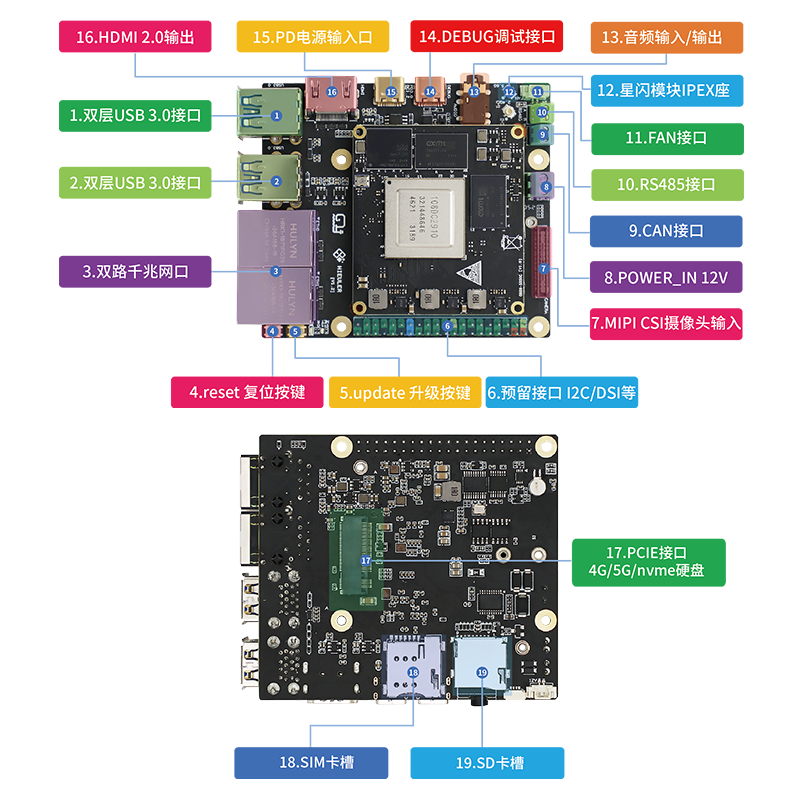

### 2. Feature List

- This feature list is based on the [Hi3403V100 HiSpark community edition](https://gitee.com/HiSpark/pegasus/tree/master), which currently supports only the openEuler operating system.

| No.  | Feature                | openEuler |
| :--- | :--------------------- | --------- |
| 00   | UART                   | ✔         |
| 01   | RS485                  | ✔         |
| 02   | OLED                   | ✔         |
| 03   | ADC                    | ✔         |
| 04   | PWM                    | ✔         |
| 05   | CAN Bus                | ✔         |
| 06   | ADC                    | ✔         |
| 07   | RTC Clock              | ✔         |
| 08   | Tsensor Chip Temperature | ✔       |
| 09   | TF (SD) Card           | ✔         |
| 10   | USB Flash Drive        | ✔         |
| 11   | PCIe SSD               | ✔         |
| 12   | UVC Camera             | ✔         |
| 13   | USB 5G Module (MT5710-CN) | ✔      |
| 14   | WiFi                   | ✔         |
| 15   | Bluetooth              | ✔         |
| 16   | SLE (SparkLink)        | ✔         |
| 17   | MIPI Camera            | ✔         |
| 18   | MIPI Display           | ✔         |
| 19   | Audio In/Out           | ✔         |
| 20   | Dual Gigabit RJ45      | ✔         |
| 21   | HDMI Output            | ✔         |

## Chapter 3: Building the openEuler System

- A pre-built openEuler image is available at [Eulerpi_OpenEuler_IMAGE](https://pan.baidu.com/s/1iyDzKp9ldcJz_wXmhs8JJw?pwd=e6eu). You may build it yourself or use the pre-built image. If using the pre-built image, skip the build steps and go directly to [Section 3: Flashing](#3、烧录).
- Prepare a server running Ubuntu 22.04. All build steps below are performed on Ubuntu 22.04.

### 1. Install Dependencies

The openEuler build depends on Docker and oebuild. Install them with:

```shell
sudo apt-get install git python3 python3-pip docker docker.io
pip install oebuild
```

Configure the Docker environment:

```shell
sudo usermod -a -G docker $(whoami)
sudo systemctl daemon-reload && sudo systemctl restart docker
sudo chmod o+rw /var/run/docker.sock
```

### 2. Build

#### Step 1: Initialize

Initialize the workspace and fetch the source code.

```shell
oebuild init ${workspace}
cd ${workspace}
oebuild update
```

> Parameter description:
>
> - `${workspace}`: name of the working directory, for example:
>
>   ```shell
>   oebuild init Euler_Pi_OE
>   cd Euler_Pi_OE
>   oebuild update
>   ```
>

#### Step 2: Configure the Build File

Configure the build file with `-p hieulerpi1` and `-f kernel6`, then enter the `bitbake` virtual environment.

```shell
oebuild generate -p hieulerpi1 -f kernel6
cd build/hieulerpi1
oebuild bitbake
```

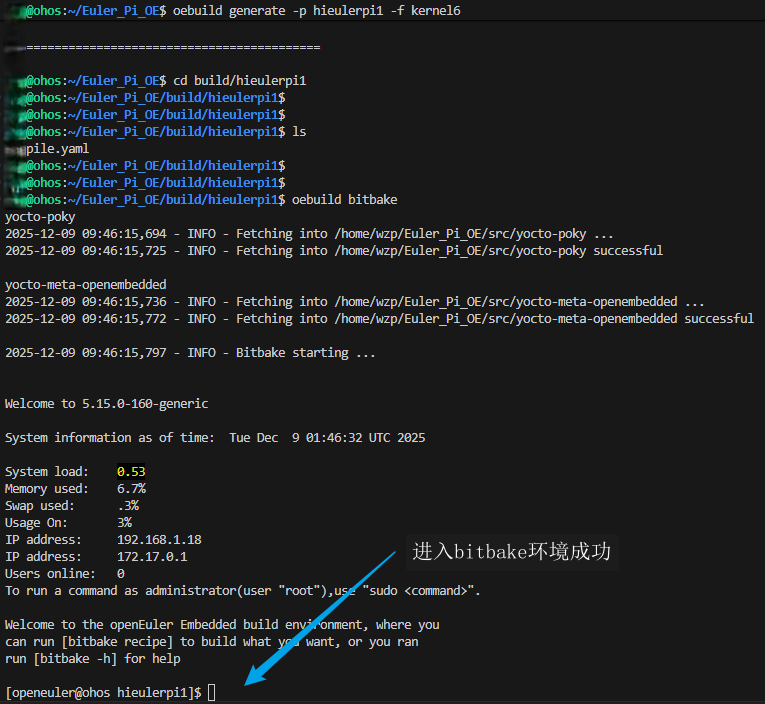

#### Step 3: Build

Build the image.

```shell
bitbake openeuler-image
```

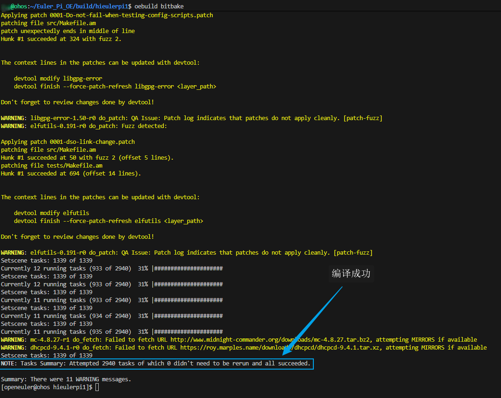

> Note:
>
> - You can clean and rebuild:
>
> ```
> bitbake openeuler-image -c cleanall
> bitbake openeuler-image
> ```
>
> - Clear the build cache:
>
> ```
> bitbake openeuler-image -c cleansstate
> ```

After a successful build, the kernel and root filesystem images are placed in the `output` directory. Only the kernel and root filesystem images are expected here. Copy the compiled kernel and root filesystem images to your Windows machine.

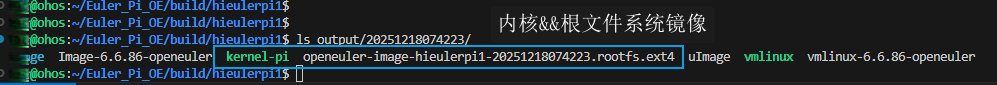

### 3. Flashing

Download [Eulerpi_OpenEuler_IMAGE](https://pan.baidu.com/s/1iyDzKp9ldcJz_wXmhs8JJw?pwd=e6eu) and use ToolPlatform to load the partition table as shown below. Select 4G or 8G based on your board configuration.

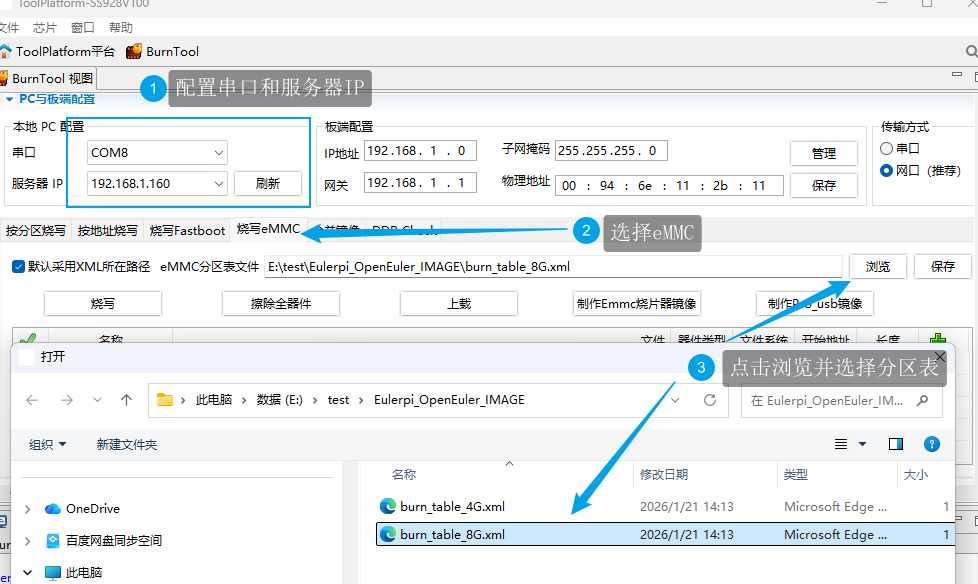

You can flash directly here using the pre-built images. If you want to flash your own custom-built images, continue with the steps below to replace the kernel and root filesystem images.

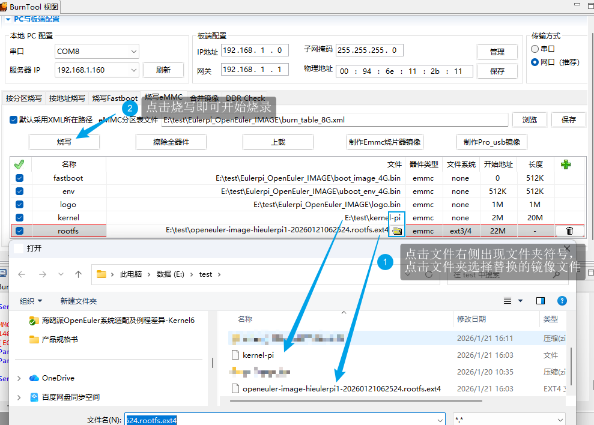

On first boot after flashing, you will be prompted to set an account and password. Recommended account: `root`, password: `@ebaina2026`.

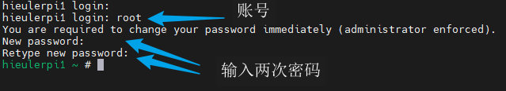

## Chapter 4: Euler Pi openEuler Quick Start (Example Verification)

- First flash the openEuler system image. Refer to [Chapter 3: Building the openEuler System](#三、openEuler系统构建) for the image and flashing steps.
- All tools used in this chapter come from the "04. Development Tools" section of the [【Ebaina】Euler Pi 2.0](https://pan.baidu.com/s/1GwvuEjbLGsMLyX8kkG8dlQ?pwd=s7hs) resource package.

### 1. Hardware Connection

Power on the Euler Pi board, then connect its debug port to the PC using a Type-C cable:

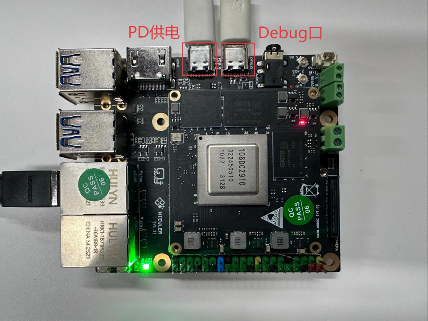

You can use "04. Development Tools/MobaXterm_Portable_v25.1_CHS" from the [【Ebaina】Euler Pi 2.0](https://pan.baidu.com/s/1GwvuEjbLGsMLyX8kkG8dlQ?pwd=s7hs) resource package as the connection tool.


Select Session, set the COM port number and baud rate to 115200, then click OK to connect to the Euler Pi:

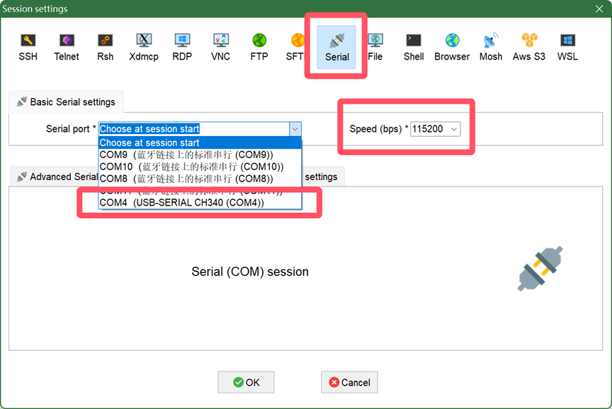

The COM port number can be found under Device Manager > Ports:

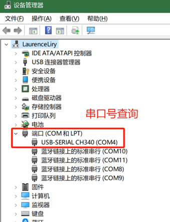

Note: If the screen is blank after connecting via serial port, press Ctrl+C and check whether you can log in. If it still does not work, try reconnecting the serial port.

### 2. Example Verification

#### 2.1. GPIO Operation Example

Using GPIO2_1 (Pin 13) as an example.

##### 2.1.1. Console Control

① Set High

Run `./gpio_ctrl.sh 1` to drive the pin high.

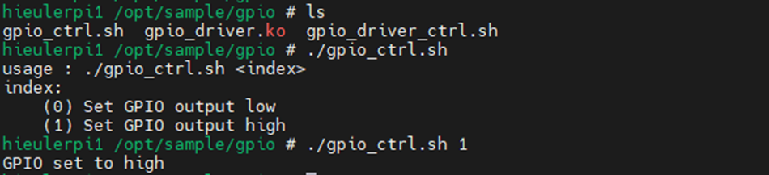

Measure with a multimeter: 1.8 V.

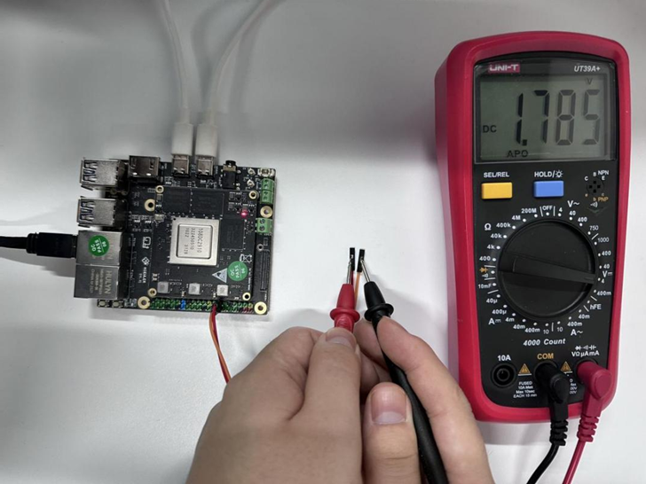

② Set Low

Run `./gpio_ctrl.sh 0` to drive the pin low.

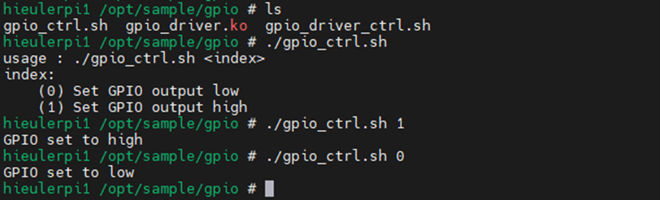

Measure with a multimeter: 0 V.

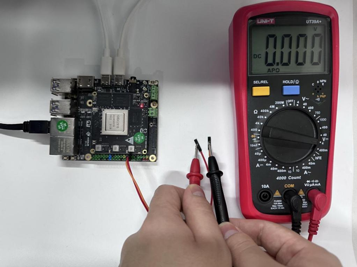

##### 2.1.2. Kernel-space Control

① Set High

Run `./gpio_driver_ctrl.sh 1` to drive the pin high.

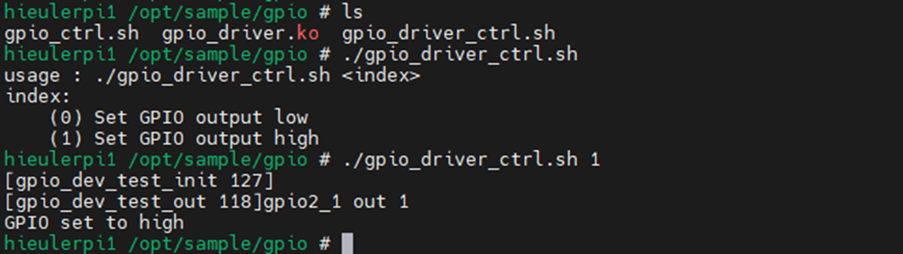

Measure with a multimeter: 1.8 V.

② Set Low

Run `./gpio_driver_ctrl.sh 0` to drive the pin low.

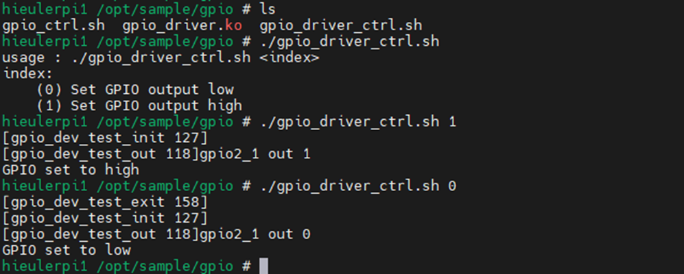

Measure with a multimeter: 0 V.

##### 2.1.3. Note

If testing both methods in sequence, release the resources from the previous method before proceeding.

```shell
echo 17 > /sys/class/gpio/unexport  //release resources before testing kernel-space control
rmmod gpio_driver    //unload the driver before testing console control
```

#### 2.2. UART / RS485

##### 2.2.1. UART4 on the 40-Pin IO Header

① Hardware Connection

| 40-Pin IO        | USB-to-TTL |
| ---------------- | ---------- |
| UART4_TXD (Pin8) | RXD        |
| UART4_RXD (Pin10)| TXD        |
| GND (Pin9)       | GND        |

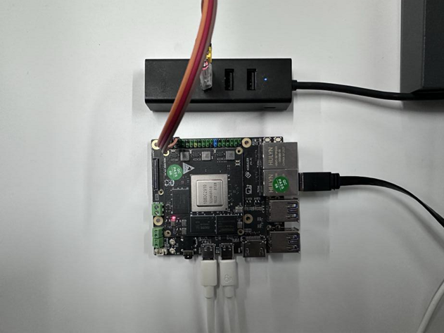

② Pin Multiplexing

```shell
bspmm 0x102f0134 0x1201    //UART4_RXD
bspmm 0x102f0138 0x1201    //UART4_RXD
```

③ Functional Verification

```shell
./hi_uart_sample /dev/ttyAMA4 115200
```

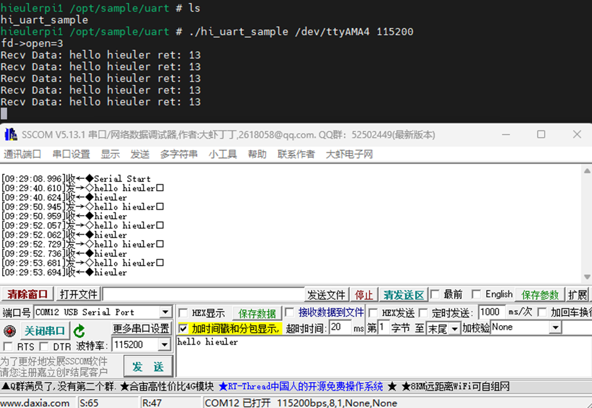

##### 2.2.2. RS485

① Hardware Connection

| J12  | USB-to-RS485 |
| ---- | ------------ |
| Pin2 | A            |
| Pin1 | B            |

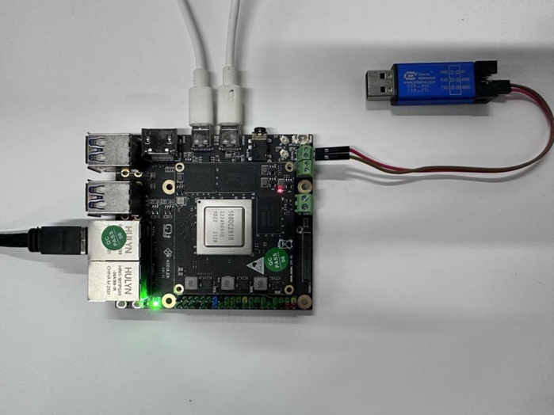

② Pin Multiplexing

```shell
bspmm 0x102f012c 0x1201  //UART3_RXD
bspmm 0x102f0130 0x1201  //UART3_TXD
```

③ Functional Verification

```shell
./hi_uart_sample /dev/ttyAMA3 115200
```

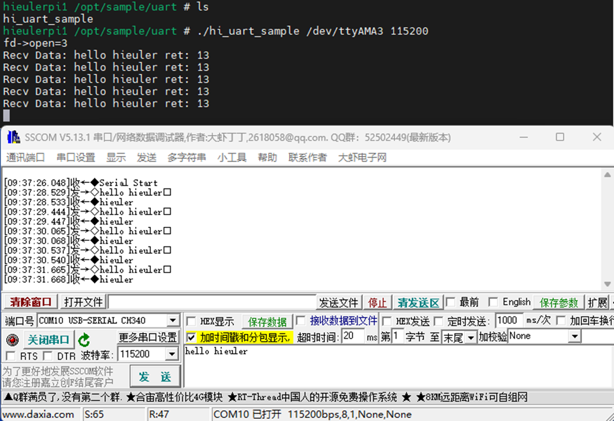

#### 2.3. I2C (OLED Display)

① Hardware Connection

| OLED Pin | Euler Pi 40-Pin IO Header |
| -------- | ------------------------- |
| VCC (5V) | 5V (Pin4)                 |
| GND      | GND (Pin6)                |
| SCL      | SCL (Pin5)                |
| SDA      | SDA (Pin3)                |

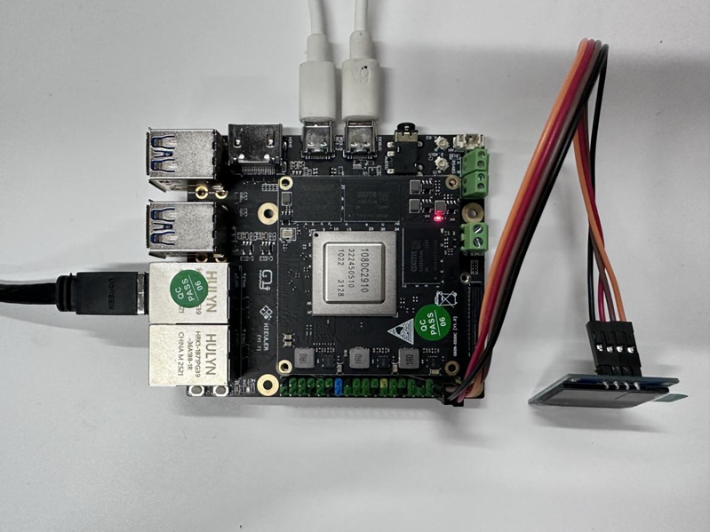

② Load Driver

Load the driver on the board and check the device node.

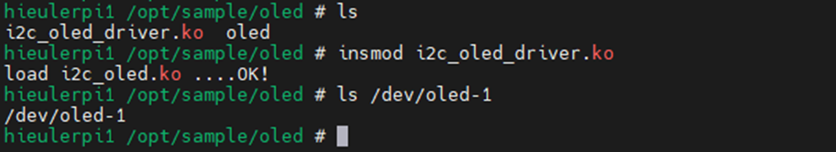

③ Functional Verification

```shell
./oled /dev/oled-1 1
```

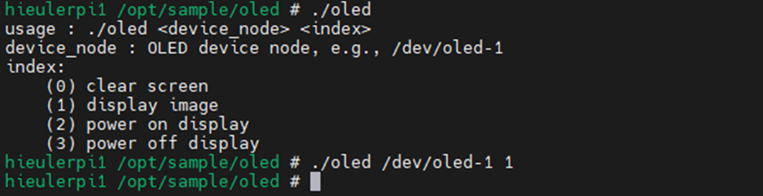

After running the example, the OLED display shows the Ebaina whale logo normally.

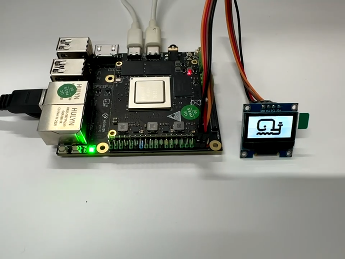

#### 2.4. ADC

① Hardware Connection

The reserved 40-Pin IO Pin11 is LSADC_CH3. Prepare two jumper wires and connect them to the 40-PIN expansion header on the Euler Pi: ADC pin is Pin11, GND pin can be Pin9.

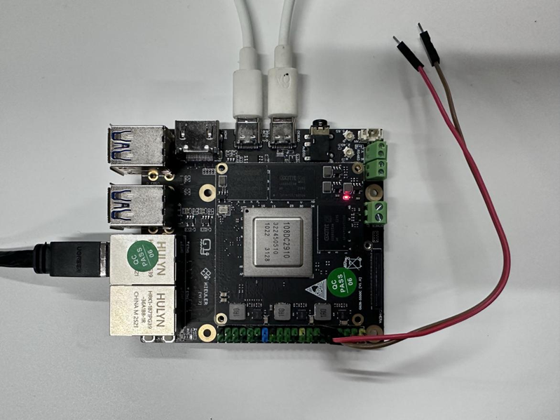

② Pin Multiplexing

```shell
bspmm 0x102F00FC 0x1200
```

③ Functional Verification

a. Driver starts enabled by default

```shell
insmod hi_adc.ko auto_run=1   //auto_run 0: disabled by default  1: enabled by default
```

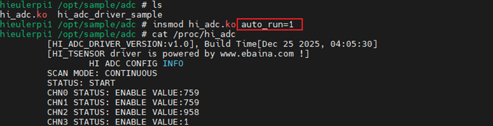

Pin11 (ADC) connected to Pin9 (GND):

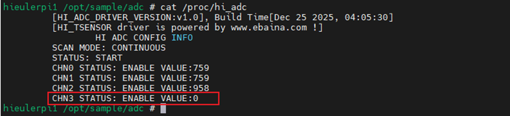

Pin11 (ADC) connected to 1.8 V (maximum ADC input is 1.8 V; voltages above 1.8 V may damage the chip):

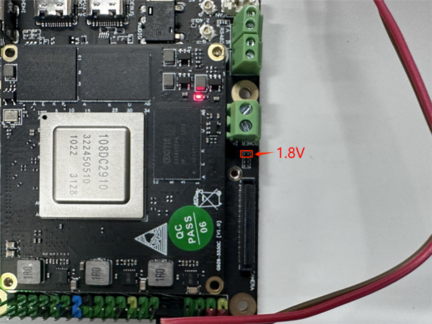

b. Driver disabled by default; values retrieved from user space

```shell
insmod hi_adc.ko auto_run=0
```

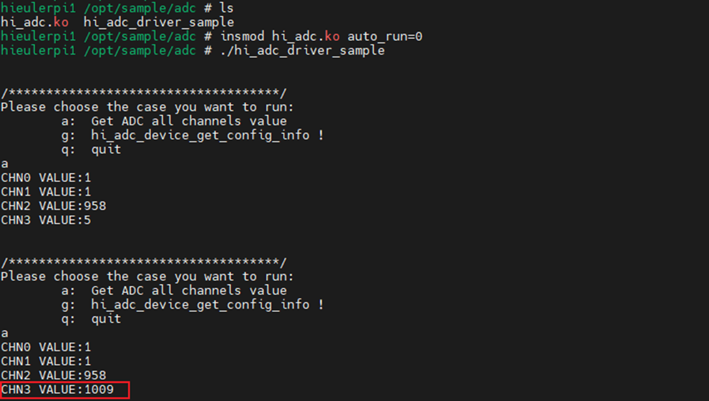

#### 2.5. PWM (Servo)

① Hardware Connection

| Servo Wire         | EULER_40PEXP Expansion Board |
| ------------------ | ----------------------------- |
| Red (5V)           | J5 Pin3                       |
| Brown (GND)        | J5 Pin1                       |
| Yellow (Signal)    | J5 Pin5                       |

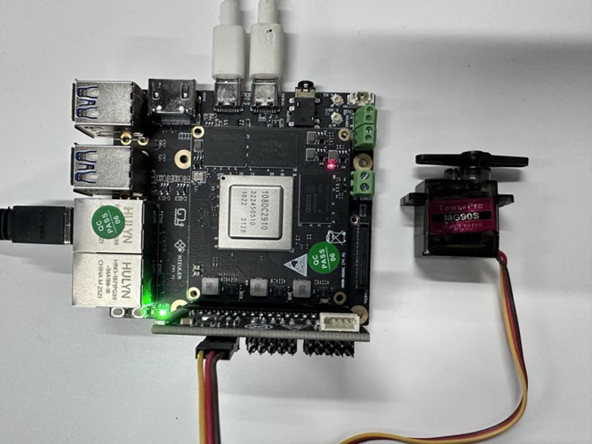

The reserved 40-Pin IO Pin32 is PWM0_OUT1_0_P.
Note: PWM servo control (connecting directly to Pin32 will not rotate the servo due to insufficient voltage; use the expansion board instead).

② Pin Multiplexing

```shell
bspmm 0x102f01ec 0x1201
```

③ Functional Verification

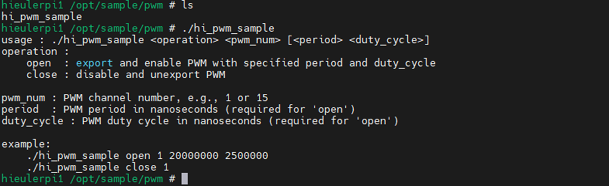

Running `open` causes the MG90S TowerPro servo to rotate 360°.

```shell
./hi_pwm_sample open 1 20000000 2500000
./hi_pwm_sample open 1 20000000 500000
```

#### 2.6. CAN (USB-to-CAN)

① Hardware Connection

| USB-to-CAN |                           |
| ---------- | ------------------------- |
| GND        | GND (40-Pin IO Pin6)      |
| RX/CAN_H   | CAN_H (CAN Pin2)          |
| TX/CAN_L   | CAN_L (CAN Pin1)          |

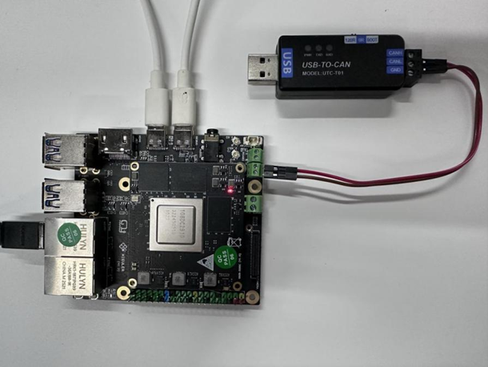

② Pin Multiplexing

```shell
#SPI-to-CAN pin multiplexing
# SPI0_SCLK
bspmm 0x0102F01D8 0x1201 > /dev/null
# SPI0_SDO
bspmm 0x0102F01DC 0x1201 > /dev/null
# SPI0_SDI
bspmm 0x0102F01E0 0x1201 > /dev/null
# SPI0_CSN
bspmm 0x0102F01E4 0x1201 > /dev/null
# SYS_RSTN
bspmm 0x0102F0114 0x1201 > /dev/null
# CAN_INT
bspmm 0x0102F0030 0x1200 > /dev/null
```

③ Functional Verification

```shell
ip link set can0 type can bitrate 500000
ip link set can0 up
```

Open PCAN-View software.

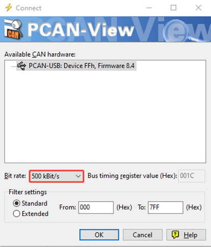

```shell
cansend can0 123#8877665544332211        //send
candump can0                             //receive
```

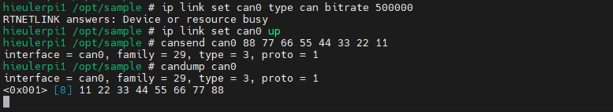

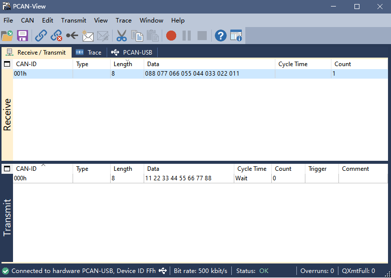

#### 2.7. RTC Clock

Query and set the RTC clock as follows:

```shell
hwclock -r     #read RTC clock
date -s "2025-06-23 19:30:00"     #set system time
hwclock -w     #write system time to RTC
```

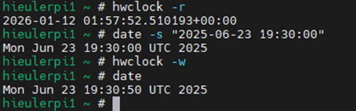

Disconnect power (including the debug serial cable), wait a while, then power on and query the time.

#### 2.8. Tsensor Chip Temperature

Note: Currently only supported on openEuler.

Tsensor is the chip temperature sensor driver for the Euler Pi's main controller SS928V100. It is used to read the chip temperature of the main controller:

```
cat /proc/Tsensor
```

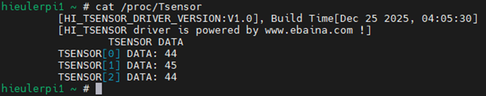

#### 2.9. Storage

##### 2.9.1. TF (SD) Card

① Hardware Connection

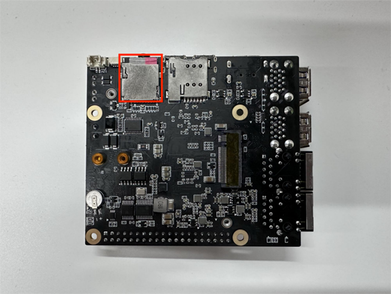

② Functional Verification

When a TF card is inserted, relevant information is printed on the debug serial console:

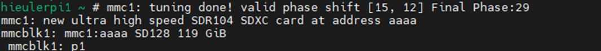

a. View TF card and partition details

```shell
fdisk -l      //check whether the TF card is recognized correctly
```

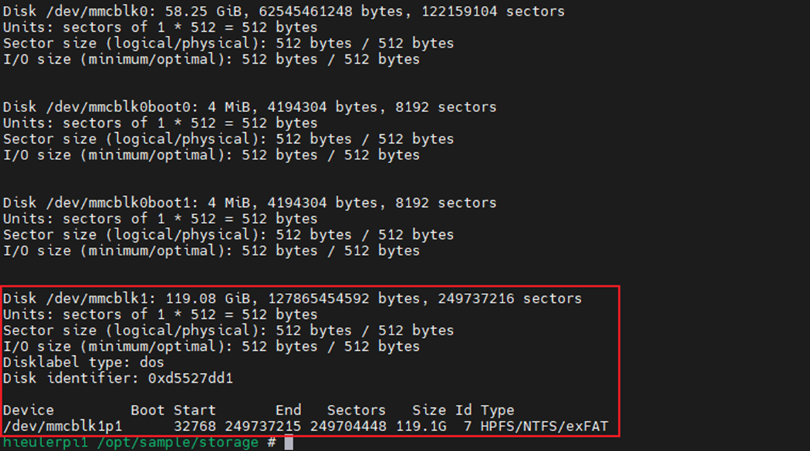

b. Format a partition

```shell
mkfs.vfat /dev/mmcblk1p1  //mkfs.vfat can be replaced with other formats such as mkfs.ext4
```

c. Test read/write speed

```shell
./test_storage.sh /dev/mmcblk1p1
```

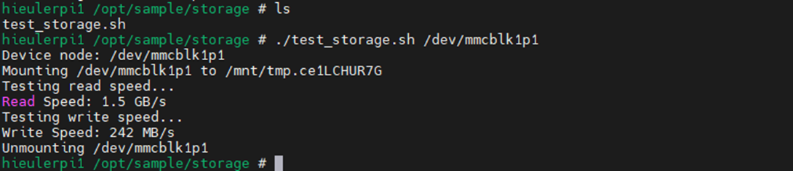

##### 2.9.2. USB Flash Drive

① Hardware Connection

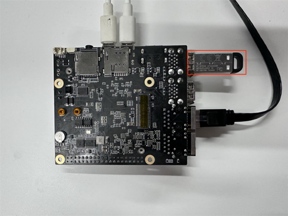

② Functional Verification

When a USB flash drive is inserted, relevant information is printed on the debug serial console:

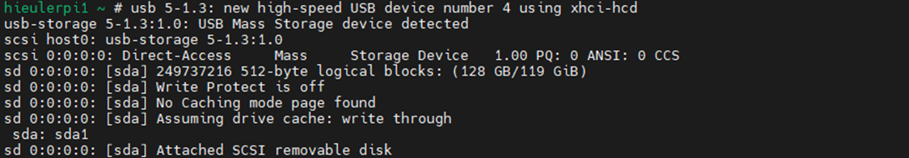

a. View USB flash drive and partition details

```shell
fdisk -l    
```

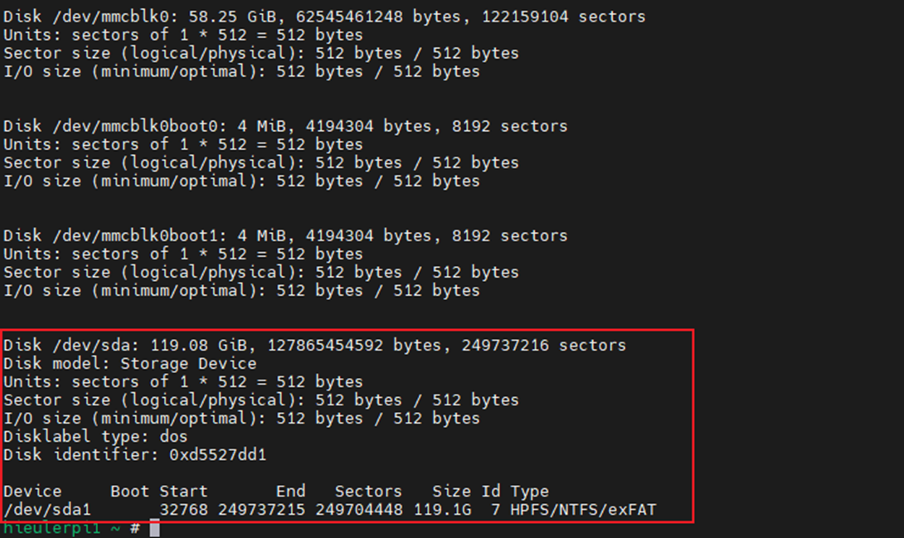

b. Format a partition

```shell
mkfs.vfat /dev/sda1  
```

c. Test read/write speed

```shell
./test_storage.sh /dev/sda1  
```

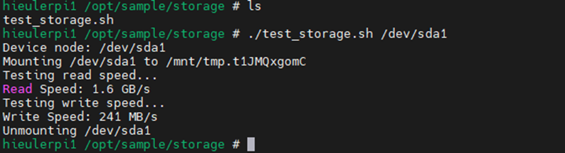

##### 2.9.3. PCIe SSD

① Hardware Connection

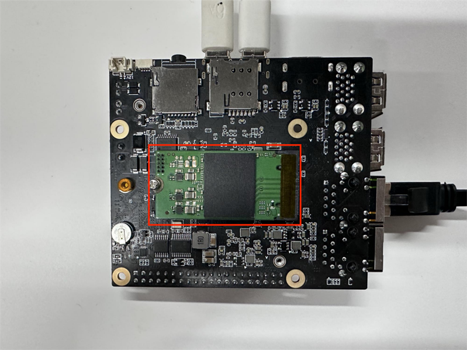

<font color="red">**Note: The PCIe SSD is not a hot-plug device. After connecting a PCIe SSD, a reboot is required for the device to be recognized.**</font>

PCIe SSD requirements: NVMe M.2 protocol, with a B&M Key (notch on both sides).

② Functional Verification

a. View PCIe SSD and partition details

```shell
fdisk -l     
```

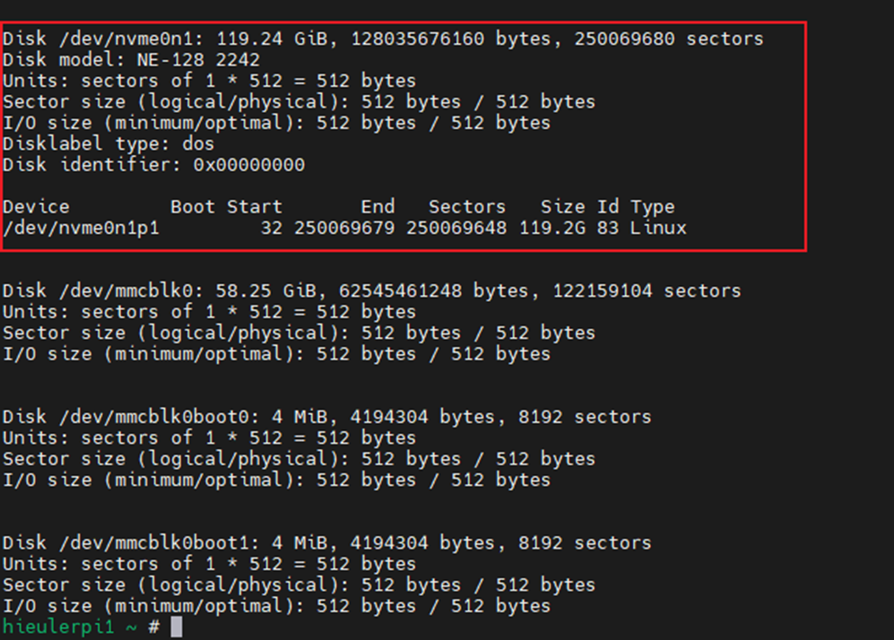

b. Format a partition

```shell
mkfs.vfat /dev/nvme0n1p1 
```

c. Test read/write speed

```shell
./test_storage.sh /dev/nvme0n1p1
```

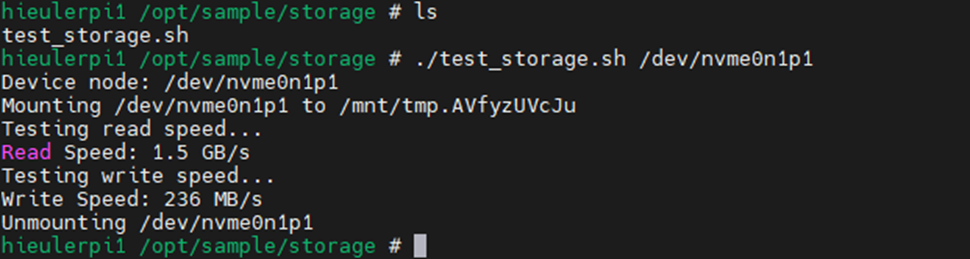

#### 2.10. USB UVC Camera

① Hardware Connection

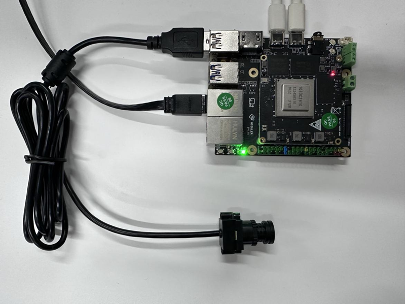

② Functional Verification

Kernel log when a UVC camera is connected:

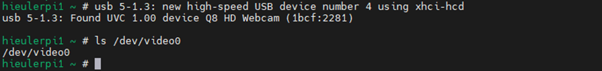

Query supported video formats of the USB camera:

```shell
./sample_uvc /dev/video0 --enum-formats
```

After connecting an HDMI monitor, pass the supported video format as a parameter:

```shell
./sample_uvc /dev/video0 -fMJPEG -s1280x720 -Ftest.mjpg
```


#### 2.11. 5G Module

##### 2.11.1. USB 5G RedCap (MT5710-CN)

① Hardware Connection

Mount the RedCap module onto the adapter board, install the SIM card in the adapter board slot, then plug the adapter board into the USB port.


② Functional Verification

a. Kernel log when module is connected


b. Verify PCUI port is working

Open two terminals — one to print output: `cat /dev/ttyUSB1`, the other to send AT commands:

```shell
#Terminal 1
stty -F /dev/ttyUSB1 -echo       #disable echo
cat /dev/ttyUSB1
#Terminal 2
echo -e "ATE1\r\n" > /dev/ttyUSB1
```


c. Dial-up test

```shell
echo -e "AT^NDISDUP=1,1\r\n" > /dev/ttyUSB1
udhcpc -i usb0
```


#### 2.12. SparkLink Module (WS73)

##### 2.12.1. WiFi

① STA Mode Test

Connects to the wireless network with SSID `ebaina-703` by default (this is the WiFi name used in this documentation's development environment; use your actual WiFi SSID and password).

```shell
vi /etc/wireless/wpa_supplicant.conf 
//run only if you need to change the SSID and password
```


a. Power on/off the module

```shell
mcu_tool /dev/i2c-0 0x10 nl off
mcu_tool /dev/i2c-0 0x10 nl on
```

b. Enable WiFi

```shell
./wifi_sta.sh 0
```


Run `ifconfig` to view the IP address.


If the connected WiFi has internet access, test with ping:

```shell
ping -I wlan0 www.baidu.com
```


c. Disable WiFi

```shell
./wifi_sta.sh 1
```


② AP Mode Test

Default AP SSID: `HiEuler_PI_AP`, password: `12345678`.

```shell
vi /etc/wireless/hostapd.conf 
//run only if you need to change the SSID, password, or gateway
```


a. Power on/off the module

```shell
mcu_tool /dev/i2c-0 0x10 nl off
mcu_tool /dev/i2c-0 0x10 nl on
```

b. Enable WiFi

```shell
./wifi_ap.sh 0
```


c. Disable WiFi

```shell
./wifi_ap.sh 1
```


##### 2.12.2. Bluetooth

① Power on/off the module

```shell
mcu_tool /dev/i2c-0 0x10 nl off
mcu_tool /dev/i2c-0 0x10 nl on
```

② Load the driver
Note: On openEuler, only the driver needs to be loaded (dbus and bluetoothd are enabled by default). Load the driver as follows:

```shell
insmod plat_soc.ko
insmod ble_soc.ko
```


③ Start bluetoothctl

Copy and paste the two lines shown in green in the `ble.sh` output into the terminal, then run `bluetoothctl` to enter the Bluetooth shell.

```shell
bluetoothctl
```


a. Power on the Bluetooth device

```shell
power on
```


b. Scan for devices

After scanning and finding the target device, use `scan off` to stop.

```shell
scan on
```


c. View scan results

```shell
devices
```


d. Connect to a device

```shell
connect <bluetooth-device-address>     //connect to a Bluetooth device
disconnect <bluetooth-device-address>  //disconnect
```


e. Power off Bluetooth

```shell
power off
```


f. Exit bluetoothctl

```shell
exit
```

##### 2.12.3. SparkLink (SLE)

Prepare two boards (named Board A and Board B) and attach antennas to both.

① Power on/off the module

Run on both Board A and Board B:

```
mcu_tool /dev/i2c-0 0x10 nl off
mcu_tool /dev/i2c-0 0x10 nl on
```

② Functional Verification

Run on Board A:

```shell
./sle_server.sh 0
```

Run on Board B:

```shell
./sle_client.sh 0
```


After A and B connect, Board A (server) continuously prints the received data rate.


#### 2.13. MIPI_RX (Sensor)

##### 2.13.1. Adapter Board Description

a. EULER_1R2D V1.0 Adapter Board

| -    | sensor0 (4-lane) | I2C5 |
| ---- | ---------------- | ---- |
| J3   | dtof (2-lane)    | I2C4 |
| J4   | dtof (2-lane)    | I2C5 |

EULER_1R2D V1.0 adapter board diagram:


b. EULER_2R V1.0 Adapter Board

| J3   | sensor0 (4-lane) | I2C5 |
| ---- | ---------------- | ---- |
| J4   | sensor1 (4-lane) | I2C7 |

EULER_2R V1.0 adapter board diagram:


c. EULER_4SEN V1.0 Adapter Board

| sensor0 (2-lane) | I2C7 |
| ---------------- | ---- |
| sensor1 (2-lane) | I2C5 |
| sensor2 (2-lane) | I2C4 |
| sensor3 (2-lane) | I2C6 |

EULER_4SEN V1.0 adapter board diagram:


d. Image Sensor Compatibility

| Sensor Model  | EULER_1R2D V1.0 | EULER_2R V1.0     | EULER_4SEN V1.0   |
| ------------- | --------------- | ----------------- | ----------------- |
| Sony IMX347   | 4-lane sensor0  | 4-lane sensor(0~1)| 2-lane sensor(0~3)|
| OV OS04A10    | 4-lane sensor0  | 4-lane sensor(0~1)| ↻                 |
| OV OS08A20    | 4-lane sensor0  | 4-lane sensor(0~1)| ↻                 |
| Smart SC450AI | 4-lane sensor0  | 4-lane sensor(0~1)| 2-lane sensor(0~3)|

Notes:

① The test program HDMI output is 1080P60.

② The sensor clock must be configured before testing any sensor.

##### 2.13.2. Sensor Clock Configuration

① Method 1: Modify the `load_ss928v100` script parameters


OS04A10 and OS08A20 use the same clock, so configuring one is sufficient (default is imx347 when no parameter is specified).

```shell
./load_ss928v100 -i -sensor0 os08a20 -sensor1 os08a20 -sensor2 os08a20 -sensor3 os08a20
```


② Method 2: Modify the clock configuration registers

```shell
bspmm 0x11018440 0x4001    #Configure Sensor0 to 24 MHz
bspmm 0x11018460 0x4001    #Configure Sensor1 to 24 MHz
bspmm 0x11018480 0x4001    #Configure Sensor2 to 24 MHz
bspmm 0x110184A0 0x4001    #Configure Sensor3 to 24 MHz
```

| Model   | Clock Register Value | Clock Frequency |
| ------- | -------------------- | --------------- |
| IMX347  | 0x8001               | 37.125 MHz      |
| OS04A10 | 0x4001               | 24 MHz          |
| OS08A20 | 0x4001               | 24 MHz          |
| SC450AI | 0xA001               | 27 MHz          |

For details, refer to the "21AP10 Ultra-HD Smart NVR SoC User Guide" PDF.


##### 2.13.3. IMX347

Configure the sensor clock before testing IMX347.

① 1×4-lane VIO

a. Hardware Connection

EULER_1R2D V1.0 adapter board wiring:


EULER_2R V1.0 adapter board wiring:


b. Functional Verification

```shell
./sample_vio 0 0
```


② 2×4-lane VIO

a. Hardware Connection

EULER_2R V1.0 adapter board wiring:


b. Functional Verification

```shell
./sample_vio 2 0
```


##### 2.13.4. OS04A10

Configure the sensor clock before testing OS04A10.

① 1×4-lane VIO

a. Hardware Connection

EULER_1R2D V1.0 adapter board wiring:


EULER_2R V1.0 adapter board wiring:


b. Functional Verification

```shell
./sample_vio 0 0
```


② 2×4-lane VIO

a. Hardware Connection

EULER_2R V1.0 adapter board wiring:


b. Functional Verification

```shell
./sample_vio 2 0
```


##### 2.13.5. OS08A20

Configure the sensor clock before testing OS08A20.

① 1×4-lane VIO

a. Hardware Connection

EULER_1R2D V1.0 adapter board wiring:


EULER_2R V1.0 adapter board wiring:


b. Functional Verification

```shell
./sample_vio 0 0
```


② 2×4-lane VIO

a. Hardware Connection

EULER_2R V1.0 adapter board wiring:


b. Functional Verification

```shell
./sample_vio 2 0
```


##### 2.13.6. SC450AI

Configure the sensor clock before testing SC450AI.

① 1×4-lane VIO

a. Hardware Connection

EULER_1R2D V1.0 adapter board wiring:


EULER_2R V1.0 adapter board wiring:


b. Functional Verification

```shell
./sample_vio 0 0
```


② 2×4-lane VIO

a. Hardware Connection

EULER_2R V1.0 adapter board wiring:


b. Functional Verification

```shell
./sample_vio 2 0
```


③ 4×2-lane VIO

a. Hardware Connection

EULER_4SEN V1.0 adapter board wiring:


b. Functional Verification

Sensor2 and sensor3 reset requires a GPIO reset; run the `sns23_reset_4x2lane.sh` script.

- Sensor driver: 2lane_30fps_2688x1520:

```shell
./sns23_reset_4x2lane.sh
./sample_vio_4x2lane_4M
```


- Sensor driver: 2lane_30fps_1920x1080:

```shell
./sns23_reset_4x2lane.sh
./sample_vio_4x2lane_2M
```


#### 2.14. MIPI_TX (MIPI Display)

① Hardware Connection

Connect the screen's 40-pin connector to the LED-labeled end of the adapter board.


② Functional Verification

```shell
./sample_vdec
```


Backlight and reset control scripts that may be needed:


#### 2.15. Audio

① Audio Input


② Audio Output


