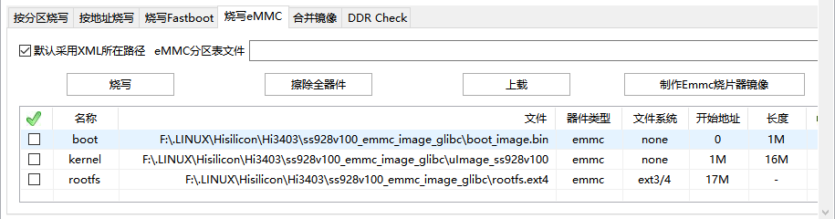

## Building Buildroot System Image Based on Pegasus This document describes how to build a Buildroot image using the hispark/pegasus project. The vendor/LubanCat-Hi3403 directory stores the files required for building a Buildroot image for the LubanCat-Hi3403 board. - patch: directory for storing patch files
- files: directory for storing files other than patch files, including the register configuration table used by the boot image and the firmware required by the onboard WiFi module
- patch_build.sh: auxiliary script for applying patches ### Compilation Environment Setup #### Installing Dependency Packages For setting up the SDK compilation environment, please refer to [Hi3403V100 Environment Setup Guide - Setting Up SDK Environment](/get-started/environment/) If only compiling the LubanCat-Hi3403 Buildroot image, only the following steps are required: - [Setting Up the Base Environment](/get-started/environment/#21-setting-up-the-base-environment)
- [Downloading the Code Repository](/get-started/environment/#22-downloading-the-code-repository)
- [Downloading Open Source Software](/get-started/environment/#23-downloading-open-source-software)
- [Installing the GCC Cross-Compiler](/get-started/environment/#242-installing-the-gcc-cross-compiler) After the above steps, the basic compilation environment is set up. #### Applying Patches The patching operation requires a clean, unmodified SDK; otherwise, applying patch files may fail. Run `./patch_build.sh` in the vendor/LubanCat-Hi3403 directory to execute the patching script. When executing the patching script, patch files from the patch directory will be copied to the corresponding paths with pegasus as the top-level directory, and patches will then be applied. Files from the files directory will also be copied to their corresponding locations. For open source projects in the platform/Hi3403V100_gcc/open_source directory, the source code packages will be extracted and patch files applied during the first compilation. When patch files have been modified, you can delete the extracted source code folder in the corresponding directory and rerun the compilation command to re-apply the patches. For patch files in other locations, they will be applied when the patch_build.sh script is run. After applying patches, you also need to download the Buildroot source code package and place it in the platform/Hi3403V100_gcc/open_source/buildroot directory. Download URL: https:/buildroot.org/downloads/buildroot-2024.02.10.tar.gz ### Compilation Instructions The compilation commands below must be run in platform/Hi3403V100_gcc/osdrv. Some parameter configurations have been written into the Makefile as default values. - LLVM = 0
- CHIP = Hi3403V100
- DDR_SIZE = 8GB
- OSDRV_CROSS = aarch64-openeuler-linux-gnu
- ARCH_TYPE = arm64
- BOOT_MEDIA = emmc The default compilation parameter for total board memory capacity DDR_SIZE is 8GB. When using boards with different capacities, modify DDR_SIZE to the actual board capacity.
Currently sold versions are 8GB and 4GB. Check by looking at the onboard DDR chip model numbers — a single FLXC4004G chip size is 4GB, two chips total 8GB. When compiling with the above default values, parameters can be omitted, for example:
```
# Full compilation command
make LLVM=0 BOOT_MEDIA=emmc CHIP=Hi3403V100 DDR_SIZE=8GB all # Abbreviated
make all # Modify some parameters
make DDR_SIZE=4GB all
``` ### Compiling Boot and Kernel ```
# Compile boot image
# Total DDR capacity 4GB
# make DDR_SIZE=4GB gslboot_build
# Total DDR capacity 8GB
# make DDR_SIZE=8GB gslboot_build # Compile kernel image
make atf # Modify kernel configuration file
# Full command
make kernel_menuconfig
# Abbreviated command
make kconfig
``` The compiled boot image is saved at platform/Hi3403V100_gcc/osdrv/pub/Hi3403V100_emmc_image_glibc/boot_image.bin The compiled kernel image is saved at platform/Hi3403V100_gcc/osdrv/pub/Hi3403V100_emmc_image_glibc/uImage_Hi3403V100 ### Building the Buildroot Root Filesystem The purpose of each file in the Buildroot directory: - readme.txt: instructions for downloading the source code package
- Hi3403V100_lbc_defconfig: default Buildroot configuration file
- overlay: files to be overlaid onto the root filesystem generated by Buildroot
- dl: directory for saving source code packages downloaded by Buildroot, to accelerate subsequent compilation ```
# Package the Buildroot root filesystem image, including kernel ko modules
make rootfs_build # Build Buildroot alone
make buildroot # Modify the Buildroot configuration file
# Full command
make buildroot_menuconfig
# Abbreviated command
make bconfig # Clean Buildroot
buildroot_clean
``` If you need a completely new Buildroot build, you can delete buildroot-2024.02.10 in the platform/Hi3403V100_gcc/open_source/buildroot directory, then re-execute the above build commands. The root filesystem image packages the kernel ko files. If the kernel ko configuration has been modified, the root filesystem image needs to be regenerated. The built root filesystem image file is saved at platform/Hi3403V100_gcc/osdrv/pub/Hi3403V100_emmc_image_glibc/rootfs.ext4 ### Flashing It is recommended to use ToolPlatform v5.6.58 for Flashing, as this version includes the USB Flashing function. - When Flashing the boot image, use serial port Flashing. The boot partition can only be flashed via the serial port.
- When Flashing kernel and rootfs, use USB Flashing for fast speed. The board has onboard eMMC storage for system boot. Select **Burn eMMC** in the Flashing software. Partition configuration is as follows:  | File | Partition | Partition Address Range | Partition Size | Description |
| ---------------- | --------- | ----------------------- | -------------- | -------------------------------------------------------- |
| boot_image.bin | boot | 0–1M | 1M | Boot image, must match the board DDR size and type |
| uImage_Hi3403V100 | kernel | 1M–17M | 16M | Kernel image, including device tree |
| rootfs.ext4 | rootfs | 17M–image size | image size | Root filesystem image, set to "-" for auto-adaptation | When configuring partition addresses, strictly follow the addresses in the table above. For the last partition, the partition length during Flashing should be configured to be greater than or equal to the actual file size to be flashed. It can also be set directly to "-", and the Flashing software will automatically adapt the image size for Flashing. ### Running the System After Flashing is complete, connect the debug serial port at 115200 baud rate and enter the following commands in the U-Boot command line terminal: ```
# Environment variable configuration
setenv bootargs 'mem=512M console=ttyAMA0,115200 clk_ignore_unused rw rootwait root=/dev/mmcblk0p3 rootfstype=ext4 blkdevparts=mmcblk0:1M(uboot.bin),16M(kernel),-(rootfs.ext4)'; # Set kernel boot parameters
setenv bootcmd 'mmc read 0 0x50000000 0x800 0x8000; bootm 0x50000000'; # Save environment configuration
saveenv # Reboot
reset
``` - blkdevparts represents the partition table; mmcblk0 is eMMC; partition names are in parentheses, with the partition size preceding the parentheses; 16M means a partition size of 16MB, and "-" means using all remaining space (only applicable to the last partition)
- This partition table configuration must correspond to the flashing tool configuration. The partition image sizes in the flashing tool should be less than or equal to the partition sizes in this table (except for the last partition), and the start addresses must strictly correspond to this table. After modification, re-power the board or run the boot command to load the kernel and run the system. The Buildroot system by default allows root user login via SSH and sets a password for root: Username: root Password: root The initial rootfs partition size is the size of the rootfs image. To facilitate distribution and fast Flashing, only a small amount of free space is set when building the rootfs image.
After logging into the system for the first time, manually run the `resize2fs /dev/mmcblk0p3` command to expand the rootfs partition to the remaining eMMC space.
