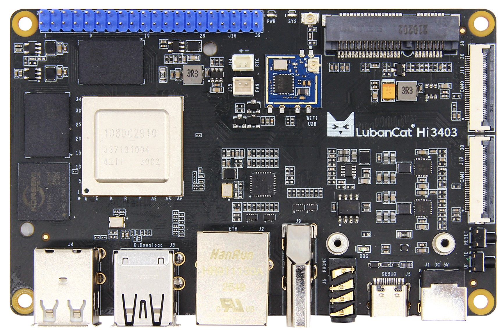
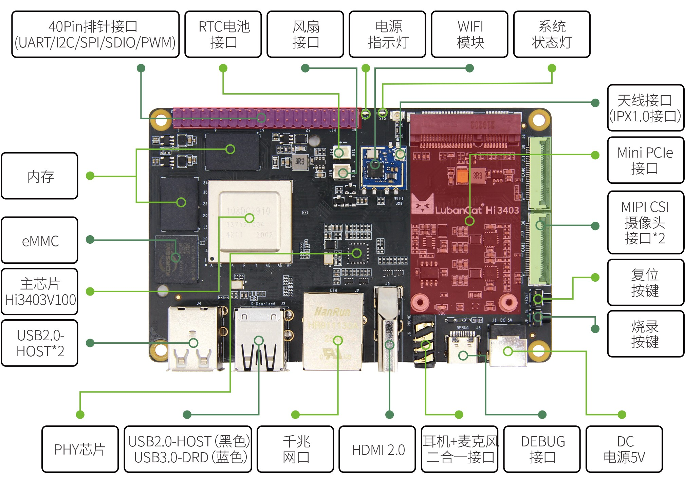
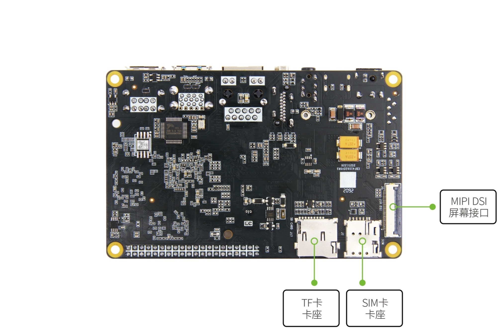

---
title: "LubanCat-Hi3403 (野火 / EmbedFire)"
source: /sessions/sharp-sweet-allen/mnt/hi3403-build/pegasus/vendor/LubanCat-Hi3403/README.md
--- ## Product overview  The Luban Cat-Hi3403 family is a high-performance single-board computer
from Embed Fire built around the Hi3403V100. The board exposes a
generous set of peripherals, and ships with full SDK / driver source
and schematics so you can prototype and iterate quickly. Luban Cat-Hi3403 uses an SoC that combines a quad-core Cortex-A55 CPU
with a high-efficiency NPU. On-board you get large e MMC storage and
high-bandwidth dual-channel LPDDR4X memory. Peripherals include
gigabit Ethernet, Wi-Fi 6, HDMI 2.0, USB 3.0, Mini-PC Ie, MIPI-CSI,
MIPI-DSI, and audio jacks. The general-purpose USB and Mini-PC Ie
slots in particular open up a wide range of use cases. That breadth means Luban Cat-Hi3403 fits both as a standalone
high-performance SBC and as an embedded mainboard for image capture,
display, control, and networking applications. - Quick-start manual + board guide: [open](https:/doc.embedfire.com/linux/hi3403/quick_start) (based on the Embed Fire firmware release; the online wiki is updated continuously)
- Building Buildroot for Hi3403: [open](./doc/Based on Hi3403build Buildroot System Mirroring.md)
- Luban Cat-Hi3404 functional verification: [open](./doc/Luban Cat-Hi3404Functionverify Description.md) (verifying functions on a Buildroot image built for Hi3403) ## Hardware specs | Board | Luban Cat-Hi3403 |
| --- | --- |
| Power | DC 5V @ 3A input |
| Main SoC | Hi3403V100 (quad-core Cortex-A55 @ 1.4 G Hz, 32-bit MCU @ 500 M Hz, NPU up to 10.4 TOPS @ INT8) |
| RAM | LPDDR4X 4 GB / 8 GB |
| Storage | e MMC 32 GB / 64 GB for the OS |
| Ethernet | 1× 10/100/1000 Mbit/s auto-negotiating |
| Wi-Fi | On-board Wi-Fi 6, single-band 2.4 G Hz, up to 287 Mbit/s |
| USB 2.0 | 3× Type-A (host) |
| USB 3.0 | 1× Type-A, supports USB-DRD; usable as a firmware-burn port |
| Debug UART | On-board CH340N USB-UART, exposed as Type-C; 115200-8-N-1 by default; also doubles as a firmware-burn UART |
| Buttons | RESET, UPDATE (burn-mode) |
| LE Ds | Power (red), system status (green) |
| Audio | 3.5 mm 4-segment combo headphone-out + mic-in (US standard) |
| 40-pin header | PWM, GPIO, I2C, SPI, UART — note: all I/O is 1.8 V |
| Mini-PC Ie | Full-height fixed-mount slot exposing USB 2.0 + PC Ie gen 2 ×1 |
| SIM | nano-SIM slot, paired with the Mini-PC Ie slot for 4G/5G modems |
| HDMI | HDMI 2.0; up to 4K @ 60 fps output |
| MIPI-DSI | 1× 4-lane MIPI video output for MIPI displays |
| MIPI-CSI | 2× 4-lane MIPI video input for MIPI cameras |
| TF card | Up to 512 GB SDXC, storage expansion only |
| Fan | 2-pin 1.5 mm ZH socket + 5 V supply, PWM-controlled |
| RTC battery | 2-pin 1.25 mm wire-to-board header for the on-board RTC | 

