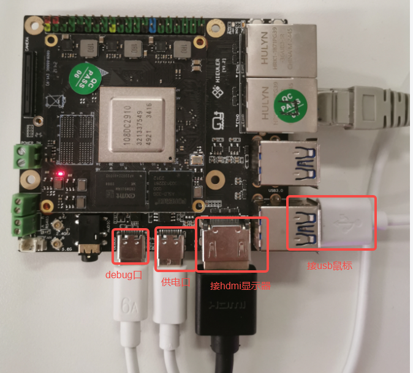
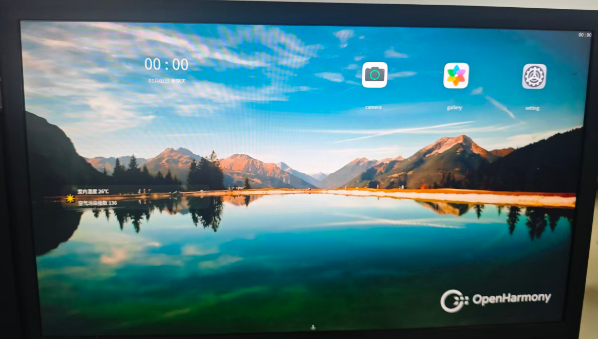
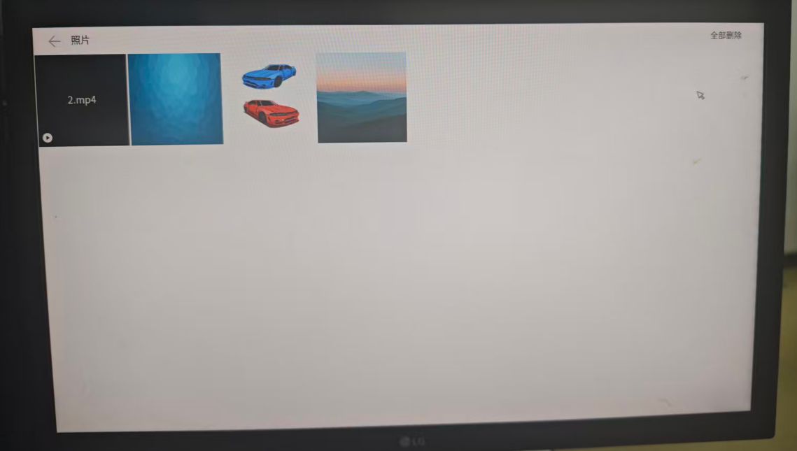
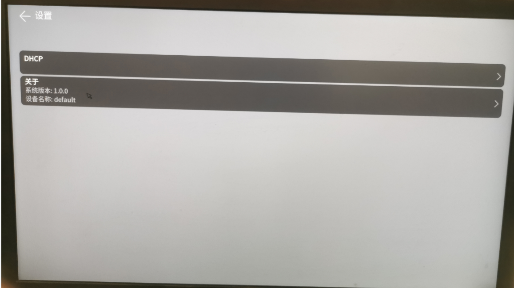
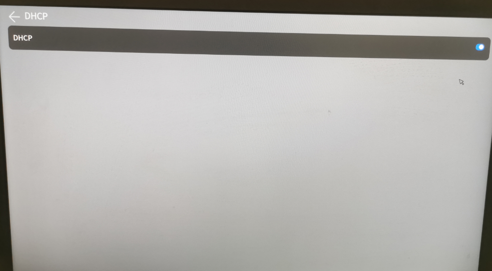
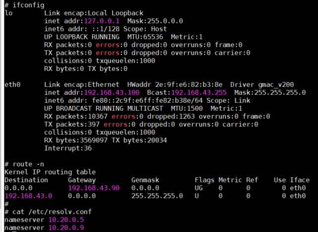
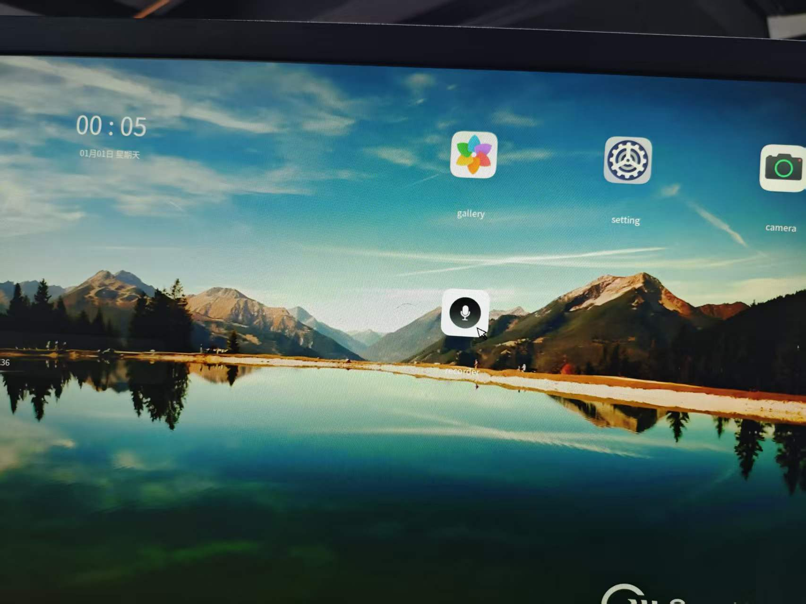
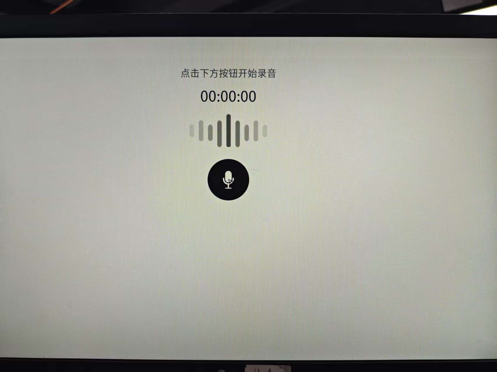
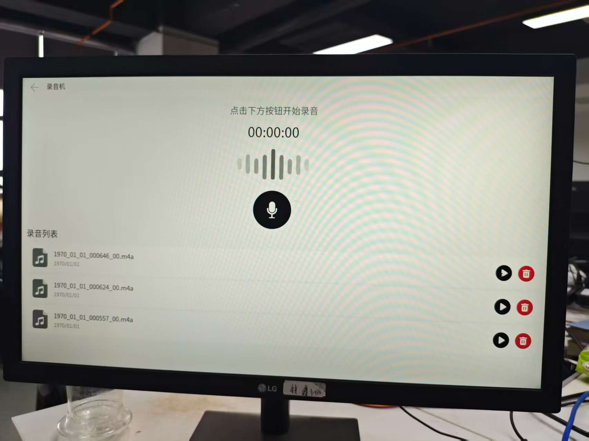

## Board

A 4 GB RAM / 32 GB eMMC board based on the EBaina design.



## Build

Follow the
[Development environment](../../os/openharmony/usage/index.md#开发环境)
section to set up the toolchain and build the image.

## Flashing the image

Follow the
[Image flashing](../../os/openharmony/usage/index.md#版本烧写)
section.

## First boot — desktop



## Multimedia smoke test

1. Drop pictures and videos under `/userdata/photo/` (images: JPEG;
   videos: MP4 with H.264 or H.265).

    Using an SD card to push files to `/userdata/photo/`:

    - Format the SD card as ext4
    - Copy the media files onto the SD card
    - Mount the SD card and copy to `/userdata/photo/`

    ```
    mkdir /storage/sdk
    mount -t ext4 /dev/block/mmcblk1p1 /storage/sdk
    cp /storage/sdk/xx /userdata/photo/
    ```
2. Plug headphones into the headphone jack
3. Open the Gallery app to browse images and play video



## DHCP smoke test

1. With the network cable plugged in, open Settings → DHCP

    

2. Toggle the DHCP switch on

    

3. Use `ifconfig` (or similar) to confirm IP / DNS / default route

    

## Recorder smoke test

1. Plug in headphones
2. Tap the Recorder icon on the desktop to launch the app

    

3. Tap the record button to start; tap again to stop

    

4. Adjust folder permissions: `chmod 777 /userdata/audio/norm`
   (only required on first launch)
5. Quit and re-launch the Recorder, then record again
6. Stopped recordings appear in the list — tap to play (volume is low)

    

Known issues: recorded audio is quiet and sometimes incomplete.
Tip: speak close to the microphone, otherwise nothing is captured.
