## 2.3. fruit_identify Operation Guide

### 2.3.1. fruit_identify Program Introduction

* The fruit_identify sample is developed based on the Hi3403V100 platform, using the EulerPi kit as an example. The fruit_identify sample captures images via a USB camera and feeds them into a fruit detection model for inference. When a specific fruit is detected, the fruit type and confidence score are displayed on the external display in real-time, the fruit's location is framed, and the recognized fruit category is played back through headphones.
* The fruit_identify case primarily uses the PyTorch framework, based on the YoloV8 network, using a self-annotated fruit dataset to train a fruit classification model.

### 2.3.2. Directory Structure

```shell
pegasus/vendor/zsks/demo/fruit_identify 
|── common               # code modified from the svp/common/ directory in HiSilicon mpp/sample, with added OSD content
|── data                 # model files and font library
|── fruit_audio          # audio files for different fruits
|── Makefile             # compilation script
|── fruit_identify.c     # fruit_identify sample application code
|── sample_audio.c       # audio playback application code
└── sample_audio.h       # audio playback header file
```

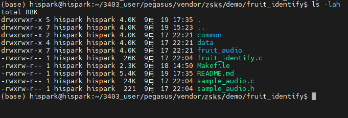

### 2.3.3. Compilation

* **Note: Before compiling ZSKS demos, ensure you have applied the patches to the corresponding directories as described in [the development guide](../../../index.md#2-development-guide)**.

* Step 1: Navigate to the corresponding Pegasus directory based on your chosen operating system.

* Step 2: Use the Makefile for individual compilation.

* In the Ubuntu command line terminal, execute the following commands step by step to individually compile the fruit_identify sample.

* Adding the LLVM=1 parameter to the compilation command uses the clang toolchain, while LLVM=0 uses the gcc toolchain. Without the LLVM parameter, the gcc toolchain is used by default. The current development board system uses clang, so this guide uniformly uses the LLVM=1 parameter for compilation.

  ```
  cd pegasus/vendor/zsks/demo/fruit_identify
  
  make LLVM=1 clean && make LLVM=1
  ```

  * An executable named main is generated in the fruit_identify/out directory, as shown below:

  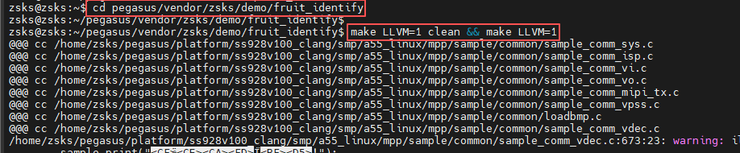

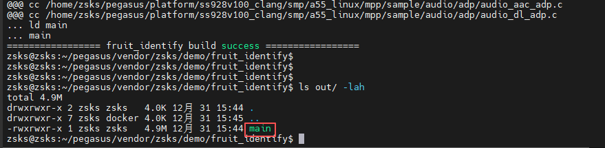

### 2.3.4. Copying Executable and Dependency Files to the Development Board's mnt Directory

**Method 1: Using an SD Card for File Copying**

* First, prepare a Micro SD card (about 16GB) and a Micro SD card reader.


* Step 1: Copy the compiled executable, the data directory (containing the model and font library), and the audio files to the SD card.

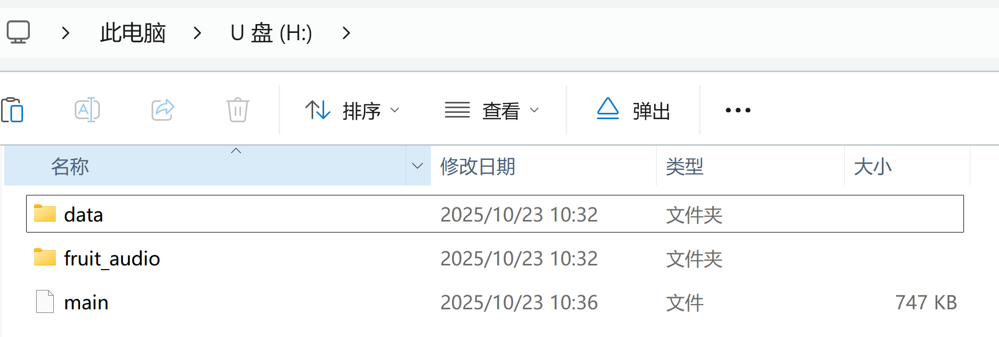

* Step 2: After the executable is successfully copied, insert the SD card into the development board's SD card slot and mount it on the board using the SD card mount command.


* In the development board's terminal, execute the following command to mount the SD card:
  * If mounting fails, refer to [this issue for resolution](https://gitee.com/HiSpark/HiSpark_NICU2022/issues/I54932?from=project-issue)


```shell
mount -t vfat /dev/mmcblk1p1 /mnt
# where /dev/mmcblk1p1 should be modified according to the actual block device number
```

* After successful mounting, the result is shown below:

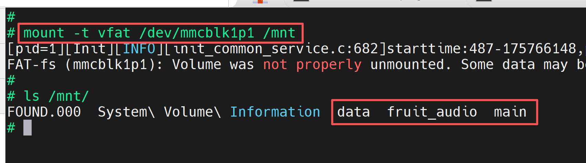

**Method 2: Using NFS Mount for File Copying**

* First, prepare a network cable.
* Step 1: Refer to the [blog link](https://blog.csdn.net/Wu_GuiMing/article/details/115872995?spm=1001.2014.3001.5501) for setting up the NFS environment.
* Step 2: Copy the compiled executable, the data directory (containing the model and font library), and the audio files to the Windows NFS shared path.

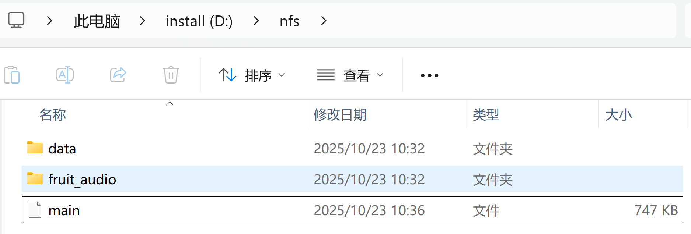

* Step 3: In the development board's terminal, execute the following command to mount the Windows NFS shared path to the development board's mnt directory:
  * Note: Fill in the IP address according to the actual IP addresses of your development board and host PC.


```
ifconfig eth0 192.168.100.100

mount -o nolock,addr=192.168.100.10 -t nfs 192.168.100.10:/d/nfs /mnt
```

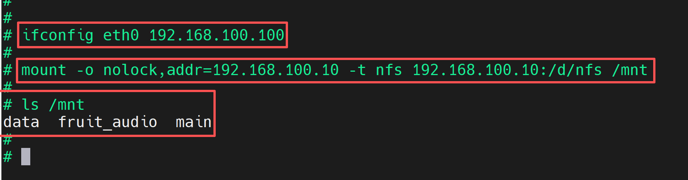

### 2.3.5. Hardware Connection

* Prepare an external display and an HDMI cable. Connect one end of the HDMI cable to the development board's HDMI output port and the other end to the external display's HDMI input port.


* Connect the USB camera to the USB port of the EulerPi development board.


### 2.3.6. Functional Verification

* In the development board's terminal, execute the following command to run the executable:

```
cd /mnt

chmod +x main

./main
```

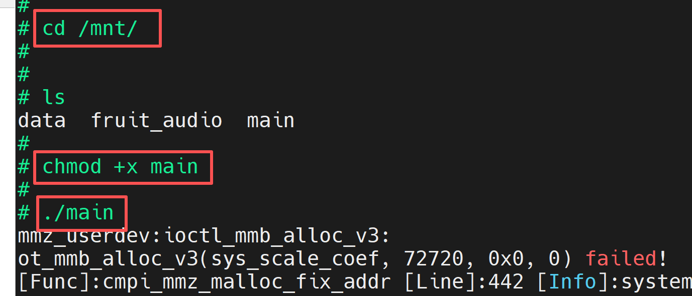

* At this point, a real-time video stream will appear on the external HDMI display, as shown below:

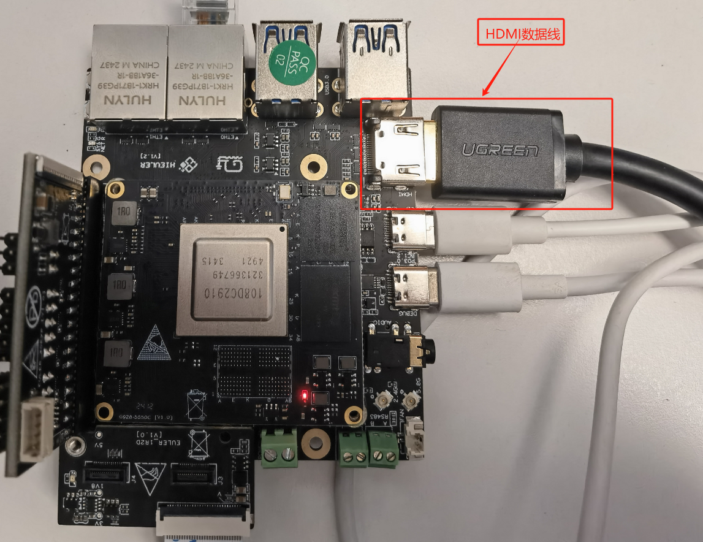

* If you see a different result from the image below, verify that the USB camera is connected to the development board's USB port and that video0 and video1 device nodes are visible in the /dev directory on the development board. If these two device nodes are not present, ensure that the image has been flashed correctly.


* Under normal conditions, you will see fruit areas framed on the external display, with the fruit type and confidence score displayed in the upper left corner of each box. You can also connect headphones to the development board to hear voice announcements of the specific detected fruit.

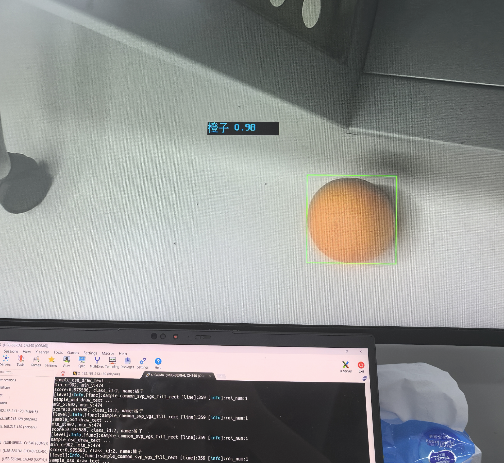

* Press Enter twice to exit the program.

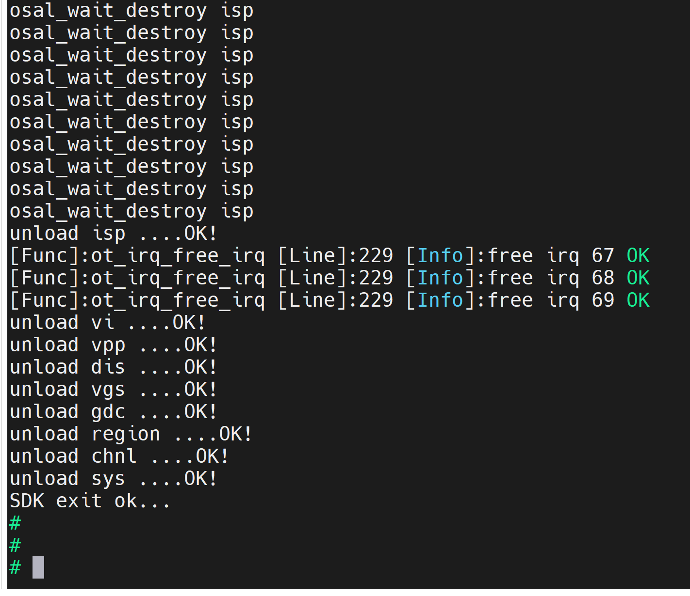
