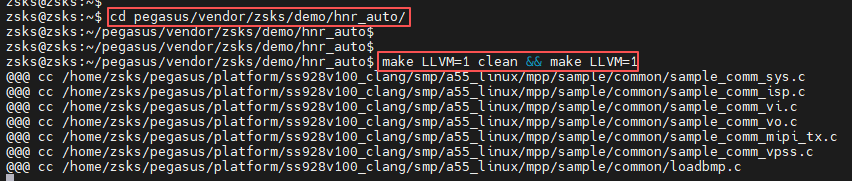
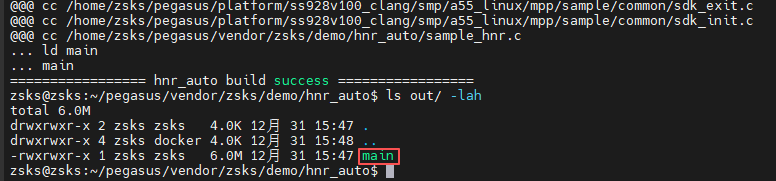
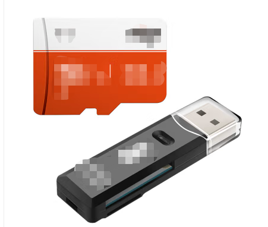
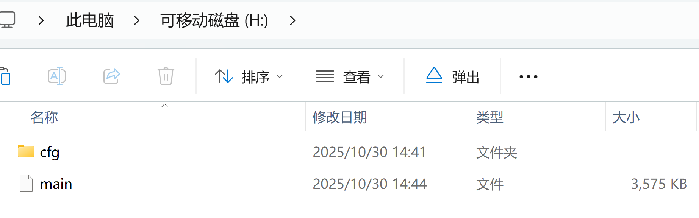
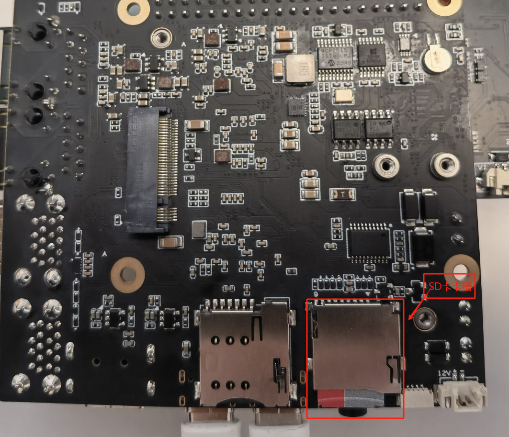
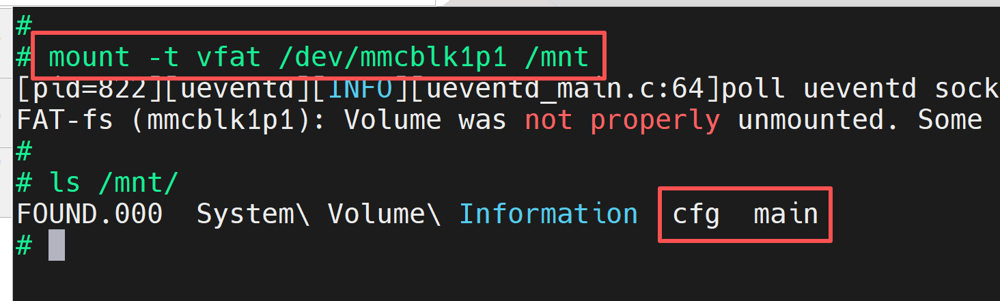
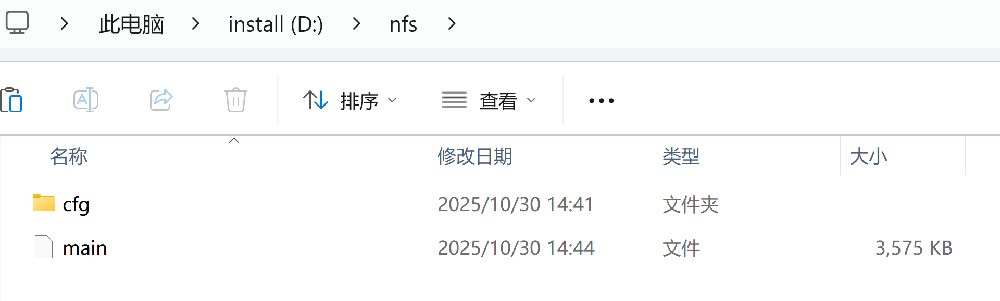
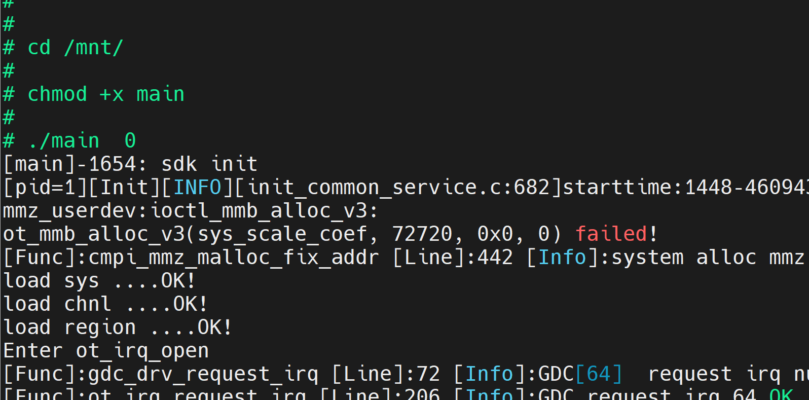
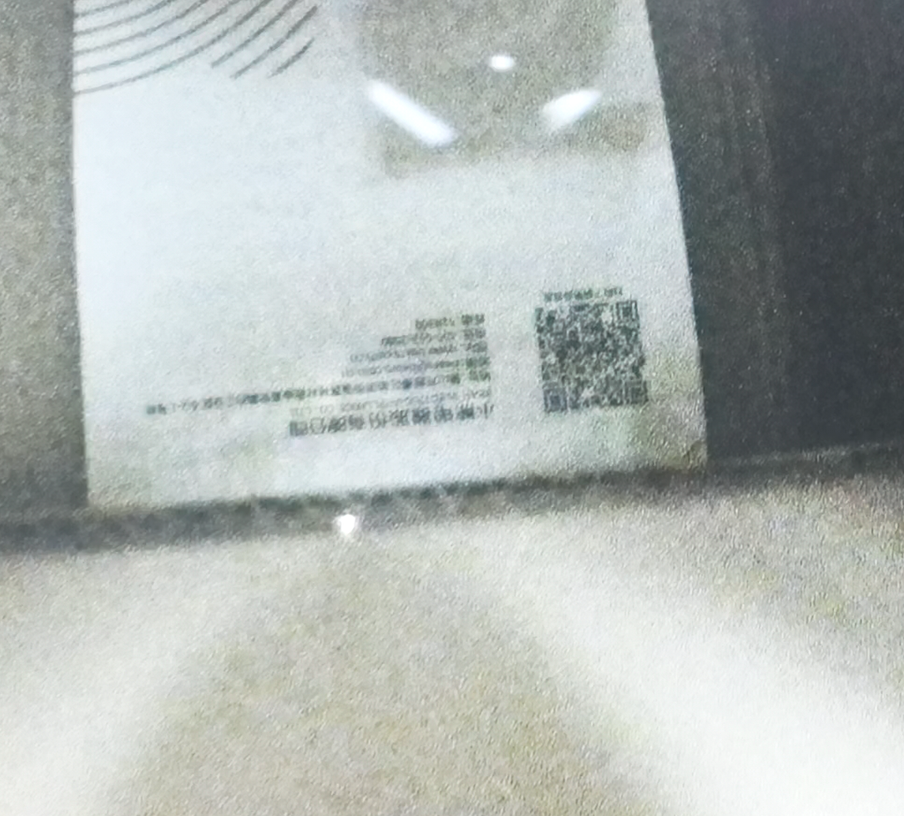
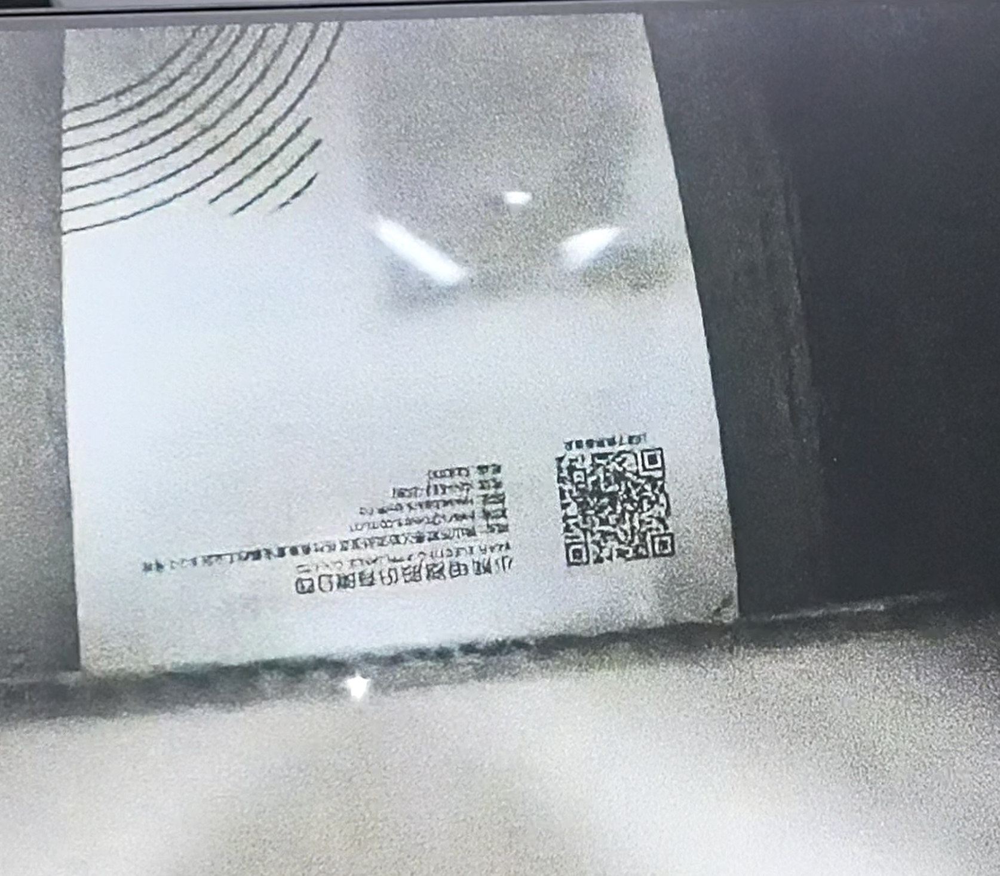

## 2.2. hnr_auto Operation Guide ### 2.2.1. hnr_auto Program Introduction * hnr_auto is developed based on the Hi3403V100 platform, using the EulerPi kit as an example. hnr_auto is based on HiSilicon's HNR case and implements the ultra-low-light nighttime functionality. When the external ISO reaches a certain threshold, it automatically switches to the HNR model, making the image clearly visible even in dark conditions. ### 2.2.2. Directory Structure ```shell
pegasus/vendor/zsks/demo/hnr_auto |── Makefile # compilation script
|── readme.txt # HNR operation instructions
└──hnr_auto.c # hnr_auto application code
```  ### 2.2.3. Compilation * **Note: Before compiling ZSKS demos, ensure you have applied the patches to the corresponding directories as described in [the development guide](../../../index.md#2-development-guide)**. * Step 0: Enable HNR by setting the macro INIT_PQP in the smp/a55_linux/mpp/sample/common/sdk_module_init.h header file to 1. **(For other cases, make sure to restore this macro to 0)**  * Step 1: Navigate to the corresponding Pegasus directory based on your chosen operating system. * Step 2: Use the Makefile for individual compilation. * In the Ubuntu command line terminal, execute the following commands step by step to individually compile hnr_auto. * Adding the LLVM=1 parameter to the compilation command uses the clang toolchain, while LLVM=0 uses the gcc toolchain. Without the LLVM parameter, the gcc toolchain is used by default. The current development board system uses clang, so this guide uniformly uses the LLVM=1 parameter for compilation. ``` cd pegasus/vendor/zsks/demo/hnr_auto/ make LLVM=1 clean && make LLVM=1 ```  * An executable named main is generated in the hnr_auto/out directory, as shown below:  ### 2.2.4. Copying Executable and Dependency Files to the Development Board's mnt Directory **Method 1: Using an SD Card for File Copying** * First, prepare a Micro SD card (about 16GB) and a Micro SD card reader.  * Step 1: Copy the compiled executable to the SD card.
* Step 2: Copy the cfg model files from the Hi3403V100_clang/smp/a55_linux/mpp/sample/hnr/ directory to the SD card.  * Step 3: After the executable is successfully copied, insert the SD card into the development board's SD card slot and mount it on the board using the SD card mount command.  * In the development board's terminal, execute the following command to mount the SD card: * If mounting fails, refer to [this issue for resolution](https:/gitee.com/HiSpark/HiSpark_NICU2022/issues/I54932?from=project-issue) ```shell
mount -t vfat /dev/mmcblk1p1 /mnt
# where /dev/mmcblk1p1 should be modified according to the actual block device number
``` * After successful mounting, the result is shown below:  **Method 2: Using NFS Mount for File Copying** * First, prepare a network cable.
* Step 1: Refer to the [blog link](https:/blog.csdn.net/Wu_GuiMing/article/details/115872995?spm=1001.2014.3001.5501) for setting up the NFS environment.
* Step 2: Copy the compiled executable to the Windows NFS shared path.
* Step 3: Copy the cfg model files from the Hi3403V100_clang/smp/a55_linux/mpp/sample/hnr/ directory to the Windows NFS shared path.  * Step 4: In the development board's terminal, execute the following command to mount the Windows NFS shared path to the development board's mnt directory: * Note: Fill in the IP address according to the actual IP addresses of your development board and host PC. ```
ifconfig eth0 192.168.100.100 mount -o nolock,addr=192.168.100.10 -t nfs 192.168.100.10:/d/nfs /mnt
```  ### 2.2.5. Hardware Connection * Prepare an external display and an HDMI cable. Connect one end of the HDMI cable to the development board's HDMI output port and the other end to the external display's HDMI input port.  * Connect the camera to the sensor board, then connect the sensor board to the EulerPi development board. (Note: The sensor used in this case is OS04A10. If you are using a different sensor, modify SENSOR0_TYPE in the Makefile first, then recompile.)  ### 2.2.6. Functional Verification * In the development board's terminal, execute the following command to run the executable: ```
cd /mnt/ chmod +x main ./main 0
```  * At this point, a real-time video stream will appear on the external HDMI display, as shown below:  * If you see a different result from the image below, verify that the lens cap has been removed.
* If you see a very blurry image, try turning the lens left or right to manually focus until the image is clear. * When the camera is placed in a low-light environment and the ISO value reaches a certain threshold, the AIISP HNR model is invoked, making the image clearly visible even under low-light conditions. * HNR off state  * HNR on state  * Press Enter twice to exit the program. 
