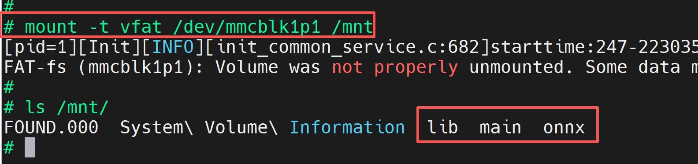
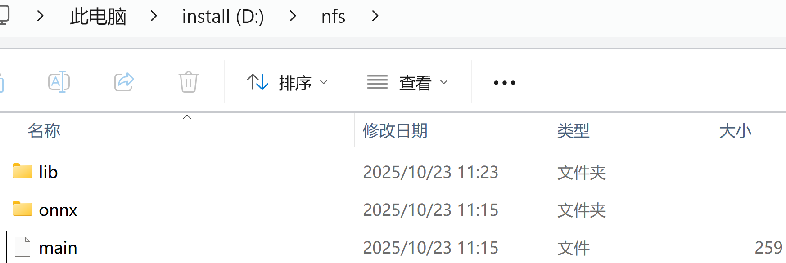
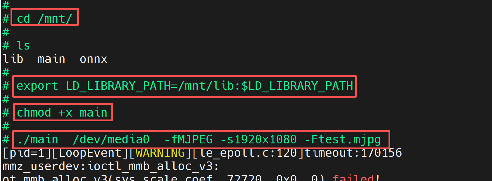
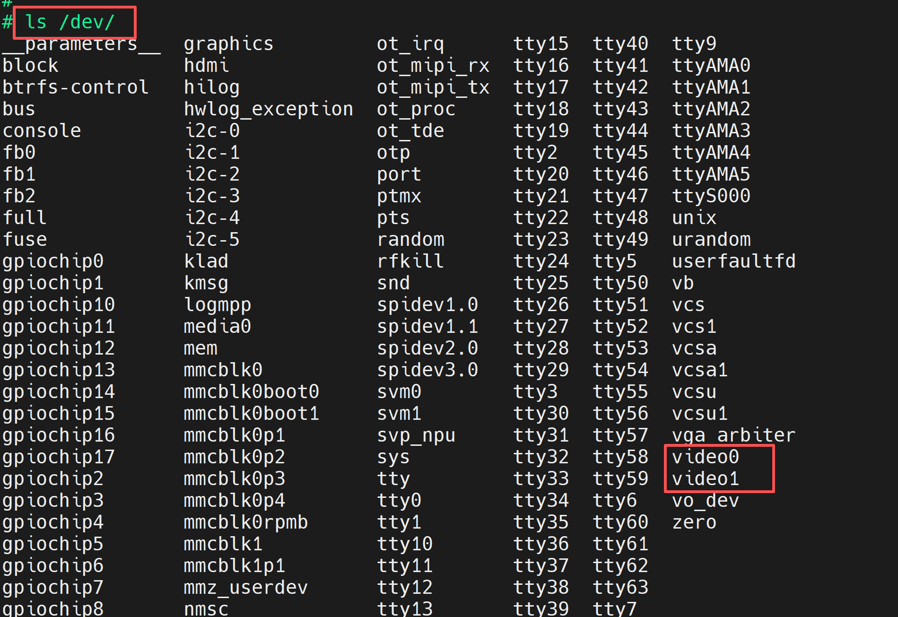
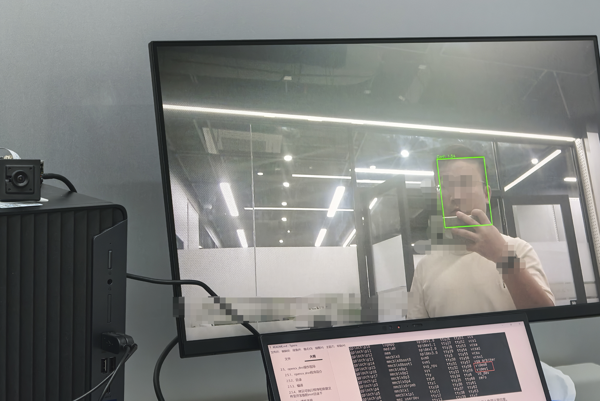

## 2.1. opencv_dnn Operation Guide ### 2.1.1. opencv_dnn Program Introduction * The opencv_dnn sample is developed based on the Hi3403V100 platform, using the EulerPi kit as an example. The opencv_dnn sample captures images via a USB camera and feeds them into a face detection model for inference, then displays the results on an external display via HDMI.
* In the opencv_dnn case, model inference runs on the CPU without using the SVP_NPU interface — all processing uses OpenCV interfaces. ### 2.1.2. Directory Structure ```shell
pegasus/vendor/zsks/demo/opencv_dnn |── media_vdec.c # displays inference results on HDMI external display
|── media_vdec.h |── Makefile # compilation script
|── main.cpp # opencv_dnn sample application code
|── host_uvc.c # adapted from HiSilicon SDK host_uvc code
└── host_uvc.h ```  * Create an onnx folder in the opencv_dnn directory, download the [onnx model](https:/github.com/opencv/opencv_zoo/blob/main/models/face_detection_yunet/face_detection_yunet_2023mar.onnx), and place it in the onnx directory.   ### 2.1.3. Compilation * **Note: Before compiling ZSKS demos, ensure you have applied the patches to the corresponding directories as described in [the development guide](../../../index.md#2-development-guide)**. * Step 1: Navigate to the corresponding Pegasus directory based on your chosen operating system. * Step 2: Use the Makefile for individual compilation. * In the Ubuntu command line terminal, execute the following commands step by step to individually compile the opencv_dnn sample. * Adding the LLVM=1 parameter to the compilation command uses the clang toolchain, while LLVM=0 uses the gcc toolchain. Without the LLVM parameter, the gcc toolchain is used by default. The current development board system uses clang, so this guide uniformly uses the LLVM=1 parameter for compilation. ``` cd pegasus/vendor/zsks/demo/opencv_dnn make LLVM=1 clean && make LLVM=1 ``` * An executable named main is generated in the opencv_dnn/out directory, as shown below:   ### 2.1.4. Copying Executable and Dependency Files to the Development Board's mnt Directory **Method 1: Using an SD Card for File Copying** * First, prepare a Micro SD card (about 16GB) and a Micro SD card reader.  * Step 1: Copy the compiled executable, the onnx model file, and the OpenCV library files to the SD card.  * Step 2: After the executable is successfully copied, insert the SD card into the development board's SD card slot and mount it on the board using the SD card mount command.  * In the development board's terminal, execute the following command to mount the SD card: * If mounting fails, refer to [this issue for resolution](https:/gitee.com/HiSpark/HiSpark_NICU2022/issues/I54932?from=project-issue) ```shell
mount -t vfat /dev/mmcblk1p1 /mnt
# where /dev/mmcblk1p1 should be modified according to the actual block device number
``` * After successful mounting, the result is shown below:  **Method 2: Using NFS Mount for File Copying** * First, prepare a network cable.
* Step 1: Refer to the [blog link](https:/blog.csdn.net/Wu_GuiMing/article/details/115872995?spm=1001.2014.3001.5501) for setting up the NFS environment.
* Step 2: Copy the compiled executable, the onnx model file, and the OpenCV library (in the pegasus/vendor/opensource/opencv/lib directory) to the Windows NFS shared path.  * Step 3: In the development board's terminal, execute the following command to mount the Windows NFS shared path to the development board's mnt directory: * Note: Fill in the IP address according to the actual IP addresses of your development board and host PC. ```
ifconfig eth0 192.168.100.100 mount -o nolock,addr=192.168.100.10 -t nfs 192.168.100.10:/d/nfs /mnt
```  ### 2.1.5. Hardware Connection * Prepare an external display and an HDMI cable. Connect one end of the HDMI cable to the development board's HDMI output port and the other end to the external display's HDMI input port.  * Connect the USB camera to the USB port of the EulerPi development board.  ### 2.1.6. Functional Verification * In the development board's terminal, execute the following command to run the executable: ```c
# Add OpenCV library to environment variables
export LD_LIBRARY_PATH=/mnt/lib:$LD_LIBRARY_PATH cd /mnt/lib/ ln -s libopencv_world.so libopencv_world.so.413 cd /mnt chmod +x main ./main /dev/media0 -fMJPEG -s1920x1080 -Ftest.mjpg
```  * At this point, a real-time video stream will appear on the external HDMI display, as shown below:  * If you see a different result from the image below, verify that the USB camera is connected to the development board's USB port and that video0 and video1 device nodes are visible in the /dev directory on the development board. If these two device nodes are not present, ensure that the image has been flashed correctly.  * Under normal conditions, you will see face areas framed on the external display, with confidence scores displayed in the upper left corner of each box.  * Press Ctrl + C, then Enter to exit the program. 
