## 2.4. sample_kcf_track Operation Guide

### 2.4.1. sample_kcf_track Program Introduction

* sample_kcf_track is developed based on the Hi3403V100 platform, using the EulerPi kit as an example. sample_kcf_track is based on the KCF+Track model. It captures images via a USB camera and feeds them into the KCF+Track model to achieve real-time target tracking.

### 2.4.2. Directory Structure

```shell
pegasus/vendor/zsks/demo/sample_kcf_track 
|── main.c               # main entry point for sample_kcf_track
|── Makefile             # compilation script
|── sample_kcf_track.c   # sample_kcf_track application code
|── sample_kcf_track.h   # sample_kcf_track header file
|── sample_svp_npu_process.c   # SVP_NPU call implementation
└── sample_svp_npu_process.c   # SVP_NPU call header file
```

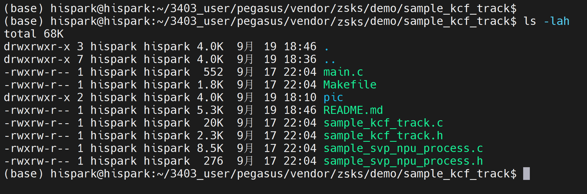

* Configure according to the output parameters of the external display. For example, if the external display outputs 1080P60, and the intf_sync in the sample_common_svp_get_def_vo_cfg function in smp/a55_linux/mpp/sample/svp/common/sample_common_svp.c is OT_VO_OUT_1080P30, change it to OT_VO_OUT_1080P60.

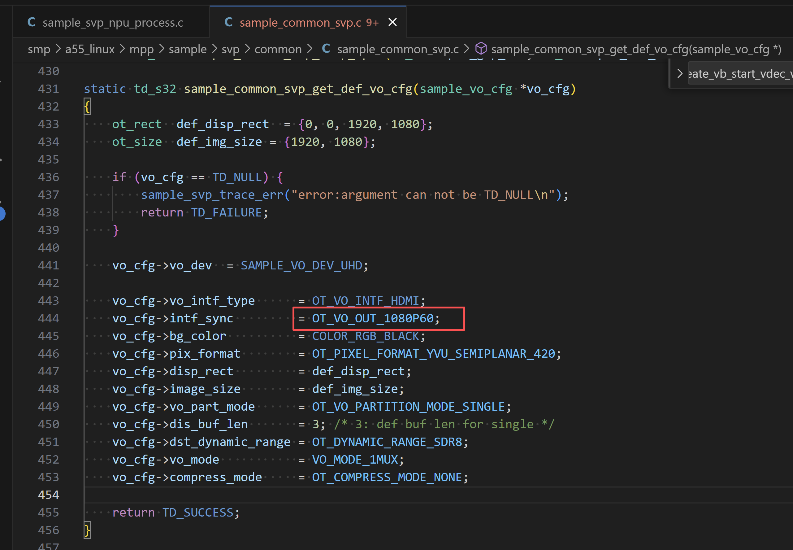

### 2.4.3. Compilation

* **Note: Before compiling ZSKS demos, ensure you have applied the patches to the corresponding directories as described in [the development guide](../../../index.md#2-development-guide)**.

* Step 1: Navigate to the corresponding Pegasus directory based on your chosen operating system.

* Step 2: Use the Makefile for individual compilation.

* In the Ubuntu command line terminal, execute the following commands step by step to individually compile sample_kcf_track.

* Adding the LLVM=1 parameter to the compilation command uses the clang toolchain, while LLVM=0 uses the gcc toolchain. Without the LLVM parameter, the gcc toolchain is used by default. The current development board system uses clang, so this guide uniformly uses the LLVM=1 parameter for compilation.

  ```
  cd pegasus/vendor/zsks/demo/sample_kcf_track
  
  make LLVM=1 clean && make LLVM=1
  ```

  * An executable named main is generated in the sample_kcf_track/out directory, as shown below:

  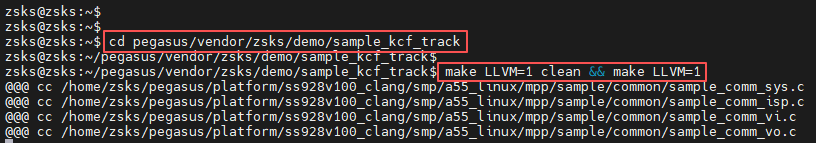
  
  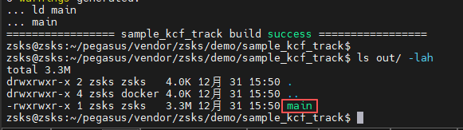

### 2.4.4. Copying Executable and Dependency Files to the Development Board's mnt Directory

**Method 1: Using an SD Card for File Copying**

* First, prepare a Micro SD card (about 16GB) and a Micro SD card reader.


* Step 1: Copy the compiled executable main to the SD card.

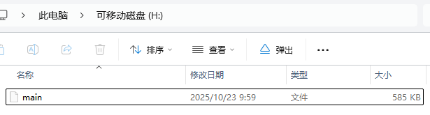

* Step 2: After the executable is successfully copied, insert the SD card into the development board's SD card slot and mount it on the board using the SD card mount command.


* In the development board's terminal, execute the following command to mount the SD card:
  * If mounting fails, refer to [this issue for resolution](https://gitee.com/HiSpark/HiSpark_NICU2022/issues/I54932?from=project-issue)


```shell
mount -t vfat /dev/mmcblk1p1 /mnt
# where /dev/mmcblk1p1 should be modified according to the actual block device number
```

* After successful mounting, the result is shown below:

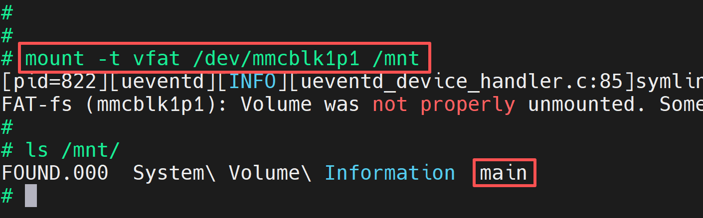

**Method 2: Using NFS Mount for File Copying**

* First, prepare a network cable.
* Step 1: Refer to the [blog link](https://blog.csdn.net/Wu_GuiMing/article/details/115872995?spm=1001.2014.3001.5501) for setting up the NFS environment.
* Step 2: Copy the compiled executable main to the Windows NFS shared path.

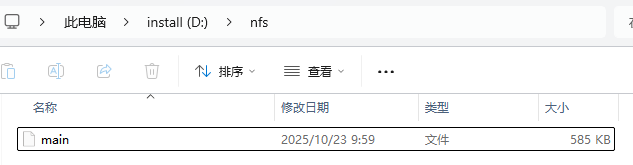

* Step 3: In the development board's terminal, execute the following command to mount the Windows NFS shared path to the development board's mnt directory:
  * Note: Fill in the IP address according to the actual IP addresses of your development board and host PC.


```
ifconfig eth0 192.168.100.100

mount -o nolock,addr=192.168.100.10 -t nfs 192.168.100.10:/d/nfs /mnt
```

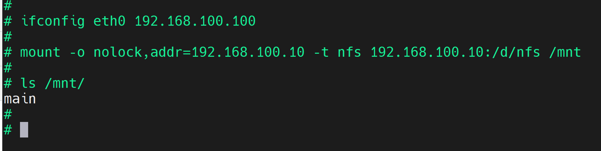

### 2.4.5. Hardware Connection

* Prepare an external display and an HDMI cable. Connect one end of the HDMI cable to the development board's HDMI output port and the other end to the external display's HDMI input port.

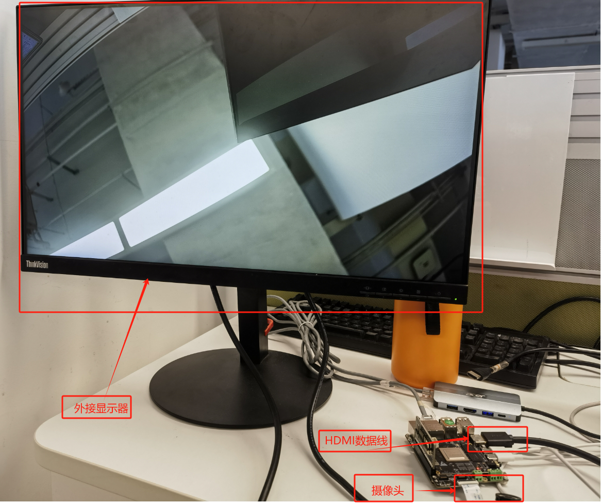

* Connect the USB camera to the USB port of the EulerPi development board.

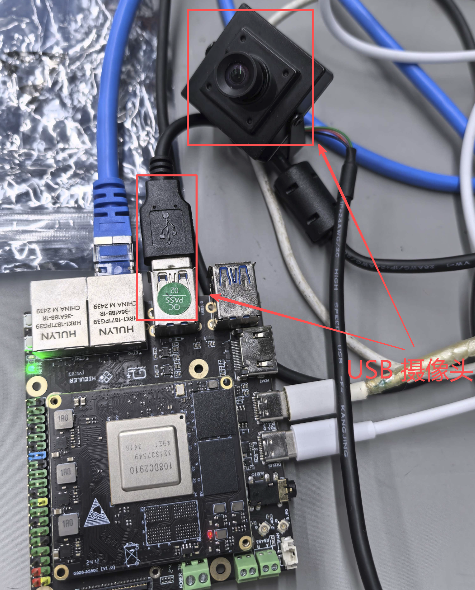

### 2.4.6. Functional Verification

* In the development board's terminal, execute the following command to run the executable:

```
cd /mnt

chmod +x main

./main
```

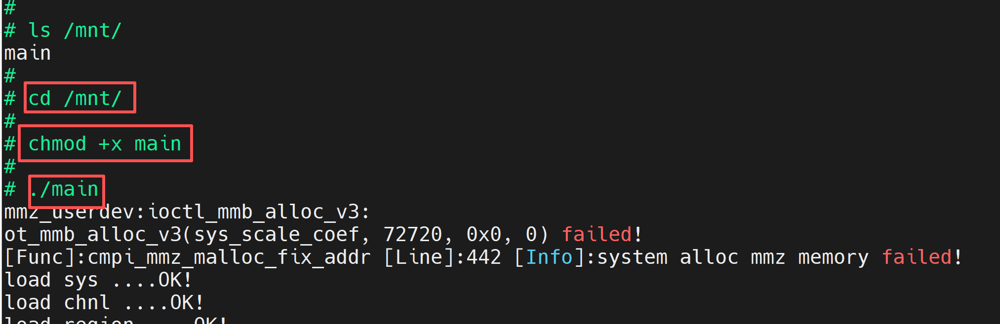

* At this point, a real-time video stream will appear on the external HDMI display, as shown below:


* If you see a different result from the image below, verify that the USB camera is connected to the development board's USB port and that video0 and video1 device nodes are visible in the /dev directory on the development board. If these two device nodes are not present, ensure that the image has been flashed correctly.


* Under normal conditions, you will see the image captured by the USB Camera on the external display.
* Step 1: Press the space bar on the keyboard to display a red box at the center of the screen.

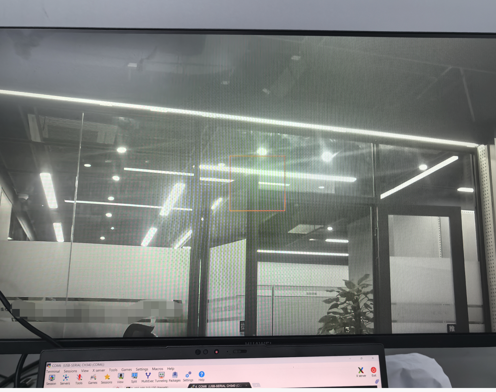

* Step 2: Place the target to be tracked inside the red box and press the space bar again. The red box will turn green. If it does not, repeat the operation.
* Step 3: Move the target to be tracked; the green box will follow the target.

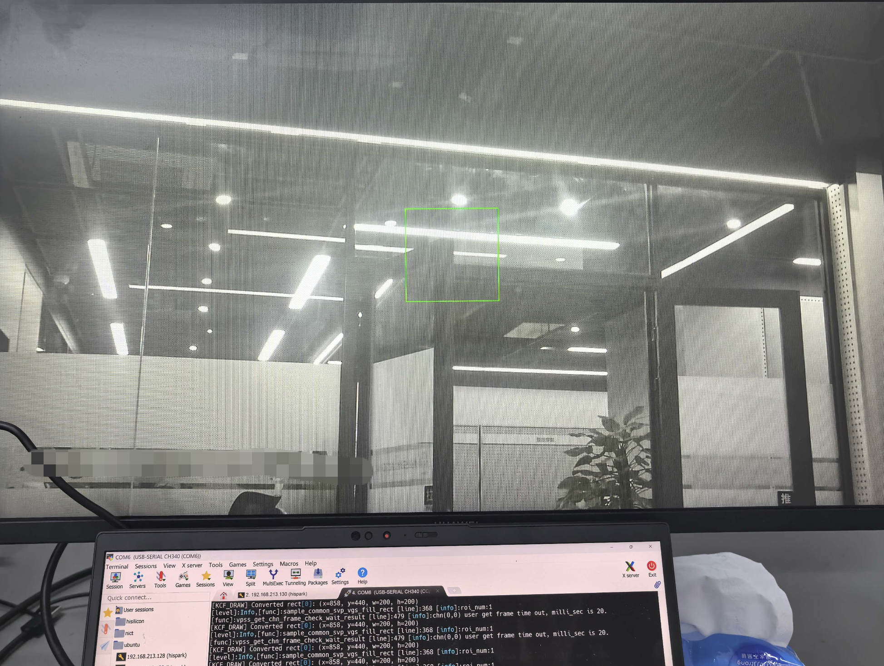

* When the target leaves the sensor field of view, the green box will turn yellow.

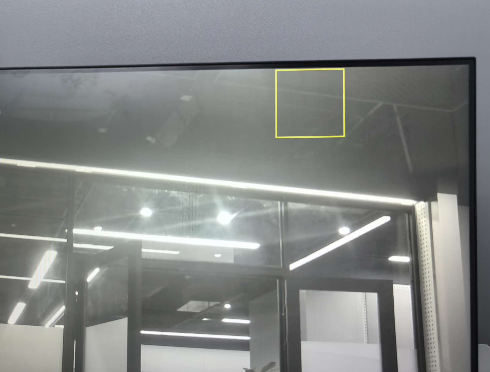

* Press the Q key to exit the program.


