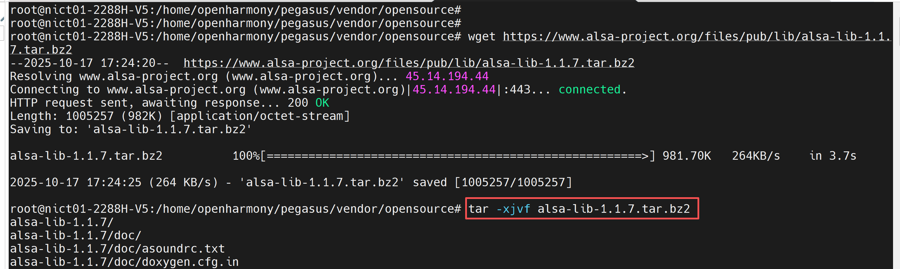
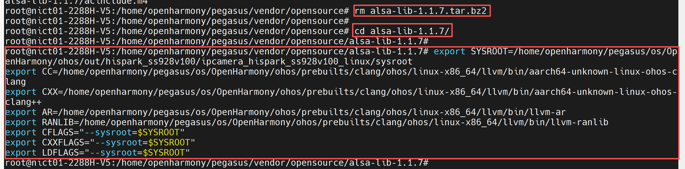
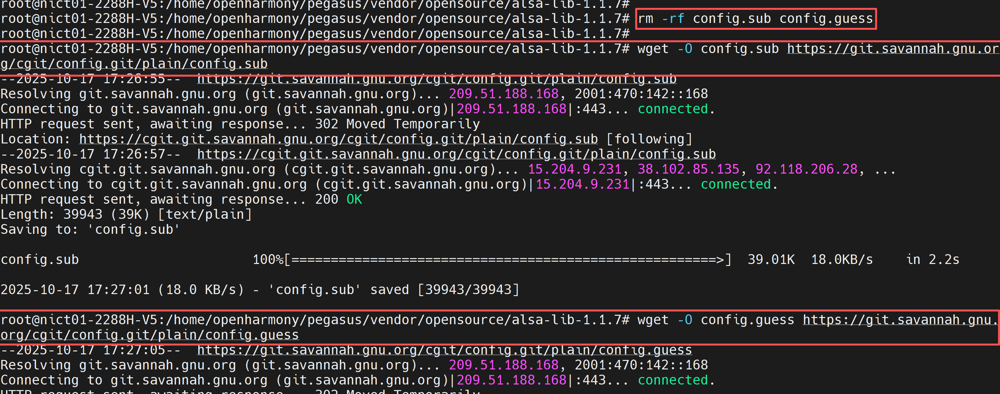
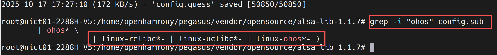
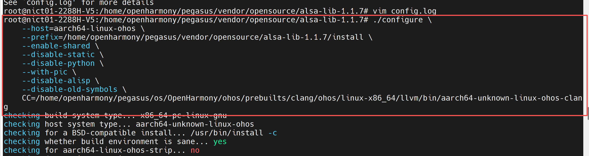
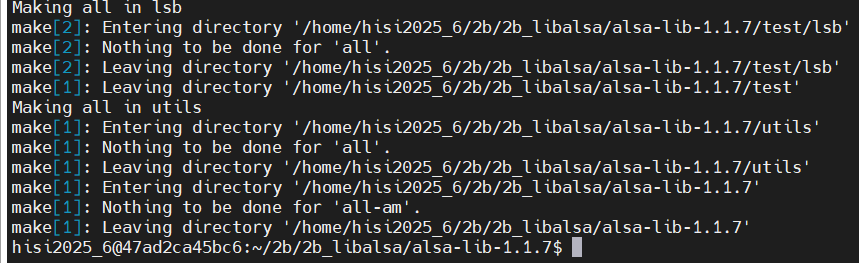
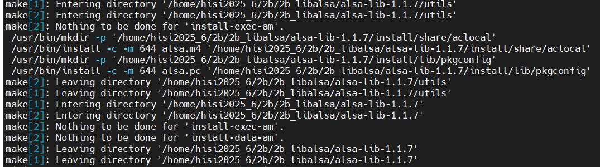
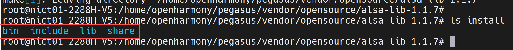
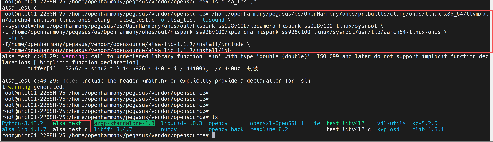
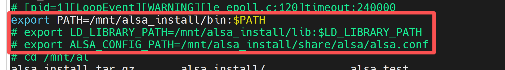

# alsa-lib Porting * alsa-lib is a core component for handling audio in Linux systems. alsa-lib: the low-level foundation for audio functionality. It is the core library of ALSA (Advanced Linux Sound Architecture), primarily providing a unified audio hardware interface. Core functionality: It encapsulates the complex logic of interacting with sound card hardware, providing standardized APIs (e.g., C language interfaces) to upper-layer applications, enabling developers to implement audio playback, recording, and other functions without directly manipulating hardware drivers. Contents: It mainly generates dynamic link libraries (such as libasound.so) as the dependency foundation for all ALSA-based programs; it includes a small number of example tools (such as aserver, a simple audio server demo). ## 1. Software and Hardware Environment * Development board: SeaGull Pi
* Cross-compilation toolchain: OHOS (dev) clang version 15.0.4
* Toolchain path: pegasus/os/OpenHarmony/ohos/prebuilts/clang/ohos/linux-x86_64/llvm/bin
* Python version: Python-3.13.2
* Ported alsa-lib version: alsa-lib-1.1.7 ## 2. Cross-Compiling alsa-lib ### Step 1: Obtain the Source Code * In the server command line, execute the following commands step by step to download the alsa-lib-1.1.7 source code. ~~~bash
# (Version number can be replaced as needed)
wget https:/www.alsa-project.org/files/pub/lib/alsa-lib-1.1.7.tar.bz2 # Extract the source package
tar -xjvf alsa-lib-1.1.7.tar.bz2
rm alsa-lib-1.1.7.tar.bz2 # Navigate to the source directory
cd alsa-lib-1.1.7
~~~  ### Step 2: Configure Environment Variables * In the server command line, execute the following commands step by step to configure environment variables. ~~~bash
export SYSROOT=/home/openharmony/pegasus/os/OpenHarmony/ohos/out/hispark_Hi3403V100/ipcamera_hispark_Hi3403V100_linux/sysroot
export CC=/home/openharmony/pegasus/os/OpenHarmony/ohos/prebuilts/clang/ohos/linux-x86_64/llvm/bin/aarch64-unknown-linux-ohos-clang
export CXX=/home/openharmony/pegasus/os/OpenHarmony/ohos/prebuilts/clang/ohos/linux-x86_64/llvm/bin/aarch64-unknown-linux-ohos-clang++
export AR=/home/openharmony/pegasus/os/OpenHarmony/ohos/prebuilts/clang/ohos/linux-x86_64/llvm/bin/llvm-ar export RANLIB=/home/openharmony/pegasus/os/OpenHarmony/ohos/prebuilts/clang/ohos/linux-x86_64/llvm/bin/llvm-ranlib export CFLAGS="--sysroot=$SYSROOT"
export CXXFLAGS="--sysroot=$SYSROOT"
export LDFLAGS="--sysroot=$SYSROOT"
~~~  * Execute the following command on the server to update the config files. ```sh
# The core reason is that config.sub and config.guess scripts are too old; remove them first
rm -rf config.sub config.guess # Download config.sub
wget -O config.sub https:/git.savannah.gnu.org/cgit/config.git/plain/config.sub # Download config.guess
wget -O config.guess https:/git.savannah.gnu.org/cgit/config.git/plain/config.guess # Check if the updated version supports ohos
grep -i "ohos" config.sub
```   ### Step 3: Configuration Command * Execute the following command on the server for meson build configuration. ~~~bash
./configure \ --host=aarch64-linux-ohos \ --prefix=/home/openharmony/pegasus/vendor/opensource/alsa-lib-1.1.7/install \ --enable-shared \ --disable-static \ --disable-python \ --with-pic \ --disable-alisp \ --disable-old-symbols \ CC=/home/openharmony/pegasus/os/OpenHarmony/ohos/prebuilts/clang/ohos/linux-x86_64/llvm/bin/aarch64-unknown-linux-ohos-clang
~~~  ### Step 4: Compile and Install * Execute the following commands on the server to compile and install alsa-lib. ~~~bash
make -j$(nproc) 2>&1 | tee make_output.log
make install
~~~   * After successful compilation, the following files will be generated in the install directory.  ## 3. Board-Side Testing ### 3.1 Compile the Test Code * Copy the following code to alsa_test.c, compile it on the server, obtain the executable, and then run it on the board. ~~~bash
#include <stdio.h>
#include <alsa/asoundlib.h> int main { int ret; snd_pcm_t *handle; / PCM device handle snd_pcm_hw_params_t *params; / hardware parameter structure / 1. Open the PCM playback device (default device) ret = snd_pcm_open(&handle, "default", SND_PCM_STREAM_PLAYBACK, 0); if (ret < 0) { fprintf(stderr, "Unable to open PCM device: %s\n", snd_strerror(ret)); return 1; } / 2. Initialize hardware parameters snd_pcm_hw_params_alloca(&params); snd_pcm_hw_params_any(handle, params); / Set parameters: interleaved mode, 16-bit little-endian format, stereo snd_pcm_hw_params_set_access(handle, params, SND_PCM_ACCESS_RW_INTERLEAVED); snd_pcm_hw_params_set_format(handle, params, SND_PCM_FORMAT_S16_LE); snd_pcm_hw_params_set_channels(handle, params, 2); / Set sample rate (44.1 kHz) unsigned int val = 44100; snd_pcm_hw_params_set_rate_near(handle, params, &val, NULL); / Apply parameters ret = snd_pcm_hw_params(handle, params); if (ret < 0) { fprintf(stderr, "Unable to set PCM parameters: %s\n", snd_strerror(ret)); snd_pcm_close(handle); return 1; } / 3. Generate simple sine wave audio data (test playback) short buffer[1024]; for (int i = 0; i < 1024; i++) { buffer[i] = 32767 * sin(2 * 3.1415926 * 440 * i / 44100); / 440 Hz sine wave } / 4. Play audio (write to PCM device) ret = snd_pcm_writei(handle, buffer, 1024); if (ret < 0) { / Handle underrun errors (attempt recovery) ret = snd_pcm_recover(handle, ret, 0); if (ret < 0) { fprintf(stderr, "Playback failed: %s\n", snd_strerror(ret)); snd_pcm_close(handle); return 1; } } / 5. Close the device snd_pcm_drain(handle); / Wait for playback to complete snd_pcm_close(handle); printf("Test complete: sine wave playback successful\n"); return 0;
}
~~~ * Execute the following command on the server to compile the code.
* Note: Adjust the absolute paths according to your server's actual configuration. ~~~bash
/home/openharmony/pegasus/os/OpenHarmony/ohos/prebuilts/clang/ohos/linux-x86_64/llvm/bin/aarch64-unknown-linux-ohos-clang alsa_test.c -o alsa_test -lasound \
--sysroot=/home/openharmony/pegasus/os/OpenHarmony/ohos/out/hispark_Hi3403V100/ipcamera_hispark_Hi3403V100_linux/sysroot \
-L /home/openharmony/pegasus/os/OpenHarmony/ohos/out/hispark_Hi3403V100/ipcamera_hispark_Hi3403V100_linux/sysroot/usr/lib/aarch64-linux-ohos \ -lc \
-I/home/openharmony/pegasus/vendor/opensource/alsa-lib-1.1.7/install/include \
-L/home/openharmony/pegasus/vendor/opensource/alsa-lib-1.1.7/install/lib ~~~  ### 3.2 NFS Sharing * For NFS configuration, refer to the following link: ~~~bash
https:/blog.csdn.net/weixin_34326429/article/details/92163791
~~~ ### 3.3 Mounting NFS * Download the install folder generated in Step 4 of Chapter 2 (I renamed install to alsa_install here) and copy it to the NFS directory.
* Also download alsa_test compiled in Section 3.1 and copy it to the NFS directory. * In the development board's command line terminal, execute the following commands to configure the IP address and mount NFS. ~~~bash
ifconfig eth0 192.168.137.0 netmask 255.255.252.0
route add default gw 192.168.137.1
mount -o nolock,addr=192.168.137.1 -t nfs 192.168.137.1:/nfs /mnt
~~~ ### 3.4 Configure Environment Variables * In the development board's command line, execute the following commands to configure alsa environment variables. ~~~bash
export PATH=/mnt/alsa_install/bin:$PATH
export LD_LIBRARY_PATH=/mnt/alsa_install/lib:$LD_LIBRARY_PATH
export ALSA_CONFIG_PATH=/mnt/alsa_install/share/alsa/alsa.conf:/mnt/alsa_install/share/alsa/cards/aliases.conf:/mnt/alsa_install/share/alsa/pcm/default.conf
~~~  ~~~bash
chmod +x ./alsa_test
./alsa_test
~~~
