# FFmpeg Porting

## 1. Software and Hardware Environment

* Development board: SeaGull Pi
* Cross-compilation toolchain: OHOS (dev) clang version 15.0.4

* Toolchain path: pegasus/os/OpenHarmony/ohos/prebuilts/clang/ohos/linux-x86_64/llvm/bin  
* Python version: Python-3.13.2
* Ported ffmpeg version: FFmpeg-6.0

## 2. Installing Dependencies

* Since compiling ffmpeg requires other third-party software, we cross-compile all dependent third-party software before compiling ffmpeg.

### Step 1: Cross-Compile v4l2

* Refer to the first two chapters of the [v4l2 porting document](../libv4l2/README.md) to complete the v4l2 porting.

### Step 2: Cross-Compile x264

* In the server command line, execute the following commands to download the source code and configure the toolchain.

```sh
cd pegasus/vendor/opensource/

git clone https://code.videolan.org/videolan/x264.git

cd x264
```

* Modify config.sub, add linux-ohos* | at line 125.

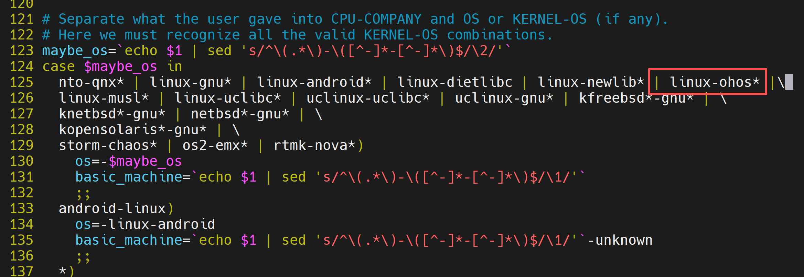

* Execute the following commands to configure the build environment and compile the code.

```sh
CC="/home/openharmony/pegasus/os/OpenHarmony/ohos/prebuilts/clang/ohos/linux-x86_64/llvm/bin/aarch64-unknown-linux-ohos-clang \
  --sysroot=/home/openharmony/pegasus/os/OpenHarmony/ohos/out/hispark_Hi3403V100/ipcamera_hispark_Hi3403V100_linux/sysroot" \
CXX="/home/openharmony/pegasus/os/OpenHarmony/ohos/prebuilts/clang/ohos/linux-x86_64/llvm/bin/aarch64-unknown-linux-ohos-clang++ \
  --sysroot=/home/openharmony/pegasus/os/OpenHarmony/ohos/out/hispark_Hi3403V100/ipcamera_hispark_Hi3403V100_linux/sysroot" \
CFLAGS="-march=armv8-a -mfpu=neon" \
./configure \
--host=aarch64-linux-ohos \
--prefix=$(pwd)/install \
--enable-shared

make -j$(nproc) && make install
```

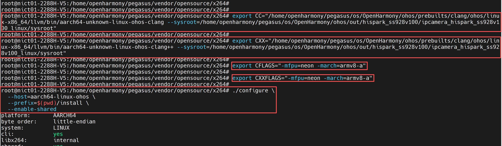

* After successful compilation, the following files will be generated in the install directory.

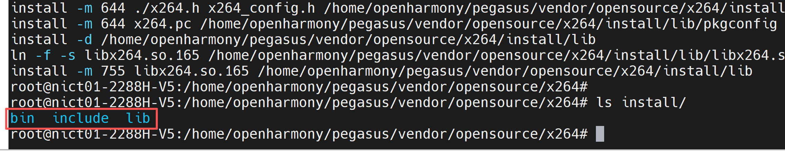

### Step 3: Cross-Compile x265

* In the server command line, execute the following commands to download the source code.

```sh
cd ../

wget https://bitbucket.org/multicoreware/x265_git/downloads/x265_3.5.tar.gz

tar xf x265_3.5.tar.gz

rm x265_3.5.tar.gz

cd x265_3.5
```

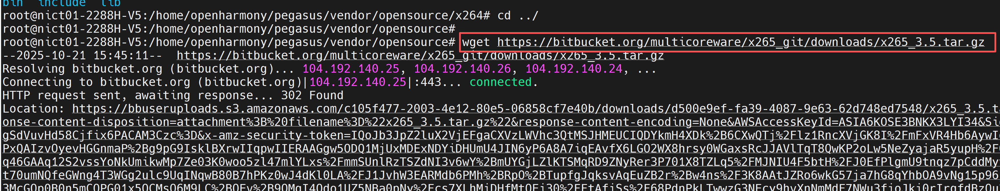

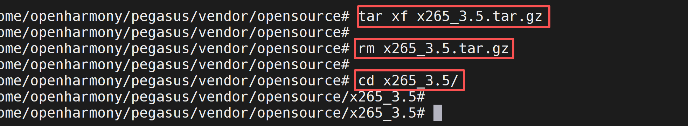

* Replace the content of x265_3.5/build/aarch64-linux/crosscompile.cmake with the following.
* Note: Modify the absolute paths for libraries, headers, etc., according to your server's actual configuration.

```sh
# crosscompile.cmake for cross compiling x265 for aarch64 with OHOS toolchain
# This feature is only supported as experimental. Use with caution.
# Please report bugs on bitbucket
# Run cmake with: cmake -DCMAKE_TOOLCHAIN_FILE=crosscompile.cmake -G "Unix Makefiles" ../../source && ccmake ../../source

# Enable ARM cross-compilation
set(CROSS_COMPILE_ARM 1)

# Specify the target system
set(CMAKE_SYSTEM_NAME Linux)
set(CMAKE_SYSTEM_PROCESSOR aarch64)

# Specify the OHOS target (emulate config.sub behavior)
set(CMAKE_SYSTEM_VERSION ohos)

# Specify the cross compiler
set(CMAKE_C_COMPILER /home/openharmony/pegasus/os/OpenHarmony/ohos/prebuilts/clang/ohos/linux-x86_64/llvm/bin/aarch64-unknown-linux-ohos-clang)
set(CMAKE_CXX_COMPILER /home/openharmony/pegasus/os/OpenHarmony/ohos/prebuilts/clang/ohos/linux-x86_64/llvm/bin/aarch64-unknown-linux-ohos-clang++)
set(CMAKE_ASM_COMPILER /home/openharmony/pegasus/os/OpenHarmony/ohos/prebuilts/clang/ohos/linux-x86_64/llvm/bin/aarch64-unknown-linux-ohos-clang)
set(CMAKE_AR /home/openharmony/pegasus/os/OpenHarmony/ohos/prebuilts/clang/ohos/linux-x86_64/llvm/bin/llvm-ar)
set(CMAKE_LINKER /home/openharmony/pegasus/os/OpenHarmony/ohos/prebuilts/clang/ohos/linux-x86_64/llvm/bin/lld)
set(CMAKE_RANLIB /home/openharmony/pegasus/os/OpenHarmony/ohos/prebuilts/clang/ohos/linux-x86_64/llvm/bin/llvm-ranlib)
set(CMAKE_STRIP /home/openharmony/pegasus/os/OpenHarmony/ohos/prebuilts/clang/ohos/linux-x86_64/llvm/bin/llvm-strip)

# Specify the target environment (sysroot)
set(CMAKE_SYSROOT /home/openharmony/pegasus/os/OpenHarmony/ohos/out/hispark_Hi3403V100/ipcamera_hispark_Hi3403V100_linux/sysroot)

# Compiler and linker flags
set(CMAKE_C_FLAGS "-fPIC -target aarch64-unknown-linux-ohos" CACHE STRING "C flags")
set(CMAKE_CXX_FLAGS "-fPIC -target aarch64-unknown-linux-ohos" CACHE STRING "C++ flags")
set(CMAKE_ASM_FLAGS "-fPIC -target aarch64-unknown-linux-ohos" CACHE STRING "ASM flags")
set(CMAKE_EXE_LINKER_FLAGS "-fPIC" CACHE STRING "Linker flags")

# Include and library paths for dependencies
set(CMAKE_C_FLAGS "${CMAKE_C_FLAGS} -I/home/openharmony/pegasus/vendor/opensource/x264/install/include" CACHE STRING "C flags")
set(CMAKE_CXX_FLAGS "${CMAKE_CXX_FLAGS} -I/home/openharmony/pegasus/vendor/opensource/x264/install/include" CACHE STRING "C++ flags")
set(CMAKE_EXE_LINKER_FLAGS "${CMAKE_EXE_LINKER_FLAGS} -L/home/openharmony/pegasus/vendor/opensource/x264/install/lib" CACHE STRING "Linker flags")

# Search paths for libraries and headers
set(CMAKE_FIND_ROOT_PATH /home/openharmony/pegasus/os/OpenHarmony/ohos/out/hispark_Hi3403V100/ipcamera_hispark_Hi3403V100_linux/sysroot /home/openharmony/pegasus/vendor/opensource/x264/install /home/openharmony/pegasus/vendor/opensource/v4l-utils/install)
set(CMAKE_FIND_ROOT_PATH_MODE_PROGRAM NEVER)
set(CMAKE_FIND_ROOT_PATH_MODE_LIBRARY ONLY)
set(CMAKE_FIND_ROOT_PATH_MODE_INCLUDE ONLY)

# PKG_CONFIG_PATH for finding dependencies
set(ENV{PKG_CONFIG_PATH} "/home/openharmony/pegasus/vendor/opensource/v4l-utils/install/lib/pkgconfig:/home/openharmony/pegasus/vendor/opensource/v4l-utils/install/lib/pkgconfig")

# Debug output to verify configuration
message(STATUS "CMAKE_C_COMPILER: ${CMAKE_C_COMPILER}")
message(STATUS "CMAKE_CXX_COMPILER: ${CMAKE_CXX_COMPILER}")
message(STATUS "CMAKE_SYSROOT: ${CMAKE_SYSROOT}")
message(STATUS "CMAKE_FIND_ROOT_PATH: ${CMAKE_FIND_ROOT_PATH}")
message(STATUS "PKG_CONFIG_PATH: $ENV{PKG_CONFIG_PATH}")
```

* In the server command line, execute the following commands to configure the build options.

```sh
cd /home/openharmony/pegasus/vendor/opensource/x265_3.5

cmake ./source \
  -G "Unix Makefiles" \
  -DCMAKE_SYSTEM_NAME=Linux \
  -DCMAKE_SYSTEM_PROCESSOR=aarch64 \
  -DCMAKE_SYSTEM_VERSION=ohos \
  -DCMAKE_FIND_ROOT_PATH_MODE_PROGRAM=NEVER \
  -DCMAKE_FIND_ROOT_PATH_MODE_LIBRARY=ONLY \
  -DCMAKE_FIND_ROOT_PATH_MODE_INCLUDE=ONLY \
  -DCMAKE_INSTALL_PREFIX="$(pwd)/install" \
  -DENABLE_SHARED=ON \
  -DENABLE_PIC=ON \
  -DHIGH_BIT_DEPTH=ON \
  -DEXPORT_C_API=ON \
  -DENABLE_ASSEMBLY=OFF \
  -Wno-dev
  
make -j$(nproc)&&make install
```

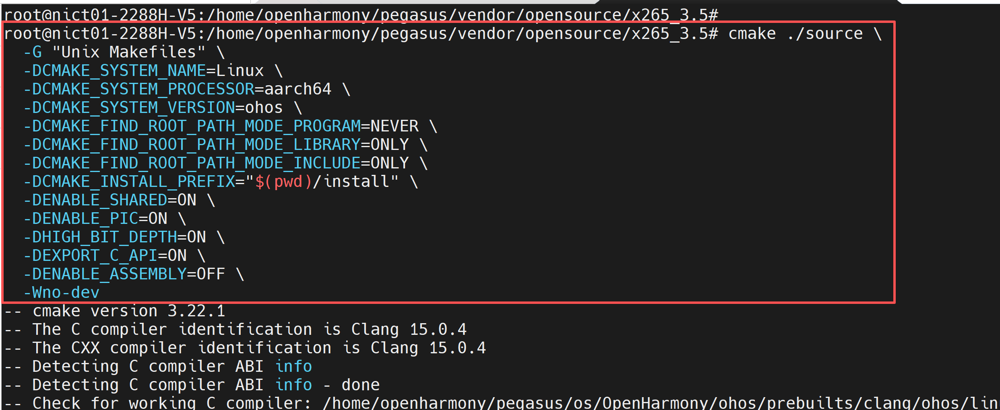

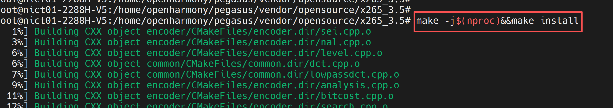

* After compilation completes, the following files will be generated in the install directory.

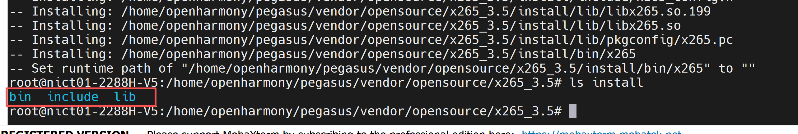

## 3. Cross-Compiling FFmpeg

### Step 1: Download Source Code

* In the server command line, execute the following commands to download the ffmpeg source code.

```sh
cd ../

git clone -b release/6.0 https://gitee.com/zhongshankuangshi/ffmpeg.git

cd ffmpeg
```

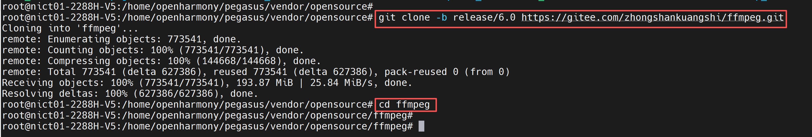

### Step 2: Configure Environment Variables

* Note: Modify the absolute paths according to your server's actual configuration.

```sh
export CC=/home/openharmony/pegasus/os/OpenHarmony/ohos/prebuilts/clang/ohos/linux-x86_64/llvm/bin/aarch64-unknown-linux-ohos-clang
export CXX=/home/openharmony/pegasus/os/OpenHarmony/ohos/prebuilts/clang/ohos/linux-x86_64/llvm/bin/aarch64-unknown-linux-ohos-clang++
export AR=/home/openharmony/pegasus/os/OpenHarmony/ohos/prebuilts/clang/ohos/linux-x86_64/llvm/bin/llvm-ar
export LD=/home/openharmony/pegasus/os/OpenHarmony/ohos/prebuilts/clang/ohos/linux-x86_64/llvm/bin/lld
export RANLIB=/home/openharmony/pegasus/os/OpenHarmony/ohos/prebuilts/clang/ohos/linux-x86_64/llvm/bin/llvm-ranlib
export STRIP=/home/openharmony/pegasus/os/OpenHarmony/ohos/prebuilts/clang/ohos/linux-x86_64/llvm/bin/llvm-strip

export PKG_CONFIG_PATH="/home/openharmony/pegasus/vendor/opensource/x264/install/lib/pkgconfig:$PKG_CONFIG_PATH"
export CXXFLAGS="-I/home/openharmony/pegasus/vendor/opensource/x264/install/include $CXXFLAGS"
export LDFLAGS="-L/home/openharmony/pegasus/vendor/opensource/x264/install/lib $LDFLAGS"

export PKG_CONFIG_PATH="/home/openharmony/pegasus/vendor/opensource/x265_3.5/install/lib/pkgconfig:$PKG_CONFIG_PATH"
export CXXFLAGS="-I/home/openharmony/pegasus/vendor/opensource/x265_3.5/install/include $CXXFLAGS"
export LDFLAGS="-L/home/openharmony/pegasus/vendor/opensource/x265_3.5/install/lib $LDFLAGS"

export PKG_CONFIG_PATH="/home/openharmony/pegasus/vendor/opensource/v4l-utils/install/lib/pkgconfig:$PKG_CONFIG_PATH"
export CXXFLAGS="-I/home/openharmony/pegasus/vendor/opensource/v4l-utils/install/include $CXXFLAGS"
export LDFLAGS="-L/home/openharmony/pegasus/vendor/opensource/v4l-utils/install/lib $LDFLAGS"
```

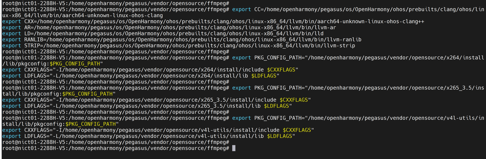

### Step 3: Modify Relevant Build Scripts

* In line 4 of pegasus/platform/Hi3403V100_clang/smp/a55_linux/mpp/sample/common/makefile, add an fPIC option to CFLAGS, as shown below:

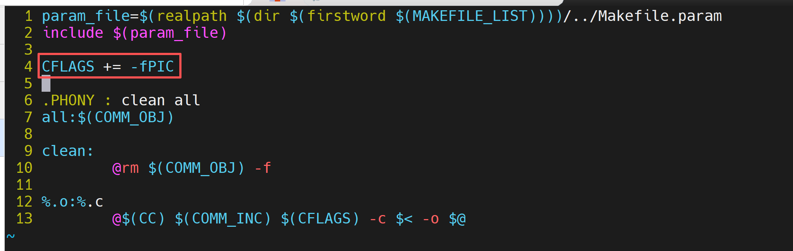

* Then navigate to pegasus/platform/Hi3403V100_clang/smp/a55_linux/mpp/sample/common and run `make clean && make` to regenerate the .o files.
* Note: Modify the absolute paths according to your server's actual configuration.

```sh
export PATH=/home/openharmony/pegasus/os/OpenHarmony/ohos/prebuilts/clang/ohos/linux-x86_64/llvm/bin:$PATH

export SYSROOT_PATH=/home/openharmony/pegasus/os/OpenHarmony/ohos/out/hispark_Hi3403V100/ipcamera_hispark_Hi3403V100_linux/sysroot

make clean && make 
```

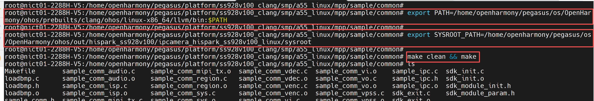

* Create a build_ffmpeg.sh script in the ffmpeg directory and copy the following content into it.

* Note: Modify the absolute paths according to your server's actual configuration.

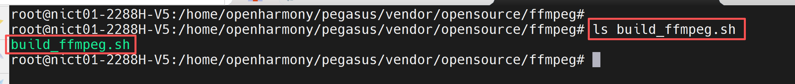

```sh
#!/bin/bash

# Set the cross-compilation toolchain root directory
TOOLCHAIN_ROOT="/home/openharmony/pegasus/os/OpenHarmony/ohos/prebuilts/clang/ohos/linux-x86_64/llvm"
# Cross-compilation toolchain prefix
CROSS_PREFIX="aarch64-unknown-linux-ohos"
# Set sysroot path
SYSROOT="/home/openharmony/pegasus/os/OpenHarmony/ohos/out/hispark_Hi3403V100/ipcamera_hispark_Hi3403V100_linux/sysroot"

# C and C++ compilers
CC="${TOOLCHAIN_ROOT}/bin/${CROSS_PREFIX}-clang"
CXX="${TOOLCHAIN_ROOT}/bin/${CROSS_PREFIX}-clang++"
export AR="${TOOLCHAIN_ROOT}/bin/llvm-ar"
export LD="${TOOLCHAIN_ROOT}/bin/lld"
export RANLIB="${TOOLCHAIN_ROOT}/bin/llvm-ranlib"
export STRIP="${TOOLCHAIN_ROOT}/bin/llvm-strip"

# Get current script directory
SCRIPT_DIR="$(cd "$(dirname "${BASH_SOURCE[0]}")" && pwd)"
WORK_DIR="$(pwd)"

# Installation directory
PREFIX="${WORK_DIR}/install"

# Hisi SDK path
HISI_SDK_BASE="/home/openharmony/pegasus/platform/Hi3403V100_clang/smp/a55_linux"
HISI_MPP_BASE="${HISI_SDK_BASE}/mpp"
HISI_COMMON_DIR="/home/openharmony/pegasus/platform/Hi3403V100_clang/smp/a55_linux/mpp/sample/common"

# Configure PKG_CONFIG_PATH
export PKG_CONFIG_PATH="/home/openharmony/pegasus/vendor/opensource/x264/install/lib/pkgconfig:$PKG_CONFIG_PATH"
export PKG_CONFIG_PATH="/home/openharmony/pegasus/vendor/opensource/x265_3.5/install/lib/pkgconfig:$PKG_CONFIG_PATH"
export PKG_CONFIG_PATH="/home/openharmony/pegasus/vendor/opensource/v4l-utils/install/lib/pkgconfig:$PKG_CONFIG_PATH"

# Find FFmpeg source directory
FFMPEG_SRC="../ffmpeg"
# Create SDK init library directory
SDK_LIB_DIR="$(pwd)/hisi_sdk_lib"
mkdir -p "$SDK_LIB_DIR"
# Define all SDK library directories, add more possible search paths
ALL_SDK_LIB_DIRS=(
    "${HISI_MPP_BASE}/out/lib"
    "${HISI_MPP_BASE}/out/lib/svp_npu"
    "${HISI_COMMON_DIR}"
)

# Get the actual existing Hisi SDK library list
echo "Scanning actual existing Hisi SDK library files..."
AVAILABLE_LIBS=()
for dir in "${ALL_SDK_LIB_DIRS[@]}"; do
    if [ -d "$dir" ]; then
        echo "Scanning library directory: $dir"
        # Find all .so and .a library files
        for lib_path in "${dir}/lib"*.so "${dir}/lib"*.a; do
            if [ -f "$lib_path" ]; then
                # Extract library name (remove path, lib prefix, and extension)
                lib_name=$(basename "$lib_path" .so)
                lib_name=$(basename "$lib_name" .a)
                lib_name=${lib_name#lib}
                
                # Only add new libraries, avoid duplicates
                if ! [[ " ${AVAILABLE_LIBS[@]} " =~ " ${lib_name} " ]]; then
                    AVAILABLE_LIBS+=("$lib_name")
                    echo "✓ Found library: $lib_name ($lib_path)"
                fi
            fi
        done
    else
        echo "⚠ Library directory does not exist: $dir"
    fi
done

echo "Found a total of ${#AVAILABLE_LIBS[@]} Hisi SDK libraries"

# Check if critical libraries exist, use ss_mpi as alternative for ot_mpi
CRITICAL_LIBS=("securec" "ot_osal" "ss_mpi" "ot_base")
for lib in "${CRITICAL_LIBS[@]}"; do
    if [[ " ${AVAILABLE_LIBS[@]} " =~ " ${lib} " ]]; then
        echo "✓ Critical library ${lib} exists"
    else
        echo "⚠ Warning: Critical library ${lib} is missing"
    fi
done

# Verify that compiled object files exist
REQUIRED_OBJS=(
    "${HISI_COMMON_DIR}/sdk_init.o"
    "${HISI_COMMON_DIR}/sdk_exit.o"
)

COMPILED_OBJECTS=()
for obj in "${REQUIRED_OBJS[@]}"; do
    if [ -f "$obj" ]; then
        COMPILED_OBJECTS+=("$obj")
        echo "✓ Found compiled object file: $(basename "$obj")"
    else
        echo "✗ Missing compiled object file: $(basename "$obj")"
        echo "Please ensure this file exists in ${HISI_COMMON_DIR}"
        exit 1
    fi
done

for obj_path in "${HISI_COMMON_DIR}"/*.o; do
    # Skip already added sdk_init.o and sdk_exit.o
    if [ -f "$obj_path" ] && [[ ! " ${COMPILED_OBJECTS[@]} " =~ " ${obj_path} " ]]; then
        COMPILED_OBJECTS+=("$obj_path")
        echo "✓ Adding additional object file: $(basename "$obj_path")"
    fi
done

# Build link parameters - automatically link all found libraries
LINK_LIBS=""
LINKED_COUNT=0

echo "Linking all found Hisi SDK libraries in order:"
for lib in "${AVAILABLE_LIBS[@]}"; do
    LINK_LIBS="${LINK_LIBS} -l${lib}"
    echo "✓ Linking library: ${lib}"
    ((LINKED_COUNT++))
done

# Build shared library link command, add options to handle non-PIC code
echo "Building shared library link command..."
LINK_CMD="$CC -shared -fPIC --sysroot=$SYSROOT"
LINK_CMD="${LINK_CMD} -o ${SDK_LIB_DIR}/libhisi_sdk_init.so"
LINK_CMD="${LINK_CMD} ${COMPILED_OBJECTS[*]}"

# Add all SDK library directories to the link command (including common directory)
for dir in "${ALL_SDK_LIB_DIRS[@]}"; do
    LINK_CMD="${LINK_CMD} -L${dir}"
done

# Add options to handle non-PIC code
LINK_CMD="${LINK_CMD} ${LINK_LIBS}"
LINK_CMD="${LINK_CMD} -lpthread -lm -lstdc++ -ldl -lrt"
LINK_CMD="${LINK_CMD} -Wl,--allow-shlib-undefined"
LINK_CMD="${LINK_CMD} -Wl,-allow-multiple-definition"
LINK_CMD="${LINK_CMD} -Wl,-z,notext"

echo "Executing link command:"
echo "${LINK_CMD}"
echo "=========================================="

eval "${LINK_CMD}"

if [ $? -ne 0 ]; then
    echo "✗ Shared library creation failed"
    echo "Attempting simplified link parameters..."
    
    # Simplified version linking only critical libraries, using ss_mpi as alternative for ot_mpi
    SIMPLE_LINK_CMD="$CC -shared -fPIC --sysroot=$SYSROOT"
    SIMPLE_LINK_CMD="${SIMPLE_LINK_CMD} -o ${SDK_LIB_DIR}/libhisi_sdk_init.so"
    SIMPLE_LINK_CMD="${SIMPLE_LINK_CMD} ${COMPILED_OBJECTS[*]}"
    
    # Add all SDK library directories to simplified link command
    for dir in "${ALL_SDK_LIB_DIRS[@]}"; do
        SIMPLE_LINK_CMD="${SIMPLE_LINK_CMD} -L${dir}"
    done
    
    # Use ss_mpi as alternative for ot_mpi
    SIMPLE_LINK_CMD="${SIMPLE_LINK_CMD} -lsecurec -lot_osal -lss_mpi"
    SIMPLE_LINK_CMD="${SIMPLE_LINK_CMD} -lpthread -lm -lstdc++ -ldl"
    SIMPLE_LINK_CMD="${SIMPLE_LINK_CMD} -Wl,--allow-shlib-undefined"
    SIMPLE_LINK_CMD="${SIMPLE_LINK_CMD} -Wl,-allow-multiple-definition"
    SIMPLE_LINK_CMD="${SIMPLE_LINK_CMD} -Wl,-z,notext"
    
    echo "Executing simplified link command:"
    echo "${SIMPLE_LINK_CMD}"
    eval "${SIMPLE_LINK_CMD}"
    
    if [ $? -ne 0 ]; then
        echo "✗ Shared library creation failed"
        echo "Try recompiling the common directory object files with the -fPIC option:"
        echo "cd ${HISI_COMMON_DIR}"
        echo "${CC} -c -fPIC *.c -I${HISI_MPP_BASE}/include -I${HISI_SDK_BASE}/include"
        exit 1
    fi
fi

echo "✓ Hisi SDK init shared library created!"

if [ -f "${SDK_LIB_DIR}/libhisi_sdk_init.so" ]; then
    echo "✓ Shared library file exists"
    ls -la "${SDK_LIB_DIR}/libhisi_sdk_init.so"
    
    # Check symbols
    echo ""
    echo "Checking critical symbols:"
    REQUIRED_SYMBOLS=("SDK_init" "SDK_exit")
    for symbol in "${REQUIRED_SYMBOLS[@]}"; do
        if ${CROSS_PREFIX}-nm -D "${SDK_LIB_DIR}/libhisi_sdk_init.so" 2>/dev/null | grep -q "$symbol" || \
           ${CROSS_PREFIX}-objdump -T "${SDK_LIB_DIR}/libhisi_sdk_init.so" 2>/dev/null | grep -q "$symbol"; then
            echo "✓ Symbol $symbol exists"
        else
            echo "⚠ Symbol $symbol may be missing"
        fi
    done
else
    echo "✗ Shared library file does not exist"
    exit 1
fi

# Set compilation flags, add -fPIC
CFLAGS="--sysroot=$SYSROOT -fPIC"
CFLAGS="${CFLAGS} -I${HISI_COMMON_DIR}"
CFLAGS="${CFLAGS} -I${HISI_MPP_BASE}/out/include"
CFLAGS="${CFLAGS} -DHISI_SDK_ENABLED"
export CFLAGS

# Set C++ compilation flags, add -fPIC
export CXXFLAGS="--sysroot=$SYSROOT -fPIC"

# Set link flags
LDFLAGS="--sysroot=$SYSROOT"
LDFLAGS="${LDFLAGS} -L${SDK_LIB_DIR}"

# Add all SDK library directories to link flags (including common directory)
for dir in "${ALL_SDK_LIB_DIRS[@]}"; do
    LDFLAGS="${LDFLAGS} -L${dir}"
done

# Set runtime library search paths
LDFLAGS="${LDFLAGS} -Wl,--allow-shlib-undefined"
LDFLAGS="${LDFLAGS} -Wl,-allow-multiple-definition"

# Link libraries
LDFLAGS="${LDFLAGS} -lhisi_sdk_init"
LDFLAGS="${LDFLAGS} ${LINK_LIBS}"
LDFLAGS="${LDFLAGS} -lpthread -lm -lstdc++ -ldl -lrt"
export LDFLAGS

# Build configure command
function gen_cfg_cmd() {
    printf "%s " \
        "${FFMPEG_SRC}/configure" \
        "--prefix=$PREFIX" \
        "--arch=aarch64" \
        "--target-os=linux" \
        "--enable-cross-compile" \
        "--disable-x86asm" \
        "--disable-static" \
        "--enable-shared" \
        "--cc=$CC" \
        "--cxx=$CXX" \
        "--strip=$STRIP" \
        "--ld=$CXX" \
        "--sysroot=$SYSROOT" \
        "--enable-libx264" \
        "--enable-libx265" \
        "--enable-gpl" \
        "--enable-encoder=h264_Hi3403V100" \
        "--enable-encoder=h265_Hi3403V100" \
        "--enable-encoder=mjpeg_Hi3403V100" \
        "--enable-decoder=h264_Hi3403V100" \
        "--enable-decoder=h265_Hi3403V100" \
        "--enable-decoder=mjpeg_Hi3403V100" \
        "--extra-cflags='$CFLAGS'" \
        "--extra-ldflags='$LDFLAGS'"
    echo
}

# Execute configure
echo "=========================================="
echo "Starting FFmpeg configuration..."
echo "=========================================="
cfg_cmd=$(gen_cfg_cmd)
echo "$cfg_cmd"
echo "=========================================="
eval "$cfg_cmd"
```

### Step 4: Compile ffmpeg

* In the server command line, execute the following commands to configure before compiling ffmpeg.

```sh
chmod +x build_ffmpeg.sh

./build_ffmpeg.sh
```

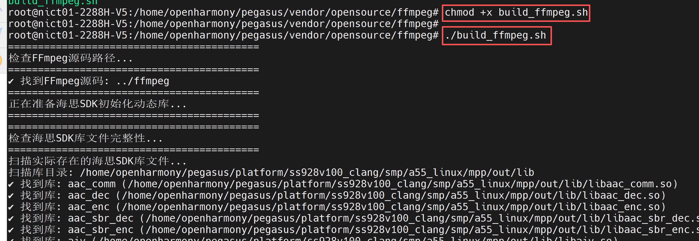

* In the server command line, execute the following commands to compile ffmpeg.

```sh
make -j$(nproc) && make install
```

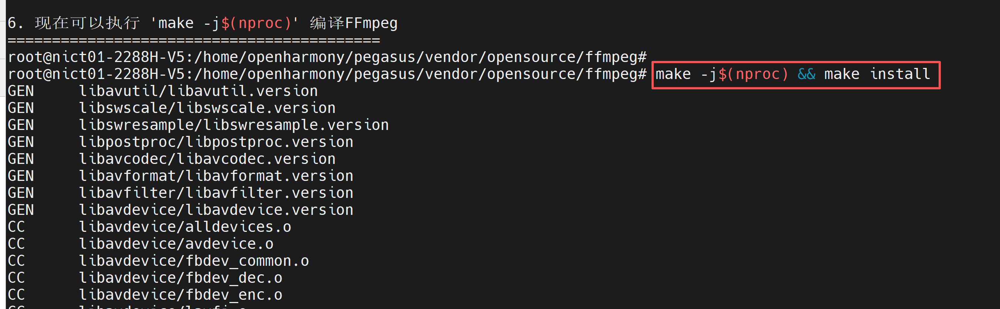

* After compilation completes, the following content will be generated in the install directory.

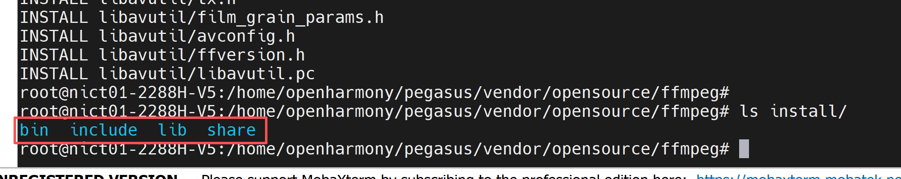

* And a hisi_sdk_lib folder will be created in the ffmpeg directory, containing a libhisi_sdk_init.so library.

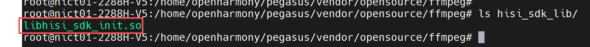

### Step 5: Compile Samples

* In the server command line, execute the following commands to compile the codec samples in the ffmpeg and hisi directories respectively.

```sh
cd sample/ffmpeg

make 

cd ../hisi

make
```

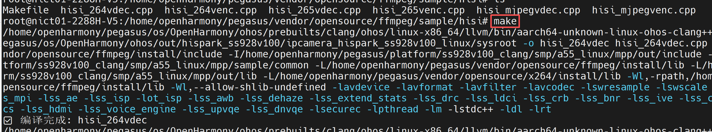

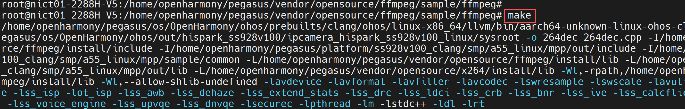


## 4. Board-Side Verification

### Step 1: Configure the Board Environment

* 1. Ensure the development board has the OpenHarmony operating system burned.
* 2. Connect the development board to your computer using a network cable, ensuring they are on the same local network.
* 3. Configure the development board's IP address and ensure the board and computer can ping each other.

```sh
# Note: configure the eth0 IP address according to your network IP segment
ifconfig eth0 192.168.100.100

# Add permissions
echo 0 9999999 > /proc/sys/net/ipv4/ping_group_range
```

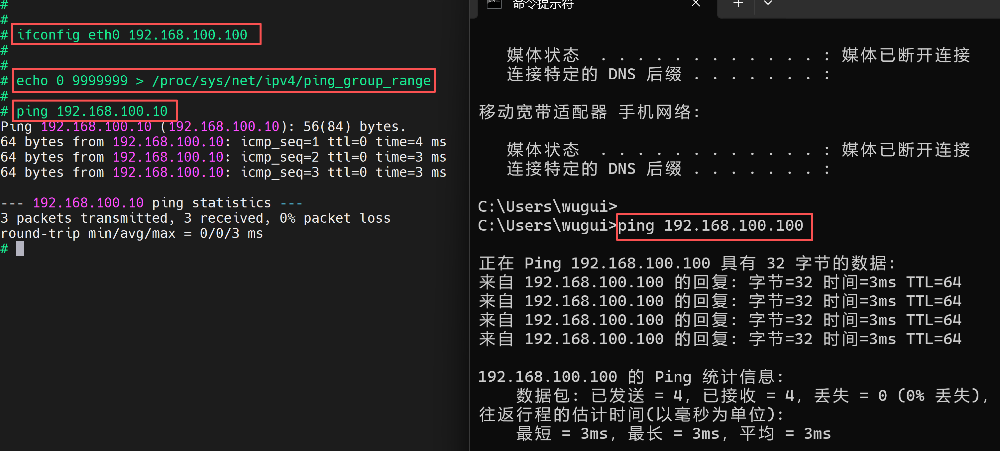

### Step 2: Prepare ffmpeg Dependency Files

* 1. Download the install directories from v4l2, x264, and x265 cross-compiled in Chapter 2 and copy them to the NFS mount directory.
* 2. Download the install directory from ffmpeg cross-compiled in Chapter 3 and copy it to the NFS mount directory.
* 3. Download the sample directory compiled in Chapter 3, Step 5, and copy it to the NFS mount directory.
* 4. Download libhisi_sdk_init.so and copy it to the ffmpeg_install/lib/ directory.
* 5. Download mpp/out/lib and copy it to the NFS mount directory.

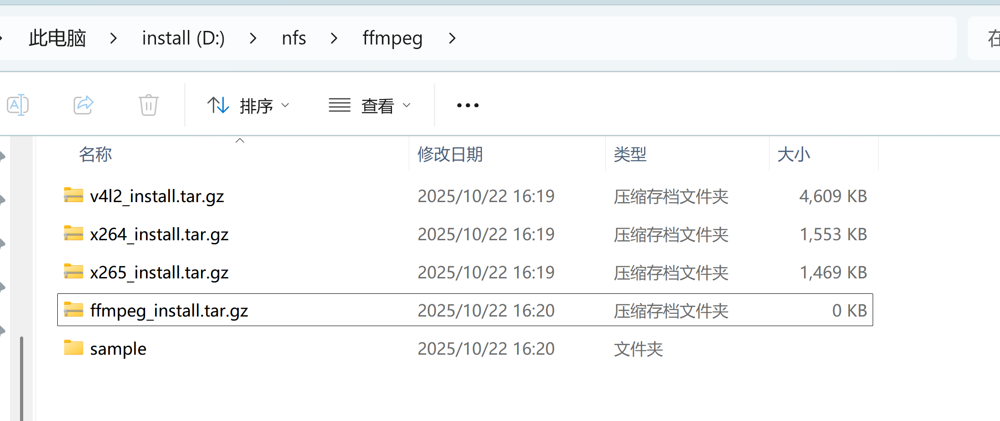

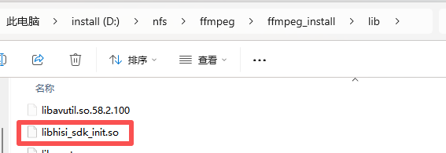

* 6. In the development board's command line terminal, execute the following command to mount the computer's NFS directory to the /mnt directory (note: modify according to your IP address and NFS configuration).

```sh
mount -o nolock,addr=192.168.100.10 -t nfs 192.168.100.10:/d/nfs /mnt
```

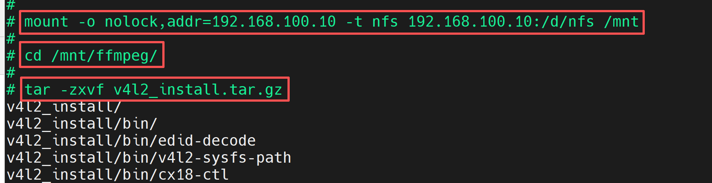

* Since I packaged each library, after mounting NFS, these libraries need to be extracted before use.

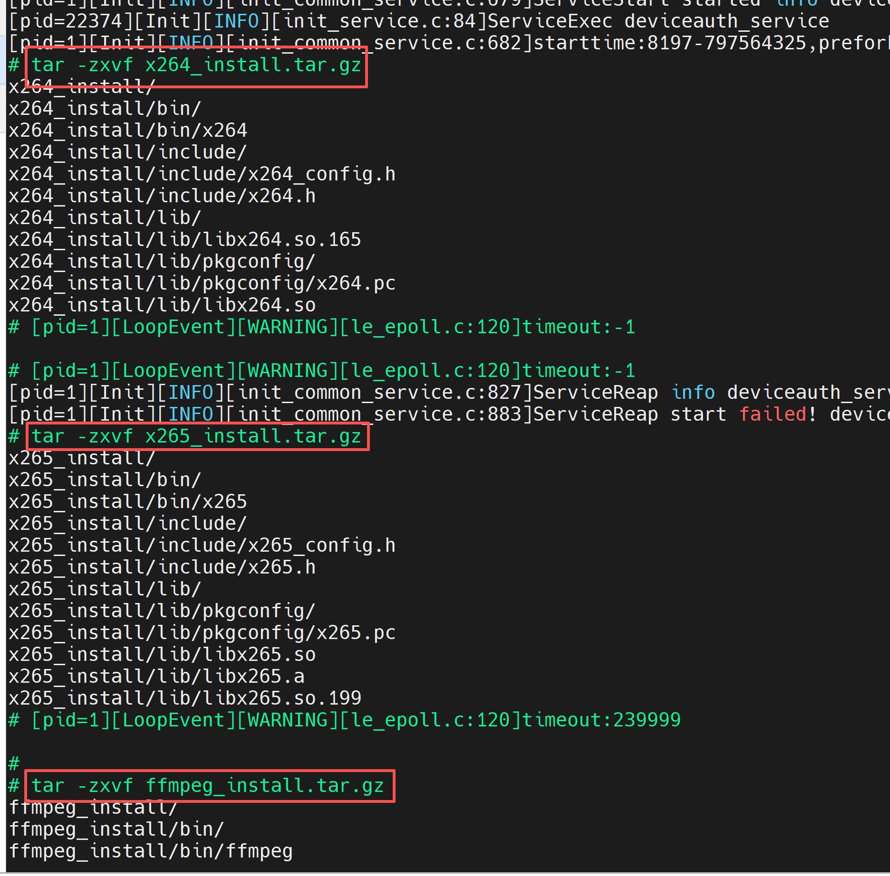

* 7. In the development board's command line terminal, execute the following commands to configure environment variables for each library.

```sh
export PATH=/mnt/ffmpeg/ffmpeg_install/bin:$PATH
export LD_LIBRARY_PATH=/mnt/ffmpeg/ffmpeg_install/lib:/mnt/ffmpeg/lib:/mnt/ffmpeg/lib/svp_npu:$LD_LIBRARY_PATH
export LD_LIBRARY_PATH=/mnt/ffmpeg/v4l2_install/lib:$LD_LIBRARY_PATH
export LD_LIBRARY_PATH=/mnt/ffmpeg/x264_install/lib:$LD_LIBRARY_PATH
export LD_LIBRARY_PATH=/mnt/ffmpeg/x265_install/lib:$LD_LIBRARY_PATH

chmod +x /mnt/ffmpeg/ffmpeg_install/bin/*
```

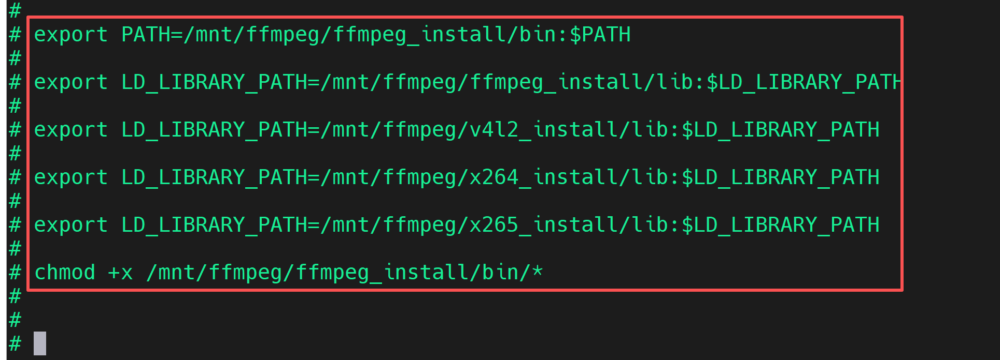

### Step 3: Test if ffmpeg Works Correctly

* In the development board's command line, execute the following command to get the ffmpeg version.

```sh
cd /mnt/ffmpeg/ffmpeg_install/bin/

ffmpeg -version
```

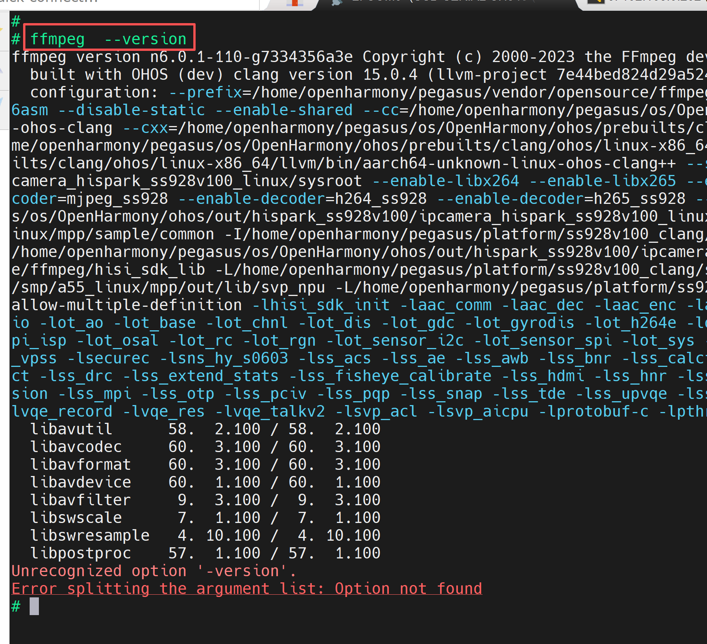

### Step 4: Test Sample Cases

* Note: The sample/hisi/ directory contains samples that call the Hisi hardware codec module for hardware acceleration. The sample/ffmpeg/ directory contains samples that use ffmpeg's native codec interfaces.
* In the development board's command line terminal, execute the following commands to run the relevant programs.

```sh
cd /mnt/ffmpeg/sample/hisi

chmod +x *

# hisi encoding
./hisi_264venc  /dev/video0  h264_Hi3403V100  640 480 30

cd /mnt/ffmpeg/sample/ffmpeg

chmod +x *
# ffmpeg encoding
./264enc /dev/video0 640 480 30
```

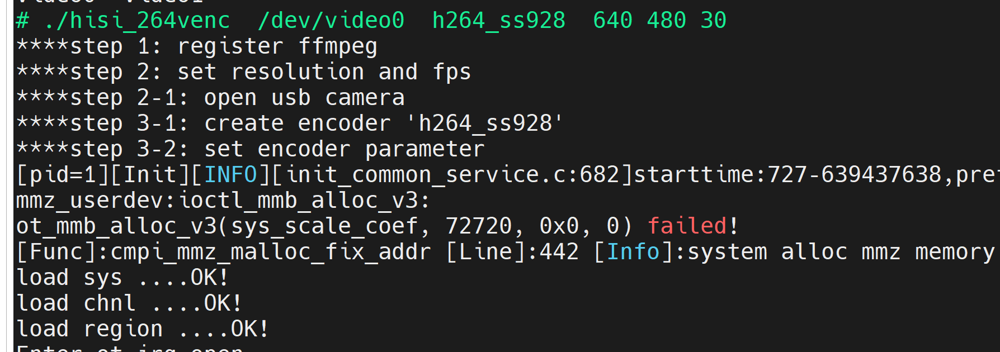

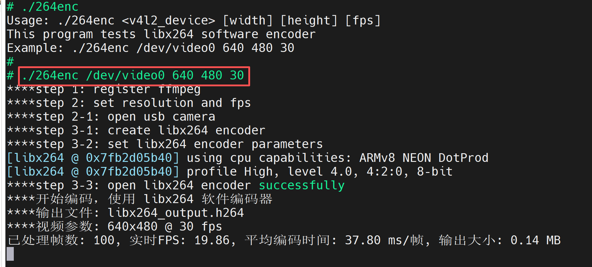

* In the development board's command line, execute the following commands step by step to test the decoding cases.

```sh
cd /mnt/ffmpeg/sample/hisi 

# hisi decoding
./hisi_264vdec h264_Hi3403V100_output.h264  output

# ffmpeg decoding
./264dec libx264_output.h264  output
```

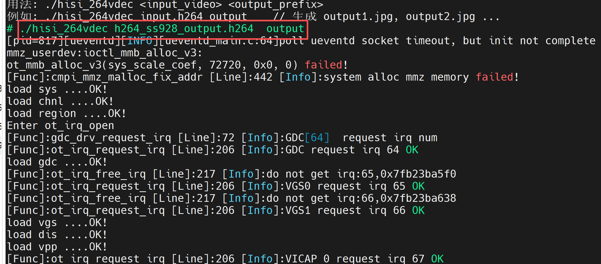

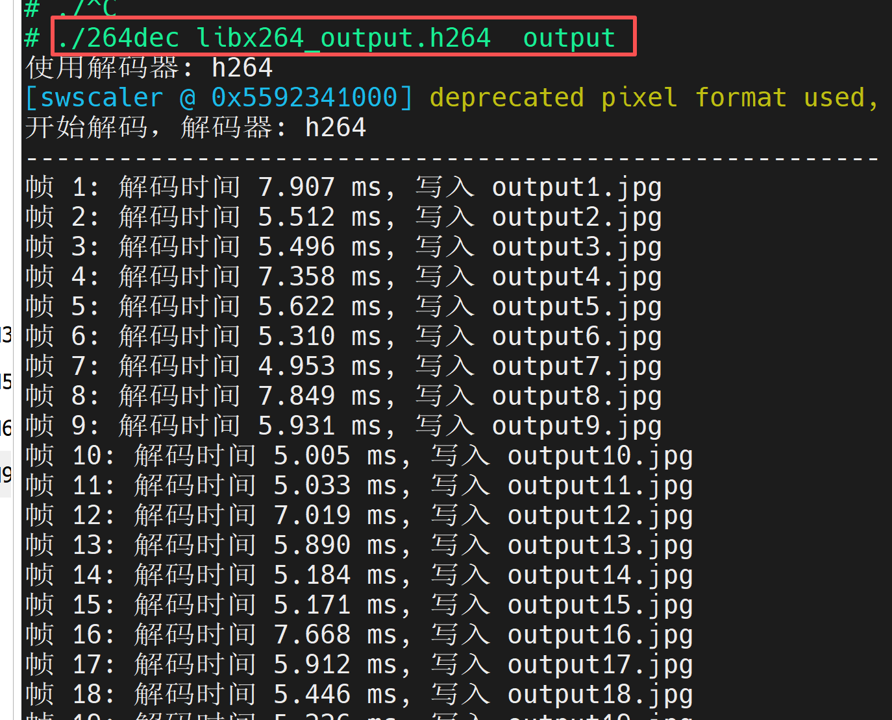

* If you want to use ffmpeg to call Hisi's hardware codec module in your own code, use the avcodec_find_decoder_by_name interface.

```c
avcodec_find_decoder_by_name("h264_Hi3403V100");

avcodec_find_decoder_by_name("h265_Hi3403V100");

avcodec_find_decoder_by_name("mjpeg_Hi3403V100");

avcodec_find_encoder_by_name("h264_Hi3403V100");

avcodec_find_encoder_by_name("h265_Hi3403V100");

avcodec_find_encoder_by_name("mjpeg_Hi3403V100");
```

## 5. Comparison of Hisi Hardware Codec and FFmpeg Native Codec

* Decoder

| Data/Decoder            | h264                  | h264_Hi3403V100            | hevc                  | h265_Hi3403V100            | mjpeg                 | mjpeg_Hi3403V100           |
| ----------------------- | --------------------- | --------------------- | --------------------- | --------------------- | --------------------- | --------------------- |
| Video parameters        | 1920x1080 @30FPS      | 1920x1080 @30FPS      | 1920x1080 @30FPS      | 1920x1080 @30FPS      | 1920x1080 @30FPS      | 1920x1080 @30FPS      |
| Total frames processed  | 85                    | 207                   | 21                    | 221                   | 125                   | 217                   |
| Total decode time (ms)  | 4547.785              | 8592.903              | 4566.406              | 9147.614              | 3020.907              | 93398.829             |
| Total send time (ms)    |                       |                       | 4566.203              | 8168.024 (89.3%)       |                       | 9007.92               |
| Total receive time (ms) |                       |                       | 0.203                 | 1004.696 (10.7%)       |                       | 335.712               |
| Avg decode time (ms/frame) | 53.503              | 41.512                | 217.448               | 41.401                | 20.167                | 43.036                |
| Avg send time (ms/frame) |                      |                       | 217.438               | 36.959                |                       |                       |
| Avg receive time (ms/frame) |                   |                       | 0.01                  | 4.546                 |                       |                       |
| Min decode time (ms)    | 0.036                 | 40.653                | 191.937               | 40.699                | 22.408                | 40.909                |
| Max decode time (ms)    | 74.43                 | 42.67                 | 307.397               | 44.188                | 26.027                | 83.292                |
| Time difference (ms)    | 12.534                |                       | 115.46                | 3.489                 | 3.599                 | 42.383                |
| Decode frame rate (FPS) | 18.69                 | 24.09                 | 4.6                   | 24.15                 | 41.38                 | 23.24                 |
| Pixels per second (MP/s) |                      |                       | 9.54                  | 50.09                 | 19.09                 | 12.52                 |

* Encoder

| Data/Encoder         | libx264              | h264_Hi3403V100           | libx265              | h265_Hi3403V100           | mjpeg                | mjpeg_Hi3403V100          |
| -------------------- | -------------------- | -------------------- | -------------------- | -------------------- | -------------------- | -------------------- |
| Video parameters     | 1920x1080 @30FPS     | 1920x1080 @30FPS     | 1920x1080 @30FPS     | 1920x1080 @30FPS     | 1920x1080 @30FPS     | 1920x1080 @30FPS     |
| Total frames processed | 85                  | 208                  | 21                   | 222                  | 114                  | 218                  |
| Total time (s)       | 30.45                | 14.05                | 41.62                | 15.56                | 16.36                | 15.1                 |
| Avg FPS              | 11.19                | 14.8                 | 0.5                  | 14.27                | 6.97                 | 14.44                |
| Avg format conversion time (ms/frame) | 3      | 65.22                | 11.52                | 66.91                | 51.11                | 66.17                |
| Avg encode time (ms/frame) | 342.35            | 2.25                 | 1957.39              | 3.07                 | 89.4                 | 2.99                 |
| Coding efficiency (encode time / theoretical frame interval) | 1027.05% | 6.74% | 5872.18% | 9.20% | 268.21% | 8.97% |
| Total encode time (s)| 29.01                | 0.47                 | 41.11                | 0.68                 | 10.19                | 0.65                 |
| Total conversion time (s) | 0.95              | 13.57                | 0.24                 | 14.85                | 5.83                 | 14.43                |
| Output file size (MB)| 1.26                 |                      | 0.32                 | 13.28                | 17.44                | 11.86                |
| Compression ratio    | 39.29:1              |                      | 192.04:1             | 49.60:1              | 19.39:1              | 54.52:1              |
| Avg bitrate (kbps)   | 347.13               |                      | 65.39                | 7158.57              | 8941.11              | 6589.71              |
| Performance rating   | Very high compression, encoding needs optimization | Excellent encoding | Good compression, insufficient encoding | Excellent encoding | Needs optimization | Excellent |
