# libcamera Porting

## 1. Software and Hardware Environment
* Development board: SeaGull Pi
* Cross-compilation toolchain: OHOS (dev) clang version 15.0.4

* Toolchain path: pegasus/os/OpenHarmony/ohos/prebuilts/clang/ohos/linux-x86_64/llvm/bin  
* Python version: Python-3.13.2
* Ported libcamera version: libcamera-0.5

## 2. Configuring Python Environment

* Step 1: To meet the requirements for python3.13.2 porting, first change the server's python version to 3.13.2, and cross-compile Python-3.13.2 following the [Python porting steps](../python/README.md).
* Step 2: Follow [Step 3 of Chapter 2 in the numpy porting document](../numpy/README.md) to create the virtual environment.

```sh
cd pegasus/vendor/opensource/Python-3.13.2

# Activate the environment
. crossenv_aarch64/bin/activate
```

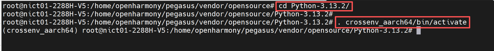

## 3. Installing Dependencies

* Since compiling libcamera requires other third-party software, we cross-compile all dependent third-party software before compiling libcamera.

### Step 1: Configure Dependency Environment Variables

* Execute the following command on the server to configure environment variables for cross-compilation. Modify the absolute paths according to your server's actual configuration.

```sh
export CC=/home/openharmony/pegasus/os/OpenHarmony/ohos/prebuilts/clang/ohos/linux-x86_64/llvm/bin/aarch64-unknown-linux-ohos-clang
export CXX=/home/openharmony/pegasus/os/OpenHarmony/ohos/prebuilts/clang/ohos/linux-x86_64/llvm/bin/aarch64-unknown-linux-ohos-clang++
export AR=/home/openharmony/pegasus/os/OpenHarmony/ohos/prebuilts/clang/ohos/linux-x86_64/llvm/bin/llvm-ar
export LD=/home/openharmony/pegasus/os/OpenHarmony/ohos/prebuilts/clang/ohos/linux-x86_64/llvm/bin/ld.lld
export RANLIB=/home/openharmony/pegasus/os/OpenHarmony/ohos/prebuilts/clang/ohos/linux-x86_64/llvm/bin/llvm-ranlib
export STRIP=/home/openharmony/pegasus/os/OpenHarmony/ohos/prebuilts/clang/ohos/linux-x86_64/llvm/bin/llvm-strip
```

### Step 2: Cross-Compile Dependent Third-Party Software

**Note:** Before cross-compiling, ensure that the OpenHarmony code has been downloaded and the full build has passed. For details, refer to the [ohos build](https://gitee.com/HiSpark/pegasus/blob/master/docs/OpenHarmony%20Small%E7%89%88%E6%9C%AC%E4%BD%BF%E7%94%A8%E6%8C%87%E5%8D%97/OpenHarmony%20Small%E7%89%88%E6%9C%AC%E4%BD%BF%E7%94%A8%E6%8C%87%E5%8D%97.md#ohos%E7%BC%96%E8%AF%91) content.

#### 1. Cross-Compiling libevent

* Execute the following commands on the server to download the source code and configure the toolchain.

```sh
# Since zlib is also a third-party software, it can be ported under the opensource directory
cd pegasus/vendor/opensource/

wget https://github.com/libevent/libevent/releases/download/release-2.1.12-stable/libevent-2.1.12-stable.tar.gz 

tar -xzvf libevent-2.1.12-stable.tar.gz	
rm libevent-2.1.12-stable.tar.gz	

cd libevent-2.1.12-stable

# Note: modify the path according to your Pegasus directory
export CC="/home/openharmony/pegasus/os/OpenHarmony/ohos/prebuilts/clang/ohos/linux-x86_64/llvm/bin/aarch64-unknown-linux-ohos-clang --sysroot=/home/openharmony/pegasus/os/OpenHarmony/ohos/out/hispark_Hi3403V100/ipcamera_hispark_Hi3403V100_linux/sysroot"
```

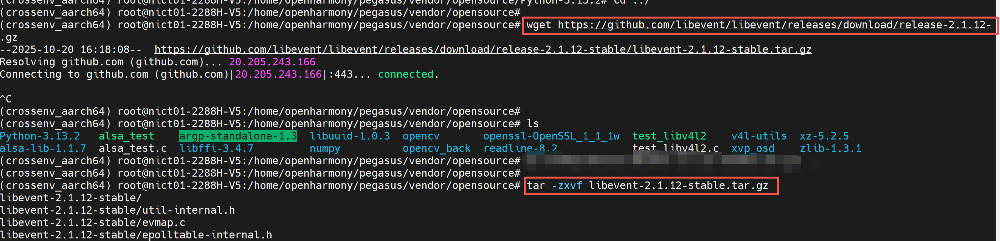

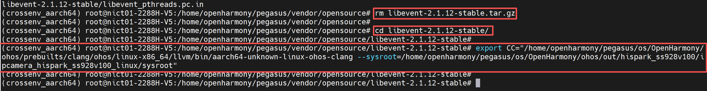

* Execute the following commands on the server to modify the configuration script and some code to ensure compilation does not error.

```sh
sed -i 's/| -kaos\*/| -kaos\* | -ohos\*/g' ./build-aux/config.sub
sed -i 's/linux-uclibc\*/linux-uclibc\* | linux-ohos\*/g' ./build-aux/config.sub

sed -i 's/arc4random_buf/libevent_arc4random_buf/g' ./arc4random.c  
sed -i 's/arc4random_buf/libevent_arc4random_buf/g' evutil_rand.c
```

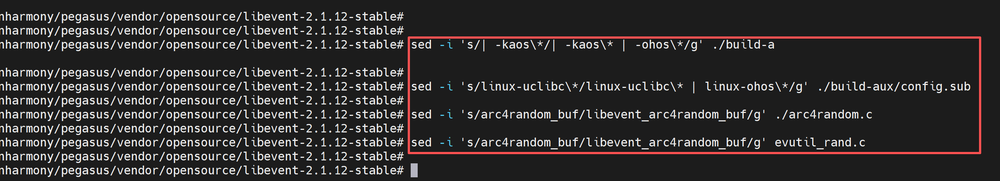

* Execute the following commands on the server to compile libevent.

```sh
./configure --prefix=$PWD/install --host=aarch64-linux-ohos --disable-openssl

make && make install
```

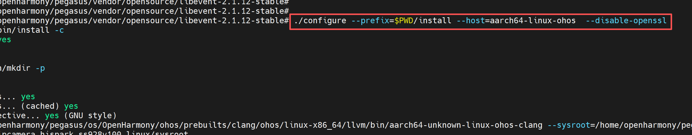

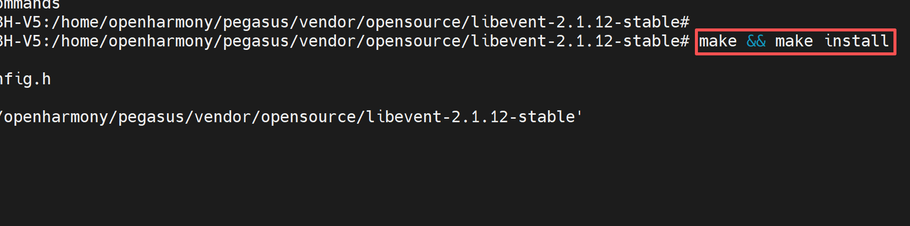

* After successful compilation, the following files will be generated in the install directory.

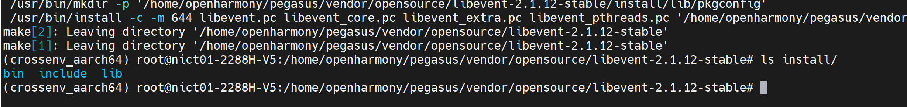

#### 2. Cross-Compiling tiff

* Execute the following commands on the server to cross-compile openssl (note: the header says openssl but the content is tiff).

```sh
cd ../

wget http://download.osgeo.org/libtiff/tiff-4.5.1.tar.gz 

tar -xzf tiff-4.5.1.tar.gz  
rm tiff-4.5.1.tar.gz  

cd tiff-4.5.1
```

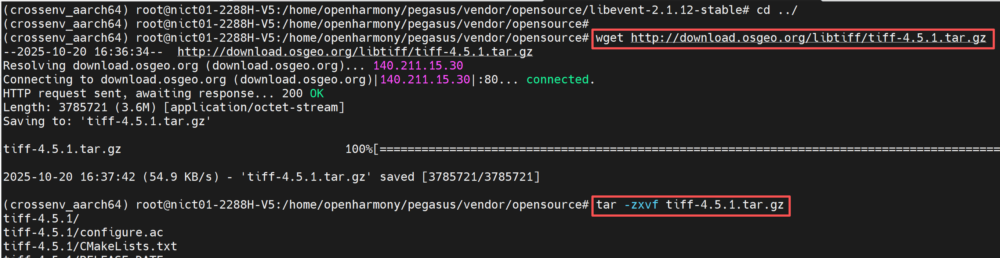

* Add OHOS compilation support in the ./config/config.sub file to ensure compilation does not error.
  * Add | ohos* at line 1761.
  * Add | linux-ohos* at line 1782.

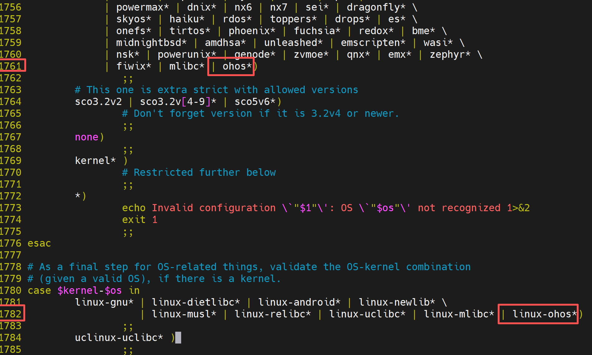

* Execute the following commands on the server to compile tiff.

```sh
./configure --prefix=$PWD/install --host=aarch64-linux-ohos --with-sysroot=/home/openharmony/pegasus/os/OpenHarmony/ohos/out/hispark_Hi3403V100/ipcamera_hispark_Hi3403V100_linux/sysroot CFLAGS="--sysroot=/home/openharmony/pegasus/os/OpenHarmony/ohos/out/hispark_Hi3403V100/ipcamera_hispark_Hi3403V100_linux/sysroot" CXXFLAGS="--sysroot=/home/openharmony/pegasus/os/OpenHarmony/ohos/out/hispark_Hi3403V100/ipcamera_hispark_Hi3403V100_linux/sysroot"

make && make install
```

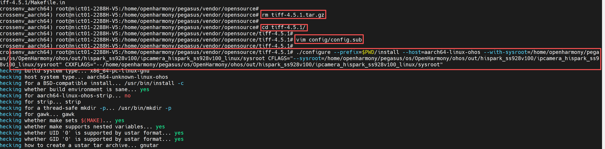

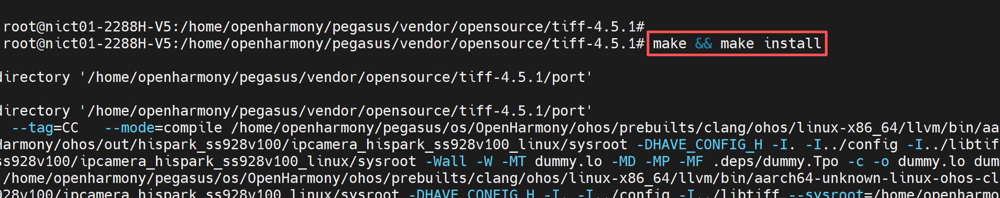

* After compilation completes, the following files will be generated in the install directory.

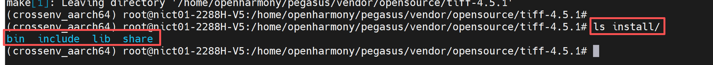

#### 3. Cross-Compiling jpeg-9d

* Execute the following commands on the server to cross-compile jpeg-9d.

```sh
cd ../

wget https://www.ijg.org/files/jpegsrc.v9d.tar.gz 
tar -zxvf jpegsrc.v9d.tar.gz 

rm jpegsrc.v9d.tar.gz 
 
cd jpegsrc.v9d
```

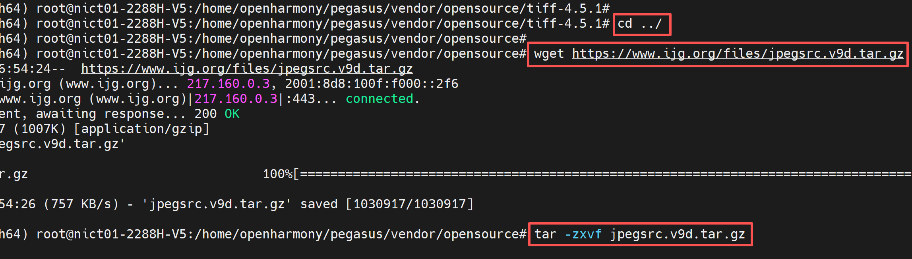

* Execute the following commands on the server to modify the configuration script to ensure compilation does not error.

```sh
sed -i 's/| -kaos\*/| -kaos\* | -ohos\*/g' config.sub  
sed -i 's/linux-uclibc\*/linux-uclibc\* | linux-ohos\*/g' config.sub
```

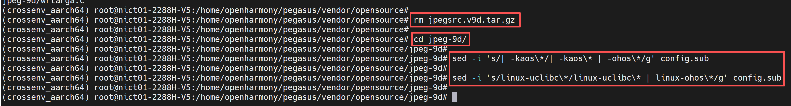

* Execute the following commands to cross-compile jpeg-9d.

```sh
export CC="/home/openharmony/pegasus/os/OpenHarmony/ohos/prebuilts/clang/ohos/linux-x86_64/llvm/bin/aarch64-unknown-linux-ohos-clang --sysroot=/home/openharmony/pegasus/os/OpenHarmony/ohos/out/hispark_Hi3403V100/ipcamera_hispark_Hi3403V100_linux/sysroot"

./configure --prefix=$PWD/install --host=aarch64-linux-ohos	

make && make install
```

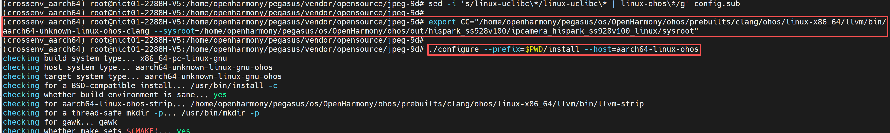

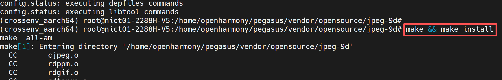

* After compilation completes, the following files will be generated in the install directory.

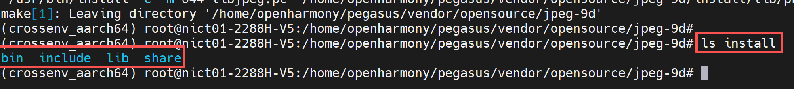

#### 4. Cross-Compiling openssl

* Execute the following commands on the server to cross-compile openssl.

```sh
cd ../

wget https://github.com/openssl/openssl/archive/refs/tags/OpenSSL_1_1_1w.tar.gz

tar -xvf OpenSSL_1_1_1w.tar.gz	
rm OpenSSL_1_1_1w.tar.gz

cd openssl-OpenSSL_1_1_1w

perl Configure linux-aarch64 --prefix=$PWD/install

make CC="/home/openharmony/pegasus/os/OpenHarmony/ohos/prebuilts/clang/ohos/linux-x86_64/llvm/bin/aarch64-unknown-linux-ohos-clang --sysroot=/home/openharmony/pegasus/os/OpenHarmony/ohos/out/hispark_Hi3403V100/ipcamera_hispark_Hi3403V100_linux/sysroot" LDFLAGS="--sysroot=/home/openharmony/pegasus/os/OpenHarmony/ohos/out/hispark_Hi3403V100/ipcamera_hispark_Hi3403V100_linux/sysroot -L/home/openharmony/pegasus/os/OpenHarmony/ohos/out/hispark_Hi3403V100/ipcamera_hispark_Hi3403V100_linux/sysroot/usr/lib"

make install
```

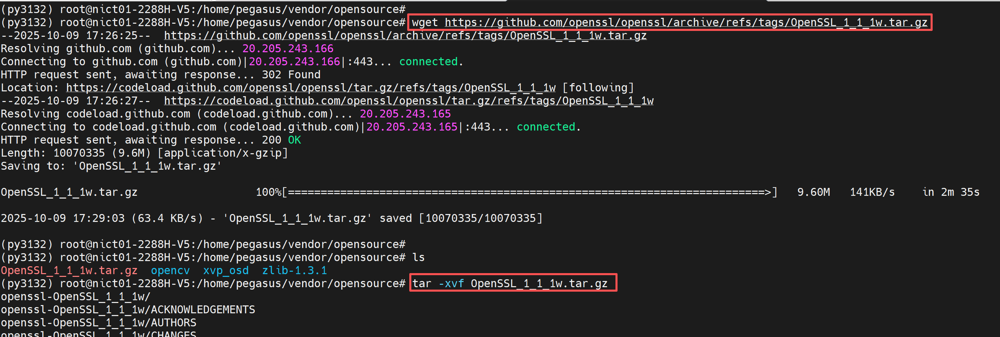


### Step 3: Install Dependency Software

* Execute the following command on the server to install dependency software.

```sh
apt-get install ninja-build libevent-dev libjpeg-dev 

# The meson version downloaded via apt is too low and does not meet requirements
pip3 install meson==1.6 jinja2 pyyaml ply pybind11 -i https://pypi.tuna.tsinghua.edu.cn/simple
```

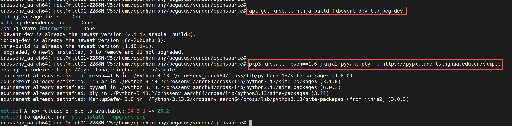

## 4. Cross-Compiling libcamera

### Step 1: Download Source Code

* Execute the following commands on the server to cross-compile libcamera.

```sh
cd ../

git clone https://git.libcamera.org/libcamera/libcamera.git

cd libcamera
```

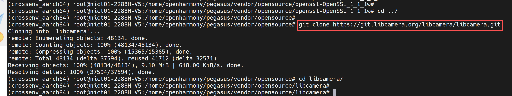

### Step 2: Configure the Build Environment

* Create a cross_file.txt file in the libcamera directory and copy the following content into it.
* Note: Where absolute paths are involved in the content below, modify them according to your server's actual configuration.

```sh
[binaries]
c = '/home/openharmony/pegasus/os/OpenHarmony/ohos/prebuilts/clang/ohos/linux-x86_64/llvm/bin/aarch64-unknown-linux-ohos-clang'	
cpp = '/home/openharmony/pegasus/os/OpenHarmony/ohos/prebuilts/clang/ohos/linux-x86_64/llvm/bin/aarch64-unknown-linux-ohos-clang++'
ar = '/home/openharmony/pegasus/os/OpenHarmony/ohos/prebuilts/clang/ohos/linux-x86_64/llvm/bin/llvm-ar'
strip = '/home/openharmony/pegasus/os/OpenHarmony/ohos/prebuilts/clang/ohos/linux-x86_64/llvm/bin/llvm-strip'
pkg-config = '/usr/bin/pkg-config'

[host_machine]
system = 'linux'
cpu_family = 'aarch64'
cpu = 'aarch64'
endian = 'little'

[properties]
sys_root = '/home/openharmony/pegasus/os/OpenHarmony/ohos/out/hispark_Hi3403V100/ipcamera_hispark_Hi3403V100_linux/sysroot'
libdir = '/home/openharmony/pegasus/os/OpenHarmony/ohos/out/hispark_Hi3403V100/ipcamera_hispark_Hi3403V100_linux/sysroot/usr/lib'
includedir = '/home/openharmony/pegasus/os/OpenHarmony/ohos/out/hispark_Hi3403V100/ipcamera_hispark_Hi3403V100_linux/sysroot/usr/include'

[built-in options]
c_args = ['--sysroot=/home/openharmony/pegasus/os/OpenHarmony/ohos/out/hispark_Hi3403V100/ipcamera_hispark_Hi3403V100_linux/sysroot', '-isystem', '/home/openharmony/pegasus/os/OpenHarmony/ohos/out/hispark_Hi3403V100/ipcamera_hispark_Hi3403V100_linux/sysroot/usr/include']
cpp_args = ['--sysroot=/home/openharmony/pegasus/os/OpenHarmony/ohos/out/hispark_Hi3403V100/ipcamera_hispark_Hi3403V100_linux/sysroot', '-isystem', '/home/openharmony/pegasus/os/OpenHarmony/ohos/prebuilts/clang/ohos/linux-x86_64/llvm/include/libcxx-ohos/include/c++/v1', '-D_LIBCPP_HAS_NO_PRAGMA_SYSTEM_HEADER', '-std=c++17', '-I/home/openharmony/pegasus/vendor/opensource/tiff-4.5.1/install/include', '-I/home/openharmony/pegasus/vendor/opensource/libevent-2.1.12-stable/install/include', '-I/home/openharmony/pegasus/vendor/opensource/openssl-OpenSSL_1_1_1w/install/include', '-I/home/openharmony/pegasus/vendor/opensource/jpeg-9d/install/include',]

c_link_args = ['--sysroot=/home/openharmony/pegasus/os/OpenHarmony/ohos/out/hispark_Hi3403V100/ipcamera_hispark_Hi3403V100_linux/sysroot']
cpp_link_args = ['--sysroot=/home/openharmony/pegasus/os/OpenHarmony/ohos/out/hispark_Hi3403V100/ipcamera_hispark_Hi3403V100_linux/sysroot', '-L/home/openharmony/pegasus/vendor/opensource/tiff-4.5.1/install/lib', '-L/home/openharmony/pegasus/vendor/opensource/libevent-2.1.12-stable/install/lib', '-L/home/openharmony/pegasus/vendor/opensource/openssl-OpenSSL_1_1_1w/install/lib', '-L/home/openharmony/pegasus/vendor/opensource/jpeg-9d/install/lib',]
```

* Combine with the content from Chapter 3 to configure the dependency software environment variables.
* Note: Where absolute paths are involved below, modify according to your server's actual configuration.

```sh
export PKG_CONFIG_PATH=$PKG_CONFIG_PATH:/home/openharmony/pegasus/vendor/opensource/tiff-4.5.1/install/lib/pkgconfig:/home/openharmony/pegasus/vendor/opensource/libevent-2.1.12-stable/install/lib/pkgconfig:/home/openharmony/pegasus/vendor/opensource/openssl-OpenSSL_1_1_1w/install/lib/pkgconfig:/home/openharmony/pegasus/vendor/opensource/jpeg-9d/install/lib/pkgconfig
```

### Step 3: Modify Code

* In the file /home/openharmony/pegasus/os/OpenHarmony/ohos/out/hispark_Hi3403V100/ipcamera_hispark_Hi3403V100_linux/sysroot/usr/include/aarch64-linux-ohos/linux/videodev2.h, add parameters 14 and 15 after line 71 as shown:

```c
 V4L2_BUF_TYPE_META_OUTPUT          = 14,
 V4L2_CAP_META_OUTPUT               = 15,
```

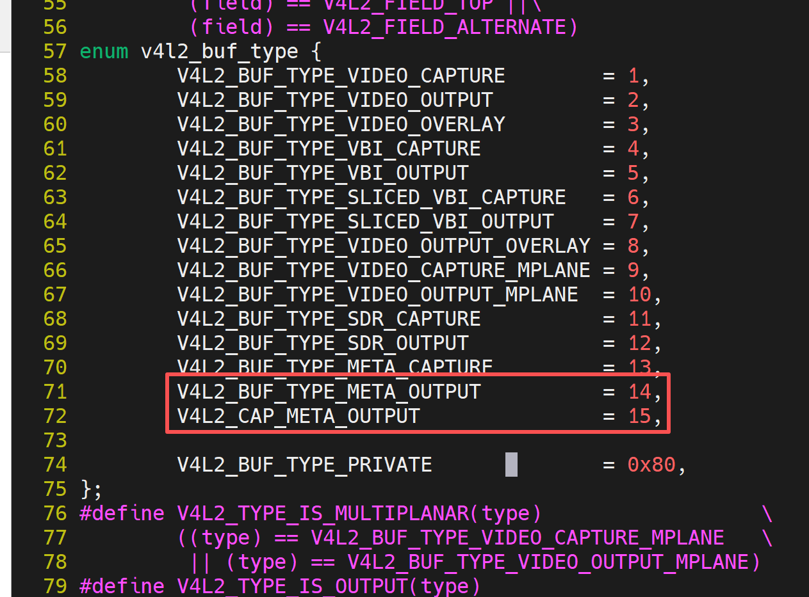

* Modify libcamera/src/libcamera/process.cpp, add the following content at line 152.

```c
struct clone_args {
    uint64_t flags;        /* Flags bit mask */
    uint64_t pidfd;        /* Where to store PID file descriptor*/
    uint64_t child_tid;    /* Where to store child TID */
    uint64_t parent_tid;   /* Where to store child TID */
    uint64_t exit_signal;  /* Signal to deliver to parent on child termination */
    uint64_t stack;        /* Pointer to lowest byte of stack */
    uint64_t stack_size;   /* Size of stack */
    uint64_t tls;          /* Location of new TLS */
};
```

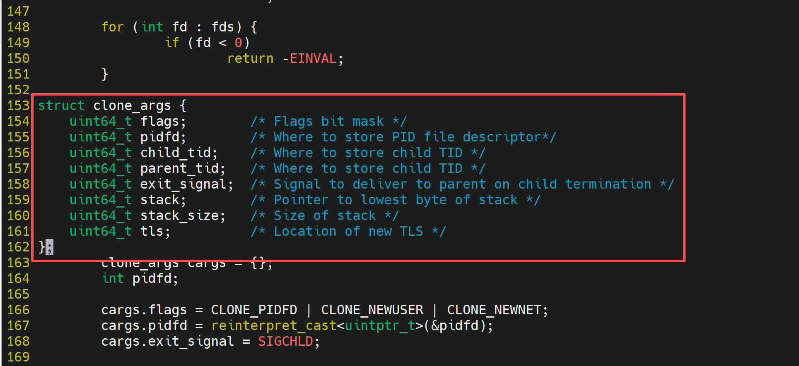

### Step 4: Compile Source Code

* Execute the following command to configure before compilation using meson.

```sh
meson setup \
  --cross-file cross_file.txt \
  --prefix=$(pwd)/install \
  -Dcam=enabled \
  -Ddocumentation=disabled \
  -Dpycamera=enabled \
  build . 2>&1 | tee meson_output.log
```

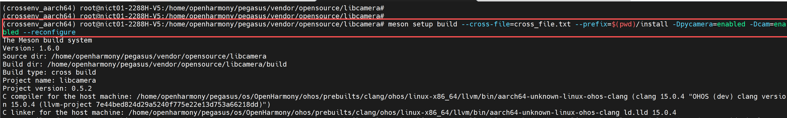

* Execute the following command to compile the source code.

```sh
cd build

ninja
```

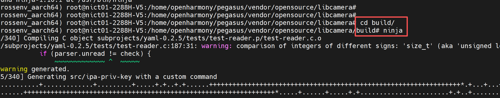

### Step 5: Fix Compilation Errors

* If the following error occurs during compilation.

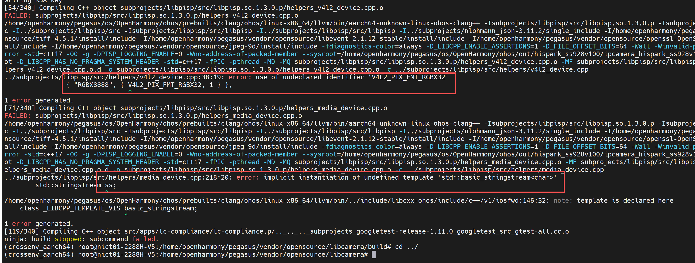

* Code needs to be modified in two places.
* In libcamera/subprojects/libpisp/src/helpers/media_device.cpp, add the header file #include<sstream>.

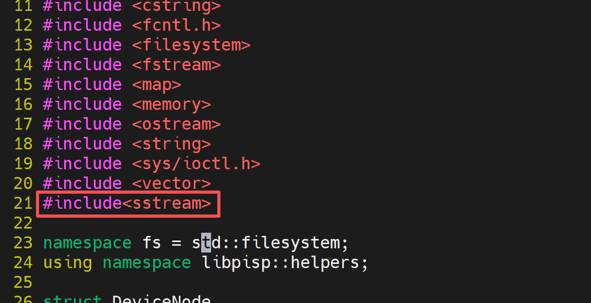

* In libcamera/subprojects/libpisp/src/helpers/v4l2_device.cpp, lines 24~30, add the following content.

```c
#ifndef V4L2_PIX_FMT_RGBX32
#define V4L2_PIX_FMT_RGBX32 v4l2_fourcc('R', 'G', 'B', 'X')
#endif

#ifndef V4L2_PIX_FMT_BGRX32
#define V4L2_PIX_FMT_BGRX32 v4l2_fourcc('B', 'G', 'R', 'X')
#endif
```

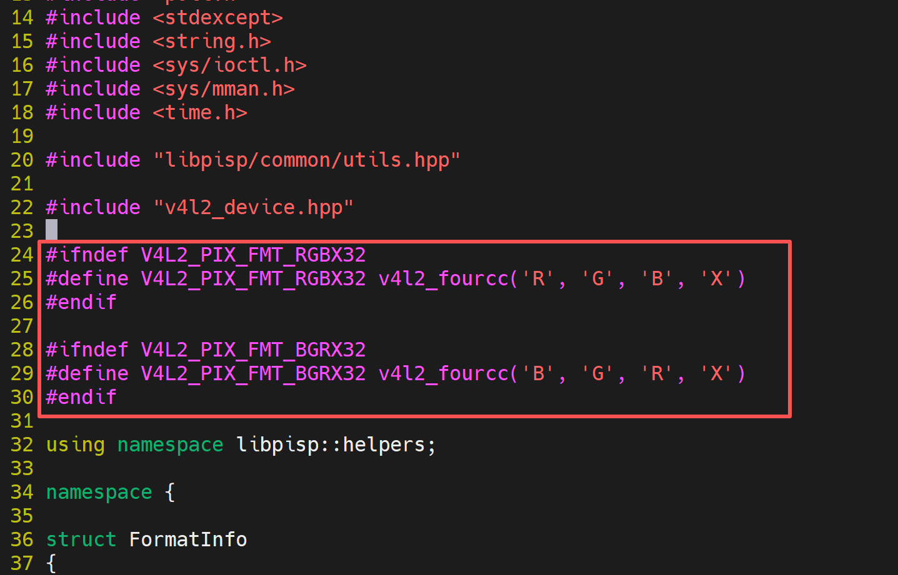

* Then delete the build directory and re-execute the following commands to compile the source code.

```sh
cd /home/openharmony/pegasus/vendor/opensource/libcamera

rm build

meson setup \
  --cross-file cross_file.txt \
  --prefix=$(pwd)/install \
  -Dcam=enabled \
  -Ddocumentation=disabled \
  -Dpycamera=disabled \
  build . 2>&1 | tee meson_output.log

ninja -C build
ninja -C build install

cd build

ninja

ninja install
```

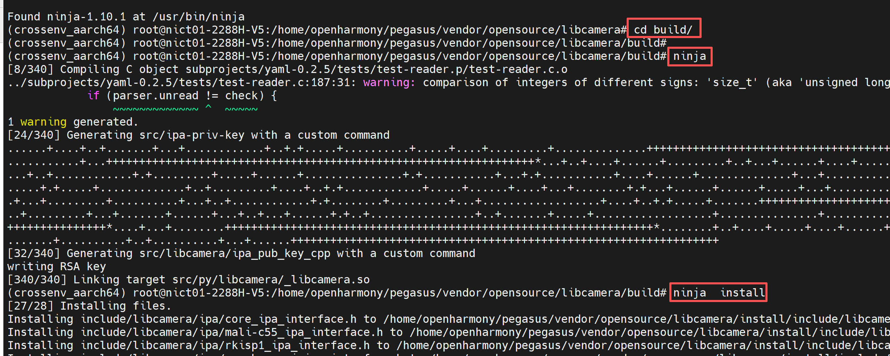

* After successful compilation, the following content will be generated in the libcamera install directory.

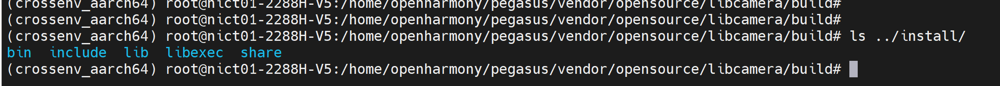

## 5. Board-Side Testing

### Step 1: Configure the Board Environment

* 1. Ensure the development board has the OpenHarmony operating system flashed.
* 2. Connect the development board to your computer using a network cable, ensuring they are on the same local network.
* 3. Configure the development board's IP address and ensure the board and computer can ping each other.

```sh
# Note: configure the eth0 IP address according to your network IP segment
ifconfig eth0 192.168.100.100

# Add permissions
echo 0 9999999 > /proc/sys/net/ipv4/ping_group_range
```

### Step 2: Prepare libcamera Dependency Files

* 1. Copy the install folder generated after cross-compiling libcamera in Chapter 4 to your NFS mount directory (I renamed install to libcamera_install).
* 2. Download libevent_pthreads-2.1.so.7, libevent-2.1.so.7, libcrypto.so.1.1, and libtiff.so.6 from the dependency software cross-compiled in Chapter 3, Step 2, and copy them to the libcamera_install lib directory.
* 3. If you want to use Python to call libcamera's interfaces, copy libcamera from libcamera_install/lib/python3.13/site-packages to Python's install/lib/python3.13/site-packages directory. For details, refer to the [Python porting document](../python/README.md).
* 4. Copy these libraries to Python's install/lib/python3.13/lib-dynload directory.

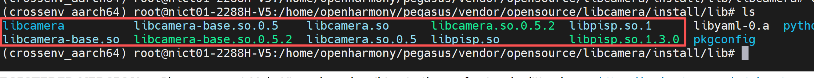

* 5. In the development board's command line, execute the following command to mount the computer's NFS directory to the /mnt directory (note: modify according to your IP address and NFS configuration).

```sh
mount -o nolock,addr=192.168.100.10 -t nfs 192.168.100.10:/d/nfs /mnt
```

* 6. In the development board's command line, execute the following commands to configure python environment variables to ensure python can find dependencies at runtime.

```sh
export PATH=/mnt/install/bin:$PATH
export PYTHONPATH=/mnt/install/lib/python3.13:$PYTHONPATH
export LD_LIBRARY_PATH=/mnt/install/lib/python3.13/lib-dynload:$LD_LIBRARY_PATH
```

* 7. In the development board's command line, execute the following commands to configure libcamera environment variables to ensure libcamera can find dependencies at runtime.

```sh
export PATH=/mnt/libcamera_install/bin:$PATH
export LD_LIBRARY_PATH=/mnt/libcamera_install/lib:$LD_LIBRARY_PATH
```

### Step 3: Running the cam Tool

* In the development board's command line, execute the following command to add executable permissions to cam.

```sh
chmod +x /mnt/libcamera_install/bin/*
```

* Run cam -c 1 -I to view the resolutions and formats supported by the current camera:

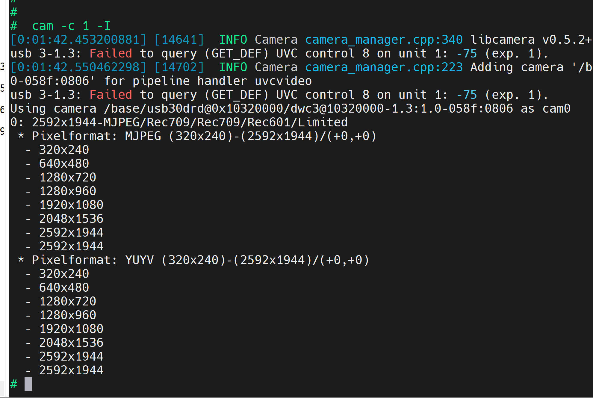

* Capture a still image:

  ```sh
  # Image resolution and format can be set via the cam parameter -s:
  cam -c 1 --capture=10 --file=1.jpg
  ```

  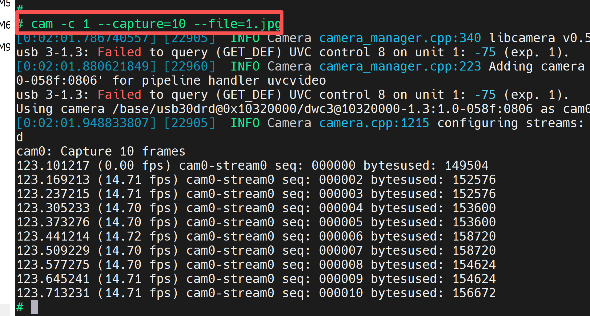

* Capture a video stream (10 frames, resolution 1920x1080, format YUYV):

  ```sh
  cam -c 1 -C10 -s width=1920,height=1080,role=video,pixelformat=YUYV --file=/mnt/1.yuv
  ```

  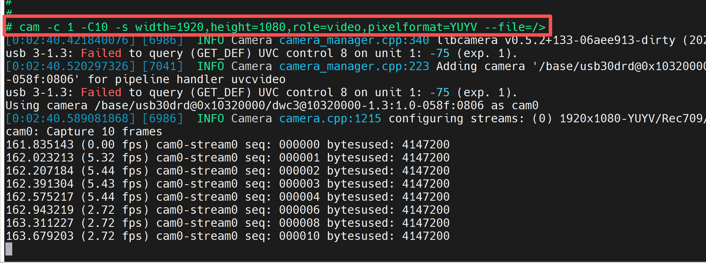
