# libv4l2 Porting

## 1. Software and Hardware Environment

* Development board: SeaGull Pi
* Cross-compilation toolchain: OHOS (dev) clang version 15.0.4
* Toolchain path: pegasus/os/OpenHarmony/ohos/prebuilts/clang/ohos/linux-x86_64/llvm/bin
* Python version: Python-3.13.2
* Ported libv4l2 version: OpenCV-4.13

## 2. Cross-Compiling libv4l2

### Step 1: Obtain Source Code

* In the server command line, execute the following commands step by step to download the v4l-utils source code.

~~~bash
git clone https://git.linuxtv.org/v4l-utils.git

cd v4l-utils
~~~

### Step 2: Create Cross-Compilation Configuration File

[constants]
toolchain = '/home/openharmony/pegasus/os/OpenHarmony/ohos/prebuilts/clang/ohos/linux-x86_64/llvm/bin'
sysroot = '/home/openharmony/pegasus/os/OpenHarmony/ohos/out/hispark_ss928v100/ipcamera_hispark_ss928v100_linux/sysroot'

* Create a hisi-cross.txt file in the v4l-utils directory, copy the following content into it and save.

~~~bash
[host_machine]
system = 'linux'
cpu_family = 'aarch64'
cpu = 'aarch64'
endian = 'little'

[binaries]
c = '/home/openharmony/pegasus/os/OpenHarmony/ohos/prebuilts/clang/ohos/linux-x86_64/llvm/bin/aarch64-unknown-linux-ohos-clang'
cpp = '/home/openharmony/pegasus/os/OpenHarmony/ohos/prebuilts/clang/ohos/linux-x86_64/llvm/bin/aarch64-unknown-linux-ohos-clang++'
ar = '/home/openharmony/pegasus/os/OpenHarmony/ohos/prebuilts/clang/ohos/linux-x86_64/llvm/bin/llvm-ar'
ranlib = '/home/openharmony/pegasus/os/OpenHarmony/ohos/prebuilts/clang/ohos/linux-x86_64/llvm/bin/llvm-ranlib'
strip = '/home/openharmony/pegasus/os/OpenHarmony/ohos/prebuilts/clang/ohos/linux-x86_64/llvm/bin/llvm-strip'
pkg-config = '/usr/bin/pkg-config'

[properties]
sysroot = '/home/openharmony/pegasus/os/OpenHarmony/ohos/out/hispark_ss928v100/ipcamera_hispark_ss928v100_linux/sysroot'
c_args = ['--sysroot=' + sysroot, '--target=aarch64-linux-ohos', '-I' + sysroot + '/usr/include']
c_link_args = ['--sysroot=' + sysroot, '--target=aarch64-linux-ohos', '-fuse-ld=lld', '-L' + sysroot + '/usr/lib/aarch64-linux-ohos', '-L' + sysroot + '/lib', '-lc']
~~~

### Step 3. Load Configuration and Generate Build Files

#### Cross-Compiling argp Library

* In the server command line, execute the following commands step by step to download the argp source code.

```sh
# Get source code
wget https://www.lysator.liu.se/~nisse/misc/argp-standalone-1.3.tar.gz
tar xf argp-standalone-1.3.tar.gz
rm argp-standalone-1.3.tar.gz
cd argp-standalone-1.3
```

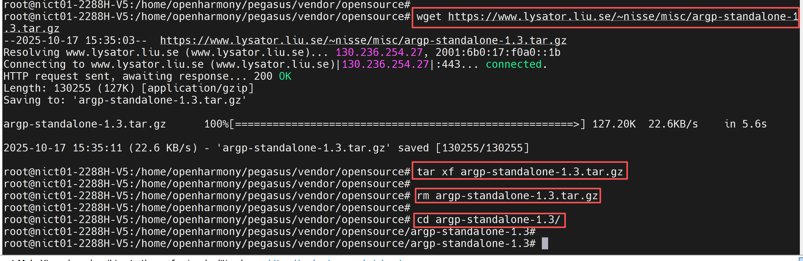

* In the server command line, execute the following commands step by step to configure environment variables.

```sh
# Configure variables
export SYSROOT=/home/openharmony/pegasus/os/OpenHarmony/ohos/out/hispark_ss928v100/ipcamera_hispark_ss928v100_linux/sysroot
export CC=/home/openharmony/pegasus/os/OpenHarmony/ohos/prebuilts/clang/ohos/linux-x86_64/llvm/bin/aarch64-unknown-linux-ohos-clang
export CXX=/home/openharmony/pegasus/os/OpenHarmony/ohos/prebuilts/clang/ohos/linux-x86_64/llvm/bin/aarch64-unknown-linux-ohos-clang++
export AR=/home/openharmony/pegasus/os/OpenHarmony/ohos/prebuilts/clang/ohos/linux-x86_64/llvm/bin/llvm-ar            
export RANLIB=/home/openharmony/pegasus/os/OpenHarmony/ohos/prebuilts/clang/ohos/linux-x86_64/llvm/bin/llvm-ranlib       
export CFLAGS="--sysroot=$SYSROOT"
export CXXFLAGS="--sysroot=$SYSROOT"
export LDFLAGS="--sysroot=$SYSROOT"
```

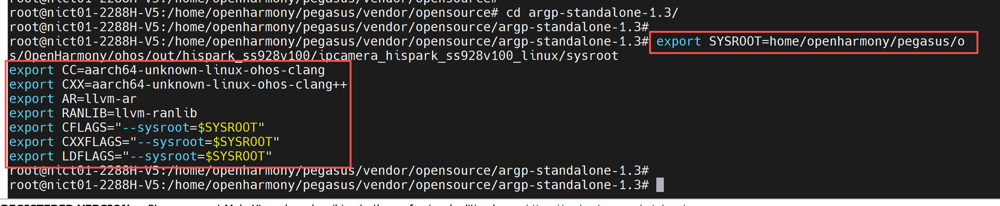

* In the server command line, execute the following commands step by step to compile the argp code.

~~~bash
# Configure
./configure \
  --host=aarch64-linux-ohos \
  --prefix=$SYSROOT/usr \
  --disable-shared \
  --enable-static
  
# Compile and install
make -j$(nproc) && make install
~~~

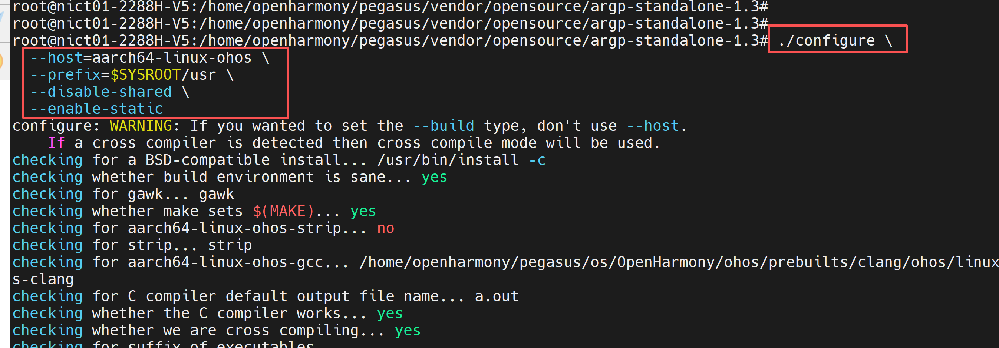

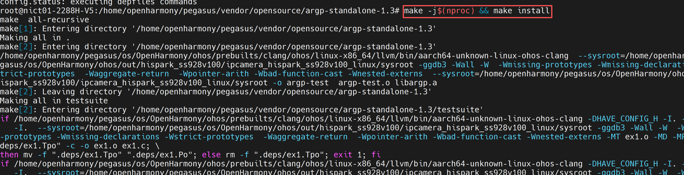

* In the server command line, execute the following commands step by step to copy argp.h and libargp.a to the sysroot directories.

~~~bash
# Copy argp.h to the sysroot include directory
cp ./argp.h $SYSROOT/usr/include/

# Copy libargp.a to the sysroot lib directory
cp ./libargp.a $SYSROOT/usr/lib/

# Ensure file permissions are correct
chmod 644 $SYSROOT/usr/include/argp.h
chmod 644 $SYSROOT/usr/lib/libargp.a
~~~

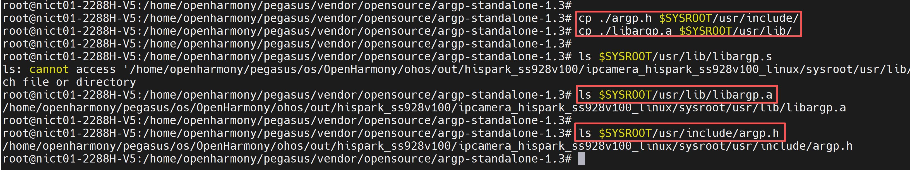

### Step 4: Meson Build

* Execute the following command on the server for the meson build.
* Note: If you have previously referenced the numpy or opencv porting documents, you need to exit the virtual environment here (source ~/.bashrc).

~~~bash
cd ../

# Install meson
python3 -m pip install meson -i https://pypi.tuna.tsinghua.edu.cn/simple

cd v4l-utils
~~~

* Modify contrib/test/meson.build, comment out lines 89~102.

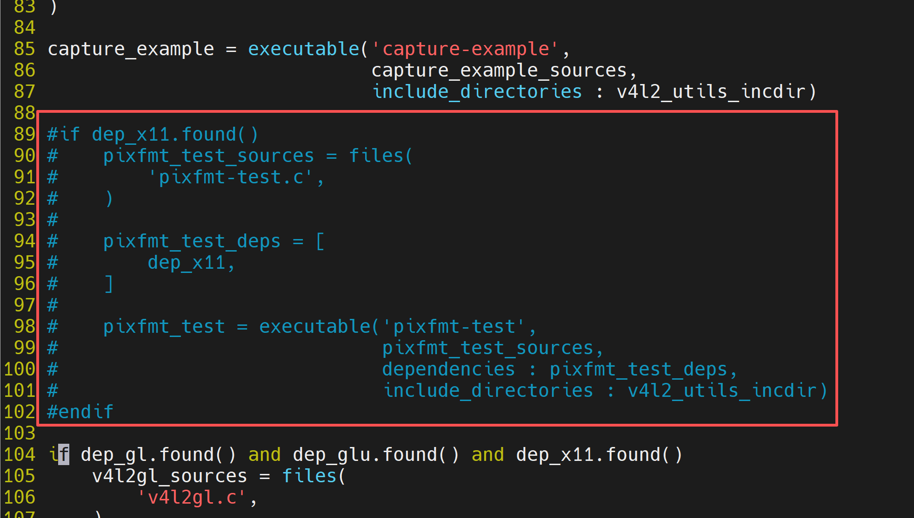

* Navigate to the v4l-utils build directory.

~~~bash
# Build using meson
meson setup \
  --cross-file hisi-cross.txt \
  --prefix /home/openharmony/pegasus/vendor/opensource/v4l-utils/install \
  -Ddoxygen-doc=disabled \
  -Dudevdir=lib/udev \
  -Djpeg=disabled \
  build . 2>&1 | tee meson_output.log
  
cd build 

ninja && ninja install
~~~

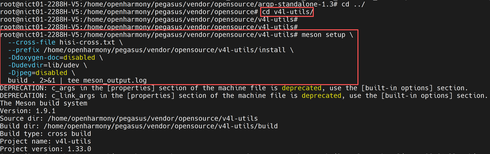

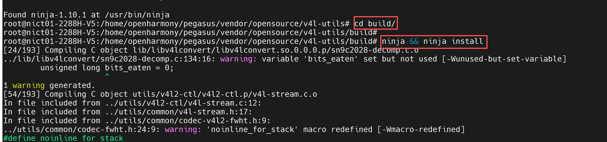

* After successful execution, the following files will be generated in the v4l-utils/install directory.

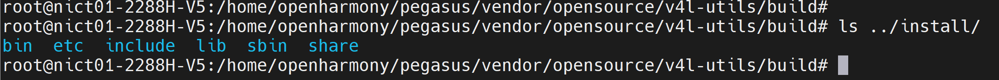

## 3. Testing

### 3.1 NFS Sharing

* For NFS configuration, refer to the following link:

~~~bash
https://blog.csdn.net/weixin_34326429/article/details/92163791
~~~

### 3.2 Mounting NFS

* In the development board's command line terminal, execute the following commands to configure the IP address and mount NFS.

~~~bash
ifconfig eth0 192.168.137.0 netmask 255.255.252.0
route add default gw 192.168.137.1
mount -o nolock,addr=192.168.137.1 -t nfs 192.168.137.1:/nfs /mnt
~~~

### 3.3 Configure Environment Variables

* Download the install file generated in Step 4 of Chapter 2.

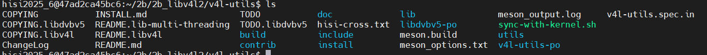

* To distinguish, I renamed the install folder to libv4l2_install.
* In the development board's command line terminal, execute the following commands to configure environment variables.

~~~bash
cd mnt

export PATH=/mnt/libv4l2_install/bin:$PATH
export LD_LIBRARY_PATH=/mnt/libv4l2_install/lib:$LD_LIBRARY_PATH
chmod +x /mnt/libv4l2_install/bin/v4l2-ctl
~~~

### 3.4 Testing

#### 3.4.1 Testing the v4l2-ctl Tool

* List all devices.

~~~bash
v4l2-ctl --list-devices
~~~

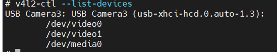

* View the image formats and resolutions supported by the USB camera.

~~~bash
v4l2-ctl -d /dev/video0 --list-formats-ext
~~~

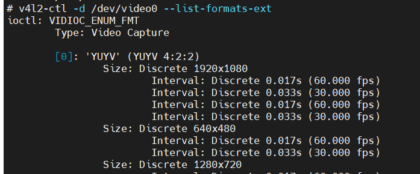

* Capture one frame.

~~~bash
v4l2-ctl -d /dev/video0 \
  --set-fmt-video=width=1920,height=1080,pixelformat=MJPG \
  --stream-mmap \
  --stream-count=1 \
  --stream-to=v4l2test.jpg
~~~

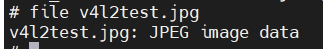

#### 3.4.2 Interface Call Demo

* Copy the following content into test_libv4l2.c, compile it on the server, obtain the executable, and run it on the board.

~~~bash
#include <stdio.h>
#include <stdlib.h>
#include <string.h>
#include <fcntl.h>
#include <unistd.h>
#include <sys/ioctl.h>
#include <sys/mman.h>
#include <linux/videodev2.h>
#include <libv4l2.h>

int main(int argc, char *argv[]) {
    int fd;
    char *dev_name = "/dev/video0";  // default video device
    struct v4l2_capability cap;
    struct v4l2_format fmt;
    struct v4l2_buffer buf;
    struct v4l2_requestbuffers req;
    void *buffer;

    if (argc > 1) {
        dev_name = argv[1];
    }

    printf("Testing libv4l2 functionality...\n");
    printf("Attempting to open video device: %s\n", dev_name);

    // Open video device
    fd = v4l2_open(dev_name, O_RDWR | O_NONBLOCK, 0);
    if (fd < 0) {
        perror("Cannot open video device");
        return EXIT_FAILURE;
    }
    printf("Successfully opened video device\n");

    // Query device capabilities
    if (v4l2_ioctl(fd, VIDIOC_QUERYCAP, &cap) < 0) {
        perror("Cannot query device capabilities");
        v4l2_close(fd);
        return EXIT_FAILURE;
    }
    printf("Device info:\n");
    printf("  Name: %s\n", cap.card);
    printf("  Driver: %s\n", cap.driver);
    printf("  Bus: %s\n", cap.bus_info);

    // Check if video capture and streaming I/O are supported
    if (!(cap.capabilities & V4L2_CAP_VIDEO_CAPTURE)) {
        fprintf(stderr, "Device does not support video capture\n");
        v4l2_close(fd);
        return EXIT_FAILURE;
    }
    if (!(cap.capabilities & V4L2_CAP_STREAMING)) {
        fprintf(stderr, "Device does not support streaming I/O\n");
        v4l2_close(fd);
        return EXIT_FAILURE;
    }

    // Set video format
    memset(&fmt, 0, sizeof(fmt));
    fmt.type = V4L2_BUF_TYPE_VIDEO_CAPTURE;
    fmt.fmt.pix.width = 640;
    fmt.fmt.pix.height = 480;
    fmt.fmt.pix.pixelformat = V4L2_PIX_FMT_YUYV;
    fmt.fmt.pix.field = V4L2_FIELD_INTERLACED;

    if (v4l2_ioctl(fd, VIDIOC_S_FMT, &fmt) < 0) {
        perror("Cannot set video format");
        v4l2_close(fd);
        return EXIT_FAILURE;
    }
    printf("Successfully set video format: %dx%d, format: YUYV\n", 
           fmt.fmt.pix.width, fmt.fmt.pix.height);

    // Request buffers
    memset(&req, 0, sizeof(req));
    req.count = 1;
    req.type = V4L2_BUF_TYPE_VIDEO_CAPTURE;
    req.memory = V4L2_MEMORY_MMAP;

    if (v4l2_ioctl(fd, VIDIOC_REQBUFS, &req) < 0) {
        perror("Cannot request buffers");
        v4l2_close(fd);
        return EXIT_FAILURE;
    }
    printf("Successfully requested %d buffer(s)\n", req.count);

    // Query buffer info
    memset(&buf, 0, sizeof(buf));
    buf.type = V4L2_BUF_TYPE_VIDEO_CAPTURE;
    buf.memory = V4L2_MEMORY_MMAP;
    buf.index = 0;

    if (v4l2_ioctl(fd, VIDIOC_QUERYBUF, &buf) < 0) {
        perror("Cannot query buffer");
        v4l2_close(fd);
        return EXIT_FAILURE;
    }

    // Map buffer
    buffer = v4l2_mmap(NULL, buf.length, PROT_READ | PROT_WRITE, MAP_SHARED, fd, buf.m.offset);
    if (buffer == MAP_FAILED) {
        perror("Cannot map buffer");
        v4l2_close(fd);
        return EXIT_FAILURE;
    }
    printf("Successfully mapped buffer, size: %d bytes\n", buf.length);

    // Enqueue buffer
    if (v4l2_ioctl(fd, VIDIOC_QBUF, &buf) < 0) {
        perror("Cannot enqueue buffer");
        v4l2_munmap(buffer, buf.length);
        v4l2_close(fd);
        return EXIT_FAILURE;
    }

    // Start capture
    enum v4l2_buf_type type = V4L2_BUF_TYPE_VIDEO_CAPTURE;
    if (v4l2_ioctl(fd, VIDIOC_STREAMON, &type) < 0) {
        perror("Cannot start capture");
        v4l2_munmap(buffer, buf.length);
        v4l2_close(fd);
        return EXIT_FAILURE;
    }
    printf("Starting video capture...\n");

    // Wait for frame ready
    fd_set fds;
    struct timeval tv;
    int r;

    FD_ZERO(&fds);
    FD_SET(fd, &fds);
    tv.tv_sec = 2;
    tv.tv_usec = 0;

    r = select(fd + 1, &fds, NULL, NULL, &tv);
    if (r == -1) {
        perror("select failed");
        v4l2_ioctl(fd, VIDIOC_STREAMOFF, &type);
        v4l2_munmap(buffer, buf.length);
        v4l2_close(fd);
        return EXIT_FAILURE;
    }
    if (r == 0) {
        fprintf(stderr, "Capture timeout\n");
        v4l2_ioctl(fd, VIDIOC_STREAMOFF, &type);
        v4l2_munmap(buffer, buf.length);
        v4l2_close(fd);
        return EXIT_FAILURE;
    }

    // Dequeue buffer
    if (v4l2_ioctl(fd, VIDIOC_DQBUF, &buf) < 0) {
        perror("Cannot dequeue buffer");
        v4l2_ioctl(fd, VIDIOC_STREAMOFF, &type);
        v4l2_munmap(buffer, buf.length);
        v4l2_close(fd);
        return EXIT_FAILURE;
    }

    printf("Successfully captured one frame, size: %d bytes\n", buf.bytesused);

    // Stop capture
    if (v4l2_ioctl(fd, VIDIOC_STREAMOFF, &type) < 0) {
        perror("Cannot stop capture");
        v4l2_munmap(buffer, buf.length);
        v4l2_close(fd);
        return EXIT_FAILURE;
    }

    // Clean up
    v4l2_munmap(buffer, buf.length);
    v4l2_close(fd);

    printf("All tests completed, libv4l2 working correctly!\n");
    return EXIT_SUCCESS;
}

~~~

* Execute the following command on the server to compile the code.
* Note: Adjust the absolute paths according to your server's actual configuration.

~~~bash
/home/openharmony/pegasus/os/OpenHarmony/ohos/prebuilts/clang/ohos/linux-x86_64/llvm/bin/aarch64-unknown-linux-ohos-clang -o test_libv4l2 test_libv4l2.c \
--sysroot=/home/openharmony/pegasus/os/OpenHarmony/ohos/out/hispark_ss928v100/ipcamera_hispark_ss928v100_linux/sysroot \
-I/home/openharmony/pegasus/vendor/opensource/v4l-utils/install/include \
-I/home/openharmony/pegasus/vendor/opensource/v4l-utils/lib/include \
-L/home/openharmony/pegasus/vendor/opensource/v4l-utils/install/lib \
-lv4l2
~~~

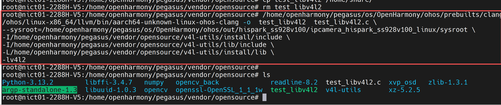

~~~bash
# 1. Download the executable test_libv4l2 and mount it on the board
cd mnt
# 2. Add v4l2 related environment variables, refer to 5.3 Configure Environment Variables
chmod +x test_libv4l2
# 3. Run the test
./test_libv4l2
~~~

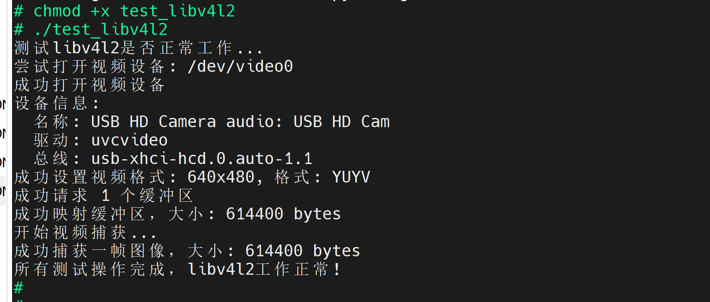
