# numpy Porting

## 1. Software and Hardware Environment

Development board: SeaGull Pi
Cross-compilation toolchain: OHOS (dev) clang version 15.0.4

Toolchain path: pegasus/os/OpenHarmony/ohos/prebuilts/clang/ohos/linux-x86_64/llvm/bin  

Python version: Python-3.13.2

Ported numpy version: numpy-v2.2.5

## 2. Cross-Compiling numpy

### Step 1: Download numpy Source Code

* Execute the following commands step by step to download the NumPy source code.

```sh
cd pegasus/vendor/opensource

git clone https://github.com/numpy/numpy.git

cd numpy

# Initialize submodules
git submodule update --init

# Switch to your desired version; I am using v2.2.5
git checkout v2.2.5	
```

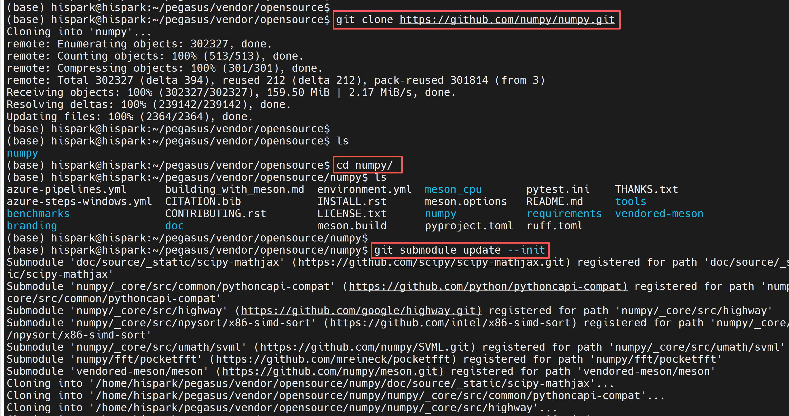

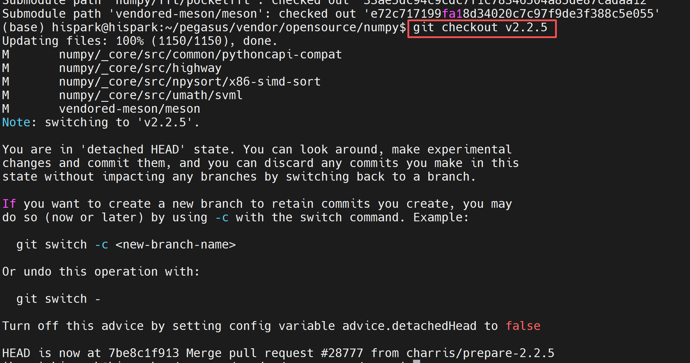

### Step 2: Configure the Compilation Script

* Create an ohos-build.meson.ini file in the num my source root directory, then copy the following content into it and save.

```ini
# toolchain and sysroot paths, please fill in according to your server's actual paths

[constants]
toolchain = '/home/openharmony/pegasus/os/OpenHarmony/ohos/prebuilts/clang/ohos/linux-x86_64/llvm/bin'
sysroot = '/home/openharmony/pegasus/os/OpenHarmony/ohos/out/hispark_Hi3403V100/ipcamera_hispark_Hi3403V100_linux/sysroot'
host_cpu = 'aarch64'
host_arch = 'aarch64'
common_flags = ['--sysroot=' + sysroot, '--target=' + host_cpu + '-linux-ohos']

[built-in options]
c_args = common_flags
cpp_args = common_flags
c_link_args = common_flags
cpp_link_args = common_flags

[properties]
sizeof_long_double = 8
longdouble_format = 'IEEE_DOUBLE_LE'

[binaries]
c = toolchain / 'aarch64-unknown-linux-ohos-clang'
cpp = toolchain / 'aarch64-unknown-linux-ohos-clang++'
# python here is the path of the python in the virtual environment
python = '/home/openharmony/pegasus/vendor/opensource/Python-3.13.2/install/include/python3.13'
cython = ''
cython3 = cython
as = toolchain / 'llvm-as'
ld = toolchain / 'ld.lld'
c_ld = ld
cpp_ld = ld
lld = toolchain / 'ld.lld'
strip = toolchain / 'llvm-strip'
ranlib = toolchain / 'llvm-ranlib'
objdump = toolchain / 'llvm-objdump'
objcopy = toolchain / 'llvm-objcopy'
readelf = toolchain / 'llvm-readelf'
nm = toolchain / 'llvm-nm'
ar = toolchain / 'llvm-ar'
profdata = toolchain / 'llvm-profdata'

[host_machine]
system = 'ohos'
kernel = 'linux'
cpu_family = host_cpu
cpu = host_cpu
endian = 'little'
```

### Step 3: Configure the Virtual Build Environment

* Create a crossenv virtual environment for compiling NumPy.

```sh
# Install ninja
apt-get install ninja-build
     
# Install cpython
pip3 install cython -i https://pypi.tuna.tsinghua.edu.cn/simple

# Install crossenv
pip3 install crossenv

# Create crossenv virtual environment in the Python-3.13.2 directory
# /home/openharmony/pegasus/vendor/opensource/Python-3.13.2/install is the cross-compiled python path
cd Python-3.13.2 
python3 -m crossenv /home/openharmony/pegasus/vendor/opensource/Python-3.13.2/install/bin/python3 crossenv_aarch64

# Activate the environment
. crossenv_aarch64/bin/activate

cd ../numpy

# Configure VENDORED_MESON; configure according to your actual numpy path

VENDORED_MESON=/home/openharmony/pegasus/vendor/opensource/numpy/vendored-meson/meson/meson.py
python ${VENDORED_MESON} setup --reconfigure --prefix=$PWD/install --cross-file ./ohos-build.meson.ini build-ohos

cd build-ohos

# Compile NumPy
python ${VENDORED_MESON} compile

# Install numpy
python ${VENDORED_MESON} install
```

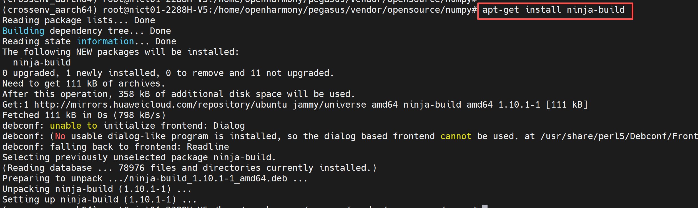

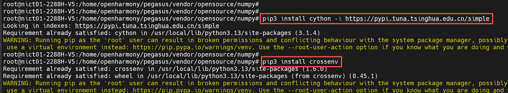

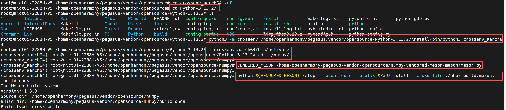

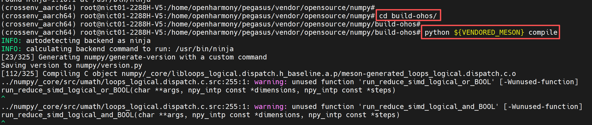

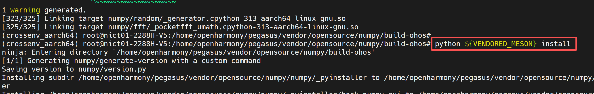

* The generated numpy package is located in the numpy/install/lib/python3.13/site-packages/numpy/ directory.

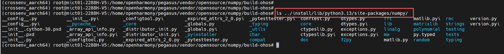


## 3. Board-Side Testing

### Step 1: Configure the Board Environment

* 1. Ensure the development board has the OpenHarmony operating system flashed.
* 2. Connect the development board to your computer using a network cable, ensuring they are on the same local network.
* 3. Configure the development board's IP address and ensure the board and computer can ping each other.

```sh
# Note: configure the eth0 IP address according to your network IP segment
ifconfig eth0 192.168.100.100

# Add permissions
echo 0 9999999 > /proc/sys/net/ipv4/ping_group_range
```


### Step 2: Prepare Python Dependency Files

* 1. Copy the install folder generated after cross-compiling python3.13.2 in Chapter 4 of the python porting guide to your NFS mount directory.
* 2. Copy numpy from numpy/install/lib/python3.13/site-packages to the install/lib/ directory.
* 3. According to the content in Chapter 3 of the python porting guide, copy libz.so.1, libssl.so.1.1, and libcrypto.so.1.1 to the install/lib/python3.13/lib-dynload directory.

* 4. Execute the following command to mount the computer's NFS directory to the /mnt directory on the development board (note: modify according to your IP address and NFS configuration).

```mk1.sh
mount -o nolock,addr=192.168.100.10 -t nfs 192.168.100.10:/d/nfs /mnt
```

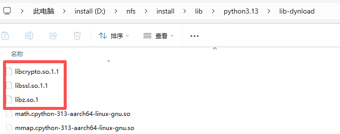

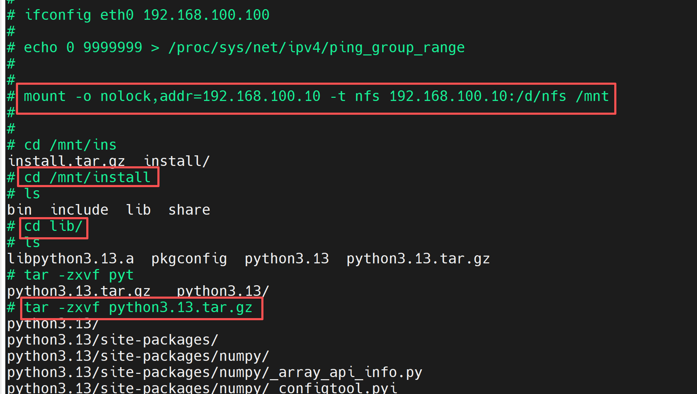

* 3. Configure python environment variables to ensure python can find dependencies at runtime.

```mk1.sh
export PATH=/mnt/install/bin:$PATH
export PYTHONPATH=/mnt/install/lib/python3.13:$PYTHONPATH
export LD_LIBRARY_PATH=/mnt/install/lib/python3.13/lib-dynload:$LD_LIBRARY_PATH
```

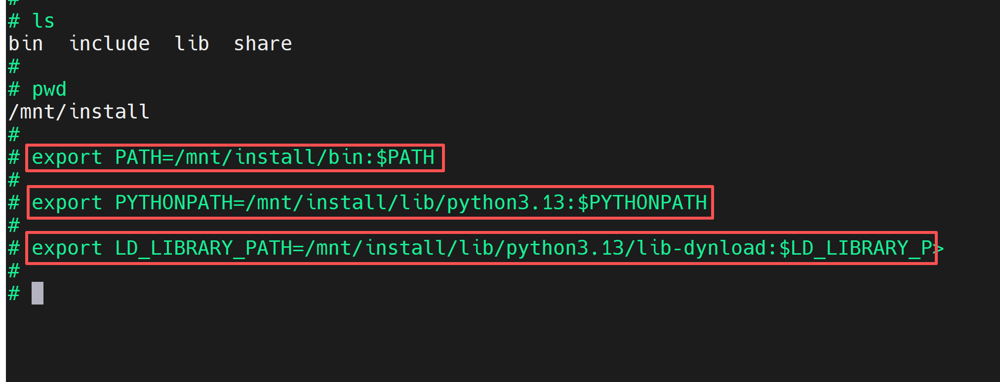

### Step 3: Using Python to Call NumPy Interfaces

* First, enter python to enter the board-side python environment, then type import numpy and press Enter. If there are no errors, the numpy porting was successful.

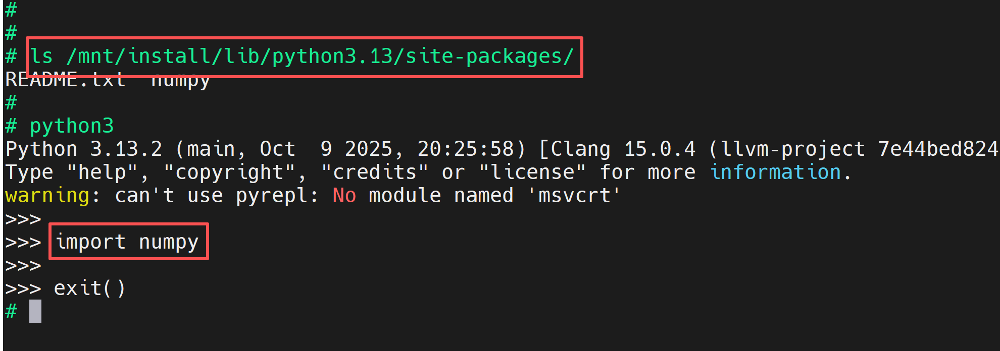

* Copy the following content to numpy_test.py.

```python
import numpy as np
import time

def test_numpy_functionality():
    """Test basic NumPy functionality"""
    print("=" * 50)
    print("NumPy Functionality Test")
    print("=" * 50)

    # 1. Create arrays
    arr1 = np.array([1, 2, 3, 4, 5])
    arr2 = np.arange(0, 10, 2)  # similar to range, but generates an array
    arr3 = np.zeros((3, 3))     # 3x3 zero matrix
    arr4 = np.random.rand(2, 2) # 2x2 random matrix

    print("\n1. Array Creation:")
    print(f"arr1: {arr1}")
    print(f"arr2 (0 to 10 step 2): {arr2}")
    print(f"arr3 (3x3 zero matrix):\n{arr3}")
    print(f"arr4 (2x2 random matrix):\n{arr4}")

    # 2. Mathematical operations
    print("\n2. Mathematical Operations:")
    print(f"arr1 + 10: {arr1 + 10}")          # broadcasting
    print(f"arr1 * arr2 (first 5): {arr1 * arr2[:5]}")
    print(f"sin(arr2): {np.sin(arr2)}")       # trigonometric function

    # 3. Matrix multiplication
    matrix_a = np.array([[1, 2], [3, 4]])
    matrix_b = np.array([[5, 6], [7, 8]])
    dot_product = np.dot(matrix_a, matrix_b)  # matrix multiplication
    print("\n3. Matrix Multiplication (np.dot):")
    print(f"matrix_a:\n{matrix_a}")
    print(f"matrix_b:\n{matrix_b}")
    print(f"Result:\n{dot_product}")

    # 4. Performance comparison: NumPy vs Pure Python
    print("\n4. Performance Comparison (calculating squares of 1 million numbers):")
    size = 1_000_000

    # Pure Python
    py_list = list(range(size))
    start = time.time()
    py_result = [x ** 2 for x in py_list]
    py_time = time.time() - start

    # NumPy
    np_arr = np.arange(size)
    start = time.time()
    np_result = np_arr ** 2
    np_time = time.time() - start

    print(f"Pure Python time: {py_time:.5f} seconds")
    print(f"NumPy time:    {np_time:.5f} seconds")
    print(f"NumPy is {py_time / np_time:.1f}x faster than Python!")

    # 5. Advanced features: conditional filtering
    print("\n5. Conditional Filtering (find numbers greater than 5 in arr2):")
    filtered = arr2[arr2 > 5]
    print(f"Original array: {arr2}")
    print(f"Filtered result: {filtered}")

if __name__ == "__main__":
    test_numpy_functionality()
```

* Then, run the numpy test code using the following command.

```sh
python3 numpy_test.py
```

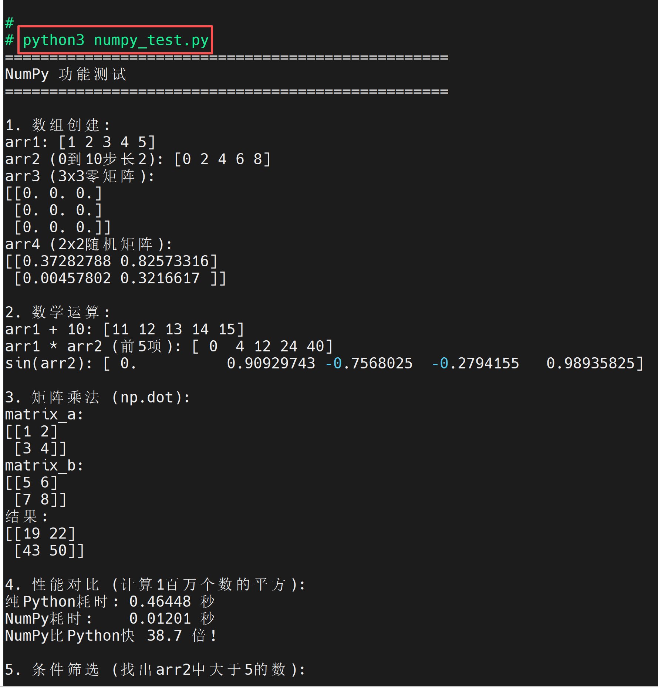
