# OpenCV Porting

## 1. Software and Hardware Environment

Development board: SeaGull Pi
Cross-compilation toolchain: OHOS (dev) clang version 15.0.4

Toolchain path: pegasus/os/OpenHarmony/ohos/prebuilts/clang/ohos/linux-x86_64/llvm/bin  

Python version: Python-3.13.2

Ported OpenCV version: OpenCV-4.13

## 2. Cross-Compiling OpenCV

### Step 1: Install Dependency Software

* Execute the following command on the server to install the dependencies required for OpenCV cross-compilation.

```sh
apt-get install cmake libgtk2.0-dev pkg-config libavcodec-dev libavformat-dev libswscale-dev python3-dev python3-numpy libdc1394-dev  libtbb2 libtbb-dev libjpeg-dev libpng-dev libtiff-dev -y
```

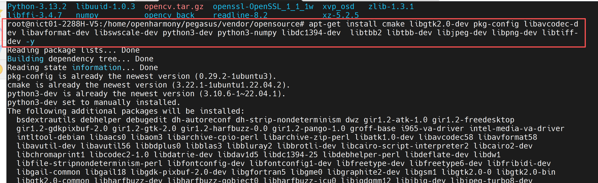

* First, navigate to the python directory and ensure the virtual environment is activated. For information on how to set up the virtual environment, refer to [Step 3 of Chapter 2 in the numpy porting document](../numpy/README.md).

```sh
cd opensource/Python-3.13.2

. crossenv_aarch64/bin/activate
```

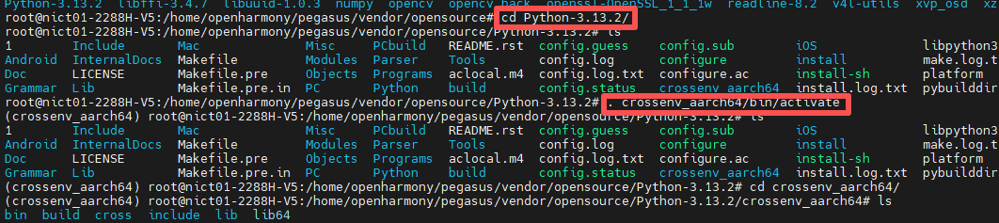

### Step 2: Download OpenCV Source Code

```sh
cd ../

git clone https://github.com/opencv/opencv.git 

cd opencv
```

### Step 3: Run the Build Script

* Navigate to the opencv source code and create a build folder:

```sh
mkdir build

cd build
```

* Copy the following content into build_opencv.sh:

```sh
#!/bin/bash
set -e 
BuildDir=.
ToolChain=/home/openharmony/pegasus/os/OpenHarmony/ohos/prebuilts/clang/ohos/linux-x86_64/llvm/bin
SYSROOT=/home/openharmony/pegasus/os/OpenHarmony/ohos/out/hispark_Hi3403V100/ipcamera_hispark_Hi3403V100_linux/sysroot
if [ ! -d "$BuildDir" ]; then
  echo "create ${BuildDir}..."
  mkdir -p ${BuildDir}
fi
cd ${BuildDir}

echo "building OpenCV4"

cmake -D CMAKE_BUILD_TYPE=RELEASE \
  -D BUILD_SHARED_LIBS=ON \
  -D CMAKE_FIND_ROOT_PATH=${ToolChain}/ \
  -D CMAKE_SYSROOT=${SYSROOT} \
  -D CMAKE_TOOLCHAIN_FILE=../platforms/linux/aarch64-gnu.toolchain.cmake \
  -D CMAKE_C_COMPILER=${ToolChain}/aarch64-unknown-linux-ohos-clang \
  -D CMAKE_CXX_COMPILER=${ToolChain}/aarch64-unknown-linux-ohos-clang++ \
  -D CMAKE_INSTALL_PREFIX=${BuildDir}/install \
  -D WITH_TBB=ON \
  -D WITH_EIGEN=ON \
  -D BUILD_ZLIB=ON \
  -D BUILD_TIFF=ON \
  -D BUILD_JASPER=ON \
  -D BUILD_JPEG=ON \
  -D BUILD_PNG=ON \
  -D WITH_LIBV4L=ON \
  -D BUILD_opencv_python=ON \
   # python here is the path of the successfully cross-compiled python
  -D PYTHON3_INCLUDE_PATH=/home/openharmony/pegasus/vendor/opensource/Python-3.13.2/install/include/python3.13 \
  -D PYTHON3_NUMPY_INCLUDE_DIRS=/home/openharmony/pegasus/vendor/opensource/numpy/install/lib/python3.13/site-packages/numpy/_core/include \
  -D ENABLE_PRECOMPILED_HEADERS=OFF \
  -D BUILD_EXAMPLES=OFF \
  -D BUILD_TESTS=OFF \
  -D BUILD_PERF_TESTS=OFF \
  -D BUILD_WITH_DEBUG_INFO=OFF \
  -D BUILD_DOCS=OFF \
  -D WITH_OPENCL=OFF \
  -D WITH_1394=OFF \
  ../
  
make -j$(nproc)
```

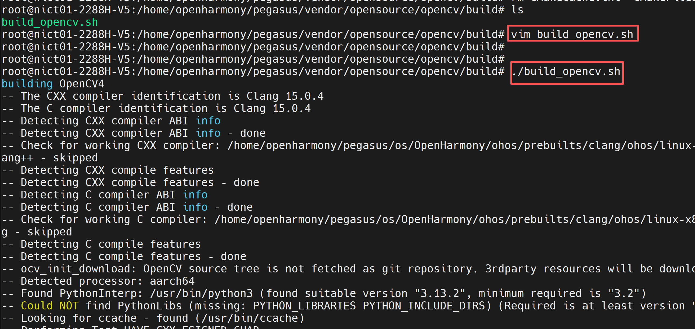

* The following printout indicates successful OpenCV cross-compilation:

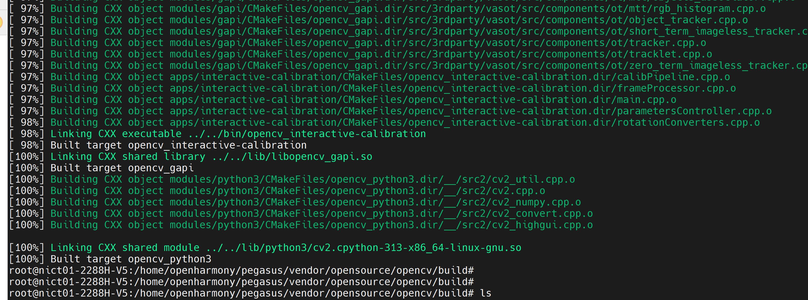

* Execute the following command to install OpenCV:

```sh
make install
```

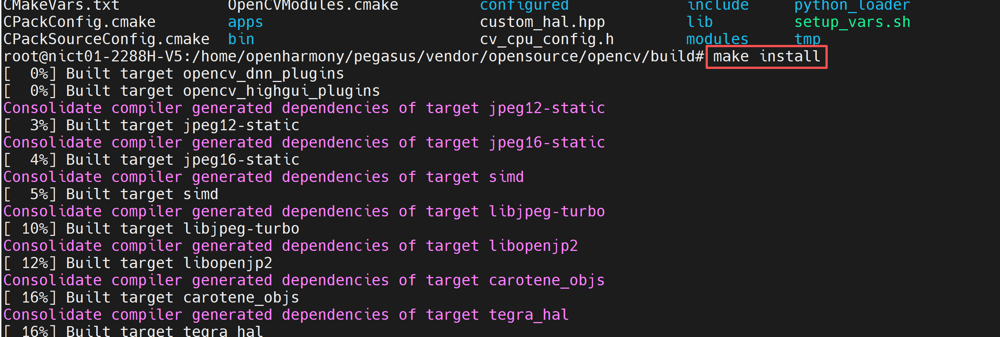

* After successful installation, the following files will be generated in the install directory.

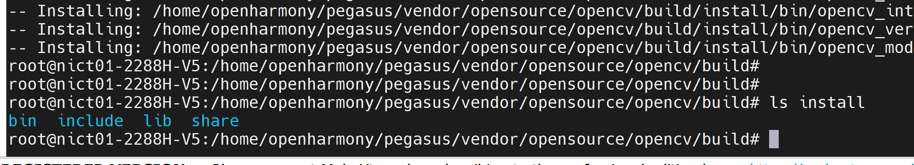

## 3. Using Python to Call OpenCV Interfaces

* 1. Copy the install folder generated after cross-compiling python3.13.2 in Chapter 4 of the python porting guide to your NFS mount directory.
* 2. Copy the library files from opencv/build/install/lib to the install/lib/python3.13/lib-dynload directory.
* 3. According to the content in Chapter 3 of the python porting guide, copy libz.so.1, libssl.so.1.1, and libcrypto.so.1.1 to the install/lib/python3.13/lib-dynload directory.

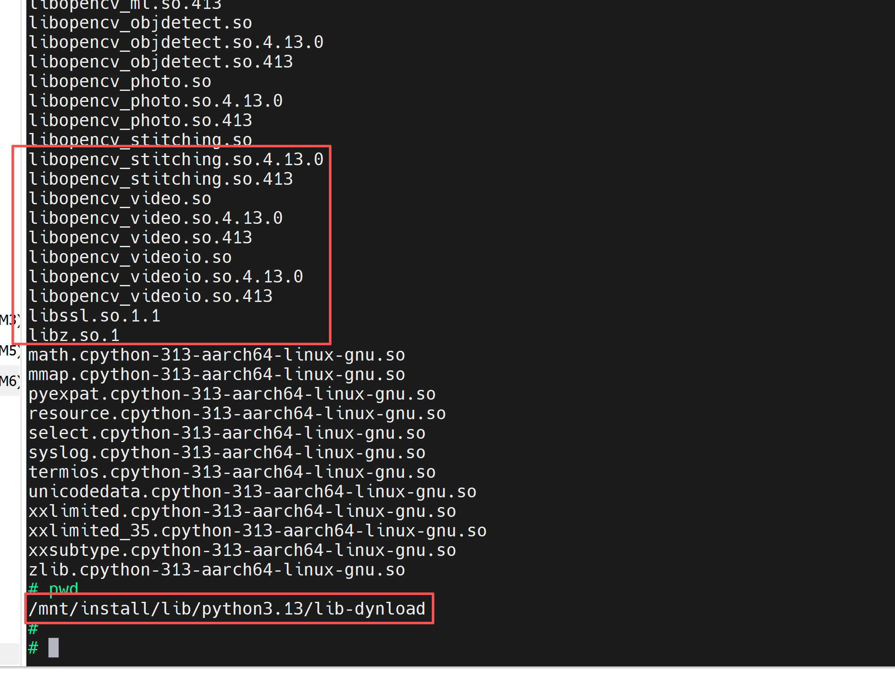

* 4. Copy opencv/build/install/lib/python3.13/site-packages/cv2 to the install/lib/python3.13/site-packages directory.

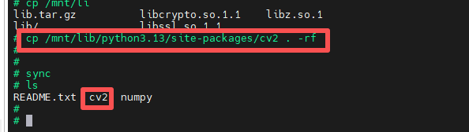

* 5. Execute the following command to mount the computer's NFS directory to the /mnt directory on the development board, then configure environment variables.

```sh
# Note: configure the eth0 IP address according to your network IP segment
ifconfig eth0 192.168.100.100

mount -o nolock,addr=192.168.100.10 -t nfs 192.168.100.10:/d/nfs /mnt

export PATH=/mnt/install/bin:$PATH
export PYTHONPATH=/mnt/install/lib/python3.13:$PYTHONPATH
export LD_LIBRARY_PATH=/mnt/install/lib/python3.13/lib-dynload:$LD_LIBRARY_PATH
```

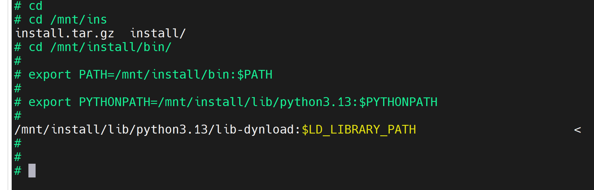

* In the development board's command line, execute the following command to enter the python environment and import cv2.

```sh
cd /mnt/install/bin

python3
```

* In the python3 environment, type import cv2. If there are no errors, the OpenCV interface call was successful.

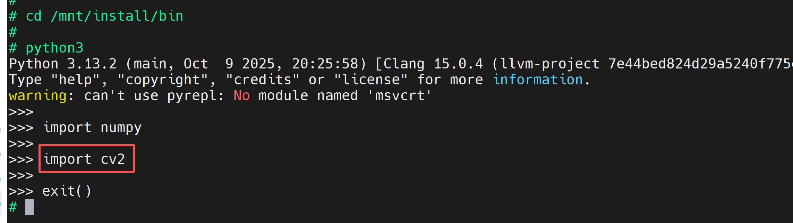

* Copy the following content into opencv_test.py to test basic functionality.

```mk1.sh
import cv2
import numpy as np
import os

def test_opencv_without_ui():
    """OpenCV function test without UI (verified through file saving and log output)"""
    print("=" * 50)
    print("OpenCV No-UI Test")
    print("=" * 50)

    # Create a temporary test directory
    os.makedirs("opencv_test_output", exist_ok=True)
    print("[LOG] Created output directory: opencv_test_output")

    # 1. Generate test image
    test_image = np.zeros((200, 200, 3), dtype=np.uint8)
    cv2.rectangle(test_image, (50, 50), (150, 150), (0, 255, 0), 2)
    cv2.putText(test_image, "OpenCV Test", (30, 30), 
                cv2.FONT_HERSHEY_SIMPLEX, 0.5, (255, 255, 255), 1)
    cv2.imwrite("opencv_test_output/test_image.png", test_image)
    print("[LOG] Generated test image: test_image.png")

    # 2. Image processing (grayscale + edge detection)
    gray_image = cv2.cvtColor(test_image, cv2.COLOR_BGR2GRAY)
    edges = cv2.Canny(gray_image, 100, 200)
    cv2.imwrite("opencv_test_output/edges.png", edges)
    print("[LOG] Generated edge detection result: edges.png")

    # 3. Matrix operation test
    mat_a = np.random.rand(3, 3).astype(np.float32)
    mat_b = np.random.rand(3, 3).astype(np.float32)
    mat_mult = cv2.gemm(mat_a, mat_b, 1, None, 0)
    print("[Matrix] A * B = \n", mat_mult)

    # 4. Camera test (no-UI mode)
    cap = cv2.VideoCapture(0)
    if not cap.isOpened():
        print("[WARNING] No camera detected, skipping camera test")
    else:
        ret, frame = cap.read()
        if ret:
            cv2.imwrite("opencv_test_output/camera_capture.png", frame)
            print("[LOG] Camera capture successful: camera_capture.png")
        cap.release()

    # 5. Feature detection (ORB)
    orb = cv2.ORB_create()
    kp = orb.detect(gray_image, None)
    kp_image = cv2.drawKeypoints(gray_image, kp, None, color=(0, 255, 0))
    cv2.imwrite("opencv_test_output/keypoints.png", kp_image)
    print("[LOG] Generated feature point detection result: keypoints.png")
    print(f"[Feature] Detected {len(kp)} feature points")

    # 6. Performance test
    start_time = cv2.getTickCount()
    for _ in range(100):
        _ = cv2.blur(test_image, (5, 5))
    end_time = cv2.getTickCount()
    print(f"[Performance] 100 blur operations: {(end_time - start_time)/cv2.getTickFrequency():.4f} seconds")

    print("\nTest complete! Results saved to opencv_test_output directory")

if __name__ == "__main__":
    test_opencv_without_ui()
```

* In the development board's command line, execute the following command to run opencv_test.py.

```sh
python3 opencv_test.py
```

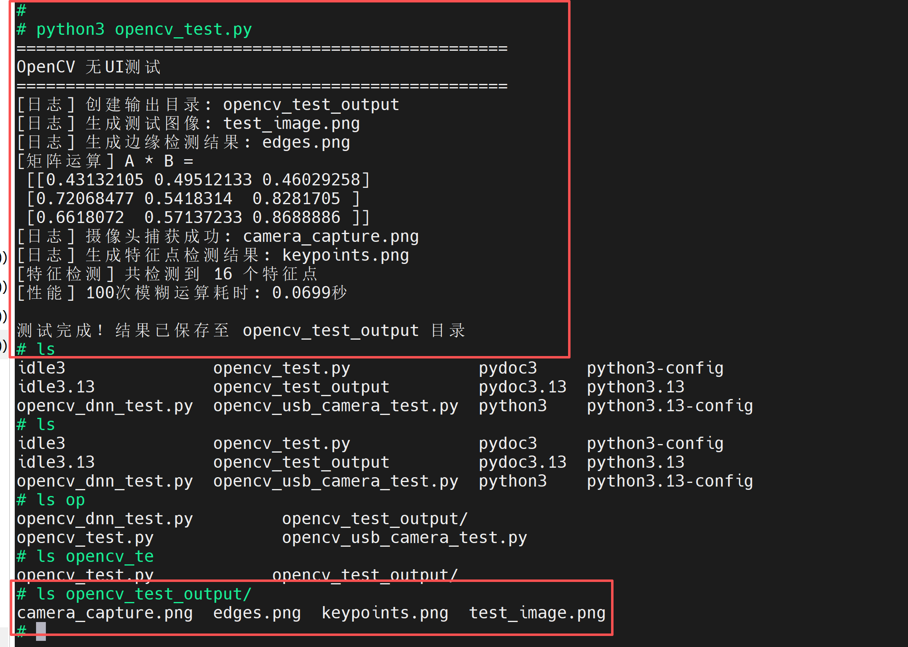

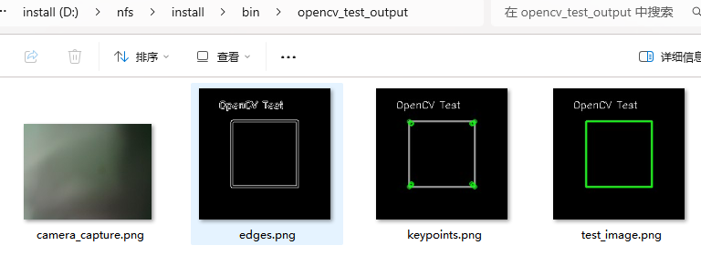

## 4. Testing OpenCV USB Camera

* Copy the following content into opencv_usb_camera_test.py to test basic functionality of OpenCV calling a USB camera.

```mk1.sh
#!/usr/bin/env python3
# -*- coding: utf-8 -*-

import cv2
import time

def main(device_index=0, num_frames=100, backend=cv2.CAP_V4L2):
    """
    Read num_frames from USB camera without UI and print the size of each frame.

    :param device_index: camera index, 0 means the first device
    :param num_frames: number of frames to read
    :param backend: OpenCV backend, options include CAP_V4L2, CAP_ANY, etc.
    """
    # Open the camera
    cap = cv2.VideoCapture(device_index, backend)
    if not cap.isOpened():
        print(f"Cannot open camera (index={device_index})")
        return
    
    print("Starting to read frames... Press Ctrl+C to interrupt")

    try:
        for i in range(num_frames):
            ret, frame = cap.read()
            if not ret:
                print(f"Failed to read frame {i}, exiting")
                break

            # Example processing: print frame resolution
            h, w = frame.shape[:2]
            print(f"Frame {i+1}/{num_frames} size: {w}x{h}")

            # Simulate processing time
            time.sleep(0.01)

    except KeyboardInterrupt:
        print("User interrupted")
    finally:
        cap.release()
        print("Camera released, program ended")

if __name__ == "__main__":
    # Modify the parameters below to specify the device number or number of frames
    main(device_index=0, num_frames=200)
```

* In the development board's command line, execute the following command to run opencv_usb_camera_test.py.

```sh
python opencv_usb_camera_test.py
```

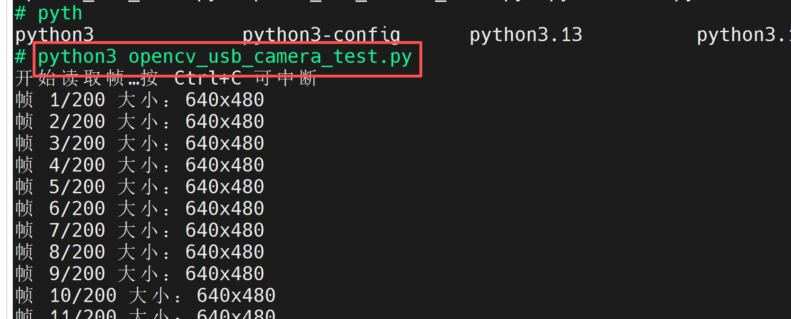


## 5. Testing the OpenCV DNN Module

* Copy the following content into opencv_dnn_test.py to test the basic face detection functionality using OpenCV's DNN module.

```mk1.sh
import cv2

# 1. Load image
image_path = "image.png"  # Replace with your image path
img = cv2.imread(image_path)
if img is None:
    print("Cannot load image")
    exit(1)
orig_h, orig_w = img.shape[:2]

# 2. Initialize FaceDetectorYN, use original image size and relax parameters
detector = cv2.FaceDetectorYN.create(
    model="face_detection_yunet_2023mar.onnx",
    config="",
    input_size=(orig_w, orig_h),  # consistent with original image
    score_threshold=0.4,          # increase confidence threshold to 0.4
    nms_threshold=0.5,            # NMS threshold
    top_k=200                     # keep up to 200 candidates
)

# 3. Detect faces
_, faces = detector.detect(img)

# 4. Post-processing: remove overly small boxes
min_size = 50  # width and height smaller than 50 pixels are considered noise
filtered = []
if faces is not None:
    for face in faces:
        x, y, w, h, score = face[:5].astype(int)
        # Keep boxes where width and height are not less than the threshold
        if w >= min_size and h >= min_size:
            filtered.append((x, y, w, h, score))

# 5. Draw filtered face boxes on the image
for x, y, w, h, score in filtered:
    cv2.rectangle(img, (x, y), (x + w, y + h), (0, 255, 0), 2)
    cv2.putText(
        img,
        f"{score/100:.2f}",
        (x, y - 5),
        cv2.FONT_HERSHEY_SIMPLEX,
        0.5,
        (0, 255, 0),
        1
    )

# 6. Save the result and output the number of detected faces
output_path = "output_image.jpg"
cv2.imwrite(output_path, img)
print(f"Detection complete, {len(filtered)} face(s) detected, result saved to {output_path}")
```

* Please download an image containing faces, put it in the install/bin/ directory, and rename it to image.png.
* Then visit the link to download the [onnx model](https://github.com/opencv/opencv_zoo/blob/main/models/face_detection_yunet/face_detection_yunet_2023mar.onnx), and also place this model in the install/bin/ directory.

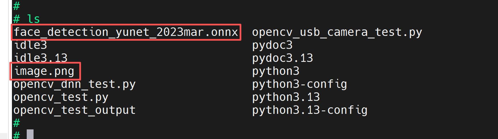

* In the development board's command line, execute the following command to run opencv_dnn_test.py.

```sh
python3 opencv_dnn_test.py
```

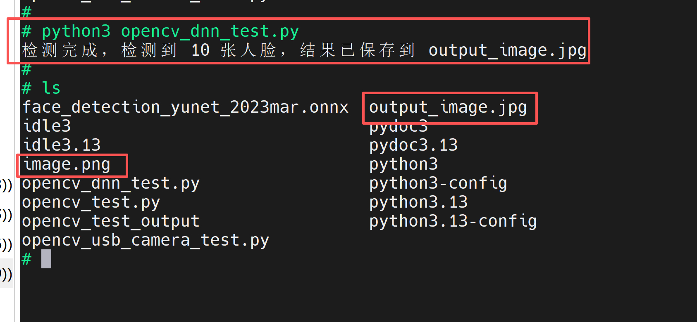

Before detection:

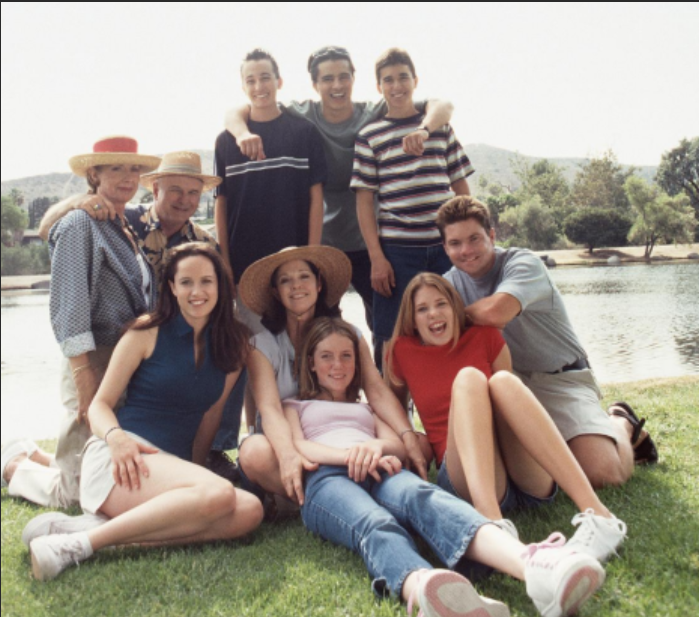

After detection:

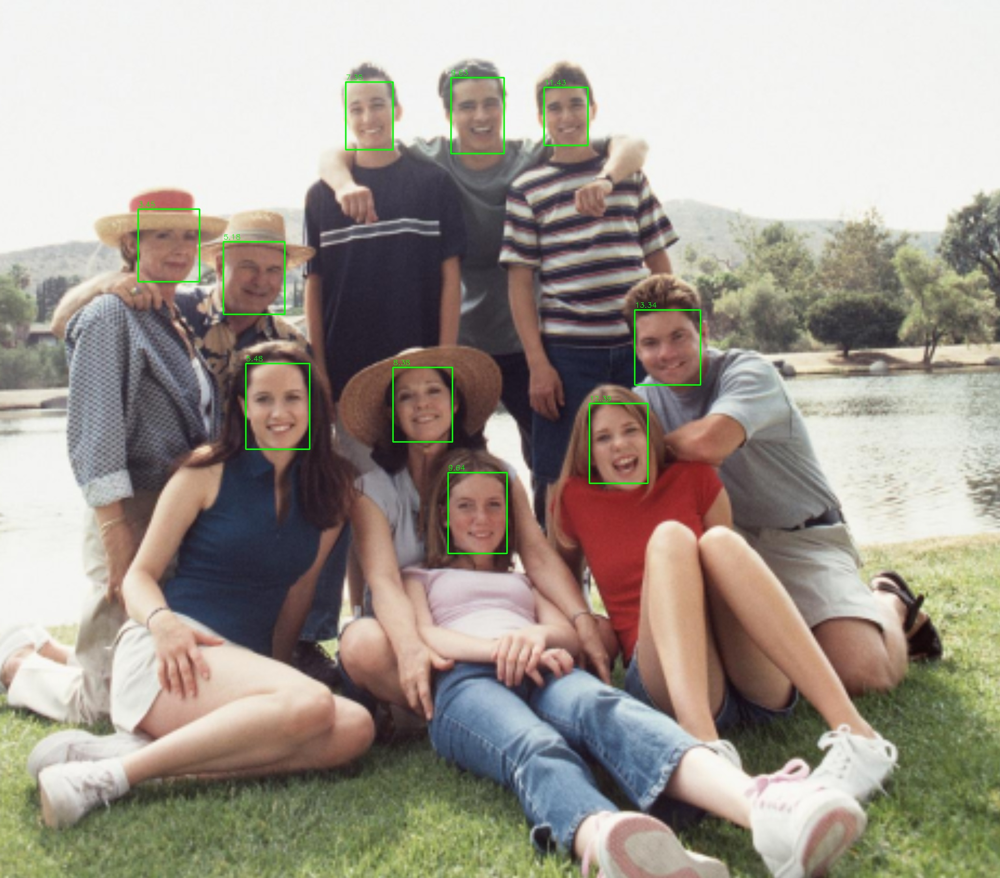
