# Python3 Porting

## 1. Software and Hardware Environment
Development board: SeaGull Pi
Cross-compilation toolchain: OHOS (dev) clang version 15.0.4

Toolchain path: pegasus/os/OpenHarmony/ohos/prebuilts/clang/ohos/linux-x86_64/llvm/bin  

Ported Python version: Python-3.13.2

## 2. Configuring Python Environment

* To meet the requirements for python3.13.2 porting, first change the server's python version to 3.13.2.
* **Step 1**: In the server's command line terminal, execute the following commands to download and install python3.13.2.

```shell
wget https://www.python.org/ftp/python/3.13.2/Python-3.13.2.tgz

tar -xvzf Python-3.13.2.tgz
rm Python-3.13.2.tgz

cd Python-3.13.2

./configure --enable-optimizations --enable-shared

make -j$(nproc)

make altinstall
```

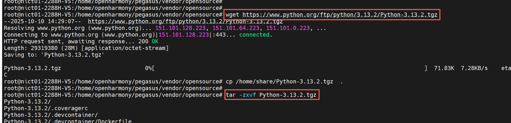

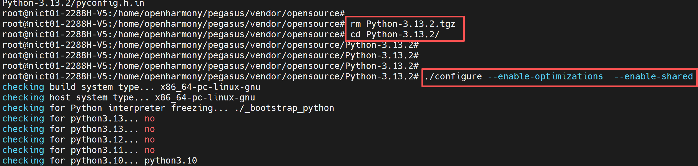

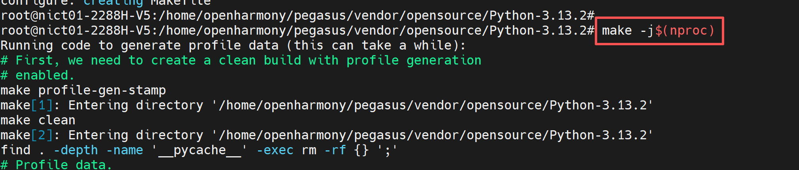

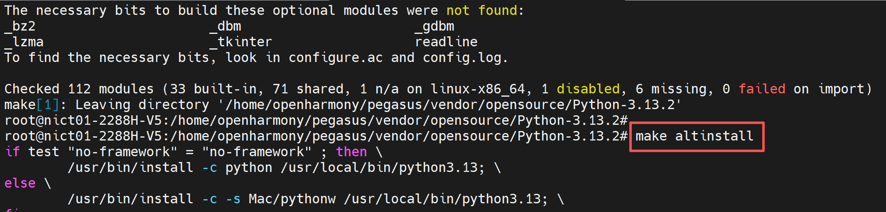

* **Step 2:** Create the python environment to make python3.13.2 active.
* In the server's command line terminal, execute the following commands to configure python environment variables.

```sh
rm /usr/bin/python3

ln -s /usr/local/bin/python3.13 /usr/bin/python3

# Add the following content at the end of the ~/.bashrc file
export LD_LIBRARY_PATH=/usr/local/lib:$LD_LIBRARY_PATH

# Execute the following command to make the environment variables take effect
source ~/.bashrc
```

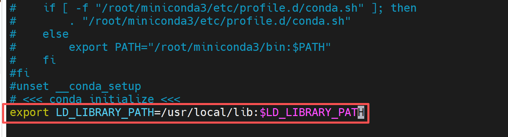

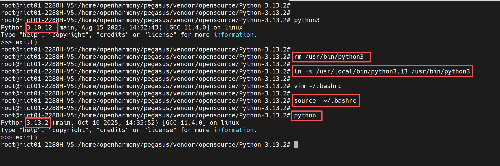

## 3. Installing Dependency Software

### Step 1: Install Dependency Packages

* Execute the following command on the server to download the software required for porting python.
* Note: Since this document's environment is a root user, choose whether to add sudo before commands based on your actual server environment.

```
apt-get update
apt-get upgrade -y
apt-get install openssl libssl-dev gcc make cmake -y
```

### Step 2: Cross-Compile Dependent Third-Party Software

**Note:** Before cross-compiling, ensure that the OpenHarmony code has been downloaded and the full build has passed. For details, refer to the [ohos build](https://gitee.com/HiSpark/pegasus/blob/master/docs/OpenHarmony%20Small%E7%89%88%E6%9C%AC%E4%BD%BF%E7%94%A8%E6%8C%87%E5%8D%97/OpenHarmony%20Small%E7%89%88%E6%9C%AC%E4%BD%BF%E7%94%A8%E6%8C%87%E5%8D%97.md#ohos%E7%BC%96%E8%AF%91) content.

#### 1. Cross-Compiling zlib

* Execute the following commands on the server to cross-compile zlib.

```sh
# Since zlib is also a third-party software, it can be ported under the opensource directory
cd pegasus/vendor/opensource/

wget http://zlib.net/zlib-1.3.1.tar.gz

tar -xvf zlib-1.3.1.tar.gz	
rm zlib-1.3.1.tar.gz

cd zlib-1.3.1/

# Note: modify the path according to your Pegasus directory
export CC="/home/openharmony/pegasus/os/OpenHarmony/ohos/prebuilts/clang/ohos/linux-x86_64/llvm/bin/aarch64-unknown-linux-ohos-clang --sysroot=/home/openharmony/pegasus/os/OpenHarmony/ohos/out/hispark_Hi3403V100/ipcamera_hispark_Hi3403V100_linux/sysroot"

./configure --prefix=$PWD/install 

# Note: modify the path according to your Pegasus directory
make LDFLAGS="--sysroot=/home/openharmony/pegasus/os/OpenHarmony/ohos/out/hispark_Hi3403V100/ipcamera_hispark_Hi3403V100_linux/sysroot -L/home/openharmony/pegasus/os/OpenHarmony/ohos/out/hispark_Hi3403V100/ipcamera_hispark_Hi3403V100_linux/sysroot/usr/lib"

make install
```

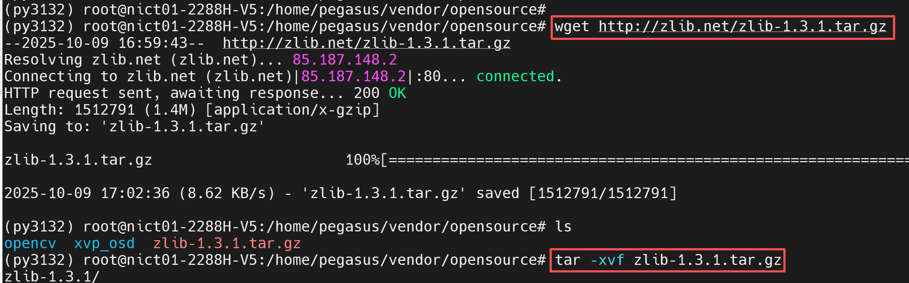

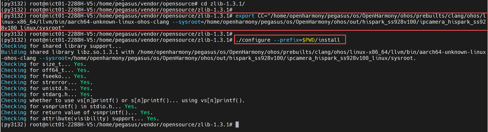

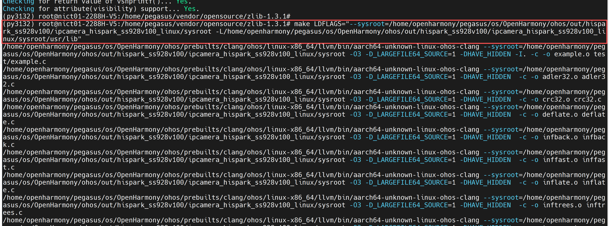

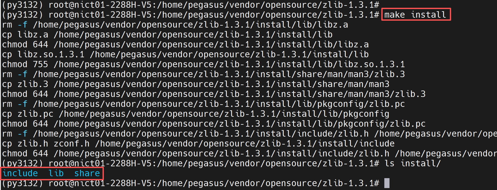

#### 2. Cross-Compiling openssl

* Execute the following commands on the server to cross-compile openssl.

```sh
cd ../

wget https://github.com/openssl/openssl/archive/refs/tags/OpenSSL_1_1_1w.tar.gz

tar -xvf OpenSSL_1_1_1w.tar.gz	
rm OpenSSL_1_1_1w.tar.gz

cd openssl-OpenSSL_1_1_1w

perl Configure linux-aarch64 --prefix=$PWD/install

make CC="/home/openharmony/pegasus/os/OpenHarmony/ohos/prebuilts/clang/ohos/linux-x86_64/llvm/bin/aarch64-unknown-linux-ohos-clang --sysroot=/home/openharmony/pegasus/os/OpenHarmony/ohos/out/hispark_Hi3403V100/ipcamera_hispark_Hi3403V100_linux/sysroot" LDFLAGS="--sysroot=/home/openharmony/pegasus/os/OpenHarmony/ohos/out/hispark_Hi3403V100/ipcamera_hispark_Hi3403V100_linux/sysroot -L/home/openharmony/pegasus/os/OpenHarmony/ohos/out/hispark_Hi3403V100/ipcamera_hispark_Hi3403V100_linux/sysroot/usr/lib"

make install
```


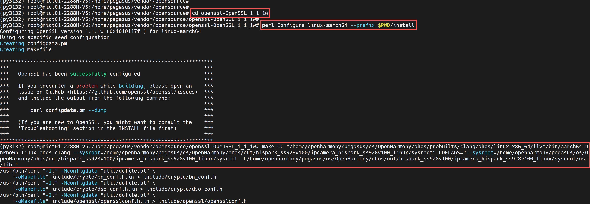

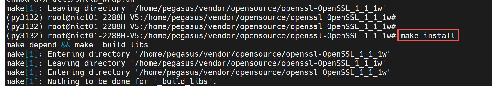

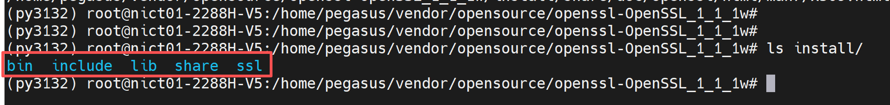

#### 3. Cross-Compiling libffi

* Execute the following commands on the server to cross-compile libffi.

```sh
cd ../

wget https://github.com/libffi/libffi/archive/refs/tags/v3.4.7.tar.gz

tar -xvf v3.4.7.tar.gz  
rm v3.4.7.tar.gz  
 
cd libffi-3.4.7/

./autogen.sh
```

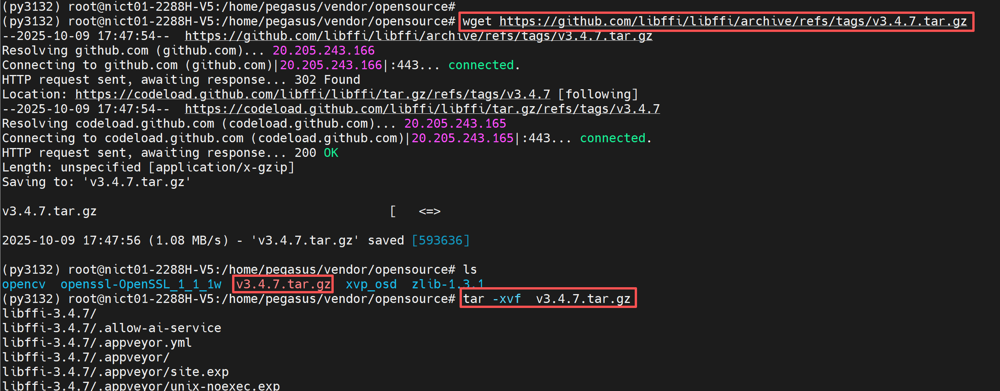

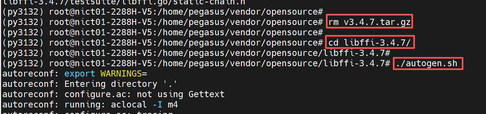

* Modify two places in the config.sub file.

  * 1. Add | ohos* after line 1771.

  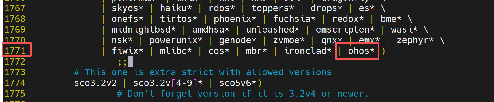

  * 2. Add | linux-ohos*- at line 1832.

  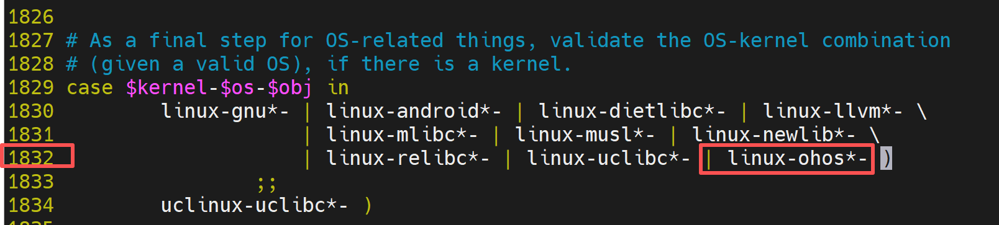

* After saving the config.sub file, execute the following commands to cross-compile libffi.

```sh

export CC="/home/openharmony/pegasus/os/OpenHarmony/ohos/prebuilts/clang/ohos/linux-x86_64/llvm/bin/aarch64-unknown-linux-ohos-clang --sysroot=/home/openharmony/pegasus/os/OpenHarmony/ohos/out/hispark_Hi3403V100/ipcamera_hispark_Hi3403V100_linux/sysroot"

./configure --prefix=$PWD/install --host=aarch64-linux-ohos	

make && make install
```

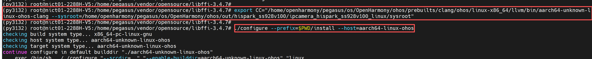

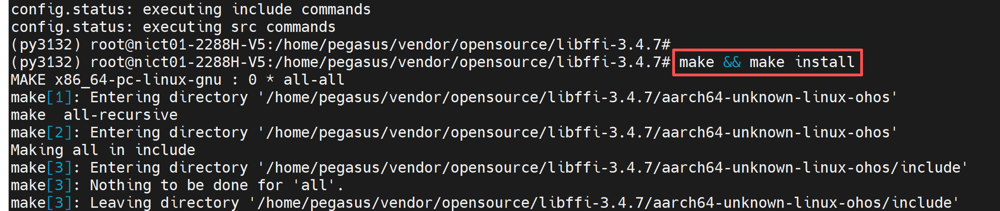

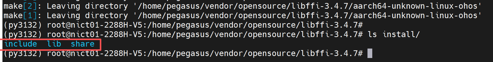

#### 4. Cross-Compiling libuuid

* Execute the following commands on the server to cross-compile libuuid.

```sh
cd ../

wget https://downloads.sourceforge.net/project/libuuid/libuuid-1.0.3.tar.gz 

tar -xvf libuuid-1.0.3.tar.gz  

rm libuuid-1.0.3.tar.gz  

cd libuuid-1.0.3

# Modify the config.sub file:

sed -i 's/| -kaos\*/| -kaos\* | -ohos\*/g' config.sub

sed -i 's/linux-uclibc\*/linux-uclibc\* | linux-ohos\*/g' config.sub

export CC="/home/openharmony/pegasus/os/OpenHarmony/ohos/prebuilts/clang/ohos/linux-x86_64/llvm/bin/aarch64-unknown-linux-ohos-clang --sysroot=/home/openharmony/pegasus/os/OpenHarmony/ohos/out/hispark_Hi3403V100/ipcamera_hispark_Hi3403V100_linux/sysroot"

./configure --prefix=$PWD/install --enable-shared --host=aarch64-linux-ohos

make && make install
```

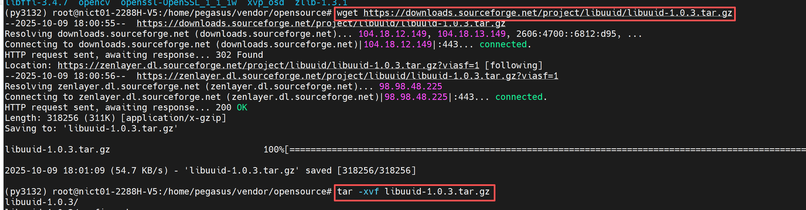

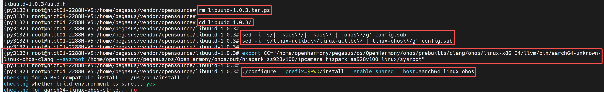

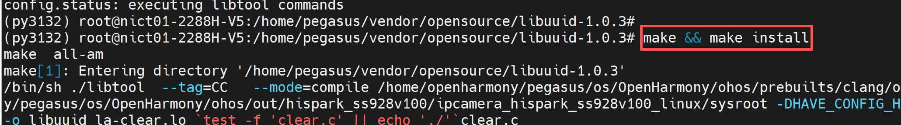

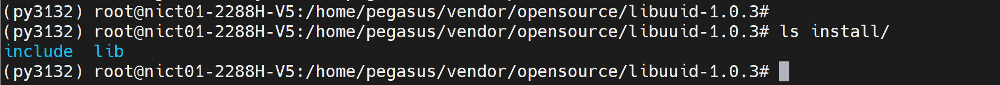

#### 5. Cross-Compiling xz

* Execute the following commands on the server to cross-compile xz.

```sh
cd ../

wget https://tukaani.org/xz/xz-5.2.5.tar.gz  
tar -zxvf xz-5.2.5.tar.gz  
rm xz-5.2.5.tar.gz  
cd xz-5.2.5

sed -i 's/| -kaos\*/| -kaos\* | -ohos\*/g' ./build-aux/config.sub
sed -i 's/linux-uclibc\*/linux-uclibc\* | linux-ohos\*/g' ./build-aux/config.sub

export CC="/home/openharmony/pegasus/os/OpenHarmony/ohos/prebuilts/clang/ohos/linux-x86_64/llvm/bin/aarch64-unknown-linux-ohos-clang --sysroot=/home/openharmony/pegasus/os/OpenHarmony/ohos/out/hispark_Hi3403V100/ipcamera_hispark_Hi3403V100_linux/sysroot"

./configure --prefix=$PWD/install --enable-shared --host=aarch64-linux-ohos

make && make install
```

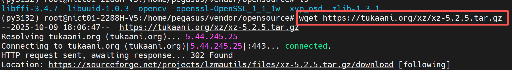

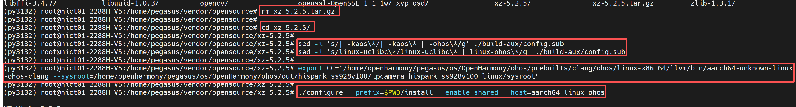

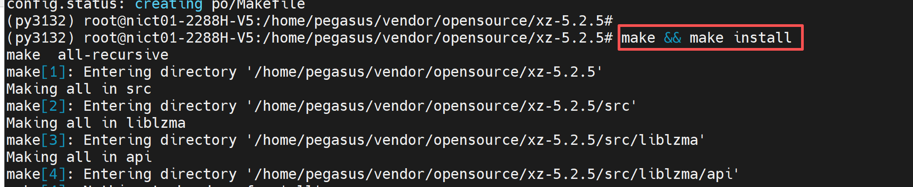

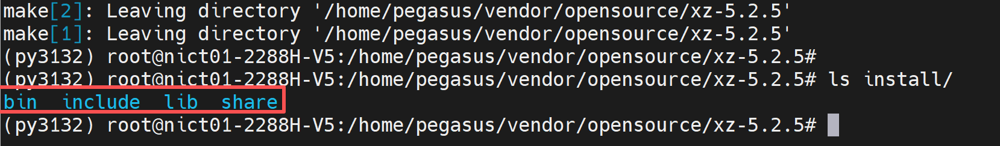

#### 6. Cross-Compiling readline

* Execute the following commands on the server to cross-compile readline.

```sh
cd ../

wget https://mirrors.aliyun.com/gnu/readline/readline-8.2.tar.gz  
tar xzf readline-8.2.tar.gz 
rm readline-8.2.tar.gz 
cd readline-8.2
```

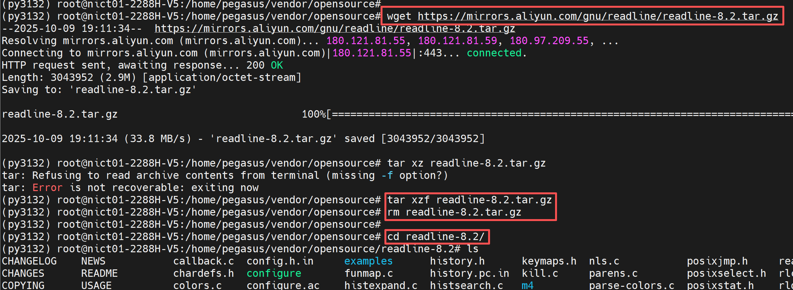

* Modify one place in the support/config.sub file.

* Add | ohos* at line 1757.
* Add | linux-ohos* at line 1775.

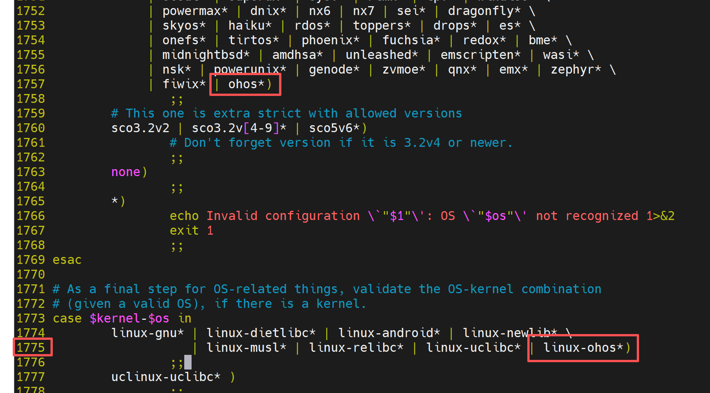

* After saving the support/config.sub file, execute the following commands in the server's command line terminal.

```sh
export CC="/home/openharmony/pegasus/os/OpenHarmony/ohos/prebuilts/clang/ohos/linux-x86_64/llvm/bin/aarch64-unknown-linux-ohos-clang --sysroot=/home/openharmony/pegasus/os/OpenHarmony/ohos/out/hispark_Hi3403V100/ipcamera_hispark_Hi3403V100_linux/sysroot"

./configure --host=aarch64-linux-ohos --prefix=$PWD/install --disable-install-examples

make && make install
```

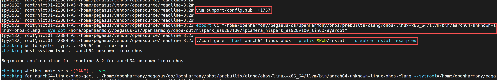

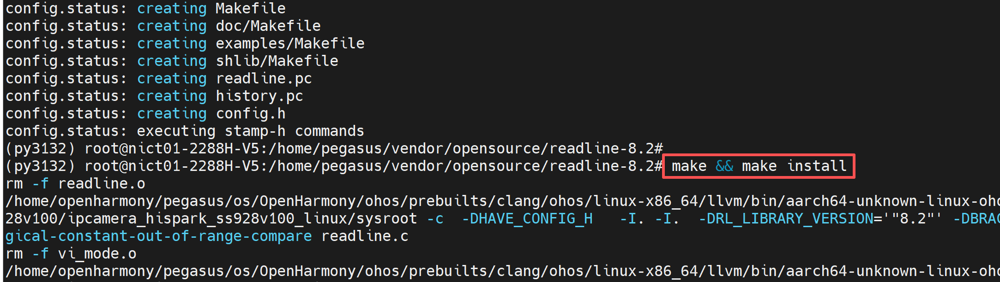

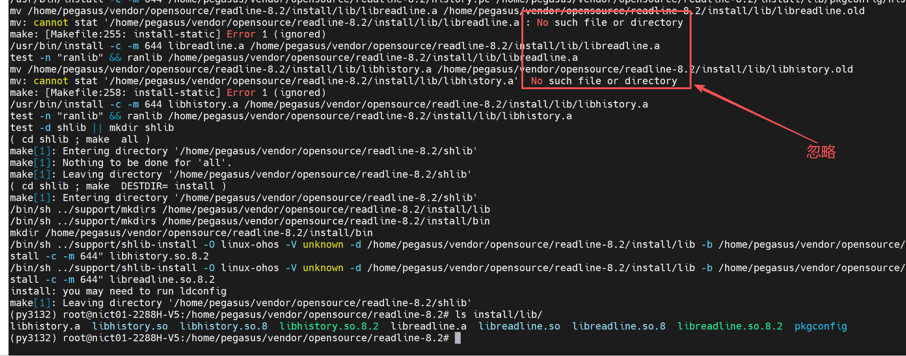

## 4. Cross-Compiling python3.13.2

* Execute the following commands on the server to cross-compile python3.13.2.

```sh
cd ../

wget https://www.python.org/ftp/python/3.13.2/Python-3.13.2.tgz

tar -xvzf Python-3.13.2.tgz

rm Python-3.13.2.tgz

cd Python-3.13.2
```

* Modify two places in the config.sub file.
  * At line 1772, add: | ohos*
  * At line 1833, add: | linux-ohos*-


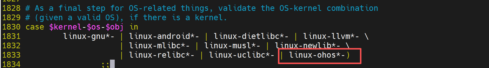

* Modify the configure file, change lines 7021~7027 to the following content.

```sh
if test x$PLATFORM_TRIPLET != x && test x$MULTIARCH != x; then
  if test x$PLATFORM_TRIPLET != x && test x$MULTIARCH = x; then
    MULTIARCH=$PLATFORM_TRIPLET
  fi
fi
```

* Before modification.

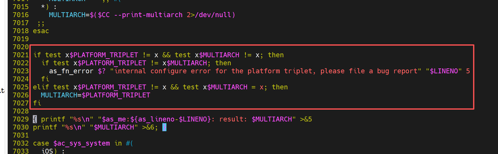

* After modification.

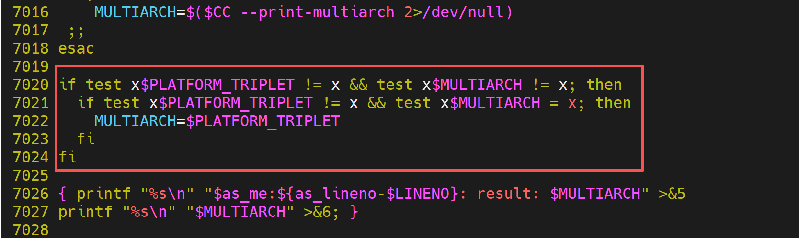

* Execute the following commands to cross-compile python.

```sh
CROSS_TOOLCHAIN_DIR="/home/openharmony/pegasus/os/OpenHarmony/ohos/prebuilts/clang/ohos/linux-x86_64/llvm/bin"
SYSROOT="/home/openharmony/pegasus/os/OpenHarmony/ohos/out/hispark_Hi3403V100/ipcamera_hispark_Hi3403V100_linux/sysroot"

CC="${CROSS_TOOLCHAIN_DIR}/aarch64-unknown-linux-ohos-clang" \
CXX="${CROSS_TOOLCHAIN_DIR}/aarch64-unknown-linux-ohos-clang++" \
AR="${CROSS_TOOLCHAIN_DIR}/llvm-ar" \
LD="${CROSS_TOOLCHAIN_DIR}/ld.lld" \
RANLIB="${CROSS_TOOLCHAIN_DIR}/llvm-ranlib" \
STRIP="${CROSS_TOOLCHAIN_DIR}/llvm-strip" \
CFLAGS="--sysroot=${SYSROOT} -fPIC" \
CXXFLAGS="--sysroot=${SYSROOT} -fPIC" \
LDFLAGS="--sysroot=${SYSROOT}" \
./configure \
--host=aarch64-linux-ohos \
--build=x86_64-pc-linux-gnu \
--target=aarch64-linux-ohos \
--prefix="$PWD/install" \
--disable-ipv6 \
ac_cv_file__dev_ptmx="yes" \
ac_cv_file__dev_ptc="yes" \
--with-openssl=../openssl-OpenSSL_1_1_1w/install \
--with-build-python=python3.13 2>&1 | tee config.log.txt

CFLAGS="-I../zlib-1.3.1/install/include \
        -I../xz-5.2.5/install/include \
        -I../libffi-3.4.7/install/include \
		-I../readline-8.2/install/include \
        -I../libuuid-1.0.3/install/include/uuid"
CPPFLAGS="-I../openssl-OpenSSL_1_1_1w/install/include"
LDFLAGS="-L../zlib-1.3.1/install/lib \
         -L../xz-5.2.5/install/lib \
         -L../libffi-3.4.7/install/lib \
		 -L../readline-8.2/install/lib \
         -L../libuuid-1.0.3/install/lib \
         -L../openssl-OpenSSL_1_1_1w/install/lib"

CFLAGS="$CFLAGS" CPPFLAGS="$CPPFLAGS" LDFLAGS="$LDFLAGS" make 2>&1 | tee make.log.txt
```

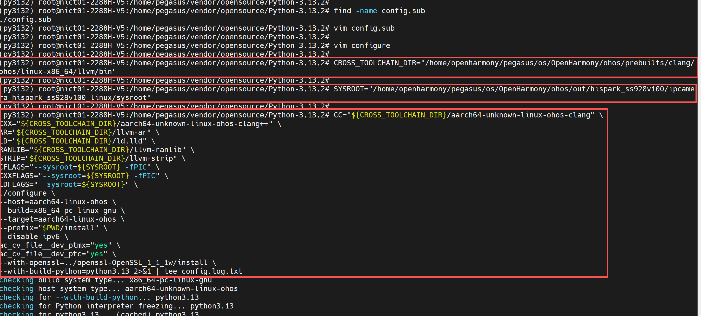

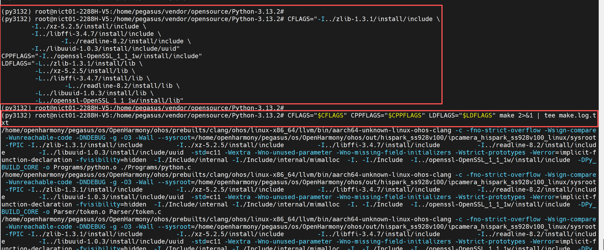

```sh
make install 2>1 | tee install.log.txt
```

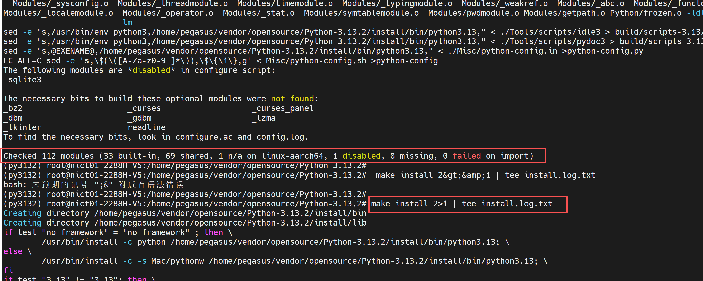

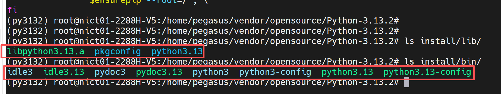

## 5. Board-Side Testing

### Step 1: Configure the Board Environment

* 1. Ensure the development board has the OpenHarmony operating system burned.
* 2. Connect the development board to your computer using a network cable, ensuring they are on the same local network.
* 3. Configure the development board's IP address and ensure the board and computer can ping each other.

```sh
# Note: configure the eth0 IP address according to your network IP segment
ifconfig eth0 192.168.100.100

# Add permissions
echo 0 9999999 > /proc/sys/net/ipv4/ping_group_range
```


### Step 2: Prepare Python Dependency Files

* 1. Copy the install folder generated after cross-compiling python3.13.2 in Chapter 4 to your NFS mount directory (if no network cable is available, SD card can also be used to mount to the board).
* 2. Execute the following command to mount the computer's NFS directory to the /mnt directory on the development board (note: modify according to your IP address and NFS configuration).

```mk1.sh
mount -o nolock,addr=192.168.100.10 -t nfs 192.168.100.10:/d/nfs /mnt
```

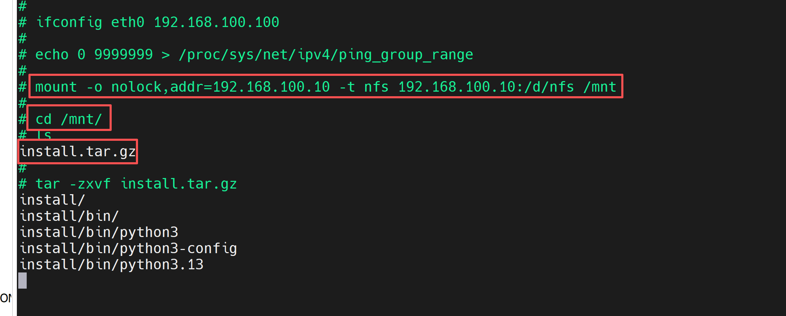

* 3. Configure python environment variables to ensure python can find dependencies at runtime.

```mk1.sh
export PATH=/mnt/install/bin:$PATH
export PYTHONPATH=/mnt/install/lib/python3.13:$PYTHONPATH
export LD_LIBRARY_PATH=/mnt/install/lib/python3.13/lib-dynload:$LD_LIBRARY_PATH
```


### Step 3: Running Python Code

* If porting python3 for the first time, you need to add executable permissions to python3 before running.

```sh
chmod +x /mnt/install/bin/python3
```

* Enter python3 to check the result.

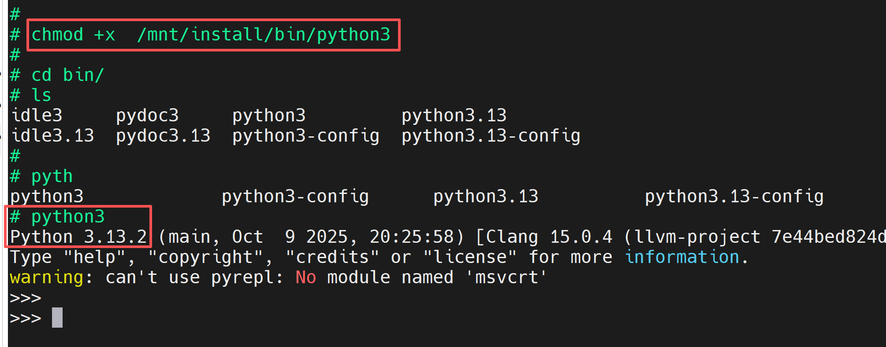

* To test python code on the board, copy all the following content into the python_test.py file.

```python
#!/usr/bin/env python3
# -*- coding: utf-8 -*-

print("Hello, World!") 

import os
import sys
import datetime

def main():
    if sys.version_info < (3, 6):
        print("Error: Requires Python 3.6 or higher")
        sys.exit(1)
    
    current_time = datetime.datetime.now().strftime("%Y-%m-%d %H:%M:%S")
    user = os.getenv("USER", "unknown_user")

def multi_language():
    languages = {
        "Chinese": "ni hao shijie ",
        "Spanish": "?Hola Mundo!",
        "French": "Bonjour le monde!",
        "Japanese": "shijie nihao"
    }
    
    try:
        for lang, greeting in languages.items():
            print(f"{lang}: {greeting}")
    except UnicodeEncodeError:
        print("Encoding error detected. Try setting environment variable:")
        print("export PYTHONIOENCODING=utf-8")

if __name__ == "__main__":
    main()
    multi_language()
    
    # basic I/O
    input("\nPress Enter to exit...")
```

* Use the following command to run python_test.py and check the result. If the result matches the image below, the porting was successful.

```sh
python3 python_test.py
```


