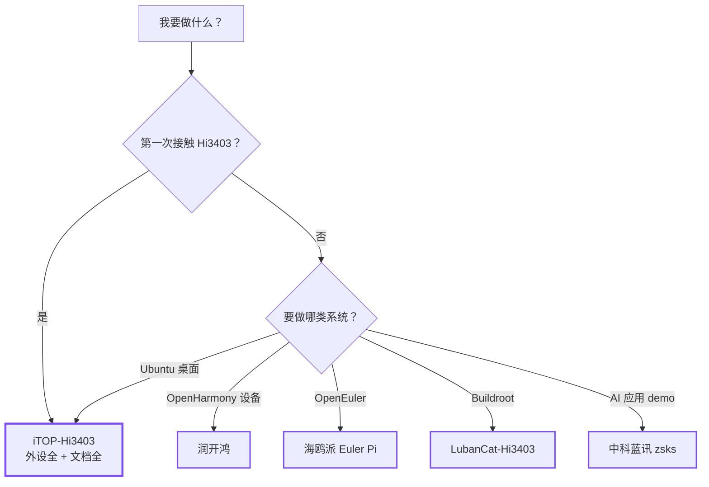

# 选择开发板

Hi3403 平台目前有这几款主流的 Hi3403V100 开发板。每家板子的取舍不同
—— 价格、外设、文档完整度、社区生态。下表给你一个快速对比，下面的
决策树帮你 30 秒选定。

## 快速对比

| 板子 | 厂商 | 价位 | 外设 | 文档 | 适合谁 |
|---|---|---|---|---|---|
| [iTOP-Hi3403](../boards/topeet/index.md) | 迅为 | 中 | 最丰富 | 最全 | **新手入门、SDK 开发** |
| [LubanCat-Hi3403](../boards/lubancat/index.md) | 野火 | 中 | 中等 | 完整（Buildroot 友好）| Buildroot 用户、定制系统 |
| [海鸥派 Euler Pi](../boards/ebaina/index.md) | 易百纳 | 中 | 中等 | OpenEuler 适配好 | OpenEuler 开发者 |
| [润开鸿](../boards/rkh/index.md) | 润开鸿 | — | — | OpenHarmony 桌面适配 | OpenHarmony 设备开发 |
| [中科蓝讯 (zsks)](../boards/zsks/index.md) | 中科蓝讯 | — | 含丰富 AI demo | 偏 AI 示例 | 用现成 AI demo 起步 |

!!! note "硬件特性都基于 Hi3403V100 SoC"

    所有板子的 *核心* 能力（NPU、ISP、编解码、内存带宽）都来自同一颗
    SoC。差异主要在外设布局、电源设计、附带的传感器/摄像头模组、
    厂家提供的 SDK 镜像和文档。

## 30 秒决策树

## 详细对比项

### 推荐场景

- **新手 / 学习 SDK** → iTOP-Hi3403。SDK 默认目标板，社区资料最多，
  踩坑能搜到答案的概率最高。
- **量产工程 / 定制 Linux** → LubanCat-Hi3403。Buildroot 工程链路成熟。
- **OpenHarmony 应用** → 润开鸿。桌面系统适配做得最好。
- **OpenEuler 国产化** → 海鸥派 Euler Pi。
- **AI 算法验证** → 中科蓝讯。带的 demo 直接能跑（face_detection、
  kcf_track、fruit_identify、opencv_dnn、hnr_auto），适合不写代码先看效果。

### 都不是？

如果你已经有别的 SS928V100 自研板（比如 SS928V100 reference design），
也可以用这套文档 —— Hi3403 SDK 和这里的多媒体 / AI 文档是芯片层面的，
跟具体板子无关。板子专属的内容（pinout、原理图、烧录脚本）请参考
你板子厂商提供的资料。

## 接下来

-   :material-clock-fast:{ .lg .middle } __选好了，我要点亮它__

    ---

    [:octicons-arrow-right-24: 在 30 分钟内启动 Hi3403](quickstart.md)

-   :material-disc-player:{ .lg .middle } __选好了，但还在纠结操作系统__

    ---

    [:octicons-arrow-right-24: 选择操作系统](os-picker.md)

-   :material-developer-board:{ .lg .middle } __查看每款板子的详细资料__

    ---

    [:octicons-arrow-right-24: 开发板](../boards/index.md)

