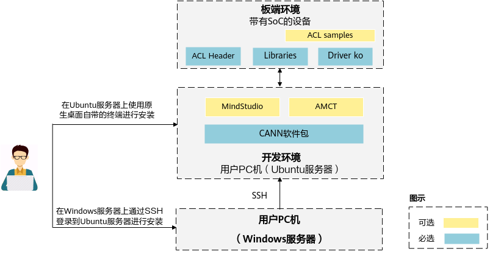
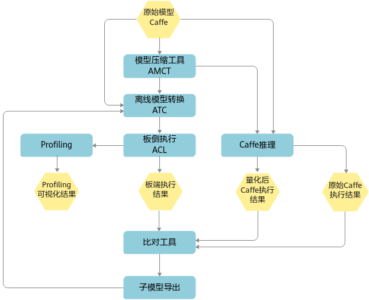
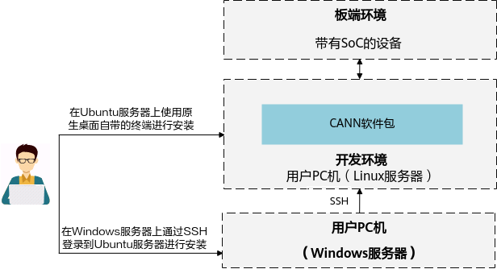
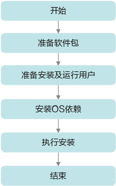

# Preface
**Overview<a name="section4537382116410"></a>**

This document is a guideline for using NNN, mainly introducing the main steps for running NNN services on the board.

**Product Version<a name="section300mcpsimp"></a>**

The product versions corresponding to this document are as follows.

<a name="table303mcpsimp"></a>
<table><thead align="left"><tr id="row308mcpsimp"><th class="cellrowborder" valign="top" width="45%" id="mcps1.1.3.1.1"><p id="p310mcpsimp"><a name="p310mcpsimp"></a><a name="p310mcpsimp"></a>Product Name</p>
</th>
<th class="cellrowborder" valign="top" width="55.00000000000001%" id="mcps1.1.3.1.2"><p id="p312mcpsimp"><a name="p312mcpsimp"></a><a name="p312mcpsimp"></a>Product Version</p>
</th>
</tr>
</thead>
<tbody><tr id="row314mcpsimp"><td class="cellrowborder" valign="top" width="45%" headers="mcps1.1.3.1.1 "><p id="p316mcpsimp"><a name="p316mcpsimp"></a><a name="p316mcpsimp"></a>Hi3403V100</p>
</td>
<td class="cellrowborder" valign="top" width="55.00000000000001%" headers="mcps1.1.3.1.2 "><p id="p318mcpsimp"><a name="p318mcpsimp"></a><a name="p318mcpsimp"></a>V100</p>
</td>
</tr>
<tr id="row1376073312191"><td class="cellrowborder" valign="top" width="45%" headers="mcps1.1.3.1.1 "><p id="p5760533111913"><a name="p5760533111913"></a><a name="p5760533111913"></a>Hi3519AV200</p>
</td>
<td class="cellrowborder" valign="top" width="55.00000000000001%" headers="mcps1.1.3.1.2 "><p id="p6760333131918"><a name="p6760333131918"></a><a name="p6760333131918"></a>V100</p>
</td>
</tr>
</tbody>
</table>

**Intended Audience<a name="section4378592816410"></a>**

This document is mainly intended for NNN developers. Developers must have the following experience and skills:

-   Understanding of basic concepts of image analysis tools.
-   Some experience in developing image analysis tools.

**Symbol Conventions<a name="section133020216410"></a>**

The following symbols may appear in this document, and their meanings are as follows.

<a name="table2622507016410"></a>
<table><thead align="left"><tr id="row1530720816410"><th class="cellrowborder" valign="top" width="20.580000000000002%" id="mcps1.1.3.1.1"><p id="p6450074116410"><a name="p6450074116410"></a><a name="p6450074116410"></a><strong id="b2136615816410"><a name="b2136615816410"></a><a name="b2136615816410"></a>Symbol</strong></p>
</th>
<th class="cellrowborder" valign="top" width="79.42%" id="mcps1.1.3.1.2"><p id="p5435366816410"><a name="p5435366816410"></a><a name="p5435366816410"></a><strong id="b5941558116410"><a name="b5941558116410"></a><a name="b5941558116410"></a>Description</strong></p>
</th>
</tr>
</thead>
<tbody><tr id="row1372280416410"><td class="cellrowborder" valign="top" width="20.580000000000002%" headers="mcps1.1.3.1.1 "><p id="p3734547016410"><a name="p3734547016410"></a><a name="p3734547016410"></a><a name="image2670064316410"></a><a name="image2670064316410"></a><span></span></p>
</td>
<td class="cellrowborder" valign="top" width="79.42%" headers="mcps1.1.3.1.2 "><p id="p1757432116410"><a name="p1757432116410"></a><a name="p1757432116410"></a>Indicates a high-risk hazard which, if not avoided, will result in death or serious injury.</p>
</td>
</tr>
<tr id="row466863216410"><td class="cellrowborder" valign="top" width="20.580000000000002%" headers="mcps1.1.3.1.1 "><p id="p1432579516410"><a name="p1432579516410"></a><a name="p1432579516410"></a><a name="image4895582316410"></a><a name="image4895582316410"></a><span></span></p>
</td>
<td class="cellrowborder" valign="top" width="79.42%" headers="mcps1.1.3.1.2 "><p id="p959197916410"><a name="p959197916410"></a><a name="p959197916410"></a>Indicates a medium-risk hazard which, if not avoided, could result in death or serious injury.</p>
</td>
</tr>
<tr id="row123863216410"><td class="cellrowborder" valign="top" width="20.580000000000002%" headers="mcps1.1.3.1.1 "><p id="p1232579516410"><a name="p1232579516410"></a><a name="p1232579516410"></a><a name="image1235582316410"></a><a name="image1235582316410"></a><span></span></p>
</td>
<td class="cellrowborder" valign="top" width="79.42%" headers="mcps1.1.3.1.2 "><p id="p123197916410"><a name="p123197916410"></a><a name="p123197916410"></a>Indicates a low-risk hazard which, if not avoided, could result in minor or moderate injury.</p>
</td>
</tr>
<tr id="row5786682116410"><td class="cellrowborder" valign="top" width="20.580000000000002%" headers="mcps1.1.3.1.1 "><p id="p2204984716410"><a name="p2204984716410"></a><a name="p2204984716410"></a><a name="image4504446716410"></a><a name="image4504446716410"></a><span></span></p>
</td>
<td class="cellrowborder" valign="top" width="79.42%" headers="mcps1.1.3.1.2 "><p id="p4388861916410"><a name="p4388861916410"></a><a name="p4388861916410"></a>Used to convey device or environmental safety warning information. If not avoided, it could result in equipment damage, data loss, reduced equipment performance, or other unpredictable consequences.</p>
<p id="p1238861916410"><a name="p1238861916410"></a><a name="p1238861916410"></a>"Caution" does not involve personal injury.</p>
</td>
</tr>
<tr id="row2856923116410"><td class="cellrowborder" valign="top" width="20.580000000000002%" headers="mcps1.1.3.1.1 "><p id="p5555360116410"><a name="p5555360116410"></a><a name="p5555360116410"></a><a name="image799324016410"></a><a name="image799324016410"></a><span></span></p>
</td>
<td class="cellrowborder" valign="top" width="79.42%" headers="mcps1.1.3.1.2 "><p id="p4612588116410"><a name="p4612588116410"></a><a name="p4612588116410"></a>Supplementary explanation of key information in the main text.</p>
<p id="p1232588116410"><a name="p1232588116410"></a><a name="p1232588116410"></a>"Note" is not a safety warning and does not involve personal, equipment, or environmental hazard information.</p>
</td>
</tr>
</tbody>
</table>

**Revision History<a name="section4116mcpsimp"></a>**

The revision history accumulates descriptions of each document update. The latest version of the document includes updates from all previous document versions.

<a name="table1557726816410"></a>
<table><thead align="left"><tr id="row2942532716410"><th class="cellrowborder" valign="top" width="20.72%" id="mcps1.1.4.1.1"><p id="p3778275416410"><a name="p3778275416410"></a><a name="p3778275416410"></a><strong id="b5687322716410"><a name="b5687322716410"></a><a name="b5687322716410"></a>Document Version</strong></p>
</th>
<th class="cellrowborder" valign="top" width="20.22%" id="mcps1.1.4.1.2"><p id="p5627845516410"><a name="p5627845516410"></a><a name="p5627845516410"></a><strong id="b5800814916410"><a name="b5800814916410"></a><a name="b5800814916410"></a>Release Date</strong></p>
</th>
<th class="cellrowborder" valign="top" width="59.06%" id="mcps1.1.4.1.3"><p id="p2382284816410"><a name="p2382284816410"></a><a name="p2382284816410"></a><strong id="b3316380216410"><a name="b3316380216410"></a><a name="b3316380216410"></a>Change Description</strong></p>
</th>
</tr>
</thead>
<tbody><tr id="row62941350175416"><td class="cellrowborder" valign="top" width="20.72%" headers="mcps1.1.4.1.1 "><p id="p363115814548"><a name="p363115814548"></a><a name="p363115814548"></a>00B02</p>
</td>
<td class="cellrowborder" valign="top" width="20.22%" headers="mcps1.1.4.1.2 "><p id="p14631358115416"><a name="p14631358115416"></a><a name="p14631358115416"></a>2025-11-15</p>
</td>
<td class="cellrowborder" valign="top" width="59.06%" headers="mcps1.1.4.1.3 "><p id="p18632135818547"><a name="p18632135818547"></a><a name="p18632135818547"></a>Second interim version release.</p>
<p id="p1627917105553"><a name="p1627917105553"></a><a name="p1627917105553"></a>Sections "3.1.1.2 Cross-compilation Environment Preparation", "4.2 Prerequisites", and "4.3 Operation Steps" have been modified.</p>
<p id="p1511111516016"><a name="p1511111516016"></a><a name="p1511111516016"></a>Toolchain in section "3.1.1.3 Cross-compilation" has been modified.</p>
</td>
</tr>
<tr id="row5947359616410"><td class="cellrowborder" valign="top" width="20.72%" headers="mcps1.1.4.1.1 "><p id="p2149706016410"><a name="p2149706016410"></a><a name="p2149706016410"></a>00B01</p>
</td>
<td class="cellrowborder" valign="top" width="20.22%" headers="mcps1.1.4.1.2 "><p id="p648803616410"><a name="p648803616410"></a><a name="p648803616410"></a>2025-09-15</p>
</td>
<td class="cellrowborder" valign="top" width="59.06%" headers="mcps1.1.4.1.3 "><p id="p1946537916410"><a name="p1946537916410"></a><a name="p1946537916410"></a>First interim version release.</p>
</td>
</tr>
</tbody>
</table>

# Overview
## Ascend NNN Introduction<a name="ZH-CN_TOPIC_0000002441980573"></a>

Ascend NNN is a new generation image analysis tool accelerator. It supports open-source AA frameworks (Caffe/ONNX) on the front end and heterogeneous computing with NNN/CPU on the back end, providing a complete hardware and software computing acceleration solution.

## Deployment Architecture<a name="ZH-CN_TOPIC_0000002442020509"></a>

The deployment architecture is shown in [Figure 1](#fig186401132182414). The NNN environment includes a PC-side tool development environment and a board-side environment. When a trained model is received, it can first be quantized using AMCT (Advanced Model Compression Toolkit) to quantize some layers of the model to 8-bit computation, improving computing efficiency. Next, the ATC (Advanced Tensor Compiler) tool is used to convert the quantized or non-quantized model into an offline model recognized by Ascend NNN. Finally, the offline model is placed in the board-side environment for inference.

**Figure 1** Deployment Architecture<a name="fig186401132182414"></a>  


**Board-Side Environment<a name="section6758520151415"></a>**

The board-side environment contains the header files, dynamic libraries, driver ko files, and samples required for inference execution on the board.

**Development Environment<a name="section115683551414"></a>**

Command-line development environment: Requires separate installation of the CANN software package, using command-line installation and usage. For details, see [Command-Line Development Environment Installation](#ZH-CN_TOPIC_0000002442020497).

This environment can have an independent AMCT tool installed, supporting quantization of original float32 models to lower bit-widths to improve inference performance. For tool installation and usage, refer to the "AMCT User Guide (Caffe)", "AMCT User Guide (Pytorch)", and other manuals.

## Usage Flow<a name="ZH-CN_TOPIC_0000002408581302"></a>

This chapter describes the overall usage flow of how a trained original model executes on NNN and how to handle issues encountered. The runtime flow is shown in [Figure 1](#fig177346115318).

**Figure 1** Runtime Flow<a name="fig177346115318"></a>  


The following uses the Caffe original network model as an example to describe the runtime flow:

1.  Once the trained Caffe model is ready, you can directly use the ATC tool for model conversion, or first use AMCT for quantization, and then pass the quantized Caffe model to the ATC tool for offline model conversion.
2.  The om model generated after ATC offline model conversion can be used for inference on the board-side environment using ACL (Advanced Computing Language).
3.  If accuracy issues are encountered after inference, you can dump the intermediate layer data of the network and compare it with the Caffe dump results to locate the problematic layer. To narrow down the scope, you can use the sub-model export function on MindCmd (currently only supporting Caffe models) to narrow down the problem scope, and then use the exported sub-model to reproduce the issue.
4.  When inference performance does not meet requirements, you can use the Profiling tool to view the time consumption and bandwidth data of each operator in the network. By analyzing bottlenecks, you can modify the network to improve overall performance.

> **Note:** 
>Reference manuals involved in the above flow are as follows:
>-   AMCT: If users want to use quantization features to improve inference performance, please refer to the "AMCT User Guide (Caffe)" and "AMCT User Guide (Pytorch)" to quantize the trained model, and then use the ATC tool for model conversion.
>-   ATC Tool Model Conversion: Please refer to the "ATC Tool User Guide" to convert the trained model into an offline model recognizable by the platform. After the application specifies the model resources, inference can proceed. For specific supported Caffe operator specifications, please refer to the operator specification section of the "ATC Tool User Guide".
>-   Inference accuracy or performance not meeting standards: Please refer to the "Quick Start Guide" sections on "Accuracy Tuning Suggestions" and "Performance Problem Analysis and Tuning".

# NNN Environment Installation
## Board-Side Environment Installation<a name="ZH-CN_TOPIC_0000002441980625"></a>

**Board-Side Environment Installation<a name="section16455172521019"></a>**

-   For board-side environment installation, please refer to the "xxxx SDK Installation and Upgrade Usage Guide".
-   For SVP ACL interface usage instructions, please refer to the "Application Development Guide" > "SVP ACL API Reference" chapter.
-   The SVP_NNN related library paths need to be added to the system environment variable LD_LIBRARY_PATH (e.g., smp/a55_linux/mpp/out/lib/svp_nnn).
-   The file list required for board-side development is shown in [Table 1](#_Ref77061199).

    **Table 1** Files Required for Board-Side Development

    <a name="_Ref77061199"></a>
    <table><thead align="left"><tr id="row643mcpsimp"><th class="cellrowborder" valign="top" width="20%" id="mcps1.2.3.1.1"><p id="p645mcpsimp"><a name="p645mcpsimp"></a><a name="p645mcpsimp"></a>File Type</p>
    </th>
    <th class="cellrowborder" valign="top" width="80%" id="mcps1.2.3.1.2"><p id="p647mcpsimp"><a name="p647mcpsimp"></a><a name="p647mcpsimp"></a>File Name</p>
    </th>
    </tr>
    </thead>
    <tbody><tr id="row649mcpsimp"><td class="cellrowborder" valign="top" width="20%" headers="mcps1.2.3.1.1 "><p id="p651mcpsimp"><a name="p651mcpsimp"></a><a name="p651mcpsimp"></a>Header Files</p>
    </td>
    <td class="cellrowborder" valign="top" width="80%" headers="mcps1.2.3.1.2 "><p id="p653mcpsimp"><a name="p653mcpsimp"></a><a name="p653mcpsimp"></a>svp_acl.h</p>
    <p id="p654mcpsimp"><a name="p654mcpsimp"></a><a name="p654mcpsimp"></a>svp_acl_base.h</p>
    <p id="p655mcpsimp"><a name="p655mcpsimp"></a><a name="p655mcpsimp"></a>svp_acl_ext.h</p>
    <p id="p656mcpsimp"><a name="p656mcpsimp"></a><a name="p656mcpsimp"></a>svp_acl_mdl.h</p>
    <p id="p657mcpsimp"><a name="p657mcpsimp"></a><a name="p657mcpsimp"></a>svp_acl_prof.h</p>
    <p id="p658mcpsimp"><a name="p658mcpsimp"></a><a name="p658mcpsimp"></a>svp_acl_rt.h</p>
    </td>
    </tr>
    <tr id="row659mcpsimp"><td class="cellrowborder" valign="top" width="20%" headers="mcps1.2.3.1.1 "><p id="p661mcpsimp"><a name="p661mcpsimp"></a><a name="p661mcpsimp"></a>Library Files</p>
    </td>
    <td class="cellrowborder" valign="top" width="80%" headers="mcps1.2.3.1.2 "><p id="p663mcpsimp"><a name="p663mcpsimp"></a><a name="p663mcpsimp"></a>libsvp_acl.a</p>
    <p id="p664mcpsimp"><a name="p664mcpsimp"></a><a name="p664mcpsimp"></a>libsvp_acl.so</p>
    <p id="p665mcpsimp"><a name="p665mcpsimp"></a><a name="p665mcpsimp"></a>libsvp_aacpu.so</p>
    <p id="p667mcpsimp"><a name="p667mcpsimp"></a><a name="p667mcpsimp"></a>libprotobuf-c.a</p>
    <p id="p668mcpsimp"><a name="p668mcpsimp"></a><a name="p668mcpsimp"></a>libprotobuf-c.so.1</p>
    </td>
    </tr>
    <tr id="row669mcpsimp"><td class="cellrowborder" valign="top" width="20%" headers="mcps1.1.3.1.1 "><p id="p671mcpsimp"><a name="p671mcpsimp"></a><a name="p671mcpsimp"></a>ko Files</p>
    </td>
    <td class="cellrowborder" valign="top" width="80%" headers="mcps1.2.3.1.2 "><p id="p673mcpsimp"><a name="p673mcpsimp"></a><a name="p673mcpsimp"></a>xxxx_svp_nnn.ko</p>
    </td>
    </tr>
    </tbody>
    </table>

## Command-Line Development Environment Installation<a name="ZH-CN_TOPIC_0000002442020497"></a>

### Introduction<a name="ZH-CN_TOPIC_0000002442020413"></a>

CANN (Compute Architecture for Neural Networks) is a heterogeneous computing architecture for AA scenarios. By providing multi-level programming interfaces, it supports users in quickly building AA applications and services.

This document is mainly used to guide users in installing the CANN development environment for code development, compilation, and other development activities that do not depend on devices (such as ATC model conversion, pure code development of operators and inference applications). The logical architecture of the development environment setup is shown in [Figure 1](#fig920342216305).

**Figure 1** Development Environment<a name="fig920342216305"></a>  


The installation flow is shown in [Figure 2](#fig7137316125117).

**Figure 2** Installation Flow<a name="fig7137316125117"></a>  


### Obtaining the Software Package<a name="ZH-CN_TOPIC_0000002408581210"></a>

Before setting up the environment, prepare the CANN software packages as shown in [Table 1](#table136510451990). Users should select one software package for installation based on the specific board-side environment.

**Table 1** Software Package Description

<a name="table136510451990"></a>
<table><thead align="left"><tr id="row203664451395"><th class="cellrowborder" valign="top" width="24.14%" id="mcps1.2.4.1.1"><p id="p43661845797"><a name="p43661845797"></a><a name="p43661845797"></a>Form Factor</p>
</th>
<th class="cellrowborder" valign="top" width="34.17%" id="mcps1.2.4.1.2"><p id="p1628185715910"><a name="p1628185715910"></a><a name="p1628185715910"></a>Package Name</p>
</th>
<th class="cellrowborder" valign="top" width="41.69%" id="mcps1.2.4.1.3"><p id="p680113459274"><a name="p680113459274"></a><a name="p680113459274"></a>Description</p>
</th>
</tr>
</thead>
<tbody><tr id="row10624101215352"><td class="cellrowborder" valign="top" width="24.14%" headers="mcps1.2.4.1.1 "><p id="zh-cn_topic_0000001087679048_zh-cn_topic_0000001079598552_zh-cn_topic_0288515780_p14113431193910"><a name="zh-cn_topic_0000001087679048_zh-cn_topic_0000001079598552_zh-cn_topic_0288515780_p14113431193910"></a><a name="zh-cn_topic_0000001087679048_zh-cn_topic_0000001079598552_zh-cn_topic_0288515780_p14113431193910"></a><span>Linux OS SoC Form Factor Package</span></p>
</td>
<td class="cellrowborder" valign="top" width="34.17%" headers="mcps1.2.4.1.2 "><p id="zh-cn_topic_0000001087679048_zh-cn_topic_0000001079598552_zh-cn_topic_0288515780_p13113731133912"><a name="zh-cn_topic_0000001087679048_zh-cn_topic_0000001079598552_zh-cn_topic_0288515780_p13113731133912"></a><a name="zh-cn_topic_0000001087679048_zh-cn_topic_0000001079598552_zh-cn_topic_0288515780_p13113731133912"></a>Ascend-cann-toolkit<em id="i12460131864616"><a name="i12460131864616"></a><a name="i12460131864616"></a>_&lt;version&gt;</em>_linux.x86_64.run</p>
</td>
<td class="cellrowborder" valign="top" width="41.69%" headers="mcps1.2.4.1.3 "><p id="p17989943184018"><a name="p17989943184018"></a><a name="p17989943184018"></a>Mainly used for developing applications, custom operators, and model conversion. Includes library files required for application development and development auxiliary tools such as the ATC model conversion tool.</p>
</td>
</tr>
</tbody>
</table>

Where _<version\>_ indicates the software version number.

### Pre-installation Preparation<a name="ZH-CN_TOPIC_0000002408581286"></a>

**Environment Requirements<a name="section1115282622119"></a>**

The hardware and operating system required for the development environment must meet the following conditions.

**Table 1** Environment Information Required for Ubuntu System

<a name="t9ddf7b2ba6a3426997441f6bde6c9afe"></a>
<table><thead align="left"><tr id="rc1f09445915b41f3b567b51cfff49ca4"><th class="cellrowborder" valign="top" width="8.98%" id="mcps1.2.5.1.1"><p id="ad27ae059c06e4ea8ba32c3e396a96116"><a name="ad27ae059c06e4ea8ba32c3e396a96116"></a><a name="ad27ae059c06e4ea8ba32c3e396a96116"></a>Category</p>
</th>
<th class="cellrowborder" valign="top" width="12.18%" id="mcps1.2.5.1.2"><p id="afe1472d0d1964a03ab797d3bb256f5ff"><a name="afe1472d0d1964a03ab797d3bb256f5ff"></a><a name="afe1472d0d1964a03ab797d3bb256f5ff"></a>Version Limit</p>
</th>
<th class="cellrowborder" valign="top" width="46.2%" id="mcps1.2.5.1.3"><p id="ae28877364092422e9316d71f7ef12a8f"><a name="ae28877364092422e9316d71f7ef12a8f"></a><a name="ae28877364092422e9316d71f7ef12a8f"></a>Acquisition Method</p>
</th>
<th class="cellrowborder" valign="top" width="32.64%" id="mcps1.2.5.1.4"><p id="a72b2a2498ffe4859a44d69c209e3c753"><a name="a72b2a2498ffe4859a44d69c209e3c753"></a><a name="a72b2a2498ffe4859a44d69c209e3c753"></a>Notes</p>
</th>
</tr>
</thead>
<tbody><tr id="row1469440183312"><td class="cellrowborder" valign="top" width="8.98%" headers="mcps1.2.5.1.1 "><p id="p1970142552010"><a name="p1970142552010"></a><a name="p1970142552010"></a>Hardware</p>
</td>
<td class="cellrowborder" valign="top" width="12.18%" headers="mcps1.2.5.1.2 "><p id="p49702025102015"><a name="p49702025102015"></a><a name="p49702025102015"></a>Memory: Minimum 4GB</p>
</td>
<td class="cellrowborder" valign="top" width="46.2%" headers="mcps1.2.5.1.3 "><p id="p12970172514200"><a name="p12970172514200"></a><a name="p12970172514200"></a>-</p>
</td>
<td class="cellrowborder" valign="top" width="32.64%" headers="mcps1.2.5.1.4 "><a name="ul18330193818"></a><a name="ul18330193818"></a><ul id="ul18330193818"><li>If the Linux host memory is 4GB, when using the ATC tool for model conversion, it is recommended that the Model file size does not exceed 350MB. If this specification is exceeded, the OS may become unstable due to exceeding the safe memory threshold.</li><li>If the Linux host configuration is upgraded (e.g., to 8GB memory), the supported object specifications increase proportionally.<p id="p484130183810"><a name="p484130183810"></a><a name="p484130183810"></a>For example, if the memory is upgraded from 4GB to 8GB, the recommended maximum Model file size is 700MB.</p>
</li></ul>
</td>
</tr>
<tr id="rdc7a2ec5d3cf400284571af8d4b55e6f"><td class="cellrowborder" valign="top" width="8.98%" headers="mcps1.2.5.1.1 "><p id="a6b89ac21b7e44be7a1b0e70754f7d263"><a name="a6b89ac21b7e44be7a1b0e70754f7d263"></a><a name="a6b89ac21b7e44be7a1b0e70754f7d263"></a>Operating System</p>
</td>
<td class="cellrowborder" valign="top" width="12.18%" headers="mcps1.2.5.1.2 "><p id="aa11a863ab9d64e5ea71d1d9ba4151810"><a name="aa11a863ab9d64e5ea71d1d9ba4151810"></a><a name="aa11a863ab9d64e5ea71d1d9ba4151810"></a>Ubuntu 18.04 x86_64</p>
</td>
<td class="cellrowborder" valign="top" width="46.2%" headers="mcps1.2.5.1.3 "><p id="aeaafd276bc434665917199ade027c0a4"><a name="aeaafd276bc434665917199ade027c0a4"></a><a name="aeaafd276bc434665917199ade027c0a4"></a>Please download and install the corresponding version from <a href="http://old-releases.ubuntu.com/releases/18.04.1/" target="_blank" rel="noopener noreferrer">http://old-releases.ubuntu.com/releases/18.04.1/</a>. You can download the Desktop version: <strong id="b17194143211273"><a name="b17194143211273"></a><a name="b17194143211273"></a>ubuntu-xxx-desktop-amd64.iso</strong>, or the Server version: <strong id="b1784243510273"><a name="b1784243510273"></a><a name="b1784243510273"></a>ubuntu-xxx-server-amd64.iso</strong>.</p>
</td>
<td class="cellrowborder" valign="top" width="32.64%" headers="mcps1.2.5.1.4 "><p id="a6065a4658a8b481bb117e34bab77768d"><a name="a6065a4658a8b481bb117e34bab77768d"></a><a name="a6065a4658a8b481bb117e34bab77768d"></a>-</p>
</td>
</tr>
<tr id="r5107f6c0f971475796824743fcd53481"><td class="cellrowborder" valign="top" width="8.98%" headers="mcps1.2.5.1.1 "><p id="ac673d044cf3c495ba89ffe3887c7ca60"><a name="ac673d044cf3c495ba89ffe3887c7ca60"></a><a name="ac673d044cf3c495ba89ffe3887c7ca60"></a>Python</p>
</td>
<td class="cellrowborder" valign="top" width="12.18%" headers="mcps1.2.5.1.2 "><p id="zh-cn_topic_0187258243_p123433211415"><a name="zh-cn_topic_0187258243_p123433211415"></a><a name="zh-cn_topic_0187258243_p123433211415"></a>3.7.5</p>
</td>
<td class="cellrowborder" valign="top" width="46.2%" headers="mcps1.2.5.1.3 "><p id="ae7184a0d0ac34d879ee1f80a8e66a0c3"><a name="ae7184a0d0ac34d879ee1f80a8e66a0c3"></a><a name="ae7184a0d0ac34d879ee1f80a8e66a0c3"></a>See <a href="#section84228306314">Installing Dependencies</a>.</p>
</td>
<td class="cellrowborder" valign="top" width="32.64%" headers="mcps1.2.5.1.4 "><p id="acc6f138ea59c4116b554bf121d5521e6"><a name="acc6f138ea59c4116b554bf121d5521e6"></a><a name="acc6f138ea59c4116b554bf121d5521e6"></a>-</p>
</td>
</tr>
<tr id="row149623121415"><td class="cellrowborder" valign="top" width="8.98%" headers="mcps1.2.5.1.1 "><p id="p6649123211415"><a name="p6649123211415"></a><a name="p6649123211415"></a>gcc</p>
</td>
<td class="cellrowborder" valign="top" width="12.18%" headers="mcps1.2.5.1.2 "><p id="p1940614519144"><a name="p1940614519144"></a><a name="p1940614519144"></a>7.4.0</p>
</td>
<td class="cellrowborder" valign="top" width="46.2%" headers="mcps1.2.5.1.3 "><p id="p997236141"><a name="p997236141"></a><a name="p997236141"></a>See <a href="#section84228306314">Installing Dependencies</a>.</p>
</td>
<td class="cellrowborder" valign="top" width="32.64%" headers="mcps1.2.5.1.4 "><p id="p1397339143"><a name="p1397339143"></a><a name="p1397339143"></a>-</p>
</td>
</tr>
<tr id="row79657581413"><td class="cellrowborder" valign="top" width="8.98%" headers="mcps1.2.5.1.1 "><p id="p71631636171414"><a name="p71631636171414"></a><a name="p71631636171414"></a>g++</p>
</td>
<td class="cellrowborder" valign="top" width="12.18%" headers="mcps1.2.5.1.2 "><p id="p8985134841416"><a name="p8985134841416"></a><a name="p8985134841416"></a>7.4.0</p>
</td>
<td class="cellrowborder" valign="top" width="46.2%" headers="mcps1.2.5.1.3 "><p id="p19966052141"><a name="p19966052141"></a><a name="p19966052141"></a>See <a href="#section84228306314">Installing Dependencies</a>.</p>
</td>
<td class="cellrowborder" valign="top" width="32.64%" headers="mcps1.2.5.1.4 "><p id="p12966751147"><a name="p12966751147"></a><a name="p12966751147"></a>-</p>
</td>
</tr>
<tr id="row1717271015147"><td class="cellrowborder" valign="top" width="8.98%" headers="mcps1.2.5.1.1 "><p id="p1017217107146"><a name="p1017217107146"></a><a name="p1017217107146"></a>cmake</p>
</td>
<td class="cellrowborder" valign="top" width="12.18%" headers="mcps1.2.5.1.2 "><p id="p13172121081419"><a name="p13172121081419"></a><a name="p13172121081419"></a>3.10.2</p>
</td>
<td class="cellrowborder" valign="top" width="46.2%" headers="mcps1.2.5.1.3 "><p id="p10172131081410"><a name="p10172131081410"></a><a name="p10172131081410"></a>See <a href="#section84228306314">Installing Dependencies</a>.</p>
</td>
<td class="cellrowborder" valign="top" width="32.64%" headers="mcps1.2.5.1.4 "><p id="p61725106148"><a name="p61725106148"></a><a name="p61725106148"></a>-</p>
</td>
</tr>
<tr id="row12595160182413"><td class="cellrowborder" valign="top" width="8.98%" headers="mcps1.2.5.1.1 "><p id="p25087518575"><a name="p25087518575"></a><a name="p25087518575"></a>protobuf</p>
</td>
<td class="cellrowborder" valign="top" width="12.18%" headers="mcps1.2.5.1.2 "><p id="p565733364819"><a name="p565733364819"></a><a name="p565733364819"></a>3.13.0+</p>
</td>
<td class="cellrowborder" valign="top" width="46.2%" headers="mcps1.2.5.1.3 "><p id="p134521219162411"><a name="p134521219162411"></a><a name="p134521219162411"></a>See <a href="#section84228306314">Installing Dependencies</a>.</p>
</td>
<td class="cellrowborder" valign="top" width="32.64%" headers="mcps1.2.5.1.4 "><p id="p345391952410"><a name="p345391952410"></a><a name="p345391952410"></a>This dependency is used by the accuracy comparison tool and profiling tool, and is a Python version software package.</p>
</td>
</tr>
</tbody>
</table>

**Creating Installation and Runtime Users<a name="section3295231182112"></a>**

The runtime user is the user who actually runs the inference service. The installation user is the user who actually installs the software package. For the installation user:

-   **If installed as the root user**, all users can run related services.
-   **If installed as a non-root user**, the installation and runtime user must be the same.
    -   If a non-root user already exists, there is no need to create a new one.
    -   If you want to use a new non-root user, you need to create it first. See the following method for creation.

The method for creating a non-root user is as follows. The following commands must be executed as the root user.

1.  Create a non-root user.

    ```
    groupadd usergroup
    useradd -g usergroup -d /home/username -m username -s /bin/bash
    ```

2.  Set the non-root user password.

    ```
    passwd username
    ```

> **Note:** 
>The password is valid for 90 days. You can modify the number of validity days in the /etc/login.defs file, or use the chage command to set the user validity period. For details, see [Setting User Validity Period](#ZH-CN_TOPIC_0000002408581206).

**Checking the Source<a name="section778143511211"></a>**

The installation process requires downloading related dependencies. Please ensure the development environment can connect to the network.

Run the following command as the root user to check if the source is available.

```
apt-get update
```

If the command reports an error, check whether the network is connected or change the source in the "/etc/apt/sources.list" file to an available source.

**Configuring Installation User Permissions<a name="zh-cn_topic_0000001185372051_zh-cn_topic_0000001126740895_section177961516204117"></a>**

If a non-root user installs the software, apt-get requires privilege escalation. Please obtain the necessary sudo permissions yourself. After use, please revoke permissions involving high-risk commands, otherwise there is a risk of sudo privilege escalation.

**Installing Dependencies<a name="section84228306314"></a>**

If the installation user is root (i.e., the CANN software package is available to all users), use the root user to install dependencies such as gcc and python3.7.5. If the installation user is non-root (i.e., the CANN software package is limited to the specified non-root user), use the su - username command to switch to the non-root user and install the dependency software.

1.  Check if the system has python dependencies and gcc installed.

    Use the following commands respectively to check if gcc, make, and python dependency software are installed.

    ```
    gcc --version
    g++ --version
    cmake --version
    make --version
    unzip --version
    dpkg -l build-essential | grep build-essential | grep ii
    dpkg -l zlib1g-dev| grep zlib1g-dev| grep ii
    dpkg -l libbz2-dev| grep libbz2-dev| grep ii
    dpkg -l libsqlite3-dev| grep libsqlite3-dev| grep ii
    dpkg -l libssl-dev| grep libssl-dev| grep ii
    dpkg -l libxslt1-dev| grep libxslt1-dev| grep ii
    dpkg -l libffi-dev| grep libffi-dev| grep ii
    ```

    If the following information is returned respectively, it means the software is already installed.

    ```
    gcc (Ubuntu 7.4.0-1ubuntu1~18.04.1) 7.4.0
    g++ (Ubuntu 7.4.0-1ubuntu1~18.04.1) 7.4.0
    cmake version 3.10.2
    GNU Make 4.1
    UnZip 6.00 of 20 April 2009, by Debian. Original by Info-ZIP.
    build-essential 12.4ubuntu1  amd64        Informational list of build-essential packages
    zlib1g-dev:amd64 1:1.2.11.dfsg-0ubuntu2 amd64        compression library - development
    libbz2-dev:amd64 1.0.6-8.1ubuntu0.2 amd64        high-quality block-sorting file compressor library - development
    libsqlite3-dev:amd64 3.22.0-1ubuntu0.2 amd64        SQLite 3 development files
    libssl-dev:amd64 1.1.1-1ubuntu2.1~18.04.5 amd64        Secure Sockets Layer toolkit - development files
    libxslt1-dev:amd64 1.1.29-5ubuntu0.2 amd64        XSLT 1.0 processing library - development kit
    libffi-dev:amd64 3.2.1-8      amd64        Foreign Function Interface library (development files)
    ```

    Otherwise, execute the following installation command (if only some software is not installed, modify the following command to install only the missing software):

    ```
    sudo apt-get install -y gcc g++ cmake make unzip build-essential zlib1g-dev libbz2-dev libsqlite3-dev libssl-dev libxslt1-dev libffi-dev
    ```

    libsqlite3-dev must be installed before python installation. If the user's operating system already has a python3.7.5 environment and libsqlite3-dev is installed afterwards, the python environment needs to be recompiled.

2.  Check if the system has a python development environment installed.

    The CANN software package depends on the python environment. Use the commands **python3.7.5 --version**, **python3.7 --version**, and **pip3.7.5 --version** respectively to check if it is installed. If the following information is returned, it means it is already installed.

    ```
    Python 3.7.5
    pip 19.2.3 from /usr/local/python3.7.5/lib/python3.7/site-packages/pip (python 3.7)
    ```

    Otherwise, install python3.7.5 according to the following method.

    1.  Use wget to download the python3.7.5 source package. It can be downloaded to any directory in the development environment. The command is:

        ```
        wget https://www.python.org/ftp/python/3.7.5/Python-3.7.5.tgz
        ```

    2.  Enter the download directory and extract the source package. The command is:

        ```
        tar -zxvf Python-3.7.5.tgz 
        ```

    3.  Enter the extracted folder and execute the configuration, compilation, and installation commands:

        ```
        cd Python-3.7.5
        ./configure --prefix=/usr/local/python3.7.5 --enable-loadable-sqlite-extensions --enable-shared
        make
        sudo make install
        ```

        The "--prefix" parameter specifies the python installation path. The user can modify it based on the actual situation. The "--enable-shared" parameter is used to compile the libpython3.7m.so.1.0 dynamic library. The "--enable-loadable-sqlite-extensions" parameter is used to load the sqlite-devel dependency.

        This manual uses --prefix=/usr/local/python3.7.5 as an example. After executing the configuration, compilation, and installation commands, the installation package is at /usr/local/python3.7.5, and the libpython3.7m.so.1.0 dynamic library is at /usr/local/python3.7.5/lib/libpython3.7m.so.1.0.

    4.  Execute the following commands to set up soft links:

        ```
        sudo ln -s /usr/local/python3.7.5/bin/python3 /usr/local/python3.7.5/bin/python3.7.5
        sudo ln -s /usr/local/python3.7.5/bin/pip3 /usr/local/python3.7.5/bin/pip3.7.5
        ```

    5.  Set the python3.7.5 environment variables.
        1.  If the python installation user is root:

            In this scenario, the CANN software package is installed using the root user. Execute the following commands directly in the current terminal window to set the environment variables.

            ```
            # Used to set the python3.7.5 library file path
            export LD_LIBRARY_PATH=/usr/local/python3.7.5/lib:$LD_LIBRARY_PATH
            # If there are multiple python3 versions in the user environment, specify using python3.7.5
            export PATH=/usr/local/python3.7.5/bin:$PATH
            ```

            > **Caution:** 
            >The runtime user is root. Modifying .bashrc is not recommended as it may affect the use of other system-provided python tools. If you still want to use the system default tools, please open a new terminal window.

        2.  If the python installation user is non-root:

            In this scenario, the CANN software package is installed using a non-root user. Execute the **vi \~/.bashrc** command as the non-root user in any directory, open the .bashrc file, and add the following content after the last line.

            ```
            # Used to set the python3.7.5 library file path
            export LD_LIBRARY_PATH=/usr/local/python3.7.5/lib:$LD_LIBRARY_PATH
            # If there are multiple python3 versions in the user environment, specify using python3.7.5
            export PATH=/usr/local/python3.7.5/bin:$PATH
            ```

            Execute :wq! to save and exit the file, then execute source \~/.bashrc to make it effective immediately.

    6.  After installation, execute the following commands to check the installation version. If the relevant version information is returned, the installation was successful.

        ```
        python3.7.5 --version
        pip3.7.5 --version
        python3.7 --version
        pip3.7  --version
        ```

3.  Install the dependencies of the CANN software package.

    Before installation, use the **pip3.7.5 list** command to check whether the relevant dependencies are installed. If not, the installation command is as follows (if only some software is not installed, modify the following command to install only the missing software).

    -   Before installation, configure the pip source. For details, see [Configuring the pip Source](#ZH-CN_TOPIC_0000002442020429).
    -   Before installation, it is recommended to execute the command **pip3 install --upgrade pip** to upgrade, to avoid installation failures due to a low pip version.
    -   If the following commands are installed by a non-root user, add --user after the installation command, for example: pip3 install pathlib2 --user. The installation command can be executed in any path.

    **Table 2** Dependency List

    <a name="table17746194062412"></a>
    <table><thead align="left"><tr id="row1874114409248"><th class="cellrowborder" valign="top" width="13.84%" id="mcps1.2.5.1.1"><p id="p197413408242"><a name="p197413408242"></a><a name="p197413408242"></a>Dependency Name</p>
    </th>
    <th class="cellrowborder" valign="top" width="9.66%" id="mcps1.2.5.1.2"><p id="p177411140142415"><a name="p177411140142415"></a><a name="p177411140142415"></a>Version</p>
    </th>
    <th class="cellrowborder" valign="top" width="30.880000000000003%" id="mcps1.2.5.1.3"><p id="p374124022413"><a name="p374124022413"></a><a name="p374124022413"></a>Installation Command</p>
    </th>
    <th class="cellrowborder" valign="top" width="45.62%" id="mcps1.2.5.1.4"><p id="p174516337352"><a name="p174516337352"></a><a name="p174516337352"></a>Package Download Path</p>
    </th>
    </tr>
    </thead>
    <tbody><tr id="row17421240172410"><td class="cellrowborder" valign="top" width="13.84%" headers="mcps1.2.5.1.1 "><p id="p19742124017245"><a name="p19742124017245"></a><a name="p19742124017245"></a>google.protobuf</p>
    </td>
    <td class="cellrowborder" valign="top" width="9.66%" headers="mcps1.2.5.1.2 "><p id="p17420402245"><a name="p17420402245"></a><a name="p17420402245"></a>&gt;=3.13.0</p>
    </td>
    <td class="cellrowborder" valign="top" width="30.880000000000003%" headers="mcps1.2.5.1.3 "><p id="p0742164012248"><a name="p0742164012248"></a><a name="p0742164012248"></a>pip3.7.5 install protobuf==3.13.0 --user</p>
    </td>
    <td class="cellrowborder" valign="top" width="45.62%" headers="mcps1.2.5.1.4 "><p id="p986134213453"><a name="p986134213453"></a><a name="p986134213453"></a>-</p>
    </td>
    </tr>
    <tr id="row117421340192416"><td class="cellrowborder" valign="top" width="13.84%" headers="mcps1.2.5.1.1 "><p id="p1374284010247"><a name="p1374284010247"></a><a name="p1374284010247"></a>psutil</p>
    </td>
    <td class="cellrowborder" valign="top" width="9.66%" headers="mcps1.2.5.1.2 "><p id="p1874294082414"><a name="p1874294082414"></a><a name="p1874294082414"></a>5.7.0</p>
    </td>
    <td class="cellrowborder" valign="top" width="30.880000000000003%" headers="mcps1.2.5.1.3 "><p id="p1174217408249"><a name="p1174217408249"></a><a name="p1174217408249"></a>pip3.7.5 install psutil==5.7.0 --user</p>
    </td>
    <td class="cellrowborder" valign="top" width="45.62%" headers="mcps1.2.5.1.4 "><p id="p1145814432457"><a name="p1145814432457"></a><a name="p1145814432457"></a><a href="https://pypi.org/project/psutil/5.7.0/#files" target="_blank" rel="noopener noreferrer">https://pypi.org/project/psutil/5.7.0/#files</a></p>
    </td>
    </tr>
    <tr id="row1874374019241"><td class="cellrowborder" valign="top" width="13.84%" headers="mcps1.2.5.1.1 "><p id="p1474216404242"><a name="p1474216404242"></a><a name="p1474216404242"></a>numpy</p>
    </td>
    <td class="cellrowborder" valign="top" width="9.66%" headers="mcps1.2.5.1.2 "><p id="p374312406244"><a name="p374312406244"></a><a name="p374312406244"></a>&gt;=1.13.3</p>
    </td>
    <td class="cellrowborder" valign="top" width="30.880000000000003%" headers="mcps1.2.5.1.3 "><p id="p87432400245"><a name="p87432400245"></a><a name="p87432400245"></a>pip3.7.5 install numpy==1.13.3 --user</p>
    </td>
    <td class="cellrowborder" valign="top" width="45.62%" headers="mcps1.2.5.1.4 "><p id="p41203268409"><a name="p41203268409"></a><a name="p41203268409"></a><a href="https://pypi.org/project/numpy/1.13.3/#files" target="_blank" rel="noopener noreferrer">https://pypi.org/project/numpy/1.13.3/#files</a></p>
    </td>
    </tr>
    <tr id="row18743134014245"><td class="cellrowborder" valign="top" width="13.84%" headers="mcps1.2.5.1.1 "><p id="p12743940182418"><a name="p12743940182418"></a><a name="p12743940182418"></a>scipy</p>
    </td>
    <td class="cellrowborder" valign="top" width="9.66%" headers="mcps1.2.5.1.2 "><p id="p0743134092412"><a name="p0743134092412"></a><a name="p0743134092412"></a>1.4.1</p>
    </td>
    <td class="cellrowborder" valign="top" width="30.880000000000003%" headers="mcps1.2.5.1.3 "><p id="p11743154015242"><a name="p11743154015242"></a><a name="p11743154015242"></a>pip3.7.5 install scipy==1.4.1 --user</p>
    </td>
    <td class="cellrowborder" valign="top" width="45.62%" headers="mcps1.2.5.1.4 "><p id="p8455337354"><a name="p8455337354"></a><a name="p8455337354"></a><a href="https://pypi.org/project/scipy/1.4.1/#files" target="_blank" rel="noopener noreferrer">https://pypi.org/project/scipy/1.4.1/#files</a></p>
    </td>
    </tr>
    <tr id="row4744174002415"><td class="cellrowborder" valign="top" width="13.84%" headers="mcps1.2.5.1.1 "><p id="p1474474015244"><a name="p1474474015244"></a><a name="p1474474015244"></a>decorator</p>
    </td>
    <td class="cellrowborder" valign="top" width="9.66%" headers="mcps1.2.5.1.2 "><p id="p674484012413"><a name="p674484012413"></a><a name="p674484012413"></a>&gt;=4.4.0</p>
    </td>
    <td class="cellrowborder" valign="top" width="30.880000000000003%" headers="mcps1.2.5.1.3 "><p id="p6744040172418"><a name="p6744040172418"></a><a name="p6744040172418"></a>pip3.7.5 install decorator==4.4.0  --user</p>
    </td>
    <td class="cellrowborder" valign="top" width="45.62%" headers="mcps1.2.5.1.4 "><p id="p19452336353"><a name="p19452336353"></a><a name="p19452336353"></a><a href="https://pypi.org/project/decorator/4.4.0/#files" target="_blank" rel="noopener noreferrer">https://pypi.org/project/decorator/4.4.0/#files</a></p>
    </td>
    </tr>
    <tr id="row174494014248"><td class="cellrowborder" valign="top" width="13.84%" headers="mcps1.2.5.1.1 "><p id="p18744240202415"><a name="p18744240202415"></a><a name="p18744240202415"></a>sympy</p>
    </td>
    <td class="cellrowborder" valign="top" width="9.66%" headers="mcps1.2.5.1.2 "><p id="p374484012413"><a name="p374484012413"></a><a name="p374484012413"></a>&gt;= 1.5.1</p>
    </td>
    <td class="cellrowborder" valign="top" width="30.880000000000003%" headers="mcps1.2.5.1.3 "><p id="p127442406248"><a name="p127442406248"></a><a name="p127442406248"></a>pip3.7.5 install sympy==1.5.1  --user</p>
    </td>
    <td class="cellrowborder" valign="top" width="45.62%" headers="mcps1.2.5.1.4 "><p id="p154593312355"><a name="p154593312355"></a><a name="p154593312355"></a><a href="https://pypi.org/project/sympy/1.5.1/#files" target="_blank" rel="noopener noreferrer">https://pypi.org/project/sympy/1.5.1/#files</a></p>
    </td>
    </tr>
    <tr id="row19745134016249"><td class="cellrowborder" valign="top" width="13.84%" headers="mcps1.2.5.1.1 "><p id="p127451040122418"><a name="p127451040122418"></a><a name="p127451040122418"></a>cffi</p>
    </td>
    <td class="cellrowborder" valign="top" width="9.66%" headers="mcps1.2.5.1.2 "><p id="p1674544042416"><a name="p1674544042416"></a><a name="p1674544042416"></a>1.12.3</p>
    </td>
    <td class="cellrowborder" valign="top" width="30.880000000000003%" headers="mcps1.2.5.1.3 "><p id="p157452405243"><a name="p157452405243"></a><a name="p157452405243"></a>pip3.7.5 install cffi==1.12.3  --user</p>
    </td>
    <td class="cellrowborder" valign="top" width="45.62%" headers="mcps1.2.5.1.4 "><p id="p1345193343519"><a name="p1345193343519"></a><a name="p1345193343519"></a><a href="https://pypi.org/project/cffi/1.12.3/#files" target="_blank" rel="noopener noreferrer">https://pypi.org/project/cffi/1.12.3/#files</a></p>
    </td>
    </tr>
    <tr id="row11745540112417"><td class="cellrowborder" valign="top" width="13.84%" headers="mcps1.2.5.1.1 "><p id="p574594018246"><a name="p574594018246"></a><a name="p574594018246"></a>pyyaml</p>
    </td>
    <td class="cellrowborder" valign="top" width="9.66%" headers="mcps1.2.5.1.2 "><p id="p1874574092416"><a name="p1874574092416"></a><a name="p1874574092416"></a>-</p>
    </td>
    <td class="cellrowborder" valign="top" width="30.880000000000003%" headers="mcps1.2.5.1.3 "><p id="p6745124019246"><a name="p6745124019246"></a><a name="p6745124019246"></a>pip3.7.5 install pyyaml  --user</p>
    </td>
    <td class="cellrowborder" valign="top" width="45.62%" headers="mcps1.2.5.1.4 "><p id="p04593313351"><a name="p04593313351"></a><a name="p04593313351"></a><a href="https://pypi.org/project/PyYAML/#files" target="_blank" rel="noopener noreferrer">https://pypi.org/project/PyYAML/#files</a></p>
    </td>
    </tr>
    <tr id="row1774624016247"><td class="cellrowborder" valign="top" width="13.84%" headers="mcps1.2.5.1.1 "><p id="p374544082414"><a name="p374544082414"></a><a name="p374544082414"></a>pathlib2</p>
    </td>
    <td class="cellrowborder" valign="top" width="9.66%" headers="mcps1.2.5.1.2 "><p id="p10745104082414"><a name="p10745104082414"></a><a name="p10745104082414"></a>-</p>
    </td>
    <td class="cellrowborder" valign="top" width="30.880000000000003%" headers="mcps1.2.5.1.3 "><p id="p147454404243"><a name="p147454404243"></a><a name="p147454404243"></a>pip3.7.5 install pathlib2  --user</p>
    </td>
    <td class="cellrowborder" valign="top" width="45.62%" headers="mcps1.2.5.1.4 "><p id="p1945133317354"><a name="p1945133317354"></a><a name="p1945133317354"></a><a href="https://pypi.org/project/pathlib2/#files" target="_blank" rel="noopener noreferrer">https://pypi.org/project/pathlib2/#files</a></p>
    </td>
    </tr>
    </tbody>
    </table>

> **Note:** 
>The version numbers in the return information after successful installation are examples only. Please refer to the actual return information in your environment.

**Uploading the Software Package<a name="section11487553291"></a>**

The installation user of the CANN software package uploads the acquired software package to any path in the development environment. The software package storage path supports uppercase and lowercase letters (a-z, A-Z), numbers (0-9), underscores (_), hyphens (-), periods (.(non-relative path)), and a single / (the file name or directory does not support /).

### Software Package Installation<a name="ZH-CN_TOPIC_0000002408421290"></a>

**Prerequisites<a name="section6539103315248"></a>**

Please refer to [Pre-installation Preparation](#ZH-CN_TOPIC_0000002408581286) to complete the pre-installation preparation.

**Operation Steps<a name="section7739348192416"></a>**

Replace **\*** in the following commands with the specific CANN software package name. Replace $\{INSTALL\_DIR\} with the file storage path after CANN software package installation. For example, $HOME/Ascend/ascend-toolkit/<version\>/x86\_64-linux.

1.  Log in to the development environment as the CANN software package installation user and navigate to the directory containing the software package.
2.  Grant the installation user executable permission on the software package.

    Run the **ls -l** command in the software package directory to check whether the installation user has execution permission on the file. If not, execute the following command.

    ```
    chmod +x *.run
    ```

3.  Verify the software package.

    Execute the following command to verify the consistency and integrity of the software package installation file.

    ```
    ./*.run --check
    ```

4.  Execute the following command to install (the following command supports **--install-path=**_<path\>_ and other parameters. For details, see [Parameter Description/Common Commands](#ZH-CN_TOPIC_0000002442020425)).

    ```
    ./*.run --install
    ```

    > **Note:** 
    >-   If installing as the root user, **it is recommended not to install in a non-root user directory**, otherwise there is a security risk of non-root users replacing root user files to elevate privileges.
    >-   To have multiple versions coexist, use --install-path=<path\> to specify the installation path for the new version.
    >-   If a version of NNN for another architecture is already installed in the default installation path, use --install-path=<path\> to specify a new installation path. Otherwise, installation or update will overwrite the existing version.

    If the following key information appears, the installation was successful:

    ```
    [INFO] xxx install success
    ```

    -   Default installation path for software packages: root user /usr/local/Ascend; non-root user $HOME/Ascend.
    -   Installation detailed log path: $\{INSTALL\_DIR\}/ascend\_install.log.
    -   Record path of the software package installation path, installation command, and runtime user information: $\{INSTALL\_DIR\}/_<package\_name\>_/ascend\_install.info

    Replace $\{INSTALL\_DIR\} with the file storage path after CANN software package installation. For example, $HOME/Ascend/ascend-toolkit/<version\>/x86\_64-linux.

5.  Configure environment variables.

    Execute the following command to configure environment variables.

    ```
    source ${INSTALL_DIR}/script/setenv.sh
    ```

    Replace $\{INSTALL\_DIR\} with the file storage path after CANN software package installation. For example, $HOME/Ascend/ascend-toolkit/<version\>/x86\_64-linux.

### Post-installation Processing<a name="ZH-CN_TOPIC_0000002442020441"></a>

After the development environment is installed, if users have developed relevant programs using the application project, they need to compile and run the project to generate corresponding binary files. Before compiling the project, configure the cross-compilation environment first.

The cross-compilation environment configuration method differs depending on the form factor of the CANN software package selected during installation. The current version only supports the Linux OS SoC form factor of the CANN software package.

If the installed CANN software package is the Linux OS SoC form factor, you need to set up a cross-compilation environment. For details, see [Cross-Compilation Environment Preparation](#ZH-CN_TOPIC_0000002441980569).

### Common Operations<a name="ZH-CN_TOPIC_0000002408421394"></a>

#### Querying the Software Package Version Number<a name="ZH-CN_TOPIC_0000002442020525"></a>

1.  Log in to the software package installation environment as the CANN software package installation user.
2.  Navigate to the CANN software package file storage path. (The following uses the non-root user default installation path as an example.)

    ```
    cd $HOME/Ascend/ascend-toolkit/<version>/x86_64-linux
    ```

3.  Execute the following command to obtain version information.

    ```
    cat ascend_toolkit_install.info
    ```

#### Upgrading the Software Package<a name="ZH-CN_TOPIC_0000002408581318"></a>

**Upgrade Precautions<a name="sc42a22e59f424254bd5786f26c33f044"></a>**

1.  During the upgrade process, no other maintenance operations are allowed. Software version upgrade will cause service interruption, but normal services will not be affected after the upgrade.
2.  To minimize the impact on services, switch services away in advance or perform the upgrade during low business hours.
3.  After the upgrade, ensure that all component versions are consistent.
4.  Upgrade log information is output to the $\{INSTALL\_DIR\}/ascend\_install.log file. Replace $\{INSTALL\_DIR\} with the file storage path after CANN software package installation. For example, $HOME/Ascend/ascend-toolkit/<version\>/x86\_64-linux.

**Operation Steps<a name="s9d31cebaa9c848679b7645077ed00e8b"></a>**

1.  As the CANN software package installation user, upload the new software package to any directory in the development environment.
2.  Grant the installation user executable permission on the software package.

    Run the **ls -l** command in the software package directory to check whether the installation user has execution permission on the file. If not, execute the following command.

    ```
    chmod +x *.run
    ```

3.  Verify the software package.

    After downloading the software package, execute the following command to verify the consistency and integrity of the software package installation file.

    ```
    ./*.run --check
    ```

4.  Execute the following command to upgrade.

    ```
    ./*.run --upgrade
    ```

    Replace **\*** with the specific software package name. If no error message appears during the upgrade process, the upgrade was successful.

5.  Check the upgraded version number.

    After the upgrade, ensure that the version numbers of all components are consistent. In the software package installation path (for example, the non-root user default path $HOME/Ascend/ascend-toolkit/<version\>/x86\_64-linux), execute the following command to check whether the upgraded software package version is correct.

    ```
    cat ascend_toolkit_install.info
    ```

Notes on files retained during upgrade:

-   If users have customized files in directories with write permission under the CANN software package file storage path, these files will not be deleted during upgrade. The retained file data will be inherited in the upgraded version.
-   If users have modified existing files (not user-customized) under the installation path that have write permission, these files will be deleted during upgrade.

#### Extracting the Software Package<a name="ZH-CN_TOPIC_0000002408421298"></a>

If users want to extract the CANN software package to view the detailed file contents, they can execute the following command:

```
./*.run --noexec --extract=<path>
```

Replace **\*** with the specific software package name, and <path\> indicates the directory where the extracted files will be placed. This directory does not need to be created manually; it will be created automatically during extraction. For example:

./\*.run --noexec --extract=./package will automatically place the extracted contents in the package directory after execution.

#### Uninstalling the Software Package<a name="ZH-CN_TOPIC_0000002441980589"></a>

Two uninstallation methods are supported. The software package installation user can choose one method based on the actual situation.

Replace **\*** in the following commands with the specific CANN software package name. Replace $\{INSTALL\_DIR\} with the file storage path after CANN software package installation. For example, $HOME/Ascend/ascend-toolkit/<version\>/x86\_64-linux.

**Software Package Uninstallation<a name="section51906186322"></a>**

1.  Log in to the software package installation environment as the software package installation user.
2.  Navigate to the directory containing the software package and execute the following command to uninstall.

    ```
    ./*.run --uninstall
    ```

    After uninstallation, if the following information is displayed, the software uninstallation was successful:

    ```
    [INFO] xxx uninstall success
    ```

    xxx indicates the actual uninstalled software package name.

    -   If --install-path was used during installation to specify the installation path, use --install-path to specify the uninstallation path during uninstallation.
    -   If the installation path contains multiple versions, use --install-path to specify the path of the version to be uninstalled.

**Script Uninstallation<a name="section652622711328"></a>**

1.  Log in to the software package installation environment as the CANN software package installation user.
2.  Execute the following commands in any path to uninstall the software package:

    ```
    bash ${INSTALL_PATH}/ascend-toolkit/<version>/x86_64-linux/script/uninstall.sh
    
    ```

    Where,

    -   $\{INSTALL\_PATH\} is the software package base installation path. For example, the root user default installation path is /usr/local/Ascend; the non-root user default installation path is $HOME/Ascend. Please replace based on the actual situation.
    -   <version\> indicates the software version number.

    After uninstallation, if the following information is displayed, the software uninstallation was successful:

    ```
    [INFO] xxx uninstall success
    ```

    xxx indicates the actual uninstalled software package name. After uninstallation, if there are undeleted soft links under the original installation path, the user needs to delete them manually.

Notes on files retained during uninstallation:

-   If users have customized files in directories with write permission under the CANN software package file storage path, these files will not be deleted during uninstallation. The retained file data will be inherited in the newly installed version.
-   If users have modified existing files (not user-customized) under the installation path that have write permission, these files will be deleted during uninstallation.

#### Setting User Validity Period<a name="ZH-CN_TOPIC_0000002408581206"></a>

To ensure user security, set the user validity period using the system command chage.

The command is:

```
chage [-m mindays] [-M maxdays] [-d lastday] [-I inactive] [-E expiredate] [-W warndays] username
```

For related parameters, see [Table 1](#zh-cn_topic_0000001073687283_tff2581fc488f4522bedf37bd8cc02256).

**Table 1** Setting User Validity Period

<a name="zh-cn_topic_0000001073687283_tff2581fc488f4522bedf37bd8cc02256"></a>
<table><thead align="left"><tr id="zh-cn_topic_0000001073687283_rec0a09d9f9cc437f90bed8f82d748d3c"><th class="cellrowborder" valign="top" width="20.07%" id="mcps1.2.3.1.1"><p id="zh-cn_topic_0000001073687283_aa1719b9f41a8429db18805850d892c56"><a name="zh-cn_topic_0000001073687283_aa1719b9f41a8429db18805850d892c56"></a><a name="zh-cn_topic_0000001073687283_aa1719b9f41a8429db18805850d892c56"></a>Parameter</p>
</th>
<th class="cellrowborder" valign="top" width="79.93%" id="mcps1.2.3.1.2"><p id="zh-cn_topic_0000001073687283_a6eee1af4d7d244d082ccec3fa17cb9aa"><a name="zh-cn_topic_0000001073687283_a6eee1af4d7d244d082ccec3fa17cb9aa"></a><a name="zh-cn_topic_0000001073687283_a6eee1af4d7d244d082ccec3fa17cb9aa"></a>Parameter Description</p>
</th>
</tr>
</thead>
<tbody><tr id="zh-cn_topic_0000001073687283_r5148585527bb47b0b65c5a2b4fc25c80"><td class="cellrowborder" valign="top" width="20.07%" headers="mcps1.2.3.1.1 "><p id="zh-cn_topic_0000001073687283_a969384f3740c4848bea3a10713ff0314"><a name="zh-cn_topic_0000001073687283_a969384f3740c4848bea3a10713ff0314"></a><a name="zh-cn_topic_0000001073687283_a969384f3740c4848bea3a10713ff0314"></a>-m</p>
</td>
<td class="cellrowborder" valign="top" width="79.93%" headers="mcps1.2.3.1.2 "><p id="zh-cn_topic_0000001073687283_ac53d7d46baf34118bbd5bed3188028a0"><a name="zh-cn_topic_0000001073687283_ac53d7d46baf34118bbd5bed3188028a0"></a><a name="zh-cn_topic_0000001073687283_ac53d7d46baf34118bbd5bed3188028a0"></a>Minimum number of days between password changes. Set to "0" to allow password changes at any time.</p>
</td>
</tr>
<tr id="zh-cn_topic_0000001073687283_rf6daf1879a7e40c8aa811136de9e7fba"><td class="cellrowborder" valign="top" width="20.07%" headers="mcps1.2.3.1.1 "><p id="zh-cn_topic_0000001073687283_a20221123c3d84034bb65e5bdcb51b473"><a name="zh-cn_topic_0000001073687283_a20221123c3d84034bb65e5bdcb51b473"></a><a name="zh-cn_topic_0000001073687283_a20221123c3d84034bb65e5bdcb51b473"></a>-M</p>
</td>
<td class="cellrowborder" valign="top" width="79.93%" headers="mcps1.2.3.1.2 "><p id="zh-cn_topic_0000001073687283_aed7f3251630e40ee835720b6031124b7"><a name="zh-cn_topic_0000001073687283_aed7f3251630e40ee835720b6031124b7"></a><a name="zh-cn_topic_0000001073687283_aed7f3251630e40ee835720b6031124b7"></a>Maximum number of days a password remains valid. Set to "-1" to remove this password expiration check.</p>
</td>
</tr>
<tr id="zh-cn_topic_0000001073687283_r12af05582d844a2b9045ca006bcd41ef"><td class="cellrowborder" valign="top" width="20.07%" headers="mcps1.2.3.1.1 "><p id="zh-cn_topic_0000001073687283_ae5370d7a745f4e939c0c601e8ef9a10c"><a name="zh-cn_topic_0000001073687283_ae5370d7a745f4e939c0c601e8ef9a10c"></a><a name="zh-cn_topic_0000001073687283_ae5370d7a745f4e939c0c601e8ef9a10c"></a>-d</p>
</td>
<td class="cellrowborder" valign="top" width="79.93%" headers="mcps1.2.3.1.2 "><p id="zh-cn_topic_0000001073687283_a1c9e3aae5edf4d5aa5e7fd86e849cc9a"><a name="zh-cn_topic_0000001073687283_a1c9e3aae5edf4d5aa5e7fd86e849cc9a"></a><a name="zh-cn_topic_0000001073687283_a1c9e3aae5edf4d5aa5e7fd86e849cc9a"></a>Date of the last password change.</p>
</td>
</tr>
<tr id="zh-cn_topic_0000001073687283_r36890922358e46f2bcbd054ccb780bea"><td class="cellrowborder" valign="top" width="20.07%" headers="mcps1.2.3.1.1 "><p id="zh-cn_topic_0000001073687283_ad1d09c5825cc4e2397c9ad0a03ff40c5"><a name="zh-cn_topic_0000001073687283_ad1d09c5825cc4e2397c9ad0a03ff40c5"></a><a name="zh-cn_topic_0000001073687283_ad1d09c5825cc4e2397c9ad0a03ff40c5"></a>-I</p>
</td>
<td class="cellrowborder" valign="top" width="79.93%" headers="mcps1.2.3.1.2 "><p id="zh-cn_topic_0000001073687283_a193ff6b407834576ac69284441d65d09"><a name="zh-cn_topic_0000001073687283_a193ff6b407834576ac69284441d65d09"></a><a name="zh-cn_topic_0000001073687283_a193ff6b407834576ac69284441d65d09"></a>Inactive period. The password is set to inactive after the specified number of days past expiration.</p>
</td>
</tr>
<tr id="zh-cn_topic_0000001073687283_re672eca433dd4b6da1d1ebb7f22d83a6"><td class="cellrowborder" valign="top" width="20.07%" headers="mcps1.2.3.1.1 "><p id="zh-cn_topic_0000001073687283_ac99cefc268d44ad68f2b19bde2b7c3ac"><a name="zh-cn_topic_0000001073687283_ac99cefc268d44ad68f2b19bde2b7c3ac"></a><a name="zh-cn_topic_0000001073687283_ac99cefc268d44ad68f2b19bde2b7c3ac"></a>-E</p>
</td>
<td class="cellrowborder" valign="top" width="79.93%" headers="mcps1.2.3.1.2 "><p id="zh-cn_topic_0000001073687283_a8869248f224142f6991aa9e1b42f1c2f"><a name="zh-cn_topic_0000001073687283_a8869248f224142f6991aa9e1b42f1c2f"></a><a name="zh-cn_topic_0000001073687283_a8869248f224142f6991aa9e1b42f1c2f"></a>Date when the user account expires. After this date, the user will not be usable.</p>
</td>
</tr>
<tr id="zh-cn_topic_0000001073687283_r68dca3b9fbdd46a48599bdb12099abde"><td class="cellrowborder" valign="top" width="20.07%" headers="mcps1.2.3.1.1 "><p id="zh-cn_topic_0000001073687283_a4be155781789414481d0379318f50471"><a name="zh-cn_topic_0000001073687283_a4be155781789414481d0379318f50471"></a><a name="zh-cn_topic_0000001073687283_a4be155781789414481d0379318f50471"></a>-W</p>
</td>
<td class="cellrowborder" valign="top" width="79.93%" headers="mcps1.2.3.1.2 "><p id="zh-cn_topic_0000001073687283_aa80a7a45a99d462ba815686e70dfe528"><a name="zh-cn_topic_0000001073687283_aa80a7a45a99d462ba815686e70dfe528"></a><a name="zh-cn_topic_0000001073687283_aa80a7a45a99d462ba815686e70dfe528"></a>Number of days before password expiration that the user receives a warning.</p>
</td>
</tr>
<tr id="zh-cn_topic_0000001073687283_r0697c37a6fd949c798f9ca3dfa12a54b"><td class="cellrowborder" valign="top" width="20.07%" headers="mcps1.2.3.1.1 "><p id="zh-cn_topic_0000001073687283_a78d14f8397f742d69f9f68e719113111"><a name="zh-cn_topic_0000001073687283_a78d14f8397f742d69f9f68e719113111"></a><a name="zh-cn_topic_0000001073687283_a78d14f8397f742d69f9f68e719113111"></a>-l</p>
</td>
<td class="cellrowborder" valign="top" width="79.93%" headers="mcps1.2.3.1.2 "><p id="zh-cn_topic_0000001073687283_ae76903eb5754453e8b9393b2614e7524"><a name="zh-cn_topic_0000001073687283_ae76903eb5754453e8b9393b2614e7524"></a><a name="zh-cn_topic_0000001073687283_ae76903eb5754453e8b9393b2614e7524"></a>List current settings. Used by non-privileged users to determine when their password or account expires.</p>
</td>
</tr>
</tbody>
</table>

> **Note:** 
>-   [Table 1](#zh-cn_topic_0000001073687283_tff2581fc488f4522bedf37bd8cc02256) only lists commonly used parameters. Users can use the **chage --help** command to query detailed parameter descriptions.
>-   The date format is YYYY-MM-DD. For example, chage -E 2020-12-01 username means the password for user username expires on December 1, 2020.
>-   username must be filled in. Replace it with the specific user. The default is the root user.

Example: Modify the validity period of user username to December 1, 2020.

```
chage -E 2020-12-01 username
```

#### Configuring the pip Source<a name="ZH-CN_TOPIC_0000002442020429"></a>

To configure the pip source, use the following method:

1.  Use the software package installation user to execute the following command:

    ```
    cd ~/.pip
    ```

    If the directory does not exist, create it with the following command:

    ```
    mkdir ~/.pip 
    cd ~/.pip
    ```

    Create the pip.conf file in the .pip directory with the following command:

    ```
    touch pip.conf
    ```

2.  Edit the pip.conf file.

    Use the **vi pip.conf** command to open the pip.conf file and write the following content:

    ```
    [install]
    # Trusted host, replace based on actual situation.
    trusted-host=xxx
    [global]
    # Available source, replace based on actual situation.
    index-url=http://xxx
    ```

3.  Execute :wq! to save the file.
4.  (Optional) If the network is still unreachable after changing the pip source, it may be due to a change in the DNS server. You need to change the DNS server IP address. The method is as follows:
    1.  <a name="li115806541511"></a>Obtain the updated DNS server IP address of the pip source.

        Execute the following command on the Linux server to obtain the new DNS server IP address:

        ```
        ping New domain address
        ```

        The domain address can be obtained from the updated pip source, for example, the value of trusted-host above:

        ```
        ping xxx
        ```

    2.  Write the new DNS server IP address obtained in [4.a](#li115806541511) into the /etc/resolv.conf file.

        Switch to the root user, execute **vi /etc/resolv.conf** to open /etc/resolv.conf, and add the following content at the end of the file:

        ```
        nameserver New DNS server IP address
        ```

    3.  After adding, execute :wq! to save and exit the file.

### Appendix<a name="ZH-CN_TOPIC_0000002408421338"></a>

#### Parameter Description/Common Commands<a name="ZH-CN_TOPIC_0000002442020425"></a>

**Parameter Description<a name="zh-cn_topic_0000001074097553_section69465754413"></a>**

The software package supports one-click installation via command line. Commands can be used in combination. Users select the corresponding parameters based on installation needs. All parameters are optional.

Installation command format: ./\*.run [options]

For detailed parameters, see [Table 1](#zh-cn_topic_0000001074097553_table8246183064717).

> **Caution:** 
>If parameters queried via ./\*.run --help are not explained in the following table, they are reserved or applicable to other chip versions. Users do not need to pay attention to them.

**Table 1** Parameter Description for Installation Package

<a name="zh-cn_topic_0000001074097553_table8246183064717"></a>
<table><thead align="left"><tr id="zh-cn_topic_0000001074097553_row4420130154713"><th class="cellrowborder" valign="top" width="22.759999999999998%" id="mcps1.2.3.1.1"><p id="zh-cn_topic_0000001074097553_p10421103054718"><a name="zh-cn_topic_0000001074097553_p10421103054718"></a><a name="zh-cn_topic_0000001074097553_p10421103054718"></a>Parameter</p>
</th>
<th class="cellrowborder" valign="top" width="77.24%" id="mcps1.2.3.1.2"><p id="zh-cn_topic_0000001074097553_p04211630124711"><a name="zh-cn_topic_0000001074097553_p04211630124711"></a><a name="zh-cn_topic_0000001074097553_p04211630124711"></a>Description</p>
</th>
</tr>
</thead>
<tbody><tr id="row2821821915"><td class="cellrowborder" valign="top" width="22.759999999999998%" headers="mcps1.2.3.1.1 "><p id="p17821921190"><a name="p17821921190"></a><a name="p17821921190"></a>--help | -h</p>
</td>
<td class="cellrowborder" valign="top" width="77.24%" headers="mcps1.2.3.1.2 "><p id="p198320212910"><a name="p198320212910"></a><a name="p198320212910"></a>Query help information.</p>
</td>
</tr>
<tr id="row1044615242919"><td class="cellrowborder" valign="top" width="22.759999999999998%" headers="mcps1.2.3.1.1 "><p id="zh-cn_topic_0000001074097553_p124228301471"><a name="zh-cn_topic_0000001074097553_p124228301471"></a><a name="zh-cn_topic_0000001074097553_p124228301471"></a>--list</p>
</td>
<td class="cellrowborder" valign="top" width="77.24%" headers="mcps1.2.3.1.2 "><p id="zh-cn_topic_0000001074097553_p64221303477"><a name="zh-cn_topic_0000001074097553_p64221303477"></a><a name="zh-cn_topic_0000001074097553_p64221303477"></a>Query the software package file list.</p>
</td>
</tr>
<tr id="row2650102217915"><td class="cellrowborder" valign="top" width="22.759999999999998%" headers="mcps1.2.3.1.1 "><p id="zh-cn_topic_0000001074097553_p74221630114718"><a name="zh-cn_topic_0000001074097553_p74221630114718"></a><a name="zh-cn_topic_0000001074097553_p74221630114718"></a>--info</p>
</td>
<td class="cellrowborder" valign="top" width="77.24%" headers="mcps1.2.3.1.2 "><p id="zh-cn_topic_0000001074097553_p542283017478"><a name="zh-cn_topic_0000001074097553_p542283017478"></a><a name="zh-cn_topic_0000001074097553_p542283017478"></a>Query the software package build information.</p>
</td>
</tr>
<tr id="row19281941294"><td class="cellrowborder" valign="top" width="22.759999999999998%" headers="mcps1.2.3.1.1 "><p id="zh-cn_topic_0000001074097553_p1751615286542"><a name="zh-cn_topic_0000001074097553_p1751615286542"></a><a name="zh-cn_topic_0000001074097553_p1751615286542"></a>--check</p>
</td>
<td class="cellrowborder" valign="top" width="77.24%" headers="mcps1.2.3.1.2 "><p id="zh-cn_topic_0000001074097553_p5421130104710"><a name="zh-cn_topic_0000001074097553_p5421130104710"></a><a name="zh-cn_topic_0000001074097553_p5421130104710"></a>Verify the integrity and consistency of the software package installation file.</p>
</td>
</tr>
<tr id="row794364216912"><td class="cellrowborder" valign="top" width="22.759999999999998%" headers="mcps1.2.3.1.1 "><p id="zh-cn_topic_0000001074097553_p942163020478"><a name="zh-cn_topic_0000001074097553_p942163020478"></a><a name="zh-cn_topic_0000001074097553_p942163020478"></a>--install</p>
</td>
<td class="cellrowborder" valign="top" width="77.24%" headers="mcps1.2.3.1.2 "><p id="zh-cn_topic_0000001074097553_p1642143016476"><a name="zh-cn_topic_0000001074097553_p1642143016476"></a><a name="zh-cn_topic_0000001074097553_p1642143016476"></a>Install the software package.</p>
</td>
</tr>
<tr id="row16697165917916"><td class="cellrowborder" valign="top" width="22.759999999999998%" headers="mcps1.2.3.1.1 "><p id="zh-cn_topic_0000001074097553_p1942118306474"><a name="zh-cn_topic_0000001074097553_p1942118306474"></a><a name="zh-cn_topic_0000001074097553_p1942118306474"></a>--install-path=&lt;path&gt;</p>
</td>
<td class="cellrowborder" valign="top" width="77.24%" headers="mcps1.2.3.1.2 "><p id="zh-cn_topic_0000001074097553_p54211930124715"><a name="zh-cn_topic_0000001074097553_p54211930124715"></a><a name="zh-cn_topic_0000001074097553_p54211930124715"></a>Specify the installation path. The default installation path for the root user is /usr/local/Ascend, and for the non-root user is $HOME/Ascend.</p>
</td>
</tr>
<tr id="row104748581795"><td class="cellrowborder" valign="top" width="22.759999999999998%" headers="mcps1.2.3.1.1 "><p id="zh-cn_topic_0000001074097553_p1421930174719"><a name="zh-cn_topic_0000001074097553_p1421930174719"></a><a name="zh-cn_topic_0000001074097553_p1421930174719"></a>--upgrade</p>
</td>
<td class="cellrowborder" valign="top" width="77.24%" headers="mcps1.2.3.1.2 "><p id="zh-cn_topic_0000001074097553_p8421153015479"><a name="zh-cn_topic_0000001074097553_p8421153015479"></a><a name="zh-cn_topic_0000001074097553_p8421153015479"></a>Upgrade the software package.</p>
</td>
</tr>
<tr id="row105191621194"><td class="cellrowborder" valign="top" width="22.759999999999998%" headers="mcps1.2.3.1.1 "><p id="zh-cn_topic_0000001074097553_p0420163014474"><a name="zh-cn_topic_0000001074097553_p0420163014474"></a><a name="zh-cn_topic_0000001074097553_p0420163014474"></a>--uninstall</p>
</td>
<td class="cellrowborder" valign="top" width="77.24%" headers="mcps1.2.3.1.2 "><p id="zh-cn_topic_0000001074097553_p10420153017478"><a name="zh-cn_topic_0000001074097553_p10420153017478"></a><a name="zh-cn_topic_0000001074097553_p10420153017478"></a>Uninstall the software package.</p>
</td>
</tr>
<tr id="row1349185819912"><td class="cellrowborder" valign="top" width="22.759999999999998%" headers="mcps1.2.3.1.1 "><p id="zh-cn_topic_0000001074097553_p19420183020475"><a name="zh-cn_topic_0000001074097553_p19420183020475"></a><a name="zh-cn_topic_0000001074097553_p19420183020475"></a>--noexec</p>
</td>
<td class="cellrowborder" valign="top" width="77.24%" headers="mcps1.2.3.1.2 "><p id="zh-cn_topic_0000001074097553_p542073000474"><a name="zh-cn_topic_0000001074097553_p542073000474"></a><a name="zh-cn_topic_0000001074097553_p542073000474"></a>Extract the software package without executing the installation. Must be used together with --extract=&lt;path&gt;.</p>
</td>
</tr>
<tr id="row93782687379"><td class="cellrowborder" valign="top" width="22.759999999999998%" headers="mcps1.2.3.1.1 "><p id="zh-cn_topic_0000001074097553_p842073064715"><a name="zh-cn_topic_0000001074097553_p842073064715"></a><a name="zh-cn_topic_0000001074097553_p842073064715"></a>--extract=&lt;path&gt;</p>
</td>
<td class="cellrowborder" valign="top" width="77.24%" headers="mcps1.2.3.1.2 "><p id="zh-cn_topic_0000001074097553_p042083015477"><a name="zh-cn_topic_0000001074097553_p042083015477"></a><a name="zh-cn_topic_0000001074097553_p042083015477"></a>Extract the content of the software package to the specified path. Must be used together with --noexec.</p>
</td>
</tr>
</tbody>
</table>

#### Cross-Compilation Environment Preparation<a name="ZH-CN_TOPIC_0000002441980569"></a>

**Introduction<a name="section146985491510"></a>**

Cross-compilation refers to compiling code on a platform (development environment) other than the runtime platform (board-side environment). Since the board-side environment typically does not have sufficient resources for code compilation and debugging, development is done on a PC (development environment), and the compiled executable files are run on the board.

**Prerequisites<a name="section247218262510"></a>**

1.  The development environment has been installed. For details, see [Command-Line Development Environment Installation](#ZH-CN_TOPIC_0000002442020497).
2.  Obtain the AI CPU cross-compilation toolchain:
    -   For the Linux SoC form factor, the aarch64 cross-compilation toolchain for SoC (hereafter referred to as the Linux SoC cross-compilation toolchain) is obtained from the CANN software package installation path.

        The default installation path is: $\{INSTALL\_DIR\}/toolkit/toolchain/aarch64-linux-gcc6.3.0.

        Replace $\{INSTALL\_DIR\} with the CANN software package file storage path. For example, for the non-root user, the path is $HOME/Ascend/ascend-toolkit/<version\>/x86\_64-linux.

    -   If the Linux SoC cross-compilation toolchain cannot be found in the above path, you need to download the aarch64 cross-compilation toolchain from the Internet or obtain it from a local toolchain of the same type. The aarch64 cross-compilation toolchain version must be gcc6.3.0.

**Operation Steps<a name="section10323115382518"></a>**

1.  Set environment variables.
    1.  Set environment variables for the aarch64 cross-compilation toolchain.

        Set the environment variables based on the actual path where the aarch64 cross-compilation toolchain is located.

        For example, on the Ubuntu x86 platform, specify the gcc path of the cross-compilation toolchain in the environment variable:

        ```
        export PATH=$PATH:/usr/local/Ascend/ascend-toolkit/{version}/x86_64-linux/toolkit/toolchain/aarch64-linux-gcc6.3.0/bin/
        ```

        Note: The default path is /usr/local/Ascend/ascend-toolkit/{version}/x86\_64-linux/toolkit/toolchain/aarch64-linux-gcc6.3.0/bin/. Modify the path based on the actual environment.

2.  Verify the cross-compilation toolchain.

    After setting environment variables, verify whether the cross-compilation toolchain is correctly configured using the following command:

    ```
    aarch64-linux-gnu-g++ --version
    ```

    If the following information is returned, the cross-compilation toolchain is correctly configured.

    ```
    aarch64-linux-gnu-g++ (GCC) 6.3.0
    ```

## References<a name="ZH-CN_TOPIC_0000002441980577"></a>

1.  SVP AI Core User Guide
2.  SVP AI CPU User Guide
3.  SVP ACL API Reference
4.  DVPP Digital Vision Pre-Processing API Reference
5.  DVPP Digital Vision Post-Processing API Reference
6.  AMCT User Guide (Caffe)
7.  AMCT User Guide (Pytorch)
8.  ATC Tool User Guide
9.  Application Development Guide
