# Hi3403V100 Environment Setup Guide

- Development platform:
  - Server: Ubuntu 22.04

## 1. Setting Up the Virtual Machine Environment

### 1.1. Software Downloads

<font color='RedOrange'>**(Note: The following software packages are for educational purposes only. Redistribution for commercial use without permission is prohibited.)**</font>

| Tool Name   | Purpose                                              | Version     | Download Link                                                 |
| ----------- | ---------------------------------------------------- | ----------- | ------------------------------------------------------------- |
| VirtualBox  | Virtual machine for installing Ubuntu on Windows     | 6.1.36      | [VirtualBox download](https://download.virtualbox.org/virtualbox/6.1.36/VirtualBox-6.1.36-152435-Win.exe) |
| Ubuntu22.04 | Linux system required for the build environment      | 22.04       | [Ubuntu22.04 download](https://releases.ubuntu.com/22.04/ubuntu-22.04.5-desktop-amd64.iso) |
| VScode      | IDE for reading and editing code                     | 1.70.1      | [VScode download](https://code.visualstudio.com/) |
| MobaXterm   | Terminal debugging tool                              | V22.1       | [MobaXterm download](https://download.mobatek.net/2212022060563542/MobaXterm_Installer_v22.1.zip) |

### 1.2. Installing VirtualBox

- Double-click the VirtualBox-6.1.36-152435-Win.exe installer downloaded in **section 1.1**, click Next, and install VirtualBox.

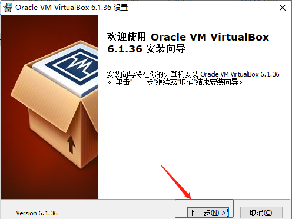

- Click Browse to change the VirtualBox installation path, then click OK and then Next.

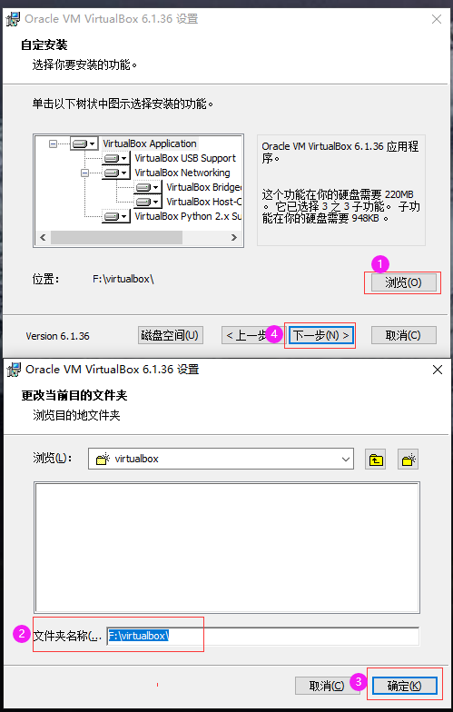

- When the following screen appears, click Next.

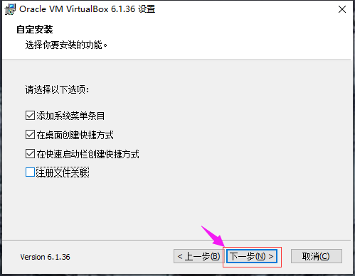

- When the following screen appears, click Yes.


- When the installation screen appears, click Install.


- Click Finish to complete the VirtualBox installation.

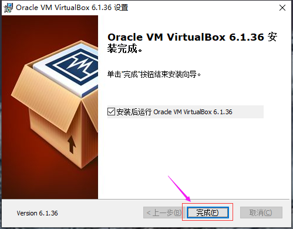

### 1.3. Installing Ubuntu 22.04 in VirtualBox

* Note: This guide uses VirtualBox as an example. Developers may use other virtual machine software according to their own preferences.

#### Step 1: Import the Ubuntu 22.04 Image into VirtualBox

- Open VirtualBox and click New.


- Set the virtual machine name to **hispark**, change the installation folder (the default is on the C drive; it is recommended to change to another drive), set the type to Linux, and select Ubuntu (64-bit) as the version, then click Next.

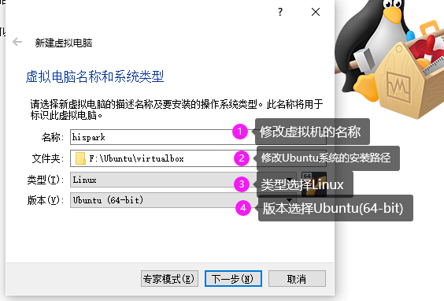

- Set the memory size to 4 GB, then click Next.


- Select "Create a virtual hard disk now" and click Create.

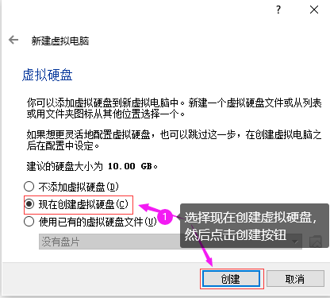

- Select VDI (VirtualBox Disk Image) and click Next.


- Select Dynamically allocated and click Next.


- Set the disk size to 100 GB and click Create. Allocate at least 100 GB; otherwise subsequent steps may fail due to insufficient space.

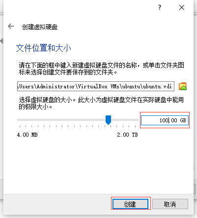

- Click Settings, select General, and under Advanced set both Shared Clipboard and Drag'n'Drop to Bidirectional, then click OK.


- Click Settings, then System, select Processor, and set the processor count to 4.
- Note: If your machine has 4 or fewer processors, reduce this number accordingly.

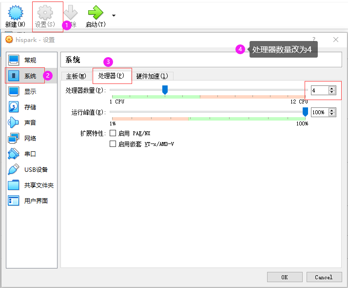

- Click Network, select Adapter 2, check Enable Network Adapter, choose Host-only Adapter, and click OK.

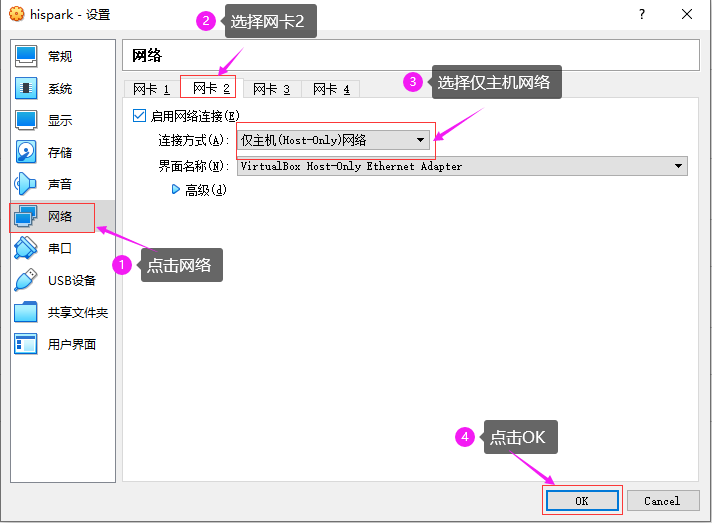

- Click Settings, select Storage, choose the empty optical drive, click the disk icon, and select Choose a disk file.


- Select the Ubuntu 22.04 ISO image downloaded in **section 1.1**, then click Open.

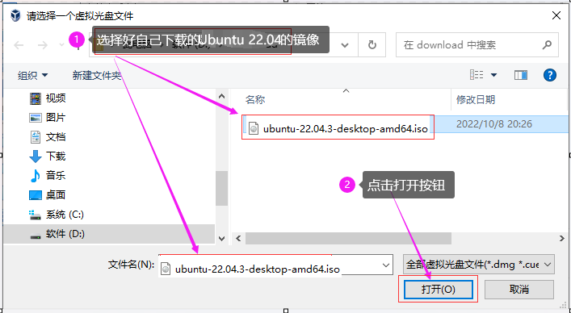

- Click OK to close Settings.

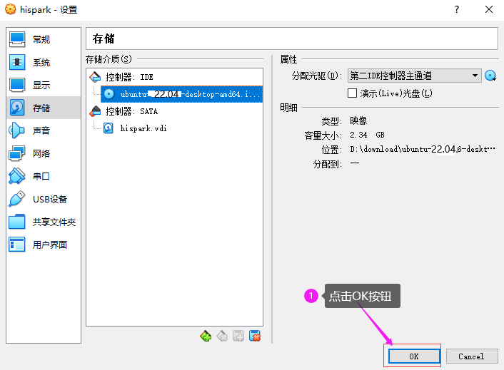

- Select USB, uncheck Enable USB Controller to disable the USB device, then click OK. (Some machines may not support this step — it can be skipped.)

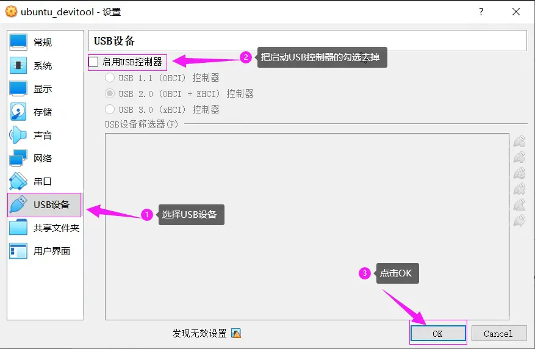

- Click Start to boot the Ubuntu system.

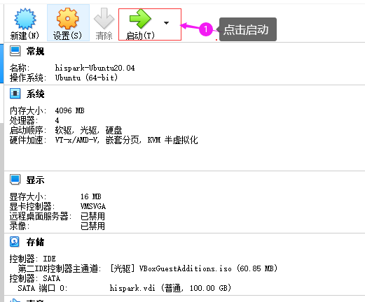

#### Step 2: Installing Ubuntu

- Select your language, then click Install Ubuntu.


- If the display is incomplete due to resolution issues and the buttons at the bottom are not visible, press `Ctrl+Alt+T` to open a terminal, then type `xrandr` to see the supported resolutions.

  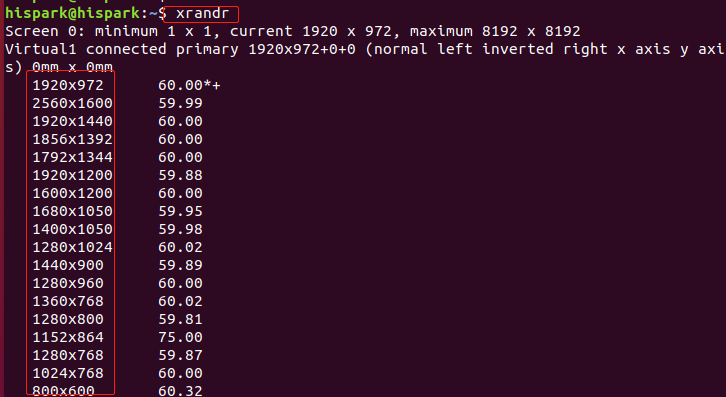

- For example, to set 1920x1200, run `xrandr -s 1920x1200` and press Enter.


- Select your keyboard layout and click Continue.


- Uncheck "Download updates while installing Ubuntu" and click Continue.


- Click Install Now.


- Click Continue.

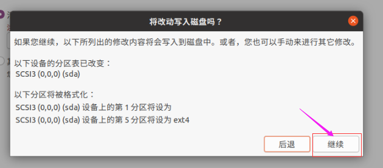

- Select your timezone (e.g., Shanghai) and click Continue.


- Set the account and password, then click Continue. The account and password configured here are used to log in to Ubuntu.
- Follow this guide's configuration: username: **hispark**, password: **hispark**.


- Installation begins.


- After Ubuntu installation is complete, click Restart Now.

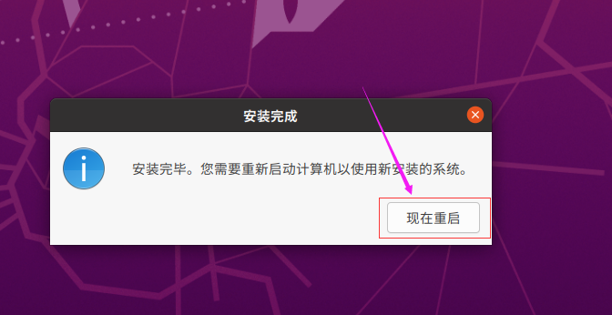

- If the prompt **"please remove the installation medium"** appears during restart, click the close button, select Force Quit, and click OK.


- In VirtualBox, click Devices and then Install Guest Additions.

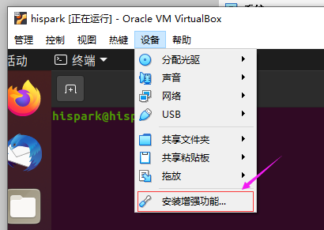

- When a dialog asks whether to run the autorun software, click Cancel.


- A disc icon will appear in the left task bar. Click it to open the folder.


- Right-click in the empty area of the disc folder and select "Open in Terminal".


- Run the following commands to install the Guest Additions.

```
sudo apt-get install  gcc make perl -y

sudo ./VBoxLinuxAdditions.run
```

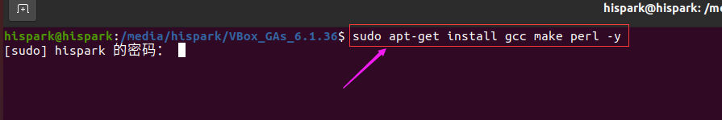


- After successful installation, run the `reboot` command in the terminal to restart Ubuntu.

```
reboot
```


#### Step 3: Update Software

- After Ubuntu restarts, click the nine-dot icon in the lower-left corner and open Software & Updates.


- Click the Ubuntu Software tab, then click the "Download from" dropdown and select Other.


- Under **China**, select **Alibaba Cloud (aliyun)**, then click Choose Server.


- An authentication dialog will appear. Enter your Ubuntu login password (hispark in this guide).

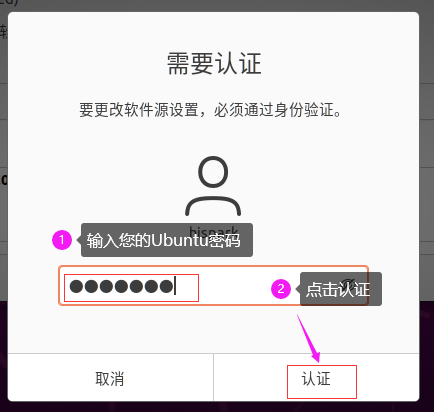

- Click Close, then click Reload in the dialog that appears. Wait while the software lists are updated.

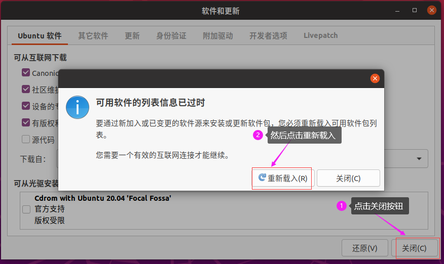

- After the update is complete, right-click on the Ubuntu desktop and select "Open Terminal".


- Run the following two commands to update software packages.

```
sudo apt-get update
sudo apt-get upgrade -y
```


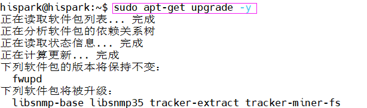

#### Step 4: Configure SSH Service on Ubuntu

- Run the following command to install the SSH server.

```
sudo apt-get install openssh-server -y
```

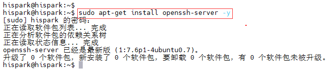

- Run the following command to start the SSH service.

```
sudo systemctl start ssh
```


#### Step 5: Install MobaXterm and Connect to Ubuntu

- On the Windows host, extract the MobaXterm_Installer_v22.1.zip downloaded in **section 1.1**, then double-click MobaXterm_installer_22.1.msi to install MobaXterm.
- Keep clicking Next to complete the installation.


- Run the following command to install net-tools.

```
sudo apt install net-tools  -y
```


- Run the following command to view the Ubuntu IP address. In this example the IP address is 192.168.56.106.

```
ifconfig
```


- Open MobaXterm on Windows, click the Session icon in the top-left corner, click the SSH icon in the dialog, enter your Ubuntu IP address, check "Specify username" and fill in your Ubuntu username, then click OK.


- After clicking OK, enter your Ubuntu login password when prompted to access the Ubuntu terminal.


#### Step 6: Configure Samba Service on Ubuntu

- Run the following command in the Ubuntu terminal to install Samba.

```
sudo apt-get install vim samba samba-common
```

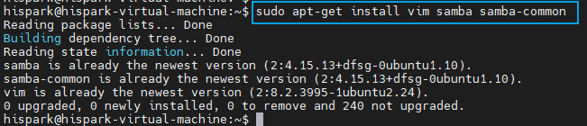

- Run the following command to grant read/write permissions on the Samba share.

```
sudo chmod 777  /
```

- Run the following command to create a Samba account. You will be prompted to enter a Samba password.

```
sudo smbpasswd -a hispark
```

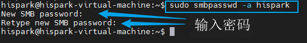

- Run the following command to edit the Samba configuration file.

```
sudo vim /etc/samba/smb.conf
```

- Append the following Samba share configuration to the end of the file.

```
[hispark]
        comment = share folder
        browseable = yes
        path = /
        public = yes
        available = yes
        guest ok = no
        writable = yes
        valid users = hispark
        create mask = 0777
        directory mask = 0777
```

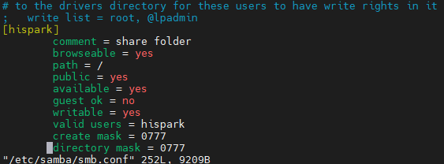

- Run the following command to restart the Samba service and apply changes.

```
sudo service smbd restart
```

#### Step 7: Map a Network Drive

- On Windows, right-click This PC and select "Map network drive".

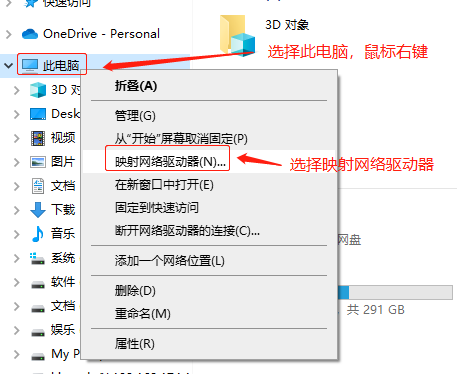

- Enter <font color='RedOrange'>\\\Ubuntu IP address</font>, click Finish, then enter the account (hispark) and password (the Samba password configured earlier).

```
\\192.168.56.106\hispark
```

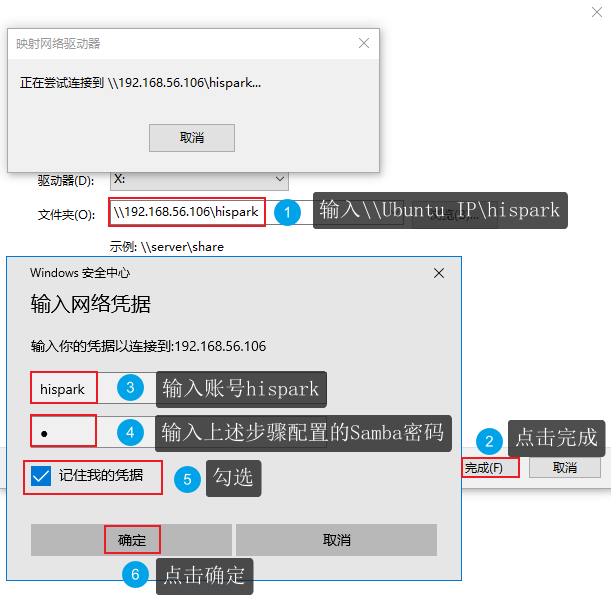

- The root directory will now appear as a Windows network drive, enabling easy file sharing between Windows and the Ubuntu environment.

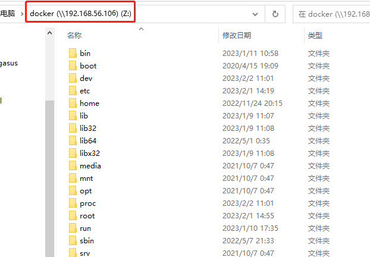

## 2. Setting Up the SDK Environment

- Some content in this section overlaps with the OpenHarmony Small system build environment setup. For details, refer to the development environment chapter of the *OpenHarmony Small Version User Guide*.
- Hi3403V100 has two SDKs supporting `clang` and `gcc` toolchains, corresponding to `Hi3403V100_clang` and `Hi3403V100_gcc` respectively.<a id="section1"></a>

|                   | Compiler     | Runtime Library   |
| ----------------- | ------------ | ----------------- |
| `Hi3403V100_clang` | `llvm 15.04` | `musl libc 1.2.5` |
| `Hi3403V100_gcc`   | `gcc 12.3.0` | `glibc 2.38`      |

- The u-boot for both `Hi3403V100_clang` and `Hi3403V100_gcc` is compiled with `gcc`. Therefore, a full `Hi3403V100_clang` build depends on both `clang` and `gcc` toolchains, while a full `Hi3403V100_gcc` build depends only on `gcc`. It is recommended to install both toolchains.

### 2.1. Setting Up the Base Environment

- Install deb packages. On Ubuntu 22.04, install python3 directly; on Ubuntu 20.04 install python3.9; on Ubuntu 18.04 install python3.8.

```
sudo apt-get update -y
sudo apt-get install -y  

sudo apt-get install -y apt-utils binutils bison flex bc build-essential make mtd-utils gcc-arm-linux-gnueabi u-boot-tools python3 python3-pip git zip unzip curl wget gcc g++ ruby dosfstools mtools default-jre default-jdk scons python3-distutils perl openssl libssl-dev cpio git-lfs m4 ccache zlib1g-dev tar rsync liblz4-tool genext2fs binutils-dev device-tree-compiler e2fsprogs git-core gnupg gnutls-bin gperf lib32ncurses5-dev libffi-dev zlib* libelf-dev libx11-dev libgl1-mesa-dev lib32z1-dev xsltproc x11proto-core-dev libc6-dev-i386 libxml2-dev lib32z-dev libdwarf-dev

sudo apt-get install -y grsync xxd libglib2.0-dev libpixman-1-dev kmod jfsutils reiserfsprogs xfsprogs squashfs-tools  pcmciautils quota ppp libtinfo-dev libtinfo5 libncurses5 libncurses5-dev libncursesw5 libstdc++6  gcc-arm-none-eabi vim ssh locales doxygen

sudo apt-get install -y libxinerama-dev libxcursor-dev libxrandr-dev libxi-dev
```

- Download the repo tool.

```
curl -s https://gitee.com/oschina/repo/raw/fork_flow/repo-py3 >repo
sudo cp repo /usr/bin/repo
sudo chmod +x /usr/bin/repo
```

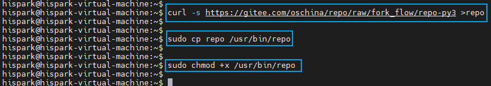

- Install Python modules.

```
pip3 install --trusted-host https://repo.huaweicloud.com -i https://repo.huaweicloud.com/repository/pypi/simple requests setuptools pymongo kconfiglib pycryptodome ecdsa ohos-build pyyaml prompt_toolkit==1.0.14 redis json2html yagmail python-jenkins

pip3 install esdk-obs-python --trusted-host pypi.org -i https://repo.huaweicloud.com/repository/pypi/simple

pip3 install six --upgrade --ignore-installed six -i https://repo.huaweicloud.com/repository/pypi/simple
```

- Create a Python symlink.

```
sudo ln -s /usr/bin/python3 /usr/bin/python
```

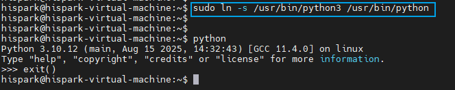

- Switch the shell type.

```
sudo rm -rf /bin/sh
sudo ln -s /bin/bash /bin/sh
```

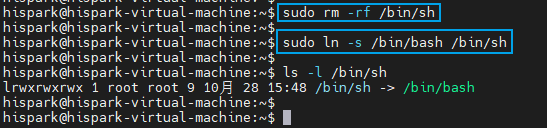

### 2.2. Cloning the Repository

- Clone the Hi3403 main repository.

```
cd ~
git clone https://gitee.com/HiSpark/pegasus.git
```

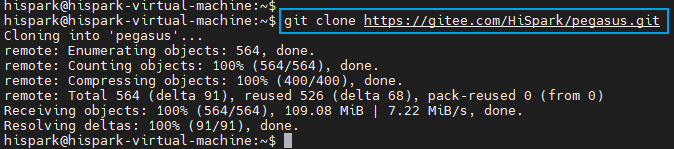

- Initialize and update the `Hi3403V100_clang` and `Hi3403V100_gcc` submodules.

```
cd pegasus
git submodule init
git submodule update platform/Hi3403V100_clang platform/Hi3403V100_gcc
```

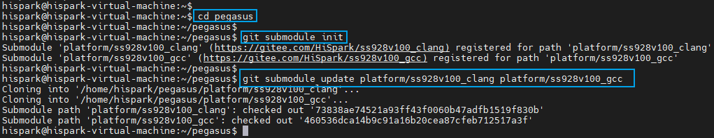

### 2.3. Downloading Open-Source Software

- Building the uboot/kernel or driver ko files depends on certain open-source software packages that must be downloaded manually from their official sources.
- Download each open-source package listed in the table below and copy it to both specified paths. Mirrored sources within China provide significantly faster download speeds and are recommended where available.

| Official Source                                              | Mirror Source                                                | Copy Path                                                    |
| ------------------------------------------------------------ | ------------------------------------------------------------ | ------------------------------------------------------------ |
| [linux](https://www.kernel.org/pub/linux/kernel/v6.x/linux-6.6.86.tar.gz) | [Alibaba Cloud](https://mirrors.aliyun.com/linux-kernel/v6.x/linux-6.6.86.tar.gz) | 1. ~/pegasus/platform/Hi3403V100_clang/open_source/linux<br />2. ~/pegasus/platform/Hi3403V100_gcc/open_source/linux |
| [mbedtls](https://github.com/ARMmbed/mbedtls/archive/refs/tags/v2.16.10.tar.gz) | \                                                            | 1. ~/pegasus/platform/Hi3403V100_clang/open_source/mbedtls<br />2. ~/pegasus/platform/Hi3403V100_gcc/open_source/mbedtls |
| [trusted-firmware-a](https://github.com/ARM-software/arm-trusted-firmware/archive/v2.2.tar.gz) | \                                                            | 1. ~/pegasus/platform/Hi3403V100_clang/open_source/trusted-firmware-a<br />2. ~/pegasus/platform/Hi3403V100_gcc/open_source/trusted-firmware-a |
| [u-boot](https://ftp.denx.de/pub/u-boot/u-boot-2020.01.tar.bz2) | \                                                            | 1. ~/pegasus/platform/Hi3403V100_clang/open_source/u-boot<br />2. ~/pegasus/platform/Hi3403V100_gcc/open_source/u-boot |

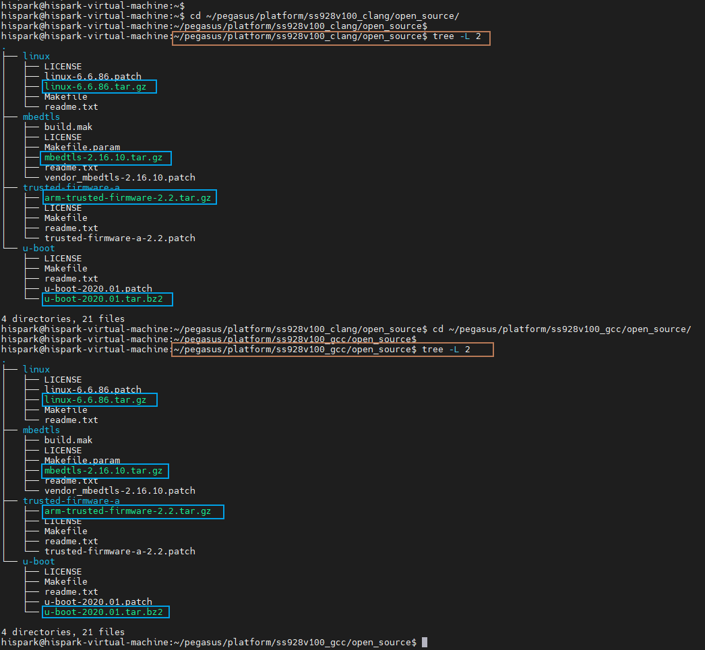

### 2.4. Installing the Cross-Compiler

- Both `clang` and `gcc` toolchains are supported. For the toolchain-to-SDK mapping, see the [table above](#section1). Both toolchains are installed here.

#### 2.4.1. Installing the clang Cross-Compiler

- Enter the `os/OpenHarmony` directory and use the repo tool to initialize and sync the OpenHarmony source code. The repo manifest file `devboard_hispark_aifly_5.1.0.xml` is optimized for the Small system and excludes non-essential repositories.

```
cd os/OpenHarmony
repo init -u https://gitee.com/HiSpark/pegasus.git -m os/OpenHarmony/manifest/devboard_hispark_aifly_5.1.0.xml
repo sync -c
repo forall -c 'git lfs pull'
```

After these steps, you will have the Hi3403V100 and Hi3519AV200 chip integrated OpenHarmony-v5.1.0-release source environment.

- Run the `os/OpenHarmony/manifest/prebuilts_setup.sh` script to prepare the prebuilt environment. This script performs the following tasks:
    - Fixes known issues in `system_util.py` and `patch_process.py`
    - Copies the `platform/Hi3403V100_clang` directory to the SDK target path
    - Downloads the mbedtls v2.16.10 source package (stored in `os/OpenHarmony/device/soc/hisilicon/hi3403v100/sdk_linux/open_source/mbedtls/`)
    - Downloads the arm-trusted-firmware v2.2 source package (stored in `os/OpenHarmony/device/soc/hisilicon/hi3403v100/sdk_linux/open_source/trusted-firmware-a/`)
    - Calls `build/prebuilts_download.sh` to download the OpenHarmony build toolchain (clang, gn, ninja, cmake, nodejs, etc.)
    - Uses sparse-checkout to download the `prebuilts` directory from the kernel_linux_patches repository
    - Uses sparse-checkout to download the `device/soc/hisilicon/common/platform` directory from the hi3403 repository
    - Configures the SDK toolchain environment variables, adds `os/OpenHarmony/prebuilts/clang/ohos/linux-x86_64/llvm/bin` to PATH, verifies with `command -v clang`, and persists the configuration by writing to `~/.bashrc`

```
./os/OpenHarmony/manifest/prebuilts_setup.sh
```

- The `Hi3403V100_clang` SDK sample build depends on the sysroot generated by the OpenHarmony build, so the OpenHarmony build must be run first.

#### First-Time Build

The first build requires applying patches. Add the `--patch` flag:

```
cd os/OpenHarmony
./build.sh --product-name=ipcamera_hispark_aifly_linux --ccache --no-prebuilt-sdk --patch --gn-args build_xts=true
```

> **Note:**
> - Patch configuration: `os/OpenHarmony/vendor/hisilicon/hispark_aifly_linux/patch.yml`.
> - To revert all patches in patch.yml, run the `patch_revert.py` script under `os/OpenHarmony/vendor/hisilicon/hispark_aifly_linux`:
>   ```
>   cd os/OpenHarmony/vendor/hisilicon/hispark_aifly_linux
>   python3 patch_revert.py
>   ```
> - To revert a single patch manually, e.g., the build patch, run in the build directory:
>   ```
>   patch -p1 -R < ../../device/soc/hisilicon/patches/build/build_001.patch
>   ```

#### Subsequent Builds

After patches are applied, omit the `--patch` flag:

```
cd os/OpenHarmony
./build.sh --product-name=ipcamera_hispark_aifly_linux --ccache --no-prebuilt-sdk --gn-args build_xts=true
```

- The `prebuilts_setup.sh` script has already added the clang toolchain to the environment. Now configure the sysroot path by editing `~/.bashrc` and appending `export SYSROOT_PATH=<your hi3403 directory>/os/OpenHarmony/out/hispark_aifly/ipcamera_hispark_aifly_linux/sysroot`.

```
vim ~/.bashrc
```

- Apply the environment changes.

```shell
source ~/.bashrc
```

- Verify the cross-compiler environment variables.

```
which clang
echo $SYSROOT_PATH
```

#### 2.4.2. Installing the gcc Cross-Compiler

- Click [here](https://gitee.com/openeuler/yocto-meta-openeuler/releases) and download all compressed packages for version 0.1.8 arm64 as shown in the figure below.

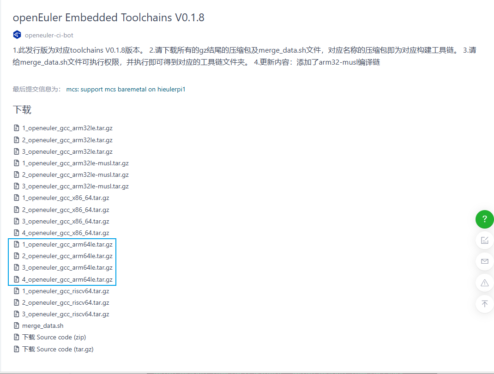

- Copy all arm64 packages to the Ubuntu hispark user home directory, then run the following commands to concatenate them into one archive and extract it.

```shell
cat 1_openeuler_gcc_arm64le.tar.gz 2_openeuler_gcc_arm64le.tar.gz 3_openeuler_gcc_arm64le.tar.gz 4_openeuler_gcc_arm64le.tar.gz > openeuler_gcc_arm64le.tar.gz

rm 1_openeuler_gcc_arm64le.tar.gz 2_openeuler_gcc_arm64le.tar.gz 3_openeuler_gcc_arm64le.tar.gz 4_openeuler_gcc_arm64le.tar.gz

tar -xzvf openeuler_gcc_arm64le.tar.gz
rm -rf openeuler_gcc_arm64le.tar.gz
```

- The cross-compiler executables are now located in `openeuler_gcc_arm64le/bin/`.

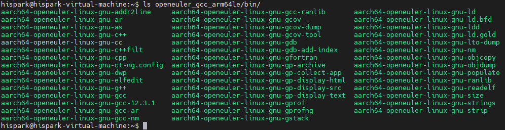

- Open `~/.bashrc` and append `export PATH="/home/hispark/openeuler_gcc_arm64le/bin:$PATH"` to the end.

```shell
vim ~/.bashrc
```

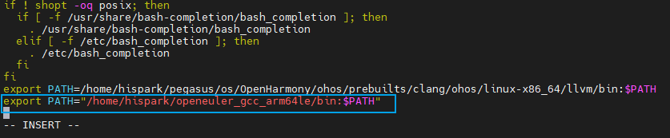

- Apply the environment changes.

```shell
source ~/.bashrc
```

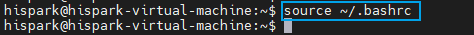

- Verify that the cross-compiler toolchain is available.

```shell
aarch64-openeuler-linux-gnu-gcc -v
```

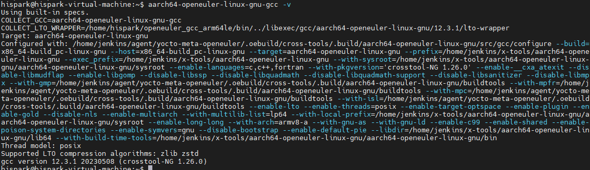

## 3. Building

- The `Hi3403V100_clang` and `Hi3403V100_gcc` builds follow essentially the same process, differing mainly in the LLVM flag. For detailed full-build and component-build instructions, see `~/pegasus/platform/Hi3403V100_clang/osdrv/readme_cn.txt` or `~/pegasus/platform/Hi3403V100_gcc/osdrv/readme_cn.txt`.

### 3.1. Building Hi3403V100_clang

- This build mode depends on both the clang and gcc cross-compilers. See [section 2.4](#2.4、安装交叉编译器) for installation instructions.

#### 3.1.1. Full Build

- Enter `~/pegasus/platform/Hi3403V100_clang/osdrv` and run the build command.

```
cd ~/pegasus/platform/Hi3403V100_clang/osdrv
make LLVM=1 BOOT_MEDIA=emmc CHIP=Hi3403V100 all
```

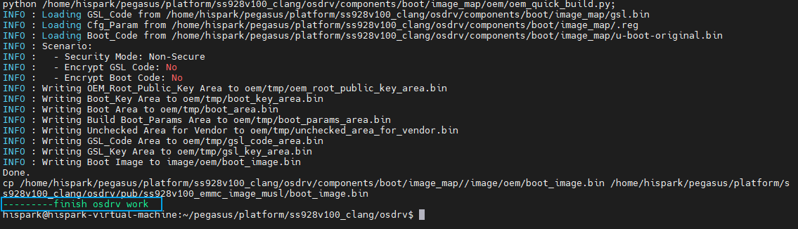

- Build output images are located in the `osdrv/pub/xxx` directory, including:
  - `boot_image.bin` — bootloader image
  - `u-boot-Hi3403V100.bin` — u-boot image (used when OTP fast boot is enabled)
  - `uImage_Hi3403V100` — Linux kernel image

#### 3.1.2. Component Build

##### 3.1.2.1. Build u-boot

- Enter `~/pegasus/platform/Hi3403V100_clang/osdrv` and run the build command. Output images are located in `osdrv/pub/xxx`.

```
make BOOT_MEDIA=emmc gslboot_build -j 20
```

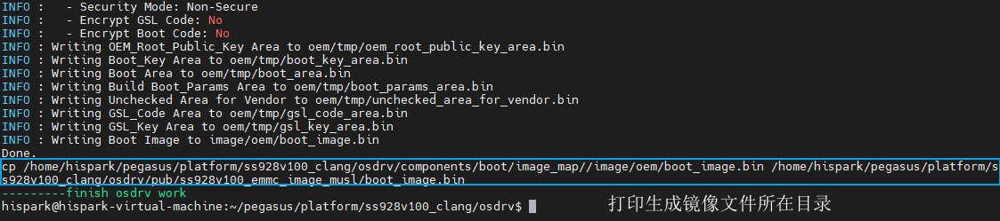

##### 3.1.2.2. Build kernel

- Enter `~/pegasus/platform/Hi3403V100_clang/osdrv` and run the build command. Output images are located in `osdrv/pub/xxx`.

```
make LLVM=1 BOOT_MEDIA=emmc atf -j 20
```

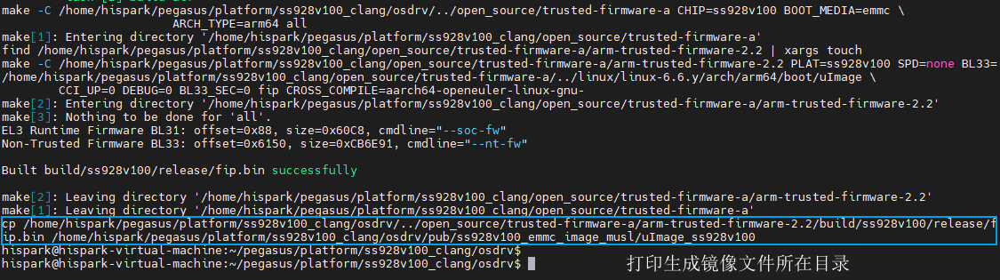

#### 3.1.3. Build Samples

- Enter `~/pegasus/platform/Hi3403V100_clang/smp/a55_linux/mpp/sample` and run the build command. Executables are generated in each sample's subdirectory.

```shell
cd ~/pegasus/platform/Hi3403V100_clang/smp/a55_linux/mpp/sample
make
```

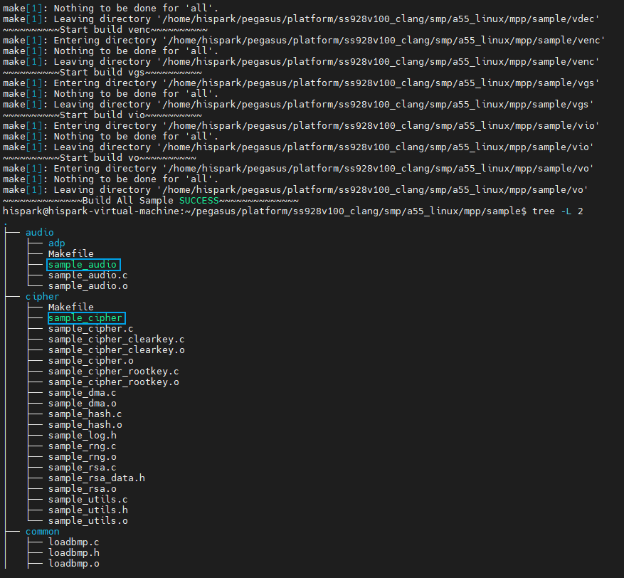

#### 3.1.4. Build ko Modules

- Enter `~/pegasus/platform/Hi3403V100_clang/smp/a55_linux/mpp/out/obj` and run the build command. Generated ko files are located in `~/pegasus/platform/Hi3403V100_clang/smp/a55_linux/mpp/out/ko`.

```shell
cd ~/pegasus/platform/Hi3403V100_clang/smp/a55_linux/mpp/out/obj
make
```

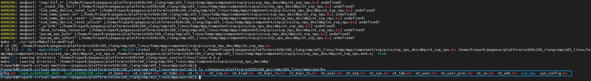

### 3.2. Building Hi3403V100_gcc

- This build mode depends only on the gcc cross-compiler. See [section 2.4.2](#2.4.2、安装gcc交叉编译器) for installation instructions.

#### 3.2.1. Full Build

- Enter `~/pegasus/platform/Hi3403V100_gcc/osdrv` and run the build command.

```
cd ~/pegasus/platform/Hi3403V100_gcc/osdrv
make LLVM=0 BOOT_MEDIA=emmc CHIP=Hi3403V100 all
```

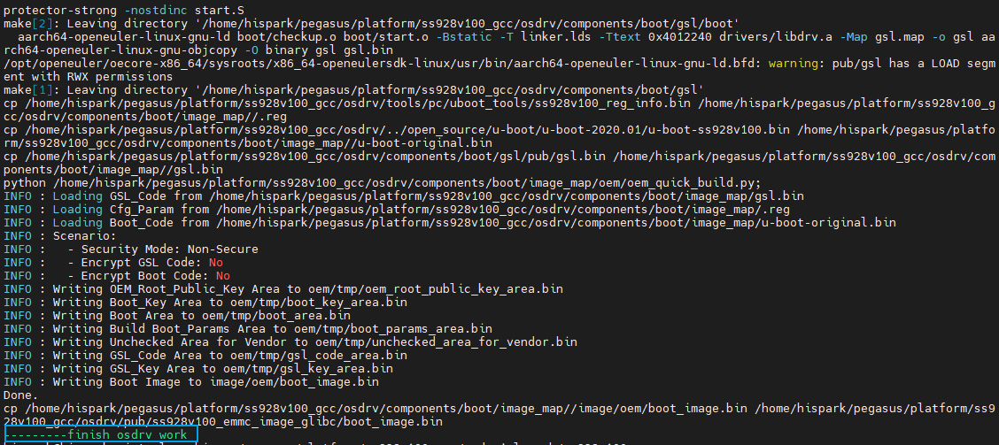

- Build output images are located in the `osdrv/pub/xxx` directory, including:
  - `boot_image.bin` — bootloader image
  - `u-boot-Hi3403V100.bin` — u-boot image (used when OTP fast boot is enabled)
  - `uImage_Hi3403V100` — Linux kernel image

#### 3.2.2. Component Build

##### 3.2.2.1. Build u-boot

- Enter `~/pegasus/platform/Hi3403V100_gcc/osdrv` and run the build command. Output images are located in `osdrv/pub/xxx`.

```
make BOOT_MEDIA=emmc gslboot_build -j 20
```

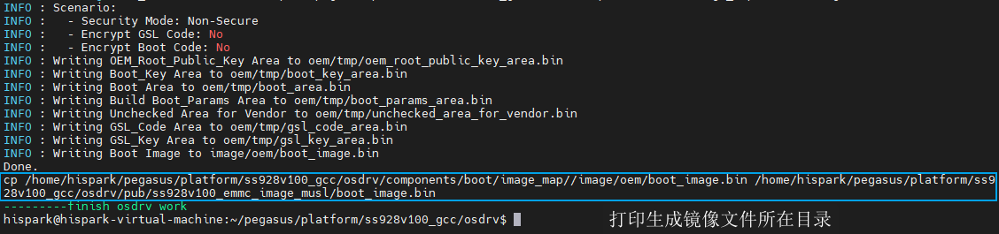

##### 3.2.2.2. Build kernel

- Enter `~/pegasus/platform/Hi3403V100_gcc/osdrv` and run the build command. Output images are located in `osdrv/pub/xxx`.

```
make LLVM=0 BOOT_MEDIA=emmc atf -j 20
```

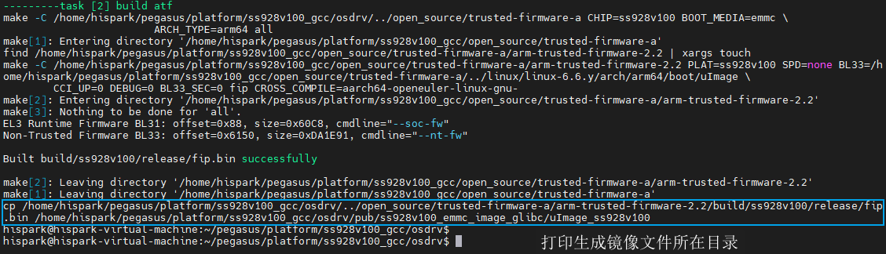

#### 3.2.3. Build Samples

- Enter `~/pegasus/platform/Hi3403V100_gcc/smp/a55_linux/mpp/sample` and run the build command. Executables are generated in each sample's subdirectory.

```shell
cd ~/pegasus/platform/Hi3403V100_gcc/smp/a55_linux/mpp/sample
make
```

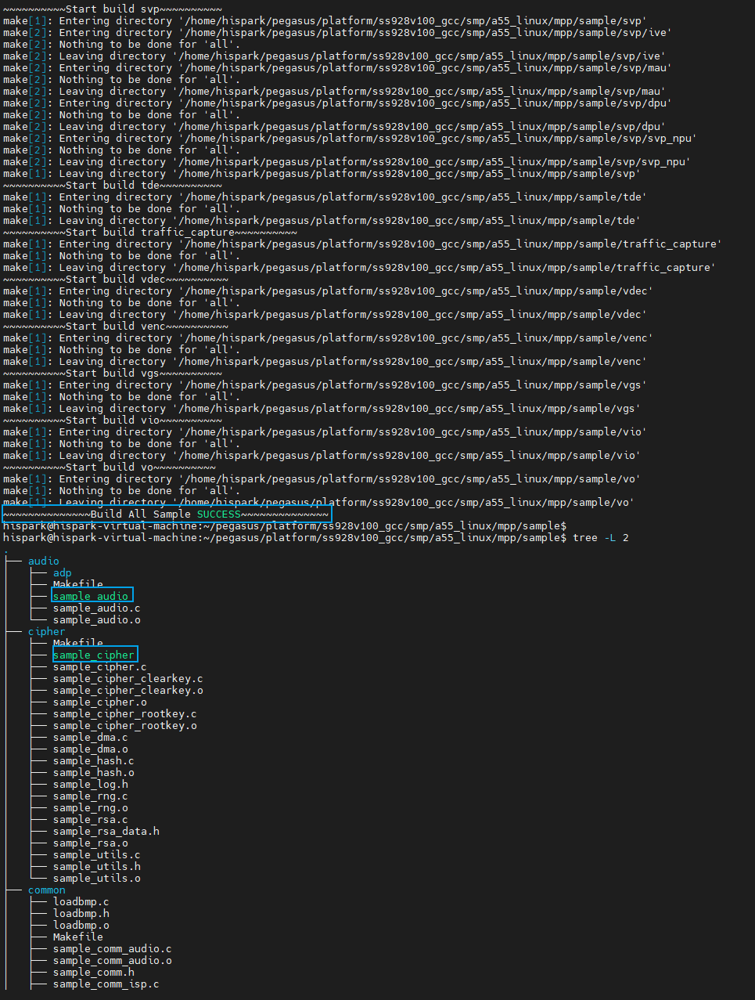

#### 3.2.4. Build ko Modules

- Enter `~/pegasus/platform/Hi3403V100_gcc/smp/a55_linux/mpp/out/obj` and run the build command. Generated ko files are located in `~/pegasus/platform/Hi3403V100_gcc/smp/a55_linux/mpp/out/ko`.

```shell
cd ~/pegasus/platform/Hi3403V100_gcc/smp/a55_linux/mpp/out/obj
make
```

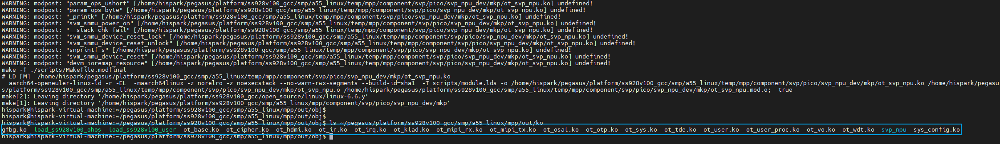

## 4. Installing VSCode

- If VSCode is already installed, skip this step.
- Double-click the VSCode installer downloaded in **section 1.1** and click Next to install.

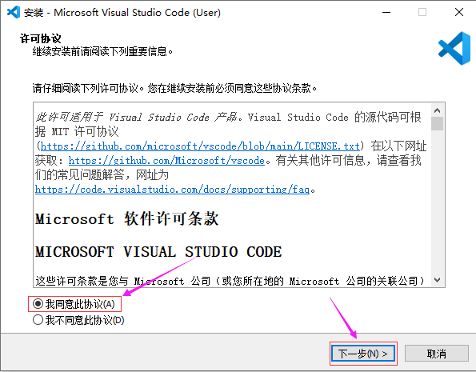

- Click Browse to select the VSCode installation path, then click Next.


- When the following screen appears, click Next.

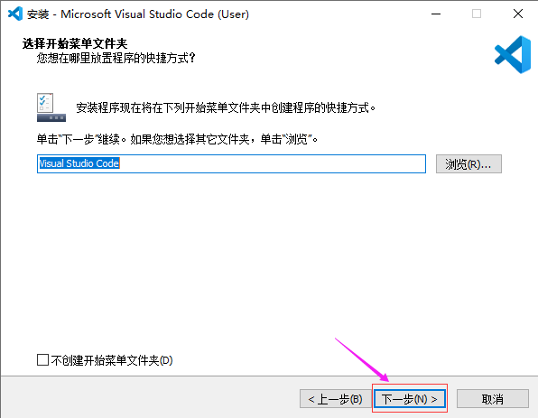

- When the following screen appears, click Next.


- When the following screen appears, click Install.

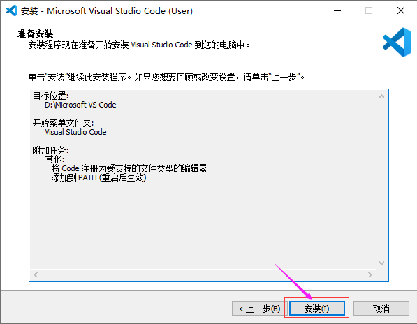

- When the following screen appears, click Finish.

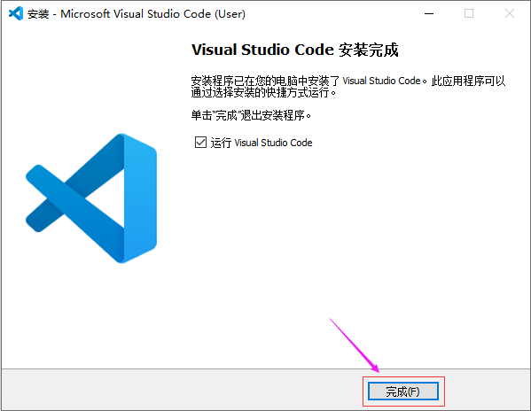

## 5. Importing the Code into VSCode

- Click File in the upper-left corner of VSCode, then click Open Folder.

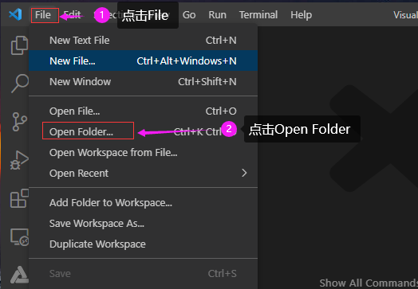

- Select `/home/hispark/hi3403` as shown below, then click Select Folder.

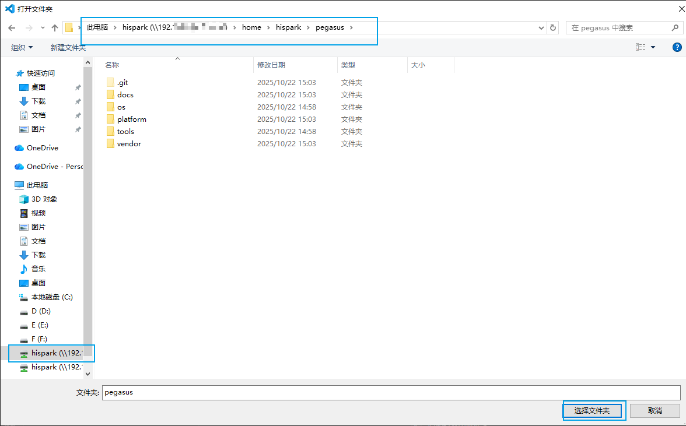

- After the code is imported successfully, a dialog will appear. Check the trust option and click "Yes, I trust the authors".

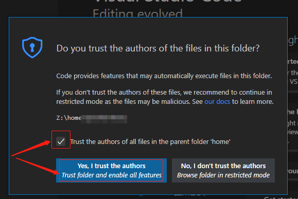

- The code has now been successfully imported.
