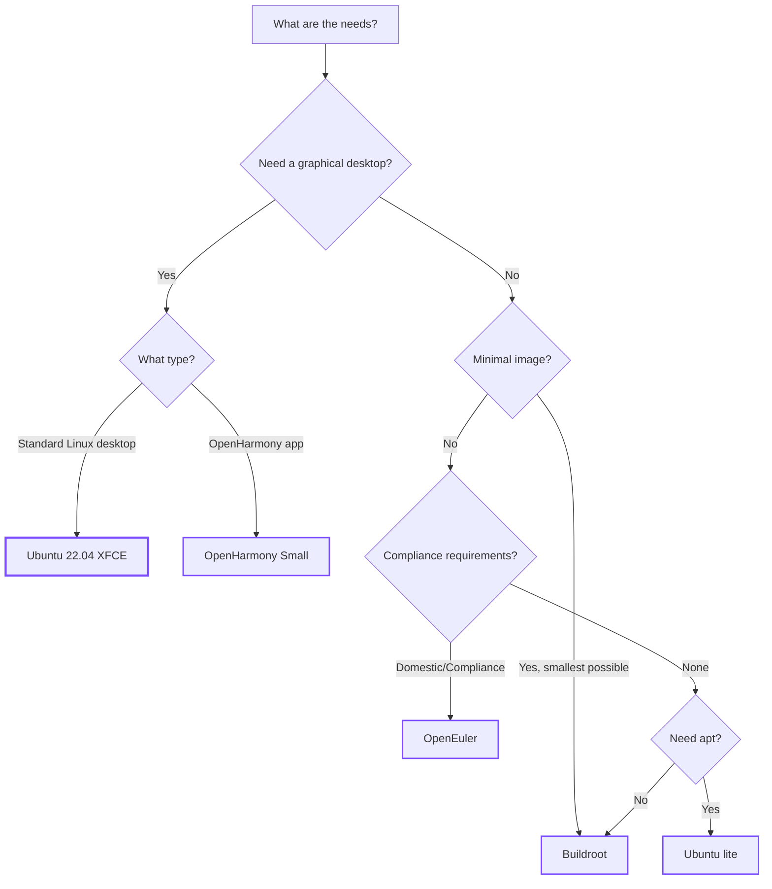

# Choose an operating system

Hi3403V100 can run four mainstream operating systems. There are trade-offs in each - desktop experience, software packages
Ecology, image size, real-time, and compliance requirements. Below is a comparison table + decision tree.

## Compare at a glance

| OS | Image size | Software ecology | desktop | learning curve | Suitable for whom |
|---|---|---|---|---|---|
| **Ubuntu 22.04** | 8 GB (XFCE) / 1.5 GB (lite) | apt full set | XFCE4 | flat | Developers, people who do PoC |
| **OpenHarmony Small** | ~512 MB | OpenHarmony subsystem | Harmony UI | steep | OpenHarmony Device Vendors |
| **OpenEuler** | ~2 GB | dnf/yum + OpenEuler warehouse | Gnome (optional) | middle | Localization / Class Bao Compliance |
| **Buildroot** | 50–500 MB | Pick it yourself | Usually none | steep | Mass production, requiring small images and high degree of customization |

## decision tree

## Detailed explanation

### Ubuntu 22.04

- **Image construction**: Use the community script [`hi3403-build`](../tools/hi3403-build.md) to produce it with one click.
- **Advantages**: The apt package is the most complete and the development experience is closest to PC. XFCE desktop is smooth.
- **Disadvantages**: Large image; slightly slow startup.

→ [Ubuntu porting guide](../os/ubuntu/index.md)

### OpenHarmony Small

- **Image construction**: Use the official OpenHarmony compilation process + the patch package provided by Hi3403.
- **Advantages**: Native OpenHarmony subsystem, supports XTS certification, and the ecosystem closely follows Huawei.
- **Disadvantages**: Steep learning curve; people who are not familiar with OpenHarmony need to read the official documentation first.

→ [OpenHarmony Small Edition User Guide](../os/openharmony/index.md)

### OpenEuler

- **Image construction**: Refer to OpenEuler official + Hi3403 migration guide.
- **Advantages**: Domestic Linux distribution, MLA compliance and friendly; dnf/yum package warehouse is relatively complete.
- **Disadvantages**: Onboard support is mainly for Euler Pi, other boards require more porting work.

→ [OpenEuler Porting Guide](../os/openeuler/index.md)

### Buildroot

- **Image building**: Use the Buildroot project provided by LubanCat, or build it yourself.
- **Advantages**: The smallest image, the most customizable, and the fastest startup. Suitable for embedded products.
- **Disadvantages**: There is no package manager; if you want to add new software, you have to change the Buildroot configuration and reprogram it.

→ [Build Buildroot system image based on Hi3403](../os/buildroot/index.md)

## Still have questions?

| question | Answer |
|---|---|
| Can I switch operating systems on the same board? | able. Hi3403V100 starts from eMMC/SD/SPI and changes the system when re-burning. |
| Which system has the best NPU/ISP/codec support? | Either way - Hi3403 SDK is OS agnostic. All three systems run the same MPP/SVP library. |
| Is 8GB too big for an Ubuntu image? | Desktop version 8 GB; lite version 1.5 GB; if you want to go smaller, use Buildroot. |
| What should I do if the real-time requirements are high? | Buildroot + PREEMPT_RT kernel patch. Ubuntu/OpenEuler is not recommended for hard real-time. |

## Next

-   :material-clock-fast:{ .lg .middle } __Selected, burned to the board__

    ---

    [:octicons-arrow-right-24: Boot Hi3403 in 30 minutes](quickstart.md)

-   :material-package-variant:{ .lg .middle } __Use hi3403-build to compile Ubuntu yourself__

    ---

    [:octicons-arrow-right-24: hi3403-build](../tools/hi3403-build.md)

-   :material-disc-player:{ .lg .middle } __All OS Migration Guide__

    ---

    [:octicons-arrow-right-24: Operating System](../os/index.md)

