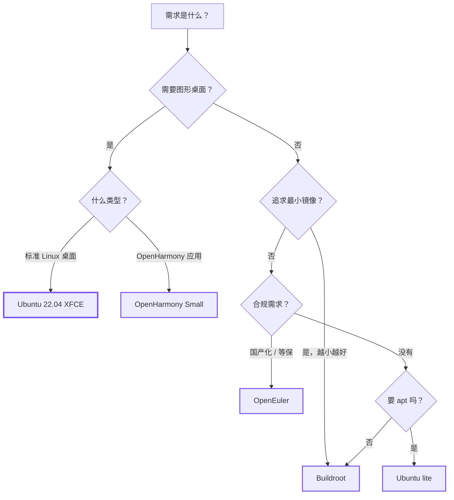

# 选择操作系统

Hi3403V100 可以跑四种主流操作系统。每种都有取舍 —— 桌面体验、软件包
生态、镜像大小、实时性、合规要求。下面是对比表 + 决策树。

## 一眼对比

| 系统 | 镜像大小 | 软件生态 | 桌面 | 学习曲线 | 适合谁 |
|---|---|---|---|---|---|
| **Ubuntu 22.04** | 8 GB (XFCE) / 1.5 GB (lite) | apt 全套 | XFCE4 | 平 | 开发者、做 PoC 的人 |
| **OpenHarmony Small** | ~512 MB | OpenHarmony 子系统 | Harmony UI | 陡 | OpenHarmony 设备厂商 |
| **OpenEuler** | ~2 GB | dnf/yum + OpenEuler 仓 | Gnome (可选) | 中 | 国产化 / 等保合规 |
| **Buildroot** | 50–500 MB | 自己挑 | 通常无 | 陡 | 量产、要求小镜像、定制度高 |

## 决策树

## 详解

### Ubuntu 22.04

- **镜像构建**：用社区脚本 [`hi3403-build`](../tools/hi3403-build.md) 一键产出。
- **优势**：apt 包最齐全，开发体验最接近 PC。XFCE 桌面流畅。
- **劣势**：镜像大；启动稍慢。

→ [Ubuntu 移植指南](../os/ubuntu/index.md)

### OpenHarmony Small

- **镜像构建**：用 OpenHarmony 官方编译流程 + Hi3403 提供的补丁包。
- **优势**：原生 OpenHarmony 子系统、支持 XTS 认证、生态紧跟华为。
- **劣势**：学习曲线陡；不熟 OpenHarmony 的人需要先看官方文档。

→ [OpenHarmony Small 版本使用指南](../os/openharmony/index.md)

### OpenEuler

- **镜像构建**：参考 OpenEuler 官方 + Hi3403 移植指南。
- **优势**：国产 Linux 发行版，等保合规友好；dnf/yum 包仓相对完整。
- **劣势**：板载支持以海鸥派 Euler Pi 为主，其他板子需要更多移植工作。

→ [OpenEuler 移植指南](../os/openeuler/index.md)

### Buildroot

- **镜像构建**：用 LubanCat 提供的 Buildroot 工程，或自建。
- **优势**：镜像最小、可定制性最强、启动最快。适合做嵌入式产品。
- **劣势**：没有包管理器；想加新软件得改 Buildroot 配置重编。

→ [基于 Hi3403 构建 Buildroot 系统镜像](../os/buildroot/index.md)

## 还有问题？

| 问题 | 答案 |
|---|---|
| 我能在同一块板子上切换操作系统吗？ | 能。Hi3403V100 的启动从 eMMC/SD/SPI 来，重新烧录就换系统。 |
| 哪个系统对 NPU/ISP/编解码支持最好？ | 都行 —— Hi3403 SDK 是 OS 无关的。三个系统跑同样的 MPP/SVP 库。 |
| Ubuntu 镜像 8 GB 是不是太大？ | 桌面版 8 GB；lite 版 1.5 GB；如果还想更小，用 Buildroot。|
| 实时性要求高怎么办？ | Buildroot + PREEMPT_RT 内核补丁。Ubuntu/OpenEuler 不推荐做硬实时。|

## 接下来

-   :material-clock-fast:{ .lg .middle } __选好了，烧到板子上__

    ---

    [:octicons-arrow-right-24: 在 30 分钟内启动 Hi3403](quickstart.md)

-   :material-package-variant:{ .lg .middle } __用 hi3403-build 自己编 Ubuntu__

    ---

    [:octicons-arrow-right-24: hi3403-build](../tools/hi3403-build.md)

-   :material-disc-player:{ .lg .middle } __所有 OS 移植指南__

    ---

    [:octicons-arrow-right-24: 操作系统](../os/index.md)

