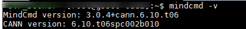

---
title: "SVP NNN PC Quickstart Guide"
source: /sessions/sharp-sweet-allen/mnt/hi3403-build/pegasus/docs/zh-CN/快速上手指南/快速上手指南.md
--- # Preface
**Overview<a name="section4537382116410"></a>** This document describes how to quickly convert a model using the SVP\_NNN\_PC release package and run inference on both a PC and SVP\_NNN. **Product Versions<a name="section16428154481216"></a>** The product versions corresponding to this document are listed below. <a name="table0428544111215"></a>
<table><thead align="left"><tr id="row342774481217"><th class="cellrowborder" valign="top" width="45%" id="mcps1.1.3.1.1"><p id="p1042704421217"><a name="p1042704421217"></a><a name="p1042704421217"></a>Product Name</p>
</th>
<th class="cellrowborder" valign="top" width="55.00000000000001%" id="mcps1.1.3.1.2"><p id="p1142717443126"><a name="p1142717443126"></a><a name="p1142717443126"></a>Product Version</p>
</th>
</tr>
</thead>
<tbody><tr id="row1533613482454"><td class="cellrowborder" valign="top" width="45%" headers="mcps1.1.3.1.1 "><p id="p1587119153326"><a name="p1587119153326"></a><a name="p1587119153326"></a>Hi3403V100</p>
</td>
<td class="cellrowborder" valign="top" width="55.00000000000001%" headers="mcps1.1.3.1.2 "><p id="p158711415193215"><a name="p158711415193215"></a><a name="p158711415193215"></a>V100</p>
</td>
</tr>
</td>
<td class="cellrowborder" valign="top" width="55.00000000000001%" headers="mcps1.1.3.1.2 "><p id="p20871215113219"><a name="p20871215113219"></a><a name="p20871215113219"></a>V100</p>
</td>
</tr>
</tbody>
</table> **Intended Audience<a name="section4378592816410"></a>** This document is primarily intended for software development engineers. The following background knowledge is helpful for understanding this document: - Familiarity with basic Linux commands.
- Some understanding of machine learning and image analysis methods. **Symbol Conventions<a name="section133020216410"></a>** The following symbols may appear in this document with the meanings described below. <a name="table2622507016410"></a>
<table><thead align="left"><tr id="row1530720816410"><th class="cellrowborder" valign="top" width="20.580000000000002%" id="mcps1.1.3.1.1"><p id="p6450074116410"><a name="p6450074116410"></a><a name="p6450074116410"></a><strong id="b2136615816410"><a name="b2136615816410"></a><a name="b2136615816410"></a>Symbol</strong></p>
</th>
<th class="cellrowborder" valign="top" width="79.42%" id="mcps1.1.3.1.2"><p id="p5435366816410"><a name="p5435366816410"></a><a name="p5435366816410"></a><strong id="b5941558116410"><a name="b5941558116410"></a><a name="b5941558116410"></a>Description</strong></p>
</th>
</tr>
</thead>
<tbody><tr id="row1372280416410"><td class="cellrowborder" valign="top" width="20.580000000000002%" headers="mcps1.1.3.1.1 "><p id="p3734547016410"><a name="p3734547016410"></a><a name="p3734547016410"></a><a name="image2670064316410"></a><a name="image2670064316410"></a><span></span></p>
</td>
<td class="cellrowborder" valign="top" width="79.42%" headers="mcps1.1.3.1.2 "><p id="p1757432116410"><a name="p1757432116410"></a><a name="p1757432116410"></a>Indicates a high-risk hazard that, if not avoided, will result in death or serious injury.</p>
</td>
</tr>
</tbody>
</table> **Revision History<a name="section2467512116410"></a>** <a name="table1125885525217"></a>
<table><thead align="left"><tr id="row425917551523"><th class="cellrowborder" valign="top" width="20.72%" id="mcps1.1.4.1.1"><p id="p19259555205218"><a name="p19259555205218"></a><a name="p19259555205218"></a><strong id="b13259195555215"><a name="b13259195555215"></a><a name="b13259195555215"></a>Document Version</strong></p>
</th>
<th class="cellrowborder" valign="top" width="20.22%" id="mcps1.1.4.1.2"><p id="p12259055105217"><a name="p12259055105217"></a><a name="p12259055105217"></a><strong id="b112591455165213"><a name="b112591455165213"></a><a name="b112591455165213"></a>Release Date</strong></p>
</th>
<th class="cellrowborder" valign="top" width="59.06%" id="mcps1.1.4.1.3"><p id="p625985585220"><a name="p625985585220"></a><a name="p625985585220"></a><strong id="b15259755185216"><a name="b15259755185216"></a><a name="b15259755185216"></a>Change Description</strong></p>
</th>
</tr>
</thead>
<tbody><tr id="row425985519529"><td class="cellrowborder" valign="top" width="20.72%" headers="mcps1.1.4.1.1 "><p id="p4260125525214"><a name="p4260125525214"></a><a name="p4260125525214"></a>00B01</p>
</td>
<td class="cellrowborder" valign="top" width="20.22%" headers="mcps1.1.4.1.2 "><p id="p4260155518528"><a name="p4260155518528"></a><a name="p4260155518528"></a>2025-09-15</p>
</td>
<td class="cellrowborder" valign="top" width="59.06%" headers="mcps1.1.4.1.3 "><p id="p1626035517524"><a name="p1626035517524"></a><a name="p1626035517524"></a>First preliminary release.</p>
</td>
</tr>
</tbody>
</table> # Introduction
Image Analysis Engine 1 and Image Analysis Engine 2 differ in behavior. For a detailed comparison, refer to the *Image Analysis Engine 2 vs. Image Analysis Engine 1 Difference Guide* and select the appropriate engine. This guide covers Image Analysis Engine 2. ## Functional Framework<a name="ZH-CN_TOPIC_0000002446642273"></a> **Figure 1** Overall Architecture<a name="fig183212536115"></a> 
## Tool Capabilities<a name="ZH-CN_TOPIC_0000002413203024"></a> The SVP\_NNN\_PC component package provides the following toolchain: - AMCT: Advanced Model Compression Toolkit — quantizes the original network model's weights and activations to lower bit-widths, producing a more lightweight model that reduces storage footprint, transmission latency, and improves computational efficiency.
- Mind Cmd: A Python command-line tool that depends on CANN and AMCT (optional). It supports end-to-end workflows including data preprocessing, Ground Truth, AMCT, ATC, simulation, on-board inference, Dump, accuracy comparison, and performance analysis, improving the efficiency of model porting, analysis, and optimization.
- PC Sample: Provides sample code.
- Ascend-cann-toolkit: The development toolkit package, referred to as CANN. Provides algorithm development tools based on pattern recognition processor So Cs to help developers rapidly and efficiently develop models, operators, and applications. CANN includes the following tools: - ATC: Converts open-source framework network models into offline models compatible with Image Analysis Engine using the Advanced Tensor Compiler (ATC). - Simulate: Provides functional and instruction-level PC-side simulators that can fully execute offline models, accelerating model debugging and deployment. - Acllib: The library provided by the SVP\_NNN development board. - Tools: Includes the Profiling performance analysis tool and the accuracy comparison tool. The Profiling tool collects and analyzes key performance metrics at each stage of inference workloads running on the SoC; the accuracy comparison tool helps identify operators where numerical errors are introduced, by comparing operator output against Caffe reference implementations. SDK Components: C-language API libraries for developing image analysis applications that implement object detection, image classification, and similar functions. # Development Environment Setup
## Development Environment<a name="ZH-CN_TOPIC_0000002446642261"></a> In this scenario, the SVP\_NNN\_PC software package must be deployed independently, installed and used via the command line. ### Introduction<a name="ZH-CN_TOPIC_0000002446642257"></a> The deployment architecture is shown in [Figure 1](#fig730141553). The NNN environment consists of a PC-side tool development environment and a board-side runtime environment. A trained model first goes through AMCT (Advanced Model Compression Toolkit) for optional quantization — converting selected layers to 8-bit computation for improved efficiency — then through ATC (Advanced Tensor Compiler) to convert the model into an offline model recognized by Ascend NNN. The resulting offline model is then placed in the board-side environment for inference. **Figure 1** Deployment Architecture<a name="fig730141553"></a>  **Board-side environment:** Contains the header files, dynamic libraries, driver ko modules, and samples needed for on-board inference. **Development environment:** Command-line based development environment. In this scenario, the CANN software package must be deployed independently, installed and used via the command line. ### Workflow<a name="ZH-CN_TOPIC_0000002413043208"></a> This section describes the end-to-end workflow for running a trained model on SVP\_NNN. The workflow is illustrated in [Figure 1](#fig15391337766). **Figure 1** Workflow<a name="fig15391337766"></a>  The following uses an ONNX model as an example: 1. Once an ONNX model is ready, you can convert it directly with ATC, or first quantize it with AMCT and then pass the quantized ONNX model to ATC for conversion.
2. The om model produced by ATC can be used for inference on the board-side environment using the ACL (Advanced Computing Language) interface.
3. If accuracy issues arise after inference, you can Dump intermediate layer data from the network and compare it against ONNX Dump results to locate the problematic layer. To narrow the scope, use Mind Cmd's sub-model export feature to isolate the problem range, then reproduce the issue with the exported sub-model.
4. If inference performance is insufficient, use the Profiling tool to view per-operator latency and bandwidth data, then optimize the network based on bottleneck analysis. > **Note:** >Reference documents for the above workflow:
>- AMCT model compression tool:
> - Recommended use cases:
> To improve model accuracy and reduce quantization error, refer to the "Parameter Tuning" section in *AMCT User Guide (Caffe)* and the "Quantization Tuning" section in *AMCT User Guide (Py Torch)*.
> - Required use cases:
> For quantization-aware training, refer to the "Quantization-Aware Training" sections in *AMCT User Guide (Caffe)* and *AMCT User Guide (Py Torch)*.
>- ATC model conversion: Refer to the "Model Conversion" section in the *Mind Cmd User Guide* or the *ATC Tool User Guide* to convert trained models into offline models recognized by the platform. For supported Caffe operator specifications, refer to the "Operator Specifications" section in the *ATC Tool User Guide*. ## Command-Line Development Environment Installation<a name="ZH-CN_TOPIC_0000002413043196"></a> CANN (Compute Architecture for Neural Networks) is a heterogeneous computing architecture for AI scenarios. By providing multi-level programming interfaces, it supports rapid construction of AI applications and services. This document guides users through installing the CANN development environment for code development and compilation (e.g., ATC model conversion, operator development, and inference application development). The installation workflow is shown in [Figure 1](#fig212818171998). **Figure 1** Installation Workflow<a name="fig212818171998"></a>  ### Obtaining the Software Package<a name="ZH-CN_TOPIC_0000002446762145"></a> Before setting up the environment, prepare the CANN software package below. Choose the package that matches your target board environment. **Table 1** Software Package Description <a name="table968816871013"></a>
<table><thead align="left"><tr id="row11688685105"><th class="cellrowborder" valign="top" width="19.01190119011901%" id="mcps1.2.4.1.1"><p id="p137871824141014"><a name="p137871824141014"></a><a name="p137871824141014"></a>Type</p>
</th>
<th class="cellrowborder" valign="top" width="33.24332433243324%" id="mcps1.2.4.1.2"><p id="p6688589108"><a name="p6688589108"></a><a name="p6688589108"></a>Package Name</p>
</th>
<th class="cellrowborder" valign="top" width="47.74477447744774%" id="mcps1.2.4.1.3"><p id="p968828171015"><a name="p968828171015"></a><a name="p968828171015"></a>Description</p>
</th>
</tr>
</thead>
<tbody><tr id="row4688118181011"><td class="cellrowborder" valign="top" width="19.01190119011901%" headers="mcps1.2.4.1.1 "><p id="p5145411109"><a name="p5145411109"></a><a name="p5145411109"></a>Linux OS SoC package</p>
</td>
<td class="cellrowborder" valign="top" width="33.24332433243324%" headers="mcps1.2.4.1.2 "><p id="p9492645101017"><a name="p9492645101017"></a><a name="p9492645101017"></a>Ascend-cann-toolkit<em id="i7492194581011"><a name="i7492194581011"></a><a name="i7492194581011"></a>_&lt;version&gt;</em>_linux.x86_64.run</p>
</td>
<td class="cellrowborder" valign="top" width="47.74477447744774%" headers="mcps1.2.4.1.3 "><p id="p9688785102"><a name="p9688785102"></a><a name="p9688785102"></a>Used primarily for application development, custom operator development, and model conversion. Includes library files and development tools such as the ATC model conversion tool.</p>
</td>
</tr>
</tbody>
</table> Where _<version\>_ represents the software version number. ### Environment Requirements<a name="ZH-CN_TOPIC_0000002446642269"></a> The development environment must meet the following hardware and OS requirements. **Table 1** Environment Information <a name="table659mcpsimp"></a>
<table><thead align="left"><tr id="row742753919918"><th class="cellrowborder" valign="top" width="13.270000000000001%" id="mcps1.2.4.1.1"><p id="p667mcpsimp"><a name="p667mcpsimp"></a><a name="p667mcpsimp"></a>Category</p>
</th>
<th class="cellrowborder" valign="top" width="17.89%" id="mcps1.2.4.1.2"><p id="p669mcpsimp"><a name="p669mcpsimp"></a><a name="p669mcpsimp"></a>Version Requirement</p>
</th>
<th class="cellrowborder" valign="top" width="68.84%" id="mcps1.2.4.1.3"><p id="p13427103912910"><a name="p13427103912910"></a><a name="p13427103912910"></a>Notes</p>
</th>
</tr>
</thead>
<tbody><tr id="row673mcpsimp"><td class="cellrowborder" valign="top" width="13.270000000000001%" headers="mcps1.2.4.1.1 "><p id="p675mcpsimp"><a name="p675mcpsimp"></a><a name="p675mcpsimp"></a>Hardware</p>
</td>
<td class="cellrowborder" valign="top" width="17.89%" headers="mcps1.2.4.1.2 "><p id="p677mcpsimp"><a name="p677mcpsimp"></a><a name="p677mcpsimp"></a>Memory: 4 GB minimum</p>
</td>
<td class="cellrowborder" valign="top" width="68.84%" headers="mcps1.2.4.1.3 "><a name="ul679mcpsimp"></a><a name="ul679mcpsimp"></a><ul id="ul679mcpsimp"><li>If the Linux host has 4 GB RAM, the model file used for ATC conversion should not exceed 350 MB. Exceeding this limit may cause OS instability due to memory pressure.</li><li>If the Linux host is upgraded, e.g., to 8 GB RAM, the supported model size scales proportionally.<p id="p682mcpsimp"><a name="p682mcpsimp"></a><a name="p682mcpsimp"></a>For example, upgrading from 4 GB to 8 GB raises the recommended model size limit to 700 MB.</p>
</li></ul>
</td>
</tr>
<tr id="row683mcpsimp"><td class="cellrowborder" valign="top" width="13.270000000000001%" headers="mcps1.2.4.1.1 "><p id="p685mcpsimp"><a name="p685mcpsimp"></a><a name="p685mcpsimp"></a>Operating System</p>
</td>
<td class="cellrowborder" valign="top" width="17.89%" headers="mcps1.2.4.1.2 "><p id="p687mcpsimp"><a name="p687mcpsimp"></a><a name="p687mcpsimp"></a>Ubuntu 18.04 x86_64</p>
</td>
<td class="cellrowborder" valign="top" width="68.84%" headers="mcps1.2.4.1.3 "><p id="p689mcpsimp"><a name="p689mcpsimp"></a><a name="p689mcpsimp"></a>Download the corresponding version from http:/old-releases.ubuntu.com/releases/18.04.1/. You can use the desktop edition (ubuntu-xxx-desktop-amd64.iso) or the server edition (ubuntu-xxx-server-amd64.iso).</p>
</td>
</tr>
<tr id="row690mcpsimp"><td class="cellrowborder" valign="top" width="13.270000000000001%" headers="mcps1.2.4.1.1 "><p id="p692mcpsimp"><a name="p692mcpsimp"></a><a name="p692mcpsimp"></a>Python</p>
</td>
<td class="cellrowborder" valign="top" width="17.89%" headers="mcps1.2.4.1.2 "><p id="p694mcpsimp"><a name="p694mcpsimp"></a><a name="p694mcpsimp"></a>3.7.5</p>
</td>
<td class="cellrowborder" valign="top" width="68.84%" headers="mcps1.2.4.1.3 "><p id="p696mcpsimp"><a name="p696mcpsimp"></a><a name="p696mcpsimp"></a>-</p>
</td>
</tr>
<tr id="row697mcpsimp"><td class="cellrowborder" valign="top" width="13.270000000000001%" headers="mcps1.2.4.1.1 "><p id="p699mcpsimp"><a name="p699mcpsimp"></a><a name="p699mcpsimp"></a>gcc</p>
</td>
<td class="cellrowborder" valign="top" width="17.89%" headers="mcps1.2.4.1.2 "><p id="p701mcpsimp"><a name="p701mcpsimp"></a><a name="p701mcpsimp"></a>7.4.0</p>
</td>
<td class="cellrowborder" valign="top" width="68.84%" headers="mcps1.2.4.1.3 "><p id="p703mcpsimp"><a name="p703mcpsimp"></a><a name="p703mcpsimp"></a>-</p>
</td>
</tr>
<tr id="row704mcpsimp"><td class="cellrowborder" valign="top" width="13.270000000000001%" headers="mcps1.2.4.1.1 "><p id="p706mcpsimp"><a name="p706mcpsimp"></a><a name="p706mcpsimp"></a>g++</p>
</td>
<td class="cellrowborder" valign="top" width="17.89%" headers="mcps1.2.4.1.2 "><p id="p708mcpsimp"><a name="p708mcpsimp"></a><a name="p708mcpsimp"></a>7.4.0</p>
</td>
<td class="cellrowborder" valign="top" width="68.84%" headers="mcps1.2.4.1.3 "><p id="p710mcpsimp"><a name="p710mcpsimp"></a><a name="p710mcpsimp"></a>-</p>
</td>
</tr>
<tr id="row711mcpsimp"><td class="cellrowborder" valign="top" width="13.270000000000001%" headers="mcps1.2.4.1.1 "><p id="p713mcpsimp"><a name="p713mcpsimp"></a><a name="p713mcpsimp"></a>cmake</p>
</td>
<td class="cellrowborder" valign="top" width="17.89%" headers="mcps1.2.4.1.2 "><p id="p715mcpsimp"><a name="p715mcpsimp"></a><a name="p715mcpsimp"></a>3.10.2</p>
</td>
<td class="cellrowborder" valign="top" width="68.84%" headers="mcps1.2.4.1.3 "><p id="p717mcpsimp"><a name="p717mcpsimp"></a><a name="p717mcpsimp"></a>-</p>
</td>
</tr>
<tr id="row718mcpsimp"><td class="cellrowborder" valign="top" width="13.270000000000001%" headers="mcps1.2.4.1.1 "><p id="p720mcpsimp"><a name="p720mcpsimp"></a><a name="p720mcpsimp"></a>protobuf</p>
</td>
<td class="cellrowborder" valign="top" width="17.89%" headers="mcps1.2.4.1.2 "><p id="p722mcpsimp"><a name="p722mcpsimp"></a><a name="p722mcpsimp"></a>3.13.0+</p>
</td>
<td class="cellrowborder" valign="top" width="68.84%" headers="mcps1.2.4.1.3 "><p id="p724mcpsimp"><a name="p724mcpsimp"></a><a name="p724mcpsimp"></a>Required by the accuracy comparison and Profiling tools. This is the Python version of the library.</p>
</td>
</tr>
</tbody>
</table> Note: For detailed environment installation instructions, refer to the *Driver and Development Environment Installation Guide*. ### Installing the Software Package<a name="ZH-CN_TOPIC_0000002413203020"></a> **Installation steps**: Replace `*.run` in the commands below with the actual CANN software package name. The CANN software package path is: `SVP_PC/SVP_NNN_PC_<version>/CANN/Ascend-cann-toolkit_<version>_linux.x86_64.run`. Replace `${INSTALL_DIR}` in the commands below with the actual installation path. For example: `$HOME/Ascend/ascend-toolkit/<version>/x86_64-linux`. 1. Log in to the development environment as the CANN software package installation user and navigate to the directory containing the package. ``` cd SVP_NNN_PC_<version>/CANN/ ``` 2. Grant execute permission on the software package. Run `ls -l` in the package directory to check whether the installation user has execute permission. If not, run: ``` chmod +x *.run ``` 3. Verify the software package. Run the following command to verify the consistency and integrity of the installation file: ``` ./*.run --check ``` 4. Run the following command to install (the command supports options such as `--install-path=<path>`. For detailed parameter descriptions, refer to the *Driver and Development Environment Installation Guide*): ``` ./*.run --install ``` > **Note:** >- If installing as root, avoid installing to a non-root user's directory, as this creates a security risk where non-root users could replace root-owned files to escalate privileges. >- To maintain multiple versions, use `--install-path=<path>` to specify a new installation path. >- If a different NNN architecture version is already installed at the default path, use `--install-path=<path>` to specify a new path. Otherwise, the installation will overwrite the existing version. A successful installation is indicated by the following output: ``` [INFO] xxx install success ``` - Default installation path: `/usr/local/Ascend` for root; `$HOME/Ascend` for non-root users. - Detailed installation log: `${INSTALL_DIR}/ascend_install.log`. - Post-installation record of installation path, command, and user: `${INSTALL_DIR}/_<package_name>_/ascend_install.info`. Replace `${INSTALL_DIR}` with the actual installation path, e.g., `$HOME/Ascend/ascend-toolkit/<version>/x86_64-linux`. 5. Configure environment variables. Run the following command to configure environment variables: ``` source ${INSTALL_DIR}/script/setenv.sh ``` Replace `${INSTALL_DIR}` with the actual installation path, e.g., `$HOME/Ascend/ascend-toolkit/<version>/x86_64-linux`. ### Post-Installation Setup<a name="ZH-CN_TOPIC_0000002446642265"></a> After the development environment is installed, if you need to compile and run an application project to produce binaries, you must configure the cross-compilation environment before building. The cross-compilation environment configuration method differs depending on which CANN software package was selected during installation. For cross-compilation environment setup, refer to the "Cross-Compilation Environment Preparation" section in the *Driver and Development Environment Installation Guide*. # Manual Deployment
## SVP ACL Sample Overview<a name="ZH-CN_TOPIC_0000002413203028"></a> ### PC Sample<a name="ZH-CN_TOPIC_0000002446762165"></a> The PC sample provides a complete workflow covering compilation, simulation, on-board execution, and visual output — using a single image as input. The sample path is: `SVP_PC/SVP_NNN_PC_<version>/Sample/samples/`. The available samples are organized as follows: ```
├── 1_classification
│ ├── lenet_dynamic_batch /Caffe LeNet network (single input, dynamic batch): image classification
│ └── resnet50_imagenet_classification /Caffe ResNet-50 (single input, single batch): image classification
│ ├── resnet50_async_imagenet_classification /Caffe ResNet-50 (single input, single batch): image classification
│ ├── resnet50_cached_imagenet_classification /Uses svp_acl_rt_mallor_cached and svp_acl_rt_mem_flush interfaces to improve data transfer performance
│ ├── resnet50_imagelist_imagenet_classification /Demonstrates memory reuse across multiple images to minimize repeated allocation/deallocation
├── 2_object_detection
│ ├── fasterrcnn /Faster RCNN Alex Net (single input, single batch): image object detection
│ ├── rfcn /RFCN Res Net50 (single input, single batch): image object detection
│ ├── ssd /Caffe SSD (single input, single batch): image object detection
│ └── yolo /Caffe YOLO (V1, V2, V3, V4): image object detection
├── 3_segmentation
│ └── segnet /Caffe Seg Net (single input, single batch): image segmentation
├── 4_aicpu
│ └── concat /ONNX concat network (dual input, single batch): AICPU Concat inference
├── 5_nlp
│ └── lstm /Caffe LSTM (multi-input, single batch): time-series inference
├── 6_tracker
└── goturn /Goturn network (dual input, single batch): image object tracking
├── 7_info
│ └── parser_model /Parses network input/output info and runs inference for any model (single input, single batch)
├── 8_graph /Demonstrates model construction and conversion using ATC Graph API
├── 9_custom /Caffe custom CPU operator network (single input, single batch)
``` Follow the instructions in each sample's `README.md`, which describes the functionality, implementation, directory structure, download links for model files and test data, and environment setup and build/run steps. Note: Follow sample usage rules strictly. For example, networks in `2_object_detection` that support hardware-accelerated detection networks require the corresponding om model to include that functionality. If you modify the original model resolution or input image format, update the corresponding sample code accordingly. ### Development Board Sample<a name="ZH-CN_TOPIC_0000002446762177"></a> The development board sample covers only board-side compilation and execution, using a video stream as input. The sample path is: `/Hi3403V100<version>/Hi3403V100<version>/01.software/board/Hi3403V100_SDK_<version>/Hi3403V100_SDK_<version>/package/smp/smp/a55_linux/mpp/sample/svp/svp_nnn`. The currently provided samples include resnet50 and lstm. Follow the instructions in each sample's `README.md`. Note: Follow sample usage rules strictly. All development board samples include hardware-accelerated detection network support, so the input om model must include the RPN input branch. If you modify the original model resolution or input image format, update the corresponding sample code accordingly. ### ACL Interface Overview<a name="ZH-CN_TOPIC_0000002446762157"></a> Using `2_object_detection/yolo` from the PC sample as an example, the key API functions used in this sample are as follows. For detailed API descriptions, refer to the *Application Development Guide*. - Initialization - Call `svp_acl_init` to initialize the ACL configuration. - Call `svp_acl_finalize` to finalize ACL. - Device management - Call `svp_acl_rt_set_device` to specify the compute device. - Call `svp_acl_rt_get_run_mode` to obtain the run mode, which determines internal processing flow. - Call `svp_acl_rt_reset_device` to reset the device and release its resources. - Context management - Call `svp_acl_rt_create_context` to create a context. - Call `svp_acl_rt_destroy_context` to destroy a context. - Stream management - Call `svp_acl_rt_create_stream` to create a stream. - Call `svp_acl_rt_destroy_stream` to destroy a stream. - Memory management - Call `svp_acl_rt_malloc` to allocate device memory. - Call `svp_acl_rt_free` to release device memory. - Data transfer Call `svp_acl_rt_memcpy` to transfer data via memory copy. - Model inference - Call `svp_acl_mdl_load_from_mem` to load a model from a `*.om` file. - Call `svp_acl_mdl_execute` to run synchronous model inference. - Call `svp_acl_mdl_unload` to unload the model. ## Model Compilation<a name="ZH-CN_TOPIC_0000002446642313"></a> ### Model Compilation<a name="ZH-CN_TOPIC_0000002446642305"></a> This section describes the basic steps for converting an ONNX model using the ATC tool to produce an om offline model. First complete the development environment setup described in [Development Environment Setup](#ZH-CN_TOPIC_0000002446762149). The example model is the open-source yolov5s. #### Pre-Run Preparation<a name="ZH-CN_TOPIC_0000002446762173"></a> The yolov5s model and related dependencies required by this section are provided in the SVP\_NNN\_PC software package. Extract `samples.tar.gz` from the Sample directory of the SVP\_NNN\_PC\_<version\> package: ```
tar -zxf samples.tar.gz
``` Navigate to the `samples/2_object_detection/yolo` directory: ```
cd samples/2_object_detection/yolo/
``` The directory structure is: ```
├── build.sh /Script to compile the executable
├── caffe_model /Caffe model files
│ ├── *.caffemodel
│ ├── *.prototxt
├── C Make Lists.txt /Top-level build script that calls src/C Make Lists.txt
├── data
│ ├── ... /Test data
├── inc
│ ├── model_process.h
│ ├── sample_process.h
│ └── utils.h
├── insert_op.cfg /AIPP configuration file
├── model /Output directory for ATC-compiled offline om model
├── onnx_model /ONNX model files
│ ├── *rpn.patch
│ ├── *.md
│ ├── *.onnx ├── README.md
├── script │ ├── transfer Pic.py /Converts *.jpg to *.bin
│ ├── drawbox.py /Bounding-box drawing script
├── src
│ ├── acl.json
│ ├── C Make Lists.txt
│ ├── main.cpp
│ ├── model_process.cpp
│ ├── sample_process.cpp
│ ├── utils.cpp
│ ├── *_rpn.txt
├── .project /Project metadata file (project type, description, target device type)
├── *.json /Tool model conversion configuration file
``` In this directory: `onnx_model` stores the original ONNX model; `insert_op.cfg` configures the AIPP data preprocessing for image file input; `data` stores calibration and test data; `model` stores the compiled offline om model. #### Command Reference<a name="ZH-CN_TOPIC_0000002413043232"></a> For detailed ATC tool usage, refer to the *ATC Tool User Guide*. #### Model Compilation<a name="ZH-CN_TOPIC_0000002446642301"></a> Using yolov5s.onnx as an example, run the following ATC command in your prepared environment to compile an offline model: ```
atc --output="./model/yolov5" --insert_op_conf=./insert_op.cfg --framework=5 --save_original_model=true --model="./onnx_model/yolov5s.onnx" --image_list="images:./data/image_ref_list.txt"
``` A successful model conversion produces the following output: ```
end binary code generating
``` The offline model (`yolov5_original.om`) is available in the `model` directory. ## Model Deployment and Execution<a name="ZH-CN_TOPIC_0000002446642297"></a> ### Compilation Example<a name="ZH-CN_TOPIC_0000002446642293"></a> #### Environment Preparation<a name="ZH-CN_TOPIC_0000002413043236"></a> 1. C Make version 3.10.2
2. Set environment variables Required environment variables (using the default installation path as example): ``` source ${install_path}/Ascend/ascend-toolkit/{software version}/x86_64-linux/script/setenv.sh ``` 3. Verify that the cross-compilation toolchain for the development board is installed locally. #### Local Compilation<a name="ZH-CN_TOPIC_0000002413043228"></a> > **Note:** >The toolchains for this chip are: aarch64-unknown-linux-ohos-clang and aarch64-v01c01-linux-gnu-gcc. Navigate to the sample directory `2_object_detection/yolo` and run: ```
./build.sh
``` This generates three executables in the `out` directory: a functional simulation executable (`func_main`), an instruction simulation executable (`inst_main`), and a board-side executable (`board_main`). `board_main` is compiled by the cross-compilation toolchain. ### Running the Sample<a name="ZH-CN_TOPIC_0000002413203064"></a> In this scenario, the CANN software package must be deployed independently and used via the command line. #### Data Preparation<a name="ZH-CN_TOPIC_0000002446762161"></a> 1. Prepare the offline om model Verify that `yolov5_original.om` is present in the `model` directory. For model compilation, see [Model Compilation](#ZH-CN_TOPIC_0000002446642313). 2. Prepare input images Navigate to `2_object_detection/yolo/data` and run `transfer Pic.py` to convert `*.jpg` files to `*.bin`, resizing images to the model's required input resolution of 640×640. The `*.bin` files are generated in the `<sample directory>/data` directory. ``` cd data python3 ../script/transfer Pic.py 5 ``` > **Notice:** >- If the script fails with `Module Not Found Error: No module named 'PIL'`, install the Pillow library using `pip3.7.5 install Pillow --user`. >- `5` indicates the yolov5 model. #### Simulation Run<a name="ZH-CN_TOPIC_0000002413203068"></a> Navigate to the `2_object_detection/yolo/out` directory and grant execute permission on the executables: ```
cd out
chmod +x *_main
``` Run the executables: Functional simulation: ```
./func_main 5
``` Instruction simulation: ```
./inst_main 5
``` A successful run produces: ```
model execute success
``` `5` indicates the yolov5 model. #### Running on the Development Board<a name="ZH-CN_TOPIC_0000002413203056"></a> ##### Environment Installation<a name="ZH-CN_TOPIC_0000002413203060"></a> - For board-side environment installation, refer to *Hi3403V100 SDK Installation and Upgrade Guide*.
- For SVP ACL interface usage, refer to the "SVP ACL API Reference" section in the *Application Development Guide*.
- Add the SVP\_NNN library path to the system environment variable `LD_LIBRARY_PATH` (e.g., `smp/a55_linux/mpp/out/lib/svp_nnn`).
- Required files for board-side development are listed in [Table 1](#table764172014331). **Table 1** Board-Side Development Dependency Files <a name="table764172014331"></a>
<table><thead align="left"><tr id="row10641720133316"><th class="cellrowborder" valign="top" width="22.42%" id="mcps1.2.3.1.1"><p id="p930337113411"><a name="p930337113411"></a><a name="p930337113411"></a>File Type</p>
</th>
<th class="cellrowborder" valign="top" width="77.58%" id="mcps1.2.3.1.2"><p id="p36512011335"><a name="p36512011335"></a><a name="p36512011335"></a>File Name</p>
</th>
</tr>
</thead>
<tbody><tr id="row1365142003312"><td class="cellrowborder" valign="top" width="22.42%" headers="mcps1.2.3.1.1 "><p id="p1651520133319"><a name="p1651520133319"></a><a name="p1651520133319"></a>Header files</p>
</td>
<td class="cellrowborder" valign="top" width="77.58%" headers="mcps1.2.3.1.2 "><p id="p280mcpsimp"><a name="p280mcpsimp"></a><a name="p280mcpsimp"></a>svp_acl.h</p>
<p id="p281mcpsimp"><a name="p281mcpsimp"></a><a name="p281mcpsimp"></a>svp_acl_base.h</p>
<p id="p282mcpsimp"><a name="p282mcpsimp"></a><a name="p282mcpsimp"></a>svp_acl_ext.h</p>
<p id="p283mcpsimp"><a name="p283mcpsimp"></a><a name="p283mcpsimp"></a>svp_acl_mdl.h</p>
<p id="p284mcpsimp"><a name="p284mcpsimp"></a><a name="p284mcpsimp"></a>svp_acl_prof.h</p>
<p id="p72601223113413"><a name="p72601223113413"></a><a name="p72601223113413"></a>svp_acl_rt.h</p>
</td>
</tr>
<tr id="row186512205334"><td class="cellrowborder" valign="top" width="22.42%" headers="mcps1.2.3.1.1 "><p id="p146512003317"><a name="p146512003317"></a><a name="p146512003317"></a>Library files</p>
</td>
<td class="cellrowborder" valign="top" width="77.58%" headers="mcps1.2.3.1.2 "><p id="p290mcpsimp"><a name="p290mcpsimp"></a><a name="p290mcpsimp"></a>libsvp_acl.a</p>
<p id="p291mcpsimp"><a name="p291mcpsimp"></a><a name="p291mcpsimp"></a>libsvp_acl.so</p>
<p id="p292mcpsimp"><a name="p292mcpsimp"></a><a name="p292mcpsimp"></a>libsvp_<em id="i2641103955211"><a name="i2641103955211"></a><a name="i2641103955211"></a>aacpu</em>.so</p>
<p id="p295mcpsimp"><a name="p295mcpsimp"></a><a name="p295mcpsimp"></a>libprotobuf-c.a</p>
<p id="p10658203510341"><a name="p10658203510341"></a><a name="p10658203510341"></a>libprotobuf-c.so.1</p>
</td>
</tr>
<tr id="row965142019333"><td class="cellrowborder" valign="top" width="22.42%" headers="mcps1.2.3.1.1 "><p id="p300mcpsimp"><a name="p300mcpsimp"></a><a name="p300mcpsimp"></a>ko files</p>
</td>
<td class="cellrowborder" valign="top" width="77.58%" headers="mcps1.2.3.1.2 "><p id="p302mcpsimp"><a name="p302mcpsimp"></a><a name="p302mcpsimp"></a>xxx_svp_<em id="i722146165215"><a name="i722146165215"></a><a name="i722146165215"></a>nnn</em>.ko</p>
</td>
</tr>
</tbody>
</table> ##### Run Preparation<a name="ZH-CN_TOPIC_0000002413043220"></a> **Run preparation**: Use the `mount` command to mount the NFS server directory `2_object_detection/yolo` to a specified directory on the board. **Mounting the development board:** - Log in to the Linux server (Ubuntu) as root, install the NFS service, and configure the shared directory. If the environment is connected and package sources are reachable, install the NFS service (skip if already installed): ``` apt-get install nfs-kernel-server ``` Add the shared directory configuration to `/etc/exports` (at the end of the file), then restart the NFS service with `/etc/init.d/nfs-kernel-server restart` to apply the changes. Replace the italicized portions with actual values; the server absolute path is the shared directory on the Linux server (create it if it does not exist): ``` server-absolute-path *(rw,sync,no_root_squash,anonuid=id*,anongid=gid*) ``` - Mount example, where `path` is the target directory on the board (replace with the actual path): ``` mount -t nfs -o nolock,tcp NFS-server-IP:server-absolute-path path ``` ##### Running<a name="ZH-CN_TOPIC_0000002446762181"></a> Navigate to the `yolo/out` directory containing the board-side executable and grant execute permission: ```
cd out
chmod +x board_main
``` Run the executable: ```
./ board_main 5
``` #### Post-Run Processing<a name="ZH-CN_TOPIC_0000002413203052"></a> After model execution, detection results are written to `out/xxx_detResult.txt`. The first line contains the input image width and height; each subsequent line contains 6 values: class Id, score, leftX, leftY, rightX, rightY. The result image is saved as `out_img_yolov5.jpg`, as shown in [Figure 1](#fig1017592634014). **Figure 1** Result Image<a name="fig1017592634014"></a> 
# Automated Deployment
This section demonstrates one-click deployment of the open-source yolov5s.onnx model using the Mind Cmd tool. ## MindCmd Tool Setup<a name="ZH-CN_TOPIC_0000002413043240"></a> Mind Cmd is a Python command-line tool that requires Python 3.7.5 and CANN. If the CANN package is not yet installed, complete the installation as described in [Installing the Software Package](#ZH-CN_TOPIC_0000002413203020) first. Follow the steps below to install and configure Mind Cmd: 1. Install Mind Cmd Log in to the development environment as the CANN installation user. The Mind Cmd package is located in the `SVP_PC/SVP_NNN_PC` package. Navigate to the package directory and run: ``` cd SVP_NNN_PC_<version>/MindCmd/ pip install mindcmd-*-py3-none-linux_x86_64.tar.gz --user ``` A successful installation is indicated by: Successfully installed mindcmd-x.x.x 2. <a name="li134221448812"></a>Configure the CANN package installation path Run the following command to view the current CANN installation path configured in Mind Cmd: ``` mindcmd config --global base_config.cann_install_path ```  If the path is incorrect, update it with: ``` mindcmd config --global base_config.cann_install_path=/usr/local/Ascend/ascend-toolkit/svp_latest ``` > **Note:** >The path `/usr/local/Ascend/ascend-toolkit/svp_latest` is an example. Replace it with the actual installation path. 3. Check version information Run the following command to view the Mind Cmd version and the CANN package version configured in [step 2](#li134221448812): ``` mindcmd -v ``` If the following key information is returned (version numbers reflect actual installations), Mind Cmd is installed successfully:  > **Note:** >The Mind Cmd and CANN version information shown in the screenshot is for reference only. Actual output depends on the versions installed in your environment. ## Resource Preparation<a name="ZH-CN_TOPIC_0000002413203072"></a> All model and resource files required for this example are located in the `2_object_detection/yolo` sample directory of the SVP\_NNN\_PC package. Extract them with: ```
cd SVP_NNN_PC_<version>/Sample/
tar -zxvf samples.tar.gz
``` ## Simulation Run<a name="ZH-CN_TOPIC_0000002446642289"></a> Navigate to the `2_object_detection/yolo` sample directory and run: ```
cd samples/2_object_detection/yolo/
mindcmd oneclick onnx --model ./onnx_model/yolov5s.onnx --image_list ./data/image_ref_list.txt --aipp ./insert_op.cfg --rpndata ./src/yolov5_rpn.txt
``` A successful functional simulation run produces:  ## Running on the Development Board<a name="ZH-CN_TOPIC_0000002446762169"></a> Complete the board-side base environment installation as described in *S Sxxx Vxxx SDK Installation and Upgrade Guide*. Then set up the board-side SSH environment and NFS server environment as described in the "Open SSH Service Setup" section of the *Driver and Development Environment Installation Guide*. After the above setup is complete, follow these steps to run yolov5s.onnx on the development board: 1. <a name="li189831627119"></a>Create the SSH configuration file Create a `ssh.cfg` file in the `2_object_detection/yolo` sample directory with the following format: ``` [ssh_config] # board ip BOARD_IP=x.x.x.x # board work directory, mount to $HOST_MOUNT_PATH BOARD_MOUNT_PATH=/home/MindCmdUser/board_workspace/ # local host ip HOST_IP=x.x.x.x # to avoid bottlenecks caused by copying test resources, store test resources in this path as much as possible. HOST_MOUNT_PATH=${SHARE_DIR}/host_workspace # board user name USER=${username} # board user's password PASSWORD=${password} # default port is 22 PORT=22 ``` > **Note:** >- Mind Cmd automatically performs mount/umount operations using the configuration file above when running on-board inference. >- `HOST_MOUNT_PATH` must be within the NFS shared directory configured on the server; otherwise, the mount may fail. >- Replace `${SHARE_DIR}`, `${username}`, and `${password}` with actual values. 2. Set the Mind Cmd working directory: ``` mindcmd config --global base_config.default_workspace=${SHARE_DIR}/host_workspace ``` > **Note:** >- Mind Cmd shares resources with the board via NFS mount, so the Mind Cmd working path must not exceed the server-side mount path (`HOST_MOUNT_PATH`) configured in [step 1](#li189831627119). >- Replace `${SHARE_DIR}` with the actual value. 3. Enable on-board execution in Mind Cmd: ``` mindcmd config --global oneclick_switch.is_nnn_run=1 ``` 4. Run on the development board: ``` cd samples/2_object_detection/yolo/ mindcmd oneclick --ssh_config ./ssh.cfg onnx --model ./onnx_model/yolov5s.onnx --image_list ./data/image_ref_list.txt --aipp ./insert_op.cfg --rpndata ./src/yolov5_rpn.txt ``` A successful on-board run produces:  # Advanced Guide
## Accuracy Analysis<a name="ZH-CN_TOPIC_0000002446642285"></a> This section covers locating and analyzing common accuracy issues. An accuracy issue (also called accuracy drop) occurs when the inference results of an offline model deviate from the original model's results beyond an acceptable range for the same input. ### Common Sources of Accuracy Issues<a name="ZH-CN_TOPIC_0000002413043216"></a> - Data preprocessing: Differences between offline model and original model preprocessing.
- Model quantization: Introduced during AMCT or ATC quantization.
- Instruction compilation: Introduced during ATC offline model conversion.
- Post-processing: Differences between offline model and original model post-processing. ### Identifying the Stage Where the Accuracy Issue Was Introduced<a name="ZH-CN_TOPIC_0000002413203044"></a> 1. Compare input data between the floating-point framework and the inference program. Significant accuracy drop indicates an issue introduced during data preprocessing.
2. Using the same input, run inference and dump per-layer outputs for the original model, quantized model, and offline model.
3. Compare per-layer Dump results between the original model and the Fake Quant model. Significant drop indicates an issue introduced during quantization.
4. Compare per-layer Dump results between the Fake Quant model and the offline model. Significant drop indicates an issue introduced during instruction compilation. ### Using Mind Cmd One-Click Inference for Accuracy Comparison<a name="ZH-CN_TOPIC_0000002446642309"></a> This section demonstrates one-click accuracy comparison using Mind Cmd for the sample network `yolov5s_cpu.onnx`. The required model file and inference data are in the `2_object_detection/yolo` sample directory of the SVP\_NNN\_PC package. Complete resource preparation as described in [Resource Preparation](#ZH-CN_TOPIC_0000002413203072) first. Run the following command for one-click accuracy comparison: ```
cd samples/2_object_detection/yolo
mindcmd config --global oneclick_switch.is_nnn_run=0
mindcmd oneclick onnx --model ./onnx_model/yolov5s_cpu.onnx --image_list ./data/image_ref_list.txt --aipp ./insert_op.cfg
``` As shown in [Figure 1](#fig183067191416), Mind Cmd one-click inference automatically runs original model inference, quantized model inference, and functional simulation inference, then performs an accuracy comparison. **Figure 1** Accuracy Comparison Display<a name="fig183067191416"></a>  For detailed descriptions of each parameter, refer to the "10 Accuracy Comparison" section in the *Mind Cmd User Guide*. ### Accuracy Tuning Recommendations<a name="ZH-CN_TOPIC_0000002413203048"></a> Accuracy issue analysis steps: 1. Verify the input data at the first data layer Use a single image that exhibits accuracy issues, and apply it consistently across compilation, instruction simulation, and caffe. Compare per-layer similarity between simulation and caffe. - If the first layer (data layer) similarity is not 0.999, proceed to **Step 2**. - If the first layer is 0.99+ but similarity drops progressively, with the final layer below 0.95, proceed to **Step 3**. - If the final layer similarity is 0.99 but some intermediate layers are below 0.90, proceed to **Step 4**. - If all layers show 0.99+ similarity with small absolute errors, the issue is likely in post-processing. Proceed to **Step 5**. 2. Verify data layer input consistency Check that mean \[mean\_file\], scale \[data\_scale\], and preprocessing type \[norm\_type\] match caffe. (MXNet and Darknet (YOLO) networks default to RGB training, so configure \[RGB\_order\] as RGB when converting the model.) 3. Check for quantization error Modify the ATC configuration to set \[dump\_data\] to 1 to output calibration data to the `mapper_quant` directory. Set \[forward\_quantization\_option\] to 1 (data quantization only, no weight quantization). Compare `mapper_quant` with caffe output. If similarity is acceptable, the error is caused by weight quantization. Set \[forward\_quantization\_option\] to 2 (weight quantization only, no data quantization). Compare `mapper_quant` with caffe output. If similarity is acceptable, the error is caused by data quantization. - If caused by data or weight quantization error, use AMCT for retraining. - If not caused by quantization error, report the layer with the significant drop and proceed to **Step 6**. 4. Verify layer matching ATC optimizes the network structure for hardware execution, so layer correspondence with caffe may differ during similarity comparison. - Check for in-place operations where top and bottom names are identical. Some layers do not support in-place — these must be separated. For example, conv + tanh is in-place in caffe (only tanh output visible), but ATC does not support conv-tanh fusion and outputs both separately. - Check whether ATC modified the network. Review `cnn_net_tree.dot` (generated during ATC compilation) against the original prototxt to identify structural changes. For example, SPP is split into Pooling and Concat, so compare against Concat output or subsequent layer similarity directly. - If layers match but similarity is still low, report the information and proceed to **Step 6**. 5. Verify post-processing correctness Assuming caffe results go through caffe's post-processing (drawing bounding boxes or classifying), apply the same post-processing to the simulation results and check whether it performs correctly. - If correct, the issue is in the board-side post-processing code. Compare board-side and caffe post-processing code. - If incorrect, but data similarity is 0.99 with small absolute errors, the caffe post-processing is sensitive to data values. Review the caffe post-processing code. (This is rare.) 6. File a support ticket for further analysis Provide the following information: - prototxt, caffemodel, and ONNX model. If the full model cannot be provided, submit the prototxt, weights, and input/output data for the problematic layer. - Compilation parameters, test images, and mean files. - ATC version number printed during compilation, e.g., `Mapper Version 1.0.0.0_B010 (PICO_1.0) 2110161033840e0d952(CPU) (INST_2.0.9)`. - Use Mind Cmd one-click inference to isolate accuracy issues introduced by data preprocessing, model compression, and post-processing.
- If there is an accuracy discrepancy between the floating-point framework's input data and the inference program's input data, verify that both use the same preprocessing method.
- If the original model and ATC quantized model inference results differ, modify `mindcmd.ini` to enable AMCT quantization and compare against Fake Quant. (AMCT supports Py Torch and Caffe models only.)
- If the original model and AMCT quantized model inference results differ, refer to the *AMCT User Guide* for accuracy tuning, or use QAT.
- If the accuracy issue was introduced during instruction compilation, compare `cnn_net_tree.dot` against the original model (for `.dot` file viewing, refer to "2.3 Output File Description" in the *ATC Tool User Guide*) to check for structural modifications, and compare similarity of layers following any modified structures.
- If argmax index exceeds 2048, use topK instead. Indices above 2048 may have precision errors when using fp16 output. **If the above recommendations do not identify the root cause, file a support ticket and provide: the original model, Fake Quant model, om model, inference files, calibration set, ATC command (including data preprocessing configuration), and conversion log output.** ## Performance Analysis<a name="ZH-CN_TOPIC_0000002413043244"></a> This section describes how to use Mind Cmd to quickly obtain performance metrics (frame rate, bandwidth, memory, latency, etc.) and perform performance tuning. ### Obtaining Performance Data<a name="ZH-CN_TOPIC_0000002446642281"></a> There are two methods for obtaining performance data. #### Collecting Profiling Data via ACL API<a name="ZH-CN_TOPIC_0000002446642277"></a> Two implementation approaches are available: - Method 1: Write the collected Profiling data to a file and parse it with the Profiling tool.
- Method 2: Parse the collected Profiling data and write it to a pipe, where it is read into memory by the user, who then calls ACL interfaces to retrieve performance metrics. Method 2 does not currently support Recurrent, RPN, ROI, or CPU Loop networks well; use Mind Cmd for Profiling collection and parsing for these networks. For detailed usage, refer to the "8.6 Profiling Performance Data Collection" section in the *Application Development Guide*. #### Obtaining Performance Data Using MindCmd<a name="ZH-CN_TOPIC_0000002446762133"></a> After installing Mind Cmd, enable on-board Profiling by modifying the global configuration: 1. Modify configuration options, for example: ``` mindcmd config --global oneclick_switch.is_nnn_run=1 mindcmd config --global oneclick_switch.is_board_profiling_open=1 mindcmd config --global base_config.ssh_cfg_path=$HOME/ssh.cfg ``` 2. Create the file `$HOME/ssh.cfg` as described in [step 1](#li189831627119). > **Note:** >- Refer to the "NFS Environment Setup" section in the *Mind Cmd User Guide* for NFS configuration. >- Refer to the "Working Path, Mount Path, Data Volume Path, and NFS Share Path" section in the *Mind Cmd User Guide* for Mind Cmd and board-side mount path configuration. 3. Run Oneclick Prepare model files and image sets, then use Mind Cmd for one-click inference. Using yolov5s.onnx as an example: ``` cd SVP_NNN_PC_<version>/Sample/samples/2_object_detection/yolo/onnx_model/ mindcmd oneclick onnx -m yolov5s.onnx -i ../data/image_ref_list.txt -r ../src/yolov5_rpn.txt ``` After Oneclick completes, Mind Cmd saves the collected performance data in a CSV file (see [Figure 1](#fig1239501163019)). The CSV file location is shown in [Figure 2](#fig1691436783), and the overall network performance summary is printed as shown in [Figure 3](#fig1073092175015). **Figure 1** Performance Data Table<a name="fig1239501163019"></a>  **Figure 2** Performance Data Table Location<a name="fig1691436783"></a>  **Figure 3** Overall Network Performance Data<a name="fig1073092175015"></a>  The Profiling data provides per-operator latency and latency ratio, bandwidth, frame rate, and other metrics, as shown in [Figure 4](#fig6208184011418). By analyzing this data, you can identify critical performance bottlenecks and guide model optimization. **Figure 4** AI Core Data Table (op\_summary\_\*.csv)<a name="fig6208184011418"></a> ") The Profiling data includes: - Hardware performance metrics: AI Core, AI Vector Core, and AI CPU system hardware performance indicators. - Software performance metrics: ACL interface call timing statistics. Sort any column in descending order to identify operators with the highest latency or memory usage and analyze potential bottlenecks. For detailed descriptions of Profiling data fields, refer to the "Performance Analysis Data Description" section in the *Mind Cmd User Guide*. ### Performance Issue Analysis and Tuning<a name="ZH-CN_TOPIC_0000002413043200"></a> - Analyze performance results for root causes Identify interfaces and operators with the highest latency, memory consumption, and bandwidth usage from the performance data, and perform deeper analysis to pinpoint bottlenecks. Optimization guidelines: - If overall Mac Ppen Ratio exceeds 60%, there is generally no performance bottleneck. - For CUBE layers: if Mac Ppen Ratio exceeds 70%, there is generally no bottleneck. - For non-CUBE layers: if Vec Ppen Ratio exceeds 50% (and is not 0), there is generally no bottleneck. - If none of the above thresholds are met, analyze DLD Ratio, WLD Ratio, and Dstr Ratio: - If DLD Ratio exceeds 70%, DLD may be a bottleneck. Reduce input data volume, e.g., by reducing channels or minimizing data movement or conversion layers (slice, concat, reshape, permute, etc.). - If WLD Ratio exceeds 80%, WLD may be a bottleneck. Reduce weight data volume, e.g., by applying 4-bit quantization to that layer's weights. - If Dstr Ratio exceeds 70%, Dstr may be a bottleneck. Reduce feature map output size. - If Mac Ppen Ratio, Vec Ppen Ratio, DLD Ratio, WLD Ratio, and Dstr Ratio are all below 50%, file a support ticket. - Further quantization compression using AMCT For additional performance improvements, refer to the *AMCT User Guide* to apply mixed-precision quantization tuning with AMCT, then re-analyze accuracy. - Design high-performance operator models Further performance optimization can be achieved by modifying network connections and operator attributes. Refer to the "Performance Optimization Recommendations" section in the *ATC Tool User Guide*. # Advanced Topics
## Custom Operators<a name="ZH-CN_TOPIC_0000002413203040"></a> - ATC provides interfaces for developing custom operators, which users can implement to improve network execution efficiency.
- For detailed custom operator development instructions, refer to the *ATC Custom Operator Development Guide*. ## IR Graph Construction<a name="ZH-CN_TOPIC_0000002446762153"></a> - ATC provides Graph interfaces for constructing network models and converting them into offline models supported by Image Analysis Engine. The conversion process can optimize operator scheduling, reorder weight data, and optimize memory usage, all without requiring a device.
- For detailed Graph usage, refer to the *ATC Graph Development Guide*. # Appendix
## Reference Documents<a name="ZH-CN_TOPIC_0000002446762137"></a> **Table 1** Reference Documents <a name="table530mcpsimp"></a>
<table><thead align="left"><tr id="row536mcpsimp"><th class="cellrowborder" valign="top" width="25.15%" id="mcps1.2.4.1.1"><p id="p538mcpsimp"><a name="p538mcpsimp"></a><a name="p538mcpsimp"></a><strong id="b539mcpsimp"><a name="b539mcpsimp"></a><a name="b539mcpsimp"></a>Document Title</strong></p>
</th>
<th class="cellrowborder" valign="top" width="45.85%" id="mcps1.2.4.1.2"><p id="p541mcpsimp"><a name="p541mcpsimp"></a><a name="p541mcpsimp"></a><strong id="b542mcpsimp"><a name="b542mcpsimp"></a><a name="b542mcpsimp"></a>Description</strong></p>
</th>
<th class="cellrowborder" valign="top" width="28.999999999999996%" id="mcps1.2.4.1.3"><p id="p544mcpsimp"><a name="p544mcpsimp"></a><a name="p544mcpsimp"></a><strong id="b545mcpsimp"><a name="b545mcpsimp"></a><a name="b545mcpsimp"></a>Key Sections</strong></p>
</th>
</tr>
</thead>
<tbody><tr id="row546mcpsimp"><td class="cellrowborder" valign="top" width="25.15%" headers="mcps1.2.4.1.1 "><p id="p548mcpsimp"><a name="p548mcpsimp"></a><a name="p548mcpsimp"></a>Driver and Development Environment Installation Guide</p>
</td>
<td class="cellrowborder" valign="top" width="45.85%" headers="mcps1.2.4.1.2 "><p id="p550mcpsimp"><a name="p550mcpsimp"></a><a name="p550mcpsimp"></a>Describes how to install, configure, and uninstall the development environment, including header files and library files required for calling interfaces.</p>
</td>
<td class="cellrowborder" valign="top" width="28.999999999999996%" headers="mcps1.2.4.1.3 "><a name="ul12872133516542"></a><a name="ul12872133516542"></a><ul id="ul12872133516542"><li>Workflow</li><li>Environment Installation</li></ul>
</td>
</tr>
<tr id="row564mcpsimp"><td class="cellrowborder" valign="top" width="25.15%" headers="mcps1.2.4.1.1 "><p id="p566mcpsimp"><a name="p566mcpsimp"></a><a name="p566mcpsimp"></a>Mind Cmd User Guide</p>
</td>
<td class="cellrowborder" valign="top" width="45.85%" headers="mcps1.2.4.1.2 "><p id="p568mcpsimp"><a name="p568mcpsimp"></a><a name="p568mcpsimp"></a>Describes how to use Mind Cmd for one-click inference, data preprocessing, model conversion, model compression, open-source framework inference, application development, accuracy comparison, and performance analysis.</p>
</td>
<td class="cellrowborder" valign="top" width="28.999999999999996%" headers="mcps1.2.4.1.3 "><a name="ul787312354545"></a><a name="ul787312354545"></a><ul id="ul787312354545"><li>Installation</li><li>One-Click Inference</li><li>Accuracy Comparison</li><li>Profiling Performance Analysis</li></ul>
</td>
</tr>
<tr id="row574mcpsimp"><td class="cellrowborder" valign="top" width="25.15%" headers="mcps1.2.4.1.1 "><p id="p576mcpsimp"><a name="p576mcpsimp"></a><a name="p576mcpsimp"></a>ATC Tool User Guide</p>
</td>
<td class="cellrowborder" valign="top" width="45.85%" headers="mcps1.2.4.1.2 "><p id="p578mcpsimp"><a name="p578mcpsimp"></a><a name="p578mcpsimp"></a>Describes how to convert open-source framework models (such as Caffe) into offline models (*.om files) supported by Image Analysis Engine using ATC.</p>
</td>
<td class="cellrowborder" valign="top" width="28.999999999999996%" headers="mcps1.2.4.1.3 "><a name="ul187333515548"></a><a name="ul187333515548"></a><ul id="ul187333515548"><li>Getting Started</li><li>Parameter Reference</li><li>Operator Specifications</li></ul>
</td>
</tr>
<tr id="row583mcpsimp"><td class="cellrowborder" valign="top" width="25.15%" headers="mcps1.2.4.1.1 "><p id="p585mcpsimp"><a name="p585mcpsimp"></a><a name="p585mcpsimp"></a>ATC Custom Operator Development Guide</p>
</td>
<td class="cellrowborder" valign="top" width="45.85%" headers="mcps1.2.4.1.2 "><p id="p587mcpsimp"><a name="p587mcpsimp"></a><a name="p587mcpsimp"></a>Describes how to develop custom operators using the ATC (Ascend Tensor Compiler) interfaces to improve network execution efficiency.</p>
</td>
<td class="cellrowborder" valign="top" width="28.999999999999996%" headers="mcps1.2.4.1.3 "><a name="ul98732035175410"></a><a name="ul98732035175410"></a><ul id="ul98732035175410"><li>Getting Started</li><li>API Reference</li><li>Operator Development Workflow</li></ul>
</td>
</tr>
<tr id="row592mcpsimp"><td class="cellrowborder" valign="top" width="25.15%" headers="mcps1.2.4.1.1 "><p id="p594mcpsimp"><a name="p594mcpsimp"></a><a name="p594mcpsimp"></a>ATC Graph Development Guide</p>
</td>
<td class="cellrowborder" valign="top" width="45.85%" headers="mcps1.2.4.1.2 "><p id="p596mcpsimp"><a name="p596mcpsimp"></a><a name="p596mcpsimp"></a>Guides developers on how to use SVP ATC Graph interfaces to construct network models and convert them into offline models supported by Image Analysis Engine.</p>
</td>
<td class="cellrowborder" valign="top" width="28.999999999999996%" headers="mcps1.2.4.1.3 "><a name="ul38731235105418"></a><a name="ul38731235105418"></a><ul id="ul38731235105418"><li>Getting Started</li><li>Operator API Reference</li><li>Generate Model API Reference</li></ul>
</td>
</tr>
<tr id="row601mcpsimp"><td class="cellrowborder" valign="top" width="25.15%" headers="mcps1.2.4.1.1 "><p id="p603mcpsimp"><a name="p603mcpsimp"></a><a name="p603mcpsimp"></a>AMCT User Guide (Caffe)</p>
</td>
<td class="cellrowborder" valign="top" width="45.85%" headers="mcps1.2.4.1.2 "><p id="p605mcpsimp"><a name="p605mcpsimp"></a><a name="p605mcpsimp"></a>Describes how to quantize original Caffe framework network models and generate quantized model and weight files.</p>
</td>
<td class="cellrowborder" valign="top" width="28.999999999999996%" headers="mcps1.2.4.1.3 "><a name="ul287413359545"></a><a name="ul287413359545"></a><ul id="ul287413359545"><li>Overview</li><li>Installing the Model Compression Tool</li><li>Post-Training Quantization (uniform, non-uniform, etc.)</li><li>Quantization-Aware Training</li><li>Updating the Tool</li><li>Uninstalling the Tool</li><li>API Reference</li></ul>
</td>
</tr>
<tr id="row614mcpsimp"><td class="cellrowborder" valign="top" width="25.15%" headers="mcps1.2.4.1.1 "><p id="p616mcpsimp"><a name="p616mcpsimp"></a><a name="p616mcpsimp"></a>AMCT User Guide (Py Torch)</p>
</td>
<td class="cellrowborder" valign="top" width="45.85%" headers="mcps1.2.4.1.2 "><p id="p618mcpsimp"><a name="p618mcpsimp"></a><a name="p618mcpsimp"></a>Describes how to quantize original Py Torch framework network models and generate quantized model and weight files.</p>
</td>
<td class="cellrowborder" valign="top" width="28.999999999999996%" headers="mcps1.2.4.1.3 "><a name="ul18874113535415"></a><a name="ul18874113535415"></a><ul id="ul18874113535415"><li>Overview</li><li>Installing the Model Compression Tool</li><li>Post-Training Quantization</li><li>Quantization-Aware Training</li><li>Updating the Tool</li><li>Uninstalling the Tool</li><li>API Reference</li></ul>
</td>
</tr>
<tr id="row627mcpsimp"><td class="cellrowborder" valign="top" width="25.15%" headers="mcps1.2.4.1.1 "><p id="p629mcpsimp"><a name="p629mcpsimp"></a><a name="p629mcpsimp"></a>Accuracy Comparison Tool User Guide</p>
</td>
<td class="cellrowborder" valign="top" width="45.85%" headers="mcps1.2.4.1.2 "><p id="p631mcpsimp"><a name="p631mcpsimp"></a><a name="p631mcpsimp"></a>Describes how to compare Image Analysis Engine offline model operator outputs against Caffe reference operator outputs via the command line to identify the source of numerical errors.</p>
</td>
<td class="cellrowborder" valign="top" width="28.999999999999996%" headers="mcps1.2.4.1.3 "><a name="ul38741635195412"></a><a name="ul38741635195412"></a><ul id="ul38741635195412"><li>Features and Constraints</li><li>Comparison Data Preparation</li><li>Vector Comparison</li></ul>
</td>
</tr>
<tr id="row636mcpsimp"><td class="cellrowborder" valign="top" width="25.15%" headers="mcps1.2.4.1.1 "><p id="p638mcpsimp"><a name="p638mcpsimp"></a><a name="p638mcpsimp"></a>Profiling Tool User Guide</p>
</td>
<td class="cellrowborder" valign="top" width="45.85%" headers="mcps1.2.4.1.2 "><p id="p640mcpsimp"><a name="p640mcpsimp"></a><a name="p640mcpsimp"></a>Provides detailed Profiling tool usage constraints, environment requirements, and step-by-step instructions, as well as common troubleshooting solutions.</p>
</td>
<td class="cellrowborder" valign="top" width="28.999999999999996%" headers="mcps1.2.4.1.3 "><a name="ul587583512549"></a><a name="ul587583512549"></a><ul id="ul587583512549"><li>Profiling Workflow</li><li>Profiling Data Collection and Parsing</li></ul>
</td>
</tr>
<tr id="row644mcpsimp"><td class="cellrowborder" valign="top" width="25.15%" headers="mcps1.2.4.1.1 "><p id="p646mcpsimp"><a name="p646mcpsimp"></a><a name="p646mcpsimp"></a>Application Development Guide</p>
</td>
<td class="cellrowborder" valign="top" width="45.85%" headers="mcps1.2.4.1.2 "><p id="p648mcpsimp"><a name="p648mcpsimp"></a><a name="p648mcpsimp"></a>Describes how to develop applications using ACL interfaces.</p>
</td>
<td class="cellrowborder" valign="top" width="28.999999999999996%" headers="mcps1.2.4.1.3 "><a name="ul137982035195515"></a><a name="ul137982035195515"></a><ul id="ul137982035195515"><li>Introduction (features, concepts, typical interface call flows, obtaining samples)</li><li>Development Workflow</li><li>Environment Setup</li><li>Developing Your First Application</li><li>Typical Feature Development</li><li>ACL API Reference</li><li>ACL Sample Usage Guide</li></ul>
</td>
</tr>
</tbody>
</table>
