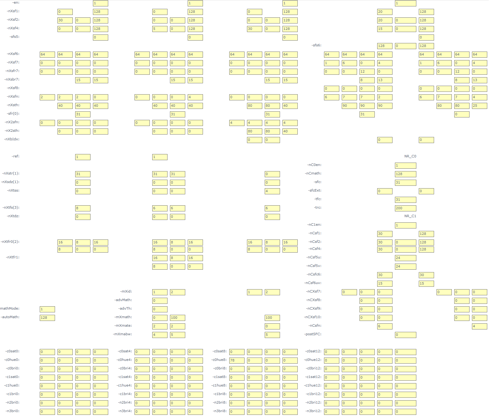

# Preface
**Product Version<a name="section138mcpsimp"></a>**

The product versions corresponding to this document are as follows.

<a name="table141mcpsimp"></a>
<table><thead align="left"><tr id="row146mcpsimp"><th class="cellrowborder" valign="top" width="32%" id="mcps1.1.3.1.1"><p id="p148mcpsimp"><a name="p148mcpsimp"></a><a name="p148mcpsimp"></a>Product Name</p>
</th>
<th class="cellrowborder" valign="top" width="68%" id="mcps1.1.3.1.2"><p id="p150mcpsimp"><a name="p150mcpsimp"></a><a name="p150mcpsimp"></a>Product Version</p>
</th>
</tr>
</thead>
<tbody><tr id="row152mcpsimp"><td class="cellrowborder" valign="top" width="32%" headers="mcps1.1.3.1.1 "><p id="p154mcpsimp"><a name="p154mcpsimp"></a><a name="p154mcpsimp"></a>Hi3403V100</p>
</td>
<td class="cellrowborder" valign="top" width="68%" headers="mcps1.1.3.1.2 "><p id="p156mcpsimp"><a name="p156mcpsimp"></a><a name="p156mcpsimp"></a>V100</p>
</td>
</tr>
<tr id="row78701417509"><td class="cellrowborder" valign="top" width="32%" headers="mcps1.1.3.1.1 "><p id="p12794157145012"><a name="p12794157145012"></a><a name="p12794157145012"></a>Hi3519AV200</p>
</td>
<td class="cellrowborder" valign="top" width="68%" headers="mcps1.1.3.1.2 "><p id="p1579410725013"><a name="p1579410725013"></a><a name="p1579410725013"></a>V100</p>
</td>
</tr>
</tbody>
</table>

> **Note:** 
>This document uses the Hi3403V100 description as an example. Unless otherwise specified, the content for Hi3519AV200 and Hi3403V100 is identical.

**Intended Audience<a name="section76301743411"></a>**

This document (this guide) is primarily intended for the following engineers:

- Technical support engineers
- Software development engineers

**Symbol Conventions<a name="section133020216410"></a>**

The following symbols may appear in this document. Their meanings are as follows.

<a name="table2622507016410"></a>
<table><thead align="left"><tr id="row1530720816410"><th class="cellrowborder" valign="top" width="20.580000000000002%" id="mcps1.1.3.1.1"><p id="p6450074116410"><a name="p6450074116410"></a><a name="p6450074116410"></a><strong id="b2136615816410"><a name="b2136615816410"></a><a name="b2136615816410"></a>Symbol</strong></p>
</th>
<th class="cellrowborder" valign="top" width="79.42%" id="mcps1.1.3.1.2"><p id="p5435366816410"><a name="p5435366816410"></a><a name="p5435366816410"></a><strong id="b5941558116410"><a name="b5941558116410"></a><a name="b5941558116410"></a>Description</strong></p>
</th>
</tr>
</thead>
<tbody><tr id="row1372280416410"><td class="cellrowborder" valign="top" width="20.580000000000002%" headers="mcps1.1.3.1.1 "><p id="p3734547016410"><a name="p3734547016410"></a><a name="p3734547016410"></a><a name="image2670064316410"></a><a name="image2670064316410"></a><span></span></p>
</td>
<td class="cellrowborder" valign="top" width="79.42%" headers="mcps1.1.3.1.2 "><p id="p1757432116410"><a name="p1757432116410"></a><a name="p1757432116410"></a>Indicates a hazard with a high level of risk that, if not avoided, will result in death or serious injury.</p>
</td>
</tr>
<tr id="row466863216410"><td class="cellrowborder" valign="top" width="20.580000000000002%" headers="mcps1.1.3.1.1 "><p id="p1432579516410"><a name="p1432579516410"></a><a name="p1432579516410"></a><a name="image4895582316410"></a><a name="image4895582316410"></a><span></span></p>
</td>
<td class="cellrowborder" valign="top" width="79.42%" headers="mcps1.1.3.1.2 "><p id="p959197916410"><a name="p959197916410"></a><a name="p959197916410"></a>Indicates a hazard with a medium level of risk that, if not avoided, could result in death or serious injury.</p>
</td>
</tr>
<tr id="row123863216410"><td class="cellrowborder" valign="top" width="20.580000000000002%" headers="mcps1.1.3.1.1 "><p id="p1232579516410"><a name="p1232579516410"></a><a name="p1232579516410"></a><a name="image1235582316410"></a><a name="image1235582316410"></a><span></span></p>
</td>
<td class="cellrowborder" valign="top" width="79.42%" headers="mcps1.1.3.1.2 "><p id="p123197916410"><a name="p123197916410"></a><a name="p123197916410"></a>Indicates a hazard with a low level of risk that, if not avoided, could result in minor or moderate injury.</p>
</td>
</tr>
<tr id="row5786682116410"><td class="cellrowborder" valign="top" width="20.580000000000002%" headers="mcps1.1.3.1.1 "><p id="p2204984716410"><a name="p2204984716410"></a><a name="p2204984716410"></a><a name="image4504446716410"></a><a name="image4504446716410"></a><span></span></p>
</td>
<td class="cellrowborder" valign="top" width="79.42%" headers="mcps1.1.3.1.2 "><p id="p4388861916410"><a name="p4388861916410"></a><a name="p4388861916410"></a>Used to convey device or environmental safety warning information. If not avoided, may result in equipment damage, data loss, reduced equipment performance, or other unpredictable results.</p>
<p id="p1238861916410"><a name="p1238861916410"></a><a name="p1238861916410"></a>"Notice" does not involve personal injury.</p>
</td>
</tr>
<tr id="row2856923116410"><td class="cellrowborder" valign="top" width="20.580000000000002%" headers="mcps1.1.3.1.1 "><p id="p5555360116410"><a name="p5555360116410"></a><a name="p5555360116410"></a><a name="image799324016410"></a><a name="image799324016410"></a><span></span></p>
</td>
<td class="cellrowborder" valign="top" width="79.42%" headers="mcps1.1.3.1.2 "><p id="p4612588116410"><a name="p4612588116410"></a><a name="p4612588116410"></a>Supplementary explanation of key information in the body text.</p>
<p id="p1232588116410"><a name="p1232588116410"></a><a name="p1232588116410"></a>"Note" is not a safety warning and does not involve personal, equipment, or environmental injury information.</p>
</td>
</tr>
</tbody>
</table>

**Modification History<a name="section2467512116410"></a>**

<a name="table126443203200"></a>
<table><thead align="left"><tr id="row264516207203"><th class="cellrowborder" valign="top" width="20.72%" id="mcps1.1.4.1.1"><p id="p146456203200"><a name="p146456203200"></a><a name="p146456203200"></a><strong id="b8645172022010"><a name="b8645172022010"></a><a name="b8645172022010"></a>Document Version</strong></p>
</th>
<th class="cellrowborder" valign="top" width="26.119999999999997%" id="mcps1.1.4.1.2"><p id="p364512062019"><a name="p364512062019"></a><a name="p364512062019"></a><strong id="b1464512200200"><a name="b1464512200200"></a><a name="b1464512200200"></a>Release Date</strong></p>
</th>
<th class="cellrowborder" valign="top" width="53.16%" id="mcps1.1.4.1.3"><p id="p664522018206"><a name="p664522018206"></a><a name="p664522018206"></a><strong id="b156451420152010"><a name="b156451420152010"></a><a name="b156451420152010"></a>Modification Description</strong></p>
</th>
</tr>
</thead>
<tbody><tr id="row56451520182017"><td class="cellrowborder" valign="top" width="20.72%" headers="mcps1.1.4.1.1 "><p id="p1564572014209"><a name="p1564572014209"></a><a name="p1564572014209"></a>00B01</p>
</td>
<td class="cellrowborder" valign="top" width="26.119999999999997%" headers="mcps1.1.4.1.2 "><p id="p126451920132014"><a name="p126451920132014"></a><a name="p126451920132014"></a>2025-09-15</p>
</td>
<td class="cellrowborder" valign="top" width="53.16%" headers="mcps1.1.4.1.3 "><p id="p1664582017209"><a name="p1664582017209"></a><a name="p1664582017209"></a>First temporary version release.</p>
</td>
</tr>
</tbody>
</table>

# Interface and Parameter Description
## Parameter Description of ot_vpss_nrx_v2<a name="ZH-CN_TOPIC_0000002457880753"></a>

The following describes the interfaces and parameters of 3DNR.

-   [ot_vpss_nrx_v2](#ZH-CN_TOPIC_0000002457840685): defines the parameters of the 3DNR X interface version V2.
-   [ot_vpss_nrx_v2_iey](#ZH-CN_TOPIC_0000002457840633): 3DNR enhancement module parameters.
-   [ot_vpss_nrx_v2_sfy](#ZH-CN_TOPIC_0000002457840665): 3DNR spatial filter parameters.
-   [ot_vpss_nrx_v2_mdy](#ZH-CN_TOPIC_0000002457880749): 3DNR motion detection parameters.
-   [ot_vpss_nrx_v2_tfy](#ZH-CN_TOPIC_0000002424361842): 3DNR temporal filter parameters.
-   [ot_vpss_nrx_v2_nrc0](#ZH-CN_TOPIC_0000002424202038): 3DNR video chroma C0 filter parameters.
-   [ot_vpss_nrx_v2_nrc1](#ZH-CN_TOPIC_0000002424361850): 3DNR video chroma C1 filter parameters.


### ot_vpss_nrx_v2<a name="ZH-CN_TOPIC_0000002457840685"></a>

[Description]

Defines the parameters of the 3DNR X interface version V2.

[Definition]

```
typedef struct {
    ot_vpss_nrx_v2_iey  iey[5];
    ot_vpss_nrx_v2_sfy  sfy[5];
    ot_vpss_nrx_v2_mdy  mdy[2];
    ot_vpss_nrx_v2_tfy  tfy[3];
    ot_vpss_nrx_v2_nrc0 nrc0;
    ot_vpss_nrx_v2_nrc1 nrc1;
    struct {
        td_u16 limit_range_en  : 1;
        td_u16 nry0_en         : 1;
        td_u16 nry1_en         : 1;
        td_u16 nry2_en         : 1;
        td_u16 nry3_en         : 1;
        td_u16 nrc0_en         : 1;
        td_u16 nrc1_en         : 1;
        td_u16 _rb_            : 9;
        };
```

```
} ot_vpss_nrx_v2;
```

[Members]

<a name="table260mcpsimp"></a>
<table><thead align="left"><tr id="row265mcpsimp"><th class="cellrowborder" valign="top" width="28.000000000000004%" id="mcps1.1.3.1.1"><p id="p267mcpsimp"><a name="p267mcpsimp"></a><a name="p267mcpsimp"></a>Member Name</p>
</th>
<th class="cellrowborder" valign="top" width="72%" id="mcps1.1.3.1.2"><p id="p269mcpsimp"><a name="p269mcpsimp"></a><a name="p269mcpsimp"></a>Description</p>
</th>
</tr>
</thead>
<tbody><tr id="row271mcpsimp"><td class="cellrowborder" valign="top" width="28.000000000000004%" headers="mcps1.1.3.1.1 "><p id="p273mcpsimp"><a name="p273mcpsimp"></a><a name="p273mcpsimp"></a>iey</p>
</td>
<td class="cellrowborder" valign="top" width="72%" headers="mcps1.1.3.1.2 "><p id="p275mcpsimp"><a name="p275mcpsimp"></a><a name="p275mcpsimp"></a>Luminance filter enhancement module parameters.</p>
</td>
</tr>
<tr id="row276mcpsimp"><td class="cellrowborder" valign="top" width="28.000000000000004%" headers="mcps1.1.3.1.1 "><p id="p278mcpsimp"><a name="p278mcpsimp"></a><a name="p278mcpsimp"></a>sfy</p>
</td>
<td class="cellrowborder" valign="top" width="72%" headers="mcps1.1.3.1.2 "><p id="p280mcpsimp"><a name="p280mcpsimp"></a><a name="p280mcpsimp"></a>Luminance filter spatial filter parameters.</p>
</td>
</tr>
<tr id="row281mcpsimp"><td class="cellrowborder" valign="top" width="28.000000000000004%" headers="mcps1.1.3.1.1 "><p id="p283mcpsimp"><a name="p283mcpsimp"></a><a name="p283mcpsimp"></a>mdy</p>
</td>
<td class="cellrowborder" valign="top" width="72%" headers="mcps1.1.3.1.2 "><p id="p285mcpsimp"><a name="p285mcpsimp"></a><a name="p285mcpsimp"></a>Luminance filter motion detection parameters.</p>
</td>
</tr>
<tr id="row286mcpsimp"><td class="cellrowborder" valign="top" width="28.000000000000004%" headers="mcps1.1.3.1.1 "><p id="p288mcpsimp"><a name="p288mcpsimp"></a><a name="p288mcpsimp"></a>tfy</p>
</td>
<td class="cellrowborder" valign="top" width="72%" headers="mcps1.1.3.1.2 "><p id="p290mcpsimp"><a name="p290mcpsimp"></a><a name="p290mcpsimp"></a>Luminance filter temporal filter parameters.</p>
</td>
</tr>
<tr id="row291mcpsimp"><td class="cellrowborder" valign="top" width="28.000000000000004%" headers="mcps1.1.3.1.1 "><p id="p293mcpsimp"><a name="p293mcpsimp"></a><a name="p293mcpsimp"></a>nrc0</p>
</td>
<td class="cellrowborder" valign="top" width="72%" headers="mcps1.1.3.1.2 "><p id="p295mcpsimp"><a name="p295mcpsimp"></a><a name="p295mcpsimp"></a>Chroma filter C0 parameters.</p>
</td>
</tr>
<tr id="row296mcpsimp"><td class="cellrowborder" valign="top" width="28.000000000000004%" headers="mcps1.1.3.1.1 "><p id="p298mcpsimp"><a name="p298mcpsimp"></a><a name="p298mcpsimp"></a>nrc1</p>
</td>
<td class="cellrowborder" valign="top" width="72%" headers="mcps1.1.3.1.2 "><p id="p300mcpsimp"><a name="p300mcpsimp"></a><a name="p300mcpsimp"></a>Chroma filter C1 parameters.</p>
</td>
</tr>
<tr id="row301mcpsimp"><td class="cellrowborder" valign="top" width="28.000000000000004%" headers="mcps1.1.3.1.1 "><p id="p303mcpsimp"><a name="p303mcpsimp"></a><a name="p303mcpsimp"></a>limit_range_en</p>
</td>
<td class="cellrowborder" valign="top" width="72%" headers="mcps1.1.3.1.2 "><p id="p305mcpsimp"><a name="p305mcpsimp"></a><a name="p305mcpsimp"></a>Limit range mode switch.</p>
</td>
</tr>
<tr id="row306mcpsimp"><td class="cellrowborder" valign="top" width="28.000000000000004%" headers="mcps1.1.3.1.1 "><p id="p308mcpsimp"><a name="p308mcpsimp"></a><a name="p308mcpsimp"></a>nry0_en</p>
</td>
<td class="cellrowborder" valign="top" width="72%" headers="mcps1.1.3.1.2 "><p id="p310mcpsimp"><a name="p310mcpsimp"></a><a name="p310mcpsimp"></a>Luminance filter N0 enable switch.</p>
</td>
</tr>
<tr id="row311mcpsimp"><td class="cellrowborder" valign="top" width="28.000000000000004%" headers="mcps1.1.3.1.1 "><p id="p313mcpsimp"><a name="p313mcpsimp"></a><a name="p313mcpsimp"></a>nry1_en</p>
</td>
<td class="cellrowborder" valign="top" width="72%" headers="mcps1.1.3.1.2 "><p id="p315mcpsimp"><a name="p315mcpsimp"></a><a name="p315mcpsimp"></a>Luminance filter N1 enable switch.</p>
</td>
</tr>
<tr id="row316mcpsimp"><td class="cellrowborder" valign="top" width="28.000000000000004%" headers="mcps1.1.3.1.1 "><p id="p318mcpsimp"><a name="p318mcpsimp"></a><a name="p318mcpsimp"></a>nry2_en</p>
</td>
<td class="cellrowborder" valign="top" width="72%" headers="mcps1.1.3.1.2 "><p id="p320mcpsimp"><a name="p320mcpsimp"></a><a name="p320mcpsimp"></a>Luminance filter N2 enable switch.</p>
</td>
</tr>
<tr id="row321mcpsimp"><td class="cellrowborder" valign="top" width="28.000000000000004%" headers="mcps1.1.3.1.1 "><p id="p323mcpsimp"><a name="p323mcpsimp"></a><a name="p323mcpsimp"></a>nry3_en</p>
</td>
<td class="cellrowborder" valign="top" width="72%" headers="mcps1.1.3.1.2 "><p id="p325mcpsimp"><a name="p325mcpsimp"></a><a name="p325mcpsimp"></a>Luminance filter N3 enable switch.</p>
</td>
</tr>
<tr id="row326mcpsimp"><td class="cellrowborder" valign="top" width="28.000000000000004%" headers="mcps1.1.3.1.1 "><p id="p328mcpsimp"><a name="p328mcpsimp"></a><a name="p328mcpsimp"></a>nrc0_en</p>
</td>
<td class="cellrowborder" valign="top" width="72%" headers="mcps1.1.3.1.2 "><p id="p330mcpsimp"><a name="p330mcpsimp"></a><a name="p330mcpsimp"></a>Chroma filter C0 enable switch.</p>
</td>
</tr>
<tr id="row331mcpsimp"><td class="cellrowborder" valign="top" width="28.000000000000004%" headers="mcps1.1.3.1.1 "><p id="p333mcpsimp"><a name="p333mcpsimp"></a><a name="p333mcpsimp"></a>nrc1_en</p>
</td>
<td class="cellrowborder" valign="top" width="72%" headers="mcps1.1.3.1.2 "><p id="p335mcpsimp"><a name="p335mcpsimp"></a><a name="p335mcpsimp"></a>Chroma filter C1 enable switch.</p>
</td>
</tr>
<tr id="row336mcpsimp"><td class="cellrowborder" valign="top" width="28.000000000000004%" headers="mcps1.1.3.1.1 "><p id="p338mcpsimp"><a name="p338mcpsimp"></a><a name="p338mcpsimp"></a>_rb_</p>
</td>
<td class="cellrowborder" valign="top" width="72%" headers="mcps1.1.3.1.2 "><p id="p340mcpsimp"><a name="p340mcpsimp"></a><a name="p340mcpsimp"></a>Reserved.</p>
</td>
</tr>
</tbody>
</table>

### ot_vpss_nrx_v2_iey<a name="ZH-CN_TOPIC_0000002457840633"></a>

[Description]

3DNR enhancement module parameters.

[Definition]

```
typedef struct { 
     td_u8   ies0, ies1, ies2, ies3; 
     td_u16  iedz; 
 } ot_vpss_nrx_v2_iey;
```

[Members]

<a name="table347mcpsimp"></a>
<table><thead align="left"><tr id="row352mcpsimp"><th class="cellrowborder" valign="top" width="36%" id="mcps1.1.3.1.1"><p id="p354mcpsimp"><a name="p354mcpsimp"></a><a name="p354mcpsimp"></a>Member Name</p>
</th>
<th class="cellrowborder" valign="top" width="64%" id="mcps1.1.3.1.2"><p id="p356mcpsimp"><a name="p356mcpsimp"></a><a name="p356mcpsimp"></a>Description</p>
</th>
</tr>
</thead>
<tbody><tr id="row358mcpsimp"><td class="cellrowborder" valign="top" width="36%" headers="mcps1.1.3.1.1 "><p id="p360mcpsimp"><a name="p360mcpsimp"></a><a name="p360mcpsimp"></a>ies0, ies1, ies2, ies3</p>
</td>
<td class="cellrowborder" valign="top" width="64%" headers="mcps1.1.3.1.2 "><p id="p362mcpsimp"><a name="p362mcpsimp"></a><a name="p362mcpsimp"></a>Absolute enhancement strength of edges, 0~3 correspond to different frequency bands.</p>
<p id="p363mcpsimp"><a name="p363mcpsimp"></a><a name="p363mcpsimp"></a>Value range: [0, 255].</p>
</td>
</tr>
<tr id="row364mcpsimp"><td class="cellrowborder" valign="top" width="36%" headers="mcps1.1.3.1.1 "><p id="p366mcpsimp"><a name="p366mcpsimp"></a><a name="p366mcpsimp"></a>iedz</p>
</td>
<td class="cellrowborder" valign="top" width="64%" headers="mcps1.1.3.1.2 "><p id="p368mcpsimp"><a name="p368mcpsimp"></a><a name="p368mcpsimp"></a>Noise control threshold. Not recommended for adjustment, defaults to 0.</p>
<p id="p369mcpsimp"><a name="p369mcpsimp"></a><a name="p369mcpsimp"></a>Value range: [0, 999].</p>
</td>
</tr>
</tbody>
</table>

[Correspondence between 3DNR X Interface and MPI Interface]

-   nXsf6 of N0 corresponds to iey[0].ies0, iey[0].ies1, iey[0].ies2, iey[0].ies3;
-   nXsf6 of N1 corresponds to iey[1].ies0, iey[1].ies1, iey[1].ies2, iey[1].ies3;
-   nXsf6 of N2 corresponds to iey[2].ies0, iey[2].ies1, iey[2].ies2, iey[2].ies3;
-   nXsf6a and nXsf6b interfaces of N3
    -   nXsf6a corresponds to iey[3].ies0, iey[3].ies1, iey[3].ies2, iey[3].ies3;
    -   nXsf6b corresponds to iey[4].ies0, iey[4].ies1, iey[4].ies2, iey[4].ies3.

-   iedz for N0~N3 levels is not exposed in the 3DNR X interface. Not recommended for adjustment, defaults to 0.

### ot_vpss_nrx_v2_sfy<a name="ZH-CN_TOPIC_0000002457840665"></a>

[Description]

3DNR spatial filter parameters.

[Definition]

```
typedef struct {
    struct {
        td_u16 spn    : 4;
        td_u16 sbn    : 4;
        td_u16 pbr    : 5;
        td_u16 j_mode : 3;
    };
    td_u8   sfr7[4],  sbr7[2];
    td_u8   sfs1,  sbr1;
    td_u8   sfs2,  sft2,  sbr2;
    td_u8   sfs4,  sft4,  sbr4;
    struct {
        td_u16 sth1_0 : 9;
        td_u16 sf5_md : 1;
        td_u16 _rb1_  : 6;
    };
    struct {
        td_u16 sth2_0   : 9;
        td_u16 sf8_idx0 : 3;
        td_u16 bri_idx0 : 4;
    };
    struct {
        td_u16 sth3_0   : 9;
        td_u16 sf8_idx1 : 3;
        td_u16 bri_idx1 : 4;
    };
    td_u16  sth1_1, sth2_1, sth3_1;
    struct {
        td_u16 sfn0_0 : 4;
        td_u16 sfn1_0 : 4;
        td_u16 sfn2_0 : 4;
        td_u16 sfn3_0 : 4;
    };
    struct {
        td_u16 sfn0_1 : 4;
        td_u16 sfn1_1 : 4;
        td_u16 sfn2_1 : 4;
        td_u16 sfn3_1 : 4;
    };
    td_u8   sf8_tfr, sf8_thrd, sfr;
    td_u8   bri_str[OT_VPSS_S_IDX_LEN];
} ot_vpss_nrx_v2_sfy;
```

[Members]

<a name="table427mcpsimp"></a>
<table><thead align="left"><tr id="row432mcpsimp"><th class="cellrowborder" valign="top" width="35%" id="mcps1.1.3.1.1"><p id="p434mcpsimp"><a name="p434mcpsimp"></a><a name="p434mcpsimp"></a>Member Name</p>
</th>
<th class="cellrowborder" valign="top" width="65%" id="mcps1.1.3.1.2"><p id="p436mcpsimp"><a name="p436mcpsimp"></a><a name="p436mcpsimp"></a>Description</p>
</th>
</tr>
</thead>
<tbody><tr id="row438mcpsimp"><td class="cellrowborder" valign="top" width="35%" headers="mcps1.1.3.1.1 "><p id="p440mcpsimp"><a name="p440mcpsimp"></a><a name="p440mcpsimp"></a>j_mode</p>
</td>
<td class="cellrowborder" valign="top" width="65%" headers="mcps1.1.3.1.2 "><p id="p442mcpsimp"><a name="p442mcpsimp"></a><a name="p442mcpsimp"></a>Spatial mixing mode.</p>
<p id="p443mcpsimp"><a name="p443mcpsimp"></a><a name="p443mcpsimp"></a>Value range: [0, 4].</p>
</td>
</tr>
<tr id="row444mcpsimp"><td class="cellrowborder" valign="top" width="35%" headers="mcps1.1.3.1.1 "><p id="p446mcpsimp"><a name="p446mcpsimp"></a><a name="p446mcpsimp"></a>spn, sbn</p>
</td>
<td class="cellrowborder" valign="top" width="65%" headers="mcps1.1.3.1.2 "><p id="p448mcpsimp"><a name="p448mcpsimp"></a><a name="p448mcpsimp"></a>Mixing mode filter selection.</p>
<p id="p449mcpsimp"><a name="p449mcpsimp"></a><a name="p449mcpsimp"></a>Value range: [0, 7].</p>
</td>
</tr>
<tr id="row450mcpsimp"><td class="cellrowborder" valign="top" width="35%" headers="mcps1.1.3.1.1 "><p id="p452mcpsimp"><a name="p452mcpsimp"></a><a name="p452mcpsimp"></a>pbr</p>
</td>
<td class="cellrowborder" valign="top" width="65%" headers="mcps1.1.3.1.2 "><p id="p454mcpsimp"><a name="p454mcpsimp"></a><a name="p454mcpsimp"></a>Indicates the mixing ratio of the spn and sbn filter results; takes effect when mixing mode j_mode is 1.</p>
<p id="p455mcpsimp"><a name="p455mcpsimp"></a><a name="p455mcpsimp"></a>Value range: [0, 16].</p>
</td>
</tr>
<tr id="row456mcpsimp"><td class="cellrowborder" valign="top" width="35%" headers="mcps1.1.3.1.1 "><p id="p458mcpsimp"><a name="p458mcpsimp"></a><a name="p458mcpsimp"></a>sfr7</p>
</td>
<td class="cellrowborder" valign="top" width="65%" headers="mcps1.1.3.1.2 "><p id="p460mcpsimp"><a name="p460mcpsimp"></a><a name="p460mcpsimp"></a>Indicates the relative strength of the result produced by the filter selected by sbn after blending with spn.</p>
<p id="p461mcpsimp"><a name="p461mcpsimp"></a><a name="p461mcpsimp"></a>Value range: [0, 31].</p>
</td>
</tr>
<tr id="row462mcpsimp"><td class="cellrowborder" valign="top" width="35%" headers="mcps1.1.3.1.1 "><p id="p464mcpsimp"><a name="p464mcpsimp"></a><a name="p464mcpsimp"></a>sfr</p>
</td>
<td class="cellrowborder" valign="top" width="65%" headers="mcps1.1.3.1.2 "><p id="p466mcpsimp"><a name="p466mcpsimp"></a><a name="p466mcpsimp"></a>Pure spatial filter strength control.</p>
<p id="p467mcpsimp"><a name="p467mcpsimp"></a><a name="p467mcpsimp"></a>Value range: [0, 31].</p>
</td>
</tr>
<tr id="row468mcpsimp"><td class="cellrowborder" valign="top" width="35%" headers="mcps1.1.3.1.1 "><p id="p470mcpsimp"><a name="p470mcpsimp"></a><a name="p470mcpsimp"></a>sfs1, sfs2, sfs4</p>
</td>
<td class="cellrowborder" valign="top" width="65%" headers="mcps1.1.3.1.2 "><p id="p472mcpsimp"><a name="p472mcpsimp"></a><a name="p472mcpsimp"></a>Indicates the strength of filters 1~4 (filters 3 and 4 have the same strength).</p>
<p id="p473mcpsimp"><a name="p473mcpsimp"></a><a name="p473mcpsimp"></a>Value range: [0, 255].</p>
</td>
</tr>
<tr id="row474mcpsimp"><td class="cellrowborder" valign="top" width="35%" headers="mcps1.1.3.1.1 "><p id="p476mcpsimp"><a name="p476mcpsimp"></a><a name="p476mcpsimp"></a>sft2, sft4</p>
</td>
<td class="cellrowborder" valign="top" width="65%" headers="mcps1.1.3.1.2 "><p id="p478mcpsimp"><a name="p478mcpsimp"></a><a name="p478mcpsimp"></a>Indicates additional strength of filters 2~4.</p>
<p id="p479mcpsimp"><a name="p479mcpsimp"></a><a name="p479mcpsimp"></a>Value range: [0, 255].</p>
</td>
</tr>
<tr id="row480mcpsimp"><td class="cellrowborder" valign="top" width="35%" headers="mcps1.1.3.1.1 "><p id="p482mcpsimp"><a name="p482mcpsimp"></a><a name="p482mcpsimp"></a>sbr1, sbr2, sbr4, sbr7</p>
</td>
<td class="cellrowborder" valign="top" width="65%" headers="mcps1.1.3.1.2 "><p id="p484mcpsimp"><a name="p484mcpsimp"></a><a name="p484mcpsimp"></a>Indicates the asymmetric filtering strength of filters 1~4 and 6.</p>
<p id="p485mcpsimp"><a name="p485mcpsimp"></a><a name="p485mcpsimp"></a>sbr1, sbr2, sbr4 value range: [0, 255].</p>
<p id="p486mcpsimp"><a name="p486mcpsimp"></a><a name="p486mcpsimp"></a>sbr7 value range: [0, 15].</p>
</td>
</tr>
<tr id="row487mcpsimp"><td class="cellrowborder" valign="top" width="35%" headers="mcps1.1.3.1.1 "><p id="p489mcpsimp"><a name="p489mcpsimp"></a><a name="p489mcpsimp"></a>sf5_md</p>
</td>
<td class="cellrowborder" valign="top" width="65%" headers="mcps1.1.3.1.2 "><p id="p491mcpsimp"><a name="p491mcpsimp"></a><a name="p491mcpsimp"></a>Indicates the strength of filter 5. Value range: [0, 1].</p>
</td>
</tr>
<tr id="row492mcpsimp"><td class="cellrowborder" valign="top" width="35%" headers="mcps1.1.3.1.1 "><p id="p494mcpsimp"><a name="p494mcpsimp"></a><a name="p494mcpsimp"></a>sth1_0, sth2_0, sth3_0</p>
<p id="p495mcpsimp"><a name="p495mcpsimp"></a><a name="p495mcpsimp"></a>sth1_1, sth2_1, sth3_1</p>
</td>
<td class="cellrowborder" valign="top" width="65%" headers="mcps1.1.3.1.2 "><p id="p497mcpsimp"><a name="p497mcpsimp"></a><a name="p497mcpsimp"></a>Edge preservation thresholds for motion foreground and background regions. The smaller the value, the more edges are preserved, but noise will also be higher. The larger the value, the fewer edges are preserved, with only very strong edges being retained.</p>
<p id="p498mcpsimp"><a name="p498mcpsimp"></a><a name="p498mcpsimp"></a>Value range: [0, 511].</p>
</td>
</tr>
<tr id="row499mcpsimp"><td class="cellrowborder" valign="top" width="35%" headers="mcps1.1.3.1.1 "><p id="p501mcpsimp"><a name="p501mcpsimp"></a><a name="p501mcpsimp"></a>sfn0_0, sfn1_0, sfn2_0, sfn3_0</p>
<p id="p502mcpsimp"><a name="p502mcpsimp"></a><a name="p502mcpsimp"></a>sfn0_1, sfn1_1, sfn2_1, sfn3_1</p>
</td>
<td class="cellrowborder" valign="top" width="65%" headers="mcps1.1.3.1.2 "><p id="p504mcpsimp"><a name="p504mcpsimp"></a><a name="p504mcpsimp"></a>Selects different filter types (numbers) based on the sth edge preservation threshold and different image characteristics.</p>
<p id="p505mcpsimp"><a name="p505mcpsimp"></a><a name="p505mcpsimp"></a>Value range: [0, 8].</p>
</td>
</tr>
<tr id="row506mcpsimp"><td class="cellrowborder" valign="top" width="35%" headers="mcps1.1.3.1.1 "><p id="p508mcpsimp"><a name="p508mcpsimp"></a><a name="p508mcpsimp"></a>sf8_idx0, sf8_idx1</p>
</td>
<td class="cellrowborder" valign="top" width="65%" headers="mcps1.1.3.1.2 "><p id="p510mcpsimp"><a name="p510mcpsimp"></a><a name="p510mcpsimp"></a>Selects the filter numbers used for mixing. Value range: [0, 7].</p>
</td>
</tr>
<tr id="row511mcpsimp"><td class="cellrowborder" valign="top" width="35%" headers="mcps1.1.3.1.1 "><p id="p513mcpsimp"><a name="p513mcpsimp"></a><a name="p513mcpsimp"></a>sf8_tfr, sf8_thrd</p>
</td>
<td class="cellrowborder" valign="top" width="65%" headers="mcps1.1.3.1.2 "><p id="p515mcpsimp"><a name="p515mcpsimp"></a><a name="p515mcpsimp"></a>Upper and lower threshold limits of filter 8, used to determine the mixing ratio.</p>
<p id="p516mcpsimp"><a name="p516mcpsimp"></a><a name="p516mcpsimp"></a>Value range: [0, 255].</p>
</td>
</tr>
<tr id="row517mcpsimp"><td class="cellrowborder" valign="top" width="35%" headers="mcps1.1.3.1.1 "><p id="p519mcpsimp"><a name="p519mcpsimp"></a><a name="p519mcpsimp"></a>bri_idx0, bri_idx1</p>
</td>
<td class="cellrowborder" valign="top" width="65%" headers="mcps1.1.3.1.2 "><p id="p521mcpsimp"><a name="p521mcpsimp"></a><a name="p521mcpsimp"></a>Selects filters for motion foreground and background respectively, mixed based on luminance. Value range: [0, 8].</p>
</td>
</tr>
<tr id="row522mcpsimp"><td class="cellrowborder" valign="top" width="35%" headers="mcps1.1.3.1.1 "><p id="p524mcpsimp"><a name="p524mcpsimp"></a><a name="p524mcpsimp"></a>bri_str</p>
</td>
<td class="cellrowborder" valign="top" width="65%" headers="mcps1.1.3.1.2 "><p id="p526mcpsimp"><a name="p526mcpsimp"></a><a name="p526mcpsimp"></a>Configures the mixing ratio of bri_idx0, bri_idx1 with the spatial result based on luminance.</p>
<p id="p527mcpsimp"><a name="p527mcpsimp"></a><a name="p527mcpsimp"></a>OT_VPSS_S_IDX_LEN defines the maximum configurable number for YUV 3DNR luminance and saturation table debugging, with a value of 17.</p>
</td>
</tr>
<tr id="row528mcpsimp"><td class="cellrowborder" valign="top" width="35%" headers="mcps1.1.3.1.1 "><p id="p530mcpsimp"><a name="p530mcpsimp"></a><a name="p530mcpsimp"></a>_rb1_</p>
</td>
<td class="cellrowborder" valign="top" width="65%" headers="mcps1.1.3.1.2 "><p id="p532mcpsimp"><a name="p532mcpsimp"></a><a name="p532mcpsimp"></a>Reserved.</p>
</td>
</tr>
</tbody>
</table>

[Correspondence between 3DNR X Interface and MPI Interface]

-   sf8_idx0, sf8_idx1, sf8_tfr, and sf8_thrd are only valid at the N3 level.
-   bri_idx0, bri_idx1, and bri_str are only valid at the N2 and N3 levels.
-   sth1_1, sth2_1, sth3_1, sfn0_1, sfn1_1, sfn2_1, and sfn3_1 are valid at the N0~N2 levels.
-   nXsf1 of N0 corresponds to sfy[0].sfs1, sfy[0].sbr1;
-   nXsf2 of N0 corresponds to sfy[0].sfs2, sfy[0].sft2, sfy[0].sbr2;
-   nXsf4 of N0 corresponds to sfy[0].sfs4, sfy[0].sft4, sfy[0].sbr4;
-   nXsf5 of N0 corresponds to sfy[0].sf5_md;
-   nXsf7 of N0 corresponds to sfy[0].spn, sfy[0].sbn, sfy[0].pbr, sfy[0].j_mode;
-   nXsfr7 of N0 corresponds to sfy[0].sfr7[0], sfy[0].sfr7[1], sfy[0].sfr7[2], sfy[0].sfr7[3];
-   nXsbr7 of N0 corresponds to sfy[0].sbr7[0], sfy[0].sbr7[1];
-   sfr of N0 corresponds to sfy[0].sfr;
-   nXsfn of N0 corresponds to sfy[0].sfn0_0, sfy[0].sfn1_0, sfy[0].sfn2_0, sfy[0].sfn3_0;
-   nXsth of N0 corresponds to sfy[0].sth1_0, sfy[0].sth2_0, sfy[0].sth3_0;
-   nX2sfn of N0 corresponds to sfy[0].sfn0_1, sfy[0].sfn1_1, sfy[0].sfn2_1, sfy[0].sfn3_1;
-   nX2sth of N0 corresponds to sfy[0].sth1_1, sfy[0].sth2_1, sfy[0].sth3_1.
-   nXsf1 of N1 corresponds to sfy[1].sfs1, sfy[1].sbr1;
-   nXsf2 of N1 corresponds to sfy[1].sfs2, sfy[1].sft2, sfy[1].sbr2;
-   nXsf4 of N1 corresponds to sfy[1].sfs4, sfy[1].sft4, sfy[1].sbr4;
-   nXsf5 of N1 corresponds to sfy[1].sf5_md;
-   nXsf7 of N1 corresponds to sfy[1].spn, sfy[1].sbn, sfy[1].pbr, sfy[1].j_mode;
-   nXsfr7 of N1 corresponds to sfy[1].sfr7[0], sfy[1].sfr7[1], sfy[1].sfr7[2], sfy[1].sfr7[3];
-   nXsbr7 of N1 corresponds to sfy[1].sbr7[0], sfy[1].sbr7[1];
-   sfr of N1 corresponds to sfy[1].sfr;
-   nXsfn of N1 corresponds to sfy[1].sfn0_0, sfy[1].sfn1_0, sfy[1].sfn2_0, sfy[1].sfn3_0;
-   nXsth of N1 corresponds to sfy[1].sth1_0, sfy[1].sth2_0, sfy[1].sth3_0;
-   nX2sfn of N1 corresponds to sfy[1].sfn0_1, sfy[1].sfn1_1, sfy[1].sfn2_1, sfy[1].sfn3_1;
-   nX2sth of N1 corresponds to sfy[1].sth1_1, sfy[1].sth2_1, sfy[1].sth3_1.
-   nXsf1 of N2 corresponds to sfy[2].sfs1, sfy[2].sbr1;
-   nXsf2 of N2 corresponds to sfy[2].sfs2, sfy[2].sft2, sfy[2].sbr2;
-   nXsf4 of N2 corresponds to sfy[2].sfs4, sfy[2].sft4, sfy[2].sbr4;
-   nXsf5 of N2 corresponds to sfy[2].sf5_md;
-   nXsf7 of N2 corresponds to sfy[2].spn, sfy[2].sbn, sfy[2].pbr, sfy[2].j_mode;
-   nXsfr7 of N2 corresponds to sfy[2].sfr7[0], sfy[2].sfr7[1], sfy[2].sfr7[2], sfy[2].sfr7[3];
-   sfr of N2 corresponds to sfy[2].sfr;
-   nXsfn of N2 corresponds to sfy[2].sfn0_0, sfy[2].sfn1_0, sfy[2].sfn2_0, sfy[2].sfn3_0;
-   nXsth of N2 corresponds to sfy[2].sth1_0, sfy[2].sth2_0, sfy[2].sth3_0;
-   nX2sfn of N2 corresponds to sfy[2].sfn0_1, sfy[2].sfn1_1, sfy[2].sfn2_1, sfy[2].sfn3_1;
-   nX2sth of N2 corresponds to sfy[2].sth1_1, sfy[2].sth2_1, sfy[2].sth3_1;
-   nXbIdx of N2 corresponds to sfy[2].bri_idx0, sfy[2].bri_idx1;
-   Table n2bri0 ~ n2bri12 corresponds to sfy[2].bri_str[OT_VPSS_S_IDX_LEN];
-   nXsf1 of N3 corresponds to sfy[3].sfs1, sfy[3].sbr1;
-   nXsf2 of N3 corresponds to sfy[3].sfs2, sfy[3].sft2, sfy[3].sbr2;
-   nXsf4 of N3 corresponds to sfy[3].sfs4, sfy[3].sft4, sfy[3].sbr4;
-   nXsf5 of N3 corresponds to sfy[3].sf5_md;
-   sfs6 of N3 corresponds to sfy[4].sfs4, sfy[4].sft4, and sfy[4].sbr4;
-   nXsf7a and nXsf7b of N3 correspond to sfy[3].spn, sfy[3].sbn, sfy[3].pbr, sfy[3].j_mode and sfy[4].spn, sfy[4].sbn, sfy[4].pbr, sfy[4].j_mode respectively;
-   nXsfr7a and nXsfr7b of N3 correspond to sfy[3].sfr7[0], sfy[3].sfr7[1], sfy[3].sfr7[2], sfy[3].sfr7[3] and sfy[4].sfr7[0], sfy[4].sfr7[1], sfy[4].sfr7[2], sfy[4].sfr7[3] respectively;
-   nXsbr7a and nXsbr7b of N3 correspond to sfy[3].sbr7[0], sfy[3].sbr7[1] and sfy[4].sbr7[0], sfy[4].sbr7[1] respectively;
-   nXsfna and nXsfnb of N3 correspond to sfy[3].sfn0_0, sfy[3].sfn1_0, sfy[3].sfn2_0, sfy[3].sfn3_0 and sfy[4].sfn0_0, sfy[4].sfn1_0, sfy[4].sfn2_0, sfy[4].sfn3_0 respectively;
-   nXstha and nXsthb of N3 correspond to sfy[3].sth1_0, sfy[3].sth2_0, sfy[3].sth3_0 and sfy[4].sth1_0, sfy[4].sth2_0, sfy[4].sth3_0 respectively;
-   sfr_a and sfr_b of N3 correspond to sfy[3].sfr and sfy[4].sfr respectively;
-   nXsf8a and nXsf8b of N3 correspond to sfy[3].sf8_idx0, sfy[3].sf8_idx1, sfy[3].sf8_tfr, sfy[3].sf8_thrd and sfy[4].sf8_idx0, sfy[4].sf8_idx1, sfy[4].sf8_tfr, sfy[4].sf8_thrd respectively;
-   nXbIdx of N3 corresponds to sfy[3].bri_idx0, sfy[3].bri_idx1;
-   Table n3bri0 ~ n3bri12 corresponds to sfy[3].bri_str[OT_VPSS_S_IDX_LEN];

### ot_vpss_nrx_v2_mdy<a name="ZH-CN_TOPIC_0000002457880749"></a>

[Description]

3DNR motion detection parameters.

[Definition]

```
typedef struct {
    struct {
        td_u16 math0 : 10;
        td_u16 mate0 : 4;
        td_u16 mai00 : 2;
    };
    struct {
        td_u16 math1 : 10;
        td_u16 mate1 : 4;
        td_u16 mai02 : 2;
    };
    struct {
        td_u16 adv_math : 1;
        td_u16 adv_th   : 12;
        td_u16 _rb_     : 3;
    };
} ot_vpss_nrx_v2_mdy;
```

[Members]

<a name="table611mcpsimp"></a>
<table><thead align="left"><tr id="row616mcpsimp"><th class="cellrowborder" valign="top" width="35%" id="mcps1.1.3.1.1"><p id="p618mcpsimp"><a name="p618mcpsimp"></a><a name="p618mcpsimp"></a>Member Name</p>
</th>
<th class="cellrowborder" valign="top" width="65%" id="mcps1.1.3.1.2"><p id="p620mcpsimp"><a name="p620mcpsimp"></a><a name="p620mcpsimp"></a>Description</p>
</th>
</tr>
</thead>
<tbody><tr id="row622mcpsimp"><td class="cellrowborder" valign="top" width="35%" headers="mcps1.1.3.1.1 "><p id="p624mcpsimp"><a name="p624mcpsimp"></a><a name="p624mcpsimp"></a>mai00, mai02</p>
</td>
<td class="cellrowborder" valign="top" width="65%" headers="mcps1.1.3.1.2 "><p id="p626mcpsimp"><a name="p626mcpsimp"></a><a name="p626mcpsimp"></a>Selects which temporal filter and spatial filter to mix. Value range: [0, 3].</p>
</td>
</tr>
<tr id="row627mcpsimp"><td class="cellrowborder" valign="top" width="35%" headers="mcps1.1.3.1.1 "><p id="p629mcpsimp"><a name="p629mcpsimp"></a><a name="p629mcpsimp"></a>math0, math1</p>
</td>
<td class="cellrowborder" valign="top" width="65%" headers="mcps1.1.3.1.2 "><p id="p631mcpsimp"><a name="p631mcpsimp"></a><a name="p631mcpsimp"></a>Motion/still decision thresholds for channels 0 and 1. Value range: [0, 999].</p>
</td>
</tr>
<tr id="row632mcpsimp"><td class="cellrowborder" valign="top" width="35%" headers="mcps1.1.3.1.1 "><p id="p634mcpsimp"><a name="p634mcpsimp"></a><a name="p634mcpsimp"></a>mate0, mate1</p>
</td>
<td class="cellrowborder" valign="top" width="65%" headers="mcps1.1.3.1.2 "><p id="p636mcpsimp"><a name="p636mcpsimp"></a><a name="p636mcpsimp"></a>Motion detection index for flat areas in channels 0 and 1.</p>
<p id="p637mcpsimp"><a name="p637mcpsimp"></a><a name="p637mcpsimp"></a>Value range: [0, 8].</p>
</td>
</tr>
<tr id="row638mcpsimp"><td class="cellrowborder" valign="top" width="35%" headers="mcps1.1.3.1.1 "><p id="p640mcpsimp"><a name="p640mcpsimp"></a><a name="p640mcpsimp"></a>mabw0, mabw1</p>
</td>
<td class="cellrowborder" valign="top" width="65%" headers="mcps1.1.3.1.2 "><p id="p642mcpsimp"><a name="p642mcpsimp"></a><a name="p642mcpsimp"></a>Selection of motion detection window size for channels 0 and 1.</p>
<p id="p643mcpsimp"><a name="p643mcpsimp"></a><a name="p643mcpsimp"></a>Value range: [0, 9].</p>
</td>
</tr>
<tr id="row644mcpsimp"><td class="cellrowborder" valign="top" width="35%" headers="mcps1.1.3.1.1 "><p id="p646mcpsimp"><a name="p646mcpsimp"></a><a name="p646mcpsimp"></a>adv_math</p>
</td>
<td class="cellrowborder" valign="top" width="65%" headers="mcps1.1.3.1.2 "><p id="p648mcpsimp"><a name="p648mcpsimp"></a><a name="p648mcpsimp"></a>Enhanced math mode switch.</p>
<p id="p649mcpsimp"><a name="p649mcpsimp"></a><a name="p649mcpsimp"></a>0: off,</p>
<p id="p650mcpsimp"><a name="p650mcpsimp"></a><a name="p650mcpsimp"></a>1: on.</p>
</td>
</tr>
<tr id="row651mcpsimp"><td class="cellrowborder" valign="top" width="35%" headers="mcps1.1.3.1.1 "><p id="p653mcpsimp"><a name="p653mcpsimp"></a><a name="p653mcpsimp"></a>adv_th</p>
</td>
<td class="cellrowborder" valign="top" width="65%" headers="mcps1.1.3.1.2 "><p id="p655mcpsimp"><a name="p655mcpsimp"></a><a name="p655mcpsimp"></a>Controls the effect of enhanced math. Value range: [0, 999].</p>
</td>
</tr>
<tr id="row656mcpsimp"><td class="cellrowborder" valign="top" width="35%" headers="mcps1.1.3.1.1 "><p id="p658mcpsimp"><a name="p658mcpsimp"></a><a name="p658mcpsimp"></a>_rb_</p>
</td>
<td class="cellrowborder" valign="top" width="65%" headers="mcps1.1.3.1.2 "><p id="p660mcpsimp"><a name="p660mcpsimp"></a><a name="p660mcpsimp"></a>Reserved.</p>
</td>
</tr>
</tbody>
</table>

[Correspondence between 3DNR X Interface and MPI Interface]

-   adv_math, adv_th correspond to the N1 level;
-   mXid, mXmath, mXmate, mXmabw correspond to the N1 and N2 levels.
-   mXid of N1 corresponds to mdy[0].mai00, mdy[0].mai01, mdy[0].mai02;
-   mXmath of N1 corresponds to mdy[0].math0, mdy[0].math1;
-   mXmate of N1 corresponds to mdy[0].mate0, mdy[0].mate1;
-   mXmabw of N1 corresponds to mdy[0].mabw0, mdy[0].mabw1;
-   advMath of N1 corresponds to mdy[0].adv_math;
-   advTh of N1 corresponds to mdy[0].adv_th;
-   mXid of N2 corresponds to mdy[1].mai00, mdy[1].mai02;
-   mXmath of N2 corresponds to mdy[1].math0;
-   mXmate of N2 corresponds to mdy[1].mate0;
-   mXmabw of N2 corresponds to mdy[1].mabw0;

### ot_vpss_nrx_v2_tfy<a name="ZH-CN_TOPIC_0000002424361842"></a>

[Description]

3DNR temporal filter parameters.

[Definition]

```
typedef struct {
    struct {
        td_u16 tfs0  : 4;
        td_u16 tdz0  : 10;
        td_u16 _rb0_ : 2;
    };
    struct {
        td_u16 tfs1      : 4;
        td_u16 tdz1      : 10;
        td_u16 math_mode : 2;
    };
    struct {
        td_u16 sdz0   : 10;
        td_u16 str0   : 5;
        td_u16 ref_en : 1;
    };
    struct {
        td_u16 sdz1  : 10;
        td_u16 str1  : 5;
        td_u16 _rb1_ : 1;
    };
    td_u8   tss0,   tss1;
    td_u16  auto_math;
    td_u8   tfr0[6], tfr1[6];
} ot_vpss_nrx_v2_tfy;
```

[Members]

<a name="table705mcpsimp"></a>
<table><thead align="left"><tr id="row710mcpsimp"><th class="cellrowborder" valign="top" width="35%" id="mcps1.1.3.1.1"><p id="p712mcpsimp"><a name="p712mcpsimp"></a><a name="p712mcpsimp"></a>Member Name</p>
</th>
<th class="cellrowborder" valign="top" width="65%" id="mcps1.1.3.1.2"><p id="p714mcpsimp"><a name="p714mcpsimp"></a><a name="p714mcpsimp"></a>Description</p>
</th>
</tr>
</thead>
<tbody><tr id="row716mcpsimp"><td class="cellrowborder" valign="top" width="35%" headers="mcps1.1.3.1.1 "><p id="p718mcpsimp"><a name="p718mcpsimp"></a><a name="p718mcpsimp"></a>tfs0, tfs1</p>
</td>
<td class="cellrowborder" valign="top" width="65%" headers="mcps1.1.3.1.2 "><p id="p720mcpsimp"><a name="p720mcpsimp"></a><a name="p720mcpsimp"></a>Temporal filter absolute strength for channels 0 and 1.</p>
</td>
</tr>
<tr id="row721mcpsimp"><td class="cellrowborder" valign="top" width="35%" headers="mcps1.1.3.1.1 "><p id="p723mcpsimp"><a name="p723mcpsimp"></a><a name="p723mcpsimp"></a>tdz0, tdz1</p>
</td>
<td class="cellrowborder" valign="top" width="65%" headers="mcps1.1.3.1.2 "><p id="p725mcpsimp"><a name="p725mcpsimp"></a><a name="p725mcpsimp"></a>Protects texture in motion areas from temporal filtering. Increasing tdz protects texture in motion areas but also weakens the temporal filtering strength.</p>
<p id="p726mcpsimp"><a name="p726mcpsimp"></a><a name="p726mcpsimp"></a>Value range: [0, 999].</p>
</td>
</tr>
<tr id="row727mcpsimp"><td class="cellrowborder" valign="top" width="35%" headers="mcps1.1.3.1.1 "><p id="p729mcpsimp"><a name="p729mcpsimp"></a><a name="p729mcpsimp"></a>str0, str1</p>
</td>
<td class="cellrowborder" valign="top" width="65%" headers="mcps1.1.3.1.2 "><p id="p731mcpsimp"><a name="p731mcpsimp"></a><a name="p731mcpsimp"></a>Proportion of the filter result superimposed on the final result for channels 0 and 1. Larger values mean higher proportion.</p>
<p id="p732mcpsimp"><a name="p732mcpsimp"></a><a name="p732mcpsimp"></a>Value range: [0, 31].</p>
</td>
</tr>
<tr id="row733mcpsimp"><td class="cellrowborder" valign="top" width="35%" headers="mcps1.1.3.1.1 "><p id="p735mcpsimp"><a name="p735mcpsimp"></a><a name="p735mcpsimp"></a>tfr0, tfr1</p>
</td>
<td class="cellrowborder" valign="top" width="65%" headers="mcps1.1.3.1.2 "><p id="p737mcpsimp"><a name="p737mcpsimp"></a><a name="p737mcpsimp"></a>Relative strength of temporal filtering in still areas for channels 0 and 1.</p>
<p id="p738mcpsimp"><a name="p738mcpsimp"></a><a name="p738mcpsimp"></a>Value range: [0, 31].</p>
</td>
</tr>
<tr id="row739mcpsimp"><td class="cellrowborder" valign="top" width="35%" headers="mcps1.1.3.1.1 "><p id="p741mcpsimp"><a name="p741mcpsimp"></a><a name="p741mcpsimp"></a>tss0, tss1</p>
</td>
<td class="cellrowborder" valign="top" width="65%" headers="mcps1.1.3.1.2 "><p id="p743mcpsimp"><a name="p743mcpsimp"></a><a name="p743mcpsimp"></a>Proportion of spatial mixing in temporal still areas for channels 0 and 1.</p>
<p id="p744mcpsimp"><a name="p744mcpsimp"></a><a name="p744mcpsimp"></a>Value range: [0, 15].</p>
</td>
</tr>
<tr id="row745mcpsimp"><td class="cellrowborder" valign="top" width="35%" headers="mcps1.1.3.1.1 "><p id="p747mcpsimp"><a name="p747mcpsimp"></a><a name="p747mcpsimp"></a>ref_en</p>
</td>
<td class="cellrowborder" valign="top" width="65%" headers="mcps1.1.3.1.2 "><p id="p749mcpsimp"><a name="p749mcpsimp"></a><a name="p749mcpsimp"></a>Reference frame switch.</p>
<p id="p750mcpsimp"><a name="p750mcpsimp"></a><a name="p750mcpsimp"></a>0: off</p>
<p id="p751mcpsimp"><a name="p751mcpsimp"></a><a name="p751mcpsimp"></a>1: on</p>
</td>
</tr>
<tr id="row752mcpsimp"><td class="cellrowborder" valign="top" width="35%" headers="mcps1.1.3.1.1 "><p id="p754mcpsimp"><a name="p754mcpsimp"></a><a name="p754mcpsimp"></a>sdz0, sdz1</p>
</td>
<td class="cellrowborder" valign="top" width="65%" headers="mcps1.1.3.1.2 "><p id="p756mcpsimp"><a name="p756mcpsimp"></a><a name="p756mcpsimp"></a>Constrains the filter strength for channels 0 and 1. Smaller values mean weaker strength.</p>
<p id="p757mcpsimp"><a name="p757mcpsimp"></a><a name="p757mcpsimp"></a>Value range: [0, 999].</p>
</td>
</tr>
<tr id="row758mcpsimp"><td class="cellrowborder" valign="top" width="35%" headers="mcps1.1.3.1.1 "><p id="p760mcpsimp"><a name="p760mcpsimp"></a><a name="p760mcpsimp"></a>math_mode</p>
</td>
<td class="cellrowborder" valign="top" width="65%" headers="mcps1.1.3.1.2 "><p id="p762mcpsimp"><a name="p762mcpsimp"></a><a name="p762mcpsimp"></a>Motion decision mode. Value range: [0, 2].</p>
</td>
</tr>
<tr id="row763mcpsimp"><td class="cellrowborder" valign="top" width="35%" headers="mcps1.1.3.1.1 "><p id="p765mcpsimp"><a name="p765mcpsimp"></a><a name="p765mcpsimp"></a>auto_math</p>
</td>
<td class="cellrowborder" valign="top" width="65%" headers="mcps1.1.3.1.2 "><p id="p767mcpsimp"><a name="p767mcpsimp"></a><a name="p767mcpsimp"></a>Motion decision threshold for the 0th level. Value range: [0, 999].</p>
</td>
</tr>
<tr id="row768mcpsimp"><td class="cellrowborder" valign="top" width="35%" headers="mcps1.1.3.1.1 "><p id="p770mcpsimp"><a name="p770mcpsimp"></a><a name="p770mcpsimp"></a>_rb0_, _rb1_</p>
</td>
<td class="cellrowborder" valign="top" width="65%" headers="mcps1.1.3.1.2 "><p id="p772mcpsimp"><a name="p772mcpsimp"></a><a name="p772mcpsimp"></a>Reserved.</p>
</td>
</tr>
</tbody>
</table>

[Correspondence between 3DNR X Interface and MPI Interface]

-   ref corresponds to tfy[0].ref_en and tfy[1].ref_en, used to control the N0 temporal switch and the overall temporal switch respectively.
-   nXstr, nXsdz, nXtss, nXtfs, nXtfr0, nXtdz correspond to the N0, N1, and N2 levels; mathMode, autoMath correspond only to the N0 level.
-   nXstr of N0 corresponds to tfy[0].str0;
-   nXsdz of N0 corresponds to tfy[0].sdz0;
-   nXtss of N0 corresponds to tfy[0].tss0;
-   nXtfs of N0 corresponds to tfy[0].tfs0;
-   nXtdz of N0 corresponds to tfy[0].tdz0;
-   nXtfr0 of N0 corresponds to tfy[0].tfr0[0], tfy[0].tfr0[1], tfy[0].tfr0[2], tfy[0].tfr0[3], tfy[0].tfr0[4], tfy[0].tfr0[5];
-   mathMode of N0 corresponds to tfy[0].math_mode;
-   autoMath of N0 corresponds to tfy[0].auto_math.
-   nXstr of N1 corresponds to tfy[1].str0;
-   nXsdz of N1 corresponds to tfy[1].sdz0;
-   nXtss of N1 corresponds to tfy[1].tss0, tfy[1].tss1;
-   nXtfs of N1 corresponds to tfy[1].tfs0, tfy[1].tfs1;
-   nXtdz of N1 corresponds to tfy[1].tdz0, tfy[1].tdz1;
-   nXtfr0 of N1 corresponds to tfy[1].tfr0[0], tfy[1].tfr0[1], tfy[1].tfr0[2], tfy[1].tfr0[3], tfy[1].tfr0[4], tfy[1].tfr0[5];
-   nXtfr1 of N1 corresponds to tfy[1].tfr1[0], tfy[1].tfr1[1], tfy[1].tfr1[2], tfy[1].tfr1[3], tfy[1].tfr1[4], tfy[1].tfr1[5];
-   nXstr of N2 corresponds to tfy[2].str0;
-   nXsdz of N2 corresponds to tfy[2].sdz0;
-   nXtss of N2 corresponds to tfy[2].tss0;
-   nXtfs of N2 corresponds to tfy[2].tfs0;
-   nXtdz of N2 corresponds to tfy[2].tdz0;
-   nXtfr0 of N2 corresponds to tfy[2].tfr0[0], tfy[2].tfr0[1], tfy[2].tfr0[2], tfy[2].tfr0[3], tfy[2].tfr0[4], tfy[2].tfr0[5];

### ot_vpss_nrx_v2_nrc0<a name="ZH-CN_TOPIC_0000002424202038"></a>

[Description]

3DNR video chroma filtering C0 parameters.

[Definition]

```
typedef struct {
    td_u8   sfc;
    td_u8   sfc_enhance, sfc_ext, trc;
    struct {
        td_u16 auto_math : 10;
        td_u16 tfc       : 6;
    };
} ot_vpss_nrx_v2_nrc0;
```

[Members]

<a name="table811mcpsimp"></a>
<table><thead align="left"><tr id="row816mcpsimp"><th class="cellrowborder" valign="top" width="35%" id="mcps1.1.3.1.1"><p id="p818mcpsimp"><a name="p818mcpsimp"></a><a name="p818mcpsimp"></a>Member Name</p>
</th>
<th class="cellrowborder" valign="top" width="65%" id="mcps1.1.3.1.2"><p id="p820mcpsimp"><a name="p820mcpsimp"></a><a name="p820mcpsimp"></a>Description</p>
</th>
</tr>
</thead>
<tbody><tr id="row822mcpsimp"><td class="cellrowborder" valign="top" width="35%" headers="mcps1.1.3.1.1 "><p id="p824mcpsimp"><a name="p824mcpsimp"></a><a name="p824mcpsimp"></a>sfc</p>
</td>
<td class="cellrowborder" valign="top" width="65%" headers="mcps1.1.3.1.2 "><p id="p826mcpsimp"><a name="p826mcpsimp"></a><a name="p826mcpsimp"></a>Spatial strength parameter.</p>
<p id="p827mcpsimp"><a name="p827mcpsimp"></a><a name="p827mcpsimp"></a>Value range: [0, 31].</p>
</td>
</tr>
<tr id="row828mcpsimp"><td class="cellrowborder" valign="top" width="35%" headers="mcps1.1.3.1.1 "><p id="p830mcpsimp"><a name="p830mcpsimp"></a><a name="p830mcpsimp"></a>sfc_enhance</p>
</td>
<td class="cellrowborder" valign="top" width="65%" headers="mcps1.1.3.1.2 "><p id="p832mcpsimp"><a name="p832mcpsimp"></a><a name="p832mcpsimp"></a>Spatial enhancement strength coarse adjustment parameter.</p>
<p id="p833mcpsimp"><a name="p833mcpsimp"></a><a name="p833mcpsimp"></a>Value range: [0, 255].</p>
</td>
</tr>
<tr id="row834mcpsimp"><td class="cellrowborder" valign="top" width="35%" headers="mcps1.1.3.1.1 "><p id="p836mcpsimp"><a name="p836mcpsimp"></a><a name="p836mcpsimp"></a>sfc_ext</p>
</td>
<td class="cellrowborder" valign="top" width="65%" headers="mcps1.1.3.1.2 "><p id="p838mcpsimp"><a name="p838mcpsimp"></a><a name="p838mcpsimp"></a>Spatial enhancement strength fine adjustment parameter.</p>
<p id="p839mcpsimp"><a name="p839mcpsimp"></a><a name="p839mcpsimp"></a>Value range: [0, 255].</p>
</td>
</tr>
<tr id="row840mcpsimp"><td class="cellrowborder" valign="top" width="35%" headers="mcps1.1.3.1.1 "><p id="p842mcpsimp"><a name="p842mcpsimp"></a><a name="p842mcpsimp"></a>trc</p>
</td>
<td class="cellrowborder" valign="top" width="65%" headers="mcps1.1.3.1.2 "><p id="p844mcpsimp"><a name="p844mcpsimp"></a><a name="p844mcpsimp"></a>Used to suppress color contamination in motion areas.</p>
<p id="p845mcpsimp"><a name="p845mcpsimp"></a><a name="p845mcpsimp"></a>Value range: [0, 255].</p>
</td>
</tr>
<tr id="row846mcpsimp"><td class="cellrowborder" valign="top" width="35%" headers="mcps1.1.3.1.1 "><p id="p848mcpsimp"><a name="p848mcpsimp"></a><a name="p848mcpsimp"></a>tfc</p>
</td>
<td class="cellrowborder" valign="top" width="65%" headers="mcps1.1.3.1.2 "><p id="p850mcpsimp"><a name="p850mcpsimp"></a><a name="p850mcpsimp"></a>Indicates chroma temporal filtering strength.</p>
<p id="p851mcpsimp"><a name="p851mcpsimp"></a><a name="p851mcpsimp"></a>Value range: [0, 32].</p>
</td>
</tr>
<tr id="row852mcpsimp"><td class="cellrowborder" valign="top" width="35%" headers="mcps1.1.3.1.1 "><p id="p854mcpsimp"><a name="p854mcpsimp"></a><a name="p854mcpsimp"></a>auto_math</p>
</td>
<td class="cellrowborder" valign="top" width="65%" headers="mcps1.1.3.1.2 "><p id="p856mcpsimp"><a name="p856mcpsimp"></a><a name="p856mcpsimp"></a>Chroma motion decision threshold.</p>
<p id="p857mcpsimp"><a name="p857mcpsimp"></a><a name="p857mcpsimp"></a>Value range: [0, 999].</p>
</td>
</tr>
</tbody>
</table>

[Correspondence between 3DNR X Interface and MPI Interface]

-   sfc corresponds to nrc0.sfc
-   tfc corresponds to nrc0.tfc
-   trc corresponds to nrc0.trc
-   nCmath corresponds to nrc0.auto_math
-   sfcExt corresponds to nrc0.sfc_enhance and nrc0.sfc_ext

### ot_vpss_nrx_v2_nrc1<a name="ZH-CN_TOPIC_0000002424361850"></a>

[Description]

3DNR video chroma filtering C1 parameters.

[Definition]

```
typedef struct {
    td_u8   sfs1, sbr1;
    td_u8   sfs2, sft2, sbr2;
    td_u8   sfs4, sft4, sbr4;
    td_u8   sfc6, sfc_ext6;
    struct {
        td_u8 sfr6_u : 4;
        td_u8 sfr6_v : 4;
    };
    struct {
        td_u16 sf5_str_u : 5;
        td_u16 sf5_str_v : 5;
        td_u16 post_sfc  : 5;
        td_u16 _rb0_     : 1;
    };
    struct {
        td_u16 spn0 : 3;
        td_u16 sbn0 : 3;
        td_u16 pbr0 : 4;
        td_u16 spn1 : 3;
        td_u16 sbn1 : 3;
    };
    struct {
        td_u8 pbr1  : 4;
        td_u8 _rb1_ : 4;
    };
    struct {
        td_u8 sat0_l_sfn8 : 4;
        td_u8 sat1_l_sfn8 : 4;
    };
    struct {
        td_u8 sat0_h_sfn8 : 4;
        td_u8 sat1_h_sfn8 : 4;
    };
    struct {
        td_u8 hue0_l_sfn9 : 4;
        td_u8 hue1_l_sfn9 : 4;
    };
    struct {
        td_u8 hue0_h_sfn9 : 4;
        td_u8 hue1_h_sfn9 : 4;
    };
    struct {
        td_u8 bri0_l_sfn10 : 4;
        td_u8 bri1_l_sfn10 : 4;
    };
    struct {
        td_u8 bri0_h_sfn10 : 4;
        td_u8 bri1_h_sfn10 : 4;
    };
    struct {
        td_u8 sfn0 : 4;
        td_u8 sfn1 : 4;
    };
    td_u8   bak_grd_sat[OT_VPSS_S_IDX_LEN], for_grd_sat[OT_VPSS_S_IDX_LEN];
    td_u8   bak_grd_hue[OT_VPSS_S_IDX_LEN], for_grd_hue[OT_VPSS_S_IDX_LEN];
    td_u8   bak_grd_bri[OT_VPSS_S_IDX_LEN], for_grd_bri[OT_VPSS_S_IDX_LEN];
} ot_vpss_nrx_v2_nrc1;
```

[Members]

<a name="table929mcpsimp"></a>
<table><thead align="left"><tr id="row934mcpsimp"><th class="cellrowborder" valign="top" width="35%" id="mcps1.1.3.1.1"><p id="p936mcpsimp"><a name="p936mcpsimp"></a><a name="p936mcpsimp"></a>Member Name</p>
</th>
<th class="cellrowborder" valign="top" width="65%" id="mcps1.1.3.1.2"><p id="p938mcpsimp"><a name="p938mcpsimp"></a><a name="p938mcpsimp"></a>Description</p>
</th>
</tr>
</thead>
<tbody><tr id="row940mcpsimp"><td class="cellrowborder" valign="top" width="35%" headers="mcps1.1.3.1.1 "><p id="p942mcpsimp"><a name="p942mcpsimp"></a><a name="p942mcpsimp"></a>sfs1, sfs2, sfs4</p>
</td>
<td class="cellrowborder" valign="top" width="65%" headers="mcps1.1.3.1.2 "><p id="p944mcpsimp"><a name="p944mcpsimp"></a><a name="p944mcpsimp"></a>Indicates the strength of filters 1~4 (filters 3 and 4 have the same strength).</p>
<p id="p945mcpsimp"><a name="p945mcpsimp"></a><a name="p945mcpsimp"></a>Value range: [0, 255].</p>
</td>
</tr>
<tr id="row946mcpsimp"><td class="cellrowborder" valign="top" width="35%" headers="mcps1.1.3.1.1 "><p id="p948mcpsimp"><a name="p948mcpsimp"></a><a name="p948mcpsimp"></a>sft2, sft4</p>
</td>
<td class="cellrowborder" valign="top" width="65%" headers="mcps1.1.3.1.2 "><p id="p950mcpsimp"><a name="p950mcpsimp"></a><a name="p950mcpsimp"></a>Indicates additional strength of filters 2~4.</p>
<p id="p951mcpsimp"><a name="p951mcpsimp"></a><a name="p951mcpsimp"></a>Value range: [0, 255].</p>
</td>
</tr>
<tr id="row952mcpsimp"><td class="cellrowborder" valign="top" width="35%" headers="mcps1.1.3.1.1 "><p id="p954mcpsimp"><a name="p954mcpsimp"></a><a name="p954mcpsimp"></a>sbr1, sbr2, sbr4</p>
</td>
<td class="cellrowborder" valign="top" width="65%" headers="mcps1.1.3.1.2 "><p id="p956mcpsimp"><a name="p956mcpsimp"></a><a name="p956mcpsimp"></a>Indicates the asymmetric filtering strength of filters 1~4 and 6.</p>
<p id="p957mcpsimp"><a name="p957mcpsimp"></a><a name="p957mcpsimp"></a>Value range: [0, 255].</p>
</td>
</tr>
<tr id="row958mcpsimp"><td class="cellrowborder" valign="top" width="35%" headers="mcps1.1.3.1.1 "><p id="p960mcpsimp"><a name="p960mcpsimp"></a><a name="p960mcpsimp"></a>sf5_str_u, sf5_str_v</p>
</td>
<td class="cellrowborder" valign="top" width="65%" headers="mcps1.1.3.1.2 "><p id="p962mcpsimp"><a name="p962mcpsimp"></a><a name="p962mcpsimp"></a>Filtering strength of filter 5 (large window) for U and V components respectively.</p>
<p id="p963mcpsimp"><a name="p963mcpsimp"></a><a name="p963mcpsimp"></a>Value range: [0, 31].</p>
</td>
</tr>
<tr id="row964mcpsimp"><td class="cellrowborder" valign="top" width="35%" headers="mcps1.1.3.1.1 "><p id="p966mcpsimp"><a name="p966mcpsimp"></a><a name="p966mcpsimp"></a>sfc6, sfc_ext6</p>
</td>
<td class="cellrowborder" valign="top" width="65%" headers="mcps1.1.3.1.2 "><p id="p968mcpsimp"><a name="p968mcpsimp"></a><a name="p968mcpsimp"></a>Coarse adjustment strength and fine adjustment strength of filter 6.</p>
<p id="p969mcpsimp"><a name="p969mcpsimp"></a><a name="p969mcpsimp"></a>Value range: [0, 255].</p>
</td>
</tr>
<tr id="row970mcpsimp"><td class="cellrowborder" valign="top" width="35%" headers="mcps1.1.3.1.1 "><p id="p972mcpsimp"><a name="p972mcpsimp"></a><a name="p972mcpsimp"></a>sfr6_u, sfr6_v</p>
</td>
<td class="cellrowborder" valign="top" width="65%" headers="mcps1.1.3.1.2 "><p id="p974mcpsimp"><a name="p974mcpsimp"></a><a name="p974mcpsimp"></a>Strength of filter 6 applied to U and V components.</p>
<p id="p975mcpsimp"><a name="p975mcpsimp"></a><a name="p975mcpsimp"></a>Value range: [0, 15].</p>
</td>
</tr>
<tr id="row976mcpsimp"><td class="cellrowborder" valign="top" width="35%" headers="mcps1.1.3.1.1 "><p id="p978mcpsimp"><a name="p978mcpsimp"></a><a name="p978mcpsimp"></a>spn0, sbn0, pbr0</p>
<p id="p979mcpsimp"><a name="p979mcpsimp"></a><a name="p979mcpsimp"></a>spn1, sbn1, pbr1</p>
</td>
<td class="cellrowborder" valign="top" width="65%" headers="mcps1.1.3.1.2 "><p id="p981mcpsimp"><a name="p981mcpsimp"></a><a name="p981mcpsimp"></a>spn0, sbn0 and spn1, sbn1 select mixing filters for the motion foreground and background regions respectively.</p>
<p id="p982mcpsimp"><a name="p982mcpsimp"></a><a name="p982mcpsimp"></a>Value range: [0, 6].</p>
<p id="p983mcpsimp"><a name="p983mcpsimp"></a><a name="p983mcpsimp"></a>pbr0 and pbr1 indicate the mixing ratios for the motion foreground and background respectively. Value range: [0, 15].</p>
</td>
</tr>
<tr id="row984mcpsimp"><td class="cellrowborder" valign="top" width="35%" headers="mcps1.1.3.1.1 "><p id="p986mcpsimp"><a name="p986mcpsimp"></a><a name="p986mcpsimp"></a>sat0_l_sfn8, sat0_h_sfn8</p>
<p id="p987mcpsimp"><a name="p987mcpsimp"></a><a name="p987mcpsimp"></a>sat1_l_sfn8, sat1_h_sfn8</p>
</td>
<td class="cellrowborder" valign="top" width="65%" headers="mcps1.1.3.1.2 "><p id="p989mcpsimp"><a name="p989mcpsimp"></a><a name="p989mcpsimp"></a>Selects filters for mixing based on saturation. sat0 and sat1 act on motion foreground and background respectively.</p>
<p id="p990mcpsimp"><a name="p990mcpsimp"></a><a name="p990mcpsimp"></a>Value range: [0, 7].</p>
</td>
</tr>
<tr id="row991mcpsimp"><td class="cellrowborder" valign="top" width="35%" headers="mcps1.1.3.1.1 "><p id="p993mcpsimp"><a name="p993mcpsimp"></a><a name="p993mcpsimp"></a>hue0_l_sfn9, hue0_h_sfn9</p>
<p id="p994mcpsimp"><a name="p994mcpsimp"></a><a name="p994mcpsimp"></a>hue1_l_sfn9, hue1_h_sfn9</p>
</td>
<td class="cellrowborder" valign="top" width="65%" headers="mcps1.1.3.1.2 "><p id="p996mcpsimp"><a name="p996mcpsimp"></a><a name="p996mcpsimp"></a>Selects filters for mixing based on hue. hue0 and hue1 act on motion foreground and background respectively.</p>
<p id="p997mcpsimp"><a name="p997mcpsimp"></a><a name="p997mcpsimp"></a>Value range: [0, 8].</p>
</td>
</tr>
<tr id="row998mcpsimp"><td class="cellrowborder" valign="top" width="35%" headers="mcps1.1.3.1.1 "><p id="p1000mcpsimp"><a name="p1000mcpsimp"></a><a name="p1000mcpsimp"></a>bri0_l_sfn10, bri0_h_sfn10</p>
<p id="p1001mcpsimp"><a name="p1001mcpsimp"></a><a name="p1001mcpsimp"></a>bri1_l_sfn10, bri1_h_sfn10</p>
</td>
<td class="cellrowborder" valign="top" width="65%" headers="mcps1.1.3.1.2 "><p id="p1003mcpsimp"><a name="p1003mcpsimp"></a><a name="p1003mcpsimp"></a>Selects filters for mixing based on brightness. bri0 and bri1 act on motion foreground and background respectively.</p>
<p id="p1004mcpsimp"><a name="p1004mcpsimp"></a><a name="p1004mcpsimp"></a>Value range: [0, 9].</p>
</td>
</tr>
<tr id="row1005mcpsimp"><td class="cellrowborder" valign="top" width="35%" headers="mcps1.1.3.1.1 "><p id="p1007mcpsimp"><a name="p1007mcpsimp"></a><a name="p1007mcpsimp"></a>sfn0, sfn1</p>
</td>
<td class="cellrowborder" valign="top" width="65%" headers="mcps1.1.3.1.2 "><p id="p1009mcpsimp"><a name="p1009mcpsimp"></a><a name="p1009mcpsimp"></a>Indicates mixing filters acting on the motion foreground and background.</p>
</td>
</tr>
<tr id="row1010mcpsimp"><td class="cellrowborder" valign="top" width="35%" headers="mcps1.1.3.1.1 "><p id="p1012mcpsimp"><a name="p1012mcpsimp"></a><a name="p1012mcpsimp"></a>bak_grd_sat</p>
<p id="p1013mcpsimp"><a name="p1013mcpsimp"></a><a name="p1013mcpsimp"></a>for_grd_sat</p>
</td>
<td class="cellrowborder" valign="top" width="65%" headers="mcps1.1.3.1.2 "><p id="p1015mcpsimp"><a name="p1015mcpsimp"></a><a name="p1015mcpsimp"></a>Configure mixing ratio based on saturation (acting on foreground and background respectively). Value range: [0, 255].</p>
</td>
</tr>
<tr id="row1016mcpsimp"><td class="cellrowborder" valign="top" width="35%" headers="mcps1.1.3.1.1 "><p id="p1018mcpsimp"><a name="p1018mcpsimp"></a><a name="p1018mcpsimp"></a>bak_grd_hue</p>
<p id="p1019mcpsimp"><a name="p1019mcpsimp"></a><a name="p1019mcpsimp"></a>for_grd_hue</p>
</td>
<td class="cellrowborder" valign="top" width="65%" headers="mcps1.1.3.1.2 "><p id="p1021mcpsimp"><a name="p1021mcpsimp"></a><a name="p1021mcpsimp"></a>Configure mixing ratio based on hue (acting on foreground and background respectively). Value range: [0, 255].</p>
</td>
</tr>
<tr id="row1022mcpsimp"><td class="cellrowborder" valign="top" width="35%" headers="mcps1.1.3.1.1 "><p id="p1024mcpsimp"><a name="p1024mcpsimp"></a><a name="p1024mcpsimp"></a>bak_grd_bri</p>
<p id="p1025mcpsimp"><a name="p1025mcpsimp"></a><a name="p1025mcpsimp"></a>for_grd_bri</p>
</td>
<td class="cellrowborder" valign="top" width="65%" headers="mcps1.1.3.1.2 "><p id="p1027mcpsimp"><a name="p1027mcpsimp"></a><a name="p1027mcpsimp"></a>Configure mixing ratio based on brightness (acting on foreground and background respectively). Value range: [0, 255].</p>
</td>
</tr>
</tbody>
</table>

[Correspondence between 3DNR X Interface and MPI Interface]

-   nCsf1 corresponds to nrc1.sfs1 and nrc1.sbr1;
-   nCsf2 corresponds to nrc1.sfs2, nrc1.sft2, and nrc1.sbr2;
-   nCsf4 corresponds to nrc1.sfs4, nrc1.sft4, and nrc1.sbr4;
-   nCsf5u corresponds to nrc1.sf5_str_u;
-   nCsf5v corresponds to nrc1.sf5_str_v;
-   nCsfc6 corresponds to nrc1.sfc6 and nrc1.sfc_ext6;
-   nCsf6uv corresponds to nrc1.sfr6_u and nrc1.sfr6_v;
-   nCXsf7 corresponds to nrc1.spn0, nrc1.sbn0, nrc1.pbr0, nrc1.spn1, nrc1.sbn1, and nrc1.pbr1;
-   nCXsf8 corresponds to nrc1.sat0_l_sfn8, nrc1.sat0_h_sfn8, nrc1.sat1_l_sfn8, and nrc1.sat1_h_sfn8;
-   nCXsf9 corresponds to nrc1.hue0_l_sfn9, nrc1.hue0_h_sfn9, nrc1.hue1_l_sfn9, and nrc1.hue1_h_sfn9;
-   nCXsf10 corresponds to nrc1.bri0_l_sfn10, nrc1.bri0_h_sfn10, nrc1.bri1_l_sfn10, and nrc1.bri1_h_sfn10;
-   nCsfn corresponds to nrc1.sfn0 and nrc1.sfn1;
-   Table c0sat0~c0sat12 corresponds to for_grd_sat[OT_VPSS_S_IDX_LEN];
-   Table c1sat0~c1sat12 corresponds to bak_grd_sat[OT_VPSS_S_IDX_LEN];
-   Table c0hue0~c0hue12 corresponds to for_grd_hue[OT_VPSS_S_IDX_LEN];
-   Table c1hue0~c1hue12 corresponds to bak_grd_hue[OT_VPSS_S_IDX_LEN];
-   Table c0bri0~c0bri12 corresponds to for_grd_bri[OT_VPSS_S_IDX_LEN];
-   Table c1bri0~c1bri12 corresponds to bak_grd_bri[OT_VPSS_S_IDX_LEN];

**Note: For parameters in the MPI interface that do not correspond to the debug interface, it is recommended to set the default value to 0.**

## Default Parameters<a name="ZH-CN_TOPIC_0000002424361866"></a>

The default interface parameters for Hi3403V100 YUV 3DNR parameters are shown in [Figure 1](#ref515453020).

**Figure 1**  3DNR parameter interface parameter screen<a name="ref515453020"></a>  


The luminance denoising (NRy) of 3DNR consists of four series-connected denoising functions, divided into 4 levels numbered N0, N1, N2, N3. Due to implementation differences, series effects, etc., filters of the same number and type at different levels may not produce completely identical results.

N0~N2 can select temporal filtering and spatial filtering. N3 is a pure spatial filter (with temporal assistance). The color filter is independent of the luminance filter, divided into two levels, C1 and C2, as shown in [Figure 2](#ref515443368).

**Figure 2**  3DNR parameter numbering diagram<a name="ref515443368"></a>  

> **Note:** 
>-   The X in nX\*\* and mX\*\* parameters represents the level number, referring to the nth level. For example, n0sf2 specifically refers to the N0 level parameter in the nXsf2 series parameters, and m1id0 specifically refers to the first-level parameter in the mXid0 series.
>-   [en] enables the denoising function for that level. 0 indicates the function at this level is off, 1 indicates the function is active. Parameters marked in red font are parameters not recommended for adjustment.
>-   The N3 spatial filter parameters [nXsf6], [nXsf7], [nXsfr7], [nXsbr7], [nXsf8], [nXsfn], [nXsth], and [sfr] each have two sets of interfaces (as shown in the N3a and N3b areas in [Figure 2](#ref515443368)), acting on the motion area (N3a) and the still area (N3b) to achieve different processing effects. For the N3 level to take effect, the N2 level must be enabled with temporal reference turned on; otherwise, N3 has no practical effect.
>-   Chroma is divided into two levels, C0 and C2, controlled by the nC0en and nC1en switches respectively. [nCsfc6], [nCsfc6uv], [nCXsf7], [nCXsf8], [nCXsf9], and [nCXsf10] each have two sets of interfaces (as shown in the C3a and C3b areas in [Figure 2](#ref515443368)), acting on the motion area (C3a) and the still area (C3b) to achieve different processing effects.
>-   Area F is the table area.

# Interface Spatial Filter Parameter Description
Spatial filtering includes basic filters 0 to 5, namely nXsf0, nXsf1, nXsf2, nXsf3, nXsf4, sfs5. Different levels use different types of spatial filters. N0 and N1 use filters with stronger denoising and edge-preserving capabilities, but are prone to banding noise (referred to as the SFi filter bank). N2 and N3 use filters with slightly weaker denoising and edge-preserving capabilities but have fewer side effects (referred to as the SFk filter bank). (Note: The SFi and SFk filter bank parameters have basically the same functions, but due to differences in filter characteristics, they perform differently in denoising. The X in the nX\*\* parameters represents the level number, referring to the nth level.)

-   **[nXsf1] [nXsf2] [nXsf4]**  Used for debugging filter 1, filter 2, and filter 4 (three spatial filters with different characteristics) respectively.
    -   Filters 1 and 2 are characterized by strong denoising for strong image edges but weaker denoising for flat areas (compared to filter 4, flat areas have more graininess).
    -   Filter 4 is characterized by strong denoising for flat areas, effectively removing graininess from flat areas. It has strong edge preservation (sharper strong edges), but relatively weaker edge denoising.
    -   In the N2 SFk filter bank, filters 1 and 2 share the same strength parameter (parameter 2).

-   Each level's [nXsf1] has two parameters: sfs and sbr in sequence. [nXsf2] and [nXsf4] interfaces have three parameters: sfs, sft, and sbr in sequence.
    -   The sfs parameter adjusts filter strength, range: [0, 255]. The sft parameter supplements the filter strength. Normally, only sfs needs to be adjusted (sft set to 0). However, when sfs is set large and additional denoising strength is needed, sft can be adjusted as a supplement.
    -   The sbr parameter is used to debug the "bright/dark asymmetric" denoising mode: set to 128 for symmetrical light/dark denoising mode (default mode); set to less than 128 to favor bright noise removal; set to greater than 128 to favor dark noise removal. The larger the deviation from 128, the greater the asymmetry. Value range: [0, 255].

-   **[nXsf0, nXsf3]**  Two non-explicitly adjustable filters: filter 0 and filter 3.
    -   Filter 0 is the original input pixel for that level.
    -   Filter 3 has an effect between filters 2 and 4.
    -   nXsf3 shares the same configuration parameters as nXsf4.

-   **[sfs5]**  Filter 5 is used to remove large-grain noise. Filter strength range: [0, 1]. A value of 1 gives stronger strength but may lose more detail.
-   **[nXsf6]**: This interface is used to debug filter 6, which is the mixed result of filters 1 to 5, used for combining denoising or detail enhancement across different frequency bands. The four parameters configure four groups of filter results respectively. The first parameter configures the result of filter 1, and so on.
    -   When a parameter for a given filter in the [nXsf6] interface is less than 64, that filter result is used for denoising — the smaller the value, the stronger the denoising.
    -   When the parameter is greater than 64, the filter result is used for detail enhancement — the larger the value, the stronger the enhancement.
    -   When the parameter equals 64, it effectively disables that filter's influence on the final combined result. Value range: [0, 255].
    -   The final output of this interface is the mixed result of four groups of filters. If the average of the four parameters is greater than 64, the final output leans toward enhancement; if less than 64, it leans toward denoising.
    -   This interface has a constraint: for all values less than 64, the sum of their distances to 64 must be less than 64.

-   **[sfs6]**  This interface is used at the N3 level to set the strength of the four filter groups in filter 6. The three parameters are sfs, sft, and sbr in sequence (see the [nXsf1] [nXsf2] [nXsf4] interface for their meanings). Value range: [0, 255].
-   **[nXsf7]**  This interface configures the result of filter 7, which is the mixed result of two filter groups. The four parameters of this interface are spn, sbn, pbr, and j_mode in sequence. spn and sbn are the filter numbers to participate in mixing (selectable from filters 0 to 6). j_mode is the mixing mode, value range: [0, 4]. When this parameter is 0, the output is the original value. Other values represent four different mixing modes:

    Mode 1 is proportional mixing, with the mixing weight determined by pbr (value range: [0, 15]); the larger the mixing weight, the more it favors the result of the sbn filter.

    When the value is 2~4, the mixing method outputs the sbn filter result but tends toward the result of the first filter spn.

-   **[nXsfr7]**  This interface takes effect when j_mode of the [nXsf7] interface is selected as 4. It is used for the four checking mechanisms constrained by this mode. The larger the value, the more it favors selecting sbn of [nXsf7]. Value range: [0, 31]. The final result is the value closest to sbn among the four methods.
-   **[nXsbr7]**  This interface is used for the bright/dark asymmetric adjustment of filter 7. This parameter only takes effect when j_mode of [nXsf7] is selected as 4. The two parameters control the mixing proportions of spn and sbn in [nXsf7] respectively, allowing different mixing proportions for bright and dark results.
-   **[nXsf8]**  This interface configures filter 8, which is the mixed result of two filter groups based on image texture features. The four parameters are sf8_idx0, sf8_idx1, sf8_thrd, and sf8_tfr in sequence. The first two parameters, sf8_idx0 and sf8_idx1, are the filter numbers to participate in mixing (selectable from filters 0 to 7). The last two parameters, sf8_tfr and sf8_thrd, are the mixing thresholds (upper limit and lower limit respectively). The mixing method is as follows:

    -   When the characteristic value is less than the lower threshold sf8_thrd, output the result of sf8_idx1.
    -   When the characteristic value is greater than the upper threshold sf8_tfr, output the result of sf8_idx0.
    -   Otherwise, output the mixed result of sf8_idx0 and sf8_idx1.

    Note: Only the third parameter in the [n3sfn] and [n4sfn] interfaces can configure the use of filter 8. sf8_tfr should be set greater than or equal to sf8_thrd.

-   **[nXsfn/nX2sfn] [nXsth/nX2sth]**: [nXsfn/nX2sfn] selects different filter types for different image characteristic areas, with values [0, 8]. It is used in conjunction with the [nXsth/nX2sth] interface. nXsth/nX2sth specifies the upper and lower characteristic discrimination thresholds for different areas, with values [0, 511]. nXsfn, nXsth and nX2sfn, nX2sth in the N0~N2 levels correspond to the selection of filters and thresholds for the foreground and background respectively. **Note: Background filtering depends on temporal domain being enabled. If using pure spatial mode, nX2sfn and nX2sth will not take effect, and the strength is also determined by the [nXtss] interface. The larger this interface value, the stronger the background filtering strength.**

    The nXsfn/nXsth parameters are sfn0, sfn1, sfn2, sfn3 and sth1, sth2, sth3 respectively, mixed as follows:

    -   When the third characteristic is less than sth3, select the sfn3 result.
    -   When it is greater than or equal to sth3 and the second characteristic is less than sth2, select the sfn2 result.
    -   When it is greater than or equal to sth2 and the first characteristic is less than sth1, select the sfn1 result.
    -   When the first characteristic is greater than sth1, select the sfn0 result.

    This method enables different processing effects in different areas. sth1, sth2, and sth3 use characteristic thresholds of different filters, and the metrics differ, so they cannot be directly compared.

-   **[sfr]**  Controls the overall spatial filtering result. Values: [0, 31]. Larger values mean stronger spatial action. When N is 0, spatial filtering is off. This interface only takes effect after ref is enabled.
-   **[nXbIdx]**  Used to select a result from filters 0~8 and mix it with the spatial result based on image brightness. The two parameters of this interface correspond to foreground and background denoising respectively (N3 level has only one parameter, shared by foreground and background). The mixing ratio can be determined from the SFY_BRI table. The horizontal axis of the table represents the brightness index, and the vertical axis represents the mixing ratio. The higher the ratio, the more the result tends toward the filter selected by this interface.

# Temporal Interface Parameter Description
Each level includes temporal information for image processing. The temporal domain at the N1 level can use a hierarchical processing structure (layer 0 and layer 1), where each temporal interface has two sets corresponding to the two layers (if the interface has multiple parameters, the suffixes 0 and 1 are used to distinguish layers, e.g., nXtfr0, nXtfr1). For recorder applications, it is generally recommended to use hierarchical processing, setting layer 1 as the background layer and layer 0 as the foreground layer for separate processing. The other three levels use a single-layer structure, where the N3 level uses a spatial processing approach that leverages temporal information.

-   **[ref]**: This interface represents the reference frame switch. The N1 ref is the overall temporal reference switch. When set to 0, the reference frame is not loaded and temporal filtering is invalid. When set to 1, temporal filtering parameters can take effect. When N0 ref is 1, the N0 level can use the reference frame for temporal filtering. **Note**: Only in black-and-white fusion scenes, when BNR temporal and VB's OT\_VB\_SUPPLEMENT\_BNR\_MOT\_MASK are enabled, can N0 ref and mathMode be set to 1 (but the VI module cannot have mirror or crop operations). In other scenes, N0 ref and mathMode are disabled by default.
-   **[nXstr]**: Spatiotemporal filtering to reduce noise, but may introduce some veiling noise. Larger values provide better denoising but increase the probability of veiling noise. Values: [0, 31]. For recorder applications, it is generally recommended to use the default value and not adjust this parameter.

-   **[nXsdz]**: Used to limit the spatial filter corresponding to the nXstr interface. Values: [0, 999]. Smaller values make nXstr more effective. A value of 999 effectively disables the spatial filter at that level. For recorder applications, it is generally recommended to use the default value and not adjust this parameter.
-   **[nXtss]**: Larger values make the still area smoother, but the still area image content may become blurrier. Value range: [0, 15]. The two values of this parameter act on different regions.
    -   If not using partitioned processing mode, adjusting this parameter can smooth the background.
    -   If using partitioned processing mode, the first parameter can be appropriately increased to act on areas with relatively less motion to prevent foreground blurring. The second parameter acts on the background.

-   **[nXtfs]**: Temporal filtering strength. When the current filter area uses temporal filtering, this parameter represents the temporal action strength. Larger values mean stronger strength. Value range: [0, 15].
-   **[nXtfr]**: Smear/denoising balance control parameter. There are 6 processing methods total. Smaller values reduce smear but also weaken the denoising capability. The result selects the one with the most obvious denoising effect among the 6 methods. Value range: [0, 31].
-   **[nXtdz]**: Used to protect texture. Increasing tdz protects texture in motion areas but also weakens the denoising effect. Value range: [0, 999].
-   **[mXmath]**: Motion/still decision threshold. Larger values result in more pixels being judged as "still" by the motion detection unit, thus more pixels undergo temporal filtering, making the image quieter. Generally, set TFS to maximum, then adjust mXmath until the rain-like noise is just suppressed, then appropriately lower TFS until there is no rain-like noise. The N1 level uses hierarchical application. The system first uses the second value of this interface to divide the still area of the image as the image's background layer (i.e., the absolutely still area). The remaining image, as the foreground layer, will be further divided into relatively still and motion areas based on the first parameter for separate processing.
-   **[autoMath]**: N0 motion decision threshold. Similar definition to the [mXmath] interface. Value range: [0, 999]. Recommended debugging value: around 128.
-   **[mathMode]**: Motion decision mode. Value range: [0, 1].
    -   When set to 0, N0's motion decision [autoMath] is invalid, resulting in a pure temporal effect, with smear-prone motion areas.
    -   When set to 1, N0's motion decision is enabled. Still areas have temporal effects. [autoMath] can be adjusted to control smear in motion areas.

-   **[mXid]**: Divides areas based on the [mXmath] result and selects the output effect. Each parameter takes values [0, 3], representing the output results of [sfr], [nXstr], [nXtfr], [nXtfs] respectively. Larger values mean stronger temporal parameter action.
    -   The first parameter of this interface corresponds to the processing selection for areas judged as motion (characteristic greater than or equal to math). It is recommended to select between 0 and 1.
    -   The second parameter corresponds to the processing selection for areas judged as still (characteristic less than math). It is recommended to select between 2 and 3.
    -   For first-level hierarchical processing, the mXid interface is used to debug the effect of the foreground layer.

-   **[AdvMath]**  Switch for selecting between the standard motion decision interface and the enhanced motion decision interface. It is recommended to turn on this switch for hierarchical processing. The enhanced mode only acts on the foreground layer of the first level. When using the enhanced interface, the math value set for the foreground layer is usually smaller than that of the standard interface. Value range: [0, 1]. 0 for standard mode, 1 for enhanced mode. If not using zoning, set this interface to 0.
-   **[AdvTh]**  This interface determines the action strength of the enhanced math. Smaller values mean stronger action.
-   **[mXmate]**: Flat area motion detection index. Larger values result in more pixels being judged as "still" by the flat motion detection unit, thus more pixels undergo temporal filtering, making the image quieter. Generally, first adjust math to an appropriate level, then fine-tune mate to balance rain-like noise and motion smear. Value range: [0, 8].
-   **[mXmabw]**: Selection of motion detection window size. Primarily used with math. Larger values mean larger windows. When rain-like noise cannot be suppressed even with a large math value under low illumination, it is recommended to adjust mabw above 7 to relieve the burden on math for noise suppression and reduce the side effects of temporal filtering. Value range: [0, 9]. For N1 level hierarchical processing, the background layer (layer 1) mabw range: [5, 9]; the foreground layer (layer 0) range: [0, 9], but [0, 4] is recommended to prevent smear. N2 level is not layered; mabw range: [5, 9].

# Chroma Denoising Parameter Description
Chroma denoising is divided into two levels: NRc0 and NRc1, controlled by the nC0en and nC1en switches respectively. NRc0 is spatiotemporal processing; NRc1 is spatial processing with temporal assistance.

NRc0 parameter interface:

-   **[nCmath]**: Chroma motion decision threshold. Similar definition to the [autoMath] interface. Value range: [0, 999]. Recommended debugging value: around 128. In the following cases, this interface is set to 999 by default (note: C1 chroma parameters will not distinguish between foreground and background at this time):
    -   N1 temporal is disabled or BNR temporal is disabled.
    -   VI module has crop, scaling, or LDC operations.
    -   Block-partitioned scenes.
    -   VB's OT_VB_SUPPLEMENT_BNR_MOT_MASK is not enabled.

-   **[sfc]**: Spatial filtering strength. Value range: [0, 31].
-   **[sfcExt]**: Additional strength of the sfc spatial filter, further increasing filtering strength based on sfc results. Both interfaces of this parameter indicate the filtering strength magnitude. Value range: [0, 255]. The first parameter is coarse adjustment strength, the second is fine adjustment strength. The larger the parameter adjustment, the stronger the filtering, but it easily causes loss of highly saturated colors. Recommended for appropriate use under low illumination.
-   **[tfc]**: When nCmath is 999, this interface takes effect. Indicates chroma temporal filtering strength. It is generally recommended that tfc be adjusted no more than 15 under low illumination, otherwise side effects such as color smear may occur. Value range: [0, 32].

-   **[trc]**: When nCmath is 999, this interface takes effect. Value range: [0, 255]. Used to suppress color noise in motion areas, but increasing the parameter easily causes color contamination. When color contamination occurs, adjust **trc** to within 10.

NRc1 parameter interface:

Spatial filtering in NRc1 includes basic filters 0 to 6, corresponding to interfaces nCsf0, nCsf1, nCsf4, nCsf5u, nCsf5v, nCsfc6, nCsfc6. Others are mixing filter interfaces, each divided into two groups for processing the motion foreground and background of the image.

-   **[nCsf1] [nCsf2] [nCsf4]**  Used for debugging filter 1, filter 2, and filter 4 (three spatial filters with different characteristics). Same definition as the luminance interfaces [nXsf1] [nXsf2] [nXsf4].
-   **[nCsf5u] [nCsf5v]**  Filter 5 parameter indicates filtering strength. Value range: [0, 31]. Acts on the chroma UV components respectively. Primarily removes low-frequency color noise but easily loses color. Recommended for medium-to-low illumination use.
-   **[nCsfc6]**  Additional filtering strength based on filter 4. Both interfaces of this parameter indicate the filtering strength magnitude. Value range: [0, 255]. The first parameter is coarse adjustment strength, the second is fine adjustment strength. Effect is similar to the [sfcExt] interface.
-   **[nCsfc6uv]**  The two parameters of this interface control the filtering strength of filter 6 on the UV components respectively. Value range: [0, 15]. Larger values mean stronger filtering.
-   **[nCsf7]**  Chroma mixing filter. The first and second parameters of the two parameter groups (3 each on the left and right) of this interface indicate the filters to be mixed (selectable from filters 0 to 6). The third parameter indicates the mixing ratio. Value range: [0, 15]. Larger values make the result lean more toward the first parameter's result.
-   **[nCsf8] [nCsf9] [nCsf10]**  Mixing filters based on saturation, hue, and brightness respectively. The two parameters of the two groups (2 each on the left and right) of this interface indicate the filters to be mixed for mixing. The mixing ratio is determined from the SAT, HUE, and BRI tables. The horizontal axis represents the chroma, saturation, and brightness indices, and the vertical axis represents the mixing ratio. Higher ratios tend toward the result of the second filter.
-   **[nCsfn]**  The two parameters of this interface select the effective filters for foreground and background respectively. Value range: [0, 10].
-   **[postSFC]**  Spatial filter acting on the final result. Parameter is filter strength. Value: [0, 31]. Generates the final effect. This filter does not distinguish between foreground and background.

# 3DNR Interface Debugging Guide for Typical Scenarios
## Typical Non-Face Capture Recorder Application Scenarios<a name="ZH-CN_TOPIC_0000002424202022"></a>

Similar to previous chip tuning, the focus is on temporal denoising, with spatial denoising as a supplement. The main difference compared to before is that the 0th level of luminance denoising and chroma denoising supports temporal processing and can be coordinated with BNR for motion/still decision and temporal noise reduction debugging.

1.  It is recommended to enable the N0 reference frame, set mathMode to 1, and set autoMath to around 128. Appropriately debug the BNR temporal parameters tfs and tfr, in coordination with the overall temporal intensity, to suppress rain-like noise in the background image. Then, adjust the temporal denoising parameters of the middle two levels, including mXtfs, mXmath, mXmabw, mXmate.
    -   Layers 0 and 1 of N1 can serve as the foreground and background layers respectively. Tune m1math of the background layer to suppress rain-like noise in the background image as appropriate. Then tune m1math of the foreground layer to control some foreground motion noise.
    -   Tune n1tfs of the first level to suppress the overall noise level of the image as appropriate, balancing the temporal denoising effect and motion smear. Generally, tfs of the foreground layer should be set smaller than that of the background to prevent motion object smear.
    -   Tune m2math and n2tfs of the second level to control the overall quietness level and amplitude of the noise. m2math of the second level is usually set smaller than m1math of the first level to prevent smear.
    -   Under low illumination, to relieve the burden on math, the mabw parameter can be appropriately adjusted. Under extremely low illumination, the mate parameter can be appropriately adjusted to suppress overall image noise. For hierarchical mode, the foreground layer's mabw window is recommended to use small windows 0~4. If using AdvMath mode, the foreground layer's mabw window can only be 4.
    -   For the spatial filter types of the middle two levels, it is recommended to use filter 6 uniformly. However, the first level should increase the weight of filter 2 to favor denoising capability, sacrificing some edge preservation ability. The second level should increase the weight of filter 4 to favor edge preservation, removing noise in non-edge areas.
    -   For the hierarchical mode of the first level, the foreground layer's n1tss can be increased to mix a certain proportion of spatial filtering results into the foreground layer, enhancing the denoising effect on moving objects.

2.  Debug the spatial parameters of the first three levels. Each level can separate foreground and background for independent debugging of spatial effects. Debug filter 7 as a mixing filter. Based on the current noise characteristics, adjust the filter 2 and 4 strengths and the mixing weights of filters 0~6 to suppress noise while minimizing loss of content-relevant areas. It is recommended to use larger weights for small window denoising but smaller filtering strengths.
3.  The last level is a pure spatial filter. Still and motion areas can be debugged separately, with different spatial parameters configured. It is recommended to use filter 6 for enhancement processing, while using filter 7 to control the action strength and range of filter 6. Increase the weight of filter 4. By adjusting the filter 4 parameters appropriately, balance the improvement of graininess in flat areas and image sharpness. Finally, output through sth and sfn mixing.
4.  After the luminance noise debugging is satisfactory, debug the chroma denoising NRc interface.
5.  Debug the chroma noise N0 parameters. Set the chroma motion/still decision threshold nCmath to around 128, and adjust until the background chroma noise no longer flickers. It is recommended to set sfc to 31 to control motion area noise.
6.  Debug the chroma noise N1 parameters. Different spatial filters can be used separately for the motion background and motion foreground. Use filter 4 or filter 6, with saturation, hue, and brightness tables for debugging and filter mixing to achieve spatial chroma denoising. Under low illumination, filter 5 (large window) can be used to control low-frequency noise.
