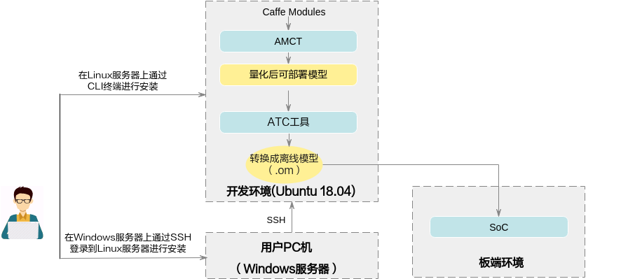
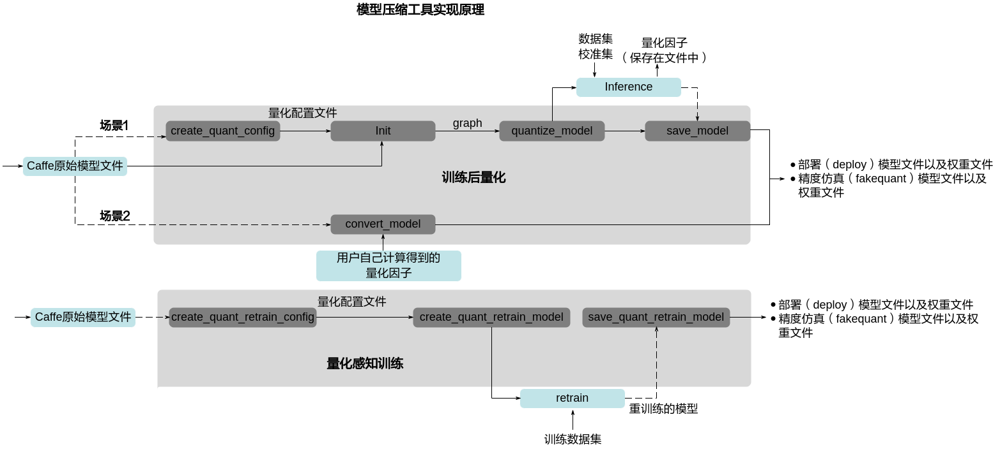
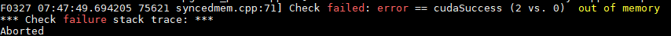
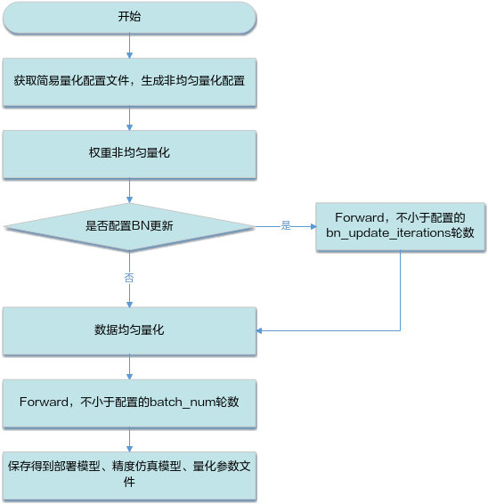

# Preface
**Overview<a name="section4102mcpsimp"></a>**

This document details how to use AMCT to quantize network models of the Caffe framework.

**Product Version<a name="section300mcpsimp"></a>**

The product versions corresponding to this document are as follows.

<a name="table303mcpsimp"></a>
<table><thead align="left"><tr id="row308mcpsimp"><th class="cellrowborder" valign="top" width="45%" id="mcps1.1.3.1.1"><p id="p310mcpsimp"><a name="p310mcpsimp"></a><a name="p310mcpsimp"></a>Product Name</p>
</th>
<th class="cellrowborder" valign="top" width="55.00000000000001%" id="mcps1.1.3.1.2"><p id="p312mcpsimp"><a name="p312mcpsimp"></a><a name="p312mcpsimp"></a>Product Version</p>
</th>
</tr>
</thead>
<tbody><tr id="row314mcpsimp"><td class="cellrowborder" valign="top" width="45%" headers="mcps1.1.3.1.1 "><p id="p316mcpsimp"><a name="p316mcpsimp"></a><a name="p316mcpsimp"></a>SS928</p>
</td>
<td class="cellrowborder" valign="top" width="55.00000000000001%" headers="mcps1.1.3.1.2 "><p id="p318mcpsimp"><a name="p318mcpsimp"></a><a name="p318mcpsimp"></a>V100</p>
</td>
</tr>
<tr id="row1376073312191"><td class="cellrowborder" valign="top" width="45%" headers="mcps1.1.3.1.1 "><p id="p5760533111913"><a name="p5760533111913"></a><a name="p5760533111913"></a>SS927</p>
</td>
<td class="cellrowborder" valign="top" width="55.00000000000001%" headers="mcps1.1.3.1.2 "><p id="p6760333131918"><a name="p6760333131918"></a><a name="p6760333131918"></a>V100</p>
</td>
</tr>
</tbody>
</table>

**Intended Audience<a name="section4105mcpsimp"></a>**

This document is primarily intended for the following engineers:

- Technical support engineers
- Software development engineers

Familiarity with the following experience and skills will help in understanding this document:

- Proficient in basic Linux commands.
- Have a certain understanding of image analysis methods.

**Revision History<a name="section4116mcpsimp"></a>**

The revision history records the updates for each document revision. The latest version of the document includes all updates from previous versions.

<a name="table5652mcpsimp"></a>
<table><thead align="left"><tr id="row5658mcpsimp"><th class="cellrowborder" valign="top" width="21%" id="mcps1.1.4.1.1"><p id="p5660mcpsimp"><a name="p5660mcpsimp"></a><a name="p5660mcpsimp"></a>Document Version</p>
</th>
<th class="cellrowborder" valign="top" width="26%" id="mcps1.1.4.1.2"><p id="p5663mcpsimp"><a name="p5663mcpsimp"></a><a name="p5663mcpsimp"></a>Release Date</p>
</th>
<th class="cellrowborder" valign="top" width="53%" id="mcps1.1.4.1.3"><p id="p5666mcpsimp"><a name="p5666mcpsimp"></a><a name="p5666mcpsimp"></a>Description</p>
</th>
</tr>
</thead>
<tbody><tr id="row5669mcpsimp"><td class="cellrowborder" valign="top" width="21%" headers="mcps1.1.4.1.1 "><p id="p5671mcpsimp"><a name="p5671mcpsimp"></a><a name="p5671mcpsimp"></a>00B01</p>
</td>
<td class="cellrowborder" valign="top" width="26%" headers="mcps1.1.4.1.2 "><p id="p5673mcpsimp"><a name="p5673mcpsimp"></a><a name="p5673mcpsimp"></a>2025-09-15</p>
</td>
<td class="cellrowborder" valign="top" width="53%" headers="mcps1.1.4.1.3 "><p id="p5675mcpsimp"><a name="p5675mcpsimp"></a><a name="p5675mcpsimp"></a>First temporary version release.</p>
</td>
</tr>
</tbody>
</table>

# Overview
## Introduction<a name="ZH-CN_TOPIC_0000002408421458"></a>

This document describes how to quantize original network models of the Caffe framework using the Advanced Model Compression Toolkit (AMCT). Quantization refers to performing low-bit processing on model weights and activations, making the final network model more lightweight, thereby achieving goals such as saving model storage space, reducing transmission latency, improving computational efficiency, and enhancing performance.

AMCT is a Python toolkit based on the Caffe framework that implements model fusion (mainly BN fusion), 8-bit quantization of activations and weights. The tool separates quantization from model conversion, enabling independent quantization of quantizable operators in the model, and saves the quantized model as .prototxt and .caffemodel files. The quantized fakequant model can run on CPU or GPU for quantization accuracy evaluation. The quantized deploy model can be deployed and run on the SoC to improve inference performance. The advantages of this tool are as follows:

- Easy to use: install the toolkit and recompile Caffe.
- Simple interfaces: call APIs based on the user's Caffe inference script to complete quantization.
- Hardware-compatible: the generated deploy model can be converted by the ATC tool to achieve 8-bit inference.
- Configurable quantization: users can modify the quantization configuration file to adjust quantization strategies and obtain better quantization results.

The AMCT usage scenario is shown in [Figure 1](#fig15946191505911). AMCT currently only supports deployment on Ubuntu 18.04 x86_64 operating systems. For supporting software information, see [Environment Preparation](#ZH-CN_TOPIC_0000002442020533). Models quantized using this tool need to be converted to SoC offline models using the ATC tool before inference.

**Figure 1** Deployment Architecture<a name="fig15946191505911"></a>  

## Basic Functions<a name="ZH-CN_TOPIC_0000002408581194"></a>

### Post-Training Quantization and Quantization-Aware Training<a name="ZH-CN_TOPIC_0000002408421514"></a>

#### Concept Introduction<a name="ZH-CN_TOPIC_0000002408421378"></a>

Based on the quantization method, it is divided into Post-Training Quantization and Quantization-Aware Training.

The above two quantization methods, based on the quantization target, are divided into weight quantization and activation quantization. Based on whether the weight data is compressed, they are further divided into uniform quantization and non-uniform quantization.

The concepts related to post-training quantization and quantization-aware training are introduced below:

**Post-Training Quantization**: refers to quantizing weights from float32 to int8 in a trained model, and calibrating activations using a small amount of calibration data. See [Post-Training Quantization](#ZH-CN_TOPIC_0000002408421274) for the quantization process. Post-training quantization does not support running on multiple GPUs simultaneously.

- **Calibration Dataset**

    In the process of determining the quantization factor for activations (calibration process), the network model takes each piece of data from the calibration set as input for forward inference. The quantization algorithm accumulates the corresponding input data for each layer/operator to be quantized, and determines the quantization factor accordingly. Since the determination of quantization factors is related to the choice of the calibration dataset, the accuracy of the quantized model is also related to the choice of the calibration dataset. It is recommended to use a subset of the validation set as the calibration dataset.

- **Activation Quantization**

    Activation quantization involves statistics of the input data for each layer/operator to be quantized. Each layer/operator calculates an optimal set of scale and offset values (see [Quantization Factor Record File Description](#ZH-CN_TOPIC_0000002441980745) for parameter explanations).

    Activations are intermediate results of model inference computation, and their range is related to the model input. Therefore, a set of reference inputs (calibration dataset) is used as stimulus to record the input data of the layers/operators to be quantized, and the quantization factors (scale and offset) are searched for. Since the activation calibration process requires additional storage space (video memory/memory) to store the input data used for determining quantization factors, the memory usage is higher than in inference-only mode. The additional space required is positively correlated with batch\_size * batch\_num in the calibration process.

- **Weight Quantization**

    The weights of the trained model are already determined, and their value range is also determined. Therefore, quantization is performed directly based on the value range of the weights.

- **Uniform Quantization**

    Refers to quantized data being relatively evenly distributed in a certain numerical space. For example, INT8 quantization uses 8-bit INT8 data to represent 32-bit FP32 data, converting the FP32 computation process (multiply-accumulate operations) to INT8 operations, accelerating computation and achieving model compression. Uniform INT8 quantization means the quantized data is relatively evenly distributed in the INT8 numerical space \[-128, 127\]. See [Uniform Quantization](#ZH-CN_TOPIC_0000002408581338) for the quantization process.

    - If the accuracy of the uniformly quantized model does not meet requirements, [Quantization-Aware Training](#ZH-CN_TOPIC_0000002442020557) is needed.
    - Currently supported uniform quantization layers with weights: InnerProduct, Convolution and DepthwiseConv, Deconvolution, RNN, LSTM, GRU.
    - Currently supported uniform quantization layers without weights: PassThrough, Pooling, PSROIPooling, ROIPooling, SPP, Upsample, Eltwise, Slice, Concat, Softmax, ROIAlign, AbsVal, BNLL, CReLU, ELU, Exp, Interp, Log, LRN, Mvm, Nms, Normalize, Power, PReLU, Reduction, ReLU, Sigmoid, Sort, Threshold, Scale, BatchNorm, Bias, Reshape, ShuffleChannel, Crop, Split, Axpy, Flatten, Permute, Tile, Split, ArgMax, Clip, Hswish, MVN, Reorg, TanH, MatMul, RReLU, ReLU6, Reverse

- **Non-uniform Quantization**

    Clustering is performed during weight data quantization, so that scattered weight data is quantized into an integer set of a given size and range. Currently, non-uniform quantization only supports INT4 quantization, i.e., using the \[0,15\] numerical space to represent all weight data of that layer, reducing the proportion of weight data movement instructions, thereby improving inference performance. Non-uniform quantization also includes a uniform quantization process, where the Bias is still quantized using INT8 quantization coefficients. See [Non-uniform Quantization](#ZH-CN_TOPIC_0000002408581402) for the quantization process.

    - If the accuracy of the non-uniformly quantized model does not meet requirements, it can be switched to uniform quantization.
    - Currently supported non-uniform quantization layers with weights: InnerProduct, Convolution and DepthwiseConv, Deconvolution.

**Quantization-Aware Training**: refers to introducing quantization operations during the training process using the user's complete training dataset. By quantizing and dequantizing activations and weights during forward computation in training, quantization error loss is introduced, thereby improving the model's adaptability to quantization effects during training and improving the accuracy of the final quantized model.

The disadvantage of quantization-aware training is that it is time-consuming and requires large amounts of data. See [Quantization-Aware Training](#ZH-CN_TOPIC_0000002408421498) for the quantization process.

Currently supported uniform quantization layers with weights: InnerProduct, Convolution and DepthwiseConv, Deconvolution.

Currently supported uniform quantization layers without weights: PassThrough, Pooling, PSROIPooling, ROIPooling, SPP, Upsample, Eltwise, Slice, Concat, Softmax, ROIAlign, AbsVal, BNLL, CReLU, ELU, Exp, Interp, Log, LRN, Mvm, Nms, Normalize, Power, PReLU, Reduction, ReLU, Sigmoid, Sort, Threshold, Scale, BatchNorm, Bias, Reshape, ShuffleChannel, Crop, Axpy, Flatten, Permute, Tile, Split, ArgMax, Clip, Hswish, MVN, Reorg, TanH, MatMul, RReLU, ReLU6

- **Training Dataset**

    Based on the dataset in the user's training network.

- **Activation Quantization**

    Activation quantization iteratively trains the truncation maximum and truncation minimum values, and calculates the current scale and offset from these two values. Activations are intermediate results of model inference computation. Through the ulq retrain algorithm, these two parameters are continuously optimized during quantization-aware training to obtain the final optimal parameters.

- **Weight Quantization**

    Weight quantization refers to continuously optimizing the weight quantization parameters during quantization-aware training to obtain the final weight quantization parameters.

> **Note:** 
>InnerProduct and InnerProduct in RNN, LSTM, GRU only support quantization with channelwise set to false.

#### Implementation Principle<a name="ZH-CN_TOPIC_0000002408581242"></a>

The AMCT principle is shown in [Figure 1](#fig2589125075314). The blue part is implemented by the user, and the gray part is implemented by the user calling the APIs provided by AMCT. The user imports the library into the Caffe original network inference code and calls the corresponding APIs at specific locations to implement quantization. The tool usage is divided into the following scenarios:

- Post-Training Quantization
    - <a name="li13769155152211"></a>Scenario 1
        - The user first constructs the original Caffe model, then uses [create\_quant\_config](#ZH-CN_TOPIC_0000002441980797) to generate a quantization configuration file.
        - Based on the Caffe model and quantization configuration file, call the [init](#ZH-CN_TOPIC_0000002441980657) interface to initialize the tool, configure the quantization factor storage file, and parse the model into a graph structure.
        - Call the [weights\_quantize\_model](#ZH-CN_TOPIC_0000002408421334) and [activation\_quantize\_model](#ZH-CN_TOPIC_0000002408581438) interfaces to optimize the graph structure of the original Caffe model. The modified model contains quantization algorithms. The user uses this model with the dataset and calibration set provided by AMCT to perform inference in the Caffe environment and obtain quantization factors.

            The dataset is used for model inference in the Caffe environment to test the accuracy of the quantized data. The calibration set is used to generate quantization factors to ensure accuracy.

        - Finally, the user can call the [save\_model](#ZH-CN_TOPIC_0000002442020453) interface to save the model, including the model and weight files that can be used for quantization accuracy evaluation in the Caffe environment, as well as the model and weight files that can be deployed on the SoC.

    - Scenario 2

        If the user does not use the interfaces in [Scenario 1](#li13769155152211), but instead uses their own calculated quantization factors along with the original Caffe model to generate the quantized deploy model and accuracy simulation model, they need to use the [convert\_model](#ZH-CN_TOPIC_0000002408581370) interface to complete the quantization. See [convert\_model Interface Quantization Example](#ZH-CN_TOPIC_0000002442020493) for the quantization example in this scenario.

- Quantization-Aware Training
    - The user first constructs the original Caffe model, then uses [create\_quant\_retrain\_config](#ZH-CN_TOPIC_0000002408581290) to generate a quantization configuration file.
    - Add TEST phase (test\_interval > 0, test\_iter > 0) to solver.prototxt, and disable pre-testing (test\_initialization=false). See [Quantization Steps](#ZH-CN_TOPIC_0000002408421426) for specific modification examples (Note: configure the net in solver.prototxt as the model generated by AMCT, not train\_net or test\_net).
    - Call the [create\_quant\_retrain\_model](#ZH-CN_TOPIC_0000002442020397) interface to optimize the original Caffe model. The modified model contains quantization algorithms. The user uses this model with the dataset and calibration set provided by AMCT to perform retraining in the Caffe environment and obtain quantization factors.
    - Finally, the user can call the [save\_quant\_retrain\_model](#ZH-CN_TOPIC_0000002441980725) interface to save the model, including the model and weight files that can be used for accuracy evaluation in the Caffe environment, as well as the model and weight files that can be deployed on the SoC.

**Figure 1** Tool Principle Diagram<a name="fig2589125075314"></a>  

### Fusion Functions Implemented by the Tool<a name="ZH-CN_TOPIC_0000002441980785"></a>

Currently, this tool mainly implements BN fusion, which is divided into the following categories:

- Conv+BN+Scale+Bias fusion: First, "BatchNorm" is fused into the adjacent preceding "Conv". After fusion, the "BatchNorm" layer is deleted. Then "Scale" and "Bias" are processed similarly in sequence.
- DepthwiseConv+BN+Scale+Bias fusion: First, "BatchNorm" is fused into the adjacent preceding "DepthwiseConv". After fusion, the "BatchNorm" layer is deleted. Then "Scale" and "Bias" are processed similarly in sequence.
- Deconv+BN+Scale+Bias fusion: First, "BatchNorm" is fused into the adjacent preceding "Deconv". After fusion, the "BatchNorm" layer is deleted. Then "Scale" and "Bias" are processed similarly in sequence.
- FC+BN+Scale+Bias fusion: First, "BatchNorm" is fused into the adjacent preceding "FC". After fusion, the "BatchNorm" layer is deleted. Then "Scale" and "Bias" are processed similarly in sequence.

> **Note:** 
>Scale and Bias only support fusion along the C axis, i.e., axis=1 or -3, num\_axis=1 scenarios.

### Acceleration Optimization Implemented by the Tool<a name="ZH-CN_TOPIC_0000002408421306"></a>

BN+Scale+Bias acceleration: If "BatchNorm", "Scale", "Bias" structures still exist in the model after the fusion operation is complete, and data quantization for these layers is enabled in the configuration file, the tool will insert a "DepthwiseConv" layer before these layers and perform fusion into "DepthwiseConv" in the order of "BatchNorm", "Scale", "Bias".

> **Note:** 
>Scale and Bias only support acceleration along the C axis, i.e., axis=1 or -3, num\_axis=1 scenarios.

## Running Process<a name="ZH-CN_TOPIC_0000002442020577"></a>

The specific running process is shown in [Table 1](#_Ref74231828).

**Table 1** Operation Steps Description

<a name="_Ref74231828"></a>
<table><thead align="left"><tr id="row848mcpsimp"><th class="cellrowborder" valign="top" width="23%" id="mcps1.2.3.1.1"><p id="p850mcpsimp"><a name="p850mcpsimp"></a><a name="p850mcpsimp"></a>Key Step</p>
</th>
<th class="cellrowborder" valign="top" width="77%" id="mcps1.2.3.1.2"><p id="p852mcpsimp"><a name="p852mcpsimp"></a><a name="p852mcpsimp"></a>Description</p>
</th>
</tr>
</thead>
<tbody><tr id="row854mcpsimp"><td class="cellrowborder" valign="top" width="23%" headers="mcps1.2.3.1.1 "><p id="p856mcpsimp"><a name="p856mcpsimp"></a><a name="p856mcpsimp"></a>Obtain the Software Package</p>
</td>
<td class="cellrowborder" valign="top" width="77%" headers="mcps1.2.3.1.2 "><p id="p858mcpsimp"><a name="p858mcpsimp"></a><a name="p858mcpsimp"></a>Obtain the corresponding software package before installation. For details, see <a href="#ZH-CN_TOPIC_0000002441980645">Obtain the Software Package</a>.</p>
</td>
</tr>
<tr id="row860mcpsimp"><td class="cellrowborder" valign="top" width="23%" headers="mcps1.2.3.1.1 "><p id="p862mcpsimp"><a name="p862mcpsimp"></a><a name="p862mcpsimp"></a>Pre-installation Preparation</p>
</td>
<td class="cellrowborder" valign="top" width="77%" headers="mcps1.2.3.1.2 "><p id="p864mcpsimp"><a name="p864mcpsimp"></a><a name="p864mcpsimp"></a>Before installing AMCT, a series of actions are required, including creating the AMCT installation user, checking whether the system environment meets requirements, installing dependencies, and uploading the software package. For detailed operations, see <a href="#ZH-CN_TOPIC_0000002408421266">Pre-installation Preparation</a>.</p>
</td>
</tr>
<tr id="row866mcpsimp"><td class="cellrowborder" valign="top" width="23%" headers="mcps1.2.3.1.1 "><p id="p868mcpsimp"><a name="p868mcpsimp"></a><a name="p868mcpsimp"></a>Installation</p>
</td>
<td class="cellrowborder" valign="top" width="77%" headers="mcps1.2.3.1.2 "><p id="p870mcpsimp"><a name="p870mcpsimp"></a><a name="p870mcpsimp"></a>See <a href="#ZH-CN_TOPIC_0000002408421350">Install AMCT</a> to install AMCT for the Caffe framework.</p>
</td>
</tr>
<tr id="row872mcpsimp"><td class="cellrowborder" valign="top" width="23%" headers="mcps1.2.3.1.1 "><p id="p874mcpsimp"><a name="p874mcpsimp"></a><a name="p874mcpsimp"></a>Post-installation Processing</p>
</td>
<td class="cellrowborder" valign="top" width="77%" headers="mcps1.2.3.1.2 "><p id="p876mcpsimp"><a name="p876mcpsimp"></a><a name="p876mcpsimp"></a>After installing AMCT, see <a href="#ZH-CN_TOPIC_0000002442020613">Post-installation Processing</a> to complete proto merging and patch installation, then recompile the Caffe environment. To set the log level during quantization, environment variables also need to be set.</p>
</td>
</tr>
<tr id="row878mcpsimp"><td class="cellrowborder" valign="top" width="23%" headers="mcps1.2.3.1.1 "><p id="p880mcpsimp"><a name="p880mcpsimp"></a><a name="p880mcpsimp"></a>(Optional) Write Scripts and Call AMCT APIs</p>
</td>
<td class="cellrowborder" valign="top" width="77%" headers="mcps1.2.3.1.2 "><p id="p882mcpsimp"><a name="p882mcpsimp"></a><a name="p882mcpsimp"></a>If users need to quantize their own network models and do not use the sample provided in this manual, they need to modify the quantization script for adaptation before quantization. See <a href="#ZH-CN_TOPIC_0000002408581398">Sample Code Analysis</a> for sample code analysis.</p>
</td>
</tr>
<tr id="row884mcpsimp"><td class="cellrowborder" valign="top" width="23%" headers="mcps1.2.3.1.1 "><p id="p886mcpsimp"><a name="p886mcpsimp"></a><a name="p886mcpsimp"></a>Execute Quantization</p>
</td>
<td class="cellrowborder" valign="top" width="77%" headers="mcps1.2.3.1.2 "><p id="p888mcpsimp"><a name="p888mcpsimp"></a><a name="p888mcpsimp"></a>Users perform quantization using the prepared original network model and dataset with the quantization scripts provided in this manual.</p>
<p id="p889mcpsimp"><a name="p889mcpsimp"></a><a name="p889mcpsimp"></a>Based on the quantization method, it is divided into post-training quantization and quantization-aware training. For detailed quantization steps, see <a href="#ZH-CN_TOPIC_0000002441980565">Post-Training Quantization</a> and <a href="#ZH-CN_TOPIC_0000002442020557">Quantization-Aware Training</a>.</p>
<p id="p892mcpsimp"><a name="p892mcpsimp"></a><a name="p892mcpsimp"></a>Post-training quantization is further divided into uniform quantization and non-uniform quantization based on whether the weight data is compressed.</p>
</td>
</tr>
<tr id="row893mcpsimp"><td class="cellrowborder" valign="top" width="23%" headers="mcps1.2.3.1.1 "><p id="p895mcpsimp"><a name="p895mcpsimp"></a><a name="p895mcpsimp"></a>Model Conversion Using MindCmd Tool</p>
</td>
<td class="cellrowborder" valign="top" width="77%" headers="mcps1.2.3.1.2 "><p id="p897mcpsimp"><a name="p897mcpsimp"></a><a name="p897mcpsimp"></a>Users convert the quantized deploy model to an SoC offline model using the MindCmd tool. For details, refer to the corresponding user guide, then use the model for inference.</p>
</td>
</tr>
</tbody>
</table>

# Install AMCT
## Obtain the Software Package<a name="ZH-CN_TOPIC_0000002441980645"></a>

AMCT only supports installation on Ubuntu 18.04 x86\_64 servers. Before installation, obtain the AMCT software package: amct\_caffe

## Pre-installation Preparation<a name="ZH-CN_TOPIC_0000002408421266"></a>

### Ubuntu x86 System<a name="ZH-CN_TOPIC_0000002408581358"></a>

#### AMCT User Preparation<a name="ZH-CN_TOPIC_0000002408421414"></a>

Any user (root or non-root) can install AMCT. This section uses a non-root user as an example.

- If using the root user for installation, this section is not needed and no settings are required for the root user.
- If using an existing non-root user for installation, ensure the user has read, write, and execute permissions on the $HOME directory.
- If using a new non-root user for installation, refer to the following steps to create one. The following operations should be performed under the root user. This manual uses this scenario as an example for AMCT installation.
    - Run the following command to create the AMCT installation user and set the $HOME directory for that user.

        ```
        useradd -d /home/username -m username
        ```

    - Run the following command to set the password.

        ```
        passwd username
        ```

> **Note:** 
>_username_  is the username for installing AMCT. The umask value of this user must not be less than 0027:
>-   To check the umask value, run the command: **umask**
>-   To modify the umask value, run the command: **umask  _new_value_**

#### Configure AMCT Installation User Permissions (Optional)<a name="ZH-CN_TOPIC_0000002441980537"></a>

This section is required when a non-root user performs the installation. Otherwise, ignore it.

Before installing AMCT, related dependency software needs to be downloaded. Downloading dependency software requires **sudo apt-get** permissions. Perform the following operations as the root user.

1.  Open the "/etc/sudoers" file:

    ```
    chmod u+w /etc/sudoers
    vi /etc/sudoers
    ```

2.  Add the following content under the "# User privilege specification" line in the file:

    ```
    username ALL=(ALL:ALL)   NOPASSWD:SETENV:/usr/bin/apt-get,/usr/bin/pip, /bin/tar, /bin/mkdir, /bin/sh, /bin/bash, /usr/bin/make, /usr/bin/pip3, /usr/bin/pip3.7, /usr/bin/pip3.7.5, /bin/ln
    ```

    "username" is the non-root username executing the installation script.

    > **Note:** 
    >Ensure that the last line of "/etc/sudoers" is "#includedir /etc/sudoers.d". If this information is not present, add it manually.

3.  After adding, execute :wq! to save the file.
4.  Run the following command to remove the write permission from the "/etc/sudoers" file:

    ```
    chmod u-w /etc/sudoers
    ```

#### Environment Preparation<a name="ZH-CN_TOPIC_0000002442020533"></a>

AMCT currently only supports installation on Ubuntu 18.04 x86\_64 operating systems. The supporting software information is as follows:

**Table 1** Ubuntu x86\_64 Architecture Supporting Version Information

<a name="table3218mcpsimp"></a>
<table><thead align="left"><tr id="row3226mcpsimp"><th class="cellrowborder" valign="top" width="17%" id="mcps1.2.5.1.1"><p id="p3228mcpsimp"><a name="p3228mcpsimp"></a><a name="p3228mcpsimp"></a>Category</p>
</th>
<th class="cellrowborder" valign="top" width="22%" id="mcps1.2.5.1.2"><p id="p3230mcpsimp"><a name="p3230mcpsimp"></a><a name="p3230mcpsimp"></a>Version Restriction</p>
</th>
<th class="cellrowborder" valign="top" width="45%" id="mcps1.2.5.1.3"><p id="p3232mcpsimp"><a name="p3232mcpsimp"></a><a name="p3232mcpsimp"></a>Acquisition Method</p>
</th>
<th class="cellrowborder" valign="top" width="16%" id="mcps1.2.5.1.4"><p id="p3234mcpsimp"><a name="p3234mcpsimp"></a><a name="p3234mcpsimp"></a>Notes</p>
</th>
</tr>
</thead>
<tbody><tr id="row3236mcpsimp"><td class="cellrowborder" valign="top" width="17%" headers="mcps1.2.5.1.1 "><p id="p3238mcpsimp"><a name="p3238mcpsimp"></a><a name="p3238mcpsimp"></a>Operating System</p>
</td>
<td class="cellrowborder" valign="top" width="22%" headers="mcps1.2.5.1.2 "><p id="p3240mcpsimp"><a name="p3240mcpsimp"></a><a name="p3240mcpsimp"></a>18.04 64-bit Ubuntu OS</p>
</td>
<td class="cellrowborder" valign="top" width="45%" headers="mcps1.2.5.1.3 "><p id="p3242mcpsimp"><a name="p3242mcpsimp"></a><a name="p3242mcpsimp"></a>Download and install the corresponding version from <a href="http://old-releases.ubuntu.com/releases/" target="_blank" rel="noopener noreferrer">http://old-releases.ubuntu.com/releases/</a>, for example, the Server version<strong id="b3244mcpsimp"><a name="b3244mcpsimp"></a><a name="b3244mcpsimp"></a>: ubuntu-18.04-server-amd64.iso.</strong></p>
</td>
<td class="cellrowborder" valign="top" width="16%" headers="mcps1.2.5.1.4 "><p id="p3246mcpsimp"><a name="p3246mcpsimp"></a><a name="p3246mcpsimp"></a><em id="i3247mcpsimp"><a name="i3247mcpsimp"></a><a name="i3247mcpsimp"></a>-</em></p>
</td>
</tr>
<tr id="row3248mcpsimp"><td class="cellrowborder" valign="top" width="17%" headers="mcps1.2.5.1.1 "><p id="p3250mcpsimp"><a name="p3250mcpsimp"></a><a name="p3250mcpsimp"></a>Python</p>
</td>
<td class="cellrowborder" valign="top" width="22%" headers="mcps1.2.5.1.2 "><p id="p3252mcpsimp"><a name="p3252mcpsimp"></a><a name="p3252mcpsimp"></a>3.7.5</p>
</td>
<td class="cellrowborder" valign="top" width="45%" headers="mcps1.2.5.1.3 "><p id="p3254mcpsimp"><a name="p3254mcpsimp"></a><a name="p3254mcpsimp"></a>See <a href="#ZH-CN_TOPIC_0000002408581350">Install Python 3.7.5 (Ubuntu)</a>.</p>
</td>
<td class="cellrowborder" valign="top" width="16%" headers="mcps1.2.5.1.4 "><p id="p3257mcpsimp"><a name="p3257mcpsimp"></a><a name="p3257mcpsimp"></a>When installing dependencies, ensure the server can connect to the network.</p>
</td>
</tr>
<tr id="row3258mcpsimp"><td class="cellrowborder" valign="top" width="17%" headers="mcps1.2.5.1.1 "><p id="p3260mcpsimp"><a name="p3260mcpsimp"></a><a name="p3260mcpsimp"></a>Caffe</p>
</td>
<td class="cellrowborder" valign="top" width="22%" headers="mcps1.2.5.1.2 "><p id="p3262mcpsimp"><a name="p3262mcpsimp"></a><a name="p3262mcpsimp"></a>caffe-master branch</p>
<p id="p3263mcpsimp"><a name="p3263mcpsimp"></a><a name="p3263mcpsimp"></a>Currently only supports commit id 9b891540183ddc834a02b2bd81b31afae71b2153</p>
</td>
<td class="cellrowborder" valign="top" width="45%" headers="mcps1.2.5.1.3 "><p id="p3265mcpsimp"><a name="p3265mcpsimp"></a><a name="p3265mcpsimp"></a>Refer to the official Caffe guide to prepare the Caffe environment: <a href="https://github.com/BVLC/caffe/tree/master" target="_blank" rel="noopener noreferrer">https://github.com/BVLC/caffe/tree/master</a>.</p>
<p id="p3267mcpsimp"><a name="p3267mcpsimp"></a><a name="p3267mcpsimp"></a>It is recommended to install the Caffe environment using source code. If using the command line method and encountering messages similar to "/usr/bin/python3.7: can't open file '/usr/lib/python3.7/py_compile.py': [Error 2] No such file or directory", see <a href="#ZH-CN_TOPIC_0000002408581186">Command Line Installation of Caffe Environment Fails</a> for resolution.</p>
</td>
<td class="cellrowborder" valign="top" width="16%" headers="mcps1.2.5.1.4 "><p id="p3270mcpsimp"><a name="p3270mcpsimp"></a><a name="p3270mcpsimp"></a>-</p>
</td>
</tr>
<tr id="row3271mcpsimp"><td class="cellrowborder" valign="top" width="17%" headers="mcps1.2.5.1.1 "><p id="p3273mcpsimp"><a name="p3273mcpsimp"></a><a name="p3273mcpsimp"></a>CUDA toolkit/CUDA driver</p>
</td>
<td class="cellrowborder" valign="top" width="22%" headers="mcps1.2.5.1.2 "><p id="p3275mcpsimp"><a name="p3275mcpsimp"></a><a name="p3275mcpsimp"></a>10.1/11.3</p>
</td>
<td class="cellrowborder" valign="top" width="45%" headers="mcps1.2.5.1.3 "><p id="p3277mcpsimp"><a name="p3277mcpsimp"></a><a name="p3277mcpsimp"></a>Users must obtain the relevant software packages themselves for installation. For example, see the following link to obtain the toolkit package, which includes the driver package.</p>
<p id="p3278mcpsimp"><a name="p3278mcpsimp"></a><a name="p3278mcpsimp"></a><a href="https://developer.nvidia.com/cuda-toolkit-archive" target="_blank" rel="noopener noreferrer">https://developer.nvidia.com/cuda-toolkit-archive</a></p>
</td>
<td class="cellrowborder" valign="top" width="16%" headers="mcps1.2.5.1.4 "><p id="p3281mcpsimp"><a name="p3281mcpsimp"></a><a name="p3281mcpsimp"></a>If using GPU mode for quantization, CUDA software must be installed.</p>
</td>
</tr>
</tbody>
</table>

#### Check the Source List<a name="ZH-CN_TOPIC_0000002441980769"></a>

When installing dependencies, ensure the server where AMCT is located can connect to the network. Run the following command as the root user to check if the source list is available:

```
apt-get update
```

If the command fails, check if the network is connected or replace the source in "/etc/apt/sources.list" with an available source.

#### Install Dependencies<a name="ZH-CN_TOPIC_0000002408421250"></a>

Users need to install the following plugins. If the installing user is non-root, use the su - username command to switch to the non-root user and execute the following commands.

**Table 1** Dependency List

<a name="table2999mcpsimp"></a>
<table><thead align="left"><tr id="row3007mcpsimp"><th class="cellrowborder" valign="top" width="13.34%" id="mcps1.2.6.1.1"><p id="p3009mcpsimp"><a name="p3009mcpsimp"></a><a name="p3009mcpsimp"></a>Component</p>
</th>
<th class="cellrowborder" valign="top" width="11.63%" id="mcps1.2.6.1.2"><p id="p3011mcpsimp"><a name="p3011mcpsimp"></a><a name="p3011mcpsimp"></a>Dependency Name</p>
</th>
<th class="cellrowborder" valign="top" width="9.26%" id="mcps1.2.6.1.3"><p id="p3013mcpsimp"><a name="p3013mcpsimp"></a><a name="p3013mcpsimp"></a>Version</p>
</th>
<th class="cellrowborder" valign="top" width="23.76%" id="mcps1.2.6.1.4"><p id="p3015mcpsimp"><a name="p3015mcpsimp"></a><a name="p3015mcpsimp"></a>Installation Command</p>
</th>
<th class="cellrowborder" valign="top" width="42.01%" id="mcps1.2.6.1.5"><p id="p4643151761213"><a name="p4643151761213"></a><a name="p4643151761213"></a>whl Package URL</p>
</th>
</tr>
</thead>
<tbody><tr id="row1779813473590"><td class="cellrowborder" rowspan="2" valign="top" width="13.34%" headers="mcps1.2.6.1.1 "><p id="p544219531444"><a name="p544219531444"></a><a name="p544219531444"></a>AMCT</p>
</td>
<td class="cellrowborder" valign="top" width="11.63%" headers="mcps1.2.6.1.2 "><p id="p4798174735914"><a name="p4798174735914"></a><a name="p4798174735914"></a>numpy</p>
</td>
<td class="cellrowborder" valign="top" width="9.26%" headers="mcps1.2.6.1.3 "><p id="p10798547165914"><a name="p10798547165914"></a><a name="p10798547165914"></a>1.16.0+</p>
</td>
<td class="cellrowborder" valign="top" width="23.76%" headers="mcps1.2.6.1.4 "><p id="p14679592111"><a name="p14679592111"></a><a name="p14679592111"></a>pip3.7.5 install numpy==1.16.0 --user</p>
</td>
<td class="cellrowborder" valign="top" width="42.01%" headers="mcps1.2.6.1.5 "><p id="p1079864735912"><a name="p1079864735912"></a><a name="p1079864735912"></a><a href="https://pypi.org/project/numpy/1.16.0/#files" target="_blank" rel="noopener noreferrer">https://pypi.org/project/numpy/1.16.0/#files</a></p>
</td>
</tr>
<tr id="row152511551015"><td class="cellrowborder" valign="top" headers="mcps1.2.6.1.1 "><p id="p62511552111"><a name="p62511552111"></a><a name="p62511552111"></a>protobuf</p>
</td>
<td class="cellrowborder" valign="top" headers="mcps1.2.6.1.2 "><p id="p12251655514"><a name="p12251655514"></a><a name="p12251655514"></a>3.13.0+</p>
</td>
<td class="cellrowborder" valign="top" headers="mcps1.2.6.1.3 "><p id="p970910131429"><a name="p970910131429"></a><a name="p970910131429"></a>pip3.7.5 install protobuf==3.13.0 --user</p>
</td>
<td class="cellrowborder" valign="top" headers="mcps1.2.6.1.4 "><p id="p19251155517115"><a name="p19251155517115"></a><a name="p19251155517115"></a><a href="https://pypi.org/project/protobuf/3.13.0/#files" target="_blank" rel="noopener noreferrer">https://pypi.org/project/protobuf/3.13.0/#files</a></p>
</td>
</tr>
<tr id="row3027mcpsimp"><td class="cellrowborder" valign="top" width="13.34%" headers="mcps1.2.6.1.1 "><p id="p3029mcpsimp"><a name="p3029mcpsimp"></a><a name="p3029mcpsimp"></a>Classification Network / Detection Network / MNIST Network</p>
</td>
<td class="cellrowborder" valign="top" width="11.63%" headers="mcps1.2.6.1.2 "><p id="p3031mcpsimp"><a name="p3031mcpsimp"></a><a name="p3031mcpsimp"></a>opencv-python</p>
</td>
<td class="cellrowborder" valign="top" width="9.26%" headers="mcps1.2.6.1.3 "><p id="p3033mcpsimp"><a name="p3033mcpsimp"></a><a name="p3033mcpsimp"></a>4.5.5.62+</p>
</td>
<td class="cellrowborder" valign="top" width="23.76%" headers="mcps1.2.6.1.4 "><p id="p3035mcpsimp"><a name="p3035mcpsimp"></a><a name="p3035mcpsimp"></a>pip3.7.5 install opencv-python==4.5.5.62 --user</p>
</td>
<td class="cellrowborder" valign="top" width="42.01%" headers="mcps1.2.6.1.5 "><p id="p131511713184716"><a name="p131511713184716"></a><a name="p131511713184716"></a><a href="https://pypi.org/project/opencv-python/4.5.5.62/#files" target="_blank" rel="noopener noreferrer">https://pypi.org/project/opencv-python/4.5.5.62/#files</a></p>
</td>
</tr>
<tr id="row3036mcpsimp"><td class="cellrowborder" rowspan="2" valign="top" width="13.34%" headers="mcps1.2.6.1.1 "><p id="p3038mcpsimp"><a name="p3038mcpsimp"></a><a name="p3038mcpsimp"></a>Classification Network</p>
</td>
<td class="cellrowborder" valign="top" width="11.63%" headers="mcps1.2.6.1.2 "><p id="p3040mcpsimp"><a name="p3040mcpsimp"></a><a name="p3040mcpsimp"></a>scikit-image</p>
</td>
<td class="cellrowborder" valign="top" width="9.26%" headers="mcps1.2.6.1.3 "><p id="p3042mcpsimp"><a name="p3042mcpsimp"></a><a name="p3042mcpsimp"></a>0.16.2</p>
</td>
<td class="cellrowborder" valign="top" width="23.76%" headers="mcps1.2.6.1.4 "><p id="p3044mcpsimp"><a name="p3044mcpsimp"></a><a name="p3044mcpsimp"></a>pip3.7.5 install scikit-image==0.16.2 --user</p>
</td>
<td class="cellrowborder" valign="top" width="42.01%" headers="mcps1.2.6.1.5 "><p id="p2643417141218"><a name="p2643417141218"></a><a name="p2643417141218"></a><a href="https://pypi.org/project/scikit-image/0.16.2/#files" target="_blank" rel="noopener noreferrer">https://pypi.org/project/scikit-image/0.16.2/#files</a></p>
</td>
</tr>
<tr id="row3045mcpsimp"><td class="cellrowborder" valign="top" headers="mcps1.2.6.1.1 "><p id="p3047mcpsimp"><a name="p3047mcpsimp"></a><a name="p3047mcpsimp"></a>lmdb</p>
</td>
<td class="cellrowborder" valign="top" headers="mcps1.2.6.1.2 "><p id="p3049mcpsimp"><a name="p3049mcpsimp"></a><a name="p3049mcpsimp"></a>0.98</p>
</td>
<td class="cellrowborder" valign="top" headers="mcps1.2.6.1.3 "><p id="p3051mcpsimp"><a name="p3051mcpsimp"></a><a name="p3051mcpsimp"></a>pip3.7.5 install lmdb==0.98 --user</p>
</td>
<td class="cellrowborder" valign="top" headers="mcps1.2.6.1.4 "><p id="p11644151715126"><a name="p11644151715126"></a><a name="p11644151715126"></a><a href="https://pypi.org/project/lmdb/0.98/#files" target="_blank" rel="noopener noreferrer">https://pypi.org/project/lmdb/0.98/#files</a></p>
</td>
</tr>
<tr id="row3052mcpsimp"><td class="cellrowborder" rowspan="7" valign="top" width="13.34%" headers="mcps1.2.6.1.1 "><p id="p3054mcpsimp"><a name="p3054mcpsimp"></a><a name="p3054mcpsimp"></a>Detection Network</p>
</td>
<td class="cellrowborder" valign="top" width="11.63%" headers="mcps1.2.6.1.2 "><p id="p3056mcpsimp"><a name="p3056mcpsimp"></a><a name="p3056mcpsimp"></a>2to3</p>
</td>
<td class="cellrowborder" valign="top" width="9.26%" headers="mcps1.2.6.1.3 "><p id="p3058mcpsimp"><a name="p3058mcpsimp"></a><a name="p3058mcpsimp"></a>-</p>
</td>
<td class="cellrowborder" valign="top" width="23.76%" headers="mcps1.2.6.1.4 "><p id="p3060mcpsimp"><a name="p3060mcpsimp"></a><a name="p3060mcpsimp"></a>sudo apt-get install -y 2to3</p>
</td>
<td class="cellrowborder" valign="top" width="42.01%" headers="mcps1.2.6.1.5 "><p id="p36441217151215"><a name="p36441217151215"></a><a name="p36441217151215"></a><a href="https://pypi.org/project/2to3/#files" target="_blank" rel="noopener noreferrer">https://pypi.org/project/2to3/#files</a></p>
</td>
</tr>
<tr id="row3061mcpsimp"><td class="cellrowborder" valign="top" headers="mcps1.2.6.1.1 "><p id="p3063mcpsimp"><a name="p3063mcpsimp"></a><a name="p3063mcpsimp"></a>Cython</p>
</td>
<td class="cellrowborder" valign="top" headers="mcps1.2.6.1.2 "><p id="p3065mcpsimp"><a name="p3065mcpsimp"></a><a name="p3065mcpsimp"></a>0.29.15</p>
</td>
<td class="cellrowborder" valign="top" headers="mcps1.2.6.1.3 "><p id="p3067mcpsimp"><a name="p3067mcpsimp"></a><a name="p3067mcpsimp"></a>pip3.7.5 install Cython==0.29.15  --user</p>
</td>
<td class="cellrowborder" valign="top" headers="mcps1.2.6.1.4 "><p id="p20644191731216"><a name="p20644191731216"></a><a name="p20644191731216"></a><a href="https://pypi.org/project/Cython/0.29.15/#files" target="_blank" rel="noopener noreferrer">https://pypi.org/project/Cython/0.29.15/#files</a></p>
</td>
</tr>
<tr id="row3068mcpsimp"><td class="cellrowborder" valign="top" headers="mcps1.2.6.1.1 "><p id="p3070mcpsimp"><a name="p3070mcpsimp"></a><a name="p3070mcpsimp"></a>matplotlib</p>
</td>
<td class="cellrowborder" valign="top" headers="mcps1.2.6.1.2 "><p id="p3072mcpsimp"><a name="p3072mcpsimp"></a><a name="p3072mcpsimp"></a>3.2.0</p>
</td>
<td class="cellrowborder" valign="top" headers="mcps1.2.6.1.3 "><p id="p3074mcpsimp"><a name="p3074mcpsimp"></a><a name="p3074mcpsimp"></a>pip3.7.5 install matplotlib==3.2.0 --user</p>
</td>
<td class="cellrowborder" valign="top" headers="mcps1.2.6.1.4 "><p id="p1964491741219"><a name="p1964491741219"></a><a name="p1964491741219"></a><a href="https://pypi.org/project/matplotlib/3.2.0/#files" target="_blank" rel="noopener noreferrer">https://pypi.org/project/matplotlib/3.2.0/#files</a></p>
</td>
</tr>
<tr id="row3075mcpsimp"><td class="cellrowborder" valign="top" headers="mcps1.2.6.1.1 "><p id="p3077mcpsimp"><a name="p3077mcpsimp"></a><a name="p3077mcpsimp"></a>easydict</p>
</td>
<td class="cellrowborder" valign="top" headers="mcps1.2.6.1.2 "><p id="p3079mcpsimp"><a name="p3079mcpsimp"></a><a name="p3079mcpsimp"></a>1.9</p>
</td>
<td class="cellrowborder" valign="top" headers="mcps1.2.6.1.3 "><p id="p3081mcpsimp"><a name="p3081mcpsimp"></a><a name="p3081mcpsimp"></a>pip3.7.5 install easydict==1.9  --user</p>
</td>
<td class="cellrowborder" valign="top" headers="mcps1.2.6.1.4 "><p id="p11644141721214"><a name="p11644141721214"></a><a name="p11644141721214"></a><a href="https://pypi.org/project/easydict/1.9/#files" target="_blank" rel="noopener noreferrer">https://pypi.org/project/easydict/1.9/#files</a></p>
</td>
</tr>
<tr id="row3082mcpsimp"><td class="cellrowborder" valign="top" headers="mcps1.2.6.1.1 "><p id="p3084mcpsimp"><a name="p3084mcpsimp"></a><a name="p3084mcpsimp"></a>PyYAML</p>
</td>
<td class="cellrowborder" valign="top" headers="mcps1.2.6.1.2 "><p id="p3086mcpsimp"><a name="p3086mcpsimp"></a><a name="p3086mcpsimp"></a>5.3</p>
</td>
<td class="cellrowborder" valign="top" headers="mcps1.2.6.1.3 "><p id="p3088mcpsimp"><a name="p3088mcpsimp"></a><a name="p3088mcpsimp"></a>pip3.7.5 install PyYAML==5.3 --user</p>
</td>
<td class="cellrowborder" valign="top" headers="mcps1.2.6.1.4 "><p id="p126446179126"><a name="p126446179126"></a><a name="p126446179126"></a><a href="https://pypi.org/project/PyYAML/5.3/#files" target="_blank" rel="noopener noreferrer">https://pypi.org/project/PyYAML/5.3/#files</a></p>
</td>
</tr>
<tr id="row3089mcpsimp"><td class="cellrowborder" valign="top" headers="mcps1.2.6.1.1 "><p id="p3091mcpsimp"><a name="p3091mcpsimp"></a><a name="p3091mcpsimp"></a>Pillow</p>
</td>
<td class="cellrowborder" valign="top" headers="mcps1.2.6.1.2 "><p id="p3093mcpsimp"><a name="p3093mcpsimp"></a><a name="p3093mcpsimp"></a>6.0.0+</p>
</td>
<td class="cellrowborder" valign="top" headers="mcps1.2.6.1.3 "><p id="p3095mcpsimp"><a name="p3095mcpsimp"></a><a name="p3095mcpsimp"></a>pip3.7.5 install pillow==6.0.0 --user</p>
</td>
<td class="cellrowborder" valign="top" headers="mcps1.2.6.1.4 "><p id="p364414171127"><a name="p364414171127"></a><a name="p364414171127"></a><a href="https://pypi.org/project/Pillow/6.0.0/#files" target="_blank" rel="noopener noreferrer">https://pypi.org/project/Pillow/6.0.0/#files</a> (Pillow version 7.0.0 does not support jpeg format)</p>
</td>
</tr>
<tr id="row3096mcpsimp"><td class="cellrowborder" valign="top" headers="mcps1.2.6.1.1 "><p id="p3098mcpsimp"><a name="p3098mcpsimp"></a><a name="p3098mcpsimp"></a>pycocotools</p>
</td>
<td class="cellrowborder" valign="top" headers="mcps1.2.6.1.2 "><p id="p3100mcpsimp"><a name="p3100mcpsimp"></a><a name="p3100mcpsimp"></a>2.0.2</p>
</td>
<td class="cellrowborder" valign="top" headers="mcps1.2.6.1.3 "><p id="p3102mcpsimp"><a name="p3102mcpsimp"></a><a name="p3102mcpsimp"></a>pip3.7.5 install pycocotools==2.0.2 --user</p>
</td>
<td class="cellrowborder" valign="top" headers="mcps1.2.6.1.4 "><p id="p1464411721215"><a name="p1464411721215"></a><a name="p1464411721215"></a><a href="https://pypi.org/project/pycocotools/2.0.2/#files" target="_blank" rel="noopener noreferrer">https://pypi.org/project/pycocotools/2.0.2/#files</a></p>
</td>
</tr>
<tr id="row3103mcpsimp"><td class="cellrowborder" valign="top" width="13.34%" headers="mcps1.2.6.1.1 "><p id="p3105mcpsimp"><a name="p3105mcpsimp"></a><a name="p3105mcpsimp"></a>MNIST Network</p>
</td>
<td class="cellrowborder" valign="top" width="11.63%" headers="mcps1.2.6.1.2 "><p id="p3107mcpsimp"><a name="p3107mcpsimp"></a><a name="p3107mcpsimp"></a>wget</p>
</td>
<td class="cellrowborder" valign="top" width="9.26%" headers="mcps1.2.6.1.3 "><p id="p3109mcpsimp"><a name="p3109mcpsimp"></a><a name="p3109mcpsimp"></a>3.2+</p>
</td>
<td class="cellrowborder" valign="top" width="23.76%" headers="mcps1.2.6.1.4 "><p id="p3111mcpsimp"><a name="p3111mcpsimp"></a><a name="p3111mcpsimp"></a>pip3.7.5 install wget==3.2 --user</p>
</td>
<td class="cellrowborder" valign="top" width="42.01%" headers="mcps1.2.6.1.5 "><p id="p1764471741219"><a name="p1764471741219"></a><a name="p1764471741219"></a><a href="https://pypi.org/project/wget/3.2/#history" target="_blank" rel="noopener noreferrer">https://pypi.org/project/wget/3.2/#history</a></p>
</td>
</tr>
</tbody>
</table>

#### Upload the Software Package<a name="ZH-CN_TOPIC_0000002408421438"></a>

The AMCT installation user uploads the **amct\_caffe** software package to any directory on the Linux server. In this example, it is uploaded to the $HOME/_amct_/ directory.

The following content is obtained:

**Table 1** Contents of AMCT Software Package after Extraction

<a name="table2699mcpsimp"></a>
<table><thead align="left"><tr id="row2707mcpsimp"><th class="cellrowborder" valign="top" width="12.07120712071207%" id="mcps1.2.5.1.1"><p id="p2709mcpsimp"><a name="p2709mcpsimp"></a><a name="p2709mcpsimp"></a>Level 1 Directory</p>
</th>
<th class="cellrowborder" valign="top" width="23.28232823282328%" id="mcps1.2.5.1.2"><p id="p2711mcpsimp"><a name="p2711mcpsimp"></a><a name="p2711mcpsimp"></a>Level 2 Directory</p>
</th>
<th class="cellrowborder" valign="top" width="23.23232323232323%" id="mcps1.2.5.1.3"><p id="p2713mcpsimp"><a name="p2713mcpsimp"></a><a name="p2713mcpsimp"></a>Description</p>
</th>
<th class="cellrowborder" valign="top" width="41.41414141414141%" id="mcps1.2.5.1.4"><p id="p2715mcpsimp"><a name="p2715mcpsimp"></a><a name="p2715mcpsimp"></a>Usage Scenarios and Notes</p>
</th>
</tr>
</thead>
<tbody><tr id="row2717mcpsimp"><td class="cellrowborder" rowspan="4" valign="top" headers="mcps1.2.5.1.1 "><p id="p2719mcpsimp"><a name="p2719mcpsimp"></a><a name="p2719mcpsimp"></a><strong id="b2720mcpsimp"><a name="b2720mcpsimp"></a><a name="b2720mcpsimp"></a>amct/amct_caffe/</strong></p>
</td>
<td class="cellrowborder" colspan="2" valign="top" headers="mcps1.2.5.1.2 mcps1.2.5.1.3 "><p id="p2722mcpsimp"><a name="p2722mcpsimp"></a><a name="p2722mcpsimp"></a>Caffe framework AMCT directory.</p>
</td>
<td class="cellrowborder" rowspan="4" valign="top" headers="mcps1.2.5.1.4 "><a name="ul2724mcpsimp"></a><a name="ul2724mcpsimp"></a><ul id="ul2724mcpsimp"><li><strong id="b2726mcpsimp"><a name="b2726mcpsimp"></a><a name="b2726mcpsimp"></a>Only supports deployment on Ubuntu 18.04 x86_64 servers.</strong></li><li>For usage, see the AMCT User Guide (Caffe).</li><li>To perform inference with the quantized model, the SoC inference environment must be set up.</li></ul>
</td>
</tr>
<tr id="row2729mcpsimp"><td class="cellrowborder" valign="top" headers="mcps1.2.5.1.1 "><p id="p2731mcpsimp"><a name="p2731mcpsimp"></a><a name="p2731mcpsimp"></a>hotwheels_amct_caffe-<em id="i2732mcpsimp"><a name="i2732mcpsimp"></a><a name="i2732mcpsimp"></a>{version}</em>-py3-none-linux_<em id="i2733mcpsimp"><a name="i2733mcpsimp"></a><a name="i2733mcpsimp"></a>{arch}</em>.whl</p>
</td>
<td class="cellrowborder" valign="top" headers="mcps1.2.5.1.2 "><p id="p2735mcpsimp"><a name="p2735mcpsimp"></a><a name="p2735mcpsimp"></a>Caffe framework AMCT installation package.</p>
</td>
</tr>
<tr id="row2736mcpsimp"><td class="cellrowborder" valign="top" headers="mcps1.2.5.1.1 "><p id="p2738mcpsimp"><a name="p2738mcpsimp"></a><a name="p2738mcpsimp"></a>amct_caffe_sample.tar.gz</p>
</td>
<td class="cellrowborder" valign="top" headers="mcps1.2.5.1.2 "><p id="p2740mcpsimp"><a name="p2740mcpsimp"></a><a name="p2740mcpsimp"></a>Caffe framework quantization sample package.</p>
</td>
</tr>
<tr id="row2741mcpsimp"><td class="cellrowborder" valign="top" headers="mcps1.2.5.1.1 "><p id="p2743mcpsimp"><a name="p2743mcpsimp"></a><a name="p2743mcpsimp"></a>caffe_patch.tar.gz</p>
</td>
<td class="cellrowborder" valign="top" headers="mcps1.2.5.1.2 "><p id="p2745mcpsimp"><a name="p2745mcpsimp"></a><a name="p2745mcpsimp"></a>Caffe source code enhancement package.</p>
</td>
</tr>
</tbody>
</table>

Where: _\{version\}_ indicates the specific AMCT version number. _\{os\}.\{arch\}_ indicates the specific operating system and architecture.

## Installation<a name="ZH-CN_TOPIC_0000002408421350"></a>

1.  In the directory where the AMCT software package is located, run the following command to install:

    ```
    pip3.7.5 install hotwheels_amct_caffe-{version}-py3-none-linux_{arch}.whl --user
    ```

    Where: _\{version\}_ indicates the specific AMCT version number, and _\{arch\}_ indicates the specific architecture of the installation server. If the root user installs AMCT and uses the --target parameter, ensure that the path specified by --target is the current user's path, to avoid specifying it for other non-root users.

2.  If the following information appears, the tool has been installed successfully:

    ```
    Successfully installed hotwheels-amct-caffe-{version}
    ```

    Users can check the installed AMCT in the path where python3.7.5 is installed (for example: _$HOME/.local/lib/python3.7.5/site-packages_, based on the actual installation path), for example:

    ```
    drwxr-xr-x  5 amct amct   4096 Mar 17 11:50 hotwheels/
    drwxr-xr-x  2 amct amct   4096 Mar 17 11:50 hotwheels_amct_caffe-2.0.0.dist-info/
    ```

    Where amct\_caffe is the installation directory for AMCT.

## Post-installation Processing<a name="ZH-CN_TOPIC_0000002442020613"></a>

### Patch Installation<a name="ZH-CN_TOPIC_0000002442020597"></a>

After installing AMCT and before quantizing the model, the user needs to obtain and install the Caffe source code enhancement package **caffe\_patch.tar.gz**. This enhancement package is used to accomplish the following:

- If there is a user-defined custom.proto file on the server where AMCT is located, it needs to be merged with the proto file provided in the AMCT software package. This package provides a caffe.proto file based on Caffe 1.0, the amct\_custom.proto file containing AMCT custom layers, and layers updated in caffe-master compared to Caffe 1.0. See [Proto Merge Principle](#ZH-CN_TOPIC_0000002408581258) for the proto merge principle.
- Copy new source code and dynamic library files to the _caffe-master_ project directory of the Caffe environment.
- Install patches on some files in the _caffe-master_ project directory of the Caffe environment to achieve automatic file modifications.

#### Proto Merge Prerequisites<a name="ZH-CN_TOPIC_0000002441980609"></a>

Users prepare their own custom.proto file and upload it to any directory on the server where AMCT is located. Example:

```
message LayerParameter { 
   optional ReLU6Parameter relu6_param = 2060; 
   optional ROIPoolingParameter roi_pooling_param = 8266711; 
 } 
  
 message ReLU6Parameter { 
   optional float negative_slope = 1 [default = 0]; 
 } 
  
 message ROIPoolingParameter { 
   // Pad, kernel size, and stride are all given as a single value for equal 
   // dimensions in height and width or as Y, X pairs. 
   optional uint32 pooled_h = 1 [default = 0]; // The pooled output height 
   optional uint32 pooled_w = 2 [default = 0]; // The pooled output width 
   // Multiplicative spatial scale factor to translate ROI coords from their 
   // input scale to the scale used when pooling 
   optional float spatial_scale = 3 [default = 1]; 
 }
```

custom.proto mainly consists of two parts:

- LayerParameter registers custom layers:

    ```
    message LayerParameter { 
       # user definition fields, each field takes one line. 
       optional FieldType0 field_name0 = field_num0; 
       optional FieldType1 field_name1 = field_num1; 
     }
    ```

    This field is used for declaring user-defined layers in LayerParameter. User-defined layers need to be added to LayerParameter so that they can be written to and read from Layer in the Caffe framework. The declaration consists of four parts:

    - optional: Indicates that this definition is optional in LayerParameter and can only be set to optional.
    - FieldType: Declares the custom type corresponding to the current field. A corresponding message definition is required.
    - field\_name: The ID of the current declaration, must be unique. If a conflict is reported, the user needs to modify their own ID name. Subsequent access to the corresponding content needs to use this ID.
    - field\_num: The number of the current declaration, must be unique. If a conflict is reported, the user needs to modify their own number value. It is recommended to set it below 5000 and avoid conflicts with the numbers in caffe.proto provided by ATC. This number is used in the binary caffemodel to parse the corresponding field.

    Example:

    ```
    message LayerParameter { 
       optional ReLU6Parameter relu6_param = 2060; 
       optional ROIPoolingParameter roi_pooling_param = 8266711; 
     }
    ```

    > **Note:** 
    >- The number range for user-defined layers in custom.proto is recommended to be below 5000 and should not conflict with the built-in numbers in caffe.proto provided by ATC.
    >- Numbers in amct\_custom.proto start from 200000 (including 200000).
    >- The number range for ATC custom layers in caffe.proto is: \[5000, 200000).

- Message defines custom layer parameters:

    ```
    message ReLU6Parameter { 
       optional float negative_slope = 1 [default = 0]; 
     }
    ```

    User-defined layer parameter definition, used to define the detailed parameter content of user-defined layers. For details, refer to [google protobuf](https://developers.google.com/protocol-buffers/docs/proto).

    This field must not conflict with the AMCT custom layer amct\_custom.proto. If there is a conflict, an error message will be prompted during proto merging, and the user should modify it according to the prompt. If it conflicts with the ATC built-in caffe.proto, the user's message definition will take precedence.

    Current AMCT custom messages include: QuantParameter, DeQuantParameter, IFMRParameter, LSTMQuantParameter, SearchNParameter, RetrainDataQuantParameter, RetrainWeightQuantParameter, SingleLayerRecord, ScaleOffsetRecord. User-defined layers cannot duplicate these message names.

#### Installation Steps<a name="ZH-CN_TOPIC_0000002408581378"></a>

Users can run the automatic installation script **install.py** in caffe\_patch. If the script executes successfully, it will automatically install the patch content from caffe\_patch into the _caffe-master_ project directory of the Caffe environment, and complete proto merging, new source code, and dynamic library file replacement. After installation or manual modification, the Caffe environment needs to be recompiled. The specific steps are as follows:

1.  Extract the Caffe source code enhancement package.

    Run the following command in the directory where the software package is located as the AMCT installation user to extract the **caffe\_patch.tar.gz** package.

    ```
    tar -zxvf caffe_patch.tar.gz
    ```

    The following content is obtained:

    - caffe\_patch/include: Used for storing custom layer definition header files and common functions.
    - caffe\_patch/install.py: Caffe environment proto merge, patch installation, source code, and dynamic library file execution script.
    - caffe\_patch/merge\_proto: Proto merge directory.
    - caffe\_patch/patch: LSTM layer related patch directory.
    - caffe\_patch/quant\_lib: Used for storing quantization algorithm core dynamic libraries libquant.so, libquant\_gpu.so.
    - caffe\_patch/src: Used for storing custom layer implementation source files and common functions.

    For detailed descriptions of other files, see [Sample Directory and Patch Directory Description](#ZH-CN_TOPIC_0000002408421474).

2.  Switch to the directory where caffe\_patch/install.py is located, and run the following command:

    ```
    python3.7.5 install.py --caffe_dir CAFFE_DIR --custom_proto CUSTOM_PROTO_FILE
    ```

    Parameter explanation:

    **Table 1** Parameters Used by the Quantization Script

    <a name="table1134mcpsimp"></a>
    <table><thead align="left"><tr id="row1140mcpsimp"><th class="cellrowborder" valign="top" width="45%" id="mcps1.2.3.1.1"><p id="p1142mcpsimp"><a name="p1142mcpsimp"></a><a name="p1142mcpsimp"></a>Parameter</p>
    </th>
    <th class="cellrowborder" valign="top" width="55.00000000000001%" id="mcps1.2.3.1.2"><p id="p1144mcpsimp"><a name="p1144mcpsimp"></a><a name="p1144mcpsimp"></a>Description</p>
    </th>
    </tr>
    </thead>
    <tbody><tr id="row1146mcpsimp"><td class="cellrowborder" valign="top" width="45%" headers="mcps1.2.3.1.1 "><p id="p1148mcpsimp"><a name="p1148mcpsimp"></a><a name="p1148mcpsimp"></a>--h</p>
    </td>
    <td class="cellrowborder" valign="top" width="55.00000000000001%" headers="mcps1.2.3.1.2 "><p id="p1150mcpsimp"><a name="p1150mcpsimp"></a><a name="p1150mcpsimp"></a>Optional. Displays help information.</p>
    </td>
    </tr>
    <tr id="row1151mcpsimp"><td class="cellrowborder" valign="top" width="45%" headers="mcps1.2.3.1.1 "><p id="p1153mcpsimp"><a name="p1153mcpsimp"></a><a name="p1153mcpsimp"></a>--caffe_dir CAFFE_DIR</p>
    </td>
    <td class="cellrowborder" valign="top" width="55.00000000000001%" headers="mcps1.2.3.1.2 "><p id="p1155mcpsimp"><a name="p1155mcpsimp"></a><a name="p1155mcpsimp"></a>Required. Caffe source code path, supports relative and absolute paths.</p>
    </td>
    </tr>
    <tr id="row1156mcpsimp"><td class="cellrowborder" valign="top" width="45%" headers="mcps1.2.3.1.1 "><p id="p1158mcpsimp"><a name="p1158mcpsimp"></a><a name="p1158mcpsimp"></a>--custom_proto CUSTOM_PROTO_FILE</p>
    </td>
    <td class="cellrowborder" valign="top" width="55.00000000000001%" headers="mcps1.2.3.1.2 "><p id="p1160mcpsimp"><a name="p1160mcpsimp"></a><a name="p1160mcpsimp"></a>Optional. User-defined custom.proto file path, supports relative and absolute paths.</p>
    </td>
    </tr>
    </tbody>
    </table>

    Usage example:

    ```
    python3.7.5 install.py  --caffe_dir caffe-master  --custom_proto custom.proto
    ```

    If the following information is displayed, the execution is successful:

    # Copy new source code and dynamic library files to the _caffe-master_ project directory of the Caffe environment

    ```
     [INFO]Begin to copy source files, header files and quant_lib to '$HOME/AMCT/AMCT_CAFFE/caffe-master' 
     [INFO]Finish copy source files, header files and quant_lib to '$HOME/AMCT/AMCT_CAFFE/caffe-master' 
     # Install patch 
     [INFO]Begin to install patch. 
     [INFO]Install patch 'lstm_calibration_layer.cpp.patch' successfully. 
     [INFO]Install patch 'lstm_quant_layer.hpp.patch' successfully. 
     [INFO]Install patch 'lstm_quant_layer.cpp.patch' successfully. 
     [INFO]Install patch 'lstm_quant_layer.hpp.patch' successfully. 
     [INFO]Finish install patch. 
     # Proto merge
     [INFO]Merge and replace "caffe.proto" success. 
     # Modify Makefile 
     [INFO]Merge and replace "Makefile" success.
    ```

    During script execution (using install.py, repeat patch installation is supported):

    - If the patch installation fails, the user should restore caffe-master/src/caffe/layers/lstm\_layer.cpp and caffe-master/include/caffe/layers/lstm\_layer.hpp files to the original caffe-master versions.
    - If an ERROR message is displayed during the proto merge phase, see [Error Message during Proto Merge](#ZH-CN_TOPIC_0000002442020621) for resolution.
    - If modifying the Makefile fails, modify it according to the prompt. If successful, re-running the script will not modify the Makefile again.

3.  (Optional) This modification only applies to detection networks. If not running the detection network sample, skip this step.

    Modify caffe-master/src/caffe/proto/caffe.proto to add custom layers.

    1.  Add the following information at the end of "message LayerParameter":

        ```
        optional ROIPoolingParameter roi_pooling_param = 8266711;
        ```

    2.  Add the following information at the end of the file:

        ```
        // Message that stores parameters used by ROIPoolingLayer 
         message ROIPoolingParameter { 
           // Pad, kernel size, and stride are all given as a single value for equal 
           // dimensions in height and width or as Y, X pairs. 
           optional uint32 pooled_h = 1 [default = 0]; // The pooled output height 
           optional uint32 pooled_w = 2 [default = 0]; // The pooled output width 
           // Multiplicative spatial scale factor to translate ROI coords from their 
           // input scale to the scale used when pooling 
           optional float spatial_scale = 3 [default = 1]; 
         }
        ```

    3.  Switch to caffe-master and modify caffe-master/Makefile.config.

        Add Python layer implementation.

        ```
        # Uncomment to support layers written in Python (will link against Python libs) 
        WITH_PYTHON_LAYER := 1
        ```

4.  Add C++11 standard code support.

    Since AMCT's new operators require C++11 support, ensure that the -std=C++11 compilation option is added to caffe-master/Makefile. The addition method is as follows:

    ```
    # Complete build flags. 
    COMMON_FLAGS += $(foreach includedir,$(INCLUDE_DIRS),-I$(includedir)) --std=c++11
    CXXFLAGS += -pthread -fPIC $(COMMON_FLAGS) $(WARNINGS) 
    NVCCFLAGS += -ccbin=$(CXX) -Xcompiler -fPIC $(COMMON_FLAGS)
    ```

5.  Return to the caffe-master directory and run the following commands to recompile the Caffe and pycaffe environments:

    ```
    # If the user's environment has already compiled the Caffe project before installing the patch, after installing the patch, first run make clean, then the compile command
    make clean 
    make all -j && make pycaffe -j
    ```

    After modifying caffe.proto, it needs to be recompiled into caffe\_pb2.py: Since AMCT needs to parse the user's Caffe model, users may add custom layers when using Caffe models. In this case, the caffe.proto file needs to be modified. After modification, users need to provide the caffe\_pb2.py compiled from the modified caffe.proto for AMCT to use.

    > **Note:** 
    >If the user uses the protoc method to recompile caffe.proto, for example **protoc --python\_out=./caffe.proto**, then the path of caffe.proto in PYTHONPATH must be updated accordingly. As shown below, replace $\{path\} with the actual path of caffe.proto:
    >export PYTHONPATH=$PYTHONPATH:$\{path\}

### Environment Variable Settings<a name="ZH-CN_TOPIC_0000002441980525"></a>

Set the log printing level, including logs printed on the screen and logs saved in the amct\_log/amct\_caffe.log file. These environment variables are optional. If not set, the default log level is INFO.

- **Variable Values**

    The log printing level is set through the following two variables:

    - **AMCT\_LOG\_FILE\_LEVEL**: Controls the log level for the amct\_caffe.log file and the log files generated by the corresponding quantization layers when creating the accuracy simulation model.
    - **AMCT\_LOG\_LEVEL**: Controls the log level for screen output.

    The valid values and their meanings are shown in [Table 1](#zh-cn_topic_0240188730_table1332501419).

**Table 1** Variable Value Range

<a name="zh-cn_topic_0240188730_table1332501419"></a>
<table><thead align="left"><tr id="row4050mcpsimp"><th class="cellrowborder" valign="top" width="18%" id="mcps1.2.4.1.1"><p id="p4052mcpsimp"><a name="p4052mcpsimp"></a><a name="p4052mcpsimp"></a>Log Level</p>
</th>
<th class="cellrowborder" valign="top" width="36%" id="mcps1.2.4.1.2"><p id="p4054mcpsimp"><a name="p4054mcpsimp"></a><a name="p4054mcpsimp"></a>Meaning</p>
</th>
<th class="cellrowborder" valign="top" width="46%" id="mcps1.2.4.1.3"><p id="p4056mcpsimp"><a name="p4056mcpsimp"></a><a name="p4056mcpsimp"></a>Description</p>
</th>
</tr>
</thead>
<tbody><tr id="row4058mcpsimp"><td class="cellrowborder" valign="top" width="18%" headers="mcps1.2.4.1.1 "><p id="p4060mcpsimp"><a name="p4060mcpsimp"></a><a name="p4060mcpsimp"></a>DEBUG</p>
</td>
<td class="cellrowborder" valign="top" width="36%" headers="mcps1.2.4.1.2 "><p id="p4062mcpsimp"><a name="p4062mcpsimp"></a><a name="p4062mcpsimp"></a>Outputs DEBUG/INFO/WARNING/ERROR level runtime information.</p>
</td>
<td class="cellrowborder" valign="top" width="46%" headers="mcps1.2.4.1.3 "><p id="p4064mcpsimp"><a name="p4064mcpsimp"></a><a name="p4064mcpsimp"></a>Detailed process information, including quantization layers and corresponding processing stages (fusion, weight quantization, or activation quantization, etc.).</p>
</td>
</tr>
<tr id="row4065mcpsimp"><td class="cellrowborder" valign="top" width="18%" headers="mcps1.2.4.1.1 "><p id="p4067mcpsimp"><a name="p4067mcpsimp"></a><a name="p4067mcpsimp"></a>INFO</p>
</td>
<td class="cellrowborder" valign="top" width="36%" headers="mcps1.2.4.1.2 "><p id="p4069mcpsimp"><a name="p4069mcpsimp"></a><a name="p4069mcpsimp"></a>Outputs INFO/WARNING/ERROR level runtime information. Default is INFO.</p>
</td>
<td class="cellrowborder" valign="top" width="46%" headers="mcps1.2.4.1.3 "><p id="p4071mcpsimp"><a name="p4071mcpsimp"></a><a name="p4071mcpsimp"></a>Summary quantization processing information, including quantization stages, etc.</p>
</td>
</tr>
<tr id="row4072mcpsimp"><td class="cellrowborder" valign="top" width="18%" headers="mcps1.2.4.1.1 "><p id="p4074mcpsimp"><a name="p4074mcpsimp"></a><a name="p4074mcpsimp"></a>WARNING</p>
</td>
<td class="cellrowborder" valign="top" width="36%" headers="mcps1.2.4.1.2 "><p id="p4076mcpsimp"><a name="p4076mcpsimp"></a><a name="p4076mcpsimp"></a>Outputs WARNING/ERROR level runtime information.</p>
</td>
<td class="cellrowborder" valign="top" width="46%" headers="mcps1.2.4.1.3 "><p id="p4078mcpsimp"><a name="p4078mcpsimp"></a><a name="p4078mcpsimp"></a>Warning information during quantization processing.</p>
</td>
</tr>
<tr id="row4079mcpsimp"><td class="cellrowborder" valign="top" width="18%" headers="mcps1.2.4.1.1 "><p id="p4081mcpsimp"><a name="p4081mcpsimp"></a><a name="p4081mcpsimp"></a>ERROR</p>
</td>
<td class="cellrowborder" valign="top" width="36%" headers="mcps1.2.4.1.2 "><p id="p4083mcpsimp"><a name="p4083mcpsimp"></a><a name="p4083mcpsimp"></a>Outputs ERROR level runtime information.</p>
</td>
<td class="cellrowborder" valign="top" width="46%" headers="mcps1.2.4.1.3 "><p id="p4085mcpsimp"><a name="p4085mcpsimp"></a><a name="p4085mcpsimp"></a>Error information during quantization processing.</p>
</td>
</tr>
</tbody>
</table>

The log level is case-insensitive, i.e., Info, info, and INFO are all valid.

- **Usage Example**

    The following commands are examples only. Users should set them according to the actual situation.

    - Set the quantization log amct\_caffe.log level to INFO.

        ```
        export AMCT_LOG_FILE_LEVEL=INFO
        ```

    - Set the screen output log level to INFO.

        ```
        export AMCT_LOG_LEVEL=INFO
        ```

# Post-Training Quantization
## Sample Code Analysis<a name="ZH-CN_TOPIC_0000002408581398"></a>

This chapter provides a detailed analysis of the template code for post-training quantization. By reading this code, users can gain a thorough understanding of the AMCT workflow and principles, making it easier to modify the existing template code for adapting to other network model quantization.

### Analysis Prerequisites<a name="ZH-CN_TOPIC_0000002441980709"></a>

Run the following extraction command in the directory where the quantization sample package **amct\_caffe\_sample.tar.gz** is located:

```
tar -zxvf amct_caffe_sample.tar.gz
cd sample
```

Where:

- amct\_caffe\_calibration\_template.py: Template code for post-training quantization.
- resnet50/: Classification network model ResNet50 quantization directory. For detailed usage, see [Classification Network Model Quantization](#ZH-CN_TOPIC_0000002441980777).
- faster\_rcnn/: Detection network model FasterRCNN quantization directory. For detailed usage, see [Detection Network Model Quantization](#ZH-CN_TOPIC_0000002408581306).
- mnist/: MNIST network model quantization directory. For detailed usage, see [MNIST Network Model Quantization](#ZH-CN_TOPIC_0000002441980693).

For descriptions of detailed files in the directory, see [Sample Directory and Patch Directory Description](#ZH-CN_TOPIC_0000002408421474).

### AMCT Usage Flow<a name="ZH-CN_TOPIC_0000002408581162"></a>

1.  Set the runtime device mode.

    The APIs used by AMCT are amct.set\_gpu\_mode() and amct.set\_cpu\_mode(), which are related to the Caffe framework. Therefore, in GPU mode, the selection of multiple GPU devices is implemented through Caffe APIs caffe.set\_mode\_gpu() and caffe.set\_device(args.gpu\_id). Thus, the Caffe runtime device mode must be configured first, then the AMCT device mode. Additionally, since the runtime device is specified here, it does not need to be configured again in the model inference function. Code example:

    ```
    if args.gpu_id is not None and not args.cpu_mode: 
             caffe.set_mode_gpu() 
             caffe.set_device(args.gpu_id) 
             amct.set_gpu_mode() 
         else: 
             caffe.set_mode_cpu()
    ```

2.  It is recommended to first run the original model inference under the Caffe framework to verify that the inference script and environment are working correctly.

    ```
    # Run original model without quantize test 
         if args.pre_test: 
             run_caffe_model(args.model_file, args.weights_file, args.iterations) 
             print('[INFO]Run %s without quantize success!' %(args.model_name)) 
             return
    ```

3.  Parse the user model and generate a complete quantization configuration file.

    - If generated through a simple configuration file, the config\_defination parameter must be specified; other parameters will be invalid and can be omitted.
    - By default, API parameters such as skip\_layers, batch\_num, and activation\_offset can be used to generate the quantization configuration file. Code example:

    ```
        # Generate quantize configurations 
         config_json_file = 'tmp/config.json' 
         batch_num = 2 
         if args.cfg_define is not None: 
             amct.create_quant_config(config_json_file, 
                                      args.model_file, 
                                      args.weights_file, 
                                      config_defination=args.cfg_define) 
         else: 
             skip_layers = [] 
             amct.create_quant_config(config_json_file, 
                                      args.model_file, 
                                      args.weights_file, 
              
                                      batch_num)
    ```

4.  Execute quantization.
    - Initialize AMCT, read the user's complete quantization configuration file, parse the user model file, and generate the internal modified model Graph IR:

        ```
            # Phase0: Init amct task 
             scale_offset_record_file = 'tmp/scale_offset_record.txt' 
             graph = amct.init(config_json_file, 
                               args.model_file, 
                               args.weights_file, 
                               scale_offset_record_file)
        ```

    - Execute graph fusion, offline weight quantization, and insert activation quantization layers to obtain the calibration model, so that activation quantization can be performed during the subsequent calibration inference:

        ```
        # Phase1: Do conv+bn+scale fusion, weights calibration and fake 
             #         quantize, insert data-quantize layer 
             modified_model_file = 'tmp/modified_model.prototxt' 
             modified_weights_file = 'tmp/modified_model.caffemodel' 
             amct.weights_quantize_model(graph, modified_model_file, modified_weights_file)
        amct.activation_quantize_model(graph, modified_model_file, modified_weights_file)
        ```

    - Execute calibration model inference to complete activation quantization. The number of inference iterations required should be greater than or equal to the batch\_num parameter set for activation quantization:

        ```
        # Phase2: run caffe model to do activation calibration 
             run_caffe_model(modified_model_file, modified_weights_file, batch_num)
        ```

    - Execute post-quantization graph optimization and save the final quantized deploy model and fake quant model:

        ```
            # Phase3: save final model, one for caffe do fake quant test, one 
             #         deploy model for ATC 
             result_path = 'results/%s' %(args.model_name) 
             amct.save_model(graph, 'Both', result_path)
        ```

    - (Optional) Execute fake quant model inference to test the accuracy of the quantized model:

        ```
            # Phase4: if need test quantized model, uncomment to do final fake quant 
             #         model test. 
             fake_quant_model = 'results/%s_fake_quant_model.prototxt'.format(args.model_name) 
             fake_quant_weights = 'results/%s_fake_quant_weights.caffemodel'.format(args.model_name) 
             run_caffe_model(fake_quant_model, fake_quant_weights, args.iterations)
        ```

### User Modification Section<a name="ZH-CN_TOPIC_0000002408581430"></a>

1.  Modify the execution parameter code.

    Used to pass execution parameters to AMCT (this step is not mandatory; users can use any method to implement similar functionality, or directly write the parameters into the sample code). Code example:

    ```
        class Args(object): 
            """struct for Args""" 
            def __init__(self): 
                self.model_name = '' # Caffe model name as prefix to save model 
                self.model_file = ''  # user caffe model txt define file 
                self.weights_file = '' # user caffe model binary weights file 
                self.cpu = True # If True, force to CPU mode, else set to False 
                self.gpu_id = 0 # Set the gpu id to use 
                self.pre_test = False # Set true to run original model test, set 
                                      # False to run quantize with amct_caffe tool 
                self.iterations = 5 # Iteration to run caffe model 
                self.cfg_define = None # If None use 
     
        args = Args() 
        #############################user modified start######################### 
        """User set basic info to use amct_caffe tool 
        """ 
        # e.g. 
        args.model_name = 'ResNet50' 
        args.model_file = 'pre_model/ResNet-50-deploy.prototxt' 
        args.weights_file = 'pre_model/ResNet-50-model.caffemodel' 
        args.cpu = True 
        args.gpu_id = None 
        args.pre_test = False 
        args.iterations = 5 
        args.cfg_define = None 
        #############################user modified end###########################
    ```

2.  Modify the Caffe model inference code.

    Code example:

    ```
    def run_caffe_model(model_file, weights_file, iterations): 
        """run caffe model forward""" 
        net = caffe.Net(model_file, weights_file, caffe.TEST) 
        #############################user modified start######################### 
        """User modified to execute caffe model forward 
        """ 
        # # e.g. 
        # for iter_num in range(iterations): 
        #     data = get_data() 
        #     forward_kwargs = {'data': data} 
        #     blobs_out = net.forward(**forward_kwargs) 
        #     # if have label and need check network forward result 
        #     post_process(blobs_out) 
        # return 
        #############################user modified end###########################
    ```

    Code analysis: The user needs to implement model inference according to the specific business network:

    - Load the model file and obtain a Caffe Net instance (set phase to caffe.TEST during inference):

        ```
        net = caffe.Net(model_file, weights_file, caffe.TEST)
        ```

    - Loop inference for a specified number of times based on the iterations parameter.
    - Obtain the network data required for each inference. Data preprocessing operations need to be completed based on the specific business network (for example, for ResNet50, typically convert YUV images to RGB, resize to 224, then subtract the mean of each channel); then construct the input in dictionary form based on the blob name of the network input. If there are multiple inputs, construct them in key(blob name):value(numpy array) format:

        ```
        data = get_data()
        forward_kwargs = {'data': data}
        ```

    - Execute one forward inference of the network and obtain the network output:

        ```
        blobs_out = net.forward(**forward_kwargs)
        ```

    - The output blobs\_out of Caffe Net is also stored in dictionary format, for example: {'prob1': blob1, 'prob2':blob2}. To obtain the output, directly get the corresponding blob data structure by the specified blob name.
    - (Optional) If users need to test the network output, they can obtain the corresponding data in the above format and then calculate classification or detection results. This step is not required by AMCT. AMCT only needs to execute network inference to obtain all intermediate layer data. Users can decide whether to perform post-processing on the final computation results.

        ```
        post_process(blobs_out)
        ```

## Uniform Quantization<a name="ZH-CN_TOPIC_0000002408581338"></a>

This chapter describes how to use the quantization script to perform uniform quantization on classification, detection, and other network models of the original Caffe framework.

### Classification Network Model Quantization<a name="ZH-CN_TOPIC_0000002441980777"></a>

#### Quantization Prerequisites<a name="ZH-CN_TOPIC_0000002408581202"></a>

**Model Preparation<a name="section74542347187"></a>**

The AMCT installation user uploads the Caffe model file and weight file to be quantized to any directory on the Linux server. This section uses the classification network model ResNet-50 included in the sample package as an example. The model file needs to be manually downloaded before quantization. Follow the instructions in the README.md under the sample directory to download from the specified path.

**Dataset Preparation<a name="section269618101191"></a>**

After quantizing the model using AMCT, inference needs to be performed on the model to test the accuracy of the quantized data. The dataset matching the model is required during inference.

The AMCT installation user uploads the dataset matching the model to any directory on the Linux server. This example uses the **images** dataset corresponding to the ResNet-50 network model included in the sample package.

**Calibration Set Preparation<a name="section1584931201915"></a>**

The calibration set is used to generate quantization factors to ensure accuracy.

The process of calculating quantization parameters is called "calibration". The calibration process requires using some test images to specifically calculate the quantization parameters. Calibration is completed by performing inference on the quantized network model using one or more batches. To ensure quantization accuracy, the calibration set should come from the same source as the dataset used for accuracy testing.

The AMCT installation user uploads the calibration set file to any directory on the Linux server.

#### Quantization Example<a name="ZH-CN_TOPIC_0000002441980557"></a>

There are two quantization methods: one is to use the **ResNet50\_sample.py** quantization script, which requires configuring multiple parameters; the other is to use the wrapper script **run\_resnet50\_with\_arq.sh** for quantization, which requires fewer configuration parameters. Users can choose one method based on their actual situation.

1.  Execute quantization.

    - ResNet50\_sample.py quantization script

        Pre-test the original network model to verify that it can run normally in the Caffe environment.

        Before quantization, the original model and dataset must be used for inference in the Caffe environment to avoid issues such as dataset-model mismatch or the model not being able to execute in the Caffe environment.

        Run the following command in the quantization script directory to test the ResNet-50 network model:

        **python3 src/ResNet50\_sample.py**  --model\_file MODEL\_FILE --weights\_file WEIGHTS\_FILE \[--gpu GPU\_ID\] \[--cpu\]\[--iterations ITERATIONS\] --caffe\_dir CAFFE\_DIR \[--pre\_test\]

        Parameter explanations are shown in [Table 1](#table1494163204718).

    **Table 1** Parameters Used by the Quantization Script

    <a name="table1494163204718"></a>
    <table><thead align="left"><tr id="row2342mcpsimp"><th class="cellrowborder" valign="top" width="34%" id="mcps1.2.3.1.1"><p id="p2344mcpsimp"><a name="p2344mcpsimp"></a><a name="p2344mcpsimp"></a>Parameter</p>
    </th>
    <th class="cellrowborder" valign="top" width="66%" id="mcps1.2.3.1.2"><p id="p2346mcpsimp"><a name="p2346mcpsimp"></a><a name="p2346mcpsimp"></a>Description</p>
    </th>
    </tr>
    </thead>
    <tbody><tr id="row2348mcpsimp"><td class="cellrowborder" valign="top" width="34%" headers="mcps1.2.3.1.1 "><p id="p2350mcpsimp"><a name="p2350mcpsimp"></a><a name="p2350mcpsimp"></a>--h</p>
    </td>
    <td class="cellrowborder" valign="top" width="66%" headers="mcps1.2.3.1.2 "><p id="p2352mcpsimp"><a name="p2352mcpsimp"></a><a name="p2352mcpsimp"></a>Optional. Displays help information.</p>
    </td>
    </tr>
    <tr id="row2353mcpsimp"><td class="cellrowborder" valign="top" width="34%" headers="mcps1.2.3.1.1 "><p id="p2355mcpsimp"><a name="p2355mcpsimp"></a><a name="p2355mcpsimp"></a>--model_file MODEL_FILE</p>
    </td>
    <td class="cellrowborder" valign="top" width="66%" headers="mcps1.2.3.1.2 "><p id="p2357mcpsimp"><a name="p2357mcpsimp"></a><a name="p2357mcpsimp"></a>Required. Path to the Caffe model file (.prototxt).</p>
    </td>
    </tr>
    <tr id="row2358mcpsimp"><td class="cellrowborder" valign="top" width="34%" headers="mcps1.2.3.1.1 "><p id="p2360mcpsimp"><a name="p2360mcpsimp"></a><a name="p2360mcpsimp"></a>--weights_file WEIGHTS_FILE</p>
    </td>
    <td class="cellrowborder" valign="top" width="66%" headers="mcps1.2.3.1.2 "><p id="p2362mcpsimp"><a name="p2362mcpsimp"></a><a name="p2362mcpsimp"></a>Required. Path to the Caffe weight file (.caffemodel).</p>
    </td>
    </tr>
    <tr id="row2363mcpsimp"><td class="cellrowborder" valign="top" width="34%" headers="mcps1.2.3.1.1 "><p id="p2365mcpsimp"><a name="p2365mcpsimp"></a><a name="p2365mcpsimp"></a>--gpu GPU_ID</p>
    </td>
    <td class="cellrowborder" valign="top" width="66%" headers="mcps1.2.3.1.2 "><p id="p2367mcpsimp"><a name="p2367mcpsimp"></a><a name="p2367mcpsimp"></a>Optional. Specifies the GPU device ID for inference.</p>
    <div class="note" id="note2368mcpsimp"><a name="note2368mcpsimp"></a><a name="note2368mcpsimp"></a><span class="notetitle"> Note: </span><div class="notebody"><p id="p1693711463209"><a name="p1693711463209"></a><a name="p1693711463209"></a>If a GPU is specified, the user must first compile the GPU version of the Caffe environment before running the quantization script.</p>
    </div></div>
    </td>
    </tr>
    <tr id="row2369mcpsimp"><td class="cellrowborder" valign="top" width="34%" headers="mcps1.2.3.1.1 "><p id="p2371mcpsimp"><a name="p2371mcpsimp"></a><a name="p2371mcpsimp"></a>--cpu</p>
    </td>
    <td class="cellrowborder" valign="top" width="66%" headers="mcps1.2.3.1.2 "><p id="p2373mcpsimp"><a name="p2373mcpsimp"></a><a name="p2373mcpsimp"></a>Optional. Whether to use CPU mode for inference.</p>
    <p id="p2374mcpsimp"><a name="p2374mcpsimp"></a><a name="p2374mcpsimp"></a>[--gpu GPU_ID] and [--cpu] parameters cannot be used simultaneously. Default is [--cpu].</p>
    </td>
    </tr>
    <tr id="row2375mcpsimp"><td class="cellrowborder" valign="top" width="34%" headers="mcps1.2.3.1.1 "><p id="p2377mcpsimp"><a name="p2377mcpsimp"></a><a name="p2377mcpsimp"></a>--iterations ITERATIONS</p>
    </td>
    <td class="cellrowborder" valign="top" width="66%" headers="mcps1.2.3.1.2 "><p id="p2379mcpsimp"><a name="p2379mcpsimp"></a><a name="p2379mcpsimp"></a>Optional. Number of batches used for inference with the accuracy simulation model after quantization.</p>
    </td>
    </tr>
    <tr id="row2380mcpsimp"><td class="cellrowborder" valign="top" width="34%" headers="mcps1.2.3.1.1 "><p id="p2382mcpsimp"><a name="p2382mcpsimp"></a><a name="p2382mcpsimp"></a>--caffe_dir CAFFE_DIR</p>
    </td>
    <td class="cellrowborder" valign="top" width="66%" headers="mcps1.2.3.1.2 "><p id="p2384mcpsimp"><a name="p2384mcpsimp"></a><a name="p2384mcpsimp"></a>Required. Caffe source code path, supports relative and absolute paths.</p>
    </td>
    </tr>
    <tr id="row2385mcpsimp"><td class="cellrowborder" valign="top" width="34%" headers="mcps1.2.3.1.1 "><p id="p2387mcpsimp"><a name="p2387mcpsimp"></a><a name="p2387mcpsimp"></a>--pre_test</p>
    </td>
    <td class="cellrowborder" valign="top" width="66%" headers="mcps1.2.3.1.2 "><p id="p2389mcpsimp"><a name="p2389mcpsimp"></a><a name="p2389mcpsimp"></a>Optional. Pre-tests the model before quantization and outputs inference results to verify that the original model can run normally in the Caffe environment.</p>
    </td>
    </tr>
    <tr id="row2390mcpsimp"><td class="cellrowborder" valign="top" width="34%" headers="mcps1.2.3.1.1 "><p id="p2392mcpsimp"><a name="p2392mcpsimp"></a><a name="p2392mcpsimp"></a>--benchmark</p>
    </td>
    <td class="cellrowborder" valign="top" width="66%" headers="mcps1.2.3.1.2 "><p id="p2394mcpsimp"><a name="p2394mcpsimp"></a><a name="p2394mcpsimp"></a>Optional. This parameter indicates using the ImageNet standard dataset for quantization.</p>
    <p id="p2395mcpsimp"><a name="p2395mcpsimp"></a><a name="p2395mcpsimp"></a>This parameter applies to model accuracy testing scenarios, where it is required.</p>
    </td>
    </tr>
    <tr id="row2396mcpsimp"><td class="cellrowborder" valign="top" width="34%" headers="mcps1.2.3.1.1 "><p id="p2398mcpsimp"><a name="p2398mcpsimp"></a><a name="p2398mcpsimp"></a>--dataset DATASET</p>
    </td>
    <td class="cellrowborder" valign="top" width="66%" headers="mcps1.2.3.1.2 "><p id="p2400mcpsimp"><a name="p2400mcpsimp"></a><a name="p2400mcpsimp"></a>Optional. Path to the lmdb format ImageNet dataset.</p>
    <p id="p2401mcpsimp"><a name="p2401mcpsimp"></a><a name="p2401mcpsimp"></a>This parameter applies to model accuracy testing scenarios, where it is required.</p>
    </td>
    </tr>
    </tbody>
    </table>

    Usage example:

    ```
    python3 src/ResNet50_sample.py --model_file pre_model/ResNet-50-deploy.prototxt --weights_file pre_model/ResNet-50-model.caffemodel --gpu 0 --caffe_dir caffe-master  --pre_test
    ```

    If the following information is displayed, the original model is running normally in the Caffe environment:

    ```
    [AMCT][INFO]Run ResNet-50 without quantize success!
    ```

    Execute the quantization script to quantize the original network model:

    ```
    python3 src/ResNet50_sample.py --model_file pre_model/ResNet-50-deploy.prototxt --weights_file pre_model/ResNet-50-model.caffemodel --gpu 0 --caffe_dir caffe-master
    ```

    If the following information is displayed, the model quantization is successful (the top1, top5 inference accuracy below are examples only; refer to the actual environment quantization results):

    ```
    ******final top1:0.86875
    ******final top5:0.95     //Inference accuracy top1, top5 of the quantized fake_quant model in the Caffe environment 
    [AMCT][INFO]Run ResNet-50 with quantize success!
    ```

    > **Note:** 
    >When using a GPU to quantize the original network model, if a GPU resource insufficiency error is reported as shown in the figure below, refer to the following solutions:
    >- Switch to a GPU with higher video memory.
    >- Check if other processes are occupying GPU resources, and wait until GPU resources are available.
    >- If memory is sufficient, switch to CPU mode.
    >

    - run\_resnet50\_with\_arq.sh quantization wrapper script

        Users can also use the quantization script **run\_resnet50\_with\_arq.sh** located in the sample/resnet50/scripts directory. This script wraps the ResNet50\_sample.py quantization script, simplifying configuration parameters for easier use. Usage example:

        Run the following command in the sample/resnet50 directory:

        ```
        bash scripts/run_resnet50_with_arq.sh -c your_caffe_dir -g gpu_id
        ```

        Parameter explanation:

    **Table 2** Quantization Script Parameter Description

    <a name="table2439mcpsimp"></a>
    <table><thead align="left"><tr id="row2445mcpsimp"><th class="cellrowborder" valign="top" width="33%" id="mcps1.2.3.1.1"><p id="p2447mcpsimp"><a name="p2447mcpsimp"></a><a name="p2447mcpsimp"></a>Parameter</p>
    </th>
    <th class="cellrowborder" valign="top" width="67%" id="mcps1.2.3.1.2"><p id="p2449mcpsimp"><a name="p2449mcpsimp"></a><a name="p2449mcpsimp"></a>Description</p>
    </th>
    </tr>
    </thead>
    <tbody><tr id="row2451mcpsimp"><td class="cellrowborder" valign="top" width="33%" headers="mcps1.2.3.1.1 "><p id="p2453mcpsimp"><a name="p2453mcpsimp"></a><a name="p2453mcpsimp"></a>-c</p>
    </td>
    <td class="cellrowborder" valign="top" width="67%" headers="mcps1.2.3.1.2 "><p id="p2455mcpsimp"><a name="p2455mcpsimp"></a><a name="p2455mcpsimp"></a>Required. Specifies the caffe-master path.</p>
    </td>
    </tr>
    <tr id="row2456mcpsimp"><td class="cellrowborder" valign="top" width="33%" headers="mcps1.2.3.1.1 "><p id="p2458mcpsimp"><a name="p2458mcpsimp"></a><a name="p2458mcpsimp"></a>-g</p>
    </td>
    <td class="cellrowborder" valign="top" width="67%" headers="mcps1.2.3.1.2 "><p id="p2460mcpsimp"><a name="p2460mcpsimp"></a><a name="p2460mcpsimp"></a>Optional. Specifies the GPU device ID. If not selected, defaults to CPU mode.</p>
    </td>
    </tr>
    </tbody>
    </table>

    Usage example:

    ```
    bash scripts/run_resnet50_with_arq.sh  -c caffe-master  -g 0
    ```

    If the following information is displayed, the model quantization is successful (the top1, top5 inference accuracy below are examples only; refer to the actual environment quantization results):

    ```
    ******final top1:0.86875
    ******final top5:0.95    //Inference accuracy top1, top5 of the quantized fake_quant model in the Caffe environment
    [AMCT][INFO]Run ResNet-50 with quantize success!
    ```

2.  Quantization result description.

    After successful quantization, the interface displays the inference results of the quantized accuracy simulation model. The following directories are generated in the same directory as the quantized model: the quantization log folder amct\_log, the quantization results folder results, and the quantization intermediate results folder tmp:

    - amct\_log: Records tool log information, including the quantization process log amct\_caffe.log.
    - tmp: Files generated during the quantization process, including:
        - config.json: Describes how to quantize each layer in the model. If a quantization configuration file already exists in the quantization script directory, calling the create\_quant\_config interface again will overwrite the existing file if the new one has the same name, or create a new one otherwise. During actual quantization, if the inference accuracy of the quantized model does not meet requirements, users can modify the config.json file. For quantization configuration file content, modification principles, and parameter explanations, see [Quantization Example](#ZH-CN_TOPIC_0000002408421242).
        - Intermediate model files: modified\_model.prototxt, modified\_model.caffemodel.
        - Quantization factor record file: scale\_offset\_record.txt. For the prototype definition of this file, see [Quantization Factor Record File Description](#ZH-CN_TOPIC_0000002441980745).

    - results/calibration\_results: Quantization result files, including quantized model files, weight files, and the model quantization information file _ResNet50_\_quant.json (the file name is consistent with the quantized model name), as shown below:
        - ResNet50\_deploy\_model.prototxt: Quantized model file deployable on SoC.
        - ResNet50\_deploy\_weights.caffemodel: Quantized weight file deployable on SoC.
        - ResNet50\_fake\_quant\_model.prototxt: Quantized accuracy simulation model file usable in the Caffe environment.
        - ResNet50\_fake\_quant\_weights.caffemodel: Quantized accuracy simulation weight file usable in the Caffe environment.
        - ResNet50\_quant.json: Quantization information file (file name consistent with the quantized model name), recording the mapping relationship between quantized model and original model nodes, used for accuracy comparison.
        - ResNet50\_quant\_param\_record.txt: Quantization parameter file in text format (recommended), used by ATC to generate the om model.
        - ResNet50\_quant\_param\_record.bin: Quantization parameter file in binary format, used by ATC to generate the om model.

3.  If users need to convert the quantized deploy model to an offline model compatible with SoC, see the MindCmd User Guide.

#### Model Accuracy Test<a name="ZH-CN_TOPIC_0000002408581178"></a>

Since the inference and quantization calibration processes in [Quantization Example](#ZH-CN_TOPIC_0000002408421242) are based on the built-in image dataset, the quantization results are only used to verify whether the quantization was successful and cannot serve as the standard for accuracy verification. This chapter provides detailed steps for network accuracy testing before and after quantization using the ImageNet standard dataset.

Before using the ImageNet standard dataset, download the ImageNet dataset and convert it to LMDB format using Caffe tools.

**Preparation<a name="section1995213336258"></a>**

Refer to the Caffe project file caffe-master/examples/imagenet/readme.md to download and create the lmdb format ImageNet dataset.

**Accuracy Test<a name="section1696720532254"></a>**

- Accuracy test before quantization.

    Command:

    ```
    python3 src/ResNet50_sample.py --model_file pre_model/ResNet-50-deploy.prototxt --weights_file pre_model/ResNet-50-model.caffemodel --gpu 0  --caffe_dir caffe-master --benchmark  --dataset caffe-master/examples/imagenet/ilscrc12_val_lmdb --pre_test
    ```

    For parameter explanations, see [Table 1](#ZH-CN_TOPIC_0000002441980557). If the following information appears, execution is successful:

    ```
    ******final top1:0.725
     ******final top5:0.91875
     [AMCT][INFO]Run ResNet-50 without quantize success!
    ```

- Accuracy test after quantization.

    ```
    python3 src/ResNet50_sample.py --model_file pre_model/ResNet-50-deploy.prototxt --weights_file pre_model/ResNet-50-model.caffemodel --gpu 0 --caffe_dir caffe-master --benchmark  --dataset caffe-master/examples/imagenet/ilscrc12_val_lmdb
    ```

    If the following information appears, quantization is successful (the top1, top5 inference accuracy below are examples only; refer to the actual environment quantization results):

    ```
    ******final top1:0.7125
    ******final top5:0.925
    [AMCT][INFO]Run ResNet-50 with quantize success!
    ```

    Users can check whether the quantization meets requirements based on the classification accuracy (top1, top5) before and after quantization.

- Accuracy analysis after quantization

    In uniform quantization, if the quantized accuracy does not meet expectations, the per-layer intermediate results of the quantized model can be printed out and compared using the MindCmd feature to identify layers with large errors and adjust the quantization strategy accordingly. Usage example:

    ```
    python3 src/dump_layer_ouputs.py --gpu 0 --caffe_dir caffe-master
    ```

### Detection Network Model Quantization<a name="ZH-CN_TOPIC_0000002408581306"></a>

#### Quantization Prerequisites<a name="ZH-CN_TOPIC_0000002441980737"></a>

**Model Preparation<a name="section826283710295"></a>**

See [Model Preparation](#ZH-CN_TOPIC_0000002408581202).

If using the FasterRCNN model, the model will be automatically downloaded to the local machine when executing [Environment Initialization](#ZH-CN_TOPIC_0000002408581306). This manual uses the model from this scenario as an example. Users can also prepare their own models.

**Dataset Preparation<a name="section1054444984120"></a>**

See [Dataset Preparation](#ZH-CN_TOPIC_0000002408581202).

This manual uses the dataset included with the FasterRCNN model as an example. The corresponding dataset will be generated during [Environment Initialization](#ZH-CN_TOPIC_0000002408581306).

**Calibration Set Preparation<a name="section16317478429"></a>**

See [Calibration Set Preparation](#ZH-CN_TOPIC_0000002408581202).

**Environment Initialization<a name="section191821420432"></a>**

Environment initialization is used to obtain the detection network source code, model files, weight files, and datasets. Refer to the README.md under the sample directory to download resources from the specified address, then execute initialization.

#### Quantization Example<a name="ZH-CN_TOPIC_0000002442020641"></a>

1.  Pre-test the original network model to verify that it can run normally in the Caffe environment.

    Before quantization, perform inference with the original model and dataset in the Caffe environment to avoid dataset-model mismatch or model execution failures.

    Switch to the sample/faster\_rcnn/src directory and run the following command to test the faster\_rcnn network model:

    ```
    python3 faster_rcnn_sample.py --model_file MODEL_FILE --weights_file WEIGHTS_FILE [--gpu GPU_ID] [--cpu][--iterations ITERATIONS] [--pre_test]
    ```

    For parameter explanations, see [Table 1](#ZH-CN_TOPIC_0000002441980557).

    Usage example:

    ```
    python3 faster_rcnn_sample.py --model_file pre_model/faster_rcnn_test.pt --weights_file pre_model/VGG16_faster_rcnn_final.caffemodel  --gpu 0 --pre_test
    ```

    Based on the number of detection objects in the src/datasets dataset, the corresponding number of detection result files will be displayed. Close the detection result files. If the following information appears on the AMCT server, the original model is running normally in the Caffe environment:

    ```
    [AMCT][INFO]Run faster_rcnn without quantize success!
    ```

    The pre-test result file storage path is src/pre\_detect\_results/.

2.  Execute quantization.

    ```
    python3 faster_rcnn_sample.py --model_file pre_model/faster_rcnn_test.pt --weights_file pre_model/VGG16_faster_rcnn_final.caffemodel  --gpu 0
    ```

    Based on the number of detection objects in the src/datasets dataset, the corresponding number of detection result files will be displayed. You can compare the positions of detection boxes in the images with the inference results of the original model obtained using the "[--pre\_test]" parameter.

    After closing all detection result files, the following quantization success message will be displayed on the AMCT server:

    ```
    [AMCT][INFO]Run faster_rcnn with quantize success!
    ```

    The post-quantization detection result file storage path is src/quant\_detect\_results/.

3.  Quantization result display.

    After successful quantization, the interface displays the inference results of the quantized accuracy simulation model. The quantization configuration file config.json, log folder amct\_log, result files results, and intermediate result files tmp are generated in the same directory as the quantized model.

    - config.json: Describes how to quantize each layer in the model. If a quantization configuration file already exists, calling create\_quant\_config again will overwrite the existing file if the new one has the same name, or create a new one otherwise.

        During actual quantization, if the inference accuracy of the quantized model does not meet requirements, users can modify the config.json file. For quantization configuration file content, modification principles, and parameter explanations, see [Quantization Configuration](#ZH-CN_TOPIC_0000002442020633).

    - amct\_log: Records tool log information, including the quantization process log amct\_caffe.log.
    - pre\_detect\_results: Pre-test result file storage path.
    - quant\_detect\_results: Post-quantization detection result file storage path.
    - tmp: Files generated during the quantization process, including intermediate model files modified\_model.prototxt, modified\_model.caffemodel, and the quantization factor record file scale\_offset\_record/record.txt (for the prototype definition of this file, see [Quantization Factor Record File Description](#ZH-CN_TOPIC_0000002441980745)).
    - results: Quantization result files, including quantized model files, weight files, and model quantization information file, as shown below:
        - faster\_rcnn\_deploy\_model.prototxt: Quantized model file deployable on SoC.
        - faster\_rcnn\_deploy\_weights.caffemodel: Quantized weight file deployable on SoC.
        - faster\_rcnn\_fake\_quant\_model.prototxt: Quantized accuracy simulation model file usable in the Caffe environment.
        - faster\_rcnn\_fake\_quant\_weights.caffemodel: Quantized accuracy simulation weight file usable in the Caffe environment.
        - faster\_rcnn\_quant.json: Quantization information file (file name consistent with the quantized model name), recording the mapping relationship between quantized model and original model nodes, used for accuracy comparison.
        - faster\_rcnn\_quant\_param\_record.txt: Quantization parameter file in text format (recommended), used by ATC to generate the om model.
        - faster\_rcnn\_quant\_param\_record.bin: Quantization parameter file in binary format, used by ATC to generate the om model.

4.  If users need to convert the quantized deploy model to an offline model compatible with SoC, see the MindCmd User Guide.

#### Model Accuracy Test<a name="ZH-CN_TOPIC_0000002441980585"></a>

Since the inference and quantization calibration processes in [Quantization Example](#ZH-CN_TOPIC_0000002408421242) are based on the built-in image dataset, the quantization results are only used to verify whether the quantization was successful and cannot serve as the standard for accuracy verification. This chapter provides detailed steps for network accuracy testing before and after quantization using the VOC2007 standard dataset.

Add the parameter **with\_benchmark** during environment initialization to download the VOC2007 standard dataset.

**Preparation<a name="section5836115214406"></a>**

Run the following command to initialize the environment and download the VOC2007 standard dataset:

```
bash init_env.sh CPU **/caffe-master with_benchmark 
or 
bash init_env.sh CPU **/caffe-master python3.7.5 /usr/include/python3.7m with_benchmark
```

After environment initialization, in addition to regenerating the files from [Environment Initialization](#ZH-CN_TOPIC_0000002441980737), the **VOCdevkit** dataset file will be additionally generated in the amct\_caffe\_faster\_rcnn\_sample/datasets directory.

If the **with\_benchmark** parameter is added during environment initialization, all subsequent quantization operations will be based on the VOC2007 standard dataset.

> **Note:** 
>- If the CPU parameter is used during environment initialization, only the [--cpu] parameter can be used for quantization commands.
>- If the GPU parameter is used during environment initialization, either [--gpu GPU\_ID] or [--cpu] parameters can be used for quantization commands.
>Users choose the environment initialization parameters based on their actual situation.

**Accuracy Test<a name="section13666644205018"></a>**

1.  Accuracy test before quantization.

    Command:

    ```
    python3 faster_rcnn_sample.py --model_file pre_model/faster_rcnn_test.pt --weights_file pre_model/VGG16_faster_rcnn_final.caffemodel  --gpu 0 --pre_test
    ```

    For parameter explanations, see [Table 1](#ZH-CN_TOPIC_0000002441980557). If the following information appears, execution is successful:

    ```
    [AMCT][INFO]Run faster_rcnn without quantize success, and mAP is 0.8812724482290413
    ```

2.  Accuracy test after quantization.

    ```
    python3 faster_rcnn_sample.py --model_file pre_model/faster_rcnn_test.pt --weights_file pre_model/VGG16_faster_rcnn_final.caffemodel  --gpu 0
    ```

    If the following information appears, quantization is successful (the inference accuracy below is an example only; refer to the actual environment quantization results):

    ```
    [AMCT][INFO]Run faster_rcnn with quantize success, and mAP is 0.8796338534980108!
    ```

3.  Users can check whether the quantization meets requirements based on the mAP (mean average precision) value before and after quantization.

### convert\_model Interface Quantization Example<a name="ZH-CN_TOPIC_0000002442020493"></a>

#### Quantization Prerequisites<a name="ZH-CN_TOPIC_0000002441980545"></a>

- For model, dataset, and calibration set preparation, see [Quantization Prerequisites](#ZH-CN_TOPIC_0000002408421506).
- Quantization factors:

    The AMCT installation user uploads the quantization factor record file calculated by the user to any directory on the Linux server. This manual uses the quantization factors of the classification network model ResNet-50 from the sample package as an example. For detailed quantization factor descriptions, see [Quantization Factor Record File Description](#ZH-CN_TOPIC_0000002441980745).

#### Quantization Example<a name="ZH-CN_TOPIC_0000002408421446"></a>

1.  Pre-test the original network model to verify that it can run normally in the Caffe environment.

    Before quantization, perform inference with the original model and dataset in the Caffe environment to avoid dataset-model mismatch or model execution failures.

    Run the following command in the sample/resnet50 directory to test the ResNet-50 network model:

    ```
    python3 src/convert_model.py --model_file MODEL_FILE --weights_file WEIGHTS_FILE --record_file RECORD_FILE [--gpu GPU_ID] [--cpu][--iterations ITERATIONS] --caffe_dir CAFFE_DIR [--pre_test]
    ```

    Where the **_ _--record\_file RECORD\_FILE** parameter specifies the path to the quantization factor record file (.txt), which is required in this scenario. For other parameter explanations, see [Table 1](#ZH-CN_TOPIC_0000002441980557).

    Usage example:

    ```
    python3 src/convert_model.py --model_file pre_model/ResNet-50-deploy.prototxt --weights_file pre_model/ResNet-50-model.caffemodel --record_file pre_model/record.txt --gpu 0 --caffe_dir caffe-master --pre_test
    ```

    If the following information appears, the original model is running normally in the Caffe environment:

    ```
    [AMCT][INFO]Run ResNet-50 without quantize success!
    ```

2.  Execute quantization.

    ```
    python3 src/convert_model.py --model_file pre_model/ResNet-50-deploy.prototxt --weights_file pre_model/ResNet-50-model.caffemodel --record_file pre_model/record.txt --gpu 0 --caffe_dir caffe-master
    ```

    If the following information appears, model quantization is successful (the top1, top5 inference accuracy below are examples only; refer to the actual environment quantization results):

    ```
    ******final top1:0.86875
    ******final top5:0.95625    //Inference accuracy top1, top5 of the quantized fake_quant model in the Caffe environment  [AMCT][INFO]Run ResNet-50 with quantize success!
    ```

3.  Quantization result display.

    After successful quantization, the interface displays the inference results of the quantized accuracy simulation model. The log folder amct\_log and result files results are generated in the same directory as the quantized model.

    - amct\_log: Records tool log information, including the quantization process log amct\_caffe.log.
    - results/convert\_results: Quantization result files, including quantized model files, weight files, and model quantization information file, as shown below:

        - ResNet50\_deploy\_model.prototxt: Quantized model file deployable on SoC.
        - ResNet50\_deploy\_weights.caffemodel: Quantized weight file deployable on SoC.
        - ResNet50\_fake\_quant\_model.prototxt: Quantized accuracy simulation model file usable in the Caffe environment.
        - ResNet50\_fake\_quant\_weights.caffemodel: Quantized accuracy simulation weight file usable in the Caffe environment.
        - ResNet50\_quant.json: Quantization information file (file name consistent with the quantized model name), recording the mapping relationship between quantized model and original model nodes, used for accuracy comparison.
        - ResNet50\_quant\_param\_record.txt: Quantization parameter file in text format (recommended), used by ATC to generate the om model.
        - ResNet50\_quant\_param\_record.bin: Quantization parameter file in binary format, used by ATC to generate the om model.

        When re-quantizing the model, the above result files generated in the same directory will be overwritten.

### MNIST Network Model Quantization<a name="ZH-CN_TOPIC_0000002441980693"></a>

This model is used to quickly verify the quantization functionality of AMCT. The inference and quantization calibration processes are based on the standard MNIST dataset. The quantization results can be used to compare network accuracy before and after quantization.

#### Quantization Prerequisites<a name="ZH-CN_TOPIC_0000002442020389"></a>

**Model Preparation<a name="section16135910125013"></a>**

This manual uses the MNIST model included in the sample package as an example.

**Dataset Preparation<a name="section111371710155018"></a>**

Refer to the README.txt under the sample directory to download the dataset from the specified address.

**Calibration Set Preparation<a name="section7139710145013"></a>**

See [Calibration Set Preparation](#ZH-CN_TOPIC_0000002408581202).

#### Quantization Example<a name="ZH-CN_TOPIC_0000002441980717"></a>

1.  Switch to the sample/mnist directory and run the following command to quantize the mnist network model:

    ```
    python3 src/mnist_sample.py --model_file pre_model/mnist-deploy.prototxt --weights_file pre_model/mnist-model.caffemodel --gpu 0 --caffe_dir  caffe-master
    ```

    For parameter explanations, see [Table 1](#ZH-CN_TOPIC_0000002441980557).

    If the following information appears, quantization is successful (the inference accuracy below is an example only; refer to the actual environment quantization results):

    ```
    ******final top1:0.9853125             //Inference accuracy of the quantized fake_quant model in the Caffe environment 
    [AMCT][INFO] mnist top1 before quantize is 0.98515625, after quantize is 0.9853125  //Accuracy test results before and after quantization 
    [AMCT][INFO]Run mnist sample with quantize success!
    ```

2.  After successful quantization, the interface displays the inference results of the quantized accuracy simulation model, along with accuracy test results before and after quantization. The following directories are generated in the same directory as the quantized model: the quantization log folder amct\_log, the quantization results folder results, and the quantization intermediate results folder tmp:
    - amct\_log: Records tool log information, including the quantization process log amct\_caffe.log.
    - tmp: Files generated during the quantization process, including:
        - config.json: Describes how to quantize each layer in the model. If a quantization configuration file already exists, calling create\_quant\_config again will overwrite the existing file if the new one has the same name, or create a new one otherwise. During actual quantization, if the inference accuracy of the quantized model does not meet requirements, users can modify the config.json file. For quantization configuration file content, modification principles, and parameter explanations, see [Quantization Configuration](#ZH-CN_TOPIC_0000002442020633).
        - Intermediate model files: modified\_model.prototxt, modified\_model.caffemodel
        - Quantization factor record file: record.txt. For the prototype definition of this file, see [Quantization Factor Record File Description](#ZH-CN_TOPIC_0000002441980745).
        - Dataset directories: mnist\_data and mnist\_test\_lmdb.

    - results: Quantization result files, including quantized model files, weight files, and model quantization information file, as shown below:
        - mnist\_deploy\_model.prototxt: Quantized model file deployable on SoC.
        - mnist\_deploy\_weights.caffemodel: Quantized weight file deployable on SoC.
        - mnist\_fake\_quant\_model.prototxt: Quantized accuracy simulation model file usable in the Caffe environment.
        - mnist\_fake\_quant\_weights.caffemodel: Quantized accuracy simulation weight file usable in the Caffe environment.
        - mnist\_quant.json: Quantization information file (file name consistent with the quantized model name), recording the mapping relationship between quantized model and original model nodes, used for accuracy comparison.
        - mnist\_quant\_param\_record.txt: Quantization parameter file in text format (recommended), used by ATC to generate the om model.
        - mnist\_quant\_param\_record.bin: Quantization parameter file in binary format, used by ATC to generate the om model. When re-quantizing the model, the above result files generated in the same directory will be overwritten.

## Non-uniform Quantization<a name="ZH-CN_TOPIC_0000002408581402"></a>

### Introduction<a name="ZH-CN_TOPIC_0000002408581390"></a>

Clustering is performed during weight data quantization, so that scattered weight data is quantized into an integer set of a given size and range. Currently, non-uniform quantization only supports INT4 quantization, i.e., using the \[0,15\] numerical space to represent all weight data of that layer, reducing the proportion of weight data movement instructions, thereby improving inference performance. Non-uniform quantization also includes a uniform quantization process, where the Bias in weights is still quantized using INT8 quantization coefficients.

Since the weight distribution changes significantly after clustering, compared to uniform scenarios, non-uniform quantization requires updating the parameters of the BN layer after weight quantization, and the first and last layers need to be configured for uniform quantization. The specific flow is as follows:

**Figure 1** Non-uniform Quantization Flow<a name="fig438795118316"></a>  

### Quantization Example<a name="ZH-CN_TOPIC_0000002442020465"></a>

1.  Obtain the non-uniform quantization simple configuration file. For detailed descriptions and configuration templates, see [Post-Training Quantization Simple Configuration File Description](#ZH-CN_TOPIC_0000002441980761).

    This section uses the sample/resnet50/src/snq\_files/snq\_quant.cfg file from the ResNet-50 classification network sample as an example.

    1.  First, enable the BN update switch and configure the BN layer update parameters. If BN is not updated, the accuracy after quantization will significantly decrease. In the default Caffe configuration, moving\_average\_fraction is 0.999. Here, we need to set a smaller value to ensure the BN layer weights are fully refreshed within a shorter iteration:

        ```
        update_bn: true
        bn_update_config : {
            bn_update_iterations : 30
            bn_moving_average_fraction: 0.5
            bn_dump_dir: 'tmp/bn_data'
        }
        ```

    2.  Then, configure the non-uniform quantization snq\_quantize into the global configuration common\_config, so that weight quantization uses non-uniform by default and activation quantization uses the default ifmr\_quantize algorithm:

        ```
        common_config : {
            ifmr_quantize : {
                search_range_start : 0.7 
                search_range_end : 1.3 
                search_step : 0.01 
                max_percentile : 0.999999 
                min_percentile : 0.999999
                num_bits:8
            }
            snq_quantize : { 
                channel_wise : true
                max_iteration : 1000
                min_distance : 1e-10
                init_algo : 'gaussian'
            }
        }
        ```

    3.  Next, reset the weight quantization configuration of the first and last layers back to uniform quantization arq\_quantize. Here, the first layer "conv1" is refreshed through override\_layer\_configs. Since fc does not support channelwise quantization, override\_layer\_types is used to uniformly configure fc, including the last layer fc1000:

        ```
        override_layer_types : { 
            layer_type : "InnerProduct" 
            calibration_config : {
                ifmr_quantize : {
                    search_range_start : 0.7 
                    search_range_end : 1.3 
                    search_step : 0.01 
                    max_percentile : 0.999999 
                    min_percentile : 0.999999
                    num_bits:8
                }
                arq_quantize : { 
                    channel_wise : false
                    num_bits:8
                } 
            } 
        } 
          
        override_layer_configs : { 
            layer_name : "conv1" 
            calibration_config : {
                arq_quantize : { 
                    channel_wise : true
                    num_bits:8
                }
                ifmr_quantize : { 
                    search_range_start : 0.8 
                    search_range_end : 1.2 
                    search_step : 0.02 
                    max_percentile : 0.999999 
                    min_percentile : 0.999999
                    num_bits:8
                } 
            }  
        }
        ```

2.  Run the quantization script to quantize the original network model (if the model has not been downloaded, refer to [Quantization Prerequisites](#ZH-CN_TOPIC_0000002408421506) to download it):

    ```
    python3 src/snq_resnet50_sample.py --model_file pre_model/ResNet-50-deploy.prototxt --weights_file pre_model/ResNet-50-model.caffemodel --gpu 0 --caffe_dir {your_caffe_dir} --cfg_define snq_files/snq_quant.cfg
    ```

    If the following information appears, model quantization is successful (the top1, top5 inference accuracy below are examples only; refer to the actual environment quantization results):

    ```
    ******final top1:0.8375
    ******final top5:0.95     //Inference accuracy top1, top5 of the quantized fake_quant model in the Caffe environment
    [AMCT][INFO]Run ResNet-50 with quantize success!
    ```

    To obtain accurate benchmark accuracy, run:

    ```
    python3 src/snq_resnet50_sample.py --model_file pre_model/ResNet-50-deploy.prototxt --weights_file pre_model/ResNet-50-model.caffemodel --gpu 0 --caffe_dir {your_caffe_dir} --cfg_define src/snq_files/snq_quant.cfg --benchmark --iterations=1563 --dataset {your_dataset_dir}/ilsvrc12_val_lmdb
    ```

    If the following information appears, model quantization is successful (the top1, top5 inference accuracy below are examples only; refer to the actual environment quantization results):

    ```
    ******final top1: 0.7356046065259118
    ******final top5: 0.9166266794625719     //Inference accuracy top1, top5 of the quantized fake_quant model in the Caffe environment
    [AMCT][INFO]Run ResNet-50 with quantize success!
    ```

3.  After successful quantization, the following directories are regenerated in the same directory as the quantized model: the quantization log folder amct\_log, the quantization results folder results, and the quantization intermediate results folder tmp:
    - amct\_log: Records tool log information, including the quantization process log amct\_caffe.log.
    - tmp: Files generated during the quantization process, including:
        - config.json: Describes how to quantize each layer in the model. If a quantization configuration file already exists, calling [create\_quant\_config](#ZH-CN_TOPIC_0000002441980797) again will overwrite the existing file if the new one has the same name, or create a new one otherwise. During actual quantization, if the inference accuracy of the quantized model does not meet requirements, users can modify the config.json file. For quantization configuration file content, modification principles, and parameter explanations, see [Quantization Configuration](#ZH-CN_TOPIC_0000002442020633).
        - Intermediate model files: modified\_model.prototxt, modified\_model.caffemodel, activation\_modified\_model.prototxt, activation\_modified\_model.caffemodel
        - Quantization factor record files: scale\_offset\_record.txt (without BN fusion), scale\_offset\_record\_update.txt (with BN fusion). For the prototype definition of these files, see [Quantization Factor Record File Description](#ZH-CN_TOPIC_0000002441980745).

    - results/calibration\_results: Quantization result files, including model files, weight files, and non-uniform quantization parameters after non-uniform quantization, as shown below:
        - ResNet50\_deploy\_model.prototxt: Model file after non-uniform quantization, deployable on SoC.
        - ResNet50\_deploy\_weights.caffemodel: Weight file after non-uniform quantization, deployable on SoC.
        - ResNet50\_fake\_quant\_model.prototxt: Accuracy simulation model file after non-uniform quantization, usable in the Caffe environment.
        - ResNet50\_fake\_quant\_weights.caffemodel: Accuracy simulation weight file after non-uniform quantization, usable in the Caffe environment.
        - ResNet50\_quant\_param\_record.txt: Quantization parameter file in text format (recommended), used by ATC to generate the om model.
        - ResNet50\_quant\_param\_record.bin: Quantization parameter file in binary format, used by ATC to generate the om model.

## Quantization Configuration<a name="ZH-CN_TOPIC_0000002408421466"></a>

This section uses the classification network quantization configuration file as an example.

### Basic Introduction<a name="ZH-CN_TOPIC_0000002442020377"></a>

If the inference accuracy of the config.json post-training quantization configuration file generated by the create\_quant\_config interface does not meet requirements, refer to this section to continuously adjust the content of the config.json file until accuracy requirements are met. Below is a sample of some file content (when modifying the json file, ensure layer names are unique):

- Uniform quantization configuration file

    ```
    { 
         "version":1, 
         "batch_num":2, 
         "activation_offset":true, 
         "do_fusion":true, 
         "skip_fusion_layers":[], 
         "conv1":{ 
             "quant_enable":true, 
             "activation_quant_params":{ 
                "num_bits":8,
                 "max_percentile":0.999999, 
                 "min_percentile":0.999999, 
                 "search_range":[ 
                     0.7, 
                     1.3 
                 ], 
                 "search_step":0.01 
             }, 
             "weight_quant_params":{ 
                 "wts_algo":"arq_quantize", 
                 "channel_wise":true,
                "num_bits":8
             } 
         }, 
         "conv2":{ 
             "quant_enable":true, 
             "activation_quant_params":{
                "num_bits":8,
                 "max_percentile":0.999999, 
                 "min_percentile":0.999999, 
                 "search_range":[ 
                     0.7, 
                     1.3 
                 ], 
                 "search_step":0.01 
             }, 
             "weight_quant_params":{ 
                 "wts_algo":"arq_quantize", 
                 "channel_wise":false,
                "num_bits":8
             } 
          } 
     }
    ```

- Non-uniform quantization configuration file

    ```
    {
    {
        "version":1,
        "batch_num":1,
        "activation_offset":true,
        "do_fusion":true,
        "skip_fusion_layers":[
            "conv1"
        ],
        "update_bn":true,
        "bn_update_config":{
            "bn_moving_average_fraction":0.5,
            "bn_update_iterations":30,
            "bn_dump_dir":"tmp/bn_data"
        },
        "res2a_branch1":{
            "quant_enable":true,
            "activation_quant_params":[
                {
                    "num_bits":8,
                    "max_percentile":0.999999,
                    "min_percentile":0.999999,
                    "search_range":[
                        0.7,
                        1.3
                    ],
                    "search_step":0.01
                }
            ],
            "weight_quant_params":{
                "wts_algo":"snq_quantize",
                "channel_wise":true,
                "num_bits":4,
                "max_iteration":1000,
                "min_distance":1e-10,
                "init_algo":"gaussian"
            }
        }   
    }
    ```

### Parameter Configuration Description<a name="ZH-CN_TOPIC_0000002442020421"></a>

The parameter descriptions in the configuration file are as follows.

**Table 1** version Parameter Description

<a name="table4265mcpsimp"></a>
<table><tbody><tr id="row4271mcpsimp"><th class="firstcol" valign="top" width="21%" id="mcps1.2.3.1.1"><p id="p4273mcpsimp"><a name="p4273mcpsimp"></a><a name="p4273mcpsimp"></a>Function</p>
</th>
<td class="cellrowborder" valign="top" width="79%" headers="mcps1.2.3.1.1 "><p id="p4275mcpsimp"><a name="p4275mcpsimp"></a><a name="p4275mcpsimp"></a>Controls the quantization configuration file version number</p>
</td>
</tr>
<tr id="row4276mcpsimp"><th class="firstcol" valign="top" width="21%" id="mcps1.2.3.2.1"><p id="p4278mcpsimp"><a name="p4278mcpsimp"></a><a name="p4278mcpsimp"></a>Type</p>
</th>
<td class="cellrowborder" valign="top" width="79%" headers="mcps1.2.3.2.1 "><p id="p4280mcpsimp"><a name="p4280mcpsimp"></a><a name="p4280mcpsimp"></a>int</p>
</td>
</tr>
<tr id="row4281mcpsimp"><th class="firstcol" valign="top" width="21%" id="mcps1.2.3.3.1"><p id="p4283mcpsimp"><a name="p4283mcpsimp"></a><a name="p4283mcpsimp"></a>Value Range</p>
</th>
<td class="cellrowborder" valign="top" width="79%" headers="mcps1.2.3.3.1 "><p id="p4285mcpsimp"><a name="p4285mcpsimp"></a><a name="p4285mcpsimp"></a>1</p>
</td>
</tr>
<tr id="row4286mcpsimp"><th class="firstcol" valign="top" width="21%" id="mcps1.2.3.4.1"><p id="p4288mcpsimp"><a name="p4288mcpsimp"></a><a name="p4288mcpsimp"></a>Parameter Description</p>
</th>
<td class="cellrowborder" valign="top" width="79%" headers="mcps1.2.3.4.1 "><p id="p4290mcpsimp"><a name="p4290mcpsimp"></a><a name="p4290mcpsimp"></a>Currently only version number 1.</p>
</td>
</tr>
<tr id="row4291mcpsimp"><th class="firstcol" valign="top" width="21%" id="mcps1.2.3.5.1"><p id="p4293mcpsimp"><a name="p4293mcpsimp"></a><a name="p4293mcpsimp"></a>Recommended Configuration</p>
</th>
<td class="cellrowborder" valign="top" width="79%" headers="mcps1.2.3.5.1 "><p id="p4295mcpsimp"><a name="p4295mcpsimp"></a><a name="p4295mcpsimp"></a>1</p>
</td>
</tr>
<tr id="row4296mcpsimp"><th class="firstcol" valign="top" width="21%" id="mcps1.2.3.6.1"><p id="p4298mcpsimp"><a name="p4298mcpsimp"></a><a name="p4298mcpsimp"></a>Optional or Required</p>
</th>
<td class="cellrowborder" valign="top" width="79%" headers="mcps1.2.3.6.1 "><p id="p4300mcpsimp"><a name="p4300mcpsimp"></a><a name="p4300mcpsimp"></a>Optional</p>
</td>
</tr>
</tbody>
</table>

**Table 2** batch\_num Parameter Description

<a name="table4301mcpsimp"></a>
<table><tbody><tr id="row4307mcpsimp"><th class="firstcol" valign="top" width="21%" id="mcps1.2.3.1.1"><p id="p4309mcpsimp"><a name="p4309mcpsimp"></a><a name="p4309mcpsimp"></a>Function</p>
</th>
<td class="cellrowborder" valign="top" width="79%" headers="mcps1.2.3.1.1 "><p id="p4311mcpsimp"><a name="p4311mcpsimp"></a><a name="p4311mcpsimp"></a>Controls how many batches of data are used for activation quantization</p>
</td>
</tr>
<tr id="row4312mcpsimp"><th class="firstcol" valign="top" width="21%" id="mcps1.2.3.2.1"><p id="p4314mcpsimp"><a name="p4314mcpsimp"></a><a name="p4314mcpsimp"></a>Type</p>
</th>
<td class="cellrowborder" valign="top" width="79%" headers="mcps1.2.3.2.1 "><p id="p4316mcpsimp"><a name="p4316mcpsimp"></a><a name="p4316mcpsimp"></a>int</p>
</td>
</tr>
<tr id="row4317mcpsimp"><th class="firstcol" valign="top" width="21%" id="mcps1.2.3.3.1"><p id="p4319mcpsimp"><a name="p4319mcpsimp"></a><a name="p4319mcpsimp"></a>Value Range</p>
</th>
<td class="cellrowborder" valign="top" width="79%" headers="mcps1.2.3.3.1 "><p id="p4321mcpsimp"><a name="p4321mcpsimp"></a><a name="p4321mcpsimp"></a>Greater than 0</p>
</td>
</tr>
<tr id="row4322mcpsimp"><th class="firstcol" valign="top" width="21%" id="mcps1.2.3.4.1"><p id="p4324mcpsimp"><a name="p4324mcpsimp"></a><a name="p4324mcpsimp"></a>Parameter Description</p>
</th>
<td class="cellrowborder" valign="top" width="79%" headers="mcps1.2.3.4.1 "><p id="p4326mcpsimp"><a name="p4326mcpsimp"></a><a name="p4326mcpsimp"></a>If not configured, the default value is 1. It is recommended that the calibration set does not exceed 50 images. Calculate the corresponding batch_num value based on batch_size.</p>
<p id="p4327mcpsimp"><a name="p4327mcpsimp"></a><a name="p4327mcpsimp"></a>batch_num * batch_size is the number of calibration set images used for quantization.</p>
<p id="p4328mcpsimp"><a name="p4328mcpsimp"></a><a name="p4328mcpsimp"></a>Where batch_size is the number of images used per batch.</p>
</td>
</tr>
<tr id="row4329mcpsimp"><th class="firstcol" valign="top" width="21%" id="mcps1.2.3.5.1"><p id="p4331mcpsimp"><a name="p4331mcpsimp"></a><a name="p4331mcpsimp"></a>Recommended Configuration</p>
</th>
<td class="cellrowborder" valign="top" width="79%" headers="mcps1.2.3.5.1 "><p id="p4333mcpsimp"><a name="p4333mcpsimp"></a><a name="p4333mcpsimp"></a>1</p>
</td>
</tr>
<tr id="row4334mcpsimp"><th class="firstcol" valign="top" width="21%" id="mcps1.2.3.6.1"><p id="p4336mcpsimp"><a name="p4336mcpsimp"></a><a name="p4336mcpsimp"></a>Required or Optional</p>
</th>
<td class="cellrowborder" valign="top" width="79%" headers="mcps1.2.3.6.1 "><p id="p4338mcpsimp"><a name="p4338mcpsimp"></a><a name="p4338mcpsimp"></a>Optional</p>
</td>
</tr>
</tbody>
</table>

**Table 3** activation\_offset Parameter Description

<a name="table4339mcpsimp"></a>
<table><tbody><tr id="row4345mcpsimp"><th class="firstcol" valign="top" width="21%" id="mcps1.2.3.1.1"><p id="p4347mcpsimp"><a name="p4347mcpsimp"></a><a name="p4347mcpsimp"></a>Function</p>
</th>
<td class="cellrowborder" valign="top" width="79%" headers="mcps1.2.3.1.1 "><p id="p4349mcpsimp"><a name="p4349mcpsimp"></a><a name="p4349mcpsimp"></a>Controls whether activation quantization uses symmetric or asymmetric quantization</p>
</td>
</tr>
<tr id="row4350mcpsimp"><th class="firstcol" valign="top" width="21%" id="mcps1.2.3.2.1"><p id="p4352mcpsimp"><a name="p4352mcpsimp"></a><a name="p4352mcpsimp"></a>Type</p>
</th>
<td class="cellrowborder" valign="top" width="79%" headers="mcps1.2.3.2.1 "><p id="p4354mcpsimp"><a name="p4354mcpsimp"></a><a name="p4354mcpsimp"></a>bool</p>
</td>
</tr>
<tr id="row4355mcpsimp"><th class="firstcol" valign="top" width="21%" id="mcps1.2.3.3.1"><p id="p4357mcpsimp"><a name="p4357mcpsimp"></a><a name="p4357mcpsimp"></a>Value Range</p>
</th>
<td class="cellrowborder" valign="top" width="79%" headers="mcps1.2.3.3.1 "><p id="p4359mcpsimp"><a name="p4359mcpsimp"></a><a name="p4359mcpsimp"></a>true or false</p>
</td>
</tr>
<tr id="row4360mcpsimp"><th class="firstcol" valign="top" width="21%" id="mcps1.2.3.4.1"><p id="p4362mcpsimp"><a name="p4362mcpsimp"></a><a name="p4362mcpsimp"></a>Parameter Description</p>
</th>
<td class="cellrowborder" valign="top" width="79%" headers="mcps1.2.3.4.1 "><p id="p4364mcpsimp"><a name="p4364mcpsimp"></a><a name="p4364mcpsimp"></a>When set to true, activation quantization uses asymmetric quantization. When set to false, it uses symmetric quantization.</p>
</td>
</tr>
<tr id="row4365mcpsimp"><th class="firstcol" valign="top" width="21%" id="mcps1.2.3.5.1"><p id="p4367mcpsimp"><a name="p4367mcpsimp"></a><a name="p4367mcpsimp"></a>Recommended Configuration</p>
</th>
<td class="cellrowborder" valign="top" width="79%" headers="mcps1.2.3.5.1 "><p id="p4369mcpsimp"><a name="p4369mcpsimp"></a><a name="p4369mcpsimp"></a>true</p>
</td>
</tr>
<tr id="row4370mcpsimp"><th class="firstcol" valign="top" width="21%" id="mcps1.2.3.6.1"><p id="p4372mcpsimp"><a name="p4372mcpsimp"></a><a name="p4372mcpsimp"></a>Required or Optional</p>
</th>
<td class="cellrowborder" valign="top" width="79%" headers="mcps1.2.3.6.1 "><p id="p4374mcpsimp"><a name="p4374mcpsimp"></a><a name="p4374mcpsimp"></a>Optional</p>
</td>
</tr>
</tbody>
</table>

**Table 4** do\_fusion Parameter Description

<a name="table4375mcpsimp"></a>
<table><tbody><tr id="row4381mcpsimp"><th class="firstcol" valign="top" width="21%" id="mcps1.2.3.1.1"><p id="p4383mcpsimp"><a name="p4383mcpsimp"></a><a name="p4383mcpsimp"></a>Function</p>
</th>
<td class="cellrowborder" valign="top" width="79%" headers="mcps1.2.3.1.1 "><p id="p4385mcpsimp"><a name="p4385mcpsimp"></a><a name="p4385mcpsimp"></a>Whether to enable the fusion function</p>
</td>
</tr>
<tr id="row4386mcpsimp"><th class="firstcol" valign="top" width="21%" id="mcps1.2.3.2.1"><p id="p4388mcpsimp"><a name="p4388mcpsimp"></a><a name="p4388mcpsimp"></a>Type</p>
</th>
<td class="cellrowborder" valign="top" width="79%" headers="mcps1.2.3.2.1 "><p id="p4390mcpsimp"><a name="p4390mcpsimp"></a><a name="p4390mcpsimp"></a>bool</p>
</td>
</tr>
<tr id="row4391mcpsimp"><th class="firstcol" valign="top" width="21%" id="mcps1.2.3.3.1"><p id="p4393mcpsimp"><a name="p4393mcpsimp"></a><a name="p4393mcpsimp"></a>Value Range</p>
</th>
<td class="cellrowborder" valign="top" width="79%" headers="mcps1.2.3.3.1 "><p id="p4395mcpsimp"><a name="p4395mcpsimp"></a><a name="p4395mcpsimp"></a>true or false</p>
</td>
</tr>
<tr id="row4396mcpsimp"><th class="firstcol" valign="top" width="21%" id="mcps1.2.3.4.1"><p id="p4398mcpsimp"><a name="p4398mcpsimp"></a><a name="p4398mcpsimp"></a>Parameter Description</p>
</th>
<td class="cellrowborder" valign="top" width="79%" headers="mcps1.2.3.4.1 "><p id="p4400mcpsimp"><a name="p4400mcpsimp"></a><a name="p4400mcpsimp"></a>When set to true, the fusion function is enabled. When set to false, it is disabled.</p>
<p id="p4401mcpsimp"><a name="p4401mcpsimp"></a><a name="p4401mcpsimp"></a>For supported fusion layers and fusion rules, see <a href="#ZH-CN_TOPIC_0000002441980785">Fusion Functions Implemented by the Tool</a>.</p>
</td>
</tr>
<tr id="row4403mcpsimp"><th class="firstcol" valign="top" width="21%" id="mcps1.2.3.5.1"><p id="p4405mcpsimp"><a name="p4405mcpsimp"></a><a name="p4405mcpsimp"></a>Recommended Configuration</p>
</th>
<td class="cellrowborder" valign="top" width="79%" headers="mcps1.2.3.5.1 "><p id="p4407mcpsimp"><a name="p4407mcpsimp"></a><a name="p4407mcpsimp"></a>true</p>
</td>
</tr>
<tr id="row4408mcpsimp"><th class="firstcol" valign="top" width="21%" id="mcps1.2.3.6.1"><p id="p4410mcpsimp"><a name="p4410mcpsimp"></a><a name="p4410mcpsimp"></a>Optional or Required</p>
</th>
<td class="cellrowborder" valign="top" width="79%" headers="mcps1.2.3.6.1 "><p id="p4412mcpsimp"><a name="p4412mcpsimp"></a><a name="p4412mcpsimp"></a>Optional</p>
</td>
</tr>
</tbody>
</table>

**Table 5** skip\_fusion\_layers Parameter Description

<a name="table4413mcpsimp"></a>
<table><tbody><tr id="row4419mcpsimp"><th class="firstcol" valign="top" width="21%" id="mcps1.2.3.1.1"><p id="p4421mcpsimp"><a name="p4421mcpsimp"></a><a name="p4421mcpsimp"></a>Function</p>
</th>
<td class="cellrowborder" valign="top" width="79%" headers="mcps1.2.3.1.1 "><p id="p4423mcpsimp"><a name="p4423mcpsimp"></a><a name="p4423mcpsimp"></a>Skip layers that can be fused</p>
</td>
</tr>
<tr id="row4424mcpsimp"><th class="firstcol" valign="top" width="21%" id="mcps1.2.3.2.1"><p id="p4426mcpsimp"><a name="p4426mcpsimp"></a><a name="p4426mcpsimp"></a>Type</p>
</th>
<td class="cellrowborder" valign="top" width="79%" headers="mcps1.2.3.2.1 "><p id="p4428mcpsimp"><a name="p4428mcpsimp"></a><a name="p4428mcpsimp"></a>string</p>
</td>
</tr>
<tr id="row4429mcpsimp"><th class="firstcol" valign="top" width="21%" id="mcps1.2.3.3.1"><p id="p4431mcpsimp"><a name="p4431mcpsimp"></a><a name="p4431mcpsimp"></a>Value Range</p>
</th>
<td class="cellrowborder" valign="top" width="79%" headers="mcps1.2.3.3.1 "><p id="p4433mcpsimp"><a name="p4433mcpsimp"></a><a name="p4433mcpsimp"></a>Layer names of fusion-capable layers.</p>
<p id="p4434mcpsimp"><a name="p4434mcpsimp"></a><a name="p4434mcpsimp"></a>For supported fusion layers and fusion rules, see <a href="#ZH-CN_TOPIC_0000002441980785">Fusion Functions Implemented by the Tool</a>.</p>
</td>
</tr>
<tr id="row4436mcpsimp"><th class="firstcol" valign="top" width="21%" id="mcps1.2.3.4.1"><p id="p4438mcpsimp"><a name="p4438mcpsimp"></a><a name="p4438mcpsimp"></a>Parameter Description</p>
</th>
<td class="cellrowborder" valign="top" width="79%" headers="mcps1.2.3.4.1 "><p id="p4440mcpsimp"><a name="p4440mcpsimp"></a><a name="p4440mcpsimp"></a>Layers that do not need to be fused.</p>
</td>
</tr>
<tr id="row4441mcpsimp"><th class="firstcol" valign="top" width="21%" id="mcps1.2.3.5.1"><p id="p4443mcpsimp"><a name="p4443mcpsimp"></a><a name="p4443mcpsimp"></a>Recommended Configuration</p>
</th>
<td class="cellrowborder" valign="top" width="79%" headers="mcps1.2.3.5.1 "><p id="p4445mcpsimp"><a name="p4445mcpsimp"></a><a name="p4445mcpsimp"></a>-</p>
</td>
</tr>
<tr id="row4446mcpsimp"><th class="firstcol" valign="top" width="21%" id="mcps1.2.3.6.1"><p id="p4448mcpsimp"><a name="p4448mcpsimp"></a><a name="p4448mcpsimp"></a>Optional or Required</p>
</th>
<td class="cellrowborder" valign="top" width="79%" headers="mcps1.2.3.6.1 "><p id="p4450mcpsimp"><a name="p4450mcpsimp"></a><a name="p4450mcpsimp"></a>Optional</p>
</td>
</tr>
</tbody>
</table>

**Table 6** update\_bn Parameter Description

<a name="table4451mcpsimp"></a>
<table><tbody><tr id="row4457mcpsimp"><th class="firstcol" valign="top" width="21%" id="mcps1.2.3.1.1"><p id="p4459mcpsimp"><a name="p4459mcpsimp"></a><a name="p4459mcpsimp"></a>Function</p>
</th>
<td class="cellrowborder" valign="top" width="79%" headers="mcps1.2.3.1.1 "><p id="p4461mcpsimp"><a name="p4461mcpsimp"></a><a name="p4461mcpsimp"></a>Whether to update the statistical parameters (mean and variance) in the BN layer</p>
</td>
</tr>
<tr id="row4462mcpsimp"><th class="firstcol" valign="top" width="21%" id="mcps1.2.3.2.1"><p id="p4464mcpsimp"><a name="p4464mcpsimp"></a><a name="p4464mcpsimp"></a>Type</p>
</th>
<td class="cellrowborder" valign="top" width="79%" headers="mcps1.2.3.2.1 "><p id="p4466mcpsimp"><a name="p4466mcpsimp"></a><a name="p4466mcpsimp"></a>bool</p>
</td>
</tr>
<tr id="row4467mcpsimp"><th class="firstcol" valign="top" width="21%" id="mcps1.2.3.3.1"><p id="p4469mcpsimp"><a name="p4469mcpsimp"></a><a name="p4469mcpsimp"></a>Value Range</p>
</th>
<td class="cellrowborder" valign="top" width="79%" headers="mcps1.2.3.3.1 "><p id="p4471mcpsimp"><a name="p4471mcpsimp"></a><a name="p4471mcpsimp"></a>true or false</p>
</td>
</tr>
<tr id="row4472mcpsimp"><th class="firstcol" valign="top" width="21%" id="mcps1.2.3.4.1"><p id="p4474mcpsimp"><a name="p4474mcpsimp"></a><a name="p4474mcpsimp"></a>Parameter Description</p>
</th>
<td class="cellrowborder" valign="top" width="79%" headers="mcps1.2.3.4.1 "><p id="p4476mcpsimp"><a name="p4476mcpsimp"></a><a name="p4476mcpsimp"></a>When set to true, use_global_stats of all BN layers is set to false. After weight quantization, forward is executed, and the BN layer mean and variance are refreshed and saved to the specified directory.</p>
</td>
</tr>
<tr id="row4477mcpsimp"><th class="firstcol" valign="top" width="21%" id="mcps1.2.3.5.1"><p id="p4479mcpsimp"><a name="p4479mcpsimp"></a><a name="p4479mcpsimp"></a>Recommended Configuration</p>
</th>
<td class="cellrowborder" valign="top" width="79%" headers="mcps1.2.3.5.1 "><p id="p4481mcpsimp"><a name="p4481mcpsimp"></a><a name="p4481mcpsimp"></a>Recommended false for uniform quantization, true for non-uniform quantization</p>
</td>
</tr>
<tr id="row4482mcpsimp"><th class="firstcol" valign="top" width="21%" id="mcps1.2.3.6.1"><p id="p4484mcpsimp"><a name="p4484mcpsimp"></a><a name="p4484mcpsimp"></a>Optional or Required</p>
</th>
<td class="cellrowborder" valign="top" width="79%" headers="mcps1.2.3.6.1 "><p id="p4486mcpsimp"><a name="p4486mcpsimp"></a><a name="p4486mcpsimp"></a>Optional</p>
</td>
</tr>
</tbody>
</table>

**Table 7** bn\_update\_config Parameter Description

<a name="table4487mcpsimp"></a>
<table><tbody><tr id="row4493mcpsimp"><th class="firstcol" valign="top" width="21%" id="mcps1.2.3.1.1"><p id="p4495mcpsimp"><a name="p4495mcpsimp"></a><a name="p4495mcpsimp"></a>Function</p>
</th>
<td class="cellrowborder" valign="top" width="79%" headers="mcps1.2.3.1.1 "><p id="p4497mcpsimp"><a name="p4497mcpsimp"></a><a name="p4497mcpsimp"></a>Controls BN update parameters</p>
</td>
</tr>
<tr id="row4498mcpsimp"><th class="firstcol" valign="top" width="21%" id="mcps1.2.3.2.1"><p id="p4500mcpsimp"><a name="p4500mcpsimp"></a><a name="p4500mcpsimp"></a>Type</p>
</th>
<td class="cellrowborder" valign="top" width="79%" headers="mcps1.2.3.2.1 "><p id="p4502mcpsimp"><a name="p4502mcpsimp"></a><a name="p4502mcpsimp"></a>object</p>
</td>
</tr>
<tr id="row4503mcpsimp"><th class="firstcol" valign="top" width="21%" id="mcps1.2.3.3.1"><p id="p4505mcpsimp"><a name="p4505mcpsimp"></a><a name="p4505mcpsimp"></a>Value Range</p>
</th>
<td class="cellrowborder" valign="top" width="79%" headers="mcps1.2.3.3.1 "><p id="p4507mcpsimp"><a name="p4507mcpsimp"></a><a name="p4507mcpsimp"></a>The parameter internally includes the following sub-parameters:</p>
<p id="p4508mcpsimp"><a name="p4508mcpsimp"></a><a name="p4508mcpsimp"></a>bn_moving_average_fraction</p>
<p id="p4509mcpsimp"><a name="p4509mcpsimp"></a><a name="p4509mcpsimp"></a>bn_update_iterations</p>
<p id="p4510mcpsimp"><a name="p4510mcpsimp"></a><a name="p4510mcpsimp"></a>bn_dump_dir</p>
<p id="p4511mcpsimp"><a name="p4511mcpsimp"></a><a name="p4511mcpsimp"></a>Parameter explanations are shown in the tables below.</p>
</td>
</tr>
<tr id="row4512mcpsimp"><th class="firstcol" valign="top" width="21%" id="mcps1.2.3.4.1"><p id="p4514mcpsimp"><a name="p4514mcpsimp"></a><a name="p4514mcpsimp"></a>Parameter Description</p>
</th>
<td class="cellrowborder" valign="top" width="79%" headers="mcps1.2.3.4.1 "><p id="p4516mcpsimp"><a name="p4516mcpsimp"></a><a name="p4516mcpsimp"></a>Only takes effect when update_bn is set to true.</p>
</td>
</tr>
<tr id="row4517mcpsimp"><th class="firstcol" valign="top" width="21%" id="mcps1.2.3.5.1"><p id="p4519mcpsimp"><a name="p4519mcpsimp"></a><a name="p4519mcpsimp"></a>Recommended Configuration</p>
</th>
<td class="cellrowborder" valign="top" width="79%" headers="mcps1.2.3.5.1 "><p id="p4521mcpsimp"><a name="p4521mcpsimp"></a><a name="p4521mcpsimp"></a>-</p>
</td>
</tr>
<tr id="row4522mcpsimp"><th class="firstcol" valign="top" width="21%" id="mcps1.2.3.6.1"><p id="p4524mcpsimp"><a name="p4524mcpsimp"></a><a name="p4524mcpsimp"></a>Optional or Required</p>
</th>
<td class="cellrowborder" valign="top" width="79%" headers="mcps1.2.3.6.1 "><p id="p4526mcpsimp"><a name="p4526mcpsimp"></a><a name="p4526mcpsimp"></a>Optional</p>
</td>
</tr>
</tbody>
</table>

**Table 8** bn\_moving\_average\_fraction Parameter Description

<a name="table4527mcpsimp"></a>
<table><tbody><tr id="row4533mcpsimp"><th class="firstcol" valign="top" width="21%" id="mcps1.2.3.1.1"><p id="p4535mcpsimp"><a name="p4535mcpsimp"></a><a name="p4535mcpsimp"></a>Function</p>
</th>
<td class="cellrowborder" valign="top" width="79%" headers="mcps1.2.3.1.1 "><p id="p4537mcpsimp"><a name="p4537mcpsimp"></a><a name="p4537mcpsimp"></a>Controls the moving average learning rate for BN updates</p>
</td>
</tr>
<tr id="row4538mcpsimp"><th class="firstcol" valign="top" width="21%" id="mcps1.2.3.2.1"><p id="p4540mcpsimp"><a name="p4540mcpsimp"></a><a name="p4540mcpsimp"></a>Type</p>
</th>
<td class="cellrowborder" valign="top" width="79%" headers="mcps1.2.3.2.1 "><p id="p4542mcpsimp"><a name="p4542mcpsimp"></a><a name="p4542mcpsimp"></a>float</p>
</td>
</tr>
<tr id="row4543mcpsimp"><th class="firstcol" valign="top" width="21%" id="mcps1.2.3.3.1"><p id="p4545mcpsimp"><a name="p4545mcpsimp"></a><a name="p4545mcpsimp"></a>Value Range</p>
</th>
<td class="cellrowborder" valign="top" width="79%" headers="mcps1.2.3.3.1 "><p id="p4547mcpsimp"><a name="p4547mcpsimp"></a><a name="p4547mcpsimp"></a>(0, 1.0)</p>
</td>
</tr>
<tr id="row4548mcpsimp"><th class="firstcol" valign="top" width="21%" id="mcps1.2.3.4.1"><p id="p4550mcpsimp"><a name="p4550mcpsimp"></a><a name="p4550mcpsimp"></a>Parameter Description</p>
</th>
<td class="cellrowborder" valign="top" width="79%" headers="mcps1.2.3.4.1 "><p id="p4552mcpsimp"><a name="p4552mcpsimp"></a><a name="p4552mcpsimp"></a>Same meaning as the moving_average_fraction parameter in the BN layer. If this parameter is not configured in the BN layer, bn_moving_average_fraction is used as the default value.</p>
<p id="p4553mcpsimp"><a name="p4553mcpsimp"></a><a name="p4553mcpsimp"></a>It is recommended to configure a smaller value to ensure the BN layer weights are fully refreshed within a shorter iteration. The smaller the value, the fewer iterations required.</p>
</td>
</tr>
<tr id="row4554mcpsimp"><th class="firstcol" valign="top" width="21%" id="mcps1.2.3.5.1"><p id="p4556mcpsimp"><a name="p4556mcpsimp"></a><a name="p4556mcpsimp"></a>Recommended Configuration</p>
</th>
<td class="cellrowborder" valign="top" width="79%" headers="mcps1.2.3.5.1 "><p id="p4558mcpsimp"><a name="p4558mcpsimp"></a><a name="p4558mcpsimp"></a>0.5</p>
</td>
</tr>
<tr id="row4559mcpsimp"><th class="firstcol" valign="top" width="21%" id="mcps1.2.3.6.1"><p id="p4561mcpsimp"><a name="p4561mcpsimp"></a><a name="p4561mcpsimp"></a>Optional or Required</p>
</th>
<td class="cellrowborder" valign="top" width="79%" headers="mcps1.2.3.6.1 "><p id="p4563mcpsimp"><a name="p4563mcpsimp"></a><a name="p4563mcpsimp"></a>Optional</p>
</td>
</tr>
</tbody>
</table>

**Table 9** bn\_update\_iterations Parameter Description

<a name="table4564mcpsimp"></a>
<table><tbody><tr id="row4570mcpsimp"><th class="firstcol" valign="top" width="21%" id="mcps1.2.3.1.1"><p id="p4572mcpsimp"><a name="p4572mcpsimp"></a><a name="p4572mcpsimp"></a>Function</p>
</th>
<td class="cellrowborder" valign="top" width="79%" headers="mcps1.2.3.1.1 "><p id="p4574mcpsimp"><a name="p4574mcpsimp"></a><a name="p4574mcpsimp"></a>Controls the number of iterations for BN update</p>
</td>
</tr>
<tr id="row4575mcpsimp"><th class="firstcol" valign="top" width="21%" id="mcps1.2.3.2.1"><p id="p4577mcpsimp"><a name="p4577mcpsimp"></a><a name="p4577mcpsimp"></a>Type</p>
</th>
<td class="cellrowborder" valign="top" width="79%" headers="mcps1.2.3.2.1 "><p id="p4579mcpsimp"><a name="p4579mcpsimp"></a><a name="p4579mcpsimp"></a>int</p>
</td>
</tr>
<tr id="row4580mcpsimp"><th class="firstcol" valign="top" width="21%" id="mcps1.2.3.3.1"><p id="p4582mcpsimp"><a name="p4582mcpsimp"></a><a name="p4582mcpsimp"></a>Value Range</p>
</th>
<td class="cellrowborder" valign="top" width="79%" headers="mcps1.2.3.3.1 "><p id="p4584mcpsimp"><a name="p4584mcpsimp"></a><a name="p4584mcpsimp"></a>(0, 1000)</p>
</td>
</tr>
<tr id="row4585mcpsimp"><th class="firstcol" valign="top" width="21%" id="mcps1.2.3.4.1"><p id="p4587mcpsimp"><a name="p4587mcpsimp"></a><a name="p4587mcpsimp"></a>Parameter Description</p>
</th>
<td class="cellrowborder" valign="top" width="79%" headers="mcps1.2.3.4.1 "><p id="p4589mcpsimp"><a name="p4589mcpsimp"></a><a name="p4589mcpsimp"></a>The number of iterations for BN update. When the iteration count is reached during forward, the program saves the updated weights. This parameter needs to be used in conjunction with bn_moving_average_fraction.</p>
</td>
</tr>
<tr id="row4590mcpsimp"><th class="firstcol" valign="top" width="21%" id="mcps1.2.3.5.1"><p id="p4592mcpsimp"><a name="p4592mcpsimp"></a><a name="p4592mcpsimp"></a>Recommended Configuration</p>
</th>
<td class="cellrowborder" valign="top" width="79%" headers="mcps1.2.3.5.1 "><p id="p4594mcpsimp"><a name="p4594mcpsimp"></a><a name="p4594mcpsimp"></a>30</p>
</td>
</tr>
<tr id="row4595mcpsimp"><th class="firstcol" valign="top" width="21%" id="mcps1.2.3.6.1"><p id="p4597mcpsimp"><a name="p4597mcpsimp"></a><a name="p4597mcpsimp"></a>Optional or Required</p>
</th>
<td class="cellrowborder" valign="top" width="79%" headers="mcps1.2.3.6.1 "><p id="p4599mcpsimp"><a name="p4599mcpsimp"></a><a name="p4599mcpsimp"></a>Optional</p>
</td>
</tr>
</tbody>
</table>

**Table 10** bn\_dump\_dir Parameter Description

<a name="table4600mcpsimp"></a>
<table><tbody><tr id="row4606mcpsimp"><th class="firstcol" valign="top" width="21%" id="mcps1.2.3.1.1"><p id="p4608mcpsimp"><a name="p4608mcpsimp"></a><a name="p4608mcpsimp"></a>Function</p>
</th>
<td class="cellrowborder" valign="top" width="79%" headers="mcps1.2.3.1.1 "><p id="p4610mcpsimp"><a name="p4610mcpsimp"></a><a name="p4610mcpsimp"></a>Save path for BN updated weight data</p>
</td>
</tr>
<tr id="row4611mcpsimp"><th class="firstcol" valign="top" width="21%" id="mcps1.2.3.2.1"><p id="p4613mcpsimp"><a name="p4613mcpsimp"></a><a name="p4613mcpsimp"></a>Type</p>
</th>
<td class="cellrowborder" valign="top" width="79%" headers="mcps1.2.3.2.1 "><p id="p4615mcpsimp"><a name="p4615mcpsimp"></a><a name="p4615mcpsimp"></a>string</p>
</td>
</tr>
<tr id="row4616mcpsimp"><th class="firstcol" valign="top" width="21%" id="mcps1.2.3.3.1"><p id="p4618mcpsimp"><a name="p4618mcpsimp"></a><a name="p4618mcpsimp"></a>Value Range</p>
</th>
<td class="cellrowborder" valign="top" width="79%" headers="mcps1.2.3.3.1 "><p id="p4620mcpsimp"><a name="p4620mcpsimp"></a><a name="p4620mcpsimp"></a>A valid directory path that exists on the system</p>
</td>
</tr>
<tr id="row4621mcpsimp"><th class="firstcol" valign="top" width="21%" id="mcps1.2.3.4.1"><p id="p4623mcpsimp"><a name="p4623mcpsimp"></a><a name="p4623mcpsimp"></a>Parameter Description</p>
</th>
<td class="cellrowborder" valign="top" width="79%" headers="mcps1.2.3.4.1 "><p id="p4625mcpsimp"><a name="p4625mcpsimp"></a><a name="p4625mcpsimp"></a>In inference scenarios without a snapshot process, the updated BN weights are saved to the specified file path and then synchronously refreshed back into the caffemodel.</p>
</td>
</tr>
<tr id="row4626mcpsimp"><th class="firstcol" valign="top" width="21%" id="mcps1.2.3.5.1"><p id="p4628mcpsimp"><a name="p4628mcpsimp"></a><a name="p4628mcpsimp"></a>Recommended Configuration</p>
</th>
<td class="cellrowborder" valign="top" width="79%" headers="mcps1.2.3.5.1 "><p id="p4630mcpsimp"><a name="p4630mcpsimp"></a><a name="p4630mcpsimp"></a>Automatically created and saved by the system to the directory tmp/bn_data</p>
</td>
</tr>
<tr id="row4631mcpsimp"><th class="firstcol" valign="top" width="21%" id="mcps1.2.3.6.1"><p id="p4633mcpsimp"><a name="p4633mcpsimp"></a><a name="p4633mcpsimp"></a>Optional or Required</p>
</th>
<td class="cellrowborder" valign="top" width="79%" headers="mcps1.2.3.6.1 "><p id="p4635mcpsimp"><a name="p4635mcpsimp"></a><a name="p4635mcpsimp"></a>Optional</p>
</td>
</tr>
</tbody>
</table>

**Table 11** layer\_config Parameter Description

<a name="table4636mcpsimp"></a>
<table><tbody><tr id="row4642mcpsimp"><th class="firstcol" valign="top" width="21%" id="mcps1.2.3.1.1"><p id="p4644mcpsimp"><a name="p4644mcpsimp"></a><a name="p4644mcpsimp"></a>Function</p>
</th>
<td class="cellrowborder" valign="top" width="79%" headers="mcps1.2.3.1.1 "><p id="p4646mcpsimp"><a name="p4646mcpsimp"></a><a name="p4646mcpsimp"></a>Specifies the quantization configuration for a specific network layer</p>
</td>
</tr>
<tr id="row4647mcpsimp"><th class="firstcol" valign="top" width="21%" id="mcps1.2.3.2.1"><p id="p4649mcpsimp"><a name="p4649mcpsimp"></a><a name="p4649mcpsimp"></a>Type</p>
</th>
<td class="cellrowborder" valign="top" width="79%" headers="mcps1.2.3.2.1 "><p id="p4651mcpsimp"><a name="p4651mcpsimp"></a><a name="p4651mcpsimp"></a>object</p>
</td>
</tr>
<tr id="row4652mcpsimp"><th class="firstcol" valign="top" width="21%" id="mcps1.2.3.3.1"><p id="p4654mcpsimp"><a name="p4654mcpsimp"></a><a name="p4654mcpsimp"></a>Value Range</p>
</th></tr></tbody></table>
[Parameter configuration tables for quant_enable, activation_quant_params, weight_quant_params, and other layer-specific configuration items continue in the source document with similar table structures. Due to the length of the original document, the remaining parameter tables follow the same pattern as the tables above. The source file also contains sections on parameter tuning, quantization-aware training, updating AMCT, uninstalling AMCT, API reference (including public interfaces, post-training quantization interfaces, quantization-aware training interfaces), FAQ, and appendices covering supported operator lists, sample directory descriptions, proto merge principles, quantization factor record file format, simple configuration file descriptions, and Python 3.7.5 installation guide.]

### Parameter Tuning Description<a name="ZH-CN_TOPIC_0000002408421482"></a>

Reference the tuning suggestions in the source file for adjusting quantization parameters to achieve optimal accuracy for specific models.

# Quantization-Aware Training
## Quantization Example<a name="ZH-CN_TOPIC_0000002408421242"></a>

### Quantization Prerequisites<a name="ZH-CN_TOPIC_0000002408421506"></a>

- **Model Preparation**: Prepare the Caffe training model files (.prototxt) and weight files (.caffemodel) to be quantized.
- **Dataset Preparation**: Prepare the training dataset and test dataset matching the network model.
- **Calibration Set Preparation**: Prepare a calibration set used for determining activation quantization factors.

### Quantization Steps<a name="ZH-CN_TOPIC_0000002408421426"></a>

1. Configure the solver.prototxt file to add the TEST phase (test\_interval > 0, test\_iter > 0) and disable pre-testing (test\_initialization=false).
2. Call create\_quant\_retrain\_config to generate the quantization re-training configuration file.
3. Call create\_quant\_retrain\_model to create the quantized retrain model.
4. Perform retraining to optimize quantization parameters.
5. Call save\_quant\_retrain\_model to save the final quantized model (both deploy and fake quant models).

## Quantization Configuration<a name="ZH-CN_TOPIC_0000002442020633"></a>

### Introduction<a name="ZH-CN_TOPIC_0000002408421286"></a>

Describes the quantization configuration file for quantization-aware training, including parameter descriptions and recommended values.

### Parameter Configuration Description<a name="ZH-CN_TOPIC_0000002441980677"></a>

Contains detailed parameter tables similar to the post-training quantization configuration, covering retrain-specific parameters.

### Parameter Tuning Description<a name="ZH-CN_TOPIC_0000002442020369"></a>

Provides guidance on tuning retrain quantization parameters for optimal accuracy.

# Update AMCT

Steps to update the AMCT tool to a newer version.

# Uninstall AMCT

Steps to uninstall AMCT from the system.

# API Reference
## Public Interfaces<a name="ZH-CN_TOPIC_0000002441980753"></a>

### set\_gpu\_mode<a name="ZH-CN_TOPIC_0000002442020381"></a>

Sets AMCT to GPU mode for quantization operations.

### set\_cpu\_mode<a name="ZH-CN_TOPIC_0000002408421398"></a>

Sets AMCT to CPU mode for quantization operations.

### uninplace\_model<a name="ZH-CN_TOPIC_0000002442020585"></a>

Restores the model graph from in-place modifications made during quantization.

## Post-Training Quantization<a name="ZH-CN_TOPIC_0000002408421274"></a>

### create\_quant\_config<a name="ZH-CN_TOPIC_0000002441980797"></a>

Creates the quantization configuration file (config.json) for post-training quantization.

### init<a name="ZH-CN_TOPIC_0000002441980657"></a>

Initializes the AMCT tool, parsing the model and creating the internal graph representation.

### weights\_quantize\_model<a name="ZH-CN_TOPIC_0000002408421334"></a>

Performs offline weight quantization and graph fusion (e.g., Conv+BN fusion).

### activation\_quantize\_model<a name="ZH-CN_TOPIC_0000002408581438"></a>

Inserts activation quantization layers into the model for calibration during inference.

### save\_model<a name="ZH-CN_TOPIC_0000002442020453"></a>

Saves the quantized model (both deploy model and fake quant model).

### convert\_model<a name="ZH-CN_TOPIC_0000002408581370"></a>

Converts the model using pre-computed quantization factors directly to deploy and fake quant models.

## Quantization-Aware Training<a name="ZH-CN_TOPIC_0000002408421498"></a>

### create\_quant\_retrain\_config<a name="ZH-CN_TOPIC_0000002408581290"></a>

Creates the quantization configuration file for quantization-aware retraining.

### create\_quant\_retrain\_model<a name="ZH-CN_TOPIC_0000002442020397"></a>

Creates the quantized retrain model by inserting quantization operations into the original model.

### save\_quant\_retrain\_model<a name="ZH-CN_TOPIC_0000002441980725"></a>

Saves the quantized retrain model (both deploy model and fake quant model).

# FAQ
## Command Line Installation of Caffe Environment Fails<a name="ZH-CN_TOPIC_0000002408581186"></a>

Solution for issues when installing Caffe via command line.

## Error When Installing python3-tk<a name="ZH-CN_TOPIC_0000002408581322"></a>

Solution for python3-tk installation errors.

## Error Message during Proto Merge<a name="ZH-CN_TOPIC_0000002442020621"></a>

Solution for ERROR messages during proto file merging.

## "RuntimeError: Cannot find scale\_d of layer '**' in record file" During Quantization<a name="ZH-CN_TOPIC_0000002441980533"></a>

Solution for missing quantization factor records.

## "UserWarning: Matplotlib is currently using agg, which is a non-GUI backend, so cannot show the figure." During Detection Network Quantization<a name="ZH-CN_TOPIC_0000002442020565"></a>

Solution for matplotlib backend warnings during detection network quantization.

## "IfmrQuantWithOffset scale is illegal" During Calibration<a name="ZH-CN_TOPIC_0000002441980629"></a>

Solution for illegal scale values during calibration.

# Appendix
## Supported Quantization Operator List<a name="ZH-CN_TOPIC_0000002408581274"></a>

Lists all operators supported for quantization in the Caffe framework.

## Sample Directory and Patch Directory Description<a name="ZH-CN_TOPIC_0000002408421474"></a>

Describes the structure and contents of the sample and patch directories included in the AMCT package.

## Proto Merge Principle<a name="ZH-CN_TOPIC_0000002408581258"></a>

Explains the principle behind merging custom proto files with the AMCT-provided proto files.

## Quantization Factor Record File Description<a name="ZH-CN_TOPIC_0000002441980745"></a>

### Quantization Factor Record File Format Description<a name="ZH-CN_TOPIC_0000002408581174"></a>

Describes the format and structure of the scale\_offset\_record.txt file.

### Quantization Factor Description<a name="ZH-CN_TOPIC_0000002408581218"></a>

Provides detailed explanations of the quantization factors recorded in the file.

## Post-Training Quantization Simple Configuration File Description<a name="ZH-CN_TOPIC_0000002441980761"></a>

Describes the simplified configuration file format for post-training quantization, including global parameters and layer-specific overrides.

## Install Python 3.7.5 (Ubuntu)<a name="ZH-CN_TOPIC_0000002408581350"></a>

Step-by-step guide for installing Python 3.7.5 on Ubuntu 18.04, including dependency installation, compilation, and environment variable configuration.
