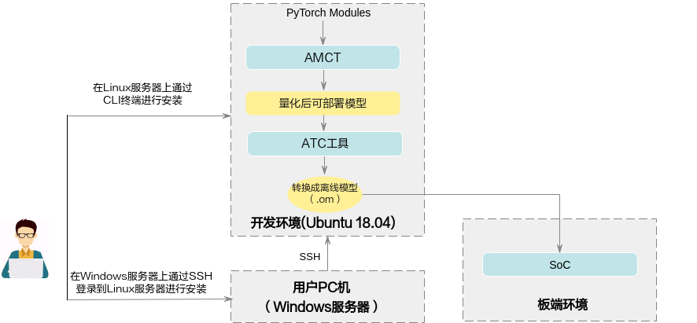
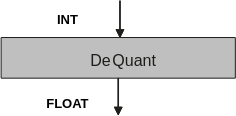
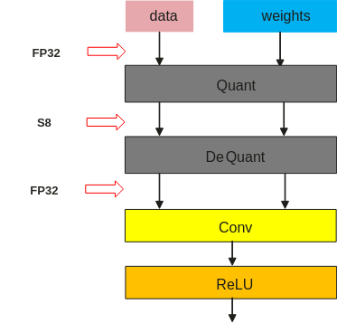
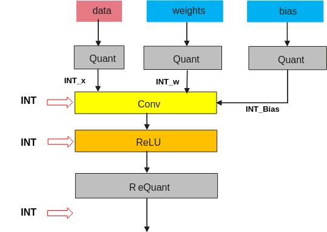
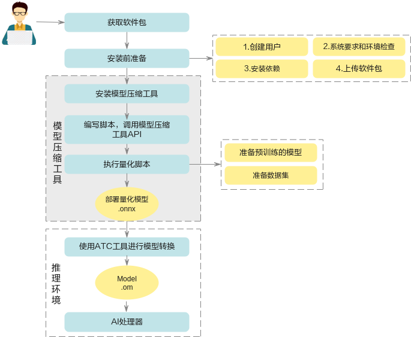

# Preface
**Overview<a name="section5246mcpsimp"></a>**

This document details how to use AMCT to quantize network models of the PyTorch framework.

**Intended Audience<a name="section5249mcpsimp"></a>**

This document is primarily intended for the following engineers:

- Technical support engineers
- Software development engineers

Familiarity with the following experience and skills will help in understanding this document:

- Proficient in basic Linux commands.
- Have a certain understanding of image analysis methods.

**Symbol Conventions<a name="section133020216410"></a>**

The following symbols may appear in this document, with their meanings described below.

<a name="table2622507016410"></a>
<table><thead align="left"><tr id="row1530720816410"><th class="cellrowborder" valign="top" width="20.580000000000002%" id="mcps1.1.3.1.1"><p id="p6450074116410"><a name="p6450074116410"></a><a name="p6450074116410"></a><strong id="b2136615816410"><a name="b2136615816410"></a><a name="b2136615816410"></a>Symbol</strong></p>
</th>
<th class="cellrowborder" valign="top" width="79.42%" id="mcps1.1.3.1.2"><p id="p5435366816410"><a name="p5435366816410"></a><a name="p5435366816410"></a><strong id="b5941558116410"><a name="b5941558116410"></a><a name="b5941558116410"></a>Description</strong></p>
</th>
</tr>
</thead>
<tbody><tr id="row1372280416410"><td class="cellrowborder" valign="top" width="20.580000000000002%" headers="mcps1.1.3.1.1 "><p id="p3734547016410"><a name="p3734547016410"></a><a name="p3734547016410"></a><a name="image2670064316410"></a><a name="image2670064316410"></a><span></span></p>
</td>
<td class="cellrowborder" valign="top" width="79.42%" headers="mcps1.1.3.1.2 "><p id="p1757432116410"><a name="p1757432116410"></a><a name="p1757432116410"></a>Indicates a high-risk hazard which, if not avoided, will result in death or serious injury.</p>
</td>
</tr>
<tr id="row466863216410"><td class="cellrowborder" valign="top" width="20.580000000000002%" headers="mcps1.1.3.1.1 "><p id="p1432579516410"><a name="p1432579516410"></a><a name="p1432579516410"></a><a name="image4895582316410"></a><a name="image4895582316410"></a><span></span></p>
</td>
<td class="cellrowborder" valign="top" width="79.42%" headers="mcps1.1.3.1.2 "><p id="p959197916410"><a name="p959197916410"></a><a name="p959197916410"></a>Indicates a medium-risk hazard which, if not avoided, could result in death or serious injury.</p>
</td>
</tr>
<tr id="row123863216410"><td class="cellrowborder" valign="top" width="20.580000000000002%" headers="mcps1.1.3.1.1 "><p id="p1232579516410"><a name="p1232579516410"></a><a name="p1232579516410"></a><a name="image1235582316410"></a><a name="image1235582316410"></a><span></span></p>
</td>
<td class="cellrowborder" valign="top" width="79.42%" headers="mcps1.1.3.1.2 "><p id="p123197916410"><a name="p123197916410"></a><a name="p123197916410"></a>Indicates a low-risk hazard which, if not avoided, could result in minor or moderate injury.</p>
</td>
</tr>
<tr id="row5786682116410"><td class="cellrowborder" valign="top" width="20.580000000000002%" headers="mcps1.1.3.1.1 "><p id="p2204984716410"><a name="p2204984716410"></a><a name="p2204984716410"></a><a name="image4504446716410"></a><a name="image4504446716410"></a><span></span></p>
</td>
<td class="cellrowborder" valign="top" width="79.42%" headers="mcps1.1.3.1.2 "><p id="p4388861916410"><a name="p4388861916410"></a><a name="p4388861916410"></a>Indicates a caution for device or environmental safety. If not avoided, could result in equipment damage, data loss, performance degradation, or other unpredictable consequences.</p>
<p id="p1238861916410"><a name="p1238861916410"></a><a name="p1238861916410"></a>"Caution" does not involve personal injury.</p>
</td>
</tr>
<tr id="row2856923116410"><td class="cellrowborder" valign="top" width="20.580000000000002%" headers="mcps1.1.3.1.1 "><p id="p5555360116410"><a name="p5555360116410"></a><a name="p5555360116410"></a><a name="image799324016410"></a><a name="image799324016410"></a><span></span></p>
</td>
<td class="cellrowborder" valign="top" width="79.42%" headers="mcps1.1.3.1.2 "><p id="p4612588116410"><a name="p4612588116410"></a><a name="p4612588116410"></a>Supplementary explanation for key information in the main text.</p>
<p id="p1232588116410"><a name="p1232588116410"></a><a name="p1232588116410"></a>"Note" is not a safety warning and does not involve personal injury, equipment, or environmental hazard information.</p>
</td>
</tr>
</tbody>
</table>

**Revision History<a name="section2467512116410"></a>**

<a name="table5652mcpsimp"></a>
<table><thead align="left"><tr id="row5658mcpsimp"><th class="cellrowborder" valign="top" width="21%" id="mcps1.1.4.1.1"><p id="p5660mcpsimp"><a name="p5660mcpsimp"></a><a name="p5660mcpsimp"></a>Document Version</p>
</th>
<th class="cellrowborder" valign="top" width="26%" id="mcps1.1.4.1.2"><p id="p5663mcpsimp"><a name="p5663mcpsimp"></a><a name="p5663mcpsimp"></a>Release Date</p>
</th>
<th class="cellrowborder" valign="top" width="53%" id="mcps1.1.4.1.3"><p id="p5666mcpsimp"><a name="p5666mcpsimp"></a><a name="p5666mcpsimp"></a>Description</p>
</th>
</tr>
</thead>
<tbody><tr id="row5669mcpsimp"><td class="cellrowborder" valign="top" width="21%" headers="mcps1.1.4.1.1 "><p id="p5671mcpsimp"><a name="p5671mcpsimp"></a><a name="p5671mcpsimp"></a>00B01</p>
</td>
<td class="cellrowborder" valign="top" width="26%" headers="mcps1.1.4.1.2 "><p id="p5673mcpsimp"><a name="p5673mcpsimp"></a><a name="p5673mcpsimp"></a>2025-09-15</p>
</td>
<td class="cellrowborder" valign="top" width="53%" headers="mcps1.1.4.1.3 "><p id="p5675mcpsimp"><a name="p5675mcpsimp"></a><a name="p5675mcpsimp"></a>First temporary version release.</p>
</td>
</tr>
</tbody>
</table>

# Overview
## Introduction<a name="ZH-CN_TOPIC_0000002408423214"></a>

This document describes how to use the Advanced Model Compression Toolkit (AMCT) to quantize original network models of the PyTorch framework. Quantization refers to performing low-bit processing on model weights and activations, making the final network model more lightweight, thereby saving model storage space, reducing transmission latency, improving computational efficiency, and achieving performance optimization.

AMCT is a Python toolkit based on the PyTorch framework that implements operator fusion in models and independent quantization of quantizable layers, saving the quantized model as an onnx file. The quantized simulation model can run on CPU or GPU for accuracy simulation. The quantized deploy model can be deployed on the SoC for inference performance improvement. The advantages of this tool are as follows:

- Easy to use with simple interfaces: after pip install, call the APIs on the user's existing PyTorch inference script to complete quantization.
- Hardware-compatible: the generated deploy model can be converted by the ATC tool for hardware inference.
- Configurable quantization: users can modify the quantization configuration file to adjust quantization strategies for better results.
- Custom quantization algorithms.
- Introduces Torch.FX static graph features, supporting direct intermediate result export and model visualization on PyTorch.

The AMCT usage scenario is shown in [Figure 1](#fig530421204511). AMCT currently only supports deployment on Ubuntu 18.04 x86_64 operating systems. See [Environment Preparation](#ZH-CN_TOPIC_0000002408423226) for supporting software information. Models quantized using this tool need to be converted to SoC offline models using the ATC tool before inference.

**Figure 1** Deployment Architecture<a name="fig530421204511"></a>  

## Concept Introduction<a name="ZH-CN_TOPIC_0000002408583046"></a>

Based on the quantization method, it is divided into Post-Training Quantization and Quantization-Aware Training. The above two quantization methods, based on the quantization target, are divided into weight quantization and activation quantization.

The relevant concepts are introduced below:

### Post-Training Quantization<a name="ZH-CN_TOPIC_0000002441982497"></a>

Post-training quantization refers to quantizing weights from float32 to int8 or int4 in a trained model, and calibrating activations during model inference using a small calibration dataset. See [Post-Training Quantization](#ZH-CN_TOPIC_0000002408583082) for the quantization process.

- **Calibration Dataset**

    In the process of determining the quantization factor for activations (calibration process), the network model takes each piece of data from the calibration set as input for forward inference. The quantization algorithm accumulates the corresponding input data for each layer/operator to be quantized, and determines the quantization factor accordingly. Since the determination of quantization factors is related to the choice of the calibration dataset, the accuracy of the quantized model is also related to the choice of the calibration dataset. It is recommended to use a subset of the validation set as the calibration dataset.

- **Activation Quantization**

    Activation quantization involves statistics of the input data for each layer/operator to be quantized. Each layer/operator calculates an optimal set of scale and offset values (see [Quantization Factor Record File Description](#ZH-CN_TOPIC_0000002498353102) for parameter explanations).

    Activations are intermediate results of model inference computation, and their range is related to the model input. Therefore, a set of reference inputs (calibration dataset) is used as stimulus to record the input data of the layers/operators to be quantized, and the quantization factors (scale and offset) are searched for. Since the activation calibration process requires additional storage space (video memory/memory) to store the input data used for determining quantization factors, the memory usage is higher than in inference-only mode. The additional space required is positively correlated with batch\_size * batch\_num in the calibration process. Supports 4-bit, 8-bit, and 16-bit quantization.

- **Weight Quantization**

    The weights of the trained model are already determined, and their value range is also determined. Therefore, quantization is performed directly based on the value range of the weights. Supports 4-bit and 8-bit quantization.

- **Dequantization**

    Dequantization refers to the process of converting weights/activations/calibration dataset/bias from quantized int back to float, as shown in [Figure 1](#fig12771415124116).

    **Figure 1** Dequantization Diagram<a name="fig12771415124116"></a>  
    
- **Fake Quantization**

    Fake quantization is mainly used to simulate quantization errors during training and inference. It can simulate errors through a quantize-dequantize mechanism while keeping most floating-point training frameworks unchanged.

    For example, activations and weights are converted from float32 to int8, then converted back to float32 through a dequantization process, as shown in [Figure 2](#fig8680173722710). The combination of quantization and dequantization processes constitutes fake quantization.

    **Figure 2** Fake Quantization Diagram<a name="fig8680173722710"></a>  
    
- **True Quantization**

    True quantization can simulate the errors of the hardware target device. As shown in [Figure 3](#fig12679247202216), weights/activations/bias are quantized to int type, then multiplication and addition operations are performed, followed by requantization from floating-point to fixed-point. This computation process is called true quantization.

    **Figure 3** True Quantization Diagram<a name="fig12679247202216"></a>  
    
### Quantization-Aware Training<a name="ZH-CN_TOPIC_0000002408423234"></a>

Quantization-aware training refers to introducing quantization operations during the training process using the user's complete training dataset. By quantizing and dequantizing activations and weights during forward computation in training, quantization error loss is introduced, thereby improving the model's adaptability to quantization effects during training and improving the accuracy of the final quantized model.

The disadvantage of quantization-aware training is that it is time-consuming and requires large amounts of data. See [Quantization-Aware Training](#ZH-CN_TOPIC_0000002408423162) for the quantization process.

- **Training Dataset**

    Based on the dataset in the user's training network.

- **Activation Quantization**

    Activation quantization iteratively trains the truncation maximum and truncation minimum values, and calculates the current scale and offset from these two values. Activations are intermediate results of model inference computation. Through the activation quantization algorithm, these two parameters are continuously optimized during quantization-aware training to obtain the final optimal parameters.

- **Weight Quantization**

    Weight quantization refers to continuously optimizing the weight quantization parameters during quantization-aware training through the weight quantization algorithm to obtain the final weight quantization parameters.

For quantization training, see [Table 1](#ZH-CN_TOPIC_0000002498353100) for the supported quantization layers and constraints.

## Running Process<a name="ZH-CN_TOPIC_0000002441982513"></a>

The specific running process is shown in [Figure 1](#fig47396592320). Since the final deploy model is a .onnx model, the original model to be converted must be convertible to onnx.

**Figure 1** Running Process<a name="fig47396592320"></a>  


**Table 1** Key Operation Steps in the Running Process

<a name="table462mcpsimp"></a>
<table><thead align="left"><tr id="row468mcpsimp"><th class="cellrowborder" valign="top" width="20%" id="mcps1.2.3.1.1"><p id="p470mcpsimp"><a name="p470mcpsimp"></a><a name="p470mcpsimp"></a>Key Step</p>
</th>
<th class="cellrowborder" valign="top" width="80%" id="mcps1.2.3.1.2"><p id="p472mcpsimp"><a name="p472mcpsimp"></a><a name="p472mcpsimp"></a>Description</p>
</th>
</tr>
</thead>
<tbody><tr id="row474mcpsimp"><td class="cellrowborder" valign="top" width="20%" headers="mcps1.2.3.1.1 "><p id="p476mcpsimp"><a name="p476mcpsimp"></a><a name="p476mcpsimp"></a>Obtain the Software Package</p>
</td>
<td class="cellrowborder" valign="top" width="80%" headers="mcps1.2.3.1.2 "><p id="p478mcpsimp"><a name="p478mcpsimp"></a><a name="p478mcpsimp"></a>Obtain the corresponding software package before installation. For details, see <a href="#ZH-CN_TOPIC_0000002442022305">Obtain the Software Package</a>.</p>
</td>
</tr>
<tr id="row480mcpsimp"><td class="cellrowborder" valign="top" width="20%" headers="mcps1.2.3.1.1 "><p id="p482mcpsimp"><a name="p482mcpsimp"></a><a name="p482mcpsimp"></a>Pre-installation Preparation</p>
</td>
<td class="cellrowborder" valign="top" width="80%" headers="mcps1.2.3.1.2 "><p id="p484mcpsimp"><a name="p484mcpsimp"></a><a name="p484mcpsimp"></a>Before installing AMCT, a series of actions are required, including creating the AMCT installation user, checking system environment requirements, installing dependencies, and uploading the software package. For detailed operations, see <a href="#ZH-CN_TOPIC_0000002408423134">Pre-installation Preparation</a>.</p>
</td>
</tr>
<tr id="row486mcpsimp"><td class="cellrowborder" valign="top" width="20%" headers="mcps1.2.3.1.1 "><p id="p488mcpsimp"><a name="p488mcpsimp"></a><a name="p488mcpsimp"></a>Installation</p>
</td>
<td class="cellrowborder" valign="top" width="80%" headers="mcps1.2.3.1.2 "><p id="p490mcpsimp"><a name="p490mcpsimp"></a><a name="p490mcpsimp"></a>See <a href="#ZH-CN_TOPIC_0000002408423186">Installation</a> to install AMCT for the PyTorch framework.</p>
</td>
</tr>
<tr id="row492mcpsimp"><td class="cellrowborder" valign="top" width="20%" headers="mcps1.2.3.1.1 "><p id="p494mcpsimp"><a name="p494mcpsimp"></a><a name="p494mcpsimp"></a>(Optional) Write Scripts and Call AMCT APIs</p>
</td>
<td class="cellrowborder" valign="top" width="80%" headers="mcps1.2.3.1.2 "><p id="p496mcpsimp"><a name="p496mcpsimp"></a><a name="p496mcpsimp"></a>If users need to quantize their own network models and do not use the sample provided in this manual, they need to modify the quantization script for adaptation before quantization.</p>
</td>
</tr>
<tr id="row497mcpsimp"><td class="cellrowborder" valign="top" width="20%" headers="mcps1.2.3.1.1 "><p id="p499mcpsimp"><a name="p499mcpsimp"></a><a name="p499mcpsimp"></a>Execute Quantization</p>
</td>
<td class="cellrowborder" valign="top" width="80%" headers="mcps1.2.3.1.2 "><p id="p501mcpsimp"><a name="p501mcpsimp"></a><a name="p501mcpsimp"></a>Based on the quantization method, it is divided into post-training quantization and quantization-aware training. For detailed quantization steps, see <a href="#ZH-CN_TOPIC_0000002442022273">Post-Training Quantization</a> and <a href="#ZH-CN_TOPIC_0000002442022353">Quantization-Aware Training</a>.</p>
</td>
</tr>
<tr id="row504mcpsimp"><td class="cellrowborder" valign="top" width="20%" headers="mcps1.2.3.1.1 "><p id="p506mcpsimp"><a name="p506mcpsimp"></a><a name="p506mcpsimp"></a>Model Conversion Using MindStudio or MindCmd Tool</p>
</td>
<td class="cellrowborder" valign="top" width="80%" headers="mcps1.2.3.1.2 "><p id="p508mcpsimp"><a name="p508mcpsimp"></a><a name="p508mcpsimp"></a>Users convert the quantized deploy model to an SoC offline model using the MindStudio or MindCmd tool. For details, refer to the corresponding user guide, then use the model for inference.</p>
</td>
</tr>
</tbody>
</table>

# Tool Installation
## Install AMCT<a name="ZH-CN_TOPIC_0000002441982537"></a>

### Obtain the Software Package<a name="ZH-CN_TOPIC_0000002442022305"></a>

AMCT only supports installation on Ubuntu 18.04 x86\_64 servers. Before installation, obtain the AMCT software package: amct\_pytorch

### Pre-installation Preparation<a name="ZH-CN_TOPIC_0000002408423134"></a>

#### Ubuntu x86 System<a name="ZH-CN_TOPIC_0000002408423150"></a>

##### AMCT User Preparation (Optional)<a name="ZH-CN_TOPIC_0000002441982481"></a>

Any user (root or non-root) can install AMCT. This section uses a non-root user as an example.

- If using the root user for installation, this section is not needed and no settings are required for the root user.
- If using an existing non-root user for installation, ensure the user has read, write, and execute permissions on the $HOME directory.
- If using a new non-root user for installation, refer to the following steps to create one. The following operations should be performed as the root user. This manual uses this scenario as an example for AMCT installation.
    1.  Run the following command to create the AMCT installation user and set the $HOME directory for that user:

        ```
        useradd -d /home/username -m username
        ```

    1.  Run the following command to set the password:

        ```
        passwd username
        ```

> **Note:** 
>username is the username for installing AMCT. The umask value of this user must not be less than 0027:
>-   To check the umask value, run the command: **umask**
>-   To modify the umask value, run the command: **umask  _new_value_**

##### Configure AMCT Installation User Permissions (Optional)<a name="ZH-CN_TOPIC_0000002441982477"></a>

This section is required when a non-root user performs the installation. Otherwise, ignore it.

Before installing AMCT, related dependency software needs to be downloaded. Downloading dependency software requires **sudo apt-get** permissions. Perform the following operations as the root user.

1.  Open the "/etc/sudoers" file:

    ```
    chmod u+w /etc/sudoers
    vi /etc/sudoers
    ```

2.  Add the following content under the "# User privilege specification" line in the file:

    ```
    username ALL=(ALL:ALL)   NOPASSWD:SETENV:/usr/bin/apt-get,/usr/bin/pip, /bin/tar, /bin/mkdir, /bin/sh, /bin/bash, /usr/bin/make, /usr/bin/pip3, /usr/bin/pip3.7, /usr/bin/pip3.7.5, /bin/ln
    ```

    "username" is the non-root username executing the installation script.

    > **Note:** 
    >Ensure that the last line of "/etc/sudoers" is "#includedir /etc/sudoers.d". If this information is not present, add it manually.

3.  After adding, execute :wq! to save the file.
4.  Run the following command to remove the write permission from the "/etc/sudoers" file:

    ```
    chmod u-w /etc/sudoers
    ```

##### Environment Preparation<a name="ZH-CN_TOPIC_0000002408423226"></a>

AMCT currently only supports installation on Ubuntu 18.04 x86\_64 operating systems. The supporting software information is shown in [Table 1](#table558mcpsimp).

**Table 1** Ubuntu X86\_64 Architecture Supporting Version Information

[Supporting version table with categories for OS (Ubuntu 18.04 64-bit), Python (3.7.5), PyTorch (1.10.0/1.12.1/1.13.0), CUDA toolkit/driver (10.1/11.3), and onnx (1.12.0) with version restrictions, acquisition methods, and notes.]

##### Check the Source List<a name="ZH-CN_TOPIC_0000002442022369"></a>

When installing dependencies, ensure the server where AMCT is located can connect to the network. Run the following command as the root user to check if the source list is available:

```
apt-get update
```

If the command fails, check if the network is connected or replace the source in "/etc/apt/sources.list" with an available source.

##### Install Dependencies<a name="ZH-CN_TOPIC_0000002442022337"></a>

Users need to install the following plugins. If the installing user is non-root, use the su - username command to switch to the non-root user and execute the following commands.

###### AMCT dependencies (numpy, protobuf, torch, torchvision, onnx, onnxruntime)
###### Classification network dependencies (opencv-python, scikit-image, Pillow, wget)
###### Detection network dependencies (2to3, Cython, matplotlib, easydict, PyYAML, Pillow, pycocotools)

##### Upload the Software Package<a name="ZH-CN_TOPIC_0000002442022285"></a>

The AMCT installation user uploads the **amct\_pytorch** software package to any directory on the Linux server.

### Installation<a name="ZH-CN_TOPIC_0000002408423186"></a>

1.  In the directory where the AMCT software package is located, run the following command to install:

    ```
    pip3.7.5 install amct_pytorch-{version}-py3-none-linux_{arch}.whl --user
    ```

2.  If the following information appears, the tool has been installed successfully:

    ```
    Successfully installed amct-pytorch-{version}
    ```

### Log Level Control<a name="ZH-CN_TOPIC_0000002408583110"></a>

Set the log printing level, including logs printed on the screen and saved in the log file. These environment variables are optional. If not set, the default log level is INFO.

- **Variable Values**: AMCT\_LOG\_FILE\_LEVEL (file log level) and AMCT\_LOG\_LEVEL (screen output level)
- **Valid Values**: DEBUG, INFO, WARNING, ERROR

## Update AMCT<a name="ZH-CN_TOPIC_0000002441982453"></a>

Steps to update the AMCT tool to a newer version.

## Uninstall AMCT<a name="ZH-CN_TOPIC_0000002442022281"></a>

Steps to uninstall AMCT from the system.

# Quantization
## Post-Training Quantization<a name="ZH-CN_TOPIC_0000002442022273"></a>

### Implementation Principle<a name="ZH-CN_TOPIC_0000002442022365"></a>

The AMCT post-training quantization principle involves: creating a quantization configuration, parsing the model, inserting quantization operators, performing calibration inference to determine quantization factors, and saving the quantized deploy and simulation models.

### Quantization Example<a name="ZH-CN_TOPIC_0000002408423198"></a>

#### Quantization Prerequisites<a name="ZH-CN_TOPIC_0000002408583154"></a>

##### Model Preparation<a name="ZH-CN_TOPIC_0000002408583126"></a>

The AMCT installation user uploads the PyTorch model file to be quantized to any directory on the Linux server.

##### Dataset Preparation<a name="ZH-CN_TOPIC_0000002442022317"></a>

Upload the dataset matching the model for inference accuracy testing.

##### Calibration Set Preparation<a name="ZH-CN_TOPIC_0000002408583094"></a>

Prepare a calibration set used for generating quantization factors. It is recommended to use a subset of the validation set.

#### Quantization Steps<a name="ZH-CN_TOPIC_0000002442022349"></a>

1. Create the quantization configuration file using create\_quant\_config.
2. Call quantize\_model to insert quantization operations into the model.
3. Perform calibration inference to collect activation statistics.
4. Call save\_model to save the quantized deploy model (onnx) and simulation model.
5. (Optional) Test the accuracy of the quantized simulation model.

[Detailed API usage, parameter descriptions, and code examples are provided in the source document for each step.]

### Quantization Tuning<a name="ZH-CN_TOPIC_0000002441982525"></a>

#### Parameter Configuration Description<a name="ZH-CN_TOPIC_0000002408583150"></a>

Detailed parameter tables for the post-training quantization configuration file, including:
- version, batch\_num, activation\_offset
- Layer-specific configurations: quant\_enable, activation\_quant\_params, weight\_quant\_params
- Algorithm selection: ifmr\_quantize, arq\_quantize, luq\_quantize, etc.

#### Parameter Tuning Description<a name="ZH-CN_TOPIC_0000002408583070"></a>

Guidance on tuning quantization parameters for optimal accuracy.

## Quantization-Aware Training<a name="ZH-CN_TOPIC_0000002442022353"></a>

### Implementation Principle<a name="ZH-CN_TOPIC_0000002441982529"></a>

Quantization-aware training introduces quantization operations during the training process, using the complete training dataset to optimize quantization parameters through backpropagation.

### Quantization Example<a name="ZH-CN_TOPIC_0000002442022313"></a>

#### Quantization Prerequisites<a name="ZH-CN_TOPIC_0000002408583078"></a>

Prepare the PyTorch model, training dataset, and validation dataset.

#### Quantization Steps<a name="ZH-CN_TOPIC_0000002408423170"></a>

1. Create the retrain quantization configuration file.
2. Call create\_quant\_retrain\_model to build the quantized retrain model.
3. Perform retraining with the training dataset.
4. Call save\_quant\_retrain\_model to save the deploy and simulation models.

### Quantization Tuning<a name="ZH-CN_TOPIC_0000002441982493"></a>

#### Parameter Configuration Description<a name="ZH-CN_TOPIC_0000002441982533"></a>

Detailed parameter tables for the retrain quantization configuration.

#### Parameter Tuning Description<a name="ZH-CN_TOPIC_0000002441982465"></a>

Tuning guidance for quantization-aware training parameters.

## Quantization Algorithms<a name="ZH-CN_TOPIC_0000002441982461"></a>

### Observer Algorithms<a name="ZH-CN_TOPIC_0000002442022321"></a>

#### IFMRObserver<a name="ZH-CN_TOPIC_0000002442022309"></a>

The IFMR (Interface Min Max Rising) observer algorithm for activation quantization.

#### ArqObserver<a name="ZH-CN_TOPIC_0000002441982469"></a>

The ARQ (Auto-Regressive Quantization) observer algorithm for weight quantization.

#### LuqMseObserver<a name="ZH-CN_TOPIC_0000002408423230"></a>

The LUQ (Learned Quantization) MSE observer algorithm.

#### SnqObserver<a name="ZH-CN_TOPIC_0000002441982489"></a>

The SNQ (Sparse Non-uniform Quantization) observer algorithm.

### Fakequant Algorithms<a name="ZH-CN_TOPIC_0000002408423142"></a>

#### ARQ Weight Quantization Algorithm<a name="ZH-CN_TOPIC_0000002441982509"></a>

#### ULQ Activation Quantization Algorithm<a name="ZH-CN_TOPIC_0000002408583122"></a>

#### LUQ Quantization Algorithm<a name="ZH-CN_TOPIC_0000002442022357"></a>

#### LNQ Weight Quantization Algorithm<a name="ZH-CN_TOPIC_0000002441982449"></a>

#### Fixed Quantization Algorithm<a name="ZH-CN_TOPIC_0000002408423174"></a>

### Custom Quantization Algorithm<a name="ZH-CN_TOPIC_0000002408583058"></a>

Describes how users can implement custom quantization algorithms.

## Fusion Functions Implemented by the Tool<a name="ZH-CN_TOPIC_0000002408583106"></a>

Describes the operator fusion functions (e.g., Conv+BN fusion) implemented in the PyTorch AMCT.

# Transformer Acceleration
## Introduction<a name="ZH-CN_TOPIC_0000002530273011"></a>

Transformer acceleration support in AMCT.

## amct.nn.modules<a name="ZH-CN_TOPIC_0000002530113047"></a>

Custom modules for Transformer acceleration.

# API Reference
## create\_quant\_config\_fx<a name="ZH-CN_TOPIC_0000002441982485"></a>

Creates a quantization configuration file using the Torch.FX static graph feature.

## create\_quant\_model\_fx<a name="ZH-CN_TOPIC_0000002442022289"></a>

Creates a quantized model using the Torch.FX static graph feature.

## save\_quant\_model\_fx<a name="ZH-CN_TOPIC_0000002408583062"></a>

Saves the quantized model created via Torch.FX.

## enable\_quantization<a name="ZH-CN_TOPIC_0000002441982521"></a>

Enables quantization for a model or module.

## enable\_dump<a name="ZH-CN_TOPIC_0000002441982505"></a>

Enables dumping of intermediate results for debugging.

## restore\_quant\_model\_fx<a name="ZH-CN_TOPIC_0000002441982501"></a>

Restores a previously saved quantized model.

# Static Graph Quantization Limitations
## Unsupported torch Automatic Mixed Precision Mode<a name="ZH-CN_TOPIC_0000002408583142"></a>
## Unsupported Dynamic Control Flow<a name="ZH-CN_TOPIC_0000002408583102"></a>

# Dynamic Graph Version Description
## API Reference<a name="ZH-CN_TOPIC_0000002408423202"></a>

### Post-Training Quantization<a name="ZH-CN_TOPIC_0000002408583082"></a>

#### create\_quant\_config<a name="ZH-CN_TOPIC_0000002442022345"></a>

Creates a quantization configuration file for the dynamic graph version.

#### quantize\_model<a name="ZH-CN_TOPIC_0000002408423206"></a>

Inserts quantization operations into the dynamic graph model.

#### save\_model<a name="ZH-CN_TOPIC_0000002408423154"></a>

Saves the quantized dynamic graph model.

#### update\_bn\_status<a name="ZH-CN_TOPIC_0000002408583086"></a>

Updates the BN layer status for quantization.

### Quantization-Aware Training<a name="ZH-CN_TOPIC_0000002408423162"></a>

#### create\_quant\_retrain\_config<a name="ZH-CN_TOPIC_0000002441982441"></a>

#### create\_quant\_retrain\_model<a name="ZH-CN_TOPIC_0000002408583146"></a>

#### restore\_quant\_retrain\_model<a name="ZH-CN_TOPIC_0000002442022293"></a>

#### save\_quant\_retrain\_model<a name="ZH-CN_TOPIC_0000002442022341"></a>

## Dynamic Graph Version FAQ<a name="ZH-CN_TOPIC_0000002408583114"></a>

### AMCT PyTorch Quantization Constraints<a name="ZH-CN_TOPIC_0000002442022297"></a>
### How to Adapt Extension Layers<a name="ZH-CN_TOPIC_0000002442022277"></a>
### Repeatedly Used Layers Must Be Defined Multiple Times in Retrain Scenarios<a name="ZH-CN_TOPIC_0000002408423210"></a>
### Replace chunk Operator with split Operator<a name="ZH-CN_TOPIC_0000002408583098"></a>

## Extending Single-Input Single-Output Module Quantization<a name="ZH-CN_TOPIC_0000002442022329"></a>

## Dynamic Graph Appendix<a name="ZH-CN_TOPIC_0000002408583074"></a>

### Post-Training Quantization Simple Configuration File Description<a name="ZH-CN_TOPIC_0000002408583118"></a>

### Quantization-Aware Training Simple Configuration File Description<a name="ZH-CN_TOPIC_0000002441982457"></a>

# FAQ
## fx.symbolic\_trace Exception Scenarios Summary<a name="ZH-CN_TOPIC_0000002498513066"></a>

### torch.fx Does Not Support Dynamic Control Flow<a name="ZH-CN_TOPIC_0000002530273013"></a>
### Tracer Using Custom Classes for Tracing<a name="ZH-CN_TOPIC_0000002530113049"></a>
### Non-torch Functions Cannot Be Traced<a name="ZH-CN_TOPIC_0000002498353086"></a>
### Tensor Constructors Cannot Be Traced<a name="ZH-CN_TOPIC_0000002498513068"></a>
### tensor.dtype Type Conversion Functions Cannot Be Traced<a name="ZH-CN_TOPIC_0000002530273015"></a>
### assert Functions Cannot Be Traced<a name="ZH-CN_TOPIC_0000002530113051"></a>
### Data Assignment by Index or Slice Cannot Be Traced<a name="ZH-CN_TOPIC_0000002498353088"></a>
### proxy Objects Cannot Be Iterated<a name="ZH-CN_TOPIC_0000002498513070"></a>
### Variable Types in fx Models Cannot Be Determined<a name="ZH-CN_TOPIC_0000002530273017"></a>
### Static Control Flow Variables<a name="ZH-CN_TOPIC_0000002530113053"></a>
### proxy Objects Cannot Be Deep-copied<a name="ZH-CN_TOPIC_0000002498353090"></a>

## How to Skip Entire Module Quantization (e.g., Post-processing)<a name="ZH-CN_TOPIC_0000002498513072"></a>
## How to Debug Static Graph Model Issues<a name="ZH-CN_TOPIC_0000002530273019"></a>
## Dynamically Obtained Parameters in the forward Method<a name="ZH-CN_TOPIC_0000002530113055"></a>
## pip install Fails to Install torch Package<a name="ZH-CN_TOPIC_0000002498353092"></a>
## onnx Operator Splitting Scenario Description<a name="ZH-CN_TOPIC_0000002498513074"></a>
## Error When Installing python3-tk<a name="ZH-CN_TOPIC_0000002530273021"></a>
## Linear Quantization Not Supported for Inputs with More Than 2 Dimensions and bias=True<a name="ZH-CN_TOPIC_0000002530113057"></a>
## Offline Convolution Quantization Error When Converting to om<a name="ZH-CN_TOPIC_0000002498353094"></a>
## Avoid Useless Operations in PyTorch Model Scripts That Cause Accuracy Drop<a name="ZH-CN_TOPIC_0000002498513076"></a>
## Sibling Node Quantization Coefficient Mismatch Causing ATC Error<a name="ZH-CN_TOPIC_0000002530273023"></a>
## Cannot Find dot File<a name="ZH-CN_TOPIC_0000002530113061"></a>
## ModuleNotFoundError: No module named 'wheel' or No module named 'torch'<a name="ZH-CN_TOPIC_0000002498353096"></a>
## libcudart.so.\*: cannot open shared object file: No such file or directory<a name="ZH-CN_TOPIC_0000002498513080"></a>
## MatMul Second Input Wide Value Range Causing Accuracy Drop<a name="ZH-CN_TOPIC_0000002530273025"></a>

# Appendix
## Supported Quantization Operator List<a name="ZH-CN_TOPIC_0000002498353100"></a>

Lists all operators supported for quantization in the PyTorch framework, organized by operator type with detailed constraints and notes.

## Static Graph Simple Quantization Configuration Function Description<a name="ZH-CN_TOPIC_0000002498513082"></a>

Describes the simple configuration file format for static graph quantization, including global parameters, layer-specific overrides, and type-specific overrides.

## Cube Only Quantization<a name="ZH-CN_TOPIC_0000002530273027"></a>

Description of cube-only quantization mode.

## Error Analysis Feature Usage Introduction<a name="ZH-CN_TOPIC_0000002530113065"></a>

Describes how to use the error analysis feature for diagnosing quantization accuracy loss.

## Quantization Factor Record File Description<a name="ZH-CN_TOPIC_0000002498353102"></a>

### Quantization Factor Record File Format Description<a name="ZH-CN_TOPIC_0000002498513084"></a>

### Quantization Factor Description<a name="ZH-CN_TOPIC_0000002530273029"></a>

## Install Python 3.7.5 (Ubuntu)<a name="ZH-CN_TOPIC_0000002530113067"></a>

Step-by-step guide for installing Python 3.7.5 on Ubuntu 18.04.

## Dot Graph Visualization<a name="ZH-CN_TOPIC_0000002498353104"></a>

Describes how to visualize the model graph using dot format.
