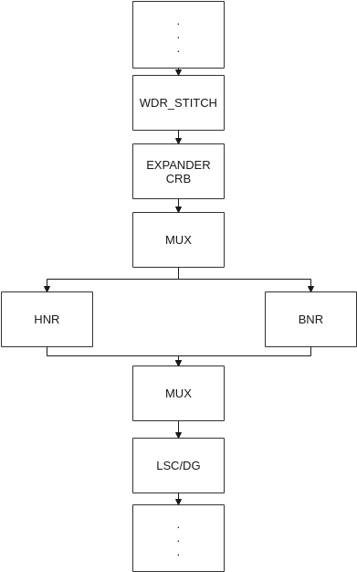
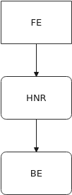
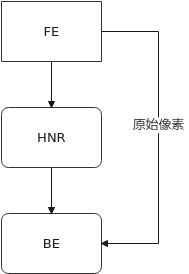
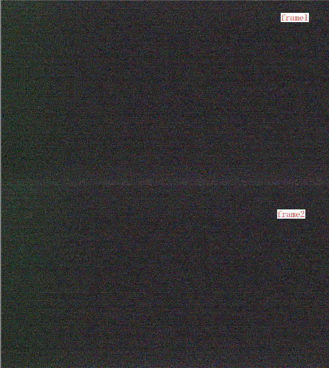
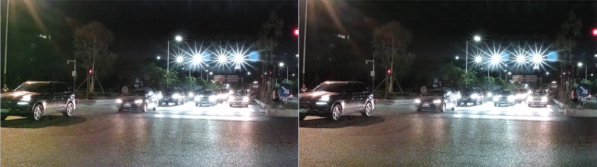

# Preface
**Overview**

This guide is written for image quality engineers using HNR. It provides solutions and assistance for issues encountered during development.

> **Note:** 
>This document uses SS928V100 as the reference. Unless otherwise stated, SS927V100 and SS928V100 are identical.

**Product Versions**

The product versions corresponding to this document are listed below.

<table><thead align="left"><tr id="row474mcpsimp"><th class="cellrowborder" valign="top" width="32%" id="mcps1.1.3.1.1">
Product Name

</th>
<th class="cellrowborder" valign="top" width="68%" id="mcps1.1.3.1.2">
Product Version

</th>
</tr>
</thead>
<tbody><tr id="row480mcpsimp"><td class="cellrowborder" valign="top" width="32%" headers="mcps1.1.3.1.1 ">
SS928

</td>
<td class="cellrowborder" valign="top" width="68%" headers="mcps1.1.3.1.2 ">
V100

</td>
</tr>
<tr id="row12306122581311"><td class="cellrowborder" valign="top" width="32%" headers="mcps1.1.3.1.1 ">
SS927

</td>
<td class="cellrowborder" valign="top" width="68%" headers="mcps1.1.3.1.2 ">
V100

</td>
</tr>
</tbody>
</table>

**Intended Audience**

This document is primarily intended for:

-   Technical support engineers
-   Image quality development engineers

**Symbol Conventions**

The following symbols may appear in this document with the meanings described below.

<table><thead align="left"><tr id="row499mcpsimp"><th class="cellrowborder" valign="top" width="18%" id="mcps1.1.3.1.1">
Symbol

</th>
<th class="cellrowborder" valign="top" width="82%" id="mcps1.1.3.1.2">
Description

</th>
</tr>
</thead>
<tbody><tr id="row505mcpsimp"><td class="cellrowborder" valign="top" width="18%" headers="mcps1.1.3.1.1 ">

</td>
<td class="cellrowborder" valign="top" width="82%" headers="mcps1.1.3.1.2 ">
Indicates a high-risk hazard that, if not avoided, will result in death or serious injury.

</td>
</tr>
<tr id="row510mcpsimp"><td class="cellrowborder" valign="top" width="18%" headers="mcps1.1.3.1.1 ">

</td>
<td class="cellrowborder" valign="top" width="82%" headers="mcps1.1.3.1.2 ">
Indicates a medium-risk hazard that, if not avoided, could result in death or serious injury.

</td>
</tr>
<tr id="row515mcpsimp"><td class="cellrowborder" valign="top" width="18%" headers="mcps1.1.3.1.1 ">

</td>
<td class="cellrowborder" valign="top" width="82%" headers="mcps1.1.3.1.2 ">
Indicates a low-risk hazard that, if not avoided, could result in minor or moderate injury.

</td>
</tr>
<tr id="row520mcpsimp"><td class="cellrowborder" valign="top" width="18%" headers="mcps1.1.3.1.1 ">

</td>
<td class="cellrowborder" valign="top" width="82%" headers="mcps1.1.3.1.2 ">
Conveys device or environmental safety warnings. Failure to follow this guidance may result in equipment damage, data loss, performance degradation, or other unpredictable outcomes.

"Notice" does not involve personal injury.

</td>
</tr>
<tr id="row526mcpsimp"><td class="cellrowborder" valign="top" width="18%" headers="mcps1.1.3.1.1 ">

</td>
<td class="cellrowborder" valign="top" width="82%" headers="mcps1.1.3.1.2 ">
Provides supplementary information for key content in the text.

"Note" is not a safety warning and does not involve personal, equipment, or environmental hazards.

</td>
</tr>
</tbody>
</table>

**Revision History**

The revision history accumulates descriptions of each document update. The latest version of this document incorporates all updates from previous versions.

<table><thead align="left"><tr id="row264516207203"><th class="cellrowborder" valign="top" width="20.72%" id="mcps1.1.4.1.1">
<strong id="b8645172022010">Document Version</strong>

</th>
<th class="cellrowborder" valign="top" width="26.119999999999997%" id="mcps1.1.4.1.2">
<strong id="b1464512200200">Release Date</strong>

</th>
<th class="cellrowborder" valign="top" width="53.16%" id="mcps1.1.4.1.3">
<strong id="b156451420152010">Change Description</strong>

</th>
</tr>
</thead>
<tbody><tr id="row56451520182017"><td class="cellrowborder" valign="top" width="20.72%" headers="mcps1.1.4.1.1 ">
00B01

</td>
<td class="cellrowborder" valign="top" width="26.119999999999997%" headers="mcps1.1.4.1.2 ">
2025-09-15

</td>
<td class="cellrowborder" valign="top" width="53.16%" headers="mcps1.1.4.1.3 ">
First preliminary release.

</td>
</tr>
</tbody>
</table>

# Overview
## Overview

HNR (Hypersensitive Noise Reduction) is a novel noise reduction algorithm that enables imaging devices to produce cleaner images with better detail retention at very low light levels, thereby improving the low-light sensitivity of imaging devices. This document describes the HNR tuning method and key considerations.

## Applicable Scenarios

Key characteristics of HNR:

-   At high ISO, HNR provides strong noise reduction while preserving strong edges. The primary recommended scenario is to use HNR at medium to high ISO.
-   At low ISO, BNR offers better preservation of fine texture detail than HNR. The primary recommended scenario is to use BNR at low ISO.

## HNR Data Flow Diagram

**Figure 1** HNR advance mode data flow diagram  

In advance mode, HNR is positioned in the ISP pipeline in parallel with BNR, sharing the same input. The outputs are blended through a MUX module, with the blending ratio configurable via parameters.

**Figure 2** HNR normal mode data flow diagram  

In normal mode with `normal_blend` set to false, HNR is positioned between FE and BE in the ISP pipeline. There is no blending operation between HNR and BNR; they are completely independent modules.

**Figure 3** HNR normal_blend mode data flow  

In normal mode with `normal_blend` set to true, the data path retrieves a raw frame from FE and delivers it to BE, enabling blending of HNR and BNR. The blending tuning parameters in this mode are the same as in advance mode.

-   The differences in data paths across modes lead to differences in functionality and image quality.

    **Table 1** DPC, CrossTalk, and FPN behavior differences across HNR modes

    
    <table><thead align="left"><tr id="row427640181815"><th class="cellrowborder" rowspan="2" valign="top" id="mcps1.2.5.1.1">
isp algorithm

    </th>
    <th class="cellrowborder" rowspan="2" valign="top" id="mcps1.2.5.1.2">
advance

    </th>
    <th class="cellrowborder" colspan="2" valign="top" id="mcps1.2.5.1.3">
normal

    </th>
    </tr>
    <tr id="row7174828102411"><th class="cellrowborder" valign="top" id="mcps1.2.5.2.1">
normal_blend off

    </th>
    <th class="cellrowborder" valign="top" id="mcps1.2.5.2.2">
normal_blend on

    </th>
    </tr>
    </thead>
    <tbody><tr id="row102754011811"><td class="cellrowborder" valign="top" width="12.6%" headers="mcps1.2.5.1.1 mcps1.2.5.2.1 ">
DPC

    </td>
    <td class="cellrowborder" valign="top" width="29.32%" headers="mcps1.2.5.1.2 mcps1.2.5.2.2 ">
DPC is before HNR and must be disabled.

    </td>
    <td class="cellrowborder" valign="top" width="27.26%" headers="mcps1.2.5.1.3 ">
DPC is after HNR and can be enabled or disabled as needed.

    </td>
    <td class="cellrowborder" valign="top" width="30.819999999999997%" headers="mcps1.2.5.1.3 ">
DPC is after HNR and can be enabled or disabled as needed. It can help reduce the increased dead pixel count that occurs when advance mode blends HNR with BNR temporal processing.

    </td>
    </tr>
    <tr id="row82764061816"><td class="cellrowborder" valign="top" width="12.6%" headers="mcps1.2.5.1.1 mcps1.2.5.2.1 ">
CrossTalk

    </td>
    <td class="cellrowborder" valign="top" width="29.32%" headers="mcps1.2.5.1.2 mcps1.2.5.2.2 ">
CrossTalk is before HNR and must be disabled.

    </td>
    <td class="cellrowborder" valign="top" width="27.26%" headers="mcps1.2.5.1.3 ">
CrossTalk is after HNR and can be enabled or disabled as needed.

    </td>
    <td class="cellrowborder" valign="top" width="30.819999999999997%" headers="mcps1.2.5.1.3 ">
CrossTalk is after HNR and can be enabled or disabled as needed.

    </td>
    </tr>
    <tr id="row19281406181"><td class="cellrowborder" valign="top" width="12.6%" headers="mcps1.2.5.1.1 mcps1.2.5.2.1 ">
FPN

    </td>
    <td class="cellrowborder" valign="top" width="29.32%" headers="mcps1.2.5.1.2 mcps1.2.5.2.2 ">
FPN takes effect before HNR; calibration using raw original data is recommended.

    </td>
    <td class="cellrowborder" valign="top" width="27.26%" headers="mcps1.2.5.1.3 ">
FPN takes effect after HNR; calibration using HNR-processed raw data is recommended.

    </td>
    <td class="cellrowborder" valign="top" width="30.819999999999997%" headers="mcps1.2.5.1.3 ">
When HNR and BNR temporal results are blended, the HNR path FPN is inactive. Enabling FPN is therefore not recommended.

    </td>
    </tr>
    </tbody>
    </table>

-   In advance mode and normal mode with `normal_blend` enabled, HNR and BNR can perform temporal blending. With `normal_blend` disabled, HNR and BNR are fully independent with no blending relationship. This difference leads to different tuning approaches when switching scenes.

# Key Parameters
## HNR Parameters

For detailed parameter descriptions, refer to the *HNR Developer Reference*.

**Table 1** HNR image quality parameters

<table><thead align="left"><tr id="row238mcpsimp"><th class="cellrowborder" valign="top" width="23%" id="mcps1.2.3.1.1">
Parameter

</th>
<th class="cellrowborder" valign="top" width="77%" id="mcps1.2.3.1.2">
Description

</th>
</tr>
</thead>
<tbody><tr id="row244mcpsimp"><td class="cellrowborder" valign="top" width="23%" headers="mcps1.2.3.1.1 ">
enable

</td>
<td class="cellrowborder" valign="top" width="77%" headers="mcps1.2.3.1.2 ">
HNR algorithm enable.

Range: [0, 1]

</td>
</tr>
<tr id="row250mcpsimp"><td class="cellrowborder" valign="top" width="23%" headers="mcps1.2.3.1.1 ">
sfs

</td>
<td class="cellrowborder" valign="top" width="77%" headers="mcps1.2.3.1.2 ">
HNR spatial noise reduction strength. Higher values produce stronger noise reduction.

Range: [0, 31]

</td>
</tr>
<tr id="row256mcpsimp"><td class="cellrowborder" valign="top" width="23%" headers="mcps1.2.3.1.1 ">
tfs

</td>
<td class="cellrowborder" valign="top" width="77%" headers="mcps1.2.3.1.2 ">
HNR temporal noise reduction strength. This parameter is not currently supported.

Range: [0, 31]

</td>
</tr>
</tbody>
</table>

## BNR Parameters

When using ADVANCED mode or NORM mode with `normal_blend` enabled, the following BNR interface parameters affect HNR behavior. Their meanings are redefined for this context and can be used to tune the end-to-end effect in HNR mode and for transitioning between HNR and BNR effects. Note: when MCF is active and the color channel uses both HNR and BNR, MCF preprocessing takes higher priority and HNR/BNR blending is not performed. In that case, refer to the *ISP Image Tuning Guide* for the parameter meanings listed below.

**Table 1** Parameters shared between HNR and BNR

<table><thead align="left"><tr id="row109mcpsimp"><th class="cellrowborder" valign="top" width="25%" id="mcps1.2.3.1.1">
Parameter

</th>
<th class="cellrowborder" valign="top" width="75%" id="mcps1.2.3.1.2">
Description

</th>
</tr>
</thead>
<tbody><tr id="row115mcpsimp"><td class="cellrowborder" valign="top" width="25%" headers="mcps1.2.3.1.1 ">
user_define_md

</td>
<td class="cellrowborder" valign="top" width="75%" headers="mcps1.2.3.1.2 ">
User-defined motion detection mode enable.

Range: [0, 1]

</td>
</tr>
<tr id="row121mcpsimp"><td class="cellrowborder" valign="top" width="25%" headers="mcps1.2.3.1.1 ">
user_define_slope

</td>
<td class="cellrowborder" valign="top" width="75%" headers="mcps1.2.3.1.2 ">
In user-defined mode, the rate of change of the motion detection threshold with brightness. Higher values result in stronger temporal filtering in bright areas.

Range: [-32768, 32767]

</td>
</tr>
<tr id="row127mcpsimp"><td class="cellrowborder" valign="top" width="25%" headers="mcps1.2.3.1.1 ">
user_define_dark_thresh

</td>
<td class="cellrowborder" valign="top" width="75%" headers="mcps1.2.3.1.2 ">
In user-defined mode, the motion detection threshold in dark areas. Higher values result in stronger temporal filtering in dark areas.

Range: [0, 65535]

</td>
</tr>
<tr id="row133mcpsimp"><td class="cellrowborder" valign="top" width="25%" headers="mcps1.2.3.1.1 ">
tss

</td>
<td class="cellrowborder" valign="top" width="75%" headers="mcps1.2.3.1.2 ">
HNR blending ratio in static regions. Higher values favor HNR results; lower values favor BNR temporal results.

Range: [0, 128]

</td>
</tr>
<tr id="row139mcpsimp"><td class="cellrowborder" valign="top" width="25%" headers="mcps1.2.3.1.1 ">
sfr_g

</td>
<td class="cellrowborder" valign="top" width="75%" headers="mcps1.2.3.1.2 ">
HNR blending ratio against BNR temporal results. Higher values favor HNR results; lower values favor BNR temporal results.

Range: [0, 128]

</td>
</tr>
<tr id="row145mcpsimp"><td class="cellrowborder" valign="top" width="25%" headers="mcps1.2.3.1.1 ">
fine_strength

</td>
<td class="cellrowborder" valign="top" width="75%" headers="mcps1.2.3.1.2 ">
Weighting between original pixels and HNR denoised results. Higher values favor the HNR denoised output.

Range: [0, 128]

</td>
</tr>
<tr id="row151mcpsimp"><td class="cellrowborder" valign="top" width="25%" headers="mcps1.2.3.1.1 ">
coring_wgt

</td>
<td class="cellrowborder" valign="top" width="75%" headers="mcps1.2.3.1.2 ">
Original pixel residual blending weight. Higher values mix in more noise from original pixels, resulting in weaker denoising.

Range: [0, 3200]

</td>
</tr>
</tbody>
</table>

> **Notice:** 
>-   In HNR+BNR blend mode, BNR's `sfm` spatial filter parameters have no effect.
>-   In HNR+BNR blend mode, tune BNR parameters with BNR temporal processing enabled. With temporal processing disabled, use `fine_strength` to adjust the HNR-to-original-pixel blend ratio; set `coring_wgt` to 0.
>-   In HNR+BNR blend mode, set `user_define_md=1` to enable user-defined motion detection for tuning the BNR temporal effect.
>-   In HNR+BNR blend mode, inappropriate BNR temporal blending parameters may cause noise layering artifacts.
>-   In HNR+BNR blend mode, if `sfr_r`/`sfr_b` are tuned too high, setting `sfr_g` to 0 cannot fully select BNR temporal results.
>-   When switching from HNR/BNR blend mode to BNR-only mode, the transition uses stronger temporal processing for 5 frames to ensure a smooth cutover. Motion trailing may be visible during this transition.
>-   In `OT_HNR_REF_MODE_NONE_ADVANCED` mode, BNR temporal processing is inactive. Only `fine_strength` can be used to blend HNR with original pixels; set `coring_wgt` to 0.
>-   In `OT_HNR_REF_MODE_NONE_ADVANCED` mode, blending is only valid when ISP Dgain is at 1x. Higher Dgain values cause increasingly abnormal blending artifacts.
>-   In `OT_HNR_REF_MODE_NONE_ADVANCED` mode, the original pixel path does not pass through FPN or DPC. Blending in too many original pixels will make FPN and DPC artifacts more visible.

## HNR Adaptive Parameters

Key parameters in `scene_auto` related to HNR. `scene_auto` is a reference example for image tuning. Refer to the HNR section of `scene_auto` when modifying and using HNR adaptive parameters.

**Table 1** Dynamic HNR parameters in adaptive mode

<table><thead align="left"><tr id="row328mcpsimp"><th class="cellrowborder" valign="top" width="23%" id="mcps1.2.3.1.1">
Parameter

</th>
<th class="cellrowborder" valign="top" width="77%" id="mcps1.2.3.1.2">
Description

</th>
</tr>
</thead>
<tbody><tr id="row334mcpsimp"><td class="cellrowborder" valign="top" width="23%" headers="mcps1.2.3.1.1 ">
dpc_iso_thresh

</td>
<td class="cellrowborder" valign="top" width="77%" headers="mcps1.2.3.1.2 ">
Dual-threshold for DPC enable/disable control.

<ul id="ul339mcpsimp"><li>dpc_iso_thresh[0]: DPC is enabled when ISO is at or below this value.</li><li>dpc_iso_thresh[1]: DPC is disabled when ISO is at or above this value.</li></ul>
</td>
</tr>
<tr id="row342mcpsimp"><td class="cellrowborder" valign="top" width="23%" headers="mcps1.2.3.1.1 ">
hnr_iso_thresh

</td>
<td class="cellrowborder" valign="top" width="77%" headers="mcps1.2.3.1.2 ">
Dual-threshold for HNR enable/disable control.

<ul id="ul347mcpsimp"><li>hnr_iso_thresh[0]: HNR is disabled when ISO is at or below this value.</li><li>hnr_iso_thresh[1]: HNR is enabled when ISO is at or above this value.</li></ul>
</td>
</tr>
<tr id="row350mcpsimp"><td class="cellrowborder" valign="top" width="23%" headers="mcps1.2.3.1.1 ">
dpc_chg_en

</td>
<td class="cellrowborder" valign="top" width="77%" headers="mcps1.2.3.1.2 ">
Whether to enable/disable DPC based on dpc_iso_thresh.

<ul id="ul355mcpsimp"><li>0: DPC switching disabled.</li><li>1: DPC switching enabled.</li></ul>
</td>
</tr>
<tr id="row358mcpsimp"><td class="cellrowborder" valign="top" width="23%" headers="mcps1.2.3.1.1 ">
hnr_chg_en

</td>
<td class="cellrowborder" valign="top" width="77%" headers="mcps1.2.3.1.2 ">
Whether to enable/disable HNR based on hnr_iso_thresh.

<ul id="ul363mcpsimp"><li>0: HNR switching disabled.</li><li>1: HNR switching enabled.</li></ul>
</td>
</tr>
</tbody>
</table>

**Table 2** Dynamic FPN parameters in adaptive mode

<table><thead align="left"><tr id="row372mcpsimp"><th class="cellrowborder" valign="top" width="25%" id="mcps1.2.3.1.1">
Parameter

</th>
<th class="cellrowborder" valign="top" width="75%" id="mcps1.2.3.1.2">
Description

</th>
</tr>
</thead>
<tbody><tr id="row378mcpsimp"><td class="cellrowborder" valign="top" width="25%" headers="mcps1.2.3.1.1 ">
iso_count

</td>
<td class="cellrowborder" valign="top" width="75%" headers="mcps1.2.3.1.2 ">
Number of ISO thresholds.

</td>
</tr>
<tr id="row383mcpsimp"><td class="cellrowborder" valign="top" width="25%" headers="mcps1.2.3.1.1 ">
fpn_iso_thresh

</td>
<td class="cellrowborder" valign="top" width="75%" headers="mcps1.2.3.1.2 ">
ISO threshold for enabling FPN. FPN is enabled when ISO exceeds this value.

</td>
</tr>
<tr id="row388mcpsimp"><td class="cellrowborder" valign="top" width="25%" headers="mcps1.2.3.1.1 ">
iso_thresh

</td>
<td class="cellrowborder" valign="top" width="75%" headers="mcps1.2.3.1.2 ">
Corresponding dark frame switching threshold. When multiple ISO levels require different dark frames, this ISO breakpoint distinguishes between them.

</td>
</tr>
<tr id="row393mcpsimp"><td class="cellrowborder" valign="top" width="25%" headers="mcps1.2.3.1.1 ">
fpn_offset

</td>
<td class="cellrowborder" valign="top" width="75%" headers="mcps1.2.3.1.2 ">
Black level of the dark frame corresponding to each ISO tier in iso_thresh.

</td>
</tr>
</tbody>
</table>

# Tuning Steps
## FPN Calibration

Because HNR is used at very high ISO values where the sensor operates at its maximum gain limit, most sensors exhibit some degree of dark shading. As shown in [Figure 1](#_Ref69199905), at ISO 200000, the left side of the sensor frame has a green cast and a bright band appears at the bottom. FPN correction is needed to remove this dark shading.

**Figure 1** Dark shading on a sensor at high ISO  

As shown in [Figure 2](#_Ref69199888), the left image shows the result without FPN correction; the right image shows the result after FPN correction.

**Figure 2** Comparison before and after FPN correction  

Based on the severity of sensor dark shading, select the appropriate FPN approach as shown in [Table 1](#_Ref69204090).

**Table 1** FPN approaches for different dark shading scenarios

<table><thead align="left"><tr id="row277mcpsimp"><th class="cellrowborder" valign="top" width="25%" id="mcps1.2.4.1.1">
Dark Shading Severity

</th>
<th class="cellrowborder" valign="top" width="25%" id="mcps1.2.4.1.2">
Sensor-to-Sensor Variation

</th>
<th class="cellrowborder" valign="top" width="50%" id="mcps1.2.4.1.3">
FPN Approach

</th>
</tr>
</thead>
<tbody><tr id="row286mcpsimp"><td class="cellrowborder" valign="top" width="25%" headers="mcps1.2.4.1.1 ">
Severe

</td>
<td class="cellrowborder" valign="top" width="25%" headers="mcps1.2.4.1.2 ">
Large

</td>
<td class="cellrowborder" valign="top" width="50%" headers="mcps1.2.4.1.3 ">
Use the FPN production calibration tool; calibrate each sensor individually.

</td>
</tr>
<tr id="row293mcpsimp"><td class="cellrowborder" valign="top" width="25%" headers="mcps1.2.4.1.1 ">
Severe

</td>
<td class="cellrowborder" valign="top" width="25%" headers="mcps1.2.4.1.2 ">
Small

</td>
<td class="cellrowborder" valign="top" width="50%" headers="mcps1.2.4.1.3 ">
Use the FPN production calibration tool; calibrate once during development and share the same dark frame across all sensors.

</td>
</tr>
<tr id="row300mcpsimp"><td class="cellrowborder" valign="top" width="25%" headers="mcps1.2.4.1.1 ">
Mild

</td>
<td class="cellrowborder" valign="top" width="25%" headers="mcps1.2.4.1.2 ">
Large

</td>
<td class="cellrowborder" valign="top" width="50%" headers="mcps1.2.4.1.3 ">
Use a zero-valued dark frame, shared across all sensors.

</td>
</tr>
<tr id="row307mcpsimp"><td class="cellrowborder" valign="top" width="25%" headers="mcps1.2.4.1.1 ">
Mild

</td>
<td class="cellrowborder" valign="top" width="25%" headers="mcps1.2.4.1.2 ">
Small

</td>
<td class="cellrowborder" valign="top" width="50%" headers="mcps1.2.4.1.3 ">
Use a zero-valued dark frame, shared across all sensors.

</td>
</tr>
</tbody>
</table>

-   When using FPN, disable sensor dgain and use ISP dgain instead. This way, a single set of dark frames only needs to be calibrated at the maximum sensor again using the FPN production calibration tool. FPN correction is then only activated when ISP dgain is applied at higher ISO values.
-   For FPN calibration, refer to `sample_vio`. Set `FPN_CALIB_TIMES` to at least 8; more iterations produce a less noisy dark frame and better correction quality, but take longer. Set appropriately for your situation. Before running the program, ensure the lens is completely covered with no light leakage. During execution, select option "(2) fpn calibrate & correct" and record the dark frame black level from the printed output.
-   For FPN correction, refer to the FPN usage in the adaptive mode configuration. `fpn_offset` should be set to the black level of the corresponding dark frame. Note that `fpn_offset` may need fine-tuning in actual scene conditions during development, as the measured black level may deviate from the true value due to sensor output noise or black level clipping caused by an overly small sensor black level setting.
-   Sometimes the sensor output has a grid-like pattern that is difficult to detect visually at high noise levels but becomes more apparent after HNR denoising. In such cases, regardless of whether obvious dark shading is present, use the FPN calibration function in `sample_vio` to apply FPN correction to the image. This helps suppress the fixed-pattern noise from the sensor output.

## NP Calibration

-   The NoiseProfile (NP) is critical to the noise reduction module. The accuracy of the calibration directly affects denoising quality. For specific calibration procedures, refer to the *Image Quality Tuning Tool User Guide*.
-   In HNR mode, ISP dgain must be used instead of sensor dgain. Therefore, NP calibration only requires capturing raw data at different again levels, with the maximum ISO value required by the product specified as the calibration input.
-   If the sensor supports OB region output and the sensor's internal black level correction can be disabled, disable it and use the ISP dynamic black level correction instead (refer to the imx485 configuration as an example). In this case, it is recommended to provide dark frame data at each again level for black level calibration; otherwise, manually enter the correct black level value for each level. If the sensor does not support OB region output and dynamic black level correction cannot be used, ensure the black level input for each level is correct.
-   During calibration, the brightest white patch in the bright-frame raw data should reach approximately 70% of the maximum pixel value; all other patches should not be overexposed. The black patch in the dark-frame raw data should have a brightness as close to the black level as possible. When capturing dark frames, use the same ISO as for the corresponding bright and dark frames, and ensure the lens is completely covered with no light leakage.
-   During the capture process for bright frames, dark frames, and black frames, do not restart the service, as doing so may cause black level inconsistencies.
-   For each ISO tier in the calibration dataset, at least 16 frames of each type (bright, dark, and black) are required; they do not need to be consecutive. If the sensor has a dark shading problem that requires FPN subtraction, the corresponding black frame data must be provided.

## System Tuning

For image quality tuning after enabling HNR, follow the general flow described in the *ISP Image Tuning Guide*: tune the basic parameters using BNR for a linear sensor, then specifically focus on the key parameters described in the previous chapter, and follow the steps below.

-   In general, throughout the sensor again range, the image SNR is relatively high and the difference between BNR and HNR results is small. For performance efficiency, BNR is recommended in this range.
-   Use HNR after the system gain exceeds sensor again, i.e., once ISP dgain is in use.
-   After enabling HNR, ensure DPC and CrossTalk modules are disabled. In the black level interface, set `user_black_level_en` to enabled and `user_black_level` to 1200.
-   In advance mode, set BNR `fine_strength` to 128 and `coring_wgt` to 0 — this selects HNR results entirely. In normal mode, BNR takes HNR output as its input; the higher `coring_wgt` is set, the more HNR results BNR selects. At 3200, only HNR results are used. At high ISO, BNR can be disabled to use HNR exclusively.
-   In advance mode, BNR parameters `tss` and `sfr_g` primarily control the blending ratio between HNR and BNR temporal effects. Only when switching between HNR and BNR at the ISO transition point is it recommended to blend in some BNR temporal effect, to preserve some residual noise and enable a smooth transition from BNR. At other times, HNR should be selected entirely for its stronger denoising. Blending excessive BNR temporal results at high ISO may cause incomplete dead pixel correction, since DPC is typically disabled when HNR is active.
-   After enabling HNR, for 3DNR parameter tuning: compared to BNR settings, temporal parameters tfs, tfr, and math should all be tuned down. Only enough temporal processing is needed to keep noise quiet; otherwise motion trailing will occur. Spatial strength should also be reduced; it is advisable to start from the weakest setting and increase gradually.
-   After enabling HNR, high-frequency color noise is largely removed, but some residual low-frequency chroma noise may remain. For 3DNR chroma noise reduction, use filter 5 with moderate strength to balance color and noise.
-   Adjust the overall noise retention level by tuning the HNR parameter `sfs`, according to the desired product aesthetic.

## HNR and BNR Switching

As noted in the previous section, HNR is recommended only after system gain exceeds sensor again (i.e., when ISP dgain is in use). For lower system gain values, traditional BNR-based denoising is preferred. When switching between HNR and BNR, the overall goal is to keep the image quality as consistent as possible before and after the switch.

In advance mode and normal mode with `normal_blend` enabled, blending with BNR temporal processing is possible. First tune BNR in isolation, then enable HNR and tune the HNR `sfs` parameter along with the HNR/BNR blend settings to bring the HNR-on result as close as possible to the BNR-only result.

For blend mode, follow these steps:

1.  It is recommended to perform the switch at the ISO tier corresponding to maximum sensor again.
    -   When system gain exceeds maximum again, use the HNR parameters tuned in the previous section.
    -   When system gain is at or below maximum again, use the BNR parameters configured without HNR.

1.  First, in a static scene, adjust `tss` and `sfr_g` parameters and enable DPC, so that noise characteristics (convergence, clarity) are similar whether HNR is on or off. Start by fixing `tss` at 0 and tuning `sfr_g` first to achieve similar overall noise and sharpness, then fine-tune `tss` to match background sharpness between HNR-on and HNR-off.
2.  After the above step, toggling the HNR enable switch dynamically may still show visible noise jumps or convergence transitions. This is because the two denoising approaches differ in temporal processing and cannot be seamlessly swapped. Enable `user_define_md` and adjust `user_define_slope` and `user_define_dark_thresh` to strengthen BNR temporal processing in blend mode, which reduces the noise jump magnitude during switching. However, this may cause motion trailing when HNR is active — a trade-off between noise jump and trailing must be made.
3.  After tuning the effect parameters, configure the switching parameters in the adaptive mode. Use the dual-threshold approach for HNR switching. Set `hnr_iso_thresh[1]` to the ISO value corresponding to the maximum sensor again; set `hnr_iso_thresh[0]` below `hnr_iso_thresh[1]` to prevent oscillation near the `hnr_iso_thresh[1]` boundary. Set both `dpc_chg_en` and `hnr_chg_en` to 1 so that HNR and DPC switch together based on the dual thresholds as ISO changes. Set `dpc_iso_thresh` above the corresponding `hnr_iso_thresh` so that DPC switches at a higher ISO tier than HNR.
    -   If CrossTalk is used when HNR is inactive, CrossTalk can follow the same approach as DPC.
    -   In the adaptive FPN parameter configuration, `fpn_iso_thresh` must be set below `hnr_iso_thresh[0]`, so that FPN turns on before HNR and turns off after HNR.

In normal mode with `normal_blend` disabled, the absence of blending makes it difficult to match the HNR-on result with the BNR-only result. In this case, tune the BNR-only mode to produce cleaner background noise (HNR typically produces cleaner flat areas but coarser texture), so that the BNR-only and HNR-only results are more similar in style.

For normal mode with `normal_blend` disabled, follow these steps:

1.  At the switching ISO tier, disable HNR and tune BNR parameters to a satisfactory result.
2.  Disable BNR, enable HNR, and adjust HNR's `sfs` parameter to match the BNR style as closely as possible.
3.  If after the above two steps, the results from BNR-only and HNR-only still differ significantly, try retuning BNR with stronger denoising strength so that its output more closely resembles the HNR style.
4.  Once the BNR and HNR styles are close enough, use the HNR switching interface to perform mode switching: HNR on/BNR off — set HNR `enable` to true and `bnr_bypass` to true; HNR off/BNR on — set HNR `enable` to false and `bnr_bypass` to false.

# Notes
-   If the sensor's internal black level correction is inaccurate or has uncontrollable precision, disable it and use the ISP dynamic black level correction instead. Note that there may be an offset between the OB region and the active pixel region black levels; calibrate according to the *Image Quality Tuning Tool User Guide*.
-   Disable the sensor's internal DPC. Internal DPC changes the noise pattern of the sensor output, which is detrimental to denoising performance.
-   If HNR is dynamically disabled while ISP dgain is above 1x, there will be a few frames of noise convergence. The higher the ISP dgain, the more noticeable this convergence period.
-   `user_black_level` and HNR are not synchronized. If the sensor black level is below 1200, enable `user_black_level` before enabling the HNR algorithm and set `user_black_level` to 1200.

# FAQ
**How to resolve abnormal image color after enabling HNR**

[Symptom]

Abnormal color appears after enabling HNR. What could be the cause?

[Analysis]

This may be caused by an overly small sensor black level (the smaller it is below 1200, the more pronounced the effect), with `user_black_level_en` in the BLC module not enabled, or `user_black_level` not set to 1200.

[Solution]

Ensure that `user_black_level` is enabled and set to 1200 when using HNR with a sensor that has a small black level.

**How to resolve abnormal image color in specific scenarios**

[Symptom]

Color abnormalities occur after board restart, power cycle after extended operation, gain changes, or sensor temperature changes.

[Analysis]

Under these conditions, the sensor black level may shift. Sensor internal or ISP dynamic black level correction is needed to adapt to scene changes.

[Solution]

To maximize HNR image quality, the sensor's internal black level correction is disabled. In this case, ensure the ISP dynamic black level correction is enabled.

**How to resolve abnormal noise at high ISO**

[Symptom]

Denoising is normal below a certain fixed ISO value, but noise appears abnormal after denoising above that ISO.

[Analysis]

Many sensors have HCG (High Conversion Gain) and LCG (Low Conversion Gain) modes. These two modes produce different noise patterns.

[Solution]

Ensure the HCG/LCG usage during NP calibration data collection is consistent with the actual usage in the deployed system at each ISO level.

**How to quickly output statistics in snapshot mode**

[Symptom]

After enabling the HNR pipeline, statistics output is delayed.

[Analysis]

Enabling the HNR pipeline adds HNR input and output queues, introducing additional latency.

[Solution]

In HNR snapshot advanced mode, after retrieving raw data from FE, send the same frame to BE twice: the first time with HNR disabled and VI not bound to downstream modules, for fast ISP statistics output; the second time with HNR enabled and VI bound to downstream modules for full output.

**How to verify HNR effectiveness in WDR mode**

[Symptom]

HNR denoising effect is not obvious in WDR mode (HNR is inherently less effective in WDR mode compared to linear mode). Enabling and disabling the HNR module produces little visible difference.

[Analysis]

1.  Verify that the HNR software pipeline is functioning correctly with no error messages (e.g., check `cat /dev/logmpp`).
2.  Verify that the HNR model file is loaded correctly and that the module enable flag is set.
3.  Use `cat /proc/umap/pqp` to view processing information, focusing on whether the proc info is being updated. Refer to the *HNR Developer Reference* for details.
4.  Capture raw data before and after HNR to analyze the denoising effect. If there is no effect, revisit steps [1](#li3775144972516) through [3](#li1977516494251).
5.  After confirming the above four steps, check whether ISP modules such as DPC, BNR, and 3DNR are tuned too aggressively (consider disabling these modules to isolate the effect), which could reduce the visible impact of toggling HNR.
6.  Check whether older software versions exhibit this issue. If not, conduct a comparative verification test.

[Solution]

Follow steps [1](#li3775144972516) through [5](#li877519494251) in sequence. Before investigating image quality issues, first confirm that the software environment is correctly configured.
