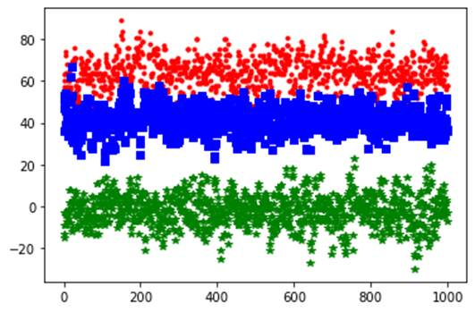
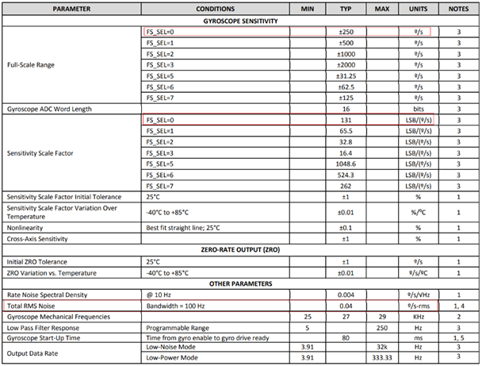
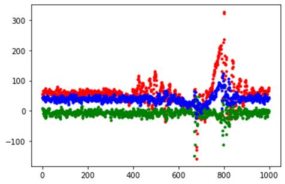

---
title: "Preface"
source: /sessions/sharp-sweet-allen/mnt/hi3403-build/pegasus/docs/zh-CN/DIS 调试指南/DIS 调试指南.md
--- # Preface
**Product Version<a name="section3123254104612"></a>** The product versions corresponding to this document are as follows. <a name="table19133145454611"></a>
<table><thead align="left"><tr id="row18216954204617"><th class="cellrowborder" valign="top" width="31.759999999999998%" id="mcps1.1.3.1.1"><p id="p82167546469"><a name="p82167546469"></a><a name="p82167546469"></a>Product Name</p>
</th>
<th class="cellrowborder" valign="top" width="68.24%" id="mcps1.1.3.1.2"><p id="p6216205419461"><a name="p6216205419461"></a><a name="p6216205419461"></a>Product Version</p>
</th>
</tr>
</thead>
<tbody><tr id="row321619548461"><td class="cellrowborder" valign="top" width="31.759999999999998%" headers="mcps1.1.3.1.1 "><p id="p621715416465"><a name="p621715416465"></a><a name="p621715416465"></a>Hi3403V100</p>
</td>
<td class="cellrowborder" valign="top" width="68.24%" headers="mcps1.1.3.1.2 "><p id="p1821711545468"><a name="p1821711545468"></a><a name="p1821711545468"></a>V100</p>
</td>
</tr>
</td>
<td class="cellrowborder" valign="top" width="68.24%" headers="mcps1.1.3.1.2 "><p id="p187922584010"><a name="p187922584010"></a><a name="p187922584010"></a>V100</p>
</td>
</tr>
</tbody>
</table> > **Note:** >This document uses the Hi3403V100 description as an example. Unless otherwise specified, the content for and Hi3403V100 is identical. **Intended Audience<a name="section0132125444614"></a>** This document (this guide) is primarily intended for the following engineers: - Technical support engineers
- Software development engineers **Symbol Conventions<a name="section133020216410"></a>** The following symbols may appear in this document. Their meanings are as follows. <a name="table2622507016410"></a>
<table><thead align="left"><tr id="row1530720816410"><th class="cellrowborder" valign="top" width="20.580000000000002%" id="mcps1.1.3.1.1"><p id="p6450074116410"><a name="p6450074116410"></a><a name="p6450074116410"></a><strong id="b2136615816410"><a name="b2136615816410"></a><a name="b2136615816410"></a>Symbol</strong></p>
</th>
<th class="cellrowborder" valign="top" width="79.42%" id="mcps1.1.3.1.2"><p id="p5435366816410"><a name="p5435366816410"></a><a name="p5435366816410"></a><strong id="b5941558116410"><a name="b5941558116410"></a><a name="b5941558116410"></a>Description</strong></p>
</th>
</tr>
</thead>
<tbody><tr id="row1372280416410"><td class="cellrowborder" valign="top" width="20.580000000000002%" headers="mcps1.1.3.1.1 "><p id="p3734547016410"><a name="p3734547016410"></a><a name="p3734547016410"></a><a name="image2670064316410"></a><a name="image2670064316410"></a><span></span></p>
</td>
<td class="cellrowborder" valign="top" width="79.42%" headers="mcps1.1.3.1.2 "><p id="p1757432116410"><a name="p1757432116410"></a><a name="p1757432116410"></a>Indicates a hazard with a high level of risk that, if not avoided, will result in death or serious injury.</p>
</td>
</tr>
</tbody>
</table> **Modification History<a name="section2467512116410"></a>** <a name="table126443203200"></a>
<table><thead align="left"><tr id="row264516207203"><th class="cellrowborder" valign="top" width="20.72%" id="mcps1.1.4.1.1"><p id="p146456203200"><a name="p146456203200"></a><a name="p146456203200"></a><strong id="b8645172022010"><a name="b8645172022010"></a><a name="b8645172022010"></a>Document Version</strong></p>
</th>
<th class="cellrowborder" valign="top" width="26.119999999999997%" id="mcps1.1.4.1.2"><p id="p364512062019"><a name="p364512062019"></a><a name="p364512062019"></a><strong id="b1464512200200"><a name="b1464512200200"></a><a name="b1464512200200"></a>Release Date</strong></p>
</th>
<th class="cellrowborder" valign="top" width="53.16%" id="mcps1.1.4.1.3"><p id="p664522018206"><a name="p664522018206"></a><a name="p664522018206"></a><strong id="b156451420152010"><a name="b156451420152010"></a><a name="b156451420152010"></a>Modification Description</strong></p>
</th>
</tr>
</thead>
<tbody><tr id="row56451520182017"><td class="cellrowborder" valign="top" width="20.72%" headers="mcps1.1.4.1.1 "><p id="p1564572014209"><a name="p1564572014209"></a><a name="p1564572014209"></a>00B01</p>
</td>
<td class="cellrowborder" valign="top" width="26.119999999999997%" headers="mcps1.1.4.1.2 "><p id="p126451920132014"><a name="p126451920132014"></a><a name="p126451920132014"></a>2025-09-15</p>
</td>
<td class="cellrowborder" valign="top" width="53.16%" headers="mcps1.1.4.1.3 "><p id="p1664582017209"><a name="p1664582017209"></a><a name="p1664582017209"></a>First temporary version release.</p>
</td>
</tr>
</tbody>
</table> # Overview
When a camera captures video, the video may appear shaky or unstable due to environmental or human factors, affecting video viewing. For example, in video capture scenarios, the camera may be affected by wind or vibrations caused by passing vehicles; handheld action D Vs are affected by human factors; dashcams are affected by vehicle vibration — all causing video shake. To allow customers to watch more stable and comfortable video, it is necessary to eliminate video shake as much as possible. ## Concepts<a name="ZH-CN_TOPIC_0000002457880877"></a> **DIS (Digital Image Stabilization)<a name="section1029935813910"></a>** DIS is a process of digital processing on images. It uses a stabilization algorithm to calculate the motion offset of the current image, and then performs transformations such as translation and rotation on the current image based on the calculated motion offset, thereby achieving an anti-shake effect. **IMU (Inertial Measurement Unit)<a name="section425682712103"></a>** An IMU is a device that measures the x, y, z three-axis attitude angles (or angular rates) and acceleration of an object, containing a gyroscope and an accelerometer. ## DIS Basic Principles<a name="ZH-CN_TOPIC_0000002424361962"></a> The basic principle of DIS is a 2D affine transformation process on the image based on motion offset. Affine transformations include translation, rotation, scaling, and shearing (commonly understood as parallelogram transformation) of the image, and this transformation can be represented by a 3×3 matrix.   The 3×3 matrix is the motion offset to be calculated in the DIS algorithm. (x, y) represents the coordinate position of the original image, and (x', y') is the coordinate position of the transformed image. When performing image transformation operations on the image, the positions of image pixels are changed, which may cause the edges of the image to exceed the width and height of the original image and be translated out of the entire frame position. Therefore, during DIS stabilization, the image must be cropped and enlarged. DIS stabilization involves cropping the edges of the image at a certain cropping ratio after completing the transformation operation, and then enlarging the cropped image to the original width and height, as shown in [Figure 1](#fig593612433564). **Figure 1** DIS schematic diagram<a name="fig593612433564"></a>  DIS calculates motion offset using three algorithms: - GME algorithm The GME (Global Motion Estimation) algorithm calculates the motion offset between the current frame image and the reference frame image by extracting image features. Images processed using the GME algorithm are more stable with good stabilization effect. However, when a large area of the captured object is moving in the frame, background dragging may also appear. This is because GME cannot completely distinguish between object movement and camera movement, which may lead to misjudgment. In addition, under low-light conditions, due to blurred image features, the stabilization effect of the GME algorithm may degrade. - Gyroscope algorithm The gyroscope algorithm calculates the motion offset of the current frame image based on data generated by the gyroscope. Using the gyroscope algorithm can better resolve issues such as misjudgment and no stabilization effect under low-light conditions. - Hybrid stabilization algorithm Hybrid DIS is a stabilization algorithm based on both GME and GYRO, combining the two. The stabilization effect depends on both the image itself and the attitude information generated by the gyroscope. ## DIS Implementation<a name="ZH-CN_TOPIC_0000002457880761"></a> The DIS function is integrated into the VI module. Refer to the "Hi3403V100 VI Channel Functional Block Diagram" in the Video Input chapter of the MPP Media Processing Software V5.0 Development Reference. > **Important:** >- DIS only supports operation on physical channels.
>- DIS video input image format supports linear Semi-planar420 and single component, and only supports uncompressed images. After enabling GME DIS, flip and mirror operations cannot be performed in VI.
>- The aspect ratio (width-to-height ratio) range supported for DIS video input images is 16:3 to 16:27.
>- The DIS processing requires the use of the VGS/GDC module. If multiple modules call VGS or GDC, DIS may experience frame drops due to insufficient VGS or GDC performance. # DIS Development and Application
## DIS Usage<a name="ZH-CN_TOPIC_0000002457840773"></a> For DIS-related API and parameter descriptions, please refer to the "Video Input" chapter of the MPP Media Processing Software V5.0 Development Reference. For specific implementation, refer to the DIS sample. The DIS usage flow is shown in [Figure 1](#fig75191462011). **Figure 1** DIS usage flow<a name="fig75191462011"></a> 
## Parameter Settings<a name="ZH-CN_TOPIC_0000002457840657"></a> Before starting DIS, parameters such as DIS configuration information and attributes must be set first. Different parameter values affect the stabilization effect to varying degrees. This section mainly introduces several important parameter settings that affect the stabilization effect. **crop_ratio<a name="section14901121516115"></a>** The cropping ratio of the DIS output image. Its value range is [50, 98]. Typically set to 80, meaning only 80% of the image is output after stabilization processing. Assuming the input image width and height are 1920×1080 and crop_ratio is set to 80, 10% of the left and right edges and 10% of the top and bottom edges of the input image are cropped, resulting in a cropped image width of (1920-2×1920×10%) = 1536 and height of (1080-2×1080×10%) = 864. **Note: If the cropped width or height is not an even number, round down to an even number.** - When the video input resolution is greater than or equal to 1920×1080, the minimum supported crop_ratio is 50.
- When the input resolution is less than 1920×1080, the minimum supported crop_ratio is 70. **mode<a name="section194385111114"></a>** The concept of dof (degree of freedom) is used in the DIS algorithm. - From the user's perspective: The concept of degrees of freedom is three-dimensional space: X, Y, Z three axes, each axis can have two types of motion: translation and rotation. This produces 6 types of motion in total. This is also what is commonly referred to as 6-axis stabilization. - From the algorithm's perspective: Degrees of freedom represent the number of operators used in the 3×3 affine transformation matrix. The affine transformation operations on the image differ depending on the number of degrees of freedom. Differences between 4_DOF and 6_DOF: - 4_DOF: The algorithm uses 4 operators, primarily performing translation, rotation, and scaling operations on the image. Compared to 6_DOF, it has 2 fewer operators. With fewer calculated operators, it is less prone to misjudgment and can also better prevent background dragging caused by large-area object movement, though the rolling shutter phenomenon is more noticeable.
- 6_DOF: The algorithm uses 6 operators, primarily performing translation, rotation, scaling, aspect ratio change, and shearing on the image. The advantage is better stabilization effect and the ability to correct parallelogram distortions. The disadvantage is that it is more likely to cause abnormal phenomena such as background dragging. > **Note:** >For Hi3403V100's HYBRID mode, the DSP must be enabled and the hybrid stabilization bin file must be loaded. Call the ss_mpi_gdc_set_dsp_lut_cfg interface (refer to the "12 Geometric Distortion Correction Subsystem" chapter of the MPP Media Processing Software V5.0 Development Reference) to enable the dsp_lut function and bind the corresponding DSP core. A single-core DSP supports 4K30fps performance.
>Description of each mode:
>- OT_DIS_MODE_4_DOF_GME refers to the 4_DOF stabilization mode.
>- OT_DIS_MODE_6_DOF_GME refers to the 6_DOF stabilization mode.
>- OT_DIS_MODE_GYRO refers to the gyroscope stabilization mode.
>- OT_DIS_MODE_HYBRID refers to the hybrid stabilization mode. **motion_level<a name="section4951632210"></a>** Camera motion levels are divided into: OT_DIS_MOTION_LEVEL_LOW, OT_DIS_MOTION_LEVEL_NORM, and OT_DIS_MOTION_LEVEL_HIGH. - OT_DIS_MOTION_LEVEL_LOW refers to low-level motion, where the lens moves with small amplitude.
- OT_DIS_MOTION_LEVEL_NORM refers to normal-level motion, where the lens moves with normal amplitude.
- OT_DIS_MOTION_LEVEL_HIGH refers to high-level motion, where the lens moves with large amplitude. Typically set to OT_DIS_MOTION_LEVEL_NORM. Adjust according to the actual motion amplitude. > **Note:** >Hi3403V100 does not support the OT_DIS_MOTION_LEVEL_LOW mode. **pdt_type<a name="section2080685121417"></a>** The product form supported by stabilization. Currently three product forms are supported: video recorder, DV, and drone. Configure the product type according to the actual product form. **camera_steady<a name="section576215194149"></a>** On/off switch for whether the lens is fixed and stationary. This parameter only takes effect in video recorder product form. In DV and drone product forms, this parameter does not take effect and is set to TD_FALSE by default. **matrix<a name="section123314355143"></a>** Effective only for GYRO and HYBRID modes. Rotation matrix, a 3×3 matrix. This parameter is set in the ss_mpi_mfusion_set_gyro_six_side_calibration interface. It is used for converting the direction between the Gyro sensor coordinate system and the image coordinate system. The algorithm references the image coordinate system. Different gyroscope installation positions correspond to different coordinate system directions, so the gyroscope coordinate system and the image coordinate system directions need to be converted. In addition, when installing the gyroscope, ensure that the gyroscope chip and the image sensor are positioned horizontally or vertically. The conversion between the gyroscope coordinate system direction and the image coordinate system direction is performed via the rotation matrix. Assume the gyroscope data is (Xg, Yg, Zg) and the gyroscope data used by the algorithm is (Xa, Ya, Za).  The 9 parameters of the rotation matrix matrix[OT_MFUSION_MATRIX_NUM] correspond to [a, b, c, d, e, f, g, h, l] respectively. For the specific method of calculating the 9 parameters, please refer to "[Adapting Gyroscope and Image Coordinate System Directions](#ZH-CN_TOPIC_0000002424361994)". **moving_subject_level<a name="section2060115951420"></a>** Effective only for GME and HYBRID modes. Used to determine whether the captured object is in motion, with a value range of [0, 7] and a default value of 0. This parameter is primarily used to prevent background dragging. Background dragging and stabilization effect are trade-offs against each other. - When the value is smaller, the image is more stable during motion, but background dragging is more likely to occur.
- When the value is larger, the stabilization effect during motion is weaker, but it can better improve the background dragging phenomenon. When the value is 7, there is no GME stabilization effect. **rolling_shutter_coef<a name="section748937181517"></a>** Parameter for correcting rolling shutter intensity, with a value range of [0, 1000]. This parameter is applicable to scenes where the camera is always moving in one direction for an extended period, such as shooting outdoor scenery from a train. For rolling shutter phenomena caused by back-and-forth shaking, the algorithm will adaptively detect and perform related corrections to improve the rolling shutter phenomenon. It is recommended to configure this parameter as 0. **timelag<a name="section8403171719158"></a>** Effective only for GYRO and HYBRID modes. The time difference between the time point of the first line of valid data readout (t_readout) of the current frame and the VSYNC (t_vsync) of the next frame, in μs. If the gyroscope has low-pass filtering enabled (usually recommended), the gyroscope low-pass filter delay (t_gyro_lpf_delay, usually described in the gyroscope datasheet) needs to be subtracted. timelag = t_readout – t_vsync – t_gyro_lpf_delay Under normal Sensor sequence configuration, this time parameter is near t_gyro_lpf_delay and is a **negative number**. [Figure 1](#_Toc519600753) briefly describes the position of timelag in the sensor timing. **Figure 1** Schematic diagram of timelag in sensor timing (before subtracting GYRO_LPF delay)<a name="_Toc519600753"></a> ")
**hor_limit and ver_limit<a name="section8533195119167"></a>** Effective only for GME and HYBRID modes. Horizontal offset and vertical offset limits, value range [0, 1000]. When the horizontal offset caused by background dragging from a large-area object passing through exceeds a certain amplitude, stabilization is not performed. Offset amplitude calculation: 2047 * hor_limit/1000. These parameters need to be used together with camera_steady, and only take effect when camera_steady is TD_TRUE. When camera_steady is TD_FALSE, the default setting is 1000. **still_crop<a name="section1341395815163"></a>** This switch disables the DIS stabilization effect, but the image continues to be output at the cropping ratio. When this switch is on, the DIS output image has no stabilization effect, but the cropping ratio of the output image remains the same as that of the output image with stabilization effect. Typically, this parameter is set to TD_FALSE; set this value to TD_TRUE when needed. > **Note:** >For PTZ pan/tilt rotation scenarios, the still_crop function needs to be enabled before rotation begins and disabled after rotation ends to prevent abnormal stabilization effects during rotation. **strength<a name="section177138819171"></a>** Background: When the camera is in low-light conditions, enabling DIS makes the edges of moving objects appear to shake more noticeably than when DIS is disabled. This is because at low light levels with vigorous motion, the excessively long shutter time causes blurring at the edges of moving objects. Due to the periodicity of shaking, the motion undergoes periodic changes of varying magnitude, causing the blurriness at the motion edges to also change periodically. When the moving subject is stationary (stabilization in effect), the periodic changes at the edges become eye-catching, and the need for the stabilization to enlarge the image makes the phenomenon more noticeable. strength is the intensity control for DIS gyroscope stabilization, effective only for GYRO and HYBRID modes, with a maximum intensity of 1024. When the value is 0, there is no GYRO stabilization effect. > **Important:** >In development, this parameter should be configured as 1024 by default. Generally, there is no need to adjust this parameter; reducing strength will reduce the stabilization effect.
>For the use of strength, please refer to "[Application Scheme for Gyroscope Stabilization Intensity](#ZH-CN_TOPIC_0000002424202150)". **large_motion_stable_coef<a name="section946618411814"></a>** Background: In scenes with large-amplitude shaking, if the stabilization is set too strong, the image may be cropped to the edge but still unable to meet stabilization requirements, leading to stuttering. Effective only for GME and HYBRID modes. This parameter primarily attenuates stabilization for large-amplitude motion, thereby reducing stuttering caused by cropping to the edge. The parameter range is [0, 100]. Setting it to 100 means no stabilization attenuation, which normally gives the best stabilization effect, but may crop to the edge under large-amplitude shaking. Reducing the parameter can attenuate stabilization for large-amplitude shaking, thereby striking a balance between stabilization effect and stuttering caused by cropping to the edge. Setting to 0 sacrifices all stabilization effect. Default parameter: 100. **low_freq_motion_preserve<a name="section53191416183"></a>** Effective only for GME and HYBRID modes. Since action D Vs perform low-frequency motion estimation, they retain low-frequency active motion while eliminating high-frequency shaking. This parameter adjusts the degree of low-frequency motion preservation, with an adjustment range of [0, 100]. Setting to 100 preserves all low-frequency motion; setting to 0 preserves no low-frequency motion at all. If the shaking range does not exceed the cropping ratio, the image is expected to be stationary, but once there is relatively large accumulated active motion, it will easily crop to the edge, causing stuttering. Default parameter: 10. **low_freq_motion_freq<a name="section319252081814"></a>** Effective only for GME and HYBRID modes. Since action D Vs perform low-frequency motion estimation, they retain low-frequency active motion while eliminating high-frequency shaking. This parameter describes the frequency of low-frequency motion. The adjustment range is [0, 100]. Setting to 0 preserves the least amount of low-frequency frequency, theoretically achieving the most stable effect, but it is very easy to cause cropping to the edge and thus stuttering. Setting to 100 means the highest cutoff frequency for low-frequency motion, preserving the most low-frequency components. Default parameter: 100. fpd_adaptive_en Effective only for GME and HYBRID modes. Since the algorithm's feature point pair threshold is fixed at 30, and IPC has scenes with few image feature points, feature point search may fail. In this case, enabling the adaptive search switch can lower the feature point pair threshold, enhancing the stabilization effect. It is recommended that customers enable this function switch in indoor scenes with simple backgrounds. After lowering the feature point threshold, the stabilization effect will improve somewhat, but it may cause motion dragging. The default parameter is set to TD_FALSE; set this value to TD_TRUE when needed. > **Important:** >The four parameters large_motion_stable_coef, low_freq_motion_preserve, low_freq_motion_freq, and fpd_adaptive_en only take effect in GME mode and HYBRID mode. ## Gyroscope Usage<a name="ZH-CN_TOPIC_0000002424202142"></a> The main purposes of using the gyroscope in stabilization are: - Using Gyro DIS to improve stabilization effect Gyro DIS can perform inverse correction of image shake based on lens distortion characteristics, obtaining better stabilization effect even when significant distortion exists, and providing noticeable stabilization improvement for inconsistent local image shake. - Preventing background dragging issues In many cases, the GME algorithm cannot determine whether the foreground is moving or the lens is moving. For example, when a large-area object moves in front of the lens while the lens is stationary, the algorithm may misjudge and treat foreground motion as lens motion for stabilization, causing background dragging. The gyroscope can reflect the machine's own motion state; adding a gyroscope can well compensate for this shortcoming. - Having stabilization effect in low-light or feature-point-scarce scenes Under low-light conditions, since the image background is dark, the GME algorithm cannot extract feature points, resulting in almost no stabilization effect under low-light conditions. Using a gyroscope solves the above problem. ### Gyroscope Algorithm Flow<a name="ZH-CN_TOPIC_0000002457880829"></a> The flow of using the gyroscope algorithm is as follows: 1. Before using gyroscope-related algorithms, ensure that the board has a gyroscope chip and it is functional.
2. Before starting the DIS function, the five drivers motionsensor_chip/motionsensor_mng/ot_spi/motionfusion/gyrodis must be loaded first, and it must be ensured that motionsensor has started working and generating data. **Note:** - When loading the gyroscope driver, the motionsensor_mng driver must be loaded before the motionsensor_chip driver. Each time the motionsensor_mng driver is loaded, the motionsensor_chip driver must be reloaded. - The motionsensor startup flow is: initialize – set motionsensor parameters – start motionsensor. - The motionsensor stop flow is: stop motionsensor operation – deinitialize. It is recommended to start motionsensor operation before enabling DIS with mode OT_DIS_MODE_GYRO, and stop motionsensor operation after stopping VI operation. 3. Adapt the gyroscope coordinate system and the image coordinate system directions, and configure the correct rotation matrix matrix[OT_MFUSION_MATRIX_NUM].
4. Determine the lens calibration parameters and timelag.
5. Check whether AE's hmax_times, vmax, and exposure time are correctly configured.
6. Before starting DIS, initialize and start the gyroscope first.
7. After closing DIS, stop the gyroscope, and finally exit the system. For specific implementation, please refer to the gyroscope-related sections in the DIS sample. ### Gyroscope Driver Reference Code<a name="ZH-CN_TOPIC_0000002424202018"></a> The SDK release package contains the gyroscope driver code. For other gyroscope models, please refer to the above driver code for self-adaptation. Code path: ```
motionsensor driver: \vendor\motionsensor\
``` When using, simply execute the make command in the motionsensor directory to obtain the ko files in the \\mpp\\out\\ko\\extdrv directory. By default, the \\mpp\\out\\ko\\load script does not load the gyroscope driver; please modify according to actual conditions. The principle of DIS obtaining gyroscope data is shown in [Figure 1](#fig12185191732514). **Figure 1** Schematic diagram of DIS obtaining gyroscope data<a name="fig12185191732514"></a>  Gyroscope data is stored in the allocated Gyro Data buffer. After starting the gyroscope driver, the gyroscope driver internally starts a timer that continuously reads gyroscope data from the gyroscope FIFO, timestamps each group of data, and writes the data to the Gyro Data buffer. The DIS driver obtains the gyroscope data for the corresponding time period from the Gyro Data buffer based on the start timestamp and end timestamp of each frame for stabilization processing. ### Adapting Gyroscope and Image Coordinate System Directions<a name="ZH-CN_TOPIC_0000002424361994"></a> When installing the gyroscope chip, ensure that the gyroscope chip is mounted squarely, i.e., parallel or perpendicular to the image sensor. When using the gyroscope algorithm, the lens movement information is provided by the gyroscope, so the accuracy of the gyroscope data is critical. Different gyroscope installation positions correspond to different coordinate system directions. When using DIS gyroscope-related algorithms, first correctly match the coordinate directions of the gyroscope and the image. [Figure 1](#_Ref452476337) shows the image coordinate system. For clarity of description, a phone screen is used in the figure for illustration. - The z-axis is perpendicular to the image plane; the direction of the z-axis pointing toward the human eye is the positive direction.
- The x-axis and y-axis are the horizontal and vertical directions respectively, corresponding to the width and height of the image. The DIS algorithm references the image coordinate system. The IMU (gyroscope) coordinate system can be determined by looking at the position of the black dot on the chip in the IMU datasheet. For example, the coordinate system of a certain gyroscope model is shown in [Figure 2](#fig1600174122810). **Figure 1** Image coordinate system (lens facing forward in the Zc direction for shooting)<a name="_Ref452476337"></a> ")
**Figure 2** Gyroscope coordinate system<a name="fig1600174122810"></a>  The following describes how to convert coordinate system directions using two different gyroscope installation positions as examples. For other installation positions, please extrapolate accordingly. - Gyroscope installation position 1 When the gyroscope is installed as shown in [Figure 3](#fig1483505715311), the gyroscope coordinate system and the image coordinate system directions are the same. The gyroscope obtains data (Xg, Yg, Zg), and the algorithm uses gyroscope data (Xa, Ya, Za). In this case:  Therefore, set the rotation matrix in the DIS Config to the identity matrix, i.e., , with the 9 parameters of matrix[OT_MFUSION_MATRIX_NUM] corresponding to [1, 0, 0, 0, 1, 0, 0, 0, 1] respectively. **Figure 3** Gyroscope installation position 1<a name="fig1483505715311"></a> 
- Gyroscope installation position 2 When the gyroscope is installed as shown in [Figure 4](#_Ref483210897), the gyroscope coordinate system and the image coordinate system directions are inconsistent and need to be converted. The gyroscope obtains data (Xg, Yg, Zg), and the algorithm uses gyroscope data (Xa, Ya, Za). In this case, the conversion relationship is:  Therefore, set the rotation matrix in the DIS Config to:  The 9 parameters of matrix[OT_MFUSION_MATRIX_NUM] correspond to [0, 1, 0, -1, 0, 0, 0, 0, 1] respectively. **Figure 4** Gyroscope installation position 2<a name="_Ref483210897"></a> 
### Lens Calibration Parameters and timelag<a name="ZH-CN_TOPIC_0000002424361898"></a> The lens calibration parameter camera_calibration_dis_param and the MPI board-side parameter ot_ldc_v2_attr are completely consistent in data type. The parameters generated from lens calibration can be directly configured to the corresponding MPI parameters. For timelag, please refer to the timelag parameter calculation method in "[Parameter Settings](#ZH-CN_TOPIC_0000002457840657)". ### hmax_times, vmax, and Exposure Time<a name="ZH-CN_TOPIC_0000002424361846"></a> hmax_times is the time for the Sensor to read out one line, vmax is the total number of lines actually effective per frame of the Sensor, and the exposure time is calculated by AE. For related descriptions, refer to the ISP Development Reference. ### Initializing and Starting the Gyroscope<a name="ZH-CN_TOPIC_0000002424361878"></a> Initializing the gyroscope primarily involves allocating MMZ memory for gyroscope data storage. The data output by the gyroscope is placed in a rotating buffer, and the algorithm reads the gyroscope data from the buffer based on frame interrupts. XYZ axis data is in one-to-one correspondence with timestamps. **Figure 1** Buffer data diagram<a name="fig286321915420"></a>  The buffer allocated from MMZ is used to store 5 parts of data: x, y, z axis gyroscope data, temperature data temp, and timestamp. The data type length of the timestamp is 8 bytes, and the data type length of the XYZ axis data and temperature data temp is 4 bytes. Each time a frame interrupt comes to fetch data, the data is searched within the buffer segment based on the start timestamp and end timestamp. The gyroscope data that meets the conditions is found and then passed to the DIS algorithm for use. For specific buffer allocation and size, please refer to the sample. ### Gyroscope and Accelerometer Configuration<a name="ZH-CN_TOPIC_0000002457840697"></a> The parameter configuration of the gyroscope and accelerometer is done through ioctl interfaces to the motionsensor driver. The recommended gyroscope measurement range setting is 250 (RECORDER) or 1000 (DV), with a fractional precision of 10 bits. The recommended gyroscope data sampling frequency (ODR) setting is 1000, with fractional precision of 10 bits. The output data bit width of the gyroscope is 15 bits, and the gyroscope data range is [-32768, 32768]. The recommended accelerometer measurement range setting is 16, with fractional precision of 10 bits. The recommended accelerometer data sampling frequency (ODR) setting is 1000, with fractional precision of 10 bits. The output data bit width of the accelerometer is 15 bits, and the accelerometer data range is [-32768, 32768]. > **Important:** >The nominal measurement range of some gyroscope models is not the exact range and needs to be confirmed against the angular velocity sensitivity and data bit width (angular velocity sensitivity × 2^data bit width = measurement range). If necessary, confirm the exact measurement range with the gyroscope manufacturer. ### Application Scheme for Gyroscope Stabilization Intensity<a name="ZH-CN_TOPIC_0000002424202150"></a> Effective only for Gyro DIS, with a maximum intensity of 1024. Note that in development, this parameter should be configured as 1024 by default. It is recommended to prioritize the exposure-limiting strategy, and then use strength attenuation for stabilization based on requirements. 1. Limit the maximum exposure time in the AE route It is recommended to limit the maximum exposure time to no more than 10 ms, or limit the maximum exposure time to no more than 10 ms in the AE route. Impact on image effect: strike a balance among stabilization effect, brightness, and noise, with stabilization effect prioritized, and fundamentally reduce the visual jitter of motion edges. - Normal illumination (e.g., outdoor daytime): no impact on normal effect and stabilization effect. - Relatively low illumination (e.g., indoor with lights, outdoor overcast): stabilization effect **improved**, but image brightness is lower or noise increases. - Extremely low illumination: stabilization effect improved, but image is too dark (if the maximum gain multiple is kept unchanged) or noise is excessive (if the maximum gain is increased by the corresponding multiple). > **Important:** >- When only the exposure time is limited without increasing the corresponding gain, the image may become dark under relatively low illumination. >- When the exposure is limited but the gain is simultaneously increased by the corresponding multiple, the image will not become dark, but noise will increase. 2. Adaptive adjustment of DIS stabilization intensity based on exposure time The DIS strength can be configured for stabilization effect attenuation based on the exposure time. It is recommended to perform adaptive attenuation proportionally when exceeding 10 ms: at 10 ms, the stabilization intensity is at maximum (strength = 1024); at 30 ms, the stabilization intensity is reduced to minimum (strength = 1). Smoothly configure proportionally between 30 ms and 10 ms. Impact on effect: strike a balance between stabilization effect and motion edge jitter, with image brightness and denoising prioritized. This does not fundamentally resolve the jitter at motion edges but weakens the subjective perception of motion edge jitter at the cost of stabilization effect. - Normal illumination (e.g., outdoor daytime): no impact on normal effect and stabilization effect. - Relatively low illumination (e.g., indoor with lights, outdoor overcast): stabilization effect further reduced, reducing the visual "jitter" phenomenon at motion edges. - Extremely low illumination: stabilization has no effect at all, nearly equivalent to stabilization being off. 3. Recommended adaptive scheme The scheme involves trade-offs among four effects: stabilization effect, image brightness, noise, and motion edge jitter. To obtain the best effect, it is recommended: When stabilization is on, adjust based on the Gyro motion information from the gyroscope as follows: - When motion is large, limit exposure time, increase gain multiple, and when both exposure time and gain reach their maximum, reduce stabilization intensity. - When motion is small, restore the original exposure and gain. Since motion blur, noise, etc. are involved, targeted tuning of AE and denoising is required. Expected achievable effects: - All effects at normal illumination are optimal. - When the degree of motion is small (including stationary), all effects are optimal. - Relatively low illumination + large motion: stabilization effect improved, slightly reduced brightness or slightly increased noise. - Extremely low illumination + large motion: brightness and denoising prioritized, stabilization effect reduced. ### IMU Sensor Parameter Impact and Selection Requirements<a name="ZH-CN_TOPIC_0000002457840709"></a> **Table 1** Gyroscope sensor parameter impact and selection requirements <a name="table480mcpsimp"></a>
<table><thead align="left"><tr id="row487mcpsimp"><th class="cellrowborder" valign="top" width="10.67%" id="mcps1.2.4.1.1"><p id="p489mcpsimp"><a name="p489mcpsimp"></a><a name="p489mcpsimp"></a>Parameter</p>
</th>
<th class="cellrowborder" valign="top" width="74.03%" id="mcps1.2.4.1.2"><p id="p491mcpsimp"><a name="p491mcpsimp"></a><a name="p491mcpsimp"></a>Impact</p>
</th>
<th class="cellrowborder" valign="top" width="15.299999999999999%" id="mcps1.2.4.1.3"><p id="p493mcpsimp"><a name="p493mcpsimp"></a><a name="p493mcpsimp"></a>Recommended Value</p>
</th>
</tr>
</thead>
<tbody><tr id="row495mcpsimp"><td class="cellrowborder" valign="top" width="10.67%" headers="mcps1.2.4.1.1 "><p id="p899762913418"><a name="p899762913418"></a><a name="p899762913418"></a>Measurement range</p>
</td>
<td class="cellrowborder" valign="top" width="74.03%" headers="mcps1.2.4.1.2 "><p id="p13887172794318"><a name="p13887172794318"></a><a name="p13887172794318"></a>When the actual angular velocity exceeds the measurement range, the signal is distorted. Due to the error accumulation effect, all subsequent algorithm results will be inaccurate. Special attention is needed for applications with large angular velocity scenes.</p>
</td>
<td class="cellrowborder" valign="top" width="15.299999999999999%" headers="mcps1.2.4.1.3 "><p id="p6962137144215"><a name="p6962137144215"></a><a name="p6962137144215"></a>&plusmn;2000 &deg;/s</p>
</td>
</tr>
<tr id="row502mcpsimp"><td class="cellrowborder" valign="top" width="10.67%" headers="mcps1.2.4.1.1 "><p id="p216912366443"><a name="p216912366443"></a><a name="p216912366443"></a>ADC bits</p>
</td>
<td class="cellrowborder" rowspan="2" valign="top" width="74.03%" headers="mcps1.2.4.1.2 "><p id="p936556124520"><a name="p936556124520"></a><a name="p936556124520"></a>The measurement range and ADC bits determine the sensor's sensitivity to signals, i.e., the minimum fluctuation of the real analog signal that can cause output signal changes. If the sensitivity is not high enough, combined with some filtering in the data stream, some small fluctuations may not be captured.</p>
</td>
<td class="cellrowborder" valign="top" width="15.299999999999999%" headers="mcps1.2.4.1.3 "><p id="p1452464534516"><a name="p1452464534516"></a><a name="p1452464534516"></a>16 bits</p>
</td>
</tr>
<tr id="row509mcpsimp"><td class="cellrowborder" valign="top" headers="mcps1.2.4.1.1 "><p id="p6172194214420"><a name="p6172194214420"></a><a name="p6172194214420"></a>Resolution</p>
</td>
<td class="cellrowborder" valign="top" headers="mcps1.2.4.1.2 "><p id="p1821655414454"><a name="p1821655414454"></a><a name="p1821655414454"></a>16.4 LSB/(&deg;/s)</p>
</td>
</tr>
<tr id="row523mcpsimp"><td class="cellrowborder" valign="top" width="10.67%" headers="mcps1.2.4.1.1 "><p id="p5425111104616"><a name="p5425111104616"></a><a name="p5425111104616"></a>Max output frequency ODR</p>
</td>
<td class="cellrowborder" valign="top" width="74.03%" headers="mcps1.2.4.1.2 "><p id="p484112345184"><a name="p484112345184"></a><a name="p484112345184"></a>The data output frequency is determined by application requirements. Higher output frequencies yield more continuous result output. The algorithm can adapt to different frequencies.</p>
</td>
<td class="cellrowborder" valign="top" width="15.299999999999999%" headers="mcps1.2.4.1.3 "><p id="p1923012917466"><a name="p1923012917466"></a><a name="p1923012917466"></a>&gt;= 800 Hz</p>
</td>
</tr>
<tr id="row530mcpsimp"><td class="cellrowborder" valign="top" width="10.67%" headers="mcps1.2.4.1.1 "><p id="p881581044717"><a name="p881581044717"></a><a name="p881581044717"></a>Noise</p>
</td>
<td class="cellrowborder" valign="top" width="74.03%" headers="mcps1.2.4.1.2 "><p id="p3500171815473"><a name="p3500171815473"></a><a name="p3500171815473"></a>Excessive noise can drown out certain high-frequency, small-amplitude effective signals. The specific specification depends on whether the application has requirements for high-frequency small signals.</p>
</td>
<td class="cellrowborder" valign="top" width="15.299999999999999%" headers="mcps1.2.4.1.3 "><p id="p858122520478"><a name="p858122520478"></a><a name="p858122520478"></a>0.04 &deg;/s – rms @100 Hz</p>
</td>
</tr>
<tr id="row537mcpsimp"><td class="cellrowborder" valign="top" width="10.67%" headers="mcps1.2.4.1.1 "><p id="p19962133174916"><a name="p19962133174916"></a><a name="p19962133174916"></a>Sensitivity</p>
</td>
<td class="cellrowborder" valign="top" width="74.03%" headers="mcps1.2.4.1.2 "><p id="p1451463019497"><a name="p1451463019497"></a><a name="p1451463019497"></a>Reflects the error level between the sensor output and the real signal (with offset removed). This error is inherited into the algorithm's gravity and attitude angle outputs (tenth-of-a-degree level), especially in multi-axis and fast motion scenes. Sensitivity can be corrected through six-side calibration.</p>
</td>
<td class="cellrowborder" valign="top" width="15.299999999999999%" headers="mcps1.2.4.1.3 "><p id="p13473113911495"><a name="p13473113911495"></a><a name="p13473113911495"></a>1%</p>
</td>
</tr>
<tr id="row544mcpsimp"><td class="cellrowborder" valign="top" width="10.67%" headers="mcps1.2.4.1.1 "><p id="p12241046124917"><a name="p12241046124917"></a><a name="p12241046124917"></a>Sensitivity temperature coefficient</p>
</td>
<td class="cellrowborder" valign="top" width="74.03%" headers="mcps1.2.4.1.2 "><p id="p10403115314916"><a name="p10403115314916"></a><a name="p10403115314916"></a>Reflects the level of sensitivity change with temperature; relatively minor impact.</p>
</td>
<td class="cellrowborder" valign="top" width="15.299999999999999%" headers="mcps1.2.4.1.3 "><p id="p111415695017"><a name="p111415695017"></a><a name="p111415695017"></a>&plusmn;0.01 %/&deg;C</p>
</td>
</tr>
<tr id="row551mcpsimp"><td class="cellrowborder" valign="top" width="10.67%" headers="mcps1.2.4.1.1 "><p id="p155921516105011"><a name="p155921516105011"></a><a name="p155921516105011"></a>Zero bias (offset)</p>
</td>
<td class="cellrowborder" valign="top" width="74.03%" headers="mcps1.2.4.1.2 "><p id="p8817192316505"><a name="p8817192316505"></a><a name="p8817192316505"></a>Reflects the fixed bias error between the sensor output and the real signal. It is a parameter with very large impact on the dynamic and static results of the algorithm. Due to the error accumulation effect, it can cause angular drift at the degree level within a short time. Offset can be corrected through six-side calibration and zero-bias calibration.</p>
</td>
<td class="cellrowborder" valign="top" width="15.299999999999999%" headers="mcps1.2.4.1.3 "><p id="p12995111512512"><a name="p12995111512512"></a><a name="p12995111512512"></a>&plusmn;1 &deg;/s @25&deg;C</p>
</td>
</tr>
<tr id="row558mcpsimp"><td class="cellrowborder" valign="top" width="10.67%" headers="mcps1.2.4.1.1 "><p id="p124722034185214"><a name="p124722034185214"></a><a name="p124722034185214"></a>Temperature drift</p>
</td>
<td class="cellrowborder" valign="top" width="74.03%" headers="mcps1.2.4.1.2 "><p id="p612774295215"><a name="p612774295215"></a><a name="p612774295215"></a>The level of offset change with temperature. Gyroscope temperature drift has a non-negligible impact on algorithm results, especially in scenes where the device is just powered on or power-hungry applications are started causing temperature changes. Can be corrected through temperature compensation.</p>
</td>
<td class="cellrowborder" valign="top" width="15.299999999999999%" headers="mcps1.2.4.1.3 "><p id="p17624849195212"><a name="p17624849195212"></a><a name="p17624849195212"></a>&plusmn;0.01 &deg;/s/&deg;C</p>
</td>
</tr>
<tr id="row565mcpsimp"><td class="cellrowborder" valign="top" width="10.67%" headers="mcps1.2.4.1.1 "><p id="p17861456185215"><a name="p17861456185215"></a><a name="p17861456185215"></a>Cross Axis</p>
</td>
<td class="cellrowborder" valign="top" width="74.03%" headers="mcps1.2.4.1.2 "><p id="p83241844536"><a name="p83241844536"></a><a name="p83241844536"></a>Reflects the cross-influence among the three-axis data of the gyroscope. Has a significant impact on algorithm results, especially in multi-axis and fast motion scenes, easily causing large angular deviations. Cross Axis can be corrected through six-side calibration.</p>
</td>
<td class="cellrowborder" valign="top" width="15.299999999999999%" headers="mcps1.2.4.1.3 "><p id="p53269104538"><a name="p53269104538"></a><a name="p53269104538"></a>&plusmn;1%</p>
</td>
</tr>
<tr id="row572mcpsimp"><td class="cellrowborder" valign="top" width="10.67%" headers="mcps1.2.4.1.1 "><p id="p417815185531"><a name="p417815185531"></a><a name="p417815185531"></a>Non-linearity</p>
</td>
<td class="cellrowborder" valign="top" width="74.03%" headers="mcps1.2.4.1.2 "><p id="p16585327105312"><a name="p16585327105312"></a><a name="p16585327105312"></a>Reflects the inconsistency of the error between the sensor output and the real signal at different inputs, which to some extent causes inconsistent algorithm performance at different acceleration levels.</p>
</td>
<td class="cellrowborder" valign="top" width="15.299999999999999%" headers="mcps1.2.4.1.3 "><p id="p116331635165318"><a name="p116331635165318"></a><a name="p116331635165318"></a>&plusmn;0.1% @25&deg;C</p>
</td>
</tr>
<tr id="row579mcpsimp"><td class="cellrowborder" valign="top" width="10.67%" headers="mcps1.2.4.1.1 "><p id="p573810421402"><a name="p573810421402"></a><a name="p573810421402"></a>Zero bias stability</p>
</td>
<td class="cellrowborder" valign="top" width="74.03%" headers="mcps1.2.4.1.2 "><p id="p53171552135319"><a name="p53171552135319"></a><a name="p53171552135319"></a>Reflects the stability of the gyroscope zero bias. Even though zero bias can be corrected through calibration, devices with large zero bias variation will still have residual zero bias effects.</p>
</td>
<td class="cellrowborder" valign="top" width="15.299999999999999%" headers="mcps1.2.4.1.3 "><p id="p65771803543"><a name="p65771803543"></a><a name="p65771803543"></a>10&deg;/h</p>
</td>
</tr>
</tbody>
</table> **Table 2** Accelerometer sensor parameter impact and selection requirements <a name="table5584125212565"></a>
<table><thead align="left"><tr id="row2584155215568"><th class="cellrowborder" valign="top" width="10.59%" id="mcps1.2.4.1.1"><p id="p13584145235613"><a name="p13584145235613"></a><a name="p13584145235613"></a>Parameter</p>
</th>
<th class="cellrowborder" valign="top" width="74.11%" id="mcps1.2.4.1.2"><p id="p1758475225613"><a name="p1758475225613"></a><a name="p1758475225613"></a>Impact</p>
</th>
<th class="cellrowborder" valign="top" width="15.299999999999999%" id="mcps1.2.4.1.3"><p id="p7584652125617"><a name="p7584652125617"></a><a name="p7584652125617"></a>Recommended Value</p>
</th>
</tr>
</thead>
<tbody><tr id="row17584135217562"><td class="cellrowborder" valign="top" width="10.59%" headers="mcps1.2.4.1.1 "><p id="p15584145216567"><a name="p15584145216567"></a><a name="p15584145216567"></a>Measurement range</p>
</td>
<td class="cellrowborder" valign="top" width="74.11%" headers="mcps1.2.4.1.2 "><p id="p1569003605714"><a name="p1569003605714"></a><a name="p1569003605714"></a>When the actual acceleration exceeds the measurement range, the signal is distorted, causing inaccurate gravity acceleration extraction in the next few seconds. Special attention is needed for application scenarios with large acceleration.</p>
</td>
<td class="cellrowborder" valign="top" width="15.299999999999999%" headers="mcps1.2.4.1.3 "><p id="p1499765055711"><a name="p1499765055711"></a><a name="p1499765055711"></a>&plusmn;16 g</p>
</td>
</tr>
<tr id="row9584195235617"><td class="cellrowborder" valign="top" width="10.59%" headers="mcps1.2.4.1.1 "><p id="p55849529564"><a name="p55849529564"></a><a name="p55849529564"></a>ADC bits</p>
</td>
<td class="cellrowborder" rowspan="2" valign="top" width="74.11%" headers="mcps1.2.4.1.2 "><p id="p4584552145617"><a name="p4584552145617"></a><a name="p4584552145617"></a>The measurement range and ADC bits determine the sensor's sensitivity to signals, i.e., the minimum fluctuation of the real analog signal that can cause output signal changes. If the sensitivity is not high enough, combined with some filtering in the data stream, some small fluctuations may not be captured.</p>
</td>
<td class="cellrowborder" valign="top" width="15.299999999999999%" headers="mcps1.2.4.1.3 "><p id="p15584152135614"><a name="p15584152135614"></a><a name="p15584152135614"></a>16 bits</p>
</td>
</tr>
<tr id="row9584175220567"><td class="cellrowborder" valign="top" headers="mcps1.2.4.1.1 "><p id="p1584135245616"><a name="p1584135245616"></a><a name="p1584135245616"></a>Resolution</p>
</td>
<td class="cellrowborder" valign="top" headers="mcps1.2.4.1.2 "><p id="p169831792003"><a name="p169831792003"></a><a name="p169831792003"></a>2048 LSB/g</p>
</td>
</tr>
<tr id="row1958525214561"><td class="cellrowborder" valign="top" width="10.59%" headers="mcps1.2.4.1.1 "><p id="p258515522568"><a name="p258515522568"></a><a name="p258515522568"></a>Max output frequency ODR</p>
</td>
<td class="cellrowborder" valign="top" width="74.11%" headers="mcps1.2.4.1.2 "><p id="p16536896199"><a name="p16536896199"></a><a name="p16536896199"></a>The data output frequency is determined by application requirements. Higher output frequencies yield more continuous result output. The algorithm can adapt to different frequencies.</p>
</td>
<td class="cellrowborder" valign="top" width="15.299999999999999%" headers="mcps1.2.4.1.3 "><p id="p758535217566"><a name="p758535217566"></a><a name="p758535217566"></a>&gt;= 800 Hz</p>
</td>
</tr>
<tr id="row1585175219561"><td class="cellrowborder" valign="top" width="10.59%" headers="mcps1.2.4.1.1 "><p id="p8585125210569"><a name="p8585125210569"></a><a name="p8585125210569"></a>Noise</p>
</td>
<td class="cellrowborder" valign="top" width="74.11%" headers="mcps1.2.4.1.2 "><p id="p15114174118013"><a name="p15114174118013"></a><a name="p15114174118013"></a>Excessive noise can drown out certain high-frequency, small-amplitude effective signals. The specific specification depends on whether the application has requirements for high-frequency/small signals.</p>
</td>
<td class="cellrowborder" valign="top" width="15.299999999999999%" headers="mcps1.2.4.1.3 "><p id="p11971858603"><a name="p11971858603"></a><a name="p11971858603"></a>1 mg-rms @100 Hz</p>
</td>
</tr>
<tr id="row758555225617"><td class="cellrowborder" valign="top" width="10.59%" headers="mcps1.2.4.1.1 "><p id="p758565265613"><a name="p758565265613"></a><a name="p758565265613"></a>Sensitivity</p>
</td>
<td class="cellrowborder" valign="top" width="74.11%" headers="mcps1.2.4.1.2 "><p id="p176481154115"><a name="p176481154115"></a><a name="p176481154115"></a>Same impact as gyroscope sensitivity. This error affects the algorithm's gravity, attitude angle, and other results in all scenes; calibratable.</p>
</td>
<td class="cellrowborder" valign="top" width="15.299999999999999%" headers="mcps1.2.4.1.3 "><p id="p105851752135618"><a name="p105851752135618"></a><a name="p105851752135618"></a>1%</p>
</td>
</tr>
<tr id="row058545212566"><td class="cellrowborder" valign="top" width="10.59%" headers="mcps1.2.4.1.1 "><p id="p858565225617"><a name="p858565225617"></a><a name="p858565225617"></a>Sensitivity temperature coefficient</p>
</td>
<td class="cellrowborder" valign="top" width="74.11%" headers="mcps1.2.4.1.2 "><p id="p14717324117"><a name="p14717324117"></a><a name="p14717324117"></a>Reflects the level of sensitivity change with temperature; relatively minor impact.</p>
</td>
<td class="cellrowborder" valign="top" width="15.299999999999999%" headers="mcps1.2.4.1.3 "><p id="p1376015461113"><a name="p1376015461113"></a><a name="p1376015461113"></a>&plusmn;0.008 %/&deg;C</p>
</td>
</tr>
<tr id="row45851052125616"><td class="cellrowborder" valign="top" width="10.59%" headers="mcps1.2.4.1.1 "><p id="p17790165153518"><a name="p17790165153518"></a><a name="p17790165153518"></a>Zero bias (offset)</p>
</td>
<td class="cellrowborder" valign="top" width="74.11%" headers="mcps1.2.4.1.2 "><p id="p189671112334"><a name="p189671112334"></a><a name="p189671112334"></a>Same impact as gyroscope offset. Affects the accuracy of the algorithm's gravity, attitude angle, and other results in all scenes; calibratable.</p>
</td>
<td class="cellrowborder" valign="top" width="15.299999999999999%" headers="mcps1.2.4.1.3 "><p id="p48641330933"><a name="p48641330933"></a><a name="p48641330933"></a>&plusmn;40 mg</p>
</td>
</tr>
<tr id="row11585145285610"><td class="cellrowborder" valign="top" width="10.59%" headers="mcps1.2.4.1.1 "><p id="p09141758123518"><a name="p09141758123518"></a><a name="p09141758123518"></a>Temperature drift</p>
</td>
<td class="cellrowborder" valign="top" width="74.11%" headers="mcps1.2.4.1.2 "><p id="p15856449332"><a name="p15856449332"></a><a name="p15856449332"></a>The level of offset change with temperature. If this parameter is too large, it will have a significant impact during the period just after device power-on or in scenes where power-hungry applications are started causing temperature changes. Can be corrected through temperature compensation.</p>
</td>
<td class="cellrowborder" valign="top" width="15.299999999999999%" headers="mcps1.2.4.1.3 "><p id="p195651156413"><a name="p195651156413"></a><a name="p195651156413"></a>&plusmn;1 mg/&deg;C for Z</p>
</td>
</tr>
<tr id="row058695255615"><td class="cellrowborder" valign="top" width="10.59%" headers="mcps1.2.4.1.1 "><p id="p2041466369"><a name="p2041466369"></a><a name="p2041466369"></a>Cross Axis</p>
</td>
<td class="cellrowborder" valign="top" width="74.11%" headers="mcps1.2.4.1.2 "><p id="p1761815241848"><a name="p1761815241848"></a><a name="p1761815241848"></a>Same impact as gyroscope Cross Axis. Affects the accuracy of the algorithm's gravity, attitude angle, and other results in all scenes; calibratable.</p>
</td>
<td class="cellrowborder" valign="top" width="15.299999999999999%" headers="mcps1.2.4.1.3 "><p id="p11586175255611"><a name="p11586175255611"></a><a name="p11586175255611"></a>&plusmn;1%</p>
</td>
</tr>
<tr id="row55868525569"><td class="cellrowborder" valign="top" width="10.59%" headers="mcps1.2.4.1.1 "><p id="p858695255618"><a name="p858695255618"></a><a name="p858695255618"></a>Non-linearity</p>
</td>
<td class="cellrowborder" valign="top" width="74.11%" headers="mcps1.2.4.1.2 "><p id="p1281944654"><a name="p1281944654"></a><a name="p1281944654"></a>Same description as gyroscope non-linearity.</p>
</td>
<td class="cellrowborder" valign="top" width="15.299999999999999%" headers="mcps1.2.4.1.3 "><p id="p12825723458"><a name="p12825723458"></a><a name="p12825723458"></a>&plusmn;0.3%</p>
</td>
</tr>
<tr id="row115861852155611"><td class="cellrowborder" valign="top" width="10.59%" headers="mcps1.2.4.1.1 "><p id="p15586185216569"><a name="p15586185216569"></a><a name="p15586185216569"></a>Zero bias stability</p>
</td>
<td class="cellrowborder" valign="top" width="74.11%" headers="mcps1.2.4.1.2 "><p id="p358614525566"><a name="p358614525566"></a><a name="p358614525566"></a>Reflects the stability of the accelerometer zero bias. Even though zero bias can be corrected through calibration, devices with large zero bias variation will still have residual zero bias effects.</p>
</td>
<td class="cellrowborder" valign="top" width="15.299999999999999%" headers="mcps1.2.4.1.3 "><p id="p165317471253"><a name="p165317471253"></a><a name="p165317471253"></a>10 mg</p>
</td>
</tr>
</tbody>
</table> It is recommended that the IMU have a hardware FIFO. Without a FIFO, the timeliness of reading IMU data may be affected. SPI bus is supported, and the SPI clock should be no lower than 10 M Hz. If the bus clock frequency is too low, the delay in reading data increases. ### Gyroscope Driver Integration Process<a name="ZH-CN_TOPIC_0000002424202042"></a> 1. Ensure that the board has an IMU chip, and the IMU chip must be rigidly fixed to the sensor.
2. Load the three drivers: motionsensor_chip/motionsensor_mng/ot_spi.
3. Refer to sample_dis: initialize spi → initialize motionsensor → start motionsensor. When initializing motionsensor, check whether the dev info print information is the IMU's Chip ID.
4. Use the ioctl interface of motionsensor_mng: first call MSENSOR_CMD_ADD_USER, then call MSENSOR_CMD_GET_DATA to obtain gyroscope and accelerometer data.
5. For the obtained gyroscope and accelerometer data, refer to "[Testing Whether Gyroscope Values Are Reasonable](#ZH-CN_TOPIC_0000002457840721)".
6. Check whether the gyroscope and accelerometer timestamps are smooth, refer to "[Whether Gyroscope Timestamps Are Smooth](#ZH-CN_TOPIC_0000002457880889)".
7. After the gyroscope driver integration is complete, refer to "[Gyroscope Algorithm Flow](#ZH-CN_TOPIC_0000002457880829)" and check the proc of gyrodis and motionfusion to confirm whether parameter configurations are correct.
8. Check whether the stabilization effect meets expectations. If not, refer to "[Gyroscope Stabilization Has No Effect](#ZH-CN_TOPIC_0000002457840745)". ## Lens Calibration<a name="ZH-CN_TOPIC_0000002424202106"></a> ### Checkerboard Calibration<a name="ZH-CN_TOPIC_0000002424202062"></a> #### Calibration Tool<a name="ZH-CN_TOPIC_0000002457880781"></a> Refer to the "2.5.10 DIS Calibration Tool Usage Instructions" section of the Image Quality Debugging Tool Usage Guide. #### Board Side<a name="ZH-CN_TOPIC_0000002424361926"></a> The board side needs to configure ot_ldc_v2_attr correspondingly. For detailed attributes of ldc_v2, please refer to the "2.4.1 Basic Data Types" section in the MPP Media Processing V5.0 Software Development. ### FOV Calibration<a name="ZH-CN_TOPIC_0000002457840677"></a> #### Application Background<a name="ZH-CN_TOPIC_0000002457880817"></a> In outdoor zoom applications, since the FOV focal length segment changes gradually, using the method of lens calibration to produce ldc_v2 for calibrating each focal segment is relatively complex. In pursuit of a simpler and more effective method, the lens FOV is converted into ldc_v2 parameters as a substitute for lens checkerboard calibration. Using FOV for conversion is a quick application that can replace lens calibration to some extent under special conditions. Note that when the conversion effect is unsatisfactory, one should revert to lens checkerboard calibration for better results. The specific implementation of converting FOV to ldc_v2 parameters is provided in the form of a sample. #### FOV Conversion to ldc_v2<a name="ZH-CN_TOPIC_0000002424361942"></a> Input: image width, image height, FOV type, FOV Output: ldc_v2 parameters **Table 1** Value ranges of FOV conversion output parameters ldc_v2 <a name="table480mcpsimp"></a>
<table><thead align="left"><tr id="row487mcpsimp"><th class="cellrowborder" valign="top" width="34%" id="mcps1.2.4.1.1"><p id="p489mcpsimp"><a name="p489mcpsimp"></a><a name="p489mcpsimp"></a>ldc_v2 Parameter</p>
</th>
<th class="cellrowborder" valign="top" width="30%" id="mcps1.2.4.1.2"><p id="p491mcpsimp"><a name="p491mcpsimp"></a><a name="p491mcpsimp"></a>Value Range</p>
</th>
<th class="cellrowborder" valign="top" width="36%" id="mcps1.2.4.1.3"><p id="p493mcpsimp"><a name="p493mcpsimp"></a><a name="p493mcpsimp"></a>Description</p>
</th>
</tr>
</thead>
<tbody><tr id="row495mcpsimp"><td class="cellrowborder" valign="top" width="34%" headers="mcps1.2.4.1.1 "><p id="p497mcpsimp"><a name="p497mcpsimp"></a><a name="p497mcpsimp"></a>focal_len_x</p>
</td>
<td class="cellrowborder" valign="top" width="30%" headers="mcps1.2.4.1.2 "><p id="p499mcpsimp"><a name="p499mcpsimp"></a><a name="p499mcpsimp"></a>[6400, 117341700]</p>
</td>
<td class="cellrowborder" valign="top" width="36%" headers="mcps1.2.4.1.3 "><p id="p501mcpsimp"><a name="p501mcpsimp"></a><a name="p501mcpsimp"></a>Effective focal length of the lens in the horizontal direction</p>
</td>
</tr>
<tr id="row502mcpsimp"><td class="cellrowborder" valign="top" width="34%" headers="mcps1.2.4.1.1 "><p id="p504mcpsimp"><a name="p504mcpsimp"></a><a name="p504mcpsimp"></a>focal_len_y</p>
</td>
<td class="cellrowborder" valign="top" width="30%" headers="mcps1.2.4.1.2 "><p id="p506mcpsimp"><a name="p506mcpsimp"></a><a name="p506mcpsimp"></a>[6400, 117341700]</p>
</td>
<td class="cellrowborder" valign="top" width="36%" headers="mcps1.2.4.1.3 "><p id="p508mcpsimp"><a name="p508mcpsimp"></a><a name="p508mcpsimp"></a>Effective focal length of the lens in the vertical direction</p>
</td>
</tr>
<tr id="row509mcpsimp"><td class="cellrowborder" valign="top" width="34%" headers="mcps1.2.4.1.1 "><p id="p511mcpsimp"><a name="p511mcpsimp"></a><a name="p511mcpsimp"></a>coor_shift_x</p>
</td>
<td class="cellrowborder" valign="top" width="30%" headers="mcps1.2.4.1.2 "><p id="p513mcpsimp"><a name="p513mcpsimp"></a><a name="p513mcpsimp"></a>W/2*100</p>
</td>
<td class="cellrowborder" valign="top" width="36%" headers="mcps1.2.4.1.3 "><p id="p515mcpsimp"><a name="p515mcpsimp"></a><a name="p515mcpsimp"></a>Optical center X coordinate, W is the image width</p>
</td>
</tr>
<tr id="row516mcpsimp"><td class="cellrowborder" valign="top" width="34%" headers="mcps1.2.4.1.1 "><p id="p518mcpsimp"><a name="p518mcpsimp"></a><a name="p518mcpsimp"></a>coor_shift_y</p>
</td>
<td class="cellrowborder" valign="top" width="30%" headers="mcps1.2.4.1.2 "><p id="p520mcpsimp"><a name="p520mcpsimp"></a><a name="p520mcpsimp"></a>H/2*100</p>
</td>
<td class="cellrowborder" valign="top" width="36%" headers="mcps1.2.4.1.3 "><p id="p522mcpsimp"><a name="p522mcpsimp"></a><a name="p522mcpsimp"></a>Optical center Y coordinate, H is the image height.</p>
</td>
</tr>
<tr id="row523mcpsimp"><td class="cellrowborder" valign="top" width="34%" headers="mcps1.2.4.1.1 "><p id="p525mcpsimp"><a name="p525mcpsimp"></a><a name="p525mcpsimp"></a>src_calibration_ratio [0]</p>
</td>
<td class="cellrowborder" valign="top" width="30%" headers="mcps1.2.4.1.2 "><p id="p527mcpsimp"><a name="p527mcpsimp"></a><a name="p527mcpsimp"></a>100000</p>
</td>
<td class="cellrowborder" valign="top" width="36%" headers="mcps1.2.4.1.3 "><p id="p529mcpsimp"><a name="p529mcpsimp"></a><a name="p529mcpsimp"></a>Lens distortion coefficient</p>
</td>
</tr>
<tr id="row530mcpsimp"><td class="cellrowborder" valign="top" width="34%" headers="mcps1.2.4.1.1 "><p id="p532mcpsimp"><a name="p532mcpsimp"></a><a name="p532mcpsimp"></a>src_calibration_ratio [1]</p>
</td>
<td class="cellrowborder" valign="top" width="30%" headers="mcps1.2.4.1.2 "><p id="p534mcpsimp"><a name="p534mcpsimp"></a><a name="p534mcpsimp"></a>0</p>
</td>
<td class="cellrowborder" valign="top" width="36%" headers="mcps1.2.4.1.3 "><p id="p536mcpsimp"><a name="p536mcpsimp"></a><a name="p536mcpsimp"></a>Lens distortion coefficient</p>
</td>
</tr>
<tr id="row537mcpsimp"><td class="cellrowborder" valign="top" width="34%" headers="mcps1.2.4.1.1 "><p id="p539mcpsimp"><a name="p539mcpsimp"></a><a name="p539mcpsimp"></a>src_calibration_ratio [2]</p>
</td>
<td class="cellrowborder" valign="top" width="30%" headers="mcps1.2.4.1.2 "><p id="p541mcpsimp"><a name="p541mcpsimp"></a><a name="p541mcpsimp"></a>0</p>
</td>
<td class="cellrowborder" valign="top" width="36%" headers="mcps1.2.4.1.3 "><p id="p543mcpsimp"><a name="p543mcpsimp"></a><a name="p543mcpsimp"></a>Lens distortion coefficient</p>
</td>
</tr>
<tr id="row544mcpsimp"><td class="cellrowborder" valign="top" width="34%" headers="mcps1.2.4.1.1 "><p id="p546mcpsimp"><a name="p546mcpsimp"></a><a name="p546mcpsimp"></a>src_calibration_ratio [3]</p>
</td>
<td class="cellrowborder" valign="top" width="30%" headers="mcps1.2.4.1.2 "><p id="p548mcpsimp"><a name="p548mcpsimp"></a><a name="p548mcpsimp"></a>0</p>
</td>
<td class="cellrowborder" valign="top" width="36%" headers="mcps1.2.4.1.3 "><p id="p550mcpsimp"><a name="p550mcpsimp"></a><a name="p550mcpsimp"></a>Lens distortion coefficient</p>
</td>
</tr>
<tr id="row551mcpsimp"><td class="cellrowborder" valign="top" width="34%" headers="mcps1.2.4.1.1 "><p id="p553mcpsimp"><a name="p553mcpsimp"></a><a name="p553mcpsimp"></a>src_calibration_ratio [4]</p>
</td>
<td class="cellrowborder" valign="top" width="30%" headers="mcps1.2.4.1.2 "><p id="p555mcpsimp"><a name="p555mcpsimp"></a><a name="p555mcpsimp"></a>0</p>
</td>
<td class="cellrowborder" valign="top" width="36%" headers="mcps1.2.4.1.3 "><p id="p557mcpsimp"><a name="p557mcpsimp"></a><a name="p557mcpsimp"></a>Lens distortion coefficient</p>
</td>
</tr>
<tr id="row558mcpsimp"><td class="cellrowborder" valign="top" width="34%" headers="mcps1.2.4.1.1 "><p id="p560mcpsimp"><a name="p560mcpsimp"></a><a name="p560mcpsimp"></a>src_calibration_ratio [5]</p>
</td>
<td class="cellrowborder" valign="top" width="30%" headers="mcps1.2.4.1.2 "><p id="p562mcpsimp"><a name="p562mcpsimp"></a><a name="p562mcpsimp"></a>0</p>
</td>
<td class="cellrowborder" valign="top" width="36%" headers="mcps1.2.4.1.3 "><p id="p564mcpsimp"><a name="p564mcpsimp"></a><a name="p564mcpsimp"></a>Lens distortion coefficient</p>
</td>
</tr>
<tr id="row565mcpsimp"><td class="cellrowborder" valign="top" width="34%" headers="mcps1.2.4.1.1 "><p id="p567mcpsimp"><a name="p567mcpsimp"></a><a name="p567mcpsimp"></a>src_calibration_ratio [6]</p>
</td>
<td class="cellrowborder" valign="top" width="30%" headers="mcps1.2.4.1.2 "><p id="p569mcpsimp"><a name="p569mcpsimp"></a><a name="p569mcpsimp"></a>0</p>
</td>
<td class="cellrowborder" valign="top" width="36%" headers="mcps1.2.4.1.3 "><p id="p571mcpsimp"><a name="p571mcpsimp"></a><a name="p571mcpsimp"></a>Lens distortion coefficient</p>
</td>
</tr>
<tr id="row572mcpsimp"><td class="cellrowborder" valign="top" width="34%" headers="mcps1.2.4.1.1 "><p id="p574mcpsimp"><a name="p574mcpsimp"></a><a name="p574mcpsimp"></a>src_calibration_ratio [7]</p>
</td>
<td class="cellrowborder" valign="top" width="30%" headers="mcps1.2.4.1.2 "><p id="p576mcpsimp"><a name="p576mcpsimp"></a><a name="p576mcpsimp"></a>0</p>
</td>
<td class="cellrowborder" valign="top" width="36%" headers="mcps1.2.4.1.3 "><p id="p578mcpsimp"><a name="p578mcpsimp"></a><a name="p578mcpsimp"></a>Lens distortion coefficient</p>
</td>
</tr>
<tr id="row579mcpsimp"><td class="cellrowborder" valign="top" width="34%" headers="mcps1.2.4.1.1 "><p id="p581mcpsimp"><a name="p581mcpsimp"></a><a name="p581mcpsimp"></a>src_calibration_ratio [8]</p>
</td>
<td class="cellrowborder" valign="top" width="30%" headers="mcps1.2.4.1.2 "><p id="p583mcpsimp"><a name="p583mcpsimp"></a><a name="p583mcpsimp"></a>800000</p>
</td>
<td class="cellrowborder" valign="top" width="36%" headers="mcps1.2.4.1.3 "><p id="p585mcpsimp"><a name="p585mcpsimp"></a><a name="p585mcpsimp"></a>Lens distortion coefficient</p>
</td>
</tr>
<tr id="row586mcpsimp"><td class="cellrowborder" valign="top" width="34%" headers="mcps1.2.4.1.1 "><p id="p588mcpsimp"><a name="p588mcpsimp"></a><a name="p588mcpsimp"></a>dst_calibration_ratio [0]</p>
</td>
<td class="cellrowborder" valign="top" width="30%" headers="mcps1.2.4.1.2 "><p id="p590mcpsimp"><a name="p590mcpsimp"></a><a name="p590mcpsimp"></a>100000</p>
</td>
<td class="cellrowborder" valign="top" width="36%" headers="mcps1.2.4.1.3 "><p id="p592mcpsimp"><a name="p592mcpsimp"></a><a name="p592mcpsimp"></a>Lens distortion coefficient</p>
</td>
</tr>
<tr id="row593mcpsimp"><td class="cellrowborder" valign="top" width="34%" headers="mcps1.2.4.1.1 "><p id="p595mcpsimp"><a name="p595mcpsimp"></a><a name="p595mcpsimp"></a>dst_calibration_ratio [1]</p>
</td>
<td class="cellrowborder" valign="top" width="30%" headers="mcps1.2.4.1.2 "><p id="p597mcpsimp"><a name="p597mcpsimp"></a><a name="p597mcpsimp"></a>0</p>
</td>
<td class="cellrowborder" valign="top" width="36%" headers="mcps1.2.4.1.3 "><p id="p599mcpsimp"><a name="p599mcpsimp"></a><a name="p599mcpsimp"></a>Lens distortion coefficient</p>
</td>
</tr>
<tr id="row600mcpsimp"><td class="cellrowborder" valign="top" width="34%" headers="mcps1.2.4.1.1 "><p id="p602mcpsimp"><a name="p602mcpsimp"></a><a name="p602mcpsimp"></a>dst_calibration_ratio [2]</p>
</td>
<td class="cellrowborder" valign="top" width="30%" headers="mcps1.2.4.1.2 "><p id="p604mcpsimp"><a name="p604mcpsimp"></a><a name="p604mcpsimp"></a>0</p>
</td>
<td class="cellrowborder" valign="top" width="36%" headers="mcps1.2.4.1.3 "><p id="p606mcpsimp"><a name="p606mcpsimp"></a><a name="p606mcpsimp"></a>Lens distortion coefficient</p>
</td>
</tr>
<tr id="row607mcpsimp"><td class="cellrowborder" valign="top" width="34%" headers="mcps1.2.4.1.1 "><p id="p609mcpsimp"><a name="p609mcpsimp"></a><a name="p609mcpsimp"></a>dst_calibration_ratio [3]</p>
</td>
<td class="cellrowborder" valign="top" width="30%" headers="mcps1.2.4.1.2 "><p id="p611mcpsimp"><a name="p611mcpsimp"></a><a name="p611mcpsimp"></a>0</p>
</td>
<td class="cellrowborder" valign="top" width="36%" headers="mcps1.2.4.1.3 "><p id="p613mcpsimp"><a name="p613mcpsimp"></a><a name="p613mcpsimp"></a>Lens distortion coefficient</p>
</td>
</tr>
<tr id="row614mcpsimp"><td class="cellrowborder" valign="top" width="34%" headers="mcps1.2.4.1.1 "><p id="p616mcpsimp"><a name="p616mcpsimp"></a><a name="p616mcpsimp"></a>dst_calibration_ratio [4]</p>
</td>
<td class="cellrowborder" valign="top" width="30%" headers="mcps1.2.4.1.2 "><p id="p618mcpsimp"><a name="p618mcpsimp"></a><a name="p618mcpsimp"></a>0</p>
</td>
<td class="cellrowborder" valign="top" width="36%" headers="mcps1.2.4.1.3 "><p id="p620mcpsimp"><a name="p620mcpsimp"></a><a name="p620mcpsimp"></a>Lens distortion coefficient</p>
</td>
</tr>
<tr id="row621mcpsimp"><td class="cellrowborder" valign="top" width="34%" headers="mcps1.2.4.1.1 "><p id="p623mcpsimp"><a name="p623mcpsimp"></a><a name="p623mcpsimp"></a>dst_calibration_ratio [5]</p>
</td>
<td class="cellrowborder" valign="top" width="30%" headers="mcps1.2.4.1.2 "><p id="p625mcpsimp"><a name="p625mcpsimp"></a><a name="p625mcpsimp"></a>0</p>
</td>
<td class="cellrowborder" valign="top" width="36%" headers="mcps1.2.4.1.3 "><p id="p627mcpsimp"><a name="p627mcpsimp"></a><a name="p627mcpsimp"></a>Lens distortion coefficient</p>
</td>
</tr>
<tr id="row628mcpsimp"><td class="cellrowborder" valign="top" width="34%" headers="mcps1.2.4.1.1 "><p id="p630mcpsimp"><a name="p630mcpsimp"></a><a name="p630mcpsimp"></a>dst_calibration_ratio [6]</p>
</td>
<td class="cellrowborder" valign="top" width="30%" headers="mcps1.2.4.1.2 "><p id="p632mcpsimp"><a name="p632mcpsimp"></a><a name="p632mcpsimp"></a>0</p>
</td>
<td class="cellrowborder" valign="top" width="36%" headers="mcps1.2.4.1.3 "><p id="p634mcpsimp"><a name="p634mcpsimp"></a><a name="p634mcpsimp"></a>Lens distortion coefficient</p>
</td>
</tr>
<tr id="row635mcpsimp"><td class="cellrowborder" valign="top" width="34%" headers="mcps1.2.4.1.1 "><p id="p637mcpsimp"><a name="p637mcpsimp"></a><a name="p637mcpsimp"></a>dst_calibration_ratio [7]</p>
</td>
<td class="cellrowborder" valign="top" width="30%" headers="mcps1.2.4.1.2 "><p id="p639mcpsimp"><a name="p639mcpsimp"></a><a name="p639mcpsimp"></a>0</p>
</td>
<td class="cellrowborder" valign="top" width="36%" headers="mcps1.2.4.1.3 "><p id="p641mcpsimp"><a name="p641mcpsimp"></a><a name="p641mcpsimp"></a>Lens distortion coefficient</p>
</td>
</tr>
<tr id="row642mcpsimp"><td class="cellrowborder" valign="top" width="34%" headers="mcps1.2.4.1.1 "><p id="p644mcpsimp"><a name="p644mcpsimp"></a><a name="p644mcpsimp"></a>dst_calibration_ratio [8]</p>
</td>
<td class="cellrowborder" valign="top" width="30%" headers="mcps1.2.4.1.2 "><p id="p646mcpsimp"><a name="p646mcpsimp"></a><a name="p646mcpsimp"></a>0</p>
</td>
<td class="cellrowborder" valign="top" width="36%" headers="mcps1.2.4.1.3 "><p id="p648mcpsimp"><a name="p648mcpsimp"></a><a name="p648mcpsimp"></a>Lens distortion coefficient</p>
</td>
</tr>
<tr id="row649mcpsimp"><td class="cellrowborder" valign="top" width="34%" headers="mcps1.2.4.1.1 "><p id="p651mcpsimp"><a name="p651mcpsimp"></a><a name="p651mcpsimp"></a>dst_calibration_ratio [9]</p>
</td>
<td class="cellrowborder" valign="top" width="30%" headers="mcps1.2.4.1.2 "><p id="p653mcpsimp"><a name="p653mcpsimp"></a><a name="p653mcpsimp"></a>0</p>
</td>
<td class="cellrowborder" valign="top" width="36%" headers="mcps1.2.4.1.3 "><p id="p655mcpsimp"><a name="p655mcpsimp"></a><a name="p655mcpsimp"></a>Lens distortion coefficient</p>
</td>
</tr>
<tr id="row656mcpsimp"><td class="cellrowborder" valign="top" width="34%" headers="mcps1.2.4.1.1 "><p id="p658mcpsimp"><a name="p658mcpsimp"></a><a name="p658mcpsimp"></a>dst_calibration_ratio [10]</p>
</td>
<td class="cellrowborder" valign="top" width="30%" headers="mcps1.2.4.1.2 "><p id="p660mcpsimp"><a name="p660mcpsimp"></a><a name="p660mcpsimp"></a>0</p>
</td>
<td class="cellrowborder" valign="top" width="36%" headers="mcps1.2.4.1.3 "><p id="p662mcpsimp"><a name="p662mcpsimp"></a><a name="p662mcpsimp"></a>Lens distortion coefficient</p>
</td>
</tr>
<tr id="row663mcpsimp"><td class="cellrowborder" valign="top" width="34%" headers="mcps1.2.4.1.1 "><p id="p665mcpsimp"><a name="p665mcpsimp"></a><a name="p665mcpsimp"></a>dst_calibration_ratio [11]</p>
</td>
<td class="cellrowborder" valign="top" width="30%" headers="mcps1.2.4.1.2 "><p id="p667mcpsimp"><a name="p667mcpsimp"></a><a name="p667mcpsimp"></a>0</p>
</td>
<td class="cellrowborder" valign="top" width="36%" headers="mcps1.2.4.1.3 "><p id="p669mcpsimp"><a name="p669mcpsimp"></a><a name="p669mcpsimp"></a>Lens distortion coefficient</p>
</td>
</tr>
<tr id="row670mcpsimp"><td class="cellrowborder" valign="top" width="34%" headers="mcps1.2.4.1.1 "><p id="p672mcpsimp"><a name="p672mcpsimp"></a><a name="p672mcpsimp"></a>dst_calibration_ratio [12]</p>
</td>
<td class="cellrowborder" valign="top" width="30%" headers="mcps1.2.4.1.2 "><p id="p674mcpsimp"><a name="p674mcpsimp"></a><a name="p674mcpsimp"></a>800000</p>
</td>
<td class="cellrowborder" valign="top" width="36%" headers="mcps1.2.4.1.3 "><p id="p676mcpsimp"><a name="p676mcpsimp"></a><a name="p676mcpsimp"></a>Lens distortion coefficient</p>
</td>
</tr>
<tr id="row677mcpsimp"><td class="cellrowborder" valign="top" width="34%" headers="mcps1.2.4.1.1 "><p id="p679mcpsimp"><a name="p679mcpsimp"></a><a name="p679mcpsimp"></a>dst_calibration_ratio [13]</p>
</td>
<td class="cellrowborder" valign="top" width="30%" headers="mcps1.2.4.1.2 "><p id="p681mcpsimp"><a name="p681mcpsimp"></a><a name="p681mcpsimp"></a>800000</p>
</td>
<td class="cellrowborder" valign="top" width="36%" headers="mcps1.2.4.1.3 "><p id="p683mcpsimp"><a name="p683mcpsimp"></a><a name="p683mcpsimp"></a>Lens distortion coefficient</p>
</td>
</tr>
<tr id="row684mcpsimp"><td class="cellrowborder" valign="top" width="34%" headers="mcps1.2.4.1.1 "><p id="p686mcpsimp"><a name="p686mcpsimp"></a><a name="p686mcpsimp"></a>max_du</p>
</td>
<td class="cellrowborder" valign="top" width="30%" headers="mcps1.2.4.1.2 "><p id="p688mcpsimp"><a name="p688mcpsimp"></a><a name="p688mcpsimp"></a>1048576</p>
</td>
<td class="cellrowborder" valign="top" width="36%" headers="mcps1.2.4.1.3 "><p id="p690mcpsimp"><a name="p690mcpsimp"></a><a name="p690mcpsimp"></a>Lens distortion coefficient</p>
</td>
</tr>
</tbody>
</table> Where W and H are the image width and height, e.g., for 2160p: W = 3840, H = 2160. #### FOV Conversion Considerations<a name="ZH-CN_TOPIC_0000002424361914"></a> FOV conversion can be regarded as a special case of lens calibration. Under specific conditions, it has higher efficiency than lens calibration, but the following situations need to be noted: - Center. During structural design, consider that the sensor optical center and the lens center should coincide in physical position.
- FOV range. FOV conversion is primarily used for telephoto lenses; it is recommended for use with FOV in the range of (0°, 20°). Short-focus/wide-angle lenses are not recommended.
- Distortion. The lens should have no obvious distortion. It is recommended that the barrel distortion rate does not exceed -10% and the pincushion distortion rate does not exceed 5%.
- Provided FOV error. The FOV provided should be as accurate as possible; an error of no more than 5% is recommended. If the above conditions are not met, the effects generated using the converted parameters may not meet expectations. In this case, checkerboard lens calibration (model calibration or production-line calibration) can be used to improve accuracy. #### FOV Conversion Sample<a name="ZH-CN_TOPIC_0000002424361982"></a> Sample code path: mpp/sample/dis It can be self-encapsulated to achieve dynamic invocation and continuous smooth switching. # FAQ
## Testing Whether Gyroscope Values Are Reasonable<a name="ZH-CN_TOPIC_0000002457840721"></a> [Test Steps] 1. Place the machine with the gyroscope stationary. After confirming that the machine with the gyroscope has no vibration, collect data (recommended duration: 1–5 seconds).
2. Calculate the standard deviation of angular velocity/acceleration in each direction under stationary conditions, and calculate the standard deviation based on the sensor configuration and manual data. If the standard deviation is within 0.5–2 times the nominal standard deviation in the manual, the sensor adaptation can be considered correct. If it is between 2–5 times the manual standard deviation, the sensor's working environment may have room for improvement (heat, stress distribution, distance from EMI sources, mechanical vibration interference sources, etc.). If it exceeds 5 times or is far less than the nominal value (e.g., less than 1/3), the sensor adaptation is considered incorrect, and the relevant configuration needs to be checked. As shown in the figure below, the angular velocity values collected over 1 second (different colors represent different directions) yield RMS values of: (7.2279649, 7.5939398, 6.1901026). Based on the sensor configuration, these can be converted to (0.061216958, 0.057220072, 0.048206896) °/s, which is on the same order of magnitude as the manual noise of 0.04, and can be considered reasonable.   1. Move the machine in a specific direction of the sensor angle and check whether the sensor output responds and whether the direction is reasonable. If the sensor output does not respond, the sensor configuration needs to be checked. If the direction is unreasonable, see the handling of possible problem 3 in "[Gyroscope Stabilization Has No Effect](#ZH-CN_TOPIC_0000002457840745)".  ## Whether Gyroscope Timestamps Are Smooth<a name="ZH-CN_TOPIC_0000002457880889"></a> **Expected Behavior<a name="section9447164444212"></a>** The timestamps (PTS) of the obtained gyroscope data are smooth, without jumps, and increment sequentially. Also, the average time interval of the gyroscope data timestamps is 1/sampling rate. **Possible Problems<a name="section1744116024315"></a>** - If the average timestamp interval is not 1/sampling rate, check whether the configured ODR value is correct.
- If the PTS of the gyroscope data has obvious jumps, check whether the gyroscope data acquisition interface is correctly called and whether the configured start and end timestamps (begin pts and end pts) are correct. Timestamps should avoid duplication, omission, and being ahead of schedule.
- If the previous configurations are all correct but the gyroscope data has obvious gaps, check whether the gyroscope data buffer setting is too small. If the buffer is too small and gyroscope data is not retrieved in time, it will be cyclically overwritten. The buf_len length can be set during msensor initialization. ## Correctly Configuring and Enabling the Zero-Bias Correction Function<a name="ZH-CN_TOPIC_0000002457880865"></a> **Expected Behavior<a name="section10526153619441"></a>** When DIS stabilization is enabled and the device is stationary, the image may have a slight offset at first, but it will eventually stabilize and return to the center of the frame. **Possible Problems<a name="section1351012819450"></a>** If gyroscope stabilization is used and the output image is always shaking when stationary, or the image center is offset, check whether the gyroscope data is stable and whether the zero bias or temperature drift settings are correct. Because if the zero bias or temperature drift settings are inaccurate, i.e., the actual angular velocity is inaccurate, the algorithm's attitude estimation will also be inaccurate, causing image instability. ## Gyroscope Stabilization Has No Effect<a name="ZH-CN_TOPIC_0000002457840745"></a> **Problem Details<a name="section19178185415451"></a>** With gyroscope stabilization enabled, there is no stabilization effect or the stabilization does not meet expectations. **Expected Behavior<a name="section1857215124612"></a>** With gyroscope stabilization enabled, there is a good stabilization effect. **Possible Problem 1<a name="section19597134114710"></a>** - The lens movement information is provided by the gyroscope, so the accuracy of the gyroscope data is critical.
- Whether the online zero bias or online temperature drift settings are correct. IPC devices are recommended to use online zero bias; DV devices are recommended to use online temperature drift. If a device with online zero bias enabled has active motion, such as manual relocation of the device, the zero bias value will be inaccurate. If a device with online temperature drift enabled, check the proc information to see whether temperature drift calibration is complete. If zero bias or temperature drift data is inaccurate, it will affect the stabilization effect. **Possible Problem 2<a name="section1977916142597"></a>** - Since the gyroscope driver is open-source code, customers can freely adapt their own drivers. It is necessary to check whether the gyroscope data output by the driver is correct. With the device stationary, check cat/proc/umap/motionfuion to see whether the gyroscope data is normal, whether the angular velocity and timestamps are smooth without jumps, and whether each gyroscope data point meets expectations (time of each image frame divided by the sampling interval of each gyroscope).
- If the number of gyroscope data points is too few, check whether the synchronization timelag setting is correct. The timelag calculation method can be found in "[Parameter Settings](#ZH-CN_TOPIC_0000002457840657)". **Possible Problem 3<a name="section141581732115920"></a>** - When installing the gyroscope chip, ensure that the gyroscope chip has no tilt angle, i.e., it is parallel or perpendicular to the image sensor. Different gyroscope installation positions correspond to different coordinate system directions.
- If the output image shakes violently when the device is slightly shaken, check whether the six-side calibration parameter settings are incorrect. The six-side calibration method can be found in "[Adapting Gyroscope and Image Coordinate System Directions](#ZH-CN_TOPIC_0000002424361994)". If the gyroscope position calibration is inaccurate, especially if the axis direction is opposite, the calculated motion will be opposite to the actual motion, exacerbating image shake. **Possible Problem 4<a name="section13996135335910"></a>** If the image shake is caused by distortion, check whether the lens calibration parameter ldc_v2 matches the device lens. There are two methods for ldc_v2 calibration: checkerboard calibration and FOV calibration, which can be found in "[Lens Calibration](#ZH-CN_TOPIC_0000002424202106)". **Possible Problem 5<a name="section6245720709"></a>** - Because gyroscope stabilization is local-level stabilization, stabilization is performed line by line.
- Other factors that may affect the stabilization effect include hmax_times, vmax, and exposure time. hmax_times is the time for the Sensor to read out one line, vmax is the total number of lines actually effective per frame of the Sensor, and the exposure time is calculated by AE. For related descriptions, refer to the ISP Development Reference. **Possible Problem 6<a name="section2021875042410"></a>** If images are input using the user frame delivery method, and the timestamps of the images are not synchronized with the real-time collected timestamps of the gyroscope, the stabilization effect will inevitably not meet expectations. It must be ensured that the image timestamps of user-delivered frames are the timestamps at the time of image capture and are synchronized with the gyroscope collection time. If multiple channels of user-delivered frame input images use the same gyroscope data, it is necessary to ensure that the frame times of the multiple image channels are close to each other; otherwise, stabilization will fail due to time asynchrony. If images are input by inserting user pictures, since the timestamps of the inserted picture frames are not the timestamps at the time of picture capture, the gyroscope stabilization effect will not meet expectations, and originally stationary images will appear to shake. Using the gyroscope stabilization function is not recommended for scenarios where user pictures are inserted. ## Two Methods for Reading IMU Data<a name="ZH-CN_TOPIC_0000002457880849"></a> There are two methods for reading IMU data, including gyroscope and accelerometer data: - Timer-triggered method (TRIGER_TIMER): This method is used by default. Different timers can be selected based on the IMU's output frequency ODR. If ODR is 1000 Hz, it is recommended that the timer duration be no greater than 50000 microseconds.
- External interrupt-triggered method (TRIGER_EXTERN_INTERRUPT): If the CPU pressure is too high and the timer timing is inaccurate, the external interrupt-triggered method can be used. This method triggers an external interrupt when the FIFO data volume reaches a certain threshold. ## Gyroscope Stabilization Effect in WDR Mode<a name="ZH-CN_TOPIC_0000002457840785"></a> Gyroscope stabilization in WDR mode mainly performs stabilization correction on the matching frame (long/medium/short frame) images. The stabilization effect on non-matching frame portions of the image is inferior to the linear gyroscope stabilization effect. When the scene changes, if the images from the long and short frames in the composite frame change, the stabilization effect may vary. ## Residual Image During Gyroscope Stabilization On/Off Switching<a name="ZH-CN_TOPIC_0000002469587265"></a> Residual images during gyroscope stabilization on/off switching may be caused by the temporal strength of VPSS's 3DNR being too high. This issue can be mitigated by weakening the temporal strength or parameter.
