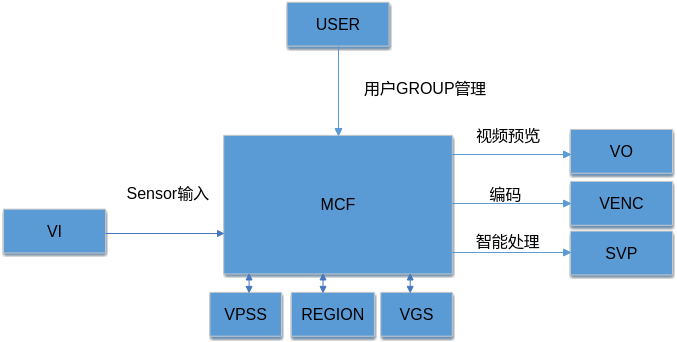
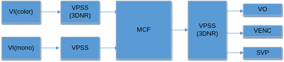
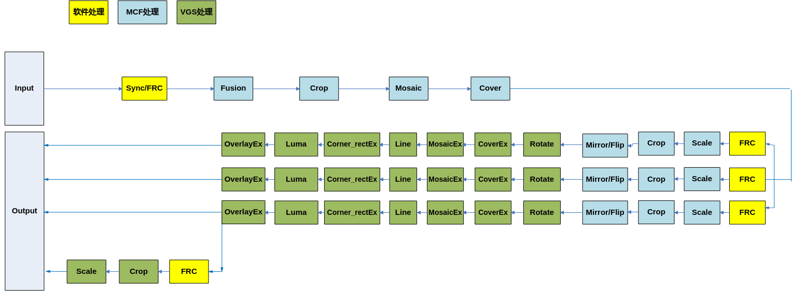

# Preface
**Overview<a name="section102mcpsimp"></a>**

This document is written for programmers using MCF development, aiming to provide solutions and assistance for problems encountered during the development process.

> **Note:** 
>This document uses Hi3403V100 as the description example. Unless otherwise specified, Hi3519AV200 has the same content as Hi3403V100.

**Product Version<a name="section105mcpsimp"></a>**

The product versions corresponding to this document are as follows.

<a name="table108mcpsimp"></a>
<table><thead align="left"><tr id="row113mcpsimp"><th class="cellrowborder" valign="top" width="32%" id="mcps1.1.3.1.1"><p id="p115mcpsimp"><a name="p115mcpsimp"></a><a name="p115mcpsimp"></a>Product Name</p>
</th>
<th class="cellrowborder" valign="top" width="68%" id="mcps1.1.3.1.2"><p id="p117mcpsimp"><a name="p117mcpsimp"></a><a name="p117mcpsimp"></a>Product Version</p>
</th>
</tr>
</thead>
<tbody><tr id="row119mcpsimp"><td class="cellrowborder" valign="top" width="32%" headers="mcps1.1.3.1.1 "><p id="p121mcpsimp"><a name="p121mcpsimp"></a><a name="p121mcpsimp"></a>Hi3403V100</p>
</td>
<td class="cellrowborder" valign="top" width="68%" headers="mcps1.1.3.1.2 "><p id="p123mcpsimp"><a name="p123mcpsimp"></a><a name="p123mcpsimp"></a>V100</p>
</td>
</tr>
<tr id="row4420516474"><td class="cellrowborder" valign="top" width="32%" headers="mcps1.1.3.1.1 "><p id="p166961419277"><a name="p166961419277"></a><a name="p166961419277"></a>Hi3519AV200</p>
</td>
<td class="cellrowborder" valign="top" width="68%" headers="mcps1.1.3.1.2 "><p id="p869611191071"><a name="p869611191071"></a><a name="p869611191071"></a>V100</p>
</td>
</tr>
</tbody>
</table>

**Intended Audience<a name="section124mcpsimp"></a>**

This document (guide) is primarily intended for the following engineers:

- Technical support engineers
- Software development engineers

**Symbol Conventions<a name="section130mcpsimp"></a>**

The following symbols may appear in this document, with their meanings described below.

<a name="table133mcpsimp"></a>
<table><thead align="left"><tr id="row138mcpsimp"><th class="cellrowborder" valign="top" width="18%" id="mcps1.1.3.1.1"><p id="p140mcpsimp"><a name="p140mcpsimp"></a><a name="p140mcpsimp"></a>Symbol</p>
</th>
<th class="cellrowborder" valign="top" width="82%" id="mcps1.1.3.1.2"><p id="p142mcpsimp"><a name="p142mcpsimp"></a><a name="p142mcpsimp"></a>Description</p>
</th>
</tr>
</thead>
<tbody><tr id="row144mcpsimp"><td class="cellrowborder" valign="top" width="18%" headers="mcps1.1.3.1.1 "><p class="msonormal" id="p146mcpsimp"><a name="p146mcpsimp"></a><a name="p146mcpsimp"></a><a name="image102"></a><a name="image102"></a><span></span></p>
</td>
<td class="cellrowborder" valign="top" width="82%" headers="mcps1.1.3.1.2 "><p id="p148mcpsimp"><a name="p148mcpsimp"></a><a name="p148mcpsimp"></a>Indicates a high-risk hazard which, if not avoided, will result in death or serious injury.</p>
</td>
</tr>
<tr id="row149mcpsimp"><td class="cellrowborder" valign="top" width="18%" headers="mcps1.1.3.1.1 "><p class="msonormal" id="p151mcpsimp"><a name="p151mcpsimp"></a><a name="p151mcpsimp"></a><a name="image103"></a><a name="image103"></a><span></span></p>
</td>
<td class="cellrowborder" valign="top" width="82%" headers="mcps1.1.3.1.2 "><p id="p153mcpsimp"><a name="p153mcpsimp"></a><a name="p153mcpsimp"></a>Indicates a medium-risk hazard which, if not avoided, could result in death or serious injury.</p>
</td>
</tr>
<tr id="row154mcpsimp"><td class="cellrowborder" valign="top" width="18%" headers="mcps1.1.3.1.1 "><p class="msonormal" id="p156mcpsimp"><a name="p156mcpsimp"></a><a name="p156mcpsimp"></a><a name="image104"></a><a name="image104"></a><span></span></p>
</td>
<td class="cellrowborder" valign="top" width="82%" headers="mcps1.1.3.1.2 "><p id="p158mcpsimp"><a name="p158mcpsimp"></a><a name="p158mcpsimp"></a>Indicates a low-risk hazard which, if not avoided, could result in minor or moderate injury.</p>
</td>
</tr>
<tr id="row159mcpsimp"><td class="cellrowborder" valign="top" width="18%" headers="mcps1.1.3.1.1 "><p class="msonormal" id="p161mcpsimp"><a name="p161mcpsimp"></a><a name="p161mcpsimp"></a><a name="image105"></a><a name="image105"></a><span></span></p>
</td>
<td class="cellrowborder" valign="top" width="82%" headers="mcps1.1.3.1.2 "><p id="p163mcpsimp"><a name="p163mcpsimp"></a><a name="p163mcpsimp"></a>Indicates a caution for device or environmental safety. If not avoided, could result in equipment damage, data loss, performance degradation, or other unpredictable consequences.</p>
<p id="p164mcpsimp"><a name="p164mcpsimp"></a><a name="p164mcpsimp"></a>"Caution" does not involve personal injury.</p>
</td>
</tr>
<tr id="row165mcpsimp"><td class="cellrowborder" valign="top" width="18%" headers="mcps1.1.3.1.1 "><p class="msonormal" id="p167mcpsimp"><a name="p167mcpsimp"></a><a name="p167mcpsimp"></a><a name="image106"></a><a name="image106"></a><span></span></p>
</td>
<td class="cellrowborder" valign="top" width="82%" headers="mcps1.1.3.1.2 "><p id="p169mcpsimp"><a name="p169mcpsimp"></a><a name="p169mcpsimp"></a>Supplementary explanation for key information in the main text.</p>
<p id="p170mcpsimp"><a name="p170mcpsimp"></a><a name="p170mcpsimp"></a>"Note" is not a safety warning and does not involve personal injury, equipment, or environmental hazard information.</p>
</td>
</tr>
</tbody>
</table>

**Revision History<a name="section171mcpsimp"></a>**

The revision history records the updates for each document revision. The latest version of the document includes all updates from previous versions.

<a name="table1557726816410"></a>
<table><thead align="left"><tr id="row2942532716410"><th class="cellrowborder" valign="top" width="20.72%" id="mcps1.1.4.1.1"><p id="p3778275416410"><a name="p3778275416410"></a><a name="p3778275416410"></a><strong id="b5687322716410"><a name="b5687322716410"></a><a name="b5687322716410"></a>Document Version</strong></p>
</th>
<th class="cellrowborder" valign="top" width="26.119999999999997%" id="mcps1.1.4.1.2"><p id="p5627845516410"><a name="p5627845516410"></a><a name="p5627845516410"></a><strong id="b5800814916410"><a name="b5800814916410"></a><a name="b5800814916410"></a>Release Date</strong></p>
</th>
<th class="cellrowborder" valign="top" width="53.16%" id="mcps1.1.4.1.3"><p id="p2382284816410"><a name="p2382284816410"></a><a name="p2382284816410"></a><strong id="b3316380216410"><a name="b3316380216410"></a><a name="b3316380216410"></a>Description</strong></p>
</th>
</tr>
</thead>
<tbody><tr id="row5947359616410"><td class="cellrowborder" valign="top" width="20.72%" headers="mcps1.1.4.1.1 "><p id="p2149706016410"><a name="p2149706016410"></a><a name="p2149706016410"></a>00B01</p>
</td>
<td class="cellrowborder" valign="top" width="26.119999999999997%" headers="mcps1.1.4.1.2 "><p id="p648803616410"><a name="p648803616410"></a><a name="p648803616410"></a>2025-09-15</p>
</td>
<td class="cellrowborder" valign="top" width="53.16%" headers="mcps1.1.4.1.3 "><p id="p1946537916410"><a name="p1946537916410"></a><a name="p1946537916410"></a>First temporary version release.</p>
</td>
</tr>
</tbody>
</table>

# Overview
In low-light scenarios, images captured by RGB sensors often have very poor signal-to-noise ratio (SNR) and severe detail loss. Based on the new RGB + Mono dual-sensor structure, the visible light image from the RGB sensor fully preserves color information, while the Mono sensor combined with infrared fill light technology captures infrared images with relatively higher SNR and better detail representation.

Mono-Color-Fusion technology (abbreviated as MCF technology) is used to fuse the above visible light image and infrared image, preserving color information while significantly improving image detail representation and SNR, thereby enhancing image quality in low-light scenarios.

# Functional Description
## Basic Concepts<a name="ZH-CN_TOPIC_0000002424350954"></a>

- **MCF**

    MCF stands for Mono-Color-Fusion, i.e., black-white and color fusion technology.

- **GROUP**

    MCF provides the concept of groups to users. The maximum number available is [OT\_MCF\_MAX\_GRP\_NUM](#ZH-CN_TOPIC_0000002424191118). Each GROUP time-shares the MCF hardware. Each MCF GROUP contains multiple PIPEs and multiple channels.

- **PIPE**

    The PIPE of an MCF group. Used for inputting the mono-color dual-path source images. The number of PIPEs equals the number of fusion paths, which is [OT\_MCF\_PIPE\_NUM](#ZH-CN_TOPIC_0000002424350958). Users can connect to the frontend through system binding or send images to the PIPE for fusion processing.

- **CHN**

    The channel of an MCF group. Channels are divided into 2 types: physical channels and extension channels. MCF hardware provides multiple physical channels, each with scaling, cropping, and other functions. Extension channels have cropping and scaling functions. They bind to a physical channel, using the physical channel output as their own input, cropping and scaling the image to the user-set target resolution for output.

- **FRC**

    Frame rate control, divided into 2 types: group frame rate control and channel frame rate control.

    - Group frame rate control: Controls the reception of input images for each GROUP.
    - Channel frame rate control: Controls the image processing of each physical channel and extension channel.

- **CROP**

    Cropping, divided into 3 types: group cropping, physical channel cropping, and extension channel cropping.

    - Group cropping: MCF crops the input image.
    - Physical channel cropping: MCF crops the output image of each physical channel.
    - Extension channel cropping: MCF calls VGS to crop the output image of the extension channel.

- **Scale**

    Scaling, enlarging or reducing the image. The scaling factor refers to how many times to scale horizontally and vertically.

- **Mirror/Flip**

    Mirror is horizontal mirroring, Flip is vertical flipping. Mirror+Flip can be used to achieve 180-degree rotation.

- **Mosaic**

    Mosaic, fills mosaic blocks in specified areas of the MCF output image.

- **MosaicEx**

    Mosaic, calls VGS to fill mosaic blocks in specified areas of the MCF physical channel output image.

- **Cover**

    Video cover area: fills solid color blocks on the MCF output image.

    The occlusion area coordinate type is divided into absolute coordinate occlusion and relative coordinate ratio occlusion.

- **Coverex**

    Video occlusion area, calls VGS to fill solid color blocks on the MCF channel output image.

    The occlusion area coordinate type is divided into absolute coordinate occlusion and relative coordinate ratio occlusion. The relative coordinate is calculated relative to the original image, not the channel image. The effect is equivalent to Cover relative coordinates.

- **OverlayEx**

    Video overlay area, calls VGS to overlay bitmaps on the MCF channel output image.

- **Line**

    Calls VGS to draw lines on the MCF physical channel output image.

- **Compression**

    MCF supports linear format SEG compression.

- **Decompression**

    MCF supports linear format SEG decompression.

- **Low Latency**

    Low-latency output. The channel sends low-latency frames to the backend module. MCF supports VI enabling low latency.

## Functional Description<a name="ZH-CN_TOPIC_0000002457829765"></a>

The position of MCF in the system is shown in [Figure 1](#fig1392120333319).

**Figure 1** MCF Context Relationship<a name="fig1392120333319"></a>  


By calling the binding interface of the SYS module, it can be bound with modules such as VI, VO/VENC/SVP, etc. The former is the input source of MCF, and the latter is the receiver of MCF. Users can manage GROUPs through the MPI interface.

### Processing Flow<a name="ZH-CN_TOPIC_0000002457869857"></a>

**Figure 1** MCF Scenario Data Flow Diagram<a name="fig14625115315323"></a>  

> **Note:** 
>- The diagram only illustrates the data flow relationship, not the binding relationship.
>- The 2 VPSS units before MCF are used for MCF pre-processing. When VPSS performance is insufficient, the VPSS group number can be set to a VGS group to use VGS for pre-processing.
>- During MCF fusion, the pts of the 2 frames need to be close. It is recommended to use slave mode sensors.
>- In the MCF fusion scenario, VI and VPSS must be in offline mode.

**Figure 2** MCF Internal Processing Flow Diagram<a name="fig12877101218348"></a>  

> **Note:** 
>Hi3403V100 MCF supports 8 extension channels, but only one is shown in the diagram. Extension channels can be bound to any physical channel. The diagram only schematically shows binding to one physical channel.

### Input and Output Characteristics<a name="ZH-CN_TOPIC_0000002457829757"></a>

- Input pixel formats only include OT\_PIXEL\_FORMAT\_YVU\_SEMIPLANAR\_420, OT\_PIXEL\_FORMAT\_YUV\_400, and OT\_PIXEL\_FORMAT\_YUV\_SEMIPLANAR\_420.
- Output pixel formats only include OT\_PIXEL\_FORMAT\_YVU\_SEMIPLANAR\_422, OT\_PIXEL\_FORMAT\_YVU\_SEMIPLANAR\_420, OT\_PIXEL\_FORMAT\_YUV\_400, OT\_PIXEL\_FORMAT\_YUV\_SEMIPLANAR\_422, and OT\_PIXEL\_FORMAT\_YUV\_SEMIPLANAR\_420.

**Table 1** MCF Input Characteristics

<a name="table292mcpsimp"></a>
<table><thead align="left"><tr id="row301mcpsimp"><th class="cellrowborder" rowspan="2" valign="top" id="mcps1.2.6.1.1"><p id="p303mcpsimp"><a name="p303mcpsimp"></a><a name="p303mcpsimp"></a>Solution</p>
</th>
<th class="cellrowborder" valign="top" id="mcps1.2.6.1.2"><p id="p305mcpsimp"><a name="p305mcpsimp"></a><a name="p305mcpsimp"></a>Data Bit Width</p>
</th>
<th class="cellrowborder" colspan="2" valign="top" id="mcps1.2.6.1.3"><p id="p307mcpsimp"><a name="p307mcpsimp"></a><a name="p307mcpsimp"></a>Video Format</p>
</th>
<th class="cellrowborder" rowspan="2" valign="top" id="mcps1.2.6.1.4"><p id="p309mcpsimp"><a name="p309mcpsimp"></a><a name="p309mcpsimp"></a>Input Pixel Format</p>
</th>
</tr>
<tr id="row310mcpsimp"><th class="cellrowborder" valign="top" id="mcps1.2.6.2.1"><p id="p312mcpsimp"><a name="p312mcpsimp"></a><a name="p312mcpsimp"></a>8Bit</p>
</th>
<th class="cellrowborder" valign="top" id="mcps1.2.6.2.2"><p id="p314mcpsimp"><a name="p314mcpsimp"></a><a name="p314mcpsimp"></a>Linear</p>
</th>
<th class="cellrowborder" valign="top" id="mcps1.2.6.2.3"><p id="p316mcpsimp"><a name="p316mcpsimp"></a><a name="p316mcpsimp"></a>Tile64X16</p>
</th>
</tr>
</thead>
<tbody><tr id="row318mcpsimp"><td class="cellrowborder" valign="top" width="19%" headers="mcps1.2.6.1.1 mcps1.2.6.2.1 "><p id="p320mcpsimp"><a name="p320mcpsimp"></a><a name="p320mcpsimp"></a>Hi3403V100</p>
</td>
<td class="cellrowborder" valign="top" width="12%" headers="mcps1.2.6.1.2 mcps1.2.6.2.2 "><p id="p322mcpsimp"><a name="p322mcpsimp"></a><a name="p322mcpsimp"></a>Y: 8bit</p></td></tr></tbody></table>

[Additional input/output characteristic tables are provided in the source document with detailed specifications for different solutions, video formats, data bit widths, and pixel format support for both input and output streams.]

# API Reference
## ss\_mpi\_mcf\_create\_grp<a name="ZH-CN_TOPIC_0000002424191126"></a>

Creates an MCF group.

**Syntax**: ot\_s32 ss\_mpi\_mcf\_create\_grp(ot\_mcf\_grp grp, const ot\_mcf\_grp\_attr \*grp\_attr);

**Parameters**: grp - MCF group ID; grp\_attr - MCF group attribute pointer.

**Return Value**: Returns 0 on success, or an error code on failure.

**Description**: Creates an MCF group and initializes its attributes. This function must be called before any other MCF operations on the group.

## ss\_mpi\_mcf\_destroy\_grp<a name="ZH-CN_TOPIC_0000002424191154"></a>

Destroys an MCF group.

## ss\_mpi\_mcf\_reset\_grp<a name="ZH-CN_TOPIC_0000002424191170"></a>

Resets an MCF group to its initial state.

## ss\_mpi\_mcf\_start\_grp<a name="ZH-CN_TOPIC_0000002424350974"></a>

Starts an MCF group to begin processing.

## ss\_mpi\_mcf\_stop\_grp<a name="ZH-CN_TOPIC_0000002457869817"></a>

Stops an MCF group, halting processing.

## ss\_mpi\_mcf\_set\_grp\_attr<a name="ZH-CN_TOPIC_0000002457869877"></a>

Sets MCF group attributes.

## ss\_mpi\_mcf\_get\_grp\_attr<a name="ZH-CN_TOPIC_0000002424350902"></a>

Gets MCF group attributes.

## ss\_mpi\_mcf\_set\_alg\_param<a name="ZH-CN_TOPIC_0000002457829745"></a>

Sets MCF algorithm parameters, including fusion parameters, color correction, histogram adjustment, and detail processing.

## ss\_mpi\_mcf\_get\_alg\_param<a name="ZH-CN_TOPIC_0000002424191146"></a>

Gets MCF algorithm parameters.

## ss\_mpi\_mcf\_set\_grp\_crop<a name="ZH-CN_TOPIC_0000002457869813"></a>

Sets the group-level crop region for the MCF input image.

## ss\_mpi\_mcf\_get\_grp\_crop<a name="ZH-CN_TOPIC_0000002424351002"></a>

Gets the group-level crop region.

## ss\_mpi\_mcf\_send\_pipe\_frame<a name="ZH-CN_TOPIC_0000002424350994"></a>

Sends a frame to the MCF pipe for fusion processing.

## ss\_mpi\_mcf\_set\_chn\_attr<a name="ZH-CN_TOPIC_0000002457829705"></a>

Sets MCF channel attributes.

## ss\_mpi\_mcf\_get\_chn\_attr<a name="ZH-CN_TOPIC_0000002457829769"></a>

Gets MCF channel attributes.

## ss\_mpi\_mcf\_enable\_chn<a name="ZH-CN_TOPIC_0000002424350922"></a>

Enables an MCF channel.

## ss\_mpi\_mcf\_disable\_chn<a name="ZH-CN_TOPIC_0000002424350990"></a>

Disables an MCF channel.

## ss\_mpi\_mcf\_get\_chn\_frame<a name="ZH-CN_TOPIC_0000002457829677"></a>

Gets a frame from an MCF channel.

## ss\_mpi\_mcf\_release\_chn\_frame<a name="ZH-CN_TOPIC_0000002424350926"></a>

Releases a frame obtained from an MCF channel.

## ss\_mpi\_mcf\_set\_low\_delay\_attr<a name="ZH-CN_TOPIC_0000002457869905"></a>

Sets low-latency attributes for an MCF channel.

## ss\_mpi\_mcf\_get\_low\_delay\_attr<a name="ZH-CN_TOPIC_0000002424350918"></a>

Gets low-latency attributes for an MCF channel.

## ss\_mpi\_mcf\_attach\_vb\_pool<a name="ZH-CN_TOPIC_0000002424350946"></a>

Attaches a video buffer pool to an MCF group.

## ss\_mpi\_mcf\_detach\_vb\_pool<a name="ZH-CN_TOPIC_0000002457829693"></a>

Detaches a video buffer pool from an MCF group.

## ss\_mpi\_mcf\_set\_chn\_align<a name="ZH-CN_TOPIC_0000002457869845"></a>

Sets alignment attributes for an MCF channel.

## ss\_mpi\_mcf\_get\_chn\_align<a name="ZH-CN_TOPIC_0000002424350914"></a>

Gets alignment attributes for an MCF channel.

## ss\_mpi\_mcf\_set\_chn\_rotation<a name="ZH-CN_TOPIC_0000002457829697"></a>

Sets rotation attributes for an MCF channel.

## ss\_mpi\_mcf\_get\_chn\_rotation<a name="ZH-CN_TOPIC_0000002457869849"></a>

Gets rotation attributes for an MCF channel.

## ss\_mpi\_mcf\_set\_ext\_chn\_attr<a name="ZH-CN_TOPIC_0000002457869889"></a>

Sets extension channel attributes.

## ss\_mpi\_mcf\_get\_ext\_chn\_attr<a name="ZH-CN_TOPIC_0000002457869841"></a>

Gets extension channel attributes.

## ss\_mpi\_mcf\_set\_chn\_crop<a name="ZH-CN_TOPIC_0000002424350966"></a>

Sets the crop region for an MCF channel.

## ss\_mpi\_mcf\_get\_chn\_crop<a name="ZH-CN_TOPIC_0000002424191102"></a>

Gets the crop region for an MCF channel.

## ss\_mpi\_mcf\_get\_chn\_rgn\_luma<a name="ZH-CN_TOPIC_0000002457829737"></a>

Gets the luminance information of a region on an MCF channel.

## ss\_mpi\_mcf\_get\_chn\_fd<a name="ZH-CN_TOPIC_0000002457869837"></a>

Gets the file descriptor of an MCF channel.

## ss\_mpi\_mcf\_close\_fd<a name="ZH-CN_TOPIC_0000002424191106"></a>

Closes a file descriptor.

## ss\_mpi\_mcf\_get\_grp\_frame<a name="ZH-CN_TOPIC_0000002457829741"></a>

Gets a frame from an MCF group.

## ss\_mpi\_mcf\_release\_grp\_frame<a name="ZH-CN_TOPIC_0000002424191074"></a>

Releases a frame obtained from an MCF group.

## ss\_mpi\_mcf\_calibration<a name="ZH-CN_TOPIC_0000002457869861"></a>

Performs MCF calibration for dual-sensor alignment.

## ss\_mpi\_mcf\_set\_vi\_attr<a name="ZH-CN_TOPIC_0000002424350998"></a>

Sets VI attributes for MCF.

## ss\_mpi\_mcf\_get\_vi\_attr<a name="ZH-CN_TOPIC_0000002457829729"></a>

Gets VI attributes for MCF.

# Data Types
## OT\_MCF\_MAX\_GRP\_NUM<a name="ZH-CN_TOPIC_0000002424191118"></a>

```
#define OT_MCF_MAX_GRP_NUM          2
```

Maximum number of MCF groups.

## OT\_MCF\_PIPE\_NUM<a name="ZH-CN_TOPIC_0000002424350958"></a>

```
#define OT_MCF_PIPE_NUM             2
```

Number of PIPEs (fusion paths) per MCF group.

## OT\_MCF\_MAX\_CHN\_NUM<a name="ZH-CN_TOPIC_0000002424350986"></a>

```
#define OT_MCF_MAX_CHN_NUM 	(OT_MCF_MAX_PHYS_CHN_NUM + OT_MCF_MAX_EXT_CHN_NUM)
```

Maximum number of MCF channels.

## OT\_MCF\_MAX\_PHYS\_CHN\_NUM<a name="ZH-CN_TOPIC_0000002457829701"></a>

```
#define OT_MCF_MAX_PHYS_CHN_NUM	3
```

Maximum number of physical channels.

## OT\_MCF\_MAX\_EXT\_CHN\_NUM<a name="ZH-CN_TOPIC_0000002457869881"></a>

```
#define OT_MCF_MAX_EXT_CHN_NUM   8
```

Maximum number of extension channels.

## OT\_MCF\_MAX\_PIPE\_WIDTH / OT\_MCF\_MAX\_PIPE\_HEIGHT<a name="ZH-CN_TOPIC_0000002457829689"></a>

```
#define OT_MCF_MAX_PIPE_WIDTH  8192
#define OT_MCF_MAX_PIPE_HEIGHT 4096
```

Maximum pipe input dimensions.

## OT\_MCF\_MIN\_PIPE\_WIDTH / OT\_MCF\_MIN\_PIPE\_HEIGHT<a name="ZH-CN_TOPIC_0000002457869809"></a>

```
#define OT_MCF_MIN_PIPE_WIDTH  256
#define OT_MCF_MIN_PIPE_HEIGHT 256
```

Minimum pipe input dimensions.

## OT\_MCF\_MAX\_CHN\_WIDTH / OT\_MCF\_MAX\_CHN\_HEIGHT<a name="ZH-CN_TOPIC_0000002424350978"></a>

```
#define OT_MCF_MAX_CHN_WIDTH  16384
#define OT_MCF_MAX_CHN_HEIGHT 8192
```

Maximum physical channel output dimensions.

## OT\_MCF\_MIN\_CHN\_WIDTH / OT\_MCF\_MIN\_CHN\_HEIGHT<a name="ZH-CN_TOPIC_0000002424191110"></a>

```
#define OT_MCF_MIN_CHN_WIDTH  128
#define OT_MCF_MIN_CHN_HEIGHT 64
```

Minimum physical channel output dimensions.

## OT\_MCF\_MAX\_EXT\_CHN\_WIDTH / OT\_MCF\_MAX\_EXT\_CHN\_HEIGHT<a name="ZH-CN_TOPIC_0000002424191098"></a>

```
#define OT_MCF_MAX_EXT_CHN_WIDTH  16384
#define OT_MCF_MAX_EXT_CHN_HEIGHT 8192
```

Maximum extension channel output dimensions.

## OT\_MCF\_MIN\_EXT\_CHN\_WIDTH / OT\_MCF\_MIN\_EXT\_CHN\_HEIGHT<a name="ZH-CN_TOPIC_0000002457869829"></a>

```
#define OT_MCF_MIN_EXT_CHN_WIDTH  64
#define OT_MCF_MIN_EXT_CHN_HEIGHT 64
```

Minimum extension channel output dimensions.

## OT\_MCF\_BIAS\_LUT\_NUM / OT\_MCF\_WEIGHT\_LUT\_NUM / OT\_MCF\_CC\_UV\_GAIN\_LUT\_NUM / OT\_MCF\_COEF\_NUM<a name="ZH-CN_TOPIC_0000002424191070"></a>

```
#define OT_MCF_BIAS_LUT_NUM  9
#define OT_MCF_WEIGHT_LUT_NUM  33
#define OT_MCF_CC_UV_GAIN_LUT_NUM  256
#define OT_MCF_COEF_NUM  9
```

Look-up table size definitions for MCF algorithm parameters.

## ot\_mcf\_grp / ot\_mcf\_id / ot\_mcf\_pipe / ot\_mcf\_chn<a name="ZH-CN_TOPIC_0000002457869853"></a>

Basic data type definitions for MCF group ID, pipe ID, and channel ID.

## ot\_mcf\_crop\_info<a name="ZH-CN_TOPIC_0000002424191090"></a>

Structure defining crop region information.

## ot\_mcf\_grp\_attr<a name="ZH-CN_TOPIC_0000002457829721"></a>

Structure defining MCF group attributes, including pipe counts, data sources, and maximum channel width/height.

## ot\_mcf\_pipe\_attr<a name="ZH-CN_TOPIC_0000002457829761"></a>

Structure defining MCF pipe attributes.

## ot\_mcf\_chn\_attr<a name="ZH-CN_TOPIC_0000002457829713"></a>

Structure defining MCF channel attributes, including target resolution, pixel format, frame rate, and compression settings.

## ot\_mcf\_feature\_info<a name="ZH-CN_TOPIC_0000002457869873"></a>

Structure for feature information used in calibration.

## ot\_mcf\_ext\_chn\_attr<a name="ZH-CN_TOPIC_0000002424350934"></a>

Structure defining extension channel attributes.

## ot\_mcf\_calibration\_mode<a name="ZH-CN_TOPIC_0000002424191130"></a>

Enumeration for MCF calibration modes.

## ot\_mcf\_calibration<a name="ZH-CN_TOPIC_0000002457829709"></a>

Structure for calibration parameters.

## ot\_mcf\_hist\_adj\_mode<a name="ZH-CN_TOPIC_0000002424350938"></a>

Enumeration for histogram adjustment modes.

## ot\_mcf\_fusion\_alpha\_mode<a name="ZH-CN_TOPIC_0000002424191134"></a>

Enumeration for fusion alpha modes.

## ot\_mcf\_color\_correct\_cfg<a name="ZH-CN_TOPIC_0000002424350906"></a>

Structure for color correction configuration.

## ot\_mcf\_color\_hf\_proc\_cfg<a name="ZH-CN_TOPIC_0000002457829733"></a>

Structure for color high-frequency processing configuration.

## ot\_mcf\_hist\_adj\_cfg<a name="ZH-CN_TOPIC_0000002424191158"></a>

Structure for histogram adjustment configuration.

## ot\_mcf\_fusion\_global\_alpha\_mode\_cfg<a name="ZH-CN_TOPIC_0000002424191122"></a>

Structure for global alpha mode configuration.

## ot\_mcf\_fusion\_adaptive\_alpha\_mode\_cfg<a name="ZH-CN_TOPIC_0000002424350982"></a>

Structure for adaptive alpha mode configuration with detailed frequency-band alpha settings.

## ot\_mcf\_filter\_proc\_cfg<a name="ZH-CN_TOPIC_0000002424350950"></a>

Structure for filter processing configuration.

## ot\_mcf\_detail\_proc\_cfg<a name="ZH-CN_TOPIC_0000002457869865"></a>

Structure for detail processing configuration.

## ot\_mcf\_base\_proc\_cfg<a name="ZH-CN_TOPIC_0000002457869893"></a>

Structure for base layer processing configuration.

## ot\_mcf\_each\_freq\_proc\_cfg<a name="ZH-CN_TOPIC_0000002424191094"></a>

Structure for per-frequency-band processing configuration.

## ot\_mcf\_alg\_param<a name="ZH-CN_TOPIC_0000002457829753"></a>

Structure encapsulating all MCF algorithm parameters, including color correction, histogram adjustment, fusion mode, filtering, detail enhancement, and base layer settings.

## ot\_mcf\_vi\_attr<a name="ZH-CN_TOPIC_0000002424191082"></a>

Structure for video input attributes used by MCF.

## ot\_mcf\_path<a name="ZH-CN_TOPIC_0000002424191114"></a>

Enumeration for MCF path selection.

# Error Codes

A comprehensive list of MCF error codes with descriptions. Each error code is prefixed with OT\_ERR\_MCF\_ and provides specific information about the error condition encountered during MCF API calls.

# Proc Debug Information

Describes debug information available through the proc file system for monitoring MCF status, including group status, channel status, frame rate, and processing statistics.

# FAQ
## How to Eliminate Parallax between Two Groups of Lenses<a name="ZH-CN_TOPIC_0000002457869885"></a>

Describes methods for calibrating and correcting parallax between the RGB and Mono sensors.

## How to Eliminate Black Borders after Parallax Correction<a name="ZH-CN_TOPIC_0000002424191078"></a>

Provides solutions for black border artifacts that may appear after parallax correction.

## How to Correctly Configure ISP BNR Properties<a name="ZH-CN_TOPIC_0000002424350942"></a>

Guidance on configuring ISP Bayer Noise Reduction (BNR) properties for optimal MCF performance.

## How to Switch between Mono-Color Dual Fusion and Normal Scenarios<a name="ZH-CN_TOPIC_0000002457829773"></a>

Describes the procedure for switching between MCF dual-sensor fusion mode and normal single-sensor mode.

## Tiled Scenarios Do Not Support Group and Channel Cropping<a name="ZH-CN_TOPIC_0000002424350930"></a>

Notes on limitations when using tiled input formats with crop operations.
