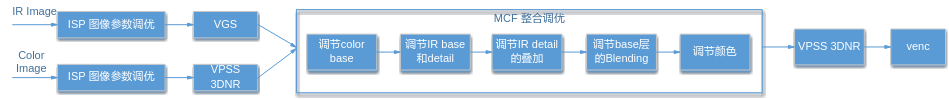
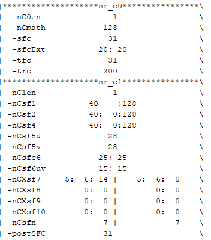
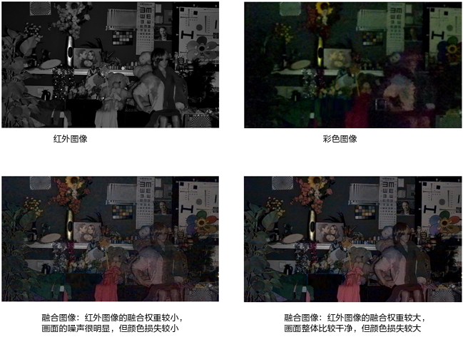
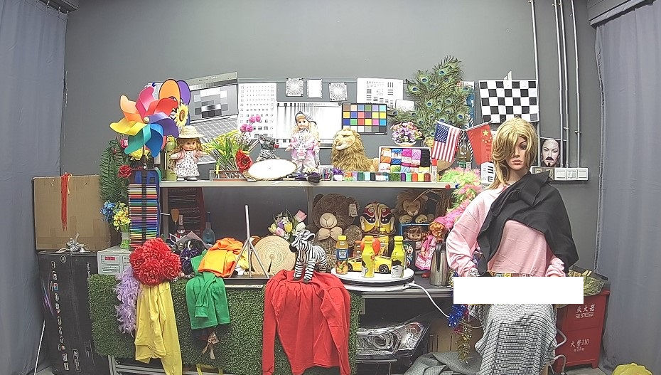

# Preface
**Overview<a name="section143mcpsimp"></a>**

This guide is written for engineers implementing Mono-Color Fusion (MCF) tuning. It covers the basic principles, operating procedures, and optimization methods for MCF.

> **Note:** 
>This document uses SS928V100 as the reference. Unless otherwise stated, SS927V100 and SS928V100 are identical.

**Product Versions<a name="section146mcpsimp"></a>**

The product versions corresponding to this document are listed below.

<a name="table149mcpsimp"></a>
<table><thead align="left"><tr id="row154mcpsimp"><th class="cellrowborder" valign="top" width="31%" id="mcps1.1.3.1.1"><p id="p156mcpsimp"><a name="p156mcpsimp"></a><a name="p156mcpsimp"></a>Product Name</p>
</th>
<th class="cellrowborder" valign="top" width="69%" id="mcps1.1.3.1.2"><p id="p158mcpsimp"><a name="p158mcpsimp"></a><a name="p158mcpsimp"></a>Product Version</p>
</th>
</tr>
</thead>
<tbody><tr id="row160mcpsimp"><td class="cellrowborder" valign="top" width="31%" headers="mcps1.1.3.1.1 "><p id="p162mcpsimp"><a name="p162mcpsimp"></a><a name="p162mcpsimp"></a>SS928</p>
</td>
<td class="cellrowborder" valign="top" width="69%" headers="mcps1.1.3.1.2 "><p id="p164mcpsimp"><a name="p164mcpsimp"></a><a name="p164mcpsimp"></a>V100</p>
</td>
</tr>
<tr id="row10658134621312"><td class="cellrowborder" valign="top" width="31%" headers="mcps1.1.3.1.1 "><p id="p812864918138"><a name="p812864918138"></a><a name="p812864918138"></a>SS927</p>
</td>
<td class="cellrowborder" valign="top" width="69%" headers="mcps1.1.3.1.2 "><p id="p41282499138"><a name="p41282499138"></a><a name="p41282499138"></a>V100</p>
</td>
</tr>
</tbody>
</table>

**Intended Audience<a name="section165mcpsimp"></a>**

This document is primarily intended for:

-   Technical support engineers
-   Software development engineers

**Symbol Conventions<a name="section171mcpsimp"></a>**

The following symbols may appear in this document with the meanings described below.

<a name="table174mcpsimp"></a>
<table><thead align="left"><tr id="row179mcpsimp"><th class="cellrowborder" valign="top" width="21%" id="mcps1.1.3.1.1"><p id="p181mcpsimp"><a name="p181mcpsimp"></a><a name="p181mcpsimp"></a><strong id="b182mcpsimp"><a name="b182mcpsimp"></a><a name="b182mcpsimp"></a>Symbol</strong></p>
</th>
<th class="cellrowborder" valign="top" width="79%" id="mcps1.1.3.1.2"><p id="p184mcpsimp"><a name="p184mcpsimp"></a><a name="p184mcpsimp"></a><strong id="b185mcpsimp"><a name="b185mcpsimp"></a><a name="b185mcpsimp"></a>Description</strong></p>
</th>
</tr>
</thead>
<tbody><tr id="row187mcpsimp"><td class="cellrowborder" valign="top" width="21%" headers="mcps1.1.3.1.1 "><p class="msonormal" id="p189mcpsimp"><a name="p189mcpsimp"></a><a name="p189mcpsimp"></a><a name="image103"></a><a name="image103"></a><span></span></p>
</td>
<td class="cellrowborder" valign="top" width="79%" headers="mcps1.1.3.1.2 "><p id="p191mcpsimp"><a name="p191mcpsimp"></a><a name="p191mcpsimp"></a>Indicates a high-risk hazard that, if not avoided, will result in death or serious injury.</p>
</td>
</tr>
<tr id="row192mcpsimp"><td class="cellrowborder" valign="top" width="21%" headers="mcps1.1.3.1.1 "><p class="msonormal" id="p194mcpsimp"><a name="p194mcpsimp"></a><a name="p194mcpsimp"></a><a name="image104"></a><a name="image104"></a><span></span></p>
</td>
<td class="cellrowborder" valign="top" width="79%" headers="mcps1.1.3.1.2 "><p id="p196mcpsimp"><a name="p196mcpsimp"></a><a name="p196mcpsimp"></a>Indicates a medium-risk hazard that, if not avoided, could result in death or serious injury.</p>
</td>
</tr>
<tr id="row197mcpsimp"><td class="cellrowborder" valign="top" width="21%" headers="mcps1.1.3.1.1 "><p class="msonormal" id="p199mcpsimp"><a name="p199mcpsimp"></a><a name="p199mcpsimp"></a><a name="image105"></a><a name="image105"></a><span></span></p>
</td>
<td class="cellrowborder" valign="top" width="79%" headers="mcps1.1.3.1.2 "><p id="p201mcpsimp"><a name="p201mcpsimp"></a><a name="p201mcpsimp"></a>Indicates a low-risk hazard that, if not avoided, could result in minor or moderate injury.</p>
</td>
</tr>
<tr id="row202mcpsimp"><td class="cellrowborder" valign="top" width="21%" headers="mcps1.1.3.1.1 "><p class="msonormal" id="p204mcpsimp"><a name="p204mcpsimp"></a><a name="p204mcpsimp"></a><a name="image106"></a><a name="image106"></a><span></span></p>
</td>
<td class="cellrowborder" valign="top" width="79%" headers="mcps1.1.3.1.2 "><p id="p206mcpsimp"><a name="p206mcpsimp"></a><a name="p206mcpsimp"></a>Conveys device or environmental safety warnings. Failure to follow this guidance may result in equipment damage, data loss, performance degradation, or other unpredictable outcomes.</p>
<p id="p207mcpsimp"><a name="p207mcpsimp"></a><a name="p207mcpsimp"></a>"Notice" does not involve personal injury.</p>
</td>
</tr>
<tr id="row208mcpsimp"><td class="cellrowborder" valign="top" width="21%" headers="mcps1.1.3.1.1 "><p class="msonormal" id="p210mcpsimp"><a name="p210mcpsimp"></a><a name="p210mcpsimp"></a><a name="image107"></a><a name="image107"></a><span></span></p>
</td>
<td class="cellrowborder" valign="top" width="79%" headers="mcps1.1.3.1.2 "><p id="p212mcpsimp"><a name="p212mcpsimp"></a><a name="p212mcpsimp"></a>Provides supplementary information for key content in the text.</p>
<p id="p213mcpsimp"><a name="p213mcpsimp"></a><a name="p213mcpsimp"></a>"Note" is not a safety warning and does not involve personal, equipment, or environmental hazards.</p>
</td>
</tr>
</tbody>
</table>

**Revision History<a name="section214mcpsimp"></a>**

The revision history accumulates descriptions of each document update. The latest version of this document incorporates all updates from previous versions.

<a name="table126443203200"></a>
<table><thead align="left"><tr id="row264516207203"><th class="cellrowborder" valign="top" width="20.72%" id="mcps1.1.4.1.1"><p id="p146456203200"><a name="p146456203200"></a><a name="p146456203200"></a><strong id="b8645172022010"><a name="b8645172022010"></a><a name="b8645172022010"></a>Document Version</strong></p>
</th>
<th class="cellrowborder" valign="top" width="26.119999999999997%" id="mcps1.1.4.1.2"><p id="p364512062019"><a name="p364512062019"></a><a name="p364512062019"></a><strong id="b1464512200200"><a name="b1464512200200"></a><a name="b1464512200200"></a>Release Date</strong></p>
</th>
<th class="cellrowborder" valign="top" width="53.16%" id="mcps1.1.4.1.3"><p id="p664522018206"><a name="p664522018206"></a><a name="p664522018206"></a><strong id="b156451420152010"><a name="b156451420152010"></a><a name="b156451420152010"></a>Change Description</strong></p>
</th>
</tr>
</thead>
<tbody><tr id="row56451520182017"><td class="cellrowborder" valign="top" width="20.72%" headers="mcps1.1.4.1.1 "><p id="p1564572014209"><a name="p1564572014209"></a><a name="p1564572014209"></a>00B01</p>
</td>
<td class="cellrowborder" valign="top" width="26.119999999999997%" headers="mcps1.1.4.1.2 "><p id="p126451920132014"><a name="p126451920132014"></a><a name="p126451920132014"></a>2025-09-15</p>
</td>
<td class="cellrowborder" valign="top" width="53.16%" headers="mcps1.1.4.1.3 "><p id="p1664582017209"><a name="p1664582017209"></a><a name="p1664582017209"></a>First preliminary release.</p>
</td>
</tr>
</tbody>
</table>

# Feature Description
In low-light scenes, the SNR of images captured by an RGB sensor is often very poor with significant detail loss. A dual-sensor architecture combining an RGB sensor and a monochrome (Mono) sensor addresses this: the RGB sensor preserves color information, while the Mono sensor combined with infrared fill lighting captures IR images with higher SNR and better detail.

Mono-Color Fusion (MCF) technology fuses the color image and the IR image to retain color information while significantly improving detail and SNR, thereby enhancing image quality in low-light scenes.

The basic block diagram of the MCF module is shown in [Figure 1](#fig1275217156391).

**Figure 1** MCF module block diagram<a name="fig1275217156391"></a>  


# Key Parameters
<a name="table244mcpsimp"></a>
<table><thead align="left"><tr id="row251mcpsimp"><th class="cellrowborder" valign="top" width="15%" id="mcps1.1.5.1.1"><p id="p253mcpsimp"><a name="p253mcpsimp"></a><a name="p253mcpsimp"></a>Module</p>
</th>
<th class="cellrowborder" valign="top" width="24%" id="mcps1.1.5.1.2"><p id="p255mcpsimp"><a name="p255mcpsimp"></a><a name="p255mcpsimp"></a>Parameter</p>
</th>
<th class="cellrowborder" valign="top" width="49%" id="mcps1.1.5.1.3"><p id="p257mcpsimp"><a name="p257mcpsimp"></a><a name="p257mcpsimp"></a>Description</p>
</th>
<th class="cellrowborder" valign="top" width="12%" id="mcps1.1.5.1.4"><p id="p259mcpsimp"><a name="p259mcpsimp"></a><a name="p259mcpsimp"></a>Range</p>
</th>
</tr>
</thead>
<tbody><tr id="row261mcpsimp"><td class="cellrowborder" rowspan="2" valign="top" width="15%" headers="mcps1.1.5.1.1 "><p id="p263mcpsimp"><a name="p263mcpsimp"></a><a name="p263mcpsimp"></a>IR Filter</p>
</td>
<td class="cellrowborder" valign="top" width="24%" headers="mcps1.1.5.1.2 "><p id="p265mcpsimp"><a name="p265mcpsimp"></a><a name="p265mcpsimp"></a>mono_flt_radius</p>
</td>
<td class="cellrowborder" valign="top" width="49%" headers="mcps1.1.5.1.3 "><p id="p267mcpsimp"><a name="p267mcpsimp"></a><a name="p267mcpsimp"></a>Luminance filter window radius for the IR image. A larger radius extracts stronger detail while the base layer becomes more blurred. This filter radius can be configured separately for high-frequency, mid-frequency, and low-frequency components of the IR image.</p>
</td>
<td class="cellrowborder" valign="top" width="12%" headers="mcps1.1.5.1.4 "><p id="p269mcpsimp"><a name="p269mcpsimp"></a><a name="p269mcpsimp"></a>[1,2]</p>
</td>
</tr>
<tr id="row270mcpsimp"><td class="cellrowborder" valign="top" headers="mcps1.1.5.1.1 "><p id="p272mcpsimp"><a name="p272mcpsimp"></a><a name="p272mcpsimp"></a>mono_flt_bias_lut[9]</p>
</td>
<td class="cellrowborder" valign="top" headers="mcps1.1.5.1.2 "><p id="p274mcpsimp"><a name="p274mcpsimp"></a><a name="p274mcpsimp"></a>Lookup table controlling the strength of detail extracted from the IR image at different brightness levels. Higher values extract stronger detail. Can be configured separately for high-frequency, mid-frequency, and low-frequency components.</p>
</td>
<td class="cellrowborder" valign="top" headers="mcps1.1.5.1.3 "><p id="p276mcpsimp"><a name="p276mcpsimp"></a><a name="p276mcpsimp"></a>[1,128]</p>
</td>
</tr>
<tr id="row277mcpsimp"><td class="cellrowborder" rowspan="6" valign="top" width="15%" headers="mcps1.1.5.1.1 "><p id="p279mcpsimp"><a name="p279mcpsimp"></a><a name="p279mcpsimp"></a>Color Filter</p>
</td>
<td class="cellrowborder" valign="top" width="24%" headers="mcps1.1.5.1.2 "><p id="p281mcpsimp"><a name="p281mcpsimp"></a><a name="p281mcpsimp"></a>color_flt_radius</p>
</td>
<td class="cellrowborder" valign="top" width="49%" headers="mcps1.1.5.1.3 "><p id="p283mcpsimp"><a name="p283mcpsimp"></a><a name="p283mcpsimp"></a>Luminance filter window radius for the color image. A larger radius produces a more blurred luminance base layer. Can be configured separately for high-frequency, mid-frequency, and low-frequency components.</p>
</td>
<td class="cellrowborder" valign="top" width="12%" headers="mcps1.1.5.1.4 "><p id="p285mcpsimp"><a name="p285mcpsimp"></a><a name="p285mcpsimp"></a>[1,4]</p>
</td>
</tr>
<tr id="row286mcpsimp"><td class="cellrowborder" valign="top" headers="mcps1.1.5.1.1 "><p id="p288mcpsimp"><a name="p288mcpsimp"></a><a name="p288mcpsimp"></a>color_flt_sgms</p>
</td>
<td class="cellrowborder" valign="top" headers="mcps1.1.5.1.2 "><p id="p290mcpsimp"><a name="p290mcpsimp"></a><a name="p290mcpsimp"></a>Spatial parameter for generating the color image filter. The actual value is color_flt_sgms/10.0. Higher values produce stronger filtering and a blurrier image. Can be configured separately for high-frequency, mid-frequency, and low-frequency components.</p>
</td>
<td class="cellrowborder" valign="top" headers="mcps1.1.5.1.3 "><p id="p292mcpsimp"><a name="p292mcpsimp"></a><a name="p292mcpsimp"></a>[1,50]</p>
</td>
</tr>
<tr id="row293mcpsimp"><td class="cellrowborder" valign="top" headers="mcps1.1.5.1.1 "><p id="p295mcpsimp"><a name="p295mcpsimp"></a><a name="p295mcpsimp"></a>color_flt_sgmr</p>
</td>
<td class="cellrowborder" valign="top" headers="mcps1.1.5.1.2 "><p id="p297mcpsimp"><a name="p297mcpsimp"></a><a name="p297mcpsimp"></a>Range parameter for generating the color image filter. Higher values produce stronger filtering and a blurrier image. Can be configured separately for high-frequency, mid-frequency, and low-frequency components.</p>
</td>
<td class="cellrowborder" valign="top" headers="mcps1.1.5.1.3 "><p id="p299mcpsimp"><a name="p299mcpsimp"></a><a name="p299mcpsimp"></a>[1,255]</p>
</td>
</tr>
<tr id="row300mcpsimp"><td class="cellrowborder" valign="top" headers="mcps1.1.5.1.1 "><p id="p302mcpsimp"><a name="p302mcpsimp"></a><a name="p302mcpsimp"></a>color_hf_en</p>
</td>
<td class="cellrowborder" valign="top" headers="mcps1.1.5.1.2 "><p id="p304mcpsimp"><a name="p304mcpsimp"></a><a name="p304mcpsimp"></a>Enable signal for extracting high-frequency information from the color image. Effective only for the high-frequency layer of the color image.</p>
</td>
<td class="cellrowborder" valign="top" headers="mcps1.1.5.1.3 "><p id="p306mcpsimp"><a name="p306mcpsimp"></a><a name="p306mcpsimp"></a>[0,1]</p>
</td>
</tr>
<tr id="row307mcpsimp"><td class="cellrowborder" valign="top" headers="mcps1.1.5.1.1 "><p id="p309mcpsimp"><a name="p309mcpsimp"></a><a name="p309mcpsimp"></a>color_hf_gain</p>
</td>
<td class="cellrowborder" valign="top" headers="mcps1.1.5.1.2 "><p id="p311mcpsimp"><a name="p311mcpsimp"></a><a name="p311mcpsimp"></a>Controls the blending strength of color image high-frequency information. Takes effect only when color_hf_en=1.</p>
</td>
<td class="cellrowborder" valign="top" headers="mcps1.1.5.1.3 "><p id="p313mcpsimp"><a name="p313mcpsimp"></a><a name="p313mcpsimp"></a>[0,255]</p>
</td>
</tr>
<tr id="row314mcpsimp"><td class="cellrowborder" valign="top" headers="mcps1.1.5.1.1 "><p id="p316mcpsimp"><a name="p316mcpsimp"></a><a name="p316mcpsimp"></a>color_med_en</p>
</td>
<td class="cellrowborder" valign="top" headers="mcps1.1.5.1.2 "><p id="p318mcpsimp"><a name="p318mcpsimp"></a><a name="p318mcpsimp"></a>Enable signal for applying median filtering to the color image. Effective only for the high-frequency layer of the color image.</p>
</td>
<td class="cellrowborder" valign="top" headers="mcps1.1.5.1.3 "><p id="p320mcpsimp"><a name="p320mcpsimp"></a><a name="p320mcpsimp"></a>[0,1]</p>
</td>
</tr>
<tr id="row321mcpsimp"><td class="cellrowborder" rowspan="3" valign="top" width="15%" headers="mcps1.1.5.1.1 "><p id="p323mcpsimp"><a name="p323mcpsimp"></a><a name="p323mcpsimp"></a>Hist Proc</p>
</td>
<td class="cellrowborder" valign="top" width="24%" headers="mcps1.1.5.1.2 "><p id="p325mcpsimp"><a name="p325mcpsimp"></a><a name="p325mcpsimp"></a>hist_adj_en</p>
</td>
<td class="cellrowborder" valign="top" width="49%" headers="mcps1.1.5.1.3 "><p id="p327mcpsimp"><a name="p327mcpsimp"></a><a name="p327mcpsimp"></a>Histogram correction enable signal.</p>
</td>
<td class="cellrowborder" valign="top" width="12%" headers="mcps1.1.5.1.4 "><p id="p329mcpsimp"><a name="p329mcpsimp"></a><a name="p329mcpsimp"></a>[0,1]</p>
</td>
</tr>
<tr id="row330mcpsimp"><td class="cellrowborder" valign="top" headers="mcps1.1.5.1.1 "><p id="p332mcpsimp"><a name="p332mcpsimp"></a><a name="p332mcpsimp"></a>hist_adj_mode</p>
</td>
<td class="cellrowborder" valign="top" headers="mcps1.1.5.1.2 "><p id="p334mcpsimp"><a name="p334mcpsimp"></a><a name="p334mcpsimp"></a>Histogram correction mode.</p>
<p id="p335mcpsimp"><a name="p335mcpsimp"></a><a name="p335mcpsimp"></a>0: No correction;</p>
<p id="p336mcpsimp"><a name="p336mcpsimp"></a><a name="p336mcpsimp"></a>1: Correct the color image;</p>
<p id="p337mcpsimp"><a name="p337mcpsimp"></a><a name="p337mcpsimp"></a>2: Correct the IR image.</p>
</td>
<td class="cellrowborder" valign="top" headers="mcps1.1.5.1.3 "><p id="p339mcpsimp"><a name="p339mcpsimp"></a><a name="p339mcpsimp"></a>[0,2]</p>
</td>
</tr>
<tr id="row340mcpsimp"><td class="cellrowborder" valign="top" headers="mcps1.1.5.1.1 "><p id="p342mcpsimp"><a name="p342mcpsimp"></a><a name="p342mcpsimp"></a>hist_adj_str</p>
</td>
<td class="cellrowborder" valign="top" headers="mcps1.1.5.1.2 "><p id="p344mcpsimp"><a name="p344mcpsimp"></a><a name="p344mcpsimp"></a>Histogram correction strength.</p>
</td>
<td class="cellrowborder" valign="top" headers="mcps1.1.5.1.3 "><p id="p346mcpsimp"><a name="p346mcpsimp"></a><a name="p346mcpsimp"></a>[0,255]</p>
</td>
</tr>
<tr id="row347mcpsimp"><td class="cellrowborder" rowspan="3" valign="top" width="15%" headers="mcps1.1.5.1.1 "><p id="p349mcpsimp"><a name="p349mcpsimp"></a><a name="p349mcpsimp"></a>Detail Gain</p>
</td>
<td class="cellrowborder" valign="top" width="24%" headers="mcps1.1.5.1.2 "><p id="p351mcpsimp"><a name="p351mcpsimp"></a><a name="p351mcpsimp"></a>fusion_det_gain</p>
</td>
<td class="cellrowborder" valign="top" width="49%" headers="mcps1.1.5.1.3 "><p id="p353mcpsimp"><a name="p353mcpsimp"></a><a name="p353mcpsimp"></a>Global blending strength for IR image detail. The actual blending strength is fusion_det_gain/128. Can be configured separately for high-frequency, mid-frequency, and low-frequency components.</p>
</td>
<td class="cellrowborder" valign="top" width="12%" headers="mcps1.1.5.1.4 "><p id="p355mcpsimp"><a name="p355mcpsimp"></a><a name="p355mcpsimp"></a>[0,255]</p>
</td>
</tr>
<tr id="row356mcpsimp"><td class="cellrowborder" valign="top" headers="mcps1.1.5.1.1 "><p id="p358mcpsimp"><a name="p358mcpsimp"></a><a name="p358mcpsimp"></a>fusion_mono_det_adap_en</p>
</td>
<td class="cellrowborder" valign="top" headers="mcps1.1.5.1.2 "><p id="p360mcpsimp"><a name="p360mcpsimp"></a><a name="p360mcpsimp"></a>Enable signal for adaptive adjustment of IR image detail blending strength. Can be configured separately for high-frequency, mid-frequency, and low-frequency components.</p>
</td>
<td class="cellrowborder" valign="top" headers="mcps1.1.5.1.3 "><p id="p362mcpsimp"><a name="p362mcpsimp"></a><a name="p362mcpsimp"></a>[0,1]</p>
</td>
</tr>
<tr id="row363mcpsimp"><td class="cellrowborder" valign="top" headers="mcps1.1.5.1.1 "><p id="p365mcpsimp"><a name="p365mcpsimp"></a><a name="p365mcpsimp"></a>fusion_mono_det_lut[33]</p>
</td>
<td class="cellrowborder" valign="top" headers="mcps1.1.5.1.2 "><p id="p367mcpsimp"><a name="p367mcpsimp"></a><a name="p367mcpsimp"></a>Lookup table that adaptively adjusts IR detail blending strength based on the luminance difference between the IR and color images. The actual adjustment gain is fusion_mono_det_lut/128. Can be configured separately for high-frequency, mid-frequency, and low-frequency components. Takes effect only when fusion_mono_det_adap_en=1.</p>
</td>
<td class="cellrowborder" valign="top" headers="mcps1.1.5.1.3 "><p id="p369mcpsimp"><a name="p369mcpsimp"></a><a name="p369mcpsimp"></a>[0,255]</p>
</td>
</tr>
<tr id="row370mcpsimp"><td class="cellrowborder" rowspan="12" valign="top" width="15%" headers="mcps1.1.5.1.1 "><p id="p372mcpsimp"><a name="p372mcpsimp"></a><a name="p372mcpsimp"></a>Blending</p>
</td>
<td class="cellrowborder" valign="top" width="24%" headers="mcps1.1.5.1.2 "><p id="p374mcpsimp"><a name="p374mcpsimp"></a><a name="p374mcpsimp"></a>fusion_alpha_mode</p>
</td>
<td class="cellrowborder" valign="top" width="49%" headers="mcps1.1.5.1.3 "><p id="p1363171119513"><a name="p1363171119513"></a><a name="p1363171119513"></a>Blending mode for the luminance base layers of the color and IR images.</p>
<p id="p1526251416520"><a name="p1526251416520"></a><a name="p1526251416520"></a>0: Global alpha blending;</p>
<p id="p376mcpsimp"><a name="p376mcpsimp"></a><a name="p376mcpsimp"></a>1: Adaptive alpha blending. Can be configured separately for high-frequency, mid-frequency, and low-frequency components.</p>
</td>
<td class="cellrowborder" valign="top" width="12%" headers="mcps1.1.5.1.4 "><p id="p378mcpsimp"><a name="p378mcpsimp"></a><a name="p378mcpsimp"></a>[0,1]</p>
</td>
</tr>
<tr id="row379mcpsimp"><td class="cellrowborder" valign="top" headers="mcps1.1.5.1.1 "><p id="p381mcpsimp"><a name="p381mcpsimp"></a><a name="p381mcpsimp"></a>fusion_global_alpha</p>
</td>
<td class="cellrowborder" valign="top" headers="mcps1.1.5.1.2 "><p id="p383mcpsimp"><a name="p383mcpsimp"></a><a name="p383mcpsimp"></a>Global alpha value for blending the luminance base layers of the color and IR images. fusion_global_alpha is the blending weight for the visible light luminance base layer; (255 - fusion_global_alpha) is the blending weight for the IR luminance base layer. Can be configured separately for each frequency band. Takes effect only when fusion_alpha_mode=0.</p>
</td>
<td class="cellrowborder" valign="top" headers="mcps1.1.5.1.3 "><p id="p385mcpsimp"><a name="p385mcpsimp"></a><a name="p385mcpsimp"></a>[0,255]</p>
</td>
</tr>
<tr id="row386mcpsimp"><td class="cellrowborder" valign="top" headers="mcps1.1.5.1.1 "><p id="p388mcpsimp"><a name="p388mcpsimp"></a><a name="p388mcpsimp"></a>fusion_ratio_scale</p>
</td>
<td class="cellrowborder" valign="top" headers="mcps1.1.5.1.2 "><p id="p390mcpsimp"><a name="p390mcpsimp"></a><a name="p390mcpsimp"></a>Scale factor for the luminance ratio between the IR and color images. Default value is 255. A smaller value increases the ratio. Takes effect only when fusion_alpha_mode=1.</p>
</td>
<td class="cellrowborder" valign="top" headers="mcps1.1.5.1.3 "><p id="p392mcpsimp"><a name="p392mcpsimp"></a><a name="p392mcpsimp"></a>[0,255]</p>
</td>
</tr>
<tr id="row393mcpsimp"><td class="cellrowborder" valign="top" headers="mcps1.1.5.1.1 "><p id="p395mcpsimp"><a name="p395mcpsimp"></a><a name="p395mcpsimp"></a>fusion_ratio_bias_lut[9]</p>
</td>
<td class="cellrowborder" valign="top" headers="mcps1.1.5.1.2 "><p id="p397mcpsimp"><a name="p397mcpsimp"></a><a name="p397mcpsimp"></a>Adaptively adjusts the luminance ratio based on IR image brightness. Higher values increase the computed luminance ratio. Can be configured separately for each frequency band. Takes effect only when fusion_alpha_mode=1.</p>
</td>
<td class="cellrowborder" valign="top" headers="mcps1.1.5.1.3 "><p id="p399mcpsimp"><a name="p399mcpsimp"></a><a name="p399mcpsimp"></a>[1,127]</p>
</td>
</tr>
<tr id="row400mcpsimp"><td class="cellrowborder" valign="top" headers="mcps1.1.5.1.1 "><p id="p402mcpsimp"><a name="p402mcpsimp"></a><a name="p402mcpsimp"></a>fusion_mono_ratio_en</p>
</td>
<td class="cellrowborder" valign="top" headers="mcps1.1.5.1.2 "><p id="p404mcpsimp"><a name="p404mcpsimp"></a><a name="p404mcpsimp"></a>Enable signal for adaptively adjusting the luminance ratio based on IR image brightness. Can be configured separately for each frequency band. Takes effect only when fusion_alpha_mode=1.</p>
</td>
<td class="cellrowborder" valign="top" headers="mcps1.1.5.1.3 "><p id="p406mcpsimp"><a name="p406mcpsimp"></a><a name="p406mcpsimp"></a>[0,1]</p>
</td>
</tr>
<tr id="row407mcpsimp"><td class="cellrowborder" valign="top" headers="mcps1.1.5.1.1 "><p id="p409mcpsimp"><a name="p409mcpsimp"></a><a name="p409mcpsimp"></a>fusion_mono_ratio_lut[33]</p>
</td>
<td class="cellrowborder" valign="top" headers="mcps1.1.5.1.2 "><p id="p411mcpsimp"><a name="p411mcpsimp"></a><a name="p411mcpsimp"></a>Controls the gain applied to the luminance ratio at different IR brightness levels. The actual gain is fusion_mono_ratio_lut/128. Can be configured separately for each frequency band. Takes effect only when fusion_mono_ratio_en=1.</p>
</td>
<td class="cellrowborder" valign="top" headers="mcps1.1.5.1.3 "><p id="p413mcpsimp"><a name="p413mcpsimp"></a><a name="p413mcpsimp"></a>[0,255]</p>
</td>
</tr>
<tr id="row414mcpsimp"><td class="cellrowborder" valign="top" headers="mcps1.1.5.1.1 "><p id="p416mcpsimp"><a name="p416mcpsimp"></a><a name="p416mcpsimp"></a>fusion_mono_flat_en</p>
</td>
<td class="cellrowborder" valign="top" headers="mcps1.1.5.1.2 "><p id="p418mcpsimp"><a name="p418mcpsimp"></a><a name="p418mcpsimp"></a>Enable signal for adaptively adjusting the luminance ratio based on the flatness of the IR image region. Can be configured separately for each frequency band. Takes effect only when fusion_alpha_mode=1.</p>
</td>
<td class="cellrowborder" valign="top" headers="mcps1.1.5.1.3 "><p id="p420mcpsimp"><a name="p420mcpsimp"></a><a name="p420mcpsimp"></a>[0,1]</p>
</td>
</tr>
<tr id="row421mcpsimp"><td class="cellrowborder" valign="top" headers="mcps1.1.5.1.1 "><p id="p423mcpsimp"><a name="p423mcpsimp"></a><a name="p423mcpsimp"></a>fusion_mono_flat_bias_lut[9]</p>
</td>
<td class="cellrowborder" valign="top" headers="mcps1.1.5.1.2 "><p id="p425mcpsimp"><a name="p425mcpsimp"></a><a name="p425mcpsimp"></a>Adjusts the luminance ratio based on IR image region flatness. Higher values increase the computed luminance ratio. Can be configured separately for each frequency band. Takes effect only when fusion_mono_flat_en=1.</p>
</td>
<td class="cellrowborder" valign="top" headers="mcps1.1.5.1.3 "><p id="p427mcpsimp"><a name="p427mcpsimp"></a><a name="p427mcpsimp"></a>[1,255]</p>
</td>
</tr>
<tr id="row428mcpsimp"><td class="cellrowborder" valign="top" headers="mcps1.1.5.1.1 "><p id="p430mcpsimp"><a name="p430mcpsimp"></a><a name="p430mcpsimp"></a>fusion_mono_flat_lut[33]</p>
</td>
<td class="cellrowborder" valign="top" headers="mcps1.1.5.1.2 "><p id="p432mcpsimp"><a name="p432mcpsimp"></a><a name="p432mcpsimp"></a>Gain lookup table based on IR image region flatness for adjusting the luminance ratio. The actual gain is fusion_mono_flat_lut/8. Can be configured separately for each frequency band. Takes effect only when fusion_mono_flat_en=1.</p>
</td>
<td class="cellrowborder" valign="top" headers="mcps1.1.5.1.3 "><p id="p434mcpsimp"><a name="p434mcpsimp"></a><a name="p434mcpsimp"></a>[0,255]</p>
</td>
</tr>
<tr id="row435mcpsimp"><td class="cellrowborder" valign="top" headers="mcps1.1.5.1.1 "><p id="p437mcpsimp"><a name="p437mcpsimp"></a><a name="p437mcpsimp"></a>fusion_color_ratio_en</p>
</td>
<td class="cellrowborder" valign="top" headers="mcps1.1.5.1.2 "><p id="p439mcpsimp"><a name="p439mcpsimp"></a><a name="p439mcpsimp"></a>Enable signal for adaptively adjusting the luminance ratio based on color image brightness. Can be configured separately for each frequency band. Takes effect only when fusion_alpha_mode=1.</p>
</td>
<td class="cellrowborder" valign="top" headers="mcps1.1.5.1.3 "><p id="p441mcpsimp"><a name="p441mcpsimp"></a><a name="p441mcpsimp"></a>[0,1]</p>
</td>
</tr>
<tr id="row442mcpsimp"><td class="cellrowborder" valign="top" headers="mcps1.1.5.1.1 "><p id="p444mcpsimp"><a name="p444mcpsimp"></a><a name="p444mcpsimp"></a>fusion_color_ratio_lut[33]</p>
</td>
<td class="cellrowborder" valign="top" headers="mcps1.1.5.1.2 "><p id="p446mcpsimp"><a name="p446mcpsimp"></a><a name="p446mcpsimp"></a>Controls the gain applied to the luminance ratio at different color image brightness levels. The actual gain is fusion_color_ratio_lut/128. Can be configured separately for each frequency band. Takes effect only when fusion_color_ratio_en=1.</p>
</td>
<td class="cellrowborder" valign="top" headers="mcps1.1.5.1.3 "><p id="p448mcpsimp"><a name="p448mcpsimp"></a><a name="p448mcpsimp"></a>[0,255]</p>
</td>
</tr>
<tr id="row449mcpsimp"><td class="cellrowborder" valign="top" headers="mcps1.1.5.1.1 "><p id="p451mcpsimp"><a name="p451mcpsimp"></a><a name="p451mcpsimp"></a>fusion_alpha_lut[33]</p>
</td>
<td class="cellrowborder" valign="top" headers="mcps1.1.5.1.2 "><p id="p453mcpsimp"><a name="p453mcpsimp"></a><a name="p453mcpsimp"></a>Lookup table for computing the blending alpha value based on the luminance ratio between the IR and color images. Higher values in the table mean a larger IR base layer blending weight alpha and a smaller color base layer blending weight (255-alpha). Can be configured separately for each frequency band. Takes effect only when fusion_alpha_mode=1.</p>
</td>
<td class="cellrowborder" valign="top" headers="mcps1.1.5.1.3 "><p id="p455mcpsimp"><a name="p455mcpsimp"></a><a name="p455mcpsimp"></a>[0,255]</p>
</td>
</tr>
<tr id="row456mcpsimp"><td class="cellrowborder" rowspan="3" valign="top" width="15%" headers="mcps1.1.5.1.1 "><p id="p458mcpsimp"><a name="p458mcpsimp"></a><a name="p458mcpsimp"></a>Color Correct</p>
</td>
<td class="cellrowborder" valign="top" width="24%" headers="mcps1.1.5.1.2 "><p id="p460mcpsimp"><a name="p460mcpsimp"></a><a name="p460mcpsimp"></a>color_correct_en</p>
</td>
<td class="cellrowborder" valign="top" width="49%" headers="mcps1.1.5.1.3 "><p id="p462mcpsimp"><a name="p462mcpsimp"></a><a name="p462mcpsimp"></a>Color correction enable signal.</p>
</td>
<td class="cellrowborder" valign="top" width="12%" headers="mcps1.1.5.1.4 "><p id="p464mcpsimp"><a name="p464mcpsimp"></a><a name="p464mcpsimp"></a>[0,1]</p>
</td>
</tr>
<tr id="row465mcpsimp"><td class="cellrowborder" valign="top" headers="mcps1.1.5.1.1 "><p id="p467mcpsimp"><a name="p467mcpsimp"></a><a name="p467mcpsimp"></a>cc_uv_gain_lut[255]</p>
</td>
<td class="cellrowborder" valign="top" headers="mcps1.1.5.1.2 "><p id="p469mcpsimp"><a name="p469mcpsimp"></a><a name="p469mcpsimp"></a>Color correction coefficient table. Applies a saturation gain to the chroma channel based on the ratio between the fused image luminance and the color image luminance. The actual correction coefficient is cc_uv_gain_lut/128; a table value of 128 means no saturation adjustment at that ratio. Takes effect only when color_correct_en=1.</p>
</td>
<td class="cellrowborder" valign="top" headers="mcps1.1.5.1.3 "><p id="p471mcpsimp"><a name="p471mcpsimp"></a><a name="p471mcpsimp"></a>[0,511]</p>
</td>
</tr>
<tr id="row472mcpsimp"><td class="cellrowborder" valign="top" headers="mcps1.1.5.1.1 "><p id="p474mcpsimp"><a name="p474mcpsimp"></a><a name="p474mcpsimp"></a>cc_thd_y</p>
</td>
<td class="cellrowborder" valign="top" headers="mcps1.1.5.1.2 "><a name="ul476mcpsimp"></a><a name="ul476mcpsimp"></a><ul id="ul476mcpsimp"><li>When set to a value between 1 and 127: when the visible light image luminance falls below this threshold, the color correction strength is progressively reduced from that threshold down to luminance 0.</li><li>When set to 0: this function is disabled.</li></ul>
</td>
<td class="cellrowborder" valign="top" headers="mcps1.1.5.1.3 "><p id="p480mcpsimp"><a name="p480mcpsimp"></a><a name="p480mcpsimp"></a>[0,127]</p>
</td>
</tr>
</tbody>
</table>

# Tuning Instructions
## MCF End-to-End Tuning Flowchart<a name="ZH-CN_TOPIC_0000002457840741"></a>

**Figure 1** 4K@30fps MCF end-to-end tuning flowchart<a name="fig498963145116"></a>  


**Figure 2** 4M@30fps MCF end-to-end tuning flowchart<a name="fig082311423517"></a>  


## ISP Baseline Image Quality Tuning<a name="ZH-CN_TOPIC_0000002457840693"></a>

Under normal illumination, the visible light channel is used primarily or exclusively. Only a small amount of IR blending (or none) is needed; reduce the blending strength accordingly. ISP and 3DNR tuning is the same as for a single-channel setup and is not described in this document.

The following assumes the device has IR fill lighting or that the monochrome sensor has good IR sensitivity — i.e., the IR channel gain is noticeably lower than the color channel gain. Without this condition, IR blending is not necessary due to reflectance variations across materials.

When IR fill lighting is present, the exposure difference between the IR and visible light channels is large; measure and adjust each independently, aiming to include as much image content as possible. Because of the IR fill lighting, use a blue-pass filter on the visible light channel whenever possible to filter out IR components and reduce color cast.

In low-light conditions, mono-color fusion is the primary approach. At this point, ISP and 3DNR must be tuned in conjunction to ensure the images entering the MCF module contain sufficient content. Tuning is split between the IR channel (IR image) and the color channel.

### IR Channel<a name="ZH-CN_TOPIC_0000002424202090"></a>

1.  The IR channel must have Demosaic enabled, otherwise grid-like artifacts may appear. Other sharpness and contrast tuning methods are similar to standard image processing. Since IR images are prone to overexposure, use the LDCI and Dehaze modules as appropriate to recover highlight detail.
2.  Due to the significant gain difference between the IR and color channels, if smooth and natural fusion is the priority, the high-frequency detail (edges) in the IR channel should not differ excessively from the color channel. Detail should come mainly from mid-to-low frequency IR image information, with high-frequency components roughly matching the color channel. If sharpness is prioritized over naturalness, use the result from step 1 directly.
3.  Many materials have drastically different reflectances for IR and visible light. If accurate color reproduction of such materials (e.g., fabric, dyes, metals) is not a concern, use the step 1 result. If overall color fidelity is important, make the IR image brightness distribution as close to the color image as possible, so that IR brightness information is more effectively utilized.
4.  For 4K@30fps MCF pipeline: due to VPSS overall performance constraints, the IR channel cannot go through VPSS 3DNR. When IR channel noise is low or smooth natural fusion is less critical, use BayerNR temporal processing to suppress noise, and tune post-fusion 3DNR luma noise reduction to suppress grain in static and flat areas. For 4M@30fps MCF pipeline: the IR channel can go through VPSS 3DNR. BayerNR and 3DNR can be used together for denoising.

### Color Channel<a name="ZH-CN_TOPIC_0000002424361870"></a>

**Sharpness<a name="section1711111269321"></a>**

Since fine texture and mid-to-high frequency detail are primarily contributed by the IR channel, the color channel should avoid approaches that amplify high-frequency noise — specifically, keep Demosaic `nddm_mf_detail_strength`, `nddm_hf_detail_strength`, and Sharpen `texture_freq` and the last point of `texturestr` as small as possible. Reduce LDCI and DRC appropriately based on actual noise levels to balance contrast and noise. For BayerNR tuning, focus on using `user_define_md`, `user_define_slope`, `user_define_dark_thresh`, and `user_define_color_thresh`. Note that `user_define_md` on the color channel must remain always on; otherwise the color image motion/static detection will behave incorrectly. Currently, the color channel's BayerNR motion/static detection relies on the IR channel information, which helps reduce detection errors caused by excessive noise in the color channel at very low light levels. Some object edges that are overexposed or have low reflectance in the IR channel may not be visible there; in these cases, object edges must come from the color channel, so the color channel must also provide reasonably strong object edges. It is recommended to set Demosaic `nddm_strength` to around 32 to provide edge strength and noise at a reasonable level while avoiding grid-like noise. For Sharpen, reduce `texture_freq` (recommended below 100), keep the last point of `texturestr` below 128, and set `edge_filt_strength` to 63 — this encourages objects to be treated as edges rather than texture for enhancement, avoiding significant noise increase. Reduce `detail_ctrl` as needed, using edge clarity as the acceptance criterion. To suppress noise as much as possible, 3DNR tuning must be coordinated with BayerNR; both include temporal processing, so prioritize BayerNR temporal processing with 3DNR as supplemental.

**Color<a name="section191131126193210"></a>**

Since the fused image still requires reasonable color saturation, yet chroma noise is high, some processing is needed. First, tune AWB. If accurate light source correction is required, no special handling is needed; otherwise, consider preserving the light source color slightly to reduce the obvious chroma noise at low color temperatures. In CCM, reduce the R and B channel primary coefficients moderately. Enable the CA module where possible to reduce saturation in dark areas and increase it in bright areas. CLUT can be used following similar principles as CA: preserve colors with high SNR, reduce saturation of colors with low SNR. For 3DNR chroma noise reduction, the recommended approach is: set nr_c0 sfc to 31 and tfc to 31 to suppress flickering chroma noise; for nr_c1, set both foreground and background sfn to 7, with the difference that the foreground sf7 blended filter should lean toward filter 5, and the background sf7 should lean toward filter 6. Note that filter 5 removes chroma noise but also affects normal color information — a trade-off is necessary. See [Figure 1](#fig13993142443410) for recommended parameter values.

**Figure 1** Recommended 3DNR chroma noise tuning parameters for the color channel<a name="fig13993142443410"></a>  


After color channel tuning, the overall image result is shown in [Figure 2](#fig9166426103219).

**Figure 2** Color channel tuning result<a name="fig9166426103219"></a>  


**Contrast<a name="section1120026183211"></a>**

Adjust gamma, LDCI, and Dehaze based on the actual application, following the same approach as standard low-light tuning. Pay attention to dark-area noise balance. Since the IR channel provides supplementary information, try to minimize the contrast difference between the visible light and IR channels.

## Mono-Color Dual-Channel Fusion Adjustment<a name="ZH-CN_TOPIC_0000002457840725"></a>

-   Adjusting the color image base layer independently
    -   Control the visible light luminance filter strength by adjusting the filter radius `color_flt_radius` and the filter coefficient parameters `color_flt_sgms` and `color_flt_sgmr`. Larger values result in stronger filtering and a blurrier base layer.
    -   The color image has separate base layers for high-frequency, mid-frequency, and low-frequency components; each can be adjusted independently.

-   Adjusting the IR image base and detail layers independently
    -   Control the filter strength by adjusting the filter radius `mono_flt_radius`. A larger radius produces a more blurred overall base layer, a larger overall detail layer, and consequently more pronounced and coarser detail.
    -   The lookup table `mono_flt_bias_lut[9]` controls the detail strength at different brightness levels. Higher table values result in stronger detail at the corresponding brightness. The table has 9 values, dividing the brightness range (e.g., [0, 255]) into 8 equal segments; detail strength at any brightness is computed by linear interpolation.
    -   The IR image has separate base and detail layers for high-frequency, mid-frequency, and low-frequency components; each can be adjusted independently.

-   Adjusting IR image detail blending strength
    -   Global blending strength is controllable via `fusion_det_gain`. A value of 128 blends the detail layer directly without gain adjustment.
    -   Adaptive blending strength is available by enabling `fusion_mono_det_adap_en=1`. The lookup table `fusion_mono_det_lut[33]` contains 33 gain values, dividing the IR-to-color luminance difference range into 32 equal segments; the detail blending strength gain at any luminance difference is computed by linear interpolation.
    -   Separate adjustment is supported for high-frequency, mid-frequency, and low-frequency IR detail layers.

-   Adjusting the base layer blending weights of the color and IR images
    -   When `fusion_alpha_mode=0`, global alpha blending is used. `fusion_global_alpha` sets the global blending weight for the color base layer; the IR base layer weight is (255 - `fusion_global_alpha`). The default value is 255; setting it too low blends in too much IR base content and degrades overall color appearance.
    -   When `fusion_alpha_mode=1`, adaptive alpha blending is used. The blending alpha is computed adaptively based on the luminance ratio Ry between the IR and color images.
    -   The lookup table `fusion_ratio_bias_lut[9]` adjusts Ry based on IR image brightness. Higher table values increase Ry. The 9 bias values divide the IR brightness range into 8 segments; the bias at any brightness is computed by linear interpolation.
    -   When `fusion_mono_flat_en=1`, `fusion_mono_flat_bias_lut[9]` adjusts Ry based on IR image region flatness. Higher values increase Ry. `fusion_mono_flat_lut[33]` applies a gain to Ry based on flatness; the actual gain is `fusion_mono_flat_lut/8`. Can be configured separately for each frequency band.
    -   When `fusion_mono_ratio_en=1`, `fusion_mono_ratio_lut[33]` applies a gain to Ry based on IR image brightness. The actual gain is `fusion_mono_ratio_lut/128`. Can be configured separately for each frequency band.
    -   When `fusion_color_ratio_en=1`, `fusion_color_ratio_lut[33]` applies a gain to Ry based on color image brightness. The actual gain is `fusion_color_ratio_lut/128`. Can be configured separately for each frequency band.
    -   After all bias and gain adjustments to Ry, the blending alpha for IR and color is looked up from `fusion_alpha_lut[33]`, which divides the Ry range into 32 segments. Higher table values yield a higher IR blending alpha; the color blending weight is (255-alpha).
    -   All of the above parameters can be adjusted separately for high-frequency, mid-frequency, and low-frequency bands.

-   Adjusting the color of the fused image
    -   When `color_correct_en=1`, color correction is enabled. `cc_uv_gain_lut[255]` applies a saturation gain to the chroma channel based on the ratio of fused image luminance to color image luminance. The pre/post fusion luminance ratio range is 0–255; the actual saturation gain is `cc_uv_gain_lut/128`.
    -   To avoid over-amplifying chroma noise saturation in dark areas, set `cc_thd_y`. When the color image luminance falls below this threshold, the chroma saturation compensation is progressively reduced from that threshold to luminance 0.

        **Figure 1** MCF tuning style example<a name="fig2192183017464"></a>  
        

## Post-Fusion 3DNR Adjustment<a name="ZH-CN_TOPIC_0000002424361910"></a>

Post-fusion VPSS 3DNR mainly serves to remove chroma noise amplified by the uvgain curve in the MCF module and to suppress grain in static and motion regions caused by the IR image not going through 3DNR. The tuning approach is the same as for standard color image 3DNR.

# Calibration
## Calibration Environment and Method<a name="ZH-CN_TOPIC_0000002424361950"></a>

### Calibration Purpose and Method<a name="ZH-CN_TOPIC_0000002424202066"></a>

The purpose of calibration is to estimate the external parameters of the lens — specifically the relative position between the dual lenses/sensors and the overlapping effective area between them. The algorithm uses the calibrated external parameters to align the two image streams, enabling subsequent dual-channel fusion processing.

Calibration is based on global registration and therefore cannot resolve disparity at different depths within the same scene for a dual-lens structure. The device's focus distance must be determined in advance. After calibration and registration, the disparity between the two image streams will be relatively small at and near the focus distance.

For example, if the focus distance is 5 meters, position the device 5 meters away from the calibration scene, facing its center, and capture images from both channels simultaneously.

### Calibration Environment Requirements<a name="ZH-CN_TOPIC_0000002424202026"></a>

The fields of view of the two lenses should be similar. Before calibration, subjectively verify that the framing of both channels is approximately equivalent.

Ambient lighting must be sufficient and uniform, ensuring both captured images have no obvious noise, no reflections, and minimal differences in brightness and contrast. Otherwise, global registration may fail.

The calibration scene does not require a specially made pattern, but must contain very rich detail to ensure there are sufficient and prominent feature points. Without this, global registration may fail.

The calibration scene should ideally be flat — for example, a detail-rich poster. A real scene can also be used, but it should not contain large depth variations.

During calibration, avoid moving objects or changing lighting in the scene, as motion will negatively affect calibration results.

The calibration scene should fill the entire frame in both captured images.

A recommended example calibration scene is shown in [Figure 1](#_fig26861861).

**Figure 1** Recommended MCF calibration scene example<a name="_fig26861861"></a>  


> **Note:** 
>MCF calibration uses GDC for field-of-view correction and image stabilization. If field-of-view correction and image stabilization from two or more gyroscopes are both enabled, performance may be insufficient.

## Using the Calibration Library<a name="ZH-CN_TOPIC_0000002457840713"></a>

### Function Interface Description<a name="ZH-CN_TOPIC_0000002457880833"></a>

Refer to the *Mono-Color Dual-Channel Fusion Developer Reference*.

### Usage Instructions<a name="ZH-CN_TOPIC_0000002424361858"></a>

1.  Navigate to the code path: `./sample/mcf/`
2.  Run: `./sample_mcf  0`
3.  The calibration output is shown below:

    ```
    show matrix of calbration: 
    1052905,         657,   -13045049, 
    -2007,     1051702,    11698003, 
    1,           0,    1048576, 
    show crop region of calibration： 
    x:16,  y:0,  width:1904,  height:1056 
    num of refer feature:   968 
    num of register feature: 771 
    num of match feature:  100
    ```

4.  The output includes the lens correction matrix, the overlapping effective area between the dual lenses/sensors, and feature point information: the number of reference image features, registration image features, and matched feature points.

### Usage Constraints<a name="ZH-CN_TOPIC_0000002424361922"></a>

The input image resolution for the calibration function must not exceed 4096x2160. Both input images must be the same size. The image width and height, stride, and the ROI crop values (top, bottom, left, right) must all be 8-aligned.

The following example illustrates the procedure.

1.  If the actual resolution is 4096x2160, downsample each calibration image by 4x horizontally and 4x vertically to obtain two 1024x540 calibration images.
2.  Use the two 1024x540 images as input to the calibration library, setting the input resolution to 1024x540, and run the calibration library.
3.  Process the calibration output parameters.

    If the calibrated matrix coefficients are:

    

    The corrected matrix coefficients for actual use are:

    

    If the calibrated effective region parameters are [x, y, w, h], the corrected parameters for actual use are [x*4, y*4, w*4, h*4].

    Here, 4 is the horizontal and vertical downsampling factor.

# Common Issue Tuning Methods
## Motion Trailing in Color Image at Very Low Light<a name="ZH-CN_TOPIC_0000002457880769"></a>

-   Verify that the IR image motion/static detection threshold for moving regions is properly tuned, ensuring that moving regions rely primarily on spatial filtering to avoid motion trailing in the IR image.
-   Verify that the color channel is using Bayer3D in user-defined mode, i.e., the parameters `user_define_md`, `user_define_slope`, `user_define_dark_thresh`, and `user_define_color_thresh` are properly configured.
-   Verify that the color channel 3DNR temporal parameters such as `tfs` and `math` are reasonable — strong enough to suppress large-grain raindrop-like noise, but not excessive enough to cause motion trailing.
-   When HNR and BNR are used on the color channel, ensure MCF preprocessing is given priority (i.e., `ot_mcf_vi_attr`'s `enable` is true). In this case, when HNR is in advance mode, HNR and BNR are parallel modules with no blending. BNR motion/static detection is then influenced by parameters `user_define_md`, `user_define_slope`, `user_define_dark_thresh`, and `user_define_color_thresh`.

## Fusion Quality Degradation Due to Large Luminance Difference Between IR and Color Images<a name="ZH-CN_TOPIC_0000002457880821"></a>

-   Verify that the IR image exposure is reasonable. Since image sharpness after fusion comes from the IR image, the visible light image exposure time can be appropriately limited to improve motion clarity.
-   Verify that the color image brightness is appropriate. If insufficient, ISP Dgain can be increased moderately, but note that very large ISP Dgain at very low light levels makes color image chroma noise difficult to remove.

## Blurring or Noisy Dark Patches in Motion Regions After Fusion<a name="ZH-CN_TOPIC_0000002457880809"></a>

-   Check the appearance of the color and IR images in motion regions. Blurring and noise issues should mainly originate from the color image; ensure the IR image performs well in motion regions.
-   In global alpha blending mode, reduce the value of `fusion_global_alpha`; in adaptive alpha blending mode, increase the values in the `fusion_alpha_lut[33]` curve. Either approach increases the IR image blending weight, improving the fused result. However, color performance after fusion will decrease; a trade-off must be made.

## Color Cast After Fusion<a name="ZH-CN_TOPIC_0000002457880845"></a>

-   Due to large differences in luminance and contrast distribution between the color and IR images, incorporating too much IR image information into the fusion will significantly degrade color appearance, causing color casts and reduced saturation. Tune the front-end ISP pipeline to make the color and IR channels as similar as possible in brightness and contrast distribution.
-   Check whether `color_correct_en` is set to 1 and adjust the `cc_uv_gain_lut[255]` curve as needed. Note that higher curve values provide stronger saturation compensation but also make chroma noise more visible — a trade-off is necessary.
-   To suppress dark-area chroma noise, reduce the saturation compensation for dark areas by setting `cc_thd_y` to lower the compensation strength below that brightness threshold.

## Poor License Plate Appearance After Fusion<a name="ZH-CN_TOPIC_0000002424202102"></a>

-   Verify that the license plate appearance in the color image is normal. Tune the ISP color channel to ensure good color accuracy and sharpness on the color image license plate.
-   Verify the license plate appearance in the IR image. Use the ISP IR channel tuning to make the IR license plate overexposed or close to overexposed.
-   When the IR license plate is overexposed or near overexposed, verify whether `fusion_mono_ratio_en` is set to 1. Based on the degree of overexposure, tune the `fusion_mono_ratio_lut[33]` table. This table generally decreases monotonically, dropping rapidly to 0 near the high brightness values corresponding to the overexposed IR license plate.
-   Note that in non-traffic-capture scenarios (e.g., nighttime black-light scenes), if the color channel exposure time is around 40 ms and the IR channel is only around 10 ms, the IR image cannot precisely control the overexposed region. Setting `fusion_mono_ratio_en=1` in this case often forces selection of the color image in IR overexposed areas, but the color image there is dark, causing image layering artifacts. In such cases, set `fusion_mono_ratio_en=0` to avoid this layering.

## Poor Calibration Results<a name="ZH-CN_TOPIC_0000002457840669"></a>

-   Check whether the calibration environment is appropriate.
-   For dual-lens structures, parallax is inherent and cannot be resolved by global registration-based calibration. In this case, set a region of interest (e.g., the center of the frame), and the calibration algorithm will prioritize accurate results in that region. Projective projection mode is recommended for dual-lens structures.
-   For beam-splitter structures, there is theoretically no parallax. A region of interest can be set as needed. Affine projection mode is recommended.
