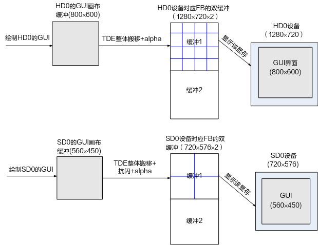
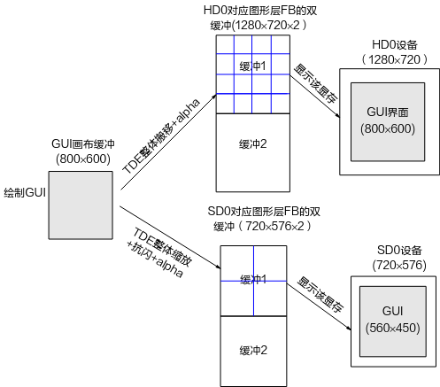

# Preface
**Overview**

This document presents one recommended solution for graphics development, covering the solution overview, derived variants, development workflow, applicable scenarios, and the associated advantages and limitations. It serves as a reference for users developing graphics applications.

> **Note:** 
>-   Unless otherwise stated, SS528V100, SS625V100, SS524V100, SS522V101, and SS626V100 are fully identical.
>-   Unless otherwise stated, SS927V100 and SS928V100, and SS522V100 and SS524V100 are fully identical.

**Product Versions**

The product versions corresponding to this document are listed below.

<table><thead align="left"><tr id="row155mcpsimp"><th class="cellrowborder" valign="top" width="32%" id="mcps1.1.3.1.1">
Product Name

</th>
<th class="cellrowborder" valign="top" width="68%" id="mcps1.1.3.1.2">
Product Version

</th>
</tr>
</thead>
<tbody><tr id="row161mcpsimp"><td class="cellrowborder" valign="top" width="32%" headers="mcps1.1.3.1.1 ">
SS928

</td>
<td class="cellrowborder" valign="top" width="68%" headers="mcps1.1.3.1.2 ">
V100

</td>
</tr>
<tr id="row166mcpsimp"><td class="cellrowborder" valign="top" width="32%" headers="mcps1.1.3.1.1 ">
SS626

</td>
<td class="cellrowborder" valign="top" width="68%" headers="mcps1.1.3.1.2 ">
V100

</td>
</tr>
<tr id="row1159710223415"><td class="cellrowborder" valign="top" width="32%" headers="mcps1.1.3.1.1 ">
SS524

</td>
<td class="cellrowborder" valign="top" width="68%" headers="mcps1.1.3.1.2 ">
V100

</td>
</tr>
<tr id="row3806135719163"><td class="cellrowborder" valign="top" width="32%" headers="mcps1.1.3.1.1 ">
SS522

</td>
<td class="cellrowborder" valign="top" width="68%" headers="mcps1.1.3.1.2 ">
V100

</td>
</tr>
<tr id="row1154655371615"><td class="cellrowborder" valign="top" width="32%" headers="mcps1.1.3.1.1 ">
SS522

</td>
<td class="cellrowborder" valign="top" width="68%" headers="mcps1.1.3.1.2 ">
V101

</td>
</tr>
<tr id="row13305165014598"><td class="cellrowborder" valign="top" width="32%" headers="mcps1.1.3.1.1 ">
SS528

</td>
<td class="cellrowborder" valign="top" width="68%" headers="mcps1.1.3.1.2 ">
V100

</td>
</tr>
<tr id="row14441920446"><td class="cellrowborder" valign="top" width="32%" headers="mcps1.1.3.1.1 ">
SS625

</td>
<td class="cellrowborder" valign="top" width="68%" headers="mcps1.1.3.1.2 ">
V100

</td>
</tr>
<tr id="row124425241073"><td class="cellrowborder" valign="top" width="32%" headers="mcps1.1.3.1.1 ">
SS927

</td>
<td class="cellrowborder" valign="top" width="68%" headers="mcps1.1.3.1.2 ">
V100

</td>
</tr>
</tbody>
</table>

**Intended Audience**

This document is primarily intended for:

-   Technical support engineers
-   Software development engineers

**Symbol Conventions**

The following symbols may appear in this document with the meanings described below.

<table><thead align="left"><tr id="row185mcpsimp"><th class="cellrowborder" valign="top" width="18%" id="mcps1.1.3.1.1">
Symbol

</th>
<th class="cellrowborder" valign="top" width="82%" id="mcps1.1.3.1.2">
Description

</th>
</tr>
</thead>
<tbody><tr id="row191mcpsimp"><td class="cellrowborder" valign="top" width="18%" headers="mcps1.1.3.1.1 ">

</td>
<td class="cellrowborder" valign="top" width="82%" headers="mcps1.1.3.1.2 ">
Indicates a high-risk hazard that, if not avoided, will result in death or serious injury.

</td>
</tr>
<tr id="row196mcpsimp"><td class="cellrowborder" valign="top" width="18%" headers="mcps1.1.3.1.1 ">

</td>
<td class="cellrowborder" valign="top" width="82%" headers="mcps1.1.3.1.2 ">
Indicates a medium-risk hazard that, if not avoided, could result in death or serious injury.

</td>
</tr>
<tr id="row201mcpsimp"><td class="cellrowborder" valign="top" width="18%" headers="mcps1.1.3.1.1 ">

</td>
<td class="cellrowborder" valign="top" width="82%" headers="mcps1.1.3.1.2 ">
Indicates a low-risk hazard that, if not avoided, could result in minor or moderate injury.

</td>
</tr>
<tr id="row206mcpsimp"><td class="cellrowborder" valign="top" width="18%" headers="mcps1.1.3.1.1 ">

</td>
<td class="cellrowborder" valign="top" width="82%" headers="mcps1.1.3.1.2 ">
Conveys device or environmental safety warnings. Failure to follow this guidance may result in equipment damage, data loss, performance degradation, or other unpredictable outcomes.

"Notice" does not involve personal injury.

</td>
</tr>
<tr id="row212mcpsimp"><td class="cellrowborder" valign="top" width="18%" headers="mcps1.1.3.1.1 ">

</td>
<td class="cellrowborder" valign="top" width="82%" headers="mcps1.1.3.1.2 ">
Provides supplementary information for key content in the text.

"Note" is not a safety warning and does not involve personal, equipment, or environmental hazards.

</td>
</tr>
</tbody>
</table>

**Revision History**

The revision history accumulates descriptions of each document update. The latest version of this document incorporates all updates from previous versions.

<table><thead align="left"><tr id="row264516207203"><th class="cellrowborder" valign="top" width="20.72%" id="mcps1.1.4.1.1">
<strong id="b8645172022010">Document Version</strong>

</th>
<th class="cellrowborder" valign="top" width="26.119999999999997%" id="mcps1.1.4.1.2">
<strong id="b1464512200200">Release Date</strong>

</th>
<th class="cellrowborder" valign="top" width="53.16%" id="mcps1.1.4.1.3">
<strong id="b156451420152010">Change Description</strong>

</th>
</tr>
</thead>
<tbody><tr id="row56451520182017"><td class="cellrowborder" valign="top" width="20.72%" headers="mcps1.1.4.1.1 ">
00B01

</td>
<td class="cellrowborder" valign="top" width="26.119999999999997%" headers="mcps1.1.4.1.2 ">
2025-09-15

</td>
<td class="cellrowborder" valign="top" width="53.16%" headers="mcps1.1.4.1.3 ">
First preliminary release.

</td>
</tr>
</tbody>
</table>

# Graphics Layer Overview
## Overview

The digital media processing platform provides a complete set of mechanisms for developing graphical interfaces. The main components are:

-   Two Dimensional Engine (TDE): a hardware-accelerated engine for processing graphics and images.
-   Graphic Framebuffer Group (GFBG): manages overlapping graphics layers. In addition to the standard Linux Framebuffer functionality, GFBG adds extended features such as inter-layer colorkey and inter-layer alpha blending.

> **Note:** 
>-   For TDE usage, refer to the *TDE API Reference*.
>-   For GFBG usage, refer to the *GFBG Developer Guide* and *GFBG API Reference*.

## Graphics Layer Architecture

-   SS528V100/SS625V100/SS524V100 support 2 HD display outputs (HD0, HD1) and 1 SD display output (SD0), along with 4 graphics layers: G0, G1, G2, and G3.
-   SS522V101 supports 1 HD display output (HD0) and 1 SD display output (SD0), along with 3 graphics layers: G0, G2, and G3.
-   SS928V100 supports 2 HD display outputs (HD0, HD1) and 1 SD display output (SD0), along with 3 graphics layers: G0, G1, and G3.
-   SS626V100 supports 2 HD display outputs (HD0, HD1) and 1 SD display output (SD0), along with 5 graphics layers: G0, G1, G2, G3, and G4.

> **Note:** 
>For the interface types and timing supported by each output device, refer to the VDP chapter of the corresponding chip manual.

The mapping between graphics layers and display devices is subject to certain constraints, as shown in [Table 1](#_Ref391716435) through [Table 4](#_Ref57990861).

**Table 1** FB device files, graphics layers, and output device mappings (SS528V100/SS625V100/SS524V100)

<table><thead align="left"><tr id="row254mcpsimp"><th class="cellrowborder" valign="top" width="18%" id="mcps1.2.4.1.1">
FB Device File

</th>
<th class="cellrowborder" valign="top" width="23%" id="mcps1.2.4.1.2">
Graphics Layer

</th>
<th class="cellrowborder" valign="top" width="59%" id="mcps1.2.4.1.3">
Corresponding Display Device

</th>
</tr>
</thead>
<tbody><tr id="row262mcpsimp"><td class="cellrowborder" valign="top" width="18%" headers="mcps1.2.4.1.1 ">
/dev/fb0

</td>
<td class="cellrowborder" valign="top" width="23%" headers="mcps1.2.4.1.2 ">
G0

</td>
<td class="cellrowborder" valign="top" width="59%" headers="mcps1.2.4.1.3 ">
G0 displays on the HD0 device.

</td>
</tr>
<tr id="row269mcpsimp"><td class="cellrowborder" valign="top" width="18%" headers="mcps1.2.4.1.1 ">
/dev/fb1

</td>
<td class="cellrowborder" valign="top" width="23%" headers="mcps1.2.4.1.2 ">
G1

</td>
<td class="cellrowborder" valign="top" width="59%" headers="mcps1.2.4.1.3 ">
G1 displays on the HD1 device.

</td>
</tr>
<tr id="row276mcpsimp"><td class="cellrowborder" valign="top" width="18%" headers="mcps1.2.4.1.1 ">
/dev/fb2

</td>
<td class="cellrowborder" valign="top" width="23%" headers="mcps1.2.4.1.2 ">
G2

</td>
<td class="cellrowborder" valign="top" width="59%" headers="mcps1.2.4.1.3 ">
G2 displays on HD0, HD1, and SD0 devices.

</td>
</tr>
<tr id="row283mcpsimp"><td class="cellrowborder" valign="top" width="18%" headers="mcps1.2.4.1.1 ">
/dev/fb3

</td>
<td class="cellrowborder" valign="top" width="23%" headers="mcps1.2.4.1.2 ">
G3

</td>
<td class="cellrowborder" valign="top" width="59%" headers="mcps1.2.4.1.3 ">
G3 displays on HD0, HD1, and SD0 devices.

</td>
</tr>
</tbody>
</table>

**Table 2** FB device files, graphics layers, and output device mappings (SS522V101)

<table><thead align="left"><tr id="row297mcpsimp"><th class="cellrowborder" valign="top" width="18%" id="mcps1.2.4.1.1">
FB Device File

</th>
<th class="cellrowborder" valign="top" width="23%" id="mcps1.2.4.1.2">
Graphics Layer

</th>
<th class="cellrowborder" valign="top" width="59%" id="mcps1.2.4.1.3">
Corresponding Display Device

</th>
</tr>
</thead>
<tbody><tr id="row305mcpsimp"><td class="cellrowborder" valign="top" width="18%" headers="mcps1.2.4.1.1 ">
/dev/fb0

</td>
<td class="cellrowborder" valign="top" width="23%" headers="mcps1.2.4.1.2 ">
G0

</td>
<td class="cellrowborder" valign="top" width="59%" headers="mcps1.2.4.1.3 ">
G0 displays on the HD0 device.

</td>
</tr>
<tr id="row312mcpsimp"><td class="cellrowborder" valign="top" width="18%" headers="mcps1.2.4.1.1 ">
/dev/fb1

</td>
<td class="cellrowborder" valign="top" width="23%" headers="mcps1.2.4.1.2 ">
G2

</td>
<td class="cellrowborder" valign="top" width="59%" headers="mcps1.2.4.1.3 ">
G2 displays on HD0, HD1, and SD0 devices.

</td>
</tr>
<tr id="row319mcpsimp"><td class="cellrowborder" valign="top" width="18%" headers="mcps1.2.4.1.1 ">
/dev/fb2

</td>
<td class="cellrowborder" valign="top" width="23%" headers="mcps1.2.4.1.2 ">
G3

</td>
<td class="cellrowborder" valign="top" width="59%" headers="mcps1.2.4.1.3 ">
G3 displays on HD0, HD1, and SD0 devices.

</td>
</tr>
</tbody>
</table>

**Table 3** FB device files, graphics layers, and output device mappings (SS928V100)

<table><thead align="left"><tr id="row333mcpsimp"><th class="cellrowborder" valign="top" width="18%" id="mcps1.2.4.1.1">
FB Device File

</th>
<th class="cellrowborder" valign="top" width="23%" id="mcps1.2.4.1.2">
Graphics Layer

</th>
<th class="cellrowborder" valign="top" width="59%" id="mcps1.2.4.1.3">
Corresponding Display Device

</th>
</tr>
</thead>
<tbody><tr id="row341mcpsimp"><td class="cellrowborder" valign="top" width="18%" headers="mcps1.2.4.1.1 ">
/dev/fb0

</td>
<td class="cellrowborder" valign="top" width="23%" headers="mcps1.2.4.1.2 ">
G0

</td>
<td class="cellrowborder" valign="top" width="59%" headers="mcps1.2.4.1.3 ">
G0 displays on the HD0 device.

</td>
</tr>
<tr id="row348mcpsimp"><td class="cellrowborder" valign="top" width="18%" headers="mcps1.2.4.1.1 ">
/dev/fb1

</td>
<td class="cellrowborder" valign="top" width="23%" headers="mcps1.2.4.1.2 ">
G1

</td>
<td class="cellrowborder" valign="top" width="59%" headers="mcps1.2.4.1.3 ">
G1 displays on the HD1 device.

</td>
</tr>
<tr id="row355mcpsimp"><td class="cellrowborder" valign="top" width="18%" headers="mcps1.2.4.1.1 ">
/dev/fb2

</td>
<td class="cellrowborder" valign="top" width="23%" headers="mcps1.2.4.1.2 ">
G3

</td>
<td class="cellrowborder" valign="top" width="59%" headers="mcps1.2.4.1.3 ">
G3 displays on HD0, HD1, and SD0 devices.

</td>
</tr>
</tbody>
</table>

**Table 4** FB device files, graphics layers, and output device mappings (SS626V100)

<table><thead align="left"><tr id="row368mcpsimp"><th class="cellrowborder" valign="top" width="18%" id="mcps1.2.4.1.1">
FB Device File

</th>
<th class="cellrowborder" valign="top" width="23%" id="mcps1.2.4.1.2">
Graphics Layer

</th>
<th class="cellrowborder" valign="top" width="59%" id="mcps1.2.4.1.3">
Corresponding Display Device

</th>
</tr>
</thead>
<tbody><tr id="row376mcpsimp"><td class="cellrowborder" valign="top" width="18%" headers="mcps1.2.4.1.1 ">
/dev/fb0

</td>
<td class="cellrowborder" valign="top" width="23%" headers="mcps1.2.4.1.2 ">
G0

</td>
<td class="cellrowborder" valign="top" width="59%" headers="mcps1.2.4.1.3 ">
G0 displays on the HD0 device.

</td>
</tr>
<tr id="row383mcpsimp"><td class="cellrowborder" valign="top" width="18%" headers="mcps1.2.4.1.1 ">
/dev/fb1

</td>
<td class="cellrowborder" valign="top" width="23%" headers="mcps1.2.4.1.2 ">
G1

</td>
<td class="cellrowborder" valign="top" width="59%" headers="mcps1.2.4.1.3 ">
G1 displays on the HD1 device.

</td>
</tr>
<tr id="row390mcpsimp"><td class="cellrowborder" valign="top" width="18%" headers="mcps1.2.4.1.1 ">
/dev/fb2

</td>
<td class="cellrowborder" valign="top" width="23%" headers="mcps1.2.4.1.2 ">
G2

</td>
<td class="cellrowborder" valign="top" width="59%" headers="mcps1.2.4.1.3 ">
G2 displays on HD0, HD1, and SD0 devices.

</td>
</tr>
<tr id="row397mcpsimp"><td class="cellrowborder" valign="top" width="18%" headers="mcps1.2.4.1.1 ">
/dev/fb3

</td>
<td class="cellrowborder" valign="top" width="23%" headers="mcps1.2.4.1.2 ">
G3

</td>
<td class="cellrowborder" valign="top" width="59%" headers="mcps1.2.4.1.3 ">
G3 displays on HD0 and HD1 devices.

</td>
</tr>
<tr id="row404mcpsimp"><td class="cellrowborder" valign="top" width="18%" headers="mcps1.2.4.1.1 ">
/dev/fb4

</td>
<td class="cellrowborder" valign="top" width="23%" headers="mcps1.2.4.1.2 ">
G4

</td>
<td class="cellrowborder" valign="top" width="59%" headers="mcps1.2.4.1.3 ">
G4 displays on HD1 and SD0 devices.

</td>
</tr>
</tbody>
</table>

> **Note:** 
>To display graphics layers, users must first configure and start the output device, then use the GFBG module interface to enable the graphics layer for display.

# Recommended Graphics Development Solution
## Overview

In the video capture domain, the graphical user interface content on a typical output device generally includes:

-   Back-end OSD: displays split lines, channel numbers, time, and other information to define multi-screen layout.
-   GUI: includes menus, progress bars, and other elements through which users configure the device.
-   Mouse cursor: provides a more convenient way to navigate interface menus.

These three categories of graphical content can be implemented using a single graphics layer or multiple graphics layers. For chips that provide multiple graphics layers, this guide helps users correctly, rationally, and effectively utilize these layers to meet different output interface requirements. The following solutions are provided for reference.

## Single-Layer UI Solution

### Solution Overview

The overall approach of this solution is: each output device uses a single graphics layer to handle the back-end OSD, GUI, and mouse cursor display for that device. The mouse cursor can alternatively be implemented using a dedicated cursor layer.

More specifically: each output device uses one graphics layer for its back-end OSD and GUI; the GUI is drawn onto a separate buffer, while the back-end OSD is drawn directly into the FB framebuffer memory, with alpha blending performed via TDE; the mouse cursor can use a dedicated cursor layer or share a layer with the OSD and GUI — when sharing, it is drawn onto the GUI buffer.

This solution uses the following mechanisms:

-   Each device's back-end OSD is drawn directly into its respective FB framebuffer memory.

    For example, split layout lines, channel numbers, or timestamps are drawn into the FB framebuffer of each graphics layer.

-   Each device has a single GUI canvas buffer; only the changed portions are refreshed when the GUI updates.

    Each device uses a separate buffer for rendering the GUI (referred to as the GUI canvas). Only the modified area needs to be redrawn when the GUI changes.

-   The entire GUI canvas is copied to the FB framebuffer of the corresponding graphics layer.

    The rendered canvas is transferred to the appropriate FB buffer. During this process, TDE can be used to blend the GUI and OSD with alpha transparency. Since the entire canvas and OSD are composited together each time, there is no need to compute the overlapping regions between GUI and OSD updates individually.

-   FB double buffering

    To prevent visible tearing while a buffer is being drawn and displayed simultaneously, it is recommended to use the FB double-buffering mechanism or the GFBG\_LAYER\_BUF\_DOUBLE / GFBG\_LAYER\_BUF\_DOUBLE\_IMMEDIATE mode in GFBG extended mode. Both approaches allocate two equal-sized buffers as framebuffer memory, alternating between drawing and display. For example, if VO is currently displaying buffer 2, the current draw target is buffer 1. In FB standard mode, PAN\_DISPLAY or FBIOFLIP\_SURFACE can be called to notify VO to display buffer 1; in FB extended mode, FBIO\_REFRESH can be used for the same purpose.

The structure of this solution is shown in [Figure 1](#fig116691737132).

**Figure 1** Structure diagram of the single-layer solution  

When either the back-end OSD or the GUI changes, the FB buffer must be redrawn:

-   When the back-end OSD changes (e.g., switching from a 16-channel split layout to a 9-channel split layout): clear the FB buffer, draw the new OSD, then copy the entire GUI canvas into the FB buffer.
-   Every time the GUI changes: clear the FB buffer, draw the OSD, then copy the new GUI canvas into the FB buffer.

### Derived Variant

When the same GUI content needs to be displayed simultaneously on both SD0 and HD0 devices, this solution can be simplified to use a single GUI canvas buffer:

-   The canvas is sized to match the HD0 GUI layer (e.g., 800x600). The user prepares one set of images at HD0 resolution (e.g., 800x600). Only the changed portion of the canvas is redrawn on each GUI update. The GUI on SD0 is derived by scaling the entire canvas, with anti-flicker applied, resulting in slightly lower quality compared to the HD version.
-   After each canvas update, for the HD device, since the canvas and GUI layer are the same size, TDE performs a direct copy; for SD0, TDE scales the entire canvas into the FB buffer bound to the SD0 graphics layer, applying anti-flicker processing (required because SD0 is an interlaced device).

The structure of this derived variant is shown in [Figure 1](#fig16738132531813).

**Figure 1** Structure diagram of the derived variant  

### Development Workflow

#### Development Workflow for Solution 1

Using HD0 and SD0 as an example: HD0 displays a 16-channel equal split layout, SD0 displays a 4-channel equal split layout, and both HD0 and SD0 show the same GUI simultaneously.

When the GUI changes, the implementation proceeds as follows:

1.  Clear the idle FB buffer (assumed to be buffer 1; buffer 2 is currently being displayed by VO) for the graphics layers corresponding to HD0 and SD0.
2.  Draw the 16-channel split lines into buffer 1 of the HD0 graphics layer FB.
3.  Draw the 4-channel split lines into buffer 1 of the SD0 graphics layer FB.
4.  Partially update the GUI canvas.
5.  Use TDE to copy the entire canvas into the appropriate position in buffer 1 of the HD0 graphics layer FB, optionally applying alpha blending for a semi-transparent GUI effect.
6.  Use TDE to scale the entire canvas into the appropriate position in buffer 1 of the SD0 graphics layer FB, applying anti-flicker and optional alpha blending (for a semi-transparent GUI effect).
7.  Call PAN\_DISPLAY via the FB interface to notify HD0 to display buffer 1 of the graphics layer bound to that device.
8.  Call PAN\_DISPLAY via the FB interface to notify SD0 to display buffer 1 of the graphics layer bound to that device.

### Applicable Scenarios

This solution applies to the following scenarios:

-   Each device has its own back-end OSD (e.g., HD0 shows a 16-channel split layout, HD1 shows an 8-channel split layout, SD0 shows a 4-channel split layout).
-   Two or more output devices display a GUI simultaneously (same or different GUIs).

### Advantages and Limitations

This solution offers the following advantages:

-   GUI can be displayed on multiple devices simultaneously.
-   The GUI canvas supports partial refresh, reducing bus bandwidth usage and TDE processing load.
-   Supports alpha-blended compositing of the GUI and OSD with a simple control flow. Since the entire canvas and OSD are composited together on each update, there is no need to compute overlapping regions for partial updates.
-   For the derived variant, only one set of GUI images is needed to accommodate devices with different resolutions, saving flash storage.

This solution has the following limitation:

For the derived variant: the GUI displayed on the SD device is obtained by scaling the canvas, so its visual quality is slightly lower than that on the HD device.
