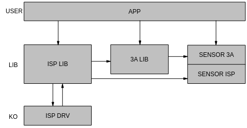
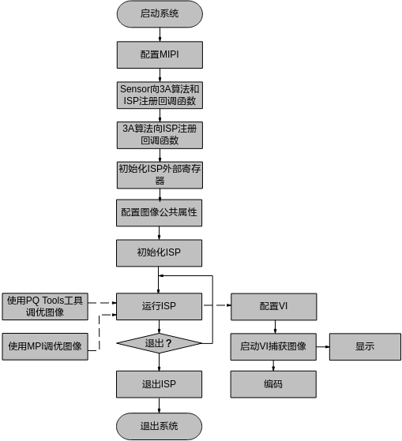
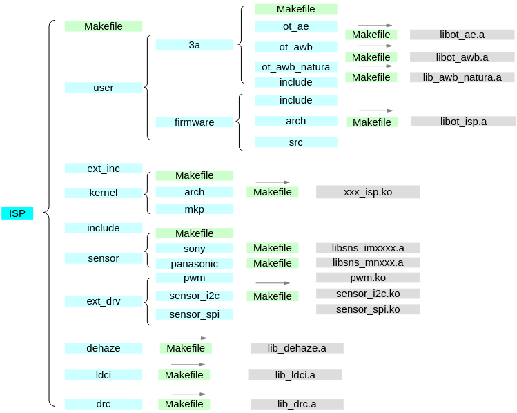
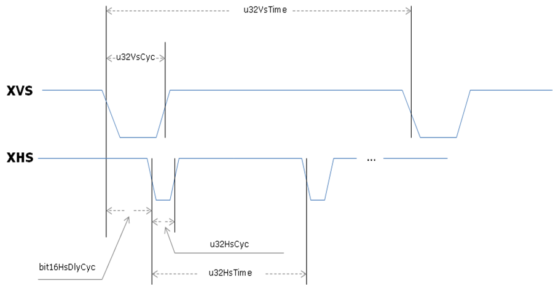

# Preface
**Overview<a name="section102mcpsimp"></a>**

This document is written for programmers using ISP development, aiming to provide solutions and assistance for issues encountered during development.

> **Note:** 
>This document uses Hi3403V100 as the description example. Unless otherwise specified, the content for Hi3519AV200 is the same as Hi3403V100.

**Product Version<a name="section105mcpsimp"></a>**

The product version corresponding to this document is as follows.

<a name="table108mcpsimp"></a>
<table><thead align="left"><tr id="row113mcpsimp"><th class="cellrowborder" valign="top" width="32%" id="mcps1.1.3.1.1"><p id="p115mcpsimp"><a name="p115mcpsimp"></a><a name="p115mcpsimp"></a>Product Name</p>
</th>
<th class="cellrowborder" valign="top" width="68%" id="mcps1.1.3.1.2"><p id="p117mcpsimp"><a name="p117mcpsimp"></a><a name="p117mcpsimp"></a>Product Version</p>
</th>
</tr>
</thead>
<tbody><tr id="row119mcpsimp"><td class="cellrowborder" valign="top" width="32%" headers="mcps1.1.3.1.1 "><p id="p121mcpsimp"><a name="p121mcpsimp"></a><a name="p121mcpsimp"></a>Hi3403V100</p>
</td>
<td class="cellrowborder" valign="top" width="68%" headers="mcps1.1.3.1.2 "><p id="p123mcpsimp"><a name="p123mcpsimp"></a><a name="p123mcpsimp"></a>V100</p>
</td>
</tr>
<tr id="row5694533162316"><td class="cellrowborder" valign="top" width="32%" headers="mcps1.1.3.1.1 "><p id="p36535379232"><a name="p36535379232"></a><a name="p36535379232"></a>Hi3519AV200</p>
</td>
<td class="cellrowborder" valign="top" width="68%" headers="mcps1.1.3.1.2 "><p id="p14653537142315"><a name="p14653537142315"></a><a name="p14653537142315"></a>V100</p>
</td>
</tr>
</tbody>
</table>

**Target Audience<a name="section124mcpsimp"></a>**

This document (guide) is mainly applicable to the following engineers:

-   Technical Support Engineers
-   Software Development Engineers

**Symbol Conventions<a name="section130mcpsimp"></a>**

The following symbols may appear in this document, and their meanings are as follows.

<a name="table133mcpsimp"></a>
<table><thead align="left"><tr id="row138mcpsimp"><th class="cellrowborder" valign="top" width="20%" id="mcps1.1.3.1.1"><p id="p140mcpsimp"><a name="p140mcpsimp"></a><a name="p140mcpsimp"></a>Symbol</p>
</th>
<th class="cellrowborder" valign="top" width="80%" id="mcps1.1.3.1.2"><p id="p142mcpsimp"><a name="p142mcpsimp"></a><a name="p142mcpsimp"></a>Description</p>
</th>
</tr>
</thead>
<tbody><tr id="row144mcpsimp"><td class="cellrowborder" valign="top" width="20%" headers="mcps1.1.3.1.1 "><p class="msonormal" id="p146mcpsimp"><a name="p146mcpsimp"></a><a name="p146mcpsimp"></a><a name="image102"></a><a name="image102"></a><span></span></p>
</td>
<td class="cellrowborder" valign="top" width="80%" headers="mcps1.1.3.1.2 "><p id="p148mcpsimp"><a name="p148mcpsimp"></a><a name="p148mcpsimp"></a>Indicates a high-risk hazard which, if not avoided, will result in death or serious injury.</p>
</td>
</tr>
<tr id="row149mcpsimp"><td class="cellrowborder" valign="top" width="20%" headers="mcps1.1.3.1.1 "><p class="msonormal" id="p151mcpsimp"><a name="p151mcpsimp"></a><a name="p151mcpsimp"></a><a name="image103"></a><a name="image103"></a><span></span></p>
</td>
<td class="cellrowborder" valign="top" width="80%" headers="mcps1.1.3.1.2 "><p id="p153mcpsimp"><a name="p153mcpsimp"></a><a name="p153mcpsimp"></a>Indicates a medium-risk hazard which, if not avoided, could result in death or serious injury.</p>
</td>
</tr>
<tr id="row154mcpsimp"><td class="cellrowborder" valign="top" width="20%" headers="mcps1.1.3.1.1 "><p class="msonormal" id="p156mcpsimp"><a name="p156mcpsimp"></a><a name="p156mcpsimp"></a><a name="image104"></a><a name="image104"></a><span></span></p>
</td>
<td class="cellrowborder" valign="top" width="80%" headers="mcps1.1.3.1.2 "><p id="p158mcpsimp"><a name="p158mcpsimp"></a><a name="p158mcpsimp"></a>Indicates a low-risk hazard which, if not avoided, could result in minor or moderate injury.</p>
</td>
</tr>
<tr id="row159mcpsimp"><td class="cellrowborder" valign="top" width="20%" headers="mcps1.1.3.1.1 "><p class="msonormal" id="p161mcpsimp"><a name="p161mcpsimp"></a><a name="p161mcpsimp"></a><a name="image105"></a><a name="image105"></a><span></span></p>
</td>
<td class="cellrowborder" valign="top" width="80%" headers="mcps1.1.3.1.2 "><p id="p163mcpsimp"><a name="p163mcpsimp"></a><a name="p163mcpsimp"></a>Used to convey equipment or environmental safety alert information. If not avoided, it may result in equipment damage, data loss, equipment performance degradation, or other unpredictable consequences.</p>
<p id="p164mcpsimp"><a name="p164mcpsimp"></a><a name="p164mcpsimp"></a>"Caution" does not involve personal injury.</p>
</td>
</tr>
<tr id="row165mcpsimp"><td class="cellrowborder" valign="top" width="20%" headers="mcps1.1.3.1.1 "><p class="msonormal" id="p167mcpsimp"><a name="p167mcpsimp"></a><a name="p167mcpsimp"></a><a name="image106"></a><a name="image106"></a><span></span></p>
</td>
<td class="cellrowborder" valign="top" width="80%" headers="mcps1.1.3.1.2 "><p id="p169mcpsimp"><a name="p169mcpsimp"></a><a name="p169mcpsimp"></a>Supplementary explanation of key information in the text.</p>
<p id="p170mcpsimp"><a name="p170mcpsimp"></a><a name="p170mcpsimp"></a>"Note" is not a safety warning and does not involve personal injury, equipment damage, or environmental harm.</p>
</td>
</tr>
</tbody>
</table>

**Revision History<a name="section171mcpsimp"></a>**

The revision history accumulates descriptions of each document update. The latest version of the document contains the updates from all previous document versions.

<a name="table126443203200"></a>
<table><thead align="left"><tr id="row264516207203"><th class="cellrowborder" valign="top" width="20.72%" id="mcps1.1.4.1.1"><p id="p146456203200"><a name="p146456203200"></a><a name="p146456203200"></a><strong id="b8645172022010"><a name="b8645172022010"></a><a name="b8645172022010"></a>Document Version</strong></p>
</th>
<th class="cellrowborder" valign="top" width="26.119999999999997%" id="mcps1.1.4.1.2"><p id="p364512062019"><a name="p364512062019"></a><a name="p364512062019"></a><strong id="b1464512200200"><a name="b1464512200200"></a><a name="b1464512200200"></a>Release Date</strong></p>
</th>
<th class="cellrowborder" valign="top" width="53.16%" id="mcps1.1.4.1.3"><p id="p664522018206"><a name="p664522018206"></a><a name="p664522018206"></a><strong id="b156451420152010"><a name="b156451420152010"></a><a name="b156451420152010"></a>Change Description</strong></p>
</th>
</tr>
</thead>
<tbody><tr id="row56451520182017"><td class="cellrowborder" valign="top" width="20.72%" headers="mcps1.1.4.1.1 "><p id="p1564572014209"><a name="p1564572014209"></a><a name="p1564572014209"></a>00B01</p>
</td>
<td class="cellrowborder" valign="top" width="26.119999999999997%" headers="mcps1.1.4.1.2 "><p id="p126451920132014"><a name="p126451920132014"></a><a name="p126451920132014"></a>2025-09-15</p>
</td>
<td class="cellrowborder" valign="top" width="53.16%" headers="mcps1.1.4.1.3 "><p id="p1664582017209"><a name="p1664582017209"></a><a name="p1664582017209"></a>First interim version release.</p>
</td>
</tr>
</tbody>
</table>

# Overview
## Overview<a name="ZH-CN_TOPIC_0000002470925178"></a>

ISP completes the processing of digital image effects through a series of digital image processing algorithms. It mainly includes 3A, bad pixel correction, denoising, highlight suppression, backlight compensation, color enhancement, lens shading correction, and other processing. ISP consists of a logic part and the firmware running on it. This section mainly introduces the ISP user interface.

## Function Description<a name="ZH-CN_TOPIC_0000002503964849"></a>

The ISP control structure is shown in [Figure 1](#fig19534124782113). After the lens projects the light signal onto the sensor's photosensitive area, the sensor performs photoelectric conversion and sends the original Bayer format image to the ISP. The ISP processes it through algorithms and outputs an RGB space domain image to the backend video capture unit. During this process, the ISP controls the ISP logic, lens, and sensor through the firmware running on it, thereby implementing functions such as auto iris, auto exposure, and auto white balance. The firmware operation is driven by interrupts from the video capture unit. The PQ Tools tool performs online image quality adjustment of the ISP through the network port or serial port.

The ISP consists of ISP logic and the firmware running on it. In addition to completing part of the algorithm processing, the logic unit can also collect real-time information about the current image. The firmware obtains image statistics from the ISP logic, recalculates, and provides feedback control to the lens, sensor, and ISP logic to achieve automatic image quality adjustment.

**Figure 1**  ISP Control Structure Diagram<a name="fig19534124782113"></a>  


For the main ISP logic flow, specific concepts, and functional points, please refer to the chip manual.


### Architecture<a name="ZH-CN_TOPIC_0000002471084980"></a>

The ISP firmware consists of three parts: one part is the ISP control unit and basic algorithm library, one part is the AE/AWB algorithm library, and one part is the sensor library. The basic idea of the firmware design is to provide the 3A algorithm library separately, with the ISP control unit scheduling the basic algorithm library and the 3A algorithm library, while the sensor library registers function callbacks to the ISP basic algorithm library and the 3A algorithm library respectively, to achieve differentiated sensor adaptation. The ISP firmware architecture is shown in [Figure 1](#fig1959110622411).

**Figure 1**  ISP Firmware Architecture<a name="fig1959110622411"></a>  


Different sensors all register control functions with the ISP algorithm library in the form of callback functions. When the ISP control unit schedules the basic algorithm library and the 3A algorithm library, it will obtain initialization parameters through these callback functions and control the sensor, such as adjusting exposure time, analog gain, digital gain, and controlling lens step focusing or iris rotation.

### Development Mode<a name="ZH-CN_TOPIC_0000002470924924"></a>

The SDK supports users using multiple development modes:

1.  Users use the SDK's 3A algorithm library. In this case, users need to adapt different sensors according to the sensor adaptation interfaces provided by the ISP basic algorithm library and the 3A algorithm library. Each sensor corresponds to a folder, which contains two main files:
    -   sensor\_cmos.c

        This file mainly implements the callback functions required by ISP. These callback functions contain the sensor adaptation algorithm, which may vary for different sensors.

    -   sensor\_ctrl.c

        The sensor's low-level control driver, mainly implementing sensor read/write and initialization operations. Users can develop these two files based on the sensor's datasheet, and can seek support from the sensor manufacturer when necessary.

2.  Users implement their own 3A algorithm library development based on the 3A algorithm registration interface provided by the ISP library. In this case, users need to adapt different sensors according to the sensor adaptation interfaces provided by the ISP basic algorithm library and the user's 3A algorithm library.
3.  Users partially use the 3A algorithm library from the SDK and partially implement their own 3A algorithm library. For example, AE uses libot\_ae.a, and AWB uses its own 3A algorithm library. The SDK provides flexible and diverse support methods.

### Internal Flow<a name="ZH-CN_TOPIC_0000002471085172"></a>

The firmware internal flow is divided into two parts, as shown in [Figure 1](#fig39021449132613). One part is the initialization task, which mainly completes the initialization of the ISP control unit, ISP basic algorithm library, and 3A algorithm library, including calling sensor callbacks to obtain sensor-specific initialization parameters. The other part is the dynamic adjustment process, during which the ISP control unit in the firmware schedules the ISP basic algorithm library and the 3A algorithm library, performing real-time calculations and corresponding control. The firmware software structure is shown in [Figure 2](#fig81434122714).

**Figure 1**  ISP Firmware Internal Flow<a name="fig39021449132613"></a>  


**Figure 2**  ISP Firmware Software Structure<a name="fig81434122714"></a>  

### Software Flow<a name="ZH-CN_TOPIC_0000002504084739"></a>

As the front-end capture component, ISP needs to work together with the Video Input Unit (VIU). After ISP initialization and basic configuration, the VIU needs to perform interface timing matching. This is done first to match the input timing of different sensors, and second to configure the correct input timing for the ISP. Once the timing configuration is complete, the ISP can start running to perform dynamic image quality adjustment. The output image is then captured by the VIU and sent for display or encoding. The software usage flow is shown in [Figure 1](#fig796617213110).

The PQ Tools tool mainly performs dynamic image quality adjustment on the PC side, allowing adjustment of multiple factors that affect image quality, such as denoising strength, color conversion matrix, and saturation.

**Figure 1**  ISP Firmware Usage Flow<a name="fig796617213110"></a>  


After the user has debugged the image effect, they can use the configuration file save function provided by the PQ Tools tool to save the configuration parameters. On the next startup, the system can use the configuration file loading function provided by the PQ Tools tool to load the already adjusted image parameters.

Code Example:

```
td_s32 ret;
ot_isp_3a_alg_lib ae_lib;
ot_isp_3a_alg_lib awb_lib;
ot_isp_pub_attr pub_attr;
pthread_t isp_pid;
ot_vi_pipe vi_pipe = 0;
/* Register sensor library */
ret = sensor_register_callback(vi_pipe, &ae_lib, &awb_lib);
if (ret != TD_SUCCESS)    {
printf(”register sensor failed!\n”);
return ret;
}
 
/* Register AE algorithm library */
ae_lib.id = 0;
strncpy(ae_lib.lib_name, OT_AE_LIB_NAME, sizeof(OT_AE_LIB_NAME));
ret = ss_mpi_ae_register(isp_dev, &ae_lib);
if (ret != TD_SUCCESS) {
    printf("ss_mpi_ae_register failed with %#x!\n", ret);
    return ret;
}
 
/* Register AWB algorithm library */
awb_lib.id = isp_dev;
strncpy(awb_lib.lib_name, OT_AWB_LIB_NAME, sizeof(OT_AWB_LIB_NAME));
 
ret = ss_mpi_awb_register(isp_dev, &awb_lib);
if (ret != TD_SUCCESS) {
    printf("ss_mpi_awb_register failed with %#x!\n", ret);
    return ret;
}
     /* Initialize ISP external registers */
     ret = ss_mpi_isp_mem_init(vi_pipe);
     if (ret != TD_SUCCESS) {
        printf("ss_mpi_isp_mem_init failed with %#x!\n", ret);         
return ret;
     }
 
/* Configure image common attributes */
     ret = ss_mpi_isp_set_pub_attr (vi_pipe, & pub_attr);
     if (ret != TD_SUCCESS) {
printf("ss_mpi_isp_set_pub_attr failed with %#x!\n", ret);
         return ret;
     }
/* Initialize ISP Firmware */
ret = ss_mpi_isp_init(vi_pipe);
if (ret != TD_SUCCESS) {
printf(”isp init failed!\n”);
return ret;
}
 
/* Start ss_mpi_isp_run in a separate thread */
if (0 != pthread_create(&isp_pid, 0, ISP_Run, NULL))
{
    printf("create isp running thread failed!\n");
    return TD_FAILURE;
}
 
/* Start VI/VO and other services */
 
……
 
/* Stop VI/VO and other services */
ret = ss_mpi_isp_exit (vi_pipe);
if (TD_SUCCESS != ret) {
printf(”isp exit failed!\n”);
return ret;
}
 
pthread_join(isp_pid, 0);
return TD_SUCCESS; 
```

> **Note:** 
>The AE library uses the standard C math library. Please add the -lm compilation flag in the Makefile.

### File Organization<a name="ZH-CN_TOPIC_0000002470925206"></a>

The file organization structure of the ISP firmware is shown in [Figure 1](#fig142122515335). The ISP library, 3A library, sensor library, dehaze library, ldci library, and drc library are each independent. The driver generated by drv in the firmware reports ISP interrupts to user space and drives the ISP control unit of the firmware to operate using these interrupts. The ISP control unit obtains statistics from the driver program and schedules the basic algorithm unit and 3A algorithm library, finally configuring registers through the driver.

The Src folder contains the ISP control unit and basic algorithm unit, which are compiled to generate libss\_isp.a and libot\_isp.a, i.e., the ISP library. The 3a folder contains the AE/AWB algorithm library; users can also develop their own 3A algorithms based on a unified interface. The Sensor folder contains driver programs for each sensor; this code is open source. The dehaze folder corresponds to the dehazing algorithm program, the ldci folder corresponds to the local automatic contrast enhancement algorithm program, and the drc folder corresponds to the dynamic range compression algorithm program; these parts are not open source.

**Figure 1**  ISP Firmware File Organization<a name="fig142122515335"></a>  

# System Control
## Function Overview<a name="ZH-CN_TOPIC_0000002471084924"></a>

The system control section includes ISP public attribute configuration, initializing the ISP firmware, running the ISP firmware, exiting the ISP firmware, and setting ISP modules and other functions.

## API Reference<a name="ZH-CN_TOPIC_0000002503965063"></a>

The interfaces in this document, unless otherwise specified, support multi-process.

-   [ss\_mpi\_isp\_mem\_init](#ZH-CN_TOPIC_0000002471084920): Initialize the ISP external registers.
-   [ss\_mpi\_isp\_init](#ZH-CN_TOPIC_0000002471085190): Initialize the ISP firmware.
-   [ss\_mpi\_isp\_run](#ZH-CN_TOPIC_0000002470925164): Run the ISP firmware.
-   [ss\_mpi\_isp\_run\_once](#ZH-CN_TOPIC_0000002470925158): Run the ISP firmware once.
-   [ss\_mpi\_isp\_exit](#ZH-CN_TOPIC_0000002503964923): Exit the ISP firmware.
-   [ss\_mpi\_isp\_set\_pub\_attr](#ZH-CN_TOPIC_0000002503964829): Set the ISP public attributes.
-   [ss\_mpi\_isp\_get\_pub\_attr](#ZH-CN_TOPIC_0000002504085055): Get the ISP public attributes.
-   [ss\_mpi\_isp\_set\_fmw\_state](#ZH-CN_TOPIC_0000002503964889): Set the ISP firmware state.
-   [ss\_mpi\_isp\_get\_fmw\_state](#ZH-CN_TOPIC_0000002503965107): Get the ISP firmware state.
-   [ss\_mpi\_isp\_set\_sns\_slave\_attr](#ZH-CN_TOPIC_0000002503965133): Set the slave mode sensor H/V sync signal.
-   [ss\_mpi\_isp\_get\_sns\_slave\_attr](#ZH-CN_TOPIC_0000002503964929): Get the slave mode sensor H/V sync signal.
-   [ss\_mpi\_isp\_set\_module\_ctrl](#ZH-CN_TOPIC_0000002504084719): Set the ISP function module control.
-   [ss\_mpi\_isp\_get\_module\_ctrl](#ZH-CN_TOPIC_0000002503964897): Get the ISP function module control.
-   [ss\_mpi\_isp\_get\_vd\_time\_out](#ZH-CN_TOPIC_0000002504085017): Get the ISP interrupt information.
-   [ss\_mpi\_isp\_sensor\_reg\_callback](#ZH-CN_TOPIC_0000002503964973): ISP sensor registration callback interface.
-   [ss\_mpi\_isp\_sensor\_unreg\_callback](#ZH-CN_TOPIC_0000002504084971): ISP sensor unregistration callback interface.
-   [ss\_mpi\_isp\_ae\_lib\_reg\_callback](#ZH-CN_TOPIC_0000002470925170): ISP AE library registration callback interface.
-   [ss\_mpi\_isp\_ae\_lib\_unreg\_callback](#ZH-CN_TOPIC_0000002504085045): ISP AE library unregistration callback interface.
-   [ss\_mpi\_isp\_awb\_lib\_reg\_callback](#ZH-CN_TOPIC_0000002471084946): ISP AWB library registration callback interface.
-   [ss\_mpi\_isp\_awb\_lib\_unreg\_callback](#ZH-CN_TOPIC_0000002470924890): ISP AWB library unregistration callback interface.
-   [ss\_mpi\_isp\_set\_bind\_attr](#ZH-CN_TOPIC_0000002503964869): Set the binding relationship between the ISP library, 3A library, and sensor.
-   [ss\_mpi\_isp\_get\_bind\_attr](#ZH-CN_TOPIC_0000002504085091): Get the binding relationship between the ISP library, 3A library, and sensor.
-   [ss\_mpi\_isp\_set\_dcf\_info](#ZH-CN_TOPIC_0000002471084974): Set the DCF parameters.
-   [ss\_mpi\_isp\_get\_dcf\_info](#ZH-CN_TOPIC_0000002504085077): Get the DCF parameters.
-   [ss\_mpi\_isp\_set\_pipe\_differ\_attr](#ZH-CN_TOPIC_0000002504084755): Set the multi-channel ISP Pipe difference attributes.
-   [ss\_mpi\_isp\_get\_pipe\_differ\_attr](#ZH-CN_TOPIC_0000002503964909): Get the multi-channel ISP Pipe difference attributes.
-   [ss\_mpi\_isp\_set\_ctrl\_param](#ZH-CN_TOPIC_0000002504084839): Set the ISP control parameters.
-   [ss\_mpi\_isp\_get\_ctrl\_param](#ZH-CN_TOPIC_0000002471085186): Get the ISP control parameters.
-   [ss\_mpi\_isp\_set\_mod\_param](#ZH-CN_TOPIC_0000002503965069): Set the ISP module parameters.
-   [ss\_mpi\_isp\_get\_mod\_param](#ZH-CN_TOPIC_0000002503964891): Get the ISP module parameters.
-   [ss\_mpi\_isp\_set\_smart\_info](#ZH-CN_TOPIC_0000002470924926): Set the ISP module smart information.
-   [ss\_mpi\_isp\_get\_smart\_info](#ZH-CN_TOPIC_0000002503964955): Get the ISP module smart information.
-   [ss\_mpi\_isp\_get\_lightbox\_gain](#ZH-CN_TOPIC_0000002470924968): Get the gain structure obtained from AWB online calibration.
-   [ss\_mpi\_isp\_ir\_auto\_run\_once](#ZH-CN_TOPIC_0000002470925130): Run the IR auto-switch function.
-   [ss\_mpi\_isp\_set\_be\_frame\_attr](#ZH-CN_TOPIC_0000002470924938): Set the ISP BE frame attributes.
-   [ss\_mpi\_isp\_get\_be\_frame\_attr](#ZH-CN_TOPIC_0000002470924858): Get the ISP BE frame attributes.
-   [ss\_mpi\_isp\_get\_noise\_calibration](#ZH-CN_TOPIC_0000002503964825): Get the noise model calibration parameters.
-   [ss\_mpi\_isp\_set\_frame\_info](#ZH-CN_TOPIC_0000002471085032): Set the ISP real-time information.
-   [ss\_mpi\_isp\_get\_frame\_info](#ZH-CN_TOPIC_0000002503965017): Get the ISP real-time information.
-   [ss\_mpi\_isp\_mem\_share](#ZH-CN_TOPIC_0000002504084749): Share ISP-related mmz buffer with a specific process ID.
-   [ss\_mpi\_isp\_mem\_unshare](#ZH-CN_TOPIC_0000002470925018): Unshare ISP-related mmz buffer from the process ID.
-   [ss\_mpi\_isp\_mem\_share\_all](#ZH-CN_TOPIC_0000002470924996): Share ISP-related mmz buffer with all processes without process ID restriction.
-   [ss\_mpi\_isp\_mem\_unshare\_all](#ZH-CN_TOPIC_0000002470924886): Cancel sharing of ISP-related mmz buffer with all processes.


### ss\_mpi\_isp\_mem\_init<a name="ZH-CN_TOPIC_0000002471084920"></a>

[Description]

Initialize the ISP external registers.

**Syntax**

```
td_s32 ss_mpi_isp_mem_init(ot_vi_pipe vi_pipe);
```

**Parameters**

<a name="table395mcpsimp"></a>
<table><thead align="left"><tr id="row401mcpsimp"><th class="cellrowborder" valign="top" width="23%" id="mcps1.1.4.1.1"><p id="p403mcpsimp"><a name="p403mcpsimp"></a><a name="p403mcpsimp"></a>Parameter Name</p>
</th>
<th class="cellrowborder" valign="top" width="61%" id="mcps1.1.4.1.2"><p id="p405mcpsimp"><a name="p405mcpsimp"></a><a name="p405mcpsimp"></a>Description</p>
</th>
<th class="cellrowborder" valign="top" width="16%" id="mcps1.1.4.1.3"><p id="p407mcpsimp"><a name="p407mcpsimp"></a><a name="p407mcpsimp"></a>Input/Output</p>
</th>
</tr>
</thead>
<tbody><tr id="row408mcpsimp"><td class="cellrowborder" valign="top" width="23%" headers="mcps1.1.4.1.1 "><p id="p410mcpsimp"><a name="p410mcpsimp"></a><a name="p410mcpsimp"></a>vi_pipe</p>
</td>
<td class="cellrowborder" valign="top" width="61%" headers="mcps1.1.4.1.2 "><p id="p412mcpsimp"><a name="p412mcpsimp"></a><a name="p412mcpsimp"></a>vi_pipe number.</p>
</td>
<td class="cellrowborder" valign="top" width="16%" headers="mcps1.1.4.1.3 "><p id="p414mcpsimp"><a name="p414mcpsimp"></a><a name="p414mcpsimp"></a>Input</p>
</td>
</tr>
</tbody>
</table>

**Return Value**

<a name="table417mcpsimp"></a>
<table><thead align="left"><tr id="row422mcpsimp"><th class="cellrowborder" valign="top" width="27%" id="mcps1.1.3.1.1"><p id="p424mcpsimp"><a name="p424mcpsimp"></a><a name="p424mcpsimp"></a>Return Value</p>
</th>
<th class="cellrowborder" valign="top" width="73%" id="mcps1.1.3.1.2"><p id="p426mcpsimp"><a name="p426mcpsimp"></a><a name="p426mcpsimp"></a>Description</p>
</th>
</tr>
</thead>
<tbody><tr id="row427mcpsimp"><td class="cellrowborder" valign="top" width="27%" headers="mcps1.1.3.1.1 "><p id="p429mcpsimp"><a name="p429mcpsimp"></a><a name="p429mcpsimp"></a>0</p>
</td>
<td class="cellrowborder" valign="top" width="73%" headers="mcps1.1.3.1.2 "><p id="p431mcpsimp"><a name="p431mcpsimp"></a><a name="p431mcpsimp"></a>Success.</p>
</td>
</tr>
<tr id="row432mcpsimp"><td class="cellrowborder" valign="top" width="27%" headers="mcps1.1.3.1.1 "><p id="p434mcpsimp"><a name="p434mcpsimp"></a><a name="p434mcpsimp"></a>Non-zero</p>
</td>
<td class="cellrowborder" valign="top" width="73%" headers="mcps1.1.3.1.2 "><p id="p436mcpsimp"><a name="p436mcpsimp"></a><a name="p436mcpsimp"></a>On failure, the value is <span xml:lang="sv-SE" id="ph5133152619495"><a name="ph5133152619495"></a><a name="ph5133152619495"></a>Error Code</span>。</p>
</td>
</tr>
</tbody>
</table>

**Requirements**

-   Header: ot\_common\_isp.h、ss\_mpi\_isp.h
-   Library: libss\_isp.a、libot\_isp.a

**Note**

-   Before initializing the external registers, ensure that the ko is loaded and the sensor has registered the callback function with the ISP.
-   Only after calling This interface can you call [ss\_mpi\_isp\_set\_pub\_attr](#ZH-CN_TOPIC_0000002503964829) to set the image public attributes.
-   Not supported for multi-process. Must be called in the same process as sensor\_register\_callback, ss\_mpi\_ae\_register, ss\_mpi\_awb\_register, [ss\_mpi\_isp\_init](#ZH-CN_TOPIC_0000002471085190), [ss\_mpi\_isp\_run](#ZH-CN_TOPIC_0000002470925164), and [ss\_mpi\_isp\_exit](#ZH-CN_TOPIC_0000002503964923).
-   This interface cannot be called while [ss\_mpi\_isp\_run](#ZH-CN_TOPIC_0000002470925164) is running.
-   It is recommended to call [ss\_mpi\_isp\_exit](#ZH-CN_TOPIC_0000002503964923) first, then call This interface for re-initialization.
-   LiteOS does not have the concept of kernel module loading. The Linux ko loading process corresponds to the relevant process executed in sdk\_init.c under LiteOS release/ko.
-   Not supported for multi-threaded ISP creation and destruction on the same vi\_pipe (multi-threaded simultaneous calls to sensor\_register\_callback, ss\_mpi\_ae\_register, ss\_mpi\_awb\_register, [ss\_mpi\_isp\_mem\_init](#ZH-CN_TOPIC_0000001174819160), [ss\_mpi\_isp\_init](#ZH-CN_TOPIC_0000002471085190), [ss\_mpi\_isp\_exit](#ZH-CN_TOPIC_0000002503964923))
-   After ISP initialization, one frame time is needed for the hardware to read the algorithm coefficient table. Therefore, within one frame time after [ss\_mpi\_isp\_init](#ZH-CN_TOPIC_0000002471085190), the [ss\_mpi\_vi\_stop\_pipe](#ss_mpi_vi_stop_pipe) interface cannot be called to stop the pipe.

    ss\_mpi\_vi\_stop\_pipe See the "Video Input" chapter of the "MPP Media Processing Software V5.0 Development Reference")

**Example**

None

**Related Topics**

[ss\_mpi\_isp\_exit](#ss_mpi_isp_exit)

### ss\_mpi\_isp\_init<a name="ZH-CN_TOPIC_0000002471085190"></a>

[Description]

Initialize the ISP firmware.

**Syntax**

```
td_s32 ss_mpi_isp_init(ot_vi_pipe vi_pipe);
```

**Parameters**

<a name="table482mcpsimp"></a>
<table><thead align="left"><tr id="row488mcpsimp"><th class="cellrowborder" valign="top" width="23%" id="mcps1.1.4.1.1"><p id="p490mcpsimp"><a name="p490mcpsimp"></a><a name="p490mcpsimp"></a>Parameter Name</p>
</th>
<th class="cellrowborder" valign="top" width="61%" id="mcps1.1.4.1.2"><p id="p492mcpsimp"><a name="p492mcpsimp"></a><a name="p492mcpsimp"></a>Description</p>
</th>
<th class="cellrowborder" valign="top" width="16%" id="mcps1.1.4.1.3"><p id="p494mcpsimp"><a name="p494mcpsimp"></a><a name="p494mcpsimp"></a>Input/Output</p>
</th>
</tr>
</thead>
<tbody><tr id="row495mcpsimp"><td class="cellrowborder" valign="top" width="23%" headers="mcps1.1.4.1.1 "><p id="p497mcpsimp"><a name="p497mcpsimp"></a><a name="p497mcpsimp"></a>vi_pipe</p>
</td>
<td class="cellrowborder" valign="top" width="61%" headers="mcps1.1.4.1.2 "><p id="p499mcpsimp"><a name="p499mcpsimp"></a><a name="p499mcpsimp"></a>vi_pipe number.</p>
</td>
<td class="cellrowborder" valign="top" width="16%" headers="mcps1.1.4.1.3 "><p id="p501mcpsimp"><a name="p501mcpsimp"></a><a name="p501mcpsimp"></a>Input</p>
</td>
</tr>
</tbody>
</table>

**Return Value**

<a name="table504mcpsimp"></a>
<table><thead align="left"><tr id="row509mcpsimp"><th class="cellrowborder" valign="top" width="27%" id="mcps1.1.3.1.1"><p id="p511mcpsimp"><a name="p511mcpsimp"></a><a name="p511mcpsimp"></a>Return Value</p>
</th>
<th class="cellrowborder" valign="top" width="73%" id="mcps1.1.3.1.2"><p id="p513mcpsimp"><a name="p513mcpsimp"></a><a name="p513mcpsimp"></a>Description</p>
</th>
</tr>
</thead>
<tbody><tr id="row514mcpsimp"><td class="cellrowborder" valign="top" width="27%" headers="mcps1.1.3.1.1 "><p id="p516mcpsimp"><a name="p516mcpsimp"></a><a name="p516mcpsimp"></a>0</p>
</td>
<td class="cellrowborder" valign="top" width="73%" headers="mcps1.1.3.1.2 "><p id="p518mcpsimp"><a name="p518mcpsimp"></a><a name="p518mcpsimp"></a>Success.</p>
</td>
</tr>
<tr id="row519mcpsimp"><td class="cellrowborder" valign="top" width="27%" headers="mcps1.1.3.1.1 "><p id="p521mcpsimp"><a name="p521mcpsimp"></a><a name="p521mcpsimp"></a>Non-zero</p>
</td>
<td class="cellrowborder" valign="top" width="73%" headers="mcps1.1.3.1.2 "><p id="p523mcpsimp"><a name="p523mcpsimp"></a><a name="p523mcpsimp"></a>On failure, the value is <span xml:lang="sv-SE" id="ph5133152619495"><a name="ph5133152619495"></a><a name="ph5133152619495"></a>Error Code</span>。</p>
</td>
</tr>
</tbody>
</table>

**Requirements**

-   Header: ot\_common\_isp.h、ss\_mpi\_isp.h
-   Library: libss\_isp.a、libot\_isp.a

**Note**

-   Before initialization, ensure that the ko is loaded and the sensor has registered the callback function with the ISP.
-   Before initialization, ensure that [ss\_mpi\_isp\_mem\_init](#ZH-CN_TOPIC_0000002471084920) has been called to initialize the ISP external registers.
-   Before initialization, ensure that [ss\_mpi\_isp\_set\_pub\_attr](#ZH-CN_TOPIC_0000002503964829) has been called to set the image public attributes.
-   Not supported for multi-process. Must be called in the same process as sensor\_register\_callback, ss\_mpi\_ae\_register, ss\_mpi\_awb\_register, [ss\_mpi\_isp\_mem\_init](#ZH-CN_TOPIC_0000002471084920), [ss\_mpi\_isp\_run](#ZH-CN_TOPIC_0000002470925164), and [ss\_mpi\_isp\_exit](#ZH-CN_TOPIC_0000002503964923).
-   Not supported for repeated calls to This interface.
-   It is recommended to call [ss\_mpi\_isp\_exit](#ZH-CN_TOPIC_0000002503964923) first, then call This interface for re-initialization.
-   LiteOS does not have the concept of kernel module loading. The Linux ko loading process corresponds to the relevant process executed in sdk\_init.c under LiteOS release/ko.
-   Not supported for multi-threaded ISP creation and destruction on the same vi\_pipe (multi-threaded simultaneous calls to sensor\_register\_callback, ss\_mpi\_ae\_register, ss\_mpi\_awb\_register, [ss\_mpi\_isp\_mem\_init](#ZH-CN_TOPIC_0000002471084920), [ss\_mpi\_isp\_init](#ZH-CN_TOPIC_0000002471085190), [ss\_mpi\_isp\_exit](#ZH-CN_TOPIC_0000002503964923))
-   After ISP initialization, one frame time is needed for the hardware to read the algorithm coefficient table. Therefore, within one frame time after [ss\_mpi\_isp\_init](#ZH-CN_TOPIC_0000002471085190), the ss\_mpi\_vi\_stop\_pipe interface cannot be called to stop the pipe.

    ss\_mpi\_vi\_stop\_pipe See the "Video Input" chapter of the "MPP Media Processing Software V5.0 Development Reference".

**Example**

None

**Related Topics**

[ss\_mpi\_isp\_exit](#ss_mpi_isp_exit)

### ss\_mpi\_isp\_run<a name="ZH-CN_TOPIC_0000002470925164"></a>

[Description]

Run the ISP firmware.

**Syntax**

```
td_s32 ss_mpi_isp_run(ot_vi_pipe vi_pipe);
```

**Parameters**

<a name="table568mcpsimp"></a>
<table><thead align="left"><tr id="row574mcpsimp"><th class="cellrowborder" valign="top" width="23%" id="mcps1.1.4.1.1"><p id="p576mcpsimp"><a name="p576mcpsimp"></a><a name="p576mcpsimp"></a>Parameter Name</p>
</th>
<th class="cellrowborder" valign="top" width="61%" id="mcps1.1.4.1.2"><p id="p578mcpsimp"><a name="p578mcpsimp"></a><a name="p578mcpsimp"></a>Description</p>
</th>
<th class="cellrowborder" valign="top" width="16%" id="mcps1.1.4.1.3"><p id="p580mcpsimp"><a name="p580mcpsimp"></a><a name="p580mcpsimp"></a>Input/Output</p>
</th>
</tr>
</thead>
<tbody><tr id="row581mcpsimp"><td class="cellrowborder" valign="top" width="23%" headers="mcps1.1.4.1.1 "><p id="p583mcpsimp"><a name="p583mcpsimp"></a><a name="p583mcpsimp"></a>vi_pipe</p>
</td>
<td class="cellrowborder" valign="top" width="61%" headers="mcps1.1.4.1.2 "><p id="p585mcpsimp"><a name="p585mcpsimp"></a><a name="p585mcpsimp"></a>vi_pipe number.</p>
</td>
<td class="cellrowborder" valign="top" width="16%" headers="mcps1.1.4.1.3 "><p id="p587mcpsimp"><a name="p587mcpsimp"></a><a name="p587mcpsimp"></a>Input</p>
</td>
</tr>
</tbody>
</table>

**Return Value**

<a name="table590mcpsimp"></a>
<table><thead align="left"><tr id="row595mcpsimp"><th class="cellrowborder" valign="top" width="27%" id="mcps1.1.3.1.1"><p id="p597mcpsimp"><a name="p597mcpsimp"></a><a name="p597mcpsimp"></a>Return Value</p>
</th>
<th class="cellrowborder" valign="top" width="73%" id="mcps1.1.3.1.2"><p id="p599mcpsimp"><a name="p599mcpsimp"></a><a name="p599mcpsimp"></a>Description</p>
</th>
</tr>
</thead>
<tbody><tr id="row600mcpsimp"><td class="cellrowborder" valign="top" width="27%" headers="mcps1.1.3.1.1 "><p id="p602mcpsimp"><a name="p602mcpsimp"></a><a name="p602mcpsimp"></a>0</p>
</td>
<td class="cellrowborder" valign="top" width="73%" headers="mcps1.1.3.1.2 "><p id="p604mcpsimp"><a name="p604mcpsimp"></a><a name="p604mcpsimp"></a>Success.</p>
</td>
</tr>
<tr id="row605mcpsimp"><td class="cellrowborder" valign="top" width="27%" headers="mcps1.1.3.1.1 "><p id="p607mcpsimp"><a name="p607mcpsimp"></a><a name="p607mcpsimp"></a>Non-zero</p>
</td>
<td class="cellrowborder" valign="top" width="73%" headers="mcps1.1.3.1.2 "><p id="p609mcpsimp"><a name="p609mcpsimp"></a><a name="p609mcpsimp"></a>On failure, the value is <span xml:lang="sv-SE" id="ph5133152619495"><a name="ph5133152619495"></a><a name="ph5133152619495"></a>Error Code</span>。</p>
</td>
</tr>
</tbody>
</table>

**Requirements**

-   Header: ot\_common\_isp.h、ss\_mpi\_isp.h
-   Library: libss\_isp.a、libot\_isp.a

**Note**

-   Before running, ensure that the sensor has been initialized and has registered the callback function with the ISP.
-   Before running, ensure that [ss\_mpi\_isp\_init](#ZH-CN_TOPIC_0000002471085190) has been called to initialize the ISP.
-   Not supported for multi-process. Must be called in the same process as sensor\_register\_callback, ss\_mpi\_ae\_register, ss\_mpi\_awb\_register, [ss\_mpi\_isp\_mem\_init](#ZH-CN_TOPIC_0000002471084920), [ss\_mpi\_isp\_init](#ZH-CN_TOPIC_0000002471085190), and [ss\_mpi\_isp\_exit](#ZH-CN_TOPIC_0000002503964923).
-   This interface is a blocking interface. It is recommended that users use a real-time thread for processing.

**Example**

None

**Related Topics**

[ss\_mpi\_isp\_init](#ss_mpi_isp_init)

### ss\_mpi\_isp\_run\_once<a name="ZH-CN_TOPIC_0000002470925158"></a>

[Description]

Run the ISP firmware once.

**Syntax**

```
td_s32 ss_mpi_isp_run_once(ot_vi_pipe vi_pipe);
```

**Parameters**

<a name="table640mcpsimp"></a>
<table><thead align="left"><tr id="row646mcpsimp"><th class="cellrowborder" valign="top" width="23%" id="mcps1.1.4.1.1"><p id="p648mcpsimp"><a name="p648mcpsimp"></a><a name="p648mcpsimp"></a>Parameter Name</p>
</th>
<th class="cellrowborder" valign="top" width="61%" id="mcps1.1.4.1.2"><p id="p650mcpsimp"><a name="p650mcpsimp"></a><a name="p650mcpsimp"></a>Description</p>
</th>
<th class="cellrowborder" valign="top" width="16%" id="mcps1.1.4.1.3"><p id="p652mcpsimp"><a name="p652mcpsimp"></a><a name="p652mcpsimp"></a>Input/Output</p>
</th>
</tr>
</thead>
<tbody><tr id="row653mcpsimp"><td class="cellrowborder" valign="top" width="23%" headers="mcps1.1.4.1.1 "><p id="p655mcpsimp"><a name="p655mcpsimp"></a><a name="p655mcpsimp"></a>vi_pipe</p>
</td>
<td class="cellrowborder" valign="top" width="61%" headers="mcps1.1.4.1.2 "><p id="p657mcpsimp"><a name="p657mcpsimp"></a><a name="p657mcpsimp"></a>vi_pipe number.</p>
</td>
<td class="cellrowborder" valign="top" width="16%" headers="mcps1.1.4.1.3 "><p id="p659mcpsimp"><a name="p659mcpsimp"></a><a name="p659mcpsimp"></a>Input</p>
</td>
</tr>
</tbody>
</table>

**Return Value**

<a name="table662mcpsimp"></a>
<table><thead align="left"><tr id="row667mcpsimp"><th class="cellrowborder" valign="top" width="27%" id="mcps1.1.3.1.1"><p id="p669mcpsimp"><a name="p669mcpsimp"></a><a name="p669mcpsimp"></a>Return Value</p>
</th>
<th class="cellrowborder" valign="top" width="73%" id="mcps1.1.3.1.2"><p id="p671mcpsimp"><a name="p671mcpsimp"></a><a name="p671mcpsimp"></a>Description</p>
</th>
</tr>
</thead>
<tbody><tr id="row673mcpsimp"><td class="cellrowborder" valign="top" width="27%" headers="mcps1.1.3.1.1 "><p id="p675mcpsimp"><a name="p675mcpsimp"></a><a name="p675mcpsimp"></a>0</p>
</td>
<td class="cellrowborder" valign="top" width="73%" headers="mcps1.1.3.1.2 "><p id="p677mcpsimp"><a name="p677mcpsimp"></a><a name="p677mcpsimp"></a>Success.</p>
</td>
</tr>
<tr id="row678mcpsimp"><td class="cellrowborder" valign="top" width="27%" headers="mcps1.1.3.1.1 "><p id="p680mcpsimp"><a name="p680mcpsimp"></a><a name="p680mcpsimp"></a>Non-zero</p>
</td>
<td class="cellrowborder" valign="top" width="73%" headers="mcps1.1.3.1.2 "><p id="p682mcpsimp"><a name="p682mcpsimp"></a><a name="p682mcpsimp"></a>On failure, the value is <span xml:lang="sv-SE" id="ph5133152619495"><a name="ph5133152619495"></a><a name="ph5133152619495"></a>Error Code</span>。</p>
</td>
</tr>
</tbody>
</table>

**Requirements**

-   Header: ot\_common\_isp.h、ss\_mpi\_isp.h
-   Library: libss\_isp.a、libot\_isp.a

**Note**

-   Before running, ensure that the sensor has been initialized and has registered the callback function with the ISP.
-   Before running, ensure that [ss\_mpi\_isp\_init](#ZH-CN_TOPIC_0000002471085190) has been called to initialize the ISP.
-   Not supported for multi-process. Must be called in the same process as sensor\_register\_callback, ss\_mpi\_ae\_register, ss\_mpi\_awb\_register, [ss\_mpi\_isp\_mem\_init](#ZH-CN_TOPIC_0000002471084920), [ss\_mpi\_isp\_init](#ZH-CN_TOPIC_0000002471085190), and [ss\_mpi\_isp\_exit](#ZH-CN_TOPIC_0000002503964923).
-   This interface is a blocking interface. It is recommended that users use a real-time thread for processing.
-   This interface works in offline mode when users feed RAW data to BE. When using it, you must wait for the previously sent RAW data to be processed before making the next [ss\_mpi\_isp\_run\_once](#ZH-CN_TOPIC_0000001219938931) call and sending RAW data (this can be achieved by calling ss\_mpi\_vi\_get\_chn\_frame after ss\_mpi\_vi\_send\_pipe\_raw. For more details, see the VI chapter of the "MPP Media Processing Software V5.0 Development Reference"). Refer to the pseudocode in **Example** for details.
-   When processing video streams using [ss\_mpi\_isp\_run\_once](#ZH-CN_TOPIC_0000001219938931) mode, mode switching and resolution switching are supported. The switching process is similar to processing video streams using [ss\_mpi\_isp\_run](#ZH-CN_TOPIC_0000002470925164): the ISP module does not need to exit during switching, but the VI module needs to be destroyed and recreated. The difference is that when using [ss\_mpi\_isp\_run\_once](#ZH-CN_TOPIC_0000001219938931) to process video streams, users need to create a thread. Refer to the pseudocode in the example.
-   [ss\_mpi\_isp\_run](#ZH-CN_TOPIC_0000002470925164) and [ss\_mpi\_isp\_run\_once](#ZH-CN_TOPIC_0000001219938931) cannot be used simultaneously on the same vi\_pipe.
-   This interface does not support frame-combining WDR mode.
-   This interface configures the sensor time only after being called. This differs from [ss\_mpi\_isp\_run](#ZH-CN_TOPIC_0000002470925164), which configures the sensor at frame start or frame end.
-   For pipes using This interface, when using the [ss\_mpi\_isp\_get\_vd\_time\_out](#ZH-CN_TOPIC_0000002504085017) interface, the [ot\_isp\_vd\_type](#ZH-CN_TOPIC_0000002470925008) variable only supports the OT\_ISP\_VD\_BE\_END type.
-   This interface does not support stitching mode.

**Example**

1. Only after the previously sent RAW data has been fully processed can the next call to [ss\_mpi\_isp\_run\_once](#ZH-CN_TOPIC_0000001219938931) be made:

```
……
ret = ss_mpi_isp_run_once(vi_pipe);
    if (TD_SUCCESS != ret) {
        SAMPLE_PRT("ss_mpi_isp_run_once failed with %#x\n", ret);
        return ret;
    }
 
    ret = ss_mpi_vi_send_pipe_raw(vi_pipe, frame_info, frame_num, milli_sec);
    if (TD_SUCCESS != ret) {
        SAMPLE_PRT("ss_mpi_vi_send_pipe_raw failed with %#x\n", ret);
        return ret;
    }
 
    ret = ss_mpi_vi_get_chn_frame(vi_pipe, vi_chn, &yuv_frame_info, milli_sec);
    if (TD_SUCCESS != ret) {
        SAMPLE_PRT("ss_mpi_vi_get_chn_frame failed with %#x\n", ret);
        return ret;
}
 
    ret = ss_mpi_vi_release_chn_frame(vi_pipe, vi_chn, &yuv_frame_info);
    if (TD_SUCCESS != ret) {
        SAMPLE_PRT("ss_mpi_vi_release_chn_frame failed with %#x\n", ret);
        return ret;
}
```

2. When using [ss\_mpi\_isp\_run\_once](#ZH-CN_TOPIC_0000001219938931) to process a video stream, the user must create a separate thread:

```
…
stViConfig.astViInfo[s32SnsId].stSnsInfo.enSnsType =  SENSOR_NAME_MIPI_8M_30FPS_12BIT,
   stViConfig.astViInfo[s32SnsId].stDevInfo.enWDRMode = WDR_MODE_3To1_LINE;
…
 
   pthread_t thread;
    ret = pthread_create(&thread, NULL, Ot_Vi_SendWDRFrameProc, (ot_void*)&stSendRawThreadInfo);
 
    if (0 == ret)
    {
        pthread_detach(thread);
    }
   
    SAMPLE_COMM_VI_SwitchMode_StopVI(&stViConfig);
    g_u32RunOnceSwitch =1;
   g_enWDRMode = WDR_MODE_NONE;
   
    stViConfig.astViInfo[s32SnsId].stSnsInfo.enSnsType = SENSOR_NAME_MIPI_8M_30FPS_12BIT;
    stViConfig.astViInfo[s32SnsId].stDevInfo.enWDRMode = WDR_MODE_NONE;
    
    stViConfig.astViInfo[0].stPipeInfo.aPipe[0]          = ViRawOutPipe;
    stViConfig.astViInfo[0].stPipeInfo.aPipe[1]          = -1;
    stViConfig.astViInfo[0].stPipeInfo.aPipe[2]          = -1;
    stViConfig.astViInfo[0].stPipeInfo.aPipe[3]          = -1;
    SAMPLE_RunonceSwitch_StartVi(&stViConfig);
    SAMPLE_COMM_VI_SwitcotSPMode(&stViConfig);
 
    g_u32RunOnceSwitch =0;
 
static void *Ot_Vi_SendWDRFrameProc(void *pArgs)
{
……
while(1)
    {
        td_s32 s32MilliSec = 100;
       i++;
         if(g_u32RunOnceSwitch ==1)
         {
      ss_mpi_isp_run_once(ViRawOutPipe);            
         }
   if ( g_enWDRMode == WDR_MODE_3To1_LINE ) {
            ret = SS_MPI_VI_GetPipeFrame(ViRawOutPipe, &stRawInfo[0], s32MilliSec);
            if (TD_SUCCESS != ret) {
                SAMPLE_PRT("SS_MPI_VI_GetPipeFrame failed with %#x\n", ret);
                continue;
            }
            ret = SAMPLE_Capture_VideoWDRFrameProc(ViRawOutPipe,  &stRawInfo[0], &stRawInfo[1], &stRawInfo[2]);
            if (TD_SUCCESS != ret) {
                break;
            }
            ret = SS_MPI_VI_ReleasePipeFrame(ViRawOutPipe, &stRawInfo[0]);
            if (TD_SUCCESS != ret) {
                SAMPLE_PRT("SS_MPI_VI_ReleasePipeFrame failed with %#x\n", ret);
                goto EXIT5;
            }
         }
 
      if ( g_enWDRMode == WDR_MODE_NONE )
            {
 
             ret = SS_MPI_VI_GetPipeFrame(ViRawOutPipe, &stRawInfo[0], s32MilliSec);
            if (TD_SUCCESS != ret) {
                SAMPLE_PRT("SS_MPI_VI_GetPipeFrame failed with %#x\n", ret);
                continue;
            }
 
            ret = SAMPLE_Capture_VideoFrameProc(ViRawOutPipe,  &stRawInfo[0]);
            if (TD_SUCCESS != ret) {
                break;
            }
            ret = SS_MPI_VI_ReleasePipeFrame(ViRawOutPipe, &stRawInfo[0]);
            if (TD_SUCCESS != ret) {
                SAMPLE_PRT("SS_MPI_VI_ReleasePipeFrame failed with %#x\n", ret);
                goto EXIT5;
            }
           }
EXIT5:
    stDumpAttr.bEnable = TD_FALSE;
    stDumpAttr.u32Depth = 0;
    SS_MPI_VI_SetPipeDumpAttr(ViRawOutPipe, &stDumpAttr);
          return NULL;
}
```

**Related Topics**

[ss\_mpi\_isp\_init](#ss_mpi_isp_init)

### ss\_mpi\_isp\_exit<a name="ZH-CN_TOPIC_0000002503964923"></a>

[Description]

Exit the ISP firmware.

**Syntax**

```
td_s32 ss_mpi_isp_exit(ot_vi_pipe vi_pipe);
```

**Parameters**

<a name="table824mcpsimp"></a>
<table><thead align="left"><tr id="row830mcpsimp"><th class="cellrowborder" valign="top" width="23%" id="mcps1.1.4.1.1"><p id="p832mcpsimp"><a name="p832mcpsimp"></a><a name="p832mcpsimp"></a>Parameter Name</p>
</th>
<th class="cellrowborder" valign="top" width="61%" id="mcps1.1.4.1.2"><p id="p834mcpsimp"><a name="p834mcpsimp"></a><a name="p834mcpsimp"></a>Description</p>
</th>
<th class="cellrowborder" valign="top" width="16%" id="mcps1.1.4.1.3"><p id="p836mcpsimp"><a name="p836mcpsimp"></a><a name="p836mcpsimp"></a>Input/Output</p>
</th>
</tr>
</thead>
<tbody><tr id="row837mcpsimp"><td class="cellrowborder" valign="top" width="23%" headers="mcps1.1.4.1.1 "><p id="p839mcpsimp"><a name="p839mcpsimp"></a><a name="p839mcpsimp"></a>vi_pipe</p>
</td>
<td class="cellrowborder" valign="top" width="61%" headers="mcps1.1.4.1.2 "><p id="p841mcpsimp"><a name="p841mcpsimp"></a><a name="p841mcpsimp"></a>vi_pipe number.</p>
</td>
<td class="cellrowborder" valign="top" width="16%" headers="mcps1.1.4.1.3 "><p id="p843mcpsimp"><a name="p843mcpsimp"></a><a name="p843mcpsimp"></a>Input</p>
</td>
</tr>
</tbody>
</table>

**Return Value**

<a name="table846mcpsimp"></a>
<table><thead align="left"><tr id="row851mcpsimp"><th class="cellrowborder" valign="top" width="23%" id="mcps1.1.3.1.1"><p id="p853mcpsimp"><a name="p853mcpsimp"></a><a name="p853mcpsimp"></a>Return Value</p>
</th>
<th class="cellrowborder" valign="top" width="77%" id="mcps1.1.3.1.2"><p id="p855mcpsimp"><a name="p855mcpsimp"></a><a name="p855mcpsimp"></a>Description</p>
</th>
</tr>
</thead>
<tbody><tr id="row857mcpsimp"><td class="cellrowborder" valign="top" width="23%" headers="mcps1.1.3.1.1 "><p id="p859mcpsimp"><a name="p859mcpsimp"></a><a name="p859mcpsimp"></a>0</p>
</td>
<td class="cellrowborder" valign="top" width="77%" headers="mcps1.1.3.1.2 "><p id="p861mcpsimp"><a name="p861mcpsimp"></a><a name="p861mcpsimp"></a>Success.</p>
</td>
</tr>
<tr id="row862mcpsimp"><td class="cellrowborder" valign="top" width="23%" headers="mcps1.1.3.1.1 "><p id="p864mcpsimp"><a name="p864mcpsimp"></a><a name="p864mcpsimp"></a>Non-zero</p>
</td>
<td class="cellrowborder" valign="top" width="77%" headers="mcps1.1.3.1.2 "><p id="p866mcpsimp"><a name="p866mcpsimp"></a><a name="p866mcpsimp"></a>On failure, the value is <span xml:lang="sv-SE" id="ph5133152619495"><a name="ph5133152619495"></a><a name="ph5133152619495"></a>Error Code</span>。</p>
</td>
</tr>
</tbody>
</table>

**Requirements**

-   Header: ot\_common\_isp.h、ss\_mpi\_isp.h
-   Library: libss\_isp.a、libot\_isp.a

**Note**

-   After calling [ss\_mpi\_isp\_init](#ZH-CN_TOPIC_0000002471085190) and [ss\_mpi\_isp\_run](#ZH-CN_TOPIC_0000002470925164), call This interface to exit the ISP firmware.
-   Not supported for multi-process. Must be called in the same process as sensor\_register\_callback, ss\_mpi\_ae\_register, ss\_mpi\_awb\_register, [ss\_mpi\_isp\_mem\_init](#ZH-CN_TOPIC_0000002471084920), [ss\_mpi\_isp\_init](#ZH-CN_TOPIC_0000002471085190), and [ss\_mpi\_isp\_run](#ZH-CN_TOPIC_0000002470925164).
-   Repeated calls to This interface are supported.
-   In stitching mode, the main pipe must be exited first, followed by other pipes.
-   Not supported for multi-threaded ISP creation and destruction on the same vi\_pipe (multi-threaded simultaneous calls to sensor\_register\_callback, ss\_mpi\_ae\_register, ss\_mpi\_awb\_register, [ss\_mpi\_isp\_mem\_init](#ZH-CN_TOPIC_0000002471084920), [ss\_mpi\_isp\_init](#ZH-CN_TOPIC_0000002471085190), [ss\_mpi\_isp\_exit](#ZH-CN_TOPIC_0000001220218983))
-   It is recommended to call This interface after [ss\_mpi\_isp\_init](#ZH-CN_TOPIC_0000002471085190).

**Example**

None

**Related Topics**

[ss\_mpi\_isp\_init](#ss_mpi_isp_init)

### ss\_mpi\_isp\_set\_pub\_attr<a name="ZH-CN_TOPIC_0000002503964829"></a>

[Description]

Set the ISP public attributes.

**Syntax**

```
td_s32 ss_mpi_isp_set_pub_attr(ot_vi_pipe vi_pipe, const ot_isp_pub_attr *pub_attr);
```

**Parameters**

<a name="table906mcpsimp"></a>
<table><thead align="left"><tr id="row912mcpsimp"><th class="cellrowborder" valign="top" width="27%" id="mcps1.1.4.1.1"><p id="p914mcpsimp"><a name="p914mcpsimp"></a><a name="p914mcpsimp"></a>Parameter Name</p>
</th>
<th class="cellrowborder" valign="top" width="56.99999999999999%" id="mcps1.1.4.1.2"><p id="p916mcpsimp"><a name="p916mcpsimp"></a><a name="p916mcpsimp"></a>Description</p>
</th>
<th class="cellrowborder" valign="top" width="16%" id="mcps1.1.4.1.3"><p id="p918mcpsimp"><a name="p918mcpsimp"></a><a name="p918mcpsimp"></a>Input/Output</p>
</th>
</tr>
</thead>
<tbody><tr id="row919mcpsimp"><td class="cellrowborder" valign="top" width="27%" headers="mcps1.1.4.1.1 "><p id="p921mcpsimp"><a name="p921mcpsimp"></a><a name="p921mcpsimp"></a>vi_pipe</p>
</td>
<td class="cellrowborder" valign="top" width="56.99999999999999%" headers="mcps1.1.4.1.2 "><p id="p923mcpsimp"><a name="p923mcpsimp"></a><a name="p923mcpsimp"></a>vi_pipe number.</p>
</td>
<td class="cellrowborder" valign="top" width="16%" headers="mcps1.1.4.1.3 "><p id="p925mcpsimp"><a name="p925mcpsimp"></a><a name="p925mcpsimp"></a>Input</p>
</td>
</tr>
<tr id="row926mcpsimp"><td class="cellrowborder" valign="top" width="27%" headers="mcps1.1.4.1.1 "><p id="p928mcpsimp"><a name="p928mcpsimp"></a><a name="p928mcpsimp"></a>pub_attr</p>
</td>
<td class="cellrowborder" valign="top" width="56.99999999999999%" headers="mcps1.1.4.1.2 "><p id="p930mcpsimp"><a name="p930mcpsimp"></a><a name="p930mcpsimp"></a>ISP public attributes.</p>
</td>
<td class="cellrowborder" valign="top" width="16%" headers="mcps1.1.4.1.3 "><p id="p932mcpsimp"><a name="p932mcpsimp"></a><a name="p932mcpsimp"></a>Input</p>
</td>
</tr>
</tbody>
</table>

**Return Value**

<a name="table935mcpsimp"></a>
<table><thead align="left"><tr id="row940mcpsimp"><th class="cellrowborder" valign="top" width="27%" id="mcps1.1.3.1.1"><p id="p942mcpsimp"><a name="p942mcpsimp"></a><a name="p942mcpsimp"></a>Return Value</p>
</th>
<th class="cellrowborder" valign="top" width="73%" id="mcps1.1.3.1.2"><p id="p944mcpsimp"><a name="p944mcpsimp"></a><a name="p944mcpsimp"></a>Description</p>
</th>
</tr>
</thead>
<tbody><tr id="row945mcpsimp"><td class="cellrowborder" valign="top" width="27%" headers="mcps1.1.3.1.1 "><p id="p947mcpsimp"><a name="p947mcpsimp"></a><a name="p947mcpsimp"></a>0</p>
</td>
<td class="cellrowborder" valign="top" width="73%" headers="mcps1.1.3.1.2 "><p id="p949mcpsimp"><a name="p949mcpsimp"></a><a name="p949mcpsimp"></a>Success.</p>
</td>
</tr>
<tr id="row950mcpsimp"><td class="cellrowborder" valign="top" width="27%" headers="mcps1.1.3.1.1 "><p id="p952mcpsimp"><a name="p952mcpsimp"></a><a name="p952mcpsimp"></a>Non-zero</p>
</td>
<td class="cellrowborder" valign="top" width="73%" headers="mcps1.1.3.1.2 "><p id="p954mcpsimp"><a name="p954mcpsimp"></a><a name="p954mcpsimp"></a>On failure, the value is <span xml:lang="sv-SE" id="ph5133152619495"><a name="ph5133152619495"></a><a name="ph5133152619495"></a>Error Code</span>。</p>
</td>
</tr>
</tbody>
</table>

**Requirements**

-   Header: ot\_common\_isp.h、ss\_mpi\_isp.h
-   Library: libss\_isp.a、libot\_isp.a

**Note**

-   The image attributes correspond to the capture attributes of the corresponding sensor.
-   When ISP starts, ensure that [ss\_mpi\_isp\_mem\_init](#ZH-CN_TOPIC_0000002471084920) has been called to initialize the ISP external registers.
-   ISP supports dynamic cropping of the image start position during operation.
-   Processing flow inside ISP after calling This interface:
    -   The ISP firmware checks whether the image WDR mode, resolution, and frame rate have changed. If none have changed, it returns directly. Otherwise, the ISP firmware calls cmos\_set\_wdr\_mode and cmos\_set\_image\_mode functions in sensor cmos.c to change the sensor mode.
    -   If the sensor mode does not change (return value -2), it checks whether the ISP crop width and height have changed. If so, the ISP firmware switches resolution and calls the sensor\_init function to reconfigure the sensor.
    -   If the sensor mode changes (return value 0), the ISP firmware calls the sensor\_init function to reconfigure the sensor.
    -   The ISP firmware passes the frame rate information to the AE library and decides whether to change the frame rate.

-   When using This interface for dynamic resolution and frame rate switching, if the sensor mode changes, follow the switching procedure provided in the sample (stop the VI device first, then create the VI device, then set [ss\_mpi\_isp\_set\_pub\_attr](#ZH-CN_TOPIC_0000001220057509) to switch). The current system does not support frame rate switching in VI parallel mode. Additionally, when switching resolution and frame rate dynamically, at least one of the resolution or frame rate must be different (i.e., cannot switch to itself); otherwise, the sensor may not re-initialize, causing anomalies. Mode switching also cannot switch to itself. For cases where the ISP input has the same resolution and frame rate but requires different initialization sequences, different sns\_mode values can be used for mode switching.
-   When using the ISP cropping function, note:

    Dynamic cropping of image width and height will re-initialize the sensor. Follow the switching procedure provided in the sample (stop the VI device first, then create the VI device, then set [ss\_mpi\_isp\_set\_pub\_attr](#ZH-CN_TOPIC_0000001220057509) to switch). The ISP cropping function is not supported in online WDR mode.

    When the input is YUV, cropping does not take effect.

-   Users can modify the cmos\_set\_image\_mode function in sensor cmos.c to adjust the sensor mode switching order. For example, if a sensor only provides 5M30fps and 1080P60fps initialization sequences, to run 1080P30fps, it can be obtained by cropping from 5M30fps or by reducing the frame rate from 1080P60fps by modifying the cmos\_set\_image\_mode function.
-   When configuring a frame rate that exceeds the sensor's frame rate range through the [ss\_mpi\_isp\_set\_pub\_attr](#ZH-CN_TOPIC_0000001220057509) interface, the frame rate value can be configured into the ISP, but sensor\_cmos.c detects that the value is out of range and does not perform the frame rate change. If the application layer then performs mode switching (e.g., linear mode to WDR mode), the sensor re-initializes and reads the frame rate from the ISP. Since the ISP stores the out-of-range frame rate configured in the previous mode, the sensor fails to reconfigure the frame rate, causing frame rate anomalies and abnormal images in the switched mode. Therefore, when using This interface to configure the frame rate, do not configure values that exceed the sensor's frame rate range.
-   Cases where This interface is not supported: switching from WDR to linear mode in different working modes, or switching resolution or frame rate in different working modes (e.g., not supported to switch from OT\_VI\_ONLINE\_VPSS\_OFFLINE WDR mode to OT\_VI\_PARALLEL\_VPSS\_OFFLINE linear mode).
-   When switching between linear mode and frame WDR mode, the return value of cmos\_set\_image\_mode is also checked. Therefore, linear mode and frame WDR mode should use different image\_mode values to ensure successful switching.
-   When switching between linear mode and WDR mode in online mode, the BNR temporal filter is turned off (no manual user intervention required). After mode switching, a delay of 4 frames is needed before the temporal filter takes effect again; otherwise, image anomalies may occur. Users can pre-configure the temporal filter state within the 4-frame delay after mode switching. Without pre-configuration, the temporal filter state before mode switching will be reinstated after the delay.

**Example**

None

**Related Topics**

[ss\_mpi\_isp\_get\_pub\_attr](#ss_mpi_isp_get_pub_attr)

### ss\_mpi\_isp\_get\_pub\_attr<a name="ZH-CN_TOPIC_0000002504085055"></a>

[Description]

Get the ISP public attributes.

**Syntax**

```
td_s32 ss_mpi_isp_get_pub_attr(ot_vi_pipe vi_pipe, ot_isp_pub_attr *pub_attr);
```

**Parameters**

<a name="table999mcpsimp"></a>
<table><thead align="left"><tr id="row1005mcpsimp"><th class="cellrowborder" valign="top" width="27%" id="mcps1.1.4.1.1"><p id="p1007mcpsimp"><a name="p1007mcpsimp"></a><a name="p1007mcpsimp"></a>Parameter Name</p>
</th>
<th class="cellrowborder" valign="top" width="56.99999999999999%" id="mcps1.1.4.1.2"><p id="p1009mcpsimp"><a name="p1009mcpsimp"></a><a name="p1009mcpsimp"></a>Description</p>
</th>
<th class="cellrowborder" valign="top" width="16%" id="mcps1.1.4.1.3"><p id="p1011mcpsimp"><a name="p1011mcpsimp"></a><a name="p1011mcpsimp"></a>Input/Output</p>
</th>
</tr>
</thead>
<tbody><tr id="row1012mcpsimp"><td class="cellrowborder" valign="top" width="27%" headers="mcps1.1.4.1.1 "><p id="p1014mcpsimp"><a name="p1014mcpsimp"></a><a name="p1014mcpsimp"></a>vi_pipe</p>
</td>
<td class="cellrowborder" valign="top" width="56.99999999999999%" headers="mcps1.1.4.1.2 "><p id="p1016mcpsimp"><a name="p1016mcpsimp"></a><a name="p1016mcpsimp"></a>vi_pipe number.</p>
</td>
<td class="cellrowborder" valign="top" width="16%" headers="mcps1.1.4.1.3 "><p id="p1018mcpsimp"><a name="p1018mcpsimp"></a><a name="p1018mcpsimp"></a>Input</p>
</td>
</tr>
<tr id="row1019mcpsimp"><td class="cellrowborder" valign="top" width="27%" headers="mcps1.1.4.1.1 "><p id="p1021mcpsimp"><a name="p1021mcpsimp"></a><a name="p1021mcpsimp"></a>pub_attr</p>
</td>
<td class="cellrowborder" valign="top" width="56.99999999999999%" headers="mcps1.1.4.1.2 "><p id="p1023mcpsimp"><a name="p1023mcpsimp"></a><a name="p1023mcpsimp"></a>ISP public attributes.</p>
</td>
<td class="cellrowborder" valign="top" width="16%" headers="mcps1.1.4.1.3 "><p id="p1025mcpsimp"><a name="p1025mcpsimp"></a><a name="p1025mcpsimp"></a>Output</p>
</td>
</tr>
</tbody>
</table>

**Return Value**

<a name="table1028mcpsimp"></a>
<table><thead align="left"><tr id="row1033mcpsimp"><th class="cellrowborder" valign="top" width="27%" id="mcps1.1.3.1.1"><p id="p1035mcpsimp"><a name="p1035mcpsimp"></a><a name="p1035mcpsimp"></a>Return Value</p>
</th>
<th class="cellrowborder" valign="top" width="73%" id="mcps1.1.3.1.2"><p id="p1037mcpsimp"><a name="p1037mcpsimp"></a><a name="p1037mcpsimp"></a>Description</p>
</th>
</tr>
</thead>
<tbody><tr id="row1038mcpsimp"><td class="cellrowborder" valign="top" width="27%" headers="mcps1.1.3.1.1 "><p id="p1040mcpsimp"><a name="p1040mcpsimp"></a><a name="p1040mcpsimp"></a>0</p>
</td>
<td class="cellrowborder" valign="top" width="73%" headers="mcps1.1.3.1.2 "><p id="p1042mcpsimp"><a name="p1042mcpsimp"></a><a name="p1042mcpsimp"></a>Success.</p>
</td>
</tr>
<tr id="row1043mcpsimp"><td class="cellrowborder" valign="top" width="27%" headers="mcps1.1.3.1.1 "><p id="p1045mcpsimp"><a name="p1045mcpsimp"></a><a name="p1045mcpsimp"></a>Non-zero</p>
</td>
<td class="cellrowborder" valign="top" width="73%" headers="mcps1.1.3.1.2 "><p id="p1047mcpsimp"><a name="p1047mcpsimp"></a><a name="p1047mcpsimp"></a>On failure, the value is <span xml:lang="sv-SE" id="ph5133152619495"><a name="ph5133152619495"></a><a name="ph5133152619495"></a>Error Code</span>。</p>
</td>
</tr>
</tbody>
</table>

**Requirements**

-   Header: ot\_common\_isp.h、ss\_mpi\_isp.h
-   Library: libss\_isp.a、libot\_isp.a

**Note**

None

**Example**

None

**Related Topics**

[ss\_mpi\_isp\_set\_pub\_attr](#ss_mpi_isp_set_pub_attr)

### ss\_mpi\_isp\_set\_fmw\_state<a name="ZH-CN_TOPIC_0000002503964889"></a>

[Description]

Set the ISP firmware state.

**Syntax**

```
td_s32 ss_mpi_isp_set_fmw_state(ot_vi_pipe vi_pipe, const ot_isp_fmw_state state);
```

**Parameters**

<a name="table1071mcpsimp"></a>
<table><thead align="left"><tr id="row1077mcpsimp"><th class="cellrowborder" valign="top" width="23%" id="mcps1.1.4.1.1"><p id="p1079mcpsimp"><a name="p1079mcpsimp"></a><a name="p1079mcpsimp"></a>Parameter Name</p>
</th>
<th class="cellrowborder" valign="top" width="61%" id="mcps1.1.4.1.2"><p id="p1081mcpsimp"><a name="p1081mcpsimp"></a><a name="p1081mcpsimp"></a>Description</p>
</th>
<th class="cellrowborder" valign="top" width="16%" id="mcps1.1.4.1.3"><p id="p1083mcpsimp"><a name="p1083mcpsimp"></a><a name="p1083mcpsimp"></a>Input/Output</p>
</th>
</tr>
</thead>
<tbody><tr id="row1084mcpsimp"><td class="cellrowborder" valign="top" width="23%" headers="mcps1.1.4.1.1 "><p id="p1086mcpsimp"><a name="p1086mcpsimp"></a><a name="p1086mcpsimp"></a>vi_pipe</p>
</td>
<td class="cellrowborder" valign="top" width="61%" headers="mcps1.1.4.1.2 "><p id="p1088mcpsimp"><a name="p1088mcpsimp"></a><a name="p1088mcpsimp"></a>vi_pipe number.</p>
</td>
<td class="cellrowborder" valign="top" width="16%" headers="mcps1.1.4.1.3 "><p id="p1090mcpsimp"><a name="p1090mcpsimp"></a><a name="p1090mcpsimp"></a>Input</p>
</td>
</tr>
<tr id="row1091mcpsimp"><td class="cellrowborder" valign="top" width="23%" headers="mcps1.1.4.1.1 "><p id="p1093mcpsimp"><a name="p1093mcpsimp"></a><a name="p1093mcpsimp"></a>state</p>
</td>
<td class="cellrowborder" valign="top" width="61%" headers="mcps1.1.4.1.2 "><p id="p1095mcpsimp"><a name="p1095mcpsimp"></a><a name="p1095mcpsimp"></a>ISP firmware state.</p>
</td>
<td class="cellrowborder" valign="top" width="16%" headers="mcps1.1.4.1.3 "><p id="p1097mcpsimp"><a name="p1097mcpsimp"></a><a name="p1097mcpsimp"></a>Input</p>
</td>
</tr>
</tbody>
</table>

**Return Value**

<a name="table1100mcpsimp"></a>
<table><thead align="left"><tr id="row1105mcpsimp"><th class="cellrowborder" valign="top" width="23%" id="mcps1.1.3.1.1"><p id="p1107mcpsimp"><a name="p1107mcpsimp"></a><a name="p1107mcpsimp"></a>Return Value</p>
</th>
<th class="cellrowborder" valign="top" width="77%" id="mcps1.1.3.1.2"><p id="p1109mcpsimp"><a name="p1109mcpsimp"></a><a name="p1109mcpsimp"></a>Description</p>
</th>
</tr>
</thead>
<tbody><tr id="row1110mcpsimp"><td class="cellrowborder" valign="top" width="23%" headers="mcps1.1.3.1.1 "><p id="p1112mcpsimp"><a name="p1112mcpsimp"></a><a name="p1112mcpsimp"></a>0</p>
</td>
<td class="cellrowborder" valign="top" width="77%" headers="mcps1.1.3.1.2 "><p id="p1114mcpsimp"><a name="p1114mcpsimp"></a><a name="p1114mcpsimp"></a>Success.</p>
</td>
</tr>
<tr id="row1115mcpsimp"><td class="cellrowborder" valign="top" width="23%" headers="mcps1.1.3.1.1 "><p id="p1117mcpsimp"><a name="p1117mcpsimp"></a><a name="p1117mcpsimp"></a>Non-zero</p>
</td>
<td class="cellrowborder" valign="top" width="77%" headers="mcps1.1.3.1.2 "><p id="p1119mcpsimp"><a name="p1119mcpsimp"></a><a name="p1119mcpsimp"></a>On failure, the value is <span xml:lang="sv-SE" id="ph5133152619495"><a name="ph5133152619495"></a><a name="ph5133152619495"></a>Error Code</span>。</p>
</td>
</tr>
</tbody>
</table>

**Requirements**

-   Header: ot\_common\_isp.h、ss\_mpi\_isp.h
-   Library: libss\_isp.a、libot\_isp.a

**Note**

When the state value is OT\_ISP\_FMW\_STATE\_FREEZE, the ISP firmware's 3A algorithm, Sharpen algorithm, DRC algorithm, Crosstalk removal algorithm, NR algorithm, dehazing algorithm, demosaicing algorithm, black level algorithm, FPN removal algorithm, ACM algorithm, WDR algorithm, etc. will be frozen. The sensor registers will also stop being configured and will retain the values before freezing. When the state value is OT\_ISP\_FMW\_STATE\_RUN, the ISP firmware operates normally.

**Example**

None

**Related Topics**

[ss\_mpi\_isp\_get\_fmw\_state](#ss_mpi_isp_get_fmw_state)

### ss\_mpi\_isp\_get\_fmw\_state<a name="ZH-CN_TOPIC_0000002503965107"></a>

[Description]

Get the ISP firmware state.

**Syntax**

```
td_s32 ss_mpi_isp_get_fmw_state(ot_vi_pipe vi_pipe, ot_isp_fmw_state *state);
```

**Parameters**

<a name="table1142mcpsimp"></a>
<table><thead align="left"><tr id="row1148mcpsimp"><th class="cellrowborder" valign="top" width="25%" id="mcps1.1.4.1.1"><p id="p1150mcpsimp"><a name="p1150mcpsimp"></a><a name="p1150mcpsimp"></a>Parameter Name</p>
</th>
<th class="cellrowborder" valign="top" width="59%" id="mcps1.1.4.1.2"><p id="p1152mcpsimp"><a name="p1152mcpsimp"></a><a name="p1152mcpsimp"></a>Description</p>
</th>
<th class="cellrowborder" valign="top" width="16%" id="mcps1.1.4.1.3"><p id="p1154mcpsimp"><a name="p1154mcpsimp"></a><a name="p1154mcpsimp"></a>Input/Output</p>
</th>
</tr>
</thead>
<tbody><tr id="row1155mcpsimp"><td class="cellrowborder" valign="top" width="25%" headers="mcps1.1.4.1.1 "><p id="p1157mcpsimp"><a name="p1157mcpsimp"></a><a name="p1157mcpsimp"></a>vi_pipe</p>
</td>
<td class="cellrowborder" valign="top" width="59%" headers="mcps1.1.4.1.2 "><p id="p1159mcpsimp"><a name="p1159mcpsimp"></a><a name="p1159mcpsimp"></a>vi_pipe number.</p>
</td>
<td class="cellrowborder" valign="top" width="16%" headers="mcps1.1.4.1.3 "><p id="p1161mcpsimp"><a name="p1161mcpsimp"></a><a name="p1161mcpsimp"></a>Input</p>
</td>
</tr>
<tr id="row1162mcpsimp"><td class="cellrowborder" valign="top" width="25%" headers="mcps1.1.4.1.1 "><p id="p1164mcpsimp"><a name="p1164mcpsimp"></a><a name="p1164mcpsimp"></a>state</p>
</td>
<td class="cellrowborder" valign="top" width="59%" headers="mcps1.1.4.1.2 "><p id="p1166mcpsimp"><a name="p1166mcpsimp"></a><a name="p1166mcpsimp"></a>ISP firmware state.</p>
</td>
<td class="cellrowborder" valign="top" width="16%" headers="mcps1.1.4.1.3 "><p id="p1168mcpsimp"><a name="p1168mcpsimp"></a><a name="p1168mcpsimp"></a>Output</p>
</td>
</tr>
</tbody>
</table>

**Return Value**

<a name="table1171mcpsimp"></a>
<table><thead align="left"><tr id="row1176mcpsimp"><th class="cellrowborder" valign="top" width="25%" id="mcps1.1.3.1.1"><p id="p1178mcpsimp"><a name="p1178mcpsimp"></a><a name="p1178mcpsimp"></a>Return Value</p>
</th>
<th class="cellrowborder" valign="top" width="75%" id="mcps1.1.3.1.2"><p id="p1180mcpsimp"><a name="p1180mcpsimp"></a><a name="p1180mcpsimp"></a>Description</p>
</th>
</tr>
</thead>
<tbody><tr id="row1182mcpsimp"><td class="cellrowborder" valign="top" width="25%" headers="mcps1.1.3.1.1 "><p id="p1184mcpsimp"><a name="p1184mcpsimp"></a><a name="p1184mcpsimp"></a>0</p>
</td>
<td class="cellrowborder" valign="top" width="75%" headers="mcps1.1.3.1.2 "><p id="p1186mcpsimp"><a name="p1186mcpsimp"></a><a name="p1186mcpsimp"></a>Success.</p>
</td>
</tr>
<tr id="row1187mcpsimp"><td class="cellrowborder" valign="top" width="25%" headers="mcps1.1.3.1.1 "><p id="p1189mcpsimp"><a name="p1189mcpsimp"></a><a name="p1189mcpsimp"></a>Non-zero</p>
</td>
<td class="cellrowborder" valign="top" width="75%" headers="mcps1.1.3.1.2 "><p id="p1191mcpsimp"><a name="p1191mcpsimp"></a><a name="p1191mcpsimp"></a>On failure, the value is <span xml:lang="sv-SE" id="ph5133152619495"><a name="ph5133152619495"></a><a name="ph5133152619495"></a>Error Code</span>。</p>
</td>
</tr>
</tbody>
</table>

**Requirements**

-   Header: ot\_common\_isp.h、ss\_mpi\_isp.h
-   Library: libss\_isp.a、libot\_isp.a

**Note**

None

**Example**

None

**Related Topics**

[ss\_mpi\_isp\_set\_fmw\_state](#ss_mpi_isp_set_fmw_state)

### ss\_mpi\_isp\_set\_sns\_slave\_attr<a name="ZH-CN_TOPIC_0000002503965133"></a>

[Description]

Set the slave-mode sensor H/V sync signal.

**Syntax**

```
td_s32 ss_mpi_isp_set_sns_slave_attr (ot_slave_dev slave_dev, const ot_isp_slave_sns_sync *sns_sync);
```

**Parameters**

<a name="table1212mcpsimp"></a>
<table><thead align="left"><tr id="row1218mcpsimp"><th class="cellrowborder" valign="top" width="27%" id="mcps1.1.4.1.1"><p id="p1220mcpsimp"><a name="p1220mcpsimp"></a><a name="p1220mcpsimp"></a>Parameter Name</p>
</th>
<th class="cellrowborder" valign="top" width="56.99999999999999%" id="mcps1.1.4.1.2"><p id="p1222mcpsimp"><a name="p1222mcpsimp"></a><a name="p1222mcpsimp"></a>Description</p>
</th>
<th class="cellrowborder" valign="top" width="16%" id="mcps1.1.4.1.3"><p id="p1224mcpsimp"><a name="p1224mcpsimp"></a><a name="p1224mcpsimp"></a>Input/Output</p>
</th>
</tr>
</thead>
<tbody><tr id="row1225mcpsimp"><td class="cellrowborder" valign="top" width="27%" headers="mcps1.1.4.1.1 "><p id="p1227mcpsimp"><a name="p1227mcpsimp"></a><a name="p1227mcpsimp"></a>slave_dev</p>
</td>
<td class="cellrowborder" valign="top" width="56.99999999999999%" headers="mcps1.1.4.1.2 "><p id="p1229mcpsimp"><a name="p1229mcpsimp"></a><a name="p1229mcpsimp"></a>SlaveDevice number.</p>
</td>
<td class="cellrowborder" valign="top" width="16%" headers="mcps1.1.4.1.3 "><p id="p1231mcpsimp"><a name="p1231mcpsimp"></a><a name="p1231mcpsimp"></a>Input</p>
</td>
</tr>
<tr id="row1232mcpsimp"><td class="cellrowborder" valign="top" width="27%" headers="mcps1.1.4.1.1 "><p id="p1234mcpsimp"><a name="p1234mcpsimp"></a><a name="p1234mcpsimp"></a>sns_sync</p>
</td>
<td class="cellrowborder" valign="top" width="56.99999999999999%" headers="mcps1.1.4.1.2 "><p id="p1236mcpsimp"><a name="p1236mcpsimp"></a><a name="p1236mcpsimp"></a>Sync signal configuration.</p>
</td>
<td class="cellrowborder" valign="top" width="16%" headers="mcps1.1.4.1.3 "><p id="p1238mcpsimp"><a name="p1238mcpsimp"></a><a name="p1238mcpsimp"></a>Input</p>
</td>
</tr>
</tbody>
</table>

**Return Value**

<a name="table1241mcpsimp"></a>
<table><thead align="left"><tr id="row1246mcpsimp"><th class="cellrowborder" valign="top" width="27%" id="mcps1.1.3.1.1"><p id="p1248mcpsimp"><a name="p1248mcpsimp"></a><a name="p1248mcpsimp"></a>Return Value</p>
</th>
<th class="cellrowborder" valign="top" width="73%" id="mcps1.1.3.1.2"><p id="p1250mcpsimp"><a name="p1250mcpsimp"></a><a name="p1250mcpsimp"></a>Description</p>
</th>
</tr>
</thead>
<tbody><tr id="row1251mcpsimp"><td class="cellrowborder" valign="top" width="27%" headers="mcps1.1.3.1.1 "><p id="p1253mcpsimp"><a name="p1253mcpsimp"></a><a name="p1253mcpsimp"></a>0</p>
</td>
<td class="cellrowborder" valign="top" width="73%" headers="mcps1.1.3.1.2 "><p id="p1255mcpsimp"><a name="p1255mcpsimp"></a><a name="p1255mcpsimp"></a>Success.</p>
</td>
</tr>
<tr id="row1256mcpsimp"><td class="cellrowborder" valign="top" width="27%" headers="mcps1.1.3.1.1 "><p id="p1258mcpsimp"><a name="p1258mcpsimp"></a><a name="p1258mcpsimp"></a>Non-zero</p>
</td>
<td class="cellrowborder" valign="top" width="73%" headers="mcps1.1.3.1.2 "><p id="p1260mcpsimp"><a name="p1260mcpsimp"></a><a name="p1260mcpsimp"></a>On failure, the value is <span xml:lang="sv-SE" id="ph5133152619495"><a name="ph5133152619495"></a><a name="ph5133152619495"></a>Error Code</span>。</p>
</td>
</tr>
</tbody>
</table>

**Requirements**

-   Header: ot\_common\_isp.h、ss\_mpi\_isp.h
-   Library: libss\_isp.a、libot\_isp.a

**Note**

-   A slave-mode sensor requires H-sync (XHS) and V-sync (XVS) signals for exposure and data readout control. This interface primarily configures the sync signal generator to output the H/V timing required by the sensor. It is generally called from within the sensor library.
-   Supports setting different timing configurations for slave-mode sensors. The current sensor timing configuration is set in xxx\_cmos.c/xxx\_sensor\_ctl.c.
-   There are two binding relationships for slave signals: first, a binding between pipe and vsync; second, within vsync, different signal source slaves can be selected. Different pipes can select different slave signal devices (vsync), and different slave signal devices can select different signal sources (slave).
-   In stitch mode, if two channels are stitched together, it is best to use the same slave signal device. For more than two channels, different sensors must connect to different slave signal devices; in this case, all slave signal devices should use the same signal source to ensure synchronization across sensors.
-   If multiple slave sensors operate independently without stitch mode, each sensor must connect to a different slave signal device, and each slave signal device must select a different signal source.

**Example**

4-channel slave sensor stitch mode example: pipe IDs are 0/2/4/6, bound to slave signal vsync0, vsync0, vsync1, vsync1 respectively. Since this is stitch mode, they must all select the same slave signal source (assumed to be slave0). The driver assignment is as follows:

```
td_s32 g_SlaveBindDev[ISP_MAX_PIPE_NUM] = {0, x, 0, x, 1, x, 1, x};
td_u32 g_SlaveSensorModeTime[ISP_MAX_PIPE_NUM] = {0, x, 0, x, 0, x, 0, x};
```

4-channel slave sensor non-stitch mode example: pipe IDs are 0/2/4/6, bound to vsync0, vsync1, vsync2, vsync3 respectively. Since this is non-stitch mode, they must select different signal sources: slave0, slave1, slave2, slave3. The driver assignment is as follows:

```
td_s32 g_SlaveBindDev[ISP_MAX_PIPE_NUM] = {0, x, 1, x, 2, x, 3, x};
td_u32 g_SlaveSensorModeTime[ISP_MAX_PIPE_NUM] = {0, x, 1, x, 2, x, 3, x};
```

Here x represents any value satisfying the interface requirements; it can be ignored.

**Related Topics**

[ss\_mpi\_isp\_get\_sns\_slave\_attr](#ss_mpi_isp_get_sns_slave_attr)

### ss\_mpi\_isp\_get\_sns\_slave\_attr<a name="ZH-CN_TOPIC_0000002503964929"></a>

[Description]

Get the slave-mode sensor H/V sync signal.

**Syntax**

```
td_s32 ss_mpi_isp_get_sns_slave_attr(ot_slave_dev slave_dev, ot_isp_slave_sns_sync *sns_sync);
```

**Parameters**

<a name="table1294mcpsimp"></a>
<table><thead align="left"><tr id="row1300mcpsimp"><th class="cellrowborder" valign="top" width="27%" id="mcps1.1.4.1.1"><p id="p1302mcpsimp"><a name="p1302mcpsimp"></a><a name="p1302mcpsimp"></a>Parameter Name</p>
</th>
<th class="cellrowborder" valign="top" width="56.99999999999999%" id="mcps1.1.4.1.2"><p id="p1304mcpsimp"><a name="p1304mcpsimp"></a><a name="p1304mcpsimp"></a>Description</p>
</th>
<th class="cellrowborder" valign="top" width="16%" id="mcps1.1.4.1.3"><p id="p1306mcpsimp"><a name="p1306mcpsimp"></a><a name="p1306mcpsimp"></a>Input/Output</p>
</th>
</tr>
</thead>
<tbody><tr id="row1307mcpsimp"><td class="cellrowborder" valign="top" width="27%" headers="mcps1.1.4.1.1 "><p id="p1309mcpsimp"><a name="p1309mcpsimp"></a><a name="p1309mcpsimp"></a>slave_dev</p>
</td>
<td class="cellrowborder" valign="top" width="56.99999999999999%" headers="mcps1.1.4.1.2 "><p id="p1311mcpsimp"><a name="p1311mcpsimp"></a><a name="p1311mcpsimp"></a>SlaveDevice number.</p>
</td>
<td class="cellrowborder" valign="top" width="16%" headers="mcps1.1.4.1.3 "><p id="p1313mcpsimp"><a name="p1313mcpsimp"></a><a name="p1313mcpsimp"></a>Input</p>
</td>
</tr>
<tr id="row1314mcpsimp"><td class="cellrowborder" valign="top" width="27%" headers="mcps1.1.4.1.1 "><p id="p1316mcpsimp"><a name="p1316mcpsimp"></a><a name="p1316mcpsimp"></a>sns_sync</p>
</td>
<td class="cellrowborder" valign="top" width="56.99999999999999%" headers="mcps1.1.4.1.2 "><p id="p1318mcpsimp"><a name="p1318mcpsimp"></a><a name="p1318mcpsimp"></a>Sync signal configuration.</p>
</td>
<td class="cellrowborder" valign="top" width="16%" headers="mcps1.1.4.1.3 "><p id="p1320mcpsimp"><a name="p1320mcpsimp"></a><a name="p1320mcpsimp"></a>Output</p>
</td>
</tr>
</tbody>
</table>

**Return Value**

<a name="table1323mcpsimp"></a>
<table><thead align="left"><tr id="row1328mcpsimp"><th class="cellrowborder" valign="top" width="27%" id="mcps1.1.3.1.1"><p id="p1330mcpsimp"><a name="p1330mcpsimp"></a><a name="p1330mcpsimp"></a>Return Value</p>
</th>
<th class="cellrowborder" valign="top" width="73%" id="mcps1.1.3.1.2"><p id="p1332mcpsimp"><a name="p1332mcpsimp"></a><a name="p1332mcpsimp"></a>Description</p>
</th>
</tr>
</thead>
<tbody><tr id="row1334mcpsimp"><td class="cellrowborder" valign="top" width="27%" headers="mcps1.1.3.1.1 "><p id="p1336mcpsimp"><a name="p1336mcpsimp"></a><a name="p1336mcpsimp"></a>0</p>
</td>
<td class="cellrowborder" valign="top" width="73%" headers="mcps1.1.3.1.2 "><p id="p1338mcpsimp"><a name="p1338mcpsimp"></a><a name="p1338mcpsimp"></a>Success.</p>
</td>
</tr>
<tr id="row1339mcpsimp"><td class="cellrowborder" valign="top" width="27%" headers="mcps1.1.3.1.1 "><p id="p1341mcpsimp"><a name="p1341mcpsimp"></a><a name="p1341mcpsimp"></a>Non-zero</p>
</td>
<td class="cellrowborder" valign="top" width="73%" headers="mcps1.1.3.1.2 "><p id="p1343mcpsimp"><a name="p1343mcpsimp"></a><a name="p1343mcpsimp"></a>On failure, the value is <span xml:lang="sv-SE" id="ph5133152619495"><a name="ph5133152619495"></a><a name="ph5133152619495"></a>Error Code</span>。</p>
</td>
</tr>
</tbody>
</table>

**Requirements**

-   Header: ot\_common\_isp.h、ss\_mpi\_isp.h
-   Library: libss\_isp.a、libot\_isp.a

**Note**

None

**Example**

None

**Related Topics**

[ss\_mpi\_isp\_set\_sns\_slave\_attr](#ss_mpi_isp_set_sns_slave_attr)

### ss\_mpi\_isp\_set\_module\_ctrl<a name="ZH-CN_TOPIC_0000002504084719"></a>

[Description]

Set the ISP function module control.

**Syntax**

```
td_s32 ss_mpi_isp_set_module_ctrl(ot_vi_pipe vi_pipe, const ot_isp_module_ctrl *mod_ctrl);
```

**Parameters**

<a name="table1364mcpsimp"></a>
<table><thead align="left"><tr id="row1370mcpsimp"><th class="cellrowborder" valign="top" width="23.23%" id="mcps1.1.4.1.1"><p id="p1372mcpsimp"><a name="p1372mcpsimp"></a><a name="p1372mcpsimp"></a>Parameter Name</p>
</th>
<th class="cellrowborder" valign="top" width="55.559999999999995%" id="mcps1.1.4.1.2"><p id="p1374mcpsimp"><a name="p1374mcpsimp"></a><a name="p1374mcpsimp"></a>Description</p>
</th>
<th class="cellrowborder" valign="top" width="21.21%" id="mcps1.1.4.1.3"><p id="p1376mcpsimp"><a name="p1376mcpsimp"></a><a name="p1376mcpsimp"></a>Input/Output</p>
</th>
</tr>
</thead>
<tbody><tr id="row1377mcpsimp"><td class="cellrowborder" valign="top" width="23.23%" headers="mcps1.1.4.1.1 "><p id="p1379mcpsimp"><a name="p1379mcpsimp"></a><a name="p1379mcpsimp"></a>vi_pipe</p>
</td>
<td class="cellrowborder" valign="top" width="55.559999999999995%" headers="mcps1.1.4.1.2 "><p id="p1381mcpsimp"><a name="p1381mcpsimp"></a><a name="p1381mcpsimp"></a>vi_pipe number.</p>
</td>
<td class="cellrowborder" valign="top" width="21.21%" headers="mcps1.1.4.1.3 "><p id="p1383mcpsimp"><a name="p1383mcpsimp"></a><a name="p1383mcpsimp"></a>Input</p>
</td>
</tr>
<tr id="row1384mcpsimp"><td class="cellrowborder" valign="top" width="23.23%" headers="mcps1.1.4.1.1 "><p id="p1386mcpsimp"><a name="p1386mcpsimp"></a><a name="p1386mcpsimp"></a>mod_ctrl</p>
</td>
<td class="cellrowborder" valign="top" width="55.559999999999995%" headers="mcps1.1.4.1.2 "><p xml:lang="sv-SE" id="p1388mcpsimp"><a name="p1388mcpsimp"></a><a name="p1388mcpsimp"></a><span xml:lang="en-US" id="ph1389mcpsimp"><a name="ph1389mcpsimp"></a><a name="ph1389mcpsimp"></a>Module control value.</span>Each bit controls the enabling of a function module in the ISP.</p>
<p xml:lang="sv-SE" id="p1390mcpsimp"><a name="p1390mcpsimp"></a><a name="p1390mcpsimp"></a>0: Enable this module;</p>
<p xml:lang="sv-SE" id="p1391mcpsimp"><a name="p1391mcpsimp"></a><a name="p1391mcpsimp"></a>1: Disable this module.</p>
</td>
<td class="cellrowborder" valign="top" width="21.21%" headers="mcps1.1.4.1.3 "><p id="p1393mcpsimp"><a name="p1393mcpsimp"></a><a name="p1393mcpsimp"></a>Input</p>
</td>
</tr>
</tbody>
</table>

**Return Value**

<a name="table1396mcpsimp"></a>
<table><thead align="left"><tr id="row1401mcpsimp"><th class="cellrowborder" valign="top" width="27%" id="mcps1.1.3.1.1"><p id="p1403mcpsimp"><a name="p1403mcpsimp"></a><a name="p1403mcpsimp"></a>Return Value</p>
</th>
<th class="cellrowborder" valign="top" width="73%" id="mcps1.1.3.1.2"><p id="p1405mcpsimp"><a name="p1405mcpsimp"></a><a name="p1405mcpsimp"></a>Description</p>
</th>
</tr>
</thead>
<tbody><tr id="row1406mcpsimp"><td class="cellrowborder" valign="top" width="27%" headers="mcps1.1.3.1.1 "><p id="p1408mcpsimp"><a name="p1408mcpsimp"></a><a name="p1408mcpsimp"></a>0</p>
</td>
<td class="cellrowborder" valign="top" width="73%" headers="mcps1.1.3.1.2 "><p id="p1410mcpsimp"><a name="p1410mcpsimp"></a><a name="p1410mcpsimp"></a>Success.</p>
</td>
</tr>
<tr id="row1411mcpsimp"><td class="cellrowborder" valign="top" width="27%" headers="mcps1.1.3.1.1 "><p id="p1413mcpsimp"><a name="p1413mcpsimp"></a><a name="p1413mcpsimp"></a>Non-zero</p>
</td>
<td class="cellrowborder" valign="top" width="73%" headers="mcps1.1.3.1.2 "><p id="p1415mcpsimp"><a name="p1415mcpsimp"></a><a name="p1415mcpsimp"></a>On failure, the value is <span xml:lang="sv-SE" id="ph5133152619495"><a name="ph5133152619495"></a><a name="ph5133152619495"></a>Error Code</span>。</p>
</td>
</tr>
</tbody>
</table>

**Requirements**

-   Header: ot\_common\_isp.h、ss\_mpi\_isp.h
-   Library: libss\_isp.a、libot\_isp.a

**Note**

-   This interface can control the enabling of each ISP function module.
-   The register corresponding to This interface is shared with the enable registers of each module.

**Example**

None

**Related Topics**

[ss\_mpi\_isp\_get\_module\_ctrl](#ss_mpi_isp_get_module_ctrl)

### ss\_mpi\_isp\_get\_module\_ctrl<a name="ZH-CN_TOPIC_0000002503964897"></a>

[Description]

Get the ISPfunction module control.

**Syntax**

```
td_s32 ss_mpi_isp_get_module_ctrl(ot_vi_pipe vi_pipe, ot_isp_module_ctrl *mod_ctrl);
```

**Parameters**

<a name="table1438mcpsimp"></a>
<table><thead align="left"><tr id="row1444mcpsimp"><th class="cellrowborder" valign="top" width="21%" id="mcps1.1.4.1.1"><p id="p1446mcpsimp"><a name="p1446mcpsimp"></a><a name="p1446mcpsimp"></a>Parameter Name</p>
</th>
<th class="cellrowborder" valign="top" width="63%" id="mcps1.1.4.1.2"><p id="p1448mcpsimp"><a name="p1448mcpsimp"></a><a name="p1448mcpsimp"></a>Description</p>
</th>
<th class="cellrowborder" valign="top" width="16%" id="mcps1.1.4.1.3"><p id="p1450mcpsimp"><a name="p1450mcpsimp"></a><a name="p1450mcpsimp"></a>Input/Output</p>
</th>
</tr>
</thead>
<tbody><tr id="row1451mcpsimp"><td class="cellrowborder" valign="top" width="21%" headers="mcps1.1.4.1.1 "><p id="p1453mcpsimp"><a name="p1453mcpsimp"></a><a name="p1453mcpsimp"></a>vi_pipe</p>
</td>
<td class="cellrowborder" valign="top" width="63%" headers="mcps1.1.4.1.2 "><p id="p1455mcpsimp"><a name="p1455mcpsimp"></a><a name="p1455mcpsimp"></a>vi_pipe number.</p>
</td>
<td class="cellrowborder" valign="top" width="16%" headers="mcps1.1.4.1.3 "><p id="p1457mcpsimp"><a name="p1457mcpsimp"></a><a name="p1457mcpsimp"></a>Input</p>
</td>
</tr>
<tr id="row1458mcpsimp"><td class="cellrowborder" valign="top" width="21%" headers="mcps1.1.4.1.1 "><p id="p1460mcpsimp"><a name="p1460mcpsimp"></a><a name="p1460mcpsimp"></a>mod_ctrl</p>
</td>
<td class="cellrowborder" valign="top" width="63%" headers="mcps1.1.4.1.2 "><p id="p1462mcpsimp"><a name="p1462mcpsimp"></a><a name="p1462mcpsimp"></a>Module control value.</p>
</td>
<td class="cellrowborder" valign="top" width="16%" headers="mcps1.1.4.1.3 "><p id="p1464mcpsimp"><a name="p1464mcpsimp"></a><a name="p1464mcpsimp"></a>Output</p>
</td>
</tr>
</tbody>
</table>

**Return Value**

<a name="table1467mcpsimp"></a>
<table><thead align="left"><tr id="row1472mcpsimp"><th class="cellrowborder" valign="top" width="27%" id="mcps1.1.3.1.1"><p id="p1474mcpsimp"><a name="p1474mcpsimp"></a><a name="p1474mcpsimp"></a>Return Value</p>
</th>
<th class="cellrowborder" valign="top" width="73%" id="mcps1.1.3.1.2"><p id="p1476mcpsimp"><a name="p1476mcpsimp"></a><a name="p1476mcpsimp"></a>Description</p>
</th>
</tr>
</thead>
<tbody><tr id="row1478mcpsimp"><td class="cellrowborder" valign="top" width="27%" headers="mcps1.1.3.1.1 "><p id="p1480mcpsimp"><a name="p1480mcpsimp"></a><a name="p1480mcpsimp"></a>0</p>
</td>
<td class="cellrowborder" valign="top" width="73%" headers="mcps1.1.3.1.2 "><p id="p1482mcpsimp"><a name="p1482mcpsimp"></a><a name="p1482mcpsimp"></a>Success.</p>
</td>
</tr>
<tr id="row1483mcpsimp"><td class="cellrowborder" valign="top" width="27%" headers="mcps1.1.3.1.1 "><p id="p1485mcpsimp"><a name="p1485mcpsimp"></a><a name="p1485mcpsimp"></a>Non-zero</p>
</td>
<td class="cellrowborder" valign="top" width="73%" headers="mcps1.1.3.1.2 "><p id="p1487mcpsimp"><a name="p1487mcpsimp"></a><a name="p1487mcpsimp"></a>On failure, the value is <span xml:lang="sv-SE" id="ph5133152619495"><a name="ph5133152619495"></a><a name="ph5133152619495"></a>Error Code</span>。</p>
</td>
</tr>
</tbody>
</table>

**Requirements**

-   Header: ot\_common\_isp.h、ss\_mpi\_isp.h
-   Library: libss\_isp.a、libot\_isp.a

**Note**

None

**Example**

None

**Related Topics**

[ss\_mpi\_isp\_set\_module\_ctrl](#ss_mpi_isp_set_module_ctrl)

### ss\_mpi\_isp\_get\_vd\_time\_out<a name="ZH-CN_TOPIC_0000002504085017"></a>

[Description]

Get ISP interrupt information.

**Syntax**

```
td_s32 ss_mpi_isp_get_vd_time_out(ot_vi_pipe vi_pipe, ot_isp_vd_type isp_vd_type, td_u32 milli_sec);
```

**Parameters**

<a name="table1507mcpsimp"></a>
<table><thead align="left"><tr id="row1513mcpsimp"><th class="cellrowborder" valign="top" width="21%" id="mcps1.1.4.1.1"><p id="p1515mcpsimp"><a name="p1515mcpsimp"></a><a name="p1515mcpsimp"></a>Parameter Name</p>
</th>
<th class="cellrowborder" valign="top" width="63%" id="mcps1.1.4.1.2"><p id="p1517mcpsimp"><a name="p1517mcpsimp"></a><a name="p1517mcpsimp"></a>Description</p>
</th>
<th class="cellrowborder" valign="top" width="16%" id="mcps1.1.4.1.3"><p id="p1519mcpsimp"><a name="p1519mcpsimp"></a><a name="p1519mcpsimp"></a>Input/Output</p>
</th>
</tr>
</thead>
<tbody><tr id="row1521mcpsimp"><td class="cellrowborder" valign="top" width="21%" headers="mcps1.1.4.1.1 "><p id="p1523mcpsimp"><a name="p1523mcpsimp"></a><a name="p1523mcpsimp"></a>vi_pipe</p>
</td>
<td class="cellrowborder" valign="top" width="63%" headers="mcps1.1.4.1.2 "><p id="p1525mcpsimp"><a name="p1525mcpsimp"></a><a name="p1525mcpsimp"></a>vi_pipe number.</p>
</td>
<td class="cellrowborder" valign="top" width="16%" headers="mcps1.1.4.1.3 "><p id="p1527mcpsimp"><a name="p1527mcpsimp"></a><a name="p1527mcpsimp"></a>Input</p>
</td>
</tr>
<tr id="row1528mcpsimp"><td class="cellrowborder" valign="top" width="21%" headers="mcps1.1.4.1.1 "><p id="p1530mcpsimp"><a name="p1530mcpsimp"></a><a name="p1530mcpsimp"></a>isp_vd_type</p>
</td>
<td class="cellrowborder" valign="top" width="63%" headers="mcps1.1.4.1.2 "><p id="p1532mcpsimp"><a name="p1532mcpsimp"></a><a name="p1532mcpsimp"></a>Frame sync signal type.</p>
</td>
<td class="cellrowborder" valign="top" width="16%" headers="mcps1.1.4.1.3 "><p id="p1534mcpsimp"><a name="p1534mcpsimp"></a><a name="p1534mcpsimp"></a>Input</p>
</td>
</tr>
<tr id="row1535mcpsimp"><td class="cellrowborder" valign="top" width="21%" headers="mcps1.1.4.1.1 "><p id="p1537mcpsimp"><a name="p1537mcpsimp"></a><a name="p1537mcpsimp"></a>milli_sec</p>
</td>
<td class="cellrowborder" valign="top" width="63%" headers="mcps1.1.4.1.2 "><p id="p1539mcpsimp"><a name="p1539mcpsimp"></a><a name="p1539mcpsimp"></a>Timeout, unit: ms</p>
</td>
<td class="cellrowborder" valign="top" width="16%" headers="mcps1.1.4.1.3 "><p id="p1541mcpsimp"><a name="p1541mcpsimp"></a><a name="p1541mcpsimp"></a>Input</p>
</td>
</tr>
</tbody>
</table>

**Return Value**

<a name="table1543mcpsimp"></a>
<table><thead align="left"><tr id="row1548mcpsimp"><th class="cellrowborder" valign="top" width="27%" id="mcps1.1.3.1.1"><p id="p1550mcpsimp"><a name="p1550mcpsimp"></a><a name="p1550mcpsimp"></a>Return Value</p>
</th>
<th class="cellrowborder" valign="top" width="73%" id="mcps1.1.3.1.2"><p id="p1552mcpsimp"><a name="p1552mcpsimp"></a><a name="p1552mcpsimp"></a>Description</p>
</th>
</tr>
</thead>
<tbody><tr id="row1554mcpsimp"><td class="cellrowborder" valign="top" width="27%" headers="mcps1.1.3.1.1 "><p id="p1556mcpsimp"><a name="p1556mcpsimp"></a><a name="p1556mcpsimp"></a>0</p>
</td>
<td class="cellrowborder" valign="top" width="73%" headers="mcps1.1.3.1.2 "><p id="p1558mcpsimp"><a name="p1558mcpsimp"></a><a name="p1558mcpsimp"></a>Success.</p>
</td>
</tr>
<tr id="row1559mcpsimp"><td class="cellrowborder" valign="top" width="27%" headers="mcps1.1.3.1.1 "><p id="p1561mcpsimp"><a name="p1561mcpsimp"></a><a name="p1561mcpsimp"></a>Non-zero</p>
</td>
<td class="cellrowborder" valign="top" width="73%" headers="mcps1.1.3.1.2 "><p id="p1563mcpsimp"><a name="p1563mcpsimp"></a><a name="p1563mcpsimp"></a>On failure, the value is <span xml:lang="sv-SE" id="ph5133152619495"><a name="ph5133152619495"></a><a name="ph5133152619495"></a>Error Code</span>。</p>
</td>
</tr>
</tbody>
</table>

**Requirements**

-   Header: ot\_common\_isp.h、ss\_mpi\_isp.h
-   Library: libss\_isp.a、libot\_isp.a

**Note**

-   This interface indicates getting information related to ISP interrupt generation, including whether an interrupt occurred, the current ISP frame information at the time of the interrupt, and that the interrupt uses the frame start interrupt.
-   The milli\_sec parameter is in milliseconds and refers to the timeout. If the ISP interrupt cannot be obtained within milli\_sec milliseconds, the function returns. When milli\_sec is set to 0, it means blocking mode, where the program waits until the ISP interrupt is obtained before returning.
-   Using the [OT\_ISP\_VD\_FE\_END](#OT_ISP_VD_FE_END) method to get ISP interrupt information and read statistics. In extreme cases (high CPU usage, etc.), reading statistics may not be timely. It is recommended to use the [OT\_ISP\_VD\_FE\_START](#OT_ISP_VD_FE_START) method to get ISP interrupts and read statistics.
-   When N processes simultaneously call This interface to get the same isp\_vd\_type, each process receives 1/N of the actual interrupt information. For example, in RAW feeding scenarios, [OT\_ISP\_VD\_FE\_START](#OT_ISP_VD_FE_START) is used to send raw data. If other processes also use [OT\_ISP\_VD\_FE\_START](#OT_ISP_VD_FE_START) to run services, the frame rate of the RAW feeding service will be halved.

**Example**

None

**Related Topics**

None

### ss\_mpi\_isp\_sensor\_reg\_callback<a name="ZH-CN_TOPIC_0000002503964973"></a>

[Description]

ISP-provided callback interface for sensor registration.

**Syntax**

```
td_s32 ss_mpi_isp_sensor_reg_callback(ot_vi_pipe vi_pipe, ot_isp_sns_attr_info *sns_attr_info , ot_isp_sensor_register *sns_register);
```

**Parameters**

<a name="table1594mcpsimp"></a>
<table><thead align="left"><tr id="row1600mcpsimp"><th class="cellrowborder" valign="top" width="27%" id="mcps1.1.4.1.1"><p id="p1602mcpsimp"><a name="p1602mcpsimp"></a><a name="p1602mcpsimp"></a>Parameter Name</p>
</th>
<th class="cellrowborder" valign="top" width="56.99999999999999%" id="mcps1.1.4.1.2"><p id="p1604mcpsimp"><a name="p1604mcpsimp"></a><a name="p1604mcpsimp"></a>Description</p>
</th>
<th class="cellrowborder" valign="top" width="16%" id="mcps1.1.4.1.3"><p id="p1606mcpsimp"><a name="p1606mcpsimp"></a><a name="p1606mcpsimp"></a>Input/Output</p>
</th>
</tr>
</thead>
<tbody><tr id="row1608mcpsimp"><td class="cellrowborder" valign="top" width="27%" headers="mcps1.1.4.1.1 "><p id="p1610mcpsimp"><a name="p1610mcpsimp"></a><a name="p1610mcpsimp"></a>vi_pipe</p>
</td>
<td class="cellrowborder" valign="top" width="56.99999999999999%" headers="mcps1.1.4.1.2 "><p id="p1612mcpsimp"><a name="p1612mcpsimp"></a><a name="p1612mcpsimp"></a>vi_pipe number.</p>
</td>
<td class="cellrowborder" valign="top" width="16%" headers="mcps1.1.4.1.3 "><p id="p1614mcpsimp"><a name="p1614mcpsimp"></a><a name="p1614mcpsimp"></a>Input</p>
</td>
</tr>
<tr id="row1615mcpsimp"><td class="cellrowborder" valign="top" width="27%" headers="mcps1.1.4.1.1 "><p id="p1617mcpsimp"><a name="p1617mcpsimp"></a><a name="p1617mcpsimp"></a>sns_attr_info</p>
</td>
<td class="cellrowborder" valign="top" width="56.99999999999999%" headers="mcps1.1.4.1.2 "><p id="p1619mcpsimp"><a name="p1619mcpsimp"></a><a name="p1619mcpsimp"></a>Attributes of the sensor registered with the ISP.</p>
</td>
<td class="cellrowborder" valign="top" width="16%" headers="mcps1.1.4.1.3 "><p id="p1621mcpsimp"><a name="p1621mcpsimp"></a><a name="p1621mcpsimp"></a>Input</p>
</td>
</tr>
<tr id="row1622mcpsimp"><td class="cellrowborder" valign="top" width="27%" headers="mcps1.1.4.1.1 "><p id="p1624mcpsimp"><a name="p1624mcpsimp"></a><a name="p1624mcpsimp"></a>sns_register</p>
</td>
<td class="cellrowborder" valign="top" width="56.99999999999999%" headers="mcps1.1.4.1.2 "><p id="p1626mcpsimp"><a name="p1626mcpsimp"></a><a name="p1626mcpsimp"></a>Sensor registrationstructure pointer.</p>
</td>
<td class="cellrowborder" valign="top" width="16%" headers="mcps1.1.4.1.3 "><p id="p1628mcpsimp"><a name="p1628mcpsimp"></a><a name="p1628mcpsimp"></a>Input</p>
</td>
</tr>
</tbody>
</table>

**Return Value**

<a name="table1630mcpsimp"></a>
<table><thead align="left"><tr id="row1635mcpsimp"><th class="cellrowborder" valign="top" width="27%" id="mcps1.1.3.1.1"><p id="p1637mcpsimp"><a name="p1637mcpsimp"></a><a name="p1637mcpsimp"></a>Return Value</p>
</th>
<th class="cellrowborder" valign="top" width="73%" id="mcps1.1.3.1.2"><p id="p1639mcpsimp"><a name="p1639mcpsimp"></a><a name="p1639mcpsimp"></a>Description</p>
</th>
</tr>
</thead>
<tbody><tr id="row1640mcpsimp"><td class="cellrowborder" valign="top" width="27%" headers="mcps1.1.3.1.1 "><p id="p1642mcpsimp"><a name="p1642mcpsimp"></a><a name="p1642mcpsimp"></a>0</p>
</td>
<td class="cellrowborder" valign="top" width="73%" headers="mcps1.1.3.1.2 "><p id="p1644mcpsimp"><a name="p1644mcpsimp"></a><a name="p1644mcpsimp"></a>Success.</p>
</td>
</tr>
<tr id="row1645mcpsimp"><td class="cellrowborder" valign="top" width="27%" headers="mcps1.1.3.1.1 "><p id="p1647mcpsimp"><a name="p1647mcpsimp"></a><a name="p1647mcpsimp"></a>Non-zero</p>
</td>
<td class="cellrowborder" valign="top" width="73%" headers="mcps1.1.3.1.2 "><p id="p1649mcpsimp"><a name="p1649mcpsimp"></a><a name="p1649mcpsimp"></a>On failure, the value is <span xml:lang="sv-SE" id="ph5133152619495"><a name="ph5133152619495"></a><a name="ph5133152619495"></a>Error Code</span>。</p>
</td>
</tr>
</tbody>
</table>

**Requirements**

-   Header: ot\_common\_isp.h、ss\_mpi\_isp.h
-   Library: libss\_isp.a、libot\_isp.a

**Note**

-   sensor\_id is a user-defined value within the sensor library, primarily used to verify that the sensor registered with the ISP and the sensor registered with 3A are the same sensor.
-   The ISP acquires differentiated initialization parameters and controls the sensor through a series of callback interfaces registered by the sensor.
-   This interfacedoes not support multi-process operation.

**Figure 1**  Interface between ISP library and sensor library<a name="fig19561149142511"></a>  


**Example**

```
ot_vi_pipe vi_pipe = 0;
td_s32 ret;
ot_isp_sensor_register isp_register;
ot_isp_sns_attr_info    sns_attr_info;
ot_isp_sensor_exp_func * sensor_exp_func = &isp_register.sns_exp;
(ot_void)memset_s(sensor_exp_func, sizeof(ot_isp_sensor_exp_func), 0, sizeof(ot_isp_sensor_exp_func)); sensor_exp_func->pfn_cmos_sensor_init         = sensor_init;
sensor_exp_func->pfn_cmos_sensor_exit         = sensor_exit;
sensor_exp_func->pfn_cmos_sensor_global_init   = sensor_global_init;
sensor_exp_func->pfn_cmos_set_image_mode      = cmos_set_image_mode;
sensor_exp_func->pfn_cmos_set_wdr_mode        = cmos_set_wdr_mode;
sensor_exp_func->pfn_cmos_get_isp_default     = cmos_get_isp_default;
sensor_exp_func->pfn_cmos_get_isp_black_level = cmos_get_isp_black_level;
sensor_exp_func->pfn_cmos_set_pixel_detect    = cmos_set_pixel_detect;
sensor_exp_func->pfn_cmos_get_sns_reg_info    = cmos_get_sns_regs_info; 
sns_attr_info.sensor_id= SENSOR_NAME_ID;
ret = ss_mpi_isp_sensor_reg_callback(vi_pipe, &sensor_id, &isp_register);
if (ret) {
printf("sensor register callback function failed!\n");
return ret;
}
```

**Related Topics**

[ss\_mpi\_isp\_sensor\_unreg\_callback](#ss_mpi_isp_sensor_unreg_callback)

### ss\_mpi\_isp\_sensor\_unreg\_callback<a name="ZH-CN_TOPIC_0000002504084971"></a>

[Description]

ISP-provided callback interface for sensor unregistration.

**Syntax**

```
td_s32 ss_mpi_isp_sensor_unreg_callback(ot_vi_pipe vi_pipe, ot_sensor_id sensor_id);
```

**Parameters**

<a name="table1694mcpsimp"></a>
<table><thead align="left"><tr id="row1700mcpsimp"><th class="cellrowborder" valign="top" width="15%" id="mcps1.1.4.1.1"><p id="p1702mcpsimp"><a name="p1702mcpsimp"></a><a name="p1702mcpsimp"></a>Parameter Name</p>
</th>
<th class="cellrowborder" valign="top" width="69%" id="mcps1.1.4.1.2"><p id="p1704mcpsimp"><a name="p1704mcpsimp"></a><a name="p1704mcpsimp"></a>Description</p>
</th>
<th class="cellrowborder" valign="top" width="16%" id="mcps1.1.4.1.3"><p id="p1706mcpsimp"><a name="p1706mcpsimp"></a><a name="p1706mcpsimp"></a>Input/Output</p>
</th>
</tr>
</thead>
<tbody><tr id="row1707mcpsimp"><td class="cellrowborder" valign="top" width="15%" headers="mcps1.1.4.1.1 "><p id="p1709mcpsimp"><a name="p1709mcpsimp"></a><a name="p1709mcpsimp"></a>vi_pipe</p>
</td>
<td class="cellrowborder" valign="top" width="69%" headers="mcps1.1.4.1.2 "><p id="p1711mcpsimp"><a name="p1711mcpsimp"></a><a name="p1711mcpsimp"></a>vi_pipe number.</p>
</td>
<td class="cellrowborder" valign="top" width="16%" headers="mcps1.1.4.1.3 "><p id="p1713mcpsimp"><a name="p1713mcpsimp"></a><a name="p1713mcpsimp"></a>Input</p>
</td>
</tr>
<tr id="row1714mcpsimp"><td class="cellrowborder" valign="top" width="15%" headers="mcps1.1.4.1.1 "><p id="p1716mcpsimp"><a name="p1716mcpsimp"></a><a name="p1716mcpsimp"></a>sensor_id</p>
</td>
<td class="cellrowborder" valign="top" width="69%" headers="mcps1.1.4.1.2 "><p id="p1718mcpsimp"><a name="p1718mcpsimp"></a><a name="p1718mcpsimp"></a>ID of the sensor registered with the ISP.</p>
</td>
<td class="cellrowborder" valign="top" width="16%" headers="mcps1.1.4.1.3 "><p id="p1720mcpsimp"><a name="p1720mcpsimp"></a><a name="p1720mcpsimp"></a>Input</p>
</td>
</tr>
</tbody>
</table>

**Return Value**

<a name="table1723mcpsimp"></a>
<table><thead align="left"><tr id="row1728mcpsimp"><th class="cellrowborder" valign="top" width="27%" id="mcps1.1.3.1.1"><p id="p1730mcpsimp"><a name="p1730mcpsimp"></a><a name="p1730mcpsimp"></a>Return Value</p>
</th>
<th class="cellrowborder" valign="top" width="73%" id="mcps1.1.3.1.2"><p id="p1732mcpsimp"><a name="p1732mcpsimp"></a><a name="p1732mcpsimp"></a>Description</p>
</th>
</tr>
</thead>
<tbody><tr id="row1733mcpsimp"><td class="cellrowborder" valign="top" width="27%" headers="mcps1.1.3.1.1 "><p id="p1735mcpsimp"><a name="p1735mcpsimp"></a><a name="p1735mcpsimp"></a>0</p>
</td>
<td class="cellrowborder" valign="top" width="73%" headers="mcps1.1.3.1.2 "><p id="p1737mcpsimp"><a name="p1737mcpsimp"></a><a name="p1737mcpsimp"></a>Success.</p>
</td>
</tr>
<tr id="row1738mcpsimp"><td class="cellrowborder" valign="top" width="27%" headers="mcps1.1.3.1.1 "><p id="p1740mcpsimp"><a name="p1740mcpsimp"></a><a name="p1740mcpsimp"></a>Non-zero</p>
</td>
<td class="cellrowborder" valign="top" width="73%" headers="mcps1.1.3.1.2 "><p id="p1742mcpsimp"><a name="p1742mcpsimp"></a><a name="p1742mcpsimp"></a>On failure, the value is <span xml:lang="sv-SE" id="ph5133152619495"><a name="ph5133152619495"></a><a name="ph5133152619495"></a>Error Code</span>。</p>
</td>
</tr>
</tbody>
</table>

**Requirements**

-   Header: ot\_common\_isp.h、ss\_mpi\_isp.h
-   Library: libss\_isp.a、libot\_isp.a

**Note**

-   sensor\_id is a custom value in the sensor library, mainly used to verify whether the sensor being unregistered from ISP and the sensor being unregistered from 3A are the same sensor.
-   This interface does not support multi-process operation.

**Example**

```
ot_vi_pipe vi_pipe = 0;
     ret = ss_mpi_isp_sensor_unreg_callback(vi_pipe, SENSOR_NAME_ID);
     if (ret)
     {
         printf("sensor unregister callback function failed!\n");
         return ret;
     }
```

**Related Topics**

[ss\_mpi\_isp\_sensor\_reg\_callback](#ss_mpi_isp_sensor_reg_callback)

### ss\_mpi\_isp\_ae\_lib\_reg\_callback<a name="ZH-CN_TOPIC_0000002470925170"></a>

[Description]

ISP callback interface for AE library registration.

**Syntax**

```
td_s32 ss_mpi_isp_ae_lib_reg_callback(ot_vi_pipe vi_pipe, const ot_isp_3a_alg_lib *ae_lib, const ot_isp_ae_register *ae_register);
```

**Parameters**

<a name="table1772mcpsimp"></a>
<table><thead align="left"><tr id="row1778mcpsimp"><th class="cellrowborder" valign="top" width="20%" id="mcps1.1.4.1.1"><p id="p1780mcpsimp"><a name="p1780mcpsimp"></a><a name="p1780mcpsimp"></a>Parameter Name</p>
</th>
<th class="cellrowborder" valign="top" width="64%" id="mcps1.1.4.1.2"><p id="p1782mcpsimp"><a name="p1782mcpsimp"></a><a name="p1782mcpsimp"></a>Description</p>
</th>
<th class="cellrowborder" valign="top" width="16%" id="mcps1.1.4.1.3"><p id="p1784mcpsimp"><a name="p1784mcpsimp"></a><a name="p1784mcpsimp"></a>Input/Output</p>
</th>
</tr>
</thead>
<tbody><tr id="row1785mcpsimp"><td class="cellrowborder" valign="top" width="20%" headers="mcps1.1.4.1.1 "><p id="p1787mcpsimp"><a name="p1787mcpsimp"></a><a name="p1787mcpsimp"></a>vi_pipe</p>
</td>
<td class="cellrowborder" valign="top" width="64%" headers="mcps1.1.4.1.2 "><p id="p1789mcpsimp"><a name="p1789mcpsimp"></a><a name="p1789mcpsimp"></a>vi_pipe number.</p>
</td>
<td class="cellrowborder" valign="top" width="16%" headers="mcps1.1.4.1.3 "><p id="p1791mcpsimp"><a name="p1791mcpsimp"></a><a name="p1791mcpsimp"></a>Input</p>
</td>
</tr>
<tr id="row1792mcpsimp"><td class="cellrowborder" valign="top" width="20%" headers="mcps1.1.4.1.1 "><p id="p1794mcpsimp"><a name="p1794mcpsimp"></a><a name="p1794mcpsimp"></a>ae_lib</p>
</td>
<td class="cellrowborder" valign="top" width="64%" headers="mcps1.1.4.1.2 "><p id="p1796mcpsimp"><a name="p1796mcpsimp"></a><a name="p1796mcpsimp"></a>AE librarystructure pointer.</p>
</td>
<td class="cellrowborder" valign="top" width="16%" headers="mcps1.1.4.1.3 "><p id="p1798mcpsimp"><a name="p1798mcpsimp"></a><a name="p1798mcpsimp"></a>Input</p>
</td>
</tr>
<tr id="row1799mcpsimp"><td class="cellrowborder" valign="top" width="20%" headers="mcps1.1.4.1.1 "><p id="p1801mcpsimp"><a name="p1801mcpsimp"></a><a name="p1801mcpsimp"></a>ae_register</p>
</td>
<td class="cellrowborder" valign="top" width="64%" headers="mcps1.1.4.1.2 "><p id="p1803mcpsimp"><a name="p1803mcpsimp"></a><a name="p1803mcpsimp"></a>AE libraryregistration structure pointer.</p>
</td>
<td class="cellrowborder" valign="top" width="16%" headers="mcps1.1.4.1.3 "><p id="p1805mcpsimp"><a name="p1805mcpsimp"></a><a name="p1805mcpsimp"></a>Input</p>
</td>
</tr>
</tbody>
</table>

**Return Value**

<a name="table1808mcpsimp"></a>
<table><thead align="left"><tr id="row1813mcpsimp"><th class="cellrowborder" valign="top" width="27%" id="mcps1.1.3.1.1"><p id="p1815mcpsimp"><a name="p1815mcpsimp"></a><a name="p1815mcpsimp"></a>Return Value</p>
</th>
<th class="cellrowborder" valign="top" width="73%" id="mcps1.1.3.1.2"><p id="p1817mcpsimp"><a name="p1817mcpsimp"></a><a name="p1817mcpsimp"></a>Description</p>
</th>
</tr>
</thead>
<tbody><tr id="row1819mcpsimp"><td class="cellrowborder" valign="top" width="27%" headers="mcps1.1.3.1.1 "><p id="p1821mcpsimp"><a name="p1821mcpsimp"></a><a name="p1821mcpsimp"></a>0</p>
</td>
<td class="cellrowborder" valign="top" width="73%" headers="mcps1.1.3.1.2 "><p id="p1823mcpsimp"><a name="p1823mcpsimp"></a><a name="p1823mcpsimp"></a>Success.</p>
</td>
</tr>
<tr id="row1824mcpsimp"><td class="cellrowborder" valign="top" width="27%" headers="mcps1.1.3.1.1 "><p id="p1826mcpsimp"><a name="p1826mcpsimp"></a><a name="p1826mcpsimp"></a>Non-zero</p>
</td>
<td class="cellrowborder" valign="top" width="73%" headers="mcps1.1.3.1.2 "><p id="p1828mcpsimp"><a name="p1828mcpsimp"></a><a name="p1828mcpsimp"></a>On failure, the value is <span xml:lang="sv-SE" id="ph5133152619495"><a name="ph5133152619495"></a><a name="ph5133152619495"></a>Error Code</span>。</p>
</td>
</tr>
</tbody>
</table>

**Requirements**

-   Header: ot\_common\_isp.h、ss\_mpi\_isp.h
-   Library: libss\_isp.a、libot\_isp.a

**Note**

-   The ISP provides a unified AE algorithm library interface for initializing, running, controlling, and destroying the AE library. When using the SDK's AE algorithm library, this interface does not need to be called. When using a custom AE algorithm library, this interface must be used to register callback functions.
-   This interfacedoes not support multi-process operation.
-   A maximum of 2 AE libraries can be registered.

**Figure 1**  Interface between ISP library and AE library<a name="fig7744142162816"></a>  


**Example**

```
ot_isp_ae_register ae_register;
td_s32 ret = TD_SUCCESS;
ae_register.ae_exp_func.pfn_ae_init  = ae_init;
ae_register.ae_exp_func.pfn_ae_run   = ae_run;
ae_register.ae_exp_func.pfn_ae_ctrl  = ae_ctrl;
ae_register.ae_exp_func.pfn_ae_exit  = ae_exit;
ret = ss_mpi_isp_ae_lib_reg_callback(vi_pipe, ae_lib, &ae_register);
if (TD_SUCCESS != ret) {
printf("Ot_ae register failed!\n");
}
```

**Related Topics**

[ss\_mpi\_isp\_ae\_lib\_unreg\_callback](#ss_mpi_isp_ae_lib_unreg_callback)

### ss\_mpi\_isp\_ae\_lib\_unreg\_callback<a name="ZH-CN_TOPIC_0000002504085045"></a>

[Description]

ISP callback interface for AE library unregistration.

**Syntax**

```
td_s32 ss_mpi_isp_ae_lib_unreg_callback(ot_vi_pipe vi_pipe, ot_isp_3a_alg_lib *ae_lib);
```

**Parameters**

<a name="table1862mcpsimp"></a>
<table><thead align="left"><tr id="row1868mcpsimp"><th class="cellrowborder" valign="top" width="21%" id="mcps1.1.4.1.1"><p id="p1870mcpsimp"><a name="p1870mcpsimp"></a><a name="p1870mcpsimp"></a>Parameter Name</p>
</th>
<th class="cellrowborder" valign="top" width="63%" id="mcps1.1.4.1.2"><p id="p1872mcpsimp"><a name="p1872mcpsimp"></a><a name="p1872mcpsimp"></a>Description</p>
</th>
<th class="cellrowborder" valign="top" width="16%" id="mcps1.1.4.1.3"><p id="p1874mcpsimp"><a name="p1874mcpsimp"></a><a name="p1874mcpsimp"></a>Input/Output</p>
</th>
</tr>
</thead>
<tbody><tr id="row1876mcpsimp"><td class="cellrowborder" valign="top" width="21%" headers="mcps1.1.4.1.1 "><p id="p1878mcpsimp"><a name="p1878mcpsimp"></a><a name="p1878mcpsimp"></a>vi_pipe</p>
</td>
<td class="cellrowborder" valign="top" width="63%" headers="mcps1.1.4.1.2 "><p id="p1880mcpsimp"><a name="p1880mcpsimp"></a><a name="p1880mcpsimp"></a>vi_pipe number.</p>
</td>
<td class="cellrowborder" valign="top" width="16%" headers="mcps1.1.4.1.3 "><p id="p1882mcpsimp"><a name="p1882mcpsimp"></a><a name="p1882mcpsimp"></a>Input</p>
</td>
</tr>
<tr id="row1883mcpsimp"><td class="cellrowborder" valign="top" width="21%" headers="mcps1.1.4.1.1 "><p id="p1885mcpsimp"><a name="p1885mcpsimp"></a><a name="p1885mcpsimp"></a>ae_lib</p>
</td>
<td class="cellrowborder" valign="top" width="63%" headers="mcps1.1.4.1.2 "><p id="p1887mcpsimp"><a name="p1887mcpsimp"></a><a name="p1887mcpsimp"></a>AE librarystructure pointer.</p>
</td>
<td class="cellrowborder" valign="top" width="16%" headers="mcps1.1.4.1.3 "><p id="p1889mcpsimp"><a name="p1889mcpsimp"></a><a name="p1889mcpsimp"></a>Input</p>
</td>
</tr>
</tbody>
</table>

**Return Value**

<a name="table1891mcpsimp"></a>
<table><thead align="left"><tr id="row1896mcpsimp"><th class="cellrowborder" valign="top" width="27%" id="mcps1.1.3.1.1"><p id="p1898mcpsimp"><a name="p1898mcpsimp"></a><a name="p1898mcpsimp"></a>Return Value</p>
</th>
<th class="cellrowborder" valign="top" width="73%" id="mcps1.1.3.1.2"><p id="p1900mcpsimp"><a name="p1900mcpsimp"></a><a name="p1900mcpsimp"></a>Description</p>
</th>
</tr>
</thead>
<tbody><tr id="row1902mcpsimp"><td class="cellrowborder" valign="top" width="27%" headers="mcps1.1.3.1.1 "><p id="p1904mcpsimp"><a name="p1904mcpsimp"></a><a name="p1904mcpsimp"></a>0</p>
</td>
<td class="cellrowborder" valign="top" width="73%" headers="mcps1.1.3.1.2 "><p id="p1906mcpsimp"><a name="p1906mcpsimp"></a><a name="p1906mcpsimp"></a>Success.</p>
</td>
</tr>
<tr id="row1907mcpsimp"><td class="cellrowborder" valign="top" width="27%" headers="mcps1.1.3.1.1 "><p id="p1909mcpsimp"><a name="p1909mcpsimp"></a><a name="p1909mcpsimp"></a>Non-zero</p>
</td>
<td class="cellrowborder" valign="top" width="73%" headers="mcps1.1.3.1.2 "><p id="p1911mcpsimp"><a name="p1911mcpsimp"></a><a name="p1911mcpsimp"></a>On failure, the value is <span xml:lang="sv-SE" id="ph5133152619495"><a name="ph5133152619495"></a><a name="ph5133152619495"></a>Error Code</span>。</p>
</td>
</tr>
</tbody>
</table>

**Requirements**

-   Header: ot\_common\_isp.h、ss\_mpi\_isp.h
-   Library: libss\_isp.a、libot\_isp.a

**Note**

-   When using the SDK's AE algorithm library, you do not need to pay attention to this interface；When using your own AE algorithm library, you need to call this interface tounregister the callback function from the ISP.
-   This interfacedoes not support multi-process operation.

**Example**

```
td_s32 ret = TD_SUCCESS;
ret = ss_mpi_isp_ae_lib_unreg_callback(vi_pipe, ae_lib);
if (TD_SUCCESS != ret) {
printf("Ot_ae unregister failed!\n");
}
return ret;
```

**Related Topics**

[ss\_mpi\_isp\_ae\_lib\_reg\_callback](#ss_mpi_isp_ae_lib_reg_callback)

### ss\_mpi\_isp\_awb\_lib\_reg\_callback<a name="ZH-CN_TOPIC_0000002471084946"></a>

[Description]

ISP callback interface for AWB library registration.

**Syntax**

```
td_s32 ss_mpi_isp_awb_lib_reg_callback(ot_vi_pipe vi_pipe, ot_isp_3a_alg_lib *awb_lib, ot_isp_awb_register *awb_register);
```

**Parameters**

<a name="table1941mcpsimp"></a>
<table><thead align="left"><tr id="row1947mcpsimp"><th class="cellrowborder" valign="top" width="20%" id="mcps1.1.4.1.1"><p id="p1949mcpsimp"><a name="p1949mcpsimp"></a><a name="p1949mcpsimp"></a>Parameter Name</p>
</th>
<th class="cellrowborder" valign="top" width="64%" id="mcps1.1.4.1.2"><p id="p1951mcpsimp"><a name="p1951mcpsimp"></a><a name="p1951mcpsimp"></a>Description</p>
</th>
<th class="cellrowborder" valign="top" width="16%" id="mcps1.1.4.1.3"><p id="p1953mcpsimp"><a name="p1953mcpsimp"></a><a name="p1953mcpsimp"></a>Input/Output</p>
</th>
</tr>
</thead>
<tbody><tr id="row1954mcpsimp"><td class="cellrowborder" valign="top" width="20%" headers="mcps1.1.4.1.1 "><p id="p1956mcpsimp"><a name="p1956mcpsimp"></a><a name="p1956mcpsimp"></a>vi_pipe</p>
</td>
<td class="cellrowborder" valign="top" width="64%" headers="mcps1.1.4.1.2 "><p id="p1958mcpsimp"><a name="p1958mcpsimp"></a><a name="p1958mcpsimp"></a>vi_pipe number.</p>
</td>
<td class="cellrowborder" valign="top" width="16%" headers="mcps1.1.4.1.3 "><p id="p1960mcpsimp"><a name="p1960mcpsimp"></a><a name="p1960mcpsimp"></a>Input</p>
</td>
</tr>
<tr id="row1961mcpsimp"><td class="cellrowborder" valign="top" width="20%" headers="mcps1.1.4.1.1 "><p id="p1963mcpsimp"><a name="p1963mcpsimp"></a><a name="p1963mcpsimp"></a>awb_lib</p>
</td>
<td class="cellrowborder" valign="top" width="64%" headers="mcps1.1.4.1.2 "><p id="p1965mcpsimp"><a name="p1965mcpsimp"></a><a name="p1965mcpsimp"></a>AWB library structure pointer.</p>
</td>
<td class="cellrowborder" valign="top" width="16%" headers="mcps1.1.4.1.3 "><p id="p1967mcpsimp"><a name="p1967mcpsimp"></a><a name="p1967mcpsimp"></a>Input</p>
</td>
</tr>
<tr id="row1968mcpsimp"><td class="cellrowborder" valign="top" width="20%" headers="mcps1.1.4.1.1 "><p id="p1970mcpsimp"><a name="p1970mcpsimp"></a><a name="p1970mcpsimp"></a>awb_register</p>
</td>
<td class="cellrowborder" valign="top" width="64%" headers="mcps1.1.4.1.2 "><p id="p1972mcpsimp"><a name="p1972mcpsimp"></a><a name="p1972mcpsimp"></a>AWB library registration structure pointer.</p>
</td>
<td class="cellrowborder" valign="top" width="16%" headers="mcps1.1.4.1.3 "><p id="p1974mcpsimp"><a name="p1974mcpsimp"></a><a name="p1974mcpsimp"></a>Input</p>
</td>
</tr>
</tbody>
</table>

**Return Value**

<a name="table1977mcpsimp"></a>
<table><thead align="left"><tr id="row1982mcpsimp"><th class="cellrowborder" valign="top" width="27%" id="mcps1.1.3.1.1"><p id="p1984mcpsimp"><a name="p1984mcpsimp"></a><a name="p1984mcpsimp"></a>Return Value</p>
</th>
<th class="cellrowborder" valign="top" width="73%" id="mcps1.1.3.1.2"><p id="p1986mcpsimp"><a name="p1986mcpsimp"></a><a name="p1986mcpsimp"></a>Description</p>
</th>
</tr>
</thead>
<tbody><tr id="row1988mcpsimp"><td class="cellrowborder" valign="top" width="27%" headers="mcps1.1.3.1.1 "><p id="p1990mcpsimp"><a name="p1990mcpsimp"></a><a name="p1990mcpsimp"></a>0</p>
</td>
<td class="cellrowborder" valign="top" width="73%" headers="mcps1.1.3.1.2 "><p id="p1992mcpsimp"><a name="p1992mcpsimp"></a><a name="p1992mcpsimp"></a>Success.</p>
</td>
</tr>
<tr id="row1993mcpsimp"><td class="cellrowborder" valign="top" width="27%" headers="mcps1.1.3.1.1 "><p id="p1995mcpsimp"><a name="p1995mcpsimp"></a><a name="p1995mcpsimp"></a>Non-zero</p>
</td>
<td class="cellrowborder" valign="top" width="73%" headers="mcps1.1.3.1.2 "><p id="p1997mcpsimp"><a name="p1997mcpsimp"></a><a name="p1997mcpsimp"></a>On failure, the value is <span xml:lang="sv-SE" id="ph5133152619495"><a name="ph5133152619495"></a><a name="ph5133152619495"></a>Error Code</span>。</p>
</td>
</tr>
</tbody>
</table>

**Requirements**

-   Header: ot\_common\_isp.h、ss\_mpi\_isp.h
-   Library: libss\_isp.a、libot\_isp.a

**Note**

-   ISP provides a unified AWB algorithm library interface for initializing, running, controlling, and destroying the AWB algorithm library. When using the SDK's AWB algorithm library, you do not need to pay attention to this interface. When using your own AWB algorithm library, you need to call this interface to register the callback function with the ISP.
-   This interface does not support multi-process operation.
-   Supports a maximum of 2 AWB library registrations.

**Figure 1**  Interface between ISP library and AWB library<a name="fig2137158318"></a>  


**Example**

None

**Related Topics**

[ss\_mpi\_isp\_awb\_lib\_unreg\_callback](#ss_mpi_isp_awb_lib_unreg_callback)

### ss\_mpi\_isp\_awb\_lib\_unreg\_callback<a name="ZH-CN_TOPIC_0000002470924890"></a>

[Description]

ISP callback interface for AWB library unregistration.

**Syntax**

```
td_s32 ss_mpi_isp_awb_lib_unreg_callback(ot_vi_pipe vi_pipe, ot_isp_3a_alg_lib *awb_lib);
```

**Parameters**

<a name="table2023mcpsimp"></a>
<table><thead align="left"><tr id="row2029mcpsimp"><th class="cellrowborder" valign="top" width="15%" id="mcps1.1.4.1.1"><p id="p2031mcpsimp"><a name="p2031mcpsimp"></a><a name="p2031mcpsimp"></a>Parameter Name</p>
</th>
<th class="cellrowborder" valign="top" width="69%" id="mcps1.1.4.1.2"><p id="p2033mcpsimp"><a name="p2033mcpsimp"></a><a name="p2033mcpsimp"></a>Description</p>
</th>
<th class="cellrowborder" valign="top" width="16%" id="mcps1.1.4.1.3"><p id="p2035mcpsimp"><a name="p2035mcpsimp"></a><a name="p2035mcpsimp"></a>Input/Output</p>
</th>
</tr>
</thead>
<tbody><tr id="row2036mcpsimp"><td class="cellrowborder" valign="top" width="15%" headers="mcps1.1.4.1.1 "><p id="p2038mcpsimp"><a name="p2038mcpsimp"></a><a name="p2038mcpsimp"></a>vi_pipe</p>
</td>
<td class="cellrowborder" valign="top" width="69%" headers="mcps1.1.4.1.2 "><p id="p2040mcpsimp"><a name="p2040mcpsimp"></a><a name="p2040mcpsimp"></a>vi_pipe number.</p>
</td>
<td class="cellrowborder" valign="top" width="16%" headers="mcps1.1.4.1.3 "><p id="p2042mcpsimp"><a name="p2042mcpsimp"></a><a name="p2042mcpsimp"></a>Input</p>
</td>
</tr>
<tr id="row2043mcpsimp"><td class="cellrowborder" valign="top" width="15%" headers="mcps1.1.4.1.1 "><p id="p2045mcpsimp"><a name="p2045mcpsimp"></a><a name="p2045mcpsimp"></a>awb_lib</p>
</td>
<td class="cellrowborder" valign="top" width="69%" headers="mcps1.1.4.1.2 "><p id="p2047mcpsimp"><a name="p2047mcpsimp"></a><a name="p2047mcpsimp"></a>AWB library structure pointer.</p>
</td>
<td class="cellrowborder" valign="top" width="16%" headers="mcps1.1.4.1.3 "><p id="p2049mcpsimp"><a name="p2049mcpsimp"></a><a name="p2049mcpsimp"></a>Input</p>
</td>
</tr>
</tbody>
</table>

**Return Value**

<a name="table2052mcpsimp"></a>
<table><thead align="left"><tr id="row2057mcpsimp"><th class="cellrowborder" valign="top" width="27%" id="mcps1.1.3.1.1"><p id="p2059mcpsimp"><a name="p2059mcpsimp"></a><a name="p2059mcpsimp"></a>Return Value</p>
</th>
<th class="cellrowborder" valign="top" width="73%" id="mcps1.1.3.1.2"><p id="p2061mcpsimp"><a name="p2061mcpsimp"></a><a name="p2061mcpsimp"></a>Description</p>
</th>
</tr>
</thead>
<tbody><tr id="row2062mcpsimp"><td class="cellrowborder" valign="top" width="27%" headers="mcps1.1.3.1.1 "><p id="p2064mcpsimp"><a name="p2064mcpsimp"></a><a name="p2064mcpsimp"></a>0</p>
</td>
<td class="cellrowborder" valign="top" width="73%" headers="mcps1.1.3.1.2 "><p id="p2066mcpsimp"><a name="p2066mcpsimp"></a><a name="p2066mcpsimp"></a>Success.</p>
</td>
</tr>
<tr id="row2067mcpsimp"><td class="cellrowborder" valign="top" width="27%" headers="mcps1.1.3.1.1 "><p id="p2069mcpsimp"><a name="p2069mcpsimp"></a><a name="p2069mcpsimp"></a>Non-zero</p>
</td>
<td class="cellrowborder" valign="top" width="73%" headers="mcps1.1.3.1.2 "><p id="p2071mcpsimp"><a name="p2071mcpsimp"></a><a name="p2071mcpsimp"></a>On failure, the value is <span xml:lang="sv-SE" id="ph5133152619495"><a name="ph5133152619495"></a><a name="ph5133152619495"></a>Error Code</span>。</p>
</td>
</tr>
</tbody>
</table>

**Requirements**

-   Header: ot\_common\_isp.h、ss\_mpi\_isp.h
-   Library: libss\_isp.a、libot\_isp.a

**Note**

None

**Example**

-   When using the SDK-provided AWB algorithm library, this interface does not need to be called. When using a custom AWB algorithm library, this interface must be used to unregister the callback function from the ISP.
-   This interfacedoes not support multi-process operation.

**Related Topics**

[ss\_mpi\_isp\_awb\_lib\_reg\_callback](#ss_mpi_isp_awb_lib_reg_callback)

### ss\_mpi\_isp\_set\_bind\_attr<a name="ZH-CN_TOPIC_0000002503964869"></a>

[Description]

Set the binding relationship between the ISP library, 3A library, and sensor.

**Syntax**

```
td_s32 ss_mpi_isp_set_bind_attr(ot_vi_pipe vi_pipe, const ot_isp_bind_attr *bind_attr);
```

**Parameters**

<a name="table2094mcpsimp"></a>
<table><thead align="left"><tr id="row2100mcpsimp"><th class="cellrowborder" valign="top" width="20%" id="mcps1.1.4.1.1"><p id="p2102mcpsimp"><a name="p2102mcpsimp"></a><a name="p2102mcpsimp"></a>Parameter Name</p>
</th>
<th class="cellrowborder" valign="top" width="64%" id="mcps1.1.4.1.2"><p id="p2104mcpsimp"><a name="p2104mcpsimp"></a><a name="p2104mcpsimp"></a>Description</p>
</th>
<th class="cellrowborder" valign="top" width="16%" id="mcps1.1.4.1.3"><p id="p2106mcpsimp"><a name="p2106mcpsimp"></a><a name="p2106mcpsimp"></a>Input/Output</p>
</th>
</tr>
</thead>
<tbody><tr id="row2108mcpsimp"><td class="cellrowborder" valign="top" width="20%" headers="mcps1.1.4.1.1 "><p id="p2110mcpsimp"><a name="p2110mcpsimp"></a><a name="p2110mcpsimp"></a>vi_pipe</p>
</td>
<td class="cellrowborder" valign="top" width="64%" headers="mcps1.1.4.1.2 "><p id="p2112mcpsimp"><a name="p2112mcpsimp"></a><a name="p2112mcpsimp"></a>vi_pipe number.</p>
</td>
<td class="cellrowborder" valign="top" width="16%" headers="mcps1.1.4.1.3 "><p id="p2114mcpsimp"><a name="p2114mcpsimp"></a><a name="p2114mcpsimp"></a>Input</p>
</td>
</tr>
<tr id="row2115mcpsimp"><td class="cellrowborder" valign="top" width="20%" headers="mcps1.1.4.1.1 "><p id="p2117mcpsimp"><a name="p2117mcpsimp"></a><a name="p2117mcpsimp"></a>bind_attr</p>
</td>
<td class="cellrowborder" valign="top" width="64%" headers="mcps1.1.4.1.2 "><p id="p2119mcpsimp"><a name="p2119mcpsimp"></a><a name="p2119mcpsimp"></a>Binding structure pointer.</p>
</td>
<td class="cellrowborder" valign="top" width="16%" headers="mcps1.1.4.1.3 "><p id="p2121mcpsimp"><a name="p2121mcpsimp"></a><a name="p2121mcpsimp"></a>Input</p>
</td>
</tr>
</tbody>
</table>

**Return Value**

<a name="table2123mcpsimp"></a>
<table><thead align="left"><tr id="row2128mcpsimp"><th class="cellrowborder" valign="top" width="27%" id="mcps1.1.3.1.1"><p id="p2130mcpsimp"><a name="p2130mcpsimp"></a><a name="p2130mcpsimp"></a>Return Value</p>
</th>
<th class="cellrowborder" valign="top" width="73%" id="mcps1.1.3.1.2"><p id="p2132mcpsimp"><a name="p2132mcpsimp"></a><a name="p2132mcpsimp"></a>Description</p>
</th>
</tr>
</thead>
<tbody><tr id="row2133mcpsimp"><td class="cellrowborder" valign="top" width="27%" headers="mcps1.1.3.1.1 "><p id="p2135mcpsimp"><a name="p2135mcpsimp"></a><a name="p2135mcpsimp"></a>0</p>
</td>
<td class="cellrowborder" valign="top" width="73%" headers="mcps1.1.3.1.2 "><p id="p2137mcpsimp"><a name="p2137mcpsimp"></a><a name="p2137mcpsimp"></a>Success.</p>
</td>
</tr>
<tr id="row2138mcpsimp"><td class="cellrowborder" valign="top" width="27%" headers="mcps1.1.3.1.1 "><p id="p2140mcpsimp"><a name="p2140mcpsimp"></a><a name="p2140mcpsimp"></a>Non-zero</p>
</td>
<td class="cellrowborder" valign="top" width="73%" headers="mcps1.1.3.1.2 "><p id="p2142mcpsimp"><a name="p2142mcpsimp"></a><a name="p2142mcpsimp"></a>On failure, the value is <span xml:lang="sv-SE" id="ph5133152619495"><a name="ph5133152619495"></a><a name="ph5133152619495"></a>Error Code</span>。</p>
</td>
</tr>
</tbody>
</table>

**Requirements**

-   Header: ot\_common\_isp.h、ss\_mpi\_isp.h
-   Library: libss\_isp.a、libot\_isp.a

**Note**

-   This interface is not mandatory. It is only needed when registering multiple AE/AWB libraries and wanting to switch between algorithm libraries. When multiple AE/AWB libraries are registered, the default binding is the last registered AE library and AWB library.
-   This interface does not support multi-process operation.

**Example**

None

**Related Topics**

[ss\_mpi\_isp\_get\_bind\_attr](#ss_mpi_isp_get_bind_attr)

### ss\_mpi\_isp\_get\_bind\_attr<a name="ZH-CN_TOPIC_0000002504085091"></a>

[Description]

Get the binding relationship between the ISP library, 3A library, and sensor.

**Syntax**

```
td_s32 ss_mpi_isp_get_bind_attr(ot_vi_pipe vi_pipe, ot_isp_bind_attr *bind_attr);
```

**Parameters**

<a name="table2165mcpsimp"></a>
<table><thead align="left"><tr id="row2171mcpsimp"><th class="cellrowborder" valign="top" width="21%" id="mcps1.1.4.1.1"><p id="p2173mcpsimp"><a name="p2173mcpsimp"></a><a name="p2173mcpsimp"></a>Parameter Name</p>
</th>
<th class="cellrowborder" valign="top" width="63%" id="mcps1.1.4.1.2"><p id="p2175mcpsimp"><a name="p2175mcpsimp"></a><a name="p2175mcpsimp"></a>Description</p>
</th>
<th class="cellrowborder" valign="top" width="16%" id="mcps1.1.4.1.3"><p id="p2177mcpsimp"><a name="p2177mcpsimp"></a><a name="p2177mcpsimp"></a>Input/Output</p>
</th>
</tr>
</thead>
<tbody><tr id="row2178mcpsimp"><td class="cellrowborder" valign="top" width="21%" headers="mcps1.1.4.1.1 "><p id="p2180mcpsimp"><a name="p2180mcpsimp"></a><a name="p2180mcpsimp"></a>vi_pipe</p>
</td>
<td class="cellrowborder" valign="top" width="63%" headers="mcps1.1.4.1.2 "><p id="p2182mcpsimp"><a name="p2182mcpsimp"></a><a name="p2182mcpsimp"></a>vi_pipe number.</p>
</td>
<td class="cellrowborder" valign="top" width="16%" headers="mcps1.1.4.1.3 "><p id="p2184mcpsimp"><a name="p2184mcpsimp"></a><a name="p2184mcpsimp"></a>Input</p>
</td>
</tr>
<tr id="row2185mcpsimp"><td class="cellrowborder" valign="top" width="21%" headers="mcps1.1.4.1.1 "><p id="p2187mcpsimp"><a name="p2187mcpsimp"></a><a name="p2187mcpsimp"></a>bind_attr</p>
</td>
<td class="cellrowborder" valign="top" width="63%" headers="mcps1.1.4.1.2 "><p id="p2189mcpsimp"><a name="p2189mcpsimp"></a><a name="p2189mcpsimp"></a>Binding structure pointer.</p>
</td>
<td class="cellrowborder" valign="top" width="16%" headers="mcps1.1.4.1.3 "><p id="p2191mcpsimp"><a name="p2191mcpsimp"></a><a name="p2191mcpsimp"></a>Output</p>
</td>
</tr>
</tbody>
</table>

**Return Value**

<a name="table2194mcpsimp"></a>
<table><thead align="left"><tr id="row2199mcpsimp"><th class="cellrowborder" valign="top" width="27%" id="mcps1.1.3.1.1"><p id="p2201mcpsimp"><a name="p2201mcpsimp"></a><a name="p2201mcpsimp"></a>Return Value</p>
</th>
<th class="cellrowborder" valign="top" width="73%" id="mcps1.1.3.1.2"><p id="p2203mcpsimp"><a name="p2203mcpsimp"></a><a name="p2203mcpsimp"></a>Description</p>
</th>
</tr>
</thead>
<tbody><tr id="row2204mcpsimp"><td class="cellrowborder" valign="top" width="27%" headers="mcps1.1.3.1.1 "><p id="p2206mcpsimp"><a name="p2206mcpsimp"></a><a name="p2206mcpsimp"></a>0</p>
</td>
<td class="cellrowborder" valign="top" width="73%" headers="mcps1.1.3.1.2 "><p id="p2208mcpsimp"><a name="p2208mcpsimp"></a><a name="p2208mcpsimp"></a>Success.</p>
</td>
</tr>
<tr id="row2209mcpsimp"><td class="cellrowborder" valign="top" width="27%" headers="mcps1.1.3.1.1 "><p id="p2211mcpsimp"><a name="p2211mcpsimp"></a><a name="p2211mcpsimp"></a>Non-zero</p>
</td>
<td class="cellrowborder" valign="top" width="73%" headers="mcps1.1.3.1.2 "><p id="p2213mcpsimp"><a name="p2213mcpsimp"></a><a name="p2213mcpsimp"></a>On failure, the value is <span xml:lang="sv-SE" id="ph5133152619495"><a name="ph5133152619495"></a><a name="ph5133152619495"></a>Error Code</span>。</p>
</td>
</tr>
</tbody>
</table>

**Requirements**

-   Header: ot\_common\_isp.h、ss\_mpi\_isp.h
-   Library: libss\_isp.a、libot\_isp.a

**Note**

This interfacedoes not support multi-process operation.

**Example**

None

**Related Topics**

[ss\_mpi\_isp\_set\_bind\_attr](#ss_mpi_isp_set_bind_attr)

### ss\_mpi\_isp\_set\_dcf\_info<a name="ZH-CN_TOPIC_0000002471084974"></a>

[Description]

Set DCF parameters.

**Syntax**

```
td_s32 ss_mpi_isp_set_dcf_info(ot_vi_pipe vi_pipe, const ot_isp_dcf_info *isp_dcf);
```

**Parameters**

<a name="table2234mcpsimp"></a>
<table><thead align="left"><tr id="row2240mcpsimp"><th class="cellrowborder" valign="top" width="30%" id="mcps1.1.4.1.1"><p id="p2242mcpsimp"><a name="p2242mcpsimp"></a><a name="p2242mcpsimp"></a>Parameter Name</p>
</th>
<th class="cellrowborder" valign="top" width="54%" id="mcps1.1.4.1.2"><p id="p2244mcpsimp"><a name="p2244mcpsimp"></a><a name="p2244mcpsimp"></a>Description</p>
</th>
<th class="cellrowborder" valign="top" width="16%" id="mcps1.1.4.1.3"><p id="p2246mcpsimp"><a name="p2246mcpsimp"></a><a name="p2246mcpsimp"></a>Input/Output</p>
</th>
</tr>
</thead>
<tbody><tr id="row2247mcpsimp"><td class="cellrowborder" valign="top" width="30%" headers="mcps1.1.4.1.1 "><p id="p2249mcpsimp"><a name="p2249mcpsimp"></a><a name="p2249mcpsimp"></a>vi_pipe</p>
</td>
<td class="cellrowborder" valign="top" width="54%" headers="mcps1.1.4.1.2 "><p id="p2251mcpsimp"><a name="p2251mcpsimp"></a><a name="p2251mcpsimp"></a>vi_pipe number.</p>
</td>
<td class="cellrowborder" valign="top" width="16%" headers="mcps1.1.4.1.3 "><p id="p2253mcpsimp"><a name="p2253mcpsimp"></a><a name="p2253mcpsimp"></a>Input</p>
</td>
</tr>
<tr id="row2254mcpsimp"><td class="cellrowborder" valign="top" width="30%" headers="mcps1.1.4.1.1 "><p id="p2256mcpsimp"><a name="p2256mcpsimp"></a><a name="p2256mcpsimp"></a>isp_dcf</p>
</td>
<td class="cellrowborder" valign="top" width="54%" headers="mcps1.1.4.1.2 "><p id="p2258mcpsimp"><a name="p2258mcpsimp"></a><a name="p2258mcpsimp"></a>DCF parameter structure pointer.</p>
</td>
<td class="cellrowborder" valign="top" width="16%" headers="mcps1.1.4.1.3 "><p id="p2260mcpsimp"><a name="p2260mcpsimp"></a><a name="p2260mcpsimp"></a>Input</p>
</td>
</tr>
</tbody>
</table>

**Return Value**

<a name="table2263mcpsimp"></a>
<table><thead align="left"><tr id="row2268mcpsimp"><th class="cellrowborder" valign="top" width="27%" id="mcps1.1.3.1.1"><p id="p2270mcpsimp"><a name="p2270mcpsimp"></a><a name="p2270mcpsimp"></a>Return Value</p>
</th>
<th class="cellrowborder" valign="top" width="73%" id="mcps1.1.3.1.2"><p id="p2272mcpsimp"><a name="p2272mcpsimp"></a><a name="p2272mcpsimp"></a>Description</p>
</th>
</tr>
</thead>
<tbody><tr id="row2273mcpsimp"><td class="cellrowborder" valign="top" width="27%" headers="mcps1.1.3.1.1 "><p id="p2275mcpsimp"><a name="p2275mcpsimp"></a><a name="p2275mcpsimp"></a>0</p>
</td>
<td class="cellrowborder" valign="top" width="73%" headers="mcps1.1.3.1.2 "><p id="p2277mcpsimp"><a name="p2277mcpsimp"></a><a name="p2277mcpsimp"></a>Success.</p>
</td>
</tr>
<tr id="row2278mcpsimp"><td class="cellrowborder" valign="top" width="27%" headers="mcps1.1.3.1.1 "><p id="p2280mcpsimp"><a name="p2280mcpsimp"></a><a name="p2280mcpsimp"></a>Non-zero</p>
</td>
<td class="cellrowborder" valign="top" width="73%" headers="mcps1.1.3.1.2 "><p id="p2282mcpsimp"><a name="p2282mcpsimp"></a><a name="p2282mcpsimp"></a>On failure, the value is <span xml:lang="sv-SE" id="ph5133152619495"><a name="ph5133152619495"></a><a name="ph5133152619495"></a>Error Code</span>。</p>
</td>
</tr>
</tbody>
</table>

**Requirements**

-   Header: ot\_common\_isp.h、ss\_mpi\_isp.h
-   Library: libss\_isp.a、libot\_isp.a

**Note**

Before calling this interface, ss\_mpi\_vb\_set\_supplement\_cfg must be called (see the “System Control” section of the MPP Media Processing Software V5.0 Developer Reference) with supplement\_cfg set to OT\_VB\_SUPPLEMENT\_JPEG\_MASK.

**Example**

```
ot_vb_supplement_cfg supplement_conf = {0};
 
supplement_conf.supplement_cfg = OT_VB_SUPPLEMENT_JPEG_MASK;
ret=ss_mpi_vb_set_supplement_cfg(&supplement_conf); 
if(ret != TD_SUCCESS) {
         printf("ss_mpi_vb_set_supplement_conf err 0x%x\n",ret);
}
 
......
         
ret=ss_mpi_vb_init();        
if(ret != TD_SUCCESS) {
         printf("ss_mpi_vb_init err 0x%x\n",ret);
}
 
......
         
ot_vi_pipe vi_pipe;
ret=ss_mpi_isp_init(vi_pipe);
 
......
         
ot_isp_dcf_info isp_dcf;
//will:119 105 108 108
isp_dcf.isp_dcf_const_info.image_description[0]=119;
isp_dcf.isp_dcf_const_info.image_description[1]=105;
isp_dcf.isp_dcf_const_info.image_description[2]=108;
isp_dcf.isp_dcf_const_info.image_description[3]=108;
isp_dcf.isp_dcf_const_info.image_description[4]=0;
//otsi: 104 105 115 105
isp_dcf.isp_dcf_const_info.make[0]=104;
isp_dcf.isp_dcf_const_info.make[1]=105;
isp_dcf.isp_dcf_const_info.make[2]=115;
isp_dcf.isp_dcf_const_info.make[3]=105;
isp_dcf.isp_dcf_const_info.make[4]=0;
//funy：102 117 110 121
isp_dcf.isp_dcf_const_info.model[0]=102;
isp_dcf.isp_dcf_const_info.model[1]=117;
isp_dcf.isp_dcf_const_info.model[2]=110;
isp_dcf.isp_dcf_const_info.model[3]=121;
isp_dcf.isp_dcf_const_info.model[4]=0;
//v.1.1.0: 118 46 49 46 49 46 48
isp_dcf.isp_dcf_const_info.software[0] = 118;
isp_dcf.isp_dcf_const_info.software[1] = 46;
isp_dcf.isp_dcf_const_info.software[2] = 49;
isp_dcf.isp_dcf_const_info.software[3] = 46;
isp_dcf.isp_dcf_const_info.software[4] = 49;
isp_dcf.isp_dcf_const_info.software[5] = 46;
isp_dcf.isp_dcf_const_info.software[6] = 48;
isp_dcf.isp_dcf_const_info.software[7] = 0;
 
isp_dcf.isp_dcf_update_info.iso_speed_ratings = 500;
isp_dcf.isp_dcf_update_info.exposure_bias_value = 5;
isp_dcf.isp_dcf_update_info.exposure_time       = 0x00010004;
isp_dcf.isp_dcf_update_info.f_number            = 0x0001000f;
isp_dcf.isp_dcf_const_info.focal_length     = 0x00640001;
isp_dcf.isp_dcf_update_info.max_aperture_value = 0x00010001;
isp_dcf.isp_dcf_const_info.contrast        =5;
isp_dcf.isp_dcf_const_info.custom_rendered      = 0;
isp_dcf.isp_dcf_update_info.exposure_mode    = 0;
isp_dcf.isp_dcf_const_info.focal_length_in35mm_film = 0;
isp_dcf.isp_dcf_const_info.gain_control = 1;
isp_dcf.isp_dcf_const_info.light_source = 1;
isp_dcf.isp_dcf_const_info.metering_mode = 1;
isp_dcf.isp_dcf_const_info.saturation    = 1;
isp_dcf.isp_dcf_const_info.scene_capture_type = 1;
isp_dcf.isp_dcf_const_info.scene_type = 0;
isp_dcf.isp_dcf_const_info.sharpness =5;
isp_dcf.isp_dcf_update_info.white_balance = 0;
ss_mpi_isp_set_dcf_info(vi_pipe,&isp_dcf);
```

**Related Topics**

[ss\_mpi\_isp\_get\_dcf\_info](#ss_mpi_isp_get_dcf_info)

### ss\_mpi\_isp\_get\_dcf\_info<a name="ZH-CN_TOPIC_0000002504085077"></a>

[Description]

Get DCF parameters.

**Syntax**

```
td_s32 ss_mpi_isp_get_dcf_info(ot_vi_pipe vi_pipe, ot_isp_dcf_info *isp_dcf)
```

**Parameters**

<a name="table2364mcpsimp"></a>
<table><thead align="left"><tr id="row2370mcpsimp"><th class="cellrowborder" valign="top" width="30%" id="mcps1.1.4.1.1"><p id="p2372mcpsimp"><a name="p2372mcpsimp"></a><a name="p2372mcpsimp"></a>Parameter Name</p>
</th>
<th class="cellrowborder" valign="top" width="54%" id="mcps1.1.4.1.2"><p id="p2374mcpsimp"><a name="p2374mcpsimp"></a><a name="p2374mcpsimp"></a>Description</p>
</th>
<th class="cellrowborder" valign="top" width="16%" id="mcps1.1.4.1.3"><p id="p2376mcpsimp"><a name="p2376mcpsimp"></a><a name="p2376mcpsimp"></a>Input/Output</p>
</th>
</tr>
</thead>
<tbody><tr id="row2377mcpsimp"><td class="cellrowborder" valign="top" width="30%" headers="mcps1.1.4.1.1 "><p id="p2379mcpsimp"><a name="p2379mcpsimp"></a><a name="p2379mcpsimp"></a>vi_pipe</p>
</td>
<td class="cellrowborder" valign="top" width="54%" headers="mcps1.1.4.1.2 "><p id="p2381mcpsimp"><a name="p2381mcpsimp"></a><a name="p2381mcpsimp"></a>vi_pipe number.</p>
</td>
<td class="cellrowborder" valign="top" width="16%" headers="mcps1.1.4.1.3 "><p id="p2383mcpsimp"><a name="p2383mcpsimp"></a><a name="p2383mcpsimp"></a>Input</p>
</td>
</tr>
<tr id="row2384mcpsimp"><td class="cellrowborder" valign="top" width="30%" headers="mcps1.1.4.1.1 "><p id="p2386mcpsimp"><a name="p2386mcpsimp"></a><a name="p2386mcpsimp"></a>isp_dcf</p>
</td>
<td class="cellrowborder" valign="top" width="54%" headers="mcps1.1.4.1.2 "><p id="p2388mcpsimp"><a name="p2388mcpsimp"></a><a name="p2388mcpsimp"></a>DCF parameter structure pointer.</p>
</td>
<td class="cellrowborder" valign="top" width="16%" headers="mcps1.1.4.1.3 "><p id="p2390mcpsimp"><a name="p2390mcpsimp"></a><a name="p2390mcpsimp"></a>Output</p>
</td>
</tr>
</tbody>
</table>

**Return Value**

<a name="table2393mcpsimp"></a>
<table><thead align="left"><tr id="row2398mcpsimp"><th class="cellrowborder" valign="top" width="27%" id="mcps1.1.3.1.1"><p id="p2400mcpsimp"><a name="p2400mcpsimp"></a><a name="p2400mcpsimp"></a>Return Value</p>
</th>
<th class="cellrowborder" valign="top" width="73%" id="mcps1.1.3.1.2"><p id="p2402mcpsimp"><a name="p2402mcpsimp"></a><a name="p2402mcpsimp"></a>Description</p>
</th>
</tr>
</thead>
<tbody><tr id="row2403mcpsimp"><td class="cellrowborder" valign="top" width="27%" headers="mcps1.1.3.1.1 "><p id="p2405mcpsimp"><a name="p2405mcpsimp"></a><a name="p2405mcpsimp"></a>0</p>
</td>
<td class="cellrowborder" valign="top" width="73%" headers="mcps1.1.3.1.2 "><p id="p2407mcpsimp"><a name="p2407mcpsimp"></a><a name="p2407mcpsimp"></a>Success.</p>
</td>
</tr>
<tr id="row2408mcpsimp"><td class="cellrowborder" valign="top" width="27%" headers="mcps1.1.3.1.1 "><p id="p2410mcpsimp"><a name="p2410mcpsimp"></a><a name="p2410mcpsimp"></a>Non-zero</p>
</td>
<td class="cellrowborder" valign="top" width="73%" headers="mcps1.1.3.1.2 "><p id="p2412mcpsimp"><a name="p2412mcpsimp"></a><a name="p2412mcpsimp"></a>On failure, the value is <span xml:lang="sv-SE" id="ph5133152619495"><a name="ph5133152619495"></a><a name="ph5133152619495"></a>Error Code</span>。</p>
</td>
</tr>
</tbody>
</table>

**Requirements**

-   Header: ot\_common\_isp.h、ss\_mpi\_isp.h
-   Library: libss\_isp.a、libot\_isp.a

**Note**

None

**Example**

None

**Related Topics**

[ss\_mpi\_isp\_set\_dcf\_info](#ss_mpi_isp_set_dcf_info)

### ss\_mpi\_isp\_set\_pipe\_differ\_attr<a name="ZH-CN_TOPIC_0000002504084755"></a>

[Description]

Set multi-pipe ISP differential attributes.

**Syntax**

```
td_s32 ss_mpi_isp_set_pipe_differ_attr(ot_vi_pipe vi_pipe, const ot_isp_pipe_diff_attr *pipe_differ);
```

**Parameters**

<a name="table2434mcpsimp"></a>
<table><thead align="left"><tr id="row2440mcpsimp"><th class="cellrowborder" valign="top" width="30%" id="mcps1.1.4.1.1"><p id="p2442mcpsimp"><a name="p2442mcpsimp"></a><a name="p2442mcpsimp"></a>Parameter Name</p>
</th>
<th class="cellrowborder" valign="top" width="50%" id="mcps1.1.4.1.2"><p id="p2444mcpsimp"><a name="p2444mcpsimp"></a><a name="p2444mcpsimp"></a>Description</p>
</th>
<th class="cellrowborder" valign="top" width="20%" id="mcps1.1.4.1.3"><p id="p2446mcpsimp"><a name="p2446mcpsimp"></a><a name="p2446mcpsimp"></a>Input/Output</p>
</th>
</tr>
</thead>
<tbody><tr id="row2447mcpsimp"><td class="cellrowborder" valign="top" width="30%" headers="mcps1.1.4.1.1 "><p id="p2449mcpsimp"><a name="p2449mcpsimp"></a><a name="p2449mcpsimp"></a>vi_pipe</p>
</td>
<td class="cellrowborder" valign="top" width="50%" headers="mcps1.1.4.1.2 "><p id="p2451mcpsimp"><a name="p2451mcpsimp"></a><a name="p2451mcpsimp"></a>vi_pipe number.</p>
</td>
<td class="cellrowborder" valign="top" width="20%" headers="mcps1.1.4.1.3 "><p id="p2453mcpsimp"><a name="p2453mcpsimp"></a><a name="p2453mcpsimp"></a>Input</p>
</td>
</tr>
<tr id="row2454mcpsimp"><td class="cellrowborder" valign="top" width="30%" headers="mcps1.1.4.1.1 "><p id="p2456mcpsimp"><a name="p2456mcpsimp"></a><a name="p2456mcpsimp"></a>pipe_differ</p>
</td>
<td class="cellrowborder" valign="top" width="50%" headers="mcps1.1.4.1.2 "><p id="p2458mcpsimp"><a name="p2458mcpsimp"></a><a name="p2458mcpsimp"></a>Multi-pipe ISP differential attribute structure pointer.</p>
</td>
<td class="cellrowborder" valign="top" width="20%" headers="mcps1.1.4.1.3 "><p id="p2460mcpsimp"><a name="p2460mcpsimp"></a><a name="p2460mcpsimp"></a>Input</p>
</td>
</tr>
</tbody>
</table>

**Return Value**

<a name="table2463mcpsimp"></a>
<table><thead align="left"><tr id="row2468mcpsimp"><th class="cellrowborder" valign="top" width="27%" id="mcps1.1.3.1.1"><p id="p2470mcpsimp"><a name="p2470mcpsimp"></a><a name="p2470mcpsimp"></a>Return Value</p>
</th>
<th class="cellrowborder" valign="top" width="73%" id="mcps1.1.3.1.2"><p id="p2472mcpsimp"><a name="p2472mcpsimp"></a><a name="p2472mcpsimp"></a>Description</p>
</th>
</tr>
</thead>
<tbody><tr id="row2473mcpsimp"><td class="cellrowborder" valign="top" width="27%" headers="mcps1.1.3.1.1 "><p id="p2475mcpsimp"><a name="p2475mcpsimp"></a><a name="p2475mcpsimp"></a>0</p>
</td>
<td class="cellrowborder" valign="top" width="73%" headers="mcps1.1.3.1.2 "><p id="p2477mcpsimp"><a name="p2477mcpsimp"></a><a name="p2477mcpsimp"></a>Success.</p>
</td>
</tr>
<tr id="row2478mcpsimp"><td class="cellrowborder" valign="top" width="27%" headers="mcps1.1.3.1.1 "><p id="p2480mcpsimp"><a name="p2480mcpsimp"></a><a name="p2480mcpsimp"></a>Non-zero</p>
</td>
<td class="cellrowborder" valign="top" width="73%" headers="mcps1.1.3.1.2 "><p id="p2482mcpsimp"><a name="p2482mcpsimp"></a><a name="p2482mcpsimp"></a>On failure, the value is <span xml:lang="sv-SE" id="ph5133152619495"><a name="ph5133152619495"></a><a name="ph5133152619495"></a>Error Code</span>。</p>
</td>
</tr>
</tbody>
</table>

**Requirements**

-   Header: ot\_common\_isp.h、ss\_mpi\_isp.h
-   Library: libss\_isp.a、libot\_isp.a

**Note**

This interface is not mandatory. It is used in multi-channel ISP stitching mode. When higher stitching quality is required, calibration tools (PQ\_Stitching\_Tool) can be used to calibrate the brightness, color, and other differences of multi-channel ISP outputs. Configuring through this interface reduces the differences between multi-channel ISP output images. This interface must be called after [ss\_mpi\_isp\_init](#ZH-CN_TOPIC_0000002471085190).

**Example**

None

**Related Topics**

[ss\_mpi\_isp\_get\_pipe\_differ\_attr](#ss_mpi_isp_get_pipe_differ_attr)

### ss\_mpi\_isp\_get\_pipe\_differ\_attr<a name="ZH-CN_TOPIC_0000002503964909"></a>

[Description]

Get multi-pipe ISP differential attributes.

**Syntax**

```
td_s32 ss_mpi_isp_get_pipe_differ_attr(ot_vi_pipe vi_pipe, ot_isp_pipe_diff_attr *pipe_differ);
```

**Parameters**

<a name="table2506mcpsimp"></a>
<table><thead align="left"><tr id="row2512mcpsimp"><th class="cellrowborder" valign="top" width="30%" id="mcps1.1.4.1.1"><p id="p2514mcpsimp"><a name="p2514mcpsimp"></a><a name="p2514mcpsimp"></a>Parameter Name</p>
</th>
<th class="cellrowborder" valign="top" width="54%" id="mcps1.1.4.1.2"><p id="p2516mcpsimp"><a name="p2516mcpsimp"></a><a name="p2516mcpsimp"></a>Description</p>
</th>
<th class="cellrowborder" valign="top" width="16%" id="mcps1.1.4.1.3"><p id="p2518mcpsimp"><a name="p2518mcpsimp"></a><a name="p2518mcpsimp"></a>Input/Output</p>
</th>
</tr>
</thead>
<tbody><tr id="row2519mcpsimp"><td class="cellrowborder" valign="top" width="30%" headers="mcps1.1.4.1.1 "><p id="p2521mcpsimp"><a name="p2521mcpsimp"></a><a name="p2521mcpsimp"></a>vi_pipe</p>
</td>
<td class="cellrowborder" valign="top" width="54%" headers="mcps1.1.4.1.2 "><p id="p2523mcpsimp"><a name="p2523mcpsimp"></a><a name="p2523mcpsimp"></a>vi_pipe number.</p>
</td>
<td class="cellrowborder" valign="top" width="16%" headers="mcps1.1.4.1.3 "><p id="p2525mcpsimp"><a name="p2525mcpsimp"></a><a name="p2525mcpsimp"></a>Input</p>
</td>
</tr>
<tr id="row2526mcpsimp"><td class="cellrowborder" valign="top" width="30%" headers="mcps1.1.4.1.1 "><p id="p2528mcpsimp"><a name="p2528mcpsimp"></a><a name="p2528mcpsimp"></a>pipe_differ</p>
</td>
<td class="cellrowborder" valign="top" width="54%" headers="mcps1.1.4.1.2 "><p id="p2530mcpsimp"><a name="p2530mcpsimp"></a><a name="p2530mcpsimp"></a>Multi-pipe ISP differential attribute structure pointer.</p>
</td>
<td class="cellrowborder" valign="top" width="16%" headers="mcps1.1.4.1.3 "><p id="p2532mcpsimp"><a name="p2532mcpsimp"></a><a name="p2532mcpsimp"></a>Output</p>
</td>
</tr>
</tbody>
</table>

**Return Value**

<a name="table2535mcpsimp"></a>
<table><thead align="left"><tr id="row2540mcpsimp"><th class="cellrowborder" valign="top" width="27%" id="mcps1.1.3.1.1"><p id="p2542mcpsimp"><a name="p2542mcpsimp"></a><a name="p2542mcpsimp"></a>Return Value</p>
</th>
<th class="cellrowborder" valign="top" width="73%" id="mcps1.1.3.1.2"><p id="p2544mcpsimp"><a name="p2544mcpsimp"></a><a name="p2544mcpsimp"></a>Description</p>
</th>
</tr>
</thead>
<tbody><tr id="row2545mcpsimp"><td class="cellrowborder" valign="top" width="27%" headers="mcps1.1.3.1.1 "><p id="p2547mcpsimp"><a name="p2547mcpsimp"></a><a name="p2547mcpsimp"></a>0</p>
</td>
<td class="cellrowborder" valign="top" width="73%" headers="mcps1.1.3.1.2 "><p id="p2549mcpsimp"><a name="p2549mcpsimp"></a><a name="p2549mcpsimp"></a>Success.</p>
</td>
</tr>
<tr id="row2550mcpsimp"><td class="cellrowborder" valign="top" width="27%" headers="mcps1.1.3.1.1 "><p id="p2552mcpsimp"><a name="p2552mcpsimp"></a><a name="p2552mcpsimp"></a>Non-zero</p>
</td>
<td class="cellrowborder" valign="top" width="73%" headers="mcps1.1.3.1.2 "><p id="p2554mcpsimp"><a name="p2554mcpsimp"></a><a name="p2554mcpsimp"></a>On failure, the value is <span xml:lang="sv-SE" id="ph5133152619495"><a name="ph5133152619495"></a><a name="ph5133152619495"></a>Error Code</span>。</p>
</td>
</tr>
</tbody>
</table>

**Requirements**

-   Header: ot\_common\_isp.h、ss\_mpi\_isp.h
-   Library: libss\_isp.a、libot\_isp.a

**Note**

This interface is not mandatory. It is used in conjunction with [ss\_mpi\_isp\_set\_pipe\_differ\_attr](#ZH-CN_TOPIC_0000002504084755) to obtain the multi-channel ISP difference parameters for the corresponding configuration.

**Example**

None

**Related Topics**

[ss\_mpi\_isp\_set\_pipe\_differ\_attr](#ss_mpi_isp_set_pipe_differ_attr)

### ss\_mpi\_isp\_set\_ctrl\_param<a name="ZH-CN_TOPIC_0000002504084839"></a>

[Description]

Set the ISPcontrol parameters。

**Syntax**

```
td_s32 ss_mpi_isp_set_ctrl_param(ot_vi_pipe vi_pipe, const ot_isp_ctrl_param *isp_ctrl_param);
```

**Parameters**

<a name="table2578mcpsimp"></a>
<table><thead align="left"><tr id="row2584mcpsimp"><th class="cellrowborder" valign="top" width="27%" id="mcps1.1.4.1.1"><p id="p2586mcpsimp"><a name="p2586mcpsimp"></a><a name="p2586mcpsimp"></a>Parameter Name</p>
</th>
<th class="cellrowborder" valign="top" width="56.99999999999999%" id="mcps1.1.4.1.2"><p id="p2588mcpsimp"><a name="p2588mcpsimp"></a><a name="p2588mcpsimp"></a>Description</p>
</th>
<th class="cellrowborder" valign="top" width="16%" id="mcps1.1.4.1.3"><p id="p2590mcpsimp"><a name="p2590mcpsimp"></a><a name="p2590mcpsimp"></a>Input/Output</p>
</th>
</tr>
</thead>
<tbody><tr id="row2591mcpsimp"><td class="cellrowborder" valign="top" width="27%" headers="mcps1.1.4.1.1 "><p id="p2593mcpsimp"><a name="p2593mcpsimp"></a><a name="p2593mcpsimp"></a>vi_pipe</p>
</td>
<td class="cellrowborder" valign="top" width="56.99999999999999%" headers="mcps1.1.4.1.2 "><p id="p2595mcpsimp"><a name="p2595mcpsimp"></a><a name="p2595mcpsimp"></a>vi_pipe number</p>
</td>
<td class="cellrowborder" valign="top" width="16%" headers="mcps1.1.4.1.3 "><p id="p2597mcpsimp"><a name="p2597mcpsimp"></a><a name="p2597mcpsimp"></a>Input</p>
</td>
</tr>
<tr id="row2598mcpsimp"><td class="cellrowborder" valign="top" width="27%" headers="mcps1.1.4.1.1 "><p id="p2600mcpsimp"><a name="p2600mcpsimp"></a><a name="p2600mcpsimp"></a>isp_ctrl_param</p>
</td>
<td class="cellrowborder" valign="top" width="56.99999999999999%" headers="mcps1.1.4.1.2 "><p id="p2602mcpsimp"><a name="p2602mcpsimp"></a><a name="p2602mcpsimp"></a>ISPcontrol parametersstructure pointer.</p>
</td>
<td class="cellrowborder" valign="top" width="16%" headers="mcps1.1.4.1.3 "><p id="p2604mcpsimp"><a name="p2604mcpsimp"></a><a name="p2604mcpsimp"></a>Input</p>
</td>
</tr>
</tbody>
</table>

**Return Value**

<a name="table2607mcpsimp"></a>
<table><thead align="left"><tr id="row2612mcpsimp"><th class="cellrowborder" valign="top" width="27%" id="mcps1.1.3.1.1"><p id="p2614mcpsimp"><a name="p2614mcpsimp"></a><a name="p2614mcpsimp"></a>Return Value</p>
</th>
<th class="cellrowborder" valign="top" width="73%" id="mcps1.1.3.1.2"><p id="p2616mcpsimp"><a name="p2616mcpsimp"></a><a name="p2616mcpsimp"></a>Description</p>
</th>
</tr>
</thead>
<tbody><tr id="row2617mcpsimp"><td class="cellrowborder" valign="top" width="27%" headers="mcps1.1.3.1.1 "><p id="p2619mcpsimp"><a name="p2619mcpsimp"></a><a name="p2619mcpsimp"></a>0</p>
</td>
<td class="cellrowborder" valign="top" width="73%" headers="mcps1.1.3.1.2 "><p id="p2621mcpsimp"><a name="p2621mcpsimp"></a><a name="p2621mcpsimp"></a>Success.</p>
</td>
</tr>
<tr id="row2622mcpsimp"><td class="cellrowborder" valign="top" width="27%" headers="mcps1.1.3.1.1 "><p id="p2624mcpsimp"><a name="p2624mcpsimp"></a><a name="p2624mcpsimp"></a>Non-zero</p>
</td>
<td class="cellrowborder" valign="top" width="73%" headers="mcps1.1.3.1.2 "><p id="p2626mcpsimp"><a name="p2626mcpsimp"></a><a name="p2626mcpsimp"></a>On failure, the value is <span xml:lang="sv-SE" id="ph5133152619495"><a name="ph5133152619495"></a><a name="ph5133152619495"></a>Error Code</span>。</p>
</td>
</tr>
</tbody>
</table>

**Requirements**

-   Header: ot\_common\_isp.h、ss\_mpi\_isp.h
-   Library: libss\_isp.a、libot\_isp.a

**Note**

For interface usage restrictions, see[ot\_isp\_ctrl\_param](#ZH-CN_TOPIC_0000002503964837)Precautions in。

**Example**

None

**Related Topics**

[ss\_mpi\_isp\_get\_ctrl\_param](#ss_mpi_isp_get_ctrl_param)

### ss\_mpi\_isp\_get\_ctrl\_param<a name="ZH-CN_TOPIC_0000002471085186"></a>

[Description]

Get the ISPcontrol parameters。

**Syntax**

```
td_s32 ss_mpi_isp_get_ctrl_param(ot_vi_pipe vi_pipe, ot_isp_ctrl_param *isp_ctrl_param);
```

**Parameters**

<a name="table2651mcpsimp"></a>
<table><thead align="left"><tr id="row2657mcpsimp"><th class="cellrowborder" valign="top" width="27%" id="mcps1.1.4.1.1"><p id="p2659mcpsimp"><a name="p2659mcpsimp"></a><a name="p2659mcpsimp"></a>Parameter Name</p>
</th>
<th class="cellrowborder" valign="top" width="56.99999999999999%" id="mcps1.1.4.1.2"><p id="p2661mcpsimp"><a name="p2661mcpsimp"></a><a name="p2661mcpsimp"></a>Description</p>
</th>
<th class="cellrowborder" valign="top" width="16%" id="mcps1.1.4.1.3"><p id="p2663mcpsimp"><a name="p2663mcpsimp"></a><a name="p2663mcpsimp"></a>Input/Output</p>
</th>
</tr>
</thead>
<tbody><tr id="row2665mcpsimp"><td class="cellrowborder" valign="top" width="27%" headers="mcps1.1.4.1.1 "><p id="p2667mcpsimp"><a name="p2667mcpsimp"></a><a name="p2667mcpsimp"></a>vi_pipe</p>
</td>
<td class="cellrowborder" valign="top" width="56.99999999999999%" headers="mcps1.1.4.1.2 "><p id="p2669mcpsimp"><a name="p2669mcpsimp"></a><a name="p2669mcpsimp"></a>vi_pipe number</p>
</td>
<td class="cellrowborder" valign="top" width="16%" headers="mcps1.1.4.1.3 "><p id="p2671mcpsimp"><a name="p2671mcpsimp"></a><a name="p2671mcpsimp"></a>Input</p>
</td>
</tr>
<tr id="row2672mcpsimp"><td class="cellrowborder" valign="top" width="27%" headers="mcps1.1.4.1.1 "><p id="p2674mcpsimp"><a name="p2674mcpsimp"></a><a name="p2674mcpsimp"></a>isp_ctrl_param</p>
</td>
<td class="cellrowborder" valign="top" width="56.99999999999999%" headers="mcps1.1.4.1.2 "><p id="p2676mcpsimp"><a name="p2676mcpsimp"></a><a name="p2676mcpsimp"></a>ISPcontrol parametersstructure pointer.</p>
</td>
<td class="cellrowborder" valign="top" width="16%" headers="mcps1.1.4.1.3 "><p id="p2678mcpsimp"><a name="p2678mcpsimp"></a><a name="p2678mcpsimp"></a>Output</p>
</td>
</tr>
</tbody>
</table>

**Return Value**

<a name="table2680mcpsimp"></a>
<table><thead align="left"><tr id="row2685mcpsimp"><th class="cellrowborder" valign="top" width="27%" id="mcps1.1.3.1.1"><p id="p2687mcpsimp"><a name="p2687mcpsimp"></a><a name="p2687mcpsimp"></a>Return Value</p>
</th>
<th class="cellrowborder" valign="top" width="73%" id="mcps1.1.3.1.2"><p id="p2689mcpsimp"><a name="p2689mcpsimp"></a><a name="p2689mcpsimp"></a>Description</p>
</th>
</tr>
</thead>
<tbody><tr id="row2690mcpsimp"><td class="cellrowborder" valign="top" width="27%" headers="mcps1.1.3.1.1 "><p id="p2692mcpsimp"><a name="p2692mcpsimp"></a><a name="p2692mcpsimp"></a>0</p>
</td>
<td class="cellrowborder" valign="top" width="73%" headers="mcps1.1.3.1.2 "><p id="p2694mcpsimp"><a name="p2694mcpsimp"></a><a name="p2694mcpsimp"></a>Success.</p>
</td>
</tr>
<tr id="row2695mcpsimp"><td class="cellrowborder" valign="top" width="27%" headers="mcps1.1.3.1.1 "><p id="p2697mcpsimp"><a name="p2697mcpsimp"></a><a name="p2697mcpsimp"></a>Non-zero</p>
</td>
<td class="cellrowborder" valign="top" width="73%" headers="mcps1.1.3.1.2 "><p id="p2699mcpsimp"><a name="p2699mcpsimp"></a><a name="p2699mcpsimp"></a>On failure, the value is <span xml:lang="sv-SE" id="ph5133152619495"><a name="ph5133152619495"></a><a name="ph5133152619495"></a>Error Code</span>。</p>
</td>
</tr>
</tbody>
</table>

**Requirements**

-   Header: ot\_common\_isp.h、ss\_mpi\_isp.h
-   Library: libss\_isp.a、libot\_isp.a

**Note**

None

**Example**

None

**Related Topics**

[ss\_mpi\_isp\_set\_ctrl\_param](#ss_mpi_isp_set_ctrl_param)

### ss\_mpi\_isp\_set\_mod\_param<a name="ZH-CN_TOPIC_0000002503965069"></a>

[Description]

Set the ISPmodule parameter。

**Syntax**

```
td_s32 ss_mpi_isp_set_mod_param(const ot_isp_mod_param *mod_param);
```

**Parameters**

<a name="table2722mcpsimp"></a>
<table><thead align="left"><tr id="row2728mcpsimp"><th class="cellrowborder" valign="top" width="27%" id="mcps1.1.4.1.1"><p id="p2730mcpsimp"><a name="p2730mcpsimp"></a><a name="p2730mcpsimp"></a>Parameter Name</p>
</th>
<th class="cellrowborder" valign="top" width="56.99999999999999%" id="mcps1.1.4.1.2"><p id="p2732mcpsimp"><a name="p2732mcpsimp"></a><a name="p2732mcpsimp"></a>Description</p>
</th>
<th class="cellrowborder" valign="top" width="16%" id="mcps1.1.4.1.3"><p id="p2734mcpsimp"><a name="p2734mcpsimp"></a><a name="p2734mcpsimp"></a>Input/Output</p>
</th>
</tr>
</thead>
<tbody><tr id="row2735mcpsimp"><td class="cellrowborder" valign="top" width="27%" headers="mcps1.1.4.1.1 "><p id="p2737mcpsimp"><a name="p2737mcpsimp"></a><a name="p2737mcpsimp"></a>mod_param</p>
</td>
<td class="cellrowborder" valign="top" width="56.99999999999999%" headers="mcps1.1.4.1.2 "><p id="p2739mcpsimp"><a name="p2739mcpsimp"></a><a name="p2739mcpsimp"></a>ISPmodule parameterstructure pointer.</p>
</td>
<td class="cellrowborder" valign="top" width="16%" headers="mcps1.1.4.1.3 "><p id="p2741mcpsimp"><a name="p2741mcpsimp"></a><a name="p2741mcpsimp"></a>Input</p>
</td>
</tr>
</tbody>
</table>

**Return Value**

<a name="table2744mcpsimp"></a>
<table><thead align="left"><tr id="row2749mcpsimp"><th class="cellrowborder" valign="top" width="27%" id="mcps1.1.3.1.1"><p id="p2751mcpsimp"><a name="p2751mcpsimp"></a><a name="p2751mcpsimp"></a>Return Value</p>
</th>
<th class="cellrowborder" valign="top" width="73%" id="mcps1.1.3.1.2"><p id="p2753mcpsimp"><a name="p2753mcpsimp"></a><a name="p2753mcpsimp"></a>Description</p>
</th>
</tr>
</thead>
<tbody><tr id="row2754mcpsimp"><td class="cellrowborder" valign="top" width="27%" headers="mcps1.1.3.1.1 "><p id="p2756mcpsimp"><a name="p2756mcpsimp"></a><a name="p2756mcpsimp"></a>0</p>
</td>
<td class="cellrowborder" valign="top" width="73%" headers="mcps1.1.3.1.2 "><p id="p2758mcpsimp"><a name="p2758mcpsimp"></a><a name="p2758mcpsimp"></a>Success.</p>
</td>
</tr>
<tr id="row2759mcpsimp"><td class="cellrowborder" valign="top" width="27%" headers="mcps1.1.3.1.1 "><p id="p2761mcpsimp"><a name="p2761mcpsimp"></a><a name="p2761mcpsimp"></a>Non-zero</p>
</td>
<td class="cellrowborder" valign="top" width="73%" headers="mcps1.1.3.1.2 "><p id="p2763mcpsimp"><a name="p2763mcpsimp"></a><a name="p2763mcpsimp"></a>On failure, the value is <span xml:lang="sv-SE" id="ph5133152619495"><a name="ph5133152619495"></a><a name="ph5133152619495"></a>Error Code</span>。</p>
</td>
</tr>
</tbody>
</table>

**Requirements**

-   Header: ot\_common\_isp.h、ss\_mpi\_isp.h
-   Library: libss\_isp.a、libot\_isp.a

**Note**

For interface usage restrictions, see[ot\_isp\_mod\_param](#ZH-CN_TOPIC_0000002470925030)Precautions in。

**Example**

None

**Related Topics**

[ss\_mpi\_isp\_get\_mod\_param](#ss_mpi_isp_get_mod_param)

### ss\_mpi\_isp\_get\_mod\_param<a name="ZH-CN_TOPIC_0000002503964891"></a>

[Description]

Get the ISPmodule parameter。

**Syntax**

```
td_s32 ss_mpi_isp_get_mod_param(ot_isp_mod_param *mod_param);
```

**Parameters**

<a name="table2787mcpsimp"></a>
<table><thead align="left"><tr id="row2793mcpsimp"><th class="cellrowborder" valign="top" width="27%" id="mcps1.1.4.1.1"><p id="p2795mcpsimp"><a name="p2795mcpsimp"></a><a name="p2795mcpsimp"></a>Parameter Name</p>
</th>
<th class="cellrowborder" valign="top" width="56.99999999999999%" id="mcps1.1.4.1.2"><p id="p2797mcpsimp"><a name="p2797mcpsimp"></a><a name="p2797mcpsimp"></a>Description</p>
</th>
<th class="cellrowborder" valign="top" width="16%" id="mcps1.1.4.1.3"><p id="p2799mcpsimp"><a name="p2799mcpsimp"></a><a name="p2799mcpsimp"></a>Input/Output</p>
</th>
</tr>
</thead>
<tbody><tr id="row2801mcpsimp"><td class="cellrowborder" valign="top" width="27%" headers="mcps1.1.4.1.1 "><p id="p2803mcpsimp"><a name="p2803mcpsimp"></a><a name="p2803mcpsimp"></a>mod_param</p>
</td>
<td class="cellrowborder" valign="top" width="56.99999999999999%" headers="mcps1.1.4.1.2 "><p id="p2805mcpsimp"><a name="p2805mcpsimp"></a><a name="p2805mcpsimp"></a>ISPmodule parameterstructure pointer.</p>
</td>
<td class="cellrowborder" valign="top" width="16%" headers="mcps1.1.4.1.3 "><p id="p2807mcpsimp"><a name="p2807mcpsimp"></a><a name="p2807mcpsimp"></a>Output</p>
</td>
</tr>
</tbody>
</table>

**Return Value**

<a name="table2809mcpsimp"></a>
<table><thead align="left"><tr id="row2814mcpsimp"><th class="cellrowborder" valign="top" width="27%" id="mcps1.1.3.1.1"><p id="p2816mcpsimp"><a name="p2816mcpsimp"></a><a name="p2816mcpsimp"></a>Return Value</p>
</th>
<th class="cellrowborder" valign="top" width="73%" id="mcps1.1.3.1.2"><p id="p2818mcpsimp"><a name="p2818mcpsimp"></a><a name="p2818mcpsimp"></a>Description</p>
</th>
</tr>
</thead>
<tbody><tr id="row2819mcpsimp"><td class="cellrowborder" valign="top" width="27%" headers="mcps1.1.3.1.1 "><p id="p2821mcpsimp"><a name="p2821mcpsimp"></a><a name="p2821mcpsimp"></a>0</p>
</td>
<td class="cellrowborder" valign="top" width="73%" headers="mcps1.1.3.1.2 "><p id="p2823mcpsimp"><a name="p2823mcpsimp"></a><a name="p2823mcpsimp"></a>Success.</p>
</td>
</tr>
<tr id="row2824mcpsimp"><td class="cellrowborder" valign="top" width="27%" headers="mcps1.1.3.1.1 "><p id="p2826mcpsimp"><a name="p2826mcpsimp"></a><a name="p2826mcpsimp"></a>Non-zero</p>
</td>
<td class="cellrowborder" valign="top" width="73%" headers="mcps1.1.3.1.2 "><p id="p2828mcpsimp"><a name="p2828mcpsimp"></a><a name="p2828mcpsimp"></a>On failure, the value is <span xml:lang="sv-SE" id="ph5133152619495"><a name="ph5133152619495"></a><a name="ph5133152619495"></a>Error Code</span>。</p>
</td>
</tr>
</tbody>
</table>

**Requirements**

-   Header: ot\_common\_isp.h、ss\_mpi\_isp.h
-   Library: libss\_isp.a、libot\_isp.a

**Note**

None

**Example**

None

**Related Topics**

[ss\_mpi\_isp\_set\_mod\_param](#ss_mpi_isp_set_mod_param)

### ss\_mpi\_isp\_set\_smart\_info<a name="ZH-CN_TOPIC_0000002470924926"></a>

[Description]

Set ISP module smart information.

**Syntax**

```
td_s32 ss_mpi_isp_set_smart_info(ot_vi_pipe vi_pipe, const ot_isp_smart_info *smart_info);
```

**Parameters**

<a name="table2850mcpsimp"></a>
<table><thead align="left"><tr id="row2856mcpsimp"><th class="cellrowborder" valign="top" width="30%" id="mcps1.1.4.1.1"><p id="p2858mcpsimp"><a name="p2858mcpsimp"></a><a name="p2858mcpsimp"></a>Parameter Name</p>
</th>
<th class="cellrowborder" valign="top" width="54%" id="mcps1.1.4.1.2"><p id="p2860mcpsimp"><a name="p2860mcpsimp"></a><a name="p2860mcpsimp"></a>Description</p>
</th>
<th class="cellrowborder" valign="top" width="16%" id="mcps1.1.4.1.3"><p id="p2862mcpsimp"><a name="p2862mcpsimp"></a><a name="p2862mcpsimp"></a>Input/Output</p>
</th>
</tr>
</thead>
<tbody><tr id="row2864mcpsimp"><td class="cellrowborder" valign="top" width="30%" headers="mcps1.1.4.1.1 "><p id="p2866mcpsimp"><a name="p2866mcpsimp"></a><a name="p2866mcpsimp"></a>vi_pipe</p>
</td>
<td class="cellrowborder" valign="top" width="54%" headers="mcps1.1.4.1.2 "><p id="p2868mcpsimp"><a name="p2868mcpsimp"></a><a name="p2868mcpsimp"></a>vi_pipe number.</p>
</td>
<td class="cellrowborder" valign="top" width="16%" headers="mcps1.1.4.1.3 "><p id="p2870mcpsimp"><a name="p2870mcpsimp"></a><a name="p2870mcpsimp"></a>Input</p>
</td>
</tr>
<tr id="row2871mcpsimp"><td class="cellrowborder" valign="top" width="30%" headers="mcps1.1.4.1.1 "><p id="p2873mcpsimp"><a name="p2873mcpsimp"></a><a name="p2873mcpsimp"></a>smart_info</p>
</td>
<td class="cellrowborder" valign="top" width="54%" headers="mcps1.1.4.1.2 "><p id="p2875mcpsimp"><a name="p2875mcpsimp"></a><a name="p2875mcpsimp"></a>Smart information, including face and human form information.</p>
</td>
<td class="cellrowborder" valign="top" width="16%" headers="mcps1.1.4.1.3 "><p id="p2877mcpsimp"><a name="p2877mcpsimp"></a><a name="p2877mcpsimp"></a>Input</p>
</td>
</tr>
</tbody>
</table>

**Return Value**

<a name="table2879mcpsimp"></a>
<table><thead align="left"><tr id="row2884mcpsimp"><th class="cellrowborder" valign="top" width="27%" id="mcps1.1.3.1.1"><p id="p2886mcpsimp"><a name="p2886mcpsimp"></a><a name="p2886mcpsimp"></a>Return Value</p>
</th>
<th class="cellrowborder" valign="top" width="73%" id="mcps1.1.3.1.2"><p id="p2888mcpsimp"><a name="p2888mcpsimp"></a><a name="p2888mcpsimp"></a>Description</p>
</th>
</tr>
</thead>
<tbody><tr id="row2889mcpsimp"><td class="cellrowborder" valign="top" width="27%" headers="mcps1.1.3.1.1 "><p id="p2891mcpsimp"><a name="p2891mcpsimp"></a><a name="p2891mcpsimp"></a>0</p>
</td>
<td class="cellrowborder" valign="top" width="73%" headers="mcps1.1.3.1.2 "><p id="p2893mcpsimp"><a name="p2893mcpsimp"></a><a name="p2893mcpsimp"></a>Success.</p>
</td>
</tr>
<tr id="row2894mcpsimp"><td class="cellrowborder" valign="top" width="27%" headers="mcps1.1.3.1.1 "><p id="p2896mcpsimp"><a name="p2896mcpsimp"></a><a name="p2896mcpsimp"></a>Non-zero</p>
</td>
<td class="cellrowborder" valign="top" width="73%" headers="mcps1.1.3.1.2 "><p id="p2898mcpsimp"><a name="p2898mcpsimp"></a><a name="p2898mcpsimp"></a>On failure, the value is <span xml:lang="sv-SE" id="ph5133152619495"><a name="ph5133152619495"></a><a name="ph5133152619495"></a>Error Code</span>。</p>
</td>
</tr>
</tbody>
</table>

**Requirements**

-   Header: ot\_common\_isp.h、ss\_mpi\_isp.h
-   Library: libss\_isp.a、libot\_isp.a

**Note**

For interface usage, see[ot\_isp\_smart\_info](#ZH-CN_TOPIC_0000002503964975)description.

**Example**

None

**Related Topics**

[ss\_mpi\_isp\_get\_smart\_info](#ss_mpi_isp_get_smart_info)

### ss\_mpi\_isp\_get\_smart\_info<a name="ZH-CN_TOPIC_0000002503964955"></a>

[Description]

Get ISP module smart information.

**Syntax**

```
td_s32 ss_mpi_isp_get_smart_info(ot_vi_pipe vi_pipe, ot_isp_smart_info *smart_info);
```

**Parameters**

<a name="table2923mcpsimp"></a>
<table><thead align="left"><tr id="row2929mcpsimp"><th class="cellrowborder" valign="top" width="30%" id="mcps1.1.4.1.1"><p id="p2931mcpsimp"><a name="p2931mcpsimp"></a><a name="p2931mcpsimp"></a>Parameter Name</p>
</th>
<th class="cellrowborder" valign="top" width="54%" id="mcps1.1.4.1.2"><p id="p2933mcpsimp"><a name="p2933mcpsimp"></a><a name="p2933mcpsimp"></a>Description</p>
</th>
<th class="cellrowborder" valign="top" width="16%" id="mcps1.1.4.1.3"><p id="p2935mcpsimp"><a name="p2935mcpsimp"></a><a name="p2935mcpsimp"></a>Input/Output</p>
</th>
</tr>
</thead>
<tbody><tr id="row2937mcpsimp"><td class="cellrowborder" valign="top" width="30%" headers="mcps1.1.4.1.1 "><p id="p2939mcpsimp"><a name="p2939mcpsimp"></a><a name="p2939mcpsimp"></a>vi_pipe</p>
</td>
<td class="cellrowborder" valign="top" width="54%" headers="mcps1.1.4.1.2 "><p id="p2941mcpsimp"><a name="p2941mcpsimp"></a><a name="p2941mcpsimp"></a>vi_pipe number.</p>
</td>
<td class="cellrowborder" valign="top" width="16%" headers="mcps1.1.4.1.3 "><p id="p2943mcpsimp"><a name="p2943mcpsimp"></a><a name="p2943mcpsimp"></a>Input</p>
</td>
</tr>
<tr id="row2944mcpsimp"><td class="cellrowborder" valign="top" width="30%" headers="mcps1.1.4.1.1 "><p id="p2946mcpsimp"><a name="p2946mcpsimp"></a><a name="p2946mcpsimp"></a>smart_info</p>
</td>
<td class="cellrowborder" valign="top" width="54%" headers="mcps1.1.4.1.2 "><p id="p2948mcpsimp"><a name="p2948mcpsimp"></a><a name="p2948mcpsimp"></a>Smart information, including face and human form information.</p>
</td>
<td class="cellrowborder" valign="top" width="16%" headers="mcps1.1.4.1.3 "><p id="p2950mcpsimp"><a name="p2950mcpsimp"></a><a name="p2950mcpsimp"></a>Output</p>
</td>
</tr>
</tbody>
</table>

**Return Value**

<a name="table2952mcpsimp"></a>
<table><thead align="left"><tr id="row2957mcpsimp"><th class="cellrowborder" valign="top" width="27%" id="mcps1.1.3.1.1"><p id="p2959mcpsimp"><a name="p2959mcpsimp"></a><a name="p2959mcpsimp"></a>Return Value</p>
</th>
<th class="cellrowborder" valign="top" width="73%" id="mcps1.1.3.1.2"><p id="p2961mcpsimp"><a name="p2961mcpsimp"></a><a name="p2961mcpsimp"></a>Description</p>
</th>
</tr>
</thead>
<tbody><tr id="row2962mcpsimp"><td class="cellrowborder" valign="top" width="27%" headers="mcps1.1.3.1.1 "><p id="p2964mcpsimp"><a name="p2964mcpsimp"></a><a name="p2964mcpsimp"></a>0</p>
</td>
<td class="cellrowborder" valign="top" width="73%" headers="mcps1.1.3.1.2 "><p id="p2966mcpsimp"><a name="p2966mcpsimp"></a><a name="p2966mcpsimp"></a>Success.</p>
</td>
</tr>
<tr id="row2967mcpsimp"><td class="cellrowborder" valign="top" width="27%" headers="mcps1.1.3.1.1 "><p id="p2969mcpsimp"><a name="p2969mcpsimp"></a><a name="p2969mcpsimp"></a>Non-zero</p>
</td>
<td class="cellrowborder" valign="top" width="73%" headers="mcps1.1.3.1.2 "><p id="p2971mcpsimp"><a name="p2971mcpsimp"></a><a name="p2971mcpsimp"></a>On failure, the value is <span xml:lang="sv-SE" id="ph5133152619495"><a name="ph5133152619495"></a><a name="ph5133152619495"></a>Error Code</span>。</p>
</td>
</tr>
</tbody>
</table>

**Requirements**

-   Header: ot\_common\_isp.h、ss\_mpi\_isp.h
-   Library: libss\_isp.a、libot\_isp.a

**Note**

None

**Example**

None

**Related Topics**

[ss\_mpi\_isp\_set\_smart\_info](#ss_mpi_isp_set_smart_info)

### ss\_mpi\_isp\_get\_lightbox\_gain<a name="ZH-CN_TOPIC_0000002470924968"></a>

[Description]

Get the gain structure from AWB online calibration.

**Syntax**

```
td_s32 ss_mpi_isp_get_lightbox_gain(ot_vi_pipe vi_pipe, ot_isp_awb_calibration_gain *awb_calibration_gain);
```

**Parameters**

<a name="table2993mcpsimp"></a>
<table><thead align="left"><tr id="row2999mcpsimp"><th class="cellrowborder" valign="top" width="32%" id="mcps1.1.4.1.1"><p id="p3001mcpsimp"><a name="p3001mcpsimp"></a><a name="p3001mcpsimp"></a>Parameter Name</p>
</th>
<th class="cellrowborder" valign="top" width="52%" id="mcps1.1.4.1.2"><p id="p3003mcpsimp"><a name="p3003mcpsimp"></a><a name="p3003mcpsimp"></a>Description</p>
</th>
<th class="cellrowborder" valign="top" width="16%" id="mcps1.1.4.1.3"><p id="p3005mcpsimp"><a name="p3005mcpsimp"></a><a name="p3005mcpsimp"></a>Input/Output</p>
</th>
</tr>
</thead>
<tbody><tr id="row3007mcpsimp"><td class="cellrowborder" valign="top" width="32%" headers="mcps1.1.4.1.1 "><p id="p3009mcpsimp"><a name="p3009mcpsimp"></a><a name="p3009mcpsimp"></a>vi_pipe</p>
</td>
<td class="cellrowborder" valign="top" width="52%" headers="mcps1.1.4.1.2 "><p id="p3011mcpsimp"><a name="p3011mcpsimp"></a><a name="p3011mcpsimp"></a>vi_pipe number.</p>
</td>
<td class="cellrowborder" valign="top" width="16%" headers="mcps1.1.4.1.3 "><p id="p3013mcpsimp"><a name="p3013mcpsimp"></a><a name="p3013mcpsimp"></a>Input</p>
</td>
</tr>
<tr id="row3014mcpsimp"><td class="cellrowborder" valign="top" width="32%" headers="mcps1.1.4.1.1 "><p id="p3016mcpsimp"><a name="p3016mcpsimp"></a><a name="p3016mcpsimp"></a>awb_calibration_gain</p>
</td>
<td class="cellrowborder" valign="top" width="52%" headers="mcps1.1.4.1.2 "><p id="p3018mcpsimp"><a name="p3018mcpsimp"></a><a name="p3018mcpsimp"></a>Gain structure output from AWB online calibration.</p>
</td>
<td class="cellrowborder" valign="top" width="16%" headers="mcps1.1.4.1.3 "><p id="p3020mcpsimp"><a name="p3020mcpsimp"></a><a name="p3020mcpsimp"></a>Output</p>
</td>
</tr>
</tbody>
</table>

**Return Value**

<a name="table3022mcpsimp"></a>
<table><thead align="left"><tr id="row3027mcpsimp"><th class="cellrowborder" valign="top" width="27%" id="mcps1.1.3.1.1"><p id="p3029mcpsimp"><a name="p3029mcpsimp"></a><a name="p3029mcpsimp"></a>Return Value</p>
</th>
<th class="cellrowborder" valign="top" width="73%" id="mcps1.1.3.1.2"><p id="p3031mcpsimp"><a name="p3031mcpsimp"></a><a name="p3031mcpsimp"></a>Description</p>
</th>
</tr>
</thead>
<tbody><tr id="row3032mcpsimp"><td class="cellrowborder" valign="top" width="27%" headers="mcps1.1.3.1.1 "><p id="p3034mcpsimp"><a name="p3034mcpsimp"></a><a name="p3034mcpsimp"></a>0</p>
</td>
<td class="cellrowborder" valign="top" width="73%" headers="mcps1.1.3.1.2 "><p id="p3036mcpsimp"><a name="p3036mcpsimp"></a><a name="p3036mcpsimp"></a>Success.</p>
</td>
</tr>
<tr id="row3037mcpsimp"><td class="cellrowborder" valign="top" width="27%" headers="mcps1.1.3.1.1 "><p id="p3039mcpsimp"><a name="p3039mcpsimp"></a><a name="p3039mcpsimp"></a>Non-zero</p>
</td>
<td class="cellrowborder" valign="top" width="73%" headers="mcps1.1.3.1.2 "><p id="p3041mcpsimp"><a name="p3041mcpsimp"></a><a name="p3041mcpsimp"></a>On failure, the value is <span xml:lang="sv-SE" id="ph5133152619495"><a name="ph5133152619495"></a><a name="ph5133152619495"></a>Error Code</span>。</p>
</td>
</tr>
</tbody>
</table>

**Requirements**

-   Header: ot\_common\_isp.h、ss\_mpi\_isp.h
-   Library: libss\_isp.a、libot\_isp.a

**Note**

The AWB online calibration interface is primarily intended to support consumer customers in correcting AWB parameters during mass production of camcorders on the production line. This interface is only valid under a uniform background with uniform illumination and a color temperature range of 4500K to 6500K.

**Example**

None

**Related Topics**

None

### ss\_mpi\_isp\_ir\_auto\_run\_once<a name="ZH-CN_TOPIC_0000002470925130"></a>

[Description]

Run the IR auto-switching function.

**Syntax**

```
td_s32 ss_mpi_isp_ir_auto_run_once(ot_vi_pipe vi_pipe, ot_isp_ir_auto_attr *ir_attr);
```

**Parameters**

<a name="table3062mcpsimp"></a>
<table><thead align="left"><tr id="row3068mcpsimp"><th class="cellrowborder" valign="top" width="32%" id="mcps1.1.4.1.1"><p id="p3070mcpsimp"><a name="p3070mcpsimp"></a><a name="p3070mcpsimp"></a>Parameter Name</p>
</th>
<th class="cellrowborder" valign="top" width="52%" id="mcps1.1.4.1.2"><p id="p3072mcpsimp"><a name="p3072mcpsimp"></a><a name="p3072mcpsimp"></a>Description</p>
</th>
<th class="cellrowborder" valign="top" width="16%" id="mcps1.1.4.1.3"><p id="p3074mcpsimp"><a name="p3074mcpsimp"></a><a name="p3074mcpsimp"></a>Input/Output</p>
</th>
</tr>
</thead>
<tbody><tr id="row3075mcpsimp"><td class="cellrowborder" valign="top" width="32%" headers="mcps1.1.4.1.1 "><p id="p3077mcpsimp"><a name="p3077mcpsimp"></a><a name="p3077mcpsimp"></a>vi_pipe</p>
</td>
<td class="cellrowborder" valign="top" width="52%" headers="mcps1.1.4.1.2 "><p id="p3079mcpsimp"><a name="p3079mcpsimp"></a><a name="p3079mcpsimp"></a>vi_pipe number.</p>
</td>
<td class="cellrowborder" valign="top" width="16%" headers="mcps1.1.4.1.3 "><p id="p3081mcpsimp"><a name="p3081mcpsimp"></a><a name="p3081mcpsimp"></a>Input</p>
</td>
</tr>
<tr id="row3082mcpsimp"><td class="cellrowborder" valign="top" width="32%" headers="mcps1.1.4.1.1 "><p id="p3084mcpsimp"><a name="p3084mcpsimp"></a><a name="p3084mcpsimp"></a>ir_attr</p>
</td>
<td class="cellrowborder" valign="top" width="52%" headers="mcps1.1.4.1.2 "><p id="p3086mcpsimp"><a name="p3086mcpsimp"></a><a name="p3086mcpsimp"></a>IR auto-switching attributes.</p>
</td>
<td class="cellrowborder" valign="top" width="16%" headers="mcps1.1.4.1.3 "><p id="p3088mcpsimp"><a name="p3088mcpsimp"></a><a name="p3088mcpsimp"></a>Input/Output</p>
</td>
</tr>
</tbody>
</table>

**Return Value**

<a name="table3091mcpsimp"></a>
<table><thead align="left"><tr id="row3096mcpsimp"><th class="cellrowborder" valign="top" width="27%" id="mcps1.1.3.1.1"><p id="p3098mcpsimp"><a name="p3098mcpsimp"></a><a name="p3098mcpsimp"></a>Return Value</p>
</th>
<th class="cellrowborder" valign="top" width="73%" id="mcps1.1.3.1.2"><p id="p3100mcpsimp"><a name="p3100mcpsimp"></a><a name="p3100mcpsimp"></a>Description</p>
</th>
</tr>
</thead>
<tbody><tr id="row3101mcpsimp"><td class="cellrowborder" valign="top" width="27%" headers="mcps1.1.3.1.1 "><p id="p3103mcpsimp"><a name="p3103mcpsimp"></a><a name="p3103mcpsimp"></a>0</p>
</td>
<td class="cellrowborder" valign="top" width="73%" headers="mcps1.1.3.1.2 "><p id="p3105mcpsimp"><a name="p3105mcpsimp"></a><a name="p3105mcpsimp"></a>Success.</p>
</td>
</tr>
<tr id="row3106mcpsimp"><td class="cellrowborder" valign="top" width="27%" headers="mcps1.1.3.1.1 "><p id="p3108mcpsimp"><a name="p3108mcpsimp"></a><a name="p3108mcpsimp"></a>Non-zero</p>
</td>
<td class="cellrowborder" valign="top" width="73%" headers="mcps1.1.3.1.2 "><p id="p3110mcpsimp"><a name="p3110mcpsimp"></a><a name="p3110mcpsimp"></a>On failure, the value is <span xml:lang="sv-SE" id="ph5133152619495"><a name="ph5133152619495"></a><a name="ph5133152619495"></a>Error Code</span>。</p>
</td>
</tr>
</tbody>
</table>

**Requirements**

-   Header: ot\_common\_isp.h、ss\_mpi\_isp.h
-   Library: libss\_isp.a、libot\_isp.a、libot\_ir\_auto.a

**Note**

When using this interface, libot\_ir\_auto.a must be included. This feature is not supported on Hi3403V100.

**Example**

None

**Related Topics**

None

### ss\_mpi\_isp\_set\_be\_frame\_attr<a name="ZH-CN_TOPIC_0000002470924938"></a>

[Description]

Set BE frame attributes.

**Syntax**

```
td_s32 ss_mpi_isp_set_be_frame_attr(ot_vi_pipe vi_pipe, const ot_isp_be_frame_attr *be_frame_attr);
```

**Parameters**

<a name="table3131mcpsimp"></a>
<table><thead align="left"><tr id="row3137mcpsimp"><th class="cellrowborder" valign="top" width="32%" id="mcps1.1.4.1.1"><p id="p3139mcpsimp"><a name="p3139mcpsimp"></a><a name="p3139mcpsimp"></a>Parameter Name</p>
</th>
<th class="cellrowborder" valign="top" width="52%" id="mcps1.1.4.1.2"><p id="p3141mcpsimp"><a name="p3141mcpsimp"></a><a name="p3141mcpsimp"></a>Description</p>
</th>
<th class="cellrowborder" valign="top" width="16%" id="mcps1.1.4.1.3"><p id="p3143mcpsimp"><a name="p3143mcpsimp"></a><a name="p3143mcpsimp"></a>Input/Output</p>
</th>
</tr>
</thead>
<tbody><tr id="row3144mcpsimp"><td class="cellrowborder" valign="top" width="32%" headers="mcps1.1.4.1.1 "><p id="p3146mcpsimp"><a name="p3146mcpsimp"></a><a name="p3146mcpsimp"></a>vi_pipe</p>
</td>
<td class="cellrowborder" valign="top" width="52%" headers="mcps1.1.4.1.2 "><p id="p3148mcpsimp"><a name="p3148mcpsimp"></a><a name="p3148mcpsimp"></a>vi_pipe number.</p>
</td>
<td class="cellrowborder" valign="top" width="16%" headers="mcps1.1.4.1.3 "><p id="p3150mcpsimp"><a name="p3150mcpsimp"></a><a name="p3150mcpsimp"></a>Input</p>
</td>
</tr>
<tr id="row3151mcpsimp"><td class="cellrowborder" valign="top" width="32%" headers="mcps1.1.4.1.1 "><p id="p3153mcpsimp"><a name="p3153mcpsimp"></a><a name="p3153mcpsimp"></a>be_frame_attr</p>
</td>
<td class="cellrowborder" valign="top" width="52%" headers="mcps1.1.4.1.2 "><p id="p3155mcpsimp"><a name="p3155mcpsimp"></a><a name="p3155mcpsimp"></a>BE frame attributes.</p>
</td>
<td class="cellrowborder" valign="top" width="16%" headers="mcps1.1.4.1.3 "><p id="p3157mcpsimp"><a name="p3157mcpsimp"></a><a name="p3157mcpsimp"></a>Input</p>
</td>
</tr>
</tbody>
</table>

**Return Value**

<a name="table3160mcpsimp"></a>
<table><thead align="left"><tr id="row3165mcpsimp"><th class="cellrowborder" valign="top" width="27%" id="mcps1.1.3.1.1"><p id="p3167mcpsimp"><a name="p3167mcpsimp"></a><a name="p3167mcpsimp"></a>Return Value</p>
</th>
<th class="cellrowborder" valign="top" width="73%" id="mcps1.1.3.1.2"><p id="p3169mcpsimp"><a name="p3169mcpsimp"></a><a name="p3169mcpsimp"></a>Description</p>
</th>
</tr>
</thead>
<tbody><tr id="row3170mcpsimp"><td class="cellrowborder" valign="top" width="27%" headers="mcps1.1.3.1.1 "><p id="p3172mcpsimp"><a name="p3172mcpsimp"></a><a name="p3172mcpsimp"></a>0</p>
</td>
<td class="cellrowborder" valign="top" width="73%" headers="mcps1.1.3.1.2 "><p id="p3174mcpsimp"><a name="p3174mcpsimp"></a><a name="p3174mcpsimp"></a>Success.</p>
</td>
</tr>
<tr id="row3175mcpsimp"><td class="cellrowborder" valign="top" width="27%" headers="mcps1.1.3.1.1 "><p id="p3177mcpsimp"><a name="p3177mcpsimp"></a><a name="p3177mcpsimp"></a>Non-zero</p>
</td>
<td class="cellrowborder" valign="top" width="73%" headers="mcps1.1.3.1.2 "><p id="p3179mcpsimp"><a name="p3179mcpsimp"></a><a name="p3179mcpsimp"></a>On failure, the value is <span xml:lang="sv-SE" id="ph5133152619495"><a name="ph5133152619495"></a><a name="ph5133152619495"></a>Error Code</span>。</p>
</td>
</tr>
</tbody>
</table>

**Requirements**

-   Header: ot\_common\_isp.h、ss\_mpi\_isp.h
-   Library: libss\_isp.a、libot\_isp.a

**Note**

When this interface is configured to capture RAW data after WDR synthesis, all ISP BE modules after the WDR module are bypassed. The VI channel attributes must also be configured to write RAW from the VI channel (which will interrupt the video stream). Refer to the pseudocode in the example. For ss\_mpi\_vi\_set\_chn\_attr/ss\_mpi\_vi\_get\_chn\_frame/ss\_mpi\_vi\_release\_chn\_frame, see the “Video Input 2” chapter of the MPP Media Processing Software V5.0 Developer Reference.

**Example**

```
ot_pixel_format  ori_pix_format;
ot_compress_mode ori_compress_mode;
ot_vi_chn_attr     chn_attr;
ot_isp_be_frame_attr be_frame_attr;
 
/* Set vi chn_attr to output 16-bit raw data */
ss_mpi_vi_get_chn_attr(vi_pipe, vi_chn, &chn_attr);
 
ori_pix_format    = chn_attr.pixel_format;
ori_compress_mode = chn_attr.compress_mode;
chn_attr.compress_mode = OT_COMPRESS_MODE_NONE;
chn_attr.pixel_format  = OT_PIXEL_FORMAT_RGB_BAYER_16BPP;
ss_mpi_vi_set_chn_attr(vi_pipe, vi_chn, &chn_attr);
 
/* Set dump frame position */
be_frame_attr.frame_pos = OT_ISP_DUMP_FRAME_POS_AFTER_WDR;
ss_mpi_isp_set_be_frame_attr(vi_pipe, &be_frame_attr);
 
/* dump frame */
td_s32           milli_sec = 5000;
ot_video_frame_info frame_info;
ss_mpi_vi_get_chn_frame(vi_pipe, vi_chn, &frame_info, milli_sec);
 
/* save frame data */
……
/* release dump frame */
ss_mpi_vi_release_chn_frame(vi_pipe, vi_chn, &frame_info);
 
/* Restore normal output state after dump completes */
chn_attr.compress_mode = ori_compress_mode;
chn_attr.pixel_format  = ori_pix_format;
ss_mpi_vi_set_chn_attr(vi_pipe, vi_chn, &chn_attr);
be_frame_attr.frame_pos = OT_ISP_DUMP_FRAME_POS_NORMAL;
ss_mpi_isp_set_be_frame_attr(vi_pipe, &be_frame_attr);
```

**Related Topics**

[ss\_mpi\_isp\_get\_be\_frame\_attr](#ss_mpi_isp_get_be_frame_attr)

### ss\_mpi\_isp\_get\_be\_frame\_attr<a name="ZH-CN_TOPIC_0000002470924858"></a>

[Description]

Get BE frame attributes.

**Syntax**

```
td_s32 ss_mpi_isp_get_be_frame_attr(ot_vi_pipe vi_pipe, ot_isp_be_frame_attr *be_frame_attr);
```

**Parameters**

<a name="table3228mcpsimp"></a>
<table><thead align="left"><tr id="row3234mcpsimp"><th class="cellrowborder" valign="top" width="32%" id="mcps1.1.4.1.1"><p id="p3236mcpsimp"><a name="p3236mcpsimp"></a><a name="p3236mcpsimp"></a>Parameter Name</p>
</th>
<th class="cellrowborder" valign="top" width="52%" id="mcps1.1.4.1.2"><p id="p3238mcpsimp"><a name="p3238mcpsimp"></a><a name="p3238mcpsimp"></a>Description</p>
</th>
<th class="cellrowborder" valign="top" width="16%" id="mcps1.1.4.1.3"><p id="p3240mcpsimp"><a name="p3240mcpsimp"></a><a name="p3240mcpsimp"></a>Input/Output</p>
</th>
</tr>
</thead>
<tbody><tr id="row3241mcpsimp"><td class="cellrowborder" valign="top" width="32%" headers="mcps1.1.4.1.1 "><p id="p3243mcpsimp"><a name="p3243mcpsimp"></a><a name="p3243mcpsimp"></a>vi_pipe</p>
</td>
<td class="cellrowborder" valign="top" width="52%" headers="mcps1.1.4.1.2 "><p id="p3245mcpsimp"><a name="p3245mcpsimp"></a><a name="p3245mcpsimp"></a>vi_pipe number.</p>
</td>
<td class="cellrowborder" valign="top" width="16%" headers="mcps1.1.4.1.3 "><p id="p3247mcpsimp"><a name="p3247mcpsimp"></a><a name="p3247mcpsimp"></a>Input</p>
</td>
</tr>
<tr id="row3248mcpsimp"><td class="cellrowborder" valign="top" width="32%" headers="mcps1.1.4.1.1 "><p id="p3250mcpsimp"><a name="p3250mcpsimp"></a><a name="p3250mcpsimp"></a>be_frame_attr</p>
</td>
<td class="cellrowborder" valign="top" width="52%" headers="mcps1.1.4.1.2 "><p id="p3252mcpsimp"><a name="p3252mcpsimp"></a><a name="p3252mcpsimp"></a>BE frame attributes.</p>
</td>
<td class="cellrowborder" valign="top" width="16%" headers="mcps1.1.4.1.3 "><p id="p3254mcpsimp"><a name="p3254mcpsimp"></a><a name="p3254mcpsimp"></a>Output</p>
</td>
</tr>
</tbody>
</table>

**Return Value**

<a name="table3257mcpsimp"></a>
<table><thead align="left"><tr id="row3262mcpsimp"><th class="cellrowborder" valign="top" width="27%" id="mcps1.1.3.1.1"><p id="p3264mcpsimp"><a name="p3264mcpsimp"></a><a name="p3264mcpsimp"></a>Return Value</p>
</th>
<th class="cellrowborder" valign="top" width="73%" id="mcps1.1.3.1.2"><p id="p3266mcpsimp"><a name="p3266mcpsimp"></a><a name="p3266mcpsimp"></a>Description</p>
</th>
</tr>
</thead>
<tbody><tr id="row3267mcpsimp"><td class="cellrowborder" valign="top" width="27%" headers="mcps1.1.3.1.1 "><p id="p3269mcpsimp"><a name="p3269mcpsimp"></a><a name="p3269mcpsimp"></a>0</p>
</td>
<td class="cellrowborder" valign="top" width="73%" headers="mcps1.1.3.1.2 "><p id="p3271mcpsimp"><a name="p3271mcpsimp"></a><a name="p3271mcpsimp"></a>Success.</p>
</td>
</tr>
<tr id="row3272mcpsimp"><td class="cellrowborder" valign="top" width="27%" headers="mcps1.1.3.1.1 "><p id="p3274mcpsimp"><a name="p3274mcpsimp"></a><a name="p3274mcpsimp"></a>Non-zero</p>
</td>
<td class="cellrowborder" valign="top" width="73%" headers="mcps1.1.3.1.2 "><p id="p3276mcpsimp"><a name="p3276mcpsimp"></a><a name="p3276mcpsimp"></a>On failure, the value is <span xml:lang="sv-SE" id="ph5133152619495"><a name="ph5133152619495"></a><a name="ph5133152619495"></a>Error Code</span>。</p>
</td>
</tr>
</tbody>
</table>

**Requirements**

-   Header: ot\_common\_isp.h、ss\_mpi\_isp.h
-   Library: libss\_isp.a、libot\_isp.a

**Note**

None

**Example**

None

**Related Topics**

[ss\_mpi\_isp\_set\_be\_frame\_attr](#ss_mpi_isp_set_be_frame_attr)

### ss\_mpi\_isp\_get\_noise\_calibration<a name="ZH-CN_TOPIC_0000002503964825"></a>

[Description]

Get noise model calibration parameters.

**Syntax**

```
td_s32 ss_mpi_isp_get_noise_calibration(ot_vi_pipe vi_pipe, ot_isp_noise_calibration *noise_calibration);
```

**Parameters**

<a name="table3297mcpsimp"></a>
<table><thead align="left"><tr id="row3303mcpsimp"><th class="cellrowborder" valign="top" width="32%" id="mcps1.1.4.1.1"><p id="p3305mcpsimp"><a name="p3305mcpsimp"></a><a name="p3305mcpsimp"></a>Parameter Name</p>
</th>
<th class="cellrowborder" valign="top" width="52%" id="mcps1.1.4.1.2"><p id="p3307mcpsimp"><a name="p3307mcpsimp"></a><a name="p3307mcpsimp"></a>Description</p>
</th>
<th class="cellrowborder" valign="top" width="16%" id="mcps1.1.4.1.3"><p id="p3309mcpsimp"><a name="p3309mcpsimp"></a><a name="p3309mcpsimp"></a>Input/Output</p>
</th>
</tr>
</thead>
<tbody><tr id="row3310mcpsimp"><td class="cellrowborder" valign="top" width="32%" headers="mcps1.1.4.1.1 "><p id="p3312mcpsimp"><a name="p3312mcpsimp"></a><a name="p3312mcpsimp"></a>vi_pipe</p>
</td>
<td class="cellrowborder" valign="top" width="52%" headers="mcps1.1.4.1.2 "><p id="p3314mcpsimp"><a name="p3314mcpsimp"></a><a name="p3314mcpsimp"></a>vi_pipe number.</p>
</td>
<td class="cellrowborder" valign="top" width="16%" headers="mcps1.1.4.1.3 "><p id="p3316mcpsimp"><a name="p3316mcpsimp"></a><a name="p3316mcpsimp"></a>Input</p>
</td>
</tr>
<tr id="row3317mcpsimp"><td class="cellrowborder" valign="top" width="32%" headers="mcps1.1.4.1.1 "><p xml:lang="sv-SE" id="p3319mcpsimp"><a name="p3319mcpsimp"></a><a name="p3319mcpsimp"></a>noise_calibration</p>
</td>
<td class="cellrowborder" valign="top" width="52%" headers="mcps1.1.4.1.2 "><p id="p3321mcpsimp"><a name="p3321mcpsimp"></a><a name="p3321mcpsimp"></a>Noise model calibration parameters.</p>
</td>
<td class="cellrowborder" valign="top" width="16%" headers="mcps1.1.4.1.3 "><p id="p3323mcpsimp"><a name="p3323mcpsimp"></a><a name="p3323mcpsimp"></a>Output</p>
</td>
</tr>
</tbody>
</table>

**Return Value**

<a name="table3326mcpsimp"></a>
<table><thead align="left"><tr id="row3331mcpsimp"><th class="cellrowborder" valign="top" width="27%" id="mcps1.1.3.1.1"><p id="p3333mcpsimp"><a name="p3333mcpsimp"></a><a name="p3333mcpsimp"></a>Return Value</p>
</th>
<th class="cellrowborder" valign="top" width="73%" id="mcps1.1.3.1.2"><p id="p3335mcpsimp"><a name="p3335mcpsimp"></a><a name="p3335mcpsimp"></a>Description</p>
</th>
</tr>
</thead>
<tbody><tr id="row3336mcpsimp"><td class="cellrowborder" valign="top" width="27%" headers="mcps1.1.3.1.1 "><p id="p3338mcpsimp"><a name="p3338mcpsimp"></a><a name="p3338mcpsimp"></a>0</p>
</td>
<td class="cellrowborder" valign="top" width="73%" headers="mcps1.1.3.1.2 "><p id="p3340mcpsimp"><a name="p3340mcpsimp"></a><a name="p3340mcpsimp"></a>Success.</p>
</td>
</tr>
<tr id="row3341mcpsimp"><td class="cellrowborder" valign="top" width="27%" headers="mcps1.1.3.1.1 "><p id="p3343mcpsimp"><a name="p3343mcpsimp"></a><a name="p3343mcpsimp"></a>Non-zero</p>
</td>
<td class="cellrowborder" valign="top" width="73%" headers="mcps1.1.3.1.2 "><p id="p3345mcpsimp"><a name="p3345mcpsimp"></a><a name="p3345mcpsimp"></a>On failure, the value is <span xml:lang="sv-SE" id="ph5133152619495"><a name="ph5133152619495"></a><a name="ph5133152619495"></a>Error Code</span>。</p>
</td>
</tr>
</tbody>
</table>

**Requirements**

-   Header: ot\_common\_isp.h、ss\_mpi\_isp.h
-   Library: libss\_isp.a、libot\_isp.a

**Note**

None

**Example**

None

**Related Topics**

None

### ss\_mpi\_isp\_set\_frame\_info<a name="ZH-CN_TOPIC_0000002471085032"></a>

[Description]

Set ISP real-time information.

**Syntax**

```
td_s32 ss_mpi_isp_set_frame_info(ot_vi_pipe vi_pipe, const ot_isp_frame_info *isp_frame);
```

**Parameters**

<a name="table3297mcpsimp"></a>
<table><thead align="left"><tr id="row3303mcpsimp"><th class="cellrowborder" valign="top" width="23.06%" id="mcps1.1.4.1.1"><p id="p3305mcpsimp"><a name="p3305mcpsimp"></a><a name="p3305mcpsimp"></a>Parameter Name</p>
</th>
<th class="cellrowborder" valign="top" width="60.940000000000005%" id="mcps1.1.4.1.2"><p id="p3307mcpsimp"><a name="p3307mcpsimp"></a><a name="p3307mcpsimp"></a>Description</p>
</th>
<th class="cellrowborder" valign="top" width="16%" id="mcps1.1.4.1.3"><p id="p3309mcpsimp"><a name="p3309mcpsimp"></a><a name="p3309mcpsimp"></a>Input/Output</p>
</th>
</tr>
</thead>
<tbody><tr id="row3310mcpsimp"><td class="cellrowborder" valign="top" width="23.06%" headers="mcps1.1.4.1.1 "><p id="p3312mcpsimp"><a name="p3312mcpsimp"></a><a name="p3312mcpsimp"></a>vi_pipe</p>
</td>
<td class="cellrowborder" valign="top" width="60.940000000000005%" headers="mcps1.1.4.1.2 "><p id="p3314mcpsimp"><a name="p3314mcpsimp"></a><a name="p3314mcpsimp"></a>vi_pipe number.</p>
</td>
<td class="cellrowborder" valign="top" width="16%" headers="mcps1.1.4.1.3 "><p id="p3316mcpsimp"><a name="p3316mcpsimp"></a><a name="p3316mcpsimp"></a>Input</p>
</td>
</tr>
<tr id="row3317mcpsimp"><td class="cellrowborder" valign="top" width="23.06%" headers="mcps1.1.4.1.1 "><p id="p783692494819"><a name="p783692494819"></a><a name="p783692494819"></a>isp_frame</p>
</td>
<td class="cellrowborder" valign="top" width="60.940000000000005%" headers="mcps1.1.4.1.2 "><p id="p11601939154813"><a name="p11601939154813"></a><a name="p11601939154813"></a>ISP real-time information. For details on ot_isp_frame_info, see the “System Control” chapter of the MPP Media Processing Software Developer Reference.</p>
</td>
<td class="cellrowborder" valign="top" width="16%" headers="mcps1.1.4.1.3 "><p id="p3323mcpsimp"><a name="p3323mcpsimp"></a><a name="p3323mcpsimp"></a>Input</p>
</td>
</tr>
</tbody>
</table>

**Return Value**

<a name="table3326mcpsimp"></a>
<table><thead align="left"><tr id="row3331mcpsimp"><th class="cellrowborder" valign="top" width="27%" id="mcps1.1.3.1.1"><p id="p3333mcpsimp"><a name="p3333mcpsimp"></a><a name="p3333mcpsimp"></a>Return Value</p>
</th>
<th class="cellrowborder" valign="top" width="73%" id="mcps1.1.3.1.2"><p id="p3335mcpsimp"><a name="p3335mcpsimp"></a><a name="p3335mcpsimp"></a>Description</p>
</th>
</tr>
</thead>
<tbody><tr id="row3336mcpsimp"><td class="cellrowborder" valign="top" width="27%" headers="mcps1.1.3.1.1 "><p id="p3338mcpsimp"><a name="p3338mcpsimp"></a><a name="p3338mcpsimp"></a>0</p>
</td>
<td class="cellrowborder" valign="top" width="73%" headers="mcps1.1.3.1.2 "><p id="p3340mcpsimp"><a name="p3340mcpsimp"></a><a name="p3340mcpsimp"></a>Success.</p>
</td>
</tr>
<tr id="row3341mcpsimp"><td class="cellrowborder" valign="top" width="27%" headers="mcps1.1.3.1.1 "><p id="p3343mcpsimp"><a name="p3343mcpsimp"></a><a name="p3343mcpsimp"></a>Non-zero</p>
</td>
<td class="cellrowborder" valign="top" width="73%" headers="mcps1.1.3.1.2 "><p id="p3345mcpsimp"><a name="p3345mcpsimp"></a><a name="p3345mcpsimp"></a>On failure, the value is <span xml:lang="sv-SE" id="ph5133152619495"><a name="ph5133152619495"></a><a name="ph5133152619495"></a>Error Code</span>。</p>
</td>
</tr>
</tbody>
</table>

**Requirements**

-   Header: ot\_common\_isp.h、ss\_mpi\_isp.h
-   Library: libss\_isp.a、libot\_isp.a

**Note**

None

**Example**

None

**Related Topics**

None

### ss\_mpi\_isp\_get\_frame\_info<a name="ZH-CN_TOPIC_0000002503965017"></a>

[Description]

Get ISP real-time information.

**Syntax**

```
td_s32 ss_mpi_isp_get_frame_info(ot_vi_pipe vi_pipe, ot_isp_frame_info *isp_frame);
```

**Parameters**

<a name="table3297mcpsimp"></a>
<table><thead align="left"><tr id="row3303mcpsimp"><th class="cellrowborder" valign="top" width="25.180000000000003%" id="mcps1.1.4.1.1"><p id="p3305mcpsimp"><a name="p3305mcpsimp"></a><a name="p3305mcpsimp"></a>Parameter Name</p>
</th>
<th class="cellrowborder" valign="top" width="58.81999999999999%" id="mcps1.1.4.1.2"><p id="p3307mcpsimp"><a name="p3307mcpsimp"></a><a name="p3307mcpsimp"></a>Description</p>
</th>
<th class="cellrowborder" valign="top" width="16%" id="mcps1.1.4.1.3"><p id="p3309mcpsimp"><a name="p3309mcpsimp"></a><a name="p3309mcpsimp"></a>Input/Output</p>
</th>
</tr>
</thead>
<tbody><tr id="row3310mcpsimp"><td class="cellrowborder" valign="top" width="25.180000000000003%" headers="mcps1.1.4.1.1 "><p id="p3312mcpsimp"><a name="p3312mcpsimp"></a><a name="p3312mcpsimp"></a>vi_pipe</p>
</td>
<td class="cellrowborder" valign="top" width="58.81999999999999%" headers="mcps1.1.4.1.2 "><p id="p3314mcpsimp"><a name="p3314mcpsimp"></a><a name="p3314mcpsimp"></a>vi_pipe number.</p>
</td>
<td class="cellrowborder" valign="top" width="16%" headers="mcps1.1.4.1.3 "><p id="p3316mcpsimp"><a name="p3316mcpsimp"></a><a name="p3316mcpsimp"></a>Input</p>
</td>
</tr>
<tr id="row3317mcpsimp"><td class="cellrowborder" valign="top" width="25.180000000000003%" headers="mcps1.1.4.1.1 "><p id="p783692494819"><a name="p783692494819"></a><a name="p783692494819"></a>isp_frame</p>
</td>
<td class="cellrowborder" valign="top" width="58.81999999999999%" headers="mcps1.1.4.1.2 "><p id="p11601939154813"><a name="p11601939154813"></a><a name="p11601939154813"></a>ISP real-time information. For details on ot_isp_frame_info, see the “System Control” chapter of the MPP Media Processing Software Developer Reference.</p>
</td>
<td class="cellrowborder" valign="top" width="16%" headers="mcps1.1.4.1.3 "><p id="p3323mcpsimp"><a name="p3323mcpsimp"></a><a name="p3323mcpsimp"></a>Output</p>
</td>
</tr>
</tbody>
</table>

**Return Value**

<a name="table3326mcpsimp"></a>
<table><thead align="left"><tr id="row3331mcpsimp"><th class="cellrowborder" valign="top" width="27%" id="mcps1.1.3.1.1"><p id="p3333mcpsimp"><a name="p3333mcpsimp"></a><a name="p3333mcpsimp"></a>Return Value</p>
</th>
<th class="cellrowborder" valign="top" width="73%" id="mcps1.1.3.1.2"><p id="p3335mcpsimp"><a name="p3335mcpsimp"></a><a name="p3335mcpsimp"></a>Description</p>
</th>
</tr>
</thead>
<tbody><tr id="row3336mcpsimp"><td class="cellrowborder" valign="top" width="27%" headers="mcps1.1.3.1.1 "><p id="p3338mcpsimp"><a name="p3338mcpsimp"></a><a name="p3338mcpsimp"></a>0</p>
</td>
<td class="cellrowborder" valign="top" width="73%" headers="mcps1.1.3.1.2 "><p id="p3340mcpsimp"><a name="p3340mcpsimp"></a><a name="p3340mcpsimp"></a>Success.</p>
</td>
</tr>
<tr id="row3341mcpsimp"><td class="cellrowborder" valign="top" width="27%" headers="mcps1.1.3.1.1 "><p id="p3343mcpsimp"><a name="p3343mcpsimp"></a><a name="p3343mcpsimp"></a>Non-zero</p>
</td>
<td class="cellrowborder" valign="top" width="73%" headers="mcps1.1.3.1.2 "><p id="p3345mcpsimp"><a name="p3345mcpsimp"></a><a name="p3345mcpsimp"></a>On failure, the value is <span xml:lang="sv-SE" id="ph5133152619495"><a name="ph5133152619495"></a><a name="ph5133152619495"></a>Error Code</span>。</p>
</td>
</tr>
</tbody>
</table>

**Requirements**

-   Header: ot\_common\_isp.h、ss\_mpi\_isp.h
-   Library: libss\_isp.a、libot\_isp.a

**Note**

None

**Example**

None

**Related Topics**

None

### ss\_mpi\_isp\_mem\_share<a name="ZH-CN_TOPIC_0000002504084749"></a>

[Description]

Share ISP-related MMZ buffers with a specific process ID.

**Syntax**

```
td_s32 ss_mpi_isp_mem_share(ot_vi_pipe vi_pipe, td_s32 pid)
```

**Parameters**

<a name="table941691341"></a>
<table><thead align="left"><tr id="row104171717416"><th class="cellrowborder" valign="top" width="25.180000000000003%" id="mcps1.1.4.1.1"><p id="p141721240"><a name="p141721240"></a><a name="p141721240"></a>Parameter Name</p>
</th>
<th class="cellrowborder" valign="top" width="58.81999999999999%" id="mcps1.1.4.1.2"><p id="p1641731944"><a name="p1641731944"></a><a name="p1641731944"></a>Description</p>
</th>
<th class="cellrowborder" valign="top" width="16%" id="mcps1.1.4.1.3"><p id="p19417613414"><a name="p19417613414"></a><a name="p19417613414"></a>Input/Output</p>
</th>
</tr>
</thead>
<tbody><tr id="row04171311941"><td class="cellrowborder" valign="top" width="25.180000000000003%" headers="mcps1.1.4.1.1 "><p id="p1041718111414"><a name="p1041718111414"></a><a name="p1041718111414"></a>vi_pipe</p>
</td>
<td class="cellrowborder" valign="top" width="58.81999999999999%" headers="mcps1.1.4.1.2 "><p id="p64171011149"><a name="p64171011149"></a><a name="p64171011149"></a>vi_pipe number.</p>
</td>
<td class="cellrowborder" valign="top" width="16%" headers="mcps1.1.4.1.3 "><p id="p17417114417"><a name="p17417114417"></a><a name="p17417114417"></a>Input</p>
</td>
</tr>
<tr id="row1841715117415"><td class="cellrowborder" valign="top" width="25.180000000000003%" headers="mcps1.1.4.1.1 "><p id="p54171312418"><a name="p54171312418"></a><a name="p54171312418"></a>pid</p>
</td>
<td class="cellrowborder" valign="top" width="58.81999999999999%" headers="mcps1.1.4.1.2 "><p id="p1641713112415"><a name="p1641713112415"></a><a name="p1641713112415"></a>Process ID to share with.</p>
</td>
<td class="cellrowborder" valign="top" width="16%" headers="mcps1.1.4.1.3 "><p id="p44178114413"><a name="p44178114413"></a><a name="p44178114413"></a>Input</p>
</td>
</tr>
</tbody>
</table>

**Return Value**

<a name="table316952417545"></a>
<table><thead align="left"><tr id="row14169924115418"><th class="cellrowborder" valign="top" width="27%" id="mcps1.1.3.1.1"><p id="p1916982475419"><a name="p1916982475419"></a><a name="p1916982475419"></a>Return Value</p>
</th>
<th class="cellrowborder" valign="top" width="73%" id="mcps1.1.3.1.2"><p id="p6169122416541"><a name="p6169122416541"></a><a name="p6169122416541"></a>Description</p>
</th>
</tr>
</thead>
<tbody><tr id="row16169122417547"><td class="cellrowborder" valign="top" width="27%" headers="mcps1.1.3.1.1 "><p id="p417042419549"><a name="p417042419549"></a><a name="p417042419549"></a>0</p>
</td>
<td class="cellrowborder" valign="top" width="73%" headers="mcps1.1.3.1.2 "><p id="p9170192495410"><a name="p9170192495410"></a><a name="p9170192495410"></a>Success.</p>
</td>
</tr>
<tr id="row9170924165411"><td class="cellrowborder" valign="top" width="27%" headers="mcps1.1.3.1.1 "><p id="p1517032465412"><a name="p1517032465412"></a><a name="p1517032465412"></a>Non-zero</p>
</td>
<td class="cellrowborder" valign="top" width="73%" headers="mcps1.1.3.1.2 "><p id="p8170112413540"><a name="p8170112413540"></a><a name="p8170112413540"></a>On failure, the value is <span xml:lang="sv-SE" id="ph1317032495413"><a name="ph1317032495413"></a><a name="ph1317032495413"></a>Error Code</span>。</p>
</td>
</tr>
</tbody>
</table>

**Requirements**

-   Header: ot\_common\_isp.h、ss\_mpi\_isp.h
-   Library: libss\_isp.a、libot\_isp.a

**Note**

-   Only the process that allocated the MMZ buffer can register sharing; other processes attempting to register sharing will receive a failure return.
-   The process that allocated the MMZ buffer does not need to be shared with itself; if the pid parameter is the allocating process ID, the interface returns failure.
-   If the MMZ buffer is already in a globally shared state (shared with all processes), the interface returns failure.
-   Each MMZ buffer can be shared with a maximum of 5 process IDs (including the allocating process ID).
-   Repeatedly sharing with the same process ID returns success.
-   If the MMZ module parameter mem\_process\_isolation is set to 0, this interface returns success but has no effect.
-   Must be called after [ss\_mpi\_isp\_init](#ZH-CN_TOPIC_0000002471085190). Other non-allocating processes must call this before invoking related interfaces; otherwise, mmap will fail. Any interface that reads or writes ISP kernel-allocated MMZ buffers requires sharing, including external register access, statistics reading, DCF info retrieval, and debug interfaces.
-   The ss\_mpi\_isp\_set\_debug interface also requires mutual sharing before debug information can be written to the MMZ buffer allocated by the respective process. Example: process B calls ss\_mpi\_isp\_set\_debug to provide its allocated MMZ for the ISP master process A to write debug information:
    1.  ISP master process A calls [ss\_mpi\_isp\_mem\_share](#ZH-CN_TOPIC_0000002504084749)/[ss\_mpi\_isp\_mem\_share\_all](#ZH-CN_TOPIC_0000002470924996) to allow the ISP master process to write debug information to process B;
    2.  Process B calls ss\_mpi\_sys\_mem\_share/ss\_mpi\_sys\_mem\_share\_all to grant ISP master process A access to the debug MMZ allocated by process B;
    3.  Process B calls ss\_mpi\_isp\_set\_debug to pass the debug MMZ information to ISP master process A.

**Example**

None

**Related Topics**

None

### ss\_mpi\_isp\_mem\_unshare<a name="ZH-CN_TOPIC_0000002470925018"></a>

[Description]

Revoke ISP-related MMZ buffer sharing from a process ID.

**Syntax**

```
td_s32 ss_mpi_isp_mem_unshare(ot_vi_pipe vi_pipe, td_s32 pid)
```

**Parameters**

<a name="table245172415311"></a>
<table><thead align="left"><tr id="row11458241536"><th class="cellrowborder" valign="top" width="25.180000000000003%" id="mcps1.1.4.1.1"><p id="p24519243537"><a name="p24519243537"></a><a name="p24519243537"></a>Parameter Name</p>
</th>
<th class="cellrowborder" valign="top" width="58.81999999999999%" id="mcps1.1.4.1.2"><p id="p1445122415315"><a name="p1445122415315"></a><a name="p1445122415315"></a>Description</p>
</th>
<th class="cellrowborder" valign="top" width="16%" id="mcps1.1.4.1.3"><p id="p9456246531"><a name="p9456246531"></a><a name="p9456246531"></a>Input/Output</p>
</th>
</tr>
</thead>
<tbody><tr id="row04532455310"><td class="cellrowborder" valign="top" width="25.180000000000003%" headers="mcps1.1.4.1.1 "><p id="p104513245537"><a name="p104513245537"></a><a name="p104513245537"></a>vi_pipe</p>
</td>
<td class="cellrowborder" valign="top" width="58.81999999999999%" headers="mcps1.1.4.1.2 "><p id="p10451824175313"><a name="p10451824175313"></a><a name="p10451824175313"></a>vi_pipe number.</p>
</td>
<td class="cellrowborder" valign="top" width="16%" headers="mcps1.1.4.1.3 "><p id="p1545424115310"><a name="p1545424115310"></a><a name="p1545424115310"></a>Input</p>
</td>
</tr>
<tr id="row6452243534"><td class="cellrowborder" valign="top" width="25.180000000000003%" headers="mcps1.1.4.1.1 "><p id="p14512249538"><a name="p14512249538"></a><a name="p14512249538"></a>pid</p>
</td>
<td class="cellrowborder" valign="top" width="58.81999999999999%" headers="mcps1.1.4.1.2 "><p id="p104552415539"><a name="p104552415539"></a><a name="p104552415539"></a>Process ID to revoke sharing from.</p>
</td>
<td class="cellrowborder" valign="top" width="16%" headers="mcps1.1.4.1.3 "><p id="p3458247532"><a name="p3458247532"></a><a name="p3458247532"></a>Input</p>
</td>
</tr>
</tbody>
</table>

**Return Value**

<a name="table164519245531"></a>
<table><thead align="left"><tr id="row345524105312"><th class="cellrowborder" valign="top" width="27%" id="mcps1.1.3.1.1"><p id="p94632495317"><a name="p94632495317"></a><a name="p94632495317"></a>Return Value</p>
</th>
<th class="cellrowborder" valign="top" width="73%" id="mcps1.1.3.1.2"><p id="p1146202410534"><a name="p1146202410534"></a><a name="p1146202410534"></a>Description</p>
</th>
</tr>
</thead>
<tbody><tr id="row946162415539"><td class="cellrowborder" valign="top" width="27%" headers="mcps1.1.3.1.1 "><p id="p114602411533"><a name="p114602411533"></a><a name="p114602411533"></a>0</p>
</td>
<td class="cellrowborder" valign="top" width="73%" headers="mcps1.1.3.1.2 "><p id="p15461624175317"><a name="p15461624175317"></a><a name="p15461624175317"></a>Success.</p>
</td>
</tr>
<tr id="row5461524155320"><td class="cellrowborder" valign="top" width="27%" headers="mcps1.1.3.1.1 "><p id="p446122411531"><a name="p446122411531"></a><a name="p446122411531"></a>Non-zero</p>
</td>
<td class="cellrowborder" valign="top" width="73%" headers="mcps1.1.3.1.2 "><p id="p15461124145320"><a name="p15461124145320"></a><a name="p15461124145320"></a>On failure, the value is Error Code。</p>
</td>
</tr>
</tbody>
</table>

**Requirements**

-   Header: ot\_common\_isp.h、ss\_mpi\_isp.h
-   Library: libss\_isp.a、libot\_isp.a

**Note**

-   The process that allocated the MMZ buffer can revoke sharing with any non-allocating process ID.
-   A shared process can only revoke sharing for its own process ID.
-   If the MMZ buffer is already in a globally shared state (shared with all processes), the interface returns failure.
-   Repeatedly revoking sharing from the same process ID returns failure.
-   Must be used in conjunction with the [ss\_mpi\_isp\_mem\_share](#ZH-CN_TOPIC_0000002504084749) interface.
-   If the MMZ module parameter mem\_process\_isolation is set to 0, this interface returns success but has no effect.

**Example**

None

**Related Topics**

None

### ss\_mpi\_isp\_mem\_share\_all<a name="ZH-CN_TOPIC_0000002470924996"></a>

[Description]

Share ISP-related MMZ buffers with all processes without process ID restriction.

**Syntax**

```
td_s32 ss_mpi_isp_mem_share_all(ot_vi_pipe vi_pipe)
```

**Parameters**

<a name="table1462822915618"></a>
<table><thead align="left"><tr id="row362832913564"><th class="cellrowborder" valign="top" width="25.180000000000003%" id="mcps1.1.4.1.1"><p id="p156281829105612"><a name="p156281829105612"></a><a name="p156281829105612"></a>Parameter Name</p>
</th>
<th class="cellrowborder" valign="top" width="58.81999999999999%" id="mcps1.1.4.1.2"><p id="p5628122955617"><a name="p5628122955617"></a><a name="p5628122955617"></a>Description</p>
</th>
<th class="cellrowborder" valign="top" width="16%" id="mcps1.1.4.1.3"><p id="p1462812912561"><a name="p1462812912561"></a><a name="p1462812912561"></a>Input/Output</p>
</th>
</tr>
</thead>
<tbody><tr id="row9628329115616"><td class="cellrowborder" valign="top" width="25.180000000000003%" headers="mcps1.1.4.1.1 "><p id="p3628182911562"><a name="p3628182911562"></a><a name="p3628182911562"></a>vi_pipe</p>
</td>
<td class="cellrowborder" valign="top" width="58.81999999999999%" headers="mcps1.1.4.1.2 "><p id="p162816296568"><a name="p162816296568"></a><a name="p162816296568"></a>vi_pipe number.</p>
</td>
<td class="cellrowborder" valign="top" width="16%" headers="mcps1.1.4.1.3 "><p id="p16628122914567"><a name="p16628122914567"></a><a name="p16628122914567"></a>Input</p>
</td>
</tr>
</tbody>
</table>

**Return Value**

<a name="table146281829205617"></a>
<table><thead align="left"><tr id="row1629729115611"><th class="cellrowborder" valign="top" width="27%" id="mcps1.1.3.1.1"><p id="p862972910566"><a name="p862972910566"></a><a name="p862972910566"></a>Return Value</p>
</th>
<th class="cellrowborder" valign="top" width="73%" id="mcps1.1.3.1.2"><p id="p1629729115619"><a name="p1629729115619"></a><a name="p1629729115619"></a>Description</p>
</th>
</tr>
</thead>
<tbody><tr id="row86297296568"><td class="cellrowborder" valign="top" width="27%" headers="mcps1.1.3.1.1 "><p id="p1962922913563"><a name="p1962922913563"></a><a name="p1962922913563"></a>0</p>
</td>
<td class="cellrowborder" valign="top" width="73%" headers="mcps1.1.3.1.2 "><p id="p18629202995617"><a name="p18629202995617"></a><a name="p18629202995617"></a>Success.</p>
</td>
</tr>
<tr id="row10629132925618"><td class="cellrowborder" valign="top" width="27%" headers="mcps1.1.3.1.1 "><p id="p206299292564"><a name="p206299292564"></a><a name="p206299292564"></a>Non-zero</p>
</td>
<td class="cellrowborder" valign="top" width="73%" headers="mcps1.1.3.1.2 "><p id="p11629182916567"><a name="p11629182916567"></a><a name="p11629182916567"></a>On failure, the value is Error Code。</p>
</td>
</tr>
</tbody>
</table>

**Requirements**

-   Header: ot\_common\_isp.h、ss\_mpi\_isp.h
-   Library: libss\_isp.a、libot\_isp.a

**Note**

-   Only the process that allocated the mmz buffer can register sharing. Other processes registering sharing will return failure.
-   Repeated sharing with all processes, the interface returns Success.
-   If the MMZ module parameter mem\_process\_isolation is set to 0, this interface will not take effect even if it returns success.
-   Must be called after [ss\_mpi\_isp\_init](#ZH-CN_TOPIC_0000002471085190), and other non-allocating processes must call it before calling related interfaces. Otherwise, non-allocating processes will fail mmap when calling related interfaces. Any interface that involves reading or writing the ISP kernel-mode allocated mmz buffer needs to be shared, such as accessing external registers, reading statistics, getting dcf info, and debug interfaces.
-   Access to the ss\_mpi\_isp\_set\_debug interface also requires sharing, and mutual sharing is needed. Only after sharing can debug information be written to the mmz buffer allocated by the corresponding process. For example, process B calls ss\_mpi\_isp\_set\_debug to provide its allocated MMZ to ISP main process A for writing debug information:
    1.  ISP main process A calls [ss\_mpi\_isp\_mem\_share](#ZH-CN_TOPIC_0000002504084749)/[ss\_mpi\_isp\_mem\_share\_all](#ZH-CN_TOPIC_0000002470924996) to allow ISP main process A to write debug information to process B.
    2.  Process B calls ss\_mpi\_sys\_mem\_share/ss\_mpi\_sys\_mem\_share\_all to grant ISP main process A access to process B's allocated debug mmz.
    3.  Process B calls ss\_mpi\_isp\_set\_debug to pass the debug mmz information to ISP main process A.

**Example**

None

**Related Topics**

None

### ss\_mpi\_isp\_mem\_unshare\_all<a name="ZH-CN_TOPIC_0000002470924886"></a>

[Description]

Revoke ISP-related MMZ buffer sharing from all processes.

**Syntax**

```
td_s32 ss_mpi_isp_mem_unshare_all(ot_vi_pipe vi_pipe)
```

**Parameters**

<a name="table4352050155711"></a>
<table><thead align="left"><tr id="row8352175019578"><th class="cellrowborder" valign="top" width="25.180000000000003%" id="mcps1.1.4.1.1"><p id="p1635245010570"><a name="p1635245010570"></a><a name="p1635245010570"></a>Parameter Name</p>
</th>
<th class="cellrowborder" valign="top" width="58.81999999999999%" id="mcps1.1.4.1.2"><p id="p335205015714"><a name="p335205015714"></a><a name="p335205015714"></a>Description</p>
</th>
<th class="cellrowborder" valign="top" width="16%" id="mcps1.1.4.1.3"><p id="p1735255045711"><a name="p1735255045711"></a><a name="p1735255045711"></a>Input/Output</p>
</th>
</tr>
</thead>
<tbody><tr id="row23531950175712"><td class="cellrowborder" valign="top" width="25.180000000000003%" headers="mcps1.1.4.1.1 "><p id="p1935315075719"><a name="p1935315075719"></a><a name="p1935315075719"></a>vi_pipe</p>
</td>
<td class="cellrowborder" valign="top" width="58.81999999999999%" headers="mcps1.1.4.1.2 "><p id="p2035335015576"><a name="p2035335015576"></a><a name="p2035335015576"></a>vi_pipe number.</p>
</td>
<td class="cellrowborder" valign="top" width="16%" headers="mcps1.1.4.1.3 "><p id="p435317508572"><a name="p435317508572"></a><a name="p435317508572"></a>Input</p>
</td>
</tr>
</tbody>
</table>

**Return Value**

<a name="table133535503579"></a>
<table><thead align="left"><tr id="row173531150175719"><th class="cellrowborder" valign="top" width="27%" id="mcps1.1.3.1.1"><p id="p93531350185716"><a name="p93531350185716"></a><a name="p93531350185716"></a>Return Value</p>
</th>
<th class="cellrowborder" valign="top" width="73%" id="mcps1.1.3.1.2"><p id="p735315011576"><a name="p735315011576"></a><a name="p735315011576"></a>Description</p>
</th>
</tr>
</thead>
<tbody><tr id="row9353050185710"><td class="cellrowborder" valign="top" width="27%" headers="mcps1.1.3.1.1 "><p id="p123531450205719"><a name="p123531450205719"></a><a name="p123531450205719"></a>0</p>
</td>
<td class="cellrowborder" valign="top" width="73%" headers="mcps1.1.3.1.2 "><p id="p4353205075710"><a name="p4353205075710"></a><a name="p4353205075710"></a>Success.</p>
</td>
</tr>
<tr id="row3353650125710"><td class="cellrowborder" valign="top" width="27%" headers="mcps1.1.3.1.1 "><p id="p1353450135712"><a name="p1353450135712"></a><a name="p1353450135712"></a>Non-zero</p>
</td>
<td class="cellrowborder" valign="top" width="73%" headers="mcps1.1.3.1.2 "><p id="p8353105011571"><a name="p8353105011571"></a><a name="p8353105011571"></a>On failure, the value is Error Code。</p>
</td>
</tr>
</tbody>
</table>

**Requirements**

-   Header: ot\_common\_isp.h、ss\_mpi\_isp.h
-   Library: libss\_isp.a、libot\_isp.a

**Note**

-   Only the process that allocated the mmz buffer can cancel sharing with all processes.
-   Repeatedly canceling sharing with all processes, the interface returns Success.
-   Used in conjunction with the [ss\_mpi\_isp\_mem\_share\_all](#ZH-CN_TOPIC_0000002470924996) interface.
-   After calling this interface to cancel the shared state with all processes, the original shared state with individual process IDs is retained.
-   If the MMZ module parameter mem\_process\_isolation is set to 0, this interface will not take effect even if it returns success.

**Example**

None

**Related Topics**

None

## Data Types<a name="ZH-CN_TOPIC_0000002504085089"></a>

Unless a valid range is explicitly specified for a variable in this document, the default is the valid range of the corresponding data type. For example, the valid range of a td_u8 variable is [0, 255]. Unless a data precision is explicitly specified, the default precision is 1.

-   [OT\_ISP\_BAYER\_CHN\_NUM](#ZH-CN_TOPIC_0000002470925096): Defines the number of Bayer data channels.
-   [OT\_ISP\_MAX\_PIPE\_NUM](#ZH-CN_TOPIC_0000002503965125): Defines the maximum number of ISP-supported pipes.
-   [OT\_ISP\_WDR\_MAX\_FRAME\_NUM](#ZH-CN_TOPIC_0000002471084934): Defines the maximum number of frames for WDR synthesis.
-   [OT\_ISP\_EXP\_RATIO\_NUM](#ZH-CN_TOPIC_0000002471085142): Defines the number of WDR exposure ratios.
-   [OT\_ISP\_AUTO\_ISO\_NUM](#ZH-CN_TOPIC_0000002504084769): Defines the number of ISO stops.
-   [OT\_ISP\_STRIPING\_MAX\_NUM](#ZH-CN_TOPIC_0000002471084874): Defines the maximum number of ISP BE offline strips.
-   [OT\_ISP\_MAX\_STITCH\_NUM](#ZH-CN_TOPIC_0000002471085118): Defines the maximum number of ISP stitch groups.
-   [ALG\_LIB\_NAME\_SIZE\_MAX](#ZH-CN_TOPIC_0000002503965005): Defines the maximum number of characters for the 3A algorithm library name.
-   [OT\_ISP\_MAX\_SNS\_REGS](#ZH-CN_TOPIC_0000002470925146): Defines the maximum number of registers that must be configured when writing exposure results to the sensor.
-   [OT\_ISP\_PEOPLE\_CLASS\_MAX](#ZH-CN_TOPIC_0000002504084879): Defines the maximum number of human body and face detection types.
-   [OT\_ISP\_TUNNEL\_CLASS\_MAX](#ZH-CN_TOPIC_0000002470924904): Defines the maximum number of tunnel detection types.
-   [OT\_ISP\_AE\_ZONE\_ROW](#ZH-CN_TOPIC_0000002504084767): Number of AE zones in the horizontal direction.
-   [OT\_ISP\_AE\_ZONE\_COLUMN](#ZH-CN_TOPIC_0000002503964985): Number of AE zones in the vertical direction.
-   [OT\_ISP\_MG\_ZONE\_ROW](#ZH-CN_TOPIC_0000002470925212): Number of MG zones in the horizontal direction.
-   [OT\_ISP\_MG\_ZONE\_COLUMN](#ZH-CN_TOPIC_0000002503965087): Number of MG zones in the vertical direction.
-   [OT\_ISP\_AE\_ROUTE\_MAX\_NODES](#ZH-CN_TOPIC_0000002504084699): Maximum number of AE ROUTE nodes.
-   [OT\_ISP\_AE\_ROUTE\_EX\_MAX\_NODES](#ZH-CN_TOPIC_0000002471085072): Maximum number of extended AE ROUTE nodes.
-   [OT\_ISP\_BAYER\_CALIBTAION\_MAX\_NUM](#ZH-CN_TOPIC_0000002504084815): Defines the maximum number of ISO stops for noise model calibration parameters.
-   [OT\_BAYER\_CALIBRATION\_PARA\_NUM\_NEW](#ZH-CN_TOPIC_0000002471084890): Defines the maximum number of noise model calibration parameters.
-   [OT\_ISP\_CCM\_MATRIX\_SIZE](#ZH-CN_TOPIC_0000002470924922): Number of CCM matrix parameters.
-   [OT\_DCF\_DRSCRIPTION\_LENGTH](#ZH-CN_TOPIC_0000002503965029): Defines the depth of DCF description information.
-   [ISP\_SNS\_SAVE\_INFO\_MAX](#ZH-CN_TOPIC_0000002503964809): Defines the maximum number of frames for recording sensor info.
-   [OT\_ISP\_LSC\_GRID\_COL](#ZH-CN_TOPIC_0000002471084870): Number of points required for Mesh Shading partition in the x direction.
-   [OT\_ISP\_LSC\_GRID\_ROW](#ZH-CN_TOPIC_0000002504085075): Number of points required for Mesh Shading partition in the y direction.
-   [OT\_ISP\_LSC\_GRID\_POINTS](#ZH-CN_TOPIC_0000002504084759): Number of gain points in the Mesh Shading LUT table.
-   [OT\_ISP\_ACS\_LIGHT\_NUM](#ZH-CN_TOPIC_0000002504084891): Number of light sources for ACS partitioning.
-   [OT\_ISP\_ACS\_CHN\_NUM](#ZH-CN_TOPIC_0000002504084885): R and B channel components calibrated by ACS.
-   [OT\_ISP\_PRO\_MAX\_FRAME\_NUM](#ZH-CN_TOPIC_0000002503964967): Maximum number of frames supported in photo pro mode.
-   [ot\_rect](#ZH-CN_TOPIC_0000002470925086): Defines the starting position and dimensions of the crop window.
-   [ot\_point](#ZH-CN_TOPIC_0000002470924882): Defines coordinate information.
-   [ot\_isp\_bayer\_format](#ZH-CN_TOPIC_0000002503964903): Defines the input Bayer image data format.
-   [ot\_mipi\_crop\_attr](#ZH-CN_TOPIC_0000002503964885): MIPI crop parameters.
-   [ot\_isp\_bayer\_raw\_bit](#ZH-CN_TOPIC_0000002470925010): Defines the input Bayer image data bit width.
-   [ot\_size](#ZH-CN_TOPIC_0000002504084877): Defines the width and height of sensor output.
-   [ot\_color\_gamut](#ZH-CN_TOPIC_0000002504084785): Defines channel color gamut attributes.
-   [ot\_isp\_pub\_attr](#ZH-CN_TOPIC_0000002471085026): Defines ISP public attributes.
-   [ot\_op\_mode](#ZH-CN_TOPIC_0000002471084900): Defines the module operating state.
-   [ot\_isp\_fmw\_state](#ZH-CN_TOPIC_0000002471084930): Defines ISP firmware state.
-   [ot\_isp\_slave\_sns\_sync](#ZH-CN_TOPIC_0000002471085028): Defines slave-mode sensor sync signal configuration.
-   [ot\_isp\_wdr\_mode](#ZH-CN_TOPIC_0000002504085073): Defines ISP wide dynamic range mode.
-   [ot\_wdr\_mode](#ZH-CN_TOPIC_0000002504084745): Defines wide dynamic range mode.
-   [ot\_isp\_module\_ctrl](#ZH-CN_TOPIC_0000002504085031): Defines ISP function module control.
-   [ot\_isp\_dump\_frame\_pos](#ZH-CN_TOPIC_0000002504084887): Defines the position information for dumping BE frames.
-   [ot\_isp\_be\_frame\_attr](#ZH-CN_TOPIC_0000002504085027): Defines BE frame configuration information.
-   [ot\_isp\_vd\_type](#ZH-CN_TOPIC_0000002470925008): Defines the frame sync signal type.
-   [ot\_isp\_sns\_attr\_info](#ZH-CN_TOPIC_0000002504084741): Defines sensor attributes.
-   [ot\_isp\_sensor\_register](#ZH-CN_TOPIC_0000002504084795): Defines the sensor registration structure.
-   [ot\_isp\_sensor\_exp\_func](#ZH-CN_TOPIC_0000002503964953): Defines the sensor callback function structure.
-   [ot\_isp\_cmos\_sensor\_image\_mode](#ZH-CN_TOPIC_0000002503965049): Defines sensor output width, height, and frame rate attributes.
-   [ot\_isp\_cmos\_lsc](#ZH-CN_TOPIC_0000002504084813): Defines LSC parameters.
-   [ot\_isp\_acs\_y\_shading\_lut](#ZH-CN_TOPIC_0000002503964887): Defines the correction intensity table for the luminance component of Auto Color Shading.
-   [ot\_isp\_acs\_color\_shading\_lut](#ZH-CN_TOPIC_0000002504084969): Defines the LUT table for the color component of Auto Color Shading.
-   [ot\_isp\_acs\_calib\_param](#ZH-CN_TOPIC_0000002471085078): Defines the calibration parameters for Auto Color Shading, generated by the calibration tool.
-   [ot\_isp\_cmos\_acs](#ZH-CN_TOPIC_0000002471085168): Defines the CMOS parameters for Auto Color Shading.
-   [ot\_isp\_noise\_calibration](#ZH-CN_TOPIC_0000002471085224): Defines NOISE correction parameters.
-   [ot\_isp\_cmos\_sensor\_max\_resolution](#ZH-CN_TOPIC_0000002470924998): Defines the sensor maximum resolution structure.
-   [ot\_isp\_cmos\_clut](#ZH-CN_TOPIC_0000002470924898): Defines the CLUT structure.
-   [ot\_isp\_cmos\_sensor\_mode](#ZH-CN_TOPIC_0000002471085226): Defines sensor mode registers.
-   [ot\_isp\_cmos\_dng\_color\_param](#ZH-CN_TOPIC_0000002503964927): Defines DNG white balance correction coefficients.
-   [ot\_isp\_cmos\_wdr\_switch\_attr](#ZH-CN_TOPIC_0000002471084926): Defines WDR switch attributes.
-   [ot\_isp\_cmos\_alg\_key](#ZH-CN_TOPIC_0000002471084994): Defines flag bits indicating whether each ISP algorithm uses the default CMOS configuration.
-   [ot\_isp\_cmos\_default](#ZH-CN_TOPIC_0000002503964879): Defines the initialization parameter structure for the ISP base algorithm library.
-   [ot\_isp\_sensor\_total\_size\_attr](#ZH-CN_TOPIC_0000002471085128): Defines the actual width and height of sensor output data.
-   [ot\_isp\_cmos\_black\_level](#ZH-CN_TOPIC_0000002503965035): Defines the sensor black level structure.
-   [ot\_isp\_sns\_regs\_info](#ZH-CN_TOPIC_0000002471085112): Defines sensor register information.
-   [ot\_isp\_3a\_alg\_lib](#ZH-CN_TOPIC_0000002503965039): Defines the AE/AWB algorithm library structure.
-   [ot\_isp\_bind\_attr](#ZH-CN_TOPIC_0000002503965055): Defines the structure for the binding relationship between the ISP library, sensor, and 3A library.
-   [ot\_isp\_ctrl\_proc\_write](#ZH-CN_TOPIC_0000002503964981): Defines ISP PROC information.
-   [ot\_isp\_ctrl\_cmd](#ZH-CN_TOPIC_0000002470924852): Defines ISP control commands for 3A.
-   [ot\_isp\_stitch\_attr](#ZH-CN_TOPIC_0000002503964881): Defines the ISP stitch structure.
-   [ot\_isp\_ae\_register](#ZH-CN_TOPIC_0000002471085212): Defines the AE registration structure.
-   [ot\_isp\_ae\_exp\_func](#ZH-CN_TOPIC_0000002503964939): Defines the AE callback function structure.
-   [ot\_isp\_ae\_param](#ZH-CN_TOPIC_0000002471085106): Defines the initialization parameter structure provided by the ISP to the AE library.
-   [ot\_isp\_people\_roi](#ZH-CN_TOPIC_0000002470924960): Defines the human body and face statistics structure provided by the ISP to the AE library.
-   [ot\_isp\_tunnel\_roi](#ZH-CN_TOPIC_0000002471084876): Defines the tunnel statistics structure provided by the ISP to the AE library.
-   [ot\_isp\_face\_roi](#ZH-CN_TOPIC_0000002503965171): Defines the face fast-convergence algorithm structure provided by the ISP to the AE library.
-   [ot\_isp\_people\_type](#ZH-CN_TOPIC_0000002503965021): Defines the human body and face statistics enumeration type provided by the ISP to the AE library.
-   [ot\_isp\_tunnel\_type](#ZH-CN_TOPIC_0000002471084928): Defines the tunnel statistics enumeration type provided by the ISP to the AE library.
-   [ot\_isp\_smart\_info](#ZH-CN_TOPIC_0000002503964975): Defines the human body and face statistics structure provided by the ISP to the AE library.
-   [ot\_isp\_fe\_ae\_stat\_1](#ZH-CN_TOPIC_0000002471084964): Defines AE statistics attributes in ISP FE.
-   [ot\_isp\_be\_ae\_stat\_1](#ZH-CN_TOPIC_0000002470925108): Defines AE statistics attributes in ISP BE.
-   [ot\_isp\_ae\_info](#ZH-CN_TOPIC_0000002470925126): Defines the statistics structure provided by the ISP to the AE library.
-   [ot\_isp\_ae\_stat\_attr](#ZH-CN_TOPIC_0000002504084881): Defines the configuration register structure returned by the AE library to the ISP.
-   [ot\_isp\_ae\_result](#ZH-CN_TOPIC_0000002503965167): Defines the configuration register structure returned by the AE library to the ISP.
-   [ot\_isp\_awb\_register](#ZH-CN_TOPIC_0000002470924932): Defines the AWB registration structure.
-   [ot\_isp\_awb\_exp\_func](#ZH-CN_TOPIC_0000002471084978): Defines the AWB callback function structure.
-   [ot\_isp\_awb\_param](#ZH-CN_TOPIC_0000002503965117): Defines the initialization parameter structure provided by the ISP to the AWB library.
-   [ot\_isp\_awb\_stat\_1](#ZH-CN_TOPIC_0000002470924906): Defines the AWB statistics structure.
-   [ot\_isp\_awb\_stat\_result](#ZH-CN_TOPIC_0000002503965071): Defines the AWB statistics structure.
-   [ot\_isp\_awb\_info](#ZH-CN_TOPIC_0000002471084884): Defines the statistics structure provided by the ISP to the AWB library.
-   [ot\_isp\_awb\_raw\_stat\_attr](#ZH-CN_TOPIC_0000002503965033): Defines the AWB Bayer-domain statistics structure.
-   [ot\_isp\_awb\_result](#ZH-CN_TOPIC_0000002503964823): Defines the configuration register structure returned by the AWB library to the ISP.
-   [ot\_isp\_awb\_calibration\_gain](#ZH-CN_TOPIC_0000002504084773): Defines the gain structure output from AWB online calibration.
-   [ot\_isp\_dcf\_const\_info](#ZH-CN_TOPIC_0000002470925020): Defines user-configurable parameters in DCF information.
-   [ot\_isp\_dcf\_update\_info](#ZH-CN_TOPIC_0000002503964901): Defines ISP real-time update parameters in DCF information.
-   [ot\_isp\_dcf\_info](#ZH-CN_TOPIC_0000002471085014): Defines the DCF information parameter structure.
-   [ot\_isp\_pipe\_diff\_mode](#ZH-CN_TOPIC_0000002470925038): Defines the pipe diff mode.
-   [ot\_isp\_pipe\_diff\_param](#ZH-CN_TOPIC_0000002470925120): Defines the dual-pipe ISP differential parameter structure.
-   [ot\_isp\_pipe\_diff\_attr](#ZH-CN_TOPIC_0000002504085003): Defines the dual-pipe ISP differential attribute structure.
-   [ot\_isp\_ob\_stats\_update\_pos](#ZH-CN_TOPIC_0000002470924884): Defines the position for reading OB region statistics.
-   [ot\_isp\_alg\_run\_select](#ZH-CN_TOPIC_0000002503964913): Defines whether to mask algorithm modules in ISP BE.
-   [ot\_isp\_run\_wakeup\_select](#ZH-CN_TOPIC_0000002503965109): Defines the interrupt type that wakes up the ISP.
-   [ot\_isp\_ctrl\_param](#ZH-CN_TOPIC_0000002503964837): Defines the ISP control parameters structure.
-   [ot\_isp\_mod\_param](#ZH-CN_TOPIC_0000002470925030): Defines the ISP module parameter structure.
-   [ot\_isp\_init\_attr](#ZH-CN_TOPIC_0000002504084951): Defines the AE/AWB initialization parameter structure for ISP first startup.
-   [ot\_isp\_sns\_mirrorflip\_type](#ZH-CN_TOPIC_0000002503964807): Defines the sensor mirror-flip enumeration.
-   [ot\_isp\_sns\_blc\_clamp](#ZH-CN_TOPIC_0000002504084893): Defines the sensor black level correction enable switch.
-   [ot\_isp\_sns\_bus\_ex](#ZH-CN_TOPIC_0000002504085065): Defines the extended structure for sensor communication protocols.
-   [ot\_isp\_sns\_obj](#ZH-CN_TOPIC_0000002471085122): Defines the object pointing to the sensor.
-   [ot\_isp\_sns\_state](#ZH-CN_TOPIC_0000002470925066): Defines the global variable parameter structure for sensor-related data.
-   [ot\_isp\_awb\_alg](#ZH-CN_TOPIC_0000002471084970): Defines the AWB algorithm type.

The following data types are for features not yet supported:

-   [ot\_isp\_ir\_status](#ZH-CN_TOPIC_0000002503964999): Defines the current IR state of the device.
-   [ot\_isp\_ir\_switch\_status](#ZH-CN_TOPIC_0000002471085082): Defines the IR switch state of the device.
-   [ot\_isp\_ir\_auto\_attr](#ZH-CN_TOPIC_0000002470924864): Defines the IR auto-switching attributes.


### OT\_ISP\_BAYER\_CHN\_NUM<a name="ZH-CN_TOPIC_0000002470925096"></a>

**Description**

Defines the number of Bayer data channels.

**Definition**

```
#define OT_ISP_BAYER_CHN_NUM            4
```

**Precautions**

None.

**Related Data Types and Interfaces**

-   [ot\_isp\_awb\_info](#ot_isp_awb_info)
-   [ot\_isp\_awb\_result](#ot_isp_awb_result)
-   ot\_isp\_awb\_sensor\_default
-   [ot\_isp\_pipe\_diff\_attr](#ot_isp_pipe_diff_attr)
-   ot\_isp\_nr\_snr\_auto\_attr
-   ot\_isp\_nr\_snr\_manual\_attr
-   ot\_isp\_black\_level\_manual\_attr
-   ot\_isp\_inner\_state\_info
-   ot\_isp\_ae\_stats
-   ot\_isp\_ae\_stitch\_stats
-   ot\_isp\_mg\_stats
-   ot\_isp\_awb\_attr
-   ot\_isp\_dng\_raw\_format
-   [ot\_isp\_sns\_state](#ot_isp_sns_state)

### OT\_ISP\_MAX\_PIPE\_NUM<a name="ZH-CN_TOPIC_0000002503965125"></a>

**Description**

Defines the maximum number of ISP-supported pipes.

**Definition**

```
#define OT_ISP_MAX_PHY_PIPE_NUM                   4
#define OT_ISP_MAX_VIR_PIPE_NUM                    8
#define OT_ISP_MAX_PIPE_NUM       (OT_ISP_MAX_PHY_PIPE_NUM + OT_ISP_MAX_VIR_PIPE_NUM)
```

**Precautions**

None

**Related Data Types and Interfaces**

ot\_isp\_ae\_stitch\_stats

### OT\_ISP\_WDR\_MAX\_FRAME\_NUM<a name="ZH-CN_TOPIC_0000002471084934"></a>

**Description**

Defines the maximum number of frames for WDR synthesis.

**Definition**

```
#define OT_ISP_WDR_MAX_FRAME_NUM        4
```

**Precautions**

None.

**Related Data Types and Interfaces**

-   [ot\_isp\_ae\_result](#ot_isp_ae_result)
-   ot\_isp\_ae\_sensor\_default
-   ot\_isp\_fusion\_attr
-   ot\_isp\_nr\_wdr\_attr
-   ot\_isp\_black\_level\_manual\_attr
-   ot\_isp\_inner\_state\_info
-   ot\_isp\_ae\_stats
-   ot\_isp\_ae\_stitch\_stats
-   ot\_isp\_fe\_focus\_stats
-   [ot\_isp\_sns\_state](#ot_isp_sns_state)

### OT\_ISP\_EXP\_RATIO\_NUM<a name="ZH-CN_TOPIC_0000002471085142"></a>

**Description**

Defines the number of WDR exposure ratios.

**Definition**

```
#define OT_ISP_EXP_RATIO_NUM                             3
```

**Precautions**

None.

**Related Data Types and Interfaces**

-   ot\_isp\_ae\_sensor\_default
-   ot\_isp\_wdr\_exposure\_attr
-   [ot\_isp\_cmos\_wdr\_switch\_attr](#ot_isp_cmos_wdr_switch_attr)

### OT\_ISP\_AUTO\_ISO\_NUM<a name="ZH-CN_TOPIC_0000002504084769"></a>

**Description**

Defines the number of ISO stops.

**Definition**

```
#define OT_ISP_AUTO_ISO_NUM             16
```

**Precautions**

None.

**Related Data Types and Interfaces**

-   ot\_isp\_fswdr\_auto\_attr
-   ot\_isp\_ldci\_auto\_attr
-   ot\_isp\_ca\_lut
-   ot\_isp\_dp\_dynamic\_auto\_attr
-   ot\_isp\_nr\_snr\_auto\_attr
-   ot\_isp\_nr\_tnr\_auto\_attr
-   ot\_isp\_sharpen\_auto\_attr
-   ot\_isp\_cr\_attr
-   ot\_isp\_anti\_false\_color\_auto\_attr
-   ot\_isp\_demosaic\_auto\_attr
-   ot\_isp\_acac\_auto\_attr
-   ot\_isp\_bayershp\_auto\_attr
-   ot\_isp\_awb\_cbcr\_track\_attr
-   ot\_isp\_saturation\_auto

### OT\_ISP\_STRIPING\_MAX\_NUM<a name="ZH-CN_TOPIC_0000002471084874"></a>

**Description**

Defines the maximum number of ISP BE offline strips.

**Definition**

```
#define OT_ISP_STRIPING_MAX_NUM                   3
```

**Precautions**

None.

**Related Data Types and Interfaces**

-   ot\_isp\_fpn\_frame\_info
-   ot\_isp\_dp\_static\_calibrate
-   ot\_isp\_dp\_static\_attr

### OT\_ISP\_MAX\_STITCH\_NUM<a name="ZH-CN_TOPIC_0000002471085118"></a>

**Description**

Defines the maximum number of ISP stitch groups.

**Definition**

```
#define OT_ISP_MAX_STITCH_NUM                   4
```

**Precautions**

None.

**Related Data Types and Interfaces**

ot\_isp\_wb\_stitch\_stats

### ALG\_LIB\_NAME\_SIZE\_MAX<a name="ZH-CN_TOPIC_0000002503965005"></a>

**Description**

Defines the maximum number of characters for the 3A algorithm library name.

**Definition**

```
#define ALG_LIB_NAME_SIZE_MAX    20
```

**Precautions**

None.

**Related Data Types and Interfaces**

[ot\_isp\_3a\_alg\_lib](#ot_isp_3a_alg_lib)

### OT\_ISP\_MAX\_SNS\_REGS<a name="ZH-CN_TOPIC_0000002470925146"></a>

**Description**

Defines the maximum number of registers that must be configured when writing exposure results to the sensor.

**Definition**

```
#define OT_ISP_MAX_SNS_REGS             32
```

**Precautions**

None.

**Related Data Types and Interfaces**

[ot\_isp\_sns\_regs\_info](#ot_isp_sns_regs_info)

### OT\_ISP\_PEOPLE\_CLASS\_MAX<a name="ZH-CN_TOPIC_0000002504084879"></a>

**Description**

Defines the maximum number of human body and face detection types.

**Definition**

```
#define OT_ISP_PEOPLE_CLASS_MAX   2
```

**Precautions**

None.

**Related Data Types and Interfaces**

[ot\_isp\_smart\_info](#ot_isp_smart_info)

### OT\_ISP\_TUNNEL\_CLASS\_MAX<a name="ZH-CN_TOPIC_0000002470924904"></a>

**Description**

Defines the maximum number of tunnel detection types.

**Definition**

```
#define OT_ISP_TUNNEL_CLASS_MAX   2
```

**Precautions**

None.

**Related Data Types and Interfaces**

[ot\_isp\_smart\_info](#ot_isp_smart_info)

### OT\_ISP\_AE\_ZONE\_ROW<a name="ZH-CN_TOPIC_0000002504084767"></a>

**Description**

Number of AE zones in the horizontal direction.

**Definition**

```
#define OT_ISP_AE_ZONE_ROW              15
```

**Precautions**

None.

**Related Data Types and Interfaces**

-   [ot\_isp\_ae\_stat\_attr](#ot_isp_ae_stat_attr)
-   ot\_isp\_ae\_stats\_cfg
-   ot\_isp\_ae\_grid\_info
-   ot\_isp\_ae\_stats
-   ot\_isp\_ae\_stitch\_stats

### OT\_ISP\_AE\_ZONE\_COLUMN<a name="ZH-CN_TOPIC_0000002503964985"></a>

**Description**

Number of AE zones in the vertical direction.

**Definition**

```
#define OT_ISP_AE_ZONE_COLUMN              17
```

**Precautions**

None.

**Related Data Types and Interfaces**

-   [ot\_isp\_ae\_stat\_attr](#ot_isp_ae_stat_attr)
-   ot\_isp\_ae\_stats\_cfg
-   ot\_isp\_ae\_grid\_info
-   ot\_isp\_ae\_stats
-   ot\_isp\_ae\_stitch\_stats

### OT\_ISP\_MG\_ZONE\_ROW<a name="ZH-CN_TOPIC_0000002470925212"></a>

**Description**

Number of MG zones in the horizontal direction.

**Definition**

```
#define OT_ISP_MG_ZONE_ROW              15
```

**Precautions**

None.

**Related Data Types and Interfaces**

-   ot\_isp\_mg\_grid\_info
-   ot\_isp\_mg\_stats

### OT\_ISP\_MG\_ZONE\_COLUMN<a name="ZH-CN_TOPIC_0000002503965087"></a>

**Description**

Number of MG zones in the vertical direction.

**Definition**

```
#define OT_ISP_MG_ZONE_COLUMN              17
```

**Precautions**

None.

**Related Data Types and Interfaces**

-   ot\_isp\_mg\_grid\_info
-   ot\_isp\_mg\_stats

### OT\_ISP\_AE\_ROUTE\_MAX\_NODES<a name="ZH-CN_TOPIC_0000002504084699"></a>

**Description**

Maximum number of AE ROUTE nodes.

**Definition**

```
#define OT_ISP_AE_ROUTE_MAX_NODES                    16
```

**Precautions**

None.

**Related Data Types and Interfaces**

ot\_isp\_ae\_route

### OT\_ISP\_AE\_ROUTE\_EX\_MAX\_NODES<a name="ZH-CN_TOPIC_0000002471085072"></a>

**Description**

Maximum number of extended AE ROUTE nodes.

**Definition**

```
#define OT_ISP_AE_ROUTE_EX_MAX_NODES                    16
```

**Precautions**

None.

**Related Data Types and Interfaces**

ot\_isp\_ae\_route\_ex

### OT\_ISP\_BAYER\_CALIBTAION\_MAX\_NUM<a name="ZH-CN_TOPIC_0000002504084815"></a>

**Description**

Defines the maximum number of ISO stops for noise model calibration parameters.

**Definition**

```
#define OT_ISP_BAYER_CALIBTAION_MAX_NUM    50
```

**Precautions**

None.

**Related Data Types and Interfaces**

[ot\_isp\_noise\_calibration](#ot_isp_noise_calibration)

### OT\_BAYER\_CALIBRATION\_PARA\_NUM\_NEW<a name="ZH-CN_TOPIC_0000002471084890"></a>

**Description**

Defines the maximum number of noise model calibration parameters.

**Definition**

```
#define OT_BAYER_CALIBRATION_PARA_NUM_NEW  16
```

**Precautions**

None.

**Related Data Types and Interfaces**

[ot\_isp\_noise\_calibration](#ot_isp_noise_calibration)

### OT\_ISP\_CCM\_MATRIX\_SIZE<a name="ZH-CN_TOPIC_0000002470924922"></a>

**Description**

Number of CCM matrix parameters.

**Definition**

```
#define OT_ISP_CCM_MATRIX_SIZE        9
```

**Precautions**

None.

**Related Data Types and Interfaces**

-   [ot\_isp\_awb\_result](#ot_isp_awb_result)
-   ot\_isp\_awb\_ccm\_tab
-   ot\_isp\_awb\_sensor\_default
-   [ot\_isp\_pipe\_diff\_attr](#ot_isp_pipe_diff_attr)
-   ot\_isp\_color\_matrix\_manual
-   ot\_isp\_color\_matrix\_param
-   ot\_isp\_wb\_info
-   [ot\_isp\_init\_attr](#ot_isp_init_attr)
-   ot\_isp\_dng\_image\_static\_info

### OT\_DCF\_DRSCRIPTION\_LENGTH<a name="ZH-CN_TOPIC_0000002503965029"></a>

**Description**

Defines the depth of DCF description information.

**Definition**

```
#define OT_DCF_DRSCRIPTION_LENGTH   32
```

**Precautions**

None.

**Related Data Types and Interfaces**

[ot\_isp\_dcf\_const\_info](#ot_isp_dcf_const_info)

### ISP\_SNS\_SAVE\_INFO\_MAX<a name="ZH-CN_TOPIC_0000002503964809"></a>

**Description**

Defines the maximum number of frames for recording sensor info.

**Definition**

```
#define ISP_SNS_SAVE_INFO_MAX   2
```

**Precautions**

None.

**Related Data Types and Interfaces**

[ot\_isp\_sns\_state](#ot_isp_sns_state)

### OT\_ISP\_LSC\_GRID\_COL<a name="ZH-CN_TOPIC_0000002471084870"></a>

**Description**

Number of points required for Mesh Shading partition in the x direction.

**Definition**

```
#define OT_ISP_LSC_GRID_COL                       33
```

**Precautions**

None.

**Related Data Types and Interfaces**

-   ot\_isp\_shading\_gain\_lut
-   [ot\_isp\_acs\_y\_shading\_lut](#ot_isp_acs_y_shading_lut)
-   [ot\_isp\_acs\_color\_shading\_lut](#ot_isp_acs_color_shading_lut)

### OT\_ISP\_LSC\_GRID\_ROW<a name="ZH-CN_TOPIC_0000002504085075"></a>

**Description**

Number of points required for Mesh Shading partition in the y direction.

**Definition**

```
#define OT_ISP_LSC_GRID_ROW                       33
```

**Precautions**

None.

**Related Data Types and Interfaces**

-   ot\_isp\_shading\_gain\_lut
-   [ot\_isp\_acs\_y\_shading\_lut](#ot_isp_acs_y_shading_lut)
-   [ot\_isp\_acs\_color\_shading\_lut](#ot_isp_acs_color_shading_lut)

### OT\_ISP\_LSC\_GRID\_POINTS<a name="ZH-CN_TOPIC_0000002504084759"></a>

**Description**

Number of gain points in the Mesh Shading LUT table.

**Definition**

```
#define OT_ISP_LSC_GRID_POINTS         (OT_ISP_LSC_GRID_COL * OT_ISP_LSC_GRID_ROW)
```

**Precautions**

None.

**Related Data Types and Interfaces**

-   ot\_isp\_shading\_gain\_lut
-   [ot\_isp\_acs\_y\_shading\_lut](#ot_isp_acs_y_shading_lut)
-   [ot\_isp\_acs\_color\_shading\_lut](#ot_isp_acs_color_shading_lut)

### OT\_ISP\_ACS\_LIGHT\_NUM<a name="ZH-CN_TOPIC_0000002504084891"></a>

**Description**

Number of light sources for ACS partitioning.

**Definition**

```
#define OT_ISP_ACS_LIGHT_NUM              32
```

**Precautions**

None.

**Related Data Types and Interfaces**

[ot\_isp\_acs\_calib\_param](#ot_isp_acs_calib_param)

### OT\_ISP\_ACS\_CHN\_NUM<a name="ZH-CN_TOPIC_0000002504084885"></a>

**Description**

R and B channel components calibrated by ACS.

**Definition**

```
#define OT_ISP_ACS_CHN_NUM              2
```

**Precautions**

None.

**Related Data Types and Interfaces**

[ot\_isp\_acs\_calib\_param](#ot_isp_acs_calib_param)

### OT\_ISP\_PRO\_MAX\_FRAME\_NUM<a name="ZH-CN_TOPIC_0000002503964967"></a>

**Description**

Defines the maximum number of frames supported in photo pro mode.

**Definition**

```
#define OT_ISP_PRO_MAX_FRAME_NUM   8
```

**Precautions**

None.

**Related Data Types and Interfaces**

ss\_mpi\_snap\_set\_pipe\_attr

### ot\_rect<a name="ZH-CN_TOPIC_0000002470925086"></a>

**Description**

Defines the starting position and dimensions of the crop window.

**Definition**

```
typedef struct {
    td_s32 x;
    td_s32 y;
    td_u32 width;
    td_u32 height;
} ot_rect;
```

**Members**

<a name="table4129mcpsimp"></a>
<table><thead align="left"><tr id="row4134mcpsimp"><th class="cellrowborder" valign="top" width="16%" id="mcps1.1.3.1.1"><p id="p4136mcpsimp"><a name="p4136mcpsimp"></a><a name="p4136mcpsimp"></a>Member Name</p>
</th>
<th class="cellrowborder" valign="top" width="84%" id="mcps1.1.3.1.2"><p id="p4138mcpsimp"><a name="p4138mcpsimp"></a><a name="p4138mcpsimp"></a>Description</p>
</th>
</tr>
</thead>
<tbody><tr id="row4140mcpsimp"><td class="cellrowborder" valign="top" width="16%" headers="mcps1.1.3.1.1 "><p id="p4142mcpsimp"><a name="p4142mcpsimp"></a><a name="p4142mcpsimp"></a>x</p>
</td>
<td class="cellrowborder" valign="top" width="84%" headers="mcps1.1.3.1.2 "><p id="p4144mcpsimp"><a name="p4144mcpsimp"></a><a name="p4144mcpsimp"></a>Horizontal start position. Valid range: [0, 8072]</p>
</td>
</tr>
<tr id="row4145mcpsimp"><td class="cellrowborder" valign="top" width="16%" headers="mcps1.1.3.1.1 "><p id="p4147mcpsimp"><a name="p4147mcpsimp"></a><a name="p4147mcpsimp"></a>y</p>
</td>
<td class="cellrowborder" valign="top" width="84%" headers="mcps1.1.3.1.2 "><p id="p4149mcpsimp"><a name="p4149mcpsimp"></a><a name="p4149mcpsimp"></a>Vertical start position. Valid range: [0, 8072]</p>
</td>
</tr>
<tr id="row4150mcpsimp"><td class="cellrowborder" valign="top" width="16%" headers="mcps1.1.3.1.1 "><p id="p4152mcpsimp"><a name="p4152mcpsimp"></a><a name="p4152mcpsimp"></a>width</p>
</td>
<td class="cellrowborder" valign="top" width="84%" headers="mcps1.1.3.1.2 "><p id="p4154mcpsimp"><a name="p4154mcpsimp"></a><a name="p4154mcpsimp"></a>Image width, 4-byte aligned. Must be 4-aligned when using the shading feature, otherwise shading will not work correctly. Valid range: [120, 8192]</p>
</td>
</tr>
<tr id="row4155mcpsimp"><td class="cellrowborder" valign="top" width="16%" headers="mcps1.1.3.1.1 "><p id="p4157mcpsimp"><a name="p4157mcpsimp"></a><a name="p4157mcpsimp"></a>height</p>
</td>
<td class="cellrowborder" valign="top" width="84%" headers="mcps1.1.3.1.2 "><p id="p4159mcpsimp"><a name="p4159mcpsimp"></a><a name="p4159mcpsimp"></a>Image height, 4-byte aligned. Must be 4-aligned when using the shading feature, otherwise shading will not work correctly. Valid range: [120, 8192]</p>
</td>
</tr>
</tbody>
</table>

**Precautions**

-   The sum of the horizontal start position and image width must be less than the sensor output image width.
-   The sum of the vertical start position and image height must be less than the sensor output image height. Since the actual sensor output dimensions cannot be detected, the MPI does not report an error when this condition is not met.
-   When the AF module is enabled, the minimum image width is 256.
-   Different vi\_pipe channels on Hi3403V100 support different AE resolutions: vi\_pipe0 supports a maximum resolution of 8192\*8192, and vi\_pipe1/vi\_pipe2/vi\_pipe3 support a maximum resolution of 4096\*4096. When the resolution of vi\_pipe1/vi\_pipe2/vi\_pipe3 exceeds 4096, AE statistics are disabled for those channels.

**Related Data Types and Interfaces**

None

### ot\_point<a name="ZH-CN_TOPIC_0000002470924882"></a>

**Description**

Defines coordinate information.

**Definition**

```
typedef struct {
    td_s32 x;
    td_s32 y;
} ot_point;
```

**Members**

<a name="table4178mcpsimp"></a>
<table><thead align="left"><tr id="row4183mcpsimp"><th class="cellrowborder" valign="top" width="42%" id="mcps1.1.3.1.1"><p id="p4185mcpsimp"><a name="p4185mcpsimp"></a><a name="p4185mcpsimp"></a>Member Name</p>
</th>
<th class="cellrowborder" valign="top" width="57.99999999999999%" id="mcps1.1.3.1.2"><p id="p4187mcpsimp"><a name="p4187mcpsimp"></a><a name="p4187mcpsimp"></a>Description</p>
</th>
</tr>
</thead>
<tbody><tr id="row4189mcpsimp"><td class="cellrowborder" valign="top" width="42%" headers="mcps1.1.3.1.1 "><p id="p4191mcpsimp"><a name="p4191mcpsimp"></a><a name="p4191mcpsimp"></a>x</p>
</td>
<td class="cellrowborder" valign="top" width="57.99999999999999%" headers="mcps1.1.3.1.2 "><p id="p4193mcpsimp"><a name="p4193mcpsimp"></a><a name="p4193mcpsimp"></a>X-axis coordinate.</p>
</td>
</tr>
<tr id="row4194mcpsimp"><td class="cellrowborder" valign="top" width="42%" headers="mcps1.1.3.1.1 "><p id="p4196mcpsimp"><a name="p4196mcpsimp"></a><a name="p4196mcpsimp"></a>y</p>
</td>
<td class="cellrowborder" valign="top" width="57.99999999999999%" headers="mcps1.1.3.1.2 "><p id="p4198mcpsimp"><a name="p4198mcpsimp"></a><a name="p4198mcpsimp"></a>Y-axis coordinate.</p>
</td>
</tr>
</tbody>
</table>

**Precautions**

None.

**Related Data Types and Interfaces**

None

### ot\_isp\_bayer\_format<a name="ZH-CN_TOPIC_0000002503964903"></a>

**Description**

Defines the input Bayer image data format.

**Definition**

```
typedef enum {
    OT_ISP_BAYER_RGGB    = 0,
    OT_ISP_BAYER_GRBG    = 1,
    OT_ISP_BAYER_GBRG    = 2,
    OT_ISP_BAYER_BGGR    = 3,
    OT_ISP_BAYER_BUTT
} ot_isp_bayer_format;
```

**Members**

<a name="table4216mcpsimp"></a>
<table><thead align="left"><tr id="row4221mcpsimp"><th class="cellrowborder" valign="top" width="56.99999999999999%" id="mcps1.1.3.1.1"><p id="p4223mcpsimp"><a name="p4223mcpsimp"></a><a name="p4223mcpsimp"></a>Member Name</p>
</th>
<th class="cellrowborder" valign="top" width="43%" id="mcps1.1.3.1.2"><p id="p4225mcpsimp"><a name="p4225mcpsimp"></a><a name="p4225mcpsimp"></a>Description</p>
</th>
</tr>
</thead>
<tbody><tr id="row4227mcpsimp"><td class="cellrowborder" valign="top" width="56.99999999999999%" headers="mcps1.1.3.1.1 "><p id="p4229mcpsimp"><a name="p4229mcpsimp"></a><a name="p4229mcpsimp"></a>OT_ISP_BAYER_RGGB</p>
</td>
<td class="cellrowborder" valign="top" width="43%" headers="mcps1.1.3.1.2 "><p id="p4231mcpsimp"><a name="p4231mcpsimp"></a><a name="p4231mcpsimp"></a>RGGB pixel arrangement.</p>
</td>
</tr>
<tr id="row4232mcpsimp"><td class="cellrowborder" valign="top" width="56.99999999999999%" headers="mcps1.1.3.1.1 "><p id="p4234mcpsimp"><a name="p4234mcpsimp"></a><a name="p4234mcpsimp"></a>OT_ISP_BAYER_GRBG</p>
</td>
<td class="cellrowborder" valign="top" width="43%" headers="mcps1.1.3.1.2 "><p id="p4236mcpsimp"><a name="p4236mcpsimp"></a><a name="p4236mcpsimp"></a>GRBG pixel arrangement.</p>
</td>
</tr>
<tr id="row4237mcpsimp"><td class="cellrowborder" valign="top" width="56.99999999999999%" headers="mcps1.1.3.1.1 "><p id="p4239mcpsimp"><a name="p4239mcpsimp"></a><a name="p4239mcpsimp"></a>OT_ISP_BAYER_GBRG</p>
</td>
<td class="cellrowborder" valign="top" width="43%" headers="mcps1.1.3.1.2 "><p id="p4241mcpsimp"><a name="p4241mcpsimp"></a><a name="p4241mcpsimp"></a>GBRG pixel arrangement.</p>
</td>
</tr>
<tr id="row4242mcpsimp"><td class="cellrowborder" valign="top" width="56.99999999999999%" headers="mcps1.1.3.1.1 "><p id="p4244mcpsimp"><a name="p4244mcpsimp"></a><a name="p4244mcpsimp"></a>OT_ISP_BAYER_BGGR</p>
</td>
<td class="cellrowborder" valign="top" width="43%" headers="mcps1.1.3.1.2 "><p id="p4246mcpsimp"><a name="p4246mcpsimp"></a><a name="p4246mcpsimp"></a>BGGR pixel arrangement.</p>
</td>
</tr>
</tbody>
</table>

**Precautions**

This format can be obtained from the sensor datasheet and is related to the crop start position.

**Related Data Types and Interfaces**

None

### ot\_mipi\_crop\_attr<a name="ZH-CN_TOPIC_0000002503964885"></a>

**Description**

MIPI crop parameters.

**Definition**

```
typedef struct {
    td_bool     mipi_crop_en;
    ot_rect     mipi_crop_offset;
} ot_mipi_crop_attr;
```

**Members**

<a name="table4261mcpsimp"></a>
<table><thead align="left"><tr id="row4266mcpsimp"><th class="cellrowborder" valign="top" width="43%" id="mcps1.1.3.1.1"><p id="p4268mcpsimp"><a name="p4268mcpsimp"></a><a name="p4268mcpsimp"></a>Member Name</p>
</th>
<th class="cellrowborder" valign="top" width="56.99999999999999%" id="mcps1.1.3.1.2"><p id="p4270mcpsimp"><a name="p4270mcpsimp"></a><a name="p4270mcpsimp"></a>Description</p>
</th>
</tr>
</thead>
<tbody><tr id="row4272mcpsimp"><td class="cellrowborder" valign="top" width="43%" headers="mcps1.1.3.1.1 "><p id="p4274mcpsimp"><a name="p4274mcpsimp"></a><a name="p4274mcpsimp"></a>mipi_crop_en</p>
</td>
<td class="cellrowborder" valign="top" width="56.99999999999999%" headers="mcps1.1.3.1.2 "><p id="p4276mcpsimp"><a name="p4276mcpsimp"></a><a name="p4276mcpsimp"></a>MIPI crop enable.</p>
</td>
</tr>
<tr id="row4277mcpsimp"><td class="cellrowborder" valign="top" width="43%" headers="mcps1.1.3.1.1 "><p id="p4279mcpsimp"><a name="p4279mcpsimp"></a><a name="p4279mcpsimp"></a>mipi_crop_offset</p>
</td>
<td class="cellrowborder" valign="top" width="56.99999999999999%" headers="mcps1.1.3.1.2 "><p id="p4281mcpsimp"><a name="p4281mcpsimp"></a><a name="p4281mcpsimp"></a>MIPI crop range; width and height must be 4-aligned.</p>
</td>
</tr>
</tbody>
</table>

**Precautions**

The MIPI parameter configuration in PUB\_ATTR is used to guide the DynamicBlc module in modifying the OB region statistics range. This parameter must be consistent with the actual MIPI crop configuration.

**Related Data Types and Interfaces**

None

### ot\_isp\_bayer\_raw\_bit<a name="ZH-CN_TOPIC_0000002470925010"></a>

**Description**

Defines the input Bayer image data bit width.

**Definition**

```
typedef enum {
    OT_ISP_BAYER_RAW_BIT_8BIT    = 8,
    OT_ISP_BAYER_RAW_BIT_10BIT   = 10,
    OT_ISP_BAYER_RAW_BIT_12BIT   = 12,
    OT_ISP_BAYER_RAW_BIT_14BIT   = 14,
    OT_ISP_BAYER_RAW_BIT_16BIT   = 16,
    OT_ISP_BAYER_RAW_BIT_BUTT
} ot_isp_bayer_raw_bit;
```

**Members**

<a name="table4300mcpsimp"></a>
<table><thead align="left"><tr id="row4305mcpsimp"><th class="cellrowborder" valign="top" width="56.99999999999999%" id="mcps1.1.3.1.1"><p id="p4307mcpsimp"><a name="p4307mcpsimp"></a><a name="p4307mcpsimp"></a>Member Name</p>
</th>
<th class="cellrowborder" valign="top" width="43%" id="mcps1.1.3.1.2"><p id="p4309mcpsimp"><a name="p4309mcpsimp"></a><a name="p4309mcpsimp"></a>Description</p>
</th>
</tr>
</thead>
<tbody><tr id="row4311mcpsimp"><td class="cellrowborder" valign="top" width="56.99999999999999%" headers="mcps1.1.3.1.1 "><p id="p4313mcpsimp"><a name="p4313mcpsimp"></a><a name="p4313mcpsimp"></a>OT_ISP_BAYER_RAW_BIT_8BIT</p>
</td>
<td class="cellrowborder" valign="top" width="43%" headers="mcps1.1.3.1.2 "><p id="p4315mcpsimp"><a name="p4315mcpsimp"></a><a name="p4315mcpsimp"></a>Bayer data bit width: 8 bits.</p>
</td>
</tr>
<tr id="row4316mcpsimp"><td class="cellrowborder" valign="top" width="56.99999999999999%" headers="mcps1.1.3.1.1 "><p id="p4318mcpsimp"><a name="p4318mcpsimp"></a><a name="p4318mcpsimp"></a>OT_ISP_BAYER_RAW_BIT_10BIT</p>
</td>
<td class="cellrowborder" valign="top" width="43%" headers="mcps1.1.3.1.2 "><p id="p4320mcpsimp"><a name="p4320mcpsimp"></a><a name="p4320mcpsimp"></a>Bayer data bit width: 10 bits.</p>
</td>
</tr>
<tr id="row4321mcpsimp"><td class="cellrowborder" valign="top" width="56.99999999999999%" headers="mcps1.1.3.1.1 "><p id="p4323mcpsimp"><a name="p4323mcpsimp"></a><a name="p4323mcpsimp"></a>OT_ISP_BAYER_RAW_BIT_12BIT</p>
</td>
<td class="cellrowborder" valign="top" width="43%" headers="mcps1.1.3.1.2 "><p id="p4325mcpsimp"><a name="p4325mcpsimp"></a><a name="p4325mcpsimp"></a>Bayer data bit width: 12 bits.</p>
</td>
</tr>
<tr id="row4326mcpsimp"><td class="cellrowborder" valign="top" width="56.99999999999999%" headers="mcps1.1.3.1.1 "><p id="p4328mcpsimp"><a name="p4328mcpsimp"></a><a name="p4328mcpsimp"></a>OT_ISP_BAYER_RAW_BIT_14BIT</p>
</td>
<td class="cellrowborder" valign="top" width="43%" headers="mcps1.1.3.1.2 "><p id="p4330mcpsimp"><a name="p4330mcpsimp"></a><a name="p4330mcpsimp"></a>Bayer data bit width: 14 bits.</p>
</td>
</tr>
<tr id="row4331mcpsimp"><td class="cellrowborder" valign="top" width="56.99999999999999%" headers="mcps1.1.3.1.1 "><p id="p4333mcpsimp"><a name="p4333mcpsimp"></a><a name="p4333mcpsimp"></a>OT_ISP_BAYER_RAW_BIT_16BIT</p>
</td>
<td class="cellrowborder" valign="top" width="43%" headers="mcps1.1.3.1.2 "><p id="p4335mcpsimp"><a name="p4335mcpsimp"></a><a name="p4335mcpsimp"></a>Bayer data bit width: 16 bits.</p>
</td>
</tr>
</tbody>
</table>

**Precautions**

This format can be obtained from the sensor datasheet and is related to the crop start position.

**Related Data Types and Interfaces**

None

### ot\_size<a name="ZH-CN_TOPIC_0000002504084877"></a>

**Description**

Defines the width and height of sensor output.

**Definition**

```
typedef struct {
    td_u32 width;
    td_u32 height;
} ot_size;
```

**Members**

<a name="table4351mcpsimp"></a>
<table><thead align="left"><tr id="row4356mcpsimp"><th class="cellrowborder" valign="top" width="22%" id="mcps1.1.3.1.1"><p id="p4358mcpsimp"><a name="p4358mcpsimp"></a><a name="p4358mcpsimp"></a>Member Name</p>
</th>
<th class="cellrowborder" valign="top" width="78%" id="mcps1.1.3.1.2"><p id="p4360mcpsimp"><a name="p4360mcpsimp"></a><a name="p4360mcpsimp"></a>Description</p>
</th>
</tr>
</thead>
<tbody><tr id="row4362mcpsimp"><td class="cellrowborder" valign="top" width="22%" headers="mcps1.1.3.1.1 "><p id="p4364mcpsimp"><a name="p4364mcpsimp"></a><a name="p4364mcpsimp"></a>width</p>
</td>
<td class="cellrowborder" valign="top" width="78%" headers="mcps1.1.3.1.2 "><p id="p4366mcpsimp"><a name="p4366mcpsimp"></a><a name="p4366mcpsimp"></a>Sensor output width.</p>
<p id="p4367mcpsimp"><a name="p4367mcpsimp"></a><a name="p4367mcpsimp"></a>Hi3403V100Valid range: [120, 8192]</p>
</td>
</tr>
<tr id="row4368mcpsimp"><td class="cellrowborder" valign="top" width="22%" headers="mcps1.1.3.1.1 "><p id="p4370mcpsimp"><a name="p4370mcpsimp"></a><a name="p4370mcpsimp"></a>height</p>
</td>
<td class="cellrowborder" valign="top" width="78%" headers="mcps1.1.3.1.2 "><p id="p4372mcpsimp"><a name="p4372mcpsimp"></a><a name="p4372mcpsimp"></a>Sensor output height.</p>
<p id="p4373mcpsimp"><a name="p4373mcpsimp"></a><a name="p4373mcpsimp"></a>Hi3403V100Valid range: [120, 8192]</p>
</td>
</tr>
</tbody>
</table>

**Precautions**

Image width must be less than the sensor output image width; image height must be less than the sensor output image height.

**Related Data Types and Interfaces**

None

### ot\_color\_gamut<a name="ZH-CN_TOPIC_0000002504084785"></a>

**Description**

Defines channel color gamut attributes.

**Definition**

```
typedef enum  {
    OT_COLOR_GAMUT_BT601 = 0,
    OT_COLOR_GAMUT_BT709,
    OT_COLOR_GAMUT_BT2020,
    OT_COLOR_GAMUT_USER,
    OT_COLOR_GAMUT_BUTT
} ot_color_gamut;
```

**Members**

<a name="table4391mcpsimp"></a>
<table><thead align="left"><tr id="row4396mcpsimp"><th class="cellrowborder" valign="top" width="56.99999999999999%" id="mcps1.1.3.1.1"><p id="p4398mcpsimp"><a name="p4398mcpsimp"></a><a name="p4398mcpsimp"></a>Member Name</p>
</th>
<th class="cellrowborder" valign="top" width="43%" id="mcps1.1.3.1.2"><p id="p4400mcpsimp"><a name="p4400mcpsimp"></a><a name="p4400mcpsimp"></a>Description</p>
</th>
</tr>
</thead>
<tbody><tr id="row4402mcpsimp"><td class="cellrowborder" valign="top" width="56.99999999999999%" headers="mcps1.1.3.1.1 "><p id="p4404mcpsimp"><a name="p4404mcpsimp"></a><a name="p4404mcpsimp"></a>OT_COLOR_GAMUT_BT601</p>
</td>
<td class="cellrowborder" valign="top" width="43%" headers="mcps1.1.3.1.2 "><p id="p4406mcpsimp"><a name="p4406mcpsimp"></a><a name="p4406mcpsimp"></a>Color gamut: BT.601.</p>
</td>
</tr>
<tr id="row4407mcpsimp"><td class="cellrowborder" valign="top" width="56.99999999999999%" headers="mcps1.1.3.1.1 "><p id="p4409mcpsimp"><a name="p4409mcpsimp"></a><a name="p4409mcpsimp"></a>OT_COLOR_GAMUT_BT709</p>
</td>
<td class="cellrowborder" valign="top" width="43%" headers="mcps1.1.3.1.2 "><p id="p4411mcpsimp"><a name="p4411mcpsimp"></a><a name="p4411mcpsimp"></a>Color gamut: BT.709.</p>
</td>
</tr>
<tr id="row4412mcpsimp"><td class="cellrowborder" valign="top" width="56.99999999999999%" headers="mcps1.1.3.1.1 "><p id="p4414mcpsimp"><a name="p4414mcpsimp"></a><a name="p4414mcpsimp"></a>OT_COLOR_GAMUT_BT2020</p>
</td>
<td class="cellrowborder" valign="top" width="43%" headers="mcps1.1.3.1.2 "><p id="p4416mcpsimp"><a name="p4416mcpsimp"></a><a name="p4416mcpsimp"></a>Color gamut: BT.2020.</p>
</td>
</tr>
<tr id="row4417mcpsimp"><td class="cellrowborder" valign="top" width="56.99999999999999%" headers="mcps1.1.3.1.1 "><p id="p4419mcpsimp"><a name="p4419mcpsimp"></a><a name="p4419mcpsimp"></a>OT_COLOR_GAMUT_USER</p>
</td>
<td class="cellrowborder" valign="top" width="43%" headers="mcps1.1.3.1.2 "><p id="p4421mcpsimp"><a name="p4421mcpsimp"></a><a name="p4421mcpsimp"></a>User-defined color gamut.</p>
</td>
</tr>
</tbody>
</table>

**Precautions**

None.

**Related Data Types and Interfaces**

[ot\_isp\_pub\_attr](#ot_isp_pub_attr)

### ot\_isp\_pub\_attr<a name="ZH-CN_TOPIC_0000002471085026"></a>

**Description**

Defines ISP public attributes.

**Definition**

```
typedef struct {
    ot_rect              wnd_rect;
    ot_size              sns_size;
    ot_float             frame_rate;
    ot_isp_bayer_format  bayer_format;
    ot_wdr_mode         wdr_mode;
    td_u8                sns_mode;
    td_bool              sensor_flip_en;
    td_bool              sensor_mirror_en;
    ot_mipi_crop_attr      mipi_crop_attr;
} ot_isp_pub_attr;
```

**Members**

<a name="table4447mcpsimp"></a>
<table><thead align="left"><tr id="row4452mcpsimp"><th class="cellrowborder" valign="top" width="25%" id="mcps1.1.3.1.1"><p id="p4454mcpsimp"><a name="p4454mcpsimp"></a><a name="p4454mcpsimp"></a>Member Name</p>
</th>
<th class="cellrowborder" valign="top" width="75%" id="mcps1.1.3.1.2"><p id="p4456mcpsimp"><a name="p4456mcpsimp"></a><a name="p4456mcpsimp"></a>Description</p>
</th>
</tr>
</thead>
<tbody><tr id="row4458mcpsimp"><td class="cellrowborder" valign="top" width="25%" headers="mcps1.1.3.1.1 "><p id="p4460mcpsimp"><a name="p4460mcpsimp"></a><a name="p4460mcpsimp"></a>wnd_rect</p>
</td>
<td class="cellrowborder" valign="top" width="75%" headers="mcps1.1.3.1.2 "><p id="p4462mcpsimp"><a name="p4462mcpsimp"></a><a name="p4462mcpsimp"></a>Crop window start position and image dimensions. The horizontal start position x and vertical start position y in wnd_rect must be 2-aligned.</p>
</td>
</tr>
<tr id="row4463mcpsimp"><td class="cellrowborder" valign="top" width="25%" headers="mcps1.1.3.1.1 "><p id="p4465mcpsimp"><a name="p4465mcpsimp"></a><a name="p4465mcpsimp"></a>sns_size</p>
</td>
<td class="cellrowborder" valign="top" width="75%" headers="mcps1.1.3.1.2 "><p id="p4467mcpsimp"><a name="p4467mcpsimp"></a><a name="p4467mcpsimp"></a>Sensor output image width and height.</p>
</td>
</tr>
<tr id="row4468mcpsimp"><td class="cellrowborder" valign="top" width="25%" headers="mcps1.1.3.1.1 "><p id="p4470mcpsimp"><a name="p4470mcpsimp"></a><a name="p4470mcpsimp"></a>frame_rate</p>
</td>
<td class="cellrowborder" valign="top" width="75%" headers="mcps1.1.3.1.2 "><p id="p4472mcpsimp"><a name="p4472mcpsimp"></a><a name="p4472mcpsimp"></a>Input image frame rate. Valid range: (0.00, 65535.00]</p>
</td>
</tr>
<tr id="row4473mcpsimp"><td class="cellrowborder" valign="top" width="25%" headers="mcps1.1.3.1.1 "><p id="p4475mcpsimp"><a name="p4475mcpsimp"></a><a name="p4475mcpsimp"></a>bayer_format</p>
</td>
<td class="cellrowborder" valign="top" width="75%" headers="mcps1.1.3.1.2 "><p id="p4477mcpsimp"><a name="p4477mcpsimp"></a><a name="p4477mcpsimp"></a>Bayer data format.</p>
</td>
</tr>
<tr id="row4478mcpsimp"><td class="cellrowborder" valign="top" width="25%" headers="mcps1.1.3.1.1 "><p id="p4480mcpsimp"><a name="p4480mcpsimp"></a><a name="p4480mcpsimp"></a>wdr_mode</p>
</td>
<td class="cellrowborder" valign="top" width="75%" headers="mcps1.1.3.1.2 "><p id="p4482mcpsimp"><a name="p4482mcpsimp"></a><a name="p4482mcpsimp"></a>WDR mode selection.</p>
</td>
</tr>
<tr id="row4483mcpsimp"><td class="cellrowborder" valign="top" width="25%" headers="mcps1.1.3.1.1 "><p id="p4485mcpsimp"><a name="p4485mcpsimp"></a><a name="p4485mcpsimp"></a>sns_mode</p>
</td>
<td class="cellrowborder" valign="top" width="75%" headers="mcps1.1.3.1.2 "><p id="p4487mcpsimp"><a name="p4487mcpsimp"></a><a name="p4487mcpsimp"></a>Used to select the sensor initialization sequence. When resolution and frame rate are the same, different sns_mode values correspond to different initialization sequences. Otherwise, sns_mode defaults to 0 and the initialization sequence is selected via sns_size and frame_rate.</p>
</td>
</tr>
<tr id="row4488mcpsimp"><td class="cellrowborder" valign="top" width="25%" headers="mcps1.1.3.1.1 "><p id="p4490mcpsimp"><a name="p4490mcpsimp"></a><a name="p4490mcpsimp"></a>sensor_flip_en</p>
</td>
<td class="cellrowborder" valign="top" width="75%" headers="mcps1.1.3.1.2 "><p id="p4492mcpsimp"><a name="p4492mcpsimp"></a><a name="p4492mcpsimp"></a>Used to guide the DynamicBlc module in adjusting the OB region statistics range. Set to 1 when sensor internal flip is enabled and the OB region has moved to the bottom; set to 0 when sensor internal flip is disabled.</p>
</td>
</tr>
<tr id="row4493mcpsimp"><td class="cellrowborder" valign="top" width="25%" headers="mcps1.1.3.1.1 "><p id="p4495mcpsimp"><a name="p4495mcpsimp"></a><a name="p4495mcpsimp"></a>sensor_mirror_en</p>
</td>
<td class="cellrowborder" valign="top" width="75%" headers="mcps1.1.3.1.2 "><p id="p4497mcpsimp"><a name="p4497mcpsimp"></a><a name="p4497mcpsimp"></a>Used to guide the DynamicBlc module in adjusting the OB region statistics range. Set to 1 when sensor internal mirror is enabled and the OB region has moved from left to right; set to 0 when sensor internal mirror is disabled.</p>
</td>
</tr>
<tr id="row4498mcpsimp"><td class="cellrowborder" valign="top" width="25%" headers="mcps1.1.3.1.1 "><p id="p4500mcpsimp"><a name="p4500mcpsimp"></a><a name="p4500mcpsimp"></a>mipi_crop_attr</p>
</td>
<td class="cellrowborder" valign="top" width="75%" headers="mcps1.1.3.1.2 "><p id="p4502mcpsimp"><a name="p4502mcpsimp"></a><a name="p4502mcpsimp"></a>Used to guide the DynamicBlc module in adjusting the OB region statistics range. This parameter must be consistent with the MIPI crop configuration.</p>
</td>
</tr>
</tbody>
</table>

**Precautions**

-   If sensor\_flip\_en is 0, mipi\_crop\_attr.y should be set to 0.
-   If sensor\_flip\_en is 1, mipi\_crop\_attr.y plus mipi\_crop\_attr.height must equal the sensor output height.

**Related Data Types and Interfaces**

None

### ot\_op\_mode<a name="ZH-CN_TOPIC_0000002471084900"></a>

**Description**

Defines the module operating state.

**Definition**

```
typedef enum  {
    OT_OP_MODE_AUTO   = 0,
    OT_OP_MODE_MANUAL = 1,
    OT_OP_MODE_BUTT
} ot_op_mode;
```

**Members**

<a name="table4519mcpsimp"></a>
<table><thead align="left"><tr id="row4524mcpsimp"><th class="cellrowborder" valign="top" width="56.00000000000001%" id="mcps1.1.3.1.1"><p id="p4526mcpsimp"><a name="p4526mcpsimp"></a><a name="p4526mcpsimp"></a>Member Name</p>
</th>
<th class="cellrowborder" valign="top" width="44%" id="mcps1.1.3.1.2"><p id="p4528mcpsimp"><a name="p4528mcpsimp"></a><a name="p4528mcpsimp"></a>Description</p>
</th>
</tr>
</thead>
<tbody><tr id="row4530mcpsimp"><td class="cellrowborder" valign="top" width="56.00000000000001%" headers="mcps1.1.3.1.1 "><p id="p4532mcpsimp"><a name="p4532mcpsimp"></a><a name="p4532mcpsimp"></a>OT_OP_MODE_AUTO</p>
</td>
<td class="cellrowborder" valign="top" width="44%" headers="mcps1.1.3.1.2 "><p id="p4534mcpsimp"><a name="p4534mcpsimp"></a><a name="p4534mcpsimp"></a>Runs in automatic mode.</p>
</td>
</tr>
<tr id="row4535mcpsimp"><td class="cellrowborder" valign="top" width="56.00000000000001%" headers="mcps1.1.3.1.1 "><p id="p4537mcpsimp"><a name="p4537mcpsimp"></a><a name="p4537mcpsimp"></a>OT_OP_MODE_MANUAL</p>
</td>
<td class="cellrowborder" valign="top" width="44%" headers="mcps1.1.3.1.2 "><p id="p4539mcpsimp"><a name="p4539mcpsimp"></a><a name="p4539mcpsimp"></a>Runs in manual mode.</p>
</td>
</tr>
</tbody>
</table>

**Precautions**

None

**Related Data Types and Interfaces**

-   ot\_isp\_fswdr\_mdt\_attr
-   ot\_isp\_drc\_attr
-   ot\_isp\_ldci\_attr
-   ot\_isp\_crb\_attr
-   ot\_isp\_dp\_dynamic\_attr
-   ot\_isp\_nr\_attr
-   ot\_isp\_sharpen\_attr
-   ot\_isp\_anti\_false\_color\_attr
-   ot\_isp\_demosaic\_attr
-   ot\_isp\_fpn\_attr
-   ot\_isp\_dehaze\_attr
-   ot\_isp\_local\_cac\_attr
-   ot\_isp\_acac\_attr
-   ot\_isp\_bayershp\_attr
-   ot\_isp\_iris\_attr
-   ot\_isp\_me\_attr
-   ot\_isp\_exposure\_attr
-   ot\_isp\_wdr\_exposure\_attr
-   ot\_isp\_hdr\_exposure\_attr
-   ot\_isp\_smart\_exposure\_attr
-   ot\_isp\_awb\_ct\_limit\_attr
-   ot\_isp\_awb\_in\_out\_attr
-   ot\_isp\_awb\_lum\_histgram\_attr
-   ot\_isp\_wb\_attr
-   ot\_isp\_color\_matrix\_attr
-   ot\_isp\_saturation\_attr

### ot\_isp\_fmw\_state<a name="ZH-CN_TOPIC_0000002471084930"></a>

**Description**

Defines ISP firmware state.

**Definition**

```
typedef enum {
    OT_ISP_FMW_STATE_RUN = 0,
    OT_ISP_FMW_STATE_FREEZE,
    OT_ISP_FMW_STATE_BUTT
} ot_isp_fmw_state;
```

**Members**

<a name="table4607mcpsimp"></a>
<table><thead align="left"><tr id="row4612mcpsimp"><th class="cellrowborder" valign="top" width="56.00000000000001%" id="mcps1.1.3.1.1"><p id="p4614mcpsimp"><a name="p4614mcpsimp"></a><a name="p4614mcpsimp"></a>Member Name</p>
</th>
<th class="cellrowborder" valign="top" width="44%" id="mcps1.1.3.1.2"><p id="p4616mcpsimp"><a name="p4616mcpsimp"></a><a name="p4616mcpsimp"></a>Description</p>
</th>
</tr>
</thead>
<tbody><tr id="row4617mcpsimp"><td class="cellrowborder" valign="top" width="56.00000000000001%" headers="mcps1.1.3.1.1 "><p id="p4619mcpsimp"><a name="p4619mcpsimp"></a><a name="p4619mcpsimp"></a>OT_ISP_FMW_STATE_RUN</p>
</td>
<td class="cellrowborder" valign="top" width="44%" headers="mcps1.1.3.1.2 "><p id="p4621mcpsimp"><a name="p4621mcpsimp"></a><a name="p4621mcpsimp"></a>Firmware is running normally.</p>
</td>
</tr>
<tr id="row4622mcpsimp"><td class="cellrowborder" valign="top" width="56.00000000000001%" headers="mcps1.1.3.1.1 "><p id="p4624mcpsimp"><a name="p4624mcpsimp"></a><a name="p4624mcpsimp"></a>OT_ISP_FMW_STATE_FREEZE</p>
</td>
<td class="cellrowborder" valign="top" width="44%" headers="mcps1.1.3.1.2 "><p id="p4626mcpsimp"><a name="p4626mcpsimp"></a><a name="p4626mcpsimp"></a>Firmware is frozen.</p>
</td>
</tr>
</tbody>
</table>

**Precautions**

None

**Related Data Types and Interfaces**

None

### ot\_isp\_slave\_sns\_sync<a name="ZH-CN_TOPIC_0000002471085028"></a>

**Description**

Defines slave-mode sensor sync signal configuration.

**Definition**

```
typedef struct {
    union {
        struct {
            td_u32  bit16_reserved      :  16;
            td_u32  bit_h_inv           :  1;
            td_u32  bit_v_inv           :  1;
            td_u32  bit12_reserved      :  12;
            td_u32  bit_h_enable        :  1;
            td_u32  bit_v_enable        :  1;
        } bits;
        td_u32 bytes;
    } cfg;
    td_u32  vs_time;
    td_u32  hs_time;
    td_u32  vs_cyc;
    td_u32  hs_cyc;
    td_u32  hs_dly_cyc;
    td_u32  slave_mode_time;
} ot_isp_slave_sns_sync;
```

**Members**

<a name="table4657mcpsimp"></a>
<table><thead align="left"><tr id="row4662mcpsimp"><th class="cellrowborder" valign="top" width="24%" id="mcps1.1.3.1.1"><p id="p4664mcpsimp"><a name="p4664mcpsimp"></a><a name="p4664mcpsimp"></a>Member Name</p>
</th>
<th class="cellrowborder" valign="top" width="76%" id="mcps1.1.3.1.2"><p id="p4666mcpsimp"><a name="p4666mcpsimp"></a><a name="p4666mcpsimp"></a>Description</p>
</th>
</tr>
</thead>
<tbody><tr id="row4668mcpsimp"><td class="cellrowborder" valign="top" width="24%" headers="mcps1.1.3.1.1 "><p id="p4670mcpsimp"><a name="p4670mcpsimp"></a><a name="p4670mcpsimp"></a>bit16_reserved</p>
</td>
<td class="cellrowborder" valign="top" width="76%" headers="mcps1.1.3.1.2 "><p id="p4672mcpsimp"><a name="p4672mcpsimp"></a><a name="p4672mcpsimp"></a>Reserved field.</p>
</td>
</tr>
<tr id="row4673mcpsimp"><td class="cellrowborder" valign="top" width="24%" headers="mcps1.1.3.1.1 "><p id="p4675mcpsimp"><a name="p4675mcpsimp"></a><a name="p4675mcpsimp"></a>bit_h_inv</p>
</td>
<td class="cellrowborder" valign="top" width="76%" headers="mcps1.1.3.1.2 "><p id="p4677mcpsimp"><a name="p4677mcpsimp"></a><a name="p4677mcpsimp"></a>XHS polarity configuration.</p>
<a name="ul4678mcpsimp"></a><a name="ul4678mcpsimp"></a><ul id="ul4678mcpsimp"><li>0: positive polarity;</li><li>1: negative polarity.</li></ul>
</td>
</tr>
<tr id="row4681mcpsimp"><td class="cellrowborder" valign="top" width="24%" headers="mcps1.1.3.1.1 "><p id="p4683mcpsimp"><a name="p4683mcpsimp"></a><a name="p4683mcpsimp"></a>bit_v_inv</p>
</td>
<td class="cellrowborder" valign="top" width="76%" headers="mcps1.1.3.1.2 "><p id="p4685mcpsimp"><a name="p4685mcpsimp"></a><a name="p4685mcpsimp"></a>XVS polarity configuration.</p>
</td>
</tr>
<tr id="row4686mcpsimp"><td class="cellrowborder" valign="top" width="24%" headers="mcps1.1.3.1.1 "><p id="p4688mcpsimp"><a name="p4688mcpsimp"></a><a name="p4688mcpsimp"></a>bit12_reserved</p>
</td>
<td class="cellrowborder" valign="top" width="76%" headers="mcps1.1.3.1.2 "><p id="p4690mcpsimp"><a name="p4690mcpsimp"></a><a name="p4690mcpsimp"></a>Reserved field.</p>
</td>
</tr>
<tr id="row4691mcpsimp"><td class="cellrowborder" valign="top" width="24%" headers="mcps1.1.3.1.1 "><p id="p4693mcpsimp"><a name="p4693mcpsimp"></a><a name="p4693mcpsimp"></a>bit_h_enable</p>
</td>
<td class="cellrowborder" valign="top" width="76%" headers="mcps1.1.3.1.2 "><p id="p4695mcpsimp"><a name="p4695mcpsimp"></a><a name="p4695mcpsimp"></a>XHS output enable.</p>
</td>
</tr>
<tr id="row4696mcpsimp"><td class="cellrowborder" valign="top" width="24%" headers="mcps1.1.3.1.1 "><p id="p4698mcpsimp"><a name="p4698mcpsimp"></a><a name="p4698mcpsimp"></a>bit_v_enable</p>
</td>
<td class="cellrowborder" valign="top" width="76%" headers="mcps1.1.3.1.2 "><p id="p4700mcpsimp"><a name="p4700mcpsimp"></a><a name="p4700mcpsimp"></a>XVS output enable.</p>
</td>
</tr>
<tr id="row4701mcpsimp"><td class="cellrowborder" valign="top" width="24%" headers="mcps1.1.3.1.1 "><p id="p4703mcpsimp"><a name="p4703mcpsimp"></a><a name="p4703mcpsimp"></a>vs_time</p>
</td>
<td class="cellrowborder" valign="top" width="76%" headers="mcps1.1.3.1.2 "><p id="p4705mcpsimp"><a name="p4705mcpsimp"></a><a name="p4705mcpsimp"></a>XVS signal period, unit: sensor input clock cycles.</p>
</td>
</tr>
<tr id="row4706mcpsimp"><td class="cellrowborder" valign="top" width="24%" headers="mcps1.1.3.1.1 "><p id="p4708mcpsimp"><a name="p4708mcpsimp"></a><a name="p4708mcpsimp"></a>hs_time</p>
</td>
<td class="cellrowborder" valign="top" width="76%" headers="mcps1.1.3.1.2 "><p id="p4710mcpsimp"><a name="p4710mcpsimp"></a><a name="p4710mcpsimp"></a>XHS signal period, unit: sensor input clock cycles.</p>
</td>
</tr>
<tr id="row4711mcpsimp"><td class="cellrowborder" valign="top" width="24%" headers="mcps1.1.3.1.1 "><p id="p4713mcpsimp"><a name="p4713mcpsimp"></a><a name="p4713mcpsimp"></a>vs_cyc</p>
</td>
<td class="cellrowborder" valign="top" width="76%" headers="mcps1.1.3.1.2 "><p id="p4715mcpsimp"><a name="p4715mcpsimp"></a><a name="p4715mcpsimp"></a>XVS active level width, unit: sensor input clock cycles.</p>
</td>
</tr>
<tr id="row4716mcpsimp"><td class="cellrowborder" valign="top" width="24%" headers="mcps1.1.3.1.1 "><p id="p4718mcpsimp"><a name="p4718mcpsimp"></a><a name="p4718mcpsimp"></a>hs_cyc</p>
</td>
<td class="cellrowborder" valign="top" width="76%" headers="mcps1.1.3.1.2 "><p id="p4720mcpsimp"><a name="p4720mcpsimp"></a><a name="p4720mcpsimp"></a>XHS active level width, unit: sensor input clock cycles.</p>
</td>
</tr>
<tr id="row4721mcpsimp"><td class="cellrowborder" valign="top" width="24%" headers="mcps1.1.3.1.1 "><p id="p4723mcpsimp"><a name="p4723mcpsimp"></a><a name="p4723mcpsimp"></a>hs_dly_cyc</p>
</td>
<td class="cellrowborder" valign="top" width="76%" headers="mcps1.1.3.1.2 "><p id="p4725mcpsimp"><a name="p4725mcpsimp"></a><a name="p4725mcpsimp"></a>XHS pulse output delay relative to XVS pulse, unit: sensor input clock cycles.</p>
</td>
</tr>
<tr id="row4726mcpsimp"><td class="cellrowborder" valign="top" width="24%" headers="mcps1.1.3.1.1 "><p id="p4728mcpsimp"><a name="p4728mcpsimp"></a><a name="p4728mcpsimp"></a>slave_mode_time</p>
</td>
<td class="cellrowborder" valign="top" width="76%" headers="mcps1.1.3.1.2 "><p id="p4730mcpsimp"><a name="p4730mcpsimp"></a><a name="p4730mcpsimp"></a>Sensor slave mode timing configuration selection register:</p>
<p id="p4731mcpsimp"><a name="p4731mcpsimp"></a><a name="p4731mcpsimp"></a>0: Select SENSOR0 timing configuration;</p>
<p id="p4732mcpsimp"><a name="p4732mcpsimp"></a><a name="p4732mcpsimp"></a>1: Select SENSOR1 timing configuration;</p>
<p id="p4733mcpsimp"><a name="p4733mcpsimp"></a><a name="p4733mcpsimp"></a>2: Select SENSOR2 timing configuration;</p>
<p id="p4734mcpsimp"><a name="p4734mcpsimp"></a><a name="p4734mcpsimp"></a>3: Select SENSOR3 timing configuration.</p>
</td>
</tr>
</tbody>
</table>

**Precautions**

As shown in [Figure 1](#_Ref440016125) to [Figure 3](#_Ref440016130), the meaning of each configuration parameter for the sync signal generator module is illustrated.

**Figure 1**  Sync signal configuration timing diagram<a name="_Ref440016125"></a>  


**Figure 2**  Sync signal polarity inversion<a name="fig4740mcpsimp"></a>  


**Figure 3**  Sync signal enabled<a name="_Ref440016130"></a>  


**Related Data Types and Interfaces**

None

### ot\_isp\_wdr\_mode<a name="ZH-CN_TOPIC_0000002504085073"></a>

**Description**

Defines ISP wide dynamic range mode.

**Definition**

```
typedef struct {
    ot_wdr_mode  wdr_mode;
} ot_isp_wdr_mode;
```

**Members**

<a name="table4755mcpsimp"></a>
<table><thead align="left"><tr id="row4760mcpsimp"><th class="cellrowborder" valign="top" width="45%" id="mcps1.1.3.1.1"><p id="p4762mcpsimp"><a name="p4762mcpsimp"></a><a name="p4762mcpsimp"></a>Member Name</p>
</th>
<th class="cellrowborder" valign="top" width="55.00000000000001%" id="mcps1.1.3.1.2"><p id="p4764mcpsimp"><a name="p4764mcpsimp"></a><a name="p4764mcpsimp"></a>Description</p>
</th>
</tr>
</thead>
<tbody><tr id="row4765mcpsimp"><td class="cellrowborder" valign="top" width="45%" headers="mcps1.1.3.1.1 "><p id="p4767mcpsimp"><a name="p4767mcpsimp"></a><a name="p4767mcpsimp"></a>wdr_mode</p>
</td>
<td class="cellrowborder" valign="top" width="55.00000000000001%" headers="mcps1.1.3.1.2 "><p id="p4769mcpsimp"><a name="p4769mcpsimp"></a><a name="p4769mcpsimp"></a>Wide dynamic range mode.</p>
</td>
</tr>
</tbody>
</table>

**Precautions**

None

**Related Data Types and Interfaces**

None

### ot\_wdr\_mode<a name="ZH-CN_TOPIC_0000002504084745"></a>

**Description**

Defines wide dynamic range mode.

**Definition**

```
typedef enum {
    OT_WDR_MODE_NONE = 0,
    OT_WDR_MODE_BUILT_IN,
    OT_WDR_MODE_QUDRA,
    OT_WDR_MODE_2To1_LINE,
    OT_WDR_MODE_2To1_FRAME,
    OT_WDR_MODE_3To1_LINE,
    OT_WDR_MODE_3To1_FRAME,
    OT_WDR_MODE_4To1_LINE,
    OT_WDR_MODE_4To1_FRAME,
    OT_WDR_MODE_BUTT,
} ot_wdr_mode;
```

**Members**

<a name="table4794mcpsimp"></a>
<table><thead align="left"><tr id="row4799mcpsimp"><th class="cellrowborder" valign="top" width="56.00000000000001%" id="mcps1.1.3.1.1"><p id="p4801mcpsimp"><a name="p4801mcpsimp"></a><a name="p4801mcpsimp"></a>Member Name</p>
</th>
<th class="cellrowborder" valign="top" width="44%" id="mcps1.1.3.1.2"><p id="p4803mcpsimp"><a name="p4803mcpsimp"></a><a name="p4803mcpsimp"></a>Description</p>
</th>
</tr>
</thead>
<tbody><tr id="row4805mcpsimp"><td class="cellrowborder" valign="top" width="56.00000000000001%" headers="mcps1.1.3.1.1 "><p id="p4807mcpsimp"><a name="p4807mcpsimp"></a><a name="p4807mcpsimp"></a>OT_WDR_MODE_NONE</p>
</td>
<td class="cellrowborder" valign="top" width="44%" headers="mcps1.1.3.1.2 "><p id="p4809mcpsimp"><a name="p4809mcpsimp"></a><a name="p4809mcpsimp"></a>Linear mode.</p>
</td>
</tr>
<tr id="row4810mcpsimp"><td class="cellrowborder" valign="top" width="56.00000000000001%" headers="mcps1.1.3.1.1 "><p id="p4812mcpsimp"><a name="p4812mcpsimp"></a><a name="p4812mcpsimp"></a>OT_WDR_MODE_BUILT_IN</p>
</td>
<td class="cellrowborder" valign="top" width="44%" headers="mcps1.1.3.1.2 "><p id="p4814mcpsimp"><a name="p4814mcpsimp"></a><a name="p4814mcpsimp"></a>Sensor-synthesized WDR mode.</p>
</td>
</tr>
<tr id="row4815mcpsimp"><td class="cellrowborder" valign="top" width="56.00000000000001%" headers="mcps1.1.3.1.1 "><p id="p4817mcpsimp"><a name="p4817mcpsimp"></a><a name="p4817mcpsimp"></a>OT_WDR_MODE_QUDRA</p>
</td>
<td class="cellrowborder" valign="top" width="44%" headers="mcps1.1.3.1.2 "><p id="p4819mcpsimp"><a name="p4819mcpsimp"></a><a name="p4819mcpsimp"></a>Quadra mode.</p>
</td>
</tr>
<tr id="row4820mcpsimp"><td class="cellrowborder" valign="top" width="56.00000000000001%" headers="mcps1.1.3.1.1 "><p id="p4822mcpsimp"><a name="p4822mcpsimp"></a><a name="p4822mcpsimp"></a>OT_WDR_MODE_2To1_LINE</p>
</td>
<td class="cellrowborder" valign="top" width="44%" headers="mcps1.1.3.1.2 "><p id="p4824mcpsimp"><a name="p4824mcpsimp"></a><a name="p4824mcpsimp"></a>2-frame line-interleaved WDR mode.</p>
</td>
</tr>
<tr id="row4825mcpsimp"><td class="cellrowborder" valign="top" width="56.00000000000001%" headers="mcps1.1.3.1.1 "><p id="p4827mcpsimp"><a name="p4827mcpsimp"></a><a name="p4827mcpsimp"></a>OT_WDR_MODE_2To1_FRAME</p>
</td>
<td class="cellrowborder" valign="top" width="44%" headers="mcps1.1.3.1.2 "><p id="p4829mcpsimp"><a name="p4829mcpsimp"></a><a name="p4829mcpsimp"></a>2-frame frame-interleaved WDR mode.</p>
</td>
</tr>
<tr id="row4830mcpsimp"><td class="cellrowborder" valign="top" width="56.00000000000001%" headers="mcps1.1.3.1.1 "><p id="p4832mcpsimp"><a name="p4832mcpsimp"></a><a name="p4832mcpsimp"></a>OT_WDR_MODE_3To1_LINE</p>
</td>
<td class="cellrowborder" valign="top" width="44%" headers="mcps1.1.3.1.2 "><p id="p4834mcpsimp"><a name="p4834mcpsimp"></a><a name="p4834mcpsimp"></a>3-frame line-interleaved WDR mode.</p>
</td>
</tr>
<tr id="row4835mcpsimp"><td class="cellrowborder" valign="top" width="56.00000000000001%" headers="mcps1.1.3.1.1 "><p id="p4837mcpsimp"><a name="p4837mcpsimp"></a><a name="p4837mcpsimp"></a>OT_WDR_MODE_3To1_FRAME</p>
</td>
<td class="cellrowborder" valign="top" width="44%" headers="mcps1.1.3.1.2 "><p id="p4839mcpsimp"><a name="p4839mcpsimp"></a><a name="p4839mcpsimp"></a>3-frame frame-interleaved WDR mode.</p>
</td>
</tr>
<tr id="row4840mcpsimp"><td class="cellrowborder" valign="top" width="56.00000000000001%" headers="mcps1.1.3.1.1 "><p id="p4842mcpsimp"><a name="p4842mcpsimp"></a><a name="p4842mcpsimp"></a>OT_WDR_MODE_4To1_LINE</p>
</td>
<td class="cellrowborder" valign="top" width="44%" headers="mcps1.1.3.1.2 "><p id="p4844mcpsimp"><a name="p4844mcpsimp"></a><a name="p4844mcpsimp"></a>4-frame line-interleaved WDR mode.</p>
</td>
</tr>
<tr id="row4845mcpsimp"><td class="cellrowborder" valign="top" width="56.00000000000001%" headers="mcps1.1.3.1.1 "><p id="p4847mcpsimp"><a name="p4847mcpsimp"></a><a name="p4847mcpsimp"></a>OT_WDR_MODE_4To1_FRAME</p>
</td>
<td class="cellrowborder" valign="top" width="44%" headers="mcps1.1.3.1.2 "><p id="p4849mcpsimp"><a name="p4849mcpsimp"></a><a name="p4849mcpsimp"></a>4-frame frame-interleaved WDR mode.</p>
</td>
</tr>
</tbody>
</table>

**Precautions**

OT\_WDR\_MODE\_BUILT\_IN requires sensor support.

**Related Data Types and Interfaces**

None

### ot\_isp\_module\_ctrl<a name="ZH-CN_TOPIC_0000002504085031"></a>

**Description**

Defines ISP function module control.

**Definition**

```
typedef union {
    td_u64  key;
    struct {
        td_u64  bit_bypass_isp_d_gain        : 1;   /* RW;[0] */
        td_u64  bit_bypass_anti_false_color  : 1;   /* RW;[1] */
        td_u64  bit_bypass_crosstalk_removal : 1;   /* RW;[2] */
        td_u64  bit_bypass_dpc            : 1;   /* RW;[3] */
        td_u64  bit_bypass_nr             : 1;   /* RW;[4] */
       td_u64  bit_bypass_dehaze         : 1;   /* RW;[5] */
        td_u64  bit_bypass_wb_gain        : 1;   /* RW;[6] */
        td_u64  bit_bypass_mesh_shading   : 1;   /* RW;[7] */
        td_u64  bit_bypass_drc            : 1;   /* RW;[8] */
        td_u64  bit_bypass_demosaic       : 1;   /* RW;[9] */
        td_u64  bit_bypass_color_matrix   : 1;   /* RW;[10] */
        td_u64  bit_bypass_gamma          : 1;   /* RW;[11] */
        td_u64  bit_bypass_fswdr          : 1;   /* RW;[12] */
        td_u64  bit_bypass_ca             : 1;   /* RW;[13] */
        td_u64  bit_bypass_csc            : 1;   /* RW;[14] */
        td_u64  bit_bypass_radial_crop    : 1;   /* RW;[15] */
        td_u64  bit_bypass_sharpen        : 1;   /* RW;[16] */
        td_u64  bit_bypass_local_cac      : 1;   /* RW;[17] */
        td_u64  bit_bypass_acac           : 1;   /* RW;[18]; */
        td_u64  bit2_chn_select           : 2;   /* RW;[19:20] */
        td_u64  bit_bypass_ldci           : 1;   /* RW;[21] */
        td_u64  bit_bypass_pregamma       : 1;   /* RW;[22] */
        td_u64  bit_bypass_ae_stat_fe     : 1;   /* RW;[23] */
        td_u64  bit_bypass_ae_stat_be     : 1;   /* RW;[24] */
        td_u64  bit_bypass_mg_stat        : 1;   /* RW;[25] */
        td_u64  bit_bypass_af_stat_fe     : 1;   /* RW;[26] */
        td_u64  bit_bypass_af_stat_be     : 1;   /* RW;[27] */
        td_u64  bit_bypass_awb_stat       : 1;   /* RW;[28] */
        td_u64  bit_bypass_clut           : 1;   /* RW;[29] */
        td_u64  bit_bypass_rgbir          : 1;   /* RW;[30]  */
        td_u64  bit_bypass_agamma         : 1;   /* RW;[31]  */
        td_u64  bit_bypass_adgamma        : 1;   /* RW;[32]  */
        td_u64  bit_bypass_crb            : 1;   /* RW [33]  */
        td_u64  bit_reserved30            : 30;  /* H; [34:63] */    };
} ot_isp_module_ctrl;
```

**Members**

<a name="table4900mcpsimp"></a>
<table><thead align="left"><tr id="row4905mcpsimp"><th class="cellrowborder" valign="top" width="37%" id="mcps1.1.3.1.1"><p id="p4907mcpsimp"><a name="p4907mcpsimp"></a><a name="p4907mcpsimp"></a>Member Name</p>
</th>
<th class="cellrowborder" valign="top" width="63%" id="mcps1.1.3.1.2"><p id="p4909mcpsimp"><a name="p4909mcpsimp"></a><a name="p4909mcpsimp"></a>Description</p>
</th>
</tr>
</thead>
<tbody><tr id="row4911mcpsimp"><td class="cellrowborder" valign="top" width="37%" headers="mcps1.1.3.1.1 "><p id="p4913mcpsimp"><a name="p4913mcpsimp"></a><a name="p4913mcpsimp"></a>key</p>
</td>
<td class="cellrowborder" valign="top" width="63%" headers="mcps1.1.3.1.2 "><p id="p4915mcpsimp"><a name="p4915mcpsimp"></a><a name="p4915mcpsimp"></a>Integer value of the struct union.</p>
</td>
</tr>
<tr id="row4916mcpsimp"><td class="cellrowborder" valign="top" width="37%" headers="mcps1.1.3.1.1 "><p id="p4918mcpsimp"><a name="p4918mcpsimp"></a><a name="p4918mcpsimp"></a>bit_bypass_isp_d_gain</p>
</td>
<td class="cellrowborder" valign="top" width="63%" headers="mcps1.1.3.1.2 "><p id="p4920mcpsimp"><a name="p4920mcpsimp"></a><a name="p4920mcpsimp"></a>Bypass digital gain.</p>
</td>
</tr>
<tr id="row4921mcpsimp"><td class="cellrowborder" valign="top" width="37%" headers="mcps1.1.3.1.1 "><p id="p4923mcpsimp"><a name="p4923mcpsimp"></a><a name="p4923mcpsimp"></a>bit_bypass_anti_false_color</p>
</td>
<td class="cellrowborder" valign="top" width="63%" headers="mcps1.1.3.1.2 "><p id="p4925mcpsimp"><a name="p4925mcpsimp"></a><a name="p4925mcpsimp"></a>Bypass anti-false-color.</p>
</td>
</tr>
<tr id="row4926mcpsimp"><td class="cellrowborder" valign="top" width="37%" headers="mcps1.1.3.1.1 "><p id="p4928mcpsimp"><a name="p4928mcpsimp"></a><a name="p4928mcpsimp"></a>bit_bypass_crosstalk_removal</p>
</td>
<td class="cellrowborder" valign="top" width="63%" headers="mcps1.1.3.1.2 "><p id="p4930mcpsimp"><a name="p4930mcpsimp"></a><a name="p4930mcpsimp"></a>Bypass Crosstalk Removal.</p>
</td>
</tr>
<tr id="row4931mcpsimp"><td class="cellrowborder" valign="top" width="37%" headers="mcps1.1.3.1.1 "><p id="p4933mcpsimp"><a name="p4933mcpsimp"></a><a name="p4933mcpsimp"></a>bit_bypass_dpc</p>
</td>
<td class="cellrowborder" valign="top" width="63%" headers="mcps1.1.3.1.2 "><p id="p4935mcpsimp"><a name="p4935mcpsimp"></a><a name="p4935mcpsimp"></a>Bypass defective pixel correction.</p>
</td>
</tr>
<tr id="row4936mcpsimp"><td class="cellrowborder" valign="top" width="37%" headers="mcps1.1.3.1.1 "><p id="p4938mcpsimp"><a name="p4938mcpsimp"></a><a name="p4938mcpsimp"></a>bit_bypass_nr</p>
</td>
<td class="cellrowborder" valign="top" width="63%" headers="mcps1.1.3.1.2 "><p id="p4940mcpsimp"><a name="p4940mcpsimp"></a><a name="p4940mcpsimp"></a>Bypass noise reduction.</p>
</td>
</tr>
<tr id="row4941mcpsimp"><td class="cellrowborder" valign="top" width="37%" headers="mcps1.1.3.1.1 "><p id="p4943mcpsimp"><a name="p4943mcpsimp"></a><a name="p4943mcpsimp"></a>bit_bypass_dehaze</p>
</td>
<td class="cellrowborder" valign="top" width="63%" headers="mcps1.1.3.1.2 "><p id="p4945mcpsimp"><a name="p4945mcpsimp"></a><a name="p4945mcpsimp"></a>Bypass dehaze.</p>
</td>
</tr>
<tr id="row4946mcpsimp"><td class="cellrowborder" valign="top" width="37%" headers="mcps1.1.3.1.1 "><p id="p4948mcpsimp"><a name="p4948mcpsimp"></a><a name="p4948mcpsimp"></a>bit_bypass_wb_gain</p>
</td>
<td class="cellrowborder" valign="top" width="63%" headers="mcps1.1.3.1.2 "><p id="p4950mcpsimp"><a name="p4950mcpsimp"></a><a name="p4950mcpsimp"></a>Bypass white balance gain and offset.</p>
</td>
</tr>
<tr id="row4951mcpsimp"><td class="cellrowborder" valign="top" width="37%" headers="mcps1.1.3.1.1 "><p id="p4953mcpsimp"><a name="p4953mcpsimp"></a><a name="p4953mcpsimp"></a>bit_bypass_mesh_shading</p>
</td>
<td class="cellrowborder" valign="top" width="63%" headers="mcps1.1.3.1.2 "><p id="p4955mcpsimp"><a name="p4955mcpsimp"></a><a name="p4955mcpsimp"></a>Bypass lens shading correction.</p>
</td>
</tr>
<tr id="row4956mcpsimp"><td class="cellrowborder" valign="top" width="37%" headers="mcps1.1.3.1.1 "><p id="p4958mcpsimp"><a name="p4958mcpsimp"></a><a name="p4958mcpsimp"></a>bit_bypass_drc</p>
</td>
<td class="cellrowborder" valign="top" width="63%" headers="mcps1.1.3.1.2 "><p id="p4960mcpsimp"><a name="p4960mcpsimp"></a><a name="p4960mcpsimp"></a>Bypass DRC.</p>
</td>
</tr>
<tr id="row4961mcpsimp"><td class="cellrowborder" valign="top" width="37%" headers="mcps1.1.3.1.1 "><p id="p4963mcpsimp"><a name="p4963mcpsimp"></a><a name="p4963mcpsimp"></a>bit_bypass_demosaic</p>
</td>
<td class="cellrowborder" valign="top" width="63%" headers="mcps1.1.3.1.2 "><p id="p4965mcpsimp"><a name="p4965mcpsimp"></a><a name="p4965mcpsimp"></a>Bypass demosaic module.</p>
</td>
</tr>
<tr id="row4966mcpsimp"><td class="cellrowborder" valign="top" width="37%" headers="mcps1.1.3.1.1 "><p id="p4968mcpsimp"><a name="p4968mcpsimp"></a><a name="p4968mcpsimp"></a>bit_bypass_color_matrix</p>
</td>
<td class="cellrowborder" valign="top" width="63%" headers="mcps1.1.3.1.2 "><p id="p4970mcpsimp"><a name="p4970mcpsimp"></a><a name="p4970mcpsimp"></a>Bypass color matrix.</p>
</td>
</tr>
<tr id="row4971mcpsimp"><td class="cellrowborder" valign="top" width="37%" headers="mcps1.1.3.1.1 "><p id="p4973mcpsimp"><a name="p4973mcpsimp"></a><a name="p4973mcpsimp"></a>bit_bypass_gamma</p>
</td>
<td class="cellrowborder" valign="top" width="63%" headers="mcps1.1.3.1.2 "><p id="p4975mcpsimp"><a name="p4975mcpsimp"></a><a name="p4975mcpsimp"></a>Bypass Gamma table.</p>
</td>
</tr>
<tr id="row4976mcpsimp"><td class="cellrowborder" valign="top" width="37%" headers="mcps1.1.3.1.1 "><p id="p4978mcpsimp"><a name="p4978mcpsimp"></a><a name="p4978mcpsimp"></a>bit_bypass_fswdr</p>
</td>
<td class="cellrowborder" valign="top" width="63%" headers="mcps1.1.3.1.2 "><p id="p4980mcpsimp"><a name="p4980mcpsimp"></a><a name="p4980mcpsimp"></a>Bypass multi-frame WDR synthesis.</p>
</td>
</tr>
<tr id="row4981mcpsimp"><td class="cellrowborder" valign="top" width="37%" headers="mcps1.1.3.1.1 "><p id="p4983mcpsimp"><a name="p4983mcpsimp"></a><a name="p4983mcpsimp"></a>bit_bypass_ca</p>
</td>
<td class="cellrowborder" valign="top" width="63%" headers="mcps1.1.3.1.2 "><p id="p4985mcpsimp"><a name="p4985mcpsimp"></a><a name="p4985mcpsimp"></a>Bypass CA.</p>
</td>
</tr>
<tr id="row4986mcpsimp"><td class="cellrowborder" valign="top" width="37%" headers="mcps1.1.3.1.1 "><p id="p4988mcpsimp"><a name="p4988mcpsimp"></a><a name="p4988mcpsimp"></a>bit_bypass_csc</p>
</td>
<td class="cellrowborder" valign="top" width="63%" headers="mcps1.1.3.1.2 "><p id="p4990mcpsimp"><a name="p4990mcpsimp"></a><a name="p4990mcpsimp"></a>Bypass CSC conversion.</p>
</td>
</tr>
<tr id="row4991mcpsimp"><td class="cellrowborder" valign="top" width="37%" headers="mcps1.1.3.1.1 "><p id="p4993mcpsimp"><a name="p4993mcpsimp"></a><a name="p4993mcpsimp"></a>bit_bypass_radial_crop</p>
</td>
<td class="cellrowborder" valign="top" width="63%" headers="mcps1.1.3.1.2 "><p id="p4995mcpsimp"><a name="p4995mcpsimp"></a><a name="p4995mcpsimp"></a>Bypass RadialCrop</p>
</td>
</tr>
<tr id="row4996mcpsimp"><td class="cellrowborder" valign="top" width="37%" headers="mcps1.1.3.1.1 "><p id="p4998mcpsimp"><a name="p4998mcpsimp"></a><a name="p4998mcpsimp"></a>bit_bypass_sharpen</p>
</td>
<td class="cellrowborder" valign="top" width="63%" headers="mcps1.1.3.1.2 "><p id="p5000mcpsimp"><a name="p5000mcpsimp"></a><a name="p5000mcpsimp"></a>Bypass Sharpen.</p>
</td>
</tr>
<tr id="row5001mcpsimp"><td class="cellrowborder" valign="top" width="37%" headers="mcps1.1.3.1.1 "><p id="p5003mcpsimp"><a name="p5003mcpsimp"></a><a name="p5003mcpsimp"></a>bit_bypass_local_cac</p>
</td>
<td class="cellrowborder" valign="top" width="63%" headers="mcps1.1.3.1.2 "><p id="p5005mcpsimp"><a name="p5005mcpsimp"></a><a name="p5005mcpsimp"></a>Bypass Local CAC.</p>
</td>
</tr>
<tr id="row5006mcpsimp"><td class="cellrowborder" valign="top" width="37%" headers="mcps1.1.3.1.1 "><p id="p5008mcpsimp"><a name="p5008mcpsimp"></a><a name="p5008mcpsimp"></a>bit_bypass_acac</p>
</td>
<td class="cellrowborder" valign="top" width="63%" headers="mcps1.1.3.1.2 "><p id="p5010mcpsimp"><a name="p5010mcpsimp"></a><a name="p5010mcpsimp"></a>Bypass ACAC</p>
</td>
</tr>
<tr id="row5011mcpsimp"><td class="cellrowborder" valign="top" width="37%" headers="mcps1.1.3.1.1 "><p id="p5013mcpsimp"><a name="p5013mcpsimp"></a><a name="p5013mcpsimp"></a>bit2_chn_select</p>
</td>
<td class="cellrowborder" valign="top" width="63%" headers="mcps1.1.3.1.2 "><p id="p5015mcpsimp"><a name="p5015mcpsimp"></a><a name="p5015mcpsimp"></a>WDR mode main-path data source; typically used for debug after bypassing the multi-frame WDR synthesis module.</p>
<p id="p5016mcpsimp"><a name="p5016mcpsimp"></a><a name="p5016mcpsimp"></a>0: Main-path data source is the ultra-short frame;</p>
<p id="p5017mcpsimp"><a name="p5017mcpsimp"></a><a name="p5017mcpsimp"></a>1: Main-path data source is the short frame;</p>
<p id="p5018mcpsimp"><a name="p5018mcpsimp"></a><a name="p5018mcpsimp"></a>2: Main-path data source is the medium frame;</p>
<p id="p5019mcpsimp"><a name="p5019mcpsimp"></a><a name="p5019mcpsimp"></a>3: Main-path data source is the long frame.</p>
</td>
</tr>
<tr id="row5020mcpsimp"><td class="cellrowborder" valign="top" width="37%" headers="mcps1.1.3.1.1 "><p id="p5022mcpsimp"><a name="p5022mcpsimp"></a><a name="p5022mcpsimp"></a>bit_bypass_ldci</p>
</td>
<td class="cellrowborder" valign="top" width="63%" headers="mcps1.1.3.1.2 "><p id="p5024mcpsimp"><a name="p5024mcpsimp"></a><a name="p5024mcpsimp"></a>Bypass Local DCI.</p>
</td>
</tr>
<tr id="row5025mcpsimp"><td class="cellrowborder" valign="top" width="37%" headers="mcps1.1.3.1.1 "><p id="p5027mcpsimp"><a name="p5027mcpsimp"></a><a name="p5027mcpsimp"></a>bit_bypass_pregamma</p>
</td>
<td class="cellrowborder" valign="top" width="63%" headers="mcps1.1.3.1.2 "><p id="p5029mcpsimp"><a name="p5029mcpsimp"></a><a name="p5029mcpsimp"></a>Bypass PreGamma.</p>
</td>
</tr>
<tr id="row5030mcpsimp"><td class="cellrowborder" valign="top" width="37%" headers="mcps1.1.3.1.1 "><p id="p5032mcpsimp"><a name="p5032mcpsimp"></a><a name="p5032mcpsimp"></a>bit_bypass_ae_stat_fe</p>
</td>
<td class="cellrowborder" valign="top" width="63%" headers="mcps1.1.3.1.2 "><p id="p5034mcpsimp"><a name="p5034mcpsimp"></a><a name="p5034mcpsimp"></a>Bypass AE statistics at the FE.</p>
</td>
</tr>
<tr id="row5035mcpsimp"><td class="cellrowborder" valign="top" width="37%" headers="mcps1.1.3.1.1 "><p id="p5037mcpsimp"><a name="p5037mcpsimp"></a><a name="p5037mcpsimp"></a>bit_bypass_ae_stat_be</p>
</td>
<td class="cellrowborder" valign="top" width="63%" headers="mcps1.1.3.1.2 "><p id="p5039mcpsimp"><a name="p5039mcpsimp"></a><a name="p5039mcpsimp"></a>Bypass AE statistics at the BE.</p>
</td>
</tr>
<tr id="row5040mcpsimp"><td class="cellrowborder" valign="top" width="37%" headers="mcps1.1.3.1.1 "><p id="p5042mcpsimp"><a name="p5042mcpsimp"></a><a name="p5042mcpsimp"></a>bit_bypass_mg_stat</p>
</td>
<td class="cellrowborder" valign="top" width="63%" headers="mcps1.1.3.1.2 "><p id="p5044mcpsimp"><a name="p5044mcpsimp"></a><a name="p5044mcpsimp"></a>Bypass MG statistics.</p>
</td>
</tr>
<tr id="row5045mcpsimp"><td class="cellrowborder" valign="top" width="37%" headers="mcps1.1.3.1.1 "><p id="p5047mcpsimp"><a name="p5047mcpsimp"></a><a name="p5047mcpsimp"></a>bit_bypass_af_stat_fe</p>
</td>
<td class="cellrowborder" valign="top" width="63%" headers="mcps1.1.3.1.2 "><p id="p5049mcpsimp"><a name="p5049mcpsimp"></a><a name="p5049mcpsimp"></a>Bypass AF statistics at the FE.</p>
</td>
</tr>
<tr id="row5050mcpsimp"><td class="cellrowborder" valign="top" width="37%" headers="mcps1.1.3.1.1 "><p id="p5052mcpsimp"><a name="p5052mcpsimp"></a><a name="p5052mcpsimp"></a>bit_bypass_af_stat_be</p>
</td>
<td class="cellrowborder" valign="top" width="63%" headers="mcps1.1.3.1.2 "><p id="p5054mcpsimp"><a name="p5054mcpsimp"></a><a name="p5054mcpsimp"></a>Bypass AF statistics at the BE.</p>
</td>
</tr>
<tr id="row5055mcpsimp"><td class="cellrowborder" valign="top" width="37%" headers="mcps1.1.3.1.1 "><p id="p5057mcpsimp"><a name="p5057mcpsimp"></a><a name="p5057mcpsimp"></a>bit_bypass_awb_stat</p>
</td>
<td class="cellrowborder" valign="top" width="63%" headers="mcps1.1.3.1.2 "><p id="p5059mcpsimp"><a name="p5059mcpsimp"></a><a name="p5059mcpsimp"></a>Bypass AWB statistics.</p>
</td>
</tr>
<tr id="row5060mcpsimp"><td class="cellrowborder" valign="top" width="37%" headers="mcps1.1.3.1.1 "><p id="p5062mcpsimp"><a name="p5062mcpsimp"></a><a name="p5062mcpsimp"></a>bit_bypass_clut</p>
</td>
<td class="cellrowborder" valign="top" width="63%" headers="mcps1.1.3.1.2 "><p id="p5064mcpsimp"><a name="p5064mcpsimp"></a><a name="p5064mcpsimp"></a>Bypass CLUT.</p>
</td>
</tr>
<tr id="row5065mcpsimp"><td class="cellrowborder" valign="top" width="37%" headers="mcps1.1.3.1.1 "><p id="p5067mcpsimp"><a name="p5067mcpsimp"></a><a name="p5067mcpsimp"></a>bit_bypass_rgbir</p>
</td>
<td class="cellrowborder" valign="top" width="63%" headers="mcps1.1.3.1.2 "><p id="p5069mcpsimp"><a name="p5069mcpsimp"></a><a name="p5069mcpsimp"></a>Bypass RGBIR.</p>
</td>
</tr>
<tr id="row5075mcpsimp"><td class="cellrowborder" valign="top" width="37%" headers="mcps1.1.3.1.1 "><p id="p5077mcpsimp"><a name="p5077mcpsimp"></a><a name="p5077mcpsimp"></a>bit_bypass_agamma</p>
</td>
<td class="cellrowborder" valign="top" width="63%" headers="mcps1.1.3.1.2 "><p id="p5079mcpsimp"><a name="p5079mcpsimp"></a><a name="p5079mcpsimp"></a>Bypass aGamma. Not supported</p>
</td>
</tr>
<tr id="row5080mcpsimp"><td class="cellrowborder" valign="top" width="37%" headers="mcps1.1.3.1.1 "><p id="p5082mcpsimp"><a name="p5082mcpsimp"></a><a name="p5082mcpsimp"></a>bit_bypass_adgamma</p>
</td>
<td class="cellrowborder" valign="top" width="63%" headers="mcps1.1.3.1.2 "><p id="p5084mcpsimp"><a name="p5084mcpsimp"></a><a name="p5084mcpsimp"></a>Bypass aDgamma. Not supported</p>
</td>
</tr>
<tr id="row5085mcpsimp"><td class="cellrowborder" valign="top" width="37%" headers="mcps1.1.3.1.1 "><p id="p5087mcpsimp"><a name="p5087mcpsimp"></a><a name="p5087mcpsimp"></a>bit_bypass_crb</p>
</td>
<td class="cellrowborder" valign="top" width="63%" headers="mcps1.1.3.1.2 "><p id="p5089mcpsimp"><a name="p5089mcpsimp"></a><a name="p5089mcpsimp"></a>Bypass CRB</p>
</td>
</tr>
<tr id="row5090mcpsimp"><td class="cellrowborder" valign="top" width="37%" headers="mcps1.1.3.1.1 "><p id="p5092mcpsimp"><a name="p5092mcpsimp"></a><a name="p5092mcpsimp"></a>bit_reserved30</p>
</td>
<td class="cellrowborder" valign="top" width="63%" headers="mcps1.1.3.1.2 "><p id="p5094mcpsimp"><a name="p5094mcpsimp"></a><a name="p5094mcpsimp"></a>Reserved.</p>
</td>
</tr>
</tbody>
</table>

**Precautions**

In WDR mode, toggling the WDR module enable/disable causes a few frames of abnormal color.

**Related Data Types and Interfaces**

None

### ot\_isp\_dump\_frame\_pos<a name="ZH-CN_TOPIC_0000002504084887"></a>

**Description**

Defines the position of the captured frame data within the ISP BE.

**Definition**

```
typedef enum {
    OT_ISP_DUMP_FRAME_POS_NORMAL    = 0,
    OT_ISP_DUMP_FRAME_POS_AFTER_WDR = 1,
    OT_ISP_DUMP_FRAME_POS_BUTT
} ot_isp_dump_frame_pos;
```

**Members**

<a name="table5109mcpsimp"></a>
<table><thead align="left"><tr id="row5114mcpsimp"><th class="cellrowborder" valign="top" width="56.99999999999999%" id="mcps1.1.3.1.1"><p id="p5116mcpsimp"><a name="p5116mcpsimp"></a><a name="p5116mcpsimp"></a>Member Name</p>
</th>
<th class="cellrowborder" valign="top" width="43%" id="mcps1.1.3.1.2"><p id="p5118mcpsimp"><a name="p5118mcpsimp"></a><a name="p5118mcpsimp"></a>Description</p>
</th>
</tr>
</thead>
<tbody><tr id="row5119mcpsimp"><td class="cellrowborder" valign="top" width="56.99999999999999%" headers="mcps1.1.3.1.1 "><p id="p5121mcpsimp"><a name="p5121mcpsimp"></a><a name="p5121mcpsimp"></a>OT_ISP_DUMP_FRAME_POS_NORMAL</p>
</td>
<td class="cellrowborder" valign="top" width="43%" headers="mcps1.1.3.1.2 "><p id="p5123mcpsimp"><a name="p5123mcpsimp"></a><a name="p5123mcpsimp"></a>Capture data after processing by all ISP BE modules.</p>
</td>
</tr>
<tr id="row5124mcpsimp"><td class="cellrowborder" valign="top" width="56.99999999999999%" headers="mcps1.1.3.1.1 "><p id="p5126mcpsimp"><a name="p5126mcpsimp"></a><a name="p5126mcpsimp"></a>OT_ISP_DUMP_FRAME_POS_AFTER_WDR</p>
</td>
<td class="cellrowborder" valign="top" width="43%" headers="mcps1.1.3.1.2 "><p id="p5128mcpsimp"><a name="p5128mcpsimp"></a><a name="p5128mcpsimp"></a>Capture raw data after WDR synthesis.</p>
</td>
</tr>
</tbody>
</table>

**Precautions**

None

**Related Data Types and Interfaces**

[ot\_isp\_be\_frame\_attr](#ot_isp_be_frame_attr)

### ot\_isp\_be\_frame\_attr<a name="ZH-CN_TOPIC_0000002504085027"></a>

**Description**

Defines the configuration for a BE frame.

**Definition**

```
typedef struct {
    ot_isp_dump_frame_pos frame_pos;
} ot_isp_be_frame_attr;
```

**Members**

<a name="table5144mcpsimp"></a>
<table><thead align="left"><tr id="row5149mcpsimp"><th class="cellrowborder" valign="top" width="26%" id="mcps1.1.3.1.1"><p id="p5151mcpsimp"><a name="p5151mcpsimp"></a><a name="p5151mcpsimp"></a>Member Name</p>
</th>
<th class="cellrowborder" valign="top" width="74%" id="mcps1.1.3.1.2"><p id="p5153mcpsimp"><a name="p5153mcpsimp"></a><a name="p5153mcpsimp"></a>Description</p>
</th>
</tr>
</thead>
<tbody><tr id="row5154mcpsimp"><td class="cellrowborder" valign="top" width="26%" headers="mcps1.1.3.1.1 "><p id="p5156mcpsimp"><a name="p5156mcpsimp"></a><a name="p5156mcpsimp"></a>frame_pos</p>
</td>
<td class="cellrowborder" valign="top" width="74%" headers="mcps1.1.3.1.2 "><p xml:lang="sv-SE" id="p5158mcpsimp"><a name="p5158mcpsimp"></a><a name="p5158mcpsimp"></a>Position of the captured frame data within the ISP BE.</p>
</td>
</tr>
</tbody>
</table>

**Precautions**

None

**Related Data Types and Interfaces**

[ot\_isp\_dump\_frame\_pos](#ot_isp_dump_frame_pos)

### ot\_isp\_vd\_type<a name="ZH-CN_TOPIC_0000002470925008"></a>

**Description**

Defines the ISP vertical-sync signal type.

**Definition**

```
typedef enum {
    OT_ISP_VD_FE_START   = 0,
    OT_ISP_VD_FE_END,
    OT_ISP_VD_BE_END,
    OT_ISP_VD_BUTT
} ot_isp_vd_type;
```

**Members**

<a name="table5177mcpsimp"></a>
<table><thead align="left"><tr id="row5182mcpsimp"><th class="cellrowborder" valign="top" width="65%" id="mcps1.1.3.1.1"><p id="p5184mcpsimp"><a name="p5184mcpsimp"></a><a name="p5184mcpsimp"></a>Member Name</p>
</th>
<th class="cellrowborder" valign="top" width="35%" id="mcps1.1.3.1.2"><p id="p5186mcpsimp"><a name="p5186mcpsimp"></a><a name="p5186mcpsimp"></a>Description</p>
</th>
</tr>
</thead>
<tbody><tr id="row5188mcpsimp"><td class="cellrowborder" valign="top" width="65%" headers="mcps1.1.3.1.1 "><p id="OT_ISP_VD_FE_START"><a name="OT_ISP_VD_FE_START"></a><a name="OT_ISP_VD_FE_START"></a>OT_ISP_VD_FE_START</p>
</td>
<td class="cellrowborder" valign="top" width="35%" headers="mcps1.1.3.1.2 "><p id="p5191mcpsimp"><a name="p5191mcpsimp"></a><a name="p5191mcpsimp"></a>FE frame start.</p>
</td>
</tr>
<tr id="row5192mcpsimp"><td class="cellrowborder" valign="top" width="65%" headers="mcps1.1.3.1.1 "><p id="OT_ISP_VD_FE_END"><a name="OT_ISP_VD_FE_END"></a><a name="OT_ISP_VD_FE_END"></a>OT_ISP_VD_FE_END</p>
</td>
<td class="cellrowborder" valign="top" width="35%" headers="mcps1.1.3.1.2 "><p id="p5195mcpsimp"><a name="p5195mcpsimp"></a><a name="p5195mcpsimp"></a>FE frame end.</p>
</td>
</tr>
<tr id="row5196mcpsimp"><td class="cellrowborder" valign="top" width="65%" headers="mcps1.1.3.1.1 "><p id="OT_ISP_VD_BE_END"><a name="OT_ISP_VD_BE_END"></a><a name="OT_ISP_VD_BE_END"></a>OT_ISP_VD_BE_END</p>
</td>
<td class="cellrowborder" valign="top" width="35%" headers="mcps1.1.3.1.2 "><p id="p5199mcpsimp"><a name="p5199mcpsimp"></a><a name="p5199mcpsimp"></a>BE frame end.</p>
</td>
</tr>
</tbody>
</table>

**Precautions**

[OT\_ISP\_VD\_BE\_END](#OT_ISP_VD_BE_END) is not supported in online and parallel modes.

**Related Data Types and Interfaces**

None

### ot\_isp\_sns\_attr\_info<a name="ZH-CN_TOPIC_0000002504084741"></a>

**Description**

Defines ISP sensor attributes.

**Definition**

```
typedef struct {
    ot_sensor_id            sensor_id;
} ot_isp_sns_attr_info;
```

**Members**

<a name="table5214mcpsimp"></a>
<table><thead align="left"><tr id="row5219mcpsimp"><th class="cellrowborder" valign="top" width="40%" id="mcps1.1.3.1.1"><p id="p5221mcpsimp"><a name="p5221mcpsimp"></a><a name="p5221mcpsimp"></a>Member Name</p>
</th>
<th class="cellrowborder" valign="top" width="60%" id="mcps1.1.3.1.2"><p id="p5223mcpsimp"><a name="p5223mcpsimp"></a><a name="p5223mcpsimp"></a>Description</p>
</th>
</tr>
</thead>
<tbody><tr id="row5224mcpsimp"><td class="cellrowborder" valign="top" width="40%" headers="mcps1.1.3.1.1 "><p id="p5226mcpsimp"><a name="p5226mcpsimp"></a><a name="p5226mcpsimp"></a>sensor_id</p>
</td>
<td class="cellrowborder" valign="top" width="60%" headers="mcps1.1.3.1.2 "><p id="p5228mcpsimp"><a name="p5228mcpsimp"></a><a name="p5228mcpsimp"></a>Sensor ID number.</p>
</td>
</tr>
</tbody>
</table>

**Precautions**

None.

**Related Data Types and Interfaces**

None

### ot\_isp\_sensor\_register<a name="ZH-CN_TOPIC_0000002504084795"></a>

**Description**

Defines the sensor registration struct.

**Definition**

```
typedef struct {
    ot_isp_sensor_exp_func  sns_exp;
} ot_isp_sensor_register;
```

**Members**

<a name="table5244mcpsimp"></a>
<table><thead align="left"><tr id="row5249mcpsimp"><th class="cellrowborder" valign="top" width="25%" id="mcps1.1.3.1.1"><p id="p5251mcpsimp"><a name="p5251mcpsimp"></a><a name="p5251mcpsimp"></a>Member Name</p>
</th>
<th class="cellrowborder" valign="top" width="75%" id="mcps1.1.3.1.2"><p id="p5253mcpsimp"><a name="p5253mcpsimp"></a><a name="p5253mcpsimp"></a>Description</p>
</th>
</tr>
</thead>
<tbody><tr id="row5254mcpsimp"><td class="cellrowborder" valign="top" width="25%" headers="mcps1.1.3.1.1 "><p id="p5256mcpsimp"><a name="p5256mcpsimp"></a><a name="p5256mcpsimp"></a>sns_exp</p>
</td>
<td class="cellrowborder" valign="top" width="75%" headers="mcps1.1.3.1.2 "><p id="p5258mcpsimp"><a name="p5258mcpsimp"></a><a name="p5258mcpsimp"></a>Callback function struct for sensor registration.</p>
</td>
</tr>
</tbody>
</table>

**Precautions**

This wrapper exists for extensibility.

**Related Data Types and Interfaces**

[ot\_isp\_sensor\_exp\_func](#ot_isp_sensor_exp_func)

### ot\_isp\_sensor\_exp\_func<a name="ZH-CN_TOPIC_0000002503964953"></a>

**Description**

Defines the sensor callback function struct.

**Definition**

```
typedef struct {
    ot_void (*pfn_cmos_sensor_init)(ot_vi_pipe vi_pipe);
    ot_void (*pfn_cmos_sensor_exit)(ot_vi_pipe vi_pipe);
    ot_void (*pfn_cmos_sensor_global_init)(ot_vi_pipe vi_pipe);
    td_s32 (*pfn_cmos_set_image_mode)(ot_vi_pipe vi_pipe, ot_isp_cmos_sensor_image_mode *sensor_image_mode);
    td_s32 (*pfn_cmos_set_wdr_mode)(ot_vi_pipe vi_pipe, td_u8 mode);
 
    td_s32 (*pfn_cmos_get_isp_default)(ot_vi_pipe vi_pipe, ot_isp_cmos_default *def);
    td_s32 (*pfn_cmos_get_isp_black_level)(ot_vi_pipe vi_pipe, ot_isp_cmos_black_level *black_level);
    td_s32 (*pfn_cmos_get_blc_clamp_info)(ot_vi_pipe vi_pipe, td_bool *clamp_en);
    td_s32 (*pfn_cmos_get_sns_reg_info)(ot_vi_pipe vi_pipe, ot_isp_sns_regs_info *sns_regs_info);
 
    ot_void (*pfn_cmos_set_pixel_detect)(ot_vi_pipe vi_pipe, td_bool enable);
    td_s32 (*pfn_cmos_get_awb_gains)(ot_vi_pipe vi_pipe, td_u32 *sensor_awb_gain);
} ot_isp_sensor_exp_func;
```

**Members**

<a name="table5284mcpsimp"></a>
<table><thead align="left"><tr id="row5289mcpsimp"><th class="cellrowborder" valign="top" width="39%" id="mcps1.1.3.1.1"><p id="p5291mcpsimp"><a name="p5291mcpsimp"></a><a name="p5291mcpsimp"></a>Member Name</p>
</th>
<th class="cellrowborder" valign="top" width="61%" id="mcps1.1.3.1.2"><p id="p5293mcpsimp"><a name="p5293mcpsimp"></a><a name="p5293mcpsimp"></a>Description</p>
</th>
</tr>
</thead>
<tbody><tr id="row5295mcpsimp"><td class="cellrowborder" valign="top" width="39%" headers="mcps1.1.3.1.1 "><p id="p5297mcpsimp"><a name="p5297mcpsimp"></a><a name="p5297mcpsimp"></a>pfn_cmos_sensor_init</p>
</td>
<td class="cellrowborder" valign="top" width="61%" headers="mcps1.1.3.1.2 "><p id="p5299mcpsimp"><a name="p5299mcpsimp"></a><a name="p5299mcpsimp"></a>Callback function pointer for sensor initialization.</p>
</td>
</tr>
<tr id="row5300mcpsimp"><td class="cellrowborder" valign="top" width="39%" headers="mcps1.1.3.1.1 "><p id="p5302mcpsimp"><a name="p5302mcpsimp"></a><a name="p5302mcpsimp"></a>pfn_cmos_sensor_exit</p>
</td>
<td class="cellrowborder" valign="top" width="61%" headers="mcps1.1.3.1.2 "><p id="p5304mcpsimp"><a name="p5304mcpsimp"></a><a name="p5304mcpsimp"></a>Callback function pointer for sensor exit.</p>
</td>
</tr>
<tr id="row5305mcpsimp"><td class="cellrowborder" valign="top" width="39%" headers="mcps1.1.3.1.1 "><p id="p5307mcpsimp"><a name="p5307mcpsimp"></a><a name="p5307mcpsimp"></a>pfn_cmos_sensor_global_init</p>
</td>
<td class="cellrowborder" valign="top" width="61%" headers="mcps1.1.3.1.2 "><p id="p5309mcpsimp"><a name="p5309mcpsimp"></a><a name="p5309mcpsimp"></a>Callback function pointer for global variable initialization.</p>
</td>
</tr>
<tr id="row5310mcpsimp"><td class="cellrowborder" valign="top" width="39%" headers="mcps1.1.3.1.1 "><p id="p5312mcpsimp"><a name="p5312mcpsimp"></a><a name="p5312mcpsimp"></a>pfn_cmos_set_image_mode</p>
</td>
<td class="cellrowborder" valign="top" width="61%" headers="mcps1.1.3.1.2 "><p id="p5314mcpsimp"><a name="p5314mcpsimp"></a><a name="p5314mcpsimp"></a>Callback function pointer for setting resolution and frame-rate switching. Return value 0 means the sensor mode has changed and ISP will call pfn_cmos_sensor_init to reconfigure the sensor; return value -2 means the sensor mode is unchanged and ISP will not reconfigure the sensor.</p>
</td>
</tr>
<tr id="row5315mcpsimp"><td class="cellrowborder" valign="top" width="39%" headers="mcps1.1.3.1.1 "><p id="p5317mcpsimp"><a name="p5317mcpsimp"></a><a name="p5317mcpsimp"></a>pfn_cmos_set_wdr_mode</p>
</td>
<td class="cellrowborder" valign="top" width="61%" headers="mcps1.1.3.1.2 "><p id="p5319mcpsimp"><a name="p5319mcpsimp"></a><a name="p5319mcpsimp"></a>Callback function pointer for setting the WDR mode.</p>
</td>
</tr>
<tr id="row5320mcpsimp"><td class="cellrowborder" valign="top" width="39%" headers="mcps1.1.3.1.1 "><p id="p5322mcpsimp"><a name="p5322mcpsimp"></a><a name="p5322mcpsimp"></a>pfn_cmos_get_isp_default</p>
</td>
<td class="cellrowborder" valign="top" width="61%" headers="mcps1.1.3.1.2 "><p id="p5324mcpsimp"><a name="p5324mcpsimp"></a><a name="p5324mcpsimp"></a>Callback function pointer to get the initial values of the ISP base algorithms.</p>
</td>
</tr>
<tr id="row5325mcpsimp"><td class="cellrowborder" valign="top" width="39%" headers="mcps1.1.3.1.1 "><p id="p5327mcpsimp"><a name="p5327mcpsimp"></a><a name="p5327mcpsimp"></a>pfn_cmos_get_isp_black_level</p>
</td>
<td class="cellrowborder" valign="top" width="61%" headers="mcps1.1.3.1.2 "><p id="p5329mcpsimp"><a name="p5329mcpsimp"></a><a name="p5329mcpsimp"></a>Callback function pointer to get the sensor black level. Supports dynamically adjusting the black level based on sensor gain. If dynamic adjustment is used, the black level can only be set externally via the manual mode of <span xml:lang="sv-SE" id="ph207571616101715"><a name="ph207571616101715"></a><a name="ph207571616101715"></a>ss_mpi_isp_set_black_level_attr</span>.</p>
</td>
</tr>
<tr id="row5332mcpsimp"><td class="cellrowborder" valign="top" width="39%" headers="mcps1.1.3.1.1 "><p xml:lang="sv-SE" id="p5334mcpsimp"><a name="p5334mcpsimp"></a><a name="p5334mcpsimp"></a>pfn_cmos_get_blc_clamp_info</p>
</td>
<td class="cellrowborder" valign="top" width="61%" headers="mcps1.1.3.1.2 "><p id="p5336mcpsimp"><a name="p5336mcpsimp"></a><a name="p5336mcpsimp"></a>Callback function pointer to get the sensor internal black-level clamp enable status.</p>
</td>
</tr>
<tr id="row5337mcpsimp"><td class="cellrowborder" valign="top" width="39%" headers="mcps1.1.3.1.1 "><p id="p5339mcpsimp"><a name="p5339mcpsimp"></a><a name="p5339mcpsimp"></a>pfn_cmos_get_sns_reg_info</p>
</td>
<td class="cellrowborder" valign="top" width="61%" headers="mcps1.1.3.1.2 "><p id="p5341mcpsimp"><a name="p5341mcpsimp"></a><a name="p5341mcpsimp"></a>Callback function pointer to get sensor register information, used to configure AE information in kernel space.</p>
</td>
</tr>
<tr id="row5342mcpsimp"><td class="cellrowborder" valign="top" width="39%" headers="mcps1.1.3.1.1 "><p id="p5344mcpsimp"><a name="p5344mcpsimp"></a><a name="p5344mcpsimp"></a>pfn_cmos_set_pixel_detect</p>
</td>
<td class="cellrowborder" valign="top" width="61%" headers="mcps1.1.3.1.2 "><p id="p5346mcpsimp"><a name="p5346mcpsimp"></a><a name="p5346mcpsimp"></a>Callback function pointer for enabling/disabling defective pixel correction.</p>
</td>
</tr>
<tr id="row5347mcpsimp"><td class="cellrowborder" valign="top" width="39%" headers="mcps1.1.3.1.1 "><p id="p5349mcpsimp"><a name="p5349mcpsimp"></a><a name="p5349mcpsimp"></a>pfn_cmos_get_awb_gains</p>
</td>
<td class="cellrowborder" valign="top" width="61%" headers="mcps1.1.3.1.2 "><p id="p5351mcpsimp"><a name="p5351mcpsimp"></a><a name="p5351mcpsimp"></a>Callback function pointer to get AWB gains.</p>
</td>
</tr>
</tbody>
</table>

**Precautions**

-   pfn\_cmos\_sensor\_init, pfn\_cmos\_get\_isp\_default, pfn\_cmos\_get\_isp\_black\_level, pfn\_cmos\_set\_pixel\_detect, and pfn\_cmos\_get\_sns\_reg\_info must be assigned. Other callback function pointers that are not needed should be set to NULL. For example, if a sensor does not support resolution switching, set pfn\_cmos\_set\_image\_mode to NULL.
-   Hi3403V100 does not support configuring AWB gains on the sensor side; only reading the current AWB gains from the sensor side is supported.
-   Switching the AWB gain configuration location is not supported.

**Related Data Types and Interfaces**

-   [ot\_isp\_sensor\_register](#ot_isp_sensor_register)
-   [ot\_isp\_sns\_state](#ot_isp_sns_state)
-   [ot\_isp\_cmos\_default](#ot_isp_cmos_default)

### ot\_isp\_cmos\_sensor\_image\_mode<a name="ZH-CN_TOPIC_0000002503965049"></a>

**Description**

Defines the sensor output width, height, and frame rate attributes.

**Definition**

```
typedef struct {
    td_u16   width;
    td_u16   height;
    ot_float fps;
    td_u8    sns_mode;
} ot_isp_cmos_sensor_image_mode;
```

**Members**

<a name="table5383mcpsimp"></a>
<table><thead align="left"><tr id="row5388mcpsimp"><th class="cellrowborder" valign="top" width="15%" id="mcps1.1.3.1.1"><p id="p5390mcpsimp"><a name="p5390mcpsimp"></a><a name="p5390mcpsimp"></a>Member Name</p>
</th>
<th class="cellrowborder" valign="top" width="85%" id="mcps1.1.3.1.2"><p id="p5392mcpsimp"><a name="p5392mcpsimp"></a><a name="p5392mcpsimp"></a>Description</p>
</th>
</tr>
</thead>
<tbody><tr id="row5393mcpsimp"><td class="cellrowborder" valign="top" width="15%" headers="mcps1.1.3.1.1 "><p id="p5395mcpsimp"><a name="p5395mcpsimp"></a><a name="p5395mcpsimp"></a>width</p>
</td>
<td class="cellrowborder" valign="top" width="85%" headers="mcps1.1.3.1.2 "><p id="p5397mcpsimp"><a name="p5397mcpsimp"></a><a name="p5397mcpsimp"></a>Sensor output width.</p>
</td>
</tr>
<tr id="row5398mcpsimp"><td class="cellrowborder" valign="top" width="15%" headers="mcps1.1.3.1.1 "><p id="p5400mcpsimp"><a name="p5400mcpsimp"></a><a name="p5400mcpsimp"></a>height</p>
</td>
<td class="cellrowborder" valign="top" width="85%" headers="mcps1.1.3.1.2 "><p id="p5402mcpsimp"><a name="p5402mcpsimp"></a><a name="p5402mcpsimp"></a>Sensor output height.</p>
</td>
</tr>
<tr id="row5403mcpsimp"><td class="cellrowborder" valign="top" width="15%" headers="mcps1.1.3.1.1 "><p id="p5405mcpsimp"><a name="p5405mcpsimp"></a><a name="p5405mcpsimp"></a>fps</p>
</td>
<td class="cellrowborder" valign="top" width="85%" headers="mcps1.1.3.1.2 "><p id="p5407mcpsimp"><a name="p5407mcpsimp"></a><a name="p5407mcpsimp"></a>Sensor output frame rate.</p>
</td>
</tr>
<tr id="row5408mcpsimp"><td class="cellrowborder" valign="top" width="15%" headers="mcps1.1.3.1.1 "><p id="p5410mcpsimp"><a name="p5410mcpsimp"></a><a name="p5410mcpsimp"></a>sns_mode</p>
</td>
<td class="cellrowborder" valign="top" width="85%" headers="mcps1.1.3.1.2 "><p id="p5412mcpsimp"><a name="p5412mcpsimp"></a><a name="p5412mcpsimp"></a>Used to select the sensor initialization sequence. When resolution and frame rate are the same, different sns_mode values correspond to different initialization sequences; in other cases sns_mode defaults to 0.</p>
</td>
</tr>
</tbody>
</table>

**Precautions**

None

**Related Data Types and Interfaces**

[ot\_isp\_sensor\_exp\_func](#ot_isp_sensor_exp_func)

### ot\_isp\_cmos\_lsc<a name="ZH-CN_TOPIC_0000002504084813"></a>

**Description**

Defines LSC parameters.

**Definition**

```
typedef struct {
    ot_isp_shading_attr     lsc_attr;
    ot_isp_shading_lut_attr  lsc_lut;
} ot_isp_cmos_lsc;
```

**Members**

<a name="table5432mcpsimp"></a>
<table><thead align="left"><tr id="row5437mcpsimp"><th class="cellrowborder" valign="top" width="26%" id="mcps1.1.3.1.1"><p id="p5439mcpsimp"><a name="p5439mcpsimp"></a><a name="p5439mcpsimp"></a>Member Name</p>
</th>
<th class="cellrowborder" valign="top" width="74%" id="mcps1.1.3.1.2"><p id="p5441mcpsimp"><a name="p5441mcpsimp"></a><a name="p5441mcpsimp"></a>Description</p>
</th>
</tr>
</thead>
<tbody><tr id="row5442mcpsimp"><td class="cellrowborder" valign="top" width="26%" headers="mcps1.1.3.1.1 "><p id="p5444mcpsimp"><a name="p5444mcpsimp"></a><a name="p5444mcpsimp"></a>lsc_attr</p>
</td>
<td class="cellrowborder" valign="top" width="74%" headers="mcps1.1.3.1.2 "><p id="p5446mcpsimp"><a name="p5446mcpsimp"></a><a name="p5446mcpsimp"></a>Mesh Shading<span xml:lang="sv-SE" id="ph5447mcpsimp"><a name="ph5447mcpsimp"></a><a name="ph5447mcpsimp"></a>Algorithm parameters.</span></p>
</td>
</tr>
<tr id="row5448mcpsimp"><td class="cellrowborder" valign="top" width="26%" headers="mcps1.1.3.1.1 "><p id="p5450mcpsimp"><a name="p5450mcpsimp"></a><a name="p5450mcpsimp"></a>lsc_lut</p>
</td>
<td class="cellrowborder" valign="top" width="74%" headers="mcps1.1.3.1.2 "><p id="p5452mcpsimp"><a name="p5452mcpsimp"></a><a name="p5452mcpsimp"></a>Mesh Shading<span xml:lang="sv-SE" id="ph5453mcpsimp"><a name="ph5453mcpsimp"></a><a name="ph5453mcpsimp"></a>Gain-table attributes.</span></p>
</td>
</tr>
</tbody>
</table>

**Precautions**

None

**Related Data Types and Interfaces**

[ot\_isp\_cmos\_default](#ot_isp_cmos_default)

### ot\_isp\_acs\_y\_shading\_lut<a name="ZH-CN_TOPIC_0000002503964887"></a>

**Description**

Defines the correction strength table for the luminance component (Gr/Gb channels) of Auto Color Shading, generated by the calibration tool.

**Definition**

```
typedef struct {
    td_u16 g_param_high_ct[OT_ISP_LSC_GRID_POINTS];
    td_u16 g_param_low_ct[OT_ISP_LSC_GRID_POINTS];
} ot_isp_acs_y_shading_lut;
```

**Members**

<a name="table5478mcpsimp"></a>
<table><thead align="left"><tr id="row5483mcpsimp"><th class="cellrowborder" valign="top" width="28.999999999999996%" id="mcps1.1.3.1.1"><p id="p5485mcpsimp"><a name="p5485mcpsimp"></a><a name="p5485mcpsimp"></a>Member Name</p>
</th>
<th class="cellrowborder" valign="top" width="71%" id="mcps1.1.3.1.2"><p id="p5487mcpsimp"><a name="p5487mcpsimp"></a><a name="p5487mcpsimp"></a>Description</p>
</th>
</tr>
</thead>
<tbody><tr id="row5489mcpsimp"><td class="cellrowborder" valign="top" width="28.999999999999996%" headers="mcps1.1.3.1.1 "><p id="p5491mcpsimp"><a name="p5491mcpsimp"></a><a name="p5491mcpsimp"></a>g_param_high_ct</p>
</td>
<td class="cellrowborder" valign="top" width="71%" headers="mcps1.1.3.1.2 "><p id="p5493mcpsimp"><a name="p5493mcpsimp"></a><a name="p5493mcpsimp"></a>Correction strength table for the Gr/Gb channels; higher correction strength.</p>
</td>
</tr>
<tr id="row5494mcpsimp"><td class="cellrowborder" valign="top" width="28.999999999999996%" headers="mcps1.1.3.1.1 "><p id="p5496mcpsimp"><a name="p5496mcpsimp"></a><a name="p5496mcpsimp"></a>g_param_low_ct</p>
</td>
<td class="cellrowborder" valign="top" width="71%" headers="mcps1.1.3.1.2 "><p id="p5498mcpsimp"><a name="p5498mcpsimp"></a><a name="p5498mcpsimp"></a>Correction strength table for the Gr/Gb channels; lower correction strength.</p>
</td>
</tr>
</tbody>
</table>

**Precautions**

The algorithm interpolates between the g\_param\_high\_ct and g\_param\_low\_ct tables based on the scene.

**Related Data Types and Interfaces**

[ot\_isp\_cmos\_acs](#ot_isp_cmos_acs)

### ot\_isp\_acs\_color\_shading\_lut<a name="ZH-CN_TOPIC_0000002504084969"></a>

**Description**

Defines the color-component LUT for Auto Color Shading, generated by the calibration tool. The algorithm dynamically generates a scene-appropriate LUT based on the R/B channel LUTs.

**Definition**

```
typedef struct {
    ot_float avg_rg_map[OT_ISP_LSC_GRID_POINTS];
    ot_float avg_bg_map[OT_ISP_LSC_GRID_POINTS];
    ot_float prof_rg_map[OT_ISP_LSC_GRID_POINTS];
    ot_float prof_bg_map[OT_ISP_LSC_GRID_POINTS];
} ot_isp_acs_color_shading_lut;
```

**Members**

<a name="table5535mcpsimp"></a>
<table><thead align="left"><tr id="row5540mcpsimp"><th class="cellrowborder" valign="top" width="32%" id="mcps1.1.3.1.1"><p id="p5542mcpsimp"><a name="p5542mcpsimp"></a><a name="p5542mcpsimp"></a>Member Name</p>
</th>
<th class="cellrowborder" valign="top" width="68%" id="mcps1.1.3.1.2"><p id="p5544mcpsimp"><a name="p5544mcpsimp"></a><a name="p5544mcpsimp"></a>Description</p>
</th>
</tr>
</thead>
<tbody><tr id="row5546mcpsimp"><td class="cellrowborder" valign="top" width="32%" headers="mcps1.1.3.1.1 "><p id="p5548mcpsimp"><a name="p5548mcpsimp"></a><a name="p5548mcpsimp"></a>avg_rg_map</p>
</td>
<td class="cellrowborder" valign="top" width="68%" headers="mcps1.1.3.1.2 "><p id="p5550mcpsimp"><a name="p5550mcpsimp"></a><a name="p5550mcpsimp"></a>Color Shading table for the R channel.</p>
</td>
</tr>
<tr id="row5551mcpsimp"><td class="cellrowborder" valign="top" width="32%" headers="mcps1.1.3.1.1 "><p id="p5553mcpsimp"><a name="p5553mcpsimp"></a><a name="p5553mcpsimp"></a>avg_bg_map</p>
</td>
<td class="cellrowborder" valign="top" width="68%" headers="mcps1.1.3.1.2 "><p id="p5555mcpsimp"><a name="p5555mcpsimp"></a><a name="p5555mcpsimp"></a>Color Shading table for the B channel.</p>
</td>
</tr>
<tr id="row5556mcpsimp"><td class="cellrowborder" valign="top" width="32%" headers="mcps1.1.3.1.1 "><p id="p5558mcpsimp"><a name="p5558mcpsimp"></a><a name="p5558mcpsimp"></a>prof_rg_map</p>
</td>
<td class="cellrowborder" valign="top" width="68%" headers="mcps1.1.3.1.2 "><p id="p5560mcpsimp"><a name="p5560mcpsimp"></a><a name="p5560mcpsimp"></a>Color Shading table for the R channel.</p>
</td>
</tr>
<tr id="row5561mcpsimp"><td class="cellrowborder" valign="top" width="32%" headers="mcps1.1.3.1.1 "><p id="p5563mcpsimp"><a name="p5563mcpsimp"></a><a name="p5563mcpsimp"></a>prof_bg_map</p>
</td>
<td class="cellrowborder" valign="top" width="68%" headers="mcps1.1.3.1.2 "><p id="p5565mcpsimp"><a name="p5565mcpsimp"></a><a name="p5565mcpsimp"></a>Color Shading table for the B channel.</p>
</td>
</tr>
</tbody>
</table>

**Precautions**

None

**Related Data Types and Interfaces**

[ot\_isp\_cmos\_acs](#ot_isp_cmos_acs)

### ot\_isp\_acs\_calib\_param<a name="ZH-CN_TOPIC_0000002471085078"></a>

**Description**

Defines the calibration parameters for Auto Color Shading, generated by the calibration tool.

**Definition**

```
typedef struct {
    td_s16   light_index[OT_ISP_ACS_LIGHT_NUM * OT_ISP_ACS_CHN_NUM];
    ot_float  model_ar_min;
    ot_float  model_ar_step;
    ot_float  model_ab_min;
    ot_float  model_ab_step;
    td_s16   light_type_g_high;
    td_s16   light_type_g_low;
} ot_isp_acs_calib_param;
```

**Members**

<a name="table5594mcpsimp"></a>
<table><thead align="left"><tr id="row5599mcpsimp"><th class="cellrowborder" valign="top" width="30%" id="mcps1.1.3.1.1"><p id="p5601mcpsimp"><a name="p5601mcpsimp"></a><a name="p5601mcpsimp"></a>Member Name</p>
</th>
<th class="cellrowborder" valign="top" width="70%" id="mcps1.1.3.1.2"><p id="p5603mcpsimp"><a name="p5603mcpsimp"></a><a name="p5603mcpsimp"></a>Description</p>
</th>
</tr>
</thead>
<tbody><tr id="row5605mcpsimp"><td class="cellrowborder" valign="top" width="30%" headers="mcps1.1.3.1.1 "><p id="p5607mcpsimp"><a name="p5607mcpsimp"></a><a name="p5607mcpsimp"></a>light_index</p>
</td>
<td class="cellrowborder" valign="top" width="70%" headers="mcps1.1.3.1.2 "><p id="p5609mcpsimp"><a name="p5609mcpsimp"></a><a name="p5609mcpsimp"></a>Coordinates of the calibration light source within the algorithm model.</p>
</td>
</tr>
<tr id="row5610mcpsimp"><td class="cellrowborder" valign="top" width="30%" headers="mcps1.1.3.1.1 "><p id="p5612mcpsimp"><a name="p5612mcpsimp"></a><a name="p5612mcpsimp"></a>model_ar_min</p>
</td>
<td class="cellrowborder" valign="top" width="70%" headers="mcps1.1.3.1.2 "><p id="p5614mcpsimp"><a name="p5614mcpsimp"></a><a name="p5614mcpsimp"></a>Algorithm model parameter obtained from calibration.</p>
</td>
</tr>
<tr id="row5615mcpsimp"><td class="cellrowborder" valign="top" width="30%" headers="mcps1.1.3.1.1 "><p xml:lang="sv-SE" id="p5617mcpsimp"><a name="p5617mcpsimp"></a><a name="p5617mcpsimp"></a>model_ar_step</p>
</td>
<td class="cellrowborder" valign="top" width="70%" headers="mcps1.1.3.1.2 "><p id="p5619mcpsimp"><a name="p5619mcpsimp"></a><a name="p5619mcpsimp"></a>Algorithm model parameter obtained from calibration.</p>
</td>
</tr>
<tr id="row5620mcpsimp"><td class="cellrowborder" valign="top" width="30%" headers="mcps1.1.3.1.1 "><p id="p5622mcpsimp"><a name="p5622mcpsimp"></a><a name="p5622mcpsimp"></a>model_ab_min</p>
</td>
<td class="cellrowborder" valign="top" width="70%" headers="mcps1.1.3.1.2 "><p id="p5624mcpsimp"><a name="p5624mcpsimp"></a><a name="p5624mcpsimp"></a>Algorithm model parameter obtained from calibration.</p>
</td>
</tr>
<tr id="row5625mcpsimp"><td class="cellrowborder" valign="top" width="30%" headers="mcps1.1.3.1.1 "><p id="p5627mcpsimp"><a name="p5627mcpsimp"></a><a name="p5627mcpsimp"></a>model_ab_step</p>
</td>
<td class="cellrowborder" valign="top" width="70%" headers="mcps1.1.3.1.2 "><p id="p5629mcpsimp"><a name="p5629mcpsimp"></a><a name="p5629mcpsimp"></a>Algorithm model parameter obtained from calibration.</p>
</td>
</tr>
<tr id="row5630mcpsimp"><td class="cellrowborder" valign="top" width="30%" headers="mcps1.1.3.1.1 "><p id="p5632mcpsimp"><a name="p5632mcpsimp"></a><a name="p5632mcpsimp"></a>light_type_g_high</p>
</td>
<td class="cellrowborder" valign="top" width="70%" headers="mcps1.1.3.1.2 "><p id="p5634mcpsimp"><a name="p5634mcpsimp"></a><a name="p5634mcpsimp"></a>Corresponding light source coordinate for the g_param_high_ct table.</p>
</td>
</tr>
<tr id="row5635mcpsimp"><td class="cellrowborder" valign="top" width="30%" headers="mcps1.1.3.1.1 "><p id="p5637mcpsimp"><a name="p5637mcpsimp"></a><a name="p5637mcpsimp"></a>light_type_g_low</p>
</td>
<td class="cellrowborder" valign="top" width="70%" headers="mcps1.1.3.1.2 "><p id="p5639mcpsimp"><a name="p5639mcpsimp"></a><a name="p5639mcpsimp"></a>Corresponding light source coordinate for the g_param_low_ct table.</p>
</td>
</tr>
</tbody>
</table>

**Precautions**

None

**Related Data Types and Interfaces**

[ot\_isp\_cmos\_acs](#ot_isp_cmos_acs)

### ot\_isp\_cmos\_acs<a name="ZH-CN_TOPIC_0000002471085168"></a>

**Description**

Defines the CMOS parameters for Auto Color Shading.

**Definition**

```
typedef struct {
    ot_isp_acs_attr               acs_attr;
    ot_isp_acs_calib_param        acs_calib_param;
    ot_isp_acs_y_shading_lut      acs_y_shading_lut;
    ot_isp_acs_color_shading_lut  acs_color_shading_lut;
} ot_isp_cmos_acs;
```

**Members**

<a name="table5664mcpsimp"></a>
<table><thead align="left"><tr id="row5669mcpsimp"><th class="cellrowborder" valign="top" width="40%" id="mcps1.1.3.1.1"><p id="p5671mcpsimp"><a name="p5671mcpsimp"></a><a name="p5671mcpsimp"></a>Member Name</p>
</th>
<th class="cellrowborder" valign="top" width="60%" id="mcps1.1.3.1.2"><p id="p5673mcpsimp"><a name="p5673mcpsimp"></a><a name="p5673mcpsimp"></a>Description</p>
</th>
</tr>
</thead>
<tbody><tr id="row5675mcpsimp"><td class="cellrowborder" valign="top" width="40%" headers="mcps1.1.3.1.1 "><p id="p5677mcpsimp"><a name="p5677mcpsimp"></a><a name="p5677mcpsimp"></a>acs_attr</p>
</td>
<td class="cellrowborder" valign="top" width="60%" headers="mcps1.1.3.1.2 "><p id="p5679mcpsimp"><a name="p5679mcpsimp"></a><a name="p5679mcpsimp"></a>See ot_isp_acs_attr.</p>
</td>
</tr>
<tr id="row5681mcpsimp"><td class="cellrowborder" valign="top" width="40%" headers="mcps1.1.3.1.1 "><p id="p5683mcpsimp"><a name="p5683mcpsimp"></a><a name="p5683mcpsimp"></a>acs_calib_param</p>
</td>
<td class="cellrowborder" valign="top" width="60%" headers="mcps1.1.3.1.2 "><p xml:lang="sv-SE" id="p5685mcpsimp"><a name="p5685mcpsimp"></a><a name="p5685mcpsimp"></a><span xml:lang="en-US" id="ph5686mcpsimp"><a name="ph5686mcpsimp"></a><a name="ph5686mcpsimp"></a>See </span><a href="#ZH-CN_TOPIC_0000002471085078">ot_isp_acs_calib_param</a></p>
</td>
</tr>
<tr id="row5688mcpsimp"><td class="cellrowborder" valign="top" width="40%" headers="mcps1.1.3.1.1 "><p id="p5690mcpsimp"><a name="p5690mcpsimp"></a><a name="p5690mcpsimp"></a>acs_y_shading_lut</p>
</td>
<td class="cellrowborder" valign="top" width="60%" headers="mcps1.1.3.1.2 "><p xml:lang="sv-SE" id="p5692mcpsimp"><a name="p5692mcpsimp"></a><a name="p5692mcpsimp"></a><span xml:lang="en-US" id="ph5693mcpsimp"><a name="ph5693mcpsimp"></a><a name="ph5693mcpsimp"></a>See </span><a href="#ot_isp_acs_y_shading_lut">ot_isp_acs_y_shading_lut</a></p>
</td>
</tr>
<tr id="row5695mcpsimp"><td class="cellrowborder" valign="top" width="40%" headers="mcps1.1.3.1.1 "><p id="p5697mcpsimp"><a name="p5697mcpsimp"></a><a name="p5697mcpsimp"></a>acs_color_shading_lut</p>
</td>
<td class="cellrowborder" valign="top" width="60%" headers="mcps1.1.3.1.2 "><p xml:lang="sv-SE" id="p5699mcpsimp"><a name="p5699mcpsimp"></a><a name="p5699mcpsimp"></a><span xml:lang="en-US" id="ph5700mcpsimp"><a name="ph5700mcpsimp"></a><a name="ph5700mcpsimp"></a>See </span><a href="#ot_isp_acs_color_shading_lut">ot_isp_acs_color_shading_lut</a></p>
</td>
</tr>
</tbody>
</table>

**Precautions**

-   The default configuration of the gain table is related to the bit1\_acs flag in [ot\_isp\_cmos\_alg\_key](#ZH-CN_TOPIC_0000002471084994). If bit1\_acs=1, the values from cmos\_ex.h are used as the default; otherwise all defaults are 0.
-   The OTP for the ACS module is implemented via the lsc\_lut.lsc\_gain\_lut interface in [ot\_isp\_cmos\_lsc](#ZH-CN_TOPIC_0000002504084813). lsc\_lut.lsc\_gain\_lut\[0\] is configured as the golden-sample calibration table at D50; lsc\_lut.lsc\_gain\_lut\[1\] is configured as the current lens module calibration table at D50. This resolves lens-to-lens consistency issues — the smaller the difference between the module and the golden sample, the better the correction. You can also configure lsc\_gain\_lut\[0\] and lsc\_gain\_lut\[1\] via ss\_mpi\_isp\_set\_mesh\_shading\_gain\_lut\_attr after ISP start-up; usage is the same as described above.

**Related Data Types and Interfaces**

-   [ot\_isp\_cmos\_default](#ot_isp_cmos_default)
-   [ot\_isp\_acs\_y\_shading\_lut](#ot_isp_acs_y_shading_lut)
-   [ot\_isp\_acs\_color\_shading\_lut](#ot_isp_acs_color_shading_lut)
-   [ot\_isp\_acs\_calib\_param](#ot_isp_acs_calib_param)

### ot\_isp\_noise\_calibration<a name="ZH-CN_TOPIC_0000002471085224"></a>

**Description**

Defines noise calibration parameters.

**Definition**

```
typedef struct {
    td_double calibration_coef[OT_BAYER_CALIBRATION_PARA_NUM_NEW];
} ot_isp_noise_calibration;
```

**Members**

<a name="table5742mcpsimp"></a>
<table><thead align="left"><tr id="row5747mcpsimp"><th class="cellrowborder" valign="top" width="48%" id="mcps1.1.3.1.1"><p id="p5749mcpsimp"><a name="p5749mcpsimp"></a><a name="p5749mcpsimp"></a>Member Name</p>
</th>
<th class="cellrowborder" valign="top" width="52%" id="mcps1.1.3.1.2"><p id="p5751mcpsimp"><a name="p5751mcpsimp"></a><a name="p5751mcpsimp"></a>Description</p>
</th>
</tr>
</thead>
<tbody><tr id="row5752mcpsimp"><td class="cellrowborder" valign="top" width="48%" headers="mcps1.1.3.1.1 "><p id="p5754mcpsimp"><a name="p5754mcpsimp"></a><a name="p5754mcpsimp"></a>calibration_coef[<a href="#OT_BAYER_CALIBRATION_PARA_NUM_NEW">OT_BAYER_CALIBRATION_PARA_NUM_NEW</a>]</p>
</td>
<td class="cellrowborder" valign="top" width="52%" headers="mcps1.1.3.1.2 "><p id="p5757mcpsimp"><a name="p5757mcpsimp"></a><a name="p5757mcpsimp"></a>Noise calibration table.</p>
</td>
</tr>
</tbody>
</table>

**Precautions**

None

**Related Data Types and Interfaces**

[ss\_mpi\_isp\_get\_noise\_calibration](#ss_mpi_isp_get_noise_calibration)

### ot\_isp\_cmos\_sensor\_max\_resolution<a name="ZH-CN_TOPIC_0000002470924998"></a>

**Description**

Defines the sensor maximum resolution struct.

**Definition**

```
typedef struct {
    td_u32  max_width;
    td_u32  max_height;
} ot_isp_cmos_sensor_max_resolution;
```

**Members**

<a name="table5773mcpsimp"></a>
<table><thead align="left"><tr id="row5778mcpsimp"><th class="cellrowborder" valign="top" width="51%" id="mcps1.1.3.1.1"><p id="p5780mcpsimp"><a name="p5780mcpsimp"></a><a name="p5780mcpsimp"></a>Member Name</p>
</th>
<th class="cellrowborder" valign="top" width="49%" id="mcps1.1.3.1.2"><p id="p5782mcpsimp"><a name="p5782mcpsimp"></a><a name="p5782mcpsimp"></a>Description</p>
</th>
</tr>
</thead>
<tbody><tr id="row5783mcpsimp"><td class="cellrowborder" valign="top" width="51%" headers="mcps1.1.3.1.1 "><p id="p5785mcpsimp"><a name="p5785mcpsimp"></a><a name="p5785mcpsimp"></a>max_width</p>
</td>
<td class="cellrowborder" valign="top" width="49%" headers="mcps1.1.3.1.2 "><p id="p5787mcpsimp"><a name="p5787mcpsimp"></a><a name="p5787mcpsimp"></a>Maximum width.</p>
</td>
</tr>
<tr id="row5788mcpsimp"><td class="cellrowborder" valign="top" width="51%" headers="mcps1.1.3.1.1 "><p id="p5790mcpsimp"><a name="p5790mcpsimp"></a><a name="p5790mcpsimp"></a>max_height</p>
</td>
<td class="cellrowborder" valign="top" width="49%" headers="mcps1.1.3.1.2 "><p id="p5792mcpsimp"><a name="p5792mcpsimp"></a><a name="p5792mcpsimp"></a>Maximum height.</p>
</td>
</tr>
</tbody>
</table>

**Precautions**

None

**Related Data Types and Interfaces**

[ot\_isp\_cmos\_default](#ot_isp_cmos_default)

### ot\_isp\_cmos\_clut<a name="ZH-CN_TOPIC_0000002470924898"></a>

**Description**

Defines the CLUT struct.

**Definition**

```
typedef struct {
    ot_isp_clut_attr clut_attr;
    ot_isp_clut_lut clut_lut;
} ot_isp_cmos_clut;
```

**Members**

<a name="table5812mcpsimp"></a>
<table><thead align="left"><tr id="row5817mcpsimp"><th class="cellrowborder" valign="top" width="43%" id="mcps1.1.3.1.1"><p id="p5819mcpsimp"><a name="p5819mcpsimp"></a><a name="p5819mcpsimp"></a>Member Name</p>
</th>
<th class="cellrowborder" valign="top" width="56.99999999999999%" id="mcps1.1.3.1.2"><p id="p5821mcpsimp"><a name="p5821mcpsimp"></a><a name="p5821mcpsimp"></a>Description</p>
</th>
</tr>
</thead>
<tbody><tr id="row5822mcpsimp"><td class="cellrowborder" valign="top" width="43%" headers="mcps1.1.3.1.1 "><p id="p5824mcpsimp"><a name="p5824mcpsimp"></a><a name="p5824mcpsimp"></a>clut_attr</p>
</td>
<td class="cellrowborder" valign="top" width="56.99999999999999%" headers="mcps1.1.3.1.2 "><p id="p5826mcpsimp"><a name="p5826mcpsimp"></a><a name="p5826mcpsimp"></a>Defines the CLUT gain.</p>
</td>
</tr>
<tr id="row5827mcpsimp"><td class="cellrowborder" valign="top" width="43%" headers="mcps1.1.3.1.1 "><p id="p5829mcpsimp"><a name="p5829mcpsimp"></a><a name="p5829mcpsimp"></a>clut_lut</p>
</td>
<td class="cellrowborder" valign="top" width="56.99999999999999%" headers="mcps1.1.3.1.2 "><p id="p5831mcpsimp"><a name="p5831mcpsimp"></a><a name="p5831mcpsimp"></a>Defines the CLUT lookup table.</p>
</td>
</tr>
</tbody>
</table>

**Precautions**

None

**Related Data Types and Interfaces**

[ot\_isp\_cmos\_default](#ot_isp_cmos_default)

### ot\_isp\_cmos\_sensor\_mode<a name="ZH-CN_TOPIC_0000002471085226"></a>

**Description**

Defines the sensor mode register.

**Definition**

```
typedef struct {
    td_u32  sensor_id;
    td_u8   sensor_mode;
    td_bool  valid_dng_raw_format;
    ot_isp_dng_raw_format dng_raw_format;
} ot_isp_cmos_sensor_mode;
```

**Members**

<a name="table5850mcpsimp"></a>
<table><thead align="left"><tr id="row5855mcpsimp"><th class="cellrowborder" valign="top" width="28.999999999999996%" id="mcps1.1.3.1.1"><p id="p5857mcpsimp"><a name="p5857mcpsimp"></a><a name="p5857mcpsimp"></a>Member Name</p>
</th>
<th class="cellrowborder" valign="top" width="71%" id="mcps1.1.3.1.2"><p id="p5859mcpsimp"><a name="p5859mcpsimp"></a><a name="p5859mcpsimp"></a>Description</p>
</th>
</tr>
</thead>
<tbody><tr id="row5860mcpsimp"><td class="cellrowborder" valign="top" width="28.999999999999996%" headers="mcps1.1.3.1.1 "><p id="p5862mcpsimp"><a name="p5862mcpsimp"></a><a name="p5862mcpsimp"></a>sensor_id</p>
</td>
<td class="cellrowborder" valign="top" width="71%" headers="mcps1.1.3.1.2 "><p id="p5864mcpsimp"><a name="p5864mcpsimp"></a><a name="p5864mcpsimp"></a>Sensor ID number.</p>
</td>
</tr>
<tr id="row5865mcpsimp"><td class="cellrowborder" valign="top" width="28.999999999999996%" headers="mcps1.1.3.1.1 "><p id="p5867mcpsimp"><a name="p5867mcpsimp"></a><a name="p5867mcpsimp"></a>sensor_mode</p>
</td>
<td class="cellrowborder" valign="top" width="71%" headers="mcps1.1.3.1.2 "><p id="p5869mcpsimp"><a name="p5869mcpsimp"></a><a name="p5869mcpsimp"></a>Sensor user-defined operating mode; different resolutions and frame rates correspond to different operating modes.</p>
</td>
</tr>
<tr id="row5870mcpsimp"><td class="cellrowborder" valign="top" width="28.999999999999996%" headers="mcps1.1.3.1.1 "><p id="p5872mcpsimp"><a name="p5872mcpsimp"></a><a name="p5872mcpsimp"></a>valid_dng_raw_format</p>
</td>
<td class="cellrowborder" valign="top" width="71%" headers="mcps1.1.3.1.2 "><p id="p5874mcpsimp"><a name="p5874mcpsimp"></a><a name="p5874mcpsimp"></a>Valid DNG raw format.</p>
</td>
</tr>
<tr id="row5875mcpsimp"><td class="cellrowborder" valign="top" width="28.999999999999996%" headers="mcps1.1.3.1.1 "><p id="p5877mcpsimp"><a name="p5877mcpsimp"></a><a name="p5877mcpsimp"></a>dng_raw_format</p>
</td>
<td class="cellrowborder" valign="top" width="71%" headers="mcps1.1.3.1.2 "><p id="p5879mcpsimp"><a name="p5879mcpsimp"></a><a name="p5879mcpsimp"></a>DNG raw format.</p>
</td>
</tr>
</tbody>
</table>

**Precautions**

None

**Related Data Types and Interfaces**

[ot\_isp\_cmos\_default](#ot_isp_cmos_default)

### ot\_isp\_cmos\_dng\_color\_param<a name="ZH-CN_TOPIC_0000002503964927"></a>

**Description**

Defines the DNG white balance correction coefficients.

**Definition**

```
typedef struct {
    ot_isp_dng_wb_gain wb_gain1;
    ot_isp_dng_wb_gain wb_gain2;
} ot_isp_cmos_dng_color_param;
```

**Members**

<a name="table5897mcpsimp"></a>
<table><thead align="left"><tr id="row5902mcpsimp"><th class="cellrowborder" valign="top" width="30%" id="mcps1.1.3.1.1"><p id="p5904mcpsimp"><a name="p5904mcpsimp"></a><a name="p5904mcpsimp"></a>Member Name</p>
</th>
<th class="cellrowborder" valign="top" width="70%" id="mcps1.1.3.1.2"><p id="p5906mcpsimp"><a name="p5906mcpsimp"></a><a name="p5906mcpsimp"></a>Description</p>
</th>
</tr>
</thead>
<tbody><tr id="row5907mcpsimp"><td class="cellrowborder" valign="top" width="30%" headers="mcps1.1.3.1.1 "><p id="p5909mcpsimp"><a name="p5909mcpsimp"></a><a name="p5909mcpsimp"></a>wb_gain1</p>
</td>
<td class="cellrowborder" valign="top" width="70%" headers="mcps1.1.3.1.2 "><p id="p5911mcpsimp"><a name="p5911mcpsimp"></a><a name="p5911mcpsimp"></a>DNG white balance correction coefficient 1.</p>
</td>
</tr>
<tr id="row5912mcpsimp"><td class="cellrowborder" valign="top" width="30%" headers="mcps1.1.3.1.1 "><p id="p5914mcpsimp"><a name="p5914mcpsimp"></a><a name="p5914mcpsimp"></a>wb_gain2</p>
</td>
<td class="cellrowborder" valign="top" width="70%" headers="mcps1.1.3.1.2 "><p id="p5916mcpsimp"><a name="p5916mcpsimp"></a><a name="p5916mcpsimp"></a>DNG white balance correction coefficient 2.</p>
</td>
</tr>
</tbody>
</table>

**Precautions**

None

**Related Data Types and Interfaces**

[ot\_isp\_cmos\_default](#ot_isp_cmos_default)

### ot\_isp\_cmos\_wdr\_switch\_attr<a name="ZH-CN_TOPIC_0000002471084926"></a>

**Description**

Defines WDR switching attributes.

**Definition**

```
typedef struct {
    td_u32   exp_ratio[OT_ISP_EXP_RATIO_NUM];
} ot_isp_cmos_wdr_switch_attr;
```

**Members**

<a name="table5932mcpsimp"></a>
<table><thead align="left"><tr id="row5937mcpsimp"><th class="cellrowborder" valign="top" width="42%" id="mcps1.1.3.1.1"><p id="p5939mcpsimp"><a name="p5939mcpsimp"></a><a name="p5939mcpsimp"></a>Member Name</p>
</th>
<th class="cellrowborder" valign="top" width="57.99999999999999%" id="mcps1.1.3.1.2"><p id="p5941mcpsimp"><a name="p5941mcpsimp"></a><a name="p5941mcpsimp"></a>Description</p>
</th>
</tr>
</thead>
<tbody><tr id="row5942mcpsimp"><td class="cellrowborder" valign="top" width="42%" headers="mcps1.1.3.1.1 "><p id="p5944mcpsimp"><a name="p5944mcpsimp"></a><a name="p5944mcpsimp"></a>exp_ratio</p>
</td>
<td class="cellrowborder" valign="top" width="57.99999999999999%" headers="mcps1.1.3.1.2 "><p id="p5946mcpsimp"><a name="p5946mcpsimp"></a><a name="p5946mcpsimp"></a>Expected exposure ratio.</p>
</td>
</tr>
</tbody>
</table>

**Precautions**

Assign the default value to exp\_ratio based on the WDR mode in the cmos\_get\_isp\_default function. The value must be consistent with the AE initialization exposure ratio in cmos\_get\_ae\_default:

-   If ae\_sns\_dft-\>man\_ratio\_enable is TRUE, exp\_ratio equals ae\_sns\_dft-\>arr\_ratio;
-   If ae\_sns\_dft-\>man\_ratio\_enable is FALSE, exp\_ratio is 0x40.

**Related Data Types and Interfaces**

[ot\_isp\_cmos\_default](#ot_isp_cmos_default)

### ot\_isp\_cmos\_alg\_key<a name="ZH-CN_TOPIC_0000002471084994"></a>

**Description**

Defines flag bits indicating whether each ISP algorithm uses the default CMOS configuration.

**Definition**

Definition for Hi3403V100:

```
typedef union {
    td_u64  key;
    struct {
        td_u64  bit1_drc              : 1 ;   /* [0] */
        td_u64  bit1_demosaic         : 1 ;   /* [1] */
        td_u64  bit1_pregamma         : 1 ;   /* [2] */
        td_u64  bit1_gamma            : 1 ;   /* [3] */
        td_u64  bit1_sharpen          : 1 ;   /* [4] */
        td_u64  bit1_ldci             : 1 ;   /* [5] */
        td_u64  bit1_dpc              : 1 ;   /* [6] */
        td_u64  bit1_lsc              : 1 ;   /* [7] */
        td_u64  bit1_ge               : 1 ;   /* [8] */
        td_u64  bit1_anti_false_color : 1 ;   /* [9] */
        td_u64  bit1_bayer_nr         : 1 ;   /* [10] */
        td_u64  bit1_ca               : 1 ;   /* [11] */
        td_u64  bit1_expander         : 1 ;   /* [12] */
        td_u64  bit1_clut             : 1 ;   /* [13] */
        td_u64  bit1_wdr              : 1 ;   /* [14] */
        td_u64  bit1_dehaze           : 1 ;   /* [15] */
        td_u64  bit1_lcac             : 1 ;   /* [16] */
        td_u64  bit1_acs              : 1 ;   /* [17] */
        td_u64  bit1_rgbir            : 1 ;   /* [18] */
        td_u64  bit1_bshp             : 1 ;   /* [19] */
        td_u64  bit1_acac             : 1 ;   /* [20] */
        td_u64  bit1_crb              : 1 ;   /* [21] */
        td_u64  bit42_reserved        : 42;   /* [22:63] */
    };
} ot_isp_cmos_alg_key;
```

**Members**

<a name="table5990mcpsimp"></a>
<table><thead align="left"><tr id="row5995mcpsimp"><th class="cellrowborder" valign="top" width="30%" id="mcps1.1.3.1.1"><p id="p5997mcpsimp"><a name="p5997mcpsimp"></a><a name="p5997mcpsimp"></a>Member Name</p>
</th>
<th class="cellrowborder" valign="top" width="70%" id="mcps1.1.3.1.2"><p id="p5999mcpsimp"><a name="p5999mcpsimp"></a><a name="p5999mcpsimp"></a>Description</p>
</th>
</tr>
</thead>
<tbody><tr id="row6001mcpsimp"><td class="cellrowborder" valign="top" width="30%" headers="mcps1.1.3.1.1 "><p id="p6003mcpsimp"><a name="p6003mcpsimp"></a><a name="p6003mcpsimp"></a>bit1_drc</p>
</td>
<td class="cellrowborder" valign="top" width="70%" headers="mcps1.1.3.1.2 "><p id="p6005mcpsimp"><a name="p6005mcpsimp"></a><a name="p6005mcpsimp"></a>Flag bit for whether the DRC module uses the CMOS default configuration.</p>
</td>
</tr>
<tr id="row6006mcpsimp"><td class="cellrowborder" valign="top" width="30%" headers="mcps1.1.3.1.1 "><p id="p6008mcpsimp"><a name="p6008mcpsimp"></a><a name="p6008mcpsimp"></a>bit1_demosaic</p>
</td>
<td class="cellrowborder" valign="top" width="70%" headers="mcps1.1.3.1.2 "><p id="p6010mcpsimp"><a name="p6010mcpsimp"></a><a name="p6010mcpsimp"></a>Flag bit for whether the demosaic module uses the CMOS default configuration.</p>
</td>
</tr>
<tr id="row6011mcpsimp"><td class="cellrowborder" valign="top" width="30%" headers="mcps1.1.3.1.1 "><p id="p6013mcpsimp"><a name="p6013mcpsimp"></a><a name="p6013mcpsimp"></a>bit1_pregamma</p>
</td>
<td class="cellrowborder" valign="top" width="70%" headers="mcps1.1.3.1.2 "><p id="p6015mcpsimp"><a name="p6015mcpsimp"></a><a name="p6015mcpsimp"></a>Flag bit for whether the PreGamma module uses the CMOS default configuration.</p>
</td>
</tr>
<tr id="row6016mcpsimp"><td class="cellrowborder" valign="top" width="30%" headers="mcps1.1.3.1.1 "><p id="p6018mcpsimp"><a name="p6018mcpsimp"></a><a name="p6018mcpsimp"></a>bit1_gamma</p>
</td>
<td class="cellrowborder" valign="top" width="70%" headers="mcps1.1.3.1.2 "><p id="p6020mcpsimp"><a name="p6020mcpsimp"></a><a name="p6020mcpsimp"></a>Flag bit for whether the Gamma module uses the CMOS default configuration.</p>
</td>
</tr>
<tr id="row6021mcpsimp"><td class="cellrowborder" valign="top" width="30%" headers="mcps1.1.3.1.1 "><p id="p6023mcpsimp"><a name="p6023mcpsimp"></a><a name="p6023mcpsimp"></a>bit1_sharpen</p>
</td>
<td class="cellrowborder" valign="top" width="70%" headers="mcps1.1.3.1.2 "><p id="p6025mcpsimp"><a name="p6025mcpsimp"></a><a name="p6025mcpsimp"></a>Flag bit for whether the Sharpen module uses the CMOS default configuration.</p>
</td>
</tr>
<tr id="row6026mcpsimp"><td class="cellrowborder" valign="top" width="30%" headers="mcps1.1.3.1.1 "><p id="p6028mcpsimp"><a name="p6028mcpsimp"></a><a name="p6028mcpsimp"></a>bit1_ldci</p>
</td>
<td class="cellrowborder" valign="top" width="70%" headers="mcps1.1.3.1.2 "><p id="p6030mcpsimp"><a name="p6030mcpsimp"></a><a name="p6030mcpsimp"></a>Flag bit for whether the LDCI module uses the CMOS default configuration.</p>
</td>
</tr>
<tr id="row6031mcpsimp"><td class="cellrowborder" valign="top" width="30%" headers="mcps1.1.3.1.1 "><p id="p6033mcpsimp"><a name="p6033mcpsimp"></a><a name="p6033mcpsimp"></a>bit1_dpc</p>
</td>
<td class="cellrowborder" valign="top" width="70%" headers="mcps1.1.3.1.2 "><p id="p6035mcpsimp"><a name="p6035mcpsimp"></a><a name="p6035mcpsimp"></a>Flag bit for whether the DPC module uses the CMOS default configuration.</p>
</td>
</tr>
<tr id="row6036mcpsimp"><td class="cellrowborder" valign="top" width="30%" headers="mcps1.1.3.1.1 "><p id="p6038mcpsimp"><a name="p6038mcpsimp"></a><a name="p6038mcpsimp"></a>bit1_lsc</p>
</td>
<td class="cellrowborder" valign="top" width="70%" headers="mcps1.1.3.1.2 "><p id="p6040mcpsimp"><a name="p6040mcpsimp"></a><a name="p6040mcpsimp"></a>Flag bit for whether the LSC module uses the CMOS default configuration.</p>
</td>
</tr>
<tr id="row6041mcpsimp"><td class="cellrowborder" valign="top" width="30%" headers="mcps1.1.3.1.1 "><p id="p6043mcpsimp"><a name="p6043mcpsimp"></a><a name="p6043mcpsimp"></a>bit1_ge</p>
</td>
<td class="cellrowborder" valign="top" width="70%" headers="mcps1.1.3.1.2 "><p id="p6045mcpsimp"><a name="p6045mcpsimp"></a><a name="p6045mcpsimp"></a>Flag bit for whether the GE module uses the CMOS default configuration.</p>
</td>
</tr>
<tr id="row6046mcpsimp"><td class="cellrowborder" valign="top" width="30%" headers="mcps1.1.3.1.1 "><p id="p6048mcpsimp"><a name="p6048mcpsimp"></a><a name="p6048mcpsimp"></a>bit1_anti_false_color</p>
</td>
<td class="cellrowborder" valign="top" width="70%" headers="mcps1.1.3.1.2 "><p id="p6050mcpsimp"><a name="p6050mcpsimp"></a><a name="p6050mcpsimp"></a>Flag bit for whether the Anti-False-Color module uses the CMOS default configuration.</p>
</td>
</tr>
<tr id="row6051mcpsimp"><td class="cellrowborder" valign="top" width="30%" headers="mcps1.1.3.1.1 "><p id="p6053mcpsimp"><a name="p6053mcpsimp"></a><a name="p6053mcpsimp"></a>bit1_bayer_nr</p>
</td>
<td class="cellrowborder" valign="top" width="70%" headers="mcps1.1.3.1.2 "><p id="p6055mcpsimp"><a name="p6055mcpsimp"></a><a name="p6055mcpsimp"></a>Flag bit for whether the Bayer NR module uses the CMOS default configuration.</p>
</td>
</tr>
<tr id="row6056mcpsimp"><td class="cellrowborder" valign="top" width="30%" headers="mcps1.1.3.1.1 "><p id="p6058mcpsimp"><a name="p6058mcpsimp"></a><a name="p6058mcpsimp"></a>bit1_ca</p>
</td>
<td class="cellrowborder" valign="top" width="70%" headers="mcps1.1.3.1.2 "><p id="p6060mcpsimp"><a name="p6060mcpsimp"></a><a name="p6060mcpsimp"></a>Flag bit for whether the CA module uses the CMOS default configuration.</p>
</td>
</tr>
<tr id="row6061mcpsimp"><td class="cellrowborder" valign="top" width="30%" headers="mcps1.1.3.1.1 "><p id="p6063mcpsimp"><a name="p6063mcpsimp"></a><a name="p6063mcpsimp"></a>bit1_expander</p>
</td>
<td class="cellrowborder" valign="top" width="70%" headers="mcps1.1.3.1.2 "><p id="p6065mcpsimp"><a name="p6065mcpsimp"></a><a name="p6065mcpsimp"></a>Flag bit for whether the Expander module uses the CMOS default configuration.</p>
<p id="p6066mcpsimp"><a name="p6066mcpsimp"></a><a name="p6066mcpsimp"></a>Valid only in sensor built-in mode.</p>
</td>
</tr>
<tr id="row6067mcpsimp"><td class="cellrowborder" valign="top" width="30%" headers="mcps1.1.3.1.1 "><p id="p6069mcpsimp"><a name="p6069mcpsimp"></a><a name="p6069mcpsimp"></a>bit1_clut</p>
</td>
<td class="cellrowborder" valign="top" width="70%" headers="mcps1.1.3.1.2 "><p id="p6071mcpsimp"><a name="p6071mcpsimp"></a><a name="p6071mcpsimp"></a>Flag bit for whether the CLUT module uses the CMOS default configuration.</p>
</td>
</tr>
<tr id="row6072mcpsimp"><td class="cellrowborder" valign="top" width="30%" headers="mcps1.1.3.1.1 "><p id="p6074mcpsimp"><a name="p6074mcpsimp"></a><a name="p6074mcpsimp"></a>bit1_wdr</p>
</td>
<td class="cellrowborder" valign="top" width="70%" headers="mcps1.1.3.1.2 "><p id="p6076mcpsimp"><a name="p6076mcpsimp"></a><a name="p6076mcpsimp"></a>Flag bit for whether the WDR module uses the CMOS default configuration.</p>
</td>
</tr>
<tr id="row6077mcpsimp"><td class="cellrowborder" valign="top" width="30%" headers="mcps1.1.3.1.1 "><p id="p6079mcpsimp"><a name="p6079mcpsimp"></a><a name="p6079mcpsimp"></a>bit1_dehaze</p>
</td>
<td class="cellrowborder" valign="top" width="70%" headers="mcps1.1.3.1.2 "><p id="p6081mcpsimp"><a name="p6081mcpsimp"></a><a name="p6081mcpsimp"></a>Flag bit for whether the Dehaze module uses the CMOS default configuration.</p>
</td>
</tr>
<tr id="row6082mcpsimp"><td class="cellrowborder" valign="top" width="30%" headers="mcps1.1.3.1.1 "><p id="p6084mcpsimp"><a name="p6084mcpsimp"></a><a name="p6084mcpsimp"></a>bit1_lcac</p>
</td>
<td class="cellrowborder" valign="top" width="70%" headers="mcps1.1.3.1.2 "><p id="p6086mcpsimp"><a name="p6086mcpsimp"></a><a name="p6086mcpsimp"></a>Flag bit for whether the Local CAC module uses the CMOS default configuration.</p>
</td>
</tr>
<tr id="row6087mcpsimp"><td class="cellrowborder" valign="top" width="30%" headers="mcps1.1.3.1.1 "><p id="p6089mcpsimp"><a name="p6089mcpsimp"></a><a name="p6089mcpsimp"></a>bit1_acs</p>
</td>
<td class="cellrowborder" valign="top" width="70%" headers="mcps1.1.3.1.2 "><p id="p6091mcpsimp"><a name="p6091mcpsimp"></a><a name="p6091mcpsimp"></a>Flag bit for whether the ACS module uses the CMOS default configuration.</p>
</td>
</tr>
<tr id="row6092mcpsimp"><td class="cellrowborder" valign="top" width="30%" headers="mcps1.1.3.1.1 "><p id="p6094mcpsimp"><a name="p6094mcpsimp"></a><a name="p6094mcpsimp"></a>bit1_rgbir</p>
</td>
<td class="cellrowborder" valign="top" width="70%" headers="mcps1.1.3.1.2 "><p id="p6096mcpsimp"><a name="p6096mcpsimp"></a><a name="p6096mcpsimp"></a>Flag bit for whether the RGBIR module uses the CMOS default configuration.</p>
<p id="p6097mcpsimp"><a name="p6097mcpsimp"></a><a name="p6097mcpsimp"></a>Valid only in linear mode.</p>
</td>
</tr>
<tr id="row6098mcpsimp"><td class="cellrowborder" valign="top" width="30%" headers="mcps1.1.3.1.1 "><p id="p6100mcpsimp"><a name="p6100mcpsimp"></a><a name="p6100mcpsimp"></a>bit1_bshp</p>
</td>
<td class="cellrowborder" valign="top" width="70%" headers="mcps1.1.3.1.2 "><p id="p6102mcpsimp"><a name="p6102mcpsimp"></a><a name="p6102mcpsimp"></a>Flag bit for whether the Bayer Sharpen module uses the CMOS default configuration.</p>
</td>
</tr>
<tr id="row6103mcpsimp"><td class="cellrowborder" valign="top" width="30%" headers="mcps1.1.3.1.1 "><p id="p6105mcpsimp"><a name="p6105mcpsimp"></a><a name="p6105mcpsimp"></a>bit1_acac</p>
</td>
<td class="cellrowborder" valign="top" width="70%" headers="mcps1.1.3.1.2 "><p id="p6107mcpsimp"><a name="p6107mcpsimp"></a><a name="p6107mcpsimp"></a>Flag bit for whether the ACAC module uses the CMOS default configuration.</p>
</td>
</tr>
<tr id="row6108mcpsimp"><td class="cellrowborder" valign="top" width="30%" headers="mcps1.1.3.1.1 "><p id="p6110mcpsimp"><a name="p6110mcpsimp"></a><a name="p6110mcpsimp"></a>bit1_crb</p>
</td>
<td class="cellrowborder" valign="top" width="70%" headers="mcps1.1.3.1.2 "><p id="p6112mcpsimp"><a name="p6112mcpsimp"></a><a name="p6112mcpsimp"></a>Flag bit for whether the CRB module uses the CMOS default configuration.</p>
<p id="p6113mcpsimp"><a name="p6113mcpsimp"></a><a name="p6113mcpsimp"></a>Valid only in WDR mode.</p>
</td>
</tr>
</tbody>
</table>

**Precautions**

To use the CMOS configuration for an ISP algorithm module, set the corresponding flag bit to 1; otherwise, the algorithm's internal default configuration is used.

**Related Data Types and Interfaces**

[ot\_isp\_cmos\_default](#ot_isp_cmos_default)

### ot\_isp\_cmos\_default<a name="ZH-CN_TOPIC_0000002503964879"></a>

**Description**

Defines the initialization parameter struct for the ISP base algorithm library.

**Definition**

Definition for Hi3403V100:

```
typedef struct {
    ot_isp_cmos_alg_key                key;
    const ot_isp_drc_attr              *drc;
    const ot_isp_demosaic_attr         *demosaic;
    const ot_isp_pregamma_attr         *pregamma;
    const ot_isp_gamma_attr            *gamma;
    const ot_isp_sharpen_attr          *sharpen;
    const ot_isp_ldci_attr             *ldci;
    const ot_isp_dp_dynamic_auto_attr  *dpc;
    const ot_isp_cmos_lsc              *lsc;
    const ot_isp_cr_attr               *ge;
    const ot_isp_anti_false_color_attr *anti_false_color;
    const ot_isp_nr_attr               *bayer_nr;
    const ot_isp_ca_attr               *ca;
    const ot_isp_expander_attr         *expander;
    const ot_isp_cmos_clut             *clut;
    const ot_isp_wdr_fs_attr           *wdr;
    const ot_isp_dehaze_attr           *dehaze;
    const ot_isp_local_cac_attr        *lcac;
    const ot_isp_acac_attr             *acac;
    const ot_isp_bayershp_attr         *bshp;
    const ot_isp_cmos_acs              *acs;
    const ot_isp_rgbir_attr            *rgbir;
    const ot_isp_crb_attr              *crb;
    ot_isp_noise_calibration     noise_calibration;
    ot_isp_cmos_sensor_max_resolution sensor_max_resolution;
    ot_isp_cmos_sensor_mode          sensor_mode;
    ot_isp_cmos_dng_color_param       dng_color_param;
    ot_isp_cmos_wdr_switch_attr       wdr_switch_attr;
} ot_isp_cmos_default;
```

**Members**

<a name="table6206mcpsimp"></a>
<table><thead align="left"><tr id="row6211mcpsimp"><th class="cellrowborder" valign="top" width="31%" id="mcps1.1.3.1.1"><p id="p6213mcpsimp"><a name="p6213mcpsimp"></a><a name="p6213mcpsimp"></a>Member Name</p>
</th>
<th class="cellrowborder" valign="top" width="69%" id="mcps1.1.3.1.2"><p id="p6215mcpsimp"><a name="p6215mcpsimp"></a><a name="p6215mcpsimp"></a>Description</p>
</th>
</tr>
</thead>
<tbody><tr id="row6217mcpsimp"><td class="cellrowborder" valign="top" width="31%" headers="mcps1.1.3.1.1 "><p id="p6219mcpsimp"><a name="p6219mcpsimp"></a><a name="p6219mcpsimp"></a>key</p>
</td>
<td class="cellrowborder" valign="top" width="69%" headers="mcps1.1.3.1.2 "><p id="p6221mcpsimp"><a name="p6221mcpsimp"></a><a name="p6221mcpsimp"></a>Key identifying whether each algorithm uses the CMOS default configuration.</p>
</td>
</tr>
<tr id="row6222mcpsimp"><td class="cellrowborder" valign="top" width="31%" headers="mcps1.1.3.1.1 "><p id="p6224mcpsimp"><a name="p6224mcpsimp"></a><a name="p6224mcpsimp"></a>*drc</p>
</td>
<td class="cellrowborder" valign="top" width="69%" headers="mcps1.1.3.1.2 "><p id="p6226mcpsimp"><a name="p6226mcpsimp"></a><a name="p6226mcpsimp"></a>DRCstructure pointer.</p>
</td>
</tr>
<tr id="row6227mcpsimp"><td class="cellrowborder" valign="top" width="31%" headers="mcps1.1.3.1.1 "><p id="p6229mcpsimp"><a name="p6229mcpsimp"></a><a name="p6229mcpsimp"></a>*demosaic</p>
</td>
<td class="cellrowborder" valign="top" width="69%" headers="mcps1.1.3.1.2 "><p id="p6231mcpsimp"><a name="p6231mcpsimp"></a><a name="p6231mcpsimp"></a>Demosaicstructure pointer.</p>
</td>
</tr>
<tr id="row6232mcpsimp"><td class="cellrowborder" valign="top" width="31%" headers="mcps1.1.3.1.1 "><p id="p6234mcpsimp"><a name="p6234mcpsimp"></a><a name="p6234mcpsimp"></a>*pregamma</p>
</td>
<td class="cellrowborder" valign="top" width="69%" headers="mcps1.1.3.1.2 "><p id="p6236mcpsimp"><a name="p6236mcpsimp"></a><a name="p6236mcpsimp"></a>PreGammastructure pointer.</p>
</td>
</tr>
<tr id="row6237mcpsimp"><td class="cellrowborder" valign="top" width="31%" headers="mcps1.1.3.1.1 "><p id="p6239mcpsimp"><a name="p6239mcpsimp"></a><a name="p6239mcpsimp"></a>*gamma</p>
</td>
<td class="cellrowborder" valign="top" width="69%" headers="mcps1.1.3.1.2 "><p id="p6241mcpsimp"><a name="p6241mcpsimp"></a><a name="p6241mcpsimp"></a>Gammastructure pointer.</p>
</td>
</tr>
<tr id="row6242mcpsimp"><td class="cellrowborder" valign="top" width="31%" headers="mcps1.1.3.1.1 "><p id="p6244mcpsimp"><a name="p6244mcpsimp"></a><a name="p6244mcpsimp"></a>*sharpen</p>
</td>
<td class="cellrowborder" valign="top" width="69%" headers="mcps1.1.3.1.2 "><p id="p6246mcpsimp"><a name="p6246mcpsimp"></a><a name="p6246mcpsimp"></a>Sharpenstructure pointer.</p>
</td>
</tr>
<tr id="row6247mcpsimp"><td class="cellrowborder" valign="top" width="31%" headers="mcps1.1.3.1.1 "><p id="p6249mcpsimp"><a name="p6249mcpsimp"></a><a name="p6249mcpsimp"></a>*ldci</p>
</td>
<td class="cellrowborder" valign="top" width="69%" headers="mcps1.1.3.1.2 "><p id="p6251mcpsimp"><a name="p6251mcpsimp"></a><a name="p6251mcpsimp"></a>LDCIstructure pointer.</p>
</td>
</tr>
<tr id="row6252mcpsimp"><td class="cellrowborder" valign="top" width="31%" headers="mcps1.1.3.1.1 "><p id="p6254mcpsimp"><a name="p6254mcpsimp"></a><a name="p6254mcpsimp"></a>*dpc</p>
</td>
<td class="cellrowborder" valign="top" width="69%" headers="mcps1.1.3.1.2 "><p id="p6256mcpsimp"><a name="p6256mcpsimp"></a><a name="p6256mcpsimp"></a>DPCstructure pointer.</p>
</td>
</tr>
<tr id="row6257mcpsimp"><td class="cellrowborder" valign="top" width="31%" headers="mcps1.1.3.1.1 "><p id="p6259mcpsimp"><a name="p6259mcpsimp"></a><a name="p6259mcpsimp"></a>*lsc</p>
</td>
<td class="cellrowborder" valign="top" width="69%" headers="mcps1.1.3.1.2 "><p id="p6261mcpsimp"><a name="p6261mcpsimp"></a><a name="p6261mcpsimp"></a>LSCstructure pointer.</p>
</td>
</tr>
<tr id="row6262mcpsimp"><td class="cellrowborder" valign="top" width="31%" headers="mcps1.1.3.1.1 "><p id="p6264mcpsimp"><a name="p6264mcpsimp"></a><a name="p6264mcpsimp"></a>*ge</p>
</td>
<td class="cellrowborder" valign="top" width="69%" headers="mcps1.1.3.1.2 "><p id="p6266mcpsimp"><a name="p6266mcpsimp"></a><a name="p6266mcpsimp"></a>GE module structure pointer.</p>
</td>
</tr>
<tr id="row6267mcpsimp"><td class="cellrowborder" valign="top" width="31%" headers="mcps1.1.3.1.1 "><p id="p6269mcpsimp"><a name="p6269mcpsimp"></a><a name="p6269mcpsimp"></a>*anti_false_color</p>
</td>
<td class="cellrowborder" valign="top" width="69%" headers="mcps1.1.3.1.2 "><p id="p6271mcpsimp"><a name="p6271mcpsimp"></a><a name="p6271mcpsimp"></a>AntiFalsestructure pointer.</p>
</td>
</tr>
<tr id="row6272mcpsimp"><td class="cellrowborder" valign="top" width="31%" headers="mcps1.1.3.1.1 "><p id="p6274mcpsimp"><a name="p6274mcpsimp"></a><a name="p6274mcpsimp"></a>*bayer_nr</p>
</td>
<td class="cellrowborder" valign="top" width="69%" headers="mcps1.1.3.1.2 "><p id="p6276mcpsimp"><a name="p6276mcpsimp"></a><a name="p6276mcpsimp"></a>BayerNRstructure pointer.</p>
</td>
</tr>
<tr id="row6277mcpsimp"><td class="cellrowborder" valign="top" width="31%" headers="mcps1.1.3.1.1 "><p id="p6279mcpsimp"><a name="p6279mcpsimp"></a><a name="p6279mcpsimp"></a>*ca</p>
</td>
<td class="cellrowborder" valign="top" width="69%" headers="mcps1.1.3.1.2 "><p id="p6281mcpsimp"><a name="p6281mcpsimp"></a><a name="p6281mcpsimp"></a>CA module structure pointer.</p>
</td>
</tr>
<tr id="row6282mcpsimp"><td class="cellrowborder" valign="top" width="31%" headers="mcps1.1.3.1.1 "><p id="p6284mcpsimp"><a name="p6284mcpsimp"></a><a name="p6284mcpsimp"></a>*expander</p>
</td>
<td class="cellrowborder" valign="top" width="69%" headers="mcps1.1.3.1.2 "><p id="p6286mcpsimp"><a name="p6286mcpsimp"></a><a name="p6286mcpsimp"></a>Expanderstructure pointer.</p>
<p id="p6287mcpsimp"><a name="p6287mcpsimp"></a><a name="p6287mcpsimp"></a>Valid only in sensor built-in mode.</p>
</td>
</tr>
<tr id="row6288mcpsimp"><td class="cellrowborder" valign="top" width="31%" headers="mcps1.1.3.1.1 "><p id="p6290mcpsimp"><a name="p6290mcpsimp"></a><a name="p6290mcpsimp"></a>*clut</p>
</td>
<td class="cellrowborder" valign="top" width="69%" headers="mcps1.1.3.1.2 "><p id="p6292mcpsimp"><a name="p6292mcpsimp"></a><a name="p6292mcpsimp"></a>Clutstructure pointer.</p>
</td>
</tr>
<tr id="row6293mcpsimp"><td class="cellrowborder" valign="top" width="31%" headers="mcps1.1.3.1.1 "><p id="p6295mcpsimp"><a name="p6295mcpsimp"></a><a name="p6295mcpsimp"></a>*wdr</p>
</td>
<td class="cellrowborder" valign="top" width="69%" headers="mcps1.1.3.1.2 "><p id="p6297mcpsimp"><a name="p6297mcpsimp"></a><a name="p6297mcpsimp"></a>WDR mode structure pointer.</p>
</td>
</tr>
<tr id="row6298mcpsimp"><td class="cellrowborder" valign="top" width="31%" headers="mcps1.1.3.1.1 "><p id="p6300mcpsimp"><a name="p6300mcpsimp"></a><a name="p6300mcpsimp"></a>*dehaze</p>
</td>
<td class="cellrowborder" valign="top" width="69%" headers="mcps1.1.3.1.2 "><p id="p6302mcpsimp"><a name="p6302mcpsimp"></a><a name="p6302mcpsimp"></a>Dehazestructure pointer.</p>
</td>
</tr>
<tr id="row6303mcpsimp"><td class="cellrowborder" valign="top" width="31%" headers="mcps1.1.3.1.1 "><p id="p6305mcpsimp"><a name="p6305mcpsimp"></a><a name="p6305mcpsimp"></a>*lcac</p>
</td>
<td class="cellrowborder" valign="top" width="69%" headers="mcps1.1.3.1.2 "><p id="p6307mcpsimp"><a name="p6307mcpsimp"></a><a name="p6307mcpsimp"></a>Local cacstructure pointer.</p>
</td>
</tr>
<tr id="row6308mcpsimp"><td class="cellrowborder" valign="top" width="31%" headers="mcps1.1.3.1.1 "><p id="p6310mcpsimp"><a name="p6310mcpsimp"></a><a name="p6310mcpsimp"></a>*acac</p>
</td>
<td class="cellrowborder" valign="top" width="69%" headers="mcps1.1.3.1.2 "><p id="p6312mcpsimp"><a name="p6312mcpsimp"></a><a name="p6312mcpsimp"></a>acacstructure pointer.</p>
</td>
</tr>
<tr id="row6313mcpsimp"><td class="cellrowborder" valign="top" width="31%" headers="mcps1.1.3.1.1 "><p id="p6315mcpsimp"><a name="p6315mcpsimp"></a><a name="p6315mcpsimp"></a>*bshp</p>
</td>
<td class="cellrowborder" valign="top" width="69%" headers="mcps1.1.3.1.2 "><p id="p6317mcpsimp"><a name="p6317mcpsimp"></a><a name="p6317mcpsimp"></a>Bayer sharpenstructure pointer.</p>
</td>
</tr>
<tr id="row6318mcpsimp"><td class="cellrowborder" valign="top" width="31%" headers="mcps1.1.3.1.1 "><p id="p6320mcpsimp"><a name="p6320mcpsimp"></a><a name="p6320mcpsimp"></a>*acs</p>
</td>
<td class="cellrowborder" valign="top" width="69%" headers="mcps1.1.3.1.2 "><p id="p6322mcpsimp"><a name="p6322mcpsimp"></a><a name="p6322mcpsimp"></a>ACSstructure pointer.</p>
</td>
</tr>
<tr id="row6323mcpsimp"><td class="cellrowborder" valign="top" width="31%" headers="mcps1.1.3.1.1 "><p id="p6325mcpsimp"><a name="p6325mcpsimp"></a><a name="p6325mcpsimp"></a>*rgbir</p>
</td>
<td class="cellrowborder" valign="top" width="69%" headers="mcps1.1.3.1.2 "><p id="p6327mcpsimp"><a name="p6327mcpsimp"></a><a name="p6327mcpsimp"></a>RGBIR mode structure pointer.</p>
<p id="p6328mcpsimp"><a name="p6328mcpsimp"></a><a name="p6328mcpsimp"></a>Valid only in linear mode.</p>
</td>
</tr>
<tr id="row6329mcpsimp"><td class="cellrowborder" valign="top" width="31%" headers="mcps1.1.3.1.1 "><p id="p6331mcpsimp"><a name="p6331mcpsimp"></a><a name="p6331mcpsimp"></a>*crb</p>
</td>
<td class="cellrowborder" valign="top" width="69%" headers="mcps1.1.3.1.2 "><p id="p6333mcpsimp"><a name="p6333mcpsimp"></a><a name="p6333mcpsimp"></a>CRBstructure pointer.</p>
<p id="p6334mcpsimp"><a name="p6334mcpsimp"></a><a name="p6334mcpsimp"></a>Valid only in WDR mode.</p>
</td>
</tr>
<tr id="row6335mcpsimp"><td class="cellrowborder" valign="top" width="31%" headers="mcps1.1.3.1.1 "><p id="p6337mcpsimp"><a name="p6337mcpsimp"></a><a name="p6337mcpsimp"></a>noise_calibration</p>
</td>
<td class="cellrowborder" valign="top" width="69%" headers="mcps1.1.3.1.2 "><p id="p6339mcpsimp"><a name="p6339mcpsimp"></a><a name="p6339mcpsimp"></a>Noise calibration struct.</p>
</td>
</tr>
<tr id="row6340mcpsimp"><td class="cellrowborder" valign="top" width="31%" headers="mcps1.1.3.1.1 "><p id="p6342mcpsimp"><a name="p6342mcpsimp"></a><a name="p6342mcpsimp"></a>sensor_max_resolution</p>
</td>
<td class="cellrowborder" valign="top" width="69%" headers="mcps1.1.3.1.2 "><p id="p6344mcpsimp"><a name="p6344mcpsimp"></a><a name="p6344mcpsimp"></a>Sensor maximum width/height struct.</p>
</td>
</tr>
<tr id="row6345mcpsimp"><td class="cellrowborder" valign="top" width="31%" headers="mcps1.1.3.1.1 "><p id="p6347mcpsimp"><a name="p6347mcpsimp"></a><a name="p6347mcpsimp"></a>sensor_mode</p>
</td>
<td class="cellrowborder" valign="top" width="69%" headers="mcps1.1.3.1.2 "><p id="p6349mcpsimp"><a name="p6349mcpsimp"></a><a name="p6349mcpsimp"></a>Sensor mode struct.</p>
</td>
</tr>
<tr id="row6350mcpsimp"><td class="cellrowborder" valign="top" width="31%" headers="mcps1.1.3.1.1 "><p id="p6352mcpsimp"><a name="p6352mcpsimp"></a><a name="p6352mcpsimp"></a>dng_color_param</p>
</td>
<td class="cellrowborder" valign="top" width="69%" headers="mcps1.1.3.1.2 "><p id="p6354mcpsimp"><a name="p6354mcpsimp"></a><a name="p6354mcpsimp"></a>DNG struct.</p>
</td>
</tr>
<tr id="row6355mcpsimp"><td class="cellrowborder" valign="top" width="31%" headers="mcps1.1.3.1.1 "><p id="p6357mcpsimp"><a name="p6357mcpsimp"></a><a name="p6357mcpsimp"></a>wdr_switch_attr</p>
</td>
<td class="cellrowborder" valign="top" width="69%" headers="mcps1.1.3.1.2 "><p id="p6359mcpsimp"><a name="p6359mcpsimp"></a><a name="p6359mcpsimp"></a>WDR switching attributes.</p>
</td>
</tr>
</tbody>
</table>

**Precautions**

-   The default values for sensor\_max\_resolution, sensor\_mode, and dng\_color\_param are defined in cmos.c; the default values for all other ISP base algorithms are in cmos\_ex.h. To modify default values, update the corresponding parameters. To bring up a new sensor, refer to the default values provided for other sensors.
-   For each ISP algorithm module that is to use the CMOS default configuration, set the corresponding flag bit to 1 in cmos\_get\_isp\_default and assign the CMOS struct pointer for that module. If the CMOS default values are invalid, the algorithm initialization will fail and the algorithm will not operate correctly at runtime (the algorithm MPI interface will return error code 0xa01c8047 and the logmpp will show an algorithm initialization failure message).

**Related Data Types and Interfaces**

[ot\_isp\_sensor\_exp\_func](#ot_isp_sensor_exp_func)

### ot\_isp\_black\_level\_auto\_attr<a name="ZH-CN_TOPIC_0000002504084889"></a>

**Description**

Defines the black level auto mode struct.

**Definition**

```
typedef struct {
    td_bool update;
    td_u16  black_level[OT_ISP_WDR_MAX_FRAME_NUM][OT_ISP_BAYER_CHN_NUM];
} ot_isp_black_level_auto_attr;
```

**Members**

<a name="table6380mcpsimp"></a>
<table><thead align="left"><tr id="row6385mcpsimp"><th class="cellrowborder" valign="top" width="16%" id="mcps1.1.3.1.1"><p id="p6387mcpsimp"><a name="p6387mcpsimp"></a><a name="p6387mcpsimp"></a>Member Name</p>
</th>
<th class="cellrowborder" valign="top" width="84%" id="mcps1.1.3.1.2"><p id="p6389mcpsimp"><a name="p6389mcpsimp"></a><a name="p6389mcpsimp"></a>Description</p>
</th>
</tr>
</thead>
<tbody><tr id="row6390mcpsimp"><td class="cellrowborder" valign="top" width="16%" headers="mcps1.1.3.1.1 "><p id="p6392mcpsimp"><a name="p6392mcpsimp"></a><a name="p6392mcpsimp"></a>update</p>
</td>
<td class="cellrowborder" valign="top" width="84%" headers="mcps1.1.3.1.2 "><p id="p6394mcpsimp"><a name="p6394mcpsimp"></a><a name="p6394mcpsimp"></a>Indicates whether the sensor black level changes dynamically with gain. Valid range: [0, 1]. If set to TD_TRUE, the ISP always uses the dynamic black level configured in cmos.c; to manually change the ISP black level, set <span xml:lang="sv-SE" id="ph711615391712"><a name="ph711615391712"></a><a name="ph711615391712"></a>ss_mpi_isp_set_black_level_attr</span> to manual mode.</p>
</td>
</tr>
<tr id="row6397mcpsimp"><td class="cellrowborder" valign="top" width="16%" headers="mcps1.1.3.1.1 "><p id="p6399mcpsimp"><a name="p6399mcpsimp"></a><a name="p6399mcpsimp"></a>black_level</p>
</td>
<td class="cellrowborder" valign="top" width="84%" headers="mcps1.1.3.1.2 "><p id="p6401mcpsimp"><a name="p6401mcpsimp"></a><a name="p6401mcpsimp"></a>Sensor black level array. Valid range: [0, 0x3FFF]</p>
<p id="p6402mcpsimp"><a name="p6402mcpsimp"></a><a name="p6402mcpsimp"></a>black_level is the black level for 14-bit raw data.</p>
</td>
</tr>
</tbody>
</table>

**Precautions**

If the sensor black level does not change dynamically with gain, set update to TD\_FALSE.

**Related Data Types and Interfaces**

[ot\_isp\_sensor\_exp\_func](#ot_isp_sensor_exp_func)

### ot\_isp\_sensor\_total\_size\_attr<a name="ZH-CN_TOPIC_0000002471085128"></a>

**Description**

Defines the actual width and height of the data written out by the sensor.

**Definition**

```
typedef struct {
    ot_size    ob_sensor_size;
} ot_isp_sensor_total_size_attr;
```

**Members**

<a name="table6418mcpsimp"></a>
<table><thead align="left"><tr id="row6423mcpsimp"><th class="cellrowborder" valign="top" width="21%" id="mcps1.1.3.1.1"><p id="p6425mcpsimp"><a name="p6425mcpsimp"></a><a name="p6425mcpsimp"></a>Member Name</p>
</th>
<th class="cellrowborder" valign="top" width="79%" id="mcps1.1.3.1.2"><p id="p6427mcpsimp"><a name="p6427mcpsimp"></a><a name="p6427mcpsimp"></a>Description</p>
</th>
</tr>
</thead>
<tbody><tr id="row6428mcpsimp"><td class="cellrowborder" valign="top" width="21%" headers="mcps1.1.3.1.1 "><p id="p6430mcpsimp"><a name="p6430mcpsimp"></a><a name="p6430mcpsimp"></a>ob_sensor_size</p>
</td>
<td class="cellrowborder" valign="top" width="79%" headers="mcps1.1.3.1.2 "><p id="p6432mcpsimp"><a name="p6432mcpsimp"></a><a name="p6432mcpsimp"></a>Actual width and height of the data written out by the sensor.</p>
<p xml:lang="sv-SE" id="p6433mcpsimp"><a name="p6433mcpsimp"></a><a name="p6433mcpsimp"></a><span xml:lang="en-US" id="ph6434mcpsimp"><a name="ph6434mcpsimp"></a><a name="ph6434mcpsimp"></a>If the data written by the sensor includes the OB region,</span>ob_sensor_size should be the width and height including the OB region.</p>
</td>
</tr>
</tbody>
</table>

**Precautions**

If the sensor output data includes an OB region, the MIPI output width and height must match ob\_sensor\_size to ensure correct dynamic BLC operation.

**Related Data Types and Interfaces**

[ot\_isp\_cmos\_black\_level](#ot_isp_cmos_black_level)

### ot\_isp\_cmos\_black\_level<a name="ZH-CN_TOPIC_0000002503965035"></a>

**Description**

Defines the sensor black level struct.

**Definition**

```
typedef struct {
    td_bool  user_black_level_en;
    td_u16   user_black_level[OT_ISP_WDR_MAX_FRAME_NUM][OT_ISP_BAYER_CHN_NUM];
    ot_isp_black_level_mode         black_level_mode;
    ot_isp_black_level_manual_attr  manual_attr;
    ot_isp_black_level_dynamic_attr dynamic_attr;
    ot_isp_black_level_auto_attr    auto_attr;
    ot_isp_sensor_total_size_attr   sensor_with_ob_attr;
} ot_isp_cmos_black_level;
```

**Members**

<a name="table6466mcpsimp"></a>
<table><thead align="left"><tr id="row6471mcpsimp"><th class="cellrowborder" valign="top" width="27%" id="mcps1.1.3.1.1"><p id="p6473mcpsimp"><a name="p6473mcpsimp"></a><a name="p6473mcpsimp"></a>Member Name</p>
</th>
<th class="cellrowborder" valign="top" width="73%" id="mcps1.1.3.1.2"><p id="p6475mcpsimp"><a name="p6475mcpsimp"></a><a name="p6475mcpsimp"></a>Description</p>
</th>
</tr>
</thead>
<tbody><tr id="row6476mcpsimp"><td class="cellrowborder" valign="top" width="27%" headers="mcps1.1.3.1.1 "><p id="p6478mcpsimp"><a name="p6478mcpsimp"></a><a name="p6478mcpsimp"></a>user_black_level_en</p>
</td>
<td class="cellrowborder" valign="top" width="73%" headers="mcps1.1.3.1.2 "><p id="p6480mcpsimp"><a name="p6480mcpsimp"></a><a name="p6480mcpsimp"></a>Enable for user-defined black level.</p>
</td>
</tr>
<tr id="row6481mcpsimp"><td class="cellrowborder" valign="top" width="27%" headers="mcps1.1.3.1.1 "><p id="p6483mcpsimp"><a name="p6483mcpsimp"></a><a name="p6483mcpsimp"></a>user_black_level</p>
</td>
<td class="cellrowborder" valign="top" width="73%" headers="mcps1.1.3.1.2 "><p id="p6485mcpsimp"><a name="p6485mcpsimp"></a><a name="p6485mcpsimp"></a>User-defined black level value.</p>
</td>
</tr>
<tr id="row6487mcpsimp"><td class="cellrowborder" valign="top" width="27%" headers="mcps1.1.3.1.1 "><p id="p6489mcpsimp"><a name="p6489mcpsimp"></a><a name="p6489mcpsimp"></a>black_level_mode</p>
</td>
<td class="cellrowborder" valign="top" width="73%" headers="mcps1.1.3.1.2 "><p id="p6491mcpsimp"><a name="p6491mcpsimp"></a><a name="p6491mcpsimp"></a>Black level mode selection.</p>
</td>
</tr>
<tr id="row6492mcpsimp"><td class="cellrowborder" valign="top" width="27%" headers="mcps1.1.3.1.1 "><p id="p6494mcpsimp"><a name="p6494mcpsimp"></a><a name="p6494mcpsimp"></a>manual_attr</p>
</td>
<td class="cellrowborder" valign="top" width="73%" headers="mcps1.1.3.1.2 "><p id="p6496mcpsimp"><a name="p6496mcpsimp"></a><a name="p6496mcpsimp"></a>Black level configuration attributes in manual mode.</p>
</td>
</tr>
<tr id="row6497mcpsimp"><td class="cellrowborder" valign="top" width="27%" headers="mcps1.1.3.1.1 "><p id="p6499mcpsimp"><a name="p6499mcpsimp"></a><a name="p6499mcpsimp"></a>dynamic_attr</p>
</td>
<td class="cellrowborder" valign="top" width="73%" headers="mcps1.1.3.1.2 "><p id="p6501mcpsimp"><a name="p6501mcpsimp"></a><a name="p6501mcpsimp"></a>Black level configuration attributes in dynamic mode.</p>
</td>
</tr>
<tr id="row6502mcpsimp"><td class="cellrowborder" valign="top" width="27%" headers="mcps1.1.3.1.1 "><p id="p6504mcpsimp"><a name="p6504mcpsimp"></a><a name="p6504mcpsimp"></a>auto_attr</p>
</td>
<td class="cellrowborder" valign="top" width="73%" headers="mcps1.1.3.1.2 "><p id="p6506mcpsimp"><a name="p6506mcpsimp"></a><a name="p6506mcpsimp"></a>Black level configuration attributes in auto mode.</p>
</td>
</tr>
<tr id="row6507mcpsimp"><td class="cellrowborder" valign="top" width="27%" headers="mcps1.1.3.1.1 "><p id="p6509mcpsimp"><a name="p6509mcpsimp"></a><a name="p6509mcpsimp"></a>sensor_with_ob_attr</p>
</td>
<td class="cellrowborder" valign="top" width="73%" headers="mcps1.1.3.1.2 "><p id="p6511mcpsimp"><a name="p6511mcpsimp"></a><a name="p6511mcpsimp"></a>Sensor output width/height including the OB region; used to guide DynamicBLC in adjusting the OB statistics range.</p>
</td>
</tr>
</tbody>
</table>

**Precautions**

-   If black\_level\_mode is set to OT\_ISP\_BLACK\_LEVEL\_MODE\_AUTO: if the update member of [ot\_isp\_black\_level\_auto\_attr](#ZH-CN_TOPIC_0000002504084889) in cmos.c is TD\_TRUE, the ISP always uses the dynamic black level configuration from cmos.c; if TD\_FALSE, the non-dynamic configuration from cmos.c is used.
-   If black\_level\_mode is set to OT\_ISP\_BLACK\_LEVEL\_MODE\_MANUAL: the manual black level configuration in cmos\_ex.h takes effect.
-   If black\_level\_mode is set to OT\_ISP\_BLACK\_LEVEL\_MODE\_DYNAMIC, the dynamic BLC algorithm is used to measure the OB region and derive the black level value.
-   When using a virtual pipe (vi\_pipe \>= 4), OT\_ISP\_BLACK\_LEVEL\_MODE\_DYNAMIC is not supported. OT\_ISP\_BLACK\_LEVEL\_MODE\_DYNAMIC is also not supported in sensor built-in mode.
-   If user\_black\_level\_en is enabled, all ISP modules use user\_black\_level as the black level.
-   When using a virtual pipe (vi\_pipe \>= 4), enabling user\_black\_level\_en is not supported. Enabling user\_black\_level\_en is also not supported in sensor built-in mode.

**Related Data Types and Interfaces**

[ot\_isp\_sensor\_exp\_func](#ot_isp_sensor_exp_func)

### ot\_isp\_sns\_regs\_info<a name="ZH-CN_TOPIC_0000002471085112"></a>

**Description**

Defines the sensor register information.

**Definition**

```
typedef struct {
    ot_isp_sns_type sns_type;
    td_u32  reg_num;
    td_u8   cfg2_valid_delay_max;
    td_u32  exp_distance[OT_ISP_WDR_MAX_FRAME_NUM - 1];
    ot_isp_sns_commbus  com_bus;
    union {
        ot_isp_i2c_data i2c_data[OT_ISP_MAX_SNS_REGS];
        ot_isp_ssp_data ssp_data[OT_ISP_MAX_SNS_REGS];
    };
    struct {
        td_bool update;
        td_u8   delay_frame_num;
        td_u32  slave_vs_time;
        td_u32  slave_bind_dev;
    } slv_sync;
    td_bool config;
} ot_isp_sns_regs_info;
```

**Members**

<a name="table6567mcpsimp"></a>
<table><thead align="left"><tr id="row6574mcpsimp"><th class="cellrowborder" valign="top" id="mcps1.1.5.1.1"><p id="p6576mcpsimp"><a name="p6576mcpsimp"></a><a name="p6576mcpsimp"></a>Member Name</p>
</th>
<th class="cellrowborder" valign="top" id="mcps1.1.5.1.2"><p id="p6578mcpsimp"><a name="p6578mcpsimp"></a><a name="p6578mcpsimp"></a>Sub-member Name</p>
</th>
<th class="cellrowborder" colspan="2" valign="top" id="mcps1.1.5.1.3"><p id="p6580mcpsimp"><a name="p6580mcpsimp"></a><a name="p6580mcpsimp"></a>Description</p>
</th>
</tr>
</thead>
<tbody><tr id="row6582mcpsimp"><td class="cellrowborder" rowspan="2" valign="top" headers="mcps1.1.5.1.1 "><p id="p6584mcpsimp"><a name="p6584mcpsimp"></a><a name="p6584mcpsimp"></a>sns_type</p>
</td>
<td class="cellrowborder" valign="top" headers="mcps1.1.5.1.2 "><p id="p6586mcpsimp"><a name="p6586mcpsimp"></a><a name="p6586mcpsimp"></a>OT_ISP_SNS_I2C_TYPE</p>
</td>
<td class="cellrowborder" colspan="2" valign="top" headers="mcps1.1.5.1.3 "><p id="p6588mcpsimp"><a name="p6588mcpsimp"></a><a name="p6588mcpsimp"></a>Sensor communicates with ISP via I2C.</p>
</td>
</tr>
<tr id="row6589mcpsimp"><td class="cellrowborder" valign="top" headers="mcps1.1.5.1.1 "><p id="p6591mcpsimp"><a name="p6591mcpsimp"></a><a name="p6591mcpsimp"></a>OT_ISP_SNS_SSP_TYPE</p>
</td>
<td class="cellrowborder" colspan="2" valign="top" headers="mcps1.1.5.1.2 mcps1.1.5.1.3 "><p id="p6593mcpsimp"><a name="p6593mcpsimp"></a><a name="p6593mcpsimp"></a>Sensor communicates with ISP via SSP.</p>
</td>
</tr>
<tr id="row6594mcpsimp"><td class="cellrowborder" valign="top" headers="mcps1.1.5.1.1 "><p id="p6596mcpsimp"><a name="p6596mcpsimp"></a><a name="p6596mcpsimp"></a>reg_num</p>
</td>
<td class="cellrowborder" valign="top" headers="mcps1.1.5.1.2 "><p id="p6598mcpsimp"><a name="p6598mcpsimp"></a><a name="p6598mcpsimp"></a>-</p>
</td>
<td class="cellrowborder" colspan="2" valign="top" headers="mcps1.1.5.1.3 "><p id="p6600mcpsimp"><a name="p6600mcpsimp"></a><a name="p6600mcpsimp"></a>Number of registers to configure when writing exposure results to the sensor. Dynamic modification is not supported.</p>
</td>
</tr>
<tr id="row6601mcpsimp"><td class="cellrowborder" valign="top" headers="mcps1.1.5.1.1 "><p id="p6603mcpsimp"><a name="p6603mcpsimp"></a><a name="p6603mcpsimp"></a>cfg2_valid_delay_max</p>
</td>
<td class="cellrowborder" valign="top" headers="mcps1.1.5.1.2 "><p id="p6605mcpsimp"><a name="p6605mcpsimp"></a><a name="p6605mcpsimp"></a>-</p>
</td>
<td class="cellrowborder" colspan="2" valign="top" headers="mcps1.1.5.1.3 "><p id="p6607mcpsimp"><a name="p6607mcpsimp"></a><a name="p6607mcpsimp"></a>Maximum number of frames from register configuration to take effect, in frames; used to synchronize sensor and ISP registers. Under normal circumstances the exposure time register has the longest delay (1–2 frames), so the typical value is 1 or 2.</p>
</td>
</tr>
<tr id="row6608mcpsimp"><td class="cellrowborder" valign="top" headers="mcps1.1.5.1.1 "><p xml:lang="sv-SE" id="p6610mcpsimp"><a name="p6610mcpsimp"></a><a name="p6610mcpsimp"></a>exp_distance</p>
</td>
<td class="cellrowborder" valign="top" headers="mcps1.1.5.1.2 "><p id="p6612mcpsimp"><a name="p6612mcpsimp"></a><a name="p6612mcpsimp"></a>-</p>
</td>
<td class="cellrowborder" colspan="2" valign="top" headers="mcps1.1.5.1.3 "><p id="p6614mcpsimp"><a name="p6614mcpsimp"></a><a name="p6614mcpsimp"></a>In WDR mode: line difference between the long and medium frames, the medium and short frames, and the short and ultra-short frames.</p>
</td>
</tr>
<tr id="row6615mcpsimp"><td class="cellrowborder" rowspan="4" valign="top" headers="mcps1.1.5.1.1 "><p id="p6617mcpsimp"><a name="p6617mcpsimp"></a><a name="p6617mcpsimp"></a>com_bus</p>
</td>
<td class="cellrowborder" valign="top" headers="mcps1.1.5.1.2 "><p id="p6619mcpsimp"><a name="p6619mcpsimp"></a><a name="p6619mcpsimp"></a>i2c_dev</p>
</td>
<td class="cellrowborder" colspan="2" valign="top" headers="mcps1.1.5.1.3 "><p id="p6621mcpsimp"><a name="p6621mcpsimp"></a><a name="p6621mcpsimp"></a>I2C device number bound to the sensor.</p>
</td>
</tr>
<tr id="row6622mcpsimp"><td class="cellrowborder" rowspan="3" valign="top" headers="mcps1.1.5.1.1 "><p id="p6624mcpsimp"><a name="p6624mcpsimp"></a><a name="p6624mcpsimp"></a>ssp_dev</p>
</td>
<td class="cellrowborder" colspan="2" valign="top" headers="mcps1.1.5.1.2 mcps1.1.5.1.3 "><p id="p6626mcpsimp"><a name="p6626mcpsimp"></a><a name="p6626mcpsimp"></a>SPI device number struct bound to the sensor.</p>
</td>
</tr>
<tr id="row6627mcpsimp"><td class="cellrowborder" valign="top" headers="mcps1.1.5.1.1 "><p id="p6629mcpsimp"><a name="p6629mcpsimp"></a><a name="p6629mcpsimp"></a>bit4_ssp_dev</p>
</td>
<td class="cellrowborder" valign="top" headers="mcps1.1.5.1.2 "><p id="p6631mcpsimp"><a name="p6631mcpsimp"></a><a name="p6631mcpsimp"></a>SPI device number bound to the sensor.</p>
</td>
</tr>
<tr id="row6632mcpsimp"><td class="cellrowborder" valign="top" headers="mcps1.1.5.1.1 "><p id="p6634mcpsimp"><a name="p6634mcpsimp"></a><a name="p6634mcpsimp"></a>bit4_ssp_cs</p>
</td>
<td class="cellrowborder" valign="top" headers="mcps1.1.5.1.2 "><p id="p6636mcpsimp"><a name="p6636mcpsimp"></a><a name="p6636mcpsimp"></a>SPI chip-select signal bound to the sensor.</p>
</td>
</tr>
<tr id="row6637mcpsimp"><td class="cellrowborder" rowspan="8" valign="top" headers="mcps1.1.5.1.1 "><p id="p6639mcpsimp"><a name="p6639mcpsimp"></a><a name="p6639mcpsimp"></a>i2c_data</p>
</td>
<td class="cellrowborder" valign="top" headers="mcps1.1.5.1.2 "><p id="p6641mcpsimp"><a name="p6641mcpsimp"></a><a name="p6641mcpsimp"></a>update</p>
</td>
<td class="cellrowborder" colspan="2" valign="top" headers="mcps1.1.5.1.3 "><p id="p6643mcpsimp"><a name="p6643mcpsimp"></a><a name="p6643mcpsimp"></a>TD_TRUE: data will be written to the sensor registers;</p>
<p id="p6644mcpsimp"><a name="p6644mcpsimp"></a><a name="p6644mcpsimp"></a>TD_FALSE: data will not be written to the sensor registers.</p>
</td>
</tr>
<tr id="row6645mcpsimp"><td class="cellrowborder" valign="top" headers="mcps1.1.5.1.1 "><p id="p6647mcpsimp"><a name="p6647mcpsimp"></a><a name="p6647mcpsimp"></a>delay_frame_num</p>
</td>
<td class="cellrowborder" colspan="2" valign="top" headers="mcps1.1.5.1.2 mcps1.1.5.1.3 "><p id="p6649mcpsimp"><a name="p6649mcpsimp"></a><a name="p6649mcpsimp"></a>Number of frames the sensor register configuration is delayed. This variable ensures that exposure time and gain take effect simultaneously.</p>
</td>
</tr>
<tr id="row6650mcpsimp"><td class="cellrowborder" valign="top" headers="mcps1.1.5.1.1 "><p id="p6652mcpsimp"><a name="p6652mcpsimp"></a><a name="p6652mcpsimp"></a>interrupt_pos</p>
</td>
<td class="cellrowborder" colspan="2" valign="top" headers="mcps1.1.5.1.2 mcps1.1.5.1.3 "><p id="p6654mcpsimp"><a name="p6654mcpsimp"></a><a name="p6654mcpsimp"></a>Position at which the sensor register configuration takes effect.</p>
<a name="ul6655mcpsimp"></a><a name="ul6655mcpsimp"></a><ul id="ul6655mcpsimp"><li>0x0: at the ultra-short frame start interrupt; 0x1: at the ultra-short frame end interrupt.</li><li>0x10: at the short frame start interrupt; 0x11: at the short frame end interrupt.</li><li>0x20: at the medium frame start interrupt; 0x21: at the medium frame end interrupt.</li><li>0x30: at the long frame start interrupt; 0x31: at the long frame end interrupt.</li></ul>
</td>
</tr>
<tr id="row6660mcpsimp"><td class="cellrowborder" valign="top" headers="mcps1.1.5.1.1 "><p id="p6662mcpsimp"><a name="p6662mcpsimp"></a><a name="p6662mcpsimp"></a>dev_addr</p>
</td>
<td class="cellrowborder" colspan="2" valign="top" headers="mcps1.1.5.1.2 mcps1.1.5.1.3 "><p id="p6664mcpsimp"><a name="p6664mcpsimp"></a><a name="p6664mcpsimp"></a>Sensor device address.</p>
</td>
</tr>
<tr id="row6665mcpsimp"><td class="cellrowborder" valign="top" headers="mcps1.1.5.1.1 "><p id="p6667mcpsimp"><a name="p6667mcpsimp"></a><a name="p6667mcpsimp"></a>reg_addr</p>
</td>
<td class="cellrowborder" colspan="2" valign="top" headers="mcps1.1.5.1.2 mcps1.1.5.1.3 "><p id="p6669mcpsimp"><a name="p6669mcpsimp"></a><a name="p6669mcpsimp"></a>Sensor register address.</p>
</td>
</tr>
<tr id="row6670mcpsimp"><td class="cellrowborder" valign="top" headers="mcps1.1.5.1.1 "><p id="p6672mcpsimp"><a name="p6672mcpsimp"></a><a name="p6672mcpsimp"></a>addr_byte_num</p>
</td>
<td class="cellrowborder" colspan="2" valign="top" headers="mcps1.1.5.1.2 mcps1.1.5.1.3 "><p id="p6674mcpsimp"><a name="p6674mcpsimp"></a><a name="p6674mcpsimp"></a>Sensor register address bit width.</p>
</td>
</tr>
<tr id="row6675mcpsimp"><td class="cellrowborder" valign="top" headers="mcps1.1.5.1.1 "><p id="p6677mcpsimp"><a name="p6677mcpsimp"></a><a name="p6677mcpsimp"></a>data</p>
</td>
<td class="cellrowborder" colspan="2" valign="top" headers="mcps1.1.5.1.2 mcps1.1.5.1.3 "><p id="p6679mcpsimp"><a name="p6679mcpsimp"></a><a name="p6679mcpsimp"></a>Sensor register data.</p>
</td>
</tr>
<tr id="row6680mcpsimp"><td class="cellrowborder" valign="top" headers="mcps1.1.5.1.1 "><p id="p6682mcpsimp"><a name="p6682mcpsimp"></a><a name="p6682mcpsimp"></a>data_byte_num</p>
</td>
<td class="cellrowborder" colspan="2" valign="top" headers="mcps1.1.5.1.2 mcps1.1.5.1.3 "><p id="p6684mcpsimp"><a name="p6684mcpsimp"></a><a name="p6684mcpsimp"></a>Sensor register data bit width.</p>
</td>
</tr>
<tr id="row6685mcpsimp"><td class="cellrowborder" rowspan="9" valign="top" headers="mcps1.1.5.1.1 "><p id="p6687mcpsimp"><a name="p6687mcpsimp"></a><a name="p6687mcpsimp"></a>ssp_data</p>
</td>
<td class="cellrowborder" valign="top" headers="mcps1.1.5.1.2 "><p id="p6689mcpsimp"><a name="p6689mcpsimp"></a><a name="p6689mcpsimp"></a>update</p>
</td>
<td class="cellrowborder" colspan="2" valign="top" headers="mcps1.1.5.1.3 "><p id="p6691mcpsimp"><a name="p6691mcpsimp"></a><a name="p6691mcpsimp"></a>TD_TRUE: data will be written to the sensor registers; TD_FALSE: data will not be written to the sensor registers.</p>
</td>
</tr>
<tr id="row6692mcpsimp"><td class="cellrowborder" valign="top" headers="mcps1.1.5.1.1 "><p id="p6694mcpsimp"><a name="p6694mcpsimp"></a><a name="p6694mcpsimp"></a>delay_frame_num</p>
</td>
<td class="cellrowborder" colspan="2" valign="top" headers="mcps1.1.5.1.2 mcps1.1.5.1.3 "><p id="p6696mcpsimp"><a name="p6696mcpsimp"></a><a name="p6696mcpsimp"></a>Number of frames the sensor register configuration is delayed. This variable ensures that exposure time and gain take effect simultaneously.</p>
</td>
</tr>
<tr id="row6697mcpsimp"><td class="cellrowborder" valign="top" headers="mcps1.1.5.1.1 "><p id="p6699mcpsimp"><a name="p6699mcpsimp"></a><a name="p6699mcpsimp"></a>interrupt_pos</p>
</td>
<td class="cellrowborder" colspan="2" valign="top" headers="mcps1.1.5.1.2 mcps1.1.5.1.3 "><p id="p6701mcpsimp"><a name="p6701mcpsimp"></a><a name="p6701mcpsimp"></a>Position at which the sensor register configuration takes effect.</p>
<a name="ul6702mcpsimp"></a><a name="ul6702mcpsimp"></a><ul id="ul6702mcpsimp"><li>0x0: at the frame start interrupt; 0x1: at the AF interrupt.</li><li>0x10: at the short frame start interrupt; 0x11: at the short frame end interrupt.</li><li>0x20: at the medium frame start interrupt; 0x21: at the medium frame end interrupt.</li><li>0x30: at the long frame start interrupt; 0x31: at the long frame end interrupt.</li></ul>
</td>
</tr>
<tr id="row6707mcpsimp"><td class="cellrowborder" valign="top" headers="mcps1.1.5.1.1 "><p id="p6709mcpsimp"><a name="p6709mcpsimp"></a><a name="p6709mcpsimp"></a>dev_addr</p>
</td>
<td class="cellrowborder" colspan="2" valign="top" headers="mcps1.1.5.1.2 mcps1.1.5.1.3 "><p id="p6711mcpsimp"><a name="p6711mcpsimp"></a><a name="p6711mcpsimp"></a>Sensor device address.</p>
</td>
</tr>
<tr id="row6712mcpsimp"><td class="cellrowborder" valign="top" headers="mcps1.1.5.1.1 "><p id="p6714mcpsimp"><a name="p6714mcpsimp"></a><a name="p6714mcpsimp"></a>dev_addr_byte_num</p>
</td>
<td class="cellrowborder" colspan="2" valign="top" headers="mcps1.1.5.1.2 mcps1.1.5.1.3 "><p id="p6716mcpsimp"><a name="p6716mcpsimp"></a><a name="p6716mcpsimp"></a>Sensor device address bit width.</p>
</td>
</tr>
<tr id="row6717mcpsimp"><td class="cellrowborder" valign="top" headers="mcps1.1.5.1.1 "><p id="p6719mcpsimp"><a name="p6719mcpsimp"></a><a name="p6719mcpsimp"></a>reg_addr</p>
</td>
<td class="cellrowborder" colspan="2" valign="top" headers="mcps1.1.5.1.2 mcps1.1.5.1.3 "><p id="p6721mcpsimp"><a name="p6721mcpsimp"></a><a name="p6721mcpsimp"></a>Sensor register address.</p>
</td>
</tr>
<tr id="row6722mcpsimp"><td class="cellrowborder" valign="top" headers="mcps1.1.5.1.1 "><p id="p6724mcpsimp"><a name="p6724mcpsimp"></a><a name="p6724mcpsimp"></a>reg_addr_byte_num</p>
</td>
<td class="cellrowborder" colspan="2" valign="top" headers="mcps1.1.5.1.2 mcps1.1.5.1.3 "><p id="p6726mcpsimp"><a name="p6726mcpsimp"></a><a name="p6726mcpsimp"></a>Sensor register address bit width.</p>
</td>
</tr>
<tr id="row6727mcpsimp"><td class="cellrowborder" valign="top" headers="mcps1.1.5.1.1 "><p id="p6729mcpsimp"><a name="p6729mcpsimp"></a><a name="p6729mcpsimp"></a>data</p>
</td>
<td class="cellrowborder" colspan="2" valign="top" headers="mcps1.1.5.1.2 mcps1.1.5.1.3 "><p id="p6731mcpsimp"><a name="p6731mcpsimp"></a><a name="p6731mcpsimp"></a>Sensor register data.</p>
</td>
</tr>
<tr id="row6732mcpsimp"><td class="cellrowborder" valign="top" headers="mcps1.1.5.1.1 "><p id="p6734mcpsimp"><a name="p6734mcpsimp"></a><a name="p6734mcpsimp"></a>data_byte_num</p>
</td>
<td class="cellrowborder" colspan="2" valign="top" headers="mcps1.1.5.1.2 mcps1.1.5.1.3 "><p id="p6736mcpsimp"><a name="p6736mcpsimp"></a><a name="p6736mcpsimp"></a>Sensor register data bit width.</p>
</td>
</tr>
<tr id="row6737mcpsimp"><td class="cellrowborder" rowspan="4" valign="top" headers="mcps1.1.5.1.1 "><p id="p6739mcpsimp"><a name="p6739mcpsimp"></a><a name="p6739mcpsimp"></a>slv_sync</p>
</td>
<td class="cellrowborder" valign="top" headers="mcps1.1.5.1.2 "><p id="p6741mcpsimp"><a name="p6741mcpsimp"></a><a name="p6741mcpsimp"></a>update</p>
</td>
<td class="cellrowborder" colspan="2" valign="top" headers="mcps1.1.5.1.3 "><p id="p6743mcpsimp"><a name="p6743mcpsimp"></a><a name="p6743mcpsimp"></a>TD_TRUE: data will be written to the sensor registers;</p>
<p id="p6744mcpsimp"><a name="p6744mcpsimp"></a><a name="p6744mcpsimp"></a>TD_FALSE: data will not be written to the sensor registers.</p>
</td>
</tr>
<tr id="row6745mcpsimp"><td class="cellrowborder" valign="top" headers="mcps1.1.5.1.1 "><p id="p6747mcpsimp"><a name="p6747mcpsimp"></a><a name="p6747mcpsimp"></a>delay_frame_num</p>
</td>
<td class="cellrowborder" colspan="2" valign="top" headers="mcps1.1.5.1.2 mcps1.1.5.1.3 "><p id="p6749mcpsimp"><a name="p6749mcpsimp"></a><a name="p6749mcpsimp"></a>Number of frames the sensor register configuration is delayed. This variable ensures that exposure time and gain take effect simultaneously.</p>
</td>
</tr>
<tr id="row6750mcpsimp"><td class="cellrowborder" valign="top" headers="mcps1.1.5.1.1 "><p id="p6752mcpsimp"><a name="p6752mcpsimp"></a><a name="p6752mcpsimp"></a>slave_vs_time</p>
</td>
<td class="cellrowborder" colspan="2" valign="top" headers="mcps1.1.5.1.2 mcps1.1.5.1.3 "><p id="p6754mcpsimp"><a name="p6754mcpsimp"></a><a name="p6754mcpsimp"></a>XVS signal period, unit: sensor input clock cycles.</p>
</td>
</tr>
<tr id="row6755mcpsimp"><td class="cellrowborder" valign="top" headers="mcps1.1.5.1.1 "><p id="p6757mcpsimp"><a name="p6757mcpsimp"></a><a name="p6757mcpsimp"></a>slave_bind_dev</p>
</td>
<td class="cellrowborder" colspan="2" valign="top" headers="mcps1.1.5.1.2 mcps1.1.5.1.3 "><p id="p6759mcpsimp"><a name="p6759mcpsimp"></a><a name="p6759mcpsimp"></a>Binding relationship between the slave device number and vi_pipe.</p>
</td>
</tr>
<tr id="row6760mcpsimp"><td class="cellrowborder" valign="top" headers="mcps1.1.5.1.1 "><p id="p6762mcpsimp"><a name="p6762mcpsimp"></a><a name="p6762mcpsimp"></a>config</p>
</td>
<td class="cellrowborder" valign="top" headers="mcps1.1.5.1.2 "><p id="p6764mcpsimp"><a name="p6764mcpsimp"></a><a name="p6764mcpsimp"></a>--</p>
</td>
<td class="cellrowborder" colspan="2" valign="top" headers="mcps1.1.5.1.3 "><p id="p6766mcpsimp"><a name="p6766mcpsimp"></a><a name="p6766mcpsimp"></a>Sensor register data configuration completion flag.</p>
<a name="ul6767mcpsimp"></a><a name="ul6767mcpsimp"></a><ul id="ul6767mcpsimp"><li xml:lang="sv-SE">TD_TRUE: configuration complete.</li><li xml:lang="sv-SE">TD_FALSE: not yet configured.</li></ul>
</td>
</tr>
</tbody>
</table>

**Precautions**

None

**Related Data Types and Interfaces**

[ot\_isp\_sensor\_exp\_func](#ot_isp_sensor_exp_func)

### ot\_isp\_3a\_alg\_lib<a name="ZH-CN_TOPIC_0000002503965039"></a>

**Description**

Defines the AE/AWB algorithm library struct.

**Definition**

```
typedef struct {
    td_s32  id;
    ot_char lib_name[ALG_LIB_NAME_SIZE_MAX];
} ot_isp_3a_alg_lib;
```

**Members**

<a name="table6786mcpsimp"></a>
<table><thead align="left"><tr id="row6791mcpsimp"><th class="cellrowborder" valign="top" width="27%" id="mcps1.1.3.1.1"><p id="p6793mcpsimp"><a name="p6793mcpsimp"></a><a name="p6793mcpsimp"></a>Member Name</p>
</th>
<th class="cellrowborder" valign="top" width="73%" id="mcps1.1.3.1.2"><p id="p6795mcpsimp"><a name="p6795mcpsimp"></a><a name="p6795mcpsimp"></a>Description</p>
</th>
</tr>
</thead>
<tbody><tr id="row6796mcpsimp"><td class="cellrowborder" valign="top" width="27%" headers="mcps1.1.3.1.1 "><p id="p6798mcpsimp"><a name="p6798mcpsimp"></a><a name="p6798mcpsimp"></a>id</p>
</td>
<td class="cellrowborder" valign="top" width="73%" headers="mcps1.1.3.1.2 "><p id="p6800mcpsimp"><a name="p6800mcpsimp"></a><a name="p6800mcpsimp"></a>ID of the algorithm library instance.</p>
</td>
</tr>
<tr id="row6801mcpsimp"><td class="cellrowborder" valign="top" width="27%" headers="mcps1.1.3.1.1 "><p id="p6803mcpsimp"><a name="p6803mcpsimp"></a><a name="p6803mcpsimp"></a>lib_name</p>
</td>
<td class="cellrowborder" valign="top" width="73%" headers="mcps1.1.3.1.2 "><p id="p6805mcpsimp"><a name="p6805mcpsimp"></a><a name="p6805mcpsimp"></a>Character array identifying the algorithm library name.</p>
</td>
</tr>
</tbody>
</table>

**Precautions**

The library name lib\_name distinguishes different algorithm libraries; the library id supports running multiple instances of the same algorithm library.

**Related Data Types and Interfaces**

None

### ot\_isp\_bind\_attr<a name="ZH-CN_TOPIC_0000002503965055"></a>

**Description**

Defines the struct for the binding relationship between the ISP library, sensor, and 3A libraries.

**Definition**

```
typedef struct {
    ot_sensor_id       sensor_id;
    ot_isp_3a_alg_lib  ae_lib;
    ot_isp_3a_alg_lib  af_lib;
    ot_isp_3a_alg_lib  awb_lib;
} ot_isp_bind_attr;
```

**Members**

<a name="table6827mcpsimp"></a>
<table><thead align="left"><tr id="row6832mcpsimp"><th class="cellrowborder" valign="top" width="39%" id="mcps1.1.3.1.1"><p id="p6834mcpsimp"><a name="p6834mcpsimp"></a><a name="p6834mcpsimp"></a>Member Name</p>
</th>
<th class="cellrowborder" valign="top" width="61%" id="mcps1.1.3.1.2"><p id="p6836mcpsimp"><a name="p6836mcpsimp"></a><a name="p6836mcpsimp"></a>Description</p>
</th>
</tr>
</thead>
<tbody><tr id="row6838mcpsimp"><td class="cellrowborder" valign="top" width="39%" headers="mcps1.1.3.1.1 "><p id="p6840mcpsimp"><a name="p6840mcpsimp"></a><a name="p6840mcpsimp"></a>sensor_id</p>
</td>
<td class="cellrowborder" valign="top" width="61%" headers="mcps1.1.3.1.2 "><p id="p6842mcpsimp"><a name="p6842mcpsimp"></a><a name="p6842mcpsimp"></a>Sensor ID.</p>
</td>
</tr>
<tr id="row6843mcpsimp"><td class="cellrowborder" valign="top" width="39%" headers="mcps1.1.3.1.1 "><p id="p6845mcpsimp"><a name="p6845mcpsimp"></a><a name="p6845mcpsimp"></a>ae_lib</p>
</td>
<td class="cellrowborder" valign="top" width="61%" headers="mcps1.1.3.1.2 "><p id="p6847mcpsimp"><a name="p6847mcpsimp"></a><a name="p6847mcpsimp"></a>AE library struct.</p>
</td>
</tr>
<tr id="row6848mcpsimp"><td class="cellrowborder" valign="top" width="39%" headers="mcps1.1.3.1.1 "><p id="p6850mcpsimp"><a name="p6850mcpsimp"></a><a name="p6850mcpsimp"></a>af_lib</p>
</td>
<td class="cellrowborder" valign="top" width="61%" headers="mcps1.1.3.1.2 "><p id="p6852mcpsimp"><a name="p6852mcpsimp"></a><a name="p6852mcpsimp"></a>AF library struct.</p>
</td>
</tr>
<tr id="row6853mcpsimp"><td class="cellrowborder" valign="top" width="39%" headers="mcps1.1.3.1.1 "><p id="p6855mcpsimp"><a name="p6855mcpsimp"></a><a name="p6855mcpsimp"></a>awb_lib</p>
</td>
<td class="cellrowborder" valign="top" width="61%" headers="mcps1.1.3.1.2 "><p id="p6857mcpsimp"><a name="p6857mcpsimp"></a><a name="p6857mcpsimp"></a>AWB library struct.</p>
</td>
</tr>
</tbody>
</table>

**Precautions**

None

**Related Data Types and Interfaces**

None

### ot\_isp\_ctrl\_proc\_write<a name="ZH-CN_TOPIC_0000002503964981"></a>

**Description**

Defines the ISP PROC information.

**Definition**

```
typedef struct {
    ot_char *proc_buff;
    td_u32   buff_len;
    td_u32   write_len;
} ot_isp_ctrl_proc_write;
```

**Members**

<a name="table6873mcpsimp"></a>
<table><thead align="left"><tr id="row6878mcpsimp"><th class="cellrowborder" valign="top" width="34%" id="mcps1.1.3.1.1"><p id="p6880mcpsimp"><a name="p6880mcpsimp"></a><a name="p6880mcpsimp"></a>Member Name</p>
</th>
<th class="cellrowborder" valign="top" width="66%" id="mcps1.1.3.1.2"><p id="p6882mcpsimp"><a name="p6882mcpsimp"></a><a name="p6882mcpsimp"></a>Description</p>
</th>
</tr>
</thead>
<tbody><tr id="row6883mcpsimp"><td class="cellrowborder" valign="top" width="34%" headers="mcps1.1.3.1.1 "><p id="p6885mcpsimp"><a name="p6885mcpsimp"></a><a name="p6885mcpsimp"></a>proc_buff</p>
</td>
<td class="cellrowborder" valign="top" width="66%" headers="mcps1.1.3.1.2 "><p id="p6887mcpsimp"><a name="p6887mcpsimp"></a><a name="p6887mcpsimp"></a>Pointer to the PROC information buffer passed from ISP to the current algorithm.</p>
</td>
</tr>
<tr id="row6888mcpsimp"><td class="cellrowborder" valign="top" width="34%" headers="mcps1.1.3.1.1 "><p id="p6890mcpsimp"><a name="p6890mcpsimp"></a><a name="p6890mcpsimp"></a>buff_len</p>
</td>
<td class="cellrowborder" valign="top" width="66%" headers="mcps1.1.3.1.2 "><p id="p6892mcpsimp"><a name="p6892mcpsimp"></a><a name="p6892mcpsimp"></a>Remaining bytes in the PROC information buffer passed from ISP to the current algorithm. Total buffer size is 8 KB.</p>
</td>
</tr>
<tr id="row6893mcpsimp"><td class="cellrowborder" valign="top" width="34%" headers="mcps1.1.3.1.1 "><p id="p6895mcpsimp"><a name="p6895mcpsimp"></a><a name="p6895mcpsimp"></a>write_len</p>
</td>
<td class="cellrowborder" valign="top" width="66%" headers="mcps1.1.3.1.2 "><p id="p6897mcpsimp"><a name="p6897mcpsimp"></a><a name="p6897mcpsimp"></a>Number of bytes of PROC information passed from the current algorithm to the ISP.</p>
</td>
</tr>
</tbody>
</table>

**Precautions**

This interface is only relevant when the user is using a custom 3A algorithm and needs to support the proc information feature for that algorithm.

**Related Data Types and Interfaces**

None

### ot\_isp\_ctrl\_cmd<a name="ZH-CN_TOPIC_0000002470924852"></a>

**Description**

Defines the ISP control commands for 3A algorithms.

**Definition**

```
typedef enum {
    OT_ISP_WDR_MODE_SET = 8000,
    OT_ISP_PROC_WRITE,
    OT_ISP_AE_FPS_BASE_SET,
    OT_ISP_AE_BLC_SET,
    OT_ISP_AE_RC_SET,
    OT_ISP_AE_BAYER_FORMAT_SET,
    OT_ISP_AE_INIT_INFO_GET,
    OT_ISP_AWB_ISO_SET,
    OT_ISP_CHANGE_IMAGE_MODE_SET,
    OT_ISP_UPDATE_INFO_GET,
    OT_ISP_FRAMEINFO_GET,
    OT_ISP_ATTACHINFO_GET,
    OT_ISP_COLORGAMUTINFO_GET,
    OT_ISP_AWB_INTTIME_SET,
    OT_ISP_BAS_MODE_SET,
    OT_ISP_PROTRIGGER_SET,
    OT_ISP_AWB_PIRIS_SET,
    OT_ISP_AWB_SNAP_MODE_SET,
    OT_ISP_AWB_ZONE_ROW_SET,
    OT_ISP_AWB_ZONE_COL_SET,
    OT_ISP_AWB_ZONE_BIN_SET,
    OT_ISP_AWB_ERR_GET,
    OT_ISP_CTRL_CMD_BUTT,
} ot_isp_ctrl_cmd;
```

**Members**

<a name="table6933mcpsimp"></a>
<table><thead align="left"><tr id="row6938mcpsimp"><th class="cellrowborder" valign="top" width="43%" id="mcps1.1.3.1.1"><p id="p6940mcpsimp"><a name="p6940mcpsimp"></a><a name="p6940mcpsimp"></a>Member Name</p>
</th>
<th class="cellrowborder" valign="top" width="56.99999999999999%" id="mcps1.1.3.1.2"><p id="p6942mcpsimp"><a name="p6942mcpsimp"></a><a name="p6942mcpsimp"></a>Description</p>
</th>
</tr>
</thead>
<tbody><tr id="row6944mcpsimp"><td class="cellrowborder" valign="top" width="43%" headers="mcps1.1.3.1.1 "><p id="p6946mcpsimp"><a name="p6946mcpsimp"></a><a name="p6946mcpsimp"></a>OT_ISP_WDR_MODE_SET</p>
</td>
<td class="cellrowborder" valign="top" width="56.99999999999999%" headers="mcps1.1.3.1.2 "><p id="p6948mcpsimp"><a name="p6948mcpsimp"></a><a name="p6948mcpsimp"></a>Set the WDR mode; configures the ISP control unit WDR mode into the algorithm module. The corresponding parameter type for this command is <a href="#ot_wdr_mode"><span xml:lang="sv-SE" id="ph6950mcpsimp"><a name="ph6950mcpsimp"></a><a name="ph6950mcpsimp"></a>ot_wdr_mode</span></a>.</p>
</td>
</tr>
<tr id="row6951mcpsimp"><td class="cellrowborder" valign="top" width="43%" headers="mcps1.1.3.1.1 "><p id="p6953mcpsimp"><a name="p6953mcpsimp"></a><a name="p6953mcpsimp"></a>OT_ISP_PROC_WRITE</p>
</td>
<td class="cellrowborder" valign="top" width="56.99999999999999%" headers="mcps1.1.3.1.2 "><p id="p6955mcpsimp"><a name="p6955mcpsimp"></a><a name="p6955mcpsimp"></a>Set PROC write; configures the algorithm module PROC information into the ISP control unit. The corresponding parameter type is <a href="#ot_isp_ctrl_proc_write"><span xml:lang="sv-SE" id="ph6957mcpsimp"><a name="ph6957mcpsimp"></a><a name="ph6957mcpsimp"></a>ot_isp_ctrl_proc_write</span></a>.</p>
</td>
</tr>
<tr id="row6958mcpsimp"><td class="cellrowborder" valign="top" width="43%" headers="mcps1.1.3.1.1 "><p id="p6960mcpsimp"><a name="p6960mcpsimp"></a><a name="p6960mcpsimp"></a>OT_ISP_AE_FPS_BASE_SET</p>
</td>
<td class="cellrowborder" valign="top" width="56.99999999999999%" headers="mcps1.1.3.1.2 "><p id="p6962mcpsimp"><a name="p6962mcpsimp"></a><a name="p6962mcpsimp"></a>Set the frame rate; configures the ISP control unit frame rate into the AE algorithm module. The corresponding parameter matches frame_rate in <a href="#ot_isp_pub_attr"><span xml:lang="sv-SE" id="ph6964mcpsimp"><a name="ph6964mcpsimp"></a><a name="ph6964mcpsimp"></a>ot_isp_pub_attr</span></a>.</p>
</td>
</tr>
<tr id="row6965mcpsimp"><td class="cellrowborder" valign="top" width="43%" headers="mcps1.1.3.1.1 "><p id="p6967mcpsimp"><a name="p6967mcpsimp"></a><a name="p6967mcpsimp"></a>OT_ISP_AE_BLC_SET</p>
</td>
<td class="cellrowborder" valign="top" width="56.99999999999999%" headers="mcps1.1.3.1.2 "><p id="p6969mcpsimp"><a name="p6969mcpsimp"></a><a name="p6969mcpsimp"></a>Set the black level; configures the black level information into the AE algorithm module.</p>
</td>
</tr>
<tr id="row6970mcpsimp"><td class="cellrowborder" valign="top" width="43%" headers="mcps1.1.3.1.1 "><p id="p6972mcpsimp"><a name="p6972mcpsimp"></a><a name="p6972mcpsimp"></a>OT_ISP_AE_RC_SET</p>
</td>
<td class="cellrowborder" valign="top" width="56.99999999999999%" headers="mcps1.1.3.1.2 "><p id="p6974mcpsimp"><a name="p6974mcpsimp"></a><a name="p6974mcpsimp"></a>Set RC module enable; passes the Radial Crop module enable status into the AE algorithm module.</p>
</td>
</tr>
<tr id="row6975mcpsimp"><td class="cellrowborder" valign="top" width="43%" headers="mcps1.1.3.1.1 "><p id="p6977mcpsimp"><a name="p6977mcpsimp"></a><a name="p6977mcpsimp"></a>OT_ISP_AE_BAYER_FORMAT_SET</p>
</td>
<td class="cellrowborder" valign="top" width="56.99999999999999%" headers="mcps1.1.3.1.2 "><p id="p6979mcpsimp"><a name="p6979mcpsimp"></a><a name="p6979mcpsimp"></a>Set the Bayer image data format; passes the Bayer image data format into the AE algorithm module.</p>
</td>
</tr>
<tr id="row6980mcpsimp"><td class="cellrowborder" valign="top" width="43%" headers="mcps1.1.3.1.1 "><p id="p6982mcpsimp"><a name="p6982mcpsimp"></a><a name="p6982mcpsimp"></a>OT_ISP_AWB_ISO_SET</p>
</td>
<td class="cellrowborder" valign="top" width="56.99999999999999%" headers="mcps1.1.3.1.2 "><p id="p6984mcpsimp"><a name="p6984mcpsimp"></a><a name="p6984mcpsimp"></a>Set the ISO value; configures the current AE ISO value into the AWB module for automatic saturation adjustment. The corresponding parameter matches iso in <a href="#ot_isp_ae_result"><span xml:lang="sv-SE" id="ph6986mcpsimp"><a name="ph6986mcpsimp"></a><a name="ph6986mcpsimp"></a>ot_isp_ae_result</span></a>.</p>
</td>
</tr>
<tr id="row6987mcpsimp"><td class="cellrowborder" valign="top" width="43%" headers="mcps1.1.3.1.1 "><p id="p6989mcpsimp"><a name="p6989mcpsimp"></a><a name="p6989mcpsimp"></a>OT_ISP_CHANGE_IMAGE_MODE_SET</p>
</td>
<td class="cellrowborder" valign="top" width="56.99999999999999%" headers="mcps1.1.3.1.2 "><p id="p6991mcpsimp"><a name="p6991mcpsimp"></a><a name="p6991mcpsimp"></a>Set the image resolution switch flag; configures the ISP resolution switch indicator into the algorithm module. Parameter type is td_u8; 0 means resolution has not changed, any other value means it has changed.</p>
</td>
</tr>
<tr id="row6992mcpsimp"><td class="cellrowborder" valign="top" width="43%" headers="mcps1.1.3.1.1 "><p id="p6994mcpsimp"><a name="p6994mcpsimp"></a><a name="p6994mcpsimp"></a>OT_ISP_UPDATE_INFO_GET</p>
</td>
<td class="cellrowborder" valign="top" width="56.99999999999999%" headers="mcps1.1.3.1.2 "><p id="p6996mcpsimp"><a name="p6996mcpsimp"></a><a name="p6996mcpsimp"></a>Update AE and AWB status information; retrieves runtime status including AE and AWB state.</p>
</td>
</tr>
<tr id="row6997mcpsimp"><td class="cellrowborder" valign="top" width="43%" headers="mcps1.1.3.1.1 "><p id="p6999mcpsimp"><a name="p6999mcpsimp"></a><a name="p6999mcpsimp"></a>OT_ISP_FRAMEINFO_GET</p>
</td>
<td class="cellrowborder" valign="top" width="56.99999999999999%" headers="mcps1.1.3.1.2 "><p id="p7001mcpsimp"><a name="p7001mcpsimp"></a><a name="p7001mcpsimp"></a>Get ISP frame information including ISO and noise reduction strength; used in conjunction with the encoding module.</p>
</td>
</tr>
<tr id="row7002mcpsimp"><td class="cellrowborder" valign="top" width="43%" headers="mcps1.1.3.1.1 "><p id="p7004mcpsimp"><a name="p7004mcpsimp"></a><a name="p7004mcpsimp"></a>OT_ISP_ATTACOTNFO_GET</p>
</td>
<td class="cellrowborder" valign="top" width="56.99999999999999%" headers="mcps1.1.3.1.2 "><p id="p7006mcpsimp"><a name="p7006mcpsimp"></a><a name="p7006mcpsimp"></a>Get ISP frame extra information including ISO and per-module algorithm parameters.</p>
</td>
</tr>
<tr id="row7007mcpsimp"><td class="cellrowborder" valign="top" width="43%" headers="mcps1.1.3.1.1 "><p id="p7009mcpsimp"><a name="p7009mcpsimp"></a><a name="p7009mcpsimp"></a>OT_ISP_COLORGAMUTINFO_GET</p>
</td>
<td class="cellrowborder" valign="top" width="56.99999999999999%" headers="mcps1.1.3.1.2 "><p id="p7011mcpsimp"><a name="p7011mcpsimp"></a><a name="p7011mcpsimp"></a>Get the channel color gamut attributes.</p>
</td>
</tr>
<tr id="row7012mcpsimp"><td class="cellrowborder" valign="top" width="43%" headers="mcps1.1.3.1.1 "><p id="p7014mcpsimp"><a name="p7014mcpsimp"></a><a name="p7014mcpsimp"></a>OT_ISP_AWB_INTTIME_SET</p>
</td>
<td class="cellrowborder" valign="top" width="56.99999999999999%" headers="mcps1.1.3.1.2 "><p id="p7016mcpsimp"><a name="p7016mcpsimp"></a><a name="p7016mcpsimp"></a>Set the exposure value; configures the current AE exposure value into the AWB module for indoor/outdoor detection. The corresponding parameter matches int_time in <a href="#ot_isp_ae_result"><span xml:lang="sv-SE" id="ph7018mcpsimp"><a name="ph7018mcpsimp"></a><a name="ph7018mcpsimp"></a>ot_isp_ae_result</span></a>.</p>
</td>
</tr>
<tr id="row7019mcpsimp"><td class="cellrowborder" valign="top" width="43%" headers="mcps1.1.3.1.1 "><p id="p7021mcpsimp"><a name="p7021mcpsimp"></a><a name="p7021mcpsimp"></a>OT_ISP_BAS_MODE_SET</p>
</td>
<td class="cellrowborder" valign="top" width="56.99999999999999%" headers="mcps1.1.3.1.2 "><p id="p7023mcpsimp"><a name="p7023mcpsimp"></a><a name="p7023mcpsimp"></a>Set the BAS mode.</p>
</td>
</tr>
<tr id="row7024mcpsimp"><td class="cellrowborder" valign="top" width="43%" headers="mcps1.1.3.1.1 "><p id="p7026mcpsimp"><a name="p7026mcpsimp"></a><a name="p7026mcpsimp"></a>OT_ISP_PROTRIGGER_SET</p>
</td>
<td class="cellrowborder" valign="top" width="56.99999999999999%" headers="mcps1.1.3.1.2 "><p id="p7028mcpsimp"><a name="p7028mcpsimp"></a><a name="p7028mcpsimp"></a>Professional capture trigger signal setting. When the user triggers a professional capture, ISP sends this signal to AE and AE starts professional exposure control. Note: not supported in this version.</p>
</td>
</tr>
<tr id="row7029mcpsimp"><td class="cellrowborder" valign="top" width="43%" headers="mcps1.1.3.1.1 "><p id="p7031mcpsimp"><a name="p7031mcpsimp"></a><a name="p7031mcpsimp"></a>OT_ISP_AWB_PIRIS_SET</p>
</td>
<td class="cellrowborder" valign="top" width="56.99999999999999%" headers="mcps1.1.3.1.2 "><p id="p7033mcpsimp"><a name="p7033mcpsimp"></a><a name="p7033mcpsimp"></a>Set the gain information for P-iris operation; used to get the current P-iris actual status.</p>
</td>
</tr>
<tr id="row7034mcpsimp"><td class="cellrowborder" valign="top" width="43%" headers="mcps1.1.3.1.1 "><p id="p7036mcpsimp"><a name="p7036mcpsimp"></a><a name="p7036mcpsimp"></a>OT_ISP_AWB_SNAP_MODE_SET</p>
</td>
<td class="cellrowborder" valign="top" width="56.99999999999999%" headers="mcps1.1.3.1.2 "><p id="p7038mcpsimp"><a name="p7038mcpsimp"></a><a name="p7038mcpsimp"></a>Set whether the current mode is snapshot mode; configures the snapshot mode status into the AWB module.</p>
</td>
</tr>
<tr id="row7039mcpsimp"><td class="cellrowborder" valign="top" width="43%" headers="mcps1.1.3.1.1 "><p id="p7041mcpsimp"><a name="p7041mcpsimp"></a><a name="p7041mcpsimp"></a>OT_ISP_AWB_ZONE_ROW_SET</p>
</td>
<td class="cellrowborder" valign="top" width="56.99999999999999%" headers="mcps1.1.3.1.2 "><p id="p7043mcpsimp"><a name="p7043mcpsimp"></a><a name="p7043mcpsimp"></a>Set the number of rows for AWB zone statistics. Stitching, cropping, and similar operations may cause the row count to vary; the row count must be configured into the AWB module.</p>
</td>
</tr>
<tr id="row7044mcpsimp"><td class="cellrowborder" valign="top" width="43%" headers="mcps1.1.3.1.1 "><p id="p7046mcpsimp"><a name="p7046mcpsimp"></a><a name="p7046mcpsimp"></a>OT_ISP_AWB_ZONE_COL_SET</p>
</td>
<td class="cellrowborder" valign="top" width="56.99999999999999%" headers="mcps1.1.3.1.2 "><p id="p7048mcpsimp"><a name="p7048mcpsimp"></a><a name="p7048mcpsimp"></a>Set the number of columns for AWB zone statistics. Stitching, cropping, and similar operations may cause the column count to vary; the column count must be configured into the AWB module.</p>
</td>
</tr>
<tr id="row7049mcpsimp"><td class="cellrowborder" valign="top" width="43%" headers="mcps1.1.3.1.1 "><p id="p7051mcpsimp"><a name="p7051mcpsimp"></a><a name="p7051mcpsimp"></a>OT_ISP_AWB_ZONE_BIN_SET</p>
</td>
<td class="cellrowborder" valign="top" width="56.99999999999999%" headers="mcps1.1.3.1.2 "><p id="p7053mcpsimp"><a name="p7053mcpsimp"></a><a name="p7053mcpsimp"></a>Set the number of luminance bins for AWB zone statistics.</p>
</td>
</tr>
</tbody>
</table>

**Precautions**

None

**Related Data Types and Interfaces**

None

### ot\_isp\_stitch\_attr<a name="ZH-CN_TOPIC_0000002503964881"></a>

**Description**

Defines the ISP stitching struct.

**Definition**

```
typedef struct {
    td_bool stitch_enable;
    td_bool main_pipe;
    td_u8   stitch_pipe_num;
    td_s8   stitch_bind_id[OT_VI_MAX_PIPE_NUM];
} ot_isp_stitch_attr;
```

**Members**

<a name="table7069mcpsimp"></a>
<table><thead align="left"><tr id="row7074mcpsimp"><th class="cellrowborder" valign="top" width="39%" id="mcps1.1.3.1.1"><p id="p7076mcpsimp"><a name="p7076mcpsimp"></a><a name="p7076mcpsimp"></a>Member Name</p>
</th>
<th class="cellrowborder" valign="top" width="61%" id="mcps1.1.3.1.2"><p id="p7078mcpsimp"><a name="p7078mcpsimp"></a><a name="p7078mcpsimp"></a>Description</p>
</th>
</tr>
</thead>
<tbody><tr id="row7080mcpsimp"><td class="cellrowborder" valign="top" width="39%" headers="mcps1.1.3.1.1 "><p id="p7082mcpsimp"><a name="p7082mcpsimp"></a><a name="p7082mcpsimp"></a>stitch_enable</p>
</td>
<td class="cellrowborder" valign="top" width="61%" headers="mcps1.1.3.1.2 "><p id="p7084mcpsimp"><a name="p7084mcpsimp"></a><a name="p7084mcpsimp"></a>Stitch enable.</p>
</td>
</tr>
<tr id="row7085mcpsimp"><td class="cellrowborder" valign="top" width="39%" headers="mcps1.1.3.1.1 "><p id="p7087mcpsimp"><a name="p7087mcpsimp"></a><a name="p7087mcpsimp"></a>main_pipe</p>
</td>
<td class="cellrowborder" valign="top" width="61%" headers="mcps1.1.3.1.2 "><p id="p7089mcpsimp"><a name="p7089mcpsimp"></a><a name="p7089mcpsimp"></a>Whether this is the main pipe.</p>
</td>
</tr>
<tr id="row7090mcpsimp"><td class="cellrowborder" valign="top" width="39%" headers="mcps1.1.3.1.1 "><p id="p7092mcpsimp"><a name="p7092mcpsimp"></a><a name="p7092mcpsimp"></a>stitch_pipe_num</p>
</td>
<td class="cellrowborder" valign="top" width="61%" headers="mcps1.1.3.1.2 "><p id="p7094mcpsimp"><a name="p7094mcpsimp"></a><a name="p7094mcpsimp"></a>Total number of stitched pipes.</p>
</td>
</tr>
<tr id="row7095mcpsimp"><td class="cellrowborder" valign="top" width="39%" headers="mcps1.1.3.1.1 "><p id="p7097mcpsimp"><a name="p7097mcpsimp"></a><a name="p7097mcpsimp"></a>stitch_bind_id</p>
</td>
<td class="cellrowborder" valign="top" width="61%" headers="mcps1.1.3.1.2 "><p id="p7099mcpsimp"><a name="p7099mcpsimp"></a><a name="p7099mcpsimp"></a>Pipe numbers bound for stitching.</p>
<p id=”p7100mcpsimp”><a name=”p7100mcpsimp”></a><a name=”p7100mcpsimp”></a>For OT_VI_MAX_PIPE_NUM details, see the “Video Input” chapter of the MPP Media Processing Software V5.0 Development Reference.</p>
</td>
</tr>
</tbody>
</table>

**Precautions**

None.

**Related Data Types and Interfaces**

None.

### ot\_isp\_ae\_register<a name="ZH-CN_TOPIC_0000002471085212"></a>

**Description**

Defines the AE registration struct.

**Definition**

```
typedef struct {
    ot_isp_ae_exp_func ae_exp_func;
} ot_isp_ae_register;
```

**Members**

<a name="table7115mcpsimp"></a>
<table><thead align="left"><tr id="row7120mcpsimp"><th class="cellrowborder" valign="top" width="33%" id="mcps1.1.3.1.1"><p id="p7122mcpsimp"><a name="p7122mcpsimp"></a><a name="p7122mcpsimp"></a>Member Name</p>
</th>
<th class="cellrowborder" valign="top" width="67%" id="mcps1.1.3.1.2"><p id="p7124mcpsimp"><a name="p7124mcpsimp"></a><a name="p7124mcpsimp"></a>Description</p>
</th>
</tr>
</thead>
<tbody><tr id="row7125mcpsimp"><td class="cellrowborder" valign="top" width="33%" headers="mcps1.1.3.1.1 "><p id="p7127mcpsimp"><a name="p7127mcpsimp"></a><a name="p7127mcpsimp"></a>ae_exp_func</p>
</td>
<td class="cellrowborder" valign="top" width="67%" headers="mcps1.1.3.1.2 "><p id="p7129mcpsimp"><a name="p7129mcpsimp"></a><a name="p7129mcpsimp"></a>Callback function struct for AE registration.</p>
</td>
</tr>
</tbody>
</table>

**Precautions**

This wrapper exists for extensibility.

**Related Data Types and Interfaces**

None

### ot\_isp\_ae\_exp\_func<a name="ZH-CN_TOPIC_0000002503964939"></a>

**Description**

Defines the AE callback function struct.

**Definition**

```
typedef struct {
    td_s32 (*pfn_ae_init)(td_s32 handle, const ot_isp_ae_param *ae_param);
    td_s32 (*pfn_ae_run)(td_s32 handle,
                         const ot_isp_ae_info *ae_info,
                         ot_isp_ae_result *ae_result,
                         td_s32 reserved);
    td_s32 (*pfn_ae_ctrl)(td_s32 handle, td_u32 cmd, ot_void *value);
    td_s32 (*pfn_ae_exit)(td_s32 handle);
} ot_isp_ae_exp_func;
```

**Members**

<a name="table7153mcpsimp"></a>
<table><thead align="left"><tr id="row7158mcpsimp"><th class="cellrowborder" valign="top" width="27%" id="mcps1.1.3.1.1"><p id="p7160mcpsimp"><a name="p7160mcpsimp"></a><a name="p7160mcpsimp"></a>Member Name</p>
</th>
<th class="cellrowborder" valign="top" width="73%" id="mcps1.1.3.1.2"><p id="p7162mcpsimp"><a name="p7162mcpsimp"></a><a name="p7162mcpsimp"></a>Description</p>
</th>
</tr>
</thead>
<tbody><tr id="row7164mcpsimp"><td class="cellrowborder" valign="top" width="27%" headers="mcps1.1.3.1.1 "><p id="p7166mcpsimp"><a name="p7166mcpsimp"></a><a name="p7166mcpsimp"></a>pfn_ae_init</p>
</td>
<td class="cellrowborder" valign="top" width="73%" headers="mcps1.1.3.1.2 "><p id="p7168mcpsimp"><a name="p7168mcpsimp"></a><a name="p7168mcpsimp"></a>Callback function pointer for AE initialization.</p>
</td>
</tr>
<tr id="row7169mcpsimp"><td class="cellrowborder" valign="top" width="27%" headers="mcps1.1.3.1.1 "><p id="p7171mcpsimp"><a name="p7171mcpsimp"></a><a name="p7171mcpsimp"></a>pfn_ae_run</p>
</td>
<td class="cellrowborder" valign="top" width="73%" headers="mcps1.1.3.1.2 "><p id="p7173mcpsimp"><a name="p7173mcpsimp"></a><a name="p7173mcpsimp"></a>Callback function pointer for AE execution.</p>
</td>
</tr>
<tr id="row7174mcpsimp"><td class="cellrowborder" valign="top" width="27%" headers="mcps1.1.3.1.1 "><p id="p7176mcpsimp"><a name="p7176mcpsimp"></a><a name="p7176mcpsimp"></a>pfn_ae_ctrl</p>
</td>
<td class="cellrowborder" valign="top" width="73%" headers="mcps1.1.3.1.2 "><p id="p7178mcpsimp"><a name="p7178mcpsimp"></a><a name="p7178mcpsimp"></a>Callback function pointer for controlling AE internal state.</p>
</td>
</tr>
<tr id="row7179mcpsimp"><td class="cellrowborder" valign="top" width="27%" headers="mcps1.1.3.1.1 "><p id="p7181mcpsimp"><a name="p7181mcpsimp"></a><a name="p7181mcpsimp"></a>pfn_ae_exit</p>
</td>
<td class="cellrowborder" valign="top" width="73%" headers="mcps1.1.3.1.2 "><p id="p7183mcpsimp"><a name="p7183mcpsimp"></a><a name="p7183mcpsimp"></a>Callback function pointer for AE destruction.</p>
</td>
</tr>
</tbody>
</table>

**Precautions**

-   When calling [ss\_mpi\_isp\_init](#ZH-CN_TOPIC_0000002471085190), the pfn\_ae\_init callback is invoked to initialize the AE algorithm library.
-   When calling [ss\_mpi\_isp\_run](#ZH-CN_TOPIC_0000002470925164), the pfn\_ae\_run callback is invoked to run the AE algorithm library and compute the sensor exposure time, gain, and ISP digital gain.
-   In the design approach, the algorithm library implements a ctrl interface to change internal operating state. The ctrl interface provides a command for parameter transfer and a VOID-type pointer for data transfer. On one hand, the ctrl interface is registered with the ISP library as a callback function pointer, allowing the ISP control unit to implicitly call commands to control the algorithm library's internal state. On the other hand, it also serves as a user-facing interface, enabling users to change the algorithm library's internal operating state. Example:

    ```
    td_s32 ae_ctrl_cmd(td_s32 handle, td_u32 cmd, ot_void *value)
    {
        ae_check_pointer_return(value); 
        switch (cmd) {
            case OT_ISP_WDR_MODE_SET:
                ……
                break;
            …… 
        }
        return TD_SUCCESS;
    }
    ```

    At runtime, the ISP control unit implicitly calls the pfn\_ae\_ctrl callback to notify the AE algorithm library to switch between WDR and linear modes, set the FPS, and notify sensor configuration.

    For details on the ctrl commands defined by the current firmware, see [ot\_isp\_ctrl\_cmd](#ZH-CN_TOPIC_0000002470924852).

-   When calling [ss\_mpi\_isp\_exit](#ZH-CN_TOPIC_0000002503964923), the pfn\_ae\_exit callback is invoked to destroy the AE algorithm library.
-   An algorithm library supports initializing and running multiple instances; the handle parameter distinguishes different library instances. To support multiple instances, register the library multiple times with different alg\_lib.id values. Example:

    ```
    ot_isp_3a_alg_lib ae_lib;
    ae_lib.id = 0;
    ot_vi_pipe vi_pipe = 0;
    strncpy(ae_lib.lib_name, OT_AE_LIB_NAME, sizeof(OT_AE_LIB_NAME)); 
    ss_mpi_ae_register(vi_pipe,&ae_lib);
    ae_lib.id = 1;
    ss_mpi_ae_register(vi_pipe,&ae_lib);
    ```

**Related Data Types and Interfaces**

[ot\_isp\_ae\_register](#ot_isp_ae_register)

### ot\_isp\_ae\_param<a name="ZH-CN_TOPIC_0000002471085106"></a>

**Description**

Defines the initialization parameter struct that ISP provides to AE.

**Definition**

```
typedef struct {
    ot_sensor_id sensor_id;
    td_u8  wdr_mode;
    td_u8  hdr_mode;
    td_u16 black_level;
    ot_float fps;
    ot_isp_bayer_format bayer;
    ot_isp_stitch_attr stitch_attr;
    td_s32 reserved;
} ot_isp_ae_param;
```

**Members**

<a name="table7241mcpsimp"></a>
<table><thead align="left"><tr id="row7246mcpsimp"><th class="cellrowborder" valign="top" width="20%" id="mcps1.1.3.1.1"><p id="p7248mcpsimp"><a name="p7248mcpsimp"></a><a name="p7248mcpsimp"></a>Member Name</p>
</th>
<th class="cellrowborder" valign="top" width="80%" id="mcps1.1.3.1.2"><p id="p7250mcpsimp"><a name="p7250mcpsimp"></a><a name="p7250mcpsimp"></a>Description</p>
</th>
</tr>
</thead>
<tbody><tr id="row7252mcpsimp"><td class="cellrowborder" valign="top" width="20%" headers="mcps1.1.3.1.1 "><p id="p7254mcpsimp"><a name="p7254mcpsimp"></a><a name="p7254mcpsimp"></a>sensor_id</p>
</td>
<td class="cellrowborder" valign="top" width="80%" headers="mcps1.1.3.1.2 "><p id="p7256mcpsimp"><a name="p7256mcpsimp"></a><a name="p7256mcpsimp"></a>ID of the sensor registered with ISP; used to verify that the sensor registered with ISP and the sensor registered with AE are consistent.</p>
</td>
</tr>
<tr id="row7257mcpsimp"><td class="cellrowborder" valign="top" width="20%" headers="mcps1.1.3.1.1 "><p id="p7259mcpsimp"><a name="p7259mcpsimp"></a><a name="p7259mcpsimp"></a>wdr_mode</p>
</td>
<td class="cellrowborder" valign="top" width="80%" headers="mcps1.1.3.1.2 "><p id="p7261mcpsimp"><a name="p7261mcpsimp"></a><a name="p7261mcpsimp"></a>WDR mode; ISP provides WDR mode information to AE.</p>
</td>
</tr>
<tr id="row7262mcpsimp"><td class="cellrowborder" valign="top" width="20%" headers="mcps1.1.3.1.1 "><p id="p7264mcpsimp"><a name="p7264mcpsimp"></a><a name="p7264mcpsimp"></a>hdr_mode</p>
</td>
<td class="cellrowborder" valign="top" width="80%" headers="mcps1.1.3.1.2 "><p id="p7266mcpsimp"><a name="p7266mcpsimp"></a><a name="p7266mcpsimp"></a>HDR mode; ISP provides HDR mode information to AE.</p>
<p id="p7267mcpsimp"><a name="p7267mcpsimp"></a><a name="p7267mcpsimp"></a>Not supported.</p>
</td>
</tr>
<tr id="row7268mcpsimp"><td class="cellrowborder" valign="top" width="20%" headers="mcps1.1.3.1.1 "><p id="p7270mcpsimp"><a name="p7270mcpsimp"></a><a name="p7270mcpsimp"></a>black_level</p>
</td>
<td class="cellrowborder" valign="top" width="80%" headers="mcps1.1.3.1.2 "><p id="p7272mcpsimp"><a name="p7272mcpsimp"></a><a name="p7272mcpsimp"></a>Black level value with 12-bit precision; ISP provides black level information to AE.</p>
</td>
</tr>
<tr id="row7273mcpsimp"><td class="cellrowborder" valign="top" width="20%" headers="mcps1.1.3.1.1 "><p id="p7275mcpsimp"><a name="p7275mcpsimp"></a><a name="p7275mcpsimp"></a>fps</p>
</td>
<td class="cellrowborder" valign="top" width="80%" headers="mcps1.1.3.1.2 "><p id="p7277mcpsimp"><a name="p7277mcpsimp"></a><a name="p7277mcpsimp"></a>Frame rate; ISP provides frame rate information to AE.</p>
</td>
</tr>
<tr id="row7278mcpsimp"><td class="cellrowborder" valign="top" width="20%" headers="mcps1.1.3.1.1 "><p id="p7280mcpsimp"><a name="p7280mcpsimp"></a><a name="p7280mcpsimp"></a>bayer</p>
</td>
<td class="cellrowborder" valign="top" width="80%" headers="mcps1.1.3.1.2 "><p id="p7282mcpsimp"><a name="p7282mcpsimp"></a><a name="p7282mcpsimp"></a>Sensor Bayer pattern; includes RGGB, GRBG, GBRG, and BGGR formats.</p>
</td>
</tr>
<tr id="row7283mcpsimp"><td class="cellrowborder" valign="top" width="20%" headers="mcps1.1.3.1.1 "><p id="p7285mcpsimp"><a name="p7285mcpsimp"></a><a name="p7285mcpsimp"></a>stitch_attr</p>
</td>
<td class="cellrowborder" valign="top" width="80%" headers="mcps1.1.3.1.2 "><p id="p7287mcpsimp"><a name="p7287mcpsimp"></a><a name="p7287mcpsimp"></a>Stitch mode; ISP provides stitch mode information to AE.</p>
</td>
</tr>
</tbody>
</table>

**Precautions**

None

**Related Data Types and Interfaces**

[ot\_isp\_ae\_exp\_func](#ot_isp_ae_exp_func)

### ot\_isp\_people\_roi<a name="ZH-CN_TOPIC_0000002470924960"></a>

**Description**

Defines the human/face statistics struct that ISP provides to AE.

**Definition**

```
typedef struct {
    td_bool  enable;
    td_bool  available;
    td_u8    luma ;
} ot_isp_people_roi;
```

**Members**

<a name="table7304mcpsimp"></a>
<table><thead align="left"><tr id="row7309mcpsimp"><th class="cellrowborder" valign="top" width="31%" id="mcps1.1.3.1.1"><p id="p7311mcpsimp"><a name="p7311mcpsimp"></a><a name="p7311mcpsimp"></a>Member Name</p>
</th>
<th class="cellrowborder" valign="top" width="69%" id="mcps1.1.3.1.2"><p id="p7313mcpsimp"><a name="p7313mcpsimp"></a><a name="p7313mcpsimp"></a>Description</p>
</th>
</tr>
</thead>
<tbody><tr id="row7315mcpsimp"><td class="cellrowborder" valign="top" width="31%" headers="mcps1.1.3.1.1 "><p id="p7317mcpsimp"><a name="p7317mcpsimp"></a><a name="p7317mcpsimp"></a>enable</p>
</td>
<td class="cellrowborder" valign="top" width="69%" headers="mcps1.1.3.1.2 "><p id="p7319mcpsimp"><a name="p7319mcpsimp"></a><a name="p7319mcpsimp"></a>Whether the model is enabled.</p>
</td>
</tr>
<tr id="row7320mcpsimp"><td class="cellrowborder" valign="top" width="31%" headers="mcps1.1.3.1.1 "><p id="p7322mcpsimp"><a name="p7322mcpsimp"></a><a name="p7322mcpsimp"></a>available</p>
</td>
<td class="cellrowborder" valign="top" width="69%" headers="mcps1.1.3.1.2 "><p id="p7324mcpsimp"><a name="p7324mcpsimp"></a><a name="p7324mcpsimp"></a>Whether the model has available detection results.</p>
</td>
</tr>
<tr id="row7325mcpsimp"><td class="cellrowborder" valign="top" width="31%" headers="mcps1.1.3.1.1 "><p id="p7327mcpsimp"><a name="p7327mcpsimp"></a><a name="p7327mcpsimp"></a>luma</p>
</td>
<td class="cellrowborder" valign="top" width="69%" headers="mcps1.1.3.1.2 "><p id="p7329mcpsimp"><a name="p7329mcpsimp"></a><a name="p7329mcpsimp"></a>Overall luminance of the model detection result. Valid range: [0x0, 0xFF]</p>
</td>
</tr>
</tbody>
</table>

**Precautions**

-   When only the human silhouette model is available, a face luminance is estimated from the silhouette detection result; this estimate is less reliable than a direct face detection result.
-   luma is the average Y-component luminance within the detected face or human silhouette bounding box in the YUV image. When using custom intelligence data with multiple face or silhouette detections, it is recommended to average the overall luminance across all detections.

**Related Data Types and Interfaces**

[ot\_isp\_ae\_info](#ot_isp_ae_info)

### ot\_isp\_tunnel\_roi<a name="ZH-CN_TOPIC_0000002471084876"></a>

**Description**

Defines the tunnel statistics struct that ISP provides to AE.

**Definition**

```
typedef struct {
    td_bool  enable;
    td_bool  available;
    td_u32   tunnel_area_ratio;
    td_u32   tunnel_exp_perf;
} ot_isp_tunnel_roi;
```

**Members**

<a name="table7350mcpsimp"></a>
<table><thead align="left"><tr id="row7355mcpsimp"><th class="cellrowborder" valign="top" width="31%" id="mcps1.1.3.1.1"><p id="p7357mcpsimp"><a name="p7357mcpsimp"></a><a name="p7357mcpsimp"></a>Member Name</p>
</th>
<th class="cellrowborder" valign="top" width="69%" id="mcps1.1.3.1.2"><p id="p7359mcpsimp"><a name="p7359mcpsimp"></a><a name="p7359mcpsimp"></a>Description</p>
</th>
</tr>
</thead>
<tbody><tr id="row7361mcpsimp"><td class="cellrowborder" valign="top" width="31%" headers="mcps1.1.3.1.1 "><p id="p7363mcpsimp"><a name="p7363mcpsimp"></a><a name="p7363mcpsimp"></a>enable</p>
</td>
<td class="cellrowborder" valign="top" width="69%" headers="mcps1.1.3.1.2 "><p id="p7365mcpsimp"><a name="p7365mcpsimp"></a><a name="p7365mcpsimp"></a>Whether the model is enabled.</p>
</td>
</tr>
<tr id="row7366mcpsimp"><td class="cellrowborder" valign="top" width="31%" headers="mcps1.1.3.1.1 "><p id="p7368mcpsimp"><a name="p7368mcpsimp"></a><a name="p7368mcpsimp"></a>available</p>
</td>
<td class="cellrowborder" valign="top" width="69%" headers="mcps1.1.3.1.2 "><p id="p7370mcpsimp"><a name="p7370mcpsimp"></a><a name="p7370mcpsimp"></a>Whether the model has available detection results.</p>
</td>
</tr>
<tr id="row7371mcpsimp"><td class="cellrowborder" valign="top" width="31%" headers="mcps1.1.3.1.1 "><p id="p7373mcpsimp"><a name="p7373mcpsimp"></a><a name="p7373mcpsimp"></a>tunnel_area_ratio</p>
</td>
<td class="cellrowborder" valign="top" width="69%" headers="mcps1.1.3.1.2 "><p id="p7375mcpsimp"><a name="p7375mcpsimp"></a><a name="p7375mcpsimp"></a>Area ratio of the model detection result relative to the frame. Valid range: [0, 10000]</p>
</td>
</tr>
<tr id="row7376mcpsimp"><td class="cellrowborder" valign="top" width="31%" headers="mcps1.1.3.1.1 "><p id="p7378mcpsimp"><a name="p7378mcpsimp"></a><a name="p7378mcpsimp"></a>tunnel_exp_perf</p>
</td>
<td class="cellrowborder" valign="top" width="69%" headers="mcps1.1.3.1.2 "><p id="p7380mcpsimp"><a name="p7380mcpsimp"></a><a name="p7380mcpsimp"></a>Exposure performance of the model detection result. Valid range: [0, 10000]</p>
</td>
</tr>
</tbody>
</table>

**Precautions**

-   tunnel\_exp\_perf is currently used only for the tunnel exit; it represents the ratio of overexposed area within the detected tunnel exit bounding box to the entire bounding box, measured in the YUV image.
-   Passing tunnel detection results to AE enables maximum light control when entering or exiting tunnels in driving scenarios. This feature is only supported in WDR mode, and the exposure ratio must be set to auto mode. Use in linear mode is not recommended; results are not guaranteed.

**Related Data Types and Interfaces**

[ot\_isp\_ae\_info](#ot_isp_ae_info)

### ot\_isp\_face\_roi<a name="ZH-CN_TOPIC_0000002503965171"></a>

**Description**

Defines the face fast-convergence algorithm struct that ISP provides to AE.

**Definition**

```
typedef struct {
    td_bool  enable;
    td_bool  available;
    td_u64   frame_pts;
    ot_rect face_rect[OT_ISP_FACE_NUM];
} ot_isp_face_roi;
```

**Members**

<a name="table1702910478"></a>
<table><thead align="left"><tr id="row275920101073"><th class="cellrowborder" valign="top" width="41.02%" id="mcps1.1.3.1.1"><p id="p575919101573"><a name="p575919101573"></a><a name="p575919101573"></a>Member Name</p>
</th>
<th class="cellrowborder" valign="top" width="58.98%" id="mcps1.1.3.1.2"><p id="p975917108714"><a name="p975917108714"></a><a name="p975917108714"></a>Description</p>
</th>
</tr>
</thead>
<tbody><tr id="row13759101013714"><td class="cellrowborder" valign="top" width="41.02%" headers="mcps1.1.3.1.1 "><p id="p197599101177"><a name="p197599101177"></a><a name="p197599101177"></a>enable</p>
</td>
<td class="cellrowborder" valign="top" width="58.98%" headers="mcps1.1.3.1.2 "><p id="p775916106715"><a name="p775916106715"></a><a name="p775916106715"></a>Whether the face fast-convergence algorithm is enabled.</p>
</td>
</tr>
<tr id="row137596101277"><td class="cellrowborder" valign="top" width="41.02%" headers="mcps1.1.3.1.1 "><p id="p2075991015719"><a name="p2075991015719"></a><a name="p2075991015719"></a>available</p>
</td>
<td class="cellrowborder" valign="top" width="58.98%" headers="mcps1.1.3.1.2 "><p id="p12759171015715"><a name="p12759171015715"></a><a name="p12759171015715"></a>Whether a face has been detected.</p>
</td>
</tr>
<tr id="row10759910373"><td class="cellrowborder" valign="top" width="41.02%" headers="mcps1.1.3.1.1 "><p id="p137594101874"><a name="p137594101874"></a><a name="p137594101874"></a>frame_pts</p>
</td>
<td class="cellrowborder" valign="top" width="58.98%" headers="mcps1.1.3.1.2 "><p id="p207593101971"><a name="p207593101971"></a><a name="p207593101971"></a>Timestamp of the frame in which the face was detected.</p>
</td>
</tr>
<tr id="row107598102075"><td class="cellrowborder" valign="top" width="41.02%" headers="mcps1.1.3.1.1 "><p id="p12759171015712"><a name="p12759171015712"></a><a name="p12759171015712"></a>face_rect</p>
</td>
<td class="cellrowborder" valign="top" width="58.98%" headers="mcps1.1.3.1.2 "><p id="p197591110575"><a name="p197591110575"></a><a name="p197591110575"></a>Array of face coordinate information. A maximum of 5 face coordinates are supported. For coordinate details, see <a href="#ot_rect">ot_rect</a>.</p>
</td>
</tr>
</tbody>
</table>

**Precautions**

-   ot\_isp\_face\_roi supports input of face model detection coordinates; width and height in face\_rect do not need to be 4-aligned. The AE algorithm uses the face coordinates and the corresponding frame PTS for fast convergence. Both enable here and enable in ot\_isp\_fast\_face\_ae\_attr must be set for the algorithm to take effect.
-   A maximum of 5 faces are supported. When fewer than 5 faces are detected, the remaining entries in the face\_rect array must be set to 0.

-   The face fast-convergence algorithm is only supported for close-range use, where the face occupies a large portion of the image. If the face occupies a small area, image flickering may occur. It is recommended that the input face coordinates cover a reasonably large portion of the frame.

**Related Data Types and Interfaces**

[ot\_isp\_ae\_info](#ot_isp_ae_info)

### ot\_isp\_people\_type<a name="ZH-CN_TOPIC_0000002503965021"></a>

**Description**

Defines the human/face statistics enum type that ISP provides to AE.

**Definition**

```
typedef enum {
    OT_ISP_FACE_INDEX = 0,
    OT_ISP_PEOPLE_INDEX = 1,
    OT_ISP_PEOPLE_BUTT
} ot_isp_people_type;
```

**Members**

<a name="table7400mcpsimp"></a>
<table><thead align="left"><tr id="row7405mcpsimp"><th class="cellrowborder" valign="top" width="31%" id="mcps1.1.3.1.1"><p id="p7407mcpsimp"><a name="p7407mcpsimp"></a><a name="p7407mcpsimp"></a>Member Name</p>
</th>
<th class="cellrowborder" valign="top" width="69%" id="mcps1.1.3.1.2"><p id="p7409mcpsimp"><a name="p7409mcpsimp"></a><a name="p7409mcpsimp"></a>Description</p>
</th>
</tr>
</thead>
<tbody><tr id="row7411mcpsimp"><td class="cellrowborder" valign="top" width="31%" headers="mcps1.1.3.1.1 "><p xml:lang="sv-SE" id="p7413mcpsimp"><a name="p7413mcpsimp"></a><a name="p7413mcpsimp"></a>OT_ISP_FACE_INDEX</p>
</td>
<td class="cellrowborder" valign="top" width="69%" headers="mcps1.1.3.1.2 "><p id="p7415mcpsimp"><a name="p7415mcpsimp"></a><a name="p7415mcpsimp"></a>Face type.</p>
</td>
</tr>
<tr id="row7416mcpsimp"><td class="cellrowborder" valign="top" width="31%" headers="mcps1.1.3.1.1 "><p xml:lang="sv-SE" id="p7418mcpsimp"><a name="p7418mcpsimp"></a><a name="p7418mcpsimp"></a>OT_ISP_PEOPLE_INDEX</p>
</td>
<td class="cellrowborder" valign="top" width="69%" headers="mcps1.1.3.1.2 "><p id="p7420mcpsimp"><a name="p7420mcpsimp"></a><a name="p7420mcpsimp"></a>Human silhouette type.</p>
</td>
</tr>
</tbody>
</table>

**Precautions**

None

**Related Data Types and Interfaces**

[ot\_isp\_ae\_info](#ot_isp_ae_info)

### ot\_isp\_tunnel\_type<a name="ZH-CN_TOPIC_0000002471084928"></a>

**Description**

Defines the tunnel statistics enum type that ISP provides to AE.

**Definition**

```
typedef enum {
    OT_ISP_TUNNEL_IN_INDEX = 0,
    OT_ISP_TUNNEL_OUT_INDEX = 1,
    OT_ISP_TUNNEL_BUTT
} ot_isp_tunnel_type;
```

**Members**

<a name="table7437mcpsimp"></a>
<table><thead align="left"><tr id="row7442mcpsimp"><th class="cellrowborder" valign="top" width="41%" id="mcps1.1.3.1.1"><p id="p7444mcpsimp"><a name="p7444mcpsimp"></a><a name="p7444mcpsimp"></a>Member Name</p>
</th>
<th class="cellrowborder" valign="top" width="59%" id="mcps1.1.3.1.2"><p id="p7446mcpsimp"><a name="p7446mcpsimp"></a><a name="p7446mcpsimp"></a>Description</p>
</th>
</tr>
</thead>
<tbody><tr id="row7448mcpsimp"><td class="cellrowborder" valign="top" width="41%" headers="mcps1.1.3.1.1 "><p xml:lang="sv-SE" id="p7450mcpsimp"><a name="p7450mcpsimp"></a><a name="p7450mcpsimp"></a>OT_ISP_TUNNEL_IN_INDEX</p>
</td>
<td class="cellrowborder" valign="top" width="59%" headers="mcps1.1.3.1.2 "><p id="p7452mcpsimp"><a name="p7452mcpsimp"></a><a name="p7452mcpsimp"></a>Tunnel entrance type.</p>
</td>
</tr>
<tr id="row7453mcpsimp"><td class="cellrowborder" valign="top" width="41%" headers="mcps1.1.3.1.1 "><p xml:lang="sv-SE" id="p7455mcpsimp"><a name="p7455mcpsimp"></a><a name="p7455mcpsimp"></a>OT_ISP_TUNNEL_OUT_INDEX</p>
</td>
<td class="cellrowborder" valign="top" width="59%" headers="mcps1.1.3.1.2 "><p id="p7457mcpsimp"><a name="p7457mcpsimp"></a><a name="p7457mcpsimp"></a>Tunnel exit type.</p>
</td>
</tr>
</tbody>
</table>

**Precautions**

None

**Related Data Types and Interfaces**

[ot\_isp\_ae\_info](#ot_isp_ae_info)

### ot\_isp\_smart\_info<a name="ZH-CN_TOPIC_0000002503964975"></a>

**Description**

Defines the smart information struct that ISP provides to AE.

**Definition**

```
typedef struct {
    ot_isp_people_roi  people_roi[OT_ISP_PEOPLE_CLASS_MAX];
    ot_isp_tunnel_roi  tunnel_roi[OT_ISP_TUNNEL_CLASS_MAX];
    ot_isp_face_roi    face_roi;
} ot_isp_smart_info;
```

**Members**

<a name="table7476mcpsimp"></a>
<table><thead align="left"><tr id="row7481mcpsimp"><th class="cellrowborder" valign="top" width="31%" id="mcps1.1.3.1.1"><p id="p7483mcpsimp"><a name="p7483mcpsimp"></a><a name="p7483mcpsimp"></a>Member Name</p>
</th>
<th class="cellrowborder" valign="top" width="69%" id="mcps1.1.3.1.2"><p id="p7485mcpsimp"><a name="p7485mcpsimp"></a><a name="p7485mcpsimp"></a>Description</p>
</th>
</tr>
</thead>
<tbody><tr id="row7487mcpsimp"><td class="cellrowborder" valign="top" width="31%" headers="mcps1.1.3.1.1 "><p id="p7489mcpsimp"><a name="p7489mcpsimp"></a><a name="p7489mcpsimp"></a>people_roi</p>
</td>
<td class="cellrowborder" valign="top" width="69%" headers="mcps1.1.3.1.2 "><p id="p7491mcpsimp"><a name="p7491mcpsimp"></a><a name="p7491mcpsimp"></a>Model detection results for human silhouettes and faces.</p>
</td>
</tr>
<tr id="row7492mcpsimp"><td class="cellrowborder" valign="top" width="31%" headers="mcps1.1.3.1.1 "><p id="p7494mcpsimp"><a name="p7494mcpsimp"></a><a name="p7494mcpsimp"></a>tunnel_roi</p>
</td>
<td class="cellrowborder" valign="top" width="69%" headers="mcps1.1.3.1.2 "><p id="p7496mcpsimp"><a name="p7496mcpsimp"></a><a name="p7496mcpsimp"></a>Model detection results for tunnel entrances and exits.</p>
</td>
</tr>
<tr id="row1082795816910"><td class="cellrowborder" valign="top" width="31%" headers="mcps1.1.3.1.1 "><p id="p134129315109"><a name="p134129315109"></a><a name="p134129315109"></a>face_roi</p>
</td>
<td class="cellrowborder" valign="top" width="69%" headers="mcps1.1.3.1.2 "><p id="p141216391018"><a name="p141216391018"></a><a name="p141216391018"></a>Face coordinate information and corresponding PTS.</p>
</td>
</tr>
</tbody>
</table>

**Precautions**

-   people\_roi supports only face model and human silhouette model detection results. people\_roi index 0 is the face detection result; index 1 is the human silhouette detection result.
-   tunnel\_roi currently supports tunnel entrance and exit model detection results. tunnel\_roi index 0 is the tunnel entrance detection result; index 1 is the tunnel exit detection result.

**Related Data Types and Interfaces**

[ot\_isp\_ae\_info](#ot_isp_ae_info)

### ot\_isp\_fe\_ae\_stat\_1<a name="ZH-CN_TOPIC_0000002471084964"></a>

**Description**

Defines AE statistics attributes in the ISP FE.

**Definition**

```
typedef struct {
    td_u32 pixel_count[OT_ISP_WDR_MAX_FRAME_NUM];
    td_u32 pixel_weight[OT_ISP_WDR_MAX_FRAME_NUM];
    td_u32 histogram_mem_array[OT_ISP_WDR_MAX_FRAME_NUM][OT_ISP_HIST_NUM];
    td_u32 histogram_mem_array_ir[OT_ISP_HIST_NUM]; /* only support fe0 */ 
}ot_isp_fe_ae_stat_1;
```

**Members**

None

**Precautions**

See [ot\_isp\_ae\_info](#ZH-CN_TOPIC_0000002470925126) for details.

**Related Data Types and Interfaces**

None

### ot\_isp\_be\_ae\_stat\_1<a name="ZH-CN_TOPIC_0000002470925108"></a>

**Description**

Defines AE statistics attributes in the ISP BE.

**Definition**

```
typedef struct {
    td_u32 pixel_count;
    td_u32 pixel_weight;
    td_u32 histogram_mem_array[OT_ISP_HIST_NUM];
    td_u32 estimate_histogram_mem_array[OT_ISP_HIST_NUM];
} ot_isp_be_ae_stat_1;
```

**Members**

None

**Precautions**

See [ot\_isp\_ae\_info](#ZH-CN_TOPIC_0000002470925126) for details.

**Related Data Types and Interfaces**

None

### ot\_isp\_ae\_info<a name="ZH-CN_TOPIC_0000002470925126"></a>

**Description**

Defines the statistics struct that ISP provides to AE.

**Definition**

```
typedef struct {
    td_u32  frame_cnt;    /* the counting of frame */
    td_u64 frame_pts;
    td_u16 frame_width;
    td_u16 frame_height;
    ot_isp_smart_info smart_info;  /* not support */
    ot_isp_fe_ae_stat_1 *fe_ae_stat1;
    ot_isp_fe_ae_stat_2 *fe_ae_stat2;
    ot_isp_fe_ae_stat_3 *fe_ae_stat3;
    ot_isp_fe_ae_stitch_stat_3 *fe_ae_sti_stat;
    ot_isp_be_ae_stat_1 *be_ae_stat1;
    ot_isp_be_ae_stat_2 *be_ae_stat2;
    ot_isp_be_ae_stat_3 *be_ae_stat3;
    ot_isp_be_ae_stitch_stat_3 *be_ae_sti_stat;
} ot_isp_ae_info;
```

**Members**

<a name="table7561mcpsimp"></a>
<table><thead align="left"><tr id="row7567mcpsimp"><th class="cellrowborder" valign="top" width="18%" id="mcps1.1.4.1.1"><p id="p7569mcpsimp"><a name="p7569mcpsimp"></a><a name="p7569mcpsimp"></a>Member Name</p>
</th>
<th class="cellrowborder" valign="top" width="31%" id="mcps1.1.4.1.2"><p id="p7571mcpsimp"><a name="p7571mcpsimp"></a><a name="p7571mcpsimp"></a>Sub-member Name</p>
</th>
<th class="cellrowborder" valign="top" width="51%" id="mcps1.1.4.1.3"><p id="p7573mcpsimp"><a name="p7573mcpsimp"></a><a name="p7573mcpsimp"></a>Description</p>
</th>
</tr>
</thead>
<tbody><tr id="row7575mcpsimp"><td class="cellrowborder" valign="top" width="18%" headers="mcps1.1.4.1.1 "><p id="p7577mcpsimp"><a name="p7577mcpsimp"></a><a name="p7577mcpsimp"></a>frame_cnt</p>
</td>
<td class="cellrowborder" valign="top" width="31%" headers="mcps1.1.4.1.2 "><p id="p7579mcpsimp"><a name="p7579mcpsimp"></a><a name="p7579mcpsimp"></a>-</p>
</td>
<td class="cellrowborder" valign="top" width="51%" headers="mcps1.1.4.1.3 "><p id="p7581mcpsimp"><a name="p7581mcpsimp"></a><a name="p7581mcpsimp"></a>Cumulative frame count. Valid range: [0, 0xFFFFFFFF]</p>
</td>
</tr>
<tr id="row6705134092218"><td class="cellrowborder" valign="top" width="18%" headers="mcps1.1.4.1.1 "><p id="p16705144013225"><a name="p16705144013225"></a><a name="p16705144013225"></a>frame_pts</p>
</td>
<td class="cellrowborder" valign="top" width="31%" headers="mcps1.1.4.1.2 "><p id="p1670510401227"><a name="p1670510401227"></a><a name="p1670510401227"></a>-</p>
</td>
<td class="cellrowborder" valign="top" width="51%" headers="mcps1.1.4.1.3 "><p id="p12705164019225"><a name="p12705164019225"></a><a name="p12705164019225"></a>Timestamp of the current raw frame.</p>
</td>
</tr>
<tr id="row633794417223"><td class="cellrowborder" valign="top" width="18%" headers="mcps1.1.4.1.1 "><p id="p1733744413226"><a name="p1733744413226"></a><a name="p1733744413226"></a>frame_width</p>
</td>
<td class="cellrowborder" valign="top" width="31%" headers="mcps1.1.4.1.2 "><p id="p1333744418225"><a name="p1333744418225"></a><a name="p1333744418225"></a>-</p>
</td>
<td class="cellrowborder" valign="top" width="51%" headers="mcps1.1.4.1.3 "><p id="p2337744182212"><a name="p2337744182212"></a><a name="p2337744182212"></a>Frame width.</p>
</td>
</tr>
<tr id="row15987123022220"><td class="cellrowborder" valign="top" width="18%" headers="mcps1.1.4.1.1 "><p id="p8987183082211"><a name="p8987183082211"></a><a name="p8987183082211"></a>frame_height</p>
</td>
<td class="cellrowborder" valign="top" width="31%" headers="mcps1.1.4.1.2 "><p id="p598743015222"><a name="p598743015222"></a><a name="p598743015222"></a>-</p>
</td>
<td class="cellrowborder" valign="top" width="51%" headers="mcps1.1.4.1.3 "><p id="p179871830192211"><a name="p179871830192211"></a><a name="p179871830192211"></a>Frame height.</p>
</td>
</tr>
<tr id="row7582mcpsimp"><td class="cellrowborder" valign="top" width="18%" headers="mcps1.1.4.1.1 "><p id="p7584mcpsimp"><a name="p7584mcpsimp"></a><a name="p7584mcpsimp"></a>smart_info</p>
</td>
<td class="cellrowborder" valign="top" width="31%" headers="mcps1.1.4.1.2 "><p id="p7586mcpsimp"><a name="p7586mcpsimp"></a><a name="p7586mcpsimp"></a>-</p>
</td>
<td class="cellrowborder" valign="top" width="51%" headers="mcps1.1.4.1.3 "><p id="p7588mcpsimp"><a name="p7588mcpsimp"></a><a name="p7588mcpsimp"></a>See the ot_isp_smart_info interface description.</p>
</td>
</tr>
<tr id="row7589mcpsimp"><td class="cellrowborder" rowspan="4" valign="top" width="18%" headers="mcps1.1.4.1.1 "><p id="p7591mcpsimp"><a name="p7591mcpsimp"></a><a name="p7591mcpsimp"></a>fe_ae_stat1</p>
</td>
<td class="cellrowborder" valign="top" width="31%" headers="mcps1.1.4.1.2 "><p id="p7593mcpsimp"><a name="p7593mcpsimp"></a><a name="p7593mcpsimp"></a>pixel_count</p>
</td>
<td class="cellrowborder" valign="top" width="51%" headers="mcps1.1.4.1.3 "><p id="p7595mcpsimp"><a name="p7595mcpsimp"></a><a name="p7595mcpsimp"></a>Total number of counted pixels.</p>
</td>
</tr>
<tr id="row7596mcpsimp"><td class="cellrowborder" valign="top" headers="mcps1.1.4.1.1 "><p id="p7598mcpsimp"><a name="p7598mcpsimp"></a><a name="p7598mcpsimp"></a>pixel_weight</p>
</td>
<td class="cellrowborder" valign="top" headers="mcps1.1.4.1.2 "><p id="p7600mcpsimp"><a name="p7600mcpsimp"></a><a name="p7600mcpsimp"></a>Total number of weighted counted pixels.</p>
</td>
</tr>
<tr id="row7601mcpsimp"><td class="cellrowborder" valign="top" headers="mcps1.1.4.1.1 "><p id="p7603mcpsimp"><a name="p7603mcpsimp"></a><a name="p7603mcpsimp"></a>histogram_mem_array</p>
</td>
<td class="cellrowborder" valign="top" headers="mcps1.1.4.1.2 "><p id="p7605mcpsimp"><a name="p7605mcpsimp"></a><a name="p7605mcpsimp"></a>1024-bin histogram statistics array. Valid range: [0, 0xFFFFFFFF]</p>
</td>
</tr>
<tr id="row7606mcpsimp"><td class="cellrowborder" valign="top" headers="mcps1.1.4.1.1 "><p id="p7608mcpsimp"><a name="p7608mcpsimp"></a><a name="p7608mcpsimp"></a>histogram_mem_array_ir</p>
</td>
<td class="cellrowborder" valign="top" headers="mcps1.1.4.1.2 "><p id="p7610mcpsimp"><a name="p7610mcpsimp"></a><a name="p7610mcpsimp"></a>Supported on FE0 only.</p>
</td>
</tr>
<tr id="row7611mcpsimp"><td class="cellrowborder" rowspan="5" valign="top" width="18%" headers="mcps1.1.4.1.1 "><p id="p7613mcpsimp"><a name="p7613mcpsimp"></a><a name="p7613mcpsimp"></a>fe_ae_stat2</p>
</td>
<td class="cellrowborder" valign="top" width="31%" headers="mcps1.1.4.1.2 "><p id="p7615mcpsimp"><a name="p7615mcpsimp"></a><a name="p7615mcpsimp"></a>global_avg_r</p>
</td>
<td class="cellrowborder" valign="top" width="51%" headers="mcps1.1.4.1.3 "><p id="p7617mcpsimp"><a name="p7617mcpsimp"></a><a name="p7617mcpsimp"></a>Global R channel average. Valid range: [0, 0xFFFF]</p>
</td>
</tr>
<tr id="row7618mcpsimp"><td class="cellrowborder" valign="top" headers="mcps1.1.4.1.1 "><p id="p7620mcpsimp"><a name="p7620mcpsimp"></a><a name="p7620mcpsimp"></a>global_avg_gr</p>
</td>
<td class="cellrowborder" valign="top" headers="mcps1.1.4.1.2 "><p id="p7622mcpsimp"><a name="p7622mcpsimp"></a><a name="p7622mcpsimp"></a>Global Gr channel average. Valid range: [0, 0xFFFF]</p>
</td>
</tr>
<tr id="row7623mcpsimp"><td class="cellrowborder" valign="top" headers="mcps1.1.4.1.1 "><p id="p7625mcpsimp"><a name="p7625mcpsimp"></a><a name="p7625mcpsimp"></a>global_avg_gb</p>
</td>
<td class="cellrowborder" valign="top" headers="mcps1.1.4.1.2 "><p id="p7627mcpsimp"><a name="p7627mcpsimp"></a><a name="p7627mcpsimp"></a>Global Gb channel average. Valid range: [0, 0xFFFF]</p>
</td>
</tr>
<tr id="row7628mcpsimp"><td class="cellrowborder" valign="top" headers="mcps1.1.4.1.1 "><p id="p7630mcpsimp"><a name="p7630mcpsimp"></a><a name="p7630mcpsimp"></a>global_avg_b</p>
</td>
<td class="cellrowborder" valign="top" headers="mcps1.1.4.1.2 "><p id="p7632mcpsimp"><a name="p7632mcpsimp"></a><a name="p7632mcpsimp"></a>Global B channel average. Valid range: [0, 0xFFFF]</p>
</td>
</tr>
<tr id="row7633mcpsimp"><td class="cellrowborder" valign="top" headers="mcps1.1.4.1.1 "><p id="p7635mcpsimp"><a name="p7635mcpsimp"></a><a name="p7635mcpsimp"></a>global_avg_ir</p>
</td>
<td class="cellrowborder" valign="top" headers="mcps1.1.4.1.2 "><p id="p7637mcpsimp"><a name="p7637mcpsimp"></a><a name="p7637mcpsimp"></a>Supported on FE0 only.</p>
</td>
</tr>
<tr id="row7638mcpsimp"><td class="cellrowborder" rowspan="2" valign="top" width="18%" headers="mcps1.1.4.1.1 "><p id="p7640mcpsimp"><a name="p7640mcpsimp"></a><a name="p7640mcpsimp"></a>fe_ae_stat3</p>
</td>
<td class="cellrowborder" valign="top" width="31%" headers="mcps1.1.4.1.2 "><p id="p7642mcpsimp"><a name="p7642mcpsimp"></a><a name="p7642mcpsimp"></a>zone_avg</p>
</td>
<td class="cellrowborder" valign="top" width="51%" headers="mcps1.1.4.1.3 "><p id="p7644mcpsimp"><a name="p7644mcpsimp"></a><a name="p7644mcpsimp"></a>Per-zone R/Gr/Gb/B channel averages. Valid range: [0, 0xFFFF]</p>
</td>
</tr>
<tr id="row7645mcpsimp"><td class="cellrowborder" valign="top" headers="mcps1.1.4.1.1 "><p id="p7647mcpsimp"><a name="p7647mcpsimp"></a><a name="p7647mcpsimp"></a>zone_avg_ir</p>
</td>
<td class="cellrowborder" valign="top" headers="mcps1.1.4.1.2 "><p id="p7649mcpsimp"><a name="p7649mcpsimp"></a><a name="p7649mcpsimp"></a>Supported on FE0 only.</p>
</td>
</tr>
<tr id="row7650mcpsimp"><td class="cellrowborder" valign="top" width="18%" headers="mcps1.1.4.1.1 "><p id="p7652mcpsimp"><a name="p7652mcpsimp"></a><a name="p7652mcpsimp"></a>fe_ae_sti_stat</p>
</td>
<td class="cellrowborder" valign="top" width="31%" headers="mcps1.1.4.1.2 "><p id="p7654mcpsimp"><a name="p7654mcpsimp"></a><a name="p7654mcpsimp"></a>zone_avg</p>
</td>
<td class="cellrowborder" valign="top" width="51%" headers="mcps1.1.4.1.3 "><p id="p7656mcpsimp"><a name="p7656mcpsimp"></a><a name="p7656mcpsimp"></a>Post-stitch Per-zone R/Gr/Gb/B channel averages. Valid range: [0, 0xFFFF]</p>
<p id="p7657mcpsimp"><a name="p7657mcpsimp"></a><a name="p7657mcpsimp"></a>Only per-zone averages for pipes participating in stitching are valid; averages for other pipes are invalid.</p>
</td>
</tr>
<tr id="row7658mcpsimp"><td class="cellrowborder" rowspan="4" valign="top" width="18%" headers="mcps1.1.4.1.1 "><p id="p7660mcpsimp"><a name="p7660mcpsimp"></a><a name="p7660mcpsimp"></a>be_ae_stat1</p>
</td>
<td class="cellrowborder" valign="top" width="31%" headers="mcps1.1.4.1.2 "><p id="p7662mcpsimp"><a name="p7662mcpsimp"></a><a name="p7662mcpsimp"></a>pixel_count</p>
</td>
<td class="cellrowborder" valign="top" width="51%" headers="mcps1.1.4.1.3 "><p id="p7664mcpsimp"><a name="p7664mcpsimp"></a><a name="p7664mcpsimp"></a>Total number of counted pixels.</p>
</td>
</tr>
<tr id="row7665mcpsimp"><td class="cellrowborder" valign="top" headers="mcps1.1.4.1.1 "><p id="p7667mcpsimp"><a name="p7667mcpsimp"></a><a name="p7667mcpsimp"></a>pixel_weight</p>
</td>
<td class="cellrowborder" valign="top" headers="mcps1.1.4.1.2 "><p id="p7669mcpsimp"><a name="p7669mcpsimp"></a><a name="p7669mcpsimp"></a>Total number of weighted counted pixels.</p>
</td>
</tr>
<tr id="row7670mcpsimp"><td class="cellrowborder" valign="top" headers="mcps1.1.4.1.1 "><p id="p7672mcpsimp"><a name="p7672mcpsimp"></a><a name="p7672mcpsimp"></a>histogram_mem_array</p>
</td>
<td class="cellrowborder" valign="top" headers="mcps1.1.4.1.2 "><p id="p7674mcpsimp"><a name="p7674mcpsimp"></a><a name="p7674mcpsimp"></a>1024-bin histogram statistics array. Valid range: [0, 0xFFFFFFFF]</p>
</td>
</tr>
<tr id="row98911547202714"><td class="cellrowborder" valign="top" headers="mcps1.1.4.1.1 "><p id="p1989274712272"><a name="p1989274712272"></a><a name="p1989274712272"></a>estimate_histogram_mem_array</p>
</td>
<td class="cellrowborder" valign="top" headers="mcps1.1.4.1.2 "><p id="p19892447182720"><a name="p19892447182720"></a><a name="p19892447182720"></a>Estimated BE statistics derived from FE statistics; used in scenarios where BE statistics have large latency and BE statistics are required.</p>
</td>
</tr>
<tr id="row7675mcpsimp"><td class="cellrowborder" rowspan="4" valign="top" width="18%" headers="mcps1.1.4.1.1 "><p id="p7677mcpsimp"><a name="p7677mcpsimp"></a><a name="p7677mcpsimp"></a>be_ae_stat2</p>
</td>
<td class="cellrowborder" valign="top" width="31%" headers="mcps1.1.4.1.2 "><p id="p7679mcpsimp"><a name="p7679mcpsimp"></a><a name="p7679mcpsimp"></a>global_avg_r</p>
</td>
<td class="cellrowborder" valign="top" width="51%" headers="mcps1.1.4.1.3 "><p id="p7681mcpsimp"><a name="p7681mcpsimp"></a><a name="p7681mcpsimp"></a>Global R channel average. Valid range: [0, 0xFFFF]</p>
</td>
</tr>
<tr id="row7682mcpsimp"><td class="cellrowborder" valign="top" headers="mcps1.1.4.1.1 "><p id="p7684mcpsimp"><a name="p7684mcpsimp"></a><a name="p7684mcpsimp"></a>global_avg_gr</p>
</td>
<td class="cellrowborder" valign="top" headers="mcps1.1.4.1.2 "><p id="p7686mcpsimp"><a name="p7686mcpsimp"></a><a name="p7686mcpsimp"></a>Global Gr channel average. Valid range: [0, 0xFFFF]</p>
</td>
</tr>
<tr id="row7687mcpsimp"><td class="cellrowborder" valign="top" headers="mcps1.1.4.1.1 "><p id="p7689mcpsimp"><a name="p7689mcpsimp"></a><a name="p7689mcpsimp"></a>global_avg_gb</p>
</td>
<td class="cellrowborder" valign="top" headers="mcps1.1.4.1.2 "><p id="p7691mcpsimp"><a name="p7691mcpsimp"></a><a name="p7691mcpsimp"></a>Global Gb channel average. Valid range: [0, 0xFFFF]</p>
</td>
</tr>
<tr id="row7692mcpsimp"><td class="cellrowborder" valign="top" headers="mcps1.1.4.1.1 "><p id="p7694mcpsimp"><a name="p7694mcpsimp"></a><a name="p7694mcpsimp"></a>global_avg_b</p>
</td>
<td class="cellrowborder" valign="top" headers="mcps1.1.4.1.2 "><p id="p7696mcpsimp"><a name="p7696mcpsimp"></a><a name="p7696mcpsimp"></a>Global B channel average. Valid range: [0, 0xFFFF]</p>
</td>
</tr>
<tr id="row7697mcpsimp"><td class="cellrowborder" valign="top" width="18%" headers="mcps1.1.4.1.1 "><p id="p7699mcpsimp"><a name="p7699mcpsimp"></a><a name="p7699mcpsimp"></a>be_ae_stat3</p>
</td>
<td class="cellrowborder" valign="top" width="31%" headers="mcps1.1.4.1.2 "><p id="p7701mcpsimp"><a name="p7701mcpsimp"></a><a name="p7701mcpsimp"></a>zone_avg</p>
</td>
<td class="cellrowborder" valign="top" width="51%" headers="mcps1.1.4.1.3 "><p id="p7703mcpsimp"><a name="p7703mcpsimp"></a><a name="p7703mcpsimp"></a>Per-zone R/Gr/Gb/B channel averages. Valid range: [0, 0xFFFF]</p>
</td>
</tr>
<tr id="row7704mcpsimp"><td class="cellrowborder" valign="top" width="18%" headers="mcps1.1.4.1.1 "><p id="p7706mcpsimp"><a name="p7706mcpsimp"></a><a name="p7706mcpsimp"></a>be_ae_sti_stat</p>
</td>
<td class="cellrowborder" valign="top" width="31%" headers="mcps1.1.4.1.2 "><p id="p7708mcpsimp"><a name="p7708mcpsimp"></a><a name="p7708mcpsimp"></a>zone_avg</p>
</td>
<td class="cellrowborder" valign="top" width="51%" headers="mcps1.1.4.1.3 "><p id="p7710mcpsimp"><a name="p7710mcpsimp"></a><a name="p7710mcpsimp"></a>Post-stitch Per-zone R/Gr/Gb/B channel averages. Valid range: [0, 0xFFFF]</p>
<p id="p7711mcpsimp"><a name="p7711mcpsimp"></a><a name="p7711mcpsimp"></a>Only per-zone averages for the corresponding stitched pipe are valid; averages for other pipes are invalid.</p>
</td>
</tr>
</tbody>
</table>

**Precautions**

-   The AE library can control its computation frequency based on frame\_cnt, e.g., running once every two frames.
-   fe\_ae\_stat1 and be\_ae\_stat1 are the global 1024-bin histogram statistics at the FE and BE, respectively. These statisticsis obtained by taking the upper 10 bits of the input data stream; each bin value represents the pixel count for that grayscale level. The global 1024-bin histogram is affected by per-zone weights; the sum of all 1024 bins equals the weighted number of pixels participating in the statistics. Currently, the AE algorithm defaults to using only the Gr channel statistics. When a large red area is present, R and Gb channel statistics are used; when a large blue area is present, B and Gr channel statistics are used.
-   When the MIPI or VI DEV data\_rate is set to DATA\_RATE\_X2, the pixel\_count and pixel\_weight values in fe\_ae\_stat1 are halved.
-   fe\_ae\_stat2 and be\_ae\_stat2 are the global R/Gr/Gb/B four-channel averages at the FE and BE, respectively, computed using the upper 16 bits. Valid range: \[0, 0xFFFF\]. The global four-channel averages are affected by per-zone weights.
-   fe\_ae\_stat3 and be\_ae\_stat3 are the per-zone R/Gr/Gb/B four-channel averages for each of the 15×17 zones at the FE and BE, respectively, using the upper 16 bits. Valid range: \[0, 0xFFFF\].
-   The AE statistics module can apply square-root processing to the input data before statistics are computed. Square-root processing means normalizing the input data to 1 and then taking the square root. For example, with a 1024-bin histogram: if the input data is 12-bit and a pixel value is 2048, with square-root disabled, the upper 10 bits are used for statistics, incrementing the count for the bin corresponding to grayscale 512. With square-root enabled, 2048 normalized to 1 is 0.5; the square root of 0.5 is 0.707, which is 724 in 10-bit representation — the count for the bin corresponding to grayscale 724 is incremented。As a result, after square-root processing, smaller pixel values are noticeably increased, essentially compressing the precision in bright areas to improve precision in dark areas. It is recommended to enable square-root mode in WDR mode and disable it in linear mode. In square-root mode, the statistical precision is 11 bits and the lower 5 bits are 0, so the 16-bit maximum is 0xFFE0. Additionally, the position of the AE statistics module in the ISP pipeline can be changed; refer to the relevant “Statistics” section for details.

**Table 1**  Default configuration description of ot\_isp\_ae\_info statistics member variables

<a name="table7736mcpsimp"></a>
<table><thead align="left"><tr id="row7745mcpsimp"><th class="cellrowborder" valign="top" width="17.821782178217823%" id="mcps1.2.6.1.1"><p id="p7747mcpsimp"><a name="p7747mcpsimp"></a><a name="p7747mcpsimp"></a>Member Name</p>
</th>
<th class="cellrowborder" valign="top" width="35.64356435643565%" id="mcps1.2.6.1.2"><p id="p7749mcpsimp"><a name="p7749mcpsimp"></a><a name="p7749mcpsimp"></a>Primary Statistics</p>
</th>
<th class="cellrowborder" valign="top" width="19.801980198019805%" id="mcps1.2.6.1.3"><p id="p7751mcpsimp"><a name="p7751mcpsimp"></a><a name="p7751mcpsimp"></a>Default Position</p>
</th>
<th class="cellrowborder" valign="top" width="10.891089108910892%" id="mcps1.2.6.1.4"><p id="p7753mcpsimp"><a name="p7753mcpsimp"></a><a name="p7753mcpsimp"></a>Black Level</p>
</th>
<th class="cellrowborder" valign="top" width="15.841584158415845%" id="mcps1.2.6.1.5"><p id="p7755mcpsimp"><a name="p7755mcpsimp"></a><a name="p7755mcpsimp"></a>Weight Table Effect</p>
</th>
</tr>
</thead>
<tbody><tr id="row7757mcpsimp"><td class="cellrowborder" valign="top" width="17.821782178217823%" headers="mcps1.2.6.1.1 "><p id="p7759mcpsimp"><a name="p7759mcpsimp"></a><a name="p7759mcpsimp"></a>fe_ae_stat1</p>
</td>
<td class="cellrowborder" valign="top" width="35.64356435643565%" headers="mcps1.2.6.1.2 "><p id="p7761mcpsimp"><a name="p7761mcpsimp"></a><a name="p7761mcpsimp"></a>1024-bin histogram before WDR synthesis</p>
</td>
<td class="cellrowborder" valign="top" width="19.801980198019805%" headers="mcps1.2.6.1.3 "><p id="p7763mcpsimp"><a name="p7763mcpsimp"></a><a name="p7763mcpsimp"></a>After FE-WB</p>
</td>
<td class="cellrowborder" valign="top" width="10.891089108910892%" headers="mcps1.2.6.1.4 "><p id="p7765mcpsimp"><a name="p7765mcpsimp"></a><a name="p7765mcpsimp"></a>Not subtracted</p>
</td>
<td class="cellrowborder" valign="top" width="15.841584158415845%" headers="mcps1.2.6.1.5 "><p id="p7767mcpsimp"><a name="p7767mcpsimp"></a><a name="p7767mcpsimp"></a>Yes</p>
</td>
</tr>
<tr id="row7768mcpsimp"><td class="cellrowborder" valign="top" width="17.821782178217823%" headers="mcps1.2.6.1.1 "><p id="p7770mcpsimp"><a name="p7770mcpsimp"></a><a name="p7770mcpsimp"></a>fe_ae_stat2</p>
</td>
<td class="cellrowborder" valign="top" width="35.64356435643565%" headers="mcps1.2.6.1.2 "><p id="p7772mcpsimp"><a name="p7772mcpsimp"></a><a name="p7772mcpsimp"></a>Global average before WDR synthesis</p>
</td>
<td class="cellrowborder" valign="top" width="19.801980198019805%" headers="mcps1.2.6.1.3 "><p id="p7774mcpsimp"><a name="p7774mcpsimp"></a><a name="p7774mcpsimp"></a>After FE-WB</p>
</td>
<td class="cellrowborder" valign="top" width="10.891089108910892%" headers="mcps1.2.6.1.4 "><p id="p7776mcpsimp"><a name="p7776mcpsimp"></a><a name="p7776mcpsimp"></a>Not subtracted</p>
</td>
<td class="cellrowborder" valign="top" width="15.841584158415845%" headers="mcps1.2.6.1.5 "><p id="p7778mcpsimp"><a name="p7778mcpsimp"></a><a name="p7778mcpsimp"></a>Yes</p>
</td>
</tr>
<tr id="row7779mcpsimp"><td class="cellrowborder" valign="top" width="17.821782178217823%" headers="mcps1.2.6.1.1 "><p id="p7781mcpsimp"><a name="p7781mcpsimp"></a><a name="p7781mcpsimp"></a>fe_ae_stat3</p>
</td>
<td class="cellrowborder" valign="top" width="35.64356435643565%" headers="mcps1.2.6.1.2 "><p id="p7783mcpsimp"><a name="p7783mcpsimp"></a><a name="p7783mcpsimp"></a>Per-zone average before WDR synthesis</p>
</td>
<td class="cellrowborder" valign="top" width="19.801980198019805%" headers="mcps1.2.6.1.3 "><p id="p7785mcpsimp"><a name="p7785mcpsimp"></a><a name="p7785mcpsimp"></a>After FE-WB</p>
</td>
<td class="cellrowborder" valign="top" width="10.891089108910892%" headers="mcps1.2.6.1.4 "><p id="p7787mcpsimp"><a name="p7787mcpsimp"></a><a name="p7787mcpsimp"></a>Not subtracted</p>
</td>
<td class="cellrowborder" valign="top" width="15.841584158415845%" headers="mcps1.2.6.1.5 "><p id="p7789mcpsimp"><a name="p7789mcpsimp"></a><a name="p7789mcpsimp"></a>No</p>
</td>
</tr>
<tr id="row7790mcpsimp"><td class="cellrowborder" valign="top" width="17.821782178217823%" headers="mcps1.2.6.1.1 "><p id="p7792mcpsimp"><a name="p7792mcpsimp"></a><a name="p7792mcpsimp"></a>be_ae_stat1</p>
</td>
<td class="cellrowborder" valign="top" width="35.64356435643565%" headers="mcps1.2.6.1.2 "><p id="p7794mcpsimp"><a name="p7794mcpsimp"></a><a name="p7794mcpsimp"></a>1024-bin histogram after WDR synthesis</p>
</td>
<td class="cellrowborder" valign="top" width="19.801980198019805%" headers="mcps1.2.6.1.3 "><p id="p7796mcpsimp"><a name="p7796mcpsimp"></a><a name="p7796mcpsimp"></a>After BE-WB</p>
</td>
<td class="cellrowborder" valign="top" width="10.891089108910892%" headers="mcps1.2.6.1.4 "><p id="p7798mcpsimp"><a name="p7798mcpsimp"></a><a name="p7798mcpsimp"></a>Subtracted</p>
</td>
<td class="cellrowborder" valign="top" width="15.841584158415845%" headers="mcps1.2.6.1.5 "><p id="p7800mcpsimp"><a name="p7800mcpsimp"></a><a name="p7800mcpsimp"></a>Yes</p>
</td>
</tr>
<tr id="row7801mcpsimp"><td class="cellrowborder" valign="top" width="17.821782178217823%" headers="mcps1.2.6.1.1 "><p id="p7803mcpsimp"><a name="p7803mcpsimp"></a><a name="p7803mcpsimp"></a>be_ae_stat2</p>
</td>
<td class="cellrowborder" valign="top" width="35.64356435643565%" headers="mcps1.2.6.1.2 "><p id="p7805mcpsimp"><a name="p7805mcpsimp"></a><a name="p7805mcpsimp"></a>Global average after WDR synthesis</p>
</td>
<td class="cellrowborder" valign="top" width="19.801980198019805%" headers="mcps1.2.6.1.3 "><p id="p7807mcpsimp"><a name="p7807mcpsimp"></a><a name="p7807mcpsimp"></a>After BE-WB</p>
</td>
<td class="cellrowborder" valign="top" width="10.891089108910892%" headers="mcps1.2.6.1.4 "><p id="p7809mcpsimp"><a name="p7809mcpsimp"></a><a name="p7809mcpsimp"></a>Subtracted</p>
</td>
<td class="cellrowborder" valign="top" width="15.841584158415845%" headers="mcps1.2.6.1.5 "><p id="p7811mcpsimp"><a name="p7811mcpsimp"></a><a name="p7811mcpsimp"></a>Yes</p>
</td>
</tr>
<tr id="row7812mcpsimp"><td class="cellrowborder" valign="top" width="17.821782178217823%" headers="mcps1.2.6.1.1 "><p id="p7814mcpsimp"><a name="p7814mcpsimp"></a><a name="p7814mcpsimp"></a>be_ae_stat3</p>
</td>
<td class="cellrowborder" valign="top" width="35.64356435643565%" headers="mcps1.2.6.1.2 "><p id="p7816mcpsimp"><a name="p7816mcpsimp"></a><a name="p7816mcpsimp"></a>Per-zone average after WDR synthesis</p>
</td>
<td class="cellrowborder" valign="top" width="19.801980198019805%" headers="mcps1.2.6.1.3 "><p id="p7818mcpsimp"><a name="p7818mcpsimp"></a><a name="p7818mcpsimp"></a>After BE-WB</p>
</td>
<td class="cellrowborder" valign="top" width="10.891089108910892%" headers="mcps1.2.6.1.4 "><p id="p7820mcpsimp"><a name="p7820mcpsimp"></a><a name="p7820mcpsimp"></a>Subtracted</p>
</td>
<td class="cellrowborder" valign="top" width="15.841584158415845%" headers="mcps1.2.6.1.5 "><p id="p7822mcpsimp"><a name="p7822mcpsimp"></a><a name="p7822mcpsimp"></a>No</p>
</td>
</tr>
</tbody>
</table>

> **Note:** 
>-   The descriptions in the table are valid only under the ISP default configuration; actual behavior is affected by the black level configuration and the AE statistics position.
>-   The pre-WDR (FE) statistics are fixed after the WB module, not configurable. When using FE statistics, the black level must be subtracted: subtract the 10-bit black level for histograms and the 16-bit black level for averages.The pre-WDR \(FE\) statistics are affected by the gain of processing modules preceding the FE AE (in Hi3403V100, these are DG/WB). The FE gain values for these modules are guaranteed by the algorithm internals to be consistent with BE; no separate configuration is needed.
>-   In Hi3403V100, the channel-0 FE statistics pass through horizontal downsampling, so the number of points is halved.
>-   In linear mode, the pre-WDR \(FE\) 1024-bin histogram is recommended. In WDR mode, either the pre-WDR \(FE\) 1024-bin histogram or the post-WDR \(BE\) 1024-bin histogram with square-root mode is recommended. In offline mode under heavy workloads, the pre-WDR \(FE\) statistics have better real-time performance, so FE statistics are recommended. The SDK-provided AE algorithm defaults to using BE statistics without square-root mode in linear mode, and BE statistics with square-root mode in WDR mode. Using BE statistics with square-root mode in linear mode, or BE statistics without square-root mode in WDR mode, will cause anomalies in the SDK-provided AE algorithm.

**Related Data Types and Interfaces**

[ot\_isp\_ae\_exp\_func](#ot_isp_ae_exp_func)

### ot\_isp\_ae\_stat\_attr<a name="ZH-CN_TOPIC_0000002504084881"></a>

**Description**

Defines the register configuration struct returned by the AE library to the ISP.

**Definition**

```
typedef struct {
    td_bool change;
    td_bool hist_adjust;
    td_u8 ae_be_sel;
    td_u8 four_plane_mode;
    td_u8 hist_offset_x;
    td_u8 hist_offset_y;
    td_u8 hist_skip_x;
    td_u8 hist_skip_y;
    td_bool mode_update;
    td_u8 hist_mode;
    td_u8 aver_mode;
    td_u8 max_gain_mode;
    td_bool wight_table_update;
    td_u8 weight_table[OT_ISP_MAX_PIPE_NUM][OT_ISP_AE_ZONE_ROW][OT_ISP_AE_ZONE_COLUMN];
} ot_isp_ae_stat_attr;
```

**Members**

<a name="table7869mcpsimp"></a>
<table><thead align="left"><tr id="row7874mcpsimp"><th class="cellrowborder" valign="top" width="20%" id="mcps1.1.3.1.1"><p id="p7876mcpsimp"><a name="p7876mcpsimp"></a><a name="p7876mcpsimp"></a>Sub-member Name</p>
</th>
<th class="cellrowborder" valign="top" width="80%" id="mcps1.1.3.1.2"><p id="p7878mcpsimp"><a name="p7878mcpsimp"></a><a name="p7878mcpsimp"></a>Description</p>
</th>
</tr>
</thead>
<tbody><tr id="row7880mcpsimp"><td class="cellrowborder" valign="top" width="20%" headers="mcps1.1.3.1.1 "><p id="p7882mcpsimp"><a name="p7882mcpsimp"></a><a name="p7882mcpsimp"></a>change</p>
</td>
<td class="cellrowborder" valign="top" width="80%" headers="mcps1.1.3.1.2 "><p id="p7884mcpsimp"><a name="p7884mcpsimp"></a><a name="p7884mcpsimp"></a>Whether the values in this structwhether the register needs to be configured.</p>
</td>
</tr>
<tr id="row7885mcpsimp"><td class="cellrowborder" valign="top" width="20%" headers="mcps1.1.3.1.1 "><p id="p7887mcpsimp"><a name="p7887mcpsimp"></a><a name="p7887mcpsimp"></a>hist_adjust</p>
</td>
<td class="cellrowborder" valign="top" width="80%" headers="mcps1.1.3.1.2 "><p id="p7889mcpsimp"><a name="p7889mcpsimp"></a><a name="p7889mcpsimp"></a>AE histogram adjustment enable; controls the configuration of the six parameters: ae_be_sel, four_plane_mode, hist_offset_x, hist_offset_y, hist_skip_x, hist_skip_y.</p>
<p id="p7890mcpsimp"><a name="p7890mcpsimp"></a><a name="p7890mcpsimp"></a>When hist_adjust is enabled, the above six parameters take the values from <a href="#ot_isp_ae_result"><span xml:lang="sv-SE" id="ph7892mcpsimp"><a name="ph7892mcpsimp"></a><a name="ph7892mcpsimp"></a>ot_isp_ae_result</span></a> to configure the chip registers;</p>
<p id="p7893mcpsimp"><a name="p7893mcpsimp"></a><a name="p7893mcpsimp"></a>When hist_adjust is disabled, the above six parameters take the values from external registers (MPI configuration) to configure the chip registers.</p>
</td>
</tr>
<tr id="row7894mcpsimp"><td class="cellrowborder" valign="top" width="20%" headers="mcps1.1.3.1.1 "><p id="p7896mcpsimp"><a name="p7896mcpsimp"></a><a name="p7896mcpsimp"></a>ae_be_sel</p>
</td>
<td class="cellrowborder" valign="top" width="80%" headers="mcps1.1.3.1.2 "><p id="p7898mcpsimp"><a name="p7898mcpsimp"></a><a name="p7898mcpsimp"></a>Position of the AE statistics module in the ISP pipeline at the BE; default is 1. The AE statistics module at the FE is fixed after WB and its position cannot be moved.</p>
<p id="p7899mcpsimp"><a name="p7899mcpsimp"></a><a name="p7899mcpsimp"></a>0：After ISP digital gain；</p>
<p id="p7900mcpsimp"><a name="p7900mcpsimp"></a><a name="p7900mcpsimp"></a>1：After static WB；</p>
<p id="p7901mcpsimp"><a name="p7901mcpsimp"></a><a name="p7901mcpsimp"></a>2：After DRC。</p>
</td>
</tr>
<tr id="row7902mcpsimp"><td class="cellrowborder" valign="top" width="20%" headers="mcps1.1.3.1.1 "><p id="p7904mcpsimp"><a name="p7904mcpsimp"></a><a name="p7904mcpsimp"></a>four_plane_mode</p>
</td>
<td class="cellrowborder" valign="top" width="80%" headers="mcps1.1.3.1.2 "><p id="p7906mcpsimp"><a name="p7906mcpsimp"></a><a name="p7906mcpsimp"></a>Four-plane mode enable; default is 0. When enabled, the 1024-bin histogram becomes a four-channel 256-bin histogram per BGGR channel.</p>
<p id="p7907mcpsimp"><a name="p7907mcpsimp"></a><a name="p7907mcpsimp"></a>0: Disabled;</p>
<p id="p7908mcpsimp"><a name="p7908mcpsimp"></a><a name="p7908mcpsimp"></a>1: Enabled.</p>
</td>
</tr>
<tr id="row7909mcpsimp"><td class="cellrowborder" valign="top" width="20%" headers="mcps1.1.3.1.1 "><p id="p7911mcpsimp"><a name="p7911mcpsimp"></a><a name="p7911mcpsimp"></a>hist_skip_x</p>
</td>
<td class="cellrowborder" valign="top" width="80%" headers="mcps1.1.3.1.2 "><p id="p7913mcpsimp"><a name="p7913mcpsimp"></a><a name="p7913mcpsimp"></a>Horizontal sampling point setting for histogram statistics. 0 = every pixel; 1 = every 2nd pixel; 2 = every 3rd pixel; 3 = every 4th pixel; 4 = every 5th pixel; 5 = every 8th pixel; 6+ = every 9th pixel.</p>
<p id="p7914mcpsimp"><a name="p7914mcpsimp"></a><a name="p7914mcpsimp"></a>A value of 0 means sample every pixel for statistics;</p>
<p id="p7915mcpsimp"><a name="p7915mcpsimp"></a><a name="p7915mcpsimp"></a>A value of 1 means sample every 2nd pixel, and so on.</p>
<p id="p7916mcpsimp"><a name="p7916mcpsimp"></a><a name="p7916mcpsimp"></a>0 is only supported when FourPlaneMode is enabled.</p>
</td>
</tr>
<tr id="row7917mcpsimp"><td class="cellrowborder" valign="top" width="20%" headers="mcps1.1.3.1.1 "><p id="p7919mcpsimp"><a name="p7919mcpsimp"></a><a name="p7919mcpsimp"></a>hist_skip_y</p>
</td>
<td class="cellrowborder" valign="top" width="80%" headers="mcps1.1.3.1.2 "><p id="p7921mcpsimp"><a name="p7921mcpsimp"></a><a name="p7921mcpsimp"></a>Vertical sampling point setting for histogram statistics. 0 = every pixel; 1 = every 2nd pixel; 2 = every 3rd pixel; 3 = every 4th pixel; 4 = every 5th pixel; 5 = every 8th pixel; 6+ = every 9th pixel.</p>
</td>
</tr>
<tr id="row7922mcpsimp"><td class="cellrowborder" valign="top" width="20%" headers="mcps1.1.3.1.1 "><p id="p7924mcpsimp"><a name="p7924mcpsimp"></a><a name="p7924mcpsimp"></a>hist_offset_x</p>
</td>
<td class="cellrowborder" valign="top" width="80%" headers="mcps1.1.3.1.2 "><p id="p7926mcpsimp"><a name="p7926mcpsimp"></a><a name="p7926mcpsimp"></a>Horizontal starting point setting for histogram statistics.</p>
<p id="p7927mcpsimp"><a name="p7927mcpsimp"></a><a name="p7927mcpsimp"></a>0: start from the first column;</p>
<p id="p7928mcpsimp"><a name="p7928mcpsimp"></a><a name="p7928mcpsimp"></a>1: start from the second column.</p>
</td>
</tr>
<tr id="row7929mcpsimp"><td class="cellrowborder" valign="top" width="20%" headers="mcps1.1.3.1.1 "><p id="p7931mcpsimp"><a name="p7931mcpsimp"></a><a name="p7931mcpsimp"></a>hist_offset_y</p>
</td>
<td class="cellrowborder" valign="top" width="80%" headers="mcps1.1.3.1.2 "><p id="p7933mcpsimp"><a name="p7933mcpsimp"></a><a name="p7933mcpsimp"></a>Vertical starting point setting for histogram statistics.</p>
<p id="p7934mcpsimp"><a name="p7934mcpsimp"></a><a name="p7934mcpsimp"></a>0: start from the first row;</p>
<p id="p7935mcpsimp"><a name="p7935mcpsimp"></a><a name="p7935mcpsimp"></a>1: start from the second row.</p>
</td>
</tr>
<tr id="row7936mcpsimp"><td class="cellrowborder" valign="top" width="20%" headers="mcps1.1.3.1.1 "><p id="p7938mcpsimp"><a name="p7938mcpsimp"></a><a name="p7938mcpsimp"></a>mode_update</p>
</td>
<td class="cellrowborder" valign="top" width="80%" headers="mcps1.1.3.1.2 "><p id="p7940mcpsimp"><a name="p7940mcpsimp"></a><a name="p7940mcpsimp"></a>AE square-root mode configuration enable; controls the configuration of the three parameters hist_mode, aver_mode, and max_gain_mode.</p>
<p id="p7941mcpsimp"><a name="p7941mcpsimp"></a><a name="p7941mcpsimp"></a>When mode_update is non-zero, the above three parameters take the values from <a href="#ot_isp_ae_result"><span xml:lang="sv-SE" id="ph7943mcpsimp"><a name="ph7943mcpsimp"></a><a name="ph7943mcpsimp"></a>ot_isp_ae_result</span></a> to configure the logic registers;</p>
<p id="p7944mcpsimp"><a name="p7944mcpsimp"></a><a name="p7944mcpsimp"></a>When mode_update is 0, the above three parameters take the values from external registers (MPI configuration) to configure the logic registers.</p>
</td>
</tr>
<tr id="row7945mcpsimp"><td class="cellrowborder" valign="top" width="20%" headers="mcps1.1.3.1.1 "><p id="p7947mcpsimp"><a name="p7947mcpsimp"></a><a name="p7947mcpsimp"></a>hist_mode</p>
</td>
<td class="cellrowborder" valign="top" width="80%" headers="mcps1.1.3.1.2 "><p id="p7949mcpsimp"><a name="p7949mcpsimp"></a><a name="p7949mcpsimp"></a>Square-root mode for the global 1024-bin histogram.</p>
<p id="p7950mcpsimp"><a name="p7950mcpsimp"></a><a name="p7950mcpsimp"></a>0: disabled (no square-root);</p>
<p id="p7951mcpsimp"><a name="p7951mcpsimp"></a><a name="p7951mcpsimp"></a>1: enabled (square-root).</p>
<p id="p7952mcpsimp"><a name="p7952mcpsimp"></a><a name="p7952mcpsimp"></a>Affects only BE histogram statistics.</p>
</td>
</tr>
<tr id="row7953mcpsimp"><td class="cellrowborder" valign="top" width="20%" headers="mcps1.1.3.1.1 "><p id="p7955mcpsimp"><a name="p7955mcpsimp"></a><a name="p7955mcpsimp"></a>aver_mode</p>
</td>
<td class="cellrowborder" valign="top" width="80%" headers="mcps1.1.3.1.2 "><p id="p7957mcpsimp"><a name="p7957mcpsimp"></a><a name="p7957mcpsimp"></a>Square-root mode for averages.</p>
<p id="p7958mcpsimp"><a name="p7958mcpsimp"></a><a name="p7958mcpsimp"></a>0: disabled (no square-root);</p>
<p id="p7959mcpsimp"><a name="p7959mcpsimp"></a><a name="p7959mcpsimp"></a>1: enabled (square-root).</p>
<p id="p7960mcpsimp"><a name="p7960mcpsimp"></a><a name="p7960mcpsimp"></a>Affects only BE average statistics.</p>
</td>
</tr>
<tr id="row7961mcpsimp"><td class="cellrowborder" valign="top" width="20%" headers="mcps1.1.3.1.1 "><p id="p7963mcpsimp"><a name="p7963mcpsimp"></a><a name="p7963mcpsimp"></a>max_gain_mode</p>
</td>
<td class="cellrowborder" valign="top" width="80%" headers="mcps1.1.3.1.2 "><p id="p7965mcpsimp"><a name="p7965mcpsimp"></a><a name="p7965mcpsimp"></a>Square-root mode for the MG module.</p>
<p id="p7966mcpsimp"><a name="p7966mcpsimp"></a><a name="p7966mcpsimp"></a>0: disabled (no square-root);</p>
<p id="p7967mcpsimp"><a name="p7967mcpsimp"></a><a name="p7967mcpsimp"></a>1: enabled (square-root).</p>
<p id="p7968mcpsimp"><a name="p7968mcpsimp"></a><a name="p7968mcpsimp"></a>Affects only MG module statistics. For comparison with AE per-zone statistics, it is recommended to configure the same mode as <span xml:lang="fr-FR" id="ph7969mcpsimp"><a name="ph7969mcpsimp"></a><a name="ph7969mcpsimp"></a>aver_mode.</span></p>
</td>
</tr>
<tr id="row7970mcpsimp"><td class="cellrowborder" valign="top" width="20%" headers="mcps1.1.3.1.1 "><p id="p7972mcpsimp"><a name="p7972mcpsimp"></a><a name="p7972mcpsimp"></a>wight_table_update</p>
</td>
<td class="cellrowborder" valign="top" width="80%" headers="mcps1.1.3.1.2 "><p id="p7974mcpsimp"><a name="p7974mcpsimp"></a><a name="p7974mcpsimp"></a>AE weight table configuration enable; controls the weight_table configuration.</p>
<a name="ul7975mcpsimp"></a><a name="ul7975mcpsimp"></a><ul id="ul7975mcpsimp"><li>When wight_table_update is non-zero, the weight table takes values from <a href="#ot_isp_ae_result"><span xml:lang="sv-SE" id="ph7978mcpsimp"><a name="ph7978mcpsimp"></a><a name="ph7978mcpsimp"></a>ot_isp_ae_result</span></a> to configure the chip registers;</li><li>When wight_table_update is 0, the weight table takes values from external registers (MPI configuration) to configure the chip registers.</li></ul>
</td>
</tr>
<tr id="row7980mcpsimp"><td class="cellrowborder" valign="top" width="20%" headers="mcps1.1.3.1.1 "><p id="p7982mcpsimp"><a name="p7982mcpsimp"></a><a name="p7982mcpsimp"></a>weight_table</p>
</td>
<td class="cellrowborder" valign="top" width="80%" headers="mcps1.1.3.1.2 "><p id="p7984mcpsimp"><a name="p7984mcpsimp"></a><a name="p7984mcpsimp"></a>AE weight table for the 15×17 zones. Valid range: [0, 15]</p>
</td>
</tr>
</tbody>
</table>

**Precautions**

-   weight\_table supports configuring multi-channel weights on the main pipe in stitch mode: on the main pipe, assign values to the weight tables corresponding to each branch pipe index. In non-stitch mode, only the weight table for the corresponding pipe index takes effect.
-   The SDK-provided AE algorithm only supports the 1024-bin histogram. Enabling four\_plane\_mode while using the AE algorithm will cause the AE algorithm to malfunction.

**Related Data Types and Interfaces**

[ot\_isp\_ae\_result](#ot_isp_ae_result)

### ot\_isp\_ae\_result<a name="ZH-CN_TOPIC_0000002503965167"></a>

**Description**

Defines the register configuration struct returned by the AE library to the ISP.

**Definition**

```
typedef struct {
    td_u32  int_time[4];
    td_u32  isp_dgain;
    td_u32  again;
    td_u32  dgain;
    td_u32  iso;
    td_u32  isp_dgain_sf;
    td_u32  again_sf;
    td_u32  dgain_sf;
    td_u32  iso_sf;
    td_u8   ae_run_interval;
    td_bool  piris_valid;
    td_s32  piris_pos;
    td_u32  piris_gain;
    td_u32  sns_lhcg_exp_ratio;
    ot_isp_fswdr_mode fswdr_mode;
    td_u32  wdr_gain[OT_ISP_WDR_MAX_FRAME_NUM];
    td_u32  hmax_times;
    td_u32  vmax;
    ot_isp_ae_stat_attr stat_attr;
    ot_isp_dcf_update_info update_info;
} ot_isp_ae_result;
```

**Members**

<a name="table8026mcpsimp"></a>
<table><thead align="left"><tr id="row8031mcpsimp"><th class="cellrowborder" valign="top" width="20%" id="mcps1.1.3.1.1"><p id="p8033mcpsimp"><a name="p8033mcpsimp"></a><a name="p8033mcpsimp"></a>Member Name</p>
</th>
<th class="cellrowborder" valign="top" width="80%" id="mcps1.1.3.1.2"><p id="p8035mcpsimp"><a name="p8035mcpsimp"></a><a name="p8035mcpsimp"></a>Description</p>
</th>
</tr>
</thead>
<tbody><tr id="row8037mcpsimp"><td class="cellrowborder" valign="top" width="20%" headers="mcps1.1.3.1.1 "><p id="p8039mcpsimp"><a name="p8039mcpsimp"></a><a name="p8039mcpsimp"></a>int_time</p>
</td>
<td class="cellrowborder" valign="top" width="80%" headers="mcps1.1.3.1.2 "><p id="p8041mcpsimp"><a name="p8041mcpsimp"></a><a name="p8041mcpsimp"></a>AE-computed exposure time in 1/16 µs units; When converting exposure time from line count to µs, the offset in cmos.c must be taken into account.</p>
<p id="p8042mcpsimp"><a name="p8042mcpsimp"></a><a name="p8042mcpsimp"></a>In linear mode and sensor built-in WDR mode, only int_time[0] is valid; int_time[1:3] should be set equal to int_time[0]. In N-frame synthesis WDR mode, int_time[0:(N-1)] are valid, with values in ascending order representing the shortest to the longest exposure time and used to calculate the long/short frame exposure ratio; int_time[(N-1):3] should be set equal to int_time[(N-1)]. int_time[0] is also passed to other modules for exposure-time-related inter-module control and affects the AWB result provided by the SDK. This struct must be configured when using the AWB algorithm and multi-frame WDR mode.</p>
</td>
</tr>
<tr id="row8043mcpsimp"><td class="cellrowborder" valign="top" width="20%" headers="mcps1.1.3.1.1 "><p id="p8045mcpsimp"><a name="p8045mcpsimp"></a><a name="p8045mcpsimp"></a>isp_dgain</p>
</td>
<td class="cellrowborder" valign="top" width="80%" headers="mcps1.1.3.1.2 "><p id="p8047mcpsimp"><a name="p8047mcpsimp"></a><a name="p8047mcpsimp"></a>ISP digital gain with 8-bit precision. Must be configured when ISP digital gain is used; set to 0x100 when not used.</p>
</td>
</tr>
<tr id="row8048mcpsimp"><td class="cellrowborder" valign="top" width="20%" headers="mcps1.1.3.1.1 "><p id="p8050mcpsimp"><a name="p8050mcpsimp"></a><a name="p8050mcpsimp"></a>again</p>
</td>
<td class="cellrowborder" valign="top" width="80%" headers="mcps1.1.3.1.2 "><p id="p8052mcpsimp"><a name="p8052mcpsimp"></a><a name="p8052mcpsimp"></a>Sensor analog gain with 10-bit precision. Must be configured when the multi-frame WDR algorithm is used; set to 0x400 when not used.</p>
</td>
</tr>
<tr id="row8053mcpsimp"><td class="cellrowborder" valign="top" width="20%" headers="mcps1.1.3.1.1 "><p id="p8055mcpsimp"><a name="p8055mcpsimp"></a><a name="p8055mcpsimp"></a>dgain</p>
</td>
<td class="cellrowborder" valign="top" width="80%" headers="mcps1.1.3.1.2 "><p id="p8057mcpsimp"><a name="p8057mcpsimp"></a><a name="p8057mcpsimp"></a>Sensor digital gain with 10-bit precision. Must be configured when the multi-frame WDR algorithm is used; set to 0x400 when not used.</p>
</td>
</tr>
<tr id="row8058mcpsimp"><td class="cellrowborder" valign="top" width="20%" headers="mcps1.1.3.1.1 "><p id="p8060mcpsimp"><a name="p8060mcpsimp"></a><a name="p8060mcpsimp"></a>iso</p>
</td>
<td class="cellrowborder" valign="top" width="80%" headers="mcps1.1.3.1.2 "><p id="p8062mcpsimp"><a name="p8062mcpsimp"></a><a name="p8062mcpsimp"></a>AE-computed total gain value. ISO represents the system gain, expressed as a constant 100 multiplied by the gain factor. For example, if the sensor gain is 2× and the ISP gain is 1×, the system ISO is calculated as: 2*1*100=200, i.e., the system ISO is 200. All ISO references in this document use this calculation method. This variable affects adaptive ISP effects such as denoising and sharpening;it must be configured. In 2-frame WDR mode, the ISO calculation includes WDR_GAIN.</p>
</td>
</tr>
<tr id="row8063mcpsimp"><td class="cellrowborder" valign="top" width="20%" headers="mcps1.1.3.1.1 "><p id="p8065mcpsimp"><a name="p8065mcpsimp"></a><a name="p8065mcpsimp"></a>isp_dgain_sf</p>
</td>
<td class="cellrowborder" valign="top" width="80%" headers="mcps1.1.3.1.2 "><p id="p8067mcpsimp"><a name="p8067mcpsimp"></a><a name="p8067mcpsimp"></a>ISP digital gain for the short frame with 8-bit precision. Must be configured when the WDR algorithm is used; set to 0x400 when not used.</p>
</td>
</tr>
<tr id="row8068mcpsimp"><td class="cellrowborder" valign="top" width="20%" headers="mcps1.1.3.1.1 "><p id="p8070mcpsimp"><a name="p8070mcpsimp"></a><a name="p8070mcpsimp"></a>again_sf</p>
</td>
<td class="cellrowborder" valign="top" width="80%" headers="mcps1.1.3.1.2 "><p id="p8072mcpsimp"><a name="p8072mcpsimp"></a><a name="p8072mcpsimp"></a>Sensor analog gain for the short frame with 10-bit precision. Must be configured when the WDR algorithm is used; set to 0x400 when not used.</p>
</td>
</tr>
<tr id="row8073mcpsimp"><td class="cellrowborder" valign="top" width="20%" headers="mcps1.1.3.1.1 "><p id="p8075mcpsimp"><a name="p8075mcpsimp"></a><a name="p8075mcpsimp"></a>dgain_sf</p>
</td>
<td class="cellrowborder" valign="top" width="80%" headers="mcps1.1.3.1.2 "><p id="p8077mcpsimp"><a name="p8077mcpsimp"></a><a name="p8077mcpsimp"></a>Sensor digital gain for the short frame with 10-bit precision. Must be configured when the WDR algorithm is used; set to 0x400 when not used.</p>
</td>
</tr>
<tr id="row8078mcpsimp"><td class="cellrowborder" valign="top" width="20%" headers="mcps1.1.3.1.1 "><p id="p8080mcpsimp"><a name="p8080mcpsimp"></a><a name="p8080mcpsimp"></a>iso_sf</p>
</td>
<td class="cellrowborder" valign="top" width="80%" headers="mcps1.1.3.1.2 "><p id="p8082mcpsimp"><a name="p8082mcpsimp"></a><a name="p8082mcpsimp"></a>AE-computed total gain for the short frame. In 2-frame WDR mode, the ISO calculation includes WDR_GAIN.</p>
</td>
</tr>
<tr id="row8083mcpsimp"><td class="cellrowborder" valign="top" width="20%" headers="mcps1.1.3.1.1 "><p id="p8085mcpsimp"><a name="p8085mcpsimp"></a><a name="p8085mcpsimp"></a>ae_run_interval</p>
</td>
<td class="cellrowborder" valign="top" width="80%" headers="mcps1.1.3.1.2 "><p id="p8087mcpsimp"><a name="p8087mcpsimp"></a><a name="p8087mcpsimp"></a>AE algorithm execution interval. Valid range: [1, 255]</p>
<p id="p8088mcpsimp"><a name="p8088mcpsimp"></a><a name="p8088mcpsimp"></a>1: AE runs every frame;</p>
<p id="p8089mcpsimp"><a name="p8089mcpsimp"></a><a name="p8089mcpsimp"></a>2: AE runs once every 2 frames; and so on.</p>
<p id="p8090mcpsimp"><a name="p8090mcpsimp"></a><a name="p8090mcpsimp"></a>It is recommended not to set this value greater than 2, otherwise the AE adjustment speed is affected. In WDR mode, setting this value to 1 is recommended for smoother AE convergence. This variable determines the frame interval for configuring the AE result into the sensor and ISP registers; it must be configured.</p>
</td>
</tr>
<tr id="row8091mcpsimp"><td class="cellrowborder" valign="top" width="20%" headers="mcps1.1.3.1.1 "><p id="p8093mcpsimp"><a name="p8093mcpsimp"></a><a name="p8093mcpsimp"></a>piris_valid</p>
</td>
<td class="cellrowborder" valign="top" width="80%" headers="mcps1.1.3.1.2 "><p id="p8095mcpsimp"><a name="p8095mcpsimp"></a><a name="p8095mcpsimp"></a>Flag indicating whether P-iris is valid.</p>
<a name="ul8096mcpsimp"></a><a name="ul8096mcpsimp"></a><ul id="ul8096mcpsimp"><li>When TD_TRUE: the P-iris driver is called back in kernel mode to configure the stepper motor position.</li><li>When TD_FALSE: no callback.</li><li>When using the AE algorithm with a P-iris driver and P-iris lens, this must be set to TD_TRUE. When connecting a non-P-iris lens, set to TD_FALSE.</li></ul>
</td>
</tr>
<tr id="row8100mcpsimp"><td class="cellrowborder" valign="top" width="20%" headers="mcps1.1.3.1.1 "><p id="p8102mcpsimp"><a name="p8102mcpsimp"></a><a name="p8102mcpsimp"></a>piris_pos</p>
</td>
<td class="cellrowborder" valign="top" width="80%" headers="mcps1.1.3.1.2 "><p id="p8104mcpsimp"><a name="p8104mcpsimp"></a><a name="p8104mcpsimp"></a>P-iris stepper motor position. Valid range depends on the specific P-iris lens. This value must be configured when using a P-iris driver with a P-iris lens.</p>
</td>
</tr>
<tr id="row8105mcpsimp"><td class="cellrowborder" valign="top" width="20%" headers="mcps1.1.3.1.1 "><p id="p8107mcpsimp"><a name="p8107mcpsimp"></a><a name="p8107mcpsimp"></a>piris_gain</p>
</td>
<td class="cellrowborder" valign="top" width="80%" headers="mcps1.1.3.1.2 "><p id="p8109mcpsimp"><a name="p8109mcpsimp"></a><a name="p8109mcpsimp"></a>P-iris aperture equivalent gain. Valid range depends on the specific P-iris lens. Can be used to calculate the equivalent exposure when the P-iris is active, for reference by other modules. When using a non-P-iris lens, it is recommended to set this value to 512.</p>
<p id="p820053518115"><a name="p820053518115"></a><a name="p820053518115"></a>Valid range: [0, 1024]</p>
</td>
</tr>
<tr id="row8110mcpsimp"><td class="cellrowborder" valign="top" width="20%" headers="mcps1.1.3.1.1 "><p id="p8112mcpsimp"><a name="p8112mcpsimp"></a><a name="p8112mcpsimp"></a>sns_lhcg_exp_ratio</p>
</td>
<td class="cellrowborder" valign="top" width="80%" headers="mcps1.1.3.1.2 "><p id="p8114mcpsimp"><a name="p8114mcpsimp"></a><a name="p8114mcpsimp"></a>Baseline exposure ratio for LCG+HCG mode. Only effective when the sensor supports LCG+HCG mode. Set to 64 when not used.</p>
</td>
</tr>
<tr id="row8115mcpsimp"><td class="cellrowborder" valign="top" width="20%" headers="mcps1.1.3.1.1 "><p id="p8117mcpsimp"><a name="p8117mcpsimp"></a><a name="p8117mcpsimp"></a>fswdr_mode</p>
</td>
<td class="cellrowborder" valign="top" width="80%" headers="mcps1.1.3.1.2 "><p id="p8119mcpsimp"><a name="p8119mcpsimp"></a><a name="p8119mcpsimp"></a>WDR synthesis mode.</p>
<p id="p8120mcpsimp"><a name="p8120mcpsimp"></a><a name="p8120mcpsimp"></a>0: normal multi-frame WDR synthesis mode;</p>
<p id="p8121mcpsimp"><a name="p8121mcpsimp"></a><a name="p8121mcpsimp"></a>1: long-frame mode;</p>
<p id="p8122mcpsimp"><a name="p8122mcpsimp"></a><a name="p8122mcpsimp"></a>2: automatic long-frame mode.</p>
</td>
</tr>
<tr id="row8123mcpsimp"><td class="cellrowborder" valign="top" width="20%" headers="mcps1.1.3.1.1 "><p id="p8125mcpsimp"><a name="p8125mcpsimp"></a><a name="p8125mcpsimp"></a>wdr_gain</p>
</td>
<td class="cellrowborder" valign="top" width="80%" headers="mcps1.1.3.1.2 "><p id="p8127mcpsimp"><a name="p8127mcpsimp"></a><a name="p8127mcpsimp"></a>Multi-channel digital gain before WDR synthesis with 8-bit precision. Must be configured when using multi-channel ISP digital gain before WDR synthesis; set to 0x100 when not used.</p>
</td>
</tr>
<tr id="row8128mcpsimp"><td class="cellrowborder" valign="top" width="20%" headers="mcps1.1.3.1.1 "><p id="p8130mcpsimp"><a name="p8130mcpsimp"></a><a name="p8130mcpsimp"></a>hmax_times</p>
</td>
<td class="cellrowborder" valign="top" width="80%" headers="mcps1.1.3.1.2 "><p id="p8132mcpsimp"><a name="p8132mcpsimp"></a><a name="p8132mcpsimp"></a>Time for the sensor to read out one line, in ns.</p>
</td>
</tr>
<tr id="row8133mcpsimp"><td class="cellrowborder" valign="top" width="20%" headers="mcps1.1.3.1.1 "><p id="p8135mcpsimp"><a name="p8135mcpsimp"></a><a name="p8135mcpsimp"></a>vmax</p>
</td>
<td class="cellrowborder" valign="top" width="80%" headers="mcps1.1.3.1.2 "><p id="p8137mcpsimp"><a name="p8137mcpsimp"></a><a name="p8137mcpsimp"></a>Total number of lines actually active per sensor frame, in lines.</p>
</td>
</tr>
<tr id="row8138mcpsimp"><td class="cellrowborder" valign="top" width="20%" headers="mcps1.1.3.1.1 "><p id="p8140mcpsimp"><a name="p8140mcpsimp"></a><a name="p8140mcpsimp"></a>stat_attr</p>
</td>
<td class="cellrowborder" valign="top" width="80%" headers="mcps1.1.3.1.2 "><p id="p8142mcpsimp"><a name="p8142mcpsimp"></a><a name="p8142mcpsimp"></a>Register configuration struct returned by the AE library to the ISP.</p>
</td>
</tr>
<tr id="row8143mcpsimp"><td class="cellrowborder" valign="top" width="20%" headers="mcps1.1.3.1.1 "><p id="p8145mcpsimp"><a name="p8145mcpsimp"></a><a name="p8145mcpsimp"></a>update_info</p>
</td>
<td class="cellrowborder" valign="top" width="80%" headers="mcps1.1.3.1.2 "><p id="p8147mcpsimp"><a name="p8147mcpsimp"></a><a name="p8147mcpsimp"></a>Used to pass AE-related DCF information; only exposure-related parameters take effect.</p>
</td>
</tr>
</tbody>
</table>

**Precautions**

-   The ISP base algorithm modules adjust their configuration parameters based on the total gain computed by AE, e.g., sharpening and denoising.
-   weight\_table supports configuring multi-channel weights on the main pipe in stitch mode: on the main pipe, assign values to the weight tables corresponding to each branch pipe index. In non-stitch mode, only the weight table for the corresponding pipe index takes effect.
-   When converting the exposure time int\_time from line count to µs, use lines\_per500ms in cmos.c. The conversion relationship is as follows:

    int\_time\[0\] =\(\(\(td\_u64\)int\_time\_rst\[0\] \* 1024 - offset\) \* 500000 / ae\_sns\_dft-\>lines\_per500ms\) \>\> 10

    In the formula above, int\_time\_rst\[0\] is the exposure time in lines, offset = offset * 1024, where offset is the exposure time offset; see the description of ot\_isp\_ae\_accuracy.

-   To ensure exposure ratio accuracy, the exposure time precision in int\_time is 1/16 µs. When computing the exposure time, left-shift by 4 bits after converting to µs; otherwise, the exposure ratio calculation may have errors and the exposure time obtained by other modules will be too small.
-   When using a non-AE algorithm, the parameters int\_time, isp\_dgain, again, dgain, iso, hmax\_times, and vmax must be configured; otherwise, the inter-module control will be affected. Other parameters may be configured as needed.

**Related Data Types and Interfaces**

[ot\_isp\_ae\_exp\_func](#ot_isp_ae_exp_func)

### ot\_isp\_awb\_register<a name="ZH-CN_TOPIC_0000002470924932"></a>

**Description**

Defines the AWB registration struct.

**Definition**

```
typedef struct {
    ot_isp_awb_exp_func awb_exp_func;
} ot_isp_awb_register;
```

**Members**

<a name="table8174mcpsimp"></a>
<table><thead align="left"><tr id="row8179mcpsimp"><th class="cellrowborder" valign="top" width="34%" id="mcps1.1.3.1.1"><p id="p8181mcpsimp"><a name="p8181mcpsimp"></a><a name="p8181mcpsimp"></a>Member Name</p>
</th>
<th class="cellrowborder" valign="top" width="66%" id="mcps1.1.3.1.2"><p id="p8183mcpsimp"><a name="p8183mcpsimp"></a><a name="p8183mcpsimp"></a>Description</p>
</th>
</tr>
</thead>
<tbody><tr id="row8184mcpsimp"><td class="cellrowborder" valign="top" width="34%" headers="mcps1.1.3.1.1 "><p id="p8186mcpsimp"><a name="p8186mcpsimp"></a><a name="p8186mcpsimp"></a>awb_exp_func</p>
</td>
<td class="cellrowborder" valign="top" width="66%" headers="mcps1.1.3.1.2 "><p id="p8188mcpsimp"><a name="p8188mcpsimp"></a><a name="p8188mcpsimp"></a>Callback function struct for AWB registration.</p>
</td>
</tr>
</tbody>
</table>

**Precautions**

This wrapper exists for extensibility.

**Related Data Types and Interfaces**

[ot\_isp\_awb\_exp\_func](#ot_isp_awb_exp_func)

### ot\_isp\_awb\_exp\_func<a name="ZH-CN_TOPIC_0000002471084978"></a>

**Description**

Defines the AWB callback function struct.

**Definition**

```
typedef struct {
    td_s32 (*pfn_awb_init)(td_s32 handle, const ot_isp_awb_param *awb_param, ot_isp_awb_result *awb_result);
    td_s32 (*pfn_awb_run)(td_s32 handle,
    const ot_isp_awb_info *awb_info,
    ot_isp_awb_result *awb_result,
    td_s32 reserved);
    td_s32 (*pfn_awb_ctrl)(td_s32 handle, td_u32 cmd, ot_void *value);
    td_s32 (*pfn_awb_exit)(td_s32 handle);
} ot_isp_awb_exp_func;
```

**Members**

<a name="table8214mcpsimp"></a>
<table><thead align="left"><tr id="row8219mcpsimp"><th class="cellrowborder" valign="top" width="28.000000000000004%" id="mcps1.1.3.1.1"><p id="p8221mcpsimp"><a name="p8221mcpsimp"></a><a name="p8221mcpsimp"></a>Member Name</p>
</th>
<th class="cellrowborder" valign="top" width="72%" id="mcps1.1.3.1.2"><p id="p8223mcpsimp"><a name="p8223mcpsimp"></a><a name="p8223mcpsimp"></a>Description</p>
</th>
</tr>
</thead>
<tbody><tr id="row8225mcpsimp"><td class="cellrowborder" valign="top" width="28.000000000000004%" headers="mcps1.1.3.1.1 "><p id="p8227mcpsimp"><a name="p8227mcpsimp"></a><a name="p8227mcpsimp"></a>pfn_awb_init</p>
</td>
<td class="cellrowborder" valign="top" width="72%" headers="mcps1.1.3.1.2 "><p id="p8229mcpsimp"><a name="p8229mcpsimp"></a><a name="p8229mcpsimp"></a>Callback function pointer for AWB initialization.</p>
</td>
</tr>
<tr id="row8230mcpsimp"><td class="cellrowborder" valign="top" width="28.000000000000004%" headers="mcps1.1.3.1.1 "><p id="p8232mcpsimp"><a name="p8232mcpsimp"></a><a name="p8232mcpsimp"></a>pfn_awb_run</p>
</td>
<td class="cellrowborder" valign="top" width="72%" headers="mcps1.1.3.1.2 "><p id="p8234mcpsimp"><a name="p8234mcpsimp"></a><a name="p8234mcpsimp"></a>Callback function pointer for AWB execution.</p>
</td>
</tr>
<tr id="row8235mcpsimp"><td class="cellrowborder" valign="top" width="28.000000000000004%" headers="mcps1.1.3.1.1 "><p id="p8237mcpsimp"><a name="p8237mcpsimp"></a><a name="p8237mcpsimp"></a>pfn_awb_ctrl</p>
</td>
<td class="cellrowborder" valign="top" width="72%" headers="mcps1.1.3.1.2 "><p id="p8239mcpsimp"><a name="p8239mcpsimp"></a><a name="p8239mcpsimp"></a>Callback function pointer for controlling AWB internal state.</p>
</td>
</tr>
<tr id="row8240mcpsimp"><td class="cellrowborder" valign="top" width="28.000000000000004%" headers="mcps1.1.3.1.1 "><p id="p8242mcpsimp"><a name="p8242mcpsimp"></a><a name="p8242mcpsimp"></a>pfn_awb_exit</p>
</td>
<td class="cellrowborder" valign="top" width="72%" headers="mcps1.1.3.1.2 "><p id="p8244mcpsimp"><a name="p8244mcpsimp"></a><a name="p8244mcpsimp"></a>Callback function pointer for AWB destruction.</p>
</td>
</tr>
</tbody>
</table>

**Precautions**

-   When calling [ss\_mpi\_isp\_init](#ZH-CN_TOPIC_0000002471085190), the pfn\_awb\_init callback is invoked to initialize the AWB algorithm library.
-   The [ot\_isp\_awb\_result](#ZH-CN_TOPIC_0000002503964823) parameter of the pfn\_awb\_init callback returns the initial AWB gains and initial color correction matrix at ISP startup.
-   When calling [ss\_mpi\_isp\_run](#ZH-CN_TOPIC_0000002470925164), the pfn\_awb\_run callback is invoked to run the AWB algorithm library and compute the white balance gains and color correction matrix.
-   At runtime, the ISP control unit implicitly calls the pfn\_awb\_ctrl callback to notify the AWB algorithm library to switch between WDR and linear modes, set ISO, and set the exposure time (unit: µs). The purpose of setting ISO is to achieve ISO-saturation linkage since higher gain results in greater chroma noise requiring saturation adjustment. The purpose of setting exposure time is to assist with indoor/outdoor detection.

    For detailed descriptions of the ctrl commands defined by the current firmware, see [ot\_isp\_ctrl\_cmd](#ZH-CN_TOPIC_0000002470924852).

-   When calling [ss\_mpi\_isp\_exit](#ZH-CN_TOPIC_0000002503964923), the pfn\_awb\_exit callback is invoked to destroy the AWB algorithm library.

**Related Data Types and Interfaces**

[ot\_isp\_awb\_register](#ot_isp_awb_register)

### ot\_isp\_awb\_param<a name="ZH-CN_TOPIC_0000002503965117"></a>

**Description**

Defines the initialization parameter struct that ISP provides to AWB.

**Definition**

```
typedef struct {
    ot_sensor_id sensor_id;
    td_u8 wdr_mode;
    td_u8 awb_zone_row;
    td_u8 awb_zone_col;
    td_u8 awb_zone_bin;
    ot_isp_stitch_attr stitch_attr;
    td_u16 awb_width;
    td_u16 awb_height;
    td_u32 init_iso;
    td_s8 reserved;
} ot_isp_awb_param;
```

**Members**

<a name="table8283mcpsimp"></a>
<table><thead align="left"><tr id="row8288mcpsimp"><th class="cellrowborder" valign="top" width="22%" id="mcps1.1.3.1.1"><p id="p8290mcpsimp"><a name="p8290mcpsimp"></a><a name="p8290mcpsimp"></a>Member Name</p>
</th>
<th class="cellrowborder" valign="top" width="78%" id="mcps1.1.3.1.2"><p id="p8292mcpsimp"><a name="p8292mcpsimp"></a><a name="p8292mcpsimp"></a>Description</p>
</th>
</tr>
</thead>
<tbody><tr id="row8294mcpsimp"><td class="cellrowborder" valign="top" width="22%" headers="mcps1.1.3.1.1 "><p id="p8296mcpsimp"><a name="p8296mcpsimp"></a><a name="p8296mcpsimp"></a>sensor_id</p>
</td>
<td class="cellrowborder" valign="top" width="78%" headers="mcps1.1.3.1.2 "><p id="p8298mcpsimp"><a name="p8298mcpsimp"></a><a name="p8298mcpsimp"></a>ID of the sensor registered with ISP; used to verify that the sensor registered with ISP and the sensor registered with AWB are consistent.</p>
</td>
</tr>
<tr id="row8299mcpsimp"><td class="cellrowborder" valign="top" width="22%" headers="mcps1.1.3.1.1 "><p id="p8301mcpsimp"><a name="p8301mcpsimp"></a><a name="p8301mcpsimp"></a>wdr_mode</p>
</td>
<td class="cellrowborder" valign="top" width="78%" headers="mcps1.1.3.1.2 "><p id="p8303mcpsimp"><a name="p8303mcpsimp"></a><a name="p8303mcpsimp"></a>WDR mode; ISP provides WDR mode information to AWB.</p>
</td>
</tr>
<tr id="row8304mcpsimp"><td class="cellrowborder" valign="top" width="22%" headers="mcps1.1.3.1.1 "><p id="p8306mcpsimp"><a name="p8306mcpsimp"></a><a name="p8306mcpsimp"></a>awb_zone_row</p>
</td>
<td class="cellrowborder" valign="top" width="78%" headers="mcps1.1.3.1.2 "><p id="p8308mcpsimp"><a name="p8308mcpsimp"></a><a name="p8308mcpsimp"></a>Number of rows in the AWB statistics result.</p>
</td>
</tr>
<tr id="row8309mcpsimp"><td class="cellrowborder" valign="top" width="22%" headers="mcps1.1.3.1.1 "><p id="p8311mcpsimp"><a name="p8311mcpsimp"></a><a name="p8311mcpsimp"></a>awb_zone_col</p>
</td>
<td class="cellrowborder" valign="top" width="78%" headers="mcps1.1.3.1.2 "><p id="p8313mcpsimp"><a name="p8313mcpsimp"></a><a name="p8313mcpsimp"></a>Number of columns in the AWB statistics result.</p>
</td>
</tr>
<tr id="row8314mcpsimp"><td class="cellrowborder" valign="top" width="22%" headers="mcps1.1.3.1.1 "><p id="p8316mcpsimp"><a name="p8316mcpsimp"></a><a name="p8316mcpsimp"></a>awb_zone_bin</p>
</td>
<td class="cellrowborder" valign="top" width="78%" headers="mcps1.1.3.1.2 "><p id="p8318mcpsimp"><a name="p8318mcpsimp"></a><a name="p8318mcpsimp"></a>Number of luminance bins in the AWB statistics result.</p>
</td>
</tr>
<tr id="row8319mcpsimp"><td class="cellrowborder" valign="top" width="22%" headers="mcps1.1.3.1.1 "><p id="p8321mcpsimp"><a name="p8321mcpsimp"></a><a name="p8321mcpsimp"></a>stitch_attr</p>
</td>
<td class="cellrowborder" valign="top" width="78%" headers="mcps1.1.3.1.2 "><p id="p8323mcpsimp"><a name="p8323mcpsimp"></a><a name="p8323mcpsimp"></a>Stitching information struct.</p>
</td>
</tr>
<tr id="row8324mcpsimp"><td class="cellrowborder" valign="top" width="22%" headers="mcps1.1.3.1.1 "><p id="p8326mcpsimp"><a name="p8326mcpsimp"></a><a name="p8326mcpsimp"></a>awb_width</p>
</td>
<td class="cellrowborder" valign="top" width="78%" headers="mcps1.1.3.1.2 "><p id="p8328mcpsimp"><a name="p8328mcpsimp"></a><a name="p8328mcpsimp"></a>Image width passed by firmware to the AWB algorithm library.</p>
</td>
</tr>
<tr id="row8329mcpsimp"><td class="cellrowborder" valign="top" width="22%" headers="mcps1.1.3.1.1 "><p id="p8331mcpsimp"><a name="p8331mcpsimp"></a><a name="p8331mcpsimp"></a>awb_height</p>
</td>
<td class="cellrowborder" valign="top" width="78%" headers="mcps1.1.3.1.2 "><p id="p8333mcpsimp"><a name="p8333mcpsimp"></a><a name="p8333mcpsimp"></a>Image height passed by firmware to the AWB algorithm library.</p>
</td>
</tr>
<tr id="row8334mcpsimp"><td class="cellrowborder" valign="top" width="22%" headers="mcps1.1.3.1.1 "><p id="p8336mcpsimp"><a name="p8336mcpsimp"></a><a name="p8336mcpsimp"></a>init_iso</p>
</td>
<td class="cellrowborder" valign="top" width="78%" headers="mcps1.1.3.1.2 "><p id="p8338mcpsimp"><a name="p8338mcpsimp"></a><a name="p8338mcpsimp"></a>AE exposure ISO value passed by firmware to the AWB algorithm library.</p>
</td>
</tr>
<tr id="row8339mcpsimp"><td class="cellrowborder" valign="top" width="22%" headers="mcps1.1.3.1.1 "><p id="p8341mcpsimp"><a name="p8341mcpsimp"></a><a name="p8341mcpsimp"></a>reserved</p>
</td>
<td class="cellrowborder" valign="top" width="78%" headers="mcps1.1.3.1.2 "><p id="p8343mcpsimp"><a name="p8343mcpsimp"></a><a name="p8343mcpsimp"></a>Reserved parameter.</p>
</td>
</tr>
</tbody>
</table>

**Precautions**

None

**Related Data Types and Interfaces**

[ot\_isp\_awb\_exp\_func](#ot_isp_awb_exp_func)

### ot\_isp\_awb\_stat\_1<a name="ZH-CN_TOPIC_0000002470924906"></a>

**Description**

Defines the AWB statistics struct.

**Definition**

```
typedef struct {
    td_u16  metering_awb_avg_r;
    td_u16  metering_awb_avg_g;
    td_u16  metering_awb_avg_b;
    td_u16  metering_awb_count_all;
} ot_isp_awb_stat_1;
```

**Members**

<a name="table8361mcpsimp"></a>
<table><thead align="left"><tr id="row8366mcpsimp"><th class="cellrowborder" valign="top" width="33%" id="mcps1.1.3.1.1"><p id="p8368mcpsimp"><a name="p8368mcpsimp"></a><a name="p8368mcpsimp"></a>Member Name</p>
</th>
<th class="cellrowborder" valign="top" width="67%" id="mcps1.1.3.1.2"><p id="p8370mcpsimp"><a name="p8370mcpsimp"></a><a name="p8370mcpsimp"></a>Description</p>
</th>
</tr>
</thead>
<tbody><tr id="row8372mcpsimp"><td class="cellrowborder" valign="top" width="33%" headers="mcps1.1.3.1.1 "><p id="p8374mcpsimp"><a name="p8374mcpsimp"></a><a name="p8374mcpsimp"></a>metering_awb_avg_r</p>
</td>
<td class="cellrowborder" valign="top" width="67%" headers="mcps1.1.3.1.2 "><p id="p8376mcpsimp"><a name="p8376mcpsimp"></a><a name="p8376mcpsimp"></a>R-channel average of white points in Bayer-domain global statistics.</p>
<p id="p8377mcpsimp"><a name="p8377mcpsimp"></a><a name="p8377mcpsimp"></a>R channel average. Valid range: [0, 0xFFFF].</p>
</td>
</tr>
<tr id="row8378mcpsimp"><td class="cellrowborder" valign="top" width="33%" headers="mcps1.1.3.1.1 "><p id="p8380mcpsimp"><a name="p8380mcpsimp"></a><a name="p8380mcpsimp"></a>metering_awb_avg_g</p>
</td>
<td class="cellrowborder" valign="top" width="67%" headers="mcps1.1.3.1.2 "><p id="p8382mcpsimp"><a name="p8382mcpsimp"></a><a name="p8382mcpsimp"></a>G-channel average of white points in Bayer-domain global statistics.</p>
<p id="p8383mcpsimp"><a name="p8383mcpsimp"></a><a name="p8383mcpsimp"></a>G channel average. Valid range: [0, 0xFFFF].</p>
</td>
</tr>
<tr id="row8384mcpsimp"><td class="cellrowborder" valign="top" width="33%" headers="mcps1.1.3.1.1 "><p id="p8386mcpsimp"><a name="p8386mcpsimp"></a><a name="p8386mcpsimp"></a>metering_awb_avg_b</p>
</td>
<td class="cellrowborder" valign="top" width="67%" headers="mcps1.1.3.1.2 "><p id="p8388mcpsimp"><a name="p8388mcpsimp"></a><a name="p8388mcpsimp"></a>B-channel average of white points in Bayer-domain global statistics.</p>
<p id="p8389mcpsimp"><a name="p8389mcpsimp"></a><a name="p8389mcpsimp"></a>B channel average. Valid range: [0, 0xFFFF].</p>
</td>
</tr>
<tr id="row8390mcpsimp"><td class="cellrowborder" valign="top" width="33%" headers="mcps1.1.3.1.1 "><p id="p8392mcpsimp"><a name="p8392mcpsimp"></a><a name="p8392mcpsimp"></a>metering_awb_count_all</p>
</td>
<td class="cellrowborder" valign="top" width="67%" headers="mcps1.1.3.1.2 "><p id="p8394mcpsimp"><a name="p8394mcpsimp"></a><a name="p8394mcpsimp"></a>Number of white points in Bayer-domain global statistics. Normalized.</p>
<p id="p8395mcpsimp"><a name="p8395mcpsimp"></a><a name="p8395mcpsimp"></a>White point count. Valid range: [0, 0xFFFF].</p>
</td>
</tr>
</tbody>
</table>

**Precautions**

None

**Related Data Types and Interfaces**

[ot\_isp\_awb\_info](#ot_isp_awb_info)

### ot\_isp\_awb\_stat\_result<a name="ZH-CN_TOPIC_0000002503965071"></a>

**Description**

Defines the AWB statistics struct.

**Definition**

```
typedef struct {
    td_u16 *zone_avg_r;
    td_u16 *zone_avg_g;
    td_u16 *zone_avg_b;
    td_u16 *zone_count;
} ot_isp_awb_stat_result;
```

**Members**

<a name="table8412mcpsimp"></a>
<table><thead align="left"><tr id="row8417mcpsimp"><th class="cellrowborder" valign="top" width="21%" id="mcps1.1.3.1.1"><p id="p8419mcpsimp"><a name="p8419mcpsimp"></a><a name="p8419mcpsimp"></a>Member Name</p>
</th>
<th class="cellrowborder" valign="top" width="79%" id="mcps1.1.3.1.2"><p id="p8421mcpsimp"><a name="p8421mcpsimp"></a><a name="p8421mcpsimp"></a>Description</p>
</th>
</tr>
</thead>
<tbody><tr id="row8423mcpsimp"><td class="cellrowborder" valign="top" width="21%" headers="mcps1.1.3.1.1 "><p id="p8425mcpsimp"><a name="p8425mcpsimp"></a><a name="p8425mcpsimp"></a>*zone_avg_r</p>
</td>
<td class="cellrowborder" valign="top" width="79%" headers="mcps1.1.3.1.2 "><p id="p8427mcpsimp"><a name="p8427mcpsimp"></a><a name="p8427mcpsimp"></a>Start address of the R-channel average array for white points in Bayer-domain per-zone statistics.</p>
<p id="p8428mcpsimp"><a name="p8428mcpsimp"></a><a name="p8428mcpsimp"></a>R channel average. Valid range: [0, 0xFFFF].</p>
</td>
</tr>
<tr id="row8429mcpsimp"><td class="cellrowborder" valign="top" width="21%" headers="mcps1.1.3.1.1 "><p id="p8431mcpsimp"><a name="p8431mcpsimp"></a><a name="p8431mcpsimp"></a>*zone_avg_g</p>
</td>
<td class="cellrowborder" valign="top" width="79%" headers="mcps1.1.3.1.2 "><p id="p8433mcpsimp"><a name="p8433mcpsimp"></a><a name="p8433mcpsimp"></a>Start address of the G-channel average array for white points in Bayer-domain per-zone statistics.</p>
<p id="p8434mcpsimp"><a name="p8434mcpsimp"></a><a name="p8434mcpsimp"></a>G channel average. Valid range: [0, 0xFFFF].</p>
</td>
</tr>
<tr id="row8435mcpsimp"><td class="cellrowborder" valign="top" width="21%" headers="mcps1.1.3.1.1 "><p id="p8437mcpsimp"><a name="p8437mcpsimp"></a><a name="p8437mcpsimp"></a>*zone_avg_b</p>
</td>
<td class="cellrowborder" valign="top" width="79%" headers="mcps1.1.3.1.2 "><p id="p8439mcpsimp"><a name="p8439mcpsimp"></a><a name="p8439mcpsimp"></a>Start address of the B-channel average array for white points in Bayer-domain per-zone statistics.</p>
<p id="p8440mcpsimp"><a name="p8440mcpsimp"></a><a name="p8440mcpsimp"></a>B channel average. Valid range: [0, 0xFFFF].</p>
</td>
</tr>
<tr id="row8441mcpsimp"><td class="cellrowborder" valign="top" width="21%" headers="mcps1.1.3.1.1 "><p id="p8443mcpsimp"><a name="p8443mcpsimp"></a><a name="p8443mcpsimp"></a>*zone_count</p>
</td>
<td class="cellrowborder" valign="top" width="79%" headers="mcps1.1.3.1.2 "><p id="p8445mcpsimp"><a name="p8445mcpsimp"></a><a name="p8445mcpsimp"></a>Start address of the white point count array in Bayer-domain per-zone statistics. Normalized.</p>
<p id="p8446mcpsimp"><a name="p8446mcpsimp"></a><a name="p8446mcpsimp"></a>White point count. Valid range: [0, 0xFFFF].</p>
</td>
</tr>
</tbody>
</table>

**Precautions**

None

**Related Data Types and Interfaces**

[ot\_isp\_awb\_info](#ot_isp_awb_info)

### ot\_isp\_awb\_info<a name="ZH-CN_TOPIC_0000002471084884"></a>

**Description**

Defines the statistics struct that ISP provides to AWB.

**Definition**

```
typedef struct {
    td_u32  frame_cnt;
    ot_isp_awb_stat_1 *awb_stat1;
    ot_isp_awb_stat_result awb_stat2;
    td_u8  awb_gain_switch;
    td_u8  awb_stat_switch;
    td_bool wb_gain_in_sensor;
    td_u32 wdr_wb_gain[OT_ISP_BAYER_CHN_NUM];
} ot_isp_awb_info;
```

**Members**

<a name="table8472mcpsimp"></a>
<table><thead align="left"><tr id="row8477mcpsimp"><th class="cellrowborder" valign="top" width="26%" id="mcps1.1.3.1.1"><p id="p8479mcpsimp"><a name="p8479mcpsimp"></a><a name="p8479mcpsimp"></a>Member Name</p>
</th>
<th class="cellrowborder" valign="top" width="74%" id="mcps1.1.3.1.2"><p id="p8481mcpsimp"><a name="p8481mcpsimp"></a><a name="p8481mcpsimp"></a>Description</p>
</th>
</tr>
</thead>
<tbody><tr id="row8483mcpsimp"><td class="cellrowborder" valign="top" width="26%" headers="mcps1.1.3.1.1 "><p id="p8485mcpsimp"><a name="p8485mcpsimp"></a><a name="p8485mcpsimp"></a>frame_cnt</p>
</td>
<td class="cellrowborder" valign="top" width="74%" headers="mcps1.1.3.1.2 "><p id="p8487mcpsimp"><a name="p8487mcpsimp"></a><a name="p8487mcpsimp"></a>Cumulative frame count.</p>
<p id="p8488mcpsimp"><a name="p8488mcpsimp"></a><a name="p8488mcpsimp"></a>Valid range: [0, 0xFFFFFFFF]</p>
</td>
</tr>
<tr id="row8489mcpsimp"><td class="cellrowborder" valign="top" width="26%" headers="mcps1.1.3.1.1 "><p id="p8491mcpsimp"><a name="p8491mcpsimp"></a><a name="p8491mcpsimp"></a>*awb_stat1</p>
</td>
<td class="cellrowborder" valign="top" width="74%" headers="mcps1.1.3.1.2 "><p id="p8493mcpsimp"><a name="p8493mcpsimp"></a><a name="p8493mcpsimp"></a>Awbstatistics1</p>
</td>
</tr>
<tr id="row8494mcpsimp"><td class="cellrowborder" valign="top" width="26%" headers="mcps1.1.3.1.1 "><p id="p8496mcpsimp"><a name="p8496mcpsimp"></a><a name="p8496mcpsimp"></a>awb_stat2</p>
</td>
<td class="cellrowborder" valign="top" width="74%" headers="mcps1.1.3.1.2 "><p id="p8498mcpsimp"><a name="p8498mcpsimp"></a><a name="p8498mcpsimp"></a>Awbstatistics2</p>
</td>
</tr>
<tr id="row8499mcpsimp"><td class="cellrowborder" valign="top" width="26%" headers="mcps1.1.3.1.1 "><p id="p8501mcpsimp"><a name="p8501mcpsimp"></a><a name="p8501mcpsimp"></a>awb_gain_switch</p>
</td>
<td class="cellrowborder" valign="top" width="74%" headers="mcps1.1.3.1.2 "><p id="p8503mcpsimp"><a name="p8503mcpsimp"></a><a name="p8503mcpsimp"></a>Position of white balance gain in the ISP. Valid range: [0, 1].</p>
<p id="p8504mcpsimp"><a name="p8504mcpsimp"></a><a name="p8504mcpsimp"></a>0: WB gain configured at DG1 before WDR synthesis.</p>
<p id="p8505mcpsimp"><a name="p8505mcpsimp"></a><a name="p8505mcpsimp"></a>1: WB gain configured at WB.</p>
<p id="p8506mcpsimp"><a name="p8506mcpsimp"></a><a name="p8506mcpsimp"></a>Hi3403V100 does not support configuring WB gain at DG1 for now.</p>
</td>
</tr>
<tr id="row8507mcpsimp"><td class="cellrowborder" valign="top" width="26%" headers="mcps1.1.3.1.1 "><p id="p8509mcpsimp"><a name="p8509mcpsimp"></a><a name="p8509mcpsimp"></a>awb_stat_switch</p>
</td>
<td class="cellrowborder" valign="top" width="74%" headers="mcps1.1.3.1.2 "><p id="p8511mcpsimp"><a name="p8511mcpsimp"></a><a name="p8511mcpsimp"></a>Position of the white balance statistics module in the ISP. Valid range: [0, 1, 2].</p>
<p id="p8512mcpsimp"><a name="p8512mcpsimp"></a><a name="p8512mcpsimp"></a>0: WB statistics module after DG.</p>
<p id="p8513mcpsimp"><a name="p8513mcpsimp"></a><a name="p8513mcpsimp"></a>1: WB statistics module after EXPANDER.</p>
<p id="p8514mcpsimp"><a name="p8514mcpsimp"></a><a name="p8514mcpsimp"></a>2: WB statistics module after DRC.</p>
<p id="p8515mcpsimp"><a name="p8515mcpsimp"></a><a name="p8515mcpsimp"></a>Hi3403V100 does not support configuring the WB statistics module after EXPANDER for now.</p>
</td>
</tr>
<tr id="row8516mcpsimp"><td class="cellrowborder" valign="top" width="26%" headers="mcps1.1.3.1.1 "><p id="p8518mcpsimp"><a name="p8518mcpsimp"></a><a name="p8518mcpsimp"></a>wb_gain_in_sensor</p>
</td>
<td class="cellrowborder" valign="top" width="74%" headers="mcps1.1.3.1.2 "><p id="p8520mcpsimp"><a name="p8520mcpsimp"></a><a name="p8520mcpsimp"></a>Whether the white balance gain is configured in the sensor. Valid range: [0, 1].</p>
<p id="p8521mcpsimp"><a name="p8521mcpsimp"></a><a name="p8521mcpsimp"></a>0: WB gain configured in ISP.</p>
<p id="p8522mcpsimp"><a name="p8522mcpsimp"></a><a name="p8522mcpsimp"></a>1: WB gain configured in sensor.</p>
<p id="p8523mcpsimp"><a name="p8523mcpsimp"></a><a name="p8523mcpsimp"></a>Hi3403V100 does not support configuring WB gain in sensor for now.</p>
</td>
</tr>
<tr id="row8524mcpsimp"><td class="cellrowborder" valign="top" width="26%" headers="mcps1.1.3.1.1 "><p id="p8526mcpsimp"><a name="p8526mcpsimp"></a><a name="p8526mcpsimp"></a>wdr_wb_gain[-]</p>
</td>
<td class="cellrowborder" valign="top" width="74%" headers="mcps1.1.3.1.2 "><p id="p8528mcpsimp"><a name="p8528mcpsimp"></a><a name="p8528mcpsimp"></a>White balance gain value configured at DG1 before WDR synthesis.</p>
</td>
</tr>
</tbody>
</table>

**Precautions**

-   The AWB library can control its computation frequency based on frame\_cnt, e.g., running once every two frames.
-   [ot\_isp\_awb\_info](#ZH-CN_TOPIC_0000001175137694)provides both global and per-zone statistics. The number of horizontal and vertical zones varies by mode; they can be obtained from the awb\_zone\_row and awb\_zone\_col parameters in [ot\_isp\_awb\_param](#ZH-CN_TOPIC_0000002503965117). The number of AWB zones = awb\_zone\_row * awb\_zone\_col.
-   Switching the WB statistics module position causes 2 frames of incorrect statistics. It is recommended to configure a reasonable value at startup to avoid switching. If switching is unavoidable, freeze the AWB algorithm for at least 2 frames after switching, then recompute once the statistics are correct.
-   In non-stitch mode, configuring the WB statistics module after DRC via ss\_mpi\_isp\_set\_stats\_cfg and disabling the luminance effect on WB weights via ss\_mpi\_isp\_set\_wb\_attr can improve the reddish dark area issue in WDR mode. In stitch mode, adjusting the statistics module position is not supported; it is recommended to fix the statistics module after DG.

**Related Data Types and Interfaces**

[ot\_isp\_awb\_exp\_func](#ot_isp_awb_exp_func)

### ot\_isp\_awb\_raw\_stat\_attr<a name="ZH-CN_TOPIC_0000002503965033"></a>

**Description**

Defines the AWB Bayer-domain statistics struct.

**Definition**

```
typedef struct {
    td_bool stat_cfg_update;
    td_u16  metering_white_level_awb;
    td_u16  metering_black_level_awb;
    td_u16  metering_cr_ref_max_awb;
    td_u16  metering_cb_ref_max_awb;
    td_u16  metering_cr_ref_min_awb;
    td_u16  metering_cb_ref_min_awb;
} ot_isp_awb_raw_stat_attr;
```

**Members**

<a name="table8560mcpsimp"></a>
<table><thead align="left"><tr id="row8566mcpsimp"><th class="cellrowborder" valign="top" width="35%" id="mcps1.1.3.1.1"><p id="p8568mcpsimp"><a name="p8568mcpsimp"></a><a name="p8568mcpsimp"></a>Member Name</p>
</th>
<th class="cellrowborder" valign="top" width="65%" id="mcps1.1.3.1.2"><p id="p8570mcpsimp"><a name="p8570mcpsimp"></a><a name="p8570mcpsimp"></a>Description</p>
</th>
</tr>
</thead>
<tbody><tr id="row8572mcpsimp"><td class="cellrowborder" valign="top" width="35%" headers="mcps1.1.3.1.1 "><p id="p8574mcpsimp"><a name="p8574mcpsimp"></a><a name="p8574mcpsimp"></a>stat_cfg_update</p>
</td>
<td class="cellrowborder" valign="top" width="65%" headers="mcps1.1.3.1.2 "><p id="p8576mcpsimp"><a name="p8576mcpsimp"></a><a name="p8576mcpsimp"></a>Whether the values in this structwhether the register needs to be configured.</p>
</td>
</tr>
<tr id="row8577mcpsimp"><td class="cellrowborder" valign="top" width="35%" headers="mcps1.1.3.1.1 "><p id="p8579mcpsimp"><a name="p8579mcpsimp"></a><a name="p8579mcpsimp"></a>metering_white_level_awb</p>
</td>
<td class="cellrowborder" valign="top" width="65%" headers="mcps1.1.3.1.2 "><p id="p8581mcpsimp"><a name="p8581mcpsimp"></a><a name="p8581mcpsimp"></a>Upper luminance limit for finding white points in Bayer-domain statistics.</p>
<p id="p8582mcpsimp"><a name="p8582mcpsimp"></a><a name="p8582mcpsimp"></a>Valid range: [0x0, 0xFFFF]，Default value0xFFFF。</p>
</td>
</tr>
<tr id="row8583mcpsimp"><td class="cellrowborder" valign="top" width="35%" headers="mcps1.1.3.1.1 "><p id="p8585mcpsimp"><a name="p8585mcpsimp"></a><a name="p8585mcpsimp"></a>metering_black_level_awb</p>
</td>
<td class="cellrowborder" valign="top" width="65%" headers="mcps1.1.3.1.2 "><p id="p8587mcpsimp"><a name="p8587mcpsimp"></a><a name="p8587mcpsimp"></a>Lower luminance limit for finding white points in Bayer-domain statistics.</p>
<p id="p8588mcpsimp"><a name="p8588mcpsimp"></a><a name="p8588mcpsimp"></a>Valid range: [0x0, metering_white_level_awb]，Default value0x0。</p>
</td>
</tr>
<tr id="row8589mcpsimp"><td class="cellrowborder" valign="top" width="35%" headers="mcps1.1.3.1.1 "><p id="p8591mcpsimp"><a name="p8591mcpsimp"></a><a name="p8591mcpsimp"></a>metering_cr_ref_max_awb</p>
</td>
<td class="cellrowborder" valign="top" width="65%" headers="mcps1.1.3.1.2 "><p id="p8593mcpsimp"><a name="p8593mcpsimp"></a><a name="p8593mcpsimp"></a>Maximum R/G chromaticity for finding white points in Bayer-domain statistics, 8-bit precision, valid range: [0x0, 0xFFF]，Default value512。</p>
</td>
</tr>
<tr id="row8594mcpsimp"><td class="cellrowborder" valign="top" width="35%" headers="mcps1.1.3.1.1 "><p id="p8596mcpsimp"><a name="p8596mcpsimp"></a><a name="p8596mcpsimp"></a>metering_cb_ref_max_awb</p>
</td>
<td class="cellrowborder" valign="top" width="65%" headers="mcps1.1.3.1.2 "><p id="p8598mcpsimp"><a name="p8598mcpsimp"></a><a name="p8598mcpsimp"></a>Maximum B/G chromaticity for finding white points in Bayer-domain statistics, 8-bit precision, valid range: [0x0, 0xFFF]，Default value512。</p>
</td>
</tr>
<tr id="row8599mcpsimp"><td class="cellrowborder" valign="top" width="35%" headers="mcps1.1.3.1.1 "><p id="p8601mcpsimp"><a name="p8601mcpsimp"></a><a name="p8601mcpsimp"></a>metering_cr_ref_min_awb</p>
</td>
<td class="cellrowborder" valign="top" width="65%" headers="mcps1.1.3.1.2 "><p id="p8603mcpsimp"><a name="p8603mcpsimp"></a><a name="p8603mcpsimp"></a>Minimum R/G chromaticity for finding white points in Bayer-domain statistics, 8-bit precision, valid range: [0x0, metering_cr_ref_max_awb]，Default value128。</p>
</td>
</tr>
<tr id="row8604mcpsimp"><td class="cellrowborder" valign="top" width="35%" headers="mcps1.1.3.1.1 "><p id="p8606mcpsimp"><a name="p8606mcpsimp"></a><a name="p8606mcpsimp"></a>metering_cb_ref_min_awb</p>
</td>
<td class="cellrowborder" valign="top" width="65%" headers="mcps1.1.3.1.2 "><p id="p8608mcpsimp"><a name="p8608mcpsimp"></a><a name="p8608mcpsimp"></a>Minimum B/G chromaticity for finding white points in Bayer-domain statistics, 8-bit precision, valid range: [0x0, metering_cb_ref_max_awb]，Default value128。</p>
</td>
</tr>
</tbody>
</table>

**Figure 1**  White region selection parameters<a name="fig645810198416"></a>  


**Precautions**

-   The information in [ot\_isp\_awb\_raw\_stat\_attr](#ZH-CN_TOPIC_0000001174819192) determines which pixels are considered white points and thus participate in statistics. When developing a new AWB algorithm, the default values can be used, or custom configurations can be set. The stat\_cfg\_update flag indicates whether the current frame needs the stat\_attr struct values to be written to the registers at runtime.
-   Only Bayer-domain statistics are supported.

**Related Data Types and Interfaces**

None

### ot\_isp\_awb\_result<a name="ZH-CN_TOPIC_0000002503964823"></a>

**Description**

Defines the register configuration struct returned by the AWB library to the ISP.

**Definition**

```
typedef struct {
    td_u32  white_balance_gain[OT_ISP_BAYER_CHN_NUM];
    td_u16  color_matrix[OT_ISP_CCM_MATRIX_SIZE];
    td_u32  color_temp;
    td_u8   saturation;
    ot_isp_awb_raw_stat_attr raw_stat_attr;
} ot_isp_awb_result;
```

**Members**

<a name="table8634mcpsimp"></a>
<table><thead align="left"><tr id="row8639mcpsimp"><th class="cellrowborder" valign="top" width="62%" id="mcps1.1.3.1.1"><p id="p8641mcpsimp"><a name="p8641mcpsimp"></a><a name="p8641mcpsimp"></a>Member Name</p>
</th>
<th class="cellrowborder" valign="top" width="38%" id="mcps1.1.3.1.2"><p id="p8643mcpsimp"><a name="p8643mcpsimp"></a><a name="p8643mcpsimp"></a>Description</p>
</th>
</tr>
</thead>
<tbody><tr id="row8645mcpsimp"><td class="cellrowborder" valign="top" width="62%" headers="mcps1.1.3.1.1 "><p id="p8647mcpsimp"><a name="p8647mcpsimp"></a><a name="p8647mcpsimp"></a>white_balance_gain[<a href="#OT_ISP_BAYER_CHN_NUM">OT_ISP_BAYER_CHN_NUM</a>]</p>
</td>
<td class="cellrowborder" valign="top" width="38%" headers="mcps1.1.3.1.2 "><p id="p8650mcpsimp"><a name="p8650mcpsimp"></a><a name="p8650mcpsimp"></a>R, Gr, Gb, B color channel gains computed by the white balance algorithm; represented with 16-bit precision.</p>
<p id="p19870101575516"><a name="p19870101575516"></a><a name="p19870101575516"></a>Valid range: [0x10000, 0xFFF00]</p>
</td>
</tr>
<tr id="row8651mcpsimp"><td class="cellrowborder" valign="top" width="62%" headers="mcps1.1.3.1.1 "><p id="p8653mcpsimp"><a name="p8653mcpsimp"></a><a name="p8653mcpsimp"></a>color_matrix[<a href="#OT_ISP_CCM_MATRIX_SIZE">OT_ISP_CCM_MATRIX_SIZE</a>]</p>
</td>
<td class="cellrowborder" valign="top" width="38%" headers="mcps1.1.3.1.2 "><p id="p8656mcpsimp"><a name="p8656mcpsimp"></a><a name="p8656mcpsimp"></a>Color restoration matrix; represented with 8-bit precision.</p>
</td>
</tr>
<tr id="row8657mcpsimp"><td class="cellrowborder" valign="top" width="62%" headers="mcps1.1.3.1.1 "><p id="p8659mcpsimp"><a name="p8659mcpsimp"></a><a name="p8659mcpsimp"></a>color_temp</p>
</td>
<td class="cellrowborder" valign="top" width="38%" headers="mcps1.1.3.1.2 "><p id="p8661mcpsimp"><a name="p8661mcpsimp"></a><a name="p8661mcpsimp"></a>Current AWB color temperature.</p>
</td>
</tr>
<tr id="row8662mcpsimp"><td class="cellrowborder" valign="top" width="62%" headers="mcps1.1.3.1.1 "><p id="p8664mcpsimp"><a name="p8664mcpsimp"></a><a name="p8664mcpsimp"></a>saturation</p>
</td>
<td class="cellrowborder" valign="top" width="38%" headers="mcps1.1.3.1.2 "><p id="p8666mcpsimp"><a name="p8666mcpsimp"></a><a name="p8666mcpsimp"></a>Current saturation.</p>
</td>
</tr>
<tr id="row8667mcpsimp"><td class="cellrowborder" valign="top" width="62%" headers="mcps1.1.3.1.1 "><p id="p8669mcpsimp"><a name="p8669mcpsimp"></a><a name="p8669mcpsimp"></a>raw_stat_attr</p>
</td>
<td class="cellrowborder" valign="top" width="38%" headers="mcps1.1.3.1.2 "><p id="p8671mcpsimp"><a name="p8671mcpsimp"></a><a name="p8671mcpsimp"></a>Defines the AWB Bayer-domain statistics struct.</p>
</td>
</tr>
</tbody>
</table>

**Precautions**

-   The AWB algorithm first computes the R, Gr, Gb, and B color channel gains to correct for white. 16-bit precision means the lower 16 bits are fractional.
-   In WDR mode, AWB statistics and gains do not require special handling and are the same as in linear mode.
-   The AWB algorithm then computes a 3×3 color correction matrix to restore true colors. 8-bit precision means the lower 8 bits are fractional.

**Related Data Types and Interfaces**

[ot\_isp\_awb\_exp\_func](#ot_isp_awb_exp_func)

### ot\_isp\_awb\_calibration\_gain<a name="ZH-CN_TOPIC_0000002504084773"></a>

**Description**

Defines the gain struct output by AWB online calibration.

**Definition**

```
typedef struct {
    td_u16 avg_r_gain;
    td_u16 avg_b_gain;
} ot_isp_awb_calibration_gain;
```

**Members**

<a name="table8690mcpsimp"></a>
<table><thead align="left"><tr id="row8695mcpsimp"><th class="cellrowborder" valign="top" width="27%" id="mcps1.1.3.1.1"><p id="p8697mcpsimp"><a name="p8697mcpsimp"></a><a name="p8697mcpsimp"></a>Member Name</p>
</th>
<th class="cellrowborder" valign="top" width="73%" id="mcps1.1.3.1.2"><p id="p8699mcpsimp"><a name="p8699mcpsimp"></a><a name="p8699mcpsimp"></a>Description</p>
</th>
</tr>
</thead>
<tbody><tr id="row8701mcpsimp"><td class="cellrowborder" valign="top" width="27%" headers="mcps1.1.3.1.1 "><p id="p8703mcpsimp"><a name="p8703mcpsimp"></a><a name="p8703mcpsimp"></a>avg_r_gain</p>
</td>
<td class="cellrowborder" valign="top" width="73%" headers="mcps1.1.3.1.2 "><p id="p8705mcpsimp"><a name="p8705mcpsimp"></a><a name="p8705mcpsimp"></a>Rgain value output by AWB online calibration.</p>
</td>
</tr>
<tr id="row8706mcpsimp"><td class="cellrowborder" valign="top" width="27%" headers="mcps1.1.3.1.1 "><p id="p8708mcpsimp"><a name="p8708mcpsimp"></a><a name="p8708mcpsimp"></a>avg_b_gain</p>
</td>
<td class="cellrowborder" valign="top" width="73%" headers="mcps1.1.3.1.2 "><p id="p8710mcpsimp"><a name="p8710mcpsimp"></a><a name="p8710mcpsimp"></a>Bgain value output by AWB online calibration.</p>
</td>
</tr>
</tbody>
</table>

**Precautions**

The Rgain and Bgain values are the averages of Rgain and Bgain from several blocks at the center of the image.

**Related Data Types and Interfaces**

None

### ot\_isp\_dcf\_const\_info<a name="ZH-CN_TOPIC_0000002470925020"></a>

**Description**

Defines user-configurable DCF info parameters.

**Definition**

```
typedef struct {
    td_u8 image_description[OT_DCF_DRSCRIPTION_LENGTH];
    td_u8 make[OT_DCF_DRSCRIPTION_LENGTH];
    td_u8 model[OT_DCF_DRSCRIPTION_LENGTH];
    td_u8 software[OT_DCF_DRSCRIPTION_LENGTH];
    td_u8 light_source;
    td_u32 focal_length;
    td_u8 scene_type;
    td_u8 custom_rendered;
    td_u8 focal_length_in35mm_film;
    td_u8 scene_capture_type;
    td_u8 gain_control;
    td_u8 contrast;
    td_u8 saturation;
    td_u8 sharpness;
    td_u8 metering_mode;
} ot_isp_dcf_const_info;
```

**Members**

<a name="table8744mcpsimp"></a>
<table><thead align="left"><tr id="row8749mcpsimp"><th class="cellrowborder" valign="top" width="39%" id="mcps1.1.3.1.1"><p id="p8751mcpsimp"><a name="p8751mcpsimp"></a><a name="p8751mcpsimp"></a>Member Name</p>
</th>
<th class="cellrowborder" valign="top" width="61%" id="mcps1.1.3.1.2"><p id="p8753mcpsimp"><a name="p8753mcpsimp"></a><a name="p8753mcpsimp"></a>Description</p>
</th>
</tr>
</thead>
<tbody><tr id="row8755mcpsimp"><td class="cellrowborder" valign="top" width="39%" headers="mcps1.1.3.1.1 "><p id="p8757mcpsimp"><a name="p8757mcpsimp"></a><a name="p8757mcpsimp"></a>image_description</p>
</td>
<td class="cellrowborder" valign="top" width="61%" headers="mcps1.1.3.1.2 "><p id="p8759mcpsimp"><a name="p8759mcpsimp"></a><a name="p8759mcpsimp"></a>Image description and source; the tool that generated the image.</p>
<p id="p8760mcpsimp"><a name="p8760mcpsimp"></a><a name="p8760mcpsimp"></a>Data format: ASCII string, max 32 characters.</p>
</td>
</tr>
<tr id="row8761mcpsimp"><td class="cellrowborder" valign="top" width="39%" headers="mcps1.1.3.1.1 "><p id="p8763mcpsimp"><a name="p8763mcpsimp"></a><a name="p8763mcpsimp"></a>make</p>
</td>
<td class="cellrowborder" valign="top" width="61%" headers="mcps1.1.3.1.2 "><p id="p8765mcpsimp"><a name="p8765mcpsimp"></a><a name="p8765mcpsimp"></a>Manufacturer; the product manufacturer.</p>
<p id="p8766mcpsimp"><a name="p8766mcpsimp"></a><a name="p8766mcpsimp"></a>Data format: ASCII string, max 32 characters.</p>
</td>
</tr>
<tr id="row8767mcpsimp"><td class="cellrowborder" valign="top" width="39%" headers="mcps1.1.3.1.1 "><p id="p8769mcpsimp"><a name="p8769mcpsimp"></a><a name="p8769mcpsimp"></a>model</p>
</td>
<td class="cellrowborder" valign="top" width="61%" headers="mcps1.1.3.1.2 "><p id="p8771mcpsimp"><a name="p8771mcpsimp"></a><a name="p8771mcpsimp"></a>Model; the device model.</p>
<p id="p8772mcpsimp"><a name="p8772mcpsimp"></a><a name="p8772mcpsimp"></a>Data format: ASCII string, max 32 characters.</p>
</td>
</tr>
<tr id="row8773mcpsimp"><td class="cellrowborder" valign="top" width="39%" headers="mcps1.1.3.1.1 "><p xml:lang="sv-SE" id="p8775mcpsimp"><a name="p8775mcpsimp"></a><a name="p8775mcpsimp"></a>software</p>
</td>
<td class="cellrowborder" valign="top" width="61%" headers="mcps1.1.3.1.2 "><p id="p8777mcpsimp"><a name="p8777mcpsimp"></a><a name="p8777mcpsimp"></a>Software; displays the firmware version.</p>
<p id="p8778mcpsimp"><a name="p8778mcpsimp"></a><a name="p8778mcpsimp"></a>Data format: ASCII string, max 32 characters.</p>
</td>
</tr>
<tr id="row8779mcpsimp"><td class="cellrowborder" valign="top" width="39%" headers="mcps1.1.3.1.1 "><p id="p8781mcpsimp"><a name="p8781mcpsimp"></a><a name="p8781mcpsimp"></a>light_source</p>
</td>
<td class="cellrowborder" valign="top" width="61%" headers="mcps1.1.3.1.2 "><p id="p8783mcpsimp"><a name="p8783mcpsimp"></a><a name="p8783mcpsimp"></a>Light source; indicates the white balance setting.</p>
<p id="p8784mcpsimp"><a name="p8784mcpsimp"></a><a name="p8784mcpsimp"></a>0: Unknown.</p>
<p id="p8785mcpsimp"><a name="p8785mcpsimp"></a><a name="p8785mcpsimp"></a>1: Daylight;</p>
<p id="p8786mcpsimp"><a name="p8786mcpsimp"></a><a name="p8786mcpsimp"></a>2: Fluorescent;</p>
<p id="p8787mcpsimp"><a name="p8787mcpsimp"></a><a name="p8787mcpsimp"></a>3: Incandescent (tungsten);</p>
<p id="p8788mcpsimp"><a name="p8788mcpsimp"></a><a name="p8788mcpsimp"></a>4: Flash;</p>
<p id="p8789mcpsimp"><a name="p8789mcpsimp"></a><a name="p8789mcpsimp"></a>10: Cloudy;</p>
<p id="p8790mcpsimp"><a name="p8790mcpsimp"></a><a name="p8790mcpsimp"></a>17: Standard Light A;</p>
<p id="p8791mcpsimp"><a name="p8791mcpsimp"></a><a name="p8791mcpsimp"></a>18: Standard Light B;</p>
<p id="p8792mcpsimp"><a name="p8792mcpsimp"></a><a name="p8792mcpsimp"></a>19: Standard Light C;</p>
<p id="p8793mcpsimp"><a name="p8793mcpsimp"></a><a name="p8793mcpsimp"></a>20：D55；</p>
<p id="p8794mcpsimp"><a name="p8794mcpsimp"></a><a name="p8794mcpsimp"></a>21：D65；</p>
<p id="p8795mcpsimp"><a name="p8795mcpsimp"></a><a name="p8795mcpsimp"></a>22：D75；</p>
<p id="p8796mcpsimp"><a name="p8796mcpsimp"></a><a name="p8796mcpsimp"></a>255: Other.</p>
</td>
</tr>
<tr id="row8797mcpsimp"><td class="cellrowborder" valign="top" width="39%" headers="mcps1.1.3.1.1 "><p id="p8799mcpsimp"><a name="p8799mcpsimp"></a><a name="p8799mcpsimp"></a>focal_length</p>
</td>
<td class="cellrowborder" valign="top" width="61%" headers="mcps1.1.3.1.2 "><p id="p8801mcpsimp"><a name="p8801mcpsimp"></a><a name="p8801mcpsimp"></a>Focal length of the lens when the photo was taken, in mm. Upper 16 bits: numerator; lower 16 bits: denominator.</p>
</td>
</tr>
<tr id="row8802mcpsimp"><td class="cellrowborder" valign="top" width="39%" headers="mcps1.1.3.1.1 "><p id="p8804mcpsimp"><a name="p8804mcpsimp"></a><a name="p8804mcpsimp"></a>scene_type</p>
</td>
<td class="cellrowborder" valign="top" width="61%" headers="mcps1.1.3.1.2 "><p id="p8806mcpsimp"><a name="p8806mcpsimp"></a><a name="p8806mcpsimp"></a>Indicates the type of capture scene. Value '0x01' means the image was captured directly by the camera.</p>
<p id="p8807mcpsimp"><a name="p8807mcpsimp"></a><a name="p8807mcpsimp"></a>Not supported for now.</p>
</td>
</tr>
<tr id="row8808mcpsimp"><td class="cellrowborder" valign="top" width="39%" headers="mcps1.1.3.1.1 "><p id="p8810mcpsimp"><a name="p8810mcpsimp"></a><a name="p8810mcpsimp"></a>custom_rendered</p>
</td>
<td class="cellrowborder" valign="top" width="61%" headers="mcps1.1.3.1.2 "><p id="p8812mcpsimp"><a name="p8812mcpsimp"></a><a name="p8812mcpsimp"></a>Custom image processing. 0: Standard; 1: Custom.</p>
</td>
</tr>
<tr id="row8813mcpsimp"><td class="cellrowborder" valign="top" width="39%" headers="mcps1.1.3.1.1 "><p id="p8815mcpsimp"><a name="p8815mcpsimp"></a><a name="p8815mcpsimp"></a>focal_length_in35mm_film</p>
</td>
<td class="cellrowborder" valign="top" width="61%" headers="mcps1.1.3.1.2 "><p id="p8817mcpsimp"><a name="p8817mcpsimp"></a><a name="p8817mcpsimp"></a>35 mm equivalent focal length. 0: this focal length does not exist.</p>
</td>
</tr>
<tr id="row8818mcpsimp"><td class="cellrowborder" valign="top" width="39%" headers="mcps1.1.3.1.1 "><p id="p8820mcpsimp"><a name="p8820mcpsimp"></a><a name="p8820mcpsimp"></a>scene_capture_type</p>
</td>
<td class="cellrowborder" valign="top" width="61%" headers="mcps1.1.3.1.2 "><p id="p8822mcpsimp"><a name="p8822mcpsimp"></a><a name="p8822mcpsimp"></a>Scene capture type.</p>
<p id="p8823mcpsimp"><a name="p8823mcpsimp"></a><a name="p8823mcpsimp"></a>0: Standard;</p>
<p id="p8824mcpsimp"><a name="p8824mcpsimp"></a><a name="p8824mcpsimp"></a>1: Landscape mode;</p>
<p id="p8825mcpsimp"><a name="p8825mcpsimp"></a><a name="p8825mcpsimp"></a>2: Portrait mode;</p>
<p id="p8826mcpsimp"><a name="p8826mcpsimp"></a><a name="p8826mcpsimp"></a>3: Night mode.</p>
</td>
</tr>
<tr id="row8827mcpsimp"><td class="cellrowborder" valign="top" width="39%" headers="mcps1.1.3.1.1 "><p id="p8829mcpsimp"><a name="p8829mcpsimp"></a><a name="p8829mcpsimp"></a>gain_control</p>
</td>
<td class="cellrowborder" valign="top" width="61%" headers="mcps1.1.3.1.2 "><p id="p8831mcpsimp"><a name="p8831mcpsimp"></a><a name="p8831mcpsimp"></a>Gain control.</p>
<p id="p8832mcpsimp"><a name="p8832mcpsimp"></a><a name="p8832mcpsimp"></a>0：None；</p>
<p id="p8833mcpsimp"><a name="p8833mcpsimp"></a><a name="p8833mcpsimp"></a>1：Low gain up；</p>
<p id="p8834mcpsimp"><a name="p8834mcpsimp"></a><a name="p8834mcpsimp"></a>2 ：High gain up；</p>
<p id="p8835mcpsimp"><a name="p8835mcpsimp"></a><a name="p8835mcpsimp"></a>3：Low gain down；</p>
<p id="p8836mcpsimp"><a name="p8836mcpsimp"></a><a name="p8836mcpsimp"></a>4：High gain down。</p>
</td>
</tr>
<tr id="row8837mcpsimp"><td class="cellrowborder" valign="top" width="39%" headers="mcps1.1.3.1.1 "><p id="p8839mcpsimp"><a name="p8839mcpsimp"></a><a name="p8839mcpsimp"></a>contrast</p>
</td>
<td class="cellrowborder" valign="top" width="61%" headers="mcps1.1.3.1.2 "><p id="p8841mcpsimp"><a name="p8841mcpsimp"></a><a name="p8841mcpsimp"></a>Contrast。</p>
</td>
</tr>
<tr id="row8842mcpsimp"><td class="cellrowborder" valign="top" width="39%" headers="mcps1.1.3.1.1 "><p id="p8844mcpsimp"><a name="p8844mcpsimp"></a><a name="p8844mcpsimp"></a>saturation</p>
</td>
<td class="cellrowborder" valign="top" width="61%" headers="mcps1.1.3.1.2 "><p id="p8846mcpsimp"><a name="p8846mcpsimp"></a><a name="p8846mcpsimp"></a>Saturation。</p>
<p id="p8847mcpsimp"><a name="p8847mcpsimp"></a><a name="p8847mcpsimp"></a>0: None;</p>
<p id="p8848mcpsimp"><a name="p8848mcpsimp"></a><a name="p8848mcpsimp"></a>1: Low;</p>
<p id="p8849mcpsimp"><a name="p8849mcpsimp"></a><a name="p8849mcpsimp"></a>2: High.</p>
</td>
</tr>
<tr id="row8850mcpsimp"><td class="cellrowborder" valign="top" width="39%" headers="mcps1.1.3.1.1 "><p id="p8852mcpsimp"><a name="p8852mcpsimp"></a><a name="p8852mcpsimp"></a>sharpness</p>
</td>
<td class="cellrowborder" valign="top" width="61%" headers="mcps1.1.3.1.2 "><p id="p8854mcpsimp"><a name="p8854mcpsimp"></a><a name="p8854mcpsimp"></a>Sharpness.</p>
</td>
</tr>
<tr id="row8855mcpsimp"><td class="cellrowborder" valign="top" width="39%" headers="mcps1.1.3.1.1 "><p xml:lang="sv-SE" id="p8857mcpsimp"><a name="p8857mcpsimp"></a><a name="p8857mcpsimp"></a>metering_mode</p>
</td>
<td class="cellrowborder" valign="top" width="61%" headers="mcps1.1.3.1.2 "><p id="p8859mcpsimp"><a name="p8859mcpsimp"></a><a name="p8859mcpsimp"></a>Metering mode; user-configurable.</p>
</td>
</tr>
</tbody>
</table>

**Precautions**

None

**Related Data Types and Interfaces**

-   [ss\_mpi\_isp\_set\_dcf\_info](#ss_mpi_isp_set_dcf_info)
-   [ss\_mpi\_isp\_get\_dcf\_info](#ss_mpi_isp_get_dcf_info)

### ot\_isp\_dcf\_update\_info<a name="ZH-CN_TOPIC_0000002503964901"></a>

**Description**

Defines ISP real-time updated DCF info parameters.

**Definition**

```
typedef struct {
    td_u32 iso_speed_ratings;
    td_u32 exposure_time;
    td_u32 exposure_bias_value;
    td_u8 exposure_program;
    td_u32 f_number;
    td_u32 max_aperture_value;
    td_u8 exposure_mode;
     td_u8 white_balance;
} ot_isp_dcf_update_info;
```

**Members**

<a name="table8884mcpsimp"></a>
<table><thead align="left"><tr id="row8889mcpsimp"><th class="cellrowborder" valign="top" width="39%" id="mcps1.1.3.1.1"><p id="p8891mcpsimp"><a name="p8891mcpsimp"></a><a name="p8891mcpsimp"></a>Member Name</p>
</th>
<th class="cellrowborder" valign="top" width="61%" id="mcps1.1.3.1.2"><p id="p8893mcpsimp"><a name="p8893mcpsimp"></a><a name="p8893mcpsimp"></a>Description</p>
</th>
</tr>
</thead>
<tbody><tr id="row8895mcpsimp"><td class="cellrowborder" valign="top" width="39%" headers="mcps1.1.3.1.1 "><p id="p8897mcpsimp"><a name="p8897mcpsimp"></a><a name="p8897mcpsimp"></a>iso_speed_ratings</p>
</td>
<td class="cellrowborder" valign="top" width="61%" headers="mcps1.1.3.1.2 "><p id="p8899mcpsimp"><a name="p8899mcpsimp"></a><a name="p8899mcpsimp"></a>ISO speed.</p>
<p id="p8900mcpsimp"><a name="p8900mcpsimp"></a><a name="p8900mcpsimp"></a>Read-only.</p>
</td>
</tr>
<tr id="row8901mcpsimp"><td class="cellrowborder" valign="top" width="39%" headers="mcps1.1.3.1.1 "><p id="p8903mcpsimp"><a name="p8903mcpsimp"></a><a name="p8903mcpsimp"></a>exposure_time</p>
</td>
<td class="cellrowborder" valign="top" width="61%" headers="mcps1.1.3.1.2 "><p id="p8905mcpsimp"><a name="p8905mcpsimp"></a><a name="p8905mcpsimp"></a>Exposure time (reciprocal of shutter speed), in seconds.</p>
<p id="p8906mcpsimp"><a name="p8906mcpsimp"></a><a name="p8906mcpsimp"></a>Upper 16 bits: numerator; lower 16 bits: denominator.</p>
<p id="p8907mcpsimp"><a name="p8907mcpsimp"></a><a name="p8907mcpsimp"></a>Read-only.</p>
</td>
</tr>
<tr id="row8908mcpsimp"><td class="cellrowborder" valign="top" width="39%" headers="mcps1.1.3.1.1 "><p id="p8910mcpsimp"><a name="p8910mcpsimp"></a><a name="p8910mcpsimp"></a>exposure_bias_value</p>
</td>
<td class="cellrowborder" valign="top" width="61%" headers="mcps1.1.3.1.2 "><p id="p8912mcpsimp"><a name="p8912mcpsimp"></a><a name="p8912mcpsimp"></a>Exposure compensation at the time of capture, in APEX (EV).</p>
<p id="p8913mcpsimp"><a name="p8913mcpsimp"></a><a name="p8913mcpsimp"></a>Upper 16 bits: numerator; lower 16 bits: denominator.</p>
<p id="p8914mcpsimp"><a name="p8914mcpsimp"></a><a name="p8914mcpsimp"></a>Read-only.</p>
</td>
</tr>
<tr id="row8915mcpsimp"><td class="cellrowborder" valign="top" width="39%" headers="mcps1.1.3.1.1 "><p id="p8917mcpsimp"><a name="p8917mcpsimp"></a><a name="p8917mcpsimp"></a>exposure_program</p>
</td>
<td class="cellrowborder" valign="top" width="61%" headers="mcps1.1.3.1.2 "><p id="p8919mcpsimp"><a name="p8919mcpsimp"></a><a name="p8919mcpsimp"></a>Exposure program used by the camera when capturing.</p>
<p id="p8920mcpsimp"><a name="p8920mcpsimp"></a><a name="p8920mcpsimp"></a>1: Manual exposure;</p>
<p id="p8921mcpsimp"><a name="p8921mcpsimp"></a><a name="p8921mcpsimp"></a>2: Normal program AE;</p>
<p id="p8922mcpsimp"><a name="p8922mcpsimp"></a><a name="p8922mcpsimp"></a>3: Aperture priority AE;</p>
<p id="p8923mcpsimp"><a name="p8923mcpsimp"></a><a name="p8923mcpsimp"></a>4: Shutter priority AE;</p>
<p id="p8924mcpsimp"><a name="p8924mcpsimp"></a><a name="p8924mcpsimp"></a>5: Creative program (slow);</p>
<p id="p8925mcpsimp"><a name="p8925mcpsimp"></a><a name="p8925mcpsimp"></a>6: Action program (high-speed);</p>
<p id="p8926mcpsimp"><a name="p8926mcpsimp"></a><a name="p8926mcpsimp"></a>7: Portrait mode;</p>
<p id="p8927mcpsimp"><a name="p8927mcpsimp"></a><a name="p8927mcpsimp"></a>8: Landscape mode.</p>
<p id="p8928mcpsimp"><a name="p8928mcpsimp"></a><a name="p8928mcpsimp"></a>Read-only.</p>
</td>
</tr>
<tr id="row8929mcpsimp"><td class="cellrowborder" valign="top" width="39%" headers="mcps1.1.3.1.1 "><p id="p8931mcpsimp"><a name="p8931mcpsimp"></a><a name="p8931mcpsimp"></a>f_number</p>
</td>
<td class="cellrowborder" valign="top" width="61%" headers="mcps1.1.3.1.2 "><p id="p8933mcpsimp"><a name="p8933mcpsimp"></a><a name="p8933mcpsimp"></a>Aperture value.</p>
<p id="p8934mcpsimp"><a name="p8934mcpsimp"></a><a name="p8934mcpsimp"></a>Upper 16 bits: numerator; lower 16 bits: denominator.</p>
<p id="p8935mcpsimp"><a name="p8935mcpsimp"></a><a name="p8935mcpsimp"></a>Read-only.</p>
</td>
</tr>
<tr id="row8936mcpsimp"><td class="cellrowborder" valign="top" width="39%" headers="mcps1.1.3.1.1 "><p id="p8938mcpsimp"><a name="p8938mcpsimp"></a><a name="p8938mcpsimp"></a>max_aperture_value</p>
</td>
<td class="cellrowborder" valign="top" width="61%" headers="mcps1.1.3.1.2 "><p id="p8940mcpsimp"><a name="p8940mcpsimp"></a><a name="p8940mcpsimp"></a>Maximum aperture of the lens.</p>
<p id="p8941mcpsimp"><a name="p8941mcpsimp"></a><a name="p8941mcpsimp"></a>Upper 16 bits: numerator; lower 16 bits: denominator.</p>
<p id="p8942mcpsimp"><a name="p8942mcpsimp"></a><a name="p8942mcpsimp"></a>Read-only.</p>
</td>
</tr>
<tr id="row8943mcpsimp"><td class="cellrowborder" valign="top" width="39%" headers="mcps1.1.3.1.1 "><p id="p8945mcpsimp"><a name="p8945mcpsimp"></a><a name="p8945mcpsimp"></a>exposure_mode</p>
</td>
<td class="cellrowborder" valign="top" width="61%" headers="mcps1.1.3.1.2 "><p id="p8947mcpsimp"><a name="p8947mcpsimp"></a><a name="p8947mcpsimp"></a>Exposure mode.</p>
<p id="p8948mcpsimp"><a name="p8948mcpsimp"></a><a name="p8948mcpsimp"></a>0: Auto exposure;</p>
<p id="p8949mcpsimp"><a name="p8949mcpsimp"></a><a name="p8949mcpsimp"></a>1: Manual exposure;</p>
<p id="p8950mcpsimp"><a name="p8950mcpsimp"></a><a name="p8950mcpsimp"></a>2: Auto bracket exposure.</p>
<p id="p8951mcpsimp"><a name="p8951mcpsimp"></a><a name="p8951mcpsimp"></a>Read-only.</p>
</td>
</tr>
<tr id="row8952mcpsimp"><td class="cellrowborder" valign="top" width="39%" headers="mcps1.1.3.1.1 "><p id="p8954mcpsimp"><a name="p8954mcpsimp"></a><a name="p8954mcpsimp"></a>white_balance</p>
</td>
<td class="cellrowborder" valign="top" width="61%" headers="mcps1.1.3.1.2 "><p id="p8956mcpsimp"><a name="p8956mcpsimp"></a><a name="p8956mcpsimp"></a>White balance.</p>
<p id="p8957mcpsimp"><a name="p8957mcpsimp"></a><a name="p8957mcpsimp"></a>0: Auto white balance;</p>
<p id="p8958mcpsimp"><a name="p8958mcpsimp"></a><a name="p8958mcpsimp"></a>1: Manual white balance.</p>
<p id="p8959mcpsimp"><a name="p8959mcpsimp"></a><a name="p8959mcpsimp"></a>Read-only.</p>
</td>
</tr>
</tbody>
</table>

**Precautions**

None

**Related Data Types and Interfaces**

-   [ss\_mpi\_isp\_set\_dcf\_info](#ss_mpi_isp_set_dcf_info)
-   [ss\_mpi\_isp\_get\_dcf\_info](#ss_mpi_isp_get_dcf_info)

### ot\_isp\_dcf\_info<a name="ZH-CN_TOPIC_0000002471085014"></a>

**Description**

Defines the DCF info parameter struct.

**Definition**

```
typedef struct {
    ot_isp_dcf_const_info  isp_dcf_const_info;
    ot_isp_dcf_update_info isp_dcf_update_info;
} ot_isp_dcf_info;
```

**Members**

<a name="table8980mcpsimp"></a>
<table><thead align="left"><tr id="row8985mcpsimp"><th class="cellrowborder" valign="top" width="46%" id="mcps1.1.3.1.1"><p id="p8987mcpsimp"><a name="p8987mcpsimp"></a><a name="p8987mcpsimp"></a>Member Name</p>
</th>
<th class="cellrowborder" valign="top" width="54%" id="mcps1.1.3.1.2"><p id="p8989mcpsimp"><a name="p8989mcpsimp"></a><a name="p8989mcpsimp"></a>Description</p>
</th>
</tr>
</thead>
<tbody><tr id="row8991mcpsimp"><td class="cellrowborder" valign="top" width="46%" headers="mcps1.1.3.1.1 "><p id="p8993mcpsimp"><a name="p8993mcpsimp"></a><a name="p8993mcpsimp"></a>isp_dcf_const_info</p>
</td>
<td class="cellrowborder" valign="top" width="54%" headers="mcps1.1.3.1.2 "><p id="p8995mcpsimp"><a name="p8995mcpsimp"></a><a name="p8995mcpsimp"></a>DCF user-configurable parameters.</p>
</td>
</tr>
<tr id="row8996mcpsimp"><td class="cellrowborder" valign="top" width="46%" headers="mcps1.1.3.1.1 "><p id="p8998mcpsimp"><a name="p8998mcpsimp"></a><a name="p8998mcpsimp"></a>isp_dcf_update_info</p>
</td>
<td class="cellrowborder" valign="top" width="54%" headers="mcps1.1.3.1.2 "><p id="p9000mcpsimp"><a name="p9000mcpsimp"></a><a name="p9000mcpsimp"></a>DCF ISP real-time updated parameters.</p>
</td>
</tr>
</tbody>
</table>

**Precautions**

None

**Related Data Types and Interfaces**

-   [ss\_mpi\_isp\_set\_dcf\_info](#ss_mpi_isp_set_dcf_info)
-   [ss\_mpi\_isp\_get\_dcf\_info](#ss_mpi_isp_get_dcf_info)

### ot\_isp\_pipe\_diff\_mode<a name="ZH-CN_TOPIC_0000002470925038"></a>

**Description**

Defines the pipe difference mode.

**Definition**

```
typedef enum {
    OT_ISP_PIPE_DIFF_CALIBRATION_MODE = 0,
    OT_ISP_PIPE_DIFF_USER_MODE        = 1,
    OT_ISP_PIPE_DIFF_MODE_BUTT
} ot_isp_pipe_diff_mode;
```

**Members**

<a name="table9019mcpsimp"></a>
<table><thead align="left"><tr id="row9024mcpsimp"><th class="cellrowborder" valign="top" width="59%" id="mcps1.1.3.1.1"><p id="p9026mcpsimp"><a name="p9026mcpsimp"></a><a name="p9026mcpsimp"></a>Member Name</p>
</th>
<th class="cellrowborder" valign="top" width="41%" id="mcps1.1.3.1.2"><p id="p9028mcpsimp"><a name="p9028mcpsimp"></a><a name="p9028mcpsimp"></a>Description</p>
</th>
</tr>
</thead>
<tbody><tr id="row9030mcpsimp"><td class="cellrowborder" valign="top" width="59%" headers="mcps1.1.3.1.1 "><p id="p9032mcpsimp"><a name="p9032mcpsimp"></a><a name="p9032mcpsimp"></a>OT_ISP_PIPE_DIFF_CALIBRATION_MODE</p>
</td>
<td class="cellrowborder" valign="top" width="41%" headers="mcps1.1.3.1.2 "><p id="p9034mcpsimp"><a name="p9034mcpsimp"></a><a name="p9034mcpsimp"></a>Calibration mode. When set to calibration mode, use the calibration results obtained from PQ_Stitching_Tool to configure pipe_diff_param. In this mode, the configured gain value will affect BE statistics.</p>
</td>
</tr>
<tr id="row9035mcpsimp"><td class="cellrowborder" valign="top" width="59%" headers="mcps1.1.3.1.1 "><p id="p9037mcpsimp"><a name="p9037mcpsimp"></a><a name="p9037mcpsimp"></a>OT_ISP_PIPE_DIFF_USER_MODE</p>
</td>
<td class="cellrowborder" valign="top" width="41%" headers="mcps1.1.3.1.2 "><p id="p9039mcpsimp"><a name="p9039mcpsimp"></a><a name="p9039mcpsimp"></a>User mode. In user mode, the parameters in pipe_diff_param are independent of each other. The configured gain value will not affect AE/AWB/AF statistics after the ISP Dgain module.</p>
</td>
</tr>
</tbody>
</table>

**Precautions**

If pipe\_diff\_param has not been calibrated, it is recommended to set it to OT\_ISP\_PIPE\_DIFF\_USER\_MODE and manually adjust offset, gain, and color\_matrix values based on the actual scene to achieve color consistency across stitched channels.

**Related Data Types and Interfaces**

[ot\_isp\_pipe\_diff\_attr](#ot_isp_pipe_diff_attr)

### ot\_isp\_pipe\_diff\_param<a name="ZH-CN_TOPIC_0000002470925120"></a>

**Description**

Defines the two-channel ISP difference parameter struct.

**Definition**

```
typedef struct {
    td_s32 offset[OT_ISP_BAYER_CHN_NUM]
    td_u32 gain[OT_ISP_BAYER_CHN_NUM];
    td_u16 color_matrix[OT_ISP_CCM_MATRIX_SIZE];
} ot_isp_pipe_diff_param;
```

**Members**

<a name="table9058mcpsimp"></a>
<table><thead align="left"><tr id="row9063mcpsimp"><th class="cellrowborder" valign="top" width="54%" id="mcps1.1.3.1.1"><p id="p9065mcpsimp"><a name="p9065mcpsimp"></a><a name="p9065mcpsimp"></a>Member Name</p>
</th>
<th class="cellrowborder" valign="top" width="46%" id="mcps1.1.3.1.2"><p id="p9067mcpsimp"><a name="p9067mcpsimp"></a><a name="p9067mcpsimp"></a>Description</p>
</th>
</tr>
</thead>
<tbody><tr id="row9069mcpsimp"><td class="cellrowborder" valign="top" width="54%" headers="mcps1.1.3.1.1 "><p id="p9071mcpsimp"><a name="p9071mcpsimp"></a><a name="p9071mcpsimp"></a>offset[<a href="#OT_ISP_BAYER_CHN_NUM">OT_ISP_BAYER_CHN_NUM</a>]</p>
</td>
<td class="cellrowborder" valign="top" width="46%" headers="mcps1.1.3.1.2 "><p id="p9074mcpsimp"><a name="p9074mcpsimp"></a><a name="p9074mcpsimp"></a>Multi-channel black level difference offset.</p>
<p id="p9075mcpsimp"><a name="p9075mcpsimp"></a><a name="p9075mcpsimp"></a>Valid range: [-0x3FFF, 0x3FFF]</p>
<p id="p9076mcpsimp"><a name="p9076mcpsimp"></a><a name="p9076mcpsimp"></a>The four values in this array correspond to the R, Gr, Gb, and B channels, respectively.</p>
<p id="p9077mcpsimp"><a name="p9077mcpsimp"></a><a name="p9077mcpsimp"></a>Configuration is based on 14-bit raw data.</p>
</td>
</tr>
<tr id="row9078mcpsimp"><td class="cellrowborder" valign="top" width="54%" headers="mcps1.1.3.1.1 "><p id="p9080mcpsimp"><a name="p9080mcpsimp"></a><a name="p9080mcpsimp"></a>gain[<a href="#OT_ISP_BAYER_CHN_NUM">OT_ISP_BAYER_CHN_NUM</a>]</p>
</td>
<td class="cellrowborder" valign="top" width="46%" headers="mcps1.1.3.1.2 "><p id="p9083mcpsimp"><a name="p9083mcpsimp"></a><a name="p9083mcpsimp"></a>Multi-channel gain difference ratio with 8-bit fractional precision.</p>
<p id="p9084mcpsimp"><a name="p9084mcpsimp"></a><a name="p9084mcpsimp"></a>Valid range: [0x80, 0x400]</p>
<p id="p9085mcpsimp"><a name="p9085mcpsimp"></a><a name="p9085mcpsimp"></a>The four values in this array correspond to the R, Gr, Gb, and B channels, respectively.</p>
</td>
</tr>
<tr id="row9086mcpsimp"><td class="cellrowborder" valign="top" width="54%" headers="mcps1.1.3.1.1 "><p id="p9088mcpsimp"><a name="p9088mcpsimp"></a><a name="p9088mcpsimp"></a>color_matrix[<a href="#OT_ISP_CCM_MATRIX_SIZE">OT_ISP_CCM_MATRIX_SIZE</a>]</p>
</td>
<td class="cellrowborder" valign="top" width="46%" headers="mcps1.1.3.1.2 "><p id="p9091mcpsimp"><a name="p9091mcpsimp"></a><a name="p9091mcpsimp"></a>Multi-channel color correction matrix difference ratio with 8-bit fractional precision.</p>
<p id="p9092mcpsimp"><a name="p9092mcpsimp"></a><a name="p9092mcpsimp"></a>bit 15is the sign bit，0: positive; 1: negative, e.g., 0x8010 represents -16.</p>
<p id="p9093mcpsimp"><a name="p9093mcpsimp"></a><a name="p9093mcpsimp"></a>Valid range: [0x0, 0xFFFF]</p>
</td>
</tr>
</tbody>
</table>

**Precautions**

Offset is only valid when ot\_isp\_black\_level\_mode is set to OT\_ISP\_BLACK\_LEVEL\_MODE\_AUTO.

**Related Data Types and Interfaces**

[ot\_isp\_pipe\_diff\_attr](#ot_isp_pipe_diff_attr)

### ot\_isp\_pipe\_diff\_attr<a name="ZH-CN_TOPIC_0000002504085003"></a>

**Description**

Defines the two-channel ISP difference attribute struct.

**Definition**

```
typedef struct {
    ot_isp_pipe_diff_mode  mode;
    ot_isp_pipe_diff_param  param;
} ot_isp_pipe_diff_attr;
```

**Members**

<a name="table9113mcpsimp"></a>
<table><thead align="left"><tr id="row9118mcpsimp"><th class="cellrowborder" valign="top" width="33%" id="mcps1.1.3.1.1"><p id="p9120mcpsimp"><a name="p9120mcpsimp"></a><a name="p9120mcpsimp"></a>Member Name</p>
</th>
<th class="cellrowborder" valign="top" width="67%" id="mcps1.1.3.1.2"><p id="p9122mcpsimp"><a name="p9122mcpsimp"></a><a name="p9122mcpsimp"></a>Description</p>
</th>
</tr>
</thead>
<tbody><tr id="row9124mcpsimp"><td class="cellrowborder" valign="top" width="33%" headers="mcps1.1.3.1.1 "><p id="p9126mcpsimp"><a name="p9126mcpsimp"></a><a name="p9126mcpsimp"></a>mode</p>
</td>
<td class="cellrowborder" valign="top" width="67%" headers="mcps1.1.3.1.2 "><p id="p9128mcpsimp"><a name="p9128mcpsimp"></a><a name="p9128mcpsimp"></a>Pipe difference mode.</p>
</td>
</tr>
<tr id="row9129mcpsimp"><td class="cellrowborder" valign="top" width="33%" headers="mcps1.1.3.1.1 "><p id="p9131mcpsimp"><a name="p9131mcpsimp"></a><a name="p9131mcpsimp"></a>param</p>
</td>
<td class="cellrowborder" valign="top" width="67%" headers="mcps1.1.3.1.2 "><p id="p9133mcpsimp"><a name="p9133mcpsimp"></a><a name="p9133mcpsimp"></a>Two-channel ISP difference parameters.</p>
</td>
</tr>
</tbody>
</table>

**Precautions**

[ot\_isp\_pipe\_diff\_attr](#ZH-CN_TOPIC_0000001174819194)Primarily used in stitch mode to configure the brightness and color differences of multi-channel images, correcting the differences so that the stitched image has smooth transitions in the blending region.

**Related Data Types and Interfaces**

None

### ot\_isp\_ob\_stats\_update\_pos<a name="ZH-CN_TOPIC_0000002470924884"></a>

**Description**

Defines the position for reading OB region statistics.

**Definition**

```
typedef enum {
    OT_ISP_UPDATE_OB_STATS_FE_FRAME_END   = 0,
    OT_ISP_UPDATE_OB_STATS_FE_FRAME_START = 1,
    OT_ISP_UPDATE_OB_STATS_BUTT,
} ot_isp_ob_stats_update_pos;
```

**Members**

<a name="table9151mcpsimp"></a>
<table><thead align="left"><tr id="row9156mcpsimp"><th class="cellrowborder" valign="top" width="65%" id="mcps1.1.3.1.1"><p id="p9158mcpsimp"><a name="p9158mcpsimp"></a><a name="p9158mcpsimp"></a>Member Name</p>
</th>
<th class="cellrowborder" valign="top" width="35%" id="mcps1.1.3.1.2"><p id="p9160mcpsimp"><a name="p9160mcpsimp"></a><a name="p9160mcpsimp"></a>Description</p>
</th>
</tr>
</thead>
<tbody><tr id="row9162mcpsimp"><td class="cellrowborder" valign="top" width="65%" headers="mcps1.1.3.1.1 "><p id="p9164mcpsimp"><a name="p9164mcpsimp"></a><a name="p9164mcpsimp"></a>OT_ISP_UPDATE_OB_STATS_FE_FRAME_END</p>
</td>
<td class="cellrowborder" valign="top" width="35%" headers="mcps1.1.3.1.2 "><p id="p9166mcpsimp"><a name="p9166mcpsimp"></a><a name="p9166mcpsimp"></a>Read the current frame OB region statistics at the FE frame end.</p>
</td>
</tr>
<tr id="row9167mcpsimp"><td class="cellrowborder" valign="top" width="65%" headers="mcps1.1.3.1.1 "><p id="p9169mcpsimp"><a name="p9169mcpsimp"></a><a name="p9169mcpsimp"></a>OT_ISP_UPDATE_OB_STATS_FE_FRAME_START</p>
</td>
<td class="cellrowborder" valign="top" width="35%" headers="mcps1.1.3.1.2 "><p id="p9171mcpsimp"><a name="p9171mcpsimp"></a><a name="p9171mcpsimp"></a>Read the previous frame OB region statistics at the FE frame start.</p>
</td>
</tr>
</tbody>
</table>

**Precautions**

-   OT\_ISP\_UPDATE\_OB\_STATS\_FE\_FRAME\_END reads the current frame dynamic BLC statistics at frame end and configures the black level for each ISP module. The configuration takes effect in the next frame, meaning the dynamic BLC result takes effect one frame later than the AE adjustment.
-   OT\_ISP\_UPDATE\_OB\_STATS\_FE\_FRAME\_START reads the previous frame dynamic BLC statistics at frame start and configures the black level for each ISP module. The configuration takes effect in the next frame, meaning the dynamic BLC result takes effect two frames later than the AE adjustment.
-   The time interval between a frame end and the next frame start is uncontrollable. Therefore, when reading dynamic BLC at frame end and configuring ISP black level registers, synchronization issues may arise if the computation and configuration cannot be completed in time.

**Related Data Types and Interfaces**

[ot\_isp\_ctrl\_param](#ot_isp_ctrl_param)

### ot\_isp\_alg\_run\_select<a name="ZH-CN_TOPIC_0000002503964913"></a>

**Description**

Defines whether to bypass algorithm modules in the ISP BE.

**Definition**

```
typedef enum {
    OT_ISP_ALG_RUN_NORM = 0,
    OT_ISP_ALG_RUN_FE_ONLY = 1,
    OT_ISP_ALG_RUN_BUTT,
}ot_isp_alg_run_select;
```

**Members**

<a name="table18999195045420"></a>
<table><thead align="left"><tr id="row12999165017544"><th class="cellrowborder" valign="top" width="50%" id="mcps1.1.3.1.1"><p id="p1999125010540"><a name="p1999125010540"></a><a name="p1999125010540"></a>Member Name</p>
</th>
<th class="cellrowborder" valign="top" width="50%" id="mcps1.1.3.1.2"><p id="p2999175012540"><a name="p2999175012540"></a><a name="p2999175012540"></a>Description</p>
</th>
</tr>
</thead>
<tbody><tr id="row1099911501549"><td class="cellrowborder" valign="top" width="50%" headers="mcps1.1.3.1.1 "><p id="p1299911505540"><a name="p1299911505540"></a><a name="p1299911505540"></a>OT_ISP_ALG_RUN_NORM</p>
</td>
<td class="cellrowborder" valign="top" width="50%" headers="mcps1.1.3.1.2 "><p id="p13999750105410"><a name="p13999750105410"></a><a name="p13999750105410"></a>Run all ISP algorithm modules.</p>
</td>
</tr>
<tr id="row18999185015541"><td class="cellrowborder" valign="top" width="50%" headers="mcps1.1.3.1.1 "><p id="p5999175025416"><a name="p5999175025416"></a><a name="p5999175025416"></a>OT_ISP_ALG_RUN_FE_ONLY</p>
</td>
<td class="cellrowborder" valign="top" width="50%" headers="mcps1.1.3.1.2 "><p id="p9602468578"><a name="p9602468578"></a><a name="p9602468578"></a>Run only FE algorithm modules.</p>
</td>
</tr>
</tbody>
</table>

**Precautions**

1.  Modification is only supported before calling isp\_mem\_init; dynamic modification after isp\_mem\_init is not supported.
2.  Only supported on a physical pipe configured as OT\_ISP\_ALG\_RUN\_FE\_ONLY.

**Related Data Types and Interfaces**

None

### ot\_isp\_run\_wakeup\_select<a name="ZH-CN_TOPIC_0000002503965109"></a>

**Description**

Defines the interrupt type for waking up the ISP in run mode.

**Definition**

```
typedef enum {
    OT_ISP_RUN_WAKEUP_FE_START = 0,
    OT_ISP_RUN_WAKEUP_BE_END = 1,
    OT_ISP_RUN_WAKEUP_BUTT,
}ot_isp_run_wakeup_select;
```

**Members**

<a name="table191144682517"></a>
<table><thead align="left"><tr id="row129116465252"><th class="cellrowborder" valign="top" width="50%" id="mcps1.1.3.1.1"><p id="p1091546112513"><a name="p1091546112513"></a><a name="p1091546112513"></a>Member Name</p>
</th>
<th class="cellrowborder" valign="top" width="50%" id="mcps1.1.3.1.2"><p id="p11911346162513"><a name="p11911346162513"></a><a name="p11911346162513"></a>Description</p>
</th>
</tr>
</thead>
<tbody><tr id="row13911846102511"><td class="cellrowborder" valign="top" width="50%" headers="mcps1.1.3.1.1 "><p id="p129113467252"><a name="p129113467252"></a><a name="p129113467252"></a>OT_ISP_RUN_WAKEUP_FE_START</p>
</td>
<td class="cellrowborder" valign="top" width="50%" headers="mcps1.1.3.1.2 "><p id="p2187172135610"><a name="p2187172135610"></a><a name="p2187172135610"></a>ISP woken up by the FE frame start interrupt.</p>
</td>
</tr>
<tr id="row691154622510"><td class="cellrowborder" valign="top" width="50%" headers="mcps1.1.3.1.1 "><p id="p13911446132518"><a name="p13911446132518"></a><a name="p13911446132518"></a>OT_ISP_RUN_WAKEUP_BE_END</p>
</td>
<td class="cellrowborder" valign="top" width="50%" headers="mcps1.1.3.1.2 "><p id="p1692134617256"><a name="p1692134617256"></a><a name="p1692134617256"></a>ISP woken up by the BE frame end interrupt.</p>
</td>
</tr>
</tbody>
</table>

**Precautions**

1.  Modification is only supported before calling [ss\_mpi\_isp\_mem\_init](#ZH-CN_TOPIC_0000002471084920); dynamic modification after [ss\_mpi\_isp\_mem\_init](#ZH-CN_TOPIC_0000002471084920) is not supported.
2.  ot\_isp\_run\_wakeup\_select defaults to OT\_ISP\_RUN\_WAKEUP\_FE\_START and can be used with the ss\_mpi\_isp\_run interface. The recommended calling flow is shown in [Figure 1](#fig86541627175814).

    **Figure 1**  Interface call flow (1)<a name="fig86541627175814"></a>  
     "API Call Flow (1)")

1.  If frames need to be retrieved from VI and then raw data sent for processing, ot\_isp\_run\_wakeup\_select can be set to OT\_ISP\_RUN\_WAKEUP\_BE\_END and used with the ss\_mpi\_isp\_run interface. The recommended calling flow is shown in [Figure 2](#fig1140172181212). This configuration uses the run\_be software path. When calling ss\_mpi\_vi\_send\_pipe\_raw to send raw frames, ensure even frame intervals. Uneven raw frame delivery may affect image quality during exposure ratio switching, mode switching, and similar scenarios.

    Differences and trade-offs of run\_be compared with run and runonce:

    -   Compared with run, run\_be supports manual frame submission, but synchronization anomalies may occur if the frame submission delay is too long.
    -   Both run\_be and runonce support manual frame submission. run\_be supports multi-channel stitch mode frame submission; runonce does not support multi-channel stitching. runonce uses serial processing between software and hardware; run\_be uses parallel processing, which optimizes logical performance. Therefore, run\_be is recommended for video processing scenarios where performance is critical; runonce is recommended for snapshot scenarios.

    **Figure 2**  Interface call flow (2)<a name="fig1140172181212"></a>  
     "API Call Flow (2)")

**Related Data Types and Interfaces**

None

### ot\_isp\_ctrl\_param<a name="ZH-CN_TOPIC_0000002503964837"></a>

**Description**

Defines the ISP control parameters struct.

**Definition**

```
typedef struct {
    td_u8   be_buf_num;
    td_u32  proc_param;
    td_u32  stat_interval; 
    td_u32  update_pos; 
    td_u32  interrupt_time_out;
    td_u32  pwm_num;
    td_u32  port_interrupt_delay;
    td_bool ldci_tpr_flt_en; 
    ot_isp_ob_stats_update_pos ob_stats_update_pos;
    ot_isp_alg_run_select alg_run_select;
    ot_isp_run_wakeup_select isp_run_wakeup_select;
} ot_isp_ctrl_param;
```

**Members**

<a name="table9216mcpsimp"></a>
<table><thead align="left"><tr id="row9221mcpsimp"><th class="cellrowborder" valign="top" width="28.000000000000004%" id="mcps1.1.3.1.1"><p id="p9223mcpsimp"><a name="p9223mcpsimp"></a><a name="p9223mcpsimp"></a>Member Name</p>
</th>
<th class="cellrowborder" valign="top" width="72%" id="mcps1.1.3.1.2"><p id="p9225mcpsimp"><a name="p9225mcpsimp"></a><a name="p9225mcpsimp"></a>Description</p>
</th>
</tr>
</thead>
<tbody><tr id="row9227mcpsimp"><td class="cellrowborder" valign="top" width="28.000000000000004%" headers="mcps1.1.3.1.1 "><p id="p9229mcpsimp"><a name="p9229mcpsimp"></a><a name="p9229mcpsimp"></a>be_buf_num</p>
</td>
<td class="cellrowborder" valign="top" width="72%" headers="mcps1.1.3.1.2 "><p id="p9231mcpsimp"><a name="p9231mcpsimp"></a><a name="p9231mcpsimp"></a>Number of ISP BE config buffers in offline mode. Only effective in offline mode. Valid range: [2, 20]; Hi3403V100 default: 8.</p>
</td>
</tr>
<tr id="row9232mcpsimp"><td class="cellrowborder" valign="top" width="28.000000000000004%" headers="mcps1.1.3.1.1 "><p id="p9234mcpsimp"><a name="p9234mcpsimp"></a><a name="p9234mcpsimp"></a>proc_param</p>
</td>
<td class="cellrowborder" valign="top" width="72%" headers="mcps1.1.3.1.2 "><p id="p9236mcpsimp"><a name="p9236mcpsimp"></a><a name="p9236mcpsimp"></a>ISP PROC information update frequency. Default: 30.</p>
<p id="p9237mcpsimp"><a name="p9237mcpsimp"></a><a name="p9237mcpsimp"></a>Minimum is 1, no upper limit.When proc_param is n, the ISP PROC information is updated once every n frames.</p>
</td>
</tr>
<tr id="row9238mcpsimp"><td class="cellrowborder" valign="top" width="28.000000000000004%" headers="mcps1.1.3.1.1 "><p id="p9240mcpsimp"><a name="p9240mcpsimp"></a><a name="p9240mcpsimp"></a>stat_interval</p>
</td>
<td class="cellrowborder" valign="top" width="72%" headers="mcps1.1.3.1.2 "><p id="p9242mcpsimp"><a name="p9242mcpsimp"></a><a name="p9242mcpsimp"></a>ISP statistics update frequency. Note: for high frame rate scenarios (120 fps and above), reduce the ISP statistics update frequency via stat_interval to lower ISP CPU utilization and reduce performance consumption.</p>
<p id="p9243mcpsimp"><a name="p9243mcpsimp"></a><a name="p9243mcpsimp"></a>Valid range: (0,0xffffffff]。Default: 1.</p>
</td>
</tr>
<tr id="row9244mcpsimp"><td class="cellrowborder" valign="top" width="28.000000000000004%" headers="mcps1.1.3.1.1 "><p id="p9246mcpsimp"><a name="p9246mcpsimp"></a><a name="p9246mcpsimp"></a>update_pos</p>
</td>
<td class="cellrowborder" valign="top" width="72%" headers="mcps1.1.3.1.2 "><p id="p9248mcpsimp"><a name="p9248mcpsimp"></a><a name="p9248mcpsimp"></a>Default value is 0。</p>
<p id="p9249mcpsimp"><a name="p9249mcpsimp"></a><a name="p9249mcpsimp"></a>0: Based on the configured value of the u8IntPos member in <a href="#ot_isp_sns_regs_info"><span xml:lang="sv-SE" id="ph9251mcpsimp"><a name="ph9251mcpsimp"></a><a name="ph9251mcpsimp"></a>ot_isp_sns_regs_info</span></a>, sensor registers are configured at the frame start or frame end interrupt;</p>
<p id="p9252mcpsimp"><a name="p9252mcpsimp"></a><a name="p9252mcpsimp"></a>Any other value: sensor registers are configured at the frame end interrupt.</p>
<p id="p9253mcpsimp"><a name="p9253mcpsimp"></a><a name="p9253mcpsimp"></a>Valid range: [0,1]</p>
</td>
</tr>
<tr id="row9254mcpsimp"><td class="cellrowborder" valign="top" width="28.000000000000004%" headers="mcps1.1.3.1.1 "><p id="p9256mcpsimp"><a name="p9256mcpsimp"></a><a name="p9256mcpsimp"></a>interrupt_time_out</p>
</td>
<td class="cellrowborder" valign="top" width="72%" headers="mcps1.1.3.1.2 "><p id="p9258mcpsimp"><a name="p9258mcpsimp"></a><a name="p9258mcpsimp"></a>Interrupt timeout in ms. Default: 200.</p>
</td>
</tr>
<tr id="row9259mcpsimp"><td class="cellrowborder" valign="top" width="28.000000000000004%" headers="mcps1.1.3.1.1 "><p id="p9261mcpsimp"><a name="p9261mcpsimp"></a><a name="p9261mcpsimp"></a>pwm_num</p>
</td>
<td class="cellrowborder" valign="top" width="72%" headers="mcps1.1.3.1.2 "><p id="p9263mcpsimp"><a name="p9263mcpsimp"></a><a name="p9263mcpsimp"></a>PWM number. Default: 3.</p>
</td>
</tr>
<tr id="row9264mcpsimp"><td class="cellrowborder" valign="top" width="28.000000000000004%" headers="mcps1.1.3.1.1 "><p id="p9266mcpsimp"><a name="p9266mcpsimp"></a><a name="p9266mcpsimp"></a>port_interrupt_delay</p>
</td>
<td class="cellrowborder" valign="top" width="72%" headers="mcps1.1.3.1.2 "><p id="p9268mcpsimp"><a name="p9268mcpsimp"></a><a name="p9268mcpsimp"></a>Port interrupt delay time. Default: 0.</p>
<p id="p9269mcpsimp"><a name="p9269mcpsimp"></a><a name="p9269mcpsimp"></a>Resolves flicker that occurs in some sensors in half WDR mode when configuring sensor registers in the first few lines; a delay is needed.</p>
<p id="p9270mcpsimp"><a name="p9270mcpsimp"></a><a name="p9270mcpsimp"></a>port_interrupt_delay is calculated based on the VI operating clock frequency, in clock cycles. For example, if the VI clock is 300 MHz and the delay is 1 ms, the calculation of port_interrupt_delay is as follows:</p>
<p id="p9271mcpsimp"><a name="p9271mcpsimp"></a><a name="p9271mcpsimp"></a>port_interrupt_delay（1ms）= 300M/1000ms = 300000</p>
<p id="p9272mcpsimp"><a name="p9272mcpsimp"></a><a name="p9272mcpsimp"></a>Note: port_interrupt_delay is effective only in half WDR mode, since configuring the sensor in other modes does not use Port interrupts.</p>
</td>
</tr>
<tr id="row9273mcpsimp"><td class="cellrowborder" valign="top" width="28.000000000000004%" headers="mcps1.1.3.1.1 "><p id="p9275mcpsimp"><a name="p9275mcpsimp"></a><a name="p9275mcpsimp"></a>ldci_tpr_flt_en</p>
</td>
<td class="cellrowborder" valign="top" width="72%" headers="mcps1.1.3.1.2 "><p id="p9277mcpsimp"><a name="p9277mcpsimp"></a><a name="p9277mcpsimp"></a>Indicates whether LDCI temporal filtering is enabled. Default: 0.</p>
</td>
</tr>
<tr id="row9278mcpsimp"><td class="cellrowborder" valign="top" width="28.000000000000004%" headers="mcps1.1.3.1.1 "><p xml:lang="sv-SE" id="p9280mcpsimp"><a name="p9280mcpsimp"></a><a name="p9280mcpsimp"></a>ob_stats_update_pos</p>
</td>
<td class="cellrowborder" valign="top" width="72%" headers="mcps1.1.3.1.2 "><p xml:lang="sv-SE" id="p9282mcpsimp"><a name="p9282mcpsimp"></a><a name="p9282mcpsimp"></a><span xml:lang="en-US" id="ph9283mcpsimp"><a name="ph9283mcpsimp"></a><a name="ph9283mcpsimp"></a>Indicates </span>Location for reading OB region statistics. Default value is 0.</p>
</td>
</tr>
<tr id="row9284mcpsimp"><td class="cellrowborder" valign="top" width="28.000000000000004%" headers="mcps1.1.3.1.1 "><p xml:lang="sv-SE" id="p9286mcpsimp"><a name="p9286mcpsimp"></a><a name="p9286mcpsimp"></a>alg_run_select</p>
</td>
<td class="cellrowborder" valign="top" width="72%" headers="mcps1.1.3.1.2 "><p id="p9288mcpsimp"><a name="p9288mcpsimp"></a><a name="p9288mcpsimp"></a>ISP algorithm execution selection.</p>
<p id="p9289mcpsimp"><a name="p9289mcpsimp"></a><a name="p9289mcpsimp"></a>0: Run all ISP algorithms;</p>
<p id="p9290mcpsimp"><a name="p9290mcpsimp"></a><a name="p9290mcpsimp"></a>1: Run only ISP FE algorithms.</p>
<p id="p9291mcpsimp"><a name="p9291mcpsimp"></a><a name="p9291mcpsimp"></a>Default value is 0。</p>
</td>
</tr>
<tr id="row18230135116541"><td class="cellrowborder" valign="top" width="28.000000000000004%" headers="mcps1.1.3.1.1 "><p id="p1423015185413"><a name="p1423015185413"></a><a name="p1423015185413"></a>isp_run_wakeup_select</p>
</td>
<td class="cellrowborder" valign="top" width="72%" headers="mcps1.1.3.1.2 "><p id="p2230105195414"><a name="p2230105195414"></a><a name="p2230105195414"></a>Wakeup interrupt source selection for ISP.</p>
<p id="p2187172135610"><a name="p2187172135610"></a><a name="p2187172135610"></a>0：ISP woken up by the FE frame start interrupt.</p>
<p id="p193561553155718"><a name="p193561553155718"></a><a name="p193561553155718"></a>1：ISP woken up by the BE frame end interrupt.</p>
<p id="p398524175815"><a name="p398524175815"></a><a name="p398524175815"></a>Default value is 0。</p>
</td>
</tr>
</tbody>
</table>

**Precautions**

-   The default value of proc\_param is 30, meaning the ISP Proc information is updated once every 30 frames. To disable ISP Proc information, set proc\_param to 0 via [ss\_mpi\_isp\_set\_ctrl\_param](#ZH-CN_TOPIC_0000002504084839) before [ss\_mpi\_isp\_mem\_init](#ZH-CN_TOPIC_0000002471084920); no memory is allocated for ISP Proc information, and proc\_param cannot later be set to a non-zero value.
-   When setting proc\_param to a non-zero value for the first time via [ss\_mpi\_isp\_set\_ctrl\_param](#ZH-CN_TOPIC_0000002504084839), it must be done before [ss\_mpi\_isp\_mem\_init](#ZH-CN_TOPIC_0000002471084920) because memory for Proc information storage must be allocated. Subsequent changes can only switch between non-zero values.
-   Frequent ISP Proc info updates consume CPU resources. It is recommended to update once every 30 frames, or enable only for debugging.
-   update\_pos, pwm\_num, port\_interrupt\_delay, ldci\_tpr\_flt\_en, be\_buf\_num, ob\_stats\_update\_pos, and alg\_run\_select can only be set via [ss\_mpi\_isp\_set\_ctrl\_param](#ZH-CN_TOPIC_0000002504084839) before [ss\_mpi\_isp\_mem\_init](#ZH-CN_TOPIC_0000002471084920). After [ss\_mpi\_isp\_mem\_init](#ZH-CN_TOPIC_0000002471084920), these 7 parameters cannot be changed. There is no restriction on the calling order of [ss\_mpi\_isp\_get\_ctrl\_param](#ZH-CN_TOPIC_0000002471085186).
-   proc\_param, stat\_interval, and interrupt\_time\_out can be dynamically changed via [ss\_mpi\_isp\_set\_ctrl\_param](#ZH-CN_TOPIC_0000002504084839).
-   Setting ISP control parameters when loading the kernel module is not supported.
-   In Offline mode with heavy workloads, using the default be\_buf\_num may cause ISP to report “get FreeBeBuf is fail” errors even without frame drops. In this case, increase be\_buf\_num to mitigate the issue. For lighter workloads with tight memory constraints, reduce be\_buf\_num appropriately.
-   alg\_run\_select can only be set to OT\_ISP\_ALG\_RUN\_FE\_ONLY on a physical pipe.
-   OT\_ISP\_ALG\_RUN\_FE\_ONLY is generally used in scenarios where only FE AE/AF statistics are needed without running BE. When configured as OT\_ISP\_ALG\_RUN\_FE\_ONLY, ISP only registers and runs FE algorithm modules (blc, FE AE, FE AF, HRS, FE isp\_dgain), and no longer runs BE algorithms, configures BE registers, or reads BE statistics, saving CPU time. This differs from bypassing BE logic. It is recommended to use together with ss\_mpi\_vi\_set\_pipe\_frame\_source\(vi\_pipe, OT\_VI\_PIPE\_FRAME\_SOURCE\_USER\) to bypass viproc processing. For details on the ss\_mpi\_vi\_set\_pipe\_frame\_source interface, see the VI chapter of the MPP Media Processing Software V5.0 Development Reference.
-   When BE input is YUV data, the OT\_ISP\_ALG\_RUN\_FE\_ONLY configuration is invalid.
-   Only in scenarios where frames are retrieved from VI and raw data is sent for processing does the ISP need to set the interrupt source (isp\_run\_wakeup\_select) to BE frame end interrupt. In other scenarios, only the frame start interrupt is supported.
-   When the interrupt source is set to BE frame end interrupt via isp\_run\_wakeup\_select, the following restrictions apply:

    1）Frame-mode WDR is not supported.

    2）When performing static defective pixel calibration, if the raw frame submission delay is large and uneven in time, static defective pixel calibration may fail.

    3\)  Using superimposed interrupt bottom-half configuration is not supported.

    4）Processing of input YUV format is not supported.

**Related Data Types and Interfaces**

-   [ss\_mpi\_isp\_set\_ctrl\_param](#ss_mpi_isp_set_ctrl_param)
-   [ss\_mpi\_isp\_get\_ctrl\_param](#ss_mpi_isp_get_ctrl_param)

### ot\_isp\_mod\_param<a name="ZH-CN_TOPIC_0000002470925030"></a>

**Description**

Defines the ISP module parameters struct.

**Definition**

```
typedef struct {
    td_u32 interrupt_bottom_half;
    td_u32 quick_start;           
    td_bool long_frame_interrupt_en;
} ot_isp_mod_param;
```

**Members**

<a name="table9338mcpsimp"></a>
<table><thead align="left"><tr id="row9343mcpsimp"><th class="cellrowborder" valign="top" width="32%" id="mcps1.1.3.1.1"><p id="p9345mcpsimp"><a name="p9345mcpsimp"></a><a name="p9345mcpsimp"></a>Member Name</p>
</th>
<th class="cellrowborder" valign="top" width="68%" id="mcps1.1.3.1.2"><p id="p9347mcpsimp"><a name="p9347mcpsimp"></a><a name="p9347mcpsimp"></a>Description</p>
</th>
</tr>
</thead>
<tbody><tr id="row9349mcpsimp"><td class="cellrowborder" valign="top" width="32%" headers="mcps1.1.3.1.1 "><p id="p9351mcpsimp"><a name="p9351mcpsimp"></a><a name="p9351mcpsimp"></a>interrupt_bottom_half</p>
</td>
<td class="cellrowborder" valign="top" width="68%" headers="mcps1.1.3.1.2 "><p id="p9353mcpsimp"><a name="p9353mcpsimp"></a><a name="p9353mcpsimp"></a>Indicates whether ISP interrupt processing uses the bottom-half mechanism. Default: 0.</p>
<a name="ul9354mcpsimp"></a><a name="ul9354mcpsimp"></a><ul id="ul9354mcpsimp"><li>interrupt_bottom_half =0：ISP kernel-mode processing (reading statistics and configuring sensor and ISP synchronization registers) is completed in the interrupt service routine;</li><li>interrupt_bottom_half = 1: ISP kernel-mode processing (reading statistics and configuring sensor and ISP synchronization registers) is completed in the interrupt bottom half.</li></ul>
</td>
</tr>
<tr id="row9357mcpsimp"><td class="cellrowborder" valign="top" width="32%" headers="mcps1.1.3.1.1 "><p id="p9359mcpsimp"><a name="p9359mcpsimp"></a><a name="p9359mcpsimp"></a>quick_start</p>
</td>
<td class="cellrowborder" valign="top" width="68%" headers="mcps1.1.3.1.2 "><p id="p9361mcpsimp"><a name="p9361mcpsimp"></a><a name="p9361mcpsimp"></a>Indicates whether ISP uses fast startup. Default: 0.</p>
<a name="ul9362mcpsimp"></a><a name="ul9362mcpsimp"></a><ul id="ul9362mcpsimp"><li>quick_start=0：ISP initialization configures the sensor sequence.</li><li>quick_start=1: ISP initialization does not configure the sensor sequence. Not supported on Hi3403V100.</li></ul>
</td>
</tr>
<tr id="row9365mcpsimp"><td class="cellrowborder" valign="top" width="32%" headers="mcps1.1.3.1.1 "><p id="p9367mcpsimp"><a name="p9367mcpsimp"></a><a name="p9367mcpsimp"></a>long_frame_interrupt_en</p>
</td>
<td class="cellrowborder" valign="top" width="68%" headers="mcps1.1.3.1.2 "><p id="p9369mcpsimp"><a name="p9369mcpsimp"></a><a name="p9369mcpsimp"></a>Indicates whether ISP responds to the long-frame interrupt in WDR mode. Default: 0.</p>
<p id="p9370mcpsimp"><a name="p9370mcpsimp"></a><a name="p9370mcpsimp"></a>0: Disabled;</p>
<p id="p9371mcpsimp"><a name="p9371mcpsimp"></a><a name="p9371mcpsimp"></a>1: Enabled.</p>
</td>
</tr>
</tbody>
</table>

**Precautions**

-   Setting the interrupt bottom half is not supported. The [ss\_mpi\_isp\_get\_mod\_param](#ZH-CN_TOPIC_0000002503964891) interface has no call-order restrictions and can be used to query the current state.
-   When setting quick\_start fast startup via [ss\_mpi\_isp\_set\_mod\_param](#ZH-CN_TOPIC_0000002503965069), the interface call must precede the main ISP service (e.g., for multi-pipe scenarios, the call order must come before starting the main multi-pipe service), and the ISP kernel module must already be loaded. The [ss\_mpi\_isp\_get\_mod\_param](#ZH-CN_TOPIC_0000002503964891) interface has no call-order restrictions and can be used to query the current state.
-   Setting ISP module parameters when loading the kernel module is not supported.
-   When long\_frame\_interrupt\_en is set to 1, in WDR mode the ISP interrupt response count increases, affecting the ISP interrupt response time and increasing CPU load.
-   When the interrupt bottom half is enabled, synchronization anomalies may occur in four-channel stitch mode, linear mode (1080p, 120 fps), and sensors with registers configured in the blanking region.

**Related Data Types and Interfaces**

-   [ss\_mpi\_isp\_set\_mod\_param](#ss_mpi_isp_set_mod_param)
-   [ss\_mpi\_isp\_get\_mod\_param](#ss_mpi_isp_get_mod_param)

### ot\_isp\_quick\_start\_param<a name="ZH-CN_TOPIC_0000002504084913"></a>

**Description**

Defines the fast AE startup parameter struct (without light sensor).

**Definition**

```
typedef struct {
    td_bool quick_start_enable;
    td_u8 black_frame_num;
    td_bool ir_mode_en;
    td_u32 init_exposure_ir;
    td_u32 iso_thr_ir;
    td_u16 ir_cut_delay_time;
} ot_isp_quick_start_param;
```

**Members**

<a name="table9408mcpsimp"></a>
<table><thead align="left"><tr id="row9413mcpsimp"><th class="cellrowborder" valign="top" width="27%" id="mcps1.1.3.1.1"><p id="p9415mcpsimp"><a name="p9415mcpsimp"></a><a name="p9415mcpsimp"></a>Member Name</p>
</th>
<th class="cellrowborder" valign="top" width="73%" id="mcps1.1.3.1.2"><p id="p9417mcpsimp"><a name="p9417mcpsimp"></a><a name="p9417mcpsimp"></a>Description</p>
</th>
</tr>
</thead>
<tbody><tr id="row9419mcpsimp"><td class="cellrowborder" valign="top" width="27%" headers="mcps1.1.3.1.1 "><p id="p9421mcpsimp"><a name="p9421mcpsimp"></a><a name="p9421mcpsimp"></a>quick_start_enable</p>
</td>
<td class="cellrowborder" valign="top" width="73%" headers="mcps1.1.3.1.2 "><p id="p9423mcpsimp"><a name="p9423mcpsimp"></a><a name="p9423mcpsimp"></a>Whether to enable AE fast convergence mode at startup. When TD_TRUE, AE fast convergence mode is turned on and AE converges at the fastest speed at startup (for most scenes, convergence can be completed within 10 frames). This mode can meet the requirement for fast AE convergence at startup without a light sensor.</p>
</td>
</tr>
<tr id="row9424mcpsimp"><td class="cellrowborder" valign="top" width="27%" headers="mcps1.1.3.1.1 "><p id="p9426mcpsimp"><a name="p9426mcpsimp"></a><a name="p9426mcpsimp"></a>black_frame_num</p>
</td>
<td class="cellrowborder" valign="top" width="73%" headers="mcps1.1.3.1.2 "><p id="p9428mcpsimp"><a name="p9428mcpsimp"></a><a name="p9428mcpsimp"></a>Number of bad frames initially output by the sensor. This parameter is effective when quick_start_enable is TD_TRUE.</p>
</td>
</tr>
<tr id="row9429mcpsimp"><td class="cellrowborder" valign="top" width="27%" headers="mcps1.1.3.1.1 "><p id="p9431mcpsimp"><a name="p9431mcpsimp"></a><a name="p9431mcpsimp"></a>ir_mode_en</p>
</td>
<td class="cellrowborder" valign="top" width="73%" headers="mcps1.1.3.1.2 "><p id="p9433mcpsimp"><a name="p9433mcpsimp"></a><a name="p9433mcpsimp"></a>IR mode switch supported in AE fast convergence mode. When TD_TRUE, AE fast convergence supports IR mode. This parameter is effective when quick_start_enable is TD_TRUE.</p>
</td>
</tr>
<tr id="row9434mcpsimp"><td class="cellrowborder" valign="top" width="27%" headers="mcps1.1.3.1.1 "><p id="p9436mcpsimp"><a name="p9436mcpsimp"></a><a name="p9436mcpsimp"></a>init_exposure_ir</p>
</td>
<td class="cellrowborder" valign="top" width="73%" headers="mcps1.1.3.1.2 "><p id="p9438mcpsimp"><a name="p9438mcpsimp"></a><a name="p9438mcpsimp"></a>Initial exposure under IR mode, equal to exposure time multiplied by exposure gain, where the exposure time unit is µs. This parameter takes effect when both quick_start_enable and ir_mode_en are TD_TRUE.</p>
</td>
</tr>
<tr id="row9439mcpsimp"><td class="cellrowborder" valign="top" width="27%" headers="mcps1.1.3.1.1 "><p id="p9441mcpsimp"><a name="p9441mcpsimp"></a><a name="p9441mcpsimp"></a>iso_thr_ir</p>
</td>
<td class="cellrowborder" valign="top" width="73%" headers="mcps1.1.3.1.2 "><p id="p9443mcpsimp"><a name="p9443mcpsimp"></a><a name="p9443mcpsimp"></a>In AE fast convergence mode, sets the ISO threshold for switching to IR mode (IR CUT on, IR LED on). This parameter is effective when quick_start_enable is TD_TRUE.</p>
</td>
</tr>
<tr id="row9444mcpsimp"><td class="cellrowborder" valign="top" width="27%" headers="mcps1.1.3.1.1 "><p id="p9446mcpsimp"><a name="p9446mcpsimp"></a><a name="p9446mcpsimp"></a>ir_cut_delay_time</p>
</td>
<td class="cellrowborder" valign="top" width="73%" headers="mcps1.1.3.1.2 "><p id="p9448mcpsimp"><a name="p9448mcpsimp"></a><a name="p9448mcpsimp"></a>Sets the physical time required to open the IR CUT, in ms. This parameter is effective when quick_start_enable is TD_TRUE.</p>
</td>
</tr>
</tbody>
</table>

**Precautions**

-   black\_frame\_num should be set to the number of bad frames initially output by the sensor. Some sensors output several bad frames at startup; for sensors without bad frames at startup, set to 0.
-   When AE fast convergence mode is enabled, if no IR CUT or IR LED hardware is present, it is recommended to set ir\_mode\_en to TD\_FALSE. In this case, AE starts in fast convergence mode without the corresponding IR fast convergence mode.
-   During IR CUT activation, a large brightness change occurs for the sensor. The AE algorithm internally waits for the IR CUT switch to complete. To ensure AE convergence speed and accelerate fast convergence, ir\_cut\_delay\_time should be set appropriately and should not be significantly larger than the actual IR CUT switching time.

**Related Data Types and Interfaces**

None.

### ot\_isp\_init\_attr<a name="ZH-CN_TOPIC_0000002504084951"></a>

**Description**

Defines the AE/AWB initialization parameter struct for ISP first startup.

**Definition**

```
typedef struct {
    td_bool is_ir_mode;
    td_u32  ae_comp;
    td_u32 exp_time;
    td_float int_time_accu;
    td_u32 a_gain;
    td_float again_accu;
    td_u32 d_gain;
    td_float dgain_accu;
    td_u32 ispd_gain;
    td_u32 exposure;
    td_u32 init_iso;
    td_u32 lines_per500ms;
    td_u32 piris_fno;
    td_u16 wb_r_gain;
    td_u16 wb_g_gain;
    td_u16 wb_b_gain;
    td_u16 sample_r_gain;
    td_u16 sample_b_gain;
    td_u16 init_ccm[OT_ISP_CCM_MATRIX_SIZE];
    td_bool ae_route_ex_valid;
    td_bool quick_start_en;
    ot_isp_ae_route ae_route;
    ot_isp_ae_route_ex ae_route_ex;
    ot_isp_ae_route ae_route_sf;
    ot_isp_ae_route_ex ae_route_sf_ex;
} ot_isp_init_attr;
```

**Members**

<a name="table9494mcpsimp"></a>
<table><thead align="left"><tr id="row9499mcpsimp"><th class="cellrowborder" valign="top" width="27%" id="mcps1.1.3.1.1"><p id="p9501mcpsimp"><a name="p9501mcpsimp"></a><a name="p9501mcpsimp"></a>Member Name</p>
</th>
<th class="cellrowborder" valign="top" width="73%" id="mcps1.1.3.1.2"><p id="p9503mcpsimp"><a name="p9503mcpsimp"></a><a name="p9503mcpsimp"></a>Description</p>
</th>
</tr>
</thead>
<tbody><tr id="row9505mcpsimp"><td class="cellrowborder" valign="top" width="27%" headers="mcps1.1.3.1.1 "><p id="p9507mcpsimp"><a name="p9507mcpsimp"></a><a name="p9507mcpsimp"></a>is_ir_mode</p>
</td>
<td class="cellrowborder" valign="top" width="73%" headers="mcps1.1.3.1.2 "><p id="p9509mcpsimp"><a name="p9509mcpsimp"></a><a name="p9509mcpsimp"></a>Sets whether the ISP startup state is IR mode.</p>
</td>
</tr>
<tr id="row1054020132267"><td class="cellrowborder" valign="top" width="27%" headers="mcps1.1.3.1.1 "><p id="p1554061316263"><a name="p1554061316263"></a><a name="p1554061316263"></a>ae_comp</p>
</td>
<td class="cellrowborder" valign="top" width="73%" headers="mcps1.1.3.1.2 "><p id="p11541121316261"><a name="p11541121316261"></a><a name="p11541121316261"></a>Sets the AE target brightness after ISP startup.</p>
</td>
</tr>
<tr id="row9510mcpsimp"><td class="cellrowborder" valign="top" width="27%" headers="mcps1.1.3.1.1 "><p id="p9512mcpsimp"><a name="p9512mcpsimp"></a><a name="p9512mcpsimp"></a>exp_time</p>
</td>
<td class="cellrowborder" valign="top" width="73%" headers="mcps1.1.3.1.2 "><p id="p9514mcpsimp"><a name="p9514mcpsimp"></a><a name="p9514mcpsimp"></a>Sets the AE initial exposure time at ISP first startup, in µs. In FSWDR mode, represents the current shortest-frame (VS) exposure time. Not supported.</p>
</td>
</tr>
<tr id="row281343518283"><td class="cellrowborder" valign="top" width="27%" headers="mcps1.1.3.1.1 "><p id="p581373562815"><a name="p581373562815"></a><a name="p581373562815"></a>int_time_accu</p>
</td>
<td class="cellrowborder" valign="top" width="73%" headers="mcps1.1.3.1.2 "><p id="p381323592819"><a name="p381323592819"></a><a name="p381323592819"></a>Sets the precision of the exposure time after ISP startup.</p>
</td>
</tr>
<tr id="row9515mcpsimp"><td class="cellrowborder" valign="top" width="27%" headers="mcps1.1.3.1.1 "><p id="p9517mcpsimp"><a name="p9517mcpsimp"></a><a name="p9517mcpsimp"></a>a_gain</p>
</td>
<td class="cellrowborder" valign="top" width="73%" headers="mcps1.1.3.1.2 "><p id="p9519mcpsimp"><a name="p9519mcpsimp"></a><a name="p9519mcpsimp"></a>Sets the AE initial sensor analog gain at ISP first startup, with 10-bit precision. Not supported.</p>
</td>
</tr>
<tr id="row5744949172616"><td class="cellrowborder" valign="top" width="27%" headers="mcps1.1.3.1.1 "><p id="p374494916261"><a name="p374494916261"></a><a name="p374494916261"></a>again_accu</p>
</td>
<td class="cellrowborder" valign="top" width="73%" headers="mcps1.1.3.1.2 "><p id="p1074410491265"><a name="p1074410491265"></a><a name="p1074410491265"></a>Sets the precision of the sensor analog gain after ISP startup.</p>
</td>
</tr>
<tr id="row9520mcpsimp"><td class="cellrowborder" valign="top" width="27%" headers="mcps1.1.3.1.1 "><p id="p9522mcpsimp"><a name="p9522mcpsimp"></a><a name="p9522mcpsimp"></a>d_gain</p>
</td>
<td class="cellrowborder" valign="top" width="73%" headers="mcps1.1.3.1.2 "><p id="p9524mcpsimp"><a name="p9524mcpsimp"></a><a name="p9524mcpsimp"></a>Sets the AE initial sensor digital gain at ISP first startup, with 10-bit precision. Not supported.</p>
</td>
</tr>
<tr id="row113909307287"><td class="cellrowborder" valign="top" width="27%" headers="mcps1.1.3.1.1 "><p id="p1439113010283"><a name="p1439113010283"></a><a name="p1439113010283"></a>dgain_accu</p>
</td>
<td class="cellrowborder" valign="top" width="73%" headers="mcps1.1.3.1.2 "><p id="p439173014288"><a name="p439173014288"></a><a name="p439173014288"></a>Sets the precision of the sensor digital gain after ISP startup.</p>
</td>
</tr>
<tr id="row9525mcpsimp"><td class="cellrowborder" valign="top" width="27%" headers="mcps1.1.3.1.1 "><p id="p9527mcpsimp"><a name="p9527mcpsimp"></a><a name="p9527mcpsimp"></a>ispd_gain</p>
</td>
<td class="cellrowborder" valign="top" width="73%" headers="mcps1.1.3.1.2 "><p id="p9529mcpsimp"><a name="p9529mcpsimp"></a><a name="p9529mcpsimp"></a>Sets the AE initial ISP digital gain at ISP first startup, with 10-bit precision. Not supported.</p>
</td>
</tr>
<tr id="row9530mcpsimp"><td class="cellrowborder" valign="top" width="27%" headers="mcps1.1.3.1.1 "><p id="p9532mcpsimp"><a name="p9532mcpsimp"></a><a name="p9532mcpsimp"></a>exposure</p>
</td>
<td class="cellrowborder" valign="top" width="73%" headers="mcps1.1.3.1.2 "><p id="p9534mcpsimp"><a name="p9534mcpsimp"></a><a name="p9534mcpsimp"></a>Sets the AE initial exposure at ISP first startup, equal to exposure time multiplied by exposure gain, where the exposure time unit is µs.</p>
</td>
</tr>
<tr id="row9535mcpsimp"><td class="cellrowborder" valign="top" width="27%" headers="mcps1.1.3.1.1 "><p id="p9537mcpsimp"><a name="p9537mcpsimp"></a><a name="p9537mcpsimp"></a>init_iso</p>
</td>
<td class="cellrowborder" valign="top" width="73%" headers="mcps1.1.3.1.2 "><p id="p9539mcpsimp"><a name="p9539mcpsimp"></a><a name="p9539mcpsimp"></a>Sets the AE initial ISO value at ISP first startup.</p>
</td>
</tr>
<tr id="row9540mcpsimp"><td class="cellrowborder" valign="top" width="27%" headers="mcps1.1.3.1.1 "><p id="p9542mcpsimp"><a name="p9542mcpsimp"></a><a name="p9542mcpsimp"></a>lines_per500ms</p>
</td>
<td class="cellrowborder" valign="top" width="73%" headers="mcps1.1.3.1.2 "><p id="p9544mcpsimp"><a name="p9544mcpsimp"></a><a name="p9544mcpsimp"></a>Sets the exposure line count per 500 ms, used to calculate the AE initial exposure.</p>
</td>
</tr>
<tr id="row9545mcpsimp"><td class="cellrowborder" valign="top" width="27%" headers="mcps1.1.3.1.1 "><p id="p9547mcpsimp"><a name="p9547mcpsimp"></a><a name="p9547mcpsimp"></a>piris_fno</p>
</td>
<td class="cellrowborder" valign="top" width="73%" headers="mcps1.1.3.1.2 "><p id="p9549mcpsimp"><a name="p9549mcpsimp"></a><a name="p9549mcpsimp"></a>Equivalent gain corresponding to the P-Iris aperture F-number. Not supported.</p>
</td>
</tr>
<tr id="row9550mcpsimp"><td class="cellrowborder" valign="top" width="27%" headers="mcps1.1.3.1.1 "><p id="p9552mcpsimp"><a name="p9552mcpsimp"></a><a name="p9552mcpsimp"></a>wb_r_gain</p>
</td>
<td class="cellrowborder" valign="top" width="73%" headers="mcps1.1.3.1.2 "><p id="p9554mcpsimp"><a name="p9554mcpsimp"></a><a name="p9554mcpsimp"></a>Sets the AWB R-channel gain at ISP first startup.</p>
</td>
</tr>
<tr id="row9555mcpsimp"><td class="cellrowborder" valign="top" width="27%" headers="mcps1.1.3.1.1 "><p id="p9557mcpsimp"><a name="p9557mcpsimp"></a><a name="p9557mcpsimp"></a>wb_g_gain</p>
</td>
<td class="cellrowborder" valign="top" width="73%" headers="mcps1.1.3.1.2 "><p id="p9559mcpsimp"><a name="p9559mcpsimp"></a><a name="p9559mcpsimp"></a>Sets the AWB G-channel gain at ISP first startup.</p>
</td>
</tr>
<tr id="row9560mcpsimp"><td class="cellrowborder" valign="top" width="27%" headers="mcps1.1.3.1.1 "><p id="p9562mcpsimp"><a name="p9562mcpsimp"></a><a name="p9562mcpsimp"></a>wb_b_gain</p>
</td>
<td class="cellrowborder" valign="top" width="73%" headers="mcps1.1.3.1.2 "><p id="p9564mcpsimp"><a name="p9564mcpsimp"></a><a name="p9564mcpsimp"></a>Sets the AWB B-channel gain at ISP first startup.</p>
</td>
</tr>
<tr id="row9565mcpsimp"><td class="cellrowborder" valign="top" width="27%" headers="mcps1.1.3.1.1 "><p id="p9567mcpsimp"><a name="p9567mcpsimp"></a><a name="p9567mcpsimp"></a>sample_r_gain</p>
</td>
<td class="cellrowborder" valign="top" width="73%" headers="mcps1.1.3.1.2 "><p id="p9569mcpsimp"><a name="p9569mcpsimp"></a><a name="p9569mcpsimp"></a>Sets the G/R value for AWB online calibration of the current device.</p>
</td>
</tr>
<tr id="row9570mcpsimp"><td class="cellrowborder" valign="top" width="27%" headers="mcps1.1.3.1.1 "><p id="p9572mcpsimp"><a name="p9572mcpsimp"></a><a name="p9572mcpsimp"></a>sample_b_gain</p>
</td>
<td class="cellrowborder" valign="top" width="73%" headers="mcps1.1.3.1.2 "><p id="p9574mcpsimp"><a name="p9574mcpsimp"></a><a name="p9574mcpsimp"></a>Sets the G/B value for AWB online calibration of the current device.</p>
</td>
</tr>
<tr id="row9575mcpsimp"><td class="cellrowborder" valign="top" width="27%" headers="mcps1.1.3.1.1 "><p id="p9577mcpsimp"><a name="p9577mcpsimp"></a><a name="p9577mcpsimp"></a>init_ccm</p>
</td>
<td class="cellrowborder" valign="top" width="73%" headers="mcps1.1.3.1.2 "><p id="p9579mcpsimp"><a name="p9579mcpsimp"></a><a name="p9579mcpsimp"></a>Sets the CCM value at ISP first startup.</p>
</td>
</tr>
<tr id="row9580mcpsimp"><td class="cellrowborder" valign="top" width="27%" headers="mcps1.1.3.1.1 "><p id="p9582mcpsimp"><a name="p9582mcpsimp"></a><a name="p9582mcpsimp"></a>ae_route_ex_valid</p>
</td>
<td class="cellrowborder" valign="top" width="73%" headers="mcps1.1.3.1.2 "><p id="p9584mcpsimp"><a name="p9584mcpsimp"></a><a name="p9584mcpsimp"></a>Sets the AE extended route enable switch at ISP first startup. When TD_TRUE, the extended route is used; otherwise, the normal route is used.</p>
</td>
</tr>
<tr id="row9585mcpsimp"><td class="cellrowborder" valign="top" width="27%" headers="mcps1.1.3.1.1 "><p id="p9587mcpsimp"><a name="p9587mcpsimp"></a><a name="p9587mcpsimp"></a>quick_start_en</p>
</td>
<td class="cellrowborder" valign="top" width="73%" headers="mcps1.1.3.1.2 "><p id="p9589mcpsimp"><a name="p9589mcpsimp"></a><a name="p9589mcpsimp"></a>Sets fast startup parameters without a light sensor.</p>
</td>
</tr>
<tr id="row9590mcpsimp"><td class="cellrowborder" valign="top" width="27%" headers="mcps1.1.3.1.1 "><p id="p9592mcpsimp"><a name="p9592mcpsimp"></a><a name="p9592mcpsimp"></a>ae_route</p>
</td>
<td class="cellrowborder" valign="top" width="73%" headers="mcps1.1.3.1.2 "><p id="p9594mcpsimp"><a name="p9594mcpsimp"></a><a name="p9594mcpsimp"></a>Sets the AE exposure route at ISP first startup.</p>
</td>
</tr>
<tr id="row9595mcpsimp"><td class="cellrowborder" valign="top" width="27%" headers="mcps1.1.3.1.1 "><p id="p9597mcpsimp"><a name="p9597mcpsimp"></a><a name="p9597mcpsimp"></a>ae_route_ex</p>
</td>
<td class="cellrowborder" valign="top" width="73%" headers="mcps1.1.3.1.2 "><p id="p9599mcpsimp"><a name="p9599mcpsimp"></a><a name="p9599mcpsimp"></a>Sets the AE extended exposure route at ISP first startup.</p>
</td>
</tr>
<tr id="row9600mcpsimp"><td class="cellrowborder" valign="top" width="27%" headers="mcps1.1.3.1.1 "><p id="p9602mcpsimp"><a name="p9602mcpsimp"></a><a name="p9602mcpsimp"></a>ae_route_sf</p>
</td>
<td class="cellrowborder" valign="top" width="73%" headers="mcps1.1.3.1.2 "><p id="p9604mcpsimp"><a name="p9604mcpsimp"></a><a name="p9604mcpsimp"></a>Sets the AE short-frame exposure route at ISP first startup; used only in WDR mode.</p>
</td>
</tr>
<tr id="row9605mcpsimp"><td class="cellrowborder" valign="top" width="27%" headers="mcps1.1.3.1.1 "><p id="p9607mcpsimp"><a name="p9607mcpsimp"></a><a name="p9607mcpsimp"></a>ae_route_sf_ex</p>
</td>
<td class="cellrowborder" valign="top" width="73%" headers="mcps1.1.3.1.2 "><p id="p9609mcpsimp"><a name="p9609mcpsimp"></a><a name="p9609mcpsimp"></a>Sets the AE short-frame extended exposure route at ISP first startup; used only in WDR mode.</p>
</td>
</tr>
</tbody>
</table>

**Precautions**

-   Setting the initial AWB gains and CCM coefficients before ISP startup can improve color consistency between consecutive frames.
-   Setting the initial AE exposure route before ISP startup allows the AE algorithm to retain and automatically apply the initially set AE route after a frame rate change.

**Related Data Types and Interfaces**

-   [ot\_isp\_sns\_obj](#ot_isp_sns_obj)
-   [ot\_isp\_quick\_start\_param](#ot_isp_quick_start_param)

### ot\_isp\_sns\_mirrorflip\_type<a name="ZH-CN_TOPIC_0000002503964807"></a>

**Description**

Defines the sensor mirror-flip enum.

**Definition**

```
typedef enum {
    ISP_SNS_NORMAL      = 0,
    ISP_SNS_MIRROR      = 1,
    ISP_SNS_FLIP        = 2,
    ISP_SNS_MIRROR_FLIP = 3,
    ISP_SNS_BUTT
} ot_isp_sns_mirrorflip_type;
```

**Members**

<a name="table9633mcpsimp"></a>
<table><thead align="left"><tr id="row9638mcpsimp"><th class="cellrowborder" valign="top" width="39%" id="mcps1.1.3.1.1"><p id="p9640mcpsimp"><a name="p9640mcpsimp"></a><a name="p9640mcpsimp"></a>Member Name</p>
</th>
<th class="cellrowborder" valign="top" width="61%" id="mcps1.1.3.1.2"><p id="p9642mcpsimp"><a name="p9642mcpsimp"></a><a name="p9642mcpsimp"></a>Description</p>
</th>
</tr>
</thead>
<tbody><tr id="row9644mcpsimp"><td class="cellrowborder" valign="top" width="39%" headers="mcps1.1.3.1.1 "><p id="p9646mcpsimp"><a name="p9646mcpsimp"></a><a name="p9646mcpsimp"></a>ISP_SNS_NORMAL</p>
</td>
<td class="cellrowborder" valign="top" width="61%" headers="mcps1.1.3.1.2 "><p id="p9648mcpsimp"><a name="p9648mcpsimp"></a><a name="p9648mcpsimp"></a>Sensor normal output.</p>
</td>
</tr>
<tr id="row9649mcpsimp"><td class="cellrowborder" valign="top" width="39%" headers="mcps1.1.3.1.1 "><p id="p9651mcpsimp"><a name="p9651mcpsimp"></a><a name="p9651mcpsimp"></a>ISP_SNS_MIRROR</p>
</td>
<td class="cellrowborder" valign="top" width="61%" headers="mcps1.1.3.1.2 "><p id="p9653mcpsimp"><a name="p9653mcpsimp"></a><a name="p9653mcpsimp"></a>sensor mirrorOutput</p>
</td>
</tr>
<tr id="row9654mcpsimp"><td class="cellrowborder" valign="top" width="39%" headers="mcps1.1.3.1.1 "><p id="p9656mcpsimp"><a name="p9656mcpsimp"></a><a name="p9656mcpsimp"></a>ISP_SNS_FLIP</p>
</td>
<td class="cellrowborder" valign="top" width="61%" headers="mcps1.1.3.1.2 "><p id="p9658mcpsimp"><a name="p9658mcpsimp"></a><a name="p9658mcpsimp"></a>sensor flipOutput</p>
</td>
</tr>
<tr id="row9659mcpsimp"><td class="cellrowborder" valign="top" width="39%" headers="mcps1.1.3.1.1 "><p id="p9661mcpsimp"><a name="p9661mcpsimp"></a><a name="p9661mcpsimp"></a>ISP_SNS_MIRROR_FLIP</p>
</td>
<td class="cellrowborder" valign="top" width="61%" headers="mcps1.1.3.1.2 "><p id="p9663mcpsimp"><a name="p9663mcpsimp"></a><a name="p9663mcpsimp"></a>Sensor mirror-flipOutput</p>
</td>
</tr>
</tbody>
</table>

**Precautions**

None.

**Related Data Types and Interfaces**

[ot\_isp\_sns\_obj](#ot_isp_sns_obj)

### ot\_isp\_sns\_blc\_clamp<a name="ZH-CN_TOPIC_0000002504084893"></a>

**Description**

Defines the sensor black level correction switch.

**Definition**

```
typedef struct {
    td_bool blc_clamp_en;
} ot_isp_sns_blc_clamp;
```

**Members**

<a name="table9679mcpsimp"></a>
<table><thead align="left"><tr id="row9684mcpsimp"><th class="cellrowborder" valign="top" width="32%" id="mcps1.1.3.1.1"><p id="p9686mcpsimp"><a name="p9686mcpsimp"></a><a name="p9686mcpsimp"></a>Member Name</p>
</th>
<th class="cellrowborder" valign="top" width="68%" id="mcps1.1.3.1.2"><p id="p9688mcpsimp"><a name="p9688mcpsimp"></a><a name="p9688mcpsimp"></a>Description</p>
</th>
</tr>
</thead>
<tbody><tr id="row9690mcpsimp"><td class="cellrowborder" valign="top" width="32%" headers="mcps1.1.3.1.1 "><p xml:lang="sv-SE" id="p9692mcpsimp"><a name="p9692mcpsimp"></a><a name="p9692mcpsimp"></a>blc_clamp_en</p>
</td>
<td class="cellrowborder" valign="top" width="68%" headers="mcps1.1.3.1.2 "><p id="p9694mcpsimp"><a name="p9694mcpsimp"></a><a name="p9694mcpsimp"></a>Sensor black level correction switch. When TD_TRUE, the sensor internal black level correction is enabled; when TD_FALSE, it is disabled.</p>
</td>
</tr>
</tbody>
</table>

**Precautions**

Some sensors output different numbers of OB rows when the internal black level correction is enabled vs. disabled. When using this interface, check the OB row count change. If the OB row count change affects other algorithm functions, adjust the configurations of the affected algorithms accordingly.

**Related Data Types and Interfaces**

[ot\_isp\_sns\_obj](#ot_isp_sns_obj)

### ot\_isp\_sns\_bus\_ex<a name="ZH-CN_TOPIC_0000002504085065"></a>

**Description**

Defines the extended sensor communication protocol struct.

**Definition**

```
typedef struct {
    char bus_addr;
} ot_isp_sns_bus_ex;
```

**Members**

<a name="table9711mcpsimp"></a>
<table><thead align="left"><tr id="row9716mcpsimp"><th class="cellrowborder" valign="top" width="27%" id="mcps1.1.3.1.1"><p id="p9718mcpsimp"><a name="p9718mcpsimp"></a><a name="p9718mcpsimp"></a>Member Name</p>
</th>
<th class="cellrowborder" valign="top" width="73%" id="mcps1.1.3.1.2"><p id="p9720mcpsimp"><a name="p9720mcpsimp"></a><a name="p9720mcpsimp"></a>Description</p>
</th>
</tr>
</thead>
<tbody><tr id="row9722mcpsimp"><td class="cellrowborder" valign="top" width="27%" headers="mcps1.1.3.1.1 "><p id="p9724mcpsimp"><a name="p9724mcpsimp"></a><a name="p9724mcpsimp"></a>bus_addr</p>
</td>
<td class="cellrowborder" valign="top" width="73%" headers="mcps1.1.3.1.2 "><p id="p9726mcpsimp"><a name="p9726mcpsimp"></a><a name="p9726mcpsimp"></a>Specifies the serdes device address corresponding to the sensor bound to this pipe.</p>
</td>
</tr>
</tbody>
</table>

**Precautions**

None.

**Related Data Types and Interfaces**

[ot\_isp\_sns\_obj](#ot_isp_sns_obj)

### ot\_isp\_sns\_obj<a name="ZH-CN_TOPIC_0000002471085122"></a>

**Description**

Defines the object pointer to the sensor.

**Definition**

```
typedef struct {
    td_s32  (*pfn_register_callback)(ot_vi_pipe vi_pipe, ot_isp_3a_alg_lib *ae_lib, ot_isp_3a_alg_lib *awb_lib);
    td_s32  (*pfn_un_register_callback)(ot_vi_pipe vi_pipe, ot_isp_3a_alg_lib *ae_lib, ot_isp_3a_alg_lib *awb_lib);
    td_s32  (*pfn_set_bus_info)(ot_vi_pipe vi_pipe, ot_isp_sns_commbus sns_bus_info);
    td_s32  (*pfn_set_bus_ex_info)(ot_vi_pipe vi_pipe, ot_isp_sns_bus_ex *serdes_info);
    ot_void (*pfn_standby)(ot_vi_pipe vi_pipe);
    ot_void (*pfn_restart)(ot_vi_pipe vi_pipe);
    ot_void (*pfn_mirror_flip)(ot_vi_pipe vi_pipe, ot_isp_sns_mirrorflip_type sns_mirror_flip);
    ot_void (*pfn_set_blc_clamp)(ot_vi_pipe vi_pipe, ot_isp_sns_blc_clamp sns_blc_clamp);
    td_s32  (*pfn_write_reg)(ot_vi_pipe vi_pipe, td_u32 addr, td_u32 data);
    td_s32  (*pfn_read_reg)(ot_vi_pipe vi_pipe, td_u32 addr);
    td_s32  (*pfn_set_init)(ot_vi_pipe vi_pipe, ot_isp_init_attr *init_attr);
} ot_isp_sns_obj;
```

**Members**

<a name="table9759mcpsimp"></a>
<table><thead align="left"><tr id="row9764mcpsimp"><th class="cellrowborder" valign="top" width="34%" id="mcps1.1.3.1.1"><p id="p9766mcpsimp"><a name="p9766mcpsimp"></a><a name="p9766mcpsimp"></a>Member Name</p>
</th>
<th class="cellrowborder" valign="top" width="66%" id="mcps1.1.3.1.2"><p id="p9768mcpsimp"><a name="p9768mcpsimp"></a><a name="p9768mcpsimp"></a>Description</p>
</th>
</tr>
</thead>
<tbody><tr id="row9770mcpsimp"><td class="cellrowborder" valign="top" width="34%" headers="mcps1.1.3.1.1 "><p id="p9772mcpsimp"><a name="p9772mcpsimp"></a><a name="p9772mcpsimp"></a>pfn_register_callback</p>
</td>
<td class="cellrowborder" valign="top" width="66%" headers="mcps1.1.3.1.2 "><p id="p9774mcpsimp"><a name="p9774mcpsimp"></a><a name="p9774mcpsimp"></a>Pointer to the sensor registration function.</p>
</td>
</tr>
<tr id="row9775mcpsimp"><td class="cellrowborder" valign="top" width="34%" headers="mcps1.1.3.1.1 "><p id="p9777mcpsimp"><a name="p9777mcpsimp"></a><a name="p9777mcpsimp"></a>pfn_un_register_callback</p>
</td>
<td class="cellrowborder" valign="top" width="66%" headers="mcps1.1.3.1.2 "><p id="p9779mcpsimp"><a name="p9779mcpsimp"></a><a name="p9779mcpsimp"></a>Pointer to the sensor deregistration function.</p>
</td>
</tr>
<tr id="row9780mcpsimp"><td class="cellrowborder" valign="top" width="34%" headers="mcps1.1.3.1.1 "><p id="p9782mcpsimp"><a name="p9782mcpsimp"></a><a name="p9782mcpsimp"></a>pfn_set_bus_info</p>
</td>
<td class="cellrowborder" valign="top" width="66%" headers="mcps1.1.3.1.2 "><p id="p9784mcpsimp"><a name="p9784mcpsimp"></a><a name="p9784mcpsimp"></a>Pointer to the sensor I2C/SPI binding function.</p>
</td>
</tr>
<tr id="row9785mcpsimp"><td class="cellrowborder" valign="top" width="34%" headers="mcps1.1.3.1.1 "><p id="p9787mcpsimp"><a name="p9787mcpsimp"></a><a name="p9787mcpsimp"></a>pfn_set_bus_ex_info</p>
</td>
<td class="cellrowborder" valign="top" width="66%" headers="mcps1.1.3.1.2 "><p id="p9789mcpsimp"><a name="p9789mcpsimp"></a><a name="p9789mcpsimp"></a>Pointer to the sensor extended communication function.</p>
</td>
</tr>
<tr id="row9790mcpsimp"><td class="cellrowborder" valign="top" width="34%" headers="mcps1.1.3.1.1 "><p id="p9792mcpsimp"><a name="p9792mcpsimp"></a><a name="p9792mcpsimp"></a>pfn_standby</p>
</td>
<td class="cellrowborder" valign="top" width="66%" headers="mcps1.1.3.1.2 "><p id="p9794mcpsimp"><a name="p9794mcpsimp"></a><a name="p9794mcpsimp"></a>Pointer to the sensor standby function.</p>
</td>
</tr>
<tr id="row9795mcpsimp"><td class="cellrowborder" valign="top" width="34%" headers="mcps1.1.3.1.1 "><p id="p9797mcpsimp"><a name="p9797mcpsimp"></a><a name="p9797mcpsimp"></a>pfn_restart</p>
</td>
<td class="cellrowborder" valign="top" width="66%" headers="mcps1.1.3.1.2 "><p id="p9799mcpsimp"><a name="p9799mcpsimp"></a><a name="p9799mcpsimp"></a>Pointer to the sensor restart function.</p>
</td>
</tr>
<tr id="row9800mcpsimp"><td class="cellrowborder" valign="top" width="34%" headers="mcps1.1.3.1.1 "><p id="p9802mcpsimp"><a name="p9802mcpsimp"></a><a name="p9802mcpsimp"></a>pfn_mirror_flip</p>
</td>
<td class="cellrowborder" valign="top" width="66%" headers="mcps1.1.3.1.2 "><p id="p9804mcpsimp"><a name="p9804mcpsimp"></a><a name="p9804mcpsimp"></a>Pointer to the sensor mirror-flip function.</p>
</td>
</tr>
<tr id="row9805mcpsimp"><td class="cellrowborder" valign="top" width="34%" headers="mcps1.1.3.1.1 "><p id="p9807mcpsimp"><a name="p9807mcpsimp"></a><a name="p9807mcpsimp"></a>pfn_set_blc_clamp</p>
</td>
<td class="cellrowborder" valign="top" width="66%" headers="mcps1.1.3.1.2 "><p id="p9809mcpsimp"><a name="p9809mcpsimp"></a><a name="p9809mcpsimp"></a>Pointer to the sensor black level correction function.</p>
</td>
</tr>
<tr id="row9810mcpsimp"><td class="cellrowborder" valign="top" width="34%" headers="mcps1.1.3.1.1 "><p id="p9812mcpsimp"><a name="p9812mcpsimp"></a><a name="p9812mcpsimp"></a>pfn_write_reg</p>
</td>
<td class="cellrowborder" valign="top" width="66%" headers="mcps1.1.3.1.2 "><p id="p9814mcpsimp"><a name="p9814mcpsimp"></a><a name="p9814mcpsimp"></a>Pointer to the sensor write-register function.</p>
</td>
</tr>
<tr id="row9815mcpsimp"><td class="cellrowborder" valign="top" width="34%" headers="mcps1.1.3.1.1 "><p id="p9817mcpsimp"><a name="p9817mcpsimp"></a><a name="p9817mcpsimp"></a>pfn_read_reg</p>
</td>
<td class="cellrowborder" valign="top" width="66%" headers="mcps1.1.3.1.2 "><p id="p9819mcpsimp"><a name="p9819mcpsimp"></a><a name="p9819mcpsimp"></a>Pointer to the sensor read-register function.</p>
</td>
</tr>
<tr id="row9820mcpsimp"><td class="cellrowborder" valign="top" width="34%" headers="mcps1.1.3.1.1 "><p id="p9822mcpsimp"><a name="p9822mcpsimp"></a><a name="p9822mcpsimp"></a>pfn_set_init</p>
</td>
<td class="cellrowborder" valign="top" width="66%" headers="mcps1.1.3.1.2 "><p id="p9824mcpsimp"><a name="p9824mcpsimp"></a><a name="p9824mcpsimp"></a>Pointer to the sensor AE/AWB initialization parameter function.</p>
</td>
</tr>
</tbody>
</table>

**Precautions**

ot\_isp\_sns\_obj was introduced to distinguish between different sensor libraries. Usage:

```
ot_isp_sns_obj g_sns_xxx_obj = {
    .pfn_register_callback     = sensor_register_callback,
    .pfn_un_register_callback  = sensor_unregister_callback,
    .pfn_standby             = xxx_standby,
    .pfn_restart               = xxx_restart,
    .pfn_mirror_flip           = xxx_mirror_flip,
    .pfn_set_blc_clamp         = xxx_blc_clamp,
    .pfn_read_reg              = xxx_read_register,
    .pfn_set_bus_info          = xxx_set_bus_info,
    .pfn_set_init              = sensor_set_init
};
```

**Related Data Types and Interfaces**

None

### ot\_isp\_sns\_state<a name="ZH-CN_TOPIC_0000002470925066"></a>

**Description**

Defines the sensor global variable parameter struct.

**Definition**

```
typedef struct {
    td_bool      init;
    td_bool      sync_init;
    td_u8        img_mode;
    td_u8        hdr;
    ot_wdr_mode  wdr_mode;
    ot_isp_sns_regs_info regs_info[ISP_SNS_SAVE_INFO_MAX];
    td_u32      fl[ISP_SNS_SAVE_INFO_MAX]; 
    td_u32      fl_std;
    td_u32      wdr_int_time[OT_ISP_WDR_MAX_FRAME_NUM];
    td_u32      sensor_wb_gain[OT_ISP_BAYER_CHN_NUM];
} ot_isp_sns_state;
```

**Members**

<a name="table9870mcpsimp"></a>
<table><thead align="left"><tr id="row9875mcpsimp"><th class="cellrowborder" valign="top" width="39%" id="mcps1.1.3.1.1"><p id="p9877mcpsimp"><a name="p9877mcpsimp"></a><a name="p9877mcpsimp"></a>Member Name</p>
</th>
<th class="cellrowborder" valign="top" width="61%" id="mcps1.1.3.1.2"><p id="p9879mcpsimp"><a name="p9879mcpsimp"></a><a name="p9879mcpsimp"></a>Description</p>
</th>
</tr>
</thead>
<tbody><tr id="row9881mcpsimp"><td class="cellrowborder" valign="top" width="39%" headers="mcps1.1.3.1.1 "><p id="p9883mcpsimp"><a name="p9883mcpsimp"></a><a name="p9883mcpsimp"></a>init</p>
</td>
<td class="cellrowborder" valign="top" width="61%" headers="mcps1.1.3.1.2 "><p id="p9885mcpsimp"><a name="p9885mcpsimp"></a><a name="p9885mcpsimp"></a>Sensor initialization state flag.</p>
</td>
</tr>
<tr id="row9886mcpsimp"><td class="cellrowborder" valign="top" width="39%" headers="mcps1.1.3.1.1 "><p id="p9888mcpsimp"><a name="p9888mcpsimp"></a><a name="p9888mcpsimp"></a>sync_init</p>
</td>
<td class="cellrowborder" valign="top" width="61%" headers="mcps1.1.3.1.2 "><p id="p9890mcpsimp"><a name="p9890mcpsimp"></a><a name="p9890mcpsimp"></a>Sensor register synchronization initialization state flag.</p>
</td>
</tr>
<tr id="row9891mcpsimp"><td class="cellrowborder" valign="top" width="39%" headers="mcps1.1.3.1.1 "><p id="p9893mcpsimp"><a name="p9893mcpsimp"></a><a name="p9893mcpsimp"></a>img_mode</p>
</td>
<td class="cellrowborder" valign="top" width="61%" headers="mcps1.1.3.1.2 "><p id="p9895mcpsimp"><a name="p9895mcpsimp"></a><a name="p9895mcpsimp"></a>Sensor resolution mode setting.</p>
</td>
</tr>
<tr id="row9896mcpsimp"><td class="cellrowborder" valign="top" width="39%" headers="mcps1.1.3.1.1 "><p id="p9898mcpsimp"><a name="p9898mcpsimp"></a><a name="p9898mcpsimp"></a>hdr</p>
</td>
<td class="cellrowborder" valign="top" width="61%" headers="mcps1.1.3.1.2 "><p id="p9900mcpsimp"><a name="p9900mcpsimp"></a><a name="p9900mcpsimp"></a>Records whether in HDR mode. Not supported.</p>
</td>
</tr>
<tr id="row9901mcpsimp"><td class="cellrowborder" valign="top" width="39%" headers="mcps1.1.3.1.1 "><p id="p9903mcpsimp"><a name="p9903mcpsimp"></a><a name="p9903mcpsimp"></a>wdr_mode</p>
</td>
<td class="cellrowborder" valign="top" width="61%" headers="mcps1.1.3.1.2 "><p id="p9905mcpsimp"><a name="p9905mcpsimp"></a><a name="p9905mcpsimp"></a>Sensor WDR mode setting.</p>
</td>
</tr>
<tr id="row9906mcpsimp"><td class="cellrowborder" valign="top" width="39%" headers="mcps1.1.3.1.1 "><p id="p9908mcpsimp"><a name="p9908mcpsimp"></a><a name="p9908mcpsimp"></a>regs_info[<a href="#ISP_SNS_SAVE_INFO_MAX">ISP_SNS_SAVE_INFO_MAX</a>]</p>
</td>
<td class="cellrowborder" valign="top" width="61%" headers="mcps1.1.3.1.2 "><p id="p9911mcpsimp"><a name="p9911mcpsimp"></a><a name="p9911mcpsimp"></a>Sensor register state. regs_info[0] represents the current frame sensor register state; regs_info[1] represents the previous frame sensor register state.</p>
</td>
</tr>
<tr id="row9912mcpsimp"><td class="cellrowborder" valign="top" width="39%" headers="mcps1.1.3.1.1 "><p id="p9914mcpsimp"><a name="p9914mcpsimp"></a><a name="p9914mcpsimp"></a>fl[<a href="#ISP_SNS_SAVE_INFO_MAX">ISP_SNS_SAVE_INFO_MAX</a>]</p>
</td>
<td class="cellrowborder" valign="top" width="61%" headers="mcps1.1.3.1.2 "><p id="p9917mcpsimp"><a name="p9917mcpsimp"></a><a name="p9917mcpsimp"></a>Records the total number of lines actually active for a frame. fl[0] is the current frame line count; fl[1] is the previous frame line count.</p>
</td>
</tr>
<tr id="row9918mcpsimp"><td class="cellrowborder" valign="top" width="39%" headers="mcps1.1.3.1.1 "><p id="p9920mcpsimp"><a name="p9920mcpsimp"></a><a name="p9920mcpsimp"></a>fl_std</p>
</td>
<td class="cellrowborder" valign="top" width="61%" headers="mcps1.1.3.1.2 "><p id="p9922mcpsimp"><a name="p9922mcpsimp"></a><a name="p9922mcpsimp"></a>Total number of lines for one frame at the reference frame rate.</p>
</td>
</tr>
<tr id="row9923mcpsimp"><td class="cellrowborder" valign="top" width="39%" headers="mcps1.1.3.1.1 "><p id="p9925mcpsimp"><a name="p9925mcpsimp"></a><a name="p9925mcpsimp"></a>wdr_int_time[<a href="#OT_ISP_WDR_MAX_FRAME_NUM">OT_ISP_WDR_MAX_FRAME_NUM</a>]</p>
</td>
<td class="cellrowborder" valign="top" width="61%" headers="mcps1.1.3.1.2 "><p id="p9928mcpsimp"><a name="p9928mcpsimp"></a><a name="p9928mcpsimp"></a>Exposure time in WDR mode. wdr_int_time[0] is the VS frame exposure time; wdr_int_time[1] is the S frame; wdr_int_time[2] is the M frame; wdr_int_time[3] is the L frame.</p>
</td>
</tr>
<tr id="row9929mcpsimp"><td class="cellrowborder" valign="top" width="39%" headers="mcps1.1.3.1.1 "><p id="p9931mcpsimp"><a name="p9931mcpsimp"></a><a name="p9931mcpsimp"></a>sensor_wb_gain</p>
</td>
<td class="cellrowborder" valign="top" width="61%" headers="mcps1.1.3.1.2 "><p id="p9933mcpsimp"><a name="p9933mcpsimp"></a><a name="p9933mcpsimp"></a>AWB gain to be configured on the sensor. 8-bit fractional precision. Valid range: [0x0, 0xFFF]; gains are ordered as RGGB.</p>
</td>
</tr>
</tbody>
</table>

**Precautions**

-   ot\_isp\_sns\_state is a struct introduced to preserve global variables in cmos.c. When multiple ISP channels load the sensor library simultaneously, sensor-state-related global variables are distinguished by vi\_pipe.
-   By default, AWB gains are configured in the ISP; the user does not need to be concerned with the sensor\_wb\_gain parameter.
-   To configure AWB gains in the sensor, assign the callback function pfn\_cmos\_get\_awb\_gains and write the AWB gain values from sensor\_wb\_gain to the corresponding sensor registers.

**Related Data Types and Interfaces**

None

### ot\_isp\_awb\_alg<a name="ZH-CN_TOPIC_0000002471084970"></a>

**Description**

Defines the AWB algorithm type.

**Definition**

```
typedef enum {
    OT_ISP_ALG_AWB_GW      = 0,
    OT_ISP_ALG_AWB_SPEC    = 1,
    OT_ISP_ALG_BUTT
} ot_isp_awb_alg;
```

**Members**

<a name="table9963mcpsimp"></a>
<table><thead align="left"><tr id="row9968mcpsimp"><th class="cellrowborder" valign="top" width="56.99999999999999%" id="mcps1.1.3.1.1"><p id="p9970mcpsimp"><a name="p9970mcpsimp"></a><a name="p9970mcpsimp"></a>Member Name</p>
</th>
<th class="cellrowborder" valign="top" width="43%" id="mcps1.1.3.1.2"><p id="p9972mcpsimp"><a name="p9972mcpsimp"></a><a name="p9972mcpsimp"></a>Description</p>
</th>
</tr>
</thead>
<tbody><tr id="row9974mcpsimp"><td class="cellrowborder" valign="top" width="56.99999999999999%" headers="mcps1.1.3.1.1 "><p id="p9976mcpsimp"><a name="p9976mcpsimp"></a><a name="p9976mcpsimp"></a>OT_ISP_ALG_AWB_GW</p>
</td>
<td class="cellrowborder" valign="top" width="43%" headers="mcps1.1.3.1.2 "><p id="p9978mcpsimp"><a name="p9978mcpsimp"></a><a name="p9978mcpsimp"></a>Gray world AWB algorithm.</p>
</td>
</tr>
<tr id="row9979mcpsimp"><td class="cellrowborder" valign="top" width="56.99999999999999%" headers="mcps1.1.3.1.1 "><p id="p9981mcpsimp"><a name="p9981mcpsimp"></a><a name="p9981mcpsimp"></a>OT_ISP_ALG_AWB_SPEC</p>
</td>
<td class="cellrowborder" valign="top" width="43%" headers="mcps1.1.3.1.2 "><p id="p9983mcpsimp"><a name="p9983mcpsimp"></a><a name="p9983mcpsimp"></a>Machine-learning AWB algorithm.</p>
</td>
</tr>
</tbody>
</table>

**Precautions**

Hi3403V100 does not support machine-learning AWB.

**Related Data Types and Interfaces**

ot\_isp\_wb\_attr

### ot\_isp\_ir\_status<a name="ZH-CN_TOPIC_0000002503964999"></a>

**Description**

Defines the current IR state of the device.

**Definition**

```
typedef enum {
    OT_ISP_IR_STATUS_NORMAL = 0,
    OT_ISP_IR_STATUS_IR     = 1,
    OT_ISP_IR_BUTT
} ot_isp_ir_status;
```

**Members**

<a name="table9999mcpsimp"></a>
<table><thead align="left"><tr id="row10004mcpsimp"><th class="cellrowborder" valign="top" width="46%" id="mcps1.1.3.1.1"><p id="p10006mcpsimp"><a name="p10006mcpsimp"></a><a name="p10006mcpsimp"></a>Member Name</p>
</th>
<th class="cellrowborder" valign="top" width="54%" id="mcps1.1.3.1.2"><p id="p10008mcpsimp"><a name="p10008mcpsimp"></a><a name="p10008mcpsimp"></a>Description</p>
</th>
</tr>
</thead>
<tbody><tr id="row10010mcpsimp"><td class="cellrowborder" valign="top" width="46%" headers="mcps1.1.3.1.1 "><p id="p10012mcpsimp"><a name="p10012mcpsimp"></a><a name="p10012mcpsimp"></a>OT_ISP_IR_STATUS_NORMAL</p>
</td>
<td class="cellrowborder" valign="top" width="54%" headers="mcps1.1.3.1.2 "><p id="p10014mcpsimp"><a name="p10014mcpsimp"></a><a name="p10014mcpsimp"></a>Device is currently in normal state (non-IR).</p>
</td>
</tr>
<tr id="row10015mcpsimp"><td class="cellrowborder" valign="top" width="46%" headers="mcps1.1.3.1.1 "><p id="p10017mcpsimp"><a name="p10017mcpsimp"></a><a name="p10017mcpsimp"></a>OT_ISP_IR_STATUS_IR</p>
</td>
<td class="cellrowborder" valign="top" width="54%" headers="mcps1.1.3.1.2 "><p id="p10019mcpsimp"><a name="p10019mcpsimp"></a><a name="p10019mcpsimp"></a>Device is currently in IR state.</p>
</td>
</tr>
</tbody>
</table>

**Precautions**

None

**Related Data Types and Interfaces**

None

### ot\_isp\_ir\_switch\_status<a name="ZH-CN_TOPIC_0000002471085082"></a>

**Description**

Defines the IR switching state of the device.

**Definition**

```
typedef enum {
    OT_ISP_IR_SWITCH_NONE      = 0,
    OT_ISP_IR_SWITCH_TO_NORMAL = 1,
    OT_ISP_IR_SWITCH_TO_IR     = 2,
    OT_ISP_IR_SWITCH_BUTT
} ot_isp_ir_switch_status;
```

**Members**

<a name="table10035mcpsimp"></a>
<table><thead align="left"><tr id="row10040mcpsimp"><th class="cellrowborder" valign="top" width="49%" id="mcps1.1.3.1.1"><p id="p10042mcpsimp"><a name="p10042mcpsimp"></a><a name="p10042mcpsimp"></a>Member Name</p>
</th>
<th class="cellrowborder" valign="top" width="51%" id="mcps1.1.3.1.2"><p id="p10044mcpsimp"><a name="p10044mcpsimp"></a><a name="p10044mcpsimp"></a>Description</p>
</th>
</tr>
</thead>
<tbody><tr id="row10046mcpsimp"><td class="cellrowborder" valign="top" width="49%" headers="mcps1.1.3.1.1 "><p id="p10048mcpsimp"><a name="p10048mcpsimp"></a><a name="p10048mcpsimp"></a>OT_ISP_IR_SWITCH_NONE</p>
</td>
<td class="cellrowborder" valign="top" width="51%" headers="mcps1.1.3.1.2 "><p id="p10050mcpsimp"><a name="p10050mcpsimp"></a><a name="p10050mcpsimp"></a>Device does not switch IR state.</p>
</td>
</tr>
<tr id="row10051mcpsimp"><td class="cellrowborder" valign="top" width="49%" headers="mcps1.1.3.1.1 "><p id="p10053mcpsimp"><a name="p10053mcpsimp"></a><a name="p10053mcpsimp"></a>OT_ISP_IR_SWITCH_TO_NORMAL</p>
</td>
<td class="cellrowborder" valign="top" width="51%" headers="mcps1.1.3.1.2 "><p id="p10055mcpsimp"><a name="p10055mcpsimp"></a><a name="p10055mcpsimp"></a>Device switches to normal state (non-IR).</p>
</td>
</tr>
<tr id="row10056mcpsimp"><td class="cellrowborder" valign="top" width="49%" headers="mcps1.1.3.1.1 "><p id="p10058mcpsimp"><a name="p10058mcpsimp"></a><a name="p10058mcpsimp"></a>OT_ISP_IR_SWITCH_TO_IR</p>
</td>
<td class="cellrowborder" valign="top" width="51%" headers="mcps1.1.3.1.2 "><p id="p10060mcpsimp"><a name="p10060mcpsimp"></a><a name="p10060mcpsimp"></a>Device switches to IR state.</p>
</td>
</tr>
</tbody>
</table>

**Precautions**

None

**Related Data Types and Interfaces**

None

### ot\_isp\_ir\_auto\_attr<a name="ZH-CN_TOPIC_0000002470924864"></a>

**Description**

Defines the automatic IR switching attributes.

**Definition**

```
typedef struct {
    td_bool en;
    td_u32  normal_to_ir_iso_threshold;
    td_u32  ir_to_normal_iso_threshold;
    td_u32  rg_max;
    td_u32  rg_min;
    td_u32  bg_max;
    td_u32  bg_min;
    ot_isp_ir_status ir_status;
    ot_isp_ir_switch_status ir_switch;
} ot_isp_ir_auto_attr;
```

**Members**

<a name="table10083mcpsimp"></a>
<table><thead align="left"><tr id="row10088mcpsimp"><th class="cellrowborder" valign="top" width="36%" id="mcps1.1.3.1.1"><p id="p10090mcpsimp"><a name="p10090mcpsimp"></a><a name="p10090mcpsimp"></a>Member Name</p>
</th>
<th class="cellrowborder" valign="top" width="64%" id="mcps1.1.3.1.2"><p id="p10092mcpsimp"><a name="p10092mcpsimp"></a><a name="p10092mcpsimp"></a>Description</p>
</th>
</tr>
</thead>
<tbody><tr id="row10094mcpsimp"><td class="cellrowborder" valign="top" width="36%" headers="mcps1.1.3.1.1 "><p id="p10096mcpsimp"><a name="p10096mcpsimp"></a><a name="p10096mcpsimp"></a>en</p>
</td>
<td class="cellrowborder" valign="top" width="64%" headers="mcps1.1.3.1.2 "><p id="p10098mcpsimp"><a name="p10098mcpsimp"></a><a name="p10098mcpsimp"></a>IR auto-switch enabled.</p>
<p id="p10099mcpsimp"><a name="p10099mcpsimp"></a><a name="p10099mcpsimp"></a>TD_FALSE: Disable;</p>
<p id="p10100mcpsimp"><a name="p10100mcpsimp"></a><a name="p10100mcpsimp"></a>TD_TRUE: Enable.</p>
</td>
</tr>
<tr id="row10101mcpsimp"><td class="cellrowborder" valign="top" width="36%" headers="mcps1.1.3.1.1 "><p id="p10103mcpsimp"><a name="p10103mcpsimp"></a><a name="p10103mcpsimp"></a>normal_to_ir_iso_threshold</p>
</td>
<td class="cellrowborder" valign="top" width="64%" headers="mcps1.1.3.1.2 "><p id="p10105mcpsimp"><a name="p10105mcpsimp"></a><a name="p10105mcpsimp"></a>ISO threshold for switching from normal state to IR state. When the actual effective ISO is greater than this threshold, the system needs to switch to IR state.</p>
<p id="p10106mcpsimp"><a name="p10106mcpsimp"></a><a name="p10106mcpsimp"></a>Valid range: [0, 0xFFFFFFFF]</p>
</td>
</tr>
<tr id="row10107mcpsimp"><td class="cellrowborder" valign="top" width="36%" headers="mcps1.1.3.1.1 "><p id="p10109mcpsimp"><a name="p10109mcpsimp"></a><a name="p10109mcpsimp"></a>ir_to_normal_iso_threshold</p>
</td>
<td class="cellrowborder" valign="top" width="64%" headers="mcps1.1.3.1.2 "><p id="p10111mcpsimp"><a name="p10111mcpsimp"></a><a name="p10111mcpsimp"></a>ISO threshold for switching from IR state to normal state. When the actual effective ISO is less than this threshold, the system needs to switch to normal state.</p>
<p id="p10112mcpsimp"><a name="p10112mcpsimp"></a><a name="p10112mcpsimp"></a>Valid range: [0, 0xFFFFFFFF]</p>
</td>
</tr>
<tr id="row10113mcpsimp"><td class="cellrowborder" valign="top" width="36%" headers="mcps1.1.3.1.1 "><p id="p10115mcpsimp"><a name="p10115mcpsimp"></a><a name="p10115mcpsimp"></a>rg_max</p>
</td>
<td class="cellrowborder" valign="top" width="64%" headers="mcps1.1.3.1.2 "><p id="p10117mcpsimp"><a name="p10117mcpsimp"></a><a name="p10117mcpsimp"></a>Maximum R/G value in IR state. When the actual image R/G exceeds this parameter, the system needs to switch to normal state. 4.8 format.</p>
<p id="p10118mcpsimp"><a name="p10118mcpsimp"></a><a name="p10118mcpsimp"></a>Valid range: [0, 0xFFF]</p>
</td>
</tr>
<tr id="row10119mcpsimp"><td class="cellrowborder" valign="top" width="36%" headers="mcps1.1.3.1.1 "><p id="p10121mcpsimp"><a name="p10121mcpsimp"></a><a name="p10121mcpsimp"></a>rg_min</p>
</td>
<td class="cellrowborder" valign="top" width="64%" headers="mcps1.1.3.1.2 "><p id="p10123mcpsimp"><a name="p10123mcpsimp"></a><a name="p10123mcpsimp"></a>Minimum R/G value in IR state. When the actual image R/G is less than this parameter, the system needs to switch to normal state. 4.8 format.</p>
<p id="p10124mcpsimp"><a name="p10124mcpsimp"></a><a name="p10124mcpsimp"></a>Valid range: [0, rg_max]</p>
</td>
</tr>
<tr id="row10125mcpsimp"><td class="cellrowborder" valign="top" width="36%" headers="mcps1.1.3.1.1 "><p id="p10127mcpsimp"><a name="p10127mcpsimp"></a><a name="p10127mcpsimp"></a>bg_max</p>
</td>
<td class="cellrowborder" valign="top" width="64%" headers="mcps1.1.3.1.2 "><p id="p10129mcpsimp"><a name="p10129mcpsimp"></a><a name="p10129mcpsimp"></a>Maximum B/G value in IR state. When the actual image B/G exceeds this parameter, the system needs to switch to normal state. 4.8 format.Valid range: [0, 0xFFF]</p>
</td>
</tr>
<tr id="row10130mcpsimp"><td class="cellrowborder" valign="top" width="36%" headers="mcps1.1.3.1.1 "><p id="p10132mcpsimp"><a name="p10132mcpsimp"></a><a name="p10132mcpsimp"></a>bg_min</p>
</td>
<td class="cellrowborder" valign="top" width="64%" headers="mcps1.1.3.1.2 "><p id="p10134mcpsimp"><a name="p10134mcpsimp"></a><a name="p10134mcpsimp"></a>Minimum B/G value in IR state. When the actual image B/G is less than this parameter, the system needs to switch to normal state. 4.8 format.</p>
<p id="p10135mcpsimp"><a name="p10135mcpsimp"></a><a name="p10135mcpsimp"></a>Valid range: [0, bg_max]</p>
</td>
</tr>
<tr id="row10136mcpsimp"><td class="cellrowborder" valign="top" width="36%" headers="mcps1.1.3.1.1 "><p id="p10138mcpsimp"><a name="p10138mcpsimp"></a><a name="p10138mcpsimp"></a>ir_status</p>
</td>
<td class="cellrowborder" valign="top" width="64%" headers="mcps1.1.3.1.2 "><p id="p10140mcpsimp"><a name="p10140mcpsimp"></a><a name="p10140mcpsimp"></a>The current IR state of the device. Should be configured to the actual IR state of the device. The user must ensure the correctness of the state.</p>
</td>
</tr>
<tr id="row10141mcpsimp"><td class="cellrowborder" valign="top" width="36%" headers="mcps1.1.3.1.1 "><p id="p10143mcpsimp"><a name="p10143mcpsimp"></a><a name="p10143mcpsimp"></a>ir_switch</p>
</td>
<td class="cellrowborder" valign="top" width="64%" headers="mcps1.1.3.1.2 "><p id="p10145mcpsimp"><a name="p10145mcpsimp"></a><a name="p10145mcpsimp"></a>The IR switching state of the device, read-only.</p>
</td>
</tr>
</tbody>
</table>

**Precautions**

-   The configuration values of normal\_to\_ir\_iso\_threshold/ir\_to\_normal\_iso\_threshold/rg\_max/rg\_min/bg\_max/bg\_min are related to the sensor/lens/filter/IR light.
-   The configuration values of rg\_max/rg\_min/bg\_max/bg\_min can be generated by referring to the calibration process in mpp/sample/ir\_auto/sample\_ir\_auto.c.

**Related Data Types and Interfaces**

None

