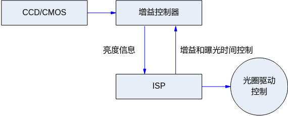
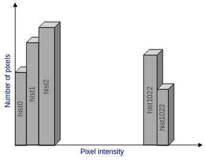
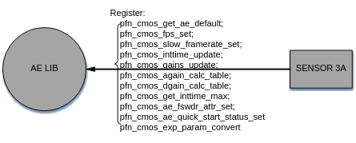
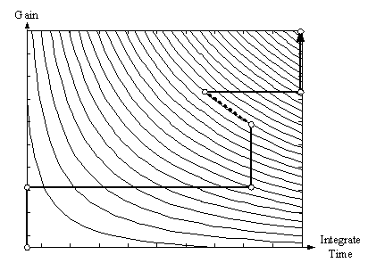

# AE
## Overview<a name="ZH-CN_TOPIC_0000002504084725"></a>

The ISP AE module implements the following functionality: based on the automatic metering system, it obtains the current image exposure and automatically configures the lens aperture, sensor shutter, and gain to achieve optimal image quality. The auto exposure algorithm is mainly divided into aperture priority, shutter priority, and gain priority. In aperture priority mode, the algorithm prioritizes adjusting the aperture to a suitable position before allocating exposure time and gain. This is only suitable for P-Iris lenses, and it balances noise and depth of field. In shutter priority mode, the algorithm prioritizes allocating exposure time before allocating sensor gain and ISP gain, resulting in less noise in the captured image. In gain priority mode, the algorithm prioritizes allocating sensor gain and ISP gain before allocating exposure time, suitable for scenes with moving objects. The current AE algorithm also supports customers setting more flexible exposure allocation strategies. The workflow of the AE module is shown in [Figure 1](#fig78111144161318).

**Figure 1** AE Module Workflow Diagram<a name="fig78111144161318"></a>  

## Important Concepts<a name="ZH-CN_TOPIC_0000002471084834"></a>

- Exposure Time: The time during which the sensor accumulates charge, from the start of exposure of the sensor pixel to the readout of the charge.
- Exposure Gain: The total amplification factor for the sensor's output charge, generally including digital gain and analog gain. Analog gain introduces slightly less noise, so analog gain is typically preferred.
- Aperture: The aperture is a mechanical device in the lens that can change the size of the aperture opening.
- Anti-flicker: Image flicker caused by the mismatch between the power frequency of electric lights and the sensor's frame rate. Anti-flicker is generally achieved by limiting the exposure time and modifying the sensor's frame rate.

## Function Description<a name="ZH-CN_TOPIC_0000002470924948"></a>

The AE module consists of two parts: the ISP AE statistics information module and the AE algorithm Firmware for AE control strategy. The ISP AE statistics information module mainly provides brightness information statistics of the sensor input data. The statistics information provided includes histograms and average values, which can simultaneously provide 1024-bin histograms of the entire image and R/Gr/Gb/B four-component average statistics, as well as R/Gr/Gb/B four-component average statistics for each block when the entire image is divided into MxN blocks, as shown in [Figure 1](#fig1568813224314).

**Figure 1** AE 1024-bin Statistics Histogram<a name="fig1568813224314"></a>  


The main working principle of the AE algorithm is to obtain the statistical information of the input image in real time, compare it with the set target brightness, and dynamically adjust the sensor's exposure time, gain, and lens aperture size so that the actual brightness approaches the set target brightness. Its working principle is shown in [Figure 2](#fig85992506321).

**Figure 2** AE Working Principle Diagram<a name="fig85992506321"></a>  

## API Reference<a name="ZH-CN_TOPIC_0000002504084819"></a>

### AE Library Interfaces<a name="ZH-CN_TOPIC_0000002471084986"></a>

All AE library interfaces are only for the AE library provided by the SDK. If the customer implements their own AE library, they do not need to pay attention to these interfaces and cannot use them.

- [ss_mpi_ae_register](#ZH-CN_TOPIC_0000002470925134): Register the AE library with ISP.
- [ss_mpi_ae_unregister](#ZH-CN_TOPIC_0000002471084866): Unregister the AE library from ISP.
- [ss_mpi_ae_sensor_reg_callback](#ZH-CN_TOPIC_0000002470924952): The sensor registration callback interface provided by the AE library.
- [ss_mpi_ae_sensor_unreg_callback](#ZH-CN_TOPIC_0000002471084858): The sensor unregistration callback interface provided by the AE library.

#### ss_mpi_ae_register<a name="ZH-CN_TOPIC_0000002470925134"></a>

【Description】

Register the AE library with ISP.

【Syntax】

```
td_s32 ss_mpi_ae_register(ot_vi_pipe vi_pipe, const ot_isp_3a_alg_lib *ae_lib);
```

【Parameters】

<a name="table10192mcpsimp"></a>
<table><thead align="left"><tr id="row10198mcpsimp"><th class="cellrowborder" valign="top" width="15%" id="mcps1.1.4.1.1"><p id="p10200mcpsimp"><a name="p10200mcpsimp"></a><a name="p10200mcpsimp"></a>Parameter Name</p>
</th>
<th class="cellrowborder" valign="top" width="69%" id="mcps1.1.4.1.2"><p id="p10202mcpsimp"><a name="p10202mcpsimp"></a><a name="p10202mcpsimp"></a>Description</p>
</th>
<th class="cellrowborder" valign="top" width="16%" id="mcps1.1.4.1.3"><p id="p10204mcpsimp"><a name="p10204mcpsimp"></a><a name="p10204mcpsimp"></a>Input/Output</p>
</th>
</tr>
</thead>
<tbody><tr id="row10206mcpsimp"><td class="cellrowborder" valign="top" width="15%" headers="mcps1.1.4.1.1 "><p id="p10208mcpsimp"><a name="p10208mcpsimp"></a><a name="p10208mcpsimp"></a>vi_pipe</p>
</td>
<td class="cellrowborder" valign="top" width="69%" headers="mcps1.1.4.1.2 "><p id="p10210mcpsimp"><a name="p10210mcpsimp"></a><a name="p10210mcpsimp"></a>vi_pipe number.</p>
</td>
<td class="cellrowborder" valign="top" width="16%" headers="mcps1.1.4.1.3 "><p id="p10212mcpsimp"><a name="p10212mcpsimp"></a><a name="p10212mcpsimp"></a>Input</p>
</td>
</tr>
<tr id="row10213mcpsimp"><td class="cellrowborder" valign="top" width="15%" headers="mcps1.1.4.1.1 "><p id="p10215mcpsimp"><a name="p10215mcpsimp"></a><a name="p10215mcpsimp"></a>ae_lib</p>
</td>
<td class="cellrowborder" valign="top" width="69%" headers="mcps1.1.4.1.2 "><p id="p10217mcpsimp"><a name="p10217mcpsimp"></a><a name="p10217mcpsimp"></a>Pointer to the AE algorithm library structure.</p>
</td>
<td class="cellrowborder" valign="top" width="16%" headers="mcps1.1.4.1.3 "><p id="p10219mcpsimp"><a name="p10219mcpsimp"></a><a name="p10219mcpsimp"></a>Input</p>
</td>
</tr>
</tbody>
</table>

【Return Value】

<a name="table10221mcpsimp"></a>
<table><thead align="left"><tr id="row10226mcpsimp"><th class="cellrowborder" valign="top" width="27%" id="mcps1.1.3.1.1"><p id="p10228mcpsimp"><a name="p10228mcpsimp"></a><a name="p10228mcpsimp"></a>Return Value</p>
</th>
<th class="cellrowborder" valign="top" width="73%" id="mcps1.1.3.1.2"><p id="p10230mcpsimp"><a name="p10230mcpsimp"></a><a name="p10230mcpsimp"></a>Description</p>
</th>
</tr>
</thead>
<tbody><tr id="row10231mcpsimp"><td class="cellrowborder" valign="top" width="27%" headers="mcps1.1.3.1.1 "><p id="p10233mcpsimp"><a name="p10233mcpsimp"></a><a name="p10233mcpsimp"></a>0</p>
</td>
<td class="cellrowborder" valign="top" width="73%" headers="mcps1.1.3.1.2 "><p id="p10235mcpsimp"><a name="p10235mcpsimp"></a><a name="p10235mcpsimp"></a>Success.</p>
</td>
</tr>
<tr id="row10236mcpsimp"><td class="cellrowborder" valign="top" width="27%" headers="mcps1.1.3.1.1 "><p id="p10238mcpsimp"><a name="p10238mcpsimp"></a><a name="p10238mcpsimp"></a>Non-0</p>
</td>
<td class="cellrowborder" valign="top" width="73%" headers="mcps1.1.3.1.2 "><p id="p10240mcpsimp"><a name="p10240mcpsimp"></a><a name="p10240mcpsimp"></a>Failure, the value is the error code.</p>
</td>
</tr>
</tbody>
</table>

【Requirements】

- Header files: ot_common_isp.h, ss_mpi_ae.h
- Library files: libss_isp.a, libot_isp.a, libot_ae.a

【Notes】

- This interface calls the AE registration callback interface ss_mpi_isp_ae_lib_reg_callback provided by the ISP library to implement the registration of the AE library provided by the SDK with the ISP library.
- Multiple instances of the AE library can be registered.
- This interface does not support multi-process operations.

【Example】

```
ot_vi_pipe vi_pipe = 0;
ae_lib.id = 0;
strcpy(ae_lib.lib_name, OT_AE_LIB_NAME); 
ss_mpi_ae_register(vi_pipe, &ae_lib);
ae_lib.id  = 1; 
ss_mpi_ae_register(vi_pipe, &ae_lib);
```

【Related Topics】

None

#### ss_mpi_ae_unregister<a name="ZH-CN_TOPIC_0000002471084866"></a>

【Description】

Unregister the AE library from ISP.

【Syntax】

```
td_s32 ss_mpi_ae_unregister(ot_vi_pipe vi_pipe, ot_isp_3a_alg_lib *ae_lib);
```

【Parameters】

<a name="table10270mcpsimp"></a>
<table><thead align="left"><tr id="row10276mcpsimp"><th class="cellrowborder" valign="top" width="15%" id="mcps1.1.4.1.1"><p id="p10278mcpsimp"><a name="p10278mcpsimp"></a><a name="p10278mcpsimp"></a>Parameter Name</p>
</th>
<th class="cellrowborder" valign="top" width="69%" id="mcps1.1.4.1.2"><p id="p10280mcpsimp"><a name="p10280mcpsimp"></a><a name="p10280mcpsimp"></a>Description</p>
</th>
<th class="cellrowborder" valign="top" width="16%" id="mcps1.1.4.1.3"><p id="p10282mcpsimp"><a name="p10282mcpsimp"></a><a name="p10282mcpsimp"></a>Input/Output</p>
</th>
</tr>
</thead>
<tbody><tr id="row10283mcpsimp"><td class="cellrowborder" valign="top" width="15%" headers="mcps1.1.4.1.1 "><p id="p10285mcpsimp"><a name="p10285mcpsimp"></a><a name="p10285mcpsimp"></a>vi_pipe</p>
</td>
<td class="cellrowborder" valign="top" width="69%" headers="mcps1.1.4.1.2 "><p id="p10287mcpsimp"><a name="p10287mcpsimp"></a><a name="p10287mcpsimp"></a>vi_pipe number.</p>
</td>
<td class="cellrowborder" valign="top" width="16%" headers="mcps1.1.4.1.3 "><p id="p10289mcpsimp"><a name="p10289mcpsimp"></a><a name="p10289mcpsimp"></a>Input</p>
</td>
</tr>
<tr id="row10290mcpsimp"><td class="cellrowborder" valign="top" width="15%" headers="mcps1.1.4.1.1 "><p id="p10292mcpsimp"><a name="p10292mcpsimp"></a><a name="p10292mcpsimp"></a>ae_lib</p>
</td>
<td class="cellrowborder" valign="top" width="69%" headers="mcps1.1.4.1.2 "><p id="p10294mcpsimp"><a name="p10294mcpsimp"></a><a name="p10294mcpsimp"></a>Pointer to the AE algorithm library structure.</p>
</td>
<td class="cellrowborder" valign="top" width="16%" headers="mcps1.1.4.1.3 "><p id="p10296mcpsimp"><a name="p10296mcpsimp"></a><a name="p10296mcpsimp"></a>Input</p>
</td>
</tr>
</tbody>
</table>

【Return Value】

<a name="table10299mcpsimp"></a>
<table><thead align="left"><tr id="row10304mcpsimp"><th class="cellrowborder" valign="top" width="27%" id="mcps1.1.3.1.1"><p id="p10306mcpsimp"><a name="p10306mcpsimp"></a><a name="p10306mcpsimp"></a>Return Value</p>
</th>
<th class="cellrowborder" valign="top" width="73%" id="mcps1.1.3.1.2"><p id="p10308mcpsimp"><a name="p10308mcpsimp"></a><a name="p10308mcpsimp"></a>Description</p>
</th>
</tr>
</thead>
<tbody><tr id="row10309mcpsimp"><td class="cellrowborder" valign="top" width="27%" headers="mcps1.1.3.1.1 "><p id="p10311mcpsimp"><a name="p10311mcpsimp"></a><a name="p10311mcpsimp"></a>0</p>
</td>
<td class="cellrowborder" valign="top" width="73%" headers="mcps1.1.3.1.2 "><p id="p10313mcpsimp"><a name="p10313mcpsimp"></a><a name="p10313mcpsimp"></a>Success.</p>
</td>
</tr>
<tr id="row10314mcpsimp"><td class="cellrowborder" valign="top" width="27%" headers="mcps1.1.3.1.1 "><p id="p10316mcpsimp"><a name="p10316mcpsimp"></a><a name="p10316mcpsimp"></a>Non-0</p>
</td>
<td class="cellrowborder" valign="top" width="73%" headers="mcps1.1.3.1.2 "><p id="p10318mcpsimp"><a name="p10318mcpsimp"></a><a name="p10318mcpsimp"></a>Failure, the value is the error code.</p>
</td>
</tr>
</tbody>
</table>

【Requirements】

- Header files: ot_common_isp.h, ss_mpi_ae.h
- Library files: libss_isp.a, libot_isp.a, libot_ae.a

【Notes】

- This interface calls the AE unregistration callback interface ss_mpi_isp_ae_lib_unreg_callback provided by the ISP library to implement the unregistration of the AE library from the ISP library.
- This interface does not support multi-process operations.

【Example】

```
ot_vi_pipe vi_pipe = 0;
ae_lib.id = 0;strcpy(ae_lib.lib_name, OT_AE_LIB_NAME); 
ss_mpi_ae_unregister(vi_pipe, & ae_lib);
ae_lib.id = 1; 
ss_mpi_ae_unregister(vi_pipe, & ae_lib);
```

【Related Topics】

None

#### ss_mpi_ae_sensor_reg_callback<a name="ZH-CN_TOPIC_0000002470924952"></a>

【Description】

The sensor registration callback interface provided by the AE library.

【Syntax】

```
td_s32 ss_mpi_ae_sensor_reg_callback(ot_vi_pipe vi_pipe, ot_isp_3a_alg_lib *ae_lib, ot_isp_sns_attr_info *sns_attr_info, ot_isp_ae_sensor_register *pregister);
```

【Parameters】

<a name="table10349mcpsimp"></a>
<table><thead align="left"><tr id="row10355mcpsimp"><th class="cellrowborder" valign="top" width="23%" id="mcps1.1.4.1.1"><p id="p10357mcpsimp"><a name="p10357mcpsimp"></a><a name="p10357mcpsimp"></a>Parameter Name</p>
</th>
<th class="cellrowborder" valign="top" width="56.99999999999999%" id="mcps1.1.4.1.2"><p id="p10359mcpsimp"><a name="p10359mcpsimp"></a><a name="p10359mcpsimp"></a>Description</p>
</th>
<th class="cellrowborder" valign="top" width="20%" id="mcps1.1.4.1.3"><p id="p10361mcpsimp"><a name="p10361mcpsimp"></a><a name="p10361mcpsimp"></a>Input/Output</p>
</th>
</tr>
</thead>
<tbody><tr id="row10362mcpsimp"><td class="cellrowborder" valign="top" width="23%" headers="mcps1.1.4.1.1 "><p id="p10364mcpsimp"><a name="p10364mcpsimp"></a><a name="p10364mcpsimp"></a>vi_pipe</p>
</td>
<td class="cellrowborder" valign="top" width="56.99999999999999%" headers="mcps1.1.4.1.2 "><p id="p10366mcpsimp"><a name="p10366mcpsimp"></a><a name="p10366mcpsimp"></a>vi_pipe number.</p>
</td>
<td class="cellrowborder" valign="top" width="20%" headers="mcps1.1.4.1.3 "><p id="p10368mcpsimp"><a name="p10368mcpsimp"></a><a name="p10368mcpsimp"></a>Input</p>
</td>
</tr>
<tr id="row10369mcpsimp"><td class="cellrowborder" valign="top" width="23%" headers="mcps1.1.4.1.1 "><p id="p10371mcpsimp"><a name="p10371mcpsimp"></a><a name="p10371mcpsimp"></a>ae_lib</p>
</td>
<td class="cellrowborder" valign="top" width="56.99999999999999%" headers="mcps1.1.4.1.2 "><p id="p10373mcpsimp"><a name="p10373mcpsimp"></a><a name="p10373mcpsimp"></a>Pointer to the AE algorithm library structure.</p>
</td>
<td class="cellrowborder" valign="top" width="20%" headers="mcps1.1.4.1.3 "><p id="p10375mcpsimp"><a name="p10375mcpsimp"></a><a name="p10375mcpsimp"></a>Input</p>
</td>
</tr>
<tr id="row10376mcpsimp"><td class="cellrowborder" valign="top" width="23%" headers="mcps1.1.4.1.1 "><p id="p10378mcpsimp"><a name="p10378mcpsimp"></a><a name="p10378mcpsimp"></a>sns_attr_info</p>
</td>
<td class="cellrowborder" valign="top" width="56.99999999999999%" headers="mcps1.1.4.1.2 "><p id="p10380mcpsimp"><a name="p10380mcpsimp"></a><a name="p10380mcpsimp"></a>Attributes of the sensor registered with AE.</p>
</td>
<td class="cellrowborder" valign="top" width="20%" headers="mcps1.1.4.1.3 "><p id="p10382mcpsimp"><a name="p10382mcpsimp"></a><a name="p10382mcpsimp"></a>Input</p>
</td>
</tr>
<tr id="row10383mcpsimp"><td class="cellrowborder" valign="top" width="23%" headers="mcps1.1.4.1.1 "><p id="p10385mcpsimp"><a name="p10385mcpsimp"></a><a name="p10385mcpsimp"></a>pregister</p>
</td>
<td class="cellrowborder" valign="top" width="56.99999999999999%" headers="mcps1.1.4.1.2 "><p id="p10387mcpsimp"><a name="p10387mcpsimp"></a><a name="p10387mcpsimp"></a>Pointer to the sensor registration structure.</p>
</td>
<td class="cellrowborder" valign="top" width="20%" headers="mcps1.1.4.1.3 "><p id="p10389mcpsimp"><a name="p10389mcpsimp"></a><a name="p10389mcpsimp"></a>Input</p>
</td>
</tr>
</tbody>
</table>

【Return Value】

<a name="table10392mcpsimp"></a>
<table><thead align="left"><tr id="row10397mcpsimp"><th class="cellrowborder" valign="top" width="27%" id="mcps1.1.3.1.1"><p id="p10399mcpsimp"><a name="p10399mcpsimp"></a><a name="p10399mcpsimp"></a>Return Value</p>
</th>
<th class="cellrowborder" valign="top" width="73%" id="mcps1.1.3.1.2"><p id="p10401mcpsimp"><a name="p10401mcpsimp"></a><a name="p10401mcpsimp"></a>Description</p>
</th>
</tr>
</thead>
<tbody><tr id="row10402mcpsimp"><td class="cellrowborder" valign="top" width="27%" headers="mcps1.1.3.1.1 "><p id="p10404mcpsimp"><a name="p10404mcpsimp"></a><a name="p10404mcpsimp"></a>0</p>
</td>
<td class="cellrowborder" valign="top" width="73%" headers="mcps1.1.3.1.2 "><p id="p10406mcpsimp"><a name="p10406mcpsimp"></a><a name="p10406mcpsimp"></a>Success.</p>
</td>
</tr>
<tr id="row10407mcpsimp"><td class="cellrowborder" valign="top" width="27%" headers="mcps1.1.3.1.1 "><p id="p10409mcpsimp"><a name="p10409mcpsimp"></a><a name="p10409mcpsimp"></a>Non-0</p>
</td>
<td class="cellrowborder" valign="top" width="73%" headers="mcps1.1.3.1.2 "><p id="p10411mcpsimp"><a name="p10411mcpsimp"></a><a name="p10411mcpsimp"></a>Failure, the value is the error code.</p>
</td>
</tr>
</tbody>
</table>

【Requirements】

- Header files: ot_common_isp.h, ss_mpi_ae.h
- Library files: libss_isp.a, libot_isp.a, libot_ae.a

【Notes】

- SensorId is a custom value defined in the sensor library, mainly used to verify whether the sensor registered with ISP and the sensor registered with 3A are the same sensor.
- AE obtains differentiated initialization parameters and controls the sensor through a series of callback interfaces registered by the sensor.
- This interface does not support multi-process operations.

**Figure 1** Interface between the AE library and the sensor library<a name="fig192824551518"></a>  


【Example】

```
ot_isp_3a_alg_lib ae_lib;
ot_isp_ae_sensor_register  ae_register;
ot_isp_sns_attr_info   sns_attr_info;
ot_isp_ae_sensor_exp_func *exp_func = &ae_register.sns_exp;
(ot_void)memset_s(exp_func, sizeof(ot_isp_ae_sensor_exp_func), 0, sizeof(ot_isp_ae_sensor_exp_func));
exp_func->pfn_cmos_get_ae_default    = cmos_get_ae_default;
exp_func->pfn_cmos_fps_set           = cmos_fps_set;
exp_func->pfn_cmos_slow_framerate_set= cmos_slow_framerate_set;    
exp_func->pfn_cmos_inttime_update    = cmos_inttime_update;
exp_func->pfn_cmos_gains_update      = cmos_gains_update;
exp_func->pfn_cmos_again_calc_table  = cmos_again_calc_table;
exp_func->pfn_cmos_dgain_calc_table  = cmos_dgain_calc_table;
exp_func->pfn_cmos_get_inttime_max   = cmos_get_inttime_max;
exp_func->pfn_cmos_ae_fswdr_attr_set = cmos_ae_fswdr_attr_set;
exp_func->pfn_cmos_ae_quick_start_status_set = cmos_ae_quick_start_status_set;
 
ot_vi_pipe vi_pipe = 0;
ae_lib.id = 0;
sns_attr_info.sensor_id = SENSOR_NAME_ID;
strncpy(ae_lib.lib_name, OT_AE_LIB_NAME, sizeof(OT_AE_LIB_NAME));
ret = ss_mpi_ae_sensor_reg_callback(vi_pipe, &ae_lib, &sns_attr_info, &ae_register);
if (ret != TD_SUCCESS) {
    printf("sensor register callback function to ae lib failed!\n");
    return ret;
}
```

【Related Topics】

None

#### ss_mpi_ae_sensor_unreg_callback<a name="ZH-CN_TOPIC_0000002471084858"></a>

【Description】

The sensor unregistration callback interface provided by the AE library.

【Syntax】

```
td_s32 ss_mpi_ae_sensor_unreg_callback(ot_vi_pipe vi_pipe, ot_isp_3a_alg_lib *ae_lib, ot_sensor_id sensor_id);
```

【Parameters】

<a name="table10464mcpsimp"></a>
<table><thead align="left"><tr id="row10470mcpsimp"><th class="cellrowborder" valign="top" width="15%" id="mcps1.1.4.1.1"><p id="p10472mcpsimp"><a name="p10472mcpsimp"></a><a name="p10472mcpsimp"></a>Parameter Name</p>
</th>
<th class="cellrowborder" valign="top" width="69%" id="mcps1.1.4.1.2"><p id="p10474mcpsimp"><a name="p10474mcpsimp"></a><a name="p10474mcpsimp"></a>Description</p>
</th>
<th class="cellrowborder" valign="top" width="16%" id="mcps1.1.4.1.3"><p id="p10476mcpsimp"><a name="p10476mcpsimp"></a><a name="p10476mcpsimp"></a>Input/Output</p>
</th>
</tr>
</thead>
<tbody><tr id="row10477mcpsimp"><td class="cellrowborder" valign="top" width="15%" headers="mcps1.1.4.1.1 "><p id="p10479mcpsimp"><a name="p10479mcpsimp"></a><a name="p10479mcpsimp"></a>vi_pipe</p>
</td>
<td class="cellrowborder" valign="top" width="69%" headers="mcps1.1.4.1.2 "><p id="p10481mcpsimp"><a name="p10481mcpsimp"></a><a name="p10481mcpsimp"></a>vi_pipe number.</p>
</td>
<td class="cellrowborder" valign="top" width="16%" headers="mcps1.1.4.1.3 "><p id="p10483mcpsimp"><a name="p10483mcpsimp"></a><a name="p10483mcpsimp"></a>Input</p>
</td>
</tr>
<tr id="row10484mcpsimp"><td class="cellrowborder" valign="top" width="15%" headers="mcps1.1.4.1.1 "><p id="p10486mcpsimp"><a name="p10486mcpsimp"></a><a name="p10486mcpsimp"></a>ae_lib</p>
</td>
<td class="cellrowborder" valign="top" width="69%" headers="mcps1.1.4.1.2 "><p id="p10488mcpsimp"><a name="p10488mcpsimp"></a><a name="p10488mcpsimp"></a>Pointer to the AE algorithm library structure.</p>
</td>
<td class="cellrowborder" valign="top" width="16%" headers="mcps1.1.4.1.3 "><p id="p10490mcpsimp"><a name="p10490mcpsimp"></a><a name="p10490mcpsimp"></a>Input</p>
</td>
</tr>
<tr id="row10491mcpsimp"><td class="cellrowborder" valign="top" width="15%" headers="mcps1.1.4.1.1 "><p id="p10493mcpsimp"><a name="p10493mcpsimp"></a><a name="p10493mcpsimp"></a>sensor_id</p>
</td>
<td class="cellrowborder" valign="top" width="69%" headers="mcps1.1.4.1.2 "><p id="p10495mcpsimp"><a name="p10495mcpsimp"></a><a name="p10495mcpsimp"></a>ID of the sensor to be unregistered from AE.</p>
</td>
<td class="cellrowborder" valign="top" width="16%" headers="mcps1.1.4.1.3 "><p id="p10497mcpsimp"><a name="p10497mcpsimp"></a><a name="p10497mcpsimp"></a>Input</p>
</td>
</tr>
</tbody>
</table>

【Return Value】

<a name="table10500mcpsimp"></a>
<table><thead align="left"><tr id="row10505mcpsimp"><th class="cellrowborder" valign="top" width="27%" id="mcps1.1.3.1.1"><p id="p10507mcpsimp"><a name="p10507mcpsimp"></a><a name="p10507mcpsimp"></a>Return Value</p>
</th>
<th class="cellrowborder" valign="top" width="73%" id="mcps1.1.3.1.2"><p id="p10509mcpsimp"><a name="p10509mcpsimp"></a><a name="p10509mcpsimp"></a>Description</p>
</th>
</tr>
</thead>
<tbody><tr id="row10511mcpsimp"><td class="cellrowborder" valign="top" width="27%" headers="mcps1.1.3.1.1 "><p id="p10513mcpsimp"><a name="p10513mcpsimp"></a><a name="p10513mcpsimp"></a>0</p>
</td>
<td class="cellrowborder" valign="top" width="73%" headers="mcps1.1.3.1.2 "><p id="p10515mcpsimp"><a name="p10515mcpsimp"></a><a name="p10515mcpsimp"></a>Success.</p>
</td>
</tr>
<tr id="row10516mcpsimp"><td class="cellrowborder" valign="top" width="27%" headers="mcps1.1.3.1.1 "><p id="p10518mcpsimp"><a name="p10518mcpsimp"></a><a name="p10518mcpsimp"></a>Non-0</p>
</td>
<td class="cellrowborder" valign="top" width="73%" headers="mcps1.1.3.1.2 "><p id="p10520mcpsimp"><a name="p10520mcpsimp"></a><a name="p10520mcpsimp"></a>Failure, the value is the error code.</p>
</td>
</tr>
</tbody>
</table>

【Requirements】

- Header files: ot_common_isp.h, ss_mpi_ae.h
- Library files: libss_isp.a, libot_isp.a, libot_ae.a

【Notes】

- SensorId is a custom value defined in the sensor library, mainly used to verify whether the sensor unregistered from ISP and the sensor unregistered from 3A are the same sensor.
- This interface does not support multi-process operations.

【Example】

```
ot_isp_3a_alg_lib ae_lib;
ot_vi_pipe vi_pipe = 0;
ae_lib.id = 0;
strncpy(ae_lib.lib_name, OT_AE_LIB_NAME, sizeof(OT_AE_LIB_NAME));
ret = ss_mpi_ae_sensor_unreg_callback(vi_pipe, &ae_lib, SENSOR_NAME_ID);
if (ret != TD_SUCCESS) {
    printf("sensor register callback function to ae lib failed!\n");
    return ret;
}
```

【Related Topics】

None

### AE Control Module<a name="ZH-CN_TOPIC_0000002504084901"></a>

Exposure control interfaces:

- [ss_mpi_isp_set_exposure_attr](#ZH-CN_TOPIC_0000002503964781): Set AE exposure attributes.
- [ss_mpi_isp_get_exposure_attr](#ZH-CN_TOPIC_0000002504084835): Get AE exposure attributes.
- [ss_mpi_isp_set_wdr_exposure_attr](#ZH-CN_TOPIC_0000002504084905): Set AE exposure attributes in WDR mode.
- [ss_mpi_isp_get_wdr_exposure_attr](#ZH-CN_TOPIC_0000002470924854): Get AE exposure attributes in WDR mode.
- [ss_mpi_isp_set_hdr_exposure_attr](#ZH-CN_TOPIC_0000002504084737): Set AE exposure attributes in HDR mode.
- [ss_mpi_isp_get_hdr_exposure_attr](#ZH-CN_TOPIC_0000002504084897): Get AE exposure attributes in HDR mode.
- [ss_mpi_isp_set_smart_exposure_attr](#ZH-CN_TOPIC_0000002471084856): Set AE exposure attributes in smart mode.
- [ss_mpi_isp_get_smart_exposure_attr](#ZH-CN_TOPIC_0000002504084961): Get AE exposure attributes in smart mode.
- [ss_mpi_isp_set_fast_face_ae_attr](#ZH-CN_TOPIC_0000002503964919): Set AE exposure attributes in face fast convergence mode.
- [ss_mpi_isp_get_fast_face_ae_attr](#ZH-CN_TOPIC_0000002504084751): Get AE exposure attributes in face fast convergence mode.
- [ss_mpi_isp_set_ae_route_attr](#ZH-CN_TOPIC_0000002504084821): Set AE exposure allocation strategy attributes.
- [ss_mpi_isp_get_ae_route_attr](#ZH-CN_TOPIC_0000002471084932): Get AE exposure allocation strategy attributes.
- [ss_mpi_isp_set_ae_route_attr_ex](#ZH-CN_TOPIC_0000002503965045): Set AE exposure allocation extension attributes, supporting separate configuration of sensor analog gain, sensor digital gain, and ISP digital gain in the AE allocation strategy.
- [ss_mpi_isp_get_ae_route_attr_ex](#ZH-CN_TOPIC_0000002471084852): Get AE exposure allocation strategy extension attributes.
- [ss_mpi_isp_set_ae_route_sf_attr](#ZH-CN_TOPIC_0000002503964803): In WDR mode, set the AE short frame exposure allocation strategy attributes.
- [ss_mpi_isp_get_ae_route_sf_attr](#ZH-CN_TOPIC_0000002471085052): Get AE short frame exposure allocation strategy attributes.
- [ss_mpi_isp_set_ae_route_sf_attr_ex](#ZH-CN_TOPIC_0000002503964835): In WDR mode, set the AE short frame exposure allocation strategy extension attributes.
- [ss_mpi_isp_get_ae_route_sf_attr_ex](#ZH-CN_TOPIC_0000002470925156): Get AE short frame exposure allocation strategy extension attributes.
- [ss_mpi_isp_query_exposure_info](#ZH-CN_TOPIC_0000002503964993): Get AE internal status information.
- [ss_mpi_isp_set_exp_convert](#ZH-CN_TOPIC_0000002470925022): Set attributes related to equal exposure conversion at different frame rates.
- [ss_mpi_isp_get_exp_convert](#ZH-CN_TOPIC_0000002504084753): Get exposure parameter attributes related to equal exposure conversion results at different frame rates.

#### ss_mpi_isp_set_exposure_attr<a name="ZH-CN_TOPIC_0000002503964781"></a>

【Description】

Set AE exposure attributes.

【Syntax】

```
td_s32 ss_mpi_isp_set_exposure_attr (ot_vi_pipe vi_pipe, const ot_isp_exposure_attr *exp_attr);
```

【Parameters】

<a name="table10602mcpsimp"></a>
<table><thead align="left"><tr id="row10608mcpsimp"><th class="cellrowborder" valign="top" width="18%" id="mcps1.1.4.1.1"><p id="p10610mcpsimp"><a name="p10610mcpsimp"></a><a name="p10610mcpsimp"></a>Parameter Name</p>
</th>
<th class="cellrowborder" valign="top" width="66%" id="mcps1.1.4.1.2"><p id="p10612mcpsimp"><a name="p10612mcpsimp"></a><a name="p10612mcpsimp"></a>Description</p>
</th>
<th class="cellrowborder" valign="top" width="16%" id="mcps1.1.4.1.3"><p id="p10614mcpsimp"><a name="p10614mcpsimp"></a><a name="p10614mcpsimp"></a>Input/Output</p>
</th>
</tr>
</thead>
<tbody><tr id="row10616mcpsimp"><td class="cellrowborder" valign="top" width="18%" headers="mcps1.1.4.1.1 "><p id="p10618mcpsimp"><a name="p10618mcpsimp"></a><a name="p10618mcpsimp"></a>vi_pipe</p>
</td>
<td class="cellrowborder" valign="top" width="66%" headers="mcps1.1.4.1.2 "><p id="p10620mcpsimp"><a name="p10620mcpsimp"></a><a name="p10620mcpsimp"></a>vi_pipe number.</p>
</td>
<td class="cellrowborder" valign="top" width="16%" headers="mcps1.1.4.1.3 "><p id="p10622mcpsimp"><a name="p10622mcpsimp"></a><a name="p10622mcpsimp"></a>Input</p>
</td>
</tr>
<tr id="row10623mcpsimp"><td class="cellrowborder" valign="top" width="18%" headers="mcps1.1.4.1.1 "><p id="p10625mcpsimp"><a name="p10625mcpsimp"></a><a name="p10625mcpsimp"></a>exp_attr</p>
</td>
<td class="cellrowborder" valign="top" width="66%" headers="mcps1.1.4.1.2 "><p id="p10627mcpsimp"><a name="p10627mcpsimp"></a><a name="p10627mcpsimp"></a>Pointer to the AE exposure attribute structure.</p>
</td>
<td class="cellrowborder" valign="top" width="16%" headers="mcps1.1.4.1.3 "><p id="p10629mcpsimp"><a name="p10629mcpsimp"></a><a name="p10629mcpsimp"></a>Input</p>
</td>
</tr>
</tbody>
</table>

【Return Value】

<a name="table10631mcpsimp"></a>
<table><thead align="left"><tr id="row10636mcpsimp"><th class="cellrowborder" valign="top" width="27%" id="mcps1.1.3.1.1"><p id="p10638mcpsimp"><a name="p10638mcpsimp"></a><a name="p10638mcpsimp"></a>Return Value</p>
</th>
<th class="cellrowborder" valign="top" width="73%" id="mcps1.1.3.1.2"><p id="p10640mcpsimp"><a name="p10640mcpsimp"></a><a name="p10640mcpsimp"></a>Description</p>
</th>
</tr>
</thead>
<tbody><tr id="row10641mcpsimp"><td class="cellrowborder" valign="top" width="27%" headers="mcps1.1.3.1.1 "><p id="p10643mcpsimp"><a name="p10643mcpsimp"></a><a name="p10643mcpsimp"></a>0</p>
</td>
<td class="cellrowborder" valign="top" width="73%" headers="mcps1.1.3.1.2 "><p id="p10645mcpsimp"><a name="p10645mcpsimp"></a><a name="p10645mcpsimp"></a>Success.</p>
</td>
</tr>
<tr id="row10646mcpsimp"><td class="cellrowborder" valign="top" width="27%" headers="mcps1.1.3.1.1 "><p id="p10648mcpsimp"><a name="p10648mcpsimp"></a><a name="p10648mcpsimp"></a>Non-0</p>
</td>
<td class="cellrowborder" valign="top" width="73%" headers="mcps1.1.3.1.2 "><p id="p10650mcpsimp"><a name="p10650mcpsimp"></a><a name="p10650mcpsimp"></a>Failure, the value is the error code.</p>
</td>
</tr>
</tbody>
</table>

【Requirements】

- Header files: ot_common_isp.h, ss_mpi_isp.h, ss_mpi_ae.h
- Library files: libss_isp.a, libot_isp.a, libot_ae.a

【Notes】

- When the AE exposure control type is Auto, the exposure time and exposure gain are automatically controlled by the AE algorithm. Different exposure effects can be achieved by configuring parameters in the auto exposure attribute structure [ot_isp_ae_attr](#ZH-CN_TOPIC_0000002470924872).
- When the AE exposure control type is Manual, you can control the enable types (exposure time enable, sensor analog gain enable, sensor digital gain enable, ISP digital gain enable) and the corresponding exposure parameters (exposure time, sensor analog gain, sensor digital gain, ISP digital gain) through the manual exposure attribute structure manual_attr.
- When the AE exposure control type is Auto, the parameters configured for manual exposure attributes are invalid. Similarly, when the AE exposure control type is Manual, the parameters configured for auto exposure attributes are invalid.
- When the AE exposure control type is Manual, if the exposure parameter settings exceed the maximum (minimum) value, the sensor's supported maximum (minimum) value will be used instead.
- Whether in auto exposure or manual exposure, the unit of exposure time is microseconds (us), and the unit of exposure gain is a multiple of 10-bit precision, i.e., 1024 represents 1x, 2048 represents 2x, etc.
- In WDR mode, when the priority frame is set to long frame, exposure is prioritized according to the long frame exposure route. In 2-in-1 WDR mode when gain is configured separately, the short frame exposure route is adjusted based on the long frame exposure parameters. When the priority frame is set to short frame, exposure is prioritized according to the short frame exposure route. In 2-in-1 WDR mode when gain is configured separately, the long frame exposure route is adjusted based on the short frame exposure parameters.
- In 2-in-1 WDR mode with separate gain configuration, if the sensor supports different gains for long and short frames, different sensor analog gains, sensor digital gains, and WDR gains can be achieved for long and short frames. If the sensor does not support different gains for long and short frames, different WDR gains can still be achieved for long and short frames.

【Example】

Auto exposure attribute setting:

```
ot_vi_pipe vi_pipe = 0;
ot_isp_exposure_attr exp_attr; 
 
ss_mpi_isp_get_exposure_attr(vi_pipe, &exp_attr);
exp_attr.  bypass = TD_FALSE;   
exp_attr. prior_frame= OT_ISP_LONG_FRAME;
exp_attr.  ae_gain_sep_cfg= TD_FALSE; 
exp_attr. op_type= OT_OP_MODE_AUTO;       
exp_attr. auto_attr. exp_time_range.max = 40000;
exp_attr. auto_attr. exp_time_range.min = 10;       
ss_mpi_isp_get_exposure_attr(vi_pipe, &exp_attr);
exp_attr. auto_attr.speed = 0x80;      
ss_mpi_isp_get_exposure_attr(vi_pipe, &exp_attr);
exp_attr. auto_attr. exp_attr =OT_ISP_AE_EXP_HIGHLIGHT_PRIOR;   
exp_attr. auto_attr. hist_ratio_slope= 0x100;
exp_attr. auto_attr. max_hist_offset= 0x40;
ss_mpi_isp_get_exposure_attr(vi_pipe, &exp_attr);
exp_attr. auto_attr. antiflicker. enable= TD_TRUE;
exp_attr. auto_attr. antiflicker. frequency= 50;
exp_attr. auto_attr. antiflicker. mode= OT_ISP_ANTIFLICKER_NORMAL_MODE;
ss_mpi_isp_get_exposure_attr(vi_pipe, &exp_attr);
exp_attr. auto_attr. ae_delay_attr. black_delay_frame = 10;
exp_attr. auto_attr. ae_delay_attr. white_delay_frame = 0;
ss_mpi_isp_get_exposure_attr(vi_pipe, &exp_attr);     
```

Manual exposure attribute setting:

```
ot_vi_pipe vi_pipe = 0;
ot_isp_exposure_attr exp_attr;  
ss_mpi_isp_get_exposure_attr(vi_pipe, &exp_attr);exp_attr. bypass= TD_FALSE;   
exp_attr. op_type= OT_OP_MODE_MANUAL;       
exp_attr. manual_attr. a_gain_op_type = OT_OP_MODE_MANUAL;
exp_attr. manual_attr. d_gain_op_type = OT_OP_MODE_MANUAL
exp_attr. manual_attr. ispd_gain_op_type = OT_OP_MODE_MANUAL;
exp_attr. manual_attr. exp_time_op_type = OT_OP_MODE_MANUAL;
exp_attr. manual_attr. a_gain = 0x400;
exp_attr. manual_attr. d_gain = 0x400;
exp_attr. manual_attr. isp_d_gain = 0x400;
exp_attr. manual_attr. exp_time = 0x40000;     
ss_mpi_isp_get_exposure_attr(vi_pipe, &exp_attr);
```

【Related Topics】

[ss_mpi_isp_get_exposure_attr](#ss_mpi_isp_get_exposure_attr)

#### ss_mpi_isp_get_exposure_attr<a name="ZH-CN_TOPIC_0000002504084835"></a>

【Description】

Get AE exposure attributes.

【Syntax】

```
td_s32 ss_mpi_isp_get_exposure_attr(ot_vi_pipe vi_pipe, ot_isp_exposure_attr *exp_attr);
```

【Parameters】

<a name="table10718mcpsimp"></a>
<table><thead align="left"><tr id="row10724mcpsimp"><th class="cellrowborder" valign="top" width="18%" id="mcps1.1.4.1.1"><p id="p10726mcpsimp"><a name="p10726mcpsimp"></a><a name="p10726mcpsimp"></a>Parameter Name</p>
</th>
<th class="cellrowborder" valign="top" width="66%" id="mcps1.1.4.1.2"><p id="p10728mcpsimp"><a name="p10728mcpsimp"></a><a name="p10728mcpsimp"></a>Description</p>
</th>
<th class="cellrowborder" valign="top" width="16%" id="mcps1.1.4.1.3"><p id="p10730mcpsimp"><a name="p10730mcpsimp"></a><a name="p10730mcpsimp"></a>Input/Output</p>
</th>
</tr>
</thead>
<tbody><tr id="row10731mcpsimp"><td class="cellrowborder" valign="top" width="18%" headers="mcps1.1.4.1.1 "><p id="p10733mcpsimp"><a name="p10733mcpsimp"></a><a name="p10733mcpsimp"></a>vi_pipe</p>
</td>
<td class="cellrowborder" valign="top" width="66%" headers="mcps1.1.4.1.2 "><p id="p10735mcpsimp"><a name="p10735mcpsimp"></a><a name="p10735mcpsimp"></a>vi_pipe number.</p>
</td>
<td class="cellrowborder" valign="top" width="16%" headers="mcps1.1.4.1.3 "><p id="p10737mcpsimp"><a name="p10737mcpsimp"></a><a name="p10737mcpsimp"></a>Input</p>
</td>
</tr>
<tr id="row10738mcpsimp"><td class="cellrowborder" valign="top" width="18%" headers="mcps1.1.4.1.1 "><p id="p10740mcpsimp"><a name="p10740mcpsimp"></a><a name="p10740mcpsimp"></a>exp_attr</p>
</td>
<td class="cellrowborder" valign="top" width="66%" headers="mcps1.1.4.1.2 "><p id="p10742mcpsimp"><a name="p10742mcpsimp"></a><a name="p10742mcpsimp"></a>Pointer to the AE exposure attribute structure.</p>
</td>
<td class="cellrowborder" valign="top" width="16%" headers="mcps1.1.4.1.3 "><p id="p10744mcpsimp"><a name="p10744mcpsimp"></a><a name="p10744mcpsimp"></a>Output</p>
</td>
</tr>
</tbody>
</table>

【Return Value】

<a name="table10747mcpsimp"></a>
<table><thead align="left"><tr id="row10752mcpsimp"><th class="cellrowborder" valign="top" width="27%" id="mcps1.1.3.1.1"><p id="p10754mcpsimp"><a name="p10754mcpsimp"></a><a name="p10754mcpsimp"></a>Return Value</p>
</th>
<th class="cellrowborder" valign="top" width="73%" id="mcps1.1.3.1.2"><p id="p10756mcpsimp"><a name="p10756mcpsimp"></a><a name="p10756mcpsimp"></a>Description</p>
</th>
</tr>
</thead>
<tbody><tr id="row10758mcpsimp"><td class="cellrowborder" valign="top" width="27%" headers="mcps1.1.3.1.1 "><p id="p10760mcpsimp"><a name="p10760mcpsimp"></a><a name="p10760mcpsimp"></a>0</p>
</td>
<td class="cellrowborder" valign="top" width="73%" headers="mcps1.1.3.1.2 "><p id="p10762mcpsimp"><a name="p10762mcpsimp"></a><a name="p10762mcpsimp"></a>Success.</p>
</td>
</tr>
<tr id="row10763mcpsimp"><td class="cellrowborder" valign="top" width="27%" headers="mcps1.1.3.1.1 "><p id="p10765mcpsimp"><a name="p10765mcpsimp"></a><a name="p10765mcpsimp"></a>Non-0</p>
</td>
<td class="cellrowborder" valign="top" width="73%" headers="mcps1.1.3.1.2 "><p id="p10767mcpsimp"><a name="p10767mcpsimp"></a><a name="p10767mcpsimp"></a>Failure, the value is the error code.</p>
</td>
</tr>
</tbody>
</table>

【Requirements】

- Header files: ot_common_isp.h, ss_mpi_isp.h, ss_mpi_ae.h
- Library files: libss_isp.a, libot_isp.a, libot_ae.a

【Notes】

None

【Example】

None

【Related Topics】

[ss_mpi_isp_set_exposure_attr](#ss_mpi_isp_set_exposure_attr)

#### ss_mpi_isp_set_wdr_exposure_attr<a name="ZH-CN_TOPIC_0000002504084905"></a>

【Description】

Set AE exposure attributes in WDR mode.

【Syntax】

```
td_s32 ss_mpi_isp_set_wdr_exposure_attr(ot_vi_pipe vi_pipe, const ot_isp_wdr_exposure_attr *wdr_exp_attr);
```

【Parameters】

<a name="table10788mcpsimp"></a>
<table><thead align="left"><tr id="row10794mcpsimp"><th class="cellrowborder" valign="top" width="21%" id="mcps1.1.4.1.1"><p id="p10796mcpsimp"><a name="p10796mcpsimp"></a><a name="p10796mcpsimp"></a>Parameter Name</p>
</th>
<th class="cellrowborder" valign="top" width="54%" id="mcps1.1.4.1.2"><p id="p10798mcpsimp"><a name="p10798mcpsimp"></a><a name="p10798mcpsimp"></a>Description</p>
</th>
<th class="cellrowborder" valign="top" width="25%" id="mcps1.1.4.1.3"><p id="p10800mcpsimp"><a name="p10800mcpsimp"></a><a name="p10800mcpsimp"></a>Input/Output</p>
</th>
</tr>
</thead>
<tbody><tr id="row10801mcpsimp"><td class="cellrowborder" valign="top" width="21%" headers="mcps1.1.4.1.1 "><p id="p10803mcpsimp"><a name="p10803mcpsimp"></a><a name="p10803mcpsimp"></a>vi_pipe</p>
</td>
<td class="cellrowborder" valign="top" width="54%" headers="mcps1.1.4.1.2 "><p id="p10805mcpsimp"><a name="p10805mcpsimp"></a><a name="p10805mcpsimp"></a>vi_pipe number.</p>
</td>
<td class="cellrowborder" valign="top" width="25%" headers="mcps1.1.4.1.3 "><p id="p10807mcpsimp"><a name="p10807mcpsimp"></a><a name="p10807mcpsimp"></a>Input</p>
</td>
</tr>
<tr id="row10808mcpsimp"><td class="cellrowborder" valign="top" width="21%" headers="mcps1.1.4.1.1 "><p id="p10810mcpsimp"><a name="p10810mcpsimp"></a><a name="p10810mcpsimp"></a>wdr_exp_attr</p>
</td>
<td class="cellrowborder" valign="top" width="54%" headers="mcps1.1.4.1.2 "><p id="p10812mcpsimp"><a name="p10812mcpsimp"></a><a name="p10812mcpsimp"></a>Pointer to the AE exposure attribute structure in WDR mode.</p>
</td>
<td class="cellrowborder" valign="top" width="25%" headers="mcps1.1.4.1.3 "><p id="p10814mcpsimp"><a name="p10814mcpsimp"></a><a name="p10814mcpsimp"></a>Input</p>
</td>
</tr>
</tbody>
</table>

【Return Value】

<a name="table10817mcpsimp"></a>
<table><thead align="left"><tr id="row10822mcpsimp"><th class="cellrowborder" valign="top" width="27%" id="mcps1.1.3.1.1"><p id="p10824mcpsimp"><a name="p10824mcpsimp"></a><a name="p10824mcpsimp"></a>Return Value</p>
</th>
<th class="cellrowborder" valign="top" width="73%" id="mcps1.1.3.1.2"><p id="p10826mcpsimp"><a name="p10826mcpsimp"></a><a name="p10826mcpsimp"></a>Description</p>
</th>
</tr>
</thead>
<tbody><tr id="row10828mcpsimp"><td class="cellrowborder" valign="top" width="27%" headers="mcps1.1.3.1.1 "><p id="p10830mcpsimp"><a name="p10830mcpsimp"></a><a name="p10830mcpsimp"></a>0</p>
</td>
<td class="cellrowborder" valign="top" width="73%" headers="mcps1.1.3.1.2 "><p id="p10832mcpsimp"><a name="p10832mcpsimp"></a><a name="p10832mcpsimp"></a>Success.</p>
</td>
</tr>
<tr id="row10833mcpsimp"><td class="cellrowborder" valign="top" width="27%" headers="mcps1.1.3.1.1 "><p id="p10835mcpsimp"><a name="p10835mcpsimp"></a><a name="p10835mcpsimp"></a>Non-0</p>
</td>
<td class="cellrowborder" valign="top" width="73%" headers="mcps1.1.3.1.2 "><p id="p10837mcpsimp"><a name="p10837mcpsimp"></a><a name="p10837mcpsimp"></a>Failure, the value is the error code.</p>
</td>
</tr>
</tbody>
</table>

【Requirements】

- Header files: ot_common_isp.h, ss_mpi_isp.h, ss_mpi_ae.h
- Library files: libss_isp.a, libot_isp.a, libot_ae.a

【Notes】

None

【Example】

None

【Related Topics】

[ss_mpi_isp_get_wdr_exposure_attr](#ss_mpi_isp_get_wdr_exposure_attr)

#### ss_mpi_isp_get_wdr_exposure_attr<a name="ZH-CN_TOPIC_0000002470924854"></a>

【Description】

Get AE exposure attributes in WDR mode.

【Syntax】

```
td_s32 ss_mpi_isp_get_wdr_exposure_attr(ot_vi_pipe vi_pipe, ot_isp_wdr_exposure_attr *wdr_exp_attr);
```

【Parameters】

<a name="table10858mcpsimp"></a>
<table><thead align="left"><tr id="row10864mcpsimp"><th class="cellrowborder" valign="top" width="21%" id="mcps1.1.4.1.1"><p id="p10866mcpsimp"><a name="p10866mcpsimp"></a><a name="p10866mcpsimp"></a>Parameter Name</p>
</th>
<th class="cellrowborder" valign="top" width="54%" id="mcps1.1.4.1.2"><p id="p10868mcpsimp"><a name="p10868mcpsimp"></a><a name="p10868mcpsimp"></a>Description</p>
</th>
<th class="cellrowborder" valign="top" width="25%" id="mcps1.1.4.1.3"><p id="p10870mcpsimp"><a name="p10870mcpsimp"></a><a name="p10870mcpsimp"></a>Input/Output</p>
</th>
</tr>
</thead>
<tbody><tr id="row10871mcpsimp"><td class="cellrowborder" valign="top" width="21%" headers="mcps1.1.4.1.1 "><p id="p10873mcpsimp"><a name="p10873mcpsimp"></a><a name="p10873mcpsimp"></a>vi_pipe</p>
</td>
<td class="cellrowborder" valign="top" width="54%" headers="mcps1.1.4.1.2 "><p id="p10875mcpsimp"><a name="p10875mcpsimp"></a><a name="p10875mcpsimp"></a>vi_pipe number.</p>
</td>
<td class="cellrowborder" valign="top" width="25%" headers="mcps1.1.4.1.3 "><p id="p10877mcpsimp"><a name="p10877mcpsimp"></a><a name="p10877mcpsimp"></a>Input</p>
</td>
</tr>
<tr id="row10878mcpsimp"><td class="cellrowborder" valign="top" width="21%" headers="mcps1.1.4.1.1 "><p id="p10880mcpsimp"><a name="p10880mcpsimp"></a><a name="p10880mcpsimp"></a>wdr_exp_attr</p>
</td>
<td class="cellrowborder" valign="top" width="54%" headers="mcps1.1.4.1.2 "><p id="p10882mcpsimp"><a name="p10882mcpsimp"></a><a name="p10882mcpsimp"></a>Pointer to the AE exposure attribute structure in WDR mode.</p>
</td>
<td class="cellrowborder" valign="top" width="25%" headers="mcps1.1.4.1.3 "><p id="p10884mcpsimp"><a name="p10884mcpsimp"></a><a name="p10884mcpsimp"></a>Output</p>
</td>
</tr>
</tbody>
</table>

【Return Value】

<a name="table10887mcpsimp"></a>
<table><thead align="left"><tr id="row10892mcpsimp"><th class="cellrowborder" valign="top" width="27%" id="mcps1.1.3.1.1"><p id="p10894mcpsimp"><a name="p10894mcpsimp"></a><a name="p10894mcpsimp"></a>Return Value</p>
</th>
<th class="cellrowborder" valign="top" width="73%" id="mcps1.1.3.1.2"><p id="p10896mcpsimp"><a name="p10896mcpsimp"></a><a name="p10896mcpsimp"></a>Description</p>
</th>
</tr>
</thead>
<tbody><tr id="row10898mcpsimp"><td class="cellrowborder" valign="top" width="27%" headers="mcps1.1.3.1.1 "><p id="p10900mcpsimp"><a name="p10900mcpsimp"></a><a name="p10900mcpsimp"></a>0</p>
</td>
<td class="cellrowborder" valign="top" width="73%" headers="mcps1.1.3.1.2 "><p id="p10902mcpsimp"><a name="p10902mcpsimp"></a><a name="p10902mcpsimp"></a>Success.</p>
</td>
</tr>
<tr id="row10903mcpsimp"><td class="cellrowborder" valign="top" width="27%" headers="mcps1.1.3.1.1 "><p id="p10905mcpsimp"><a name="p10905mcpsimp"></a><a name="p10905mcpsimp"></a>Non-0</p>
</td>
<td class="cellrowborder" valign="top" width="73%" headers="mcps1.1.3.1.2 "><p id="p10907mcpsimp"><a name="p10907mcpsimp"></a><a name="p10907mcpsimp"></a>Failure, the value is the error code.</p>
</td>
</tr>
</tbody>
</table>

【Requirements】

- Header files: ot_common_isp.h, ss_mpi_isp.h, ss_mpi_ae.h
- Library files: libss_isp.a, libot_isp.a, libot_ae.a

【Notes】

None

【Example】

None

【Related Topics】

[ss_mpi_isp_set_wdr_exposure_attr](#ss_mpi_isp_set_wdr_exposure_attr)

#### ss_mpi_isp_set_hdr_exposure_attr<a name="ZH-CN_TOPIC_0000002504084737"></a>

【Description】

Set AE exposure attributes in HDR mode.

【Syntax】

```
td_s32 ss_mpi_isp_set_hdr_exposure_attr(ot_vi_pipe vi_pipe, const ot_isp_hdr_exposure_attr *hdr_exp_attr);
```

【Parameters】

<a name="table10929mcpsimp"></a>
<table><thead align="left"><tr id="row10935mcpsimp"><th class="cellrowborder" valign="top" width="21%" id="mcps1.1.4.1.1"><p id="p10937mcpsimp"><a name="p10937mcpsimp"></a><a name="p10937mcpsimp"></a>Parameter Name</p>
</th>
<th class="cellrowborder" valign="top" width="54%" id="mcps1.1.4.1.2"><p id="p10939mcpsimp"><a name="p10939mcpsimp"></a><a name="p10939mcpsimp"></a>Description</p>
</th>
<th class="cellrowborder" valign="top" width="25%" id="mcps1.1.4.1.3"><p id="p10941mcpsimp"><a name="p10941mcpsimp"></a><a name="p10941mcpsimp"></a>Input/Output</p>
</th>
</tr>
</thead>
<tbody><tr id="row10942mcpsimp"><td class="cellrowborder" valign="top" width="21%" headers="mcps1.1.4.1.1 "><p id="p10944mcpsimp"><a name="p10944mcpsimp"></a><a name="p10944mcpsimp"></a>vi_pipe</p>
</td>
<td class="cellrowborder" valign="top" width="54%" headers="mcps1.1.4.1.2 "><p id="p10946mcpsimp"><a name="p10946mcpsimp"></a><a name="p10946mcpsimp"></a>vi_pipe number.</p>
</td>
<td class="cellrowborder" valign="top" width="25%" headers="mcps1.1.4.1.3 "><p id="p10948mcpsimp"><a name="p10948mcpsimp"></a><a name="p10948mcpsimp"></a>Input</p>
</td>
</tr>
<tr id="row10949mcpsimp"><td class="cellrowborder" valign="top" width="21%" headers="mcps1.1.4.1.1 "><p id="p10951mcpsimp"><a name="p10951mcpsimp"></a><a name="p10951mcpsimp"></a>hdr_exp_attr</p>
</td>
<td class="cellrowborder" valign="top" width="54%" headers="mcps1.1.4.1.2 "><p id="p10953mcpsimp"><a name="p10953mcpsimp"></a><a name="p10953mcpsimp"></a>Pointer to the AE exposure attribute structure in HDR mode.</p>
</td>
<td class="cellrowborder" valign="top" width="25%" headers="mcps1.1.4.1.3 "><p id="p10955mcpsimp"><a name="p10955mcpsimp"></a><a name="p10955mcpsimp"></a>Input</p>
</td>
</tr>
</tbody>
</table>

【Return Value】

<a name="table10958mcpsimp"></a>
<table><thead align="left"><tr id="row10963mcpsimp"><th class="cellrowborder" valign="top" width="27%" id="mcps1.1.3.1.1"><p id="p10965mcpsimp"><a name="p10965mcpsimp"></a><a name="p10965mcpsimp"></a>Return Value</p>
</th>
<th class="cellrowborder" valign="top" width="73%" id="mcps1.1.3.1.2"><p id="p10967mcpsimp"><a name="p10967mcpsimp"></a><a name="p10967mcpsimp"></a>Description</p>
</th>
</tr>
</thead>
<tbody><tr id="row10969mcpsimp"><td class="cellrowborder" valign="top" width="27%" headers="mcps1.1.3.1.1 "><p id="p10971mcpsimp"><a name="p10971mcpsimp"></a><a name="p10971mcpsimp"></a>0</p>
</td>
<td class="cellrowborder" valign="top" width="73%" headers="mcps1.1.3.1.2 "><p id="p10973mcpsimp"><a name="p10973mcpsimp"></a><a name="p10973mcpsimp"></a>Success.</p>
</td>
</tr>
<tr id="row10974mcpsimp"><td class="cellrowborder" valign="top" width="27%" headers="mcps1.1.3.1.1 "><p id="p10976mcpsimp"><a name="p10976mcpsimp"></a><a name="p10976mcpsimp"></a>Non-0</p>
</td>
<td class="cellrowborder" valign="top" width="73%" headers="mcps1.1.3.1.2 "><p id="p10978mcpsimp"><a name="p10978mcpsimp"></a><a name="p10978mcpsimp"></a>Failure, the value is the error code.</p>
</td>
</tr>
</tbody>
</table>

【Requirements】

- Header files: ot_common_isp.h, ss_mpi_isp.h, ss_mpi_ae.h
- Library files: libot_isp.a, libss_isp.a, libot_ae.a

【Notes】

SS928V100 does not support HDR mode.

【Example】

None

【Related Topics】

[ss_mpi_isp_get_hdr_exposure_attr](#ss_mpi_isp_get_hdr_exposure_attr)

#### ss_mpi_isp_get_hdr_exposure_attr<a name="ZH-CN_TOPIC_0000002504084897"></a>

【Description】

Get AE exposure attributes in HDR mode.

【Syntax】

```
td_s32 ss_mpi_isp_get_hdr_exposure_attr(ot_vi_pipe vi_pipe, ot_isp_hdr_exposure_attr *hdr_exp_attr);
```

【Parameters】

<a name="table11000mcpsimp"></a>
<table><thead align="left"><tr id="row11006mcpsimp"><th class="cellrowborder" valign="top" width="21%" id="mcps1.1.4.1.1"><p id="p11008mcpsimp"><a name="p11008mcpsimp"></a><a name="p11008mcpsimp"></a>Parameter Name</p>
</th>
<th class="cellrowborder" valign="top" width="54%" id="mcps1.1.4.1.2"><p id="p11010mcpsimp"><a name="p11010mcpsimp"></a><a name="p11010mcpsimp"></a>Description</p>
</th>
<th class="cellrowborder" valign="top" width="25%" id="mcps1.1.4.1.3"><p id="p11012mcpsimp"><a name="p11012mcpsimp"></a><a name="p11012mcpsimp"></a>Input/Output</p>
</th>
</tr>
</thead>
<tbody><tr id="row11013mcpsimp"><td class="cellrowborder" valign="top" width="21%" headers="mcps1.1.4.1.1 "><p id="p11015mcpsimp"><a name="p11015mcpsimp"></a><a name="p11015mcpsimp"></a>vi_pipe</p>
</td>
<td class="cellrowborder" valign="top" width="54%" headers="mcps1.1.4.1.2 "><p id="p11017mcpsimp"><a name="p11017mcpsimp"></a><a name="p11017mcpsimp"></a>vi_pipe number.</p>
</td>
<td class="cellrowborder" valign="top" width="25%" headers="mcps1.1.4.1.3 "><p id="p11019mcpsimp"><a name="p11019mcpsimp"></a><a name="p11019mcpsimp"></a>Input</p>
</td>
</tr>
<tr id="row11020mcpsimp"><td class="cellrowborder" valign="top" width="21%" headers="mcps1.1.4.1.1 "><p id="p11022mcpsimp"><a name="p11022mcpsimp"></a><a name="p11022mcpsimp"></a>hdr_exp_attr</p>
</td>
<td class="cellrowborder" valign="top" width="54%" headers="mcps1.1.4.1.2 "><p id="p11024mcpsimp"><a name="p11024mcpsimp"></a><a name="p11024mcpsimp"></a>Pointer to the AE exposure attribute structure in HDR mode.</p>
</td>
<td class="cellrowborder" valign="top" width="25%" headers="mcps1.1.4.1.3 "><p id="p11026mcpsimp"><a name="p11026mcpsimp"></a><a name="p11026mcpsimp"></a>Output</p>
</td>
</tr>
</tbody>
</table>

【Return Value】

<a name="table11029mcpsimp"></a>
<table><thead align="left"><tr id="row11034mcpsimp"><th class="cellrowborder" valign="top" width="27%" id="mcps1.1.3.1.1"><p id="p11036mcpsimp"><a name="p11036mcpsimp"></a><a name="p11036mcpsimp"></a>Return Value</p>
</th>
<th class="cellrowborder" valign="top" width="73%" id="mcps1.1.3.1.2"><p id="p11038mcpsimp"><a name="p11038mcpsimp"></a><a name="p11038mcpsimp"></a>Description</p>
</th>
</tr>
</thead>
<tbody><tr id="row11040mcpsimp"><td class="cellrowborder" valign="top" width="27%" headers="mcps1.1.3.1.1 "><p id="p11042mcpsimp"><a name="p11042mcpsimp"></a><a name="p11042mcpsimp"></a>0</p>
</td>
<td class="cellrowborder" valign="top" width="73%" headers="mcps1.1.3.1.2 "><p id="p11044mcpsimp"><a name="p11044mcpsimp"></a><a name="p11044mcpsimp"></a>Success.</p>
</td>
</tr>
<tr id="row11045mcpsimp"><td class="cellrowborder" valign="top" width="27%" headers="mcps1.1.3.1.1 "><p id="p11047mcpsimp"><a name="p11047mcpsimp"></a><a name="p11047mcpsimp"></a>Non-0</p>
</td>
<td class="cellrowborder" valign="top" width="73%" headers="mcps1.1.3.1.2 "><p id="p11049mcpsimp"><a name="p11049mcpsimp"></a><a name="p11049mcpsimp"></a>Failure, the value is the error code.</p>
</td>
</tr>
</tbody>
</table>

【Requirements】

- Header files: ot_common_isp.h, ss_mpi_isp.h, ss_mpi_ae.h
- Library files: libot_isp.a, libss_isp.a, libot_ae.a

【Notes】

SS928V100 does not support HDR mode.

【Example】

None

【Related Topics】

[ss_mpi_isp_set_hdr_exposure_attr](#ss_mpi_isp_set_hdr_exposure_attr)

#### ss_mpi_isp_set_smart_exposure_attr<a name="ZH-CN_TOPIC_0000002471084856"></a>

【Description】

Set AE exposure attributes in smart mode. Only takes effect when smart information is available.

【Syntax】

```
td_s32 ss_mpi_isp_set_smart_exposure_attr(ot_vi_pipe vi_pipe, const ot_isp_smart_exposure_attr *smart_exp_attr);
```

【Parameters】

<a name="table11070mcpsimp"></a>
<table><thead align="left"><tr id="row11076mcpsimp"><th class="cellrowborder" valign="top" width="21%" id="mcps1.1.4.1.1"><p id="p11078mcpsimp"><a name="p11078mcpsimp"></a><a name="p11078mcpsimp"></a>Parameter Name</p>
</th>
<th class="cellrowborder" valign="top" width="54%" id="mcps1.1.4.1.2"><p id="p11080mcpsimp"><a name="p11080mcpsimp"></a><a name="p11080mcpsimp"></a>Description</p>
</th>
<th class="cellrowborder" valign="top" width="25%" id="mcps1.1.4.1.3"><p id="p11082mcpsimp"><a name="p11082mcpsimp"></a><a name="p11082mcpsimp"></a>Input/Output</p>
</th>
</tr>
</thead>
<tbody><tr id="row11083mcpsimp"><td class="cellrowborder" valign="top" width="21%" headers="mcps1.1.4.1.1 "><p id="p11085mcpsimp"><a name="p11085mcpsimp"></a><a name="p11085mcpsimp"></a>vi_pipe</p>
</td>
<td class="cellrowborder" valign="top" width="54%" headers="mcps1.1.4.1.2 "><p id="p11087mcpsimp"><a name="p11087mcpsimp"></a><a name="p11087mcpsimp"></a>vi_pipe number.</p>
</td>
<td class="cellrowborder" valign="top" width="25%" headers="mcps1.1.4.1.3 "><p id="p11089mcpsimp"><a name="p11089mcpsimp"></a><a name="p11089mcpsimp"></a>Input</p>
</td>
</tr>
<tr id="row11090mcpsimp"><td class="cellrowborder" valign="top" width="21%" headers="mcps1.1.4.1.1 "><p id="p11092mcpsimp"><a name="p11092mcpsimp"></a><a name="p11092mcpsimp"></a>smart_exp_attr</p>
</td>
<td class="cellrowborder" valign="top" width="54%" headers="mcps1.1.4.1.2 "><p id="p11094mcpsimp"><a name="p11094mcpsimp"></a><a name="p11094mcpsimp"></a>Pointer to the AE exposure attribute structure in smart mode.</p>
</td>
<td class="cellrowborder" valign="top" width="25%" headers="mcps1.1.4.1.3 "><p id="p11096mcpsimp"><a name="p11096mcpsimp"></a><a name="p11096mcpsimp"></a>Input</p>
</td>
</tr>
</tbody>
</table>

【Return Value】

<a name="table11099mcpsimp"></a>
<table><thead align="left"><tr id="row11104mcpsimp"><th class="cellrowborder" valign="top" width="27%" id="mcps1.1.3.1.1"><p id="p11106mcpsimp"><a name="p11106mcpsimp"></a><a name="p11106mcpsimp"></a>Return Value</p>
</th>
<th class="cellrowborder" valign="top" width="73%" id="mcps1.1.3.1.2"><p id="p11108mcpsimp"><a name="p11108mcpsimp"></a><a name="p11108mcpsimp"></a>Description</p>
</th>
</tr>
</thead>
<tbody><tr id="row11110mcpsimp"><td class="cellrowborder" valign="top" width="27%" headers="mcps1.1.3.1.1 "><p id="p11112mcpsimp"><a name="p11112mcpsimp"></a><a name="p11112mcpsimp"></a>0</p>
</td>
<td class="cellrowborder" valign="top" width="73%" headers="mcps1.1.3.1.2 "><p id="p11114mcpsimp"><a name="p11114mcpsimp"></a><a name="p11114mcpsimp"></a>Success.</p>
</td>
</tr>
<tr id="row11115mcpsimp"><td class="cellrowborder" valign="top" width="27%" headers="mcps1.1.3.1.1 "><p id="p11117mcpsimp"><a name="p11117mcpsimp"></a><a name="p11117mcpsimp"></a>Non-0</p>
</td>
<td class="cellrowborder" valign="top" width="73%" headers="mcps1.1.3.1.2 "><p id="p11119mcpsimp"><a name="p11119mcpsimp"></a><a name="p11119mcpsimp"></a>Failure, the value is the error code.</p>
</td>
</tr>
</tbody>
</table>

【Requirements】

- Header files: ot_common_isp.h, ss_mpi_isp.h, ss_mpi_ae.h
- Library files: libot_isp.a, libss_isp.a, libot_ae.a

【Notes】

- When customers use this function, they can obtain corresponding smart information through their own smart module and pass it to ISP. For the transfer method, refer to the ss_mpi_isp_set_smart_info interface. After ISP obtains the brightness information of faces or human figures, it will adjust the exposure accordingly so that the brightness of faces or human figures reaches the set target value.
- For detailed usage of the interface, refer to the [ot_isp_smart_exposure_attr](#ZH-CN_TOPIC_0000002503964907) description.

【Example】

None

【Related Topics】

[ss_mpi_isp_get_smart_exposure_attr](#ss_mpi_isp_get_smart_exposure_attr)

#### ss_mpi_isp_get_smart_exposure_attr<a name="ZH-CN_TOPIC_0000002504084961"></a>

【Description】

Get AE exposure attributes in smart mode. Only takes effect when smart information is available.

【Syntax】

```
td_s32 ss_mpi_isp_get_smart_exposure_attr(ot_vi_pipe vi_pipe, ot_isp_smart_exposure_attr *smart_exp_attr);
```

【Parameters】

<a name="table11147mcpsimp"></a>
<table><thead align="left"><tr id="row11153mcpsimp"><th class="cellrowborder" valign="top" width="21%" id="mcps1.1.4.1.1"><p id="p11155mcpsimp"><a name="p11155mcpsimp"></a><a name="p11155mcpsimp"></a>Parameter Name</p>
</th>
<th class="cellrowborder" valign="top" width="54%" id="mcps1.1.4.1.2"><p id="p11157mcpsimp"><a name="p11157mcpsimp"></a><a name="p11157mcpsimp"></a>Description</p>
</th>
<th class="cellrowborder" valign="top" width="25%" id="mcps1.1.4.1.3"><p id="p11159mcpsimp"><a name="p11159mcpsimp"></a><a name="p11159mcpsimp"></a>Input/Output</p>
</th>
</tr>
</thead>
<tbody><tr id="row11160mcpsimp"><td class="cellrowborder" valign="top" width="21%" headers="mcps1.1.4.1.1 "><p id="p11162mcpsimp"><a name="p11162mcpsimp"></a><a name="p11162mcpsimp"></a>vi_pipe</p>
</td>
<td class="cellrowborder" valign="top" width="54%" headers="mcps1.1.4.1.2 "><p id="p11164mcpsimp"><a name="p11164mcpsimp"></a><a name="p11164mcpsimp"></a>vi_pipe number.</p>
</td>
<td class="cellrowborder" valign="top" width="25%" headers="mcps1.1.4.1.3 "><p id="p11166mcpsimp"><a name="p11166mcpsimp"></a><a name="p11166mcpsimp"></a>Input</p>
</td>
</tr>
<tr id="row11167mcpsimp"><td class="cellrowborder" valign="top" width="21%" headers="mcps1.1.4.1.1 "><p id="p11169mcpsimp"><a name="p11169mcpsimp"></a><a name="p11169mcpsimp"></a>smart_exp_attr</p>
</td>
<td class="cellrowborder" valign="top" width="54%" headers="mcps1.1.4.1.2 "><p id="p11171mcpsimp"><a name="p11171mcpsimp"></a><a name="p11171mcpsimp"></a>Pointer to the AE exposure attribute structure in smart mode.</p>
</td>
<td class="cellrowborder" valign="top" width="25%" headers="mcps1.1.4.1.3 "><p id="p11173mcpsimp"><a name="p11173mcpsimp"></a><a name="p11173mcpsimp"></a>Output</p>
</td>
</tr>
</tbody>
</table>

【Return Value】

<a name="table11176mcpsimp"></a>
<table><thead align="left"><tr id="row11181mcpsimp"><th class="cellrowborder" valign="top" width="27%" id="mcps1.1.3.1.1"><p id="p11183mcpsimp"><a name="p11183mcpsimp"></a><a name="p11183mcpsimp"></a>Return Value</p>
</th>
<th class="cellrowborder" valign="top" width="73%" id="mcps1.1.3.1.2"><p id="p11185mcpsimp"><a name="p11185mcpsimp"></a><a name="p11185mcpsimp"></a>Description</p>
</th>
</tr>
</thead>
<tbody><tr id="row11187mcpsimp"><td class="cellrowborder" valign="top" width="27%" headers="mcps1.1.3.1.1 "><p id="p11189mcpsimp"><a name="p11189mcpsimp"></a><a name="p11189mcpsimp"></a>0</p>
</td>
<td class="cellrowborder" valign="top" width="73%" headers="mcps1.1.3.1.2 "><p id="p11191mcpsimp"><a name="p11191mcpsimp"></a><a name="p11191mcpsimp"></a>Success.</p>
</td>
</tr>
<tr id="row11192mcpsimp"><td class="cellrowborder" valign="top" width="27%" headers="mcps1.1.3.1.1 "><p id="p11194mcpsimp"><a name="p11194mcpsimp"></a><a name="p11194mcpsimp"></a>Non-0</p>
</td>
<td class="cellrowborder" valign="top" width="73%" headers="mcps1.1.3.1.2 "><p id="p11196mcpsimp"><a name="p11196mcpsimp"></a><a name="p11196mcpsimp"></a>Failure, the value is the error code.</p>
</td>
</tr>
</tbody>
</table>

【Requirements】

- Header files: ot_common_isp.h, ss_mpi_isp.h, ss_mpi_ae.h
- Library files: libot_isp.a, libss_isp.a, libot_ae.a

【Notes】

None

【Example】

None

【Related Topics】

[ss_mpi_isp_set_smart_exposure_attr](#ss_mpi_isp_set_smart_exposure_attr)

#### ss_mpi_isp_set_fast_face_ae_attr<a name="ZH-CN_TOPIC_0000002503964919"></a>

【Description】

Set AE exposure attributes in face fast convergence mode. Only takes effect when face coordinate information is available.

【Syntax】

```
td_s32 ot_mpi_isp_set_fast_face_ae_attr(ot_vi_pipe vi_pipe, const ot_isp_fast_face_ae_attr *fast_face_attr);
```

【Parameters】

<a name="table8703741161318"></a>
<table><thead align="left"><tr id="row117491941131311"><th class="cellrowborder" valign="top" width="21.36%" id="mcps1.1.4.1.1"><p id="p774974118139"><a name="p774974118139"></a><a name="p774974118139"></a>Parameter Name</p>
</th>
<th class="cellrowborder" valign="top" width="62.57%" id="mcps1.1.4.1.2"><p id="p1474911417133"><a name="p1474911417133"></a><a name="p1474911417133"></a>Description</p>
</th>
<th class="cellrowborder" valign="top" width="16.07%" id="mcps1.1.4.1.3"><p id="p474919411138"><a name="p474919411138"></a><a name="p474919411138"></a>Input/Output</p>
</th>
</tr>
</thead>
<tbody><tr id="row8749174161313"><td class="cellrowborder" valign="top" width="21.36%" headers="mcps1.1.4.1.1 "><p id="p14749164111313"><a name="p14749164111313"></a><a name="p14749164111313"></a>vi_pipe</p>
</td>
<td class="cellrowborder" valign="top" width="62.57%" headers="mcps1.1.4.1.2 "><p id="p19749134101317"><a name="p19749134101317"></a><a name="p19749134101317"></a>vi_pipe number.</p>
</td>
<td class="cellrowborder" valign="top" width="16.07%" headers="mcps1.1.4.1.3 "><p id="p1474924119136"><a name="p1474924119136"></a><a name="p1474924119136"></a>Input</p>
</td>
</tr>
<tr id="row474944111136"><td class="cellrowborder" valign="top" width="21.36%" headers="mcps1.1.4.1.1 "><p id="p1874984114135"><a name="p1874984114135"></a><a name="p1874984114135"></a>fast_face_attr</p>
</td>
<td class="cellrowborder" valign="top" width="62.57%" headers="mcps1.1.4.1.2 "><p id="p157491041101310"><a name="p157491041101310"></a><a name="p157491041101310"></a>Pointer to the AE exposure attribute structure in face fast convergence mode.</p>
</td>
<td class="cellrowborder" valign="top" width="16.07%" headers="mcps1.1.4.1.3 "><p id="p13749114171311"><a name="p13749114171311"></a><a name="p13749114171311"></a>Input</p>
</td>
</tr>
</tbody>
</table>

【Return Value】

<a name="table1571215419134"></a>
<table><thead align="left"><tr id="row11749154114139"><th class="cellrowborder" valign="top" width="50%" id="mcps1.1.3.1.1"><p id="p10749164116132"><a name="p10749164116132"></a><a name="p10749164116132"></a>Return Value</p>
</th>
<th class="cellrowborder" valign="top" width="50%" id="mcps1.1.3.1.2"><p id="p9749134121318"><a name="p9749134121318"></a><a name="p9749134121318"></a>Description</p>
</th>
</tr>
</thead>
<tbody><tr id="row274912411137"><td class="cellrowborder" valign="top" width="50%" headers="mcps1.1.3.1.1 "><p id="p1774994114136"><a name="p1774994114136"></a><a name="p1774994114136"></a>0</p>
</td>
<td class="cellrowborder" valign="top" width="50%" headers="mcps1.1.3.1.2 "><p id="p1474914110137"><a name="p1474914110137"></a><a name="p1474914110137"></a>Success.</p>
</td>
</tr>
<tr id="row16750341141313"><td class="cellrowborder" valign="top" width="50%" headers="mcps1.1.3.1.1 "><p id="p19750144120137"><a name="p19750144120137"></a><a name="p19750144120137"></a>Non-0</p>
</td>
<td class="cellrowborder" valign="top" width="50%" headers="mcps1.1.3.1.2 "><p id="p137505411139"><a name="p137505411139"></a><a name="p137505411139"></a>Failure, the value is the error code.</p>
</td>
</tr>
</tbody>
</table>

【Requirements】

- Header files: ot_common_isp.h, ss_mpi_isp.h, ss_mpi_ae.h
- Library files: libot_isp.a, libss_isp.a, libot_ae.a

【Example】

```
ot_vi_pipe vi_pipe = 0;
ot_isp_fast_face_ae_attr fast_face_attr;
ss_mpi_isp_get_fast_face_ae_attr (vi_pipe, &fast_face_attr);
fast_face_attr. enable = TD_TRUE;
ss_mpi_isp_set_fast_face_ae_attr (vi_pipe, &fast_face_attr);
```

【Related Topics】

- [ss_mpi_isp_get_fast_face_ae_attr](#ss_mpi_isp_set_fast_face_ae_attr)
- [ot_isp_fast_face_ae_attr](#ot_isp_fast_face_ae_attr)

#### ss_mpi_isp_get_fast_face_ae_attr<a name="ZH-CN_TOPIC_0000002504084751"></a>

【Description】

Get AE exposure attributes in face fast convergence mode. Only takes effect when face coordinate information is available.

【Syntax】

```
td_s32 ss_mpi_isp_get_fast_face_ae_attr(ot_vi_pipe vi_pipe, ot_isp_fast_face_ae_attr *fast_face_attr);
```

【Parameters】

<a name="table18594592169"></a>
<table><thead align="left"><tr id="row1911615901613"><th class="cellrowborder" valign="top" width="21.36%" id="mcps1.1.4.1.1"><p id="p211675921611"><a name="p211675921611"></a><a name="p211675921611"></a>Parameter Name</p>
</th>
<th class="cellrowborder" valign="top" width="62.57%" id="mcps1.1.4.1.2"><p id="p6116115913161"><a name="p6116115913161"></a><a name="p6116115913161"></a>Description</p>
</th>
<th class="cellrowborder" valign="top" width="16.07%" id="mcps1.1.4.1.3"><p id="p711616593168"><a name="p711616593168"></a><a name="p711616593168"></a>Input/Output</p>
</th>
</tr>
</thead>
<tbody><tr id="row191161059131614"><td class="cellrowborder" valign="top" width="21.36%" headers="mcps1.1.4.1.1 "><p id="p181162599167"><a name="p181162599167"></a><a name="p181162599167"></a>vi_pipe</p>
</td>
<td class="cellrowborder" valign="top" width="62.57%" headers="mcps1.1.4.1.2 "><p id="p911619599168"><a name="p911619599168"></a><a name="p911619599168"></a>vi_pipe number.</p>
</td>
<td class="cellrowborder" valign="top" width="16.07%" headers="mcps1.1.4.1.3 "><p id="p711675917169"><a name="p711675917169"></a><a name="p711675917169"></a>Input</p>
</td>
</tr>
<tr id="row611655913166"><td class="cellrowborder" valign="top" width="21.36%" headers="mcps1.1.4.1.1 "><p id="p1611675918163"><a name="p1611675918163"></a><a name="p1611675918163"></a>fast_face_attr</p>
</td>
<td class="cellrowborder" valign="top" width="62.57%" headers="mcps1.1.4.1.2 "><p id="p611619597168"><a name="p611619597168"></a><a name="p611619597168"></a>Pointer to the AE exposure attribute structure in face fast convergence mode.</p>
</td>
<td class="cellrowborder" valign="top" width="16.07%" headers="mcps1.1.4.1.3 "><p id="p1111695917166"><a name="p1111695917166"></a><a name="p1111695917166"></a>Output</p>
</td>
</tr>
</tbody>
</table>

【Return Value】

<a name="table157095917166"></a>
<table><thead align="left"><tr id="row4116135918168"><th class="cellrowborder" valign="top" width="50%" id="mcps1.1.3.1.1"><p id="p10116145921619"><a name="p10116145921619"></a><a name="p10116145921619"></a>Return Value</p>
</th>
<th class="cellrowborder" valign="top" width="50%" id="mcps1.1.3.1.2"><p id="p14116859121620"><a name="p14116859121620"></a><a name="p14116859121620"></a>Description</p>
</th>
</tr>
</thead>
<tbody><tr id="row3116125917165"><td class="cellrowborder" valign="top" width="50%" headers="mcps1.1.3.1.1 "><p id="p31161459141614"><a name="p31161459141614"></a><a name="p31161459141614"></a>0</p>
</td>
<td class="cellrowborder" valign="top" width="50%" headers="mcps1.1.3.1.2 "><p id="p1311765911610"><a name="p1311765911610"></a><a name="p1311765911610"></a>Success.</p>
</td>
</tr>
<tr id="row1311735941618"><td class="cellrowborder" valign="top" width="50%" headers="mcps1.1.3.1.1 "><p id="p11117135918164"><a name="p11117135918164"></a><a name="p11117135918164"></a>Non-0</p>
</td>
<td class="cellrowborder" valign="top" width="50%" headers="mcps1.1.3.1.2 "><p id="p81171859181611"><a name="p81171859181611"></a><a name="p81171859181611"></a>Failure, the value is the error code.</p>
</td>
</tr>
</tbody>
</table>

【Requirements】

- Header files: ot_common_isp.h, ss_mpi_isp.h, ss_mpi_ae.h
- Library files: libot_isp.a, libss_isp.a, libot_ae.a

【Example】

```
ot_vi_pipe vi_pipe = 0;
ot_isp_fast_face_ae_attr fast_face_attr;
ss_mpi_isp_get_fast_face_ae_attr (vi_pipe, &fast_face_attr);
fast_face_attr. enable = TD_TRUE;
ss_mpi_isp_set_fast_face_ae_attr (vi_pipe, &fast_face_attr);
```

【Related Topics】

- [ss_mpi_isp_set_fast_face_ae_attr](#ss_mpi_isp_get_fast_face_ae_attr)
- [ot_isp_fast_face_ae_attr](#ot_isp_fast_face_ae_attr)

#### ss_mpi_isp_set_ae_route_attr<a name="ZH-CN_TOPIC_0000002504084821"></a>

【Description】

Set AE exposure allocation strategy attributes.

【Syntax】

```
td_s32 ss_mpi_isp_set_ae_route_attr(ot_vi_pipe vi_pipe, const ot_isp_ae_route *ae_route_attr);
```

【Parameters】

<a name="table11217mcpsimp"></a>
<table><thead align="left"><tr id="row11223mcpsimp"><th class="cellrowborder" valign="top" width="21%" id="mcps1.1.4.1.1"><p id="p11225mcpsimp"><a name="p11225mcpsimp"></a><a name="p11225mcpsimp"></a>Parameter Name</p>
</th>
<th class="cellrowborder" valign="top" width="63%" id="mcps1.1.4.1.2"><p id="p11227mcpsimp"><a name="p11227mcpsimp"></a><a name="p11227mcpsimp"></a>Description</p>
</th>
<th class="cellrowborder" valign="top" width="16%" id="mcps1.1.4.1.3"><p id="p11229mcpsimp"><a name="p11229mcpsimp"></a><a name="p11229mcpsimp"></a>Input/Output</p>
</th>
</tr>
</thead>
<tbody><tr id="row11230mcpsimp"><td class="cellrowborder" valign="top" width="21%" headers="mcps1.1.4.1.1 "><p id="p11232mcpsimp"><a name="p11232mcpsimp"></a><a name="p11232mcpsimp"></a>vi_pipe</p>
</td>
<td class="cellrowborder" valign="top" width="63%" headers="mcps1.1.4.1.2 "><p id="p11234mcpsimp"><a name="p11234mcpsimp"></a><a name="p11234mcpsimp"></a>vi_pipe number.</p>
</td>
<td class="cellrowborder" valign="top" width="16%" headers="mcps1.1.4.1.3 "><p id="p11236mcpsimp"><a name="p11236mcpsimp"></a><a name="p11236mcpsimp"></a>Input</p>
</td>
</tr>
<tr id="row11237mcpsimp"><td class="cellrowborder" valign="top" width="21%" headers="mcps1.1.4.1.1 "><p id="p11239mcpsimp"><a name="p11239mcpsimp"></a><a name="p11239mcpsimp"></a>ae_route_attr</p>
</td>
<td class="cellrowborder" valign="top" width="63%" headers="mcps1.1.4.1.2 "><p id="p11241mcpsimp"><a name="p11241mcpsimp"></a><a name="p11241mcpsimp"></a>Pointer to the AE exposure allocation strategy structure.</p>
</td>
<td class="cellrowborder" valign="top" width="16%" headers="mcps1.1.4.1.3 "><p id="p11243mcpsimp"><a name="p11243mcpsimp"></a><a name="p11243mcpsimp"></a>Input</p>
</td>
</tr>
</tbody>
</table>

【Return Value】

<a name="table11246mcpsimp"></a>
<table><thead align="left"><tr id="row11251mcpsimp"><th class="cellrowborder" valign="top" width="27%" id="mcps1.1.3.1.1"><p id="p11253mcpsimp"><a name="p11253mcpsimp"></a><a name="p11253mcpsimp"></a>Return Value</p>
</th>
<th class="cellrowborder" valign="top" width="73%" id="mcps1.1.3.1.2"><p id="p11255mcpsimp"><a name="p11255mcpsimp"></a><a name="p11255mcpsimp"></a>Description</p>
</th>
</tr>
</thead>
<tbody><tr id="row11256mcpsimp"><td class="cellrowborder" valign="top" width="27%" headers="mcps1.1.3.1.1 "><p id="p11258mcpsimp"><a name="p11258mcpsimp"></a><a name="p11258mcpsimp"></a>0</p>
</td>
<td class="cellrowborder" valign="top" width="73%" headers="mcps1.1.3.1.2 "><p id="p11260mcpsimp"><a name="p11260mcpsimp"></a><a name="p11260mcpsimp"></a>Success.</p>
</td>
</tr>
<tr id="row11261mcpsimp"><td class="cellrowborder" valign="top" width="27%" headers="mcps1.1.3.1.1 "><p id="p11263mcpsimp"><a name="p11263mcpsimp"></a><a name="p11263mcpsimp"></a>Non-0</p>
</td>
<td class="cellrowborder" valign="top" width="73%" headers="mcps1.1.3.1.2 "><p id="p11265mcpsimp"><a name="p11265mcpsimp"></a><a name="p11265mcpsimp"></a>Failure, the value is the error code.</p>
</td>
</tr>
</tbody>
</table>

【Requirements】

- Header files: ot_common_isp.h, ss_mpi_isp.h, ss_mpi_ae.h
- Library files: libot_isp.a, libss_isp.a, libot_ae.a

【Notes】

- This interface is used to set the AE exposure allocation route. The exposure calculated by AE will be allocated according to the set route. Users can set exposure priority, gain priority, or aperture priority according to their needs.
- The AE allocation route diagram is shown in [Figure 1](#_Ref376180242). The AE allocation route follows these constraints:
    - Supports up to 16 nodes, each node has three components: exposure time, gain, and aperture. Gain includes analog gain, digital gain, and ISP digital gain.
    - The unit of exposure time in a node is us. It cannot be set to 0, nor too small such that the actual corresponding exposure line count is 0, otherwise an exception may occur.
    - The aperture component only supports P-Iris, not DC-Iris. Since DC-Iris cannot be precisely controlled, the aperture component is invalid for DC-Iris and manual aperture lenses.
    - The exposure amount of a node is the product of exposure time, gain, and aperture. The node exposure amounts increase monotonically.
    - If the exposure amount increases between adjacent nodes, one component should increase while others remain fixed. The increasing component determines the allocation strategy for that segment.
    - Equal exposure amount nodes are not supported.
    - Users can set different routes for different scenarios, and the allocation route supports dynamic switching.
    - The AE allocation route cannot be used to limit the maximum and minimum values of exposure parameters.
    - For DC-Iris and manual aperture lenses, the default AE allocation strategy is to allocate exposure time first, then gain. For P-Iris lenses, the default strategy is to adjust the aperture first, then exposure time, and finally gain.
    - When switching between DC-Iris and P-Iris online, the AE route will be reset to the default allocation strategy.
    - In 2-in-1 WDR mode, when the priority frame is short frame and gain separate configuration is not enabled, the AE route does not take effect.
    - During auto frame dropping, if the AE route is set in cmos.c, the AE route from cmos.c will be used after switching.
    - When switching between linear mode and WDR mode, if the AE route is set in cmos.c, the route from cmos.c will be used after switching.
    - When switching frame rate or resolution, if the user-set maximum exposure target time is greater than the maximum exposure time allowed after switching, the maximum exposure time of the route will be updated.
    - In cases where the actually effective AE route may differ from the MPI setting, use [ss_mpi_isp_query_exposure_info](#ZH-CN_TOPIC_0000002503964993) to get the actually effective AE route.

**Figure 1** AE Allocation Route Diagram<a name="_Ref376180242"></a>  


【Example】

```
ot_vi_pipe vi_pipe = 0;
ot_isp_ae_route ae_route;
td_u32 route_node[3][3]
         = {{100,1024,1},{40000,1024,1},{40000,16384,1}};
 
ss_mpi_isp_get_ae_route_attr(vi_pipe, &ae_route);ae_route.total_num = 3;
memcpy(ae_route. route_node, route_node, sizeof(route_node));
ss_mpi_isp_set_ae_route_attr(vi_pipe, &ae_route);
```

【Related Topics】

- [ss_mpi_isp_get_ae_route_attr](#ss_mpi_isp_get_ae_route_attr)
- [ot_isp_ae_route](#ot_isp_ae_route)

#### ss_mpi_isp_get_ae_route_attr<a name="ZH-CN_TOPIC_0000002471084932"></a>

【Description】

Get AE exposure allocation strategy attributes.

【Syntax】

```
td_s32 ss_mpi_isp_get_ae_route_attr(ot_vi_pipe vi_pipe, ot_isp_ae_route *ae_route_attr);
```

【Parameters】

<a name="table11317mcpsimp"></a>
<table><thead align="left"><tr id="row11323mcpsimp"><th class="cellrowborder" valign="top" width="21%" id="mcps1.1.4.1.1"><p id="p11325mcpsimp"><a name="p11325mcpsimp"></a><a name="p11325mcpsimp"></a>Parameter Name</p>
</th>
<th class="cellrowborder" valign="top" width="63%" id="mcps1.1.4.1.2"><p id="p11327mcpsimp"><a name="p11327mcpsimp"></a><a name="p11327mcpsimp"></a>Description</p>
</th>
<th class="cellrowborder" valign="top" width="16%" id="mcps1.1.4.1.3"><p id="p11329mcpsimp"><a name="p11329mcpsimp"></a><a name="p11329mcpsimp"></a>Input/Output</p>
</th>
</tr>
</thead>
<tbody><tr id="row11330mcpsimp"><td class="cellrowborder" valign="top" width="21%" headers="mcps1.1.4.1.1 "><p id="p11332mcpsimp"><a name="p11332mcpsimp"></a><a name="p11332mcpsimp"></a>vi_pipe</p>
</td>
<td class="cellrowborder" valign="top" width="63%" headers="mcps1.1.4.1.2 "><p id="p11334mcpsimp"><a name="p11334mcpsimp"></a><a name="p11334mcpsimp"></a>vi_pipe number.</p>
</td>
<td class="cellrowborder" valign="top" width="16%" headers="mcps1.1.4.1.3 "><p id="p11336mcpsimp"><a name="p11336mcpsimp"></a><a name="p11336mcpsimp"></a>Input</p>
</td>
</tr>
<tr id="row11337mcpsimp"><td class="cellrowborder" valign="top" width="21%" headers="mcps1.1.4.1.1 "><p id="p11339mcpsimp"><a name="p11339mcpsimp"></a><a name="p11339mcpsimp"></a>ae_route_attr</p>
</td>
<td class="cellrowborder" valign="top" width="63%" headers="mcps1.1.4.1.2 "><p id="p11341mcpsimp"><a name="p11341mcpsimp"></a><a name="p11341mcpsimp"></a>Pointer to the AE exposure allocation strategy structure.</p>
</td>
<td class="cellrowborder" valign="top" width="16%" headers="mcps1.1.4.1.3 "><p id="p11343mcpsimp"><a name="p11343mcpsimp"></a><a name="p11343mcpsimp"></a>Output</p>
</td>
</tr>
</tbody>
</table>

【Return Value】

<a name="table11346mcpsimp"></a>
<table><thead align="left"><tr id="row11351mcpsimp"><th class="cellrowborder" valign="top" width="27%" id="mcps1.1.3.1.1"><p id="p11353mcpsimp"><a name="p11353mcpsimp"></a><a name="p11353mcpsimp"></a>Return Value</p>
</th>
<th class="cellrowborder" valign="top" width="73%" id="mcps1.1.3.1.2"><p id="p11355mcpsimp"><a name="p11355mcpsimp"></a><a name="p11355mcpsimp"></a>Description</p>
</th>
</tr>
</thead>
<tbody><tr id="row11356mcpsimp"><td class="cellrowborder" valign="top" width="27%" headers="mcps1.1.3.1.1 "><p id="p11358mcpsimp"><a name="p11358mcpsimp"></a><a name="p11358mcpsimp"></a>0</p>
</td>
<td class="cellrowborder" valign="top" width="73%" headers="mcps1.1.3.1.2 "><p id="p11360mcpsimp"><a name="p11360mcpsimp"></a><a name="p11360mcpsimp"></a>Success.</p>
</td>
</tr>
<tr id="row11361mcpsimp"><td class="cellrowborder" valign="top" width="27%" headers="mcps1.1.3.1.1 "><p id="p11363mcpsimp"><a name="p11363mcpsimp"></a><a name="p11363mcpsimp"></a>Non-0</p>
</td>
<td class="cellrowborder" valign="top" width="73%" headers="mcps1.1.3.1.2 "><p id="p11365mcpsimp"><a name="p11365mcpsimp"></a><a name="p11365mcpsimp"></a>Failure, the value is the error code.</p>
</td>
</tr>
</tbody>
</table>

【Requirements】

- Header files: ot_common_isp.h, ss_mpi_isp.h, ss_mpi_ae.h
- Library files: libot_isp.a, libss_isp.a, libot_ae.a

【Notes】

None

【Example】

None

【Related Topics】

[ss_mpi_isp_set_ae_route_attr](#ss_mpi_isp_set_ae_route_attr)

#### ss_mpi_isp_set_ae_route_attr_ex<a name="ZH-CN_TOPIC_0000002503965045"></a>

【Description】

Set AE exposure allocation extension attributes, supporting separate configuration of sensor analog gain, sensor digital gain, and ISP digital gain in the AE allocation strategy.

【Syntax】

```
td_s32 ss_mpi_isp_set_ae_route_attr_ex(ot_vi_pipe vi_pipe, const ot_isp_ae_route_ex *ae_route_attr_ex);
```

【Parameters】

<a name="table11387mcpsimp"></a>
<table><thead align="left"><tr id="row11393mcpsimp"><th class="cellrowborder" valign="top" width="23%" id="mcps1.1.4.1.1"><p id="p11395mcpsimp"><a name="p11395mcpsimp"></a><a name="p11395mcpsimp"></a>Parameter Name</p>
</th>
<th class="cellrowborder" valign="top" width="61%" id="mcps1.1.4.1.2"><p id="p11397mcpsimp"><a name="p11397mcpsimp"></a><a name="p11397mcpsimp"></a>Description</p>
</th>
<th class="cellrowborder" valign="top" width="16%" id="mcps1.1.4.1.3"><p id="p11399mcpsimp"><a name="p11399mcpsimp"></a><a name="p11399mcpsimp"></a>Input/Output</p>
</th>
</tr>
</thead>
<tbody><tr id="row11401mcpsimp"><td class="cellrowborder" valign="top" width="23%" headers="mcps1.1.4.1.1 "><p id="p11403mcpsimp"><a name="p11403mcpsimp"></a><a name="p11403mcpsimp"></a>vi_pipe</p>
</td>
<td class="cellrowborder" valign="top" width="61%" headers="mcps1.1.4.1.2 "><p id="p11405mcpsimp"><a name="p11405mcpsimp"></a><a name="p11405mcpsimp"></a>vi_pipe number.</p>
</td>
<td class="cellrowborder" valign="top" width="16%" headers="mcps1.1.4.1.3 "><p id="p11407mcpsimp"><a name="p11407mcpsimp"></a><a name="p11407mcpsimp"></a>Input</p>
</td>
</tr>
<tr id="row11408mcpsimp"><td class="cellrowborder" valign="top" width="23%" headers="mcps1.1.4.1.1 "><p id="p11410mcpsimp"><a name="p11410mcpsimp"></a><a name="p11410mcpsimp"></a>ae_route_attr_ex</p>
</td>
<td class="cellrowborder" valign="top" width="61%" headers="mcps1.1.4.1.2 "><p id="p11412mcpsimp"><a name="p11412mcpsimp"></a><a name="p11412mcpsimp"></a>Pointer to the AE exposure allocation strategy extension attribute structure.</p>
</td>
<td class="cellrowborder" valign="top" width="16%" headers="mcps1.1.4.1.3 "><p id="p11414mcpsimp"><a name="p11414mcpsimp"></a><a name="p11414mcpsimp"></a>Input</p>
</td>
</tr>
</tbody>
</table>

【Return Value】

<a name="table11416mcpsimp"></a>
<table><thead align="left"><tr id="row11421mcpsimp"><th class="cellrowborder" valign="top" width="27%" id="mcps1.1.3.1.1"><p id="p11423mcpsimp"><a name="p11423mcpsimp"></a><a name="p11423mcpsimp"></a>Return Value</p>
</th>
<th class="cellrowborder" valign="top" width="73%" id="mcps1.1.3.1.2"><p id="p11425mcpsimp"><a name="p11425mcpsimp"></a><a name="p11425mcpsimp"></a>Description</p>
</th>
</tr>
</thead>
<tbody><tr id="row11426mcpsimp"><td class="cellrowborder" valign="top" width="27%" headers="mcps1.1.3.1.1 "><p id="p11428mcpsimp"><a name="p11428mcpsimp"></a><a name="p11428mcpsimp"></a>0</p>
</td>
<td class="cellrowborder" valign="top" width="73%" headers="mcps1.1.3.1.2 "><p id="p11430mcpsimp"><a name="p11430mcpsimp"></a><a name="p11430mcpsimp"></a>Success.</p>
</td>
</tr>
<tr id="row11431mcpsimp"><td class="cellrowborder" valign="top" width="27%" headers="mcps1.1.3.1.1 "><p id="p11433mcpsimp"><a name="p11433mcpsimp"></a><a name="p11433mcpsimp"></a>Non-0</p>
</td>
<td class="cellrowborder" valign="top" width="73%" headers="mcps1.1.3.1.2 "><p id="p11435mcpsimp"><a name="p11435mcpsimp"></a><a name="p11435mcpsimp"></a>Failure, the value is the error code.</p>
</td>
</tr>
</tbody>
</table>

【Requirements】

- Header files: ot_common_isp.h, ss_mpi_isp.h, ss_mpi_ae.h
- Library files: libot_isp.a, libss_isp.a, libot_ae.a

【Notes】

- This interface is used to set AE exposure allocation extension attributes. The exposure calculated by AE will be allocated according to the set route. Users can set exposure time priority, sensor analog gain priority, sensor digital gain priority, ISP digital gain priority, and aperture priority according to their needs. This interface can be used to set the exposure allocation route in WDR mode, reducing the power frequency flicker phenomenon caused by multi-frame WDR synthesis under normal indoor illumination.
- Whether the AE exposure allocation extension attributes take effect can be configured through the ae_route_ex_valid parameter in the [ss_mpi_isp_set_exposure_attr](#ZH-CN_TOPIC_0000002503964781) interface. When ae_route_ex_valid is TD_TRUE, the extended AE route is used; otherwise, the normal AE route is used.
- The AE extended allocation route follows these constraints:
    - Supports up to 16 nodes, each node has five components: exposure time, sensor analog gain, sensor digital gain, ISP digital gain, and aperture.
    - The unit of exposure time in a node is us.
    - The aperture component only supports P-Iris.
    - Node exposure amounts increase monotonically.
    - Equal exposure amount nodes are not supported.
    - Users can switch routes dynamically for different scenarios.
    - The default extended allocation strategy differs for DC-Iris/manual aperture vs P-Iris lenses.
    - For complete details, refer to the original Chinese documentation.

【Example】

```
ot_vi_pipe vi_pipe = 0;
ot_isp_exposure_attr exp_attr;
ot_isp_ae_route_ex ae_route_attr_ex;
td_u32  route_ex_node [6][5]
        = {{   30,  1024,  1024, 1024, 0},
           {   30,  1024,  1024, 1024, 10},
           {   30, 16384,  1024, 1024, 10},
           {1000000, 16384,  1024, 1024, 10},
           {1000000, 16384, 16384, 1024, 10},
           {1000000, 16384, 16384, 4096, 10}};
ss_mpi_isp_get_ae_route_attr_ex(vi_pipe, &ae_route_attr_ex);
ss_mpi_isp_get_exposure_attr(vi_pipe, &exp_attr); 
exp_attr. ae_route_ex_valid = TD_TRUE;
ae_route_attr_ex. total_num = 6;
memcpy(ae_route_attr_ex. route_ex_node, route_ex_node, sizeof(route_ex_node));
ss_mpi_isp_set_ae_route_attr_ex (vi_pipe, & ae_route_attr_ex);
ss_mpi_isp_set_exposure_attr (vi_pipe, &exp_attr);
```

【Related Topics】

- [ss_mpi_isp_get_ae_route_attr_ex](#ss_mpi_isp_get_ae_route_attr_ex)
- [ss_mpi_isp_set_exposure_attr](#ss_mpi_isp_set_exposure_attr)
- [ot_isp_ae_route_ex](#ot_isp_ae_route_ex)

#### ss_mpi_isp_get_ae_route_attr_ex<a name="ZH-CN_TOPIC_0000002471084852"></a>

【Description】

Get AE exposure allocation strategy extension attributes.

【Syntax】

```
td_s32 ss_mpi_isp_get_ae_route_attr_ex(ot_vi_pipe vi_pipe, ot_isp_ae_route_ex *ae_route_attr_ex);
```

【Parameters】

<a name="table11498mcpsimp"></a>
<table><thead align="left"><tr id="row11504mcpsimp"><th class="cellrowborder" valign="top" width="27%" id="mcps1.1.4.1.1"><p id="p11506mcpsimp"><a name="p11506mcpsimp"></a><a name="p11506mcpsimp"></a>Parameter Name</p>
</th>
<th class="cellrowborder" valign="top" width="56.99999999999999%" id="mcps1.1.4.1.2"><p id="p11508mcpsimp"><a name="p11508mcpsimp"></a><a name="p11508mcpsimp"></a>Description</p>
</th>
<th class="cellrowborder" valign="top" width="16%" id="mcps1.1.4.1.3"><p id="p11510mcpsimp"><a name="p11510mcpsimp"></a><a name="p11510mcpsimp"></a>Input/Output</p>
</th>
</tr>
</thead>
<tbody><tr id="row11511mcpsimp"><td class="cellrowborder" valign="top" width="27%" headers="mcps1.1.4.1.1 "><p id="p11513mcpsimp"><a name="p11513mcpsimp"></a><a name="p11513mcpsimp"></a>vi_pipe</p>
</td>
<td class="cellrowborder" valign="top" width="56.99999999999999%" headers="mcps1.1.4.1.2 "><p id="p11515mcpsimp"><a name="p11515mcpsimp"></a><a name="p11515mcpsimp"></a>vi_pipe number.</p>
</td>
<td class="cellrowborder" valign="top" width="16%" headers="mcps1.1.4.1.3 "><p id="p11517mcpsimp"><a name="p11517mcpsimp"></a><a name="p11517mcpsimp"></a>Input</p>
</td>
</tr>
<tr id="row11518mcpsimp"><td class="cellrowborder" valign="top" width="27%" headers="mcps1.1.4.1.1 "><p id="p11520mcpsimp"><a name="p11520mcpsimp"></a><a name="p11520mcpsimp"></a>ae_route_attr_ex</p>
</td>
<td class="cellrowborder" valign="top" width="56.99999999999999%" headers="mcps1.1.4.1.2 "><p id="p11522mcpsimp"><a name="p11522mcpsimp"></a><a name="p11522mcpsimp"></a>Pointer to the AE exposure allocation strategy extension attribute structure.</p>
</td>
<td class="cellrowborder" valign="top" width="16%" headers="mcps1.1.4.1.3 "><p id="p11524mcpsimp"><a name="p11524mcpsimp"></a><a name="p11524mcpsimp"></a>Output</p>
</td>
</tr>
</tbody>
</table>

【Return Value】

<a name="table11527mcpsimp"></a>
<table><thead align="left"><tr id="row11532mcpsimp"><th class="cellrowborder" valign="top" width="27%" id="mcps1.1.3.1.1"><p id="p11534mcpsimp"><a name="p11534mcpsimp"></a><a name="p11534mcpsimp"></a>Return Value</p>
</th>
<th class="cellrowborder" valign="top" width="73%" id="mcps1.1.3.1.2"><p id="p11536mcpsimp"><a name="p11536mcpsimp"></a><a name="p11536mcpsimp"></a>Description</p>
</th>
</tr>
</thead>
<tbody><tr id="row11538mcpsimp"><td class="cellrowborder" valign="top" width="27%" headers="mcps1.1.3.1.1 "><p id="p11540mcpsimp"><a name="p11540mcpsimp"></a><a name="p11540mcpsimp"></a>0</p>
</td>
<td class="cellrowborder" valign="top" width="73%" headers="mcps1.1.3.1.2 "><p id="p11542mcpsimp"><a name="p11542mcpsimp"></a><a name="p11542mcpsimp"></a>Success.</p>
</td>
</tr>
<tr id="row11543mcpsimp"><td class="cellrowborder" valign="top" width="27%" headers="mcps1.1.3.1.1 "><p id="p11545mcpsimp"><a name="p11545mcpsimp"></a><a name="p11545mcpsimp"></a>Non-0</p>
</td>
<td class="cellrowborder" valign="top" width="73%" headers="mcps1.1.3.1.2 "><p id="p11547mcpsimp"><a name="p11547mcpsimp"></a><a name="p11547mcpsimp"></a>Failure, the value is the error code.</p>
</td>
</tr>
</tbody>
</table>

【Requirements】

- Header files: ot_common_isp.h, ss_mpi_isp.h, ss_mpi_ae.h
- Library files: libot_isp.a, libss_isp.a, libot_ae.a

【Notes】

None.

【Example】

None.

【Related Topics】

[ss_mpi_isp_set_ae_route_attr_ex](#ss_mpi_isp_set_ae_route_attr_ex)

#### ss_mpi_isp_set_ae_route_sf_attr<a name="ZH-CN_TOPIC_0000002503964803"></a>

【Description】

In WDR mode, set the AE short frame exposure allocation strategy attributes.

【Syntax】

```
td_s32 ss_mpi_isp_set_ae_route_sf_attr(ot_vi_pipe vi_pipe, const ot_isp_ae_route *ae_route_sf_attr);
```

【Parameters】

<a name="table11571mcpsimp"></a>
<table><thead align="left"><tr id="row11577mcpsimp"><th class="cellrowborder" valign="top" width="23%" id="mcps1.1.4.1.1"><p id="p11579mcpsimp"><a name="p11579mcpsimp"></a><a name="p11579mcpsimp"></a>Parameter Name</p>
</th>
<th class="cellrowborder" valign="top" width="61%" id="mcps1.1.4.1.2"><p id="p11581mcpsimp"><a name="p11581mcpsimp"></a><a name="p11581mcpsimp"></a>Description</p>
</th>
<th class="cellrowborder" valign="top" width="16%" id="mcps1.1.4.1.3"><p id="p11583mcpsimp"><a name="p11583mcpsimp"></a><a name="p11583mcpsimp"></a>Input/Output</p>
</th>
</tr>
</thead>
<tbody><tr id="row11584mcpsimp"><td class="cellrowborder" valign="top" width="23%" headers="mcps1.1.4.1.1 "><p id="p11586mcpsimp"><a name="p11586mcpsimp"></a><a name="p11586mcpsimp"></a>vi_pipe</p>
</td>
<td class="cellrowborder" valign="top" width="61%" headers="mcps1.1.4.1.2 "><p id="p11588mcpsimp"><a name="p11588mcpsimp"></a><a name="p11588mcpsimp"></a>vi_pipe number.</p>
</td>
<td class="cellrowborder" valign="top" width="16%" headers="mcps1.1.4.1.3 "><p id="p11590mcpsimp"><a name="p11590mcpsimp"></a><a name="p11590mcpsimp"></a>Input</p>
</td>
</tr>
<tr id="row11591mcpsimp"><td class="cellrowborder" valign="top" width="23%" headers="mcps1.1.4.1.1 "><p id="p11593mcpsimp"><a name="p11593mcpsimp"></a><a name="p11593mcpsimp"></a>ae_route_sf_attr</p>
</td>
<td class="cellrowborder" valign="top" width="61%" headers="mcps1.1.4.1.2 "><p id="p11595mcpsimp"><a name="p11595mcpsimp"></a><a name="p11595mcpsimp"></a>Pointer to the AE short frame exposure allocation strategy structure.</p>
</td>
<td class="cellrowborder" valign="top" width="16%" headers="mcps1.1.4.1.3 "><p id="p11597mcpsimp"><a name="p11597mcpsimp"></a><a name="p11597mcpsimp"></a>Input</p>
</td>
</tr>
</tbody>
</table>

【Return Value】

<a name="table11600mcpsimp"></a>
<table><thead align="left"><tr id="row11605mcpsimp"><th class="cellrowborder" valign="top" width="27%" id="mcps1.1.3.1.1"><p id="p11607mcpsimp"><a name="p11607mcpsimp"></a><a name="p11607mcpsimp"></a>Return Value</p>
</th>
<th class="cellrowborder" valign="top" width="73%" id="mcps1.1.3.1.2"><p id="p11609mcpsimp"><a name="p11609mcpsimp"></a><a name="p11609mcpsimp"></a>Description</p>
</th>
</tr>
</thead>
<tbody><tr id="row11610mcpsimp"><td class="cellrowborder" valign="top" width="27%" headers="mcps1.1.3.1.1 "><p id="p11612mcpsimp"><a name="p11612mcpsimp"></a><a name="p11612mcpsimp"></a>0</p>
</td>
<td class="cellrowborder" valign="top" width="73%" headers="mcps1.1.3.1.2 "><p id="p11614mcpsimp"><a name="p11614mcpsimp"></a><a name="p11614mcpsimp"></a>Success.</p>
</td>
</tr>
<tr id="row11615mcpsimp"><td class="cellrowborder" valign="top" width="27%" headers="mcps1.1.3.1.1 "><p id="p11617mcpsimp"><a name="p11617mcpsimp"></a><a name="p11617mcpsimp"></a>Non-0</p>
</td>
<td class="cellrowborder" valign="top" width="73%" headers="mcps1.1.3.1.2 "><p id="p11619mcpsimp"><a name="p11619mcpsimp"></a><a name="p11619mcpsimp"></a>Failure, the value is the error code.</p>
</td>
</tr>
</tbody>
</table>

【Requirements】

- Header files: ot_common_isp.h, ss_mpi_isp.h, ss_mpi_ae.h
- Library files: libot_isp.a, libss_isp.a, libot_ae.a

【Notes】

- This interface is used to set the AE short frame exposure allocation route in WDR mode. The short frame exposure calculated by AE will be allocated according to the set route. Users can set exposure priority, gain priority, or aperture priority according to their needs.
- The AE allocation route follows these constraints:
    - Supports up to 16 nodes, each node has three components: exposure time, gain, and aperture.
    - The unit of exposure time in a node is us.
    - The aperture component only supports P-Iris.
    - Node exposure amounts increase monotonically.
    - Equal exposure amount nodes are not supported.
    - Users can switch routes dynamically for different scenarios.
    - Online DC-Iris and P-Iris switching will reset the short frame AE route.
    - Short frame AE route does not take effect when the priority frame is long frame and gain separate configuration is not enabled, or in linear mode.
    - For complete details, refer to the original Chinese documentation.

【Example】

```
ot_vi_pipe vi_pipe = 0;
ot_isp_ae_route ae_route_sf_attr;
td_u32 route_node [3][3]
         = {{100,1024,1},{20000,1024,1},{20000,16384,1}};
 
ss_mpi_isp_get_ae_route_sf_attr (vi_pipe, &ae_route_sf_attr);
ae_route_sf_attr.total_num = 3;
memcpy(ae_route_sf_attr.route_node, route_node, sizeof(route_node));
ss_mpi_isp_set_ae_route_sf_attr (vi_pipe, &ae_route_sf_attr);
```

【Related Topics】

- [ss_mpi_isp_get_ae_route_sf_attr](#ss_mpi_isp_get_ae_route_sf_attr)
- [ot_isp_ae_route](#ot_isp_ae_route)

#### ss_mpi_isp_get_ae_route_sf_attr<a name="ZH-CN_TOPIC_0000002471085052"></a>

【Description】

Get AE short frame exposure allocation strategy attributes.

【Syntax】

```
td_s32 ss_mpi_isp_get_ae_route_sf_attr(ot_vi_pipe vi_pipe, ot_isp_ae_route *ae_route_sf_attr);
```

【Parameters】

<a name="table11670mcpsimp"></a>
<table><thead align="left"><tr id="row11676mcpsimp"><th class="cellrowborder" valign="top" width="25%" id="mcps1.1.4.1.1"><p id="p11678mcpsimp"><a name="p11678mcpsimp"></a><a name="p11678mcpsimp"></a>Parameter Name</p>
</th>
<th class="cellrowborder" valign="top" width="59%" id="mcps1.1.4.1.2"><p id="p11680mcpsimp"><a name="p11680mcpsimp"></a><a name="p11680mcpsimp"></a>Description</p>
</th>
<th class="cellrowborder" valign="top" width="16%" id="mcps1.1.4.1.3"><p id="p11682mcpsimp"><a name="p11682mcpsimp"></a><a name="p11682mcpsimp"></a>Input/Output</p>
</th>
</tr>
</thead>
<tbody><tr id="row11683mcpsimp"><td class="cellrowborder" valign="top" width="25%" headers="mcps1.1.4.1.1 "><p id="p11685mcpsimp"><a name="p11685mcpsimp"></a><a name="p11685mcpsimp"></a>vi_pipe</p>
</td>
<td class="cellrowborder" valign="top" width="59%" headers="mcps1.1.4.1.2 "><p id="p11687mcpsimp"><a name="p11687mcpsimp"></a><a name="p11687mcpsimp"></a>vi_pipe number.</p>
</td>
<td class="cellrowborder" valign="top" width="16%" headers="mcps1.1.4.1.3 "><p id="p11689mcpsimp"><a name="p11689mcpsimp"></a><a name="p11689mcpsimp"></a>Input</p>
</td>
</tr>
<tr id="row11690mcpsimp"><td class="cellrowborder" valign="top" width="25%" headers="mcps1.1.4.1.1 "><p id="p11692mcpsimp"><a name="p11692mcpsimp"></a><a name="p11692mcpsimp"></a>ae_route_sf_attr</p>
</td>
<td class="cellrowborder" valign="top" width="59%" headers="mcps1.1.4.1.2 "><p id="p11694mcpsimp"><a name="p11694mcpsimp"></a><a name="p11694mcpsimp"></a>Pointer to the AE short frame exposure allocation strategy structure.</p>
</td>
<td class="cellrowborder" valign="top" width="16%" headers="mcps1.1.4.1.3 "><p id="p11696mcpsimp"><a name="p11696mcpsimp"></a><a name="p11696mcpsimp"></a>Output</p>
</td>
</tr>
</tbody>
</table>

【Return Value】

<a name="table11699mcpsimp"></a>
<table><thead align="left"><tr id="row11704mcpsimp"><th class="cellrowborder" valign="top" width="27%" id="mcps1.1.3.1.1"><p id="p11706mcpsimp"><a name="p11706mcpsimp"></a><a name="p11706mcpsimp"></a>Return Value</p>
</th>
<th class="cellrowborder" valign="top" width="73%" id="mcps1.1.3.1.2"><p id="p11708mcpsimp"><a name="p11708mcpsimp"></a><a name="p11708mcpsimp"></a>Description</p>
</th>
</tr>
</thead>
<tbody><tr id="row11709mcpsimp"><td class="cellrowborder" valign="top" width="27%" headers="mcps1.1.3.1.1 "><p id="p11711mcpsimp"><a name="p11711mcpsimp"></a><a name="p11711mcpsimp"></a>0</p>
</td>
<td class="cellrowborder" valign="top" width="73%" headers="mcps1.1.3.1.2 "><p id="p11713mcpsimp"><a name="p11713mcpsimp"></a><a name="p11713mcpsimp"></a>Success.</p>
</td>
</tr>
<tr id="row11714mcpsimp"><td class="cellrowborder" valign="top" width="27%" headers="mcps1.1.3.1.1 "><p id="p11716mcpsimp"><a name="p11716mcpsimp"></a><a name="p11716mcpsimp"></a>Non-0</p>
</td>
<td class="cellrowborder" valign="top" width="73%" headers="mcps1.1.3.1.2 "><p id="p11718mcpsimp"><a name="p11718mcpsimp"></a><a name="p11718mcpsimp"></a>Failure, the value is the error code.</p>
</td>
</tr>
</tbody>
</table>

【Requirements】

- Header files: ot_common_isp.h, ss_mpi_isp.h, ss_mpi_ae.h
- Library files: libot_isp.a, libss_isp.a, libot_ae.a

【Notes】

None

【Example】

None

【Related Topics】

[ss_mpi_isp_set_ae_route_sf_attr](#ss_mpi_isp_set_ae_route_sf_attr)

#### ss_mpi_isp_set_ae_route_sf_attr_ex<a name="ZH-CN_TOPIC_0000002503964835"></a>

【Description】

In WDR mode, set the AE short frame exposure allocation strategy extension attributes.

【Syntax】

```
td_s32 ss_mpi_isp_set_ae_route_sf_attr_ex(ot_vi_pipe vi_pipe, const ot_isp_ae_route_ex *ae_route_sf_attr_ex);
```

【Parameters】

<a name="table11740mcpsimp"></a>
<table><thead align="left"><tr id="row11746mcpsimp"><th class="cellrowborder" valign="top" width="27%" id="mcps1.1.4.1.1"><p id="p11748mcpsimp"><a name="p11748mcpsimp"></a><a name="p11748mcpsimp"></a>Parameter Name</p>
</th>
<th class="cellrowborder" valign="top" width="56.99999999999999%" id="mcps1.1.4.1.2"><p id="p11750mcpsimp"><a name="p11750mcpsimp"></a><a name="p11750mcpsimp"></a>Description</p>
</th>
<th class="cellrowborder" valign="top" width="16%" id="mcps1.1.4.1.3"><p id="p11752mcpsimp"><a name="p11752mcpsimp"></a><a name="p11752mcpsimp"></a>Input/Output</p>
</th>
</tr>
</thead>
<tbody><tr id="row11754mcpsimp"><td class="cellrowborder" valign="top" width="27%" headers="mcps1.1.4.1.1 "><p id="p11756mcpsimp"><a name="p11756mcpsimp"></a><a name="p11756mcpsimp"></a>vi_pipe</p>
</td>
<td class="cellrowborder" valign="top" width="56.99999999999999%" headers="mcps1.1.4.1.2 "><p id="p11758mcpsimp"><a name="p11758mcpsimp"></a><a name="p11758mcpsimp"></a>vi_pipe number.</p>
</td>
<td class="cellrowborder" valign="top" width="16%" headers="mcps1.1.4.1.3 "><p id="p11760mcpsimp"><a name="p11760mcpsimp"></a><a name="p11760mcpsimp"></a>Input</p>
</td>
</tr>
<tr id="row11761mcpsimp"><td class="cellrowborder" valign="top" width="27%" headers="mcps1.1.4.1.1 "><p id="p11763mcpsimp"><a name="p11763mcpsimp"></a><a name="p11763mcpsimp"></a>ae_route_sf_attr_ex</p>
</td>
<td class="cellrowborder" valign="top" width="56.99999999999999%" headers="mcps1.1.4.1.2 "><p id="p11765mcpsimp"><a name="p11765mcpsimp"></a><a name="p11765mcpsimp"></a>Pointer to the AE short frame exposure allocation strategy extension attribute structure.</p>
</td>
<td class="cellrowborder" valign="top" width="16%" headers="mcps1.1.4.1.3 "><p id="p11767mcpsimp"><a name="p11767mcpsimp"></a><a name="p11767mcpsimp"></a>Input</p>
</td>
</tr>
</tbody>
</table>

【Return Value】

<a name="table11769mcpsimp"></a>
<table><thead align="left"><tr id="row11774mcpsimp"><th class="cellrowborder" valign="top" width="27%" id="mcps1.1.3.1.1"><p id="p11776mcpsimp"><a name="p11776mcpsimp"></a><a name="p11776mcpsimp"></a>Return Value</p>
</th>
<th class="cellrowborder" valign="top" width="73%" id="mcps1.1.3.1.2"><p id="p11778mcpsimp"><a name="p11778mcpsimp"></a><a name="p11778mcpsimp"></a>Description</p>
</th>
</tr>
</thead>
<tbody><tr id="row11779mcpsimp"><td class="cellrowborder" valign="top" width="27%" headers="mcps1.1.3.1.1 "><p id="p11781mcpsimp"><a name="p11781mcpsimp"></a><a name="p11781mcpsimp"></a>0</p>
</td>
<td class="cellrowborder" valign="top" width="73%" headers="mcps1.1.3.1.2 "><p id="p11783mcpsimp"><a name="p11783mcpsimp"></a><a name="p11783mcpsimp"></a>Success.</p>
</td>
</tr>
<tr id="row11784mcpsimp"><td class="cellrowborder" valign="top" width="27%" headers="mcps1.1.3.1.1 "><p id="p11786mcpsimp"><a name="p11786mcpsimp"></a><a name="p11786mcpsimp"></a>Non-0</p>
</td>
<td class="cellrowborder" valign="top" width="73%" headers="mcps1.1.3.1.2 "><p id="p11788mcpsimp"><a name="p11788mcpsimp"></a><a name="p11788mcpsimp"></a>Failure, the value is the error code.</p>
</td>
</tr>
</tbody>
</table>

【Requirements】

- Header files: ot_common_isp.h, ss_mpi_isp.h, ss_mpi_ae.h
- Library files: libot_isp.a, libss_isp.a, libot_ae.a

【Notes】

- This interface is used to set the AE short frame exposure allocation extension attributes in WDR mode. The short frame exposure calculated by AE will be allocated according to the set route. Users can set exposure time priority, sensor analog gain priority, sensor digital gain priority, ISP digital gain priority, and aperture priority according to their needs.
- Whether the AE exposure allocation extension attributes take effect can be configured through the ae_route_ex_valid parameter in the [ss_mpi_isp_set_exposure_attr](#ZH-CN_TOPIC_0000002503964781) interface.
- The AE extended allocation route follows constraints similar to the standard extended route but for short frames.

【Example】

```
ot_vi_pipe vi_pipe = 0;
ot_isp_exposure_attr exp_attr;
ot_isp_ae_route_ex ae_route_sf_attr_ex;
td_u32 route_ex_node [6][5]
        = {{   30,  1024,  1024, 1024, 0},
           {   30,  1024,  1024, 1024, 10},
           {   30, 16384,  1024, 1024, 10},
           {20000, 16384,  1024, 1024, 10},
           {20000, 16384, 16384, 1024, 10},
           {20000, 16384, 16384, 4096, 10}};
ss_mpi_isp_get_ae_route_sf_attr_ex (vi_pipe, & ae_route_sf_attr_ex);
ss_mpi_isp_get_exposure_attr (vi_pipe, &exp_attr);    
exp_attr. ae_route_ex_valid= TD_TRUE;
ae_route_sf_attr_ex. total_num= 6;
memcpy(ae_route_sf_attr_ex. route_ex_node, route_ex_node, sizeof(route_ex_node));
ss_mpi_isp_get_ae_route_sf_attr_ex (vi_pipe, & ae_route_sf_attr_ex);
ss_mpi_isp_set_exposure_attr (vi_pipe, &exp_attr);
```

【Related Topics】

- [ss_mpi_isp_get_ae_route_sf_attr_ex](#ss_mpi_isp_get_ae_route_sf_attr_ex)
- [ss_mpi_isp_set_exposure_attr](#ss_mpi_isp_set_exposure_attr)
- [ot_isp_ae_route_ex](#ot_isp_ae_route_ex)

#### ss_mpi_isp_get_ae_route_sf_attr_ex<a name="ZH-CN_TOPIC_0000002470925156"></a>

【Description】

Get AE short frame exposure allocation strategy extension attributes.

【Syntax】

```
td_s32 ss_mpi_isp_get_ae_route_sf_attr_ex(ot_vi_pipe vi_pipe, ot_isp_ae_route_ex *ae_route_sf_attr_ex);
```

【Parameters】

<a name="table11852mcpsimp"></a>
<table><thead align="left"><tr id="row11858mcpsimp"><th class="cellrowborder" valign="top" width="27%" id="mcps1.1.4.1.1"><p id="p11860mcpsimp"><a name="p11860mcpsimp"></a><a name="p11860mcpsimp"></a>Parameter Name</p>
</th>
<th class="cellrowborder" valign="top" width="56.99999999999999%" id="mcps1.1.4.1.2"><p id="p11862mcpsimp"><a name="p11862mcpsimp"></a><a name="p11862mcpsimp"></a>Description</p>
</th>
<th class="cellrowborder" valign="top" width="16%" id="mcps1.1.4.1.3"><p id="p11864mcpsimp"><a name="p11864mcpsimp"></a><a name="p11864mcpsimp"></a>Input/Output</p>
</th>
</tr>
</thead>
<tbody><tr id="row11865mcpsimp"><td class="cellrowborder" valign="top" width="27%" headers="mcps1.1.4.1.1 "><p id="p11867mcpsimp"><a name="p11867mcpsimp"></a><a name="p11867mcpsimp"></a>vi_pipe</p>
</td>
<td class="cellrowborder" valign="top" width="56.99999999999999%" headers="mcps1.1.4.1.2 "><p id="p11869mcpsimp"><a name="p11869mcpsimp"></a><a name="p11869mcpsimp"></a>vi_pipe number.</p>
</td>
<td class="cellrowborder" valign="top" width="16%" headers="mcps1.1.4.1.3 "><p id="p11871mcpsimp"><a name="p11871mcpsimp"></a><a name="p11871mcpsimp"></a>Input</p>
</td>
</tr>
<tr id="row11872mcpsimp"><td class="cellrowborder" valign="top" width="27%" headers="mcps1.1.4.1.1 "><p id="p11874mcpsimp"><a name="p11874mcpsimp"></a><a name="p11874mcpsimp"></a>ae_route_sf_attr_ex</p>
</td>
<td class="cellrowborder" valign="top" width="56.99999999999999%" headers="mcps1.1.4.1.2 "><p id="p11876mcpsimp"><a name="p11876mcpsimp"></a><a name="p11876mcpsimp"></a>Pointer to the AE exposure allocation strategy extension attribute structure.</p>
</td>
<td class="cellrowborder" valign="top" width="16%" headers="mcps1.1.4.1.3 "><p id="p11878mcpsimp"><a name="p11878mcpsimp"></a><a name="p11878mcpsimp"></a>Output</p>
</td>
</tr>
</tbody>
</table>

【Return Value】

<a name="table11881mcpsimp"></a>
<table><thead align="left"><tr id="row11886mcpsimp"><th class="cellrowborder" valign="top" width="27%" id="mcps1.1.3.1.1"><p id="p11888mcpsimp"><a name="p11888mcpsimp"></a><a name="p11888mcpsimp"></a>Return Value</p>
</th>
<th class="cellrowborder" valign="top" width="73%" id="mcps1.1.3.1.2"><p id="p11890mcpsimp"><a name="p11890mcpsimp"></a><a name="p11890mcpsimp"></a>Description</p>
</th>
</tr>
</thead>
<tbody><tr id="row11891mcpsimp"><td class="cellrowborder" valign="top" width="27%" headers="mcps1.1.3.1.1 "><p id="p11893mcpsimp"><a name="p11893mcpsimp"></a><a name="p11893mcpsimp"></a>0</p>
</td>
<td class="cellrowborder" valign="top" width="73%" headers="mcps1.1.3.1.2 "><p id="p11895mcpsimp"><a name="p11895mcpsimp"></a><a name="p11895mcpsimp"></a>Success.</p>
</td>
</tr>
<tr id="row11896mcpsimp"><td class="cellrowborder" valign="top" width="27%" headers="mcps1.1.3.1.1 "><p id="p11898mcpsimp"><a name="p11898mcpsimp"></a><a name="p11898mcpsimp"></a>Non-0</p>
</td>
<td class="cellrowborder" valign="top" width="73%" headers="mcps1.1.3.1.2 "><p id="p11900mcpsimp"><a name="p11900mcpsimp"></a><a name="p11900mcpsimp"></a>Failure, the value is the error code.</p>
</td>
</tr>
</tbody>
</table>

【Requirements】

- Header files: ot_common_isp.h, ss_mpi_isp.h, ss_mpi_ae.h
- Library files: libot_isp.a, libss_isp.a, libot_ae.a

【Notes】

None.

【Example】

None.

【Related Topics】

[ss_mpi_isp_set_ae_route_sf_attr_ex](#ss_mpi_isp_set_ae_route_sf_attr_ex)

#### ss_mpi_isp_query_exposure_info<a name="ZH-CN_TOPIC_0000002503964993"></a>

【Description】

Get AE internal status information, including global 5-bin histogram, 1024-bin histogram, and average brightness statistics, as well as exposure time, gain, exposure amount, and the actually effective AE route during AE operation.

【Syntax】

```
td_s32 ss_mpi_isp_query_exposure_info(ot_vi_pipe vi_pipe, ot_isp_exp_info *exp_info);
```

【Parameters】

<a name="table11922mcpsimp"></a>
<table><thead align="left"><tr id="row11928mcpsimp"><th class="cellrowborder" valign="top" width="20%" id="mcps1.1.4.1.1"><p id="p11930mcpsimp"><a name="p11930mcpsimp"></a><a name="p11930mcpsimp"></a>Parameter Name</p>
</th>
<th class="cellrowborder" valign="top" width="55.00000000000001%" id="mcps1.1.4.1.2"><p id="p11932mcpsimp"><a name="p11932mcpsimp"></a><a name="p11932mcpsimp"></a>Description</p>
</th>
<th class="cellrowborder" valign="top" width="25%" id="mcps1.1.4.1.3"><p id="p11934mcpsimp"><a name="p11934mcpsimp"></a><a name="p11934mcpsimp"></a>Input/Output</p>
</th>
</tr>
</thead>
<tbody><tr id="row11935mcpsimp"><td class="cellrowborder" valign="top" width="20%" headers="mcps1.1.4.1.1 "><p id="p11937mcpsimp"><a name="p11937mcpsimp"></a><a name="p11937mcpsimp"></a>vi_pipe</p>
</td>
<td class="cellrowborder" valign="top" width="55.00000000000001%" headers="mcps1.1.4.1.2 "><p id="p11939mcpsimp"><a name="p11939mcpsimp"></a><a name="p11939mcpsimp"></a>vi_pipe number.</p>
</td>
<td class="cellrowborder" valign="top" width="25%" headers="mcps1.1.4.1.3 "><p id="p11941mcpsimp"><a name="p11941mcpsimp"></a><a name="p11941mcpsimp"></a>Input</p>
</td>
</tr>
<tr id="row11942mcpsimp"><td class="cellrowborder" valign="top" width="20%" headers="mcps1.1.4.1.1 "><p id="p11944mcpsimp"><a name="p11944mcpsimp"></a><a name="p11944mcpsimp"></a>exp_info</p>
</td>
<td class="cellrowborder" valign="top" width="55.00000000000001%" headers="mcps1.1.4.1.2 "><p id="p11946mcpsimp"><a name="p11946mcpsimp"></a><a name="p11946mcpsimp"></a>Pointer to the exposure internal status information structure.</p>
</td>
<td class="cellrowborder" valign="top" width="25%" headers="mcps1.1.4.1.3 "><p id="p11948mcpsimp"><a name="p11948mcpsimp"></a><a name="p11948mcpsimp"></a>Output</p>
</td>
</tr>
</tbody>
</table>

【Return Value】

<a name="table11951mcpsimp"></a>
<table><thead align="left"><tr id="row11956mcpsimp"><th class="cellrowborder" valign="top" width="27%" id="mcps1.1.3.1.1"><p id="p11958mcpsimp"><a name="p11958mcpsimp"></a><a name="p11958mcpsimp"></a>Return Value</p>
</th>
<th class="cellrowborder" valign="top" width="73%" id="mcps1.1.3.1.2"><p id="p11960mcpsimp"><a name="p11960mcpsimp"></a><a name="p11960mcpsimp"></a>Description</p>
</th>
</tr>
</thead>
<tbody><tr id="row11961mcpsimp"><td class="cellrowborder" valign="top" width="27%" headers="mcps1.1.3.1.1 "><p id="p11963mcpsimp"><a name="p11963mcpsimp"></a><a name="p11963mcpsimp"></a>0</p>
</td>
<td class="cellrowborder" valign="top" width="73%" headers="mcps1.1.3.1.2 "><p id="p11965mcpsimp"><a name="p11965mcpsimp"></a><a name="p11965mcpsimp"></a>Success.</p>
</td>
</tr>
<tr id="row11966mcpsimp"><td class="cellrowborder" valign="top" width="27%" headers="mcps1.1.3.1.1 "><p id="p11968mcpsimp"><a name="p11968mcpsimp"></a><a name="p11968mcpsimp"></a>Non-0</p>
</td>
<td class="cellrowborder" valign="top" width="73%" headers="mcps1.1.3.1.2 "><p id="p11970mcpsimp"><a name="p11970mcpsimp"></a><a name="p11970mcpsimp"></a>Failure, the value is the error code.</p>
</td>
</tr>
</tbody>
</table>

【Requirements】

- Header files: ot_common_isp.h, ss_mpi_isp.h, ss_mpi_ae.h
- Library files: libot_isp.a, libss_isp.a, libot_ae.a

【Notes】

- The obtained exposure time is in microseconds (us), and the obtained sensor analog gain, sensor digital gain, and ISP digital gain are in multiples with 10-bit precision.
- The obtained exposure amount = (exposure time * exposure gain), not considering the aperture state. The exposure time is in units of lines, and the exposure gain includes sensor analog gain, sensor digital gain, and ISP digital gain.
- The stability of AE can be determined by querying hist_error. If the absolute value of hist_error is less than the exposure tolerance deviation value, it means AE will not take action currently.
- The AE route obtained through this interface and the AE route in Proc information are both actually effective values. However, the node exposure time in this interface is in us, while the exposure time in Proc information is in units of lines.
- If the user uses a non-SDK provided AE algorithm, this interface needs to be implemented by the user, and the PQTOOLS xml file needs to be modified accordingly.
- Calling this interface requires ensuring that the system is already running and statistics have been generated.

【Example】

```
ot_vi_pipe vi_pipe = 0;
ot_isp_exp_info exp_info;
ss_mpi_isp_query_exposure_info (vi_pipe, &exp_info);
 
printf("Sensor exposure time: %d\n",exp_info.exp_time);
printf("Analog Gain: %d\n",exp_info. a_gain);
printf("Digital Gain: %d\n",exp_info. d_gain);
printf("ISP Gain: %d\n",exp_info. isp_d_gain);
printf("Exposure: %d\n",exp_info. exposure);
printf("Average Luminance: %d\n",exp_info. ave_lum);
printf("Hist error: %d\n",exp_info. hist_error);
exp_info. exposure_is_max? printf("Exposure is MAX!\n") : printf("Exposure is NOT MAX!\n");
for(i = 0; i < 1024; i++)
{
     printf("Hist1024Value[%d]: %d\n",i, exp_info. ae_hist1024_value [i]);
}
```

【Related Topics】

None

#### ss_mpi_isp_set_exp_convert<a name="ZH-CN_TOPIC_0000002470925022"></a>

【Description】

Set the exposure parameter attributes related to equal exposure conversion.

【Syntax】

```
td_s32 ss_mpi_isp_set_exp_convert(ot_vi_pipe vi_pipe, ot_isp_exp_conv_param *conv_param);
```

【Parameters】

<a name="table12026mcpsimp"></a>
<table><thead align="left"><tr id="row12032mcpsimp"><th class="cellrowborder" valign="top" width="25%" id="mcps1.1.4.1.1"><p id="p12034mcpsimp"><a name="p12034mcpsimp"></a><a name="p12034mcpsimp"></a>Parameter Name</p>
</th>
<th class="cellrowborder" valign="top" width="50%" id="mcps1.1.4.1.2"><p id="p12036mcpsimp"><a name="p12036mcpsimp"></a><a name="p12036mcpsimp"></a>Description</p>
</th>
<th class="cellrowborder" valign="top" width="25%" id="mcps1.1.4.1.3"><p id="p12038mcpsimp"><a name="p12038mcpsimp"></a><a name="p12038mcpsimp"></a>Input/Output</p>
</th>
</tr>
</thead>
<tbody><tr id="row12039mcpsimp"><td class="cellrowborder" valign="top" width="25%" headers="mcps1.1.4.1.1 "><p id="p12041mcpsimp"><a name="p12041mcpsimp"></a><a name="p12041mcpsimp"></a>vi_pipe</p>
</td>
<td class="cellrowborder" valign="top" width="50%" headers="mcps1.1.4.1.2 "><p id="p12043mcpsimp"><a name="p12043mcpsimp"></a><a name="p12043mcpsimp"></a>vi_pipe number.</p>
</td>
<td class="cellrowborder" valign="top" width="25%" headers="mcps1.1.4.1.3 "><p id="p12045mcpsimp"><a name="p12045mcpsimp"></a><a name="p12045mcpsimp"></a>Input</p>
</td>
</tr>
<tr id="row12046mcpsimp"><td class="cellrowborder" valign="top" width="25%" headers="mcps1.1.4.1.1 "><p id="p12048mcpsimp"><a name="p12048mcpsimp"></a><a name="p12048mcpsimp"></a>conv_param</p>
</td>
<td class="cellrowborder" valign="top" width="50%" headers="mcps1.1.4.1.2 "><p id="p12050mcpsimp"><a name="p12050mcpsimp"></a><a name="p12050mcpsimp"></a>Pointer to the equal exposure conversion related exposure attribute.</p>
</td>
<td class="cellrowborder" valign="top" width="25%" headers="mcps1.1.4.1.3 "><p id="p12052mcpsimp"><a name="p12052mcpsimp"></a><a name="p12052mcpsimp"></a>Input</p>
</td>
</tr>
</tbody>
</table>

【Return Value】

<a name="table12055mcpsimp"></a>
<table><thead align="left"><tr id="row12060mcpsimp"><th class="cellrowborder" valign="top" width="27%" id="mcps1.1.3.1.1"><p id="p12062mcpsimp"><a name="p12062mcpsimp"></a><a name="p12062mcpsimp"></a>Return Value</p>
</th>
<th class="cellrowborder" valign="top" width="73%" id="mcps1.1.3.1.2"><p id="p12064mcpsimp"><a name="p12064mcpsimp"></a><a name="p12064mcpsimp"></a>Description</p>
</th>
</tr>
</thead>
<tbody><tr id="row12065mcpsimp"><td class="cellrowborder" valign="top" width="27%" headers="mcps1.1.3.1.1 "><p id="p12067mcpsimp"><a name="p12067mcpsimp"></a><a name="p12067mcpsimp"></a>0</p>
</td>
<td class="cellrowborder" valign="top" width="73%" headers="mcps1.1.3.1.2 "><p id="p12069mcpsimp"><a name="p12069mcpsimp"></a><a name="p12069mcpsimp"></a>Success.</p>
</td>
</tr>
<tr id="row12070mcpsimp"><td class="cellrowborder" valign="top" width="27%" headers="mcps1.1.3.1.1 "><p id="p12072mcpsimp"><a name="p12072mcpsimp"></a><a name="p12072mcpsimp"></a>Non-0</p>
</td>
<td class="cellrowborder" valign="top" width="73%" headers="mcps1.1.3.1.2 "><p id="p12074mcpsimp"><a name="p12074mcpsimp"></a><a name="p12074mcpsimp"></a>Failure, the value is the error code.</p>
</td>
</tr>
</tbody>
</table>

【Requirements】

- Header files: ot_common_isp.h, ss_mpi_isp.h, ss_mpi_ae.h
- Library files: libot_isp.a, libss_isp.a, libot_ae.a

【Notes】

As input, besides setting the input vi_pipe number, only the tar_fps member variable in conv_param needs to be set to the target frame rate.

【Example】

```
ot_vi_pipe vi_pipe = 0;
    td_s32 i;
    ot_isp_exp_conv_param conv_param;
 
    conv_param. tar_fps= 3000;
 
    ss_mpi_isp_set_exp_convert (vi_pipe, &conv_param);
    ss_mpi_isp_get_vd_time_out(vi_pipe, OT_ISP_VD_FE_START, 50);
    ss_mpi_isp_get_exp_convert (vi_pipe, &conv_param);
    for (i = 0; i < 4; i++) {
        printf("time_reg. reg_addr [%d]: 0x%x, time_reg. reg_value [%d]: 0x%x\n", i, conv_param. time_reg [i]. reg_addr, i, conv_param. time_reg [i]. reg_value);
        printf("again_reg. reg_addr [%d]: 0x%x, again_reg. reg_value [%d]: 0x%x\n", i, conv_param. again_reg [i]. reg_addr, i, conv_param. again_reg [i]. reg_value);
        printf("dgain_reg. reg_addr [%d]: 0x%x, dgain_reg. reg_value [%d]: 0x%x\n", i, conv_param. dgain_reg [i]. reg_addr, i, conv_param. dgain_reg [i]. reg_value);
    }
```

【Related Topics】

None

#### ss_mpi_isp_get_exp_convert<a name="ZH-CN_TOPIC_0000002504084753"></a>

【Description】

Get the exposure parameter attributes related to equal exposure conversion.

【Syntax】

```
td_s32 ss_mpi_isp_get_exp_convert(ot_vi_pipe vi_pipe, ot_isp_exp_conv_param *conv_param);
```

【Parameters】

<a name="table12106mcpsimp"></a>
<table><thead align="left"><tr id="row12112mcpsimp"><th class="cellrowborder" valign="top" width="25%" id="mcps1.1.4.1.1"><p id="p12114mcpsimp"><a name="p12114mcpsimp"></a><a name="p12114mcpsimp"></a>Parameter Name</p>
</th>
<th class="cellrowborder" valign="top" width="50%" id="mcps1.1.4.1.2"><p id="p12116mcpsimp"><a name="p12116mcpsimp"></a><a name="p12116mcpsimp"></a>Description</p>
</th>
<th class="cellrowborder" valign="top" width="25%" id="mcps1.1.4.1.3"><p id="p12118mcpsimp"><a name="p12118mcpsimp"></a><a name="p12118mcpsimp"></a>Input/Output</p>
</th>
</tr>
</thead>
<tbody><tr id="row12119mcpsimp"><td class="cellrowborder" valign="top" width="25%" headers="mcps1.1.4.1.1 "><p id="p12121mcpsimp"><a name="p12121mcpsimp"></a><a name="p12121mcpsimp"></a>vi_pipe</p>
</td>
<td class="cellrowborder" valign="top" width="50%" headers="mcps1.1.4.1.2 "><p id="p12123mcpsimp"><a name="p12123mcpsimp"></a><a name="p12123mcpsimp"></a>vi_pipe number.</p>
</td>
<td class="cellrowborder" valign="top" width="25%" headers="mcps1.1.4.1.3 "><p id="p12125mcpsimp"><a name="p12125mcpsimp"></a><a name="p12125mcpsimp"></a>Input</p>
</td>
</tr>
<tr id="row12126mcpsimp"><td class="cellrowborder" valign="top" width="25%" headers="mcps1.1.4.1.1 "><p id="p12128mcpsimp"><a name="p12128mcpsimp"></a><a name="p12128mcpsimp"></a>conv_param</p>
</td>
<td class="cellrowborder" valign="top" width="50%" headers="mcps1.1.4.1.2 "><p id="p12130mcpsimp"><a name="p12130mcpsimp"></a><a name="p12130mcpsimp"></a>Pointer to the equal exposure conversion related exposure attribute.</p>
</td>
<td class="cellrowborder" valign="top" width="25%" headers="mcps1.1.4.1.3 "><p id="p12132mcpsimp"><a name="p12132mcpsimp"></a><a name="p12132mcpsimp"></a>Output</p>
</td>
</tr>
</tbody>
</table>

【Return Value】

<a name="table12135mcpsimp"></a>
<table><thead align="left"><tr id="row12140mcpsimp"><th class="cellrowborder" valign="top" width="27%" id="mcps1.1.3.1.1"><p id="p12142mcpsimp"><a name="p12142mcpsimp"></a><a name="p12142mcpsimp"></a>Return Value</p>
</th>
<th class="cellrowborder" valign="top" width="73%" id="mcps1.1.3.1.2"><p id="p12144mcpsimp"><a name="p12144mcpsimp"></a><a name="p12144mcpsimp"></a>Description</p>
</th>
</tr>
</thead>
<tbody><tr id="row12146mcpsimp"><td class="cellrowborder" valign="top" width="27%" headers="mcps1.1.3.1.1 "><p id="p12148mcpsimp"><a name="p12148mcpsimp"></a><a name="p12148mcpsimp"></a>0</p>
</td>
<td class="cellrowborder" valign="top" width="73%" headers="mcps1.1.3.1.2 "><p id="p12150mcpsimp"><a name="p12150mcpsimp"></a><a name="p12150mcpsimp"></a>Success.</p>
</td>
</tr>
<tr id="row12151mcpsimp"><td class="cellrowborder" valign="top" width="27%" headers="mcps1.1.3.1.1 "><p id="p12153mcpsimp"><a name="p12153mcpsimp"></a><a name="p12153mcpsimp"></a>Non-0</p>
</td>
<td class="cellrowborder" valign="top" width="73%" headers="mcps1.1.3.1.2 "><p id="p12155mcpsimp"><a name="p12155mcpsimp"></a><a name="p12155mcpsimp"></a>Failure, the value is the error code.</p>
</td>
</tr>
</tbody>
</table>

【Requirements】

- Header files: ot_common_isp.h, ss_mpi_isp.h, ss_mpi_ae.h
- Library files: libot_isp.a, libss_isp.a, libot_ae.a

【Notes】

- The converted Sensor exposure time, analog gain, and digital gain are all Sensor register values with corresponding register addresses, which can be directly written to the Sensor registers. The converted ISP digital gain is in multiples with 10-bit precision.
- The converted Sensor exposure time, analog gain, and digital gain each have up to 10 register values and 10 register addresses.

【Example】

None

【Related Topics】

None

### AI Control Module<a name="ZH-CN_TOPIC_0000002471084878"></a>

Iris control interfaces:

- [ss_mpi_isp_set_iris_attr](#ZH-CN_TOPIC_0000002503964851): Set iris control attributes.
- [ss_mpi_isp_get_iris_attr](#ZH-CN_TOPIC_0000002503964783): Get iris control attributes.
- [ss_mpi_isp_set_dciris_attr](#ZH-CN_TOPIC_0000002470924940): Set DC-Iris auto iris control attributes.
- [ss_mpi_isp_get_dciris_attr](#ZH-CN_TOPIC_0000002504084869): Get DC-Iris auto iris control attributes.
- [ss_mpi_isp_set_piris_attr](#ZH-CN_TOPIC_0000002503964847): Set P-Iris auto iris control attributes.
- [ss_mpi_isp_get_piris_attr](#ZH-CN_TOPIC_0000002471084962): Get P-Iris auto iris control attributes.

#### ss_mpi_isp_set_iris_attr<a name="ZH-CN_TOPIC_0000002503964851"></a>

【Description】

Set iris control attributes. This function can realize settings for manual iris attributes and iris type parameters.

【Syntax】

```
td_s32 ss_mpi_isp_set_iris_attr(ot_vi_pipe vi_pipe, const ot_isp_iris_attr *iris_attr);
```

【Parameters】

<a name="table12177mcpsimp"></a>
<table><thead align="left"><tr id="row12183mcpsimp"><th class="cellrowborder" valign="top" width="23%" id="mcps1.1.4.1.1"><p id="p12185mcpsimp"><a name="p12185mcpsimp"></a><a name="p12185mcpsimp"></a>Parameter Name</p>
</th>
<th class="cellrowborder" valign="top" width="61%" id="mcps1.1.4.1.2"><p id="p12187mcpsimp"><a name="p12187mcpsimp"></a><a name="p12187mcpsimp"></a>Description</p>
</th>
<th class="cellrowborder" valign="top" width="16%" id="mcps1.1.4.1.3"><p id="p12189mcpsimp"><a name="p12189mcpsimp"></a><a name="p12189mcpsimp"></a>Input/Output</p>
</th>
</tr>
</thead>
<tbody><tr id="row12190mcpsimp"><td class="cellrowborder" valign="top" width="23%" headers="mcps1.1.4.1.1 "><p id="p12192mcpsimp"><a name="p12192mcpsimp"></a><a name="p12192mcpsimp"></a>vi_pipe</p>
</td>
<td class="cellrowborder" valign="top" width="61%" headers="mcps1.1.4.1.2 "><p id="p12194mcpsimp"><a name="p12194mcpsimp"></a><a name="p12194mcpsimp"></a>vi_pipe number.</p>
</td>
<td class="cellrowborder" valign="top" width="16%" headers="mcps1.1.4.1.3 "><p id="p12196mcpsimp"><a name="p12196mcpsimp"></a><a name="p12196mcpsimp"></a>Input</p>
</td>
</tr>
<tr id="row12197mcpsimp"><td class="cellrowborder" valign="top" width="23%" headers="mcps1.1.4.1.1 "><p id="p12199mcpsimp"><a name="p12199mcpsimp"></a><a name="p12199mcpsimp"></a>iris_attr</p>
</td>
<td class="cellrowborder" valign="top" width="61%" headers="mcps1.1.4.1.2 "><p id="p12201mcpsimp"><a name="p12201mcpsimp"></a><a name="p12201mcpsimp"></a>Pointer to the iris control attribute structure.</p>
</td>
<td class="cellrowborder" valign="top" width="16%" headers="mcps1.1.4.1.3 "><p id="p12203mcpsimp"><a name="p12203mcpsimp"></a><a name="p12203mcpsimp"></a>Input</p>
</td>
</tr>
</tbody>
</table>

【Return Value】

<a name="table12206mcpsimp"></a>
<table><thead align="left"><tr id="row12211mcpsimp"><th class="cellrowborder" valign="top" width="27%" id="mcps1.1.3.1.1"><p id="p12213mcpsimp"><a name="p12213mcpsimp"></a><a name="p12213mcpsimp"></a>Return Value</p>
</th>
<th class="cellrowborder" valign="top" width="73%" id="mcps1.1.3.1.2"><p id="p12215mcpsimp"><a name="p12215mcpsimp"></a><a name="p12215mcpsimp"></a>Description</p>
</th>
</tr>
</thead>
<tbody><tr id="row12216mcpsimp"><td class="cellrowborder" valign="top" width="27%" headers="mcps1.1.3.1.1 "><p id="p12218mcpsimp"><a name="p12218mcpsimp"></a><a name="p12218mcpsimp"></a>0</p>
</td>
<td class="cellrowborder" valign="top" width="73%" headers="mcps1.1.3.1.2 "><p id="p12220mcpsimp"><a name="p12220mcpsimp"></a><a name="p12220mcpsimp"></a>Success.</p>
</td>
</tr>
<tr id="row12221mcpsimp"><td class="cellrowborder" valign="top" width="27%" headers="mcps1.1.3.1.1 "><p id="p12223mcpsimp"><a name="p12223mcpsimp"></a><a name="p12223mcpsimp"></a>Non-0</p>
</td>
<td class="cellrowborder" valign="top" width="73%" headers="mcps1.1.3.1.2 "><p id="p12225mcpsimp"><a name="p12225mcpsimp"></a><a name="p12225mcpsimp"></a>Failure, the value is the error code.</p>
</td>
</tr>
</tbody>
</table>

【Requirements】

- Header files: ot_common_isp.h, ss_mpi_isp.h, ss_mpi_ae.h
- Library files: libot_isp.a, libss_isp.a, libot_ae.a

【Notes】

- Before conducting AI algorithm testing, it is recommended to confirm whether the AI circuit characteristics meet the recorder requirements.
- Set the correct iris type attribute based on the actual lens iris type being connected, and then set the relevant DC-Iris/P-Iris control attributes. If connecting a manual aperture lens, set the iris type to OT_ISP_IRIS_DC_TYPE, and it is recommended to disable AI in this case.
- The manual iris attribute is mainly used for debugging and can be set through this MPI. For P-Iris lenses, the manual iris_fno value is affected by the maximum and minimum aperture target values. For more auto iris attribute parameters, call [ss_mpi_isp_set_dciris_attr](#ZH-CN_TOPIC_0000002470924940) and [ss_mpi_isp_get_piris_attr](#ZH-CN_TOPIC_0000002471084962) to configure.

【Example】

None

【Related Topics】

- [ot_isp_iris_attr](#ot_isp_iris_attr)
- [ss_mpi_isp_set_dciris_attr](#ss_mpi_isp_set_dciris_attr)
- [ss_mpi_isp_set_piris_attr](#ss_mpi_isp_set_piris_attr)

#### ss_mpi_isp_get_iris_attr<a name="ZH-CN_TOPIC_0000002503964783"></a>

【Description】

Get iris control attributes.

【Syntax】

```
td_s32 ss_mpi_isp_get_iris_attr(ot_vi_pipe vi_pipe, ot_isp_iris_attr *iris_attr);
```

【Parameters】

<a name="table12260mcpsimp"></a>
<table><thead align="left"><tr id="row12266mcpsimp"><th class="cellrowborder" valign="top" width="23%" id="mcps1.1.4.1.1"><p id="p12268mcpsimp"><a name="p12268mcpsimp"></a><a name="p12268mcpsimp"></a>Parameter Name</p>
</th>
<th class="cellrowborder" valign="top" width="61%" id="mcps1.1.4.1.2"><p id="p12270mcpsimp"><a name="p12270mcpsimp"></a><a name="p12270mcpsimp"></a>Description</p>
</th>
<th class="cellrowborder" valign="top" width="16%" id="mcps1.1.4.1.3"><p id="p12272mcpsimp"><a name="p12272mcpsimp"></a><a name="p12272mcpsimp"></a>Input/Output</p>
</th>
</tr>
</thead>
<tbody><tr id="row12274mcpsimp"><td class="cellrowborder" valign="top" width="23%" headers="mcps1.1.4.1.1 "><p id="p12276mcpsimp"><a name="p12276mcpsimp"></a><a name="p12276mcpsimp"></a>vi_pipe</p>
</td>
<td class="cellrowborder" valign="top" width="61%" headers="mcps1.1.4.1.2 "><p id="p12278mcpsimp"><a name="p12278mcpsimp"></a><a name="p12278mcpsimp"></a>vi_pipe number.</p>
</td>
<td class="cellrowborder" valign="top" width="16%" headers="mcps1.1.4.1.3 "><p id="p12280mcpsimp"><a name="p12280mcpsimp"></a><a name="p12280mcpsimp"></a>Input</p>
</td>
</tr>
<tr id="row12281mcpsimp"><td class="cellrowborder" valign="top" width="23%" headers="mcps1.1.4.1.1 "><p id="p12283mcpsimp"><a name="p12283mcpsimp"></a><a name="p12283mcpsimp"></a>iris_attr</p>
</td>
<td class="cellrowborder" valign="top" width="61%" headers="mcps1.1.4.1.2 "><p id="p12285mcpsimp"><a name="p12285mcpsimp"></a><a name="p12285mcpsimp"></a>Pointer to the iris control attribute structure.</p>
</td>
<td class="cellrowborder" valign="top" width="16%" headers="mcps1.1.4.1.3 "><p id="p12287mcpsimp"><a name="p12287mcpsimp"></a><a name="p12287mcpsimp"></a>Output</p>
</td>
</tr>
</tbody>
</table>

【Return Value】

<a name="table12289mcpsimp"></a>
<table><thead align="left"><tr id="row12294mcpsimp"><th class="cellrowborder" valign="top" width="27%" id="mcps1.1.3.1.1"><p id="p12296mcpsimp"><a name="p12296mcpsimp"></a><a name="p12296mcpsimp"></a>Return Value</p>
</th>
<th class="cellrowborder" valign="top" width="73%" id="mcps1.1.3.1.2"><p id="p12298mcpsimp"><a name="p12298mcpsimp"></a><a name="p12298mcpsimp"></a>Description</p>
</th>
</tr>
</thead>
<tbody><tr id="row12299mcpsimp"><td class="cellrowborder" valign="top" width="27%" headers="mcps1.1.3.1.1 "><p id="p12301mcpsimp"><a name="p12301mcpsimp"></a><a name="p12301mcpsimp"></a>0</p>
</td>
<td class="cellrowborder" valign="top" width="73%" headers="mcps1.1.3.1.2 "><p id="p12303mcpsimp"><a name="p12303mcpsimp"></a><a name="p12303mcpsimp"></a>Success.</p>
</td>
</tr>
<tr id="row12304mcpsimp"><td class="cellrowborder" valign="top" width="27%" headers="mcps1.1.3.1.1 "><p id="p12306mcpsimp"><a name="p12306mcpsimp"></a><a name="p12306mcpsimp"></a>Non-0</p>
</td>
<td class="cellrowborder" valign="top" width="73%" headers="mcps1.1.3.1.2 "><p id="p12308mcpsimp"><a name="p12308mcpsimp"></a><a name="p12308mcpsimp"></a>Failure, the value is the error code.</p>
</td>
</tr>
</tbody>
</table>

【Requirements】

- Header files: ot_common_isp.h, ss_mpi_isp.h, ss_mpi_ae.h
- Library files: libot_isp.a, libss_isp.a, libot_ae.a

【Notes】

None

【Example】

None

【Related Topics】

None

#### ss_mpi_isp_set_dciris_attr<a name="ZH-CN_TOPIC_0000002470924940"></a>

【Description】

Set the DC-Iris AI algorithm control attributes. This function can realize parameter settings for the DC-Iris auto iris.

【Syntax】

```
td_s32 ss_mpi_isp_set_dciris_attr(ot_vi_pipe vi_pipe, const ot_isp_dciris_attr *dciris_attr);
```

【Parameters】

<a name="table12329mcpsimp"></a>
<table><thead align="left"><tr id="row12335mcpsimp"><th class="cellrowborder" valign="top" width="23%" id="mcps1.1.4.1.1"><p id="p12337mcpsimp"><a name="p12337mcpsimp"></a><a name="p12337mcpsimp"></a>Parameter Name</p>
</th>
<th class="cellrowborder" valign="top" width="61%" id="mcps1.1.4.1.2"><p id="p12339mcpsimp"><a name="p12339mcpsimp"></a><a name="p12339mcpsimp"></a>Description</p>
</th>
<th class="cellrowborder" valign="top" width="16%" id="mcps1.1.4.1.3"><p id="p12341mcpsimp"><a name="p12341mcpsimp"></a><a name="p12341mcpsimp"></a>Input/Output</p>
</th>
</tr>
</thead>
<tbody><tr id="row12342mcpsimp"><td class="cellrowborder" valign="top" width="23%" headers="mcps1.1.4.1.1 "><p id="p12344mcpsimp"><a name="p12344mcpsimp"></a><a name="p12344mcpsimp"></a>vi_pipe</p>
</td>
<td class="cellrowborder" valign="top" width="61%" headers="mcps1.1.4.1.2 "><p id="p12346mcpsimp"><a name="p12346mcpsimp"></a><a name="p12346mcpsimp"></a>vi_pipe number.</p>
</td>
<td class="cellrowborder" valign="top" width="16%" headers="mcps1.1.4.1.3 "><p id="p12348mcpsimp"><a name="p12348mcpsimp"></a><a name="p12348mcpsimp"></a>Input</p>
</td>
</tr>
<tr id="row12349mcpsimp"><td class="cellrowborder" valign="top" width="23%" headers="mcps1.1.4.1.1 "><p id="p12351mcpsimp"><a name="p12351mcpsimp"></a><a name="p12351mcpsimp"></a>dciris_attr</p>
</td>
<td class="cellrowborder" valign="top" width="61%" headers="mcps1.1.4.1.2 "><p id="p12353mcpsimp"><a name="p12353mcpsimp"></a><a name="p12353mcpsimp"></a>Pointer to the DC-Iris auto iris control attribute structure.</p>
</td>
<td class="cellrowborder" valign="top" width="16%" headers="mcps1.1.4.1.3 "><p id="p12355mcpsimp"><a name="p12355mcpsimp"></a><a name="p12355mcpsimp"></a>Input</p>
</td>
</tr>
</tbody>
</table>

【Return Value】

<a name="table12358mcpsimp"></a>
<table><thead align="left"><tr id="row12363mcpsimp"><th class="cellrowborder" valign="top" width="27%" id="mcps1.1.3.1.1"><p id="p12365mcpsimp"><a name="p12365mcpsimp"></a><a name="p12365mcpsimp"></a>Return Value</p>
</th>
<th class="cellrowborder" valign="top" width="73%" id="mcps1.1.3.1.2"><p id="p12367mcpsimp"><a name="p12367mcpsimp"></a><a name="p12367mcpsimp"></a>Description</p>
</th>
</tr>
</thead>
<tbody><tr id="row12368mcpsimp"><td class="cellrowborder" valign="top" width="27%" headers="mcps1.1.3.1.1 "><p id="p12370mcpsimp"><a name="p12370mcpsimp"></a><a name="p12370mcpsimp"></a>0</p>
</td>
<td class="cellrowborder" valign="top" width="73%" headers="mcps1.1.3.1.2 "><p id="p12372mcpsimp"><a name="p12372mcpsimp"></a><a name="p12372mcpsimp"></a>Success.</p>
</td>
</tr>
<tr id="row12373mcpsimp"><td class="cellrowborder" valign="top" width="27%" headers="mcps1.1.3.1.1 "><p id="p12375mcpsimp"><a name="p12375mcpsimp"></a><a name="p12375mcpsimp"></a>Non-0</p>
</td>
<td class="cellrowborder" valign="top" width="73%" headers="mcps1.1.3.1.2 "><p id="p12377mcpsimp"><a name="p12377mcpsimp"></a><a name="p12377mcpsimp"></a>Failure, the value is the error code.</p>
</td>
</tr>
</tbody>
</table>

【Requirements】

- Header files: ot_common_isp.h, ss_mpi_isp.h, ss_mpi_ae.h
- Library files: libot_isp.a, libss_isp.a, libot_ae.a

【Notes】

- DC-Iris iris control uses a PID algorithm. The algorithm adjusts the PWM duty cycle to control the iris size based on the image brightness. When the exposure time and gain reach the minimum target values, it enters the iris control zone. When the iris control can meet the target brightness requirements, AE returns directly, keeping the exposure time and gain unchanged. When the image brightness stabilizes and the PWM duty cycle remains at the open value for a period, the AI algorithm considers the iris fully open, exits the iris control zone, and returns control to AE.
- When AI function is disabled, for DC-Iris lenses, the iris opens to maximum.

【Example】

None

【Related Topics】

- [ot_isp_iris_attr](#ot_isp_iris_attr)
- [ot_isp_dciris_attr](#ot_isp_dciris_attr)

#### ss_mpi_isp_get_dciris_attr<a name="ZH-CN_TOPIC_0000002504084869"></a>

【Description】

Get the DC-Iris auto iris control attributes.

【Syntax】

```
td_s32 ss_mpi_isp_get_dciris_attr(ot_vi_pipe vi_pipe, ot_isp_dciris_attr *dciris_attr);
```

【Parameters】

<a name="table12406mcpsimp"></a>
<table><thead align="left"><tr id="row12412mcpsimp"><th class="cellrowborder" valign="top" width="23%" id="mcps1.1.4.1.1"><p id="p12414mcpsimp"><a name="p12414mcpsimp"></a><a name="p12414mcpsimp"></a>Parameter Name</p>
</th>
<th class="cellrowborder" valign="top" width="61%" id="mcps1.1.4.1.2"><p id="p12416mcpsimp"><a name="p12416mcpsimp"></a><a name="p12416mcpsimp"></a>Description</p>
</th>
<th class="cellrowborder" valign="top" width="16%" id="mcps1.1.4.1.3"><p id="p12418mcpsimp"><a name="p12418mcpsimp"></a><a name="p12418mcpsimp"></a>Input/Output</p>
</th>
</tr>
</thead>
<tbody><tr id="row12419mcpsimp"><td class="cellrowborder" valign="top" width="23%" headers="mcps1.1.4.1.1 "><p id="p12421mcpsimp"><a name="p12421mcpsimp"></a><a name="p12421mcpsimp"></a>vi_pipe</p>
</td>
<td class="cellrowborder" valign="top" width="61%" headers="mcps1.1.4.1.2 "><p id="p12423mcpsimp"><a name="p12423mcpsimp"></a><a name="p12423mcpsimp"></a>vi_pipe number.</p>
</td>
<td class="cellrowborder" valign="top" width="16%" headers="mcps1.1.4.1.3 "><p id="p12425mcpsimp"><a name="p12425mcpsimp"></a><a name="p12425mcpsimp"></a>Input</p>
</td>
</tr>
<tr id="row12426mcpsimp"><td class="cellrowborder" valign="top" width="23%" headers="mcps1.1.4.1.1 "><p id="p12428mcpsimp"><a name="p12428mcpsimp"></a><a name="p12428mcpsimp"></a>dciris_attr</p>
</td>
<td class="cellrowborder" valign="top" width="61%" headers="mcps1.1.4.1.2 "><p id="p12430mcpsimp"><a name="p12430mcpsimp"></a><a name="p12430mcpsimp"></a>Pointer to the DC-Iris auto iris control attribute structure.</p>
</td>
<td class="cellrowborder" valign="top" width="16%" headers="mcps1.1.4.1.3 "><p id="p12432mcpsimp"><a name="p12432mcpsimp"></a><a name="p12432mcpsimp"></a>Output</p>
</td>
</tr>
</tbody>
</table>

【Return Value】

<a name="table12435mcpsimp"></a>
<table><thead align="left"><tr id="row12440mcpsimp"><th class="cellrowborder" valign="top" width="27%" id="mcps1.1.3.1.1"><p id="p12442mcpsimp"><a name="p12442mcpsimp"></a><a name="p12442mcpsimp"></a>Return Value</p>
</th>
<th class="cellrowborder" valign="top" width="73%" id="mcps1.1.3.1.2"><p id="p12444mcpsimp"><a name="p12444mcpsimp"></a><a name="p12444mcpsimp"></a>Description</p>
</th>
</tr>
</thead>
<tbody><tr id="row12445mcpsimp"><td class="cellrowborder" valign="top" width="27%" headers="mcps1.1.3.1.1 "><p id="p12447mcpsimp"><a name="p12447mcpsimp"></a><a name="p12447mcpsimp"></a>0</p>
</td>
<td class="cellrowborder" valign="top" width="73%" headers="mcps1.1.3.1.2 "><p id="p12449mcpsimp"><a name="p12449mcpsimp"></a><a name="p12449mcpsimp"></a>Success.</p>
</td>
</tr>
<tr id="row12450mcpsimp"><td class="cellrowborder" valign="top" width="27%" headers="mcps1.1.3.1.1 "><p id="p12452mcpsimp"><a name="p12452mcpsimp"></a><a name="p12452mcpsimp"></a>Non-0</p>
</td>
<td class="cellrowborder" valign="top" width="73%" headers="mcps1.1.3.1.2 "><p id="p12454mcpsimp"><a name="p12454mcpsimp"></a><a name="p12454mcpsimp"></a>Failure, the value is the error code.</p>
</td>
</tr>
</tbody>
</table>

【Requirements】

- Header files: ot_common_isp.h, ss_mpi_isp.h, ss_mpi_ae.h
- Library files: libot_isp.a, libss_isp.a, libot_ae.a

【Notes】

None

【Example】

None

【Related Topics】

None

#### ss_mpi_isp_set_piris_attr<a name="ZH-CN_TOPIC_0000002503964847"></a>

【Description】

Set the P-Iris auto iris control attributes.

【Syntax】

```
td_s32 ss_mpi_isp_set_piris_attr(ot_vi_pipe vi_pipe, const ot_isp_piris_attr *piris_attr);
```

【Parameters】

<a name="table12475mcpsimp"></a>
<table><thead align="left"><tr id="row12481mcpsimp"><th class="cellrowborder" valign="top" width="23%" id="mcps1.1.4.1.1"><p id="p12483mcpsimp"><a name="p12483mcpsimp"></a><a name="p12483mcpsimp"></a>Parameter Name</p>
</th>
<th class="cellrowborder" valign="top" width="61%" id="mcps1.1.4.1.2"><p id="p12485mcpsimp"><a name="p12485mcpsimp"></a><a name="p12485mcpsimp"></a>Description</p>
</th>
<th class="cellrowborder" valign="top" width="16%" id="mcps1.1.4.1.3"><p id="p12487mcpsimp"><a name="p12487mcpsimp"></a><a name="p12487mcpsimp"></a>Input/Output</p>
</th>
</tr>
</thead>
<tbody><tr id="row12488mcpsimp"><td class="cellrowborder" valign="top" width="23%" headers="mcps1.1.4.1.1 "><p id="p12490mcpsimp"><a name="p12490mcpsimp"></a><a name="p12490mcpsimp"></a>vi_pipe</p>
</td>
<td class="cellrowborder" valign="top" width="61%" headers="mcps1.1.4.1.2 "><p id="p12492mcpsimp"><a name="p12492mcpsimp"></a><a name="p12492mcpsimp"></a>vi_pipe number.</p>
</td>
<td class="cellrowborder" valign="top" width="16%" headers="mcps1.1.4.1.3 "><p id="p12494mcpsimp"><a name="p12494mcpsimp"></a><a name="p12494mcpsimp"></a>Input</p>
</td>
</tr>
<tr id="row12495mcpsimp"><td class="cellrowborder" valign="top" width="23%" headers="mcps1.1.4.1.1 "><p id="p12497mcpsimp"><a name="p12497mcpsimp"></a><a name="p12497mcpsimp"></a>piris_attr</p>
</td>
<td class="cellrowborder" valign="top" width="61%" headers="mcps1.1.4.1.2 "><p id="p12499mcpsimp"><a name="p12499mcpsimp"></a><a name="p12499mcpsimp"></a>Pointer to the P-Iris auto iris control attribute structure.</p>
</td>
<td class="cellrowborder" valign="top" width="16%" headers="mcps1.1.4.1.3 "><p id="p12501mcpsimp"><a name="p12501mcpsimp"></a><a name="p12501mcpsimp"></a>Input</p>
</td>
</tr>
</tbody>
</table>

【Return Value】

<a name="table12504mcpsimp"></a>
<table><thead align="left"><tr id="row12509mcpsimp"><th class="cellrowborder" valign="top" width="27%" id="mcps1.1.3.1.1"><p id="p12511mcpsimp"><a name="p12511mcpsimp"></a><a name="p12511mcpsimp"></a>Return Value</p>
</th>
<th class="cellrowborder" valign="top" width="73%" id="mcps1.1.3.1.2"><p id="p12513mcpsimp"><a name="p12513mcpsimp"></a><a name="p12513mcpsimp"></a>Description</p>
</th>
</tr>
</thead>
<tbody><tr id="row12514mcpsimp"><td class="cellrowborder" valign="top" width="27%" headers="mcps1.1.3.1.1 "><p id="p12516mcpsimp"><a name="p12516mcpsimp"></a><a name="p12516mcpsimp"></a>0</p>
</td>
<td class="cellrowborder" valign="top" width="73%" headers="mcps1.1.3.1.2 "><p id="p12518mcpsimp"><a name="p12518mcpsimp"></a><a name="p12518mcpsimp"></a>Success.</p>
</td>
</tr>
<tr id="row12519mcpsimp"><td class="cellrowborder" valign="top" width="27%" headers="mcps1.1.3.1.1 "><p id="p12521mcpsimp"><a name="p12521mcpsimp"></a><a name="p12521mcpsimp"></a>Non-0</p>
</td>
<td class="cellrowborder" valign="top" width="73%" headers="mcps1.1.3.1.2 "><p id="p12523mcpsimp"><a name="p12523mcpsimp"></a><a name="p12523mcpsimp"></a>Failure, the value is the error code.</p>
</td>
</tr>
</tbody>
</table>

【Requirements】

- Header files: ot_common_isp.h, ss_mpi_isp.h, ss_mpi_ae.h
- Library files: libot_isp.a, libss_isp.a, libot_ae.a

【Notes】

- The P-Iris auto iris control attribute contains a write-only parameter step_fno_table_change. It is recommended to assign the structure first, call the set MPI once, then call the get MPI.
- P-Iris lens iris control is performed through the AE allocation route.
- When AI function is disabled, for P-Iris lenses, the iris opens to the maximum aperture target value corresponding to the stepper motor position.
- When using a single iris with multiple pipes, only one pipe can control the iris.

【Example】

```
ot_vi_pipe vi_pipe = 0;
    ot_isp_piris_attr  piris_attr, piris_attr_def;
    td_u16 total_step_def = 93;
    td_u16 step_count_def = 62;
    td_u16 step_fno_table_def[1024] = {30,35,40,45,50,56,61,67,73,79,85,92,98,105,112,120,127,135,143,150,158,166,174,183,191,200,208,217,225,234,243,252,261,270,279,289,298,307,316,325,335,344,353,362,372,381,390,399,408,417,426,435,444,453,462,470,478,486,493,500,506,512};
    ot_isp_iris_f_no  max_iris_fno_target_def = 9;
    ot_isp_iris_f_no  min_iris_fno_target_def = 5;
    piris_attr_def. step_fno_table_change= TD_TRUE;
    piris_attr_def. zero_is_max= TD_TRUE;
    piris_attr_def. step_count= step_count_def;
    piris_attr_def. total_step= total_step_def;
    piris_attr_def. max_iris_fno_target = max_iris_fno_target_def;
    piris_attr_def. min_iris_fno_target = min_iris_fno_target_def;
    memcpy(piris_attr_def. step_fno_table, step_fno_table_def, sizeof(piris_attr_def. step_fno_table));
    ss_mpi_isp_set_piris_attr (vi_pipe, &piris_attr_def);
    ss_mpi_isp_get_piris_attr (vi_pipe, &piris_attr);
```

【Related Topics】

- [ot_isp_iris_attr](#ot_isp_iris_attr)
- [ot_isp_piris_attr](#ot_isp_piris_attr)

#### ss_mpi_isp_get_piris_attr<a name="ZH-CN_TOPIC_0000002471084962"></a>

【Description】

Get the P-Iris auto iris control attributes.

【Syntax】

```
td_s32 ss_mpi_isp_get_piris_attr(ot_vi_pipe vi_pipe, ot_isp_piris_attr *piris_attr);
```

【Parameters】

<a name="table12571mcpsimp"></a>
<table><thead align="left"><tr id="row12577mcpsimp"><th class="cellrowborder" valign="top" width="23%" id="mcps1.1.4.1.1"><p id="p12579mcpsimp"><a name="p12579mcpsimp"></a><a name="p12579mcpsimp"></a>Parameter Name</p>
</th>
<th class="cellrowborder" valign="top" width="61%" id="mcps1.1.4.1.2"><p id="p12581mcpsimp"><a name="p12581mcpsimp"></a><a name="p12581mcpsimp"></a>Description</p>
</th>
<th class="cellrowborder" valign="top" width="16%" id="mcps1.1.4.1.3"><p id="p12583mcpsimp"><a name="p12583mcpsimp"></a><a name="p12583mcpsimp"></a>Input/Output</p>
</th>
</tr>
</thead>
<tbody><tr id="row12584mcpsimp"><td class="cellrowborder" valign="top" width="23%" headers="mcps1.1.4.1.1 "><p id="p12586mcpsimp"><a name="p12586mcpsimp"></a><a name="p12586mcpsimp"></a>vi_pipe</p>
</td>
<td class="cellrowborder" valign="top" width="61%" headers="mcps1.1.4.1.2 "><p id="p12588mcpsimp"><a name="p12588mcpsimp"></a><a name="p12588mcpsimp"></a>vi_pipe number.</p>
</td>
<td class="cellrowborder" valign="top" width="16%" headers="mcps1.1.4.1.3 "><p id="p12590mcpsimp"><a name="p12590mcpsimp"></a><a name="p12590mcpsimp"></a>Input</p>
</td>
</tr>
<tr id="row12591mcpsimp"><td class="cellrowborder" valign="top" width="23%" headers="mcps1.1.4.1.1 "><p id="p12593mcpsimp"><a name="p12593mcpsimp"></a><a name="p12593mcpsimp"></a>piris_attr</p>
</td>
<td class="cellrowborder" valign="top" width="61%" headers="mcps1.1.4.1.2 "><p id="p12595mcpsimp"><a name="p12595mcpsimp"></a><a name="p12595mcpsimp"></a>Pointer to the P-Iris auto iris control attribute structure.</p>
</td>
<td class="cellrowborder" valign="top" width="16%" headers="mcps1.1.4.1.3 "><p id="p12597mcpsimp"><a name="p12597mcpsimp"></a><a name="p12597mcpsimp"></a>Output</p>
</td>
</tr>
</tbody>
</table>

【Return Value】

<a name="table12600mcpsimp"></a>
<table><thead align="left"><tr id="row12605mcpsimp"><th class="cellrowborder" valign="top" width="27%" id="mcps1.1.3.1.1"><p id="p12607mcpsimp"><a name="p12607mcpsimp"></a><a name="p12607mcpsimp"></a>Return Value</p>
</th>
<th class="cellrowborder" valign="top" width="73%" id="mcps1.1.3.1.2"><p id="p12609mcpsimp"><a name="p12609mcpsimp"></a><a name="p12609mcpsimp"></a>Description</p>
</th>
</tr>
</thead>
<tbody><tr id="row12610mcpsimp"><td class="cellrowborder" valign="top" width="27%" headers="mcps1.1.3.1.1 "><p id="p12612mcpsimp"><a name="p12612mcpsimp"></a><a name="p12612mcpsimp"></a>0</p>
</td>
<td class="cellrowborder" valign="top" width="73%" headers="mcps1.1.3.1.2 "><p id="p12614mcpsimp"><a name="p12614mcpsimp"></a><a name="p12614mcpsimp"></a>Success.</p>
</td>
</tr>
<tr id="row12615mcpsimp"><td class="cellrowborder" valign="top" width="27%" headers="mcps1.1.3.1.1 "><p id="p12617mcpsimp"><a name="p12617mcpsimp"></a><a name="p12617mcpsimp"></a>Non-0</p>
</td>
<td class="cellrowborder" valign="top" width="73%" headers="mcps1.1.3.1.2 "><p id="p12619mcpsimp"><a name="p12619mcpsimp"></a><a name="p12619mcpsimp"></a>Failure, the value is the error code.</p>
</td>
</tr>
</tbody>
</table>

【Requirements】

- Header files: ot_common_isp.h, ss_mpi_isp.h, ss_mpi_ae.h
- Library files: libot_isp.a, libss_isp.a, libot_ae.a

【Notes】

None

【Example】

None

【Related Topics】

None

## Data Types<a name="ZH-CN_TOPIC_0000002470925014"></a>

### Register<a name="ZH-CN_TOPIC_0000002470925128"></a>

- [OT_ISP_HIST_NUM](#ZH-CN_TOPIC_0000002470924896): Defines the number of histogram bins.
- [OT_ISP_AI_MAX_STEP_FNO_NUM](#ZH-CN_TOPIC_0000002470924950): Defines the maximum number of aperture steps.
- [ot_isp_ae_sensor_register](#ZH-CN_TOPIC_0000002504084731): Defines the sensor registration structure.
- [ot_isp_ae_sensor_exp_func](#ZH-CN_TOPIC_0000002504084949): Defines the sensor callback function structure.
- [ot_isp_ae_sensor_default](#ZH-CN_TOPIC_0000002470924862): Defines the initialization parameter structure for the AE algorithm library.
- [ot_isp_ae_accuracy_type](#ZH-CN_TOPIC_0000002470924972): Defines the enumeration for precision types of exposure time and gain.
- [ot_isp_ae_accuracy](#ZH-CN_TOPIC_0000002503964839): Defines the structure for precision of exposure time and gain.

#### OT_ISP_HIST_NUM<a name="ZH-CN_TOPIC_0000002470924896"></a>

【Description】

Defines the number of histogram bins.

【Definition】

```
#define OT_ISP_HIST_NUM  1024
```

【Notes】

None.

【Related Data Types and Interfaces】

- ot_isp_fe_ae_stat_1
- ot_isp_be_ae_stat_1
- ot_isp_ae_stats
- ot_isp_ae_stitch_stats
- [ot_isp_exp_info](#ot_isp_exp_info)

#### OT_ISP_AI_MAX_STEP_FNO_NUM<a name="ZH-CN_TOPIC_0000002470924950"></a>

【Description】

Defines the maximum number of aperture steps.

【Definition】

```
#define OT_ISP_AI_MAX_STEP_FNO_NUM      1024
```

【Notes】

None.

【Related Data Types and Interfaces】

[ot_isp_piris_attr](#ot_isp_piris_attr)

#### ot_isp_ae_sensor_register<a name="ZH-CN_TOPIC_0000002504084731"></a>

【Description】

Defines the sensor registration structure.

【Definition】

```
typedef struct {
    ot_isp_ae_sensor_exp_func sns_exp;
} ot_isp_ae_sensor_register;
```

【Members】

<a name="table12691mcpsimp"></a>
<table><thead align="left"><tr id="row12696mcpsimp"><th class="cellrowborder" valign="top" width="25%" id="mcps1.1.3.1.1"><p id="p12698mcpsimp"><a name="p12698mcpsimp"></a><a name="p12698mcpsimp"></a>Member Name</p>
</th>
<th class="cellrowborder" valign="top" width="75%" id="mcps1.1.3.1.2"><p id="p12700mcpsimp"><a name="p12700mcpsimp"></a><a name="p12700mcpsimp"></a>Description</p>
</th>
</tr>
</thead>
<tbody><tr id="row12701mcpsimp"><td class="cellrowborder" valign="top" width="25%" headers="mcps1.1.3.1.1 "><p id="p12703mcpsimp"><a name="p12703mcpsimp"></a><a name="p12703mcpsimp"></a>sns_exp</p>
</td>
<td class="cellrowborder" valign="top" width="75%" headers="mcps1.1.3.1.2 "><p id="p12705mcpsimp"><a name="p12705mcpsimp"></a><a name="p12705mcpsimp"></a>Sensor registration callback function structure.</p>
</td>
</tr>
</tbody>
</table>

【Notes】

Encapsulated for extensibility.

【Related Data Types and Interfaces】

[ot_isp_ae_sensor_exp_func](#ot_isp_ae_sensor_exp_func)

#### ot_isp_ae_sensor_exp_func<a name="ZH-CN_TOPIC_0000002504084949"></a>

【Description】

Defines the sensor callback function structure.

【Definition】

```
typedef struct {
    td_s32 (*pfn_cmos_get_ae_default)(ot_vi_pipe vi_pipe, ot_isp_ae_sensor_default *ae_sns_dft);
    ot_void (*pfn_cmos_fps_set)(ot_vi_pipe vi_pipe, ot_float f32_fps, ot_isp_ae_sensor_default *ae_sns_dft);
    ot_void (*pfn_cmos_slow_framerate_set)(ot_vi_pipe vi_pipe, td_u32 full_lines, ot_isp_ae_sensor_default *ae_sns_dft);
    ot_void (*pfn_cmos_inttime_update)(ot_vi_pipe vi_pipe, td_u32 int_time);
    ot_void (*pfn_cmos_gains_update)(ot_vi_pipe vi_pipe, td_u32 again, td_u32 dgain);
    ot_void (*pfn_cmos_again_calc_table)(ot_vi_pipe vi_pipe, td_u32 *again_lin, td_u32 *again_db);
    ot_void (*pfn_cmos_dgain_calc_table)(ot_vi_pipe vi_pipe, td_u32 *dgain_lin, td_u32 *dgain_db);
    ot_void (*pfn_cmos_get_inttime_max)(ot_vi_pipe vi_pipe, td_u16 man_ratio_enable, td_u32 *ratio,
                                        ot_isp_ae_int_time_range *int_time, td_u32 *lf_max_int_time);
    ot_void (*pfn_cmos_ae_fswdr_attr_set)(ot_vi_pipe vi_pipe, ot_isp_ae_fswdr_attr *ae_fswdr_attr);
    ot_void (*pfn_cmos_ae_quick_start_status_set)(ot_vi_pipe vi_pipe, td_bool quick_start_status);
    ot_void (*pfn_cmos_exp_param_convert)(ot_vi_pipe vi_pipe, ot_isp_ae_convert_param *exp_param);
} ot_isp_ae_sensor_exp_func;
```

【Members】

<a name="table12734mcpsimp"></a>
<table><thead align="left"><tr id="row12739mcpsimp"><th class="cellrowborder" valign="top" width="46%" id="mcps1.1.3.1.1"><p id="p12741mcpsimp"><a name="p12741mcpsimp"></a><a name="p12741mcpsimp"></a>Member Name</p>
</th>
<th class="cellrowborder" valign="top" width="54%" id="mcps1.1.3.1.2"><p id="p12743mcpsimp"><a name="p12743mcpsimp"></a><a name="p12743mcpsimp"></a>Description</p>
</th>
</tr>
</thead>
<tbody><tr id="row12745mcpsimp"><td class="cellrowborder" valign="top" width="46%" headers="mcps1.1.3.1.1 "><p id="p12747mcpsimp"><a name="p12747mcpsimp"></a><a name="p12747mcpsimp"></a>pfn_cmos_get_ae_default</p>
</td>
<td class="cellrowborder" valign="top" width="54%" headers="mcps1.1.3.1.2 "><p id="p12749mcpsimp"><a name="p12749mcpsimp"></a><a name="p12749mcpsimp"></a>Callback function pointer to get the initial values of the AE algorithm library.</p>
</td>
</tr>
<tr id="row12750mcpsimp"><td class="cellrowborder" valign="top" width="46%" headers="mcps1.1.3.1.1 "><p id="p12752mcpsimp"><a name="p12752mcpsimp"></a><a name="p12752mcpsimp"></a>pfn_cmos_fps_set</p>
</td>
<td class="cellrowborder" valign="top" width="54%" headers="mcps1.1.3.1.2 "><p id="p12754mcpsimp"><a name="p12754mcpsimp"></a><a name="p12754mcpsimp"></a>Sets the sensor frame rate.</p>
</td>
</tr>
<tr id="row12755mcpsimp"><td class="cellrowborder" valign="top" width="46%" headers="mcps1.1.3.1.1 "><p id="p12757mcpsimp"><a name="p12757mcpsimp"></a><a name="p12757mcpsimp"></a>pfn_cmos_slow_framerate_set</p>
</td>
<td class="cellrowborder" valign="top" width="54%" headers="mcps1.1.3.1.2 "><p id="p12759mcpsimp"><a name="p12759mcpsimp"></a><a name="p12759mcpsimp"></a>Sets the sensor frame dropping.</p>
</td>
</tr>
<tr id="row12760mcpsimp"><td class="cellrowborder" valign="top" width="46%" headers="mcps1.1.3.1.1 "><p id="p12762mcpsimp"><a name="p12762mcpsimp"></a><a name="p12762mcpsimp"></a>pfn_cmos_inttime_update</p>
</td>
<td class="cellrowborder" valign="top" width="54%" headers="mcps1.1.3.1.2 "><p id="p12764mcpsimp"><a name="p12764mcpsimp"></a><a name="p12764mcpsimp"></a>Sets the sensor exposure time.</p>
</td>
</tr>
<tr id="row12765mcpsimp"><td class="cellrowborder" valign="top" width="46%" headers="mcps1.1.3.1.1 "><p id="p12767mcpsimp"><a name="p12767mcpsimp"></a><a name="p12767mcpsimp"></a>pfn_cmos_gains_update</p>
</td>
<td class="cellrowborder" valign="top" width="54%" headers="mcps1.1.3.1.2 "><p id="p12769mcpsimp"><a name="p12769mcpsimp"></a><a name="p12769mcpsimp"></a>Sets the sensor analog gain and digital gain.</p>
</td>
</tr>
<tr id="row12770mcpsimp"><td class="cellrowborder" valign="top" width="46%" headers="mcps1.1.3.1.1 "><p id="p12772mcpsimp"><a name="p12772mcpsimp"></a><a name="p12772mcpsimp"></a>pfn_cmos_again_calc_table</p>
</td>
<td class="cellrowborder" valign="top" width="54%" headers="mcps1.1.3.1.2 "><p id="p12774mcpsimp"><a name="p12774mcpsimp"></a><a name="p12774mcpsimp"></a>Calculates TABLE type sensor analog gain.</p>
</td>
</tr>
<tr id="row12775mcpsimp"><td class="cellrowborder" valign="top" width="46%" headers="mcps1.1.3.1.1 "><p id="p12777mcpsimp"><a name="p12777mcpsimp"></a><a name="p12777mcpsimp"></a>pfn_cmos_dgain_calc_table</p>
</td>
<td class="cellrowborder" valign="top" width="54%" headers="mcps1.1.3.1.2 "><p id="p12779mcpsimp"><a name="p12779mcpsimp"></a><a name="p12779mcpsimp"></a>Calculates TABLE type sensor digital gain.</p>
</td>
</tr>
<tr id="row12780mcpsimp"><td class="cellrowborder" valign="top" width="46%" headers="mcps1.1.3.1.1 "><p id="p12782mcpsimp"><a name="p12782mcpsimp"></a><a name="p12782mcpsimp"></a>pfn_cmos_get_inttime_max</p>
</td>
<td class="cellrowborder" valign="top" width="54%" headers="mcps1.1.3.1.2 "><p id="p12784mcpsimp"><a name="p12784mcpsimp"></a><a name="p12784mcpsimp"></a>In WDR mode, callback function pointer to calculate the maximum short frame exposure time.</p>
</td>
</tr>
<tr id="row12785mcpsimp"><td class="cellrowborder" valign="top" width="46%" headers="mcps1.1.3.1.1 "><p id="p12787mcpsimp"><a name="p12787mcpsimp"></a><a name="p12787mcpsimp"></a>pfn_cmos_ae_fswdr_attr_set</p>
</td>
<td class="cellrowborder" valign="top" width="54%" headers="mcps1.1.3.1.2 "><p id="p12789mcpsimp"><a name="p12789mcpsimp"></a><a name="p12789mcpsimp"></a>In LineWDR mode, sets the long frame mode.</p>
</td>
</tr>
<tr id="row12790mcpsimp"><td class="cellrowborder" valign="top" width="46%" headers="mcps1.1.3.1.1 "><p id="p12792mcpsimp"><a name="p12792mcpsimp"></a><a name="p12792mcpsimp"></a>pfn_cmos_ae_quick_start_status_set</p>
</td>
<td class="cellrowborder" valign="top" width="54%" headers="mcps1.1.3.1.2 "><p id="p12794mcpsimp"><a name="p12794mcpsimp"></a><a name="p12794mcpsimp"></a>Sets the AE no-photosensor quick start convergence status.</p>
</td>
</tr>
</tbody>
</table>

【Notes】

- If a callback function pointer does not need to be assigned, it must be set to NULL.
- In [ot_isp_ae_sensor_default](#ZH-CN_TOPIC_0000002470924862), the precision of exposure time and gain is defined.
- When not using the no-photosensor quick start function, pfn_cmos_ae_quick_start_status_set must be set to NULL.
- quick_start_status is the flag for AE no-photosensor quick start convergence status.

【Related Data Types and Interfaces】

ot_isp_sensor_register

#### ot_isp_ae_sensor_default<a name="ZH-CN_TOPIC_0000002470924862"></a>

【Description】

Defines the initialization parameter structure for the AE algorithm library.

【Definition】

```
typedef struct {
    td_u8   ae_compensation;
    td_u32  lines_per500ms;
    td_u32  flicker_freq;
    ot_float fps;
    td_u32  hmax_times;
    td_u32  init_exposure;
    td_u32  init_int_time;
    td_u32  init_again;
    td_u32  init_dgain;
    td_u32  init_isp_dgain;
    td_u32  init_ae_speed;
    td_u32  init_ae_tolerance;
    td_u32  full_lines_std;
    td_u32  full_lines_max;
    td_u32  full_lines;
    td_u32  binning_full_lines;
    td_u32  max_int_time;
    td_u32  min_int_time;
    td_u32  max_int_time_target;
    td_u32  min_int_time_target;
    ot_isp_ae_accuracy int_time_accu;
    td_u32  max_again;
    td_u32  min_again;
    td_u32  max_again_target;
    td_u32  min_again_target;
    ot_isp_ae_accuracy again_accu;
    td_u32  max_dgain;
    td_u32  min_dgain;
    td_u32  max_dgain_target;
    td_u32  min_dgain_target;
    ot_isp_ae_accuracy dgain_accu;
    td_u32  max_isp_dgain_target;
    td_u32  min_isp_dgain_target;
    td_u32  isp_dgain_shift;
    td_u32  max_int_time_step;
    td_bool  max_time_step_enable;
    td_u32  max_inc_time_step[OT_ISP_WDR_MAX_FRAME_NUM];
    td_u32  max_dec_time_step[OT_ISP_WDR_MAX_FRAME_NUM];
    td_u32  lf_max_short_time;
    td_u32  lf_min_exposure;
    ot_isp_ae_route ae_route_attr;
    td_bool ae_route_ex_valid;
    ot_isp_ae_route_ex ae_route_attr_ex;
    ot_isp_ae_route ae_route_sf_attr;
    ot_isp_ae_route_ex ae_route_sf_attr_ex;
    td_u16 man_ratio_enable;
    td_u32 arr_ratio[OT_ISP_EXP_RATIO_NUM];
    ot_isp_iris_type  iris_type;
    ot_isp_piris_attr piris_attr;
    ot_isp_iris_f_no  max_iris_fno;
    ot_isp_iris_f_no  min_iris_fno;
    ot_isp_ae_strategy ae_exp_mode;
    td_u16 iso_cal_coef;
    td_u8  ae_run_interval;
    td_u32 exp_ratio_max;
    td_u32 exp_ratio_min;
    td_bool diff_gain_support;
    ot_isp_quick_start_param quick_start;
    ot_isp_prior_frame prior_frame;
    td_bool ae_gain_sep_cfg;
    td_bool lhcg_support;
    td_u32 sns_lhcg_exp_ratio;
} ot_isp_ae_sensor_default;
```

【Members】

<a name="table12895mcpsimp"></a>
<table><thead align="left"><tr id="row12900mcpsimp"><th class="cellrowborder" valign="top" width="30%" id="mcps1.1.3.1.1"><p id="p12902mcpsimp"><a name="p12902mcpsimp"></a><a name="p12902mcpsimp"></a>Member Name</p>
</th>
<th class="cellrowborder" valign="top" width="70%" id="mcps1.1.3.1.2"><p id="p12904mcpsimp"><a name="p12904mcpsimp"></a><a name="p12904mcpsimp"></a>Description</p>
</th>
</tr>
</thead>
<tbody><tr id="row12906mcpsimp"><td class="cellrowborder" valign="top" width="30%" headers="mcps1.1.3.1.1 "><p id="p12908mcpsimp"><a name="p12908mcpsimp"></a><a name="p12908mcpsimp"></a>ae_compensation</p>
</td>
<td class="cellrowborder" valign="top" width="70%" headers="mcps1.1.3.1.2 "><p id="p12910mcpsimp"><a name="p12910mcpsimp"></a><a name="p12910mcpsimp"></a>AE brightness target value, range [0,255], recommended 0x38~0x40.</p>
</td>
</tr>
<tr id="row12911mcpsimp"><td class="cellrowborder" valign="top" width="30%" headers="mcps1.1.3.1.1 "><p id="p12913mcpsimp"><a name="p12913mcpsimp"></a><a name="p12913mcpsimp"></a>lines_per500ms</p>
</td>
<td class="cellrowborder" valign="top" width="70%" headers="mcps1.1.3.1.2 "><p id="p12915mcpsimp"><a name="p12915mcpsimp"></a><a name="p12915mcpsimp"></a>Total number of lines per 500ms.</p>
</td>
</tr>
<tr id="row12916mcpsimp"><td class="cellrowborder" valign="top" width="30%" headers="mcps1.1.3.1.1 "><p id="p12918mcpsimp"><a name="p12918mcpsimp"></a><a name="p12918mcpsimp"></a>flicker_freq</p>
</td>
<td class="cellrowborder" valign="top" width="70%" headers="mcps1.1.3.1.2 "><p id="p12920mcpsimp"><a name="p12920mcpsimp"></a><a name="p12920mcpsimp"></a>Anti-flicker frequency, 256x power frequency.</p>
</td>
</tr>
<tr id="row12921mcpsimp"><td class="cellrowborder" valign="top" width="30%" headers="mcps1.1.3.1.1 "><p id="p12923mcpsimp"><a name="p12923mcpsimp"></a><a name="p12923mcpsimp"></a>fps</p>
</td>
<td class="cellrowborder" valign="top" width="70%" headers="mcps1.1.3.1.2 "><p id="p12925mcpsimp"><a name="p12925mcpsimp"></a><a name="p12925mcpsimp"></a>Base frame rate.</p>
</td>
</tr>
