# Preface
**Overview**

This document is written for ISP image quality debugging. It provides detailed descriptions of the debugging methods for each ISP module, aiming to offer solutions and assistance for issues encountered during development.

> **Note:**
>This document uses Hi3403V100 as an example. Unless otherwise specified, the content for Hi3519AV200 is identical to that of Hi3403V100.

**Product Versions**

The product versions corresponding to this document are as follows.

<table><thead align="left"><tr id="row3099mcpsimp"><th class="cellrowborder" valign="top" width="32%" id="mcps1.1.3.1.1">
Product Name

</th>
<th class="cellrowborder" valign="top" width="68%" id="mcps1.1.3.1.2">
Product Version

</th>
</tr>
</thead>
<tbody><tr id="row3105mcpsimp"><td class="cellrowborder" valign="top" width="32%" headers="mcps1.1.3.1.1 ">
Hi3403V100

</td>
<td class="cellrowborder" valign="top" width="68%" headers="mcps1.1.3.1.2 ">
V100

</td>
</tr>
<tr id="row185704453169"><td class="cellrowborder" valign="top" width="32%" headers="mcps1.1.3.1.1 ">
Hi3519AV200

</td>
<td class="cellrowborder" valign="top" width="68%" headers="mcps1.1.3.1.2 ">
V100

</td>
</tr>
</tbody>
</table>

**Intended Audience**

This document (guide) is primarily intended for the following engineers:

-   Technical Support Engineers
-   Software Development Engineers

**Symbol Conventions**

The following symbols may appear in this document. Their meanings are described below.

<table><thead align="left"><tr id="row1530720816410"><th class="cellrowborder" valign="top" width="20.580000000000002%" id="mcps1.1.3.1.1">
<strong id="b2136615816410">Symbol</strong>

</th>
<th class="cellrowborder" valign="top" width="79.42%" id="mcps1.1.3.1.2">
<strong id="b5941558116410">Description</strong>

</th>
</tr>
</thead>
<tbody><tr id="row1372280416410"><td class="cellrowborder" valign="top" width="20.580000000000002%" headers="mcps1.1.3.1.1 ">

</td>
<td class="cellrowborder" valign="top" width="79.42%" headers="mcps1.1.3.1.2 ">
Indicates a high-level hazard which, if not avoided, will result in death or serious injury.

</td>
</tr>
<tr id="row466863216410"><td class="cellrowborder" valign="top" width="20.580000000000002%" headers="mcps1.1.3.1.1 ">

</td>
<td class="cellrowborder" valign="top" width="79.42%" headers="mcps1.1.3.1.2 ">
Indicates a medium-level hazard which, if not avoided, could result in death or serious injury.

</td>
</tr>
<tr id="row123863216410"><td class="cellrowborder" valign="top" width="20.580000000000002%" headers="mcps1.1.3.1.1 ">

</td>
<td class="cellrowborder" valign="top" width="79.42%" headers="mcps1.1.3.1.2 ">
Indicates a low-level hazard which, if not avoided, could result in minor or moderate injury.

</td>
</tr>
<tr id="row5786682116410"><td class="cellrowborder" valign="top" width="20.580000000000002%" headers="mcps1.1.3.1.1 ">

</td>
<td class="cellrowborder" valign="top" width="79.42%" headers="mcps1.1.3.1.2 ">
Used to convey equipment or environmental safety alerts. If not avoided, may result in equipment damage, data loss, performance degradation, or other unpredictable consequences.

"Caution" does not involve personal injury.

</td>
</tr>
<tr id="row2856923116410"><td class="cellrowborder" valign="top" width="20.580000000000002%" headers="mcps1.1.3.1.1 ">

</td>
<td class="cellrowborder" valign="top" width="79.42%" headers="mcps1.1.3.1.2 ">
Supplementary explanation of key information in the main text.

"Note" is not a safety warning and does not involve personal injury, equipment, or environmental damage.

</td>
</tr>
</tbody>
</table>

**Revision History**

The revision history records the updates made to each document version. The latest version of the document includes all updates from previous versions.

<table><thead align="left"><tr id="row264516207203"><th class="cellrowborder" valign="top" width="20.72%" id="mcps1.1.4.1.1">
<strong id="b8645172022010">Document Version</strong>

</th>
<th class="cellrowborder" valign="top" width="26.119999999999997%" id="mcps1.1.4.1.2">
<strong id="b1464512200200">Release Date</strong>

</th>
<th class="cellrowborder" valign="top" width="53.16%" id="mcps1.1.4.1.3">
<strong id="b156451420152010">Change Description</strong>

</th>
</tr>
</thead>
<tbody><tr id="row56451520182017"><td class="cellrowborder" valign="top" width="20.72%" headers="mcps1.1.4.1.1 ">
00B01

</td>
<td class="cellrowborder" valign="top" width="26.119999999999997%" headers="mcps1.1.4.1.2 ">
2025-09-15

</td>
<td class="cellrowborder" valign="top" width="53.16%" headers="mcps1.1.4.1.3 ">
First interim version release.

</td>
</tr>
</tbody>
</table>

# PQ Tuning Document Relationship Description
The ISP Image Tuning Guide is a document that guides users through image tuning. The use of this document is related to the following documents, which are briefly introduced as follows:

-   "ISP Development Reference": Describes the user interfaces and their structures, usage methods, and the meaning of each structure member;
-   "ISP Color Tuning Guide": Detailed description of color tuning;
-   "Image Quality Debugging Tool User Guide": Detailed description of the PQTools used in the image tuning process;
-   Chip Manual: Register-level module description;
-   "Hi3403V100/Hi3519AV200 3DNR Parameter Configuration Guide": Describes the 3DNR interface parameters, the meaning of each parameter, and the corresponding effect trends during debugging;
-   "Sensor Debugging Guide": Reference document needed when developing 3A algorithms.

The relationship diagram of documents related to the Image Tuning Guide is shown in [Figure 1](#fig3895711632).

**Figure 1** Relationship between the Image Tuning Guide and Other Documents
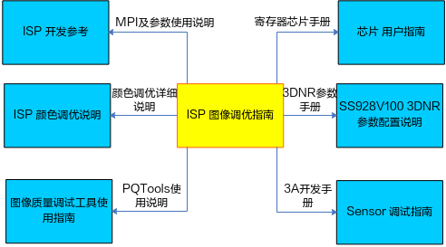

Chapter 1 of this document mainly explains the document relationships involved in the PQ tuning process. Chapter 2 provides a system overview of the ISP, including the ISP functional block diagram and a brief introduction to each module. Chapter 3 mainly introduces the operation steps and precautions for the entire image tuning process. Starting from Chapter 4, the debugging methods for each sub-module are introduced separately.

# ISP System Overview
## Functional Overview

The ISP module supports standard Sensor image data processing, including basic functions such as auto white balance, auto exposure, Demosaic, bad pixel correction, and lens shading correction. It also supports advanced processing functions such as WDR, DRC, and noise reduction. The main image processing functions supported by ISP are as follows:

-   Supports black level correction
-   Supports static and dynamic bad pixel correction, and bad pixel cluster correction
-   Supports Bayer noise reduction
-   Supports fixed pattern noise removal
-   Supports demosaic processing
-   Supports chromatic aberration correction (CAC)
-   Supports gamma correction
-   Supports dynamic range compression (DRC)
-   Supports Sensor built-in WDR
-   Hi3403V100 supports up to 3-in-1 WDR
-   Supports auto white balance
-   Supports auto exposure
-   Supports auto focus
-   Supports 3A related statistics output
-   Supports lens shading correction
-   Supports image sharpening
-   Supports auto dehaze processing
-   Supports color 3D lookup table enhancement
-   Supports local contrast enhancement
-   Supports color adaptation
-   Supports 3D noise reduction

## ISP Functional Block Diagram

The functional structure diagram of the ISP Hi3403V100 is shown in [Figure 1](#fig19340125514231), [Figure 2](#fig1829272832518), and [Figure 3](#fig474713442299). In this diagram and throughout this document, ISP_FE refers to the part of the ISP pipeline before FPN (not including FPN), and ISP_BE refers to the part of the ISP pipeline after FPN (including FPN).

> **Note:**
>In this document, ISP uses *.* and S*.* to represent unsigned and signed numbers. For example: U8.8 indicates the data type is unsigned, with 8-bit integer part and 8-bit fractional part. Similarly, S8.8 indicates signed, with 8-bit integer part (including 1-bit sign) and 8-bit fractional part.

The following sections of this document will introduce the brief principles of each module and the image quality debugging methods.

**Figure 1** ISP Overall Structure Diagram (Hi3403V100)
")

**Figure 2** ISP_FE Structure Diagram (Hi3403V100)
")
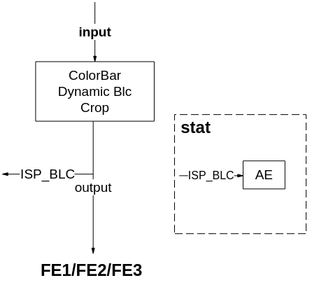

**Figure 3** ISP_BE Structure Diagram (Hi3403V100)
")
> **Note:**
>*The DG1 function in the diagram is the same as DG.

## Module Introduction

The function of each ISP module is briefly described in [Table 1](#_Ref500230610).

**Table 1** ISP Module Functions

<table><thead align="left"><tr id="row109mcpsimp"><th class="cellrowborder" valign="top" width="27%" id="mcps1.2.3.1.1">
Module Name

</th>
<th class="cellrowborder" valign="top" width="73%" id="mcps1.2.3.1.2">
Description

</th>
</tr>
</thead>
<tbody><tr id="row115mcpsimp"><td class="cellrowborder" valign="top" width="27%" headers="mcps1.2.3.1.1 ">
Color_Bar

</td>
<td class="cellrowborder" valign="top" width="73%" headers="mcps1.2.3.1.2 ">
Supports generating five types of images: solid color background, horizontal color bars, vertical color stripes, and solid color targets on a solid background.

</td>
</tr>
<tr id="row120mcpsimp"><td class="cellrowborder" valign="top" width="27%" headers="mcps1.2.3.1.1 ">
Dynamic BLC

</td>
<td class="cellrowborder" valign="top" width="73%" headers="mcps1.2.3.1.2 ">
Configures the black level by reading the values of the OB area.

</td>
</tr>
<tr id="row125mcpsimp"><td class="cellrowborder" valign="top" width="27%" headers="mcps1.2.3.1.1 ">
Crop

</td>
<td class="cellrowborder" valign="top" width="73%" headers="mcps1.2.3.1.2 ">
Implements cropping of the input image.

</td>
</tr>
<tr id="row130mcpsimp"><td class="cellrowborder" valign="top" width="27%" headers="mcps1.2.3.1.1 ">
FPN

</td>
<td class="cellrowborder" valign="top" width="73%" headers="mcps1.2.3.1.2 ">
Corrects the image input from the Sensor using calibrated black frames or black rows to remove Sensor FPN.

</td>
</tr>
<tr id="row135mcpsimp"><td class="cellrowborder" valign="top" width="27%" headers="mcps1.2.3.1.1 ">
BLC

</td>
<td class="cellrowborder" valign="top" width="73%" headers="mcps1.2.3.1.2 ">
Provides Sensor-related black level correction.

</td>
</tr>
<tr id="row140mcpsimp"><td class="cellrowborder" valign="top" width="27%" headers="mcps1.2.3.1.1 ">
DPC

</td>
<td class="cellrowborder" valign="top" width="73%" headers="mcps1.2.3.1.2 ">
Provides detection and correction functions for static and dynamic bad pixels.

</td>
</tr>
<tr id="row145mcpsimp"><td class="cellrowborder" valign="top" width="27%" headers="mcps1.2.3.1.1 ">
GE

</td>
<td class="cellrowborder" valign="top" width="73%" headers="mcps1.2.3.1.2 ">
Corrects the imbalance between the Gr and Gb channels, improving image quality in certain scenes.

</td>
</tr>
<tr id="row150mcpsimp"><td class="cellrowborder" valign="top" width="27%" headers="mcps1.2.3.1.1 ">
WDR

</td>
<td class="cellrowborder" valign="top" width="73%" headers="mcps1.2.3.1.2 ">
Provides multi-frame WDR synthesis.

</td>
</tr>
<tr id="row155mcpsimp"><td class="cellrowborder" valign="top" width="27%" headers="mcps1.2.3.1.1 ">
Expander

</td>
<td class="cellrowborder" valign="top" width="73%" headers="mcps1.2.3.1.2 ">
Decompresses the data compressed inside the sensor.

</td>
</tr>
<tr id="row160mcpsimp"><td class="cellrowborder" valign="top" width="27%" headers="mcps1.2.3.1.1 ">
CRB

</td>
<td class="cellrowborder" valign="top" width="73%" headers="mcps1.2.3.1.2 ">
Reduces the reddish phenomenon in dark areas under WDR mode.

</td>
</tr>
<tr id="row165mcpsimp"><td class="cellrowborder" valign="top" width="27%" headers="mcps1.2.3.1.1 ">
BNR

</td>
<td class="cellrowborder" valign="top" width="73%" headers="mcps1.2.3.1.2 ">
Provides image denoising in the Bayer domain, aiming to remove noise while preserving details.

</td>
</tr>
<tr id="row170mcpsimp"><td class="cellrowborder" valign="top" width="27%" headers="mcps1.2.3.1.1 ">
LSC

</td>
<td class="cellrowborder" valign="top" width="73%" headers="mcps1.2.3.1.2 ">
Used for lens shading correction. Hi3403V100 only supports mesh shading.

</td>
</tr>
<tr id="row175mcpsimp"><td class="cellrowborder" valign="top" width="27%" headers="mcps1.2.3.1.1 ">
DG

</td>
<td class="cellrowborder" valign="top" width="73%" headers="mcps1.2.3.1.2 ">
Provides per-channel digital gain functionality.

</td>
</tr>
<tr id="row180mcpsimp"><td class="cellrowborder" valign="top" width="27%" headers="mcps1.2.3.1.1 ">
AE

</td>
<td class="cellrowborder" valign="top" width="73%" headers="mcps1.2.3.1.2 ">
This module outputs auto exposure statistics. The software adjusts the Sensor based on the statistics to achieve auto exposure functionality.

</td>
</tr>
<tr id="row185mcpsimp"><td class="cellrowborder" valign="top" width="27%" headers="mcps1.2.3.1.1 ">
MG

</td>
<td class="cellrowborder" valign="top" width="73%" headers="mcps1.2.3.1.2 ">
The MG module calculates post-DRC block averages. Compared with AE block averages, the maximum block average gain can be derived. The MG statistics include 8-bit precision block R/Gr/Gb/B average statistics, supporting up to 17*15 blocks.

</td>
</tr>
<tr id="row190mcpsimp"><td class="cellrowborder" valign="top" width="27%" headers="mcps1.2.3.1.1 ">
AF Statistics

</td>
<td class="cellrowborder" valign="top" width="73%" headers="mcps1.2.3.1.2 ">
Supports image sharpness evaluation statistics for auto focus functionality.

</td>
</tr>
<tr id="row195mcpsimp"><td class="cellrowborder" valign="top" width="27%" headers="mcps1.2.3.1.1 ">
AWB

</td>
<td class="cellrowborder" valign="top" width="73%" headers="mcps1.2.3.1.2 ">
This module outputs global statistics and zone statistics. The software completes auto white balance based on the statistics.

</td>
</tr>
<tr id="row200mcpsimp"><td class="cellrowborder" valign="top" width="27%" headers="mcps1.2.3.1.1 ">
DRC

</td>
<td class="cellrowborder" valign="top" width="73%" headers="mcps1.2.3.1.2 ">
Adjusts the display dynamic range of the image to match human visual perception on the display device.

</td>
</tr>
<tr id="row205mcpsimp"><td class="cellrowborder" valign="top" width="27%" headers="mcps1.2.3.1.1 ">
Bayer Sharpen

</td>
<td class="cellrowborder" valign="top" width="73%" headers="mcps1.2.3.1.2 ">
The BayerSharpen module enhances image sharpness, enabling separate sharpening enhancement for directional edges and non-directional detail textures.

</td>
</tr>
<tr id="row210mcpsimp"><td class="cellrowborder" valign="top" width="27%" headers="mcps1.2.3.1.1 ">
CAC

</td>
<td class="cellrowborder" valign="top" width="73%" headers="mcps1.2.3.1.2 ">
Corrects axial chromatic aberration (purple fringing) and lateral chromatic aberration (colored edges on opposite sides of objects) introduced by the lens.

</td>
</tr>
<tr id="row215mcpsimp"><td class="cellrowborder" valign="top" width="27%" headers="mcps1.2.3.1.1 ">
DEMOSAIC

</td>
<td class="cellrowborder" valign="top" width="73%" headers="mcps1.2.3.1.2 ">
Converts Bayer format Raw images to RGB images.

</td>
</tr>
<tr id="row220mcpsimp"><td class="cellrowborder" valign="top" width="27%" headers="mcps1.2.3.1.1 ">
CCM

</td>
<td class="cellrowborder" valign="top" width="73%" headers="mcps1.2.3.1.2 ">
Completes linear color space correction through a standard 3x3 matrix and vector offset.

</td>
</tr>
<tr id="row225mcpsimp"><td class="cellrowborder" valign="top" width="27%" headers="mcps1.2.3.1.1 ">
GAMMA

</td>
<td class="cellrowborder" valign="top" width="73%" headers="mcps1.2.3.1.2 ">
This module adjusts brightness in three color channels (R, G, B) based on the gamma curve.

</td>
</tr>
<tr id="row230mcpsimp"><td class="cellrowborder" valign="top" width="27%" headers="mcps1.2.3.1.1 ">
DEHAZE

</td>
<td class="cellrowborder" valign="top" width="73%" headers="mcps1.2.3.1.2 ">
Provides powerful zone-based dehazing to improve video contrast and clarity in hazy scenes.

</td>
</tr>
<tr id="row235mcpsimp"><td class="cellrowborder" valign="top" width="27%" headers="mcps1.2.3.1.1 ">
CSC

</td>
<td class="cellrowborder" valign="top" width="73%" headers="mcps1.2.3.1.2 ">
Converts input {R, G, B} to {Y, U, V} through a standard 3x3 matrix and vector offset.

</td>
</tr>
<tr id="row240mcpsimp"><td class="cellrowborder" valign="top" width="27%" headers="mcps1.2.3.1.1 ">
SHARPEN

</td>
<td class="cellrowborder" valign="top" width="73%" headers="mcps1.2.3.1.2 ">
Sharpens the image to improve clarity.

</td>
</tr>
<tr id="row245mcpsimp"><td class="cellrowborder" valign="top" width="27%" headers="mcps1.2.3.1.1 ">
CA

</td>
<td class="cellrowborder" valign="top" width="73%" headers="mcps1.2.3.1.2 ">
Saturation adjustment and thermal imaging colorization.

</td>
</tr>
<tr id="row250mcpsimp"><td class="cellrowborder" valign="top" width="27%" headers="mcps1.2.3.1.1 ">
CLUT

</td>
<td class="cellrowborder" valign="top" width="73%" headers="mcps1.2.3.1.2 ">
Uses a 17x17x17 3D LUT to perform complex color adjustment operations, such as brightness adjustment, saturation adjustment, and separate adjustments for shadow, mid-tone, and highlight areas.

</td>
</tr>
<tr id="row255mcpsimp"><td class="cellrowborder" valign="top" width="27%" headers="mcps1.2.3.1.1 ">
LDCI

</td>
<td class="cellrowborder" valign="top" width="73%" headers="mcps1.2.3.1.2 ">
Enhances local contrast using local histogram equalization, improving dark area details while also enhancing high-frequency components to boost contrast.

</td>
</tr>
<tr id="row260mcpsimp"><td class="cellrowborder" valign="top" width="27%" headers="mcps1.2.3.1.1 ">
3DNR

</td>
<td class="cellrowborder" valign="top" width="73%" headers="mcps1.2.3.1.2 ">
Removes Gaussian noise from the image through parameter configuration, smoothing the image while reducing the encoding bitrate.

</td>
</tr>
</tbody>
</table>

# Image Quality Tuning Overview
Currently, the Hi3403V100 is mainly targeted at two major application scenarios: the recorder/public safety application scenario and the consumer application scenario. The recorder/public safety application scenario includes Linear mode and WDR mode. Consumer application scenarios mainly include product forms such as action DV, dashcam, and snapshot cameras. Due to the special requirements of the video capture industry in the recorder/public safety application scenario, the focus on image quality differs from that of consumer application scenarios.

## Recorder Application Image Tuning Overview

Currently, the Hi3403V100 for recorder application scenarios mainly includes two typical modes: Linear mode and WDR mode. For Linear mode, the image quality dimensions of concern mainly include reasonable image brightness, accurate color reproduction, sharp overall image clarity, and overall image transparency. For WDR mode, the image quality dimensions of concern mainly include a reasonable overall dynamic range (bright areas not overexposed, dark area details visible), accurate color reproduction as much as possible, sharp overall image clarity, and overall image transparency. The following sections introduce the debugging steps for Linear mode and WDR mode image quality tuning, as well as precautions for ISP single-point algorithm debugging.

### Linear Mode Image Quality Tuning

For Linear mode, image quality mainly focuses on the following dimensions: brightness, sharpness and noise, transparency, and color reproduction. The modules involved in brightness include Auto Exposure (AE), DRC, and Shading correction. The modules mainly involved in sharpness and noise include Demosaic, YUV Sharpen, Bayersharpen, NR, DPC, and 3DNR. The modules involved in transparency mainly include Gamma, LDCI, Dehaze, and DRC. The modules involved in color reproduction mainly include AWB, CCM, CLUT, and CA. The overall architecture diagram for Linear mode image tuning in recorder application scenarios is shown in [Figure 1](#fig10361143815417).

**Figure 1** Recorder Application Scenario Linear Mode Image Tuning Architecture
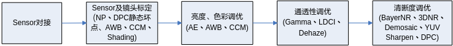

The main work that needs to be carried out before image quality tuning is as follows.

**Sensor Integration**

-   Sensor Integration: Mainly involves integrating the Sensor to be tuned with the Hi3403V100.

    This mainly includes modes such as 1080p@30fps Linear, 1080p@30fps 3-in-1 WDR, and 1080p@30fps 2-in-1 WDR. Based on the DataSheet provided by the Sensor manufacturer, extract the initialization register sequences for each mode and adapt them to the Hi3403V100 MIPI configuration to enable the Sensor to work with the Hi3403V100. The completion criteria for Sensor integration are: the basic path of the integration mode is normal, and modes can switch normally. The basic AE functions are normal, including frame rate reduction without flicker, normal auto long exposure, and reasonable default parameters for each Sensor driver module. For details, refer to the "Sensor Debugging Guide."

-   Sensor and Lens Calibration

    Calibration work mainly involves black level calibration, NR NoiseProfile calibration, static bad pixel calibration, lens Shading calibration, AWB static white balance coefficient calibration, and CCM saturation calibration. The Sensor and lens calibration steps must be carried out strictly according to the process shown in [Figure 2](#fig1589155619710).

    **Figure 2** Sensor and Lens Calibration Flowchart
    
    -   Black level calibration: Black level calibration is the first step in the entire ISP calibration. Correctly calibrating the black level has a positive impact on subsequent calibrations. For the specific black level calibration method, refer to the "Image Quality Debugging Tool User Guide." Note that different Sensors may have black level drift under low illumination (high gain), causing color cast across the entire image. If the Sensor's black level drifts significantly with increasing gain, it is recommended that black level calibration be linked with ISO.
    -   NR NoiseProfile calibration: Based on correct black level calibration, the next step is to calibrate the NR module's NoiseProfile. The NR module's noise reduction requires reference to the noise calibration NoiseProfile, obtaining a fitting coefficient at different ISO values. For the specific NoiseProfile calibration method, refer to the "Image Quality Debugging Tool User Guide."
    -   Sensor static bad pixel calibration: The Sensor's static bad pixels are mainly related to the Sensor's manufacturing process, including bright spots and dark spots. Static bad pixel calibration is affected by the Sensor's resolution. For example, consumer Sensors include multiple resolutions such as 4K@30fps, 1080p@120fps, and 720p@240fps. The static bad pixel table for different resolutions needs to be recalibrated. The calibration process requires separate calibration for bright spots and dark spots, obtaining a bright spot table and a dark spot table. These two tables are then merged to obtain the complete bad pixel table. For the specific calibration process and method, refer to the "[DPC](#ZH-CN_TOPIC_0000002457881037)" section.
    -   Lens Shading calibration: Lens Shading calibration here mainly refers to Mesh-Shading calibration. Shading is primarily caused by uneven optical refraction of the lens, resulting in dark corners in the image. The purpose of Shading correction is to eliminate dark corners caused by uneven optical refraction. For the specific process of Mesh-Shading calibration, refer to the "Image Quality Debugging Tool User Guide." Note that under low illumination, shading can cause uneven noise in the dark corners. Therefore, the strength of Shading correction should be linked with ISO, gradually attenuating the correction strength from low ISO to high ISO until no noise appears in the dark corners.
    -   AWB static white balance coefficient calibration: The AWB static white balance coefficients are strongly correlated with the Sensor and the lens filter. If the Sensor is fixed but the lens or filter is changed, the AWB static white balance coefficients need to be recalibrated. The basic calibration principle is to extract the white point characteristics \(R/G, B/G\) of the Sensor under multiple standard light sources and calculate the Planckian fitting curve and color temperature fitting curve. For the specific calibration process, refer to the "ISP Color Tuning Guide."
    -   CCM calibration: The basic principle of CCM calibration is to use the actual color information of the first 18 color patches from a 24-color checker captured by the Sensor and their expected values to calculate the 3x3 CCM matrix. The smaller the difference between the input color processed by the CCM matrix and its expected value, the more ideal the CCM matrix. Calibrating CCM generally requires collecting raw data under three light sources (D50, TL84, A). For the specific calibration method and process, refer to the "ISP Color Tuning Guide."

After completing the Sensor integration and Sensor lens calibration work, you can proceed to the joint tuning phase of the ISP modules. Linear image quality tuning includes image quality optimization at multiple ISO illuminance levels. Since some sensors are starlight-level sensors, the ISO values that need to be debugged include ISO 100, 200, 400, 800, 1600, 3200, 6400, 12800, 25600, 51200, 102400, 204800, etc. Of course, the maximum ISO that needs to be adjusted varies for different Sensors due to differences in photosensitivity. For details, refer to the "Image Quality Debugging Tool User Guide." Algorithm modules that are linked with ISO, such as BayerNR, Demosaic, and Sharpen, have not only the MPI interface parameters exposed that change with ISO but also internal default parameters that change with ISO.

The scenes for Linear mode debugging mainly include laboratory still-life scenes and outdoor real-world scenes. Generally, it is necessary to simulate scenes with different illuminance levels covered by the Sensor being debugged in the laboratory still-life scene, including well-lit scenes and low-light scenes. In the laboratory still-life scene, brightness, color, transparency, sharpness, and noise need to be debugged appropriately at different illuminance levels. After the ISP modules are debugged reasonably in the laboratory still-life scene, fine-tuning is required in real-world scenes based on different recorder application scenarios. This needs to cover daytime and nighttime scenes at traffic intersections, outdoor nighttime low-light scenes, outdoor daytime scenes with rich texture details (including sunny and cloudy weather), and outdoor evening scenes with rich sunset texture details. In this way, the image effect adaptation of Linear mode can cover the needs of different ISO values and different application scenarios. The specific tuning scene sequence for Linear mode is shown in [Figure 3](#fig14254231111219).

**Figure 3** Linear Mode Image Tuning Scene Diagram
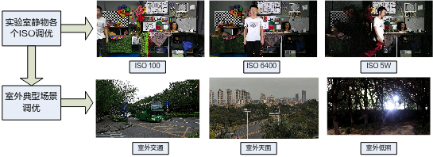

The basic sequence of debugging each ISP module in Linear mode is shown in [Figure 4](#fig1190512651416).

**Figure 4** Image Quality Dimension Debugging Sequence Diagram

Combined with the typical Linear mode debugging scenes (laboratory still-life and laboratory standard light source light box environments), the debugging methods for the main dimensions of image quality concern are introduced. [Figure 5](#_Ref500231242) shows the laboratory still-life debugging scene.

**Figure 5** Laboratory Still-Life Scene
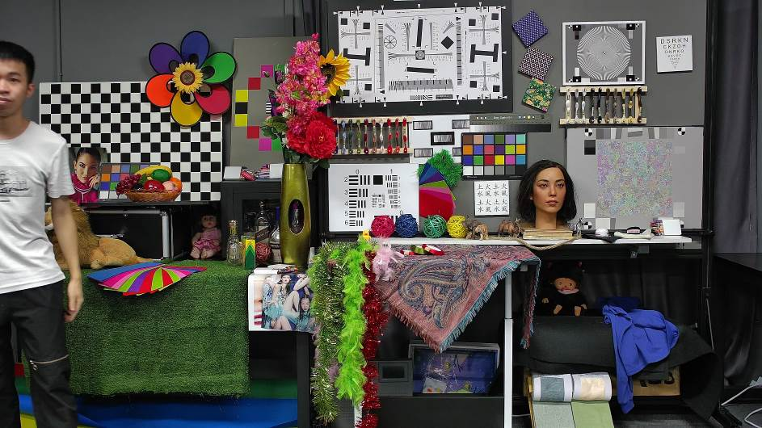

**Brightness Dimension**

The main module for brightness dimension debugging is AE, mainly including tuning of the AE target value, AE Route, AE weight table, and AE convergence speed and smoothness optimization.

Environment preparation before adjusting AE: correct black level calibration, completed Shading calibration, correct AWB and CCM calibration, and a set of default Gamma parameters for different illuminance levels.

1.  The first step in AE adjustment is to determine the AE weight table. The AE weight table determines the region of interest for AE exposure. Different application requirements result in different AE weight tables. For recorder application scenarios, the main subject of the scene is typically the center of the frame. It is recommended to set the AE weight for the center of the frame higher than for the peripheral areas. [Figure 6](#fig1561512325171) shows an example of an AE weight table:

    **Figure 6** Example of AE Weight Table
    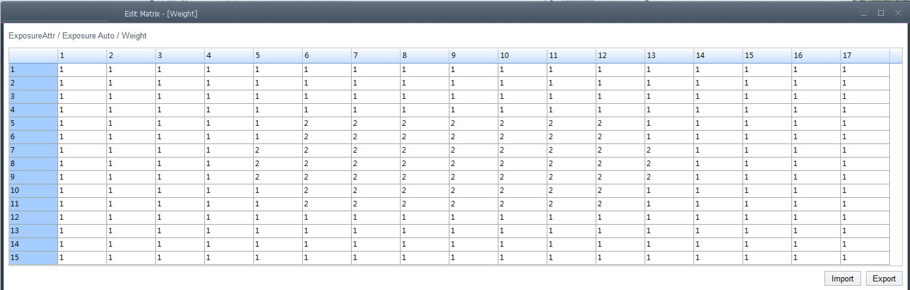

2.  After determining the AE weight table, the next step is to determine the AE Route. The AE Route mainly determines the allocation of exposure, i.e., the distribution between exposure time and gain. Different application scenarios require different AE Routes. For example, if fast-moving objects need attention, gain should be prioritized and exposure time limited. For traffic snapshot license plate capture during the day, the exposure time generally needs to be limited to 2-4ms, with exposure priority given to gain. For nighttime low-light scenes, to balance noise performance, exposure time should be appropriately prioritized over gain.
3.  After determining the AE weight table and AE Route, the next step is to adjust the AE target value under different exposure levels. For laboratory still-life scenes, the debugging standard for the AE target value is that the bright areas (visual acuity chart and star chart) should not be significantly overexposed, and the brightness of the face image in the dark area should be reasonable. AE target value adjustment mainly involves AE Compensation, AE offset adjustment, and selection of AE highlight priority or low-light priority mode. In normal debugging applications, it is recommended to select highlight priority mode to avoid overexposure in bright areas.
4.  Finally, adjust the AE convergence speed and AE smoothness. AE convergence speed and AE smoothness are a pair of balancing points. While preventing AE oscillation, the AE convergence speed can be appropriately increased, including the ability to quickly converge as the light changes. Especially for dashcam and action DV application scenarios, the AE convergence speed needs to be appropriately increased to adapt to drastic scene changes. AE convergence speed and convergence stability can generally be tested by turning lights on and off in a laboratory still-life scene.

    For specific parameter adjustment and introduction of the AE module, refer to the AE description section in the "ISP Development Reference." The DRC module is generally not recommended for use in Linear mode tuning. If the DRC module is used for overall brightness adjustment in Linear mode, attention should be paid to its impact on image contrast. The Shading module also affects the overall image brightness. The Shading adjustment strength should be linked with ISO for attenuation to avoid increased noise in the dark corners under slightly lower illumination.

**Color Dimension**

After AE adjustment is reasonable, the next main adjustment is the color dimension, mainly involving the AWB and CCM modules.

Environment preparation before color adjustment: accurate black level correction, completed Lens-Shading calibration, and reasonable AE module parameter debugging.

1.  Capture raw files of a 24-color checker under eight different color temperature light sources in a laboratory light box scene (D50, D75, A, TL84, 10K, 3500, CWF, D65), as well as a 24-color checker raw file at D50 color temperature in an outdoor scene, to calibrate and obtain the AWB static white balance coefficients. After calibration, observe the Planckian Curve. Check whether light sources are distributed on both sides of the curve, whether any light source point is far from the Planckian curve, and whether the estimated color temperature is accurate. If the error of some light sources is large, adjust their weight values and calibrate again. The AWB function of the 3A analysis tool can also be used to verify calibration accuracy online. If the gray patches under multiple light sources all fall near the Planckian curve, the calibration is reliable. In a real still-life scene, to determine the accuracy of AWB, mainly check whether the gray patches of the 24-color checker are restored accurately. The Imatest tool can be used to test the color reproduction indicators of the 24-color checker. The figure below shows an example of the calibrated AWB static white balance coefficients.

    **Figure 7** Example of AWB Calibrated Static White Balance Coefficients
    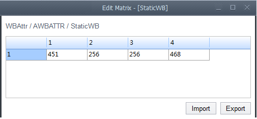
    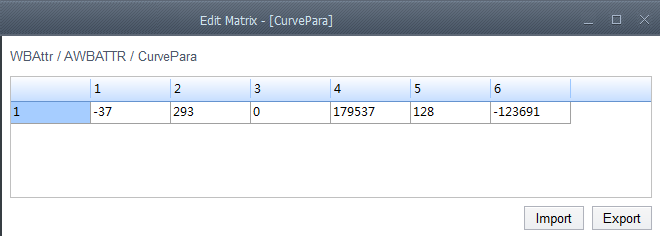

2.  Capture raw files of a 24-color checker under D50, TL84, and A light sources in a laboratory light box scene, and generate the CCM saturation matrix using the calibration tool. During CCM calibration, note that when using a custom ISP Gamma value, ensure the corresponding LAB reference values match. Mismatched ISP Gamma and LAB Reference may prevent the combined linear adjustments of AWB and CCM from achieving the target image appearance. If the saturation effect of the image is not satisfactory in actual application scenarios, manually adjust the saturation based on the color issues observed. [Figure 8](#_Ref500253148) shows an example of the saturation matrix obtained from CCM calibration at three color temperatures (D50, TL84, A).

    **Figure 8** Example of CCM Calibration Saturation Matrix at Three Color Temperatures (D50, TL84, A)
    的饱和度矩阵示例.png "Example of CCM Calibration Saturation Matrix at Three Color Temperatures (D50, TL84, A)")

3.  After calibrating the AWB static white balance coefficients and CCM saturation matrix, configure them into the Sensor driver. Capture 24-color checker images under eight different light sources in the laboratory light box scene, and use the Imatest tool to test the color indicators of the 24-color checker. If the 24-color checker indicators meet the requirements, the calibrated AWB static white balance coefficients and CCM saturation matrix can be preliminarily considered satisfactory. Figure "24-Color Checker Image Captured at D50 Color Temperature" and Figure "Color Reproduction Indicators Obtained via Imatest" show examples of the 24-color checker image captured under the D50 light source and the corresponding color reproduction indicators obtained via Imatest.

    **Figure 9** 24-Color Checker Image Captured at D50 Color Temperature
    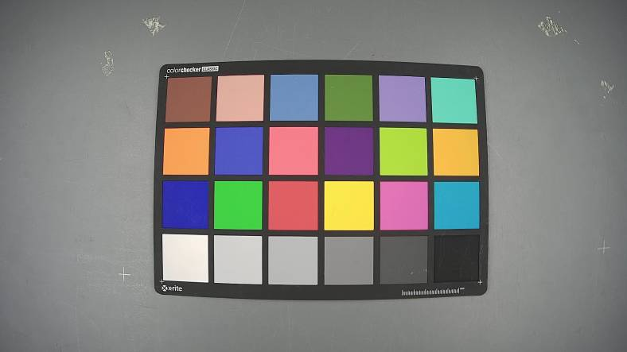

    **Figure 10** Color Reproduction Indicators Obtained via Imatest
    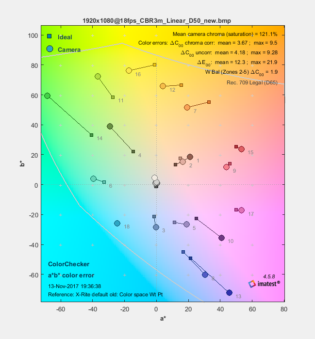
    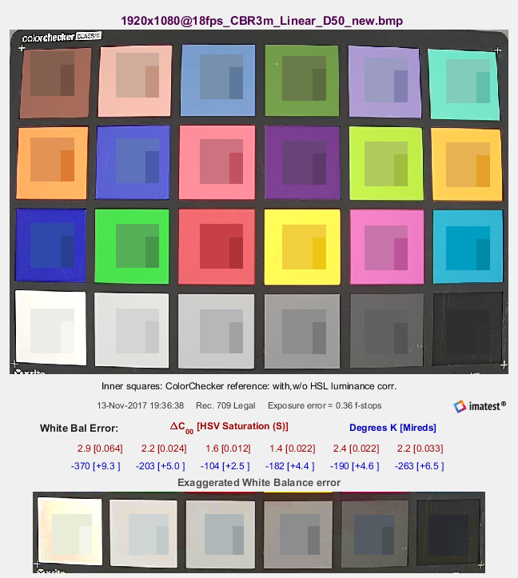

4.  The parameter reasonableness of the AWB and CCM modules also heavily depends on extensive testing and debugging in actual application scenarios. Typical real-world scenarios include typical outdoor scenes such as front-lit, backlit, cloudy, sunset, and mixed light source scenes. If the gray patches in the scene are not restored accurately, adjust the AWB parameters. If individual colors in the scene are oversaturated or have color cast, debug the CCM parameters. For mixed light source application scenarios, adjust the indoor/outdoor detection parameters in AWB. For inaccurate skin tone reproduction in real-world scenes, adjust the CCM parameters.

    For specific tuning of the AWB and CCM modules, refer to the "ISP Color Tuning Guide."

**Contrast Dimension**

After brightness and color dimensions are debugged reasonably, the next main adjustment is the image contrast dimension. Modules affecting contrast mainly include Gamma, Dehaze, and LDCI. The main focus is on adjusting Gamma parameters at different illuminance levels, with Dehaze and LDCI serving as auxiliary modules for contrast adjustment.

Environment preparation before contrast adjustment: correct black level correction, completed Lens-Shading calibration, reasonable AE exposure adjustment, and reasonable AWB and CCM parameter calibration.

1.  Adjust Gamma parameters. Gamma parameters are the basic module affecting image contrast. Using a real still-life scene as an example, adjust the Gamma parameters so that the resolution chart in the bright area and the doll details in the dark area are both preserved without loss, and the image achieves good contrast. [Figure 11](#_Ref515959136) shows the dark area details and bright area details affected by the Gamma curve (red boxes).

    **Figure 11** Example of Areas Affected by the Gamma Curve in a Still-Life Scene
    

2.  After adjusting the Gamma parameters, if more refined contrast is needed, it is recommended to primarily use LDCI with Dehaze as a supplement. LDCI provides local contrast enhancement, improving the detail performance of local bright and dark areas. Dehaze should only be used as a supplement; excessive Dehaze adjustment can cause loss of dark area details and color cast. For specific single-point tuning instructions for LDCI and Dehaze, refer to the "[LDCI](#ZH-CN_TOPIC_0000002424362134)" and "[Dehaze](#ZH-CN_TOPIC_0000002457840893)" sections.
3.  Based on the optimized Gamma, LDCI, and Dehaze parameters, test the grayscale of a grayscale card under a laboratory light box D50 light source environment, and check whether the number of grayscale levels meets the requirements. Generally, at least 18 grayscale levels or more are required. Otherwise, the current image contrast is too high, resulting in loss of dark area details. [Figure 12](#_Ref515959139) shows an example of a grayscale card under a laboratory light box D50 light source environment.

    **Figure 12** Example of Grayscale Card Under Laboratory Light Box D50 Light Source
    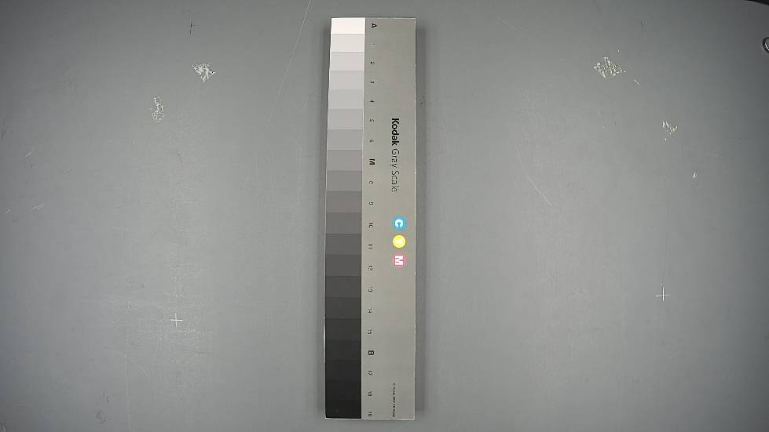

4.  In a real still-life scene, adjust the Gamma, LDCI, and Dehaze modules according to different illuminance levels to ensure that the image contrast is neither too high nor too hazy at any illuminance level. Currently, the contrast debugging style also differs between normal illumination and low illumination environments. For example, under low illumination, Gamma needs to appropriately suppress the dark areas to reduce the noise burden in those areas.

**Sharpness and Noise Dimensions**

Sharpness and noise are a pair of balancing dimensions. Due to different illuminance levels, the image noise also varies. As illumination decreases, image noise increases. To suppress noise, the sharpness requirements at low illumination are lower than those at normal illumination. Therefore, the parameters related to sharpness and noise modules must be linked with different ISO values. For debugging the sharpness and noise dimensions, it is recommended to prioritize sharpness first, i.e., sharpen the details that need to be sharpened before noise reduction (BayerNR, 3DNR). If debugging in an actual video-on-demand environment, it is recommended to first set the encoding bitrate high and set the 3DNR temporal strength to the maximum and spatial strength to the minimum, then observe whether the details of the still image are sharpened. After sharpness meets the requirements, the next step is to debug the noise reduction module, with the ultimate goal of achieving satisfactory sharpness and noise levels.

Environment preparation before adjusting sharpness and noise: accurate black level correction, correct NoiseProfile calibration, completed Lens-Shading calibration, reasonable AE exposure adjustment, reasonable AWB and CCM parameter adjustment, and reasonable Gamma parameter adjustment.

Modules affecting image sharpness and noise mainly include NR, Demosaic, DPC dynamic bad pixel removal, 3DNR, Bayersharpen, and YUV Sharpen.

1.  The first gateway for basic texture details of the image is Demosaic. The entry conditions for debugging Demosaic parameters are: accurate black level calibration, reasonable NoiseProfile calibration, and reasonable AWB and CCM calibration parameters.

    Debugging Demosaic parameters requires that high-frequency details in the laboratory still-life scene (such as the visual acuity chart and star chart) and the resolution chart in the laboratory light box environment meet the resolution indicator requirements. First, debug the Demosaic parameters in a laboratory light box D50 light source environment at ISO 100, using a resolution chart to ensure the resolution indicators meet the objective requirements. Then import the Demosaic parameters into the tool and observe whether the high-frequency details (such as the visual acuity chart and star chart) in the laboratory still-life scene at ISO 100 can be interpolated. Iterate back and forth as needed. After the Demosaic parameters are reasonably adjusted at ISO 100, adjust the Demosaic parameters at different illuminance levels in the laboratory still-life scene to balance high-frequency noise and interpolated noise. [Figure 13](#_Ref500347400) shows an example of a resolution chart under a D50 light source environment. For specific debugging methods of Demosaic, refer to the "[Demosaic](#ZH-CN_TOPIC_0000002457841009)" section.

    **Figure 13** Example of Resolution Chart Under Laboratory Light Box D50 Light Source
    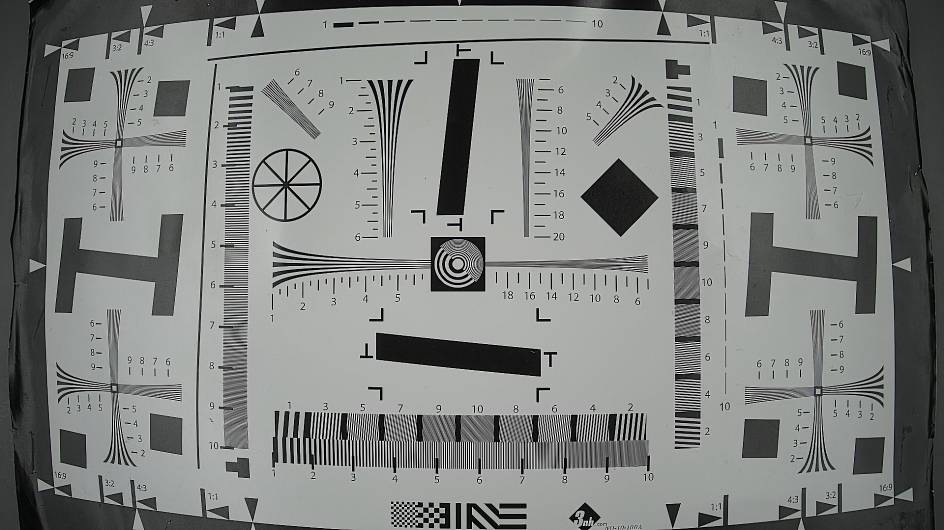

2.  After the Demosaic parameters are reasonably debugged, the next focus is on joint debugging of NR, Bayersharpen, 3DNR, YUV Sharpen, and DPC dynamic bad pixel removal.

    Entry conditions for debugging the NR module: accurate black level correction, reasonable NoiseProfile calibration, and reasonable AWB and CCM calibration parameters.

    Hi3403V100 NR includes temporal and spatial domains. The current guideline for debugging NR is to distribute as much of the temporal strength for static areas to NR, while motion areas mainly use the spatial domain of NR. The main advantage is that NR's temporal domain has more accurate motion/static judgment compared to 3DNR's temporal domain, and the image passing through NR's temporal domain and then through Sharpen can better improve overall image sharpness. For specific NR tuning methods, refer to the "[NR](#ZH-CN_TOPIC_0000002457841025)" section.

3.  The debugging guideline for Bayersharpen is mainly to adjust the weak textures in the dark areas of the image appropriately. Note that Bayersharpen should not be set too strong, and its debugging effect mainly focuses on mid-frequency content. Excessive debugging can cause the overall image to appear coarse. For specific Bayersharpen debugging, refer to the "[BayerSharpen](#ZH-CN_TOPIC_0000002424362250)" section.
4.  The debugging guideline for YUV Sharpen is mainly to adjust the texture details and edge sharpness to appropriate levels. Using a laboratory still-life scene as an example, YUV Sharpen needs to sharpen the texture details of objects such as straw mats and lions in the still-life scene before the image goes through 3DNR. [Figure 14](#_Ref500231916) shows the texture details sharpened by YUV Sharpen (red boxes). Additionally, larger edges such as tables and diagonal grids need to be sharpened, as shown in [Figure 15](#_Ref500231919). YUV Sharpen parameters need to be linked with ISO to ensure reasonable adjustment at different illuminance levels in the laboratory still-life scene.

    **Figure 14** Texture Details Sharpened by YUV Sharpen at ISO 100 in Still-Life Scene
    

    **Figure 15** Large Edges Sharpened by YUV Sharpen at ISO 100 in Still-Life Scene
    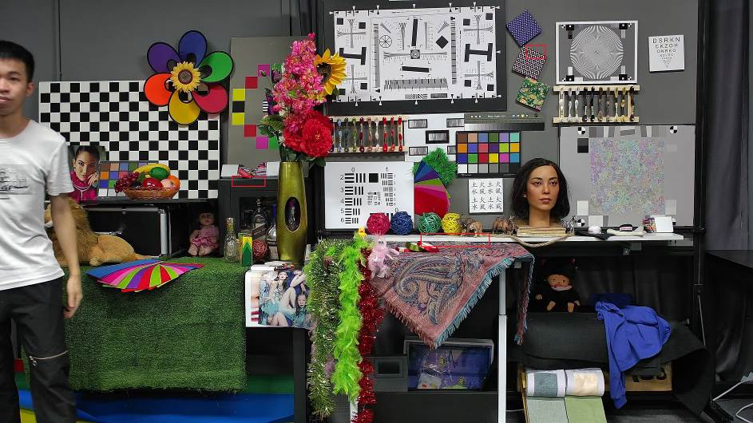

    Therefore, Bayersharpen, YUV Sharpen, and 3DNR need to be repeatedly jointly debugged in laboratory still-life scenes at different ISO levels to achieve a reasonable balance between noise and sharpness. For specific YUV Sharpen debugging methods, refer to the "[Sharpen](#ZH-CN_TOPIC_0000002457881141)" section.

5.  The DPC dynamic bad pixel removal strength only needs to be set to remove dynamic bad pixels under slightly lower illumination. Under better illumination, it is recommended to set the DPC dynamic bad pixel removal strength to 0. For specific DPC debugging methods, refer to the "[DPC](#ZH-CN_TOPIC_0000002457881037)" section.
6.  3DNR is a key part of the overall sharpness tuning, mainly including the tuning of the temporal filter and spatial filter. Prioritize adjusting the motion/static decision threshold of the temporal domain (suppress rain-like noise appropriately) and the absolute temporal strength (ensure quiet areas in static scenes). Then adjust the spatial filter for motion/static decision to suppress the following noise in moving areas. Finally, adjust the pure spatial filter to suppress the overall graininess of the image. The standard for 3DNR debugging is to achieve quiet static images with satisfactory sharpness, while motion area noise is well suppressed and motion trailing is reasonably controlled. [Figure 16](#_Ref500232007) shows a typical low-light 3DNR denoising effect for a certain sensor. The red boxes highlight the dimensions of concern, including following noise suppression for vehicles, motion trailing behind people, and luma and chroma noise suppression in static images. For specific 3DNR debugging methods, refer to the "SSxxxVxxx 3DNR Parameter Configuration Guide."

    **Figure 16** Typical Low-Light 3DNR Denoising Effect for a Certain Sensor
    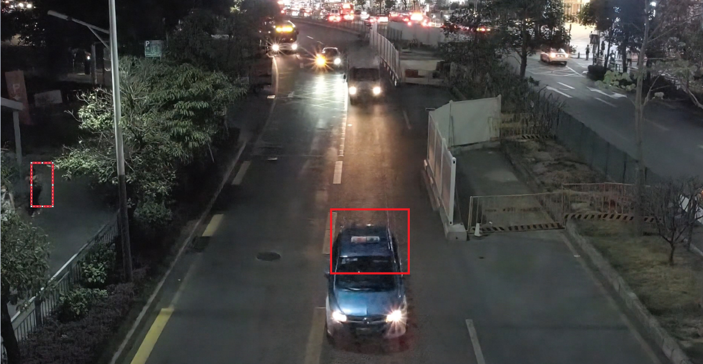

7.  Bayersharpen, YUV Sharpen, Demosaic, NR, and 3DNR need to be iteratively and jointly debugged at different illuminance levels, ultimately achieving an appropriate balance between overall image sharpness and noise level.

### WDR Mode Image Quality Tuning

For WDR mode, image quality mainly focuses on the following dimensions: image dynamic range, brightness, sharpness and noise, transparency, color reproduction, and motion trailing performance in the synthesis area. The modules involved in brightness mainly include AE, DRC, and Shading correction. The image dynamic range mainly involves the scene exposure ratio and DRC. Sharpness and noise mainly involve Demosaic, Bayersharpen, YUV Sharpen, NR, DPC, and 3DNR. Transparency mainly involves Gamma, LDCI, Dehaze, and DRC. Color reproduction mainly involves AWB, CCM, CA, CLUT, and CRB. Motion trailing performance in the synthesis area mainly involves the WDR and exposure ratio modules. Typical application scenarios for WDR mode include capturing people in backlit scenes and capturing license plates in high-light scenes. For WDR backlit scenes capturing people, the goal is to see the face clearly. For high-light scenes capturing license plates, the goal is to suppress the headlight halo and see the license plate clearly. The overall architecture diagram for WDR mode image tuning in recorder application scenarios is shown in [Figure 1](#fig12293141163118).

**Figure 1** Recorder Application Scenario WDR Mode Image Tuning Architecture
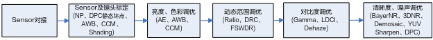

Before WDR mode image quality tuning, Sensor integration and Sensor lens calibration are required. The WDR mode Sensor integration steps can refer to the description of Sensor integration in the "[Linear Mode Image Quality Tuning](#ZH-CN_TOPIC_0000002457840933)" section. For Sensor lens calibration, the calibration parameters for AWB, Shading, NoiseProfile, and DPC static bad pixels can refer to the Linear mode calibration parameters. Since CCM operates after DRC, and DRC makes the data nonlinear, the following three points should be noted when calibrating CCM in WDR mode:

-   Capture a standard 24-color checker under standard light sources (typically three sets: D50, TL84, and A light sources) with the exposure ratio set to maximum. Also adjust the brightness value to avoid overexposure of the long frame. Collect long-frame Raw data for CCM calibration. During calibration, saturation can be appropriately reduced.
-   Appropriately reduce the DRC curve's substantial boosting of image brightness, so that DRC has a weaker effect on color. At this point, the image brightness may decrease below the desired level. Gamma can be used to appropriately boost the brightness. Jointly tuning the DRC and Gamma modules can make the overall color reproduction more accurate.
-   For WDR mode, since most scenes are mixed light source scenes, issues such as color cast in bright areas and reddish facial skin tones may occur. In addition to reducing the saturation value, the CA module can also be used to appropriately reduce saturation in these areas. The CRB module can reduce the reddish phenomenon in dark areas near bright areas.

After completing Sensor integration and Sensor lens calibration, the next step is image tuning focused on the WDR mode image quality dimensions.

WDR mode image quality tuning mainly includes two typical application requirements: brightening the face in backlit scenes under slightly higher illumination, and suppressing strong light in traffic scenes at night. Since backlit scenes require brightening the face and nighttime traffic scenes require suppressing headlights, these are different debugging styles with opposite directions for DRC module debugging. Therefore, WDR mode scene image quality tuning needs to be carried out separately for brightening faces in backlit scenes and suppressing headlights in traffic scenes.

#### WDR Backlit Scene Face Brightening Application Debugging Guide

For the application requirement of brightening the face in backlit conditions, the debugging steps are as follows:

Set up a typical WDR scene in the laboratory. The scene should include bright areas, dark areas, and a backlit face, as shown in [Figure 1](#_Ref500232236). The red boxes include the dark area, outdoor sky bright area, and backlit face image.

**Figure 1** Recorder Application Scenario WDR Indoor Typical Application Scene
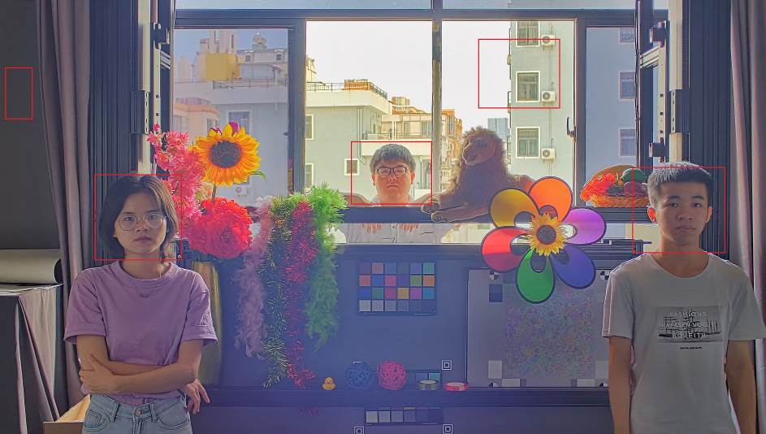

**Brightness Dimension**

For WDR brightness dimension, this primarily refers to the reasonableness of AE exposure, mainly achieved by debugging the AE module. The entry conditions for AE module debugging and the related AE parameters are generally the same between WDR mode and Linear mode. The difference lies in adjusting the AE exposure ratio to determine the exposure time for long and short frames. This section focuses on AE exposure ratio debugging. For other AE parameters, including the AE weight table, AE Route, AE target value, and AE convergence speed and smoothness, refer to the Brightness Dimension subsection of "[Linear Mode Image Quality Tuning](#ZH-CN_TOPIC_0000002457840933)." For WDR mode AE Route settings, one additional point is that to avoid power-line flicker caused by the WDR module selecting short frames due to long frame overexposure, the exposure allocation can prioritize ISPDgain, followed by Sensor Again and Dgain, since ISPDgain operates after the WDR module. Using ISPDgain does not affect long frame overexposure entering the WDR module and does not change the overall final image brightness.

The AE exposure ratio determines the dynamic range of the WDR mode image. Therefore, for different scene dynamic ranges using WDR mode, the AE exposure ratio needs to be adaptively adjusted. Typically, in WDR mode, the AE exposure ratio mode uses the auto exposure ratio mode. The so-called auto exposure ratio means that AE automatically calculates the scene's dynamic range based on the scene histogram to obtain a reasonable exposure ratio. The reasonableness of the exposure ratio is reflected in bright area details not being overexposed and the long frame brightness being reasonable.

**Motion Trailing Dimension in the Synthesis Area**

The factors affecting motion trailing in the WDR synthesis area mainly include the WDR module and the AE exposure ratio. The larger the exposure ratio, the higher the probability of trailing in the synthesis area. However, in typical WDR backlit scenes, under WDR 2-in-1 mode, the exposure ratio is usually 16-32 times. In this case, the main factor affecting motion trailing in the synthesis area is the WDR module. On the current Hi3403V100 platform, due to limitations of the WDR module algorithm, it is difficult to distinguish between dark area and bright area human motion. While ensuring that dark area human motion does not select short frames, the arm of a person waving in the bright area is prone to breaking. During debugging, adjust the synthesis module's motion weights md\_thr\_low\_gain and md\_thr\_hig\_gain so that dark area human motion selects long frames as much as possible. Then observe the performance of the bright area person waving. For specific WDR synthesis module debugging, refer to the description of the "[WDR](#ZH-CN_TOPIC_0000002424362078)" module.

**Scene Dynamic Range Dimension**

Factors affecting the scene dynamic range in WDR mode include: AE exposure ratio, DRC module, and Gamma module.

Entry conditions for debugging the DRC module: correct black level calibration, completed Shading calibration, reasonable AE module debugging, completed AWB and CCM calibration, and a preset set of Gamma parameters.

Currently, to improve backlit face brightness and local contrast, the Hi3403V100 DRC includes Filter and FilterX. For backlit face enhancement, it is recommended to use the FilterX filter, while for non-backlit face areas, the Filter filter is preferred. The principle of this fusion is that FilterX can better preserve and enhance backlit face details, while Filter mainly enhances large-scale details. For specific DRC module debugging, refer to the description of the "[DRC](#ZH-CN_TOPIC_0000002457881045)" module.

In the current WDR mode, the DRC algorithm uses a smaller filter window to enhance local face brightness, which results in a larger contrast stretch difference at the boundaries between bright and dark areas, creating edge lines. In the current DRC algorithm, increasing GradRevMax and GradRevThr can improve the edge line performance in the brightness transition area, but this also reduces the contrast of the face, affecting face recognition. Therefore, there is a trade-off between edge lines at the bright-dark boundary and face brightness.

**Figure 2** Backlit Face Flashlight Effect Diagram
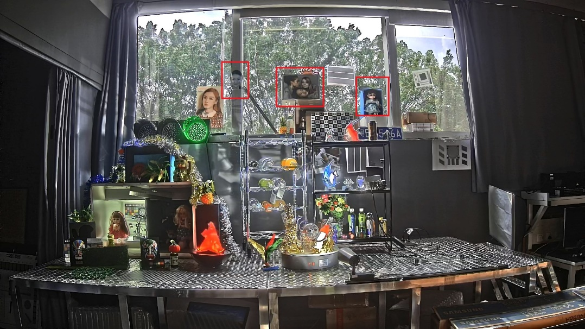

The DRC ToneMapping curve debugging strategy needs to work together with the Gamma curve. The Gamma curve debugging strategy is based on the custom Gamma = 0.8 curve, as shown in [Figure 3](#_Ref500232764).

**Figure 3** Gamma = 0.8 Curve
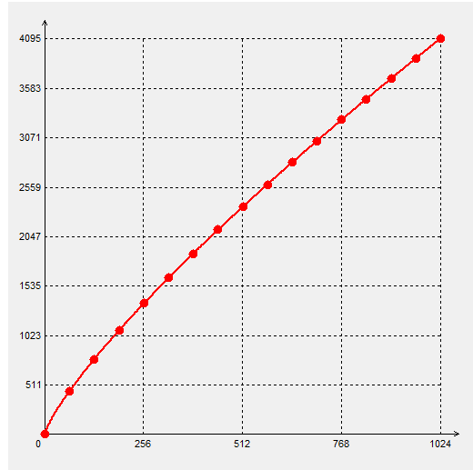

Brighten the face area while suppressing the dark area to improve face brightness while maintaining scene contrast, resulting in the Gamma curve shown in [Figure 4](#_Ref500232799).

**Figure 4** Gamma Curve for Brightening Face Based on Gamma = 0.8
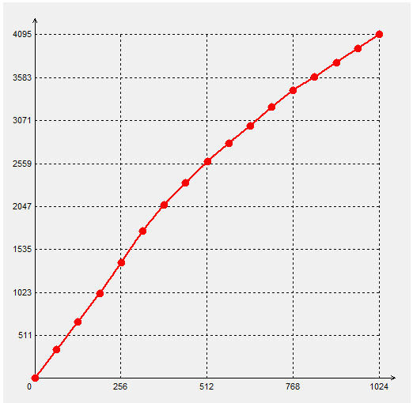

Based on the Gamma curve, debug the DRC Asymmetry curve. To brighten the face area, the Asymmetry curve needs to increase the backlit brightness. The specific debugging curve is shown in [Figure 5](#_Ref500232856).

**Figure 5** Asymmetry Curve Shape for Brightening Face

The DRC Asymmetry curve and Gamma curve need to be iteratively tuned based on the actual wide dynamic scene to achieve appropriate face brightness under backlit conditions. For WDR backlit face effect optimization, customers can also use custom curves for the DRC curve, providing a more flexible debugging approach.

Note: The shape of the DRC custom curve is closely related to the exposure ratio. Different exposure ratios require different DRC custom curve shapes. For specific debugging methods of the DRC module, refer to the "[DRC](#ZH-CN_TOPIC_0000002457881045)" section.

**Color Dimension**

The modules affecting the color dimension in WDR mode mainly include AWB, CCM, CRB, CA, and CLUT:

Entry conditions for debugging AWB, CCM, and CA modules: correct black level correction, reasonable AE exposure, reasonable DRC debugging, completed Shading calibration, and a preset set of Gamma parameters.

The overall color strategy for WDR mode debugging is consistent with Linear mode, but the impact of DRC on color must be considered. Therefore, the CCM calibration method differs from Linear mode. For details, refer to the CCM precautions above. The CA module can reduce saturation based on different brightness levels, mitigating the oversaturation caused by the DRC curve boosting dark areas. The CRB module can reduce the reddish phenomenon in dark areas near bright areas. If the reddish phenomenon in dark areas is severe, appropriately reduce the r\_gain\_limit gain.

**Contrast Dimension**

Modules affecting the contrast dimension include Gamma, LDCI, and Dehaze.

The debugging methods for contrast in WDR mode are generally consistent with Linear mode, mainly involving the Gamma module, LDCI, and Dehaze. The difference is that in WDR backlit scenes, the primary concern is the brightness and recognizability of the backlit face. DRC and Gamma need to work together to improve backlit face brightness, but this may reduce overall image contrast, which needs to be compensated by LDCI and Dehaze.

**Sharpness and Noise Dimensions**

The debugging methods for sharpness and noise in WDR mode are generally consistent with Linear mode, mainly involving NR, 3DNR, DPC dynamic bad pixel removal, Demosaic, Bayersharpen, and YUV Sharpen. The debugging methods and steps for NR, 3DNR, DPC dynamic bad pixel removal, Demosaic, Bayersharpen, and YUV Sharpen are basically the same as those in Linear mode. For details, refer to the relevant sections in Linear mode. In NR mode, long frames and short frames can now be denoised separately. Short-frame noise reduction in NR mode can be debugged to remove noise in the synthesis area that uses short frames.

#### WDR Traffic Strong Light Suppression Application Debugging Guide

For the strong light suppression scenario requirements in traffic capture applications, this mainly refers to nighttime traffic application scenarios. The debugging steps are as follows:

Set up a debugging environment in a nighttime traffic application scene. It is generally recommended to use a traffic intersection or a gate/barrier scene, as shown in [Figure 1](#_Ref504553341).

**Figure 1** Example of Nighttime Traffic Application Scene
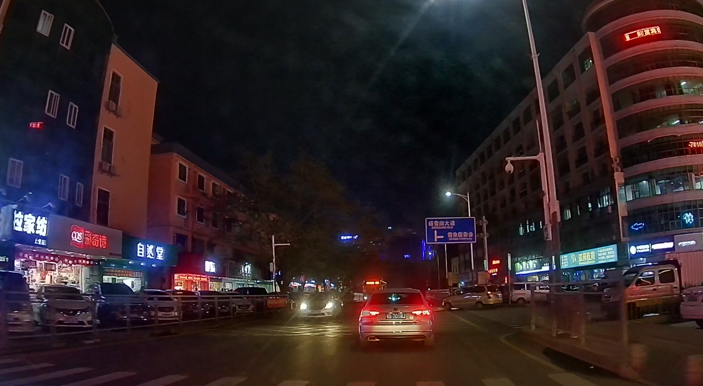

The overall debugging steps for the traffic strong light suppression scene are similar to the WDR backlit typical application scene. This section focuses on the differences in each image quality dimension debugging between the strong light suppression scene and the WDR backlit typical application scene.

**Brightness Dimension**

The debugging steps for the AE module in the strong light suppression scene are similar to Linear mode. The differences lie in the focus on the AE's impact on headlight halos and the impact of exposure time on vehicle motion blur.

-   AE weight table: The debugging approach for the AE weight table in the strong light suppression scene is to set higher weights for the center area near the headlights and lower weights for the sky area and areas on both sides of the frame. See [Figure 2](#_Ref504553359) for an example of an AE weight table:

    **Figure 2** Example of AE Weight Table for Strong Light Suppression Scene
    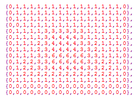
-   After determining the AE weight table, debug the AE target value. Before debugging the AE target value, it is recommended to bypass modules such as DRC, Gamma, LDCI, Dehaze, and FSWDR, and observe the long and short frame headlight halo performance separately. Generally, the overexposed area inside the headlight will tend to select the short frame, while the halo area around the headlight may fall into the long frame and short frame fusion area, depending on the FSWDR short and long frame thresholds. Therefore, debug the AE target value to avoid excessively large headlight halos in the short frame while also considering the overall image brightness and noise balance.
-   Based on a reasonable AE target value, set a reasonable AE Route. Generally, limit the exposure time and prioritize gain to avoid excessive exposure time worsening motion blur of moving license plates. In nighttime traffic application scenarios, the exposure time is generally limited to around 10ms. The allocation of exposure time and gain depends on the actual application requirements.

**Motion Trailing Dimension in the Synthesis Area**

The module affecting motion trailing in the synthesis area for the strong light suppression scene is still the FSWDR module. The debugging approach is similar to the WDR backlit scene. For specific debugging of the FSWDR module, refer to the description of motion trailing in the synthesis area for the WDR backlit application scene above.

**Scene Dynamic Range Dimension**

Factors affecting the dynamic range of the strong light suppression scene mainly include the AE exposure ratio and the DRC module. The entry conditions for debugging are the same as those for the WDR backlit face scene. The difference lies in the debugging strategy for the AE exposure ratio and DRC.

-   For the AE exposure ratio, in nighttime traffic application scenarios, it is generally recommended to set it to about 8-16 times to achieve reasonable exposure times for long and short frames. If the AE exposure ratio is set too high (e.g., greater than 16 times), the short frame time becomes too short, resulting in excessive noise in areas where short frames are selected. If the AE exposure ratio is set too low (e.g., less than 8 times), the halo in areas where short frames are selected becomes larger.
-   For DRC debugging in the strong light suppression scene, it is recommended to use a custom curve for the DRC ToneMapping curve. The reason for not choosing the Asymmetry curve is that the Asymmetry curve lacks debugging flexibility and cannot easily satisfy the requirement that, in strong light suppression mode, apart from a small overexposed area using short frames, most other areas are restored to long frames through the DRC module.

    For example, if the current AE exposure ratio is 16 times, the debugging principle for the DRC custom curve is: in the range where the x-axis is 0-0.0625 and the y-axis is 0-0.8, the curve shape should approximate a straight line to properly restore the long frame. In the range where x-axis is 0.0625-1 and y-axis is 0.8-1, this segment affects the performance of overexposed areas using short frames. Since in strong light suppression scenes, overexposed areas are mainly concentrated around headlights and streetlights, this segment can be adjusted to suppress the brightness of overexposed areas. The curve around 0.0625 affects the ring of halo around the headlights and is a key adjustment target. See [Figure 3](#_Ref504553393) for details.

**Figure 3** Example of DRC Custom Curve with Exposure Ratio of 16x
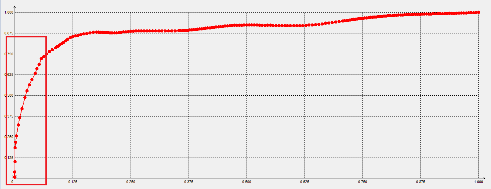

For other DRC module parameters, such as positive and negative detail layer enhancement and filter window size selection, refer to the debugging direction for the backlit scene.

**Color Dimension**

The modules and entry conditions affecting the color dimension debugging in strong light suppression mode are the same as those in WDR backlight mode. For details, refer to the color dimension section in WDR backlight mode. Note that traffic signals and red headlights may become oversaturated due to the influence of DRC. Therefore, the saturation of red needs to be reduced, which can be done using the CCM and CA modules.

**Contrast Dimension**

The modules and entry conditions affecting the contrast dimension in strong light suppression mode are the same as those in WDR backlight mode. For details, refer to the contrast dimension section in WDR backlight mode.

-   The overall direction for Gamma module debugging is the same as in the WDR backlight scene, based on fine-tuning Gamma = 0.8. However, there is no need for local stretching for face brightness. The dark areas can be appropriately suppressed to reduce the noise burden and increase the overall image contrast.
-   For the Dehaze module, it is recommended to use a custom curve. The specific custom curve shape is shown in [Figure 4](#_Ref504567603). The main purpose is to suppress headlight halos through dehazing while minimizing the loss of brightness in dark areas.

**Figure 4** Example of Dehaze Custom Curve
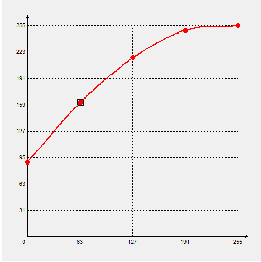
-   The debugging approach for LDCI in the strong light suppression scene is mainly to improve the local contrast of the license plate. It is generally recommended to make the LDCI debugging more localized. However, note that in nighttime scenes, LDCI debugging can increase headlight halos. Therefore, a balance needs to be struck between the size of the headlight halo and the local contrast performance of the license plate.

**Sharpness and Noise Dimensions**

The modules and entry conditions affecting the sharpness and noise dimensions are the same as those in WDR backlight mode. For details, refer to the sharpness and noise dimension section in WDR backlight mode. However, for the strong light suppression scene, the following principles should be noted:

-   The main principle for adjusting the Demosaic module is to avoid cross-shaped noise interpolated by Demosaic in nighttime scenes. Since the BayerNR module is currently positioned before Demosaic, some noise filtering before Demosaic interpolation can be done through BayerNR to reduce the burden of cross-shaped noise caused by Demosaic interpolation.
-   The main principle for adjusting YUV Sharpen and 3DNR IE enhancement is to improve large edge performance. Texture sharpening strength can be appropriately reduced to improve nighttime license plate performance while avoiding exacerbating noise from texture sharpening.
-   When adjusting the 3DNR and BayerNR modules, care must be taken to balance motion area trailing and overall noise performance. Avoid pursuing clean overall image noise at the expense of severe trailing of moving vehicles, which would affect license plate recognition.

# Module Introduction
## Sharpen

### Function Description

The Sharpen module is used to enhance image sharpness. It can perform independent sharpening enhancement for directional edges and non-directional detail textures. By adjusting the frequency band to be enhanced, various sharpness styles can be achieved. Additionally, it can control the overshoot (white edges/spots) and undershoot (black edges/spots) of the sharpened image. While enhancing image sharpness, noise is inevitably enhanced. By adjusting the relevant parameters of the sharpen module, noise enhancement can also be suppressed.

[Figure 1](#fig2506236456) shows the system block diagram of the Sharpen module. The parts in black font are the data flow diagram of the sharpen module, and the parts in red font are the adjustment parameter interfaces exposed to users.

**Figure 1** Sharpen Module System Block Diagram
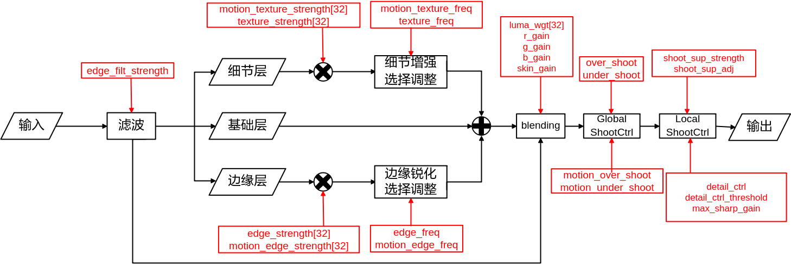
### Key Parameters

**Table 1** Sharpen Key Parameters

<table><thead align="left"><tr id="row3746mcpsimp"><th class="cellrowborder" valign="top" width="34%" id="mcps1.2.3.1.1">
Parameter Name

</th>
<th class="cellrowborder" valign="top" width="66%" id="mcps1.2.3.1.2">
Description

</th>
</tr>
</thead>
<tbody><tr id="row3752mcpsimp"><td class="cellrowborder" valign="top" width="34%" headers="mcps1.2.3.1.1 ">
en

</td>
<td class="cellrowborder" valign="top" width="66%" headers="mcps1.2.3.1.2 ">
Sharpen enhancement enable.

0: Disabled;

1: Enabled. Default value is 1.

</td>
</tr>
<tr id="row3759mcpsimp"><td class="cellrowborder" valign="top" width="34%" headers="mcps1.2.3.1.1 ">
motion_en

</td>
<td class="cellrowborder" valign="top" width="66%" headers="mcps1.2.3.1.2 ">
Motion area independent enhancement enable.

TD_FALSE: Disabled;

TD_TRUE: Enabled.

Default value is TD_FALSE.

</td>
</tr>
<tr id="row3767mcpsimp"><td class="cellrowborder" valign="top" width="34%" headers="mcps1.2.3.1.1 ">
motion_threshold0

</td>
<td class="cellrowborder" valign="top" width="66%" headers="mcps1.2.3.1.2 ">
Motion area judgment threshold. Values below this are considered completely moving. Range: [0, 15].

</td>
</tr>
<tr id="row3772mcpsimp"><td class="cellrowborder" valign="top" width="34%" headers="mcps1.2.3.1.1 ">
motion_threshold1

</td>
<td class="cellrowborder" valign="top" width="66%" headers="mcps1.2.3.1.2 ">
Motion area judgment threshold. Values above this are considered completely static. Range: [0, 15].

motion_threshold0 must be less than motion_threshold1.

</td>
</tr>
<tr id="row3778mcpsimp"><td class="cellrowborder" valign="top" width="34%" headers="mcps1.2.3.1.1 ">
motion_gain0

</td>
<td class="cellrowborder" valign="top" width="66%" headers="mcps1.2.3.1.2 ">
Intensity for motion_threshold0 parameter in the motion area. 0 means all motion parameters, 256 means all static parameters. Range: [0, 256].

</td>
</tr>
<tr id="row3783mcpsimp"><td class="cellrowborder" valign="top" width="34%" headers="mcps1.2.3.1.1 ">
motion_gain1

</td>
<td class="cellrowborder" valign="top" width="66%" headers="mcps1.2.3.1.2 ">
Intensity for motion_threshold1 parameter in the motion area. 0 means all motion parameters, 256 means all static parameters.

</td>
</tr>
<tr id="row3788mcpsimp"><td class="cellrowborder" valign="top" width="34%" headers="mcps1.2.3.1.1 ">
skin_umin

</td>
<td class="cellrowborder" valign="top" width="66%" headers="mcps1.2.3.1.2 ">
Minimum U coordinate value of the lower-left corner of the skin tone range rectangular window.

</td>
</tr>
<tr id="row3793mcpsimp"><td class="cellrowborder" valign="top" width="34%" headers="mcps1.2.3.1.1 ">
skin_vmin

</td>
<td class="cellrowborder" valign="top" width="66%" headers="mcps1.2.3.1.2 ">
Minimum V coordinate value of the lower-left corner of the skin tone range rectangular window.

</td>
</tr>
<tr id="row3798mcpsimp"><td class="cellrowborder" valign="top" width="34%" headers="mcps1.2.3.1.1 ">
skin_umax

</td>
<td class="cellrowborder" valign="top" width="66%" headers="mcps1.2.3.1.2 ">
Maximum U coordinate value of the upper-right corner of the skin tone range rectangular window.

</td>
</tr>
<tr id="row3803mcpsimp"><td class="cellrowborder" valign="top" width="34%" headers="mcps1.2.3.1.1 ">
skin_vmax

</td>
<td class="cellrowborder" valign="top" width="66%" headers="mcps1.2.3.1.2 ">
Maximum V coordinate value of the upper-right corner of the skin tone range rectangular window.

</td>
</tr>
<tr id="row3808mcpsimp"><td class="cellrowborder" valign="top" width="34%" headers="mcps1.2.3.1.1 ">
op_type

</td>
<td class="cellrowborder" valign="top" width="66%" headers="mcps1.2.3.1.2 ">
Sharpen operation type.

<ul id="ul3813mcpsimp"><li>OT_OP_MODE_AUTO: Auto mode;</li><li>OT_OP_MODE_MANUAL: Manual mode. Default value is OT_OP_MODE_AUTO.</li></ul>
</td>
</tr>
<tr id="row3816mcpsimp"><td class="cellrowborder" valign="top" width="34%" headers="mcps1.2.3.1.1 ">
detail_map

</td>
<td class="cellrowborder" valign="top" width="66%" headers="mcps1.2.3.1.2 ">
Detail map display type.

OT_ISP_SHARPEN_NORMAL: Displays normal image.

OT_ISP_SHARPEN_DETAIL: Displays image detail grayscale map; stronger details result in larger pixel values.

</td>
</tr>
<tr id="row3823mcpsimp"><td class="cellrowborder" valign="top" width="34%" headers="mcps1.2.3.1.1 ">
luma_wgt

</td>
<td class="cellrowborder" valign="top" width="66%" headers="mcps1.2.3.1.2 ">
Luminance sharpening weight. This parameter is a 32-element array, dividing the full range 0-255 of luminance into 32 segments by 32 equally spaced points, with each luminance segment corresponding to a luminance weight. The smaller the value, the weaker the sharpening of pixels in the corresponding luminance range.

</td>
</tr>
<tr id="row3833mcpsimp"><td class="cellrowborder" valign="top" width="34%" headers="mcps1.2.3.1.1 ">
texture_strength

</td>
<td class="cellrowborder" valign="top" width="66%" headers="mcps1.2.3.1.2 ">
Sharpening strength for non-directional detail textures. The larger the value, the higher the sharpness of non-directional detail textures. This parameter is a 32-element array, represented as a continuous intensity curve.

</td>
</tr>
<tr id="row3840mcpsimp"><td class="cellrowborder" valign="top" width="34%" headers="mcps1.2.3.1.1 ">
edge_strength

</td>
<td class="cellrowborder" valign="top" width="66%" headers="mcps1.2.3.1.2 ">
Sharpening strength for directional edges. The larger the value, the higher the sharpness of directional edges. This parameter is a 32-element array, represented as a 32-segment continuous intensity curve.

</td>
</tr>
<tr id="row3846mcpsimp"><td class="cellrowborder" valign="top" width="34%" headers="mcps1.2.3.1.1 ">
texture_freq

</td>
<td class="cellrowborder" valign="top" width="66%" headers="mcps1.2.3.1.2 ">
Enhancement frequency band control for non-directional detail textures. The larger the value, the more the enhancement favors high frequency, making the detail texture finer. Conversely, the smaller the value, the coarser and smoother the detail texture.

</td>
</tr>
<tr id="row3851mcpsimp"><td class="cellrowborder" valign="top" width="34%" headers="mcps1.2.3.1.1 ">
edge_freq

</td>
<td class="cellrowborder" valign="top" width="66%" headers="mcps1.2.3.1.2 ">
Enhancement frequency band control for directional edges. The larger the value, the more the edge enhancement favors high frequency, making the edges thinner and narrower. Conversely, the smaller the value, the coarser and smoother the edges.

</td>
</tr>
<tr id="row3857mcpsimp"><td class="cellrowborder" valign="top" width="34%" headers="mcps1.2.3.1.1 ">
over_shoot

</td>
<td class="cellrowborder" valign="top" width="66%" headers="mcps1.2.3.1.2 ">
Sets the intensity of overshoot (white edges/spots after sharpening). The smaller the value, the weaker the overshoot, and sharpness also decreases. If the value is too small, the image may appear as an oil painting effect.

</td>
</tr>
<tr id="row3863mcpsimp"><td class="cellrowborder" valign="top" width="34%" headers="mcps1.2.3.1.1 ">
under_shoot

</td>
<td class="cellrowborder" valign="top" width="66%" headers="mcps1.2.3.1.2 ">
Sets the intensity of undershoot (black edges/spots after sharpening). The smaller the value, the weaker the undershoot, and sharpness also decreases. If the value is too small, the image may appear as an oil painting effect.

</td>
</tr>
<tr id="row3869mcpsimp"><td class="cellrowborder" valign="top" width="34%" headers="mcps1.2.3.1.1 ">
motion_texture_strength

</td>
<td class="cellrowborder" valign="top" width="66%" headers="mcps1.2.3.1.2 ">
Sharpening strength for non-directional detail textures in motion areas. The larger the value, the higher the sharpness of non-directional detail textures. This parameter is a 32-element array, represented as a continuous intensity curve.

</td>
</tr>
<tr id="row3876mcpsimp"><td class="cellrowborder" valign="top" width="34%" headers="mcps1.2.3.1.1 ">
motion_edge_strength

</td>
<td class="cellrowborder" valign="top" width="66%" headers="mcps1.2.3.1.2 ">
Sharpening strength for directional edges in motion areas. The larger the value, the higher the sharpness of directional edges. This parameter is a 32-element array, represented as a continuous intensity curve.

</td>
</tr>
<tr id="row3883mcpsimp"><td class="cellrowborder" valign="top" width="34%" headers="mcps1.2.3.1.1 ">
motion_texture_freq

</td>
<td class="cellrowborder" valign="top" width="66%" headers="mcps1.2.3.1.2 ">
Enhancement frequency band control for non-directional detail textures in motion areas. The larger the value, the more the enhancement favors high frequency, making the detail texture finer. Conversely, the smaller the value, the coarser and smoother the detail texture.

</td>
</tr>
<tr id="row3888mcpsimp"><td class="cellrowborder" valign="top" width="34%" headers="mcps1.2.3.1.1 ">
motion_edge_freq

</td>
<td class="cellrowborder" valign="top" width="66%" headers="mcps1.2.3.1.2 ">
Enhancement frequency band control for directional edges in motion areas. The larger the value, the more the edge enhancement favors high frequency, making the edges thinner and narrower. Conversely, the smaller the value, the coarser and smoother the edges.

</td>
</tr>
<tr id="row3894mcpsimp"><td class="cellrowborder" valign="top" width="34%" headers="mcps1.2.3.1.1 ">
motion_over_shoot

</td>
<td class="cellrowborder" valign="top" width="66%" headers="mcps1.2.3.1.2 ">
Sets the intensity of overshoot (white edges/spots after sharpening) for motion areas. The smaller the value, the weaker the overshoot, and sharpness also decreases.

</td>
</tr>
<tr id="row3901mcpsimp"><td class="cellrowborder" valign="top" width="34%" headers="mcps1.2.3.1.1 ">
motion_under_shoot

</td>
<td class="cellrowborder" valign="top" width="66%" headers="mcps1.2.3.1.2 ">
Sets the intensity of undershoot (black edges/spots after sharpening) for motion areas. The smaller the value, the weaker the undershoot, and sharpness also decreases.

</td>
</tr>
<tr id="row3908mcpsimp"><td class="cellrowborder" valign="top" width="34%" headers="mcps1.2.3.1.1 ">
shoot_sup_strength

</td>
<td class="cellrowborder" valign="top" width="66%" headers="mcps1.2.3.1.2 ">
Local suppression strength for overshoot and undershoot after sharpening. Used to suppress the width and amplitude of overshoot and undershoot while ensuring no significant loss of sharpness. The larger the value, the narrower the width and the smaller the intensity of overshoot and undershoot, without significant reduction in sharpness.

</td>
</tr>
<tr id="row3914mcpsimp"><td class="cellrowborder" valign="top" width="34%" headers="mcps1.2.3.1.1 ">
shoot_sup_adj

</td>
<td class="cellrowborder" valign="top" width="66%" headers="mcps1.2.3.1.2 ">
Adjustment of suppression strength for overshoot and undershoot after sharpening. Used in conjunction with shoot_sup_strength to adjust the range of its effect. The smaller the value, the more texture area shoot is suppressed. The larger the value, the more only very strong edge shoot is suppressed. A larger shoot_sup_adj also means stronger suppression of black and white edges.

</td>
</tr>
<tr id="row3920mcpsimp"><td class="cellrowborder" valign="top" width="34%" headers="mcps1.2.3.1.1 ">
edge_filt_strength

</td>
<td class="cellrowborder" valign="top" width="66%" headers="mcps1.2.3.1.2 ">
Debugging parameter for edge filter strength: controls the width of the sharpened edge and the edge smoothing strength. The larger the value, the more areas are detected as edges, the wider they are, and the stronger the smoothing filter along the edge direction. If too large, it may exacerbate the oil painting effect of contours.

</td>
</tr>
<tr id="row3928mcpsimp"><td class="cellrowborder" valign="top" width="34%" headers="mcps1.2.3.1.1 ">
edge_filt_max_cap

</td>
<td class="cellrowborder" valign="top" width="66%" headers="mcps1.2.3.1.2 ">
Debugging parameter for the edge filtering strength range: the larger the value, the larger the maximum edge filtering strength, and the larger the adjustable range of edge_filt_strength. It is generally recommended to keep this value within 30.

</td>
</tr>
<tr id="row3934mcpsimp"><td class="cellrowborder" valign="top" width="34%" headers="mcps1.2.3.1.1 ">
detail_ctrl

</td>
<td class="cellrowborder" valign="top" width="66%" headers="mcps1.2.3.1.2 ">
Controls the shoot intensity in the detail texture area of the image. A larger shoot results in higher sharpness in the detail texture area.

</td>
</tr>
<tr id="row3939mcpsimp"><td class="cellrowborder" valign="top" width="34%" headers="mcps1.2.3.1.1 ">
detail_ctrl_threshold

</td>
<td class="cellrowborder" valign="top" width="66%" headers="mcps1.2.3.1.2 ">
Control threshold for shoot intensity in the detail texture area. Used with detail_ctrl to distinguish between texture areas and edges. Areas below this threshold are texture areas where shoot is controlled by detail_ctrl, while areas above this threshold have shoot equal to over_shoot and under_shoot.

</td>
</tr>
<tr id="row3944mcpsimp"><td class="cellrowborder" valign="top" width="34%" headers="mcps1.2.3.1.1 ">
r_gain

</td>
<td class="cellrowborder" valign="top" width="66%" headers="mcps1.2.3.1.2 ">
Sharpening gain control for deep red areas. The larger the value, the stronger the sharpening intensity in deep red areas.

</td>
</tr>
<tr id="row3949mcpsimp"><td class="cellrowborder" valign="top" width="34%" headers="mcps1.2.3.1.1 ">
g_gain

</td>
<td class="cellrowborder" valign="top" width="66%" headers="mcps1.2.3.1.2 ">
Sharpening gain control for green areas. The larger the value, the stronger the sharpening intensity in green areas.

</td>
</tr>
<tr id="row3954mcpsimp"><td class="cellrowborder" valign="top" width="34%" headers="mcps1.2.3.1.1 ">
b_gain

</td>
<td class="cellrowborder" valign="top" width="66%" headers="mcps1.2.3.1.2 ">
Sharpening gain control for deep blue areas. The larger the value, the stronger the sharpening intensity in deep blue areas.

</td>
</tr>
<tr id="row3959mcpsimp"><td class="cellrowborder" valign="top" width="34%" headers="mcps1.2.3.1.1 ">
skin_gain

</td>
<td class="cellrowborder" valign="top" width="66%" headers="mcps1.2.3.1.2 ">
Sharpening gain control for skin tone areas. The larger the value, the stronger the sharpening intensity in skin tone areas.

</td>
</tr>
<tr id="row3964mcpsimp"><td class="cellrowborder" valign="top" width="34%" headers="mcps1.2.3.1.1 ">
max_sharp_gain

</td>
<td class="cellrowborder" valign="top" width="66%" headers="mcps1.2.3.1.2 ">
Maximum gain limit for image sharpening. The larger the value, the greater the sharpening amplitude, and vice versa. Appropriately reducing this parameter can reduce oversharpening and reduce black/white spots after sharpening.

</td>
</tr>
</tbody>
</table>

### Debugging Steps

In auto mode, all parameters of Sharpen are linked with ISO, meaning the intensity of each Sharpen parameter changes as ISO changes. In auto mode, Sharpen parameters are divided into 16 levels based on ISO, with the Sharpen intensity between two ISO levels calculated by linear interpolation. The higher the ISO, the greater the image noise, the less clear the detail texture, and the more noise is enhanced during image enhancement, making it easier to produce black/white point shoot (impulse noise). Therefore, the settings of each debugging parameter for sharpen vary across different ISO scenarios.

The Sharpen debugging steps are as follows:

1.  Debug overall image sharpness: Set the overall image sharpness by adjusting texture_strength and edge_strength. texture_strength determines the sharpness of non-directional detail texture areas; increasing it enhances the clarity of non-directional detail textures, such as grass and fur. edge_strength determines the sharpness of directional edges.
2.  Separately adjust the sharpness of flat areas and texture areas: By adjusting the 32-segment continuous intensity curve of texture_strength, the sharpening intensity of weak texture areas, texture areas, and strong texture areas can be separately adjusted, as well as suppressing noise enhancement in flat areas. The shape of the 32-segment curve determines different sharpness styles for different texture areas.
3.  Separately adjust the sharpness of weak edges and strong edges: By adjusting the 32-segment continuous intensity curve of edge_strength, the sharpness of weak edges and strong edges can be separately adjusted. Increasing edge_strength for weak edges while decreasing it for strong edges can make the image's edges clear while avoiding jagged sharpening artifacts.
4.  Debug the fineness style of detail texture areas: Adjust texture_freq to control the fineness style of non-directional detail textures. A larger texture_freq results in finer detail textures, while a smaller value results in coarser, rounder textures. However, if texture_freq is too large, the detail texture becomes overly fine and unnatural, giving the human eye a blurred impression. Additionally, increasing TextureFreq also improves image sharpness.
5.  Debug the slim/rounded style of edges: Adjust edge_freq to control whether directional edges and details appear slim or rounded. A larger edge_freq results in sharper, thinner edges with narrower transitions, higher resolution line counts, and clearer edges. A smaller edge_freq results in coarser, rounder edges. However, if edge_freq is too large, edges may appear too thin with ghosting, making the image look unnatural.
6.  Control the overall shoot intensity of the sharpened image: Adjust over_shoot to control the intensity of white edges and white spot noise in the sharpened image. Adjust under_shoot to control the intensity of black edges and black spot noise. Reducing over_shoot and under_shoot weakens the white and black edges, but also reduces sharpness. If these values are too small, the image may appear as an oil painting. Additionally, max_sharp_gain can be adjusted to limit oversharpening.
7.  Suppress edge black/white edges based on local features without significant sharpness reduction: Adjust shoot_sup_strength and shoot_sup_adj to weaken the black and white edges after sharpening based on local image features, while ensuring no significant reduction in sharpness. Increasing shoot_sup_strength and reasonably adjusting shoot_sup_adj can reduce the intensity and narrow the width of black and white edges on sharpened image edges without significant sharpness loss.
8.  Separately debug shoot in detail texture areas and large edges: After the overall image sharpness and shoot are properly adjusted, adjust detail_ctrl and detail_ctrl_threshold to separately control the shoot intensity in detail texture areas and large edges. detail_ctrl_threshold distinguishes between texture areas and edges. Areas below this threshold are texture areas where shoot is controlled by detail_ctrl, while areas above this threshold have shoot equal to over_shoot and under_shoot. When detail_ctrl is 128, the shoot intensity in detail texture areas matches that of large edges.
9.  Adjust edge smoothness after sharpening: Adjust edge_filt_strength to control the smoothness of edges after sharpening. When edge_filt_strength is small, edges are treated more as non-directional texture enhancement, mainly affected by texture_strength, resulting in sharper edges but more jagged edges and edge noise. When edge_filt_strength is large, edges are more likely to be identified as directional edges for enhancement, making edges smoother with less edge noise.
10. Adjust sharpening intensity based on local brightness: Since dark areas typically have more noise than bright areas, reducing the luma_wgt for dark areas can reduce sharpening in those areas, preventing noise amplification.
11. Separately adjust sharpness in motion areas: Since temporal noise reduction cannot be used in motion areas, noise is typically higher. Appropriately reducing motion area parameters such as motion_texture_strength, motion_edge_strength, motion_texture_freq, motion_edge_freq, motion_over_shoot, and motion_under_shoot can make transitions smoother and prevent increased noise in motion areas. Motion area determination uses the BNR motion detection module result from the previous frame. This function only works when BNR motion detection is enabled. There is a one-frame delay when active, so parameters for motion and static areas should not differ too much to avoid layering.
12. Separately adjust sharpness in high-saturation color areas and skin tone areas: Adjust r_gain, g_gain, b_gain, and skin_gain based on the noise level in deep red, deep blue, green, and skin areas to achieve the best balance between noise and detail contours. The skin tone range is defined by the rectangular window bounded by skin_umin, skin_vmin, skin_umax, and skin_vmax. These four values can be reset based on the actual image's skin tone range.

## Demosaic

### Function Description

Since most color cameras use a single sensor to capture image information, and each sensor surface is covered with a CFA (Color Filter Array), each pixel can only obtain one color component among the three primary colors R, G, B.

**Figure 1** Single Sensor Capturing Image Information
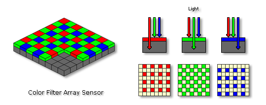

The function implemented by the Demosaic module is to convert the input Bayer data into RGB data. To obtain a color image, the missing two component values at the current point need to be estimated using the color component values of the current pixel and its surrounding pixels.

**Figure 2** Demosaic Function
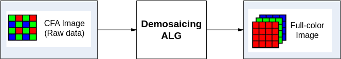
### Key Parameters

**Table 1** Demosaic Key Parameters

<table><thead align="left"><tr id="row1563mcpsimp"><th class="cellrowborder" valign="top" width="32%" id="mcps1.2.3.1.1">
Parameter Name

</th>
<th class="cellrowborder" valign="top" width="68%" id="mcps1.2.3.1.2">
Description

</th>
</tr>
</thead>
<tbody><tr id="row1569mcpsimp"><td class="cellrowborder" valign="top" width="32%" headers="mcps1.2.3.1.1 ">
en

</td>
<td class="cellrowborder" valign="top" width="68%" headers="mcps1.2.3.1.2 ">
Demosaic module enable.

0: Disabled;

1: Enabled.

</td>
</tr>
<tr id="row1576mcpsimp"><td class="cellrowborder" valign="top" width="32%" headers="mcps1.2.3.1.1 ">
detail_smooth_range

</td>
<td class="cellrowborder" valign="top" width="68%" headers="mcps1.2.3.1.2 ">
Detail smoothing range. The larger the value, the larger the detail range that is smoothed, suppressing more false details.

</td>
</tr>
<tr id="row1581mcpsimp"><td class="cellrowborder" valign="top" width="32%" headers="mcps1.2.3.1.1 ">
nddm_strength

</td>
<td class="cellrowborder" valign="top" width="68%" headers="mcps1.2.3.1.2 ">
Non-directional interpolation strength. The larger the value, the greater the proportion of non-directional interpolation.

</td>
</tr>
<tr id="row1586mcpsimp"><td class="cellrowborder" valign="top" width="32%" headers="mcps1.2.3.1.1 ">
nddm_mf_detail_strength

</td>
<td class="cellrowborder" valign="top" width="68%" headers="mcps1.2.3.1.2 ">
Non-directional mid-frequency texture enhancement strength. The larger the value, the stronger the enhancement of non-directional mid-frequency texture details, also enhancing noise.

</td>
</tr>
<tr id="row1591mcpsimp"><td class="cellrowborder" valign="top" width="32%" headers="mcps1.2.3.1.1 ">
nddm_hf_detail_strength

</td>
<td class="cellrowborder" valign="top" width="68%" headers="mcps1.2.3.1.2 ">
Non-directional high-frequency texture enhancement strength. The larger the value, the stronger the enhancement of non-directional texture details, improving noise uniformity.

</td>
</tr>
<tr id="row1596mcpsimp"><td class="cellrowborder" valign="top" width="32%" headers="mcps1.2.3.1.1 ">
color_noise_f_threshold

</td>
<td class="cellrowborder" valign="top" width="68%" headers="mcps1.2.3.1.2 ">
Reduces color noise based on image flatness. The larger the value, the easier it is to perform color noise reduction in flat areas. The smaller the value, the fewer pixels are affected.

</td>
</tr>
<tr id="row1601mcpsimp"><td class="cellrowborder" valign="top" width="32%" headers="mcps1.2.3.1.1 ">
color_noise_f_strength

</td>
<td class="cellrowborder" valign="top" width="68%" headers="mcps1.2.3.1.2 ">
Strength of color noise reduction based on image flatness. The larger the value, the higher the desaturation strength. Default value is 8.

</td>
</tr>
<tr id="row1606mcpsimp"><td class="cellrowborder" valign="top" width="32%" headers="mcps1.2.3.1.1 ">
color_noise_y_threshold

</td>
<td class="cellrowborder" valign="top" width="68%" headers="mcps1.2.3.1.2 ">
Reduces color noise based on luminance and saturation. The larger the value, the greater the impact on dark areas and high-saturation pixels. The smaller the value, the fewer pixels are affected.

</td>
</tr>
<tr id="row1612mcpsimp"><td class="cellrowborder" valign="top" width="32%" headers="mcps1.2.3.1.1 ">
color_noise_y_strength

</td>
<td class="cellrowborder" valign="top" width="68%" headers="mcps1.2.3.1.2 ">
Strength of color noise reduction based on luminance and saturation. The larger the value, the more desaturation for affected pixels, and vice versa.

</td>
</tr>
</tbody>
</table>

### Debugging Steps

When Demosaic performs interpolation and direction judgment, due to the sensor's photosensitive characteristics and noise effects, details that are not present in the original image may appear, affecting subjective perception. These are called "false details." The false detail suppression function can smooth detail edges, making details appear more natural. There is a balance between false details, sharpness, and fineness. If high sharpness is desired in detail areas, the false detail suppression function can be reduced based on subjective perception.

detail_smooth_range represents the detail smoothing range. The larger the value, the more the detail range for smoothing expands from extremely high-frequency areas to high-frequency areas, suppressing false details in more areas and making edges smoother.

## BayerSharpen

### Function Description

The BayerSharpen module is used to enhance image sharpness. It can perform independent sharpening enhancement for directional edges and non-directional detail textures. By adjusting the frequency band to be enhanced, various sharpness styles can be achieved.

There are two Sharpen modules in the ISP system: YUV Sharpen and Bayersharpen.

The purpose and positioning of YUV Sharpen and Bayer Sharpen are different:

-   Bayer sharpen operates in the Bayer domain, so it is mainly used to enhance weak textures. It is not recommended for edge enhancement, as doing so may make the edges appear somewhat rough.
-   YUV Sharpen is the main image sharpness enhancement module in the system. Both texture details and edges can be enhanced, and it offers more flexible debugging. Image sharpness enhancement is primarily achieved through YUV Sharpen. In most cases, adjusting YUV Sharpen alone is sufficient.

### Key Parameters

**Table 1** BayerSharpen Key Parameters

<table><thead align="left"><tr id="row2200mcpsimp"><th class="cellrowborder" valign="top" width="25%" id="mcps1.2.3.1.1">
Parameter Name

</th>
<th class="cellrowborder" valign="top" width="75%" id="mcps1.2.3.1.2">
Description

</th>
</tr>
</thead>
<tbody><tr id="row2206mcpsimp"><td class="cellrowborder" valign="top" width="25%" headers="mcps1.2.3.1.1 ">
en

</td>
<td class="cellrowborder" valign="top" width="75%" headers="mcps1.2.3.1.2 ">
Sharpen enhancement enable.

0: Disabled;

1: Enabled. Default value is 1.

</td>
</tr>
<tr id="row2213mcpsimp"><td class="cellrowborder" valign="top" width="25%" headers="mcps1.2.3.1.1 ">
op_type

</td>
<td class="cellrowborder" valign="top" width="75%" headers="mcps1.2.3.1.2 ">
Sharpen operation type.

<ul id="ul2218mcpsimp"><li>OT_OP_MODE_AUTO: Auto mode;</li><li>OT_OP_MODE_MANUAL: Manual mode. Default value is OT_OP_MODE_AUTO.</li></ul>
</td>
</tr>
<tr id="row2221mcpsimp"><td class="cellrowborder" valign="top" width="25%" headers="mcps1.2.3.1.1 ">
luma_wgt

</td>
<td class="cellrowborder" valign="top" width="75%" headers="mcps1.2.3.1.2 ">
Sharpening strength based on luminance. Luminance is divided into 32 segments, each configurable with different intensity for differentiated sharpening.

</td>
</tr>
<tr id="row2226mcpsimp"><td class="cellrowborder" valign="top" width="25%" headers="mcps1.2.3.1.1 ">
edge_mf_strength

</td>
<td class="cellrowborder" valign="top" width="75%" headers="mcps1.2.3.1.2 ">
Edge mid-frequency enhancement strength. Configures different sharpening strengths based on edge strength. Larger values result in sharper edges, but somewhat coarser. Divided into 32 segments.

</td>
</tr>
<tr id="row2231mcpsimp"><td class="cellrowborder" valign="top" width="25%" headers="mcps1.2.3.1.1 ">
texture_mf_strength

</td>
<td class="cellrowborder" valign="top" width="75%" headers="mcps1.2.3.1.2 ">
Texture mid-frequency enhancement strength. Configures different sharpening strengths based on texture strength. Larger values result in more texture. Divided into 32 segments.

</td>
</tr>
<tr id="row2236mcpsimp"><td class="cellrowborder" valign="top" width="25%" headers="mcps1.2.3.1.1 ">
edge_hf_strength

</td>
<td class="cellrowborder" valign="top" width="75%" headers="mcps1.2.3.1.2 ">
Edge high-frequency enhancement strength. Configures different sharpening strengths based on edge strength. Larger values result in sharper and finer edges. Divided into 32 segments.

</td>
</tr>
<tr id="row2244mcpsimp"><td class="cellrowborder" valign="top" width="25%" headers="mcps1.2.3.1.1 ">
texture_hf_strength

</td>
<td class="cellrowborder" valign="top" width="75%" headers="mcps1.2.3.1.2 ">
Texture high-frequency enhancement strength. Configures different sharpening strengths based on texture strength. Larger values result in sharper and finer texture. Divided into 32 segments.

</td>
</tr>
<tr id="row2252mcpsimp"><td class="cellrowborder" valign="top" width="25%" headers="mcps1.2.3.1.1 ">
edge_filt_strength

</td>
<td class="cellrowborder" valign="top" width="75%" headers="mcps1.2.3.1.2 ">
Edge smoothing strength. The larger the value, the smoother and cleaner the edges, but details may connect into lines.

</td>
</tr>
<tr id="row2257mcpsimp"><td class="cellrowborder" valign="top" width="25%" headers="mcps1.2.3.1.1 ">
texture_max_gain

</td>
<td class="cellrowborder" valign="top" width="75%" headers="mcps1.2.3.1.2 ">
Texture enhancement limit threshold. Limits the strength of texture enhancement to prevent unnatural sharpness. The smaller the value, the more texture enhancement is limited.

</td>
</tr>
<tr id="row2262mcpsimp"><td class="cellrowborder" valign="top" width="25%" headers="mcps1.2.3.1.1 ">
edge_max_gain

</td>
<td class="cellrowborder" valign="top" width="75%" headers="mcps1.2.3.1.2 ">
Edge enhancement limit threshold. Limits the strength of edge enhancement to prevent unnatural sharpness. The smaller the value, the more edge enhancement is limited.

</td>
</tr>
<tr id="row2267mcpsimp"><td class="cellrowborder" valign="top" width="25%" headers="mcps1.2.3.1.1 ">
overshoot

</td>
<td class="cellrowborder" valign="top" width="75%" headers="mcps1.2.3.1.2 ">
Overall white edge control intensity. The larger the value, the stronger the white edges.

</td>
</tr>
<tr id="row2272mcpsimp"><td class="cellrowborder" valign="top" width="25%" headers="mcps1.2.3.1.1 ">
undershoot

</td>
<td class="cellrowborder" valign="top" width="75%" headers="mcps1.2.3.1.2 ">
Overall black edge control intensity. The larger the value, the stronger the black edges.

</td>
</tr>
<tr id="row2277mcpsimp"><td class="cellrowborder" valign="top" width="25%" headers="mcps1.2.3.1.1 ">
g_chn_gain

</td>
<td class="cellrowborder" valign="top" width="75%" headers="mcps1.2.3.1.2 ">
Enhancement strength for areas with a small G channel proportion. The larger the value, the stronger the sharpening in areas with a small G channel proportion.

</td>
</tr>
</tbody>
</table>

### Debugging Steps

In auto mode, all parameters of Bayer Sharpen are linked with ISO, meaning the intensity of each Sharpen parameter changes as ISO changes. In auto mode, Sharpen parameters are divided into 16 levels based on ISO, with the Sharpen intensity between two ISO levels calculated by linear interpolation.

The Sharpen debugging steps are as follows:

1.  Debug overall image sharpness by adjusting edge_mf_strength and texture_mf_strength.
2.  Separately adjust the sharpness of flat areas and texture areas using the 32-segment continuous intensity curve of texture_mf_strength.
3.  Separately adjust the sharpness of weak edges and strong edges using the 32-segment continuous intensity curve of edge_mf_strength.
4.  Debug the fineness style of detail texture areas by adjusting texture_hf_strength.
5.  Control the overall shoot intensity of the sharpened image by adjusting overshoot and undershoot, as well as edge_max_gain and texture_max_gain to limit oversharpening.
6.  Adjust edge smoothness after sharpening by adjusting edge_filt_strength.
7.  Adjust sharpening intensity based on local brightness by adjusting luma_wgt.

## NR

### Function Description

Image denoising is an important part of digital image processing. The denoising effect affects subsequent image processing. Based on noise calibration results, this denoising module establishes a denoising model that better matches noise characteristics and can be customized for different sensors. NR performs spatial and temporal denoising in the Bayer domain. Using motion/static detection, the image is processed separately for foreground and background to suppress noise and improve the overall signal-to-noise ratio and uniformity.

**Figure 1** NR Functional Principle Diagram
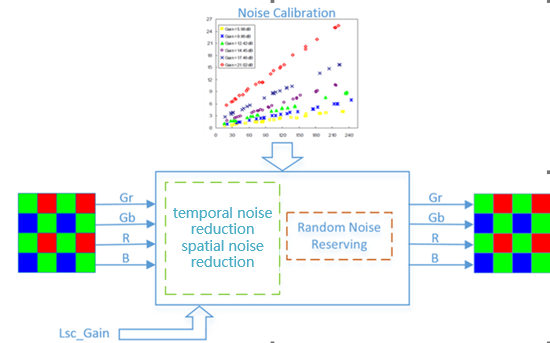

### Key Parameters and Debugging Steps

Since the NR parameter table is very extensive, please refer to the Chinese source document for the complete parameter list. The key debugging guidelines are:

For Linear mode:
1. Adjust the spatial denoising filter. Select the appropriate filter via sfm_thresh. In most cases, sfm0 is recommended (sfm_thresh=255).
2. Adjust the overall noise level using sfr_r, sfr_g, sfr_b to control the noise level per channel.
3. Adjust motion detection thresholds md_static_ratio and md_static_fine_strength.
4. Adjust static background area denoising intensity via tfs, tss, and tfr.
5. Adjust random noise retention via coring_wgt and coring_ratio.
6. Adjust denoising strength reference to Lens-Shading gain via lsc_nr_en.

For WDR mode:
1. Adjust spatial denoising per fusion frame using snr_sfm0_wdr_strength or snr_sfm0_fusion_strength.
2. Adjust motion detection using md_wdr_strength for different fusion frames.

### Noise Calibration Method

The denoising module requires reference to the noise calibration results to obtain a fitting coefficient at different ISO values. For the specific calibration method, refer to the noise calibration document "Image Quality Debugging Tool User Guide."

## DPC

### Function Description

Due to limitations in sensor manufacturing processes, it is impossible for multi-megapixel sensors to have all pixels defect-free. For low-cost sensors, a defect rate of 100 or 1000 ppm (parts per million) is normal. If there are defective pixels in the sensor, the size of the defects will increase (defect diffusion) through image interpolation (such as demosaic) and filtering processes, and the intensity and saturation of the color at the defect location will also significantly increase due to color correction and crosstalk compensation. Therefore, defect correction must be performed before interpolation and other processes.

Defective pixels can be classified into the following types:

-   Static bad pixels:
    -   Bright spots: Generally, the brightness value of a pixel is proportional to the incident light. For bright spots, the brightness value is significantly greater than the incident light times the corresponding proportion, and the brightness at that point increases significantly with exposure time.
    -   Dark spots: Regardless of the incident light, the value at that point is close to 0.

-   Dynamic bad pixels: Within a certain pixel range, the pixel behaves normally. Beyond this range, the pixel appears brighter than surrounding pixels. This is related to sensor temperature and gain. As sensor temperature increases or gain value increases, dynamic bad pixels become more noticeable.

The static and dynamic bad pixel correction module is mainly based on a 5x5 window for detecting and correcting individual bad pixels or bad pixel clusters in the sensor. A bad pixel cluster is defined as adjacent bad pixels in the same color channel. Processing for different color channels is independent.

### Debugging Steps

For DPC dynamic bad pixel debugging:
1. Enable dynamic bad pixel correction without flicker suppression.
2. Select OT_OP_MODE_MANUAL for manual mode.
3. Adjust the DPC processing strength (strength) to correct dynamic bad pixels. If the image appears reddish, configure blend_ratio.
4. Save the ideal strength and blend_ratio values for different ISO levels.
5. If flickering white spots occur, enable flicker suppression and adjust soft_thr and soft_slope.

For static bad pixel calibration:
1. Calibrate bright spots in a completely dark environment with the aperture closed.
2. Calibrate dark spots using a gray card under uniform illumination.
3. Merge the bright and dark spot tables.

## DRC

### Function Description

Dynamic range refers to the luminance ratio between the brightest and darkest objects in a scene. The larger the dynamic range, the richer the luminance levels in the scene. The dynamic range in real scenes reaches 10^9:1, the human visual system can perceive approximately 10^5:1, while typical image sensors have a dynamic range of about 10^3:1. Therefore, when using a traditional image sensor to capture high dynamic range scenes, either bright areas are overexposed with lost details, or dark areas are underexposed with indistinguishable details.

To record every detail of a high dynamic range scene, higher dynamic range image sensors or multiple-exposure image synthesis techniques are needed. However, the dynamic range of current mainstream display devices is only about 10^2:1, making it impossible to fully represent all the details in captured wide dynamic range images. To solve this problem, DRC algorithms are used to compress the dynamic range of the image while preserving details. The ultimate goal of the DRC algorithm is to ensure that both observers of the real scene and observers of the display device have the same visual experience.

**Figure 1** General Model of DRC
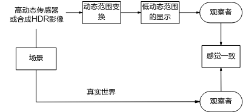

### Key Parameters

For the complete DRC parameter table, please refer to the Chinese source document. Key parameters include:
- Tone Mapping curve selection and tuning
- Filter and FilterX parameters for detail enhancement
- Color correction parameters
- Edge suppression parameters
- Blend weights for Filter/FilterX fusion

### Debugging Steps

General DRC debugging steps:
1. Adjust DRC strength: The overall image brightness is affected by the DRC strength. Larger strength results in brighter images.
2. Adjust Tone Mapping curve: If regional brightness is not ideal, adjust the Tone Mapping curve. Choose between Asymmetry curve, Cubic curve, or custom curve.
3. Adjust detail and contrast: Tune Filter/FilterX parameters, detail enhancement coefficients, and fusion weights for optimal local and global contrast.
4. Adjust color correction: Use color_correction_lut to correct oversaturation, purple_reduction_strength for purple fringing correction.
5. Adjust edge suppression: Use rim_reduction_strength and rim_reduction_threshold to suppress edge artifacts around strong edges.

### Differences from Previous Generation DRC

The main changes include:
1. Algorithm upgrade: New FilterX improves details in backlit and bright areas, and reduces motion halo.
2. Interface adjustment: The strength parameter's effect mechanism and precision have been modified. The local_mixing interface has been expanded to a LUT.

## WDR

### Function Description

Dynamic range refers to the luminance ratio between the brightest and darkest objects in a scene. The larger the dynamic range, the richer the levels that can be represented. The dynamic range in real scenes reaches 10^9:1, the human visual system can perceive approximately 10^5:1, while typical image sensors have a dynamic range of about 10^2:1.

To record every detail of a high dynamic range scene, special image sensors or multiple-exposure image synthesis are used. Since special sensors are expensive and have high hardware requirements, most current applications use standard sensors to capture several frames of the same static scene at different exposures and then use a WDR algorithm to synthesize a high dynamic range image.

Taking 2-in-1 WDR as an example, the short exposure data, long exposure data, and WDR synthesized data are shown in [Figure 1](#_Ref504571808). Short exposure data captures bright area information in the scene, while long exposure data captures dark area information. After WDR synthesis, a high dynamic range image is obtained.

**Figure 1** Short Exposure Data, Long Exposure Data, and WDR Synthesized Data

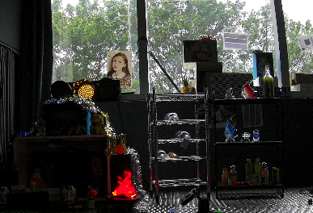 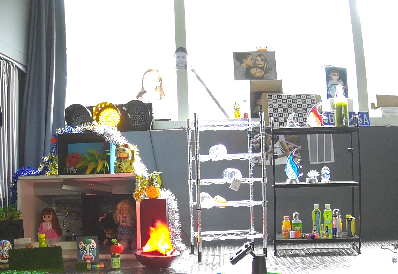 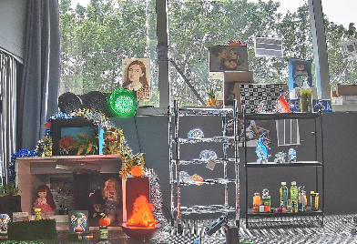

The WDR module supports WDR mode and Fusion mode. WDR mode includes motion detection and WDR fusion, recommended for normal wide dynamic range scenes. Fusion mode has no motion detection and lower noise, recommended for nighttime driving scenes.

### Key Parameters

For the complete WDR parameter table, please refer to the Chinese source document. Key parameters include:
- wdr_merge_mode: WDR merge mode selection
- Motion detection thresholds and gains
- Fusion weights for short/long frame synthesis
