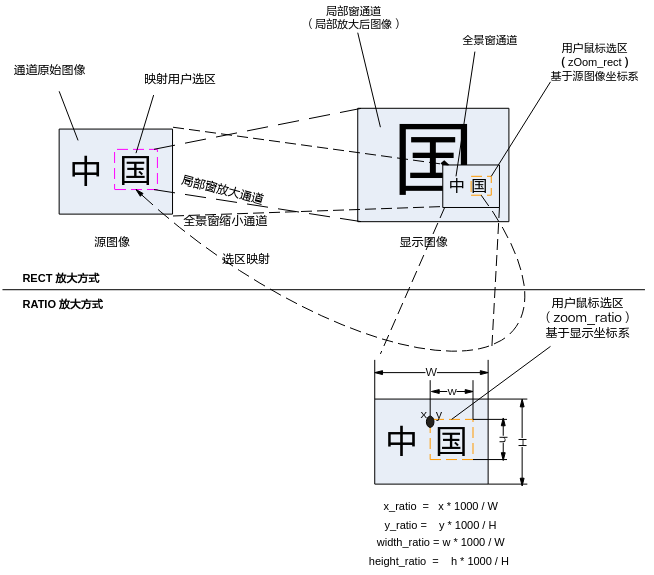

# Data Types
The data types related to video output are defined as follows:

-  [OT\_VO\_MAX\_PHYS\_DEV\_NUM](#ZH-CN_TOPIC_0000002504085559)：Defines the maximum number of physical video output devices.
-  [OT\_VO\_MAX\_VIRT\_DEV\_NUM](#ZH-CN_TOPIC_0000002504085601)：Defines the maximum number of virtual video output devices.
-  [OT\_VO\_MAX\_CAS\_DEV\_NUM](#ZH-CN_TOPIC_0000002503965613)：Defines the maximum number of cascade video output devices.
-  [OT\_VO\_MAX\_DEV\_NUM](#ZH-CN_TOPIC_0000002470925732)：Defines the maximum number of video output devices.
-  [OT\_VO\_VIRT\_DEV\_0](#ZH-CN_TOPIC_0000002470925654)：Defines the Device number for virtual device 0.
-  [OT\_VO\_VIRT\_DEV\_1](#ZH-CN_TOPIC_0000002503965607)：Defines the Device number for virtual device 1.
-  [OT\_VO\_VIRT\_DEV\_2](#ZH-CN_TOPIC_0000002471085650)：Defines the Device number for virtual device 2.
-  [OT\_VO\_VIRT\_DEV\_3](#ZH-CN_TOPIC_0000002504085589)：Defines the Device number for virtual device 3.
-  [OT\_VO\_CAS\_DEV\_1](#ZH-CN_TOPIC_0000002471085638)：Defines the Device number for cascade device 1.
-  [OT\_VO\_CAS\_DEV\_2](#ZH-CN_TOPIC_0000002471085660)：Defines the Device number for cascade device 2.
-  [OT\_VO\_MAX\_PHYS\_VIDEO\_LAYER\_NUM](#ZH-CN_TOPIC_0000002504085565)：Defines the maximum number of physical video layers for video output.
-  [OT\_VO\_MAX\_GFX\_LAYER\_NUM](#ZH-CN_TOPIC_0000002470925738)：Defines the maximum number of graphics layers for video output.
-  [OT\_VO\_MAX\_PHYS\_LAYER\_NUM](#ZH-CN_TOPIC_0000002504085591)：Defines the maximum number of physical video layers and graphics layers.
-  [OT\_VO\_MAX\_LAYER\_NUM](#ZH-CN_TOPIC_0000002504085535)：Defines the maximum number of all video layers and graphics layers.
-  [OT\_VO\_MAX\_LAYER\_IN\_DEV](#ZH-CN_TOPIC_0000002504085499)：Defines the maximum number of video layers per device.
-  [OT\_VO\_LAYER\_V0](#ZH-CN_TOPIC_0000002504085501)：Defines the layer number for video layer 0.
-  [OT\_VO\_LAYER\_V1](#ZH-CN_TOPIC_0000002503965589)：Defines the layer number for video layer 1.
-  [OT\_VO\_LAYER\_V2](#ZH-CN_TOPIC_0000002504085507)：Defines the layer number for video layer 2.
-  [OT\_VO\_LAYER\_V3](#ZH-CN_TOPIC_0000002503965669)：Defines the layer number for video layer 3.
-  [OT\_VO\_LAYER\_G0](#ZH-CN_TOPIC_0000002504085511)：Defines the layer number for graphics layer 0.
-  [OT\_VO\_LAYER\_G1](#ZH-CN_TOPIC_0000002471085682)：Defines the layer number for graphics layer 1.
-  [OT\_VO\_LAYER\_G2](#ZH-CN_TOPIC_0000002504085597)：Defines the layer number for graphics layer 2.
-  [OT\_VO\_LAYER\_G3](#ZH-CN_TOPIC_0000002503965585)：Defines the layer number for graphics layer 3.
-  [OT\_VO\_LAYER\_G4](#ZH-CN_TOPIC_0000002470925702)：Defines the layer number for graphics layer 4.
-  [ot\_vo\_get\_virt\_layer](#ZH-CN_TOPIC_0000002504085529)：Defines the macro for obtaining the virtual video layer number corresponding to the virtual device.
-  [ot\_vo\_get\_cas\_layer](#ZH-CN_TOPIC_0000002471085688)：Defines the macro for obtaining the cascade device video layer number corresponding to the cascade device.
-  [OT\_VO\_MAX\_PRIORITY](#ZH-CN_TOPIC_0000002470925700)：Defines the maximum priority for video layers.
-  [OT\_VO\_MIN\_TOLERATE](#ZH-CN_TOPIC_0000002504085537)：Defines the minimum playback tolerance.
-  [OT\_VO\_MAX\_TOLERATE](#ZH-CN_TOPIC_0000002471085712)：Defines the maximum playback tolerance.
-  [OT\_VO\_MAX\_CHN\_NUM](#ZH-CN_TOPIC_0000002504085567)：Defines the maximum number of channels.
-  [OT\_VO\_MIN\_CHN\_WIDTH](#ZH-CN_TOPIC_0000002504085561)：Defines the minimum channel width.
-  [OT\_VO\_MIN\_CHN\_HEIGHT](#ZH-CN_TOPIC_0000002470925694)：Defines the minimum channel height.
-  [OT\_VO\_MAX\_IMG\_WIDTH](#ZH-CN_TOPIC_0000002504085557)：Defines the maximum image width for VO processing.
-  [OT\_VO\_MAX\_IMG\_HEIGHT](#ZH-CN_TOPIC_0000002470925650)：Defines the maximum image height for VO processing.
-  [OT\_VO\_MAX\_ZOOM\_RATIO](#ZH-CN_TOPIC_0000002504085497)：Defines the maximum zoom ratio.
-  [OT\_VO\_MAX\_NODE\_NUM](#ZH-CN_TOPIC_0000002470925734)：Defines the maximum number of nodes.
-  [OT\_VO\_MAX\_WBC\_NUM](#ZH-CN_TOPIC_0000002471085700)：Defines the maximum number of write-back devices.
-  [OT\_VO\_MAX\_CAS\_PATTERN](#ZH-CN_TOPIC_0000002504085505)：Defines the maximum cascade pattern.
-  [OT\_VO\_MAX\_CAS\_POS\_32RGN](#ZH-CN_TOPIC_0000002504085585)：Defines the maximum cascade position for 32 regions.
-  [OT\_VO\_MAX\_CAS\_POS\_64RGN](#ZH-CN_TOPIC_0000002503965681)：Defines the maximum cascade position for 64 regions.
-  [ot\_vo\_dev](#ZH-CN_TOPIC_0000002470925690)：Defines the Device number.
-  [ot\_vo\_layer](#ZH-CN_TOPIC_0000002504085573)：Defines the video layer number.
-  [ot\_vo\_chn](#ZH-CN_TOPIC_0000002503965655)：Defines the Channel number.
-  [ot\_vo\_wbc](#ZH-CN_TOPIC_0000002471085640)：Defines the write-back channel number.
-  [ot\_vo\_intf\_type](#ZH-CN_TOPIC_0000002471085652)：Defines the interface type.
-  [ot\_vo\_intf\_sync](#ZH-CN_TOPIC_0000002470925660)：Defines the timing type.
-  [ot\_vo\_sync\_info](#ZH-CN_TOPIC_0000002503965623)：Defines the timing information.
-  [ot\_vo\_pub\_attr](#ZH-CN_TOPIC_0000002470925730)：Defines the video output device public attribute structure.
-  [ot\_vo\_dev\_param](#ZH-CN_TOPIC_0000002504085543)：Defines the VO video output device parameter structure.
-  [ot\_vo\_mod\_param](#ZH-CN_TOPIC_0000002503965643)：VO module parameters.
-  [ot\_vo\_clk\_src](#ZH-CN_TOPIC_0000002470925708)：VO device clock source type.
-  [ot\_vo\_fixed\_clk](#ZH-CN_TOPIC_0000002470925722)：VO fixed clock frequency type.
-  [ot\_vo\_pll](#ZH-CN_TOPIC_0000002471085706)：User interface timing PLL information, used to configure PLL.
-  [ot\_vo\_user\_sync\_attr](#ZH-CN_TOPIC_0000002470925672)：User interface timing attributes, including configuration information for clock source type and clock frequency (output frequency of the clock source).
-  [ot\_vo\_user\_sync\_info](#ZH-CN_TOPIC_0000002503965651)：User interface timing information, including clock source type, clock frequency, clock divider ratio, and clock phase.
-  [ot\_vo\_less\_buf\_attr](#ZH-CN_TOPIC_0000002471085718)：VO module buffer-saving attribute parameters.
-  [ot\_vo\_user\_notify\_attr](#ZH-CN_TOPIC_0000002503965617)：VO module user notification attribute parameters.
-  [ot\_vo\_intf\_plug\_status](#ZH-CN_TOPIC_0000002503965627)：Defines the VGA/CVBS interface connection status type.
-  [ot\_vo\_intf\_status](#ZH-CN_TOPIC_0000002471085630)：Defines the VGA/CVBS interface status structure.
-  [ot\_vo\_csc\_matrix](#ZH-CN_TOPIC_0000002503965583)：Defines the CSC conversion matrix.
-  [ot\_vo\_csc](#ZH-CN_TOPIC_0000002471085670)：Defines the image output effect structure.
-  [ot\_vo\_vga\_param](#ZH-CN_TOPIC_0000002503965621)：Defines the VGA image output effect structure.
-  [ot\_vo\_hdmi\_param](#ZH-CN_TOPIC_0000002471085710)：Defines the HDMI image output effect structure.
-  [ot\_vo\_rgb\_param](#ZH-CN_TOPIC_0000002471085720)：Defines the RGB image output effect structure.
-  [ot\_vo\_clk\_edge](#ZH-CN_TOPIC_0000002471085708)：Defines the clock single/dual edge type.
-  [ot\_vo\_bt\_param](#ZH-CN_TOPIC_0000002503965683)：Defines the BT.1120 or BT.656 image output effect structure.
-  [ot\_vo\_mipi\_param](#ZH-CN_TOPIC_0000002470925698)：Defines the MIPI image output effect structure.
-  [ot\_vo\_partition\_mode](#ZH-CN_TOPIC_0000002504085583)：Defines the video layer partition mode enum type.
-  [ot\_vo\_video\_layer\_attr](#ZH-CN_TOPIC_0000002503965649)：Defines the video layer attribute structure.
-  [ot\_vo\_layer\_param](#ZH-CN_TOPIC_0000002503965599)：Defines the video layer parameters, used to adjust the display effects of video content within the video layer.
-  [ot\_vo\_chn\_attr](#ZH-CN_TOPIC_0000002471085702)：Defines the video output channel attribute structure.
-  [ot\_vo\_chn\_param](#ZH-CN_TOPIC_0000002503965581)：Defines the video output channel parameter (aspect ratio) structure.
-  [ot\_vo\_zoom\_in\_type](#ZH-CN_TOPIC_0000002503965593)：Defines the partial zoom-in type.
-  [ot\_vo\_zoom\_ratio](#ZH-CN_TOPIC_0000002471085728)：Defines the proportional partial zoom-in structure.
-  [ot\_vo\_zoom\_attr](#ZH-CN_TOPIC_0000002471085668)：Defines the partial zoom-in attribute structure.
-  [ot\_vo\_border](#ZH-CN_TOPIC_0000002471085722)：Defines the border attribute structure.
-  [ot\_vo\_mirror\_mode](#ZH-CN_TOPIC_0000002504085577)：Defines the channel mirror type.
-  [ot\_vo\_chn\_status](#ZH-CN_TOPIC_0000002504085521)：Defines the video output channel status structure.
-  [ot\_vo\_wbc\_attr](#ZH-CN_TOPIC_0000002471085672)：Defines the video write-back attribute.
-  [ot\_vo\_wbc\_mode](#ZH-CN_TOPIC_0000002503965641)：Defines the video write-back mode.
-  [ot\_vo\_wbc\_src\_type](#ZH-CN_TOPIC_0000002503965629)：Defines the video write-back source type.
-  [ot\_vo\_wbc\_src](#ZH-CN_TOPIC_0000002503965619)：Defines the video write-back source.
-  [ot\_vo\_cas\_mode](#ZH-CN_TOPIC_0000002503965677)：Defines the single/dual cascade mode.
-  [ot\_vo\_cas\_data\_transmission\_mode](#ZH-CN_TOPIC_0000002471085676)：Defines the single/dual edge data transmission mode for cascade.
-  [ot\_vo\_cas\_rgn](#ZH-CN_TOPIC_0000002471085678)：Defines the cascade region type
-  [ot\_vo\_cas\_attr](#ZH-CN_TOPIC_0000002470925658)：Defines the cascade attribute.
-  [ot\_vo\_export\_callback](#ZH-CN_TOPIC_0000002504085569)：Defines the interrupt callback notification function structure.
-  [ot\_vo\_export\_symbol](#ZH-CN_TOPIC_0000002470925642)：Defines the registered interrupt callback function structure.
-  [ot\_vo\_register\_export\_callback](#ZH-CN_TOPIC_0000002470925664)：Defines the registered interrupt callback hook function.


## OT\_VO\_MAX\_PHYS\_DEV\_NUM<a name="ZH-CN_TOPIC_0000002504085559"></a>

**Description**

Defines the maximum number of video output physical devices.

**Definition**

SS528V100/SS625V100/SS524V100/SS522V101/SS626V100:

```
#define OT_VO_MAX_PHYS_DEV_NUM 3
```

SS928V100:

```
#define OT_VO_MAX_PHYS_DEV_NUM 2
```

**Solution Differences**

<a name="table11583mcpsimp"></a>
<table><thead align="left"><tr id="row11588mcpsimp"><th class="cellrowborder" valign="top" width="53%" id="mcps1.1.3.1.1"><p id="p11590mcpsimp"><a name="p11590mcpsimp"></a><a name="p11590mcpsimp"></a>**Solution**</p>
</th>
<th class="cellrowborder" valign="top" width="47%" id="mcps1.1.3.1.2"><p id="p11592mcpsimp"><a name="p11592mcpsimp"></a><a name="p11592mcpsimp"></a>Description</p>
</th>
</tr>
</thead>
<tbody><tr id="row11594mcpsimp"><td class="cellrowborder" valign="top" width="53%" headers="mcps1.1.3.1.1 "><p id="p11596mcpsimp"><a name="p11596mcpsimp"></a><a name="p11596mcpsimp"></a>SS528V100/SS625V100/SS524V100/SS522V101<span xml:lang="x-NONE" id="ph11597mcpsimp"><a name="ph11597mcpsimp"></a><a name="ph11597mcpsimp"></a>/SS626V100</span></p>
</td>
<td class="cellrowborder" valign="top" width="47%" headers="mcps1.1.3.1.2 "><p id="p11599mcpsimp"><a name="p11599mcpsimp"></a><a name="p11599mcpsimp"></a>Up to 3 physical devices</p>
</td>
</tr>
<tr id="row11600mcpsimp"><td class="cellrowborder" valign="top" width="53%" headers="mcps1.1.3.1.1 "><p id="p11602mcpsimp"><a name="p11602mcpsimp"></a><a name="p11602mcpsimp"></a>SS928V100</p>
</td>
<td class="cellrowborder" valign="top" width="47%" headers="mcps1.1.3.1.2 "><p id="p11604mcpsimp"><a name="p11604mcpsimp"></a><a name="p11604mcpsimp"></a>Up to 2 physical devices</p>
</td>
</tr>
</tbody>
</table>

**Notes**

SS522V101 does not support DHD1.

**Related Data Types and Interfaces**

None.

## OT\_VO\_MAX\_VIRT\_DEV\_NUM<a name="ZH-CN_TOPIC_0000002504085601"></a>

**Description**

Defines the maximum number of virtual video output devices.

**Definition**

SS528V100/SS625V100/SS524V100/SS522V101/SS928V100/SS626V100:

```
#define OT_VO_MAX_VIRT_DEV_NUM 32
```

**Solution Differences**

<a name="table11619mcpsimp"></a>
<table><thead align="left"><tr id="row11624mcpsimp"><th class="cellrowborder" valign="top" width="41%" id="mcps1.1.3.1.1"><p id="p11626mcpsimp"><a name="p11626mcpsimp"></a><a name="p11626mcpsimp"></a>**Solution**</p>
</th>
<th class="cellrowborder" valign="top" width="59%" id="mcps1.1.3.1.2"><p id="p11628mcpsimp"><a name="p11628mcpsimp"></a><a name="p11628mcpsimp"></a>Description</p>
</th>
</tr>
</thead>
<tbody><tr id="row11630mcpsimp"><td class="cellrowborder" valign="top" width="41%" headers="mcps1.1.3.1.1 "><p id="p11632mcpsimp"><a name="p11632mcpsimp"></a><a name="p11632mcpsimp"></a>SS528V100/SS625V100/SS524V100/SS522V101/SS928V100<span xml:lang="x-NONE" id="ph11633mcpsimp"><a name="ph11633mcpsimp"></a><a name="ph11633mcpsimp"></a>/SS626V100</span></p>
</td>
<td class="cellrowborder" valign="top" width="59%" headers="mcps1.1.3.1.2 "><p id="p11635mcpsimp"><a name="p11635mcpsimp"></a><a name="p11635mcpsimp"></a>Up to 32 virtual devices</p>
</td>
</tr>
</tbody>
</table>

**Notes**

None.

**Related Data Types and Interfaces**

None.

## OT\_VO\_MAX\_CAS\_DEV\_NUM<a name="ZH-CN_TOPIC_0000002503965613"></a>

**Description**

Defines the maximum number of video output cascade extension devices.

**Definition**

SS528V100:

```
#define OT_VO_MAX_CAS_DEV_NUM 2
```

SS625V100/SS524V100/SS522V101/SS928V100/SS626V100:

```
#define OT_VO_MAX_CAS_DEV_NUM 0
```

**Solution Differences**

<a name="table11650mcpsimp"></a>
<table><thead align="left"><tr id="row11655mcpsimp"><th class="cellrowborder" valign="top" width="46%" id="mcps1.1.3.1.1"><p id="p11657mcpsimp"><a name="p11657mcpsimp"></a><a name="p11657mcpsimp"></a>**Solution**</p>
</th>
<th class="cellrowborder" valign="top" width="54%" id="mcps1.1.3.1.2"><p id="p11659mcpsimp"><a name="p11659mcpsimp"></a><a name="p11659mcpsimp"></a>Description</p>
</th>
</tr>
</thead>
<tbody><tr id="row11661mcpsimp"><td class="cellrowborder" valign="top" width="46%" headers="mcps1.1.3.1.1 "><p id="p11663mcpsimp"><a name="p11663mcpsimp"></a><a name="p11663mcpsimp"></a>SS528V100</p>
</td>
<td class="cellrowborder" valign="top" width="54%" headers="mcps1.1.3.1.2 "><p id="p11665mcpsimp"><a name="p11665mcpsimp"></a><a name="p11665mcpsimp"></a>Up to 2 cascade extension devices</p>
</td>
</tr>
<tr id="row11666mcpsimp"><td class="cellrowborder" valign="top" width="46%" headers="mcps1.1.3.1.1 "><p id="p11668mcpsimp"><a name="p11668mcpsimp"></a><a name="p11668mcpsimp"></a>SS625V100/SS524V100/SS522V101 /SS928V100<span xml:lang="x-NONE" id="ph11669mcpsimp"><a name="ph11669mcpsimp"></a><a name="ph11669mcpsimp"></a>/SS626V100</span></p>
</td>
<td class="cellrowborder" valign="top" width="54%" headers="mcps1.1.3.1.2 "><p id="p11671mcpsimp"><a name="p11671mcpsimp"></a><a name="p11671mcpsimp"></a>Not supported</p>
</td>
</tr>
</tbody>
</table>

**Notes**

None.

**Related Data Types and Interfaces**

None.

## OT\_VO\_MAX\_DEV\_NUM<a name="ZH-CN_TOPIC_0000002470925732"></a>

**Description**

Defines the maximum number of video output devices.

**Definition**

SS528V100/SS625V100/SS524V100/SS522V101/SS928V100/SS626V100:

```
#define OT_VO_MAX_DEV_NUM   (OT_VO_MAX_PHYS_DEV_NUM + OT_VO_MAX_VIRT_DEV_NUM + OT_VO_MAX_CAS_DEV_NUM)
```

**Solution Differences**

<a name="table11687mcpsimp"></a>
<table><thead align="left"><tr id="row11692mcpsimp"><th class="cellrowborder" valign="top" width="41%" id="mcps1.1.3.1.1"><p id="p11694mcpsimp"><a name="p11694mcpsimp"></a><a name="p11694mcpsimp"></a>**Solution**</p>
</th>
<th class="cellrowborder" valign="top" width="59%" id="mcps1.1.3.1.2"><p id="p11696mcpsimp"><a name="p11696mcpsimp"></a><a name="p11696mcpsimp"></a>Description</p>
</th>
</tr>
</thead>
<tbody><tr id="row11698mcpsimp"><td class="cellrowborder" valign="top" width="41%" headers="mcps1.1.3.1.1 "><p id="p11700mcpsimp"><a name="p11700mcpsimp"></a><a name="p11700mcpsimp"></a>SS528V100</p>
</td>
<td class="cellrowborder" valign="top" width="59%" headers="mcps1.1.3.1.2 "><p id="p11702mcpsimp"><a name="p11702mcpsimp"></a><a name="p11702mcpsimp"></a>Up to (OT_VO_MAX_PHYS_DEV_NUM + OT_VO_MAX_VIRT_DEV_NUM + OT_VO_MAX_CAS_DEV_NUM) 37 devices</p>
</td>
</tr>
<tr id="row11704mcpsimp"><td class="cellrowborder" valign="top" width="41%" headers="mcps1.1.3.1.1 "><p id="p11706mcpsimp"><a name="p11706mcpsimp"></a><a name="p11706mcpsimp"></a>SS625V100</p>
</td>
<td class="cellrowborder" valign="top" width="59%" headers="mcps1.1.3.1.2 "><p id="p11708mcpsimp"><a name="p11708mcpsimp"></a><a name="p11708mcpsimp"></a>Up to (OT_VO_MAX_PHYS_DEV_NUM + OT_VO_MAX_VIRT_DEV_NUM + OT_VO_MAX_CAS_DEV_NUM) 35 devices</p>
</td>
</tr>
<tr id="row11710mcpsimp"><td class="cellrowborder" valign="top" width="41%" headers="mcps1.1.3.1.1 "><p id="p11712mcpsimp"><a name="p11712mcpsimp"></a><a name="p11712mcpsimp"></a>SS524V100/SS522V101</p>
</td>
<td class="cellrowborder" valign="top" width="59%" headers="mcps1.1.3.1.2 "><p id="p11714mcpsimp"><a name="p11714mcpsimp"></a><a name="p11714mcpsimp"></a>Up to (OT_VO_MAX_PHYS_DEV_NUM + OT_VO_MAX_VIRT_DEV_NUM + OT_VO_MAX_CAS_DEV_NUM) 35 devices</p>
</td>
</tr>
<tr id="row11716mcpsimp"><td class="cellrowborder" valign="top" width="41%" headers="mcps1.1.3.1.1 "><p id="p11718mcpsimp"><a name="p11718mcpsimp"></a><a name="p11718mcpsimp"></a>SS928V100</p>
</td>
<td class="cellrowborder" valign="top" width="59%" headers="mcps1.1.3.1.2 "><p id="p11720mcpsimp"><a name="p11720mcpsimp"></a><a name="p11720mcpsimp"></a>Up to (OT_VO_MAX_PHYS_DEV_NUM + OT_VO_MAX_VIRT_DEV_NUM + OT_VO_MAX_CAS_DEV_NUM) 34 devices</p>
</td>
</tr>
<tr id="row11722mcpsimp"><td class="cellrowborder" valign="top" width="41%" headers="mcps1.1.3.1.1 "><p id="p11724mcpsimp"><a name="p11724mcpsimp"></a><a name="p11724mcpsimp"></a>SS626V100</p>
</td>
<td class="cellrowborder" valign="top" width="59%" headers="mcps1.1.3.1.2 "><p id="p11726mcpsimp"><a name="p11726mcpsimp"></a><a name="p11726mcpsimp"></a>Up to (OT_VO_MAX_PHYS_DEV_NUM + OT_VO_MAX_VIRT_DEV_NUM + OT_VO_MAX_CAS_DEV_NUM) 35 devices</p>
</td>
</tr>
</tbody>
</table>

**Notes**

SS522V101 does not support DHD1.

**Related Data Types and Interfaces**

None.

## OT\_VO\_VIRT\_DEV\_0<a name="ZH-CN_TOPIC_0000002470925654"></a>

**Description**

Defines the Device number for virtual device 0.

**Definition**

SS528V100/SS625V100/SS524V100/SS522V101/SS626V100：

```
#define OT_VO_VIRT_DEV_0  3
```

SS928V100：

```
#define OT_VO_VIRT_DEV_0  2
```

**Solution Differences**

<a name="table11744mcpsimp"></a>
<table><thead align="left"><tr id="row11749mcpsimp"><th class="cellrowborder" valign="top" width="37%" id="mcps1.1.3.1.1"><p id="p11751mcpsimp"><a name="p11751mcpsimp"></a><a name="p11751mcpsimp"></a>**Solution**</p>
</th>
<th class="cellrowborder" valign="top" width="63%" id="mcps1.1.3.1.2"><p id="p11753mcpsimp"><a name="p11753mcpsimp"></a><a name="p11753mcpsimp"></a>Description</p>
</th>
</tr>
</thead>
<tbody><tr id="row11755mcpsimp"><td class="cellrowborder" valign="top" width="37%" headers="mcps1.1.3.1.1 "><p id="p11757mcpsimp"><a name="p11757mcpsimp"></a><a name="p11757mcpsimp"></a>SS528V100/SS625V100/SS524V100/SS522V101<span xml:lang="x-NONE" id="ph11758mcpsimp"><a name="ph11758mcpsimp"></a><a name="ph11758mcpsimp"></a>/SS626V100</span></p>
</td>
<td class="cellrowborder" valign="top" width="63%" headers="mcps1.1.3.1.2 "><p id="p11760mcpsimp"><a name="p11760mcpsimp"></a><a name="p11760mcpsimp"></a>Virtual device 0 device number is 3</p>
</td>
</tr>
<tr id="row11761mcpsimp"><td class="cellrowborder" valign="top" width="37%" headers="mcps1.1.3.1.1 "><p id="p11763mcpsimp"><a name="p11763mcpsimp"></a><a name="p11763mcpsimp"></a>SS928V100</p>
</td>
<td class="cellrowborder" valign="top" width="63%" headers="mcps1.1.3.1.2 "><p id="p11765mcpsimp"><a name="p11765mcpsimp"></a><a name="p11765mcpsimp"></a>Virtual device 0 device number is 2</p>
</td>
</tr>
</tbody>
</table>

**Notes**

None.

**Related Data Types and Interfaces**

None.

## OT\_VO\_VIRT\_DEV\_1<a name="ZH-CN_TOPIC_0000002503965607"></a>

**Description**

Defines the Device number for virtual device 1.

**Definition**

SS528V100/SS625V100/SS524V100/SS522V101/SS626V100：

```
#define OT_VO_VIRT_DEV_1  4
```

SS928V100：

```
#define OT_VO_VIRT_DEV_1  3
```

**Solution Differences**

<a name="table11782mcpsimp"></a>
<table><thead align="left"><tr id="row11787mcpsimp"><th class="cellrowborder" valign="top" width="41%" id="mcps1.1.3.1.1"><p id="p11789mcpsimp"><a name="p11789mcpsimp"></a><a name="p11789mcpsimp"></a>**Solution**</p>
</th>
<th class="cellrowborder" valign="top" width="59%" id="mcps1.1.3.1.2"><p id="p11791mcpsimp"><a name="p11791mcpsimp"></a><a name="p11791mcpsimp"></a>Description</p>
</th>
</tr>
</thead>
<tbody><tr id="row11793mcpsimp"><td class="cellrowborder" valign="top" width="41%" headers="mcps1.1.3.1.1 "><p id="p11795mcpsimp"><a name="p11795mcpsimp"></a><a name="p11795mcpsimp"></a>SS528V100/SS625V100/SS524V100/SS522V101<span xml:lang="x-NONE" id="ph11796mcpsimp"><a name="ph11796mcpsimp"></a><a name="ph11796mcpsimp"></a>/SS626V100</span></p>
</td>
<td class="cellrowborder" valign="top" width="59%" headers="mcps1.1.3.1.2 "><p id="p11798mcpsimp"><a name="p11798mcpsimp"></a><a name="p11798mcpsimp"></a>Virtual device 1 device number is 4</p>
</td>
</tr>
<tr id="row11799mcpsimp"><td class="cellrowborder" valign="top" width="41%" headers="mcps1.1.3.1.1 "><p id="p11801mcpsimp"><a name="p11801mcpsimp"></a><a name="p11801mcpsimp"></a>SS928V100</p>
</td>
<td class="cellrowborder" valign="top" width="59%" headers="mcps1.1.3.1.2 "><p id="p11803mcpsimp"><a name="p11803mcpsimp"></a><a name="p11803mcpsimp"></a>Virtual device 1 device number is 3</p>
</td>
</tr>
</tbody>
</table>

**Notes**

None.

**Related Data Types and Interfaces**

None.

## OT\_VO\_VIRT\_DEV\_2<a name="ZH-CN_TOPIC_0000002471085650"></a>

**Description**

Defines the Device number for virtual device 2.

**Definition**

SS528V100/SS625V100/SS524V100/SS522V101/SS626V100：

```
#define OT_VO_VIRT_DEV_2  5
```

SS928V100：

```
#define OT_VO_VIRT_DEV_2  4
```

**Solution Differences**

<a name="table11820mcpsimp"></a>
<table><thead align="left"><tr id="row11825mcpsimp"><th class="cellrowborder" valign="top" width="34%" id="mcps1.1.3.1.1"><p id="p11827mcpsimp"><a name="p11827mcpsimp"></a><a name="p11827mcpsimp"></a>**Solution**</p>
</th>
<th class="cellrowborder" valign="top" width="66%" id="mcps1.1.3.1.2"><p id="p11829mcpsimp"><a name="p11829mcpsimp"></a><a name="p11829mcpsimp"></a>Description</p>
</th>
</tr>
</thead>
<tbody><tr id="row11831mcpsimp"><td class="cellrowborder" valign="top" width="34%" headers="mcps1.1.3.1.1 "><p id="p11833mcpsimp"><a name="p11833mcpsimp"></a><a name="p11833mcpsimp"></a>SS528V100/SS625V100/SS524V100/SS522V101<span xml:lang="x-NONE" id="ph11834mcpsimp"><a name="ph11834mcpsimp"></a><a name="ph11834mcpsimp"></a>/SS626V100</span></p>
</td>
<td class="cellrowborder" valign="top" width="66%" headers="mcps1.1.3.1.2 "><p id="p11836mcpsimp"><a name="p11836mcpsimp"></a><a name="p11836mcpsimp"></a>Virtual device 2 device number is 5</p>
</td>
</tr>
<tr id="row11837mcpsimp"><td class="cellrowborder" valign="top" width="34%" headers="mcps1.1.3.1.1 "><p id="p11839mcpsimp"><a name="p11839mcpsimp"></a><a name="p11839mcpsimp"></a>SS928V100</p>
</td>
<td class="cellrowborder" valign="top" width="66%" headers="mcps1.1.3.1.2 "><p id="p11841mcpsimp"><a name="p11841mcpsimp"></a><a name="p11841mcpsimp"></a>Virtual device 2 device number is 4</p>
</td>
</tr>
</tbody>
</table>

**Notes**

None.

**Related Data Types and Interfaces**

None.

## OT\_VO\_VIRT\_DEV\_3<a name="ZH-CN_TOPIC_0000002504085589"></a>

**Description**

Defines the Device number for virtual device 3.

**Definition**

SS528V100/SS625V100/SS524V100/SS522V101/SS626V100：

```
#define OT_VO_VIRT_DEV_3  6
```

SS928V100：

```
#define OT_VO_VIRT_DEV_3  5
```

**Solution Differences**

<a name="table11858mcpsimp"></a>
<table><thead align="left"><tr id="row11863mcpsimp"><th class="cellrowborder" valign="top" width="49%" id="mcps1.1.3.1.1"><p id="p11865mcpsimp"><a name="p11865mcpsimp"></a><a name="p11865mcpsimp"></a>**Solution**</p>
</th>
<th class="cellrowborder" valign="top" width="51%" id="mcps1.1.3.1.2"><p id="p11867mcpsimp"><a name="p11867mcpsimp"></a><a name="p11867mcpsimp"></a>Description</p>
</th>
</tr>
</thead>
<tbody><tr id="row11869mcpsimp"><td class="cellrowborder" valign="top" width="49%" headers="mcps1.1.3.1.1 "><p id="p11871mcpsimp"><a name="p11871mcpsimp"></a><a name="p11871mcpsimp"></a>SS528V100/SS625V100/SS524V100/SS522V101<span xml:lang="x-NONE" id="ph11872mcpsimp"><a name="ph11872mcpsimp"></a><a name="ph11872mcpsimp"></a>/SS626V100</span></p>
</td>
<td class="cellrowborder" valign="top" width="51%" headers="mcps1.1.3.1.2 "><p id="p11874mcpsimp"><a name="p11874mcpsimp"></a><a name="p11874mcpsimp"></a>Virtual device 3 device number is 6</p>
</td>
</tr>
<tr id="row11875mcpsimp"><td class="cellrowborder" valign="top" width="49%" headers="mcps1.1.3.1.1 "><p id="p11877mcpsimp"><a name="p11877mcpsimp"></a><a name="p11877mcpsimp"></a>SS928V100</p>
</td>
<td class="cellrowborder" valign="top" width="51%" headers="mcps1.1.3.1.2 "><p id="p11879mcpsimp"><a name="p11879mcpsimp"></a><a name="p11879mcpsimp"></a>Virtual device 3 device number is 5</p>
</td>
</tr>
</tbody>
</table>

**Notes**

None.

**Related Data Types and Interfaces**

None.

## OT\_VO\_CAS\_DEV\_1<a name="ZH-CN_TOPIC_0000002471085638"></a>

**Description**

Defines the Device number for cascade device 1.

**Definition**

SS528V100：

```
#define OT_VO_CAS_DEV_1   35
```

**Solution Differences**

<a name="table11891mcpsimp"></a>
<table><thead align="left"><tr id="row11896mcpsimp"><th class="cellrowborder" valign="top" width="42%" id="mcps1.1.3.1.1"><p id="p11898mcpsimp"><a name="p11898mcpsimp"></a><a name="p11898mcpsimp"></a>**Solution**</p>
</th>
<th class="cellrowborder" valign="top" width="57.99999999999999%" id="mcps1.1.3.1.2"><p id="p11900mcpsimp"><a name="p11900mcpsimp"></a><a name="p11900mcpsimp"></a>Description</p>
</th>
</tr>
</thead>
<tbody><tr id="row11902mcpsimp"><td class="cellrowborder" valign="top" width="42%" headers="mcps1.1.3.1.1 "><p id="p11904mcpsimp"><a name="p11904mcpsimp"></a><a name="p11904mcpsimp"></a>SS528V100</p>
</td>
<td class="cellrowborder" valign="top" width="57.99999999999999%" headers="mcps1.1.3.1.2 "><p id="p11906mcpsimp"><a name="p11906mcpsimp"></a><a name="p11906mcpsimp"></a>Cascade device 1 device number is 35</p>
</td>
</tr>
<tr id="row11907mcpsimp"><td class="cellrowborder" valign="top" width="42%" headers="mcps1.1.3.1.1 "><p id="p11909mcpsimp"><a name="p11909mcpsimp"></a><a name="p11909mcpsimp"></a>SS625V100/SS524V100/SS522V101/SS928V100<span xml:lang="x-NONE" id="ph11910mcpsimp"><a name="ph11910mcpsimp"></a><a name="ph11910mcpsimp"></a>/SS626V100</span></p>
</td>
<td class="cellrowborder" valign="top" width="57.99999999999999%" headers="mcps1.1.3.1.2 "><p id="p11912mcpsimp"><a name="p11912mcpsimp"></a><a name="p11912mcpsimp"></a>Not supported</p>
</td>
</tr>
</tbody>
</table>

**Notes**

None.

**Related Data Types and Interfaces**

None.

## OT\_VO\_CAS\_DEV\_2<a name="ZH-CN_TOPIC_0000002471085660"></a>

**Description**

Defines the Device number for cascade device 2.

**Definition**

SS528V100

```
#define OT_VO_CAS_DEV_2   36
```

**Solution Differences**

<a name="table11924mcpsimp"></a>
<table><thead align="left"><tr id="row11929mcpsimp"><th class="cellrowborder" valign="top" width="37%" id="mcps1.1.3.1.1"><p id="p11931mcpsimp"><a name="p11931mcpsimp"></a><a name="p11931mcpsimp"></a>**Solution**</p>
</th>
<th class="cellrowborder" valign="top" width="63%" id="mcps1.1.3.1.2"><p id="p11933mcpsimp"><a name="p11933mcpsimp"></a><a name="p11933mcpsimp"></a>Description</p>
</th>
</tr>
</thead>
<tbody><tr id="row11935mcpsimp"><td class="cellrowborder" valign="top" width="37%" headers="mcps1.1.3.1.1 "><p id="p11937mcpsimp"><a name="p11937mcpsimp"></a><a name="p11937mcpsimp"></a>SS528V100</p>
</td>
<td class="cellrowborder" valign="top" width="63%" headers="mcps1.1.3.1.2 "><p id="p11939mcpsimp"><a name="p11939mcpsimp"></a><a name="p11939mcpsimp"></a>Cascade device 2 device number is 36</p>
</td>
</tr>
<tr id="row11940mcpsimp"><td class="cellrowborder" valign="top" width="37%" headers="mcps1.1.3.1.1 "><p id="p11942mcpsimp"><a name="p11942mcpsimp"></a><a name="p11942mcpsimp"></a>SS625V100/SS524V100/SS522V101/SS928V100<span xml:lang="x-NONE" id="ph11943mcpsimp"><a name="ph11943mcpsimp"></a><a name="ph11943mcpsimp"></a>/SS626V100</span></p>
</td>
<td class="cellrowborder" valign="top" width="63%" headers="mcps1.1.3.1.2 "><p id="p11945mcpsimp"><a name="p11945mcpsimp"></a><a name="p11945mcpsimp"></a>Not supported</p>
</td>
</tr>
</tbody>
</table>

**Notes**

None.

**Related Data Types and Interfaces**

None.

## OT\_VO\_MAX\_PHYS\_VIDEO\_LAYER\_NUM<a name="ZH-CN_TOPIC_0000002504085565"></a>

**Description**

Defines the maximum number of physical video layers.

**Definition**

SS528V100/SS625V100/SS524V100/SS522V101/SS626V100:

```
#define OT_VO_MAX_PHYS_VIDEO_LAYER_NUM  4
```

SS928V100:

```
#define OT_VO_MAX_PHYS_VIDEO_LAYER_NUM  3
```

**Solution Differences**

<a name="table11962mcpsimp"></a>
<table><thead align="left"><tr id="row11967mcpsimp"><th class="cellrowborder" valign="top" width="52%" id="mcps1.1.3.1.1"><p id="p11969mcpsimp"><a name="p11969mcpsimp"></a><a name="p11969mcpsimp"></a>**Solution**</p>
</th>
<th class="cellrowborder" valign="top" width="48%" id="mcps1.1.3.1.2"><p id="p11971mcpsimp"><a name="p11971mcpsimp"></a><a name="p11971mcpsimp"></a>Description</p>
</th>
</tr>
</thead>
<tbody><tr id="row11973mcpsimp"><td class="cellrowborder" valign="top" width="52%" headers="mcps1.1.3.1.1 "><p id="p11975mcpsimp"><a name="p11975mcpsimp"></a><a name="p11975mcpsimp"></a>SS528V100/SS625V100/SS524V100/SS522V101<span xml:lang="x-NONE" id="ph11976mcpsimp"><a name="ph11976mcpsimp"></a><a name="ph11976mcpsimp"></a>/SS626V100</span></p>
</td>
<td class="cellrowborder" valign="top" width="48%" headers="mcps1.1.3.1.2 "><p id="p11978mcpsimp"><a name="p11978mcpsimp"></a><a name="p11978mcpsimp"></a>Up to 4 physical video layers.</p>
</td>
</tr>
<tr id="row11979mcpsimp"><td class="cellrowborder" valign="top" width="52%" headers="mcps1.1.3.1.1 "><p id="p11981mcpsimp"><a name="p11981mcpsimp"></a><a name="p11981mcpsimp"></a>SS928V100</p>
</td>
<td class="cellrowborder" valign="top" width="48%" headers="mcps1.1.3.1.2 "><p id="p11983mcpsimp"><a name="p11983mcpsimp"></a><a name="p11983mcpsimp"></a>Up to 3 physical video layers.</p>
</td>
</tr>
</tbody>
</table>

**Notes**

SS522V101Not supportedVHD1.

**Related Data Types and Interfaces**

None.

## OT\_VO\_MAX\_GFX\_LAYER\_NUM<a name="ZH-CN_TOPIC_0000002470925738"></a>

**Description**

Defines the maximum number of graphics layers.

**Definition**

SS528V100/SS625V100/SS524V100/SS522V101:

```
#define OT_VO_MAX_GFX_LAYER_NUM  4
```

SS928V100:

```
#define OT_VO_MAX_GFX_LAYER_NUM  3
```

SS626V100:

```
#define OT_VO_MAX_GFX_LAYER_NUM  5
```

**Solution Differences**

<a name="table12000mcpsimp"></a>
<table><thead align="left"><tr id="row12005mcpsimp"><th class="cellrowborder" valign="top" width="52%" id="mcps1.1.3.1.1"><p id="p12007mcpsimp"><a name="p12007mcpsimp"></a><a name="p12007mcpsimp"></a>**Solution**</p>
</th>
<th class="cellrowborder" valign="top" width="48%" id="mcps1.1.3.1.2"><p id="p12009mcpsimp"><a name="p12009mcpsimp"></a><a name="p12009mcpsimp"></a>Description</p>
</th>
</tr>
</thead>
<tbody><tr id="row12011mcpsimp"><td class="cellrowborder" valign="top" width="52%" headers="mcps1.1.3.1.1 "><p id="p12013mcpsimp"><a name="p12013mcpsimp"></a><a name="p12013mcpsimp"></a>SS528V100/SS625V100/SS524V100/SS522V101</p>
</td>
<td class="cellrowborder" valign="top" width="48%" headers="mcps1.1.3.1.2 "><p id="p12015mcpsimp"><a name="p12015mcpsimp"></a><a name="p12015mcpsimp"></a>Up to 4 graphics layers.</p>
</td>
</tr>
<tr id="row12016mcpsimp"><td class="cellrowborder" valign="top" width="52%" headers="mcps1.1.3.1.1 "><p id="p12018mcpsimp"><a name="p12018mcpsimp"></a><a name="p12018mcpsimp"></a>SS928V100</p>
</td>
<td class="cellrowborder" valign="top" width="48%" headers="mcps1.1.3.1.2 "><p id="p12020mcpsimp"><a name="p12020mcpsimp"></a><a name="p12020mcpsimp"></a>Up to 3 graphics layers.</p>
</td>
</tr>
<tr id="row12021mcpsimp"><td class="cellrowborder" valign="top" width="52%" headers="mcps1.1.3.1.1 "><p id="p12023mcpsimp"><a name="p12023mcpsimp"></a><a name="p12023mcpsimp"></a>SS626V100</p>
</td>
<td class="cellrowborder" valign="top" width="48%" headers="mcps1.1.3.1.2 "><p id="p12025mcpsimp"><a name="p12025mcpsimp"></a><a name="p12025mcpsimp"></a>Up to 5 graphics layers.</p>
</td>
</tr>
</tbody>
</table>

**Notes**

SS522V101Not supportedG1.

**Related Data Types and Interfaces**

None.

## OT\_VO\_MAX\_PHYS\_LAYER\_NUM<a name="ZH-CN_TOPIC_0000002504085591"></a>

**Description**

Defines the maximum number of physical video layers and graphics layers.

**Definition**

SS528V100/SS625V100/SS524V100/SS522V101/SS928V100/SS626V100:

```
#define OT_VO_MAX_PHYS_LAYER_NUM   (OT_VO_MAX_PHYS_VIDEO_LAYER_NUM + OT_VO_MAX_GFX_LAYER_NUM)
```

**Solution Differences**

<a name="table12041mcpsimp"></a>
<table><thead align="left"><tr id="row12046mcpsimp"><th class="cellrowborder" valign="top" width="52%" id="mcps1.1.3.1.1"><p id="p12048mcpsimp"><a name="p12048mcpsimp"></a><a name="p12048mcpsimp"></a>**Solution**</p>
</th>
<th class="cellrowborder" valign="top" width="48%" id="mcps1.1.3.1.2"><p id="p12050mcpsimp"><a name="p12050mcpsimp"></a><a name="p12050mcpsimp"></a>Description</p>
</th>
</tr>
</thead>
<tbody><tr id="row12052mcpsimp"><td class="cellrowborder" valign="top" width="52%" headers="mcps1.1.3.1.1 "><p id="p12054mcpsimp"><a name="p12054mcpsimp"></a><a name="p12054mcpsimp"></a>SS528V100/SS625V100/SS524V100/SS522V101</p>
</td>
<td class="cellrowborder" valign="top" width="48%" headers="mcps1.1.3.1.2 "><p id="p12056mcpsimp"><a name="p12056mcpsimp"></a><a name="p12056mcpsimp"></a>Up to (OT_VO_MAX_PHYS_VIDEO_LAYER_NUM + OT_VO_MAX_GFX_LAYER_NUM) 8 physical video layers and graphics layers in total.</p>
</td>
</tr>
<tr id="row12057mcpsimp"><td class="cellrowborder" valign="top" width="52%" headers="mcps1.1.3.1.1 "><p id="p12059mcpsimp"><a name="p12059mcpsimp"></a><a name="p12059mcpsimp"></a>SS928V100</p>
</td>
<td class="cellrowborder" valign="top" width="48%" headers="mcps1.1.3.1.2 "><p id="p12061mcpsimp"><a name="p12061mcpsimp"></a><a name="p12061mcpsimp"></a>Up to (OT_VO_MAX_PHYS_VIDEO_LAYER_NUM + OT_VO_MAX_GFX_LAYER_NUM) 6 physical video layers and graphics layers in total.</p>
</td>
</tr>
<tr id="row12062mcpsimp"><td class="cellrowborder" valign="top" width="52%" headers="mcps1.1.3.1.1 "><p id="p12064mcpsimp"><a name="p12064mcpsimp"></a><a name="p12064mcpsimp"></a>SS626V100</p>
</td>
<td class="cellrowborder" valign="top" width="48%" headers="mcps1.1.3.1.2 "><p id="p12066mcpsimp"><a name="p12066mcpsimp"></a><a name="p12066mcpsimp"></a>Up to (OT_VO_MAX_PHYS_VIDEO_LAYER_NUM + OT_VO_MAX_GFX_LAYER_NUM) 9 physical video layers and graphics layers in total.</p>
</td>
</tr>
</tbody>
</table>

**Notes**

SS522V101 does not support VHD1 and G1.

**Related Data Types and Interfaces**

None.

## OT\_VO\_MAX\_LAYER\_NUM<a name="ZH-CN_TOPIC_0000002504085535"></a>

**Description**

Defines the maximum number of all video layers and graphics layers.

**Definition**

SS528V100/SS625V100/SS524V100/SS522V101/SS928V100/SS626V100:

```
#define OT_VO_MAX_LAYER_NUM (OT_VO_MAX_PHYS_LAYER_NUM + OT_VO_MAX_VIRT_DEV_NUM + OT_VO_MAX_CAS_DEV_NUM)
```

**Solution Differences**

<a name="table12083mcpsimp"></a>
<table><thead align="left"><tr id="row12088mcpsimp"><th class="cellrowborder" valign="top" width="39%" id="mcps1.1.3.1.1"><p id="p12090mcpsimp"><a name="p12090mcpsimp"></a><a name="p12090mcpsimp"></a>**Solution**</p>
</th>
<th class="cellrowborder" valign="top" width="61%" id="mcps1.1.3.1.2"><p id="p12092mcpsimp"><a name="p12092mcpsimp"></a><a name="p12092mcpsimp"></a>Description</p>
</th>
</tr>
</thead>
<tbody><tr id="row12094mcpsimp"><td class="cellrowborder" valign="top" width="39%" headers="mcps1.1.3.1.1 "><p id="p12096mcpsimp"><a name="p12096mcpsimp"></a><a name="p12096mcpsimp"></a>SS528V100</p>
</td>
<td class="cellrowborder" valign="top" width="61%" headers="mcps1.1.3.1.2 "><p id="p12098mcpsimp"><a name="p12098mcpsimp"></a><a name="p12098mcpsimp"></a>Up to (OT_VO_MAX_PHYS_LAYER_NUM + OT_VO_MAX_VIRT_DEV_NUM + OT_VO_MAX_CAS_DEV_NUM) 42 video layers and graphics layers in total.</p>
</td>
</tr>
<tr id="row12100mcpsimp"><td class="cellrowborder" valign="top" width="39%" headers="mcps1.1.3.1.1 "><p id="p12102mcpsimp"><a name="p12102mcpsimp"></a><a name="p12102mcpsimp"></a>SS625V100</p>
</td>
<td class="cellrowborder" valign="top" width="61%" headers="mcps1.1.3.1.2 "><p id="p12104mcpsimp"><a name="p12104mcpsimp"></a><a name="p12104mcpsimp"></a>Up to (OT_VO_MAX_PHYS_LAYER_NUM + OT_VO_MAX_VIRT_DEV_NUM + OT_VO_MAX_CAS_DEV_NUM) 40 video layers and graphics layers in total.</p>
</td>
</tr>
<tr id="row12106mcpsimp"><td class="cellrowborder" valign="top" width="39%" headers="mcps1.1.3.1.1 "><p id="p12108mcpsimp"><a name="p12108mcpsimp"></a><a name="p12108mcpsimp"></a>SS524V100/SS522V101</p>
</td>
<td class="cellrowborder" valign="top" width="61%" headers="mcps1.1.3.1.2 "><p id="p12110mcpsimp"><a name="p12110mcpsimp"></a><a name="p12110mcpsimp"></a>Up to (OT_VO_MAX_PHYS_LAYER_NUM + OT_VO_MAX_VIRT_DEV_NUM + OT_VO_MAX_CAS_DEV_NUM) 40 video layers and graphics layers in total.</p>
</td>
</tr>
<tr id="row12112mcpsimp"><td class="cellrowborder" valign="top" width="39%" headers="mcps1.1.3.1.1 "><p id="p12114mcpsimp"><a name="p12114mcpsimp"></a><a name="p12114mcpsimp"></a>SS928V100</p>
</td>
<td class="cellrowborder" valign="top" width="61%" headers="mcps1.1.3.1.2 "><p id="p12116mcpsimp"><a name="p12116mcpsimp"></a><a name="p12116mcpsimp"></a>Up to (OT_VO_MAX_PHYS_LAYER_NUM + OT_VO_MAX_VIRT_DEV_NUM + OT_VO_MAX_CAS_DEV_NUM) 38 video layers and graphics layers in total.</p>
</td>
</tr>
<tr id="row12118mcpsimp"><td class="cellrowborder" valign="top" width="39%" headers="mcps1.1.3.1.1 "><p id="p12120mcpsimp"><a name="p12120mcpsimp"></a><a name="p12120mcpsimp"></a>SS626V100</p>
</td>
<td class="cellrowborder" valign="top" width="61%" headers="mcps1.1.3.1.2 "><p id="p12122mcpsimp"><a name="p12122mcpsimp"></a><a name="p12122mcpsimp"></a>Up to (OT_VO_MAX_PHYS_LAYER_NUM + OT_VO_MAX_VIRT_DEV_NUM + OT_VO_MAX_CAS_DEV_NUM) 41 video layers and graphics layers in total.</p>
</td>
</tr>
</tbody>
</table>

**Notes**

SS522V101 does not support VHD1 and G1.

**Related Data Types and Interfaces**

None.

## OT\_VO\_MAX\_LAYER\_IN\_DEV<a name="ZH-CN_TOPIC_0000002504085499"></a>

**Description**

Specifies the largest number of video layers on each device.

**Definition**

SS528V100/SS625V100/SS524V100/SS522V101/SS928V100/SS626V100：

```
#define OT_VO_MAX_LAYER_IN_DEV  2
```

**Solution Differences**

<a name="table12137mcpsimp"></a>
<table><thead align="left"><tr id="row12142mcpsimp"><th class="cellrowborder" valign="top" width="56.99999999999999%" id="mcps1.1.3.1.1"><p id="p12144mcpsimp"><a name="p12144mcpsimp"></a><a name="p12144mcpsimp"></a>**Solution**</p>
</th>
<th class="cellrowborder" valign="top" width="43%" id="mcps1.1.3.1.2"><p id="p12146mcpsimp"><a name="p12146mcpsimp"></a><a name="p12146mcpsimp"></a>Description</p>
</th>
</tr>
</thead>
<tbody><tr id="row12148mcpsimp"><td class="cellrowborder" valign="top" width="56.99999999999999%" headers="mcps1.1.3.1.1 "><p id="p12150mcpsimp"><a name="p12150mcpsimp"></a><a name="p12150mcpsimp"></a>SS528V100/SS625V100/SS524V100/SS522V101/SS928V100<span xml:lang="x-NONE" id="ph12151mcpsimp"><a name="ph12151mcpsimp"></a><a name="ph12151mcpsimp"></a>/SS626V100</span></p>
</td>
<td class="cellrowborder" valign="top" width="43%" headers="mcps1.1.3.1.2 "><p id="p12153mcpsimp"><a name="p12153mcpsimp"></a><a name="p12153mcpsimp"></a>Up to 2 video layers.</p>
</td>
</tr>
</tbody>
</table>

**Notes**

Refers only to video layers, excluding graphics layers.

**Related Data Types and Interfaces**

None.

## OT\_VO\_LAYER\_V0<a name="ZH-CN_TOPIC_0000002504085501"></a>

**Description**

Defines the layer number for video layer 0.

**Definition**

SS528V100/SS625V100/SS524V100/SS522V101/SS928V100/SS626V100：

```
#define OT_VO_LAYER_V0  0
```

**Solution Differences**

<a name="table12167mcpsimp"></a>
<table><thead align="left"><tr id="row12172mcpsimp"><th class="cellrowborder" valign="top" width="43%" id="mcps1.1.3.1.1"><p id="p12174mcpsimp"><a name="p12174mcpsimp"></a><a name="p12174mcpsimp"></a>**Solution**</p>
</th>
<th class="cellrowborder" valign="top" width="56.99999999999999%" id="mcps1.1.3.1.2"><p id="p12176mcpsimp"><a name="p12176mcpsimp"></a><a name="p12176mcpsimp"></a>Description</p>
</th>
</tr>
</thead>
<tbody><tr id="row12178mcpsimp"><td class="cellrowborder" valign="top" width="43%" headers="mcps1.1.3.1.1 "><p id="p12180mcpsimp"><a name="p12180mcpsimp"></a><a name="p12180mcpsimp"></a>SS528V100/SS625V100/SS524V100/SS522V101 /SS928V100<span xml:lang="x-NONE" id="ph12181mcpsimp"><a name="ph12181mcpsimp"></a><a name="ph12181mcpsimp"></a>/SS626V100</span></p>
</td>
<td class="cellrowborder" valign="top" width="56.99999999999999%" headers="mcps1.1.3.1.2 "><p id="p12183mcpsimp"><a name="p12183mcpsimp"></a><a name="p12183mcpsimp"></a>Video layer 0 layer number is 0</p>
</td>
</tr>
</tbody>
</table>

**Notes**

None.

**Related Data Types and Interfaces**

None.

## OT\_VO\_LAYER\_V1<a name="ZH-CN_TOPIC_0000002503965589"></a>

**Description**

Defines the layer number for video layer 1.

**Definition**

SS528V100/SS625V100/SS524V100/SS522V101/SS928V100/SS626V100：

```
#define OT_VO_LAYER_V1  1
```

**Solution Differences**

<a name="table12197mcpsimp"></a>
<table><thead align="left"><tr id="row12202mcpsimp"><th class="cellrowborder" valign="top" width="64%" id="mcps1.1.3.1.1"><p id="p12204mcpsimp"><a name="p12204mcpsimp"></a><a name="p12204mcpsimp"></a>**Solution**</p>
</th>
<th class="cellrowborder" valign="top" width="36%" id="mcps1.1.3.1.2"><p id="p12206mcpsimp"><a name="p12206mcpsimp"></a><a name="p12206mcpsimp"></a>Description</p>
</th>
</tr>
</thead>
<tbody><tr id="row12208mcpsimp"><td class="cellrowborder" valign="top" width="64%" headers="mcps1.1.3.1.1 "><p id="p12210mcpsimp"><a name="p12210mcpsimp"></a><a name="p12210mcpsimp"></a>SS528V100/SS625V100/SS524V100/SS928V100<span xml:lang="x-NONE" id="ph12211mcpsimp"><a name="ph12211mcpsimp"></a><a name="ph12211mcpsimp"></a>/SS626V100</span></p>
</td>
<td class="cellrowborder" valign="top" width="36%" headers="mcps1.1.3.1.2 "><p id="p12213mcpsimp"><a name="p12213mcpsimp"></a><a name="p12213mcpsimp"></a>Video layer 1 layer number is 1</p>
</td>
</tr>
<tr id="row12214mcpsimp"><td class="cellrowborder" valign="top" width="64%" headers="mcps1.1.3.1.1 "><p id="p12216mcpsimp"><a name="p12216mcpsimp"></a><a name="p12216mcpsimp"></a>SS522V101</p>
</td>
<td class="cellrowborder" valign="top" width="36%" headers="mcps1.1.3.1.2 "><p id="p12218mcpsimp"><a name="p12218mcpsimp"></a><a name="p12218mcpsimp"></a>Not supported</p>
</td>
</tr>
</tbody>
</table>

**Notes**

None.

**Related Data Types and Interfaces**

None.

## OT\_VO\_LAYER\_V2<a name="ZH-CN_TOPIC_0000002504085507"></a>

**Description**

Defines the layer number for video layer 2.

**Definition**

SS528V100/SS625V100/SS524V100/SS522V101/SS928V100/SS626V100：

```
#define OT_VO_LAYER_V2   2
```

**Solution Differences**

<a name="table12232mcpsimp"></a>
<table><thead align="left"><tr id="row12237mcpsimp"><th class="cellrowborder" valign="top" width="76%" id="mcps1.1.3.1.1"><p id="p12239mcpsimp"><a name="p12239mcpsimp"></a><a name="p12239mcpsimp"></a>**Solution**</p>
</th>
<th class="cellrowborder" valign="top" width="24%" id="mcps1.1.3.1.2"><p id="p12241mcpsimp"><a name="p12241mcpsimp"></a><a name="p12241mcpsimp"></a>Description</p>
</th>
</tr>
</thead>
<tbody><tr id="row12243mcpsimp"><td class="cellrowborder" valign="top" width="76%" headers="mcps1.1.3.1.1 "><p id="p12245mcpsimp"><a name="p12245mcpsimp"></a><a name="p12245mcpsimp"></a>SS528V100/SS625V100/SS524V100/SS522V101 /SS928V100<span xml:lang="x-NONE" id="ph12246mcpsimp"><a name="ph12246mcpsimp"></a><a name="ph12246mcpsimp"></a>/SS626V100</span></p>
</td>
<td class="cellrowborder" valign="top" width="24%" headers="mcps1.1.3.1.2 "><p id="p12248mcpsimp"><a name="p12248mcpsimp"></a><a name="p12248mcpsimp"></a>Video layer 2 layer number is 2</p>
</td>
</tr>
</tbody>
</table>

**Notes**

None.

**Related Data Types and Interfaces**

None.

## OT\_VO\_LAYER\_V3<a name="ZH-CN_TOPIC_0000002503965669"></a>

**Description**

Defines the layer number for video layer 3.

**Definition**

SS528V100/SS625V100/SS524V100/SS522V101/SS626V100：

```
#define OT_VO_LAYER_V3  3
```

**Solution Differences**

<a name="table12262mcpsimp"></a>
<table><thead align="left"><tr id="row12267mcpsimp"><th class="cellrowborder" valign="top" width="41%" id="mcps1.1.3.1.1"><p id="p12269mcpsimp"><a name="p12269mcpsimp"></a><a name="p12269mcpsimp"></a>**Solution**</p>
</th>
<th class="cellrowborder" valign="top" width="59%" id="mcps1.1.3.1.2"><p id="p12271mcpsimp"><a name="p12271mcpsimp"></a><a name="p12271mcpsimp"></a>Description</p>
</th>
</tr>
</thead>
<tbody><tr id="row12273mcpsimp"><td class="cellrowborder" valign="top" width="41%" headers="mcps1.1.3.1.1 "><p id="p12275mcpsimp"><a name="p12275mcpsimp"></a><a name="p12275mcpsimp"></a>SS528V100/SS625V100/SS524V100/SS522V101<span xml:lang="x-NONE" id="ph12276mcpsimp"><a name="ph12276mcpsimp"></a><a name="ph12276mcpsimp"></a>/SS626V100</span></p>
</td>
<td class="cellrowborder" valign="top" width="59%" headers="mcps1.1.3.1.2 "><p id="p12278mcpsimp"><a name="p12278mcpsimp"></a><a name="p12278mcpsimp"></a>Video layer 3 layer number is 3</p>
</td>
</tr>
<tr id="row12279mcpsimp"><td class="cellrowborder" valign="top" width="41%" headers="mcps1.1.3.1.1 "><p id="p12281mcpsimp"><a name="p12281mcpsimp"></a><a name="p12281mcpsimp"></a>SS928V100</p>
</td>
<td class="cellrowborder" valign="top" width="59%" headers="mcps1.1.3.1.2 "><p id="p12283mcpsimp"><a name="p12283mcpsimp"></a><a name="p12283mcpsimp"></a>Not supported</p>
</td>
</tr>
</tbody>
</table>

**Notes**

None.

**Related Data Types and Interfaces**

None.

## OT\_VO\_LAYER\_G0<a name="ZH-CN_TOPIC_0000002504085511"></a>

**Description**

Defines the layer number for graphics layer 0.

**Definition**

SS528V100/SS625V100/SS524V100/SS522V101/SS626V100：

```
#define OT_VO_LAYER_G0  4
```

SS928V100：

```
#define OT_VO_LAYER_G0  3
```

**Solution Differences**

<a name="table12299mcpsimp"></a>
<table><thead align="left"><tr id="row12304mcpsimp"><th class="cellrowborder" valign="top" width="35%" id="mcps1.1.3.1.1"><p id="p12306mcpsimp"><a name="p12306mcpsimp"></a><a name="p12306mcpsimp"></a>**Solution**</p>
</th>
<th class="cellrowborder" valign="top" width="65%" id="mcps1.1.3.1.2"><p id="p12308mcpsimp"><a name="p12308mcpsimp"></a><a name="p12308mcpsimp"></a>Description</p>
</th>
</tr>
</thead>
<tbody><tr id="row12310mcpsimp"><td class="cellrowborder" valign="top" width="35%" headers="mcps1.1.3.1.1 "><p id="p12312mcpsimp"><a name="p12312mcpsimp"></a><a name="p12312mcpsimp"></a>SS528V100/SS625V100/SS524V100/SS522V101<span xml:lang="x-NONE" id="ph12313mcpsimp"><a name="ph12313mcpsimp"></a><a name="ph12313mcpsimp"></a>/SS626V100</span></p>
</td>
<td class="cellrowborder" valign="top" width="65%" headers="mcps1.1.3.1.2 "><p id="p12315mcpsimp"><a name="p12315mcpsimp"></a><a name="p12315mcpsimp"></a>Graphics layer 0 layer number is 4</p>
</td>
</tr>
<tr id="row12316mcpsimp"><td class="cellrowborder" valign="top" width="35%" headers="mcps1.1.3.1.1 "><p id="p12318mcpsimp"><a name="p12318mcpsimp"></a><a name="p12318mcpsimp"></a>SS928V100</p>
</td>
<td class="cellrowborder" valign="top" width="65%" headers="mcps1.1.3.1.2 "><p id="p12320mcpsimp"><a name="p12320mcpsimp"></a><a name="p12320mcpsimp"></a>Graphics layer 0 layer number is 3</p>
</td>
</tr>
</tbody>
</table>

**Notes**

None.

**Related Data Types and Interfaces**

None.

## OT\_VO\_LAYER\_G1<a name="ZH-CN_TOPIC_0000002471085682"></a>

**Description**

Defines the layer number for graphics layer 1.

**Definition**

SS528V100/SS625V100/SS524V100/SS522V101/SS626V100：

```
#define OT_VO_LAYER_G1  5
```

SS928V100：

```
#define OT_VO_LAYER_G1  4
```

**Solution Differences**

<a name="table12336mcpsimp"></a>
<table><thead align="left"><tr id="row12341mcpsimp"><th class="cellrowborder" valign="top" width="52%" id="mcps1.1.3.1.1"><p id="p12343mcpsimp"><a name="p12343mcpsimp"></a><a name="p12343mcpsimp"></a>**Solution**</p>
</th>
<th class="cellrowborder" valign="top" width="48%" id="mcps1.1.3.1.2"><p id="p12345mcpsimp"><a name="p12345mcpsimp"></a><a name="p12345mcpsimp"></a>Description</p>
</th>
</tr>
</thead>
<tbody><tr id="row12347mcpsimp"><td class="cellrowborder" valign="top" width="52%" headers="mcps1.1.3.1.1 "><p id="p12349mcpsimp"><a name="p12349mcpsimp"></a><a name="p12349mcpsimp"></a>SS528V100/SS625V100/SS524V100<span xml:lang="x-NONE" id="ph12350mcpsimp"><a name="ph12350mcpsimp"></a><a name="ph12350mcpsimp"></a>/SS626V100</span></p>
</td>
<td class="cellrowborder" valign="top" width="48%" headers="mcps1.1.3.1.2 "><p id="p12352mcpsimp"><a name="p12352mcpsimp"></a><a name="p12352mcpsimp"></a>Graphics layer 1 layer number is 5</p>
</td>
</tr>
<tr id="row12353mcpsimp"><td class="cellrowborder" valign="top" width="52%" headers="mcps1.1.3.1.1 "><p id="p12355mcpsimp"><a name="p12355mcpsimp"></a><a name="p12355mcpsimp"></a>SS522V101</p>
</td>
<td class="cellrowborder" valign="top" width="48%" headers="mcps1.1.3.1.2 "><p id="p12357mcpsimp"><a name="p12357mcpsimp"></a><a name="p12357mcpsimp"></a>Not supported</p>
</td>
</tr>
<tr id="row12358mcpsimp"><td class="cellrowborder" valign="top" width="52%" headers="mcps1.1.3.1.1 "><p id="p12360mcpsimp"><a name="p12360mcpsimp"></a><a name="p12360mcpsimp"></a>SS928V100</p>
</td>
<td class="cellrowborder" valign="top" width="48%" headers="mcps1.1.3.1.2 "><p id="p12362mcpsimp"><a name="p12362mcpsimp"></a><a name="p12362mcpsimp"></a>Graphics layer 1 layer number is 4</p>
</td>
</tr>
</tbody>
</table>

**Notes**

None.

**Related Data Types and Interfaces**

None.

## OT\_VO\_LAYER\_G2<a name="ZH-CN_TOPIC_0000002504085597"></a>

**Description**

Defines the layer number for graphics layer 2.

**Definition**

SS528V100/SS625V100/SS524V100/SS522V101/SS626V100：

```
#define OT_VO_LAYER_G2   6
```

**Solution Differences**

<a name="table12376mcpsimp"></a>
<table><thead align="left"><tr id="row12381mcpsimp"><th class="cellrowborder" valign="top" width="36%" id="mcps1.1.3.1.1"><p id="p12383mcpsimp"><a name="p12383mcpsimp"></a><a name="p12383mcpsimp"></a>**Solution**</p>
</th>
<th class="cellrowborder" valign="top" width="64%" id="mcps1.1.3.1.2"><p id="p12385mcpsimp"><a name="p12385mcpsimp"></a><a name="p12385mcpsimp"></a>Description</p>
</th>
</tr>
</thead>
<tbody><tr id="row12387mcpsimp"><td class="cellrowborder" valign="top" width="36%" headers="mcps1.1.3.1.1 "><p id="p12389mcpsimp"><a name="p12389mcpsimp"></a><a name="p12389mcpsimp"></a>SS528V100/SS625V100/SS524V100/SS522V101<span xml:lang="x-NONE" id="ph12390mcpsimp"><a name="ph12390mcpsimp"></a><a name="ph12390mcpsimp"></a>/SS626V100</span></p>
</td>
<td class="cellrowborder" valign="top" width="64%" headers="mcps1.1.3.1.2 "><p id="p12392mcpsimp"><a name="p12392mcpsimp"></a><a name="p12392mcpsimp"></a>Graphics layer 2 layer number is 6</p>
</td>
</tr>
<tr id="row12393mcpsimp"><td class="cellrowborder" valign="top" width="36%" headers="mcps1.1.3.1.1 "><p id="p12395mcpsimp"><a name="p12395mcpsimp"></a><a name="p12395mcpsimp"></a>SS928V100</p>
</td>
<td class="cellrowborder" valign="top" width="64%" headers="mcps1.1.3.1.2 "><p id="p12397mcpsimp"><a name="p12397mcpsimp"></a><a name="p12397mcpsimp"></a>Not supported</p>
</td>
</tr>
</tbody>
</table>

**Notes**

None.

**Related Data Types and Interfaces**

None.

## OT\_VO\_LAYER\_G3<a name="ZH-CN_TOPIC_0000002503965585"></a>

**Description**

Defines the layer number for graphics layer 3.

**Definition**

SS528V100/SS625V100/SS524V100/SS522V101/SS626V100：

```
#define OT_VO_LAYER_G3  7
```

SS928V100：

```
#define OT_VO_LAYER_G3  5
```

**Solution Differences**

<a name="table12413mcpsimp"></a>
<table><thead align="left"><tr id="row12418mcpsimp"><th class="cellrowborder" valign="top" width="35%" id="mcps1.1.3.1.1"><p id="p12420mcpsimp"><a name="p12420mcpsimp"></a><a name="p12420mcpsimp"></a>**Solution**</p>
</th>
<th class="cellrowborder" valign="top" width="65%" id="mcps1.1.3.1.2"><p id="p12422mcpsimp"><a name="p12422mcpsimp"></a><a name="p12422mcpsimp"></a>Description</p>
</th>
</tr>
</thead>
<tbody><tr id="row12424mcpsimp"><td class="cellrowborder" valign="top" width="35%" headers="mcps1.1.3.1.1 "><p id="p12426mcpsimp"><a name="p12426mcpsimp"></a><a name="p12426mcpsimp"></a>SS528V100/SS625V100/SS524V100/SS522V101<span xml:lang="x-NONE" id="ph12427mcpsimp"><a name="ph12427mcpsimp"></a><a name="ph12427mcpsimp"></a>/SS626V100</span></p>
</td>
<td class="cellrowborder" valign="top" width="65%" headers="mcps1.1.3.1.2 "><p id="p12429mcpsimp"><a name="p12429mcpsimp"></a><a name="p12429mcpsimp"></a>Graphics layer 3 layer number is 7</p>
</td>
</tr>
<tr id="row12430mcpsimp"><td class="cellrowborder" valign="top" width="35%" headers="mcps1.1.3.1.1 "><p id="p12432mcpsimp"><a name="p12432mcpsimp"></a><a name="p12432mcpsimp"></a>SS928V100</p>
</td>
<td class="cellrowborder" valign="top" width="65%" headers="mcps1.1.3.1.2 "><p id="p12434mcpsimp"><a name="p12434mcpsimp"></a><a name="p12434mcpsimp"></a>Graphics layer 3 layer number is 5</p>
</td>
</tr>
</tbody>
</table>

**Notes**

None.

**Related Data Types and Interfaces**

None.

## OT\_VO\_LAYER\_G4<a name="ZH-CN_TOPIC_0000002470925702"></a>

**Description**

Defines the layer number for graphics layer 4.

**Definition**

SS626V100：

```
#define OT_VO_LAYER_G4  8
```

**Solution Differences**

<a name="table12447mcpsimp"></a>
<table><thead align="left"><tr id="row12452mcpsimp"><th class="cellrowborder" valign="top" width="35%" id="mcps1.1.3.1.1"><p id="p12454mcpsimp"><a name="p12454mcpsimp"></a><a name="p12454mcpsimp"></a>**Solution**</p>
</th>
<th class="cellrowborder" valign="top" width="65%" id="mcps1.1.3.1.2"><p id="p12456mcpsimp"><a name="p12456mcpsimp"></a><a name="p12456mcpsimp"></a>Description</p>
</th>
</tr>
</thead>
<tbody><tr id="row12458mcpsimp"><td class="cellrowborder" valign="top" width="35%" headers="mcps1.1.3.1.1 "><p xml:lang="x-NONE" id="p12460mcpsimp"><a name="p12460mcpsimp"></a><a name="p12460mcpsimp"></a>SS626V100</p>
</td>
<td class="cellrowborder" valign="top" width="65%" headers="mcps1.1.3.1.2 "><p id="p12462mcpsimp"><a name="p12462mcpsimp"></a><a name="p12462mcpsimp"></a>Graphics layer 4 layer number is 8</p>
</td>
</tr>
<tr id="row12463mcpsimp"><td class="cellrowborder" valign="top" width="35%" headers="mcps1.1.3.1.1 "><p id="p12465mcpsimp"><a name="p12465mcpsimp"></a><a name="p12465mcpsimp"></a>SS528V100/SS625V100/SS524V100/SS522V101<span xml:lang="x-NONE" id="ph12466mcpsimp"><a name="ph12466mcpsimp"></a><a name="ph12466mcpsimp"></a>/</span>SS928V100</p>
</td>
<td class="cellrowborder" valign="top" width="65%" headers="mcps1.1.3.1.2 "><p id="p12468mcpsimp"><a name="p12468mcpsimp"></a><a name="p12468mcpsimp"></a>Not supported</p>
</td>
</tr>
</tbody>
</table>

**Notes**

None.

**Related Data Types and Interfaces**

None.

## ot\_vo\_get\_virt\_layer<a name="ZH-CN_TOPIC_0000002504085529"></a>

**Description**

Defines the macro for obtaining the virtual video layer number corresponding to the virtual device.

**Definition**

SS528V100/SS625V100/SS524V100/SS522V101：

```
#define ot_vo_get_virt_layer(vo_virt_dev) ((vo_virt_dev) + 5)
```

SS928V100：

```
#define ot_vo_get_virt_layer(vo_virt_dev) ((vo_virt_dev) + 4)
```

SS626V100：

```
#define ot_vo_get_virt_layer(vo_virt_dev) ((vo_virt_dev) + 6)
```

**Solution Differences**

<a name="table12485mcpsimp"></a>
<table><thead align="left"><tr id="row12490mcpsimp"><th class="cellrowborder" valign="top" width="42%" id="mcps1.1.3.1.1"><p id="p12492mcpsimp"><a name="p12492mcpsimp"></a><a name="p12492mcpsimp"></a>**Solution**</p>
</th>
<th class="cellrowborder" valign="top" width="57.99999999999999%" id="mcps1.1.3.1.2"><p id="p12494mcpsimp"><a name="p12494mcpsimp"></a><a name="p12494mcpsimp"></a>Description</p>
</th>
</tr>
</thead>
<tbody><tr id="row12496mcpsimp"><td class="cellrowborder" valign="top" width="42%" headers="mcps1.1.3.1.1 "><p id="p12498mcpsimp"><a name="p12498mcpsimp"></a><a name="p12498mcpsimp"></a>SS528V100/SS625V100/SS524V100/SS522V101</p>
</td>
<td class="cellrowborder" valign="top" width="57.99999999999999%" headers="mcps1.1.3.1.2 "><p id="p12500mcpsimp"><a name="p12500mcpsimp"></a><a name="p12500mcpsimp"></a>Virtual device video layer is virtual device number plus 5</p>
</td>
</tr>
<tr id="row12501mcpsimp"><td class="cellrowborder" valign="top" width="42%" headers="mcps1.1.3.1.1 "><p id="p12503mcpsimp"><a name="p12503mcpsimp"></a><a name="p12503mcpsimp"></a>SS928V100</p>
</td>
<td class="cellrowborder" valign="top" width="57.99999999999999%" headers="mcps1.1.3.1.2 "><p id="p12505mcpsimp"><a name="p12505mcpsimp"></a><a name="p12505mcpsimp"></a>Virtual device video layer is virtual device number plus 4</p>
</td>
</tr>
<tr id="row12506mcpsimp"><td class="cellrowborder" valign="top" width="42%" headers="mcps1.1.3.1.1 "><p id="p12508mcpsimp"><a name="p12508mcpsimp"></a><a name="p12508mcpsimp"></a>SS626V100</p>
</td>
<td class="cellrowborder" valign="top" width="57.99999999999999%" headers="mcps1.1.3.1.2 "><p id="p12510mcpsimp"><a name="p12510mcpsimp"></a><a name="p12510mcpsimp"></a>Virtual device video layer is virtual device number plus 6</p>
</td>
</tr>
</tbody>
</table>

**Notes**

None.

**Related Data Types and Interfaces**

None.

## ot\_vo\_get\_cas\_layer<a name="ZH-CN_TOPIC_0000002471085688"></a>

**Description**

Defines the macro for obtaining the cascade device video layer number corresponding to the cascade device.

**Definition**

SS528V100：

```
#define ot_vo_get_cas_layer(vo_cas_dev)  ((vo_cas_dev) + 5)
```

**Solution Differences**

<a name="table12522mcpsimp"></a>
<table><thead align="left"><tr id="row12527mcpsimp"><th class="cellrowborder" valign="top" width="41%" id="mcps1.1.3.1.1"><p id="p12529mcpsimp"><a name="p12529mcpsimp"></a><a name="p12529mcpsimp"></a>**Solution**</p>
</th>
<th class="cellrowborder" valign="top" width="59%" id="mcps1.1.3.1.2"><p id="p12531mcpsimp"><a name="p12531mcpsimp"></a><a name="p12531mcpsimp"></a>Description</p>
</th>
</tr>
</thead>
<tbody><tr id="row12533mcpsimp"><td class="cellrowborder" valign="top" width="41%" headers="mcps1.1.3.1.1 "><p id="p12535mcpsimp"><a name="p12535mcpsimp"></a><a name="p12535mcpsimp"></a>SS528V100</p>
</td>
<td class="cellrowborder" valign="top" width="59%" headers="mcps1.1.3.1.2 "><p id="p12537mcpsimp"><a name="p12537mcpsimp"></a><a name="p12537mcpsimp"></a>Cascade device video layer is cascade device number plus 5</p>
</td>
</tr>
<tr id="row12538mcpsimp"><td class="cellrowborder" valign="top" width="41%" headers="mcps1.1.3.1.1 "><p id="p12540mcpsimp"><a name="p12540mcpsimp"></a><a name="p12540mcpsimp"></a>SS625V100/SS524V100/SS522V101/SS928V100/SS626V100</p>
</td>
<td class="cellrowborder" valign="top" width="59%" headers="mcps1.1.3.1.2 "><p id="p12542mcpsimp"><a name="p12542mcpsimp"></a><a name="p12542mcpsimp"></a>Cascading not supported</p>
</td>
</tr>
</tbody>
</table>

**Notes**

None.

**Related Data Types and Interfaces**

None.

## OT\_VO\_MAX\_PRIORITY<a name="ZH-CN_TOPIC_0000002470925700"></a>

**Description**

Defines the maximum priority for Video Layers and Graphics Layers.

**Definition**

SS528V100/SS625V100/SS524V100/SS522V101/SS626V100:

```
#define OT_VO_MAX_PRIORITY 4
```

SS928V100:

```
#define OT_VO_MAX_PRIORITY 3
```

**Solution Differences**

<a name="table12557mcpsimp"></a>
<table><thead align="left"><tr id="row12562mcpsimp"><th class="cellrowborder" valign="top" width="52%" id="mcps1.1.3.1.1"><p id="p12564mcpsimp"><a name="p12564mcpsimp"></a><a name="p12564mcpsimp"></a>**Solution**</p>
</th>
<th class="cellrowborder" valign="top" width="48%" id="mcps1.1.3.1.2"><p id="p12566mcpsimp"><a name="p12566mcpsimp"></a><a name="p12566mcpsimp"></a>Description</p>
</th>
</tr>
</thead>
<tbody><tr id="row12568mcpsimp"><td class="cellrowborder" valign="top" width="52%" headers="mcps1.1.3.1.1 "><p id="p12570mcpsimp"><a name="p12570mcpsimp"></a><a name="p12570mcpsimp"></a>SS528V100/SS625V100/SS524V100/SS522V101/SS626V100</p>
</td>
<td class="cellrowborder" valign="top" width="48%" headers="mcps1.1.3.1.2 "><p id="p12572mcpsimp"><a name="p12572mcpsimp"></a><a name="p12572mcpsimp"></a>Maximum priority for Video Layer is 4.</p>
</td>
</tr>
<tr id="row12573mcpsimp"><td class="cellrowborder" valign="top" width="52%" headers="mcps1.1.3.1.1 "><p id="p12575mcpsimp"><a name="p12575mcpsimp"></a><a name="p12575mcpsimp"></a>SS928V100</p>
</td>
<td class="cellrowborder" valign="top" width="48%" headers="mcps1.1.3.1.2 "><p id="p12577mcpsimp"><a name="p12577mcpsimp"></a><a name="p12577mcpsimp"></a>Maximum priority for Video Layer is 3.</p>
</td>
</tr>
</tbody>
</table>

**Notes**

None.

**Related Data Types and Interfaces**

None.

## OT\_VO\_MIN\_TOLERATE<a name="ZH-CN_TOPIC_0000002504085537"></a>

**Description**

Defines the minimum playback tolerance in milliseconds (ms).

**Definition**

```
#define OT_VO_MIN_TOLERATE   1
```

**Notes**

None.

**Related Data Types and Interfaces**

None.

## OT\_VO\_MAX\_TOLERATE<a name="ZH-CN_TOPIC_0000002471085712"></a>

**Description**

Defines the maximum playback tolerance in milliseconds (ms).

**Definition**

```
#define OT_VO_MAX_TOLERATE   100000
```

**Notes**

None.

**Related Data Types and Interfaces**

None.

## OT\_VO\_MAX\_CHN\_NUM<a name="ZH-CN_TOPIC_0000002504085567"></a>

**Description**

Defines the maximum number of channels.

**Definition**

SS528V100/SS524V100/SS522V101/SS928V100：

```
#define OT_VO_MAX_CHN_NUM   64
```

SS625V100：

```
#define OT_VO_MAX_CHN_NUM   49
```

SS626V100：

```
#define OT_VO_MAX_CHN_NUM   128
```

**Solution Differences**

<a name="table12611mcpsimp"></a>
<table><thead align="left"><tr id="row12616mcpsimp"><th class="cellrowborder" valign="top" width="48%" id="mcps1.1.3.1.1"><p id="p12618mcpsimp"><a name="p12618mcpsimp"></a><a name="p12618mcpsimp"></a>**Solution**</p>
</th>
<th class="cellrowborder" valign="top" width="52%" id="mcps1.1.3.1.2"><p id="p12620mcpsimp"><a name="p12620mcpsimp"></a><a name="p12620mcpsimp"></a>Description</p>
</th>
</tr>
</thead>
<tbody><tr id="row12622mcpsimp"><td class="cellrowborder" valign="top" width="48%" headers="mcps1.1.3.1.1 "><p id="p12624mcpsimp"><a name="p12624mcpsimp"></a><a name="p12624mcpsimp"></a>SS528V100/SS524V100/SS522V101/SS928V100</p>
</td>
<td class="cellrowborder" valign="top" width="52%" headers="mcps1.1.3.1.2 "><p id="p12626mcpsimp"><a name="p12626mcpsimp"></a><a name="p12626mcpsimp"></a>Supports up to 64 channels.</p>
</td>
</tr>
<tr id="row12627mcpsimp"><td class="cellrowborder" valign="top" width="48%" headers="mcps1.1.3.1.1 "><p id="p12629mcpsimp"><a name="p12629mcpsimp"></a><a name="p12629mcpsimp"></a>SS625V100</p>
</td>
<td class="cellrowborder" valign="top" width="52%" headers="mcps1.1.3.1.2 "><p id="p12631mcpsimp"><a name="p12631mcpsimp"></a><a name="p12631mcpsimp"></a>Supports up to 49 channels.</p>
</td>
</tr>
<tr id="row12632mcpsimp"><td class="cellrowborder" valign="top" width="48%" headers="mcps1.1.3.1.1 "><p id="p12634mcpsimp"><a name="p12634mcpsimp"></a><a name="p12634mcpsimp"></a>SS626V100</p>
</td>
<td class="cellrowborder" valign="top" width="52%" headers="mcps1.1.3.1.2 "><p id="p12636mcpsimp"><a name="p12636mcpsimp"></a><a name="p12636mcpsimp"></a>Supports up to 128 channels.</p>
</td>
</tr>
</tbody>
</table>

**Notes**

When checking channel numbers in API interfaces, the maximum channel count OT_VO_MAX_CHN_NUM uses the values from the **Solution Differences** above.

**Related Data Types and Interfaces**

None.

## OT\_VO\_MIN\_CHN\_WIDTH<a name="ZH-CN_TOPIC_0000002504085561"></a>

**Description**

Defines the minimum channel width.

**Definition**

```
#define OT_VO_MIN_CHN_WIDTH  32
```

**Notes**

None.

**Related Data Types and Interfaces**

None.

## OT\_VO\_MIN\_CHN\_HEIGHT<a name="ZH-CN_TOPIC_0000002470925694"></a>

**Description**

Defines the minimum channel height.

**Definition**

```
#define OT_VO_MIN_CHN_HEIGHT  32
```

**Notes**

None.

**Related Data Types and Interfaces**

None.

## OT\_VO\_MAX\_IMG\_WIDTH<a name="ZH-CN_TOPIC_0000002504085557"></a>

**Description**

Defines the maximum image width for VO processing.

**Definition**

```
#define OT_VO_MAX_IMG_WIDTH    16384
```

**Notes**

None.

**Related Data Types and Interfaces**

None.

## OT\_VO\_MAX\_IMG\_HEIGHT<a name="ZH-CN_TOPIC_0000002470925650"></a>

**Description**

Defines the maximum image height for VO processing.

**Definition**

```
#define OT_VO_MAX_IMG_HEIGHT    8192
```

**Notes**

None.

**Related Data Types and Interfaces**

None.

## OT\_VO\_MAX\_ZOOM\_RATIO<a name="ZH-CN_TOPIC_0000002504085497"></a>

**Description**

Defines the maximum zoom ratio.

**Definition**

```
#define OT_VO_MAX_ZOOM_RATIO  1000
```

**Notes**

None.

**Related Data Types and Interfaces**

None.

## OT\_VO\_MAX\_NODE\_NUM<a name="ZH-CN_TOPIC_0000002470925734"></a>

**Description**

Defines the maximum number of nodes.

**Definition**

```
#define OT_VO_MAX_NODE_NUM 16
```

**Notes**

None.

**Related Data Types and Interfaces**

None.

## OT\_VO\_MAX\_WBC\_NUM<a name="ZH-CN_TOPIC_0000002471085700"></a>

**Description**

Defines the maximum number of write-back devices.

**Definition**

SS528V100/SS625V100/SS524V100/SS522V101/SS626V100：

```
#define VO_MAX_WBC_NUM   1
```

SS928V100：

```
#define VO_MAX_WBC_NUM   0
```

**Notes**

None.

**Related Data Types and Interfaces**

None.

## OT\_VO\_MAX\_CAS\_PATTERN<a name="ZH-CN_TOPIC_0000002504085505"></a>

**Description**

Defines the maximum cascade pattern.

**Definition**

SS528V100：

```
#define OT_VO_MAX_CAS_PATTERN   128
```

**Solution Differences**

<a name="table12717mcpsimp"></a>
<table><thead align="left"><tr id="row12722mcpsimp"><th class="cellrowborder" valign="top" width="41%" id="mcps1.1.3.1.1"><p id="p12724mcpsimp"><a name="p12724mcpsimp"></a><a name="p12724mcpsimp"></a>**Solution**</p>
</th>
<th class="cellrowborder" valign="top" width="59%" id="mcps1.1.3.1.2"><p id="p12726mcpsimp"><a name="p12726mcpsimp"></a><a name="p12726mcpsimp"></a>Description</p>
</th>
</tr>
</thead>
<tbody><tr id="row12728mcpsimp"><td class="cellrowborder" valign="top" width="41%" headers="mcps1.1.3.1.1 "><p id="p12730mcpsimp"><a name="p12730mcpsimp"></a><a name="p12730mcpsimp"></a>SS528V100</p>
</td>
<td class="cellrowborder" valign="top" width="59%" headers="mcps1.1.3.1.2 "><p id="p12732mcpsimp"><a name="p12732mcpsimp"></a><a name="p12732mcpsimp"></a>Up to 128 cascade patterns.</p>
</td>
</tr>
<tr id="row12733mcpsimp"><td class="cellrowborder" valign="top" width="41%" headers="mcps1.1.3.1.1 "><p id="p12735mcpsimp"><a name="p12735mcpsimp"></a><a name="p12735mcpsimp"></a>SS625V100/SS524V100/SS522V101/SS928V100/SS626V100</p>
</td>
<td class="cellrowborder" valign="top" width="59%" headers="mcps1.1.3.1.2 "><p id="p12737mcpsimp"><a name="p12737mcpsimp"></a><a name="p12737mcpsimp"></a>Not supported.</p>
</td>
</tr>
</tbody>
</table>

**Notes**

None.

**Related Data Types and Interfaces**

None.

## OT\_VO\_MAX\_CAS\_POS\_32RGN<a name="ZH-CN_TOPIC_0000002504085585"></a>

**Description**

Defines the maximum cascade position for 32 regions.

**Definition**

SS528V100：

```
#define OT_VO_MAX_CAS_POS_32RGN   32
```

**Solution Differences**

<a name="table12749mcpsimp"></a>
<table><thead align="left"><tr id="row12754mcpsimp"><th class="cellrowborder" valign="top" width="41%" id="mcps1.1.3.1.1"><p id="p12756mcpsimp"><a name="p12756mcpsimp"></a><a name="p12756mcpsimp"></a>**Solution**</p>
</th>
<th class="cellrowborder" valign="top" width="59%" id="mcps1.1.3.1.2"><p id="p12758mcpsimp"><a name="p12758mcpsimp"></a><a name="p12758mcpsimp"></a>Description</p>
</th>
</tr>
</thead>
<tbody><tr id="row12760mcpsimp"><td class="cellrowborder" valign="top" width="41%" headers="mcps1.1.3.1.1 "><p id="p12762mcpsimp"><a name="p12762mcpsimp"></a><a name="p12762mcpsimp"></a>SS528V100</p>
</td>
<td class="cellrowborder" valign="top" width="59%" headers="mcps1.1.3.1.2 "><p id="p12764mcpsimp"><a name="p12764mcpsimp"></a><a name="p12764mcpsimp"></a>Maximum of 32 regions.</p>
</td>
</tr>
<tr id="row12765mcpsimp"><td class="cellrowborder" valign="top" width="41%" headers="mcps1.1.3.1.1 "><p id="p12767mcpsimp"><a name="p12767mcpsimp"></a><a name="p12767mcpsimp"></a>SS625V100/SS524V100/SS522V101/SS928V100/SS626V100</p>
</td>
<td class="cellrowborder" valign="top" width="59%" headers="mcps1.1.3.1.2 "><p id="p12769mcpsimp"><a name="p12769mcpsimp"></a><a name="p12769mcpsimp"></a>Not supported.</p>
</td>
</tr>
</tbody>
</table>

**Notes**

None.

**Related Data Types and Interfaces**

None.

## OT\_VO\_MAX\_CAS\_POS\_64RGN<a name="ZH-CN_TOPIC_0000002503965681"></a>

**Description**

Defines the maximum cascade position for 64 regions.

**Definition**

SS528V100：

```
#define OT_VO_MAX_CAS_POS_64RGN   64
```

**Solution Differences**

<a name="table12781mcpsimp"></a>
<table><thead align="left"><tr id="row12786mcpsimp"><th class="cellrowborder" valign="top" width="41%" id="mcps1.1.3.1.1"><p id="p12788mcpsimp"><a name="p12788mcpsimp"></a><a name="p12788mcpsimp"></a>**Solution**</p>
</th>
<th class="cellrowborder" valign="top" width="59%" id="mcps1.1.3.1.2"><p id="p12790mcpsimp"><a name="p12790mcpsimp"></a><a name="p12790mcpsimp"></a>Description</p>
</th>
</tr>
</thead>
<tbody><tr id="row12792mcpsimp"><td class="cellrowborder" valign="top" width="41%" headers="mcps1.1.3.1.1 "><p id="p12794mcpsimp"><a name="p12794mcpsimp"></a><a name="p12794mcpsimp"></a>SS528V100</p>
</td>
<td class="cellrowborder" valign="top" width="59%" headers="mcps1.1.3.1.2 "><p id="p12796mcpsimp"><a name="p12796mcpsimp"></a><a name="p12796mcpsimp"></a>Maximum of 64 regions.</p>
</td>
</tr>
<tr id="row12797mcpsimp"><td class="cellrowborder" valign="top" width="41%" headers="mcps1.1.3.1.1 "><p id="p12799mcpsimp"><a name="p12799mcpsimp"></a><a name="p12799mcpsimp"></a>SS625V100/SS524V100/SS522V101/SS928V100/SS626V100</p>
</td>
<td class="cellrowborder" valign="top" width="59%" headers="mcps1.1.3.1.2 "><p id="p12801mcpsimp"><a name="p12801mcpsimp"></a><a name="p12801mcpsimp"></a>Not supported.</p>
</td>
</tr>
</tbody>
</table>

**Notes**

None.

**Related Data Types and Interfaces**

None.

## ot\_vo\_dev<a name="ZH-CN_TOPIC_0000002470925690"></a>

**Description**

Defines the Device number.

**Definition**

```
typedef td_s32 ot_vo_dev;
```

**Members**

<a name="table12812mcpsimp"></a>
<table><thead align="left"><tr id="row12817mcpsimp"><th class="cellrowborder" valign="top" width="37%" id="mcps1.1.3.1.1"><p id="p12819mcpsimp"><a name="p12819mcpsimp"></a><a name="p12819mcpsimp"></a>**Solution**</p>
</th>
<th class="cellrowborder" valign="top" width="63%" id="mcps1.1.3.1.2"><p id="p12821mcpsimp"><a name="p12821mcpsimp"></a><a name="p12821mcpsimp"></a>Description</p>
</th>
</tr>
</thead>
<tbody><tr id="row12823mcpsimp"><td class="cellrowborder" valign="top" width="37%" headers="mcps1.1.3.1.1 "><p id="p12825mcpsimp"><a name="p12825mcpsimp"></a><a name="p12825mcpsimp"></a>SS528V100/SS625V100/SS524V100/SS626V100</p>
</td>
<td class="cellrowborder" valign="top" width="63%" headers="mcps1.1.3.1.2 "><p id="p12827mcpsimp"><a name="p12827mcpsimp"></a><a name="p12827mcpsimp"></a>The video output module has 3 video output devices, defined as follows:</p>
<p id="p12828mcpsimp"><a name="p12828mcpsimp"></a><a name="p12828mcpsimp"></a>0: DHD0 device, i.e. high-definition display device 0.</p>
<p id="p12829mcpsimp"><a name="p12829mcpsimp"></a><a name="p12829mcpsimp"></a>1: DHD1 device, i.e. high-definition display device 1.</p>
<p id="p12830mcpsimp"><a name="p12830mcpsimp"></a><a name="p12830mcpsimp"></a>2: DSD0 device, i.e. standard-definition display device 2.</p>
</td>
</tr>
<tr id="row12831mcpsimp"><td class="cellrowborder" valign="top" width="37%" headers="mcps1.1.3.1.1 "><p id="p12833mcpsimp"><a name="p12833mcpsimp"></a><a name="p12833mcpsimp"></a>SS522V101</p>
</td>
<td class="cellrowborder" valign="top" width="63%" headers="mcps1.1.3.1.2 "><p id="p12835mcpsimp"><a name="p12835mcpsimp"></a><a name="p12835mcpsimp"></a>The video output module has 2 video output devices, defined as follows:</p>
<p id="p12836mcpsimp"><a name="p12836mcpsimp"></a><a name="p12836mcpsimp"></a>0: DHD0 device, i.e. high-definition display device 0.</p>
<p id="p12837mcpsimp"><a name="p12837mcpsimp"></a><a name="p12837mcpsimp"></a>2: DSD0 device, i.e. standard-definition display device 2.</p>
</td>
</tr>
<tr id="row12838mcpsimp"><td class="cellrowborder" valign="top" width="37%" headers="mcps1.1.3.1.1 "><p id="p12840mcpsimp"><a name="p12840mcpsimp"></a><a name="p12840mcpsimp"></a>SS928V100</p>
</td>
<td class="cellrowborder" valign="top" width="63%" headers="mcps1.1.3.1.2 "><p id="p12842mcpsimp"><a name="p12842mcpsimp"></a><a name="p12842mcpsimp"></a>The video output module has 2 video output devices, defined as follows:</p>
<p id="p12843mcpsimp"><a name="p12843mcpsimp"></a><a name="p12843mcpsimp"></a>0: DHD0 device, i.e. high-definition display device 0.</p>
<p id="p12844mcpsimp"><a name="p12844mcpsimp"></a><a name="p12844mcpsimp"></a>1: DHD1 device, i.e. high-definition display device 1.</p>
</td>
</tr>
</tbody>
</table>

**Solution Differences**

None.

**Notes**

None.

**Related Data Types and Interfaces**

[ot\_vo\_pub\_attr](#ot_vo_pub_attr)

## ot\_vo\_layer<a name="ZH-CN_TOPIC_0000002504085573"></a>

**Description**

Defines the Video Layer number.

**Definition**

```
typedef td_s32 ot_vo_layer;
```

**Members**

<a name="table12858mcpsimp"></a>
<table><thead align="left"><tr id="row12863mcpsimp"><th class="cellrowborder" valign="top" width="34%" id="mcps1.1.3.1.1"><p id="p12865mcpsimp"><a name="p12865mcpsimp"></a><a name="p12865mcpsimp"></a>**Solution**</p>
</th>
<th class="cellrowborder" valign="top" width="66%" id="mcps1.1.3.1.2"><p id="p12867mcpsimp"><a name="p12867mcpsimp"></a><a name="p12867mcpsimp"></a>Description</p>
</th>
</tr>
</thead>
<tbody><tr id="row12869mcpsimp"><td class="cellrowborder" valign="top" width="34%" headers="mcps1.1.3.1.1 "><p id="p12871mcpsimp"><a name="p12871mcpsimp"></a><a name="p12871mcpsimp"></a>SS528V100/SS625V100/SS524V100</p>
</td>
<td class="cellrowborder" valign="top" width="66%" headers="mcps1.1.3.1.2 "><p id="p12873mcpsimp"><a name="p12873mcpsimp"></a><a name="p12873mcpsimp"></a>The video output module has 4 Video Layers and 4 Graphics Layers, defined as follows:</p>
<p id="p12874mcpsimp"><a name="p12874mcpsimp"></a><a name="p12874mcpsimp"></a>0：OT_VO_LAYER_V0, which is Video Layer0；</p>
<p id="p12875mcpsimp"><a name="p12875mcpsimp"></a><a name="p12875mcpsimp"></a>1：OT_VO_LAYER_V1, which is Video Layer1；</p>
<p id="p12876mcpsimp"><a name="p12876mcpsimp"></a><a name="p12876mcpsimp"></a>2：OT_VO_LAYER_V2, which is Video Layer2, used as PIP layer；</p>
<p id="p12877mcpsimp"><a name="p12877mcpsimp"></a><a name="p12877mcpsimp"></a>3：OT_VO_LAYER_V3, which is Video Layer3.</p>
<p id="p12878mcpsimp"><a name="p12878mcpsimp"></a><a name="p12878mcpsimp"></a>4：OT_VO_LAYER_G0, which is Graphics Layer0.</p>
<p id="p12879mcpsimp"><a name="p12879mcpsimp"></a><a name="p12879mcpsimp"></a>5：OT_VO_LAYER_G1, which is Graphics Layer1.</p>
<p id="p12880mcpsimp"><a name="p12880mcpsimp"></a><a name="p12880mcpsimp"></a>6：OT_VO_LAYER_G2, which is Graphics Layer2, used as mouse layer.</p>
<p id="p12881mcpsimp"><a name="p12881mcpsimp"></a><a name="p12881mcpsimp"></a>7：OT_VO_LAYER_G3, which is Graphics Layer3.</p>
</td>
</tr>
<tr id="row12882mcpsimp"><td class="cellrowborder" valign="top" width="34%" headers="mcps1.1.3.1.1 "><p id="p12884mcpsimp"><a name="p12884mcpsimp"></a><a name="p12884mcpsimp"></a>SS522V101</p>
</td>
<td class="cellrowborder" valign="top" width="66%" headers="mcps1.1.3.1.2 "><p id="p12886mcpsimp"><a name="p12886mcpsimp"></a><a name="p12886mcpsimp"></a>The video output module has 3 Video Layers and 3 Graphics Layers, defined as follows:</p>
<p id="p12887mcpsimp"><a name="p12887mcpsimp"></a><a name="p12887mcpsimp"></a>0：OT_VO_LAYER_V0, which is Video Layer0；</p>
<p id="p12888mcpsimp"><a name="p12888mcpsimp"></a><a name="p12888mcpsimp"></a>2：OT_VO_LAYER_V2, which is Video Layer2, used as PIP layer；</p>
<p id="p12889mcpsimp"><a name="p12889mcpsimp"></a><a name="p12889mcpsimp"></a>3：OT_VO_LAYER_V3, which is Video Layer3.</p>
<p id="p12890mcpsimp"><a name="p12890mcpsimp"></a><a name="p12890mcpsimp"></a>4：OT_VO_LAYER_G0, which is Graphics Layer0.</p>
<p id="p12891mcpsimp"><a name="p12891mcpsimp"></a><a name="p12891mcpsimp"></a>6：OT_VO_LAYER_G2, which is Graphics Layer2, used as mouse layer.</p>
<p id="p12892mcpsimp"><a name="p12892mcpsimp"></a><a name="p12892mcpsimp"></a>7：OT_VO_LAYER_G3, which is Graphics Layer3.</p>
</td>
</tr>
<tr id="row12893mcpsimp"><td class="cellrowborder" valign="top" width="34%" headers="mcps1.1.3.1.1 "><p id="p12895mcpsimp"><a name="p12895mcpsimp"></a><a name="p12895mcpsimp"></a>SS928V100</p>
</td>
<td class="cellrowborder" valign="top" width="66%" headers="mcps1.1.3.1.2 "><p id="p12897mcpsimp"><a name="p12897mcpsimp"></a><a name="p12897mcpsimp"></a>The video output module has 3 Video Layers and 3 Graphics Layers, defined as follows:</p>
<p id="p12898mcpsimp"><a name="p12898mcpsimp"></a><a name="p12898mcpsimp"></a>0：OT_VO_LAYER_V0, which is Video Layer0；</p>
<p id="p12899mcpsimp"><a name="p12899mcpsimp"></a><a name="p12899mcpsimp"></a>1：OT_VO_LAYER_V1, which is Video Layer1；</p>
<p id="p12900mcpsimp"><a name="p12900mcpsimp"></a><a name="p12900mcpsimp"></a>2：OT_VO_LAYER_V2, which is Video Layer2, used as PIP layer；</p>
<p id="p12901mcpsimp"><a name="p12901mcpsimp"></a><a name="p12901mcpsimp"></a>3：OT_VO_LAYER_G0, which is Graphics Layer0.</p>
<p id="p12902mcpsimp"><a name="p12902mcpsimp"></a><a name="p12902mcpsimp"></a>4：OT_VO_LAYER_G1, which is Graphics Layer1.</p>
<p id="p12903mcpsimp"><a name="p12903mcpsimp"></a><a name="p12903mcpsimp"></a>5：OT_VO_LAYER_G3, which is Graphics Layer3.</p>
</td>
</tr>
<tr id="row12904mcpsimp"><td class="cellrowborder" valign="top" width="34%" headers="mcps1.1.3.1.1 "><p id="p12906mcpsimp"><a name="p12906mcpsimp"></a><a name="p12906mcpsimp"></a>SS626V100</p>
</td>
<td class="cellrowborder" valign="top" width="66%" headers="mcps1.1.3.1.2 "><p id="p12908mcpsimp"><a name="p12908mcpsimp"></a><a name="p12908mcpsimp"></a>The video output module has 4 Video Layers and 5 Graphics Layers, defined as follows:</p>
<p id="p12909mcpsimp"><a name="p12909mcpsimp"></a><a name="p12909mcpsimp"></a>0：OT_VO_LAYER_V0, which is Video Layer0；</p>
<p id="p12910mcpsimp"><a name="p12910mcpsimp"></a><a name="p12910mcpsimp"></a>1：OT_VO_LAYER_V1, which is Video Layer1；</p>
<p id="p12911mcpsimp"><a name="p12911mcpsimp"></a><a name="p12911mcpsimp"></a>2：OT_VO_LAYER_V2, which is Video Layer2, used as PIP layer；</p>
<p id="p12912mcpsimp"><a name="p12912mcpsimp"></a><a name="p12912mcpsimp"></a>3: OT_VO_LAYER_V3, which is Video Layer 3, used as PIP layer or SD Video Layer;</p>
<p id="p12913mcpsimp"><a name="p12913mcpsimp"></a><a name="p12913mcpsimp"></a>4：OT_VO_LAYER_G0, which is Graphics Layer0.</p>
<p id="p12914mcpsimp"><a name="p12914mcpsimp"></a><a name="p12914mcpsimp"></a>5：OT_VO_LAYER_G1, which is Graphics Layer1.</p>
<p id="p12915mcpsimp"><a name="p12915mcpsimp"></a><a name="p12915mcpsimp"></a>6：OT_VO_LAYER_G2, which is Graphics Layer2, used as mouse layer.</p>
<p id="p12916mcpsimp"><a name="p12916mcpsimp"></a><a name="p12916mcpsimp"></a>7：OT_VO_LAYER_G3, which is Graphics Layer3.</p>
<p id="p12917mcpsimp"><a name="p12917mcpsimp"></a><a name="p12917mcpsimp"></a>8：OT_VO_LAYER_G4, which is Graphics Layer4.</p>
</td>
</tr>
</tbody>
</table>

**Solution Differences**

<a name="table12919mcpsimp"></a>
<table><thead align="left"><tr id="row12924mcpsimp"><th class="cellrowborder" valign="top" width="36%" id="mcps1.1.3.1.1"><p id="p12926mcpsimp"><a name="p12926mcpsimp"></a><a name="p12926mcpsimp"></a>**Solution**</p>
</th>
<th class="cellrowborder" valign="top" width="64%" id="mcps1.1.3.1.2"><p id="p12928mcpsimp"><a name="p12928mcpsimp"></a><a name="p12928mcpsimp"></a>Description</p>
</th>
</tr>
</thead>
<tbody><tr id="row12930mcpsimp"><td class="cellrowborder" valign="top" width="36%" headers="mcps1.1.3.1.1 "><p id="p12932mcpsimp"><a name="p12932mcpsimp"></a><a name="p12932mcpsimp"></a>SS528V100/SS625V100/SS524V100</p>
</td>
<td class="cellrowborder" valign="top" width="64%" headers="mcps1.1.3.1.2 "><p id="p12934mcpsimp"><a name="p12934mcpsimp"></a><a name="p12934mcpsimp"></a>V0/V1/V3/G0/G1 video layers and graphics layers are fixedly bound to the corresponding devices, PIP video layer V2 can be bound to deviceDHD0or DHD1 , Mouse layer G2 can be bound to deviceDHD0/DHD1/DSD0 , Graphics layer G3 can be bound to deviceDHD0/DHD1/DSD0.</p>
</td>
</tr>
<tr id="row12935mcpsimp"><td class="cellrowborder" valign="top" width="36%" headers="mcps1.1.3.1.1 "><p id="p12937mcpsimp"><a name="p12937mcpsimp"></a><a name="p12937mcpsimp"></a>SS522V101</p>
</td>
<td class="cellrowborder" valign="top" width="64%" headers="mcps1.1.3.1.2 "><p id="p12939mcpsimp"><a name="p12939mcpsimp"></a><a name="p12939mcpsimp"></a>V0/V3/G0 video layers and graphics layers are fixedly bound to the corresponding devices, PIP video layer V2 can be bound to deviceDHD0 , Mouse layer G2 can be bound to deviceDHD0/DSD0 , Graphics layer G3 can be bound to deviceDHD0/DSD0.</p>
</td>
</tr>
<tr id="row12940mcpsimp"><td class="cellrowborder" valign="top" width="36%" headers="mcps1.1.3.1.1 "><p id="p12942mcpsimp"><a name="p12942mcpsimp"></a><a name="p12942mcpsimp"></a>SS928V100</p>
</td>
<td class="cellrowborder" valign="top" width="64%" headers="mcps1.1.3.1.2 "><p id="p12944mcpsimp"><a name="p12944mcpsimp"></a><a name="p12944mcpsimp"></a>V0/V1/G0/G1 video layers and graphics layers are fixedly bound to the corresponding devices, PIP video layer V2 can be bound to deviceDHD0or DHD1 , Graphics layer G3 can be bound to deviceDHD0/DHD1.</p>
</td>
</tr>
<tr id="row12945mcpsimp"><td class="cellrowborder" valign="top" width="36%" headers="mcps1.1.3.1.1 "><p id="p12947mcpsimp"><a name="p12947mcpsimp"></a><a name="p12947mcpsimp"></a>SS626V100</p>
</td>
<td class="cellrowborder" valign="top" width="64%" headers="mcps1.1.3.1.2 "><p id="p12949mcpsimp"><a name="p12949mcpsimp"></a><a name="p12949mcpsimp"></a>V0/V1/G0/G1 video layers and graphics layers are fixedly bound to the corresponding devices, PIP video layer V2 can be bound to deviceDHD0or DHD1 , V3 can be bound toDHD1or DSD0 , Mouse layer G2 can be bound to deviceDHD0/DHD1/DSD0 , Graphics layer G3 can be bound to deviceDHD0/DHD1 , Graphics layer G4 can be bound to deviceDHD1/ DSD0.</p>
<p id="p12950mcpsimp"><a name="p12950mcpsimp"></a><a name="p12950mcpsimp"></a>V2 and V3 cannot be bound to DHD1 at the same time. G3 and G4 cannot be bound to DHD1 at the same time.</p>
</td>
</tr>
</tbody>
</table>

**Notes**

None.

**Related Data Types and Interfaces**

[ot\_vo\_video\_layer\_attr](#ot_vo_video_layer_attr)

## ot\_vo\_chn<a name="ZH-CN_TOPIC_0000002503965655"></a>

**Description**

Defines the Channel number.

**Definition**

```
typedef td_s32 ot_vo_chn;
```

**Solution Differences**

None.

**Notes**

None.

**Related Data Types and Interfaces**

[ot\_vo\_chn\_attr](#ot_vo_chn_attr)

## ot\_vo\_wbc<a name="ZH-CN_TOPIC_0000002471085640"></a>

**Description**

Defines the write-back channel number.

**Definition**

```
typedef td_s32 ot_vo_wbc;
```

**Members**

<a name="table12974mcpsimp"></a>
<table><thead align="left"><tr id="row12979mcpsimp"><th class="cellrowborder" valign="top" width="55.00000000000001%" id="mcps1.1.3.1.1"><p id="p12981mcpsimp"><a name="p12981mcpsimp"></a><a name="p12981mcpsimp"></a>**Solution**</p>
</th>
<th class="cellrowborder" valign="top" width="45%" id="mcps1.1.3.1.2"><p id="p12983mcpsimp"><a name="p12983mcpsimp"></a><a name="p12983mcpsimp"></a>Description</p>
</th>
</tr>
</thead>
<tbody><tr id="row12985mcpsimp"><td class="cellrowborder" valign="top" width="55.00000000000001%" headers="mcps1.1.3.1.1 "><p id="p12987mcpsimp"><a name="p12987mcpsimp"></a><a name="p12987mcpsimp"></a>SS528V100/SS625V100/SS524V100/SS522V101/SS626V100</p>
</td>
<td class="cellrowborder" valign="top" width="45%" headers="mcps1.1.3.1.2 "><p id="p12989mcpsimp"><a name="p12989mcpsimp"></a><a name="p12989mcpsimp"></a>Only one write-back channel is supported, meaning only one source can be written back at a time.</p>
<p id="p12990mcpsimp"><a name="p12990mcpsimp"></a><a name="p12990mcpsimp"></a>The value of ot_vo_wbc is 0.</p>
</td>
</tr>
<tr id="row12991mcpsimp"><td class="cellrowborder" valign="top" width="55.00000000000001%" headers="mcps1.1.3.1.1 "><p id="p12993mcpsimp"><a name="p12993mcpsimp"></a><a name="p12993mcpsimp"></a>SS928V100</p>
</td>
<td class="cellrowborder" valign="top" width="45%" headers="mcps1.1.3.1.2 "><p id="p12995mcpsimp"><a name="p12995mcpsimp"></a><a name="p12995mcpsimp"></a>Not supported.</p>
</td>
</tr>
</tbody>
</table>

**Notes**

None.

**Related Data Types and Interfaces**

ss\_mpi\_vo\_enable\_wbc

## ot\_vo\_intf\_type<a name="ZH-CN_TOPIC_0000002471085652"></a>

**Description**

Defines the interface type.

**Definition**

```
#define OT_VO_INTF_CVBS    (0x01L << 0)
#define OT_VO_INTF_VGA    (0x01L << 1)
#define OT_VO_INTF_BT656   (0x01L << 2)
#define OT_VO_INTF_BT1120   (0x01L << 3)
#define OT_VO_INTF_HDMI    (0x01L << 4)
#define OT_VO_INTF_RGB_6BIT    (0x01L << 5)
#define OT_VO_INTF_RGB_8BIT    (0x01L << 6)
#define OT_VO_INTF_RGB_16BIT   (0x01L << 7)
#define OT_VO_INTF_RGB_18BIT   (0x01L << 8)
#define OT_VO_INTF_RGB_24BIT   (0x01L << 9)
#define OT_VO_INTF_MIPI    (0x01L << 10)
#define OT_VO_INTF_MIPI_SLAVE   (0x01L << 11)
#define OT_VO_INTF_HDMI1   (0x01L << 12)
typedef td_u32 ot_vo_intf_type;
```

**Notes**

None.

**Related Data Types and Interfaces**

ss\_mpi\_vo\_set\_pub\_attr

## ot\_vo\_intf\_sync<a name="ZH-CN_TOPIC_0000002470925660"></a>

**Description**

Defines the timing type enumeration.

**Definition**

```
typedef enum {
  OT_VO_OUT_PAL = 0,
  OT_VO_OUT_NTSC = 1,
  OT_VO_OUT_960H_PAL = 2,
  OT_VO_OUT_960H_NTSC = 3,
 
  OT_VO_OUT_640x480_60 = 4,
  OT_VO_OUT_480P60 = 5,
  OT_VO_OUT_576P50 = 6,
  OT_VO_OUT_800x600_60 = 7,
  OT_VO_OUT_1024x768_60 = 8,
  OT_VO_OUT_720P50 = 9,
  OT_VO_OUT_720P60 = 10,
  OT_VO_OUT_1280x800_60 = 11,
  OT_VO_OUT_1280x1024_60 = 12,
  OT_VO_OUT_1366x768_60 = 13,
  OT_VO_OUT_1400x1050_60 = 14,
  OT_VO_OUT_1440x900_60 = 15,
  OT_VO_OUT_1680x1050_60 = 16,
 
  OT_VO_OUT_1080P24 = 17,
  OT_VO_OUT_1080P25 = 18,
  OT_VO_OUT_1080P30 = 19,
  OT_VO_OUT_1080I50 = 20,
  OT_VO_OUT_1080I60 = 21,
  OT_VO_OUT_1080P50 = 22,
  OT_VO_OUT_1080P60 = 23,
 
  OT_VO_OUT_1600x1200_60 = 24,
  OT_VO_OUT_1920x1200_60 = 25,
  OT_VO_OUT_1920x2160_30 = 26,
  OT_VO_OUT_2560x1440_30 = 27,
  OT_VO_OUT_2560x1440_60 = 28,
  OT_VO_OUT_2560x1600_60 = 29,
 
  OT_VO_OUT_3840x2160_24 = 30,
  OT_VO_OUT_3840x2160_25 = 31,
  OT_VO_OUT_3840x2160_30 = 32,
  OT_VO_OUT_3840x2160_50 = 33,
  OT_VO_OUT_3840x2160_60 = 34,
  OT_VO_OUT_4096x2160_24 = 35,
  OT_VO_OUT_4096x2160_25 = 36,
  OT_VO_OUT_4096x2160_30 = 37,
  OT_VO_OUT_4096x2160_50 = 38,
  OT_VO_OUT_4096x2160_60 = 39,
  OT_VO_OUT_7680x4320_30 = 40,
 
  OT_VO_OUT_240x320_50 = 41,
  OT_VO_OUT_320x240_50 = 42,
  OT_VO_OUT_240x320_60 = 43,
  OT_VO_OUT_320x240_60 = 44,
  OT_VO_OUT_800x600_50 = 45,
 
  OT_VO_OUT_720x1280_60 = 46,
  OT_VO_OUT_1080x1920_60 = 47,
 
  OT_VO_OUT_USER = 48,
 
  OT_VO_OUT_BUTT,
} ot_vo_intf_sync;
```

**Notes**

None.

**Related Data Types and Interfaces**

ss\_mpi\_vo\_set\_pub\_attr

## ot\_vo\_sync\_info<a name="ZH-CN_TOPIC_0000002503965623"></a>

**Description**

Defines the timing information structure.

**Definition**

```
typedef struct {
  td_bool syncm;
  td_bool iop;
  td_u8 intfb;
 
  td_u16 vact;
  td_u16 vbb;
  td_u16 vfb;
 
  td_u16 hact;
  td_u16 hbb;
  td_u16 hfb;
  td_u16 hmid;
 
  td_u16 bvact;
  td_u16 bvbb;
  td_u16 bvfb;
 
  td_u16 hpw;
  td_u16 vpw;
 
  td_bool idv;
  td_bool ihs;
  td_bool ivs;
} ot_vo_sync_info;
```

**Members**

<a name="_Ref27574376"></a>
<table><thead align="left"><tr id="row13115mcpsimp"><th class="cellrowborder" valign="top" width="14.000000000000002%" id="mcps1.1.3.1.1"><p id="p13117mcpsimp"><a name="p13117mcpsimp"></a><a name="p13117mcpsimp"></a>Member Name</p>
</th>
<th class="cellrowborder" valign="top" width="86%" id="mcps1.1.3.1.2"><p id="p13119mcpsimp"><a name="p13119mcpsimp"></a><a name="p13119mcpsimp"></a>Description</p>
</th>
</tr>
</thead>
<tbody><tr id="row13121mcpsimp"><td class="cellrowborder" valign="top" width="14.000000000000002%" headers="mcps1.1.3.1.1 "><p id="p13123mcpsimp"><a name="p13123mcpsimp"></a><a name="p13123mcpsimp"></a>syncm</p>
</td>
<td class="cellrowborder" valign="top" width="86%" headers="mcps1.1.3.1.2 "><p id="p13125mcpsimp"><a name="p13125mcpsimp"></a><a name="p13125mcpsimp"></a>Synchronization mode. For RGB interface, set to 1 to indicate signal synchronization.</p>
<p id="p13126mcpsimp"><a name="p13126mcpsimp"></a><a name="p13126mcpsimp"></a>Valid range: [0, 1]</p>
</td>
</tr>
<tr id="row13127mcpsimp"><td class="cellrowborder" valign="top" width="14.000000000000002%" headers="mcps1.1.3.1.1 "><p id="p13129mcpsimp"><a name="p13129mcpsimp"></a><a name="p13129mcpsimp"></a>iop</p>
</td>
<td class="cellrowborder" valign="top" width="86%" headers="mcps1.1.3.1.2 "><p id="p13131mcpsimp"><a name="p13131mcpsimp"></a><a name="p13131mcpsimp"></a>0 for interlaced, 1 for progressive. For RGB interface, the general configuration is 1.</p>
<p id="p13132mcpsimp"><a name="p13132mcpsimp"></a><a name="p13132mcpsimp"></a>Valid range: [0, 1]</p>
</td>
</tr>
<tr id="row13133mcpsimp"><td class="cellrowborder" valign="top" width="14.000000000000002%" headers="mcps1.1.3.1.1 "><p id="p13135mcpsimp"><a name="p13135mcpsimp"></a><a name="p13135mcpsimp"></a>intfb</p>
</td>
<td class="cellrowborder" valign="top" width="86%" headers="mcps1.1.3.1.2 "><p id="p13137mcpsimp"><a name="p13137mcpsimp"></a><a name="p13137mcpsimp"></a>Invalid parameter. Can be ignored.</p>
<p id="p13138mcpsimp"><a name="p13138mcpsimp"></a><a name="p13138mcpsimp"></a>Valid range: [0, 255]</p>
</td>
</tr>
<tr id="row13139mcpsimp"><td class="cellrowborder" valign="top" width="14.000000000000002%" headers="mcps1.1.3.1.1 "><p id="p13141mcpsimp"><a name="p13141mcpsimp"></a><a name="p13141mcpsimp"></a>vact</p>
</td>
<td class="cellrowborder" valign="top" width="86%" headers="mcps1.1.3.1.2 "><p id="p13143mcpsimp"><a name="p13143mcpsimp"></a><a name="p13143mcpsimp"></a>Vertical active area. In interlaced output, indicates the top field vertical active area. Unit: lines.</p>
<p id="p13144mcpsimp"><a name="p13144mcpsimp"></a><a name="p13144mcpsimp"></a>Valid range: [100, 4320]</p>
</td>
</tr>
<tr id="row13145mcpsimp"><td class="cellrowborder" valign="top" width="14.000000000000002%" headers="mcps1.1.3.1.1 "><p id="p13147mcpsimp"><a name="p13147mcpsimp"></a><a name="p13147mcpsimp"></a>vbb</p>
</td>
<td class="cellrowborder" valign="top" width="86%" headers="mcps1.1.3.1.2 "><p id="p13149mcpsimp"><a name="p13149mcpsimp"></a><a name="p13149mcpsimp"></a>Vertical blanking back porch. In interlaced output, indicates the top field vertical blanking back porch. Unit: lines.</p>
<p id="p13150mcpsimp"><a name="p13150mcpsimp"></a><a name="p13150mcpsimp"></a>Valid range: [1, 256]</p>
</td>
</tr>
<tr id="row13151mcpsimp"><td class="cellrowborder" valign="top" width="14.000000000000002%" headers="mcps1.1.3.1.1 "><p id="p13153mcpsimp"><a name="p13153mcpsimp"></a><a name="p13153mcpsimp"></a>vfb</p>
</td>
<td class="cellrowborder" valign="top" width="86%" headers="mcps1.1.3.1.2 "><p id="p13155mcpsimp"><a name="p13155mcpsimp"></a><a name="p13155mcpsimp"></a>Vertical blanking front porch. In interlaced output, indicates the top field vertical blanking front porch. Unit: lines.</p>
<p id="p13156mcpsimp"><a name="p13156mcpsimp"></a><a name="p13156mcpsimp"></a>Valid range: [1, 256]</p>
</td>
</tr>
<tr id="row13157mcpsimp"><td class="cellrowborder" valign="top" width="14.000000000000002%" headers="mcps1.1.3.1.1 "><p id="p13159mcpsimp"><a name="p13159mcpsimp"></a><a name="p13159mcpsimp"></a>hact</p>
</td>
<td class="cellrowborder" valign="top" width="86%" headers="mcps1.1.3.1.2 "><p id="p13161mcpsimp"><a name="p13161mcpsimp"></a><a name="p13161mcpsimp"></a>Horizontal active area. Unit: pixels.</p>
<p id="p13162mcpsimp"><a name="p13162mcpsimp"></a><a name="p13162mcpsimp"></a>Valid range: [1, 4096]</p>
</td>
</tr>
<tr id="row13163mcpsimp"><td class="cellrowborder" valign="top" width="14.000000000000002%" headers="mcps1.1.3.1.1 "><p id="p13165mcpsimp"><a name="p13165mcpsimp"></a><a name="p13165mcpsimp"></a>hbb</p>
</td>
<td class="cellrowborder" valign="top" width="86%" headers="mcps1.1.3.1.2 "><p id="p13167mcpsimp"><a name="p13167mcpsimp"></a><a name="p13167mcpsimp"></a>Horizontal blanking back porch. Unit: pixels.</p>
<p id="p13168mcpsimp"><a name="p13168mcpsimp"></a><a name="p13168mcpsimp"></a>Valid range: [1, 65535]</p>
</td>
</tr>
<tr id="row13169mcpsimp"><td class="cellrowborder" valign="top" width="14.000000000000002%" headers="mcps1.1.3.1.1 "><p id="p13171mcpsimp"><a name="p13171mcpsimp"></a><a name="p13171mcpsimp"></a>hfb</p>
</td>
<td class="cellrowborder" valign="top" width="86%" headers="mcps1.1.3.1.2 "><p id="p13173mcpsimp"><a name="p13173mcpsimp"></a><a name="p13173mcpsimp"></a>Horizontal blanking front porch. Unit: pixels.</p>
<p id="p13174mcpsimp"><a name="p13174mcpsimp"></a><a name="p13174mcpsimp"></a>Valid range: [1, 65535]</p>
</td>
</tr>
<tr id="row13175mcpsimp"><td class="cellrowborder" valign="top" width="14.000000000000002%" headers="mcps1.1.3.1.1 "><p id="p13177mcpsimp"><a name="p13177mcpsimp"></a><a name="p13177mcpsimp"></a>hmid</p>
</td>
<td class="cellrowborder" valign="top" width="86%" headers="mcps1.1.3.1.2 "><p id="p13179mcpsimp"><a name="p13179mcpsimp"></a><a name="p13179mcpsimp"></a>Bottom field vertical sync effective pixel value.</p>
<p id="p13180mcpsimp"><a name="p13180mcpsimp"></a><a name="p13180mcpsimp"></a>Valid range: [0, 65535]</p>
</td>
</tr>
<tr id="row13181mcpsimp"><td class="cellrowborder" valign="top" width="14.000000000000002%" headers="mcps1.1.3.1.1 "><p id="p13183mcpsimp"><a name="p13183mcpsimp"></a><a name="p13183mcpsimp"></a>bvact</p>
</td>
<td class="cellrowborder" valign="top" width="86%" headers="mcps1.1.3.1.2 "><p id="p13185mcpsimp"><a name="p13185mcpsimp"></a><a name="p13185mcpsimp"></a>Bottom field vertical active area. Only valid for interlaced mode. Unit: lines.</p>
<p id="p13186mcpsimp"><a name="p13186mcpsimp"></a><a name="p13186mcpsimp"></a>Valid range: [0, 4096]</p>
</td>
</tr>
<tr id="row13187mcpsimp"><td class="cellrowborder" valign="top" width="14.000000000000002%" headers="mcps1.1.3.1.1 "><p id="p13189mcpsimp"><a name="p13189mcpsimp"></a><a name="p13189mcpsimp"></a>bvbb</p>
</td>
<td class="cellrowborder" valign="top" width="86%" headers="mcps1.1.3.1.2 "><p id="p13191mcpsimp"><a name="p13191mcpsimp"></a><a name="p13191mcpsimp"></a>Bottom field vertical blanking back porch. Only valid for interlaced mode. Unit: lines.</p>
<p id="p13192mcpsimp"><a name="p13192mcpsimp"></a><a name="p13192mcpsimp"></a>Valid range: [0, 256]</p>
</td>
</tr>
<tr id="row13193mcpsimp"><td class="cellrowborder" valign="top" width="14.000000000000002%" headers="mcps1.1.3.1.1 "><p id="p13195mcpsimp"><a name="p13195mcpsimp"></a><a name="p13195mcpsimp"></a>bvfb</p>
</td>
<td class="cellrowborder" valign="top" width="86%" headers="mcps1.1.3.1.2 "><p id="p13197mcpsimp"><a name="p13197mcpsimp"></a><a name="p13197mcpsimp"></a>Bottom field vertical blanking front porch. Only valid for interlaced mode. Unit: lines.</p>
<p id="p13198mcpsimp"><a name="p13198mcpsimp"></a><a name="p13198mcpsimp"></a>Valid range: [0, 256].</p>
</td>
</tr>
<tr id="row13199mcpsimp"><td class="cellrowborder" valign="top" width="14.000000000000002%" headers="mcps1.1.3.1.1 "><p id="p13201mcpsimp"><a name="p13201mcpsimp"></a><a name="p13201mcpsimp"></a>hpw</p>
</td>
<td class="cellrowborder" valign="top" width="86%" headers="mcps1.1.3.1.2 "><p id="p13203mcpsimp"><a name="p13203mcpsimp"></a><a name="p13203mcpsimp"></a>Horizontal sync signal width. Unit: pixels.</p>
<p id="p13204mcpsimp"><a name="p13204mcpsimp"></a><a name="p13204mcpsimp"></a>Valid range: [1, 65535]</p>
</td>
</tr>
<tr id="row13205mcpsimp"><td class="cellrowborder" valign="top" width="14.000000000000002%" headers="mcps1.1.3.1.1 "><p id="p13207mcpsimp"><a name="p13207mcpsimp"></a><a name="p13207mcpsimp"></a>vpw</p>
</td>
<td class="cellrowborder" valign="top" width="86%" headers="mcps1.1.3.1.2 "><p id="p13209mcpsimp"><a name="p13209mcpsimp"></a><a name="p13209mcpsimp"></a>Vertical sync signal width. Unit: lines.</p>
<p id="p13210mcpsimp"><a name="p13210mcpsimp"></a><a name="p13210mcpsimp"></a>Valid range: [1, 256]</p>
</td>
</tr>
<tr id="row13211mcpsimp"><td class="cellrowborder" valign="top" width="14.000000000000002%" headers="mcps1.1.3.1.1 "><p id="p13213mcpsimp"><a name="p13213mcpsimp"></a><a name="p13213mcpsimp"></a>idv</p>
</td>
<td class="cellrowborder" valign="top" width="86%" headers="mcps1.1.3.1.2 "><p id="p13215mcpsimp"><a name="p13215mcpsimp"></a><a name="p13215mcpsimp"></a>Polarity of the data valid signal. Set 0 for active high, set 1 for active low.</p>
<p id="p13216mcpsimp"><a name="p13216mcpsimp"></a><a name="p13216mcpsimp"></a>Valid range: [0, 1]</p>
</td>
</tr>
<tr id="row13217mcpsimp"><td class="cellrowborder" valign="top" width="14.000000000000002%" headers="mcps1.1.3.1.1 "><p id="p13219mcpsimp"><a name="p13219mcpsimp"></a><a name="p13219mcpsimp"></a>ihs</p>
</td>
<td class="cellrowborder" valign="top" width="86%" headers="mcps1.1.3.1.2 "><p id="p13221mcpsimp"><a name="p13221mcpsimp"></a><a name="p13221mcpsimp"></a>Polarity of the horizontal sync signal. Set 0 for active high, set 1 for active low.</p>
<p id="p13222mcpsimp"><a name="p13222mcpsimp"></a><a name="p13222mcpsimp"></a>Valid range: [0, 1]</p>
</td>
</tr>
<tr id="row13223mcpsimp"><td class="cellrowborder" valign="top" width="14.000000000000002%" headers="mcps1.1.3.1.1 "><p id="p13225mcpsimp"><a name="p13225mcpsimp"></a><a name="p13225mcpsimp"></a>ivs</p>
</td>
<td class="cellrowborder" valign="top" width="86%" headers="mcps1.1.3.1.2 "><p id="p13227mcpsimp"><a name="p13227mcpsimp"></a><a name="p13227mcpsimp"></a>Polarity of the vertical sync signal. Set 0 for active high, set 1 for active low.</p>
<p id="p13228mcpsimp"><a name="p13228mcpsimp"></a><a name="p13228mcpsimp"></a>Valid range: [0, 1]</p>
</td>
</tr>
</tbody>
</table>

**Figure 1** Timing Information Structure Schematic Diagram<a name="fig1542613311207"></a> 


**Table 1** Timing Pixel Clock Calculation Formula

<a name="table13230mcpsimp"></a>
<table><thead align="left"><tr id="row13235mcpsimp"><th class="cellrowborder" valign="top" width="14.000000000000002%" id="mcps1.2.3.1.1"><p id="p13237mcpsimp"><a name="p13237mcpsimp"></a><a name="p13237mcpsimp"></a>Pixel Clock</p>
<p id="p13238mcpsimp"><a name="p13238mcpsimp"></a><a name="p13238mcpsimp"></a>pixel_clk</p>
</th>
<th class="cellrowborder" valign="top" width="86%" id="mcps1.2.3.1.2"><p id="p13240mcpsimp"><a name="p13240mcpsimp"></a><a name="p13240mcpsimp"></a>Calculation Formula (MHz)</p>
</th>
</tr>
</thead>
<tbody><tr id="row13242mcpsimp"><td class="cellrowborder" valign="top" width="14.000000000000002%" headers="mcps1.2.3.1.1 "><p id="p13244mcpsimp"><a name="p13244mcpsimp"></a><a name="p13244mcpsimp"></a>Progressive Timing</p>
</td>
<td class="cellrowborder" valign="top" width="86%" headers="mcps1.2.3.1.2 "><p id="p13246mcpsimp"><a name="p13246mcpsimp"></a><a name="p13246mcpsimp"></a>(hbb+hact+hfb)*(vbb+vact+vfb) * frame_rate / 1000000</p>
</td>
</tr>
<tr id="row13247mcpsimp"><td class="cellrowborder" valign="top" width="14.000000000000002%" headers="mcps1.2.3.1.1 "><p id="p13249mcpsimp"><a name="p13249mcpsimp"></a><a name="p13249mcpsimp"></a>Interlaced Timing</p>
</td>
<td class="cellrowborder" valign="top" width="86%" headers="mcps1.2.3.1.2 "><p id="p13251mcpsimp"><a name="p13251mcpsimp"></a><a name="p13251mcpsimp"></a>(hbb+hact+hfb)*(vbb+vact+vfb +bvbb+bvact+bvfb) * frame_rate / 1000000</p>
</td>
</tr>
</tbody>
</table>

**Notes**

-  As shown in [Figure1](#fig1542613311207), when configuring the blanking area, the horizontal back porch hbb already includes the width hpw of the horizontal sync signal; the vertical back porch vbb already includes the height vpw of the vertical sync signal (for interlaced, the bottom field vertical back porch bvbb already includes vpw).
-  Only the following parameter checks are performed internally:
  -  hact、hbb、hfb、vbb、vfb、hpw、vpwmust not be 0.
  -  vactmust be greater than or equal to 100.
  -  idv、ihs、ivscan only be TD_TRUE or TD_FALSE.
  -  When iop is TD_FALSE, bvact, bvbb, and bvfb must not be 0. The user must ensure the timing configuration is correct.

**Related Data Types and Interfaces**

ss\_mpi\_vo\_set\_pub\_attr

## ot\_vo\_pub\_attr<a name="ZH-CN_TOPIC_0000002470925730"></a>

**Description**

Defines the public attribute structure for video output.

**Definition**

```
typedef struct {
  td_u32    bg_color;
  ot_vo_intf_type  intf_type;
  ot_vo_intf_sync  intf_sync;
  ot_vo_sync_info  sync_info;
} ot_vo_pub_attr;
```

**Members**

<a name="table13279mcpsimp"></a>
<table><thead align="left"><tr id="row13284mcpsimp"><th class="cellrowborder" valign="top" width="15%" id="mcps1.1.3.1.1"><p id="p13286mcpsimp"><a name="p13286mcpsimp"></a><a name="p13286mcpsimp"></a>Member Name</p>
</th>
<th class="cellrowborder" valign="top" width="85%" id="mcps1.1.3.1.2"><p id="p13288mcpsimp"><a name="p13288mcpsimp"></a><a name="p13288mcpsimp"></a>Description</p>
</th>
</tr>
</thead>
<tbody><tr id="row13290mcpsimp"><td class="cellrowborder" valign="top" width="15%" headers="mcps1.1.3.1.1 "><p id="p13292mcpsimp"><a name="p13292mcpsimp"></a><a name="p13292mcpsimp"></a>bg_color</p>
</td>
<td class="cellrowborder" valign="top" width="85%" headers="mcps1.1.3.1.2 "><p id="p13294mcpsimp"><a name="p13294mcpsimp"></a><a name="p13294mcpsimp"></a>Device background color, represented as RGB888.</p>
</td>
</tr>
<tr id="row13295mcpsimp"><td class="cellrowborder" valign="top" width="15%" headers="mcps1.1.3.1.1 "><p id="p13297mcpsimp"><a name="p13297mcpsimp"></a><a name="p13297mcpsimp"></a>intf_type</p>
</td>
<td class="cellrowborder" valign="top" width="85%" headers="mcps1.1.3.1.2 "><p id="p13299mcpsimp"><a name="p13299mcpsimp"></a><a name="p13299mcpsimp"></a>Interface type. The following values or combinations can be selected:</p>
<p id="p13300mcpsimp"><a name="p13300mcpsimp"></a><a name="p13300mcpsimp"></a>OT_VO_INTF_CVBS</p>
<p id="p13301mcpsimp"><a name="p13301mcpsimp"></a><a name="p13301mcpsimp"></a>OT_VO_INTF_VGA</p>
<p id="p13302mcpsimp"><a name="p13302mcpsimp"></a><a name="p13302mcpsimp"></a>OT_VO_INTF_BT656</p>
<p id="p13303mcpsimp"><a name="p13303mcpsimp"></a><a name="p13303mcpsimp"></a>OT_VO_INTF_BT1120</p>
<p id="p13304mcpsimp"><a name="p13304mcpsimp"></a><a name="p13304mcpsimp"></a>OT_VO_INTF_HDMI</p>
<p id="p13305mcpsimp"><a name="p13305mcpsimp"></a><a name="p13305mcpsimp"></a>OT_VO_INTF_RGB_6BIT</p>
<p id="p13306mcpsimp"><a name="p13306mcpsimp"></a><a name="p13306mcpsimp"></a>OT_VO_INTF_RGB_8BIT</p>
<p id="p13307mcpsimp"><a name="p13307mcpsimp"></a><a name="p13307mcpsimp"></a>OT_VO_INTF_RGB_16BIT</p>
<p id="p13308mcpsimp"><a name="p13308mcpsimp"></a><a name="p13308mcpsimp"></a>OT_VO_INTF_RGB_18BIT</p>
<p id="p13309mcpsimp"><a name="p13309mcpsimp"></a><a name="p13309mcpsimp"></a>OT_VO_INTF_RGB_24BIT</p>
<p id="p13310mcpsimp"><a name="p13310mcpsimp"></a><a name="p13310mcpsimp"></a>OT_VO_INTF_MIPI</p>
<p id="p13311mcpsimp"><a name="p13311mcpsimp"></a><a name="p13311mcpsimp"></a>OT_VO_INTF_MIPI_SLAVE</p>
<p xml:lang="pt-BR" id="p13312mcpsimp"><a name="p13312mcpsimp"></a><a name="p13312mcpsimp"></a>OT_VO_INTF_HDMI1</p>
</td>
</tr>
<tr id="row13313mcpsimp"><td class="cellrowborder" valign="top" width="15%" headers="mcps1.1.3.1.1 "><p id="p13315mcpsimp"><a name="p13315mcpsimp"></a><a name="p13315mcpsimp"></a>intf_sync</p>
</td>
<td class="cellrowborder" valign="top" width="85%" headers="mcps1.1.3.1.2 "><p id="p13317mcpsimp"><a name="p13317mcpsimp"></a><a name="p13317mcpsimp"></a>Interface timing.</p>
</td>
</tr>
<tr id="row13318mcpsimp"><td class="cellrowborder" valign="top" width="15%" headers="mcps1.1.3.1.1 "><p id="p13320mcpsimp"><a name="p13320mcpsimp"></a><a name="p13320mcpsimp"></a>sync_info</p>
</td>
<td class="cellrowborder" valign="top" width="85%" headers="mcps1.1.3.1.2 "><p id="p13322mcpsimp"><a name="p13322mcpsimp"></a><a name="p13322mcpsimp"></a>Interface timing information.</p>
<p id="p13323mcpsimp"><a name="p13323mcpsimp"></a><a name="p13323mcpsimp"></a>This structure takes effect when intf_sync is configured as the user timing OT_VO_OUT_USER.</p>
</td>
</tr>
</tbody>
</table>

**Notes**

-  For SS626V100, when configured as OT\_VO\_OUT\_7680x4320\_30timing, the background color configuration is invalid and defaults to black.
-  The interface type of virtual devices is an unused parameter and is not checked. Supported timings for virtual devices:\[OT\_VO\_OUT\_PAL, OT\_VO\_OUT\_USER\].
-  When the interface timing is configured as OT\_VO\_OUT\_USER, the timing structure defined by sync_info takes effect, representing a user-defined timing structure.
-  Supports multi-interface same-source output, **Solution**the supported configurations for each device, see[表1](#table13120152482310). Example of using multiple interface types simultaneously: intf\_type = OT\_VO\_INTF\_BT1120 | OT\_VO\_INTF\_HDMI.

  Output timing support: the intersection of timings supported by same-source output interfaces.

-  For the timing range supported by the Interface, see [表2](#_Ref21975484).
-  Mutually exclusive interface list: only one interface in the list can be used at a time, see [表3](#_Ref66804759).
-  All interfaces support user timing.
-  Device attribute configuration takes effect the next time the device is enabled.
-  Supports BT.1120 interface output timing OT\_VO\_OUT\_3840x2160\_24 to OT\_VO\_OUT\_3840x2160\_30timing uses dual-edge by default, output at 148.5MHz; 148.5MHz output; other timings use single-edge by default. Pay attention to adaptation when connecting to external converter devices.
-  For SS626V100, when configured as OT\_VO\_OUT\_7680x4320\_30timing, see "SUHD Development Reference".

**Table 1** multi-interface same-source output

<a name="table13120152482310"></a>
<table><thead align="left"><tr id="row11175142452317"><th class="cellrowborder" rowspan="2" valign="top" id="mcps1.2.5.1.1"><p id="p121754246236"><a name="p121754246236"></a><a name="p121754246236"></a>**Solution**</p>
</th>
<th class="cellrowborder" colspan="3" valign="top" id="mcps1.2.5.1.2"><p id="p017572419236"><a name="p017572419236"></a><a name="p017572419236"></a>multi-interface same-source output</p>
</th>
</tr>
<tr id="row5338182112111"><th class="cellrowborder" valign="top" id="mcps1.2.5.2.1"><p id="p6175132413238"><a name="p6175132413238"></a><a name="p6175132413238"></a>DHD0</p>
</th>
<th class="cellrowborder" valign="top" id="mcps1.2.5.2.2"><p id="p71768246233"><a name="p71768246233"></a><a name="p71768246233"></a>DHD1</p>
</th>
<th class="cellrowborder" valign="top" id="mcps1.2.5.2.3"><p id="p117642432318"><a name="p117642432318"></a><a name="p117642432318"></a>DSD0</p>
</th>
</tr>
</thead>
<tbody><tr id="row14176224102315"><td class="cellrowborder" valign="top" width="23.97239723972397%" headers="mcps1.2.5.1.1 mcps1.2.5.2.1 "><p id="p01763246238"><a name="p01763246238"></a><a name="p01763246238"></a>SS528V100/SS625V100/SS524V100</p>
</td>
<td class="cellrowborder" valign="top" width="31.92319231923192%" headers="mcps1.2.5.1.2 mcps1.2.5.2.2 "><p id="p41761324162310"><a name="p41761324162310"></a><a name="p41761324162310"></a>OT_VO_INTF_BT1120 |</p>
<p id="p1817614247234"><a name="p1817614247234"></a><a name="p1817614247234"></a>OT_VO_INTF_HDMI |</p>
<p id="p16176192410233"><a name="p16176192410233"></a><a name="p16176192410233"></a>OT_VO_INTF_VGA</p>
</td>
<td class="cellrowborder" valign="top" width="22.052205220522055%" headers="mcps1.2.5.1.2 mcps1.2.5.2.3 "><p id="p517618246232"><a name="p517618246232"></a><a name="p517618246232"></a>Same as DHD0</p>
</td>
<td class="cellrowborder" valign="top" width="22.052205220522055%" headers="mcps1.2.5.1.2 "><p id="p717602420230"><a name="p717602420230"></a><a name="p717602420230"></a>Not supported</p>
</td>
</tr>
<tr id="row51765244235"><td class="cellrowborder" valign="top" width="23.97239723972397%" headers="mcps1.2.5.1.1 mcps1.2.5.2.1 "><p id="p15176132432318"><a name="p15176132432318"></a><a name="p15176132432318"></a>SS522V101</p>
</td>
<td class="cellrowborder" valign="top" width="31.92319231923192%" headers="mcps1.2.5.1.2 mcps1.2.5.2.2 "><p id="p817612442315"><a name="p817612442315"></a><a name="p817612442315"></a>OT_VO_INTF_BT1120 |</p>
<p id="p5176724142311"><a name="p5176724142311"></a><a name="p5176724142311"></a>OT_VO_INTF_HDMI |</p>
<p id="p1117602492314"><a name="p1117602492314"></a><a name="p1117602492314"></a>OT_VO_INTF_VGA</p>
</td>
<td class="cellrowborder" valign="top" width="22.052205220522055%" headers="mcps1.2.5.1.2 mcps1.2.5.2.3 "><p id="p317782412315"><a name="p317782412315"></a><a name="p317782412315"></a>Not applicable</p>
</td>
<td class="cellrowborder" valign="top" width="22.052205220522055%" headers="mcps1.2.5.1.2 "><p id="p1177162442311"><a name="p1177162442311"></a><a name="p1177162442311"></a>Not supported</p>
</td>
</tr>
<tr id="row1317710244236"><td class="cellrowborder" rowspan="2" valign="top" width="23.97239723972397%" headers="mcps1.2.5.1.1 mcps1.2.5.2.1 "><p id="p12177824192313"><a name="p12177824192313"></a><a name="p12177824192313"></a>SS928V100</p>
</td>
<td class="cellrowborder" valign="top" width="31.92319231923192%" headers="mcps1.2.5.1.2 mcps1.2.5.2.2 "><p id="p3177102419234"><a name="p3177102419234"></a><a name="p3177102419234"></a>OT_VO_INTF_BT1120 |</p>
<p id="p717782462313"><a name="p717782462313"></a><a name="p717782462313"></a>OT_VO_INTF_HDMI</p>
</td>
<td class="cellrowborder" rowspan="2" valign="top" width="22.052205220522055%" headers="mcps1.2.5.1.2 mcps1.2.5.2.3 "><p id="p17177132414235"><a name="p17177132414235"></a><a name="p17177132414235"></a>Not supported</p>
</td>
<td class="cellrowborder" rowspan="2" valign="top" width="22.052205220522055%" headers="mcps1.2.5.1.2 "><p id="p817762417230"><a name="p817762417230"></a><a name="p817762417230"></a>Not applicable</p>
</td>
</tr>
<tr id="row101771224192311"><td class="cellrowborder" valign="top" headers="mcps1.2.5.1.1 mcps1.2.5.2.1 "><p id="p517712415232"><a name="p517712415232"></a><a name="p517712415232"></a>OT_VO_INTF_HDMI |</p>
<p id="p131779246234"><a name="p131779246234"></a><a name="p131779246234"></a>OT_VO_INTF_MIPI</p>
</td>
</tr>
<tr id="row111771024172318"><td class="cellrowborder" valign="top" width="23.97239723972397%" headers="mcps1.2.5.1.1 mcps1.2.5.2.1 "><p id="p71773240239"><a name="p71773240239"></a><a name="p71773240239"></a>SS626V100</p>
</td>
<td class="cellrowborder" valign="top" width="31.92319231923192%" headers="mcps1.2.5.1.2 mcps1.2.5.2.2 "><p id="p217716249237"><a name="p217716249237"></a><a name="p217716249237"></a>OT_VO_INTF_BT1120 |</p>
<p id="p7177152442316"><a name="p7177152442316"></a><a name="p7177152442316"></a>OT_VO_INTF_HDMI |</p>
<p id="p1717713242231"><a name="p1717713242231"></a><a name="p1717713242231"></a>OT_VO_INTF_HDMI1 |</p>
<p id="p171779243239"><a name="p171779243239"></a><a name="p171779243239"></a>OT_VO_INTF_VGA</p>
</td>
<td class="cellrowborder" valign="top" width="22.052205220522055%" headers="mcps1.2.5.1.2 mcps1.2.5.2.3 "><p id="p9177122416234"><a name="p9177122416234"></a><a name="p9177122416234"></a>Same as DHD0</p>
</td>
<td class="cellrowborder" valign="top" width="22.052205220522055%" headers="mcps1.2.5.1.2 "><p id="p5177152452315"><a name="p5177152452315"></a><a name="p5177152452315"></a>Not supported</p>
</td>
</tr>
</tbody>
</table>

**Table 2** Interface Supported Timing Range

<a name="_Ref21975484"></a>
<table><thead align="left"><tr id="row13414mcpsimp"><th class="cellrowborder" rowspan="2" valign="top" id="mcps1.2.6.1.1"><p id="p13416mcpsimp"><a name="p13416mcpsimp"></a><a name="p13416mcpsimp"></a>**Solution**</p>
</th>
<th class="cellrowborder" rowspan="2" valign="top" id="mcps1.2.6.1.2"><p id="p13418mcpsimp"><a name="p13418mcpsimp"></a><a name="p13418mcpsimp"></a>Interface</p>
<p id="p13419mcpsimp"><a name="p13419mcpsimp"></a><a name="p13419mcpsimp"></a>intf_type</p>
</th>
<th class="cellrowborder" colspan="3" valign="top" id="mcps1.2.6.1.3"><p id="p13421mcpsimp"><a name="p13421mcpsimp"></a><a name="p13421mcpsimp"></a>Timing Range</p>
<p id="p13422mcpsimp"><a name="p13422mcpsimp"></a><a name="p13422mcpsimp"></a>intf_sync</p>
</th>
</tr>
<tr id="row13423mcpsimp"><th class="cellrowborder" valign="top" id="mcps1.2.6.2.1"><p id="p13425mcpsimp"><a name="p13425mcpsimp"></a><a name="p13425mcpsimp"></a>DHD0</p>
</th>
<th class="cellrowborder" valign="top" id="mcps1.2.6.2.2"><p id="p13427mcpsimp"><a name="p13427mcpsimp"></a><a name="p13427mcpsimp"></a>DHD1</p>
</th>
<th class="cellrowborder" valign="top" id="mcps1.2.6.2.3"><p id="p13429mcpsimp"><a name="p13429mcpsimp"></a><a name="p13429mcpsimp"></a>DSD0</p>
</th>
</tr>
</thead>
<tbody><tr id="row13431mcpsimp"><td class="cellrowborder" rowspan="4" valign="top" width="20%" headers="mcps1.2.6.1.1 mcps1.2.6.2.1 "><p id="p13433mcpsimp"><a name="p13433mcpsimp"></a><a name="p13433mcpsimp"></a>SS528V100</p>
</td>
<td class="cellrowborder" valign="top" width="18%" headers="mcps1.2.6.1.2 mcps1.2.6.2.2 "><p id="p13435mcpsimp"><a name="p13435mcpsimp"></a><a name="p13435mcpsimp"></a>OT_VO_INTF_BT1120</p>
</td>
<td class="cellrowborder" valign="top" width="27%" headers="mcps1.2.6.1.3 mcps1.2.6.2.3 "><p id="p13437mcpsimp"><a name="p13437mcpsimp"></a><a name="p13437mcpsimp"></a>[OT_VO_OUT_640x480_60, OT_VO_OUT_3840x2160_30],</p>
<p id="p13438mcpsimp"><a name="p13438mcpsimp"></a><a name="p13438mcpsimp"></a>OT_VO_OUT_USER</p>
</td>
<td class="cellrowborder" valign="top" width="21%" headers="mcps1.2.6.1.3 "><p id="p13440mcpsimp"><a name="p13440mcpsimp"></a><a name="p13440mcpsimp"></a>Same as DHD0</p>
</td>
<td class="cellrowborder" valign="top" width="14.000000000000002%" headers="mcps1.2.6.1.3 "><p id="p13442mcpsimp"><a name="p13442mcpsimp"></a><a name="p13442mcpsimp"></a>Not supported</p>
</td>
</tr>
<tr id="row13443mcpsimp"><td class="cellrowborder" valign="top" headers="mcps1.2.6.1.1 mcps1.2.6.2.1 "><p id="p13445mcpsimp"><a name="p13445mcpsimp"></a><a name="p13445mcpsimp"></a>OT_VO_INTF_HDMI</p>
</td>
<td class="cellrowborder" valign="top" headers="mcps1.2.6.1.2 mcps1.2.6.2.2 "><p id="p13447mcpsimp"><a name="p13447mcpsimp"></a><a name="p13447mcpsimp"></a>[OT_VO_OUT_640x480_60, OT_VO_OUT_3840x2160_60] ,</p>
<p id="p13448mcpsimp"><a name="p13448mcpsimp"></a><a name="p13448mcpsimp"></a>OT_VO_OUT_USER</p>
</td>
<td class="cellrowborder" valign="top" headers="mcps1.2.6.1.3 mcps1.2.6.2.3 "><p id="p13450mcpsimp"><a name="p13450mcpsimp"></a><a name="p13450mcpsimp"></a>[OT_VO_OUT_640x480_60, OT_VO_OUT_3840x2160_30],</p>
<p id="p13451mcpsimp"><a name="p13451mcpsimp"></a><a name="p13451mcpsimp"></a>OT_VO_OUT_USER</p>
</td>
<td class="cellrowborder" valign="top" headers="mcps1.2.6.1.3 "><p id="p13453mcpsimp"><a name="p13453mcpsimp"></a><a name="p13453mcpsimp"></a>Not supported</p>
</td>
</tr>
<tr id="row13454mcpsimp"><td class="cellrowborder" valign="top" headers="mcps1.2.6.1.1 mcps1.2.6.2.1 "><p id="p13456mcpsimp"><a name="p13456mcpsimp"></a><a name="p13456mcpsimp"></a>OT_VO_INTF_VGA</p>
</td>
<td class="cellrowborder" valign="top" headers="mcps1.2.6.1.2 mcps1.2.6.2.2 "><p id="p13458mcpsimp"><a name="p13458mcpsimp"></a><a name="p13458mcpsimp"></a>[OT_VO_OUT_640x480_60, OT_VO_OUT_2560x1600_60], the following three timings are not supported:OT_VO_OUT_1920x2160_30, OT_VO_OUT_2560x1440_30, OT_VO_OUT_2560x1440_60,</p>
<p id="p13459mcpsimp"><a name="p13459mcpsimp"></a><a name="p13459mcpsimp"></a>OT_VO_OUT_USER</p>
</td>
<td class="cellrowborder" valign="top" headers="mcps1.2.6.1.3 mcps1.2.6.2.3 "><p id="p13461mcpsimp"><a name="p13461mcpsimp"></a><a name="p13461mcpsimp"></a>Same as DHD0</p>
</td>
<td class="cellrowborder" valign="top" headers="mcps1.2.6.1.3 "><p id="p13463mcpsimp"><a name="p13463mcpsimp"></a><a name="p13463mcpsimp"></a>Not supported</p>
</td>
</tr>
<tr id="row13464mcpsimp"><td class="cellrowborder" valign="top" headers="mcps1.2.6.1.1 mcps1.2.6.2.1 "><p id="p13466mcpsimp"><a name="p13466mcpsimp"></a><a name="p13466mcpsimp"></a>OT_VO_INTF_CVBS</p>
</td>
<td class="cellrowborder" valign="top" headers="mcps1.2.6.1.2 mcps1.2.6.2.2 "><p id="p13468mcpsimp"><a name="p13468mcpsimp"></a><a name="p13468mcpsimp"></a>Not supported</p>
</td>
<td class="cellrowborder" valign="top" headers="mcps1.2.6.1.3 mcps1.2.6.2.3 "><p id="p13470mcpsimp"><a name="p13470mcpsimp"></a><a name="p13470mcpsimp"></a>Not supported</p>
</td>
<td class="cellrowborder" valign="top" headers="mcps1.2.6.1.3 "><p id="p13472mcpsimp"><a name="p13472mcpsimp"></a><a name="p13472mcpsimp"></a>[OT_VO_OUT_PAL, OT_VO_OUT_NTSC],</p>
<p id="p13473mcpsimp"><a name="p13473mcpsimp"></a><a name="p13473mcpsimp"></a>OT_VO_OUT_USER</p>
</td>
</tr>
<tr id="row13474mcpsimp"><td class="cellrowborder" rowspan="4" valign="top" width="20%" headers="mcps1.2.6.1.1 mcps1.2.6.2.1 "><p id="p13476mcpsimp"><a name="p13476mcpsimp"></a><a name="p13476mcpsimp"></a>SS625V100</p>
</td>
<td class="cellrowborder" valign="top" width="18%" headers="mcps1.2.6.1.2 mcps1.2.6.2.2 "><p id="p13478mcpsimp"><a name="p13478mcpsimp"></a><a name="p13478mcpsimp"></a>OT_VO_INTF_BT1120</p>
</td>
<td class="cellrowborder" valign="top" width="27%" headers="mcps1.2.6.1.3 mcps1.2.6.2.3 "><p id="p13480mcpsimp"><a name="p13480mcpsimp"></a><a name="p13480mcpsimp"></a>[OT_VO_OUT_640x480_60, OT_VO_OUT_1080P60],</p>
<p id="p13481mcpsimp"><a name="p13481mcpsimp"></a><a name="p13481mcpsimp"></a>OT_VO_OUT_USER</p>
</td>
<td class="cellrowborder" valign="top" width="21%" headers="mcps1.2.6.1.3 "><p id="p13483mcpsimp"><a name="p13483mcpsimp"></a><a name="p13483mcpsimp"></a>Same as DHD0</p>
</td>
<td class="cellrowborder" valign="top" width="14.000000000000002%" headers="mcps1.2.6.1.3 "><p id="p13485mcpsimp"><a name="p13485mcpsimp"></a><a name="p13485mcpsimp"></a>Not supported</p>
</td>
</tr>
<tr id="row13486mcpsimp"><td class="cellrowborder" valign="top" headers="mcps1.2.6.1.1 mcps1.2.6.2.1 "><p id="p13488mcpsimp"><a name="p13488mcpsimp"></a><a name="p13488mcpsimp"></a>OT_VO_INTF_HDMI</p>
</td>
<td class="cellrowborder" valign="top" headers="mcps1.2.6.1.2 mcps1.2.6.2.2 "><p id="p13490mcpsimp"><a name="p13490mcpsimp"></a><a name="p13490mcpsimp"></a>[OT_VO_OUT_640x480_60, OT_VO_OUT_3840x2160_30] ,</p>
<p id="p13491mcpsimp"><a name="p13491mcpsimp"></a><a name="p13491mcpsimp"></a>OT_VO_OUT_USER</p>
</td>
<td class="cellrowborder" valign="top" headers="mcps1.2.6.1.3 mcps1.2.6.2.3 "><p id="p13493mcpsimp"><a name="p13493mcpsimp"></a><a name="p13493mcpsimp"></a>[OT_VO_OUT_640x480_60, OT_VO_OUT_1080P60],</p>
<p id="p13494mcpsimp"><a name="p13494mcpsimp"></a><a name="p13494mcpsimp"></a>OT_VO_OUT_USER</p>
</td>
<td class="cellrowborder" valign="top" headers="mcps1.2.6.1.3 "><p id="p13496mcpsimp"><a name="p13496mcpsimp"></a><a name="p13496mcpsimp"></a>Not supported</p>
</td>
</tr>
<tr id="row13497mcpsimp"><td class="cellrowborder" valign="top" headers="mcps1.2.6.1.1 mcps1.2.6.2.1 "><p id="p13499mcpsimp"><a name="p13499mcpsimp"></a><a name="p13499mcpsimp"></a>OT_VO_INTF_VGA</p>
</td>
<td class="cellrowborder" valign="top" headers="mcps1.2.6.1.2 mcps1.2.6.2.2 "><p id="p13501mcpsimp"><a name="p13501mcpsimp"></a><a name="p13501mcpsimp"></a>[OT_VO_OUT_640x480_60, OT_VO_OUT_1080P60] ,</p>
<p id="p13502mcpsimp"><a name="p13502mcpsimp"></a><a name="p13502mcpsimp"></a>OT_VO_OUT_USER</p>
</td>
<td class="cellrowborder" valign="top" headers="mcps1.2.6.1.3 mcps1.2.6.2.3 "><p id="p13504mcpsimp"><a name="p13504mcpsimp"></a><a name="p13504mcpsimp"></a>Same as DHD0</p>
</td>
<td class="cellrowborder" valign="top" headers="mcps1.2.6.1.3 "><p id="p13506mcpsimp"><a name="p13506mcpsimp"></a><a name="p13506mcpsimp"></a>Not supported</p>
</td>
</tr>
<tr id="row13507mcpsimp"><td class="cellrowborder" valign="top" headers="mcps1.2.6.1.1 mcps1.2.6.2.1 "><p id="p13509mcpsimp"><a name="p13509mcpsimp"></a><a name="p13509mcpsimp"></a>OT_VO_INTF_CVBS</p>
</td>
<td class="cellrowborder" valign="top" headers="mcps1.2.6.1.2 mcps1.2.6.2.2 "><p id="p13511mcpsimp"><a name="p13511mcpsimp"></a><a name="p13511mcpsimp"></a>Not supported</p>
</td>
<td class="cellrowborder" valign="top" headers="mcps1.2.6.1.3 mcps1.2.6.2.3 "><p id="p13513mcpsimp"><a name="p13513mcpsimp"></a><a name="p13513mcpsimp"></a>Not supported</p>
</td>
<td class="cellrowborder" valign="top" headers="mcps1.2.6.1.3 "><p id="p13515mcpsimp"><a name="p13515mcpsimp"></a><a name="p13515mcpsimp"></a>[OT_VO_OUT_PAL, OT_VO_OUT_NTSC],</p>
<p id="p13516mcpsimp"><a name="p13516mcpsimp"></a><a name="p13516mcpsimp"></a>OT_VO_OUT_USER</p>
</td>
</tr>
<tr id="row13517mcpsimp"><td class="cellrowborder" rowspan="5" valign="top" width="20%" headers="mcps1.2.6.1.1 mcps1.2.6.2.1 "><p id="p13519mcpsimp"><a name="p13519mcpsimp"></a><a name="p13519mcpsimp"></a>SS524V100</p>
</td>
<td class="cellrowborder" valign="top" width="18%" headers="mcps1.2.6.1.2 mcps1.2.6.2.2 "><p id="p13521mcpsimp"><a name="p13521mcpsimp"></a><a name="p13521mcpsimp"></a>OT_VO_INTF_BT1120</p>
</td>
<td class="cellrowborder" valign="top" width="27%" headers="mcps1.2.6.1.3 mcps1.2.6.2.3 "><p id="p13523mcpsimp"><a name="p13523mcpsimp"></a><a name="p13523mcpsimp"></a>[OT_VO_OUT_640x480_60, OT_VO_OUT_1080P60],</p>
<p id="p13524mcpsimp"><a name="p13524mcpsimp"></a><a name="p13524mcpsimp"></a>OT_VO_OUT_USER</p>
</td>
<td class="cellrowborder" valign="top" width="21%" headers="mcps1.2.6.1.3 "><p id="p13526mcpsimp"><a name="p13526mcpsimp"></a><a name="p13526mcpsimp"></a>Same as DHD0</p>
</td>
<td class="cellrowborder" valign="top" width="14.000000000000002%" headers="mcps1.2.6.1.3 "><p id="p13528mcpsimp"><a name="p13528mcpsimp"></a><a name="p13528mcpsimp"></a>Not supported</p>
</td>
</tr>
<tr id="row13529mcpsimp"><td class="cellrowborder" valign="top" headers="mcps1.2.6.1.1 mcps1.2.6.2.1 "><p id="p13531mcpsimp"><a name="p13531mcpsimp"></a><a name="p13531mcpsimp"></a>OT_VO_INTF_HDMI</p>
</td>
<td class="cellrowborder" valign="top" headers="mcps1.2.6.1.2 mcps1.2.6.2.2 "><p id="p13533mcpsimp"><a name="p13533mcpsimp"></a><a name="p13533mcpsimp"></a>[OT_VO_OUT_640x480_60, OT_VO_OUT_3840x2160_30],</p>
<p id="p13534mcpsimp"><a name="p13534mcpsimp"></a><a name="p13534mcpsimp"></a>OT_VO_OUT_USER</p>
</td>
<td class="cellrowborder" valign="top" headers="mcps1.2.6.1.3 mcps1.2.6.2.3 "><p id="p13536mcpsimp"><a name="p13536mcpsimp"></a><a name="p13536mcpsimp"></a>[OT_VO_OUT_640x480_60, OT_VO_OUT_1080P60],</p>
<p id="p13537mcpsimp"><a name="p13537mcpsimp"></a><a name="p13537mcpsimp"></a>OT_VO_OUT_USER</p>
</td>
<td class="cellrowborder" valign="top" headers="mcps1.2.6.1.3 "><p id="p13539mcpsimp"><a name="p13539mcpsimp"></a><a name="p13539mcpsimp"></a>Not supported</p>
</td>
</tr>
<tr id="row13540mcpsimp"><td class="cellrowborder" valign="top" headers="mcps1.2.6.1.1 mcps1.2.6.2.1 "><p id="p13542mcpsimp"><a name="p13542mcpsimp"></a><a name="p13542mcpsimp"></a>OT_VO_INTF_VGA</p>
</td>
<td class="cellrowborder" valign="top" headers="mcps1.2.6.1.2 mcps1.2.6.2.2 "><p id="p13544mcpsimp"><a name="p13544mcpsimp"></a><a name="p13544mcpsimp"></a>[OT_VO_OUT_640x480_60, OT_VO_OUT_2560x1600_60], the following three timings are not supported:OT_VO_OUT_1920x2160_30, OT_VO_OUT_2560x1440_30, OT_VO_OUT_2560x1440_60,</p>
<p id="p13545mcpsimp"><a name="p13545mcpsimp"></a><a name="p13545mcpsimp"></a>OT_VO_OUT_USER</p>
</td>
<td class="cellrowborder" valign="top" headers="mcps1.2.6.1.3 mcps1.2.6.2.3 "><p id="p13547mcpsimp"><a name="p13547mcpsimp"></a><a name="p13547mcpsimp"></a>[OT_VO_OUT_640x480_60, OT_VO_OUT_1080P60],</p>
<p id="p13548mcpsimp"><a name="p13548mcpsimp"></a><a name="p13548mcpsimp"></a>OT_VO_OUT_USER</p>
</td>
<td class="cellrowborder" valign="top" headers="mcps1.2.6.1.3 "><p id="p13550mcpsimp"><a name="p13550mcpsimp"></a><a name="p13550mcpsimp"></a>Not supported</p>
</td>
</tr>
<tr id="row13551mcpsimp"><td class="cellrowborder" valign="top" headers="mcps1.2.6.1.1 mcps1.2.6.2.1 "><p id="p13553mcpsimp"><a name="p13553mcpsimp"></a><a name="p13553mcpsimp"></a>OT_VO_INTF_BT656</p>
</td>
<td class="cellrowborder" valign="top" headers="mcps1.2.6.1.2 mcps1.2.6.2.2 "><p id="p13555mcpsimp"><a name="p13555mcpsimp"></a><a name="p13555mcpsimp"></a>[OT_VO_OUT_PAL, OT_VO_OUT_NTSC], OT_VO_OUT_USER</p>
</td>
<td class="cellrowborder" valign="top" headers="mcps1.2.6.1.3 mcps1.2.6.2.3 "><p id="p13557mcpsimp"><a name="p13557mcpsimp"></a><a name="p13557mcpsimp"></a>Same as DHD0</p>
</td>
<td class="cellrowborder" valign="top" headers="mcps1.2.6.1.3 "><p id="p13559mcpsimp"><a name="p13559mcpsimp"></a><a name="p13559mcpsimp"></a>Not supported</p>
</td>
</tr>
<tr id="row13560mcpsimp"><td class="cellrowborder" valign="top" headers="mcps1.2.6.1.1 mcps1.2.6.2.1 "><p id="p13562mcpsimp"><a name="p13562mcpsimp"></a><a name="p13562mcpsimp"></a>OT_VO_INTF_CVBS</p>
</td>
<td class="cellrowborder" valign="top" headers="mcps1.2.6.1.2 mcps1.2.6.2.2 "><p id="p13564mcpsimp"><a name="p13564mcpsimp"></a><a name="p13564mcpsimp"></a>Not supported</p>
</td>
<td class="cellrowborder" valign="top" headers="mcps1.2.6.1.3 mcps1.2.6.2.3 "><p id="p13566mcpsimp"><a name="p13566mcpsimp"></a><a name="p13566mcpsimp"></a>Not supported</p>
</td>
<td class="cellrowborder" valign="top" headers="mcps1.2.6.1.3 "><p id="p13568mcpsimp"><a name="p13568mcpsimp"></a><a name="p13568mcpsimp"></a>[OT_VO_OUT_PAL, OT_VO_OUT_NTSC],</p>
<p id="p13569mcpsimp"><a name="p13569mcpsimp"></a><a name="p13569mcpsimp"></a>OT_VO_OUT_USER</p>
</td>
</tr>
<tr id="row13570mcpsimp"><td class="cellrowborder" rowspan="8" valign="top" width="20%" headers="mcps1.2.6.1.1 mcps1.2.6.2.1 "><p id="p13572mcpsimp"><a name="p13572mcpsimp"></a><a name="p13572mcpsimp"></a>SS522V101</p>
</td>
<td class="cellrowborder" valign="top" width="18%" headers="mcps1.2.6.1.2 mcps1.2.6.2.2 "><p id="p13574mcpsimp"><a name="p13574mcpsimp"></a><a name="p13574mcpsimp"></a>OT_VO_INTF_BT1120</p>
</td>
<td class="cellrowborder" valign="top" width="27%" headers="mcps1.2.6.1.3 mcps1.2.6.2.3 "><p id="p13576mcpsimp"><a name="p13576mcpsimp"></a><a name="p13576mcpsimp"></a>[OT_VO_OUT_640x480_60, OT_VO_OUT_1080P60],</p>
<p id="p13577mcpsimp"><a name="p13577mcpsimp"></a><a name="p13577mcpsimp"></a>OT_VO_OUT_USER</p>
</td>
<td class="cellrowborder" valign="top" width="21%" headers="mcps1.2.6.1.3 "><p id="p13579mcpsimp"><a name="p13579mcpsimp"></a><a name="p13579mcpsimp"></a>Not supported</p>
</td>
<td class="cellrowborder" valign="top" width="14.000000000000002%" headers="mcps1.2.6.1.3 "><p id="p13581mcpsimp"><a name="p13581mcpsimp"></a><a name="p13581mcpsimp"></a>Not supported</p>
</td>
</tr>
<tr id="row13582mcpsimp"><td class="cellrowborder" valign="top" headers="mcps1.2.6.1.1 mcps1.2.6.2.1 "><p id="p13584mcpsimp"><a name="p13584mcpsimp"></a><a name="p13584mcpsimp"></a>OT_VO_INTF_HDMI</p>
</td>
<td class="cellrowborder" valign="top" headers="mcps1.2.6.1.2 mcps1.2.6.2.2 "><p id="p13586mcpsimp"><a name="p13586mcpsimp"></a><a name="p13586mcpsimp"></a>[OT_VO_OUT_640x480_60, OT_VO_OUT_3840x2160_30],</p>
<p id="p13587mcpsimp"><a name="p13587mcpsimp"></a><a name="p13587mcpsimp"></a>OT_VO_OUT_USER</p>
</td>
<td class="cellrowborder" valign="top" headers="mcps1.2.6.1.3 mcps1.2.6.2.3 "><p id="p13589mcpsimp"><a name="p13589mcpsimp"></a><a name="p13589mcpsimp"></a>Not supported</p>
</td>
<td class="cellrowborder" valign="top" headers="mcps1.2.6.1.3 "><p id="p13591mcpsimp"><a name="p13591mcpsimp"></a><a name="p13591mcpsimp"></a>Not supported</p>
</td>
</tr>
<tr id="row13592mcpsimp"><td class="cellrowborder" valign="top" headers="mcps1.2.6.1.1 mcps1.2.6.2.1 "><p id="p13594mcpsimp"><a name="p13594mcpsimp"></a><a name="p13594mcpsimp"></a>OT_VO_INTF_VGA</p>
</td>
<td class="cellrowborder" valign="top" headers="mcps1.2.6.1.2 mcps1.2.6.2.2 "><p id="p13596mcpsimp"><a name="p13596mcpsimp"></a><a name="p13596mcpsimp"></a>[OT_VO_OUT_640x480_60, OT_VO_OUT_1080P60],</p>
<p id="p13597mcpsimp"><a name="p13597mcpsimp"></a><a name="p13597mcpsimp"></a>OT_VO_OUT_USER</p>
</td>
<td class="cellrowborder" valign="top" headers="mcps1.2.6.1.3 mcps1.2.6.2.3 "><p id="p13599mcpsimp"><a name="p13599mcpsimp"></a><a name="p13599mcpsimp"></a>Not supported</p>
</td>
<td class="cellrowborder" valign="top" headers="mcps1.2.6.1.3 "><p id="p13601mcpsimp"><a name="p13601mcpsimp"></a><a name="p13601mcpsimp"></a>Not supported</p>
</td>
</tr>
<tr id="row13602mcpsimp"><td class="cellrowborder" valign="top" headers="mcps1.2.6.1.1 mcps1.2.6.2.1 "><p id="p13604mcpsimp"><a name="p13604mcpsimp"></a><a name="p13604mcpsimp"></a>OT_VO_INTF_BT656</p>
</td>
<td class="cellrowborder" valign="top" headers="mcps1.2.6.1.2 mcps1.2.6.2.2 "><p id="p13606mcpsimp"><a name="p13606mcpsimp"></a><a name="p13606mcpsimp"></a>[OT_VO_OUT_PAL, OT_VO_OUT_NTSC],</p>
<p id="p13607mcpsimp"><a name="p13607mcpsimp"></a><a name="p13607mcpsimp"></a>OT_VO_OUT_USER</p>
</td>
<td class="cellrowborder" valign="top" headers="mcps1.2.6.1.3 mcps1.2.6.2.3 "><p id="p13609mcpsimp"><a name="p13609mcpsimp"></a><a name="p13609mcpsimp"></a>Not supported</p>
</td>
<td class="cellrowborder" valign="top" headers="mcps1.2.6.1.3 "><p id="p13611mcpsimp"><a name="p13611mcpsimp"></a><a name="p13611mcpsimp"></a>Not supported</p>
</td>
</tr>
<tr id="row13612mcpsimp"><td class="cellrowborder" valign="top" headers="mcps1.2.6.1.1 mcps1.2.6.2.1 "><p id="p13614mcpsimp"><a name="p13614mcpsimp"></a><a name="p13614mcpsimp"></a>OT_VO_INTF_RGB_16BIT</p>
</td>
<td class="cellrowborder" valign="top" headers="mcps1.2.6.1.2 mcps1.2.6.2.2 "><p id="p13616mcpsimp"><a name="p13616mcpsimp"></a><a name="p13616mcpsimp"></a>OT_VO_OUT_USER</p>
</td>
<td class="cellrowborder" valign="top" headers="mcps1.2.6.1.3 mcps1.2.6.2.3 "><p id="p13618mcpsimp"><a name="p13618mcpsimp"></a><a name="p13618mcpsimp"></a>Not supported</p>
</td>
<td class="cellrowborder" valign="top" headers="mcps1.2.6.1.3 "><p id="p13620mcpsimp"><a name="p13620mcpsimp"></a><a name="p13620mcpsimp"></a>Not supported</p>
</td>
</tr>
<tr id="row13621mcpsimp"><td class="cellrowborder" valign="top" headers="mcps1.2.6.1.1 mcps1.2.6.2.1 "><p id="p13623mcpsimp"><a name="p13623mcpsimp"></a><a name="p13623mcpsimp"></a>OT_VO_INTF_RGB_18BIT</p>
</td>
<td class="cellrowborder" valign="top" headers="mcps1.2.6.1.2 mcps1.2.6.2.2 "><p id="p13625mcpsimp"><a name="p13625mcpsimp"></a><a name="p13625mcpsimp"></a>OT_VO_OUT_USER</p>
</td>
<td class="cellrowborder" valign="top" headers="mcps1.2.6.1.3 mcps1.2.6.2.3 "><p id="p13627mcpsimp"><a name="p13627mcpsimp"></a><a name="p13627mcpsimp"></a>Not supported</p>
</td>
<td class="cellrowborder" valign="top" headers="mcps1.2.6.1.3 "><p id="p13629mcpsimp"><a name="p13629mcpsimp"></a><a name="p13629mcpsimp"></a>Not supported</p>
</td>
</tr>
<tr id="row13630mcpsimp"><td class="cellrowborder" valign="top" headers="mcps1.2.6.1.1 mcps1.2.6.2.1 "><p id="p13632mcpsimp"><a name="p13632mcpsimp"></a><a name="p13632mcpsimp"></a>OT_VO_INTF_RGB_24BIT</p>
</td>
<td class="cellrowborder" valign="top" headers="mcps1.2.6.1.2 mcps1.2.6.2.2 "><p id="p13634mcpsimp"><a name="p13634mcpsimp"></a><a name="p13634mcpsimp"></a>OT_VO_OUT_USER</p>
</td>
<td class="cellrowborder" valign="top" headers="mcps1.2.6.1.3 mcps1.2.6.2.3 "><p id="p13636mcpsimp"><a name="p13636mcpsimp"></a><a name="p13636mcpsimp"></a>Not supported</p>
</td>
<td class="cellrowborder" valign="top" headers="mcps1.2.6.1.3 "><p id="p13638mcpsimp"><a name="p13638mcpsimp"></a><a name="p13638mcpsimp"></a>Not supported</p>
</td>
</tr>
<tr id="row13639mcpsimp"><td class="cellrowborder" valign="top" headers="mcps1.2.6.1.1 mcps1.2.6.2.1 "><p id="p13641mcpsimp"><a name="p13641mcpsimp"></a><a name="p13641mcpsimp"></a>OT_VO_INTF_CVBS</p>
</td>
<td class="cellrowborder" valign="top" headers="mcps1.2.6.1.2 mcps1.2.6.2.2 "><p id="p13643mcpsimp"><a name="p13643mcpsimp"></a><a name="p13643mcpsimp"></a>Not supported</p>
</td>
<td class="cellrowborder" valign="top" headers="mcps1.2.6.1.3 mcps1.2.6.2.3 "><p id="p13645mcpsimp"><a name="p13645mcpsimp"></a><a name="p13645mcpsimp"></a>Not supported</p>
</td>
<td class="cellrowborder" valign="top" headers="mcps1.2.6.1.3 "><p id="p13647mcpsimp"><a name="p13647mcpsimp"></a><a name="p13647mcpsimp"></a>[OT_VO_OUT_PAL, OT_VO_OUT_NTSC],</p>
<p id="p13648mcpsimp"><a name="p13648mcpsimp"></a><a name="p13648mcpsimp"></a>OT_VO_OUT_USER</p>
</td>
</tr>
<tr id="row13649mcpsimp"><td class="cellrowborder" rowspan="6" valign="top" width="20%" headers="mcps1.2.6.1.1 mcps1.2.6.2.1 "><p id="p13651mcpsimp"><a name="p13651mcpsimp"></a><a name="p13651mcpsimp"></a>SS928V100</p>
</td>
<td class="cellrowborder" valign="top" width="18%" headers="mcps1.2.6.1.2 mcps1.2.6.2.2 "><p id="p13653mcpsimp"><a name="p13653mcpsimp"></a><a name="p13653mcpsimp"></a>OT_VO_INTF_HDMI</p>
</td>
<td class="cellrowborder" valign="top" width="27%" headers="mcps1.2.6.1.3 mcps1.2.6.2.3 "><p id="p13655mcpsimp"><a name="p13655mcpsimp"></a><a name="p13655mcpsimp"></a>[OT_VO_OUT_640x480_60, OT_VO_OUT_3840x2160_60],</p>
<p id="p13656mcpsimp"><a name="p13656mcpsimp"></a><a name="p13656mcpsimp"></a>OT_VO_OUT_USER</p>
</td>
<td class="cellrowborder" valign="top" width="21%" headers="mcps1.2.6.1.3 "><p id="p13658mcpsimp"><a name="p13658mcpsimp"></a><a name="p13658mcpsimp"></a>Not supported</p>
</td>
<td class="cellrowborder" valign="top" width="14.000000000000002%" headers="mcps1.2.6.1.3 "><p id="p13660mcpsimp"><a name="p13660mcpsimp"></a><a name="p13660mcpsimp"></a>Not applicable</p>
</td>
</tr>
<tr id="row13661mcpsimp"><td class="cellrowborder" valign="top" headers="mcps1.2.6.1.1 mcps1.2.6.2.1 "><p id="p13663mcpsimp"><a name="p13663mcpsimp"></a><a name="p13663mcpsimp"></a>OT_VO_INTF_MIPI,</p>
<p id="p13664mcpsimp"><a name="p13664mcpsimp"></a><a name="p13664mcpsimp"></a>OT_VO_INTF_MIPI_SLAVE</p>
</td>
<td class="cellrowborder" valign="top" headers="mcps1.2.6.1.2 mcps1.2.6.2.2 "><p id="p13666mcpsimp"><a name="p13666mcpsimp"></a><a name="p13666mcpsimp"></a>OT_VO_OUT_576P50,</p>
<p id="p13667mcpsimp"><a name="p13667mcpsimp"></a><a name="p13667mcpsimp"></a>OT_VO_OUT_720P50,</p>
<p id="p13668mcpsimp"><a name="p13668mcpsimp"></a><a name="p13668mcpsimp"></a>OT_VO_OUT_720P60,</p>
<p id="p13669mcpsimp"><a name="p13669mcpsimp"></a><a name="p13669mcpsimp"></a>OT_VO_OUT_1024x768_60,</p>
<p id="p13670mcpsimp"><a name="p13670mcpsimp"></a><a name="p13670mcpsimp"></a>OT_VO_OUT_1280x1024_60,</p>
<p id="p13671mcpsimp"><a name="p13671mcpsimp"></a><a name="p13671mcpsimp"></a>OT_VO_OUT_1080P24,</p>
<p id="p13672mcpsimp"><a name="p13672mcpsimp"></a><a name="p13672mcpsimp"></a>OT_VO_OUT_1080P25,</p>
<p id="p13673mcpsimp"><a name="p13673mcpsimp"></a><a name="p13673mcpsimp"></a>OT_VO_OUT_1080P30,</p>
<p id="p13674mcpsimp"><a name="p13674mcpsimp"></a><a name="p13674mcpsimp"></a>OT_VO_OUT_1080P50,</p>
<p id="p13675mcpsimp"><a name="p13675mcpsimp"></a><a name="p13675mcpsimp"></a>OT_VO_OUT_1080P60,</p>
<p id="p13676mcpsimp"><a name="p13676mcpsimp"></a><a name="p13676mcpsimp"></a>OT_VO_OUT_720x1280_60,</p>
<p id="p13677mcpsimp"><a name="p13677mcpsimp"></a><a name="p13677mcpsimp"></a>OT_VO_OUT_1080x1920_60,</p>
<p id="p13678mcpsimp"><a name="p13678mcpsimp"></a><a name="p13678mcpsimp"></a>[OT_VO_OUT_3840x2160_24,</p>
<p id="p13679mcpsimp"><a name="p13679mcpsimp"></a><a name="p13679mcpsimp"></a>OT_VO_OUT_3840x2160_60],</p>
<p id="p13680mcpsimp"><a name="p13680mcpsimp"></a><a name="p13680mcpsimp"></a>OT_VO_OUT_USER</p>
</td>
<td class="cellrowborder" valign="top" headers="mcps1.2.6.1.3 mcps1.2.6.2.3 "><p id="p13682mcpsimp"><a name="p13682mcpsimp"></a><a name="p13682mcpsimp"></a>OT_VO_OUT_576P50,</p>
<p id="p13683mcpsimp"><a name="p13683mcpsimp"></a><a name="p13683mcpsimp"></a>OT_VO_OUT_720P50,</p>
<p id="p13684mcpsimp"><a name="p13684mcpsimp"></a><a name="p13684mcpsimp"></a>OT_VO_OUT_720P60,</p>
<p id="p13685mcpsimp"><a name="p13685mcpsimp"></a><a name="p13685mcpsimp"></a>OT_VO_OUT_1024x768_60,</p>
<p id="p13686mcpsimp"><a name="p13686mcpsimp"></a><a name="p13686mcpsimp"></a>OT_VO_OUT_1280x1024_60,</p>
<p id="p13687mcpsimp"><a name="p13687mcpsimp"></a><a name="p13687mcpsimp"></a>OT_VO_OUT_1080P24,</p>
<p id="p13688mcpsimp"><a name="p13688mcpsimp"></a><a name="p13688mcpsimp"></a>OT_VO_OUT_1080P25,</p>
<p id="p13689mcpsimp"><a name="p13689mcpsimp"></a><a name="p13689mcpsimp"></a>OT_VO_OUT_1080P30,</p>
<p id="p13690mcpsimp"><a name="p13690mcpsimp"></a><a name="p13690mcpsimp"></a>OT_VO_OUT_1080P50,</p>
<p id="p13691mcpsimp"><a name="p13691mcpsimp"></a><a name="p13691mcpsimp"></a>OT_VO_OUT_1080P60,</p>
<p id="p13692mcpsimp"><a name="p13692mcpsimp"></a><a name="p13692mcpsimp"></a>OT_VO_OUT_720x1280_60,</p>
<p id="p13693mcpsimp"><a name="p13693mcpsimp"></a><a name="p13693mcpsimp"></a>OT_VO_OUT_1080x1920_60,</p>
<p id="p13694mcpsimp"><a name="p13694mcpsimp"></a><a name="p13694mcpsimp"></a>OT_VO_OUT_USER</p>
</td>
<td class="cellrowborder" valign="top" headers="mcps1.2.6.1.3 "><p id="p13696mcpsimp"><a name="p13696mcpsimp"></a><a name="p13696mcpsimp"></a>Not applicable</p>
</td>
</tr>
<tr id="row13697mcpsimp"><td class="cellrowborder" valign="top" headers="mcps1.2.6.1.1 mcps1.2.6.2.1 "><p id="p13699mcpsimp"><a name="p13699mcpsimp"></a><a name="p13699mcpsimp"></a>OT_VO_INTF_BT1120</p>
</td>
<td class="cellrowborder" valign="top" headers="mcps1.2.6.1.2 mcps1.2.6.2.2 "><p id="p13701mcpsimp"><a name="p13701mcpsimp"></a><a name="p13701mcpsimp"></a>[OT_VO_OUT_640x480_60, OT_VO_OUT_1080P60],</p>
<p id="p13702mcpsimp"><a name="p13702mcpsimp"></a><a name="p13702mcpsimp"></a>OT_VO_OUT_USER</p>
</td>
<td class="cellrowborder" valign="top" headers="mcps1.2.6.1.3 mcps1.2.6.2.3 "><p id="p13704mcpsimp"><a name="p13704mcpsimp"></a><a name="p13704mcpsimp"></a>[OT_VO_OUT_640x480_60, OT_VO_OUT_720P60], OT_VO_OUT_1280x1024_60, [OT_VO_OUT_1080P24, OT_VO_OUT_1080P60], OT_VO_OUT_USER</p>
</td>
<td class="cellrowborder" valign="top" headers="mcps1.2.6.1.3 "><p id="p13706mcpsimp"><a name="p13706mcpsimp"></a><a name="p13706mcpsimp"></a>Not applicable</p>
</td>
</tr>
<tr id="row13707mcpsimp"><td class="cellrowborder" valign="top" headers="mcps1.2.6.1.1 mcps1.2.6.2.1 "><p id="p13709mcpsimp"><a name="p13709mcpsimp"></a><a name="p13709mcpsimp"></a>OT_VO_INTF_BT656</p>
</td>
<td class="cellrowborder" valign="top" headers="mcps1.2.6.1.2 mcps1.2.6.2.2 "><p id="p13711mcpsimp"><a name="p13711mcpsimp"></a><a name="p13711mcpsimp"></a>[OT_VO_OUT_PAL, OT_VO_OUT_NTSC],</p>
<p id="p13712mcpsimp"><a name="p13712mcpsimp"></a><a name="p13712mcpsimp"></a>OT_VO_OUT_USER</p>
</td>
<td class="cellrowborder" valign="top" headers="mcps1.2.6.1.3 mcps1.2.6.2.3 "><p id="p13714mcpsimp"><a name="p13714mcpsimp"></a><a name="p13714mcpsimp"></a>Same as DHD0</p>
</td>
<td class="cellrowborder" valign="top" headers="mcps1.2.6.1.3 "><p id="p13716mcpsimp"><a name="p13716mcpsimp"></a><a name="p13716mcpsimp"></a>Not applicable</p>
</td>
</tr>
<tr id="row13717mcpsimp"><td class="cellrowborder" valign="top" headers="mcps1.2.6.1.1 mcps1.2.6.2.1 "><p id="p13719mcpsimp"><a name="p13719mcpsimp"></a><a name="p13719mcpsimp"></a>OT_VO_INTF_RGB_6BIT,</p>
<p id="p13720mcpsimp"><a name="p13720mcpsimp"></a><a name="p13720mcpsimp"></a>OT_VO_INTF_RGB_8BIT ,</p>
<p id="p13721mcpsimp"><a name="p13721mcpsimp"></a><a name="p13721mcpsimp"></a>OT_VO_INTF_RGB_16BIT,</p>
<p id="p13722mcpsimp"><a name="p13722mcpsimp"></a><a name="p13722mcpsimp"></a>OT_VO_INTF_RGB_18BIT,</p>
<p id="p13723mcpsimp"><a name="p13723mcpsimp"></a><a name="p13723mcpsimp"></a>OT_VO_INTF_RGB_24BIT</p>
</td>
<td class="cellrowborder" valign="top" headers="mcps1.2.6.1.2 mcps1.2.6.2.2 "><p id="p13725mcpsimp"><a name="p13725mcpsimp"></a><a name="p13725mcpsimp"></a>OT_VO_OUT_USER</p>
</td>
<td class="cellrowborder" valign="top" headers="mcps1.2.6.1.3 mcps1.2.6.2.3 "><p id="p13727mcpsimp"><a name="p13727mcpsimp"></a><a name="p13727mcpsimp"></a>Same as DHD0</p>
</td>
<td class="cellrowborder" valign="top" headers="mcps1.2.6.1.3 "><p id="p13729mcpsimp"><a name="p13729mcpsimp"></a><a name="p13729mcpsimp"></a>Not applicable</p>
</td>
</tr>
<tr id="row13730mcpsimp"><td class="cellrowborder" valign="top" headers="mcps1.2.6.1.1 mcps1.2.6.2.1 "><p id="p13732mcpsimp"><a name="p13732mcpsimp"></a><a name="p13732mcpsimp"></a>OT_VO_INTF_CVBS</p>
</td>
<td class="cellrowborder" valign="top" headers="mcps1.2.6.1.2 mcps1.2.6.2.2 "><p id="p13734mcpsimp"><a name="p13734mcpsimp"></a><a name="p13734mcpsimp"></a>Not supported</p>
</td>
<td class="cellrowborder" valign="top" headers="mcps1.2.6.1.3 mcps1.2.6.2.3 "><p id="p13736mcpsimp"><a name="p13736mcpsimp"></a><a name="p13736mcpsimp"></a>[OT_VO_OUT_PAL, OT_VO_OUT_NTSC],</p>
<p id="p13737mcpsimp"><a name="p13737mcpsimp"></a><a name="p13737mcpsimp"></a>OT_VO_OUT_USER</p>
</td>
<td class="cellrowborder" valign="top" headers="mcps1.2.6.1.3 "><p id="p13739mcpsimp"><a name="p13739mcpsimp"></a><a name="p13739mcpsimp"></a>Not applicable</p>
</td>
</tr>
<tr id="row13740mcpsimp"><td class="cellrowborder" rowspan="6" valign="top" width="20%" headers="mcps1.2.6.1.1 mcps1.2.6.2.1 "><p id="p13742mcpsimp"><a name="p13742mcpsimp"></a><a name="p13742mcpsimp"></a>SS626V100</p>
</td>
<td class="cellrowborder" valign="top" width="18%" headers="mcps1.2.6.1.2 mcps1.2.6.2.2 "><p id="p13744mcpsimp"><a name="p13744mcpsimp"></a><a name="p13744mcpsimp"></a>OT_VO_INTF_BT1120</p>
</td>
<td class="cellrowborder" valign="top" width="27%" headers="mcps1.2.6.1.3 mcps1.2.6.2.3 "><p id="p13746mcpsimp"><a name="p13746mcpsimp"></a><a name="p13746mcpsimp"></a>[OT_VO_OUT_640x480_60, OT_VO_OUT_3840x2160_30],</p>
<p id="p13747mcpsimp"><a name="p13747mcpsimp"></a><a name="p13747mcpsimp"></a>OT_VO_OUT_USER</p>
</td>
<td class="cellrowborder" valign="top" width="21%" headers="mcps1.2.6.1.3 "><p id="p13749mcpsimp"><a name="p13749mcpsimp"></a><a name="p13749mcpsimp"></a>Same as DHD0</p>
</td>
<td class="cellrowborder" valign="top" width="14.000000000000002%" headers="mcps1.2.6.1.3 "><p id="p13751mcpsimp"><a name="p13751mcpsimp"></a><a name="p13751mcpsimp"></a>Not supported</p>
</td>
</tr>
<tr id="row13752mcpsimp"><td class="cellrowborder" valign="top" headers="mcps1.2.6.1.1 mcps1.2.6.2.1 "><p id="p13754mcpsimp"><a name="p13754mcpsimp"></a><a name="p13754mcpsimp"></a>OT_VO_INTF_HDMI</p>
</td>
<td class="cellrowborder" valign="top" headers="mcps1.2.6.1.2 mcps1.2.6.2.2 "><p id="p13756mcpsimp"><a name="p13756mcpsimp"></a><a name="p13756mcpsimp"></a>[OT_VO_OUT_640x480_60, OT_VO_OUT_3840x2160_60] ,</p>
<p id="p1876512411248"><a name="p1876512411248"></a><a name="p1876512411248"></a>OT_VO_OUT_7680x4320_30,</p>
<p id="p13757mcpsimp"><a name="p13757mcpsimp"></a><a name="p13757mcpsimp"></a>OT_VO_OUT_USER</p>
</td>
<td class="cellrowborder" valign="top" headers="mcps1.2.6.1.3 mcps1.2.6.2.3 "><p id="p13759mcpsimp"><a name="p13759mcpsimp"></a><a name="p13759mcpsimp"></a>Same as DHD0</p>
</td>
<td class="cellrowborder" valign="top" headers="mcps1.2.6.1.3 "><p id="p13761mcpsimp"><a name="p13761mcpsimp"></a><a name="p13761mcpsimp"></a>Not supported</p>
</td>
</tr>
<tr id="row13762mcpsimp"><td class="cellrowborder" valign="top" headers="mcps1.2.6.1.1 mcps1.2.6.2.1 "><p id="p13764mcpsimp"><a name="p13764mcpsimp"></a><a name="p13764mcpsimp"></a>OT_VO_INTF_HDMI1</p>
</td>
<td class="cellrowborder" valign="top" headers="mcps1.2.6.1.2 mcps1.2.6.2.2 "><p id="p13766mcpsimp"><a name="p13766mcpsimp"></a><a name="p13766mcpsimp"></a>[OT_VO_OUT_640x480_60, OT_VO_OUT_3840x2160_60] ,</p>
<p id="p242118112249"><a name="p242118112249"></a><a name="p242118112249"></a>OT_VO_OUT_7680x4320_30,</p>
<p id="p13767mcpsimp"><a name="p13767mcpsimp"></a><a name="p13767mcpsimp"></a>OT_VO_OUT_USER</p>
</td>
<td class="cellrowborder" valign="top" headers="mcps1.2.6.1.3 mcps1.2.6.2.3 "><p id="p13769mcpsimp"><a name="p13769mcpsimp"></a><a name="p13769mcpsimp"></a>Same as DHD0</p>
</td>
<td class="cellrowborder" valign="top" headers="mcps1.2.6.1.3 "><p id="p13771mcpsimp"><a name="p13771mcpsimp"></a><a name="p13771mcpsimp"></a>Not supported</p>
</td>
</tr>
<tr id="row13772mcpsimp"><td class="cellrowborder" valign="top" headers="mcps1.2.6.1.1 mcps1.2.6.2.1 "><p id="p13774mcpsimp"><a name="p13774mcpsimp"></a><a name="p13774mcpsimp"></a>OT_VO_INTF_BT656</p>
</td>
<td class="cellrowborder" valign="top" headers="mcps1.2.6.1.2 mcps1.2.6.2.2 "><p id="p13776mcpsimp"><a name="p13776mcpsimp"></a><a name="p13776mcpsimp"></a>[OT_VO_OUT_PAL, OT_VO_OUT_NTSC], OT_VO_OUT_USER</p>
</td>
<td class="cellrowborder" valign="top" headers="mcps1.2.6.1.3 mcps1.2.6.2.3 "><p id="p13778mcpsimp"><a name="p13778mcpsimp"></a><a name="p13778mcpsimp"></a>Same as DHD0</p>
</td>
<td class="cellrowborder" valign="top" headers="mcps1.2.6.1.3 "><p id="p13780mcpsimp"><a name="p13780mcpsimp"></a><a name="p13780mcpsimp"></a>Not supported</p>
</td>
</tr>
<tr id="row13781mcpsimp"><td class="cellrowborder" valign="top" headers="mcps1.2.6.1.1 mcps1.2.6.2.1 "><p id="p13783mcpsimp"><a name="p13783mcpsimp"></a><a name="p13783mcpsimp"></a>OT_VO_INTF_VGA</p>
</td>
<td class="cellrowborder" valign="top" headers="mcps1.2.6.1.2 mcps1.2.6.2.2 "><p id="p13785mcpsimp"><a name="p13785mcpsimp"></a><a name="p13785mcpsimp"></a>[OT_VO_OUT_640x480_60, OT_VO_OUT_2560x1600_60], the following three timings are not supported:OT_VO_OUT_1920x2160_30, OT_VO_OUT_2560x1440_30, OT_VO_OUT_2560x1440_60,</p>
<p id="p13786mcpsimp"><a name="p13786mcpsimp"></a><a name="p13786mcpsimp"></a>OT_VO_OUT_USER</p>
</td>
<td class="cellrowborder" valign="top" headers="mcps1.2.6.1.3 mcps1.2.6.2.3 "><p id="p13788mcpsimp"><a name="p13788mcpsimp"></a><a name="p13788mcpsimp"></a>Same as DHD0</p>
</td>
<td class="cellrowborder" valign="top" headers="mcps1.2.6.1.3 "><p id="p13790mcpsimp"><a name="p13790mcpsimp"></a><a name="p13790mcpsimp"></a>Not supported</p>
</td>
</tr>
<tr id="row13791mcpsimp"><td class="cellrowborder" valign="top" headers="mcps1.2.6.1.1 mcps1.2.6.2.1 "><p id="p13793mcpsimp"><a name="p13793mcpsimp"></a><a name="p13793mcpsimp"></a>OT_VO_INTF_CVBS</p>
</td>
<td class="cellrowborder" valign="top" headers="mcps1.2.6.1.2 mcps1.2.6.2.2 "><p id="p13795mcpsimp"><a name="p13795mcpsimp"></a><a name="p13795mcpsimp"></a>Not supported</p>
</td>
<td class="cellrowborder" valign="top" headers="mcps1.2.6.1.3 mcps1.2.6.2.3 "><p id="p13797mcpsimp"><a name="p13797mcpsimp"></a><a name="p13797mcpsimp"></a>Not supported</p>
</td>
<td class="cellrowborder" valign="top" headers="mcps1.2.6.1.3 "><p id="p13799mcpsimp"><a name="p13799mcpsimp"></a><a name="p13799mcpsimp"></a>[OT_VO_OUT_PAL, OT_VO_OUT_NTSC],</p>
<p id="p13800mcpsimp"><a name="p13800mcpsimp"></a><a name="p13800mcpsimp"></a>OT_VO_OUT_USER</p>
</td>
</tr>
</tbody>
</table>

**Table 3** Mutually Exclusive Interface List

<a name="_Ref66804759"></a>
<table><thead align="left"><tr id="row13806mcpsimp"><th class="cellrowborder" valign="top" width="20%" id="mcps1.2.3.1.1"><p id="p13808mcpsimp"><a name="p13808mcpsimp"></a><a name="p13808mcpsimp"></a>**Solution**</p>
</th>
<th class="cellrowborder" valign="top" width="80%" id="mcps1.2.3.1.2"><p id="p13810mcpsimp"><a name="p13810mcpsimp"></a><a name="p13810mcpsimp"></a>Mutually exclusive use between interfaces</p>
</th>
</tr>
</thead>
<tbody><tr id="row13812mcpsimp"><td class="cellrowborder" valign="top" width="20%" headers="mcps1.2.3.1.1 "><p id="p13814mcpsimp"><a name="p13814mcpsimp"></a><a name="p13814mcpsimp"></a>SS528V100/SS625V100</p>
</td>
<td class="cellrowborder" valign="top" width="80%" headers="mcps1.2.3.1.2 "><p id="p13816mcpsimp"><a name="p13816mcpsimp"></a><a name="p13816mcpsimp"></a>Not applicable</p>
</td>
</tr>
<tr id="row13817mcpsimp"><td class="cellrowborder" valign="top" width="20%" headers="mcps1.2.3.1.1 "><p id="p13819mcpsimp"><a name="p13819mcpsimp"></a><a name="p13819mcpsimp"></a>SS524V100</p>
</td>
<td class="cellrowborder" valign="top" width="80%" headers="mcps1.2.3.1.2 "><p id="p13821mcpsimp"><a name="p13821mcpsimp"></a><a name="p13821mcpsimp"></a>OT_VO_INTF_BT1120、OT_VO_INTF_BT656</p>
</td>
</tr>
<tr id="row13822mcpsimp"><td class="cellrowborder" valign="top" width="20%" headers="mcps1.2.3.1.1 "><p id="p13824mcpsimp"><a name="p13824mcpsimp"></a><a name="p13824mcpsimp"></a>SS522V101</p>
</td>
<td class="cellrowborder" valign="top" width="80%" headers="mcps1.2.3.1.2 "><p id="p13826mcpsimp"><a name="p13826mcpsimp"></a><a name="p13826mcpsimp"></a>OT_VO_INTF_BT1120、OT_VO_INTF_BT656、OT_VO_INTF_RGB_16BIT、OT_VO_INTF_RGB_18BIT、OT_VO_INTF_RGB_24BIT</p>
</td>
</tr>
<tr id="row13827mcpsimp"><td class="cellrowborder" valign="top" width="20%" headers="mcps1.2.3.1.1 "><p id="p13829mcpsimp"><a name="p13829mcpsimp"></a><a name="p13829mcpsimp"></a>SS928V100</p>
</td>
<td class="cellrowborder" valign="top" width="80%" headers="mcps1.2.3.1.2 "><p id="p13831mcpsimp"><a name="p13831mcpsimp"></a><a name="p13831mcpsimp"></a>OT_VO_INTF_BT1120、OT_VO_INTF_BT656、OT_VO_INTF_RGB_6BIT、OT_VO_INTF_RGB_8BIT、OT_VO_INTF_RGB_16BIT、OT_VO_INTF_RGB_18BIT、OT_VO_INTF_RGB_24BIT、OT_VO_INTF_MIPI、OT_VO_INTF_MIPI_SLAVE</p>
</td>
</tr>
<tr id="row13832mcpsimp"><td class="cellrowborder" valign="top" width="20%" headers="mcps1.2.3.1.1 "><p id="p13834mcpsimp"><a name="p13834mcpsimp"></a><a name="p13834mcpsimp"></a>SS626V100</p>
</td>
<td class="cellrowborder" valign="top" width="80%" headers="mcps1.2.3.1.2 "><p id="p13836mcpsimp"><a name="p13836mcpsimp"></a><a name="p13836mcpsimp"></a>OT_VO_INTF_BT1120、OT_VO_INTF_BT656</p>
</td>
</tr>
</tbody>
</table>

**Related Data Types and Interfaces**

ss\_mpi\_vo\_set\_pub\_attr

## ot\_vo\_dev\_param<a name="ZH-CN_TOPIC_0000002504085543"></a>

**Description**

Defines the VO video output device parameter structure, used to configure the VO pass-through flag.

**Definition**

```
typedef struct {
  td_bool vo_bypass_en;
} ot_vo_dev_param;
```

**Members**

<a name="table13850mcpsimp"></a>
<table><thead align="left"><tr id="row13855mcpsimp"><th class="cellrowborder" valign="top" width="20%" id="mcps1.1.3.1.1"><p id="p13857mcpsimp"><a name="p13857mcpsimp"></a><a name="p13857mcpsimp"></a>Member Name</p>
</th>
<th class="cellrowborder" valign="top" width="80%" id="mcps1.1.3.1.2"><p id="p13859mcpsimp"><a name="p13859mcpsimp"></a><a name="p13859mcpsimp"></a>Description</p>
</th>
</tr>
</thead>
<tbody><tr id="row13861mcpsimp"><td class="cellrowborder" valign="top" width="20%" headers="mcps1.1.3.1.1 "><p id="p13863mcpsimp"><a name="p13863mcpsimp"></a><a name="p13863mcpsimp"></a>vo_bypass_en</p>
</td>
<td class="cellrowborder" valign="top" width="80%" headers="mcps1.1.3.1.2 "><p id="p13865mcpsimp"><a name="p13865mcpsimp"></a><a name="p13865mcpsimp"></a>VO pass-through flag.</p>
</td>
</tr>
</tbody>
</table>

**Notes**

None

**Related Data Types and Interfaces**

ss\_mpi\_vo\_set\_dev\_param

## ot\_vo\_mod\_param<a name="ZH-CN_TOPIC_0000002503965643"></a>

**Description**

VOModule Parameter.

**Definition**

```
typedef struct {
  td_bool exit_dev_en;
  td_bool dev_clk_ext_en;
  td_bool vga_detect_en;
  td_u32 vdac_detect_cycle;
  td_bool cal_cost_time_en;
} ot_vo_mod_param;
```

**Members**

<a name="table13883mcpsimp"></a>
<table><thead align="left"><tr id="row13888mcpsimp"><th class="cellrowborder" valign="top" width="28.999999999999996%" id="mcps1.1.3.1.1"><p id="p13890mcpsimp"><a name="p13890mcpsimp"></a><a name="p13890mcpsimp"></a>Member Name</p>
</th>
<th class="cellrowborder" valign="top" width="71%" id="mcps1.1.3.1.2"><p id="p13892mcpsimp"><a name="p13892mcpsimp"></a><a name="p13892mcpsimp"></a>Description</p>
</th>
</tr>
</thead>
<tbody><tr id="row13894mcpsimp"><td class="cellrowborder" valign="top" width="28.999999999999996%" headers="mcps1.1.3.1.1 "><p id="p13896mcpsimp"><a name="p13896mcpsimp"></a><a name="p13896mcpsimp"></a>exit_dev_en</p>
</td>
<td class="cellrowborder" valign="top" width="71%" headers="mcps1.1.3.1.2 "><p id="p13898mcpsimp"><a name="p13898mcpsimp"></a><a name="p13898mcpsimp"></a>Sets the VO exit flag (defaults to TD_TRUE).</p>
<p id="p13899mcpsimp"><a name="p13899mcpsimp"></a><a name="p13899mcpsimp"></a>TD_TRUE: Exit VO device.</p>
<p id="p13900mcpsimp"><a name="p13900mcpsimp"></a><a name="p13900mcpsimp"></a>TD_FALSE: Do not exit VO device.</p>
</td>
</tr>
<tr id="row13901mcpsimp"><td class="cellrowborder" valign="top" width="28.999999999999996%" headers="mcps1.1.3.1.1 "><p id="p13903mcpsimp"><a name="p13903mcpsimp"></a><a name="p13903mcpsimp"></a>dev_clk_ext_en</p>
</td>
<td class="cellrowborder" valign="top" width="71%" headers="mcps1.1.3.1.2 "><p id="p13905mcpsimp"><a name="p13905mcpsimp"></a><a name="p13905mcpsimp"></a>Module parameter, indicating whether the user enables the device interface clock. (default TD_FALSE)</p>
<p id="p13906mcpsimp"><a name="p13906mcpsimp"></a><a name="p13906mcpsimp"></a>TD_TRUE: The VO module does not enable the interface clock internally when the device is enabled; the user enables it.</p>
<p id="p13907mcpsimp"><a name="p13907mcpsimp"></a><a name="p13907mcpsimp"></a>TD_FALSE: The VO module enables the interface clock internally when the device is enabled.</p>
</td>
</tr>
<tr id="row13908mcpsimp"><td class="cellrowborder" valign="top" width="28.999999999999996%" headers="mcps1.1.3.1.1 "><p id="p13910mcpsimp"><a name="p13910mcpsimp"></a><a name="p13910mcpsimp"></a>vga_detect_en</p>
</td>
<td class="cellrowborder" valign="top" width="71%" headers="mcps1.1.3.1.2 "><p id="p13912mcpsimp"><a name="p13912mcpsimp"></a><a name="p13912mcpsimp"></a>Whether to enable the VGA detection function (defaults to TD_FALSE).</p>
<p id="p13913mcpsimp"><a name="p13913mcpsimp"></a><a name="p13913mcpsimp"></a>TD_FALSE: Disabled;</p>
<p id="p13914mcpsimp"><a name="p13914mcpsimp"></a><a name="p13914mcpsimp"></a>TD_TRUE: Enabled.</p>
</td>
</tr>
<tr id="row13915mcpsimp"><td class="cellrowborder" valign="top" width="28.999999999999996%" headers="mcps1.1.3.1.1 "><p id="p13917mcpsimp"><a name="p13917mcpsimp"></a><a name="p13917mcpsimp"></a>vdac_detect_cycle</p>
</td>
<td class="cellrowborder" valign="top" width="71%" headers="mcps1.1.3.1.2 "><p id="p13919mcpsimp"><a name="p13919mcpsimp"></a><a name="p13919mcpsimp"></a>VDAC detection cycle (defaults to 30).</p>
<p id="p13920mcpsimp"><a name="p13920mcpsimp"></a><a name="p13920mcpsimp"></a>Unit: <span xml:lang="fr-FR" id="ph13921mcpsimp"><a name="ph13921mcpsimp"></a><a name="ph13921mcpsimp"></a>frame interrupt</span></p>
<p id="p13922mcpsimp"><a name="p13922mcpsimp"></a><a name="p13922mcpsimp"></a>Valid range: >= 10. A value of 0 will disable the auto-detection function.</p>
</td>
</tr>
<tr id="row11504153715474"><td class="cellrowborder" valign="top" width="28.999999999999996%" headers="mcps1.1.3.1.1 "><p id="p18505163794711"><a name="p18505163794711"></a><a name="p18505163794711"></a>cal_cost_time_en</p>
</td>
<td class="cellrowborder" valign="top" width="71%" headers="mcps1.1.3.1.2 "><p id="p550553764712"><a name="p550553764712"></a><a name="p550553764712"></a>Whether to enable the frame delay statistics function (defaults to TD_TRUE).</p>
<p id="p121311303491"><a name="p121311303491"></a><a name="p121311303491"></a>TD_FALSE: Disabled;</p>
<p id="p1413190164912"><a name="p1413190164912"></a><a name="p1413190164912"></a>TD_TRUE: Enabled.</p>
</td>
</tr>
</tbody>
</table>

**Difference Description**

<a name="table13924mcpsimp"></a>
<table><thead align="left"><tr id="row13929mcpsimp"><th class="cellrowborder" valign="top" width="48%" id="mcps1.1.3.1.1"><p id="p13931mcpsimp"><a name="p13931mcpsimp"></a><a name="p13931mcpsimp"></a>**Solution**</p>
</th>
<th class="cellrowborder" valign="top" width="52%" id="mcps1.1.3.1.2"><p id="p13933mcpsimp"><a name="p13933mcpsimp"></a><a name="p13933mcpsimp"></a>Description</p>
</th>
</tr>
</thead>
<tbody><tr id="row13935mcpsimp"><td class="cellrowborder" valign="top" width="48%" headers="mcps1.1.3.1.1 "><p id="p13937mcpsimp"><a name="p13937mcpsimp"></a><a name="p13937mcpsimp"></a>SS528V100/SS625V100/SS524V100/SS522V101/SS626V100</p>
</td>
<td class="cellrowborder" valign="top" width="52%" headers="mcps1.1.3.1.2 "><p id="p13939mcpsimp"><a name="p13939mcpsimp"></a><a name="p13939mcpsimp"></a>vga_detect_en：Supported, dev_clk_ext_en：Supported.</p>
</td>
</tr>
<tr id="row13940mcpsimp"><td class="cellrowborder" valign="top" width="48%" headers="mcps1.1.3.1.1 "><p id="p13942mcpsimp"><a name="p13942mcpsimp"></a><a name="p13942mcpsimp"></a>SS928V100</p>
</td>
<td class="cellrowborder" valign="top" width="52%" headers="mcps1.1.3.1.2 "><p id="p13944mcpsimp"><a name="p13944mcpsimp"></a><a name="p13944mcpsimp"></a>vga_detect_en：Not supported, dev_clk_ext_en：Not supported.</p>
</td>
</tr>
</tbody>
</table>

**Notes**

-  exit\_dev\_en标记表示通过ss\_mpi\_sys\_exit（参考“System Control”章节）退出VO时是否禁用VO设备.
-  dev_clk_ext_en is mainly used in multi-chip video synchronization scenarios. When enabled, it is set to TRUE. When the device is enabled, the interface clock is not started, and when the device clock is started, it will also be stopped. The user uniformly starts interface clocks for multiple devices externally to achieve clock synchronization. Note: For SS528V100/SS625V100/SS524V100/SS522V101, the DSD device clock must be started and kept on by default when the driver loads. For DSD devices, the clock register can be set to turn off the clock switch. For SS626V100, the DSD device clock is not started by default.

**Related Data Types and Interfaces**

None.

## ot\_vo\_clk\_src<a name="ZH-CN_TOPIC_0000002470925708"></a>

**Description**

VO device clock source type.

**Definition**

```
typedef enum {
  OT_VO_CLK_SRC_PLL = 0,
  OT_VO_CLK_SRC_LCDMCLK = 1,
  OT_VO_CLK_SRC_PLL_FOUT4 = 2,
  OT_VO_CLK_SRC_FIXED = 3,
  OT_VO_CLK_SRC_BUTT,
} ot_vo_clk_src;
```

**Members**

<a name="table13970mcpsimp"></a>
<table><thead align="left"><tr id="row13975mcpsimp"><th class="cellrowborder" valign="top" width="50%" id="mcps1.1.3.1.1"><p id="p13977mcpsimp"><a name="p13977mcpsimp"></a><a name="p13977mcpsimp"></a>Member Name</p>
</th>
<th class="cellrowborder" valign="top" width="50%" id="mcps1.1.3.1.2"><p id="p13979mcpsimp"><a name="p13979mcpsimp"></a><a name="p13979mcpsimp"></a>Description</p>
</th>
</tr>
</thead>
<tbody><tr id="row13981mcpsimp"><td class="cellrowborder" valign="top" width="50%" headers="mcps1.1.3.1.1 "><p id="p13983mcpsimp"><a name="p13983mcpsimp"></a><a name="p13983mcpsimp"></a>OT_VO_CLK_SRC_PLL</p>
</td>
<td class="cellrowborder" valign="top" width="50%" headers="mcps1.1.3.1.2 "><p id="p13985mcpsimp"><a name="p13985mcpsimp"></a><a name="p13985mcpsimp"></a>PLL-type clock source (from PLL <strong id="b13986mcpsimp"><a name="b13986mcpsimp"></a><a name="b13986mcpsimp"></a>FOUTPOSTDIV pin output</strong>), 参考范围：[16.326531, 594]MHz.</p>
</td>
</tr>
<tr id="row13987mcpsimp"><td class="cellrowborder" valign="top" width="50%" headers="mcps1.1.3.1.1 "><p id="p13989mcpsimp"><a name="p13989mcpsimp"></a><a name="p13989mcpsimp"></a>OT_VO_CLK_SRC_LCDMCLK</p>
</td>
<td class="cellrowborder" valign="top" width="50%" headers="mcps1.1.3.1.2 "><p id="p13991mcpsimp"><a name="p13991mcpsimp"></a><a name="p13991mcpsimp"></a>LCD divider clock source, reference range: (0, 75]MHz.</p>
</td>
</tr>
<tr id="row13992mcpsimp"><td class="cellrowborder" valign="top" width="50%" headers="mcps1.1.3.1.1 "><p id="p13994mcpsimp"><a name="p13994mcpsimp"></a><a name="p13994mcpsimp"></a>OT_VO_CLK_SRC_PLL_FOUT4</p>
</td>
<td class="cellrowborder" valign="top" width="50%" headers="mcps1.1.3.1.2 "><p id="p13996mcpsimp"><a name="p13996mcpsimp"></a><a name="p13996mcpsimp"></a>PLL FOUT4-type clock source (from PLL <strong id="b13997mcpsimp"><a name="b13997mcpsimp"></a><a name="b13997mcpsimp"></a>FOUT4 pin output</strong>), 参考范围：[2.040817, 594]MHz.</p>
</td>
</tr>
<tr id="row13998mcpsimp"><td class="cellrowborder" valign="top" width="50%" headers="mcps1.1.3.1.1 "><p xml:lang="fr-FR" id="p14000mcpsimp"><a name="p14000mcpsimp"></a><a name="p14000mcpsimp"></a>OT_VO_CLK_SRC_FIXED</p>
</td>
<td class="cellrowborder" valign="top" width="50%" headers="mcps1.1.3.1.2 "><p id="p14002mcpsimp"><a name="p14002mcpsimp"></a><a name="p14002mcpsimp"></a>Fixed frequency type clock source, see <span xml:lang="fr-FR" id="ph14004mcpsimp"><a name="ph14004mcpsimp"></a><a name="ph14004mcpsimp"></a>ot_vo_fixed_clk</span></a>.</p>
</td>
</tr>
</tbody>
</table>

**Notes**

Clock source characteristics notes:

-  Frequency: PLL-type clock sources can output higher frequencies, suitable for large timings such as 1080P60 and 3840x2160_60. LCD divider clock sources and PLL FOUT4-type clock sources can output lower frequencies, suitable for small-to-medium LCD screen timings.
-  Frequency accuracy: LCD divider clock sources may experience frequency jitter and instability. When stable frequency or timing output is required, if the desired frequency is supported, consider using a fixed frequency type clock source.

**Related Data Types and Interfaces**

None.

## ot\_vo\_fixed\_clk<a name="ZH-CN_TOPIC_0000002470925722"></a>

**Description**

VO fixed clock frequency type.

**Definition**

```
typedef enum {
  OT_VO_FIXED_CLK_148_5M = 0,
  OT_VO_FIXED_CLK_134_4M = 1,
  OT_VO_FIXED_CLK_108M  = 2,
  OT_VO_FIXED_CLK_74_25M = 3,
  OT_VO_FIXED_CLK_64M = 4,
  OT_VO_FIXED_CLK_54M = 5,
  OT_VO_FIXED_CLK_37_125M = 6,
  OT_VO_FIXED_CLK_13_5M  = 7,
  OT_VO_FIXED_CLK_BUTT,
} ot_vo_fixed_clk;
```

**Members**

<a name="table14030mcpsimp"></a>
<table><thead align="left"><tr id="row14035mcpsimp"><th class="cellrowborder" valign="top" width="48%" id="mcps1.1.3.1.1"><p id="p14037mcpsimp"><a name="p14037mcpsimp"></a><a name="p14037mcpsimp"></a>Member Name</p>
</th>
<th class="cellrowborder" valign="top" width="52%" id="mcps1.1.3.1.2"><p id="p14039mcpsimp"><a name="p14039mcpsimp"></a><a name="p14039mcpsimp"></a>Description</p>
</th>
</tr>
</thead>
<tbody><tr id="row14041mcpsimp"><td class="cellrowborder" valign="top" width="48%" headers="mcps1.1.3.1.1 "><p id="p14043mcpsimp"><a name="p14043mcpsimp"></a><a name="p14043mcpsimp"></a>OT_VO_FIXED_CLK_148_5M</p>
</td>
<td class="cellrowborder" valign="top" width="52%" headers="mcps1.1.3.1.2 "><p id="p14045mcpsimp"><a name="p14045mcpsimp"></a><a name="p14045mcpsimp"></a>Fixed clock frequency: 148.5MHz.</p>
</td>
</tr>
<tr id="row14046mcpsimp"><td class="cellrowborder" valign="top" width="48%" headers="mcps1.1.3.1.1 "><p id="p14048mcpsimp"><a name="p14048mcpsimp"></a><a name="p14048mcpsimp"></a>OT_VO_FIXED_CLK_134_4M</p>
</td>
<td class="cellrowborder" valign="top" width="52%" headers="mcps1.1.3.1.2 "><p id="p14050mcpsimp"><a name="p14050mcpsimp"></a><a name="p14050mcpsimp"></a>Fixed clock frequency: 134.4MHz.</p>
</td>
</tr>
<tr id="row14051mcpsimp"><td class="cellrowborder" valign="top" width="48%" headers="mcps1.1.3.1.1 "><p id="p14053mcpsimp"><a name="p14053mcpsimp"></a><a name="p14053mcpsimp"></a>OT_VO_FIXED_CLK_108M</p>
</td>
<td class="cellrowborder" valign="top" width="52%" headers="mcps1.1.3.1.2 "><p id="p14055mcpsimp"><a name="p14055mcpsimp"></a><a name="p14055mcpsimp"></a>Fixed clock frequency: 108MHz.</p>
</td>
</tr>
<tr id="row14056mcpsimp"><td class="cellrowborder" valign="top" width="48%" headers="mcps1.1.3.1.1 "><p xml:lang="fr-FR" id="p14058mcpsimp"><a name="p14058mcpsimp"></a><a name="p14058mcpsimp"></a>OT_VO_FIXED_CLK_74_25M</p>
</td>
<td class="cellrowborder" valign="top" width="52%" headers="mcps1.1.3.1.2 "><p id="p14060mcpsimp"><a name="p14060mcpsimp"></a><a name="p14060mcpsimp"></a>Fixed clock frequency: 74.25MHz.</p>
</td>
</tr>
<tr id="row14061mcpsimp"><td class="cellrowborder" valign="top" width="48%" headers="mcps1.1.3.1.1 "><p xml:lang="fr-FR" id="p14063mcpsimp"><a name="p14063mcpsimp"></a><a name="p14063mcpsimp"></a>OT_VO_FIXED_CLK_64M</p>
</td>
<td class="cellrowborder" valign="top" width="52%" headers="mcps1.1.3.1.2 "><p id="p14065mcpsimp"><a name="p14065mcpsimp"></a><a name="p14065mcpsimp"></a>Fixed clock frequency: 64MHz.</p>
</td>
</tr>
<tr id="row14066mcpsimp"><td class="cellrowborder" valign="top" width="48%" headers="mcps1.1.3.1.1 "><p xml:lang="fr-FR" id="p14068mcpsimp"><a name="p14068mcpsimp"></a><a name="p14068mcpsimp"></a>OT_VO_FIXED_CLK_54M</p>
</td>
<td class="cellrowborder" valign="top" width="52%" headers="mcps1.1.3.1.2 "><p id="p14070mcpsimp"><a name="p14070mcpsimp"></a><a name="p14070mcpsimp"></a>Fixed clock frequency: 54MHz.</p>
</td>
</tr>
<tr id="row14071mcpsimp"><td class="cellrowborder" valign="top" width="48%" headers="mcps1.1.3.1.1 "><p xml:lang="fr-FR" id="p14073mcpsimp"><a name="p14073mcpsimp"></a><a name="p14073mcpsimp"></a>OT_VO_FIXED_CLK_37_125M</p>
</td>
<td class="cellrowborder" valign="top" width="52%" headers="mcps1.1.3.1.2 "><p id="p14075mcpsimp"><a name="p14075mcpsimp"></a><a name="p14075mcpsimp"></a>Fixed clock frequency: 37.125MHz.</p>
</td>
</tr>
<tr id="row14076mcpsimp"><td class="cellrowborder" valign="top" width="48%" headers="mcps1.1.3.1.1 "><p xml:lang="fr-FR" id="p14078mcpsimp"><a name="p14078mcpsimp"></a><a name="p14078mcpsimp"></a>OT_VO_FIXED_CLK_13_5M</p>
</td>
<td class="cellrowborder" valign="top" width="52%" headers="mcps1.1.3.1.2 "><p id="p14080mcpsimp"><a name="p14080mcpsimp"></a><a name="p14080mcpsimp"></a>Fixed clock frequency: 13.5MHz.</p>
</td>
</tr>
</tbody>
</table>

**Notes**

None

**Related Data Types and Interfaces**

None.

## ot\_vo\_pll<a name="ZH-CN_TOPIC_0000002471085706"></a>

**Description**

User interface timing PLL information, used to configure PLL.

**Definition**

```
typedef struct {
  td_u32 fb_div;
  td_u32 frac;
  td_u32 ref_div;
  td_u32 post_div1;
  td_u32 post_div2;
} ot_vo_pll;
```

**Members**

<a name="table14098mcpsimp"></a>
<table><thead align="left"><tr id="row14103mcpsimp"><th class="cellrowborder" valign="top" width="30%" id="mcps1.1.3.1.1"><p id="p14105mcpsimp"><a name="p14105mcpsimp"></a><a name="p14105mcpsimp"></a>Member Name</p>
</th>
<th class="cellrowborder" valign="top" width="70%" id="mcps1.1.3.1.2"><p id="p14107mcpsimp"><a name="p14107mcpsimp"></a><a name="p14107mcpsimp"></a>Description</p>
</th>
</tr>
</thead>
<tbody><tr id="row14109mcpsimp"><td class="cellrowborder" valign="top" width="30%" headers="mcps1.1.3.1.1 "><p id="p14111mcpsimp"><a name="p14111mcpsimp"></a><a name="p14111mcpsimp"></a>fb_div</p>
</td>
<td class="cellrowborder" valign="top" width="70%" headers="mcps1.1.3.1.2 "><p id="p14113mcpsimp"><a name="p14113mcpsimp"></a><a name="p14113mcpsimp"></a>PLL integer multiplication factor, value range: [0,0xfff].</p>
</td>
</tr>
<tr id="row14114mcpsimp"><td class="cellrowborder" valign="top" width="30%" headers="mcps1.1.3.1.1 "><p id="p14116mcpsimp"><a name="p14116mcpsimp"></a><a name="p14116mcpsimp"></a>frac</p>
</td>
<td class="cellrowborder" valign="top" width="70%" headers="mcps1.1.3.1.2 "><p id="p14118mcpsimp"><a name="p14118mcpsimp"></a><a name="p14118mcpsimp"></a>PLL fractional division factor, value range: [0,0xffffff].</p>
</td>
</tr>
<tr id="row14119mcpsimp"><td class="cellrowborder" valign="top" width="30%" headers="mcps1.1.3.1.1 "><p id="p14121mcpsimp"><a name="p14121mcpsimp"></a><a name="p14121mcpsimp"></a>ref_div</p>
</td>
<td class="cellrowborder" valign="top" width="70%" headers="mcps1.1.3.1.2 "><p id="p14123mcpsimp"><a name="p14123mcpsimp"></a><a name="p14123mcpsimp"></a>PLL参考时钟分频系数, 数值范围见as follows**Solution Differences**.</p>
</td>
</tr>
<tr id="row14124mcpsimp"><td class="cellrowborder" valign="top" width="30%" headers="mcps1.1.3.1.1 "><p id="p14126mcpsimp"><a name="p14126mcpsimp"></a><a name="p14126mcpsimp"></a>post_div1</p>
</td>
<td class="cellrowborder" valign="top" width="70%" headers="mcps1.1.3.1.2 "><p id="p14128mcpsimp"><a name="p14128mcpsimp"></a><a name="p14128mcpsimp"></a>PLL第一级输出分频系数, value range: (0,0x7].</p>
</td>
</tr>
<tr id="row14129mcpsimp"><td class="cellrowborder" valign="top" width="30%" headers="mcps1.1.3.1.1 "><p id="p14131mcpsimp"><a name="p14131mcpsimp"></a><a name="p14131mcpsimp"></a>post_div2</p>
</td>
<td class="cellrowborder" valign="top" width="70%" headers="mcps1.1.3.1.2 "><p id="p14133mcpsimp"><a name="p14133mcpsimp"></a><a name="p14133mcpsimp"></a>PLL第二级输出分频系数, value range: (0,0x7].</p>
</td>
</tr>
</tbody>
</table>

**Solution Differences**

<a name="table14135mcpsimp"></a>
<table><thead align="left"><tr id="row14140mcpsimp"><th class="cellrowborder" valign="top" width="50%" id="mcps1.1.3.1.1"><p id="p14142mcpsimp"><a name="p14142mcpsimp"></a><a name="p14142mcpsimp"></a>**Solution**</p>
</th>
<th class="cellrowborder" valign="top" width="50%" id="mcps1.1.3.1.2"><p id="p14144mcpsimp"><a name="p14144mcpsimp"></a><a name="p14144mcpsimp"></a>Description</p>
</th>
</tr>
</thead>
<tbody><tr id="row14146mcpsimp"><td class="cellrowborder" valign="top" width="50%" headers="mcps1.1.3.1.1 "><p id="p14148mcpsimp"><a name="p14148mcpsimp"></a><a name="p14148mcpsimp"></a>SS528V100/SS625V100/SS524V100/SS522V101</p>
</td>
<td class="cellrowborder" valign="top" width="50%" headers="mcps1.1.3.1.2 "><p id="p14150mcpsimp"><a name="p14150mcpsimp"></a><a name="p14150mcpsimp"></a>ref_divvalue range: (0,4], 建议 as 1.</p>
</td>
</tr>
<tr id="row14151mcpsimp"><td class="cellrowborder" valign="top" width="50%" headers="mcps1.1.3.1.1 "><p id="p14153mcpsimp"><a name="p14153mcpsimp"></a><a name="p14153mcpsimp"></a>SS928V100/SS626V100</p>
</td>
<td class="cellrowborder" valign="top" width="50%" headers="mcps1.1.3.1.2 "><p id="p14155mcpsimp"><a name="p14155mcpsimp"></a><a name="p14155mcpsimp"></a>ref_divvalue range: (0,1], 只能 as 1.</p>
</td>
</tr>
</tbody>
</table>

**Notes**

-  This data item is only used to configure **Members**表列系数.
-  fb\_div、frac、ref\_divmust satisfy: PLL pin FOUTVCO range must be within \[800MHz, 3200MHz\], FOUTVCO=FREF x \(fb\_div + frac / 2^24\) / ref\_div \(FREF value is fixed at  24\).
-  post\_div1、post\_div2需满足post\_div1 \>= post\_div2.
-  For PLL coefficient calculation and configuration, refer to the following steps:

1. Derive the PLL output frequency. PLL系数用于计算PLL时钟源的输出大小, 用户需要根据时序的Pixel Clock（见时序Pixel ClockCalculation Formula表）、时钟分频比（见时钟分频比Configure 方法表）、前置分频比（见前置分频Configure 方法表）、推算出PLL的输出大小, 可参考时钟源时钟大小Configure 方法表进行推导, 时钟源、前置分频、时钟分频比拓扑结构如Pixel Clock简要Schematic Diagram.
2. Confirm the PLL output pin to VO. PLL时钟源具体计算方法和Pin脚参见对应芯片手册的系统章节“PLL频率计算方法”.

  **Table 1** PLL and PLL FOUT4 Frequency Calculation Method (SS528V100 Example)

  <a name="_Ref27641630"></a>
  <table><thead align="left"><tr id="row14178mcpsimp"><th class="cellrowborder" valign="top" width="24.752475247524757%" id="mcps1.2.4.1.1"><p id="p14180mcpsimp"><a name="p14180mcpsimp"></a><a name="p14180mcpsimp"></a>PLL Pin</p>
  </th>
  <th class="cellrowborder" valign="top" width="37.62376237623762%" id="mcps1.2.4.1.2"><p id="p14182mcpsimp"><a name="p14182mcpsimp"></a><a name="p14182mcpsimp"></a>Calculation Method Description</p>
  </th>
  <th class="cellrowborder" valign="top" width="37.62376237623762%" id="mcps1.2.4.1.3"><p id="p14184mcpsimp"><a name="p14184mcpsimp"></a><a name="p14184mcpsimp"></a>Notes</p>
  </th>
  </tr>
  </thead>
  <tbody><tr id="row14186mcpsimp"><td class="cellrowborder" valign="top" width="24.752475247524757%" headers="mcps1.2.4.1.1 "><p id="p14188mcpsimp"><a name="p14188mcpsimp"></a><a name="p14188mcpsimp"></a>FREF</p>
  </td>
  <td class="cellrowborder" valign="top" width="37.62376237623762%" headers="mcps1.2.4.1.2 "><p id="p14190mcpsimp"><a name="p14190mcpsimp"></a><a name="p14190mcpsimp"></a>PLL Input reference clock</p>
  </td>
  <td class="cellrowborder" valign="top" width="37.62376237623762%" headers="mcps1.2.4.1.3 "><p id="p14192mcpsimp"><a name="p14192mcpsimp"></a><a name="p14192mcpsimp"></a>SS528V100 Requires fixed input of  24MHz</p>
  </td>
  </tr>
  <tr id="row14193mcpsimp"><td class="cellrowborder" valign="top" width="24.752475247524757%" headers="mcps1.2.4.1.1 "><p id="p14195mcpsimp"><a name="p14195mcpsimp"></a><a name="p14195mcpsimp"></a>FOUTVCO</p>
  </td>
  <td class="cellrowborder" valign="top" width="37.62376237623762%" headers="mcps1.2.4.1.2 "><p id="p14197mcpsimp"><a name="p14197mcpsimp"></a><a name="p14197mcpsimp"></a>FREF x ( fb_div + frac/ 2^24) / ref_div</p>
  </td>
  <td class="cellrowborder" valign="top" width="37.62376237623762%" headers="mcps1.2.4.1.3 "><p id="p14199mcpsimp"><a name="p14199mcpsimp"></a><a name="p14199mcpsimp"></a>PLL operating frequency, must be >= 800MHz, and <= 3.2GHz</p>
  </td>
  </tr>
  <tr id="row14200mcpsimp"><td class="cellrowborder" valign="top" width="24.752475247524757%" headers="mcps1.2.4.1.1 "><p id="p14202mcpsimp"><a name="p14202mcpsimp"></a><a name="p14202mcpsimp"></a>FOUTVCO2X</p>
  </td>
  <td class="cellrowborder" valign="top" width="37.62376237623762%" headers="mcps1.2.4.1.2 "><p id="p14204mcpsimp"><a name="p14204mcpsimp"></a><a name="p14204mcpsimp"></a>FOUTVCO * 2</p>
  </td>
  <td class="cellrowborder" valign="top" width="37.62376237623762%" headers="mcps1.2.4.1.3 "><p id="p14206mcpsimp"><a name="p14206mcpsimp"></a><a name="p14206mcpsimp"></a>-</p>
  </td>
  </tr>
  <tr id="row14207mcpsimp"><td class="cellrowborder" valign="top" width="24.752475247524757%" headers="mcps1.2.4.1.1 "><p id="p14209mcpsimp"><a name="p14209mcpsimp"></a><a name="p14209mcpsimp"></a>FOUTPOSTDIV</p>
  </td>
  <td class="cellrowborder" valign="top" width="37.62376237623762%" headers="mcps1.2.4.1.2 "><p id="p14211mcpsimp"><a name="p14211mcpsimp"></a><a name="p14211mcpsimp"></a>FOUTVCO / (post_div1 x post_div2)</p>
  </td>
  <td class="cellrowborder" valign="top" width="37.62376237623762%" headers="mcps1.2.4.1.3 "><p id="p14213mcpsimp"><a name="p14213mcpsimp"></a><a name="p14213mcpsimp"></a>post_div1 &gt;= post_div2</p>
  </td>
  </tr>
  <tr id="row14214mcpsimp"><td class="cellrowborder" valign="top" width="24.752475247524757%" headers="mcps1.2.4.1.1 "><p id="p14216mcpsimp"><a name="p14216mcpsimp"></a><a name="p14216mcpsimp"></a>FOUT1PH0</p>
  </td>
  <td class="cellrowborder" valign="top" width="37.62376237623762%" headers="mcps1.2.4.1.2 "><p id="p14218mcpsimp"><a name="p14218mcpsimp"></a><a name="p14218mcpsimp"></a>FOUTVCO / (post_div1 x post_div2 x 2)</p>
  </td>
  <td class="cellrowborder" valign="top" width="37.62376237623762%" headers="mcps1.2.4.1.3 "><p id="p14220mcpsimp"><a name="p14220mcpsimp"></a><a name="p14220mcpsimp"></a>-</p>
  </td>
  </tr>
  <tr id="row14221mcpsimp"><td class="cellrowborder" valign="top" width="24.752475247524757%" headers="mcps1.2.4.1.1 "><p id="p14223mcpsimp"><a name="p14223mcpsimp"></a><a name="p14223mcpsimp"></a>FOUT2</p>
  </td>
  <td class="cellrowborder" valign="top" width="37.62376237623762%" headers="mcps1.2.4.1.2 "><p id="p14225mcpsimp"><a name="p14225mcpsimp"></a><a name="p14225mcpsimp"></a>FOUTVCO / (post_div1 x post_div2 x 4)</p>
  </td>
  <td class="cellrowborder" valign="top" width="37.62376237623762%" headers="mcps1.2.4.1.3 "><p id="p14227mcpsimp"><a name="p14227mcpsimp"></a><a name="p14227mcpsimp"></a>-</p>
  </td>
  </tr>
  <tr id="row14228mcpsimp"><td class="cellrowborder" valign="top" width="24.752475247524757%" headers="mcps1.2.4.1.1 "><p id="p14230mcpsimp"><a name="p14230mcpsimp"></a><a name="p14230mcpsimp"></a>FOUT3</p>
  </td>
  <td class="cellrowborder" valign="top" width="37.62376237623762%" headers="mcps1.2.4.1.2 "><p id="p14232mcpsimp"><a name="p14232mcpsimp"></a><a name="p14232mcpsimp"></a>FOUTVCO / (post_div1 x post_div2 x 6)</p>
  </td>
  <td class="cellrowborder" valign="top" width="37.62376237623762%" headers="mcps1.2.4.1.3 "><p id="p14234mcpsimp"><a name="p14234mcpsimp"></a><a name="p14234mcpsimp"></a>-</p>
  </td>
  </tr>
  <tr id="row14235mcpsimp"><td class="cellrowborder" valign="top" width="24.752475247524757%" headers="mcps1.2.4.1.1 "><p id="p14237mcpsimp"><a name="p14237mcpsimp"></a><a name="p14237mcpsimp"></a>FOUT4</p>
  </td>
  <td class="cellrowborder" valign="top" width="37.62376237623762%" headers="mcps1.2.4.1.2 "><p id="p14239mcpsimp"><a name="p14239mcpsimp"></a><a name="p14239mcpsimp"></a>FOUTVCO / (post_div1 x post_div2 x 8)</p>
  </td>
  <td class="cellrowborder" valign="top" width="37.62376237623762%" headers="mcps1.2.4.1.3 "><p id="p14241mcpsimp"><a name="p14241mcpsimp"></a><a name="p14241mcpsimp"></a>post_div1 &gt;= post_div2</p>
  </td>
  </tr>
  </tbody>
  </table>

  For example, to configure the PLL clock source to output 600MHz as an example, target is 600MHz.

  -  Confirm the PLL output pin to VO: FOUTPOSTDIV, , i.e., FOUTPOSTDIV=600MHz.
  -  Configure FOUTPOSTDIV as FOUTVCO half, based on FOUTPOSTDIV= FOUTVCO / \(post\_div1 x post\_div2\), post\_div2=1, post\_div1=2.
  -  Configure FOUTVCO输出1200MHz, 根据FREF x \( fb\_div + frac/ 2^24\) / ref\_div=1200MHz, where FREF=24MHz, if ref\_div=1, , calculate fb\_div=50, frac=0

1. Fill in the values from **Step 2**中, calculate 来的fb\_div, frac, ref\_div, post\_div1, post\_div2 and ot\_vo\_pll, then use Interfacess\_mpi\_vo\_set\_user\_sync\_infoConfigure PLL.

**Related Data Types and Interfaces**

[ot\_vo\_user\_sync\_info](#ot_vo_user_sync_info)

## ot\_vo\_user\_sync\_attr<a name="ZH-CN_TOPIC_0000002470925672"></a>

**Description**

用户Interface时序属性, 包括Configure clock source type、时钟大小（时钟源输出的大小src\_clk）Configure 信息.

**Definition**

```
typedef struct {
  ot_vo_clk_src clk_src;
  union {
  ot_vo_pll vo_pll;
  td_u32 lcd_m_clk_div;
  ot_vo_fixed_clk fixed_clk;
  };
} ot_vo_user_sync_attr;
```

**Members**

<a name="table14273mcpsimp"></a>
<table><thead align="left"><tr id="row14278mcpsimp"><th class="cellrowborder" valign="top" width="39%" id="mcps1.1.3.1.1"><p id="p14280mcpsimp"><a name="p14280mcpsimp"></a><a name="p14280mcpsimp"></a>Member Name</p>
</th>
<th class="cellrowborder" valign="top" width="61%" id="mcps1.1.3.1.2"><p id="p14282mcpsimp"><a name="p14282mcpsimp"></a><a name="p14282mcpsimp"></a>Description</p>
</th>
</tr>
</thead>
<tbody><tr id="row14284mcpsimp"><td class="cellrowborder" valign="top" width="39%" headers="mcps1.1.3.1.1 "><p id="p14286mcpsimp"><a name="p14286mcpsimp"></a><a name="p14286mcpsimp"></a>clk_src</p>
</td>
<td class="cellrowborder" valign="top" width="61%" headers="mcps1.1.3.1.2 "><p xml:lang="fr-FR" id="p14288mcpsimp"><a name="p14288mcpsimp"></a><a name="p14288mcpsimp"></a><span xml:lang="en-US" id="ph14289mcpsimp"><a name="ph14289mcpsimp"></a><a name="ph14289mcpsimp"></a>clock source type</span>：PLL<span xml:lang="en-US" id="ph14290mcpsimp"><a name="ph14290mcpsimp"></a><a name="ph14290mcpsimp"></a>类型、</span>LCD<span xml:lang="en-US" id="ph14291mcpsimp"><a name="ph14291mcpsimp"></a><a name="ph14291mcpsimp"></a>divider时钟、</span>PLL FOUT4（<span xml:lang="en-US" id="ph14292mcpsimp"><a name="ph14292mcpsimp"></a><a name="ph14292mcpsimp"></a>从</span>PLL FOUT4 Pin<span xml:lang="en-US" id="ph14293mcpsimp"><a name="ph14293mcpsimp"></a><a name="ph14293mcpsimp"></a>脚输出时钟</span>), 固定frequency<span xml:lang="en-US" id="ph14294mcpsimp"><a name="ph14294mcpsimp"></a><a name="ph14294mcpsimp"></a>类型.</span></p>
</td>
</tr>
<tr id="row14295mcpsimp"><td class="cellrowborder" valign="top" width="39%" headers="mcps1.1.3.1.1 "><p id="p14297mcpsimp"><a name="p14297mcpsimp"></a><a name="p14297mcpsimp"></a>vo_pll</p>
</td>
<td class="cellrowborder" valign="top" width="61%" headers="mcps1.1.3.1.2 "><p id="p14299mcpsimp"><a name="p14299mcpsimp"></a><a name="p14299mcpsimp"></a>PLLConfigure 信息.</p>
</td>
</tr>
<tr id="row14300mcpsimp"><td class="cellrowborder" valign="top" width="39%" headers="mcps1.1.3.1.1 "><p id="p14302mcpsimp"><a name="p14302mcpsimp"></a><a name="p14302mcpsimp"></a>lcd_m_clk_div</p>
</td>
<td class="cellrowborder" valign="top" width="61%" headers="mcps1.1.3.1.2 "><p id="p14304mcpsimp"><a name="p14304mcpsimp"></a><a name="p14304mcpsimp"></a>LCDdivider时钟分频系数.</p>
</td>
</tr>
<tr id="row14305mcpsimp"><td class="cellrowborder" valign="top" width="39%" headers="mcps1.1.3.1.1 "><p xml:lang="fr-FR" id="p14307mcpsimp"><a name="p14307mcpsimp"></a><a name="p14307mcpsimp"></a>fixed_clk</p>
</td>
<td class="cellrowborder" valign="top" width="61%" headers="mcps1.1.3.1.2 "><p id="p14309mcpsimp"><a name="p14309mcpsimp"></a><a name="p14309mcpsimp"></a>固定frequency时钟序号.</p>
</td>
</tr>
</tbody>
</table>

**Solution Differences**

<a name="table14311mcpsimp"></a>
<table><thead align="left"><tr id="row14316mcpsimp"><th class="cellrowborder" valign="top" width="39%" id="mcps1.1.3.1.1"><p id="p14318mcpsimp"><a name="p14318mcpsimp"></a><a name="p14318mcpsimp"></a>**Solution**</p>
</th>
<th class="cellrowborder" valign="top" width="61%" id="mcps1.1.3.1.2"><p id="p14320mcpsimp"><a name="p14320mcpsimp"></a><a name="p14320mcpsimp"></a>Description</p>
</th>
</tr>
</thead>
<tbody><tr id="row14322mcpsimp"><td class="cellrowborder" valign="top" width="39%" headers="mcps1.1.3.1.1 "><p id="p14324mcpsimp"><a name="p14324mcpsimp"></a><a name="p14324mcpsimp"></a>SS528V100/SS625V100/SS524V100/SS626V100</p>
</td>
<td class="cellrowborder" valign="top" width="61%" headers="mcps1.1.3.1.2 "><p id="p14326mcpsimp"><a name="p14326mcpsimp"></a><a name="p14326mcpsimp"></a>clk_src：</p>
<p id="p14327mcpsimp"><a name="p14327mcpsimp"></a><a name="p14327mcpsimp"></a>DHD0：PLL-type clock source</p>
<p id="p14328mcpsimp"><a name="p14328mcpsimp"></a><a name="p14328mcpsimp"></a>DHD1：PLL-type clock source</p>
<p id="p14329mcpsimp"><a name="p14329mcpsimp"></a><a name="p14329mcpsimp"></a>DSD0: Fixed clock source 54MHz, not configurable.</p>
</td>
</tr>
<tr id="row14330mcpsimp"><td class="cellrowborder" valign="top" width="39%" headers="mcps1.1.3.1.1 "><p id="p14332mcpsimp"><a name="p14332mcpsimp"></a><a name="p14332mcpsimp"></a>SS522V101</p>
</td>
<td class="cellrowborder" valign="top" width="61%" headers="mcps1.1.3.1.2 "><p id="p14334mcpsimp"><a name="p14334mcpsimp"></a><a name="p14334mcpsimp"></a>clk_src：</p>
<p id="p14335mcpsimp"><a name="p14335mcpsimp"></a><a name="p14335mcpsimp"></a>DHD0: PLL and PLL FOUT4 type clock sources</p>
<p id="p14336mcpsimp"><a name="p14336mcpsimp"></a><a name="p14336mcpsimp"></a>DSD0: Fixed clock source 54MHz, not configurable.</p>
</td>
</tr>
<tr id="row14337mcpsimp"><td class="cellrowborder" valign="top" width="39%" headers="mcps1.1.3.1.1 "><p id="p14339mcpsimp"><a name="p14339mcpsimp"></a><a name="p14339mcpsimp"></a>SS928V100</p>
</td>
<td class="cellrowborder" valign="top" width="61%" headers="mcps1.1.3.1.2 "><p id="p14341mcpsimp"><a name="p14341mcpsimp"></a><a name="p14341mcpsimp"></a>clk_src：</p>
<p id="p14342mcpsimp"><a name="p14342mcpsimp"></a><a name="p14342mcpsimp"></a>DHD0: PLL and PLL FOUT4 type clock sources</p>
<p id="p14343mcpsimp"><a name="p14343mcpsimp"></a><a name="p14343mcpsimp"></a>DHD1：<span xml:lang="fr-FR" id="ph14344mcpsimp"><a name="ph14344mcpsimp"></a><a name="ph14344mcpsimp"></a>LCD</span>divider时钟和fixed frequency type时钟源</p>
</td>
</tr>
</tbody>
</table>

**Notes**

如果是PLL或PLL FOUT4类型的时钟源, 频率计算方法见PLL and PLL FOUT4 Frequency Calculation Method (SS528V100 Example)表, 如果是LCDdivider类型时钟源, 其分频系数lcd\_m\_clk\_div计算方法见LCDMCLK分频系数lcd\_m\_clk\_div计算方法表.

**Table 1** LCDMCLK分频系数lcd\_m\_clk\_div计算方法

<a name="_Ref27676820"></a>
<table><thead align="left"><tr id="row14355mcpsimp"><th class="cellrowborder" valign="top" width="21.21%" id="mcps1.2.4.1.1"><p id="p14357mcpsimp"><a name="p14357mcpsimp"></a><a name="p14357mcpsimp"></a>LCDMCLK</p>
</th>
<th class="cellrowborder" valign="top" width="21.21%" id="mcps1.2.4.1.2"><p id="p14359mcpsimp"><a name="p14359mcpsimp"></a><a name="p14359mcpsimp"></a>Calculation Method Description</p>
</th>
<th class="cellrowborder" valign="top" width="57.58%" id="mcps1.2.4.1.3"><p id="p14361mcpsimp"><a name="p14361mcpsimp"></a><a name="p14361mcpsimp"></a>Notes</p>
</th>
</tr>
</thead>
<tbody><tr id="row14363mcpsimp"><td class="cellrowborder" valign="top" width="21.21%" headers="mcps1.2.4.1.1 "><p xml:lang="fr-FR" id="p14365mcpsimp"><a name="p14365mcpsimp"></a><a name="p14365mcpsimp"></a>lcd_m_clk_div</p>
</td>
<td class="cellrowborder" valign="top" width="21.21%" headers="mcps1.2.4.1.2 "><p id="p14367mcpsimp"><a name="p14367mcpsimp"></a><a name="p14367mcpsimp"></a>(src_clk/1188) * 2^27</p>
</td>
<td class="cellrowborder" valign="top" width="57.58%" headers="mcps1.2.4.1.3 "><p id="p14369mcpsimp"><a name="p14369mcpsimp"></a><a name="p14369mcpsimp"></a>假定目标频率src_clk（MHz), 则分频系数<span xml:lang="fr-FR" id="ph14370mcpsimp"><a name="ph14370mcpsimp"></a><a name="ph14370mcpsimp"></a>lcd_m_clk_div</span> = (src_clk/1188) * 2^27；src_clk最大75MHz</p>
</td>
</tr>
</tbody>
</table>

**Table 2** 时钟源时钟大小Configure 方法

<a name="_Ref18008712"></a>
<table><thead align="left"><tr id="row14383mcpsimp"><th class="cellrowborder" valign="top" width="14.381438143814385%" id="mcps1.2.10.1.1"><p id="p14385mcpsimp"><a name="p14385mcpsimp"></a><a name="p14385mcpsimp"></a>**Solution**</p>
</th>
<th class="cellrowborder" valign="top" width="13.361336133613364%" id="mcps1.2.10.1.2"><p id="p14387mcpsimp"><a name="p14387mcpsimp"></a><a name="p14387mcpsimp"></a>HDMI</p>
<p id="p14388mcpsimp"><a name="p14388mcpsimp"></a><a name="p14388mcpsimp"></a>或</p>
<p id="p14389mcpsimp"><a name="p14389mcpsimp"></a><a name="p14389mcpsimp"></a>含HDMI同源</p>
</th>
<th class="cellrowborder" valign="top" width="11.411141114111413%" id="mcps1.2.10.1.3"><p id="p14391mcpsimp"><a name="p14391mcpsimp"></a><a name="p14391mcpsimp"></a>MIPI</p>
<p id="p14392mcpsimp"><a name="p14392mcpsimp"></a><a name="p14392mcpsimp"></a>MIPI_SLAVE</p>
</th>
<th class="cellrowborder" valign="top" width="6.390639063906391%" id="mcps1.2.10.1.4"><p id="p14394mcpsimp"><a name="p14394mcpsimp"></a><a name="p14394mcpsimp"></a>VGA</p>
</th>
<th class="cellrowborder" valign="top" width="11.881188118811883%" id="mcps1.2.10.1.5"><p id="p14396mcpsimp"><a name="p14396mcpsimp"></a><a name="p14396mcpsimp"></a>BT.1120</p>
</th>
<th class="cellrowborder" valign="top" width="11.881188118811883%" id="mcps1.2.10.1.6"><p id="p14398mcpsimp"><a name="p14398mcpsimp"></a><a name="p14398mcpsimp"></a>CVBS</p>
</th>
<th class="cellrowborder" valign="top" width="11.881188118811883%" id="mcps1.2.10.1.7"><p id="p14400mcpsimp"><a name="p14400mcpsimp"></a><a name="p14400mcpsimp"></a>BT.656</p>
</th>
<th class="cellrowborder" valign="top" width="9.900990099009903%" id="mcps1.2.10.1.8"><p id="p14402mcpsimp"><a name="p14402mcpsimp"></a><a name="p14402mcpsimp"></a>RGB_16BIT</p>
<p id="p14403mcpsimp"><a name="p14403mcpsimp"></a><a name="p14403mcpsimp"></a>RGB_18BIT</p>
<p id="p14404mcpsimp"><a name="p14404mcpsimp"></a><a name="p14404mcpsimp"></a>RGB_24BIT</p>
</th>
<th class="cellrowborder" valign="top" width="8.910891089108912%" id="mcps1.2.10.1.9"><p id="p14406mcpsimp"><a name="p14406mcpsimp"></a><a name="p14406mcpsimp"></a>RGB_6BIT</p>
<p id="p14407mcpsimp"><a name="p14407mcpsimp"></a><a name="p14407mcpsimp"></a>RGB_8BIT</p>
</th>
</tr>
</thead>
<tbody><tr id="row14409mcpsimp"><td class="cellrowborder" valign="top" headers="mcps1.2.10.1.1 "><p id="p14411mcpsimp"><a name="p14411mcpsimp"></a><a name="p14411mcpsimp"></a>SS528V100/SS625V100</p>
</td>
<td class="cellrowborder" rowspan="3" valign="top" headers="mcps1.2.10.1.2 "><p xml:lang="fr-FR" id="p14413mcpsimp"><a name="p14413mcpsimp"></a><a name="p14413mcpsimp"></a>pre_div*pixel_clk*dev_div</p>
</td>
<td class="cellrowborder" rowspan="4" valign="top" headers="mcps1.2.10.1.3 "><p xml:lang="fr-FR" id="p14415mcpsimp"><a name="p14415mcpsimp"></a><a name="p14415mcpsimp"></a>Not supported</p>
</td>
<td class="cellrowborder" rowspan="4" colspan="2" valign="top" headers="mcps1.2.10.1.4 mcps1.2.10.1.5 "><p xml:lang="fr-FR" id="p14417mcpsimp"><a name="p14417mcpsimp"></a><a name="p14417mcpsimp"></a>pixel_clk*dev_div</p>
</td>
<td class="cellrowborder" rowspan="4" valign="top" headers="mcps1.2.10.1.6 "><p xml:lang="fr-FR" id="p14419mcpsimp"><a name="p14419mcpsimp"></a><a name="p14419mcpsimp"></a>pixel_clk<span xml:lang="en-US" id="ph14420mcpsimp"><a name="ph14420mcpsimp"></a><a name="ph14420mcpsimp"></a>*</span>dev_div</p>
</td>
<td class="cellrowborder" valign="top" headers="mcps1.2.10.1.7 "><p xml:lang="fr-FR" id="p14422mcpsimp"><a name="p14422mcpsimp"></a><a name="p14422mcpsimp"></a>Not supported</p>
</td>
<td class="cellrowborder" valign="top" headers="mcps1.2.10.1.8 "><p xml:lang="fr-FR" id="p14424mcpsimp"><a name="p14424mcpsimp"></a><a name="p14424mcpsimp"></a>Not supported</p>
</td>
<td class="cellrowborder" valign="top" headers="mcps1.2.10.1.9 "><p xml:lang="fr-FR" id="p14426mcpsimp"><a name="p14426mcpsimp"></a><a name="p14426mcpsimp"></a>Not supported</p>
</td>
</tr>
<tr id="row14427mcpsimp"><td class="cellrowborder" valign="top" headers="mcps1.2.10.1.1 "><p id="p14429mcpsimp"><a name="p14429mcpsimp"></a><a name="p14429mcpsimp"></a>SS524V100</p>
</td>
<td class="cellrowborder" rowspan="3" valign="top" headers="mcps1.2.10.1.2 "><p xml:lang="fr-FR" id="p14431mcpsimp"><a name="p14431mcpsimp"></a><a name="p14431mcpsimp"></a>pixel_clk<span xml:lang="en-US" id="ph14432mcpsimp"><a name="ph14432mcpsimp"></a><a name="ph14432mcpsimp"></a>*</span>dev_div</p>
</td>
<td class="cellrowborder" valign="top" headers="mcps1.2.10.1.3 "><p xml:lang="fr-FR" id="p14434mcpsimp"><a name="p14434mcpsimp"></a><a name="p14434mcpsimp"></a>Not supported</p>
</td>
<td class="cellrowborder" valign="top" headers="mcps1.2.10.1.4 "><p xml:lang="fr-FR" id="p14436mcpsimp"><a name="p14436mcpsimp"></a><a name="p14436mcpsimp"></a>Not supported</p>
</td>
</tr>
<tr id="row14437mcpsimp"><td class="cellrowborder" valign="top" headers="mcps1.2.10.1.1 "><p id="p14439mcpsimp"><a name="p14439mcpsimp"></a><a name="p14439mcpsimp"></a>SS522V101</p>
</td>
<td class="cellrowborder" valign="top" headers="mcps1.2.10.1.2 "><p xml:lang="fr-FR" id="p14441mcpsimp"><a name="p14441mcpsimp"></a><a name="p14441mcpsimp"></a>pixel_clk<span xml:lang="en-US" id="ph14442mcpsimp"><a name="ph14442mcpsimp"></a><a name="ph14442mcpsimp"></a>*</span>dev_div</p>
</td>
<td class="cellrowborder" valign="top" headers="mcps1.2.10.1.3 "><p xml:lang="fr-FR" id="p14444mcpsimp"><a name="p14444mcpsimp"></a><a name="p14444mcpsimp"></a>Not supported</p>
</td>
</tr>
<tr id="row14445mcpsimp"><td class="cellrowborder" valign="top" headers="mcps1.2.10.1.1 "><p id="p14447mcpsimp"><a name="p14447mcpsimp"></a><a name="p14447mcpsimp"></a>SS626V100</p>
</td>
<td class="cellrowborder" rowspan="2" valign="top" headers="mcps1.2.10.1.2 "><p xml:lang="fr-FR" id="p14449mcpsimp"><a name="p14449mcpsimp"></a><a name="p14449mcpsimp"></a>pixel_clk*dev_div</p>
</td>
<td class="cellrowborder" valign="top" headers="mcps1.2.10.1.3 "><p xml:lang="fr-FR" id="p14451mcpsimp"><a name="p14451mcpsimp"></a><a name="p14451mcpsimp"></a>Not supported</p>
</td>
<td class="cellrowborder" valign="top" headers="mcps1.2.10.1.4 "><p xml:lang="fr-FR" id="p14453mcpsimp"><a name="p14453mcpsimp"></a><a name="p14453mcpsimp"></a>Not supported</p>
</td>
</tr>
<tr id="row14454mcpsimp"><td class="cellrowborder" valign="top" headers="mcps1.2.10.1.1 "><p id="p14456mcpsimp"><a name="p14456mcpsimp"></a><a name="p14456mcpsimp"></a>SS928V100</p>
</td>
<td class="cellrowborder" valign="top" headers="mcps1.2.10.1.2 "><p xml:lang="fr-FR" id="p14458mcpsimp"><a name="p14458mcpsimp"></a><a name="p14458mcpsimp"></a>pixel_clk*dev_div</p>
</td>
<td class="cellrowborder" valign="top" headers="mcps1.2.10.1.3 "><p xml:lang="fr-FR" id="p14460mcpsimp"><a name="p14460mcpsimp"></a><a name="p14460mcpsimp"></a>Not supported</p>
</td>
<td class="cellrowborder" valign="top" headers="mcps1.2.10.1.4 "><p xml:lang="fr-FR" id="p14462mcpsimp"><a name="p14462mcpsimp"></a><a name="p14462mcpsimp"></a>pixel_clk*dev_div</p>
</td>
<td class="cellrowborder" valign="top" headers="mcps1.2.10.1.5 "><p xml:lang="fr-FR" id="p14464mcpsimp"><a name="p14464mcpsimp"></a><a name="p14464mcpsimp"></a>pixel_clk<span xml:lang="en-US" id="ph14465mcpsimp"><a name="ph14465mcpsimp"></a><a name="ph14465mcpsimp"></a>*</span>dev_div</p>
</td>
<td class="cellrowborder" valign="top" headers="mcps1.2.10.1.6 "><p xml:lang="fr-FR" id="p14467mcpsimp"><a name="p14467mcpsimp"></a><a name="p14467mcpsimp"></a>pixel_clk<span xml:lang="en-US" id="ph14468mcpsimp"><a name="ph14468mcpsimp"></a><a name="ph14468mcpsimp"></a>*</span>dev_div</p>
</td>
<td class="cellrowborder" colspan="2" valign="top" headers="mcps1.2.10.1.7 mcps1.2.10.1.8 "><p xml:lang="fr-FR" id="p14470mcpsimp"><a name="p14470mcpsimp"></a><a name="p14470mcpsimp"></a>pixel_clk<span xml:lang="en-US" id="ph14471mcpsimp"><a name="ph14471mcpsimp"></a><a name="ph14471mcpsimp"></a>*</span>dev_div</p>
</td>
</tr>
</tbody>
</table>

注：pixel\_clk表示时序的Pixel Clock大小, dev\_div和pre\_div见[ot\_vo\_user\_sync\_info](#ZH-CN_TOPIC_0000002503965651).

-  仅在成员clk\_src  as OT\_VO\_CLK\_SRC\_PLL或OT\_VO\_CLK\_SRC\_PLL\_FOUT4时, 联合体内vo\_pll成员有效.
-  仅在成员clk\_src  as OT\_VO\_CLK\_SRC\_LCDMCLK时, 联合体内lcd\_m\_clk\_div成员有效.
-  仅在成员clk\_src  as OT\_VO\_CLK\_SRC\_FIXED时, 联合体内fixed\_clk成员有效.
-  lcd\_m\_clk\_div范围：\(0, 8473341\].

**Related Data Types and Interfaces**

[ot\_vo\_user\_sync\_info](#ot_vo_user_sync_info)

## ot\_vo\_user\_sync\_info<a name="ZH-CN_TOPIC_0000002503965651"></a>

**Description**

用户Interface时序信息, 包括Configure clock source type、时钟大小、时钟分频比和时钟相位, 拓扑关系参见Pixel Clock简要Schematic Diagram.

**Figure 1** Pixel Clock简要示意图<a name="fig82411535184119"></a> 


**Definition**

```
typedef struct {
  ot_vo_user_sync_attr user_sync_attr;
  td_u32 pre_div;
  td_u32 dev_div;
  td_bool clk_reverse_en;
} ot_vo_user_sync_info;
```

**Members**

<a name="table14506mcpsimp"></a>
<table><thead align="left"><tr id="row14511mcpsimp"><th class="cellrowborder" valign="top" width="30%" id="mcps1.1.3.1.1"><p id="p14513mcpsimp"><a name="p14513mcpsimp"></a><a name="p14513mcpsimp"></a>Member Name</p>
</th>
<th class="cellrowborder" valign="top" width="70%" id="mcps1.1.3.1.2"><p id="p14515mcpsimp"><a name="p14515mcpsimp"></a><a name="p14515mcpsimp"></a>Description</p>
</th>
</tr>
</thead>
<tbody><tr id="row14517mcpsimp"><td class="cellrowborder" valign="top" width="30%" headers="mcps1.1.3.1.1 "><p id="p14519mcpsimp"><a name="p14519mcpsimp"></a><a name="p14519mcpsimp"></a>user_sync_attr</p>
</td>
<td class="cellrowborder" valign="top" width="70%" headers="mcps1.1.3.1.2 "><p id="p14521mcpsimp"><a name="p14521mcpsimp"></a><a name="p14521mcpsimp"></a>User interface timing attributes: clock source type and clock frequency configuration information.</p>
</td>
</tr>
<tr id="row14522mcpsimp"><td class="cellrowborder" valign="top" width="30%" headers="mcps1.1.3.1.1 "><p xml:lang="fr-FR" id="p14524mcpsimp"><a name="p14524mcpsimp"></a><a name="p14524mcpsimp"></a>pre_div</p>
</td>
<td class="cellrowborder" valign="top" width="70%" headers="mcps1.1.3.1.2 "><p id="p14526mcpsimp"><a name="p14526mcpsimp"></a><a name="p14526mcpsimp"></a>设备前置分频, value range: [1, 32].</p>
</td>
</tr>
<tr id="row14527mcpsimp"><td class="cellrowborder" valign="top" width="30%" headers="mcps1.1.3.1.1 "><p id="p14529mcpsimp"><a name="p14529mcpsimp"></a><a name="p14529mcpsimp"></a>dev_div</p>
</td>
<td class="cellrowborder" valign="top" width="70%" headers="mcps1.1.3.1.2 "><p id="p14531mcpsimp"><a name="p14531mcpsimp"></a><a name="p14531mcpsimp"></a>设备的时钟分频比, value range: [1, 4].</p>
</td>
</tr>
<tr id="row14532mcpsimp"><td class="cellrowborder" valign="top" width="30%" headers="mcps1.1.3.1.1 "><p xml:lang="fr-FR" id="p14534mcpsimp"><a name="p14534mcpsimp"></a><a name="p14534mcpsimp"></a>clk_reverse_en</p>
</td>
<td class="cellrowborder" valign="top" width="70%" headers="mcps1.1.3.1.2 "><p id="p14536mcpsimp"><a name="p14536mcpsimp"></a><a name="p14536mcpsimp"></a>时钟相位是否反向.</p>
<p id="p14537mcpsimp"><a name="p14537mcpsimp"></a><a name="p14537mcpsimp"></a>TD_TRUE：时钟相位反向；</p>
<p id="p14538mcpsimp"><a name="p14538mcpsimp"></a><a name="p14538mcpsimp"></a>TD_FALSE：时钟相位正向, 或者时钟相位不反向.</p>
</td>
</tr>
</tbody>
</table>

**Notes**

设备时钟分频比与**Solution**、设备、Interface相关, 建议Configure 方法如时钟分频比Configure 方法表.

**Table 1** 时钟分频比Configure 方法

<a name="_Ref18008737"></a>
<table><thead align="left"><tr id="row14554mcpsimp"><th class="cellrowborder" valign="top" width="16.161616161616163%" id="mcps1.2.10.1.1"><p id="p14556mcpsimp"><a name="p14556mcpsimp"></a><a name="p14556mcpsimp"></a>**Solution**</p>
</th>
<th class="cellrowborder" valign="top" width="9.090909090909092%" id="mcps1.2.10.1.2"><p id="p14558mcpsimp"><a name="p14558mcpsimp"></a><a name="p14558mcpsimp"></a>HDMI</p>
</th>
<th class="cellrowborder" valign="top" width="9.090909090909092%" id="mcps1.2.10.1.3"><p id="p14560mcpsimp"><a name="p14560mcpsimp"></a><a name="p14560mcpsimp"></a>VGA</p>
</th>
<th class="cellrowborder" valign="top" width="10.101010101010102%" id="mcps1.2.10.1.4"><p id="p14562mcpsimp"><a name="p14562mcpsimp"></a><a name="p14562mcpsimp"></a>BT.1120</p>
</th>
<th class="cellrowborder" valign="top" width="10.101010101010102%" id="mcps1.2.10.1.5"><p id="p14564mcpsimp"><a name="p14564mcpsimp"></a><a name="p14564mcpsimp"></a>MIPI</p>
<p id="p14565mcpsimp"><a name="p14565mcpsimp"></a><a name="p14565mcpsimp"></a>MIPI_SLAVE</p>
</th>
<th class="cellrowborder" valign="top" width="9.090909090909092%" id="mcps1.2.10.1.6"><p id="p14567mcpsimp"><a name="p14567mcpsimp"></a><a name="p14567mcpsimp"></a>CVBS</p>
</th>
<th class="cellrowborder" valign="top" width="10.101010101010102%" id="mcps1.2.10.1.7"><p id="p14569mcpsimp"><a name="p14569mcpsimp"></a><a name="p14569mcpsimp"></a>BT.656</p>
</th>
<th class="cellrowborder" valign="top" width="13.131313131313133%" id="mcps1.2.10.1.8"><p id="p14571mcpsimp"><a name="p14571mcpsimp"></a><a name="p14571mcpsimp"></a>RGB_16BIT</p>
<p id="p14572mcpsimp"><a name="p14572mcpsimp"></a><a name="p14572mcpsimp"></a>RGB_18BIT</p>
<p id="p14573mcpsimp"><a name="p14573mcpsimp"></a><a name="p14573mcpsimp"></a>RGB_24BIT</p>
</th>
<th class="cellrowborder" valign="top" width="13.131313131313133%" id="mcps1.2.10.1.9"><p id="p14575mcpsimp"><a name="p14575mcpsimp"></a><a name="p14575mcpsimp"></a>RGB_6BIT</p>
<p id="p14576mcpsimp"><a name="p14576mcpsimp"></a><a name="p14576mcpsimp"></a>RGB_8BIT</p>
</th>
</tr>
</thead>
<tbody><tr id="row14578mcpsimp"><td class="cellrowborder" valign="top" headers="mcps1.2.10.1.1 "><p id="p14580mcpsimp"><a name="p14580mcpsimp"></a><a name="p14580mcpsimp"></a>SS528V100/SS625V100</p>
</td>
<td class="cellrowborder" rowspan="4" colspan="3" valign="top" headers="mcps1.2.10.1.2 mcps1.2.10.1.3 mcps1.2.10.1.4 "><p id="p14582mcpsimp"><a name="p14582mcpsimp"></a><a name="p14582mcpsimp"></a>fixed at 1</p>
</td>
<td class="cellrowborder" rowspan="4" valign="top" headers="mcps1.2.10.1.5 "><p id="p14584mcpsimp"><a name="p14584mcpsimp"></a><a name="p14584mcpsimp"></a>Not supported</p>
</td>
<td class="cellrowborder" rowspan="5" valign="top" headers="mcps1.2.10.1.6 "><p id="p14586mcpsimp"><a name="p14586mcpsimp"></a><a name="p14586mcpsimp"></a>fixed at 4</p>
</td>
<td class="cellrowborder" valign="top" headers="mcps1.2.10.1.7 "><p id="p14588mcpsimp"><a name="p14588mcpsimp"></a><a name="p14588mcpsimp"></a>Not supported</p>
</td>
<td class="cellrowborder" rowspan="2" valign="top" headers="mcps1.2.10.1.8 "><p id="p14590mcpsimp"><a name="p14590mcpsimp"></a><a name="p14590mcpsimp"></a>Not supported</p>
</td>
<td class="cellrowborder" rowspan="4" valign="top" headers="mcps1.2.10.1.9 "><p id="p14592mcpsimp"><a name="p14592mcpsimp"></a><a name="p14592mcpsimp"></a>Not supported</p>
</td>
</tr>
<tr id="row14593mcpsimp"><td class="cellrowborder" valign="top" headers="mcps1.2.10.1.1 "><p id="p14595mcpsimp"><a name="p14595mcpsimp"></a><a name="p14595mcpsimp"></a>SS524V100</p>
</td>
<td class="cellrowborder" rowspan="4" valign="top" headers="mcps1.2.10.1.2 "><p id="p14597mcpsimp"><a name="p14597mcpsimp"></a><a name="p14597mcpsimp"></a>fixed at 2</p>
</td>
</tr>
<tr id="row14598mcpsimp"><td class="cellrowborder" valign="top" headers="mcps1.2.10.1.1 "><p id="p14600mcpsimp"><a name="p14600mcpsimp"></a><a name="p14600mcpsimp"></a>SS522V101</p>
</td>
<td class="cellrowborder" valign="top" headers="mcps1.2.10.1.2 "><p id="p14602mcpsimp"><a name="p14602mcpsimp"></a><a name="p14602mcpsimp"></a>fixed at 1</p>
</td>
</tr>
<tr id="row14603mcpsimp"><td class="cellrowborder" valign="top" headers="mcps1.2.10.1.1 "><p id="p14605mcpsimp"><a name="p14605mcpsimp"></a><a name="p14605mcpsimp"></a>SS626V100</p>
</td>
<td class="cellrowborder" valign="top" headers="mcps1.2.10.1.2 "><p id="p14607mcpsimp"><a name="p14607mcpsimp"></a><a name="p14607mcpsimp"></a>Not supported</p>
</td>
</tr>
<tr id="row14608mcpsimp"><td class="cellrowborder" valign="top" headers="mcps1.2.10.1.1 "><p id="p14610mcpsimp"><a name="p14610mcpsimp"></a><a name="p14610mcpsimp"></a>SS928V100</p>
</td>
<td class="cellrowborder" valign="top" headers="mcps1.2.10.1.2 "><p id="p14612mcpsimp"><a name="p14612mcpsimp"></a><a name="p14612mcpsimp"></a>fixed at 1</p>
</td>
<td class="cellrowborder" valign="top" headers="mcps1.2.10.1.3 "><p id="p14614mcpsimp"><a name="p14614mcpsimp"></a><a name="p14614mcpsimp"></a>Not supported</p>
</td>
<td class="cellrowborder" valign="top" headers="mcps1.2.10.1.4 "><p id="p14616mcpsimp"><a name="p14616mcpsimp"></a><a name="p14616mcpsimp"></a>fixed at 1</p>
</td>
<td class="cellrowborder" valign="top" headers="mcps1.2.10.1.5 "><p id="p14618mcpsimp"><a name="p14618mcpsimp"></a><a name="p14618mcpsimp"></a>fixed at 1</p>
</td>
<td class="cellrowborder" valign="top" headers="mcps1.2.10.1.6 "><p id="p14620mcpsimp"><a name="p14620mcpsimp"></a><a name="p14620mcpsimp"></a>fixed at 1</p>
</td>
<td class="cellrowborder" valign="top" headers="mcps1.2.10.1.7 "><p id="p84615321578"><a name="p84615321578"></a><a name="p84615321578"></a>3或4</p>
</td>
</tr>
</tbody>
</table>

-  只有在SS528V100/SS625V100/SS524V100/SS522V101采用HDMI（含HDMI同源）Interface输出时设备前置分频属性需要进行Configure , 其他Interface输出时前置分频属性configured as 1（不分频）；而对于SS626V100/SS928V100的有Interface, 前置分频属性必须configured as 1（不分频).——因此, 从[图1](#fig82411535184119)可以知道, 对于同一个时序, HDMIInterface（含HDMI同源）输出与非HDMIInterface输出需要分别Configure 出两套不同的时钟源参数.根据Pixel Clock频率在的范围来Configure 前置分频属性值.由于有前置分频的存在, 锁相环Configure 时钟时需要相应的增加倍数.

**Table 2** 前置分频Configure 方法

<a name="_Ref28616410"></a>
<table><thead align="left"><tr id="row14630mcpsimp"><th class="cellrowborder" valign="top" width="20.1%" id="mcps1.2.5.1.1"><p id="p720811512477"><a name="p720811512477"></a><a name="p720811512477"></a>**Solution**</p>
</th>
<th class="cellrowborder" valign="top" width="29.39%" id="mcps1.2.5.1.2"><p id="p14632mcpsimp"><a name="p14632mcpsimp"></a><a name="p14632mcpsimp"></a>Pixel Clock频率范围</p>
</th>
<th class="cellrowborder" valign="top" width="22.509999999999998%" id="mcps1.2.5.1.3"><p id="p14634mcpsimp"><a name="p14634mcpsimp"></a><a name="p14634mcpsimp"></a>HDMI（含HDMI同源）</p>
</th>
<th class="cellrowborder" valign="top" width="28.000000000000004%" id="mcps1.2.5.1.4"><p id="p15803420145119"><a name="p15803420145119"></a><a name="p15803420145119"></a>其他Interface</p>
</th>
</tr>
</thead>
<tbody><tr id="row14636mcpsimp"><td class="cellrowborder" rowspan="5" valign="top" width="20.1%" headers="mcps1.2.5.1.1 "><p id="p47065954712"><a name="p47065954712"></a><a name="p47065954712"></a>SS528V100/SS625V100</p>
<p id="p159191254818"><a name="p159191254818"></a><a name="p159191254818"></a>SS524V100/SS522V101</p>
</td>
<td class="cellrowborder" valign="top" width="29.39%" headers="mcps1.2.5.1.2 "><p id="p14638mcpsimp"><a name="p14638mcpsimp"></a><a name="p14638mcpsimp"></a>[21.25M,50M]</p>
</td>
<td class="cellrowborder" valign="top" width="22.509999999999998%" headers="mcps1.2.5.1.3 "><p id="p14640mcpsimp"><a name="p14640mcpsimp"></a><a name="p14640mcpsimp"></a>16</p>
</td>
<td class="cellrowborder" rowspan="5" valign="top" width="28.000000000000004%" headers="mcps1.2.5.1.4 "><p id="p198293290515"><a name="p198293290515"></a><a name="p198293290515"></a>1</p>
</td>
</tr>
<tr id="row14641mcpsimp"><td class="cellrowborder" valign="top" headers="mcps1.2.5.1.1 "><p xml:lang="fr-FR" id="p14643mcpsimp"><a name="p14643mcpsimp"></a><a name="p14643mcpsimp"></a>[50M,100M]</p>
</td>
<td class="cellrowborder" valign="top" headers="mcps1.2.5.1.2 "><p id="p14645mcpsimp"><a name="p14645mcpsimp"></a><a name="p14645mcpsimp"></a>8</p>
</td>
</tr>
<tr id="row14646mcpsimp"><td class="cellrowborder" valign="top" headers="mcps1.2.5.1.1 "><p id="p14648mcpsimp"><a name="p14648mcpsimp"></a><a name="p14648mcpsimp"></a>[100M,200M]</p>
</td>
<td class="cellrowborder" valign="top" headers="mcps1.2.5.1.2 "><p id="p14650mcpsimp"><a name="p14650mcpsimp"></a><a name="p14650mcpsimp"></a>4</p>
</td>
</tr>
<tr id="row14651mcpsimp"><td class="cellrowborder" valign="top" headers="mcps1.2.5.1.1 "><p xml:lang="fr-FR" id="p14653mcpsimp"><a name="p14653mcpsimp"></a><a name="p14653mcpsimp"></a>[200M,340M]</p>
</td>
<td class="cellrowborder" valign="top" headers="mcps1.2.5.1.2 "><p id="p14655mcpsimp"><a name="p14655mcpsimp"></a><a name="p14655mcpsimp"></a>2</p>
</td>
</tr>
<tr id="row14656mcpsimp"><td class="cellrowborder" valign="top" headers="mcps1.2.5.1.1 "><p xml:lang="fr-FR" id="p14658mcpsimp"><a name="p14658mcpsimp"></a><a name="p14658mcpsimp"></a>[340M,600M]</p>
</td>
<td class="cellrowborder" valign="top" headers="mcps1.2.5.1.2 "><p id="p14660mcpsimp"><a name="p14660mcpsimp"></a><a name="p14660mcpsimp"></a>1</p>
</td>
</tr>
<tr id="row20506173711478"><td class="cellrowborder" valign="top" width="20.1%" headers="mcps1.2.5.1.1 "><p xml:lang="fr-FR" id="p52631619194817"><a name="p52631619194817"></a><a name="p52631619194817"></a>SS626V100/SS928V100</p>
</td>
<td class="cellrowborder" valign="top" width="29.39%" headers="mcps1.2.5.1.2 "><p id="p650613717478"><a name="p650613717478"></a><a name="p650613717478"></a>-</p>
</td>
<td class="cellrowborder" valign="top" width="22.509999999999998%" headers="mcps1.2.5.1.3 "><p id="p19506123718473"><a name="p19506123718473"></a><a name="p19506123718473"></a>1</p>
</td>
<td class="cellrowborder" valign="top" width="28.000000000000004%" headers="mcps1.2.5.1.4 "><p id="p1286220275500"><a name="p1286220275500"></a><a name="p1286220275500"></a>1</p>
</td>
</tr>
</tbody>
</table>

-  时钟的相位反向clk\_reverse\_en可根据外设的要求进行Configure , 只对BT.1120/BT.656/RGBInterface生效.非用户时序下的默认Configure 如相位反向clk\_reverse\_en默认Configure 表.

**Table 3** 相位反向clk\_reverse\_en默认Configure 

<a name="_Ref69291387"></a>
<table><thead align="left"><tr id="row14677mcpsimp"><th class="cellrowborder" valign="top" width="26.4973502649735%" id="mcps1.2.7.1.1"><p id="p14679mcpsimp"><a name="p14679mcpsimp"></a><a name="p14679mcpsimp"></a>**Solution**</p>
</th>
<th class="cellrowborder" valign="top" width="11.678832116788321%" id="mcps1.2.7.1.2"><p id="p14685mcpsimp"><a name="p14685mcpsimp"></a><a name="p14685mcpsimp"></a>BT.1120</p>
</th>
<th class="cellrowborder" valign="top" width="13.24867513248675%" id="mcps1.2.7.1.3"><p id="p14692mcpsimp"><a name="p14692mcpsimp"></a><a name="p14692mcpsimp"></a>BT.656</p>
</th>
<th class="cellrowborder" valign="top" width="13.748625137486254%" id="mcps1.2.7.1.4"><p id="p14694mcpsimp"><a name="p14694mcpsimp"></a><a name="p14694mcpsimp"></a>RGB_16BIT</p>
<p id="p14695mcpsimp"><a name="p14695mcpsimp"></a><a name="p14695mcpsimp"></a>RGB_18BIT</p>
</th>
<th class="cellrowborder" valign="top" width="15.688431156884313%" id="mcps1.2.7.1.5"><p id="p14697mcpsimp"><a name="p14697mcpsimp"></a><a name="p14697mcpsimp"></a>RGB_24BIT</p>
</th>
<th class="cellrowborder" valign="top" width="19.13808619138086%" id="mcps1.2.7.1.6"><p id="p14699mcpsimp"><a name="p14699mcpsimp"></a><a name="p14699mcpsimp"></a>RGB_6BIT</p>
<p id="p14700mcpsimp"><a name="p14700mcpsimp"></a><a name="p14700mcpsimp"></a>RGB_8BIT</p>
</th>
</tr>
</thead>
<tbody><tr id="row14702mcpsimp"><td class="cellrowborder" valign="top" headers="mcps1.2.7.1.1 "><p id="p14704mcpsimp"><a name="p14704mcpsimp"></a><a name="p14704mcpsimp"></a>SS528V100/SS625V100</p>
</td>
<td class="cellrowborder" rowspan="5" valign="top" headers="mcps1.2.7.1.2 "><p id="p14742mcpsimp"><a name="p14742mcpsimp"></a><a name="p14742mcpsimp"></a>反向</p>
</td>
<td class="cellrowborder" valign="top" headers="mcps1.2.7.1.3 "><p id="p14712mcpsimp"><a name="p14712mcpsimp"></a><a name="p14712mcpsimp"></a>NA</p>
</td>
<td class="cellrowborder" rowspan="2" colspan="3" valign="top" headers="mcps1.2.7.1.4 mcps1.2.7.1.5 mcps1.2.7.1.6 "><p id="p14714mcpsimp"><a name="p14714mcpsimp"></a><a name="p14714mcpsimp"></a>NA</p>
</td>
</tr>
<tr id="row14715mcpsimp"><td class="cellrowborder" valign="top" headers="mcps1.2.7.1.1 "><p id="p14717mcpsimp"><a name="p14717mcpsimp"></a><a name="p14717mcpsimp"></a>SS524V100</p>
</td>
<td class="cellrowborder" rowspan="3" valign="top" headers="mcps1.2.7.1.2 "><p id="p14719mcpsimp"><a name="p14719mcpsimp"></a><a name="p14719mcpsimp"></a>反向</p>
</td>
</tr>
<tr id="row14720mcpsimp"><td class="cellrowborder" valign="top" headers="mcps1.2.7.1.1 "><p id="p14722mcpsimp"><a name="p14722mcpsimp"></a><a name="p14722mcpsimp"></a>SS522V101</p>
</td>
<td class="cellrowborder" valign="top" headers="mcps1.2.7.1.2 "><p id="p14724mcpsimp"><a name="p14724mcpsimp"></a><a name="p14724mcpsimp"></a>反向</p>
</td>
<td class="cellrowborder" valign="top" headers="mcps1.2.7.1.3 "><p id="p14726mcpsimp"><a name="p14726mcpsimp"></a><a name="p14726mcpsimp"></a>正向</p>
</td>
<td class="cellrowborder" valign="top" headers="mcps1.2.7.1.4 "><p id="p14728mcpsimp"><a name="p14728mcpsimp"></a><a name="p14728mcpsimp"></a>NA</p>
</td>
</tr>
<tr id="row14729mcpsimp"><td class="cellrowborder" valign="top" headers="mcps1.2.7.1.1 "><p id="p14731mcpsimp"><a name="p14731mcpsimp"></a><a name="p14731mcpsimp"></a>SS626V100</p>
</td>
<td class="cellrowborder" colspan="1" valign="top" headers="mcps1.2.7.1.2 "><p id="p14733mcpsimp"><a name="p14733mcpsimp"></a><a name="p14733mcpsimp"></a>NA</p>
</td>
<td class="cellrowborder" valign="top" headers="mcps1.2.7.1.3 ">&nbsp;&nbsp;</td>
</tr>
<tr id="row14734mcpsimp"><td class="cellrowborder" valign="top" headers="mcps1.2.7.1.1 "><p id="p14736mcpsimp"><a name="p14736mcpsimp"></a><a name="p14736mcpsimp"></a>SS928V100</p>
</td>
<td class="cellrowborder" valign="top" headers="mcps1.2.7.1.2 "><p id="p54371735155318"><a name="p54371735155318"></a><a name="p54371735155318"></a>NA</p>
</td>
<td class="cellrowborder" valign="top" headers="mcps1.2.7.1.3 "><p id="p13437835185311"><a name="p13437835185311"></a><a name="p13437835185311"></a>反向</p>
</td>
<td class="cellrowborder" valign="top" headers="mcps1.2.7.1.4 "><p id="p14744mcpsimp"><a name="p14744mcpsimp"></a><a name="p14744mcpsimp"></a>正向</p>
</td>
<td class="cellrowborder" valign="top" headers="mcps1.2.7.1.5 "><p id="p14746mcpsimp"><a name="p14746mcpsimp"></a><a name="p14746mcpsimp"></a>反向</p>
</td>
</tr>
</tbody>
</table>

-  以下是用户时序信息推导方法

**表 4** 用户时序信息推导方法

<a name="table14749mcpsimp"></a>
<table><thead align="left"><tr id="row14755mcpsimp"><th class="cellrowborder" valign="top" width="36%" id="mcps1.2.3.1.1"><p id="p14757mcpsimp"><a name="p14757mcpsimp"></a><a name="p14757mcpsimp"></a>计算项</p>
</th>
<th class="cellrowborder" valign="top" width="64%" id="mcps1.2.3.1.2"><p id="p14759mcpsimp"><a name="p14759mcpsimp"></a><a name="p14759mcpsimp"></a>计算方法</p>
</th>
</tr>
</thead>
<tbody><tr id="row14761mcpsimp"><td class="cellrowborder" valign="top" width="36%" headers="mcps1.2.3.1.1 "><p id="p14763mcpsimp"><a name="p14763mcpsimp"></a><a name="p14763mcpsimp"></a>HDMIInterface输出1080P60</p>
</td>
<td class="cellrowborder" valign="top" width="64%" headers="mcps1.2.3.1.2 "><p id="p14765mcpsimp"><a name="p14765mcpsimp"></a><a name="p14765mcpsimp"></a>Take SS528V100-DHD0-HDMI-1080P60 as an example.</p>
</td>
</tr>
<tr id="row14766mcpsimp"><td class="cellrowborder" valign="top" width="36%" headers="mcps1.2.3.1.1 "><p id="p14768mcpsimp"><a name="p14768mcpsimp"></a><a name="p14768mcpsimp"></a>时序结构intf_sync</p>
</td>
<td class="cellrowborder" valign="top" width="64%" headers="mcps1.2.3.1.2 "><p id="p14770mcpsimp"><a name="p14770mcpsimp"></a><a name="p14770mcpsimp"></a>ot_vo_intf_sync intf_sync = {</p>
<p id="p990262614502"><a name="p990262614502"></a><a name="p990262614502"></a>syncm = 0,</p>
<p id="p990218262506"><a name="p990218262506"></a><a name="p990218262506"></a>iop = 1,</p>
<p id="p490222635018"><a name="p490222635018"></a><a name="p490222635018"></a>intfb = 1,</p>
<p id="p29027266509"><a name="p29027266509"></a><a name="p29027266509"></a>vact = 1080,</p>
<p id="p189027267506"><a name="p189027267506"></a><a name="p189027267506"></a>vbb = 41,</p>
<p id="p890216269506"><a name="p890216269506"></a><a name="p890216269506"></a>vfb = 4,</p>
<p id="p12902192695017"><a name="p12902192695017"></a><a name="p12902192695017"></a>hact = 1920,</p>
<p id="p690211265508"><a name="p690211265508"></a><a name="p690211265508"></a>hbb = 192,</p>
<p id="p190252685017"><a name="p190252685017"></a><a name="p190252685017"></a>hfb = 88,</p>
<p id="p1790292615010"><a name="p1790292615010"></a><a name="p1790292615010"></a>hmid = 1,</p>
<p id="p1690217263502"><a name="p1690217263502"></a><a name="p1690217263502"></a>bvact = 1,</p>
<p id="p1902162635014"><a name="p1902162635014"></a><a name="p1902162635014"></a>bvbb = 1,</p>
<p id="p1990219266503"><a name="p1990219266503"></a><a name="p1990219266503"></a>bvfb = 1,</p>
<p id="p1690222665010"><a name="p1690222665010"></a><a name="p1690222665010"></a>hpw = 44,</p>
<p id="p0902102605015"><a name="p0902102605015"></a><a name="p0902102605015"></a>vpw = 5,</p>
<p id="p109021026105014"><a name="p109021026105014"></a><a name="p109021026105014"></a>idv = 0,</p>
<p id="p119021726175015"><a name="p119021726175015"></a><a name="p119021726175015"></a>ihs = 0,</p>
<p id="p1890218262505"><a name="p1890218262505"></a><a name="p1890218262505"></a>ivs = 0</p>
<p id="p4902426185011"><a name="p4902426185011"></a><a name="p4902426185011"></a>};</p>
</td>
</tr>
<tr id="row14791mcpsimp"><td class="cellrowborder" valign="top" width="36%" headers="mcps1.2.3.1.1 "><p id="p14793mcpsimp"><a name="p14793mcpsimp"></a><a name="p14793mcpsimp"></a>Pixel Clockpixel_clk</p>
</td>
<td class="cellrowborder" valign="top" width="64%" headers="mcps1.2.3.1.2 "><p id="p14795mcpsimp"><a name="p14795mcpsimp"></a><a name="p14795mcpsimp"></a>pixel_clk=148.5MHz.从表1可知.</p>
</td>
</tr>
<tr id="row14797mcpsimp"><td class="cellrowborder" valign="top" width="36%" headers="mcps1.2.3.1.1 "><p xml:lang="fr-FR" id="p14799mcpsimp"><a name="p14799mcpsimp"></a><a name="p14799mcpsimp"></a>时钟分频dev_div</p>
</td>
<td class="cellrowborder" valign="top" width="64%" headers="mcps1.2.3.1.2 "><p id="p14801mcpsimp"><a name="p14801mcpsimp"></a><a name="p14801mcpsimp"></a>从<a href="#_Ref18008737">表1</a>可知：<span xml:lang="fr-FR" id="ph14803mcpsimp"><a name="ph14803mcpsimp"></a><a name="ph14803mcpsimp"></a>dev_div</span> =1</p>
</td>
</tr>
<tr id="row14804mcpsimp"><td class="cellrowborder" valign="top" width="36%" headers="mcps1.2.3.1.1 "><p id="p14806mcpsimp"><a name="p14806mcpsimp"></a><a name="p14806mcpsimp"></a>前置分频pre_div</p>
</td>
<td class="cellrowborder" valign="top" width="64%" headers="mcps1.2.3.1.2 "><p id="p14808mcpsimp"><a name="p14808mcpsimp"></a><a name="p14808mcpsimp"></a>从<a href="#_Ref28616410">表2</a>可知, pre_div=4；不含HDMI输出时, 配 as 1, i.e., 可.</p>
</td>
</tr>
<tr id="row14810mcpsimp"><td class="cellrowborder" valign="top" width="36%" headers="mcps1.2.3.1.1 "><p xml:lang="fr-FR" id="p14812mcpsimp"><a name="p14812mcpsimp"></a><a name="p14812mcpsimp"></a>时钟源大小src_clk</p>
</td>
<td class="cellrowborder" valign="top" width="64%" headers="mcps1.2.3.1.2 "><p id="p14814mcpsimp"><a name="p14814mcpsimp"></a><a name="p14814mcpsimp"></a>从表2可知：src_clk= pre_div*pixel_clk*<span xml:lang="fr-FR" id="ph14816mcpsimp"><a name="ph14816mcpsimp"></a><a name="ph14816mcpsimp"></a> dev_div</span> =594MHz</p>
</td>
</tr>
<tr id="row14817mcpsimp"><td class="cellrowborder" valign="top" width="36%" headers="mcps1.2.3.1.1 "><p xml:lang="fr-FR" id="p14819mcpsimp"><a name="p14819mcpsimp"></a><a name="p14819mcpsimp"></a>clock source typeclk_src</p>
</td>
<td class="cellrowborder" valign="top" width="64%" headers="mcps1.2.3.1.2 "><p id="p14821mcpsimp"><a name="p14821mcpsimp"></a><a name="p14821mcpsimp"></a><span xml:lang="fr-FR" id="ph14822mcpsimp"><a name="ph14822mcpsimp"></a><a name="ph14822mcpsimp"></a>clk_src = OT_VO_CLK_SRC_PLL（</span>根据<span xml:lang="fr-FR" id="ph14824mcpsimp"><a name="ph14824mcpsimp"></a><a name="ph14824mcpsimp"></a>ot_vo_user_sync_attr</span></a>中列出的**Solution**和设备Supported的时钟源进行选择<span xml:lang="fr-FR" id="ph14825mcpsimp"><a name="ph14825mcpsimp"></a><a name="ph14825mcpsimp"></a>, </span>有多种时钟源可以选择时<span xml:lang="fr-FR" id="ph14826mcpsimp"><a name="ph14826mcpsimp"></a><a name="ph14826mcpsimp"></a>, 可</span>根据frequency大小和时钟源特性进行选择<span xml:lang="fr-FR" id="ph14827mcpsimp"><a name="ph14827mcpsimp"></a><a name="ph14827mcpsimp"></a>, </span>如一般<span xml:lang="fr-FR" id="ph14828mcpsimp"><a name="ph14828mcpsimp"></a><a name="ph14828mcpsimp"></a>LCD</span>Interface输出frequency较小<span xml:lang="fr-FR" id="ph14829mcpsimp"><a name="ph14829mcpsimp"></a><a name="ph14829mcpsimp"></a>（</span>小于<span xml:lang="fr-FR" id="ph14830mcpsimp"><a name="ph14830mcpsimp"></a><a name="ph14830mcpsimp"></a>75MHz), </span>可使用<span xml:lang="fr-FR" id="ph14831mcpsimp"><a name="ph14831mcpsimp"></a><a name="ph14831mcpsimp"></a>PLL FOUT4</span>类型或<span xml:lang="fr-FR" id="ph14832mcpsimp"><a name="ph14832mcpsimp"></a><a name="ph14832mcpsimp"></a>LCD</span>divider类型时钟源<span xml:lang="fr-FR" id="ph14833mcpsimp"><a name="ph14833mcpsimp"></a><a name="ph14833mcpsimp"></a>）</span></p>
</td>
</tr>
<tr id="row14834mcpsimp"><td class="cellrowborder" rowspan="2" valign="top" width="36%" headers="mcps1.2.3.1.1 "><p id="p14836mcpsimp"><a name="p14836mcpsimp"></a><a name="p14836mcpsimp"></a>时钟源参数</p>
<p id="p14837mcpsimp"><a name="p14837mcpsimp"></a><a name="p14837mcpsimp"></a>fb_div</p>
<p id="p14838mcpsimp"><a name="p14838mcpsimp"></a><a name="p14838mcpsimp"></a>frac</p>
<p id="p14839mcpsimp"><a name="p14839mcpsimp"></a><a name="p14839mcpsimp"></a>ref_div</p>
<p id="p14840mcpsimp"><a name="p14840mcpsimp"></a><a name="p14840mcpsimp"></a>post_div1</p>
<p id="p14841mcpsimp"><a name="p14841mcpsimp"></a><a name="p14841mcpsimp"></a>post_div2</p>
<p id="p14842mcpsimp"><a name="p14842mcpsimp"></a><a name="p14842mcpsimp"></a>或</p>
<p id="p14843mcpsimp"><a name="p14843mcpsimp"></a><a name="p14843mcpsimp"></a>lcd_m_clk_div</p>
</td>
<td class="cellrowborder" valign="top" width="64%" headers="mcps1.2.3.1.2 "><p xml:lang="fr-FR" id="p14845mcpsimp"><a name="p14845mcpsimp"></a><a name="p14845mcpsimp"></a>PLL参数：</p>
<p id="p14846mcpsimp"><a name="p14846mcpsimp"></a><a name="p14846mcpsimp"></a>From Table 1:</p>
<p id="p14848mcpsimp"><a name="p14848mcpsimp"></a><a name="p14848mcpsimp"></a>fb_div=99</p>
<p id="p14849mcpsimp"><a name="p14849mcpsimp"></a><a name="p14849mcpsimp"></a>frac = 0;</p>
<p id="p14850mcpsimp"><a name="p14850mcpsimp"></a><a name="p14850mcpsimp"></a>ref_div = 1;</p>
<p id="p14851mcpsimp"><a name="p14851mcpsimp"></a><a name="p14851mcpsimp"></a>post_div1 = 2;</p>
<p id="p14852mcpsimp"><a name="p14852mcpsimp"></a><a name="p14852mcpsimp"></a>post_div2 = 2;</p>
</td>
</tr>
<tr id="row14853mcpsimp"><td class="cellrowborder" valign="top" headers="mcps1.2.3.1.1 "><p id="p14855mcpsimp"><a name="p14855mcpsimp"></a><a name="p14855mcpsimp"></a>LCDMCLK参数（若涉及）：</p>
<p id="p14856mcpsimp"><a name="p14856mcpsimp"></a><a name="p14856mcpsimp"></a>从表1可知.</p>
</td>
</tr>
<tr id="row14858mcpsimp"><td class="cellrowborder" valign="top" width="36%" headers="mcps1.2.3.1.1 "><p xml:lang="fr-FR" id="p14860mcpsimp"><a name="p14860mcpsimp"></a><a name="p14860mcpsimp"></a>时钟相位反向clk_reverse_en</p>
</td>
<td class="cellrowborder" valign="top" width="64%" headers="mcps1.2.3.1.2 "><p id="p14862mcpsimp"><a name="p14862mcpsimp"></a><a name="p14862mcpsimp"></a>Depends on the connected device.</p>
</td>
</tr>
<tr id="row14863mcpsimp"><td class="cellrowborder" valign="top" width="36%" headers="mcps1.2.3.1.1 "><p xml:lang="fr-FR" id="p14865mcpsimp"><a name="p14865mcpsimp"></a><a name="p14865mcpsimp"></a>用户时序信息最终结果</p>
</td>
<td class="cellrowborder" valign="top" width="64%" headers="mcps1.2.3.1.2 "><p xml:lang="fr-FR" id="p14867mcpsimp"><a name="p14867mcpsimp"></a><a name="p14867mcpsimp"></a>ot_vo_user_sync_info g_vo_user_sync_info = {</p>
<p id="p2973125525317"><a name="p2973125525317"></a><a name="p2973125525317"></a>.user_sync_attr = {</p>
<p id="p169731755195315"><a name="p169731755195315"></a><a name="p169731755195315"></a>.clk_src= OT_VO_CLK_SRC_PLL,</p>
<p id="p69736552535"><a name="p69736552535"></a><a name="p69736552535"></a>. vo_pll = {</p>
<p id="p14973955125314"><a name="p14973955125314"></a><a name="p14973955125314"></a>.fb_div = 99,</p>
<p id="p59737553537"><a name="p59737553537"></a><a name="p59737553537"></a>.frac = 0,</p>
<p id="p1097365565316"><a name="p1097365565316"></a><a name="p1097365565316"></a>.ref_div = 1,</p>
<p id="p497345565318"><a name="p497345565318"></a><a name="p497345565318"></a>.post_div1 = 2,</p>
<p id="p79739551536"><a name="p79739551536"></a><a name="p79739551536"></a>.post_div2 = 2,</p>
<p id="p1197315558536"><a name="p1197315558536"></a><a name="p1197315558536"></a>},</p>
<p id="p39731055165312"><a name="p39731055165312"></a><a name="p39731055165312"></a>},</p>
<p id="p1397315553539"><a name="p1397315553539"></a><a name="p1397315553539"></a>.pre_div = 4,</p>
<p id="p18973195512537"><a name="p18973195512537"></a><a name="p18973195512537"></a>.dev_div = 1,</p>
<p id="p39732555538"><a name="p39732555538"></a><a name="p39732555538"></a>.clk_reverse_en = TD_TRUE,</p>
<p id="p1973105555317"><a name="p1973105555317"></a><a name="p1973105555317"></a>}</p>
</td>
</tr>
</tbody>
</table>

**Related Data Types and Interfaces**

[ot\_vo\_user\_sync\_attr](#ot_vo_user_sync_attr)

## ot\_vo\_less\_buf\_attr<a name="ZH-CN_TOPIC_0000002471085718"></a>

**Description**

VO模块省buffer属性参数.

**Definition**

```
typedef struct {
  td_bool enable;
  td_u32 vtth;
} ot_vo_less_buf_attr;
```

**Members**

<a name="table14896mcpsimp"></a>
<table><thead align="left"><tr id="row14901mcpsimp"><th class="cellrowborder" valign="top" width="46%" id="mcps1.1.3.1.1"><p id="p14903mcpsimp"><a name="p14903mcpsimp"></a><a name="p14903mcpsimp"></a>Member Name</p>
</th>
<th class="cellrowborder" valign="top" width="54%" id="mcps1.1.3.1.2"><p id="p14905mcpsimp"><a name="p14905mcpsimp"></a><a name="p14905mcpsimp"></a>Description</p>
</th>
</tr>
</thead>
<tbody><tr id="row14907mcpsimp"><td class="cellrowborder" valign="top" width="46%" headers="mcps1.1.3.1.1 "><p xml:lang="fr-FR" id="p14909mcpsimp"><a name="p14909mcpsimp"></a><a name="p14909mcpsimp"></a>enable</p>
</td>
<td class="cellrowborder" valign="top" width="54%" headers="mcps1.1.3.1.2 "><p xml:lang="fr-FR" id="p14911mcpsimp"><a name="p14911mcpsimp"></a><a name="p14911mcpsimp"></a><span xml:lang="en-US" id="ph14912mcpsimp"><a name="ph14912mcpsimp"></a><a name="ph14912mcpsimp"></a>设置省</span>buffer<span xml:lang="en-US" id="ph14913mcpsimp"><a name="ph14913mcpsimp"></a><a name="ph14913mcpsimp"></a>开关</span>（<span xml:lang="en-US" id="ph14914mcpsimp"><a name="ph14914mcpsimp"></a><a name="ph14914mcpsimp"></a>defaults to </span>TD_FALSE）<span xml:lang="en-US" id="ph14915mcpsimp"><a name="ph14915mcpsimp"></a><a name="ph14915mcpsimp"></a>.</span></p>
<p xml:lang="fr-FR" id="p14916mcpsimp"><a name="p14916mcpsimp"></a><a name="p14916mcpsimp"></a>TD_TRUE：<span xml:lang="en-US" id="ph14917mcpsimp"><a name="ph14917mcpsimp"></a><a name="ph14917mcpsimp"></a>Enabled省</span>buffer<span xml:lang="en-US" id="ph14918mcpsimp"><a name="ph14918mcpsimp"></a><a name="ph14918mcpsimp"></a>开关</span>；</p>
<p xml:lang="fr-FR" id="p14919mcpsimp"><a name="p14919mcpsimp"></a><a name="p14919mcpsimp"></a>TD_FALSE：<span xml:lang="en-US" id="ph14920mcpsimp"><a name="ph14920mcpsimp"></a><a name="ph14920mcpsimp"></a>Not enabled省</span>buffer<span xml:lang="en-US" id="ph14921mcpsimp"><a name="ph14921mcpsimp"></a><a name="ph14921mcpsimp"></a>开关.</span></p>
</td>
</tr>
<tr id="row14922mcpsimp"><td class="cellrowborder" valign="top" width="46%" headers="mcps1.1.3.1.1 "><p xml:lang="fr-FR" id="p14924mcpsimp"><a name="p14924mcpsimp"></a><a name="p14924mcpsimp"></a>vtth</p>
</td>
<td class="cellrowborder" valign="top" width="54%" headers="mcps1.1.3.1.2 "><p id="p14926mcpsimp"><a name="p14926mcpsimp"></a><a name="p14926mcpsimp"></a>省<span xml:lang="fr-FR" id="ph14927mcpsimp"><a name="ph14927mcpsimp"></a><a name="ph14927mcpsimp"></a>buffer</span>垂直时序门限值.</p>
</td>
</tr>
</tbody>
</table>

**Notes**

None.

**Related Data Types and Interfaces**

None.

## ot\_vo\_user\_notify\_attr<a name="ZH-CN_TOPIC_0000002503965617"></a>

**Description**

VO模块用户通知属性参数.

**Definition**

```
typedef struct {
  td_bool enable;
  td_u32 vtth;
} ot_vo_user_notify_attr;
```

**Members**

<a name="table54719208301"></a>
<table><thead align="left"><tr id="row647220153016"><th class="cellrowborder" valign="top" width="46%" id="mcps1.1.3.1.1"><p id="p15477207305"><a name="p15477207305"></a><a name="p15477207305"></a>Member Name</p>
</th>
<th class="cellrowborder" valign="top" width="54%" id="mcps1.1.3.1.2"><p id="p11486202302"><a name="p11486202302"></a><a name="p11486202302"></a>Description</p>
</th>
</tr>
</thead>
<tbody><tr id="row1848920173014"><td class="cellrowborder" valign="top" width="46%" headers="mcps1.1.3.1.1 "><p xml:lang="fr-FR" id="p104862010303"><a name="p104862010303"></a><a name="p104862010303"></a>enable</p>
</td>
<td class="cellrowborder" valign="top" width="54%" headers="mcps1.1.3.1.2 "><p xml:lang="fr-FR" id="p194811204302"><a name="p194811204302"></a><a name="p194811204302"></a><span xml:lang="en-US" id="ph74852093018"><a name="ph74852093018"></a><a name="ph74852093018"></a>设置用户通知</span><span xml:lang="en-US" id="ph848132020306"><a name="ph848132020306"></a><a name="ph848132020306"></a>开关</span>（<span xml:lang="en-US" id="ph1548192019305"><a name="ph1548192019305"></a><a name="ph1548192019305"></a>defaults to </span>TD_FALSE）<span xml:lang="en-US" id="ph148182083010"><a name="ph148182083010"></a><a name="ph148182083010"></a>.</span></p>
<p xml:lang="fr-FR" id="p348122018309"><a name="p348122018309"></a><a name="p348122018309"></a>TD_TRUE：<span xml:lang="en-US" id="ph13487203309"><a name="ph13487203309"></a><a name="ph13487203309"></a>Enabled用户通知</span><span xml:lang="en-US" id="ph54820200305"><a name="ph54820200305"></a><a name="ph54820200305"></a>开关</span>；</p>
<p xml:lang="fr-FR" id="p124822043017"><a name="p124822043017"></a><a name="p124822043017"></a>TD_FALSE：<span xml:lang="en-US" id="ph1548520173012"><a name="ph1548520173012"></a><a name="ph1548520173012"></a>Not enabled用户通知</span><span xml:lang="en-US" id="ph948120173010"><a name="ph948120173010"></a><a name="ph948120173010"></a>开关.</span></p>
</td>
</tr>
<tr id="row848820173012"><td class="cellrowborder" valign="top" width="46%" headers="mcps1.1.3.1.1 "><p xml:lang="fr-FR" id="p174852053010"><a name="p174852053010"></a><a name="p174852053010"></a>vtth</p>
</td>
<td class="cellrowborder" valign="top" width="54%" headers="mcps1.1.3.1.2 "><p id="p11481620153011"><a name="p11481620153011"></a><a name="p11481620153011"></a>User notification vertical timing threshold value.</p>
</td>
</tr>
</tbody>
</table>

**Notes**

None

**Related Data Types and Interfaces**

None

## ot\_vo\_intf\_plug\_status<a name="ZH-CN_TOPIC_0000002503965627"></a>

**Description**

定义VGA/CVBSInterfaceConnected status类型.

**Definition**

```
typedef enum {
  OT_VO_INTF_STATUS_NO_PLUG = 0,
  OT_VO_INTF_STATUS_PLUG = 1,
  OT_VO_INTF_STATUS_BUTT,
} ot_vo_intf_plug_status;
```

**Members**

<a name="table14946mcpsimp"></a>
<table><thead align="left"><tr id="row14951mcpsimp"><th class="cellrowborder" valign="top" width="53%" id="mcps1.1.3.1.1"><p id="p14953mcpsimp"><a name="p14953mcpsimp"></a><a name="p14953mcpsimp"></a>Member Name</p>
</th>
<th class="cellrowborder" valign="top" width="47%" id="mcps1.1.3.1.2"><p id="p14955mcpsimp"><a name="p14955mcpsimp"></a><a name="p14955mcpsimp"></a>Description</p>
</th>
</tr>
</thead>
<tbody><tr id="row14957mcpsimp"><td class="cellrowborder" valign="top" width="53%" headers="mcps1.1.3.1.1 "><p id="p14959mcpsimp"><a name="p14959mcpsimp"></a><a name="p14959mcpsimp"></a>OT_VO_INTF_STATUS_NO_PLUG</p>
</td>
<td class="cellrowborder" valign="top" width="47%" headers="mcps1.1.3.1.2 "><p id="p14961mcpsimp"><a name="p14961mcpsimp"></a><a name="p14961mcpsimp"></a>Disconnected status.</p>
</td>
</tr>
<tr id="row14962mcpsimp"><td class="cellrowborder" valign="top" width="53%" headers="mcps1.1.3.1.1 "><p id="p14964mcpsimp"><a name="p14964mcpsimp"></a><a name="p14964mcpsimp"></a>OT_VO_INTF_STATUS_PLUG</p>
</td>
<td class="cellrowborder" valign="top" width="47%" headers="mcps1.1.3.1.2 "><p id="p14966mcpsimp"><a name="p14966mcpsimp"></a><a name="p14966mcpsimp"></a>Connected status.</p>
</td>
</tr>
<tr id="row14967mcpsimp"><td class="cellrowborder" valign="top" width="53%" headers="mcps1.1.3.1.1 "><p xml:lang="fr-FR" id="p14969mcpsimp"><a name="p14969mcpsimp"></a><a name="p14969mcpsimp"></a>OT_VO_INTF_STATUS_BUTT</p>
</td>
<td class="cellrowborder" valign="top" width="47%" headers="mcps1.1.3.1.2 "><p id="p14971mcpsimp"><a name="p14971mcpsimp"></a><a name="p14971mcpsimp"></a>Invalid status.</p>
</td>
</tr>
</tbody>
</table>

**Notes**

None

**Related Data Types and Interfaces**

ss\_mpi\_vo\_query\_intf\_status

## ot\_vo\_intf\_status<a name="ZH-CN_TOPIC_0000002471085630"></a>

**Description**

定义VGA/CVBSInterface状态结构体.

**Definition**

```
typedef struct {
  ot_vo_intf_plug_status plug_status;
} ot_vo_intf_status;
```

**Members**

<a name="table14988mcpsimp"></a>
<table><thead align="left"><tr id="row14993mcpsimp"><th class="cellrowborder" valign="top" width="46%" id="mcps1.1.3.1.1"><p id="p14995mcpsimp"><a name="p14995mcpsimp"></a><a name="p14995mcpsimp"></a>Member Name</p>
</th>
<th class="cellrowborder" valign="top" width="54%" id="mcps1.1.3.1.2"><p id="p14997mcpsimp"><a name="p14997mcpsimp"></a><a name="p14997mcpsimp"></a>Description</p>
</th>
</tr>
</thead>
<tbody><tr id="row14999mcpsimp"><td class="cellrowborder" valign="top" width="46%" headers="mcps1.1.3.1.1 "><p xml:lang="fr-FR" id="p15001mcpsimp"><a name="p15001mcpsimp"></a><a name="p15001mcpsimp"></a>plug_status</p>
</td>
<td class="cellrowborder" valign="top" width="54%" headers="mcps1.1.3.1.2 "><p id="p15003mcpsimp"><a name="p15003mcpsimp"></a><a name="p15003mcpsimp"></a>Connected status类型</p>
</td>
</tr>
</tbody>
</table>

**Notes**

None

**Related Data Types and Interfaces**

ss\_mpi\_vo\_query\_intf\_status

## ot\_vo\_csc\_matrix<a name="ZH-CN_TOPIC_0000002503965583"></a>

**Description**

定义CSC转换矩阵.

**Definition**

```
typedef enum {
  OT_VO_CSC_MATRIX_BT601LIMIT_TO_BT601LIMIT = 0,
  OT_VO_CSC_MATRIX_BT601FULL_TO_BT601LIMIT = 1,
  OT_VO_CSC_MATRIX_BT709LIMIT_TO_BT601LIMIT = 2,
  OT_VO_CSC_MATRIX_BT709FULL_TO_BT601LIMIT = 3,
  OT_VO_CSC_MATRIX_BT601LIMIT_TO_BT709LIMIT = 4,
  OT_VO_CSC_MATRIX_BT601FULL_TO_BT709LIMIT = 5,
  OT_VO_CSC_MATRIX_BT709LIMIT_TO_BT709LIMIT = 6,
  OT_VO_CSC_MATRIX_BT709FULL_TO_BT709LIMIT = 7,
  OT_VO_CSC_MATRIX_BT601LIMIT_TO_BT601FULL = 8,
  OT_VO_CSC_MATRIX_BT601FULL_TO_BT601FULL = 9,
  OT_VO_CSC_MATRIX_BT709LIMIT_TO_BT601FULL = 10,
  OT_VO_CSC_MATRIX_BT709FULL_TO_BT601FULL = 11,
  OT_VO_CSC_MATRIX_BT601LIMIT_TO_BT709FULL = 12,
  OT_VO_CSC_MATRIX_BT601FULL_TO_BT709FULL = 13,
  OT_VO_CSC_MATRIX_BT709LIMIT_TO_BT709FULL = 14,
  OT_VO_CSC_MATRIX_BT709FULL_TO_BT709FULL = 15,
  OT_VO_CSC_MATRIX_BT601LIMIT_TO_RGBFULL = 16,
  OT_VO_CSC_MATRIX_BT601FULL_TO_RGBFULL = 17,
  OT_VO_CSC_MATRIX_BT709LIMIT_TO_RGBFULL = 18,
  OT_VO_CSC_MATRIX_BT709FULL_TO_RGBFULL = 19,
  OT_VO_CSC_MATRIX_BT601LIMIT_TO_RGBLIMIT = 20,
  OT_VO_CSC_MATRIX_BT601FULL_TO_RGBLIMIT = 21,
  OT_VO_CSC_MATRIX_BT709LIMIT_TO_RGBLIMIT = 22,
  OT_VO_CSC_MATRIX_BT709FULL_TO_RGBLIMIT = 23,
  OT_VO_CSC_MATRIX_RGBFULL_TO_BT601LIMIT = 24,
  OT_VO_CSC_MATRIX_RGBFULL_TO_BT601FULL = 25,
  OT_VO_CSC_MATRIX_RGBFULL_TO_BT709LIMIT = 26,
  OT_VO_CSC_MATRIX_RGBFULL_TO_BT709FULL = 27,
  OT_VO_CSC_MATRIX_BUTT,
} ot_vo_csc_matrix;
```

**Members**

<a name="table15045mcpsimp"></a>
<table><thead align="left"><tr id="row15050mcpsimp"><th class="cellrowborder" valign="top" width="41%" id="mcps1.1.3.1.1"><p id="p15052mcpsimp"><a name="p15052mcpsimp"></a><a name="p15052mcpsimp"></a>Member Name</p>
</th>
<th class="cellrowborder" valign="top" width="59%" id="mcps1.1.3.1.2"><p id="p15054mcpsimp"><a name="p15054mcpsimp"></a><a name="p15054mcpsimp"></a>Description</p>
</th>
</tr>
</thead>
<tbody><tr id="row15056mcpsimp"><td class="cellrowborder" valign="top" width="41%" headers="mcps1.1.3.1.1 "><p id="p15058mcpsimp"><a name="p15058mcpsimp"></a><a name="p15058mcpsimp"></a>OT_VO_CSC_MATRIX_BT601LIMIT_TO_BT601LIMIT</p>
</td>
<td class="cellrowborder" valign="top" width="59%" headers="mcps1.1.3.1.2 "><p id="p15060mcpsimp"><a name="p15060mcpsimp"></a><a name="p15060mcpsimp"></a>BT.601 LIMIT到BT.601 LIMITColor Space的CSC矩阵.</p>
</td>
</tr>
<tr id="row15061mcpsimp"><td class="cellrowborder" valign="top" width="41%" headers="mcps1.1.3.1.1 "><p id="p15063mcpsimp"><a name="p15063mcpsimp"></a><a name="p15063mcpsimp"></a>OT_VO_CSC_MATRIX_BT601FULL_TO_BT601LIMIT</p>
</td>
<td class="cellrowborder" valign="top" width="59%" headers="mcps1.1.3.1.2 "><p id="p15065mcpsimp"><a name="p15065mcpsimp"></a><a name="p15065mcpsimp"></a>BT.601 FULL到BT.601 LIMITColor Space的CSC矩阵.</p>
</td>
</tr>
<tr id="row15066mcpsimp"><td class="cellrowborder" valign="top" width="41%" headers="mcps1.1.3.1.1 "><p id="p15068mcpsimp"><a name="p15068mcpsimp"></a><a name="p15068mcpsimp"></a>OT_VO_CSC_MATRIX_BT709LIMIT_TO_BT601LIMIT</p>
</td>
<td class="cellrowborder" valign="top" width="59%" headers="mcps1.1.3.1.2 "><p id="p15070mcpsimp"><a name="p15070mcpsimp"></a><a name="p15070mcpsimp"></a>BT.709 LIMIT到BT.601 LIMITColor Space的CSC矩阵.</p>
</td>
</tr>
<tr id="row15071mcpsimp"><td class="cellrowborder" valign="top" width="41%" headers="mcps1.1.3.1.1 "><p id="p15073mcpsimp"><a name="p15073mcpsimp"></a><a name="p15073mcpsimp"></a>OT_VO_CSC_MATRIX_BT709FULL_TO_BT601LIMIT</p>
</td>
<td class="cellrowborder" valign="top" width="59%" headers="mcps1.1.3.1.2 "><p id="p15075mcpsimp"><a name="p15075mcpsimp"></a><a name="p15075mcpsimp"></a>BT.709 FULL到BT.601 LIMITColor Space的CSC矩阵.</p>
</td>
</tr>
<tr id="row15076mcpsimp"><td class="cellrowborder" valign="top" width="41%" headers="mcps1.1.3.1.1 "><p id="p15078mcpsimp"><a name="p15078mcpsimp"></a><a name="p15078mcpsimp"></a>OT_VO_CSC_MATRIX_BT601LIMIT_TO_BT709LIMIT</p>
</td>
<td class="cellrowborder" valign="top" width="59%" headers="mcps1.1.3.1.2 "><p id="p15080mcpsimp"><a name="p15080mcpsimp"></a><a name="p15080mcpsimp"></a>BT.601 LIMIT到BT.709 LIMITColor Space的CSC矩阵.</p>
</td>
</tr>
<tr id="row15081mcpsimp"><td class="cellrowborder" valign="top" width="41%" headers="mcps1.1.3.1.1 "><p id="p15083mcpsimp"><a name="p15083mcpsimp"></a><a name="p15083mcpsimp"></a>OT_VO_CSC_MATRIX_BT601FULL_TO_BT709LIMIT</p>
</td>
<td class="cellrowborder" valign="top" width="59%" headers="mcps1.1.3.1.2 "><p id="p15085mcpsimp"><a name="p15085mcpsimp"></a><a name="p15085mcpsimp"></a>BT.601 FULL到BT.709 LIMITColor Space的CSC矩阵.</p>
</td>
</tr>
<tr id="row15086mcpsimp"><td class="cellrowborder" valign="top" width="41%" headers="mcps1.1.3.1.1 "><p id="p15088mcpsimp"><a name="p15088mcpsimp"></a><a name="p15088mcpsimp"></a>OT_VO_CSC_MATRIX_BT709LIMIT_TO_BT709LIMIT</p>
</td>
<td class="cellrowborder" valign="top" width="59%" headers="mcps1.1.3.1.2 "><p id="p15090mcpsimp"><a name="p15090mcpsimp"></a><a name="p15090mcpsimp"></a>BT.709 LIMIT到BT.709 LIMITColor Space的CSC矩阵.</p>
</td>
</tr>
<tr id="row15091mcpsimp"><td class="cellrowborder" valign="top" width="41%" headers="mcps1.1.3.1.1 "><p id="p15093mcpsimp"><a name="p15093mcpsimp"></a><a name="p15093mcpsimp"></a>OT_VO_CSC_MATRIX_BT709FULL_TO_BT709LIMIT</p>
</td>
<td class="cellrowborder" valign="top" width="59%" headers="mcps1.1.3.1.2 "><p id="p15095mcpsimp"><a name="p15095mcpsimp"></a><a name="p15095mcpsimp"></a>BT.709 FULL到BT.709 LIMITColor Space的CSC矩阵.</p>
</td>
</tr>
<tr id="row15096mcpsimp"><td class="cellrowborder" valign="top" width="41%" headers="mcps1.1.3.1.1 "><p id="p15098mcpsimp"><a name="p15098mcpsimp"></a><a name="p15098mcpsimp"></a>OT_VO_CSC_MATRIX_BT601LIMIT_TO_BT601FULL</p>
</td>
<td class="cellrowborder" valign="top" width="59%" headers="mcps1.1.3.1.2 "><p id="p15100mcpsimp"><a name="p15100mcpsimp"></a><a name="p15100mcpsimp"></a>BT.601 LIMIT到BT.601 FULLColor Space的CSC矩阵.</p>
</td>
</tr>
<tr id="row15101mcpsimp"><td class="cellrowborder" valign="top" width="41%" headers="mcps1.1.3.1.1 "><p id="p15103mcpsimp"><a name="p15103mcpsimp"></a><a name="p15103mcpsimp"></a>OT_VO_CSC_MATRIX_BT601FULL_TO_BT601FULL</p>
</td>
<td class="cellrowborder" valign="top" width="59%" headers="mcps1.1.3.1.2 "><p id="p15105mcpsimp"><a name="p15105mcpsimp"></a><a name="p15105mcpsimp"></a>BT.601 FULL到BT.601 FULLColor Space的CSC矩阵.</p>
</td>
</tr>
<tr id="row15106mcpsimp"><td class="cellrowborder" valign="top" width="41%" headers="mcps1.1.3.1.1 "><p id="p15108mcpsimp"><a name="p15108mcpsimp"></a><a name="p15108mcpsimp"></a>OT_VO_CSC_MATRIX_BT709LIMIT_TO_BT601FULL</p>
</td>
<td class="cellrowborder" valign="top" width="59%" headers="mcps1.1.3.1.2 "><p id="p15110mcpsimp"><a name="p15110mcpsimp"></a><a name="p15110mcpsimp"></a>BT.709 LIMIT到BT.601 FULLColor Space的CSC矩阵.</p>
</td>
</tr>
<tr id="row15111mcpsimp"><td class="cellrowborder" valign="top" width="41%" headers="mcps1.1.3.1.1 "><p id="p15113mcpsimp"><a name="p15113mcpsimp"></a><a name="p15113mcpsimp"></a>OT_VO_CSC_MATRIX_BT709FULL_TO_BT601FULL</p>
</td>
<td class="cellrowborder" valign="top" width="59%" headers="mcps1.1.3.1.2 "><p id="p15115mcpsimp"><a name="p15115mcpsimp"></a><a name="p15115mcpsimp"></a>BT.709 FULL到BT.601 FULLColor Space的CSC矩阵.</p>
</td>
</tr>
<tr id="row15116mcpsimp"><td class="cellrowborder" valign="top" width="41%" headers="mcps1.1.3.1.1 "><p id="p15118mcpsimp"><a name="p15118mcpsimp"></a><a name="p15118mcpsimp"></a>OT_VO_CSC_MATRIX_BT601LIMIT_TO_BT709FULL</p>
</td>
<td class="cellrowborder" valign="top" width="59%" headers="mcps1.1.3.1.2 "><p id="p15120mcpsimp"><a name="p15120mcpsimp"></a><a name="p15120mcpsimp"></a>BT.601 LIMIT到BT.709 FULLColor Space的CSC矩阵.</p>
</td>
</tr>
<tr id="row15121mcpsimp"><td class="cellrowborder" valign="top" width="41%" headers="mcps1.1.3.1.1 "><p id="p15123mcpsimp"><a name="p15123mcpsimp"></a><a name="p15123mcpsimp"></a>OT_VO_CSC_MATRIX_BT601FULL_TO_BT709FULL</p>
</td>
<td class="cellrowborder" valign="top" width="59%" headers="mcps1.1.3.1.2 "><p id="p15125mcpsimp"><a name="p15125mcpsimp"></a><a name="p15125mcpsimp"></a>BT.601 FULL到BT.709 FULLColor Space的CSC矩阵.</p>
</td>
</tr>
<tr id="row15126mcpsimp"><td class="cellrowborder" valign="top" width="41%" headers="mcps1.1.3.1.1 "><p id="p15128mcpsimp"><a name="p15128mcpsimp"></a><a name="p15128mcpsimp"></a>OT_VO_CSC_MATRIX_BT709LIMIT_TO_BT709FULL</p>
</td>
<td class="cellrowborder" valign="top" width="59%" headers="mcps1.1.3.1.2 "><p id="p15130mcpsimp"><a name="p15130mcpsimp"></a><a name="p15130mcpsimp"></a>BT.709 LIMIT到BT.709 FULLColor Space的CSC矩阵.</p>
</td>
</tr>
<tr id="row15131mcpsimp"><td class="cellrowborder" valign="top" width="41%" headers="mcps1.1.3.1.1 "><p id="p15133mcpsimp"><a name="p15133mcpsimp"></a><a name="p15133mcpsimp"></a>OT_VO_CSC_MATRIX_BT709FULL_TO_BT709FULL</p>
</td>
<td class="cellrowborder" valign="top" width="59%" headers="mcps1.1.3.1.2 "><p id="p15135mcpsimp"><a name="p15135mcpsimp"></a><a name="p15135mcpsimp"></a>BT.709 FULL到BT.709 FULLColor Space的CSC矩阵.</p>
</td>
</tr>
<tr id="row15136mcpsimp"><td class="cellrowborder" valign="top" width="41%" headers="mcps1.1.3.1.1 "><p id="p15138mcpsimp"><a name="p15138mcpsimp"></a><a name="p15138mcpsimp"></a>OT_VO_CSC_MATRIX_BT601LIMIT_TO_RGBFULL</p>
</td>
<td class="cellrowborder" valign="top" width="59%" headers="mcps1.1.3.1.2 "><p id="p15140mcpsimp"><a name="p15140mcpsimp"></a><a name="p15140mcpsimp"></a>BT.601 LIMIT到RGB FULLColor Space的CSC矩阵.</p>
</td>
</tr>
<tr id="row15141mcpsimp"><td class="cellrowborder" valign="top" width="41%" headers="mcps1.1.3.1.1 "><p id="p15143mcpsimp"><a name="p15143mcpsimp"></a><a name="p15143mcpsimp"></a>OT_VO_CSC_MATRIX_BT601FULL_TO_RGBFULL</p>
</td>
<td class="cellrowborder" valign="top" width="59%" headers="mcps1.1.3.1.2 "><p id="p15145mcpsimp"><a name="p15145mcpsimp"></a><a name="p15145mcpsimp"></a>BT.601 FULL到RGB FULLColor Space的CSC矩阵.</p>
</td>
</tr>
<tr id="row15146mcpsimp"><td class="cellrowborder" valign="top" width="41%" headers="mcps1.1.3.1.1 "><p id="p15148mcpsimp"><a name="p15148mcpsimp"></a><a name="p15148mcpsimp"></a>OT_VO_CSC_MATRIX_BT709LIMIT_TO_RGBFULL</p>
</td>
<td class="cellrowborder" valign="top" width="59%" headers="mcps1.1.3.1.2 "><p id="p15150mcpsimp"><a name="p15150mcpsimp"></a><a name="p15150mcpsimp"></a>BT.709 LIMIT到RGB FULLColor Space的CSC矩阵.</p>
</td>
</tr>
<tr id="row15151mcpsimp"><td class="cellrowborder" valign="top" width="41%" headers="mcps1.1.3.1.1 "><p id="p15153mcpsimp"><a name="p15153mcpsimp"></a><a name="p15153mcpsimp"></a>OT_VO_CSC_MATRIX_BT709FULL_TO_RGBFULL</p>
</td>
<td class="cellrowborder" valign="top" width="59%" headers="mcps1.1.3.1.2 "><p id="p15155mcpsimp"><a name="p15155mcpsimp"></a><a name="p15155mcpsimp"></a>BT.709 FULL到RGB FULLColor Space的CSC矩阵.</p>
</td>
</tr>
<tr id="row15156mcpsimp"><td class="cellrowborder" valign="top" width="41%" headers="mcps1.1.3.1.1 "><p id="p15158mcpsimp"><a name="p15158mcpsimp"></a><a name="p15158mcpsimp"></a>OT_VO_CSC_MATRIX_BT601LIMIT_TO_RGBLIMIT</p>
</td>
<td class="cellrowborder" valign="top" width="59%" headers="mcps1.1.3.1.2 "><p id="p15160mcpsimp"><a name="p15160mcpsimp"></a><a name="p15160mcpsimp"></a>BT.601 LIMIT到RGB LIMITColor Space的CSC矩阵.</p>
</td>
</tr>
<tr id="row15161mcpsimp"><td class="cellrowborder" valign="top" width="41%" headers="mcps1.1.3.1.1 "><p id="p15163mcpsimp"><a name="p15163mcpsimp"></a><a name="p15163mcpsimp"></a>OT_VO_CSC_MATRIX_BT601FULL_TO_RGBLIMIT</p>
</td>
<td class="cellrowborder" valign="top" width="59%" headers="mcps1.1.3.1.2 "><p id="p15165mcpsimp"><a name="p15165mcpsimp"></a><a name="p15165mcpsimp"></a>BT.601 FULL到RGB LIMITColor Space的CSC矩阵.</p>
</td>
</tr>
<tr id="row15166mcpsimp"><td class="cellrowborder" valign="top" width="41%" headers="mcps1.1.3.1.1 "><p id="p15168mcpsimp"><a name="p15168mcpsimp"></a><a name="p15168mcpsimp"></a>OT_VO_CSC_MATRIX_BT709LIMIT_TO_RGBLIMIT</p>
</td>
<td class="cellrowborder" valign="top" width="59%" headers="mcps1.1.3.1.2 "><p id="p15170mcpsimp"><a name="p15170mcpsimp"></a><a name="p15170mcpsimp"></a>BT.709 LIMIT到RGB LIMITColor Space的CSC矩阵.</p>
</td>
</tr>
<tr id="row15171mcpsimp"><td class="cellrowborder" valign="top" width="41%" headers="mcps1.1.3.1.1 "><p id="p15173mcpsimp"><a name="p15173mcpsimp"></a><a name="p15173mcpsimp"></a>OT_VO_CSC_MATRIX_BT709FULL_TO_RGBLIMIT</p>
</td>
<td class="cellrowborder" valign="top" width="59%" headers="mcps1.1.3.1.2 "><p id="p15175mcpsimp"><a name="p15175mcpsimp"></a><a name="p15175mcpsimp"></a>BT.709 FULL到RGB LIMITColor Space的CSC矩阵.</p>
</td>
</tr>
<tr id="row15176mcpsimp"><td class="cellrowborder" valign="top" width="41%" headers="mcps1.1.3.1.1 "><p id="p15178mcpsimp"><a name="p15178mcpsimp"></a><a name="p15178mcpsimp"></a>OT_VO_CSC_MATRIX_RGBFULL_TO_BT601LIMIT</p>
</td>
<td class="cellrowborder" valign="top" width="59%" headers="mcps1.1.3.1.2 "><p id="p15180mcpsimp"><a name="p15180mcpsimp"></a><a name="p15180mcpsimp"></a>RGB FULL到BT.601 LIMITColor Space的CSC矩阵.</p>
</td>
</tr>
<tr id="row15181mcpsimp"><td class="cellrowborder" valign="top" width="41%" headers="mcps1.1.3.1.1 "><p id="p15183mcpsimp"><a name="p15183mcpsimp"></a><a name="p15183mcpsimp"></a>OT_VO_CSC_MATRIX_RGBFULL_TO_BT601FULL</p>
</td>
<td class="cellrowborder" valign="top" width="59%" headers="mcps1.1.3.1.2 "><p id="p15185mcpsimp"><a name="p15185mcpsimp"></a><a name="p15185mcpsimp"></a>RGB FULL到BT.601 FULLColor Space的CSC矩阵.</p>
</td>
</tr>
<tr id="row15186mcpsimp"><td class="cellrowborder" valign="top" width="41%" headers="mcps1.1.3.1.1 "><p id="p15188mcpsimp"><a name="p15188mcpsimp"></a><a name="p15188mcpsimp"></a>OT_VO_CSC_MATRIX_RGBFULL_TO_BT709LIMIT</p>
</td>
<td class="cellrowborder" valign="top" width="59%" headers="mcps1.1.3.1.2 "><p id="p15190mcpsimp"><a name="p15190mcpsimp"></a><a name="p15190mcpsimp"></a>RGB FULL到BT.709 LIMITColor Space的CSC矩阵.</p>
</td>
</tr>
<tr id="row15191mcpsimp"><td class="cellrowborder" valign="top" width="41%" headers="mcps1.1.3.1.1 "><p id="p15193mcpsimp"><a name="p15193mcpsimp"></a><a name="p15193mcpsimp"></a>OT_VO_CSC_MATRIX_RGBFULL_TO_BT709FULL</p>
</td>
<td class="cellrowborder" valign="top" width="59%" headers="mcps1.1.3.1.2 "><p id="p15195mcpsimp"><a name="p15195mcpsimp"></a><a name="p15195mcpsimp"></a>RGB FULL到BT.709 FULLColor Space的CSC矩阵.</p>
</td>
</tr>
</tbody>
</table>

**Notes**

None

**Related Data Types and Interfaces**

ss\_mpi\_vo\_set\_layer\_csc

## ot\_vo\_csc<a name="ZH-CN_TOPIC_0000002471085670"></a>

**Description**

定义图像输出效果结构体.

**Definition**

```
typedef struct {
  ot_vo_csc_matrix csc_matrix;
  td_u32 luma;
  td_u32 contrast;
  td_u32 hue;
  td_u32 saturation;
  td_bool ex_csc_en;
} ot_vo_csc;
```

**Members**

<a name="table15215mcpsimp"></a>
<table><thead align="left"><tr id="row15220mcpsimp"><th class="cellrowborder" valign="top" width="39%" id="mcps1.1.3.1.1"><p id="p15222mcpsimp"><a name="p15222mcpsimp"></a><a name="p15222mcpsimp"></a>Member Name</p>
</th>
<th class="cellrowborder" valign="top" width="61%" id="mcps1.1.3.1.2"><p id="p15224mcpsimp"><a name="p15224mcpsimp"></a><a name="p15224mcpsimp"></a>Description</p>
</th>
</tr>
</thead>
<tbody><tr id="row15226mcpsimp"><td class="cellrowborder" valign="top" width="39%" headers="mcps1.1.3.1.1 "><p id="p15228mcpsimp"><a name="p15228mcpsimp"></a><a name="p15228mcpsimp"></a>csc_matrix</p>
</td>
<td class="cellrowborder" valign="top" width="61%" headers="mcps1.1.3.1.2 "><p id="p15230mcpsimp"><a name="p15230mcpsimp"></a><a name="p15230mcpsimp"></a>CSC矩阵选择.</p>
</td>
</tr>
<tr id="row15231mcpsimp"><td class="cellrowborder" valign="top" width="39%" headers="mcps1.1.3.1.1 "><p id="p15233mcpsimp"><a name="p15233mcpsimp"></a><a name="p15233mcpsimp"></a>luma</p>
</td>
<td class="cellrowborder" valign="top" width="61%" headers="mcps1.1.3.1.2 "><p id="p15235mcpsimp"><a name="p15235mcpsimp"></a><a name="p15235mcpsimp"></a>亮度值.</p>
</td>
</tr>
<tr id="row15236mcpsimp"><td class="cellrowborder" valign="top" width="39%" headers="mcps1.1.3.1.1 "><p id="p15238mcpsimp"><a name="p15238mcpsimp"></a><a name="p15238mcpsimp"></a>contrast</p>
</td>
<td class="cellrowborder" valign="top" width="61%" headers="mcps1.1.3.1.2 "><p id="p15240mcpsimp"><a name="p15240mcpsimp"></a><a name="p15240mcpsimp"></a>Contrast值.</p>
</td>
</tr>
<tr id="row15241mcpsimp"><td class="cellrowborder" valign="top" width="39%" headers="mcps1.1.3.1.1 "><p id="p15243mcpsimp"><a name="p15243mcpsimp"></a><a name="p15243mcpsimp"></a>hue</p>
</td>
<td class="cellrowborder" valign="top" width="61%" headers="mcps1.1.3.1.2 "><p id="p15245mcpsimp"><a name="p15245mcpsimp"></a><a name="p15245mcpsimp"></a>色调值.</p>
</td>
</tr>
<tr id="row15246mcpsimp"><td class="cellrowborder" valign="top" width="39%" headers="mcps1.1.3.1.1 "><p id="p15248mcpsimp"><a name="p15248mcpsimp"></a><a name="p15248mcpsimp"></a>saturation</p>
</td>
<td class="cellrowborder" valign="top" width="61%" headers="mcps1.1.3.1.2 "><p id="p15250mcpsimp"><a name="p15250mcpsimp"></a><a name="p15250mcpsimp"></a>Saturation值.</p>
</td>
</tr>
<tr id="row15251mcpsimp"><td class="cellrowborder" valign="top" width="39%" headers="mcps1.1.3.1.1 "><p id="p15253mcpsimp"><a name="p15253mcpsimp"></a><a name="p15253mcpsimp"></a>ex_csc_en</p>
</td>
<td class="cellrowborder" valign="top" width="61%" headers="mcps1.1.3.1.2 "><p id="p15255mcpsimp"><a name="p15255mcpsimp"></a><a name="p15255mcpsimp"></a>Brightness expansion switch.</p>
<p id="p15256mcpsimp"><a name="p15256mcpsimp"></a><a name="p15256mcpsimp"></a>0：默认的亮度区间；</p>
<p id="p15257mcpsimp"><a name="p15257mcpsimp"></a><a name="p15257mcpsimp"></a>1：扩大的亮度区间.</p>
</td>
</tr>
</tbody>
</table>

**Difference Description**

<a name="table15259mcpsimp"></a>
<table><thead align="left"><tr id="row15264mcpsimp"><th class="cellrowborder" valign="top" width="52%" id="mcps1.1.3.1.1"><p id="p15266mcpsimp"><a name="p15266mcpsimp"></a><a name="p15266mcpsimp"></a>**Solution**</p>
</th>
<th class="cellrowborder" valign="top" width="48%" id="mcps1.1.3.1.2"><p id="p15268mcpsimp"><a name="p15268mcpsimp"></a><a name="p15268mcpsimp"></a>Description</p>
</th>
</tr>
</thead>
<tbody><tr id="row15270mcpsimp"><td class="cellrowborder" valign="top" width="52%" headers="mcps1.1.3.1.1 "><p id="p15272mcpsimp"><a name="p15272mcpsimp"></a><a name="p15272mcpsimp"></a>SS528V100/SS625V100/SS524V100/SS522V101/SS928V100/SS626V100</p>
</td>
<td class="cellrowborder" valign="top" width="48%" headers="mcps1.1.3.1.2 "><p id="p15274mcpsimp"><a name="p15274mcpsimp"></a><a name="p15274mcpsimp"></a>亮度值的Valid range: [0,100]；</p>
<p id="p15275mcpsimp"><a name="p15275mcpsimp"></a><a name="p15275mcpsimp"></a>Contrast值的Valid range: [0,100]；</p>
<p id="p15276mcpsimp"><a name="p15276mcpsimp"></a><a name="p15276mcpsimp"></a>色调值的Valid range: [0,100]；</p>
<p id="p15277mcpsimp"><a name="p15277mcpsimp"></a><a name="p15277mcpsimp"></a>Saturation值的Valid range: [0,100].</p>
<p id="p15278mcpsimp"><a name="p15278mcpsimp"></a><a name="p15278mcpsimp"></a>亮度扩展开关的Valid range: [0,1].</p>
</td>
</tr>
</tbody>
</table>

**Notes**

None

**Related Data Types and Interfaces**

ss\_mpi\_vo\_set\_layer\_csc

## ot\_vo\_vga\_param<a name="ZH-CN_TOPIC_0000002503965621"></a>

**Description**

定义VGA图像输出效果结构体.

**Definition**

```
typedef struct {
  ot_vo_csc csc;
  td_u32 gain;
  td_s32 sharpen_strength;
} ot_vo_vga_param;
```

**Members**

<a name="table15296mcpsimp"></a>
<table><thead align="left"><tr id="row15301mcpsimp"><th class="cellrowborder" valign="top" width="26%" id="mcps1.1.3.1.1"><p id="p15303mcpsimp"><a name="p15303mcpsimp"></a><a name="p15303mcpsimp"></a>Member Name</p>
</th>
<th class="cellrowborder" valign="top" width="74%" id="mcps1.1.3.1.2"><p id="p15305mcpsimp"><a name="p15305mcpsimp"></a><a name="p15305mcpsimp"></a>Description</p>
</th>
</tr>
</thead>
<tbody><tr id="row15307mcpsimp"><td class="cellrowborder" valign="top" width="26%" headers="mcps1.1.3.1.1 "><p id="p15309mcpsimp"><a name="p15309mcpsimp"></a><a name="p15309mcpsimp"></a>csc</p>
</td>
<td class="cellrowborder" valign="top" width="74%" headers="mcps1.1.3.1.2 "><p id="p15311mcpsimp"><a name="p15311mcpsimp"></a><a name="p15311mcpsimp"></a>VGA的图像调节结构体, 具体参考<span xml:lang="pt-BR" id="ph15313mcpsimp"><a name="ph15313mcpsimp"></a><a name="ph15313mcpsimp"></a>ot_vo_csc</span></a>.</p>
<p id="p15314mcpsimp"><a name="p15314mcpsimp"></a><a name="p15314mcpsimp"></a>luma、contrast、hue、saturationValid range: [0, 100], Default value:50.</p>
<p id="p15315mcpsimp"><a name="p15315mcpsimp"></a><a name="p15315mcpsimp"></a>ex_csc_enValid range: [0, 1], Default value:0.</p>
<p id="p15316mcpsimp"><a name="p15316mcpsimp"></a><a name="p15316mcpsimp"></a>gainValid range: [0, 64).</p>
<p id="p15317mcpsimp"><a name="p15317mcpsimp"></a><a name="p15317mcpsimp"></a>sharpen_strength Valid range: [0, 255].</p>
<p id="p15318mcpsimp"><a name="p15318mcpsimp"></a><a name="p15318mcpsimp"></a>The csc_matrix interface. Default value: OT_VO_CSC_MATRIX_BT601FULL_TO_RGBFULL. Options:</p>
<p id="p15319mcpsimp"><a name="p15319mcpsimp"></a><a name="p15319mcpsimp"></a>OT_VO_CSC_MATRIX_BT601LIMIT_TO_RGBFULL</p>
<p id="p15320mcpsimp"><a name="p15320mcpsimp"></a><a name="p15320mcpsimp"></a>OT_VO_CSC_MATRIX_BT601FULL_TO_RGBFULL</p>
<p id="p15321mcpsimp"><a name="p15321mcpsimp"></a><a name="p15321mcpsimp"></a>OT_VO_CSC_MATRIX_BT709LIMIT_TO_RGBFULL</p>
<p id="p15322mcpsimp"><a name="p15322mcpsimp"></a><a name="p15322mcpsimp"></a>OT_VO_CSC_MATRIX_BT709FULL_TO_RGBFULL</p>
<p id="p15323mcpsimp"><a name="p15323mcpsimp"></a><a name="p15323mcpsimp"></a>OT_VO_CSC_MATRIX_BT601LIMIT_TO_RGBLIMIT</p>
<p id="p15324mcpsimp"><a name="p15324mcpsimp"></a><a name="p15324mcpsimp"></a>OT_VO_CSC_MATRIX_BT601FULL_TO_RGBLIMIT</p>
<p id="p15325mcpsimp"><a name="p15325mcpsimp"></a><a name="p15325mcpsimp"></a>OT_VO_CSC_MATRIX_BT709LIMIT_TO_RGBLIMIT</p>
<p id="p15326mcpsimp"><a name="p15326mcpsimp"></a><a name="p15326mcpsimp"></a>OT_VO_CSC_MATRIX_BT709FULL_TO_RGBLIMIT</p>
</td>
</tr>
<tr id="row15327mcpsimp"><td class="cellrowborder" valign="top" width="26%" headers="mcps1.1.3.1.1 "><p id="p15329mcpsimp"><a name="p15329mcpsimp"></a><a name="p15329mcpsimp"></a>gain</p>
</td>
<td class="cellrowborder" valign="top" width="74%" headers="mcps1.1.3.1.2 "><p id="p15331mcpsimp"><a name="p15331mcpsimp"></a><a name="p15331mcpsimp"></a>DAC增益值.</p>
<p id="p15332mcpsimp"><a name="p15332mcpsimp"></a><a name="p15332mcpsimp"></a>Valid range: [0, 64).</p>
</td>
</tr>
<tr id="row15333mcpsimp"><td class="cellrowborder" valign="top" width="26%" headers="mcps1.1.3.1.1 "><p id="p15335mcpsimp"><a name="p15335mcpsimp"></a><a name="p15335mcpsimp"></a>sharpen_strength</p>
</td>
<td class="cellrowborder" valign="top" width="74%" headers="mcps1.1.3.1.2 "><p id="p15337mcpsimp"><a name="p15337mcpsimp"></a><a name="p15337mcpsimp"></a>锐化强度值.</p>
<p id="p15338mcpsimp"><a name="p15338mcpsimp"></a><a name="p15338mcpsimp"></a>Valid range: [0,255], Default value:128.</p>
</td>
</tr>
</tbody>
</table>

**Difference Description**

<a name="table15340mcpsimp"></a>
<table><thead align="left"><tr id="row15345mcpsimp"><th class="cellrowborder" valign="top" width="47.07%" id="mcps1.1.3.1.1"><p id="p15347mcpsimp"><a name="p15347mcpsimp"></a><a name="p15347mcpsimp"></a>**Solution**</p>
</th>
<th class="cellrowborder" valign="top" width="52.93%" id="mcps1.1.3.1.2"><p id="p15349mcpsimp"><a name="p15349mcpsimp"></a><a name="p15349mcpsimp"></a>Description</p>
</th>
</tr>
</thead>
<tbody><tr id="row15351mcpsimp"><td class="cellrowborder" valign="top" width="47.07%" headers="mcps1.1.3.1.1 "><p id="p15353mcpsimp"><a name="p15353mcpsimp"></a><a name="p15353mcpsimp"></a>SS528V100/SS625V100</p>
</td>
<td class="cellrowborder" valign="top" width="52.93%" headers="mcps1.1.3.1.2 "><p id="p494015325717"><a name="p494015325717"></a><a name="p494015325717"></a>OT_VO_OUT_800x600_50、OT_VO_OUT_800x600_60、OT_VO_OUT_1024x768_60、OT_VO_OUT_1280x1024_60、OT_VO_OUT_1600x1200_60、OT_VO_OUT_1080I50、OT_VO_OUT_1080I60、OT_VO_OUT_1080P24、OT_VO_OUT_1080P25、OT_VO_OUT_1080P30、OT_VO_OUT_1080P50、OT_VO_OUT_1080P60时序下：</p>
<p id="p15168102910915"><a name="p15168102910915"></a><a name="p15168102910915"></a>gainDefault value:0xE</p>
<p id="p55112377915"><a name="p55112377915"></a><a name="p55112377915"></a>其他时序下：</p>
<p id="p15355mcpsimp"><a name="p15355mcpsimp"></a><a name="p15355mcpsimp"></a>gainDefault value:0xA</p>
</td>
</tr>
<tr id="row15356mcpsimp"><td class="cellrowborder" valign="top" width="47.07%" headers="mcps1.1.3.1.1 "><p id="p15358mcpsimp"><a name="p15358mcpsimp"></a><a name="p15358mcpsimp"></a>SS524V100/SS522V101</p>
</td>
<td class="cellrowborder" valign="top" width="52.93%" headers="mcps1.1.3.1.2 "><p id="p15360mcpsimp"><a name="p15360mcpsimp"></a><a name="p15360mcpsimp"></a>gainDefault value:0xB</p>
</td>
</tr>
<tr id="row7763105385917"><td class="cellrowborder" valign="top" width="47.07%" headers="mcps1.1.3.1.1 "><p id="p77636539592"><a name="p77636539592"></a><a name="p77636539592"></a>SS626V100</p>
</td>
<td class="cellrowborder" valign="top" width="52.93%" headers="mcps1.1.3.1.2 "><p id="p1763553145918"><a name="p1763553145918"></a><a name="p1763553145918"></a>gainDefault value:0x11</p>
</td>
</tr>
<tr id="row15361mcpsimp"><td class="cellrowborder" valign="top" width="47.07%" headers="mcps1.1.3.1.1 "><p id="p15363mcpsimp"><a name="p15363mcpsimp"></a><a name="p15363mcpsimp"></a>SS928V100</p>
</td>
<td class="cellrowborder" valign="top" width="52.93%" headers="mcps1.1.3.1.2 "><p id="p15365mcpsimp"><a name="p15365mcpsimp"></a><a name="p15365mcpsimp"></a>Not supported.</p>
</td>
</tr>
</tbody>
</table>

**Notes**

None

**Related Data Types and Interfaces**

ss\_mpi\_vo\_set\_vga\_param

## ot\_vo\_hdmi\_param<a name="ZH-CN_TOPIC_0000002471085710"></a>

**Description**

定义HDMI图像输出效果结构体.

**Definition**

```
typedef struct {
  ot_vo_csc csc;
} ot_vo_hdmi_param；
```

**Members**

<a name="table15381mcpsimp"></a>
<table><thead align="left"><tr id="row15386mcpsimp"><th class="cellrowborder" valign="top" width="24%" id="mcps1.1.3.1.1"><p id="p15388mcpsimp"><a name="p15388mcpsimp"></a><a name="p15388mcpsimp"></a>Member Name</p>
</th>
<th class="cellrowborder" valign="top" width="76%" id="mcps1.1.3.1.2"><p id="p15390mcpsimp"><a name="p15390mcpsimp"></a><a name="p15390mcpsimp"></a>Description</p>
</th>
</tr>
</thead>
<tbody><tr id="row15392mcpsimp"><td class="cellrowborder" valign="top" width="24%" headers="mcps1.1.3.1.1 "><p id="p15394mcpsimp"><a name="p15394mcpsimp"></a><a name="p15394mcpsimp"></a>csc</p>
</td>
<td class="cellrowborder" valign="top" width="76%" headers="mcps1.1.3.1.2 "><p id="p15396mcpsimp"><a name="p15396mcpsimp"></a><a name="p15396mcpsimp"></a>HDMI的图像调节结构体, 具体参考<span xml:lang="pt-BR" id="ph15398mcpsimp"><a name="ph15398mcpsimp"></a><a name="ph15398mcpsimp"></a>ot_vo_csc</span></a>.</p>
<p id="p15399mcpsimp"><a name="p15399mcpsimp"></a><a name="p15399mcpsimp"></a>luma、contrast、hue、saturationValid range: [0, 100], Default value:50.</p>
<p id="p15400mcpsimp"><a name="p15400mcpsimp"></a><a name="p15400mcpsimp"></a>ex_csc_enValid range: [0, 1], Default value:0.</p>
<p id="p15401mcpsimp"><a name="p15401mcpsimp"></a><a name="p15401mcpsimp"></a>Interfacecsc_matrixDefault value:OT_VO_CSC_MATRIX_BT601FULL_TO_BT601FULL.可以选择：</p>
<p id="p15402mcpsimp"><a name="p15402mcpsimp"></a><a name="p15402mcpsimp"></a>OT_VO_CSC_MATRIX_BT601LIMIT_TO_BT601LIMIT</p>
<p id="p15403mcpsimp"><a name="p15403mcpsimp"></a><a name="p15403mcpsimp"></a>OT_VO_CSC_MATRIX_BT601FULL_TO_BT601LIMIT</p>
<p id="p15404mcpsimp"><a name="p15404mcpsimp"></a><a name="p15404mcpsimp"></a>OT_VO_CSC_MATRIX_BT709LIMIT_TO_BT601LIMIT</p>
<p id="p15405mcpsimp"><a name="p15405mcpsimp"></a><a name="p15405mcpsimp"></a>OT_VO_CSC_MATRIX_BT709FULL_TO_BT601LIMIT</p>
<p id="p15406mcpsimp"><a name="p15406mcpsimp"></a><a name="p15406mcpsimp"></a>OT_VO_CSC_MATRIX_BT601LIMIT_TO_BT709LIMIT</p>
<p id="p15407mcpsimp"><a name="p15407mcpsimp"></a><a name="p15407mcpsimp"></a>OT_VO_CSC_MATRIX_BT601FULL_TO_BT709LIMIT</p>
<p id="p15408mcpsimp"><a name="p15408mcpsimp"></a><a name="p15408mcpsimp"></a>OT_VO_CSC_MATRIX_BT709LIMIT_TO_BT709LIMIT</p>
<p id="p15409mcpsimp"><a name="p15409mcpsimp"></a><a name="p15409mcpsimp"></a>OT_VO_CSC_MATRIX_BT709FULL_TO_BT709LIMIT</p>
<p id="p15410mcpsimp"><a name="p15410mcpsimp"></a><a name="p15410mcpsimp"></a>OT_VO_CSC_MATRIX_BT601LIMIT_TO_BT601FULL</p>
<p id="p15411mcpsimp"><a name="p15411mcpsimp"></a><a name="p15411mcpsimp"></a>OT_VO_CSC_MATRIX_BT601FULL_TO_BT601FULL</p>
<p id="p15412mcpsimp"><a name="p15412mcpsimp"></a><a name="p15412mcpsimp"></a>OT_VO_CSC_MATRIX_BT709LIMIT_TO_BT601FULL</p>
<p id="p15413mcpsimp"><a name="p15413mcpsimp"></a><a name="p15413mcpsimp"></a>OT_VO_CSC_MATRIX_BT709FULL_TO_BT601FULL</p>
<p id="p15414mcpsimp"><a name="p15414mcpsimp"></a><a name="p15414mcpsimp"></a>OT_VO_CSC_MATRIX_BT601LIMIT_TO_BT709FULL</p>
<p id="p15415mcpsimp"><a name="p15415mcpsimp"></a><a name="p15415mcpsimp"></a>OT_VO_CSC_MATRIX_BT601FULL_TO_BT709FULL</p>
<p id="p15416mcpsimp"><a name="p15416mcpsimp"></a><a name="p15416mcpsimp"></a>OT_VO_CSC_MATRIX_BT709LIMIT_TO_BT709FULL</p>
<p id="p15417mcpsimp"><a name="p15417mcpsimp"></a><a name="p15417mcpsimp"></a>OT_VO_CSC_MATRIX_BT709FULL_TO_BT709FULL</p>
<p id="p15418mcpsimp"><a name="p15418mcpsimp"></a><a name="p15418mcpsimp"></a>OT_VO_CSC_MATRIX_BT601LIMIT_TO_RGBFULL</p>
<p id="p15419mcpsimp"><a name="p15419mcpsimp"></a><a name="p15419mcpsimp"></a>OT_VO_CSC_MATRIX_BT601FULL_TO_RGBFULL</p>
<p id="p15420mcpsimp"><a name="p15420mcpsimp"></a><a name="p15420mcpsimp"></a>OT_VO_CSC_MATRIX_BT709LIMIT_TO_RGBFULL</p>
<p id="p15421mcpsimp"><a name="p15421mcpsimp"></a><a name="p15421mcpsimp"></a>OT_VO_CSC_MATRIX_BT709FULL_TO_RGBFULL</p>
<p id="p15422mcpsimp"><a name="p15422mcpsimp"></a><a name="p15422mcpsimp"></a>OT_VO_CSC_MATRIX_BT601LIMIT_TO_RGBLIMIT</p>
<p id="p15423mcpsimp"><a name="p15423mcpsimp"></a><a name="p15423mcpsimp"></a>OT_VO_CSC_MATRIX_BT601FULL_TO_RGBLIMIT</p>
<p id="p15424mcpsimp"><a name="p15424mcpsimp"></a><a name="p15424mcpsimp"></a>OT_VO_CSC_MATRIX_BT709LIMIT_TO_RGBLIMIT</p>
<p id="p15425mcpsimp"><a name="p15425mcpsimp"></a><a name="p15425mcpsimp"></a>OT_VO_CSC_MATRIX_BT709FULL_TO_RGBLIMIT</p>
</td>
</tr>
</tbody>
</table>

**Notes**

None

**Related Data Types and Interfaces**

ss\_mpi\_vo\_set\_hdmi\_param

## ot\_vo\_rgb\_param<a name="ZH-CN_TOPIC_0000002471085720"></a>

**Description**

定义RGB图像输出效果结构体.

**Definition**

```
typedef struct {
  ot_vo_csc csc;
  td_bool rgb_inverted_en;
  td_bool bit_inverted_en;
} ot_vo_rgb_param;
```

**Members**

<a name="table15443mcpsimp"></a>
<table><thead align="left"><tr id="row15448mcpsimp"><th class="cellrowborder" valign="top" width="26%" id="mcps1.1.3.1.1"><p id="p15450mcpsimp"><a name="p15450mcpsimp"></a><a name="p15450mcpsimp"></a>Member Name</p>
</th>
<th class="cellrowborder" valign="top" width="74%" id="mcps1.1.3.1.2"><p id="p15452mcpsimp"><a name="p15452mcpsimp"></a><a name="p15452mcpsimp"></a>Description</p>
</th>
</tr>
</thead>
<tbody><tr id="row15454mcpsimp"><td class="cellrowborder" valign="top" width="26%" headers="mcps1.1.3.1.1 "><p id="p15456mcpsimp"><a name="p15456mcpsimp"></a><a name="p15456mcpsimp"></a>csc</p>
</td>
<td class="cellrowborder" valign="top" width="74%" headers="mcps1.1.3.1.2 "><p id="p15458mcpsimp"><a name="p15458mcpsimp"></a><a name="p15458mcpsimp"></a>RGB的图像调节结构体.</p>
<p id="p15459mcpsimp"><a name="p15459mcpsimp"></a><a name="p15459mcpsimp"></a>luma、contrast、hue、saturationValid range: [0, 100], Default value:50.</p>
<p id="p15460mcpsimp"><a name="p15460mcpsimp"></a><a name="p15460mcpsimp"></a>ex_csc_enValid range: [0, 1], Default value:0.</p>
<p id="p15461mcpsimp"><a name="p15461mcpsimp"></a><a name="p15461mcpsimp"></a>rgb_inverted_enValid range: [0, 1], Default value:0.</p>
<p id="p15462mcpsimp"><a name="p15462mcpsimp"></a><a name="p15462mcpsimp"></a>bit_inverted_enValid range: [0, 1], Default value:0.</p>
<p id="p15463mcpsimp"><a name="p15463mcpsimp"></a><a name="p15463mcpsimp"></a>The csc_matrix interface. Default value: OT_VO_CSC_MATRIX_BT601FULL_TO_RGBFULL. Options:</p>
<p id="p15464mcpsimp"><a name="p15464mcpsimp"></a><a name="p15464mcpsimp"></a>OT_VO_CSC_MATRIX_BT601LIMIT_TO_RGBFULL</p>
<p id="p15465mcpsimp"><a name="p15465mcpsimp"></a><a name="p15465mcpsimp"></a>OT_VO_CSC_MATRIX_BT601FULL_TO_RGBFULL</p>
<p id="p15466mcpsimp"><a name="p15466mcpsimp"></a><a name="p15466mcpsimp"></a>OT_VO_CSC_MATRIX_BT709LIMIT_TO_RGBFULL</p>
<p id="p15467mcpsimp"><a name="p15467mcpsimp"></a><a name="p15467mcpsimp"></a>OT_VO_CSC_MATRIX_BT709FULL_TO_RGBFULL</p>
<p id="p15468mcpsimp"><a name="p15468mcpsimp"></a><a name="p15468mcpsimp"></a>OT_VO_CSC_MATRIX_BT601LIMIT_TO_RGBLIMIT</p>
<p id="p15469mcpsimp"><a name="p15469mcpsimp"></a><a name="p15469mcpsimp"></a>OT_VO_CSC_MATRIX_BT601FULL_TO_RGBLIMIT</p>
<p id="p15470mcpsimp"><a name="p15470mcpsimp"></a><a name="p15470mcpsimp"></a>OT_VO_CSC_MATRIX_BT709LIMIT_TO_RGBLIMIT</p>
<p id="p15471mcpsimp"><a name="p15471mcpsimp"></a><a name="p15471mcpsimp"></a>OT_VO_CSC_MATRIX_BT709FULL_TO_RGBLIMIT</p>
</td>
</tr>
<tr id="row15472mcpsimp"><td class="cellrowborder" valign="top" width="26%" headers="mcps1.1.3.1.1 "><p id="p15474mcpsimp"><a name="p15474mcpsimp"></a><a name="p15474mcpsimp"></a>rgb_inverted_en</p>
</td>
<td class="cellrowborder" valign="top" width="74%" headers="mcps1.1.3.1.2 "><p id="p15476mcpsimp"><a name="p15476mcpsimp"></a><a name="p15476mcpsimp"></a>“R”, “G”, “B”分量顺序正向和反向设置, 正向 as RGB, 反向 as BGR, 默认TD_FALSE不反向, , i.e., 正向RGB, 以下描述中左 as 高位管脚, 右 as 低位管脚.</p>
<p id="p15477mcpsimp"><a name="p15477mcpsimp"></a><a name="p15477mcpsimp"></a>TD_FALSE: 正向RGB, “R”in high bits, “B”in low bits；</p>
<p id="p15478mcpsimp"><a name="p15478mcpsimp"></a><a name="p15478mcpsimp"></a>TD_TRUE: 反向BGR, “B”in high bits, “R”in low bits；</p>
<p id="p15479mcpsimp"><a name="p15479mcpsimp"></a><a name="p15479mcpsimp"></a>Note: Only valid for parallel interfaces OT_VO_INTF_RGB_16BIT, OT_VO_INTF_RGB_18BIT, and OT_VO_INTF_RGB_24BIT.</p>
</td>
</tr>
<tr id="row15480mcpsimp"><td class="cellrowborder" valign="top" width="26%" headers="mcps1.1.3.1.1 "><p id="p15482mcpsimp"><a name="p15482mcpsimp"></a><a name="p15482mcpsimp"></a>bit_inverted_en</p>
</td>
<td class="cellrowborder" valign="top" width="74%" headers="mcps1.1.3.1.2 "><p id="p15484mcpsimp"><a name="p15484mcpsimp"></a><a name="p15484mcpsimp"></a>Data bit reversal. Default TD_FALSE (no reversal). In the following descriptions, left is the high-bit pin and right is the low-bit pin.</p>
<p id="p15485mcpsimp"><a name="p15485mcpsimp"></a><a name="p15485mcpsimp"></a>TD_FALSE时数据bit位正向排布（bit0in low bits）:</p>
<p id="p15486mcpsimp"><a name="p15486mcpsimp"></a><a name="p15486mcpsimp"></a>OT_VO_INTF_RGB_6BIT: bit排布[5:0], bit5in high bits；</p>
<p id="p15487mcpsimp"><a name="p15487mcpsimp"></a><a name="p15487mcpsimp"></a>OT_VO_INTF_RGB_8BIT: bit排布[7:0], bit7in high bits；</p>
<p id="p15488mcpsimp"><a name="p15488mcpsimp"></a><a name="p15488mcpsimp"></a>OT_VO_INTF_RGB_16BIT: bit排布[15:0], bit15in high bits；</p>
<p id="p15489mcpsimp"><a name="p15489mcpsimp"></a><a name="p15489mcpsimp"></a>OT_VO_INTF_RGB_18BIT: bit排布[17:0], bit17in high bits；</p>
<p id="p15490mcpsimp"><a name="p15490mcpsimp"></a><a name="p15490mcpsimp"></a>OT_VO_INTF_RGB_24BIT: bit排布[23:0], bit23in high bits；</p>
<p id="p15491mcpsimp"><a name="p15491mcpsimp"></a><a name="p15491mcpsimp"></a>TD_TRUE时数据bit位反向排布（bit0in high bits）:</p>
<p id="p15492mcpsimp"><a name="p15492mcpsimp"></a><a name="p15492mcpsimp"></a>OT_VO_INTF_RGB_6BIT: bit排布[0:5], bit5in low bits；</p>
<p id="p15493mcpsimp"><a name="p15493mcpsimp"></a><a name="p15493mcpsimp"></a>OT_VO_INTF_RGB_8BIT: bit排布[0:7], bit7in low bits；</p>
<p id="p15494mcpsimp"><a name="p15494mcpsimp"></a><a name="p15494mcpsimp"></a>OT_VO_INTF_RGB_16BIT: bi排布t[0:15], bit15in low bits；</p>
<p id="p15495mcpsimp"><a name="p15495mcpsimp"></a><a name="p15495mcpsimp"></a>OT_VO_INTF_RGB_18BIT: bit排布[0:17], bit17in low bits；</p>
<p id="p15496mcpsimp"><a name="p15496mcpsimp"></a><a name="p15496mcpsimp"></a>OT_VO_INTF_RGB_24BIT: bit排布[0:23], bit23in low bits.</p>
</td>
</tr>
</tbody>
</table>

**Notes**

并行InterfaceOT\_VO\_INTF\_RGB\_16BIT, OT\_VO\_INTF\_RGB\_18BIT, OT\_VO\_INTF\_RGB\_24BIT输出时, 当rgb\_inverted\_en和bit\_inverted\_en同时configured as TD\_TRUE, “RGB反向”先生效, “bit位倒序”后生效.

**Related Data Types and Interfaces**

ss\_mpi\_vo\_set\_rgb\_param

## ot\_vo\_clk\_edge<a name="ZH-CN_TOPIC_0000002471085708"></a>

**Description**

定义时钟单沿双沿类型.

**Definition**

```
typedef enum {
  OT_VO_CLK_EDGE_SINGLE = 0, /* single-edge mode */
  OT_VO_CLK_EDGE_DUAL,  /* dual-edge mode */
  OT_VO_CLK_EDGE_BUTT
} ot_vo_clk_edge;
```

**Members**

<a name="table14030mcpsimp"></a>
<table><thead align="left"><tr id="row14035mcpsimp"><th class="cellrowborder" valign="top" width="48%" id="mcps1.1.3.1.1"><p id="p14037mcpsimp"><a name="p14037mcpsimp"></a><a name="p14037mcpsimp"></a>Member Name</p>
</th>
<th class="cellrowborder" valign="top" width="52%" id="mcps1.1.3.1.2"><p id="p14039mcpsimp"><a name="p14039mcpsimp"></a><a name="p14039mcpsimp"></a>Description</p>
</th>
</tr>
</thead>
<tbody><tr id="row14041mcpsimp"><td class="cellrowborder" valign="top" width="48%" headers="mcps1.1.3.1.1 "><p id="p14043mcpsimp"><a name="p14043mcpsimp"></a><a name="p14043mcpsimp"></a>OT_VO_CLK_EDGE_SINGLE</p>
</td>
<td class="cellrowborder" valign="top" width="52%" headers="mcps1.1.3.1.2 "><p id="p14045mcpsimp"><a name="p14045mcpsimp"></a><a name="p14045mcpsimp"></a>单沿.</p>
</td>
</tr>
<tr id="row14046mcpsimp"><td class="cellrowborder" valign="top" width="48%" headers="mcps1.1.3.1.1 "><p id="p14048mcpsimp"><a name="p14048mcpsimp"></a><a name="p14048mcpsimp"></a>OT_VO_CLK_EDGE_DUAL</p>
</td>
<td class="cellrowborder" valign="top" width="52%" headers="mcps1.1.3.1.2 "><p id="p14050mcpsimp"><a name="p14050mcpsimp"></a><a name="p14050mcpsimp"></a>双沿.</p>
</td>
</tr>
</tbody>
</table>

**Notes**

None

**Related Data Types and Interfaces**

None.

## ot\_vo\_bt\_param<a name="ZH-CN_TOPIC_0000002503965683"></a>

**Description**

定义BT.1120或BT.656图像输出效果结构体.

**Definition**

```
typedef struct {
  td_bool yc_inverted_en;
  td_bool bit_inverted_en;
  ot_vo_clk_edge clk_edge;
} ot_vo_bt_param;
```

**Members**

<a name="table15511mcpsimp"></a>
<table><thead align="left"><tr id="row15516mcpsimp"><th class="cellrowborder" valign="top" width="28.999999999999996%" id="mcps1.1.3.1.1"><p id="p15518mcpsimp"><a name="p15518mcpsimp"></a><a name="p15518mcpsimp"></a>Member Name</p>
</th>
<th class="cellrowborder" valign="top" width="71%" id="mcps1.1.3.1.2"><p id="p15520mcpsimp"><a name="p15520mcpsimp"></a><a name="p15520mcpsimp"></a>Description</p>
</th>
</tr>
</thead>
<tbody><tr id="row15522mcpsimp"><td class="cellrowborder" valign="top" width="28.999999999999996%" headers="mcps1.1.3.1.1 "><p id="p15524mcpsimp"><a name="p15524mcpsimp"></a><a name="p15524mcpsimp"></a>yc_inverted_en</p>
</td>
<td class="cellrowborder" valign="top" width="71%" headers="mcps1.1.3.1.2 "><p id="p15526mcpsimp"><a name="p15526mcpsimp"></a><a name="p15526mcpsimp"></a>“Y”, “C”分量顺序正向和反向设置, 正向 as YC, 反向 as CY, 默认TD_FALSE不反向, , i.e., YC, 以下描述中左 as 高位管脚, 右 as 低位管脚.</p>
<p id="p15527mcpsimp"><a name="p15527mcpsimp"></a><a name="p15527mcpsimp"></a>TD_FALSE: 正向YC, “Y”in high bits, “C”in low bits；</p>
<p id="p15528mcpsimp"><a name="p15528mcpsimp"></a><a name="p15528mcpsimp"></a>TD_TRUE: 反向CY, “C”in high bits, “Y”in low bits；</p>
<p id="p15529mcpsimp"><a name="p15529mcpsimp"></a><a name="p15529mcpsimp"></a>Note: Only valid when the interface is OT_VO_INTF_BT1120.</p>
</td>
</tr>
<tr id="row15530mcpsimp"><td class="cellrowborder" valign="top" width="28.999999999999996%" headers="mcps1.1.3.1.1 "><p id="p15532mcpsimp"><a name="p15532mcpsimp"></a><a name="p15532mcpsimp"></a>bit_inverted_en</p>
</td>
<td class="cellrowborder" valign="top" width="71%" headers="mcps1.1.3.1.2 "><p id="p15534mcpsimp"><a name="p15534mcpsimp"></a><a name="p15534mcpsimp"></a>Data bit reversal. Default TD_FALSE (no reversal). In the following descriptions, left is the high-bit pin and right is the low-bit pin.</p>
<p id="p15535mcpsimp"><a name="p15535mcpsimp"></a><a name="p15535mcpsimp"></a>TD_FALSE时bit位正向排布（bit0in low bits）:</p>
<p id="p15536mcpsimp"><a name="p15536mcpsimp"></a><a name="p15536mcpsimp"></a>OT_VO_INTF_BT656: bit排布[7:0], bit7in high bits；</p>
<p id="p15537mcpsimp"><a name="p15537mcpsimp"></a><a name="p15537mcpsimp"></a>OT_VO_INTF_BT1120:bit排布[15:0], bit15in high bits.</p>
<p id="p15538mcpsimp"><a name="p15538mcpsimp"></a><a name="p15538mcpsimp"></a>TD_TRUE时bit位反向排布（bit0in high bits）:</p>
<p id="p15539mcpsimp"><a name="p15539mcpsimp"></a><a name="p15539mcpsimp"></a>OT_VO_INTF_BT656: bit排布[0:7], bit7in low bits；</p>
<p id="p15540mcpsimp"><a name="p15540mcpsimp"></a><a name="p15540mcpsimp"></a>OT_VO_INTF_BT1120:bit排布[0:15], bit15in low bits.</p>
</td>
</tr>
<tr id="row186757452296"><td class="cellrowborder" valign="top" width="28.999999999999996%" headers="mcps1.1.3.1.1 "><p id="p26751445172910"><a name="p26751445172910"></a><a name="p26751445172910"></a>clk_edge</p>
</td>
<td class="cellrowborder" valign="top" width="71%" headers="mcps1.1.3.1.2 "><p id="p1767554512917"><a name="p1767554512917"></a><a name="p1767554512917"></a>Interface单双沿输出, Static Attribute.BT.1120InterfaceSupported单双沿Configure 输出, BT.656Interface仅Supported单沿Configure 输出.</p>
</td>
</tr>
</tbody>
</table>

**Difference Description**

<a name="table15259mcpsimp"></a>
<table><thead align="left"><tr id="row15264mcpsimp"><th class="cellrowborder" valign="top" width="52%" id="mcps1.1.3.1.1"><p id="p15266mcpsimp"><a name="p15266mcpsimp"></a><a name="p15266mcpsimp"></a>**Solution**</p>
</th>
<th class="cellrowborder" valign="top" width="48%" id="mcps1.1.3.1.2"><p id="p15268mcpsimp"><a name="p15268mcpsimp"></a><a name="p15268mcpsimp"></a>Description</p>
</th>
</tr>
</thead>
<tbody><tr id="row15270mcpsimp"><td class="cellrowborder" valign="top" width="52%" headers="mcps1.1.3.1.1 "><p id="p15272mcpsimp"><a name="p15272mcpsimp"></a><a name="p15272mcpsimp"></a>SS528V100/SS626V100</p>
</td>
<td class="cellrowborder" valign="top" width="48%" headers="mcps1.1.3.1.2 "><p id="p15278mcpsimp"><a name="p15278mcpsimp"></a><a name="p15278mcpsimp"></a>clk_edge的Valid range: [OT_VO_CLK_EDGE_SINGLE,OT_VO_CLK_EDGE_DUAL]；</p>
</td>
</tr>
<tr id="row349119599327"><td class="cellrowborder" valign="top" width="52%" headers="mcps1.1.3.1.1 "><p id="p449285913323"><a name="p449285913323"></a><a name="p449285913323"></a>SS625V100/SS524V100/SS522V101/SS928V100</p>
</td>
<td class="cellrowborder" valign="top" width="48%" headers="mcps1.1.3.1.2 "><p id="p849275943216"><a name="p849275943216"></a><a name="p849275943216"></a>clk_edge的Valid range: 只SupportedOT_VO_CLK_EDGE_SINGLE</p>
</td>
</tr>
</tbody>
</table>

**Notes**

InterfaceOT\_VO\_INTF\_BT1120输出时, 当yc\_inverted\_en和bit\_inverted\_en同时configured as TD\_TRUE, “YC反向”先生效, “bit位倒序”后生效.

**Related Data Types and Interfaces**

ss\_mpi\_vo\_set\_bt\_param

## ot\_vo\_mipi\_param<a name="ZH-CN_TOPIC_0000002470925698"></a>

**Description**

定义MIPI图像输出效果结构体.

**Definition**

```
typedef struct {
  ot_vo_csc csc;
} ot_vo_mipi_param；
```

**Members**

<a name="table15556mcpsimp"></a>
<table><thead align="left"><tr id="row15561mcpsimp"><th class="cellrowborder" valign="top" width="26%" id="mcps1.1.3.1.1"><p id="p15563mcpsimp"><a name="p15563mcpsimp"></a><a name="p15563mcpsimp"></a>Member Name</p>
</th>
<th class="cellrowborder" valign="top" width="74%" id="mcps1.1.3.1.2"><p id="p15565mcpsimp"><a name="p15565mcpsimp"></a><a name="p15565mcpsimp"></a>Description</p>
</th>
</tr>
</thead>
<tbody><tr id="row15567mcpsimp"><td class="cellrowborder" valign="top" width="26%" headers="mcps1.1.3.1.1 "><p id="p15569mcpsimp"><a name="p15569mcpsimp"></a><a name="p15569mcpsimp"></a>csc</p>
</td>
<td class="cellrowborder" valign="top" width="74%" headers="mcps1.1.3.1.2 "><p id="p15571mcpsimp"><a name="p15571mcpsimp"></a><a name="p15571mcpsimp"></a>MIPI的图像调节结构体, 具体参考<span xml:lang="pt-BR" id="ph15573mcpsimp"><a name="ph15573mcpsimp"></a><a name="ph15573mcpsimp"></a>ot_vo_csc</span></a>.</p>
<p id="p15574mcpsimp"><a name="p15574mcpsimp"></a><a name="p15574mcpsimp"></a>luma、contrast、hue、saturationValid range: [0, 100], Default value:50.</p>
<p id="p15575mcpsimp"><a name="p15575mcpsimp"></a><a name="p15575mcpsimp"></a>ex_csc_enValid range: [0, 1], Default value:0.</p>
<p id="p15576mcpsimp"><a name="p15576mcpsimp"></a><a name="p15576mcpsimp"></a>The csc_matrix interface. Default value: OT_VO_CSC_MATRIX_BT601FULL_TO_RGBFULL. Options:</p>
<p id="p15577mcpsimp"><a name="p15577mcpsimp"></a><a name="p15577mcpsimp"></a>OT_VO_CSC_MATRIX_BT601LIMIT_TO_BT601LIMIT</p>
<p id="p15578mcpsimp"><a name="p15578mcpsimp"></a><a name="p15578mcpsimp"></a>OT_VO_CSC_MATRIX_BT601FULL_TO_BT601LIMIT</p>
<p id="p15579mcpsimp"><a name="p15579mcpsimp"></a><a name="p15579mcpsimp"></a>OT_VO_CSC_MATRIX_BT709LIMIT_TO_BT601LIMIT</p>
<p id="p15580mcpsimp"><a name="p15580mcpsimp"></a><a name="p15580mcpsimp"></a>OT_VO_CSC_MATRIX_BT709FULL_TO_BT601LIMIT</p>
<p id="p15581mcpsimp"><a name="p15581mcpsimp"></a><a name="p15581mcpsimp"></a>OT_VO_CSC_MATRIX_BT601LIMIT_TO_BT709LIMIT</p>
<p id="p15582mcpsimp"><a name="p15582mcpsimp"></a><a name="p15582mcpsimp"></a>OT_VO_CSC_MATRIX_BT601FULL_TO_BT709LIMIT</p>
<p id="p15583mcpsimp"><a name="p15583mcpsimp"></a><a name="p15583mcpsimp"></a>OT_VO_CSC_MATRIX_BT709LIMIT_TO_BT709LIMIT</p>
<p id="p15584mcpsimp"><a name="p15584mcpsimp"></a><a name="p15584mcpsimp"></a>OT_VO_CSC_MATRIX_BT709FULL_TO_BT709LIMIT</p>
<p id="p15585mcpsimp"><a name="p15585mcpsimp"></a><a name="p15585mcpsimp"></a>OT_VO_CSC_MATRIX_BT601LIMIT_TO_BT601FULL</p>
<p id="p15586mcpsimp"><a name="p15586mcpsimp"></a><a name="p15586mcpsimp"></a>OT_VO_CSC_MATRIX_BT601FULL_TO_BT601FULL</p>
<p id="p15587mcpsimp"><a name="p15587mcpsimp"></a><a name="p15587mcpsimp"></a>OT_VO_CSC_MATRIX_BT709LIMIT_TO_BT601FULL</p>
<p id="p15588mcpsimp"><a name="p15588mcpsimp"></a><a name="p15588mcpsimp"></a>OT_VO_CSC_MATRIX_BT709FULL_TO_BT601FULL</p>
<p id="p15589mcpsimp"><a name="p15589mcpsimp"></a><a name="p15589mcpsimp"></a>OT_VO_CSC_MATRIX_BT601LIMIT_TO_BT709FULL</p>
<p id="p15590mcpsimp"><a name="p15590mcpsimp"></a><a name="p15590mcpsimp"></a>OT_VO_CSC_MATRIX_BT601FULL_TO_BT709FULL</p>
<p id="p15591mcpsimp"><a name="p15591mcpsimp"></a><a name="p15591mcpsimp"></a>OT_VO_CSC_MATRIX_BT709LIMIT_TO_BT709FULL</p>
<p id="p15592mcpsimp"><a name="p15592mcpsimp"></a><a name="p15592mcpsimp"></a>OT_VO_CSC_MATRIX_BT709FULL_TO_BT709FULL</p>
<p id="p15593mcpsimp"><a name="p15593mcpsimp"></a><a name="p15593mcpsimp"></a>OT_VO_CSC_MATRIX_BT601LIMIT_TO_RGBFULL</p>
<p id="p15594mcpsimp"><a name="p15594mcpsimp"></a><a name="p15594mcpsimp"></a>OT_VO_CSC_MATRIX_BT601FULL_TO_RGBFULL</p>
<p id="p15595mcpsimp"><a name="p15595mcpsimp"></a><a name="p15595mcpsimp"></a>OT_VO_CSC_MATRIX_BT709LIMIT_TO_RGBFULL</p>
<p id="p15596mcpsimp"><a name="p15596mcpsimp"></a><a name="p15596mcpsimp"></a>OT_VO_CSC_MATRIX_BT709FULL_TO_RGBFULL</p>
<p id="p15597mcpsimp"><a name="p15597mcpsimp"></a><a name="p15597mcpsimp"></a>OT_VO_CSC_MATRIX_BT601LIMIT_TO_RGBLIMIT</p>
<p id="p15598mcpsimp"><a name="p15598mcpsimp"></a><a name="p15598mcpsimp"></a>OT_VO_CSC_MATRIX_BT601FULL_TO_RGBLIMIT</p>
<p id="p15599mcpsimp"><a name="p15599mcpsimp"></a><a name="p15599mcpsimp"></a>OT_VO_CSC_MATRIX_BT709LIMIT_TO_RGBLIMIT</p>
<p id="p15600mcpsimp"><a name="p15600mcpsimp"></a><a name="p15600mcpsimp"></a>OT_VO_CSC_MATRIX_BT709FULL_TO_RGBLIMIT</p>
</td>
</tr>
</tbody>
</table>

**Notes**

None

**Related Data Types and Interfaces**

ss\_mpi\_vo\_set\_mipi\_param

## ot\_vo\_partition\_mode<a name="ZH-CN_TOPIC_0000002504085583"></a>

**Description**

定义Video Layer分割处理模式.

**Definition**

```
typedef enum {
  OT_VO_PARTITION_MODE_SINGLE = 0,
  OT_VO_PARTITION_MODE_MULTI = 1,
  OT_VO_PARTITION_MODE_BUTT,
} ot_vo_partition_mode;
```

**Members**

<a name="table15616mcpsimp"></a>
<table><thead align="left"><tr id="row15621mcpsimp"><th class="cellrowborder" valign="top" width="52%" id="mcps1.1.3.1.1"><p id="p15623mcpsimp"><a name="p15623mcpsimp"></a><a name="p15623mcpsimp"></a>Member Name</p>
</th>
<th class="cellrowborder" valign="top" width="48%" id="mcps1.1.3.1.2"><p id="p15625mcpsimp"><a name="p15625mcpsimp"></a><a name="p15625mcpsimp"></a>Description</p>
</th>
</tr>
</thead>
<tbody><tr id="row15627mcpsimp"><td class="cellrowborder" valign="top" width="52%" headers="mcps1.1.3.1.1 "><p id="OT_VO_PARTITION_MODE_SINGLE"><a name="OT_VO_PARTITION_MODE_SINGLE"></a><a name="OT_VO_PARTITION_MODE_SINGLE"></a>OT_VO_PARTITION_MODE_SINGLE</p>
</td>
<td class="cellrowborder" valign="top" width="48%" headers="mcps1.1.3.1.2 "><p id="p15630mcpsimp"><a name="p15630mcpsimp"></a><a name="p15630mcpsimp"></a>Video Layer按照单区域Configure 给硬件显示.</p>
</td>
</tr>
<tr id="row15631mcpsimp"><td class="cellrowborder" valign="top" width="52%" headers="mcps1.1.3.1.1 "><p id="OT_VO_PARTITION_MODE_MULTI"><a name="OT_VO_PARTITION_MODE_MULTI"></a><a name="OT_VO_PARTITION_MODE_MULTI"></a>OT_VO_PARTITION_MODE_MULTI</p>
</td>
<td class="cellrowborder" valign="top" width="48%" headers="mcps1.1.3.1.2 "><p id="p15634mcpsimp"><a name="p15634mcpsimp"></a><a name="p15634mcpsimp"></a>Video Layer按照多区域Configure 给硬件显示.</p>
</td>
</tr>
</tbody>
</table>

**Notes**

VO软件本身不具备将多个channel图像拼接的功能, 一般通过两种方式进行处理：

-  通过硬件多区域管理显示, 对应OT\_VO\_PARTITION\_MODE\_MULTI模式, 该模式Not supported区域重叠；
-  通过内部调用VGS拼接, 最终Configure 单个拼接后的全图像给硬件显示, 对应OT\_VO\_PARTITION\_MODE\_SINGLE模式, 该模式Supported区域重叠.

**Related Data Types and Interfaces**

ss\_mpi\_vo\_set\_video\_layer\_attr

## ot\_vo\_video\_layer\_attr<a name="ZH-CN_TOPIC_0000002503965649"></a>

**Description**

定义Video Layer属性.

在Video Layer属性涉及三个概念, , i.e., 设备分辨率、显示分辨率和图像分辨率.每种分辨率的概念可以从[图1](#fig6668153818132)中看出.

-  图像分辨率指放置各个通道图像的画布大小.
-  显示分辨率是把图像分辨率中描述的画布经过VO放大或者裁剪后的显示区域.
-  设备分辨率与设备时序一致, , i.e., 如果时序 as 1080P30, 那设备分辨率就 as 1920 x 1080.

**Figure 1** Video Layer属性的相关概念示意<a name="fig6668153818132"></a> 


Video Layer的内存使用分 as 通道聚集（As shown in [Figure2](#fig7456922191515)）和非聚集（As shown in [Figure3](#fig157172419164)）两种方式.

-  聚集方式：
  -  决定内存分配大小的因素：实际显示channel分辨率的总和.
  -  Not supportedVideo Layer的放大功能.
  -  仅适用于MULTI模式.
  -  聚集方式Enabled后, 对于MULTI模式下的Video Layer, 可以调用通道显示位置Interface（ss\_mpi\_vo\_set\_chn\_display\_pos）来合理布局channel显示位置.

**Figure 2** Video Layer使用聚集内存方式的场景a（聚集使用内存）<a name="fig7456922191515"></a> 

-  非聚集方式：
  -  决定内存分配大小的因素：层上的channel起始坐标（0, 0）与最右下角的坐标决定的区域大小.
  -  SupportedVideo Layer的放大功能.
  -  在拼接好图像画面后, 通道画面的显示位置不可以通过ss\_mpi\_vo\_set\_chn\_display\_posInterface调整.

**Figure 3** Video Layer使用非聚集内存方式的场景b（非聚集使用内存）<a name="fig157172419164"></a> 


**Definition**

```
typedef struct {
  ot_rect display_rect;
  ot_size img_size;
  td_u32 display_frame_rate;
  ot_pixel_format pixel_format;
  td_bool double_frame_en;
  td_bool cluster_mode_en;
  ot_dynamic_range dst_dynamic_range;
  td_u32 display_buf_len;
  ot_vo_partition_mode partition_mode;
  ot_compress_mode compress_mode;
} ot_vo_video_layer_attr;
```

**Members**

<a name="table15687mcpsimp"></a>
<table><thead align="left"><tr id="row15692mcpsimp"><th class="cellrowborder" valign="top" width="26%" id="mcps1.1.3.1.1"><p id="p15694mcpsimp"><a name="p15694mcpsimp"></a><a name="p15694mcpsimp"></a>Member Name</p>
</th>
<th class="cellrowborder" valign="top" width="74%" id="mcps1.1.3.1.2"><p id="p15696mcpsimp"><a name="p15696mcpsimp"></a><a name="p15696mcpsimp"></a>Description</p>
</th>
</tr>
</thead>
<tbody><tr id="row15698mcpsimp"><td class="cellrowborder" valign="top" width="26%" headers="mcps1.1.3.1.1 "><p id="p15700mcpsimp"><a name="p15700mcpsimp"></a><a name="p15700mcpsimp"></a>display_rect</p>
</td>
<td class="cellrowborder" valign="top" width="74%" headers="mcps1.1.3.1.2 "><p id="p15702mcpsimp"><a name="p15702mcpsimp"></a><a name="p15702mcpsimp"></a>视频显示区域矩形结构体, SINGLE模式下display_rect as Dynamic Attribute；MULTI模式下display_rect as Static Attribute.</p>
</td>
</tr>
<tr id="row15703mcpsimp"><td class="cellrowborder" valign="top" width="26%" headers="mcps1.1.3.1.1 "><p id="p15705mcpsimp"><a name="p15705mcpsimp"></a><a name="p15705mcpsimp"></a>img_size</p>
</td>
<td class="cellrowborder" valign="top" width="74%" headers="mcps1.1.3.1.2 "><p id="p15707mcpsimp"><a name="p15707mcpsimp"></a><a name="p15707mcpsimp"></a>图像分辨率结构体, , i.e., 合成画面尺寸, Static Attribute.</p>
</td>
</tr>
<tr id="row15708mcpsimp"><td class="cellrowborder" valign="top" width="26%" headers="mcps1.1.3.1.1 "><p id="p15710mcpsimp"><a name="p15710mcpsimp"></a><a name="p15710mcpsimp"></a>display_frame_rate</p>
</td>
<td class="cellrowborder" valign="top" width="74%" headers="mcps1.1.3.1.2 "><p id="p15712mcpsimp"><a name="p15712mcpsimp"></a><a name="p15712mcpsimp"></a>视频显示帧率, Static Attribute.</p>
</td>
</tr>
<tr id="row15713mcpsimp"><td class="cellrowborder" valign="top" width="26%" headers="mcps1.1.3.1.1 "><p id="p15715mcpsimp"><a name="p15715mcpsimp"></a><a name="p15715mcpsimp"></a>pixel_format</p>
</td>
<td class="cellrowborder" valign="top" width="74%" headers="mcps1.1.3.1.2 "><p id="p15717mcpsimp"><a name="p15717mcpsimp"></a><a name="p15717mcpsimp"></a>Video Layer输入Pixel format：YVU420 SEMIPLANAR, YVU422 SEMIPLANAR, YUV420 SEMIPLANAR, YUV422 SEMIPLANAR, YUV400, Static Attribute.</p>
</td>
</tr>
<tr id="row15718mcpsimp"><td class="cellrowborder" valign="top" width="26%" headers="mcps1.1.3.1.1 "><p id="p15720mcpsimp"><a name="p15720mcpsimp"></a><a name="p15720mcpsimp"></a>double_frame_en</p>
</td>
<td class="cellrowborder" valign="top" width="74%" headers="mcps1.1.3.1.2 "><p id="p15722mcpsimp"><a name="p15722mcpsimp"></a><a name="p15722mcpsimp"></a>Video Layer倍帧开关, Static Attribute.</p>
</td>
</tr>
<tr id="row15723mcpsimp"><td class="cellrowborder" valign="top" width="26%" headers="mcps1.1.3.1.1 "><p id="p15725mcpsimp"><a name="p15725mcpsimp"></a><a name="p15725mcpsimp"></a>cluster_mode_en</p>
</td>
<td class="cellrowborder" valign="top" width="74%" headers="mcps1.1.3.1.2 "><p id="p15727mcpsimp"><a name="p15727mcpsimp"></a><a name="p15727mcpsimp"></a>Video Layer内存聚集Enabled开关, Static Attribute.</p>
</td>
</tr>
<tr id="row15728mcpsimp"><td class="cellrowborder" valign="top" width="26%" headers="mcps1.1.3.1.1 "><p id="p15730mcpsimp"><a name="p15730mcpsimp"></a><a name="p15730mcpsimp"></a>dst_dynamic_range</p>
</td>
<td class="cellrowborder" valign="top" width="74%" headers="mcps1.1.3.1.2 "><p id="p15732mcpsimp"><a name="p15732mcpsimp"></a><a name="p15732mcpsimp"></a>Video Layer输出动态范围类型, Static Attribute.</p>
</td>
</tr>
<tr id="row15733mcpsimp"><td class="cellrowborder" valign="top" width="26%" headers="mcps1.1.3.1.1 "><p id="p15735mcpsimp"><a name="p15735mcpsimp"></a><a name="p15735mcpsimp"></a>display_buf_len</p>
</td>
<td class="cellrowborder" valign="top" width="74%" headers="mcps1.1.3.1.2 "><p id="p15737mcpsimp"><a name="p15737mcpsimp"></a><a name="p15737mcpsimp"></a>Video Layer显示缓存的长度, Static Attribute.</p>
<a name="ul15410185012312"></a><a name="ul15410185012312"></a><ul id="ul15410185012312"><li>非省buffer方案下Valid range: [0], [3, 15].</li><li>省buffer方案下Valid range: [0], [2,15].</li></ul>
</td>
</tr>
<tr id="row15740mcpsimp"><td class="cellrowborder" valign="top" width="26%" headers="mcps1.1.3.1.1 "><p id="p15742mcpsimp"><a name="p15742mcpsimp"></a><a name="p15742mcpsimp"></a>partition_mode</p>
</td>
<td class="cellrowborder" valign="top" width="74%" headers="mcps1.1.3.1.2 "><p id="p15744mcpsimp"><a name="p15744mcpsimp"></a><a name="p15744mcpsimp"></a>Video Layer的分割模式：OT_VO_PARTITION_MODE_SINGLE, OT_VO_PARTITION_MODE_MULTI, Static Attribute.</p>
</td>
</tr>
<tr id="row15745mcpsimp"><td class="cellrowborder" valign="top" width="26%" headers="mcps1.1.3.1.1 "><p id="p15747mcpsimp"><a name="p15747mcpsimp"></a><a name="p15747mcpsimp"></a>compress_mode</p>
</td>
<td class="cellrowborder" valign="top" width="74%" headers="mcps1.1.3.1.2 "><p id="p15749mcpsimp"><a name="p15749mcpsimp"></a><a name="p15749mcpsimp"></a>Video LayerSupported压缩或解压模式：SupportedOT_COMPRESS_MODE_NONE, OT_COMPRESS_MODE_SEG, OT_COMPRESS_MODE_SEG_COMPACT, OT_COMPRESS_MODE_LINE, Static Attribute.</p>
</td>
</tr>
</tbody>
</table>

**Difference Description**

<a name="table15751mcpsimp"></a>
<table><thead align="left"><tr id="row15757mcpsimp"><th class="cellrowborder" valign="top" width="23%" id="mcps1.1.4.1.1"><p id="p15759mcpsimp"><a name="p15759mcpsimp"></a><a name="p15759mcpsimp"></a>**Solution**</p>
</th>
<th class="cellrowborder" valign="top" width="45%" id="mcps1.1.4.1.2"><p id="p15761mcpsimp"><a name="p15761mcpsimp"></a><a name="p15761mcpsimp"></a>Display capability</p>
</th>
<th class="cellrowborder" valign="top" width="32%" id="mcps1.1.4.1.3"><p id="p15763mcpsimp"><a name="p15763mcpsimp"></a><a name="p15763mcpsimp"></a>输入Pixel format</p>
</th>
</tr>
</thead>
<tbody><tr id="row15765mcpsimp"><td class="cellrowborder" rowspan="4" valign="top" width="23%" headers="mcps1.1.4.1.1 "><p id="p15767mcpsimp"><a name="p15767mcpsimp"></a><a name="p15767mcpsimp"></a>SS528V100</p>
</td>
<td class="cellrowborder" valign="top" width="45%" headers="mcps1.1.4.1.2 "><p id="p15769mcpsimp"><a name="p15769mcpsimp"></a><a name="p15769mcpsimp"></a>VHD0 video layer standard timing maximum resolution is 4096x2160, user timing supported maximum resolution is 4096x4096.That is, display_rect cannot exceed this value.</p>
<p id="p15770mcpsimp"><a name="p15770mcpsimp"></a><a name="p15770mcpsimp"></a>VHD0 has scaling limitations. For sp422 video output pixel format,<strong id="b15771mcpsimp"><a name="b15771mcpsimp"></a><a name="b15771mcpsimp"></a>放大</strong>magnification factor: vertical and horizontal cannot exceed 15x; for sp420 video output pixel format, the magnification factor: vertical cannot exceed 7.5x, horizontal cannot exceed 15x.</p>
</td>
<td class="cellrowborder" rowspan="4" valign="top" width="32%" headers="mcps1.1.4.1.3 "><p id="p15773mcpsimp"><a name="p15773mcpsimp"></a><a name="p15773mcpsimp"></a>YVU420 SEMIPLANAR</p>
<p id="p15774mcpsimp"><a name="p15774mcpsimp"></a><a name="p15774mcpsimp"></a>YVU422 SEMIPLANAR</p>
<p id="p15775mcpsimp"><a name="p15775mcpsimp"></a><a name="p15775mcpsimp"></a>YUV420 SEMIPLANAR</p>
<p id="p15776mcpsimp"><a name="p15776mcpsimp"></a><a name="p15776mcpsimp"></a>YUV422 SEMIPLANAR</p>
<p id="p15777mcpsimp"><a name="p15777mcpsimp"></a><a name="p15777mcpsimp"></a>YUV400</p>
</td>
</tr>
<tr id="row15778mcpsimp"><td class="cellrowborder" valign="top" headers="mcps1.1.4.1.1 "><p id="p15780mcpsimp"><a name="p15780mcpsimp"></a><a name="p15780mcpsimp"></a>VHD1 video layer standard timing maximum resolution is 4096x2160, user timing supported maximum resolution is 4096x4096.That is, display_rect cannot exceed this value.</p>
</td>
</tr>
<tr id="row15781mcpsimp"><td class="cellrowborder" valign="top" headers="mcps1.1.4.1.1 "><p id="p15783mcpsimp"><a name="p15783mcpsimp"></a><a name="p15783mcpsimp"></a>VHD2 video layer standard timing maximum resolution is 4096x2160, user timing supported maximum resolution is 4096x4096.That is, display_rect cannot exceed this value.</p>
</td>
</tr>
<tr id="row15784mcpsimp"><td class="cellrowborder" valign="top" headers="mcps1.1.4.1.1 "><p id="p15786mcpsimp"><a name="p15786mcpsimp"></a><a name="p15786mcpsimp"></a>VSD0 video layer standard timing maximum resolution is 720x576, user timing supported maximum resolution is 720x720.That is, display_rect cannot exceed this value.</p>
</td>
</tr>
<tr id="row15787mcpsimp"><td class="cellrowborder" rowspan="4" valign="top" width="23%" headers="mcps1.1.4.1.1 "><p id="p15789mcpsimp"><a name="p15789mcpsimp"></a><a name="p15789mcpsimp"></a>SS625V100</p>
</td>
<td class="cellrowborder" valign="top" width="45%" headers="mcps1.1.4.1.2 "><p id="p15791mcpsimp"><a name="p15791mcpsimp"></a><a name="p15791mcpsimp"></a>VHD0 video layer standard timing maximum resolution is 4096x2160, user timing supported maximum resolution is 4096x4096.That is, display_rect cannot exceed this value.</p>
<p id="p15792mcpsimp"><a name="p15792mcpsimp"></a><a name="p15792mcpsimp"></a>VHD0 has scaling limitations. For sp422 video output pixel format,<strong id="b15793mcpsimp"><a name="b15793mcpsimp"></a><a name="b15793mcpsimp"></a>放大</strong>magnification factor: vertical and horizontal cannot exceed 15x; for sp420 video output pixel format, the magnification factor: vertical cannot exceed 7.5x, horizontal cannot exceed 15x.</p>
</td>
<td class="cellrowborder" rowspan="4" valign="top" width="32%" headers="mcps1.1.4.1.3 "><p id="p15795mcpsimp"><a name="p15795mcpsimp"></a><a name="p15795mcpsimp"></a>YVU420 SEMIPLANAR</p>
<p id="p15796mcpsimp"><a name="p15796mcpsimp"></a><a name="p15796mcpsimp"></a>YVU422 SEMIPLANAR</p>
<p id="p15797mcpsimp"><a name="p15797mcpsimp"></a><a name="p15797mcpsimp"></a>YUV420 SEMIPLANAR</p>
<p id="p15798mcpsimp"><a name="p15798mcpsimp"></a><a name="p15798mcpsimp"></a>YUV422 SEMIPLANAR</p>
<p id="p15799mcpsimp"><a name="p15799mcpsimp"></a><a name="p15799mcpsimp"></a>YUV400</p>
</td>
</tr>
<tr id="row15800mcpsimp"><td class="cellrowborder" valign="top" headers="mcps1.1.4.1.1 "><p id="p15802mcpsimp"><a name="p15802mcpsimp"></a><a name="p15802mcpsimp"></a>VHD1 video layer standard timing maximum resolution is 2560x1600, user timing supported maximum resolution is 2560x4096.That is, display_rect cannot exceed this value.</p>
</td>
</tr>
<tr id="row15803mcpsimp"><td class="cellrowborder" valign="top" headers="mcps1.1.4.1.1 "><p id="p15805mcpsimp"><a name="p15805mcpsimp"></a><a name="p15805mcpsimp"></a>VHD2 video layer standard timing maximum resolution is 4096x2160, user timing supported maximum resolution is 4096x4096.That is, display_rect cannot exceed this value.</p>
</td>
</tr>
<tr id="row15806mcpsimp"><td class="cellrowborder" valign="top" headers="mcps1.1.4.1.1 "><p id="p15808mcpsimp"><a name="p15808mcpsimp"></a><a name="p15808mcpsimp"></a>VSD0 video layer standard timing maximum resolution is 720x576, user timing supported maximum resolution is 720x720.That is, display_rect cannot exceed this value.</p>
</td>
</tr>
<tr id="row15809mcpsimp"><td class="cellrowborder" rowspan="4" valign="top" width="23%" headers="mcps1.1.4.1.1 "><p id="p15811mcpsimp"><a name="p15811mcpsimp"></a><a name="p15811mcpsimp"></a>SS524V100</p>
</td>
<td class="cellrowborder" valign="top" width="45%" headers="mcps1.1.4.1.2 "><p id="p15813mcpsimp"><a name="p15813mcpsimp"></a><a name="p15813mcpsimp"></a>VHD0 video layer standard timing maximum resolution is 3840x2160, user timing supported maximum resolution is 3840x3840.That is, display_rect cannot exceed this value.</p>
<p id="p15814mcpsimp"><a name="p15814mcpsimp"></a><a name="p15814mcpsimp"></a>VHD0 has scaling limitations. For sp422 video output pixel format,<strong id="b15815mcpsimp"><a name="b15815mcpsimp"></a><a name="b15815mcpsimp"></a>放大</strong>magnification factor: vertical and horizontal cannot exceed 15x; for sp420 video output pixel format, the magnification factor: vertical cannot exceed 7.5x, horizontal cannot exceed 15x.</p>
</td>
<td class="cellrowborder" rowspan="4" valign="top" width="32%" headers="mcps1.1.4.1.3 "><p id="p15817mcpsimp"><a name="p15817mcpsimp"></a><a name="p15817mcpsimp"></a>YVU420 SEMIPLANAR</p>
<p id="p15818mcpsimp"><a name="p15818mcpsimp"></a><a name="p15818mcpsimp"></a>YVU422 SEMIPLANAR</p>
<p id="p15819mcpsimp"><a name="p15819mcpsimp"></a><a name="p15819mcpsimp"></a>YUV420 SEMIPLANAR</p>
<p id="p15820mcpsimp"><a name="p15820mcpsimp"></a><a name="p15820mcpsimp"></a>YUV422 SEMIPLANAR</p>
<p id="p15821mcpsimp"><a name="p15821mcpsimp"></a><a name="p15821mcpsimp"></a>YUV400</p>
</td>
</tr>
<tr id="row15822mcpsimp"><td class="cellrowborder" valign="top" headers="mcps1.1.4.1.1 "><p id="p15824mcpsimp"><a name="p15824mcpsimp"></a><a name="p15824mcpsimp"></a>VHD1 video layer standard timing maximum resolution is 1920x1080, user timing supported maximum resolution is 1920x3840.That is, display_rect cannot exceed this value.</p>
</td>
</tr>
<tr id="row15825mcpsimp"><td class="cellrowborder" valign="top" headers="mcps1.1.4.1.1 "><p id="p15827mcpsimp"><a name="p15827mcpsimp"></a><a name="p15827mcpsimp"></a>VHD2 video layer standard timing maximum resolution is 3840x2160, user timing supported maximum resolution is 3840x3840.That is, display_rect cannot exceed this value.</p>
</td>
</tr>
<tr id="row15828mcpsimp"><td class="cellrowborder" valign="top" headers="mcps1.1.4.1.1 "><p id="p15830mcpsimp"><a name="p15830mcpsimp"></a><a name="p15830mcpsimp"></a>VSD0 video layer standard timing maximum resolution is 720x576, user timing supported maximum resolution is 720x720.That is, display_rect cannot exceed this value.</p>
</td>
</tr>
<tr id="row15831mcpsimp"><td class="cellrowborder" rowspan="3" valign="top" width="23%" headers="mcps1.1.4.1.1 "><p id="p15833mcpsimp"><a name="p15833mcpsimp"></a><a name="p15833mcpsimp"></a>SS522V101</p>
</td>
<td class="cellrowborder" valign="top" width="45%" headers="mcps1.1.4.1.2 "><p id="p15835mcpsimp"><a name="p15835mcpsimp"></a><a name="p15835mcpsimp"></a>VHD0 video layer standard timing maximum resolution is 3840x2160, user timing supported maximum resolution is 3840x3840.That is, display_rect cannot exceed this value.</p>
<p id="p15836mcpsimp"><a name="p15836mcpsimp"></a><a name="p15836mcpsimp"></a>VHD0 has scaling limitations. For sp422 video output pixel format,<strong id="b15837mcpsimp"><a name="b15837mcpsimp"></a><a name="b15837mcpsimp"></a>放大</strong>magnification factor: vertical and horizontal cannot exceed 15x; for sp420 video output pixel format, the magnification factor: vertical cannot exceed 7.5x, horizontal cannot exceed 15x.</p>
</td>
<td class="cellrowborder" rowspan="3" valign="top" width="32%" headers="mcps1.1.4.1.3 "><p id="p15839mcpsimp"><a name="p15839mcpsimp"></a><a name="p15839mcpsimp"></a>YVU420 SEMIPLANAR</p>
<p id="p15840mcpsimp"><a name="p15840mcpsimp"></a><a name="p15840mcpsimp"></a>YVU422 SEMIPLANAR</p>
<p id="p15841mcpsimp"><a name="p15841mcpsimp"></a><a name="p15841mcpsimp"></a>YUV420 SEMIPLANAR</p>
<p id="p15842mcpsimp"><a name="p15842mcpsimp"></a><a name="p15842mcpsimp"></a>YUV422 SEMIPLANAR</p>
<p id="p15843mcpsimp"><a name="p15843mcpsimp"></a><a name="p15843mcpsimp"></a>YUV400</p>
</td>
</tr>
<tr id="row15844mcpsimp"><td class="cellrowborder" valign="top" headers="mcps1.1.4.1.1 "><p id="p15846mcpsimp"><a name="p15846mcpsimp"></a><a name="p15846mcpsimp"></a>VHD2 video layer standard timing maximum resolution is 3840x2160, user timing supported maximum resolution is 3840x3840.That is, display_rect cannot exceed this value.</p>
</td>
</tr>
<tr id="row15847mcpsimp"><td class="cellrowborder" valign="top" headers="mcps1.1.4.1.1 "><p id="p15849mcpsimp"><a name="p15849mcpsimp"></a><a name="p15849mcpsimp"></a>VSD0 video layer standard timing maximum resolution is 720x576, user timing supported maximum resolution is 720x720.That is, display_rect cannot exceed this value.</p>
</td>
</tr>
<tr id="row15850mcpsimp"><td class="cellrowborder" rowspan="3" valign="top" width="23%" headers="mcps1.1.4.1.1 "><p id="p15852mcpsimp"><a name="p15852mcpsimp"></a><a name="p15852mcpsimp"></a>SS928V100</p>
</td>
<td class="cellrowborder" valign="top" width="45%" headers="mcps1.1.4.1.2 "><p id="p15854mcpsimp"><a name="p15854mcpsimp"></a><a name="p15854mcpsimp"></a>VHD0 video layer standard timing maximum resolution is 3840x2160, user timing supported maximum resolution is 3840x3840.That is, display_rect cannot exceed this value.</p>
</td>
<td class="cellrowborder" rowspan="3" valign="top" width="32%" headers="mcps1.1.4.1.3 "><p id="p15856mcpsimp"><a name="p15856mcpsimp"></a><a name="p15856mcpsimp"></a>YVU420 SEMIPLANAR</p>
<p id="p15857mcpsimp"><a name="p15857mcpsimp"></a><a name="p15857mcpsimp"></a>YVU422 SEMIPLANAR</p>
<p id="p15858mcpsimp"><a name="p15858mcpsimp"></a><a name="p15858mcpsimp"></a>YUV420 SEMIPLANAR</p>
<p id="p15859mcpsimp"><a name="p15859mcpsimp"></a><a name="p15859mcpsimp"></a>YUV422 SEMIPLANAR</p>
<p id="p15860mcpsimp"><a name="p15860mcpsimp"></a><a name="p15860mcpsimp"></a>YUV400</p>
</td>
</tr>
<tr id="row15861mcpsimp"><td class="cellrowborder" valign="top" headers="mcps1.1.4.1.1 "><p id="p15863mcpsimp"><a name="p15863mcpsimp"></a><a name="p15863mcpsimp"></a>VHD1 video layer standard timing maximum resolution is 1920x1080, user timing supported maximum resolution is 1920x3840.That is, display_rect cannot exceed this value.</p>
</td>
</tr>
<tr id="row15864mcpsimp"><td class="cellrowborder" valign="top" headers="mcps1.1.4.1.1 "><p id="p15866mcpsimp"><a name="p15866mcpsimp"></a><a name="p15866mcpsimp"></a>VHD2 video layer standard timing maximum resolution is 1920x1080, user timing supported maximum resolution is 1920x3840.That is, display_rect cannot exceed this value.</p>
</td>
</tr>
<tr id="row15867mcpsimp"><td class="cellrowborder" rowspan="4" valign="top" width="23%" headers="mcps1.1.4.1.1 "><p id="p15869mcpsimp"><a name="p15869mcpsimp"></a><a name="p15869mcpsimp"></a>SS626V100</p>
</td>
<td class="cellrowborder" valign="top" width="45%" headers="mcps1.1.4.1.2 "><p id="p15871mcpsimp"><a name="p15871mcpsimp"></a><a name="p15871mcpsimp"></a>VHD0 video layer standard timing maximum resolution is 4096x2160, user timing supported maximum resolution is 4096x4096.That is, display_rect cannot exceed this value.</p>
</td>
<td class="cellrowborder" rowspan="4" valign="top" width="32%" headers="mcps1.1.4.1.3 "><p id="p15873mcpsimp"><a name="p15873mcpsimp"></a><a name="p15873mcpsimp"></a>YVU420 SEMIPLANAR</p>
<p id="p15874mcpsimp"><a name="p15874mcpsimp"></a><a name="p15874mcpsimp"></a>YVU422 SEMIPLANAR</p>
<p id="p15875mcpsimp"><a name="p15875mcpsimp"></a><a name="p15875mcpsimp"></a>YUV420 SEMIPLANAR</p>
<p id="p15876mcpsimp"><a name="p15876mcpsimp"></a><a name="p15876mcpsimp"></a>YUV422 SEMIPLANAR</p>
<p id="p15877mcpsimp"><a name="p15877mcpsimp"></a><a name="p15877mcpsimp"></a>YUV400</p>
</td>
</tr>
<tr id="row15878mcpsimp"><td class="cellrowborder" valign="top" headers="mcps1.1.4.1.1 "><p id="p15880mcpsimp"><a name="p15880mcpsimp"></a><a name="p15880mcpsimp"></a>VHD1 video layer standard timing maximum resolution is 4096x2160, user timing supported maximum resolution is 4096x4096.That is, display_rect cannot exceed this value.</p>
</td>
</tr>
<tr id="row15881mcpsimp"><td class="cellrowborder" valign="top" headers="mcps1.1.4.1.1 "><p id="p15883mcpsimp"><a name="p15883mcpsimp"></a><a name="p15883mcpsimp"></a>VHD2 video layer standard timing maximum resolution is 4096x2160, user timing supported maximum resolution is 4096x4096.That is, display_rect cannot exceed this value.</p>
</td>
</tr>
<tr id="row15884mcpsimp"><td class="cellrowborder" valign="top" headers="mcps1.1.4.1.1 "><p id="p15886mcpsimp"><a name="p15886mcpsimp"></a><a name="p15886mcpsimp"></a>VSD0Video Layer的bind toDHD1时Maximum resolution for standard timing is 4096x2160, user timing supported maximum resolution is 4096x4096, bind toDSD0时Maximum resolution for standard timing is 720x576, user timing supported maximum resolution is 720x720.That is, display_rect cannot exceed this value.</p>
</td>
</tr>
</tbody>
</table>

**Notes**

-  display\_rect范围不能超出设备分辨率.img\_size和display\_rect的范围都要大于或等于显示的最小分辨率32x32.
-  SS528V100/SS625V100/SS524V100/SS522V101Video LayerVHD0在SINGLE模式下Supported放大, img\_size小于display\_rect时, Video Layer的图像将从img\_size放大到display\_rect显示；img\_size大于display\_rect时, 显示 as img\_size与display\_rect的交集；VHD1和VHD2Not supported缩放, img\_size如果大于display\_rect, 图像将被剪裁显示.
-  SS524V100/SS522V101Video LayerVHD0在MULTI模式下仅Supported全屏放大.
-  SS928V100/SS626V100Video LayerNot supported缩放.
-  img\_size和display\_rect要求2对齐.
-  当设备Output timing  as 隔行时, 且格式 as YVU420 SEMIPLANAR或YUV420 SEMIPLANAR时, img\_size高度height和display\_rect高度height要求4对齐.
-  如果Video Layer已Enabled, 开启了回写功能并且回写源 as 该Video Layer时, SINGLEin mode动态切换显示区域宽高会改变回写的大小, 回写大小和回写目标大小的限制参考ss\_mpi\_vo\_set\_wbc\_attrInterface的描述.
-  display\_frame\_rate是视频显示帧率.该值可设范围 as \(0, 240\], 该值一般set to 设备帧率, , i.e., ：

  -  如果源是PAL制式, set to 25；
  -  如果源是NTSC制式, set to 30.

  If set的帧率比channel源帧率高, 则会造成不必要的性能浪费.

-  对于Not supported缩放的Video Layer, 通常保持图像分辨率和显示分辨率一致.
-  Single模式下VO会占用3块私有VB用来显示轮转.如果开启省BUFConfigure , 可节省一块VB.
-  Multi模式下, 如果前端绑定VPSS as auto模式, VO会占用4块私有VB用来显示轮转；如果前端 as User模式, VO可以不分配VB, 此时占用前端模块发送过来的VB, 显示完后释放.如果开启省BUFConfigure , 可节省一块VB.
-  在MULTI模式下, display\_rect中的起始位置x和yinvalid, Video Layer始终以\(0, 0\) as 起始坐标, 用户通过Configure 各个channel起始位置来实现显示位置的调节.
-  在vpss auto模式场景时, Configure 压缩模式compress\_mode表示希望vpss送码流的压缩模式, MULTIin mode只有非压和行压Supported, SINGLEin modecompress\_mode参数列出的压缩模式都Supported.
-  在vpss user模式场景时, MULTIin modeConfigure 压缩模式compress\_mode表示当前voSupported的解压能力, 具体解压能力见**Solution**Video Layer解压缩规格表.SINGLEin modeVOConfigure 此解压模式是invalid的, 非直通和直通时时分别依赖VGS和VDP的解压能力, 不受此Configure 的约束.
-  在vpss auto模式场景时, Configure 压缩模式compress\_mode as OT\_COMPRESS\_MODE\_LINE时, 如果channel宽度小于480时, 此时会默认让vpss送非压图像.
-  Not supported倍帧.
-  在聚集模式下, img\_size和display\_rect不相等时也不会有缩放效果.
-  显示区域宽度超过3840场景时, Not supportedPixel formatYVU420 SEMIPLANAR或YUV420 SEMIPLANAR, 并且Not supportedVideo Layer的缩放.

**Related Data Types and Interfaces**

ss\_mpi\_vo\_set\_video\_layer\_attr

## ot\_vo\_layer\_param<a name="ZH-CN_TOPIC_0000002503965599"></a>

**Description**

定义Video Layer参数, 用于调整Video Layer内视频内容的显示效果.

**Definition**

```
typedef struct {
  ot_aspect_ratio aspect_ratio;
} ot_vo_layer_param;
```

**Members**

<a name="table15923mcpsimp"></a>
<table><thead align="left"><tr id="row15928mcpsimp"><th class="cellrowborder" valign="top" width="19%" id="mcps1.1.3.1.1"><p id="p15930mcpsimp"><a name="p15930mcpsimp"></a><a name="p15930mcpsimp"></a>Member Name</p>
</th>
<th class="cellrowborder" valign="top" width="81%" id="mcps1.1.3.1.2"><p id="p15932mcpsimp"><a name="p15932mcpsimp"></a><a name="p15932mcpsimp"></a>Description</p>
</th>
</tr>
</thead>
<tbody><tr id="row15934mcpsimp"><td class="cellrowborder" valign="top" width="19%" headers="mcps1.1.3.1.1 "><p id="p15936mcpsimp"><a name="p15936mcpsimp"></a><a name="p15936mcpsimp"></a>aspect_ratio</p>
</td>
<td class="cellrowborder" valign="top" width="81%" headers="mcps1.1.3.1.2 "><p id="p15938mcpsimp"><a name="p15938mcpsimp"></a><a name="p15938mcpsimp"></a>Video Layer内视频的幅型比, see “System Control”章节.</p>
</td>
</tr>
</tbody>
</table>

**Notes**

-  手动模式下, 幅型比参数中的视频区域video\_rect \(x, y, width, height\)：坐标\(x, y\)值在Video Layer属性成员的display\_rect以内, 坐标以display\_rect as 参考；宽高值范围 as ：img\_size宽高=< \(width, height\)<=display\_rect宽高, 特别说明, 若img\_size宽高较display\_rect宽高大, 则任何幅型比参数均invalid——None法设置幅型比.
-  幅型比参数中的视频区域video\_rect要求2对齐.
-  幅型比背景色范围 as \[0, 0xFFFFFF\].

**Related Data Types and Interfaces**

ss\_mpi\_vo\_set\_video\_layer\_param

## ot\_vo\_chn\_attr<a name="ZH-CN_TOPIC_0000002471085702"></a>

**Description**

Defines the video output Channel attribute.

**Definition**

```
typedef struct {
  td_u32 priority;
  ot_rect rect;
  td_bool deflicker_en;
} ot_vo_chn_attr;
```

**Members**

<a name="table15957mcpsimp"></a>
<table><thead align="left"><tr id="row15962mcpsimp"><th class="cellrowborder" valign="top" width="19%" id="mcps1.1.3.1.1"><p id="p15964mcpsimp"><a name="p15964mcpsimp"></a><a name="p15964mcpsimp"></a>Member Name</p>
</th>
<th class="cellrowborder" valign="top" width="81%" id="mcps1.1.3.1.2"><p id="p15966mcpsimp"><a name="p15966mcpsimp"></a><a name="p15966mcpsimp"></a>Description</p>
</th>
</tr>
</thead>
<tbody><tr id="row15968mcpsimp"><td class="cellrowborder" valign="top" width="19%" headers="mcps1.1.3.1.1 "><p xml:lang="fr-FR" id="p15970mcpsimp"><a name="p15970mcpsimp"></a><a name="p15970mcpsimp"></a>priority</p>
</td>
<td class="cellrowborder" valign="top" width="81%" headers="mcps1.1.3.1.2 "><p id="p15972mcpsimp"><a name="p15972mcpsimp"></a><a name="p15972mcpsimp"></a>视频通道叠加优先级, 数值越大优先级越高, 优先级高的在上层.</p>
<p id="p15973mcpsimp"><a name="p15973mcpsimp"></a><a name="p15973mcpsimp"></a>该属性只在SINGLEvalid in mode.</p>
<p id="p15974mcpsimp"><a name="p15974mcpsimp"></a><a name="p15974mcpsimp"></a>SINGLE模式下优先级Valid range: [0, OT_VO_MAX_CHN_NUM-1].</p>
<p id="p15976mcpsimp"><a name="p15976mcpsimp"></a><a name="p15976mcpsimp"></a>Dynamic Attribute.</p>
</td>
</tr>
<tr id="row15977mcpsimp"><td class="cellrowborder" valign="top" width="19%" headers="mcps1.1.3.1.1 "><p xml:lang="fr-FR" id="p15979mcpsimp"><a name="p15979mcpsimp"></a><a name="p15979mcpsimp"></a>rect</p>
</td>
<td class="cellrowborder" valign="top" width="81%" headers="mcps1.1.3.1.2 "><p id="p15981mcpsimp"><a name="p15981mcpsimp"></a><a name="p15981mcpsimp"></a>通道矩形显示区域.以屏幕的左上角 as 原点.其取值必须是2对齐, 且该矩形区域must be at 屏幕范围之内.<strong id="b15982mcpsimp"><a name="b15982mcpsimp"></a><a name="b15982mcpsimp"></a>Note: In MULTI mode with interlaced timing and SPYCbCr420/SPYCrCb420 display, the height must be 4-aligned.</strong></p>
<p id="p15983mcpsimp"><a name="p15983mcpsimp"></a><a name="p15983mcpsimp"></a>Dynamic Attribute.起点和宽高要求2对齐, 通道宽高必须不小于32.</p>
</td>
</tr>
<tr id="row15984mcpsimp"><td class="cellrowborder" valign="top" width="19%" headers="mcps1.1.3.1.1 "><p id="p15986mcpsimp"><a name="p15986mcpsimp"></a><a name="p15986mcpsimp"></a>deflicker_en</p>
</td>
<td class="cellrowborder" valign="top" width="81%" headers="mcps1.1.3.1.2 "><p id="p15988mcpsimp"><a name="p15988mcpsimp"></a><a name="p15988mcpsimp"></a>是否Enabled抗闪烁.</p>
<p id="p15989mcpsimp"><a name="p15989mcpsimp"></a><a name="p15989mcpsimp"></a>TD_TRUE: Enabled;</p>
<p id="p15990mcpsimp"><a name="p15990mcpsimp"></a><a name="p15990mcpsimp"></a>TD_FALSE: Disabled.</p>
<p id="p73194431967"><a name="p73194431967"></a><a name="p73194431967"></a>抗闪烁效果需要调用VGS实现, 固只在SINGLEvalid in mode.</p>
<p id="p1531917437617"><a name="p1531917437617"></a><a name="p1531917437617"></a>Dynamic Attribute.</p>
</td>
</tr>
</tbody>
</table>

**Notes**

-  SINGLE模式下, 当多个通道有重叠的显示区域时, 优先级高的通道图像将覆盖优先级低的通道.优先级相同的各通道有重叠时, 默认Channel number大的图像将覆盖Channel number小的通道图像.
-  如果有Video Layer放大的情况, rect是放大前Video Layer上的起始位置和宽高, 放大后显示的起始位置和宽高会按Video Layer放大的比例偏移或放大.

**Related Data Types and Interfaces**

ss\_mpi\_vo\_set\_chn\_attr

## ot\_vo\_chn\_param<a name="ZH-CN_TOPIC_0000002503965581"></a>

**Description**

Defines the video output 通道参数, 用于幅型比功能.

**Definition**

```
typedef struct {
  ot_aspect_ratio aspect_ratio;
} ot_vo_chn_param;
```

**Members**

<a name="table16008mcpsimp"></a>
<table><thead align="left"><tr id="row16013mcpsimp"><th class="cellrowborder" valign="top" width="19%" id="mcps1.1.3.1.1"><p id="p16015mcpsimp"><a name="p16015mcpsimp"></a><a name="p16015mcpsimp"></a>Member Name</p>
</th>
<th class="cellrowborder" valign="top" width="81%" id="mcps1.1.3.1.2"><p id="p16017mcpsimp"><a name="p16017mcpsimp"></a><a name="p16017mcpsimp"></a>Description</p>
</th>
</tr>
</thead>
<tbody><tr id="row16019mcpsimp"><td class="cellrowborder" valign="top" width="19%" headers="mcps1.1.3.1.1 "><p xml:lang="sv-SE" id="p16021mcpsimp"><a name="p16021mcpsimp"></a><a name="p16021mcpsimp"></a>aspect_ratio</p>
</td>
<td class="cellrowborder" valign="top" width="81%" headers="mcps1.1.3.1.2 "><p id="p16023mcpsimp"><a name="p16023mcpsimp"></a><a name="p16023mcpsimp"></a>幅型比参数.</p>
</td>
</tr>
</tbody>
</table>

**Notes**

-  设置幅型比参数可以实现用户需要显示的视频大小, 对于没有视频显示的区域通过设置相应颜色来填充.
-  幅型比参数需要满足2对齐且在通道区域范围内.
-  如果输出图像有缩放, 则图像会缩放到幅型比视频区域的大小, 缩放比例不能超过**Solution**Supported的缩放比例, **Solution**Supported的缩放比例See5.2.3小节 处理流程.
-  单区域下, 幅型比是通过VGS调整视频内容显示位置和大小来实现的, 特别说明, 若set to AUTO幅型比, 且输入图像宽高比与通道宽高比相等时, 则禁用幅型比功能；多区域下, 幅型比是通过VPSS来实现的.
-  幅型比背景色范围 as \[0, 0xFFFFFF\].

**Related Data Types and Interfaces**

-  ss\_mpi\_vo\_set\_chn\_param
-  ss\_mpi\_vo\_set\_chn\_attr

## ot\_vo\_zoom\_in\_type<a name="ZH-CN_TOPIC_0000002503965593"></a>

**Description**

定义局部放大类型.

**Definition**

```
typedef enum {
  OT_VO_ZOOM_IN_RECT = 0,
  OT_VO_ZOOM_IN_RATIO = 1,
  OT_VO_ZOOM_IN_BUTT,
} ot_vo_zoom_in_type;
```

**Members**

<a name="table16047mcpsimp"></a>
<table><thead align="left"><tr id="row16052mcpsimp"><th class="cellrowborder" valign="top" width="43%" id="mcps1.1.3.1.1"><p id="p16054mcpsimp"><a name="p16054mcpsimp"></a><a name="p16054mcpsimp"></a>Member Name</p>
</th>
<th class="cellrowborder" valign="top" width="56.99999999999999%" id="mcps1.1.3.1.2"><p id="p16056mcpsimp"><a name="p16056mcpsimp"></a><a name="p16056mcpsimp"></a>Description</p>
</th>
</tr>
</thead>
<tbody><tr id="row16058mcpsimp"><td class="cellrowborder" valign="top" width="43%" headers="mcps1.1.3.1.1 "><p id="p16060mcpsimp"><a name="p16060mcpsimp"></a><a name="p16060mcpsimp"></a>OT_VO_ZOOM_IN_RECT</p>
</td>
<td class="cellrowborder" valign="top" width="56.99999999999999%" headers="mcps1.1.3.1.2 "><p id="p16062mcpsimp"><a name="p16062mcpsimp"></a><a name="p16062mcpsimp"></a>按矩形局部放大.</p>
</td>
</tr>
<tr id="row16063mcpsimp"><td class="cellrowborder" valign="top" width="43%" headers="mcps1.1.3.1.1 "><p id="p16065mcpsimp"><a name="p16065mcpsimp"></a><a name="p16065mcpsimp"></a>OT_VO_ZOOM_IN_RATIO</p>
</td>
<td class="cellrowborder" valign="top" width="56.99999999999999%" headers="mcps1.1.3.1.2 "><p id="p16067mcpsimp"><a name="p16067mcpsimp"></a><a name="p16067mcpsimp"></a>按比例局部放大.</p>
</td>
</tr>
<tr id="row16068mcpsimp"><td class="cellrowborder" valign="top" width="43%" headers="mcps1.1.3.1.1 "><p id="p16070mcpsimp"><a name="p16070mcpsimp"></a><a name="p16070mcpsimp"></a>OT_VO_ZOOM_IN_BUTT</p>
</td>
<td class="cellrowborder" valign="top" width="56.99999999999999%" headers="mcps1.1.3.1.2 "><p id="p16072mcpsimp"><a name="p16072mcpsimp"></a><a name="p16072mcpsimp"></a>Invalid configuration.</p>
</td>
</tr>
</tbody>
</table>

**Notes**

None.

**Related Data Types and Interfaces**

ss\_mpi\_vo\_set\_zoom\_in\_window

## ot\_vo\_zoom\_ratio<a name="ZH-CN_TOPIC_0000002471085728"></a>

**Description**

定义按比例局部放大结构体.

**Definition**

```
typedef struct {
  td_u32 x_ratio;
  td_u32 y_ratio;
  td_u32 width_ratio;
  td_u32 height_ratio;
} ot_vo_zoom_ratio;
```

**Members**

<a name="table16089mcpsimp"></a>
<table><thead align="left"><tr id="row16094mcpsimp"><th class="cellrowborder" valign="top" width="23%" id="mcps1.1.3.1.1"><p id="p16096mcpsimp"><a name="p16096mcpsimp"></a><a name="p16096mcpsimp"></a>Member Name</p>
</th>
<th class="cellrowborder" valign="top" width="77%" id="mcps1.1.3.1.2"><p id="p16098mcpsimp"><a name="p16098mcpsimp"></a><a name="p16098mcpsimp"></a>Description</p>
</th>
</tr>
</thead>
<tbody><tr id="row16100mcpsimp"><td class="cellrowborder" valign="top" width="23%" headers="mcps1.1.3.1.1 "><p id="p16102mcpsimp"><a name="p16102mcpsimp"></a><a name="p16102mcpsimp"></a>x_ratio</p>
</td>
<td class="cellrowborder" valign="top" width="77%" headers="mcps1.1.3.1.2 "><p id="p16104mcpsimp"><a name="p16104mcpsimp"></a><a name="p16104mcpsimp"></a>屏幕坐标 , 待缩放区域起始点横坐标与显示通道图像宽的比例.</p>
</td>
</tr>
<tr id="row16105mcpsimp"><td class="cellrowborder" valign="top" width="23%" headers="mcps1.1.3.1.1 "><p id="p16107mcpsimp"><a name="p16107mcpsimp"></a><a name="p16107mcpsimp"></a>y_ratio</p>
</td>
<td class="cellrowborder" valign="top" width="77%" headers="mcps1.1.3.1.2 "><p id="p16109mcpsimp"><a name="p16109mcpsimp"></a><a name="p16109mcpsimp"></a>屏幕坐标 , 待缩放区域起始点纵坐标与显示通道图像高的比例.</p>
</td>
</tr>
<tr id="row16110mcpsimp"><td class="cellrowborder" valign="top" width="23%" headers="mcps1.1.3.1.1 "><p id="p16112mcpsimp"><a name="p16112mcpsimp"></a><a name="p16112mcpsimp"></a>width_ratio</p>
</td>
<td class="cellrowborder" valign="top" width="77%" headers="mcps1.1.3.1.2 "><p id="p16114mcpsimp"><a name="p16114mcpsimp"></a><a name="p16114mcpsimp"></a>屏幕坐标 , 待缩放区域宽与显示通道图像宽的比例.</p>
</td>
</tr>
<tr id="row16115mcpsimp"><td class="cellrowborder" valign="top" width="23%" headers="mcps1.1.3.1.1 "><p id="p16117mcpsimp"><a name="p16117mcpsimp"></a><a name="p16117mcpsimp"></a>height_ratio</p>
</td>
<td class="cellrowborder" valign="top" width="77%" headers="mcps1.1.3.1.2 "><p id="p16119mcpsimp"><a name="p16119mcpsimp"></a><a name="p16119mcpsimp"></a>屏幕坐标 , 待缩放区域高与显示通道图像高的比例.</p>
</td>
</tr>
</tbody>
</table>

**Notes**

-  结构体成员变量的Valid range\[0, 1000\].
-  参数取值相对比例值是放大了1000倍, 例如待缩放区域宽与显示通道图像宽的比例是0.6, corresponding 参数width\_ratio则是600.
-  取消局部放大功能时, 只要将该结构体中的成员都置0, i.e., 可.

**Related Data Types and Interfaces**

ss\_mpi\_vo\_set\_zoom\_in\_window

## ot\_vo\_zoom\_attr<a name="ZH-CN_TOPIC_0000002471085668"></a>

**Description**

定义局部放大Attribute Structure体.局部放大原理示意As shown in [Figure1](#fig11364335172211).

**Figure 1** 局部放大原理示意<a name="fig11364335172211"></a> 


**Definition**

```
typedef struct {
  ot_vo_zoom_in_type zoom_type;
  union {
  ot_rect zoom_rect;
  ot_vo_zoom_ratio zoom_ratio;
  };
} ot_vo_zoom_attr;
```

**Members**

<a name="table16146mcpsimp"></a>
<table><thead align="left"><tr id="row16151mcpsimp"><th class="cellrowborder" valign="top" width="39%" id="mcps1.1.3.1.1"><p id="p16153mcpsimp"><a name="p16153mcpsimp"></a><a name="p16153mcpsimp"></a>Member Name</p>
</th>
<th class="cellrowborder" valign="top" width="61%" id="mcps1.1.3.1.2"><p id="p16155mcpsimp"><a name="p16155mcpsimp"></a><a name="p16155mcpsimp"></a>Description</p>
</th>
</tr>
</thead>
<tbody><tr id="row16156mcpsimp"><td class="cellrowborder" valign="top" width="39%" headers="mcps1.1.3.1.1 "><p id="p16158mcpsimp"><a name="p16158mcpsimp"></a><a name="p16158mcpsimp"></a>zoom_type</p>
</td>
<td class="cellrowborder" valign="top" width="61%" headers="mcps1.1.3.1.2 "><p id="p16160mcpsimp"><a name="p16160mcpsimp"></a><a name="p16160mcpsimp"></a>局部放大类型.</p>
</td>
</tr>
<tr id="row16162mcpsimp"><td class="cellrowborder" valign="top" width="39%" headers="mcps1.1.3.1.1 "><p id="p16164mcpsimp"><a name="p16164mcpsimp"></a><a name="p16164mcpsimp"></a>zoom_rect</p>
</td>
<td class="cellrowborder" valign="top" width="61%" headers="mcps1.1.3.1.2 "><p id="p16166mcpsimp"><a name="p16166mcpsimp"></a><a name="p16166mcpsimp"></a>局部放大窗口矩形坐标.局部放大窗口不小于32x32（, i.e., 宽高不小于32）</p>
</td>
</tr>
<tr id="row16167mcpsimp"><td class="cellrowborder" valign="top" width="39%" headers="mcps1.1.3.1.1 "><p id="p16169mcpsimp"><a name="p16169mcpsimp"></a><a name="p16169mcpsimp"></a>zoom_ratio</p>
</td>
<td class="cellrowborder" valign="top" width="61%" headers="mcps1.1.3.1.2 "><p id="p16171mcpsimp"><a name="p16171mcpsimp"></a><a name="p16171mcpsimp"></a>局部放大窗口比例结构体.</p>
</td>
</tr>
</tbody>
</table>

**Notes**

-  局部放大Supported两种截取VO通道源数据的方式, 按位置和按比例：
  -  按位置时, Configure 联合体中的zoom\_rect, 要求参数 as 非负数, 按2像素对齐.且局部放大窗口不小于32x32.
  -  按比例时, Configure 联合体中的zoom\_ratio.Parameter Range要求\[0, 1000\], 1000表示1:1, , calculate 来的宽高会按2对齐, 如果, calculate 来的宽高小于32, 则None放大效果.

-  按位置和按比例两种类型都是相对于输入图像数据而言, 而不是屏幕坐标.
-  取消局部放大时, 可以按位置方式设置zoom\_rect as （0, 0, 0, 0), 或按比例方式设置zoom\_ratio as （0, 0, 0, 0).
-  若局部放大窗口部分超出输入图像, 则截取源数据与窗口相交部分, 若局部放大窗口全部超出输入图像, 则None放大效果.
-  SINGLEin modechannel宽高与截取窗口的宽高的比值不能大于16.

**Related Data Types and Interfaces**

ss\_mpi\_vo\_set\_zoom\_in\_window

## ot\_vo\_border<a name="ZH-CN_TOPIC_0000002471085722"></a>

**Description**

定义边框Attribute Structure体.

**Definition**

```
typedef struct {
  td_bool enable;
  ot_border border;
} ot_vo_border;
```

**Members**

<a name="table16194mcpsimp"></a>
<table><thead align="left"><tr id="row16199mcpsimp"><th class="cellrowborder" valign="top" width="36%" id="mcps1.1.3.1.1"><p id="p16201mcpsimp"><a name="p16201mcpsimp"></a><a name="p16201mcpsimp"></a>Member Name</p>
</th>
<th class="cellrowborder" valign="top" width="64%" id="mcps1.1.3.1.2"><p id="p16203mcpsimp"><a name="p16203mcpsimp"></a><a name="p16203mcpsimp"></a>Description</p>
</th>
</tr>
</thead>
<tbody><tr id="row16205mcpsimp"><td class="cellrowborder" valign="top" width="36%" headers="mcps1.1.3.1.1 "><p id="p16207mcpsimp"><a name="p16207mcpsimp"></a><a name="p16207mcpsimp"></a>enable</p>
</td>
<td class="cellrowborder" valign="top" width="64%" headers="mcps1.1.3.1.2 "><p xml:lang="sv-SE" id="p16209mcpsimp"><a name="p16209mcpsimp"></a><a name="p16209mcpsimp"></a>是否Enabled边框.</p>
</td>
</tr>
<tr id="row16210mcpsimp"><td class="cellrowborder" valign="top" width="36%" headers="mcps1.1.3.1.1 "><p id="p16212mcpsimp"><a name="p16212mcpsimp"></a><a name="p16212mcpsimp"></a>border</p>
</td>
<td class="cellrowborder" valign="top" width="64%" headers="mcps1.1.3.1.2 "><p xml:lang="sv-SE" id="p16214mcpsimp"><a name="p16214mcpsimp"></a><a name="p16214mcpsimp"></a>边框Attribute Structure体, 包括边框各边的宽度和边框颜色.</p>
</td>
</tr>
</tbody>
</table>

**Notes**

边框的宽度Valid range\[0,14\], 且 as 偶数.VO上边框各边宽度允许不相等.

**Related Data Types and Interfaces**

-  ss\_mpi\_vo\_set\_chn\_border
-  ss\_mpi\_vo\_get\_chn\_border

## ot\_vo\_mirror\_mode<a name="ZH-CN_TOPIC_0000002504085577"></a>

**Description**

定义通道镜像类型.

**Definition**

```
typedef enum {
  OT_VO_MIRROR_NONE = 0,
  OT_VO_MIRROR_HOR = 1,
  OT_VO_MIRROR_VER = 2,
  OT_VO_MIRROR_BOTH = 3,
  OT_VO_MIRROR_BUTT
} ot_vo_mirror_mode;
```

**Members**

<a name="table16235mcpsimp"></a>
<table><thead align="left"><tr id="row16240mcpsimp"><th class="cellrowborder" valign="top" width="41%" id="mcps1.1.3.1.1"><p id="p16242mcpsimp"><a name="p16242mcpsimp"></a><a name="p16242mcpsimp"></a>Member Name</p>
</th>
<th class="cellrowborder" valign="top" width="59%" id="mcps1.1.3.1.2"><p id="p16244mcpsimp"><a name="p16244mcpsimp"></a><a name="p16244mcpsimp"></a>Description</p>
</th>
</tr>
</thead>
<tbody><tr id="row16246mcpsimp"><td class="cellrowborder" valign="top" width="41%" headers="mcps1.1.3.1.1 "><p id="p16248mcpsimp"><a name="p16248mcpsimp"></a><a name="p16248mcpsimp"></a>OT_VO_MIRROR_NONE</p>
</td>
<td class="cellrowborder" valign="top" width="59%" headers="mcps1.1.3.1.2 "><p id="p16250mcpsimp"><a name="p16250mcpsimp"></a><a name="p16250mcpsimp"></a>通道图像镜像类型 as 不镜像操作.</p>
</td>
</tr>
<tr id="row16251mcpsimp"><td class="cellrowborder" valign="top" width="41%" headers="mcps1.1.3.1.1 "><p id="p16253mcpsimp"><a name="p16253mcpsimp"></a><a name="p16253mcpsimp"></a>OT_VO_MIRROR_HOR</p>
</td>
<td class="cellrowborder" valign="top" width="59%" headers="mcps1.1.3.1.2 "><p id="p16255mcpsimp"><a name="p16255mcpsimp"></a><a name="p16255mcpsimp"></a>通道图像镜像类型 as 水平镜像操作.</p>
</td>
</tr>
<tr id="row16256mcpsimp"><td class="cellrowborder" valign="top" width="41%" headers="mcps1.1.3.1.1 "><p id="p16258mcpsimp"><a name="p16258mcpsimp"></a><a name="p16258mcpsimp"></a>OT_VO_MIRROR_VER</p>
</td>
<td class="cellrowborder" valign="top" width="59%" headers="mcps1.1.3.1.2 "><p id="p16260mcpsimp"><a name="p16260mcpsimp"></a><a name="p16260mcpsimp"></a>通道图像镜像类型 as 垂直镜像操作.</p>
</td>
</tr>
<tr id="row16261mcpsimp"><td class="cellrowborder" valign="top" width="41%" headers="mcps1.1.3.1.1 "><p id="p16263mcpsimp"><a name="p16263mcpsimp"></a><a name="p16263mcpsimp"></a>OT_VO_MIRROR_BOTH</p>
</td>
<td class="cellrowborder" valign="top" width="59%" headers="mcps1.1.3.1.2 "><p id="p16265mcpsimp"><a name="p16265mcpsimp"></a><a name="p16265mcpsimp"></a>通道图像镜像类型 as 水平和垂直镜像操作.</p>
</td>
</tr>
</tbody>
</table>

**Notes**

None.

**Related Data Types and Interfaces**

-  ss\_mpi\_vo\_set\_chn\_mirror
-  ss\_mpi\_vo\_get\_chn\_mirror

## ot\_vo\_chn\_status<a name="ZH-CN_TOPIC_0000002504085521"></a>

**Description**

视频输出通道状态结构体.

**Definition**

```
typedef struct {
  td_u32 chn_buf_used;
  td_u32 chn_busy_num;
} ot_vo_chn_status;
```

**Members**

<a name="table16283mcpsimp"></a>
<table><thead align="left"><tr id="row16288mcpsimp"><th class="cellrowborder" valign="top" width="39%" id="mcps1.1.3.1.1"><p id="p16290mcpsimp"><a name="p16290mcpsimp"></a><a name="p16290mcpsimp"></a>Member Name</p>
</th>
<th class="cellrowborder" valign="top" width="61%" id="mcps1.1.3.1.2"><p id="p16292mcpsimp"><a name="p16292mcpsimp"></a><a name="p16292mcpsimp"></a>Description</p>
</th>
</tr>
</thead>
<tbody><tr id="row16294mcpsimp"><td class="cellrowborder" valign="top" width="39%" headers="mcps1.1.3.1.1 "><p id="p16296mcpsimp"><a name="p16296mcpsimp"></a><a name="p16296mcpsimp"></a>chn_buf_used</p>
</td>
<td class="cellrowborder" valign="top" width="61%" headers="mcps1.1.3.1.2 "><p id="p16298mcpsimp"><a name="p16298mcpsimp"></a><a name="p16298mcpsimp"></a>视频输出通道当前占用的视频buffer数目.</p>
</td>
</tr>
<tr id="row16299mcpsimp"><td class="cellrowborder" valign="top" width="39%" headers="mcps1.1.3.1.1 "><p id="p16301mcpsimp"><a name="p16301mcpsimp"></a><a name="p16301mcpsimp"></a>chn_busy_num</p>
</td>
<td class="cellrowborder" valign="top" width="61%" headers="mcps1.1.3.1.2 "><p id="p16303mcpsimp"><a name="p16303mcpsimp"></a><a name="p16303mcpsimp"></a>当前通道队列的视频buffer数目.</p>
</td>
</tr>
</tbody>
</table>

**Notes**

通道当前占用buffer数目包括当前通道队列和通道正在显示的buffer.

**Related Data Types and Interfaces**

ss\_mpi\_vo\_query\_chn\_status

## ot\_vo\_wbc\_attr<a name="ZH-CN_TOPIC_0000002471085672"></a>

**Description**

回写设备属性.

**Definition**

```
typedef struct {
  ot_size target_size;
  ot_pixel_format pixel_format;
  td_u32 frame_rate;
  ot_dynamic_range dynamic_range;
  ot_compress_mode compress_mode;
} ot_vo_wbc_attr;
```

**Members**

<a name="table16322mcpsimp"></a>
<table><thead align="left"><tr id="row16327mcpsimp"><th class="cellrowborder" valign="top" width="49%" id="mcps1.1.3.1.1"><p id="p16329mcpsimp"><a name="p16329mcpsimp"></a><a name="p16329mcpsimp"></a>Member Name</p>
</th>
<th class="cellrowborder" valign="top" width="51%" id="mcps1.1.3.1.2"><p id="p16331mcpsimp"><a name="p16331mcpsimp"></a><a name="p16331mcpsimp"></a>Description</p>
</th>
</tr>
</thead>
<tbody><tr id="row16333mcpsimp"><td class="cellrowborder" valign="top" width="49%" headers="mcps1.1.3.1.1 "><p xml:lang="fr-FR" id="p16335mcpsimp"><a name="p16335mcpsimp"></a><a name="p16335mcpsimp"></a>target_size</p>
</td>
<td class="cellrowborder" valign="top" width="51%" headers="mcps1.1.3.1.2 "><p id="p16337mcpsimp"><a name="p16337mcpsimp"></a><a name="p16337mcpsimp"></a>回写的目标大小.</p>
</td>
</tr>
<tr id="row16338mcpsimp"><td class="cellrowborder" valign="top" width="49%" headers="mcps1.1.3.1.1 "><p xml:lang="fr-FR" id="p16340mcpsimp"><a name="p16340mcpsimp"></a><a name="p16340mcpsimp"></a>pixel_format</p>
</td>
<td class="cellrowborder" valign="top" width="51%" headers="mcps1.1.3.1.2 "><p id="p16342mcpsimp"><a name="p16342mcpsimp"></a><a name="p16342mcpsimp"></a>回写图像的Pixel format.</p>
</td>
</tr>
<tr id="row16343mcpsimp"><td class="cellrowborder" valign="top" width="49%" headers="mcps1.1.3.1.1 "><p xml:lang="fr-FR" id="p16345mcpsimp"><a name="p16345mcpsimp"></a><a name="p16345mcpsimp"></a>frame_rate</p>
</td>
<td class="cellrowborder" valign="top" width="51%" headers="mcps1.1.3.1.2 "><p id="p16347mcpsimp"><a name="p16347mcpsimp"></a><a name="p16347mcpsimp"></a>回写视频的帧率.</p>
</td>
</tr>
<tr id="row16348mcpsimp"><td class="cellrowborder" valign="top" width="49%" headers="mcps1.1.3.1.1 "><p xml:lang="fr-FR" id="p16350mcpsimp"><a name="p16350mcpsimp"></a><a name="p16350mcpsimp"></a>dynamic_range</p>
</td>
<td class="cellrowborder" valign="top" width="51%" headers="mcps1.1.3.1.2 "><p id="p16352mcpsimp"><a name="p16352mcpsimp"></a><a name="p16352mcpsimp"></a>回写视频的动态范围.</p>
</td>
</tr>
<tr id="row16353mcpsimp"><td class="cellrowborder" valign="top" width="49%" headers="mcps1.1.3.1.1 "><p xml:lang="fr-FR" id="p16355mcpsimp"><a name="p16355mcpsimp"></a><a name="p16355mcpsimp"></a>compress_mode</p>
</td>
<td class="cellrowborder" valign="top" width="51%" headers="mcps1.1.3.1.2 "><p id="p16357mcpsimp"><a name="p16357mcpsimp"></a><a name="p16357mcpsimp"></a>回写视频的压缩模式.</p>
</td>
</tr>
</tbody>
</table>

**Notes**

当回写mode isOT\_VO\_WBC\_MODE\_PROGRESSIVE\_TO\_INTERLACED时, 帧率控制invalid.

**Related Data Types and Interfaces**

None.

## ot\_vo\_wbc\_mode<a name="ZH-CN_TOPIC_0000002503965641"></a>

**Description**

回写模式枚举类型.

**Definition**

```
typedef enum {
  OT_VO_WBC_MODE_NORM = 0,
  OT_VO_WBC_MODE_DROP_REPEAT = 1,
  OT_VO_WBC_MODE_PROGRESSIVE_TO_INTERLACED = 2,
  OT_VO_WBC_MODE_BUTT,
} ot_vo_wbc_mode;
```

**Members**

<a name="table16374mcpsimp"></a>
<table><thead align="left"><tr id="row16379mcpsimp"><th class="cellrowborder" valign="top" width="41%" id="mcps1.1.3.1.1"><p id="p16381mcpsimp"><a name="p16381mcpsimp"></a><a name="p16381mcpsimp"></a>Member Name</p>
</th>
<th class="cellrowborder" valign="top" width="59%" id="mcps1.1.3.1.2"><p id="p16383mcpsimp"><a name="p16383mcpsimp"></a><a name="p16383mcpsimp"></a>Description</p>
</th>
</tr>
</thead>
<tbody><tr id="row16385mcpsimp"><td class="cellrowborder" valign="top" width="41%" headers="mcps1.1.3.1.1 "><p id="p16387mcpsimp"><a name="p16387mcpsimp"></a><a name="p16387mcpsimp"></a>OT_VO_WBC_MODE_NORM</p>
</td>
<td class="cellrowborder" valign="top" width="59%" headers="mcps1.1.3.1.2 "><p id="p16389mcpsimp"><a name="p16389mcpsimp"></a><a name="p16389mcpsimp"></a>NORMAL模式, 使用设备帧率回写.该模式下, 仅根据设备帧率和回写帧率来控制采集图像.</p>
</td>
</tr>
<tr id="row16390mcpsimp"><td class="cellrowborder" valign="top" width="41%" headers="mcps1.1.3.1.1 "><p id="p16392mcpsimp"><a name="p16392mcpsimp"></a><a name="p16392mcpsimp"></a>OT_VO_WBC_MODE_DROP_REPEAT</p>
</td>
<td class="cellrowborder" valign="top" width="59%" headers="mcps1.1.3.1.2 "><p id="p16394mcpsimp"><a name="p16394mcpsimp"></a><a name="p16394mcpsimp"></a>DROP_REPEAT模式, 丢弃重复显示帧模式.</p>
<p id="p16395mcpsimp"><a name="p16395mcpsimp"></a><a name="p16395mcpsimp"></a>1、该模式下, VO使用设备帧率和Video LayerVHDx显示帧率进行帧率控制而重复显示的帧, WBC只回写一次.</p>
<p id="p16396mcpsimp"><a name="p16396mcpsimp"></a><a name="p16396mcpsimp"></a>2、该模式下, 根据Video LayerVHDx显示帧率和WBC回写帧率进行帧率控制.</p>
<p id="p16397mcpsimp"><a name="p16397mcpsimp"></a><a name="p16397mcpsimp"></a>3、该模式仅在设备是逐行显示时才有效.</p>
<p id="p16398mcpsimp"><a name="p16398mcpsimp"></a><a name="p16398mcpsimp"></a>4、回写源 as 设备, 则VHD0显示时, VHDx指VHD0；VHD0禁用, VHD2显示时：VHDx指VHD2.</p>
<p id="p16399mcpsimp"><a name="p16399mcpsimp"></a><a name="p16399mcpsimp"></a>5、回写源 as Video Layer, 则VHDx指VHD0.</p>
<p id="p16400mcpsimp"><a name="p16400mcpsimp"></a><a name="p16400mcpsimp"></a>6、该模式在至少有一个Video LayerVHDx显示情况下有效.</p>
</td>
</tr>
<tr id="row16401mcpsimp"><td class="cellrowborder" valign="top" width="41%" headers="mcps1.1.3.1.1 "><p id="p16403mcpsimp"><a name="p16403mcpsimp"></a><a name="p16403mcpsimp"></a>OT_VO_WBC_MODE_PROGRESSIVE_TO_INTERLACED</p>
</td>
<td class="cellrowborder" valign="top" width="59%" headers="mcps1.1.3.1.2 "><p id="p16405mcpsimp"><a name="p16405mcpsimp"></a><a name="p16405mcpsimp"></a>PROGRESSIVE_TO_INTERLACED模式, 逐行转隔行模式.</p>
<p id="p16406mcpsimp"><a name="p16406mcpsimp"></a><a name="p16406mcpsimp"></a>该模式下, WBC会将HD逐行显示的相邻两帧处理成一帧隔行图像.丢弃重复显示3次及以上的帧中断.</p>
<p id="p16407mcpsimp"><a name="p16407mcpsimp"></a><a name="p16407mcpsimp"></a>该模式仅在高清设备HD是逐行显示时才有效.</p>
</td>
</tr>
</tbody>
</table>

**Notes**

-  WBC回写模式设 as OT\_VO\_WBC\_MODE\_PROGRESSIVE\_TO\_INTERLACED时, 如果高清设备HD是1080P@60fps显示, VI实际采集帧率 as 30fps, WBC会将60帧逐行显示的图像转 as 30帧隔行图像, 使回写后的图像在监视器上达到较好的显示效果.因此, 当HD是1080P@30fps显示时, 该模式下WBC的回写帧率最大只能达到15fps, 且该模式下设置的帧率控制invalid.在该模式下, WBC实际回写帧率分以下几种情况：
  -  当display\_frame\_rate <= 1/2 x dev\_frame\_rate时, WBC实际回写帧率 as display\_frame\_rate.
  -  当display\_frame\_rate == dev\_frame\_rate时, WBC实际回写帧率 as 1/2 x dev\_frame\_rate.
  -  当1/2 x dev\_frame\_rate < display\_frame\_rate < dev\_frame\_rate时, WBC实际回写帧率不固定, 随display\_frame\_rate不同而变.

-  建议用户设置display\_frame\_rate == 1/2 x dev\_frame\_rate.
-  WBC回写模式设 as VO\_WBC\_MODE\_DROP\_REPEAT时, 回写源 as 设备时, Video LayerVHD0禁用且PIP显示的情况下, 则根据PIP显示帧率和WBC回写帧率进行帧率控制；回写源 as 设备时, Video LayerVHD0显示的情况下, 则根据VHD0显示帧率和WBC回写帧率进行帧率控制；回写源 as Video Layer时, Video LayerVHD0禁用情况下, 则回写设备None输出.
-  WBC回写模式设 as VO\_WBC\_MODE\_DROP\_REPEAT时, Video LayerVHD0显示情况下, 如果设备是1080P@60fps显示, Video LayerVHD0显示帧率（回写源 as 设备时, 取VHD0显示帧率） as 30fps, WBC只回写Video Layer显示的30帧图像, 丢弃on the device重复显示的帧图像, , i.e., 该模式下回写帧率最大不会超过Video Layer显示帧率.例如：设备是1080P@60fps显示, Video Layer显示帧率 as 30fps, 回写帧率 as 15fps, 则丢弃重复显示帧后帧率 as f1=30fps, 根据Video Layer显示帧率f2=30fps和回写帧率f3=15fps进行帧率控制得实际帧率 as 15fps\(f1\*\(f3/f2\)\).

**Related Data Types and Interfaces**

None.

## ot\_vo\_wbc\_src\_type<a name="ZH-CN_TOPIC_0000002503965629"></a>

**Description**

回写设备捕获数据的源类型, 用于区别是从Video Layer回写还是从设备回写.

**Definition**

```
typedef enum {
  OT_VO_WBC_SRC_DEV = 0,
  OT_VO_WBC_SRC_VIDEO = 1,
  OT_VO_WBC_SRC_BUTT,
} ot_vo_wbc_src_type;
```

**Members**

<a name="table16440mcpsimp"></a>
<table><thead align="left"><tr id="row16445mcpsimp"><th class="cellrowborder" valign="top" width="46%" id="mcps1.1.3.1.1"><p id="p16447mcpsimp"><a name="p16447mcpsimp"></a><a name="p16447mcpsimp"></a>Member Name</p>
</th>
<th class="cellrowborder" valign="top" width="54%" id="mcps1.1.3.1.2"><p id="p16449mcpsimp"><a name="p16449mcpsimp"></a><a name="p16449mcpsimp"></a>Description</p>
</th>
</tr>
</thead>
<tbody><tr id="row16451mcpsimp"><td class="cellrowborder" valign="top" width="46%" headers="mcps1.1.3.1.1 "><p xml:lang="fr-FR" id="p16453mcpsimp"><a name="p16453mcpsimp"></a><a name="p16453mcpsimp"></a>OT_VO_WBC_SRC_DEV</p>
</td>
<td class="cellrowborder" valign="top" width="54%" headers="mcps1.1.3.1.2 "><p id="p16455mcpsimp"><a name="p16455mcpsimp"></a><a name="p16455mcpsimp"></a>回写源是设备.</p>
</td>
</tr>
<tr id="row16456mcpsimp"><td class="cellrowborder" valign="top" width="46%" headers="mcps1.1.3.1.1 "><p xml:lang="fr-FR" id="p16458mcpsimp"><a name="p16458mcpsimp"></a><a name="p16458mcpsimp"></a>OT_VO_WBC_SRC_VIDEO</p>
</td>
<td class="cellrowborder" valign="top" width="54%" headers="mcps1.1.3.1.2 "><p id="p16460mcpsimp"><a name="p16460mcpsimp"></a><a name="p16460mcpsimp"></a>回写源是Video Layer.</p>
</td>
</tr>
</tbody>
</table>

**Notes**

None.

**Related Data Types and Interfaces**

None.

## ot\_vo\_wbc\_src<a name="ZH-CN_TOPIC_0000002503965619"></a>

**Description**

回写设备回写源.

**Definition**

```
typedef struct {
  ot_vo_wbc_src_type src_type;
  td_u32 src_id;
} ot_vo_wbc_src;
```

**Members**

<a name="table16475mcpsimp"></a>
<table><thead align="left"><tr id="row16480mcpsimp"><th class="cellrowborder" valign="top" width="46%" id="mcps1.1.3.1.1"><p id="p16482mcpsimp"><a name="p16482mcpsimp"></a><a name="p16482mcpsimp"></a>Member Name</p>
</th>
<th class="cellrowborder" valign="top" width="54%" id="mcps1.1.3.1.2"><p id="p16484mcpsimp"><a name="p16484mcpsimp"></a><a name="p16484mcpsimp"></a>Description</p>
</th>
</tr>
</thead>
<tbody><tr id="row16486mcpsimp"><td class="cellrowborder" valign="top" width="46%" headers="mcps1.1.3.1.1 "><p id="p16488mcpsimp"><a name="p16488mcpsimp"></a><a name="p16488mcpsimp"></a>src_type</p>
</td>
<td class="cellrowborder" valign="top" width="54%" headers="mcps1.1.3.1.2 "><p id="p16490mcpsimp"><a name="p16490mcpsimp"></a><a name="p16490mcpsimp"></a>回写源类型.</p>
</td>
</tr>
<tr id="row16491mcpsimp"><td class="cellrowborder" valign="top" width="46%" headers="mcps1.1.3.1.1 "><p id="p16493mcpsimp"><a name="p16493mcpsimp"></a><a name="p16493mcpsimp"></a>src_id</p>
</td>
<td class="cellrowborder" valign="top" width="54%" headers="mcps1.1.3.1.2 "><p id="p16495mcpsimp"><a name="p16495mcpsimp"></a><a name="p16495mcpsimp"></a>回写源的ID.</p>
</td>
</tr>
</tbody>
</table>

**Notes**

回写源类型是设备时, 回写源ID表示设备ID, 回写源类型是Video Layer时, 回写源ID表示Video Layer的ID.

**Related Data Types and Interfaces**

None.

## ot\_vo\_cas\_mode<a name="ZH-CN_TOPIC_0000002503965677"></a>

**Description**

定义级联的单路双路模式.

**Definition**

```
typedef enum {
  OT_VO_CAS_MODE_SINGLE = 0,
  OT_VO_CAS_MODE_DUAL = 1,
  OT_VO_CAS_MODE_BUTT,
} ot_vo_cas_mode;
```

**Members**

<a name="table16512mcpsimp"></a>
<table><thead align="left"><tr id="row16517mcpsimp"><th class="cellrowborder" valign="top" width="51%" id="mcps1.1.3.1.1"><p id="p16519mcpsimp"><a name="p16519mcpsimp"></a><a name="p16519mcpsimp"></a>Member Name</p>
</th>
<th class="cellrowborder" valign="top" width="49%" id="mcps1.1.3.1.2"><p id="p16521mcpsimp"><a name="p16521mcpsimp"></a><a name="p16521mcpsimp"></a>Description</p>
</th>
</tr>
</thead>
<tbody><tr id="row16523mcpsimp"><td class="cellrowborder" valign="top" width="51%" headers="mcps1.1.3.1.1 "><p xml:lang="fr-FR" id="p16525mcpsimp"><a name="p16525mcpsimp"></a><a name="p16525mcpsimp"></a>OT_VO_CAS_MODE_SINGLE</p>
</td>
<td class="cellrowborder" valign="top" width="49%" headers="mcps1.1.3.1.2 "><p id="p16527mcpsimp"><a name="p16527mcpsimp"></a><a name="p16527mcpsimp"></a>级联单路模式.</p>
</td>
</tr>
<tr id="row16528mcpsimp"><td class="cellrowborder" valign="top" width="51%" headers="mcps1.1.3.1.1 "><p xml:lang="fr-FR" id="p16530mcpsimp"><a name="p16530mcpsimp"></a><a name="p16530mcpsimp"></a>OT_VO_CAS_MODE_DUAL</p>
</td>
<td class="cellrowborder" valign="top" width="49%" headers="mcps1.1.3.1.2 "><p id="p16532mcpsimp"><a name="p16532mcpsimp"></a><a name="p16532mcpsimp"></a>级联双路模式.</p>
</td>
</tr>
</tbody>
</table>

**Notes**

None.

**Related Data Types and Interfaces**

None.

## ot\_vo\_cas\_data\_transmission\_mode<a name="ZH-CN_TOPIC_0000002471085676"></a>

**Description**

定义级联的单双沿数据传输模式.

**Definition**

```
typedef enum {
  OT_VO_CAS_MODE_SINGLE_EDGE = 0,
  OT_VO_CAS_MODE_DUAL_EDGE = 1,
  OT_VO_CAS_MODE_EDGE_BUTT,
} ot_vo_cas_data_transmission_mode;
```

**Members**

<a name="table16549mcpsimp"></a>
<table><thead align="left"><tr id="row16554mcpsimp"><th class="cellrowborder" valign="top" width="51%" id="mcps1.1.3.1.1"><p id="p16556mcpsimp"><a name="p16556mcpsimp"></a><a name="p16556mcpsimp"></a>Member Name</p>
</th>
<th class="cellrowborder" valign="top" width="49%" id="mcps1.1.3.1.2"><p id="p16558mcpsimp"><a name="p16558mcpsimp"></a><a name="p16558mcpsimp"></a>Description</p>
</th>
</tr>
</thead>
<tbody><tr id="row16560mcpsimp"><td class="cellrowborder" valign="top" width="51%" headers="mcps1.1.3.1.1 "><p xml:lang="fr-FR" id="p16562mcpsimp"><a name="p16562mcpsimp"></a><a name="p16562mcpsimp"></a>OT_VO_CAS_MODE_SINGLE_EDGE</p>
</td>
<td class="cellrowborder" valign="top" width="49%" headers="mcps1.1.3.1.2 "><p id="p16564mcpsimp"><a name="p16564mcpsimp"></a><a name="p16564mcpsimp"></a>单沿数据传输模式.</p>
</td>
</tr>
<tr id="row16565mcpsimp"><td class="cellrowborder" valign="top" width="51%" headers="mcps1.1.3.1.1 "><p xml:lang="fr-FR" id="p16567mcpsimp"><a name="p16567mcpsimp"></a><a name="p16567mcpsimp"></a>OT_VO_CAS_MODE_DUAL_EDGE</p>
</td>
<td class="cellrowborder" valign="top" width="49%" headers="mcps1.1.3.1.2 "><p id="p16569mcpsimp"><a name="p16569mcpsimp"></a><a name="p16569mcpsimp"></a>双沿数据传输模式.</p>
</td>
</tr>
</tbody>
</table>

**Notes**

None.

**Related Data Types and Interfaces**

None.

## ot\_vo\_cas\_rgn<a name="ZH-CN_TOPIC_0000002471085678"></a>

**Description**

定义级联的区域类型.

**Definition**

```
typedef enum {
  OT_VO_CAS_RGN_64 = 0,
  OT_VO_CAS_RGN_32,
  OT_VO_CAS_RGN_BUTT,
} ot_vo_cas_rgn;
```

**Members**

<a name="table16586mcpsimp"></a>
<table><thead align="left"><tr id="row16591mcpsimp"><th class="cellrowborder" valign="top" width="51%" id="mcps1.1.3.1.1"><p id="p16593mcpsimp"><a name="p16593mcpsimp"></a><a name="p16593mcpsimp"></a>Member Name</p>
</th>
<th class="cellrowborder" valign="top" width="49%" id="mcps1.1.3.1.2"><p id="p16595mcpsimp"><a name="p16595mcpsimp"></a><a name="p16595mcpsimp"></a>Description</p>
</th>
</tr>
</thead>
<tbody><tr id="row16597mcpsimp"><td class="cellrowborder" valign="top" width="51%" headers="mcps1.1.3.1.1 "><p xml:lang="fr-FR" id="p16599mcpsimp"><a name="p16599mcpsimp"></a><a name="p16599mcpsimp"></a>OT_VO_CAS_RGN_64</p>
</td>
<td class="cellrowborder" valign="top" width="49%" headers="mcps1.1.3.1.2 "><p id="p16601mcpsimp"><a name="p16601mcpsimp"></a><a name="p16601mcpsimp"></a>级联64区域类型.</p>
</td>
</tr>
<tr id="row16602mcpsimp"><td class="cellrowborder" valign="top" width="51%" headers="mcps1.1.3.1.1 "><p xml:lang="fr-FR" id="p16604mcpsimp"><a name="p16604mcpsimp"></a><a name="p16604mcpsimp"></a>OT_VO_CAS_RGN_32</p>
</td>
<td class="cellrowborder" valign="top" width="49%" headers="mcps1.1.3.1.2 "><p id="p16606mcpsimp"><a name="p16606mcpsimp"></a><a name="p16606mcpsimp"></a>级联32区域类型.</p>
</td>
</tr>
</tbody>
</table>

**Notes**

None.

**Related Data Types and Interfaces**

None.

## ot\_vo\_cas\_attr<a name="ZH-CN_TOPIC_0000002470925658"></a>

**Description**

定义级联属性.

**Definition**

```
typedef struct {
  td_bool   is_slave;
  ot_vo_cas_rgn  cas_rgn;
  ot_vo_cas_mode cas_mode;
  ot_vo_cas_data_transmission_mode cas_edge_mode;
} ot_vo_cas_attr;
```

**Members**

<a name="table16627mcpsimp"></a>
<table><thead align="left"><tr id="row16632mcpsimp"><th class="cellrowborder" valign="top" width="43%" id="mcps1.1.3.1.1"><p id="p16634mcpsimp"><a name="p16634mcpsimp"></a><a name="p16634mcpsimp"></a>Member Name</p>
</th>
<th class="cellrowborder" valign="top" width="56.99999999999999%" id="mcps1.1.3.1.2"><p id="p16636mcpsimp"><a name="p16636mcpsimp"></a><a name="p16636mcpsimp"></a>Description</p>
</th>
</tr>
</thead>
<tbody><tr id="row16638mcpsimp"><td class="cellrowborder" valign="top" width="43%" headers="mcps1.1.3.1.1 "><p xml:lang="fr-FR" id="p16640mcpsimp"><a name="p16640mcpsimp"></a><a name="p16640mcpsimp"></a>is_slave</p>
</td>
<td class="cellrowborder" valign="top" width="56.99999999999999%" headers="mcps1.1.3.1.2 "><p id="p16642mcpsimp"><a name="p16642mcpsimp"></a><a name="p16642mcpsimp"></a>视频级联主从模式, Static Attribute.</p>
</td>
</tr>
<tr id="row16643mcpsimp"><td class="cellrowborder" valign="top" width="43%" headers="mcps1.1.3.1.1 "><p xml:lang="fr-FR" id="p16645mcpsimp"><a name="p16645mcpsimp"></a><a name="p16645mcpsimp"></a>cas_rgn</p>
</td>
<td class="cellrowborder" valign="top" width="56.99999999999999%" headers="mcps1.1.3.1.2 "><p id="p16647mcpsimp"><a name="p16647mcpsimp"></a><a name="p16647mcpsimp"></a>视频级联区域类型, Static Attribute.</p>
</td>
</tr>
<tr id="row16648mcpsimp"><td class="cellrowborder" valign="top" width="43%" headers="mcps1.1.3.1.1 "><p xml:lang="fr-FR" id="p16650mcpsimp"><a name="p16650mcpsimp"></a><a name="p16650mcpsimp"></a>cas_mode</p>
</td>
<td class="cellrowborder" valign="top" width="56.99999999999999%" headers="mcps1.1.3.1.2 "><p id="p16652mcpsimp"><a name="p16652mcpsimp"></a><a name="p16652mcpsimp"></a>视频级联单路双路模式, Static Attribute.</p>
</td>
</tr>
<tr id="row16653mcpsimp"><td class="cellrowborder" valign="top" width="43%" headers="mcps1.1.3.1.1 "><p xml:lang="fr-FR" id="p16655mcpsimp"><a name="p16655mcpsimp"></a><a name="p16655mcpsimp"></a>cas_edge_mode</p>
</td>
<td class="cellrowborder" valign="top" width="56.99999999999999%" headers="mcps1.1.3.1.2 "><p id="p16657mcpsimp"><a name="p16657mcpsimp"></a><a name="p16657mcpsimp"></a>视频级联单沿双沿传输数据模式, Static Attribute.</p>
</td>
</tr>
</tbody>
</table>

**Notes**

None

**Related Data Types and Interfaces**

ss\_mpi\_vo\_set\_cas\_attr

## ot\_vo\_export\_callback<a name="ZH-CN_TOPIC_0000002504085569"></a>

**Description**

定义中断回调通知函数结构.

**Definition**

```
typedef struct {
  void (*vo_notify)(int mod_id, int dev);
} ot_vo_export_callback;
```

**Members**

<a name="table18420mcpsimp"></a>
<table><thead align="left"><tr id="row18425mcpsimp"><th class="cellrowborder" valign="top" width="46%" id="mcps1.1.3.1.1"><p id="p18427mcpsimp"><a name="p18427mcpsimp"></a><a name="p18427mcpsimp"></a>Member Name</p>
</th>
<th class="cellrowborder" valign="top" width="54%" id="mcps1.1.3.1.2"><p id="p18429mcpsimp"><a name="p18429mcpsimp"></a><a name="p18429mcpsimp"></a>Description</p>
</th>
</tr>
</thead>
<tbody><tr id="row18431mcpsimp"><td class="cellrowborder" valign="top" width="46%" headers="mcps1.1.3.1.1 "><p xml:lang="fr-FR" id="p18433mcpsimp"><a name="p18433mcpsimp"></a><a name="p18433mcpsimp"></a>vo_notify</p>
</td>
<td class="cellrowborder" valign="top" width="54%" headers="mcps1.1.3.1.2 "><p id="p18435mcpsimp"><a name="p18435mcpsimp"></a><a name="p18435mcpsimp"></a>回调通知函数指针.</p>
</td>
</tr>
</tbody>
</table>

**Notes**

在内核态使用.

**Related Data Types and Interfaces**

ot\_vo\_export\_symbol

## ot\_vo\_export\_symbol<a name="ZH-CN_TOPIC_0000002470925642"></a>

**Description**

定义注册中断回调函数结构体.

**Definition**

```
typedef struct {
  ot_vo_register_export_callback *vo_register_export_callback;
} ot_vo_export_symbol;
```

**Members**

<a name="table18450mcpsimp"></a>
<table><thead align="left"><tr id="row18455mcpsimp"><th class="cellrowborder" valign="top" width="46%" id="mcps1.1.3.1.1"><p id="p18457mcpsimp"><a name="p18457mcpsimp"></a><a name="p18457mcpsimp"></a>Member Name</p>
</th>
<th class="cellrowborder" valign="top" width="54%" id="mcps1.1.3.1.2"><p id="p18459mcpsimp"><a name="p18459mcpsimp"></a><a name="p18459mcpsimp"></a>Description</p>
</th>
</tr>
</thead>
<tbody><tr id="row18461mcpsimp"><td class="cellrowborder" valign="top" width="46%" headers="mcps1.1.3.1.1 "><p xml:lang="fr-FR" id="p18463mcpsimp"><a name="p18463mcpsimp"></a><a name="p18463mcpsimp"></a>vo_register_export_callback</p>
</td>
<td class="cellrowborder" valign="top" width="54%" headers="mcps1.1.3.1.2 "><p id="p18465mcpsimp"><a name="p18465mcpsimp"></a><a name="p18465mcpsimp"></a>注册回调通知函数指针.</p>
</td>
</tr>
</tbody>
</table>

**Notes**

在内核态使用.

**Related Data Types and Interfaces**

ot\_vo\_export\_callback

## ot\_vo\_register\_export\_callback<a name="ZH-CN_TOPIC_0000002470925664"></a>

**Description**

定义注册中断回调钩子函数.

**Definition**

```
typedef td_s32 ot_vo_register_export_callback(ot_vo_export_callback *export_callback);
```

**Members**

None.

**Notes**

None.

**Related Data Types and Interfaces**

None.

# Error Code
视频输出APIError Codeas follows.

**Table 1** 视频输出APIError Code

<a name="_Ref248309361"></a>
<table><thead align="left"><tr id="row18493mcpsimp"><th class="cellrowborder" valign="top" width="18%" id="mcps1.2.4.1.1"><p id="p18495mcpsimp"><a name="p18495mcpsimp"></a><a name="p18495mcpsimp"></a>错误代码</p>
</th>
<th class="cellrowborder" valign="top" width="53%" id="mcps1.2.4.1.2"><p id="p18497mcpsimp"><a name="p18497mcpsimp"></a><a name="p18497mcpsimp"></a>宏定义</p>
</th>
<th class="cellrowborder" valign="top" width="28.999999999999996%" id="mcps1.2.4.1.3"><p id="p18499mcpsimp"><a name="p18499mcpsimp"></a><a name="p18499mcpsimp"></a>Description</p>
</th>
</tr>
</thead>
<tbody><tr id="row18501mcpsimp"><td class="cellrowborder" valign="top" width="18%" headers="mcps1.2.4.1.1 "><p id="p18503mcpsimp"><a name="p18503mcpsimp"></a><a name="p18503mcpsimp"></a>0xa00f8001</p>
</td>
<td class="cellrowborder" valign="top" width="53%" headers="mcps1.2.4.1.2 "><p xml:lang="pt-BR" id="OT_ERR_VO_INVALID_DEV_ID"><a name="OT_ERR_VO_INVALID_DEV_ID"></a><a name="OT_ERR_VO_INVALID_DEV_ID"></a>OT_ERR_VO_INVALID_DEV_ID</p>
</td>
<td class="cellrowborder" valign="top" width="28.999999999999996%" headers="mcps1.2.4.1.3 "><p id="p18506mcpsimp"><a name="p18506mcpsimp"></a><a name="p18506mcpsimp"></a>Device ID exceeds valid range</p>
</td>
</tr>
<tr id="row18507mcpsimp"><td class="cellrowborder" valign="top" width="18%" headers="mcps1.2.4.1.1 "><p id="p18509mcpsimp"><a name="p18509mcpsimp"></a><a name="p18509mcpsimp"></a>0xa00f8003</p>
</td>
<td class="cellrowborder" valign="top" width="53%" headers="mcps1.2.4.1.2 "><p xml:lang="pt-BR" id="OT_ERR_VO_INVALID_CHN_ID"><a name="OT_ERR_VO_INVALID_CHN_ID"></a><a name="OT_ERR_VO_INVALID_CHN_ID"></a>OT_ERR_VO_INVALID_CHN_ID</p>
</td>
<td class="cellrowborder" valign="top" width="28.999999999999996%" headers="mcps1.2.4.1.3 "><p id="p18512mcpsimp"><a name="p18512mcpsimp"></a><a name="p18512mcpsimp"></a>Channel ID exceeds valid range</p>
</td>
</tr>
<tr id="row18513mcpsimp"><td class="cellrowborder" valign="top" width="18%" headers="mcps1.2.4.1.1 "><p id="p18515mcpsimp"><a name="p18515mcpsimp"></a><a name="p18515mcpsimp"></a>0xa00f8004</p>
</td>
<td class="cellrowborder" valign="top" width="53%" headers="mcps1.2.4.1.2 "><p xml:lang="pt-BR" id="OT_ERR_VO_INVALID_LAYER_ID"><a name="OT_ERR_VO_INVALID_LAYER_ID"></a><a name="OT_ERR_VO_INVALID_LAYER_ID"></a>OT_ERR_VO_INVALID_LAYER_ID</p>
</td>
<td class="cellrowborder" valign="top" width="28.999999999999996%" headers="mcps1.2.4.1.3 "><p id="p18518mcpsimp"><a name="p18518mcpsimp"></a><a name="p18518mcpsimp"></a>Layer ID exceeds valid range</p>
</td>
</tr>
<tr id="row18519mcpsimp"><td class="cellrowborder" valign="top" width="18%" headers="mcps1.2.4.1.1 "><p id="p18521mcpsimp"><a name="p18521mcpsimp"></a><a name="p18521mcpsimp"></a>0xa00f8007</p>
</td>
<td class="cellrowborder" valign="top" width="53%" headers="mcps1.2.4.1.2 "><p xml:lang="it-IT" id="OT_ERR_VO_ILLEGAL_PARAM"><a name="OT_ERR_VO_ILLEGAL_PARAM"></a><a name="OT_ERR_VO_ILLEGAL_PARAM"></a>OT_ERR_VO_ILLEGAL_PARAM</p>
</td>
<td class="cellrowborder" valign="top" width="28.999999999999996%" headers="mcps1.2.4.1.3 "><p id="p18524mcpsimp"><a name="p18524mcpsimp"></a><a name="p18524mcpsimp"></a>Parameter exceeds valid range</p>
</td>
</tr>
<tr id="row18525mcpsimp"><td class="cellrowborder" valign="top" width="18%" headers="mcps1.2.4.1.1 "><p id="p18527mcpsimp"><a name="p18527mcpsimp"></a><a name="p18527mcpsimp"></a>0xa00f800a</p>
</td>
<td class="cellrowborder" valign="top" width="53%" headers="mcps1.2.4.1.2 "><p xml:lang="it-IT" id="OT_ERR_VO_NULL_PTR"><a name="OT_ERR_VO_NULL_PTR"></a><a name="OT_ERR_VO_NULL_PTR"></a>OT_ERR_VO_NULL_PTR</p>
</td>
<td class="cellrowborder" valign="top" width="28.999999999999996%" headers="mcps1.2.4.1.3 "><p id="p18530mcpsimp"><a name="p18530mcpsimp"></a><a name="p18530mcpsimp"></a>NULL pointer in function parameters</p>
</td>
</tr>
<tr id="row18531mcpsimp"><td class="cellrowborder" valign="top" width="18%" headers="mcps1.2.4.1.1 "><p id="p18533mcpsimp"><a name="p18533mcpsimp"></a><a name="p18533mcpsimp"></a>0xa00f800b</p>
</td>
<td class="cellrowborder" valign="top" width="53%" headers="mcps1.2.4.1.2 "><p xml:lang="it-IT" id="OT_ERR_VO_NOT_CFG"><a name="OT_ERR_VO_NOT_CFG"></a><a name="OT_ERR_VO_NOT_CFG"></a>OT_ERR_VO_NOT_CFG</p>
</td>
<td class="cellrowborder" valign="top" width="28.999999999999996%" headers="mcps1.2.4.1.3 "><p id="p18536mcpsimp"><a name="p18536mcpsimp"></a><a name="p18536mcpsimp"></a>Not configured</p>
</td>
</tr>
<tr id="row18537mcpsimp"><td class="cellrowborder" valign="top" width="18%" headers="mcps1.2.4.1.1 "><p id="p18539mcpsimp"><a name="p18539mcpsimp"></a><a name="p18539mcpsimp"></a>0xa00f800c</p>
</td>
<td class="cellrowborder" valign="top" width="53%" headers="mcps1.2.4.1.2 "><p xml:lang="it-IT" id="OT_ERR_VO_NOT_SUPPORT"><a name="OT_ERR_VO_NOT_SUPPORT"></a><a name="OT_ERR_VO_NOT_SUPPORT"></a>OT_ERR_VO_NOT_SUPPORT</p>
</td>
<td class="cellrowborder" valign="top" width="28.999999999999996%" headers="mcps1.2.4.1.3 "><p id="p18542mcpsimp"><a name="p18542mcpsimp"></a><a name="p18542mcpsimp"></a>Not supported的操作</p>
</td>
</tr>
<tr id="row18543mcpsimp"><td class="cellrowborder" valign="top" width="18%" headers="mcps1.2.4.1.1 "><p id="p18545mcpsimp"><a name="p18545mcpsimp"></a><a name="p18545mcpsimp"></a>0xa00f800d</p>
</td>
<td class="cellrowborder" valign="top" width="53%" headers="mcps1.2.4.1.2 "><p xml:lang="it-IT" id="OT_ERR_VO_NOT_PERM"><a name="OT_ERR_VO_NOT_PERM"></a><a name="OT_ERR_VO_NOT_PERM"></a>OT_ERR_VO_NOT_PERM</p>
</td>
<td class="cellrowborder" valign="top" width="28.999999999999996%" headers="mcps1.2.4.1.3 "><p id="p18548mcpsimp"><a name="p18548mcpsimp"></a><a name="p18548mcpsimp"></a>操作不允许</p>
</td>
</tr>
<tr id="row18549mcpsimp"><td class="cellrowborder" valign="top" width="18%" headers="mcps1.2.4.1.1 "><p id="p18551mcpsimp"><a name="p18551mcpsimp"></a><a name="p18551mcpsimp"></a>0xa00f8010</p>
</td>
<td class="cellrowborder" valign="top" width="53%" headers="mcps1.2.4.1.2 "><p xml:lang="it-IT" id="OT_ERR_VO_NOT_ENABLE"><a name="OT_ERR_VO_NOT_ENABLE"></a><a name="OT_ERR_VO_NOT_ENABLE"></a>OT_ERR_VO_NOT_ENABLE</p>
</td>
<td class="cellrowborder" valign="top" width="28.999999999999996%" headers="mcps1.2.4.1.3 "><p id="p18554mcpsimp"><a name="p18554mcpsimp"></a><a name="p18554mcpsimp"></a>not enabled</p>
</td>
</tr>
<tr id="row18555mcpsimp"><td class="cellrowborder" valign="top" width="18%" headers="mcps1.2.4.1.1 "><p id="OT_ERR_VO_NOT_DISABLE"><a name="OT_ERR_VO_NOT_DISABLE"></a><a name="OT_ERR_VO_NOT_DISABLE"></a>0xa00f8011</p>
</td>
<td class="cellrowborder" valign="top" width="53%" headers="mcps1.2.4.1.2 "><p xml:lang="it-IT" id="p18558mcpsimp"><a name="p18558mcpsimp"></a><a name="p18558mcpsimp"></a>OT_ERR_VO_NOT_DISABLE</p>
</td>
<td class="cellrowborder" valign="top" width="28.999999999999996%" headers="mcps1.2.4.1.3 "><p id="p18560mcpsimp"><a name="p18560mcpsimp"></a><a name="p18560mcpsimp"></a>not disabled</p>
</td>
</tr>
<tr id="row18561mcpsimp"><td class="cellrowborder" valign="top" width="18%" headers="mcps1.2.4.1.1 "><p id="OT_ERR_VO_NO_MEM"><a name="OT_ERR_VO_NO_MEM"></a><a name="OT_ERR_VO_NO_MEM"></a>0xa00f8014</p>
</td>
<td class="cellrowborder" valign="top" width="53%" headers="mcps1.2.4.1.2 "><p xml:lang="it-IT" id="p18564mcpsimp"><a name="p18564mcpsimp"></a><a name="p18564mcpsimp"></a>OT_ERR_VO_NO_MEM</p>
</td>
<td class="cellrowborder" valign="top" width="28.999999999999996%" headers="mcps1.2.4.1.3 "><p id="p18566mcpsimp"><a name="p18566mcpsimp"></a><a name="p18566mcpsimp"></a>分配内存失败</p>
</td>
</tr>
<tr id="row18567mcpsimp"><td class="cellrowborder" valign="top" width="18%" headers="mcps1.2.4.1.1 "><p id="OT_ERR_VO_NOT_READY"><a name="OT_ERR_VO_NOT_READY"></a><a name="OT_ERR_VO_NOT_READY"></a>0xa00f8018</p>
</td>
<td class="cellrowborder" valign="top" width="53%" headers="mcps1.2.4.1.2 "><p xml:lang="it-IT" id="p18570mcpsimp"><a name="p18570mcpsimp"></a><a name="p18570mcpsimp"></a>OT_ERR_VO_NOT_READY</p>
</td>
<td class="cellrowborder" valign="top" width="28.999999999999996%" headers="mcps1.2.4.1.3 "><p id="p18572mcpsimp"><a name="p18572mcpsimp"></a><a name="p18572mcpsimp"></a>System not initialized</p>
</td>
</tr>
<tr id="row18573mcpsimp"><td class="cellrowborder" valign="top" width="18%" headers="mcps1.2.4.1.1 "><p id="OT_ERR_VO_TIMEOUT"><a name="OT_ERR_VO_TIMEOUT"></a><a name="OT_ERR_VO_TIMEOUT"></a>0xa00f8020</p>
</td>
<td class="cellrowborder" valign="top" width="53%" headers="mcps1.2.4.1.2 "><p xml:lang="it-IT" id="p18576mcpsimp"><a name="p18576mcpsimp"></a><a name="p18576mcpsimp"></a>OT_ERR_VO_TIMEOUT</p>
</td>
<td class="cellrowborder" valign="top" width="28.999999999999996%" headers="mcps1.2.4.1.3 "><p id="p18578mcpsimp"><a name="p18578mcpsimp"></a><a name="p18578mcpsimp"></a>等待超时</p>
</td>
</tr>
<tr id="row18579mcpsimp"><td class="cellrowborder" valign="top" width="18%" headers="mcps1.2.4.1.1 "><p id="p18581mcpsimp"><a name="p18581mcpsimp"></a><a name="p18581mcpsimp"></a>0xa00f8022</p>
</td>
<td class="cellrowborder" valign="top" width="53%" headers="mcps1.2.4.1.2 "><p xml:lang="it-IT" id="OT_ERR_VO_BUSY"><a name="OT_ERR_VO_BUSY"></a><a name="OT_ERR_VO_BUSY"></a>OT_ERR_VO_BUSY</p>
</td>
<td class="cellrowborder" valign="top" width="28.999999999999996%" headers="mcps1.2.4.1.3 "><p id="p18584mcpsimp"><a name="p18584mcpsimp"></a><a name="p18584mcpsimp"></a>Resource busy</p>
</td>
</tr>
<tr id="row18585mcpsimp"><td class="cellrowborder" valign="top" width="18%" headers="mcps1.2.4.1.1 "><p id="OT_ERR_VO_NOT_BINDED"><a name="OT_ERR_VO_NOT_BINDED"></a><a name="OT_ERR_VO_NOT_BINDED"></a>0xa00f8024</p>
</td>
<td class="cellrowborder" valign="top" width="53%" headers="mcps1.2.4.1.2 "><p xml:lang="it-IT" id="p18588mcpsimp"><a name="p18588mcpsimp"></a><a name="p18588mcpsimp"></a>OT_ERR_VO_NOT_BINDED</p>
</td>
<td class="cellrowborder" valign="top" width="28.999999999999996%" headers="mcps1.2.4.1.3 "><p id="p18590mcpsimp"><a name="p18590mcpsimp"></a><a name="p18590mcpsimp"></a>not bound</p>
</td>
</tr>
<tr id="row18591mcpsimp"><td class="cellrowborder" valign="top" width="18%" headers="mcps1.2.4.1.1 "><p id="OT_ERR_VO_BINDED"><a name="OT_ERR_VO_BINDED"></a><a name="OT_ERR_VO_BINDED"></a>0xa00f8025</p>
</td>
<td class="cellrowborder" valign="top" width="53%" headers="mcps1.2.4.1.2 "><p xml:lang="it-IT" id="p18594mcpsimp"><a name="p18594mcpsimp"></a><a name="p18594mcpsimp"></a>OT_ERR_VO_BINDED</p>
</td>
<td class="cellrowborder" valign="top" width="28.999999999999996%" headers="mcps1.2.4.1.3 "><p id="p18596mcpsimp"><a name="p18596mcpsimp"></a><a name="p18596mcpsimp"></a>已被绑定</p>
</td>
</tr>
</tbody>
</table>

