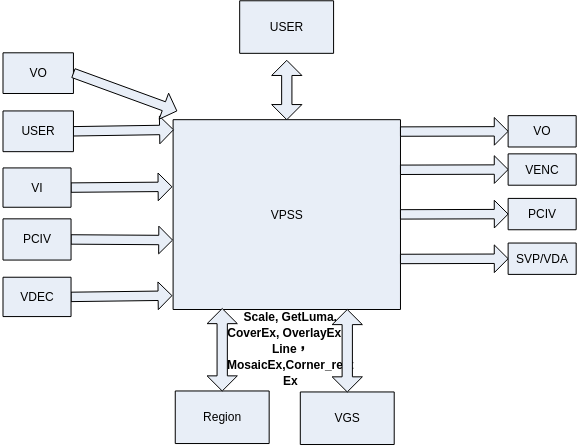
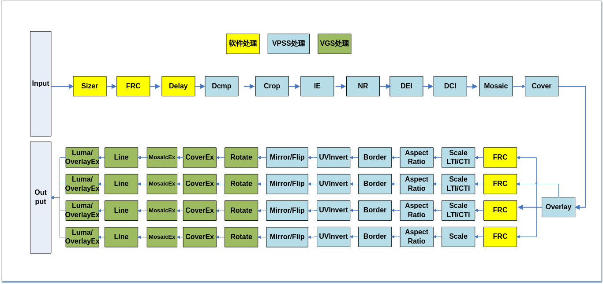
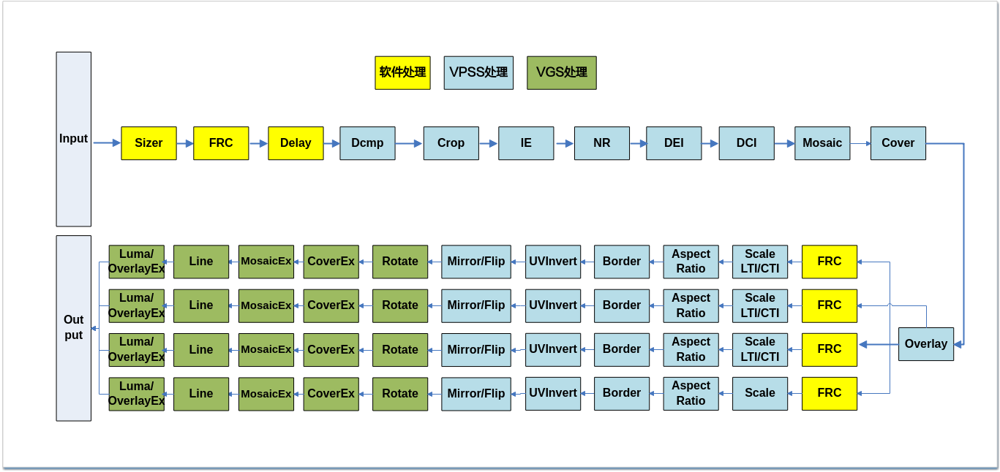
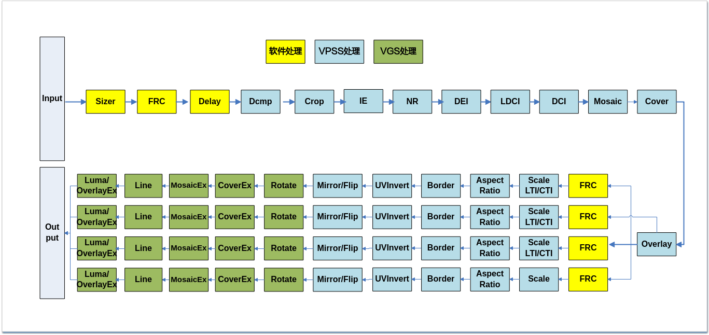

# Video Process Sub-System
## Overview<a name="ZH-CN_TOPIC_0000002441659645"></a>

VPSS (Video Process Sub-System) is a video processing subsystem. It supports unified pre-processing of input images, such as denoising, de-interlacing, and cropping, followed by per-channel processing such as scaling and border addition.

The supported image processing functions include FRC (Frame Rate Control), Crop, 3DNR, DEI (De-interlace), IE (Image Enhance), LDCI (Local Dynamic Contrast Improvement), DCI (Dynamic Contrast Improvement), LTI (Luminance Transition Improvement)/CTI (Chroma Transition Improvement), Cover/CoverEx, Overlay/OverlayEx, Mosaic/MosaicEx, Scale, fixed-angle rotation, arbitrary-angle rotation, fisheye correction, LDC, spread, Corner_rectEx, Line, obtaining regional luminance sum, low delay, Mirror/Flip, Aspect Ratio, Border, pixel format conversion, compression/decompression, etc.

## Function Description<a name="ZH-CN_TOPIC_0000002441699329"></a>


### Basic Concepts<a name="ZH-CN_TOPIC_0000002441699377"></a>

-   Group
    -   VPSS provides the concept of groups to users. The maximum number of groups is defined by [OT\_VPSS\_MAX\_GRP\_NUM](#ZH-CN_TOPIC_0000002441699353). Each group time-shares the VPSS hardware, and the hardware processes tasks submitted by each group sequentially.
    -   If more than 128 VPSS Groups are needed, modify /etc/profile by appending "ulimit -HSn 4096" at the end to specify a maximum of 4096 simultaneously open files.

-   Channel

    A VPSS group channel. A VPSS group provides multiple channels, each with scaling and other functions.

-   FRC

    Frame rate control is divided into two types: group frame rate control and channel frame rate control.

    -   Group frame rate control: Controls the reception of input images by each Group.
    -   Channel frame rate control: Controls the processing of images on each channel.

    When the VPSS front-end is bound to the VI module, the group frame rate control uses a compensation algorithm based on time_ref to first restore the VI original frame rate before performing frame rate control. When bound to other modules, group frame rate control ignores time_ref and performs frame rate control directly by ratio. VPSS channel frame rate control does not consider time_ref. VPSS frame rate control can only drop frames, not add frames.

-   Sizer

    Image size filter. Used to filter images of specified sizes during front-end VI mixed capture.

-   Crop

    Cuts a specified region from an image. Crop types include absolute coordinate cropping and relative ratio cropping.

    -   Group cropping: crops the input image;
    -   Physical channel cropping: crops the physical channel image;
    -   Extension channel cropping: crops the extension channel image.

-   DEI

    De-interlace. Converts interlaced video sources to progressive video sources.

-   3DNR

    Denoising. Removes Gaussian noise from the image through parameter configuration, making the image smoother and helping to reduce encoding bitrate.

-   IE

    Image Enhance.

-   LDCI

    Local Dynamic Contrast Improvement. Enhances local contrast using a local histogram equalization method, improving details in dark areas while also enhancing high-frequency components to increase contrast.

-   DCI

    Dynamic Contrast Improvement. Dynamically adjusts image contrast, i.e., brightening dark areas without over-brightening bright areas, or dimming bright areas without over-darkening dark areas.

-   LTI/CTI

    Luminance/Chroma Transition Improvement, i.e., image sharpening. Sharpens image edges and highlights image details, applying frequency compensation or enhancement to scaled images to make edges sharp and outlines clear.

-   Scale

    Scaling, enlarges or reduces an image. The scaling factor refers to the horizontal and vertical scaling ratios.

-   Mirror/Flip

    Mirror refers to horizontal mirroring, Flip refers to vertical flipping. Mirror+Flip can achieve 180-degree rotation.

-   Mosaic
    -   Mosaic fills specified regions of the VPSS output image with mosaic blocks.
    -   The mosaic region width must be 4-pixel aligned. When part of the mosaic region extends beyond the image, the software adaptively crops the excess downward with 4-pixel alignment in the horizontal direction.

-   MosaicEx

    Mosaic, calls VGS to fill specified regions of the VPSS physical channel output image with mosaic blocks.

-   Cover
    -   Video cover area, fills the VPSS output image with solid color blocks.
    -   Cover area coordinate types include absolute coordinate covering and relative ratio covering. Relative coordinates are calculated relative to the input image.

-   CoverEx
    -   Video cover area, calls VGS to fill specified regions of the VPSS physical channel output image with solid color blocks.
    -   Cover area coordinate types include absolute coordinate covering and relative ratio covering. Relative coordinates are calculated relative to the input image, not the channel image, and the effect is similar to Cover relative coordinates.

-   Overlay

    Video overlay area (OSD), overlays a bitmap on the VPSS output image.

-   OverlayEx

    Video overlay area, calls VGS to overlay a bitmap on the VPSS physical channel output image.

-   Line

    Calls VGS to draw lines on the VPSS physical channel output image.

-   Corner\_rectEx

    The physical channel supports calling VGS to draw corner boxes/solid-line boxes on the image.

-   Obtain Regional Luminance Sum

    Obtains the luminance sum of a specified region in the input image or physical channel output image.

-   Fisheye Correction

    The physical channel supports fisheye correction of images.

-   LDC

    The physical channel supports lens distortion correction of images.

-   Spread

    The physical channel supports spread processing of images.

-   Low Delay
    -   Input low delay: receives low-delay frames sent by the front-end module;
    -   Output low delay: the channel sends low-delay frames to the back-end module.

-   Fixed-Angle Rotation

    The physical channel supports rotation at fixed angles of 0, 90, 180, and 270 degrees.

-   Arbitrary-Angle Rotation

    The physical channel supports rotation at arbitrary angles.

-   Aspect Ratio

    Specifies the width-to-height aspect ratio of the output image relative to the input image.

-   Border

    VPSS adds a border to the output image.

-   Working Mode

    VPSS working modes include online and offline modes. See the "System Control" chapter for details.

-   Compression/Decompression
    -   Supports compression of channel output images; supports decompression of input compressed images;
    -   Supports 3DNR reference frame compression/decompression;
    -   Compact segment compression and reference frame compression can save memory; other compression types do not save memory. All compression improves bandwidth utilization.

-   Pixel Format Conversion

    Supports setting the pixel format of the output image.

-   Backup Node

    Backup node for the original image. Each Group has a backup node for backing up the original image before it is submitted for hardware processing. VPSS places the head node image of the cache queue into the backup node in the following cases:

    -   When the original image is to be processed by VPSS hardware, VPSS puts it into the backup node and replaces the previously backed-up image.
    -   When the back-end bound receiving module requires VPSS to put the queue head image into the backup node, VPSS also replaces the image in the backup node, even if the image does not undergo hardware processing.

-   Block Partitioning

    When the image exceeds a specific width, it is processed in blocks. The corresponding resource count is set in the module parameters. The resource count must be set to at least the actual required amount.

> **Note:** 
>-   Cover, Overlay, and Mosaic produce the same effect on all channels and do not support individual control (Mask setting mode is not supported);
>-   Only one channel is allowed to scale at a time; when a channel performs semi-planar 420 to semi-planar 422 conversion, other channels cannot scale;
>-   SS528V100/SS625V100/SS524V100/SS522V101 images are partitioned when the input image width exceeds 2688.
>-   SS928V100 images are partitioned when the input image width exceeds 4096.
>-   SS626V100 images are partitioned when the input image width exceeds 3840.
>-   SS524V100/SS528V100 images are partitioned when DEI is enabled and the image width exceeds 960.
>-   Unless otherwise specified, SS927V100 content is consistent with SS928V100.

### Function Description<a name="ZH-CN_TOPIC_0000002441659557"></a>

The position of VPSS in the system is shown in [Figure 1](#fig73396123411).

**Figure 1**  VPSS Context Relationship<a name="fig73396123411"></a>  


By calling the binding interface of the SYS module, VPSS can be bound with modules such as VPSS/USER/VDEC/VI and VO/VENC/SVP, where the former is the input source of VPSS and the latter is the receiver of VPSS. Users can manage Groups through the MPI interface. Each Group can only be bound to one input source. The physical channels of a Group have two working modes: AUTO and USER, which can be dynamically switched between. In AUTO mode, each channel can only be bound to one receiver, mainly used for playback control in preview and playback scenarios. In USER mode, each channel can be bound to multiple receivers.

**Special note**: **USER mode is mainly used for multi-stream encoding of the same channel image. In this mode, playback control does not take effect, so USER mode is not recommended for playback scenarios**. VPSS only supports AUTO mode when working in offline mode.

SS528V100 functional specifications refer to the data flow diagram in Figure 1.

SS625V100 functional specifications refer to the data flow diagram in Figure 2.

SS524V100 functional specifications refer to the data flow diagram in Figure 3.

SS522V101 functional specifications refer to the data flow diagram in Figure 4.

SS928V100 functional specifications refer to the data flow diagram in Figure 5.

SS626V100 functional specifications refer to the data flow diagram in Figure 6.

### Processing Flow<a name="ZH-CN_TOPIC_0000002441659597"></a>

SS528V100 VPSS data processing flow is shown in [Figure 1](#fig2394234205417).

**Figure 1**  SS528V100 VPSS Data Flow Diagram<a name="fig2394234205417"></a>  


SS625V100 VPSS data processing flow is shown in [Figure 2](#fig193991685918).

**Figure 2**  SS625V100 VPSS Data Flow Diagram<a name="fig193991685918"></a>  


SS524V100 VPSS data processing flow is shown in [Figure 3](#fig4231334803).

**Figure 3**  SS524V100 VPSS Data Flow Diagram<a name="fig4231334803"></a>  


SS522V101 VPSS data processing flow is shown in [Figure 4](#fig14807173820110).

**Figure 4**  SS522V101 VPSS Data Flow Diagram<a name="fig14807173820110"></a>  


**Figure 5**  SS928V100 VPSS Data Flow Diagram<a name="fig076104110215"></a>  


**Figure 6**  SS626V100 VPSS Data Flow Diagram<a name="fig1380651110517"></a>  

> **Note:** 
>-   When SS528V100/SS625V100/SS524V100/SS522V101 VPSS performance is insufficient, VGS can be used to perform some VPSS functions. The corresponding VPSS group numbers are set to \[[OT\_VPSS\_VGS\_GRP\_NO](#ZH-CN_TOPIC_0000002441659549), [OT\_VPSS\_MAX\_GRP\_NUM](#ZH-CN_TOPIC_0000002441699353) - 1\], i.e., the last (OT\_VPSS\_MAX\_GRP\_NUM - OT\_VPSS\_VGS\_GRP\_NO) groups are submitted to VGS hardware by default. Users can freely choose whether to use VGS hardware instead of VPSS processing functions based on the actual scenario. If the channel is in user mode, the input/output image resolution remains unchanged and no functions are enabled, VGS bypasses this task without consuming VGS performance, and the input and output share the same VB. Such groups have some limitations:
>    -   SS528V100/SS625V100 do not support IE, NR, DEI, DCI, Mosaic, Overlay, LTI/CTI.
>    -   SS524V100/SS522V101 do not support IE, NR, DEI, LDCI, DCI, Mosaic, Overlay, LTI/CTI.
>    -   SS528V100/SS625V100/SS524V100/SS522V101 only support outputting from 1 channel out of 4 channels.
>-   For SS928V100, groups in the range \[[OT\_VPSS\_VGS\_GRP\_NO](#ZH-CN_TOPIC_0000002441659549), [OT\_VPSS\_MAX\_GRP\_NUM](#ZH-CN_TOPIC_0000002441699353) - 1\] call VGS hardware for processing (such groups work in offline mode), used in scenarios where decoding or VPSS performance is insufficient. When single-channel output is enabled and no processing is performed, it is bypassed, and the input and output share the same VB. Such groups have the following limitations:
>    -   Does not support 3DNR;
>    -   Does not support Tile16x8 format output or TILE compression;
>    -   Only supports 3 physical channels;
>    -   Cannot obtain channel luminance sum.
>-   In the scenario where VDEC is bound to VPSS and VPSS is bound to VO, if the VPSS group is processed by VGS hardware and is bypassed, the VDEC private VB is sent to VO. If the decoding channel needs to be destroyed, call ss\_mpi\_vo\_clear\_chn\_buf to release the decoding VB.
>-   SS928V100 VPSS supports 8 extension channels; only one is shown in the diagram. Extension channels can be bound to any physical channel; the diagram only schematically shows binding to a specific channel. The input position of the extension channel can be selected as before LDC, before fisheye, or after fisheye.
>-   The channel compression set by the user refers to the compression mode of the VPSS channel's final output.

> **Note:** 
>When the SS528V100/SS625V100/SS524V100/SS522V101 channel pixel format is single-component, Line or arbitrary quadrilateral CoverEx processing is not supported.

### Input/Output Characteristics<a name="ZH-CN_TOPIC_0000002408100254"></a>

VPSS physical input characteristics are shown in the VPSS input format characteristics table through the VPSS input resolution table.

**Table 1**  VPSS Input Format Characteristics

<a name="_Ref17963009"></a>
<table><thead align="left"><tr id="row705mcpsimp"><th class="cellrowborder" rowspan="2" valign="top" id="mcps1.2.7.1.1"><p id="p707mcpsimp"><a name="p707mcpsimp"></a><a name="p707mcpsimp"></a>Solution Name</p>
</th>
<th class="cellrowborder" colspan="2" valign="top" id="mcps1.2.7.1.2"><p id="p709mcpsimp"><a name="p709mcpsimp"></a><a name="p709mcpsimp"></a>Data Bit Width</p>
</th>
<th class="cellrowborder" colspan="2" valign="top" id="mcps1.2.7.1.3"><p id="p711mcpsimp"><a name="p711mcpsimp"></a><a name="p711mcpsimp"></a>Video Format</p>
</th>
<th class="cellrowborder" rowspan="2" valign="top" id="mcps1.2.7.1.4"><p id="p713mcpsimp"><a name="p713mcpsimp"></a><a name="p713mcpsimp"></a>Input Pixel Format</p>
</th>
</tr>
<tr id="row714mcpsimp"><th class="cellrowborder" valign="top" id="mcps1.2.7.2.1"><p id="p716mcpsimp"><a name="p716mcpsimp"></a><a name="p716mcpsimp"></a>8Bit</p>
</th>
<th class="cellrowborder" valign="top" id="mcps1.2.7.2.2"><p id="p718mcpsimp"><a name="p718mcpsimp"></a><a name="p718mcpsimp"></a>10Bit</p>
</th>
<th class="cellrowborder" valign="top" id="mcps1.2.7.2.3"><p id="p720mcpsimp"><a name="p720mcpsimp"></a><a name="p720mcpsimp"></a>Linear</p>
</th>
<th class="cellrowborder" valign="top" id="mcps1.2.7.2.4"><p id="p722mcpsimp"><a name="p722mcpsimp"></a><a name="p722mcpsimp"></a>Tile64X16</p>
</th>
</tr>
</thead>
<tbody><tr id="row724mcpsimp"><td class="cellrowborder" valign="top" width="19.19191919191919%" headers="mcps1.2.7.1.1 mcps1.2.7.2.1 "><p id="p726mcpsimp"><a name="p726mcpsimp"></a><a name="p726mcpsimp"></a>SS528V100</p>
</td>
<td class="cellrowborder" valign="top" width="7.07070707070707%" headers="mcps1.2.7.1.2 mcps1.2.7.2.2 "><p id="p728mcpsimp"><a name="p728mcpsimp"></a><a name="p728mcpsimp"></a>Y</p>
</td>
<td class="cellrowborder" valign="top" width="7.07070707070707%" headers="mcps1.2.7.1.2 mcps1.2.7.2.3 "><p id="p730mcpsimp"><a name="p730mcpsimp"></a><a name="p730mcpsimp"></a>N</p>
</td>
<td class="cellrowborder" valign="top" width="9.09090909090909%" headers="mcps1.2.7.1.3 mcps1.2.7.2.4 "><p id="p732mcpsimp"><a name="p732mcpsimp"></a><a name="p732mcpsimp"></a>Y</p>
</td>
<td class="cellrowborder" valign="top" width="13.13131313131313%" headers="mcps1.2.7.1.3 "><p id="p734mcpsimp"><a name="p734mcpsimp"></a><a name="p734mcpsimp"></a>Y</p>
</td>
<td class="cellrowborder" valign="top" width="44.44444444444445%" headers="mcps1.2.7.1.4 "><p id="p736mcpsimp"><a name="p736mcpsimp"></a><a name="p736mcpsimp"></a>OT_PIXEL_FORMAT_YVU_SEMIPLANAR_422, OT_PIXEL_FORMAT_YVU_SEMIPLANAR_420, OT_PIXEL_FORMAT_YUV_SEMIPLANAR_422, OT_PIXEL_FORMAT_YUV_SEMIPLANAR_420, OT_PIXEL_FORMAT_YUV_400</p>
</td>
</tr>
<tr id="row737mcpsimp"><td class="cellrowborder" valign="top" width="19.19191919191919%" headers="mcps1.2.7.1.1 mcps1.2.7.2.1 "><p id="p739mcpsimp"><a name="p739mcpsimp"></a><a name="p739mcpsimp"></a>SS625V100</p>
</td>
<td class="cellrowborder" valign="top" width="7.07070707070707%" headers="mcps1.2.7.1.2 mcps1.2.7.2.2 "><p id="p741mcpsimp"><a name="p741mcpsimp"></a><a name="p741mcpsimp"></a>Y</p>
</td>
<td class="cellrowborder" valign="top" width="7.07070707070707%" headers="mcps1.2.7.1.2 mcps1.2.7.2.3 "><p id="p743mcpsimp"><a name="p743mcpsimp"></a><a name="p743mcpsimp"></a>N</p>
</td>
<td class="cellrowborder" valign="top" width="9.09090909090909%" headers="mcps1.2.7.1.3 mcps1.2.7.2.4 "><p id="p745mcpsimp"><a name="p745mcpsimp"></a><a name="p745mcpsimp"></a>Y</p>
</td>
<td class="cellrowborder" valign="top" width="13.13131313131313%" headers="mcps1.2.7.1.3 "><p id="p747mcpsimp"><a name="p747mcpsimp"></a><a name="p747mcpsimp"></a>Y</p>
</td>
<td class="cellrowborder" valign="top" width="44.44444444444445%" headers="mcps1.2.7.1.4 "><p id="p749mcpsimp"><a name="p749mcpsimp"></a><a name="p749mcpsimp"></a>OT_PIXEL_FORMAT_YVU_SEMIPLANAR_422, OT_PIXEL_FORMAT_YVU_SEMIPLANAR_420, OT_PIXEL_FORMAT_YUV_SEMIPLANAR_422, OT_PIXEL_FORMAT_YUV_SEMIPLANAR_420, OT_PIXEL_FORMAT_YUV_400</p>
</td>
</tr>
<tr id="row750mcpsimp"><td class="cellrowborder" valign="top" width="19.19191919191919%" headers="mcps1.2.7.1.1 mcps1.2.7.2.1 "><p id="p752mcpsimp"><a name="p752mcpsimp"></a><a name="p752mcpsimp"></a>SS524V100</p>
</td>
<td class="cellrowborder" valign="top" width="7.07070707070707%" headers="mcps1.2.7.1.2 mcps1.2.7.2.2 "><p id="p754mcpsimp"><a name="p754mcpsimp"></a><a name="p754mcpsimp"></a>Y</p>
</td>
<td class="cellrowborder" valign="top" width="7.07070707070707%" headers="mcps1.2.7.1.2 mcps1.2.7.2.3 "><p id="p756mcpsimp"><a name="p756mcpsimp"></a><a name="p756mcpsimp"></a>N</p>
</td>
<td class="cellrowborder" valign="top" width="9.09090909090909%" headers="mcps1.2.7.1.3 mcps1.2.7.2.4 "><p id="p758mcpsimp"><a name="p758mcpsimp"></a><a name="p758mcpsimp"></a>Y</p>
</td>
<td class="cellrowborder" valign="top" width="13.13131313131313%" headers="mcps1.2.7.1.3 "><p id="p760mcpsimp"><a name="p760mcpsimp"></a><a name="p760mcpsimp"></a>Y</p>
</td>
<td class="cellrowborder" valign="top" width="44.44444444444445%" headers="mcps1.2.7.1.4 "><p id="p762mcpsimp"><a name="p762mcpsimp"></a><a name="p762mcpsimp"></a>OT_PIXEL_FORMAT_YVU_SEMIPLANAR_422, OT_PIXEL_FORMAT_YVU_SEMIPLANAR_420, OT_PIXEL_FORMAT_YUV_SEMIPLANAR_422, OT_PIXEL_FORMAT_YUV_SEMIPLANAR_420, OT_PIXEL_FORMAT_YUV_400</p>
</td>
</tr>
<tr id="row763mcpsimp"><td class="cellrowborder" valign="top" width="19.19191919191919%" headers="mcps1.2.7.1.1 mcps1.2.7.2.1 "><p id="p765mcpsimp"><a name="p765mcpsimp"></a><a name="p765mcpsimp"></a>SS522V101</p>
</td>
<td class="cellrowborder" valign="top" width="7.07070707070707%" headers="mcps1.2.7.1.2 mcps1.2.7.2.2 "><p id="p767mcpsimp"><a name="p767mcpsimp"></a><a name="p767mcpsimp"></a>Y</p>
</td>
<td class="cellrowborder" valign="top" width="7.07070707070707%" headers="mcps1.2.7.1.2 mcps1.2.7.2.3 "><p id="p769mcpsimp"><a name="p769mcpsimp"></a><a name="p769mcpsimp"></a>N</p>
</td>
<td class="cellrowborder" valign="top" width="9.09090909090909%" headers="mcps1.2.7.1.3 mcps1.2.7.2.4 "><p id="p771mcpsimp"><a name="p771mcpsimp"></a><a name="p771mcpsimp"></a>Y</p>
</td>
<td class="cellrowborder" valign="top" width="13.13131313131313%" headers="mcps1.2.7.1.3 "><p id="p773mcpsimp"><a name="p773mcpsimp"></a><a name="p773mcpsimp"></a>Y</p>
</td>
<td class="cellrowborder" valign="top" width="44.44444444444445%" headers="mcps1.2.7.1.4 "><p id="p775mcpsimp"><a name="p775mcpsimp"></a><a name="p775mcpsimp"></a>OT_PIXEL_FORMAT_YVU_SEMIPLANAR_422, OT_PIXEL_FORMAT_YVU_SEMIPLANAR_420, OT_PIXEL_FORMAT_YUV_SEMIPLANAR_422, OT_PIXEL_FORMAT_YUV_SEMIPLANAR_420, OT_PIXEL_FORMAT_YUV_400</p>
</td>
</tr>
<tr id="row776mcpsimp"><td class="cellrowborder" valign="top" width="19.19191919191919%" headers="mcps1.2.7.1.1 mcps1.2.7.2.1 "><p id="p778mcpsimp"><a name="p778mcpsimp"></a><a name="p778mcpsimp"></a>SS928V100</p>
</td>
<td class="cellrowborder" valign="top" width="7.07070707070707%" headers="mcps1.2.7.1.2 mcps1.2.7.2.2 "><p id="p780mcpsimp"><a name="p780mcpsimp"></a><a name="p780mcpsimp"></a>Y</p>
</td>
<td class="cellrowborder" valign="top" width="7.07070707070707%" headers="mcps1.2.7.1.2 mcps1.2.7.2.3 "><p id="p782mcpsimp"><a name="p782mcpsimp"></a><a name="p782mcpsimp"></a>N</p>
</td>
<td class="cellrowborder" valign="top" width="9.09090909090909%" headers="mcps1.2.7.1.3 mcps1.2.7.2.4 "><p id="p784mcpsimp"><a name="p784mcpsimp"></a><a name="p784mcpsimp"></a>Y</p>
</td>
<td class="cellrowborder" valign="top" width="13.13131313131313%" headers="mcps1.2.7.1.3 "><p id="p786mcpsimp"><a name="p786mcpsimp"></a><a name="p786mcpsimp"></a>Y</p>
</td>
<td class="cellrowborder" valign="top" width="44.44444444444445%" headers="mcps1.2.7.1.4 "><p id="p788mcpsimp"><a name="p788mcpsimp"></a><a name="p788mcpsimp"></a>OT_PIXEL_FORMAT_YVU_SEMIPLANAR_422, OT_PIXEL_FORMAT_YVU_SEMIPLANAR_420, OT_PIXEL_FORMAT_YUV_SEMIPLANAR_422, OT_PIXEL_FORMAT_YUV_SEMIPLANAR_420, OT_PIXEL_FORMAT_YUV_400</p>
</td>
</tr>
<tr id="row789mcpsimp"><td class="cellrowborder" valign="top" width="19.19191919191919%" headers="mcps1.2.7.1.1 mcps1.2.7.2.1 "><p id="p791mcpsimp"><a name="p791mcpsimp"></a><a name="p791mcpsimp"></a>SS626V100</p>
</td>
<td class="cellrowborder" valign="top" width="7.07070707070707%" headers="mcps1.2.7.1.2 mcps1.2.7.2.2 "><p id="p793mcpsimp"><a name="p793mcpsimp"></a><a name="p793mcpsimp"></a>Y</p>
</td>
<td class="cellrowborder" valign="top" width="7.07070707070707%" headers="mcps1.2.7.1.2 mcps1.2.7.2.3 "><p id="p795mcpsimp"><a name="p795mcpsimp"></a><a name="p795mcpsimp"></a>N</p>
</td>
<td class="cellrowborder" valign="top" width="9.09090909090909%" headers="mcps1.2.7.1.3 mcps1.2.7.2.4 "><p id="p797mcpsimp"><a name="p797mcpsimp"></a><a name="p797mcpsimp"></a>Y</p>
</td>
<td class="cellrowborder" valign="top" width="13.13131313131313%" headers="mcps1.2.7.1.3 "><p id="p799mcpsimp"><a name="p799mcpsimp"></a><a name="p799mcpsimp"></a>Y</p>
</td>
<td class="cellrowborder" valign="top" width="44.44444444444445%" headers="mcps1.2.7.1.4 "><p id="p801mcpsimp"><a name="p801mcpsimp"></a><a name="p801mcpsimp"></a>OT_PIXEL_FORMAT_YVU_SEMIPLANAR_422, OT_PIXEL_FORMAT_YVU_SEMIPLANAR_420, OT_PIXEL_FORMAT_YUV_SEMIPLANAR_422, OT_PIXEL_FORMAT_YUV_SEMIPLANAR_420, OT_PIXEL_FORMAT_YUV_400</p>
</td>
</tr>
</tbody>
</table>

> **Note:** 
>-   Only SS928V100 groups in\[[OT\_VPSS\_VGS\_GRP\_NO](#ZH-CN_TOPIC_0000002441659549),  [OT\_VPSS\_MAX\_GRP\_NUM](#ZH-CN_TOPIC_0000002441699353)  - 1\]rangeSupportedInputTile64x16Format.
>-   InputTile64x16Video Formatwhen, only supportspixel format OT\_PIXEL\_FORMAT\_YVU\_SEMIPLANAR\_420.

**Table 2**  VPSS Input Decompression Characteristics

<a name="table805mcpsimp"></a>
<table><thead align="left"><tr id="row813mcpsimp"><th class="cellrowborder" rowspan="2" valign="top" id="mcps1.2.5.1.1"><p id="p815mcpsimp"><a name="p815mcpsimp"></a><a name="p815mcpsimp"></a>Solution Name</p>
</th>
<th class="cellrowborder" colspan="3" valign="top" id="mcps1.2.5.1.2"><p id="p817mcpsimp"><a name="p817mcpsimp"></a><a name="p817mcpsimp"></a>Decompression Mode</p>
</th>
</tr>
<tr id="row818mcpsimp"><th class="cellrowborder" valign="top" id="mcps1.2.5.2.1"><p id="p820mcpsimp"><a name="p820mcpsimp"></a><a name="p820mcpsimp"></a>SEG</p>
</th>
<th class="cellrowborder" valign="top" id="mcps1.2.5.2.2"><p id="p822mcpsimp"><a name="p822mcpsimp"></a><a name="p822mcpsimp"></a>SEG_COMPACT</p>
</th>
<th class="cellrowborder" valign="top" id="mcps1.2.5.2.3"><p id="p824mcpsimp"><a name="p824mcpsimp"></a><a name="p824mcpsimp"></a>TILE</p>
</th>
</tr>
</thead>
<tbody><tr id="row826mcpsimp"><td class="cellrowborder" valign="top" width="30.693069306930692%" headers="mcps1.2.5.1.1 mcps1.2.5.2.1 "><p id="p828mcpsimp"><a name="p828mcpsimp"></a><a name="p828mcpsimp"></a>SS528V100</p>
</td>
<td class="cellrowborder" valign="top" width="16.831683168316832%" headers="mcps1.2.5.1.2 mcps1.2.5.2.2 "><p id="p830mcpsimp"><a name="p830mcpsimp"></a><a name="p830mcpsimp"></a>Y</p>
</td>
<td class="cellrowborder" valign="top" width="22.772277227722775%" headers="mcps1.2.5.1.2 mcps1.2.5.2.3 "><p id="p832mcpsimp"><a name="p832mcpsimp"></a><a name="p832mcpsimp"></a>Y</p>
</td>
<td class="cellrowborder" valign="top" width="29.7029702970297%" headers="mcps1.2.5.1.2 "><p id="p834mcpsimp"><a name="p834mcpsimp"></a><a name="p834mcpsimp"></a>Y</p>
</td>
</tr>
<tr id="row835mcpsimp"><td class="cellrowborder" valign="top" width="30.693069306930692%" headers="mcps1.2.5.1.1 mcps1.2.5.2.1 "><p id="p837mcpsimp"><a name="p837mcpsimp"></a><a name="p837mcpsimp"></a>SS625V100</p>
</td>
<td class="cellrowborder" valign="top" width="16.831683168316832%" headers="mcps1.2.5.1.2 mcps1.2.5.2.2 "><p id="p839mcpsimp"><a name="p839mcpsimp"></a><a name="p839mcpsimp"></a>Y</p>
</td>
<td class="cellrowborder" valign="top" width="22.772277227722775%" headers="mcps1.2.5.1.2 mcps1.2.5.2.3 "><p id="p841mcpsimp"><a name="p841mcpsimp"></a><a name="p841mcpsimp"></a>Y</p>
</td>
<td class="cellrowborder" valign="top" width="29.7029702970297%" headers="mcps1.2.5.1.2 "><p id="p843mcpsimp"><a name="p843mcpsimp"></a><a name="p843mcpsimp"></a>Y</p>
</td>
</tr>
<tr id="row844mcpsimp"><td class="cellrowborder" valign="top" width="30.693069306930692%" headers="mcps1.2.5.1.1 mcps1.2.5.2.1 "><p id="p846mcpsimp"><a name="p846mcpsimp"></a><a name="p846mcpsimp"></a>SS524V100</p>
</td>
<td class="cellrowborder" valign="top" width="16.831683168316832%" headers="mcps1.2.5.1.2 mcps1.2.5.2.2 "><p id="p848mcpsimp"><a name="p848mcpsimp"></a><a name="p848mcpsimp"></a>Y</p>
</td>
<td class="cellrowborder" valign="top" width="22.772277227722775%" headers="mcps1.2.5.1.2 mcps1.2.5.2.3 "><p id="p850mcpsimp"><a name="p850mcpsimp"></a><a name="p850mcpsimp"></a>Y</p>
</td>
<td class="cellrowborder" valign="top" width="29.7029702970297%" headers="mcps1.2.5.1.2 "><p id="p852mcpsimp"><a name="p852mcpsimp"></a><a name="p852mcpsimp"></a>Y</p>
</td>
</tr>
<tr id="row853mcpsimp"><td class="cellrowborder" valign="top" width="30.693069306930692%" headers="mcps1.2.5.1.1 mcps1.2.5.2.1 "><p id="p855mcpsimp"><a name="p855mcpsimp"></a><a name="p855mcpsimp"></a>SS522V101</p>
</td>
<td class="cellrowborder" valign="top" width="16.831683168316832%" headers="mcps1.2.5.1.2 mcps1.2.5.2.2 "><p id="p857mcpsimp"><a name="p857mcpsimp"></a><a name="p857mcpsimp"></a>Y</p>
</td>
<td class="cellrowborder" valign="top" width="22.772277227722775%" headers="mcps1.2.5.1.2 mcps1.2.5.2.3 "><p id="p859mcpsimp"><a name="p859mcpsimp"></a><a name="p859mcpsimp"></a>Y</p>
</td>
<td class="cellrowborder" valign="top" width="29.7029702970297%" headers="mcps1.2.5.1.2 "><p id="p861mcpsimp"><a name="p861mcpsimp"></a><a name="p861mcpsimp"></a>Y</p>
</td>
</tr>
<tr id="row862mcpsimp"><td class="cellrowborder" valign="top" width="30.693069306930692%" headers="mcps1.2.5.1.1 mcps1.2.5.2.1 "><p id="p864mcpsimp"><a name="p864mcpsimp"></a><a name="p864mcpsimp"></a>SS928V100</p>
</td>
<td class="cellrowborder" valign="top" width="16.831683168316832%" headers="mcps1.2.5.1.2 mcps1.2.5.2.2 "><p id="p866mcpsimp"><a name="p866mcpsimp"></a><a name="p866mcpsimp"></a>Y</p>
</td>
<td class="cellrowborder" valign="top" width="22.772277227722775%" headers="mcps1.2.5.1.2 mcps1.2.5.2.3 "><p id="p868mcpsimp"><a name="p868mcpsimp"></a><a name="p868mcpsimp"></a>Y</p>
</td>
<td class="cellrowborder" valign="top" width="29.7029702970297%" headers="mcps1.2.5.1.2 "><p id="p870mcpsimp"><a name="p870mcpsimp"></a><a name="p870mcpsimp"></a>Y</p>
</td>
</tr>
<tr id="row871mcpsimp"><td class="cellrowborder" valign="top" width="30.693069306930692%" headers="mcps1.2.5.1.1 mcps1.2.5.2.1 "><p id="p873mcpsimp"><a name="p873mcpsimp"></a><a name="p873mcpsimp"></a>SS626V100</p>
</td>
<td class="cellrowborder" valign="top" width="16.831683168316832%" headers="mcps1.2.5.1.2 mcps1.2.5.2.2 "><p id="p875mcpsimp"><a name="p875mcpsimp"></a><a name="p875mcpsimp"></a>Y</p>
</td>
<td class="cellrowborder" valign="top" width="22.772277227722775%" headers="mcps1.2.5.1.2 mcps1.2.5.2.3 "><p id="p877mcpsimp"><a name="p877mcpsimp"></a><a name="p877mcpsimp"></a>Y</p>
</td>
<td class="cellrowborder" valign="top" width="29.7029702970297%" headers="mcps1.2.5.1.2 "><p id="p879mcpsimp"><a name="p879mcpsimp"></a><a name="p879mcpsimp"></a>Y</p>
</td>
</tr>
</tbody>
</table>

> **Note:** 
>Only SS928V100 groups in\[[OT\_VPSS\_VGS\_GRP\_NO](#ZH-CN_TOPIC_0000002441659549),  [OT\_VPSS\_MAX\_GRP\_NUM](#ZH-CN_TOPIC_0000002441699353)  - 1\]rangeSupportedInputTILE compression.

**Table 3**  VPSS Input Resolution

<a name="_Ref18008875"></a>
<table><thead align="left"><tr id="row891mcpsimp"><th class="cellrowborder" rowspan="2" valign="top" id="mcps1.2.6.1.1"><p id="p893mcpsimp"><a name="p893mcpsimp"></a><a name="p893mcpsimp"></a>Solution Name</p>
</th>
<th class="cellrowborder" colspan="4" valign="top" id="mcps1.2.6.1.2"><p id="p895mcpsimp"><a name="p895mcpsimp"></a><a name="p895mcpsimp"></a>Working Mode</p>
</th>
</tr>
<tr id="row896mcpsimp"><th class="cellrowborder" valign="top" id="mcps1.2.6.2.1"><p id="p898mcpsimp"><a name="p898mcpsimp"></a><a name="p898mcpsimp"></a>Offline Mode</p>
</th>
<th class="cellrowborder" valign="top" id="mcps1.2.6.2.2"><p id="p900mcpsimp"><a name="p900mcpsimp"></a><a name="p900mcpsimp"></a>OT_VI_ONLINE_VPSS_ONLINE</p>
</th>
<th class="cellrowborder" valign="top" id="mcps1.2.6.2.3"><p id="p902mcpsimp"><a name="p902mcpsimp"></a><a name="p902mcpsimp"></a>OT_VI_PARALLEL_VPSS_PARALLEL</p>
</th>
<th class="cellrowborder" valign="top" id="mcps1.2.6.2.4"><p id="p904mcpsimp"><a name="p904mcpsimp"></a><a name="p904mcpsimp"></a>OT_VI_OFFLINE_VPSS_ONLINE</p>
</th>
</tr>
</thead>
<tbody><tr id="row906mcpsimp"><td class="cellrowborder" valign="top" width="17%" headers="mcps1.2.6.1.1 mcps1.2.6.2.1 "><p id="p908mcpsimp"><a name="p908mcpsimp"></a><a name="p908mcpsimp"></a>SS528V100</p>
</td>
<td class="cellrowborder" valign="top" width="24%" headers="mcps1.2.6.1.2 mcps1.2.6.2.2 "><p id="p910mcpsimp"><a name="p910mcpsimp"></a><a name="p910mcpsimp"></a>Width[64, 16384]</p>
<p id="p911mcpsimp"><a name="p911mcpsimp"></a><a name="p911mcpsimp"></a>Height[64, 8192]</p>
<p id="p912mcpsimp"><a name="p912mcpsimp"></a><a name="p912mcpsimp"></a>Compact Segment Compression (SEG_COMPACT):</p>
<p id="p913mcpsimp"><a name="p913mcpsimp"></a><a name="p913mcpsimp"></a>Width[64, 2688]</p>
<p id="p914mcpsimp"><a name="p914mcpsimp"></a><a name="p914mcpsimp"></a>Height[64, 8192]</p>
</td>
<td class="cellrowborder" valign="top" width="20%" headers="mcps1.2.6.1.2 mcps1.2.6.2.3 "><p id="p916mcpsimp"><a name="p916mcpsimp"></a><a name="p916mcpsimp"></a>N</p>
</td>
<td class="cellrowborder" valign="top" width="19%" headers="mcps1.2.6.1.2 mcps1.2.6.2.4 "><p id="p918mcpsimp"><a name="p918mcpsimp"></a><a name="p918mcpsimp"></a>N</p>
</td>
<td class="cellrowborder" valign="top" width="20%" headers="mcps1.2.6.1.2 "><p id="p920mcpsimp"><a name="p920mcpsimp"></a><a name="p920mcpsimp"></a>N</p>
</td>
</tr>
<tr id="row921mcpsimp"><td class="cellrowborder" valign="top" width="17%" headers="mcps1.2.6.1.1 mcps1.2.6.2.1 "><p id="p923mcpsimp"><a name="p923mcpsimp"></a><a name="p923mcpsimp"></a>SS625V100</p>
</td>
<td class="cellrowborder" valign="top" width="24%" headers="mcps1.2.6.1.2 mcps1.2.6.2.2 "><p id="p925mcpsimp"><a name="p925mcpsimp"></a><a name="p925mcpsimp"></a>Width[64, 16384]</p>
<p id="p926mcpsimp"><a name="p926mcpsimp"></a><a name="p926mcpsimp"></a>Height[64, 8192]</p>
<p id="p927mcpsimp"><a name="p927mcpsimp"></a><a name="p927mcpsimp"></a>Compact Segment Compression (SEG_COMPACT):</p>
<p id="p928mcpsimp"><a name="p928mcpsimp"></a><a name="p928mcpsimp"></a>Width[64, 2688]</p>
<p id="p929mcpsimp"><a name="p929mcpsimp"></a><a name="p929mcpsimp"></a>Height[64, 8192]</p>
</td>
<td class="cellrowborder" valign="top" width="20%" headers="mcps1.2.6.1.2 mcps1.2.6.2.3 "><p id="p931mcpsimp"><a name="p931mcpsimp"></a><a name="p931mcpsimp"></a>N</p>
</td>
<td class="cellrowborder" valign="top" width="19%" headers="mcps1.2.6.1.2 mcps1.2.6.2.4 "><p id="p933mcpsimp"><a name="p933mcpsimp"></a><a name="p933mcpsimp"></a>N</p>
</td>
<td class="cellrowborder" valign="top" width="20%" headers="mcps1.2.6.1.2 "><p id="p935mcpsimp"><a name="p935mcpsimp"></a><a name="p935mcpsimp"></a>N</p>
</td>
</tr>
<tr id="row936mcpsimp"><td class="cellrowborder" valign="top" width="17%" headers="mcps1.2.6.1.1 mcps1.2.6.2.1 "><p id="p938mcpsimp"><a name="p938mcpsimp"></a><a name="p938mcpsimp"></a>SS524V100</p>
</td>
<td class="cellrowborder" valign="top" width="24%" headers="mcps1.2.6.1.2 mcps1.2.6.2.2 "><p id="p940mcpsimp"><a name="p940mcpsimp"></a><a name="p940mcpsimp"></a>Width[64, 16384]</p>
<p id="p941mcpsimp"><a name="p941mcpsimp"></a><a name="p941mcpsimp"></a>Height[64, 8192]</p>
<p id="p942mcpsimp"><a name="p942mcpsimp"></a><a name="p942mcpsimp"></a>Compact Segment Compression (SEG_COMPACT):</p>
<p id="p943mcpsimp"><a name="p943mcpsimp"></a><a name="p943mcpsimp"></a>Width[64, 2688]</p>
<p id="p944mcpsimp"><a name="p944mcpsimp"></a><a name="p944mcpsimp"></a>Height[64, 8192]</p>
</td>
<td class="cellrowborder" valign="top" width="20%" headers="mcps1.2.6.1.2 mcps1.2.6.2.3 "><p id="p946mcpsimp"><a name="p946mcpsimp"></a><a name="p946mcpsimp"></a>N</p>
</td>
<td class="cellrowborder" valign="top" width="19%" headers="mcps1.2.6.1.2 mcps1.2.6.2.4 "><p id="p948mcpsimp"><a name="p948mcpsimp"></a><a name="p948mcpsimp"></a>N</p>
</td>
<td class="cellrowborder" valign="top" width="20%" headers="mcps1.2.6.1.2 "><p id="p950mcpsimp"><a name="p950mcpsimp"></a><a name="p950mcpsimp"></a>N</p>
</td>
</tr>
<tr id="row951mcpsimp"><td class="cellrowborder" valign="top" width="17%" headers="mcps1.2.6.1.1 mcps1.2.6.2.1 "><p id="p953mcpsimp"><a name="p953mcpsimp"></a><a name="p953mcpsimp"></a>SS522V101</p>
</td>
<td class="cellrowborder" valign="top" width="24%" headers="mcps1.2.6.1.2 mcps1.2.6.2.2 "><p id="p955mcpsimp"><a name="p955mcpsimp"></a><a name="p955mcpsimp"></a>Width[64, 16384]</p>
<p id="p956mcpsimp"><a name="p956mcpsimp"></a><a name="p956mcpsimp"></a>Height[64, 8192]</p>
<p id="p957mcpsimp"><a name="p957mcpsimp"></a><a name="p957mcpsimp"></a>Compact Segment Compression (SEG_COMPACT):</p>
<p id="p958mcpsimp"><a name="p958mcpsimp"></a><a name="p958mcpsimp"></a>Width[64, 2688]</p>
<p id="p959mcpsimp"><a name="p959mcpsimp"></a><a name="p959mcpsimp"></a>Height[64, 8192]</p>
</td>
<td class="cellrowborder" valign="top" width="20%" headers="mcps1.2.6.1.2 mcps1.2.6.2.3 "><p id="p961mcpsimp"><a name="p961mcpsimp"></a><a name="p961mcpsimp"></a>N</p>
</td>
<td class="cellrowborder" valign="top" width="19%" headers="mcps1.2.6.1.2 mcps1.2.6.2.4 "><p id="p963mcpsimp"><a name="p963mcpsimp"></a><a name="p963mcpsimp"></a>N</p>
</td>
<td class="cellrowborder" valign="top" width="20%" headers="mcps1.2.6.1.2 "><p id="p965mcpsimp"><a name="p965mcpsimp"></a><a name="p965mcpsimp"></a>N</p>
</td>
</tr>
<tr id="row966mcpsimp"><td class="cellrowborder" valign="top" width="17%" headers="mcps1.2.6.1.1 mcps1.2.6.2.1 "><p id="p968mcpsimp"><a name="p968mcpsimp"></a><a name="p968mcpsimp"></a>SS928V100</p>
</td>
<td class="cellrowborder" valign="top" width="24%" headers="mcps1.2.6.1.2 mcps1.2.6.2.2 "><p id="p970mcpsimp"><a name="p970mcpsimp"></a><a name="p970mcpsimp"></a>Width[64, 8192]</p>
<p id="p971mcpsimp"><a name="p971mcpsimp"></a><a name="p971mcpsimp"></a>Height[64, 8192]</p>
<p id="p972mcpsimp"><a name="p972mcpsimp"></a><a name="p972mcpsimp"></a>Compact Segment Compression (SEG_COMPACT):</p>
<p id="p973mcpsimp"><a name="p973mcpsimp"></a><a name="p973mcpsimp"></a>Width[64, 4096]</p>
<p id="p974mcpsimp"><a name="p974mcpsimp"></a><a name="p974mcpsimp"></a>Height[64, 8192]</p>
</td>
<td class="cellrowborder" valign="top" width="20%" headers="mcps1.2.6.1.2 mcps1.2.6.2.3 "><p id="p976mcpsimp"><a name="p976mcpsimp"></a><a name="p976mcpsimp"></a>Width[64, 4096]</p>
<p id="p977mcpsimp"><a name="p977mcpsimp"></a><a name="p977mcpsimp"></a>Height[64, 8192]</p>
</td>
<td class="cellrowborder" valign="top" width="19%" headers="mcps1.2.6.1.2 mcps1.2.6.2.4 "><p id="p979mcpsimp"><a name="p979mcpsimp"></a><a name="p979mcpsimp"></a>N</p>
</td>
<td class="cellrowborder" valign="top" width="20%" headers="mcps1.2.6.1.2 "><p id="p981mcpsimp"><a name="p981mcpsimp"></a><a name="p981mcpsimp"></a>Width[64, 8192]</p>
<p id="p982mcpsimp"><a name="p982mcpsimp"></a><a name="p982mcpsimp"></a>Height[64, 8192]</p>
</td>
</tr>
<tr id="row983mcpsimp"><td class="cellrowborder" valign="top" width="17%" headers="mcps1.2.6.1.1 mcps1.2.6.2.1 "><p id="p985mcpsimp"><a name="p985mcpsimp"></a><a name="p985mcpsimp"></a>SS626V100</p>
</td>
<td class="cellrowborder" valign="top" width="24%" headers="mcps1.2.6.1.2 mcps1.2.6.2.2 "><p id="p987mcpsimp"><a name="p987mcpsimp"></a><a name="p987mcpsimp"></a>Width[64, 16384]</p>
<p id="p988mcpsimp"><a name="p988mcpsimp"></a><a name="p988mcpsimp"></a>Height[64, 8192]</p>
<p id="p989mcpsimp"><a name="p989mcpsimp"></a><a name="p989mcpsimp"></a>Compact Segment Compression (SEG_COMPACT):</p>
<p id="p990mcpsimp"><a name="p990mcpsimp"></a><a name="p990mcpsimp"></a>Width[64, 3072]</p>
<p id="p991mcpsimp"><a name="p991mcpsimp"></a><a name="p991mcpsimp"></a>Height[64, 8192]</p>
</td>
<td class="cellrowborder" valign="top" width="20%" headers="mcps1.2.6.1.2 mcps1.2.6.2.3 "><p id="p993mcpsimp"><a name="p993mcpsimp"></a><a name="p993mcpsimp"></a>N</p>
</td>
<td class="cellrowborder" valign="top" width="19%" headers="mcps1.2.6.1.2 mcps1.2.6.2.4 "><p id="p995mcpsimp"><a name="p995mcpsimp"></a><a name="p995mcpsimp"></a>N</p>
</td>
<td class="cellrowborder" valign="top" width="20%" headers="mcps1.2.6.1.2 "><p id="p997mcpsimp"><a name="p997mcpsimp"></a><a name="p997mcpsimp"></a>N</p>
</td>
</tr>
</tbody>
</table>

> **Note:** 
>-   Offline ModeContainsOT\_VI\_OFFLINE\_VPSS\_OFFLINE, OT\_VI\_ONLINE\_VPSS\_OFFLINE, OT\_VI\_PARALLEL\_VPSS\_OFFLINE, , i.e., As long asVIandVPSSOffline, RegardingVPSSto说thenIsOffline Mode.
>    SS528V100/SS625V100/SS524V100/SS522V101/SS626V100NoneNeedclose注Offline ModeSpecific指哪kindmodeOffline.
>    SS928V100Offline Mode only supportsOT\_VI\_OFFLINE\_VPSS\_OFFLINE, OT\_VI\_ONLINE\_VPSS\_OFFLINE.
>-   SS928V100 OT\_VI\_ONLINE\_VPSS\_ONLINEandOT\_VI\_OFFLINE\_VPSS\_ONLINEmode, ActualInputResolutionLimitGet决AtFrontendVIModule.

VPSSPhysical channeloutput characteristics, Such asVPSSPhysical channeloutput format characteristicsmeter\~VPSSPhysical channeloutput resolution.

**Table 4**  VPSS Physical Channel Output Format Characteristics

<a name="_Ref527997689"></a>
<table><thead align="left"><tr id="row1023mcpsimp"><th class="cellrowborder" rowspan="2" valign="top" id="mcps1.2.8.1.1"><p id="p1025mcpsimp"><a name="p1025mcpsimp"></a><a name="p1025mcpsimp"></a>Solution Name</p>
</th>
<th class="cellrowborder" colspan="2" valign="top" id="mcps1.2.8.1.2"><p id="p1027mcpsimp"><a name="p1027mcpsimp"></a><a name="p1027mcpsimp"></a>Data Bit Width</p>
</th>
<th class="cellrowborder" colspan="3" valign="top" id="mcps1.2.8.1.3"><p id="p1029mcpsimp"><a name="p1029mcpsimp"></a><a name="p1029mcpsimp"></a>Video Format</p>
</th>
<th class="cellrowborder" rowspan="2" valign="top" id="mcps1.2.8.1.4"><p id="p1031mcpsimp"><a name="p1031mcpsimp"></a><a name="p1031mcpsimp"></a>Output Pixel Format</p>
</th>
</tr>
<tr id="row1032mcpsimp"><th class="cellrowborder" valign="top" id="mcps1.2.8.2.1"><p id="p1034mcpsimp"><a name="p1034mcpsimp"></a><a name="p1034mcpsimp"></a>8Bit</p>
</th>
<th class="cellrowborder" valign="top" id="mcps1.2.8.2.2"><p id="p1036mcpsimp"><a name="p1036mcpsimp"></a><a name="p1036mcpsimp"></a>10Bit</p>
</th>
<th class="cellrowborder" valign="top" id="mcps1.2.8.2.3"><p id="p1038mcpsimp"><a name="p1038mcpsimp"></a><a name="p1038mcpsimp"></a>Linear</p>
</th>
<th class="cellrowborder" valign="top" id="mcps1.2.8.2.4"><p id="p1040mcpsimp"><a name="p1040mcpsimp"></a><a name="p1040mcpsimp"></a>Tile</p>
<p id="p1041mcpsimp"><a name="p1041mcpsimp"></a><a name="p1041mcpsimp"></a>64x16</p>
</th>
<th class="cellrowborder" valign="top" id="mcps1.2.8.2.5"><p id="p1043mcpsimp"><a name="p1043mcpsimp"></a><a name="p1043mcpsimp"></a>Tile</p>
<p id="p1044mcpsimp"><a name="p1044mcpsimp"></a><a name="p1044mcpsimp"></a>16x8</p>
</th>
</tr>
</thead>
<tbody><tr id="row1046mcpsimp"><td class="cellrowborder" valign="top" width="16%" headers="mcps1.2.8.1.1 mcps1.2.8.2.1 "><p id="p1048mcpsimp"><a name="p1048mcpsimp"></a><a name="p1048mcpsimp"></a>SS528V100</p>
</td>
<td class="cellrowborder" valign="top" width="7.000000000000001%" headers="mcps1.2.8.1.2 mcps1.2.8.2.2 "><p id="p1050mcpsimp"><a name="p1050mcpsimp"></a><a name="p1050mcpsimp"></a>Y</p>
</td>
<td class="cellrowborder" valign="top" width="8%" headers="mcps1.2.8.1.2 mcps1.2.8.2.3 "><p id="p1052mcpsimp"><a name="p1052mcpsimp"></a><a name="p1052mcpsimp"></a>N</p>
</td>
<td class="cellrowborder" valign="top" width="7.000000000000001%" headers="mcps1.2.8.1.3 mcps1.2.8.2.4 "><p id="p1054mcpsimp"><a name="p1054mcpsimp"></a><a name="p1054mcpsimp"></a>Y</p>
</td>
<td class="cellrowborder" valign="top" width="8%" headers="mcps1.2.8.1.3 mcps1.2.8.2.5 "><p id="p1056mcpsimp"><a name="p1056mcpsimp"></a><a name="p1056mcpsimp"></a>N</p>
</td>
<td class="cellrowborder" valign="top" width="8%" headers="mcps1.2.8.1.3 "><p id="p1058mcpsimp"><a name="p1058mcpsimp"></a><a name="p1058mcpsimp"></a>N</p>
</td>
<td class="cellrowborder" valign="top" width="46%" headers="mcps1.2.8.1.4 "><p id="p1060mcpsimp"><a name="p1060mcpsimp"></a><a name="p1060mcpsimp"></a>OT_PIXEL_FORMAT_YVU_SEMIPLANAR_422, OT_PIXEL_FORMAT_YVU_SEMIPLANAR_420, OT_PIXEL_FORMAT_YUV_SEMIPLANAR_422, OT_PIXEL_FORMAT_YUV_SEMIPLANAR_420, OT_PIXEL_FORMAT_YUV_400</p>
</td>
</tr>
<tr id="row1061mcpsimp"><td class="cellrowborder" valign="top" width="16%" headers="mcps1.2.8.1.1 mcps1.2.8.2.1 "><p id="p1063mcpsimp"><a name="p1063mcpsimp"></a><a name="p1063mcpsimp"></a>SS625V100</p>
</td>
<td class="cellrowborder" valign="top" width="7.000000000000001%" headers="mcps1.2.8.1.2 mcps1.2.8.2.2 "><p id="p1065mcpsimp"><a name="p1065mcpsimp"></a><a name="p1065mcpsimp"></a>Y</p>
</td>
<td class="cellrowborder" valign="top" width="8%" headers="mcps1.2.8.1.2 mcps1.2.8.2.3 "><p id="p1067mcpsimp"><a name="p1067mcpsimp"></a><a name="p1067mcpsimp"></a>N</p>
</td>
<td class="cellrowborder" valign="top" width="7.000000000000001%" headers="mcps1.2.8.1.3 mcps1.2.8.2.4 "><p id="p1069mcpsimp"><a name="p1069mcpsimp"></a><a name="p1069mcpsimp"></a>Y</p>
</td>
<td class="cellrowborder" valign="top" width="8%" headers="mcps1.2.8.1.3 mcps1.2.8.2.5 "><p id="p1071mcpsimp"><a name="p1071mcpsimp"></a><a name="p1071mcpsimp"></a>N</p>
</td>
<td class="cellrowborder" valign="top" width="8%" headers="mcps1.2.8.1.3 "><p id="p1073mcpsimp"><a name="p1073mcpsimp"></a><a name="p1073mcpsimp"></a>N</p>
</td>
<td class="cellrowborder" valign="top" width="46%" headers="mcps1.2.8.1.4 "><p id="p1075mcpsimp"><a name="p1075mcpsimp"></a><a name="p1075mcpsimp"></a>OT_PIXEL_FORMAT_YVU_SEMIPLANAR_422, OT_PIXEL_FORMAT_YVU_SEMIPLANAR_420, OT_PIXEL_FORMAT_YUV_SEMIPLANAR_422, OT_PIXEL_FORMAT_YUV_SEMIPLANAR_420, OT_PIXEL_FORMAT_YUV_400</p>
</td>
</tr>
<tr id="row1076mcpsimp"><td class="cellrowborder" valign="top" width="16%" headers="mcps1.2.8.1.1 mcps1.2.8.2.1 "><p id="p1078mcpsimp"><a name="p1078mcpsimp"></a><a name="p1078mcpsimp"></a>SS524V100</p>
</td>
<td class="cellrowborder" valign="top" width="7.000000000000001%" headers="mcps1.2.8.1.2 mcps1.2.8.2.2 "><p id="p1080mcpsimp"><a name="p1080mcpsimp"></a><a name="p1080mcpsimp"></a>Y</p>
</td>
<td class="cellrowborder" valign="top" width="8%" headers="mcps1.2.8.1.2 mcps1.2.8.2.3 "><p id="p1082mcpsimp"><a name="p1082mcpsimp"></a><a name="p1082mcpsimp"></a>N</p>
</td>
<td class="cellrowborder" valign="top" width="7.000000000000001%" headers="mcps1.2.8.1.3 mcps1.2.8.2.4 "><p id="p1084mcpsimp"><a name="p1084mcpsimp"></a><a name="p1084mcpsimp"></a>Y</p>
</td>
<td class="cellrowborder" valign="top" width="8%" headers="mcps1.2.8.1.3 mcps1.2.8.2.5 "><p id="p1086mcpsimp"><a name="p1086mcpsimp"></a><a name="p1086mcpsimp"></a>N</p>
</td>
<td class="cellrowborder" valign="top" width="8%" headers="mcps1.2.8.1.3 "><p id="p1088mcpsimp"><a name="p1088mcpsimp"></a><a name="p1088mcpsimp"></a>N</p>
</td>
<td class="cellrowborder" valign="top" width="46%" headers="mcps1.2.8.1.4 "><p id="p1090mcpsimp"><a name="p1090mcpsimp"></a><a name="p1090mcpsimp"></a>OT_PIXEL_FORMAT_YVU_SEMIPLANAR_422, OT_PIXEL_FORMAT_YVU_SEMIPLANAR_420, OT_PIXEL_FORMAT_YUV_SEMIPLANAR_422, OT_PIXEL_FORMAT_YUV_SEMIPLANAR_420, OT_PIXEL_FORMAT_YUV_400</p>
</td>
</tr>
<tr id="row1091mcpsimp"><td class="cellrowborder" valign="top" width="16%" headers="mcps1.2.8.1.1 mcps1.2.8.2.1 "><p id="p1093mcpsimp"><a name="p1093mcpsimp"></a><a name="p1093mcpsimp"></a>SS522V101</p>
</td>
<td class="cellrowborder" valign="top" width="7.000000000000001%" headers="mcps1.2.8.1.2 mcps1.2.8.2.2 "><p id="p1095mcpsimp"><a name="p1095mcpsimp"></a><a name="p1095mcpsimp"></a>Y</p>
</td>
<td class="cellrowborder" valign="top" width="8%" headers="mcps1.2.8.1.2 mcps1.2.8.2.3 "><p id="p1097mcpsimp"><a name="p1097mcpsimp"></a><a name="p1097mcpsimp"></a>N</p>
</td>
<td class="cellrowborder" valign="top" width="7.000000000000001%" headers="mcps1.2.8.1.3 mcps1.2.8.2.4 "><p id="p1099mcpsimp"><a name="p1099mcpsimp"></a><a name="p1099mcpsimp"></a>Y</p>
</td>
<td class="cellrowborder" valign="top" width="8%" headers="mcps1.2.8.1.3 mcps1.2.8.2.5 "><p id="p1101mcpsimp"><a name="p1101mcpsimp"></a><a name="p1101mcpsimp"></a>N</p>
</td>
<td class="cellrowborder" valign="top" width="8%" headers="mcps1.2.8.1.3 "><p id="p1103mcpsimp"><a name="p1103mcpsimp"></a><a name="p1103mcpsimp"></a>N</p>
</td>
<td class="cellrowborder" valign="top" width="46%" headers="mcps1.2.8.1.4 "><p id="p1105mcpsimp"><a name="p1105mcpsimp"></a><a name="p1105mcpsimp"></a>OT_PIXEL_FORMAT_YVU_SEMIPLANAR_422, OT_PIXEL_FORMAT_YVU_SEMIPLANAR_420, OT_PIXEL_FORMAT_YUV_SEMIPLANAR_422, OT_PIXEL_FORMAT_YUV_SEMIPLANAR_420, OT_PIXEL_FORMAT_YUV_400</p>
</td>
</tr>
<tr id="row1106mcpsimp"><td class="cellrowborder" valign="top" width="16%" headers="mcps1.2.8.1.1 mcps1.2.8.2.1 "><p xml:lang="fr-FR" id="p1108mcpsimp"><a name="p1108mcpsimp"></a><a name="p1108mcpsimp"></a>SS928V100</p>
</td>
<td class="cellrowborder" valign="top" width="7.000000000000001%" headers="mcps1.2.8.1.2 mcps1.2.8.2.2 "><p id="p1110mcpsimp"><a name="p1110mcpsimp"></a><a name="p1110mcpsimp"></a>Y</p>
</td>
<td class="cellrowborder" valign="top" width="8%" headers="mcps1.2.8.1.2 mcps1.2.8.2.3 "><p id="p1112mcpsimp"><a name="p1112mcpsimp"></a><a name="p1112mcpsimp"></a>N</p>
</td>
<td class="cellrowborder" valign="top" width="7.000000000000001%" headers="mcps1.2.8.1.3 mcps1.2.8.2.4 "><p id="p1114mcpsimp"><a name="p1114mcpsimp"></a><a name="p1114mcpsimp"></a>Y</p>
</td>
<td class="cellrowborder" valign="top" width="8%" headers="mcps1.2.8.1.3 mcps1.2.8.2.5 "><p id="p1116mcpsimp"><a name="p1116mcpsimp"></a><a name="p1116mcpsimp"></a>N</p>
</td>
<td class="cellrowborder" valign="top" width="8%" headers="mcps1.2.8.1.3 "><p id="p1118mcpsimp"><a name="p1118mcpsimp"></a><a name="p1118mcpsimp"></a>Y</p>
</td>
<td class="cellrowborder" valign="top" width="46%" headers="mcps1.2.8.1.4 "><p id="p1120mcpsimp"><a name="p1120mcpsimp"></a><a name="p1120mcpsimp"></a>OT_PIXEL_FORMAT_YVU_SEMIPLANAR_422, OT_PIXEL_FORMAT_YVU_SEMIPLANAR_420, OT_PIXEL_FORMAT_YUV_SEMIPLANAR_422, OT_PIXEL_FORMAT_YUV_SEMIPLANAR_420, OT_PIXEL_FORMAT_YUV_400</p>
</td>
</tr>
<tr id="row1121mcpsimp"><td class="cellrowborder" valign="top" width="16%" headers="mcps1.2.8.1.1 mcps1.2.8.2.1 "><p id="p1123mcpsimp"><a name="p1123mcpsimp"></a><a name="p1123mcpsimp"></a>SS626V100</p>
</td>
<td class="cellrowborder" valign="top" width="7.000000000000001%" headers="mcps1.2.8.1.2 mcps1.2.8.2.2 "><p id="p1125mcpsimp"><a name="p1125mcpsimp"></a><a name="p1125mcpsimp"></a>Y</p>
</td>
<td class="cellrowborder" valign="top" width="8%" headers="mcps1.2.8.1.2 mcps1.2.8.2.3 "><p id="p1127mcpsimp"><a name="p1127mcpsimp"></a><a name="p1127mcpsimp"></a>N</p>
</td>
<td class="cellrowborder" valign="top" width="7.000000000000001%" headers="mcps1.2.8.1.3 mcps1.2.8.2.4 "><p id="p1129mcpsimp"><a name="p1129mcpsimp"></a><a name="p1129mcpsimp"></a>Y</p>
</td>
<td class="cellrowborder" valign="top" width="8%" headers="mcps1.2.8.1.3 mcps1.2.8.2.5 "><p id="p1131mcpsimp"><a name="p1131mcpsimp"></a><a name="p1131mcpsimp"></a>N</p>
</td>
<td class="cellrowborder" valign="top" width="8%" headers="mcps1.2.8.1.3 "><p id="p1133mcpsimp"><a name="p1133mcpsimp"></a><a name="p1133mcpsimp"></a>N</p>
</td>
<td class="cellrowborder" valign="top" width="46%" headers="mcps1.2.8.1.4 "><p id="p1135mcpsimp"><a name="p1135mcpsimp"></a><a name="p1135mcpsimp"></a>OT_PIXEL_FORMAT_YVU_SEMIPLANAR_422, OT_PIXEL_FORMAT_YVU_SEMIPLANAR_420, OT_PIXEL_FORMAT_YUV_SEMIPLANAR_422, OT_PIXEL_FORMAT_YUV_SEMIPLANAR_420, OT_PIXEL_FORMAT_YUV_400</p>
</td>
</tr>
</tbody>
</table>

> **Note:** 
>Only SS928V100 groups in\[0,99\]rangeSupportedOutputTile16x8Format.

**Table 5**  VPSS Physical Channel Output Compression Characteristics

<a name="table1137mcpsimp"></a>
<table><thead align="left"><tr id="row1146mcpsimp"><th class="cellrowborder" rowspan="2" valign="top" id="mcps1.2.6.1.1"><p id="p1148mcpsimp"><a name="p1148mcpsimp"></a><a name="p1148mcpsimp"></a>Solution Name</p>
</th>
<th class="cellrowborder" colspan="4" valign="top" id="mcps1.2.6.1.2"><p id="p1150mcpsimp"><a name="p1150mcpsimp"></a><a name="p1150mcpsimp"></a>Compression Output Mode</p>
</th>
</tr>
<tr id="row1151mcpsimp"><th class="cellrowborder" valign="top" id="mcps1.2.6.2.1"><p id="p1153mcpsimp"><a name="p1153mcpsimp"></a><a name="p1153mcpsimp"></a>SEG</p>
</th>
<th class="cellrowborder" valign="top" id="mcps1.2.6.2.2"><p id="p1155mcpsimp"><a name="p1155mcpsimp"></a><a name="p1155mcpsimp"></a>SEG_COMPACT</p>
</th>
<th class="cellrowborder" valign="top" id="mcps1.2.6.2.3"><p id="p1157mcpsimp"><a name="p1157mcpsimp"></a><a name="p1157mcpsimp"></a>LINE</p>
</th>
<th class="cellrowborder" valign="top" id="mcps1.2.6.2.4"><p id="p1159mcpsimp"><a name="p1159mcpsimp"></a><a name="p1159mcpsimp"></a>TILE</p>
</th>
</tr>
</thead>
<tbody><tr id="row1161mcpsimp"><td class="cellrowborder" valign="top" width="17.82178217821782%" headers="mcps1.2.6.1.1 mcps1.2.6.2.1 "><p id="p1163mcpsimp"><a name="p1163mcpsimp"></a><a name="p1163mcpsimp"></a>SS528V100</p>
</td>
<td class="cellrowborder" valign="top" width="17.82178217821782%" headers="mcps1.2.6.1.2 mcps1.2.6.2.2 "><p id="p1165mcpsimp"><a name="p1165mcpsimp"></a><a name="p1165mcpsimp"></a>Only channel 0 supported</p>
</td>
<td class="cellrowborder" valign="top" width="21.782178217821784%" headers="mcps1.2.6.1.2 mcps1.2.6.2.3 "><p id="p1167mcpsimp"><a name="p1167mcpsimp"></a><a name="p1167mcpsimp"></a>Only channel 0 supported</p>
</td>
<td class="cellrowborder" valign="top" width="20.792079207920793%" headers="mcps1.2.6.1.2 mcps1.2.6.2.4 "><p id="p1169mcpsimp"><a name="p1169mcpsimp"></a><a name="p1169mcpsimp"></a>Only channel 2 supported</p>
</td>
<td class="cellrowborder" valign="top" width="21.782178217821784%" headers="mcps1.2.6.1.2 "><p id="p1171mcpsimp"><a name="p1171mcpsimp"></a><a name="p1171mcpsimp"></a>Not supported</p>
</td>
</tr>
<tr id="row1172mcpsimp"><td class="cellrowborder" valign="top" width="17.82178217821782%" headers="mcps1.2.6.1.1 mcps1.2.6.2.1 "><p id="p1174mcpsimp"><a name="p1174mcpsimp"></a><a name="p1174mcpsimp"></a>SS625V100</p>
</td>
<td class="cellrowborder" valign="top" width="17.82178217821782%" headers="mcps1.2.6.1.2 mcps1.2.6.2.2 "><p id="p1176mcpsimp"><a name="p1176mcpsimp"></a><a name="p1176mcpsimp"></a>Only channel 0 supported</p>
</td>
<td class="cellrowborder" valign="top" width="21.782178217821784%" headers="mcps1.2.6.1.2 mcps1.2.6.2.3 "><p id="p1178mcpsimp"><a name="p1178mcpsimp"></a><a name="p1178mcpsimp"></a>Only channel 0 supported</p>
</td>
<td class="cellrowborder" valign="top" width="20.792079207920793%" headers="mcps1.2.6.1.2 mcps1.2.6.2.4 "><p id="p1180mcpsimp"><a name="p1180mcpsimp"></a><a name="p1180mcpsimp"></a>Only channel 2 supported</p>
</td>
<td class="cellrowborder" valign="top" width="21.782178217821784%" headers="mcps1.2.6.1.2 "><p id="p1182mcpsimp"><a name="p1182mcpsimp"></a><a name="p1182mcpsimp"></a>Not supported</p>
</td>
</tr>
<tr id="row1183mcpsimp"><td class="cellrowborder" valign="top" width="17.82178217821782%" headers="mcps1.2.6.1.1 mcps1.2.6.2.1 "><p id="p1185mcpsimp"><a name="p1185mcpsimp"></a><a name="p1185mcpsimp"></a>SS524V100</p>
</td>
<td class="cellrowborder" valign="top" width="17.82178217821782%" headers="mcps1.2.6.1.2 mcps1.2.6.2.2 "><p id="p1187mcpsimp"><a name="p1187mcpsimp"></a><a name="p1187mcpsimp"></a>Only channel 0 supported</p>
</td>
<td class="cellrowborder" valign="top" width="21.782178217821784%" headers="mcps1.2.6.1.2 mcps1.2.6.2.3 "><p id="p1189mcpsimp"><a name="p1189mcpsimp"></a><a name="p1189mcpsimp"></a>Only channel 0 supported</p>
</td>
<td class="cellrowborder" valign="top" width="20.792079207920793%" headers="mcps1.2.6.1.2 mcps1.2.6.2.4 "><p id="p1191mcpsimp"><a name="p1191mcpsimp"></a><a name="p1191mcpsimp"></a>Only channel 2 supported</p>
</td>
<td class="cellrowborder" valign="top" width="21.782178217821784%" headers="mcps1.2.6.1.2 "><p id="p1193mcpsimp"><a name="p1193mcpsimp"></a><a name="p1193mcpsimp"></a>Not supported</p>
</td>
</tr>
<tr id="row1194mcpsimp"><td class="cellrowborder" valign="top" width="17.82178217821782%" headers="mcps1.2.6.1.1 mcps1.2.6.2.1 "><p id="p1196mcpsimp"><a name="p1196mcpsimp"></a><a name="p1196mcpsimp"></a>SS522V101</p>
</td>
<td class="cellrowborder" valign="top" width="17.82178217821782%" headers="mcps1.2.6.1.2 mcps1.2.6.2.2 "><p id="p1198mcpsimp"><a name="p1198mcpsimp"></a><a name="p1198mcpsimp"></a>Only channel 0 supported</p>
</td>
<td class="cellrowborder" valign="top" width="21.782178217821784%" headers="mcps1.2.6.1.2 mcps1.2.6.2.3 "><p id="p1200mcpsimp"><a name="p1200mcpsimp"></a><a name="p1200mcpsimp"></a>Only channel 0 supported</p>
</td>
<td class="cellrowborder" valign="top" width="20.792079207920793%" headers="mcps1.2.6.1.2 mcps1.2.6.2.4 "><p id="p1202mcpsimp"><a name="p1202mcpsimp"></a><a name="p1202mcpsimp"></a>Only channel 2 supported</p>
</td>
<td class="cellrowborder" valign="top" width="21.782178217821784%" headers="mcps1.2.6.1.2 "><p id="p1204mcpsimp"><a name="p1204mcpsimp"></a><a name="p1204mcpsimp"></a>Not supported</p>
</td>
</tr>
<tr id="row1205mcpsimp"><td class="cellrowborder" valign="top" width="17.82178217821782%" headers="mcps1.2.6.1.1 mcps1.2.6.2.1 "><p xml:lang="fr-FR" id="p1207mcpsimp"><a name="p1207mcpsimp"></a><a name="p1207mcpsimp"></a>SS928V100</p>
</td>
<td class="cellrowborder" valign="top" width="17.82178217821782%" headers="mcps1.2.6.1.2 mcps1.2.6.2.2 "><p id="p1209mcpsimp"><a name="p1209mcpsimp"></a><a name="p1209mcpsimp"></a>Only channel 0 supported</p>
</td>
<td class="cellrowborder" valign="top" width="21.782178217821784%" headers="mcps1.2.6.1.2 mcps1.2.6.2.3 "><p id="p1211mcpsimp"><a name="p1211mcpsimp"></a><a name="p1211mcpsimp"></a>Only channel 0 supported</p>
</td>
<td class="cellrowborder" valign="top" width="20.792079207920793%" headers="mcps1.2.6.1.2 mcps1.2.6.2.4 "><p id="p1213mcpsimp"><a name="p1213mcpsimp"></a><a name="p1213mcpsimp"></a>Not supported</p>
</td>
<td class="cellrowborder" valign="top" width="21.782178217821784%" headers="mcps1.2.6.1.2 "><p xml:lang="fr-FR" id="p1215mcpsimp"><a name="p1215mcpsimp"></a><a name="p1215mcpsimp"></a>Only groups in[0,99]range<span xml:lang="en-US" id="ph1216mcpsimp"><a name="ph1216mcpsimp"></a><a name="ph1216mcpsimp"></a>Channel1Supported</span></p>
</td>
</tr>
<tr id="row1217mcpsimp"><td class="cellrowborder" valign="top" width="17.82178217821782%" headers="mcps1.2.6.1.1 mcps1.2.6.2.1 "><p id="p1219mcpsimp"><a name="p1219mcpsimp"></a><a name="p1219mcpsimp"></a>SS626V100</p>
</td>
<td class="cellrowborder" valign="top" width="17.82178217821782%" headers="mcps1.2.6.1.2 mcps1.2.6.2.2 "><p id="p1221mcpsimp"><a name="p1221mcpsimp"></a><a name="p1221mcpsimp"></a>Only channels 0 and 1 supported</p>
</td>
<td class="cellrowborder" valign="top" width="21.782178217821784%" headers="mcps1.2.6.1.2 mcps1.2.6.2.3 "><p id="p1223mcpsimp"><a name="p1223mcpsimp"></a><a name="p1223mcpsimp"></a>Only channels 0 and 1 supported</p>
</td>
<td class="cellrowborder" valign="top" width="20.792079207920793%" headers="mcps1.2.6.1.2 mcps1.2.6.2.4 "><p id="p1225mcpsimp"><a name="p1225mcpsimp"></a><a name="p1225mcpsimp"></a>Only channels 0 and 1 supported</p>
</td>
<td class="cellrowborder" valign="top" width="21.782178217821784%" headers="mcps1.2.6.1.2 "><p id="p1227mcpsimp"><a name="p1227mcpsimp"></a><a name="p1227mcpsimp"></a>Not supported</p>
</td>
</tr>
</tbody>
</table>

**Table 6**  VPSS Physical Channel Output Resolution

<a name="_Ref17963192"></a>
<table><thead align="left"><tr id="row1236mcpsimp"><th class="cellrowborder" rowspan="2" valign="top" id="mcps1.2.6.1.1"><p id="p1238mcpsimp"><a name="p1238mcpsimp"></a><a name="p1238mcpsimp"></a>Solution Name</p>
</th>
<th class="cellrowborder" colspan="4" valign="top" id="mcps1.2.6.1.2"><p id="p1240mcpsimp"><a name="p1240mcpsimp"></a><a name="p1240mcpsimp"></a>Working Mode</p>
</th>
</tr>
<tr id="row1241mcpsimp"><th class="cellrowborder" valign="top" id="mcps1.2.6.2.1"><p id="p1243mcpsimp"><a name="p1243mcpsimp"></a><a name="p1243mcpsimp"></a>Offline Mode</p>
</th>
<th class="cellrowborder" valign="top" id="mcps1.2.6.2.2"><p id="p1245mcpsimp"><a name="p1245mcpsimp"></a><a name="p1245mcpsimp"></a>OT_VI_ONLINE_VPSS_ONLINE</p>
</th>
<th class="cellrowborder" valign="top" id="mcps1.2.6.2.3"><p id="p1247mcpsimp"><a name="p1247mcpsimp"></a><a name="p1247mcpsimp"></a>OT_VI_PARALLEL_VPSS_PARALLEL</p>
</th>
<th class="cellrowborder" valign="top" id="mcps1.2.6.2.4"><p id="p1249mcpsimp"><a name="p1249mcpsimp"></a><a name="p1249mcpsimp"></a>OT_VI_OFFLINE_VPSS_ONLINE</p>
</th>
</tr>
</thead>
<tbody><tr id="row1251mcpsimp"><td class="cellrowborder" valign="top" width="17.82178217821782%" headers="mcps1.2.6.1.1 mcps1.2.6.2.1 "><p id="p1253mcpsimp"><a name="p1253mcpsimp"></a><a name="p1253mcpsimp"></a>SS528V100</p>
</td>
<td class="cellrowborder" valign="top" width="17.82178217821782%" headers="mcps1.2.6.1.2 mcps1.2.6.2.2 "><p id="p1255mcpsimp"><a name="p1255mcpsimp"></a><a name="p1255mcpsimp"></a>Width[64, 16384]</p>
<p id="p1256mcpsimp"><a name="p1256mcpsimp"></a><a name="p1256mcpsimp"></a>Height[64, 8192]</p>
</td>
<td class="cellrowborder" valign="top" width="21.782178217821784%" headers="mcps1.2.6.1.2 mcps1.2.6.2.3 "><p id="p1258mcpsimp"><a name="p1258mcpsimp"></a><a name="p1258mcpsimp"></a>N</p>
</td>
<td class="cellrowborder" valign="top" width="20.792079207920793%" headers="mcps1.2.6.1.2 mcps1.2.6.2.4 "><p id="p1260mcpsimp"><a name="p1260mcpsimp"></a><a name="p1260mcpsimp"></a>N</p>
</td>
<td class="cellrowborder" valign="top" width="21.782178217821784%" headers="mcps1.2.6.1.2 "><p id="p1262mcpsimp"><a name="p1262mcpsimp"></a><a name="p1262mcpsimp"></a>N</p>
</td>
</tr>
<tr id="row1263mcpsimp"><td class="cellrowborder" valign="top" width="17.82178217821782%" headers="mcps1.2.6.1.1 mcps1.2.6.2.1 "><p id="p1265mcpsimp"><a name="p1265mcpsimp"></a><a name="p1265mcpsimp"></a>SS625V100</p>
</td>
<td class="cellrowborder" valign="top" width="17.82178217821782%" headers="mcps1.2.6.1.2 mcps1.2.6.2.2 "><p id="p1267mcpsimp"><a name="p1267mcpsimp"></a><a name="p1267mcpsimp"></a>Width[64, 16384]</p>
<p id="p1268mcpsimp"><a name="p1268mcpsimp"></a><a name="p1268mcpsimp"></a>Height[64, 8192]</p>
</td>
<td class="cellrowborder" valign="top" width="21.782178217821784%" headers="mcps1.2.6.1.2 mcps1.2.6.2.3 "><p id="p1270mcpsimp"><a name="p1270mcpsimp"></a><a name="p1270mcpsimp"></a>N</p>
</td>
<td class="cellrowborder" valign="top" width="20.792079207920793%" headers="mcps1.2.6.1.2 mcps1.2.6.2.4 "><p id="p1272mcpsimp"><a name="p1272mcpsimp"></a><a name="p1272mcpsimp"></a>N</p>
</td>
<td class="cellrowborder" valign="top" width="21.782178217821784%" headers="mcps1.2.6.1.2 "><p id="p1274mcpsimp"><a name="p1274mcpsimp"></a><a name="p1274mcpsimp"></a>N</p>
</td>
</tr>
<tr id="row1275mcpsimp"><td class="cellrowborder" valign="top" width="17.82178217821782%" headers="mcps1.2.6.1.1 mcps1.2.6.2.1 "><p id="p1277mcpsimp"><a name="p1277mcpsimp"></a><a name="p1277mcpsimp"></a>SS524V100</p>
</td>
<td class="cellrowborder" valign="top" width="17.82178217821782%" headers="mcps1.2.6.1.2 mcps1.2.6.2.2 "><p id="p1279mcpsimp"><a name="p1279mcpsimp"></a><a name="p1279mcpsimp"></a>Width[64, 16384]</p>
<p id="p1280mcpsimp"><a name="p1280mcpsimp"></a><a name="p1280mcpsimp"></a>Height[64, 8192]</p>
</td>
<td class="cellrowborder" valign="top" width="21.782178217821784%" headers="mcps1.2.6.1.2 mcps1.2.6.2.3 "><p id="p1282mcpsimp"><a name="p1282mcpsimp"></a><a name="p1282mcpsimp"></a>N</p>
</td>
<td class="cellrowborder" valign="top" width="20.792079207920793%" headers="mcps1.2.6.1.2 mcps1.2.6.2.4 "><p id="p1284mcpsimp"><a name="p1284mcpsimp"></a><a name="p1284mcpsimp"></a>N</p>
</td>
<td class="cellrowborder" valign="top" width="21.782178217821784%" headers="mcps1.2.6.1.2 "><p id="p1286mcpsimp"><a name="p1286mcpsimp"></a><a name="p1286mcpsimp"></a>N</p>
</td>
</tr>
<tr id="row1287mcpsimp"><td class="cellrowborder" valign="top" width="17.82178217821782%" headers="mcps1.2.6.1.1 mcps1.2.6.2.1 "><p id="p1289mcpsimp"><a name="p1289mcpsimp"></a><a name="p1289mcpsimp"></a>SS522V101</p>
</td>
<td class="cellrowborder" valign="top" width="17.82178217821782%" headers="mcps1.2.6.1.2 mcps1.2.6.2.2 "><p id="p1291mcpsimp"><a name="p1291mcpsimp"></a><a name="p1291mcpsimp"></a>Width[64, 16384]</p>
<p id="p1292mcpsimp"><a name="p1292mcpsimp"></a><a name="p1292mcpsimp"></a>Height[64, 8192]</p>
</td>
<td class="cellrowborder" valign="top" width="21.782178217821784%" headers="mcps1.2.6.1.2 mcps1.2.6.2.3 "><p id="p1294mcpsimp"><a name="p1294mcpsimp"></a><a name="p1294mcpsimp"></a>N</p>
</td>
<td class="cellrowborder" valign="top" width="20.792079207920793%" headers="mcps1.2.6.1.2 mcps1.2.6.2.4 "><p id="p1296mcpsimp"><a name="p1296mcpsimp"></a><a name="p1296mcpsimp"></a>N</p>
</td>
<td class="cellrowborder" valign="top" width="21.782178217821784%" headers="mcps1.2.6.1.2 "><p id="p1298mcpsimp"><a name="p1298mcpsimp"></a><a name="p1298mcpsimp"></a>N</p>
</td>
</tr>
<tr id="row1299mcpsimp"><td class="cellrowborder" valign="top" width="17.82178217821782%" headers="mcps1.2.6.1.1 mcps1.2.6.2.1 "><p xml:lang="fr-FR" id="p1301mcpsimp"><a name="p1301mcpsimp"></a><a name="p1301mcpsimp"></a>SS928V100</p>
</td>
<td class="cellrowborder" valign="top" width="17.82178217821782%" headers="mcps1.2.6.1.2 mcps1.2.6.2.2 "><p id="p1303mcpsimp"><a name="p1303mcpsimp"></a><a name="p1303mcpsimp"></a>Width[64, 16384]</p>
<p id="p1304mcpsimp"><a name="p1304mcpsimp"></a><a name="p1304mcpsimp"></a>Height[64, 8192]</p>
</td>
<td class="cellrowborder" valign="top" width="21.782178217821784%" headers="mcps1.2.6.1.2 mcps1.2.6.2.3 "><p id="p1306mcpsimp"><a name="p1306mcpsimp"></a><a name="p1306mcpsimp"></a>Width[64, 4096]</p>
<p id="p1307mcpsimp"><a name="p1307mcpsimp"></a><a name="p1307mcpsimp"></a>Height[64, 8192]</p>
</td>
<td class="cellrowborder" valign="top" width="20.792079207920793%" headers="mcps1.2.6.1.2 mcps1.2.6.2.4 "><p id="p1309mcpsimp"><a name="p1309mcpsimp"></a><a name="p1309mcpsimp"></a>N</p>
</td>
<td class="cellrowborder" valign="top" width="21.782178217821784%" headers="mcps1.2.6.1.2 "><p id="p1311mcpsimp"><a name="p1311mcpsimp"></a><a name="p1311mcpsimp"></a>Width[64, 16384]</p>
<p id="p1312mcpsimp"><a name="p1312mcpsimp"></a><a name="p1312mcpsimp"></a>Height[64, 8192]</p>
</td>
</tr>
<tr id="row1313mcpsimp"><td class="cellrowborder" valign="top" width="17.82178217821782%" headers="mcps1.2.6.1.1 mcps1.2.6.2.1 "><p id="p1315mcpsimp"><a name="p1315mcpsimp"></a><a name="p1315mcpsimp"></a>SS626V100</p>
</td>
<td class="cellrowborder" valign="top" width="17.82178217821782%" headers="mcps1.2.6.1.2 mcps1.2.6.2.2 "><p id="p1317mcpsimp"><a name="p1317mcpsimp"></a><a name="p1317mcpsimp"></a>Width[64, 16384]</p>
<p id="p1318mcpsimp"><a name="p1318mcpsimp"></a><a name="p1318mcpsimp"></a>Height[64, 8192]</p>
</td>
<td class="cellrowborder" valign="top" width="21.782178217821784%" headers="mcps1.2.6.1.2 mcps1.2.6.2.3 "><p id="p1320mcpsimp"><a name="p1320mcpsimp"></a><a name="p1320mcpsimp"></a>N</p>
</td>
<td class="cellrowborder" valign="top" width="20.792079207920793%" headers="mcps1.2.6.1.2 mcps1.2.6.2.4 "><p id="p1322mcpsimp"><a name="p1322mcpsimp"></a><a name="p1322mcpsimp"></a>N</p>
</td>
<td class="cellrowborder" valign="top" width="21.782178217821784%" headers="mcps1.2.6.1.2 "><p id="p1324mcpsimp"><a name="p1324mcpsimp"></a><a name="p1324mcpsimp"></a>N</p>
</td>
</tr>
</tbody>
</table>

> **Note:** 
>-   Input width and height must be 2-pixel aligned (width requires 4-pixel alignment when 3DNR is enabled, width and height require 4-pixel alignment when DEI is enabled). Odd resolutions are supported for linear uncompressed image input.
>-   Channel output width and height must be 2-pixel aligned.
>-   When VPSS calls VGS for rotation, an additional temporary buffer is required to store the processed image, which also requires one extra DDR read/write.
>-   When SS528V100/SS625V100/SS524V100/SS522V101 VPSS physical channel downscaling exceeds 15x (10x when input image width is greater than 2688 and output is non-compact segment compression), an additional temporary buffer is needed, with buffer width and height both 2x the output image size. VB Blk allocation must account for this configuration. This also requires one extra DDR read/write.
>-   When SS928V100 VPSS physical channel downscaling exceeds 15x (14x when input image width is greater than 4096 and channel 0 has compression enabled), an additional temporary buffer is needed, with buffer width and height both 2x the output image size. VB Blk allocation must account for this configuration. This also requires one extra DDR read/write.
>-   When SS626V100 VPSS physical channel downscaling exceeds 15x (14x when input image width is greater than 3840 and channel 0 has compression enabled), an additional temporary buffer is needed, with buffer width and height both 2x the output image size. VB Blk allocation must account for this configuration. This also requires one extra DDR read/write.
>-   SS528V100/SS625V100/SS524V100/SS522V101 channels 1 and 3 do not support compression. If system bandwidth is under pressure, image magnification processing on these two channels is not recommended.
>-   When SS528V100/SS625V100 enable 3DNR and the reference frame is frame-compressed, the maximum height must not exceed 4096.
>-   When SS928V100 VPSS channel 1 outputs Tile16x8 format, the output image width must not exceed 4096.
>-   When adjusting the scaling effect through the ss\_mpi\_sys\_set\_scale\_coef\_level interface, consider that when VPSS channel downscaling exceeds the hardware limit, VGS is called for auxiliary downscaling. In this case, VGS always downscales by 2x, so the VPSS scaling factor can be derived in reverse to determine the scaling range.

The functional limitations of video processing subsystem physical channels under different compression scenarios are shown in the SS528V100 VPSS Physical Channel Compression Output Functional Limitations table through the SS626V100 VPSS Physical Channel Compression Output Functional Limitations table.

**Table 7**  SS528V100 VPSS Physical Channel Compression Output Functional Limitations

<a name="_Ref17963414"></a>
<table><thead align="left"><tr id="row1357mcpsimp"><th class="cellrowborder" rowspan="2" valign="top" id="mcps1.2.8.1.1"><p id="p1359mcpsimp"><a name="p1359mcpsimp"></a><a name="p1359mcpsimp"></a>Compression Type</p>
</th>
<th class="cellrowborder" colspan="6" valign="top" id="mcps1.2.8.1.2"><p id="p1361mcpsimp"><a name="p1361mcpsimp"></a><a name="p1361mcpsimp"></a>Function</p>
</th>
</tr>
<tr id="row1362mcpsimp"><th class="cellrowborder" valign="top" id="mcps1.2.8.2.1"><p id="p1364mcpsimp"><a name="p1364mcpsimp"></a><a name="p1364mcpsimp"></a>Coverex/ Mosaicex/ Overlayex</p>
</th>
<th class="cellrowborder" valign="top" id="mcps1.2.8.2.2"><p id="p1366mcpsimp"><a name="p1366mcpsimp"></a><a name="p1366mcpsimp"></a>Line</p>
</th>
<th class="cellrowborder" valign="top" id="mcps1.2.8.2.3"><p id="p1368mcpsimp"><a name="p1368mcpsimp"></a><a name="p1368mcpsimp"></a>Mirror/Flip</p>
</th>
<th class="cellrowborder" valign="top" id="mcps1.2.8.2.4"><p id="p1370mcpsimp"><a name="p1370mcpsimp"></a><a name="p1370mcpsimp"></a>Rotation (90,270)</p>
</th>
<th class="cellrowborder" valign="top" id="mcps1.2.8.2.5"><p id="p1372mcpsimp"><a name="p1372mcpsimp"></a><a name="p1372mcpsimp"></a>Luminance Sum and Statistics</p>
</th>
<th class="cellrowborder" valign="top" id="mcps1.2.8.2.6"><p id="p1374mcpsimp"><a name="p1374mcpsimp"></a><a name="p1374mcpsimp"></a>Input/Output Buffer Sharing</p>
</th>
</tr>
</thead>
<tbody><tr id="row1376mcpsimp"><td class="cellrowborder" valign="top" width="21%" headers="mcps1.2.8.1.1 mcps1.2.8.2.1 "><p id="p1378mcpsimp"><a name="p1378mcpsimp"></a><a name="p1378mcpsimp"></a>Compact Segment Compression (SEG_COMPACT)</p>
</td>
<td class="cellrowborder" valign="top" width="15%" headers="mcps1.2.8.1.2 mcps1.2.8.2.2 "><p id="p1380mcpsimp"><a name="p1380mcpsimp"></a><a name="p1380mcpsimp"></a>Not supported</p>
</td>
<td class="cellrowborder" valign="top" width="9%" headers="mcps1.2.8.1.2 mcps1.2.8.2.3 "><p id="p1382mcpsimp"><a name="p1382mcpsimp"></a><a name="p1382mcpsimp"></a>Not supported</p>
</td>
<td class="cellrowborder" valign="top" width="16%" headers="mcps1.2.8.1.2 mcps1.2.8.2.4 "><p id="p1384mcpsimp"><a name="p1384mcpsimp"></a><a name="p1384mcpsimp"></a>Supported only when back-end connects to VENC</p>
</td>
<td class="cellrowborder" valign="top" width="11%" headers="mcps1.2.8.1.2 mcps1.2.8.2.5 "><p id="p1386mcpsimp"><a name="p1386mcpsimp"></a><a name="p1386mcpsimp"></a>Not supported</p>
</td>
<td class="cellrowborder" valign="top" width="15%" headers="mcps1.2.8.1.2 mcps1.2.8.2.6 "><p id="p1388mcpsimp"><a name="p1388mcpsimp"></a><a name="p1388mcpsimp"></a>Not supported</p>
</td>
<td class="cellrowborder" valign="top" width="13%" headers="mcps1.2.8.1.2 "><p id="p1390mcpsimp"><a name="p1390mcpsimp"></a><a name="p1390mcpsimp"></a>Not supported</p>
</td>
</tr>
<tr id="row1391mcpsimp"><td class="cellrowborder" valign="top" width="21%" headers="mcps1.2.8.1.1 mcps1.2.8.2.1 "><p id="p1393mcpsimp"><a name="p1393mcpsimp"></a><a name="p1393mcpsimp"></a>Non-Compact Segment Compression (SEG)</p>
</td>
<td class="cellrowborder" valign="top" width="15%" headers="mcps1.2.8.1.2 mcps1.2.8.2.2 "><p id="p1395mcpsimp"><a name="p1395mcpsimp"></a><a name="p1395mcpsimp"></a>Supported</p>
</td>
<td class="cellrowborder" valign="top" width="9%" headers="mcps1.2.8.1.2 mcps1.2.8.2.3 "><p id="p1397mcpsimp"><a name="p1397mcpsimp"></a><a name="p1397mcpsimp"></a>Only supports drawing horizontal and vertical lines</p>
</td>
<td class="cellrowborder" valign="top" width="16%" headers="mcps1.2.8.1.2 mcps1.2.8.2.4 "><p id="p1399mcpsimp"><a name="p1399mcpsimp"></a><a name="p1399mcpsimp"></a>Supported</p>
</td>
<td class="cellrowborder" valign="top" width="11%" headers="mcps1.2.8.1.2 mcps1.2.8.2.5 "><p id="p1401mcpsimp"><a name="p1401mcpsimp"></a><a name="p1401mcpsimp"></a>Not supported</p>
</td>
<td class="cellrowborder" valign="top" width="15%" headers="mcps1.2.8.1.2 mcps1.2.8.2.6 "><p id="p1403mcpsimp"><a name="p1403mcpsimp"></a><a name="p1403mcpsimp"></a>Supported</p>
</td>
<td class="cellrowborder" valign="top" width="13%" headers="mcps1.2.8.1.2 "><p id="p1405mcpsimp"><a name="p1405mcpsimp"></a><a name="p1405mcpsimp"></a>Supported</p>
</td>
</tr>
<tr id="row1406mcpsimp"><td class="cellrowborder" valign="top" width="21%" headers="mcps1.2.8.1.1 mcps1.2.8.2.1 "><p id="p1408mcpsimp"><a name="p1408mcpsimp"></a><a name="p1408mcpsimp"></a>Line Compression (LINE)</p>
</td>
<td class="cellrowborder" valign="top" width="15%" headers="mcps1.2.8.1.2 mcps1.2.8.2.2 "><p id="p1410mcpsimp"><a name="p1410mcpsimp"></a><a name="p1410mcpsimp"></a>Supported</p>
</td>
<td class="cellrowborder" valign="top" width="9%" headers="mcps1.2.8.1.2 mcps1.2.8.2.3 "><p id="p1412mcpsimp"><a name="p1412mcpsimp"></a><a name="p1412mcpsimp"></a>Only supports drawing horizontal and vertical lines</p>
</td>
<td class="cellrowborder" valign="top" width="16%" headers="mcps1.2.8.1.2 mcps1.2.8.2.4 "><p id="p1414mcpsimp"><a name="p1414mcpsimp"></a><a name="p1414mcpsimp"></a>Mirror not supported, Flip supported</p>
</td>
<td class="cellrowborder" valign="top" width="11%" headers="mcps1.2.8.1.2 mcps1.2.8.2.5 "><p id="p1416mcpsimp"><a name="p1416mcpsimp"></a><a name="p1416mcpsimp"></a>Not supported</p>
</td>
<td class="cellrowborder" valign="top" width="15%" headers="mcps1.2.8.1.2 mcps1.2.8.2.6 "><p id="p1418mcpsimp"><a name="p1418mcpsimp"></a><a name="p1418mcpsimp"></a>Supported</p>
</td>
<td class="cellrowborder" valign="top" width="13%" headers="mcps1.2.8.1.2 "><p id="p1420mcpsimp"><a name="p1420mcpsimp"></a><a name="p1420mcpsimp"></a>Supported</p>
</td>
</tr>
</tbody>
</table>

**Table 8**  SS625V100 VPSSPhysical channelcompression outputwhenFunctionLimit

<a name="table1421mcpsimp"></a>
<table><thead align="left"><tr id="row1432mcpsimp"><th class="cellrowborder" rowspan="2" valign="top" id="mcps1.2.8.1.1"><p id="p1434mcpsimp"><a name="p1434mcpsimp"></a><a name="p1434mcpsimp"></a>Compression Type</p>
</th>
<th class="cellrowborder" colspan="6" valign="top" id="mcps1.2.8.1.2"><p id="p1436mcpsimp"><a name="p1436mcpsimp"></a><a name="p1436mcpsimp"></a>Function</p>
</th>
</tr>
<tr id="row1437mcpsimp"><th class="cellrowborder" valign="top" id="mcps1.2.8.2.1"><p id="p1439mcpsimp"><a name="p1439mcpsimp"></a><a name="p1439mcpsimp"></a>Coverex/ Mosaicex/ Overlayex</p>
</th>
<th class="cellrowborder" valign="top" id="mcps1.2.8.2.2"><p id="p1441mcpsimp"><a name="p1441mcpsimp"></a><a name="p1441mcpsimp"></a>Line</p>
</th>
<th class="cellrowborder" valign="top" id="mcps1.2.8.2.3"><p id="p1443mcpsimp"><a name="p1443mcpsimp"></a><a name="p1443mcpsimp"></a>Mirror/Flip</p>
</th>
<th class="cellrowborder" valign="top" id="mcps1.2.8.2.4"><p id="p1445mcpsimp"><a name="p1445mcpsimp"></a><a name="p1445mcpsimp"></a>Rotation (90,270)</p>
</th>
<th class="cellrowborder" valign="top" id="mcps1.2.8.2.5"><p id="p1447mcpsimp"><a name="p1447mcpsimp"></a><a name="p1447mcpsimp"></a>Luminance Sum and Statistics</p>
</th>
<th class="cellrowborder" valign="top" id="mcps1.2.8.2.6"><p id="p1449mcpsimp"><a name="p1449mcpsimp"></a><a name="p1449mcpsimp"></a>Input/Output Buffer Sharing</p>
</th>
</tr>
</thead>
<tbody><tr id="row1451mcpsimp"><td class="cellrowborder" valign="top" width="21%" headers="mcps1.2.8.1.1 mcps1.2.8.2.1 "><p id="p1453mcpsimp"><a name="p1453mcpsimp"></a><a name="p1453mcpsimp"></a>Compact Segment Compression (SEG_COMPACT)</p>
</td>
<td class="cellrowborder" valign="top" width="15%" headers="mcps1.2.8.1.2 mcps1.2.8.2.2 "><p id="p1455mcpsimp"><a name="p1455mcpsimp"></a><a name="p1455mcpsimp"></a>Not supported</p>
</td>
<td class="cellrowborder" valign="top" width="10%" headers="mcps1.2.8.1.2 mcps1.2.8.2.3 "><p id="p1457mcpsimp"><a name="p1457mcpsimp"></a><a name="p1457mcpsimp"></a>Not supported</p>
</td>
<td class="cellrowborder" valign="top" width="15%" headers="mcps1.2.8.1.2 mcps1.2.8.2.4 "><p id="p1459mcpsimp"><a name="p1459mcpsimp"></a><a name="p1459mcpsimp"></a>Supported only when back-end connects to VENC</p>
</td>
<td class="cellrowborder" valign="top" width="11%" headers="mcps1.2.8.1.2 mcps1.2.8.2.5 "><p id="p1461mcpsimp"><a name="p1461mcpsimp"></a><a name="p1461mcpsimp"></a>Not supported</p>
</td>
<td class="cellrowborder" valign="top" width="15%" headers="mcps1.2.8.1.2 mcps1.2.8.2.6 "><p id="p1463mcpsimp"><a name="p1463mcpsimp"></a><a name="p1463mcpsimp"></a>Not supported</p>
</td>
<td class="cellrowborder" valign="top" width="13%" headers="mcps1.2.8.1.2 "><p id="p1465mcpsimp"><a name="p1465mcpsimp"></a><a name="p1465mcpsimp"></a>Not supported</p>
</td>
</tr>
<tr id="row1466mcpsimp"><td class="cellrowborder" valign="top" width="21%" headers="mcps1.2.8.1.1 mcps1.2.8.2.1 "><p id="p1468mcpsimp"><a name="p1468mcpsimp"></a><a name="p1468mcpsimp"></a>Non-Compact Segment Compression (SEG)</p>
</td>
<td class="cellrowborder" valign="top" width="15%" headers="mcps1.2.8.1.2 mcps1.2.8.2.2 "><p id="p1470mcpsimp"><a name="p1470mcpsimp"></a><a name="p1470mcpsimp"></a>Supported</p>
</td>
<td class="cellrowborder" valign="top" width="10%" headers="mcps1.2.8.1.2 mcps1.2.8.2.3 "><p id="p1472mcpsimp"><a name="p1472mcpsimp"></a><a name="p1472mcpsimp"></a>Only supports drawing horizontal and vertical lines</p>
</td>
<td class="cellrowborder" valign="top" width="15%" headers="mcps1.2.8.1.2 mcps1.2.8.2.4 "><p id="p1474mcpsimp"><a name="p1474mcpsimp"></a><a name="p1474mcpsimp"></a>Supported</p>
</td>
<td class="cellrowborder" valign="top" width="11%" headers="mcps1.2.8.1.2 mcps1.2.8.2.5 "><p id="p1476mcpsimp"><a name="p1476mcpsimp"></a><a name="p1476mcpsimp"></a>Not supported</p>
</td>
<td class="cellrowborder" valign="top" width="15%" headers="mcps1.2.8.1.2 mcps1.2.8.2.6 "><p id="p1478mcpsimp"><a name="p1478mcpsimp"></a><a name="p1478mcpsimp"></a>Supported</p>
</td>
<td class="cellrowborder" valign="top" width="13%" headers="mcps1.2.8.1.2 "><p id="p1480mcpsimp"><a name="p1480mcpsimp"></a><a name="p1480mcpsimp"></a>Supported</p>
</td>
</tr>
<tr id="row1481mcpsimp"><td class="cellrowborder" valign="top" width="21%" headers="mcps1.2.8.1.1 mcps1.2.8.2.1 "><p id="p1483mcpsimp"><a name="p1483mcpsimp"></a><a name="p1483mcpsimp"></a>Line Compression (LINE)</p>
</td>
<td class="cellrowborder" valign="top" width="15%" headers="mcps1.2.8.1.2 mcps1.2.8.2.2 "><p id="p1485mcpsimp"><a name="p1485mcpsimp"></a><a name="p1485mcpsimp"></a>Supported</p>
</td>
<td class="cellrowborder" valign="top" width="10%" headers="mcps1.2.8.1.2 mcps1.2.8.2.3 "><p id="p1487mcpsimp"><a name="p1487mcpsimp"></a><a name="p1487mcpsimp"></a>Only supports drawing horizontal and vertical lines</p>
</td>
<td class="cellrowborder" valign="top" width="15%" headers="mcps1.2.8.1.2 mcps1.2.8.2.4 "><p id="p1489mcpsimp"><a name="p1489mcpsimp"></a><a name="p1489mcpsimp"></a>Mirror not supported, Flip supported</p>
</td>
<td class="cellrowborder" valign="top" width="11%" headers="mcps1.2.8.1.2 mcps1.2.8.2.5 "><p id="p1491mcpsimp"><a name="p1491mcpsimp"></a><a name="p1491mcpsimp"></a>Not supported</p>
</td>
<td class="cellrowborder" valign="top" width="15%" headers="mcps1.2.8.1.2 mcps1.2.8.2.6 "><p id="p1493mcpsimp"><a name="p1493mcpsimp"></a><a name="p1493mcpsimp"></a>Supported</p>
</td>
<td class="cellrowborder" valign="top" width="13%" headers="mcps1.2.8.1.2 "><p id="p1495mcpsimp"><a name="p1495mcpsimp"></a><a name="p1495mcpsimp"></a>Supported</p>
</td>
</tr>
</tbody>
</table>

**Table 9**  SS524V100 VPSSPhysical channelcompression outputwhenFunctionLimit

<a name="table1496mcpsimp"></a>
<table><thead align="left"><tr id="row1507mcpsimp"><th class="cellrowborder" rowspan="2" valign="top" id="mcps1.2.8.1.1"><p id="p1509mcpsimp"><a name="p1509mcpsimp"></a><a name="p1509mcpsimp"></a>Compression Type</p>
</th>
<th class="cellrowborder" colspan="6" valign="top" id="mcps1.2.8.1.2"><p id="p1511mcpsimp"><a name="p1511mcpsimp"></a><a name="p1511mcpsimp"></a>Function</p>
</th>
</tr>
<tr id="row1512mcpsimp"><th class="cellrowborder" valign="top" id="mcps1.2.8.2.1"><p id="p1514mcpsimp"><a name="p1514mcpsimp"></a><a name="p1514mcpsimp"></a>Coverex/ Mosaicex/ Overlayex</p>
</th>
<th class="cellrowborder" valign="top" id="mcps1.2.8.2.2"><p id="p1516mcpsimp"><a name="p1516mcpsimp"></a><a name="p1516mcpsimp"></a>Line</p>
</th>
<th class="cellrowborder" valign="top" id="mcps1.2.8.2.3"><p id="p1518mcpsimp"><a name="p1518mcpsimp"></a><a name="p1518mcpsimp"></a>Mirror/Flip</p>
</th>
<th class="cellrowborder" valign="top" id="mcps1.2.8.2.4"><p id="p1520mcpsimp"><a name="p1520mcpsimp"></a><a name="p1520mcpsimp"></a>Rotation (90,270)</p>
</th>
<th class="cellrowborder" valign="top" id="mcps1.2.8.2.5"><p id="p1522mcpsimp"><a name="p1522mcpsimp"></a><a name="p1522mcpsimp"></a>Luminance Sum and Statistics</p>
</th>
<th class="cellrowborder" valign="top" id="mcps1.2.8.2.6"><p id="p1524mcpsimp"><a name="p1524mcpsimp"></a><a name="p1524mcpsimp"></a>Input/Output Buffer Sharing</p>
</th>
</tr>
</thead>
<tbody><tr id="row1526mcpsimp"><td class="cellrowborder" valign="top" width="21%" headers="mcps1.2.8.1.1 mcps1.2.8.2.1 "><p id="p1528mcpsimp"><a name="p1528mcpsimp"></a><a name="p1528mcpsimp"></a>Compact Segment Compression (SEG_COMPACT)</p>
</td>
<td class="cellrowborder" valign="top" width="15%" headers="mcps1.2.8.1.2 mcps1.2.8.2.2 "><p id="p1530mcpsimp"><a name="p1530mcpsimp"></a><a name="p1530mcpsimp"></a>Not supported</p>
</td>
<td class="cellrowborder" valign="top" width="9%" headers="mcps1.2.8.1.2 mcps1.2.8.2.3 "><p id="p1532mcpsimp"><a name="p1532mcpsimp"></a><a name="p1532mcpsimp"></a>Not supported</p>
</td>
<td class="cellrowborder" valign="top" width="16%" headers="mcps1.2.8.1.2 mcps1.2.8.2.4 "><p id="p1534mcpsimp"><a name="p1534mcpsimp"></a><a name="p1534mcpsimp"></a>Supported only when back-end connects to VENC</p>
</td>
<td class="cellrowborder" valign="top" width="11%" headers="mcps1.2.8.1.2 mcps1.2.8.2.5 "><p id="p1536mcpsimp"><a name="p1536mcpsimp"></a><a name="p1536mcpsimp"></a>Not supported</p>
</td>
<td class="cellrowborder" valign="top" width="15%" headers="mcps1.2.8.1.2 mcps1.2.8.2.6 "><p id="p1538mcpsimp"><a name="p1538mcpsimp"></a><a name="p1538mcpsimp"></a>Supported</p>
</td>
<td class="cellrowborder" valign="top" width="13%" headers="mcps1.2.8.1.2 "><p id="p1540mcpsimp"><a name="p1540mcpsimp"></a><a name="p1540mcpsimp"></a>Not supported</p>
</td>
</tr>
<tr id="row1541mcpsimp"><td class="cellrowborder" valign="top" width="21%" headers="mcps1.2.8.1.1 mcps1.2.8.2.1 "><p id="p1543mcpsimp"><a name="p1543mcpsimp"></a><a name="p1543mcpsimp"></a>Non-Compact Segment Compression (SEG)</p>
</td>
<td class="cellrowborder" valign="top" width="15%" headers="mcps1.2.8.1.2 mcps1.2.8.2.2 "><p id="p1545mcpsimp"><a name="p1545mcpsimp"></a><a name="p1545mcpsimp"></a>Supported</p>
</td>
<td class="cellrowborder" valign="top" width="9%" headers="mcps1.2.8.1.2 mcps1.2.8.2.3 "><p id="p1547mcpsimp"><a name="p1547mcpsimp"></a><a name="p1547mcpsimp"></a>Only supports drawing horizontal and vertical lines</p>
</td>
<td class="cellrowborder" valign="top" width="16%" headers="mcps1.2.8.1.2 mcps1.2.8.2.4 "><p id="p1549mcpsimp"><a name="p1549mcpsimp"></a><a name="p1549mcpsimp"></a>Supported</p>
</td>
<td class="cellrowborder" valign="top" width="11%" headers="mcps1.2.8.1.2 mcps1.2.8.2.5 "><p id="p1551mcpsimp"><a name="p1551mcpsimp"></a><a name="p1551mcpsimp"></a>Not supported</p>
</td>
<td class="cellrowborder" valign="top" width="15%" headers="mcps1.2.8.1.2 mcps1.2.8.2.6 "><p id="p1553mcpsimp"><a name="p1553mcpsimp"></a><a name="p1553mcpsimp"></a>Supported</p>
</td>
<td class="cellrowborder" valign="top" width="13%" headers="mcps1.2.8.1.2 "><p id="p1555mcpsimp"><a name="p1555mcpsimp"></a><a name="p1555mcpsimp"></a>Supported</p>
</td>
</tr>
<tr id="row1556mcpsimp"><td class="cellrowborder" valign="top" width="21%" headers="mcps1.2.8.1.1 mcps1.2.8.2.1 "><p id="p1558mcpsimp"><a name="p1558mcpsimp"></a><a name="p1558mcpsimp"></a>Line Compression (LINE)</p>
</td>
<td class="cellrowborder" valign="top" width="15%" headers="mcps1.2.8.1.2 mcps1.2.8.2.2 "><p id="p1560mcpsimp"><a name="p1560mcpsimp"></a><a name="p1560mcpsimp"></a>Supported</p>
</td>
<td class="cellrowborder" valign="top" width="9%" headers="mcps1.2.8.1.2 mcps1.2.8.2.3 "><p id="p1562mcpsimp"><a name="p1562mcpsimp"></a><a name="p1562mcpsimp"></a>Only supports drawing horizontal and vertical lines</p>
</td>
<td class="cellrowborder" valign="top" width="16%" headers="mcps1.2.8.1.2 mcps1.2.8.2.4 "><p id="p1564mcpsimp"><a name="p1564mcpsimp"></a><a name="p1564mcpsimp"></a>Mirror not supported, Flip supported</p>
</td>
<td class="cellrowborder" valign="top" width="11%" headers="mcps1.2.8.1.2 mcps1.2.8.2.5 "><p id="p1566mcpsimp"><a name="p1566mcpsimp"></a><a name="p1566mcpsimp"></a>Not supported</p>
</td>
<td class="cellrowborder" valign="top" width="15%" headers="mcps1.2.8.1.2 mcps1.2.8.2.6 "><p id="p1568mcpsimp"><a name="p1568mcpsimp"></a><a name="p1568mcpsimp"></a>Supported</p>
</td>
<td class="cellrowborder" valign="top" width="13%" headers="mcps1.2.8.1.2 "><p id="p1570mcpsimp"><a name="p1570mcpsimp"></a><a name="p1570mcpsimp"></a>Supported</p>
</td>
</tr>
</tbody>
</table>

**Table 10**  SS522V101 VPSSPhysical channelcompression outputwhenFunctionLimit

<a name="table1571mcpsimp"></a>
<table><thead align="left"><tr id="row1582mcpsimp"><th class="cellrowborder" rowspan="2" valign="top" id="mcps1.2.8.1.1"><p id="p1584mcpsimp"><a name="p1584mcpsimp"></a><a name="p1584mcpsimp"></a>Compression Type</p>
</th>
<th class="cellrowborder" colspan="6" valign="top" id="mcps1.2.8.1.2"><p id="p1586mcpsimp"><a name="p1586mcpsimp"></a><a name="p1586mcpsimp"></a>Function</p>
</th>
</tr>
<tr id="row1587mcpsimp"><th class="cellrowborder" valign="top" id="mcps1.2.8.2.1"><p id="p1589mcpsimp"><a name="p1589mcpsimp"></a><a name="p1589mcpsimp"></a>Coverex/ Mosaicex/ Overlayex</p>
</th>
<th class="cellrowborder" valign="top" id="mcps1.2.8.2.2"><p id="p1591mcpsimp"><a name="p1591mcpsimp"></a><a name="p1591mcpsimp"></a>Line</p>
</th>
<th class="cellrowborder" valign="top" id="mcps1.2.8.2.3"><p id="p1593mcpsimp"><a name="p1593mcpsimp"></a><a name="p1593mcpsimp"></a>Mirror/Flip</p>
</th>
<th class="cellrowborder" valign="top" id="mcps1.2.8.2.4"><p id="p1595mcpsimp"><a name="p1595mcpsimp"></a><a name="p1595mcpsimp"></a>Rotation (90,270)</p>
</th>
<th class="cellrowborder" valign="top" id="mcps1.2.8.2.5"><p id="p1597mcpsimp"><a name="p1597mcpsimp"></a><a name="p1597mcpsimp"></a>Luminance Sum and Statistics</p>
</th>
<th class="cellrowborder" valign="top" id="mcps1.2.8.2.6"><p id="p1599mcpsimp"><a name="p1599mcpsimp"></a><a name="p1599mcpsimp"></a>Input/Output Buffer Sharing</p>
</th>
</tr>
</thead>
<tbody><tr id="row1601mcpsimp"><td class="cellrowborder" valign="top" width="20.792079207920793%" headers="mcps1.2.8.1.1 mcps1.2.8.2.1 "><p id="p1603mcpsimp"><a name="p1603mcpsimp"></a><a name="p1603mcpsimp"></a>Compact Segment Compression (SEG_COMPACT)</p>
</td>
<td class="cellrowborder" valign="top" width="14.85148514851485%" headers="mcps1.2.8.1.2 mcps1.2.8.2.2 "><p id="p1605mcpsimp"><a name="p1605mcpsimp"></a><a name="p1605mcpsimp"></a>Not supported</p>
</td>
<td class="cellrowborder" valign="top" width="11.881188118811883%" headers="mcps1.2.8.1.2 mcps1.2.8.2.3 "><p id="p1607mcpsimp"><a name="p1607mcpsimp"></a><a name="p1607mcpsimp"></a>Not supported</p>
</td>
<td class="cellrowborder" valign="top" width="14.85148514851485%" headers="mcps1.2.8.1.2 mcps1.2.8.2.4 "><p id="p1609mcpsimp"><a name="p1609mcpsimp"></a><a name="p1609mcpsimp"></a>Supported only when back-end connects to VENC</p>
</td>
<td class="cellrowborder" valign="top" width="9.900990099009901%" headers="mcps1.2.8.1.2 mcps1.2.8.2.5 "><p id="p1611mcpsimp"><a name="p1611mcpsimp"></a><a name="p1611mcpsimp"></a>Not supported</p>
</td>
<td class="cellrowborder" valign="top" width="14.85148514851485%" headers="mcps1.2.8.1.2 mcps1.2.8.2.6 "><p id="p1613mcpsimp"><a name="p1613mcpsimp"></a><a name="p1613mcpsimp"></a>Supported</p>
</td>
<td class="cellrowborder" valign="top" width="12.871287128712872%" headers="mcps1.2.8.1.2 "><p id="p1615mcpsimp"><a name="p1615mcpsimp"></a><a name="p1615mcpsimp"></a>Not supported</p>
</td>
</tr>
<tr id="row1616mcpsimp"><td class="cellrowborder" valign="top" width="20.792079207920793%" headers="mcps1.2.8.1.1 mcps1.2.8.2.1 "><p id="p1618mcpsimp"><a name="p1618mcpsimp"></a><a name="p1618mcpsimp"></a>Non-Compact Segment Compression (SEG)</p>
</td>
<td class="cellrowborder" valign="top" width="14.85148514851485%" headers="mcps1.2.8.1.2 mcps1.2.8.2.2 "><p id="p1620mcpsimp"><a name="p1620mcpsimp"></a><a name="p1620mcpsimp"></a>Supported</p>
</td>
<td class="cellrowborder" valign="top" width="11.881188118811883%" headers="mcps1.2.8.1.2 mcps1.2.8.2.3 "><p id="p1622mcpsimp"><a name="p1622mcpsimp"></a><a name="p1622mcpsimp"></a>Only supports drawing horizontal and vertical lines</p>
</td>
<td class="cellrowborder" valign="top" width="14.85148514851485%" headers="mcps1.2.8.1.2 mcps1.2.8.2.4 "><p id="p1624mcpsimp"><a name="p1624mcpsimp"></a><a name="p1624mcpsimp"></a>Supported</p>
</td>
<td class="cellrowborder" valign="top" width="9.900990099009901%" headers="mcps1.2.8.1.2 mcps1.2.8.2.5 "><p id="p1626mcpsimp"><a name="p1626mcpsimp"></a><a name="p1626mcpsimp"></a>Not supported</p>
</td>
<td class="cellrowborder" valign="top" width="14.85148514851485%" headers="mcps1.2.8.1.2 mcps1.2.8.2.6 "><p id="p1628mcpsimp"><a name="p1628mcpsimp"></a><a name="p1628mcpsimp"></a>Supported</p>
</td>
<td class="cellrowborder" valign="top" width="12.871287128712872%" headers="mcps1.2.8.1.2 "><p id="p1630mcpsimp"><a name="p1630mcpsimp"></a><a name="p1630mcpsimp"></a>Supported</p>
</td>
</tr>
<tr id="row1631mcpsimp"><td class="cellrowborder" valign="top" width="20.792079207920793%" headers="mcps1.2.8.1.1 mcps1.2.8.2.1 "><p id="p1633mcpsimp"><a name="p1633mcpsimp"></a><a name="p1633mcpsimp"></a>Line Compression (LINE)</p>
</td>
<td class="cellrowborder" valign="top" width="14.85148514851485%" headers="mcps1.2.8.1.2 mcps1.2.8.2.2 "><p id="p1635mcpsimp"><a name="p1635mcpsimp"></a><a name="p1635mcpsimp"></a>Supported</p>
</td>
<td class="cellrowborder" valign="top" width="11.881188118811883%" headers="mcps1.2.8.1.2 mcps1.2.8.2.3 "><p id="p1637mcpsimp"><a name="p1637mcpsimp"></a><a name="p1637mcpsimp"></a>Only supports drawing horizontal and vertical lines</p>
</td>
<td class="cellrowborder" valign="top" width="14.85148514851485%" headers="mcps1.2.8.1.2 mcps1.2.8.2.4 "><p id="p1639mcpsimp"><a name="p1639mcpsimp"></a><a name="p1639mcpsimp"></a>Mirror not supported, Flip supported</p>
</td>
<td class="cellrowborder" valign="top" width="9.900990099009901%" headers="mcps1.2.8.1.2 mcps1.2.8.2.5 "><p id="p1641mcpsimp"><a name="p1641mcpsimp"></a><a name="p1641mcpsimp"></a>Not supported</p>
</td>
<td class="cellrowborder" valign="top" width="14.85148514851485%" headers="mcps1.2.8.1.2 mcps1.2.8.2.6 "><p id="p1643mcpsimp"><a name="p1643mcpsimp"></a><a name="p1643mcpsimp"></a>Supported</p>
</td>
<td class="cellrowborder" valign="top" width="12.871287128712872%" headers="mcps1.2.8.1.2 "><p id="p1645mcpsimp"><a name="p1645mcpsimp"></a><a name="p1645mcpsimp"></a>Supported</p>
</td>
</tr>
</tbody>
</table>

**Table 11**  SS928V100 VPSSPhysical channelcompression outputwhenFunctionLimit

<a name="table1646mcpsimp"></a>
<table><thead align="left"><tr id="row1657mcpsimp"><th class="cellrowborder" rowspan="2" valign="top" id="mcps1.2.8.1.1"><p id="p1659mcpsimp"><a name="p1659mcpsimp"></a><a name="p1659mcpsimp"></a>Compression Type</p>
</th>
<th class="cellrowborder" colspan="6" valign="top" id="mcps1.2.8.1.2"><p id="p1661mcpsimp"><a name="p1661mcpsimp"></a><a name="p1661mcpsimp"></a>Function</p>
</th>
</tr>
<tr id="row1662mcpsimp"><th class="cellrowborder" valign="top" id="mcps1.2.8.2.1"><p id="p1664mcpsimp"><a name="p1664mcpsimp"></a><a name="p1664mcpsimp"></a>Coverex/ Mosaicex/ Overlayex/Corner_rectex</p>
</th>
<th class="cellrowborder" valign="top" id="mcps1.2.8.2.2"><p id="p1666mcpsimp"><a name="p1666mcpsimp"></a><a name="p1666mcpsimp"></a>Line</p>
</th>
<th class="cellrowborder" valign="top" id="mcps1.2.8.2.3"><p id="p1668mcpsimp"><a name="p1668mcpsimp"></a><a name="p1668mcpsimp"></a>Mirror/Flip</p>
</th>
<th class="cellrowborder" valign="top" id="mcps1.2.8.2.4"><p id="p1670mcpsimp"><a name="p1670mcpsimp"></a><a name="p1670mcpsimp"></a>Rotation (90,270)</p>
</th>
<th class="cellrowborder" valign="top" id="mcps1.2.8.2.5"><p id="p1672mcpsimp"><a name="p1672mcpsimp"></a><a name="p1672mcpsimp"></a>Luminance Sum and Statistics</p>
</th>
<th class="cellrowborder" valign="top" id="mcps1.2.8.2.6"><p id="p1674mcpsimp"><a name="p1674mcpsimp"></a><a name="p1674mcpsimp"></a>Input/Output Buffer Sharing</p>
</th>
</tr>
</thead>
<tbody><tr id="row1676mcpsimp"><td class="cellrowborder" valign="top" width="20.792079207920793%" headers="mcps1.2.8.1.1 mcps1.2.8.2.1 "><p id="p1678mcpsimp"><a name="p1678mcpsimp"></a><a name="p1678mcpsimp"></a>Compact Segment Compression (SEG_COMPACT)</p>
</td>
<td class="cellrowborder" valign="top" width="14.85148514851485%" headers="mcps1.2.8.1.2 mcps1.2.8.2.2 "><p id="p1680mcpsimp"><a name="p1680mcpsimp"></a><a name="p1680mcpsimp"></a>Not supported</p>
</td>
<td class="cellrowborder" valign="top" width="11.881188118811883%" headers="mcps1.2.8.1.2 mcps1.2.8.2.3 "><p id="p1682mcpsimp"><a name="p1682mcpsimp"></a><a name="p1682mcpsimp"></a>Not supported</p>
</td>
<td class="cellrowborder" valign="top" width="14.85148514851485%" headers="mcps1.2.8.1.2 mcps1.2.8.2.4 "><p id="p1684mcpsimp"><a name="p1684mcpsimp"></a><a name="p1684mcpsimp"></a>Supported</p>
</td>
<td class="cellrowborder" valign="top" width="9.900990099009901%" headers="mcps1.2.8.1.2 mcps1.2.8.2.5 "><p id="p1686mcpsimp"><a name="p1686mcpsimp"></a><a name="p1686mcpsimp"></a>Not supported</p>
</td>
<td class="cellrowborder" valign="top" width="14.85148514851485%" headers="mcps1.2.8.1.2 mcps1.2.8.2.6 "><p id="p1688mcpsimp"><a name="p1688mcpsimp"></a><a name="p1688mcpsimp"></a>Supported</p>
</td>
<td class="cellrowborder" valign="top" width="12.871287128712872%" headers="mcps1.2.8.1.2 "><p id="p1690mcpsimp"><a name="p1690mcpsimp"></a><a name="p1690mcpsimp"></a>Not supported</p>
</td>
</tr>
<tr id="row1691mcpsimp"><td class="cellrowborder" valign="top" width="20.792079207920793%" headers="mcps1.2.8.1.1 mcps1.2.8.2.1 "><p id="p1693mcpsimp"><a name="p1693mcpsimp"></a><a name="p1693mcpsimp"></a>Non-Compact Segment Compression (SEG)</p>
</td>
<td class="cellrowborder" valign="top" width="14.85148514851485%" headers="mcps1.2.8.1.2 mcps1.2.8.2.2 "><p id="p1695mcpsimp"><a name="p1695mcpsimp"></a><a name="p1695mcpsimp"></a>Supported</p>
</td>
<td class="cellrowborder" valign="top" width="11.881188118811883%" headers="mcps1.2.8.1.2 mcps1.2.8.2.3 "><p id="p1697mcpsimp"><a name="p1697mcpsimp"></a><a name="p1697mcpsimp"></a>Supported</p>
</td>
<td class="cellrowborder" valign="top" width="14.85148514851485%" headers="mcps1.2.8.1.2 mcps1.2.8.2.4 "><p id="p1699mcpsimp"><a name="p1699mcpsimp"></a><a name="p1699mcpsimp"></a>Supported</p>
</td>
<td class="cellrowborder" valign="top" width="9.900990099009901%" headers="mcps1.2.8.1.2 mcps1.2.8.2.5 "><p id="p1701mcpsimp"><a name="p1701mcpsimp"></a><a name="p1701mcpsimp"></a>Not supported</p>
</td>
<td class="cellrowborder" valign="top" width="14.85148514851485%" headers="mcps1.2.8.1.2 mcps1.2.8.2.6 "><p id="p1703mcpsimp"><a name="p1703mcpsimp"></a><a name="p1703mcpsimp"></a>Supported</p>
</td>
<td class="cellrowborder" valign="top" width="12.871287128712872%" headers="mcps1.2.8.1.2 "><p id="p1705mcpsimp"><a name="p1705mcpsimp"></a><a name="p1705mcpsimp"></a>Supported</p>
</td>
</tr>
<tr id="row1706mcpsimp"><td class="cellrowborder" valign="top" width="20.792079207920793%" headers="mcps1.2.8.1.1 mcps1.2.8.2.1 "><p id="p1708mcpsimp"><a name="p1708mcpsimp"></a><a name="p1708mcpsimp"></a>TILE compression</p>
</td>
<td class="cellrowborder" valign="top" width="14.85148514851485%" headers="mcps1.2.8.1.2 mcps1.2.8.2.2 "><p id="p1710mcpsimp"><a name="p1710mcpsimp"></a><a name="p1710mcpsimp"></a>Not supported</p>
</td>
<td class="cellrowborder" valign="top" width="11.881188118811883%" headers="mcps1.2.8.1.2 mcps1.2.8.2.3 "><p id="p1712mcpsimp"><a name="p1712mcpsimp"></a><a name="p1712mcpsimp"></a>Not supported</p>
</td>
<td class="cellrowborder" valign="top" width="14.85148514851485%" headers="mcps1.2.8.1.2 mcps1.2.8.2.4 "><p id="p1714mcpsimp"><a name="p1714mcpsimp"></a><a name="p1714mcpsimp"></a>Supported</p>
</td>
<td class="cellrowborder" valign="top" width="9.900990099009901%" headers="mcps1.2.8.1.2 mcps1.2.8.2.5 "><p id="p1716mcpsimp"><a name="p1716mcpsimp"></a><a name="p1716mcpsimp"></a>Not supported</p>
</td>
<td class="cellrowborder" valign="top" width="14.85148514851485%" headers="mcps1.2.8.1.2 mcps1.2.8.2.6 "><p id="p1718mcpsimp"><a name="p1718mcpsimp"></a><a name="p1718mcpsimp"></a>Not supported</p>
</td>
<td class="cellrowborder" valign="top" width="12.871287128712872%" headers="mcps1.2.8.1.2 "><p id="p1720mcpsimp"><a name="p1720mcpsimp"></a><a name="p1720mcpsimp"></a>Not supported</p>
</td>
</tr>
</tbody>
</table>

**Table 12**  SS626V100 VPSSPhysical channelcompression outputwhenFunctionLimit

<a name="_toc72256064"></a>
<table><thead align="left"><tr id="row1731mcpsimp"><th class="cellrowborder" rowspan="2" valign="top" id="mcps1.2.8.1.1"><p id="p1733mcpsimp"><a name="p1733mcpsimp"></a><a name="p1733mcpsimp"></a>Compression Type</p>
</th>
<th class="cellrowborder" colspan="6" valign="top" id="mcps1.2.8.1.2"><p id="p1735mcpsimp"><a name="p1735mcpsimp"></a><a name="p1735mcpsimp"></a>Function</p>
</th>
</tr>
<tr id="row1736mcpsimp"><th class="cellrowborder" valign="top" id="mcps1.2.8.2.1"><p id="p1738mcpsimp"><a name="p1738mcpsimp"></a><a name="p1738mcpsimp"></a>Coverex/ Mosaicex/ Overlayex</p>
</th>
<th class="cellrowborder" valign="top" id="mcps1.2.8.2.2"><p id="p1740mcpsimp"><a name="p1740mcpsimp"></a><a name="p1740mcpsimp"></a>Line</p>
</th>
<th class="cellrowborder" valign="top" id="mcps1.2.8.2.3"><p id="p1742mcpsimp"><a name="p1742mcpsimp"></a><a name="p1742mcpsimp"></a>Mirror/Flip</p>
</th>
<th class="cellrowborder" valign="top" id="mcps1.2.8.2.4"><p id="p1744mcpsimp"><a name="p1744mcpsimp"></a><a name="p1744mcpsimp"></a>Rotation (90,270)</p>
</th>
<th class="cellrowborder" valign="top" id="mcps1.2.8.2.5"><p id="p1746mcpsimp"><a name="p1746mcpsimp"></a><a name="p1746mcpsimp"></a>Luminance Sum and Statistics</p>
</th>
<th class="cellrowborder" valign="top" id="mcps1.2.8.2.6"><p id="p1748mcpsimp"><a name="p1748mcpsimp"></a><a name="p1748mcpsimp"></a>Input/Output Buffer Sharing</p>
</th>
</tr>
</thead>
<tbody><tr id="row1750mcpsimp"><td class="cellrowborder" valign="top" width="20.792079207920793%" headers="mcps1.2.8.1.1 mcps1.2.8.2.1 "><p id="p1752mcpsimp"><a name="p1752mcpsimp"></a><a name="p1752mcpsimp"></a>Compact Segment Compression (SEG_COMPACT)</p>
</td>
<td class="cellrowborder" valign="top" width="14.85148514851485%" headers="mcps1.2.8.1.2 mcps1.2.8.2.2 "><p id="p1754mcpsimp"><a name="p1754mcpsimp"></a><a name="p1754mcpsimp"></a>Not supported</p>
</td>
<td class="cellrowborder" valign="top" width="11.881188118811883%" headers="mcps1.2.8.1.2 mcps1.2.8.2.3 "><p id="p1756mcpsimp"><a name="p1756mcpsimp"></a><a name="p1756mcpsimp"></a>Not supported</p>
</td>
<td class="cellrowborder" valign="top" width="14.85148514851485%" headers="mcps1.2.8.1.2 mcps1.2.8.2.4 "><p id="p1758mcpsimp"><a name="p1758mcpsimp"></a><a name="p1758mcpsimp"></a>Supported only when back-end connects to VENC</p>
</td>
<td class="cellrowborder" valign="top" width="9.900990099009901%" headers="mcps1.2.8.1.2 mcps1.2.8.2.5 "><p id="p1760mcpsimp"><a name="p1760mcpsimp"></a><a name="p1760mcpsimp"></a>Not supported</p>
</td>
<td class="cellrowborder" valign="top" width="14.85148514851485%" headers="mcps1.2.8.1.2 mcps1.2.8.2.6 "><p id="p1762mcpsimp"><a name="p1762mcpsimp"></a><a name="p1762mcpsimp"></a>Supported</p>
</td>
<td class="cellrowborder" valign="top" width="12.871287128712872%" headers="mcps1.2.8.1.2 "><p id="p1764mcpsimp"><a name="p1764mcpsimp"></a><a name="p1764mcpsimp"></a>Not supported</p>
</td>
</tr>
<tr id="row1765mcpsimp"><td class="cellrowborder" valign="top" width="20.792079207920793%" headers="mcps1.2.8.1.1 mcps1.2.8.2.1 "><p id="p1767mcpsimp"><a name="p1767mcpsimp"></a><a name="p1767mcpsimp"></a>Non-Compact Segment Compression (SEG)</p>
</td>
<td class="cellrowborder" valign="top" width="14.85148514851485%" headers="mcps1.2.8.1.2 mcps1.2.8.2.2 "><p id="p1769mcpsimp"><a name="p1769mcpsimp"></a><a name="p1769mcpsimp"></a>Supported</p>
</td>
<td class="cellrowborder" valign="top" width="11.881188118811883%" headers="mcps1.2.8.1.2 mcps1.2.8.2.3 "><p id="p1771mcpsimp"><a name="p1771mcpsimp"></a><a name="p1771mcpsimp"></a>Only supports drawing horizontal and vertical lines</p>
</td>
<td class="cellrowborder" valign="top" width="14.85148514851485%" headers="mcps1.2.8.1.2 mcps1.2.8.2.4 "><p id="p1773mcpsimp"><a name="p1773mcpsimp"></a><a name="p1773mcpsimp"></a>Supported</p>
</td>
<td class="cellrowborder" valign="top" width="9.900990099009901%" headers="mcps1.2.8.1.2 mcps1.2.8.2.5 "><p id="p1775mcpsimp"><a name="p1775mcpsimp"></a><a name="p1775mcpsimp"></a>Not supported</p>
</td>
<td class="cellrowborder" valign="top" width="14.85148514851485%" headers="mcps1.2.8.1.2 mcps1.2.8.2.6 "><p id="p1777mcpsimp"><a name="p1777mcpsimp"></a><a name="p1777mcpsimp"></a>Supported</p>
</td>
<td class="cellrowborder" valign="top" width="12.871287128712872%" headers="mcps1.2.8.1.2 "><p id="p1779mcpsimp"><a name="p1779mcpsimp"></a><a name="p1779mcpsimp"></a>Not supported</p>
</td>
</tr>
<tr id="row1780mcpsimp"><td class="cellrowborder" valign="top" width="20.792079207920793%" headers="mcps1.2.8.1.1 mcps1.2.8.2.1 "><p id="p1782mcpsimp"><a name="p1782mcpsimp"></a><a name="p1782mcpsimp"></a>Line Compression (LINE)</p>
</td>
<td class="cellrowborder" valign="top" width="14.85148514851485%" headers="mcps1.2.8.1.2 mcps1.2.8.2.2 "><p id="p1784mcpsimp"><a name="p1784mcpsimp"></a><a name="p1784mcpsimp"></a>Supported</p>
</td>
<td class="cellrowborder" valign="top" width="11.881188118811883%" headers="mcps1.2.8.1.2 mcps1.2.8.2.3 "><p id="p1786mcpsimp"><a name="p1786mcpsimp"></a><a name="p1786mcpsimp"></a>Only supports drawing horizontal and vertical lines</p>
</td>
<td class="cellrowborder" valign="top" width="14.85148514851485%" headers="mcps1.2.8.1.2 mcps1.2.8.2.4 "><p id="p1788mcpsimp"><a name="p1788mcpsimp"></a><a name="p1788mcpsimp"></a>Mirror not supported, Flip supported</p>
</td>
<td class="cellrowborder" valign="top" width="9.900990099009901%" headers="mcps1.2.8.1.2 mcps1.2.8.2.5 "><p id="p1790mcpsimp"><a name="p1790mcpsimp"></a><a name="p1790mcpsimp"></a>Not supported</p>
</td>
<td class="cellrowborder" valign="top" width="14.85148514851485%" headers="mcps1.2.8.1.2 mcps1.2.8.2.6 "><p id="p1792mcpsimp"><a name="p1792mcpsimp"></a><a name="p1792mcpsimp"></a>Supported</p>
</td>
<td class="cellrowborder" valign="top" width="12.871287128712872%" headers="mcps1.2.8.1.2 "><p id="p1794mcpsimp"><a name="p1794mcpsimp"></a><a name="p1794mcpsimp"></a>Not supported</p>
</td>
</tr>
</tbody>
</table>

VPSSExtension channeloutput characteristics, Such asVPSSExtension channeloutput format characteristicsmeterandVPSSExtension channeloutput resolutionmeter.

**Table 13**  VPSS Extension Channel Output Format Characteristics

<a name="_Ref48207592"></a>
<table><thead align="left"><tr id="row1808mcpsimp"><th class="cellrowborder" rowspan="2" valign="top" id="mcps1.2.8.1.1"><p id="p1810mcpsimp"><a name="p1810mcpsimp"></a><a name="p1810mcpsimp"></a>Solution Name</p>
</th>
<th class="cellrowborder" colspan="2" valign="top" id="mcps1.2.8.1.2"><p id="p1812mcpsimp"><a name="p1812mcpsimp"></a><a name="p1812mcpsimp"></a>Data Bit Width</p>
</th>
<th class="cellrowborder" colspan="3" valign="top" id="mcps1.2.8.1.3"><p id="p1814mcpsimp"><a name="p1814mcpsimp"></a><a name="p1814mcpsimp"></a>Video Format</p>
</th>
<th class="cellrowborder" rowspan="2" valign="top" id="mcps1.2.8.1.4"><p id="p1816mcpsimp"><a name="p1816mcpsimp"></a><a name="p1816mcpsimp"></a>Output Pixel Format</p>
</th>
</tr>
<tr id="row1817mcpsimp"><th class="cellrowborder" valign="top" id="mcps1.2.8.2.1"><p id="p1819mcpsimp"><a name="p1819mcpsimp"></a><a name="p1819mcpsimp"></a>8Bit</p>
</th>
<th class="cellrowborder" valign="top" id="mcps1.2.8.2.2"><p id="p1821mcpsimp"><a name="p1821mcpsimp"></a><a name="p1821mcpsimp"></a>10Bit</p>
</th>
<th class="cellrowborder" valign="top" id="mcps1.2.8.2.3"><p id="p1823mcpsimp"><a name="p1823mcpsimp"></a><a name="p1823mcpsimp"></a>Linear</p>
</th>
<th class="cellrowborder" valign="top" id="mcps1.2.8.2.4"><p id="p1825mcpsimp"><a name="p1825mcpsimp"></a><a name="p1825mcpsimp"></a>Tile64x16</p>
</th>
<th class="cellrowborder" valign="top" id="mcps1.2.8.2.5"><p id="p1827mcpsimp"><a name="p1827mcpsimp"></a><a name="p1827mcpsimp"></a>Tile16x8</p>
</th>
</tr>
</thead>
<tbody><tr id="row1829mcpsimp"><td class="cellrowborder" valign="top" width="15.151515151515152%" headers="mcps1.2.8.1.1 mcps1.2.8.2.1 "><p xml:lang="fr-FR" id="p1831mcpsimp"><a name="p1831mcpsimp"></a><a name="p1831mcpsimp"></a>SS928V100</p>
</td>
<td class="cellrowborder" valign="top" width="8.08080808080808%" headers="mcps1.2.8.1.2 mcps1.2.8.2.2 "><p id="p1833mcpsimp"><a name="p1833mcpsimp"></a><a name="p1833mcpsimp"></a>Y</p>
</td>
<td class="cellrowborder" valign="top" width="7.07070707070707%" headers="mcps1.2.8.1.2 mcps1.2.8.2.3 "><p id="p1835mcpsimp"><a name="p1835mcpsimp"></a><a name="p1835mcpsimp"></a>N</p>
</td>
<td class="cellrowborder" valign="top" width="8.08080808080808%" headers="mcps1.2.8.1.3 mcps1.2.8.2.4 "><p id="p1837mcpsimp"><a name="p1837mcpsimp"></a><a name="p1837mcpsimp"></a>Y</p>
</td>
<td class="cellrowborder" valign="top" width="8.08080808080808%" headers="mcps1.2.8.1.3 mcps1.2.8.2.5 "><p id="p1839mcpsimp"><a name="p1839mcpsimp"></a><a name="p1839mcpsimp"></a>N</p>
</td>
<td class="cellrowborder" valign="top" width="8.08080808080808%" headers="mcps1.2.8.1.3 "><p id="p1841mcpsimp"><a name="p1841mcpsimp"></a><a name="p1841mcpsimp"></a>N</p>
</td>
<td class="cellrowborder" valign="top" width="45.45454545454545%" headers="mcps1.2.8.1.4 "><p id="p1843mcpsimp"><a name="p1843mcpsimp"></a><a name="p1843mcpsimp"></a>OT_PIXEL_FORMAT_YVU_SEMIPLANAR_422, OT_PIXEL_FORMAT_YVU_SEMIPLANAR_420, OT_PIXEL_FORMAT_YUV_SEMIPLANAR_422, OT_PIXEL_FORMAT_YUV_SEMIPLANAR_420, OT_PIXEL_FORMAT_YUV_400, OT_PIXEL_FORMAT_VY1UY0_PACKAGE_422</p>
</td>
</tr>
</tbody>
</table>

**Table 14**  VPSS Extension Channel Output Compression Characteristics

<a name="table1844mcpsimp"></a>
<table><thead align="left"><tr id="row1853mcpsimp"><th class="cellrowborder" rowspan="2" valign="top" id="mcps1.2.6.1.1"><p id="p1855mcpsimp"><a name="p1855mcpsimp"></a><a name="p1855mcpsimp"></a>Solution Name</p>
</th>
<th class="cellrowborder" colspan="4" valign="top" id="mcps1.2.6.1.2"><p id="p1857mcpsimp"><a name="p1857mcpsimp"></a><a name="p1857mcpsimp"></a>Compression Output Mode</p>
</th>
</tr>
<tr id="row1858mcpsimp"><th class="cellrowborder" valign="top" id="mcps1.2.6.2.1"><p id="p1860mcpsimp"><a name="p1860mcpsimp"></a><a name="p1860mcpsimp"></a>SEG</p>
</th>
<th class="cellrowborder" valign="top" id="mcps1.2.6.2.2"><p id="p1862mcpsimp"><a name="p1862mcpsimp"></a><a name="p1862mcpsimp"></a>SEG_COMPACT</p>
</th>
<th class="cellrowborder" valign="top" id="mcps1.2.6.2.3"><p id="p1864mcpsimp"><a name="p1864mcpsimp"></a><a name="p1864mcpsimp"></a>LINE</p>
</th>
<th class="cellrowborder" valign="top" id="mcps1.2.6.2.4"><p id="p1866mcpsimp"><a name="p1866mcpsimp"></a><a name="p1866mcpsimp"></a>TILE</p>
</th>
</tr>
</thead>
<tbody><tr id="row1868mcpsimp"><td class="cellrowborder" valign="top" width="17.82178217821782%" headers="mcps1.2.6.1.1 mcps1.2.6.2.1 "><p xml:lang="fr-FR" id="p1870mcpsimp"><a name="p1870mcpsimp"></a><a name="p1870mcpsimp"></a>SS928V100</p>
</td>
<td class="cellrowborder" valign="top" width="17.82178217821782%" headers="mcps1.2.6.1.2 mcps1.2.6.2.2 "><p id="p1872mcpsimp"><a name="p1872mcpsimp"></a><a name="p1872mcpsimp"></a>Supported</p>
</td>
<td class="cellrowborder" valign="top" width="21.782178217821784%" headers="mcps1.2.6.1.2 mcps1.2.6.2.3 "><p id="p1874mcpsimp"><a name="p1874mcpsimp"></a><a name="p1874mcpsimp"></a>Supported</p>
</td>
<td class="cellrowborder" valign="top" width="20.792079207920793%" headers="mcps1.2.6.1.2 mcps1.2.6.2.4 "><p id="p1876mcpsimp"><a name="p1876mcpsimp"></a><a name="p1876mcpsimp"></a>Not supported</p>
</td>
<td class="cellrowborder" valign="top" width="21.782178217821784%" headers="mcps1.2.6.1.2 "><p id="p1878mcpsimp"><a name="p1878mcpsimp"></a><a name="p1878mcpsimp"></a><span xml:lang="fr-FR" id="ph1879mcpsimp"><a name="ph1879mcpsimp"></a><a name="ph1879mcpsimp"></a>not</span>Supported</p>
</td>
</tr>
</tbody>
</table>

**Table 15**  VPSS Extension Channel Output Resolution

<a name="_Ref48207595"></a>
<table><thead align="left"><tr id="row1885mcpsimp"><th class="cellrowborder" valign="top" width="22%" id="mcps1.2.3.1.1"><p id="p1887mcpsimp"><a name="p1887mcpsimp"></a><a name="p1887mcpsimp"></a>Solution Name</p>
</th>
<th class="cellrowborder" valign="top" width="78%" id="mcps1.2.3.1.2"><p id="p1889mcpsimp"><a name="p1889mcpsimp"></a><a name="p1889mcpsimp"></a>Resolution</p>
</th>
</tr>
</thead>
<tbody><tr id="row1891mcpsimp"><td class="cellrowborder" valign="top" width="22%" headers="mcps1.2.3.1.1 "><p xml:lang="fr-FR" id="p1893mcpsimp"><a name="p1893mcpsimp"></a><a name="p1893mcpsimp"></a>SS928V100</p>
</td>
<td class="cellrowborder" valign="top" width="78%" headers="mcps1.2.3.1.2 "><p id="p1895mcpsimp"><a name="p1895mcpsimp"></a><a name="p1895mcpsimp"></a>Width[64, 16384]</p>
<p id="p1896mcpsimp"><a name="p1896mcpsimp"></a><a name="p1896mcpsimp"></a>Height[64, 8192]</p>
</td>
</tr>
</tbody>
</table>

> **Note:** 
>-   SS528V100/SS625V100/SS524V100/SS522V101: When input image width is greater than 2688, output does not support Line Compression (LINE) or Compact Segment Compression (SEG_COMPACT).
>-   SS524V100/SS528V100: When input image width is greater than 960 and DEI is enabled, Line Compression or Compact Segment Compression output is not supported, and the maximum downscaling factor for Non-Compact Segment Compression output must not exceed 6x. When the downscaling exceeds 3x, VGS is called again for scaling, resulting in additional VB and bandwidth consumption.
>-   SS528V100/SS625V100/SS524V100/SS522V101: When input image width is greater than 2688 and output is Non-Compact Segment Compression, the maximum downscaling factor must not exceed 20x. When the downscaling exceeds 10x, VGS is called again for scaling, resulting in additional VB and bandwidth consumption.
>-   SS626V100: When input image width is greater than 3840 and output is Non-Compact Segment Compression, the maximum downscaling factor must not exceed 28x. When the downscaling exceeds 14x, VGS is called again for scaling, resulting in additional VB and bandwidth consumption.
>-   SS928V100 VPSS: Compact segment compression input/output is not supported when input image width is greater than 4096; compact segment compression output is not supported when output width is greater than 4096.
>-   SS626V100 VPSS: Compact segment compression input is not supported when input image width is greater than 3072; compact segment compression output is not supported when output image width is greater than 3072; compact segment compression output is not supported when input image width is greater than 3840; line compression output is not supported when input image width is greater than 3840.
>-   SS626V100 VPSS: Channel 1 does not support segment compression output when block partitioning is enabled.
>-   SS528V100/SS625V100/SS524V100/SS522V101/SS626V100 do not support extension channels.
>-   SS928V100 extension channels can output OT\_PIXEL\_FORMAT\_VY1UY0\_PACKAGE\_422, only supporting UVC connection for YUY2 output.

## API Reference<a name="ZH-CN_TOPIC_0000002408100174"></a>

This function module provides the following MPIs to users:

-   [ss\_mpi\_vpss\_create\_grp](#ZH-CN_TOPIC_0000002441699341): Creates a VPSS Group.
-   [ss\_mpi\_vpss\_destroy\_grp](#ZH-CN_TOPIC_0000002408260226): Destroys a VPSS Group.
-   [ss\_mpi\_vpss\_get\_grp\_attr](#ZH-CN_TOPIC_0000002408100170): Gets VPSS Group attributes.
-   [ss\_mpi\_vpss\_set\_grp\_attr](#ZH-CN_TOPIC_0000002441659613): Sets VPSS Group attributes.
-   [ss\_mpi\_vpss\_get\_grp\_param](#ZH-CN_TOPIC_0000002408260178): Gets VPSS Group parameters.
-   [ss\_mpi\_vpss\_set\_grp\_param](#ZH-CN_TOPIC_0000002408100206): Sets VPSS Group parameters.
-   [ss\_mpi\_vpss\_set\_grp\_nrx\_adv\_param](#ZH-CN_TOPIC_0000002441659473): Sets VPSS Group advanced parameters.
-   [ss\_mpi\_vpss\_get\_grp\_nrx\_adv\_param](#ZH-CN_TOPIC_0000002441659505): Gets VPSS Group advanced parameters.
-   [ss\_mpi\_vpss\_set\_grp\_cfg](#ZH-CN_TOPIC_0000002408260198): Sets VPSS Group configuration.
-   [ss\_mpi\_vpss\_get\_grp\_cfg](#ZH-CN_TOPIC_0000002408260070): Gets VPSS Group configuration.
-   [ss\_mpi\_vpss\_start\_grp](#ZH-CN_TOPIC_0000002441659521): Enables VPSS Group.
-   [ss\_mpi\_vpss\_stop\_grp](#ZH-CN_TOPIC_0000002408260190): Disables VPSS Group.
-   [ss\_mpi\_vpss\_reset\_grp](#ZH-CN_TOPIC_0000002441699485): Resets a VPSS Group.
-   [ss\_mpi\_vpss\_get\_chn\_attr](#ZH-CN_TOPIC_0000002408100290): Gets VPSS physical channel attributes.
-   [ss\_mpi\_vpss\_set\_chn\_attr](#ZH-CN_TOPIC_0000002441699361): Sets VPSS physical channel attributes.
-   [ss\_mpi\_vpss\_enable\_chn](#ZH-CN_TOPIC_0000002441659573): Enables VPSS channel.
-   [ss\_mpi\_vpss\_disable\_chn](#ZH-CN_TOPIC_0000002408260162): Disables VPSS channel.
-   [ss\_mpi\_vpss\_set\_grp\_crop](#ZH-CN_TOPIC_0000002408260090): Sets VPSS group CROP parameters.
-   [ss\_mpi\_vpss\_get\_grp\_crop](#ZH-CN_TOPIC_0000002441699317): Gets VPSS group CROP parameters.
-   [ss\_mpi\_vpss\_send\_frame](#ZH-CN_TOPIC_0000002408100282): User sends data to VPSS Group.
-   [ss\_mpi\_vpss\_get\_grp\_frame](#ZH-CN_TOPIC_0000002408100214): User gets a raw image frame from VPSS Group.
-   [ss\_mpi\_vpss\_release\_grp\_frame](#ZH-CN_TOPIC_0000002441699393): User releases a raw image frame.
-   [ss\_mpi\_vpss\_get\_chn\_frame](#ZH-CN_TOPIC_0000002441659661): User gets a channel image frame.
-   [ss\_mpi\_vpss\_release\_chn\_frame](#ZH-CN_TOPIC_0000002441699437): User releases a channel image frame.
-   [ss\_mpi\_vpss\_get\_grp\_rgn\_luma](#ZH-CN_TOPIC_0000002441659589): Gets the luminance sum of a specified region in the input image.
-   [ss\_mpi\_vpss\_get\_chn\_rgn\_luma](#ZH-CN_TOPIC_0000002441659513): Gets the luminance sum of a specified region in the channel image.
-   [ss\_mpi\_vpss\_set\_chn\_rotation](#ZH-CN_TOPIC_0000002441659493): Sets VPSS physical channel rotation attributes.
-   [ss\_mpi\_vpss\_get\_chn\_rotation](#ZH-CN_TOPIC_0000002408260186): Gets VPSS physical channel rotation attributes.
-   [ss\_mpi\_vpss\_enable\_backup\_frame](#ZH-CN_TOPIC_0000002441659665): Enables backup frame.
-   [ss\_mpi\_vpss\_disable\_backup\_frame](#ZH-CN_TOPIC_0000002408260206): Disables backup frame.
-   [ss\_mpi\_vpss\_set\_chn\_sharpen](#ZH-CN_TOPIC_0000002441699369): Sets channel Sharpen attributes.
-   [ss\_mpi\_vpss\_get\_chn\_sharpen](#ZH-CN_TOPIC_0000002408260154): Gets channel Sharpen attributes.
-   [ss\_mpi\_vpss\_set\_grp\_delay](#ZH-CN_TOPIC_0000002408100230): Sets the delay queue length for delayed VPSS processing startup.
-   [ss\_mpi\_vpss\_get\_grp\_delay](#ZH-CN_TOPIC_0000002408260098): Gets the delay queue length for delayed VPSS processing startup.
-   [ss\_mpi\_vpss\_enable\_user\_frame\_rate\_ctrl](#ZH-CN_TOPIC_0000002408100162): When VPSS receives images in non-binding mode, enables user frame rate control. If the VPSS channel works in AUTO mode bound to VO, VO channel frame rate control does not take effect.
-   [ss\_mpi\_vpss\_disable\_user\_frame\_rate\_ctrl](#ZH-CN_TOPIC_0000002408100278): When VPSS receives images in non-binding mode, disables user frame rate control. VO channel frame rate control takes effect.
-   [ss\_mpi\_vpss\_set\_grp\_sizer](#ZH-CN_TOPIC_0000002408100334): Sets VPSS Group Sizer attributes.
-   [ss\_mpi\_vpss\_get\_grp\_sizer](#ZH-CN_TOPIC_0000002441659621): Gets VPSS Group Sizer attributes.
-   [ss\_mpi\_vpss\_set\_mod\_param](#ZH-CN_TOPIC_0000002408260114): Sets VPSS module parameters.
-   [ss\_mpi\_vpss\_get\_mod\_param](#ZH-CN_TOPIC_0000002408100246): Gets VPSS module parameters.
-   [ss\_mpi\_vpss\_get\_chn\_fd](#ZH-CN_TOPIC_0000002441699385): Gets the deviceice file handle corresponding to the VPSS channel.
-   [ss\_mpi\_vpss\_close\_fd](#ZH-CN_TOPIC_0000002408260246): Closes the file descriptor for the deviceice and channel.
-   [ss\_mpi\_vpss\_attach\_vb\_pool](#ZH-CN_TOPIC_0000002441699309): Binds the VPSS channel to a video buffer VB pool.
-   [ss\_mpi\_vpss\_detach\_vb\_pool](#ZH-CN_TOPIC_0000002441699433): Unbinds the VPSS channel from a video buffer VB pool.
-   [ss\_mpi\_vpss\_set\_ldci\_attr](#ZH-CN_TOPIC_0000002408260242): Sets VPSS LDCI attributes.
-   [ss\_mpi\_vpss\_get\_ldci\_attr](#ZH-CN_TOPIC_0000002441699285): Gets VPSS LDCI attributes.
-   [ss\_mpi\_vpss\_set\_grp\_fisheye\_cfg](#ZH-CN_TOPIC_0000002408260046): Sets VPSS Group fisheye lens LMF parameters.
-   [ss\_mpi\_vpss\_get\_grp\_fisheye\_cfg](#ZH-CN_TOPIC_0000002408260062): Gets VPSS Group fisheye lens LMF parameters.
-   [ss\_mpi\_vpss\_set\_grp\_frame\_interrupt\_attr](#ZH-CN_TOPIC_0000002441699297): Sets the frame interrupt attributes used in VPSS online mode.
-   [ss\_mpi\_vpss\_get\_grp\_frame\_interrupt\_attr](#ZH-CN_TOPIC_0000002441699461): Gets the frame interrupt attributes used in VPSS online mode.
-   [ss\_mpi\_vpss\_set\_chn\_fisheye](#ZH-CN_TOPIC_0000002441699301): Sets VPSS physical channel fisheye attributes.
-   [ss\_mpi\_vpss\_get\_chn\_fisheye](#ZH-CN_TOPIC_0000002441659465): Gets VPSS physical channel fisheye attributes.
-   [ss\_mpi\_vpss\_fisheye\_pos\_query\_dst\_to\_src](#ZH-CN_TOPIC_0000002441659637): Looks up the source image coordinate point based on the fisheye correction output image coordinate point.
-   [ss\_mpi\_vpss\_set\_chn\_ldc\_attr](#ZH-CN_TOPIC_0000002441659469): Sets VPSS lens distortion correction (LDC) attributes.
-   [ss\_mpi\_vpss\_get\_chn\_ldc\_attr](#ZH-CN_TOPIC_0000002441699289): Gets VPSS lens distortion correction (LDC) attributes.
-   [ss\_mpi\_vpss\_ldc\_pos\_query\_dst\_to\_src](#ZH-CN_TOPIC_0000002441659541): Looks up the input image coordinate point based on the LDC output image coordinate point.
-   [ss\_mpi\_vpss\_ldc\_pos\_query\_src\_to\_dst](#ZH-CN_TOPIC_0000002408260138): Looks up the output image coordinate point based on the LDC input image coordinate point.
-   [ss\_mpi\_vpss\_set\_chn\_spread\_attr](#ZH-CN_TOPIC_0000002441699489): Sets VPSS physical channel spread attributes.
-   [ss\_mpi\_vpss\_get\_chn\_spread\_attr](#ZH-CN_TOPIC_0000002408100330): Gets VPSS physical channel spread attributes.
-   [ss\_mpi\_vpss\_set\_chn\_crop](#ZH-CN_TOPIC_0000002408100270): Sets VPSS channel CROP parameters.
-   [ss\_mpi\_vpss\_get\_chn\_crop](#ZH-CN_TOPIC_0000002408100314): Gets VPSS channel CROP parameters.
-   [ss\_mpi\_vpss\_set\_low\_delay\_attr](#ZH-CN_TOPIC_0000002441659525): Sets VPSS channel low delay attributes.
-   [ss\_mpi\_vpss\_get\_low\_delay\_attr](#ZH-CN_TOPIC_0000002441659533): Gets VPSS channel low delay attributes.
-   [ss\_mpi\_vpss\_set\_chn\_align](#ZH-CN_TOPIC_0000002408260122): Sets VPSS channel stride alignment.
-   [ss\_mpi\_vpss\_get\_chn\_align](#ZH-CN_TOPIC_0000002408260146): Gets VPSS channel stride alignment.
-   [ss\_mpi\_vpss\_set\_ext\_chn\_attr](#ZH-CN_TOPIC_0000002408100338): Sets extension channel attributes.
-   [ss\_mpi\_vpss\_get\_ext\_chn\_attr](#ZH-CN_TOPIC_0000002441699481): Gets extension channel attributes.
-   [ss\_mpi\_vpss\_enable\_quick\_send](#ZH-CN_TOPIC_0000002441659605): Enables VPSS quick send mode to send data to VO in advance.
-   [ss\_mpi\_vpss\_disable\_quick\_send](#ZH-CN_TOPIC_0000002441699473): Disables VPSS channel quick send function.
-   [ss\_mpi\_vpss\_set\_chn\_scale\_coef\_type](#ZH-CN_TOPIC_0000002408260078): Sets the scaling coefficient type on the VPSS channel.
-   [ss\_mpi\_vpss\_get\_chn\_scale\_coef\_type](#ZH-CN_TOPIC_0000002441659629): Gets the scaling coefficient type on the VPSS channel.
-   [ss\_mpi\_vpss\_set\_chn\_cfg](#ZH-CN_TOPIC_0000002408100238): Sets static configuration on the VPSS channel.
-   [ss\_mpi\_vpss\_get\_chn\_cfg](#ZH-CN_TOPIC_0000002441699425): Gets static configuration on the VPSS channel.


### ss\_mpi\_vpss\_create\_grp<a name="ZH-CN_TOPIC_0000002441699341"></a>

[Description]

Creates a VPSS Group.

**Syntax**

```
td_s32 ss_mpi_vpss_create_grp(ot_vpss_grp grp, const ot_vpss_grp_attr *grp_attr)
```

**Parameters**

<a name="table2449mcpsimp"></a>
<table><thead align="left"><tr id="row2455mcpsimp"><th class="cellrowborder" valign="top" width="20%" id="mcps1.1.4.1.1"><p id="p2457mcpsimp"><a name="p2457mcpsimp"></a><a name="p2457mcpsimp"></a>Parameter Name</p>
</th>
<th class="cellrowborder" valign="top" width="64%" id="mcps1.1.4.1.2"><p id="p2459mcpsimp"><a name="p2459mcpsimp"></a><a name="p2459mcpsimp"></a>Description</p>
</th>
<th class="cellrowborder" valign="top" width="16%" id="mcps1.1.4.1.3"><p id="p2461mcpsimp"><a name="p2461mcpsimp"></a><a name="p2461mcpsimp"></a>Input/Output</p>
</th>
</tr>
</thead>
<tbody><tr id="row2463mcpsimp"><td class="cellrowborder" valign="top" width="20%" headers="mcps1.1.4.1.1 "><p id="p2465mcpsimp"><a name="p2465mcpsimp"></a><a name="p2465mcpsimp"></a>grp</p>
</td>
<td class="cellrowborder" valign="top" width="64%" headers="mcps1.1.4.1.2 "><p id="p2467mcpsimp"><a name="p2467mcpsimp"></a><a name="p2467mcpsimp"></a>VPSS Group number.</p>
<p id="p2468mcpsimp"><a name="p2468mcpsimp"></a><a name="p2468mcpsimp"></a>valid range:[0, <a href="#ZH-CN_TOPIC_0000002441699353">OT_VPSS_MAX_GRP_NUM</a>)</p>
</td>
<td class="cellrowborder" valign="top" width="16%" headers="mcps1.1.4.1.3 "><p id="p2471mcpsimp"><a name="p2471mcpsimp"></a><a name="p2471mcpsimp"></a>Input</p>
</td>
</tr>
<tr id="row2472mcpsimp"><td class="cellrowborder" valign="top" width="20%" headers="mcps1.1.4.1.1 "><p xml:lang="sv-SE" id="p2474mcpsimp"><a name="p2474mcpsimp"></a><a name="p2474mcpsimp"></a>grp_attr</p>
</td>
<td class="cellrowborder" valign="top" width="64%" headers="mcps1.1.4.1.2 "><p id="p2476mcpsimp"><a name="p2476mcpsimp"></a><a name="p2476mcpsimp"></a>VPSS Group attribute pointer.</p>
</td>
<td class="cellrowborder" valign="top" width="16%" headers="mcps1.1.4.1.3 "><p id="p2478mcpsimp"><a name="p2478mcpsimp"></a><a name="p2478mcpsimp"></a>Input</p>
</td>
</tr>
</tbody>
</table>

**Return Value**

<a name="table2480mcpsimp"></a>
<table><thead align="left"><tr id="row2485mcpsimp"><th class="cellrowborder" valign="top" width="50%" id="mcps1.1.3.1.1"><p id="p2487mcpsimp"><a name="p2487mcpsimp"></a><a name="p2487mcpsimp"></a>Return Value</p>
</th>
<th class="cellrowborder" valign="top" width="50%" id="mcps1.1.3.1.2"><p id="p2489mcpsimp"><a name="p2489mcpsimp"></a><a name="p2489mcpsimp"></a>Description</p>
</th>
</tr>
</thead>
<tbody><tr id="row2491mcpsimp"><td class="cellrowborder" valign="top" width="50%" headers="mcps1.1.3.1.1 "><p id="p2493mcpsimp"><a name="p2493mcpsimp"></a><a name="p2493mcpsimp"></a>0</p>
</td>
<td class="cellrowborder" valign="top" width="50%" headers="mcps1.1.3.1.2 "><p id="p2495mcpsimp"><a name="p2495mcpsimp"></a><a name="p2495mcpsimp"></a>Success.</p>
</td>
</tr>
<tr id="row2496mcpsimp"><td class="cellrowborder" valign="top" width="50%" headers="mcps1.1.3.1.1 "><p id="p2498mcpsimp"><a name="p2498mcpsimp"></a><a name="p2498mcpsimp"></a>Non-zero</p>
</td>
<td class="cellrowborder" valign="top" width="50%" headers="mcps1.1.3.1.2 "><p id="p2500mcpsimp"><a name="p2500mcpsimp"></a><a name="p2500mcpsimp"></a>Failure, refer to<span xml:lang="fr-FR" id="ph1140410351012"><a name="ph1140410351012"></a><a name="ph1140410351012"></a>Error code</span>.</p>
</td>
</tr>
</tbody>
</table>

**Requirements**

-   Header file:ot\_common\_vpss.h, ss\_mpi\_vpss.h
-   Library file:libss\_mpi.a

**Note**

-   Does not support duplicate creation.
-   For specific functional limitations, refer to the[ot\_vpss\_grp\_attr](#ZH-CN_TOPIC_0000002441659581)instructions.
-   SS928V100 VI\_ONLINE\_VPSS\_ONLINEmodeonly supports creating group 0 and groups in\[[OT\_VPSS\_VGS\_GRP\_NO](#ZH-CN_TOPIC_0000002441659549),  [OT\_VPSS\_MAX\_GRP\_NUM](#ZH-CN_TOPIC_0000002441699353)  - 1\]range.

**Example**

```
td_s32 ret  = TD_SUCCESS;
    ot_vpss_grp grp = 0;
    ot_vpss_chn chn = OT_VPSS_CHN0;
    ot_vpss_grp_attr grp_attr = {0};
    ot_vpss_chn_attr chn_attr = {0};
    ot_vpss_crop_info crop_info;
 
    grp_attr.frame_rate.src_frame_rate = -1;
    grp_attr.frame_rate.dst_frame_rate = -1;
    grp_attr.pixel_format = OT_PIXEL_FORMAT_YVU_SEMIPLANAR_420;
    grp_attr.max_width = 1920;
    grp_attr.height = 1080;
    ret = ss_mpi_vpss_create_grp(grp, &grp_attr);
    if(ret != TD_SUCCESS){
        return ret;
    }
    ret = ss_mpi_vpss_reset_grp(grp);
    if(ret != TD_SUCCESS){
        return ret;
    }
 
    crop_info.enable = TD_TRUE;
    crop_info.crop_mode = OT_COORD_ABS;
    crop_info.crop_rect.x = 200;
    crop_info.crop_rect.y = 300;
    crop_info.crop_rect.width = 960;
    crop_info.crop_rect.height = 540;
 
    ret = ss_mpi_vpss_set_grp_crop(grp, &crop_info);
    if(ret != TD_SUCCESS) {
        return ret;
    }
 
    ret = ss_mpi_vpss_get_grp_crop(grp, &crop_info); 
    if(ret != TD_SUCCESS) {
        return ret;
    }
 
    memset(&chn_attr, 0, sizeof(ot_vpss_chn_attr));
    chn_attr.chn_mode = OT_VPSS_CHN_MODE_AUTO;
    chn_attr.compress_mode = OT_COMPRESS_MODE_NONE;
    chn_attr.pixel_format = OT_PIXEL_FORMAT_YUV_SEMIPLANAR_420;
    chn_attr.width = 960;
    chn_attr.height = 540;
    chn_attr.frame_rate.src_frame_rate = -1;
    chn_attr.frame_rate.dst_frame_rate = -1;
 
    ret = ss_mpi_vpss_set_chn_attr(grp, chn, &chn_attr);
    if(ret != TD_SUCCESS) {
        return ret;
    }
 
    ret = ss_mpi_vpss_get_chn_attr(grp, chn,&chn_attr);
    if(ret != TD_SUCCESS) {
        return ret;
    }
    
    ret = ss_mpi_vpss_enable_chn(grp, chn);
    if(ret != TD_SUCCESS) {
        return ret;
    }
 
    ret = ss_mpi_vpss_start_grp(grp);
    if(ret != TD_SUCCESS) {
        return ret;
    }
 
    ret = ss_mpi_vpss_stop_grp(grp);
    if(ret != TD_SUCCESS) {
        return ret;
    }
 
    ret = ss_mpi_vpss_disable_chn(grp, chn);
    if(ret != TD_SUCCESS) {
        return ret;
    }
 
    ret = ss_mpi_vpss_destroy_grp (grp);
    if(ret != TD_SUCCESS) {
        return ret;
    }
```

**Related topics**

-   [ss\_mpi\_vpss\_set\_grp\_attr](#ZH-CN_TOPIC_0000002441659613)
-   [ss\_mpi\_vpss\_get\_grp\_attr](#ZH-CN_TOPIC_0000002408100170)
-   [ss\_mpi\_vpss\_start\_grp](#ZH-CN_TOPIC_0000002441659521)
-   [ss\_mpi\_vpss\_stop\_grp](#ZH-CN_TOPIC_0000002408260190)
-   [ss\_mpi\_vpss\_destroy\_grp](#ZH-CN_TOPIC_0000002408260226)
-   [ss\_mpi\_vpss\_reset\_grp](#ZH-CN_TOPIC_0000002441699485)
-   [ss\_mpi\_vpss\_set\_chn\_attr](#ZH-CN_TOPIC_0000002441699361)
-   [ss\_mpi\_vpss\_enable\_chn](#ZH-CN_TOPIC_0000002441659573)
-   [ss\_mpi\_vpss\_disable\_chn](#ZH-CN_TOPIC_0000002408260162)
-   [ss\_mpi\_vpss\_set\_grp\_crop](#ZH-CN_TOPIC_0000002408260090)
-   [ss\_mpi\_vpss\_get\_grp\_crop](#ZH-CN_TOPIC_0000002441699317)

### ss\_mpi\_vpss\_destroy\_grp<a name="ZH-CN_TOPIC_0000002408260226"></a>

[Description]

Destroys a VPSS Group.

**Syntax**

```
td_s32 ss_mpi_vpss_destroy_grp(ot_vpss_grp grp)
```

**Parameters**

<a name="table2114mcpsimp"></a>
<table><thead align="left"><tr id="row2120mcpsimp"><th class="cellrowborder" valign="top" width="15%" id="mcps1.1.4.1.1"><p id="p2122mcpsimp"><a name="p2122mcpsimp"></a><a name="p2122mcpsimp"></a>Parameter Name</p>
</th>
<th class="cellrowborder" valign="top" width="69%" id="mcps1.1.4.1.2"><p id="p2124mcpsimp"><a name="p2124mcpsimp"></a><a name="p2124mcpsimp"></a>Description</p>
</th>
<th class="cellrowborder" valign="top" width="16%" id="mcps1.1.4.1.3"><p id="p2126mcpsimp"><a name="p2126mcpsimp"></a><a name="p2126mcpsimp"></a>Input/Output</p>
</th>
</tr>
</thead>
<tbody><tr id="row2128mcpsimp"><td class="cellrowborder" valign="top" width="15%" headers="mcps1.1.4.1.1 "><p xml:lang="sv-SE" id="p2130mcpsimp"><a name="p2130mcpsimp"></a><a name="p2130mcpsimp"></a>grp</p>
</td>
<td class="cellrowborder" valign="top" width="69%" headers="mcps1.1.4.1.2 "><p id="p2132mcpsimp"><a name="p2132mcpsimp"></a><a name="p2132mcpsimp"></a>VPSS Group number.</p>
<p id="p2133mcpsimp"><a name="p2133mcpsimp"></a><a name="p2133mcpsimp"></a>valid range:[0, <a href="#ZH-CN_TOPIC_0000002441699353">OT_VPSS_MAX_GRP_NUM</a>)</p>
</td>
<td class="cellrowborder" valign="top" width="16%" headers="mcps1.1.4.1.3 "><p id="p2136mcpsimp"><a name="p2136mcpsimp"></a><a name="p2136mcpsimp"></a>Input</p>
</td>
</tr>
</tbody>
</table>

**Return Value**

<a name="table2138mcpsimp"></a>
<table><thead align="left"><tr id="row2143mcpsimp"><th class="cellrowborder" valign="top" width="50%" id="mcps1.1.3.1.1"><p id="p2145mcpsimp"><a name="p2145mcpsimp"></a><a name="p2145mcpsimp"></a>Return Value</p>
</th>
<th class="cellrowborder" valign="top" width="50%" id="mcps1.1.3.1.2"><p id="p2147mcpsimp"><a name="p2147mcpsimp"></a><a name="p2147mcpsimp"></a>Description</p>
</th>
</tr>
</thead>
<tbody><tr id="row2149mcpsimp"><td class="cellrowborder" valign="top" width="50%" headers="mcps1.1.3.1.1 "><p id="p2151mcpsimp"><a name="p2151mcpsimp"></a><a name="p2151mcpsimp"></a>0</p>
</td>
<td class="cellrowborder" valign="top" width="50%" headers="mcps1.1.3.1.2 "><p id="p2153mcpsimp"><a name="p2153mcpsimp"></a><a name="p2153mcpsimp"></a>Success.</p>
</td>
</tr>
<tr id="row2154mcpsimp"><td class="cellrowborder" valign="top" width="50%" headers="mcps1.1.3.1.1 "><p id="p2156mcpsimp"><a name="p2156mcpsimp"></a><a name="p2156mcpsimp"></a>Non-zero</p>
</td>
<td class="cellrowborder" valign="top" width="50%" headers="mcps1.1.3.1.2 "><p id="p2158mcpsimp"><a name="p2158mcpsimp"></a><a name="p2158mcpsimp"></a>Failure, refer to<span xml:lang="fr-FR" id="ph1140410351012"><a name="ph1140410351012"></a><a name="ph1140410351012"></a>Error code</span>.</p>
</td>
</tr>
</tbody>
</table>

**Requirements**

-   Header file:ot\_common\_vpss.h, ss\_mpi\_vpss.h
-   Library file:libss\_mpi.a

**Note**

-   Groupmust be created.
-   Before calling this interface, call[ss\_mpi\_vpss\_stop\_grp](#ZH-CN_TOPIC_0000002408260190)disable this Group.
-   When calling this interface, it waits for the current Group task to finish before actually destroying.

**Example**

Refer to[ss\_mpi\_vpss\_create\_grp](#ZH-CN_TOPIC_0000002441699341).

**Related topics**

[ss\_mpi\_vpss\_create\_grp](#ZH-CN_TOPIC_0000002441699341)

### ss\_mpi\_vpss\_get\_grp\_attr<a name="ZH-CN_TOPIC_0000002408100170"></a>

[Description]

Gets VPSS Group attributes.

**Syntax**

```
td_s32 ss_mpi_vpss_get_grp_attr (ot_vpss_grp grp, ot_vpss_grp_attr *grp_attr)
```

**Parameters**

<a name="table8192mcpsimp"></a>
<table><thead align="left"><tr id="row8198mcpsimp"><th class="cellrowborder" valign="top" width="20%" id="mcps1.1.4.1.1"><p id="p8200mcpsimp"><a name="p8200mcpsimp"></a><a name="p8200mcpsimp"></a>Parameter Name</p>
</th>
<th class="cellrowborder" valign="top" width="64%" id="mcps1.1.4.1.2"><p id="p8202mcpsimp"><a name="p8202mcpsimp"></a><a name="p8202mcpsimp"></a>Description</p>
</th>
<th class="cellrowborder" valign="top" width="16%" id="mcps1.1.4.1.3"><p id="p8204mcpsimp"><a name="p8204mcpsimp"></a><a name="p8204mcpsimp"></a>Input/Output</p>
</th>
</tr>
</thead>
<tbody><tr id="row8206mcpsimp"><td class="cellrowborder" valign="top" width="20%" headers="mcps1.1.4.1.1 "><p xml:lang="sv-SE" id="p8208mcpsimp"><a name="p8208mcpsimp"></a><a name="p8208mcpsimp"></a>grp</p>
</td>
<td class="cellrowborder" valign="top" width="64%" headers="mcps1.1.4.1.2 "><p id="p8210mcpsimp"><a name="p8210mcpsimp"></a><a name="p8210mcpsimp"></a>VPSS Group number.</p>
<p id="p8211mcpsimp"><a name="p8211mcpsimp"></a><a name="p8211mcpsimp"></a>valid range:[0, <a href="#ZH-CN_TOPIC_0000002441699353">OT_VPSS_MAX_GRP_NUM</a>)</p>
</td>
<td class="cellrowborder" valign="top" width="16%" headers="mcps1.1.4.1.3 "><p id="p8214mcpsimp"><a name="p8214mcpsimp"></a><a name="p8214mcpsimp"></a>Input</p>
</td>
</tr>
<tr id="row8215mcpsimp"><td class="cellrowborder" valign="top" width="20%" headers="mcps1.1.4.1.1 "><p xml:lang="sv-SE" id="p8217mcpsimp"><a name="p8217mcpsimp"></a><a name="p8217mcpsimp"></a>grp_attr</p>
</td>
<td class="cellrowborder" valign="top" width="64%" headers="mcps1.1.4.1.2 "><p id="p8219mcpsimp"><a name="p8219mcpsimp"></a><a name="p8219mcpsimp"></a>VPSS Group attribute pointer.</p>
</td>
<td class="cellrowborder" valign="top" width="16%" headers="mcps1.1.4.1.3 "><p id="p8221mcpsimp"><a name="p8221mcpsimp"></a><a name="p8221mcpsimp"></a>Output</p>
</td>
</tr>
</tbody>
</table>

**Return Value**

<a name="table8223mcpsimp"></a>
<table><thead align="left"><tr id="row8228mcpsimp"><th class="cellrowborder" valign="top" width="50%" id="mcps1.1.3.1.1"><p id="p8230mcpsimp"><a name="p8230mcpsimp"></a><a name="p8230mcpsimp"></a>Return Value</p>
</th>
<th class="cellrowborder" valign="top" width="50%" id="mcps1.1.3.1.2"><p id="p8232mcpsimp"><a name="p8232mcpsimp"></a><a name="p8232mcpsimp"></a>Description</p>
</th>
</tr>
</thead>
<tbody><tr id="row8234mcpsimp"><td class="cellrowborder" valign="top" width="50%" headers="mcps1.1.3.1.1 "><p id="p8236mcpsimp"><a name="p8236mcpsimp"></a><a name="p8236mcpsimp"></a>0</p>
</td>
<td class="cellrowborder" valign="top" width="50%" headers="mcps1.1.3.1.2 "><p id="p8238mcpsimp"><a name="p8238mcpsimp"></a><a name="p8238mcpsimp"></a>Success.</p>
</td>
</tr>
<tr id="row8239mcpsimp"><td class="cellrowborder" valign="top" width="50%" headers="mcps1.1.3.1.1 "><p id="p8241mcpsimp"><a name="p8241mcpsimp"></a><a name="p8241mcpsimp"></a>Non-zero</p>
</td>
<td class="cellrowborder" valign="top" width="50%" headers="mcps1.1.3.1.2 "><p id="p8243mcpsimp"><a name="p8243mcpsimp"></a><a name="p8243mcpsimp"></a>Failure, refer to<span xml:lang="fr-FR" id="ph1140410351012"><a name="ph1140410351012"></a><a name="ph1140410351012"></a>Error code</span>.</p>
</td>
</tr>
</tbody>
</table>

**Requirements**

-   Header file:ot\_common\_vpss.h, ss\_mpi\_vpss.h
-   Library file:libss\_mpi.a

**Note**

Groupmust be created.

**Example**

Refer to[ss\_mpi\_vpss\_create\_grp](#ZH-CN_TOPIC_0000002441699341).

**Related topics**

[ss\_mpi\_vpss\_create\_grp](#ZH-CN_TOPIC_0000002441699341)

### ss\_mpi\_vpss\_set\_grp\_attr<a name="ZH-CN_TOPIC_0000002441659613"></a>

[Description]

Sets VPSS Group attributes.

**Syntax**

```
td_s32 ss_mpi_vpss_set_grp_attr (ot_vpss_grp grp, const ot_vpss_grp_attr *grp_attr)
```

**Parameters**

<a name="table2187mcpsimp"></a>
<table><thead align="left"><tr id="row2193mcpsimp"><th class="cellrowborder" valign="top" width="20%" id="mcps1.1.4.1.1"><p id="p2195mcpsimp"><a name="p2195mcpsimp"></a><a name="p2195mcpsimp"></a>Parameter Name</p>
</th>
<th class="cellrowborder" valign="top" width="64%" id="mcps1.1.4.1.2"><p id="p2197mcpsimp"><a name="p2197mcpsimp"></a><a name="p2197mcpsimp"></a>Description</p>
</th>
<th class="cellrowborder" valign="top" width="16%" id="mcps1.1.4.1.3"><p id="p2199mcpsimp"><a name="p2199mcpsimp"></a><a name="p2199mcpsimp"></a>Input/Output</p>
</th>
</tr>
</thead>
<tbody><tr id="row2201mcpsimp"><td class="cellrowborder" valign="top" width="20%" headers="mcps1.1.4.1.1 "><p xml:lang="sv-SE" id="p2203mcpsimp"><a name="p2203mcpsimp"></a><a name="p2203mcpsimp"></a>grp</p>
</td>
<td class="cellrowborder" valign="top" width="64%" headers="mcps1.1.4.1.2 "><p id="p2205mcpsimp"><a name="p2205mcpsimp"></a><a name="p2205mcpsimp"></a>VPSS Group number.</p>
<p id="p2206mcpsimp"><a name="p2206mcpsimp"></a><a name="p2206mcpsimp"></a>valid range:[0, <a href="#ZH-CN_TOPIC_0000002441699353">OT_VPSS_MAX_GRP_NUM</a>)</p>
</td>
<td class="cellrowborder" valign="top" width="16%" headers="mcps1.1.4.1.3 "><p id="p2209mcpsimp"><a name="p2209mcpsimp"></a><a name="p2209mcpsimp"></a>Input</p>
</td>
</tr>
<tr id="row2210mcpsimp"><td class="cellrowborder" valign="top" width="20%" headers="mcps1.1.4.1.1 "><p xml:lang="sv-SE" id="p2212mcpsimp"><a name="p2212mcpsimp"></a><a name="p2212mcpsimp"></a>grp_attr</p>
</td>
<td class="cellrowborder" valign="top" width="64%" headers="mcps1.1.4.1.2 "><p id="p2214mcpsimp"><a name="p2214mcpsimp"></a><a name="p2214mcpsimp"></a>VPSS Group attribute pointer.</p>
</td>
<td class="cellrowborder" valign="top" width="16%" headers="mcps1.1.4.1.3 "><p id="p2216mcpsimp"><a name="p2216mcpsimp"></a><a name="p2216mcpsimp"></a>Input</p>
</td>
</tr>
</tbody>
</table>

**Return Value**

<a name="table2218mcpsimp"></a>
<table><thead align="left"><tr id="row2223mcpsimp"><th class="cellrowborder" valign="top" width="50%" id="mcps1.1.3.1.1"><p id="p2225mcpsimp"><a name="p2225mcpsimp"></a><a name="p2225mcpsimp"></a>Return Value</p>
</th>
<th class="cellrowborder" valign="top" width="50%" id="mcps1.1.3.1.2"><p id="p2227mcpsimp"><a name="p2227mcpsimp"></a><a name="p2227mcpsimp"></a>Description</p>
</th>
</tr>
</thead>
<tbody><tr id="row2229mcpsimp"><td class="cellrowborder" valign="top" width="50%" headers="mcps1.1.3.1.1 "><p id="p2231mcpsimp"><a name="p2231mcpsimp"></a><a name="p2231mcpsimp"></a>0</p>
</td>
<td class="cellrowborder" valign="top" width="50%" headers="mcps1.1.3.1.2 "><p id="p2233mcpsimp"><a name="p2233mcpsimp"></a><a name="p2233mcpsimp"></a>Success.</p>
</td>
</tr>
<tr id="row2234mcpsimp"><td class="cellrowborder" valign="top" width="50%" headers="mcps1.1.3.1.1 "><p id="p2236mcpsimp"><a name="p2236mcpsimp"></a><a name="p2236mcpsimp"></a>Non-zero</p>
</td>
<td class="cellrowborder" valign="top" width="50%" headers="mcps1.1.3.1.2 "><p id="p2238mcpsimp"><a name="p2238mcpsimp"></a><a name="p2238mcpsimp"></a>Failure, refer to<span xml:lang="fr-FR" id="ph1140410351012"><a name="ph1140410351012"></a><a name="ph1140410351012"></a>Error code</span>.</p>
</td>
</tr>
</tbody>
</table>

**Requirements**

-   Header file:ot\_common\_vpss.h, ss\_mpi\_vpss.h
-   Library file:libss\_mpi.a

**Note**

-   Groupmust be created.
-   GroupAttributeMustcombine, where PartialStaticAttributeCannotDynamicSet.For specific functional limitations, refer to[ot\_vpss\_grp\_attr](#ZH-CN_TOPIC_0000002441659581).

**Example**

Refer to[ss\_mpi\_vpss\_create\_grp](#ZH-CN_TOPIC_0000002441699341).

**Related topics**

[ss\_mpi\_vpss\_create\_grp](#ZH-CN_TOPIC_0000002441699341)

### ss\_mpi\_vpss\_set\_grp\_param<a name="ZH-CN_TOPIC_0000002408100206"></a>

[Description]

Sets VPSS Group parameters.

**Syntax**

```
td_s32 ss_mpi_vpss_set_grp_param(ot_vpss_grp grp, const ot_vpss_grp_param *grp_param);
```

**Parameters**

<a name="table4047mcpsimp"></a>
<table><thead align="left"><tr id="row4053mcpsimp"><th class="cellrowborder" valign="top" width="18.810000000000002%" id="mcps1.1.4.1.1"><p id="p4055mcpsimp"><a name="p4055mcpsimp"></a><a name="p4055mcpsimp"></a>Parameter Name</p>
</th>
<th class="cellrowborder" valign="top" width="65.35000000000001%" id="mcps1.1.4.1.2"><p id="p4057mcpsimp"><a name="p4057mcpsimp"></a><a name="p4057mcpsimp"></a>Description</p>
</th>
<th class="cellrowborder" valign="top" width="15.840000000000003%" id="mcps1.1.4.1.3"><p id="p4059mcpsimp"><a name="p4059mcpsimp"></a><a name="p4059mcpsimp"></a>Input/Output</p>
</th>
</tr>
</thead>
<tbody><tr id="row4061mcpsimp"><td class="cellrowborder" valign="top" width="18.810000000000002%" headers="mcps1.1.4.1.1 "><p id="p4063mcpsimp"><a name="p4063mcpsimp"></a><a name="p4063mcpsimp"></a>grp</p>
</td>
<td class="cellrowborder" valign="top" width="65.35000000000001%" headers="mcps1.1.4.1.2 "><p id="p4065mcpsimp"><a name="p4065mcpsimp"></a><a name="p4065mcpsimp"></a>VPSS Group number.</p>
<p id="p4066mcpsimp"><a name="p4066mcpsimp"></a><a name="p4066mcpsimp"></a>valid range:[0, <a href="#ZH-CN_TOPIC_0000002441699353">OT_VPSS_MAX_GRP_NUM</a>)</p>
</td>
<td class="cellrowborder" valign="top" width="15.840000000000003%" headers="mcps1.1.4.1.3 "><p id="p4069mcpsimp"><a name="p4069mcpsimp"></a><a name="p4069mcpsimp"></a>Input</p>
</td>
</tr>
<tr id="row4070mcpsimp"><td class="cellrowborder" valign="top" width="18.810000000000002%" headers="mcps1.1.4.1.1 "><p xml:lang="sv-SE" id="p4072mcpsimp"><a name="p4072mcpsimp"></a><a name="p4072mcpsimp"></a>grp_param</p>
</td>
<td class="cellrowborder" valign="top" width="65.35000000000001%" headers="mcps1.1.4.1.2 "><p id="p4074mcpsimp"><a name="p4074mcpsimp"></a><a name="p4074mcpsimp"></a>Group parameter settings.</p>
</td>
<td class="cellrowborder" valign="top" width="15.840000000000003%" headers="mcps1.1.4.1.3 "><p id="p4076mcpsimp"><a name="p4076mcpsimp"></a><a name="p4076mcpsimp"></a>Input</p>
</td>
</tr>
</tbody>
</table>

**Return Value**

<a name="table4078mcpsimp"></a>
<table><thead align="left"><tr id="row4083mcpsimp"><th class="cellrowborder" valign="top" width="50%" id="mcps1.1.3.1.1"><p id="p4085mcpsimp"><a name="p4085mcpsimp"></a><a name="p4085mcpsimp"></a>Return Value</p>
</th>
<th class="cellrowborder" valign="top" width="50%" id="mcps1.1.3.1.2"><p id="p4087mcpsimp"><a name="p4087mcpsimp"></a><a name="p4087mcpsimp"></a>Description</p>
</th>
</tr>
</thead>
<tbody><tr id="row4089mcpsimp"><td class="cellrowborder" valign="top" width="50%" headers="mcps1.1.3.1.1 "><p id="p4091mcpsimp"><a name="p4091mcpsimp"></a><a name="p4091mcpsimp"></a>0</p>
</td>
<td class="cellrowborder" valign="top" width="50%" headers="mcps1.1.3.1.2 "><p id="p4093mcpsimp"><a name="p4093mcpsimp"></a><a name="p4093mcpsimp"></a>Success.</p>
</td>
</tr>
<tr id="row4094mcpsimp"><td class="cellrowborder" valign="top" width="50%" headers="mcps1.1.3.1.1 "><p id="p4096mcpsimp"><a name="p4096mcpsimp"></a><a name="p4096mcpsimp"></a>Non-zero</p>
</td>
<td class="cellrowborder" valign="top" width="50%" headers="mcps1.1.3.1.2 "><p id="p4098mcpsimp"><a name="p4098mcpsimp"></a><a name="p4098mcpsimp"></a>On failure, the value is <span xml:lang="fr-FR" id="ph1140410351012"><a name="ph1140410351012"></a><a name="ph1140410351012"></a>Error code</span>.</p>
</td>
</tr>
</tbody>
</table>

**Requirements**

Header file:ot\_common\_vpss.h, ss\_mpi\_vpss.h

Library file:libss\_mpi.a

**Note**

-   Groupmust be created.
-   grp\_paramFor each member's value, functional limitations, and 3DNR tuning guidance, refer to[ot\_vpss\_grp\_param](#ZH-CN_TOPIC_0000002408100322)  structure description.
-   Be sure to call[ss\_mpi\_vpss\_get\_grp\_param](#ZH-CN_TOPIC_0000002408260178)to get the current parameters before configuring.

**Example**

None.

**Related topics**

[ss\_mpi\_vpss\_get\_grp\_param](#ZH-CN_TOPIC_0000002408260178)

### ss\_mpi\_vpss\_get\_grp\_param<a name="ZH-CN_TOPIC_0000002408260178"></a>

[Description]

Gets VPSS Group parameters.

**Syntax**

```
td_s32 ss_mpi_vpss_get_grp_param(ot_vpss_grp grp, ot_vpss_grp_param *grp_param)
```

**Parameters**

<a name="table5541mcpsimp"></a>
<table><thead align="left"><tr id="row5547mcpsimp"><th class="cellrowborder" valign="top" width="20%" id="mcps1.1.4.1.1"><p id="p5549mcpsimp"><a name="p5549mcpsimp"></a><a name="p5549mcpsimp"></a>Parameter Name</p>
</th>
<th class="cellrowborder" valign="top" width="60%" id="mcps1.1.4.1.2"><p id="p5551mcpsimp"><a name="p5551mcpsimp"></a><a name="p5551mcpsimp"></a>Description</p>
</th>
<th class="cellrowborder" valign="top" width="20%" id="mcps1.1.4.1.3"><p id="p5553mcpsimp"><a name="p5553mcpsimp"></a><a name="p5553mcpsimp"></a>Input/Output</p>
</th>
</tr>
</thead>
<tbody><tr id="row5555mcpsimp"><td class="cellrowborder" valign="top" width="20%" headers="mcps1.1.4.1.1 "><p id="p5557mcpsimp"><a name="p5557mcpsimp"></a><a name="p5557mcpsimp"></a>grp</p>
</td>
<td class="cellrowborder" valign="top" width="60%" headers="mcps1.1.4.1.2 "><p id="p5559mcpsimp"><a name="p5559mcpsimp"></a><a name="p5559mcpsimp"></a>VPSS Group number.</p>
<p id="p5560mcpsimp"><a name="p5560mcpsimp"></a><a name="p5560mcpsimp"></a>valid range:[0, <a href="#ZH-CN_TOPIC_0000002441699353">OT_VPSS_MAX_GRP_NUM</a>)</p>
</td>
<td class="cellrowborder" valign="top" width="20%" headers="mcps1.1.4.1.3 "><p id="p5563mcpsimp"><a name="p5563mcpsimp"></a><a name="p5563mcpsimp"></a>Input</p>
</td>
</tr>
<tr id="row5564mcpsimp"><td class="cellrowborder" valign="top" width="20%" headers="mcps1.1.4.1.1 "><p id="p5566mcpsimp"><a name="p5566mcpsimp"></a><a name="p5566mcpsimp"></a>grp_param</p>
</td>
<td class="cellrowborder" valign="top" width="60%" headers="mcps1.1.4.1.2 "><p id="p5568mcpsimp"><a name="p5568mcpsimp"></a><a name="p5568mcpsimp"></a>Group parameter settings.</p>
</td>
<td class="cellrowborder" valign="top" width="20%" headers="mcps1.1.4.1.3 "><p id="p5570mcpsimp"><a name="p5570mcpsimp"></a><a name="p5570mcpsimp"></a>Output</p>
</td>
</tr>
</tbody>
</table>

**Return Value**

<a name="table5572mcpsimp"></a>
<table><thead align="left"><tr id="row5577mcpsimp"><th class="cellrowborder" valign="top" width="50%" id="mcps1.1.3.1.1"><p id="p5579mcpsimp"><a name="p5579mcpsimp"></a><a name="p5579mcpsimp"></a>Return Value</p>
</th>
<th class="cellrowborder" valign="top" width="50%" id="mcps1.1.3.1.2"><p id="p5581mcpsimp"><a name="p5581mcpsimp"></a><a name="p5581mcpsimp"></a>Description</p>
</th>
</tr>
</thead>
<tbody><tr id="row5583mcpsimp"><td class="cellrowborder" valign="top" width="50%" headers="mcps1.1.3.1.1 "><p id="p5585mcpsimp"><a name="p5585mcpsimp"></a><a name="p5585mcpsimp"></a>0</p>
</td>
<td class="cellrowborder" valign="top" width="50%" headers="mcps1.1.3.1.2 "><p id="p5587mcpsimp"><a name="p5587mcpsimp"></a><a name="p5587mcpsimp"></a>Success.</p>
</td>
</tr>
<tr id="row5588mcpsimp"><td class="cellrowborder" valign="top" width="50%" headers="mcps1.1.3.1.1 "><p id="p5590mcpsimp"><a name="p5590mcpsimp"></a><a name="p5590mcpsimp"></a>Non-zero</p>
</td>
<td class="cellrowborder" valign="top" width="50%" headers="mcps1.1.3.1.2 "><p id="p5592mcpsimp"><a name="p5592mcpsimp"></a><a name="p5592mcpsimp"></a>On failure, the value is <span xml:lang="fr-FR" id="ph1140410351012"><a name="ph1140410351012"></a><a name="ph1140410351012"></a>Error code</span>.</p>
</td>
</tr>
</tbody>
</table>

**Requirements**

Header file:ot\_common\_vpss.h, ss\_mpi\_vpss.h

Library file:libss\_mpi.a

**Note**

Groupmust be created.

**Example**

None.

**Related topics**

[ss\_mpi\_vpss\_set\_grp\_param](#ZH-CN_TOPIC_0000002408100206)

### ss\_mpi\_vpss\_set\_grp\_nrx\_adv\_param<a name="ZH-CN_TOPIC_0000002441659473"></a>

[Description]

Sets VPSS Group parameters.

**Syntax**

```
td_s32 ss_mpi_vpss_set_grp_nrx_adv_param(ot_vpss_grp grp, const ot_vpss_nrx_adv_param *nrx_adv_param)
```

**Parameters**

<a name="table6728mcpsimp"></a>
<table><thead align="left"><tr id="row6734mcpsimp"><th class="cellrowborder" valign="top" width="21%" id="mcps1.1.4.1.1"><p id="p6736mcpsimp"><a name="p6736mcpsimp"></a><a name="p6736mcpsimp"></a>Parameter Name</p>
</th>
<th class="cellrowborder" valign="top" width="64%" id="mcps1.1.4.1.2"><p id="p6738mcpsimp"><a name="p6738mcpsimp"></a><a name="p6738mcpsimp"></a>Description</p>
</th>
<th class="cellrowborder" valign="top" width="15%" id="mcps1.1.4.1.3"><p id="p6740mcpsimp"><a name="p6740mcpsimp"></a><a name="p6740mcpsimp"></a>Input/Output</p>
</th>
</tr>
</thead>
<tbody><tr id="row6742mcpsimp"><td class="cellrowborder" valign="top" width="21%" headers="mcps1.1.4.1.1 "><p id="p6744mcpsimp"><a name="p6744mcpsimp"></a><a name="p6744mcpsimp"></a>grp</p>
</td>
<td class="cellrowborder" valign="top" width="64%" headers="mcps1.1.4.1.2 "><p id="p6746mcpsimp"><a name="p6746mcpsimp"></a><a name="p6746mcpsimp"></a>VPSS Group number.</p>
<p id="p6747mcpsimp"><a name="p6747mcpsimp"></a><a name="p6747mcpsimp"></a>valid range:[0, <a href="#ZH-CN_TOPIC_0000002441699353">OT_VPSS_MAX_GRP_NUM</a>)</p>
</td>
<td class="cellrowborder" valign="top" width="15%" headers="mcps1.1.4.1.3 "><p id="p6750mcpsimp"><a name="p6750mcpsimp"></a><a name="p6750mcpsimp"></a>Input</p>
</td>
</tr>
<tr id="row6751mcpsimp"><td class="cellrowborder" valign="top" width="21%" headers="mcps1.1.4.1.1 "><p xml:lang="sv-SE" id="p6753mcpsimp"><a name="p6753mcpsimp"></a><a name="p6753mcpsimp"></a>nrx_adv_param</p>
</td>
<td class="cellrowborder" valign="top" width="64%" headers="mcps1.1.4.1.2 "><p id="p6755mcpsimp"><a name="p6755mcpsimp"></a><a name="p6755mcpsimp"></a>Group 3DNR advanced parameter settings.</p>
</td>
<td class="cellrowborder" valign="top" width="15%" headers="mcps1.1.4.1.3 "><p id="p6757mcpsimp"><a name="p6757mcpsimp"></a><a name="p6757mcpsimp"></a>Input</p>
</td>
</tr>
</tbody>
</table>

**Return Value**

<a name="table6759mcpsimp"></a>
<table><thead align="left"><tr id="row6764mcpsimp"><th class="cellrowborder" valign="top" width="50%" id="mcps1.1.3.1.1"><p id="p6766mcpsimp"><a name="p6766mcpsimp"></a><a name="p6766mcpsimp"></a>Return Value</p>
</th>
<th class="cellrowborder" valign="top" width="50%" id="mcps1.1.3.1.2"><p id="p6768mcpsimp"><a name="p6768mcpsimp"></a><a name="p6768mcpsimp"></a>Description</p>
</th>
</tr>
</thead>
<tbody><tr id="row6770mcpsimp"><td class="cellrowborder" valign="top" width="50%" headers="mcps1.1.3.1.1 "><p id="p6772mcpsimp"><a name="p6772mcpsimp"></a><a name="p6772mcpsimp"></a>0</p>
</td>
<td class="cellrowborder" valign="top" width="50%" headers="mcps1.1.3.1.2 "><p id="p6774mcpsimp"><a name="p6774mcpsimp"></a><a name="p6774mcpsimp"></a>Success.</p>
</td>
</tr>
<tr id="row6775mcpsimp"><td class="cellrowborder" valign="top" width="50%" headers="mcps1.1.3.1.1 "><p id="p6777mcpsimp"><a name="p6777mcpsimp"></a><a name="p6777mcpsimp"></a>Non-zero</p>
</td>
<td class="cellrowborder" valign="top" width="50%" headers="mcps1.1.3.1.2 "><p id="p6779mcpsimp"><a name="p6779mcpsimp"></a><a name="p6779mcpsimp"></a>On failure, the value is <span xml:lang="fr-FR" id="ph1140410351012"><a name="ph1140410351012"></a><a name="ph1140410351012"></a>Error code</span>.</p>
</td>
</tr>
</tbody>
</table>

**Requirements**

Header file:ot\_common\_vpss.h, ss\_mpi\_vpss.h

Library file:libss\_mpi.a

**Note**

-   Groupmust be created.
-   grp\_adv\_param   as 3DNRAdvanced parameters, MembervalueandDebug指导Reference[ot\_vpss\_nrx\_adv\_param](#ZH-CN_TOPIC_0000002441699325)structure description.
-   Be sure to call[ss\_mpi\_vpss\_get\_grp\_nrx\_adv\_param](#ZH-CN_TOPIC_0000002441659505)to get the current parameters before configuring.
-   SS928V100/SS626V100does not support this interface.

**Example**

None.

**Related topics**

[ss\_mpi\_vpss\_get\_grp\_nrx\_adv\_param](#ZH-CN_TOPIC_0000002441659505)

### ss\_mpi\_vpss\_get\_grp\_nrx\_adv\_param<a name="ZH-CN_TOPIC_0000002441659505"></a>

[Description]

Gets VPSS Group parameters.

**Syntax**

```
td_s32 ss_mpi_vpss_get_grp_nrx_adv_param(ot_vpss_grp grp, ot_vpss_nrx_adv_param *nrx_adv_param)
```

**Parameters**

<a name="table8780mcpsimp"></a>
<table><thead align="left"><tr id="row8786mcpsimp"><th class="cellrowborder" valign="top" width="21%" id="mcps1.1.4.1.1"><p id="p8788mcpsimp"><a name="p8788mcpsimp"></a><a name="p8788mcpsimp"></a>Parameter Name</p>
</th>
<th class="cellrowborder" valign="top" width="59%" id="mcps1.1.4.1.2"><p id="p8790mcpsimp"><a name="p8790mcpsimp"></a><a name="p8790mcpsimp"></a>Description</p>
</th>
<th class="cellrowborder" valign="top" width="20%" id="mcps1.1.4.1.3"><p id="p8792mcpsimp"><a name="p8792mcpsimp"></a><a name="p8792mcpsimp"></a>Input/Output</p>
</th>
</tr>
</thead>
<tbody><tr id="row8794mcpsimp"><td class="cellrowborder" valign="top" width="21%" headers="mcps1.1.4.1.1 "><p id="p8796mcpsimp"><a name="p8796mcpsimp"></a><a name="p8796mcpsimp"></a>grp</p>
</td>
<td class="cellrowborder" valign="top" width="59%" headers="mcps1.1.4.1.2 "><p id="p8798mcpsimp"><a name="p8798mcpsimp"></a><a name="p8798mcpsimp"></a>VPSS Group number.</p>
<p id="p8799mcpsimp"><a name="p8799mcpsimp"></a><a name="p8799mcpsimp"></a>valid range:[0, <a href="#ZH-CN_TOPIC_0000002441699353">OT_VPSS_MAX_GRP_NUM</a>)</p>
</td>
<td class="cellrowborder" valign="top" width="20%" headers="mcps1.1.4.1.3 "><p id="p8802mcpsimp"><a name="p8802mcpsimp"></a><a name="p8802mcpsimp"></a>Input</p>
</td>
</tr>
<tr id="row8803mcpsimp"><td class="cellrowborder" valign="top" width="21%" headers="mcps1.1.4.1.1 "><p id="p8805mcpsimp"><a name="p8805mcpsimp"></a><a name="p8805mcpsimp"></a>nrx_adv_param</p>
</td>
<td class="cellrowborder" valign="top" width="59%" headers="mcps1.1.4.1.2 "><p id="p8807mcpsimp"><a name="p8807mcpsimp"></a><a name="p8807mcpsimp"></a>Group 3DNR advanced parameter settings.</p>
</td>
<td class="cellrowborder" valign="top" width="20%" headers="mcps1.1.4.1.3 "><p id="p8809mcpsimp"><a name="p8809mcpsimp"></a><a name="p8809mcpsimp"></a>Output</p>
</td>
</tr>
</tbody>
</table>

**Return Value**

<a name="table8811mcpsimp"></a>
<table><thead align="left"><tr id="row8816mcpsimp"><th class="cellrowborder" valign="top" width="50%" id="mcps1.1.3.1.1"><p id="p8818mcpsimp"><a name="p8818mcpsimp"></a><a name="p8818mcpsimp"></a>Return Value</p>
</th>
<th class="cellrowborder" valign="top" width="50%" id="mcps1.1.3.1.2"><p id="p8820mcpsimp"><a name="p8820mcpsimp"></a><a name="p8820mcpsimp"></a>Description</p>
</th>
</tr>
</thead>
<tbody><tr id="row8822mcpsimp"><td class="cellrowborder" valign="top" width="50%" headers="mcps1.1.3.1.1 "><p id="p8824mcpsimp"><a name="p8824mcpsimp"></a><a name="p8824mcpsimp"></a>0</p>
</td>
<td class="cellrowborder" valign="top" width="50%" headers="mcps1.1.3.1.2 "><p id="p8826mcpsimp"><a name="p8826mcpsimp"></a><a name="p8826mcpsimp"></a>Success.</p>
</td>
</tr>
<tr id="row8827mcpsimp"><td class="cellrowborder" valign="top" width="50%" headers="mcps1.1.3.1.1 "><p id="p8829mcpsimp"><a name="p8829mcpsimp"></a><a name="p8829mcpsimp"></a>Non-zero</p>
</td>
<td class="cellrowborder" valign="top" width="50%" headers="mcps1.1.3.1.2 "><p id="p8831mcpsimp"><a name="p8831mcpsimp"></a><a name="p8831mcpsimp"></a>On failure, the value is <span xml:lang="fr-FR" id="ph1140410351012"><a name="ph1140410351012"></a><a name="ph1140410351012"></a>Error code</span>.</p>
</td>
</tr>
</tbody>
</table>

**Requirements**

Header file:ot\_common\_vpss.h, ss\_mpi\_vpss.h

Library file:libss\_mpi.a

**Note**

-   Groupmust be created.
-   SS928V100/SS626V100does not support this interface.

**Example**

None.

**Related topics**

[ss\_mpi\_vpss\_set\_grp\_nrx\_adv\_param](#ZH-CN_TOPIC_0000002441659473)

### ss\_mpi\_vpss\_set\_grp\_cfg<a name="ZH-CN_TOPIC_0000002408260198"></a>

[Description]

Sets VPSS Group configuration .

**Syntax**

```
td_s32 ss_mpi_vpss_set_grp_cfg(ot_vpss_grp grp, const ot_vpss_grp_cfg *grp_cfg)
```

**Parameters**

<a name="table4047mcpsimp"></a>
<table><thead align="left"><tr id="row4053mcpsimp"><th class="cellrowborder" valign="top" width="18.810000000000002%" id="mcps1.1.4.1.1"><p id="p4055mcpsimp"><a name="p4055mcpsimp"></a><a name="p4055mcpsimp"></a>Parameter Name</p>
</th>
<th class="cellrowborder" valign="top" width="65.35000000000001%" id="mcps1.1.4.1.2"><p id="p4057mcpsimp"><a name="p4057mcpsimp"></a><a name="p4057mcpsimp"></a>Description</p>
</th>
<th class="cellrowborder" valign="top" width="15.840000000000003%" id="mcps1.1.4.1.3"><p id="p4059mcpsimp"><a name="p4059mcpsimp"></a><a name="p4059mcpsimp"></a>Input/Output</p>
</th>
</tr>
</thead>
<tbody><tr id="row4061mcpsimp"><td class="cellrowborder" valign="top" width="18.810000000000002%" headers="mcps1.1.4.1.1 "><p id="p4063mcpsimp"><a name="p4063mcpsimp"></a><a name="p4063mcpsimp"></a>grp</p>
</td>
<td class="cellrowborder" valign="top" width="65.35000000000001%" headers="mcps1.1.4.1.2 "><p id="p4065mcpsimp"><a name="p4065mcpsimp"></a><a name="p4065mcpsimp"></a>VPSS Group number.</p>
<p id="p4066mcpsimp"><a name="p4066mcpsimp"></a><a name="p4066mcpsimp"></a>valid range:[0, <a href="#ZH-CN_TOPIC_0000002441699353">OT_VPSS_MAX_GRP_NUM</a>)</p>
</td>
<td class="cellrowborder" valign="top" width="15.840000000000003%" headers="mcps1.1.4.1.3 "><p id="p4069mcpsimp"><a name="p4069mcpsimp"></a><a name="p4069mcpsimp"></a>Input</p>
</td>
</tr>
<tr id="row4070mcpsimp"><td class="cellrowborder" valign="top" width="18.810000000000002%" headers="mcps1.1.4.1.1 "><p xml:lang="sv-SE" id="p4072mcpsimp"><a name="p4072mcpsimp"></a><a name="p4072mcpsimp"></a>grp_cfg</p>
</td>
<td class="cellrowborder" valign="top" width="65.35000000000001%" headers="mcps1.1.4.1.2 "><p id="p4074mcpsimp"><a name="p4074mcpsimp"></a><a name="p4074mcpsimp"></a>Group configuration .</p>
</td>
<td class="cellrowborder" valign="top" width="15.840000000000003%" headers="mcps1.1.4.1.3 "><p id="p4076mcpsimp"><a name="p4076mcpsimp"></a><a name="p4076mcpsimp"></a>Input</p>
</td>
</tr>
</tbody>
</table>

**Return Value**

<a name="table4078mcpsimp"></a>
<table><thead align="left"><tr id="row4083mcpsimp"><th class="cellrowborder" valign="top" width="50%" id="mcps1.1.3.1.1"><p id="p4085mcpsimp"><a name="p4085mcpsimp"></a><a name="p4085mcpsimp"></a>Return Value</p>
</th>
<th class="cellrowborder" valign="top" width="50%" id="mcps1.1.3.1.2"><p id="p4087mcpsimp"><a name="p4087mcpsimp"></a><a name="p4087mcpsimp"></a>Description</p>
</th>
</tr>
</thead>
<tbody><tr id="row4089mcpsimp"><td class="cellrowborder" valign="top" width="50%" headers="mcps1.1.3.1.1 "><p id="p4091mcpsimp"><a name="p4091mcpsimp"></a><a name="p4091mcpsimp"></a>0</p>
</td>
<td class="cellrowborder" valign="top" width="50%" headers="mcps1.1.3.1.2 "><p id="p4093mcpsimp"><a name="p4093mcpsimp"></a><a name="p4093mcpsimp"></a>Success.</p>
</td>
</tr>
<tr id="row4094mcpsimp"><td class="cellrowborder" valign="top" width="50%" headers="mcps1.1.3.1.1 "><p id="p4096mcpsimp"><a name="p4096mcpsimp"></a><a name="p4096mcpsimp"></a>Non-zero</p>
</td>
<td class="cellrowborder" valign="top" width="50%" headers="mcps1.1.3.1.2 "><p id="p4098mcpsimp"><a name="p4098mcpsimp"></a><a name="p4098mcpsimp"></a>On failure, the value is <span xml:lang="fr-FR" id="ph1140410351012"><a name="ph1140410351012"></a><a name="ph1140410351012"></a>Error code</span>.</p>
</td>
</tr>
</tbody>
</table>

**Requirements**

Header file:ot\_common\_vpss.h, ss\_mpi\_vpss.h

Library file:libss\_mpi.a

**Note**

-   Groupmust be created.
-   All physical channels must be closed.
-   For specific member values and functional limitations, refer toot\_vpss\_grp\_cfgstructure description.
-   Only SS626V100 supports this interface.

**Example**

None.

**Related topics**

[ss\_mpi\_vpss\_get\_grp\_cfg](#ZH-CN_TOPIC_0000002408260070)

### ss\_mpi\_vpss\_get\_grp\_cfg<a name="ZH-CN_TOPIC_0000002408260070"></a>

[Description]

Gets VPSS Group configuration .

**Syntax**

```
td_s32 ss_mpi_vpss_get_grp_cfg(ot_vpss_grp grp, ot_vpss_grp_cfg *grp_cfg)
```

**Parameters**

<a name="table19343054175417"></a>
<table><thead align="left"><tr id="row10343145495418"><th class="cellrowborder" valign="top" width="18.810000000000002%" id="mcps1.1.4.1.1"><p id="p19343125417549"><a name="p19343125417549"></a><a name="p19343125417549"></a>Parameter Name</p>
</th>
<th class="cellrowborder" valign="top" width="65.35000000000001%" id="mcps1.1.4.1.2"><p id="p134345417544"><a name="p134345417544"></a><a name="p134345417544"></a>Description</p>
</th>
<th class="cellrowborder" valign="top" width="15.840000000000003%" id="mcps1.1.4.1.3"><p id="p234316543541"><a name="p234316543541"></a><a name="p234316543541"></a>Input/Output</p>
</th>
</tr>
</thead>
<tbody><tr id="row12343195475412"><td class="cellrowborder" valign="top" width="18.810000000000002%" headers="mcps1.1.4.1.1 "><p id="p134325485417"><a name="p134325485417"></a><a name="p134325485417"></a>grp</p>
</td>
<td class="cellrowborder" valign="top" width="65.35000000000001%" headers="mcps1.1.4.1.2 "><p id="p4343125435417"><a name="p4343125435417"></a><a name="p4343125435417"></a>VPSS Group number.</p>
<p id="p12343254135417"><a name="p12343254135417"></a><a name="p12343254135417"></a>valid range:[0, <a href="#ZH-CN_TOPIC_0000002441699353">OT_VPSS_MAX_GRP_NUM</a>)</p>
</td>
<td class="cellrowborder" valign="top" width="15.840000000000003%" headers="mcps1.1.4.1.3 "><p id="p123433544549"><a name="p123433544549"></a><a name="p123433544549"></a>Input</p>
</td>
</tr>
<tr id="row19343125415541"><td class="cellrowborder" valign="top" width="18.810000000000002%" headers="mcps1.1.4.1.1 "><p xml:lang="sv-SE" id="p73435540547"><a name="p73435540547"></a><a name="p73435540547"></a>grp_cfg</p>
</td>
<td class="cellrowborder" valign="top" width="65.35000000000001%" headers="mcps1.1.4.1.2 "><p id="p834365445420"><a name="p834365445420"></a><a name="p834365445420"></a>Group configuration .</p>
</td>
<td class="cellrowborder" valign="top" width="15.840000000000003%" headers="mcps1.1.4.1.3 "><p id="p113431554155418"><a name="p113431554155418"></a><a name="p113431554155418"></a>Output</p>
</td>
</tr>
</tbody>
</table>

**Return Value**

<a name="table17343115412544"></a>
<table><thead align="left"><tr id="row5343135465410"><th class="cellrowborder" valign="top" width="50%" id="mcps1.1.3.1.1"><p id="p03439548541"><a name="p03439548541"></a><a name="p03439548541"></a>Return Value</p>
</th>
<th class="cellrowborder" valign="top" width="50%" id="mcps1.1.3.1.2"><p id="p634355414544"><a name="p634355414544"></a><a name="p634355414544"></a>Description</p>
</th>
</tr>
</thead>
<tbody><tr id="row17343195412546"><td class="cellrowborder" valign="top" width="50%" headers="mcps1.1.3.1.1 "><p id="p73431954195411"><a name="p73431954195411"></a><a name="p73431954195411"></a>0</p>
</td>
<td class="cellrowborder" valign="top" width="50%" headers="mcps1.1.3.1.2 "><p id="p1734345465418"><a name="p1734345465418"></a><a name="p1734345465418"></a>Success.</p>
</td>
</tr>
<tr id="row73441354105418"><td class="cellrowborder" valign="top" width="50%" headers="mcps1.1.3.1.1 "><p id="p12344145416543"><a name="p12344145416543"></a><a name="p12344145416543"></a>Non-zero</p>
</td>
<td class="cellrowborder" valign="top" width="50%" headers="mcps1.1.3.1.2 "><p id="p534420543548"><a name="p534420543548"></a><a name="p534420543548"></a>On failure, the value is <span xml:lang="fr-FR" id="ph1140410351012"><a name="ph1140410351012"></a><a name="ph1140410351012"></a>Error code</span>.</p>
</td>
</tr>
</tbody>
</table>

**Requirements**

Header file:ot\_common\_vpss.h, ss\_mpi\_vpss.h

Library file:libss\_mpi.a

**Note**

-   Groupmust be created.
-   Only SS626V100 supports this interface.

**Example**

None.

**Related topics**

[ss\_mpi\_vpss\_set\_grp\_cfg](#ZH-CN_TOPIC_0000002408260198)

### ss\_mpi\_vpss\_start\_grp<a name="ZH-CN_TOPIC_0000002441659521"></a>

[Description]

Enables VPSS Group.

**Syntax**

```
td_s32 ss_mpi_vpss_start_grp(ot_vpss_grp grp)
```

**Parameters**

<a name="table3042mcpsimp"></a>
<table><thead align="left"><tr id="row3048mcpsimp"><th class="cellrowborder" valign="top" width="15%" id="mcps1.1.4.1.1"><p id="p3050mcpsimp"><a name="p3050mcpsimp"></a><a name="p3050mcpsimp"></a>Parameter Name</p>
</th>
<th class="cellrowborder" valign="top" width="68%" id="mcps1.1.4.1.2"><p id="p3052mcpsimp"><a name="p3052mcpsimp"></a><a name="p3052mcpsimp"></a>Description</p>
</th>
<th class="cellrowborder" valign="top" width="17%" id="mcps1.1.4.1.3"><p id="p3054mcpsimp"><a name="p3054mcpsimp"></a><a name="p3054mcpsimp"></a>Input/Output</p>
</th>
</tr>
</thead>
<tbody><tr id="row3056mcpsimp"><td class="cellrowborder" valign="top" width="15%" headers="mcps1.1.4.1.1 "><p xml:lang="sv-SE" id="p3058mcpsimp"><a name="p3058mcpsimp"></a><a name="p3058mcpsimp"></a>grp</p>
</td>
<td class="cellrowborder" valign="top" width="68%" headers="mcps1.1.4.1.2 "><p id="p3060mcpsimp"><a name="p3060mcpsimp"></a><a name="p3060mcpsimp"></a>VPSS Group number.</p>
<p id="p3061mcpsimp"><a name="p3061mcpsimp"></a><a name="p3061mcpsimp"></a>valid range:[0, <a href="#ZH-CN_TOPIC_0000002441699353">OT_VPSS_MAX_GRP_NUM</a>)</p>
</td>
<td class="cellrowborder" valign="top" width="17%" headers="mcps1.1.4.1.3 "><p id="p3064mcpsimp"><a name="p3064mcpsimp"></a><a name="p3064mcpsimp"></a>Input</p>
</td>
</tr>
</tbody>
</table>

**Return Value**

<a name="table3066mcpsimp"></a>
<table><thead align="left"><tr id="row3071mcpsimp"><th class="cellrowborder" valign="top" width="50%" id="mcps1.1.3.1.1"><p id="p3073mcpsimp"><a name="p3073mcpsimp"></a><a name="p3073mcpsimp"></a>Return Value</p>
</th>
<th class="cellrowborder" valign="top" width="50%" id="mcps1.1.3.1.2"><p id="p3075mcpsimp"><a name="p3075mcpsimp"></a><a name="p3075mcpsimp"></a>Description</p>
</th>
</tr>
</thead>
<tbody><tr id="row3077mcpsimp"><td class="cellrowborder" valign="top" width="50%" headers="mcps1.1.3.1.1 "><p id="p3079mcpsimp"><a name="p3079mcpsimp"></a><a name="p3079mcpsimp"></a>0</p>
</td>
<td class="cellrowborder" valign="top" width="50%" headers="mcps1.1.3.1.2 "><p id="p3081mcpsimp"><a name="p3081mcpsimp"></a><a name="p3081mcpsimp"></a>Success.</p>
</td>
</tr>
<tr id="row3082mcpsimp"><td class="cellrowborder" valign="top" width="50%" headers="mcps1.1.3.1.1 "><p id="p3084mcpsimp"><a name="p3084mcpsimp"></a><a name="p3084mcpsimp"></a>Non-zero</p>
</td>
<td class="cellrowborder" valign="top" width="50%" headers="mcps1.1.3.1.2 "><p id="p3086mcpsimp"><a name="p3086mcpsimp"></a><a name="p3086mcpsimp"></a>Failure, refer to<span xml:lang="fr-FR" id="ph1140410351012"><a name="ph1140410351012"></a><a name="ph1140410351012"></a>Error code</span>.</p>
</td>
</tr>
</tbody>
</table>

**Requirements**

-   Header file:ot\_common\_vpss.h, ss\_mpi\_vpss.h
-   Library file:libss\_mpi.a

**Note**

-   Groupmust be created.
-   Repeated calls to this function for the same Group return Success.

**Example**

Refer to[ss\_mpi\_vpss\_create\_grp](#ZH-CN_TOPIC_0000002441699341).

**Related topics**

[ss\_mpi\_vpss\_create\_grp](#ZH-CN_TOPIC_0000002441699341)

### ss\_mpi\_vpss\_stop\_grp<a name="ZH-CN_TOPIC_0000002408260190"></a>

[Description]

Disables VPSS Group.

**Syntax**

```
td_s32 ss_mpi_vpss_stop_grp(ot_vpss_grp grp);
```

**Parameters**

<a name="table4458mcpsimp"></a>
<table><thead align="left"><tr id="row4464mcpsimp"><th class="cellrowborder" valign="top" width="15%" id="mcps1.1.4.1.1"><p id="p4466mcpsimp"><a name="p4466mcpsimp"></a><a name="p4466mcpsimp"></a>Parameter Name</p>
</th>
<th class="cellrowborder" valign="top" width="69%" id="mcps1.1.4.1.2"><p id="p4468mcpsimp"><a name="p4468mcpsimp"></a><a name="p4468mcpsimp"></a>Description</p>
</th>
<th class="cellrowborder" valign="top" width="16%" id="mcps1.1.4.1.3"><p id="p4470mcpsimp"><a name="p4470mcpsimp"></a><a name="p4470mcpsimp"></a>Input/Output</p>
</th>
</tr>
</thead>
<tbody><tr id="row4472mcpsimp"><td class="cellrowborder" valign="top" width="15%" headers="mcps1.1.4.1.1 "><p xml:lang="sv-SE" id="p4474mcpsimp"><a name="p4474mcpsimp"></a><a name="p4474mcpsimp"></a>grp</p>
</td>
<td class="cellrowborder" valign="top" width="69%" headers="mcps1.1.4.1.2 "><p id="p4476mcpsimp"><a name="p4476mcpsimp"></a><a name="p4476mcpsimp"></a>VPSS Group number.</p>
<p id="p4477mcpsimp"><a name="p4477mcpsimp"></a><a name="p4477mcpsimp"></a>valid range:[0, <a href="#ZH-CN_TOPIC_0000002441699353">OT_VPSS_MAX_GRP_NUM</a>)</p>
</td>
<td class="cellrowborder" valign="top" width="16%" headers="mcps1.1.4.1.3 "><p id="p4480mcpsimp"><a name="p4480mcpsimp"></a><a name="p4480mcpsimp"></a>Input</p>
</td>
</tr>
</tbody>
</table>

**Return Value**

<a name="table4482mcpsimp"></a>
<table><thead align="left"><tr id="row4487mcpsimp"><th class="cellrowborder" valign="top" width="50%" id="mcps1.1.3.1.1"><p id="p4489mcpsimp"><a name="p4489mcpsimp"></a><a name="p4489mcpsimp"></a>Return Value</p>
</th>
<th class="cellrowborder" valign="top" width="50%" id="mcps1.1.3.1.2"><p id="p4491mcpsimp"><a name="p4491mcpsimp"></a><a name="p4491mcpsimp"></a>Description</p>
</th>
</tr>
</thead>
<tbody><tr id="row4493mcpsimp"><td class="cellrowborder" valign="top" width="50%" headers="mcps1.1.3.1.1 "><p id="p4495mcpsimp"><a name="p4495mcpsimp"></a><a name="p4495mcpsimp"></a>0</p>
</td>
<td class="cellrowborder" valign="top" width="50%" headers="mcps1.1.3.1.2 "><p id="p4497mcpsimp"><a name="p4497mcpsimp"></a><a name="p4497mcpsimp"></a>Success.</p>
</td>
</tr>
<tr id="row4498mcpsimp"><td class="cellrowborder" valign="top" width="50%" headers="mcps1.1.3.1.1 "><p id="p4500mcpsimp"><a name="p4500mcpsimp"></a><a name="p4500mcpsimp"></a>Non-zero</p>
</td>
<td class="cellrowborder" valign="top" width="50%" headers="mcps1.1.3.1.2 "><p id="p4502mcpsimp"><a name="p4502mcpsimp"></a><a name="p4502mcpsimp"></a>Failure, refer to<span xml:lang="fr-FR" id="ph1140410351012"><a name="ph1140410351012"></a><a name="ph1140410351012"></a>Error code</span>.</p>
</td>
</tr>
</tbody>
</table>

**Requirements**

-   Header file:ot\_common\_vpss.h, ss\_mpi\_vpss.h
-   Library file:libss\_mpi.a

**Note**

-   Groupmust be created.
-   Repeatedly disabling the same VPSS Group returns Success.

**Example**

Refer to[ss\_mpi\_vpss\_create\_grp](#ZH-CN_TOPIC_0000002441699341).

**Related topics**

[ss\_mpi\_vpss\_create\_grp](#ZH-CN_TOPIC_0000002441699341)

### ss\_mpi\_vpss\_reset\_grp<a name="ZH-CN_TOPIC_0000002441699485"></a>

[Description]

Resets VPSS Group.

**Syntax**

```
td_s32 ss_mpi_vpss_reset_grp (ot_vpss_grp grp);
```

**Parameters**

<a name="table8124mcpsimp"></a>
<table><thead align="left"><tr id="row8130mcpsimp"><th class="cellrowborder" valign="top" width="15%" id="mcps1.1.4.1.1"><p id="p8132mcpsimp"><a name="p8132mcpsimp"></a><a name="p8132mcpsimp"></a>Parameter Name</p>
</th>
<th class="cellrowborder" valign="top" width="69%" id="mcps1.1.4.1.2"><p id="p8134mcpsimp"><a name="p8134mcpsimp"></a><a name="p8134mcpsimp"></a>Description</p>
</th>
<th class="cellrowborder" valign="top" width="16%" id="mcps1.1.4.1.3"><p id="p8136mcpsimp"><a name="p8136mcpsimp"></a><a name="p8136mcpsimp"></a>Input/Output</p>
</th>
</tr>
</thead>
<tbody><tr id="row8138mcpsimp"><td class="cellrowborder" valign="top" width="15%" headers="mcps1.1.4.1.1 "><p xml:lang="sv-SE" id="p8140mcpsimp"><a name="p8140mcpsimp"></a><a name="p8140mcpsimp"></a>grp</p>
</td>
<td class="cellrowborder" valign="top" width="69%" headers="mcps1.1.4.1.2 "><p id="p8142mcpsimp"><a name="p8142mcpsimp"></a><a name="p8142mcpsimp"></a>VPSS Group number.</p>
<p id="p8143mcpsimp"><a name="p8143mcpsimp"></a><a name="p8143mcpsimp"></a>valid range:[0, <a href="#ZH-CN_TOPIC_0000002441699353">OT_VPSS_MAX_GRP_NUM</a>)</p>
</td>
<td class="cellrowborder" valign="top" width="16%" headers="mcps1.1.4.1.3 "><p id="p8146mcpsimp"><a name="p8146mcpsimp"></a><a name="p8146mcpsimp"></a>Input</p>
</td>
</tr>
</tbody>
</table>

**Return Value**

<a name="table8148mcpsimp"></a>
<table><thead align="left"><tr id="row8153mcpsimp"><th class="cellrowborder" valign="top" width="50%" id="mcps1.1.3.1.1"><p id="p8155mcpsimp"><a name="p8155mcpsimp"></a><a name="p8155mcpsimp"></a>Return Value</p>
</th>
<th class="cellrowborder" valign="top" width="50%" id="mcps1.1.3.1.2"><p id="p8157mcpsimp"><a name="p8157mcpsimp"></a><a name="p8157mcpsimp"></a>Description</p>
</th>
</tr>
</thead>
<tbody><tr id="row8159mcpsimp"><td class="cellrowborder" valign="top" width="50%" headers="mcps1.1.3.1.1 "><p id="p8161mcpsimp"><a name="p8161mcpsimp"></a><a name="p8161mcpsimp"></a>0</p>
</td>
<td class="cellrowborder" valign="top" width="50%" headers="mcps1.1.3.1.2 "><p id="p8163mcpsimp"><a name="p8163mcpsimp"></a><a name="p8163mcpsimp"></a>Success.</p>
</td>
</tr>
<tr id="row8164mcpsimp"><td class="cellrowborder" valign="top" width="50%" headers="mcps1.1.3.1.1 "><p id="p8166mcpsimp"><a name="p8166mcpsimp"></a><a name="p8166mcpsimp"></a>Non-zero</p>
</td>
<td class="cellrowborder" valign="top" width="50%" headers="mcps1.1.3.1.2 "><p id="p8168mcpsimp"><a name="p8168mcpsimp"></a><a name="p8168mcpsimp"></a>Failure, refer to<span xml:lang="fr-FR" id="ph1140410351012"><a name="ph1140410351012"></a><a name="ph1140410351012"></a>Error code</span>.</p>
</td>
</tr>
</tbody>
</table>

**Requirements**

-   Header file:ot\_common\_vpss.h, ss\_mpi\_vpss.h
-   Library file:libss\_mpi.a

**Note**

Groupmust be created.

**Example**

Refer to[ss\_mpi\_vpss\_create\_grp](#ZH-CN_TOPIC_0000002441699341).

**Related topics**

None.

### ss\_mpi\_vpss\_get\_chn\_attr<a name="ZH-CN_TOPIC_0000002408100290"></a>

[Description]

Gets VPSS physical channel attributes.

**Syntax**

```
td_s32 ss_mpi_vpss_get_chn_attr(ot_vpss_grp grp, ot_vpss_chn chn, ot_vpss_chn_attr *chn_attr);
```

**Parameters**

<a name="table3872mcpsimp"></a>
<table><thead align="left"><tr id="row3878mcpsimp"><th class="cellrowborder" valign="top" width="18%" id="mcps1.1.4.1.1"><p id="p3880mcpsimp"><a name="p3880mcpsimp"></a><a name="p3880mcpsimp"></a>Parameter Name</p>
</th>
<th class="cellrowborder" valign="top" width="66%" id="mcps1.1.4.1.2"><p id="p3882mcpsimp"><a name="p3882mcpsimp"></a><a name="p3882mcpsimp"></a>Description</p>
</th>
<th class="cellrowborder" valign="top" width="16%" id="mcps1.1.4.1.3"><p id="p3884mcpsimp"><a name="p3884mcpsimp"></a><a name="p3884mcpsimp"></a>Input/Output</p>
</th>
</tr>
</thead>
<tbody><tr id="row3886mcpsimp"><td class="cellrowborder" valign="top" width="18%" headers="mcps1.1.4.1.1 "><p xml:lang="sv-SE" id="p3888mcpsimp"><a name="p3888mcpsimp"></a><a name="p3888mcpsimp"></a>grp</p>
</td>
<td class="cellrowborder" valign="top" width="66%" headers="mcps1.1.4.1.2 "><p id="p3890mcpsimp"><a name="p3890mcpsimp"></a><a name="p3890mcpsimp"></a>VPSS Group number.</p>
<p id="p3891mcpsimp"><a name="p3891mcpsimp"></a><a name="p3891mcpsimp"></a>valid range:[0, <a href="#ZH-CN_TOPIC_0000002441699353">OT_VPSS_MAX_GRP_NUM</a>)</p>
</td>
<td class="cellrowborder" valign="top" width="16%" headers="mcps1.1.4.1.3 "><p id="p3894mcpsimp"><a name="p3894mcpsimp"></a><a name="p3894mcpsimp"></a>Input</p>
</td>
</tr>
<tr id="row3895mcpsimp"><td class="cellrowborder" valign="top" width="18%" headers="mcps1.1.4.1.1 "><p xml:lang="sv-SE" id="p3897mcpsimp"><a name="p3897mcpsimp"></a><a name="p3897mcpsimp"></a>chn</p>
</td>
<td class="cellrowborder" valign="top" width="66%" headers="mcps1.1.4.1.2 "><p id="p3899mcpsimp"><a name="p3899mcpsimp"></a><a name="p3899mcpsimp"></a>VPSS Channel number.</p>
<p id="p3900mcpsimp"><a name="p3900mcpsimp"></a><a name="p3900mcpsimp"></a>valid range:[0, <a href="#ZH-CN_TOPIC_0000002441659669">OT_VPSS_MAX_PHYS_CHN_NUM</a>)</p>
</td>
<td class="cellrowborder" valign="top" width="16%" headers="mcps1.1.4.1.3 "><p id="p3903mcpsimp"><a name="p3903mcpsimp"></a><a name="p3903mcpsimp"></a>Input</p>
</td>
</tr>
<tr id="row3904mcpsimp"><td class="cellrowborder" valign="top" width="18%" headers="mcps1.1.4.1.1 "><p xml:lang="sv-SE" id="p3906mcpsimp"><a name="p3906mcpsimp"></a><a name="p3906mcpsimp"></a>chn_attr</p>
</td>
<td class="cellrowborder" valign="top" width="66%" headers="mcps1.1.4.1.2 "><p xml:lang="sv-SE" id="p3908mcpsimp"><a name="p3908mcpsimp"></a><a name="p3908mcpsimp"></a>VPSSChannel attribute.</p>
</td>
<td class="cellrowborder" valign="top" width="16%" headers="mcps1.1.4.1.3 "><p xml:lang="sv-SE" id="p3910mcpsimp"><a name="p3910mcpsimp"></a><a name="p3910mcpsimp"></a>Output</p>
</td>
</tr>
</tbody>
</table>

**Return Value**

<a name="table3912mcpsimp"></a>
<table><thead align="left"><tr id="row3917mcpsimp"><th class="cellrowborder" valign="top" width="50%" id="mcps1.1.3.1.1"><p id="p3919mcpsimp"><a name="p3919mcpsimp"></a><a name="p3919mcpsimp"></a>Return Value</p>
</th>
<th class="cellrowborder" valign="top" width="50%" id="mcps1.1.3.1.2"><p id="p3921mcpsimp"><a name="p3921mcpsimp"></a><a name="p3921mcpsimp"></a>Description</p>
</th>
</tr>
</thead>
<tbody><tr id="row3923mcpsimp"><td class="cellrowborder" valign="top" width="50%" headers="mcps1.1.3.1.1 "><p id="p3925mcpsimp"><a name="p3925mcpsimp"></a><a name="p3925mcpsimp"></a>0</p>
</td>
<td class="cellrowborder" valign="top" width="50%" headers="mcps1.1.3.1.2 "><p id="p3927mcpsimp"><a name="p3927mcpsimp"></a><a name="p3927mcpsimp"></a>Success.</p>
</td>
</tr>
<tr id="row3928mcpsimp"><td class="cellrowborder" valign="top" width="50%" headers="mcps1.1.3.1.1 "><p id="p3930mcpsimp"><a name="p3930mcpsimp"></a><a name="p3930mcpsimp"></a>Non-zero</p>
</td>
<td class="cellrowborder" valign="top" width="50%" headers="mcps1.1.3.1.2 "><p id="p3932mcpsimp"><a name="p3932mcpsimp"></a><a name="p3932mcpsimp"></a>Failure, refer to<span xml:lang="fr-FR" id="ph1140410351012"><a name="ph1140410351012"></a><a name="ph1140410351012"></a>Error code</span>.</p>
</td>
</tr>
</tbody>
</table>

**Requirements**

-   Header file:ot\_common\_vpss.h, ss\_mpi\_vpss.h
-   Library file:libss\_mpi.a

**Note**

Groupmust be created.

**Example**

Refer to[ss\_mpi\_vpss\_create\_grp](#ZH-CN_TOPIC_0000002441699341).

**Related topics**

-   [ot\_vpss\_chn\_attr](#ZH-CN_TOPIC_0000002441699453)
-   [ss\_mpi\_vpss\_create\_grp](#ZH-CN_TOPIC_0000002441699341)

### ss\_mpi\_vpss\_set\_chn\_attr<a name="ZH-CN_TOPIC_0000002441699361"></a>

[Description]

Sets VPSS physical channel attributes.

**Syntax**

```
td_s32 ss_mpi_vpss_set_chn_attr(ot_vpss_grp grp, ot_vpss_chn chn, const ot_vpss_chn_attr *chn_attr);
```

**Parameters**

<a name="table5617mcpsimp"></a>
<table><thead align="left"><tr id="row5623mcpsimp"><th class="cellrowborder" valign="top" width="14.140000000000002%" id="mcps1.1.4.1.1"><p id="p5625mcpsimp"><a name="p5625mcpsimp"></a><a name="p5625mcpsimp"></a>Parameter Name</p>
</th>
<th class="cellrowborder" valign="top" width="69.7%" id="mcps1.1.4.1.2"><p id="p5627mcpsimp"><a name="p5627mcpsimp"></a><a name="p5627mcpsimp"></a>Description</p>
</th>
<th class="cellrowborder" valign="top" width="16.160000000000004%" id="mcps1.1.4.1.3"><p id="p5629mcpsimp"><a name="p5629mcpsimp"></a><a name="p5629mcpsimp"></a>Input/Output</p>
</th>
</tr>
</thead>
<tbody><tr id="row5631mcpsimp"><td class="cellrowborder" valign="top" width="14.140000000000002%" headers="mcps1.1.4.1.1 "><p xml:lang="sv-SE" id="p5633mcpsimp"><a name="p5633mcpsimp"></a><a name="p5633mcpsimp"></a>grp</p>
</td>
<td class="cellrowborder" valign="top" width="69.7%" headers="mcps1.1.4.1.2 "><p id="p5635mcpsimp"><a name="p5635mcpsimp"></a><a name="p5635mcpsimp"></a>VPSS Group number.</p>
<p id="p5636mcpsimp"><a name="p5636mcpsimp"></a><a name="p5636mcpsimp"></a>valid range:[0, <a href="#ZH-CN_TOPIC_0000002441699353">OT_VPSS_MAX_GRP_NUM</a>)</p>
</td>
<td class="cellrowborder" valign="top" width="16.160000000000004%" headers="mcps1.1.4.1.3 "><p id="p5639mcpsimp"><a name="p5639mcpsimp"></a><a name="p5639mcpsimp"></a>Input</p>
</td>
</tr>
<tr id="row5640mcpsimp"><td class="cellrowborder" valign="top" width="14.140000000000002%" headers="mcps1.1.4.1.1 "><p xml:lang="sv-SE" id="p5642mcpsimp"><a name="p5642mcpsimp"></a><a name="p5642mcpsimp"></a>chn</p>
</td>
<td class="cellrowborder" valign="top" width="69.7%" headers="mcps1.1.4.1.2 "><p id="p5644mcpsimp"><a name="p5644mcpsimp"></a><a name="p5644mcpsimp"></a>VPSS Channel number.</p>
<p id="p5645mcpsimp"><a name="p5645mcpsimp"></a><a name="p5645mcpsimp"></a>valid range:[0, <a href="#ZH-CN_TOPIC_0000002441659669">OT_VPSS_MAX_PHYS_CHN_NUM</a>)</p>
</td>
<td class="cellrowborder" valign="top" width="16.160000000000004%" headers="mcps1.1.4.1.3 "><p id="p5648mcpsimp"><a name="p5648mcpsimp"></a><a name="p5648mcpsimp"></a>Input</p>
</td>
</tr>
<tr id="row5649mcpsimp"><td class="cellrowborder" valign="top" width="14.140000000000002%" headers="mcps1.1.4.1.1 "><p xml:lang="sv-SE" id="p5651mcpsimp"><a name="p5651mcpsimp"></a><a name="p5651mcpsimp"></a>chn_attr</p>
</td>
<td class="cellrowborder" valign="top" width="69.7%" headers="mcps1.1.4.1.2 "><p xml:lang="sv-SE" id="p5653mcpsimp"><a name="p5653mcpsimp"></a><a name="p5653mcpsimp"></a>VPSSChannel attribute<span xml:lang="en-US" id="ph5654mcpsimp"><a name="ph5654mcpsimp"></a><a name="ph5654mcpsimp"></a>.</span></p>
</td>
<td class="cellrowborder" valign="top" width="16.160000000000004%" headers="mcps1.1.4.1.3 "><p id="p5656mcpsimp"><a name="p5656mcpsimp"></a><a name="p5656mcpsimp"></a>Input</p>
</td>
</tr>
</tbody>
</table>

**Return Value**

<a name="table5658mcpsimp"></a>
<table><thead align="left"><tr id="row5663mcpsimp"><th class="cellrowborder" valign="top" width="50%" id="mcps1.1.3.1.1"><p id="p5665mcpsimp"><a name="p5665mcpsimp"></a><a name="p5665mcpsimp"></a>Return Value</p>
</th>
<th class="cellrowborder" valign="top" width="50%" id="mcps1.1.3.1.2"><p id="p5667mcpsimp"><a name="p5667mcpsimp"></a><a name="p5667mcpsimp"></a>Description</p>
</th>
</tr>
</thead>
<tbody><tr id="row5669mcpsimp"><td class="cellrowborder" valign="top" width="50%" headers="mcps1.1.3.1.1 "><p id="p5671mcpsimp"><a name="p5671mcpsimp"></a><a name="p5671mcpsimp"></a>0</p>
</td>
<td class="cellrowborder" valign="top" width="50%" headers="mcps1.1.3.1.2 "><p id="p5673mcpsimp"><a name="p5673mcpsimp"></a><a name="p5673mcpsimp"></a>Success.</p>
</td>
</tr>
<tr id="row5674mcpsimp"><td class="cellrowborder" valign="top" width="50%" headers="mcps1.1.3.1.1 "><p id="p5676mcpsimp"><a name="p5676mcpsimp"></a><a name="p5676mcpsimp"></a>Non-zero</p>
</td>
<td class="cellrowborder" valign="top" width="50%" headers="mcps1.1.3.1.2 "><p id="p5678mcpsimp"><a name="p5678mcpsimp"></a><a name="p5678mcpsimp"></a>Failure, refer to<span xml:lang="fr-FR" id="ph1140410351012"><a name="ph1140410351012"></a><a name="ph1140410351012"></a>Error code</span>.</p>
</td>
</tr>
</tbody>
</table>

**Requirements**

-   Header file:ot\_common\_vpss.h, ss\_mpi\_vpss.h
-   Library file:libss\_mpi.a

**Note**

-   Groupmust be created.
-   For specific member values and functional limitations, refer to[ot\_vpss\_chn\_attr](#ZH-CN_TOPIC_0000002441699453)structure description.

**Example**

Refer to[ss\_mpi\_vpss\_create\_grp](#ZH-CN_TOPIC_0000002441699341).

**Related topics**

[ss\_mpi\_vpss\_get\_chn\_attr](#ZH-CN_TOPIC_0000002408100290)

### ss\_mpi\_vpss\_enable\_chn<a name="ZH-CN_TOPIC_0000002441659573"></a>

[Description]

Enables VPSS channel.

**Syntax**

```
td_s32 ss_mpi_vpss_enable_chn(ot_vpss_grp grp, ot_vpss_chn chn);
```

**Parameters**

<a name="table4635mcpsimp"></a>
<table><thead align="left"><tr id="row4641mcpsimp"><th class="cellrowborder" valign="top" width="15%" id="mcps1.1.4.1.1"><p id="p4643mcpsimp"><a name="p4643mcpsimp"></a><a name="p4643mcpsimp"></a>Parameter Name</p>
</th>
<th class="cellrowborder" valign="top" width="69%" id="mcps1.1.4.1.2"><p id="p4645mcpsimp"><a name="p4645mcpsimp"></a><a name="p4645mcpsimp"></a>Description</p>
</th>
<th class="cellrowborder" valign="top" width="16%" id="mcps1.1.4.1.3"><p id="p4647mcpsimp"><a name="p4647mcpsimp"></a><a name="p4647mcpsimp"></a>Input/Output</p>
</th>
</tr>
</thead>
<tbody><tr id="row4649mcpsimp"><td class="cellrowborder" valign="top" width="15%" headers="mcps1.1.4.1.1 "><p xml:lang="sv-SE" id="p4651mcpsimp"><a name="p4651mcpsimp"></a><a name="p4651mcpsimp"></a>grp</p>
</td>
<td class="cellrowborder" valign="top" width="69%" headers="mcps1.1.4.1.2 "><p id="p4653mcpsimp"><a name="p4653mcpsimp"></a><a name="p4653mcpsimp"></a>VPSS Group number.</p>
<p id="p4654mcpsimp"><a name="p4654mcpsimp"></a><a name="p4654mcpsimp"></a>valid range:[0, <a href="#ZH-CN_TOPIC_0000002441699353">OT_VPSS_MAX_GRP_NUM</a>)</p>
</td>
<td class="cellrowborder" valign="top" width="16%" headers="mcps1.1.4.1.3 "><p id="p4657mcpsimp"><a name="p4657mcpsimp"></a><a name="p4657mcpsimp"></a>Input</p>
</td>
</tr>
<tr id="row4658mcpsimp"><td class="cellrowborder" valign="top" width="15%" headers="mcps1.1.4.1.1 "><p xml:lang="sv-SE" id="p4660mcpsimp"><a name="p4660mcpsimp"></a><a name="p4660mcpsimp"></a>chn</p>
</td>
<td class="cellrowborder" valign="top" width="69%" headers="mcps1.1.4.1.2 "><p id="p4662mcpsimp"><a name="p4662mcpsimp"></a><a name="p4662mcpsimp"></a>VPSS Channel number.</p>
<p id="p4663mcpsimp"><a name="p4663mcpsimp"></a><a name="p4663mcpsimp"></a>valid range:[0, <a href="#ZH-CN_TOPIC_0000002408100306">OT_VPSS_MAX_CHN_NUM</a>)</p>
</td>
<td class="cellrowborder" valign="top" width="16%" headers="mcps1.1.4.1.3 "><p id="p4666mcpsimp"><a name="p4666mcpsimp"></a><a name="p4666mcpsimp"></a>Input</p>
</td>
</tr>
</tbody>
</table>

**Return Value**

<a name="table4668mcpsimp"></a>
<table><thead align="left"><tr id="row4673mcpsimp"><th class="cellrowborder" valign="top" width="50%" id="mcps1.1.3.1.1"><p id="p4675mcpsimp"><a name="p4675mcpsimp"></a><a name="p4675mcpsimp"></a>Return Value</p>
</th>
<th class="cellrowborder" valign="top" width="50%" id="mcps1.1.3.1.2"><p id="p4677mcpsimp"><a name="p4677mcpsimp"></a><a name="p4677mcpsimp"></a>Description</p>
</th>
</tr>
</thead>
<tbody><tr id="row4679mcpsimp"><td class="cellrowborder" valign="top" width="50%" headers="mcps1.1.3.1.1 "><p id="p4681mcpsimp"><a name="p4681mcpsimp"></a><a name="p4681mcpsimp"></a>0</p>
</td>
<td class="cellrowborder" valign="top" width="50%" headers="mcps1.1.3.1.2 "><p id="p4683mcpsimp"><a name="p4683mcpsimp"></a><a name="p4683mcpsimp"></a>Success.</p>
</td>
</tr>
<tr id="row4684mcpsimp"><td class="cellrowborder" valign="top" width="50%" headers="mcps1.1.3.1.1 "><p id="p4686mcpsimp"><a name="p4686mcpsimp"></a><a name="p4686mcpsimp"></a>Non-zero</p>
</td>
<td class="cellrowborder" valign="top" width="50%" headers="mcps1.1.3.1.2 "><p id="p4688mcpsimp"><a name="p4688mcpsimp"></a><a name="p4688mcpsimp"></a>Failure, refer to<span xml:lang="fr-FR" id="ph1140410351012"><a name="ph1140410351012"></a><a name="ph1140410351012"></a>Error code</span>.</p>
</td>
</tr>
</tbody>
</table>

**Requirements**

-   Header file:ot\_common\_vpss.h, ss\_mpi\_vpss.h
-   Library file:libss\_mpi.a

**Note**

-   Multiple enable returns Success.
-   Groupmust be created.

**Example**

Refer to[ss\_mpi\_vpss\_create\_grp](#ZH-CN_TOPIC_0000002441699341).

**Related topics**

[ss\_mpi\_vpss\_disable\_chn](#ZH-CN_TOPIC_0000002408260162)

### ss\_mpi\_vpss\_disable\_chn<a name="ZH-CN_TOPIC_0000002408260162"></a>

[Description]

Disables VPSS channel.

**Syntax**

```
td_s32 ss_mpi_vpss_disable_chn(ot_vpss_grp grp, ot_vpss_chn chn);
```

**Parameters**

<a name="table8422mcpsimp"></a>
<table><thead align="left"><tr id="row8428mcpsimp"><th class="cellrowborder" valign="top" width="15%" id="mcps1.1.4.1.1"><p id="p8430mcpsimp"><a name="p8430mcpsimp"></a><a name="p8430mcpsimp"></a>Parameter Name</p>
</th>
<th class="cellrowborder" valign="top" width="68%" id="mcps1.1.4.1.2"><p id="p8432mcpsimp"><a name="p8432mcpsimp"></a><a name="p8432mcpsimp"></a>Description</p>
</th>
<th class="cellrowborder" valign="top" width="17%" id="mcps1.1.4.1.3"><p id="p8434mcpsimp"><a name="p8434mcpsimp"></a><a name="p8434mcpsimp"></a>Input/Output</p>
</th>
</tr>
</thead>
<tbody><tr id="row8436mcpsimp"><td class="cellrowborder" valign="top" width="15%" headers="mcps1.1.4.1.1 "><p xml:lang="sv-SE" id="p8438mcpsimp"><a name="p8438mcpsimp"></a><a name="p8438mcpsimp"></a>grp</p>
</td>
<td class="cellrowborder" valign="top" width="68%" headers="mcps1.1.4.1.2 "><p id="p8440mcpsimp"><a name="p8440mcpsimp"></a><a name="p8440mcpsimp"></a>VPSS Group number.</p>
<p id="p8441mcpsimp"><a name="p8441mcpsimp"></a><a name="p8441mcpsimp"></a>valid range:[0, <a href="#ZH-CN_TOPIC_0000002441699353">OT_VPSS_MAX_GRP_NUM</a>)</p>
</td>
<td class="cellrowborder" valign="top" width="17%" headers="mcps1.1.4.1.3 "><p id="p8444mcpsimp"><a name="p8444mcpsimp"></a><a name="p8444mcpsimp"></a>Input</p>
</td>
</tr>
<tr id="row8445mcpsimp"><td class="cellrowborder" valign="top" width="15%" headers="mcps1.1.4.1.1 "><p xml:lang="sv-SE" id="p8447mcpsimp"><a name="p8447mcpsimp"></a><a name="p8447mcpsimp"></a>chn</p>
</td>
<td class="cellrowborder" valign="top" width="68%" headers="mcps1.1.4.1.2 "><p id="p8449mcpsimp"><a name="p8449mcpsimp"></a><a name="p8449mcpsimp"></a>VPSS Channel number.</p>
<p id="p8450mcpsimp"><a name="p8450mcpsimp"></a><a name="p8450mcpsimp"></a>valid range:[0, <a href="#ZH-CN_TOPIC_0000002408100306">OT_VPSS_MAX_CHN_NUM</a>)</p>
</td>
<td class="cellrowborder" valign="top" width="17%" headers="mcps1.1.4.1.3 "><p id="p8453mcpsimp"><a name="p8453mcpsimp"></a><a name="p8453mcpsimp"></a>Input</p>
</td>
</tr>
</tbody>
</table>

**Return Value**

<a name="table8455mcpsimp"></a>
<table><thead align="left"><tr id="row8460mcpsimp"><th class="cellrowborder" valign="top" width="50%" id="mcps1.1.3.1.1"><p id="p8462mcpsimp"><a name="p8462mcpsimp"></a><a name="p8462mcpsimp"></a>Return Value</p>
</th>
<th class="cellrowborder" valign="top" width="50%" id="mcps1.1.3.1.2"><p id="p8464mcpsimp"><a name="p8464mcpsimp"></a><a name="p8464mcpsimp"></a>Description</p>
</th>
</tr>
</thead>
<tbody><tr id="row8466mcpsimp"><td class="cellrowborder" valign="top" width="50%" headers="mcps1.1.3.1.1 "><p id="p8468mcpsimp"><a name="p8468mcpsimp"></a><a name="p8468mcpsimp"></a>0</p>
</td>
<td class="cellrowborder" valign="top" width="50%" headers="mcps1.1.3.1.2 "><p id="p8470mcpsimp"><a name="p8470mcpsimp"></a><a name="p8470mcpsimp"></a>Success.</p>
</td>
</tr>
<tr id="row8471mcpsimp"><td class="cellrowborder" valign="top" width="50%" headers="mcps1.1.3.1.1 "><p id="p8473mcpsimp"><a name="p8473mcpsimp"></a><a name="p8473mcpsimp"></a>Non-zero</p>
</td>
<td class="cellrowborder" valign="top" width="50%" headers="mcps1.1.3.1.2 "><p id="p8475mcpsimp"><a name="p8475mcpsimp"></a><a name="p8475mcpsimp"></a>Failure, refer to<span xml:lang="fr-FR" id="ph1140410351012"><a name="ph1140410351012"></a><a name="ph1140410351012"></a>Error code</span>.</p>
</td>
</tr>
</tbody>
</table>

**Requirements**

-   Header file:ot\_common\_vpss.h, ss\_mpi\_vpss.h
-   Library file:libss\_mpi.a

**Note**

-   Repeated disable returns Success.
-   Groupmust be created.

**Example**

Refer to[ss\_mpi\_vpss\_create\_grp](#ZH-CN_TOPIC_0000002441699341).

**Related topics**

[ss\_mpi\_vpss\_enable\_chn](#ZH-CN_TOPIC_0000002441659573)

### ss\_mpi\_vpss\_set\_grp\_crop<a name="ZH-CN_TOPIC_0000002408260090"></a>

[Description]

Sets VPSS group CROP parameters.

**Syntax**

```
td_s32 ss_mpi_vpss_set_grp_crop(ot_vpss_grp grp, const ot_vpss_crop_info *crop_info);
```

**Parameters**

<a name="table8984mcpsimp"></a>
<table><thead align="left"><tr id="row8990mcpsimp"><th class="cellrowborder" valign="top" width="14.000000000000002%" id="mcps1.1.4.1.1"><p id="p8992mcpsimp"><a name="p8992mcpsimp"></a><a name="p8992mcpsimp"></a>Parameter Name</p>
</th>
<th class="cellrowborder" valign="top" width="70%" id="mcps1.1.4.1.2"><p id="p8994mcpsimp"><a name="p8994mcpsimp"></a><a name="p8994mcpsimp"></a>Description</p>
</th>
<th class="cellrowborder" valign="top" width="16%" id="mcps1.1.4.1.3"><p id="p8996mcpsimp"><a name="p8996mcpsimp"></a><a name="p8996mcpsimp"></a>Input/Output</p>
</th>
</tr>
</thead>
<tbody><tr id="row8998mcpsimp"><td class="cellrowborder" valign="top" width="14.000000000000002%" headers="mcps1.1.4.1.1 "><p id="p9000mcpsimp"><a name="p9000mcpsimp"></a><a name="p9000mcpsimp"></a>grp</p>
</td>
<td class="cellrowborder" valign="top" width="70%" headers="mcps1.1.4.1.2 "><p id="p9002mcpsimp"><a name="p9002mcpsimp"></a><a name="p9002mcpsimp"></a>VPSS Group number.</p>
<p id="p9003mcpsimp"><a name="p9003mcpsimp"></a><a name="p9003mcpsimp"></a>valid range:[0, <a href="#ZH-CN_TOPIC_0000002441699353">OT_VPSS_MAX_GRP_NUM</a>)</p>
</td>
<td class="cellrowborder" valign="top" width="16%" headers="mcps1.1.4.1.3 "><p id="p9006mcpsimp"><a name="p9006mcpsimp"></a><a name="p9006mcpsimp"></a>Input</p>
</td>
</tr>
<tr id="row9007mcpsimp"><td class="cellrowborder" valign="top" width="14.000000000000002%" headers="mcps1.1.4.1.1 "><p id="p9009mcpsimp"><a name="p9009mcpsimp"></a><a name="p9009mcpsimp"></a>crop_info</p>
</td>
<td class="cellrowborder" valign="top" width="70%" headers="mcps1.1.4.1.2 "><p id="p9011mcpsimp"><a name="p9011mcpsimp"></a><a name="p9011mcpsimp"></a>CROP function parameters.</p>
</td>
<td class="cellrowborder" valign="top" width="16%" headers="mcps1.1.4.1.3 "><p id="p9013mcpsimp"><a name="p9013mcpsimp"></a><a name="p9013mcpsimp"></a>Input</p>
</td>
</tr>
</tbody>
</table>

**Return Value**

<a name="table9015mcpsimp"></a>
<table><thead align="left"><tr id="row9020mcpsimp"><th class="cellrowborder" valign="top" width="37%" id="mcps1.1.3.1.1"><p id="p9022mcpsimp"><a name="p9022mcpsimp"></a><a name="p9022mcpsimp"></a>Return Value</p>
</th>
<th class="cellrowborder" valign="top" width="63%" id="mcps1.1.3.1.2"><p id="p9024mcpsimp"><a name="p9024mcpsimp"></a><a name="p9024mcpsimp"></a>Description</p>
</th>
</tr>
</thead>
<tbody><tr id="row9026mcpsimp"><td class="cellrowborder" valign="top" width="37%" headers="mcps1.1.3.1.1 "><p id="p9028mcpsimp"><a name="p9028mcpsimp"></a><a name="p9028mcpsimp"></a>0</p>
</td>
<td class="cellrowborder" valign="top" width="63%" headers="mcps1.1.3.1.2 "><p id="p9030mcpsimp"><a name="p9030mcpsimp"></a><a name="p9030mcpsimp"></a>Success.</p>
</td>
</tr>
<tr id="row9031mcpsimp"><td class="cellrowborder" valign="top" width="37%" headers="mcps1.1.3.1.1 "><p id="p9033mcpsimp"><a name="p9033mcpsimp"></a><a name="p9033mcpsimp"></a>Non-zero</p>
</td>
<td class="cellrowborder" valign="top" width="63%" headers="mcps1.1.3.1.2 "><p id="p9035mcpsimp"><a name="p9035mcpsimp"></a><a name="p9035mcpsimp"></a>Failure, refer to<span xml:lang="fr-FR" id="ph1140410351012"><a name="ph1140410351012"></a><a name="ph1140410351012"></a>Error code</span>.</p>
</td>
</tr>
</tbody>
</table>

**Requirements**

-   Header file:ot\_common\_vpss.h, ss\_mpi\_vpss.h
-   Library file:libss\_mpi.a

**Note**

-   Groupmust be created.
-   For specific member values and functional limitations, refer to[ot\_vpss\_crop\_info](#ZH-CN_TOPIC_0000002441699337)structure description.
-   cropRegionSizecannot be less thanVPSSSupportedMinimumInputResolution, cannot exceedsVPSSSupportedMaximumInputResolution; IfcropWidthGreater ThanInputImageWidth, ThencropOutputWidthAdjust as InputImageWidth; IfcropHeightGreater ThanInputImageHeight, ThencropOutputHeightAdjust as InputImageHeight; cropRegionStartPointNot supportednegativeCoordinate, cropRegionrightedgeboundarycannot exceedsVPSSSupportedMaximumInputWidth, cropRegionunderedgeboundarycannot exceedsVPSSSupportedMaximumInputHeight.
-   SS528V100/SS625V100/SS524V100/SS522V101/SS626V100cropRegionExceedsImageRange, DropExceedsPartialImage, PriorityEnsurecropCoordinateAndSetParametersame.
-   SS928V100cropRegionExceedsImageRange, cropCoordinatetowardoriginPoint方towardMoves, PriorityEnsurecropexitWidthHeightAndSetParametersame.
-   Only Offline mode supports this interface.

**Example**

Refer to[ss\_mpi\_vpss\_create\_grp](#ZH-CN_TOPIC_0000002441699341).

**Related topics**

-   [ss\_mpi\_vpss\_create\_grp](#ZH-CN_TOPIC_0000002441699341)
-   ot\_coord
-   [ot\_vpss\_crop\_info](#ZH-CN_TOPIC_0000002441699337)

### ss\_mpi\_vpss\_get\_grp\_crop<a name="ZH-CN_TOPIC_0000002441699317"></a>

[Description]

Gets VPSS group CROP parameters.

**Syntax**

```
td_s32 ss_mpi_vpss_get_grp_crop(ot_vpss_grp grp, ot_vpss_crop_info *crop_info);
```

**Parameters**

<a name="table3708mcpsimp"></a>
<table><thead align="left"><tr id="row3714mcpsimp"><th class="cellrowborder" valign="top" width="14.000000000000002%" id="mcps1.1.4.1.1"><p id="p3716mcpsimp"><a name="p3716mcpsimp"></a><a name="p3716mcpsimp"></a>Parameter Name</p>
</th>
<th class="cellrowborder" valign="top" width="70%" id="mcps1.1.4.1.2"><p id="p3718mcpsimp"><a name="p3718mcpsimp"></a><a name="p3718mcpsimp"></a>Description</p>
</th>
<th class="cellrowborder" valign="top" width="16%" id="mcps1.1.4.1.3"><p id="p3720mcpsimp"><a name="p3720mcpsimp"></a><a name="p3720mcpsimp"></a>Input/Output</p>
</th>
</tr>
</thead>
<tbody><tr id="row3722mcpsimp"><td class="cellrowborder" valign="top" width="14.000000000000002%" headers="mcps1.1.4.1.1 "><p xml:lang="sv-SE" id="p3724mcpsimp"><a name="p3724mcpsimp"></a><a name="p3724mcpsimp"></a>grp</p>
</td>
<td class="cellrowborder" valign="top" width="70%" headers="mcps1.1.4.1.2 "><p id="p3726mcpsimp"><a name="p3726mcpsimp"></a><a name="p3726mcpsimp"></a>VPSS Group number.</p>
<p id="p3727mcpsimp"><a name="p3727mcpsimp"></a><a name="p3727mcpsimp"></a>valid range:[0, <a href="#ZH-CN_TOPIC_0000002441699353">OT_VPSS_MAX_GRP_NUM</a>)</p>
</td>
<td class="cellrowborder" valign="top" width="16%" headers="mcps1.1.4.1.3 "><p id="p3730mcpsimp"><a name="p3730mcpsimp"></a><a name="p3730mcpsimp"></a>Input</p>
</td>
</tr>
<tr id="row3731mcpsimp"><td class="cellrowborder" valign="top" width="14.000000000000002%" headers="mcps1.1.4.1.1 "><p xml:lang="sv-SE" id="p3733mcpsimp"><a name="p3733mcpsimp"></a><a name="p3733mcpsimp"></a>crop_info</p>
</td>
<td class="cellrowborder" valign="top" width="70%" headers="mcps1.1.4.1.2 "><p id="p3735mcpsimp"><a name="p3735mcpsimp"></a><a name="p3735mcpsimp"></a>CROP function parameters.</p>
</td>
<td class="cellrowborder" valign="top" width="16%" headers="mcps1.1.4.1.3 "><p id="p3737mcpsimp"><a name="p3737mcpsimp"></a><a name="p3737mcpsimp"></a>Output</p>
</td>
</tr>
</tbody>
</table>

**Return Value**

<a name="table3739mcpsimp"></a>
<table><thead align="left"><tr id="row3744mcpsimp"><th class="cellrowborder" valign="top" width="50%" id="mcps1.1.3.1.1"><p id="p3746mcpsimp"><a name="p3746mcpsimp"></a><a name="p3746mcpsimp"></a>Return Value</p>
</th>
<th class="cellrowborder" valign="top" width="50%" id="mcps1.1.3.1.2"><p id="p3748mcpsimp"><a name="p3748mcpsimp"></a><a name="p3748mcpsimp"></a>Description</p>
</th>
</tr>
</thead>
<tbody><tr id="row3750mcpsimp"><td class="cellrowborder" valign="top" width="50%" headers="mcps1.1.3.1.1 "><p id="p3752mcpsimp"><a name="p3752mcpsimp"></a><a name="p3752mcpsimp"></a>0</p>
</td>
<td class="cellrowborder" valign="top" width="50%" headers="mcps1.1.3.1.2 "><p id="p3754mcpsimp"><a name="p3754mcpsimp"></a><a name="p3754mcpsimp"></a>Success.</p>
</td>
</tr>
<tr id="row3755mcpsimp"><td class="cellrowborder" valign="top" width="50%" headers="mcps1.1.3.1.1 "><p id="p3757mcpsimp"><a name="p3757mcpsimp"></a><a name="p3757mcpsimp"></a>Non-zero</p>
</td>
<td class="cellrowborder" valign="top" width="50%" headers="mcps1.1.3.1.2 "><p id="p3759mcpsimp"><a name="p3759mcpsimp"></a><a name="p3759mcpsimp"></a>Failure, refer to<span xml:lang="fr-FR" id="ph1140410351012"><a name="ph1140410351012"></a><a name="ph1140410351012"></a>Error code</span>.</p>
</td>
</tr>
</tbody>
</table>

**Requirements**

-   Header file:ot\_common\_vpss.h, ss\_mpi\_vpss.h
-   Library file:libss\_mpi.a

**Note**

Only Offline mode supports this interface.

**Example**

Refer to[ss\_mpi\_vpss\_create\_grp](#ZH-CN_TOPIC_0000002441699341).

**Related topics**

[ss\_mpi\_vpss\_create\_grp](#ZH-CN_TOPIC_0000002441699341)

### ss\_mpi\_vpss\_send\_frame<a name="ZH-CN_TOPIC_0000002408100282"></a>

[Description]

Sends data to VPSS.

**Syntax**

```
td_s32 ss_mpi_vpss_send_frame(ot_vpss_grp grp, const ot_video_frame_info *frame_info, td_s32 milli_sec);
```

**Parameters**

<a name="table8854mcpsimp"></a>
<table><thead align="left"><tr id="row8860mcpsimp"><th class="cellrowborder" valign="top" width="20%" id="mcps1.1.4.1.1"><p id="p8862mcpsimp"><a name="p8862mcpsimp"></a><a name="p8862mcpsimp"></a>Parameter Name</p>
</th>
<th class="cellrowborder" valign="top" width="64%" id="mcps1.1.4.1.2"><p id="p8864mcpsimp"><a name="p8864mcpsimp"></a><a name="p8864mcpsimp"></a>Description</p>
</th>
<th class="cellrowborder" valign="top" width="16%" id="mcps1.1.4.1.3"><p id="p8866mcpsimp"><a name="p8866mcpsimp"></a><a name="p8866mcpsimp"></a>Input/Output</p>
</th>
</tr>
</thead>
<tbody><tr id="row8868mcpsimp"><td class="cellrowborder" valign="top" width="20%" headers="mcps1.1.4.1.1 "><p xml:lang="sv-SE" id="p8870mcpsimp"><a name="p8870mcpsimp"></a><a name="p8870mcpsimp"></a>grp</p>
</td>
<td class="cellrowborder" valign="top" width="64%" headers="mcps1.1.4.1.2 "><p id="p8872mcpsimp"><a name="p8872mcpsimp"></a><a name="p8872mcpsimp"></a>VPSS Group number.</p>
<p id="p8873mcpsimp"><a name="p8873mcpsimp"></a><a name="p8873mcpsimp"></a>valid range:[0, <a href="#ZH-CN_TOPIC_0000002441699353">OT_VPSS_MAX_GRP_NUM</a>)</p>
</td>
<td class="cellrowborder" valign="top" width="16%" headers="mcps1.1.4.1.3 "><p id="p8875mcpsimp"><a name="p8875mcpsimp"></a><a name="p8875mcpsimp"></a>Input</p>
</td>
</tr>
<tr id="row8876mcpsimp"><td class="cellrowborder" valign="top" width="20%" headers="mcps1.1.4.1.1 "><p xml:lang="sv-SE" id="p8878mcpsimp"><a name="p8878mcpsimp"></a><a name="p8878mcpsimp"></a>frame_info</p>
</td>
<td class="cellrowborder" valign="top" width="64%" headers="mcps1.1.4.1.2 "><p xml:lang="sv-SE" id="p8880mcpsimp"><a name="p8880mcpsimp"></a><a name="p8880mcpsimp"></a>Image information to be sent.SpecificDescriptionRefer to"System control"Chapter.</p>
</td>
<td class="cellrowborder" valign="top" width="16%" headers="mcps1.1.4.1.3 "><p id="p8882mcpsimp"><a name="p8882mcpsimp"></a><a name="p8882mcpsimp"></a>Input</p>
</td>
</tr>
<tr id="row8883mcpsimp"><td class="cellrowborder" valign="top" width="20%" headers="mcps1.1.4.1.1 "><p xml:lang="sv-SE" id="p8885mcpsimp"><a name="p8885mcpsimp"></a><a name="p8885mcpsimp"></a>milli_sec</p>
</td>
<td class="cellrowborder" valign="top" width="64%" headers="mcps1.1.4.1.2 "><p id="p8887mcpsimp"><a name="p8887mcpsimp"></a><a name="p8887mcpsimp"></a>TimeoutParametermilli_secSet as <span xml:lang="zh-CN" id="ph8888mcpsimp"><a name="ph8888mcpsimp"></a><a name="ph8888mcpsimp"></a>-1</span>when,  as BlockingInterface; <span xml:lang="zh-CN" id="ph8889mcpsimp"><a name="ph8889mcpsimp"></a><a name="ph8889mcpsimp"></a>0</span>when as Non-BlockingInterface; Greater Than0when as TimeoutWaitsTime, TimeoutUnit as ms(ms).</p>
</td>
<td class="cellrowborder" valign="top" width="16%" headers="mcps1.1.4.1.3 "><p xml:lang="sv-SE" id="p8891mcpsimp"><a name="p8891mcpsimp"></a><a name="p8891mcpsimp"></a>Input</p>
</td>
</tr>
</tbody>
</table>

**Return Value**

<a name="table8893mcpsimp"></a>
<table><thead align="left"><tr id="row8898mcpsimp"><th class="cellrowborder" valign="top" width="34%" id="mcps1.1.3.1.1"><p id="p8900mcpsimp"><a name="p8900mcpsimp"></a><a name="p8900mcpsimp"></a>Return Value</p>
</th>
<th class="cellrowborder" valign="top" width="66%" id="mcps1.1.3.1.2"><p id="p8902mcpsimp"><a name="p8902mcpsimp"></a><a name="p8902mcpsimp"></a>Description</p>
</th>
</tr>
</thead>
<tbody><tr id="row8904mcpsimp"><td class="cellrowborder" valign="top" width="34%" headers="mcps1.1.3.1.1 "><p id="p8906mcpsimp"><a name="p8906mcpsimp"></a><a name="p8906mcpsimp"></a>0</p>
</td>
<td class="cellrowborder" valign="top" width="66%" headers="mcps1.1.3.1.2 "><p id="p8908mcpsimp"><a name="p8908mcpsimp"></a><a name="p8908mcpsimp"></a>Success.</p>
</td>
</tr>
<tr id="row8909mcpsimp"><td class="cellrowborder" valign="top" width="34%" headers="mcps1.1.3.1.1 "><p id="p8911mcpsimp"><a name="p8911mcpsimp"></a><a name="p8911mcpsimp"></a>Non-zero</p>
</td>
<td class="cellrowborder" valign="top" width="66%" headers="mcps1.1.3.1.2 "><p id="p8913mcpsimp"><a name="p8913mcpsimp"></a><a name="p8913mcpsimp"></a>Failure, refer to<span xml:lang="fr-FR" id="ph1140410351012"><a name="ph1140410351012"></a><a name="ph1140410351012"></a>Error code</span>.</p>
</td>
</tr>
</tbody>
</table>

**Requirements**

-   Header file:ot\_common\_vpss.h, ss\_mpi\_vpss.h
-   Library file:libss\_mpi.a

**Note**

-   Groupmust be created.
-   UserUsesThisInterfacewhen, Can自LinePerformsFramerateControl.
-   VPSSChannelSet as AUTO modewhenUsesThisInterfacebefore, VPSSShouldpositiveStart, AndAndBackendReceive者Bind; OrVPSSChannelSet as USERmode, UserViaget imageInterfaceget image.
-   Input as compressionwhen, WidthHeightAlignedRequirementAnd"[Input/Output Characteristics](#ZH-CN_TOPIC_0000002408100254)"ChapterMaintainConsistent.Input as Non-compressionwhen, willAutomatictowardundercropAligned.
-   Only Offline mode supports this interface.
-   IfsendgiveVPSSFrameIsUserSelf构建, notIsFromaModuleto, Needwillot\_video\_frameInframe\_flagInitialize as 0.

**Example**

None.

**Related topics**

None.

### ss\_mpi\_vpss\_get\_chn\_frame<a name="ZH-CN_TOPIC_0000002441659661"></a>

[Description]

Gets a processed frame from channel.

**Syntax**

```
td_s32 ss_mpi_vpss_get_chn_frame(ot_vpss_grp grp, ot_vpss_chn chn, ot_video_frame_info *frame_info, td_s32 milli_sec)
```

**Parameters**

<a name="table6898mcpsimp"></a>
<table><thead align="left"><tr id="row6904mcpsimp"><th class="cellrowborder" valign="top" width="15%" id="mcps1.1.4.1.1"><p id="p6906mcpsimp"><a name="p6906mcpsimp"></a><a name="p6906mcpsimp"></a>Parameter Name</p>
</th>
<th class="cellrowborder" valign="top" width="69%" id="mcps1.1.4.1.2"><p id="p6908mcpsimp"><a name="p6908mcpsimp"></a><a name="p6908mcpsimp"></a>Description</p>
</th>
<th class="cellrowborder" valign="top" width="16%" id="mcps1.1.4.1.3"><p id="p6910mcpsimp"><a name="p6910mcpsimp"></a><a name="p6910mcpsimp"></a>Input/Output</p>
</th>
</tr>
</thead>
<tbody><tr id="row6912mcpsimp"><td class="cellrowborder" valign="top" width="15%" headers="mcps1.1.4.1.1 "><p xml:lang="sv-SE" id="p6914mcpsimp"><a name="p6914mcpsimp"></a><a name="p6914mcpsimp"></a>grp</p>
</td>
<td class="cellrowborder" valign="top" width="69%" headers="mcps1.1.4.1.2 "><p id="p6916mcpsimp"><a name="p6916mcpsimp"></a><a name="p6916mcpsimp"></a>VPSS Group number.</p>
<p id="p6917mcpsimp"><a name="p6917mcpsimp"></a><a name="p6917mcpsimp"></a>valid range:[0, <a href="#ZH-CN_TOPIC_0000002441699353">OT_VPSS_MAX_GRP_NUM</a>)</p>
</td>
<td class="cellrowborder" valign="top" width="16%" headers="mcps1.1.4.1.3 "><p id="p6920mcpsimp"><a name="p6920mcpsimp"></a><a name="p6920mcpsimp"></a>Input</p>
</td>
</tr>
<tr id="row6921mcpsimp"><td class="cellrowborder" valign="top" width="15%" headers="mcps1.1.4.1.1 "><p xml:lang="sv-SE" id="p6923mcpsimp"><a name="p6923mcpsimp"></a><a name="p6923mcpsimp"></a>chn</p>
</td>
<td class="cellrowborder" valign="top" width="69%" headers="mcps1.1.4.1.2 "><p xml:lang="sv-SE" id="p6925mcpsimp"><a name="p6925mcpsimp"></a><a name="p6925mcpsimp"></a>VPSSChannel number.</p>
<p id="p6926mcpsimp"><a name="p6926mcpsimp"></a><a name="p6926mcpsimp"></a><span xml:lang="sv-SE" id="ph6927mcpsimp"><a name="ph6927mcpsimp"></a><a name="ph6927mcpsimp"></a>valid range:</span>[0, <a href="#ZH-CN_TOPIC_0000002408100306">OT_VPSS_MAX_CHN_NUM</a>)</p>
</td>
<td class="cellrowborder" valign="top" width="16%" headers="mcps1.1.4.1.3 "><p id="p6930mcpsimp"><a name="p6930mcpsimp"></a><a name="p6930mcpsimp"></a>Input</p>
</td>
</tr>
<tr id="row6931mcpsimp"><td class="cellrowborder" valign="top" width="15%" headers="mcps1.1.4.1.1 "><p xml:lang="sv-SE" id="p6933mcpsimp"><a name="p6933mcpsimp"></a><a name="p6933mcpsimp"></a>frame_info</p>
</td>
<td class="cellrowborder" valign="top" width="69%" headers="mcps1.1.4.1.2 "><p xml:lang="sv-SE" id="p6935mcpsimp"><a name="p6935mcpsimp"></a><a name="p6935mcpsimp"></a>Image info.SpecificDescriptionRefer to"System control"Chapter.</p>
</td>
<td class="cellrowborder" valign="top" width="16%" headers="mcps1.1.4.1.3 "><p id="p6937mcpsimp"><a name="p6937mcpsimp"></a><a name="p6937mcpsimp"></a>Output</p>
</td>
</tr>
<tr id="row6938mcpsimp"><td class="cellrowborder" valign="top" width="15%" headers="mcps1.1.4.1.1 "><p id="p6940mcpsimp"><a name="p6940mcpsimp"></a><a name="p6940mcpsimp"></a>milli_sec</p>
</td>
<td class="cellrowborder" valign="top" width="69%" headers="mcps1.1.4.1.2 "><p id="p6942mcpsimp"><a name="p6942mcpsimp"></a><a name="p6942mcpsimp"></a>Timeout</p>
</td>
<td class="cellrowborder" valign="top" width="16%" headers="mcps1.1.4.1.3 "><p id="p6944mcpsimp"><a name="p6944mcpsimp"></a><a name="p6944mcpsimp"></a>Input</p>
</td>
</tr>
</tbody>
</table>

**Return Value**

<a name="table6946mcpsimp"></a>
<table><thead align="left"><tr id="row6951mcpsimp"><th class="cellrowborder" valign="top" width="50%" id="mcps1.1.3.1.1"><p id="p6953mcpsimp"><a name="p6953mcpsimp"></a><a name="p6953mcpsimp"></a>Return Value</p>
</th>
<th class="cellrowborder" valign="top" width="50%" id="mcps1.1.3.1.2"><p id="p6955mcpsimp"><a name="p6955mcpsimp"></a><a name="p6955mcpsimp"></a>Description</p>
</th>
</tr>
</thead>
<tbody><tr id="row6957mcpsimp"><td class="cellrowborder" valign="top" width="50%" headers="mcps1.1.3.1.1 "><p id="p6959mcpsimp"><a name="p6959mcpsimp"></a><a name="p6959mcpsimp"></a>0</p>
</td>
<td class="cellrowborder" valign="top" width="50%" headers="mcps1.1.3.1.2 "><p id="p6961mcpsimp"><a name="p6961mcpsimp"></a><a name="p6961mcpsimp"></a>Success.</p>
</td>
</tr>
<tr id="row6962mcpsimp"><td class="cellrowborder" valign="top" width="50%" headers="mcps1.1.3.1.1 "><p id="p6964mcpsimp"><a name="p6964mcpsimp"></a><a name="p6964mcpsimp"></a>Non-zero</p>
</td>
<td class="cellrowborder" valign="top" width="50%" headers="mcps1.1.3.1.2 "><p id="p6966mcpsimp"><a name="p6966mcpsimp"></a><a name="p6966mcpsimp"></a>Failure, refer to<span xml:lang="fr-FR" id="ph1140410351012"><a name="ph1140410351012"></a><a name="ph1140410351012"></a>Error code</span>.</p>
</td>
</tr>
</tbody>
</table>

**Requirements**

-   Header file:ot\_common\_vpss.h, ss\_mpi\_vpss.h
-   Library file:libss\_mpi.a

**Note**

-   Groupmust be created.
-   This interface applies toVPSSHasChannel, IncludesPhysical channelAndExtension channel.
-   OnlyUSERmodeunder, AndAndqueueColumndeepnot as 0, Can OnlyGettoImage.
-   CallsTheInterfaceget image, Will nottoBackendBindModuleHasAffect.Such asBackendBindVODisplay, CanDisplayget image, VOstillpositiveDisplay, Will not受toAffect.
-   Whenmilli\_secSet as -1when, indicates blockingmode, orderAlwaysWaits, UntilGettoImagecanReturns.Ifmilli\_secEqual to0when, indicates non-blockingmode.Ifmilli\_secGreater Than0when, IndicatesTimeoutWaitsmode, ParameterUnitIsms, 指Timeout, At this pointinsideIfhas noGettoImage, ThenTimeoutReturns.
-   DecodingreturnScenario, Due tonotAllowedexitloseFrame, VPSSAs long asHasoneChannelnotProcessingnewImage(Channelalready enabled), ThenEntireVPSSnotProcessingnewImage.For example说EnableChannel0andChannel1, two者allnotBindBackend, ChannelImagequeueColumnLengthallSet as 2, At this pointFromChannel0at mostGetexit2FrameAlreadyBufferImage, Because as Channel1Buffer2FrameafterNotProcessingnewImage, ByVPSSWill notagainProcessingnewImage.
-   Online mode, InterruptmodeSet as OT\_FRAME\_INTERRUPT\_EARLYwhen, FromPhysical channelGettoImagePossiblyIsVPSSHardwareNotProcessing完毕Image.
-   IfEnableChannelLow latency, get framenotIs完Frame, need to setcombinearrangeLow latencyLineNo.ByEnsureReadsImagenotexitAbnormal.

**Example**

None.

**Related topics**

None.

### ss\_mpi\_vpss\_release\_chn\_frame<a name="ZH-CN_TOPIC_0000002441699437"></a>

[Description]

Releases a channel frame.

**Syntax**

```
td_s32 ss_mpi_vpss_release_chn_frame(ot_vpss_grp grp, ot_vpss_chn chn, const ot_video_frame_info *frame_info)
```

**Parameters**

<a name="table3610mcpsimp"></a>
<table><thead align="left"><tr id="row3616mcpsimp"><th class="cellrowborder" valign="top" width="15%" id="mcps1.1.4.1.1"><p id="p3618mcpsimp"><a name="p3618mcpsimp"></a><a name="p3618mcpsimp"></a>Parameter Name</p>
</th>
<th class="cellrowborder" valign="top" width="67%" id="mcps1.1.4.1.2"><p id="p3620mcpsimp"><a name="p3620mcpsimp"></a><a name="p3620mcpsimp"></a>Description</p>
</th>
<th class="cellrowborder" valign="top" width="18%" id="mcps1.1.4.1.3"><p id="p3622mcpsimp"><a name="p3622mcpsimp"></a><a name="p3622mcpsimp"></a>Input/Output</p>
</th>
</tr>
</thead>
<tbody><tr id="row3624mcpsimp"><td class="cellrowborder" valign="top" width="15%" headers="mcps1.1.4.1.1 "><p xml:lang="sv-SE" id="p3626mcpsimp"><a name="p3626mcpsimp"></a><a name="p3626mcpsimp"></a>grp</p>
</td>
<td class="cellrowborder" valign="top" width="67%" headers="mcps1.1.4.1.2 "><p id="p3628mcpsimp"><a name="p3628mcpsimp"></a><a name="p3628mcpsimp"></a>VPSS Group number.</p>
<p id="p3629mcpsimp"><a name="p3629mcpsimp"></a><a name="p3629mcpsimp"></a>valid range:[0, <a href="#ZH-CN_TOPIC_0000002441699353">OT_VPSS_MAX_GRP_NUM</a>)</p>
</td>
<td class="cellrowborder" valign="top" width="18%" headers="mcps1.1.4.1.3 "><p id="p3632mcpsimp"><a name="p3632mcpsimp"></a><a name="p3632mcpsimp"></a>Input</p>
</td>
</tr>
<tr id="row3633mcpsimp"><td class="cellrowborder" valign="top" width="15%" headers="mcps1.1.4.1.1 "><p xml:lang="sv-SE" id="p3635mcpsimp"><a name="p3635mcpsimp"></a><a name="p3635mcpsimp"></a>chn</p>
</td>
<td class="cellrowborder" valign="top" width="67%" headers="mcps1.1.4.1.2 "><p xml:lang="sv-SE" id="p3637mcpsimp"><a name="p3637mcpsimp"></a><a name="p3637mcpsimp"></a>VPSS Channel number.</p>
<p id="p3638mcpsimp"><a name="p3638mcpsimp"></a><a name="p3638mcpsimp"></a><span xml:lang="sv-SE" id="ph3639mcpsimp"><a name="ph3639mcpsimp"></a><a name="ph3639mcpsimp"></a>valid range:</span>[0, <a href="#ZH-CN_TOPIC_0000002408100306">OT_VPSS_MAX_CHN_NUM</a>)</p>
</td>
<td class="cellrowborder" valign="top" width="18%" headers="mcps1.1.4.1.3 "><p id="p3642mcpsimp"><a name="p3642mcpsimp"></a><a name="p3642mcpsimp"></a>Input</p>
</td>
</tr>
<tr id="row3643mcpsimp"><td class="cellrowborder" valign="top" width="15%" headers="mcps1.1.4.1.1 "><p xml:lang="sv-SE" id="p3645mcpsimp"><a name="p3645mcpsimp"></a><a name="p3645mcpsimp"></a>frame_info</p>
</td>
<td class="cellrowborder" valign="top" width="67%" headers="mcps1.1.4.1.2 "><p xml:lang="sv-SE" id="p3647mcpsimp"><a name="p3647mcpsimp"></a><a name="p3647mcpsimp"></a>Image info.SpecificDescriptionRefer to"System control"Chapter.</p>
</td>
<td class="cellrowborder" valign="top" width="18%" headers="mcps1.1.4.1.3 "><p id="p3649mcpsimp"><a name="p3649mcpsimp"></a><a name="p3649mcpsimp"></a>Input</p>
</td>
</tr>
</tbody>
</table>

**Return Value**

<a name="table3651mcpsimp"></a>
<table><thead align="left"><tr id="row3656mcpsimp"><th class="cellrowborder" valign="top" width="50%" id="mcps1.1.3.1.1"><p id="p3658mcpsimp"><a name="p3658mcpsimp"></a><a name="p3658mcpsimp"></a>Return Value</p>
</th>
<th class="cellrowborder" valign="top" width="50%" id="mcps1.1.3.1.2"><p id="p3660mcpsimp"><a name="p3660mcpsimp"></a><a name="p3660mcpsimp"></a>Description</p>
</th>
</tr>
</thead>
<tbody><tr id="row3662mcpsimp"><td class="cellrowborder" valign="top" width="50%" headers="mcps1.1.3.1.1 "><p id="p3664mcpsimp"><a name="p3664mcpsimp"></a><a name="p3664mcpsimp"></a>0</p>
</td>
<td class="cellrowborder" valign="top" width="50%" headers="mcps1.1.3.1.2 "><p id="p3666mcpsimp"><a name="p3666mcpsimp"></a><a name="p3666mcpsimp"></a>Success.</p>
</td>
</tr>
<tr id="row3667mcpsimp"><td class="cellrowborder" valign="top" width="50%" headers="mcps1.1.3.1.1 "><p id="p3669mcpsimp"><a name="p3669mcpsimp"></a><a name="p3669mcpsimp"></a>Non-zero</p>
</td>
<td class="cellrowborder" valign="top" width="50%" headers="mcps1.1.3.1.2 "><p id="p3671mcpsimp"><a name="p3671mcpsimp"></a><a name="p3671mcpsimp"></a>Failure, refer to<span xml:lang="fr-FR" id="ph1140410351012"><a name="ph1140410351012"></a><a name="ph1140410351012"></a>Error code</span>.</p>
</td>
</tr>
</tbody>
</table>

**Requirements**

-   Header file:ot\_common\_vpss.h, ss\_mpi\_vpss.h
-   Library file:libss\_mpi.a

**Note**

ThisInterfaceNeedAnd[ss\_mpi\_vpss\_get\_chn\_frame](#ZH-CN_TOPIC_0000002441659661)pairedUses.

**Example**

None.

**Related topics**

None.

### ss\_mpi\_vpss\_get\_grp\_frame<a name="ZH-CN_TOPIC_0000002408100214"></a>

[Description]

Gets an original frame from Group.The main applicationScenario:HeightHD deviceDecodingreturn, RequirementPause, stepenterwhen, PIPLayerandNormalVideo layerOntwoChannelDisplaysameoneFrameImage.ViathisInterfaceand[ss\_mpi\_vpss\_send\_frame](#ZH-CN_TOPIC_0000002408100282)etc.InterfaceCooperateUses, CanImplementsTheFunction.

**Syntax**

```
td_s32 ss_mpi_vpss_get_grp_frame(ot_vpss_grp grp, ot_video_frame_info *frame_info, td_s32 milli_sec)
```

**Parameters**

<a name="table2851mcpsimp"></a>
<table><thead align="left"><tr id="row2857mcpsimp"><th class="cellrowborder" valign="top" width="15.150000000000002%" id="mcps1.1.4.1.1"><p id="p2859mcpsimp"><a name="p2859mcpsimp"></a><a name="p2859mcpsimp"></a>Parameter Name</p>
</th>
<th class="cellrowborder" valign="top" width="70.71000000000001%" id="mcps1.1.4.1.2"><p id="p2861mcpsimp"><a name="p2861mcpsimp"></a><a name="p2861mcpsimp"></a>Description</p>
</th>
<th class="cellrowborder" valign="top" width="14.140000000000002%" id="mcps1.1.4.1.3"><p id="p2863mcpsimp"><a name="p2863mcpsimp"></a><a name="p2863mcpsimp"></a>Input/Output</p>
</th>
</tr>
</thead>
<tbody><tr id="row2865mcpsimp"><td class="cellrowborder" valign="top" width="15.150000000000002%" headers="mcps1.1.4.1.1 "><p xml:lang="sv-SE" id="p2867mcpsimp"><a name="p2867mcpsimp"></a><a name="p2867mcpsimp"></a>grp</p>
</td>
<td class="cellrowborder" valign="top" width="70.71000000000001%" headers="mcps1.1.4.1.2 "><p id="p2869mcpsimp"><a name="p2869mcpsimp"></a><a name="p2869mcpsimp"></a>VPSS Group number.</p>
<p id="p2870mcpsimp"><a name="p2870mcpsimp"></a><a name="p2870mcpsimp"></a>valid range:[0, <a href="#ZH-CN_TOPIC_0000002441699353">OT_VPSS_MAX_GRP_NUM</a>)</p>
</td>
<td class="cellrowborder" valign="top" width="14.140000000000002%" headers="mcps1.1.4.1.3 "><p id="p2873mcpsimp"><a name="p2873mcpsimp"></a><a name="p2873mcpsimp"></a>Input</p>
</td>
</tr>
<tr id="row2874mcpsimp"><td class="cellrowborder" valign="top" width="15.150000000000002%" headers="mcps1.1.4.1.1 "><p xml:lang="sv-SE" id="p2876mcpsimp"><a name="p2876mcpsimp"></a><a name="p2876mcpsimp"></a>frame_info</p>
</td>
<td class="cellrowborder" valign="top" width="70.71000000000001%" headers="mcps1.1.4.1.2 "><p xml:lang="sv-SE" id="p2878mcpsimp"><a name="p2878mcpsimp"></a><a name="p2878mcpsimp"></a>Image info.SpecificDescriptionRefer to"System control"Chapter.</p>
</td>
<td class="cellrowborder" valign="top" width="14.140000000000002%" headers="mcps1.1.4.1.3 "><p id="p2880mcpsimp"><a name="p2880mcpsimp"></a><a name="p2880mcpsimp"></a>Output</p>
</td>
</tr>
<tr id="row2881mcpsimp"><td class="cellrowborder" valign="top" width="15.150000000000002%" headers="mcps1.1.4.1.1 "><p id="p2883mcpsimp"><a name="p2883mcpsimp"></a><a name="p2883mcpsimp"></a>milli_sec</p>
</td>
<td class="cellrowborder" valign="top" width="70.71000000000001%" headers="mcps1.1.4.1.2 "><p id="p2885mcpsimp"><a name="p2885mcpsimp"></a><a name="p2885mcpsimp"></a>Timeout, Ifmilli_secSet as -1, indicates blockingmode, orderAlwaysWaits, UntilGettoImagecanReturns.Ifmilli_secSet as 0, indicates non-blockingmode, not管WhetherGettoImage, immediately, i.e., Returns.Ifmilli_secSetGreater Than0, IndicatesTimeoutWaitsmode, ParameterUnitIsms(ms), 指Timeout, At this pointinsideIfhas noGettoImage, ThenTimeoutReturns.</p>
</td>
<td class="cellrowborder" valign="top" width="14.140000000000002%" headers="mcps1.1.4.1.3 "><p id="p2887mcpsimp"><a name="p2887mcpsimp"></a><a name="p2887mcpsimp"></a>Input</p>
</td>
</tr>
</tbody>
</table>

**Return Value**

<a name="table2889mcpsimp"></a>
<table><thead align="left"><tr id="row2894mcpsimp"><th class="cellrowborder" valign="top" width="50%" id="mcps1.1.3.1.1"><p id="p2896mcpsimp"><a name="p2896mcpsimp"></a><a name="p2896mcpsimp"></a>Return Value</p>
</th>
<th class="cellrowborder" valign="top" width="50%" id="mcps1.1.3.1.2"><p id="p2898mcpsimp"><a name="p2898mcpsimp"></a><a name="p2898mcpsimp"></a>Description</p>
</th>
</tr>
</thead>
<tbody><tr id="row2900mcpsimp"><td class="cellrowborder" valign="top" width="50%" headers="mcps1.1.3.1.1 "><p id="p2902mcpsimp"><a name="p2902mcpsimp"></a><a name="p2902mcpsimp"></a>0</p>
</td>
<td class="cellrowborder" valign="top" width="50%" headers="mcps1.1.3.1.2 "><p id="p2904mcpsimp"><a name="p2904mcpsimp"></a><a name="p2904mcpsimp"></a>Success.</p>
</td>
</tr>
<tr id="row2905mcpsimp"><td class="cellrowborder" valign="top" width="50%" headers="mcps1.1.3.1.1 "><p id="p2907mcpsimp"><a name="p2907mcpsimp"></a><a name="p2907mcpsimp"></a>Non-zero</p>
</td>
<td class="cellrowborder" valign="top" width="50%" headers="mcps1.1.3.1.2 "><p id="p2909mcpsimp"><a name="p2909mcpsimp"></a><a name="p2909mcpsimp"></a>Failure, refer to<span xml:lang="fr-FR" id="ph1140410351012"><a name="ph1140410351012"></a><a name="ph1140410351012"></a>Error code</span>.</p>
</td>
</tr>
</tbody>
</table>

**Requirements**

-   Header file:ot\_common\_vpss.h, ss\_mpi\_vpss.h
-   Library file:libss\_mpi.a

**Note**

-   Groupmust be createdAndEnable, AndMustneedHasChannelEnable.
-   get imageneedandreleased, OtherwisewillCauseVBinsufficientOrDecodingreturnwhenStop, RecommendedAnd[ss\_mpi\_vpss\_release\_grp\_frame](#ZH-CN_TOPIC_0000002441699393)InterfacepairedUses.
-   EnablebackupFramewhenGetIsbackupFrame, OtherwiseGetIsCurrentFrame.
-   Only Offline mode supports this function.

**Example**

None.

**Related topics**

[ss\_mpi\_vpss\_release\_grp\_frame](#ZH-CN_TOPIC_0000002441699393)

### ss\_mpi\_vpss\_release\_grp\_frame<a name="ZH-CN_TOPIC_0000002441699393"></a>

[Description]

Releases a source frame.

**Syntax**

```
td_s32 ss_mpi_vpss_release_grp_frame(ot_vpss_grp grp, const ot_video_frame_info *frame_info)
```

**Parameters**

<a name="table451mcpsimp"></a>
<table><thead align="left"><tr id="row457mcpsimp"><th class="cellrowborder" valign="top" width="15%" id="mcps1.1.4.1.1"><p id="p459mcpsimp"><a name="p459mcpsimp"></a><a name="p459mcpsimp"></a>Parameter Name</p>
</th>
<th class="cellrowborder" valign="top" width="67%" id="mcps1.1.4.1.2"><p id="p461mcpsimp"><a name="p461mcpsimp"></a><a name="p461mcpsimp"></a>Description</p>
</th>
<th class="cellrowborder" valign="top" width="18%" id="mcps1.1.4.1.3"><p id="p463mcpsimp"><a name="p463mcpsimp"></a><a name="p463mcpsimp"></a>Input/Output</p>
</th>
</tr>
</thead>
<tbody><tr id="row465mcpsimp"><td class="cellrowborder" valign="top" width="15%" headers="mcps1.1.4.1.1 "><p xml:lang="sv-SE" id="p467mcpsimp"><a name="p467mcpsimp"></a><a name="p467mcpsimp"></a>grp</p>
</td>
<td class="cellrowborder" valign="top" width="67%" headers="mcps1.1.4.1.2 "><p id="p469mcpsimp"><a name="p469mcpsimp"></a><a name="p469mcpsimp"></a>VPSS Group number.</p>
<p id="p470mcpsimp"><a name="p470mcpsimp"></a><a name="p470mcpsimp"></a>valid range:[0, <a href="#ZH-CN_TOPIC_0000002441699353">OT_VPSS_MAX_GRP_NUM</a>)</p>
</td>
<td class="cellrowborder" valign="top" width="18%" headers="mcps1.1.4.1.3 "><p id="p473mcpsimp"><a name="p473mcpsimp"></a><a name="p473mcpsimp"></a>Input</p>
</td>
</tr>
<tr id="row474mcpsimp"><td class="cellrowborder" valign="top" width="15%" headers="mcps1.1.4.1.1 "><p xml:lang="sv-SE" id="p476mcpsimp"><a name="p476mcpsimp"></a><a name="p476mcpsimp"></a>frame_info</p>
</td>
<td class="cellrowborder" valign="top" width="67%" headers="mcps1.1.4.1.2 "><p xml:lang="sv-SE" id="p478mcpsimp"><a name="p478mcpsimp"></a><a name="p478mcpsimp"></a>Image info.SpecificDescriptionRefer to"System control"Chapter.</p>
</td>
<td class="cellrowborder" valign="top" width="18%" headers="mcps1.1.4.1.3 "><p id="p480mcpsimp"><a name="p480mcpsimp"></a><a name="p480mcpsimp"></a>Input</p>
</td>
</tr>
</tbody>
</table>

**Return Value**

<a name="table482mcpsimp"></a>
<table><thead align="left"><tr id="row487mcpsimp"><th class="cellrowborder" valign="top" width="50%" id="mcps1.1.3.1.1"><p id="p489mcpsimp"><a name="p489mcpsimp"></a><a name="p489mcpsimp"></a>Return Value</p>
</th>
<th class="cellrowborder" valign="top" width="50%" id="mcps1.1.3.1.2"><p id="p491mcpsimp"><a name="p491mcpsimp"></a><a name="p491mcpsimp"></a>Description</p>
</th>
</tr>
</thead>
<tbody><tr id="row493mcpsimp"><td class="cellrowborder" valign="top" width="50%" headers="mcps1.1.3.1.1 "><p id="p495mcpsimp"><a name="p495mcpsimp"></a><a name="p495mcpsimp"></a>0</p>
</td>
<td class="cellrowborder" valign="top" width="50%" headers="mcps1.1.3.1.2 "><p id="p497mcpsimp"><a name="p497mcpsimp"></a><a name="p497mcpsimp"></a>Success.</p>
</td>
</tr>
<tr id="row498mcpsimp"><td class="cellrowborder" valign="top" width="50%" headers="mcps1.1.3.1.1 "><p id="p500mcpsimp"><a name="p500mcpsimp"></a><a name="p500mcpsimp"></a>Non-zero</p>
</td>
<td class="cellrowborder" valign="top" width="50%" headers="mcps1.1.3.1.2 "><p id="p502mcpsimp"><a name="p502mcpsimp"></a><a name="p502mcpsimp"></a>Failure, refer to<span xml:lang="fr-FR" id="ph1140410351012"><a name="ph1140410351012"></a><a name="ph1140410351012"></a>Error code</span>.</p>
</td>
</tr>
</tbody>
</table>

**Requirements**

-   Header file:ot\_common\_vpss.h, ss\_mpi\_vpss.h
-   Library file:libss\_mpi.a

**Note**

-   Actual , ThisInterfacegrpParameterAndNoneActualuse途, Canvalid rangeinsideArbitrarySet.
-   ThisInterfaceNeedAnd[ss\_mpi\_vpss\_get\_grp\_frame](#ZH-CN_TOPIC_0000002408100214)pairedUses.
-   Only Offline mode supports this function.

**Example**

None.

**Related topics**

[ss\_mpi\_vpss\_get\_grp\_frame](#ZH-CN_TOPIC_0000002408100214)

### ss\_mpi\_vpss\_get\_grp\_rgn\_luma<a name="ZH-CN_TOPIC_0000002441659589"></a>

[Description]

Gets luminance sum for specified VPSS Group input image region and image width/height info.TheInterfaceMainly used fortoInputImage, i.e., willPerforms Overlay Or OverlayEx OverlayRegionPerformsLuminance Sum and Statistics, Based onStatisticsLuminance, to Overlay Or OverlayEx PerformsInverted ColorProcessing, MakeOverlay Overlay OrOverlayEx not至AtandBackground混淆.

**Syntax**

```
td_s32 ss_mpi_vpss_get_grp_rgn_luma(ot_vpss_grp grp, td_u32 num,  const ot_rect *rgn, ot_vpss_luma_result *luma_result, td_s32 milli_sec)
```

**Parameters**

<a name="table5317mcpsimp"></a>
<table><thead align="left"><tr id="row5323mcpsimp"><th class="cellrowborder" valign="top" width="20%" id="mcps1.1.4.1.1"><p id="p5325mcpsimp"><a name="p5325mcpsimp"></a><a name="p5325mcpsimp"></a>Parameter Name</p>
</th>
<th class="cellrowborder" valign="top" width="64%" id="mcps1.1.4.1.2"><p id="p5327mcpsimp"><a name="p5327mcpsimp"></a><a name="p5327mcpsimp"></a>Description</p>
</th>
<th class="cellrowborder" valign="top" width="16%" id="mcps1.1.4.1.3"><p id="p5329mcpsimp"><a name="p5329mcpsimp"></a><a name="p5329mcpsimp"></a>Input/Output</p>
</th>
</tr>
</thead>
<tbody><tr id="row5331mcpsimp"><td class="cellrowborder" valign="top" width="20%" headers="mcps1.1.4.1.1 "><p id="p5333mcpsimp"><a name="p5333mcpsimp"></a><a name="p5333mcpsimp"></a>grp</p>
</td>
<td class="cellrowborder" valign="top" width="64%" headers="mcps1.1.4.1.2 "><p id="p5335mcpsimp"><a name="p5335mcpsimp"></a><a name="p5335mcpsimp"></a>VPSS Group number.</p>
<p id="p5336mcpsimp"><a name="p5336mcpsimp"></a><a name="p5336mcpsimp"></a>valid range:[0, <a href="#ZH-CN_TOPIC_0000002441699353">OT_VPSS_MAX_GRP_NUM</a>)</p>
</td>
<td class="cellrowborder" valign="top" width="16%" headers="mcps1.1.4.1.3 "><p id="p5339mcpsimp"><a name="p5339mcpsimp"></a><a name="p5339mcpsimp"></a>Input</p>
</td>
</tr>
<tr id="row5340mcpsimp"><td class="cellrowborder" valign="top" width="20%" headers="mcps1.1.4.1.1 "><p id="p5342mcpsimp"><a name="p5342mcpsimp"></a><a name="p5342mcpsimp"></a>num</p>
</td>
<td class="cellrowborder" valign="top" width="64%" headers="mcps1.1.4.1.2 "><p id="p5344mcpsimp"><a name="p5344mcpsimp"></a><a name="p5344mcpsimp"></a>Number of statistical regions.</p>
</td>
<td class="cellrowborder" valign="top" width="16%" headers="mcps1.1.4.1.3 "><p id="p5346mcpsimp"><a name="p5346mcpsimp"></a><a name="p5346mcpsimp"></a>Input</p>
</td>
</tr>
<tr id="row5347mcpsimp"><td class="cellrowborder" valign="top" width="20%" headers="mcps1.1.4.1.1 "><p id="p5349mcpsimp"><a name="p5349mcpsimp"></a><a name="p5349mcpsimp"></a>rgn</p>
</td>
<td class="cellrowborder" valign="top" width="64%" headers="mcps1.1.4.1.2 "><p id="p5351mcpsimp"><a name="p5351mcpsimp"></a><a name="p5351mcpsimp"></a>Statistical region attributes, , i.e., StartPosition, Width, Height.</p>
</td>
<td class="cellrowborder" valign="top" width="16%" headers="mcps1.1.4.1.3 "><p id="p5353mcpsimp"><a name="p5353mcpsimp"></a><a name="p5353mcpsimp"></a>Input</p>
</td>
</tr>
<tr id="row5354mcpsimp"><td class="cellrowborder" valign="top" width="20%" headers="mcps1.1.4.1.1 "><p id="p5356mcpsimp"><a name="p5356mcpsimp"></a><a name="p5356mcpsimp"></a>luma_result</p>
</td>
<td class="cellrowborder" valign="top" width="64%" headers="mcps1.1.4.1.2 "><p id="p5358mcpsimp"><a name="p5358mcpsimp"></a><a name="p5358mcpsimp"></a>Receive areaLuminance Sum and StatisticsInformationAndImageWidthHeightMemoryPointer, ReceiveStatisticsInformationMemorySizeShouldTheGreater ThanOrEqual tosizeof(td_u64)×num.</p>
</td>
<td class="cellrowborder" valign="top" width="16%" headers="mcps1.1.4.1.3 "><p id="p5360mcpsimp"><a name="p5360mcpsimp"></a><a name="p5360mcpsimp"></a>Output</p>
</td>
</tr>
<tr id="row5361mcpsimp"><td class="cellrowborder" valign="top" width="20%" headers="mcps1.1.4.1.1 "><p id="p5363mcpsimp"><a name="p5363mcpsimp"></a><a name="p5363mcpsimp"></a>milli_sec</p>
</td>
<td class="cellrowborder" valign="top" width="64%" headers="mcps1.1.4.1.2 "><p id="p5365mcpsimp"><a name="p5365mcpsimp"></a><a name="p5365mcpsimp"></a>TimeoutParametermilli_secSet as -1when as Blockingmode; Equal to0when as Non-Blockingmode; Greater Than0when as TimeoutWaitsmode.TimeoutUnit as ms(ms).</p>
</td>
<td class="cellrowborder" valign="top" width="16%" headers="mcps1.1.4.1.3 "><p id="p5367mcpsimp"><a name="p5367mcpsimp"></a><a name="p5367mcpsimp"></a>Input</p>
</td>
</tr>
</tbody>
</table>

**Return Value**

<a name="table5369mcpsimp"></a>
<table><thead align="left"><tr id="row5374mcpsimp"><th class="cellrowborder" valign="top" width="50%" id="mcps1.1.3.1.1"><p id="p5376mcpsimp"><a name="p5376mcpsimp"></a><a name="p5376mcpsimp"></a>Return Value</p>
</th>
<th class="cellrowborder" valign="top" width="50%" id="mcps1.1.3.1.2"><p id="p5378mcpsimp"><a name="p5378mcpsimp"></a><a name="p5378mcpsimp"></a>Description</p>
</th>
</tr>
</thead>
<tbody><tr id="row5380mcpsimp"><td class="cellrowborder" valign="top" width="50%" headers="mcps1.1.3.1.1 "><p id="p5382mcpsimp"><a name="p5382mcpsimp"></a><a name="p5382mcpsimp"></a>0</p>
</td>
<td class="cellrowborder" valign="top" width="50%" headers="mcps1.1.3.1.2 "><p id="p5384mcpsimp"><a name="p5384mcpsimp"></a><a name="p5384mcpsimp"></a>Success.</p>
</td>
</tr>
<tr id="row5385mcpsimp"><td class="cellrowborder" valign="top" width="50%" headers="mcps1.1.3.1.1 "><p id="p5387mcpsimp"><a name="p5387mcpsimp"></a><a name="p5387mcpsimp"></a>Non-zero</p>
</td>
<td class="cellrowborder" valign="top" width="50%" headers="mcps1.1.3.1.2 "><p id="p5389mcpsimp"><a name="p5389mcpsimp"></a><a name="p5389mcpsimp"></a>Failure, refer to<span xml:lang="fr-FR" id="ph1140410351012"><a name="ph1140410351012"></a><a name="ph1140410351012"></a>Error code</span>.</p>
</td>
</tr>
</tbody>
</table>

**Requirements**

-   Header file:ot\_common\_vpss.h, ss\_mpi\_vpss.h
-   Library file:libss\_mpi.a

**Note**

-   Groupmust be created.
-   ThisInterfaceForIsVPSS GroupInputImage.GetLuminanceStatisticsInformationwhen机Isthis些Image VPSS HardwareProcessingBefore.
-   StatisticsRegionCountRange as \[1, 64\].
-   StatisticsRegionCoordinateandWidthHeightRequirement2PixelAligned.
-   StatisticsRegionWidthHeightMinimum as 2x2, Maximum as 16384x8192.
-   StatisticsRegionStartCoordinate确Two TypesSituation:IfnotEnableCROP, ThenStartCoordinateRegardingRawImagetop-left cornerCoordinate; IfEnableCROP, ThenStartCoordinateRegardingCROPByAfterImagetop-left cornerCoordinate.StatisticsRegionnotExceedsRawImageOrCROPAfterImageRegion.
-   InputImageIsCompact Segmentcompressionwhen, SS528V100/SS625V100Not supportedGetInputImageLuminanceandWidthHeightInformation.
-   SS928V100does not support this interface.

**Example**

None.

**Related topics**

[ot\_vpss\_luma\_result](#ZH-CN_TOPIC_0000002408260110)

### ss\_mpi\_vpss\_get\_chn\_rgn\_luma<a name="ZH-CN_TOPIC_0000002441659513"></a>

[Description]

GetSpecifiedImageRegionLuminancetotaland.TheInterfaceMainly used fortoOSDRegionPerformsLuminance Sum and Statistics, Based onStatisticsLuminance, PerformsInverted ColorProcessing, MakeOSDRegionmoreAdd明display.

**Syntax**

```
td_s32 ss_mpi_vpss_get_chn_rgn_luma(ot_vpss_grp grp, ot_vpss_chn chn, td_u32 num, const ot_rect *rgn, td_u64 *luma_data, td_s32 milli_sec)
```

**Parameters**

<a name="table5421mcpsimp"></a>
<table><thead align="left"><tr id="row5427mcpsimp"><th class="cellrowborder" valign="top" width="20%" id="mcps1.1.4.1.1"><p id="p5429mcpsimp"><a name="p5429mcpsimp"></a><a name="p5429mcpsimp"></a>Parameter Name</p>
</th>
<th class="cellrowborder" valign="top" width="64%" id="mcps1.1.4.1.2"><p id="p5431mcpsimp"><a name="p5431mcpsimp"></a><a name="p5431mcpsimp"></a>Description</p>
</th>
<th class="cellrowborder" valign="top" width="16%" id="mcps1.1.4.1.3"><p id="p5433mcpsimp"><a name="p5433mcpsimp"></a><a name="p5433mcpsimp"></a>Input/Output</p>
</th>
</tr>
</thead>
<tbody><tr id="row5435mcpsimp"><td class="cellrowborder" valign="top" width="20%" headers="mcps1.1.4.1.1 "><p id="p5437mcpsimp"><a name="p5437mcpsimp"></a><a name="p5437mcpsimp"></a>grp</p>
</td>
<td class="cellrowborder" valign="top" width="64%" headers="mcps1.1.4.1.2 "><p id="p5439mcpsimp"><a name="p5439mcpsimp"></a><a name="p5439mcpsimp"></a>VPSS Group number.</p>
<p id="p5440mcpsimp"><a name="p5440mcpsimp"></a><a name="p5440mcpsimp"></a>valid range:[0, <a href="#ZH-CN_TOPIC_0000002441699353">OT_VPSS_MAX_GRP_NUM</a>)</p>
</td>
<td class="cellrowborder" valign="top" width="16%" headers="mcps1.1.4.1.3 "><p id="p5443mcpsimp"><a name="p5443mcpsimp"></a><a name="p5443mcpsimp"></a>Input</p>
</td>
</tr>
<tr id="row5444mcpsimp"><td class="cellrowborder" valign="top" width="20%" headers="mcps1.1.4.1.1 "><p id="p5446mcpsimp"><a name="p5446mcpsimp"></a><a name="p5446mcpsimp"></a>chn</p>
</td>
<td class="cellrowborder" valign="top" width="64%" headers="mcps1.1.4.1.2 "><p id="p5448mcpsimp"><a name="p5448mcpsimp"></a><a name="p5448mcpsimp"></a>VPSSChannel number.</p>
<p id="p5449mcpsimp"><a name="p5449mcpsimp"></a><a name="p5449mcpsimp"></a>valid range:[0, <a href="#ZH-CN_TOPIC_0000002441659669">OT_VPSS_MAX_PHYS_CHN_NUM</a>)</p>
</td>
<td class="cellrowborder" valign="top" width="16%" headers="mcps1.1.4.1.3 "><p id="p5452mcpsimp"><a name="p5452mcpsimp"></a><a name="p5452mcpsimp"></a>Input</p>
</td>
</tr>
<tr id="row5453mcpsimp"><td class="cellrowborder" valign="top" width="20%" headers="mcps1.1.4.1.1 "><p id="p5455mcpsimp"><a name="p5455mcpsimp"></a><a name="p5455mcpsimp"></a>num</p>
</td>
<td class="cellrowborder" valign="top" width="64%" headers="mcps1.1.4.1.2 "><p id="p5457mcpsimp"><a name="p5457mcpsimp"></a><a name="p5457mcpsimp"></a>Number of statistical regions.</p>
</td>
<td class="cellrowborder" valign="top" width="16%" headers="mcps1.1.4.1.3 "><p id="p5459mcpsimp"><a name="p5459mcpsimp"></a><a name="p5459mcpsimp"></a>Input</p>
</td>
</tr>
<tr id="row5460mcpsimp"><td class="cellrowborder" valign="top" width="20%" headers="mcps1.1.4.1.1 "><p id="p5462mcpsimp"><a name="p5462mcpsimp"></a><a name="p5462mcpsimp"></a>rgn</p>
</td>
<td class="cellrowborder" valign="top" width="64%" headers="mcps1.1.4.1.2 "><p id="p5464mcpsimp"><a name="p5464mcpsimp"></a><a name="p5464mcpsimp"></a>Statistical region attributes, , i.e., StartPosition, Width, Height.</p>
</td>
<td class="cellrowborder" valign="top" width="16%" headers="mcps1.1.4.1.3 "><p id="p5466mcpsimp"><a name="p5466mcpsimp"></a><a name="p5466mcpsimp"></a>Input</p>
</td>
</tr>
<tr id="row5467mcpsimp"><td class="cellrowborder" valign="top" width="20%" headers="mcps1.1.4.1.1 "><p id="p5469mcpsimp"><a name="p5469mcpsimp"></a><a name="p5469mcpsimp"></a>luma_data</p>
</td>
<td class="cellrowborder" valign="top" width="64%" headers="mcps1.1.4.1.2 "><p id="p5471mcpsimp"><a name="p5471mcpsimp"></a><a name="p5471mcpsimp"></a>Receive areaLuminance Sum and StatisticsInformationMemoryPointer, TheMemorySizeShouldTheGreater ThanOrEqual tosizeof(td_u64)×num.</p>
</td>
<td class="cellrowborder" valign="top" width="16%" headers="mcps1.1.4.1.3 "><p id="p5473mcpsimp"><a name="p5473mcpsimp"></a><a name="p5473mcpsimp"></a>Output</p>
</td>
</tr>
<tr id="row5474mcpsimp"><td class="cellrowborder" valign="top" width="20%" headers="mcps1.1.4.1.1 "><p id="p5476mcpsimp"><a name="p5476mcpsimp"></a><a name="p5476mcpsimp"></a>milli_sec</p>
</td>
<td class="cellrowborder" valign="top" width="64%" headers="mcps1.1.4.1.2 "><p id="p5478mcpsimp"><a name="p5478mcpsimp"></a><a name="p5478mcpsimp"></a>TimeoutParametermilli_secSet:</p>
<a name="ul5479mcpsimp"></a><a name="ul5479mcpsimp"></a><ul id="ul5479mcpsimp"><li>Set as -1when as Blockingmode; </li><li>SS528V100/SS625V100/<span xml:lang="es-ES" id="ph5482mcpsimp"><a name="ph5482mcpsimp"></a><a name="ph5482mcpsimp"></a>SS524V100/SS522V101Set</span>milli_secEqual to0when as Non-Blockingmode, SS928V100/SS626V100Setmilli_secEqual to0when as Blockingmode; </li><li>Greater Than0when as TimeoutWaitsmode.TimeoutUnit as ms(ms).</li></ul>
</td>
<td class="cellrowborder" valign="top" width="16%" headers="mcps1.1.4.1.3 "><p id="p5485mcpsimp"><a name="p5485mcpsimp"></a><a name="p5485mcpsimp"></a>Input</p>
</td>
</tr>
</tbody>
</table>

**Return Value**

<a name="table5487mcpsimp"></a>
<table><thead align="left"><tr id="row5492mcpsimp"><th class="cellrowborder" valign="top" width="50%" id="mcps1.1.3.1.1"><p id="p5494mcpsimp"><a name="p5494mcpsimp"></a><a name="p5494mcpsimp"></a>Return Value</p>
</th>
<th class="cellrowborder" valign="top" width="50%" id="mcps1.1.3.1.2"><p id="p5496mcpsimp"><a name="p5496mcpsimp"></a><a name="p5496mcpsimp"></a>Description</p>
</th>
</tr>
</thead>
<tbody><tr id="row5498mcpsimp"><td class="cellrowborder" valign="top" width="50%" headers="mcps1.1.3.1.1 "><p id="p5500mcpsimp"><a name="p5500mcpsimp"></a><a name="p5500mcpsimp"></a>0</p>
</td>
<td class="cellrowborder" valign="top" width="50%" headers="mcps1.1.3.1.2 "><p id="p5502mcpsimp"><a name="p5502mcpsimp"></a><a name="p5502mcpsimp"></a>Success.</p>
</td>
</tr>
<tr id="row5503mcpsimp"><td class="cellrowborder" valign="top" width="50%" headers="mcps1.1.3.1.1 "><p id="p5505mcpsimp"><a name="p5505mcpsimp"></a><a name="p5505mcpsimp"></a>Non-zero</p>
</td>
<td class="cellrowborder" valign="top" width="50%" headers="mcps1.1.3.1.2 "><p id="p5507mcpsimp"><a name="p5507mcpsimp"></a><a name="p5507mcpsimp"></a>Failure, refer to<span xml:lang="fr-FR" id="ph1140410351012"><a name="ph1140410351012"></a><a name="ph1140410351012"></a>Error code</span>.</p>
</td>
</tr>
</tbody>
</table>

**Requirements**

-   Header file:ot\_common\_vpss.h, ss\_mpi\_vpss.h
-   Library file:libss\_mpi.a

**Note**

-   Groupmust be created.
-   ThisInterfaceForIsVPSSChannelOutputImage.GetLuminanceStatisticsInformationwhen机Isthis些ImageUserGetOrSendtoBackendModuleBefore.
-   StatisticsRegionCountRange as \[1, 64\].
-   StatisticsRegionCoordinateandWidthHeightRequirement2PixelAligned.
-   StatisticsRegionWidthHeightMinimum as 2x2, SS528V100/SS625V100/SS524V100/SS522V101/SS626V100StatisticsRegionWidthHeightMaximum as 16384x8192, SS928V100StatisticsRegionWidthHeightMaximum as 8192x8192.
-   LuminanceandRegionnotExceedsImage.

**Example**

None.

**Related topics**

None.

### ss\_mpi\_vpss\_set\_chn\_rotation<a name="ZH-CN_TOPIC_0000002441659493"></a>

[Description]

SetVPSSPhysical channelRotationAttribute.

**Syntax**

```
td_s32 ss_mpi_vpss_set_chn_rotation(ot_vpss_grp grp, ot_vpss_chn chn, const ot_rotation_attr *rotation_attr)
```

**Parameters**

<a name="table4715mcpsimp"></a>
<table><thead align="left"><tr id="row4721mcpsimp"><th class="cellrowborder" valign="top" width="20%" id="mcps1.1.4.1.1"><p id="p4723mcpsimp"><a name="p4723mcpsimp"></a><a name="p4723mcpsimp"></a>Parameter Name</p>
</th>
<th class="cellrowborder" valign="top" width="64%" id="mcps1.1.4.1.2"><p id="p4725mcpsimp"><a name="p4725mcpsimp"></a><a name="p4725mcpsimp"></a>Description</p>
</th>
<th class="cellrowborder" valign="top" width="16%" id="mcps1.1.4.1.3"><p id="p4727mcpsimp"><a name="p4727mcpsimp"></a><a name="p4727mcpsimp"></a>Input/Output</p>
</th>
</tr>
</thead>
<tbody><tr id="row4729mcpsimp"><td class="cellrowborder" valign="top" width="20%" headers="mcps1.1.4.1.1 "><p id="p4731mcpsimp"><a name="p4731mcpsimp"></a><a name="p4731mcpsimp"></a>grp</p>
</td>
<td class="cellrowborder" valign="top" width="64%" headers="mcps1.1.4.1.2 "><p id="p4733mcpsimp"><a name="p4733mcpsimp"></a><a name="p4733mcpsimp"></a>VPSS Group number.</p>
<p id="p4734mcpsimp"><a name="p4734mcpsimp"></a><a name="p4734mcpsimp"></a>valid range:[0, <a href="#ZH-CN_TOPIC_0000002441699353">OT_VPSS_MAX_GRP_NUM</a>)</p>
</td>
<td class="cellrowborder" valign="top" width="16%" headers="mcps1.1.4.1.3 "><p id="p4737mcpsimp"><a name="p4737mcpsimp"></a><a name="p4737mcpsimp"></a>Input</p>
</td>
</tr>
<tr id="row4738mcpsimp"><td class="cellrowborder" valign="top" width="20%" headers="mcps1.1.4.1.1 "><p id="p4740mcpsimp"><a name="p4740mcpsimp"></a><a name="p4740mcpsimp"></a>chn</p>
</td>
<td class="cellrowborder" valign="top" width="64%" headers="mcps1.1.4.1.2 "><p id="p4742mcpsimp"><a name="p4742mcpsimp"></a><a name="p4742mcpsimp"></a>VPSS Channel number</p>
<p id="p4743mcpsimp"><a name="p4743mcpsimp"></a><a name="p4743mcpsimp"></a>valid range:[0, <a href="#ZH-CN_TOPIC_0000002441659669">OT_VPSS_MAX_PHYS_CHN_NUM</a>)</p>
</td>
<td class="cellrowborder" valign="top" width="16%" headers="mcps1.1.4.1.3 "><p id="p4746mcpsimp"><a name="p4746mcpsimp"></a><a name="p4746mcpsimp"></a>Input</p>
</td>
</tr>
<tr id="row4747mcpsimp"><td class="cellrowborder" valign="top" width="20%" headers="mcps1.1.4.1.1 "><p id="p4749mcpsimp"><a name="p4749mcpsimp"></a><a name="p4749mcpsimp"></a>rotation_attr</p>
</td>
<td class="cellrowborder" valign="top" width="64%" headers="mcps1.1.4.1.2 "><p id="p4751mcpsimp"><a name="p4751mcpsimp"></a><a name="p4751mcpsimp"></a>RotationAttribute.DetailedDescriptionRefer to"System control"Chapter.</p>
</td>
<td class="cellrowborder" valign="top" width="16%" headers="mcps1.1.4.1.3 "><p id="p4753mcpsimp"><a name="p4753mcpsimp"></a><a name="p4753mcpsimp"></a>Input</p>
</td>
</tr>
</tbody>
</table>

**Return Value**

<a name="table4755mcpsimp"></a>
<table><thead align="left"><tr id="row4760mcpsimp"><th class="cellrowborder" valign="top" width="50%" id="mcps1.1.3.1.1"><p id="p4762mcpsimp"><a name="p4762mcpsimp"></a><a name="p4762mcpsimp"></a>Return Value</p>
</th>
<th class="cellrowborder" valign="top" width="50%" id="mcps1.1.3.1.2"><p id="p4764mcpsimp"><a name="p4764mcpsimp"></a><a name="p4764mcpsimp"></a>Description</p>
</th>
</tr>
</thead>
<tbody><tr id="row4766mcpsimp"><td class="cellrowborder" valign="top" width="50%" headers="mcps1.1.3.1.1 "><p id="p4768mcpsimp"><a name="p4768mcpsimp"></a><a name="p4768mcpsimp"></a>0</p>
</td>
<td class="cellrowborder" valign="top" width="50%" headers="mcps1.1.3.1.2 "><p id="p4770mcpsimp"><a name="p4770mcpsimp"></a><a name="p4770mcpsimp"></a>Success.</p>
</td>
</tr>
<tr id="row4771mcpsimp"><td class="cellrowborder" valign="top" width="50%" headers="mcps1.1.3.1.1 "><p id="p4773mcpsimp"><a name="p4773mcpsimp"></a><a name="p4773mcpsimp"></a>Non-zero</p>
</td>
<td class="cellrowborder" valign="top" width="50%" headers="mcps1.1.3.1.2 "><p id="p4775mcpsimp"><a name="p4775mcpsimp"></a><a name="p4775mcpsimp"></a>Failure, refer to<span xml:lang="fr-FR" id="ph1140410351012"><a name="ph1140410351012"></a><a name="ph1140410351012"></a>Error code</span>.</p>
</td>
</tr>
</tbody>
</table>

**Requirements**

-   Header file:ot\_common\_vpss.h, ss\_mpi\_vpss.h
-   Library file:libss\_mpi.a

**Note**

-   Groupmust be created.
-   Channel attributeMustAlreadySet.
-   fixedcornerRotation90, 270whenonly supportsNon-compression output.SS528V100/SS625V100/SS524V100/SS522V101/SS626V100Rotation180whenSupportedCompact SegmentcompressionandNon-Compact Segmentcompression output, Not supportedLinecompression output.SS928V100fixedcornerRotation180whenonly supportsNon-compression output, UserCanViaEnableChannelmirrorandflipImplementsRotation180, At this pointChannelCanSupportedcompression output.
-   SS528V100/SS625V100/SS524V100/SS522V101only supportsfixedcornerRotation.
-   SS528V100/SS625V100/SS524V100/SS522V101/SS626V100Enable90/270fixedcornerRotationwhen, Physical channelPixel formatCannotSet as semi-planar422.
-   SS928V100EnableRotationFunctionwhen, Physical channelPixel formatCannotSet as semi-planar422, ViaEnablemirrorandflipImplements180Rotationwhen, CanSetPixel format as semi-planar422.
-   fixedcornerRotationonly supports0, 90, 180, 270Rotation.
-   fixedcornerRotationonly supportsOT\_VIDEO\_FORMAT\_LINEARFormatOutput.
-   ChannelAUTOmodeunderNot supportedRotation.
-   RelatedUsesNotesRefer to"System control"Chapterot\_rotation\_attrStructure.
-   SS928V100/SS626V100 VPSSSimultaneouslyEnableArbitrarycornerRotation/Height精ArbitrarycornerRotationandChannelNon-Compact Segmentcompressionwhen, willAdaptiveShouldCloseVPSSHardwarecompression, Rotationaftercompressionwriteexit; 
    -   SS928V100EnableArbitrarycornerRotation/Height精ArbitrarycornerRotationwhenPhysical channelcompression modeCannotSet as Compact Segmentcompression; 
    -   SS626V100EnableArbitrarycornerRotation/Height精ArbitrarycornerRotationwhenPhysical channelcompression modeCannotSet as Compact SegmentcompressionandLinecompression.

**Example**

None.

**Related topics**

ot\_rotation\_attr

### ss\_mpi\_vpss\_get\_chn\_rotation<a name="ZH-CN_TOPIC_0000002408260186"></a>

[Description]

GetVPSSPhysical channelRotationAttribute.

**Syntax**

```
td_s32 ss_mpi_vpss_get_chn_rotation(ot_vpss_grp grp, ot_vpss_chn chn, ot_rotation_attr *rotation_attr)
```

**Parameters**

<a name="table9474mcpsimp"></a>
<table><thead align="left"><tr id="row9480mcpsimp"><th class="cellrowborder" valign="top" width="20%" id="mcps1.1.4.1.1"><p id="p9482mcpsimp"><a name="p9482mcpsimp"></a><a name="p9482mcpsimp"></a>Parameter Name</p>
</th>
<th class="cellrowborder" valign="top" width="66%" id="mcps1.1.4.1.2"><p id="p9484mcpsimp"><a name="p9484mcpsimp"></a><a name="p9484mcpsimp"></a>Description</p>
</th>
<th class="cellrowborder" valign="top" width="14.000000000000002%" id="mcps1.1.4.1.3"><p id="p9486mcpsimp"><a name="p9486mcpsimp"></a><a name="p9486mcpsimp"></a>Input/Output</p>
</th>
</tr>
</thead>
<tbody><tr id="row9488mcpsimp"><td class="cellrowborder" valign="top" width="20%" headers="mcps1.1.4.1.1 "><p id="p9490mcpsimp"><a name="p9490mcpsimp"></a><a name="p9490mcpsimp"></a>grp</p>
</td>
<td class="cellrowborder" valign="top" width="66%" headers="mcps1.1.4.1.2 "><p id="p9492mcpsimp"><a name="p9492mcpsimp"></a><a name="p9492mcpsimp"></a>VPSS Group number.</p>
<p id="p9493mcpsimp"><a name="p9493mcpsimp"></a><a name="p9493mcpsimp"></a>valid range:[0, <a href="#ZH-CN_TOPIC_0000002441699353">OT_VPSS_MAX_GRP_NUM</a>)</p>
</td>
<td class="cellrowborder" valign="top" width="14.000000000000002%" headers="mcps1.1.4.1.3 "><p id="p9496mcpsimp"><a name="p9496mcpsimp"></a><a name="p9496mcpsimp"></a>Input</p>
</td>
</tr>
<tr id="row9497mcpsimp"><td class="cellrowborder" valign="top" width="20%" headers="mcps1.1.4.1.1 "><p id="p9499mcpsimp"><a name="p9499mcpsimp"></a><a name="p9499mcpsimp"></a>chn</p>
</td>
<td class="cellrowborder" valign="top" width="66%" headers="mcps1.1.4.1.2 "><p id="p9501mcpsimp"><a name="p9501mcpsimp"></a><a name="p9501mcpsimp"></a>VPSSChannel number</p>
<p id="p9502mcpsimp"><a name="p9502mcpsimp"></a><a name="p9502mcpsimp"></a>valid range:[0, <a href="#ZH-CN_TOPIC_0000002441659669">OT_VPSS_MAX_PHYS_CHN_NUM</a>)</p>
</td>
<td class="cellrowborder" valign="top" width="14.000000000000002%" headers="mcps1.1.4.1.3 "><p id="p9505mcpsimp"><a name="p9505mcpsimp"></a><a name="p9505mcpsimp"></a>Input</p>
</td>
</tr>
<tr id="row9506mcpsimp"><td class="cellrowborder" valign="top" width="20%" headers="mcps1.1.4.1.1 "><p id="p9508mcpsimp"><a name="p9508mcpsimp"></a><a name="p9508mcpsimp"></a>rotation_attr</p>
</td>
<td class="cellrowborder" valign="top" width="66%" headers="mcps1.1.4.1.2 "><p id="p9510mcpsimp"><a name="p9510mcpsimp"></a><a name="p9510mcpsimp"></a>RotationAttribute.DetailedDescriptionRefer to"System control"Chapter.</p>
</td>
<td class="cellrowborder" valign="top" width="14.000000000000002%" headers="mcps1.1.4.1.3 "><p id="p9512mcpsimp"><a name="p9512mcpsimp"></a><a name="p9512mcpsimp"></a>Output</p>
</td>
</tr>
</tbody>
</table>

**Return Value**

<a name="table9514mcpsimp"></a>
<table><thead align="left"><tr id="row9519mcpsimp"><th class="cellrowborder" valign="top" width="50%" id="mcps1.1.3.1.1"><p id="p9521mcpsimp"><a name="p9521mcpsimp"></a><a name="p9521mcpsimp"></a>Return Value</p>
</th>
<th class="cellrowborder" valign="top" width="50%" id="mcps1.1.3.1.2"><p id="p9523mcpsimp"><a name="p9523mcpsimp"></a><a name="p9523mcpsimp"></a>Description</p>
</th>
</tr>
</thead>
<tbody><tr id="row9525mcpsimp"><td class="cellrowborder" valign="top" width="50%" headers="mcps1.1.3.1.1 "><p id="p9527mcpsimp"><a name="p9527mcpsimp"></a><a name="p9527mcpsimp"></a>0</p>
</td>
<td class="cellrowborder" valign="top" width="50%" headers="mcps1.1.3.1.2 "><p id="p9529mcpsimp"><a name="p9529mcpsimp"></a><a name="p9529mcpsimp"></a>Success.</p>
</td>
</tr>
<tr id="row9530mcpsimp"><td class="cellrowborder" valign="top" width="50%" headers="mcps1.1.3.1.1 "><p id="p9532mcpsimp"><a name="p9532mcpsimp"></a><a name="p9532mcpsimp"></a>Non-zero</p>
</td>
<td class="cellrowborder" valign="top" width="50%" headers="mcps1.1.3.1.2 "><p id="p9534mcpsimp"><a name="p9534mcpsimp"></a><a name="p9534mcpsimp"></a>Failure, refer to<span xml:lang="fr-FR" id="ph1140410351012"><a name="ph1140410351012"></a><a name="ph1140410351012"></a>Error code</span>.</p>
</td>
</tr>
</tbody>
</table>

**Requirements**

-   Header file:ot\_common\_vpss.h, ss\_mpi\_vpss.h
-   Library file:libss\_mpi.a

**Note**

Groupmust be created.

**Example**

None.

**Related topics**

ot\_rotation\_attr

### ss\_mpi\_vpss\_enable\_backup\_frame<a name="ZH-CN_TOPIC_0000002441659665"></a>

[Description]

EnableBackupFrame.

**Syntax**

```
td_s32 ss_mpi_vpss_enable_backup_frame(ot_vpss_grp grp)
```

**Parameters**

<a name="table7931mcpsimp"></a>
<table><thead align="left"><tr id="row7937mcpsimp"><th class="cellrowborder" valign="top" width="15%" id="mcps1.1.4.1.1"><p id="p7939mcpsimp"><a name="p7939mcpsimp"></a><a name="p7939mcpsimp"></a>Parameter Name</p>
</th>
<th class="cellrowborder" valign="top" width="69%" id="mcps1.1.4.1.2"><p id="p7941mcpsimp"><a name="p7941mcpsimp"></a><a name="p7941mcpsimp"></a>Description</p>
</th>
<th class="cellrowborder" valign="top" width="16%" id="mcps1.1.4.1.3"><p id="p7943mcpsimp"><a name="p7943mcpsimp"></a><a name="p7943mcpsimp"></a>Input/Output</p>
</th>
</tr>
</thead>
<tbody><tr id="row7945mcpsimp"><td class="cellrowborder" valign="top" width="15%" headers="mcps1.1.4.1.1 "><p id="p7947mcpsimp"><a name="p7947mcpsimp"></a><a name="p7947mcpsimp"></a>grp</p>
</td>
<td class="cellrowborder" valign="top" width="69%" headers="mcps1.1.4.1.2 "><p id="p7949mcpsimp"><a name="p7949mcpsimp"></a><a name="p7949mcpsimp"></a>VPSS Group number.</p>
<p id="p7950mcpsimp"><a name="p7950mcpsimp"></a><a name="p7950mcpsimp"></a>valid range:[0, <a href="#ZH-CN_TOPIC_0000002441699353">OT_VPSS_MAX_GRP_NUM</a>)</p>
</td>
<td class="cellrowborder" valign="top" width="16%" headers="mcps1.1.4.1.3 "><p id="p7953mcpsimp"><a name="p7953mcpsimp"></a><a name="p7953mcpsimp"></a>Input</p>
</td>
</tr>
</tbody>
</table>

**Return Value**

<a name="table7955mcpsimp"></a>
<table><thead align="left"><tr id="row7960mcpsimp"><th class="cellrowborder" valign="top" width="50%" id="mcps1.1.3.1.1"><p id="p7962mcpsimp"><a name="p7962mcpsimp"></a><a name="p7962mcpsimp"></a>Return Value</p>
</th>
<th class="cellrowborder" valign="top" width="50%" id="mcps1.1.3.1.2"><p id="p7964mcpsimp"><a name="p7964mcpsimp"></a><a name="p7964mcpsimp"></a>Description</p>
</th>
</tr>
</thead>
<tbody><tr id="row7966mcpsimp"><td class="cellrowborder" valign="top" width="50%" headers="mcps1.1.3.1.1 "><p id="p7968mcpsimp"><a name="p7968mcpsimp"></a><a name="p7968mcpsimp"></a>0</p>
</td>
<td class="cellrowborder" valign="top" width="50%" headers="mcps1.1.3.1.2 "><p id="p7970mcpsimp"><a name="p7970mcpsimp"></a><a name="p7970mcpsimp"></a>Success.</p>
</td>
</tr>
<tr id="row7971mcpsimp"><td class="cellrowborder" valign="top" width="50%" headers="mcps1.1.3.1.1 "><p id="p7973mcpsimp"><a name="p7973mcpsimp"></a><a name="p7973mcpsimp"></a>Non-zero</p>
</td>
<td class="cellrowborder" valign="top" width="50%" headers="mcps1.1.3.1.2 "><p id="p7975mcpsimp"><a name="p7975mcpsimp"></a><a name="p7975mcpsimp"></a>Failure, refer to<span xml:lang="fr-FR" id="ph1140410351012"><a name="ph1140410351012"></a><a name="ph1140410351012"></a>Error code</span>.</p>
</td>
</tr>
</tbody>
</table>

**Requirements**

-   Header file:ot\_common\_vpss.h, ss\_mpi\_vpss.h
-   Library file:libss\_mpi.a

**Note**

-   Groupmust be created.
-   Only Offline mode supports this function.
-   EnableBackupwhen, willmanyOccupiedoneVB.
-   Defaulthas noEnableBackup, At this pointwillAffectVO PictureSwitches, PlaybackControletc.Function, Such asNeedUsesCorrespondingFunction, need to enableBackup.

**Example**

None.

**Related topics**

None.

### ss\_mpi\_vpss\_disable\_backup\_frame<a name="ZH-CN_TOPIC_0000002408260206"></a>

[Description]

notEnableBackupFrame.

**Syntax**

```
td_s32 ss_mpi_vpss_disable_backup_frame(ot_vpss_grp grp)
```

**Parameters**

<a name="table2937mcpsimp"></a>
<table><thead align="left"><tr id="row2943mcpsimp"><th class="cellrowborder" valign="top" width="15%" id="mcps1.1.4.1.1"><p id="p2945mcpsimp"><a name="p2945mcpsimp"></a><a name="p2945mcpsimp"></a>Parameter Name</p>
</th>
<th class="cellrowborder" valign="top" width="69%" id="mcps1.1.4.1.2"><p id="p2947mcpsimp"><a name="p2947mcpsimp"></a><a name="p2947mcpsimp"></a>Description</p>
</th>
<th class="cellrowborder" valign="top" width="16%" id="mcps1.1.4.1.3"><p id="p2949mcpsimp"><a name="p2949mcpsimp"></a><a name="p2949mcpsimp"></a>Input/Output</p>
</th>
</tr>
</thead>
<tbody><tr id="row2951mcpsimp"><td class="cellrowborder" valign="top" width="15%" headers="mcps1.1.4.1.1 "><p id="p2953mcpsimp"><a name="p2953mcpsimp"></a><a name="p2953mcpsimp"></a>grp</p>
</td>
<td class="cellrowborder" valign="top" width="69%" headers="mcps1.1.4.1.2 "><p id="p2955mcpsimp"><a name="p2955mcpsimp"></a><a name="p2955mcpsimp"></a>VPSS Group number.</p>
<p id="p2956mcpsimp"><a name="p2956mcpsimp"></a><a name="p2956mcpsimp"></a>valid range:[0, <a href="#ZH-CN_TOPIC_0000002441699353">OT_VPSS_MAX_GRP_NUM</a>)</p>
</td>
<td class="cellrowborder" valign="top" width="16%" headers="mcps1.1.4.1.3 "><p id="p2959mcpsimp"><a name="p2959mcpsimp"></a><a name="p2959mcpsimp"></a>Input</p>
</td>
</tr>
</tbody>
</table>

**Return Value**

<a name="table2961mcpsimp"></a>
<table><thead align="left"><tr id="row2966mcpsimp"><th class="cellrowborder" valign="top" width="50%" id="mcps1.1.3.1.1"><p id="p2968mcpsimp"><a name="p2968mcpsimp"></a><a name="p2968mcpsimp"></a>Return Value</p>
</th>
<th class="cellrowborder" valign="top" width="50%" id="mcps1.1.3.1.2"><p id="p2970mcpsimp"><a name="p2970mcpsimp"></a><a name="p2970mcpsimp"></a>Description</p>
</th>
</tr>
</thead>
<tbody><tr id="row2972mcpsimp"><td class="cellrowborder" valign="top" width="50%" headers="mcps1.1.3.1.1 "><p id="p2974mcpsimp"><a name="p2974mcpsimp"></a><a name="p2974mcpsimp"></a>0</p>
</td>
<td class="cellrowborder" valign="top" width="50%" headers="mcps1.1.3.1.2 "><p id="p2976mcpsimp"><a name="p2976mcpsimp"></a><a name="p2976mcpsimp"></a>Success.</p>
</td>
</tr>
<tr id="row2977mcpsimp"><td class="cellrowborder" valign="top" width="50%" headers="mcps1.1.3.1.1 "><p id="p2979mcpsimp"><a name="p2979mcpsimp"></a><a name="p2979mcpsimp"></a>Non-zero</p>
</td>
<td class="cellrowborder" valign="top" width="50%" headers="mcps1.1.3.1.2 "><p id="p2981mcpsimp"><a name="p2981mcpsimp"></a><a name="p2981mcpsimp"></a>Failure, refer to<span xml:lang="fr-FR" id="ph1140410351012"><a name="ph1140410351012"></a><a name="ph1140410351012"></a>Error code</span>.</p>
</td>
</tr>
</tbody>
</table>

**Requirements**

-   Header file:ot\_common\_vpss.h, ss\_mpi\_vpss.h
-   Library file:libss\_mpi.a

**Note**

-   Groupmust be created.
-   Only Offline mode supports this function.

**Example**

None.

**Related topics**

None.

### ss\_mpi\_vpss\_set\_chn\_sharpen<a name="ZH-CN_TOPIC_0000002441699369"></a>

[Description]

SetChannelSharpenParameter.ViaLTI/CTIMethodProcessing.

**Syntax**

```
td_s32 ss_mpi_vpss_set_chn_sharpen(ot_vpss_grp grp, ot_vpss_chn chn, const ot_vpss_chn_sharpen_param *sharpen_param)
```

**Parameters**

<a name="table6164mcpsimp"></a>
<table><thead align="left"><tr id="row6170mcpsimp"><th class="cellrowborder" valign="top" width="25%" id="mcps1.1.4.1.1"><p id="p6172mcpsimp"><a name="p6172mcpsimp"></a><a name="p6172mcpsimp"></a>Parameter Name</p>
</th>
<th class="cellrowborder" valign="top" width="59%" id="mcps1.1.4.1.2"><p id="p6174mcpsimp"><a name="p6174mcpsimp"></a><a name="p6174mcpsimp"></a>Description</p>
</th>
<th class="cellrowborder" valign="top" width="16%" id="mcps1.1.4.1.3"><p id="p6176mcpsimp"><a name="p6176mcpsimp"></a><a name="p6176mcpsimp"></a>Input/Output</p>
</th>
</tr>
</thead>
<tbody><tr id="row6178mcpsimp"><td class="cellrowborder" valign="top" width="25%" headers="mcps1.1.4.1.1 "><p id="p6180mcpsimp"><a name="p6180mcpsimp"></a><a name="p6180mcpsimp"></a>grp</p>
</td>
<td class="cellrowborder" valign="top" width="59%" headers="mcps1.1.4.1.2 "><p id="p6182mcpsimp"><a name="p6182mcpsimp"></a><a name="p6182mcpsimp"></a>VPSS Group number.</p>
<p id="p6183mcpsimp"><a name="p6183mcpsimp"></a><a name="p6183mcpsimp"></a>valid range:[0, <a href="#ZH-CN_TOPIC_0000002441699353">OT_VPSS_MAX_GRP_NUM</a>)</p>
</td>
<td class="cellrowborder" valign="top" width="16%" headers="mcps1.1.4.1.3 "><p id="p6186mcpsimp"><a name="p6186mcpsimp"></a><a name="p6186mcpsimp"></a>Input</p>
</td>
</tr>
<tr id="row6187mcpsimp"><td class="cellrowborder" valign="top" width="25%" headers="mcps1.1.4.1.1 "><p id="p6189mcpsimp"><a name="p6189mcpsimp"></a><a name="p6189mcpsimp"></a>chn</p>
</td>
<td class="cellrowborder" valign="top" width="59%" headers="mcps1.1.4.1.2 "><p id="p6191mcpsimp"><a name="p6191mcpsimp"></a><a name="p6191mcpsimp"></a>VPSS Channel number</p>
<p id="p6192mcpsimp"><a name="p6192mcpsimp"></a><a name="p6192mcpsimp"></a>valid range:[0, <a href="#ZH-CN_TOPIC_0000002441659669">OT_VPSS_MAX_PHYS_CHN_NUM</a>)</p>
</td>
<td class="cellrowborder" valign="top" width="16%" headers="mcps1.1.4.1.3 "><p id="p6195mcpsimp"><a name="p6195mcpsimp"></a><a name="p6195mcpsimp"></a>Input</p>
</td>
</tr>
<tr id="row6196mcpsimp"><td class="cellrowborder" valign="top" width="25%" headers="mcps1.1.4.1.1 "><p id="p6198mcpsimp"><a name="p6198mcpsimp"></a><a name="p6198mcpsimp"></a>sharpen_param</p>
</td>
<td class="cellrowborder" valign="top" width="59%" headers="mcps1.1.4.1.2 "><p id="p6200mcpsimp"><a name="p6200mcpsimp"></a><a name="p6200mcpsimp"></a>ChannelSharpenParameter.</p>
</td>
<td class="cellrowborder" valign="top" width="16%" headers="mcps1.1.4.1.3 "><p id="p6202mcpsimp"><a name="p6202mcpsimp"></a><a name="p6202mcpsimp"></a>Input</p>
</td>
</tr>
</tbody>
</table>

**Return Value**

<a name="table6204mcpsimp"></a>
<table><thead align="left"><tr id="row6209mcpsimp"><th class="cellrowborder" valign="top" width="50%" id="mcps1.1.3.1.1"><p id="p6211mcpsimp"><a name="p6211mcpsimp"></a><a name="p6211mcpsimp"></a>Return Value</p>
</th>
<th class="cellrowborder" valign="top" width="50%" id="mcps1.1.3.1.2"><p id="p6213mcpsimp"><a name="p6213mcpsimp"></a><a name="p6213mcpsimp"></a>Description</p>
</th>
</tr>
</thead>
<tbody><tr id="row6215mcpsimp"><td class="cellrowborder" valign="top" width="50%" headers="mcps1.1.3.1.1 "><p id="p6217mcpsimp"><a name="p6217mcpsimp"></a><a name="p6217mcpsimp"></a>0</p>
</td>
<td class="cellrowborder" valign="top" width="50%" headers="mcps1.1.3.1.2 "><p id="p6219mcpsimp"><a name="p6219mcpsimp"></a><a name="p6219mcpsimp"></a>Success.</p>
</td>
</tr>
<tr id="row6220mcpsimp"><td class="cellrowborder" valign="top" width="50%" headers="mcps1.1.3.1.1 "><p id="p6222mcpsimp"><a name="p6222mcpsimp"></a><a name="p6222mcpsimp"></a>Non-zero</p>
</td>
<td class="cellrowborder" valign="top" width="50%" headers="mcps1.1.3.1.2 "><p id="p6224mcpsimp"><a name="p6224mcpsimp"></a><a name="p6224mcpsimp"></a>Failure, refer to<span xml:lang="fr-FR" id="ph1140410351012"><a name="ph1140410351012"></a><a name="ph1140410351012"></a>Error code</span>.</p>
</td>
</tr>
</tbody>
</table>

**Requirements**

-   Header file:ot\_common\_vpss.h, ss\_mpi\_vpss.h
-   Library file:libss\_mpi.a

**Note**

-   Groupmust be created.
-   SS528V100/SS625V100/SS524V100/SS522V101Channel3Not supportedSetSharpenProcessing.
-   SS626V100Channel2andChannel3Not supportedSetSharpenProcessing.
-   SS928V100does not support this interface.

**Example**

None.

**Related topics**

[ot\_vpss\_chn\_sharpen\_param](#ZH-CN_TOPIC_0000002441659649)

### ss\_mpi\_vpss\_get\_chn\_sharpen<a name="ZH-CN_TOPIC_0000002408260154"></a>

[Description]

GetChannelSharpenParameter.

**Syntax**

```
td_s32 ss_mpi_vpss_get_chn_sharpen(ot_vpss_grp grp, ot_vpss_chn chn, ot_vpss_chn_sharpen_param *sharpen_param)
```

**Parameters**

<a name="table7271mcpsimp"></a>
<table><thead align="left"><tr id="row7277mcpsimp"><th class="cellrowborder" valign="top" width="20%" id="mcps1.1.4.1.1"><p id="p7279mcpsimp"><a name="p7279mcpsimp"></a><a name="p7279mcpsimp"></a>Parameter Name</p>
</th>
<th class="cellrowborder" valign="top" width="64%" id="mcps1.1.4.1.2"><p id="p7281mcpsimp"><a name="p7281mcpsimp"></a><a name="p7281mcpsimp"></a>Description</p>
</th>
<th class="cellrowborder" valign="top" width="16%" id="mcps1.1.4.1.3"><p id="p7283mcpsimp"><a name="p7283mcpsimp"></a><a name="p7283mcpsimp"></a>Input/Output</p>
</th>
</tr>
</thead>
<tbody><tr id="row7285mcpsimp"><td class="cellrowborder" valign="top" width="20%" headers="mcps1.1.4.1.1 "><p id="p7287mcpsimp"><a name="p7287mcpsimp"></a><a name="p7287mcpsimp"></a>grp</p>
</td>
<td class="cellrowborder" valign="top" width="64%" headers="mcps1.1.4.1.2 "><p id="p7289mcpsimp"><a name="p7289mcpsimp"></a><a name="p7289mcpsimp"></a>VPSS Group number.</p>
<p id="p7290mcpsimp"><a name="p7290mcpsimp"></a><a name="p7290mcpsimp"></a>valid range:[0, <a href="#ZH-CN_TOPIC_0000002441699353">OT_VPSS_MAX_GRP_NUM</a>)</p>
</td>
<td class="cellrowborder" valign="top" width="16%" headers="mcps1.1.4.1.3 "><p id="p7293mcpsimp"><a name="p7293mcpsimp"></a><a name="p7293mcpsimp"></a>Input</p>
</td>
</tr>
<tr id="row7294mcpsimp"><td class="cellrowborder" valign="top" width="20%" headers="mcps1.1.4.1.1 "><p id="p7296mcpsimp"><a name="p7296mcpsimp"></a><a name="p7296mcpsimp"></a>chn</p>
</td>
<td class="cellrowborder" valign="top" width="64%" headers="mcps1.1.4.1.2 "><p id="p7298mcpsimp"><a name="p7298mcpsimp"></a><a name="p7298mcpsimp"></a>VPSS Channel number.</p>
<p id="p7299mcpsimp"><a name="p7299mcpsimp"></a><a name="p7299mcpsimp"></a>valid range:[0, <a href="#ZH-CN_TOPIC_0000002441659669">OT_VPSS_MAX_PHYS_CHN_NUM</a>)</p>
</td>
<td class="cellrowborder" valign="top" width="16%" headers="mcps1.1.4.1.3 "><p id="p7302mcpsimp"><a name="p7302mcpsimp"></a><a name="p7302mcpsimp"></a>Input</p>
</td>
</tr>
<tr id="row7303mcpsimp"><td class="cellrowborder" valign="top" width="20%" headers="mcps1.1.4.1.1 "><p id="p7305mcpsimp"><a name="p7305mcpsimp"></a><a name="p7305mcpsimp"></a>sharpen_param</p>
</td>
<td class="cellrowborder" valign="top" width="64%" headers="mcps1.1.4.1.2 "><p id="p7307mcpsimp"><a name="p7307mcpsimp"></a><a name="p7307mcpsimp"></a>ChannelSharpenParameter.</p>
</td>
<td class="cellrowborder" valign="top" width="16%" headers="mcps1.1.4.1.3 "><p id="p7309mcpsimp"><a name="p7309mcpsimp"></a><a name="p7309mcpsimp"></a>Output</p>
</td>
</tr>
</tbody>
</table>

**Return Value**

<a name="table7311mcpsimp"></a>
<table><thead align="left"><tr id="row7316mcpsimp"><th class="cellrowborder" valign="top" width="50%" id="mcps1.1.3.1.1"><p id="p7318mcpsimp"><a name="p7318mcpsimp"></a><a name="p7318mcpsimp"></a>Return Value</p>
</th>
<th class="cellrowborder" valign="top" width="50%" id="mcps1.1.3.1.2"><p id="p7320mcpsimp"><a name="p7320mcpsimp"></a><a name="p7320mcpsimp"></a>Description</p>
</th>
</tr>
</thead>
<tbody><tr id="row7322mcpsimp"><td class="cellrowborder" valign="top" width="50%" headers="mcps1.1.3.1.1 "><p id="p7324mcpsimp"><a name="p7324mcpsimp"></a><a name="p7324mcpsimp"></a>0</p>
</td>
<td class="cellrowborder" valign="top" width="50%" headers="mcps1.1.3.1.2 "><p id="p7326mcpsimp"><a name="p7326mcpsimp"></a><a name="p7326mcpsimp"></a>Success.</p>
</td>
</tr>
<tr id="row7327mcpsimp"><td class="cellrowborder" valign="top" width="50%" headers="mcps1.1.3.1.1 "><p id="p7329mcpsimp"><a name="p7329mcpsimp"></a><a name="p7329mcpsimp"></a>Non-zero</p>
</td>
<td class="cellrowborder" valign="top" width="50%" headers="mcps1.1.3.1.2 "><p id="p7331mcpsimp"><a name="p7331mcpsimp"></a><a name="p7331mcpsimp"></a>Failure, refer to<span xml:lang="fr-FR" id="ph1140410351012"><a name="ph1140410351012"></a><a name="ph1140410351012"></a>Error code</span>.</p>
</td>
</tr>
</tbody>
</table>

**Requirements**

-   Header file:ot\_common\_vpss.h, ss\_mpi\_vpss.h
-   Library file:libss\_mpi.a

**Note**

-   Groupmust be created.
-   SS928V100does not support this interface.

**Example**

None.

**Related topics**

[ot\_vpss\_chn\_sharpen\_param](#ZH-CN_TOPIC_0000002441659649)

### ss\_mpi\_vpss\_set\_grp\_delay<a name="ZH-CN_TOPIC_0000002408100230"></a>

[Description]

SetDelayStartVPSSProcessinglatencyqueueColumnLength.

latencyProcessingMainlyDue toFrontendentertoImageViaPCI传tomainchipMayHasDelay,  as MaintainSynchronization, VPSSViadelayqueueColumnletmainchipImagealsoDelayonesegmentTime; 另oneApplicationScenarioIsUserFromVIget image, againViaTDEModuledraw框, TheFrameSimultaneouslyagainsendgiveVPSSprocessing, Due toVPSSProcessingspeedCompareTDEfast, ThereforeNeedVPSSPerformsDelayProcessing.

**Syntax**

```
td_s32 ss_mpi_vpss_set_grp_delay(ot_vpss_grp grp, td_u32 delay)
```

**Parameters**

<a name="table8001mcpsimp"></a>
<table><thead align="left"><tr id="row8007mcpsimp"><th class="cellrowborder" valign="top" width="22.770000000000003%" id="mcps1.1.4.1.1"><p id="p8009mcpsimp"><a name="p8009mcpsimp"></a><a name="p8009mcpsimp"></a>Parameter Name</p>
</th>
<th class="cellrowborder" valign="top" width="59.41%" id="mcps1.1.4.1.2"><p id="p8011mcpsimp"><a name="p8011mcpsimp"></a><a name="p8011mcpsimp"></a>Description</p>
</th>
<th class="cellrowborder" valign="top" width="17.82%" id="mcps1.1.4.1.3"><p id="p8013mcpsimp"><a name="p8013mcpsimp"></a><a name="p8013mcpsimp"></a>Input/Output</p>
</th>
</tr>
</thead>
<tbody><tr id="row8015mcpsimp"><td class="cellrowborder" valign="top" width="22.770000000000003%" headers="mcps1.1.4.1.1 "><p id="p8017mcpsimp"><a name="p8017mcpsimp"></a><a name="p8017mcpsimp"></a>grp</p>
</td>
<td class="cellrowborder" valign="top" width="59.41%" headers="mcps1.1.4.1.2 "><p id="p8019mcpsimp"><a name="p8019mcpsimp"></a><a name="p8019mcpsimp"></a>VPSS Group number.</p>
<p id="p8020mcpsimp"><a name="p8020mcpsimp"></a><a name="p8020mcpsimp"></a>valid range:[0, <a href="#ZH-CN_TOPIC_0000002441699353">OT_VPSS_MAX_GRP_NUM</a>)</p>
</td>
<td class="cellrowborder" valign="top" width="17.82%" headers="mcps1.1.4.1.3 "><p id="p8023mcpsimp"><a name="p8023mcpsimp"></a><a name="p8023mcpsimp"></a>Input</p>
</td>
</tr>
<tr id="row8024mcpsimp"><td class="cellrowborder" valign="top" width="22.770000000000003%" headers="mcps1.1.4.1.1 "><p id="p8026mcpsimp"><a name="p8026mcpsimp"></a><a name="p8026mcpsimp"></a>delay</p>
</td>
<td class="cellrowborder" valign="top" width="59.41%" headers="mcps1.1.4.1.2 "><p id="p8028mcpsimp"><a name="p8028mcpsimp"></a><a name="p8028mcpsimp"></a>latencyqueueColumnLength.</p>
<p id="p8029mcpsimp"><a name="p8029mcpsimp"></a><a name="p8029mcpsimp"></a>valid range:[0, 5]</p>
</td>
<td class="cellrowborder" valign="top" width="17.82%" headers="mcps1.1.4.1.3 "><p id="p8031mcpsimp"><a name="p8031mcpsimp"></a><a name="p8031mcpsimp"></a>Input</p>
</td>
</tr>
</tbody>
</table>

**Return Value**

<a name="table8033mcpsimp"></a>
<table><thead align="left"><tr id="row8038mcpsimp"><th class="cellrowborder" valign="top" width="50%" id="mcps1.1.3.1.1"><p id="p8040mcpsimp"><a name="p8040mcpsimp"></a><a name="p8040mcpsimp"></a>Return Value</p>
</th>
<th class="cellrowborder" valign="top" width="50%" id="mcps1.1.3.1.2"><p id="p8042mcpsimp"><a name="p8042mcpsimp"></a><a name="p8042mcpsimp"></a>Description</p>
</th>
</tr>
</thead>
<tbody><tr id="row8044mcpsimp"><td class="cellrowborder" valign="top" width="50%" headers="mcps1.1.3.1.1 "><p id="p8046mcpsimp"><a name="p8046mcpsimp"></a><a name="p8046mcpsimp"></a>0</p>
</td>
<td class="cellrowborder" valign="top" width="50%" headers="mcps1.1.3.1.2 "><p id="p8048mcpsimp"><a name="p8048mcpsimp"></a><a name="p8048mcpsimp"></a>Success.</p>
</td>
</tr>
<tr id="row8049mcpsimp"><td class="cellrowborder" valign="top" width="50%" headers="mcps1.1.3.1.1 "><p id="p8051mcpsimp"><a name="p8051mcpsimp"></a><a name="p8051mcpsimp"></a>Non-zero</p>
</td>
<td class="cellrowborder" valign="top" width="50%" headers="mcps1.1.3.1.2 "><p id="p8053mcpsimp"><a name="p8053mcpsimp"></a><a name="p8053mcpsimp"></a>Failure, refer to<span xml:lang="fr-FR" id="ph1140410351012"><a name="ph1140410351012"></a><a name="ph1140410351012"></a>Error code</span>.</p>
</td>
</tr>
</tbody>
</table>

**Requirements**

-   Header file:ot\_common\_vpss.h, ss\_mpi\_vpss.h
-   Library file:libss\_mpi.a

**Note**

-   Groupmust be created.
-   OnlyOffline ModeSupportedThisInterface.

**Example**

None.

**Related topics**

[ss\_mpi\_vpss\_get\_grp\_delay](#ZH-CN_TOPIC_0000002408260098)

### ss\_mpi\_vpss\_get\_grp\_delay<a name="ZH-CN_TOPIC_0000002408260098"></a>

[Description]

GetDelayStartVPSSProcessinglatencyqueueColumnLength.

**Syntax**

```
td_s32 ss_mpi_vpss_get_grp_delay(ot_vpss_grp grp, td_u32 *delay)
```

**Parameters**

<a name="table4228mcpsimp"></a>
<table><thead align="left"><tr id="row4234mcpsimp"><th class="cellrowborder" valign="top" width="22.770000000000003%" id="mcps1.1.4.1.1"><p id="p4236mcpsimp"><a name="p4236mcpsimp"></a><a name="p4236mcpsimp"></a>Parameter Name</p>
</th>
<th class="cellrowborder" valign="top" width="59.41%" id="mcps1.1.4.1.2"><p id="p4238mcpsimp"><a name="p4238mcpsimp"></a><a name="p4238mcpsimp"></a>Description</p>
</th>
<th class="cellrowborder" valign="top" width="17.82%" id="mcps1.1.4.1.3"><p id="p4240mcpsimp"><a name="p4240mcpsimp"></a><a name="p4240mcpsimp"></a>Input/Output</p>
</th>
</tr>
</thead>
<tbody><tr id="row4242mcpsimp"><td class="cellrowborder" valign="top" width="22.770000000000003%" headers="mcps1.1.4.1.1 "><p id="p4244mcpsimp"><a name="p4244mcpsimp"></a><a name="p4244mcpsimp"></a>grp</p>
</td>
<td class="cellrowborder" valign="top" width="59.41%" headers="mcps1.1.4.1.2 "><p id="p4246mcpsimp"><a name="p4246mcpsimp"></a><a name="p4246mcpsimp"></a>VPSS Group number.</p>
<p id="p4247mcpsimp"><a name="p4247mcpsimp"></a><a name="p4247mcpsimp"></a>valid range:[0, <a href="#ZH-CN_TOPIC_0000002441699353">OT_VPSS_MAX_GRP_NUM</a>)</p>
</td>
<td class="cellrowborder" valign="top" width="17.82%" headers="mcps1.1.4.1.3 "><p id="p4250mcpsimp"><a name="p4250mcpsimp"></a><a name="p4250mcpsimp"></a>Input</p>
</td>
</tr>
<tr id="row4251mcpsimp"><td class="cellrowborder" valign="top" width="22.770000000000003%" headers="mcps1.1.4.1.1 "><p id="p4253mcpsimp"><a name="p4253mcpsimp"></a><a name="p4253mcpsimp"></a>delay</p>
</td>
<td class="cellrowborder" valign="top" width="59.41%" headers="mcps1.1.4.1.2 "><p id="p4255mcpsimp"><a name="p4255mcpsimp"></a><a name="p4255mcpsimp"></a>GetlatencyqueueColumnLengthPointer.</p>
</td>
<td class="cellrowborder" valign="top" width="17.82%" headers="mcps1.1.4.1.3 "><p id="p4257mcpsimp"><a name="p4257mcpsimp"></a><a name="p4257mcpsimp"></a>Output</p>
</td>
</tr>
</tbody>
</table>

**Return Value**

<a name="table4259mcpsimp"></a>
<table><thead align="left"><tr id="row4264mcpsimp"><th class="cellrowborder" valign="top" width="50%" id="mcps1.1.3.1.1"><p id="p4266mcpsimp"><a name="p4266mcpsimp"></a><a name="p4266mcpsimp"></a>Return Value</p>
</th>
<th class="cellrowborder" valign="top" width="50%" id="mcps1.1.3.1.2"><p id="p4268mcpsimp"><a name="p4268mcpsimp"></a><a name="p4268mcpsimp"></a>Description</p>
</th>
</tr>
</thead>
<tbody><tr id="row4270mcpsimp"><td class="cellrowborder" valign="top" width="50%" headers="mcps1.1.3.1.1 "><p id="p4272mcpsimp"><a name="p4272mcpsimp"></a><a name="p4272mcpsimp"></a>0</p>
</td>
<td class="cellrowborder" valign="top" width="50%" headers="mcps1.1.3.1.2 "><p id="p4274mcpsimp"><a name="p4274mcpsimp"></a><a name="p4274mcpsimp"></a>Success.</p>
</td>
</tr>
<tr id="row4275mcpsimp"><td class="cellrowborder" valign="top" width="50%" headers="mcps1.1.3.1.1 "><p id="p4277mcpsimp"><a name="p4277mcpsimp"></a><a name="p4277mcpsimp"></a>Non-zero</p>
</td>
<td class="cellrowborder" valign="top" width="50%" headers="mcps1.1.3.1.2 "><p id="p4279mcpsimp"><a name="p4279mcpsimp"></a><a name="p4279mcpsimp"></a>Failure, refer to<span xml:lang="fr-FR" id="ph1140410351012"><a name="ph1140410351012"></a><a name="ph1140410351012"></a>Error code</span>.</p>
</td>
</tr>
</tbody>
</table>

**Requirements**

-   Header file:ot\_common\_vpss.h, ss\_mpi\_vpss.h
-   Library file:libss\_mpi.a

**Note**

-   Groupmust be created.
-   OnlyOffline ModeSupportedThisInterface.

**Example**

None.

**Related topics**

[ss\_mpi\_vpss\_set\_grp\_delay](#ZH-CN_TOPIC_0000002408100230)

### ss\_mpi\_vpss\_enable\_user\_frame\_rate\_ctrl<a name="ZH-CN_TOPIC_0000002408100162"></a>

[Description]

VPSSByNon-BindMethodReceiveImagewhen, EnableUserSelfdoFramerateControl, IfVPSSChannelWorkAUTOmodeBindtoVO, At this pointVOChannelFramerateControlnottakes effect.

**Syntax**

```
td_s32 ss_mpi_vpss_enable_user_frame_rate_ctrl(ot_vpss_grp grp)
```

**Parameters**

<a name="table7355mcpsimp"></a>
<table><thead align="left"><tr id="row7361mcpsimp"><th class="cellrowborder" valign="top" width="15%" id="mcps1.1.4.1.1"><p id="p7363mcpsimp"><a name="p7363mcpsimp"></a><a name="p7363mcpsimp"></a>Parameter Name</p>
</th>
<th class="cellrowborder" valign="top" width="69%" id="mcps1.1.4.1.2"><p id="p7365mcpsimp"><a name="p7365mcpsimp"></a><a name="p7365mcpsimp"></a>Description</p>
</th>
<th class="cellrowborder" valign="top" width="16%" id="mcps1.1.4.1.3"><p id="p7367mcpsimp"><a name="p7367mcpsimp"></a><a name="p7367mcpsimp"></a>Input/Output</p>
</th>
</tr>
</thead>
<tbody><tr id="row7369mcpsimp"><td class="cellrowborder" valign="top" width="15%" headers="mcps1.1.4.1.1 "><p xml:lang="sv-SE" id="p7371mcpsimp"><a name="p7371mcpsimp"></a><a name="p7371mcpsimp"></a>grp</p>
</td>
<td class="cellrowborder" valign="top" width="69%" headers="mcps1.1.4.1.2 "><p id="p7373mcpsimp"><a name="p7373mcpsimp"></a><a name="p7373mcpsimp"></a>VPSS Group number.</p>
<p id="p7374mcpsimp"><a name="p7374mcpsimp"></a><a name="p7374mcpsimp"></a>valid range:[0, <a href="#ZH-CN_TOPIC_0000002441699353">OT_VPSS_MAX_GRP_NUM</a>)</p>
</td>
<td class="cellrowborder" valign="top" width="16%" headers="mcps1.1.4.1.3 "><p id="p7377mcpsimp"><a name="p7377mcpsimp"></a><a name="p7377mcpsimp"></a>Input</p>
</td>
</tr>
</tbody>
</table>

**Return Value**

<a name="table7379mcpsimp"></a>
<table><thead align="left"><tr id="row7384mcpsimp"><th class="cellrowborder" valign="top" width="50%" id="mcps1.1.3.1.1"><p id="p7386mcpsimp"><a name="p7386mcpsimp"></a><a name="p7386mcpsimp"></a>Return Value</p>
</th>
<th class="cellrowborder" valign="top" width="50%" id="mcps1.1.3.1.2"><p id="p7388mcpsimp"><a name="p7388mcpsimp"></a><a name="p7388mcpsimp"></a>Description</p>
</th>
</tr>
</thead>
<tbody><tr id="row7390mcpsimp"><td class="cellrowborder" valign="top" width="50%" headers="mcps1.1.3.1.1 "><p id="p7392mcpsimp"><a name="p7392mcpsimp"></a><a name="p7392mcpsimp"></a>0</p>
</td>
<td class="cellrowborder" valign="top" width="50%" headers="mcps1.1.3.1.2 "><p id="p7394mcpsimp"><a name="p7394mcpsimp"></a><a name="p7394mcpsimp"></a>Success.</p>
</td>
</tr>
<tr id="row7395mcpsimp"><td class="cellrowborder" valign="top" width="50%" headers="mcps1.1.3.1.1 "><p id="p7397mcpsimp"><a name="p7397mcpsimp"></a><a name="p7397mcpsimp"></a>Non-zero</p>
</td>
<td class="cellrowborder" valign="top" width="50%" headers="mcps1.1.3.1.2 "><p id="p7399mcpsimp"><a name="p7399mcpsimp"></a><a name="p7399mcpsimp"></a>Failure, refer to<span xml:lang="fr-FR" id="ph1140410351012"><a name="ph1140410351012"></a><a name="ph1140410351012"></a>Error code</span>.</p>
</td>
</tr>
</tbody>
</table>

**Requirements**

-   Header file:ot\_common\_vpss.h, ss\_mpi\_vpss.h
-   Library file:libss\_mpi.a

**Note**

-   Multiple enable returns Success.
-   Groupmust be created.
-   ThisInterfaceOnlyVPSSViaInterface[ss\_mpi\_vpss\_send\_frame](#ZH-CN_TOPIC_0000002408100282)ReceiveImagewhen, EnableUserSelfdoFramerateControl, IfVPSSChannelWorkAUTOmodeBindtoVO, At this pointVOChannelFramerateControlnottakes effect.
-   VPSSViaInterface[ss\_mpi\_vpss\_send\_frame](#ZH-CN_TOPIC_0000002408100282)ReceiveImagewhen, DefaultEnableUserSelfdoFramerateControl.

**Example**

None.

**Related topics**

None.

### ss\_mpi\_vpss\_disable\_user\_frame\_rate\_ctrl<a name="ZH-CN_TOPIC_0000002408100278"></a>

[Description]

VPSSByNon-BindMethodReceiveImagewhen, ProhibitedUserSelfdoFramerateControl, At this pointVOChannelFramerateControltakes effect.

**Syntax**

```
td_s32 ss_mpi_vpss_disable_user_frame_rate_ctrl(ot_vpss_grp grp)
```

**Parameters**

<a name="table8607mcpsimp"></a>
<table><thead align="left"><tr id="row8613mcpsimp"><th class="cellrowborder" valign="top" width="15%" id="mcps1.1.4.1.1"><p id="p8615mcpsimp"><a name="p8615mcpsimp"></a><a name="p8615mcpsimp"></a>Parameter Name</p>
</th>
<th class="cellrowborder" valign="top" width="68%" id="mcps1.1.4.1.2"><p id="p8617mcpsimp"><a name="p8617mcpsimp"></a><a name="p8617mcpsimp"></a>Description</p>
</th>
<th class="cellrowborder" valign="top" width="17%" id="mcps1.1.4.1.3"><p id="p8619mcpsimp"><a name="p8619mcpsimp"></a><a name="p8619mcpsimp"></a>Input/Output</p>
</th>
</tr>
</thead>
<tbody><tr id="row8621mcpsimp"><td class="cellrowborder" valign="top" width="15%" headers="mcps1.1.4.1.1 "><p xml:lang="sv-SE" id="p8623mcpsimp"><a name="p8623mcpsimp"></a><a name="p8623mcpsimp"></a>grp</p>
</td>
<td class="cellrowborder" valign="top" width="68%" headers="mcps1.1.4.1.2 "><p id="p8625mcpsimp"><a name="p8625mcpsimp"></a><a name="p8625mcpsimp"></a>VPSS Group number.</p>
<p id="p8626mcpsimp"><a name="p8626mcpsimp"></a><a name="p8626mcpsimp"></a>valid range:[0, <a href="#ZH-CN_TOPIC_0000002441699353">OT_VPSS_MAX_GRP_NUM</a>)</p>
</td>
<td class="cellrowborder" valign="top" width="17%" headers="mcps1.1.4.1.3 "><p id="p8629mcpsimp"><a name="p8629mcpsimp"></a><a name="p8629mcpsimp"></a>Input</p>
</td>
</tr>
</tbody>
</table>

**Return Value**

<a name="table8631mcpsimp"></a>
<table><thead align="left"><tr id="row8636mcpsimp"><th class="cellrowborder" valign="top" width="50%" id="mcps1.1.3.1.1"><p id="p8638mcpsimp"><a name="p8638mcpsimp"></a><a name="p8638mcpsimp"></a>Return Value</p>
</th>
<th class="cellrowborder" valign="top" width="50%" id="mcps1.1.3.1.2"><p id="p8640mcpsimp"><a name="p8640mcpsimp"></a><a name="p8640mcpsimp"></a>Description</p>
</th>
</tr>
</thead>
<tbody><tr id="row8642mcpsimp"><td class="cellrowborder" valign="top" width="50%" headers="mcps1.1.3.1.1 "><p id="p8644mcpsimp"><a name="p8644mcpsimp"></a><a name="p8644mcpsimp"></a>0</p>
</td>
<td class="cellrowborder" valign="top" width="50%" headers="mcps1.1.3.1.2 "><p id="p8646mcpsimp"><a name="p8646mcpsimp"></a><a name="p8646mcpsimp"></a>Success.</p>
</td>
</tr>
<tr id="row8647mcpsimp"><td class="cellrowborder" valign="top" width="50%" headers="mcps1.1.3.1.1 "><p id="p8649mcpsimp"><a name="p8649mcpsimp"></a><a name="p8649mcpsimp"></a>Non-zero</p>
</td>
<td class="cellrowborder" valign="top" width="50%" headers="mcps1.1.3.1.2 "><p id="p8651mcpsimp"><a name="p8651mcpsimp"></a><a name="p8651mcpsimp"></a>Failure, refer to<span xml:lang="fr-FR" id="ph1140410351012"><a name="ph1140410351012"></a><a name="ph1140410351012"></a>Error code</span>.</p>
</td>
</tr>
</tbody>
</table>

**Requirements**

-   Header file:ot\_common\_vpss.h, ss\_mpi\_vpss.h
-   Library file:libss\_mpi.a

**Note**

-   Repeated disable returns Success.
-   Groupmust be created.
-   ThisInterfaceOnlyVPSSViaInterface[ss\_mpi\_vpss\_send\_frame](#ZH-CN_TOPIC_0000002408100282)ReceiveImagewhen, ProhibitedUserSelfdoFramerateControl, At this pointVOChannelFramerateControltakes effect.
-   ProhibitedUserSelfdoFramerateControlwhen, VOChannelFramerateControlOnlyVPSS as AUTOmodeundertakes effect, IfVPSS as USERmode, RequirementVPSSChannelneedBindtoaModule, OrandwhenGet走ChannelqueueColumnInImage, OtherwiseVPSSReceiveImagewillFailure.

**Example**

None.

**Related topics**

None.

### ss\_mpi\_vpss\_set\_grp\_sizer<a name="ZH-CN_TOPIC_0000002408100334"></a>

[Description]

SetVPSSSize FilteringInformation, , i.e., fullFilterInformationImagewillContinuePerformsSubsequentProcessing, notfull便loseFrame.

**Syntax**

```
td_s32 ss_mpi_vpss_set_grp_sizer(ot_vpss_grp grp, const ot_vpss_sizer_info *sizer_info)
```

**Parameters**

<a name="table3382mcpsimp"></a>
<table><thead align="left"><tr id="row3388mcpsimp"><th class="cellrowborder" valign="top" width="14.000000000000002%" id="mcps1.1.4.1.1"><p id="p3390mcpsimp"><a name="p3390mcpsimp"></a><a name="p3390mcpsimp"></a>Parameter Name</p>
</th>
<th class="cellrowborder" valign="top" width="68%" id="mcps1.1.4.1.2"><p id="p3392mcpsimp"><a name="p3392mcpsimp"></a><a name="p3392mcpsimp"></a>Description</p>
</th>
<th class="cellrowborder" valign="top" width="18%" id="mcps1.1.4.1.3"><p id="p3394mcpsimp"><a name="p3394mcpsimp"></a><a name="p3394mcpsimp"></a>Input/Output</p>
</th>
</tr>
</thead>
<tbody><tr id="row3396mcpsimp"><td class="cellrowborder" valign="top" width="14.000000000000002%" headers="mcps1.1.4.1.1 "><p id="p3398mcpsimp"><a name="p3398mcpsimp"></a><a name="p3398mcpsimp"></a>grp</p>
</td>
<td class="cellrowborder" valign="top" width="68%" headers="mcps1.1.4.1.2 "><p id="p3400mcpsimp"><a name="p3400mcpsimp"></a><a name="p3400mcpsimp"></a>VPSS Group number.</p>
<p id="p3401mcpsimp"><a name="p3401mcpsimp"></a><a name="p3401mcpsimp"></a>valid range:[0, <a href="#ZH-CN_TOPIC_0000002441699353">OT_VPSS_MAX_GRP_NUM</a>)</p>
</td>
<td class="cellrowborder" valign="top" width="18%" headers="mcps1.1.4.1.3 "><p id="p3404mcpsimp"><a name="p3404mcpsimp"></a><a name="p3404mcpsimp"></a>Input</p>
</td>
</tr>
<tr id="row3405mcpsimp"><td class="cellrowborder" valign="top" width="14.000000000000002%" headers="mcps1.1.4.1.1 "><p id="p3407mcpsimp"><a name="p3407mcpsimp"></a><a name="p3407mcpsimp"></a>sizer_info</p>
</td>
<td class="cellrowborder" valign="top" width="68%" headers="mcps1.1.4.1.2 "><p id="p3409mcpsimp"><a name="p3409mcpsimp"></a><a name="p3409mcpsimp"></a>Size FilteringInformation.</p>
</td>
<td class="cellrowborder" valign="top" width="18%" headers="mcps1.1.4.1.3 "><p id="p3411mcpsimp"><a name="p3411mcpsimp"></a><a name="p3411mcpsimp"></a>Input</p>
</td>
</tr>
</tbody>
</table>

**Return Value**

<a name="table3413mcpsimp"></a>
<table><thead align="left"><tr id="row3418mcpsimp"><th class="cellrowborder" valign="top" width="50%" id="mcps1.1.3.1.1"><p id="p3420mcpsimp"><a name="p3420mcpsimp"></a><a name="p3420mcpsimp"></a>Return Value</p>
</th>
<th class="cellrowborder" valign="top" width="50%" id="mcps1.1.3.1.2"><p id="p3422mcpsimp"><a name="p3422mcpsimp"></a><a name="p3422mcpsimp"></a>Description</p>
</th>
</tr>
</thead>
<tbody><tr id="row3424mcpsimp"><td class="cellrowborder" valign="top" width="50%" headers="mcps1.1.3.1.1 "><p id="p3426mcpsimp"><a name="p3426mcpsimp"></a><a name="p3426mcpsimp"></a>0</p>
</td>
<td class="cellrowborder" valign="top" width="50%" headers="mcps1.1.3.1.2 "><p id="p3428mcpsimp"><a name="p3428mcpsimp"></a><a name="p3428mcpsimp"></a>Success.</p>
</td>
</tr>
<tr id="row3429mcpsimp"><td class="cellrowborder" valign="top" width="50%" headers="mcps1.1.3.1.1 "><p id="p3431mcpsimp"><a name="p3431mcpsimp"></a><a name="p3431mcpsimp"></a>Non-zero</p>
</td>
<td class="cellrowborder" valign="top" width="50%" headers="mcps1.1.3.1.2 "><p id="p3433mcpsimp"><a name="p3433mcpsimp"></a><a name="p3433mcpsimp"></a>Failure, refer to<span xml:lang="fr-FR" id="ph1140410351012"><a name="ph1140410351012"></a><a name="ph1140410351012"></a>Error code</span>.</p>
</td>
</tr>
</tbody>
</table>

**Requirements**

-   Header file:ot\_common\_vpss.h, ss\_mpi\_vpss.h
-   Library file:libss\_mpi.a

**Note**

-   Group must be created.
-   Size FilteringMainlyShouldUsed forFrontend混combineCaptureScenario.
-   Size FilteringbitAtVPSSProcessingmostFrontend, AffectSubsequentHasProcessing.
-   Adopting[ss\_mpi\_vpss\_send\_frame](#ZH-CN_TOPIC_0000002408100282)InterfaceUsersendgraphwhen, not受Affect.
-   SS928V100/SS626V100does not support this interface.

**Example**

None

**Related topics**

[ot\_vpss\_sizer\_info](#ZH-CN_TOPIC_0000002441659489)

### ss\_mpi\_vpss\_get\_grp\_sizer<a name="ZH-CN_TOPIC_0000002441659621"></a>

[Description]

GetVPSSSize FilteringInformation.

**Syntax**

```
td_s32 ss_mpi_vpss_get_grp_sizer(ot_vpss_grp grp, ot_vpss_sizer_info *sizer_info);
```

**Parameters**

<a name="table3960mcpsimp"></a>
<table><thead align="left"><tr id="row3966mcpsimp"><th class="cellrowborder" valign="top" width="27%" id="mcps1.1.4.1.1"><p id="p3968mcpsimp"><a name="p3968mcpsimp"></a><a name="p3968mcpsimp"></a>Parameter Name</p>
</th>
<th class="cellrowborder" valign="top" width="55.00000000000001%" id="mcps1.1.4.1.2"><p id="p3970mcpsimp"><a name="p3970mcpsimp"></a><a name="p3970mcpsimp"></a>Description</p>
</th>
<th class="cellrowborder" valign="top" width="18%" id="mcps1.1.4.1.3"><p id="p3972mcpsimp"><a name="p3972mcpsimp"></a><a name="p3972mcpsimp"></a>Input/Output</p>
</th>
</tr>
</thead>
<tbody><tr id="row3974mcpsimp"><td class="cellrowborder" valign="top" width="27%" headers="mcps1.1.4.1.1 "><p id="p3976mcpsimp"><a name="p3976mcpsimp"></a><a name="p3976mcpsimp"></a>grp</p>
</td>
<td class="cellrowborder" valign="top" width="55.00000000000001%" headers="mcps1.1.4.1.2 "><p id="p3978mcpsimp"><a name="p3978mcpsimp"></a><a name="p3978mcpsimp"></a>VPSS Group number.</p>
<p id="p3979mcpsimp"><a name="p3979mcpsimp"></a><a name="p3979mcpsimp"></a>valid range:[0, <a href="#ZH-CN_TOPIC_0000002441699353">OT_VPSS_MAX_GRP_NUM</a>)</p>
</td>
<td class="cellrowborder" valign="top" width="18%" headers="mcps1.1.4.1.3 "><p id="p3982mcpsimp"><a name="p3982mcpsimp"></a><a name="p3982mcpsimp"></a>Input</p>
</td>
</tr>
<tr id="row3983mcpsimp"><td class="cellrowborder" valign="top" width="27%" headers="mcps1.1.4.1.1 "><p id="p3985mcpsimp"><a name="p3985mcpsimp"></a><a name="p3985mcpsimp"></a>sizer_info</p>
</td>
<td class="cellrowborder" valign="top" width="55.00000000000001%" headers="mcps1.1.4.1.2 "><p id="p3987mcpsimp"><a name="p3987mcpsimp"></a><a name="p3987mcpsimp"></a>Size FilteringInformation.</p>
</td>
<td class="cellrowborder" valign="top" width="18%" headers="mcps1.1.4.1.3 "><p id="p3989mcpsimp"><a name="p3989mcpsimp"></a><a name="p3989mcpsimp"></a>Output</p>
</td>
</tr>
</tbody>
</table>

**Return Value**

<a name="table3991mcpsimp"></a>
<table><thead align="left"><tr id="row3996mcpsimp"><th class="cellrowborder" valign="top" width="50%" id="mcps1.1.3.1.1"><p id="p3998mcpsimp"><a name="p3998mcpsimp"></a><a name="p3998mcpsimp"></a>Return Value</p>
</th>
<th class="cellrowborder" valign="top" width="50%" id="mcps1.1.3.1.2"><p id="p4000mcpsimp"><a name="p4000mcpsimp"></a><a name="p4000mcpsimp"></a>Description</p>
</th>
</tr>
</thead>
<tbody><tr id="row4002mcpsimp"><td class="cellrowborder" valign="top" width="50%" headers="mcps1.1.3.1.1 "><p id="p4004mcpsimp"><a name="p4004mcpsimp"></a><a name="p4004mcpsimp"></a>0</p>
</td>
<td class="cellrowborder" valign="top" width="50%" headers="mcps1.1.3.1.2 "><p id="p4006mcpsimp"><a name="p4006mcpsimp"></a><a name="p4006mcpsimp"></a>Success.</p>
</td>
</tr>
<tr id="row4007mcpsimp"><td class="cellrowborder" valign="top" width="50%" headers="mcps1.1.3.1.1 "><p id="p4009mcpsimp"><a name="p4009mcpsimp"></a><a name="p4009mcpsimp"></a>Non-zero</p>
</td>
<td class="cellrowborder" valign="top" width="50%" headers="mcps1.1.3.1.2 "><p id="p4011mcpsimp"><a name="p4011mcpsimp"></a><a name="p4011mcpsimp"></a>Failure, refer to<span xml:lang="fr-FR" id="ph1140410351012"><a name="ph1140410351012"></a><a name="ph1140410351012"></a>Error code</span>.</p>
</td>
</tr>
</tbody>
</table>

**Requirements**

-   Header file:ot\_common\_vpss.h, ss\_mpi\_vpss.h
-   Library file:libss\_mpi.a

**Note**

-   Groupmust be created.
-   SS928V100/SS626V100does not support this interface.

**Example**

None.

**Related topics**

[ot\_vpss\_sizer\_info](#ZH-CN_TOPIC_0000002441659489)

### ss\_mpi\_vpss\_set\_mod\_param<a name="ZH-CN_TOPIC_0000002408260114"></a>

[Description]

SetVPSSModule parameter.

**Syntax**

```
td_s32 ss_mpi_vpss_set_mod_param(const ot_vpss_mod_param *mod_param)
```

**Parameters**

<a name="table6655mcpsimp"></a>
<table><thead align="left"><tr id="row6661mcpsimp"><th class="cellrowborder" valign="top" width="36%" id="mcps1.1.4.1.1"><p id="p6663mcpsimp"><a name="p6663mcpsimp"></a><a name="p6663mcpsimp"></a>Parameter Name</p>
</th>
<th class="cellrowborder" valign="top" width="48%" id="mcps1.1.4.1.2"><p id="p6665mcpsimp"><a name="p6665mcpsimp"></a><a name="p6665mcpsimp"></a>Description</p>
</th>
<th class="cellrowborder" valign="top" width="16%" id="mcps1.1.4.1.3"><p id="p6667mcpsimp"><a name="p6667mcpsimp"></a><a name="p6667mcpsimp"></a>Input/Output</p>
</th>
</tr>
</thead>
<tbody><tr id="row6669mcpsimp"><td class="cellrowborder" valign="top" width="36%" headers="mcps1.1.4.1.1 "><p id="p6671mcpsimp"><a name="p6671mcpsimp"></a><a name="p6671mcpsimp"></a>mod_param</p>
</td>
<td class="cellrowborder" valign="top" width="48%" headers="mcps1.1.4.1.2 "><p id="p6673mcpsimp"><a name="p6673mcpsimp"></a><a name="p6673mcpsimp"></a>Module parameter.</p>
</td>
<td class="cellrowborder" valign="top" width="16%" headers="mcps1.1.4.1.3 "><p id="p6675mcpsimp"><a name="p6675mcpsimp"></a><a name="p6675mcpsimp"></a>Input</p>
</td>
</tr>
</tbody>
</table>

**Return Value**

<a name="table6677mcpsimp"></a>
<table><thead align="left"><tr id="row6682mcpsimp"><th class="cellrowborder" valign="top" width="50%" id="mcps1.1.3.1.1"><p id="p6684mcpsimp"><a name="p6684mcpsimp"></a><a name="p6684mcpsimp"></a>Return Value</p>
</th>
<th class="cellrowborder" valign="top" width="50%" id="mcps1.1.3.1.2"><p id="p6686mcpsimp"><a name="p6686mcpsimp"></a><a name="p6686mcpsimp"></a>Description</p>
</th>
</tr>
</thead>
<tbody><tr id="row6688mcpsimp"><td class="cellrowborder" valign="top" width="50%" headers="mcps1.1.3.1.1 "><p id="p6690mcpsimp"><a name="p6690mcpsimp"></a><a name="p6690mcpsimp"></a>0</p>
</td>
<td class="cellrowborder" valign="top" width="50%" headers="mcps1.1.3.1.2 "><p id="p6692mcpsimp"><a name="p6692mcpsimp"></a><a name="p6692mcpsimp"></a>Success.</p>
</td>
</tr>
<tr id="row6693mcpsimp"><td class="cellrowborder" valign="top" width="50%" headers="mcps1.1.3.1.1 "><p id="p6695mcpsimp"><a name="p6695mcpsimp"></a><a name="p6695mcpsimp"></a>Non-zero</p>
</td>
<td class="cellrowborder" valign="top" width="50%" headers="mcps1.1.3.1.2 "><p id="p6697mcpsimp"><a name="p6697mcpsimp"></a><a name="p6697mcpsimp"></a>Failure, refer to<span xml:lang="fr-FR" id="ph1140410351012"><a name="ph1140410351012"></a><a name="ph1140410351012"></a>Error code</span>.</p>
</td>
</tr>
</tbody>
</table>

**Requirements**

-   Header file:ot\_common\_vpss.h, ss\_mpi\_vpss.h
-   Library file:libss\_mpi.a

**Note**

-   ThisInterfaceOnlyNotCreateAnyGroupwhenCan OnlyCalls.
-   RelatedParameterinstructionsReference[ot\_vpss\_mod\_param](#ZH-CN_TOPIC_0000002441699477)Structure.
-   Be sure to call[ss\_mpi\_vpss\_get\_mod\_param](#ZH-CN_TOPIC_0000002408100246)to get the current parameters before configuring.

**Example**

None.

**Related topics**

[ot\_vpss\_mod\_param](#ZH-CN_TOPIC_0000002441699477)

### ss\_mpi\_vpss\_get\_mod\_param<a name="ZH-CN_TOPIC_0000002408100246"></a>

[Description]

GetVPSSModule parameter.

**Syntax**

```
td_s32 ss_mpi_vpss_get_mod_param(ot_vpss_mod_param *mod_param)
```

**Parameters**

<a name="table7612mcpsimp"></a>
<table><thead align="left"><tr id="row7618mcpsimp"><th class="cellrowborder" valign="top" width="36%" id="mcps1.1.4.1.1"><p id="p7620mcpsimp"><a name="p7620mcpsimp"></a><a name="p7620mcpsimp"></a>Parameter Name</p>
</th>
<th class="cellrowborder" valign="top" width="48%" id="mcps1.1.4.1.2"><p id="p7622mcpsimp"><a name="p7622mcpsimp"></a><a name="p7622mcpsimp"></a>Description</p>
</th>
<th class="cellrowborder" valign="top" width="16%" id="mcps1.1.4.1.3"><p id="p7624mcpsimp"><a name="p7624mcpsimp"></a><a name="p7624mcpsimp"></a>Input/Output</p>
</th>
</tr>
</thead>
<tbody><tr id="row7626mcpsimp"><td class="cellrowborder" valign="top" width="36%" headers="mcps1.1.4.1.1 "><p id="p7628mcpsimp"><a name="p7628mcpsimp"></a><a name="p7628mcpsimp"></a>mod_param</p>
</td>
<td class="cellrowborder" valign="top" width="48%" headers="mcps1.1.4.1.2 "><p id="p7630mcpsimp"><a name="p7630mcpsimp"></a><a name="p7630mcpsimp"></a>Module parameter</p>
</td>
<td class="cellrowborder" valign="top" width="16%" headers="mcps1.1.4.1.3 "><p id="p7632mcpsimp"><a name="p7632mcpsimp"></a><a name="p7632mcpsimp"></a>Output</p>
</td>
</tr>
</tbody>
</table>

**Return Value**

<a name="table7634mcpsimp"></a>
<table><thead align="left"><tr id="row7639mcpsimp"><th class="cellrowborder" valign="top" width="50%" id="mcps1.1.3.1.1"><p id="p7641mcpsimp"><a name="p7641mcpsimp"></a><a name="p7641mcpsimp"></a>Return Value</p>
</th>
<th class="cellrowborder" valign="top" width="50%" id="mcps1.1.3.1.2"><p id="p7643mcpsimp"><a name="p7643mcpsimp"></a><a name="p7643mcpsimp"></a>Description</p>
</th>
</tr>
</thead>
<tbody><tr id="row7645mcpsimp"><td class="cellrowborder" valign="top" width="50%" headers="mcps1.1.3.1.1 "><p id="p7647mcpsimp"><a name="p7647mcpsimp"></a><a name="p7647mcpsimp"></a>0</p>
</td>
<td class="cellrowborder" valign="top" width="50%" headers="mcps1.1.3.1.2 "><p id="p7649mcpsimp"><a name="p7649mcpsimp"></a><a name="p7649mcpsimp"></a>Success.</p>
</td>
</tr>
<tr id="row7650mcpsimp"><td class="cellrowborder" valign="top" width="50%" headers="mcps1.1.3.1.1 "><p id="p7652mcpsimp"><a name="p7652mcpsimp"></a><a name="p7652mcpsimp"></a>Non-zero</p>
</td>
<td class="cellrowborder" valign="top" width="50%" headers="mcps1.1.3.1.2 "><p id="p7654mcpsimp"><a name="p7654mcpsimp"></a><a name="p7654mcpsimp"></a>Failure, refer to<span xml:lang="fr-FR" id="ph1140410351012"><a name="ph1140410351012"></a><a name="ph1140410351012"></a>Error code</span>.</p>
</td>
</tr>
</tbody>
</table>

**Requirements**

-   Header file:ot\_common\_vpss.h, ss\_mpi\_vpss.h
-   Library file:libss\_mpi.a

**Note**

None.

**Example**

None.

**Related topics**

[ot\_vpss\_mod\_param](#ZH-CN_TOPIC_0000002441699477)

### ss\_mpi\_vpss\_get\_chn\_fd<a name="ZH-CN_TOPIC_0000002441699385"></a>

[Description]

GetVPSSChannelCorrespondingDeviceFileHandle.

**Syntax**

```
td_s32 ss_mpi_vpss_get_chn_fd(ot_vpss_grp grp, ot_vpss_chn chn)
```

**Parameters**

<a name="table367mcpsimp"></a>
<table><thead align="left"><tr id="row373mcpsimp"><th class="cellrowborder" valign="top" width="15%" id="mcps1.1.4.1.1"><p id="p375mcpsimp"><a name="p375mcpsimp"></a><a name="p375mcpsimp"></a>Parameter Name</p>
</th>
<th class="cellrowborder" valign="top" width="68%" id="mcps1.1.4.1.2"><p id="p377mcpsimp"><a name="p377mcpsimp"></a><a name="p377mcpsimp"></a>Description</p>
</th>
<th class="cellrowborder" valign="top" width="17%" id="mcps1.1.4.1.3"><p id="p379mcpsimp"><a name="p379mcpsimp"></a><a name="p379mcpsimp"></a>Input/Output</p>
</th>
</tr>
</thead>
<tbody><tr id="row381mcpsimp"><td class="cellrowborder" valign="top" width="15%" headers="mcps1.1.4.1.1 "><p id="p383mcpsimp"><a name="p383mcpsimp"></a><a name="p383mcpsimp"></a>grp</p>
</td>
<td class="cellrowborder" valign="top" width="68%" headers="mcps1.1.4.1.2 "><p id="p385mcpsimp"><a name="p385mcpsimp"></a><a name="p385mcpsimp"></a>VPSS Group number.</p>
<p id="p386mcpsimp"><a name="p386mcpsimp"></a><a name="p386mcpsimp"></a>valid range:[0, <a href="#ZH-CN_TOPIC_0000002441699353">OT_VPSS_MAX_GRP_NUM</a>)</p>
</td>
<td class="cellrowborder" valign="top" width="17%" headers="mcps1.1.4.1.3 "><p id="p389mcpsimp"><a name="p389mcpsimp"></a><a name="p389mcpsimp"></a>Input</p>
</td>
</tr>
<tr id="row390mcpsimp"><td class="cellrowborder" valign="top" width="15%" headers="mcps1.1.4.1.1 "><p id="p392mcpsimp"><a name="p392mcpsimp"></a><a name="p392mcpsimp"></a>chn</p>
</td>
<td class="cellrowborder" valign="top" width="68%" headers="mcps1.1.4.1.2 "><p id="p394mcpsimp"><a name="p394mcpsimp"></a><a name="p394mcpsimp"></a>VPSSChannel number</p>
<p id="p395mcpsimp"><a name="p395mcpsimp"></a><a name="p395mcpsimp"></a>valid range:[0, <a href="#ZH-CN_TOPIC_0000002408100306">OT_VPSS_MAX_CHN_NUM</a>)</p>
</td>
<td class="cellrowborder" valign="top" width="17%" headers="mcps1.1.4.1.3 "><p id="p398mcpsimp"><a name="p398mcpsimp"></a><a name="p398mcpsimp"></a>Input</p>
</td>
</tr>
</tbody>
</table>

**Return Value**

<a name="table400mcpsimp"></a>
<table><thead align="left"><tr id="row405mcpsimp"><th class="cellrowborder" valign="top" width="50%" id="mcps1.1.3.1.1"><p id="p407mcpsimp"><a name="p407mcpsimp"></a><a name="p407mcpsimp"></a>Return Value</p>
</th>
<th class="cellrowborder" valign="top" width="50%" id="mcps1.1.3.1.2"><p id="p409mcpsimp"><a name="p409mcpsimp"></a><a name="p409mcpsimp"></a>Description</p>
</th>
</tr>
</thead>
<tbody><tr id="row411mcpsimp"><td class="cellrowborder" valign="top" width="50%" headers="mcps1.1.3.1.1 "><p id="p413mcpsimp"><a name="p413mcpsimp"></a><a name="p413mcpsimp"></a>positivenumbervalue</p>
</td>
<td class="cellrowborder" valign="top" width="50%" headers="mcps1.1.3.1.2 "><p id="p415mcpsimp"><a name="p415mcpsimp"></a><a name="p415mcpsimp"></a>ValidReturn value.</p>
</td>
</tr>
<tr id="row416mcpsimp"><td class="cellrowborder" valign="top" width="50%" headers="mcps1.1.3.1.1 "><p id="p418mcpsimp"><a name="p418mcpsimp"></a><a name="p418mcpsimp"></a>Non-positivenumbervalue</p>
</td>
<td class="cellrowborder" valign="top" width="50%" headers="mcps1.1.3.1.2 "><p id="p420mcpsimp"><a name="p420mcpsimp"></a><a name="p420mcpsimp"></a>invalidReturn value.</p>
</td>
</tr>
</tbody>
</table>

[Error code]

None.

**Requirements**

-   Header file:ot\_common\_vpss.h, ss\_mpi\_vpss.h
-   Library file:libss\_mpi.a

**Note**

None.

**Example**

UserCanGetFileHandleImplementsmanyChannelselectGetVideoFrameData.

```
ot_vpss_grp grp = 0;
ot_vpss_chn chn = 0;
td_s32 chn_fd = 0;
/* enable vpss grp and vpss chn */
/* get chn fd before get video frame from vpss chn */
chn_fd = ss_mpi_vpss_get_chn_fd(grp,chn);
if(chn_fd <= 0) {
    return TD_FAILURE;
}
```

**Related topics**

None.

### ss\_mpi\_vpss\_close\_fd<a name="ZH-CN_TOPIC_0000002408260246"></a>

[Description]

CloseDeviceandChannelFileDescriptionmust conform to.

**Syntax**

```
td_s32 ss_mpi_vpss_close_fd(td_void)
```

**Parameters**

None.

**Return Value**

<a name="table8942mcpsimp"></a>
<table><thead align="left"><tr id="row8947mcpsimp"><th class="cellrowborder" valign="top" width="50%" id="mcps1.1.3.1.1"><p id="p8949mcpsimp"><a name="p8949mcpsimp"></a><a name="p8949mcpsimp"></a>Return Value</p>
</th>
<th class="cellrowborder" valign="top" width="50%" id="mcps1.1.3.1.2"><p id="p8951mcpsimp"><a name="p8951mcpsimp"></a><a name="p8951mcpsimp"></a>Description</p>
</th>
</tr>
</thead>
<tbody><tr id="row8953mcpsimp"><td class="cellrowborder" valign="top" width="50%" headers="mcps1.1.3.1.1 "><p id="p8955mcpsimp"><a name="p8955mcpsimp"></a><a name="p8955mcpsimp"></a>0</p>
</td>
<td class="cellrowborder" valign="top" width="50%" headers="mcps1.1.3.1.2 "><p id="p8957mcpsimp"><a name="p8957mcpsimp"></a><a name="p8957mcpsimp"></a>Success.</p>
</td>
</tr>
<tr id="row8958mcpsimp"><td class="cellrowborder" valign="top" width="50%" headers="mcps1.1.3.1.1 "><p id="p8960mcpsimp"><a name="p8960mcpsimp"></a><a name="p8960mcpsimp"></a>Non-zero</p>
</td>
<td class="cellrowborder" valign="top" width="50%" headers="mcps1.1.3.1.2 "><p id="p8962mcpsimp"><a name="p8962mcpsimp"></a><a name="p8962mcpsimp"></a>Failure, refer to<span xml:lang="fr-FR" id="ph1140410351012"><a name="ph1140410351012"></a><a name="ph1140410351012"></a>Error code</span>.</p>
</td>
</tr>
</tbody>
</table>

**Requirements**

-   Header file:ot\_common\_vpss.h, ss\_mpi\_vpss.h
-   Library file:libss\_mpi.a

**Note**

ThisInterfacecannot be used withOtherMPIInterfaceSimultaneouslyCalls, Usermust ensureThisInterfaceAndOtherInterfaceTimeonIs串LineCalls.

**Related topics**

[ss\_mpi\_vpss\_get\_chn\_fd](#ZH-CN_TOPIC_0000002441699385)

### ss\_mpi\_vpss\_attach\_vb\_pool<a name="ZH-CN_TOPIC_0000002441699309"></a>

[Description]

willVPSSChannelBindtoaVideoBufferVBpool.

**Syntax**

```
td_s32 ss_mpi_vpss_attach_vb_pool(ot_vpss_grp grp, ot_vpss_chn chn, ot_vb_pool vb_pool)
```

**Parameters**

<a name="table7509mcpsimp"></a>
<table><thead align="left"><tr id="row7515mcpsimp"><th class="cellrowborder" valign="top" width="14.14%" id="mcps1.1.4.1.1"><p id="p7517mcpsimp"><a name="p7517mcpsimp"></a><a name="p7517mcpsimp"></a>Parameter Name</p>
</th>
<th class="cellrowborder" valign="top" width="65.66%" id="mcps1.1.4.1.2"><p id="p7519mcpsimp"><a name="p7519mcpsimp"></a><a name="p7519mcpsimp"></a>Description</p>
</th>
<th class="cellrowborder" valign="top" width="20.200000000000003%" id="mcps1.1.4.1.3"><p id="p7521mcpsimp"><a name="p7521mcpsimp"></a><a name="p7521mcpsimp"></a>Input/Output</p>
</th>
</tr>
</thead>
<tbody><tr id="row7523mcpsimp"><td class="cellrowborder" valign="top" width="14.14%" headers="mcps1.1.4.1.1 "><p id="p7525mcpsimp"><a name="p7525mcpsimp"></a><a name="p7525mcpsimp"></a>grp</p>
</td>
<td class="cellrowborder" valign="top" width="65.66%" headers="mcps1.1.4.1.2 "><p id="p7527mcpsimp"><a name="p7527mcpsimp"></a><a name="p7527mcpsimp"></a>VPSSGroupNo..</p>
<p id="p7528mcpsimp"><a name="p7528mcpsimp"></a><a name="p7528mcpsimp"></a>valid range:[0, <a href="#ZH-CN_TOPIC_0000002441699353">OT_VPSS_MAX_GRP_NUM</a>)</p>
</td>
<td class="cellrowborder" valign="top" width="20.200000000000003%" headers="mcps1.1.4.1.3 "><p id="p7531mcpsimp"><a name="p7531mcpsimp"></a><a name="p7531mcpsimp"></a>Input</p>
</td>
</tr>
<tr id="row7532mcpsimp"><td class="cellrowborder" valign="top" width="14.14%" headers="mcps1.1.4.1.1 "><p id="p7534mcpsimp"><a name="p7534mcpsimp"></a><a name="p7534mcpsimp"></a>chn</p>
</td>
<td class="cellrowborder" valign="top" width="65.66%" headers="mcps1.1.4.1.2 "><p id="p7536mcpsimp"><a name="p7536mcpsimp"></a><a name="p7536mcpsimp"></a>VPSSChannel number.</p>
<p id="p7537mcpsimp"><a name="p7537mcpsimp"></a><a name="p7537mcpsimp"></a>valid range:[0, <a href="#ZH-CN_TOPIC_0000002408100306">OT_VPSS_MAX_CHN_NUM</a>)</p>
</td>
<td class="cellrowborder" valign="top" width="20.200000000000003%" headers="mcps1.1.4.1.3 "><p id="p7540mcpsimp"><a name="p7540mcpsimp"></a><a name="p7540mcpsimp"></a>Input</p>
</td>
</tr>
<tr id="row7541mcpsimp"><td class="cellrowborder" valign="top" width="14.14%" headers="mcps1.1.4.1.1 "><p id="p7543mcpsimp"><a name="p7543mcpsimp"></a><a name="p7543mcpsimp"></a>vb_pool</p>
</td>
<td class="cellrowborder" valign="top" width="65.66%" headers="mcps1.1.4.1.2 "><p id="p7545mcpsimp"><a name="p7545mcpsimp"></a><a name="p7545mcpsimp"></a>VideoBufferVBpoolInformation.</p>
<p id="p7546mcpsimp"><a name="p7546mcpsimp"></a><a name="p7546mcpsimp"></a><span xml:lang="sv-SE" id="ph7547mcpsimp"><a name="ph7547mcpsimp"></a><a name="ph7547mcpsimp"></a>SpecificDescription请</span>Reference"System control"Chapter.</p>
</td>
<td class="cellrowborder" valign="top" width="20.200000000000003%" headers="mcps1.1.4.1.3 "><p id="p7549mcpsimp"><a name="p7549mcpsimp"></a><a name="p7549mcpsimp"></a>Input</p>
</td>
</tr>
</tbody>
</table>

**Return Value**

<a name="table7551mcpsimp"></a>
<table><thead align="left"><tr id="row7556mcpsimp"><th class="cellrowborder" valign="top" width="50%" id="mcps1.1.3.1.1"><p id="p7558mcpsimp"><a name="p7558mcpsimp"></a><a name="p7558mcpsimp"></a>Return Value</p>
</th>
<th class="cellrowborder" valign="top" width="50%" id="mcps1.1.3.1.2"><p id="p7560mcpsimp"><a name="p7560mcpsimp"></a><a name="p7560mcpsimp"></a>Description</p>
</th>
</tr>
</thead>
<tbody><tr id="row7562mcpsimp"><td class="cellrowborder" valign="top" width="50%" headers="mcps1.1.3.1.1 "><p id="p7564mcpsimp"><a name="p7564mcpsimp"></a><a name="p7564mcpsimp"></a>0</p>
</td>
<td class="cellrowborder" valign="top" width="50%" headers="mcps1.1.3.1.2 "><p id="p7566mcpsimp"><a name="p7566mcpsimp"></a><a name="p7566mcpsimp"></a>Success.</p>
</td>
</tr>
<tr id="row7567mcpsimp"><td class="cellrowborder" valign="top" width="50%" headers="mcps1.1.3.1.1 "><p id="p7569mcpsimp"><a name="p7569mcpsimp"></a><a name="p7569mcpsimp"></a>Non-zero</p>
</td>
<td class="cellrowborder" valign="top" width="50%" headers="mcps1.1.3.1.2 "><p id="p7571mcpsimp"><a name="p7571mcpsimp"></a><a name="p7571mcpsimp"></a>Failure, refer to<span xml:lang="fr-FR" id="ph1140410351012"><a name="ph1140410351012"></a><a name="ph1140410351012"></a>Error code</span>.</p>
</td>
</tr>
</tbody>
</table>

**Requirements**

-   Header file:ss\_mpi\_vpss.h, ot\_common\_vpss.h
-   Library file:libss\_mpi.a

**Note**

-   must ensureGroupalready created.
-   UserMustthis interfacess\_mpi\_vb\_create\_poolCreateoneVideoBufferVBpool, againViathisInterfaceCurrentGroupChannelBindtofixedpool idVBpool.
-   SupportedMultipleGroupMultipleChannelBindtosameoneVBpool.
-   WhenneedSwitchesCurrentGroupBindVBpoolwhen, onlyNeedagainadjustOncethisInterfacepositive确Configure NeedBindtoVBpool, i.e., Can.
-   vb\_poolmust ensureIsalready createdVBpoolValidPool Id.
-   onlytoUSERmodeChannelValid, AUTOmodeChannelnot受Affect.
-   Calls[ss\_mpi\_vpss\_detach\_vb\_pool](#ZH-CN_TOPIC_0000002441699433)after, DestroyCreateVBBefore, ensure thatVBhas noVPSSBackendBindModuleUses, CanViasleepOrclearDivideBackendModuleChannelBufferMethodfirstVBallRelease, againDestroyBufferVBpool.
-   UserVBSizeBased onVPSSChannelOutputImageCalculates, SpecificCalculation FormulaReferenceot\_buffer.h.
-   Bindafter, ChannelRequestVBAllIsFromThisVBpoolGet, UnbindafterFromPublicVBpoolGet.
-   buffer shareandattach vb poolFunctionSimultaneouslyEnablewhen, buffer sharePrioritymoreHeight, ChannelUsesVB as InputVB.
-   RegardingSS928V100, firstEnableLow latencysinglebufferagainEnableattach vb pool, Low latencysinglebufferPrioritymoreHeight, ChannelUsesVB as Low latencybuffer.Iffirstattach vb pool, ThenEnableLow latencysinglebuffer, againdetach vb pool, ChannelStillUsesUserVBpoolInVB, IfneedReleaseUSER VB, NeedfirstCloseLow latencysinglebuffer, Thenagaindetach vb pool.
-   RegardingSS928V100, Enablemcf\_enGroupOnly channel 0 supportedBind/UnbindVBpool.
-   BindVBpoolandCreateVPSSGroupOperation, NeedsameoneProcess执Line.

**Example**

None.

**Related topics**

[ss\_mpi\_vpss\_detach\_vb\_pool](#ZH-CN_TOPIC_0000002441699433)

### ss\_mpi\_vpss\_detach\_vb\_pool<a name="ZH-CN_TOPIC_0000002441699433"></a>

[Description]

willVPSSChannelFromaVideoBufferVBpoolunbind.

**Syntax**

```
td_s32 ss_mpi_vpss_detach_vb_pool(ot_vpss_grp grp, ot_vpss_chn chn)
```

**Parameters**

<a name="table7087mcpsimp"></a>
<table><thead align="left"><tr id="row7093mcpsimp"><th class="cellrowborder" valign="top" width="20.200000000000003%" id="mcps1.1.4.1.1"><p id="p7095mcpsimp"><a name="p7095mcpsimp"></a><a name="p7095mcpsimp"></a>Parameter Name</p>
</th>
<th class="cellrowborder" valign="top" width="63.63999999999999%" id="mcps1.1.4.1.2"><p id="p7097mcpsimp"><a name="p7097mcpsimp"></a><a name="p7097mcpsimp"></a>Description</p>
</th>
<th class="cellrowborder" valign="top" width="16.16%" id="mcps1.1.4.1.3"><p id="p7099mcpsimp"><a name="p7099mcpsimp"></a><a name="p7099mcpsimp"></a>Input/Output</p>
</th>
</tr>
</thead>
<tbody><tr id="row7101mcpsimp"><td class="cellrowborder" valign="top" width="20.200000000000003%" headers="mcps1.1.4.1.1 "><p id="p7103mcpsimp"><a name="p7103mcpsimp"></a><a name="p7103mcpsimp"></a>grp</p>
</td>
<td class="cellrowborder" valign="top" width="63.63999999999999%" headers="mcps1.1.4.1.2 "><p id="p7105mcpsimp"><a name="p7105mcpsimp"></a><a name="p7105mcpsimp"></a>VPSSGroupNo..</p>
<p id="p7106mcpsimp"><a name="p7106mcpsimp"></a><a name="p7106mcpsimp"></a>valid range:[0, <a href="#ZH-CN_TOPIC_0000002441699353">OT_VPSS_MAX_GRP_NUM</a>)</p>
</td>
<td class="cellrowborder" valign="top" width="16.16%" headers="mcps1.1.4.1.3 "><p id="p7109mcpsimp"><a name="p7109mcpsimp"></a><a name="p7109mcpsimp"></a>Input</p>
</td>
</tr>
<tr id="row7110mcpsimp"><td class="cellrowborder" valign="top" width="20.200000000000003%" headers="mcps1.1.4.1.1 "><p id="p7112mcpsimp"><a name="p7112mcpsimp"></a><a name="p7112mcpsimp"></a>chn</p>
</td>
<td class="cellrowborder" valign="top" width="63.63999999999999%" headers="mcps1.1.4.1.2 "><p id="p7114mcpsimp"><a name="p7114mcpsimp"></a><a name="p7114mcpsimp"></a>VPSSChannel number.</p>
<p id="p7115mcpsimp"><a name="p7115mcpsimp"></a><a name="p7115mcpsimp"></a>valid range:[0, <a href="#ZH-CN_TOPIC_0000002408100306">OT_VPSS_MAX_CHN_NUM</a>)</p>
</td>
<td class="cellrowborder" valign="top" width="16.16%" headers="mcps1.1.4.1.3 "><p id="p7118mcpsimp"><a name="p7118mcpsimp"></a><a name="p7118mcpsimp"></a>Input</p>
</td>
</tr>
</tbody>
</table>

**Return Value**

<a name="table7120mcpsimp"></a>
<table><thead align="left"><tr id="row7125mcpsimp"><th class="cellrowborder" valign="top" width="50%" id="mcps1.1.3.1.1"><p id="p7127mcpsimp"><a name="p7127mcpsimp"></a><a name="p7127mcpsimp"></a>Return Value</p>
</th>
<th class="cellrowborder" valign="top" width="50%" id="mcps1.1.3.1.2"><p id="p7129mcpsimp"><a name="p7129mcpsimp"></a><a name="p7129mcpsimp"></a>Description</p>
</th>
</tr>
</thead>
<tbody><tr id="row7131mcpsimp"><td class="cellrowborder" valign="top" width="50%" headers="mcps1.1.3.1.1 "><p id="p7133mcpsimp"><a name="p7133mcpsimp"></a><a name="p7133mcpsimp"></a>0</p>
</td>
<td class="cellrowborder" valign="top" width="50%" headers="mcps1.1.3.1.2 "><p id="p7135mcpsimp"><a name="p7135mcpsimp"></a><a name="p7135mcpsimp"></a>Success.</p>
</td>
</tr>
<tr id="row7136mcpsimp"><td class="cellrowborder" valign="top" width="50%" headers="mcps1.1.3.1.1 "><p id="p7138mcpsimp"><a name="p7138mcpsimp"></a><a name="p7138mcpsimp"></a>Non-zero</p>
</td>
<td class="cellrowborder" valign="top" width="50%" headers="mcps1.1.3.1.2 "><p id="p7140mcpsimp"><a name="p7140mcpsimp"></a><a name="p7140mcpsimp"></a>Failure, refer to<span xml:lang="fr-FR" id="ph1140410351012"><a name="ph1140410351012"></a><a name="ph1140410351012"></a>Error code</span>.</p>
</td>
</tr>
</tbody>
</table>

**Requirements**

-   Header file:mpi\_vpss.h, ot\_common\_vpss.h
-   Library file:libss\_mpi.a

**Note**

must ensureGroupalready created.

**Example**

None.

**Related topics**

[ss\_mpi\_vpss\_attach\_vb\_pool](#ZH-CN_TOPIC_0000002441699309)

### ss\_mpi\_vpss\_set\_ldci\_attr<a name="ZH-CN_TOPIC_0000002408260242"></a>

[Description]

SetVPSS LDCIAttribute.

**Syntax**

```
td_s32 ss_mpi_vpss_set_ldci_attr(ot_vpss_grp grp, const ot_vpss_ldci_attr *ldci_attr);
```

**Parameters**

<a name="table1921mcpsimp"></a>
<table><thead align="left"><tr id="row1927mcpsimp"><th class="cellrowborder" valign="top" width="18.810000000000002%" id="mcps1.1.4.1.1"><p id="p1929mcpsimp"><a name="p1929mcpsimp"></a><a name="p1929mcpsimp"></a>Parameter Name</p>
</th>
<th class="cellrowborder" valign="top" width="65.35000000000001%" id="mcps1.1.4.1.2"><p id="p1931mcpsimp"><a name="p1931mcpsimp"></a><a name="p1931mcpsimp"></a>Description</p>
</th>
<th class="cellrowborder" valign="top" width="15.840000000000003%" id="mcps1.1.4.1.3"><p id="p1933mcpsimp"><a name="p1933mcpsimp"></a><a name="p1933mcpsimp"></a>Input/Output</p>
</th>
</tr>
</thead>
<tbody><tr id="row1935mcpsimp"><td class="cellrowborder" valign="top" width="18.810000000000002%" headers="mcps1.1.4.1.1 "><p id="p1937mcpsimp"><a name="p1937mcpsimp"></a><a name="p1937mcpsimp"></a>grp</p>
</td>
<td class="cellrowborder" valign="top" width="65.35000000000001%" headers="mcps1.1.4.1.2 "><p id="p1939mcpsimp"><a name="p1939mcpsimp"></a><a name="p1939mcpsimp"></a>VPSS Group number.</p>
<p id="p1940mcpsimp"><a name="p1940mcpsimp"></a><a name="p1940mcpsimp"></a>valid range:[0, <a href="#ZH-CN_TOPIC_0000002441699353">OT_VPSS_MAX_GRP_NUM</a>)</p>
</td>
<td class="cellrowborder" valign="top" width="15.840000000000003%" headers="mcps1.1.4.1.3 "><p id="p1943mcpsimp"><a name="p1943mcpsimp"></a><a name="p1943mcpsimp"></a>Input</p>
</td>
</tr>
<tr id="row1944mcpsimp"><td class="cellrowborder" valign="top" width="18.810000000000002%" headers="mcps1.1.4.1.1 "><p xml:lang="sv-SE" id="p1946mcpsimp"><a name="p1946mcpsimp"></a><a name="p1946mcpsimp"></a>ldci_attr</p>
</td>
<td class="cellrowborder" valign="top" width="65.35000000000001%" headers="mcps1.1.4.1.2 "><p id="p1948mcpsimp"><a name="p1948mcpsimp"></a><a name="p1948mcpsimp"></a>LDCIParameterSet.</p>
</td>
<td class="cellrowborder" valign="top" width="15.840000000000003%" headers="mcps1.1.4.1.3 "><p id="p1950mcpsimp"><a name="p1950mcpsimp"></a><a name="p1950mcpsimp"></a>Input</p>
</td>
</tr>
</tbody>
</table>

**Return Value**

<a name="table1952mcpsimp"></a>
<table><thead align="left"><tr id="row1957mcpsimp"><th class="cellrowborder" valign="top" width="50%" id="mcps1.1.3.1.1"><p id="p1959mcpsimp"><a name="p1959mcpsimp"></a><a name="p1959mcpsimp"></a>Return Value</p>
</th>
<th class="cellrowborder" valign="top" width="50%" id="mcps1.1.3.1.2"><p id="p1961mcpsimp"><a name="p1961mcpsimp"></a><a name="p1961mcpsimp"></a>Description</p>
</th>
</tr>
</thead>
<tbody><tr id="row1963mcpsimp"><td class="cellrowborder" valign="top" width="50%" headers="mcps1.1.3.1.1 "><p id="p1965mcpsimp"><a name="p1965mcpsimp"></a><a name="p1965mcpsimp"></a>0</p>
</td>
<td class="cellrowborder" valign="top" width="50%" headers="mcps1.1.3.1.2 "><p id="p1967mcpsimp"><a name="p1967mcpsimp"></a><a name="p1967mcpsimp"></a>Success.</p>
</td>
</tr>
<tr id="row1968mcpsimp"><td class="cellrowborder" valign="top" width="50%" headers="mcps1.1.3.1.1 "><p id="p1970mcpsimp"><a name="p1970mcpsimp"></a><a name="p1970mcpsimp"></a>Non-zero</p>
</td>
<td class="cellrowborder" valign="top" width="50%" headers="mcps1.1.3.1.2 "><p id="p1972mcpsimp"><a name="p1972mcpsimp"></a><a name="p1972mcpsimp"></a>On failure, the value is <span xml:lang="fr-FR" id="ph1140410351012"><a name="ph1140410351012"></a><a name="ph1140410351012"></a>Error code</span>.</p>
</td>
</tr>
</tbody>
</table>

**Requirements**

Header file:ot\_common\_vpss.h, ss\_mpi\_vpss.h

Library file:libss\_mpi.a

**Note**

-   Groupmust be created.
-   ldci\_attreachMembervalueFunctionLimitRefer to[ot\_vpss\_ldci\_attr](#ZH-CN_TOPIC_0000002441659477)structure description.
-   Be sure to call[ss\_mpi\_vpss\_get\_ldci\_attr](#ZH-CN_TOPIC_0000002441699285)to get the current parameters before configuring.
-   LDCIFunctionSupportedMaximumImageWidthIs7680, Compact SegmentcompressionunderIs2688.
-   EnableLDCIFunctionafter, IfActualInputWidthExceeds7680, VPSSwillAdaptiveShouldSwitchLDCIFunction.
-   EnableLDCIFunctionwhen, willAllocateAttributeFunctionNeedMemory, WhenCloseAttributeSwitchwhen, ShouldMemorywillRelease.
-   TheInterfaceOnly SS524V100/SS522V101 support.

**Example**

None.

**Related topics**

[ss\_mpi\_vpss\_get\_ldci\_attr](#ZH-CN_TOPIC_0000002441699285)

### ss\_mpi\_vpss\_get\_ldci\_attr<a name="ZH-CN_TOPIC_0000002441699285"></a>

[Description]

GetVPSS LDCIAttribute.

**Syntax**

```
td_s32 ss_mpi_vpss_get_ldci_attr(ot_vpss_grp grp, ot_vpss_ldci_attr *ldci_attr);
```

**Parameters**

<a name="table626mcpsimp"></a>
<table><thead align="left"><tr id="row632mcpsimp"><th class="cellrowborder" valign="top" width="18.810000000000002%" id="mcps1.1.4.1.1"><p id="p634mcpsimp"><a name="p634mcpsimp"></a><a name="p634mcpsimp"></a>Parameter Name</p>
</th>
<th class="cellrowborder" valign="top" width="65.35000000000001%" id="mcps1.1.4.1.2"><p id="p636mcpsimp"><a name="p636mcpsimp"></a><a name="p636mcpsimp"></a>Description</p>
</th>
<th class="cellrowborder" valign="top" width="15.840000000000003%" id="mcps1.1.4.1.3"><p id="p638mcpsimp"><a name="p638mcpsimp"></a><a name="p638mcpsimp"></a>Input/Output</p>
</th>
</tr>
</thead>
<tbody><tr id="row640mcpsimp"><td class="cellrowborder" valign="top" width="18.810000000000002%" headers="mcps1.1.4.1.1 "><p id="p642mcpsimp"><a name="p642mcpsimp"></a><a name="p642mcpsimp"></a>grp</p>
</td>
<td class="cellrowborder" valign="top" width="65.35000000000001%" headers="mcps1.1.4.1.2 "><p id="p644mcpsimp"><a name="p644mcpsimp"></a><a name="p644mcpsimp"></a>VPSS Group number.</p>
<p id="p645mcpsimp"><a name="p645mcpsimp"></a><a name="p645mcpsimp"></a>valid range:[0, <a href="#ZH-CN_TOPIC_0000002441699353">OT_VPSS_MAX_GRP_NUM</a>)</p>
</td>
<td class="cellrowborder" valign="top" width="15.840000000000003%" headers="mcps1.1.4.1.3 "><p id="p648mcpsimp"><a name="p648mcpsimp"></a><a name="p648mcpsimp"></a>Input</p>
</td>
</tr>
<tr id="row649mcpsimp"><td class="cellrowborder" valign="top" width="18.810000000000002%" headers="mcps1.1.4.1.1 "><p xml:lang="sv-SE" id="p651mcpsimp"><a name="p651mcpsimp"></a><a name="p651mcpsimp"></a>ldci_attr</p>
</td>
<td class="cellrowborder" valign="top" width="65.35000000000001%" headers="mcps1.1.4.1.2 "><p id="p653mcpsimp"><a name="p653mcpsimp"></a><a name="p653mcpsimp"></a>LDCIParameterSet.</p>
</td>
<td class="cellrowborder" valign="top" width="15.840000000000003%" headers="mcps1.1.4.1.3 "><p id="p655mcpsimp"><a name="p655mcpsimp"></a><a name="p655mcpsimp"></a>Input</p>
</td>
</tr>
</tbody>
</table>

**Return Value**

<a name="table657mcpsimp"></a>
<table><thead align="left"><tr id="row662mcpsimp"><th class="cellrowborder" valign="top" width="50%" id="mcps1.1.3.1.1"><p id="p664mcpsimp"><a name="p664mcpsimp"></a><a name="p664mcpsimp"></a>Return Value</p>
</th>
<th class="cellrowborder" valign="top" width="50%" id="mcps1.1.3.1.2"><p id="p666mcpsimp"><a name="p666mcpsimp"></a><a name="p666mcpsimp"></a>Description</p>
</th>
</tr>
</thead>
<tbody><tr id="row668mcpsimp"><td class="cellrowborder" valign="top" width="50%" headers="mcps1.1.3.1.1 "><p id="p670mcpsimp"><a name="p670mcpsimp"></a><a name="p670mcpsimp"></a>0</p>
</td>
<td class="cellrowborder" valign="top" width="50%" headers="mcps1.1.3.1.2 "><p id="p672mcpsimp"><a name="p672mcpsimp"></a><a name="p672mcpsimp"></a>Success.</p>
</td>
</tr>
<tr id="row673mcpsimp"><td class="cellrowborder" valign="top" width="50%" headers="mcps1.1.3.1.1 "><p id="p675mcpsimp"><a name="p675mcpsimp"></a><a name="p675mcpsimp"></a>Non-zero</p>
</td>
<td class="cellrowborder" valign="top" width="50%" headers="mcps1.1.3.1.2 "><p id="p677mcpsimp"><a name="p677mcpsimp"></a><a name="p677mcpsimp"></a>On failure, the value is <span xml:lang="fr-FR" id="ph1140410351012"><a name="ph1140410351012"></a><a name="ph1140410351012"></a>Error code</span>.</p>
</td>
</tr>
</tbody>
</table>

**Requirements**

Header file:ot\_common\_vpss.h, ss\_mpi\_vpss.h

Library file:libss\_mpi.a

**Note**

-   Groupmust be created.
-   TheInterfaceOnly SS524V100/SS522V101 support.

**Example**

None.

**Related topics**

[ss\_mpi\_vpss\_set\_ldci\_attr](#ZH-CN_TOPIC_0000002408260242)

### ss\_mpi\_vpss\_set\_grp\_fisheye\_cfg<a name="ZH-CN_TOPIC_0000002408260046"></a>

[Description]

SetVPSS GroupFisheyeLensLMFParameter.

**Syntax**

```
td_s32 ss_mpi_vpss_set_grp_fisheye_cfg(ot_vpss_grp grp, const ot_fisheye_cfg *fisheye_cfg);
```

**Parameters**

<a name="table5837mcpsimp"></a>
<table><thead align="left"><tr id="row5843mcpsimp"><th class="cellrowborder" valign="top" width="16%" id="mcps1.1.4.1.1"><p id="p5845mcpsimp"><a name="p5845mcpsimp"></a><a name="p5845mcpsimp"></a>Parameter Name</p>
</th>
<th class="cellrowborder" valign="top" width="68%" id="mcps1.1.4.1.2"><p id="p5847mcpsimp"><a name="p5847mcpsimp"></a><a name="p5847mcpsimp"></a>Description</p>
</th>
<th class="cellrowborder" valign="top" width="16%" id="mcps1.1.4.1.3"><p id="p5849mcpsimp"><a name="p5849mcpsimp"></a><a name="p5849mcpsimp"></a>Input/Output</p>
</th>
</tr>
</thead>
<tbody><tr id="row5851mcpsimp"><td class="cellrowborder" valign="top" width="16%" headers="mcps1.1.4.1.1 "><p xml:lang="sv-SE" id="p5853mcpsimp"><a name="p5853mcpsimp"></a><a name="p5853mcpsimp"></a>grp</p>
</td>
<td class="cellrowborder" valign="top" width="68%" headers="mcps1.1.4.1.2 "><p id="p5855mcpsimp"><a name="p5855mcpsimp"></a><a name="p5855mcpsimp"></a>VPSS Group number.</p>
<p id="p5856mcpsimp"><a name="p5856mcpsimp"></a><a name="p5856mcpsimp"></a>valid range:[0, <a href="#ZH-CN_TOPIC_0000002441699353">OT_VPSS_MAX_GRP_NUM</a>)</p>
</td>
<td class="cellrowborder" valign="top" width="16%" headers="mcps1.1.4.1.3 "><p id="p5859mcpsimp"><a name="p5859mcpsimp"></a><a name="p5859mcpsimp"></a>Input</p>
</td>
</tr>
<tr id="row5860mcpsimp"><td class="cellrowborder" valign="top" width="16%" headers="mcps1.1.4.1.1 "><p xml:lang="sv-SE" id="p5862mcpsimp"><a name="p5862mcpsimp"></a><a name="p5862mcpsimp"></a>fisheye_cfg</p>
</td>
<td class="cellrowborder" valign="top" width="68%" headers="mcps1.1.4.1.2 "><p id="p5864mcpsimp"><a name="p5864mcpsimp"></a><a name="p5864mcpsimp"></a>FisheyeLensLMFParameterStructurePointer, SpecificDescriptionRefer to"GeometryDistortionCorrectionchildSystem"Chapter.</p>
</td>
<td class="cellrowborder" valign="top" width="16%" headers="mcps1.1.4.1.3 "><p id="p5867mcpsimp"><a name="p5867mcpsimp"></a><a name="p5867mcpsimp"></a>Input</p>
</td>
</tr>
</tbody>
</table>

**Return Value**

<a name="table5869mcpsimp"></a>
<table><thead align="left"><tr id="row5874mcpsimp"><th class="cellrowborder" valign="top" width="50%" id="mcps1.1.3.1.1"><p id="p5876mcpsimp"><a name="p5876mcpsimp"></a><a name="p5876mcpsimp"></a>Return Value</p>
</th>
<th class="cellrowborder" valign="top" width="50%" id="mcps1.1.3.1.2"><p id="p5878mcpsimp"><a name="p5878mcpsimp"></a><a name="p5878mcpsimp"></a>Description</p>
</th>
</tr>
</thead>
<tbody><tr id="row5880mcpsimp"><td class="cellrowborder" valign="top" width="50%" headers="mcps1.1.3.1.1 "><p id="p5882mcpsimp"><a name="p5882mcpsimp"></a><a name="p5882mcpsimp"></a>0</p>
</td>
<td class="cellrowborder" valign="top" width="50%" headers="mcps1.1.3.1.2 "><p id="p5884mcpsimp"><a name="p5884mcpsimp"></a><a name="p5884mcpsimp"></a>Success.</p>
</td>
</tr>
<tr id="row5885mcpsimp"><td class="cellrowborder" valign="top" width="50%" headers="mcps1.1.3.1.1 "><p id="p5887mcpsimp"><a name="p5887mcpsimp"></a><a name="p5887mcpsimp"></a>Non-zero</p>
</td>
<td class="cellrowborder" valign="top" width="50%" headers="mcps1.1.3.1.2 "><p id="p5889mcpsimp"><a name="p5889mcpsimp"></a><a name="p5889mcpsimp"></a>Failure, refer to<span xml:lang="fr-FR" id="ph1140410351012"><a name="ph1140410351012"></a><a name="ph1140410351012"></a>Error code</span>.</p>
</td>
</tr>
</tbody>
</table>

**Requirements**

-   Header file:ot\_common\_vpss.h, ss\_mpi\_vpss.h
-   Library file:libss\_mpi.a

**Note**

-   Groupmust be created.
-   Only SS928V100/SS626V100 supports this interface.

**Example**

None.

**Related topics**

[ss\_mpi\_vpss\_get\_grp\_fisheye\_cfg](#ZH-CN_TOPIC_0000002408260062)

### ss\_mpi\_vpss\_get\_grp\_fisheye\_cfg<a name="ZH-CN_TOPIC_0000002408260062"></a>

[Description]

GetVPSS GroupFisheyeLensLMFParameter.

**Syntax**

```
td_s32 ss_mpi_vpss_get_grp_fisheye_cfg(ot_vpss_grp grp, ot_fisheye_cfg *fisheye_cfg);
```

**Parameters**

<a name="table5749mcpsimp"></a>
<table><thead align="left"><tr id="row5755mcpsimp"><th class="cellrowborder" valign="top" width="16%" id="mcps1.1.4.1.1"><p id="p5757mcpsimp"><a name="p5757mcpsimp"></a><a name="p5757mcpsimp"></a>Parameter Name</p>
</th>
<th class="cellrowborder" valign="top" width="68%" id="mcps1.1.4.1.2"><p id="p5759mcpsimp"><a name="p5759mcpsimp"></a><a name="p5759mcpsimp"></a>Description</p>
</th>
<th class="cellrowborder" valign="top" width="16%" id="mcps1.1.4.1.3"><p id="p5761mcpsimp"><a name="p5761mcpsimp"></a><a name="p5761mcpsimp"></a>Input/Output</p>
</th>
</tr>
</thead>
<tbody><tr id="row5763mcpsimp"><td class="cellrowborder" valign="top" width="16%" headers="mcps1.1.4.1.1 "><p xml:lang="sv-SE" id="p5765mcpsimp"><a name="p5765mcpsimp"></a><a name="p5765mcpsimp"></a>grp</p>
</td>
<td class="cellrowborder" valign="top" width="68%" headers="mcps1.1.4.1.2 "><p id="p5767mcpsimp"><a name="p5767mcpsimp"></a><a name="p5767mcpsimp"></a>VPSS Group number.</p>
<p id="p5768mcpsimp"><a name="p5768mcpsimp"></a><a name="p5768mcpsimp"></a>valid range:[0, <a href="#ZH-CN_TOPIC_0000002441699353">OT_VPSS_MAX_GRP_NUM</a>)</p>
</td>
<td class="cellrowborder" valign="top" width="16%" headers="mcps1.1.4.1.3 "><p id="p5771mcpsimp"><a name="p5771mcpsimp"></a><a name="p5771mcpsimp"></a>Input</p>
</td>
</tr>
<tr id="row5772mcpsimp"><td class="cellrowborder" valign="top" width="16%" headers="mcps1.1.4.1.1 "><p xml:lang="sv-SE" id="p5774mcpsimp"><a name="p5774mcpsimp"></a><a name="p5774mcpsimp"></a>fisheye_cfg</p>
</td>
<td class="cellrowborder" valign="top" width="68%" headers="mcps1.1.4.1.2 "><p id="p5776mcpsimp"><a name="p5776mcpsimp"></a><a name="p5776mcpsimp"></a>FisheyeLensLMFParameterStructurePointer, SpecificDescriptionRefer to"GeometryDistortionCorrectionchildSystem"Chapter.</p>
</td>
<td class="cellrowborder" valign="top" width="16%" headers="mcps1.1.4.1.3 "><p id="p5779mcpsimp"><a name="p5779mcpsimp"></a><a name="p5779mcpsimp"></a>Output</p>
</td>
</tr>
</tbody>
</table>

**Return Value**

<a name="table5781mcpsimp"></a>
<table><thead align="left"><tr id="row5786mcpsimp"><th class="cellrowborder" valign="top" width="50%" id="mcps1.1.3.1.1"><p id="p5788mcpsimp"><a name="p5788mcpsimp"></a><a name="p5788mcpsimp"></a>Return Value</p>
</th>
<th class="cellrowborder" valign="top" width="50%" id="mcps1.1.3.1.2"><p id="p5790mcpsimp"><a name="p5790mcpsimp"></a><a name="p5790mcpsimp"></a>Description</p>
</th>
</tr>
</thead>
<tbody><tr id="row5792mcpsimp"><td class="cellrowborder" valign="top" width="50%" headers="mcps1.1.3.1.1 "><p id="p5794mcpsimp"><a name="p5794mcpsimp"></a><a name="p5794mcpsimp"></a>0</p>
</td>
<td class="cellrowborder" valign="top" width="50%" headers="mcps1.1.3.1.2 "><p id="p5796mcpsimp"><a name="p5796mcpsimp"></a><a name="p5796mcpsimp"></a>Success.</p>
</td>
</tr>
<tr id="row5797mcpsimp"><td class="cellrowborder" valign="top" width="50%" headers="mcps1.1.3.1.1 "><p id="p5799mcpsimp"><a name="p5799mcpsimp"></a><a name="p5799mcpsimp"></a>Non-zero</p>
</td>
<td class="cellrowborder" valign="top" width="50%" headers="mcps1.1.3.1.2 "><p id="p5801mcpsimp"><a name="p5801mcpsimp"></a><a name="p5801mcpsimp"></a>Failure, refer to<span xml:lang="fr-FR" id="ph1140410351012"><a name="ph1140410351012"></a><a name="ph1140410351012"></a>Error code</span>.</p>
</td>
</tr>
</tbody>
</table>

**Requirements**

-   Header file:ot\_common\_vpss.h, ss\_mpi\_vpss.h
-   Library file:libss\_mpi.a

**Note**

-   Groupmust be created.
-   Only SS928V100/SS626V100 supports this interface.

**Example**

None.

**Related topics**

[ss\_mpi\_vpss\_set\_grp\_fisheye\_cfg](#ZH-CN_TOPIC_0000002408260046)

### ss\_mpi\_vpss\_set\_grp\_frame\_interrupt\_attr<a name="ZH-CN_TOPIC_0000002441699297"></a>

[Description]

SetVPSSOnline modeUsesFrameInterruptAttribute.

**Syntax**

```
td_s32 ss_mpi_vpss_set_grp_frame_interrupt_attr(ot_vpss_grp grp, const ot_frame_interrupt_attr *frame_interrupt_attr);
```

**Parameters**

<a name="table3235mcpsimp"></a>
<table><thead align="left"><tr id="row3241mcpsimp"><th class="cellrowborder" valign="top" width="26%" id="mcps1.1.4.1.1"><p id="p3243mcpsimp"><a name="p3243mcpsimp"></a><a name="p3243mcpsimp"></a>Parameter Name</p>
</th>
<th class="cellrowborder" valign="top" width="60%" id="mcps1.1.4.1.2"><p id="p3245mcpsimp"><a name="p3245mcpsimp"></a><a name="p3245mcpsimp"></a>Description</p>
</th>
<th class="cellrowborder" valign="top" width="14.000000000000002%" id="mcps1.1.4.1.3"><p id="p3247mcpsimp"><a name="p3247mcpsimp"></a><a name="p3247mcpsimp"></a>Input/Output</p>
</th>
</tr>
</thead>
<tbody><tr id="row3249mcpsimp"><td class="cellrowborder" valign="top" width="26%" headers="mcps1.1.4.1.1 "><p xml:lang="sv-SE" id="p3251mcpsimp"><a name="p3251mcpsimp"></a><a name="p3251mcpsimp"></a>grp</p>
</td>
<td class="cellrowborder" valign="top" width="60%" headers="mcps1.1.4.1.2 "><p id="p3253mcpsimp"><a name="p3253mcpsimp"></a><a name="p3253mcpsimp"></a>VPSS Group number.</p>
<p id="p3254mcpsimp"><a name="p3254mcpsimp"></a><a name="p3254mcpsimp"></a>valid range:[0, 0]</p>
</td>
<td class="cellrowborder" valign="top" width="14.000000000000002%" headers="mcps1.1.4.1.3 "><p id="p3256mcpsimp"><a name="p3256mcpsimp"></a><a name="p3256mcpsimp"></a>Input</p>
</td>
</tr>
<tr id="row3257mcpsimp"><td class="cellrowborder" valign="top" width="26%" headers="mcps1.1.4.1.1 "><p id="p3259mcpsimp"><a name="p3259mcpsimp"></a><a name="p3259mcpsimp"></a>frame_interrupt_attr</p>
</td>
<td class="cellrowborder" valign="top" width="60%" headers="mcps1.1.4.1.2 "><p id="p3261mcpsimp"><a name="p3261mcpsimp"></a><a name="p3261mcpsimp"></a>FrameInterruptAttribute structure, SpecificDescriptionRefer to"System control"Chapter.</p>
</td>
<td class="cellrowborder" valign="top" width="14.000000000000002%" headers="mcps1.1.4.1.3 "><p id="p3263mcpsimp"><a name="p3263mcpsimp"></a><a name="p3263mcpsimp"></a>Input</p>
</td>
</tr>
</tbody>
</table>

**Return Value**

<a name="table3265mcpsimp"></a>
<table><thead align="left"><tr id="row3270mcpsimp"><th class="cellrowborder" valign="top" width="50%" id="mcps1.1.3.1.1"><p id="p3272mcpsimp"><a name="p3272mcpsimp"></a><a name="p3272mcpsimp"></a>Return Value</p>
</th>
<th class="cellrowborder" valign="top" width="50%" id="mcps1.1.3.1.2"><p id="p3274mcpsimp"><a name="p3274mcpsimp"></a><a name="p3274mcpsimp"></a>Description</p>
</th>
</tr>
</thead>
<tbody><tr id="row3276mcpsimp"><td class="cellrowborder" valign="top" width="50%" headers="mcps1.1.3.1.1 "><p id="p3278mcpsimp"><a name="p3278mcpsimp"></a><a name="p3278mcpsimp"></a>0</p>
</td>
<td class="cellrowborder" valign="top" width="50%" headers="mcps1.1.3.1.2 "><p id="p3280mcpsimp"><a name="p3280mcpsimp"></a><a name="p3280mcpsimp"></a>Success.</p>
</td>
</tr>
<tr id="row3281mcpsimp"><td class="cellrowborder" valign="top" width="50%" headers="mcps1.1.3.1.1 "><p id="p3283mcpsimp"><a name="p3283mcpsimp"></a><a name="p3283mcpsimp"></a>Non-zero</p>
</td>
<td class="cellrowborder" valign="top" width="50%" headers="mcps1.1.3.1.2 "><p id="p3285mcpsimp"><a name="p3285mcpsimp"></a><a name="p3285mcpsimp"></a>Failure, refer to<span xml:lang="fr-FR" id="ph1140410351012"><a name="ph1140410351012"></a><a name="ph1140410351012"></a>Error code</span>.</p>
</td>
</tr>
</tbody>
</table>

**Requirements**

-   Header file:ot\_common\_vpss.h, ss\_mpi\_vpss.h
-   Library file:libss\_mpi.a

**Note**

-   VPSSGroupNo.Must as 0.
-   OnlyVI\_ONLINE\_VPSS\_ONLINEmodeunderValid.
-   TheInterfaceneed to setss\_mpi\_sys\_initAfterCalls.
-   ModifiesInterruptmodewhenMust firstCloseHasPhysical channel.
-   only supportsOT\_FRAME\_INTERRUPT\_START, OT\_FRAME\_INTERRUPT\_EARLYandOT\_FRAME\_INTERRUPT\_EARLY\_ENDThree TypesType.OT\_FRAME\_INTERRUPT\_EARLYmode, VPSSlatencyInterruptreportwhenSendImage, IfBackendReceiveModuleProcessingspeedCompareVPSSProcessingneedfast, Mayexitscreen corruption, DecompressionErroretc.issues.Three TypesInterruptTypePros and ConsSuch as[meter1](#_Ref67299596).
-   Only SS928V100 supports this interface.
-   early\_lineUsed forSetVPSSHardwareCapturemanyfewLineafterreportlatencyInterrupt.

**Table 1** VPSS Online Interrupt Type Pros and Cons

<a name="_Ref67299596"></a>
<table><thead align="left"><tr id="row3312mcpsimp"><th class="cellrowborder" rowspan="2" valign="top" id="mcps1.2.7.1.1"><p id="p3314mcpsimp"><a name="p3314mcpsimp"></a><a name="p3314mcpsimp"></a>Online Interrupt Type</p>
<p id="p78334445811"><a name="p78334445811"></a><a name="p78334445811"></a></p>
</th>
<th class="cellrowborder" colspan="5" valign="top" id="mcps1.2.7.1.2"><p id="p3316mcpsimp"><a name="p3316mcpsimp"></a><a name="p3316mcpsimp"></a>Pros and Cons</p>
</th>
</tr>
<tr id="row1283213442817"><th class="cellrowborder" valign="top" id="mcps1.2.7.2.1"><p id="p3319mcpsimp"><a name="p3319mcpsimp"></a><a name="p3319mcpsimp"></a>Stability</p>
</th>
<th class="cellrowborder" valign="top" id="mcps1.2.7.2.2"><p id="p3321mcpsimp"><a name="p3321mcpsimp"></a><a name="p3321mcpsimp"></a>Interrupt Count</p>
</th>
<th class="cellrowborder" valign="top" id="mcps1.2.7.2.3"><p id="p3323mcpsimp"><a name="p3323mcpsimp"></a><a name="p3323mcpsimp"></a>CPU Usage</p>
</th>
<th class="cellrowborder" valign="top" id="mcps1.2.7.2.4"><p id="p3325mcpsimp"><a name="p3325mcpsimp"></a><a name="p3325mcpsimp"></a>MemoryOccupied</p>
</th>
<th class="cellrowborder" valign="top" id="mcps1.2.7.2.5"><p id="p3327mcpsimp"><a name="p3327mcpsimp"></a><a name="p3327mcpsimp"></a>passPathlatency</p>
</th>
</tr>
</thead>
<tbody><tr id="row3328mcpsimp"><td class="cellrowborder" valign="top" width="40.5940594059406%" headers="mcps1.2.7.1.1 mcps1.2.7.2.1 "><p id="p3330mcpsimp"><a name="p3330mcpsimp"></a><a name="p3330mcpsimp"></a>OT_FRAME_INTERRUPT_START</p>
</td>
<td class="cellrowborder" valign="top" width="10.891089108910892%" headers="mcps1.2.7.1.2 mcps1.2.7.2.2 "><p id="p3332mcpsimp"><a name="p3332mcpsimp"></a><a name="p3332mcpsimp"></a>Height</p>
</td>
<td class="cellrowborder" valign="top" width="9.900990099009903%" headers="mcps1.2.7.1.2 mcps1.2.7.2.3 "><p id="p3334mcpsimp"><a name="p3334mcpsimp"></a><a name="p3334mcpsimp"></a>few</p>
</td>
<td class="cellrowborder" valign="top" width="14.851485148514854%" headers="mcps1.2.7.1.2 mcps1.2.7.2.4 "><p id="p3336mcpsimp"><a name="p3336mcpsimp"></a><a name="p3336mcpsimp"></a>low</p>
</td>
<td class="cellrowborder" valign="top" width="11.881188118811883%" headers="mcps1.2.7.1.2 mcps1.2.7.2.5 "><p id="p3338mcpsimp"><a name="p3338mcpsimp"></a><a name="p3338mcpsimp"></a>many</p>
</td>
<td class="cellrowborder" valign="top" width="11.881188118811883%" headers="mcps1.2.7.1.2 "><p id="p3340mcpsimp"><a name="p3340mcpsimp"></a><a name="p3340mcpsimp"></a>Height</p>
</td>
</tr>
<tr id="row3341mcpsimp"><td class="cellrowborder" valign="top" width="40.5940594059406%" headers="mcps1.2.7.1.1 mcps1.2.7.2.1 "><p id="p3343mcpsimp"><a name="p3343mcpsimp"></a><a name="p3343mcpsimp"></a>OT_FRAME_INTERRUPT_EARLY</p>
</td>
<td class="cellrowborder" valign="top" width="10.891089108910892%" headers="mcps1.2.7.1.2 mcps1.2.7.2.2 "><p id="p3345mcpsimp"><a name="p3345mcpsimp"></a><a name="p3345mcpsimp"></a>low</p>
</td>
<td class="cellrowborder" valign="top" width="9.900990099009903%" headers="mcps1.2.7.1.2 mcps1.2.7.2.3 "><p id="p3347mcpsimp"><a name="p3347mcpsimp"></a><a name="p3347mcpsimp"></a>few</p>
</td>
<td class="cellrowborder" valign="top" width="14.851485148514854%" headers="mcps1.2.7.1.2 mcps1.2.7.2.4 "><p id="p3349mcpsimp"><a name="p3349mcpsimp"></a><a name="p3349mcpsimp"></a>low</p>
</td>
<td class="cellrowborder" valign="top" width="11.881188118811883%" headers="mcps1.2.7.1.2 mcps1.2.7.2.5 "><p id="p3351mcpsimp"><a name="p3351mcpsimp"></a><a name="p3351mcpsimp"></a>few</p>
</td>
<td class="cellrowborder" valign="top" width="11.881188118811883%" headers="mcps1.2.7.1.2 "><p id="p3353mcpsimp"><a name="p3353mcpsimp"></a><a name="p3353mcpsimp"></a>low</p>
</td>
</tr>
<tr id="row3354mcpsimp"><td class="cellrowborder" valign="top" width="40.5940594059406%" headers="mcps1.2.7.1.1 mcps1.2.7.2.1 "><p id="p3356mcpsimp"><a name="p3356mcpsimp"></a><a name="p3356mcpsimp"></a>OT_FRAME_INTERRUPT_EARLY_END</p>
</td>
<td class="cellrowborder" valign="top" width="10.891089108910892%" headers="mcps1.2.7.1.2 mcps1.2.7.2.2 "><p id="p3358mcpsimp"><a name="p3358mcpsimp"></a><a name="p3358mcpsimp"></a>Height</p>
</td>
<td class="cellrowborder" valign="top" width="9.900990099009903%" headers="mcps1.2.7.1.2 mcps1.2.7.2.3 "><p id="p3360mcpsimp"><a name="p3360mcpsimp"></a><a name="p3360mcpsimp"></a>many</p>
</td>
<td class="cellrowborder" valign="top" width="14.851485148514854%" headers="mcps1.2.7.1.2 mcps1.2.7.2.4 "><p id="p3362mcpsimp"><a name="p3362mcpsimp"></a><a name="p3362mcpsimp"></a>Height</p>
</td>
<td class="cellrowborder" valign="top" width="11.881188118811883%" headers="mcps1.2.7.1.2 mcps1.2.7.2.5 "><p id="p3364mcpsimp"><a name="p3364mcpsimp"></a><a name="p3364mcpsimp"></a>few</p>
</td>
<td class="cellrowborder" valign="top" width="11.881188118811883%" headers="mcps1.2.7.1.2 "><p id="p3366mcpsimp"><a name="p3366mcpsimp"></a><a name="p3366mcpsimp"></a>Height</p>
</td>
</tr>
</tbody>
</table>

**Example**

None.

**Related topics**

[ss\_mpi\_vpss\_get\_grp\_frame\_interrupt\_attr](#ZH-CN_TOPIC_0000002441699461)

### ss\_mpi\_vpss\_get\_grp\_frame\_interrupt\_attr<a name="ZH-CN_TOPIC_0000002441699461"></a>

[Description]

GetVPSSOnline modeUsesFrameInterruptAttribute.

**Syntax**

```
td_s32 ss_mpi_vpss_get_grp_frame_interrupt_attr(ot_vpss_grp grp, ot_frame_interrupt_attr *frame_interrupt_attr);
```

**Parameters**

<a name="table2755mcpsimp"></a>
<table><thead align="left"><tr id="row2761mcpsimp"><th class="cellrowborder" valign="top" width="28.000000000000004%" id="mcps1.1.4.1.1"><p id="p2763mcpsimp"><a name="p2763mcpsimp"></a><a name="p2763mcpsimp"></a>Parameter Name</p>
</th>
<th class="cellrowborder" valign="top" width="56.00000000000001%" id="mcps1.1.4.1.2"><p id="p2765mcpsimp"><a name="p2765mcpsimp"></a><a name="p2765mcpsimp"></a>Description</p>
</th>
<th class="cellrowborder" valign="top" width="16%" id="mcps1.1.4.1.3"><p id="p2767mcpsimp"><a name="p2767mcpsimp"></a><a name="p2767mcpsimp"></a>Input/Output</p>
</th>
</tr>
</thead>
<tbody><tr id="row2769mcpsimp"><td class="cellrowborder" valign="top" width="28.000000000000004%" headers="mcps1.1.4.1.1 "><p xml:lang="sv-SE" id="p2771mcpsimp"><a name="p2771mcpsimp"></a><a name="p2771mcpsimp"></a>grp</p>
</td>
<td class="cellrowborder" valign="top" width="56.00000000000001%" headers="mcps1.1.4.1.2 "><p id="p2773mcpsimp"><a name="p2773mcpsimp"></a><a name="p2773mcpsimp"></a>VPSS Group number.</p>
<p id="p2774mcpsimp"><a name="p2774mcpsimp"></a><a name="p2774mcpsimp"></a>valid range:[0, 0]</p>
</td>
<td class="cellrowborder" valign="top" width="16%" headers="mcps1.1.4.1.3 "><p id="p2776mcpsimp"><a name="p2776mcpsimp"></a><a name="p2776mcpsimp"></a>Input</p>
</td>
</tr>
<tr id="row2777mcpsimp"><td class="cellrowborder" valign="top" width="28.000000000000004%" headers="mcps1.1.4.1.1 "><p xml:lang="sv-SE" id="p2779mcpsimp"><a name="p2779mcpsimp"></a><a name="p2779mcpsimp"></a>frame_interrupt_attr</p>
</td>
<td class="cellrowborder" valign="top" width="56.00000000000001%" headers="mcps1.1.4.1.2 "><p id="p2781mcpsimp"><a name="p2781mcpsimp"></a><a name="p2781mcpsimp"></a>FrameInterruptAttribute structure, SpecificDescriptionRefer to"System control"Chapter.</p>
</td>
<td class="cellrowborder" valign="top" width="16%" headers="mcps1.1.4.1.3 "><p id="p2783mcpsimp"><a name="p2783mcpsimp"></a><a name="p2783mcpsimp"></a>Output</p>
</td>
</tr>
</tbody>
</table>

**Return Value**

<a name="table2785mcpsimp"></a>
<table><thead align="left"><tr id="row2790mcpsimp"><th class="cellrowborder" valign="top" width="50%" id="mcps1.1.3.1.1"><p id="p2792mcpsimp"><a name="p2792mcpsimp"></a><a name="p2792mcpsimp"></a>Return Value</p>
</th>
<th class="cellrowborder" valign="top" width="50%" id="mcps1.1.3.1.2"><p id="p2794mcpsimp"><a name="p2794mcpsimp"></a><a name="p2794mcpsimp"></a>Description</p>
</th>
</tr>
</thead>
<tbody><tr id="row2796mcpsimp"><td class="cellrowborder" valign="top" width="50%" headers="mcps1.1.3.1.1 "><p id="p2798mcpsimp"><a name="p2798mcpsimp"></a><a name="p2798mcpsimp"></a>0</p>
</td>
<td class="cellrowborder" valign="top" width="50%" headers="mcps1.1.3.1.2 "><p id="p2800mcpsimp"><a name="p2800mcpsimp"></a><a name="p2800mcpsimp"></a>Success.</p>
</td>
</tr>
<tr id="row2801mcpsimp"><td class="cellrowborder" valign="top" width="50%" headers="mcps1.1.3.1.1 "><p id="p2803mcpsimp"><a name="p2803mcpsimp"></a><a name="p2803mcpsimp"></a>Non-zero</p>
</td>
<td class="cellrowborder" valign="top" width="50%" headers="mcps1.1.3.1.2 "><p id="p2805mcpsimp"><a name="p2805mcpsimp"></a><a name="p2805mcpsimp"></a>Failure, refer to<span xml:lang="fr-FR" id="ph1140410351012"><a name="ph1140410351012"></a><a name="ph1140410351012"></a>Error code</span>.</p>
</td>
</tr>
</tbody>
</table>

**Requirements**

-   Header file:ot\_common\_vpss.h, ss\_mpi\_vpss.h
-   Library file:libss\_mpi.a

**Note**

-   VPSSGroupNo.Must as 0.
-   TheInterfaceneed to setss\_mpi\_sys\_initAfterCalls.
-   Only SS928V100 supports this interface.
-   Default as OT\_FRAME\_INTERRUPT\_STARTmode, latencyLineNo. as 0; DestroyGroupafterwillwillFrameInterruptInterruptAttributeheavyconfigure as DefaultStatus.

**Example**

None.

**Related topics**

[ss\_mpi\_vpss\_set\_grp\_frame\_interrupt\_attr](#ZH-CN_TOPIC_0000002441699297)

### ss\_mpi\_vpss\_set\_chn\_fisheye<a name="ZH-CN_TOPIC_0000002441699301"></a>

[Description]

SetVPSSPhysical channelFisheyeAttribute.

**Syntax**

```
td_s32 ss_mpi_vpss_set_chn_fisheye(ot_vpss_grp grp, ot_vpss_chn chn, const ot_fisheye_correction_attr *correction_attr);
```

**Parameters**

<a name="table4305mcpsimp"></a>
<table><thead align="left"><tr id="row4311mcpsimp"><th class="cellrowborder" valign="top" width="18.81%" id="mcps1.1.4.1.1"><p id="p4313mcpsimp"><a name="p4313mcpsimp"></a><a name="p4313mcpsimp"></a>Parameter Name</p>
</th>
<th class="cellrowborder" valign="top" width="62.38%" id="mcps1.1.4.1.2"><p id="p4315mcpsimp"><a name="p4315mcpsimp"></a><a name="p4315mcpsimp"></a>Description</p>
</th>
<th class="cellrowborder" valign="top" width="18.81%" id="mcps1.1.4.1.3"><p id="p4317mcpsimp"><a name="p4317mcpsimp"></a><a name="p4317mcpsimp"></a>Input/Output</p>
</th>
</tr>
</thead>
<tbody><tr id="row4319mcpsimp"><td class="cellrowborder" valign="top" width="18.81%" headers="mcps1.1.4.1.1 "><p xml:lang="sv-SE" id="p4321mcpsimp"><a name="p4321mcpsimp"></a><a name="p4321mcpsimp"></a>grp</p>
</td>
<td class="cellrowborder" valign="top" width="62.38%" headers="mcps1.1.4.1.2 "><p id="p4323mcpsimp"><a name="p4323mcpsimp"></a><a name="p4323mcpsimp"></a>VPSS Group number.</p>
<p id="p4324mcpsimp"><a name="p4324mcpsimp"></a><a name="p4324mcpsimp"></a>valid range:[0, <a href="#ZH-CN_TOPIC_0000002441699353">OT_VPSS_MAX_GRP_NUM</a>)</p>
</td>
<td class="cellrowborder" valign="top" width="18.81%" headers="mcps1.1.4.1.3 "><p id="p4327mcpsimp"><a name="p4327mcpsimp"></a><a name="p4327mcpsimp"></a>Input</p>
</td>
</tr>
<tr id="row4328mcpsimp"><td class="cellrowborder" valign="top" width="18.81%" headers="mcps1.1.4.1.1 "><p xml:lang="sv-SE" id="p4330mcpsimp"><a name="p4330mcpsimp"></a><a name="p4330mcpsimp"></a>chn</p>
</td>
<td class="cellrowborder" valign="top" width="62.38%" headers="mcps1.1.4.1.2 "><p id="p4332mcpsimp"><a name="p4332mcpsimp"></a><a name="p4332mcpsimp"></a>VPSS Channel number.</p>
<p id="p4333mcpsimp"><a name="p4333mcpsimp"></a><a name="p4333mcpsimp"></a>valid range:[0, <a href="#ZH-CN_TOPIC_0000002441659669">OT_VPSS_MAX_PHYS_CHN_NUM</a>)</p>
</td>
<td class="cellrowborder" valign="top" width="18.81%" headers="mcps1.1.4.1.3 "><p id="p4336mcpsimp"><a name="p4336mcpsimp"></a><a name="p4336mcpsimp"></a>Input</p>
</td>
</tr>
<tr id="row4337mcpsimp"><td class="cellrowborder" valign="top" width="18.81%" headers="mcps1.1.4.1.1 "><p id="p4339mcpsimp"><a name="p4339mcpsimp"></a><a name="p4339mcpsimp"></a>correction_attr</p>
</td>
<td class="cellrowborder" valign="top" width="62.38%" headers="mcps1.1.4.1.2 "><p id="p4341mcpsimp"><a name="p4341mcpsimp"></a><a name="p4341mcpsimp"></a>VPSSPhysical channelFisheyeAttribute structurePointer, SpecificDescriptionRefer to"GeometryDistortionCorrectionchildSystem"Chapter.</p>
</td>
<td class="cellrowborder" valign="top" width="18.81%" headers="mcps1.1.4.1.3 "><p id="p4343mcpsimp"><a name="p4343mcpsimp"></a><a name="p4343mcpsimp"></a>Input</p>
</td>
</tr>
</tbody>
</table>

**Return Value**

<a name="table4345mcpsimp"></a>
<table><thead align="left"><tr id="row4350mcpsimp"><th class="cellrowborder" valign="top" width="50%" id="mcps1.1.3.1.1"><p id="p4352mcpsimp"><a name="p4352mcpsimp"></a><a name="p4352mcpsimp"></a>Return Value</p>
</th>
<th class="cellrowborder" valign="top" width="50%" id="mcps1.1.3.1.2"><p id="p4354mcpsimp"><a name="p4354mcpsimp"></a><a name="p4354mcpsimp"></a>Description</p>
</th>
</tr>
</thead>
<tbody><tr id="row4356mcpsimp"><td class="cellrowborder" valign="top" width="50%" headers="mcps1.1.3.1.1 "><p id="p4358mcpsimp"><a name="p4358mcpsimp"></a><a name="p4358mcpsimp"></a>0</p>
</td>
<td class="cellrowborder" valign="top" width="50%" headers="mcps1.1.3.1.2 "><p id="p4360mcpsimp"><a name="p4360mcpsimp"></a><a name="p4360mcpsimp"></a>Success.</p>
</td>
</tr>
<tr id="row4361mcpsimp"><td class="cellrowborder" valign="top" width="50%" headers="mcps1.1.3.1.1 "><p id="p4363mcpsimp"><a name="p4363mcpsimp"></a><a name="p4363mcpsimp"></a>Non-zero</p>
</td>
<td class="cellrowborder" valign="top" width="50%" headers="mcps1.1.3.1.2 "><p id="p4365mcpsimp"><a name="p4365mcpsimp"></a><a name="p4365mcpsimp"></a>Failure, refer to<span xml:lang="fr-FR" id="ph1140410351012"><a name="ph1140410351012"></a><a name="ph1140410351012"></a>Error code</span>.</p>
</td>
</tr>
</tbody>
</table>

**Requirements**

-   Header file:ot\_common\_vpss.h, ss\_mpi\_vpss.h
-   Library file:libss\_mpi.a

**Note**

-   Groupmust be created.
-   Only SS928V100/SS626V100 supports this interface.
-   Channel numberMust as VPSSPhysical channel.
-   Configure FisheyeAttributebefore, you must firstConfigure CorrespondingPhysical channelAttribute.
-   Physical channelEnableFisheyeCorrectionafter, Not supportedDynamicChangeChannelCropAttribute, ChannelRotationAttributeAndChannelWidthHeightAttribute.
-   IfPhysical channelNon-Compact SegmentcompressionandFisheyeFunctionSimultaneouslyEnable, willAdaptiveShouldCloseVPSSHardwarecompression, FisheyeCorrectionaftercompression output.
-   IfPhysical channelNon-Compact SegmentcompressionandFisheyeFunctionSimultaneouslyEnable, OnlyWhenCorrectionRegionnumber as 1, AndTheRegionCan完fullOverrideOutputRangewhen, Cannot打Background Color, OtherSituationMust打onBackground Color, , i.e., bg\_color\_enParametermust set as TD\_TRUE.
-   EnableFisheyeFunctionwhen, Physical channelPixel formatCannotSet as semi-planar422, compression modeonly supportsNo CompressionandNon-Compact Segmentcompression.
-   EnableFisheyeFunctionwhen, only supportsOT\_VIDEO\_FORMAT\_LINEARFormatOutput.
-   SS928V100ChannelOutputVIDEO\_FORMAT\_TILE\_16x8Formatwhen, Not supportedFisheye.
-   SS928V100Fisheyeonly supportsLow latencyInput, Not supportedLow latencyOutput, VPSSPhysical channelEnableLow latencyandFisheye, BackendModulereceivetoIsNon-Low latencyFrame.
-   SS626V100FisheyeNot supportedLow latency, VPSSPhysical channelEnableLow latencyandFisheye, Low latencynottakes effect.
-   ChannelAUTOmodeunderNot supportedFisheye.
-   FisheyeCorrectionHasMinimumInputOutputWidthHeightLimit:OT\_FISHEYE\_MIN\_IN\_IMAGE\_HEIGHTetc.Refer to"GeometryDistortionCorrectionchildSystem"Chapter.

**Example**

None.

**Related topics**

[ss\_mpi\_vpss\_get\_chn\_fisheye](#ZH-CN_TOPIC_0000002441659465)

### ss\_mpi\_vpss\_get\_chn\_fisheye<a name="ZH-CN_TOPIC_0000002441659465"></a>

[Description]

GetVPSSPhysical channelFisheyeAttribute.

**Syntax**

```
td_s32 ss_mpi_vpss_get_chn_fisheye(ot_vpss_grp grp, ot_vpss_chn chn, ot_fisheye_correction_attr *correction_attr);
```

**Parameters**

<a name="table6997mcpsimp"></a>
<table><thead align="left"><tr id="row7003mcpsimp"><th class="cellrowborder" valign="top" width="20%" id="mcps1.1.4.1.1"><p id="p7005mcpsimp"><a name="p7005mcpsimp"></a><a name="p7005mcpsimp"></a>Parameter Name</p>
</th>
<th class="cellrowborder" valign="top" width="66%" id="mcps1.1.4.1.2"><p id="p7007mcpsimp"><a name="p7007mcpsimp"></a><a name="p7007mcpsimp"></a>Description</p>
</th>
<th class="cellrowborder" valign="top" width="14.000000000000002%" id="mcps1.1.4.1.3"><p id="p7009mcpsimp"><a name="p7009mcpsimp"></a><a name="p7009mcpsimp"></a>Input/Output</p>
</th>
</tr>
</thead>
<tbody><tr id="row7011mcpsimp"><td class="cellrowborder" valign="top" width="20%" headers="mcps1.1.4.1.1 "><p xml:lang="sv-SE" id="p7013mcpsimp"><a name="p7013mcpsimp"></a><a name="p7013mcpsimp"></a>grp</p>
</td>
<td class="cellrowborder" valign="top" width="66%" headers="mcps1.1.4.1.2 "><p id="p7015mcpsimp"><a name="p7015mcpsimp"></a><a name="p7015mcpsimp"></a>VPSS Group number.</p>
<p id="p7016mcpsimp"><a name="p7016mcpsimp"></a><a name="p7016mcpsimp"></a>valid range:[0, <a href="#ZH-CN_TOPIC_0000002441699353">OT_VPSS_MAX_GRP_NUM</a>)</p>
</td>
<td class="cellrowborder" valign="top" width="14.000000000000002%" headers="mcps1.1.4.1.3 "><p id="p7019mcpsimp"><a name="p7019mcpsimp"></a><a name="p7019mcpsimp"></a>Input</p>
</td>
</tr>
<tr id="row7020mcpsimp"><td class="cellrowborder" valign="top" width="20%" headers="mcps1.1.4.1.1 "><p xml:lang="sv-SE" id="p7022mcpsimp"><a name="p7022mcpsimp"></a><a name="p7022mcpsimp"></a>chn</p>
</td>
<td class="cellrowborder" valign="top" width="66%" headers="mcps1.1.4.1.2 "><p id="p7024mcpsimp"><a name="p7024mcpsimp"></a><a name="p7024mcpsimp"></a>VPSS Channel number.</p>
<p id="p7025mcpsimp"><a name="p7025mcpsimp"></a><a name="p7025mcpsimp"></a>valid range:[0, <a href="#ZH-CN_TOPIC_0000002441659669">OT_VPSS_MAX_PHYS_CHN_NUM</a>)</p>
</td>
<td class="cellrowborder" valign="top" width="14.000000000000002%" headers="mcps1.1.4.1.3 "><p id="p7028mcpsimp"><a name="p7028mcpsimp"></a><a name="p7028mcpsimp"></a>Input</p>
</td>
</tr>
<tr id="row7029mcpsimp"><td class="cellrowborder" valign="top" width="20%" headers="mcps1.1.4.1.1 "><p id="p7031mcpsimp"><a name="p7031mcpsimp"></a><a name="p7031mcpsimp"></a>correction_attr</p>
</td>
<td class="cellrowborder" valign="top" width="66%" headers="mcps1.1.4.1.2 "><p id="ss_fisheye_correction_attr"><a name="ss_fisheye_correction_attr"></a><a name="ss_fisheye_correction_attr"></a><span xml:lang="sv-SE" id="ph7033mcpsimp"><a name="ph7033mcpsimp"></a><a name="ph7033mcpsimp"></a>VPSS</span>Physical channelFisheyeAttribute structurePointer<span xml:lang="sv-SE" id="ph7034mcpsimp"><a name="ph7034mcpsimp"></a><a name="ph7034mcpsimp"></a>, ot_fisheye_correction_attr</span>SpecificDescriptionRefer to<span xml:lang="sv-SE" id="ph7035mcpsimp"><a name="ph7035mcpsimp"></a><a name="ph7035mcpsimp"></a>"</span>GeometryDistortionCorrectionchildSystem<span xml:lang="sv-SE" id="ph7036mcpsimp"><a name="ph7036mcpsimp"></a><a name="ph7036mcpsimp"></a>"</span>Chapter.</p>
</td>
<td class="cellrowborder" valign="top" width="14.000000000000002%" headers="mcps1.1.4.1.3 "><p id="p7038mcpsimp"><a name="p7038mcpsimp"></a><a name="p7038mcpsimp"></a>Output</p>
</td>
</tr>
</tbody>
</table>

**Return Value**

<a name="table7040mcpsimp"></a>
<table><thead align="left"><tr id="row7045mcpsimp"><th class="cellrowborder" valign="top" width="50%" id="mcps1.1.3.1.1"><p id="p7047mcpsimp"><a name="p7047mcpsimp"></a><a name="p7047mcpsimp"></a>Return Value</p>
</th>
<th class="cellrowborder" valign="top" width="50%" id="mcps1.1.3.1.2"><p id="p7049mcpsimp"><a name="p7049mcpsimp"></a><a name="p7049mcpsimp"></a>Description</p>
</th>
</tr>
</thead>
<tbody><tr id="row7051mcpsimp"><td class="cellrowborder" valign="top" width="50%" headers="mcps1.1.3.1.1 "><p id="p7053mcpsimp"><a name="p7053mcpsimp"></a><a name="p7053mcpsimp"></a>0</p>
</td>
<td class="cellrowborder" valign="top" width="50%" headers="mcps1.1.3.1.2 "><p id="p7055mcpsimp"><a name="p7055mcpsimp"></a><a name="p7055mcpsimp"></a>Success.</p>
</td>
</tr>
<tr id="row7056mcpsimp"><td class="cellrowborder" valign="top" width="50%" headers="mcps1.1.3.1.1 "><p id="p7058mcpsimp"><a name="p7058mcpsimp"></a><a name="p7058mcpsimp"></a>Non-zero</p>
</td>
<td class="cellrowborder" valign="top" width="50%" headers="mcps1.1.3.1.2 "><p id="p7060mcpsimp"><a name="p7060mcpsimp"></a><a name="p7060mcpsimp"></a>Failure, refer to<span xml:lang="fr-FR" id="ph1140410351012"><a name="ph1140410351012"></a><a name="ph1140410351012"></a>Error code</span>.</p>
</td>
</tr>
</tbody>
</table>

**Requirements**

-   Header file:ot\_common\_vpss.h, ss\_mpi\_vpss.h
-   Library file:libss\_mpi.a

**Note**

-   Groupmust be created.
-   Only SS928V100/SS626V100 supports this interface.
-   Channel numberMust as VPSSPhysical channel.

**Example**

None.

**Related topics**

[ss\_mpi\_vpss\_set\_chn\_fisheye](#ZH-CN_TOPIC_0000002441699301)

### ss\_mpi\_vpss\_fisheye\_pos\_query\_dst\_to\_src<a name="ZH-CN_TOPIC_0000002441659637"></a>

[Description]

Based onFisheyeCorrectionOutputImageCoordinatePointfindsourceImageCoordinatePoint.

**Syntax**

```
td_s32 ss_mpi_vpss_fisheye_pos_query_dst_to_src(ot_vpss_grp grp, ot_vpss_chn chn, td_u32 region_index, const ot_point *dst_point, ot_point *src_point);
```

**Parameters**

<a name="table6452mcpsimp"></a>
<table><thead align="left"><tr id="row6458mcpsimp"><th class="cellrowborder" valign="top" width="18%" id="mcps1.1.4.1.1"><p id="p6460mcpsimp"><a name="p6460mcpsimp"></a><a name="p6460mcpsimp"></a>Parameter Name</p>
</th>
<th class="cellrowborder" valign="top" width="64%" id="mcps1.1.4.1.2"><p id="p6462mcpsimp"><a name="p6462mcpsimp"></a><a name="p6462mcpsimp"></a>Description</p>
</th>
<th class="cellrowborder" valign="top" width="18%" id="mcps1.1.4.1.3"><p id="p6464mcpsimp"><a name="p6464mcpsimp"></a><a name="p6464mcpsimp"></a>Input/Output</p>
</th>
</tr>
</thead>
<tbody><tr id="row6466mcpsimp"><td class="cellrowborder" valign="top" width="18%" headers="mcps1.1.4.1.1 "><p xml:lang="sv-SE" id="p6468mcpsimp"><a name="p6468mcpsimp"></a><a name="p6468mcpsimp"></a>grp</p>
</td>
<td class="cellrowborder" valign="top" width="64%" headers="mcps1.1.4.1.2 "><p id="p6470mcpsimp"><a name="p6470mcpsimp"></a><a name="p6470mcpsimp"></a>VPSS Group number.</p>
<p id="p6471mcpsimp"><a name="p6471mcpsimp"></a><a name="p6471mcpsimp"></a>valid range:[0, <a href="#ZH-CN_TOPIC_0000002441699353">OT_VPSS_MAX_GRP_NUM</a>)</p>
</td>
<td class="cellrowborder" valign="top" width="18%" headers="mcps1.1.4.1.3 "><p id="p6474mcpsimp"><a name="p6474mcpsimp"></a><a name="p6474mcpsimp"></a>Input</p>
</td>
</tr>
<tr id="row6475mcpsimp"><td class="cellrowborder" valign="top" width="18%" headers="mcps1.1.4.1.1 "><p xml:lang="sv-SE" id="p6477mcpsimp"><a name="p6477mcpsimp"></a><a name="p6477mcpsimp"></a>chn</p>
</td>
<td class="cellrowborder" valign="top" width="64%" headers="mcps1.1.4.1.2 "><p id="p6479mcpsimp"><a name="p6479mcpsimp"></a><a name="p6479mcpsimp"></a>VPSS Channel number.</p>
<p id="p6480mcpsimp"><a name="p6480mcpsimp"></a><a name="p6480mcpsimp"></a>valid range:[0, <a href="#ZH-CN_TOPIC_0000002441659669">OT_VPSS_MAX_PHYS_CHN_NUM</a>)</p>
</td>
<td class="cellrowborder" valign="top" width="18%" headers="mcps1.1.4.1.3 "><p id="p6483mcpsimp"><a name="p6483mcpsimp"></a><a name="p6483mcpsimp"></a>Input</p>
</td>
</tr>
<tr id="row6484mcpsimp"><td class="cellrowborder" valign="top" width="18%" headers="mcps1.1.4.1.1 "><p id="p6486mcpsimp"><a name="p6486mcpsimp"></a><a name="p6486mcpsimp"></a>region_index</p>
</td>
<td class="cellrowborder" valign="top" width="64%" headers="mcps1.1.4.1.2 "><p id="p6488mcpsimp"><a name="p6488mcpsimp"></a><a name="p6488mcpsimp"></a>FisheyeCorrectionRegionNo..</p>
<p xml:lang="sv-SE" id="p6489mcpsimp"><a name="p6489mcpsimp"></a><a name="p6489mcpsimp"></a><span xml:lang="en-US" id="ph6490mcpsimp"><a name="ph6490mcpsimp"></a><a name="ph6490mcpsimp"></a>valid range</span>:[0, OT_FISHEYE_MAX_RGN_NUM - 1]</p>
<p xml:lang="sv-SE" id="p6492mcpsimp"><a name="p6492mcpsimp"></a><a name="p6492mcpsimp"></a>OT_FISHEYE_MAX_RGN_NUM<span xml:lang="en-US" id="ph6493mcpsimp"><a name="ph6493mcpsimp"></a><a name="ph6493mcpsimp"></a>SpecificDescriptionRefer to</span>"<span xml:lang="en-US" id="ph6494mcpsimp"><a name="ph6494mcpsimp"></a><a name="ph6494mcpsimp"></a>GeometryDistortionCorrectionchildSystem</span>"<span xml:lang="en-US" id="ph6495mcpsimp"><a name="ph6495mcpsimp"></a><a name="ph6495mcpsimp"></a>Chapter.</span></p>
</td>
<td class="cellrowborder" valign="top" width="18%" headers="mcps1.1.4.1.3 "><p id="p6497mcpsimp"><a name="p6497mcpsimp"></a><a name="p6497mcpsimp"></a>Input</p>
</td>
</tr>
<tr id="row6498mcpsimp"><td class="cellrowborder" valign="top" width="18%" headers="mcps1.1.4.1.1 "><p id="p6500mcpsimp"><a name="p6500mcpsimp"></a><a name="p6500mcpsimp"></a>dst_point</p>
</td>
<td class="cellrowborder" valign="top" width="64%" headers="mcps1.1.4.1.2 "><p id="p6502mcpsimp"><a name="p6502mcpsimp"></a><a name="p6502mcpsimp"></a>FisheyeCorrectiongraphonNeedfindMappingRelationshipCoordinatePoint</p>
</td>
<td class="cellrowborder" valign="top" width="18%" headers="mcps1.1.4.1.3 "><p id="p6504mcpsimp"><a name="p6504mcpsimp"></a><a name="p6504mcpsimp"></a>Input</p>
</td>
</tr>
<tr id="row6505mcpsimp"><td class="cellrowborder" valign="top" width="18%" headers="mcps1.1.4.1.1 "><p id="p6507mcpsimp"><a name="p6507mcpsimp"></a><a name="p6507mcpsimp"></a>src_point</p>
</td>
<td class="cellrowborder" valign="top" width="64%" headers="mcps1.1.4.1.2 "><p id="p6509mcpsimp"><a name="p6509mcpsimp"></a><a name="p6509mcpsimp"></a>FisheyeorigingraphonfindtoCoordinatePoint</p>
<p id="p6510mcpsimp"><a name="p6510mcpsimp"></a><a name="p6510mcpsimp"></a>ot_pointSpecificRefer to"System control"Chapter.</p>
</td>
<td class="cellrowborder" valign="top" width="18%" headers="mcps1.1.4.1.3 "><p id="p6512mcpsimp"><a name="p6512mcpsimp"></a><a name="p6512mcpsimp"></a>Output</p>
</td>
</tr>
</tbody>
</table>

**Return Value**

<a name="table6514mcpsimp"></a>
<table><thead align="left"><tr id="row6519mcpsimp"><th class="cellrowborder" valign="top" width="50%" id="mcps1.1.3.1.1"><p id="p6521mcpsimp"><a name="p6521mcpsimp"></a><a name="p6521mcpsimp"></a>Return Value</p>
</th>
<th class="cellrowborder" valign="top" width="50%" id="mcps1.1.3.1.2"><p id="p6523mcpsimp"><a name="p6523mcpsimp"></a><a name="p6523mcpsimp"></a>Description</p>
</th>
</tr>
</thead>
<tbody><tr id="row6525mcpsimp"><td class="cellrowborder" valign="top" width="50%" headers="mcps1.1.3.1.1 "><p id="p6527mcpsimp"><a name="p6527mcpsimp"></a><a name="p6527mcpsimp"></a>0</p>
</td>
<td class="cellrowborder" valign="top" width="50%" headers="mcps1.1.3.1.2 "><p id="p6529mcpsimp"><a name="p6529mcpsimp"></a><a name="p6529mcpsimp"></a>Success.</p>
</td>
</tr>
<tr id="row6530mcpsimp"><td class="cellrowborder" valign="top" width="50%" headers="mcps1.1.3.1.1 "><p id="p6532mcpsimp"><a name="p6532mcpsimp"></a><a name="p6532mcpsimp"></a>Non-zero</p>
</td>
<td class="cellrowborder" valign="top" width="50%" headers="mcps1.1.3.1.2 "><p id="p6534mcpsimp"><a name="p6534mcpsimp"></a><a name="p6534mcpsimp"></a>Failure, refer to<span xml:lang="fr-FR" id="ph1140410351012"><a name="ph1140410351012"></a><a name="ph1140410351012"></a>Error code</span>.</p>
</td>
</tr>
</tbody>
</table>

**Requirements**

-   Header file:ot\_common\_vpss.h, ss\_mpi\_vpss.h
-   Library file:libss\_mpi.a

**Note**

-   Groupmust be created.
-   Only SS928V100/SS626V100 supports this interface.
-   Channel numberMust as VPSSPhysical channel.
-   CallsThisInterfacebefore, you must firstEnableFisheyeCorrectionFunction.
-   StartFisheyeCorrectionafter, IfNeedChangeParameter, need遵loopParameterChange, GetCorrectionImageandStartCoordinatePointQueryfirstafteroriginThen.IfFisheyeParameterChangeBeforethenGetCorrectionImage, PossiblyCausesfindtoErrorCoordinatePoint.
-   manyRegionwhen, EachRegionCoordinatePointAccording toEachRegionsingle独Calculates, CannotAccording toSplicingAfterImagetoCalculates.

**Example**

None.

**Related topics**

-   [ss\_mpi\_vpss\_set\_chn\_fisheye](#ZH-CN_TOPIC_0000002441699301)
-   [ss\_mpi\_vpss\_get\_chn\_fisheye](#ZH-CN_TOPIC_0000002441659465)

### ss\_mpi\_vpss\_set\_chn\_ldc\_attr<a name="ZH-CN_TOPIC_0000002441659469"></a>

[Description]

SetVPSSLensDistortionCorrection(LDC)Attribute.

**Syntax**

```
td_s32 ss_mpi_vpss_set_chn_ldc_attr(ot_vpss_grp grp, ot_vpss_chn chn, const ot_ldc_attr *ldc_attr);
```

**Parameters**

<a name="table6252mcpsimp"></a>
<table><thead align="left"><tr id="row6258mcpsimp"><th class="cellrowborder" valign="top" width="11.110000000000001%" id="mcps1.1.4.1.1"><p id="p6260mcpsimp"><a name="p6260mcpsimp"></a><a name="p6260mcpsimp"></a>Parameter Name</p>
</th>
<th class="cellrowborder" valign="top" width="56.68%" id="mcps1.1.4.1.2"><p id="p6262mcpsimp"><a name="p6262mcpsimp"></a><a name="p6262mcpsimp"></a>Description</p>
</th>
<th class="cellrowborder" valign="top" width="32.21%" id="mcps1.1.4.1.3"><p id="p6264mcpsimp"><a name="p6264mcpsimp"></a><a name="p6264mcpsimp"></a>Input/Output</p>
</th>
</tr>
</thead>
<tbody><tr id="row6266mcpsimp"><td class="cellrowborder" valign="top" width="11.110000000000001%" headers="mcps1.1.4.1.1 "><p xml:lang="sv-SE" id="p6268mcpsimp"><a name="p6268mcpsimp"></a><a name="p6268mcpsimp"></a>grp</p>
</td>
<td class="cellrowborder" valign="top" width="56.68%" headers="mcps1.1.4.1.2 "><p id="p6270mcpsimp"><a name="p6270mcpsimp"></a><a name="p6270mcpsimp"></a>VPSS Group number.</p>
<p id="p6271mcpsimp"><a name="p6271mcpsimp"></a><a name="p6271mcpsimp"></a>valid range:[0, <a href="#ZH-CN_TOPIC_0000002441699353">OT_VPSS_MAX_GRP_NUM</a>)</p>
</td>
<td class="cellrowborder" valign="top" width="32.21%" headers="mcps1.1.4.1.3 "><p id="p6274mcpsimp"><a name="p6274mcpsimp"></a><a name="p6274mcpsimp"></a>Input</p>
</td>
</tr>
<tr id="row6275mcpsimp"><td class="cellrowborder" valign="top" width="11.110000000000001%" headers="mcps1.1.4.1.1 "><p xml:lang="sv-SE" id="p6277mcpsimp"><a name="p6277mcpsimp"></a><a name="p6277mcpsimp"></a>chn</p>
</td>
<td class="cellrowborder" valign="top" width="56.68%" headers="mcps1.1.4.1.2 "><p id="p6279mcpsimp"><a name="p6279mcpsimp"></a><a name="p6279mcpsimp"></a>VPSS Channel number.</p>
<p id="p6280mcpsimp"><a name="p6280mcpsimp"></a><a name="p6280mcpsimp"></a>valid range:[0, <a href="#ZH-CN_TOPIC_0000002441659669">OT_VPSS_MAX_PHYS_CHN_NUM</a>)</p>
</td>
<td class="cellrowborder" valign="top" width="32.21%" headers="mcps1.1.4.1.3 "><p id="p6283mcpsimp"><a name="p6283mcpsimp"></a><a name="p6283mcpsimp"></a>Input</p>
</td>
</tr>
<tr id="row6284mcpsimp"><td class="cellrowborder" valign="top" width="11.110000000000001%" headers="mcps1.1.4.1.1 "><p id="p6286mcpsimp"><a name="p6286mcpsimp"></a><a name="p6286mcpsimp"></a>ldc_attr</p>
</td>
<td class="cellrowborder" valign="top" width="56.68%" headers="mcps1.1.4.1.2 "><p id="p6288mcpsimp"><a name="p6288mcpsimp"></a><a name="p6288mcpsimp"></a>LDCAttribute structurePointer, SpecificDescriptionRefer to"System control"Chapter.</p>
</td>
<td class="cellrowborder" valign="top" width="32.21%" headers="mcps1.1.4.1.3 "><p id="p6290mcpsimp"><a name="p6290mcpsimp"></a><a name="p6290mcpsimp"></a>Input</p>
</td>
</tr>
</tbody>
</table>

**Return Value**

<a name="table6292mcpsimp"></a>
<table><thead align="left"><tr id="row6297mcpsimp"><th class="cellrowborder" valign="top" width="50%" id="mcps1.1.3.1.1"><p id="p6299mcpsimp"><a name="p6299mcpsimp"></a><a name="p6299mcpsimp"></a>Return Value</p>
</th>
<th class="cellrowborder" valign="top" width="50%" id="mcps1.1.3.1.2"><p id="p6301mcpsimp"><a name="p6301mcpsimp"></a><a name="p6301mcpsimp"></a>Description</p>
</th>
</tr>
</thead>
<tbody><tr id="row6303mcpsimp"><td class="cellrowborder" valign="top" width="50%" headers="mcps1.1.3.1.1 "><p id="p6305mcpsimp"><a name="p6305mcpsimp"></a><a name="p6305mcpsimp"></a>0</p>
</td>
<td class="cellrowborder" valign="top" width="50%" headers="mcps1.1.3.1.2 "><p id="p6307mcpsimp"><a name="p6307mcpsimp"></a><a name="p6307mcpsimp"></a>Success.</p>
</td>
</tr>
<tr id="row6308mcpsimp"><td class="cellrowborder" valign="top" width="50%" headers="mcps1.1.3.1.1 "><p id="p6310mcpsimp"><a name="p6310mcpsimp"></a><a name="p6310mcpsimp"></a>Non-zero</p>
</td>
<td class="cellrowborder" valign="top" width="50%" headers="mcps1.1.3.1.2 "><p id="p6312mcpsimp"><a name="p6312mcpsimp"></a><a name="p6312mcpsimp"></a>Failure, refer to<span xml:lang="fr-FR" id="ph1140410351012"><a name="ph1140410351012"></a><a name="ph1140410351012"></a>Error code</span>.</p>
</td>
</tr>
</tbody>
</table>

**Requirements**

-   Header file:ot\_common\_vpss.h, ss\_mpi\_vpss.h
-   Library file:libss\_mpi.a

**Note**

-   Groupmust be created.
-   Only SS928V100 supports this interface.
-   Channel numberMust as VPSSPhysical channel.
-   Configure LDCAttributebefore, you must firstConfigure CorrespondingPhysical channelAttribute.
-   IfPhysical channelNon-Compact SegmentcompressionandLDCFunctionSimultaneouslyEnable, willAdaptiveShouldCloseVPSSHardwarecompression, LDCProcessingaftercompression output.
-   EnableLDCFunctionwhen, Physical channelPixel formatCannotSet as semi-planar422, compression modeonly supportsNo CompressionandNon-Compact Segmentcompression.
-   ChannelOutputVIDEO\_FORMAT\_TILE\_16x8Formatwhen, Not supportedLDC.
-   EnableLDCwhen, VPSSCOVERMaychange形, At this pointRecommendedUsesCOVEREXtoReplaceCOVER.
-   WhenEnable展Widthwhen, OT\_LDC\_V1distortion\_ratiovalid rangeCan Only as  \[0, 500\], , i.e., only supportsLDCBarrelmode.
-   Due toLDCwilltoImagePerformsGeometrystretchOrGeometrycompression, WhenInputImageExists明displaynoise, BarrelCorrectionafter, PossiblyExistsImageSurroundingnoiseGrainchangelarge(Surroundingstretch)Phenomenon, CanwillLDCConfigure AtAfterImproveThisPhenomenon.noiserelativelylargeScenarioRecommendedVPSSModuleConfigure LDC, notRecommendedVIModuleConfigure LDC.
-   OT\_LDC\_V3ParameterNeedUsesCalibration工hasParameter, CannotuseArbitraryConfigure Parameter.
-   LDCCorrectionHasMinimumWidthHeightLimit:OT\_LDC\_MIN\_IMAGE\_WIDTH, OT\_LDC\_MIN\_IMAGE\_HEIGHTRefer to"GeometryDistortionCorrectionchildSystem"Chapter.

**Example**

None.

**Related topics**

[ss\_mpi\_vpss\_get\_chn\_ldc\_attr](#ZH-CN_TOPIC_0000002441699289)

### ss\_mpi\_vpss\_get\_chn\_ldc\_attr<a name="ZH-CN_TOPIC_0000002441699289"></a>

[Description]

GetVPSSLensDistortionCorrection(LDC)Attribute.

**Syntax**

```
td_s32 ss_mpi_vpss_get_chn_ldc_attr(ot_vpss_grp grp, ot_vpss_chn chn, ot_ldc_attr *ldc_attr);
```

**Parameters**

<a name="table6075mcpsimp"></a>
<table><thead align="left"><tr id="row6081mcpsimp"><th class="cellrowborder" valign="top" width="14.000000000000002%" id="mcps1.1.4.1.1"><p id="p6083mcpsimp"><a name="p6083mcpsimp"></a><a name="p6083mcpsimp"></a>Parameter Name</p>
</th>
<th class="cellrowborder" valign="top" width="70%" id="mcps1.1.4.1.2"><p id="p6085mcpsimp"><a name="p6085mcpsimp"></a><a name="p6085mcpsimp"></a>Description</p>
</th>
<th class="cellrowborder" valign="top" width="16%" id="mcps1.1.4.1.3"><p id="p6087mcpsimp"><a name="p6087mcpsimp"></a><a name="p6087mcpsimp"></a>Input/Output</p>
</th>
</tr>
</thead>
<tbody><tr id="row6089mcpsimp"><td class="cellrowborder" valign="top" width="14.000000000000002%" headers="mcps1.1.4.1.1 "><p xml:lang="sv-SE" id="p6091mcpsimp"><a name="p6091mcpsimp"></a><a name="p6091mcpsimp"></a>grp</p>
</td>
<td class="cellrowborder" valign="top" width="70%" headers="mcps1.1.4.1.2 "><p id="p6093mcpsimp"><a name="p6093mcpsimp"></a><a name="p6093mcpsimp"></a>VPSS Group number.</p>
<p id="p6094mcpsimp"><a name="p6094mcpsimp"></a><a name="p6094mcpsimp"></a>valid range:[0, <a href="#ZH-CN_TOPIC_0000002441699353">OT_VPSS_MAX_GRP_NUM</a>)</p>
</td>
<td class="cellrowborder" valign="top" width="16%" headers="mcps1.1.4.1.3 "><p id="p6097mcpsimp"><a name="p6097mcpsimp"></a><a name="p6097mcpsimp"></a>Input</p>
</td>
</tr>
<tr id="row6098mcpsimp"><td class="cellrowborder" valign="top" width="14.000000000000002%" headers="mcps1.1.4.1.1 "><p xml:lang="sv-SE" id="p6100mcpsimp"><a name="p6100mcpsimp"></a><a name="p6100mcpsimp"></a>chn</p>
</td>
<td class="cellrowborder" valign="top" width="70%" headers="mcps1.1.4.1.2 "><p id="p6102mcpsimp"><a name="p6102mcpsimp"></a><a name="p6102mcpsimp"></a>VPSS Channel number.</p>
<p id="p6103mcpsimp"><a name="p6103mcpsimp"></a><a name="p6103mcpsimp"></a>valid range:[0, <a href="#ZH-CN_TOPIC_0000002441659669">OT_VPSS_MAX_PHYS_CHN_NUM</a>)</p>
</td>
<td class="cellrowborder" valign="top" width="16%" headers="mcps1.1.4.1.3 "><p id="p6106mcpsimp"><a name="p6106mcpsimp"></a><a name="p6106mcpsimp"></a>Input</p>
</td>
</tr>
<tr id="row6107mcpsimp"><td class="cellrowborder" valign="top" width="14.000000000000002%" headers="mcps1.1.4.1.1 "><p id="p6109mcpsimp"><a name="p6109mcpsimp"></a><a name="p6109mcpsimp"></a>ldc_attr</p>
</td>
<td class="cellrowborder" valign="top" width="70%" headers="mcps1.1.4.1.2 "><p id="p6111mcpsimp"><a name="p6111mcpsimp"></a><a name="p6111mcpsimp"></a>LDCAttribute structurePointer, SpecificDescriptionRefer to"System control"Chapter.</p>
</td>
<td class="cellrowborder" valign="top" width="16%" headers="mcps1.1.4.1.3 "><p id="p6113mcpsimp"><a name="p6113mcpsimp"></a><a name="p6113mcpsimp"></a>Output</p>
</td>
</tr>
</tbody>
</table>

**Return Value**

<a name="table6115mcpsimp"></a>
<table><thead align="left"><tr id="row6120mcpsimp"><th class="cellrowborder" valign="top" width="50%" id="mcps1.1.3.1.1"><p id="p6122mcpsimp"><a name="p6122mcpsimp"></a><a name="p6122mcpsimp"></a>Return Value</p>
</th>
<th class="cellrowborder" valign="top" width="50%" id="mcps1.1.3.1.2"><p id="p6124mcpsimp"><a name="p6124mcpsimp"></a><a name="p6124mcpsimp"></a>Description</p>
</th>
</tr>
</thead>
<tbody><tr id="row6126mcpsimp"><td class="cellrowborder" valign="top" width="50%" headers="mcps1.1.3.1.1 "><p id="p6128mcpsimp"><a name="p6128mcpsimp"></a><a name="p6128mcpsimp"></a>0</p>
</td>
<td class="cellrowborder" valign="top" width="50%" headers="mcps1.1.3.1.2 "><p id="p6130mcpsimp"><a name="p6130mcpsimp"></a><a name="p6130mcpsimp"></a>Success.</p>
</td>
</tr>
<tr id="row6131mcpsimp"><td class="cellrowborder" valign="top" width="50%" headers="mcps1.1.3.1.1 "><p id="p6133mcpsimp"><a name="p6133mcpsimp"></a><a name="p6133mcpsimp"></a>Non-zero</p>
</td>
<td class="cellrowborder" valign="top" width="50%" headers="mcps1.1.3.1.2 "><p id="p6135mcpsimp"><a name="p6135mcpsimp"></a><a name="p6135mcpsimp"></a>Failure, refer to<span xml:lang="fr-FR" id="ph1140410351012"><a name="ph1140410351012"></a><a name="ph1140410351012"></a>Error code</span>.</p>
</td>
</tr>
</tbody>
</table>

**Requirements**

-   Header file:ot\_common\_vpss.h, ss\_mpi\_vpss.h
-   Library file:libss\_mpi.a

**Note**

-   Groupmust be created.
-   Only SS928V100 supports this interface.
-   Channel numberMust as VPSSPhysical channel.

**Example**

None.

**Related topics**

[ss\_mpi\_vpss\_set\_chn\_ldc\_attr](#ZH-CN_TOPIC_0000002441659469)

### ss\_mpi\_vpss\_ldc\_pos\_query\_dst\_to\_src<a name="ZH-CN_TOPIC_0000002441659541"></a>

[Description]

Based onLensDistortionCorrection(LDC)OutputImageCoordinatePointfindInputImageCoordinatePoint.

**Syntax**

```
td_s32 ss_mpi_vpss_ldc_pos_query_dst_to_src(ot_vpss_grp grp, ot_vpss_chn chn, const ot_point *dst_point, ot_point *src_point);
```

**Parameters**

<a name="table4130mcpsimp"></a>
<table><thead align="left"><tr id="row4136mcpsimp"><th class="cellrowborder" valign="top" width="13.130000000000003%" id="mcps1.1.4.1.1"><p id="p4138mcpsimp"><a name="p4138mcpsimp"></a><a name="p4138mcpsimp"></a>Parameter Name</p>
</th>
<th class="cellrowborder" valign="top" width="78.36000000000001%" id="mcps1.1.4.1.2"><p id="p4140mcpsimp"><a name="p4140mcpsimp"></a><a name="p4140mcpsimp"></a>Description</p>
</th>
<th class="cellrowborder" valign="top" width="8.510000000000002%" id="mcps1.1.4.1.3"><p id="p4142mcpsimp"><a name="p4142mcpsimp"></a><a name="p4142mcpsimp"></a>Input/Output</p>
</th>
</tr>
</thead>
<tbody><tr id="row4144mcpsimp"><td class="cellrowborder" valign="top" width="13.130000000000003%" headers="mcps1.1.4.1.1 "><p xml:lang="sv-SE" id="p4146mcpsimp"><a name="p4146mcpsimp"></a><a name="p4146mcpsimp"></a>grp</p>
</td>
<td class="cellrowborder" valign="top" width="78.36000000000001%" headers="mcps1.1.4.1.2 "><p id="p4148mcpsimp"><a name="p4148mcpsimp"></a><a name="p4148mcpsimp"></a>VPSS Group number.</p>
<p id="p4149mcpsimp"><a name="p4149mcpsimp"></a><a name="p4149mcpsimp"></a>valid range:[0, <a href="#ZH-CN_TOPIC_0000002441699353">OT_VPSS_MAX_GRP_NUM</a>)</p>
</td>
<td class="cellrowborder" valign="top" width="8.510000000000002%" headers="mcps1.1.4.1.3 "><p id="p4152mcpsimp"><a name="p4152mcpsimp"></a><a name="p4152mcpsimp"></a>Input</p>
</td>
</tr>
<tr id="row4153mcpsimp"><td class="cellrowborder" valign="top" width="13.130000000000003%" headers="mcps1.1.4.1.1 "><p xml:lang="sv-SE" id="p4155mcpsimp"><a name="p4155mcpsimp"></a><a name="p4155mcpsimp"></a>chn</p>
</td>
<td class="cellrowborder" valign="top" width="78.36000000000001%" headers="mcps1.1.4.1.2 "><p id="p4157mcpsimp"><a name="p4157mcpsimp"></a><a name="p4157mcpsimp"></a>VPSS Channel number.</p>
<p id="p4158mcpsimp"><a name="p4158mcpsimp"></a><a name="p4158mcpsimp"></a>valid range:[0, <a href="#ZH-CN_TOPIC_0000002441659669">OT_VPSS_MAX_PHYS_CHN_NUM</a>)</p>
</td>
<td class="cellrowborder" valign="top" width="8.510000000000002%" headers="mcps1.1.4.1.3 "><p id="p4161mcpsimp"><a name="p4161mcpsimp"></a><a name="p4161mcpsimp"></a>Input</p>
</td>
</tr>
<tr id="row4162mcpsimp"><td class="cellrowborder" valign="top" width="13.130000000000003%" headers="mcps1.1.4.1.1 "><p id="p4164mcpsimp"><a name="p4164mcpsimp"></a><a name="p4164mcpsimp"></a>dst_point</p>
</td>
<td class="cellrowborder" valign="top" width="78.36000000000001%" headers="mcps1.1.4.1.2 "><p id="p4166mcpsimp"><a name="p4166mcpsimp"></a><a name="p4166mcpsimp"></a>LensDistortionCorrectionOutputImageonNeedfindMappingRelationshipCoordinatePoint</p>
</td>
<td class="cellrowborder" valign="top" width="8.510000000000002%" headers="mcps1.1.4.1.3 "><p id="p4168mcpsimp"><a name="p4168mcpsimp"></a><a name="p4168mcpsimp"></a>Input</p>
</td>
</tr>
<tr id="row4169mcpsimp"><td class="cellrowborder" valign="top" width="13.130000000000003%" headers="mcps1.1.4.1.1 "><p id="p4171mcpsimp"><a name="p4171mcpsimp"></a><a name="p4171mcpsimp"></a>src_point</p>
</td>
<td class="cellrowborder" valign="top" width="78.36000000000001%" headers="mcps1.1.4.1.2 "><p id="p4173mcpsimp"><a name="p4173mcpsimp"></a><a name="p4173mcpsimp"></a>LensDistortionCorrectionInputImageonfindtoCoordinatePoint</p>
<p id="p4174mcpsimp"><a name="p4174mcpsimp"></a><a name="p4174mcpsimp"></a>ot_pointSpecificRefer to"System control"Chapter.</p>
</td>
<td class="cellrowborder" valign="top" width="8.510000000000002%" headers="mcps1.1.4.1.3 "><p id="p4176mcpsimp"><a name="p4176mcpsimp"></a><a name="p4176mcpsimp"></a>Output</p>
</td>
</tr>
</tbody>
</table>

**Return Value**

<a name="table4178mcpsimp"></a>
<table><thead align="left"><tr id="row4183mcpsimp"><th class="cellrowborder" valign="top" width="25%" id="mcps1.1.3.1.1"><p id="p4185mcpsimp"><a name="p4185mcpsimp"></a><a name="p4185mcpsimp"></a>Return Value</p>
</th>
<th class="cellrowborder" valign="top" width="75%" id="mcps1.1.3.1.2"><p id="p4187mcpsimp"><a name="p4187mcpsimp"></a><a name="p4187mcpsimp"></a>Description</p>
</th>
</tr>
</thead>
<tbody><tr id="row4189mcpsimp"><td class="cellrowborder" valign="top" width="25%" headers="mcps1.1.3.1.1 "><p id="p4191mcpsimp"><a name="p4191mcpsimp"></a><a name="p4191mcpsimp"></a>0</p>
</td>
<td class="cellrowborder" valign="top" width="75%" headers="mcps1.1.3.1.2 "><p id="p4193mcpsimp"><a name="p4193mcpsimp"></a><a name="p4193mcpsimp"></a>Success.</p>
</td>
</tr>
<tr id="row4194mcpsimp"><td class="cellrowborder" valign="top" width="25%" headers="mcps1.1.3.1.1 "><p id="p4196mcpsimp"><a name="p4196mcpsimp"></a><a name="p4196mcpsimp"></a>Non-zero</p>
</td>
<td class="cellrowborder" valign="top" width="75%" headers="mcps1.1.3.1.2 "><p id="p4198mcpsimp"><a name="p4198mcpsimp"></a><a name="p4198mcpsimp"></a>Failure, refer to<span xml:lang="fr-FR" id="ph1140410351012"><a name="ph1140410351012"></a><a name="ph1140410351012"></a>Error code</span>.</p>
</td>
</tr>
</tbody>
</table>

**Requirements**

-   Header file:ot\_common\_vpss.h, ss\_mpi\_vpss.h, ot\_common\_video.h
-   Library file:libss\_mpi.a

**Note**

-   Groupmust be created.
-   Only SS928V100 supports this interface.
-   Channel numberMust as VPSSPhysical channel.
-   This interface is only supportsOT\_LDC\_V1VersionLDCCorrection.
-   MustLDCEnableAfteragainCalls, OtherwisewillReturnsFailure.
-   EnableLDCafter, IfNeedChangeParameter, need遵loopParameterChange, GetCorrectionImageandStartCoordinatePointQueryfirstafteroriginThen.IfLDCParameterChangeBeforethenGetCorrectionImage, PossiblyCausesfindtoErrorCoordinatePoint.

**Example**

None.

**Related topics**

[ss\_mpi\_vpss\_set\_chn\_ldc\_attr](#ZH-CN_TOPIC_0000002441659469)

### ss\_mpi\_vpss\_ldc\_pos\_query\_src\_to\_dst<a name="ZH-CN_TOPIC_0000002408260138"></a>

[Description]

Based onLensDistortionCorrection(LDC)InputImageCoordinatePointfindOutputImageCoordinatePoint.

**Syntax**

```
td_s32 ss_mpi_vpss_ldc_pos_query_src_to_dst(ot_vpss_grp grp, ot_vpss_chn chn, const ot_point *src_point, ot_point *dst_point);
```

**Parameters**

<a name="table111mcpsimp"></a>
<table><thead align="left"><tr id="row117mcpsimp"><th class="cellrowborder" valign="top" width="18%" id="mcps1.1.4.1.1"><p id="p119mcpsimp"><a name="p119mcpsimp"></a><a name="p119mcpsimp"></a>Parameter Name</p>
</th>
<th class="cellrowborder" valign="top" width="64%" id="mcps1.1.4.1.2"><p id="p121mcpsimp"><a name="p121mcpsimp"></a><a name="p121mcpsimp"></a>Description</p>
</th>
<th class="cellrowborder" valign="top" width="18%" id="mcps1.1.4.1.3"><p id="p123mcpsimp"><a name="p123mcpsimp"></a><a name="p123mcpsimp"></a>Input/Output</p>
</th>
</tr>
</thead>
<tbody><tr id="row125mcpsimp"><td class="cellrowborder" valign="top" width="18%" headers="mcps1.1.4.1.1 "><p xml:lang="sv-SE" id="p127mcpsimp"><a name="p127mcpsimp"></a><a name="p127mcpsimp"></a>grp</p>
</td>
<td class="cellrowborder" valign="top" width="64%" headers="mcps1.1.4.1.2 "><p id="p129mcpsimp"><a name="p129mcpsimp"></a><a name="p129mcpsimp"></a>VPSS Group number.</p>
<p id="p130mcpsimp"><a name="p130mcpsimp"></a><a name="p130mcpsimp"></a>valid range:[0, <a href="#ZH-CN_TOPIC_0000002441699353">OT_VPSS_MAX_GRP_NUM</a>)</p>
</td>
<td class="cellrowborder" valign="top" width="18%" headers="mcps1.1.4.1.3 "><p id="p133mcpsimp"><a name="p133mcpsimp"></a><a name="p133mcpsimp"></a>Input</p>
</td>
</tr>
<tr id="row134mcpsimp"><td class="cellrowborder" valign="top" width="18%" headers="mcps1.1.4.1.1 "><p xml:lang="sv-SE" id="p136mcpsimp"><a name="p136mcpsimp"></a><a name="p136mcpsimp"></a>chn</p>
</td>
<td class="cellrowborder" valign="top" width="64%" headers="mcps1.1.4.1.2 "><p id="p138mcpsimp"><a name="p138mcpsimp"></a><a name="p138mcpsimp"></a>VPSS Channel number.</p>
<p id="p139mcpsimp"><a name="p139mcpsimp"></a><a name="p139mcpsimp"></a>valid range:[0, <a href="#ZH-CN_TOPIC_0000002441659669">OT_VPSS_MAX_PHYS_CHN_NUM</a>)</p>
</td>
<td class="cellrowborder" valign="top" width="18%" headers="mcps1.1.4.1.3 "><p id="p142mcpsimp"><a name="p142mcpsimp"></a><a name="p142mcpsimp"></a>Input</p>
</td>
</tr>
<tr id="row143mcpsimp"><td class="cellrowborder" valign="top" width="18%" headers="mcps1.1.4.1.1 "><p id="p145mcpsimp"><a name="p145mcpsimp"></a><a name="p145mcpsimp"></a>src_point</p>
</td>
<td class="cellrowborder" valign="top" width="64%" headers="mcps1.1.4.1.2 "><p id="p147mcpsimp"><a name="p147mcpsimp"></a><a name="p147mcpsimp"></a>LensDistortionCorrectionInputImageonNeedfindMappingRelationshipCoordinatePoint.ot_pointSpecificDescriptionRefer to"System control"Chapter.</p>
</td>
<td class="cellrowborder" valign="top" width="18%" headers="mcps1.1.4.1.3 "><p id="p149mcpsimp"><a name="p149mcpsimp"></a><a name="p149mcpsimp"></a>Input</p>
</td>
</tr>
<tr id="row150mcpsimp"><td class="cellrowborder" valign="top" width="18%" headers="mcps1.1.4.1.1 "><p id="p152mcpsimp"><a name="p152mcpsimp"></a><a name="p152mcpsimp"></a>dst_point</p>
</td>
<td class="cellrowborder" valign="top" width="64%" headers="mcps1.1.4.1.2 "><p id="p154mcpsimp"><a name="p154mcpsimp"></a><a name="p154mcpsimp"></a>LensDistortionCorrectionOutputImageonfindtoCoordinatePoint</p>
<p id="p155mcpsimp"><a name="p155mcpsimp"></a><a name="p155mcpsimp"></a>ot_pointSpecificDescriptionRefer to"System control"Chapter.</p>
</td>
<td class="cellrowborder" valign="top" width="18%" headers="mcps1.1.4.1.3 "><p id="p157mcpsimp"><a name="p157mcpsimp"></a><a name="p157mcpsimp"></a>Output</p>
</td>
</tr>
</tbody>
</table>

**Return Value**

<a name="table159mcpsimp"></a>
<table><thead align="left"><tr id="row164mcpsimp"><th class="cellrowborder" valign="top" width="25%" id="mcps1.1.3.1.1"><p id="p166mcpsimp"><a name="p166mcpsimp"></a><a name="p166mcpsimp"></a>Return Value</p>
</th>
<th class="cellrowborder" valign="top" width="75%" id="mcps1.1.3.1.2"><p id="p168mcpsimp"><a name="p168mcpsimp"></a><a name="p168mcpsimp"></a>Description</p>
</th>
</tr>
</thead>
<tbody><tr id="row170mcpsimp"><td class="cellrowborder" valign="top" width="25%" headers="mcps1.1.3.1.1 "><p id="p172mcpsimp"><a name="p172mcpsimp"></a><a name="p172mcpsimp"></a>0</p>
</td>
<td class="cellrowborder" valign="top" width="75%" headers="mcps1.1.3.1.2 "><p id="p174mcpsimp"><a name="p174mcpsimp"></a><a name="p174mcpsimp"></a>Success.</p>
</td>
</tr>
<tr id="row175mcpsimp"><td class="cellrowborder" valign="top" width="25%" headers="mcps1.1.3.1.1 "><p id="p177mcpsimp"><a name="p177mcpsimp"></a><a name="p177mcpsimp"></a>Non-zero</p>
</td>
<td class="cellrowborder" valign="top" width="75%" headers="mcps1.1.3.1.2 "><p id="p179mcpsimp"><a name="p179mcpsimp"></a><a name="p179mcpsimp"></a>Failure, refer to<span xml:lang="fr-FR" id="ph1140410351012"><a name="ph1140410351012"></a><a name="ph1140410351012"></a>Error code</span>.</p>
</td>
</tr>
</tbody>
</table>

**Requirements**

-   Header file:ot\_common\_vpss.h, ss\_mpi\_vpss.h, ot\_common\_video.h
-   Library file:libss\_mpi.a

**Note**

-   Groupmust be created.
-   Only SS928V100 supports this interface.
-   Channel numberMust as VPSSPhysical channel.
-   This interface is only supportsOT\_LDC\_V1VersionLDCCorrection.
-   MustLDCEnableAfteragainCalls, OtherwisewillReturnsFailure.
-   EnableLDCafter, IfNeedChangeParameter, need遵loopParameterChange, GetCorrectionImageandStartCoordinatePointQueryfirstafteroriginThen.IfLDCParameterChangeBeforethenGetCorrectionImage, PossiblyCausesfindtoErrorCoordinatePoint.

**Example**

None.

**Related topics**

[ss\_mpi\_vpss\_set\_chn\_ldc\_attr](#ZH-CN_TOPIC_0000002441659469)

### ss\_mpi\_vpss\_set\_chn\_spread\_attr<a name="ZH-CN_TOPIC_0000002441699489"></a>

[Description]

SetVPSSPhysical channel展WidthAttribute.

**Syntax**

```
td_s32 ss_mpi_vpss_set_chn_spread_attr(ot_vpss_grp grp, ot_vpss_chn chn, const ot_spread_attr *spread_attr);
```

**Parameters**

<a name="table3477mcpsimp"></a>
<table><thead align="left"><tr id="row3483mcpsimp"><th class="cellrowborder" valign="top" width="16%" id="mcps1.1.4.1.1"><p id="p3485mcpsimp"><a name="p3485mcpsimp"></a><a name="p3485mcpsimp"></a>Parameter Name</p>
</th>
<th class="cellrowborder" valign="top" width="70%" id="mcps1.1.4.1.2"><p id="p3487mcpsimp"><a name="p3487mcpsimp"></a><a name="p3487mcpsimp"></a>Description</p>
</th>
<th class="cellrowborder" valign="top" width="14.000000000000002%" id="mcps1.1.4.1.3"><p id="p3489mcpsimp"><a name="p3489mcpsimp"></a><a name="p3489mcpsimp"></a>Input/Output</p>
</th>
</tr>
</thead>
<tbody><tr id="row3491mcpsimp"><td class="cellrowborder" valign="top" width="16%" headers="mcps1.1.4.1.1 "><p xml:lang="sv-SE" id="p3493mcpsimp"><a name="p3493mcpsimp"></a><a name="p3493mcpsimp"></a>grp</p>
</td>
<td class="cellrowborder" valign="top" width="70%" headers="mcps1.1.4.1.2 "><p id="p3495mcpsimp"><a name="p3495mcpsimp"></a><a name="p3495mcpsimp"></a>VPSS Group number.</p>
<p id="p3496mcpsimp"><a name="p3496mcpsimp"></a><a name="p3496mcpsimp"></a>valid range:[0, <a href="#ZH-CN_TOPIC_0000002441699353">OT_VPSS_MAX_GRP_NUM</a>)</p>
</td>
<td class="cellrowborder" valign="top" width="14.000000000000002%" headers="mcps1.1.4.1.3 "><p id="p3499mcpsimp"><a name="p3499mcpsimp"></a><a name="p3499mcpsimp"></a>Input</p>
</td>
</tr>
<tr id="row3500mcpsimp"><td class="cellrowborder" valign="top" width="16%" headers="mcps1.1.4.1.1 "><p xml:lang="sv-SE" id="p3502mcpsimp"><a name="p3502mcpsimp"></a><a name="p3502mcpsimp"></a>chn</p>
</td>
<td class="cellrowborder" valign="top" width="70%" headers="mcps1.1.4.1.2 "><p id="p3504mcpsimp"><a name="p3504mcpsimp"></a><a name="p3504mcpsimp"></a>VPSS Channel number.</p>
<p id="p3505mcpsimp"><a name="p3505mcpsimp"></a><a name="p3505mcpsimp"></a>valid range:[0, <a href="#ZH-CN_TOPIC_0000002441659669">OT_VPSS_MAX_PHYS_CHN_NUM</a>)</p>
</td>
<td class="cellrowborder" valign="top" width="14.000000000000002%" headers="mcps1.1.4.1.3 "><p id="p3508mcpsimp"><a name="p3508mcpsimp"></a><a name="p3508mcpsimp"></a>Input</p>
</td>
</tr>
<tr id="row3509mcpsimp"><td class="cellrowborder" valign="top" width="16%" headers="mcps1.1.4.1.1 "><p id="p3511mcpsimp"><a name="p3511mcpsimp"></a><a name="p3511mcpsimp"></a>spread_attr</p>
</td>
<td class="cellrowborder" valign="top" width="70%" headers="mcps1.1.4.1.2 "><p id="p3513mcpsimp"><a name="p3513mcpsimp"></a><a name="p3513mcpsimp"></a>VPSSPhysical channel展WidthAttribute structurePointer, SpecificDescriptionRefer to"System control"Chapter.</p>
</td>
<td class="cellrowborder" valign="top" width="14.000000000000002%" headers="mcps1.1.4.1.3 "><p id="p3515mcpsimp"><a name="p3515mcpsimp"></a><a name="p3515mcpsimp"></a>Input</p>
</td>
</tr>
</tbody>
</table>

**Return Value**

<a name="table3517mcpsimp"></a>
<table><thead align="left"><tr id="row3522mcpsimp"><th class="cellrowborder" valign="top" width="50%" id="mcps1.1.3.1.1"><p id="p3524mcpsimp"><a name="p3524mcpsimp"></a><a name="p3524mcpsimp"></a>Return Value</p>
</th>
<th class="cellrowborder" valign="top" width="50%" id="mcps1.1.3.1.2"><p id="p3526mcpsimp"><a name="p3526mcpsimp"></a><a name="p3526mcpsimp"></a>Description</p>
</th>
</tr>
</thead>
<tbody><tr id="row3528mcpsimp"><td class="cellrowborder" valign="top" width="50%" headers="mcps1.1.3.1.1 "><p id="p3530mcpsimp"><a name="p3530mcpsimp"></a><a name="p3530mcpsimp"></a>0</p>
</td>
<td class="cellrowborder" valign="top" width="50%" headers="mcps1.1.3.1.2 "><p id="p3532mcpsimp"><a name="p3532mcpsimp"></a><a name="p3532mcpsimp"></a>Success.</p>
</td>
</tr>
<tr id="row3533mcpsimp"><td class="cellrowborder" valign="top" width="50%" headers="mcps1.1.3.1.1 "><p id="p3535mcpsimp"><a name="p3535mcpsimp"></a><a name="p3535mcpsimp"></a>Non-zero</p>
</td>
<td class="cellrowborder" valign="top" width="50%" headers="mcps1.1.3.1.2 "><p id="p3537mcpsimp"><a name="p3537mcpsimp"></a><a name="p3537mcpsimp"></a>Failure, refer to<span xml:lang="fr-FR" id="ph1140410351012"><a name="ph1140410351012"></a><a name="ph1140410351012"></a>Error code</span>.</p>
</td>
</tr>
</tbody>
</table>

**Requirements**

-   Header file:ot\_common\_vpss.h, ss\_mpi\_vpss.h
-   Library file:libss\_mpi.a

**Note**

-   Groupmust be created.
-   Only SS928V100 supports this interface.
-   Channel numberMust as VPSSPhysical channel.
-   Configure 展WidthAttributebefore, you must firstConfigure CorrespondingPhysical channelAttribute.
-   IfPhysical channelNon-Compact Segmentcompressionand展WidthFunctionSimultaneouslyEnable, willAdaptiveShouldCloseVPSSHardwarecompression, 展WidthProcessingaftercompression output.
-   Enable展WidthFunctionwhen, Physical channelPixel formatCannotSet as semi-planar422, compression modeonly supportsNo CompressionandNon-Compact Segmentcompression.
-   ChannelOutputVIDEO\_FORMAT\_TILE\_16x8Formatwhen, Not supported展Width.
-   WhenEnable展Widthwhen, OT\_LDC\_V1distortion\_ratiovalid rangeCan Only as   \[0, 500\], , i.e., only supportsLDCBarrelmode.

**Example**

None.

**Related topics**

[ss\_mpi\_vpss\_get\_chn\_spread\_attr](#ZH-CN_TOPIC_0000002408100330)

### ss\_mpi\_vpss\_get\_chn\_spread\_attr<a name="ZH-CN_TOPIC_0000002408100330"></a>

[Description]

GetVPSSPhysical channel展WidthAttribute.

**Syntax**

```
td_s32 ss_mpi_vpss_get_chn_spread_attr(ot_vpss_grp grp, ot_vpss_chn chn, ot_spread_attr *spread_attr);
```

**Parameters**

<a name="table5094mcpsimp"></a>
<table><thead align="left"><tr id="row5100mcpsimp"><th class="cellrowborder" valign="top" width="16%" id="mcps1.1.4.1.1"><p id="p5102mcpsimp"><a name="p5102mcpsimp"></a><a name="p5102mcpsimp"></a>Parameter Name</p>
</th>
<th class="cellrowborder" valign="top" width="68%" id="mcps1.1.4.1.2"><p id="p5104mcpsimp"><a name="p5104mcpsimp"></a><a name="p5104mcpsimp"></a>Description</p>
</th>
<th class="cellrowborder" valign="top" width="16%" id="mcps1.1.4.1.3"><p id="p5106mcpsimp"><a name="p5106mcpsimp"></a><a name="p5106mcpsimp"></a>Input/Output</p>
</th>
</tr>
</thead>
<tbody><tr id="row5108mcpsimp"><td class="cellrowborder" valign="top" width="16%" headers="mcps1.1.4.1.1 "><p xml:lang="sv-SE" id="p5110mcpsimp"><a name="p5110mcpsimp"></a><a name="p5110mcpsimp"></a>grp</p>
</td>
<td class="cellrowborder" valign="top" width="68%" headers="mcps1.1.4.1.2 "><p id="p5112mcpsimp"><a name="p5112mcpsimp"></a><a name="p5112mcpsimp"></a>VPSS Group number.</p>
<p id="p5113mcpsimp"><a name="p5113mcpsimp"></a><a name="p5113mcpsimp"></a>valid range:[0, <a href="#ZH-CN_TOPIC_0000002441699353">OT_VPSS_MAX_GRP_NUM</a>)</p>
</td>
<td class="cellrowborder" valign="top" width="16%" headers="mcps1.1.4.1.3 "><p id="p5116mcpsimp"><a name="p5116mcpsimp"></a><a name="p5116mcpsimp"></a>Input</p>
</td>
</tr>
<tr id="row5117mcpsimp"><td class="cellrowborder" valign="top" width="16%" headers="mcps1.1.4.1.1 "><p xml:lang="sv-SE" id="p5119mcpsimp"><a name="p5119mcpsimp"></a><a name="p5119mcpsimp"></a>chn</p>
</td>
<td class="cellrowborder" valign="top" width="68%" headers="mcps1.1.4.1.2 "><p id="p5121mcpsimp"><a name="p5121mcpsimp"></a><a name="p5121mcpsimp"></a>VPSS Channel number.</p>
<p id="p5122mcpsimp"><a name="p5122mcpsimp"></a><a name="p5122mcpsimp"></a>valid range:[0, <a href="#ZH-CN_TOPIC_0000002441659669">OT_VPSS_MAX_PHYS_CHN_NUM</a>)</p>
</td>
<td class="cellrowborder" valign="top" width="16%" headers="mcps1.1.4.1.3 "><p id="p5125mcpsimp"><a name="p5125mcpsimp"></a><a name="p5125mcpsimp"></a>Input</p>
</td>
</tr>
<tr id="row5126mcpsimp"><td class="cellrowborder" valign="top" width="16%" headers="mcps1.1.4.1.1 "><p id="p5128mcpsimp"><a name="p5128mcpsimp"></a><a name="p5128mcpsimp"></a>spread_attr</p>
</td>
<td class="cellrowborder" valign="top" width="68%" headers="mcps1.1.4.1.2 "><p id="p5130mcpsimp"><a name="p5130mcpsimp"></a><a name="p5130mcpsimp"></a>VPSSPhysical channel展WidthAttribute structurePointer, SpecificDescriptionRefer to"System control"Chapter.</p>
</td>
<td class="cellrowborder" valign="top" width="16%" headers="mcps1.1.4.1.3 "><p id="p5132mcpsimp"><a name="p5132mcpsimp"></a><a name="p5132mcpsimp"></a>Output</p>
</td>
</tr>
</tbody>
</table>

**Return Value**

<a name="table5134mcpsimp"></a>
<table><thead align="left"><tr id="row5139mcpsimp"><th class="cellrowborder" valign="top" width="50%" id="mcps1.1.3.1.1"><p id="p5141mcpsimp"><a name="p5141mcpsimp"></a><a name="p5141mcpsimp"></a>Return Value</p>
</th>
<th class="cellrowborder" valign="top" width="50%" id="mcps1.1.3.1.2"><p id="p5143mcpsimp"><a name="p5143mcpsimp"></a><a name="p5143mcpsimp"></a>Description</p>
</th>
</tr>
</thead>
<tbody><tr id="row5145mcpsimp"><td class="cellrowborder" valign="top" width="50%" headers="mcps1.1.3.1.1 "><p id="p5147mcpsimp"><a name="p5147mcpsimp"></a><a name="p5147mcpsimp"></a>0</p>
</td>
<td class="cellrowborder" valign="top" width="50%" headers="mcps1.1.3.1.2 "><p id="p5149mcpsimp"><a name="p5149mcpsimp"></a><a name="p5149mcpsimp"></a>Success.</p>
</td>
</tr>
<tr id="row5150mcpsimp"><td class="cellrowborder" valign="top" width="50%" headers="mcps1.1.3.1.1 "><p id="p5152mcpsimp"><a name="p5152mcpsimp"></a><a name="p5152mcpsimp"></a>Non-zero</p>
</td>
<td class="cellrowborder" valign="top" width="50%" headers="mcps1.1.3.1.2 "><p id="p5154mcpsimp"><a name="p5154mcpsimp"></a><a name="p5154mcpsimp"></a>Failure, refer to<span xml:lang="fr-FR" id="ph1140410351012"><a name="ph1140410351012"></a><a name="ph1140410351012"></a>Error code</span>.</p>
</td>
</tr>
</tbody>
</table>

**Requirements**

-   Header file:ot\_common\_vpss.h, ss\_mpi\_vpss.h
-   Library file:libss\_mpi.a

**Note**

-   Groupmust be created.
-   Only SS928V100 supports this interface.
-   Channel numberMust as VPSSPhysical channel.

**Example**

None.

**Related topics**

[ss\_mpi\_vpss\_set\_chn\_spread\_attr](#ZH-CN_TOPIC_0000002441699489)

### ss\_mpi\_vpss\_set\_chn\_crop<a name="ZH-CN_TOPIC_0000002408100270"></a>

[Description]

SetVPSSChannelCROPParameter.

**Syntax**

```
td_s32 ss_mpi_vpss_set_chn_crop(ot_vpss_grp grp, ot_vpss_chn chn, const ot_vpss_crop_info *crop_info);
```

**Parameters**

<a name="table8682mcpsimp"></a>
<table><thead align="left"><tr id="row8688mcpsimp"><th class="cellrowborder" valign="top" width="13.86%" id="mcps1.1.4.1.1"><p id="p8690mcpsimp"><a name="p8690mcpsimp"></a><a name="p8690mcpsimp"></a>Parameter Name</p>
</th>
<th class="cellrowborder" valign="top" width="66.34%" id="mcps1.1.4.1.2"><p id="p8692mcpsimp"><a name="p8692mcpsimp"></a><a name="p8692mcpsimp"></a>Description</p>
</th>
<th class="cellrowborder" valign="top" width="19.8%" id="mcps1.1.4.1.3"><p id="p8694mcpsimp"><a name="p8694mcpsimp"></a><a name="p8694mcpsimp"></a>Input/Output</p>
</th>
</tr>
</thead>
<tbody><tr id="row8696mcpsimp"><td class="cellrowborder" valign="top" width="13.86%" headers="mcps1.1.4.1.1 "><p id="p8698mcpsimp"><a name="p8698mcpsimp"></a><a name="p8698mcpsimp"></a>grp</p>
</td>
<td class="cellrowborder" valign="top" width="66.34%" headers="mcps1.1.4.1.2 "><p id="p8700mcpsimp"><a name="p8700mcpsimp"></a><a name="p8700mcpsimp"></a>VPSS Group number.</p>
<p id="p8701mcpsimp"><a name="p8701mcpsimp"></a><a name="p8701mcpsimp"></a>valid range:[0, <a href="#ZH-CN_TOPIC_0000002441699353">OT_VPSS_MAX_GRP_NUM</a>)</p>
</td>
<td class="cellrowborder" valign="top" width="19.8%" headers="mcps1.1.4.1.3 "><p id="p8704mcpsimp"><a name="p8704mcpsimp"></a><a name="p8704mcpsimp"></a>Input</p>
</td>
</tr>
<tr id="row8705mcpsimp"><td class="cellrowborder" valign="top" width="13.86%" headers="mcps1.1.4.1.1 "><p id="p8707mcpsimp"><a name="p8707mcpsimp"></a><a name="p8707mcpsimp"></a>chn</p>
</td>
<td class="cellrowborder" valign="top" width="66.34%" headers="mcps1.1.4.1.2 "><p id="p8709mcpsimp"><a name="p8709mcpsimp"></a><a name="p8709mcpsimp"></a>VPSS Channel number</p>
<p id="p8710mcpsimp"><a name="p8710mcpsimp"></a><a name="p8710mcpsimp"></a>valid range:[0, <a href="#ZH-CN_TOPIC_0000002408100306">OT_VPSS_MAX_CHN_NUM</a>)</p>
</td>
<td class="cellrowborder" valign="top" width="19.8%" headers="mcps1.1.4.1.3 "><p id="p8713mcpsimp"><a name="p8713mcpsimp"></a><a name="p8713mcpsimp"></a>Input</p>
</td>
</tr>
<tr id="row8714mcpsimp"><td class="cellrowborder" valign="top" width="13.86%" headers="mcps1.1.4.1.1 "><p id="p8716mcpsimp"><a name="p8716mcpsimp"></a><a name="p8716mcpsimp"></a>crop_info</p>
</td>
<td class="cellrowborder" valign="top" width="66.34%" headers="mcps1.1.4.1.2 "><p id="p8718mcpsimp"><a name="p8718mcpsimp"></a><a name="p8718mcpsimp"></a>CROPParameter.</p>
</td>
<td class="cellrowborder" valign="top" width="19.8%" headers="mcps1.1.4.1.3 "><p id="p8720mcpsimp"><a name="p8720mcpsimp"></a><a name="p8720mcpsimp"></a>Input</p>
</td>
</tr>
</tbody>
</table>

**Return Value**

<a name="table8722mcpsimp"></a>
<table><thead align="left"><tr id="row8727mcpsimp"><th class="cellrowborder" valign="top" width="37%" id="mcps1.1.3.1.1"><p id="p8729mcpsimp"><a name="p8729mcpsimp"></a><a name="p8729mcpsimp"></a>Return Value</p>
</th>
<th class="cellrowborder" valign="top" width="63%" id="mcps1.1.3.1.2"><p id="p8731mcpsimp"><a name="p8731mcpsimp"></a><a name="p8731mcpsimp"></a>Description</p>
</th>
</tr>
</thead>
<tbody><tr id="row8733mcpsimp"><td class="cellrowborder" valign="top" width="37%" headers="mcps1.1.3.1.1 "><p id="p8735mcpsimp"><a name="p8735mcpsimp"></a><a name="p8735mcpsimp"></a>0</p>
</td>
<td class="cellrowborder" valign="top" width="63%" headers="mcps1.1.3.1.2 "><p id="p8737mcpsimp"><a name="p8737mcpsimp"></a><a name="p8737mcpsimp"></a>Success.</p>
</td>
</tr>
<tr id="row8738mcpsimp"><td class="cellrowborder" valign="top" width="37%" headers="mcps1.1.3.1.1 "><p id="p8740mcpsimp"><a name="p8740mcpsimp"></a><a name="p8740mcpsimp"></a>Non-zero</p>
</td>
<td class="cellrowborder" valign="top" width="63%" headers="mcps1.1.3.1.2 "><p id="p8742mcpsimp"><a name="p8742mcpsimp"></a><a name="p8742mcpsimp"></a>Failure, refer to<span xml:lang="fr-FR" id="ph1140410351012"><a name="ph1140410351012"></a><a name="ph1140410351012"></a>Error code</span>.</p>
</td>
</tr>
</tbody>
</table>

**Requirements**

-   Header file:ot\_common\_vpss.h, ss\_mpi\_vpss.h
-   Library file:libss\_mpi.a

**Note**

-   Groupmust be created.
-   For specific member values and functional limitations, refer to[ot\_vpss\_crop\_info](#ZH-CN_TOPIC_0000002441699337)structure description.
-   Only SS928V100 supports this interface.
-   Physical channelfirstdoScalingafterdocrop; Extension channelfirstdocropafterdoScaling.
-   IfcropRegionExceedsImageRange, DropExceedsPartialImage, PriorityEnsurecropCoordinateAndSetParametersame.
-   BlockProcessingwhen, Channel0Not supportedcrop.
-   SetChannelcropbefore, you must firstSetChannel attribute.
-   ChannelAUTOmodeAndChannelcropFunctionMutually Exclusive.
-   ChannelEnableArbitrarycornerRotation, LDC, 展Width, FisheyewhenNot supportedChannelcrop.

**Example**

None.

**Related topics**

-   [ss\_mpi\_vpss\_get\_chn\_crop](#ZH-CN_TOPIC_0000002408100314)
-   ot\_coord
-   [ot\_vpss\_crop\_info](#ZH-CN_TOPIC_0000002441699337)

### ss\_mpi\_vpss\_get\_chn\_crop<a name="ZH-CN_TOPIC_0000002408100314"></a>

[Description]

GetVPSSChannelCROPParameter.

**Syntax**

```
td_s32 ss_mpi_vpss_get_chn_crop(ot_vpss_grp grp, ot_vpss_chn chn, ot_vpss_crop_info *crop_info);
```

**Parameters**

<a name="table9390mcpsimp"></a>
<table><thead align="left"><tr id="row9396mcpsimp"><th class="cellrowborder" valign="top" width="13.86%" id="mcps1.1.4.1.1"><p id="p9398mcpsimp"><a name="p9398mcpsimp"></a><a name="p9398mcpsimp"></a>Parameter Name</p>
</th>
<th class="cellrowborder" valign="top" width="68.32000000000001%" id="mcps1.1.4.1.2"><p id="p9400mcpsimp"><a name="p9400mcpsimp"></a><a name="p9400mcpsimp"></a>Description</p>
</th>
<th class="cellrowborder" valign="top" width="17.82%" id="mcps1.1.4.1.3"><p id="p9402mcpsimp"><a name="p9402mcpsimp"></a><a name="p9402mcpsimp"></a>Input/Output</p>
</th>
</tr>
</thead>
<tbody><tr id="row9404mcpsimp"><td class="cellrowborder" valign="top" width="13.86%" headers="mcps1.1.4.1.1 "><p xml:lang="sv-SE" id="p9406mcpsimp"><a name="p9406mcpsimp"></a><a name="p9406mcpsimp"></a>grp</p>
</td>
<td class="cellrowborder" valign="top" width="68.32000000000001%" headers="mcps1.1.4.1.2 "><p id="p9408mcpsimp"><a name="p9408mcpsimp"></a><a name="p9408mcpsimp"></a>VPSS Group number.</p>
<p id="p9409mcpsimp"><a name="p9409mcpsimp"></a><a name="p9409mcpsimp"></a>valid range:[0, <a href="#ZH-CN_TOPIC_0000002441699353">OT_VPSS_MAX_GRP_NUM</a>)</p>
</td>
<td class="cellrowborder" valign="top" width="17.82%" headers="mcps1.1.4.1.3 "><p id="p9412mcpsimp"><a name="p9412mcpsimp"></a><a name="p9412mcpsimp"></a>Input</p>
</td>
</tr>
<tr id="row9413mcpsimp"><td class="cellrowborder" valign="top" width="13.86%" headers="mcps1.1.4.1.1 "><p id="p9415mcpsimp"><a name="p9415mcpsimp"></a><a name="p9415mcpsimp"></a>chn</p>
</td>
<td class="cellrowborder" valign="top" width="68.32000000000001%" headers="mcps1.1.4.1.2 "><p id="p9417mcpsimp"><a name="p9417mcpsimp"></a><a name="p9417mcpsimp"></a>VPSS Channel number</p>
<p id="p9418mcpsimp"><a name="p9418mcpsimp"></a><a name="p9418mcpsimp"></a>valid range:[0, <a href="#ZH-CN_TOPIC_0000002408100306">OT_VPSS_MAX_CHN_NUM</a>)</p>
</td>
<td class="cellrowborder" valign="top" width="17.82%" headers="mcps1.1.4.1.3 "><p id="p9421mcpsimp"><a name="p9421mcpsimp"></a><a name="p9421mcpsimp"></a>Input</p>
</td>
</tr>
<tr id="row9422mcpsimp"><td class="cellrowborder" valign="top" width="13.86%" headers="mcps1.1.4.1.1 "><p xml:lang="sv-SE" id="p9424mcpsimp"><a name="p9424mcpsimp"></a><a name="p9424mcpsimp"></a>crop_info</p>
</td>
<td class="cellrowborder" valign="top" width="68.32000000000001%" headers="mcps1.1.4.1.2 "><p id="p9426mcpsimp"><a name="p9426mcpsimp"></a><a name="p9426mcpsimp"></a>CROPParameter.</p>
</td>
<td class="cellrowborder" valign="top" width="17.82%" headers="mcps1.1.4.1.3 "><p id="p9428mcpsimp"><a name="p9428mcpsimp"></a><a name="p9428mcpsimp"></a>Output</p>
</td>
</tr>
</tbody>
</table>

**Return Value**

<a name="table9430mcpsimp"></a>
<table><thead align="left"><tr id="row9435mcpsimp"><th class="cellrowborder" valign="top" width="50%" id="mcps1.1.3.1.1"><p id="p9437mcpsimp"><a name="p9437mcpsimp"></a><a name="p9437mcpsimp"></a>Return Value</p>
</th>
<th class="cellrowborder" valign="top" width="50%" id="mcps1.1.3.1.2"><p id="p9439mcpsimp"><a name="p9439mcpsimp"></a><a name="p9439mcpsimp"></a>Description</p>
</th>
</tr>
</thead>
<tbody><tr id="row9441mcpsimp"><td class="cellrowborder" valign="top" width="50%" headers="mcps1.1.3.1.1 "><p id="p9443mcpsimp"><a name="p9443mcpsimp"></a><a name="p9443mcpsimp"></a>0</p>
</td>
<td class="cellrowborder" valign="top" width="50%" headers="mcps1.1.3.1.2 "><p id="p9445mcpsimp"><a name="p9445mcpsimp"></a><a name="p9445mcpsimp"></a>Success.</p>
</td>
</tr>
<tr id="row9446mcpsimp"><td class="cellrowborder" valign="top" width="50%" headers="mcps1.1.3.1.1 "><p id="p9448mcpsimp"><a name="p9448mcpsimp"></a><a name="p9448mcpsimp"></a>Non-zero</p>
</td>
<td class="cellrowborder" valign="top" width="50%" headers="mcps1.1.3.1.2 "><p id="p9450mcpsimp"><a name="p9450mcpsimp"></a><a name="p9450mcpsimp"></a>Failure, refer to<span xml:lang="fr-FR" id="ph1140410351012"><a name="ph1140410351012"></a><a name="ph1140410351012"></a>Error code</span>.</p>
</td>
</tr>
</tbody>
</table>

**Requirements**

-   Header file:ot\_common\_vpss.h, ss\_mpi\_vpss.h
-   Library file:libss\_mpi.a

**Note**

Only SS928V100 supports this interface.

**Example**

None.

**Related topics**

[ss\_mpi\_vpss\_set\_chn\_crop](#ZH-CN_TOPIC_0000002408100270)

### ss\_mpi\_vpss\_set\_low\_delay\_attr<a name="ZH-CN_TOPIC_0000002441659525"></a>

[Description]

SetVPSSChannelLow latencyParameter.

**Syntax**

```
td_s32 ss_mpi_vpss_set_low_delay_attr(ot_vpss_grp grp, ot_vpss_chn chn, const ot_low_delay_info *low_delay_info);
```

**Parameters**

<a name="table8503mcpsimp"></a>
<table><thead align="left"><tr id="row8509mcpsimp"><th class="cellrowborder" valign="top" width="20.200000000000003%" id="mcps1.1.4.1.1"><p id="p8511mcpsimp"><a name="p8511mcpsimp"></a><a name="p8511mcpsimp"></a>Parameter Name</p>
</th>
<th class="cellrowborder" valign="top" width="65.66%" id="mcps1.1.4.1.2"><p id="p8513mcpsimp"><a name="p8513mcpsimp"></a><a name="p8513mcpsimp"></a>Description</p>
</th>
<th class="cellrowborder" valign="top" width="14.14%" id="mcps1.1.4.1.3"><p id="p8515mcpsimp"><a name="p8515mcpsimp"></a><a name="p8515mcpsimp"></a>Input/Output</p>
</th>
</tr>
</thead>
<tbody><tr id="row8517mcpsimp"><td class="cellrowborder" valign="top" width="20.200000000000003%" headers="mcps1.1.4.1.1 "><p id="p8519mcpsimp"><a name="p8519mcpsimp"></a><a name="p8519mcpsimp"></a>grp</p>
</td>
<td class="cellrowborder" valign="top" width="65.66%" headers="mcps1.1.4.1.2 "><p id="p8521mcpsimp"><a name="p8521mcpsimp"></a><a name="p8521mcpsimp"></a>VPSS Group number.</p>
<p id="p8522mcpsimp"><a name="p8522mcpsimp"></a><a name="p8522mcpsimp"></a>valid range:[0, <a href="#ZH-CN_TOPIC_0000002441699353">OT_VPSS_MAX_GRP_NUM</a>)</p>
</td>
<td class="cellrowborder" valign="top" width="14.14%" headers="mcps1.1.4.1.3 "><p id="p8525mcpsimp"><a name="p8525mcpsimp"></a><a name="p8525mcpsimp"></a>Input</p>
</td>
</tr>
<tr id="row8526mcpsimp"><td class="cellrowborder" valign="top" width="20.200000000000003%" headers="mcps1.1.4.1.1 "><p id="p8528mcpsimp"><a name="p8528mcpsimp"></a><a name="p8528mcpsimp"></a>chn</p>
</td>
<td class="cellrowborder" valign="top" width="65.66%" headers="mcps1.1.4.1.2 "><p id="p8530mcpsimp"><a name="p8530mcpsimp"></a><a name="p8530mcpsimp"></a>VPSS Channel number</p>
<p id="p8531mcpsimp"><a name="p8531mcpsimp"></a><a name="p8531mcpsimp"></a>valid range:[0, <a href="#ZH-CN_TOPIC_0000002408100306">OT_VPSS_MAX_CHN_NUM</a>)</p>
</td>
<td class="cellrowborder" valign="top" width="14.14%" headers="mcps1.1.4.1.3 "><p id="p8534mcpsimp"><a name="p8534mcpsimp"></a><a name="p8534mcpsimp"></a>Input</p>
</td>
</tr>
<tr id="row8535mcpsimp"><td class="cellrowborder" valign="top" width="20.200000000000003%" headers="mcps1.1.4.1.1 "><p id="p8537mcpsimp"><a name="p8537mcpsimp"></a><a name="p8537mcpsimp"></a>low_delay_info</p>
</td>
<td class="cellrowborder" valign="top" width="65.66%" headers="mcps1.1.4.1.2 "><p id="ss_low_delay_info"><a name="ss_low_delay_info"></a><a name="ss_low_delay_info"></a>Low latencyAttribute.ot_low_delay_infoSpecificDescriptionRefer to"System control"Chapter.</p>
</td>
<td class="cellrowborder" valign="top" width="14.14%" headers="mcps1.1.4.1.3 "><p id="p8540mcpsimp"><a name="p8540mcpsimp"></a><a name="p8540mcpsimp"></a>Input</p>
</td>
</tr>
</tbody>
</table>

**Return Value**

<a name="table8542mcpsimp"></a>
<table><thead align="left"><tr id="row8547mcpsimp"><th class="cellrowborder" valign="top" width="37%" id="mcps1.1.3.1.1"><p id="p8549mcpsimp"><a name="p8549mcpsimp"></a><a name="p8549mcpsimp"></a>Return Value</p>
</th>
<th class="cellrowborder" valign="top" width="63%" id="mcps1.1.3.1.2"><p id="p8551mcpsimp"><a name="p8551mcpsimp"></a><a name="p8551mcpsimp"></a>Description</p>
</th>
</tr>
</thead>
<tbody><tr id="row8553mcpsimp"><td class="cellrowborder" valign="top" width="37%" headers="mcps1.1.3.1.1 "><p id="p8555mcpsimp"><a name="p8555mcpsimp"></a><a name="p8555mcpsimp"></a>0</p>
</td>
<td class="cellrowborder" valign="top" width="63%" headers="mcps1.1.3.1.2 "><p id="p8557mcpsimp"><a name="p8557mcpsimp"></a><a name="p8557mcpsimp"></a>Success.</p>
</td>
</tr>
<tr id="row8558mcpsimp"><td class="cellrowborder" valign="top" width="37%" headers="mcps1.1.3.1.1 "><p id="p8560mcpsimp"><a name="p8560mcpsimp"></a><a name="p8560mcpsimp"></a>Non-zero</p>
</td>
<td class="cellrowborder" valign="top" width="63%" headers="mcps1.1.3.1.2 "><p id="p8562mcpsimp"><a name="p8562mcpsimp"></a><a name="p8562mcpsimp"></a>Failure, refer to<span xml:lang="fr-FR" id="ph1140410351012"><a name="ph1140410351012"></a><a name="ph1140410351012"></a>Error code</span>.</p>
</td>
</tr>
</tbody>
</table>

**Requirements**

-   Header file:ot\_common\_vpss.h, ss\_mpi\_vpss.h
-   Library file:libss\_mpi.a

**Note**

-   Groupmust be created.
-   SpecificMembervalueReference[ot\_low\_delay\_info](#ss_low_delay_info)structure description.
-   Only SS928V100/SS626V100 supports this interface.
-   SetLow latencyParameterbefore, you must firstSetChannel attribute.
-   Extension channelLow latencyNot supportedsinglebuffer.
-   Low latencysinglebufferonly supportssendVENC, sendOtherModulewhenPossiblyDue toProcessingnotandwhen, CausesVPSSProcessingFailure.
-   SS626V100Not supportedLow latencysinglebuffer.
-   Low latencyNot supportedFlip.
-   SS626V100Low latencyNot supportedRotation180.
-   SS928V100Low latencyChannel绑EncodingScenariounder, WhenHasMultipleBitstreamwhen, IfSetEncoding channelPriority, At this pointLow latencyChannelLinenumberSetCannotsmall, RecommendedSet128LineBy , OtherwiseMayindexstartNon-Low latencyChannelBlockingnotEncoding.
-   SS928V100Low latencyChannel绑EncodingScenariounder, EncodingNot supportedSoftware抽field.Low latencysinglebufferBindEncodingScenariounder, EncodingNot supportedBreathing EffectShould, CannotEnableRepeatEncodingFunction, ContainsincreaseFramemode, Super LargeFrameheavyEncoding, BitrateFluctuationCausesheavyEncoding, UserShouldMaximumheavyEncodingTimesSet as 0.
-   SS626V100 VPSSChannelUSERmodewhen, BackendBindModuleIfnotIsVPSS/VO, ThenAdaptiveShouldCloseChannelLow latency; VPSSChannelAUTOmodewhen, BackendBindModuleIfnotIsVO, OrBindVO, ButVOnotIsSinglemode, ThenAdaptiveShouldCloseChannelLow latency.
-   Low latencyLineNo.cannot be less than16, cannot be greater thanImageHeight; IfIsPhysical channelAndEnableChannelcrop, Thencannot be greater thancropHeight.
-   SS928V100 OT\_FRAME\_INTERRUPT\_EARLYmodePhysical channelNot supportedLow latency, RecommendedUsesOT\_FRAME\_INTERRUPT\_EARLY\_ENDmodeEnableLow latency, BysaveSaveMemory, reducepassPathlatency.
-   SS928V100 VPSSPhysical channelEnableLow latency, againEnablefixedcornerRotation/MosaicEx/CoverEx/OverlayEx/Corner\_rectEx/Line, willAdaptiveShouldCloseVPSSPhysical channelLow latency.
-   SS626V100 VPSSPhysical channelEnableLow latency, againEnableFisheye/Rotation/MosaicEx/CoverEx/OverlayEx/Line, willAdaptiveShouldCloseVPSSPhysical channelLow latency.
-   SS928V100 VPSSChannel1OutputOT\_VIDEO\_FORMAT\_TILE\_16x8whenNot supportedEnableLow latency.

**Example**

None.

**Related topics**

-   [ot\_low\_delay\_info](#ss_low_delay_info)
-   [ss\_mpi\_vpss\_get\_low\_delay\_attr](#ZH-CN_TOPIC_0000002441659533)

### ss\_mpi\_vpss\_get\_low\_delay\_attr<a name="ZH-CN_TOPIC_0000002441659533"></a>

[Description]

GetVPSSChannelLow latencyParameter.

**Syntax**

```
td_s32 ss_mpi_vpss_get_low_delay_attr(ot_vpss_grp grp, ot_vpss_chn chn, ot_low_delay_info *low_delay_info);
```

**Parameters**

<a name="table4540mcpsimp"></a>
<table><thead align="left"><tr id="row4546mcpsimp"><th class="cellrowborder" valign="top" width="20%" id="mcps1.1.4.1.1"><p id="p4548mcpsimp"><a name="p4548mcpsimp"></a><a name="p4548mcpsimp"></a>Parameter Name</p>
</th>
<th class="cellrowborder" valign="top" width="64%" id="mcps1.1.4.1.2"><p id="p4550mcpsimp"><a name="p4550mcpsimp"></a><a name="p4550mcpsimp"></a>Description</p>
</th>
<th class="cellrowborder" valign="top" width="16%" id="mcps1.1.4.1.3"><p id="p4552mcpsimp"><a name="p4552mcpsimp"></a><a name="p4552mcpsimp"></a>Input/Output</p>
</th>
</tr>
</thead>
<tbody><tr id="row4554mcpsimp"><td class="cellrowborder" valign="top" width="20%" headers="mcps1.1.4.1.1 "><p id="p4556mcpsimp"><a name="p4556mcpsimp"></a><a name="p4556mcpsimp"></a>grp</p>
</td>
<td class="cellrowborder" valign="top" width="64%" headers="mcps1.1.4.1.2 "><p id="p4558mcpsimp"><a name="p4558mcpsimp"></a><a name="p4558mcpsimp"></a>VPSS Group number.</p>
<p id="p4559mcpsimp"><a name="p4559mcpsimp"></a><a name="p4559mcpsimp"></a>valid range:[0, <a href="#ZH-CN_TOPIC_0000002441699353">OT_VPSS_MAX_GRP_NUM</a>)</p>
</td>
<td class="cellrowborder" valign="top" width="16%" headers="mcps1.1.4.1.3 "><p id="p4562mcpsimp"><a name="p4562mcpsimp"></a><a name="p4562mcpsimp"></a>Input</p>
</td>
</tr>
<tr id="row4563mcpsimp"><td class="cellrowborder" valign="top" width="20%" headers="mcps1.1.4.1.1 "><p id="p4565mcpsimp"><a name="p4565mcpsimp"></a><a name="p4565mcpsimp"></a>chn</p>
</td>
<td class="cellrowborder" valign="top" width="64%" headers="mcps1.1.4.1.2 "><p id="p4567mcpsimp"><a name="p4567mcpsimp"></a><a name="p4567mcpsimp"></a>VPSS Channel number</p>
<p id="p4568mcpsimp"><a name="p4568mcpsimp"></a><a name="p4568mcpsimp"></a>valid range:[0, <a href="#ZH-CN_TOPIC_0000002408100306">OT_VPSS_MAX_CHN_NUM</a>)</p>
</td>
<td class="cellrowborder" valign="top" width="16%" headers="mcps1.1.4.1.3 "><p id="p4571mcpsimp"><a name="p4571mcpsimp"></a><a name="p4571mcpsimp"></a>Input</p>
</td>
</tr>
<tr id="row4572mcpsimp"><td class="cellrowborder" valign="top" width="20%" headers="mcps1.1.4.1.1 "><p id="p4574mcpsimp"><a name="p4574mcpsimp"></a><a name="p4574mcpsimp"></a>low_delay_info</p>
</td>
<td class="cellrowborder" valign="top" width="64%" headers="mcps1.1.4.1.2 "><p id="p4576mcpsimp"><a name="p4576mcpsimp"></a><a name="p4576mcpsimp"></a>Low latencyAttribute.SpecificDescriptionRefer to"System control"Chapter.</p>
</td>
<td class="cellrowborder" valign="top" width="16%" headers="mcps1.1.4.1.3 "><p id="p4578mcpsimp"><a name="p4578mcpsimp"></a><a name="p4578mcpsimp"></a>Output</p>
</td>
</tr>
</tbody>
</table>

**Return Value**

<a name="table4580mcpsimp"></a>
<table><thead align="left"><tr id="row4585mcpsimp"><th class="cellrowborder" valign="top" width="37%" id="mcps1.1.3.1.1"><p id="p4587mcpsimp"><a name="p4587mcpsimp"></a><a name="p4587mcpsimp"></a>Return Value</p>
</th>
<th class="cellrowborder" valign="top" width="63%" id="mcps1.1.3.1.2"><p id="p4589mcpsimp"><a name="p4589mcpsimp"></a><a name="p4589mcpsimp"></a>Description</p>
</th>
</tr>
</thead>
<tbody><tr id="row4591mcpsimp"><td class="cellrowborder" valign="top" width="37%" headers="mcps1.1.3.1.1 "><p id="p4593mcpsimp"><a name="p4593mcpsimp"></a><a name="p4593mcpsimp"></a>0</p>
</td>
<td class="cellrowborder" valign="top" width="63%" headers="mcps1.1.3.1.2 "><p id="p4595mcpsimp"><a name="p4595mcpsimp"></a><a name="p4595mcpsimp"></a>Success.</p>
</td>
</tr>
<tr id="row4596mcpsimp"><td class="cellrowborder" valign="top" width="37%" headers="mcps1.1.3.1.1 "><p id="p4598mcpsimp"><a name="p4598mcpsimp"></a><a name="p4598mcpsimp"></a>Non-zero</p>
</td>
<td class="cellrowborder" valign="top" width="63%" headers="mcps1.1.3.1.2 "><p id="p4600mcpsimp"><a name="p4600mcpsimp"></a><a name="p4600mcpsimp"></a>Failure, refer to<span xml:lang="fr-FR" id="ph1140410351012"><a name="ph1140410351012"></a><a name="ph1140410351012"></a>Error code</span>.</p>
</td>
</tr>
</tbody>
</table>

**Requirements**

-   Header file:ot\_common\_vpss.h, ss\_mpi\_vpss.h
-   Library file:libss\_mpi.a

**Note**

-   Groupmust be created.
-   Only SS928V100/SS626V100 supports this interface.

**Example**

None.

**Related topics**

[ss\_mpi\_vpss\_set\_low\_delay\_attr](#ZH-CN_TOPIC_0000002441659525)

### ss\_mpi\_vpss\_set\_chn\_align<a name="ZH-CN_TOPIC_0000002408260122"></a>

[Description]

SetVPSSChannelOutputYUVDataLinestrideAligned.

**Syntax**

```
td_s32 ss_mpi_vpss_set_chn_align(ot_vpss_grp grp, ot_vpss_chn chn, td_u32 align);
```

**Parameters**

<a name="table7728mcpsimp"></a>
<table><thead align="left"><tr id="row7734mcpsimp"><th class="cellrowborder" valign="top" width="17%" id="mcps1.1.4.1.1"><p id="p7736mcpsimp"><a name="p7736mcpsimp"></a><a name="p7736mcpsimp"></a>Parameter Name</p>
</th>
<th class="cellrowborder" valign="top" width="65%" id="mcps1.1.4.1.2"><p id="p7738mcpsimp"><a name="p7738mcpsimp"></a><a name="p7738mcpsimp"></a>Description</p>
</th>
<th class="cellrowborder" valign="top" width="18%" id="mcps1.1.4.1.3"><p id="p7740mcpsimp"><a name="p7740mcpsimp"></a><a name="p7740mcpsimp"></a>Input/Output</p>
</th>
</tr>
</thead>
<tbody><tr id="row7742mcpsimp"><td class="cellrowborder" valign="top" width="17%" headers="mcps1.1.4.1.1 "><p id="p7744mcpsimp"><a name="p7744mcpsimp"></a><a name="p7744mcpsimp"></a>grp</p>
</td>
<td class="cellrowborder" valign="top" width="65%" headers="mcps1.1.4.1.2 "><p id="p7746mcpsimp"><a name="p7746mcpsimp"></a><a name="p7746mcpsimp"></a>VPSS Group number.</p>
<p id="p7747mcpsimp"><a name="p7747mcpsimp"></a><a name="p7747mcpsimp"></a>valid range:[0, <a href="#ZH-CN_TOPIC_0000002441699353">OT_VPSS_MAX_GRP_NUM</a>)</p>
</td>
<td class="cellrowborder" valign="top" width="18%" headers="mcps1.1.4.1.3 "><p id="p7750mcpsimp"><a name="p7750mcpsimp"></a><a name="p7750mcpsimp"></a>Input</p>
</td>
</tr>
<tr id="row7751mcpsimp"><td class="cellrowborder" valign="top" width="17%" headers="mcps1.1.4.1.1 "><p id="p7753mcpsimp"><a name="p7753mcpsimp"></a><a name="p7753mcpsimp"></a>chn</p>
</td>
<td class="cellrowborder" valign="top" width="65%" headers="mcps1.1.4.1.2 "><p id="p7755mcpsimp"><a name="p7755mcpsimp"></a><a name="p7755mcpsimp"></a>VPSS Channel number</p>
<p id="p7756mcpsimp"><a name="p7756mcpsimp"></a><a name="p7756mcpsimp"></a>valid range:[0, <a href="#ZH-CN_TOPIC_0000002408100306">OT_VPSS_MAX_CHN_NUM</a>)</p>
</td>
<td class="cellrowborder" valign="top" width="18%" headers="mcps1.1.4.1.3 "><p id="p7759mcpsimp"><a name="p7759mcpsimp"></a><a name="p7759mcpsimp"></a>Input</p>
</td>
</tr>
<tr id="row7760mcpsimp"><td class="cellrowborder" valign="top" width="17%" headers="mcps1.1.4.1.1 "><p id="p7762mcpsimp"><a name="p7762mcpsimp"></a><a name="p7762mcpsimp"></a>align</p>
</td>
<td class="cellrowborder" valign="top" width="65%" headers="mcps1.1.4.1.2 "><p id="p7764mcpsimp"><a name="p7764mcpsimp"></a><a name="p7764mcpsimp"></a>VPSSChannelOutputYUVDataLinestrideAligned, Unit as Byte.</p>
<p id="p7765mcpsimp"><a name="p7765mcpsimp"></a><a name="p7765mcpsimp"></a>valid range:[0, 1024]</p>
</td>
<td class="cellrowborder" valign="top" width="18%" headers="mcps1.1.4.1.3 "><p id="p7767mcpsimp"><a name="p7767mcpsimp"></a><a name="p7767mcpsimp"></a>Input</p>
</td>
</tr>
</tbody>
</table>

**Return Value**

<a name="table7769mcpsimp"></a>
<table><thead align="left"><tr id="row7774mcpsimp"><th class="cellrowborder" valign="top" width="37%" id="mcps1.1.3.1.1"><p id="p7776mcpsimp"><a name="p7776mcpsimp"></a><a name="p7776mcpsimp"></a>Return Value</p>
</th>
<th class="cellrowborder" valign="top" width="63%" id="mcps1.1.3.1.2"><p id="p7778mcpsimp"><a name="p7778mcpsimp"></a><a name="p7778mcpsimp"></a>Description</p>
</th>
</tr>
</thead>
<tbody><tr id="row7780mcpsimp"><td class="cellrowborder" valign="top" width="37%" headers="mcps1.1.3.1.1 "><p id="p7782mcpsimp"><a name="p7782mcpsimp"></a><a name="p7782mcpsimp"></a>0</p>
</td>
<td class="cellrowborder" valign="top" width="63%" headers="mcps1.1.3.1.2 "><p id="p7784mcpsimp"><a name="p7784mcpsimp"></a><a name="p7784mcpsimp"></a>Success.</p>
</td>
</tr>
<tr id="row7785mcpsimp"><td class="cellrowborder" valign="top" width="37%" headers="mcps1.1.3.1.1 "><p id="p7787mcpsimp"><a name="p7787mcpsimp"></a><a name="p7787mcpsimp"></a>Non-zero</p>
</td>
<td class="cellrowborder" valign="top" width="63%" headers="mcps1.1.3.1.2 "><p id="p7789mcpsimp"><a name="p7789mcpsimp"></a><a name="p7789mcpsimp"></a>Failure, refer to<span xml:lang="fr-FR" id="ph1140410351012"><a name="ph1140410351012"></a><a name="ph1140410351012"></a>Error code</span>.</p>
</td>
</tr>
</tbody>
</table>

**Requirements**

-   Header file:ot\_common\_vpss.h, ss\_mpi\_vpss.h
-   Library file:libss\_mpi.a

**Note**

-   Groupmust be created.
-   Only SS928V100 supports this interface.
-   align as 0whenstrideAlignedUsesAutomaticmode, AlignedRequirementFollowSystem.
-   WhenalignLess ThanVPSSHardwareRequirementstrideAlignedwhen, SystemAllocatebufferandCalculatesstridestillIsByHardwareRequirementstrideAligned as standard.
-   WhenalignnotEqual toVPSSHardwareRequirementstrideAlignedtimesnumberwhen, SystemAllocatebufferandCalculatesstridetowardonAlignedtoHardwareRequirementstrideAlignedtimesnumber.example:alignSet as 48, LogicRequirement32Alignedwhen, SystemAllocatebufferandCalculatesstridewhenUses64Aligned.

**Example**

None.

**Related topics**

[ss\_mpi\_vpss\_get\_chn\_align](#ZH-CN_TOPIC_0000002408260146)

### ss\_mpi\_vpss\_get\_chn\_align<a name="ZH-CN_TOPIC_0000002408260146"></a>

[Description]

GetVPSSChannelOutputYUVDataLinestrideAligned.

**Syntax**

```
td_s32 ss_mpi_vpss_get_chn_align(ot_vpss_grp grp, ot_vpss_chn chn, td_u32 *align);
```

**Parameters**

<a name="table3784mcpsimp"></a>
<table><thead align="left"><tr id="row3790mcpsimp"><th class="cellrowborder" valign="top" width="18%" id="mcps1.1.4.1.1"><p id="p3792mcpsimp"><a name="p3792mcpsimp"></a><a name="p3792mcpsimp"></a>Parameter Name</p>
</th>
<th class="cellrowborder" valign="top" width="65%" id="mcps1.1.4.1.2"><p id="p3794mcpsimp"><a name="p3794mcpsimp"></a><a name="p3794mcpsimp"></a>Description</p>
</th>
<th class="cellrowborder" valign="top" width="17%" id="mcps1.1.4.1.3"><p id="p3796mcpsimp"><a name="p3796mcpsimp"></a><a name="p3796mcpsimp"></a>Input/Output</p>
</th>
</tr>
</thead>
<tbody><tr id="row3798mcpsimp"><td class="cellrowborder" valign="top" width="18%" headers="mcps1.1.4.1.1 "><p xml:lang="sv-SE" id="p3800mcpsimp"><a name="p3800mcpsimp"></a><a name="p3800mcpsimp"></a>grp</p>
</td>
<td class="cellrowborder" valign="top" width="65%" headers="mcps1.1.4.1.2 "><p id="p3802mcpsimp"><a name="p3802mcpsimp"></a><a name="p3802mcpsimp"></a>VPSS Group number.</p>
<p id="p3803mcpsimp"><a name="p3803mcpsimp"></a><a name="p3803mcpsimp"></a>valid range:[0, <a href="#ZH-CN_TOPIC_0000002441699353">OT_VPSS_MAX_GRP_NUM</a>)</p>
</td>
<td class="cellrowborder" valign="top" width="17%" headers="mcps1.1.4.1.3 "><p id="p3806mcpsimp"><a name="p3806mcpsimp"></a><a name="p3806mcpsimp"></a>Input</p>
</td>
</tr>
<tr id="row3807mcpsimp"><td class="cellrowborder" valign="top" width="18%" headers="mcps1.1.4.1.1 "><p id="p3809mcpsimp"><a name="p3809mcpsimp"></a><a name="p3809mcpsimp"></a>chn</p>
</td>
<td class="cellrowborder" valign="top" width="65%" headers="mcps1.1.4.1.2 "><p id="p3811mcpsimp"><a name="p3811mcpsimp"></a><a name="p3811mcpsimp"></a>VPSS Channel number</p>
<p id="p3812mcpsimp"><a name="p3812mcpsimp"></a><a name="p3812mcpsimp"></a>valid range:[0, <a href="#ZH-CN_TOPIC_0000002408100306">OT_VPSS_MAX_CHN_NUM</a>)</p>
</td>
<td class="cellrowborder" valign="top" width="17%" headers="mcps1.1.4.1.3 "><p id="p3815mcpsimp"><a name="p3815mcpsimp"></a><a name="p3815mcpsimp"></a>Input</p>
</td>
</tr>
<tr id="row3816mcpsimp"><td class="cellrowborder" valign="top" width="18%" headers="mcps1.1.4.1.1 "><p id="p3818mcpsimp"><a name="p3818mcpsimp"></a><a name="p3818mcpsimp"></a>align</p>
</td>
<td class="cellrowborder" valign="top" width="65%" headers="mcps1.1.4.1.2 "><p id="p3820mcpsimp"><a name="p3820mcpsimp"></a><a name="p3820mcpsimp"></a>VPSSChannelOutputYUVDataLinestrideAligned, Unit as Byte.</p>
</td>
<td class="cellrowborder" valign="top" width="17%" headers="mcps1.1.4.1.3 "><p id="p3822mcpsimp"><a name="p3822mcpsimp"></a><a name="p3822mcpsimp"></a>Output</p>
</td>
</tr>
</tbody>
</table>

**Return Value**

<a name="table3824mcpsimp"></a>
<table><thead align="left"><tr id="row3829mcpsimp"><th class="cellrowborder" valign="top" width="50%" id="mcps1.1.3.1.1"><p id="p3831mcpsimp"><a name="p3831mcpsimp"></a><a name="p3831mcpsimp"></a>Return Value</p>
</th>
<th class="cellrowborder" valign="top" width="50%" id="mcps1.1.3.1.2"><p id="p3833mcpsimp"><a name="p3833mcpsimp"></a><a name="p3833mcpsimp"></a>Description</p>
</th>
</tr>
</thead>
<tbody><tr id="row3835mcpsimp"><td class="cellrowborder" valign="top" width="50%" headers="mcps1.1.3.1.1 "><p id="p3837mcpsimp"><a name="p3837mcpsimp"></a><a name="p3837mcpsimp"></a>0</p>
</td>
<td class="cellrowborder" valign="top" width="50%" headers="mcps1.1.3.1.2 "><p id="p3839mcpsimp"><a name="p3839mcpsimp"></a><a name="p3839mcpsimp"></a>Success.</p>
</td>
</tr>
<tr id="row3840mcpsimp"><td class="cellrowborder" valign="top" width="50%" headers="mcps1.1.3.1.1 "><p id="p3842mcpsimp"><a name="p3842mcpsimp"></a><a name="p3842mcpsimp"></a>Non-zero</p>
</td>
<td class="cellrowborder" valign="top" width="50%" headers="mcps1.1.3.1.2 "><p id="p3844mcpsimp"><a name="p3844mcpsimp"></a><a name="p3844mcpsimp"></a>Failure, refer to<span xml:lang="fr-FR" id="ph1140410351012"><a name="ph1140410351012"></a><a name="ph1140410351012"></a>Error code</span>.</p>
</td>
</tr>
</tbody>
</table>

**Requirements**

-   Header file:ot\_common\_vpss.h, ss\_mpi\_vpss.h
-   Library file:libss\_mpi.a

**Note**

-   Groupmust be created.
-   Only SS928V100 supports this interface.

**Example**

None.

**Related topics**

[ss\_mpi\_vpss\_set\_chn\_attr](#ZH-CN_TOPIC_0000002441699361)

### ss\_mpi\_vpss\_set\_ext\_chn\_attr<a name="ZH-CN_TOPIC_0000002408100338"></a>

[Description]

SetVPSSExtension channelAttribute.

**Syntax**

```
td_s32 ss_mpi_vpss_set_ext_chn_attr(ot_vpss_grp grp, ot_vpss_chn chn, const ot_vpss_ext_chn_attr *ext_chn_attr);
```

**Parameters**

<a name="table6358mcpsimp"></a>
<table><thead align="left"><tr id="row6364mcpsimp"><th class="cellrowborder" valign="top" width="12%" id="mcps1.1.4.1.1"><p id="p6366mcpsimp"><a name="p6366mcpsimp"></a><a name="p6366mcpsimp"></a>Parameter Name</p>
</th>
<th class="cellrowborder" valign="top" width="70%" id="mcps1.1.4.1.2"><p id="p6368mcpsimp"><a name="p6368mcpsimp"></a><a name="p6368mcpsimp"></a>Description</p>
</th>
<th class="cellrowborder" valign="top" width="18%" id="mcps1.1.4.1.3"><p id="p6370mcpsimp"><a name="p6370mcpsimp"></a><a name="p6370mcpsimp"></a>Input/Output</p>
</th>
</tr>
</thead>
<tbody><tr id="row6372mcpsimp"><td class="cellrowborder" valign="top" width="12%" headers="mcps1.1.4.1.1 "><p xml:lang="sv-SE" id="p6374mcpsimp"><a name="p6374mcpsimp"></a><a name="p6374mcpsimp"></a>grp</p>
</td>
<td class="cellrowborder" valign="top" width="70%" headers="mcps1.1.4.1.2 "><p id="p6376mcpsimp"><a name="p6376mcpsimp"></a><a name="p6376mcpsimp"></a>VPSS Group number.</p>
<p id="p6377mcpsimp"><a name="p6377mcpsimp"></a><a name="p6377mcpsimp"></a>valid range:[0, <a href="#ZH-CN_TOPIC_0000002441699353">OT_VPSS_MAX_GRP_NUM</a>)</p>
</td>
<td class="cellrowborder" valign="top" width="18%" headers="mcps1.1.4.1.3 "><p id="p6380mcpsimp"><a name="p6380mcpsimp"></a><a name="p6380mcpsimp"></a>Input</p>
</td>
</tr>
<tr id="row6381mcpsimp"><td class="cellrowborder" valign="top" width="12%" headers="mcps1.1.4.1.1 "><p xml:lang="sv-SE" id="p6383mcpsimp"><a name="p6383mcpsimp"></a><a name="p6383mcpsimp"></a>chn</p>
</td>
<td class="cellrowborder" valign="top" width="70%" headers="mcps1.1.4.1.2 "><p id="p6385mcpsimp"><a name="p6385mcpsimp"></a><a name="p6385mcpsimp"></a>VPSS Channel number.</p>
<p id="p6386mcpsimp"><a name="p6386mcpsimp"></a><a name="p6386mcpsimp"></a>valid range:[<a href="#ZH-CN_TOPIC_0000002441659669">OT_VPSS_MAX_PHYS_CHN_NUM</a>, <a href="#ZH-CN_TOPIC_0000002408100306">OT_VPSS_MAX_CHN_NUM</a>)</p>
</td>
<td class="cellrowborder" valign="top" width="18%" headers="mcps1.1.4.1.3 "><p id="p6390mcpsimp"><a name="p6390mcpsimp"></a><a name="p6390mcpsimp"></a>Input</p>
</td>
</tr>
<tr id="row6391mcpsimp"><td class="cellrowborder" valign="top" width="12%" headers="mcps1.1.4.1.1 "><p xml:lang="sv-SE" id="p6393mcpsimp"><a name="p6393mcpsimp"></a><a name="p6393mcpsimp"></a>ext_chn_attr</p>
</td>
<td class="cellrowborder" valign="top" width="70%" headers="mcps1.1.4.1.2 "><p xml:lang="sv-SE" id="p6395mcpsimp"><a name="p6395mcpsimp"></a><a name="p6395mcpsimp"></a>VPSSChannel attribute<span xml:lang="en-US" id="ph6396mcpsimp"><a name="ph6396mcpsimp"></a><a name="ph6396mcpsimp"></a>.</span></p>
</td>
<td class="cellrowborder" valign="top" width="18%" headers="mcps1.1.4.1.3 "><p id="p6398mcpsimp"><a name="p6398mcpsimp"></a><a name="p6398mcpsimp"></a>Input</p>
</td>
</tr>
</tbody>
</table>

**Return Value**

<a name="table6400mcpsimp"></a>
<table><thead align="left"><tr id="row6405mcpsimp"><th class="cellrowborder" valign="top" width="50%" id="mcps1.1.3.1.1"><p id="p6407mcpsimp"><a name="p6407mcpsimp"></a><a name="p6407mcpsimp"></a>Return Value</p>
</th>
<th class="cellrowborder" valign="top" width="50%" id="mcps1.1.3.1.2"><p id="p6409mcpsimp"><a name="p6409mcpsimp"></a><a name="p6409mcpsimp"></a>Description</p>
</th>
</tr>
</thead>
<tbody><tr id="row6411mcpsimp"><td class="cellrowborder" valign="top" width="50%" headers="mcps1.1.3.1.1 "><p id="p6413mcpsimp"><a name="p6413mcpsimp"></a><a name="p6413mcpsimp"></a>0</p>
</td>
<td class="cellrowborder" valign="top" width="50%" headers="mcps1.1.3.1.2 "><p id="p6415mcpsimp"><a name="p6415mcpsimp"></a><a name="p6415mcpsimp"></a>Success.</p>
</td>
</tr>
<tr id="row6416mcpsimp"><td class="cellrowborder" valign="top" width="50%" headers="mcps1.1.3.1.1 "><p id="p6418mcpsimp"><a name="p6418mcpsimp"></a><a name="p6418mcpsimp"></a>Non-zero</p>
</td>
<td class="cellrowborder" valign="top" width="50%" headers="mcps1.1.3.1.2 "><p id="p6420mcpsimp"><a name="p6420mcpsimp"></a><a name="p6420mcpsimp"></a>Failure, refer to<span xml:lang="fr-FR" id="ph1140410351012"><a name="ph1140410351012"></a><a name="ph1140410351012"></a>Error code</span>.</p>
</td>
</tr>
</tbody>
</table>

**Requirements**

-   Header file:ot\_common\_vpss.h, ss\_mpi\_vpss.h
-   Library file:libss\_mpi.a

**Note**

-   Groupmust be created.
-   Only SS928V100 supports this interface.
-   For specific member values and functional limitations, refer to[ot\_vpss\_ext\_chn\_attr](#ZH-CN_TOPIC_0000002441659501)structure description.
-   Extension channelImagetosourceAttributeSet as OT\_EXT\_CHN\_SRC\_TYPE\_HEADwhen, BindPhysical channelNot supporteddoCoverex/Mosaicex/Line/Overlayex/Corner\_rectexProcessing, , i.e., MakeSetCoverex/Mosaicex/Line/Overlayex/Corner\_rectexalsoWill nottakes effect.

**Example**

None.

**Related topics**

[ss\_mpi\_vpss\_get\_ext\_chn\_attr](#ZH-CN_TOPIC_0000002441699481)

### ss\_mpi\_vpss\_get\_ext\_chn\_attr<a name="ZH-CN_TOPIC_0000002441699481"></a>

[Description]

GetVPSSExtension channelAttribute.

**Syntax**

```
td_s32 ss_mpi_vpss_get_ext_chn_attr(ot_vpss_grp grp, ot_vpss_chn chn, ot_vpss_ext_chn_attr *ext_chn_attr);
```

**Parameters**

<a name="table4886mcpsimp"></a>
<table><thead align="left"><tr id="row4892mcpsimp"><th class="cellrowborder" valign="top" width="14.000000000000002%" id="mcps1.1.4.1.1"><p id="p4894mcpsimp"><a name="p4894mcpsimp"></a><a name="p4894mcpsimp"></a>Parameter Name</p>
</th>
<th class="cellrowborder" valign="top" width="70%" id="mcps1.1.4.1.2"><p id="p4896mcpsimp"><a name="p4896mcpsimp"></a><a name="p4896mcpsimp"></a>Description</p>
</th>
<th class="cellrowborder" valign="top" width="16%" id="mcps1.1.4.1.3"><p id="p4898mcpsimp"><a name="p4898mcpsimp"></a><a name="p4898mcpsimp"></a>Input/Output</p>
</th>
</tr>
</thead>
<tbody><tr id="row4900mcpsimp"><td class="cellrowborder" valign="top" width="14.000000000000002%" headers="mcps1.1.4.1.1 "><p xml:lang="sv-SE" id="p4902mcpsimp"><a name="p4902mcpsimp"></a><a name="p4902mcpsimp"></a>grp</p>
</td>
<td class="cellrowborder" valign="top" width="70%" headers="mcps1.1.4.1.2 "><p id="p4904mcpsimp"><a name="p4904mcpsimp"></a><a name="p4904mcpsimp"></a>VPSS Group number.</p>
<p id="p4905mcpsimp"><a name="p4905mcpsimp"></a><a name="p4905mcpsimp"></a>valid range:[0, <a href="#ZH-CN_TOPIC_0000002441699353">OT_VPSS_MAX_GRP_NUM</a>)</p>
</td>
<td class="cellrowborder" valign="top" width="16%" headers="mcps1.1.4.1.3 "><p id="p4908mcpsimp"><a name="p4908mcpsimp"></a><a name="p4908mcpsimp"></a>Input</p>
</td>
</tr>
<tr id="row4909mcpsimp"><td class="cellrowborder" valign="top" width="14.000000000000002%" headers="mcps1.1.4.1.1 "><p xml:lang="sv-SE" id="p4911mcpsimp"><a name="p4911mcpsimp"></a><a name="p4911mcpsimp"></a>chn</p>
</td>
<td class="cellrowborder" valign="top" width="70%" headers="mcps1.1.4.1.2 "><p id="p4913mcpsimp"><a name="p4913mcpsimp"></a><a name="p4913mcpsimp"></a>VPSS Channel number.</p>
<p id="p4914mcpsimp"><a name="p4914mcpsimp"></a><a name="p4914mcpsimp"></a>valid range:[<a href="#ZH-CN_TOPIC_0000002441659669">OT_VPSS_MAX_PHYS_CHN_NUM</a>, <a href="#ZH-CN_TOPIC_0000002408100306">OT_VPSS_MAX_CHN_NUM</a>)</p>
</td>
<td class="cellrowborder" valign="top" width="16%" headers="mcps1.1.4.1.3 "><p id="p4918mcpsimp"><a name="p4918mcpsimp"></a><a name="p4918mcpsimp"></a>Input</p>
</td>
</tr>
<tr id="row4919mcpsimp"><td class="cellrowborder" valign="top" width="14.000000000000002%" headers="mcps1.1.4.1.1 "><p xml:lang="sv-SE" id="p4921mcpsimp"><a name="p4921mcpsimp"></a><a name="p4921mcpsimp"></a>ext_chn_attr</p>
</td>
<td class="cellrowborder" valign="top" width="70%" headers="mcps1.1.4.1.2 "><p xml:lang="sv-SE" id="p4923mcpsimp"><a name="p4923mcpsimp"></a><a name="p4923mcpsimp"></a>VPSSChannel attribute.</p>
</td>
<td class="cellrowborder" valign="top" width="16%" headers="mcps1.1.4.1.3 "><p xml:lang="sv-SE" id="p4925mcpsimp"><a name="p4925mcpsimp"></a><a name="p4925mcpsimp"></a>Output</p>
</td>
</tr>
</tbody>
</table>

**Return Value**

<a name="table4927mcpsimp"></a>
<table><thead align="left"><tr id="row4932mcpsimp"><th class="cellrowborder" valign="top" width="50%" id="mcps1.1.3.1.1"><p id="p4934mcpsimp"><a name="p4934mcpsimp"></a><a name="p4934mcpsimp"></a>Return Value</p>
</th>
<th class="cellrowborder" valign="top" width="50%" id="mcps1.1.3.1.2"><p id="p4936mcpsimp"><a name="p4936mcpsimp"></a><a name="p4936mcpsimp"></a>Description</p>
</th>
</tr>
</thead>
<tbody><tr id="row4938mcpsimp"><td class="cellrowborder" valign="top" width="50%" headers="mcps1.1.3.1.1 "><p id="p4940mcpsimp"><a name="p4940mcpsimp"></a><a name="p4940mcpsimp"></a>0</p>
</td>
<td class="cellrowborder" valign="top" width="50%" headers="mcps1.1.3.1.2 "><p id="p4942mcpsimp"><a name="p4942mcpsimp"></a><a name="p4942mcpsimp"></a>Success.</p>
</td>
</tr>
<tr id="row4943mcpsimp"><td class="cellrowborder" valign="top" width="50%" headers="mcps1.1.3.1.1 "><p id="p4945mcpsimp"><a name="p4945mcpsimp"></a><a name="p4945mcpsimp"></a>Non-zero</p>
</td>
<td class="cellrowborder" valign="top" width="50%" headers="mcps1.1.3.1.2 "><p id="p4947mcpsimp"><a name="p4947mcpsimp"></a><a name="p4947mcpsimp"></a>Failure, refer to<span xml:lang="fr-FR" id="ph1140410351012"><a name="ph1140410351012"></a><a name="ph1140410351012"></a>Error code</span>.</p>
</td>
</tr>
</tbody>
</table>

**Requirements**

-   Header file:ot\_common\_vpss.h, ss\_mpi\_vpss.h
-   Library file:libss\_mpi.a

**Note**

-   Groupmust be created.
-   Only SS928V100 supports this interface.

**Example**

None.

**Related topics**

[ss\_mpi\_vpss\_set\_ext\_chn\_attr](#ZH-CN_TOPIC_0000002408100338)

### ss\_mpi\_vpss\_enable\_quick\_send<a name="ZH-CN_TOPIC_0000002441659605"></a>

[Description]

EnableVPSSfastspeedSendmode, In advanceSendVO.

**Syntax**

```
td_s32 ss_mpi_vpss_enable_quick_send(ot_vpss_grp grp, ot_vpss_chn chn);
```

**Parameters**

<a name="table275mcpsimp"></a>
<table><thead align="left"><tr id="row281mcpsimp"><th class="cellrowborder" valign="top" width="15%" id="mcps1.1.4.1.1"><p id="p283mcpsimp"><a name="p283mcpsimp"></a><a name="p283mcpsimp"></a>Parameter Name</p>
</th>
<th class="cellrowborder" valign="top" width="69%" id="mcps1.1.4.1.2"><p id="p285mcpsimp"><a name="p285mcpsimp"></a><a name="p285mcpsimp"></a>Description</p>
</th>
<th class="cellrowborder" valign="top" width="16%" id="mcps1.1.4.1.3"><p id="p287mcpsimp"><a name="p287mcpsimp"></a><a name="p287mcpsimp"></a>Input/Output</p>
</th>
</tr>
</thead>
<tbody><tr id="row289mcpsimp"><td class="cellrowborder" valign="top" width="15%" headers="mcps1.1.4.1.1 "><p id="p291mcpsimp"><a name="p291mcpsimp"></a><a name="p291mcpsimp"></a>grp</p>
</td>
<td class="cellrowborder" valign="top" width="69%" headers="mcps1.1.4.1.2 "><p id="p293mcpsimp"><a name="p293mcpsimp"></a><a name="p293mcpsimp"></a>VPSS Group number.</p>
<p id="p294mcpsimp"><a name="p294mcpsimp"></a><a name="p294mcpsimp"></a>valid range:[0, <a href="#ZH-CN_TOPIC_0000002441699353">OT_VPSS_MAX_GRP_NUM</a>)</p>
</td>
<td class="cellrowborder" valign="top" width="16%" headers="mcps1.1.4.1.3 "><p id="p297mcpsimp"><a name="p297mcpsimp"></a><a name="p297mcpsimp"></a>Input</p>
</td>
</tr>
<tr id="row298mcpsimp"><td class="cellrowborder" valign="top" width="15%" headers="mcps1.1.4.1.1 "><p id="p300mcpsimp"><a name="p300mcpsimp"></a><a name="p300mcpsimp"></a>chn</p>
</td>
<td class="cellrowborder" valign="top" width="69%" headers="mcps1.1.4.1.2 "><p id="p302mcpsimp"><a name="p302mcpsimp"></a><a name="p302mcpsimp"></a>VPSS Channel number.</p>
<p id="p303mcpsimp"><a name="p303mcpsimp"></a><a name="p303mcpsimp"></a>valid range:[0, <a href="#ZH-CN_TOPIC_0000002441659669">OT_VPSS_MAX_PHYS_CHN_NUM</a>)</p>
</td>
<td class="cellrowborder" valign="top" width="16%" headers="mcps1.1.4.1.3 "><p id="p306mcpsimp"><a name="p306mcpsimp"></a><a name="p306mcpsimp"></a>Input</p>
</td>
</tr>
</tbody>
</table>

**Return Value**

<a name="table308mcpsimp"></a>
<table><thead align="left"><tr id="row313mcpsimp"><th class="cellrowborder" valign="top" width="50%" id="mcps1.1.3.1.1"><p id="p315mcpsimp"><a name="p315mcpsimp"></a><a name="p315mcpsimp"></a>Return Value</p>
</th>
<th class="cellrowborder" valign="top" width="50%" id="mcps1.1.3.1.2"><p id="p317mcpsimp"><a name="p317mcpsimp"></a><a name="p317mcpsimp"></a>Description</p>
</th>
</tr>
</thead>
<tbody><tr id="row319mcpsimp"><td class="cellrowborder" valign="top" width="50%" headers="mcps1.1.3.1.1 "><p id="p321mcpsimp"><a name="p321mcpsimp"></a><a name="p321mcpsimp"></a>0</p>
</td>
<td class="cellrowborder" valign="top" width="50%" headers="mcps1.1.3.1.2 "><p id="p323mcpsimp"><a name="p323mcpsimp"></a><a name="p323mcpsimp"></a>Success.</p>
</td>
</tr>
<tr id="row324mcpsimp"><td class="cellrowborder" valign="top" width="50%" headers="mcps1.1.3.1.1 "><p id="p326mcpsimp"><a name="p326mcpsimp"></a><a name="p326mcpsimp"></a>Non-zero</p>
</td>
<td class="cellrowborder" valign="top" width="50%" headers="mcps1.1.3.1.2 "><p id="p328mcpsimp"><a name="p328mcpsimp"></a><a name="p328mcpsimp"></a>Failure, refer to<span xml:lang="fr-FR" id="ph1140410351012"><a name="ph1140410351012"></a><a name="ph1140410351012"></a>Error code</span>.</p>
</td>
</tr>
</tbody>
</table>

**Requirements**

-   Header file:ot\_common\_vpss.h, ss\_mpi\_vpss.h
-   Library file:libss\_mpi.a

**Note**

-   OnlySS528V100/SS625V100/SS524V100/SS522V101/SS626V100SupportedThisInterface.
-   Groupmust be created.
-   NeedChannelNotEnablewhenSet.
-   Must firstCallsSYSInterfacess\_mpi\_sys\_set\_schedule\_mode(SpecificRefer to"System control"Chapter)AndSetParameter as OT\_SCHEDULE\_QUICK(SpecificRefer to"System control"Chapter), VPSSfastspeedSendmodecanwilltakes effect.
-   VPSSChannelBindVOwhen, VPSSfastspeedSendmodecanwilltakes effect.
-   SS528V100/SS625V100/SS524V100/SS522V101notRecommendeddoAspect Ratio, Flip, Exceeds15Times ReductionAndChannelafterProcessing(coverex/mosaicex/line/overlayex)Function, OtherwisePossiblyExistsVOflashscreenRisk.
-   SS626V100 notRecommendeddoAspect Ratio, Flip, Exceeds15Times ReductionAndChannelafterProcessing(Fisheye/coverex/mosaicex/line/overlayex)Function, OtherwisePossiblyExistsVOflashscreenRisk.
-   notRecommendeddoGetChannelLuminanceandFunction, OtherwiseGetLuminanceandPossiblynotAccurate.
-   SS528V100/SS625V100/SS524V100/SS522V101Not supportedVPSSChannelRotationFunction.
-   SS626V100 notRecommendedEnableChannelRotationFunction, Rotationnottakes effect.
-   SS626V100 EnablefastspeedSendmode, ChannelLow latencyFunctionnottakes effect.
-   SS528V100/SS625V100/SS524V100/SS522V101 VPSSafter16Group([OT\_VPSS\_VGS\_GRP\_NO](#ZH-CN_TOPIC_0000002441659549)\~[OT\_VPSS\_MAX\_GRP\_NUM](#ZH-CN_TOPIC_0000002441699353)  - 1)Not supportedfastspeedSendmode, Setnottakes effect.
-   SS528V100/SS625V100/SS524V100/SS522V101/SS626V100 RecommendedInputImageWidthnotExceeds3840, OtherwisePossiblySetnottakes effect.
-   SpecificUsesMethodandScenarioConstraintRefer to"MPP 媒ProcessingSoftware V5.0 FAQ".

**Example**

None.

**Related topics**

None.

### ss\_mpi\_vpss\_disable\_quick\_send<a name="ZH-CN_TOPIC_0000002441699473"></a>

[Description]

notEnableVPSSChannelfastspeedSendFunction.

**Syntax**

```
td_s32 ss_mpi_vpss_disable_quick_send(ot_vpss_grp grp, ot_vpss_chn chn);
```

**Parameters**

<a name="table7430mcpsimp"></a>
<table><thead align="left"><tr id="row7436mcpsimp"><th class="cellrowborder" valign="top" width="15%" id="mcps1.1.4.1.1"><p id="p7438mcpsimp"><a name="p7438mcpsimp"></a><a name="p7438mcpsimp"></a>Parameter Name</p>
</th>
<th class="cellrowborder" valign="top" width="69%" id="mcps1.1.4.1.2"><p id="p7440mcpsimp"><a name="p7440mcpsimp"></a><a name="p7440mcpsimp"></a>Description</p>
</th>
<th class="cellrowborder" valign="top" width="16%" id="mcps1.1.4.1.3"><p id="p7442mcpsimp"><a name="p7442mcpsimp"></a><a name="p7442mcpsimp"></a>Input/Output</p>
</th>
</tr>
</thead>
<tbody><tr id="row7444mcpsimp"><td class="cellrowborder" valign="top" width="15%" headers="mcps1.1.4.1.1 "><p id="p7446mcpsimp"><a name="p7446mcpsimp"></a><a name="p7446mcpsimp"></a>grp</p>
</td>
<td class="cellrowborder" valign="top" width="69%" headers="mcps1.1.4.1.2 "><p id="p7448mcpsimp"><a name="p7448mcpsimp"></a><a name="p7448mcpsimp"></a>VPSS Group number.</p>
<p id="p7449mcpsimp"><a name="p7449mcpsimp"></a><a name="p7449mcpsimp"></a>valid range:[0, <a href="#ZH-CN_TOPIC_0000002441699353">OT_VPSS_MAX_GRP_NUM</a>)</p>
</td>
<td class="cellrowborder" valign="top" width="16%" headers="mcps1.1.4.1.3 "><p id="p7452mcpsimp"><a name="p7452mcpsimp"></a><a name="p7452mcpsimp"></a>Input</p>
</td>
</tr>
<tr id="row7453mcpsimp"><td class="cellrowborder" valign="top" width="15%" headers="mcps1.1.4.1.1 "><p id="p7455mcpsimp"><a name="p7455mcpsimp"></a><a name="p7455mcpsimp"></a>chn</p>
</td>
<td class="cellrowborder" valign="top" width="69%" headers="mcps1.1.4.1.2 "><p id="p7457mcpsimp"><a name="p7457mcpsimp"></a><a name="p7457mcpsimp"></a>VPSS Channel number.</p>
<p id="p7458mcpsimp"><a name="p7458mcpsimp"></a><a name="p7458mcpsimp"></a>valid range:[0, <a href="#ZH-CN_TOPIC_0000002441659669">OT_VPSS_MAX_PHYS_CHN_NUM</a>)</p>
</td>
<td class="cellrowborder" valign="top" width="16%" headers="mcps1.1.4.1.3 "><p id="p7461mcpsimp"><a name="p7461mcpsimp"></a><a name="p7461mcpsimp"></a>Input</p>
</td>
</tr>
</tbody>
</table>

**Return Value**

<a name="table7463mcpsimp"></a>
<table><thead align="left"><tr id="row7468mcpsimp"><th class="cellrowborder" valign="top" width="50%" id="mcps1.1.3.1.1"><p id="p7470mcpsimp"><a name="p7470mcpsimp"></a><a name="p7470mcpsimp"></a>Return Value</p>
</th>
<th class="cellrowborder" valign="top" width="50%" id="mcps1.1.3.1.2"><p id="p7472mcpsimp"><a name="p7472mcpsimp"></a><a name="p7472mcpsimp"></a>Description</p>
</th>
</tr>
</thead>
<tbody><tr id="row7474mcpsimp"><td class="cellrowborder" valign="top" width="50%" headers="mcps1.1.3.1.1 "><p id="p7476mcpsimp"><a name="p7476mcpsimp"></a><a name="p7476mcpsimp"></a>0</p>
</td>
<td class="cellrowborder" valign="top" width="50%" headers="mcps1.1.3.1.2 "><p id="p7478mcpsimp"><a name="p7478mcpsimp"></a><a name="p7478mcpsimp"></a>Success.</p>
</td>
</tr>
<tr id="row7479mcpsimp"><td class="cellrowborder" valign="top" width="50%" headers="mcps1.1.3.1.1 "><p id="p7481mcpsimp"><a name="p7481mcpsimp"></a><a name="p7481mcpsimp"></a>Non-zero</p>
</td>
<td class="cellrowborder" valign="top" width="50%" headers="mcps1.1.3.1.2 "><p id="p7483mcpsimp"><a name="p7483mcpsimp"></a><a name="p7483mcpsimp"></a>Failure, refer to<span xml:lang="fr-FR" id="ph1140410351012"><a name="ph1140410351012"></a><a name="ph1140410351012"></a>Error code</span>.</p>
</td>
</tr>
</tbody>
</table>

**Requirements**

-   Header file:ot\_common\_vpss.h, ss\_mpi\_vpss.h
-   Library file:libss\_mpi.a

**Note**

-   OnlySS528V100/SS625V100/SS524V100/SS522V101/SS626V100SupportedThisInterface.
-   Groupmust be created.
-   NeedChannelNotEnablewhenSet.

**Example**

None.

**Related topics**

None.

### ss\_mpi\_vpss\_set\_chn\_scale\_coef\_type<a name="ZH-CN_TOPIC_0000002408260078"></a>

[Description]

SetVPSSChannelOnScaling系numberType.

**Syntax**

```
td_s32 ss_mpi_vpss_set_chn_scale_coef_type(ot_vpss_grp grp, ot_vpss_chn chn, ot_scale_coef_type type);
```

**Parameters**

<a name="table7430mcpsimp"></a>
<table><thead align="left"><tr id="row7436mcpsimp"><th class="cellrowborder" valign="top" width="15%" id="mcps1.1.4.1.1"><p id="p7438mcpsimp"><a name="p7438mcpsimp"></a><a name="p7438mcpsimp"></a>Parameter Name</p>
</th>
<th class="cellrowborder" valign="top" width="69%" id="mcps1.1.4.1.2"><p id="p7440mcpsimp"><a name="p7440mcpsimp"></a><a name="p7440mcpsimp"></a>Description</p>
</th>
<th class="cellrowborder" valign="top" width="16%" id="mcps1.1.4.1.3"><p id="p7442mcpsimp"><a name="p7442mcpsimp"></a><a name="p7442mcpsimp"></a>Input/Output</p>
</th>
</tr>
</thead>
<tbody><tr id="row7444mcpsimp"><td class="cellrowborder" valign="top" width="15%" headers="mcps1.1.4.1.1 "><p id="p7446mcpsimp"><a name="p7446mcpsimp"></a><a name="p7446mcpsimp"></a>grp</p>
</td>
<td class="cellrowborder" valign="top" width="69%" headers="mcps1.1.4.1.2 "><p id="p7448mcpsimp"><a name="p7448mcpsimp"></a><a name="p7448mcpsimp"></a>VPSS Group number.</p>
<p id="p7449mcpsimp"><a name="p7449mcpsimp"></a><a name="p7449mcpsimp"></a>valid range:[0, <a href="#ZH-CN_TOPIC_0000002441699353">OT_VPSS_MAX_GRP_NUM</a>)</p>
</td>
<td class="cellrowborder" valign="top" width="16%" headers="mcps1.1.4.1.3 "><p id="p7452mcpsimp"><a name="p7452mcpsimp"></a><a name="p7452mcpsimp"></a>Input</p>
</td>
</tr>
<tr id="row7453mcpsimp"><td class="cellrowborder" valign="top" width="15%" headers="mcps1.1.4.1.1 "><p id="p7455mcpsimp"><a name="p7455mcpsimp"></a><a name="p7455mcpsimp"></a>chn</p>
</td>
<td class="cellrowborder" valign="top" width="69%" headers="mcps1.1.4.1.2 "><p id="p7457mcpsimp"><a name="p7457mcpsimp"></a><a name="p7457mcpsimp"></a>VPSS Channel number.</p>
<p id="p7458mcpsimp"><a name="p7458mcpsimp"></a><a name="p7458mcpsimp"></a>valid range:[0, <a href="#ZH-CN_TOPIC_0000002441659669">OT_VPSS_MAX_PHYS_CHN_NUM</a>)</p>
</td>
<td class="cellrowborder" valign="top" width="16%" headers="mcps1.1.4.1.3 "><p id="p7461mcpsimp"><a name="p7461mcpsimp"></a><a name="p7461mcpsimp"></a>Input</p>
</td>
</tr>
<tr id="row1192263613210"><td class="cellrowborder" valign="top" width="15%" headers="mcps1.1.4.1.1 "><p id="p1592219365216"><a name="p1592219365216"></a><a name="p1592219365216"></a>type</p>
</td>
<td class="cellrowborder" valign="top" width="69%" headers="mcps1.1.4.1.2 "><p id="p19221236920"><a name="p19221236920"></a><a name="p19221236920"></a>Scaling系numberTypeEnumeration.ot_scale_coef_typeSpecificDescriptionRefer to"System control"Chapter.</p>
</td>
<td class="cellrowborder" valign="top" width="16%" headers="mcps1.1.4.1.3 "><p id="p69220363217"><a name="p69220363217"></a><a name="p69220363217"></a>Input</p>
</td>
</tr>
</tbody>
</table>

**Return Value**

<a name="table7463mcpsimp"></a>
<table><thead align="left"><tr id="row7468mcpsimp"><th class="cellrowborder" valign="top" width="50%" id="mcps1.1.3.1.1"><p id="p7470mcpsimp"><a name="p7470mcpsimp"></a><a name="p7470mcpsimp"></a>Return Value</p>
</th>
<th class="cellrowborder" valign="top" width="50%" id="mcps1.1.3.1.2"><p id="p7472mcpsimp"><a name="p7472mcpsimp"></a><a name="p7472mcpsimp"></a>Description</p>
</th>
</tr>
</thead>
<tbody><tr id="row7474mcpsimp"><td class="cellrowborder" valign="top" width="50%" headers="mcps1.1.3.1.1 "><p id="p7476mcpsimp"><a name="p7476mcpsimp"></a><a name="p7476mcpsimp"></a>0</p>
</td>
<td class="cellrowborder" valign="top" width="50%" headers="mcps1.1.3.1.2 "><p id="p7478mcpsimp"><a name="p7478mcpsimp"></a><a name="p7478mcpsimp"></a>Success.</p>
</td>
</tr>
<tr id="row7479mcpsimp"><td class="cellrowborder" valign="top" width="50%" headers="mcps1.1.3.1.1 "><p id="p7481mcpsimp"><a name="p7481mcpsimp"></a><a name="p7481mcpsimp"></a>Non-zero</p>
</td>
<td class="cellrowborder" valign="top" width="50%" headers="mcps1.1.3.1.2 "><p id="p7483mcpsimp"><a name="p7483mcpsimp"></a><a name="p7483mcpsimp"></a>Failure, refer to<span xml:lang="fr-FR" id="ph1140410351012"><a name="ph1140410351012"></a><a name="ph1140410351012"></a>Error code</span>.</p>
</td>
</tr>
</tbody>
</table>

**Requirements**

-   Header file:ot\_common\_vpss.h, ss\_mpi\_vpss.h, ot\_common\_video.h
-   Library file:libss\_mpi.a

**Note**

-   Groupmust be created.
-   This interface applies toVPSSHasChannel, IncludesPhysical channelAndExtension channel.
-   supports dynamicSet.

**Example**

None.

**Related topics**

[ss\_mpi\_vpss\_get\_chn\_scale\_coef\_ type](#ZH-CN_TOPIC_0000002441659629)

### ss\_mpi\_vpss\_get\_chn\_scale\_coef\_type<a name="ZH-CN_TOPIC_0000002441659629"></a>

[Description]

GetVPSSChannelOnScaling系numberType.

**Syntax**

```
td_s32 ss_mpi_vpss_get_chn_scale_coef_type(ot_vpss_grp grp, ot_vpss_chn chn, ot_scale_coef_type *type);
```

**Parameters**

<a name="table7430mcpsimp"></a>
<table><thead align="left"><tr id="row7436mcpsimp"><th class="cellrowborder" valign="top" width="15%" id="mcps1.1.4.1.1"><p id="p7438mcpsimp"><a name="p7438mcpsimp"></a><a name="p7438mcpsimp"></a>Parameter Name</p>
</th>
<th class="cellrowborder" valign="top" width="69%" id="mcps1.1.4.1.2"><p id="p7440mcpsimp"><a name="p7440mcpsimp"></a><a name="p7440mcpsimp"></a>Description</p>
</th>
<th class="cellrowborder" valign="top" width="16%" id="mcps1.1.4.1.3"><p id="p7442mcpsimp"><a name="p7442mcpsimp"></a><a name="p7442mcpsimp"></a>Input/Output</p>
</th>
</tr>
</thead>
<tbody><tr id="row7444mcpsimp"><td class="cellrowborder" valign="top" width="15%" headers="mcps1.1.4.1.1 "><p id="p7446mcpsimp"><a name="p7446mcpsimp"></a><a name="p7446mcpsimp"></a>grp</p>
</td>
<td class="cellrowborder" valign="top" width="69%" headers="mcps1.1.4.1.2 "><p id="p7448mcpsimp"><a name="p7448mcpsimp"></a><a name="p7448mcpsimp"></a>VPSS Group number.</p>
<p id="p7449mcpsimp"><a name="p7449mcpsimp"></a><a name="p7449mcpsimp"></a>valid range:[0, <a href="#ZH-CN_TOPIC_0000002441699353">OT_VPSS_MAX_GRP_NUM</a>)</p>
</td>
<td class="cellrowborder" valign="top" width="16%" headers="mcps1.1.4.1.3 "><p id="p7452mcpsimp"><a name="p7452mcpsimp"></a><a name="p7452mcpsimp"></a>Input</p>
</td>
</tr>
<tr id="row7453mcpsimp"><td class="cellrowborder" valign="top" width="15%" headers="mcps1.1.4.1.1 "><p id="p7455mcpsimp"><a name="p7455mcpsimp"></a><a name="p7455mcpsimp"></a>chn</p>
</td>
<td class="cellrowborder" valign="top" width="69%" headers="mcps1.1.4.1.2 "><p id="p7457mcpsimp"><a name="p7457mcpsimp"></a><a name="p7457mcpsimp"></a>VPSS Channel number.</p>
<p id="p7458mcpsimp"><a name="p7458mcpsimp"></a><a name="p7458mcpsimp"></a>valid range:[0, <a href="#ZH-CN_TOPIC_0000002441659669">OT_VPSS_MAX_PHYS_CHN_NUM</a>)</p>
</td>
<td class="cellrowborder" valign="top" width="16%" headers="mcps1.1.4.1.3 "><p id="p7461mcpsimp"><a name="p7461mcpsimp"></a><a name="p7461mcpsimp"></a>Input</p>
</td>
</tr>
<tr id="row1192263613210"><td class="cellrowborder" valign="top" width="15%" headers="mcps1.1.4.1.1 "><p id="p1592219365216"><a name="p1592219365216"></a><a name="p1592219365216"></a>type</p>
</td>
<td class="cellrowborder" valign="top" width="69%" headers="mcps1.1.4.1.2 "><p id="p19221236920"><a name="p19221236920"></a><a name="p19221236920"></a>Scaling系numberTypeEnumerationPointer.ot_scale_coef_typeSpecificDescriptionRefer to"System control"Chapter.</p>
</td>
<td class="cellrowborder" valign="top" width="16%" headers="mcps1.1.4.1.3 "><p id="p69220363217"><a name="p69220363217"></a><a name="p69220363217"></a>Output</p>
</td>
</tr>
</tbody>
</table>

**Return Value**

<a name="table7463mcpsimp"></a>
<table><thead align="left"><tr id="row7468mcpsimp"><th class="cellrowborder" valign="top" width="50%" id="mcps1.1.3.1.1"><p id="p7470mcpsimp"><a name="p7470mcpsimp"></a><a name="p7470mcpsimp"></a>Return Value</p>
</th>
<th class="cellrowborder" valign="top" width="50%" id="mcps1.1.3.1.2"><p id="p7472mcpsimp"><a name="p7472mcpsimp"></a><a name="p7472mcpsimp"></a>Description</p>
</th>
</tr>
</thead>
<tbody><tr id="row7474mcpsimp"><td class="cellrowborder" valign="top" width="50%" headers="mcps1.1.3.1.1 "><p id="p7476mcpsimp"><a name="p7476mcpsimp"></a><a name="p7476mcpsimp"></a>0</p>
</td>
<td class="cellrowborder" valign="top" width="50%" headers="mcps1.1.3.1.2 "><p id="p7478mcpsimp"><a name="p7478mcpsimp"></a><a name="p7478mcpsimp"></a>Success.</p>
</td>
</tr>
<tr id="row7479mcpsimp"><td class="cellrowborder" valign="top" width="50%" headers="mcps1.1.3.1.1 "><p id="p7481mcpsimp"><a name="p7481mcpsimp"></a><a name="p7481mcpsimp"></a>Non-zero</p>
</td>
<td class="cellrowborder" valign="top" width="50%" headers="mcps1.1.3.1.2 "><p id="p7483mcpsimp"><a name="p7483mcpsimp"></a><a name="p7483mcpsimp"></a>Failure, refer to<span xml:lang="fr-FR" id="ph1140410351012"><a name="ph1140410351012"></a><a name="ph1140410351012"></a>Error code</span>.</p>
</td>
</tr>
</tbody>
</table>

**Requirements**

-   Header file:ot\_common\_vpss.h, ss\_mpi\_vpss.h, ot\_common\_video.h
-   Library file:libss\_mpi.a

**Note**

-   Groupmust be created.
-   This interface applies toVPSSHasChannel, IncludesPhysical channelAndExtension channel.

**Example**

None.

**Related topics**

[ss\_mpi\_vpss\_set\_chn\_scale\_coef\_type](#ZH-CN_TOPIC_0000002408260078)

### ss\_mpi\_vpss\_set\_chn\_cfg<a name="ZH-CN_TOPIC_0000002408100238"></a>

[Description]

SetVPSSChannelOnStaticConfigure .

**Syntax**

```
td_s32 ss_mpi_vpss_set_chn_cfg(ot_vpss_grp grp, ot_vpss_chn chn, const ot_vpss_chn_cfg *chn_cfg);
```

**Parameters**

<a name="table7430mcpsimp"></a>
<table><thead align="left"><tr id="row7436mcpsimp"><th class="cellrowborder" valign="top" width="15%" id="mcps1.1.4.1.1"><p id="p7438mcpsimp"><a name="p7438mcpsimp"></a><a name="p7438mcpsimp"></a>Parameter Name</p>
</th>
<th class="cellrowborder" valign="top" width="69%" id="mcps1.1.4.1.2"><p id="p7440mcpsimp"><a name="p7440mcpsimp"></a><a name="p7440mcpsimp"></a>Description</p>
</th>
<th class="cellrowborder" valign="top" width="16%" id="mcps1.1.4.1.3"><p id="p7442mcpsimp"><a name="p7442mcpsimp"></a><a name="p7442mcpsimp"></a>Input/Output</p>
</th>
</tr>
</thead>
<tbody><tr id="row7444mcpsimp"><td class="cellrowborder" valign="top" width="15%" headers="mcps1.1.4.1.1 "><p id="p7446mcpsimp"><a name="p7446mcpsimp"></a><a name="p7446mcpsimp"></a>grp</p>
</td>
<td class="cellrowborder" valign="top" width="69%" headers="mcps1.1.4.1.2 "><p id="p7448mcpsimp"><a name="p7448mcpsimp"></a><a name="p7448mcpsimp"></a>VPSS Group number.</p>
<p id="p7449mcpsimp"><a name="p7449mcpsimp"></a><a name="p7449mcpsimp"></a>valid range:[0, <a href="#ZH-CN_TOPIC_0000002441699353">OT_VPSS_MAX_GRP_NUM</a>)</p>
</td>
<td class="cellrowborder" valign="top" width="16%" headers="mcps1.1.4.1.3 "><p id="p7452mcpsimp"><a name="p7452mcpsimp"></a><a name="p7452mcpsimp"></a>Input</p>
</td>
</tr>
<tr id="row7453mcpsimp"><td class="cellrowborder" valign="top" width="15%" headers="mcps1.1.4.1.1 "><p id="p7455mcpsimp"><a name="p7455mcpsimp"></a><a name="p7455mcpsimp"></a>chn</p>
</td>
<td class="cellrowborder" valign="top" width="69%" headers="mcps1.1.4.1.2 "><p id="p7457mcpsimp"><a name="p7457mcpsimp"></a><a name="p7457mcpsimp"></a>VPSS Channel number.</p>
<p id="p7458mcpsimp"><a name="p7458mcpsimp"></a><a name="p7458mcpsimp"></a>valid range:[0, <a href="#ZH-CN_TOPIC_0000002441659669">OT_VPSS_MAX_PHYS_CHN_NUM</a>)</p>
</td>
<td class="cellrowborder" valign="top" width="16%" headers="mcps1.1.4.1.3 "><p id="p7461mcpsimp"><a name="p7461mcpsimp"></a><a name="p7461mcpsimp"></a>Input</p>
</td>
</tr>
<tr id="row1192263613210"><td class="cellrowborder" valign="top" width="15%" headers="mcps1.1.4.1.1 "><p id="p1592219365216"><a name="p1592219365216"></a><a name="p1592219365216"></a>chn_cfg</p>
</td>
<td class="cellrowborder" valign="top" width="69%" headers="mcps1.1.4.1.2 "><p id="p19221236920"><a name="p19221236920"></a><a name="p19221236920"></a>VPSSChannelConfigure .</p>
</td>
<td class="cellrowborder" valign="top" width="16%" headers="mcps1.1.4.1.3 "><p id="p69220363217"><a name="p69220363217"></a><a name="p69220363217"></a>Input</p>
</td>
</tr>
</tbody>
</table>

**Return Value**

<a name="table7463mcpsimp"></a>
<table><thead align="left"><tr id="row7468mcpsimp"><th class="cellrowborder" valign="top" width="50%" id="mcps1.1.3.1.1"><p id="p7470mcpsimp"><a name="p7470mcpsimp"></a><a name="p7470mcpsimp"></a>Return Value</p>
</th>
<th class="cellrowborder" valign="top" width="50%" id="mcps1.1.3.1.2"><p id="p7472mcpsimp"><a name="p7472mcpsimp"></a><a name="p7472mcpsimp"></a>Description</p>
</th>
</tr>
</thead>
<tbody><tr id="row7474mcpsimp"><td class="cellrowborder" valign="top" width="50%" headers="mcps1.1.3.1.1 "><p id="p7476mcpsimp"><a name="p7476mcpsimp"></a><a name="p7476mcpsimp"></a>0</p>
</td>
<td class="cellrowborder" valign="top" width="50%" headers="mcps1.1.3.1.2 "><p id="p7478mcpsimp"><a name="p7478mcpsimp"></a><a name="p7478mcpsimp"></a>Success.</p>
</td>
</tr>
<tr id="row7479mcpsimp"><td class="cellrowborder" valign="top" width="50%" headers="mcps1.1.3.1.1 "><p id="p7481mcpsimp"><a name="p7481mcpsimp"></a><a name="p7481mcpsimp"></a>Non-zero</p>
</td>
<td class="cellrowborder" valign="top" width="50%" headers="mcps1.1.3.1.2 "><p id="p7483mcpsimp"><a name="p7483mcpsimp"></a><a name="p7483mcpsimp"></a>Failure, refer to<span xml:lang="fr-FR" id="ph1140410351012"><a name="ph1140410351012"></a><a name="ph1140410351012"></a>Error code</span>.</p>
</td>
</tr>
</tbody>
</table>

**Requirements**

-   Header file:ot\_common\_vpss.h, ss\_mpi\_vpss.h
-   Library file:libss\_mpi.a

**Note**

-   Groupmust be created.
-   Mustss\_mpi\_vpss\_enable\_chnInterfaceBeforeCalls.
-   For specific member values and functional limitations, refer toot\_vpss\_chn\_cfgstructure description.
-   Only SS626V100 supports this interface.

**Example**

None.

**Related topics**

[ss\_mpi\_vpss\_get\_chn\_cfg](#ZH-CN_TOPIC_0000002441699425)

### ss\_mpi\_vpss\_get\_chn\_cfg<a name="ZH-CN_TOPIC_0000002441699425"></a>

[Description]

GetVPSSChannelOnStaticConfigure .

**Syntax**

```
td_s32 ss_mpi_vpss_get_chn_cfg(ot_vpss_grp grp, ot_vpss_chn chn, ot_vpss_chn_cfg *chn_cfg);
```

**Parameters**

<a name="table7430mcpsimp"></a>
<table><thead align="left"><tr id="row7436mcpsimp"><th class="cellrowborder" valign="top" width="15%" id="mcps1.1.4.1.1"><p id="p7438mcpsimp"><a name="p7438mcpsimp"></a><a name="p7438mcpsimp"></a>Parameter Name</p>
</th>
<th class="cellrowborder" valign="top" width="69%" id="mcps1.1.4.1.2"><p id="p7440mcpsimp"><a name="p7440mcpsimp"></a><a name="p7440mcpsimp"></a>Description</p>
</th>
<th class="cellrowborder" valign="top" width="16%" id="mcps1.1.4.1.3"><p id="p7442mcpsimp"><a name="p7442mcpsimp"></a><a name="p7442mcpsimp"></a>Input/Output</p>
</th>
</tr>
</thead>
<tbody><tr id="row7444mcpsimp"><td class="cellrowborder" valign="top" width="15%" headers="mcps1.1.4.1.1 "><p id="p7446mcpsimp"><a name="p7446mcpsimp"></a><a name="p7446mcpsimp"></a>grp</p>
</td>
<td class="cellrowborder" valign="top" width="69%" headers="mcps1.1.4.1.2 "><p id="p7448mcpsimp"><a name="p7448mcpsimp"></a><a name="p7448mcpsimp"></a>VPSS Group number.</p>
<p id="p7449mcpsimp"><a name="p7449mcpsimp"></a><a name="p7449mcpsimp"></a>valid range:[0, <a href="#ZH-CN_TOPIC_0000002441699353">OT_VPSS_MAX_GRP_NUM</a>)</p>
</td>
<td class="cellrowborder" valign="top" width="16%" headers="mcps1.1.4.1.3 "><p id="p7452mcpsimp"><a name="p7452mcpsimp"></a><a name="p7452mcpsimp"></a>Input</p>
</td>
</tr>
<tr id="row7453mcpsimp"><td class="cellrowborder" valign="top" width="15%" headers="mcps1.1.4.1.1 "><p id="p7455mcpsimp"><a name="p7455mcpsimp"></a><a name="p7455mcpsimp"></a>chn</p>
</td>
<td class="cellrowborder" valign="top" width="69%" headers="mcps1.1.4.1.2 "><p id="p7457mcpsimp"><a name="p7457mcpsimp"></a><a name="p7457mcpsimp"></a>VPSS Channel number.</p>
<p id="p7458mcpsimp"><a name="p7458mcpsimp"></a><a name="p7458mcpsimp"></a>valid range:[0, <a href="#ZH-CN_TOPIC_0000002441659669">OT_VPSS_MAX_PHYS_CHN_NUM</a>)</p>
</td>
<td class="cellrowborder" valign="top" width="16%" headers="mcps1.1.4.1.3 "><p id="p7461mcpsimp"><a name="p7461mcpsimp"></a><a name="p7461mcpsimp"></a>Input</p>
</td>
</tr>
<tr id="row1192263613210"><td class="cellrowborder" valign="top" width="15%" headers="mcps1.1.4.1.1 "><p id="p1592219365216"><a name="p1592219365216"></a><a name="p1592219365216"></a>chn_cfg</p>
</td>
<td class="cellrowborder" valign="top" width="69%" headers="mcps1.1.4.1.2 "><p id="p19221236920"><a name="p19221236920"></a><a name="p19221236920"></a>VPSSChannelConfigure .</p>
</td>
<td class="cellrowborder" valign="top" width="16%" headers="mcps1.1.4.1.3 "><p id="p69220363217"><a name="p69220363217"></a><a name="p69220363217"></a>Output</p>
</td>
</tr>
</tbody>
</table>

**Return Value**

<a name="table7463mcpsimp"></a>
<table><thead align="left"><tr id="row7468mcpsimp"><th class="cellrowborder" valign="top" width="50%" id="mcps1.1.3.1.1"><p id="p7470mcpsimp"><a name="p7470mcpsimp"></a><a name="p7470mcpsimp"></a>Return Value</p>
</th>
<th class="cellrowborder" valign="top" width="50%" id="mcps1.1.3.1.2"><p id="p7472mcpsimp"><a name="p7472mcpsimp"></a><a name="p7472mcpsimp"></a>Description</p>
</th>
</tr>
</thead>
<tbody><tr id="row7474mcpsimp"><td class="cellrowborder" valign="top" width="50%" headers="mcps1.1.3.1.1 "><p id="p7476mcpsimp"><a name="p7476mcpsimp"></a><a name="p7476mcpsimp"></a>0</p>
</td>
<td class="cellrowborder" valign="top" width="50%" headers="mcps1.1.3.1.2 "><p id="p7478mcpsimp"><a name="p7478mcpsimp"></a><a name="p7478mcpsimp"></a>Success.</p>
</td>
</tr>
<tr id="row7479mcpsimp"><td class="cellrowborder" valign="top" width="50%" headers="mcps1.1.3.1.1 "><p id="p7481mcpsimp"><a name="p7481mcpsimp"></a><a name="p7481mcpsimp"></a>Non-zero</p>
</td>
<td class="cellrowborder" valign="top" width="50%" headers="mcps1.1.3.1.2 "><p id="p7483mcpsimp"><a name="p7483mcpsimp"></a><a name="p7483mcpsimp"></a>Failure, refer to<span xml:lang="fr-FR" id="ph1140410351012"><a name="ph1140410351012"></a><a name="ph1140410351012"></a>Error code</span>.</p>
</td>
</tr>
</tbody>
</table>

**Requirements**

-   Header file:ot\_common\_vpss.h, ss\_mpi\_vpss.h
-   Library file:libss\_mpi.a

**Note**

-   Groupmust be created.
-   Only SS626V100 supports this interface.

**Example**

None.

**Related topics**

[ss\_mpi\_vpss\_set\_chn\_cfg](#ZH-CN_TOPIC_0000002408100238)

## Data Type<a name="ZH-CN_TOPIC_0000002408260102"></a>

VPSSModuleRelatedData TypeDefinitionAs follows:

-   [OT\_VPSS\_MAX\_GRP\_NUM](#ZH-CN_TOPIC_0000002441699353):DefinitionVPSS GroupMaximumCount.
-   [OT\_VPSS\_VGS\_GRP\_NO](#ZH-CN_TOPIC_0000002441659549):DefinitionVPSSVGS GroupStartGroupNo..
-   [OT\_VPSS\_IP\_NUM](#ZH-CN_TOPIC_0000002441699421):DefinitionVPSS IPCount.
-   [OT\_VPSS0](#ZH-CN_TOPIC_0000002408100186):DefinitionVPSS IP0.
-   [OT\_VPSS1](#ZH-CN_TOPIC_0000002441699413):DefinitionVPSS IP1.
-   [OT\_VPSS2](#ZH-CN_TOPIC_0000002408260250):DefinitionVPSS IP2.
-   [OT\_VPSS\_MAX\_CHN\_NUM](#ZH-CN_TOPIC_0000002408100306):DefinitionVPSSChannelMaximumCount.
-   [OT\_VPSS\_MAX\_PHYS\_CHN\_NUM](#ZH-CN_TOPIC_0000002441659669):DefinitionVPSSPhysical channelMaximumCount.
-   [OT\_VPSS\_MAX\_EXT\_CHN\_NUM](#ZH-CN_TOPIC_0000002441659657):DefinitionVPSSExtension channelMaximumCount.
-   [OT\_VPSS\_MIN\_IMG\_WIDTH](#ZH-CN_TOPIC_0000002408260170):DefinitionVPSSImageMinimumWidth.
-   [OT\_VPSS\_MIN\_IMG\_HEIGHT](#ZH-CN_TOPIC_0000002441699465):DefinitionVPSSImageMinimumHeight.
-   [OT\_VPSS\_MAX\_IMG\_WIDTH](#ZH-CN_TOPIC_0000002441699345):DefinitionVPSSImageMaximumWidth.
-   [OT\_VPSS\_MAX\_DEI\_WIDTH](#ZH-CN_TOPIC_0000002408100182):DefinitionDEImodewhenVPSSImageMaximumInputWidth.
-   [OT\_VPSS\_MAX\_SEG\_COMPACT\_WIDTH](#ZH-CN_TOPIC_0000002408260130):DefinitionVPSSCompact Segmentcompressionwhen, SupportedMaximumImageWidth.
-   [OT\_VPSS\_MAX\_IMG\_HEIGHT](#ZH-CN_TOPIC_0000002441699445):DefinitionVPSSImageMaximumHeight.
-   [OT\_VPSS\_MAX\_ZOOMIN](#ZH-CN_TOPIC_0000002408100318):DefinitionVPSSPhysical channelMaximumZoomtimesnumber.
-   [OT\_VPSS\_MAX\_ZOOMOUT](#ZH-CN_TOPIC_0000002408100326):DefinitionVPSSPhysical channelMaximum缩smalltimesnumber.
-   [ot\_vpss\_grp](#ZH-CN_TOPIC_0000002408100262):DefinitionVPSSGroupNo..
-   [ot\_vpss\_chn](#ZH-CN_TOPIC_0000002408260222):DefinitionVPSSChannel number.
-   [ot\_vpss\_sizer\_info](#ZH-CN_TOPIC_0000002441659489):DefinitionSize FilteringFunctionNeedInformation.
-   [ot\_vpss\_crop\_info](#ZH-CN_TOPIC_0000002441699337):DefinitionCROPFunctionNeedInformation.
-   [ot\_vpss\_nr\_type](#ZH-CN_TOPIC_0000002408100222):NRTypeEnumeration.
-   [ot\_vpss\_nr\_motion\_mode](#ZH-CN_TOPIC_0000002408100298):NRMotionVectormode.
-   [ot\_vpss\_nr\_attr](#ZH-CN_TOPIC_0000002408260234):DefinitionVPSS GRP3DNRAttribute.
-   [ot\_vpss\_dei\_mode](#ZH-CN_TOPIC_0000002408260238):DefinitionDEImode.
-   [ot\_vpss\_grp\_attr](#ZH-CN_TOPIC_0000002441659581):DefinitionVPSS GroupAttribute.
-   [ot\_vpss\_chn\_attr](#ZH-CN_TOPIC_0000002441699453):DefinitionVPSSPhysical channelAttribute.
-   [ot\_vpss\_chn\_mode](#ZH-CN_TOPIC_0000002408100154):DefinitionVPSS CHNWorking Mode.
-   [ot\_vpss\_ext\_chn\_attr](#ZH-CN_TOPIC_0000002441659501):DefinitionExtension channelAttribute.
-   [ot\_vpss\_luma\_result](#ZH-CN_TOPIC_0000002408260110):DefinitionVPSS GroupLuminanceandGetResult.
-   [ot\_vpss\_chn\_sharpen\_param](#ZH-CN_TOPIC_0000002441659649):DefinitionVPSS ChannelSharpenParameter.
-   [ot\_vpss\_nr\_version](#ZH-CN_TOPIC_0000002441659653):NRVersionEnumeration.
-   [ot\_vpss\_nrx\_norm\_param\_v1](#ZH-CN_TOPIC_0000002408260214):Definition3DNRStandardParameter.
-   [ot\_vpss\_nrx\_param\_manual\_v2](#ZH-CN_TOPIC_0000002441699401):Definition3DNRManualParameter.
-   [ot\_vpss\_nrx\_param\_auto\_v2](#ZH-CN_TOPIC_0000002441659609):Definition3DNRAutomaticParameter.
-   [ot\_vpss\_nrx\_norm\_param\_v2](#ZH-CN_TOPIC_0000002408100142):Definition3DNRStandardParameter.
-   [ot\_vpss\_nrx\_adv\_param](#ZH-CN_TOPIC_0000002441699325):Definition3DNRAdvanced parameters.
-   [ot\_vpss\_grp\_nrx\_param](#ZH-CN_TOPIC_0000002408100198):Definition3DNRParameterandVersion.
-   [ot\_vpss\_grp\_param](#ZH-CN_TOPIC_0000002408100322):DefinitionVPSS GroupParameter.
-   [ot\_vpss\_grp\_ip\_type](#ZH-CN_TOPIC_0000002469079261):VPSSGroupUsesHardwareIPTypeEnumeration.
-   [ot\_vpss\_grp\_cfg](#ZH-CN_TOPIC_0000002435560798):Defines VPSS group cfg configuration information.
-   [ot\_vpss\_mod\_param](#ZH-CN_TOPIC_0000002441699477):ViaInterfaceSetModule parameter.
-   [ot\_vpss\_color\_range](#ZH-CN_TOPIC_0000002408100138):DefinitioncolordomainQuantizationRangeType.
-   [ot\_vpss\_ldci\_gauss\_coef\_attr](#ZH-CN_TOPIC_0000002408260050):DefinitionLDCIGAUSScanvasAttributeParameter.
-   [ot\_vpss\_ldci\_he\_weight\_attr](#ZH-CN_TOPIC_0000002408100146):DefinitionLDCIHistogramAll衡Andorigingraph融combine权heavyAttributeParameter.
-   [ot\_vpss\_ldci\_attr](#ZH-CN_TOPIC_0000002441659477):DefinitionLDCIAttribute.
-   [ot\_vpss\_chn\_cfg](#ZH-CN_TOPIC_0000002408260058):DefinitionChannelConfigure Structure.
-   [ot\_vpss\_nrx\_adv\_mode](#ZH-CN_TOPIC_0000002441659565):Definitionot\_vpss\_nrx\_adv\_paramParametermode.


### OT\_VPSS\_MAX\_GRP\_NUM<a name="ZH-CN_TOPIC_0000002441699353"></a>

[Description]

DefinitionVPSS GroupMaximumCount.

[Definition]

SS528V100/SS625V100/SS524V100/SS522V101/SS626V100:

```
#define OT_VPSS_MAX_GRP_NUM     256
```

SS928V100:

```
#define OT_VPSS_MAX_GRP_NUM     128
```

**Notes**

None.

**Related Data Types and Interfaces**

None.

### OT\_VPSS\_VGS\_GRP\_NO<a name="ZH-CN_TOPIC_0000002441659549"></a>

[Description]

DefinitionVPSSVGS GroupStartGroupNo..

[Definition]

SS528V100/SS625V100/SS524V100/SS522V101:

```
#define OT_VPSS_VGS_GRP_NO     240
```

SS928V100:

```
#define OT_VPSS_VGS_GRP_NO     100
```

SS626V100:

```
#define OT_VPSS_VGS_GRP_NO     256
```

**Notes**

WhenOT\_VPSS\_VGS\_GRP\_NOAnd[OT\_VPSS\_MAX\_GRP\_NUM](#ZH-CN_TOPIC_0000002441699353)etc.when, IndicatesNot supportedVGS GroupFunction.

**Related Data Types and Interfaces**

None.

### OT\_VPSS\_IP\_NUM<a name="ZH-CN_TOPIC_0000002441699421"></a>

[Description]

DefinitionVPSS IPCount.

[Definition]

SS528V100/SS625V100/SS626V100:

```
#define OT_VPSS_IP_NUM                     3
```

SS524V100/SS522V101/SS928V100:

```
#define OT_VPSS_IP_NUM                     1
```

**Notes**

None.

**Related Data Types and Interfaces**

None.

### OT\_VPSS0<a name="ZH-CN_TOPIC_0000002408100186"></a>

[Description]

DefinitionVPSS IP0.

[Definition]

SS528V100/SS625V100/SS524V100/SS522V101/SS928V100/SS626V100:

```
#define OT_VPSS0                           0
```

**Notes**

None.

**Related Data Types and Interfaces**

None.

### OT\_VPSS1<a name="ZH-CN_TOPIC_0000002441699413"></a>

[Description]

DefinitionVPSS IP1.

[Definition]

SS528V100/SS625V100/SS524V100/SS522V101/SS626V100:

```
#define OT_VPSS1                           1
```

SS928V100:

None

**Notes**

None.

**Related Data Types and Interfaces**

None.

### OT\_VPSS2<a name="ZH-CN_TOPIC_0000002408260250"></a>

[Description]

DefinitionVPSS IP2.

[Definition]

SS528V100/SS625V100/SS524V100/SS522V101/SS626V100:

```
#define OT_VPSS2                           2
```

SS928V100:

None.

**Notes**

None.

**Related Data Types and Interfaces**

None.

### OT\_VPSS\_MAX\_CHN\_NUM<a name="ZH-CN_TOPIC_0000002408100306"></a>

[Description]

DefinitionVPSSChannelMaximumCount.

[Definition]

SS528V100/SS625V100/SS524V100/SS522V101/SS626V100:

```
#define OT_VPSS_MAX_CHN_NUM     4
```

SS928V100:

```
#define OT_VPSS_MAX_CHN_NUM     12
```

**Notes**

-   RegardingNot supportedExtension channelSolution, VPSSMaximumChannelnumber as Physical channelnumber; 
-   RegardingSupportedExtension channelSolution, MaximumChannelnumber as Physical channelnumberAddExtension channelnumber.

**Related Data Types and Interfaces**

None.

### OT\_VPSS\_MAX\_PHYS\_CHN\_NUM<a name="ZH-CN_TOPIC_0000002441659669"></a>

[Description]

DefinitionVPSSPhysical channelMaximumCount.

[Definition]

```
#define OT_VPSS_MAX_PHYS_CHN_NUM     4
```

**Notes**

None.

**Related Data Types and Interfaces**

None.

### OT\_VPSS\_MAX\_EXT\_CHN\_NUM<a name="ZH-CN_TOPIC_0000002441659657"></a>

[Description]

DefinitionVPSSExtension channelMaximumCount.

[Definition]

```
#define OT_VPSS_MAX_EXT_CHN_NUM     8
```

**Notes**

OnlySS928V100SupportedExtension channel.

**Related Data Types and Interfaces**

None.

### OT\_VPSS\_MIN\_IMG\_WIDTH<a name="ZH-CN_TOPIC_0000002408260170"></a>

[Description]

DefinitionVPSSImageMinimumWidth.

[Definition]

```
#define OT_VPSS_MIN_IMG_WIDTH    64
```

**Notes**

None.

**Related Data Types and Interfaces**

None.

### OT\_VPSS\_MIN\_IMG\_HEIGHT<a name="ZH-CN_TOPIC_0000002441699465"></a>

[Description]

DefinitionVPSSImageMinimumHeight.

[Definition]

```
#define OT_VPSS_MIN_IMG_HEIGHT    64
```

**Notes**

None.

**Related Data Types and Interfaces**

None.

### OT\_VPSS\_MAX\_IMG\_WIDTH<a name="ZH-CN_TOPIC_0000002441699345"></a>

[Description]

DefinitionVPSSImageMaximumWidth.

[Definition]

```
#define OT_VPSS_MAX_IMG_WIDTH    16384
```

**Notes**

None.

**Related Data Types and Interfaces**

None.

### OT\_VPSS\_MAX\_DEI\_WIDTH<a name="ZH-CN_TOPIC_0000002408100182"></a>

[Description]

DefinitionVPSSDeinterlace\(DEI\)when, SupportedMaximumImageWidth.

[Definition]

SS625V100/SS522V101:

```
#define OT_VPSS_MAX_DEI_WIDTH    960
```

SS524V100/SS528V100:

```
#define OT_VPSS_MAX_DEI_WIDTH    1920
```

**Notes**

None.

**Related Data Types and Interfaces**

None.

### OT\_VPSS\_MAX\_SEG\_COMPACT\_WIDTH<a name="ZH-CN_TOPIC_0000002408260130"></a>

[Description]

DefinitionVPSSCompact Segmentcompressionwhen, SupportedMaximumImageWidth.

[Definition]

SS528V100/SS625V100/SS524V100/SS522V101:

```
#define OT_VPSS_MAX_SEG_COMPACT_WIDTH    2688
```

SS928V100:

```
#define OT_VPSS_MAX_SEG_COMPACT_WIDTH    4096
```

SS626V100:

```
#define OT_VPSS_MAX_SEG_COMPACT_WIDTH    3072
```

**Notes**

None.

**Related Data Types and Interfaces**

None.

### OT\_VPSS\_MAX\_IMG\_HEIGHT<a name="ZH-CN_TOPIC_0000002441699445"></a>

[Description]

DefinitionVPSSImageMaximumHeight.

[Definition]

```
#define OT_VPSS_MAX_IMG_HEIGHT   8192
```

**Notes**

None.

**Related Data Types and Interfaces**

None.

### OT\_VPSS\_MAX\_ZOOMIN<a name="ZH-CN_TOPIC_0000002408100318"></a>

[Description]

DefinitionVPSSPhysical channelMaximumZoomtimesnumber.

[Definition]

```
#define OT_VPSS_MAX_ZOOMIN     16
```

**Notes**

None.

**Related Data Types and Interfaces**

None.

### OT\_VPSS\_MAX\_ZOOMOUT<a name="ZH-CN_TOPIC_0000002408100326"></a>

[Description]

DefinitionVPSSPhysical channelMaximum缩smalltimesnumber.

[Definition]

```
#define OT_VPSS_MAX_ZOOMOUT     15
```

**Notes**

-   SS528V100/SS625V100/SS524V100/SS522V101InputWidthGreater Than2688Andcompression outputwhen, Physical channelMaximum缩smalltimesnumberOT\_VPSS\_MAX\_ZOOMOUT as 10.
-   SS528V100/SS625V100/SS524V100/SS522V101/SS626V100缩smalltimesnumberExceedsOT\_VPSS\_MAX\_ZOOMOUTwhen, ThenwillCallsVGSPerformsagain缩small, VGSMaximumagain缩small2times, , i.e., Maximum缩smalltimesnumber as OT\_VPSS\_MAX\_ZOOMOUT\*2.
-   SS528V100/SS625V100/SS524V100/SS522V101/SS626V100CallsVGSPerformsagain缩smallwhen, Not supportedAspectCompare.

**Related Data Types and Interfaces**

None.

### ot\_vpss\_grp<a name="ZH-CN_TOPIC_0000002408100262"></a>

[Description]

DefinitionVPSSGroupNo..

[Definition]

```
typedef   td_s32  ot_vpss_grp; 
```

**Notes**

-   SS528V100/SS625V100/SS524V100/SS522V101Finally16GroupSubmitgiveVGSHardwareProcessing.
-   SS928V100Finally28GroupSubmitgiveVGSHardwareProcessing.

**Related Data Types and Interfaces**

None.

### ot\_vpss\_chn<a name="ZH-CN_TOPIC_0000002408260222"></a>

[Description]

DefinitionVPSSChannel number.

[Definition]

```
typedef   td_s32  ot_vpss_chn; 
```

**Notes**

None.

**Related Data Types and Interfaces**

None.

### ot\_vpss\_sizer\_info<a name="ZH-CN_TOPIC_0000002441659489"></a>

[Description]

DefinitionVPSS Size FilteringAttribute.

[Definition]

```
typedef struct {
    td_bool enable;
    ot_size  size;
} ot_vpss_sizer_info;
```

[Members]

<a name="table5232mcpsimp"></a>
<table><thead align="left"><tr id="row5237mcpsimp"><th class="cellrowborder" valign="top" width="16%" id="mcps1.1.3.1.1"><p id="p5239mcpsimp"><a name="p5239mcpsimp"></a><a name="p5239mcpsimp"></a>Member Name</p>
</th>
<th class="cellrowborder" valign="top" width="84%" id="mcps1.1.3.1.2"><p id="p5241mcpsimp"><a name="p5241mcpsimp"></a><a name="p5241mcpsimp"></a>Description</p>
</th>
</tr>
</thead>
<tbody><tr id="row5243mcpsimp"><td class="cellrowborder" valign="top" width="16%" headers="mcps1.1.3.1.1 "><p xml:lang="sv-SE" id="p5245mcpsimp"><a name="p5245mcpsimp"></a><a name="p5245mcpsimp"></a>enable</p>
</td>
<td class="cellrowborder" valign="top" width="84%" headers="mcps1.1.3.1.2 "><p id="p5247mcpsimp"><a name="p5247mcpsimp"></a><a name="p5247mcpsimp"></a>Size FilteringFunctionSwitch.</p>
</td>
</tr>
<tr id="row5248mcpsimp"><td class="cellrowborder" valign="top" width="16%" headers="mcps1.1.3.1.1 "><p xml:lang="sv-SE" id="p5250mcpsimp"><a name="p5250mcpsimp"></a><a name="p5250mcpsimp"></a>size</p>
</td>
<td class="cellrowborder" valign="top" width="84%" headers="mcps1.1.3.1.2 "><p id="p5252mcpsimp"><a name="p5252mcpsimp"></a><a name="p5252mcpsimp"></a>FilterSize<span xml:lang="sv-SE" id="ph5253mcpsimp"><a name="ph5253mcpsimp"></a><a name="ph5253mcpsimp"></a>, </span>SizeRange</p>
<p xml:lang="sv-SE" id="p5254mcpsimp"><a name="p5254mcpsimp"></a><a name="p5254mcpsimp"></a><span xml:lang="en-US" id="ph5255mcpsimp"><a name="ph5255mcpsimp"></a><a name="ph5255mcpsimp"></a>Width</span>:[<a href="#ZH-CN_TOPIC_0000002408260170">OT_VPSS_MIN_IMG_WIDTH</a>, <a href="#ZH-CN_TOPIC_0000002441699345">OT_VPSS_MAX_IMG_WIDTH</a>]</p>
<p xml:lang="sv-SE" id="p5258mcpsimp"><a name="p5258mcpsimp"></a><a name="p5258mcpsimp"></a><span xml:lang="en-US" id="ph5259mcpsimp"><a name="ph5259mcpsimp"></a><a name="ph5259mcpsimp"></a>Height</span>:[<span xml:lang="de-DE" id="ph5261mcpsimp"><a name="ph5261mcpsimp"></a><a name="ph5261mcpsimp"></a>OT_VPSS_MIN_IMG_HEIGHT</span></a>, <a href="#ZH-CN_TOPIC_0000002441699445">OT_VPSS_MAX_IMG_HEIGHT</a>]</p>
</td>
</tr>
</tbody>
</table>

**Notes**

None.

**Related Data Types and Interfaces**

None

### ot\_vpss\_crop\_info<a name="ZH-CN_TOPIC_0000002441699337"></a>

[Description]

DefinitionCROPFunctionNeedInformation.

[Definition]

```
typedef struct {
    td_bool     enable;
    ot_coord  crop_mode;
    ot_rect  crop_rect;
} ot_vpss_crop_info;
```

[Members]

<a name="table4827mcpsimp"></a>
<table><thead align="left"><tr id="row4832mcpsimp"><th class="cellrowborder" valign="top" width="32%" id="mcps1.1.3.1.1"><p id="p4834mcpsimp"><a name="p4834mcpsimp"></a><a name="p4834mcpsimp"></a>Member Name</p>
</th>
<th class="cellrowborder" valign="top" width="68%" id="mcps1.1.3.1.2"><p id="p4836mcpsimp"><a name="p4836mcpsimp"></a><a name="p4836mcpsimp"></a>Description</p>
</th>
</tr>
</thead>
<tbody><tr id="row4838mcpsimp"><td class="cellrowborder" valign="top" width="32%" headers="mcps1.1.3.1.1 "><p xml:lang="sv-SE" id="p4840mcpsimp"><a name="p4840mcpsimp"></a><a name="p4840mcpsimp"></a>enable</p>
</td>
<td class="cellrowborder" valign="top" width="68%" headers="mcps1.1.3.1.2 "><p id="p4842mcpsimp"><a name="p4842mcpsimp"></a><a name="p4842mcpsimp"></a>CROPEnableSwitch.</p>
</td>
</tr>
<tr id="row4843mcpsimp"><td class="cellrowborder" valign="top" width="32%" headers="mcps1.1.3.1.1 "><p xml:lang="sv-SE" id="p4845mcpsimp"><a name="p4845mcpsimp"></a><a name="p4845mcpsimp"></a>crop_mode</p>
</td>
<td class="cellrowborder" valign="top" width="68%" headers="mcps1.1.3.1.2 "><p id="p4847mcpsimp"><a name="p4847mcpsimp"></a><a name="p4847mcpsimp"></a>CROPStartPointCoordinatemode.</p>
<p id="p4848mcpsimp"><a name="p4848mcpsimp"></a><a name="p4848mcpsimp"></a>structure descriptionRefer to"System control"Chapter.</p>
</td>
</tr>
<tr id="row4849mcpsimp"><td class="cellrowborder" valign="top" width="32%" headers="mcps1.1.3.1.1 "><p xml:lang="sv-SE" id="p4851mcpsimp"><a name="p4851mcpsimp"></a><a name="p4851mcpsimp"></a>crop_rect</p>
</td>
<td class="cellrowborder" valign="top" width="68%" headers="mcps1.1.3.1.2 "><p id="p4853mcpsimp"><a name="p4853mcpsimp"></a><a name="p4853mcpsimp"></a>CROPRectangleRegion.</p>
<p id="p4854mcpsimp"><a name="p4854mcpsimp"></a><a name="p4854mcpsimp"></a>structure descriptionRefer to"System control"Chapter.</p>
</td>
</tr>
</tbody>
</table>

**Notes**

-   Ifcrop\_mode as OT\_COORD\_RATIO(toCoordinatemode), Usescrop\_rectMemberwhenShoulddoConverts, Calculation Formula as :
    -   x = StartPointCoordinatexRawImageWidth/1000, combinevalid range:\[0, 999\], CalculatesCompletesafterwillgetOperationandAlignedOperation.Formulasame样suitableUsed for纵CoordinateCalculates.
    -   width=RegionWidthxActualImageWidth/1000, RegionWidthvalid range:\[1, 1000\].CalculatesCompletesafterwillgetOperationandAlignedOperation.Formulasame样suitableUsed forRegionHeightCalculates.

-   tomodecropwhen, cropRegionCoordinatevalid range is \[0, 999\], cropRegionWidthHeightvalid range is \[1, 1000\].
-   Ifcrop\_mode as OT\_COORD\_ABS(绝toCoordinatemode):
    -   Regardinggrp\_crop, CropRegionWidthHeightcannot be less thanVPSSMinimumInputWidthHeight, cannot be greater thanVPSSMaximumInputWidthHeight; StartCoordinatecannot exceedsMaximumInputWidthHeight.
    -   Regardingchn\_crop, CropRegionWidthHeightcannot be less thanVPSSMinimumOutputWidthHeight, cannot be greater thanVPSSMaximumOutputWidthHeight; StartCoordinatecannot exceedsMaximumOutputWidthHeight.
    -   IfCropRegionExceedsImageRange, ThenAutomaticcroptoImagevalid range.

-   cropRegionStartPointNot supportednegativeCoordinate.
-   cropRegionStartPointCoordinateandWidthHeightRequirement2PixelAligned.
-   SS528V100/SS625V100/SS524V100/SS522V101  VPSS 3DNROpenwhen, cropWidthAutomatictowardunder4PixelAligned, cropHeightAutomatictowardunder2PixelAligned, WhenDEIEnablewhen, cropWidthHeightAutomatictowardunder4PixelAligned.
-   SS928V100 VPSSEnable3DNRwhen, cropWidthHeightAutomatictowardunder4PixelAligned.

**Related Data Types and Interfaces**

ot\_coord

### ot\_vpss\_nr\_type<a name="ZH-CN_TOPIC_0000002408100222"></a>

[Description]

NRTypeEnumeration.

[Definition]

```
typedef enum {
    OT_VPSS_NR_TYPE_VIDEO_NORM = 0,
    OT_VPSS_NR_TYPE_SNAP_NORM,
    OT_VPSS_NR_TYPE_VIDEO_SPATIAL,
    OT_VPSS_NR_TYPE_VIDEO_ENHANCED,
    OT_VPSS_NR_TYPE_BUTT
} ot_vpss_nr_type;
```

[Members]

<a name="table2009mcpsimp"></a>
<table><thead align="left"><tr id="row2014mcpsimp"><th class="cellrowborder" valign="top" width="55.00000000000001%" id="mcps1.1.3.1.1"><p id="p2016mcpsimp"><a name="p2016mcpsimp"></a><a name="p2016mcpsimp"></a>Member Name</p>
</th>
<th class="cellrowborder" valign="top" width="45%" id="mcps1.1.3.1.2"><p id="p2018mcpsimp"><a name="p2018mcpsimp"></a><a name="p2018mcpsimp"></a>Description</p>
</th>
</tr>
</thead>
<tbody><tr id="row2020mcpsimp"><td class="cellrowborder" valign="top" width="55.00000000000001%" headers="mcps1.1.3.1.1 "><p xml:lang="sv-SE" id="p2022mcpsimp"><a name="p2022mcpsimp"></a><a name="p2022mcpsimp"></a>OT_VPSS_NR_TYPE_VIDEO_NORM</p>
</td>
<td class="cellrowborder" valign="top" width="45%" headers="mcps1.1.3.1.2 "><p id="p2024mcpsimp"><a name="p2024mcpsimp"></a><a name="p2024mcpsimp"></a>VideoNRType.</p>
</td>
</tr>
<tr id="row2025mcpsimp"><td class="cellrowborder" valign="top" width="55.00000000000001%" headers="mcps1.1.3.1.1 "><p xml:lang="sv-SE" id="p2027mcpsimp"><a name="p2027mcpsimp"></a><a name="p2027mcpsimp"></a>OT_VPSS_NR_TYPE_SNAP_NORM</p>
</td>
<td class="cellrowborder" valign="top" width="45%" headers="mcps1.1.3.1.2 "><p id="p2029mcpsimp"><a name="p2029mcpsimp"></a><a name="p2029mcpsimp"></a>SnapshotNRType.</p>
</td>
</tr>
<tr id="row2030mcpsimp"><td class="cellrowborder" valign="top" width="55.00000000000001%" headers="mcps1.1.3.1.1 "><p xml:lang="sv-SE" id="p2032mcpsimp"><a name="p2032mcpsimp"></a><a name="p2032mcpsimp"></a>OT_VPSS_NR_TYPE_VIDEO_SPATIAL</p>
</td>
<td class="cellrowborder" valign="top" width="45%" headers="mcps1.1.3.1.2 "><p id="p2034mcpsimp"><a name="p2034mcpsimp"></a><a name="p2034mcpsimp"></a>Video纯emptydomainNRType.</p>
</td>
</tr>
<tr id="row2035mcpsimp"><td class="cellrowborder" valign="top" width="55.00000000000001%" headers="mcps1.1.3.1.1 "><p xml:lang="sv-SE" id="p2037mcpsimp"><a name="p2037mcpsimp"></a><a name="p2037mcpsimp"></a>OT_VPSS_NR_TYPE_VIDEO_ENHANCED</p>
</td>
<td class="cellrowborder" valign="top" width="45%" headers="mcps1.1.3.1.2 "><p id="p2039mcpsimp"><a name="p2039mcpsimp"></a><a name="p2039mcpsimp"></a>VideoNREnhanceType.</p>
</td>
</tr>
</tbody>
</table>

**Notes**

-   SS528V100/SS625V100/SS524V100/SS522V101only supportsOT\_VPSS\_NR\_TYPE\_VIDEO\_NORMType.
-   SS928V100only supportsOT\_VPSS\_NR\_TYPE\_VIDEO\_NORM, OT\_VPSS\_NR\_TYPE\_SNAP\_NORMandOT\_VPSS\_NR\_TYPE\_VIDEO\_SPATIAL.
-   UsersendFrameProcessingScenario, IfnotIsContinuoussendPictureinsidecontentContinuousYUV, RecommendedUses3DNR OT\_VPSS\_NR\_TYPE\_VIDEO\_SPATIALmode.ThismodeOnlydoemptydomainProcessing, notAllocateReferenceFrameMemory.
-   SnapshotScenario, RecommendedUsesOT\_VPSS\_NR\_TYPE\_SNAP\_NORMmode.ThismodeOnlydoemptydomainProcessing, notAllocateReferenceFrameMemory, VPSSOnlyProcessingss\_mpi\_snap\_trigger\_pipetriggerSnapshotFrame, SnapshotRelatedDescriptionReference"Snapshot UsesGuide".
-   SS928V100 3DNRSet as Videomodewhen, IfEnablewhendomaindenoising, May Cause端to端latencyIncreasesoneFrameTime(For examplesensorTiming as Each秒30Frame, 端to端latencywillIncreases33ms), CanViaEnablenr\_low\_delay\_enModule parameterDivideThislatency.nr\_low\_delay\_enClosewhen, Close3DNREnableOrCloseReferenceFrameEnable, willDroponeFrameImage.

**Related Data Types and Interfaces**

[ot\_vpss\_nr\_attr](#ZH-CN_TOPIC_0000002408260234)

### ot\_vpss\_nr\_motion\_mode<a name="ZH-CN_TOPIC_0000002408100298"></a>

[Description]

NRMotionVectormode.

[Definition]

```
typedef enum {
    OT_VPSS_NR_MOTION_MODE_NORM = 0,
    OT_VPSS_NR_MOTION_MODE_COMPENSATION,
    OT_VPSS_NR_MOTION_MODE_BUTT
} ot_vpss_nr_motion_mode;
```

[Members]

<a name="table3007mcpsimp"></a>
<table><thead align="left"><tr id="row3012mcpsimp"><th class="cellrowborder" valign="top" width="65%" id="mcps1.1.3.1.1"><p id="p3014mcpsimp"><a name="p3014mcpsimp"></a><a name="p3014mcpsimp"></a>Member Name</p>
</th>
<th class="cellrowborder" valign="top" width="35%" id="mcps1.1.3.1.2"><p id="p3016mcpsimp"><a name="p3016mcpsimp"></a><a name="p3016mcpsimp"></a>Description</p>
</th>
</tr>
</thead>
<tbody><tr id="row3018mcpsimp"><td class="cellrowborder" valign="top" width="65%" headers="mcps1.1.3.1.1 "><p id="p3020mcpsimp"><a name="p3020mcpsimp"></a><a name="p3020mcpsimp"></a>OT_VPSS_NR_MOTION_MODE_NORM</p>
</td>
<td class="cellrowborder" valign="top" width="35%" headers="mcps1.1.3.1.2 "><p id="p3022mcpsimp"><a name="p3022mcpsimp"></a><a name="p3022mcpsimp"></a>Normalmode.</p>
</td>
</tr>
<tr id="row3023mcpsimp"><td class="cellrowborder" valign="top" width="65%" headers="mcps1.1.3.1.1 "><p id="p3025mcpsimp"><a name="p3025mcpsimp"></a><a name="p3025mcpsimp"></a>OT_VPSS_NR_MOTION_MODE_COMPENSATION</p>
</td>
<td class="cellrowborder" valign="top" width="35%" headers="mcps1.1.3.1.2 "><p id="p3027mcpsimp"><a name="p3027mcpsimp"></a><a name="p3027mcpsimp"></a>withMotion补偿MotionVectormode.</p>
</td>
</tr>
</tbody>
</table>

**Notes**

SS528V100/SS625V100/SS524V100/SS522V101/SS928V100only supportsOT\_VPSS\_NR\_MOTION\_MODE\_NORMType.

**Related Data Types and Interfaces**

[ot\_vpss\_nr\_attr](#ZH-CN_TOPIC_0000002408260234)

### ot\_vpss\_nr\_attr<a name="ZH-CN_TOPIC_0000002408260234"></a>

[Description]

DefinitionVPSS GRP3DNRAttribute.

[Definition]

```
typedef struct {
    ot_vpss_nr_type     nr_type;
    ot_compress_mode    compress_mode;
    ot_vpss_nr_motion_mode   nr_motion_mode;
} ot_vpss_nr_attr;
```

[Members]

<a name="table4410mcpsimp"></a>
<table><thead align="left"><tr id="row4415mcpsimp"><th class="cellrowborder" valign="top" width="36%" id="mcps1.1.3.1.1"><p id="p4417mcpsimp"><a name="p4417mcpsimp"></a><a name="p4417mcpsimp"></a>Member Name</p>
</th>
<th class="cellrowborder" valign="top" width="64%" id="mcps1.1.3.1.2"><p id="p4419mcpsimp"><a name="p4419mcpsimp"></a><a name="p4419mcpsimp"></a>Description</p>
</th>
</tr>
</thead>
<tbody><tr id="row4421mcpsimp"><td class="cellrowborder" valign="top" width="36%" headers="mcps1.1.3.1.1 "><p xml:lang="sv-SE" id="p4423mcpsimp"><a name="p4423mcpsimp"></a><a name="p4423mcpsimp"></a>nr_type</p>
</td>
<td class="cellrowborder" valign="top" width="64%" headers="mcps1.1.3.1.2 "><p id="p4425mcpsimp"><a name="p4425mcpsimp"></a><a name="p4425mcpsimp"></a>NRType.</p>
</td>
</tr>
<tr id="row4426mcpsimp"><td class="cellrowborder" valign="top" width="36%" headers="mcps1.1.3.1.1 "><p xml:lang="sv-SE" id="p4428mcpsimp"><a name="p4428mcpsimp"></a><a name="p4428mcpsimp"></a>compress_mode</p>
</td>
<td class="cellrowborder" valign="top" width="64%" headers="mcps1.1.3.1.2 "><p id="p4430mcpsimp"><a name="p4430mcpsimp"></a><a name="p4430mcpsimp"></a>heavy构FrameCompression Type.DetailedRefer to"System control"Chapter.</p>
</td>
</tr>
<tr id="row4431mcpsimp"><td class="cellrowborder" valign="top" width="36%" headers="mcps1.1.3.1.1 "><p xml:lang="sv-SE" id="p4433mcpsimp"><a name="p4433mcpsimp"></a><a name="p4433mcpsimp"></a>nr_motion_mode</p>
</td>
<td class="cellrowborder" valign="top" width="64%" headers="mcps1.1.3.1.2 "><p id="p4435mcpsimp"><a name="p4435mcpsimp"></a><a name="p4435mcpsimp"></a>NRMotionVectormode.</p>
</td>
</tr>
</tbody>
</table>

**Notes**

-   open3DNRwhen, compressionFormatonly supportsFramecompressionandNo Compression, AndcompressionMethodCannotDynamicChange.
-   nr\_typeIsStaticAttribute, Not supportedDynamicModifies.

**Related Data Types and Interfaces**

-   [ot\_vpss\_grp\_attr](#ZH-CN_TOPIC_0000002441659581)
-   [ss\_mpi\_vpss\_create\_grp](#ZH-CN_TOPIC_0000002441699341)
-   [ss\_mpi\_vpss\_set\_grp\_attr](#ZH-CN_TOPIC_0000002441659613)
-   [ss\_mpi\_vpss\_get\_grp\_attr](#ZH-CN_TOPIC_0000002408100170)

### ot\_vpss\_dei\_mode<a name="ZH-CN_TOPIC_0000002408260238"></a>

[Description]

DefinitionDEImode.

[Definition]

```
typedef enum {
    OT_VPSS_DEI_MODE_OFF = 0,
    OT_VPSS_DEI_MODE_ON,
    OT_VPSS_DEI_MODE_AUTO,
    OT_VPSS_DEI_MODE_BUTT
} ot_vpss_dei_mode;
```

[Members]

<a name="table5708mcpsimp"></a>
<table><thead align="left"><tr id="row5713mcpsimp"><th class="cellrowborder" valign="top" width="39%" id="mcps1.1.3.1.1"><p id="p5715mcpsimp"><a name="p5715mcpsimp"></a><a name="p5715mcpsimp"></a>Member Name</p>
</th>
<th class="cellrowborder" valign="top" width="61%" id="mcps1.1.3.1.2"><p id="p5717mcpsimp"><a name="p5717mcpsimp"></a><a name="p5717mcpsimp"></a>Description</p>
</th>
</tr>
</thead>
<tbody><tr id="row5719mcpsimp"><td class="cellrowborder" valign="top" width="39%" headers="mcps1.1.3.1.1 "><p id="p5721mcpsimp"><a name="p5721mcpsimp"></a><a name="p5721mcpsimp"></a>OT_VPSS_DEI_MODE_AUTO</p>
</td>
<td class="cellrowborder" valign="top" width="61%" headers="mcps1.1.3.1.2 "><p id="p5723mcpsimp"><a name="p5723mcpsimp"></a><a name="p5723mcpsimp"></a>Based onCurrentImageFormat, AdaptiveShouldWhetherdoDe-interlace.</p>
</td>
</tr>
<tr id="row5724mcpsimp"><td class="cellrowborder" valign="top" width="39%" headers="mcps1.1.3.1.1 "><p id="p5726mcpsimp"><a name="p5726mcpsimp"></a><a name="p5726mcpsimp"></a>OT_VPSS_DEI_MODE_OFF</p>
</td>
<td class="cellrowborder" valign="top" width="61%" headers="mcps1.1.3.1.2 "><p id="p5728mcpsimp"><a name="p5728mcpsimp"></a><a name="p5728mcpsimp"></a>strongmakenotdoDe-interlace.</p>
</td>
</tr>
<tr id="row5729mcpsimp"><td class="cellrowborder" valign="top" width="39%" headers="mcps1.1.3.1.1 "><p id="p5731mcpsimp"><a name="p5731mcpsimp"></a><a name="p5731mcpsimp"></a>OT_VPSS_DEI_MODE_ON</p>
</td>
<td class="cellrowborder" valign="top" width="61%" headers="mcps1.1.3.1.2 "><p id="p5733mcpsimp"><a name="p5733mcpsimp"></a><a name="p5733mcpsimp"></a>strongmakedoDe-interlace.</p>
</td>
</tr>
</tbody>
</table>

**Notes**

Recommended首selectAdaptiveShouldmodeOT\_VPSS\_DEI\_MODE\_AUTO.

[RelatedDatatypeandInterface]

[ot\_vpss\_grp\_attr](#ZH-CN_TOPIC_0000002441659581)

### ot\_vpss\_grp\_attr<a name="ZH-CN_TOPIC_0000002441659581"></a>

[Description]

DefinitionVPSS GroupAttribute.

[Definition]

```
typedef struct {
    td_bool             nr_en;
    td_bool             ie_en;
    td_bool             dci_en;
    td_bool             buf_share_en;
    td_bool             mcf_en;
    td_u32              max_width;
    td_u32              max_height;
    td_u32              max_dei_width;
    td_u32              max_dei_height;
    ot_pixel_format     pixel_format;
    ot_vpss_dei_mode    dei_mode;
    ot_vpss_chn         buf_share_chn;
    ot_vpss_nr_attr     nr_attr;
    ot_frame_rate_ctrl  frame_rate;
    ot_dynamic_range    dynamic_range;
} ot_vpss_grp_attr;
```

[Members]

<a name="table9091mcpsimp"></a>
<table><thead align="left"><tr id="row9096mcpsimp"><th class="cellrowborder" valign="top" width="21%" id="mcps1.1.3.1.1"><p id="p9098mcpsimp"><a name="p9098mcpsimp"></a><a name="p9098mcpsimp"></a>Member Name</p>
</th>
<th class="cellrowborder" valign="top" width="79%" id="mcps1.1.3.1.2"><p id="p9100mcpsimp"><a name="p9100mcpsimp"></a><a name="p9100mcpsimp"></a>Description</p>
</th>
</tr>
</thead>
<tbody><tr id="row9102mcpsimp"><td class="cellrowborder" valign="top" width="21%" headers="mcps1.1.3.1.1 "><p xml:lang="sv-SE" id="p9104mcpsimp"><a name="p9104mcpsimp"></a><a name="p9104mcpsimp"></a>nr_en</p>
</td>
<td class="cellrowborder" valign="top" width="79%" headers="mcps1.1.3.1.2 "><p xml:lang="sv-SE" id="p9106mcpsimp"><a name="p9106mcpsimp"></a><a name="p9106mcpsimp"></a>NREnableSwitch.</p>
</td>
</tr>
<tr id="row9107mcpsimp"><td class="cellrowborder" valign="top" width="21%" headers="mcps1.1.3.1.1 "><p xml:lang="sv-SE" id="p9109mcpsimp"><a name="p9109mcpsimp"></a><a name="p9109mcpsimp"></a>ie_en</p>
</td>
<td class="cellrowborder" valign="top" width="79%" headers="mcps1.1.3.1.2 "><p xml:lang="sv-SE" id="p9111mcpsimp"><a name="p9111mcpsimp"></a><a name="p9111mcpsimp"></a>IEEnableSwitch.</p>
</td>
</tr>
<tr id="row9112mcpsimp"><td class="cellrowborder" valign="top" width="21%" headers="mcps1.1.3.1.1 "><p xml:lang="sv-SE" id="p9114mcpsimp"><a name="p9114mcpsimp"></a><a name="p9114mcpsimp"></a>dci_en</p>
</td>
<td class="cellrowborder" valign="top" width="79%" headers="mcps1.1.3.1.2 "><p xml:lang="sv-SE" id="p9116mcpsimp"><a name="p9116mcpsimp"></a><a name="p9116mcpsimp"></a>DciUsesSwitch.</p>
</td>
</tr>
<tr id="row9117mcpsimp"><td class="cellrowborder" valign="top" width="21%" headers="mcps1.1.3.1.1 "><p xml:lang="sv-SE" id="p9119mcpsimp"><a name="p9119mcpsimp"></a><a name="p9119mcpsimp"></a>buf_share_en</p>
</td>
<td class="cellrowborder" valign="top" width="79%" headers="mcps1.1.3.1.2 "><p id="p9121mcpsimp"><a name="p9121mcpsimp"></a><a name="p9121mcpsimp"></a>VPSSGroupImageandwhere oneChannelOutputImage共useVBFunctionEnableSwitch.</p>
</td>
</tr>
<tr id="row9122mcpsimp"><td class="cellrowborder" valign="top" width="21%" headers="mcps1.1.3.1.1 "><p xml:lang="sv-SE" id="p9124mcpsimp"><a name="p9124mcpsimp"></a><a name="p9124mcpsimp"></a>mcf_en</p>
</td>
<td class="cellrowborder" valign="top" width="79%" headers="mcps1.1.3.1.2 "><p id="p9126mcpsimp"><a name="p9126mcpsimp"></a><a name="p9126mcpsimp"></a><span xml:lang="sv-SE" id="ph9127mcpsimp"><a name="ph9127mcpsimp"></a><a name="ph9127mcpsimp"></a>blackwhite融combineStatisticsInformationEnable.</span>OnlySS928V100Supportedmcf_en.TheSwitchNeedCooperateMCFGroup件Uses, Non-MCFScenario请勿Enablemcf_en.</p>
<p xml:lang="sv-SE" id="p9128mcpsimp"><a name="p9128mcpsimp"></a><a name="p9128mcpsimp"></a>StaticAttribute, CreateGroupwhenSet, Cannotmorechange.</p>
</td>
</tr>
<tr id="row9129mcpsimp"><td class="cellrowborder" valign="top" width="21%" headers="mcps1.1.3.1.1 "><p xml:lang="sv-SE" id="p9131mcpsimp"><a name="p9131mcpsimp"></a><a name="p9131mcpsimp"></a>max_width</p>
</td>
<td class="cellrowborder" valign="top" width="79%" headers="mcps1.1.3.1.2 "><p xml:lang="sv-SE" id="p9133mcpsimp"><a name="p9133mcpsimp"></a><a name="p9133mcpsimp"></a>MaximumInputImageWidth.</p>
<p xml:lang="sv-SE" id="p9134mcpsimp"><a name="p9134mcpsimp"></a><a name="p9134mcpsimp"></a>valid rangeRefer toVPSSInputResolutionmeter.</p>
<p xml:lang="sv-SE" id="p9136mcpsimp"><a name="p9136mcpsimp"></a><a name="p9136mcpsimp"></a>RegardingSS524V100/SS528V100 as DynamicAttribute; Other as StaticAttribute, CreateGroupwhenSet, Cannotmorechange.</p>
</td>
</tr>
<tr id="row9137mcpsimp"><td class="cellrowborder" valign="top" width="21%" headers="mcps1.1.3.1.1 "><p xml:lang="sv-SE" id="p9139mcpsimp"><a name="p9139mcpsimp"></a><a name="p9139mcpsimp"></a>max_height</p>
</td>
<td class="cellrowborder" valign="top" width="79%" headers="mcps1.1.3.1.2 "><p xml:lang="sv-SE" id="p9141mcpsimp"><a name="p9141mcpsimp"></a><a name="p9141mcpsimp"></a>MaximumInputImageHeight.</p>
<p xml:lang="sv-SE" id="p9142mcpsimp"><a name="p9142mcpsimp"></a><a name="p9142mcpsimp"></a>valid rangeRefer toVPSSInputResolutionmeter.</p>
<p xml:lang="sv-SE" id="p9144mcpsimp"><a name="p9144mcpsimp"></a><a name="p9144mcpsimp"></a>RegardingSS524V100/SS528V100 as DynamicAttribute; Other as StaticAttribute, CreateGroupwhenSet, Cannotmorechange.</p>
</td>
</tr>
<tr id="row9145mcpsimp"><td class="cellrowborder" valign="top" width="21%" headers="mcps1.1.3.1.1 "><p xml:lang="sv-SE" id="p9147mcpsimp"><a name="p9147mcpsimp"></a><a name="p9147mcpsimp"></a>max_dei_width</p>
</td>
<td class="cellrowborder" valign="top" width="79%" headers="mcps1.1.3.1.2 "><p id="p9149mcpsimp"><a name="p9149mcpsimp"></a><a name="p9149mcpsimp"></a>MaximumDEIImageWidth.</p>
<p xml:lang="sv-SE" id="p9150mcpsimp"><a name="p9150mcpsimp"></a><a name="p9150mcpsimp"></a>valid range:[<a href="#ZH-CN_TOPIC_0000002408260170">OT_VPSS_MIN_IMG_WIDTH</a>, <a href="#ZH-CN_TOPIC_0000002408100182">OT_VPSS_MAX_DEI_WIDTH</a>]</p>
<p id="p9153mcpsimp"><a name="p9153mcpsimp"></a><a name="p9153mcpsimp"></a>StaticAttribute, CreateGroupwhenSet, Cannotmorechange.</p>
</td>
</tr>
<tr id="row9154mcpsimp"><td class="cellrowborder" valign="top" width="21%" headers="mcps1.1.3.1.1 "><p xml:lang="sv-SE" id="p9156mcpsimp"><a name="p9156mcpsimp"></a><a name="p9156mcpsimp"></a>max_dei_height</p>
</td>
<td class="cellrowborder" valign="top" width="79%" headers="mcps1.1.3.1.2 "><p id="p9158mcpsimp"><a name="p9158mcpsimp"></a><a name="p9158mcpsimp"></a>MaximumDEIImageHeight.</p>
<p xml:lang="de-DE" id="p9159mcpsimp"><a name="p9159mcpsimp"></a><a name="p9159mcpsimp"></a><span xml:lang="sv-SE" id="ph9160mcpsimp"><a name="ph9160mcpsimp"></a><a name="ph9160mcpsimp"></a>valid range:[</span><a href="#ZH-CN_TOPIC_0000002441699465">OT_VPSS_MIN_IMG_HEIGHT</a><span xml:lang="sv-SE" id="ph9162mcpsimp"><a name="ph9162mcpsimp"></a><a name="ph9162mcpsimp"></a>,4096]</span></p>
<p id="p9163mcpsimp"><a name="p9163mcpsimp"></a><a name="p9163mcpsimp"></a>StaticAttribute, CreateGroupwhenSet, Cannotmorechange.</p>
</td>
</tr>
<tr id="row9164mcpsimp"><td class="cellrowborder" valign="top" width="21%" headers="mcps1.1.3.1.1 "><p xml:lang="sv-SE" id="p9166mcpsimp"><a name="p9166mcpsimp"></a><a name="p9166mcpsimp"></a>pixel_format</p>
</td>
<td class="cellrowborder" valign="top" width="79%" headers="mcps1.1.3.1.2 "><p xml:lang="sv-SE" id="p9168mcpsimp"><a name="p9168mcpsimp"></a><a name="p9168mcpsimp"></a>InputImagePixel format.</p>
<p xml:lang="sv-SE" id="p9169mcpsimp"><a name="p9169mcpsimp"></a><a name="p9169mcpsimp"></a>StaticAttribute, CreateGroupwhenSet, Cannotmorechange.</p>
</td>
</tr>
<tr id="row9170mcpsimp"><td class="cellrowborder" valign="top" width="21%" headers="mcps1.1.3.1.1 "><p xml:lang="sv-SE" id="p9172mcpsimp"><a name="p9172mcpsimp"></a><a name="p9172mcpsimp"></a>dei_mode</p>
</td>
<td class="cellrowborder" valign="top" width="79%" headers="mcps1.1.3.1.2 "><p xml:lang="sv-SE" id="p9174mcpsimp"><a name="p9174mcpsimp"></a><a name="p9174mcpsimp"></a>DEImode</p>
</td>
</tr>
<tr id="row9175mcpsimp"><td class="cellrowborder" valign="top" width="21%" headers="mcps1.1.3.1.1 "><p xml:lang="sv-SE" id="p9177mcpsimp"><a name="p9177mcpsimp"></a><a name="p9177mcpsimp"></a>buf_share_chn</p>
</td>
<td class="cellrowborder" valign="top" width="79%" headers="mcps1.1.3.1.2 "><p id="p9179mcpsimp"><a name="p9179mcpsimp"></a><a name="p9179mcpsimp"></a>VPSSGroupImageandChannelOutputImage共useVBFunctionEnablewhen, CorrespondingChannel number.FunctionnotEnablewhenChannel numbernottakes effect.</p>
<p id="p9180mcpsimp"><a name="p9180mcpsimp"></a><a name="p9180mcpsimp"></a>valid range:[0, <a href="#ZH-CN_TOPIC_0000002441659669">OT_VPSS_MAX_PHYS_CHN_NUM</a>)</p>
</td>
</tr>
<tr id="row9182mcpsimp"><td class="cellrowborder" valign="top" width="21%" headers="mcps1.1.3.1.1 "><p xml:lang="sv-SE" id="p9184mcpsimp"><a name="p9184mcpsimp"></a><a name="p9184mcpsimp"></a>nr_attr</p>
</td>
<td class="cellrowborder" valign="top" width="79%" headers="mcps1.1.3.1.2 "><p xml:lang="sv-SE" id="p9186mcpsimp"><a name="p9186mcpsimp"></a><a name="p9186mcpsimp"></a>NRAttribute.</p>
</td>
</tr>
<tr id="row9187mcpsimp"><td class="cellrowborder" valign="top" width="21%" headers="mcps1.1.3.1.1 "><p xml:lang="sv-SE" id="p9189mcpsimp"><a name="p9189mcpsimp"></a><a name="p9189mcpsimp"></a>frame_rate</p>
</td>
<td class="cellrowborder" valign="top" width="79%" headers="mcps1.1.3.1.2 "><p id="p9191mcpsimp"><a name="p9191mcpsimp"></a><a name="p9191mcpsimp"></a><span xml:lang="sv-SE" id="ph9192mcpsimp"><a name="ph9192mcpsimp"></a><a name="ph9192mcpsimp"></a>GroupFramerate</span>.SpecificDescriptionRefer to"System control"Chapter.</p>
</td>
</tr>
<tr id="row9193mcpsimp"><td class="cellrowborder" valign="top" width="21%" headers="mcps1.1.3.1.1 "><p xml:lang="sv-SE" id="p9195mcpsimp"><a name="p9195mcpsimp"></a><a name="p9195mcpsimp"></a>dynamic_range</p>
</td>
<td class="cellrowborder" valign="top" width="79%" headers="mcps1.1.3.1.2 "><p xml:lang="sv-SE" id="p9197mcpsimp"><a name="p9197mcpsimp"></a><a name="p9197mcpsimp"></a>ReservedParameter.</p>
</td>
</tr>
</tbody>
</table>

**Notes**

-   invalidParameterNoneneed to set, notdoAbnormalParameterChecks.
-   max\_width, max\_heightUsed forAllocate3DNRReferenceFrame, heavy构Framebuffer, AllocateUsesMemorySizeIsPress16AlignedAfterWidthHeighttoCalculates.
    -   RegardingSS528V100/SS625V100/SS524V100/SS522V101, WhenVPSSBlockProcessingwhen, InputImageWidthcannot be greater thanGroupAttributeMaximumWidth, Enable3DNRwhen, AlignedAfterInputImageArea(Width\*Height)cannot be greater thanAlignedafterCalculatesmax\_width\*max\_height.
    -   RegardingSS928V100, WhenVPSSBlockProcessingAndEnable3DNRwhen, InputImageWidthcannot be greater thanGroupAttributeMaximumWidth, Enable3DNRwhen, bufferSizeWhetherEnoughByLinewhenverify as standard.VI\_ONLINE\_VPSS\_ONLINEmode, GroupAttributeMaximumWidthHeightMustAndVPSSActualInputImageResolutionConsistent.

-   nr\_attrInheavy构FrameCompression TypealsoIsStaticAttribute,CreateGroupwhenSet, Cannotmorechange.
-   Offline Modewhen, pixel\_formatUsed forAllocate3DNR, IE etc.ReferenceFramebuffer, Enablenr\\ie\\deiwhen, alsoIndicatesCurrentGroupSupportedInputMaximumPixel format(IfSet as semi-planar 420ThenNot supportedInputsemi-planar 422Image); VI\_ONLINE\_VPSS\_ONLINEmode, GroupAttributePixel formatneed to setActualInput Pixel Format.
-   GroupFramerateControlOnlyVPSSWorkOffline Modewhen, AndAndViaSystemBindsendImagetoVPSSOnly Whenwilltakes effect, Via[ss\_mpi\_vpss\_send\_frame](#ZH-CN_TOPIC_0000002408100282)InterfacesendImagetoVPSSGroupFramerateControlnottakes effect.
-   RegardingSS528V100/SS625V100/SS524V100/SS522V101/SS928V100As followsFactorMay CauseCurrentProcessingImage3DNRFunctionTemporarilyClose:
    -   VPSSInputImageWidthHeightChange
    -   VPSSInputImagecompression modeChange
    -   GroupcropWidthHeightChange
    -   InputcompressionImagewhenGroupcropxCoordinateChange
    -   BlockScenario, Channel0OutputImageWidthChange
    -   BlockScenario, RegardingSupportedAspectCompareSolution, Channel0AspectCompareParameterChange(mode, xCoordinate, Width, Height)
    -   BlockScenario, Channel0compression modeChange
    -   BlockScenario, Channel0Outputcompressionwhen mirrorEnableChange

-   WhenConfigure nr\_enEnablewhen, SS528V100/SS625V100/SS524V100/SS522V101 InputcompressionImageRequirementWidth4PixelAligned, SS928V100InputcompressionImageRequirementWidthHeight4PixelAligned.
-   SS528V100/SS625V100/SS524V100/SS522V101 3DNREnablewhenonly supportsInputOT\_VIDEO\_FORMAT\_LINEAR, Not supportedOT\_VIDEO\_FORMAT\_TILE\_64x16Format.
-   DEIEnablewhen, max\_dei\_widthcannot exceedsmax\_width, max\_widthcannot exceedsOT\_VPSS\_MAX\_DEI\_WIDTH, max\_dei\_heightcannot exceeds4096.

    DEIEnablewhenNeedvalueexternalRequestMMZMemory, IncludesReferenceFrameMemory\(ref\)andDEIMemory\(dei\).DEIMemorySizewillBased onmax\_dei\_width, max\_dei\_heightSetValuetoCalculates.

-   InputOutputMultiplexbufferFunctionHasThe followingConstraintOrNotes:
    -   OnlyUSERmodeChannelSupported; 
    -   must enable3DNR; 
    -   RegardingSS528V100/SS625V100/SS524V100/SS522V101, Not supportedWidthExceeds4096Image, InputWidthExceeds2688ImagewhenNot supportedWidthHeight缩smallandZoomnotConsistent(, i.e., WidthZoomSimultaneouslyHeight缩small; OrWidth缩smallSimultaneouslyHeightZoom), alsoNot supportedPixel formatConverts; WhenWidthExceeds2688when, VINeedVBSizewillComparenotEnableMultiplexwhenLarger, Used forCalculatesVBSizeWidthNeedAddone修positivevaluewidth\_adjust, mostfinalVBSizealsoNeedAddone修positivevaluevb\_adjust.SpecificAs follows:

        -   WhenInputImage as compressionAndOutputImage as No Compressionwhen, width\_adjust as \(320\),  vb\_adjust as \(16 \* \(vi\_height + vpss\_ height\)+640\);  Calculation FormulaAs follows:(Bysemi-planar 420 as example) vb\_size = 1.5 \*ALIGN\(\(\(Max\(vi\_width, vpss\_width\) + width\_adjust\) , 16\) \* Max\(vi\_height, vpss\_ height\) + 16 \* vi\_height \)+ 2 \* width\_adjust; 
        -   WhenInputImage as compressionAndOutputImagealso as compressionwhen, width\_adjust as \(256\), vb\_adjust as \(16 \* \(vi\_height + vpss\_ height\)+512\) Calculation FormulaAs follows:(Bysemi-planar 420 as example) vb\_size = 1.5 \*ALIGN\(\(\(Max\(vi\_width, vpss\_width\) + width\_adjust\) , 16\) \* Max\(vi\_height, vpss\_ height\) + 16 \* \(vi\_height + vpss\_ height\) \)+ 2 \* width\_adjust; 
        -   WhenInputImage as No CompressionAndOutputImage as compressionwhen, width\_adjust as \(256\), vb\_adjust as \(16 \* \(vi\_height + vpss\_ height\)+512\),  Calculation FormulaAs follows:(Bysemi-planar 420 as example) vb\_size = 1.5 \*ALIGN\(\( \(Max\(vi\_width, vpss\_width\) + width\_adjust\) , 16\) \* Max\(vi\_height, vpss\_ height\) + 16 \* vpss\_ height \)+ 2 \* width\_adjust; 
        -   WhenInputOutputAll as No CompressionImagewhen:width\_adjust as \(64\), vb\_adjust as \(640\), Calculation FormulaAs follows:(Bysemi-planar 420 as example) vb\_size = 1.5 \*ALIGN\(\(Max\(vi\_width, vpss\_width\) + width\_adjust\) , 16\) \* Max\(vi\_height, vpss\_ height\)+ 2 \* width\_adjust.

        Note:Whenvpss\_width\> vi\_width,AndDifferencenotIs16Alignedwhen, width\_adjustNeedIncreases16, Therefore, RecommendedThisDifferenceEnsure16Aligned.

    -   RegardingSS528V100/SS625V100/SS524V100/SS522V101, IfEnableGroupcrop, ThenOutputImageWidthcannot be greater thanGroupcropAfterWidth, AlignedAftertotalResolutioncannot be greater thanGroupcropAftertotalResolution; 
    -   EnableflipChannelNot supportedMultiplexbuffer; 
    -   EnableAspectCompareChannel, Not supportedMultiplexbuffer; 
    -   RegardingSS528V100/SS625V100/SS524V100/SS522V101, Inputsemi-planar 420, ChannelOutputsemi-planar 422when, Not supportedMultiplexbuffer; 
    -   RegardingSS528V100/SS625V100/SS524V100/SS522V101, compression modeAndInputImagecompression modenotsameOrHasScalingwhen, InputVBNeedPressInputOutputcompression modeOccupiedVBlargeValuetoRequest; 
    -   RegardingSS528V100/SS625V100/SS524V100/SS522V101, Rotation180ChannelNot supportedMultiplexbuffer; 
    -   Compact SegmentcompressionwhenNot supportedMultiplexbuffer.
    -   SS528V100/SS625V100/SS524V100/SS522V101, UsersendImageScenariounderNot supportedOutputImageResolutionGreater ThanInputImageResolution.
    -   UsersendImageVB EachFrameallNeedheavywriteInputData, OtherwisewillBecause as InputDataRepeatRewriteCausesImageAbnormal.
    -   MultipleGroupBindsameoneInputsourcewhenNot supportedMultiplexbuffer.
    -   VPSSandotherModuleonestartBindsameoneInputsourcewhenNot supportedMultiplexbuffer.
    -   EnableThisFunctionafter, CallsGetGroupLuminanceandInterfaceGetLuminanceandPossiblynotAccurate, RecommendednotneedGetGroupLuminanceand.
    -   VI InsertUserPictureScenariounder, Due toUserPictureVB IsoneBlockfixedVB, IfVPSS EnableThisFunctionafterMay CauseUserPictureVB FrequentRewrite, At this pointVPSS GroupnotneedEnableCrop, IE Function, AndAndOutputChannelnotneedEnablecompression, Scalingetc..
    -   RegardingSS528V100/SS625V100/SS524V100/SS522V101, ChannelFormat, compressionoccurchange化, Zoomwhen, IfNeedRequestVBoccurchange化, ThenSwitcheswillHas几FrameNone共useCausesloseFrame.
    -   RegardingSS528V100/SS625V100/SS524V100/SS522V101, ForInputOutputImageOccupiedVBSizenotsame\(Such asHasScaling, compressionConvertsetc.\), InputImageWidthGreater Than2688etc.Situation, FrontendInputModuleNeed as VI, OtherwiseMayexitOutputVBSizeinsufficientMultiplexFailure.
    -   InputOutputMultiplexbufferwilltoInputImagePerformsRewrite, ScenarioonNeedConsiderRewriteAffect.
    -   SS928V100OnlyOffline ModePhysical channelSupportedMultiplexbuffer.
    -   SS928V100 OnlyInputoutput resolution, compression mode, Pixel format, Video FormatConsistentOnly WhenSupportedMultiplexbuffer.
    -   SS928V100Enablemcf\_en, Groupcrop, BlockProcessing, SimultaneouslyEnableInputOutputLow latency, Low latencysinglebuffer, flipNot supportedMultiplexbuffer.

-   EnableInputOutputMultiplexbufferFunctionafter, Divide3DNRexternal, Such ason述ConstraintConditionRelatedParameterChange, VPSSwillAdaptiveShouldSwitchMultiplexbufferFunction.
-   NR/DCI/IE/DEI etc.AttributeSwitchOpen, willAllocateAttributeFunctionNeedMemory, WhenCloseAttributeSwitchwhen, ShouldMemorywillRelease.
-   SS524V100/SS528V100CanVia[ss\_mpi\_vpss\_set\_grp\_attr](#ZH-CN_TOPIC_0000002441659613)InterfaceDynamicSetmax\_widthandmax\_height, Ifnr/dei/ieetc.FunctionModifiesMaximumWidthHeightBeforealready enabled, thenwillfirstReleasedropAlreadyRequestReferenceFrameMemory\(ref\)AndDEIMemory\(dei\), againBased onCurrentSetAttributeRe-Allocate.
-   SS928V100Not supportedIE, DEI, DCIFunction, RelatedParameterinvalid.
-   SS928V100OnlyOffline ModeSupportedmcf\_enSet as TD\_TRUE.
-   SS928V100 mcf\_enEnableafter, only supportsThe followingInterface:

    [ss\_mpi\_vpss\_create\_grp](#ZH-CN_TOPIC_0000002441699341)

    [ss\_mpi\_vpss\_destroy\_grp](#ZH-CN_TOPIC_0000002408260226)

    [ss\_mpi\_vpss\_start\_grp](#ZH-CN_TOPIC_0000002441659521)

    [ss\_mpi\_vpss\_stop\_grp](#ZH-CN_TOPIC_0000002408260190)

    [ss\_mpi\_vpss\_reset\_grp](#ZH-CN_TOPIC_0000002441699485)

    [ss\_mpi\_vpss\_get\_grp\_attr](#ZH-CN_TOPIC_0000002408100170)

    [ss\_mpi\_vpss\_set\_grp\_attr](#ZH-CN_TOPIC_0000002441659613)

    [ss\_mpi\_vpss\_get\_grp\_param](#ZH-CN_TOPIC_0000002408260178)

    [ss\_mpi\_vpss\_set\_grp\_param](#ZH-CN_TOPIC_0000002408100206)

    [ss\_mpi\_vpss\_attach\_vb\_pool](#ZH-CN_TOPIC_0000002441699309)

    [ss\_mpi\_vpss\_detach\_vb\_pool](#ZH-CN_TOPIC_0000002441699433)

    [ss\_mpi\_vpss\_set\_mod\_param](#ZH-CN_TOPIC_0000002408260114)

    [ss\_mpi\_vpss\_get\_mod\_param](#ZH-CN_TOPIC_0000002408100246)

    [ss\_mpi\_vpss\_get\_chn\_fd](#ZH-CN_TOPIC_0000002441699385)

    [ss\_mpi\_vpss\_close\_fd](#ZH-CN_TOPIC_0000002408260246)

-   SS626V100Not supportedNR, IE, DEIAndInputOutputMultiplexbufferFunction, RelatedParameterinvalid(max\_width, max\_height, max\_dei\_width, max\_dei\_height, pixel\_format, buf\_share\_chn, nr\_attretc.), notdoAbnormalParameterChecks.

[RelatedDatatypeandInterface]

-   ot\_pixel\_format
-   [ss\_mpi\_vpss\_create\_grp](#ZH-CN_TOPIC_0000002441699341)
-   [ss\_mpi\_vpss\_set\_grp\_attr](#ZH-CN_TOPIC_0000002441659613)
-   [ss\_mpi\_vpss\_get\_grp\_attr](#ZH-CN_TOPIC_0000002408100170)

### ot\_vpss\_chn\_attr<a name="ZH-CN_TOPIC_0000002441699453"></a>

[Description]

DefinitionVPSSPhysical channelAttribute.

[Definition]

```
typedef struct {
    td_bool             mirror_en;
    td_bool             flip_en;
    td_bool             border_en;
    td_u32              width;
    td_u32              height;
    td_u32              depth;
    ot_vpss_chn_mode    chn_mode;
    ot_pixel_format     pixel_format;
    ot_compress_mode    compress_mode;
    ot_frame_rate_ctrl  frame_rate;
    ot_border           border_attr;
    ot_aspect_ratio     aspect_ratio;
    ot_dynamic_range    dynamic_range;
    ot_video_format     video_format;
} ot_vpss_chn_attr;
```

[Members]

<a name="table2281mcpsimp"></a>
<table><thead align="left"><tr id="row2286mcpsimp"><th class="cellrowborder" valign="top" width="22%" id="mcps1.1.3.1.1"><p id="p2288mcpsimp"><a name="p2288mcpsimp"></a><a name="p2288mcpsimp"></a>Member Name</p>
</th>
<th class="cellrowborder" valign="top" width="78%" id="mcps1.1.3.1.2"><p id="p2290mcpsimp"><a name="p2290mcpsimp"></a><a name="p2290mcpsimp"></a>Description</p>
</th>
</tr>
</thead>
<tbody><tr id="row2292mcpsimp"><td class="cellrowborder" valign="top" width="22%" headers="mcps1.1.3.1.1 "><p xml:lang="sv-SE" id="p2294mcpsimp"><a name="p2294mcpsimp"></a><a name="p2294mcpsimp"></a>mirror_en</p>
</td>
<td class="cellrowborder" valign="top" width="78%" headers="mcps1.1.3.1.2 "><p xml:lang="sv-SE" id="p2296mcpsimp"><a name="p2296mcpsimp"></a><a name="p2296mcpsimp"></a>HorizontalMirrorEnable.</p>
</td>
</tr>
<tr id="row2297mcpsimp"><td class="cellrowborder" valign="top" width="22%" headers="mcps1.1.3.1.1 "><p xml:lang="sv-SE" id="p2299mcpsimp"><a name="p2299mcpsimp"></a><a name="p2299mcpsimp"></a>flip_en</p>
</td>
<td class="cellrowborder" valign="top" width="78%" headers="mcps1.1.3.1.2 "><p xml:lang="sv-SE" id="p2301mcpsimp"><a name="p2301mcpsimp"></a><a name="p2301mcpsimp"></a>VerticalFlipEnable.</p>
</td>
</tr>
<tr id="row2302mcpsimp"><td class="cellrowborder" valign="top" width="22%" headers="mcps1.1.3.1.1 "><p xml:lang="sv-SE" id="p2304mcpsimp"><a name="p2304mcpsimp"></a><a name="p2304mcpsimp"></a>border_en</p>
</td>
<td class="cellrowborder" valign="top" width="78%" headers="mcps1.1.3.1.2 "><p xml:lang="sv-SE" id="p2306mcpsimp"><a name="p2306mcpsimp"></a><a name="p2306mcpsimp"></a>BorderEnableSwitch</p>
</td>
</tr>
<tr id="row2307mcpsimp"><td class="cellrowborder" valign="top" width="22%" headers="mcps1.1.3.1.1 "><p xml:lang="sv-SE" id="p2309mcpsimp"><a name="p2309mcpsimp"></a><a name="p2309mcpsimp"></a>width</p>
</td>
<td class="cellrowborder" valign="top" width="78%" headers="mcps1.1.3.1.2 "><p xml:lang="sv-SE" id="p2311mcpsimp"><a name="p2311mcpsimp"></a><a name="p2311mcpsimp"></a>TargetImageWidth.Requirement2Aligned.</p>
<p xml:lang="sv-SE" id="p2312mcpsimp"><a name="p2312mcpsimp"></a><a name="p2312mcpsimp"></a>valid rangeSeeVPSSPhysical channeloutput resolutionmeter.</p>
</td>
</tr>
<tr id="row2314mcpsimp"><td class="cellrowborder" valign="top" width="22%" headers="mcps1.1.3.1.1 "><p xml:lang="sv-SE" id="p2316mcpsimp"><a name="p2316mcpsimp"></a><a name="p2316mcpsimp"></a>height</p>
</td>
<td class="cellrowborder" valign="top" width="78%" headers="mcps1.1.3.1.2 "><p xml:lang="sv-SE" id="p2318mcpsimp"><a name="p2318mcpsimp"></a><a name="p2318mcpsimp"></a>TargetImageHeight.Requirement2Aligned.</p>
<p xml:lang="sv-SE" id="p2319mcpsimp"><a name="p2319mcpsimp"></a><a name="p2319mcpsimp"></a>valid rangeSeeVPSSPhysical channeloutput resolutionmeter.</p>
</td>
</tr>
<tr id="row2321mcpsimp"><td class="cellrowborder" valign="top" width="22%" headers="mcps1.1.3.1.1 "><p xml:lang="sv-SE" id="p2323mcpsimp"><a name="p2323mcpsimp"></a><a name="p2323mcpsimp"></a>depth</p>
</td>
<td class="cellrowborder" valign="top" width="78%" headers="mcps1.1.3.1.2 "><p xml:lang="sv-SE" id="p2325mcpsimp"><a name="p2325mcpsimp"></a><a name="p2325mcpsimp"></a>UserGetChannelImagequeueColumnLength.</p>
<p xml:lang="sv-SE" id="p2326mcpsimp"><a name="p2326mcpsimp"></a><a name="p2326mcpsimp"></a>valid range:[0, 8]</p>
</td>
</tr>
<tr id="row2327mcpsimp"><td class="cellrowborder" valign="top" width="22%" headers="mcps1.1.3.1.1 "><p xml:lang="sv-SE" id="p2329mcpsimp"><a name="p2329mcpsimp"></a><a name="p2329mcpsimp"></a>chn_mode</p>
</td>
<td class="cellrowborder" valign="top" width="78%" headers="mcps1.1.3.1.2 "><p xml:lang="sv-SE" id="p2331mcpsimp"><a name="p2331mcpsimp"></a><a name="p2331mcpsimp"></a>ChannelWorking Mode.</p>
</td>
</tr>
<tr id="row2332mcpsimp"><td class="cellrowborder" valign="top" width="22%" headers="mcps1.1.3.1.1 "><p xml:lang="sv-SE" id="p2334mcpsimp"><a name="p2334mcpsimp"></a><a name="p2334mcpsimp"></a>pixel_format</p>
</td>
<td class="cellrowborder" valign="top" width="78%" headers="mcps1.1.3.1.2 "><p xml:lang="sv-SE" id="p2336mcpsimp"><a name="p2336mcpsimp"></a><a name="p2336mcpsimp"></a>TargetImagePixel format.SpecificDescriptionRefer to"System control"Chapter.</p>
</td>
</tr>
<tr id="row2337mcpsimp"><td class="cellrowborder" valign="top" width="22%" headers="mcps1.1.3.1.1 "><p xml:lang="sv-SE" id="p2339mcpsimp"><a name="p2339mcpsimp"></a><a name="p2339mcpsimp"></a>compress_mode</p>
</td>
<td class="cellrowborder" valign="top" width="78%" headers="mcps1.1.3.1.2 "><p xml:lang="sv-SE" id="p2341mcpsimp"><a name="p2341mcpsimp"></a><a name="p2341mcpsimp"></a>TargetImagecompression mode.SpecificDescriptionRefer to"System control"Chapter.</p>
</td>
</tr>
<tr id="row2342mcpsimp"><td class="cellrowborder" valign="top" width="22%" headers="mcps1.1.3.1.1 "><p xml:lang="sv-SE" id="p2344mcpsimp"><a name="p2344mcpsimp"></a><a name="p2344mcpsimp"></a>frame_rate</p>
</td>
<td class="cellrowborder" valign="top" width="78%" headers="mcps1.1.3.1.2 "><p xml:lang="sv-SE" id="p2346mcpsimp"><a name="p2346mcpsimp"></a><a name="p2346mcpsimp"></a>FramerateControlInformation.SpecificDescriptionRefer to"System control"Chapter.</p>
</td>
</tr>
<tr id="row2347mcpsimp"><td class="cellrowborder" valign="top" width="22%" headers="mcps1.1.3.1.1 "><p xml:lang="sv-SE" id="p2349mcpsimp"><a name="p2349mcpsimp"></a><a name="p2349mcpsimp"></a>border_attr</p>
</td>
<td class="cellrowborder" valign="top" width="78%" headers="mcps1.1.3.1.2 "><p xml:lang="sv-SE" id="p2351mcpsimp"><a name="p2351mcpsimp"></a><a name="p2351mcpsimp"></a>BorderAttribute, onunderleftrightBorderWidthvalid range is [0, 14], AndAndCan OnlyGetevennumbervalue, BorderColorvalid range[0, 0xFFFFFF].SpecificDescriptionRefer to"System control"Chapter.</p>
</td>
</tr>
<tr id="row2352mcpsimp"><td class="cellrowborder" valign="top" width="22%" headers="mcps1.1.3.1.1 "><p xml:lang="sv-SE" id="p2354mcpsimp"><a name="p2354mcpsimp"></a><a name="p2354mcpsimp"></a>aspect_ratio</p>
</td>
<td class="cellrowborder" valign="top" width="78%" headers="mcps1.1.3.1.2 "><p xml:lang="sv-SE" id="p2356mcpsimp"><a name="p2356mcpsimp"></a><a name="p2356mcpsimp"></a>AspectCompareParameter.SpecificDescriptionRefer to"System control"Chapter.</p>
</td>
</tr>
<tr id="row2357mcpsimp"><td class="cellrowborder" valign="top" width="22%" headers="mcps1.1.3.1.1 "><p xml:lang="sv-SE" id="p2359mcpsimp"><a name="p2359mcpsimp"></a><a name="p2359mcpsimp"></a>dynamic_range</p>
</td>
<td class="cellrowborder" valign="top" width="78%" headers="mcps1.1.3.1.2 "><p xml:lang="sv-SE" id="p2361mcpsimp"><a name="p2361mcpsimp"></a><a name="p2361mcpsimp"></a>ReservedParameter.</p>
</td>
</tr>
<tr id="row2362mcpsimp"><td class="cellrowborder" valign="top" width="22%" headers="mcps1.1.3.1.1 "><p xml:lang="sv-SE" id="p2364mcpsimp"><a name="p2364mcpsimp"></a><a name="p2364mcpsimp"></a>video_format</p>
</td>
<td class="cellrowborder" valign="top" width="78%" headers="mcps1.1.3.1.2 "><p xml:lang="sv-SE" id="p2366mcpsimp"><a name="p2366mcpsimp"></a><a name="p2366mcpsimp"></a>Video Format.SpecificDescriptionRefer to"System control"Chapter.</p>
</td>
</tr>
</tbody>
</table>

**Notes**

-   sourceFramerateAndTargetFramerateall as -1, ThennotPerformsFramerateControl, ChannelAUTOmodeunderChannelFramerateControlnottakes effect.
-   TargetFrameratecannot be greater thansourceFramerate.
-   SS528V100/SS625V100/SS524V100/SS522V101/SS626V100ChannelCompact SegmentcompressionwriteexitAndReceive端notIsEncodingwhen, Not supportedmirror/flip.
-   SS528V100/SS625V100/SS524V100/SS522V101/SS626V100ChannelLinecompressionwriteexitwhen, Not supported Mirror.
-   ChannelLow latencyAndflipcannot simultaneouslyEnable.
-   AspectCompareProcessingwhen, firstdoScaling, againAddblackedge, ScalingCompareexamplelarge, ProcessingTimelong, MayCausesFramerateunderreduce.
-   SupportedViaSetChannelOutput Pixel FormatImplementsUVreversetransfer.
-   SS528V100/SS625V100Channel as Compact SegmentcompressionwriteexitwhenNot supportedCoverEx, OverlayEx, MosaicEx, LineandLuminance Sum and Statistics.
-   SS524V100/SS522V101/SS626V100Channel as Compact SegmentcompressionwriteexitwhenNot supportedCoverEx, OverlayEx, MosaicExandLine.
-   SS928V100Channel as Compact SegmentcompressionwriteexitwhenNot supportedCoverEx, OverlayEx, MosaicEx, LineandCorner\_rectEx.
-   AUTOmodeSuch asquerytoNot supportedcompressionwhenwillstrongmakechange as No CompressionOutput.
-   chn\_mode as AUTOmodewhen, width, height, aspect\_ratio, compress\_mode, pixel\_format, frame\_rate, video\_formatSetnottakes effect, should setbyBackendModule确, depthnottakes effect, ImageWill notenter入ChannelqueueColumn.
-   SS928V100Not supportedborderandAspectCompare.
-   SS528V100/SS625V100/SS524V100/SS522V101CurrentInputWidthExceeds2688Andcompression outputwhen, Not supportedmirrorandAspectCompareSimultaneouslyEnable.
-   SS626V100CurrentInputWidthExceeds3840Andcompression outputwhen, Not supportedmirrorandAspectCompareSimultaneouslyEnable.
-   AspectCompareParameterChannel attributeSet.OnlyVPSSChannelSet as USERmodeOnly Whentakes effect, AUTOmodeunderAspectCompareParameterbyVOSet.
    -   Set as OT\_ASPECT\_RATIO\_MANUALmodewhen, UserManualSetImageStartCoordinateandWidthHeight, VPSSwillBased onUserSettoOutputImageAnd添Addblackedge.ImageDisplayRegionnotAllowedExceedsOutputImageWidthHeight.
    -   Set as OT\_ASPECT\_RATIO\_AUTOmodewhen, VPSSwillMaintainOutputPictureWidthHeightCompareandInputWidthHeightCompareConsistent, AutomaticPictureonunderOrleftrightAddonblackedge.

-   ReservedParameterNoneneed to set, notdoAbnormalParameterChecks.
-   ChannelcompressionFormatcancapabilitynotMatchOrNot supportedCorrespondingScenariounderPerformscompressionwhen, IfOutputnotIsCompact Segmentcompressionwhen, SystemwillAutomaticCorrection, AndAndHasRelatedalarmwarningInformation.
-   Due toScalingAlgorithmthisLimit, PartialSpecialImage(Such asblackwhite条纹)Zoomafter, EdgeMayexitPixelcopymakeSituation, At this pointCanUsesss\_mpi\_vpss\_set\_chn\_scale\_coef\_typeInterfaceSetdualLinearScaling系numberto削weakThisAffect.
-   SS528V100/SS625V100/SS524V100/SS522V101/SS626V100 VPSSPhysical channelMaximumSupported30Times Reduction16timesZoom.
-   SS928V100 VPSSOnline mode:
    -   OutputlinearFormatwhenMaximumSupported15Times Reduction; 
    -   OutputOT\_VIDEO\_FORMAT\_TILE\_16x8FormatwhenMaximumSupported3Times Reduction.

-   SS928V100 VPSSOnline modeDivideexternalOthermode:
    -   OutputlinearFormatwhenMaximumSupported30Times Reduction, MaximumSupported16timesZoom, BlockScenarioChannel0Enablecompressionwhen, MaximumSupported缩small28times; 
    -   OutputOT\_VIDEO\_FORMAT\_TILE\_16x8FormatwhenMaximumSupported3Times Reduction2timesZoom.

-   SS928V100 VPSSWorkOT\_VI\_OFFLINE\_VPSS\_ONLINEmodeBlockProcessingwhen, Channel0Not supportedHorizontalScaling, Not supportedmirrorandcompressionSimultaneouslyEnable.
-   SS528V100/SS625V100/SS524V100/SS522V101/SS626V100 VPSSChannelVideo Format as invalidParameter.
-   SS928V100 VPSSChannelVideo FormatSupportedOT\_VIDEO\_FORMAT\_LINEARandOT\_VIDEO\_FORMAT\_TILE\_16x8, GroupNo.\[[OT\_VPSS\_VGS\_GRP\_NO](#ZH-CN_TOPIC_0000002441659549),  [OT\_VPSS\_MAX\_GRP\_NUM](#ZH-CN_TOPIC_0000002441699353)  - 1\]rangeNot supportedOutputOT\_VIDEO\_FORMAT\_TILE\_16x8.BlockProcessingwhenNot supportedOutputOT\_VIDEO\_FORMAT\_TILE\_16x8.
-   SS928V100 VPSSChannel1EnableLow latencyNot supportedOutputOT\_VIDEO\_FORMAT\_TILE\_16x8.
-   SS928V100 VPSSChannel1OutputOT\_VIDEO\_FORMAT\_TILE\_16x8when, Pixel formatCan OnlySet as OT\_PIXEL\_FORMAT\_YVU\_SEMIPLANAR\_420.
-   SS928V100 VPSSChannel1OutputOT\_VIDEO\_FORMAT\_TILE\_16x8when, Not supportedCoverEx, OverlayEx, MosaicEx, Line, Corner\_rectExAndGetChannelLuminanceand.
-   VPSSWorkOT\_VI\_ONLINE\_VPSS\_ONLINEmodewhen, Not supportedZoom.
-   SS928V100 VPSSWorkOT\_FRAME\_INTERRUPT\_EARLYmodewhen, Channel0compressionandflipcannot simultaneouslyEnable.
-   ChannelAUTOmodeAndChannelcropFunctionMutually Exclusive.
-   Physical channelEnableLDC/ROTATION\_FREE/SPREADFunctionafter, Not supportedDynamicChangeChannelWidthHeightAttribute.

**Related Data Types and Interfaces**

[ss\_mpi\_vpss\_set\_chn\_attr](#ZH-CN_TOPIC_0000002441699361)

### ot\_vpss\_chn\_mode<a name="ZH-CN_TOPIC_0000002408100154"></a>

[Description]

DefinitionVPSS CHNWorking Mode.

[Definition]

```
typedef enum {
    OT_VPSS_CHN_MODE_AUTO = 0,
    OT_VPSS_CHN_MODE_USER,
    OT_VPSS_CHN_MODE_BUTT
} ot_vpss_chn_mode;
```

[Members]

<a name="table3572mcpsimp"></a>
<table><thead align="left"><tr id="row3577mcpsimp"><th class="cellrowborder" valign="top" width="45%" id="mcps1.1.3.1.1"><p id="p3579mcpsimp"><a name="p3579mcpsimp"></a><a name="p3579mcpsimp"></a>Member Name</p>
</th>
<th class="cellrowborder" valign="top" width="55.00000000000001%" id="mcps1.1.3.1.2"><p id="p3581mcpsimp"><a name="p3581mcpsimp"></a><a name="p3581mcpsimp"></a>Description</p>
</th>
</tr>
</thead>
<tbody><tr id="row3583mcpsimp"><td class="cellrowborder" valign="top" width="45%" headers="mcps1.1.3.1.1 "><p xml:lang="sv-SE" id="p3585mcpsimp"><a name="p3585mcpsimp"></a><a name="p3585mcpsimp"></a>OT_VPSS_CHN_MODE_USER</p>
</td>
<td class="cellrowborder" valign="top" width="55.00000000000001%" headers="mcps1.1.3.1.2 "><p xml:lang="sv-SE" id="p3587mcpsimp"><a name="p3587mcpsimp"></a><a name="p3587mcpsimp"></a>UserSetmode.</p>
</td>
</tr>
<tr id="row3588mcpsimp"><td class="cellrowborder" valign="top" width="45%" headers="mcps1.1.3.1.1 "><p xml:lang="sv-SE" id="p3590mcpsimp"><a name="p3590mcpsimp"></a><a name="p3590mcpsimp"></a>OT_VPSS_CHN_MODE_AUTO</p>
</td>
<td class="cellrowborder" valign="top" width="55.00000000000001%" headers="mcps1.1.3.1.2 "><p xml:lang="sv-SE" id="p3592mcpsimp"><a name="p3592mcpsimp"></a><a name="p3592mcpsimp"></a>Automaticmode.</p>
</td>
</tr>
</tbody>
</table>

**Notes**

-   ChannelSet as AUTOmodewhen, SupportedAndVO, VENCOrPCIVModuleBind.VOSet as Singlemodewhen, alsoSupported, ButnotRecommendedVO as SinglemodeunderUsesAUTOmode.
-   ChannelSet as AUTOmodewhen, Can OnlyAndoneReceive者Bind.
-   OnlyWorkOffline Modeunder, Channelis supportedAUTOmode.

**Related Data Types and Interfaces**

None

### ot\_vpss\_ext\_chn\_attr<a name="ZH-CN_TOPIC_0000002441659501"></a>

[Description]

DefinitionVPSSExtension channelAttribute.

[Definition]

```
typedef struct {
    ot_vpss_chn            bind_chn;
    ot_ext_chn_src_type    src_type;
    td_u32                 width;
    td_u32                 height;
    td_u32                 depth;
    ot_video_format        video_format;
    ot_dynamic_range       dynamic_range;
    ot_pixel_format        pixel_format;
    ot_compress_mode       compress_mode;
    ot_frame_rate_ctrl     frame_rate;
} ot_vpss_ext_chn_attr;
```

[Members]

<a name="table5987mcpsimp"></a>
<table><thead align="left"><tr id="row5992mcpsimp"><th class="cellrowborder" valign="top" width="22%" id="mcps1.1.3.1.1"><p id="p5994mcpsimp"><a name="p5994mcpsimp"></a><a name="p5994mcpsimp"></a>Member Name</p>
</th>
<th class="cellrowborder" valign="top" width="78%" id="mcps1.1.3.1.2"><p id="p5996mcpsimp"><a name="p5996mcpsimp"></a><a name="p5996mcpsimp"></a>Description</p>
</th>
</tr>
</thead>
<tbody><tr id="row5998mcpsimp"><td class="cellrowborder" valign="top" width="22%" headers="mcps1.1.3.1.1 "><p xml:lang="sv-SE" id="p6000mcpsimp"><a name="p6000mcpsimp"></a><a name="p6000mcpsimp"></a>bind_chn</p>
</td>
<td class="cellrowborder" valign="top" width="78%" headers="mcps1.1.3.1.2 "><p xml:lang="sv-SE" id="p6002mcpsimp"><a name="p6002mcpsimp"></a><a name="p6002mcpsimp"></a>BindsourcePhysical channel.</p>
</td>
</tr>
<tr id="row6003mcpsimp"><td class="cellrowborder" valign="top" width="22%" headers="mcps1.1.3.1.1 "><p xml:lang="sv-SE" id="p6005mcpsimp"><a name="p6005mcpsimp"></a><a name="p6005mcpsimp"></a>src_type</p>
</td>
<td class="cellrowborder" valign="top" width="78%" headers="mcps1.1.3.1.2 "><p xml:lang="sv-SE" id="p6007mcpsimp"><a name="p6007mcpsimp"></a><a name="p6007mcpsimp"></a>Extension channelInputsourcePosition.SpecificDescription详见"System control"Chapter.</p>
</td>
</tr>
<tr id="row6008mcpsimp"><td class="cellrowborder" valign="top" width="22%" headers="mcps1.1.3.1.1 "><p xml:lang="sv-SE" id="p6010mcpsimp"><a name="p6010mcpsimp"></a><a name="p6010mcpsimp"></a>width</p>
</td>
<td class="cellrowborder" valign="top" width="78%" headers="mcps1.1.3.1.2 "><p xml:lang="sv-SE" id="p6012mcpsimp"><a name="p6012mcpsimp"></a><a name="p6012mcpsimp"></a>TargetImageWidth.Requirement2Aligned.</p>
<p xml:lang="sv-SE" id="p6013mcpsimp"><a name="p6013mcpsimp"></a><a name="p6013mcpsimp"></a>valid rangeSeeVPSSExtension channeloutput resolutionmeter.</p>
</td>
</tr>
<tr id="row6015mcpsimp"><td class="cellrowborder" valign="top" width="22%" headers="mcps1.1.3.1.1 "><p xml:lang="sv-SE" id="p6017mcpsimp"><a name="p6017mcpsimp"></a><a name="p6017mcpsimp"></a>height</p>
</td>
<td class="cellrowborder" valign="top" width="78%" headers="mcps1.1.3.1.2 "><p xml:lang="sv-SE" id="p6019mcpsimp"><a name="p6019mcpsimp"></a><a name="p6019mcpsimp"></a>TargetImageHeight.Requirement2Aligned.</p>
<p xml:lang="sv-SE" id="p6020mcpsimp"><a name="p6020mcpsimp"></a><a name="p6020mcpsimp"></a>valid rangeSeeVPSSExtension channeloutput resolutionmeter.</p>
</td>
</tr>
<tr id="row6022mcpsimp"><td class="cellrowborder" valign="top" width="22%" headers="mcps1.1.3.1.1 "><p xml:lang="sv-SE" id="p6024mcpsimp"><a name="p6024mcpsimp"></a><a name="p6024mcpsimp"></a>depth</p>
</td>
<td class="cellrowborder" valign="top" width="78%" headers="mcps1.1.3.1.2 "><p xml:lang="sv-SE" id="p6026mcpsimp"><a name="p6026mcpsimp"></a><a name="p6026mcpsimp"></a>UserGetChannelImagequeueColumnLength.</p>
<p xml:lang="sv-SE" id="p6027mcpsimp"><a name="p6027mcpsimp"></a><a name="p6027mcpsimp"></a>valid range:[0, 8]</p>
</td>
</tr>
<tr id="row6028mcpsimp"><td class="cellrowborder" valign="top" width="22%" headers="mcps1.1.3.1.1 "><p xml:lang="sv-SE" id="p6030mcpsimp"><a name="p6030mcpsimp"></a><a name="p6030mcpsimp"></a>video_format</p>
</td>
<td class="cellrowborder" valign="top" width="78%" headers="mcps1.1.3.1.2 "><p xml:lang="sv-SE" id="p6032mcpsimp"><a name="p6032mcpsimp"></a><a name="p6032mcpsimp"></a>Video Format.SpecificDescriptionRefer to"System control"Chapter.</p>
</td>
</tr>
<tr id="row6033mcpsimp"><td class="cellrowborder" valign="top" width="22%" headers="mcps1.1.3.1.1 "><p xml:lang="sv-SE" id="p6035mcpsimp"><a name="p6035mcpsimp"></a><a name="p6035mcpsimp"></a>dynamic_range</p>
</td>
<td class="cellrowborder" valign="top" width="78%" headers="mcps1.1.3.1.2 "><p xml:lang="sv-SE" id="p6037mcpsimp"><a name="p6037mcpsimp"></a><a name="p6037mcpsimp"></a>DynamicRange.SpecificDescriptionRefer to"System control"Chapter.</p>
</td>
</tr>
<tr id="row6038mcpsimp"><td class="cellrowborder" valign="top" width="22%" headers="mcps1.1.3.1.1 "><p xml:lang="sv-SE" id="p6040mcpsimp"><a name="p6040mcpsimp"></a><a name="p6040mcpsimp"></a>pixel_format</p>
</td>
<td class="cellrowborder" valign="top" width="78%" headers="mcps1.1.3.1.2 "><p xml:lang="sv-SE" id="p6042mcpsimp"><a name="p6042mcpsimp"></a><a name="p6042mcpsimp"></a>TargetImagePixel format.SpecificDescriptionRefer to"System control"Chapter.</p>
</td>
</tr>
<tr id="row6043mcpsimp"><td class="cellrowborder" valign="top" width="22%" headers="mcps1.1.3.1.1 "><p xml:lang="sv-SE" id="p6045mcpsimp"><a name="p6045mcpsimp"></a><a name="p6045mcpsimp"></a>compress_mode</p>
</td>
<td class="cellrowborder" valign="top" width="78%" headers="mcps1.1.3.1.2 "><p xml:lang="sv-SE" id="p6047mcpsimp"><a name="p6047mcpsimp"></a><a name="p6047mcpsimp"></a>TargetImagecompression mode.SpecificDescriptionRefer to"System control"Chapter.</p>
</td>
</tr>
<tr id="row6048mcpsimp"><td class="cellrowborder" valign="top" width="22%" headers="mcps1.1.3.1.1 "><p xml:lang="sv-SE" id="p6050mcpsimp"><a name="p6050mcpsimp"></a><a name="p6050mcpsimp"></a>frame_rate</p>
</td>
<td class="cellrowborder" valign="top" width="78%" headers="mcps1.1.3.1.2 "><p xml:lang="sv-SE" id="p6052mcpsimp"><a name="p6052mcpsimp"></a><a name="p6052mcpsimp"></a>FramerateControlInformation.SpecificDescriptionRefer to"System control"Chapter.</p>
</td>
</tr>
</tbody>
</table>

**Notes**

-   sourceFramerateAndTargetFramerateall as -1, ThennotPerformsFramerateControl.
-   TargetFrameratecannot be greater thansourceFramerate.
-   SupportedViaSetChannelOutput Pixel FormatImplementsUVreversetransfer.
-   SupportedViaSetChannelOutput Pixel FormatImplementsOutputOT\_PIXEL\_FORMAT\_VY1UY0\_PACKAGE\_422FormatImage.
-   Extension channelMaximumSupported30Times Reduction, MaximumSupported16timesZoom
-   BindsourcePhysical channelMustcombine, Range as \[0,  [OT\_VPSS\_MAX\_PHYS\_CHN\_NUM](#ZH-CN_TOPIC_0000002441659669)\).
-   BindsourcePhysical channelMustWorkUSERmode.

**Related Data Types and Interfaces**

[ss\_mpi\_vpss\_set\_ext\_chn\_attr](#ZH-CN_TOPIC_0000002408100338)

### ot\_vpss\_luma\_result<a name="ZH-CN_TOPIC_0000002408260110"></a>

[Description]

DefinitionVPSS LuminanceandReturn valueInformation.

[Definition]

```
typedef struct {
    ot_size                 img_size;             /* R; Image size info. */
    td_u64 ATTRIBUTE        *luma_data;           /* R; Luma data. */
} ot_vpss_luma_result;
```

[Members]

<a name="table590mcpsimp"></a>
<table><thead align="left"><tr id="row595mcpsimp"><th class="cellrowborder" valign="top" width="34%" id="mcps1.1.3.1.1"><p id="p597mcpsimp"><a name="p597mcpsimp"></a><a name="p597mcpsimp"></a>Member Name</p>
</th>
<th class="cellrowborder" valign="top" width="66%" id="mcps1.1.3.1.2"><p id="p599mcpsimp"><a name="p599mcpsimp"></a><a name="p599mcpsimp"></a>Description</p>
</th>
</tr>
</thead>
<tbody><tr id="row601mcpsimp"><td class="cellrowborder" valign="top" width="34%" headers="mcps1.1.3.1.1 "><p xml:lang="sv-SE" id="p603mcpsimp"><a name="p603mcpsimp"></a><a name="p603mcpsimp"></a>luma_data</p>
</td>
<td class="cellrowborder" valign="top" width="66%" headers="mcps1.1.3.1.2 "><p xml:lang="sv-SE" id="p605mcpsimp"><a name="p605mcpsimp"></a><a name="p605mcpsimp"></a>Receive areaLuminance Sum and StatisticsInformationMemoryPointer, TheMemorySizeShouldTheGreater ThanOrEqual tosizeof(td_u64)×num(RegionCount).</p>
</td>
</tr>
<tr id="row606mcpsimp"><td class="cellrowborder" valign="top" width="34%" headers="mcps1.1.3.1.1 "><p xml:lang="sv-SE" id="p608mcpsimp"><a name="p608mcpsimp"></a><a name="p608mcpsimp"></a>img_size</p>
</td>
<td class="cellrowborder" valign="top" width="66%" headers="mcps1.1.3.1.2 "><p id="p610mcpsimp"><a name="p610mcpsimp"></a><a name="p610mcpsimp"></a>GettoLuminanceandImageWidthHeight.</p>
</td>
</tr>
</tbody>
</table>

**Notes**

None.

**Related Data Types and Interfaces**

[ss\_mpi\_vpss\_get\_grp\_rgn\_luma](#ZH-CN_TOPIC_0000002441659589)

### ot\_vpss\_chn\_sharpen\_param<a name="ZH-CN_TOPIC_0000002441659649"></a>

[Description]

DefinitionChannelSharpenAttribute.

[Definition]

```
typedef struct {
    td_bool                 enable;
    td_u32                  strength;
} ot_vpss_chn_sharpen_param;
```

[Members]

<a name="table5276mcpsimp"></a>
<table><thead align="left"><tr id="row5281mcpsimp"><th class="cellrowborder" valign="top" width="36%" id="mcps1.1.3.1.1"><p id="p5283mcpsimp"><a name="p5283mcpsimp"></a><a name="p5283mcpsimp"></a>Member Name</p>
</th>
<th class="cellrowborder" valign="top" width="64%" id="mcps1.1.3.1.2"><p id="p5285mcpsimp"><a name="p5285mcpsimp"></a><a name="p5285mcpsimp"></a>Description</p>
</th>
</tr>
</thead>
<tbody><tr id="row5287mcpsimp"><td class="cellrowborder" valign="top" width="36%" headers="mcps1.1.3.1.1 "><p xml:lang="sv-SE" id="p5289mcpsimp"><a name="p5289mcpsimp"></a><a name="p5289mcpsimp"></a>enable</p>
</td>
<td class="cellrowborder" valign="top" width="64%" headers="mcps1.1.3.1.2 "><p xml:lang="sv-SE" id="p5291mcpsimp"><a name="p5291mcpsimp"></a><a name="p5291mcpsimp"></a>SharpenEnableSwitch.</p>
</td>
</tr>
<tr id="row5292mcpsimp"><td class="cellrowborder" valign="top" width="36%" headers="mcps1.1.3.1.1 "><p xml:lang="sv-SE" id="p5294mcpsimp"><a name="p5294mcpsimp"></a><a name="p5294mcpsimp"></a>strength</p>
</td>
<td class="cellrowborder" valign="top" width="64%" headers="mcps1.1.3.1.2 "><p id="p5296mcpsimp"><a name="p5296mcpsimp"></a><a name="p5296mcpsimp"></a>ChannelSpIntensity.</p>
<p id="p5297mcpsimp"><a name="p5297mcpsimp"></a><a name="p5297mcpsimp"></a>valid range:[0, 100]</p>
</td>
</tr>
</tbody>
</table>

**Notes**

None.

**Related Data Types and Interfaces**

-   [ss\_mpi\_vpss\_set\_chn\_sharpen](#ZH-CN_TOPIC_0000002441699369)
-   [ss\_mpi\_vpss\_get\_chn\_sharpen](#ZH-CN_TOPIC_0000002408260154)

### ot\_vpss\_nr\_version<a name="ZH-CN_TOPIC_0000002441659653"></a>

[Description]

3DNRVersionEnumeration.

[Definition]

```
typedef enum {
    OT_VPSS_NR_V1 = 1,
    OT_VPSS_NR_V2 = 2,
    OT_VPSS_NR_BUTT
} ot_vpss_nr_version;
```

[Members]

Regarding3DNRInterface:

<a name="table2702mcpsimp"></a>
<table><thead align="left"><tr id="row2707mcpsimp"><th class="cellrowborder" valign="top" width="38%" id="mcps1.1.3.1.1"><p xml:lang="sv-SE" id="p2709mcpsimp"><a name="p2709mcpsimp"></a><a name="p2709mcpsimp"></a>Member Name</p>
</th>
<th class="cellrowborder" valign="top" width="62%" id="mcps1.1.3.1.2"><p id="p2711mcpsimp"><a name="p2711mcpsimp"></a><a name="p2711mcpsimp"></a>Description</p>
</th>
</tr>
</thead>
<tbody><tr id="row2712mcpsimp"><td class="cellrowborder" valign="top" width="38%" headers="mcps1.1.3.1.1 "><p xml:lang="sv-SE" id="p2714mcpsimp"><a name="p2714mcpsimp"></a><a name="p2714mcpsimp"></a>OT_VPSS_NR_V1</p>
</td>
<td class="cellrowborder" valign="top" width="62%" headers="mcps1.1.3.1.2 "><p id="p2716mcpsimp"><a name="p2716mcpsimp"></a><a name="p2716mcpsimp"></a>Used forSS528V100/SS625V100/SS524V100/SS522V101NRStandardParameter.</p>
</td>
</tr>
<tr id="row2717mcpsimp"><td class="cellrowborder" valign="top" width="38%" headers="mcps1.1.3.1.1 "><p xml:lang="sv-SE" id="p2719mcpsimp"><a name="p2719mcpsimp"></a><a name="p2719mcpsimp"></a>OT_VPSS_NR_V2</p>
</td>
<td class="cellrowborder" valign="top" width="62%" headers="mcps1.1.3.1.2 "><p id="p2721mcpsimp"><a name="p2721mcpsimp"></a><a name="p2721mcpsimp"></a>Used forSS928V100NRStandardParameter.</p>
</td>
</tr>
</tbody>
</table>

**Notes**

None.

**Related Data Types and Interfaces**

[ot\_vpss\_grp\_param](#ZH-CN_TOPIC_0000002408100322)

### ot\_vpss\_nrx\_norm\_param\_v1<a name="ZH-CN_TOPIC_0000002408260214"></a>

[Description]

DefinitionSS528V100/SS625V100/SS524V100/SS522V1013DNRStandardParameter.

[Definition]

```
typedef struct {
    td_u32                   sf_strength;
    td_u32                   tf_strength;
    td_u32                   csf_strength;
    td_u32                   ctf_strength;
    td_u32                   cvbs_strength;
} ot_vpss_nrx_norm_param_v1;
```

[Members]

<a name="table2626mcpsimp"></a>
<table><thead align="left"><tr id="row2631mcpsimp"><th class="cellrowborder" valign="top" width="21%" id="mcps1.1.3.1.1"><p id="p2633mcpsimp"><a name="p2633mcpsimp"></a><a name="p2633mcpsimp"></a>Member Name</p>
</th>
<th class="cellrowborder" valign="top" width="79%" id="mcps1.1.3.1.2"><p id="p2635mcpsimp"><a name="p2635mcpsimp"></a><a name="p2635mcpsimp"></a>Description</p>
</th>
</tr>
</thead>
<tbody><tr id="row2637mcpsimp"><td class="cellrowborder" valign="top" width="21%" headers="mcps1.1.3.1.1 "><p xml:lang="sv-SE" id="p2639mcpsimp"><a name="p2639mcpsimp"></a><a name="p2639mcpsimp"></a>sf_strength</p>
</td>
<td class="cellrowborder" valign="top" width="79%" headers="mcps1.1.3.1.2 "><p xml:lang="sv-SE" id="p2641mcpsimp"><a name="p2641mcpsimp"></a><a name="p2641mcpsimp"></a>LuminanceemptydomaindenoisingIntensity.</p>
<p xml:lang="sv-SE" id="p2642mcpsimp"><a name="p2642mcpsimp"></a><a name="p2642mcpsimp"></a>valid range:[0, 255]</p>
<p xml:lang="sv-SE" id="p2643mcpsimp"><a name="p2643mcpsimp"></a><a name="p2643mcpsimp"></a>useBySetVpssemptydomainLuminancedenoisingIntensity.thisvalueSetHeightThenPicturenoisesmall, ButPictureSharpnesswillunderreduce, RecommendedDefault value is 24.thisvalueSetlowThenPicturenoisechangelarge.</p>
</td>
</tr>
<tr id="row2644mcpsimp"><td class="cellrowborder" valign="top" width="21%" headers="mcps1.1.3.1.1 "><p xml:lang="sv-SE" id="p2646mcpsimp"><a name="p2646mcpsimp"></a><a name="p2646mcpsimp"></a>tf_strength</p>
</td>
<td class="cellrowborder" valign="top" width="79%" headers="mcps1.1.3.1.2 "><p id="p2648mcpsimp"><a name="p2648mcpsimp"></a><a name="p2648mcpsimp"></a>LuminancewhendomaindenoisingIntensity<span xml:lang="sv-SE" id="ph2649mcpsimp"><a name="ph2649mcpsimp"></a><a name="ph2649mcpsimp"></a>.</span></p>
<p xml:lang="sv-SE" id="p2650mcpsimp"><a name="p2650mcpsimp"></a><a name="p2650mcpsimp"></a>valid range:[0, 63]</p>
<p xml:lang="sv-SE" id="p2651mcpsimp"><a name="p2651mcpsimp"></a><a name="p2651mcpsimp"></a>useBySetVpsswhendomainLuminancedenoisingIntensity.thisvalueSetHeightThenPicturenoisesmall, ButMotionRegionSmearingwillchange严heavy, RecommendedDefault value is 12.</p>
</td>
</tr>
<tr id="row2652mcpsimp"><td class="cellrowborder" valign="top" width="21%" headers="mcps1.1.3.1.1 "><p xml:lang="sv-SE" id="p2654mcpsimp"><a name="p2654mcpsimp"></a><a name="p2654mcpsimp"></a>csf_strength</p>
</td>
<td class="cellrowborder" valign="top" width="79%" headers="mcps1.1.3.1.2 "><p id="p2656mcpsimp"><a name="p2656mcpsimp"></a><a name="p2656mcpsimp"></a>chromaemptydomaindenoisingIntensity.</p>
<p id="p2657mcpsimp"><a name="p2657mcpsimp"></a><a name="p2657mcpsimp"></a>valid range:[0, 255]</p>
<p id="p2658mcpsimp"><a name="p2658mcpsimp"></a><a name="p2658mcpsimp"></a>useBySetVpssemptydomainchromadenoisingIntensity.thisvalueSetHeightThenPictureResidualcolornoiselight微, Butsame样PictureSharpnesswillHasDefinitelyLoss, RecommendedDefault value is 12.</p>
</td>
</tr>
<tr id="row2659mcpsimp"><td class="cellrowborder" valign="top" width="21%" headers="mcps1.1.3.1.1 "><p xml:lang="sv-SE" id="p2661mcpsimp"><a name="p2661mcpsimp"></a><a name="p2661mcpsimp"></a>ctf_strength</p>
</td>
<td class="cellrowborder" valign="top" width="79%" headers="mcps1.1.3.1.2 "><p id="p2663mcpsimp"><a name="p2663mcpsimp"></a><a name="p2663mcpsimp"></a>chromawhendomaindenoisingIntensity.</p>
<p id="p2664mcpsimp"><a name="p2664mcpsimp"></a><a name="p2664mcpsimp"></a>valid range:[0, 32]</p>
<p id="p2665mcpsimp"><a name="p2665mcpsimp"></a><a name="p2665mcpsimp"></a>useBySetVpsswhendomainchromadenoisingIntensity.thisvalueSetHeightThenPicture残Pathcolornoiselight微, ButMotionRegionwillCauserelatively严heavycolorcolorSmearing.RecommendedDefault value is 16.</p>
</td>
</tr>
<tr id="row2666mcpsimp"><td class="cellrowborder" valign="top" width="21%" headers="mcps1.1.3.1.1 "><p xml:lang="sv-SE" id="p2668mcpsimp"><a name="p2668mcpsimp"></a><a name="p2668mcpsimp"></a>cvbs_strength</p>
</td>
<td class="cellrowborder" valign="top" width="79%" headers="mcps1.1.3.1.2 "><p id="p2670mcpsimp"><a name="p2670mcpsimp"></a><a name="p2670mcpsimp"></a>ProcessingInputwhenGeneratebrightCrosstalkPhenomenoncancapabilityIntensity.</p>
<p id="p2671mcpsimp"><a name="p2671mcpsimp"></a><a name="p2671mcpsimp"></a>valid range:[0, 32]</p>
<p id="p2672mcpsimp"><a name="p2672mcpsimp"></a><a name="p2672mcpsimp"></a>useBySetProcessingCVBSInputwhenPictureGeneratebrightCrosstalkPhenomenoncancapabilityIntensity.ThevalueSetHeightThenbrightCrosstalkProcessingcancapabilitystrong, ButtoAHDPicturewillstrongEdge处CauseComparerelatively严heavycolorcolorResidual.RecommendedDefault valueSet as 24.</p>
</td>
</tr>
</tbody>
</table>

**Notes**

-   denoisingRelatedfourParameterValuelarge, ThenPicturesecuritystatic, tf\_strength  toFlatRegiondenoisingEffectNon-明display.RecommendedIfexitComparerelativelystrongMotionSmearingandPicture残影when, NeedwillwhendomainRelatedParameterreduce\(tf\_strength  And  ctf\_strength\).
-   sf\_strength (afterAbbreviation SFS)DirectlyAffectPictureMotionRegionnoisemeter tf\_strength(afterAbbreviation TFS)DirectlyAffectPictureStaticRegionnoisemeter, For examplelargechipFlatRegionnoisemeter.
    -   SFS IntensityHeightMay CauseOverallPictureEdgeBlur, finesavelose失. TFS IntensityHeightMay CauseMotionWhenSmearing明display.DebugwhenRecommendedStrategyIsPrioritypromptHeight SFS, IfPicturefinesavelose失严heavyStaticRegionnoiseStillNoneValidDivide, ThenkeepClearBasiconsuitableWhenEnhance TFS Effect.ByachievetoSmearingandPicturesecuritystatic平衡 as Optimal.
    -   csf\_strength(AbbreviationCSFS)Andctf\_strength(AbbreviationCTFS)twoParameterUsed toAdjustcolornoisecancapability.DebugStrategy as PriorityAdjustCSFSIntensity, IfCSFSNoneSuppressioncolornoiseThenAdjustCTFS, **ByPictureFlatRegioncolornoiserelativelysecuritystaticAndNone明displayColorSmearingResidual as Optimal**.

-   cvbs\_strength toFunctionComparerelativelyIndependent.cvbs\_strength useByProcessingmarkclearInputwhenGeneratebrightcolor串 扰Phenomenon.ProcessingIntensity as SetHeightThenbrightCrosstalkProcessingcancapabilitystrong.ButHeightclearInputwhenwillPicturestrongEdge处CauseComparerelatively严heavycolorcolorResidual.ThereforeHeightclearInputwhenIfAdjust CTFS  as MinimumvaluewhenstillhoweverwillHas明displayResidual, Then请AdjustTheParameter.

**Related Data Types and Interfaces**

[ot\_vpss\_grp\_param](#ZH-CN_TOPIC_0000002408100322)

### ot\_vpss\_nrx\_param\_manual\_v2<a name="ZH-CN_TOPIC_0000002441699401"></a>

[Description]

DefinitionSS928V1003DNRManualmodeParameter.

[Definition]

```
typedef struct {
    ot_vpss_nrx_v2 nrx_param;
} ot_vpss_nrx_param_manual_v2;
```

[Members]

<a name="table7235mcpsimp"></a>
<table><thead align="left"><tr id="row7240mcpsimp"><th class="cellrowborder" valign="top" width="21%" id="mcps1.1.3.1.1"><p id="p7242mcpsimp"><a name="p7242mcpsimp"></a><a name="p7242mcpsimp"></a>Member Name</p>
</th>
<th class="cellrowborder" valign="top" width="79%" id="mcps1.1.3.1.2"><p id="p7244mcpsimp"><a name="p7244mcpsimp"></a><a name="p7244mcpsimp"></a>Description</p>
</th>
</tr>
</thead>
<tbody><tr id="row7246mcpsimp"><td class="cellrowborder" valign="top" width="21%" headers="mcps1.1.3.1.1 "><p xml:lang="sv-SE" id="p7248mcpsimp"><a name="p7248mcpsimp"></a><a name="p7248mcpsimp"></a>nrx_manual</p>
</td>
<td class="cellrowborder" valign="top" width="79%" headers="mcps1.1.3.1.2 "><p xml:lang="sv-SE" id="p7250mcpsimp"><a name="p7250mcpsimp"></a><a name="p7250mcpsimp"></a><span xml:lang="en-US" id="ph7251mcpsimp"><a name="ph7251mcpsimp"></a><a name="ph7251mcpsimp"></a>3DNRInterfaceStandardParameter.</span>ot_vpss_nrx_v2Definition见"<span xml:lang="en-US" id="ph7252mcpsimp"><a name="ph7252mcpsimp"></a><a name="ph7252mcpsimp"></a>SS928V100/SS927V100</span> 3DNRParameterconfigured instructions".</p>
</td>
</tr>
</tbody>
</table>

**Notes**

ThisStructureOnlyUsed forSS928V100.

**Related Data Types and Interfaces**

[ot\_vpss\_nrx\_norm\_param\_v2](#ZH-CN_TOPIC_0000002408100142)

### ot\_vpss\_nrx\_param\_auto\_v2<a name="ZH-CN_TOPIC_0000002441659609"></a>

[Description]

DefinitionSS928V1003DNRAutomaticmodeParameter.

[Definition]

```
typedef struct {
    td_u32 param_num;
    td_u32 ATTRIBUTE *iso;
    ot_vpss_nrx_v2 ATTRIBUTE *nrx_param;
} ot_vpss_nrx_param_auto_v2;
```

[Members]

<a name="table535mcpsimp"></a>
<table><thead align="left"><tr id="row540mcpsimp"><th class="cellrowborder" valign="top" width="21%" id="mcps1.1.3.1.1"><p id="p542mcpsimp"><a name="p542mcpsimp"></a><a name="p542mcpsimp"></a>Member Name</p>
</th>
<th class="cellrowborder" valign="top" width="79%" id="mcps1.1.3.1.2"><p id="p544mcpsimp"><a name="p544mcpsimp"></a><a name="p544mcpsimp"></a>Description</p>
</th>
</tr>
</thead>
<tbody><tr id="row546mcpsimp"><td class="cellrowborder" valign="top" width="21%" headers="mcps1.1.3.1.1 "><p xml:lang="sv-SE" id="p548mcpsimp"><a name="p548mcpsimp"></a><a name="p548mcpsimp"></a>param_num</p>
</td>
<td class="cellrowborder" valign="top" width="79%" headers="mcps1.1.3.1.2 "><p id="p550mcpsimp"><a name="p550mcpsimp"></a><a name="p550mcpsimp"></a>NRAutomaticmodeConfigure StandardParameterCount.</p>
<p id="p551mcpsimp"><a name="p551mcpsimp"></a><a name="p551mcpsimp"></a>valid range:[1, 16]</p>
</td>
</tr>
<tr id="row552mcpsimp"><td class="cellrowborder" valign="top" width="21%" headers="mcps1.1.3.1.1 "><p xml:lang="sv-SE" id="p554mcpsimp"><a name="p554mcpsimp"></a><a name="p554mcpsimp"></a>iso</p>
</td>
<td class="cellrowborder" valign="top" width="79%" headers="mcps1.1.3.1.2 "><p id="p556mcpsimp"><a name="p556mcpsimp"></a><a name="p556mcpsimp"></a>NRAutomaticmodeISO<span xml:lang="sv-SE" id="ph557mcpsimp"><a name="ph557mcpsimp"></a><a name="ph557mcpsimp"></a>numberGroup</span>Pointer.</p>
<p id="p558mcpsimp"><a name="p558mcpsimp"></a><a name="p558mcpsimp"></a>ISOValuevalid range:[100, 3276800], AndnumberGroupInISOvalueIsIncreasing.</p>
<p id="p1093212461596"><a name="p1093212461596"></a><a name="p1093212461596"></a>Setwhen, IndicatesstoreisoParameterMemoryPointer.</p>
<p id="p1542013781018"><a name="p1542013781018"></a><a name="p1542013781018"></a>Getwhen, IndicatesReceiveisoParameterMemoryPointer, TheMemorySizeShouldTheGreater ThanEqual tosizeof(td_u32)*param_num(Note:this里param_numIndicatesSetWhenparam_num).</p>
</td>
</tr>
<tr id="row559mcpsimp"><td class="cellrowborder" valign="top" width="21%" headers="mcps1.1.3.1.1 "><p xml:lang="sv-SE" id="p561mcpsimp"><a name="p561mcpsimp"></a><a name="p561mcpsimp"></a>nrx_param</p>
</td>
<td class="cellrowborder" valign="top" width="79%" headers="mcps1.1.3.1.2 "><p xml:lang="sv-SE" id="p563mcpsimp"><a name="p563mcpsimp"></a><a name="p563mcpsimp"></a><span xml:lang="en-US" id="ph564mcpsimp"><a name="ph564mcpsimp"></a><a name="ph564mcpsimp"></a>NRAutomaticmodeStandardParameternumberGroupPointer.</span>ot_vpss_nrx_v2Definition见"<span xml:lang="en-US" id="ph565mcpsimp"><a name="ph565mcpsimp"></a><a name="ph565mcpsimp"></a>SS928V100/SS927V100</span> 3DNRParameterconfigured instructions".</p>
<p id="p323219294119"><a name="p323219294119"></a><a name="p323219294119"></a>Setwhen, Indicatesstorenrx_paramParameterMemoryPointer.</p>
<p id="p1723272918111"><a name="p1723272918111"></a><a name="p1723272918111"></a>Getwhen, IndicatesReceivenrx_paramParameterMemoryPointer, TheMemorySizeShouldTheGreater ThanEqual tosizeof(ot_vpss_nrx_v2)*param_num(Note:this里param_numIndicatesSetWhenparam_num).</p>
</td>
</tr>
</tbody>
</table>

**Notes**

-   ThisStructureOnlyUsed forSS928V100.
-   isoandnrx\_param指towardnumberGroupMemberCountallMustAndparam\_numConsistent.
-   isoAndnrx\_paramExistsoneoneCorrespondingRelationship.param\_num, ISOvalueAndnrx\_paramParameter as Dynamic, UserCanBased onNeed求自byConfigure , where MaximumGroupcombineNumbernotGreater Than16, ISOvalueMustFromsmalltolargeConfigure , Range as \[100,  3276800\].
-   Such asImageActualISOvalueExceedsUserConfigure ISOedgeboundaryvalue, PressedgeboundaryvalueCalculates.
-   UsesAutomaticmodewhen, UserMustBased onNRAutomaticmodeConfigure StandardParameterCountRequestShouldSizeMemory.
-   ServiceLine, IfVPSSGetISOvalue处Ataonedistinguishinside, ActualConfigure NRParameter as ThedistinguishleftvalueCorrespondingStandardParameterAndrightvalueCorrespondingStandardParameterPerformsDifference算.

**Related Data Types and Interfaces**

[ot\_vpss\_nrx\_norm\_param\_v2](#ZH-CN_TOPIC_0000002408100142)

### ot\_vpss\_nrx\_norm\_param\_v2<a name="ZH-CN_TOPIC_0000002408100142"></a>

[Description]

DefinitionSS928V1003DNRStandardParameter.

[Definition]

```
typedef struct {
    ot_op_mode op_mode;
    ot_vpss_nrx_param_manual_v2 nrx_manual;
    ot_vpss_nrx_param_auto_v2 nrx_auto;
} ot_vpss_nrx_norm_param_v2;
```

[Members]

<a name="table8084mcpsimp"></a>
<table><thead align="left"><tr id="row8089mcpsimp"><th class="cellrowborder" valign="top" width="21%" id="mcps1.1.3.1.1"><p id="p8091mcpsimp"><a name="p8091mcpsimp"></a><a name="p8091mcpsimp"></a>Member Name</p>
</th>
<th class="cellrowborder" valign="top" width="79%" id="mcps1.1.3.1.2"><p id="p8093mcpsimp"><a name="p8093mcpsimp"></a><a name="p8093mcpsimp"></a>Description</p>
</th>
</tr>
</thead>
<tbody><tr id="row8095mcpsimp"><td class="cellrowborder" valign="top" width="21%" headers="mcps1.1.3.1.1 "><p xml:lang="sv-SE" id="p8097mcpsimp"><a name="p8097mcpsimp"></a><a name="p8097mcpsimp"></a>op_mode</p>
</td>
<td class="cellrowborder" valign="top" width="79%" headers="mcps1.1.3.1.2 "><p id="p8099mcpsimp"><a name="p8099mcpsimp"></a><a name="p8099mcpsimp"></a>NRSelectsmode.DetailedRefer to"System control"Chapter.</p>
</td>
</tr>
<tr id="row8100mcpsimp"><td class="cellrowborder" valign="top" width="21%" headers="mcps1.1.3.1.1 "><p xml:lang="sv-SE" id="p8102mcpsimp"><a name="p8102mcpsimp"></a><a name="p8102mcpsimp"></a>nrx_manual</p>
</td>
<td class="cellrowborder" valign="top" width="79%" headers="mcps1.1.3.1.2 "><p id="p8104mcpsimp"><a name="p8104mcpsimp"></a><a name="p8104mcpsimp"></a>NRManualmodeStandardParameter.</p>
</td>
</tr>
<tr id="row8105mcpsimp"><td class="cellrowborder" valign="top" width="21%" headers="mcps1.1.3.1.1 "><p xml:lang="sv-SE" id="p8107mcpsimp"><a name="p8107mcpsimp"></a><a name="p8107mcpsimp"></a>nrx_auto</p>
</td>
<td class="cellrowborder" valign="top" width="79%" headers="mcps1.1.3.1.2 "><p id="p8109mcpsimp"><a name="p8109mcpsimp"></a><a name="p8109mcpsimp"></a>NRAutomaticmodeStandardParameter.</p>
</td>
</tr>
</tbody>
</table>

**Notes**

ThisStructureOnlyUsed forSS928V100.

**Related Data Types and Interfaces**

[ot\_vpss\_grp\_param](#ZH-CN_TOPIC_0000002408100322)

### ot\_vpss\_nrx\_adv\_param<a name="ZH-CN_TOPIC_0000002441699325"></a>

[Description]

DefinitionSS528V100/SS625V100/SS524V100/SS522V1013DNRHeightLevelSetParameter.

[Definition]

suitableUsed forSS625V100/SS522V101:

```
typedef struct {
    td_u32                   mdz;
    td_u32                   hard_tf_strength;
    td_u32                   edz;
    td_u32                   weak_tf_strength;
} ot_vpss_nrx_adv_param;
```

suitableUsed forSS524V100/SS528V100:

```
typedef struct {
    ot_vpss_nrx_adv_mode     mode; /* V0/V1modeSelects */
    td_u32                   mdz;
    td_u32                   hard_tf_strength;
    td_u32                   edz;
    td_u32                   weak_tf_strength;
    td_u32                   sf_ex;  /* V1Parameter */
    td_u32                   mdz_ex;  /* V1Parameter */
    td_u32                   eg_prot_ex0;  /* V1Parameter */
    td_u32                   eg_prot_ex1;  /* V1Parameter */
    td_u32                   eg_prot;  /* V1Parameter */
    td_u32                   c_eg_prot;  /* V1Parameter */
    td_u32                   cmad;  /* V1Parameter */
} ot_vpss_nrx_adv_param;
```

[Members]

<a name="table5918mcpsimp"></a>
<table><thead align="left"><tr id="row5923mcpsimp"><th class="cellrowborder" valign="top" width="30%" id="mcps1.1.3.1.1"><p id="p5925mcpsimp"><a name="p5925mcpsimp"></a><a name="p5925mcpsimp"></a>Member Name</p>
</th>
<th class="cellrowborder" valign="top" width="70%" id="mcps1.1.3.1.2"><p id="p5927mcpsimp"><a name="p5927mcpsimp"></a><a name="p5927mcpsimp"></a>Description</p>
</th>
</tr>
</thead>
<tbody><tr id="row5929mcpsimp"><td class="cellrowborder" valign="top" width="30%" headers="mcps1.1.3.1.1 "><p xml:lang="sv-SE" id="p5931mcpsimp"><a name="p5931mcpsimp"></a><a name="p5931mcpsimp"></a>mdz</p>
</td>
<td class="cellrowborder" valign="top" width="70%" headers="mcps1.1.3.1.2 "><p xml:lang="sv-SE" id="p5933mcpsimp"><a name="p5933mcpsimp"></a><a name="p5933mcpsimp"></a>valid range:[0, 63]</p>
<p xml:lang="sv-SE" id="p5934mcpsimp"><a name="p5934mcpsimp"></a><a name="p5934mcpsimp"></a>useByIndicatesAlgorithmDeterminesRegionWhetherMotionThreshold.Algorithm认 as lowAtTheThresholdRegionallIsStatic, HeightAtTheThresholdPictureallIsMotion.ThereforeThevalueSetHeight, ThenPictureDetermines as StaticPossiblylarge, Thenwhendomaindenoisingcancapabilitywillstrong.PicturewillchangeComparerelativelysecuritystatic, ButMotionSmearingwillHasdisplay著promptHeight.RecommendedDefault value is 6.</p>
</td>
</tr>
<tr id="row5935mcpsimp"><td class="cellrowborder" valign="top" width="30%" headers="mcps1.1.3.1.1 "><p xml:lang="sv-SE" id="p5937mcpsimp"><a name="p5937mcpsimp"></a><a name="p5937mcpsimp"></a>hard_tf_strength</p>
</td>
<td class="cellrowborder" valign="top" width="70%" headers="mcps1.1.3.1.2 "><p id="p5939mcpsimp"><a name="p5939mcpsimp"></a><a name="p5939mcpsimp"></a>valid range:[0, 96]</p>
<p id="p5940mcpsimp"><a name="p5940mcpsimp"></a><a name="p5940mcpsimp"></a>useByIndicatesstrongdenoisingChannelwhendomainFilteringResultandemptydomainFilteringResult混combineCompareheavy.ThevaluelargeThenResult偏towardwhendomainFilteringResult, FlatRegionnoisechangesmall, ButMotionSmearing严heavy.ThevaluesmallThenResult偏towardemptydomainFilteringResult, StaticRegionAndPicturefinesaveLoss严heavy.RecommendedDefault value is 52.</p>
<p id="p5941mcpsimp"><a name="p5941mcpsimp"></a><a name="p5941mcpsimp"></a>另Due tostrongdenoisingChannelResultwillUsed forEncodingSaves, ThereforeIfstrongdenoisingChanneldenoisingIntensityrelativelyweak(, i.e., Selects偏towardemptydomainFilteringResult), willgiveEncodingCauseDefinitelyEncoding压capability, AndMakeBitrateincreaselarge.</p>
</td>
</tr>
<tr id="row5942mcpsimp"><td class="cellrowborder" valign="top" width="30%" headers="mcps1.1.3.1.1 "><p xml:lang="sv-SE" id="p5944mcpsimp"><a name="p5944mcpsimp"></a><a name="p5944mcpsimp"></a>edz</p>
</td>
<td class="cellrowborder" valign="top" width="70%" headers="mcps1.1.3.1.2 "><p id="p5946mcpsimp"><a name="p5946mcpsimp"></a><a name="p5946mcpsimp"></a>valid range:[0, 63]</p>
<p id="p5947mcpsimp"><a name="p5947mcpsimp"></a><a name="p5947mcpsimp"></a>useByIndicatesAlgorithmDeterminesRegionWhetherIsstrongEdgeThreshold.Algorithm认lowAtTheThresholdRegion as weakEdge, HeightAtTheThresholdRegion as strongEdge.tostrongEdgeRegionAlgorithmwillSubtractweakwhendomaindenoisingEffectEnhanceemptydomaindenoisingEffect.ThereforeThevalueSetHeight, ThenPictureDetermines as weakEdgePossiblylarge, At this pointemptydomaindenoisingcancapabilitywillstrong.SetsmallThenwhendomaindenoisingcancapabilitywillpromptHeight, ButPictureSmearing, MotionBluretc.Side Effectusewill.RecommendedDefault valueSet as 63, AndnotRecommendedCustomerModifies.</p>
</td>
</tr>
<tr id="row5948mcpsimp"><td class="cellrowborder" valign="top" width="30%" headers="mcps1.1.3.1.1 "><p xml:lang="sv-SE" id="p5950mcpsimp"><a name="p5950mcpsimp"></a><a name="p5950mcpsimp"></a>weak_tf_strength</p>
</td>
<td class="cellrowborder" valign="top" width="70%" headers="mcps1.1.3.1.2 "><p id="p5952mcpsimp"><a name="p5952mcpsimp"></a><a name="p5952mcpsimp"></a>valid range:[0, 63]</p>
<p id="p5953mcpsimp"><a name="p5953mcpsimp"></a><a name="p5953mcpsimp"></a>useByIndicatesweakdenoisingChannelwhendomainFilteringResultandemptydomainFilteringResult混combineCompareheavy.ThevaluelargeThenResult偏towardwhendomainFilteringResult, FlatRegionnoisechangesmall, ButMotionSmearing严heavy.ThevaluesmallThenResult偏towardemptydomainFilteringResult, StaticRegionAndPicturefinesaveLoss严heavy.RecommendedDefault value is 36.</p>
<p xml:lang="sv-SE" id="p5954mcpsimp"><a name="p5954mcpsimp"></a><a name="p5954mcpsimp"></a>weak_tf_strength<span xml:lang="en-US" id="ph5955mcpsimp"><a name="ph5955mcpsimp"></a><a name="ph5955mcpsimp"></a>Valuecannot be greater than</span>hard_tf_strength<span xml:lang="en-US" id="ph5956mcpsimp"><a name="ph5956mcpsimp"></a><a name="ph5956mcpsimp"></a>Value.</span></p>
</td>
</tr>
<tr id="row1023123641214"><td class="cellrowborder" valign="top" width="30%" headers="mcps1.1.3.1.1 "><p id="p165881241747"><a name="p165881241747"></a><a name="p165881241747"></a>mode</p>
</td>
<td class="cellrowborder" valign="top" width="70%" headers="mcps1.1.3.1.2 "><p id="p1058811411647"><a name="p1058811411647"></a><a name="p1058811411647"></a>OT_VPSS_NRX_ADV_MODE_V0:Usesmdz, hard_tf_strength, edz, weak_tf_strengthetc.Parameter, V1Parameternottakes effect; </p>
<p id="p392417139164"><a name="p392417139164"></a><a name="p392417139164"></a>OT_VPSS_NRX_ADV_MODE_V1:UsesfullpartParameter.</p>
</td>
</tr>
<tr id="row9761351161719"><td class="cellrowborder" valign="top" width="30%" headers="mcps1.1.3.1.1 "><p id="p976213517173"><a name="p976213517173"></a><a name="p976213517173"></a>sf_ex</p>
</td>
<td class="cellrowborder" valign="top" width="70%" headers="mcps1.1.3.1.2 "><p id="p4762165115175"><a name="p4762165115175"></a><a name="p4762165115175"></a>valid range:[0, 255]</p>
<p id="p12313482013"><a name="p12313482013"></a><a name="p12313482013"></a>附AddemptydomainFilteringIntensity.</p>
</td>
</tr>
<tr id="row52521059151713"><td class="cellrowborder" valign="top" width="30%" headers="mcps1.1.3.1.1 "><p id="p82528594171"><a name="p82528594171"></a><a name="p82528594171"></a>mdz_ex</p>
</td>
<td class="cellrowborder" valign="top" width="70%" headers="mcps1.1.3.1.2 "><p id="p2020212182115"><a name="p2020212182115"></a><a name="p2020212182115"></a>valid range:[0, 63]</p>
<p id="p1920112132114"><a name="p1920112132114"></a><a name="p1920112132114"></a>ForegroundBackgroundSplitThreshold, Used for确Interfaceegx0andegx1作useRange.valuelarge, MoreRegionDeterminesBackground.</p>
</td>
</tr>
<tr id="row39428126189"><td class="cellrowborder" valign="top" width="30%" headers="mcps1.1.3.1.1 "><p id="p19942121217185"><a name="p19942121217185"></a><a name="p19942121217185"></a>eg_prot_ex0</p>
</td>
<td class="cellrowborder" valign="top" width="70%" headers="mcps1.1.3.1.2 "><p id="p794221210188"><a name="p794221210188"></a><a name="p794221210188"></a>valid range:[0, 16]</p>
<p id="p154701479257"><a name="p154701479257"></a><a name="p154701479257"></a>附AddemptydomainFilteringEdge-Preserving FilterIntensity, 作Used forForeground.valuelargeEdge-Preserving, ButSimultaneouslynoisewillIncreases.</p>
</td>
</tr>
<tr id="row1314722115182"><td class="cellrowborder" valign="top" width="30%" headers="mcps1.1.3.1.1 "><p id="p6147162141810"><a name="p6147162141810"></a><a name="p6147162141810"></a>eg_prot_ex1</p>
</td>
<td class="cellrowborder" valign="top" width="70%" headers="mcps1.1.3.1.2 "><p id="p1914712113185"><a name="p1914712113185"></a><a name="p1914712113185"></a>valid range:[0, 16]</p>
<p id="p12666162418252"><a name="p12666162418252"></a><a name="p12666162418252"></a>附AddemptydomainFilteringEdge-Preserving FilterIntensity, 作Used forBackground.valuelargeEdge-Preserving, ButSimultaneouslynoisewillIncreases.</p>
</td>
</tr>
<tr id="row139656163180"><td class="cellrowborder" valign="top" width="30%" headers="mcps1.1.3.1.1 "><p id="p1596513164188"><a name="p1596513164188"></a><a name="p1596513164188"></a>eg_prot</p>
</td>
<td class="cellrowborder" valign="top" width="70%" headers="mcps1.1.3.1.2 "><p id="p11965111611189"><a name="p11965111611189"></a><a name="p11965111611189"></a>valid range:[0, 63]</p>
<p id="p158981059112513"><a name="p158981059112513"></a><a name="p158981059112513"></a>emptydomainFilteringEdge-Preserving FilterIntensity, CooperatesfInterfaceUses.</p>
</td>
</tr>
<tr id="row1191528131815"><td class="cellrowborder" valign="top" width="30%" headers="mcps1.1.3.1.1 "><p id="p991588191812"><a name="p991588191812"></a><a name="p991588191812"></a>c_eg_prot</p>
</td>
<td class="cellrowborder" valign="top" width="70%" headers="mcps1.1.3.1.2 "><p id="p1991578191811"><a name="p1991578191811"></a><a name="p1991578191811"></a>valid range:[0, 63]</p>
<p id="p1690195352715"><a name="p1690195352715"></a><a name="p1690195352715"></a>chromaguardSmearing系number, adjustlargeCanSuppressionchromaSmearing, CooperatecmdzDebug.</p>
</td>
</tr>
<tr id="row1955185121819"><td class="cellrowborder" valign="top" width="30%" headers="mcps1.1.3.1.1 "><p id="p145517591810"><a name="p145517591810"></a><a name="p145517591810"></a>cmad</p>
</td>
<td class="cellrowborder" valign="top" width="70%" headers="mcps1.1.3.1.2 "><p id="p10554591811"><a name="p10554591811"></a><a name="p10554591811"></a>valid range:[0, 63]</p>
<p id="p56734418263"><a name="p56734418263"></a><a name="p56734418263"></a>chromadynamicstaticDeterminesThreshold, valuelargecolornoisesecuritystatic, ButHasSmearingRisk, NeedCooperatec_eg_protInterfaceDebug.</p>
</td>
</tr>
</tbody>
</table>

**Notes**

-   hard\_tf\_strength(Abbreviation HTFR)Andweak\_tf\_strength (Abbreviation WTFR)RespectivelyIndicatesstrongdenoisingChannelAndweakdenoisingChannelwhendomaindenoisingResultandemptydomaindenoisingResult融combineCompareexample.Useswhenbased onCurrentApplicationScenarioadjust.TheParameterSetlarge, ThenPictureSmearing严heavy, ButdenoisingEffectgood.SS528V100/SS625V100/SS524V100/SS522V101Not supportedweak\_tf\_strength, Setweak\_tf\_strengthWill nottakes effect.
-   CurrentstrongdenoisingChannelResultMainly used forEncodingOutput.CanMakeEncodingBitratetoValidControl.weakdenoisingChannelResultMainly used forPreviewPictureOutput, ConsiderPictureOverallImageQualityPriority.ThereforestrongdenoisingChannelValueGenerallySetwillCompareweakdenoisingChannelValuelarge.two者Setetc.whenPictureImageQualitymeterWhen.
-   mdz useByDeterminesPictureWhether as Motionjudge决.Algorithmwill认HeightAtTheThresholdjudge决All as MotionRegion, MainlyAdoptingemptydomainFilteringResult, lowAtTheThresholdjudge决 as StaticRegion, MainlyAdoptingwhendomainFilteringResult.ThereforeIf确BeforeIntensityValuebeforepromptunder, PictureSmearingnotheavyButStaticRegionnoiseStillCannotMake人full意, CanConsidersuitableWhenpromptHeightTheParameter ByNone明displaySmearing as Optimal.
-   edz useByDeterminesPictureWhether as strongEdge.HeightAtTheThresholdjudge决 as EdgeRegion, At this pointTheRegionemptydomaindenoisingcancapabilitywillHaspromptHeight, PicturewillchangeBlur.ThevalueIfSetsmallwillstrongEdgeRegionexitrelatively明display锯齿, AndwhendomaindenoisingCauseSmearingalsowillIncreases.ThereforeRecommendedset value as 63, NoneNeeddo太largeChange.

**Related Data Types and Interfaces**

-   [ss\_mpi\_vpss\_set\_grp\_nrx\_adv\_param](#ZH-CN_TOPIC_0000002441659473)
-   [ss\_mpi\_vpss\_get\_grp\_nrx\_adv\_param](#ZH-CN_TOPIC_0000002441659505)

### ot\_vpss\_grp\_nrx\_param<a name="ZH-CN_TOPIC_0000002408100198"></a>

[Description]

Definition3DNRStandardParameterAttribute.

[Definition]

```
typedef struct {
    ot_vpss_nr_version        nr_version;
    union {
        ot_vpss_nrx_norm_param_v1  nrx_norm_param_v1;
        ot_vpss_nrx_norm_param_v2  nrx_norm_param_v2;
    };
} ot_vpss_grp_nrx_param;
```

[Members]

<a name="table2075mcpsimp"></a>
<table><thead align="left"><tr id="row2080mcpsimp"><th class="cellrowborder" valign="top" width="39%" id="mcps1.1.3.1.1"><p xml:lang="sv-SE" id="p2082mcpsimp"><a name="p2082mcpsimp"></a><a name="p2082mcpsimp"></a>Member Name</p>
</th>
<th class="cellrowborder" valign="top" width="61%" id="mcps1.1.3.1.2"><p id="p2084mcpsimp"><a name="p2084mcpsimp"></a><a name="p2084mcpsimp"></a>Description</p>
</th>
</tr>
</thead>
<tbody><tr id="row2086mcpsimp"><td class="cellrowborder" valign="top" width="39%" headers="mcps1.1.3.1.1 "><p id="p2088mcpsimp"><a name="p2088mcpsimp"></a><a name="p2088mcpsimp"></a>nr_version</p>
</td>
<td class="cellrowborder" valign="top" width="61%" headers="mcps1.1.3.1.2 "><p id="p2090mcpsimp"><a name="p2090mcpsimp"></a><a name="p2090mcpsimp"></a>NRInterfaceVersionEnumeration.</p>
</td>
</tr>
<tr id="row2091mcpsimp"><td class="cellrowborder" valign="top" width="39%" headers="mcps1.1.3.1.1 "><p id="p2093mcpsimp"><a name="p2093mcpsimp"></a><a name="p2093mcpsimp"></a>nrx_norm_param_v1</p>
</td>
<td class="cellrowborder" valign="top" width="61%" headers="mcps1.1.3.1.2 "><p id="p2095mcpsimp"><a name="p2095mcpsimp"></a><a name="p2095mcpsimp"></a>SS528V100/SS625V100/SS524V100/SS522V101NRStandardParameter.</p>
</td>
</tr>
<tr id="row2096mcpsimp"><td class="cellrowborder" valign="top" width="39%" headers="mcps1.1.3.1.1 "><p id="p2098mcpsimp"><a name="p2098mcpsimp"></a><a name="p2098mcpsimp"></a>nrx_norm_param_v2</p>
</td>
<td class="cellrowborder" valign="top" width="61%" headers="mcps1.1.3.1.2 "><p id="p2100mcpsimp"><a name="p2100mcpsimp"></a><a name="p2100mcpsimp"></a>SS928V100NRStandardParameter.</p>
</td>
</tr>
</tbody>
</table>

**Notes**

None.

**Related Data Types and Interfaces**

[ot\_vpss\_grp\_param](#ZH-CN_TOPIC_0000002408100322)

### ot\_vpss\_grp\_param<a name="ZH-CN_TOPIC_0000002408100322"></a>

[Description]

DefinitionVPSSGroupAttribute, Includes3DNRParameter.

[Definition]

```
typedef struct {
    td_u32                   contrast;
    td_u32                   ie_strength;
    ot_vpss_grp_nrx_param   nrx_param;
} ot_vpss_grp_param;
```

[Members]

<a name="table5182mcpsimp"></a>
<table><thead align="left"><tr id="row5187mcpsimp"><th class="cellrowborder" valign="top" width="30%" id="mcps1.1.3.1.1"><p id="p5189mcpsimp"><a name="p5189mcpsimp"></a><a name="p5189mcpsimp"></a>Member Name</p>
</th>
<th class="cellrowborder" valign="top" width="70%" id="mcps1.1.3.1.2"><p id="p5191mcpsimp"><a name="p5191mcpsimp"></a><a name="p5191mcpsimp"></a>Description</p>
</th>
</tr>
</thead>
<tbody><tr id="row5193mcpsimp"><td class="cellrowborder" valign="top" width="30%" headers="mcps1.1.3.1.1 "><p xml:lang="sv-SE" id="p5195mcpsimp"><a name="p5195mcpsimp"></a><a name="p5195mcpsimp"></a>contrast</p>
</td>
<td class="cellrowborder" valign="top" width="70%" headers="mcps1.1.3.1.2 "><p id="p5197mcpsimp"><a name="p5197mcpsimp"></a><a name="p5197mcpsimp"></a>Value range: [0, 63]</p>
<p id="p5198mcpsimp"><a name="p5198mcpsimp"></a><a name="p5198mcpsimp"></a>Used to set the contrast intensity of the VPSS path. The higher the value, the stronger the image contrast.</p>
<p id="p5199mcpsimp"><a name="p5199mcpsimp"></a><a name="p5199mcpsimp"></a>Affects the adjustment range of dark and bright areas. The larger the value, the more obvious the adjustment. Default value is 8.</p>
</td>
</tr>
<tr id="row5200mcpsimp"><td class="cellrowborder" valign="top" width="30%" headers="mcps1.1.3.1.1 "><p xml:lang="sv-SE" id="p5202mcpsimp"><a name="p5202mcpsimp"></a><a name="p5202mcpsimp"></a>ie_strength</p>
</td>
<td class="cellrowborder" valign="top" width="70%" headers="mcps1.1.3.1.2 "><p id="p5204mcpsimp"><a name="p5204mcpsimp"></a><a name="p5204mcpsimp"></a>Value range: [0, 63]</p>
<p id="p5205mcpsimp"><a name="p5205mcpsimp"></a><a name="p5205mcpsimp"></a>Used to set the image sharpness. The higher the value, the sharper the image, but the more noticeable the noise. Default value is 4. It is recommended not to exceed 16.</p>
</td>
</tr>
<tr id="row5206mcpsimp"><td class="cellrowborder" valign="top" width="30%" headers="mcps1.1.3.1.1 "><p xml:lang="sv-SE" id="p5208mcpsimp"><a name="p5208mcpsimp"></a><a name="p5208mcpsimp"></a>nrx_param</p>
</td>
<td class="cellrowborder" valign="top" width="70%" headers="mcps1.1.3.1.2 "><p id="p5210mcpsimp"><a name="p5210mcpsimp"></a><a name="p5210mcpsimp"></a>3DNR standard parameters.</p>
</td>
</tr>
</tbody>
</table>

**Notes**

-   ie_strength is relatively independent in functionality. It is used to set the overall image sharpness. The higher the parameter value, the clearer the image, but image noise will also increase. If the original image style needs to be maintained, the denoising intensity must be increased, which may cause image trailing issues. Therefore, it is recommended not to set this value too high, with a maximum of 12 being optimal.
-   contrast and ie_strength are invalid for SS928V100 and no exception check is performed.
-   ie_strength and nrx_param are invalid for SS626V100 and no exception check is performed.

**Related Data Types and Interfaces**

-   [ss\_mpi\_vpss\_set\_grp\_param](#ZH-CN_TOPIC_0000002408100206)
-   [ss\_mpi\_vpss\_get\_grp\_param](#ZH-CN_TOPIC_0000002408260178)

### ot\_vpss\_grp\_ip\_type<a name="ZH-CN_TOPIC_0000002469079261"></a>

[Description]

Enumeration of hardware IP types used by VPSS groups.

[Definition]

```
typedef enum {
    OT_VPSS_GRP_IP_TYPE_VPSS = 0,
    OT_VPSS_GRP_IP_TYPE_VGS,
    OT_VPSS_GRP_IP_TYPE_BUTT
} ot_vpss_grp_ip_type;
```

[Members]

<a name="table2009mcpsimp"></a>
<table><thead align="left"><tr id="row2014mcpsimp"><th class="cellrowborder" valign="top" width="55.00000000000001%" id="mcps1.1.3.1.1"><p id="p2016mcpsimp"><a name="p2016mcpsimp"></a><a name="p2016mcpsimp"></a>Member Name</p>
</th>
<th class="cellrowborder" valign="top" width="45%" id="mcps1.1.3.1.2"><p id="p2018mcpsimp"><a name="p2018mcpsimp"></a><a name="p2018mcpsimp"></a>Description</p>
</th>
</tr>
</thead>
<tbody><tr id="row2020mcpsimp"><td class="cellrowborder" valign="top" width="55.00000000000001%" headers="mcps1.1.3.1.1 "><p xml:lang="sv-SE" id="p2022mcpsimp"><a name="p2022mcpsimp"></a><a name="p2022mcpsimp"></a>OT_VPSS_GRP_IP_TYPE_VPSS</p>
</td>
<td class="cellrowborder" valign="top" width="45%" headers="mcps1.1.3.1.2 "><p id="p2024mcpsimp"><a name="p2024mcpsimp"></a><a name="p2024mcpsimp"></a>VPSS IP type.</p>
</td>
</tr>
<tr id="row2025mcpsimp"><td class="cellrowborder" valign="top" width="55.00000000000001%" headers="mcps1.1.3.1.1 "><p xml:lang="sv-SE" id="p2027mcpsimp"><a name="p2027mcpsimp"></a><a name="p2027mcpsimp"></a>OT_VPSS_GRP_IP_TYPE_VGS</p>
</td>
<td class="cellrowborder" valign="top" width="45%" headers="mcps1.1.3.1.2 "><p id="p2029mcpsimp"><a name="p2029mcpsimp"></a><a name="p2029mcpsimp"></a>VGS IP type.</p>
</td>
</tr>
</tbody>
</table>

**Notes**

-   Only SS626V100 supports setting the IP type.
-   Groups configured as VGS IP do not support DCI, Mosaic, Overlay, LTI/CTI. They support Crop, scaling, Cover, AR, Border, mirror, flip, and can only output one channel.
-   For groups configured as VGS IP, the first enabled physical channel serves as the output channel. Enabling other physical channels will cause an error in logmpp.
-   When groups configured as VGS IP only perform Crop and scaling-related tasks, all VGS IPs are supported; otherwise, only VGS IP0 is supported.
-   When setting the IP type using the [ss\_mpi\_vpss\_set\_grp\_cfg](#ZH-CN_TOPIC_0000002408260198) interface, the interface internally waits for the previous frame to complete to prevent frame ordering issues when consecutive frames of the same software group are submitted to different IPs.

**Related Data Types and Interfaces**

-   [ot\_vpss\_grp\_cfg](#ZH-CN_TOPIC_0000002435560798)
-   [ss\_mpi\_vpss\_set\_grp\_cfg](#ZH-CN_TOPIC_0000002408260198)
-   [ss\_mpi\_vpss\_get\_grp\_cfg](#ZH-CN_TOPIC_0000002408260070)

### ot\_vpss\_grp\_cfg<a name="ZH-CN_TOPIC_0000002435560798"></a>

[Description]

Defines VPSS group cfg configuration information.

[Definition]

```
typedef struct {
    ot_vpss_grp_ip_type ip_type;
} ot_vpss_grp_cfg;
```

[Members]

<a name="table590mcpsimp"></a>
<table><thead align="left"><tr id="row595mcpsimp"><th class="cellrowborder" valign="top" width="33.97%" id="mcps1.1.3.1.1"><p id="p597mcpsimp"><a name="p597mcpsimp"></a><a name="p597mcpsimp"></a>Member Name</p>
</th>
<th class="cellrowborder" valign="top" width="66.03%" id="mcps1.1.3.1.2"><p id="p599mcpsimp"><a name="p599mcpsimp"></a><a name="p599mcpsimp"></a>Description</p>
</th>
</tr>
</thead>
<tbody><tr id="row601mcpsimp"><td class="cellrowborder" valign="top" width="33.97%" headers="mcps1.1.3.1.1 "><p id="p11406183616397"><a name="p11406183616397"></a><a name="p11406183616397"></a>ip_type</p>
</td>
<td class="cellrowborder" valign="top" width="66.03%" headers="mcps1.1.3.1.2 "><p xml:lang="sv-SE" id="p112291150101713"><a name="p112291150101713"></a><a name="p112291150101713"></a>VPSSGroupProcessingUsesHardwareipType.Default value is OT_VPSS_GRP_IP_TYPE_VPSS .</p>
</td>
</tr>
</tbody>
</table>

**Notes**

None.

**Related Data Types and Interfaces**

-   [ss\_mpi\_vpss\_set\_grp\_cfg](#ZH-CN_TOPIC_0000002408260198)
-   [ss\_mpi\_vpss\_get\_grp\_cfg](#ZH-CN_TOPIC_0000002408260070)

### ot\_vpss\_mod\_param<a name="ZH-CN_TOPIC_0000002441699477"></a>

[Description]

Sets module parameters through the interface.

[Definition]

```
typedef struct {
    td_u32                  split_node_num;
    td_bool                 coverex_ratio_support;
    td_bool                 nr_low_delay_en;
    td_bool                 multi_task_one_grp_en;
    td_bool                 chain_weight_threshold;
    td_bool                 output_low_delay_support;
    td_bool                 cal_cost_time_en;
} ot_vpss_mod_param;
```

[Members]

<a name="table6567mcpsimp"></a>
<table><thead align="left"><tr id="row6572mcpsimp"><th class="cellrowborder" valign="top" width="31%" id="mcps1.1.3.1.1"><p id="p6574mcpsimp"><a name="p6574mcpsimp"></a><a name="p6574mcpsimp"></a>Member Name</p>
</th>
<th class="cellrowborder" valign="top" width="69%" id="mcps1.1.3.1.2"><p id="p6576mcpsimp"><a name="p6576mcpsimp"></a><a name="p6576mcpsimp"></a>Description</p>
</th>
</tr>
</thead>
<tbody><tr id="row6577mcpsimp"><td class="cellrowborder" valign="top" width="31%" headers="mcps1.1.3.1.1 "><p id="p6579mcpsimp"><a name="p6579mcpsimp"></a><a name="p6579mcpsimp"></a>split_node_num</p>
</td>
<td class="cellrowborder" valign="top" width="69%" headers="mcps1.1.3.1.2 "><p id="p6581mcpsimp"><a name="p6581mcpsimp"></a><a name="p6581mcpsimp"></a>Number of split block nodes. Value range: [1, 16], default value is 3. Can be set to 1 when block partitioning is not needed to save template memory.</p>
</td>
</tr>
<tr id="row6582mcpsimp"><td class="cellrowborder" valign="top" width="31%" headers="mcps1.1.3.1.1 "><p xml:lang="sv-SE" id="p6584mcpsimp"><a name="p6584mcpsimp"></a><a name="p6584mcpsimp"></a>coverex_ratio_support</p>
</td>
<td class="cellrowborder" valign="top" width="69%" headers="mcps1.1.3.1.2 "><p id="p6586mcpsimp"><a name="p6586mcpsimp"></a><a name="p6586mcpsimp"></a>Whether to support Coverex relative coordinates. Default value is TD_FALSE. If Coverex needs to support relative coordinates, enable this switch. Otherwise, setting relative coordinates in Coverex is invalid. Coverex relative coordinates only support solid rectangular Cover.</p>
</td>
</tr>
<tr id="row6587mcpsimp"><td class="cellrowborder" valign="top" width="31%" headers="mcps1.1.3.1.1 "><p id="p6589mcpsimp"><a name="p6589mcpsimp"></a><a name="p6589mcpsimp"></a>nr_low_delay_en</p>
</td>
<td class="cellrowborder" valign="top" width="69%" headers="mcps1.1.3.1.2 "><p id="p6591mcpsimp"><a name="p6591mcpsimp"></a><a name="p6591mcpsimp"></a>3DNR low delay enable. Default value is TD_FALSE.</p>
<a name="ul6592mcpsimp"></a><a name="ul6592mcpsimp"></a><ul id="ul6592mcpsimp"><li>When set to TD_FALSE, VPSS output image adds one frame of delay when 3DNR video mode is enabled, providing the best denoising effect;</li><li>When set to TD_TRUE, VPSS output image has the lowest delay when 3DNR video mode is enabled, but the denoising effect is slightly worse.<p id="p1768723144418"><a name="p1768723144418"></a><a name="p1768723144418"></a>Note: When nr_low_delay_en is TD_TRUE, the N3b parameter in the 3DNR module does not take effect, only N3a takes effect; when the value is TD_FALSE, both N3a and N3b in the 3DNR module take effect.</p>
</li></ul>
</td>
</tr>
<tr id="row3725647133916"><td class="cellrowborder" valign="top" width="31%" headers="mcps1.1.3.1.1 "><p id="p1725647163911"><a name="p1725647163911"></a><a name="p1725647163911"></a>multi_task_one_grp_en</p>
</td>
<td class="cellrowborder" valign="top" width="69%" headers="mcps1.1.3.1.2 "><p id="p14725164763919"><a name="p14725164763919"></a><a name="p14725164763919"></a>GroupmanyTaskSwitch.Default value is TD_FALSE.</p>
<a name="ul19130162914421"></a><a name="ul19130162914421"></a><ul id="ul19130162914421"><li>assign as TD_FALSEwhen, CloseGroupmanyTaskFunction, GroupinsideTask串LineSubmitgiveHardware.</li><li>assign as TD_TRUEwhen, EnableGroupmanyTaskFunction, GroupinsideTaskAndLineSubmitgiveHardware(OnlyDefinitely, Such assingleGroupcanExceedssingleIPcan).</li></ul>
</td>
</tr>
<tr id="row1398113136583"><td class="cellrowborder" valign="top" width="31%" headers="mcps1.1.3.1.1 "><p id="p1198171316586"><a name="p1198171316586"></a><a name="p1198171316586"></a>chain_weight_threshold</p>
</td>
<td class="cellrowborder" valign="top" width="69%" headers="mcps1.1.3.1.2 "><p id="p199811113165810"><a name="p199811113165810"></a><a name="p199811113165810"></a>VPSSGroupchainThreshold.valid range[40, 160], Default40.</p>
<p id="p236019401512"><a name="p236019401512"></a><a name="p236019401512"></a>VPSS grpnumberrelativelymanywhen, increaselargeGroupchainThresholdCanDecreasesVPSSInterrupt Count, Butsingle次InterruptProcessingTaskCountwillincreasemany(, i.e., single次InterruptProcessingTimechangelong), RecommendedPressActualSituationwillweight_thresholdadjustlarge至80/120/160measuretestGetmost优value.</p>
</td>
</tr>
<tr id="row199314181581"><td class="cellrowborder" valign="top" width="31%" headers="mcps1.1.3.1.1 "><p id="p189939181581"><a name="p189939181581"></a><a name="p189939181581"></a>output_low_delay_support</p>
</td>
<td class="cellrowborder" valign="top" width="69%" headers="mcps1.1.3.1.2 "><p id="p122908521573"><a name="p122908521573"></a><a name="p122908521573"></a>VPSSWhetherSupportedOutputLow latencySwitch.Default value is TD_TRUE.</p>
<p id="p14993101815816"><a name="p14993101815816"></a><a name="p14993101815816"></a>IfCustomerScenarioHasVPSSChannelallhas noLow latencyOutputNeed求, CanGlobalCloseLow latencyFunction, RegardingVPSS grpnumbermanyScenarioCanreducecpuConsumption.另NVRScenariounder, VOUsesmultimode, VO multimodeIsNot supportedLow latencyFrame, ThereforeRecommendedCloseThisFunction.</p>
</td>
</tr>
<tr id="row9367222165817"><td class="cellrowborder" valign="top" width="31%" headers="mcps1.1.3.1.1 "><p id="p1367142215583"><a name="p1367142215583"></a><a name="p1367142215583"></a>cal_cost_time_en</p>
</td>
<td class="cellrowborder" valign="top" width="69%" headers="mcps1.1.3.1.2 "><p id="p1499234820719"><a name="p1499234820719"></a><a name="p1499234820719"></a>VPSS procStatisticsProcessingTimeDataSwitch.Default as TD_TRUE.</p>
<p id="p133673228586"><a name="p133673228586"></a><a name="p133673228586"></a>InvolvesprocInformation:cost_time, max_cost_time, proc_time, InterruptWorkTimeetc..grpPathnumbermanyScenarioCloseTimeStatisticsCanreduceCPUConsumption.</p>
</td>
</tr>
</tbody>
</table>

**Notes**

-   SS528V100/SS625V100/SS524V100/SS522V101BlocksavePointCountCanPressAs followsEstimation:
    -   Non-compression outputwhen:

        split\_node\_num = input\_width\_align / 2580

        input\_width\_align as InputImageWidthPress2580towardonAlignedAfterCalculatesvalue., i.e., :

        input\_width\_align = OT\_ALIGN\_UP\(input\_width, 2580\)

    -   compression outputwhen:

        NeedsavePointCountbyInputOutputWidth共sameDetermines, CanPressAs followsCalculatesEstimationMaximumNeedsavePointnumber\(min,max\).

        split\_node\_num \[min\] = input\_width\_align / 2580.

        split\_node\_num \[max\] = \(2 \* input\_width\_align / 2580\) – 1.

        -   Such asInputWidth as 3840when, split\_node\_nunNeedCountRange\[2, 2\], SpecificvaluebyOutputWidthchangeChanges Withchange化.
        -   Such asInputWidth as 5120when, split\_node\_numNeedCountRange\[2, 3\], SpecificvaluebyOutputWidthchangeChanges Withchange化.

-   SS928V100BlocksavePointCountCanPressAs followsFormulaEstimation:split\_node\_num = 2 \* input\_width / 3712 + 1.
-   SS626V100BlocksavePointCountCanPressAs followsEstimation:
    -   Non-compression outputwhen:

        split\_node\_num = input\_width\_align / 3328

        input\_width\_align as InputImageWidthPress3328towardonAlignedAfterCalculatesvalue., i.e., :

        input\_width\_align = align\_up\(input\_width, 3328\)

    -   compression outputwhen:

        NeedsavePointCountbyInputOutputWidth共sameDetermines, CanPressAs followsCalculatesEstimationMaximumNeedsavePointnumber\(min,max\).

        split\_node\_num \[min\] =  input\_width\_align / 3328.

        split\_node\_num \[max\] = \(2 \*  input\_width\_align / 3328\) – 1.

-   BlockCountinsufficientwhen, 请Via[ss\_mpi\_vpss\_set\_mod\_param](#ZH-CN_TOPIC_0000002408260114)InterfaceSetcombinearrangeBlocksavePointCount.
-   nr\_low\_delay\_enOnlytoSS928V100Valid, OtherSolutionnotdoAbnormalChecks.
-   WhenSS524V100/SS528V100EnableDEI, AndWidthExceeds960when, NeedPerformsBlock, BlocksavePointCountCanPressAs followsEstimation:split\_node\_num = input\_width / 832 + 1.

**Related Data Types and Interfaces**

-   [ss\_mpi\_vpss\_set\_mod\_param](#ZH-CN_TOPIC_0000002408260114)
-   [ss\_mpi\_vpss\_get\_mod\_param](#ZH-CN_TOPIC_0000002408100246)

### ot\_vpss\_color\_range<a name="ZH-CN_TOPIC_0000002408100138"></a>

[Description]

DefinitioncolordomainQuantizationRangeType.

[Definition]

```
typedef enum {
    OT_VPSS_COLOR_RANGE_LIMITED = 0,
    OT_VPSS_COLOR_RANGE_FULL,
    OT_VPSS_COLOR_RANGE_BUTT
} ot_vpss_color_range;
```

[Members]

<a name="table238mcpsimp"></a>
<table><thead align="left"><tr id="row243mcpsimp"><th class="cellrowborder" valign="top" width="49%" id="mcps1.1.3.1.1"><p id="p245mcpsimp"><a name="p245mcpsimp"></a><a name="p245mcpsimp"></a>Member Name</p>
</th>
<th class="cellrowborder" valign="top" width="51%" id="mcps1.1.3.1.2"><p id="p247mcpsimp"><a name="p247mcpsimp"></a><a name="p247mcpsimp"></a>Description</p>
</th>
</tr>
</thead>
<tbody><tr id="row249mcpsimp"><td class="cellrowborder" valign="top" width="49%" headers="mcps1.1.3.1.1 "><p id="p251mcpsimp"><a name="p251mcpsimp"></a><a name="p251mcpsimp"></a>OT_VPSS_COLOR_RANGE_LIMITED</p>
</td>
<td class="cellrowborder" valign="top" width="51%" headers="mcps1.1.3.1.2 "><p id="p253mcpsimp"><a name="p253mcpsimp"></a><a name="p253mcpsimp"></a>YUVcolordomainQuantizationRangeIs16~235.</p>
</td>
</tr>
<tr id="row254mcpsimp"><td class="cellrowborder" valign="top" width="49%" headers="mcps1.1.3.1.1 "><p xml:lang="sv-SE" id="p256mcpsimp"><a name="p256mcpsimp"></a><a name="p256mcpsimp"></a>OT_VPSS_COLOR_RANGE_FULL</p>
</td>
<td class="cellrowborder" valign="top" width="51%" headers="mcps1.1.3.1.2 "><p id="p258mcpsimp"><a name="p258mcpsimp"></a><a name="p258mcpsimp"></a>YUVcolordomainQuantizationRangeIs0~255.</p>
</td>
</tr>
</tbody>
</table>

**Notes**

None.

[RelatedDatatypeandInterface]

[ot\_vpss\_ldci\_attr](#ZH-CN_TOPIC_0000002441659477)

### ot\_vpss\_ldci\_gauss\_coef\_attr<a name="ZH-CN_TOPIC_0000002408260050"></a>

[Description]

DefinitionLDCIGAUSScanvasAttributeParameter.

[Definition]

```
typedef struct {
    td_u8 weight;
    td_u8 sigma;
    td_u8 mean;
} ot_vpss_ldci_gauss_coef_attr;
```

[Members]

<a name="table7682mcpsimp"></a>
<table><thead align="left"><tr id="row7687mcpsimp"><th class="cellrowborder" valign="top" width="30%" id="mcps1.1.3.1.1"><p id="p7689mcpsimp"><a name="p7689mcpsimp"></a><a name="p7689mcpsimp"></a>Member Name</p>
</th>
<th class="cellrowborder" valign="top" width="70%" id="mcps1.1.3.1.2"><p id="p7691mcpsimp"><a name="p7691mcpsimp"></a><a name="p7691mcpsimp"></a>Description</p>
</th>
</tr>
</thead>
<tbody><tr id="row7693mcpsimp"><td class="cellrowborder" valign="top" width="30%" headers="mcps1.1.3.1.1 "><p xml:lang="sv-SE" id="p7695mcpsimp"><a name="p7695mcpsimp"></a><a name="p7695mcpsimp"></a>weight</p>
</td>
<td class="cellrowborder" valign="top" width="70%" headers="mcps1.1.3.1.2 "><p xml:lang="sv-SE" id="p7697mcpsimp"><a name="p7697mcpsimp"></a><a name="p7697mcpsimp"></a><span xml:lang="en-US" id="ph7698mcpsimp"><a name="ph7698mcpsimp"></a><a name="ph7698mcpsimp"></a>valid range:</span>[0, 255]</p>
<p id="p7699mcpsimp"><a name="p7699mcpsimp"></a><a name="p7699mcpsimp"></a>GausscanvasCurve权heavy.</p>
</td>
</tr>
<tr id="row7700mcpsimp"><td class="cellrowborder" valign="top" width="30%" headers="mcps1.1.3.1.1 "><p xml:lang="sv-SE" id="p7702mcpsimp"><a name="p7702mcpsimp"></a><a name="p7702mcpsimp"></a>sigma</p>
</td>
<td class="cellrowborder" valign="top" width="70%" headers="mcps1.1.3.1.2 "><p id="p7704mcpsimp"><a name="p7704mcpsimp"></a><a name="p7704mcpsimp"></a>valid range:[<span xml:lang="sv-SE" id="ph7705mcpsimp"><a name="ph7705mcpsimp"></a><a name="ph7705mcpsimp"></a>1, 255]</span></p>
<p id="p7706mcpsimp"><a name="p7706mcpsimp"></a><a name="p7706mcpsimp"></a>GausscanvasCurveStandard.</p>
</td>
</tr>
<tr id="row7707mcpsimp"><td class="cellrowborder" valign="top" width="30%" headers="mcps1.1.3.1.1 "><p xml:lang="sv-SE" id="p7709mcpsimp"><a name="p7709mcpsimp"></a><a name="p7709mcpsimp"></a>mean</p>
</td>
<td class="cellrowborder" valign="top" width="70%" headers="mcps1.1.3.1.2 "><p id="p7711mcpsimp"><a name="p7711mcpsimp"></a><a name="p7711mcpsimp"></a>valid range:[<span xml:lang="sv-SE" id="ph7712mcpsimp"><a name="ph7712mcpsimp"></a><a name="ph7712mcpsimp"></a>0, 255]</span></p>
<p id="p7713mcpsimp"><a name="p7713mcpsimp"></a><a name="p7713mcpsimp"></a>GausscanvasCurvenumber学期hope.</p>
</td>
</tr>
</tbody>
</table>

**Notes**

None.

**Related Data Types and Interfaces**

-   [ss\_mpi\_vpss\_set\_ldci\_attr](#ZH-CN_TOPIC_0000002408260242)
-   [ss\_mpi\_vpss\_get\_ldci\_attr](#ZH-CN_TOPIC_0000002441699285)

### ot\_vpss\_ldci\_he\_weight\_attr<a name="ZH-CN_TOPIC_0000002408100146"></a>

[Description]

DefinitionLDCIHistogramAll衡Andorigingraph融combine权heavyAttributeParameter.

[Definition]

```
typedef struct {
    ot_vpss_ldci_gauss_coef_attr positive_attr;
    ot_vpss_ldci_gauss_coef_attr negative_attr;
} ot_vpss_ldci_he_weight_attr;
```

[Members]

<a name="table9349mcpsimp"></a>
<table><thead align="left"><tr id="row9354mcpsimp"><th class="cellrowborder" valign="top" width="30%" id="mcps1.1.3.1.1"><p id="p9356mcpsimp"><a name="p9356mcpsimp"></a><a name="p9356mcpsimp"></a>Member Name</p>
</th>
<th class="cellrowborder" valign="top" width="70%" id="mcps1.1.3.1.2"><p id="p9358mcpsimp"><a name="p9358mcpsimp"></a><a name="p9358mcpsimp"></a>Description</p>
</th>
</tr>
</thead>
<tbody><tr id="row9360mcpsimp"><td class="cellrowborder" valign="top" width="30%" headers="mcps1.1.3.1.1 "><p id="p9362mcpsimp"><a name="p9362mcpsimp"></a><a name="p9362mcpsimp"></a>positive_attr</p>
</td>
<td class="cellrowborder" valign="top" width="70%" headers="mcps1.1.3.1.2 "><p id="p9364mcpsimp"><a name="p9364mcpsimp"></a><a name="p9364mcpsimp"></a>HistogramAll衡ResultAndorigingraph融combine权heavyCurve, CanBased onorigingraphLuminanceControlpromptbright; Curve呈Height斯canvas, 横Coordinate as Luminance.RecommendedweightDefault value is 40, sigmaDefault value is 72, meanDefault value is 0.</p>
</td>
</tr>
<tr id="row9365mcpsimp"><td class="cellrowborder" valign="top" width="30%" headers="mcps1.1.3.1.1 "><p id="p9367mcpsimp"><a name="p9367mcpsimp"></a><a name="p9367mcpsimp"></a>negative_attr</p>
</td>
<td class="cellrowborder" valign="top" width="70%" headers="mcps1.1.3.1.2 "><p id="p9369mcpsimp"><a name="p9369mcpsimp"></a><a name="p9369mcpsimp"></a>HistogramAll衡ResultAndorigingraph融combine权heavyCurve, CanBased onorigingraphLuminanceControlSubtractdark; Curve呈Height斯canvas, 横Coordinate as Luminance.RecommendedweightDefault value is 45, sigmaDefault value is 80, meanDefault value is 128.</p>
</td>
</tr>
</tbody>
</table>

**Notes**

None.

**Related Data Types and Interfaces**

-   [ss\_mpi\_vpss\_set\_ldci\_attr](#ZH-CN_TOPIC_0000002408260242)
-   [ss\_mpi\_vpss\_get\_ldci\_attr](#ZH-CN_TOPIC_0000002441699285)

### ot\_vpss\_ldci\_attr<a name="ZH-CN_TOPIC_0000002441659477"></a>

[Description]

DefinitionLDCIAttribute.

[Definition]

```
typedef struct {
    td_bool enable;
    ot_vpss_color_range color_range;
    td_u16 black_ctrl_strength;
    ot_vpss_ldci_he_weight_attr he_weight_attr;
} ot_vpss_ldci_attr;
```

[Members]

<a name="table7184mcpsimp"></a>
<table><thead align="left"><tr id="row7189mcpsimp"><th class="cellrowborder" valign="top" width="30%" id="mcps1.1.3.1.1"><p id="p7191mcpsimp"><a name="p7191mcpsimp"></a><a name="p7191mcpsimp"></a>Member Name</p>
</th>
<th class="cellrowborder" valign="top" width="70%" id="mcps1.1.3.1.2"><p id="p7193mcpsimp"><a name="p7193mcpsimp"></a><a name="p7193mcpsimp"></a>Description</p>
</th>
</tr>
</thead>
<tbody><tr id="row7195mcpsimp"><td class="cellrowborder" valign="top" width="30%" headers="mcps1.1.3.1.1 "><p xml:lang="sv-SE" id="p7197mcpsimp"><a name="p7197mcpsimp"></a><a name="p7197mcpsimp"></a>enable</p>
</td>
<td class="cellrowborder" valign="top" width="70%" headers="mcps1.1.3.1.2 "><p id="p7199mcpsimp"><a name="p7199mcpsimp"></a><a name="p7199mcpsimp"></a>LDCIEnableSwitch.DefaultClose.</p>
</td>
</tr>
<tr id="row7200mcpsimp"><td class="cellrowborder" valign="top" width="30%" headers="mcps1.1.3.1.1 "><p xml:lang="sv-SE" id="p7202mcpsimp"><a name="p7202mcpsimp"></a><a name="p7202mcpsimp"></a>color_range</p>
</td>
<td class="cellrowborder" valign="top" width="70%" headers="mcps1.1.3.1.2 "><p id="p7204mcpsimp"><a name="p7204mcpsimp"></a><a name="p7204mcpsimp"></a>InputYUVImageQuantizationRange.Default valueIsOT_VPSS_COLOR_RANGE_LIMITED; IfInputYUVImageQuantizationRangeIsfull range, ShouldTheModifiesTheVariablevalue as OT_VPSS_COLOR_RANGE_FULL.</p>
</td>
</tr>
<tr id="row7205mcpsimp"><td class="cellrowborder" valign="top" width="30%" headers="mcps1.1.3.1.1 "><p xml:lang="sv-SE" id="p7207mcpsimp"><a name="p7207mcpsimp"></a><a name="p7207mcpsimp"></a>black_ctrl_strength</p>
</td>
<td class="cellrowborder" valign="top" width="70%" headers="mcps1.1.3.1.2 "><p id="p7209mcpsimp"><a name="p7209mcpsimp"></a><a name="p7209mcpsimp"></a>valid range:[0, 511]</p>
<p id="p7210mcpsimp"><a name="p7210mcpsimp"></a><a name="p7210mcpsimp"></a>darkdistinguishGainControlIntensity, Used forSuppressiondarkdistinguishnoise.RecommendedDefault value is 50.</p>
</td>
</tr>
<tr id="row7211mcpsimp"><td class="cellrowborder" valign="top" width="30%" headers="mcps1.1.3.1.1 "><p xml:lang="sv-SE" id="p7213mcpsimp"><a name="p7213mcpsimp"></a><a name="p7213mcpsimp"></a>he_weight_attr</p>
</td>
<td class="cellrowborder" valign="top" width="70%" headers="mcps1.1.3.1.2 "><p id="p7215mcpsimp"><a name="p7215mcpsimp"></a><a name="p7215mcpsimp"></a>ControlHistogramAll衡ResultAndorigingraph融combine权heavyCurve, CanBased onorigingraphLuminanceopenControlpromptbrightSubtractdark; Curve呈Height斯canvas, 横Coordinate as Luminance.</p>
</td>
</tr>
</tbody>
</table>

**Notes**

None.

**Related Data Types and Interfaces**

-   [ss\_mpi\_vpss\_set\_ldci\_attr](#ZH-CN_TOPIC_0000002408260242)
-   [ss\_mpi\_vpss\_get\_ldci\_attr](#ZH-CN_TOPIC_0000002441699285)

### ot\_vpss\_chn\_cfg<a name="ZH-CN_TOPIC_0000002408260058"></a>

[Description]

DefinitionChannelConfigure Structure.

[Definition]

```
typedef struct {
    td_bool scale_ex_support;
    td_bool chn_proc_ex_support;
} ot_vpss_chn_cfg;
```

[Members]

<a name="table10262836113117"></a>
<table><thead align="left"><tr id="row62621936133119"><th class="cellrowborder" valign="top" width="30%" id="mcps1.1.3.1.1"><p id="p1726263617319"><a name="p1726263617319"></a><a name="p1726263617319"></a>Member Name</p>
</th>
<th class="cellrowborder" valign="top" width="70%" id="mcps1.1.3.1.2"><p id="p326218368319"><a name="p326218368319"></a><a name="p326218368319"></a>Description</p>
</th>
</tr>
</thead>
<tbody><tr id="row152621136143119"><td class="cellrowborder" valign="top" width="30%" headers="mcps1.1.3.1.1 "><p xml:lang="sv-SE" id="p1926203615318"><a name="p1926203615318"></a><a name="p1926203615318"></a>scale_ex_support</p>
</td>
<td class="cellrowborder" valign="top" width="70%" headers="mcps1.1.3.1.2 "><p id="p1692167183310"><a name="p1692167183310"></a><a name="p1692167183310"></a>VPSSWhetherSupportedExceeds15Times Reduction.Default value is TD_TRUE.</p>
<p id="p17761718143413"><a name="p17761718143413"></a><a name="p17761718143413"></a>VPSSChannelMaximum缩smalltimesnumberIs30times, ButExceeds15times, willvalueexternalCallsVGSdoOnceScaling.IfnotNeed30Times ReductionScenario, RecommendedSet as TD_FALSE, grpPathnumbermanyScenarioCanreduceCPUConsumption.</p>
</td>
</tr>
<tr id="row426283615318"><td class="cellrowborder" valign="top" width="30%" headers="mcps1.1.3.1.1 "><p xml:lang="sv-SE" id="p326223618310"><a name="p326223618310"></a><a name="p326223618310"></a>chn_proc_ex_support</p>
</td>
<td class="cellrowborder" valign="top" width="70%" headers="mcps1.1.3.1.2 "><p id="p1952228113514"><a name="p1952228113514"></a><a name="p1952228113514"></a>VPSSWhetherSupportedChannelafterProcessing.Default as TD_TRUE.ChannelafterProcessingFunctionNeedvalueexternalCallsGDC/VGSetc.Module.IfVPSSChannelServiceonnotNeedChannelafterProcessingFunction(Such as:Rotation, Fisheye, coverex, mosaicex, line, overlayexAndGetChannelLuminanceandetc.), RecommendedSet as TD_FALSE, grpPathnumbermanyScenarioCanreduceCPUConsumption.</p>
</td>
</tr>
</tbody>
</table>

**Notes**

None.

**Related Data Types and Interfaces**

-   [ss\_mpi\_vpss\_set\_chn\_cfg](#ZH-CN_TOPIC_0000002408100238)
-   [ss\_mpi\_vpss\_get\_chn\_cfg](#ZH-CN_TOPIC_0000002441699425)

### ot\_vpss\_nrx\_adv\_mode<a name="ZH-CN_TOPIC_0000002441659565"></a>

[Description]

Definition[ot\_vpss\_nrx\_adv\_param](#ZH-CN_TOPIC_0000002441699325)Parametermode.

[Definition]

```
typedef enum {
    OT_VPSS_NRX_ADV_MODE_V0 = 0,
    OT_VPSS_NRX_ADV_MODE_V1 = 1,
    OT_VPSS_NRX_ADV_MODE_BUTT
} ot_vpss_nrx_adv_mode;
```

[Members]

<a name="table0470551780"></a>
<table><thead align="left"><tr id="row174701751289"><th class="cellrowborder" valign="top" width="30%" id="mcps1.1.3.1.1"><p id="p124701851383"><a name="p124701851383"></a><a name="p124701851383"></a>Member Name</p>
</th>
<th class="cellrowborder" valign="top" width="70%" id="mcps1.1.3.1.2"><p id="p194701453810"><a name="p194701453810"></a><a name="p194701453810"></a>Description</p>
</th>
</tr>
</thead>
<tbody><tr id="row14470155284"><td class="cellrowborder" valign="top" width="30%" headers="mcps1.1.3.1.1 "><p id="p1636132811816"><a name="p1636132811816"></a><a name="p1636132811816"></a>OT_VPSS_NRX_ADV_MODE_V0</p>
</td>
<td class="cellrowborder" valign="top" width="70%" headers="mcps1.1.3.1.2 "><p id="p33520282819"><a name="p33520282819"></a><a name="p33520282819"></a>ot_vpss_nrx_adv_paramUsesmdz, hard_tf_strength, edz, weak_tf_strengthetc.Parameter, newincreaseParameternottakes effect.</p>
</td>
</tr>
<tr id="row154701755819"><td class="cellrowborder" valign="top" width="30%" headers="mcps1.1.3.1.1 "><p id="p3343285811"><a name="p3343285811"></a><a name="p3343285811"></a>OT_VPSS_NRX_ADV_MODE_V1</p>
</td>
<td class="cellrowborder" valign="top" width="70%" headers="mcps1.1.3.1.2 "><p id="p203310281882"><a name="p203310281882"></a><a name="p203310281882"></a>ot_vpss_nrx_adv_paramUsesfullpartParameter.</p>
</td>
</tr>
</tbody>
</table>

**Notes**

OnlySS524V100/SS528V100takes effect.

**Related Data Types and Interfaces**

-   [ot\_vpss\_nrx\_adv\_param](#ZH-CN_TOPIC_0000002441699325)
-   [ss\_mpi\_vpss\_set\_grp\_nrx\_adv\_param](#ZH-CN_TOPIC_0000002441659473)
-   [ss\_mpi\_vpss\_get\_grp\_nrx\_adv\_param](#ZH-CN_TOPIC_0000002441659505)

## Error Code<a name="ZH-CN_TOPIC_0000002408260082"></a>

The VPSS API error codes are as follows.

**Table 1**  VPSS API Error Codes

<a name="_Ref248290030"></a>
<table><thead align="left"><tr id="row3112mcpsimp"><th class="cellrowborder" valign="top" width="20%" id="mcps1.2.4.1.1"><p id="p3114mcpsimp"><a name="p3114mcpsimp"></a><a name="p3114mcpsimp"></a>Error Code</p>
</th>
<th class="cellrowborder" valign="top" width="46%" id="mcps1.2.4.1.2"><p id="p3116mcpsimp"><a name="p3116mcpsimp"></a><a name="p3116mcpsimp"></a>Macro Definition</p>
</th>
<th class="cellrowborder" valign="top" width="34%" id="mcps1.2.4.1.3"><p id="p3118mcpsimp"><a name="p3118mcpsimp"></a><a name="p3118mcpsimp"></a>Description</p>
</th>
</tr>
</thead>
<tbody><tr id="row3120mcpsimp"><td class="cellrowborder" valign="top" width="20%" headers="mcps1.2.4.1.1 "><p id="p3122mcpsimp"><a name="p3122mcpsimp"></a><a name="p3122mcpsimp"></a>0xa0078001</p>
</td>
<td class="cellrowborder" valign="top" width="46%" headers="mcps1.2.4.1.2 "><p xml:lang="sv-SE" id="p3124mcpsimp"><a name="p3124mcpsimp"></a><a name="p3124mcpsimp"></a>OT_ERR_VPSS_INVALID_DEV_ID</p>
</td>
<td class="cellrowborder" valign="top" width="34%" headers="mcps1.2.4.1.3 "><p id="p3126mcpsimp"><a name="p3126mcpsimp"></a><a name="p3126mcpsimp"></a>Invalid VPSS Group number</p>
</td>
</tr>
<tr id="row3127mcpsimp"><td class="cellrowborder" valign="top" width="20%" headers="mcps1.2.4.1.1 "><p id="p3129mcpsimp"><a name="p3129mcpsimp"></a><a name="p3129mcpsimp"></a>0xa0078003</p>
</td>
<td class="cellrowborder" valign="top" width="46%" headers="mcps1.2.4.1.2 "><p xml:lang="pt-BR" id="p3131mcpsimp"><a name="p3131mcpsimp"></a><a name="p3131mcpsimp"></a>OT_ERR_VPSS_INVALID_CHN_ID</p>
</td>
<td class="cellrowborder" valign="top" width="34%" headers="mcps1.2.4.1.3 "><p id="p3133mcpsimp"><a name="p3133mcpsimp"></a><a name="p3133mcpsimp"></a>Invalid VPSS channel number</p>
</td>
</tr>
<tr id="row3134mcpsimp"><td class="cellrowborder" valign="top" width="20%" headers="mcps1.2.4.1.1 "><p id="p3136mcpsimp"><a name="p3136mcpsimp"></a><a name="p3136mcpsimp"></a>0xa0078007</p>
</td>
<td class="cellrowborder" valign="top" width="46%" headers="mcps1.2.4.1.2 "><p xml:lang="sv-SE" id="p3138mcpsimp"><a name="p3138mcpsimp"></a><a name="p3138mcpsimp"></a>OT_ERR_VPSS_ILLEGAL_PARAM</p>
</td>
<td class="cellrowborder" valign="top" width="34%" headers="mcps1.2.4.1.3 "><p id="p3140mcpsimp"><a name="p3140mcpsimp"></a><a name="p3140mcpsimp"></a>Invalid VPSS parameter setting</p>
</td>
</tr>
<tr id="row3141mcpsimp"><td class="cellrowborder" valign="top" width="20%" headers="mcps1.2.4.1.1 "><p id="p3143mcpsimp"><a name="p3143mcpsimp"></a><a name="p3143mcpsimp"></a>0xa0078008</p>
</td>
<td class="cellrowborder" valign="top" width="46%" headers="mcps1.2.4.1.2 "><p xml:lang="sv-SE" id="p3145mcpsimp"><a name="p3145mcpsimp"></a><a name="p3145mcpsimp"></a>OT_ERR_VPSS_EXIST</p>
</td>
<td class="cellrowborder" valign="top" width="34%" headers="mcps1.2.4.1.3 "><p id="p3147mcpsimp"><a name="p3147mcpsimp"></a><a name="p3147mcpsimp"></a>VPSS Group already exists</p>
</td>
</tr>
<tr id="row3148mcpsimp"><td class="cellrowborder" valign="top" width="20%" headers="mcps1.2.4.1.1 "><p id="p3150mcpsimp"><a name="p3150mcpsimp"></a><a name="p3150mcpsimp"></a>0xa0078009</p>
</td>
<td class="cellrowborder" valign="top" width="46%" headers="mcps1.2.4.1.2 "><p xml:lang="sv-SE" id="p3152mcpsimp"><a name="p3152mcpsimp"></a><a name="p3152mcpsimp"></a>OT_ERR_VPSS_UNEXIST</p>
</td>
<td class="cellrowborder" valign="top" width="34%" headers="mcps1.2.4.1.3 "><p id="p3154mcpsimp"><a name="p3154mcpsimp"></a><a name="p3154mcpsimp"></a>VPSS Group does not exist</p>
</td>
</tr>
<tr id="row3155mcpsimp"><td class="cellrowborder" valign="top" width="20%" headers="mcps1.2.4.1.1 "><p id="p3157mcpsimp"><a name="p3157mcpsimp"></a><a name="p3157mcpsimp"></a>0xa007800a</p>
</td>
<td class="cellrowborder" valign="top" width="46%" headers="mcps1.2.4.1.2 "><p xml:lang="sv-SE" id="p3159mcpsimp"><a name="p3159mcpsimp"></a><a name="p3159mcpsimp"></a>OT_ERR_VPSS_NULL_PTR</p>
</td>
<td class="cellrowborder" valign="top" width="34%" headers="mcps1.2.4.1.3 "><p id="p3161mcpsimp"><a name="p3161mcpsimp"></a><a name="p3161mcpsimp"></a>Null pointer error on input parameter</p>
</td>
</tr>
<tr id="row3162mcpsimp"><td class="cellrowborder" valign="top" width="20%" headers="mcps1.2.4.1.1 "><p id="p3164mcpsimp"><a name="p3164mcpsimp"></a><a name="p3164mcpsimp"></a>0xa007800c</p>
</td>
<td class="cellrowborder" valign="top" width="46%" headers="mcps1.2.4.1.2 "><p xml:lang="sv-SE" id="p3166mcpsimp"><a name="p3166mcpsimp"></a><a name="p3166mcpsimp"></a>OT_ERR_VPSS_NOT_SUPPORT</p>
</td>
<td class="cellrowborder" valign="top" width="34%" headers="mcps1.2.4.1.3 "><p id="p3168mcpsimp"><a name="p3168mcpsimp"></a><a name="p3168mcpsimp"></a>Operation not supported</p>
</td>
</tr>
<tr id="row3169mcpsimp"><td class="cellrowborder" valign="top" width="20%" headers="mcps1.2.4.1.1 "><p id="p3171mcpsimp"><a name="p3171mcpsimp"></a><a name="p3171mcpsimp"></a>0xa007800d</p>
</td>
<td class="cellrowborder" valign="top" width="46%" headers="mcps1.2.4.1.2 "><p id="p3173mcpsimp"><a name="p3173mcpsimp"></a><a name="p3173mcpsimp"></a>OT_ERR_VPSS_NOT_PERM</p>
</td>
<td class="cellrowborder" valign="top" width="34%" headers="mcps1.2.4.1.3 "><p id="p3175mcpsimp"><a name="p3175mcpsimp"></a><a name="p3175mcpsimp"></a>Operation not allowed</p>
</td>
</tr>
<tr id="row3176mcpsimp"><td class="cellrowborder" valign="top" width="20%" headers="mcps1.2.4.1.1 "><p id="p3178mcpsimp"><a name="p3178mcpsimp"></a><a name="p3178mcpsimp"></a>0xa0078014</p>
</td>
<td class="cellrowborder" valign="top" width="46%" headers="mcps1.2.4.1.2 "><p id="p3180mcpsimp"><a name="p3180mcpsimp"></a><a name="p3180mcpsimp"></a>OT_ERR_VPSS_NO_MEM</p>
</td>
<td class="cellrowborder" valign="top" width="34%" headers="mcps1.2.4.1.3 "><p id="p3182mcpsimp"><a name="p3182mcpsimp"></a><a name="p3182mcpsimp"></a>Failed to allocate memory</p>
</td>
</tr>
<tr id="row3183mcpsimp"><td class="cellrowborder" valign="top" width="20%" headers="mcps1.2.4.1.1 "><p id="p3185mcpsimp"><a name="p3185mcpsimp"></a><a name="p3185mcpsimp"></a>0xa0078015</p>
</td>
<td class="cellrowborder" valign="top" width="46%" headers="mcps1.2.4.1.2 "><p xml:lang="da-DK" id="p3187mcpsimp"><a name="p3187mcpsimp"></a><a name="p3187mcpsimp"></a>OT_ERR_VPSS_NO_BUF</p>
</td>
<td class="cellrowborder" valign="top" width="34%" headers="mcps1.2.4.1.3 "><p id="p3189mcpsimp"><a name="p3189mcpsimp"></a><a name="p3189mcpsimp"></a>Failed to allocate BUF pool</p>
</td>
</tr>
<tr id="row3190mcpsimp"><td class="cellrowborder" valign="top" width="20%" headers="mcps1.2.4.1.1 "><p id="p3192mcpsimp"><a name="p3192mcpsimp"></a><a name="p3192mcpsimp"></a>0xa0078016</p>
</td>
<td class="cellrowborder" valign="top" width="46%" headers="mcps1.2.4.1.2 "><p xml:lang="da-DK" id="p3194mcpsimp"><a name="p3194mcpsimp"></a><a name="p3194mcpsimp"></a>OT_ERR_VPSS_BUF_EMPTY</p>
</td>
<td class="cellrowborder" valign="top" width="34%" headers="mcps1.2.4.1.3 "><p id="p3196mcpsimp"><a name="p3196mcpsimp"></a><a name="p3196mcpsimp"></a>Image queue is empty</p>
</td>
</tr>
<tr id="row3197mcpsimp"><td class="cellrowborder" valign="top" width="20%" headers="mcps1.2.4.1.1 "><p id="p3199mcpsimp"><a name="p3199mcpsimp"></a><a name="p3199mcpsimp"></a>0xa0078018</p>
</td>
<td class="cellrowborder" valign="top" width="46%" headers="mcps1.2.4.1.2 "><p id="p3201mcpsimp"><a name="p3201mcpsimp"></a><a name="p3201mcpsimp"></a>OT_ERR_VPSS_NOT_READY</p>
</td>
<td class="cellrowborder" valign="top" width="34%" headers="mcps1.2.4.1.3 "><p id="p3203mcpsimp"><a name="p3203mcpsimp"></a><a name="p3203mcpsimp"></a>VPSS system not initialized</p>
</td>
</tr>
<tr id="row3204mcpsimp"><td class="cellrowborder" valign="top" width="20%" headers="mcps1.2.4.1.1 "><p id="p3206mcpsimp"><a name="p3206mcpsimp"></a><a name="p3206mcpsimp"></a>0xa0078022</p>
</td>
<td class="cellrowborder" valign="top" width="46%" headers="mcps1.2.4.1.2 "><p id="p3208mcpsimp"><a name="p3208mcpsimp"></a><a name="p3208mcpsimp"></a>OT_ERR_VPSS_BUSY</p>
</td>
<td class="cellrowborder" valign="top" width="34%" headers="mcps1.2.4.1.3 "><p id="p3210mcpsimp"><a name="p3210mcpsimp"></a><a name="p3210mcpsimp"></a>VPSS system busy</p>
</td>
</tr>
<tr id="row3211mcpsimp"><td class="cellrowborder" valign="top" width="20%" headers="mcps1.2.4.1.1 "><p id="p3213mcpsimp"><a name="p3213mcpsimp"></a><a name="p3213mcpsimp"></a>0xa0078023</p>
</td>
<td class="cellrowborder" valign="top" width="46%" headers="mcps1.2.4.1.2 "><p id="p3215mcpsimp"><a name="p3215mcpsimp"></a><a name="p3215mcpsimp"></a>OT_ERR_VPSS_SIZE_NOT_ENOUGH</p>
</td>
<td class="cellrowborder" valign="top" width="34%" headers="mcps1.2.4.1.3 "><p id="p3217mcpsimp"><a name="p3217mcpsimp"></a><a name="p3217mcpsimp"></a>VB block size insufficient</p>
</td>
</tr>
</tbody>
</table>

