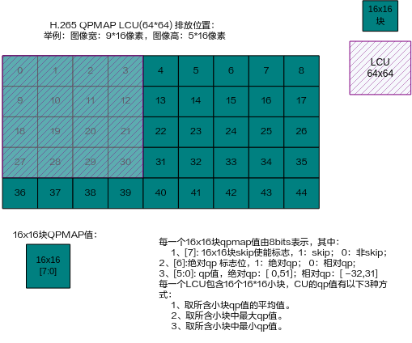
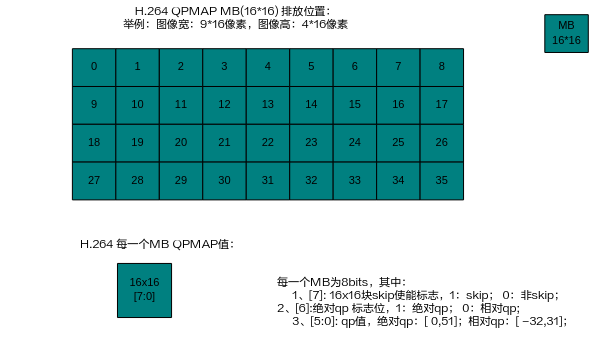
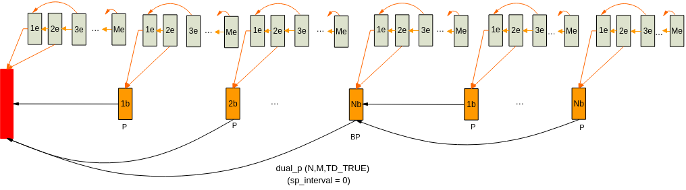
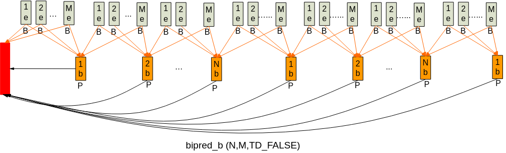

# Overview
The VENC module is the video encoding module. This module supports multi-channel real-time encoding, where each channel is independent and can use different encoding protocols and profiles. While supporting video encoding, this module also schedules the Region module to overlay and occlude content on the encoded image.

Different Solution models support different encoding specifications. The encoding specifications supported by each Solution are shown in [Table 1](#_Ref322704612).

**Table 1**  Solution Encoding Specifications

<a name="_Ref322704612"></a>
<table><thead align="left"><tr id="row15889mcpsimp"><th class="cellrowborder" rowspan="2" valign="top" id="mcps1.2.9.1.1"><p id="p15891mcpsimp"><a name="p15891mcpsimp"></a><a name="p15891mcpsimp"></a>Solution</p>
</th>
<th class="cellrowborder" colspan="3" valign="top" id="mcps1.2.9.1.2"><p id="p15893mcpsimp"><a name="p15893mcpsimp"></a><a name="p15893mcpsimp"></a>H.264</p>
</th>
<th class="cellrowborder" rowspan="2" valign="top" id="mcps1.2.9.1.3"><p id="p15895mcpsimp"><a name="p15895mcpsimp"></a><a name="p15895mcpsimp"></a>JPEG</p>
</th>
<th class="cellrowborder" rowspan="2" valign="top" id="mcps1.2.9.1.4"><p id="p15897mcpsimp"><a name="p15897mcpsimp"></a><a name="p15897mcpsimp"></a>MOTION JPEG</p>
</th>
<th class="cellrowborder" colspan="2" valign="top" id="mcps1.2.9.1.5"><p id="p15899mcpsimp"><a name="p15899mcpsimp"></a><a name="p15899mcpsimp"></a>H.265</p>
</th>
</tr>
<tr id="row15900mcpsimp"><th class="cellrowborder" valign="top" id="mcps1.2.9.2.1"><p id="p15902mcpsimp"><a name="p15902mcpsimp"></a><a name="p15902mcpsimp"></a>BP</p>
</th>
<th class="cellrowborder" valign="top" id="mcps1.2.9.2.2"><p id="p15904mcpsimp"><a name="p15904mcpsimp"></a><a name="p15904mcpsimp"></a>MP</p>
</th>
<th class="cellrowborder" valign="top" id="mcps1.2.9.2.3"><p id="p15906mcpsimp"><a name="p15906mcpsimp"></a><a name="p15906mcpsimp"></a>HP</p>
</th>
<th class="cellrowborder" valign="top" id="mcps1.2.9.2.4"><p id="p15908mcpsimp"><a name="p15908mcpsimp"></a><a name="p15908mcpsimp"></a>MP</p>
</th>
<th class="cellrowborder" valign="top" id="mcps1.2.9.2.5"><p id="p15910mcpsimp"><a name="p15910mcpsimp"></a><a name="p15910mcpsimp"></a>Main 10</p>
</th>
</tr>
</thead>
<tbody><tr id="row15912mcpsimp"><td class="cellrowborder" valign="top" width="22%" headers="mcps1.2.9.1.1 mcps1.2.9.2.1 "><p id="p15914mcpsimp"><a name="p15914mcpsimp"></a><a name="p15914mcpsimp"></a>SS528V100</p>
</td>
<td class="cellrowborder" valign="top" width="9%" headers="mcps1.2.9.1.2 mcps1.2.9.2.2 "><p id="p15916mcpsimp"><a name="p15916mcpsimp"></a><a name="p15916mcpsimp"></a>Supported</p>
</td>
<td class="cellrowborder" valign="top" width="9%" headers="mcps1.2.9.1.2 mcps1.2.9.2.3 "><p id="p15918mcpsimp"><a name="p15918mcpsimp"></a><a name="p15918mcpsimp"></a>Supported</p>
</td>
<td class="cellrowborder" valign="top" width="8.99%" headers="mcps1.2.9.1.2 mcps1.2.9.2.4 "><p id="p15920mcpsimp"><a name="p15920mcpsimp"></a><a name="p15920mcpsimp"></a>Supported</p>
</td>
<td class="cellrowborder" valign="top" width="11.01%" headers="mcps1.2.9.1.3 mcps1.2.9.2.5 "><p id="p15922mcpsimp"><a name="p15922mcpsimp"></a><a name="p15922mcpsimp"></a>Supported</p>
</td>
<td class="cellrowborder" valign="top" width="16%" headers="mcps1.2.9.1.4 "><p id="p15924mcpsimp"><a name="p15924mcpsimp"></a><a name="p15924mcpsimp"></a>Supported</p>
</td>
<td class="cellrowborder" valign="top" width="11%" headers="mcps1.2.9.1.5 "><p id="p15926mcpsimp"><a name="p15926mcpsimp"></a><a name="p15926mcpsimp"></a>Supported</p>
</td>
<td class="cellrowborder" valign="top" width="13%" headers="mcps1.2.9.1.5 "><p id="p15928mcpsimp"><a name="p15928mcpsimp"></a><a name="p15928mcpsimp"></a>Not supported</p>
</td>
</tr>
<tr id="row15929mcpsimp"><td class="cellrowborder" valign="top" width="22%" headers="mcps1.2.9.1.1 mcps1.2.9.2.1 "><p id="p15931mcpsimp"><a name="p15931mcpsimp"></a><a name="p15931mcpsimp"></a>SS625V100</p>
</td>
<td class="cellrowborder" valign="top" width="9%" headers="mcps1.2.9.1.2 mcps1.2.9.2.2 "><p id="p15933mcpsimp"><a name="p15933mcpsimp"></a><a name="p15933mcpsimp"></a>Supported</p>
</td>
<td class="cellrowborder" valign="top" width="9%" headers="mcps1.2.9.1.2 mcps1.2.9.2.3 "><p id="p15935mcpsimp"><a name="p15935mcpsimp"></a><a name="p15935mcpsimp"></a>Supported</p>
</td>
<td class="cellrowborder" valign="top" width="8.99%" headers="mcps1.2.9.1.2 mcps1.2.9.2.4 "><p id="p15937mcpsimp"><a name="p15937mcpsimp"></a><a name="p15937mcpsimp"></a>Supported</p>
</td>
<td class="cellrowborder" valign="top" width="11.01%" headers="mcps1.2.9.1.3 mcps1.2.9.2.5 "><p id="p15939mcpsimp"><a name="p15939mcpsimp"></a><a name="p15939mcpsimp"></a>Supported</p>
</td>
<td class="cellrowborder" valign="top" width="16%" headers="mcps1.2.9.1.4 "><p id="p15941mcpsimp"><a name="p15941mcpsimp"></a><a name="p15941mcpsimp"></a>Supported</p>
</td>
<td class="cellrowborder" valign="top" width="11%" headers="mcps1.2.9.1.5 "><p id="p15943mcpsimp"><a name="p15943mcpsimp"></a><a name="p15943mcpsimp"></a>Supported</p>
</td>
<td class="cellrowborder" valign="top" width="13%" headers="mcps1.2.9.1.5 "><p id="p15945mcpsimp"><a name="p15945mcpsimp"></a><a name="p15945mcpsimp"></a>Not supported</p>
</td>
</tr>
<tr id="row15946mcpsimp"><td class="cellrowborder" valign="top" width="22%" headers="mcps1.2.9.1.1 mcps1.2.9.2.1 "><p id="p15948mcpsimp"><a name="p15948mcpsimp"></a><a name="p15948mcpsimp"></a>SS524V100</p>
</td>
<td class="cellrowborder" valign="top" width="9%" headers="mcps1.2.9.1.2 mcps1.2.9.2.2 "><p id="p15950mcpsimp"><a name="p15950mcpsimp"></a><a name="p15950mcpsimp"></a>Supported</p>
</td>
<td class="cellrowborder" valign="top" width="9%" headers="mcps1.2.9.1.2 mcps1.2.9.2.3 "><p id="p15952mcpsimp"><a name="p15952mcpsimp"></a><a name="p15952mcpsimp"></a>Supported</p>
</td>
<td class="cellrowborder" valign="top" width="8.99%" headers="mcps1.2.9.1.2 mcps1.2.9.2.4 "><p id="p15954mcpsimp"><a name="p15954mcpsimp"></a><a name="p15954mcpsimp"></a>Supported</p>
</td>
<td class="cellrowborder" valign="top" width="11.01%" headers="mcps1.2.9.1.3 mcps1.2.9.2.5 "><p id="p15956mcpsimp"><a name="p15956mcpsimp"></a><a name="p15956mcpsimp"></a>Supported</p>
</td>
<td class="cellrowborder" valign="top" width="16%" headers="mcps1.2.9.1.4 "><p id="p15958mcpsimp"><a name="p15958mcpsimp"></a><a name="p15958mcpsimp"></a>Supported</p>
</td>
<td class="cellrowborder" valign="top" width="11%" headers="mcps1.2.9.1.5 "><p id="p15960mcpsimp"><a name="p15960mcpsimp"></a><a name="p15960mcpsimp"></a>Supported</p>
</td>
<td class="cellrowborder" valign="top" width="13%" headers="mcps1.2.9.1.5 "><p id="p15962mcpsimp"><a name="p15962mcpsimp"></a><a name="p15962mcpsimp"></a>Not supported</p>
</td>
</tr>
<tr id="row15963mcpsimp"><td class="cellrowborder" valign="top" width="22%" headers="mcps1.2.9.1.1 mcps1.2.9.2.1 "><p id="p15965mcpsimp"><a name="p15965mcpsimp"></a><a name="p15965mcpsimp"></a>SS522V101</p>
</td>
<td class="cellrowborder" valign="top" width="9%" headers="mcps1.2.9.1.2 mcps1.2.9.2.2 "><p id="p15967mcpsimp"><a name="p15967mcpsimp"></a><a name="p15967mcpsimp"></a>Supported</p>
</td>
<td class="cellrowborder" valign="top" width="9%" headers="mcps1.2.9.1.2 mcps1.2.9.2.3 "><p id="p15969mcpsimp"><a name="p15969mcpsimp"></a><a name="p15969mcpsimp"></a>Supported</p>
</td>
<td class="cellrowborder" valign="top" width="8.99%" headers="mcps1.2.9.1.2 mcps1.2.9.2.4 "><p id="p15971mcpsimp"><a name="p15971mcpsimp"></a><a name="p15971mcpsimp"></a>Supported</p>
</td>
<td class="cellrowborder" valign="top" width="11.01%" headers="mcps1.2.9.1.3 mcps1.2.9.2.5 "><p id="p15973mcpsimp"><a name="p15973mcpsimp"></a><a name="p15973mcpsimp"></a>Supported</p>
</td>
<td class="cellrowborder" valign="top" width="16%" headers="mcps1.2.9.1.4 "><p id="p15975mcpsimp"><a name="p15975mcpsimp"></a><a name="p15975mcpsimp"></a>Supported</p>
</td>
<td class="cellrowborder" valign="top" width="11%" headers="mcps1.2.9.1.5 "><p id="p15977mcpsimp"><a name="p15977mcpsimp"></a><a name="p15977mcpsimp"></a>Supported</p>
</td>
<td class="cellrowborder" valign="top" width="13%" headers="mcps1.2.9.1.5 "><p id="p15979mcpsimp"><a name="p15979mcpsimp"></a><a name="p15979mcpsimp"></a>Not supported</p>
</td>
</tr>
<tr id="row15980mcpsimp"><td class="cellrowborder" valign="top" width="22%" headers="mcps1.2.9.1.1 mcps1.2.9.2.1 "><p id="p15982mcpsimp"><a name="p15982mcpsimp"></a><a name="p15982mcpsimp"></a>SS928V100</p>
</td>
<td class="cellrowborder" valign="top" width="9%" headers="mcps1.2.9.1.2 mcps1.2.9.2.2 "><p id="p15984mcpsimp"><a name="p15984mcpsimp"></a><a name="p15984mcpsimp"></a>Supported</p>
</td>
<td class="cellrowborder" valign="top" width="9%" headers="mcps1.2.9.1.2 mcps1.2.9.2.3 "><p id="p15986mcpsimp"><a name="p15986mcpsimp"></a><a name="p15986mcpsimp"></a>Supported</p>
</td>
<td class="cellrowborder" valign="top" width="8.99%" headers="mcps1.2.9.1.2 mcps1.2.9.2.4 "><p id="p15988mcpsimp"><a name="p15988mcpsimp"></a><a name="p15988mcpsimp"></a>Supported</p>
</td>
<td class="cellrowborder" valign="top" width="11.01%" headers="mcps1.2.9.1.3 mcps1.2.9.2.5 "><p id="p15990mcpsimp"><a name="p15990mcpsimp"></a><a name="p15990mcpsimp"></a>Supported</p>
</td>
<td class="cellrowborder" valign="top" width="16%" headers="mcps1.2.9.1.4 "><p id="p15992mcpsimp"><a name="p15992mcpsimp"></a><a name="p15992mcpsimp"></a>Supported</p>
</td>
<td class="cellrowborder" valign="top" width="11%" headers="mcps1.2.9.1.5 "><p id="p15994mcpsimp"><a name="p15994mcpsimp"></a><a name="p15994mcpsimp"></a>Supported</p>
</td>
<td class="cellrowborder" valign="top" width="13%" headers="mcps1.2.9.1.5 "><p id="p15996mcpsimp"><a name="p15996mcpsimp"></a><a name="p15996mcpsimp"></a>Not supported</p>
</td>
</tr>
<tr id="row15997mcpsimp"><td class="cellrowborder" valign="top" width="22%" headers="mcps1.2.9.1.1 mcps1.2.9.2.1 "><p id="p15999mcpsimp"><a name="p15999mcpsimp"></a><a name="p15999mcpsimp"></a>SS626V100</p>
</td>
<td class="cellrowborder" valign="top" width="9%" headers="mcps1.2.9.1.2 mcps1.2.9.2.2 "><p id="p16001mcpsimp"><a name="p16001mcpsimp"></a><a name="p16001mcpsimp"></a>Supported</p>
</td>
<td class="cellrowborder" valign="top" width="9%" headers="mcps1.2.9.1.2 mcps1.2.9.2.3 "><p id="p16003mcpsimp"><a name="p16003mcpsimp"></a><a name="p16003mcpsimp"></a>Supported</p>
</td>
<td class="cellrowborder" valign="top" width="8.99%" headers="mcps1.2.9.1.2 mcps1.2.9.2.4 "><p id="p16005mcpsimp"><a name="p16005mcpsimp"></a><a name="p16005mcpsimp"></a>Supported</p>
</td>
<td class="cellrowborder" valign="top" width="11.01%" headers="mcps1.2.9.1.3 mcps1.2.9.2.5 "><p id="p16007mcpsimp"><a name="p16007mcpsimp"></a><a name="p16007mcpsimp"></a>Supported</p>
</td>
<td class="cellrowborder" valign="top" width="16%" headers="mcps1.2.9.1.4 "><p id="p16009mcpsimp"><a name="p16009mcpsimp"></a><a name="p16009mcpsimp"></a>Supported</p>
</td>
<td class="cellrowborder" valign="top" width="11%" headers="mcps1.2.9.1.5 "><p id="p16011mcpsimp"><a name="p16011mcpsimp"></a><a name="p16011mcpsimp"></a>Supported</p>
</td>
<td class="cellrowborder" valign="top" width="13%" headers="mcps1.2.9.1.5 "><p id="p16013mcpsimp"><a name="p16013mcpsimp"></a><a name="p16013mcpsimp"></a>Not supported</p>
</td>
</tr>
</tbody>
</table>

# Functional Description
## Encoding Data Flow Diagram<a name="ZH-CN_TOPIC_0000002441697779"></a>

**Figure 1** VENC Data Flow Diagram<a name="fig1579454103312"></a>  


A typical encoding process includes receiving the input image, overlaying and occluding image content, encoding the image, and outputting the stream.

The VENC module consists of the encoding channel sub-module (VENC) and the encoding protocol sub-module (H.264/H.265/JPEG/MJPEG).

The channel supports receiving YUV format image input. H.264/H.265 support Semi-planar YVU 4:2:0/Semi-planar YUV 4:2:0 or single-component input \(PIXEL\_FORMAT\_YUV\_400\). JPEG/MJPEG support Semi-planar YVU 4:2:0/Semi-planar YUV 4:2:0, Semi-planar YVU 4:2:2/Semi-planar YUV 4:2:2, or single-component input \(PIXEL\_FORMAT\_YUV\_400\). The channel module receives external raw image data without caring which external module the image data comes from.

The compression formats supported by the SS528V100/SS625V100/SS524V100/SS522V101/SS928V100/SS626V100 Solution for input YUV: OT\_COMPRESS\_MODE\_NONE, OT\_COMPRESS\_MODE\_SEG, OT\_COMPRESS\_MODE\_SEG\_COMPACT.

When the input YUV compression format of the SS528V100/SS625V100/SS524V100/SS522V101/SS626V100 Solution is OT\_COMPRESS\_MODE\_SEG\_COMPACT, the maximum width of YUV supported by VENC is 2688;

When the input YUV compression format of the SS928V100 Solution is OT\_COMPRESS\_MODE\_SEG\_COMPACT, the maximum width of YUV supported by VENC is 4096.

After receiving the image, the channel compares the image size with the encoding channel size:

-   If the input image is larger than the encoding channel size, VENC calls VGS to scale down the source image according to the encoding channel size, and then encodes the scaled-down image.
-   If the input image is smaller than the encoding channel size, VENC discards the source image. VENC does not support encoding enlarged input images.
-   If the input image matches the encoding channel size, VENC directly receives and encodes the source image.

> **Note:** 
>1.  The frame rate control of the channel is not enabled by default. Users need to call the API to set it. RC also has a frame rate control function. It is recommended to use the RC frame rate control to avoid excessive impact on bit rate control.
>2.  For H.264/H.265 encoding, when the input image format switches from non-single-component to single-component, due to inter-frame prediction quantization errors, chroma residues may exist in the image until the next I frame is encoded. It is recommended that customers call the [ss\_mpi\_venc\_reset\_chn](#ZH-CN_TOPIC_0000002408258510) API to reset the channel when switching to single-component.

The REGION module supports providing occlusion/overlay information for the image content. The occlusion/overlay is completed before encoding, and then the stream is output.

## Encoding Channel<a name="ZH-CN_TOPIC_0000002441697745"></a>

As a basic container, the encoding channel stores various user settings and manages various internal resources of the encoding channel. The encoding channel completes the function of converting images into streams, which is specifically achieved through the collaboration of the rate controller and the encoder. The encoder here refers to the encoder in a narrow sense, which only performs the encoding function. The rate controller provides control and adjustment of encoding parameters, thereby controlling the output bit rate.

**Figure 1** Encoding Channel Functional Module Division<a name="fig1125183013363"></a>  

## Rate Control<a name="ZH-CN_TOPIC_0000002441698045"></a>

The rate controller controls the encoding bit rate.

From an information theory perspective, the lower the image compression ratio, the higher the compressed image quality; the higher the image compression ratio, the lower the compressed image quality. When the scene changes, if the goal is stable image quality, the encoding bit rate will fluctuate significantly; if the goal is a stable encoding bit rate, the image quality will fluctuate significantly. Taking H.264 encoding as an example, generally, the lower the image Qp, the better the image quality and the higher the bit rate; the higher the image Qp, the worse the image quality and the lower the bit rate.

Rate control applies to continuous encoded streams, so the JPEG protocol encoding channel does not include a rate control function.

The rate controller provides three rate control modes (CBR, VBR, FIXQP) for MJPEG protocol encoding channels, and seven rate control modes (CBR, VBR, AVBR, QVBR, CVBR, FIXQP, QPMAP) for H.264/H.265 protocol encoding channels, to adjust image quality and bit rate. For the QPMAP mode of H.264/H.265 protocol channels, the rate control strategy is determined by the user.

**CBR<a name="section12343123612407"></a>**

CBR (Constant Bit Rate). Ensures a stable encoding bit rate within the bit rate statistics period. Bit rate stability is mainly evaluated by two parameters:

-   Bit rate statistics time stats\_time

    The unit is seconds (s). The longer the bit rate statistics time, the weaker the impact of per-frame bit rate fluctuation on rate adjustment, resulting in slower rate adjustment and milder image quality fluctuation. The shorter the bit rate statistics time, the stronger the impact of per-frame bit rate fluctuation on rate adjustment, resulting in more sensitive rate adjustment and more severe image quality fluctuation.

-   Row-level rate control adjustment range row\_qp\_delta

    The row-level rate control adjustment range is the maximum range of row-level adjustment within a frame, where row-level is in units of macroblock rows. The larger the adjustment range, the larger the QP range allowed for row-level adjustment, and the more stable the bit rate. For scenes with uneven image complexity distribution, setting the row-level rate control adjustment range too large may cause uneven image quality.

**VBR<a name="section734616364405"></a>**

VBR (Variable Bit Rate) allows the encoding bit rate to fluctuate within the bit rate statistics period, thereby ensuring stable encoded image quality. Taking H.264 encoding as an example, the VENC module allows users to set max\_qp, min\_qp, max\_bit\_rate, and chg\_pos. max\_qp and min\_qp control the image quality range, max\_bit\_rate clamps the maximum encoding bit rate within the bit rate statistics period, and chg\_pos controls the bit rate baseline for starting QP adjustment. When the encoding bit rate is greater than max\_bit\_rate\*chg\_pos, the image QP gradually adjusts toward max\_qp. If the image QP reaches max\_qp, the QP is clamped to the maximum value, the clamping effect of max\_bit\_rate becomes invalid, and the encoding bit rate may exceed max\_bit\_rate. When the encoding bit rate is less than max\_bit\_rate\*chg\_pos, the image QP gradually adjusts toward min\_qp. If the image QP reaches min\_qp, the encoding bit rate has reached its maximum and the image quality is at its best.

**AVBR<a name="section153462364401"></a>**

AVBR (Adaptive Variable Bit Rate) allows the encoding bit rate to fluctuate within the bit rate statistics period, thereby ensuring stable encoded image quality. The rate control internally detects whether the current scene is moving or static, using a higher bit rate for motion and actively reducing the target bit rate during static scenes. Taking H.264 encoding as an example, the VENC module allows users to set max\_bit\_rate, chg\_pos, and min\_still\_percent. max\_bit\_rate represents the maximum bit rate in motion scenes, and max\_bit\_rate\*chg\_pos\*min\_still\_percent represents the minimum bit rate in static scenes. The target bit rate adjusts between the maximum and minimum bit rates depending on the degree of motion. max\_qp and min\_qp control the image quality range. Rate control takes QP clamping as the highest priority; if it goes beyond the min\_qp or max\_qp range, rate control becomes invalid.

**QVBR<a name="section14347736204015"></a>**

QVBR (Quality Variable Bit Rate) is a variable bit rate based on subjective image quality. This rate control method uses real-time statistical PSNR (an objective image quality evaluation metric) to dynamically adjust the bit rate, thereby ensuring stable encoded image quality. When PSNR is low, the target bit rate is actively increased; when PSNR is high, the target bit rate is actively decreased.

Taking H.264 encoding as an example, the VENC module allows users to set target\_bit\_rate, max\_bit\_percent, min\_bit\_percent, max\_psnr\_fluctuate, and min\_psnr\_fluctuate.

-   When the real-time statistical PSNR is less than max\_psnr\_fluctuate, the target bit rate is appropriately increased, with the maximum bit rate = target\_bit\_rate\*max\_bit\_percent;
-   When the real-time statistical PSNR is greater than max\_psnr\_fluctuate, the target bit rate is appropriately decreased, with the minimum bit rate = target\_bit\_rate\*min\_bit\_percent. The target bit rate adjusts between the maximum and minimum bit rates depending on the current PSNR value. When the PSNR value range exceeds [min\_psnr\_fluctuate-4, max\_psnr\_fluctuate+4] ∩ [20,40], PSNR no longer takes effect, and the bit rate adjusts between the maximum and minimum bit rates. max\_qp and min\_qp control the image quality range. Rate control takes QP clamping as the highest priority; if it goes beyond the min\_qp or max\_qp range, rate control becomes invalid. The upper and lower limits of bit rate fluctuation take priority over PSNR. For example, if the bit rate fluctuates to the upper limit but still cannot meet the PSNR requirement, the bit rate will not continue to increase.

**CVBR<a name="section834813684019"></a>**

CVBR (Constrained Variable Bit Rate) is based on VBR and aims to provide a rate control algorithm with stable image quality while limiting the VBR bit rate to meet transmission bandwidth and storage space requirements. Specifically, CVBR sets limits on instantaneous, short-term, and long-term bit rates. The instantaneous bit rate limit ensures network bandwidth transmission requirements; the long-term bit rate limit ensures that storage devices have sufficient space for long-duration video recording. Meanwhile, the short-term bit rate adjusts based on the long-term bit rate setting and actual usage, providing more stable image quality in complex scenes and saving bit rate in simple scenes.

**FIXQP<a name="section15348183674010"></a>**

FIXQP fixes the QP value. Within the bit rate statistics period, all macroblock QP values of the encoded image are the same, using the user-specified image QP value. The QP values for I-frames and P-frames can be set separately.

**QPMAP<a name="section23491536134020"></a>**

QPMAP mode allows users to freely determine the rate control strategy. Users need to allocate memory, which is mapped onto the encoded image. Through memory assignment, the QP for each block of the encoded image and the skip block preference configuration are completed. QP settings are based on 16\*16 blocks. The QP value for each 16\*16 block uses the user-specified value for that block. The QP values of all these blocks form a QP table, and the organization of QP values in this table is shown in [Figure 1](#fig14978154218434) and [Figure 2](#fig1569611155114). H.264 skip preference configuration uses 16\*16 blocks, while H.265 skip preference configuration uses 64\*64 blocks. The skip preference configuration tables are shown in [Figure 3](#fig16647191164915) and [Figure 4](#fig86961774508).

**Figure 1** H.265 QPMAP LCU (64\*64) Layout Position<a name="fig14978154218434"></a>  


**Figure 2** H.264 QPMAP MB Layout Position<a name="fig1569611155114"></a>  


**Figure 3** H.265 SkipWeight Table Layout\(64\*64\)<a name="fig16647191164915"></a>  
.png "H-265-SkipWeight表排布(64-64)")

**Figure 4** H.264 SkipWeight Table Layout\(16\*16\)<a name="fig86961774508"></a>  
.png "H-264-SkipWeight表排布(16-16)")

> **Note:** 
>-   In non-normal\_p mode, the skipEnabled flag for 16x16 blocks in the QP table must be configured to 1. If error checking is performed, the amount of data processed is large, which affects performance. Therefore, ensure the configuration is correct when using this feature.
>-   When using the QpMap table to achieve H.265 protocol channel encoding of p\_skip frames/non-ROI area frame rates lower than the ROI area frame rate, the customer needs to call [ss\_mpi\_venc\_set\_h265\_sao](#ZH-CN_TOPIC_0000002441658333) to disable the SAO function.
>-   In QpMap mode, the [ss\_mpi\_venc\_send\_frame\_ex](#ZH-CN_TOPIC_0000002408258798) API must be called to send the image and qpmap table.
>-   When the Gop Mode is OT\_VENC\_GOP\_MODE\_ADV\_SMART\_P, QpMap mode is not supported.
>-   When using Skip Weight, it is recommended to call the [ss\_mpi\_venc\_set\_skip\_bias](#ZH-CN_TOPIC_0000002408099174) API to disable the frame-level tendency of cu/mb to select Skip mode. Otherwise, Skip Weight is adjusted based on the frame-level Skip mode control.
>-   In Qpmap mode, the QPMAP Qp table requires memory calculation as follows:
>    stride = \(width +255\) / 256 \* 256 / 16
>    H.264: qpmap\_size = stride \*\(\(height + 15\) / 16 \* 16 / 16\)
>    H.265: qpmap\_size = stride \*\(\(height + 31\) / 32 \* 32 / 16\)
>-   In Qpmap mode, the skipweight table requires memory calculation as follows:
>    H.264: stride = \(width + 511\) / 512 \* 512 / 32
>    H.265: stride = \(width + 1023\) / 1024 \* 1024 / 64
>    H.264: skipweight\_size = stride \* \(height + 15\) /16 \*16 / 16
>    H.265: skipweight\_size = stride \* \(height + 31\)/ 32 \*32 / 32

## GOP Structure<a name="ZH-CN_TOPIC_0000002441698061"></a>

The support of the two encoding protocols (H.264/H.265) for GOP structure type modes is shown in [Table 1](#_Ref430350630).

**Table 1**  Encoding Protocol Supported GOP Structure Types

<a name="_Ref430350630"></a>
<table><thead align="left"><tr id="row3212mcpsimp"><th class="cellrowborder" rowspan="2" valign="top" width="46.53465346534653%" id="mcps1.2.5.1.1"><p id="p3214mcpsimp"><a name="p3214mcpsimp"></a><a name="p3214mcpsimp"></a>GOP Mode</p>
</th>
<th class="cellrowborder" rowspan="2" valign="top" width="10.891089108910892%" id="mcps1.2.5.1.2"><p id="p3216mcpsimp"><a name="p3216mcpsimp"></a><a name="p3216mcpsimp"></a>Reference Frame Count</p>
</th>
<th class="cellrowborder" valign="top" width="22.772277227722775%" id="mcps1.2.5.1.3"><p id="p3218mcpsimp"><a name="p3218mcpsimp"></a><a name="p3218mcpsimp"></a>SS528V100/SS625V100/SS928V100/SS626V100</p>
</th>
<th class="cellrowborder" valign="top" width="19.801980198019802%" id="mcps1.2.5.1.4"><p id="p3220mcpsimp"><a name="p3220mcpsimp"></a><a name="p3220mcpsimp"></a>SS524V100/SS522V101</p>
</th>
</tr>
<tr id="row3221mcpsimp"><th class="cellrowborder" valign="top" id="mcps1.2.5.2.1"><p id="p3223mcpsimp"><a name="p3223mcpsimp"></a><a name="p3223mcpsimp"></a>H.264/H.265</p>
</th>
<th class="cellrowborder" valign="top" id="mcps1.2.5.2.2"><p id="p3225mcpsimp"><a name="p3225mcpsimp"></a><a name="p3225mcpsimp"></a>H.264/H.265</p>
</th>
</tr>
</thead>
<tbody><tr id="row3227mcpsimp"><td class="cellrowborder" valign="top" width="46.53465346534653%" headers="mcps1.2.5.1.1 mcps1.2.5.2.1 "><p id="p3229mcpsimp"><a name="p3229mcpsimp"></a><a name="p3229mcpsimp"></a>OT_VENC_GOP_MODE_NORMAL_P</p>
</td>
<td class="cellrowborder" valign="top" width="10.891089108910892%" headers="mcps1.2.5.1.2 mcps1.2.5.2.2 "><p id="p3231mcpsimp"><a name="p3231mcpsimp"></a><a name="p3231mcpsimp"></a>1</p>
</td>
<td class="cellrowborder" valign="top" width="22.772277227722775%" headers="mcps1.2.5.1.3 "><p id="p3233mcpsimp"><a name="p3233mcpsimp"></a><a name="p3233mcpsimp"></a>Supported</p>
</td>
<td class="cellrowborder" valign="top" width="19.801980198019802%" headers="mcps1.2.5.1.4 "><p id="p3235mcpsimp"><a name="p3235mcpsimp"></a><a name="p3235mcpsimp"></a>Supported</p>
</td>
</tr>
<tr id="row3236mcpsimp"><td class="cellrowborder" valign="top" width="46.53465346534653%" headers="mcps1.2.5.1.1 mcps1.2.5.2.1 "><p id="p3238mcpsimp"><a name="p3238mcpsimp"></a><a name="p3238mcpsimp"></a>OT_VENC_GOP_MODE_DUAL_P</p>
</td>
<td class="cellrowborder" valign="top" width="10.891089108910892%" headers="mcps1.2.5.1.2 mcps1.2.5.2.2 "><p id="p3240mcpsimp"><a name="p3240mcpsimp"></a><a name="p3240mcpsimp"></a>2</p>
</td>
<td class="cellrowborder" valign="top" width="22.772277227722775%" headers="mcps1.2.5.1.3 "><p id="p3242mcpsimp"><a name="p3242mcpsimp"></a><a name="p3242mcpsimp"></a>Supported</p>
</td>
<td class="cellrowborder" valign="top" width="19.801980198019802%" headers="mcps1.2.5.1.4 "><p id="p3244mcpsimp"><a name="p3244mcpsimp"></a><a name="p3244mcpsimp"></a>Not supported</p>
</td>
</tr>
<tr id="row3245mcpsimp"><td class="cellrowborder" valign="top" width="46.53465346534653%" headers="mcps1.2.5.1.1 mcps1.2.5.2.1 "><p id="p3247mcpsimp"><a name="p3247mcpsimp"></a><a name="p3247mcpsimp"></a>OT_VENC_GOP_MODE_SMART_P</p>
</td>
<td class="cellrowborder" valign="top" width="10.891089108910892%" headers="mcps1.2.5.1.2 mcps1.2.5.2.2 "><p id="p3249mcpsimp"><a name="p3249mcpsimp"></a><a name="p3249mcpsimp"></a>2</p>
</td>
<td class="cellrowborder" valign="top" width="22.772277227722775%" headers="mcps1.2.5.1.3 "><p id="p3251mcpsimp"><a name="p3251mcpsimp"></a><a name="p3251mcpsimp"></a>Supported</p>
</td>
<td class="cellrowborder" valign="top" width="19.801980198019802%" headers="mcps1.2.5.1.4 "><p id="p3253mcpsimp"><a name="p3253mcpsimp"></a><a name="p3253mcpsimp"></a>Supported</p>
</td>
</tr>
<tr id="row3254mcpsimp"><td class="cellrowborder" valign="top" width="46.53465346534653%" headers="mcps1.2.5.1.1 mcps1.2.5.2.1 "><p id="p3256mcpsimp"><a name="p3256mcpsimp"></a><a name="p3256mcpsimp"></a>OT_VENC_GOP_MODE_ADV_SMART_P</p>
</td>
<td class="cellrowborder" valign="top" width="10.891089108910892%" headers="mcps1.2.5.1.2 mcps1.2.5.2.2 "><p id="p3258mcpsimp"><a name="p3258mcpsimp"></a><a name="p3258mcpsimp"></a>2</p>
</td>
<td class="cellrowborder" valign="top" width="22.772277227722775%" headers="mcps1.2.5.1.3 "><p id="p3260mcpsimp"><a name="p3260mcpsimp"></a><a name="p3260mcpsimp"></a>Not supported</p>
</td>
<td class="cellrowborder" valign="top" width="19.801980198019802%" headers="mcps1.2.5.1.4 "><p id="p3262mcpsimp"><a name="p3262mcpsimp"></a><a name="p3262mcpsimp"></a>Not supported</p>
</td>
</tr>
<tr id="row3263mcpsimp"><td class="cellrowborder" valign="top" width="46.53465346534653%" headers="mcps1.2.5.1.1 mcps1.2.5.2.1 "><p id="p3265mcpsimp"><a name="p3265mcpsimp"></a><a name="p3265mcpsimp"></a>OT_VENC_GOP_MODE_BIPRED_B</p>
</td>
<td class="cellrowborder" valign="top" width="10.891089108910892%" headers="mcps1.2.5.1.2 mcps1.2.5.2.2 "><p id="p3267mcpsimp"><a name="p3267mcpsimp"></a><a name="p3267mcpsimp"></a>2</p>
</td>
<td class="cellrowborder" valign="top" width="22.772277227722775%" headers="mcps1.2.5.1.3 "><p id="p3269mcpsimp"><a name="p3269mcpsimp"></a><a name="p3269mcpsimp"></a>Not supported</p>
</td>
<td class="cellrowborder" valign="top" width="19.801980198019802%" headers="mcps1.2.5.1.4 "><p id="p3271mcpsimp"><a name="p3271mcpsimp"></a><a name="p3271mcpsimp"></a>Not supported</p>
</td>
</tr>
<tr id="row3272mcpsimp"><td class="cellrowborder" valign="top" width="46.53465346534653%" headers="mcps1.2.5.1.1 mcps1.2.5.2.1 "><p id="p3274mcpsimp"><a name="p3274mcpsimp"></a><a name="p3274mcpsimp"></a>OT_VENC_GOP_MODE_LOW_DELAY_B</p>
</td>
<td class="cellrowborder" valign="top" width="10.891089108910892%" headers="mcps1.2.5.1.2 mcps1.2.5.2.2 "><p id="p3276mcpsimp"><a name="p3276mcpsimp"></a><a name="p3276mcpsimp"></a>2</p>
</td>
<td class="cellrowborder" valign="top" width="22.772277227722775%" headers="mcps1.2.5.1.3 "><p id="p3278mcpsimp"><a name="p3278mcpsimp"></a><a name="p3278mcpsimp"></a>Not supported</p>
</td>
<td class="cellrowborder" valign="top" width="19.801980198019802%" headers="mcps1.2.5.1.4 "><p id="p3280mcpsimp"><a name="p3280mcpsimp"></a><a name="p3280mcpsimp"></a>Not supported</p>
</td>
</tr>
</tbody>
</table>

-   The frame structure of OT\_VENC\_GOP\_MODE\_DUAL\_P mode is shown in [Figure 1](#fig983613517551).

    Where: SP refers to a special P frame, referred to here as an SP frame. The Qp value of this frame is lower than that of other P frames. sp\_interval=0 means no SP frame is supported.

**Figure 1**  OT\_VENC\_GOP\_MODE\_DUAL\_P模式的帧Structure Diagram<a name="fig983613517551"></a>  

-   The frame structure of OT\_VENC\_GOP\_MODE\_SMART\_P mode is shown in [Figure 2](#fig555934712569).

    Where: Bg refers to an IDR frame, which is also a long-term reference frame. VI refers to a P frame that only references the Bg frame, and its Qp value is lower than that of other P frames.

**Figure 2**  OT\_VENC\_GOP\_MODE\_SMART\_P模式的帧Structure Diagram<a name="fig555934712569"></a>  

-   The frame structure of OT\_VENC\_GOP\_MODE\_ADV\_SMART\_P mode is shown in [Figure 3](#fig19134113315570).

    Where: Bg refers to the background modeling frame, which is an IDR frame and a long-term reference frame. VI refers to a P frame that only references the Bg frame, and its Qp value is lower than that of other P frames

**Figure 3**  OT\_VENC\_GOP\_MODE\_ADV\_SMART\_P模式的帧Structure Diagram<a name="fig19134113315570"></a>  

-   The frame structure of OT\_VENC\_GOP\_MODE\_BIPRED\_B mode is shown in [Figure 4](#fig84991915820).

    Where: b\_frame\_num indicates the number of B frames between IDR and P frames or between P and P frames. B frames are not used as reference frames. In the figure above, b\_frame\_num = 2. Users should note that at the tail of a GOP, b\_frame\_num may not be 2, and the last frame of a GOP must be a P frame.

**图 4**  OT\_VENC\_GOP\_MODE\_BIPRED\_B模式的帧Structure Diagram<a name="fig84991915820"></a>  

> **Note:** 
>-   In H.264 non-normal\_p mode, svc-t is not supported.
>-   The H.265 protocol frame buffer management method is transmitted in the stream by default, controlled by the module parameter g\_h265e\_feature\_en, which defaults to 1. If the customer's decoder has compatibility issues, g\_h265e\_feature\_en=0 can be set when loading h265e.ko.

## Advanced Skip Frame Reference Mode<a name="ZH-CN_TOPIC_0000002441697729"></a>

The advanced skip frame reference mode involves 3 parameters: base, enhance, and pred\_en. Their meanings can be found in ot\_venc\_ref\_param. The advanced skip frame reference mode is illustrated in [Figure 1](#fig712013783917) through [Figure 6](#fig178695103428).

> **Notice:** 
>Configuring the advanced skip frame reference in dual\_p mode with sp\_interval not equal to 0 must satisfy the following condition: base\*(enhance+1) = sp\_interval. For example: for 4x advanced skip frame reference (base=2, enhance=1), then dual\_p's sp\_interval = 2\*(1+1) = 4.

**Figure 1**  normal\_p Advanced Skip Frame Reference Diagram<a name="fig712013783917"></a>  


**Figure 2**  smart\_p Advanced Skip Frame Reference Diagram<a name="fig3562445133913"></a>  


**Figure 3**  adv\_smart\_p Advanced Skip Frame Reference Diagram<a name="fig18536656124016"></a>  


**Figure 4**  dual\_p \(sp\_interval!=0\) Advanced Skip Frame Reference Diagram<a name="fig1191671815418"></a>  
高级跳帧参考Schematic Diagram.png "dual_p (sp_interval-0) Advanced Skip Frame Reference Diagram")

**Figure 5**  dual\_p \(sp\_interval=0\) Advanced Skip Frame Reference Diagram<a name="fig1342193934110"></a>  
高级跳帧参考Schematic Diagram-0.png "dual_p (sp_interval-0) Advanced Skip Frame Reference Diagram-0")



**Figure 6**  bipred\_b Advanced Skip Frame Reference Diagram<a name="fig178695103428"></a>  



## Color-to-Gray<a name="ZH-CN_TOPIC_0000002441697797"></a>

Color-to-gray: VENC supports converting a color image to a grayscale image for encoding. For specific functions, see the color-to-gray section of the relevant API: [ss\_mpi\_venc\_set\_chn\_param](#ZH-CN_TOPIC_0000002441698329).

## Crop Encoding<a name="ZH-CN_TOPIC_0000002408098622"></a>

Crop encoding: VENC crops a part of the image for encoding. Users can set the crop start point (X, Y) and the crop width and height. For specific functions, see [ss\_mpi\_venc\_set\_chn\_param](#ZH-CN_TOPIC_0000002441698329) and [Figure 1](#fig1953319321786), etc.

**Figure 1**  Crop Encoding Diagram<a name="fig1953319321786"></a>  

## ROI<a name="ZH-CN_TOPIC_0000002408098902"></a>

ROI (Region Of Interest) encoding.

Users can configure the ROI region to limit the image Qp for that region, thereby achieving differentiation of Qp for that region compared to other image areas. The system currently only supports ROI settings for H.264/H.265 channels. The system provides 8 regions of interest that can be used simultaneously.

The 8 regions can overlap each other, and the priority increases with the index number from 0 to 7. Here, overlay priority refers to the determination of the final Qp value of the image area when overlapping occurs. The final region Qp value is set according to the region with the highest priority. ROI regions can be configured in two modes: absolute Qp and relative Qp.

-   Absolute Qp: The Qp of the ROI region is the user-specified Qp value.
-   Relative Qp: The Qp of the ROI region is the sum of the Qp generated by rate control and the user-specified Qp offset.

The following example uses FixQp mode for encoding, setting the image Qp to 25, meaning all macroblock Qp values in the image are 25. ROI region 0 is set to absolute Qp mode with a Qp value of 10 and index 0; ROI region 1 is set to relative Qp mode with a Qp of -10 and index 1. Region 0's index is lower than region 1's index, so in overlapping image areas, the Qp of the higher priority region (region 1) is used. The Qp value of region 0, excluding the overlapping parts, equals 10. The Qp value of region 1 is 25 - 10 = 15.

**Figure 1**  ROI Diagram<a name="fig87031210176"></a>  

## Non-ROI Region Low Frame Rate Encoding<a name="ZH-CN_TOPIC_0000002441658053"></a>

Non-ROI region low frame rate means the ROI region is encoded normally, while the non-ROI region is encoded at a low frame rate. Users can set the frame rate of the non-ROI region according to specific conditions. For specific functions, see the relevant APIs: [ss\_mpi\_venc\_set\_roi\_bg\_frame\_rate](#ZH-CN_TOPIC_0000002408259106), [ss\_mpi\_venc\_get\_roi\_bg\_frame\_rate](#ZH-CN_TOPIC_0000002408098654).

## OSD, ROI, and Non-ROI Region Low Frame Rate in QPMAP Mode<a name="ZH-CN_TOPIC_0000002441698393"></a>

From [Rate Control](#ZH-CN_TOPIC_0000002441698045), it can be seen that in QPMAP mode, the Qp of each 16\*16 block in a frame is determined by the user. Therefore:

-   In this mode, the ROI region size, start point, Qp, and count can be determined by the user. As can be seen from Figure 1 and Figure 2, the non-ROI region low frame rate is also determined by the user. In this case, using the [ss\_mpi\_venc\_set\_jpeg\_roi\_attr](#ZH-CN_TOPIC_0000002441658461) API will not take effect.
-   In this mode, the REGION module is used for occlusion and overlay of image content. Up to 8 overlapping regions are supported, but the Qp of the overlapping regions is determined by the QPMAP table, and the overlay region Qp configuration set by the REGION module is invalid.

## JPEG Snapshot Mode<a name="ZH-CN_TOPIC_0000002408098794"></a>

JPEG encoding snapshot has two working modes: full snapshot mode and snapshot mode.

Two snapshot modes are supported:

-   Full snapshot mode: After the channel starts receiving images, all received images are encoded.
-   Snapshot mode: After the channel starts receiving images, only frames marked as snapshot frames are encoded.

## P Frame Intra Refresh<a name="ZH-CN_TOPIC_0000002408099074"></a>

P frame refresh of ISlice provides customers with a very smooth bit rate encoding method, where the size of each I frame and P frame can be very close. In cases of limited network bandwidth (such as wireless networks), this reduces the network impact caused by oversized I frames, reduces network transmission delay, and reduces the probability of network transmission errors.


### Usage<a name="ZH-CN_TOPIC_0000002441658153"></a>

1.  Call the [ss\_mpi\_venc\_set\_intra\_refresh](#ZH-CN_TOPIC_0000002441697933) API to enable refresh;
2.  After enabling refresh, the SDK will automatically perform Intra macroblock refresh row by row (from top to bottom) or column by column (from left to right) starting from the first frame of each GOP, based on the set refresh row count or column count refresh\_num; the refresh interval is the GOP;
3.  The SDK will automatically convert the intra-prediction macroblocks of the first frame refreshed each time into an I Slice;
4.  After calling the [ss\_mpi\_venc\_set\_intra\_refresh](#ZH-CN_TOPIC_0000002441697933) API, rate control remains active. You can adjust ot\_venc\_gop\_attr: gop\_attr.normal\_p.ip\_qp\_delta to control the size of the Intra macroblock refresh start frame. The recommended value is -1.

### Notes<a name="ZH-CN_TOPIC_0000002441658433"></a>

-   The refresh row count or column count refresh\_num set by [ss\_mpi\_venc\_set\_intra\_refresh](#ZH-CN_TOPIC_0000002441697933) must ensure that all macroblock rows or columns in the image complete one refresh within one GOP cycle; 
-   Since the refresh row count or column count refresh\_num is related to the encoding parameter GOP and the skip frame reference parameters, the [ss\_mpi\_venc\_set\_intra\_refresh](#ZH-CN_TOPIC_0000002441697933) API needs to be reset after setting the encoding attributes and advanced skip frame reference interfaces;
-   [ss\_mpi\_venc\_set\_intra\_refresh](#ZH-CN_TOPIC_0000002441697933) is only valid for H.264/H.265 protocols;
-   When [ss\_mpi\_venc\_set\_intra\_refresh](#ZH-CN_TOPIC_0000002441697933) is enabled, frames refreshed row by row for Islice will automatically be divided into slices according to the refresh Islice size. The user-set slice division interface will become invalid, and other frames will be divided into slices according to the user's settings;
-   After calling the [ss\_mpi\_venc\_reset\_chn](#ZH-CN_TOPIC_0000002408258510) API to reset the channel, the previously set intra\_refresh related configurations become invalid.

## Encoding Stream Frame Configuration Mode<a name="ZH-CN_TOPIC_0000002408259014"></a>

The encoding stream frame configuration supports two modes: single-packet mode and multi-packet mode (without calling the slice split interface and its insert user data interface), as shown in [Figure 1](#fig175464472117).

-   Multi-packet mode: For H.264, when it is an I frame, calling the [ss\_mpi\_venc\_get\_stream](#ZH-CN_TOPIC_0000002408098934) API, one I frame contains at least 4 NAL packets (the NAL packets are sps packet, pps packet, sei packet, Islice packet, and the NAL packets are independent with different packet types); For JPEG, one frame contains 2 packets (1 image parameter packet, 1 image data packet, the 2 packets are independent with different packet types).
-   Single-packet mode: For H.264, when it is an I frame, calling the [ss\_mpi\_venc\_get\_stream](#ZH-CN_TOPIC_0000002408098934) API, one I frame contains 1 NAL packet (the packet type of this NAL packet is Islice, and it contains sps, pps, sei, Islice data); For JPEG, one frame has only 1 packet (the packet type is image data packet, and it contains the image parameter packet data).

两种模式可通过调用[ss\_mpi\_venc\_set\_mod\_param](#ZH-CN_TOPIC_0000002408099010)接口设置h.265e.ko/h.264e.ko/jpege.koModule Parameterone\_stream\_buf来选择。Module Parameter as 1表示单包模式；Module Parameter as 0表示多包模式，系统defaults to 0。

当用户调用分包接口（例如：[ss\_mpi\_venc\_set\_slice\_split](#ZH-CN_TOPIC_0000002441698373)时,一帧会被分成多个slice，如果用户选择单包in mode，对于I帧来说，该帧第一个ISlice包会包含 sps、pps、sei的数据，该帧的其他ISlice则没有。, i.e., 对于H.264，sps、pps、sei的数据只会出现在I帧的第一个Islice中并合 as 1个包，且包类型 as ISlice；对于JPEG/MJPEG来说，图像参数包只会出现在一帧的第一个数据包中并合 as 1个包，且包类型 as 数据包。

**Figure 1**  编码码流帧Configure 模式<a name="fig175464472117"></a>  

## Encoding Stream Buffer Configuration Mode<a name="ZH-CN_TOPIC_0000002408258902"></a>

The encoding stream buffer configuration supports two modes: normal mode and memory-saving mode.

-   Normal mode: Considering the case of very large frames, the lower limit for stream buffer size configuration is: for H.264 and H.265, channel width x channel height x 3/4; for JPEG and MJPEG, channel width x channel height.
-   Memory-saving mode: The lower limit for stream buffer size configuration is 32\*1024 bytes. This mode requires the user to ensure that the stream buffer size is set reasonably; otherwise, continuous re-encoding or frame dropping may occur due to insufficient stream buffer.

The two modes can be selected by calling the [ss\_mpi\_venc\_set\_mod\_param](#ZH-CN_TOPIC_0000002408099010) API to set the corresponding module parameter. A module parameter value of 1 indicates memory-saving mode, and a module parameter value of 0 indicates normal mode.

## Encoding Frame Buffer Recycling<a name="ZH-CN_TOPIC_0000002441697889"></a>

H.264 and H.265 encoding currently supports a maximum of 3 reference frames. When the encoding stream switches from multiple reference frames to fewer reference frames, some encoding reference frame buffers will become idle. When the adv\_smart\_p function is switched from enabled to disabled, the adv\_smart\_p buffer becomes idle. Frame buffer recycling can be controlled by calling the [ss\_mpi\_venc\_set\_mod\_param](#ZH-CN_TOPIC_0000002408099010) API to set the VENC module parameter frame\_buf\_recycle. When frame\_buf\_recycle is 1, it indicates that when ref\_buffer and adv\_smart\_p buffer are idle, these frame buffer VBs are recycled, i.e., the corresponding VB Pool is destroyed. If recycled, the system may generate more memory fragments after switching the number of reference frames or toggling adv\_smart\_p multiple times. frame\_buf\_recycle defaults to 0, meaning encoding frame buffer is not recycled. Encoding frame buffer recycling is only valid in PrivateVB mode.

## Encoding Frame Buffer Calculation<a name="ZH-CN_TOPIC_0000002441658557"></a>

The allocation of encoding frame buffers (reference frames and reconstructed frames) supports two methods: PrivateVB pool mode and UserVB pool mode.

-   PrivateVB pool mode: When creating an encoding channel, VENC creates a private VB pool as the reference frame and reconstructed frame buffer for that channel.
-   UserVB pool mode (only supported by H.264/H.265 encoding): When creating an encoding channel, no reference frame or reconstructed frame buffer is allocated. Instead, the user calls the ss\_mpi\_vb\_create\_pool API (see the “System Control” chapter) to create a video buffer VB pool, and then calls the [ss\_mpi\_venc\_attach\_vb\_pool](#ZH-CN_TOPIC_0000002408098818) API to bind an encoding channel to a fixed video buffer VB pool.

The two modes can be selected by calling the [ss\_mpi\_venc\_set\_mod\_param](#ZH-CN_TOPIC_0000002408099010) API to set the corresponding module parameter. Setting the module parameter to OT\_VB\_SRC\_PRIVATE indicates using the PrivateVB pool mode; setting it to OT\_VB\_SRC\_USER indicates using the UserVB pool mode.

When using PrivateVB mode, each encoding channel is independent. Destroying one channel has no effect on other channels, offering flexible use. For multiple encoding channels with the same resolution, using UserVB mode can save memory. For a single encoding channel using UserVB mode, when destroying and recreating the channel (e.g., switching from H.265 to H.264), the reference frame and reconstructed frame memory does not need to be repeatedly allocated and destroyed, reducing memory fragmentation.

If using UserVB mode, you need to first create a VB pool, and then bind n channels to the corresponding VB pool. When the number of channels is greater than 2, using UserVB can reduce memory consumption. The required number of frame buffers can be found in the multi-channel usage scenario. When the number of channels is 1 or 2, memory consumption does not increase. In this case, the required number of frame buffers can refer to the single-channel usage scenario.

-   For multiple channels bound to the same VBPool, the calculation method for the number of VB blocks BlkCnt is:

    

    Non-frame-saving mode: Pic and Pic Info have the same BlkCnt. The calculation formula is as follows:

    

    Frame-saving mode: Pic info's BlkCnt is consistent with the non-frame-saving mode, but Pic's BlkCnt calculation formula is as follows:

    

    ref<sub>n</sub>See the description in the [GOP Structure](#ZH-CN_TOPIC_0000002441698061) section. Using 4x skip frame reference, svc-t, or advanced skip frame reference requires adding one reference frame to the corresponding channel.

> **Note:** 
>-   When encoding uses PrivateVB mode, the encoder uses MaxFrameSize calculated by substituting the channel MaxPicWidth and MaxPicHeight into the frame buffer calculation formula to allocate reference frame and reconstructed frame buffers. As long as the FrameSize calculated by substituting PicWidth and PicHeight (within the encoder's maximum width and height limits MAX\_WIDTH and MAX\_HEIGHT) into the frame buffer calculation formula does not exceed MaxFrameSize, such resolutions can be encoded. For MAX\_WIDTH and MAX\_HEIGHT, please refer to Table 1.
>-   In actual use, the UserVB pool is split into a VB pool for storing Picture data and a VB pool for storing Picture information (Pme, Tmv, PmeInfo).
>-   When encoding uses UserVB and frame-saving mode is enabled, the encoder will, when binding the channel, substitute the actual encoding width and height into the frame buffer calculation formula to determine the BlkSize of the bound Pic VB pool (Pic Info's BlkSize is not determined in advance).
>-   For memory calculation in Qpmap mode, see the qpmap paragraph in the [Rate Control](#ZH-CN_TOPIC_0000002441698045) section.

## Multi-Encoder Encoding<a name="ZH-CN_TOPIC_0000002408098538"></a>

> **Note:** 
>SS528V100 supports multiple encoders, while SS625V100/SS524V100/SS522V101/SS928V100/SS626V100 only support one.

H.264/H.265 encoding supports multi-encoder encoding. SS528V100 supports 3 logical parallel encoders. In actual use, you can choose to disable some encoding logic to reduce chip power consumption based on the required encoding performance. The usage method is: for Linux, set the module parameter g\_vedu\_en when loading ssxx\_vedu.ko. When disabling logic, only VEDU numbers can be closed sequentially from largest to smallest. For example, if a solution supports vedu0/vedu1/vedu2 three logical encoders, vedu0 and vedu1 cannot be closed if vedu2 is not closed. If only 2 logical encoders are needed, set g\_vedu\_en=1,1,0.

## Smart Encoding<a name="ZH-CN_TOPIC_0000002408098946"></a>

Smart Video Coding (SVC) technology includes control mechanisms for lower bit rate encoding and foreground protection.

To more accurately protect targets in a scene or save bit rate from the background, smart encoding encodes a frame at different levels according to foreground, background, and possible target areas. To meet user requirements for different area qualities and overall bit rate, smart encoding provides users with configuration interfaces for QpMap values and skip preference for each area. Specifically, after enabling smart encoding by calling the [ss\_mpi\_venc\_enable\_svc](#ZH-CN_TOPIC_0000002408098878) API, users can further configure the corresponding parameters in the [ss\_mpi\_venc\_set\_svc\_param](#ZH-CN_TOPIC_0000002441657929) API to achieve different quality control for foreground, background, and possible target areas in different scenes, ultimately optimizing bit rate quality for that scene. For example, increasing the QpMap value or skip preference of the background area can save bit rate, but may also cause quality loss. Additionally, users can actively adjust encoding rate control and related parameters based on the overall scene complexity information obtained from detected intelligent information.

**Special Note: The priority of QpMap adjusting Qp is higher than MinQP and MaxQp set by parameters. Therefore, when smart encoding is enabled, MaxQP and MinQP will become invalid when bit rate is insufficient or abundant.**

## Composite Encoding<a name="ZH-CN_TOPIC_0000002408258526"></a>

> **Note:** 
>SS528V100/SS625V100/SS522V101/SS524V100/SS626V100 currently not supported.

Composite Encoding technology can achieve two different decoded effects from the same video stream, which can be used for special scenarios such as privacy protection.

-   To enable composite encoding, call the [ss\_mpi\_venc\_set\_chn\_config](#ZH-CN_TOPIC_0000002441698269) API before creating the encoding channel to set composite\_enc\_en = TD\_TRUE. Only H.265 encoding channels support this specification. When composite encoding is enabled, mosaic\_en can be set to TD\_TRUE or TD\_FALSE according to customer needs. When mosaic\_en = TD\_TRUE, the encoder internally overlays corresponding mosaics on the image based on the customer's input region information or mosaic table information. If customers need other effects (such as ellipses, etc.), they can also overlay mosaics themselves and set mosaic\_en = TD\_FALSE.
-   Enabling composite encoding requires sending 2 frames of images to the encoder at once in user mode, and the binding mode cannot be used. Using composite encoding, one video can be decoded into two effects, saving storage space and network bandwidth. On the decoding side, different content can be displayed through permission control. Displaying only the base layer has no additional decoding overhead. For more usage methods, refer to the descriptions of the [ss\_mpi\_venc\_set\_chn\_config](#ZH-CN_TOPIC_0000002441698269) and [ss\_mpi\_venc\_send\_multi\_frame](#ZH-CN_TOPIC_0000002441657873) APIs.

**Special Note: Composite encoding requires starting the encoding logic twice per frame, so the maximum encoding capacity is reduced by half. For decoding the composite encoded stream, if outputting the base layer image, the decoder has no additional performance or VB overhead. If outputting the enhanced layer image, the decoder also needs to start the logic twice, reducing the maximum decoding capacity by half.**

# API Reference
The video encoding module mainly provides functions such as creating and destroying video encoding channels, resetting video encoding channels, starting and stopping image reception, setting and getting encoding channel attributes, and getting and releasing streams.

**Note: SS528V100/SS625V100/SS524V100/SS522V101/SS928V100/SS626V100 do not support PRORES-related interfaces.**

This functional module provides the following MPI:

-   [ss\_mpi\_venc\_create\_chn](#ZH-CN_TOPIC_0000002408258838): Create an encoding channel.
-   [ss\_mpi\_venc\_destroy\_chn](#ZH-CN_TOPIC_0000002441658285): Destroy an encoding channel.
-   [ss\_mpi\_venc\_reset\_chn](#ZH-CN_TOPIC_0000002408258510): Reset an encoding channel.
-   [ss\_mpi\_venc\_start\_chn](#ZH-CN_TOPIC_0000002408259146): Start the encoding channel to receive input images.
-   [ss\_mpi\_venc\_stop\_chn](#ZH-CN_TOPIC_0000002441657889): Stop the encoding channel from receiving input images.
-   [ss\_mpi\_venc\_query\_status](#ZH-CN_TOPIC_0000002408098958): Query encoding channel status.
-   [ss\_mpi\_venc\_set\_chn\_attr](#ZH-CN_TOPIC_0000002441697697): Set encoding channel attributes.
-   [ss\_mpi\_venc\_get\_chn\_attr](#ZH-CN_TOPIC_0000002441658277): Get encoding channel attributes.
-   [ss\_mpi\_venc\_get\_stream](#ZH-CN_TOPIC_0000002408098934): Get the encoded stream.
-   [ss\_mpi\_venc\_release\_stream](#ZH-CN_TOPIC_0000002408258886): Release the stream buffer.
-   [ss\_mpi\_venc\_get\_stream\_buf\_info](#ZH-CN_TOPIC_0000002441657945): Get the physical address and size of the stream buffer.
-   [ss\_mpi\_venc\_insert\_user\_data](#ZH-CN_TOPIC_0000002408259138): Insert user data.
-   [ss\_mpi\_venc\_send\_frame](#ZH-CN_TOPIC_0000002408258502): Supports sending raw images for encoding.
-   [ss\_mpi\_venc\_send\_frame\_ex](#ZH-CN_TOPIC_0000002408258798): Supports sending raw images and the QpMap table information for encoding.
-   [ss\_mpi\_venc\_omx\_send\_frame](#ZH-CN_TOPIC_0000002441698389): Supports sending external rate control information for H.264/H.265 encoding paths.
-   [ss\_mpi\_venc\_send\_multi\_frame](#ZH-CN_TOPIC_0000002441657873): Send 2 images and mosaic area information for encoding.
-   [ss\_mpi\_venc\_set\_chn\_config](#ZH-CN_TOPIC_0000002441698269): Set the composite encoding configuration of the encoding channel.
-   [ss\_mpi\_venc\_get\_chn\_config](#ZH-CN_TOPIC_0000002408099098): Get the composite encoding configuration of the encoding channel.
-   [ss\_mpi\_venc\_request\_vi](#ZH-CN_TOPIC_0000002408258698): Request a VI (virtual I frame) frame.
-   [ss\_mpi\_venc\_request\_idr](#ZH-CN_TOPIC_0000002408099206): Request an IDR frame.
-   [ss\_mpi\_venc\_enable\_idr](#ZH-CN_TOPIC_0000002441697861): Enable the IDR frame.
-   [ss\_mpi\_venc\_get\_fd](#ZH-CN_TOPIC_0000002441698369): Get the device file handle corresponding to the encoding channel.
-   [ss\_mpi\_venc\_close\_fd](#ZH-CN_TOPIC_0000002408258710): Close the device file handle corresponding to the encoding channel.
-   [ss\_mpi\_venc\_set\_roi\_attr](#ZH-CN_TOPIC_0000002408099026): Set the ROI encoding configuration of the encoding channel.
-   [ss\_mpi\_venc\_get\_roi\_attr](#ZH-CN_TOPIC_0000002441658165)：Get the ROI encoding configuration of the encoding channel.
-   [ss\_mpi\_venc\_set\_roi\_attr\_ex](#ZH-CN_TOPIC_0000002408099102): Set the advanced ROI encoding configuration of the encoding channel.
-   [ss\_mpi\_venc\_get\_roi\_attr\_ex](#ZH-CN_TOPIC_0000002408098994): Get the advanced ROI encoding configuration of the encoding channel.
-   [ss\_mpi\_venc\_set\_roi\_bg\_frame\_rate](#ZH-CN_TOPIC_0000002408259106)：Set the frame rate configuration of the non-ROI region of the encoding channel.
-   [ss\_mpi\_venc\_get\_roi\_bg\_frame\_rate](#ZH-CN_TOPIC_0000002408098654)：Get the frame rate configuration of the non-ROI region of the encoding channel.
-   [ss\_mpi\_venc\_set\_h264\_intra\_pred](#ZH-CN_TOPIC_0000002441658533): Set the intra-prediction configuration for H.264 encoding.
-   [ss\_mpi\_venc\_get\_h264\_intra\_pred](#ZH-CN_TOPIC_0000002441658105): Get the intra-prediction configuration for H.264 encoding.
-   [ss\_mpi\_venc\_set\_h264\_trans](#ZH-CN_TOPIC_0000002408258962): Set the transform and quantization configuration for H.264 encoding.
-   [ss\_mpi\_venc\_get\_h264\_trans](#ZH-CN_TOPIC_0000002441698005): Get the transform and quantization configuration for H.264 encoding.
-   [ss\_mpi\_venc\_set\_h264\_entropy](#ZH-CN_TOPIC_0000002441698021): Set the entropy encoding configuration for H.264 encoding.
-   [ss\_mpi\_venc\_get\_h264\_entropy](#ZH-CN_TOPIC_0000002441698297): Get the entropy encoding configuration for H.264 encoding.
-   [ss\_mpi\_venc\_set\_h264\_dblk](#ZH-CN_TOPIC_0000002441698365): Set the deblocking configuration for H.264 encoding.
-   [ss\_mpi\_venc\_get\_h264\_dblk](#ZH-CN_TOPIC_0000002441657989): Get the deblocking configuration for H.264 encoding.
-   [ss\_mpi\_venc\_set\_h264\_vui](#ZH-CN_TOPIC_0000002408099202): Set the VUI configuration for H.264 encoding.
-   [ss\_mpi\_venc\_get\_h264\_vui](#ZH-CN_TOPIC_0000002441658081): Get the VUI configuration for H.264 encoding.
-   [ss\_mpi\_venc\_set\_h265\_vui](#ZH-CN_TOPIC_0000002441658373): Set the VUI parameters of the H.265 protocol encoding channel.
-   [ss\_mpi\_venc\_get\_h265\_vui](#ZH-CN_TOPIC_0000002441658133): Get the VUI configuration of the H.265 protocol encoding channel.
-   [ss\_mpi\_venc\_set\_jpeg\_param](#ZH-CN_TOPIC_0000002408098842): Set the JPEG encoding parameter set.
-   [ss\_mpi\_venc\_get\_jpeg\_param](#ZH-CN_TOPIC_0000002441698301): Get the JPEG encoding parameter set.
-   [ss\_mpi\_venc\_set\_mjpeg\_param](#ZH-CN_TOPIC_0000002408259114): Set the advanced parameters of the MJPEG protocol encoding channel.
-   [ss\_mpi\_venc\_get\_mjpeg\_param](#ZH-CN_TOPIC_0000002441697829): Get the advanced parameters of the MJPEG protocol encoding channel.
-   [ss\_mpi\_venc\_set\_rc\_param](#ZH-CN_TOPIC_0000002441698377): Set the advanced parameters of the channel rate control.
-   [ss\_mpi\_venc\_get\_rc\_param](#ZH-CN_TOPIC_0000002408258674)：Get the channel rate control advanced parameters.
-   [ss\_mpi\_venc\_set\_ref\_param](#ZH-CN_TOPIC_0000002408258970)：Set the H.264/H.265 encoding channel advanced skip frame reference parameters.
-   [ss\_mpi\_venc\_get\_ref\_param](#ZH-CN_TOPIC_0000002408258722)：Get the H.264/H.265 encoding channel advanced skip frame reference parameters.
-   [ss\_mpi\_venc\_set\_jpeg\_enc\_mode](#ZH-CN_TOPIC_0000002441658181)：Set the JPEG snapshot channel snapshot mode.
-   [ss\_mpi\_venc\_get\_jpeg\_enc\_mode](#ZH-CN_TOPIC_0000002441658469)：Get the JPEG snapshot channel snapshot mode.
-   [ss\_mpi\_venc\_set\_slice\_split](#ZH-CN_TOPIC_0000002441698373)：设置H.264/H.265编码的slice分割Configure 。
-   [ss\_mpi\_venc\_get\_slice\_split](#ZH-CN_TOPIC_0000002408098666)：获取H.264/H.265编码的slice分割Configure 。
-   [ss\_mpi\_venc\_set\_search\_window](#ZH-CN_TOPIC_0000002408259126)：Set the H.264/H.265 channel search window range.
-   [ss\_mpi\_venc\_get\_search\_window](#ZH-CN_TOPIC_0000002408098754)：Get the H.264/H.265 channel search window range.
-   [ss\_mpi\_venc\_set\_h265\_pu](#ZH-CN_TOPIC_0000002408099006)：设置H.265编码的PUConfigure 。
-   [ss\_mpi\_venc\_get\_h265\_pu](#ZH-CN_TOPIC_0000002408098806)：获取H.265编码的PUConfigure 。
-   [ss\_mpi\_venc\_set\_h265\_trans](#ZH-CN_TOPIC_0000002408098854)  ：设置H.265编码的变换、量化Configure 。
-   [ss\_mpi\_venc\_get\_h265\_trans](#ZH-CN_TOPIC_0000002441658473)：获取H.265编码的变换、量化Configure 。
-   [ss\_mpi\_venc\_set\_h265\_entropy](#ZH-CN_TOPIC_0000002441698345)：Set the H.265 channel entropy encoding attributes.
-   [ss\_mpi\_venc\_get\_h265\_entropy](#ZH-CN_TOPIC_0000002441698401)：Get the H.265 channel entropy encoding attributes.
-   [ss\_mpi\_venc\_set\_h265\_dblk](#ZH-CN_TOPIC_0000002408099162)：设置H.265编码的deblockingConfigure 。
-   [ss\_mpi\_venc\_get\_h265\_dblk](#ZH-CN_TOPIC_0000002441658097)：获取H.265编码的deblockingConfigure 。
-   [ss\_mpi\_venc\_set\_h265\_sao](#ZH-CN_TOPIC_0000002441658333)：设置H.265编码的SAOConfigure 。
-   [ss\_mpi\_venc\_get\_h265\_sao](#ZH-CN_TOPIC_0000002441658145)：获取H.265编码的SAOConfigure 。
-   [ss\_mpi\_venc\_set\_frame\_lost\_strategy](#ZH-CN_TOPIC_0000002441698033)：设置瞬时码率超出阈值时丢帧策略的Configure 。
-   [ss\_mpi\_venc\_get\_frame\_lost\_strategy](#ZH-CN_TOPIC_0000002408259054)：获取瞬时码率超出阈值时丢帧策略的Configure 。
-   [ss\_mpi\_venc\_set\_super\_frame\_strategy](#ZH-CN_TOPIC_0000002408099178)：设置超大帧处理Configure 。
-   [ss\_mpi\_venc\_get\_super\_frame\_strategy](#ZH-CN_TOPIC_0000002408099234)  ：获取超大帧处理Configure 。
-   [ss\_mpi\_venc\_get\_intra\_refresh](#ZH-CN_TOPIC_0000002408099166)：Get the P-frame intra refresh ISlice configuration parameters.
-   [ss\_mpi\_venc\_set\_intra\_refresh](#ZH-CN_TOPIC_0000002441697933)：Set the P-frame intra refresh ISlice parameters.
-   [ss\_mpi\_venc\_set\_mod\_param](#ZH-CN_TOPIC_0000002408099010)：Set the encoding-related module parameters.
-   [ss\_mpi\_venc\_get\_mod\_param](#ZH-CN_TOPIC_0000002441697981)：Get the encoding-related module parameters.
-   [ss\_mpi\_venc\_set\_sse\_rgn](#ZH-CN_TOPIC_0000002408258734)：Set the H.264/H.265 channel SSE attributes.
-   [ss\_mpi\_venc\_get\_sse\_rgn](#ZH-CN_TOPIC_0000002441658541)：Get the H.264/H.265 channel SSE attributes.
-   [ss\_mpi\_venc\_set\_chn\_param](#ZH-CN_TOPIC_0000002441698329)：Set the VENC channel parameters.
-   [ss\_mpi\_venc\_get\_chn\_param](#ZH-CN_TOPIC_0000002408099214)：Get the VENC channel parameters.
-   [ss\_mpi\_venc\_set\_fg\_protect](#ZH-CN_TOPIC_0000002441698337)：Set the channel foreground protection parameters.
-   [ss\_mpi\_venc\_get\_fg\_protect](#ZH-CN_TOPIC_0000002408258646)：Get the channel foreground protection parameters.
-   [ss\_mpi\_venc\_set\_scene\_mode](#ZH-CN_TOPIC_0000002441698173)：Set the encoding scene mode.
-   [ss\_mpi\_venc\_get\_scene\_mode](#ZH-CN_TOPIC_0000002441658121)：Get the encoding scene mode.
-   [ss\_mpi\_venc\_attach\_vb\_pool](#ZH-CN_TOPIC_0000002408098818)：Bind the encoding channel to a video buffer VB pool.
-   [ss\_mpi\_venc\_detach\_vb\_pool](#ZH-CN_TOPIC_0000002408259130)：Unbind the encoding channel from a video buffer VB pool.
-   [ss\_mpi\_venc\_set\_cu\_pred](#ZH-CN_TOPIC_0000002441658497)：Set the CU mode preference.
-   [ss\_mpi\_venc\_get\_cu\_pred](#ZH-CN_TOPIC_0000002441658549)：获取CU模式的倾向性Configure 。
-   [ss\_mpi\_venc\_set\_skip\_bias](#ZH-CN_TOPIC_0000002408099174)：Set the cu/mb Skip mode selection preference.
-   [ss\_mpi\_venc\_get\_skip\_bias](#ZH-CN_TOPIC_0000002408098726)：获取cu/mb选择Skip模式的倾向性Configure 。
-   [ss\_mpi\_venc\_set\_debreath\_effect](#ZH-CN_TOPIC_0000002441658297)：Set the debreathing effect parameters.
-   [ss\_mpi\_venc\_get\_debreath\_effect](#ZH-CN_TOPIC_0000002408258450)：Get the debreathing effect parameters.
-   [ss\_mpi\_venc\_set\_hierarchical\_qp](#ZH-CN_TOPIC_0000002441657921)：Set the hierarchical QP parameters.
-   [ss\_mpi\_venc\_get\_hierarchical\_qp](#ZH-CN_TOPIC_0000002408099118)：Get the hierarchical QP parameters.
-   [ss\_mpi\_venc\_set\_rc\_adv\_param](#ZH-CN_TOPIC_0000002408259042)：Set the RC module advanced parameters.
-   [ss\_mpi\_venc\_get\_rc\_adv\_param](#ZH-CN_TOPIC_0000002408099122)：Get the RC module advanced parameters.
-   [ss\_mpi\_venc\_set\_jpeg\_roi\_attr](#ZH-CN_TOPIC_0000002441658461)：Set the JPEG ROI attributes.
-   [ss\_mpi\_venc\_get\_jpeg\_roi\_attr](#ZH-CN_TOPIC_0000002408098586)：Get the JPEG ROI attributes.
-   [ss\_mpi\_venc\_enable\_svc](#ZH-CN_TOPIC_0000002408098878)：Enable/disable smart encoding.
-   [ss\_mpi\_venc\_get\_svc\_param](#ZH-CN_TOPIC_0000002441697713)：Get the smart encoding related parameters.
-   [ss\_mpi\_venc\_set\_svc\_param](#ZH-CN_TOPIC_0000002441657929)：Set the smart encoding related parameters.
-   [ss\_mpi\_venc\_send\_svc\_region](#ZH-CN_TOPIC_0000002441698289)：Send the smart detection target box attribute information.
-   [ss\_mpi\_venc\_get\_md](#ZH-CN_TOPIC_0000002441698277)：Get the encoder MD detection information.
-   [ss\_mpi\_venc\_set\_md](#ZH-CN_TOPIC_0000002408259030)：Set the encoder MD detection region control information.
-   [ss\_mpi\_venc\_get\_deblur](#ZH-CN_TOPIC_0000002441658449)：Get the background deblur algorithm related parameters.
-   [ss\_mpi\_venc\_set\_deblur](#ZH-CN_TOPIC_0000002408098594)：Set the background deblur algorithm related parameters.
-   [ss\_mpi\_venc\_get\_param\_set\_id](#ZH-CN_TOPIC_0000002408258822)：Get the H.264/H.265 parameter set ID.
-   [ss\_mpi\_venc\_set\_param\_set\_id](#ZH-CN_TOPIC_0000002408258486)：Set the H.264/H.265 parameter set ID.
-   [ss\_mpi\_venc\_get\_h264\_poc](#ZH-CN_TOPIC_0000002408258554)：Get the POC type of the H.264 protocol encoding channel.
-   [ss\_mpi\_venc\_set\_h264\_poc](#ZH-CN_TOPIC_0000002408259046)：Set the POC type of the H.264 protocol encoding channel.
-   [ss\_mpi\_venc\_get\_jpeg\_dering\_level](#ZH-CN_TOPIC_0000002408099230)：Get the strong-edge deringing intensity level of the JPEG encoding channel.
-   [ss\_mpi\_venc\_set\_jpeg\_dering\_level](#ZH-CN_TOPIC_0000002441697877)：Set the strong-edge deringing intensity level of the JPEG encoding channel.
-   [ss\_mpi\_venc\_enable\_jpeg\_dblk](#ZH-CN_TOPIC_0000002441658381)：Enable/disable JPEG encoding channel deblocking.
-   [ss\_mpi\_venc\_get\_adv\_deblur](#ZH-CN_TOPIC_0000002441698053)：Get the moving object region trailing and residual region detection parameters.
-   [ss\_mpi\_venc\_set\_adv\_deblur](#ZH-CN_TOPIC_0000002408258806)：Set the moving object region trailing and residual region detection parameters.
-   [ss\_mpi\_venc\_get\_jpeg\_roi\_adv\_attr](#ZH-CN_TOPIC_0000002441698113)：Get the JPEG and MJPEG encoding channel ROI advanced attributes.
-   [ss\_mpi\_venc\_set\_jpeg\_roi\_adv\_attr](#ZH-CN_TOPIC_0000002441698285)：Set the JPEG and MJPEG encoding channel ROI advanced attributes.


## ss\_mpi\_venc\_create\_chn<a name="ZH-CN_TOPIC_0000002408258838"></a>

[Description]

Create an encoding channel.

**Syntax**

```
td_s32 ss_mpi_venc_create_chn(ot_venc_chn chn, const ot_venc_chn_attr *attr);
```

**Parameters**

<a name="table18630mcpsimp"></a>
<table><thead align="left"><tr id="row18636mcpsimp"><th class="cellrowborder" valign="top" width="19.800000000000004%" id="mcps1.1.4.1.1"><p id="p18638mcpsimp"><a name="p18638mcpsimp"></a><a name="p18638mcpsimp"></a>Parameter Name</p>
</th>
<th class="cellrowborder" valign="top" width="64.36%" id="mcps1.1.4.1.2"><p id="p18640mcpsimp"><a name="p18640mcpsimp"></a><a name="p18640mcpsimp"></a>Description</p>
</th>
<th class="cellrowborder" valign="top" width="15.840000000000003%" id="mcps1.1.4.1.3"><p id="p18642mcpsimp"><a name="p18642mcpsimp"></a><a name="p18642mcpsimp"></a>Input/Output</p>
</th>
</tr>
</thead>
<tbody><tr id="row18643mcpsimp"><td class="cellrowborder" valign="top" width="19.800000000000004%" headers="mcps1.1.4.1.1 "><p id="p18645mcpsimp"><a name="p18645mcpsimp"></a><a name="p18645mcpsimp"></a>chn</p>
</td>
<td class="cellrowborder" valign="top" width="64.36%" headers="mcps1.1.4.1.2 "><p id="p18647mcpsimp"><a name="p18647mcpsimp"></a><a name="p18647mcpsimp"></a>Encoding channel number.</p>
<p xml:lang="pt-BR" id="p18648mcpsimp"><a name="p18648mcpsimp"></a><a name="p18648mcpsimp"></a><span xml:lang="en-US" id="ph18649mcpsimp"><a name="ph18649mcpsimp"></a><a name="ph18649mcpsimp"></a>Valid range: [0, </span>OT_VENC_MAX_CHN_NUM<span xml:lang="en-US" id="ph18651mcpsimp"><a name="ph18651mcpsimp"></a><a name="ph18651mcpsimp"></a>)。</span></p>
</td>
<td class="cellrowborder" valign="top" width="15.840000000000003%" headers="mcps1.1.4.1.3 "><p id="p18653mcpsimp"><a name="p18653mcpsimp"></a><a name="p18653mcpsimp"></a>Input</p>
</td>
</tr>
<tr id="row18654mcpsimp"><td class="cellrowborder" valign="top" width="19.800000000000004%" headers="mcps1.1.4.1.1 "><p id="p18656mcpsimp"><a name="p18656mcpsimp"></a><a name="p18656mcpsimp"></a>attr</p>
</td>
<td class="cellrowborder" valign="top" width="64.36%" headers="mcps1.1.4.1.2 "><p id="p18658mcpsimp"><a name="p18658mcpsimp"></a><a name="p18658mcpsimp"></a>Encoding channel attributes.</p>
</td>
<td class="cellrowborder" valign="top" width="15.840000000000003%" headers="mcps1.1.4.1.3 "><p id="p18660mcpsimp"><a name="p18660mcpsimp"></a><a name="p18660mcpsimp"></a>Input</p>
</td>
</tr>
</tbody>
</table>

**Return Value**

<a name="table18662mcpsimp"></a>
<table><thead align="left"><tr id="row18667mcpsimp"><th class="cellrowborder" valign="top" width="50%" id="mcps1.1.3.1.1"><p id="p18669mcpsimp"><a name="p18669mcpsimp"></a><a name="p18669mcpsimp"></a>Return Value</p>
</th>
<th class="cellrowborder" valign="top" width="50%" id="mcps1.1.3.1.2"><p id="p18671mcpsimp"><a name="p18671mcpsimp"></a><a name="p18671mcpsimp"></a>Description</p>
</th>
</tr>
</thead>
<tbody><tr id="row18673mcpsimp"><td class="cellrowborder" valign="top" width="50%" headers="mcps1.1.3.1.1 "><p id="p18675mcpsimp"><a name="p18675mcpsimp"></a><a name="p18675mcpsimp"></a>0</p>
</td>
<td class="cellrowborder" valign="top" width="50%" headers="mcps1.1.3.1.2 "><p id="p18677mcpsimp"><a name="p18677mcpsimp"></a><a name="p18677mcpsimp"></a>Success.</p>
</td>
</tr>
<tr id="row18678mcpsimp"><td class="cellrowborder" valign="top" width="50%" headers="mcps1.1.3.1.1 "><p id="p18680mcpsimp"><a name="p18680mcpsimp"></a><a name="p18680mcpsimp"></a>Non-0</p>
</td>
<td class="cellrowborder" valign="top" width="50%" headers="mcps1.1.3.1.2 "><p id="p18682mcpsimp"><a name="p18682mcpsimp"></a><a name="p18682mcpsimp"></a>On failure, see the error code.</p>
</td>
</tr>
</tbody>
</table>

**Requirements**

-   Header: ot\_common\_venc.h、ot\_common\_rc.h、ss\_mpi\_venc.h
-   Library: libss\_mpi.a

**Note**

-   The encoding channel attributes consist of three parts: encoder attributes, rate controller attributes, and frame structure type attributes (GOP type attributes).
-   For encoder attributes, first select the encoding protocol, then assign values to the corresponding attributes for each protocol.
-   The maximum width and height of encoder attributes, and channel width and height must satisfy the following constraints:

    MaxPicWidth∈\[MIN\_WIDTH, MAX\_WIDTH\]

    MaxPicHeight∈\[MIN\_HEIGHT, MAX\_HEIGHT\]

    PicWidth∈\[MIN\_WIDTH, MAX\_WIDTH\]

    PicHeight∈\[MIN\_HEIGHT, MAX\_HEIGHT\]

    最大宽高，通道宽高必须是MIN\_ALIGN的整数倍。

    where MIN\_WIDTH，MAX\_WIDTH，MIN\_HEIGHT，MAX\_HEIGHT，MIN\_ALIGN分别表示Encoding ChannelSupported的最小宽度，最大宽度，最小高度，最大高度，最小对齐单元（像素）。

    编码器Supported通道宽高如[表1](#_Ref475717113)。

**Table 1**  Solution相关Encoding Channel宽高

<a name="_Ref475717113"></a>
<table><thead align="left"><tr id="row18715mcpsimp"><th class="cellrowborder" rowspan="3" valign="top" id="mcps1.2.12.1.1"><p id="p18717mcpsimp"><a name="p18717mcpsimp"></a><a name="p18717mcpsimp"></a>Solution</p>
</th>
<th class="cellrowborder" colspan="5" valign="top" id="mcps1.2.12.1.2"><p id="p18719mcpsimp"><a name="p18719mcpsimp"></a><a name="p18719mcpsimp"></a>H.264/H.265</p>
</th>
<th class="cellrowborder" colspan="5" valign="top" id="mcps1.2.12.1.3"><p id="p18721mcpsimp"><a name="p18721mcpsimp"></a><a name="p18721mcpsimp"></a>JPEG/MJPEG</p>
</th>
</tr>
<tr id="row19148552152612"><th class="cellrowborder" colspan="2" valign="top" id="mcps1.2.12.2.1"><p id="p34612912711"><a name="p34612912711"></a><a name="p34612912711"></a>WIDTH</p>
</th>
<th class="cellrowborder" colspan="2" valign="top" id="mcps1.2.12.2.2"><p id="p18726mcpsimp"><a name="p18726mcpsimp"></a><a name="p18726mcpsimp"></a>HEIGHT</p>
</th>
<th class="cellrowborder" rowspan="2" valign="top" id="mcps1.2.12.2.3"><p id="p18728mcpsimp"><a name="p18728mcpsimp"></a><a name="p18728mcpsimp"></a>MIN_ALIGN</p>
</th>
<th class="cellrowborder" colspan="2" valign="top" id="mcps1.2.12.2.4"><p id="p18730mcpsimp"><a name="p18730mcpsimp"></a><a name="p18730mcpsimp"></a>WIDTH</p>
</th>
<th class="cellrowborder" colspan="2" valign="top" id="mcps1.2.12.2.5"><p id="p268074614277"><a name="p268074614277"></a><a name="p268074614277"></a>HEIGHT</p>
</th>
<th class="cellrowborder" rowspan="2" valign="top" id="mcps1.2.12.2.6"><p id="p15690196132810"><a name="p15690196132810"></a><a name="p15690196132810"></a>MIN_ALIGN</p>
</th>
</tr>
<tr id="row16645104122711"><th class="cellrowborder" valign="top" id="mcps1.2.12.3.1"><p id="p18737mcpsimp"><a name="p18737mcpsimp"></a><a name="p18737mcpsimp"></a>MAX</p>
</th>
<th class="cellrowborder" valign="top" id="mcps1.2.12.3.2"><p id="p18739mcpsimp"><a name="p18739mcpsimp"></a><a name="p18739mcpsimp"></a>MIN</p>
</th>
<th class="cellrowborder" valign="top" id="mcps1.2.12.3.3"><p id="p18741mcpsimp"><a name="p18741mcpsimp"></a><a name="p18741mcpsimp"></a>MAX</p>
</th>
<th class="cellrowborder" valign="top" id="mcps1.2.12.3.4"><p id="p18743mcpsimp"><a name="p18743mcpsimp"></a><a name="p18743mcpsimp"></a>MIN</p>
</th>
<th class="cellrowborder" valign="top" id="mcps1.2.12.3.5"><p id="p18745mcpsimp"><a name="p18745mcpsimp"></a><a name="p18745mcpsimp"></a>MAX</p>
</th>
<th class="cellrowborder" valign="top" id="mcps1.2.12.3.6"><p id="p18747mcpsimp"><a name="p18747mcpsimp"></a><a name="p18747mcpsimp"></a>MIN</p>
</th>
<th class="cellrowborder" valign="top" id="mcps1.2.12.3.7"><p id="p18749mcpsimp"><a name="p18749mcpsimp"></a><a name="p18749mcpsimp"></a>MAX</p>
</th>
<th class="cellrowborder" valign="top" id="mcps1.2.12.3.8"><p id="p18751mcpsimp"><a name="p18751mcpsimp"></a><a name="p18751mcpsimp"></a>MIN</p>
</th>
</tr>
</thead>
<tbody><tr id="row18752mcpsimp"><td class="cellrowborder" valign="top" width="15.84158415841584%" headers="mcps1.2.12.1.1 mcps1.2.12.3.1 "><p id="p18754mcpsimp"><a name="p18754mcpsimp"></a><a name="p18754mcpsimp"></a>SS528V100</p>
<p id="p18755mcpsimp"><a name="p18755mcpsimp"></a><a name="p18755mcpsimp"></a>SS625V100</p>
<p id="p18756mcpsimp"><a name="p18756mcpsimp"></a><a name="p18756mcpsimp"></a>SS524V100</p>
<p id="p18757mcpsimp"><a name="p18757mcpsimp"></a><a name="p18757mcpsimp"></a>SS522V101</p>
<p id="p18758mcpsimp"><a name="p18758mcpsimp"></a><a name="p18758mcpsimp"></a>SS626V100</p>
</td>
<td class="cellrowborder" valign="top" width="6.930693069306929%" headers="mcps1.2.12.1.2 mcps1.2.12.2.1 mcps1.2.12.3.2 "><p id="p18760mcpsimp"><a name="p18760mcpsimp"></a><a name="p18760mcpsimp"></a>4096</p>
</td>
<td class="cellrowborder" valign="top" width="6.930693069306929%" headers="mcps1.2.12.1.2 mcps1.2.12.2.1 mcps1.2.12.3.3 "><p id="p18762mcpsimp"><a name="p18762mcpsimp"></a><a name="p18762mcpsimp"></a>114</p>
</td>
<td class="cellrowborder" valign="top" width="6.930693069306929%" headers="mcps1.2.12.1.2 mcps1.2.12.2.2 mcps1.2.12.3.4 "><p id="p18764mcpsimp"><a name="p18764mcpsimp"></a><a name="p18764mcpsimp"></a>4096</p>
</td>
<td class="cellrowborder" valign="top" width="6.930693069306929%" headers="mcps1.2.12.1.2 mcps1.2.12.2.2 mcps1.2.12.3.5 "><p id="p18766mcpsimp"><a name="p18766mcpsimp"></a><a name="p18766mcpsimp"></a>114</p>
</td>
<td class="cellrowborder" valign="top" width="13.861386138613858%" headers="mcps1.2.12.1.2 mcps1.2.12.2.3 mcps1.2.12.3.6 "><p id="p18768mcpsimp"><a name="p18768mcpsimp"></a><a name="p18768mcpsimp"></a>2</p>
</td>
<td class="cellrowborder" valign="top" width="7.92079207920792%" headers="mcps1.2.12.1.3 mcps1.2.12.2.4 mcps1.2.12.3.7 "><p id="p18770mcpsimp"><a name="p18770mcpsimp"></a><a name="p18770mcpsimp"></a>16384</p>
</td>
<td class="cellrowborder" valign="top" width="6.930693069306929%" headers="mcps1.2.12.1.3 mcps1.2.12.2.4 mcps1.2.12.3.8 "><p id="p18772mcpsimp"><a name="p18772mcpsimp"></a><a name="p18772mcpsimp"></a>32</p>
</td>
<td class="cellrowborder" valign="top" width="7.92079207920792%" headers="mcps1.2.12.1.3 mcps1.2.12.2.5 "><p id="p18774mcpsimp"><a name="p18774mcpsimp"></a><a name="p18774mcpsimp"></a>16384</p>
</td>
<td class="cellrowborder" valign="top" width="6.930693069306929%" headers="mcps1.2.12.1.3 mcps1.2.12.2.5 "><p id="p18776mcpsimp"><a name="p18776mcpsimp"></a><a name="p18776mcpsimp"></a>32</p>
</td>
<td class="cellrowborder" valign="top" width="12.871287128712869%" headers="mcps1.2.12.1.3 mcps1.2.12.2.6 "><p id="p18778mcpsimp"><a name="p18778mcpsimp"></a><a name="p18778mcpsimp"></a>2</p>
</td>
</tr>
<tr id="row18779mcpsimp"><td class="cellrowborder" valign="top" width="15.84158415841584%" headers="mcps1.2.12.1.1 mcps1.2.12.3.1 "><p id="p18781mcpsimp"><a name="p18781mcpsimp"></a><a name="p18781mcpsimp"></a>SS928V100</p>
</td>
<td class="cellrowborder" valign="top" width="6.930693069306929%" headers="mcps1.2.12.1.2 mcps1.2.12.2.1 mcps1.2.12.3.2 "><p id="p18783mcpsimp"><a name="p18783mcpsimp"></a><a name="p18783mcpsimp"></a>8192</p>
</td>
<td class="cellrowborder" valign="top" width="6.930693069306929%" headers="mcps1.2.12.1.2 mcps1.2.12.2.1 mcps1.2.12.3.3 "><p id="p18785mcpsimp"><a name="p18785mcpsimp"></a><a name="p18785mcpsimp"></a>114</p>
</td>
<td class="cellrowborder" valign="top" width="6.930693069306929%" headers="mcps1.2.12.1.2 mcps1.2.12.2.2 mcps1.2.12.3.4 "><p id="p18787mcpsimp"><a name="p18787mcpsimp"></a><a name="p18787mcpsimp"></a>8192</p>
</td>
<td class="cellrowborder" valign="top" width="6.930693069306929%" headers="mcps1.2.12.1.2 mcps1.2.12.2.2 mcps1.2.12.3.5 "><p id="p18789mcpsimp"><a name="p18789mcpsimp"></a><a name="p18789mcpsimp"></a>114</p>
</td>
<td class="cellrowborder" valign="top" width="13.861386138613858%" headers="mcps1.2.12.1.2 mcps1.2.12.2.3 mcps1.2.12.3.6 "><p id="p18791mcpsimp"><a name="p18791mcpsimp"></a><a name="p18791mcpsimp"></a>2</p>
</td>
<td class="cellrowborder" valign="top" width="7.92079207920792%" headers="mcps1.2.12.1.3 mcps1.2.12.2.4 mcps1.2.12.3.7 "><p id="p18793mcpsimp"><a name="p18793mcpsimp"></a><a name="p18793mcpsimp"></a>16384</p>
</td>
<td class="cellrowborder" valign="top" width="6.930693069306929%" headers="mcps1.2.12.1.3 mcps1.2.12.2.4 mcps1.2.12.3.8 "><p id="p18795mcpsimp"><a name="p18795mcpsimp"></a><a name="p18795mcpsimp"></a>32</p>
</td>
<td class="cellrowborder" valign="top" width="7.92079207920792%" headers="mcps1.2.12.1.3 mcps1.2.12.2.5 "><p id="p18797mcpsimp"><a name="p18797mcpsimp"></a><a name="p18797mcpsimp"></a>16384</p>
</td>
<td class="cellrowborder" valign="top" width="6.930693069306929%" headers="mcps1.2.12.1.3 mcps1.2.12.2.5 "><p id="p18799mcpsimp"><a name="p18799mcpsimp"></a><a name="p18799mcpsimp"></a>32</p>
</td>
<td class="cellrowborder" valign="top" width="12.871287128712869%" headers="mcps1.2.12.1.3 mcps1.2.12.2.6 "><p id="p18801mcpsimp"><a name="p18801mcpsimp"></a><a name="p18801mcpsimp"></a>2</p>
</td>
</tr>
</tbody>
</table>

-   部分SolutionSupported多编码器并行编码，H.265e编码Supported垂直划分Tile，根据通道宽高和码率控制器Output帧率决定tile划分数目；H.264e编码Supported水平划分Tile\(实际是划分slice\)，根据通道宽高和帧率决定Tile划分数目。SS528V100/SS625V100/SS524V100/SS522V101/SS928V100/SS626V100Not supported.
-   Encoder attributes must set the encoding stream buffer size, stream retrieval method, encoding profile, etc. [Table 2](#_Ref196299180) describes the characteristics of various attributes for each protocol in detail.

**Table 2**  编码器属性的约束

<a name="_Ref196299180"></a>
<table><thead align="left"><tr id="row18814mcpsimp"><th class="cellrowborder" valign="top" width="14.000000000000002%" id="mcps1.2.6.1.1"><p id="p18816mcpsimp"><a name="p18816mcpsimp"></a><a name="p18816mcpsimp"></a>Encoding Protocol</p>
</th>
<th class="cellrowborder" valign="top" width="14.000000000000002%" id="mcps1.2.6.1.2"><p id="p18818mcpsimp"><a name="p18818mcpsimp"></a><a name="p18818mcpsimp"></a>Encoding Mode</p>
</th>
<th class="cellrowborder" valign="top" width="37.1%" id="mcps1.2.6.1.3"><p id="p18820mcpsimp"><a name="p18820mcpsimp"></a><a name="p18820mcpsimp"></a>Stream Buffer Size</p>
</th>
<th class="cellrowborder" valign="top" width="17.9%" id="mcps1.2.6.1.4"><p id="p18822mcpsimp"><a name="p18822mcpsimp"></a><a name="p18822mcpsimp"></a>Stream Retrieval Mode</p>
</th>
<th class="cellrowborder" valign="top" width="17%" id="mcps1.2.6.1.5"><p id="p18824mcpsimp"><a name="p18824mcpsimp"></a><a name="p18824mcpsimp"></a>Encoding Profile</p>
</th>
</tr>
</thead>
<tbody><tr id="row18826mcpsimp"><td class="cellrowborder" valign="top" width="14.000000000000002%" headers="mcps1.2.6.1.1 "><p id="p18828mcpsimp"><a name="p18828mcpsimp"></a><a name="p18828mcpsimp"></a>H.264</p>
</td>
<td class="cellrowborder" valign="top" width="14.000000000000002%" headers="mcps1.2.6.1.2 "><p id="p18830mcpsimp"><a name="p18830mcpsimp"></a><a name="p18830mcpsimp"></a>Frame</p>
</td>
<td class="cellrowborder" valign="top" width="37.1%" headers="mcps1.2.6.1.3 "><a name="ul18832mcpsimp"></a><a name="ul18832mcpsimp"></a><ul id="ul18832mcpsimp"><li>当H.264 mini_buf_mode=0时，Buffer≥ MaxPicwidth x MaxPicheight x 3/4；</li><li>当H.264 mini_buf_mode=1时，Buffer≥32*1024 byte；</li></ul>
</td>
<td class="cellrowborder" valign="top" width="17.9%" headers="mcps1.2.6.1.4 "><p id="p18836mcpsimp"><a name="p18836mcpsimp"></a><a name="p18836mcpsimp"></a>Frame/Slice</p>
</td>
<td class="cellrowborder" valign="top" width="17%" headers="mcps1.2.6.1.5 "><p id="p18838mcpsimp"><a name="p18838mcpsimp"></a><a name="p18838mcpsimp"></a>Baseline</p>
<p id="p18839mcpsimp"><a name="p18839mcpsimp"></a><a name="p18839mcpsimp"></a>Mainprofile</p>
<p id="p18840mcpsimp"><a name="p18840mcpsimp"></a><a name="p18840mcpsimp"></a>Highprofile</p>
<p id="p18841mcpsimp"><a name="p18841mcpsimp"></a><a name="p18841mcpsimp"></a>svc-t</p>
</td>
</tr>
<tr id="row18842mcpsimp"><td class="cellrowborder" valign="top" width="14.000000000000002%" headers="mcps1.2.6.1.1 "><p id="p18844mcpsimp"><a name="p18844mcpsimp"></a><a name="p18844mcpsimp"></a>MJPEG</p>
</td>
<td class="cellrowborder" valign="top" width="14.000000000000002%" headers="mcps1.2.6.1.2 "><p id="p18846mcpsimp"><a name="p18846mcpsimp"></a><a name="p18846mcpsimp"></a>Frame</p>
</td>
<td class="cellrowborder" valign="top" width="37.1%" headers="mcps1.2.6.1.3 "><a name="ul18848mcpsimp"></a><a name="ul18848mcpsimp"></a><ul id="ul18848mcpsimp"><li>Jpeg mini_buf_mode=0时，Buffer≥ MaxPicwidth * MaxPicheight；</li><li>Jpeg mini_buf_mode=1时，Buffer≥32*1024 byte；</li></ul>
</td>
<td class="cellrowborder" valign="top" width="17.9%" headers="mcps1.2.6.1.4 "><p id="p18852mcpsimp"><a name="p18852mcpsimp"></a><a name="p18852mcpsimp"></a>Frame/Ecs</p>
</td>
<td class="cellrowborder" valign="top" width="17%" headers="mcps1.2.6.1.5 "><p id="p18854mcpsimp"><a name="p18854mcpsimp"></a><a name="p18854mcpsimp"></a>Baseline</p>
</td>
</tr>
<tr id="row18855mcpsimp"><td class="cellrowborder" valign="top" width="14.000000000000002%" headers="mcps1.2.6.1.1 "><p id="p18857mcpsimp"><a name="p18857mcpsimp"></a><a name="p18857mcpsimp"></a>JPEG</p>
</td>
<td class="cellrowborder" valign="top" width="14.000000000000002%" headers="mcps1.2.6.1.2 "><p id="p18859mcpsimp"><a name="p18859mcpsimp"></a><a name="p18859mcpsimp"></a>Frame</p>
</td>
<td class="cellrowborder" valign="top" width="37.1%" headers="mcps1.2.6.1.3 "><a name="ul18861mcpsimp"></a><a name="ul18861mcpsimp"></a><ul id="ul18861mcpsimp"><li>Jpeg mini_buf_mode=0时，Buffer≥ MaxPicwidth * MaxPicheight；</li><li>Jpeg mini_buf_mode=1时，Buffer≥32*1024 byte；</li></ul>
</td>
<td class="cellrowborder" valign="top" width="17.9%" headers="mcps1.2.6.1.4 "><p id="p18865mcpsimp"><a name="p18865mcpsimp"></a><a name="p18865mcpsimp"></a>Frame/Ecs</p>
</td>
<td class="cellrowborder" valign="top" width="17%" headers="mcps1.2.6.1.5 "><p id="p18867mcpsimp"><a name="p18867mcpsimp"></a><a name="p18867mcpsimp"></a>Baseline</p>
</td>
</tr>
<tr id="row18868mcpsimp"><td class="cellrowborder" rowspan="2" valign="top" width="14.000000000000002%" headers="mcps1.2.6.1.1 "><p id="p18870mcpsimp"><a name="p18870mcpsimp"></a><a name="p18870mcpsimp"></a>H.265</p>
</td>
<td class="cellrowborder" rowspan="2" valign="top" width="14.000000000000002%" headers="mcps1.2.6.1.2 "><p id="p18872mcpsimp"><a name="p18872mcpsimp"></a><a name="p18872mcpsimp"></a>Frame</p>
</td>
<td class="cellrowborder" valign="top" width="37.1%" headers="mcps1.2.6.1.3 "><a name="ul18874mcpsimp"></a><a name="ul18874mcpsimp"></a><ul id="ul18874mcpsimp"><li>H265 mini_buf_mode=0时，Buffer≥ MaxPicwidth * MaxPicheight x 3/4；</li><li>H265 mini_buf_mode=1时，Buffer≥32*1024 byte</li></ul>
</td>
<td class="cellrowborder" valign="top" width="17.9%" headers="mcps1.2.6.1.4 "><p id="p18878mcpsimp"><a name="p18878mcpsimp"></a><a name="p18878mcpsimp"></a>Frame/Slice</p>
</td>
<td class="cellrowborder" valign="top" width="17%" headers="mcps1.2.6.1.5 "><p id="p18880mcpsimp"><a name="p18880mcpsimp"></a><a name="p18880mcpsimp"></a>Main profile</p>
<p id="p18881mcpsimp"><a name="p18881mcpsimp"></a><a name="p18881mcpsimp"></a>Main 10 profile</p>
</td>
</tr>
<tr id="row18882mcpsimp"><td class="cellrowborder" valign="top" headers="mcps1.2.6.1.1 "><a name="ul18884mcpsimp"></a><a name="ul18884mcpsimp"></a><ul id="ul18884mcpsimp"><li>H265 mini_buf_mode=0时，Buffer≥ MaxPicwidth * MaxPicheight *（3/4）*（5/4）；</li><li>H265 mini_buf_mode=1时，Buffer≥32*1024 byte</li></ul>
</td>
<td class="cellrowborder" valign="top" headers="mcps1.2.6.1.2 "><p id="p18888mcpsimp"><a name="p18888mcpsimp"></a><a name="p18888mcpsimp"></a>Frame/Slice</p>
</td>
<td class="cellrowborder" valign="top" headers="mcps1.2.6.1.3 "><p id="p18890mcpsimp"><a name="p18890mcpsimp"></a><a name="p18890mcpsimp"></a>Main 10 profile</p>
</td>
</tr>
<tr id="row18891mcpsimp"><td class="cellrowborder" valign="top" width="14.000000000000002%" headers="mcps1.2.6.1.1 "><p id="p18893mcpsimp"><a name="p18893mcpsimp"></a><a name="p18893mcpsimp"></a>Prores</p>
</td>
<td class="cellrowborder" valign="top" width="14.000000000000002%" headers="mcps1.2.6.1.2 "><p id="p18895mcpsimp"><a name="p18895mcpsimp"></a><a name="p18895mcpsimp"></a>Frame</p>
</td>
<td class="cellrowborder" valign="top" width="37.1%" headers="mcps1.2.6.1.3 "><p id="p18897mcpsimp"><a name="p18897mcpsimp"></a><a name="p18897mcpsimp"></a>Buffer≥ MaxPicwidth x MaxPicheight x 2；</p>
</td>
<td class="cellrowborder" valign="top" width="17.9%" headers="mcps1.2.6.1.4 "><p id="p18899mcpsimp"><a name="p18899mcpsimp"></a><a name="p18899mcpsimp"></a>Frame</p>
</td>
<td class="cellrowborder" valign="top" width="17%" headers="mcps1.2.6.1.5 "><p id="p18901mcpsimp"><a name="p18901mcpsimp"></a><a name="p18901mcpsimp"></a>Proxy</p>
<p id="p18902mcpsimp"><a name="p18902mcpsimp"></a><a name="p18902mcpsimp"></a>422(LT)</p>
<p id="p18903mcpsimp"><a name="p18903mcpsimp"></a><a name="p18903mcpsimp"></a>422</p>
<p id="p18904mcpsimp"><a name="p18904mcpsimp"></a><a name="p18904mcpsimp"></a>422(HQ)</p>
</td>
</tr>
</tbody>
</table>

-    as 了保证本芯片自编自解的解码性能也能达到最优，当只划分3个tile时，每个tile内部均分划2个slice，但是如果用户调用接口[ss\_mpi\_venc\_set\_slice\_split](#ZH-CN_TOPIC_0000002441698373)进行划分时内部不会自动划分。
-   推荐的编码宽高 as ：7680x4320（8k）、3840x2160（4k）、1920x1080（1080P）、1280x720（720P）。
-   编码器属性中除通道宽高（pic\_width和pic\_height）外都是Static Attribute，一旦创建Encoding Channel成功，Static AttributeNot supported被修改，除非该通道被销毁，重新创建。设置时需要注意的事项See[ss\_mpi\_venc\_set\_chn\_attr](#ZH-CN_TOPIC_0000002441697697)接口说明。
-   For H.264/H.265, the encoding frame buffer consists of YHeaderSize, CHeaderSize, YSize, CSize, PmeSize, PmeInfoSize, and TmvSize. The encoder calculates the frame buffer based on the maximum width and height for memory allocation by default. When setting the channel width and height, ensure that each part of the frame buffer calculated based on the channel width and height does not exceed the frame buffer size calculated based on the maximum width and height.
-   For JPEG/MJPEG, the channel width and height settings must satisfy:

    PicWidth\*PicHeight<= MaxPicWidth\* MaxPicHeight

-   码率控制器属性首先需要Configure RC模式，JPEG抓拍通道不需要Configure 码率控制器属性，其他协议类型通道（H.264/H.265/MJPEG）都必须Configure 。码率控制器属性RC模式必须与编码器属性协议类型匹配。
-   对H.264/H.265Encoding Protocol，码率控制均SupportedSeven modes：CBR、VBR、AVBR、QVBR、CVBR、QPMAP和FIXQP。并且对于不同协议，相同RC模式的属性变量基本一致。
-   MJPEG rate control supports three modes: CBR, VBR, and FIXQP.
-   src\_frame\_rate应该set to 产生TimeRef的实际帧率，RC需要根据src\_frame\_rate统计实际的帧率以及进行码率控制。详情请参看ot\_venc\_h264\_cbrNotes。
-   In addition to the above attributes, CBR requires setting the average bit rate. The unit of average bit rate is kbps. The average bit rate setting is related to the encoding channel width/height and image frame rate.
-   VBR除了上述属性之外，还需要设置max\_bit\_rate，表示Encoding Channel在Bitrate statistics time内允许的最大码率。
-   AVBR需要设置max\_bit\_rate。max\_bit\_rate：Encoding Channel在Bitrate statistics time内允许的最大码率。
-   QVBR需要设置target\_bit\_rate。Encoding Channel在target\_bit\_rate的基础上调节实时码率。实时码率可能大于target\_bit\_rate，也可能小于target\_bit\_rate。
-   CVBR requires setting the following bit rates:
    -   max\_bit\_rate：Encoding Channel在短期统计时间short\_term\_stats\_time内允许的最大码率。
    -   long\_term\_max\_bit\_rate：Encoding Channel在长期统计时间long\_term\_stats\_time内允许的最大码率。
    -   extra\_bit\_percent：编码器Output码流最大透支bit数相对于long\_term\_max\_bit\_rate的百分比。在码率不足时， as 保证图像质量，编码器会通过透支一定bit数以提升图像质量，这部分透支的码率会在编码器压力较小时进行偿还。

-   FIXQP除了上述属性之外，还需要设置i\_qp，p\_qp，b\_qp。i\_qp：I帧时，图像固定使用的QP值。p\_qp：P帧时，图像固定使用的QP值。b\_qp：B帧时，图像固定使用的QP值。在设置I帧QP，P帧QP时，可以根据当前的带宽限制对I帧QP和P帧QP同时进行向上或是向下调整。 as 了减少呼吸效应，推荐I帧QP始终比P帧的QP小2～3。
-   H.264eEncoding Channelprofile as Baseline时，协议Not supported编码B帧。
-   H.265eEncoding ChannelQPMAP除了上述属性之外，还需要设置qpmap\_mode，表示 CU的QP值的选择方式。
-   H.264/H.265 GOP结构属性首先需要Configure Gop Mode模式，（JPEG/MJPEG通道不需要Configure GOP结构属性）。
-   Jpege编码时，EnabledMPF后获取码流Not supported单包模式，调用接口[ss\_mpi\_venc\_set\_mod\_param](#ZH-CN_TOPIC_0000002408099010)设置one\_stream\_buf as 多包模式。
-   When encoding multiple ProRes channels, performance does not scale linearly with single-channel encoding. Multi-channel performance may be less than single-channel encoding performance.
-   JPEGEEncoding ChannelOT\_VENC\_PIC\_RECV\_MULTI模式用于编码MPF/DCF，此时编码不会调用VGS模块进行图像缩小。Enabled该模式后需要调用ss\_mpi\_sys\_bind接口将Encoding Channelbind to多个Input源，ss\_mpi\_sys\_bind传递的数据接收者的设备号实际用于指定Input源，可以使用OT\_VENC\_RECV\_SRC0、OT\_VENC\_RECV\_SRC1、OT\_VENC\_RECV\_SRC2、OT\_VENC\_RECV\_SRC3枚举进行Input源指定。
-   Currently no solution supports H.265 main 10 profile.

**Example**

None.

**Related Topics**

None.

## ss\_mpi\_venc\_destroy\_chn<a name="ZH-CN_TOPIC_0000002441658285"></a>

[Description]

Destroy an encoding channel.

**Syntax**

```
td_s32 ss_mpi_venc_destroy_chn(ot_venc_chn chn);
```

**Parameters**

<a name="table9400mcpsimp"></a>
<table><thead align="left"><tr id="row9406mcpsimp"><th class="cellrowborder" valign="top" width="15.840000000000002%" id="mcps1.1.4.1.1"><p id="p9408mcpsimp"><a name="p9408mcpsimp"></a><a name="p9408mcpsimp"></a>Parameter Name</p>
</th>
<th class="cellrowborder" valign="top" width="68.32000000000001%" id="mcps1.1.4.1.2"><p id="p9410mcpsimp"><a name="p9410mcpsimp"></a><a name="p9410mcpsimp"></a>Description</p>
</th>
<th class="cellrowborder" valign="top" width="15.840000000000002%" id="mcps1.1.4.1.3"><p id="p9412mcpsimp"><a name="p9412mcpsimp"></a><a name="p9412mcpsimp"></a>Input/Output</p>
</th>
</tr>
</thead>
<tbody><tr id="row9413mcpsimp"><td class="cellrowborder" valign="top" width="15.840000000000002%" headers="mcps1.1.4.1.1 "><p id="p9415mcpsimp"><a name="p9415mcpsimp"></a><a name="p9415mcpsimp"></a>chn</p>
</td>
<td class="cellrowborder" valign="top" width="68.32000000000001%" headers="mcps1.1.4.1.2 "><p id="p9417mcpsimp"><a name="p9417mcpsimp"></a><a name="p9417mcpsimp"></a>Encoding channel number.</p>
<p xml:lang="pt-BR" id="p9418mcpsimp"><a name="p9418mcpsimp"></a><a name="p9418mcpsimp"></a><span xml:lang="en-US" id="ph9419mcpsimp"><a name="ph9419mcpsimp"></a><a name="ph9419mcpsimp"></a>Valid range: [0, </span>OT_VENC_MAX_CHN_NUM<span xml:lang="en-US" id="ph9421mcpsimp"><a name="ph9421mcpsimp"></a><a name="ph9421mcpsimp"></a>)。</span></p>
</td>
<td class="cellrowborder" valign="top" width="15.840000000000002%" headers="mcps1.1.4.1.3 "><p id="p9423mcpsimp"><a name="p9423mcpsimp"></a><a name="p9423mcpsimp"></a>Input</p>
</td>
</tr>
</tbody>
</table>

**Return Value**

<a name="table9425mcpsimp"></a>
<table><thead align="left"><tr id="row9430mcpsimp"><th class="cellrowborder" valign="top" width="50%" id="mcps1.1.3.1.1"><p id="p9432mcpsimp"><a name="p9432mcpsimp"></a><a name="p9432mcpsimp"></a>Return Value</p>
</th>
<th class="cellrowborder" valign="top" width="50%" id="mcps1.1.3.1.2"><p id="p9434mcpsimp"><a name="p9434mcpsimp"></a><a name="p9434mcpsimp"></a>Description</p>
</th>
</tr>
</thead>
<tbody><tr id="row9435mcpsimp"><td class="cellrowborder" valign="top" width="50%" headers="mcps1.1.3.1.1 "><p id="p9437mcpsimp"><a name="p9437mcpsimp"></a><a name="p9437mcpsimp"></a>0</p>
</td>
<td class="cellrowborder" valign="top" width="50%" headers="mcps1.1.3.1.2 "><p id="p9439mcpsimp"><a name="p9439mcpsimp"></a><a name="p9439mcpsimp"></a>Success.</p>
</td>
</tr>
<tr id="row9440mcpsimp"><td class="cellrowborder" valign="top" width="50%" headers="mcps1.1.3.1.1 "><p id="p9442mcpsimp"><a name="p9442mcpsimp"></a><a name="p9442mcpsimp"></a>Non-0</p>
</td>
<td class="cellrowborder" valign="top" width="50%" headers="mcps1.1.3.1.2 "><p id="p9444mcpsimp"><a name="p9444mcpsimp"></a><a name="p9444mcpsimp"></a>On failure, returns an error code.</p>
</td>
</tr>
</tbody>
</table>

**Requirements**

-   Header: ot\_common\_venc.h、ss\_mpi\_venc.h
-   Library: libss\_mpi.a

**Note**

-   Destroying a non-existent channel returns failure.
-   Image reception must be stopped before destroying the channel, otherwise failure is returned.
-   如果开启了OSD，则Encoding Channel销毁前要调用接口ss\_mpi\_rgn\_detach\_from\_chn\(See“区域管理”章节\)将OSD区域从当前通道撤出。
-   开启了OSD，如果需要销毁OSD，建议在调用ss\_mpi\_rgn\_destroy\(See“区域管理”章节\)接口之前first call [ss\_mpi\_venc\_reset\_chn](#ZH-CN_TOPIC_0000002408258510)。

**Example**

None.

**Related Topics**

None.

## ss\_mpi\_venc\_reset\_chn<a name="ZH-CN_TOPIC_0000002408258510"></a>

[Description]

Reset the channel.

**Syntax**

```
td_s32 ss_mpi_venc_reset_chn(ot_venc_chn chn);
```

**Parameters**

<a name="table2191mcpsimp"></a>
<table><thead align="left"><tr id="row2197mcpsimp"><th class="cellrowborder" valign="top" width="20%" id="mcps1.1.4.1.1"><p id="p2199mcpsimp"><a name="p2199mcpsimp"></a><a name="p2199mcpsimp"></a>Parameter Name</p>
</th>
<th class="cellrowborder" valign="top" width="62%" id="mcps1.1.4.1.2"><p id="p2201mcpsimp"><a name="p2201mcpsimp"></a><a name="p2201mcpsimp"></a>Description</p>
</th>
<th class="cellrowborder" valign="top" width="18%" id="mcps1.1.4.1.3"><p id="p2203mcpsimp"><a name="p2203mcpsimp"></a><a name="p2203mcpsimp"></a>Input/Output</p>
</th>
</tr>
</thead>
<tbody><tr id="row2204mcpsimp"><td class="cellrowborder" valign="top" width="20%" headers="mcps1.1.4.1.1 "><p id="p2206mcpsimp"><a name="p2206mcpsimp"></a><a name="p2206mcpsimp"></a>chn</p>
</td>
<td class="cellrowborder" valign="top" width="62%" headers="mcps1.1.4.1.2 "><p id="p2208mcpsimp"><a name="p2208mcpsimp"></a><a name="p2208mcpsimp"></a>Channel number.</p>
<p xml:lang="pt-BR" id="p2209mcpsimp"><a name="p2209mcpsimp"></a><a name="p2209mcpsimp"></a><span xml:lang="en-US" id="ph2210mcpsimp"><a name="ph2210mcpsimp"></a><a name="ph2210mcpsimp"></a>Valid range: [0, </span>OT_VENC_MAX_CHN_NUM<span xml:lang="en-US" id="ph2212mcpsimp"><a name="ph2212mcpsimp"></a><a name="ph2212mcpsimp"></a>)。</span></p>
</td>
<td class="cellrowborder" valign="top" width="18%" headers="mcps1.1.4.1.3 "><p id="p2214mcpsimp"><a name="p2214mcpsimp"></a><a name="p2214mcpsimp"></a>Input</p>
</td>
</tr>
</tbody>
</table>

**Return Value**

<a name="table2216mcpsimp"></a>
<table><thead align="left"><tr id="row2221mcpsimp"><th class="cellrowborder" valign="top" width="50%" id="mcps1.1.3.1.1"><p id="p2223mcpsimp"><a name="p2223mcpsimp"></a><a name="p2223mcpsimp"></a>Return Value</p>
</th>
<th class="cellrowborder" valign="top" width="50%" id="mcps1.1.3.1.2"><p id="p2225mcpsimp"><a name="p2225mcpsimp"></a><a name="p2225mcpsimp"></a>Description</p>
</th>
</tr>
</thead>
<tbody><tr id="row2227mcpsimp"><td class="cellrowborder" valign="top" width="50%" headers="mcps1.1.3.1.1 "><p id="p2229mcpsimp"><a name="p2229mcpsimp"></a><a name="p2229mcpsimp"></a>0</p>
</td>
<td class="cellrowborder" valign="top" width="50%" headers="mcps1.1.3.1.2 "><p id="p2231mcpsimp"><a name="p2231mcpsimp"></a><a name="p2231mcpsimp"></a>Success.</p>
</td>
</tr>
<tr id="row2232mcpsimp"><td class="cellrowborder" valign="top" width="50%" headers="mcps1.1.3.1.1 "><p id="p2234mcpsimp"><a name="p2234mcpsimp"></a><a name="p2234mcpsimp"></a>Non-0</p>
</td>
<td class="cellrowborder" valign="top" width="50%" headers="mcps1.1.3.1.2 "><p id="p2236mcpsimp"><a name="p2236mcpsimp"></a><a name="p2236mcpsimp"></a>On failure, returns an error code.</p>
</td>
</tr>
</tbody>
</table>

**Requirements**

-   Header: ot\_common\_venc.h、ss\_mpi\_venc.h
-   Library: libss\_mpi.a

**Note**

-   Reset并不存在的通道，则returns failureOT\_ERR\_VENC\_UNEXIST。
-   If a channel is reset without stopping image reception, failure is returned.
-   开启了OSD，如果需要销毁OSD，建议在调用ss\_mpi\_rgn\_destroy\(See“区域管理”章节\)接口之前first call this interface。

**Example**

None.

**Related Topics**

None.

## ss\_mpi\_venc\_start\_chn<a name="ZH-CN_TOPIC_0000002408259146"></a>

[Description]

开启Encoding Channel接收input image，允许指定接收帧数，超出指定的帧数后自动停止接收图像。

**Syntax**

```
td_s32 ss_mpi_venc_start_chn(ot_venc_chn chn, const ot_venc_start_param *recv_param);
```

**Parameters**

<a name="table10399mcpsimp"></a>
<table><thead align="left"><tr id="row10405mcpsimp"><th class="cellrowborder" valign="top" width="17%" id="mcps1.1.4.1.1"><p id="p10407mcpsimp"><a name="p10407mcpsimp"></a><a name="p10407mcpsimp"></a>Parameter Name</p>
</th>
<th class="cellrowborder" valign="top" width="68%" id="mcps1.1.4.1.2"><p id="p10409mcpsimp"><a name="p10409mcpsimp"></a><a name="p10409mcpsimp"></a>Description</p>
</th>
<th class="cellrowborder" valign="top" width="15%" id="mcps1.1.4.1.3"><p id="p10411mcpsimp"><a name="p10411mcpsimp"></a><a name="p10411mcpsimp"></a>Input/Output</p>
</th>
</tr>
</thead>
<tbody><tr id="row10413mcpsimp"><td class="cellrowborder" valign="top" width="17%" headers="mcps1.1.4.1.1 "><p id="p10415mcpsimp"><a name="p10415mcpsimp"></a><a name="p10415mcpsimp"></a>chn</p>
</td>
<td class="cellrowborder" valign="top" width="68%" headers="mcps1.1.4.1.2 "><p id="p10417mcpsimp"><a name="p10417mcpsimp"></a><a name="p10417mcpsimp"></a>Encoding channel number.</p>
<p id="p10418mcpsimp"><a name="p10418mcpsimp"></a><a name="p10418mcpsimp"></a>Valid range: [0, OT_VENC_MAX_CHN_NUM)。</p>
</td>
<td class="cellrowborder" valign="top" width="15%" headers="mcps1.1.4.1.3 "><p id="p10420mcpsimp"><a name="p10420mcpsimp"></a><a name="p10420mcpsimp"></a>Input</p>
</td>
</tr>
<tr id="row10421mcpsimp"><td class="cellrowborder" valign="top" width="17%" headers="mcps1.1.4.1.1 "><p id="p10423mcpsimp"><a name="p10423mcpsimp"></a><a name="p10423mcpsimp"></a>recv_param</p>
</td>
<td class="cellrowborder" valign="top" width="68%" headers="mcps1.1.4.1.2 "><p id="p10425mcpsimp"><a name="p10425mcpsimp"></a><a name="p10425mcpsimp"></a>Receive image parameter struct, used to specify the number of image frames to receive.</p>
</td>
<td class="cellrowborder" valign="top" width="15%" headers="mcps1.1.4.1.3 "><p id="p10427mcpsimp"><a name="p10427mcpsimp"></a><a name="p10427mcpsimp"></a>Input</p>
</td>
</tr>
</tbody>
</table>

**Return Value**

<a name="table10429mcpsimp"></a>
<table><thead align="left"><tr id="row10434mcpsimp"><th class="cellrowborder" valign="top" width="50%" id="mcps1.1.3.1.1"><p id="p10436mcpsimp"><a name="p10436mcpsimp"></a><a name="p10436mcpsimp"></a>Return Value</p>
</th>
<th class="cellrowborder" valign="top" width="50%" id="mcps1.1.3.1.2"><p id="p10438mcpsimp"><a name="p10438mcpsimp"></a><a name="p10438mcpsimp"></a>Description</p>
</th>
</tr>
</thead>
<tbody><tr id="row10440mcpsimp"><td class="cellrowborder" valign="top" width="50%" headers="mcps1.1.3.1.1 "><p id="p10442mcpsimp"><a name="p10442mcpsimp"></a><a name="p10442mcpsimp"></a>0</p>
</td>
<td class="cellrowborder" valign="top" width="50%" headers="mcps1.1.3.1.2 "><p id="p10444mcpsimp"><a name="p10444mcpsimp"></a><a name="p10444mcpsimp"></a>Success.</p>
</td>
</tr>
<tr id="row10445mcpsimp"><td class="cellrowborder" valign="top" width="50%" headers="mcps1.1.3.1.1 "><p id="p10447mcpsimp"><a name="p10447mcpsimp"></a><a name="p10447mcpsimp"></a>Non-0</p>
</td>
<td class="cellrowborder" valign="top" width="50%" headers="mcps1.1.3.1.2 "><p id="p10449mcpsimp"><a name="p10449mcpsimp"></a><a name="p10449mcpsimp"></a>On failure, returns an error code.</p>
</td>
</tr>
</tbody>
</table>

**Requirements**

-   Header: ot\_common\_venc.h、ss\_mpi\_venc.h
-   Library: libss\_mpi.a

**Note**

-   如果通道未创建，则returns failureOT\_ERR\_VENC\_UNEXIST。
-   When the number of image frames to receive is set to -1, it means no specific frame count is specified.
-   If the channel has already started receiving images, calling this interface again to specify the number of received frames before stopping image reception returns operation not allowed.
-   If the channel is receiving images with a specified frame count, calling this interface again without specifying a frame count before stopping image reception is allowed.
-   The encoder only starts receiving images for encoding after reception is enabled.

**Example**

None.

**Related Topics**

None.

## ss\_mpi\_venc\_stop\_chn<a name="ZH-CN_TOPIC_0000002441657889"></a>

[Description]

Stop the encoding channel from receiving input images.

**Syntax**

```
td_s32 ss_mpi_venc_stop_chn(ot_venc_chn chn);
```

**Parameters**

<a name="table19418mcpsimp"></a>
<table><thead align="left"><tr id="row19424mcpsimp"><th class="cellrowborder" valign="top" width="15.840000000000002%" id="mcps1.1.4.1.1"><p id="p19426mcpsimp"><a name="p19426mcpsimp"></a><a name="p19426mcpsimp"></a>Parameter Name</p>
</th>
<th class="cellrowborder" valign="top" width="68.32000000000001%" id="mcps1.1.4.1.2"><p id="p19428mcpsimp"><a name="p19428mcpsimp"></a><a name="p19428mcpsimp"></a>Description</p>
</th>
<th class="cellrowborder" valign="top" width="15.840000000000002%" id="mcps1.1.4.1.3"><p id="p19430mcpsimp"><a name="p19430mcpsimp"></a><a name="p19430mcpsimp"></a>Input/Output</p>
</th>
</tr>
</thead>
<tbody><tr id="row19431mcpsimp"><td class="cellrowborder" valign="top" width="15.840000000000002%" headers="mcps1.1.4.1.1 "><p id="p19433mcpsimp"><a name="p19433mcpsimp"></a><a name="p19433mcpsimp"></a>chn</p>
</td>
<td class="cellrowborder" valign="top" width="68.32000000000001%" headers="mcps1.1.4.1.2 "><p id="p19435mcpsimp"><a name="p19435mcpsimp"></a><a name="p19435mcpsimp"></a>Encoding channel number.</p>
<p xml:lang="pt-BR" id="p19436mcpsimp"><a name="p19436mcpsimp"></a><a name="p19436mcpsimp"></a><span xml:lang="en-US" id="ph19437mcpsimp"><a name="ph19437mcpsimp"></a><a name="ph19437mcpsimp"></a>Valid range: [0, </span>OT_VENC_MAX_CHN_NUM<span xml:lang="en-US" id="ph19439mcpsimp"><a name="ph19439mcpsimp"></a><a name="ph19439mcpsimp"></a>)。</span></p>
</td>
<td class="cellrowborder" valign="top" width="15.840000000000002%" headers="mcps1.1.4.1.3 "><p id="p19441mcpsimp"><a name="p19441mcpsimp"></a><a name="p19441mcpsimp"></a>Input</p>
</td>
</tr>
</tbody>
</table>

**Return Value**

<a name="table19443mcpsimp"></a>
<table><thead align="left"><tr id="row19448mcpsimp"><th class="cellrowborder" valign="top" width="50%" id="mcps1.1.3.1.1"><p id="p19450mcpsimp"><a name="p19450mcpsimp"></a><a name="p19450mcpsimp"></a>Return Value</p>
</th>
<th class="cellrowborder" valign="top" width="50%" id="mcps1.1.3.1.2"><p id="p19452mcpsimp"><a name="p19452mcpsimp"></a><a name="p19452mcpsimp"></a>Description</p>
</th>
</tr>
</thead>
<tbody><tr id="row19453mcpsimp"><td class="cellrowborder" valign="top" width="50%" headers="mcps1.1.3.1.1 "><p id="p19455mcpsimp"><a name="p19455mcpsimp"></a><a name="p19455mcpsimp"></a>0</p>
</td>
<td class="cellrowborder" valign="top" width="50%" headers="mcps1.1.3.1.2 "><p id="p19457mcpsimp"><a name="p19457mcpsimp"></a><a name="p19457mcpsimp"></a>Success.</p>
</td>
</tr>
<tr id="row19458mcpsimp"><td class="cellrowborder" valign="top" width="50%" headers="mcps1.1.3.1.1 "><p id="p19460mcpsimp"><a name="p19460mcpsimp"></a><a name="p19460mcpsimp"></a>Non-0</p>
</td>
<td class="cellrowborder" valign="top" width="50%" headers="mcps1.1.3.1.2 "><p id="p19462mcpsimp"><a name="p19462mcpsimp"></a><a name="p19462mcpsimp"></a>On failure, returns an error code.</p>
</td>
</tr>
</tbody>
</table>

**Requirements**

-   Header: ot\_common\_venc.h、ss\_mpi\_venc.h
-   Library: libss\_mpi.a

**Note**

-   If the channel has not been created, failure is returned.
-   this interface并不判断当前是否停止接收，, i.e., 允许重复停止接收不返回错误。
-   This interface is used for the encoding channel to stop receiving images for encoding. Image reception must be stopped before the encoding channel is destroyed or reset.
-   Calling this interface only stops receiving raw data for encoding. The stream buffer is not cleared.

**Example**

None.

**Related Topics**

None.

## ss\_mpi\_venc\_query\_status<a name="ZH-CN_TOPIC_0000002408098958"></a>

[Description]

Query encoding channel status.

**Syntax**

```
td_s32 ss_mpi_venc_query_status(ot_venc_chn chn, ot_venc_chn_status *status);
```

**Parameters**

<a name="table6042mcpsimp"></a>
<table><thead align="left"><tr id="row6048mcpsimp"><th class="cellrowborder" valign="top" width="15.840000000000002%" id="mcps1.1.4.1.1"><p id="p6050mcpsimp"><a name="p6050mcpsimp"></a><a name="p6050mcpsimp"></a>Parameter Name</p>
</th>
<th class="cellrowborder" valign="top" width="65.35%" id="mcps1.1.4.1.2"><p id="p6052mcpsimp"><a name="p6052mcpsimp"></a><a name="p6052mcpsimp"></a>Description</p>
</th>
<th class="cellrowborder" valign="top" width="18.81%" id="mcps1.1.4.1.3"><p id="p6054mcpsimp"><a name="p6054mcpsimp"></a><a name="p6054mcpsimp"></a>Input/Output</p>
</th>
</tr>
</thead>
<tbody><tr id="row6055mcpsimp"><td class="cellrowborder" valign="top" width="15.840000000000002%" headers="mcps1.1.4.1.1 "><p id="p6057mcpsimp"><a name="p6057mcpsimp"></a><a name="p6057mcpsimp"></a>chn</p>
</td>
<td class="cellrowborder" valign="top" width="65.35%" headers="mcps1.1.4.1.2 "><p id="p6059mcpsimp"><a name="p6059mcpsimp"></a><a name="p6059mcpsimp"></a>Encoding channel number.</p>
<p xml:lang="pt-BR" id="p6060mcpsimp"><a name="p6060mcpsimp"></a><a name="p6060mcpsimp"></a><span xml:lang="en-US" id="ph6061mcpsimp"><a name="ph6061mcpsimp"></a><a name="ph6061mcpsimp"></a>Valid range: [0, </span>OT_VENC_MAX_CHN_NUM<span xml:lang="en-US" id="ph6063mcpsimp"><a name="ph6063mcpsimp"></a><a name="ph6063mcpsimp"></a>)。</span></p>
</td>
<td class="cellrowborder" valign="top" width="18.81%" headers="mcps1.1.4.1.3 "><p id="p6065mcpsimp"><a name="p6065mcpsimp"></a><a name="p6065mcpsimp"></a>Input</p>
</td>
</tr>
<tr id="row6066mcpsimp"><td class="cellrowborder" valign="top" width="15.840000000000002%" headers="mcps1.1.4.1.1 "><p id="p6068mcpsimp"><a name="p6068mcpsimp"></a><a name="p6068mcpsimp"></a>status</p>
</td>
<td class="cellrowborder" valign="top" width="65.35%" headers="mcps1.1.4.1.2 "><p id="p6070mcpsimp"><a name="p6070mcpsimp"></a><a name="p6070mcpsimp"></a>Encoding Channel的状态。</p>
</td>
<td class="cellrowborder" valign="top" width="18.81%" headers="mcps1.1.4.1.3 "><p id="p6072mcpsimp"><a name="p6072mcpsimp"></a><a name="p6072mcpsimp"></a>Output</p>
</td>
</tr>
</tbody>
</table>

**Return Value**

<a name="table6074mcpsimp"></a>
<table><thead align="left"><tr id="row6079mcpsimp"><th class="cellrowborder" valign="top" width="50%" id="mcps1.1.3.1.1"><p id="p6081mcpsimp"><a name="p6081mcpsimp"></a><a name="p6081mcpsimp"></a>Return Value</p>
</th>
<th class="cellrowborder" valign="top" width="50%" id="mcps1.1.3.1.2"><p id="p6083mcpsimp"><a name="p6083mcpsimp"></a><a name="p6083mcpsimp"></a>Description</p>
</th>
</tr>
</thead>
<tbody><tr id="row6084mcpsimp"><td class="cellrowborder" valign="top" width="50%" headers="mcps1.1.3.1.1 "><p id="p6086mcpsimp"><a name="p6086mcpsimp"></a><a name="p6086mcpsimp"></a>0</p>
</td>
<td class="cellrowborder" valign="top" width="50%" headers="mcps1.1.3.1.2 "><p id="p6088mcpsimp"><a name="p6088mcpsimp"></a><a name="p6088mcpsimp"></a>Success.</p>
</td>
</tr>
<tr id="row6089mcpsimp"><td class="cellrowborder" valign="top" width="50%" headers="mcps1.1.3.1.1 "><p id="p6091mcpsimp"><a name="p6091mcpsimp"></a><a name="p6091mcpsimp"></a>Non-0</p>
</td>
<td class="cellrowborder" valign="top" width="50%" headers="mcps1.1.3.1.2 "><p id="p6093mcpsimp"><a name="p6093mcpsimp"></a><a name="p6093mcpsimp"></a>On failure, returns an error code.</p>
</td>
</tr>
</tbody>
</table>

**Requirements**

-   Header: ot\_common\_venc.h、ss\_mpi\_venc.h
-   Library: libss\_mpi.a

**Note**

-   If the channel has not been created, failure is returned.
-   this interface用于查询此函数调用时刻的编码器状态，status 包含以下主要的信息：
    -   left\_pics表示待编码的帧个数。

        在复位通道前，可以通过查询是否还有图像待编码来决定复位时机，防止复位时将可能需要编码的帧清理出去。

    -   left\_stream\_bytes表示码流buffer中剩余的byte数目。

        在复位通道前，可以通过查询是否还有码流没有被处理来决定复位时机，防止复位时将可能需要的码流清理出去。

    -   left\_stream\_frames表示码流buffer中剩余的帧数目。

        在复位通道前，可以通过查询是否还有图像的码流没有被取走来决定复位时机，防止复位时将可能需要的码流清理出去。

    -   cur\_packs表示当前帧的码流包个数。在调用[ss\_mpi\_venc\_get\_stream](#ZH-CN_TOPIC_0000002408098934)之前应确保cur\_packs大于0。

        在按包获取时当前帧可能不是一个完整帧（被取走Part of），按帧获取时表示当前一个完整帧的包个数（如果没有一帧数据则 as 0）。用户在需要按帧获取码流时，需要查询一个完整帧的包个数，在这种情况下，通常可以在select成功后执行query操作，此时cur\_packs是当前完整帧中包的个数。

    -   left\_recv\_pics表示调用  [ss\_mpi\_venc\_start\_chn](#ZH-CN_TOPIC_0000002408259146)  接口后剩余等待接收的帧数目。
    -   left\_enc\_pics表示调用[ss\_mpi\_venc\_start\_chn](#ZH-CN_TOPIC_0000002408259146)  接口后剩余等待编码的帧数目。

        如果调用[ss\_mpi\_venc\_start\_chn](#ZH-CN_TOPIC_0000002408259146)但没有指定接收帧数，left\_recv\_pics和left\_enc\_pics数目始终 as 0。

**Example**

None.

**Related Topics**

None.

## ss\_mpi\_venc\_set\_chn\_attr<a name="ZH-CN_TOPIC_0000002441697697"></a>

[Description]

Set the encoding channel attributes.

**Syntax**

```
td_s32 ss_mpi_venc_set_chn_attr(ot_venc_chn chn, const ot_venc_chn_attr *chn_attr);
```

**Parameters**

<a name="table7349mcpsimp"></a>
<table><thead align="left"><tr id="row7355mcpsimp"><th class="cellrowborder" valign="top" width="23%" id="mcps1.1.4.1.1"><p id="p7357mcpsimp"><a name="p7357mcpsimp"></a><a name="p7357mcpsimp"></a>Parameter Name</p>
</th>
<th class="cellrowborder" valign="top" width="57.99999999999999%" id="mcps1.1.4.1.2"><p id="p7359mcpsimp"><a name="p7359mcpsimp"></a><a name="p7359mcpsimp"></a>Description</p>
</th>
<th class="cellrowborder" valign="top" width="19%" id="mcps1.1.4.1.3"><p id="p7361mcpsimp"><a name="p7361mcpsimp"></a><a name="p7361mcpsimp"></a>Input/Output</p>
</th>
</tr>
</thead>
<tbody><tr id="row7362mcpsimp"><td class="cellrowborder" valign="top" width="23%" headers="mcps1.1.4.1.1 "><p id="p7364mcpsimp"><a name="p7364mcpsimp"></a><a name="p7364mcpsimp"></a>chn</p>
</td>
<td class="cellrowborder" valign="top" width="57.99999999999999%" headers="mcps1.1.4.1.2 "><p id="p7366mcpsimp"><a name="p7366mcpsimp"></a><a name="p7366mcpsimp"></a>Encoding channel number.</p>
<p xml:lang="pt-BR" id="p7367mcpsimp"><a name="p7367mcpsimp"></a><a name="p7367mcpsimp"></a><span xml:lang="en-US" id="ph7368mcpsimp"><a name="ph7368mcpsimp"></a><a name="ph7368mcpsimp"></a>Valid range: [0, </span>OT_VENC_MAX_CHN_NUM<span xml:lang="en-US" id="ph7370mcpsimp"><a name="ph7370mcpsimp"></a><a name="ph7370mcpsimp"></a>)。</span></p>
</td>
<td class="cellrowborder" valign="top" width="19%" headers="mcps1.1.4.1.3 "><p id="p7372mcpsimp"><a name="p7372mcpsimp"></a><a name="p7372mcpsimp"></a>Input</p>
</td>
</tr>
<tr id="row7373mcpsimp"><td class="cellrowborder" valign="top" width="23%" headers="mcps1.1.4.1.1 "><p id="p7375mcpsimp"><a name="p7375mcpsimp"></a><a name="p7375mcpsimp"></a>chn_attr</p>
</td>
<td class="cellrowborder" valign="top" width="57.99999999999999%" headers="mcps1.1.4.1.2 "><p id="p7377mcpsimp"><a name="p7377mcpsimp"></a><a name="p7377mcpsimp"></a>Encoding channel attributes.</p>
</td>
<td class="cellrowborder" valign="top" width="19%" headers="mcps1.1.4.1.3 "><p id="p7379mcpsimp"><a name="p7379mcpsimp"></a><a name="p7379mcpsimp"></a>Input</p>
</td>
</tr>
</tbody>
</table>

**Return Value**

<a name="table7381mcpsimp"></a>
<table><thead align="left"><tr id="row7386mcpsimp"><th class="cellrowborder" valign="top" width="50%" id="mcps1.1.3.1.1"><p id="p7388mcpsimp"><a name="p7388mcpsimp"></a><a name="p7388mcpsimp"></a>Return Value</p>
</th>
<th class="cellrowborder" valign="top" width="50%" id="mcps1.1.3.1.2"><p id="p7390mcpsimp"><a name="p7390mcpsimp"></a><a name="p7390mcpsimp"></a>Description</p>
</th>
</tr>
</thead>
<tbody><tr id="row7392mcpsimp"><td class="cellrowborder" valign="top" width="50%" headers="mcps1.1.3.1.1 "><p id="p7394mcpsimp"><a name="p7394mcpsimp"></a><a name="p7394mcpsimp"></a>0</p>
</td>
<td class="cellrowborder" valign="top" width="50%" headers="mcps1.1.3.1.2 "><p id="p7396mcpsimp"><a name="p7396mcpsimp"></a><a name="p7396mcpsimp"></a>Success.</p>
</td>
</tr>
<tr id="row7397mcpsimp"><td class="cellrowborder" valign="top" width="50%" headers="mcps1.1.3.1.1 "><p id="p7399mcpsimp"><a name="p7399mcpsimp"></a><a name="p7399mcpsimp"></a>Non-0</p>
</td>
<td class="cellrowborder" valign="top" width="50%" headers="mcps1.1.3.1.2 "><p id="p7401mcpsimp"><a name="p7401mcpsimp"></a><a name="p7401mcpsimp"></a>On failure, returns an error code.</p>
</td>
</tr>
</tbody>
</table>

**Requirements**

-   Header: ot\_common\_venc.h、ss\_mpi\_venc.h
-   Library: libss\_mpi.a

**Note**

-   Encoding Channel属性包括了编码器属性、帧结构类型属性和码率控制器属性三部分。
-   不能动态Set the encoding channel最大宽、最大高等属性。
-   设置未创建的channel属性，则returns failure。
-   如果chn\_attr as 空，则returns failure。
-   设置编码图像大小时的限制和创建通道时的限制一样。
-   Encoding Channel属性分 as Dynamic Attribute和Static Attribute两种。where ，Dynamic Attribute的属性值在通道创建时Configure ，在通道销毁之前可以被修改；Static Attribute的属性值在通道创建时Configure ，在通道after creation不能被修改。
-   this interface只能Set the encoding channel属性中的Dynamic Attribute，If setStatic Attribute，则returns failure。Encoding Protocol、获取码流的方式（按帧还是按包获取码流）、编码图像最大宽高属性属于Static Attribute。另外，各个Encoding Protocol的Static Attribute由各个协议模块指定，具体see ot\_venc\_chn\_attr。
-   设置编码器属性中通道宽高属性时，需要首先Stop the encoding channel from receiving input images.通道宽高设置后channel优先级并不会恢复默认，Encoding Channel的其它有参数Configure 恢复Default value，关闭OSD，并且清空码流buffer和缓存图像队列。
-   如果去除呼吸效应功能开启时，修改GOP等于1 as 非法参数。
-   当编码器宽高属性、GOP结构、RC属性改变后，RC模块会重新Initialization，有RCAdvanced Parameters都恢复到Default value。如果客户程序中有对RCAdvanced Parameters的调整，需要重新设置。RCAdvanced ParametersSee[ss\_mpi\_venc\_set\_rc\_param](#ZH-CN_TOPIC_0000002441698377)、[ss\_mpi\_venc\_set\_super\_frame\_strategy](#ZH-CN_TOPIC_0000002408099178)、[ss\_mpi\_venc\_set\_frame\_lost\_strategy](#ZH-CN_TOPIC_0000002441698033)等。
-   重设码流分辨率时OSD功能使用推荐以下接口调用顺序：

    1）[ss\_mpi\_venc\_stop\_chn](#ZH-CN_TOPIC_0000002441657889)Encoding Channel停止接收图像；

    2）ss\_mpi\_rgn\_detach\_from\_chn\(See“区域管理”章节\)把OSD区域从Encoding Channel撤出；

    3）ss\_mpi\_venc\_set\_chn\_attr重设编码码流分辨率；

    4）ss\_mpi\_rgn\_attach\_to\_chn\(See“区域管理”章节\)把OSD区域叠加到Encoding Channel上；

    5）[ss\_mpi\_venc\_start\_chn](#ZH-CN_TOPIC_0000002408259146)开始接收图像编码。

-   Set the encoding channel属性，None修改gop\_mode时，则Channel attribute立, i.e., 生效，修改gop\_mode时，则Channel attribute延时生效，最大延时生效时间如[表1](#_Ref5280405)（Not supportedOT\_VENC\_GOP\_MODE\_LOW\_DELAY\_B，The table below中Not applicable该模式）：

**Table 1**  最大延时生效时间

<a name="_Ref5280405"></a>
<table><thead align="left"><tr id="row7441mcpsimp"><th class="cellrowborder" valign="top" width="36%" id="mcps1.2.4.1.1"><p id="p7443mcpsimp"><a name="p7443mcpsimp"></a><a name="p7443mcpsimp"></a>改变前的gop_mode</p>
</th>
<th class="cellrowborder" valign="top" width="38%" id="mcps1.2.4.1.2"><p id="p7445mcpsimp"><a name="p7445mcpsimp"></a><a name="p7445mcpsimp"></a>改变后的gop_mode</p>
</th>
<th class="cellrowborder" valign="top" width="26%" id="mcps1.2.4.1.3"><p id="p7447mcpsimp"><a name="p7447mcpsimp"></a><a name="p7447mcpsimp"></a>最大延时（以编码帧的个数 as 单位）</p>
</th>
</tr>
</thead>
<tbody><tr id="row7449mcpsimp"><td class="cellrowborder" valign="top" width="36%" headers="mcps1.2.4.1.1 "><p id="p7451mcpsimp"><a name="p7451mcpsimp"></a><a name="p7451mcpsimp"></a>OT_VENC_GOP_MODE_LOW_DELAY_B</p>
</td>
<td class="cellrowborder" valign="top" width="38%" headers="mcps1.2.4.1.2 "><p id="p7453mcpsimp"><a name="p7453mcpsimp"></a><a name="p7453mcpsimp"></a>非OT_VENC_GOP_MODE_LOW_DELAY_B</p>
</td>
<td class="cellrowborder" valign="top" width="26%" headers="mcps1.2.4.1.3 "><p id="p7455mcpsimp"><a name="p7455mcpsimp"></a><a name="p7455mcpsimp"></a>1+b_frame_num</p>
</td>
</tr>
<tr id="row7456mcpsimp"><td class="cellrowborder" valign="top" width="36%" headers="mcps1.2.4.1.1 "><p id="p7458mcpsimp"><a name="p7458mcpsimp"></a><a name="p7458mcpsimp"></a>非OT_VENC_GOP_MODE_LOW_DELAY_B</p>
</td>
<td class="cellrowborder" valign="top" width="38%" headers="mcps1.2.4.1.2 "><p id="p7460mcpsimp"><a name="p7460mcpsimp"></a><a name="p7460mcpsimp"></a>任意不同于改变前的gop_mode</p>
</td>
<td class="cellrowborder" valign="top" width="26%" headers="mcps1.2.4.1.3 "><p id="p7462mcpsimp"><a name="p7462mcpsimp"></a><a name="p7462mcpsimp"></a>1</p>
</td>
</tr>
</tbody>
</table>

-   修改gop\_mode时，channel非ROI区域帧率、去除呼吸效应、P帧刷Islice以及Encoding Channel瞬时码率超过阈值时丢帧策略的属性、跳帧参考的属性（H.264/H.265）、pic\_order\_cnt\_type（H.264）会恢复Default value，如需继续使用需要重新Configure 。
-   如果同时修改gop\_mode和RCin mode，由于存在延迟生效， as 了防止调用  [ss\_mpi\_venc\_get\_rc\_param](#ZH-CN_TOPIC_0000002408258674)获取RC参数不准确，建议等待延迟参数生效后再执行相应操作。
-   当编码帧存分配使用UserVB方式且打开帧节省in mode：
    -   由于gop\_mode变化，导致参考帧个数增加，内部会判断已绑定的VB池存储Picture的VB个数是否满足需求，如果个数不够，则接口会returns failure。
    -   由于编码分辨率变化，导致需要的Picture 的VB大小增加，内部会判断已绑定的VB池存储Picture的VB 大小是否满足需求，如果大小不足，则接口returns failure。

**Example**

None.

**Related Topics**

None.

## ss\_mpi\_venc\_get\_chn\_attr<a name="ZH-CN_TOPIC_0000002441658277"></a>

[Description]

Get the encoding channel attributes.

**Syntax**

```
td_s32 ss_mpi_venc_get_chn_attr(ot_venc_chn chn, ot_venc_chn_attr *chn_attr);
```

**Parameters**

<a name="table18952mcpsimp"></a>
<table><thead align="left"><tr id="row18958mcpsimp"><th class="cellrowborder" valign="top" width="23%" id="mcps1.1.4.1.1"><p id="p18960mcpsimp"><a name="p18960mcpsimp"></a><a name="p18960mcpsimp"></a>Parameter Name</p>
</th>
<th class="cellrowborder" valign="top" width="62%" id="mcps1.1.4.1.2"><p id="p18962mcpsimp"><a name="p18962mcpsimp"></a><a name="p18962mcpsimp"></a>Description</p>
</th>
<th class="cellrowborder" valign="top" width="15%" id="mcps1.1.4.1.3"><p id="p18964mcpsimp"><a name="p18964mcpsimp"></a><a name="p18964mcpsimp"></a>Input/Output</p>
</th>
</tr>
</thead>
<tbody><tr id="row18966mcpsimp"><td class="cellrowborder" valign="top" width="23%" headers="mcps1.1.4.1.1 "><p id="p18968mcpsimp"><a name="p18968mcpsimp"></a><a name="p18968mcpsimp"></a>chn</p>
</td>
<td class="cellrowborder" valign="top" width="62%" headers="mcps1.1.4.1.2 "><p id="p18970mcpsimp"><a name="p18970mcpsimp"></a><a name="p18970mcpsimp"></a>Encoding channel number.</p>
<p xml:lang="pt-BR" id="p18971mcpsimp"><a name="p18971mcpsimp"></a><a name="p18971mcpsimp"></a><span xml:lang="en-US" id="ph18972mcpsimp"><a name="ph18972mcpsimp"></a><a name="ph18972mcpsimp"></a>Valid range: [0, </span>OT_VENC_MAX_CHN_NUM<span xml:lang="en-US" id="ph18974mcpsimp"><a name="ph18974mcpsimp"></a><a name="ph18974mcpsimp"></a>)。</span></p>
</td>
<td class="cellrowborder" valign="top" width="15%" headers="mcps1.1.4.1.3 "><p id="p18976mcpsimp"><a name="p18976mcpsimp"></a><a name="p18976mcpsimp"></a>Input</p>
</td>
</tr>
<tr id="row18977mcpsimp"><td class="cellrowborder" valign="top" width="23%" headers="mcps1.1.4.1.1 "><p id="p18979mcpsimp"><a name="p18979mcpsimp"></a><a name="p18979mcpsimp"></a>chn_attr</p>
</td>
<td class="cellrowborder" valign="top" width="62%" headers="mcps1.1.4.1.2 "><p id="p18981mcpsimp"><a name="p18981mcpsimp"></a><a name="p18981mcpsimp"></a>Encoding channel attributes.</p>
</td>
<td class="cellrowborder" valign="top" width="15%" headers="mcps1.1.4.1.3 "><p id="p18983mcpsimp"><a name="p18983mcpsimp"></a><a name="p18983mcpsimp"></a>Output</p>
</td>
</tr>
</tbody>
</table>

**Return Value**

<a name="table18985mcpsimp"></a>
<table><thead align="left"><tr id="row18990mcpsimp"><th class="cellrowborder" valign="top" width="50%" id="mcps1.1.3.1.1"><p id="p18992mcpsimp"><a name="p18992mcpsimp"></a><a name="p18992mcpsimp"></a>Return Value</p>
</th>
<th class="cellrowborder" valign="top" width="50%" id="mcps1.1.3.1.2"><p id="p18994mcpsimp"><a name="p18994mcpsimp"></a><a name="p18994mcpsimp"></a>Description</p>
</th>
</tr>
</thead>
<tbody><tr id="row18995mcpsimp"><td class="cellrowborder" valign="top" width="50%" headers="mcps1.1.3.1.1 "><p id="p18997mcpsimp"><a name="p18997mcpsimp"></a><a name="p18997mcpsimp"></a>0</p>
</td>
<td class="cellrowborder" valign="top" width="50%" headers="mcps1.1.3.1.2 "><p id="p18999mcpsimp"><a name="p18999mcpsimp"></a><a name="p18999mcpsimp"></a>Success.</p>
</td>
</tr>
<tr id="row19000mcpsimp"><td class="cellrowborder" valign="top" width="50%" headers="mcps1.1.3.1.1 "><p id="p19002mcpsimp"><a name="p19002mcpsimp"></a><a name="p19002mcpsimp"></a>Non-0</p>
</td>
<td class="cellrowborder" valign="top" width="50%" headers="mcps1.1.3.1.2 "><p id="p19004mcpsimp"><a name="p19004mcpsimp"></a><a name="p19004mcpsimp"></a>On failure, returns an error code.</p>
</td>
</tr>
</tbody>
</table>

**Requirements**

-   Header: ot\_common\_venc.h、ss\_mpi\_venc.h
-   Library: libss\_mpi.a

**Note**

-   获取未创建的channel属性，returns failureOT\_ERR\_VENC\_UNEXIST。
-   如果chn\_attr as 空，则returns failure。
-   在切换GOPin mode，获取的Channel attribute是已设置的最新的属性。

**Example**

None.

**Related Topics**

None.

## ss\_mpi\_venc\_get\_stream<a name="ZH-CN_TOPIC_0000002408098934"></a>

[Description]

Get the encoded stream.

**Syntax**

```
td_s32 ss_mpi_venc_get_stream(ot_venc_chn chn, ot_venc_stream *stream, td_s32 milli_sec);
```

**Parameters**

<a name="table10899mcpsimp"></a>
<table><thead align="left"><tr id="row10905mcpsimp"><th class="cellrowborder" valign="top" width="25%" id="mcps1.1.4.1.1"><p id="p10907mcpsimp"><a name="p10907mcpsimp"></a><a name="p10907mcpsimp"></a>Parameter Name</p>
</th>
<th class="cellrowborder" valign="top" width="56.99999999999999%" id="mcps1.1.4.1.2"><p id="p10909mcpsimp"><a name="p10909mcpsimp"></a><a name="p10909mcpsimp"></a>Description</p>
</th>
<th class="cellrowborder" valign="top" width="18%" id="mcps1.1.4.1.3"><p id="p10911mcpsimp"><a name="p10911mcpsimp"></a><a name="p10911mcpsimp"></a>Input/Output</p>
</th>
</tr>
</thead>
<tbody><tr id="row10913mcpsimp"><td class="cellrowborder" valign="top" width="25%" headers="mcps1.1.4.1.1 "><p id="p10915mcpsimp"><a name="p10915mcpsimp"></a><a name="p10915mcpsimp"></a>chn</p>
</td>
<td class="cellrowborder" valign="top" width="56.99999999999999%" headers="mcps1.1.4.1.2 "><p id="p10917mcpsimp"><a name="p10917mcpsimp"></a><a name="p10917mcpsimp"></a>Encoding channel number.</p>
<p xml:lang="pt-BR" id="p10918mcpsimp"><a name="p10918mcpsimp"></a><a name="p10918mcpsimp"></a><span xml:lang="en-US" id="ph10919mcpsimp"><a name="ph10919mcpsimp"></a><a name="ph10919mcpsimp"></a>Valid range: [0, </span>OT_VENC_MAX_CHN_NUM<span xml:lang="en-US" id="ph10921mcpsimp"><a name="ph10921mcpsimp"></a><a name="ph10921mcpsimp"></a>)。</span></p>
</td>
<td class="cellrowborder" valign="top" width="18%" headers="mcps1.1.4.1.3 "><p id="p10923mcpsimp"><a name="p10923mcpsimp"></a><a name="p10923mcpsimp"></a>Input</p>
</td>
</tr>
<tr id="row10924mcpsimp"><td class="cellrowborder" valign="top" width="25%" headers="mcps1.1.4.1.1 "><p id="p10926mcpsimp"><a name="p10926mcpsimp"></a><a name="p10926mcpsimp"></a>stream</p>
</td>
<td class="cellrowborder" valign="top" width="56.99999999999999%" headers="mcps1.1.4.1.2 "><p id="p10928mcpsimp"><a name="p10928mcpsimp"></a><a name="p10928mcpsimp"></a>Stream struct.</p>
</td>
<td class="cellrowborder" valign="top" width="18%" headers="mcps1.1.4.1.3 "><p id="p10930mcpsimp"><a name="p10930mcpsimp"></a><a name="p10930mcpsimp"></a>Output</p>
</td>
</tr>
<tr id="row10931mcpsimp"><td class="cellrowborder" valign="top" width="25%" headers="mcps1.1.4.1.1 "><p id="p10933mcpsimp"><a name="p10933mcpsimp"></a><a name="p10933mcpsimp"></a>milli_sec</p>
</td>
<td class="cellrowborder" valign="top" width="56.99999999999999%" headers="mcps1.1.4.1.2 "><p id="p10935mcpsimp"><a name="p10935mcpsimp"></a><a name="p10935mcpsimp"></a>Stream retrieval timeout.</p>
<p class="msonormal" id="p10936mcpsimp"><a name="p10936mcpsimp"></a><a name="p10936mcpsimp"></a>Valid range: [-1, +∞)</p>
<a name="ul10937mcpsimp"></a><a name="ul10937mcpsimp"></a><ul id="ul10937mcpsimp"><li xml:lang="it-IT">-1：<span xml:lang="en-US" id="ph10939mcpsimp"><a name="ph10939mcpsimp"></a><a name="ph10939mcpsimp"></a>Blocking.</span></li><li><span xml:lang="it-IT" id="ph10941mcpsimp"><a name="ph10941mcpsimp"></a><a name="ph10941mcpsimp"></a>0：</span>非Blocking.</li><li>Greater than 0: Timeout.</li></ul>
</td>
<td class="cellrowborder" valign="top" width="18%" headers="mcps1.1.4.1.3 "><p id="p10944mcpsimp"><a name="p10944mcpsimp"></a><a name="p10944mcpsimp"></a>Input</p>
</td>
</tr>
</tbody>
</table>

**Return Value**

<a name="table10946mcpsimp"></a>
<table><thead align="left"><tr id="row10951mcpsimp"><th class="cellrowborder" valign="top" width="50%" id="mcps1.1.3.1.1"><p id="p10953mcpsimp"><a name="p10953mcpsimp"></a><a name="p10953mcpsimp"></a>Return Value</p>
</th>
<th class="cellrowborder" valign="top" width="50%" id="mcps1.1.3.1.2"><p id="p10955mcpsimp"><a name="p10955mcpsimp"></a><a name="p10955mcpsimp"></a>Description</p>
</th>
</tr>
</thead>
<tbody><tr id="row10956mcpsimp"><td class="cellrowborder" valign="top" width="50%" headers="mcps1.1.3.1.1 "><p id="p10958mcpsimp"><a name="p10958mcpsimp"></a><a name="p10958mcpsimp"></a>0</p>
</td>
<td class="cellrowborder" valign="top" width="50%" headers="mcps1.1.3.1.2 "><p id="p10960mcpsimp"><a name="p10960mcpsimp"></a><a name="p10960mcpsimp"></a>Success.</p>
</td>
</tr>
<tr id="row10961mcpsimp"><td class="cellrowborder" valign="top" width="50%" headers="mcps1.1.3.1.1 "><p id="p10963mcpsimp"><a name="p10963mcpsimp"></a><a name="p10963mcpsimp"></a>Non-0</p>
</td>
<td class="cellrowborder" valign="top" width="50%" headers="mcps1.1.3.1.2 "><p id="p10965mcpsimp"><a name="p10965mcpsimp"></a><a name="p10965mcpsimp"></a>On failure, returns an error code.</p>
</td>
</tr>
</tbody>
</table>

**Requirements**

-   Header: ot\_common\_venc.h、ss\_mpi\_venc.h
-   Library: libss\_mpi.a

**Note**

-   如果通道未创建，returns failure。
-   如果stream as 空，返回OT\_ERR\_VENC\_NULL\_PTR。
-   如果milli\_sec小于-1，返回OT\_ERR\_VENC\_ILLEGAL\_PARAM。
-   Supported超时方式获取。Supportedselect/poll系统调用。
    -   milli\_sec = 0时，则 as 非阻塞获取，, i.e., 如果缓冲None数据，则returns failureOT\_ERR\_VENC\_BUF\_EMPTY。
    -   milli\_sec = -1时，则 as 阻塞，, i.e., 如果缓冲None数据，则会等待有数据时才返回获取Success.
    -   milli\_sec \> 0时，则 as 超时，, i.e., 如果缓冲None数据，则会等待用户设定的Timeout，若在设定的时间内有数据则返回获取成功，否则返回超时失败OT\_ERR\_VENC\_BUSY。

-   Supported按包或按帧方式获取码流。如果按包获取，则：
    -   对于H.264Encoding Protocol，每次获取的是一个NAL单元。
    -   对于JPEGEncoding Protocol，每次获取的是一个参数包或数据包。
    -   对于H.265Encoding Protocol，每次获取的是一个NAL单元。

-   码流结构体ot\_venc\_stream包含以下部分：
    -   码流包信息指针pack

        指向一组ot\_venc\_pack的内存空间，该空间由调用者分配。如果是按包获取，则此空间不小于sizeof（ot\_venc\_pack）的大小；如果按帧获取，则此空间不小于N x sizeof（ot\_venc\_pack）的大小，where N代表当前帧之中的包的个数，可以在select之后通过查询接口获得。

    -   码流包个数pack\_cnt

        在Input时，此值指定pack中ot\_venc\_pack的个数。按包获取时，pack\_cnt必须不小于1；按帧获取时，pack\_cnt必须不小于当前帧的包个数。在函数调用成功后，pack\_cnt返回实际填充pack的包的个数。

    -   序列号seq

        按帧获取时是帧序列号；按包获取时 as 包序列号。

    -   码流特征信息，数据类型 as 联合体，包含了不同Encoding Protocolcorresponding 码流特征信息h264\_info/ jpeg\_info/h265\_info，码流特征信息的Output用于Supported用户的上层应用。
    -   码流高级特征信息，数据类型 as 联合体，包含了不同Encoding Protocolcorresponding 码流高级特征信息h264\_adv\_info/h265\_adv\_info，码流高级特征信息的Output用于Supported用户的上层应用。

-   如果用户长时间不获取码流，码流缓冲区就会满。If the stream buffer of an encoding channel is full，就会不再启动编码，直到用户获取码流，从而有足够的码流缓冲可以用于编码时，才开始继续编码。
-   建议用户获取码流接口调用与释放码流的接口调用成对出现，且尽快释放码流，防止出现由于用户态获取码流，释放不及时而导致的码流buffer满，停止编码。
-   建议用户使用select方式获取码流，且按照as follows的流程：

1.  调用[ss\_mpi\_venc\_query\_status](#ZH-CN_TOPIC_0000002408098958)函数查询Encoding Channel状态；
2.  确保cur\_packs和left\_stream\_frames同时大于0；
3.  调用malloc分配cur\_packs个包信息结构体；
4.  调用ss\_mpi\_venc\_get\_stream获取编码码流；
5.  调用[ss\_mpi\_venc\_release\_stream](#ZH-CN_TOPIC_0000002408258886)释放码流缓存。

-   当one\_stream\_buf as 1时，用户获取One frame stream时只会得到一个码流包（不包含用户数据）的地址，, i.e., pack\_cnt as 1，地址 as pack\[0\]. addr。而在ot\_venc\_pack结构体中增加offset，用来指出One frame stream中有效数据的地址和pack\[0\].addr的偏移。如图1-20（以H.264单包 as 例），pack\[0\]. data\_num = 3,, i.e., 3种NAL包，分别 as SPS、PPS、SEI。pack\[0\]. pack\_info\[0\]. pack\_type. h264\_type = OT\_VENC\_H264\_NALU\_SPS，pack\[0\]. pack\_info \[1\]. pack\_type. h264\_type = OT\_VENC\_H264\_NALU\_PPS，pack\[0\]. pack\_info \[2\]. pack\_type. h264\_type = OT\_VENC\_H264\_NALU\_SEI；其他协议以此类推，data\_num和pack\_info只在单包模式才有意义。

    **Figure 1**  码流包Structure Diagram<a name="fig1125873818118"></a>  
    
    -   两种模式可通过调用接口[ss\_mpi\_venc\_set\_mod\_param](#ZH-CN_TOPIC_0000002408099010)设置h.265e.ko/h264e.ko/jpege.koModule Parameterone\_stream\_buf来选择。
        -   one\_stream\_buf=1表示单包模式；
        -   one\_stream\_buf=0表示非单包模式，系统默认one\_stream\_buf=0。

    -   码流获取Supportedcache方式，可通过调用接口  [ss\_mpi\_venc\_set\_mod\_param](#ZH-CN_TOPIC_0000002408099010)  设置vencModule Parameterbuf\_cache来选择。

        -   buf\_cache=1表示使用cache方式；
        -   buf\_cache=0表示非cache方式，系统默认buf\_cache=0。

        当每帧码流只从码流buffer拷贝一次时不建议使用cache方式。

**Example**

详细的内容，Seesample代码。

**Related Topics**

None.

## ss\_mpi\_venc\_release\_stream<a name="ZH-CN_TOPIC_0000002408258886"></a>

[Description]

释放码流缓存。

**Syntax**

```
td_s32 ss_mpi_venc_release_stream(ot_venc_chn chn, ot_venc_stream *stream);
```

**Parameters**

<a name="table13636mcpsimp"></a>
<table><thead align="left"><tr id="row13642mcpsimp"><th class="cellrowborder" valign="top" width="17.82%" id="mcps1.1.4.1.1"><p id="p13644mcpsimp"><a name="p13644mcpsimp"></a><a name="p13644mcpsimp"></a>Parameter Name</p>
</th>
<th class="cellrowborder" valign="top" width="63.370000000000005%" id="mcps1.1.4.1.2"><p id="p13646mcpsimp"><a name="p13646mcpsimp"></a><a name="p13646mcpsimp"></a>Description</p>
</th>
<th class="cellrowborder" valign="top" width="18.81%" id="mcps1.1.4.1.3"><p id="p13648mcpsimp"><a name="p13648mcpsimp"></a><a name="p13648mcpsimp"></a>Input/Output</p>
</th>
</tr>
</thead>
<tbody><tr id="row13649mcpsimp"><td class="cellrowborder" valign="top" width="17.82%" headers="mcps1.1.4.1.1 "><p id="p13651mcpsimp"><a name="p13651mcpsimp"></a><a name="p13651mcpsimp"></a>chn</p>
</td>
<td class="cellrowborder" valign="top" width="63.370000000000005%" headers="mcps1.1.4.1.2 "><p id="p13653mcpsimp"><a name="p13653mcpsimp"></a><a name="p13653mcpsimp"></a>Encoding channel number.</p>
<p xml:lang="pt-BR" id="p13654mcpsimp"><a name="p13654mcpsimp"></a><a name="p13654mcpsimp"></a><span xml:lang="en-US" id="ph13655mcpsimp"><a name="ph13655mcpsimp"></a><a name="ph13655mcpsimp"></a>Valid range: [0, </span>OT_VENC_MAX_CHN_NUM<span xml:lang="en-US" id="ph13657mcpsimp"><a name="ph13657mcpsimp"></a><a name="ph13657mcpsimp"></a>)。</span></p>
</td>
<td class="cellrowborder" valign="top" width="18.81%" headers="mcps1.1.4.1.3 "><p id="p13659mcpsimp"><a name="p13659mcpsimp"></a><a name="p13659mcpsimp"></a>Input</p>
</td>
</tr>
<tr id="row13660mcpsimp"><td class="cellrowborder" valign="top" width="17.82%" headers="mcps1.1.4.1.1 "><p id="p13662mcpsimp"><a name="p13662mcpsimp"></a><a name="p13662mcpsimp"></a>stream</p>
</td>
<td class="cellrowborder" valign="top" width="63.370000000000005%" headers="mcps1.1.4.1.2 "><p id="p13664mcpsimp"><a name="p13664mcpsimp"></a><a name="p13664mcpsimp"></a>Stream struct.</p>
</td>
<td class="cellrowborder" valign="top" width="18.81%" headers="mcps1.1.4.1.3 "><p id="p13666mcpsimp"><a name="p13666mcpsimp"></a><a name="p13666mcpsimp"></a>Input</p>
</td>
</tr>
</tbody>
</table>

**Return Value**

<a name="table13668mcpsimp"></a>
<table><thead align="left"><tr id="row13673mcpsimp"><th class="cellrowborder" valign="top" width="50%" id="mcps1.1.3.1.1"><p id="p13675mcpsimp"><a name="p13675mcpsimp"></a><a name="p13675mcpsimp"></a>Return Value</p>
</th>
<th class="cellrowborder" valign="top" width="50%" id="mcps1.1.3.1.2"><p id="p13677mcpsimp"><a name="p13677mcpsimp"></a><a name="p13677mcpsimp"></a>Description</p>
</th>
</tr>
</thead>
<tbody><tr id="row13679mcpsimp"><td class="cellrowborder" valign="top" width="50%" headers="mcps1.1.3.1.1 "><p id="p13681mcpsimp"><a name="p13681mcpsimp"></a><a name="p13681mcpsimp"></a>0</p>
</td>
<td class="cellrowborder" valign="top" width="50%" headers="mcps1.1.3.1.2 "><p id="p13683mcpsimp"><a name="p13683mcpsimp"></a><a name="p13683mcpsimp"></a>Success.</p>
</td>
</tr>
<tr id="row13684mcpsimp"><td class="cellrowborder" valign="top" width="50%" headers="mcps1.1.3.1.1 "><p id="p13686mcpsimp"><a name="p13686mcpsimp"></a><a name="p13686mcpsimp"></a>Non-0</p>
</td>
<td class="cellrowborder" valign="top" width="50%" headers="mcps1.1.3.1.2 "><p id="p13688mcpsimp"><a name="p13688mcpsimp"></a><a name="p13688mcpsimp"></a>On failure, returns an error code.</p>
</td>
</tr>
</tbody>
</table>

**Requirements**

-   Header: ot\_common\_venc.h、ss\_mpi\_venc.h
-   Library: libss\_mpi.a

**Note**

-   如果通道未创建，则返回Error CodeOT\_ERR\_VENC\_UNEXIST。
-   如果stream as 空，则返回Error CodeOT\_ERR\_VENC\_NULL\_PTR。
-   this interface应当和[ss\_mpi\_venc\_get\_stream](#ZH-CN_TOPIC_0000002408098934)配对起来使用，用户获取码流后必须及时释放已经获取的码流缓存，否则可能会导致码流buffer满，影响编码器编码，并且用户必须按先获取先释放的顺序释放已经获取的码流缓存。
-   在Encoding Channel复位以后，有未释放的码流包均invalid，不能再使用或者释放这部分invalid的码流缓存。
-   释放invalid的码流会returns failureOT\_ERR\_VENC\_ILLEGAL\_PARAM。

**Example**

see [ss\_mpi\_venc\_get\_stream](#ZH-CN_TOPIC_0000002408098934)example。

**Related Topics**

None.

## ss\_mpi\_venc\_get\_stream\_buf\_info<a name="ZH-CN_TOPIC_0000002441657945"></a>

[Description]

获取码流buffer的物理地址和大小。

**Syntax**

```
td_s32 ss_mpi_venc_get_stream_buf_info(ot_venc_chn chn, ot_venc_stream_buf_info *stream_buf_info);
```

**Parameters**

<a name="table1026mcpsimp"></a>
<table><thead align="left"><tr id="row1032mcpsimp"><th class="cellrowborder" valign="top" width="25%" id="mcps1.1.4.1.1"><p id="p1034mcpsimp"><a name="p1034mcpsimp"></a><a name="p1034mcpsimp"></a>Parameter Name</p>
</th>
<th class="cellrowborder" valign="top" width="56.99999999999999%" id="mcps1.1.4.1.2"><p id="p1036mcpsimp"><a name="p1036mcpsimp"></a><a name="p1036mcpsimp"></a>Description</p>
</th>
<th class="cellrowborder" valign="top" width="18%" id="mcps1.1.4.1.3"><p id="p1038mcpsimp"><a name="p1038mcpsimp"></a><a name="p1038mcpsimp"></a>Input/Output</p>
</th>
</tr>
</thead>
<tbody><tr id="row1039mcpsimp"><td class="cellrowborder" valign="top" width="25%" headers="mcps1.1.4.1.1 "><p id="p1041mcpsimp"><a name="p1041mcpsimp"></a><a name="p1041mcpsimp"></a>chn</p>
</td>
<td class="cellrowborder" valign="top" width="56.99999999999999%" headers="mcps1.1.4.1.2 "><p id="p1043mcpsimp"><a name="p1043mcpsimp"></a><a name="p1043mcpsimp"></a>Encoding channel number.</p>
<p xml:lang="pt-BR" id="p1044mcpsimp"><a name="p1044mcpsimp"></a><a name="p1044mcpsimp"></a><span xml:lang="en-US" id="ph1045mcpsimp"><a name="ph1045mcpsimp"></a><a name="ph1045mcpsimp"></a>Valid range: 0, </span>OT_VENC_MAX_CHN_NUM<span xml:lang="en-US" id="ph1047mcpsimp"><a name="ph1047mcpsimp"></a><a name="ph1047mcpsimp"></a>)。</span></p>
</td>
<td class="cellrowborder" valign="top" width="18%" headers="mcps1.1.4.1.3 "><p id="p1049mcpsimp"><a name="p1049mcpsimp"></a><a name="p1049mcpsimp"></a>Input</p>
</td>
</tr>
<tr id="row1050mcpsimp"><td class="cellrowborder" valign="top" width="25%" headers="mcps1.1.4.1.1 "><p id="p1052mcpsimp"><a name="p1052mcpsimp"></a><a name="p1052mcpsimp"></a>stream_buf_info</p>
</td>
<td class="cellrowborder" valign="top" width="56.99999999999999%" headers="mcps1.1.4.1.2 "><p id="p1054mcpsimp"><a name="p1054mcpsimp"></a><a name="p1054mcpsimp"></a>码流buffer信息结构体。</p>
</td>
<td class="cellrowborder" valign="top" width="18%" headers="mcps1.1.4.1.3 "><p id="p1056mcpsimp"><a name="p1056mcpsimp"></a><a name="p1056mcpsimp"></a>Output</p>
</td>
</tr>
</tbody>
</table>

**Return Value**

<a name="table1058mcpsimp"></a>
<table><thead align="left"><tr id="row1063mcpsimp"><th class="cellrowborder" valign="top" width="50%" id="mcps1.1.3.1.1"><p id="p1065mcpsimp"><a name="p1065mcpsimp"></a><a name="p1065mcpsimp"></a>Return Value</p>
</th>
<th class="cellrowborder" valign="top" width="50%" id="mcps1.1.3.1.2"><p id="p1067mcpsimp"><a name="p1067mcpsimp"></a><a name="p1067mcpsimp"></a>Description</p>
</th>
</tr>
</thead>
<tbody><tr id="row1068mcpsimp"><td class="cellrowborder" valign="top" width="50%" headers="mcps1.1.3.1.1 "><p id="p1070mcpsimp"><a name="p1070mcpsimp"></a><a name="p1070mcpsimp"></a>0</p>
</td>
<td class="cellrowborder" valign="top" width="50%" headers="mcps1.1.3.1.2 "><p id="p1072mcpsimp"><a name="p1072mcpsimp"></a><a name="p1072mcpsimp"></a>Success.</p>
</td>
</tr>
<tr id="row1073mcpsimp"><td class="cellrowborder" valign="top" width="50%" headers="mcps1.1.3.1.1 "><p id="p1075mcpsimp"><a name="p1075mcpsimp"></a><a name="p1075mcpsimp"></a>Non-0</p>
</td>
<td class="cellrowborder" valign="top" width="50%" headers="mcps1.1.3.1.2 "><p id="p1077mcpsimp"><a name="p1077mcpsimp"></a><a name="p1077mcpsimp"></a>On failure, returns an error code.</p>
</td>
</tr>
</tbody>
</table>

**Requirements**

-   Header: ot\_common\_venc.h、ss\_mpi\_venc.h
-   Library: libss\_mpi.a

**Note**

-   如果通道未创建，则返回Error CodeOT\_ERR\_VENC\_UNEXIST。
-   如果stream\_buf\_info as 空，则返回Error CodeOT\_ERR\_VENC\_NULL\_PTR。
-   当用户需要使用One frame stream的物理地址时，应first call this interface来获取每个tile的码流buffer的起始物理地址及其大小，判断码流是否有折回。多tile编码时，获取到一个码流包时，首先需要判断出该段码流在的tile，例如：当[ot\_venc\_stream结构体中pack\[0\]. phys\_addr大于或等于stream\_buf\_info-\> phys\_addr\[i\]并小于stream\_buf\_info-\> phys\_addr\[i+1\]时，该段码流属于第i个tile。然后计算码流是否有折回，pack\[0\]. phys\_addr+ len大于stream\_buf\_info-\> phys\_addr\[i\]+ stream\_buf\_info-\> buf\_size则折回。通过获取码流因折回而得到的两个物理地址，从而正确使用码流的物理地址，where len as 该段码流的长度。

**Example**

As shown in [Figure 1](#fig9480155220416)。

**Figure 1**  码流包Structure Diagram<a name="fig9480155220416"></a>  


**Related Topics**

None.

## ss\_mpi\_venc\_insert\_user\_data<a name="ZH-CN_TOPIC_0000002408259138"></a>

[Description]

插入用户数据。

**Syntax**

```
td_s32 ss_mpi_venc_insert_user_data(ot_venc_chn chn, td_u8 *data, td_u32 len);
```

**Parameters**

<a name="table6202mcpsimp"></a>
<table><thead align="left"><tr id="row6208mcpsimp"><th class="cellrowborder" valign="top" width="18%" id="mcps1.1.4.1.1"><p id="p6210mcpsimp"><a name="p6210mcpsimp"></a><a name="p6210mcpsimp"></a>Parameter Name</p>
</th>
<th class="cellrowborder" valign="top" width="67%" id="mcps1.1.4.1.2"><p id="p6212mcpsimp"><a name="p6212mcpsimp"></a><a name="p6212mcpsimp"></a>Description</p>
</th>
<th class="cellrowborder" valign="top" width="15%" id="mcps1.1.4.1.3"><p id="p6214mcpsimp"><a name="p6214mcpsimp"></a><a name="p6214mcpsimp"></a>Input/Output</p>
</th>
</tr>
</thead>
<tbody><tr id="row6216mcpsimp"><td class="cellrowborder" valign="top" width="18%" headers="mcps1.1.4.1.1 "><p id="p6218mcpsimp"><a name="p6218mcpsimp"></a><a name="p6218mcpsimp"></a>chn</p>
</td>
<td class="cellrowborder" valign="top" width="67%" headers="mcps1.1.4.1.2 "><p id="p6220mcpsimp"><a name="p6220mcpsimp"></a><a name="p6220mcpsimp"></a>Encoding channel number.</p>
<p xml:lang="pt-BR" id="p6221mcpsimp"><a name="p6221mcpsimp"></a><a name="p6221mcpsimp"></a><span xml:lang="en-US" id="ph6222mcpsimp"><a name="ph6222mcpsimp"></a><a name="ph6222mcpsimp"></a>Valid range: [0, </span>OT_VENC_MAX_CHN_NUM<span xml:lang="en-US" id="ph6224mcpsimp"><a name="ph6224mcpsimp"></a><a name="ph6224mcpsimp"></a>)。</span></p>
</td>
<td class="cellrowborder" valign="top" width="15%" headers="mcps1.1.4.1.3 "><p id="p6226mcpsimp"><a name="p6226mcpsimp"></a><a name="p6226mcpsimp"></a>Input</p>
</td>
</tr>
<tr id="row6227mcpsimp"><td class="cellrowborder" valign="top" width="18%" headers="mcps1.1.4.1.1 "><p id="p6229mcpsimp"><a name="p6229mcpsimp"></a><a name="p6229mcpsimp"></a>data</p>
</td>
<td class="cellrowborder" valign="top" width="67%" headers="mcps1.1.4.1.2 "><p id="p6231mcpsimp"><a name="p6231mcpsimp"></a><a name="p6231mcpsimp"></a>用户数据。</p>
</td>
<td class="cellrowborder" valign="top" width="15%" headers="mcps1.1.4.1.3 "><p id="p6233mcpsimp"><a name="p6233mcpsimp"></a><a name="p6233mcpsimp"></a>Input</p>
</td>
</tr>
<tr id="row6234mcpsimp"><td class="cellrowborder" valign="top" width="18%" headers="mcps1.1.4.1.1 "><p id="p6236mcpsimp"><a name="p6236mcpsimp"></a><a name="p6236mcpsimp"></a>len</p>
</td>
<td class="cellrowborder" valign="top" width="67%" headers="mcps1.1.4.1.2 "><p id="p6238mcpsimp"><a name="p6238mcpsimp"></a><a name="p6238mcpsimp"></a>用户数据长度。</p>
<p id="p6239mcpsimp"><a name="p6239mcpsimp"></a><a name="p6239mcpsimp"></a>H.264/H.265Valid range: (0, max_user_data_len]，以byte as 单位。</p>
<p id="p6240mcpsimp"><a name="p6240mcpsimp"></a><a name="p6240mcpsimp"></a>Mjpege/JpegeValid range: (0, 1024]，以byte as 单位</p>
</td>
<td class="cellrowborder" valign="top" width="15%" headers="mcps1.1.4.1.3 "><p id="p6242mcpsimp"><a name="p6242mcpsimp"></a><a name="p6242mcpsimp"></a>Input</p>
</td>
</tr>
</tbody>
</table>

**Return Value**

<a name="table6244mcpsimp"></a>
<table><thead align="left"><tr id="row6249mcpsimp"><th class="cellrowborder" valign="top" width="50%" id="mcps1.1.3.1.1"><p id="p6251mcpsimp"><a name="p6251mcpsimp"></a><a name="p6251mcpsimp"></a>Return Value</p>
</th>
<th class="cellrowborder" valign="top" width="50%" id="mcps1.1.3.1.2"><p id="p6253mcpsimp"><a name="p6253mcpsimp"></a><a name="p6253mcpsimp"></a>Description</p>
</th>
</tr>
</thead>
<tbody><tr id="row6254mcpsimp"><td class="cellrowborder" valign="top" width="50%" headers="mcps1.1.3.1.1 "><p id="p6256mcpsimp"><a name="p6256mcpsimp"></a><a name="p6256mcpsimp"></a>0</p>
</td>
<td class="cellrowborder" valign="top" width="50%" headers="mcps1.1.3.1.2 "><p id="p6258mcpsimp"><a name="p6258mcpsimp"></a><a name="p6258mcpsimp"></a>Success.</p>
</td>
</tr>
<tr id="row6259mcpsimp"><td class="cellrowborder" valign="top" width="50%" headers="mcps1.1.3.1.1 "><p id="p6261mcpsimp"><a name="p6261mcpsimp"></a><a name="p6261mcpsimp"></a>Non-0</p>
</td>
<td class="cellrowborder" valign="top" width="50%" headers="mcps1.1.3.1.2 "><p id="p6263mcpsimp"><a name="p6263mcpsimp"></a><a name="p6263mcpsimp"></a>On failure, returns an error code.</p>
</td>
</tr>
</tbody>
</table>

**Requirements**

-   Header: ot\_common\_venc.h、ss\_mpi\_venc.h
-   Library: libss\_mpi.a

**Note**

-   If the channel has not been created, failure is returned.
-   如果data as 空，则returns failure。
-   插入用户数据，只SupportedH.264/H.265和MJPEG/JPEGEncoding Protocol。
-   H.264/H.265协议通道最多同时分配4块内存空间用于缓存用户数据，并通过调用接口[ss\_mpi\_venc\_set\_mod\_param](#ZH-CN_TOPIC_0000002408099010)设置每段用户数据允许的最大字节数max\_user\_data\_len。如果用户插入的数据多于4块，或插入的一段用户数据大于max\_user\_data\_len时，this interface会返回错误。每段用户数据以SEI包的形式被插入到最新的图像码流包之前。在某段用户数据包被编码发送之后，H.264/H.265通道内缓存这段用户数据的内存空间被清零，用于存放新的用户数据。
-   H.264/H.265协议，在调用接口[ss\_mpi\_venc\_set\_mod\_param](#ZH-CN_TOPIC_0000002408099010)将编码码流帧mode is单包in mode，用户数据的SEI包不进行拼包处理。
-   JPEG/MJPEG协议通道分配1块1k byte大小的内存空间，用于缓存用户数据，可以插入多块用户数据，但总大小不能超出内存空间的限制。用户数据以APP segment（0xFFEF）形式添加到图像码流中。在用户数据被编码发送之后，JPEG/MJPEG通道内缓存这段用户数据的内存空间被清零，用于存放新的用户数据。

**Example**

None.

**Related Topics**

None.

## ss\_mpi\_venc\_send\_frame<a name="ZH-CN_TOPIC_0000002408258502"></a>

[Description]

Supported用户发送原始图像进行编码。

**Syntax**

```
td_s32 ss_mpi_venc_send_frame(ot_venc_chn chn, const ot_video_frame_info *frame, td_s32 milli_sec);
```

**Parameters**

<a name="table7611mcpsimp"></a>
<table><thead align="left"><tr id="row7617mcpsimp"><th class="cellrowborder" valign="top" width="25%" id="mcps1.1.4.1.1"><p id="p7619mcpsimp"><a name="p7619mcpsimp"></a><a name="p7619mcpsimp"></a>Parameter Name</p>
</th>
<th class="cellrowborder" valign="top" width="56.00000000000001%" id="mcps1.1.4.1.2"><p id="p7621mcpsimp"><a name="p7621mcpsimp"></a><a name="p7621mcpsimp"></a>Description</p>
</th>
<th class="cellrowborder" valign="top" width="19%" id="mcps1.1.4.1.3"><p id="p7623mcpsimp"><a name="p7623mcpsimp"></a><a name="p7623mcpsimp"></a>Input/Output</p>
</th>
</tr>
</thead>
<tbody><tr id="row7624mcpsimp"><td class="cellrowborder" valign="top" width="25%" headers="mcps1.1.4.1.1 "><p id="p7626mcpsimp"><a name="p7626mcpsimp"></a><a name="p7626mcpsimp"></a>chn</p>
</td>
<td class="cellrowborder" valign="top" width="56.00000000000001%" headers="mcps1.1.4.1.2 "><p id="p7628mcpsimp"><a name="p7628mcpsimp"></a><a name="p7628mcpsimp"></a>Encoding channel number.</p>
<p id="p7629mcpsimp"><a name="p7629mcpsimp"></a><a name="p7629mcpsimp"></a>Valid range: [0, OT_VENC_MAX_CHN_NUM)。</p>
</td>
<td class="cellrowborder" valign="top" width="19%" headers="mcps1.1.4.1.3 "><p id="p7631mcpsimp"><a name="p7631mcpsimp"></a><a name="p7631mcpsimp"></a>Input</p>
</td>
</tr>
<tr id="row7632mcpsimp"><td class="cellrowborder" valign="top" width="25%" headers="mcps1.1.4.1.1 "><p id="p7634mcpsimp"><a name="p7634mcpsimp"></a><a name="p7634mcpsimp"></a>frame</p>
</td>
<td class="cellrowborder" valign="top" width="56.00000000000001%" headers="mcps1.1.4.1.2 "><p id="p7636mcpsimp"><a name="p7636mcpsimp"></a><a name="p7636mcpsimp"></a>原始图像信息结构。</p>
<p id="p7637mcpsimp"><a name="p7637mcpsimp"></a><a name="p7637mcpsimp"></a>ot_video_frame_info参考“System Control”章节。</p>
</td>
<td class="cellrowborder" valign="top" width="19%" headers="mcps1.1.4.1.3 "><p id="p7639mcpsimp"><a name="p7639mcpsimp"></a><a name="p7639mcpsimp"></a>Input</p>
</td>
</tr>
<tr id="row7640mcpsimp"><td class="cellrowborder" valign="top" width="25%" headers="mcps1.1.4.1.1 "><p id="p7642mcpsimp"><a name="p7642mcpsimp"></a><a name="p7642mcpsimp"></a>milli_sec</p>
</td>
<td class="cellrowborder" valign="top" width="56.00000000000001%" headers="mcps1.1.4.1.2 "><p id="p7644mcpsimp"><a name="p7644mcpsimp"></a><a name="p7644mcpsimp"></a>发送图像Timeout。</p>
<p class="msonormal" id="p7645mcpsimp"><a name="p7645mcpsimp"></a><a name="p7645mcpsimp"></a>Valid range: [-1,+∞)</p>
<a name="ul7646mcpsimp"></a><a name="ul7646mcpsimp"></a><ul id="ul7646mcpsimp"><li xml:lang="it-IT">-1：<span xml:lang="en-US" id="ph7648mcpsimp"><a name="ph7648mcpsimp"></a><a name="ph7648mcpsimp"></a>Blocking.</span></li><li><span xml:lang="it-IT" id="ph7650mcpsimp"><a name="ph7650mcpsimp"></a><a name="ph7650mcpsimp"></a>0：</span>非Blocking.</li><li>&gt; 0：Timeout。</li></ul>
</td>
<td class="cellrowborder" valign="top" width="19%" headers="mcps1.1.4.1.3 "><p id="p7653mcpsimp"><a name="p7653mcpsimp"></a><a name="p7653mcpsimp"></a>Input</p>
</td>
</tr>
</tbody>
</table>

**Return Value**

<a name="table7655mcpsimp"></a>
<table><thead align="left"><tr id="row7660mcpsimp"><th class="cellrowborder" valign="top" width="50%" id="mcps1.1.3.1.1"><p id="p7662mcpsimp"><a name="p7662mcpsimp"></a><a name="p7662mcpsimp"></a>Return Value</p>
</th>
<th class="cellrowborder" valign="top" width="50%" id="mcps1.1.3.1.2"><p id="p7664mcpsimp"><a name="p7664mcpsimp"></a><a name="p7664mcpsimp"></a>Description</p>
</th>
</tr>
</thead>
<tbody><tr id="row7666mcpsimp"><td class="cellrowborder" valign="top" width="50%" headers="mcps1.1.3.1.1 "><p id="p7668mcpsimp"><a name="p7668mcpsimp"></a><a name="p7668mcpsimp"></a>0</p>
</td>
<td class="cellrowborder" valign="top" width="50%" headers="mcps1.1.3.1.2 "><p id="p7670mcpsimp"><a name="p7670mcpsimp"></a><a name="p7670mcpsimp"></a>Success.</p>
</td>
</tr>
<tr id="row7671mcpsimp"><td class="cellrowborder" valign="top" width="50%" headers="mcps1.1.3.1.1 "><p id="p7673mcpsimp"><a name="p7673mcpsimp"></a><a name="p7673mcpsimp"></a>Non-0</p>
</td>
<td class="cellrowborder" valign="top" width="50%" headers="mcps1.1.3.1.2 "><p id="p7675mcpsimp"><a name="p7675mcpsimp"></a><a name="p7675mcpsimp"></a>On failure, returns an error code.</p>
</td>
</tr>
</tbody>
</table>

**Requirements**

-   Header: ot\_common\_venc.h、ss\_mpi\_venc.h
-   Library: libss\_mpi.a

**Note**

-   this interfaceSupported用户发送图像至Encoding Channel。
-   如果milli\_sec小于-1，返回OT\_ERR\_VENC\_ILLEGAL\_PARAM。
-   H.264/H.265Encoding ChannelSupported接收Semi-plannar YVU 4:2:0/ Semi-planar YUV 4:2:0或PIXEL\_FORMAT\_YUV\_400图像，JPEG/MJPEGEncoding ChannelSupported接收Semi-plannar YVU 4:2:0/ Semi-planar YUV 4:2:0、Semi-plannar YVU 4:2:2/ Semi-planar YUV 4:2:2或PIXEL\_FORMAT\_YUV\_400图像。
-   视频Input的原始图像大小必须不小于Encoding Channel的大小。
-   调用this interface发送图像，用户需要保证Encoding Channel已创建且开启接收input image。

**Example**

None.

**Related Topics**

None.

## ss\_mpi\_venc\_send\_frame\_ex<a name="ZH-CN_TOPIC_0000002408258798"></a>

[Description]

Supported用户对于H.264和H.265编码通路发送原始图像及该图的QpMap表信息进行编码；Supported用户对于JPEG和MJPEG通路发送原始图像及该图的ROIMap表信息进行编码。

**Syntax**

```
td_s32 ss_mpi_venc_send_frame_ex(ot_venc_chn chn, const ot_venc_user_frame_info *frame, td_s32 milli_sec);
```

**Parameters**

<a name="table8585mcpsimp"></a>
<table><thead align="left"><tr id="row8591mcpsimp"><th class="cellrowborder" valign="top" width="25%" id="mcps1.1.4.1.1"><p id="p8593mcpsimp"><a name="p8593mcpsimp"></a><a name="p8593mcpsimp"></a>Parameter Name</p>
</th>
<th class="cellrowborder" valign="top" width="59%" id="mcps1.1.4.1.2"><p id="p8595mcpsimp"><a name="p8595mcpsimp"></a><a name="p8595mcpsimp"></a>Description</p>
</th>
<th class="cellrowborder" valign="top" width="16%" id="mcps1.1.4.1.3"><p id="p8597mcpsimp"><a name="p8597mcpsimp"></a><a name="p8597mcpsimp"></a>Input/Output</p>
</th>
</tr>
</thead>
<tbody><tr id="row8599mcpsimp"><td class="cellrowborder" valign="top" width="25%" headers="mcps1.1.4.1.1 "><p id="p8601mcpsimp"><a name="p8601mcpsimp"></a><a name="p8601mcpsimp"></a>chn</p>
</td>
<td class="cellrowborder" valign="top" width="59%" headers="mcps1.1.4.1.2 "><p id="p8603mcpsimp"><a name="p8603mcpsimp"></a><a name="p8603mcpsimp"></a>Encoding channel number.</p>
<p xml:lang="pt-BR" id="p8604mcpsimp"><a name="p8604mcpsimp"></a><a name="p8604mcpsimp"></a><span xml:lang="en-US" id="ph8605mcpsimp"><a name="ph8605mcpsimp"></a><a name="ph8605mcpsimp"></a>Valid range: [0, </span>OT_VENC_MAX_CHN_NUM<span xml:lang="en-US" id="ph8607mcpsimp"><a name="ph8607mcpsimp"></a><a name="ph8607mcpsimp"></a>)。</span></p>
</td>
<td class="cellrowborder" valign="top" width="16%" headers="mcps1.1.4.1.3 "><p id="p8609mcpsimp"><a name="p8609mcpsimp"></a><a name="p8609mcpsimp"></a>Input</p>
</td>
</tr>
<tr id="row8610mcpsimp"><td class="cellrowborder" valign="top" width="25%" headers="mcps1.1.4.1.1 "><p id="p8612mcpsimp"><a name="p8612mcpsimp"></a><a name="p8612mcpsimp"></a>frame</p>
</td>
<td class="cellrowborder" valign="top" width="59%" headers="mcps1.1.4.1.2 "><p id="p8614mcpsimp"><a name="p8614mcpsimp"></a><a name="p8614mcpsimp"></a>原始图像信息结构。</p>
</td>
<td class="cellrowborder" valign="top" width="16%" headers="mcps1.1.4.1.3 "><p id="p8616mcpsimp"><a name="p8616mcpsimp"></a><a name="p8616mcpsimp"></a>Input</p>
</td>
</tr>
<tr id="row8617mcpsimp"><td class="cellrowborder" valign="top" width="25%" headers="mcps1.1.4.1.1 "><p id="p8619mcpsimp"><a name="p8619mcpsimp"></a><a name="p8619mcpsimp"></a>milli_sec</p>
</td>
<td class="cellrowborder" valign="top" width="59%" headers="mcps1.1.4.1.2 "><p id="p8621mcpsimp"><a name="p8621mcpsimp"></a><a name="p8621mcpsimp"></a>发送图像Timeout。</p>
<p class="msonormal" id="p8622mcpsimp"><a name="p8622mcpsimp"></a><a name="p8622mcpsimp"></a>Valid range: [-1,+∞)</p>
<a name="ul8623mcpsimp"></a><a name="ul8623mcpsimp"></a><ul id="ul8623mcpsimp"><li xml:lang="it-IT">-1：<span xml:lang="en-US" id="ph8625mcpsimp"><a name="ph8625mcpsimp"></a><a name="ph8625mcpsimp"></a>Blocking.</span></li><li><span xml:lang="it-IT" id="ph8627mcpsimp"><a name="ph8627mcpsimp"></a><a name="ph8627mcpsimp"></a>0：</span>非Blocking.</li><li>&gt;0：Timeout。</li></ul>
</td>
<td class="cellrowborder" valign="top" width="16%" headers="mcps1.1.4.1.3 "><p id="p8630mcpsimp"><a name="p8630mcpsimp"></a><a name="p8630mcpsimp"></a>Input</p>
</td>
</tr>
</tbody>
</table>

**Return Value**

<a name="table8632mcpsimp"></a>
<table><thead align="left"><tr id="row8637mcpsimp"><th class="cellrowborder" valign="top" width="50%" id="mcps1.1.3.1.1"><p id="p8639mcpsimp"><a name="p8639mcpsimp"></a><a name="p8639mcpsimp"></a>Return Value</p>
</th>
<th class="cellrowborder" valign="top" width="50%" id="mcps1.1.3.1.2"><p id="p8641mcpsimp"><a name="p8641mcpsimp"></a><a name="p8641mcpsimp"></a>Description</p>
</th>
</tr>
</thead>
<tbody><tr id="row8642mcpsimp"><td class="cellrowborder" valign="top" width="50%" headers="mcps1.1.3.1.1 "><p id="p8644mcpsimp"><a name="p8644mcpsimp"></a><a name="p8644mcpsimp"></a>0</p>
</td>
<td class="cellrowborder" valign="top" width="50%" headers="mcps1.1.3.1.2 "><p id="p8646mcpsimp"><a name="p8646mcpsimp"></a><a name="p8646mcpsimp"></a>Success.</p>
</td>
</tr>
<tr id="row8647mcpsimp"><td class="cellrowborder" valign="top" width="50%" headers="mcps1.1.3.1.1 "><p id="p8649mcpsimp"><a name="p8649mcpsimp"></a><a name="p8649mcpsimp"></a>Non-0</p>
</td>
<td class="cellrowborder" valign="top" width="50%" headers="mcps1.1.3.1.2 "><p id="p8651mcpsimp"><a name="p8651mcpsimp"></a><a name="p8651mcpsimp"></a>On failure, returns an error code.</p>
</td>
</tr>
</tbody>
</table>

**Requirements**

-   Header: ot\_common\_venc.h、ss\_mpi\_venc.h
-   Library: libss\_mpi.a

**Note**

-   this interfaceSupported用户发送图像至Encoding Channel。
-   如果milli\_sec小于-1，返回OT\_ERR\_VENC\_ILLEGAL\_PARAM。
-   用户发送原始图像格式要求：
    -   H.264/H.265Encoding ChannelSupported接收Semi-plannar YVU 4:2:0/ Semi-planar YUV 4:2:0/PIXEL\_FORMAT\_YUV\_400图像。
    -   JPEG/MJPEGEncoding ChannelSupported接收Semi-planar YVU 4:2:0/ Semi-planar YUV 4:2:0、Semi-planar YVU 4:2:2/ Semi-planar YUV 4:2:2或单分量Input\(PIXEL\_FORMAT\_YUV\_400\)图像。

-   视频Input的原始图像大小必须不小于Encoding Channel的大小。
-   调用this interface发送图像，用户需要保证Encoding Channel已创建且开启接收input image，若码控mode isCBR/VBR/AVBR/QVBR/CVBR时，用户需调用[ss\_mpi\_venc\_set\_rc\_param](#ZH-CN_TOPIC_0000002441698377)接口EnabledQpMap功能，且只Supported相对模式。
-   Gop Modemode isOT\_VENC\_GOP\_MODE\_ADV\_SMART\_P时Not supportedqpmap模式，调用this interface会返回Not supported.
-   Rc as fixqp模式下Not supportedthis interface。
-   指定当前帧编码类型时，GOP类型 as OT\_VENC\_GOP\_MODE\_BIPRED\_B时Not supported指定当前帧编码 as IDR帧，, i.e., frame\_type 仅Supportedconfigured as OT\_VENC\_FRAME\_TYPE\_NONE。
-   指定当前帧类型 as p\_skip时，仅在GOP类型 as OT\_VENC\_GOP\_MODE\_NORMAL\_P时Supported.
-   指定当前帧类型 as p\_skip时，同时qpmap\_validEnabled，p\_skip功能不生效。
-   开启P帧帧内刷新时，Not supported指定当前帧类型 as p\_skip。

**Example**

None.

**Related Topics**

None.

## ss\_mpi\_venc\_omx\_send\_frame<a name="ZH-CN_TOPIC_0000002441698389"></a>

[Description]

Supported用户对于H.264、H.265编码通路发送外部码率控制信息进行编码；

**Syntax**

```
td_s32 ss_mpi_venc_omx_send_frame(ot_venc_chn chn, const ot_omx_user_frame_info *frame, td_s32 milli_sec);
```

**Parameters**

<a name="table8585mcpsimp"></a>
<table><thead align="left"><tr id="row8591mcpsimp"><th class="cellrowborder" valign="top" width="25%" id="mcps1.1.4.1.1"><p id="p8593mcpsimp"><a name="p8593mcpsimp"></a><a name="p8593mcpsimp"></a>Parameter Name</p>
</th>
<th class="cellrowborder" valign="top" width="59%" id="mcps1.1.4.1.2"><p id="p8595mcpsimp"><a name="p8595mcpsimp"></a><a name="p8595mcpsimp"></a>Description</p>
</th>
<th class="cellrowborder" valign="top" width="16%" id="mcps1.1.4.1.3"><p id="p8597mcpsimp"><a name="p8597mcpsimp"></a><a name="p8597mcpsimp"></a>Input/Output</p>
</th>
</tr>
</thead>
<tbody><tr id="row8599mcpsimp"><td class="cellrowborder" valign="top" width="25%" headers="mcps1.1.4.1.1 "><p id="p8601mcpsimp"><a name="p8601mcpsimp"></a><a name="p8601mcpsimp"></a>chn</p>
</td>
<td class="cellrowborder" valign="top" width="59%" headers="mcps1.1.4.1.2 "><p id="p8603mcpsimp"><a name="p8603mcpsimp"></a><a name="p8603mcpsimp"></a>Encoding channel number.</p>
<p xml:lang="pt-BR" id="p8604mcpsimp"><a name="p8604mcpsimp"></a><a name="p8604mcpsimp"></a><span xml:lang="en-US" id="ph8605mcpsimp"><a name="ph8605mcpsimp"></a><a name="ph8605mcpsimp"></a>Valid range: [0, </span>OT_VENC_MAX_CHN_NUM<span xml:lang="en-US" id="ph8607mcpsimp"><a name="ph8607mcpsimp"></a><a name="ph8607mcpsimp"></a>)。</span></p>
</td>
<td class="cellrowborder" valign="top" width="16%" headers="mcps1.1.4.1.3 "><p id="p8609mcpsimp"><a name="p8609mcpsimp"></a><a name="p8609mcpsimp"></a>Input</p>
</td>
</tr>
<tr id="row8610mcpsimp"><td class="cellrowborder" valign="top" width="25%" headers="mcps1.1.4.1.1 "><p id="p8612mcpsimp"><a name="p8612mcpsimp"></a><a name="p8612mcpsimp"></a>frame</p>
</td>
<td class="cellrowborder" valign="top" width="59%" headers="mcps1.1.4.1.2 "><p id="p8614mcpsimp"><a name="p8614mcpsimp"></a><a name="p8614mcpsimp"></a>原始图像码率控制信息结构体。</p>
</td>
<td class="cellrowborder" valign="top" width="16%" headers="mcps1.1.4.1.3 "><p id="p8616mcpsimp"><a name="p8616mcpsimp"></a><a name="p8616mcpsimp"></a>Input</p>
</td>
</tr>
<tr id="row8617mcpsimp"><td class="cellrowborder" valign="top" width="25%" headers="mcps1.1.4.1.1 "><p id="p8619mcpsimp"><a name="p8619mcpsimp"></a><a name="p8619mcpsimp"></a>milli_sec</p>
</td>
<td class="cellrowborder" valign="top" width="59%" headers="mcps1.1.4.1.2 "><p id="p8621mcpsimp"><a name="p8621mcpsimp"></a><a name="p8621mcpsimp"></a>发送图像Timeout。</p>
<p class="msonormal" id="p8622mcpsimp"><a name="p8622mcpsimp"></a><a name="p8622mcpsimp"></a>Valid range: [-1,+∞)</p>
<a name="ul8623mcpsimp"></a><a name="ul8623mcpsimp"></a><ul id="ul8623mcpsimp"><li xml:lang="it-IT">-1：<span xml:lang="en-US" id="ph8625mcpsimp"><a name="ph8625mcpsimp"></a><a name="ph8625mcpsimp"></a>Blocking.</span></li><li><span xml:lang="it-IT" id="ph8627mcpsimp"><a name="ph8627mcpsimp"></a><a name="ph8627mcpsimp"></a>0：</span>非Blocking.</li><li>&gt;0：Timeout。</li></ul>
</td>
<td class="cellrowborder" valign="top" width="16%" headers="mcps1.1.4.1.3 "><p id="p8630mcpsimp"><a name="p8630mcpsimp"></a><a name="p8630mcpsimp"></a>Input</p>
</td>
</tr>
</tbody>
</table>

**Return Value**

<a name="table8632mcpsimp"></a>
<table><thead align="left"><tr id="row8637mcpsimp"><th class="cellrowborder" valign="top" width="50%" id="mcps1.1.3.1.1"><p id="p8639mcpsimp"><a name="p8639mcpsimp"></a><a name="p8639mcpsimp"></a>Return Value</p>
</th>
<th class="cellrowborder" valign="top" width="50%" id="mcps1.1.3.1.2"><p id="p8641mcpsimp"><a name="p8641mcpsimp"></a><a name="p8641mcpsimp"></a>Description</p>
</th>
</tr>
</thead>
<tbody><tr id="row8642mcpsimp"><td class="cellrowborder" valign="top" width="50%" headers="mcps1.1.3.1.1 "><p id="p8644mcpsimp"><a name="p8644mcpsimp"></a><a name="p8644mcpsimp"></a>0</p>
</td>
<td class="cellrowborder" valign="top" width="50%" headers="mcps1.1.3.1.2 "><p id="p8646mcpsimp"><a name="p8646mcpsimp"></a><a name="p8646mcpsimp"></a>Success.</p>
</td>
</tr>
<tr id="row8647mcpsimp"><td class="cellrowborder" valign="top" width="50%" headers="mcps1.1.3.1.1 "><p id="p8649mcpsimp"><a name="p8649mcpsimp"></a><a name="p8649mcpsimp"></a>Non-0</p>
</td>
<td class="cellrowborder" valign="top" width="50%" headers="mcps1.1.3.1.2 "><p id="p8651mcpsimp"><a name="p8651mcpsimp"></a><a name="p8651mcpsimp"></a>On failure, returns an error code.</p>
</td>
</tr>
</tbody>
</table>

**Requirements**

-   Header: ot\_common\_venc.h、ss\_mpi\_venc.h
-   Library: libss\_mpi.a

**Note**

-   this interfaceSupported用户发送图像至Encoding Channel。
-   如果milli\_sec小于-1，返回OT\_ERR\_VENC\_ILLEGAL\_PARAM。
-   用户发送原始图像格式要求：H.264/H.265Encoding ChannelSupported接收Semi-plannar YVU 4:2:0/ Semi-planar YUV 4:2:0/PIXEL\_FORMAT\_YUV\_400图像。
-   视频Input的原始图像大小必须不小于Encoding Channel的大小。
-   调用this interface发送图像，用户需要保证Encoding Channel已创建且开启接收input image。
-   Rc as FIXQP模式下Not supportedthis interface。
-   指定当前帧类型 as p\_skip时，仅在GOP类型 as OT\_VENC\_GOP\_MODE\_NORMAL\_P时Supported.
-   开启P帧帧内刷新时，Not supported指定当前帧类型 as p\_skip。
-   this interface仅SupportedH.264/H.265通道，**只提供外部控制码率的功能，不保证图像效果。**
-   SS528V100/SS625V100/SS524V100/SS522V101/SS626V100Not supportedthis interface， 仅SS928V100Supported.

**Example**

None.

**Related Topics**

None.

## ss\_mpi\_venc\_send\_multi\_frame<a name="ZH-CN_TOPIC_0000002441657873"></a>

[Description]

用户发送2个图像及马赛克区域信息进行编码。

**Syntax**

```
td_s32 ss_mpi_venc_send_multi_frame(ot_venc_chn chn, const ot_venc_multi_frame_info *frame, td_s32 milli_sec);
```

**Parameters**

<a name="table930mcpsimp"></a>
<table><thead align="left"><tr id="row936mcpsimp"><th class="cellrowborder" valign="top" width="20%" id="mcps1.1.4.1.1"><p id="p938mcpsimp"><a name="p938mcpsimp"></a><a name="p938mcpsimp"></a>Parameter Name</p>
</th>
<th class="cellrowborder" valign="top" width="64%" id="mcps1.1.4.1.2"><p id="p940mcpsimp"><a name="p940mcpsimp"></a><a name="p940mcpsimp"></a>Description</p>
</th>
<th class="cellrowborder" valign="top" width="16%" id="mcps1.1.4.1.3"><p id="p942mcpsimp"><a name="p942mcpsimp"></a><a name="p942mcpsimp"></a>Input/Output</p>
</th>
</tr>
</thead>
<tbody><tr id="row943mcpsimp"><td class="cellrowborder" valign="top" width="20%" headers="mcps1.1.4.1.1 "><p id="p945mcpsimp"><a name="p945mcpsimp"></a><a name="p945mcpsimp"></a>chn</p>
</td>
<td class="cellrowborder" valign="top" width="64%" headers="mcps1.1.4.1.2 "><p id="p947mcpsimp"><a name="p947mcpsimp"></a><a name="p947mcpsimp"></a>Encoding channel number.</p>
<p xml:lang="pt-BR" id="p948mcpsimp"><a name="p948mcpsimp"></a><a name="p948mcpsimp"></a><span xml:lang="en-US" id="ph949mcpsimp"><a name="ph949mcpsimp"></a><a name="ph949mcpsimp"></a>Valid range: [0, </span>OT_VENC_MAX_CHN_NUM<span xml:lang="en-US" id="ph951mcpsimp"><a name="ph951mcpsimp"></a><a name="ph951mcpsimp"></a>)。</span></p>
</td>
<td class="cellrowborder" valign="top" width="16%" headers="mcps1.1.4.1.3 "><p id="p953mcpsimp"><a name="p953mcpsimp"></a><a name="p953mcpsimp"></a>Input</p>
</td>
</tr>
<tr id="row954mcpsimp"><td class="cellrowborder" valign="top" width="20%" headers="mcps1.1.4.1.1 "><p id="p956mcpsimp"><a name="p956mcpsimp"></a><a name="p956mcpsimp"></a>frame</p>
</td>
<td class="cellrowborder" valign="top" width="64%" headers="mcps1.1.4.1.2 "><p id="p958mcpsimp"><a name="p958mcpsimp"></a><a name="p958mcpsimp"></a>图像及信息结构体。</p>
</td>
<td class="cellrowborder" valign="top" width="16%" headers="mcps1.1.4.1.3 "><p id="p960mcpsimp"><a name="p960mcpsimp"></a><a name="p960mcpsimp"></a>Input</p>
</td>
</tr>
<tr id="row961mcpsimp"><td class="cellrowborder" valign="top" width="20%" headers="mcps1.1.4.1.1 "><p id="p963mcpsimp"><a name="p963mcpsimp"></a><a name="p963mcpsimp"></a>milli_sec</p>
</td>
<td class="cellrowborder" valign="top" width="64%" headers="mcps1.1.4.1.2 "><p id="p965mcpsimp"><a name="p965mcpsimp"></a><a name="p965mcpsimp"></a>发送图像Timeout。</p>
<p class="msonormal" id="p966mcpsimp"><a name="p966mcpsimp"></a><a name="p966mcpsimp"></a>Valid range: [-1,+∞)</p>
<p xml:lang="it-IT" id="p967mcpsimp"><a name="p967mcpsimp"></a><a name="p967mcpsimp"></a>-1：<span xml:lang="en-US" id="ph968mcpsimp"><a name="ph968mcpsimp"></a><a name="ph968mcpsimp"></a>Blocking.</span></p>
<p id="p969mcpsimp"><a name="p969mcpsimp"></a><a name="p969mcpsimp"></a><span xml:lang="it-IT" id="ph970mcpsimp"><a name="ph970mcpsimp"></a><a name="ph970mcpsimp"></a>0：</span>非Blocking.</p>
<p id="p971mcpsimp"><a name="p971mcpsimp"></a><a name="p971mcpsimp"></a>Greater than 0: Timeout.</p>
</td>
<td class="cellrowborder" valign="top" width="16%" headers="mcps1.1.4.1.3 "><p id="p973mcpsimp"><a name="p973mcpsimp"></a><a name="p973mcpsimp"></a>Input</p>
</td>
</tr>
</tbody>
</table>

**Return Value**

<a name="table975mcpsimp"></a>
<table><thead align="left"><tr id="row980mcpsimp"><th class="cellrowborder" valign="top" width="50%" id="mcps1.1.3.1.1"><p id="p982mcpsimp"><a name="p982mcpsimp"></a><a name="p982mcpsimp"></a>Return Value</p>
</th>
<th class="cellrowborder" valign="top" width="50%" id="mcps1.1.3.1.2"><p id="p984mcpsimp"><a name="p984mcpsimp"></a><a name="p984mcpsimp"></a>Description</p>
</th>
</tr>
</thead>
<tbody><tr id="row985mcpsimp"><td class="cellrowborder" valign="top" width="50%" headers="mcps1.1.3.1.1 "><p id="p987mcpsimp"><a name="p987mcpsimp"></a><a name="p987mcpsimp"></a>0</p>
</td>
<td class="cellrowborder" valign="top" width="50%" headers="mcps1.1.3.1.2 "><p id="p989mcpsimp"><a name="p989mcpsimp"></a><a name="p989mcpsimp"></a>Success.</p>
</td>
</tr>
<tr id="row990mcpsimp"><td class="cellrowborder" valign="top" width="50%" headers="mcps1.1.3.1.1 "><p id="p992mcpsimp"><a name="p992mcpsimp"></a><a name="p992mcpsimp"></a>Non-0</p>
</td>
<td class="cellrowborder" valign="top" width="50%" headers="mcps1.1.3.1.2 "><p id="p994mcpsimp"><a name="p994mcpsimp"></a><a name="p994mcpsimp"></a>On failure, returns an error code.</p>
</td>
</tr>
</tbody>
</table>

**Requirements**

-   Header: ot\_common\_venc.h、ss\_mpi\_venc.h
-   Library: libss\_mpi.a

**Note**

-   SS528V100/SS625V100/SS522V101/SS524V100/SS626V100暂Not supportedthis interface。
-   this interfacemust be at Enabled复合编码后使用，Supported用户一次发送两张图像及corresponding 马赛克区域信息至Encoding Channel。
-   如果milli\_sec小于-1，返回OT\_ERR\_VENC\_ILLEGAL\_PARAM。
-   用户发送原始图像must be Semi-planar YVU 4:2:0/Semi-planar YUV 4:2:0/PIXEL\_FORMAT\_YUV\_400图像。
-   复合编码仅Supported8bit像素位宽。Input的两张图像必须是同一时刻采集的，corresponding time\_ref和pts必须相同。复合编码Not supported编码内部的CROP和VGS旋转缩放等操作，input image大小必须等于Encoding Channel的大小。如果需要对input image叠加马赛克，图像ot\_venc\_multi\_frame\_info:frame\[0\]不能使用压缩模式。
-   马赛克的Inputmode isOT\_VENC\_MOSAIC\_MODE\_RECT时，, i.e., 用户Input马赛克区域，SDK内部执行矩形的马赛克叠加。马赛克使用CPU叠加到图像 , 内部使用了neon汇编优化；马赛克块大小仅SupportedOT\_MOSAIC\_BLK\_SIZE\_32和OT\_MOSAIC\_BLK\_SIZE\_64两种；Supported最多200个马赛克区域，区域可以重叠；每个马赛克区域起始点（x，y）、结束点（x1=x+w，y1=y+h）不能超出图像边界；在叠加马赛克前起始点（x，y）和结束点（x1，y1）会对齐到32x32或64x64，起始点（x，y）向左上方向对齐，结束点（x1，y1）向右下方向对齐；
-   当使用框in mode，由于马赛克使用CPU叠加到图像 , 如果叠加马赛克的区域面积很大，或者重叠的区域很多，会增加CPU占用率。
-   马赛克的Inputmode isOT\_VENC\_MOSAIC\_MODE\_MAPin mode，, i.e., 用户Input马赛克表；该模式SupportedOT\_MOSAIC\_BLK\_SIZE\_4、OT\_MOSAIC\_BLK\_SIZE\_8、OT\_MOSAIC\_BLK\_SIZE\_16、OT\_MOSAIC\_BLK\_SIZE\_32、OT\_MOSAIC\_BLK\_SIZE\_64和OT\_MOSAIC\_BLK\_SIZE\_128共6种马赛克块大小，Supported以左上角像素颜色填充和指定YUV值纯色填充两种马赛克块填充模式。每个块由1个bit表示是否打马赛克，1表示打，0表示不打，stride as 128bit。mosaic\_map\_stride = align\(align\(width, blk\_size\) / blk\_size, 128\) / 8; mosaic\_map\_size = align\(height, blk\_size\) / blk\_size \* stride。
-   调用this interface发送图像，用户需要保证Encoding Channel已创建且开启接收input image。

**Example**

None.

**Related Topics**

None.

## ss\_mpi\_venc\_set\_chn\_config<a name="ZH-CN_TOPIC_0000002441698269"></a>

[Description]

Set the encoding channelConfigure 。

**Syntax**

```
td_s32 ss_mpi_venc_set_chn_config(ot_venc_chn chn, const ot_venc_chn_config *chn_config);
```

**Parameters**

<a name="table7069mcpsimp"></a>
<table><thead align="left"><tr id="row7075mcpsimp"><th class="cellrowborder" valign="top" width="19.800000000000004%" id="mcps1.1.4.1.1"><p id="p7077mcpsimp"><a name="p7077mcpsimp"></a><a name="p7077mcpsimp"></a>Parameter Name</p>
</th>
<th class="cellrowborder" valign="top" width="64.36%" id="mcps1.1.4.1.2"><p id="p7079mcpsimp"><a name="p7079mcpsimp"></a><a name="p7079mcpsimp"></a>Description</p>
</th>
<th class="cellrowborder" valign="top" width="15.840000000000003%" id="mcps1.1.4.1.3"><p id="p7081mcpsimp"><a name="p7081mcpsimp"></a><a name="p7081mcpsimp"></a>Input/Output</p>
</th>
</tr>
</thead>
<tbody><tr id="row7083mcpsimp"><td class="cellrowborder" valign="top" width="19.800000000000004%" headers="mcps1.1.4.1.1 "><p id="p7085mcpsimp"><a name="p7085mcpsimp"></a><a name="p7085mcpsimp"></a>chn</p>
</td>
<td class="cellrowborder" valign="top" width="64.36%" headers="mcps1.1.4.1.2 "><p id="p7087mcpsimp"><a name="p7087mcpsimp"></a><a name="p7087mcpsimp"></a>Encoding channel number.</p>
<p xml:lang="pt-BR" id="p7088mcpsimp"><a name="p7088mcpsimp"></a><a name="p7088mcpsimp"></a><span xml:lang="en-US" id="ph7089mcpsimp"><a name="ph7089mcpsimp"></a><a name="ph7089mcpsimp"></a>Valid range: [0, </span>OT_VENC_MAX_CHN_NUM<span xml:lang="en-US" id="ph7091mcpsimp"><a name="ph7091mcpsimp"></a><a name="ph7091mcpsimp"></a>)。</span></p>
</td>
<td class="cellrowborder" valign="top" width="15.840000000000003%" headers="mcps1.1.4.1.3 "><p id="p7093mcpsimp"><a name="p7093mcpsimp"></a><a name="p7093mcpsimp"></a>Input</p>
</td>
</tr>
<tr id="row7094mcpsimp"><td class="cellrowborder" valign="top" width="19.800000000000004%" headers="mcps1.1.4.1.1 "><p id="p7096mcpsimp"><a name="p7096mcpsimp"></a><a name="p7096mcpsimp"></a>chn_config</p>
</td>
<td class="cellrowborder" valign="top" width="64.36%" headers="mcps1.1.4.1.2 "><p id="p7098mcpsimp"><a name="p7098mcpsimp"></a><a name="p7098mcpsimp"></a>Encoding ChannelConfigure 。</p>
</td>
<td class="cellrowborder" valign="top" width="15.840000000000003%" headers="mcps1.1.4.1.3 "><p id="p7100mcpsimp"><a name="p7100mcpsimp"></a><a name="p7100mcpsimp"></a>Input</p>
</td>
</tr>
</tbody>
</table>

**Return Value**

<a name="table7102mcpsimp"></a>
<table><thead align="left"><tr id="row7107mcpsimp"><th class="cellrowborder" valign="top" width="50%" id="mcps1.1.3.1.1"><p id="p7109mcpsimp"><a name="p7109mcpsimp"></a><a name="p7109mcpsimp"></a>Return Value</p>
</th>
<th class="cellrowborder" valign="top" width="50%" id="mcps1.1.3.1.2"><p id="p7111mcpsimp"><a name="p7111mcpsimp"></a><a name="p7111mcpsimp"></a>Description</p>
</th>
</tr>
</thead>
<tbody><tr id="row7113mcpsimp"><td class="cellrowborder" valign="top" width="50%" headers="mcps1.1.3.1.1 "><p id="p7115mcpsimp"><a name="p7115mcpsimp"></a><a name="p7115mcpsimp"></a>0</p>
</td>
<td class="cellrowborder" valign="top" width="50%" headers="mcps1.1.3.1.2 "><p id="p7117mcpsimp"><a name="p7117mcpsimp"></a><a name="p7117mcpsimp"></a>Success.</p>
</td>
</tr>
<tr id="row7118mcpsimp"><td class="cellrowborder" valign="top" width="50%" headers="mcps1.1.3.1.1 "><p id="p7120mcpsimp"><a name="p7120mcpsimp"></a><a name="p7120mcpsimp"></a>Non-0</p>
</td>
<td class="cellrowborder" valign="top" width="50%" headers="mcps1.1.3.1.2 "><p id="p7122mcpsimp"><a name="p7122mcpsimp"></a><a name="p7122mcpsimp"></a>On failure, see the error code.</p>
</td>
</tr>
</tbody>
</table>

**Requirements**

-   Header: ot\_common\_venc.h、ss\_mpi\_venc.h
-   Library: libss\_mpi.a

**Note**

-   SS528V100/SS625V100/SS522V101/SS524V100/SS626V100暂Not supportedthis interface。
-   本接口需要在创建通道之前调用。
-   Enabled复合编码后，编码Not supported绑定接收图像，只能通过接口ss\_mpi\_venc\_send\_multi\_frame送图像到编码器。
-   复合编码Enabled后仅Supported创建H.265Encoding Channel；仅Supportednormal\_p和smart\_p两种GOP结构。
-   复合编码Enabled后，RC模式SupportedCBR、VBR、AVBR、CVBR、QVBR、FixQP，Not supportedQpMap模式，也Not supported在CBR等模式中使用相对QpMap。
-   Enabled复合编码后，客户可以设置质量级别。质量级别 as 0时Encoding Channel需要增加一个重构帧VB，总VB个数的计算方法是：TotalVB = RefNum + 2；质量级别 as 1时Encoding Channel需要的参考帧需要增加一倍，总VB个数的计算方法是：TotalVB = RefNum \* 2 + 2。参考帧数目RefNum取决于GOP结构和跳帧参考参数。
-   马赛克功能Not supported单独开启，在Enabled复合编码才可以添加马赛克。
-   复合编码Enabled后除码流长度外，其他码流Reported information都只统计基础层图像的数据。
-   复合编码Enabled后，Not supported开启svc智能编码。
-   复合编码Enabled后，不能使用p\_skip编码，受影响的有：
    -   RC码率过冲插入p\_skip帧；
    -   ROI背景低帧率；
    -   H.265编码skip倾向性。

**Example**

None.

**Related Topics**

None.

## ss\_mpi\_venc\_get\_chn\_config<a name="ZH-CN_TOPIC_0000002408099098"></a>

[Description]

Get the encoding channelConfigure 。

**Syntax**

```
td_s32 ss_mpi_venc_get_chn_config(ot_venc_chn chn, ot_venc_chn_config *chn_config);
```

**Parameters**

<a name="table9019mcpsimp"></a>
<table><thead align="left"><tr id="row9025mcpsimp"><th class="cellrowborder" valign="top" width="19.800000000000004%" id="mcps1.1.4.1.1"><p id="p9027mcpsimp"><a name="p9027mcpsimp"></a><a name="p9027mcpsimp"></a>Parameter Name</p>
</th>
<th class="cellrowborder" valign="top" width="64.36%" id="mcps1.1.4.1.2"><p id="p9029mcpsimp"><a name="p9029mcpsimp"></a><a name="p9029mcpsimp"></a>Description</p>
</th>
<th class="cellrowborder" valign="top" width="15.840000000000003%" id="mcps1.1.4.1.3"><p id="p9031mcpsimp"><a name="p9031mcpsimp"></a><a name="p9031mcpsimp"></a>Input/Output</p>
</th>
</tr>
</thead>
<tbody><tr id="row9032mcpsimp"><td class="cellrowborder" valign="top" width="19.800000000000004%" headers="mcps1.1.4.1.1 "><p id="p9034mcpsimp"><a name="p9034mcpsimp"></a><a name="p9034mcpsimp"></a>chn</p>
</td>
<td class="cellrowborder" valign="top" width="64.36%" headers="mcps1.1.4.1.2 "><p id="p9036mcpsimp"><a name="p9036mcpsimp"></a><a name="p9036mcpsimp"></a>Encoding channel number.</p>
<p xml:lang="pt-BR" id="p9037mcpsimp"><a name="p9037mcpsimp"></a><a name="p9037mcpsimp"></a><span xml:lang="en-US" id="ph9038mcpsimp"><a name="ph9038mcpsimp"></a><a name="ph9038mcpsimp"></a>Valid range: [0, </span>OT_VENC_MAX_CHN_NUM<span xml:lang="en-US" id="ph9040mcpsimp"><a name="ph9040mcpsimp"></a><a name="ph9040mcpsimp"></a>)。</span></p>
</td>
<td class="cellrowborder" valign="top" width="15.840000000000003%" headers="mcps1.1.4.1.3 "><p id="p9042mcpsimp"><a name="p9042mcpsimp"></a><a name="p9042mcpsimp"></a>Input</p>
</td>
</tr>
<tr id="row9043mcpsimp"><td class="cellrowborder" valign="top" width="19.800000000000004%" headers="mcps1.1.4.1.1 "><p id="p9045mcpsimp"><a name="p9045mcpsimp"></a><a name="p9045mcpsimp"></a>chn_config</p>
</td>
<td class="cellrowborder" valign="top" width="64.36%" headers="mcps1.1.4.1.2 "><p id="p9047mcpsimp"><a name="p9047mcpsimp"></a><a name="p9047mcpsimp"></a>Encoding ChannelConfigure 。</p>
</td>
<td class="cellrowborder" valign="top" width="15.840000000000003%" headers="mcps1.1.4.1.3 "><p id="p9049mcpsimp"><a name="p9049mcpsimp"></a><a name="p9049mcpsimp"></a>Output</p>
</td>
</tr>
</tbody>
</table>

**Return Value**

<a name="table9051mcpsimp"></a>
<table><thead align="left"><tr id="row9056mcpsimp"><th class="cellrowborder" valign="top" width="50%" id="mcps1.1.3.1.1"><p id="p9058mcpsimp"><a name="p9058mcpsimp"></a><a name="p9058mcpsimp"></a>Return Value</p>
</th>
<th class="cellrowborder" valign="top" width="50%" id="mcps1.1.3.1.2"><p id="p9060mcpsimp"><a name="p9060mcpsimp"></a><a name="p9060mcpsimp"></a>Description</p>
</th>
</tr>
</thead>
<tbody><tr id="row9062mcpsimp"><td class="cellrowborder" valign="top" width="50%" headers="mcps1.1.3.1.1 "><p id="p9064mcpsimp"><a name="p9064mcpsimp"></a><a name="p9064mcpsimp"></a>0</p>
</td>
<td class="cellrowborder" valign="top" width="50%" headers="mcps1.1.3.1.2 "><p id="p9066mcpsimp"><a name="p9066mcpsimp"></a><a name="p9066mcpsimp"></a>Success.</p>
</td>
</tr>
<tr id="row9067mcpsimp"><td class="cellrowborder" valign="top" width="50%" headers="mcps1.1.3.1.1 "><p id="p9069mcpsimp"><a name="p9069mcpsimp"></a><a name="p9069mcpsimp"></a>Non-0</p>
</td>
<td class="cellrowborder" valign="top" width="50%" headers="mcps1.1.3.1.2 "><p id="p9071mcpsimp"><a name="p9071mcpsimp"></a><a name="p9071mcpsimp"></a>On failure, see the error code.</p>
</td>
</tr>
</tbody>
</table>

**Requirements**

-   Header: ot\_common\_venc.h、ss\_mpi\_venc.h
-   Library: libss\_mpi.a

**Note**

SS528V100/SS625V100/SS522V101/SS524V100/SS626V100暂Not supportedthis interface。

**Example**

None.

**Related Topics**

None.

## ss\_mpi\_venc\_request\_vi<a name="ZH-CN_TOPIC_0000002408258698"></a>

[Description]

请求VI\(虚拟I帧\)帧。

**Syntax**

```
td_s32 ss_mpi_venc_request_vi(ot_venc_chn chn);
```

**Parameters**

<a name="table6827mcpsimp"></a>
<table><thead align="left"><tr id="row6833mcpsimp"><th class="cellrowborder" valign="top" width="17.82%" id="mcps1.1.4.1.1"><p id="p6835mcpsimp"><a name="p6835mcpsimp"></a><a name="p6835mcpsimp"></a>Parameter Name</p>
</th>
<th class="cellrowborder" valign="top" width="66.34%" id="mcps1.1.4.1.2"><p id="p6837mcpsimp"><a name="p6837mcpsimp"></a><a name="p6837mcpsimp"></a>Description</p>
</th>
<th class="cellrowborder" valign="top" width="15.840000000000002%" id="mcps1.1.4.1.3"><p id="p6839mcpsimp"><a name="p6839mcpsimp"></a><a name="p6839mcpsimp"></a>Input/Output</p>
</th>
</tr>
</thead>
<tbody><tr id="row6840mcpsimp"><td class="cellrowborder" valign="top" width="17.82%" headers="mcps1.1.4.1.1 "><p id="p6842mcpsimp"><a name="p6842mcpsimp"></a><a name="p6842mcpsimp"></a>chn</p>
</td>
<td class="cellrowborder" valign="top" width="66.34%" headers="mcps1.1.4.1.2 "><p id="p6844mcpsimp"><a name="p6844mcpsimp"></a><a name="p6844mcpsimp"></a>Encoding channel number.</p>
<p xml:lang="pt-BR" id="p6845mcpsimp"><a name="p6845mcpsimp"></a><a name="p6845mcpsimp"></a>Valid range: [0, OT_VENC_MAX_CHN_NUM)。</p>
</td>
<td class="cellrowborder" valign="top" width="15.840000000000002%" headers="mcps1.1.4.1.3 "><p id="p6850mcpsimp"><a name="p6850mcpsimp"></a><a name="p6850mcpsimp"></a>Input</p>
</td>
</tr>
</tbody>
</table>

**Return Value**

<a name="table6859mcpsimp"></a>
<table><thead align="left"><tr id="row6864mcpsimp"><th class="cellrowborder" valign="top" width="50%" id="mcps1.1.3.1.1"><p id="p6866mcpsimp"><a name="p6866mcpsimp"></a><a name="p6866mcpsimp"></a>Return Value</p>
</th>
<th class="cellrowborder" valign="top" width="50%" id="mcps1.1.3.1.2"><p id="p6868mcpsimp"><a name="p6868mcpsimp"></a><a name="p6868mcpsimp"></a>Description</p>
</th>
</tr>
</thead>
<tbody><tr id="row6869mcpsimp"><td class="cellrowborder" valign="top" width="50%" headers="mcps1.1.3.1.1 "><p id="p6871mcpsimp"><a name="p6871mcpsimp"></a><a name="p6871mcpsimp"></a>0</p>
</td>
<td class="cellrowborder" valign="top" width="50%" headers="mcps1.1.3.1.2 "><p id="p6873mcpsimp"><a name="p6873mcpsimp"></a><a name="p6873mcpsimp"></a>Success.</p>
</td>
</tr>
<tr id="row6874mcpsimp"><td class="cellrowborder" valign="top" width="50%" headers="mcps1.1.3.1.1 "><p id="p6876mcpsimp"><a name="p6876mcpsimp"></a><a name="p6876mcpsimp"></a>Non-0</p>
</td>
<td class="cellrowborder" valign="top" width="50%" headers="mcps1.1.3.1.2 "><p id="p6878mcpsimp"><a name="p6878mcpsimp"></a><a name="p6878mcpsimp"></a>On failure, returns an error code.</p>
</td>
</tr>
</tbody>
</table>

**Requirements**

-   Header: ot\_common\_venc.h、ss\_mpi\_venc.h
-   Library: libss\_mpi.a

**Note**

-   If the channel has not been created, failure is returned.
-   接受VI帧请求后，立, i.e., 编出VI帧。
-   VI帧请求，只SupportedH.264/H.265Encoding Protocol。
-   由于this interface不受帧率控制影响，每调用一次, i.e., 编出一个VI，调用频繁会影响码流帧率和码率的稳定，使用时需要注意。此外，下一帧编码启动前多次接口调用只会编出一个VI。
-   请求VI帧只用于GOPmode issmart\_p。
-   当请求虚拟I帧碰上当前帧编IDR帧，不影响IDR帧编码，VI帧不生效。
-   请求虚拟I帧和gop中计算编虚拟I帧不冲突，不影响gop大小和原有VI帧编码。

**Example**

None.

**Related Topics**

None.

## ss\_mpi\_venc\_request\_idr<a name="ZH-CN_TOPIC_0000002408099206"></a>

[Description]

请求IDR帧。

**Syntax**

```
td_s32 ss_mpi_venc_request_idr(ot_venc_chn chn, td_bool instant);
```

**Parameters**

<a name="table6827mcpsimp"></a>
<table><thead align="left"><tr id="row6833mcpsimp"><th class="cellrowborder" valign="top" width="17.82%" id="mcps1.1.4.1.1"><p id="p6835mcpsimp"><a name="p6835mcpsimp"></a><a name="p6835mcpsimp"></a>Parameter Name</p>
</th>
<th class="cellrowborder" valign="top" width="66.34%" id="mcps1.1.4.1.2"><p id="p6837mcpsimp"><a name="p6837mcpsimp"></a><a name="p6837mcpsimp"></a>Description</p>
</th>
<th class="cellrowborder" valign="top" width="15.840000000000002%" id="mcps1.1.4.1.3"><p id="p6839mcpsimp"><a name="p6839mcpsimp"></a><a name="p6839mcpsimp"></a>Input/Output</p>
</th>
</tr>
</thead>
<tbody><tr id="row6840mcpsimp"><td class="cellrowborder" valign="top" width="17.82%" headers="mcps1.1.4.1.1 "><p id="p6842mcpsimp"><a name="p6842mcpsimp"></a><a name="p6842mcpsimp"></a>chn</p>
</td>
<td class="cellrowborder" valign="top" width="66.34%" headers="mcps1.1.4.1.2 "><p id="p6844mcpsimp"><a name="p6844mcpsimp"></a><a name="p6844mcpsimp"></a>Encoding channel number.</p>
<p xml:lang="pt-BR" id="p6845mcpsimp"><a name="p6845mcpsimp"></a><a name="p6845mcpsimp"></a><span xml:lang="en-US" id="ph6846mcpsimp"><a name="ph6846mcpsimp"></a><a name="ph6846mcpsimp"></a>Valid range: [0, </span>OT_VENC_MAX_CHN_NUM<span xml:lang="en-US" id="ph6848mcpsimp"><a name="ph6848mcpsimp"></a><a name="ph6848mcpsimp"></a>)。</span></p>
</td>
<td class="cellrowborder" valign="top" width="15.840000000000002%" headers="mcps1.1.4.1.3 "><p id="p6850mcpsimp"><a name="p6850mcpsimp"></a><a name="p6850mcpsimp"></a>Input</p>
</td>
</tr>
<tr id="row6851mcpsimp"><td class="cellrowborder" valign="top" width="17.82%" headers="mcps1.1.4.1.1 "><p id="p6853mcpsimp"><a name="p6853mcpsimp"></a><a name="p6853mcpsimp"></a>instant</p>
</td>
<td class="cellrowborder" valign="top" width="66.34%" headers="mcps1.1.4.1.2 "><p id="p6855mcpsimp"><a name="p6855mcpsimp"></a><a name="p6855mcpsimp"></a>是否Enabled立, i.e., 编码IDR帧。</p>
</td>
<td class="cellrowborder" valign="top" width="15.840000000000002%" headers="mcps1.1.4.1.3 "><p id="p6857mcpsimp"><a name="p6857mcpsimp"></a><a name="p6857mcpsimp"></a>Input</p>
</td>
</tr>
</tbody>
</table>

**Return Value**

<a name="table6859mcpsimp"></a>
<table><thead align="left"><tr id="row6864mcpsimp"><th class="cellrowborder" valign="top" width="50%" id="mcps1.1.3.1.1"><p id="p6866mcpsimp"><a name="p6866mcpsimp"></a><a name="p6866mcpsimp"></a>Return Value</p>
</th>
<th class="cellrowborder" valign="top" width="50%" id="mcps1.1.3.1.2"><p id="p6868mcpsimp"><a name="p6868mcpsimp"></a><a name="p6868mcpsimp"></a>Description</p>
</th>
</tr>
</thead>
<tbody><tr id="row6869mcpsimp"><td class="cellrowborder" valign="top" width="50%" headers="mcps1.1.3.1.1 "><p id="p6871mcpsimp"><a name="p6871mcpsimp"></a><a name="p6871mcpsimp"></a>0</p>
</td>
<td class="cellrowborder" valign="top" width="50%" headers="mcps1.1.3.1.2 "><p id="p6873mcpsimp"><a name="p6873mcpsimp"></a><a name="p6873mcpsimp"></a>Success.</p>
</td>
</tr>
<tr id="row6874mcpsimp"><td class="cellrowborder" valign="top" width="50%" headers="mcps1.1.3.1.1 "><p id="p6876mcpsimp"><a name="p6876mcpsimp"></a><a name="p6876mcpsimp"></a>Non-0</p>
</td>
<td class="cellrowborder" valign="top" width="50%" headers="mcps1.1.3.1.2 "><p id="p6878mcpsimp"><a name="p6878mcpsimp"></a><a name="p6878mcpsimp"></a>On failure, returns an error code.</p>
</td>
</tr>
</tbody>
</table>

**Requirements**

-   Header: ot\_common\_venc.h、ss\_mpi\_venc.h
-   Library: libss\_mpi.a

**Note**

-   If the channel has not been created, failure is returned.
-   接受IDR帧请求后，当instant =0时，则在帧率控制的下一帧编出IDR帧，当instant =1时，则立, i.e., 编出IDR帧，不受帧率控制约束。
-   IDR帧请求，只SupportedH.264/H.265Encoding Protocol。
-   由于this interface不受帧率控制影响，每调用一次, i.e., 编出一个IDR，调用频繁会影响码流帧率和码率的稳定，使用时需要注意。此外，下一帧编码启动前多次接口调用只会编出一个IDR。
-   当GOPmode issmart\_p或B帧模式下，请求IDR帧会延时生效。

**Example**

None.

**Related Topics**

None.

## ss\_mpi\_venc\_enable\_idr<a name="ZH-CN_TOPIC_0000002441697861"></a>

[Description]

是否EnabledIDR帧。

**Syntax**

```
td_s32 ss_mpi_venc_enable_idr(ot_venc_chn chn, td_bool enable_idr);
```

**Parameters**

<a name="table17367mcpsimp"></a>
<table><thead align="left"><tr id="row17373mcpsimp"><th class="cellrowborder" valign="top" width="22%" id="mcps1.1.4.1.1"><p id="p17375mcpsimp"><a name="p17375mcpsimp"></a><a name="p17375mcpsimp"></a>Parameter Name</p>
</th>
<th class="cellrowborder" valign="top" width="62%" id="mcps1.1.4.1.2"><p id="p17377mcpsimp"><a name="p17377mcpsimp"></a><a name="p17377mcpsimp"></a>Description</p>
</th>
<th class="cellrowborder" valign="top" width="16%" id="mcps1.1.4.1.3"><p id="p17379mcpsimp"><a name="p17379mcpsimp"></a><a name="p17379mcpsimp"></a>Input/Output</p>
</th>
</tr>
</thead>
<tbody><tr id="row17380mcpsimp"><td class="cellrowborder" valign="top" width="22%" headers="mcps1.1.4.1.1 "><p id="p17382mcpsimp"><a name="p17382mcpsimp"></a><a name="p17382mcpsimp"></a>chn</p>
</td>
<td class="cellrowborder" valign="top" width="62%" headers="mcps1.1.4.1.2 "><p id="p17384mcpsimp"><a name="p17384mcpsimp"></a><a name="p17384mcpsimp"></a>Encoding channel number.</p>
<p xml:lang="pt-BR" id="p17385mcpsimp"><a name="p17385mcpsimp"></a><a name="p17385mcpsimp"></a><span xml:lang="en-US" id="ph17386mcpsimp"><a name="ph17386mcpsimp"></a><a name="ph17386mcpsimp"></a>Valid range: [0, </span>OT_VENC_MAX_CHN_NUM<span xml:lang="en-US" id="ph17388mcpsimp"><a name="ph17388mcpsimp"></a><a name="ph17388mcpsimp"></a>)。</span></p>
</td>
<td class="cellrowborder" valign="top" width="16%" headers="mcps1.1.4.1.3 "><p id="p17390mcpsimp"><a name="p17390mcpsimp"></a><a name="p17390mcpsimp"></a>Input</p>
</td>
</tr>
<tr id="row17391mcpsimp"><td class="cellrowborder" valign="top" width="22%" headers="mcps1.1.4.1.1 "><p id="p17393mcpsimp"><a name="p17393mcpsimp"></a><a name="p17393mcpsimp"></a>enable_idr</p>
</td>
<td class="cellrowborder" valign="top" width="62%" headers="mcps1.1.4.1.2 "><p id="p17395mcpsimp"><a name="p17395mcpsimp"></a><a name="p17395mcpsimp"></a>是否Enabled的标志。</p>
</td>
<td class="cellrowborder" valign="top" width="16%" headers="mcps1.1.4.1.3 "><p id="p17397mcpsimp"><a name="p17397mcpsimp"></a><a name="p17397mcpsimp"></a>Input</p>
</td>
</tr>
</tbody>
</table>

**Return Value**

<a name="table17399mcpsimp"></a>
<table><thead align="left"><tr id="row17404mcpsimp"><th class="cellrowborder" valign="top" width="50%" id="mcps1.1.3.1.1"><p id="p17406mcpsimp"><a name="p17406mcpsimp"></a><a name="p17406mcpsimp"></a>Return Value</p>
</th>
<th class="cellrowborder" valign="top" width="50%" id="mcps1.1.3.1.2"><p id="p17408mcpsimp"><a name="p17408mcpsimp"></a><a name="p17408mcpsimp"></a>Description</p>
</th>
</tr>
</thead>
<tbody><tr id="row17410mcpsimp"><td class="cellrowborder" valign="top" width="50%" headers="mcps1.1.3.1.1 "><p id="p17412mcpsimp"><a name="p17412mcpsimp"></a><a name="p17412mcpsimp"></a>0</p>
</td>
<td class="cellrowborder" valign="top" width="50%" headers="mcps1.1.3.1.2 "><p id="p17414mcpsimp"><a name="p17414mcpsimp"></a><a name="p17414mcpsimp"></a>Success.</p>
</td>
</tr>
<tr id="row17415mcpsimp"><td class="cellrowborder" valign="top" width="50%" headers="mcps1.1.3.1.1 "><p id="p17417mcpsimp"><a name="p17417mcpsimp"></a><a name="p17417mcpsimp"></a>Non-0</p>
</td>
<td class="cellrowborder" valign="top" width="50%" headers="mcps1.1.3.1.2 "><p id="p17419mcpsimp"><a name="p17419mcpsimp"></a><a name="p17419mcpsimp"></a>On failure, returns an error code.</p>
</td>
</tr>
</tbody>
</table>

**Requirements**

-   Header: ot\_common\_venc.h、ss\_mpi\_venc.h
-   Library: libss\_mpi.a

**Note**

-   If the channel has not been created, failure is returned.
-   改变GOP MODE后需要重新进行设置。
-   若Not enabledIDR帧，则在下一帧之后都编不出IDR帧或I帧，直到再次Enabled as 止。
-   若Not enabledIDR帧，请求IDR帧且请求生效。
-   由Not enabledIDR帧到EnabledIDR帧切换，下一帧会编码IDR帧。
-   当GOP MODE as OT\_VENC\_GOP\_MODE\_SMART\_P，只SupportedEnabledIDR帧。
-   某些参数设置后需要IDR帧才生效，此时需要用户申请IDR帧。
-   本接口只SupportedH.264/H.265Encoding Protocol。

**Example**

None.

**Related Topics**

None.

## ss\_mpi\_venc\_get\_fd<a name="ZH-CN_TOPIC_0000002441698369"></a>

[Description]

Get the encoding channelcorresponding 设备文件句柄。

**Syntax**

```
td_s32 ss_mpi_venc_get_fd(ot_venc_chn chn);
```

**Parameters**

<a name="table13252mcpsimp"></a>
<table><thead align="left"><tr id="row13258mcpsimp"><th class="cellrowborder" valign="top" width="18%" id="mcps1.1.4.1.1"><p id="p13260mcpsimp"><a name="p13260mcpsimp"></a><a name="p13260mcpsimp"></a>Parameter Name</p>
</th>
<th class="cellrowborder" valign="top" width="67%" id="mcps1.1.4.1.2"><p id="p13262mcpsimp"><a name="p13262mcpsimp"></a><a name="p13262mcpsimp"></a>Description</p>
</th>
<th class="cellrowborder" valign="top" width="15%" id="mcps1.1.4.1.3"><p id="p13264mcpsimp"><a name="p13264mcpsimp"></a><a name="p13264mcpsimp"></a>Input/Output</p>
</th>
</tr>
</thead>
<tbody><tr id="row13265mcpsimp"><td class="cellrowborder" valign="top" width="18%" headers="mcps1.1.4.1.1 "><p id="p13267mcpsimp"><a name="p13267mcpsimp"></a><a name="p13267mcpsimp"></a>chn</p>
</td>
<td class="cellrowborder" valign="top" width="67%" headers="mcps1.1.4.1.2 "><p id="p13269mcpsimp"><a name="p13269mcpsimp"></a><a name="p13269mcpsimp"></a>Encoding channel number.</p>
<p id="p13270mcpsimp"><a name="p13270mcpsimp"></a><a name="p13270mcpsimp"></a>Valid range: [0, OT_VENC_MAX_CHN_NUM)。</p>
</td>
<td class="cellrowborder" valign="top" width="15%" headers="mcps1.1.4.1.3 "><p id="p13272mcpsimp"><a name="p13272mcpsimp"></a><a name="p13272mcpsimp"></a>Input</p>
</td>
</tr>
</tbody>
</table>

**Return Value**

<a name="table13274mcpsimp"></a>
<table><thead align="left"><tr id="row13279mcpsimp"><th class="cellrowborder" valign="top" width="50%" id="mcps1.1.3.1.1"><p id="p13281mcpsimp"><a name="p13281mcpsimp"></a><a name="p13281mcpsimp"></a>Return Value</p>
</th>
<th class="cellrowborder" valign="top" width="50%" id="mcps1.1.3.1.2"><p id="p13283mcpsimp"><a name="p13283mcpsimp"></a><a name="p13283mcpsimp"></a>Description</p>
</th>
</tr>
</thead>
<tbody><tr id="row13284mcpsimp"><td class="cellrowborder" valign="top" width="50%" headers="mcps1.1.3.1.1 "><p id="p13286mcpsimp"><a name="p13286mcpsimp"></a><a name="p13286mcpsimp"></a>正数值</p>
</td>
<td class="cellrowborder" valign="top" width="50%" headers="mcps1.1.3.1.2 "><p id="p13288mcpsimp"><a name="p13288mcpsimp"></a><a name="p13288mcpsimp"></a>有效Return Value。</p>
</td>
</tr>
<tr id="row13289mcpsimp"><td class="cellrowborder" valign="top" width="50%" headers="mcps1.1.3.1.1 "><p id="p13291mcpsimp"><a name="p13291mcpsimp"></a><a name="p13291mcpsimp"></a>非正数值</p>
</td>
<td class="cellrowborder" valign="top" width="50%" headers="mcps1.1.3.1.2 "><p id="p13293mcpsimp"><a name="p13293mcpsimp"></a><a name="p13293mcpsimp"></a>invalidReturn Value。</p>
</td>
</tr>
</tbody>
</table>

**Requirements**

-   Header: ot\_common\_venc.h、ss\_mpi\_venc.h
-   Library: libss\_mpi.a

**Note**

None.

**Example**

None.

**Related Topics**

None.

## ss\_mpi\_venc\_close\_fd<a name="ZH-CN_TOPIC_0000002408258710"></a>

[Description]

关闭Encoding Channelcorresponding 设备文件句柄。

**Syntax**

```
td_s32 ss_mpi_venc_close_fd(ot_venc_chn chn);
```

**Parameters**

<a name="table6692mcpsimp"></a>
<table><thead align="left"><tr id="row6698mcpsimp"><th class="cellrowborder" valign="top" width="18%" id="mcps1.1.4.1.1"><p id="p6700mcpsimp"><a name="p6700mcpsimp"></a><a name="p6700mcpsimp"></a>Parameter Name</p>
</th>
<th class="cellrowborder" valign="top" width="64%" id="mcps1.1.4.1.2"><p id="p6702mcpsimp"><a name="p6702mcpsimp"></a><a name="p6702mcpsimp"></a>Description</p>
</th>
<th class="cellrowborder" valign="top" width="18%" id="mcps1.1.4.1.3"><p id="p6704mcpsimp"><a name="p6704mcpsimp"></a><a name="p6704mcpsimp"></a>Input/Output</p>
</th>
</tr>
</thead>
<tbody><tr id="row6706mcpsimp"><td class="cellrowborder" valign="top" width="18%" headers="mcps1.1.4.1.1 "><p id="p6708mcpsimp"><a name="p6708mcpsimp"></a><a name="p6708mcpsimp"></a>chn</p>
</td>
<td class="cellrowborder" valign="top" width="64%" headers="mcps1.1.4.1.2 "><p id="p6710mcpsimp"><a name="p6710mcpsimp"></a><a name="p6710mcpsimp"></a>视频Encoding channel number.</p>
<p id="p6711mcpsimp"><a name="p6711mcpsimp"></a><a name="p6711mcpsimp"></a>Valid range: [0, OT_VENC_MAX_CHN_NUM)。</p>
</td>
<td class="cellrowborder" valign="top" width="18%" headers="mcps1.1.4.1.3 "><p id="p6713mcpsimp"><a name="p6713mcpsimp"></a><a name="p6713mcpsimp"></a>Input</p>
</td>
</tr>
</tbody>
</table>

**Return Value**

<a name="table6715mcpsimp"></a>
<table><thead align="left"><tr id="row6720mcpsimp"><th class="cellrowborder" valign="top" width="50%" id="mcps1.1.3.1.1"><p id="p6722mcpsimp"><a name="p6722mcpsimp"></a><a name="p6722mcpsimp"></a>Return Value</p>
</th>
<th class="cellrowborder" valign="top" width="50%" id="mcps1.1.3.1.2"><p id="p6724mcpsimp"><a name="p6724mcpsimp"></a><a name="p6724mcpsimp"></a>Description</p>
</th>
</tr>
</thead>
<tbody><tr id="row6726mcpsimp"><td class="cellrowborder" valign="top" width="50%" headers="mcps1.1.3.1.1 "><p id="p6728mcpsimp"><a name="p6728mcpsimp"></a><a name="p6728mcpsimp"></a>0</p>
</td>
<td class="cellrowborder" valign="top" width="50%" headers="mcps1.1.3.1.2 "><p id="p6730mcpsimp"><a name="p6730mcpsimp"></a><a name="p6730mcpsimp"></a>关闭Success.</p>
</td>
</tr>
<tr id="row6731mcpsimp"><td class="cellrowborder" valign="top" width="50%" headers="mcps1.1.3.1.1 "><p id="p6733mcpsimp"><a name="p6733mcpsimp"></a><a name="p6733mcpsimp"></a>-1</p>
</td>
<td class="cellrowborder" valign="top" width="50%" headers="mcps1.1.3.1.2 "><p id="p6735mcpsimp"><a name="p6735mcpsimp"></a><a name="p6735mcpsimp"></a>关闭Failure.</p>
</td>
</tr>
</tbody>
</table>

**Error Codes**

None.

**Requirements**

-   Header: ot\_common\_venc.h、ss\_mpi\_venc.h
-   Library: libss\_mpi.a

**Note**

-   this interface不能与其它MPI接口同时调用，用户必须保证this interface与其它接口在时间上是串行调用的。
-   本接口用于关闭VENC通道文件句柄，建议在VENC通道销毁情况下使用。
-   使用select方式监听码流时，不能关闭对应通道fd，否则会影响码流监听。

**Example**

None.

**Related Topics**

None.

## ss\_mpi\_venc\_set\_roi\_attr<a name="ZH-CN_TOPIC_0000002408099026"></a>

[Description]

设置H.264/H.265channelROI属性。

**Syntax**

```
td_s32 ss_mpi_venc_set_roi_attr(ot_venc_chn chn, const ot_venc_roi_attr *roi_attr);
```

**Parameters**

<a name="table15472mcpsimp"></a>
<table><thead align="left"><tr id="row15478mcpsimp"><th class="cellrowborder" valign="top" width="23%" id="mcps1.1.4.1.1"><p id="p15480mcpsimp"><a name="p15480mcpsimp"></a><a name="p15480mcpsimp"></a>Parameter Name</p>
</th>
<th class="cellrowborder" valign="top" width="59%" id="mcps1.1.4.1.2"><p id="p15482mcpsimp"><a name="p15482mcpsimp"></a><a name="p15482mcpsimp"></a>Description</p>
</th>
<th class="cellrowborder" valign="top" width="18%" id="mcps1.1.4.1.3"><p id="p15484mcpsimp"><a name="p15484mcpsimp"></a><a name="p15484mcpsimp"></a>Input/Output</p>
</th>
</tr>
</thead>
<tbody><tr id="row15485mcpsimp"><td class="cellrowborder" valign="top" width="23%" headers="mcps1.1.4.1.1 "><p id="p15487mcpsimp"><a name="p15487mcpsimp"></a><a name="p15487mcpsimp"></a>chn</p>
</td>
<td class="cellrowborder" valign="top" width="59%" headers="mcps1.1.4.1.2 "><p id="p15489mcpsimp"><a name="p15489mcpsimp"></a><a name="p15489mcpsimp"></a>Encoding channel number.</p>
<p id="p15490mcpsimp"><a name="p15490mcpsimp"></a><a name="p15490mcpsimp"></a>Valid range: [0, OT_VENC_MAX_CHN_NUM)。</p>
</td>
<td class="cellrowborder" valign="top" width="18%" headers="mcps1.1.4.1.3 "><p id="p15492mcpsimp"><a name="p15492mcpsimp"></a><a name="p15492mcpsimp"></a>Input</p>
</td>
</tr>
<tr id="row15493mcpsimp"><td class="cellrowborder" valign="top" width="23%" headers="mcps1.1.4.1.1 "><p id="p15495mcpsimp"><a name="p15495mcpsimp"></a><a name="p15495mcpsimp"></a>roi_attr</p>
</td>
<td class="cellrowborder" valign="top" width="59%" headers="mcps1.1.4.1.2 "><p id="p15497mcpsimp"><a name="p15497mcpsimp"></a><a name="p15497mcpsimp"></a>ROI区域参数。</p>
</td>
<td class="cellrowborder" valign="top" width="18%" headers="mcps1.1.4.1.3 "><p id="p15499mcpsimp"><a name="p15499mcpsimp"></a><a name="p15499mcpsimp"></a>Input</p>
</td>
</tr>
</tbody>
</table>

**Return Value**

<a name="table15501mcpsimp"></a>
<table><thead align="left"><tr id="row15506mcpsimp"><th class="cellrowborder" valign="top" width="50%" id="mcps1.1.3.1.1"><p id="p15508mcpsimp"><a name="p15508mcpsimp"></a><a name="p15508mcpsimp"></a>Return Value</p>
</th>
<th class="cellrowborder" valign="top" width="50%" id="mcps1.1.3.1.2"><p id="p15510mcpsimp"><a name="p15510mcpsimp"></a><a name="p15510mcpsimp"></a>Description</p>
</th>
</tr>
</thead>
<tbody><tr id="row15511mcpsimp"><td class="cellrowborder" valign="top" width="50%" headers="mcps1.1.3.1.1 "><p id="p15513mcpsimp"><a name="p15513mcpsimp"></a><a name="p15513mcpsimp"></a>0</p>
</td>
<td class="cellrowborder" valign="top" width="50%" headers="mcps1.1.3.1.2 "><p id="p15515mcpsimp"><a name="p15515mcpsimp"></a><a name="p15515mcpsimp"></a>Success.</p>
</td>
</tr>
<tr id="row15516mcpsimp"><td class="cellrowborder" valign="top" width="50%" headers="mcps1.1.3.1.1 "><p id="p15518mcpsimp"><a name="p15518mcpsimp"></a><a name="p15518mcpsimp"></a>Non-0</p>
</td>
<td class="cellrowborder" valign="top" width="50%" headers="mcps1.1.3.1.2 "><p id="p15520mcpsimp"><a name="p15520mcpsimp"></a><a name="p15520mcpsimp"></a>On failure, returns an error code.</p>
</td>
</tr>
</tbody>
</table>

**Requirements**

-   Header: ot\_common\_venc.h、ss\_mpi\_venc.h
-   Library: libss\_mpi.a

**Note**

-   This interface is used to set H.264/H.265协议Encoding ChannelROI区域的参数。
-   ROI参数主要由五个参数决定。
    -   idx：系统Supported每个通道可设置8个ROI区域，系统内部按照0～7的索引号对ROI区域进行管理，idx表示的用户设置ROI的索引号。ROI区域之间可以互相叠加，且当发生叠加时，ROI区域之间的优先级按照索引号0～7依次提高。
    -   enable：指定当前的ROI区域是否Enabled。
    -   is\_abs\_qp：指定当前的ROI区域采用绝对QP方式或是相对QP。
    -   qp：当is\_abs\_qp  as true时，qp 表示ROI区域内部的有宏块采用的QP值，当is\_abs\_qp  as false时，qp表示ROI区域内部的有宏块采用的相对QP值。
    -   rect：指定当前的ROI区域的位置坐标和区域的大小。ROI区域的起始点坐标must be at 图像范围内，且必须16对齐；ROI区域的长宽必须是16对齐并且大于0；ROI区域must be at 图像范围内。

-   This interface is an advanced interface，系统默认没有ROI区域Enabled，用户必须调用this interface启动ROI。
-   This interface is set after the encoding channel is created and before it is destroyed. When called during encoding, it takes effect on the next frame.
-   It is recommended to call this interface after creating the channel and before starting encoding to minimize calls during encoding。
-   It is recommended to call this interface之前，first call [ss\_mpi\_venc\_get\_roi\_attr](#ZH-CN_TOPIC_0000002441658165)接口，get current channelROIConfigure ，before setting。
-   设置this interface后，如果当前帧判断编码 as p\_skip帧，以p\_skip帧效果优先。

**Example**

None.

**Related Topics**

None.

## ss\_mpi\_venc\_get\_roi\_attr<a name="ZH-CN_TOPIC_0000002441658165"></a>

[Description]

获取H.264/H.265channelRoiConfigure 属性。

**Syntax**

```
td_s32 ss_mpi_venc_get_roi_attr(ot_venc_chn chn, td_u32 idx, ot_venc_roi_attr *roi_attr);
```

**Parameters**

<a name="table17682mcpsimp"></a>
<table><thead align="left"><tr id="row17688mcpsimp"><th class="cellrowborder" valign="top" width="20.200000000000003%" id="mcps1.1.4.1.1"><p id="p17690mcpsimp"><a name="p17690mcpsimp"></a><a name="p17690mcpsimp"></a>Parameter Name</p>
</th>
<th class="cellrowborder" valign="top" width="62.629999999999995%" id="mcps1.1.4.1.2"><p id="p17692mcpsimp"><a name="p17692mcpsimp"></a><a name="p17692mcpsimp"></a>Description</p>
</th>
<th class="cellrowborder" valign="top" width="17.169999999999998%" id="mcps1.1.4.1.3"><p id="p17694mcpsimp"><a name="p17694mcpsimp"></a><a name="p17694mcpsimp"></a>Input/Output</p>
</th>
</tr>
</thead>
<tbody><tr id="row17696mcpsimp"><td class="cellrowborder" valign="top" width="20.200000000000003%" headers="mcps1.1.4.1.1 "><p id="p17698mcpsimp"><a name="p17698mcpsimp"></a><a name="p17698mcpsimp"></a>chn</p>
</td>
<td class="cellrowborder" valign="top" width="62.629999999999995%" headers="mcps1.1.4.1.2 "><p id="p17700mcpsimp"><a name="p17700mcpsimp"></a><a name="p17700mcpsimp"></a>Encoding channel number.</p>
<p id="p17701mcpsimp"><a name="p17701mcpsimp"></a><a name="p17701mcpsimp"></a>Valid range: [0, OT_VENC_MAX_CHN_NUM)。</p>
</td>
<td class="cellrowborder" valign="top" width="17.169999999999998%" headers="mcps1.1.4.1.3 "><p id="p17703mcpsimp"><a name="p17703mcpsimp"></a><a name="p17703mcpsimp"></a>Input</p>
</td>
</tr>
<tr id="row17704mcpsimp"><td class="cellrowborder" valign="top" width="20.200000000000003%" headers="mcps1.1.4.1.1 "><p id="p17706mcpsimp"><a name="p17706mcpsimp"></a><a name="p17706mcpsimp"></a>idx</p>
</td>
<td class="cellrowborder" valign="top" width="62.629999999999995%" headers="mcps1.1.4.1.2 "><p id="p17708mcpsimp"><a name="p17708mcpsimp"></a><a name="p17708mcpsimp"></a>H.264/H.265协议Encoding ChannelROI区域索引。</p>
</td>
<td class="cellrowborder" valign="top" width="17.169999999999998%" headers="mcps1.1.4.1.3 "><p id="p17710mcpsimp"><a name="p17710mcpsimp"></a><a name="p17710mcpsimp"></a>Input</p>
</td>
</tr>
<tr id="row17711mcpsimp"><td class="cellrowborder" valign="top" width="20.200000000000003%" headers="mcps1.1.4.1.1 "><p id="p17713mcpsimp"><a name="p17713mcpsimp"></a><a name="p17713mcpsimp"></a>roi_attr</p>
</td>
<td class="cellrowborder" valign="top" width="62.629999999999995%" headers="mcps1.1.4.1.2 "><p id="p17715mcpsimp"><a name="p17715mcpsimp"></a><a name="p17715mcpsimp"></a>对应ROI区域的Configure 。</p>
</td>
<td class="cellrowborder" valign="top" width="17.169999999999998%" headers="mcps1.1.4.1.3 "><p id="p17717mcpsimp"><a name="p17717mcpsimp"></a><a name="p17717mcpsimp"></a>Output</p>
</td>
</tr>
</tbody>
</table>

**Return Value**

<a name="table17719mcpsimp"></a>
<table><thead align="left"><tr id="row17724mcpsimp"><th class="cellrowborder" valign="top" width="50%" id="mcps1.1.3.1.1"><p id="p17726mcpsimp"><a name="p17726mcpsimp"></a><a name="p17726mcpsimp"></a>Return Value</p>
</th>
<th class="cellrowborder" valign="top" width="50%" id="mcps1.1.3.1.2"><p id="p17728mcpsimp"><a name="p17728mcpsimp"></a><a name="p17728mcpsimp"></a>Description</p>
</th>
</tr>
</thead>
<tbody><tr id="row17729mcpsimp"><td class="cellrowborder" valign="top" width="50%" headers="mcps1.1.3.1.1 "><p id="p17731mcpsimp"><a name="p17731mcpsimp"></a><a name="p17731mcpsimp"></a>0</p>
</td>
<td class="cellrowborder" valign="top" width="50%" headers="mcps1.1.3.1.2 "><p id="p17733mcpsimp"><a name="p17733mcpsimp"></a><a name="p17733mcpsimp"></a>Success.</p>
</td>
</tr>
<tr id="row17734mcpsimp"><td class="cellrowborder" valign="top" width="50%" headers="mcps1.1.3.1.1 "><p id="p17736mcpsimp"><a name="p17736mcpsimp"></a><a name="p17736mcpsimp"></a>Non-0</p>
</td>
<td class="cellrowborder" valign="top" width="50%" headers="mcps1.1.3.1.2 "><p id="p17738mcpsimp"><a name="p17738mcpsimp"></a><a name="p17738mcpsimp"></a>On failure, returns an error code.</p>
</td>
</tr>
</tbody>
</table>

**Requirements**

-   Header: ot\_common\_venc.h、ss\_mpi\_venc.h
-   Library: libss\_mpi.a

**Note**

-   This interface is used to obtain H.264/H.265协议Encoding Channel的idx的ROIConfigure 。
-   This interface is called after the encoding channel is created and before it is destroyed。
-   It is recommended to call this interface after creating the channel and before starting encoding to minimize calls during encoding。

**Example**

None.

**Related Topics**

None.

## ss\_mpi\_venc\_set\_roi\_attr\_ex<a name="ZH-CN_TOPIC_0000002408099102"></a>

[Description]

设置H.264/H.265channelROIConfigure 高级属性。可以分开设置I帧、P/B帧、VI帧的ROI属性。

**Syntax**

```
td_s32 ss_mpi_venc_set_roi_attr_ex(ot_venc_chn chn, const ot_venc_roi_attr_ex *roi_attr_ex);
```

**Parameters**

<a name="table11542mcpsimp"></a>
<table><thead align="left"><tr id="row11548mcpsimp"><th class="cellrowborder" valign="top" width="23%" id="mcps1.1.4.1.1"><p id="p11550mcpsimp"><a name="p11550mcpsimp"></a><a name="p11550mcpsimp"></a>Parameter Name</p>
</th>
<th class="cellrowborder" valign="top" width="59%" id="mcps1.1.4.1.2"><p id="p11552mcpsimp"><a name="p11552mcpsimp"></a><a name="p11552mcpsimp"></a>Description</p>
</th>
<th class="cellrowborder" valign="top" width="18%" id="mcps1.1.4.1.3"><p id="p11554mcpsimp"><a name="p11554mcpsimp"></a><a name="p11554mcpsimp"></a>Input/Output</p>
</th>
</tr>
</thead>
<tbody><tr id="row11555mcpsimp"><td class="cellrowborder" valign="top" width="23%" headers="mcps1.1.4.1.1 "><p id="p11557mcpsimp"><a name="p11557mcpsimp"></a><a name="p11557mcpsimp"></a>chn</p>
</td>
<td class="cellrowborder" valign="top" width="59%" headers="mcps1.1.4.1.2 "><p id="p11559mcpsimp"><a name="p11559mcpsimp"></a><a name="p11559mcpsimp"></a>Encoding channel number.</p>
<p id="p11560mcpsimp"><a name="p11560mcpsimp"></a><a name="p11560mcpsimp"></a>Valid range: [0, OT_VENC_MAX_CHN_NUM)。</p>
</td>
<td class="cellrowborder" valign="top" width="18%" headers="mcps1.1.4.1.3 "><p id="p11562mcpsimp"><a name="p11562mcpsimp"></a><a name="p11562mcpsimp"></a>Input</p>
</td>
</tr>
<tr id="row11563mcpsimp"><td class="cellrowborder" valign="top" width="23%" headers="mcps1.1.4.1.1 "><p id="p11565mcpsimp"><a name="p11565mcpsimp"></a><a name="p11565mcpsimp"></a>roi_attr_ex</p>
</td>
<td class="cellrowborder" valign="top" width="59%" headers="mcps1.1.4.1.2 "><p id="p11567mcpsimp"><a name="p11567mcpsimp"></a><a name="p11567mcpsimp"></a>ROI区域参数。</p>
<p id="p11568mcpsimp"><a name="p11568mcpsimp"></a><a name="p11568mcpsimp"></a>除index参数外，其他参数都 as 数组，数组下标：</p>
<p id="p11569mcpsimp"><a name="p11569mcpsimp"></a><a name="p11569mcpsimp"></a>0：代表I帧的ROI参数；</p>
<p id="p11570mcpsimp"><a name="p11570mcpsimp"></a><a name="p11570mcpsimp"></a>1：代表P/B帧的ROI参数；</p>
<p id="p11571mcpsimp"><a name="p11571mcpsimp"></a><a name="p11571mcpsimp"></a>2：代表VI帧的ROI参数。</p>
</td>
<td class="cellrowborder" valign="top" width="18%" headers="mcps1.1.4.1.3 "><p id="p11573mcpsimp"><a name="p11573mcpsimp"></a><a name="p11573mcpsimp"></a>Input</p>
</td>
</tr>
</tbody>
</table>

**Return Value**

<a name="table11575mcpsimp"></a>
<table><thead align="left"><tr id="row11580mcpsimp"><th class="cellrowborder" valign="top" width="50%" id="mcps1.1.3.1.1"><p id="p11582mcpsimp"><a name="p11582mcpsimp"></a><a name="p11582mcpsimp"></a>Return Value</p>
</th>
<th class="cellrowborder" valign="top" width="50%" id="mcps1.1.3.1.2"><p id="p11584mcpsimp"><a name="p11584mcpsimp"></a><a name="p11584mcpsimp"></a>Description</p>
</th>
</tr>
</thead>
<tbody><tr id="row11585mcpsimp"><td class="cellrowborder" valign="top" width="50%" headers="mcps1.1.3.1.1 "><p id="p11587mcpsimp"><a name="p11587mcpsimp"></a><a name="p11587mcpsimp"></a>0</p>
</td>
<td class="cellrowborder" valign="top" width="50%" headers="mcps1.1.3.1.2 "><p id="p11589mcpsimp"><a name="p11589mcpsimp"></a><a name="p11589mcpsimp"></a>Success.</p>
</td>
</tr>
<tr id="row11590mcpsimp"><td class="cellrowborder" valign="top" width="50%" headers="mcps1.1.3.1.1 "><p id="p11592mcpsimp"><a name="p11592mcpsimp"></a><a name="p11592mcpsimp"></a>Non-0</p>
</td>
<td class="cellrowborder" valign="top" width="50%" headers="mcps1.1.3.1.2 "><p id="p11594mcpsimp"><a name="p11594mcpsimp"></a><a name="p11594mcpsimp"></a>On failure, returns an error code.</p>
</td>
</tr>
</tbody>
</table>

**Requirements**

-   Header: ot\_common\_venc.h、ss\_mpi\_venc.h
-   Library: libss\_mpi.a

**Note**

-   This interface is used to set H.264/H.265协议Encoding ChannelROI区域的参数。
-   ROI参数主要由五个参数决定
    -   idx：系统Supported每个通道可设置8个ROI区域，系统内部按照0～7的索引号对ROI区域进行管理，idx表示的用户设置ROI的索引号。ROI区域之间可以互相叠加，且当发生叠加时，ROI区域之间的优先级按照索引号0～7依次提高。
    -   enable：指定当前的ROI区域是否Enabled。
    -   is\_abs\_qp：指定当前的ROI区域采用绝对QP方式或是相对QP。
    -   qp：当is\_abs\_qp  as true时，qp 表示ROI区域内部的有宏块采用的QP值，当is\_abs\_qp  as false时，qp表示ROI区域内部的有宏块采用的相对QP值。
    -   rect：指定当前的ROI区域的位置坐标和区域的大小。ROI区域的起始点坐标must be at 图像范围内，且必须16对齐；ROI区域的长宽必须是16对齐；ROI区域must be at 图像范围内。计算图像范围时，图像的宽高会扩充到16像素整数倍，保证图像边界处也可以设置ROI区域。

-   This interface is an advanced interface，系统默认没有ROI区域Enabled，用户必须调用this interface启动ROI。
-   This interface is set after the encoding channel is created and before it is destroyed. When called during encoding, it takes effect on the next frame.
-   It is recommended to call this interface after creating the channel and before starting encoding to minimize calls during encoding。
-   It is recommended to call this interface之前，first call [ss\_mpi\_venc\_get\_roi\_attr\_ex](#ZH-CN_TOPIC_0000002408098994)接口，get current channelROIConfigure ，before setting。
-   设置this interface后，如果当前帧判断编码 as p\_skip帧，以p\_skip帧效果优先。
-   this interface可以分开设置I帧和P、B帧的ROI属性，数组标号 as 0的代表I帧的ROI属性，数组标号 as 1代表P、B帧的ROI属性，数组标号 as 2代表VI帧的ROI属性。I帧、P/B帧、VI帧的ROI属性可以不同，例如可以I帧开启ROI，P帧不开启ROI；I帧可以和P帧设置不同的ROI区域。

**Example**

None.

**Related Topics**

None.

## ss\_mpi\_venc\_get\_roi\_attr\_ex<a name="ZH-CN_TOPIC_0000002408098994"></a>

[Description]

获取H.264/H.265channelROIConfigure 高级属性。可以获取I帧、P/B帧、VI帧的ROI属性。

**Syntax**

```
td_s32 ss_mpi_venc_get_roi_attr_ex(ot_venc_chn chn, td_u32 idx, ot_venc_roi_attr_ex *roi_attr_ex);
```

**Parameters**

<a name="table8316mcpsimp"></a>
<table><thead align="left"><tr id="row8322mcpsimp"><th class="cellrowborder" valign="top" width="20.200000000000003%" id="mcps1.1.4.1.1"><p id="p8324mcpsimp"><a name="p8324mcpsimp"></a><a name="p8324mcpsimp"></a>Parameter Name</p>
</th>
<th class="cellrowborder" valign="top" width="62.629999999999995%" id="mcps1.1.4.1.2"><p id="p8326mcpsimp"><a name="p8326mcpsimp"></a><a name="p8326mcpsimp"></a>Description</p>
</th>
<th class="cellrowborder" valign="top" width="17.169999999999998%" id="mcps1.1.4.1.3"><p id="p8328mcpsimp"><a name="p8328mcpsimp"></a><a name="p8328mcpsimp"></a>Input/Output</p>
</th>
</tr>
</thead>
<tbody><tr id="row8330mcpsimp"><td class="cellrowborder" valign="top" width="20.200000000000003%" headers="mcps1.1.4.1.1 "><p id="p8332mcpsimp"><a name="p8332mcpsimp"></a><a name="p8332mcpsimp"></a>chn</p>
</td>
<td class="cellrowborder" valign="top" width="62.629999999999995%" headers="mcps1.1.4.1.2 "><p id="p8334mcpsimp"><a name="p8334mcpsimp"></a><a name="p8334mcpsimp"></a>Encoding channel number.</p>
<p id="p8335mcpsimp"><a name="p8335mcpsimp"></a><a name="p8335mcpsimp"></a>Valid range: [0, OT_VENC_MAX_CHN_NUM)。</p>
</td>
<td class="cellrowborder" valign="top" width="17.169999999999998%" headers="mcps1.1.4.1.3 "><p id="p8337mcpsimp"><a name="p8337mcpsimp"></a><a name="p8337mcpsimp"></a>Input</p>
</td>
</tr>
<tr id="row8338mcpsimp"><td class="cellrowborder" valign="top" width="20.200000000000003%" headers="mcps1.1.4.1.1 "><p id="p8340mcpsimp"><a name="p8340mcpsimp"></a><a name="p8340mcpsimp"></a>idx</p>
</td>
<td class="cellrowborder" valign="top" width="62.629999999999995%" headers="mcps1.1.4.1.2 "><p id="p8342mcpsimp"><a name="p8342mcpsimp"></a><a name="p8342mcpsimp"></a>H.264/H.265协议Encoding ChannelROI区域索引。</p>
</td>
<td class="cellrowborder" valign="top" width="17.169999999999998%" headers="mcps1.1.4.1.3 "><p id="p8344mcpsimp"><a name="p8344mcpsimp"></a><a name="p8344mcpsimp"></a>Input</p>
</td>
</tr>
<tr id="row8345mcpsimp"><td class="cellrowborder" valign="top" width="20.200000000000003%" headers="mcps1.1.4.1.1 "><p id="p8347mcpsimp"><a name="p8347mcpsimp"></a><a name="p8347mcpsimp"></a>roi_attr_ex</p>
</td>
<td class="cellrowborder" valign="top" width="62.629999999999995%" headers="mcps1.1.4.1.2 "><p id="p8349mcpsimp"><a name="p8349mcpsimp"></a><a name="p8349mcpsimp"></a>对应ROI区域的Configure 。</p>
</td>
<td class="cellrowborder" valign="top" width="17.169999999999998%" headers="mcps1.1.4.1.3 "><p id="p8351mcpsimp"><a name="p8351mcpsimp"></a><a name="p8351mcpsimp"></a>Output</p>
</td>
</tr>
</tbody>
</table>

**Return Value**

<a name="table8353mcpsimp"></a>
<table><thead align="left"><tr id="row8358mcpsimp"><th class="cellrowborder" valign="top" width="50%" id="mcps1.1.3.1.1"><p id="p8360mcpsimp"><a name="p8360mcpsimp"></a><a name="p8360mcpsimp"></a>Return Value</p>
</th>
<th class="cellrowborder" valign="top" width="50%" id="mcps1.1.3.1.2"><p id="p8362mcpsimp"><a name="p8362mcpsimp"></a><a name="p8362mcpsimp"></a>Description</p>
</th>
</tr>
</thead>
<tbody><tr id="row8363mcpsimp"><td class="cellrowborder" valign="top" width="50%" headers="mcps1.1.3.1.1 "><p id="p8365mcpsimp"><a name="p8365mcpsimp"></a><a name="p8365mcpsimp"></a>0</p>
</td>
<td class="cellrowborder" valign="top" width="50%" headers="mcps1.1.3.1.2 "><p id="p8367mcpsimp"><a name="p8367mcpsimp"></a><a name="p8367mcpsimp"></a>Success.</p>
</td>
</tr>
<tr id="row8368mcpsimp"><td class="cellrowborder" valign="top" width="50%" headers="mcps1.1.3.1.1 "><p id="p8370mcpsimp"><a name="p8370mcpsimp"></a><a name="p8370mcpsimp"></a>Non-0</p>
</td>
<td class="cellrowborder" valign="top" width="50%" headers="mcps1.1.3.1.2 "><p id="p8372mcpsimp"><a name="p8372mcpsimp"></a><a name="p8372mcpsimp"></a>On failure, returns an error code.</p>
</td>
</tr>
</tbody>
</table>

**Requirements**

-   Header: ot\_common\_venc.h、ss\_mpi\_venc.h
-   Library: libss\_mpi.a

**Note**

-   This interface is used to obtain H.264/H.265协议Encoding Channel的idx的ROIConfigure 。
-   This interface is called after the encoding channel is created and before it is destroyed。
-   It is recommended to call this interface after creating the channel and before starting encoding to minimize calls during encoding。

**Example**

None.

**Related Topics**

None.

## ss\_mpi\_venc\_set\_roi\_bg\_frame\_rate<a name="ZH-CN_TOPIC_0000002408259106"></a>

[Description]

设置H.264/H.265channel非ROI区域帧率属性。

**Syntax**

```
td_s32 ss_mpi_venc_set_roi_bg_frame_rate(ot_venc_chn chn, const ot_venc_roi_bg_frame_rate *roi_bg_frame_rate);
```

**Parameters**

<a name="table11281mcpsimp"></a>
<table><thead align="left"><tr id="row11287mcpsimp"><th class="cellrowborder" valign="top" width="24%" id="mcps1.1.4.1.1"><p id="p11289mcpsimp"><a name="p11289mcpsimp"></a><a name="p11289mcpsimp"></a>Parameter Name</p>
</th>
<th class="cellrowborder" valign="top" width="56.00000000000001%" id="mcps1.1.4.1.2"><p id="p11291mcpsimp"><a name="p11291mcpsimp"></a><a name="p11291mcpsimp"></a>Description</p>
</th>
<th class="cellrowborder" valign="top" width="20%" id="mcps1.1.4.1.3"><p id="p11293mcpsimp"><a name="p11293mcpsimp"></a><a name="p11293mcpsimp"></a>Input/Output</p>
</th>
</tr>
</thead>
<tbody><tr id="row11294mcpsimp"><td class="cellrowborder" valign="top" width="24%" headers="mcps1.1.4.1.1 "><p id="p11296mcpsimp"><a name="p11296mcpsimp"></a><a name="p11296mcpsimp"></a>chn</p>
</td>
<td class="cellrowborder" valign="top" width="56.00000000000001%" headers="mcps1.1.4.1.2 "><p id="p11298mcpsimp"><a name="p11298mcpsimp"></a><a name="p11298mcpsimp"></a>Encoding channel number.</p>
<p id="p11299mcpsimp"><a name="p11299mcpsimp"></a><a name="p11299mcpsimp"></a>Valid range: [0, OT_VENC_MAX_CHN_NUM)。</p>
</td>
<td class="cellrowborder" valign="top" width="20%" headers="mcps1.1.4.1.3 "><p id="p11301mcpsimp"><a name="p11301mcpsimp"></a><a name="p11301mcpsimp"></a>Input</p>
</td>
</tr>
<tr id="row11302mcpsimp"><td class="cellrowborder" valign="top" width="24%" headers="mcps1.1.4.1.1 "><p id="p11304mcpsimp"><a name="p11304mcpsimp"></a><a name="p11304mcpsimp"></a>roi_bg_frame_rate</p>
</td>
<td class="cellrowborder" valign="top" width="56.00000000000001%" headers="mcps1.1.4.1.2 "><p id="p11306mcpsimp"><a name="p11306mcpsimp"></a><a name="p11306mcpsimp"></a>非ROI区域帧率控制参数。</p>
</td>
<td class="cellrowborder" valign="top" width="20%" headers="mcps1.1.4.1.3 "><p id="p11308mcpsimp"><a name="p11308mcpsimp"></a><a name="p11308mcpsimp"></a>Input</p>
</td>
</tr>
</tbody>
</table>

**Return Value**

<a name="table11310mcpsimp"></a>
<table><thead align="left"><tr id="row11315mcpsimp"><th class="cellrowborder" valign="top" width="50%" id="mcps1.1.3.1.1"><p id="p11317mcpsimp"><a name="p11317mcpsimp"></a><a name="p11317mcpsimp"></a>Return Value</p>
</th>
<th class="cellrowborder" valign="top" width="50%" id="mcps1.1.3.1.2"><p id="p11319mcpsimp"><a name="p11319mcpsimp"></a><a name="p11319mcpsimp"></a>Description</p>
</th>
</tr>
</thead>
<tbody><tr id="row11320mcpsimp"><td class="cellrowborder" valign="top" width="50%" headers="mcps1.1.3.1.1 "><p id="p11322mcpsimp"><a name="p11322mcpsimp"></a><a name="p11322mcpsimp"></a>0</p>
</td>
<td class="cellrowborder" valign="top" width="50%" headers="mcps1.1.3.1.2 "><p id="p11324mcpsimp"><a name="p11324mcpsimp"></a><a name="p11324mcpsimp"></a>Success.</p>
</td>
</tr>
<tr id="row11325mcpsimp"><td class="cellrowborder" valign="top" width="50%" headers="mcps1.1.3.1.1 "><p id="p11327mcpsimp"><a name="p11327mcpsimp"></a><a name="p11327mcpsimp"></a>Non-0</p>
</td>
<td class="cellrowborder" valign="top" width="50%" headers="mcps1.1.3.1.2 "><p id="p11329mcpsimp"><a name="p11329mcpsimp"></a><a name="p11329mcpsimp"></a>On failure, returns an error code.</p>
</td>
</tr>
</tbody>
</table>

**Requirements**

-   Header: ot\_common\_venc.h、ss\_mpi\_venc.h
-   Library: libss\_mpi.a

**Note**

-   This interface is used to set H.264/H.265协议Encoding Channel非ROI区域帧率控制的参数。
-   本接口调用之前必须首先EnabledROI区域。如果是用[ss\_mpi\_venc\_set\_roi\_attr\_ex](#ZH-CN_TOPIC_0000002408099102)接口设置ROI，必须EnabledP帧的ROI区域。
-   This interface is an advanced interface，系统默认没有Enabled非ROI区域帧率属性，用户必须调用this interfaceEnabled。
-   This interface is Encoding Channelafter creation，Encoding Channelset before destruction。this interface在编码过程中被调用时，等到下一帧时生效。
-   设置非ROI区域帧率控制属性时，Input帧率src\_frame\_rate大于Output帧率dst\_frame\_rate 且 dst\_frame\_rate 大于等于0或同时等于-1。
-   当Input帧率src\_frame\_rate和Output帧率dst\_frame\_rate 均等于-1时，此时表示不进行帧率控制。
-   It is recommended to call this interface after creating the channel and before starting encoding to minimize calls during encoding。
-   It is recommended to call this interface之前，first call [ss\_mpi\_venc\_get\_roi\_bg\_frame\_rate](#ZH-CN_TOPIC_0000002408098654)接口，get current channel非ROI区域帧率Configure ，before setting。
-   设置非ROI区域的帧率低于ROI区域时，不建议使用跳帧参考或者svc-t编码。跳帧参考或svc-t编码，If set了非ROI区域的帧率低于ROI区域，则实际编码的非ROI区域目标帧率可能大于用户Configure 的目标帧率，因 as base层的非ROI区域不能编码 as p\_skip块。
-   仅SupportedGOPmode isOT\_VENC\_GOP\_MODE\_NORMAL\_P的Encoding Channel。
-   GOP模式切换后，this interface失效，如需继续使用需要重新设置this interface。如果GOP模式是从非NORMAL\_P切向NORMAL\_P，模式切换后调用this interface需等到GOP生效后this interface生效。
-   设置this interface后，如果当前帧判断编码 as p\_skip帧，以p\_skip帧效果优先。如果有设置osd，osd更新的帧以osd效果优先。
-   当设置H.265协议通道非ROI区域的帧率低于ROI区域时，本模块内部会关闭SAO滤波，故建议客户调用[ss\_mpi\_venc\_set\_h265\_sao](#ZH-CN_TOPIC_0000002441658333)关闭SAO功能。

**Example**

None.

**Related Topics**

None.

## ss\_mpi\_venc\_get\_roi\_bg\_frame\_rate<a name="ZH-CN_TOPIC_0000002408098654"></a>

[Description]

获取H.264/H.265channel非Roi区域帧率Configure 属性。

**Syntax**

```
td_s32 ss_mpi_venc_get_roi_bg_frame_rate(ot_venc_chn chn, ot_venc_roi_bg_frame_rate *roi_bg_frame_rate);
```

**Parameters**

<a name="table6130mcpsimp"></a>
<table><thead align="left"><tr id="row6136mcpsimp"><th class="cellrowborder" valign="top" width="24%" id="mcps1.1.4.1.1"><p id="p6138mcpsimp"><a name="p6138mcpsimp"></a><a name="p6138mcpsimp"></a>Parameter Name</p>
</th>
<th class="cellrowborder" valign="top" width="57.99999999999999%" id="mcps1.1.4.1.2"><p id="p6140mcpsimp"><a name="p6140mcpsimp"></a><a name="p6140mcpsimp"></a>Description</p>
</th>
<th class="cellrowborder" valign="top" width="18%" id="mcps1.1.4.1.3"><p id="p6142mcpsimp"><a name="p6142mcpsimp"></a><a name="p6142mcpsimp"></a>Input/Output</p>
</th>
</tr>
</thead>
<tbody><tr id="row6143mcpsimp"><td class="cellrowborder" valign="top" width="24%" headers="mcps1.1.4.1.1 "><p id="p6145mcpsimp"><a name="p6145mcpsimp"></a><a name="p6145mcpsimp"></a>chn</p>
</td>
<td class="cellrowborder" valign="top" width="57.99999999999999%" headers="mcps1.1.4.1.2 "><p id="p6147mcpsimp"><a name="p6147mcpsimp"></a><a name="p6147mcpsimp"></a>Encoding channel number.</p>
<p id="p6148mcpsimp"><a name="p6148mcpsimp"></a><a name="p6148mcpsimp"></a>Valid range: [0, OT_VENC_MAX_CHN_NUM)。</p>
</td>
<td class="cellrowborder" valign="top" width="18%" headers="mcps1.1.4.1.3 "><p id="p6150mcpsimp"><a name="p6150mcpsimp"></a><a name="p6150mcpsimp"></a>Input</p>
</td>
</tr>
<tr id="row6151mcpsimp"><td class="cellrowborder" valign="top" width="24%" headers="mcps1.1.4.1.1 "><p id="p6153mcpsimp"><a name="p6153mcpsimp"></a><a name="p6153mcpsimp"></a>roi_bg_frame_rate</p>
</td>
<td class="cellrowborder" valign="top" width="57.99999999999999%" headers="mcps1.1.4.1.2 "><p id="p6155mcpsimp"><a name="p6155mcpsimp"></a><a name="p6155mcpsimp"></a>非ROI区域帧率的Configure 。</p>
</td>
<td class="cellrowborder" valign="top" width="18%" headers="mcps1.1.4.1.3 "><p id="p6157mcpsimp"><a name="p6157mcpsimp"></a><a name="p6157mcpsimp"></a>Output</p>
</td>
</tr>
</tbody>
</table>

**Return Value**

<a name="table6159mcpsimp"></a>
<table><thead align="left"><tr id="row6164mcpsimp"><th class="cellrowborder" valign="top" width="50%" id="mcps1.1.3.1.1"><p id="p6166mcpsimp"><a name="p6166mcpsimp"></a><a name="p6166mcpsimp"></a>Return Value</p>
</th>
<th class="cellrowborder" valign="top" width="50%" id="mcps1.1.3.1.2"><p id="p6168mcpsimp"><a name="p6168mcpsimp"></a><a name="p6168mcpsimp"></a>Description</p>
</th>
</tr>
</thead>
<tbody><tr id="row6170mcpsimp"><td class="cellrowborder" valign="top" width="50%" headers="mcps1.1.3.1.1 "><p id="p6172mcpsimp"><a name="p6172mcpsimp"></a><a name="p6172mcpsimp"></a>0</p>
</td>
<td class="cellrowborder" valign="top" width="50%" headers="mcps1.1.3.1.2 "><p id="p6174mcpsimp"><a name="p6174mcpsimp"></a><a name="p6174mcpsimp"></a>Success.</p>
</td>
</tr>
<tr id="row6175mcpsimp"><td class="cellrowborder" valign="top" width="50%" headers="mcps1.1.3.1.1 "><p id="p6177mcpsimp"><a name="p6177mcpsimp"></a><a name="p6177mcpsimp"></a>Non-0</p>
</td>
<td class="cellrowborder" valign="top" width="50%" headers="mcps1.1.3.1.2 "><p id="p6179mcpsimp"><a name="p6179mcpsimp"></a><a name="p6179mcpsimp"></a>On failure, returns an error code.</p>
</td>
</tr>
</tbody>
</table>

**Requirements**

-   Header: ot\_common\_venc.h、ss\_mpi\_venc.h
-   Library: libss\_mpi.a

**Note**

-   This interface is called after the encoding channel is created and before it is destroyed。
-   仅SupportedGOPmode isOT\_VENC\_GOP\_MODE\_NORMAL\_P的Encoding Channel。
-   It is recommended to call this interface after creating the channel and before starting encoding to minimize calls during encoding。
-   切换GOPin mode，获取的属性是已设置的最新的属性

**Example**

None.

**Related Topics**

None.

## ss\_mpi\_venc\_set\_h264\_intra\_pred<a name="ZH-CN_TOPIC_0000002441658533"></a>

[Description]

设置H.264协议Encoding Channel的帧内预测属性。

**Syntax**

```
td_s32 ss_mpi_venc_set_h264_intra_pred(ot_venc_chn chn, const ot_venc_h264_intra_pred *h264_intra_pred);
```

**Parameters**

<a name="table10184mcpsimp"></a>
<table><thead align="left"><tr id="row10190mcpsimp"><th class="cellrowborder" valign="top" width="22%" id="mcps1.1.4.1.1"><p id="p10192mcpsimp"><a name="p10192mcpsimp"></a><a name="p10192mcpsimp"></a>Parameter Name</p>
</th>
<th class="cellrowborder" valign="top" width="60%" id="mcps1.1.4.1.2"><p id="p10194mcpsimp"><a name="p10194mcpsimp"></a><a name="p10194mcpsimp"></a>Description</p>
</th>
<th class="cellrowborder" valign="top" width="18%" id="mcps1.1.4.1.3"><p id="p10196mcpsimp"><a name="p10196mcpsimp"></a><a name="p10196mcpsimp"></a>Input/Output</p>
</th>
</tr>
</thead>
<tbody><tr id="row10197mcpsimp"><td class="cellrowborder" valign="top" width="22%" headers="mcps1.1.4.1.1 "><p id="p10199mcpsimp"><a name="p10199mcpsimp"></a><a name="p10199mcpsimp"></a>chn</p>
</td>
<td class="cellrowborder" valign="top" width="60%" headers="mcps1.1.4.1.2 "><p id="p10201mcpsimp"><a name="p10201mcpsimp"></a><a name="p10201mcpsimp"></a>Encoding channel number.</p>
<p id="p10202mcpsimp"><a name="p10202mcpsimp"></a><a name="p10202mcpsimp"></a>Valid range: [0, OT_VENC_MAX_CHN_NUM)。</p>
</td>
<td class="cellrowborder" valign="top" width="18%" headers="mcps1.1.4.1.3 "><p id="p10204mcpsimp"><a name="p10204mcpsimp"></a><a name="p10204mcpsimp"></a>Input</p>
</td>
</tr>
<tr id="row10205mcpsimp"><td class="cellrowborder" valign="top" width="22%" headers="mcps1.1.4.1.1 "><p id="p10207mcpsimp"><a name="p10207mcpsimp"></a><a name="p10207mcpsimp"></a>h264_intra_pred</p>
</td>
<td class="cellrowborder" valign="top" width="60%" headers="mcps1.1.4.1.2 "><p id="p10209mcpsimp"><a name="p10209mcpsimp"></a><a name="p10209mcpsimp"></a>H.264协议Encoding Channel的帧内预测Configure 。</p>
</td>
<td class="cellrowborder" valign="top" width="18%" headers="mcps1.1.4.1.3 "><p id="p10211mcpsimp"><a name="p10211mcpsimp"></a><a name="p10211mcpsimp"></a>Input</p>
</td>
</tr>
</tbody>
</table>

**Return Value**

<a name="table10213mcpsimp"></a>
<table><thead align="left"><tr id="row10218mcpsimp"><th class="cellrowborder" valign="top" width="50%" id="mcps1.1.3.1.1"><p id="p10220mcpsimp"><a name="p10220mcpsimp"></a><a name="p10220mcpsimp"></a>Return Value</p>
</th>
<th class="cellrowborder" valign="top" width="50%" id="mcps1.1.3.1.2"><p id="p10222mcpsimp"><a name="p10222mcpsimp"></a><a name="p10222mcpsimp"></a>Description</p>
</th>
</tr>
</thead>
<tbody><tr id="row10224mcpsimp"><td class="cellrowborder" valign="top" width="50%" headers="mcps1.1.3.1.1 "><p id="p10226mcpsimp"><a name="p10226mcpsimp"></a><a name="p10226mcpsimp"></a>0</p>
</td>
<td class="cellrowborder" valign="top" width="50%" headers="mcps1.1.3.1.2 "><p id="p10228mcpsimp"><a name="p10228mcpsimp"></a><a name="p10228mcpsimp"></a>成功</p>
</td>
</tr>
<tr id="row10229mcpsimp"><td class="cellrowborder" valign="top" width="50%" headers="mcps1.1.3.1.1 "><p id="p10231mcpsimp"><a name="p10231mcpsimp"></a><a name="p10231mcpsimp"></a>Non-0</p>
</td>
<td class="cellrowborder" valign="top" width="50%" headers="mcps1.1.3.1.2 "><p id="p10233mcpsimp"><a name="p10233mcpsimp"></a><a name="p10233mcpsimp"></a>On failure, returns an error code.</p>
</td>
</tr>
</tbody>
</table>

**Requirements**

-   Header: ot\_common\_venc.h、ss\_mpi\_venc.h
-   Library: libss\_mpi.a

**Note**

-   This interface is used to set H.264协议Encoding Channel的帧内预测的Configure 
-   帧内预测的属性仅Supportedconstrained\_intra\_pred\_flag，具体的含义，see H.264协议。
-   this interface属于高级接口，Users can selectively call，不建议调用，系统会有Default value。系统默认constrained\_intra\_pred\_flag as 0。
-   This interface is Encoding Channelafter creation，Encoding Channelset before destruction。This interface is 编码过程中被调用时，等到下一个I帧时生效。
-   It is recommended to call this interface after creating the channel and before starting encoding to minimize calls during encoding。
-   It is recommended to call this interface之前，first call [ss\_mpi\_venc\_get\_h264\_intra\_pred](#ZH-CN_TOPIC_0000002441658105)接口，get current Encoding Channel的intra predConfigure ，before setting。

**Example**

None.

**Related Topics**

None.

## ss\_mpi\_venc\_get\_h264\_intra\_pred<a name="ZH-CN_TOPIC_0000002441658105"></a>

[Description]

获取H.264协议Encoding Channel的帧内预测属性。

**Syntax**

```
td_s32 ss_mpi_venc_get_h264_intra_pred(ot_venc_chn chn, ot_venc_h264_intra_pred *h264_intra_pred);
```

**Parameters**

<a name="table5687mcpsimp"></a>
<table><thead align="left"><tr id="row5693mcpsimp"><th class="cellrowborder" valign="top" width="25%" id="mcps1.1.4.1.1"><p id="p5695mcpsimp"><a name="p5695mcpsimp"></a><a name="p5695mcpsimp"></a>Parameter Name</p>
</th>
<th class="cellrowborder" valign="top" width="56.99999999999999%" id="mcps1.1.4.1.2"><p id="p5697mcpsimp"><a name="p5697mcpsimp"></a><a name="p5697mcpsimp"></a>Description</p>
</th>
<th class="cellrowborder" valign="top" width="18%" id="mcps1.1.4.1.3"><p id="p5699mcpsimp"><a name="p5699mcpsimp"></a><a name="p5699mcpsimp"></a>Input/Output</p>
</th>
</tr>
</thead>
<tbody><tr id="row5700mcpsimp"><td class="cellrowborder" valign="top" width="25%" headers="mcps1.1.4.1.1 "><p id="p5702mcpsimp"><a name="p5702mcpsimp"></a><a name="p5702mcpsimp"></a>chn</p>
</td>
<td class="cellrowborder" valign="top" width="56.99999999999999%" headers="mcps1.1.4.1.2 "><p id="p5704mcpsimp"><a name="p5704mcpsimp"></a><a name="p5704mcpsimp"></a>Encoding channel number.</p>
<p id="p5705mcpsimp"><a name="p5705mcpsimp"></a><a name="p5705mcpsimp"></a>Valid range: [0, OT_VENC_MAX_CHN_NUM)。</p>
</td>
<td class="cellrowborder" valign="top" width="18%" headers="mcps1.1.4.1.3 "><p id="p5707mcpsimp"><a name="p5707mcpsimp"></a><a name="p5707mcpsimp"></a>Input</p>
</td>
</tr>
<tr id="row5708mcpsimp"><td class="cellrowborder" valign="top" width="25%" headers="mcps1.1.4.1.1 "><p id="p5710mcpsimp"><a name="p5710mcpsimp"></a><a name="p5710mcpsimp"></a>h264_intra_pred</p>
</td>
<td class="cellrowborder" valign="top" width="56.99999999999999%" headers="mcps1.1.4.1.2 "><p id="p5712mcpsimp"><a name="p5712mcpsimp"></a><a name="p5712mcpsimp"></a>H.264协议Encoding Channel的帧内预测参数。</p>
</td>
<td class="cellrowborder" valign="top" width="18%" headers="mcps1.1.4.1.3 "><p id="p5714mcpsimp"><a name="p5714mcpsimp"></a><a name="p5714mcpsimp"></a>Output</p>
</td>
</tr>
</tbody>
</table>

**Return Value**

<a name="table5716mcpsimp"></a>
<table><thead align="left"><tr id="row5721mcpsimp"><th class="cellrowborder" valign="top" width="50%" id="mcps1.1.3.1.1"><p id="p5723mcpsimp"><a name="p5723mcpsimp"></a><a name="p5723mcpsimp"></a>Return Value</p>
</th>
<th class="cellrowborder" valign="top" width="50%" id="mcps1.1.3.1.2"><p id="p5725mcpsimp"><a name="p5725mcpsimp"></a><a name="p5725mcpsimp"></a>Description</p>
</th>
</tr>
</thead>
<tbody><tr id="row5727mcpsimp"><td class="cellrowborder" valign="top" width="50%" headers="mcps1.1.3.1.1 "><p id="p5729mcpsimp"><a name="p5729mcpsimp"></a><a name="p5729mcpsimp"></a>0</p>
</td>
<td class="cellrowborder" valign="top" width="50%" headers="mcps1.1.3.1.2 "><p id="p5731mcpsimp"><a name="p5731mcpsimp"></a><a name="p5731mcpsimp"></a>Success.</p>
</td>
</tr>
<tr id="row5732mcpsimp"><td class="cellrowborder" valign="top" width="50%" headers="mcps1.1.3.1.1 "><p id="p5734mcpsimp"><a name="p5734mcpsimp"></a><a name="p5734mcpsimp"></a>Non-0</p>
</td>
<td class="cellrowborder" valign="top" width="50%" headers="mcps1.1.3.1.2 "><p id="p5736mcpsimp"><a name="p5736mcpsimp"></a><a name="p5736mcpsimp"></a>On failure, returns an error code.</p>
</td>
</tr>
</tbody>
</table>

**Requirements**

-   Header: ot\_common\_venc.h、ss\_mpi\_venc.h
-   Library: libss\_mpi.a

**Note**

-   This interface is used to obtain H.264协议Encoding Channel的帧内预测方式。
-   This interface is called after the encoding channel is created and before it is destroyed。
-   It is recommended to call this interface after creating the channel and before starting encoding to minimize calls during encoding。

**Example**

None.

**Related Topics**

None.

## ss\_mpi\_venc\_set\_h264\_trans<a name="ZH-CN_TOPIC_0000002408258962"></a>

[Description]

设置H.264协议Encoding Channel的变换、量化的属性。

**Syntax**

```
td_s32 ss_mpi_venc_set_h264_trans(ot_venc_chn chn, const ot_venc_h264_trans *h264_trans);
```

**Parameters**

<a name="table16913mcpsimp"></a>
<table><thead align="left"><tr id="row16919mcpsimp"><th class="cellrowborder" valign="top" width="18%" id="mcps1.1.4.1.1"><p id="p16921mcpsimp"><a name="p16921mcpsimp"></a><a name="p16921mcpsimp"></a>Parameter Name</p>
</th>
<th class="cellrowborder" valign="top" width="67%" id="mcps1.1.4.1.2"><p id="p16923mcpsimp"><a name="p16923mcpsimp"></a><a name="p16923mcpsimp"></a>Description</p>
</th>
<th class="cellrowborder" valign="top" width="15%" id="mcps1.1.4.1.3"><p id="p16925mcpsimp"><a name="p16925mcpsimp"></a><a name="p16925mcpsimp"></a>Input/Output</p>
</th>
</tr>
</thead>
<tbody><tr id="row16926mcpsimp"><td class="cellrowborder" valign="top" width="18%" headers="mcps1.1.4.1.1 "><p id="p16928mcpsimp"><a name="p16928mcpsimp"></a><a name="p16928mcpsimp"></a>chn</p>
</td>
<td class="cellrowborder" valign="top" width="67%" headers="mcps1.1.4.1.2 "><p id="p16930mcpsimp"><a name="p16930mcpsimp"></a><a name="p16930mcpsimp"></a>Encoding channel number.</p>
<p id="p16931mcpsimp"><a name="p16931mcpsimp"></a><a name="p16931mcpsimp"></a>Valid range: [0, OT_VENC_MAX_CHN_NUM)。</p>
</td>
<td class="cellrowborder" valign="top" width="15%" headers="mcps1.1.4.1.3 "><p id="p16933mcpsimp"><a name="p16933mcpsimp"></a><a name="p16933mcpsimp"></a>Input</p>
</td>
</tr>
<tr id="row16934mcpsimp"><td class="cellrowborder" valign="top" width="18%" headers="mcps1.1.4.1.1 "><p id="p16936mcpsimp"><a name="p16936mcpsimp"></a><a name="p16936mcpsimp"></a>h264_trans</p>
</td>
<td class="cellrowborder" valign="top" width="67%" headers="mcps1.1.4.1.2 "><p id="p16938mcpsimp"><a name="p16938mcpsimp"></a><a name="p16938mcpsimp"></a>H.264协议Encoding Channel的变换、量化属性。</p>
</td>
<td class="cellrowborder" valign="top" width="15%" headers="mcps1.1.4.1.3 "><p id="p16940mcpsimp"><a name="p16940mcpsimp"></a><a name="p16940mcpsimp"></a>Input</p>
</td>
</tr>
</tbody>
</table>

**Return Value**

<a name="table16942mcpsimp"></a>
<table><thead align="left"><tr id="row16947mcpsimp"><th class="cellrowborder" valign="top" width="50%" id="mcps1.1.3.1.1"><p id="p16949mcpsimp"><a name="p16949mcpsimp"></a><a name="p16949mcpsimp"></a>Return Value</p>
</th>
<th class="cellrowborder" valign="top" width="50%" id="mcps1.1.3.1.2"><p id="p16951mcpsimp"><a name="p16951mcpsimp"></a><a name="p16951mcpsimp"></a>Description</p>
</th>
</tr>
</thead>
<tbody><tr id="row16953mcpsimp"><td class="cellrowborder" valign="top" width="50%" headers="mcps1.1.3.1.1 "><p id="p16955mcpsimp"><a name="p16955mcpsimp"></a><a name="p16955mcpsimp"></a>0</p>
</td>
<td class="cellrowborder" valign="top" width="50%" headers="mcps1.1.3.1.2 "><p id="p16957mcpsimp"><a name="p16957mcpsimp"></a><a name="p16957mcpsimp"></a>Success.</p>
</td>
</tr>
<tr id="row16958mcpsimp"><td class="cellrowborder" valign="top" width="50%" headers="mcps1.1.3.1.1 "><p id="p16960mcpsimp"><a name="p16960mcpsimp"></a><a name="p16960mcpsimp"></a>Non-0</p>
</td>
<td class="cellrowborder" valign="top" width="50%" headers="mcps1.1.3.1.2 "><p id="p16962mcpsimp"><a name="p16962mcpsimp"></a><a name="p16962mcpsimp"></a>On failure, returns an error code.</p>
</td>
</tr>
</tbody>
</table>

**Requirements**

-   Header: ot\_common\_venc.h、ss\_mpi\_venc.h
-   Library: libss\_mpi.a

**Note**

-   This interface is used to set H.264协议Encoding Channel的变换、量化的Configure 。
-   变换、量化属性主要由六个参数组成：
    -   intra\_trans\_mode：帧内预测宏块的变换属性。intra\_trans\_mode = 0表示Supported对帧内预测宏块Supported4x4变换和8x8变换；intra\_trans\_mode = 1表示只Supported对帧内预测宏块Supported4x4变换；intra\_trans\_mode = 2表示只Supported对帧内预测宏块Supported8x8变换。只有在Encoding Channel协议 as high profile和svc-t时，才能选择8x8变换，, i.e., 在baseline profile和main profile下，系统只Supportedintra\_trans\_mode = 1的Configure 。
    -   inter\_trans\_mode：帧间预测宏块的变换属性。inter\_trans\_mode = 0表示Supported对帧间预测宏块Supported4x4变换和8x8变换；inter\_trans\_mode = 1表示只Supported对帧间预测宏块Supported4x4变换；inter\_trans\_mode = 2表示只Supported对帧间预测宏块Supported8x8变换。只有在Encoding Channel协议 as high profile和svc-t时，才能选择8x8变换，, i.e., 在baseline profile和main profile下，系统只Supportedinter\_trans\_mode = 1的Configure 。
    -   scaling\_list\_valid：表示inter\_scaling\_list8x8、intra\_scaling\_list8x8量化表是否有效。Not supported设置scaling\_list\_valid as true。
    -   inter\_scaling\_list8x8：对帧间预测宏块进行8x8变换时，可由用户通过此数组提供量化表，保留，暂时没有使用。
    -   intra\_scaling\_list8x8：对帧内预测宏块进行8x8变换时，可由用户通过此数组提供量化表，保留，暂时没有使用。
    -   chroma\_qp\_index\_offset：具体含义see H.264协议。

-   this interface属于高级接口，Users can selectively call，不建议调用，系统会有Default value。系统会根据不同的profile设置默认参数。

**Table 1**  不同profile下系统默认trans参数

<a name="table16980mcpsimp"></a>
<table><thead align="left"><tr id="row16988mcpsimp"><th class="cellrowborder" valign="top" width="24.242424242424242%" id="mcps1.2.5.1.1"><p id="p16990mcpsimp"><a name="p16990mcpsimp"></a><a name="p16990mcpsimp"></a>Profile</p>
</th>
<th class="cellrowborder" valign="top" width="26.26262626262626%" id="mcps1.2.5.1.2"><p id="p16992mcpsimp"><a name="p16992mcpsimp"></a><a name="p16992mcpsimp"></a>intra_trans_mode</p>
</th>
<th class="cellrowborder" valign="top" width="26.26262626262626%" id="mcps1.2.5.1.3"><p id="p16994mcpsimp"><a name="p16994mcpsimp"></a><a name="p16994mcpsimp"></a>inter_trans_mode</p>
</th>
<th class="cellrowborder" valign="top" width="23.232323232323232%" id="mcps1.2.5.1.4"><p id="p16996mcpsimp"><a name="p16996mcpsimp"></a><a name="p16996mcpsimp"></a>scaling_list_valid</p>
</th>
</tr>
</thead>
<tbody><tr id="row16998mcpsimp"><td class="cellrowborder" valign="top" width="24.242424242424242%" headers="mcps1.2.5.1.1 "><p id="p17000mcpsimp"><a name="p17000mcpsimp"></a><a name="p17000mcpsimp"></a>Baseline /main profile</p>
</td>
<td class="cellrowborder" valign="top" width="26.26262626262626%" headers="mcps1.2.5.1.2 "><p id="p17002mcpsimp"><a name="p17002mcpsimp"></a><a name="p17002mcpsimp"></a>1</p>
</td>
<td class="cellrowborder" valign="top" width="26.26262626262626%" headers="mcps1.2.5.1.3 "><p id="p17004mcpsimp"><a name="p17004mcpsimp"></a><a name="p17004mcpsimp"></a>1</p>
</td>
<td class="cellrowborder" valign="top" width="23.232323232323232%" headers="mcps1.2.5.1.4 "><p id="p17006mcpsimp"><a name="p17006mcpsimp"></a><a name="p17006mcpsimp"></a>false</p>
</td>
</tr>
<tr id="row17007mcpsimp"><td class="cellrowborder" valign="top" width="24.242424242424242%" headers="mcps1.2.5.1.1 "><p id="p17009mcpsimp"><a name="p17009mcpsimp"></a><a name="p17009mcpsimp"></a>High profile/svc-t</p>
</td>
<td class="cellrowborder" valign="top" width="26.26262626262626%" headers="mcps1.2.5.1.2 "><p id="p17011mcpsimp"><a name="p17011mcpsimp"></a><a name="p17011mcpsimp"></a>0</p>
</td>
<td class="cellrowborder" valign="top" width="26.26262626262626%" headers="mcps1.2.5.1.3 "><p id="p17013mcpsimp"><a name="p17013mcpsimp"></a><a name="p17013mcpsimp"></a>0</p>
</td>
<td class="cellrowborder" valign="top" width="23.232323232323232%" headers="mcps1.2.5.1.4 "><p id="p17015mcpsimp"><a name="p17015mcpsimp"></a><a name="p17015mcpsimp"></a>false</p>
</td>
</tr>
</tbody>
</table>

-   This interface is Encoding Channelafter creation，Encoding Channelset before destruction。This interface is 编码过程中被调用时，等到下一个I帧时生效。
-   It is recommended to call this interface after creating the channel and before starting encoding to minimize calls during encoding。
-   It is recommended to call this interface之前，first call [ss\_mpi\_venc\_get\_h264\_trans](#ZH-CN_TOPIC_0000002441698005)接口，get current Encoding Channel的transConfigure ，before setting。
-   SS528V100/SS625V100/SS524V100/SS522V101/SS928V100/SS626V100Not supported量化表。

**Example**

None.

**Related Topics**

None.

## ss\_mpi\_venc\_get\_h264\_trans<a name="ZH-CN_TOPIC_0000002441698005"></a>

[Description]

获取H.264协议Encoding Channel的变换、量化属性。

**Syntax**

```
td_s32 ss_mpi_venc_get_h264_trans(ot_venc_chn chn, ot_venc_h264_trans *h264_trans);
```

**Parameters**

<a name="table11835mcpsimp"></a>
<table><thead align="left"><tr id="row11841mcpsimp"><th class="cellrowborder" valign="top" width="19%" id="mcps1.1.4.1.1"><p id="p11843mcpsimp"><a name="p11843mcpsimp"></a><a name="p11843mcpsimp"></a>Parameter Name</p>
</th>
<th class="cellrowborder" valign="top" width="61%" id="mcps1.1.4.1.2"><p id="p11845mcpsimp"><a name="p11845mcpsimp"></a><a name="p11845mcpsimp"></a>Description</p>
</th>
<th class="cellrowborder" valign="top" width="20%" id="mcps1.1.4.1.3"><p id="p11847mcpsimp"><a name="p11847mcpsimp"></a><a name="p11847mcpsimp"></a>Input/Output</p>
</th>
</tr>
</thead>
<tbody><tr id="row11849mcpsimp"><td class="cellrowborder" valign="top" width="19%" headers="mcps1.1.4.1.1 "><p id="p11851mcpsimp"><a name="p11851mcpsimp"></a><a name="p11851mcpsimp"></a>chn</p>
</td>
<td class="cellrowborder" valign="top" width="61%" headers="mcps1.1.4.1.2 "><p id="p11853mcpsimp"><a name="p11853mcpsimp"></a><a name="p11853mcpsimp"></a>Encoding channel number.</p>
<p id="p11854mcpsimp"><a name="p11854mcpsimp"></a><a name="p11854mcpsimp"></a>Valid range: [0, OT_VENC_MAX_CHN_NUM)。</p>
</td>
<td class="cellrowborder" valign="top" width="20%" headers="mcps1.1.4.1.3 "><p id="p11856mcpsimp"><a name="p11856mcpsimp"></a><a name="p11856mcpsimp"></a>Input</p>
</td>
</tr>
<tr id="row11857mcpsimp"><td class="cellrowborder" valign="top" width="19%" headers="mcps1.1.4.1.1 "><p id="p11859mcpsimp"><a name="p11859mcpsimp"></a><a name="p11859mcpsimp"></a>h264_trans</p>
</td>
<td class="cellrowborder" valign="top" width="61%" headers="mcps1.1.4.1.2 "><p id="p11861mcpsimp"><a name="p11861mcpsimp"></a><a name="p11861mcpsimp"></a>H.264协议Encoding Channel的变换、量化参数。</p>
</td>
<td class="cellrowborder" valign="top" width="20%" headers="mcps1.1.4.1.3 "><p id="p11863mcpsimp"><a name="p11863mcpsimp"></a><a name="p11863mcpsimp"></a>Output</p>
</td>
</tr>
</tbody>
</table>

**Return Value**

<a name="table11865mcpsimp"></a>
<table><thead align="left"><tr id="row11870mcpsimp"><th class="cellrowborder" valign="top" width="50%" id="mcps1.1.3.1.1"><p id="p11872mcpsimp"><a name="p11872mcpsimp"></a><a name="p11872mcpsimp"></a>Return Value</p>
</th>
<th class="cellrowborder" valign="top" width="50%" id="mcps1.1.3.1.2"><p id="p11874mcpsimp"><a name="p11874mcpsimp"></a><a name="p11874mcpsimp"></a>Description</p>
</th>
</tr>
</thead>
<tbody><tr id="row11875mcpsimp"><td class="cellrowborder" valign="top" width="50%" headers="mcps1.1.3.1.1 "><p id="p11877mcpsimp"><a name="p11877mcpsimp"></a><a name="p11877mcpsimp"></a>0</p>
</td>
<td class="cellrowborder" valign="top" width="50%" headers="mcps1.1.3.1.2 "><p id="p11879mcpsimp"><a name="p11879mcpsimp"></a><a name="p11879mcpsimp"></a>Success.</p>
</td>
</tr>
<tr id="row11880mcpsimp"><td class="cellrowborder" valign="top" width="50%" headers="mcps1.1.3.1.1 "><p id="p11882mcpsimp"><a name="p11882mcpsimp"></a><a name="p11882mcpsimp"></a>Non-0</p>
</td>
<td class="cellrowborder" valign="top" width="50%" headers="mcps1.1.3.1.2 "><p id="p11884mcpsimp"><a name="p11884mcpsimp"></a><a name="p11884mcpsimp"></a>On failure, returns an error code.</p>
</td>
</tr>
</tbody>
</table>

**Requirements**

-   Header: ot\_common\_venc.h、ss\_mpi\_venc.h
-   Library: libss\_mpi.a

**Note**

-   This interface is used to obtain H.264协议Encoding Channel的变换、量化Configure 。
-   This interface is called after the encoding channel is created and before it is destroyed。
-   It is recommended to call this interface after creating the channel and before starting encoding to minimize calls during encoding。

**Example**

None.

**Related Topics**

None.

## ss\_mpi\_venc\_set\_h264\_entropy<a name="ZH-CN_TOPIC_0000002441698021"></a>

[Description]

设置H.264协议Encoding Channel的熵编码模式。

**Syntax**

```
td_s32 ss_mpi_venc_set_h264_entropy(ot_venc_chn chn, const ot_venc_h264_entropy *h264_entropy);
```

**Parameters**

<a name="table1682mcpsimp"></a>
<table><thead align="left"><tr id="row1688mcpsimp"><th class="cellrowborder" valign="top" width="24%" id="mcps1.1.4.1.1"><p id="p1690mcpsimp"><a name="p1690mcpsimp"></a><a name="p1690mcpsimp"></a>Parameter Name</p>
</th>
<th class="cellrowborder" valign="top" width="59%" id="mcps1.1.4.1.2"><p id="p1692mcpsimp"><a name="p1692mcpsimp"></a><a name="p1692mcpsimp"></a>Description</p>
</th>
<th class="cellrowborder" valign="top" width="17%" id="mcps1.1.4.1.3"><p id="p1694mcpsimp"><a name="p1694mcpsimp"></a><a name="p1694mcpsimp"></a>Input/Output</p>
</th>
</tr>
</thead>
<tbody><tr id="row1696mcpsimp"><td class="cellrowborder" valign="top" width="24%" headers="mcps1.1.4.1.1 "><p id="p1698mcpsimp"><a name="p1698mcpsimp"></a><a name="p1698mcpsimp"></a>chn</p>
</td>
<td class="cellrowborder" valign="top" width="59%" headers="mcps1.1.4.1.2 "><p id="p1700mcpsimp"><a name="p1700mcpsimp"></a><a name="p1700mcpsimp"></a>Encoding channel number.</p>
<p id="p1701mcpsimp"><a name="p1701mcpsimp"></a><a name="p1701mcpsimp"></a>Valid range: [0, OT_VENC_MAX_CHN_NUM)。</p>
</td>
<td class="cellrowborder" valign="top" width="17%" headers="mcps1.1.4.1.3 "><p id="p1703mcpsimp"><a name="p1703mcpsimp"></a><a name="p1703mcpsimp"></a>Input</p>
</td>
</tr>
<tr id="row1704mcpsimp"><td class="cellrowborder" valign="top" width="24%" headers="mcps1.1.4.1.1 "><p id="p1706mcpsimp"><a name="p1706mcpsimp"></a><a name="p1706mcpsimp"></a>h264_entropy</p>
</td>
<td class="cellrowborder" valign="top" width="59%" headers="mcps1.1.4.1.2 "><p id="p1708mcpsimp"><a name="p1708mcpsimp"></a><a name="p1708mcpsimp"></a>H.264协议Encoding Channel的熵编码模式。</p>
</td>
<td class="cellrowborder" valign="top" width="17%" headers="mcps1.1.4.1.3 "><p id="p1710mcpsimp"><a name="p1710mcpsimp"></a><a name="p1710mcpsimp"></a>Input</p>
</td>
</tr>
</tbody>
</table>

**Return Value**

<a name="table1712mcpsimp"></a>
<table><thead align="left"><tr id="row1717mcpsimp"><th class="cellrowborder" valign="top" width="50%" id="mcps1.1.3.1.1"><p id="p1719mcpsimp"><a name="p1719mcpsimp"></a><a name="p1719mcpsimp"></a>Return Value</p>
</th>
<th class="cellrowborder" valign="top" width="50%" id="mcps1.1.3.1.2"><p id="p1721mcpsimp"><a name="p1721mcpsimp"></a><a name="p1721mcpsimp"></a>Description</p>
</th>
</tr>
</thead>
<tbody><tr id="row1722mcpsimp"><td class="cellrowborder" valign="top" width="50%" headers="mcps1.1.3.1.1 "><p id="p1724mcpsimp"><a name="p1724mcpsimp"></a><a name="p1724mcpsimp"></a>0</p>
</td>
<td class="cellrowborder" valign="top" width="50%" headers="mcps1.1.3.1.2 "><p id="p1726mcpsimp"><a name="p1726mcpsimp"></a><a name="p1726mcpsimp"></a>Success.</p>
</td>
</tr>
<tr id="row1727mcpsimp"><td class="cellrowborder" valign="top" width="50%" headers="mcps1.1.3.1.1 "><p id="p1729mcpsimp"><a name="p1729mcpsimp"></a><a name="p1729mcpsimp"></a>Non-0</p>
</td>
<td class="cellrowborder" valign="top" width="50%" headers="mcps1.1.3.1.2 "><p id="p1731mcpsimp"><a name="p1731mcpsimp"></a><a name="p1731mcpsimp"></a>On failure, returns an error code.</p>
</td>
</tr>
</tbody>
</table>

**Requirements**

-   Header: ot\_common\_venc.h、ss\_mpi\_venc.h
-   Library: libss\_mpi.a

**Note**

-   This interface is used to set H.264协议Encoding Channel的熵编码的Configure 。
-   变换、量化属性主要由四个参数组成：
    -   entropy\_coding\_mode\_i：I帧的熵Encoding Mode，entropy\_coding\_mode\_i = 0表示I帧使用cavlc编码, entropy\_coding\_mode\_i = 1表示I帧使用cabacEncoding Mode。
    -   entropy\_coding\_mode\_p：P帧的熵Encoding Mode，entropy\_coding\_mode\_p = 0表示P帧使用cavlc编码, entropy\_coding\_mode\_p = 1表示P帧使用cabacEncoding Mode。
    -   entropy\_coding\_mode\_b：B帧的熵Encoding Mode，entropy\_coding\_mode\_b = 0表示B帧使用cavlc编码, entropy\_coding\_mode\_b = 1表示B帧使用cabacEncoding Mode。
    -   cabac\_init\_idc：cabacInitialization索引，系统defaults to 0。具体含义see H.264协议。

-   I/P/B帧的熵Encoding Mode可以分别设置。
-   Baseline profileNot supportedcabacEncoding Mode，Not supportedB帧，SupportedcavlcEncoding Mode，main profile、high profile和svc-tSupportedcabacEncoding Mode和cavlcEncoding Mode。
-   CabacEncoding Mode相对于cavlcEncoding Mode，需要更大的计算量，可是，会产生更少的码流。如果系统性能不够富裕，建议用户可以采取I帧cavlc编码，P/B帧cabac编码。
-   this interface属于高级接口，Users can selectively call，不建议调用，系统会有Default value。系统会根据不同的profile设置默认参数。

**Table 1**  不同profile下系统默认熵编码参数

<a name="table1750mcpsimp"></a>
<table><thead align="left"><tr id="row1758mcpsimp"><th class="cellrowborder" valign="top" width="16%" id="mcps1.2.5.1.1"><p id="p1760mcpsimp"><a name="p1760mcpsimp"></a><a name="p1760mcpsimp"></a>Profile</p>
</th>
<th class="cellrowborder" valign="top" width="28.999999999999996%" id="mcps1.2.5.1.2"><p id="p1762mcpsimp"><a name="p1762mcpsimp"></a><a name="p1762mcpsimp"></a>entropy_coding_mode_i</p>
</th>
<th class="cellrowborder" valign="top" width="28.999999999999996%" id="mcps1.2.5.1.3"><p id="p1764mcpsimp"><a name="p1764mcpsimp"></a><a name="p1764mcpsimp"></a>entropy_coding_mode_p</p>
</th>
<th class="cellrowborder" valign="top" width="26%" id="mcps1.2.5.1.4"><p id="p1766mcpsimp"><a name="p1766mcpsimp"></a><a name="p1766mcpsimp"></a>entropy_coding_mode_b</p>
</th>
</tr>
</thead>
<tbody><tr id="row1768mcpsimp"><td class="cellrowborder" valign="top" width="16%" headers="mcps1.2.5.1.1 "><p id="p1770mcpsimp"><a name="p1770mcpsimp"></a><a name="p1770mcpsimp"></a>Baseline</p>
</td>
<td class="cellrowborder" valign="top" width="28.999999999999996%" headers="mcps1.2.5.1.2 "><p id="p1772mcpsimp"><a name="p1772mcpsimp"></a><a name="p1772mcpsimp"></a>0</p>
</td>
<td class="cellrowborder" valign="top" width="28.999999999999996%" headers="mcps1.2.5.1.3 "><p id="p1774mcpsimp"><a name="p1774mcpsimp"></a><a name="p1774mcpsimp"></a>0</p>
</td>
<td class="cellrowborder" valign="top" width="26%" headers="mcps1.2.5.1.4 "><p id="p1776mcpsimp"><a name="p1776mcpsimp"></a><a name="p1776mcpsimp"></a>0</p>
</td>
</tr>
<tr id="row1777mcpsimp"><td class="cellrowborder" valign="top" width="16%" headers="mcps1.2.5.1.1 "><p id="p1779mcpsimp"><a name="p1779mcpsimp"></a><a name="p1779mcpsimp"></a>Main profile/High profile</p>
</td>
<td class="cellrowborder" valign="top" width="28.999999999999996%" headers="mcps1.2.5.1.2 "><p id="p1781mcpsimp"><a name="p1781mcpsimp"></a><a name="p1781mcpsimp"></a>1</p>
</td>
<td class="cellrowborder" valign="top" width="28.999999999999996%" headers="mcps1.2.5.1.3 "><p id="p1783mcpsimp"><a name="p1783mcpsimp"></a><a name="p1783mcpsimp"></a>1</p>
</td>
<td class="cellrowborder" valign="top" width="26%" headers="mcps1.2.5.1.4 "><p id="p1785mcpsimp"><a name="p1785mcpsimp"></a><a name="p1785mcpsimp"></a>1</p>
</td>
</tr>
<tr id="row1786mcpsimp"><td class="cellrowborder" valign="top" width="16%" headers="mcps1.2.5.1.1 "><p id="p1788mcpsimp"><a name="p1788mcpsimp"></a><a name="p1788mcpsimp"></a>svc-t</p>
</td>
<td class="cellrowborder" valign="top" width="28.999999999999996%" headers="mcps1.2.5.1.2 "><p id="p1790mcpsimp"><a name="p1790mcpsimp"></a><a name="p1790mcpsimp"></a>1</p>
</td>
<td class="cellrowborder" valign="top" width="28.999999999999996%" headers="mcps1.2.5.1.3 "><p id="p1792mcpsimp"><a name="p1792mcpsimp"></a><a name="p1792mcpsimp"></a>1</p>
</td>
<td class="cellrowborder" valign="top" width="26%" headers="mcps1.2.5.1.4 "><p id="p1794mcpsimp"><a name="p1794mcpsimp"></a><a name="p1794mcpsimp"></a>1</p>
</td>
</tr>
</tbody>
</table>

-   This interface is Encoding Channelafter creation，Encoding Channelset before destruction。This interface is 编码过程中被调用时，等到下一个I帧时生效。
-   It is recommended to call this interface after creating the channel and before starting encoding to minimize calls during encoding。
-   It is recommended to call this interface之前，first call [ss\_mpi\_venc\_get\_h264\_entropy](#ZH-CN_TOPIC_0000002441698297)接口，get current Encoding Channel的EntropyConfigure ，before setting。

**Example**

None.

**Related Topics**

None.

## ss\_mpi\_venc\_get\_h264\_entropy<a name="ZH-CN_TOPIC_0000002441698297"></a>

[Description]

获取H.264协议Encoding Channel的熵编码属性。

**Syntax**

```
td_s32 ss_mpi_venc_get_h264_entropy(ot_venc_chn chn, ot_venc_h264_entropy *h264_entropy);
```

**Parameters**

<a name="table204mcpsimp"></a>
<table><thead align="left"><tr id="row210mcpsimp"><th class="cellrowborder" valign="top" width="25.739999999999995%" id="mcps1.1.4.1.1"><p id="p212mcpsimp"><a name="p212mcpsimp"></a><a name="p212mcpsimp"></a>Parameter Name</p>
</th>
<th class="cellrowborder" valign="top" width="58.419999999999995%" id="mcps1.1.4.1.2"><p id="p214mcpsimp"><a name="p214mcpsimp"></a><a name="p214mcpsimp"></a>Description</p>
</th>
<th class="cellrowborder" valign="top" width="15.839999999999998%" id="mcps1.1.4.1.3"><p id="p216mcpsimp"><a name="p216mcpsimp"></a><a name="p216mcpsimp"></a>Input/Output</p>
</th>
</tr>
</thead>
<tbody><tr id="row217mcpsimp"><td class="cellrowborder" valign="top" width="25.739999999999995%" headers="mcps1.1.4.1.1 "><p id="p219mcpsimp"><a name="p219mcpsimp"></a><a name="p219mcpsimp"></a>chn</p>
</td>
<td class="cellrowborder" valign="top" width="58.419999999999995%" headers="mcps1.1.4.1.2 "><p id="p221mcpsimp"><a name="p221mcpsimp"></a><a name="p221mcpsimp"></a>Encoding channel number.</p>
<p id="p222mcpsimp"><a name="p222mcpsimp"></a><a name="p222mcpsimp"></a>Valid range: [0, OT_VENC_MAX_CHN_NUM)。</p>
</td>
<td class="cellrowborder" valign="top" width="15.839999999999998%" headers="mcps1.1.4.1.3 "><p id="p224mcpsimp"><a name="p224mcpsimp"></a><a name="p224mcpsimp"></a>Input</p>
</td>
</tr>
<tr id="row225mcpsimp"><td class="cellrowborder" valign="top" width="25.739999999999995%" headers="mcps1.1.4.1.1 "><p id="p227mcpsimp"><a name="p227mcpsimp"></a><a name="p227mcpsimp"></a>h264_entropy</p>
</td>
<td class="cellrowborder" valign="top" width="58.419999999999995%" headers="mcps1.1.4.1.2 "><p id="p229mcpsimp"><a name="p229mcpsimp"></a><a name="p229mcpsimp"></a>H.264协议Encoding Channel的熵编码属性。</p>
</td>
<td class="cellrowborder" valign="top" width="15.839999999999998%" headers="mcps1.1.4.1.3 "><p id="p231mcpsimp"><a name="p231mcpsimp"></a><a name="p231mcpsimp"></a>Output</p>
</td>
</tr>
</tbody>
</table>

**Return Value**

<a name="table233mcpsimp"></a>
<table><thead align="left"><tr id="row238mcpsimp"><th class="cellrowborder" valign="top" width="50%" id="mcps1.1.3.1.1"><p id="p240mcpsimp"><a name="p240mcpsimp"></a><a name="p240mcpsimp"></a>Return Value</p>
</th>
<th class="cellrowborder" valign="top" width="50%" id="mcps1.1.3.1.2"><p id="p242mcpsimp"><a name="p242mcpsimp"></a><a name="p242mcpsimp"></a>Description</p>
</th>
</tr>
</thead>
<tbody><tr id="row243mcpsimp"><td class="cellrowborder" valign="top" width="50%" headers="mcps1.1.3.1.1 "><p id="p245mcpsimp"><a name="p245mcpsimp"></a><a name="p245mcpsimp"></a>0</p>
</td>
<td class="cellrowborder" valign="top" width="50%" headers="mcps1.1.3.1.2 "><p id="p247mcpsimp"><a name="p247mcpsimp"></a><a name="p247mcpsimp"></a>Success.</p>
</td>
</tr>
<tr id="row248mcpsimp"><td class="cellrowborder" valign="top" width="50%" headers="mcps1.1.3.1.1 "><p id="p250mcpsimp"><a name="p250mcpsimp"></a><a name="p250mcpsimp"></a>Non-0</p>
</td>
<td class="cellrowborder" valign="top" width="50%" headers="mcps1.1.3.1.2 "><p id="p252mcpsimp"><a name="p252mcpsimp"></a><a name="p252mcpsimp"></a>On failure, returns an error code.</p>
</td>
</tr>
</tbody>
</table>

**Requirements**

-   Header: ot\_common\_venc.h、ss\_mpi\_venc.h
-   Library: libss\_mpi.a

**Note**

-   This interface is used to obtain H.264协议Encoding Channel的熵编码Configure 。
-   This interface is called after the encoding channel is created and before it is destroyed。
-   It is recommended to call this interface after creating the channel and before starting encoding to minimize calls during encoding。

**Example**

None.

**Related Topics**

None.

## ss\_mpi\_venc\_set\_h264\_dblk<a name="ZH-CN_TOPIC_0000002441698365"></a>

[Description]

设置H.264协议Encoding Channel的Deblocking类型。

**Syntax**

```
td_s32 ss_mpi_venc_set_h264_dblk(ot_venc_chn chn, const ot_venc_h264_dblk *h264_dblk);
```

**Parameters**

<a name="table13311mcpsimp"></a>
<table><thead align="left"><tr id="row13317mcpsimp"><th class="cellrowborder" valign="top" width="18%" id="mcps1.1.4.1.1"><p id="p13319mcpsimp"><a name="p13319mcpsimp"></a><a name="p13319mcpsimp"></a>Parameter Name</p>
</th>
<th class="cellrowborder" valign="top" width="67%" id="mcps1.1.4.1.2"><p id="p13321mcpsimp"><a name="p13321mcpsimp"></a><a name="p13321mcpsimp"></a>Description</p>
</th>
<th class="cellrowborder" valign="top" width="15%" id="mcps1.1.4.1.3"><p id="p13323mcpsimp"><a name="p13323mcpsimp"></a><a name="p13323mcpsimp"></a>Input/Output</p>
</th>
</tr>
</thead>
<tbody><tr id="row13324mcpsimp"><td class="cellrowborder" valign="top" width="18%" headers="mcps1.1.4.1.1 "><p id="p13326mcpsimp"><a name="p13326mcpsimp"></a><a name="p13326mcpsimp"></a>chn</p>
</td>
<td class="cellrowborder" valign="top" width="67%" headers="mcps1.1.4.1.2 "><p id="p13328mcpsimp"><a name="p13328mcpsimp"></a><a name="p13328mcpsimp"></a>Encoding channel number.</p>
<p id="p13329mcpsimp"><a name="p13329mcpsimp"></a><a name="p13329mcpsimp"></a>Valid range: [0, OT_VENC_MAX_CHN_NUM)。</p>
</td>
<td class="cellrowborder" valign="top" width="15%" headers="mcps1.1.4.1.3 "><p id="p13331mcpsimp"><a name="p13331mcpsimp"></a><a name="p13331mcpsimp"></a>Input</p>
</td>
</tr>
<tr id="row13332mcpsimp"><td class="cellrowborder" valign="top" width="18%" headers="mcps1.1.4.1.1 "><p id="p13334mcpsimp"><a name="p13334mcpsimp"></a><a name="p13334mcpsimp"></a>h264_dblk</p>
</td>
<td class="cellrowborder" valign="top" width="67%" headers="mcps1.1.4.1.2 "><p id="p13336mcpsimp"><a name="p13336mcpsimp"></a><a name="p13336mcpsimp"></a>H.264协议Encoding Channel的Deblocking参数。</p>
</td>
<td class="cellrowborder" valign="top" width="15%" headers="mcps1.1.4.1.3 "><p id="p13338mcpsimp"><a name="p13338mcpsimp"></a><a name="p13338mcpsimp"></a>Input</p>
</td>
</tr>
</tbody>
</table>

**Return Value**

<a name="table13340mcpsimp"></a>
<table><thead align="left"><tr id="row13345mcpsimp"><th class="cellrowborder" valign="top" width="50%" id="mcps1.1.3.1.1"><p id="p13347mcpsimp"><a name="p13347mcpsimp"></a><a name="p13347mcpsimp"></a>Return Value</p>
</th>
<th class="cellrowborder" valign="top" width="50%" id="mcps1.1.3.1.2"><p id="p13349mcpsimp"><a name="p13349mcpsimp"></a><a name="p13349mcpsimp"></a>Description</p>
</th>
</tr>
</thead>
<tbody><tr id="row13350mcpsimp"><td class="cellrowborder" valign="top" width="50%" headers="mcps1.1.3.1.1 "><p id="p13352mcpsimp"><a name="p13352mcpsimp"></a><a name="p13352mcpsimp"></a>0</p>
</td>
<td class="cellrowborder" valign="top" width="50%" headers="mcps1.1.3.1.2 "><p id="p13354mcpsimp"><a name="p13354mcpsimp"></a><a name="p13354mcpsimp"></a>Success.</p>
</td>
</tr>
<tr id="row13355mcpsimp"><td class="cellrowborder" valign="top" width="50%" headers="mcps1.1.3.1.1 "><p id="p13357mcpsimp"><a name="p13357mcpsimp"></a><a name="p13357mcpsimp"></a>Non-0</p>
</td>
<td class="cellrowborder" valign="top" width="50%" headers="mcps1.1.3.1.2 "><p id="p13359mcpsimp"><a name="p13359mcpsimp"></a><a name="p13359mcpsimp"></a>On failure, returns an error code.</p>
</td>
</tr>
</tbody>
</table>

**Requirements**

-   Header: ot\_common\_venc.h、ss\_mpi\_venc.h
-   Library: libss\_mpi.a

**Note**

-   This interface is used to set H.264协议Encoding Channel的Deblocking的Configure 
-   变换、量化属性主要由三个参数组成：
    -   disable\_deblocking\_filter\_idc：具体含义see H.264协议。
    -   slice\_alpha\_c0\_offset\_div2：具体含义see H.264协议。
    -   slice\_beta\_offset\_div2：具体含义see H.264协议。

-   系统默认打开deblocking功能，默认disable\_deblocking\_filter\_idc = 0，slice\_alpha\_c0\_offset\_div2 = 0，slice\_beta\_offset\_div2 = 0。
-   如果用户想关闭deblocking功能，可以将disable\_deblocking\_filter\_idc置 as 1。
-   This interface is Encoding Channelafter creation，Encoding Channelset before destruction。This interface is 编码过程中被调用时，等到下一帧时生效。
-   It is recommended to call this interface after creating the channel and before starting encoding to minimize calls during encoding。
-   It is recommended to call this interface之前，first call [ss\_mpi\_venc\_get\_h264\_dblk](#ZH-CN_TOPIC_0000002441657989)接口，get current Encoding Channel的DblkConfigure ，before setting。

**Example**

None.

**Related Topics**

None.

## ss\_mpi\_venc\_get\_h264\_dblk<a name="ZH-CN_TOPIC_0000002441657989"></a>

[Description]

获取H.264协议Encoding Channel的dblk类型。

**Syntax**

```
td_s32 ss_mpi_venc_get_h264_dblk(ot_venc_chn chn, ot_venc_h264_dblk *h264_dblk);
```

**Parameters**

<a name="table1290mcpsimp"></a>
<table><thead align="left"><tr id="row1296mcpsimp"><th class="cellrowborder" valign="top" width="18%" id="mcps1.1.4.1.1"><p id="p1298mcpsimp"><a name="p1298mcpsimp"></a><a name="p1298mcpsimp"></a>Parameter Name</p>
</th>
<th class="cellrowborder" valign="top" width="67%" id="mcps1.1.4.1.2"><p id="p1300mcpsimp"><a name="p1300mcpsimp"></a><a name="p1300mcpsimp"></a>Description</p>
</th>
<th class="cellrowborder" valign="top" width="15%" id="mcps1.1.4.1.3"><p id="p1302mcpsimp"><a name="p1302mcpsimp"></a><a name="p1302mcpsimp"></a>Input/Output</p>
</th>
</tr>
</thead>
<tbody><tr id="row1303mcpsimp"><td class="cellrowborder" valign="top" width="18%" headers="mcps1.1.4.1.1 "><p id="p1305mcpsimp"><a name="p1305mcpsimp"></a><a name="p1305mcpsimp"></a>chn</p>
</td>
<td class="cellrowborder" valign="top" width="67%" headers="mcps1.1.4.1.2 "><p id="p1307mcpsimp"><a name="p1307mcpsimp"></a><a name="p1307mcpsimp"></a>Encoding channel number.</p>
<p id="p1308mcpsimp"><a name="p1308mcpsimp"></a><a name="p1308mcpsimp"></a>Valid range: [0, OT_VENC_MAX_CHN_NUM)。</p>
</td>
<td class="cellrowborder" valign="top" width="15%" headers="mcps1.1.4.1.3 "><p id="p1310mcpsimp"><a name="p1310mcpsimp"></a><a name="p1310mcpsimp"></a>Input</p>
</td>
</tr>
<tr id="row1311mcpsimp"><td class="cellrowborder" valign="top" width="18%" headers="mcps1.1.4.1.1 "><p id="p1313mcpsimp"><a name="p1313mcpsimp"></a><a name="p1313mcpsimp"></a>h264_dblk</p>
</td>
<td class="cellrowborder" valign="top" width="67%" headers="mcps1.1.4.1.2 "><p id="p1315mcpsimp"><a name="p1315mcpsimp"></a><a name="p1315mcpsimp"></a>H.264协议Encoding Channel的dblk属性。</p>
</td>
<td class="cellrowborder" valign="top" width="15%" headers="mcps1.1.4.1.3 "><p id="p1317mcpsimp"><a name="p1317mcpsimp"></a><a name="p1317mcpsimp"></a>Output</p>
</td>
</tr>
</tbody>
</table>

**Return Value**

<a name="table1319mcpsimp"></a>
<table><thead align="left"><tr id="row1324mcpsimp"><th class="cellrowborder" valign="top" width="50%" id="mcps1.1.3.1.1"><p id="p1326mcpsimp"><a name="p1326mcpsimp"></a><a name="p1326mcpsimp"></a>Return Value</p>
</th>
<th class="cellrowborder" valign="top" width="50%" id="mcps1.1.3.1.2"><p id="p1328mcpsimp"><a name="p1328mcpsimp"></a><a name="p1328mcpsimp"></a>Description</p>
</th>
</tr>
</thead>
<tbody><tr id="row1329mcpsimp"><td class="cellrowborder" valign="top" width="50%" headers="mcps1.1.3.1.1 "><p id="p1331mcpsimp"><a name="p1331mcpsimp"></a><a name="p1331mcpsimp"></a>0</p>
</td>
<td class="cellrowborder" valign="top" width="50%" headers="mcps1.1.3.1.2 "><p id="p1333mcpsimp"><a name="p1333mcpsimp"></a><a name="p1333mcpsimp"></a>Success.</p>
</td>
</tr>
<tr id="row1334mcpsimp"><td class="cellrowborder" valign="top" width="50%" headers="mcps1.1.3.1.1 "><p id="p1336mcpsimp"><a name="p1336mcpsimp"></a><a name="p1336mcpsimp"></a>Non-0</p>
</td>
<td class="cellrowborder" valign="top" width="50%" headers="mcps1.1.3.1.2 "><p id="p1338mcpsimp"><a name="p1338mcpsimp"></a><a name="p1338mcpsimp"></a>On failure, returns an error code.</p>
</td>
</tr>
</tbody>
</table>

**Requirements**

-   Header: ot\_common\_venc.h、ss\_mpi\_venc.h
-   Library: libss\_mpi.a

**Note**

-   This interface is used to obtain H.264协议Encoding Channel的dblkConfigure 。
-   This interface is called after the encoding channel is created and before it is destroyed。
-   It is recommended to call this interface after creating the channel and before starting encoding to minimize calls during encoding。

**Example**

None.

**Related Topics**

None.

## ss\_mpi\_venc\_set\_h264\_vui<a name="ZH-CN_TOPIC_0000002408099202"></a>

[Description]

设置H.264协议Encoding Channel的vui参数。

**Syntax**

```
td_s32 ss_mpi_venc_set_h264_vui(ot_venc_chn chn, const ot_venc_h264_vui *h264_vui);
```

**Parameters**

<a name="table5825mcpsimp"></a>
<table><thead align="left"><tr id="row5831mcpsimp"><th class="cellrowborder" valign="top" width="18%" id="mcps1.1.4.1.1"><p id="p5833mcpsimp"><a name="p5833mcpsimp"></a><a name="p5833mcpsimp"></a>Parameter Name</p>
</th>
<th class="cellrowborder" valign="top" width="67%" id="mcps1.1.4.1.2"><p id="p5835mcpsimp"><a name="p5835mcpsimp"></a><a name="p5835mcpsimp"></a>Description</p>
</th>
<th class="cellrowborder" valign="top" width="15%" id="mcps1.1.4.1.3"><p id="p5837mcpsimp"><a name="p5837mcpsimp"></a><a name="p5837mcpsimp"></a>Input/Output</p>
</th>
</tr>
</thead>
<tbody><tr id="row5838mcpsimp"><td class="cellrowborder" valign="top" width="18%" headers="mcps1.1.4.1.1 "><p id="p5840mcpsimp"><a name="p5840mcpsimp"></a><a name="p5840mcpsimp"></a>chn</p>
</td>
<td class="cellrowborder" valign="top" width="67%" headers="mcps1.1.4.1.2 "><p id="p5842mcpsimp"><a name="p5842mcpsimp"></a><a name="p5842mcpsimp"></a>Encoding channel number.</p>
<p id="p5843mcpsimp"><a name="p5843mcpsimp"></a><a name="p5843mcpsimp"></a>Valid range: [0, OT_VENC_MAX_CHN_NUM)。</p>
</td>
<td class="cellrowborder" valign="top" width="15%" headers="mcps1.1.4.1.3 "><p id="p5845mcpsimp"><a name="p5845mcpsimp"></a><a name="p5845mcpsimp"></a>Input</p>
</td>
</tr>
<tr id="row5846mcpsimp"><td class="cellrowborder" valign="top" width="18%" headers="mcps1.1.4.1.1 "><p id="p5848mcpsimp"><a name="p5848mcpsimp"></a><a name="p5848mcpsimp"></a>h264_vui</p>
</td>
<td class="cellrowborder" valign="top" width="67%" headers="mcps1.1.4.1.2 "><p id="p5850mcpsimp"><a name="p5850mcpsimp"></a><a name="p5850mcpsimp"></a>H.264协议Encoding Channel的Vui参数。</p>
</td>
<td class="cellrowborder" valign="top" width="15%" headers="mcps1.1.4.1.3 "><p id="p5852mcpsimp"><a name="p5852mcpsimp"></a><a name="p5852mcpsimp"></a>Input</p>
</td>
</tr>
</tbody>
</table>

**Return Value**

<a name="table5854mcpsimp"></a>
<table><thead align="left"><tr id="row5859mcpsimp"><th class="cellrowborder" valign="top" width="50%" id="mcps1.1.3.1.1"><p id="p5861mcpsimp"><a name="p5861mcpsimp"></a><a name="p5861mcpsimp"></a>Return Value</p>
</th>
<th class="cellrowborder" valign="top" width="50%" id="mcps1.1.3.1.2"><p id="p5863mcpsimp"><a name="p5863mcpsimp"></a><a name="p5863mcpsimp"></a>Description</p>
</th>
</tr>
</thead>
<tbody><tr id="row5864mcpsimp"><td class="cellrowborder" valign="top" width="50%" headers="mcps1.1.3.1.1 "><p id="p5866mcpsimp"><a name="p5866mcpsimp"></a><a name="p5866mcpsimp"></a>0</p>
</td>
<td class="cellrowborder" valign="top" width="50%" headers="mcps1.1.3.1.2 "><p id="p5868mcpsimp"><a name="p5868mcpsimp"></a><a name="p5868mcpsimp"></a>Success.</p>
</td>
</tr>
<tr id="row5869mcpsimp"><td class="cellrowborder" valign="top" width="50%" headers="mcps1.1.3.1.1 "><p id="p5871mcpsimp"><a name="p5871mcpsimp"></a><a name="p5871mcpsimp"></a>Non-0</p>
</td>
<td class="cellrowborder" valign="top" width="50%" headers="mcps1.1.3.1.2 "><p id="p5873mcpsimp"><a name="p5873mcpsimp"></a><a name="p5873mcpsimp"></a>On failure, returns an error code.</p>
</td>
</tr>
</tbody>
</table>

**Requirements**

-   Header: ot\_common\_venc.h、ss\_mpi\_venc.h
-   Library: libss\_mpi.a

**Note**

-   This interface is used to set H.264协议Encoding Channel的Vui的Configure 
-   This interface is Encoding Channelafter creation，Encoding Channelset before destruction。This interface is 编码过程中被调用时，等到下一个I帧时生效。
-   It is recommended to call this interface after creating the channel and before starting encoding to minimize calls during encoding。
-   It is recommended to call this interface之前，first call [ss\_mpi\_venc\_get\_h264\_vui](#ZH-CN_TOPIC_0000002441658081)接口，get current Encoding Channel的VuiConfigure ，before setting。
-   如果前端input image的色域范围发生变化（如BT601切换 as BT709）时，会立, i.e., 编码一帧IDR帧。

**Example**

None.

**Related Topics**

None.

## ss\_mpi\_venc\_get\_h264\_vui<a name="ZH-CN_TOPIC_0000002441658081"></a>

[Description]

获取H.264协议Encoding Channel的VuiConfigure 。

**Syntax**

```
td_s32 ss_mpi_venc_get_h264_vui(ot_venc_chn chn, ot_venc_h264_vui *h264_vui);
```

**Parameters**

<a name="table11748mcpsimp"></a>
<table><thead align="left"><tr id="row11754mcpsimp"><th class="cellrowborder" valign="top" width="18%" id="mcps1.1.4.1.1"><p id="p11756mcpsimp"><a name="p11756mcpsimp"></a><a name="p11756mcpsimp"></a>Parameter Name</p>
</th>
<th class="cellrowborder" valign="top" width="67%" id="mcps1.1.4.1.2"><p id="p11758mcpsimp"><a name="p11758mcpsimp"></a><a name="p11758mcpsimp"></a>Description</p>
</th>
<th class="cellrowborder" valign="top" width="15%" id="mcps1.1.4.1.3"><p id="p11760mcpsimp"><a name="p11760mcpsimp"></a><a name="p11760mcpsimp"></a>Input/Output</p>
</th>
</tr>
</thead>
<tbody><tr id="row11761mcpsimp"><td class="cellrowborder" valign="top" width="18%" headers="mcps1.1.4.1.1 "><p id="p11763mcpsimp"><a name="p11763mcpsimp"></a><a name="p11763mcpsimp"></a>chn</p>
</td>
<td class="cellrowborder" valign="top" width="67%" headers="mcps1.1.4.1.2 "><p id="p11765mcpsimp"><a name="p11765mcpsimp"></a><a name="p11765mcpsimp"></a>Encoding channel number.</p>
<p id="p11766mcpsimp"><a name="p11766mcpsimp"></a><a name="p11766mcpsimp"></a>Valid range: [0, OT_VENC_MAX_CHN_NUM)。</p>
</td>
<td class="cellrowborder" valign="top" width="15%" headers="mcps1.1.4.1.3 "><p id="p11768mcpsimp"><a name="p11768mcpsimp"></a><a name="p11768mcpsimp"></a>Input</p>
</td>
</tr>
<tr id="row11769mcpsimp"><td class="cellrowborder" valign="top" width="18%" headers="mcps1.1.4.1.1 "><p id="p11771mcpsimp"><a name="p11771mcpsimp"></a><a name="p11771mcpsimp"></a>h264_vui</p>
</td>
<td class="cellrowborder" valign="top" width="67%" headers="mcps1.1.4.1.2 "><p id="p11773mcpsimp"><a name="p11773mcpsimp"></a><a name="p11773mcpsimp"></a>H.264协议Encoding Channel的Vui属性。</p>
</td>
<td class="cellrowborder" valign="top" width="15%" headers="mcps1.1.4.1.3 "><p id="p11775mcpsimp"><a name="p11775mcpsimp"></a><a name="p11775mcpsimp"></a>Output</p>
</td>
</tr>
</tbody>
</table>

**Return Value**

<a name="table11777mcpsimp"></a>
<table><thead align="left"><tr id="row11782mcpsimp"><th class="cellrowborder" valign="top" width="50%" id="mcps1.1.3.1.1"><p id="p11784mcpsimp"><a name="p11784mcpsimp"></a><a name="p11784mcpsimp"></a>Return Value</p>
</th>
<th class="cellrowborder" valign="top" width="50%" id="mcps1.1.3.1.2"><p id="p11786mcpsimp"><a name="p11786mcpsimp"></a><a name="p11786mcpsimp"></a>Description</p>
</th>
</tr>
</thead>
<tbody><tr id="row11787mcpsimp"><td class="cellrowborder" valign="top" width="50%" headers="mcps1.1.3.1.1 "><p id="p11789mcpsimp"><a name="p11789mcpsimp"></a><a name="p11789mcpsimp"></a>0</p>
</td>
<td class="cellrowborder" valign="top" width="50%" headers="mcps1.1.3.1.2 "><p id="p11791mcpsimp"><a name="p11791mcpsimp"></a><a name="p11791mcpsimp"></a>Success.</p>
</td>
</tr>
<tr id="row11792mcpsimp"><td class="cellrowborder" valign="top" width="50%" headers="mcps1.1.3.1.1 "><p id="p11794mcpsimp"><a name="p11794mcpsimp"></a><a name="p11794mcpsimp"></a>Non-0</p>
</td>
<td class="cellrowborder" valign="top" width="50%" headers="mcps1.1.3.1.2 "><p id="p11796mcpsimp"><a name="p11796mcpsimp"></a><a name="p11796mcpsimp"></a>On failure, returns an error code.</p>
</td>
</tr>
</tbody>
</table>

**Requirements**

-   Header: ot\_common\_venc.h、ss\_mpi\_venc.h
-   Library: libss\_mpi.a

**Note**

-   This interface is used to obtain H.264协议Encoding Channel的VuiConfigure 。
-   This interface is called after the encoding channel is created and before it is destroyed。
-   It is recommended to call this interface after creating the channel and before starting encoding to minimize calls during encoding。

**Example**

None.

**Related Topics**

None.

## ss\_mpi\_venc\_set\_h265\_vui<a name="ZH-CN_TOPIC_0000002441658373"></a>

[Description]

设置H.265协议Encoding Channel的VUI参数。

**Syntax**

```
td_s32 ss_mpi_venc_set_h265_vui(ot_venc_chn chn, const ot_venc_h265_vui *h265_vui);
```

**Parameters**

<a name="table12182mcpsimp"></a>
<table><thead align="left"><tr id="row12188mcpsimp"><th class="cellrowborder" valign="top" width="18%" id="mcps1.1.4.1.1"><p id="p12190mcpsimp"><a name="p12190mcpsimp"></a><a name="p12190mcpsimp"></a>Parameter Name</p>
</th>
<th class="cellrowborder" valign="top" width="67%" id="mcps1.1.4.1.2"><p id="p12192mcpsimp"><a name="p12192mcpsimp"></a><a name="p12192mcpsimp"></a>Description</p>
</th>
<th class="cellrowborder" valign="top" width="15%" id="mcps1.1.4.1.3"><p id="p12194mcpsimp"><a name="p12194mcpsimp"></a><a name="p12194mcpsimp"></a>Input/Output</p>
</th>
</tr>
</thead>
<tbody><tr id="row12195mcpsimp"><td class="cellrowborder" valign="top" width="18%" headers="mcps1.1.4.1.1 "><p id="p12197mcpsimp"><a name="p12197mcpsimp"></a><a name="p12197mcpsimp"></a>chn</p>
</td>
<td class="cellrowborder" valign="top" width="67%" headers="mcps1.1.4.1.2 "><p id="p12199mcpsimp"><a name="p12199mcpsimp"></a><a name="p12199mcpsimp"></a>Encoding channel number.</p>
<p id="p12200mcpsimp"><a name="p12200mcpsimp"></a><a name="p12200mcpsimp"></a>Valid range: [0, OT_VENC_MAX_CHN_NUM)。</p>
</td>
<td class="cellrowborder" valign="top" width="15%" headers="mcps1.1.4.1.3 "><p id="p12202mcpsimp"><a name="p12202mcpsimp"></a><a name="p12202mcpsimp"></a>Input</p>
</td>
</tr>
<tr id="row12203mcpsimp"><td class="cellrowborder" valign="top" width="18%" headers="mcps1.1.4.1.1 "><p id="p12205mcpsimp"><a name="p12205mcpsimp"></a><a name="p12205mcpsimp"></a>h265_vui</p>
</td>
<td class="cellrowborder" valign="top" width="67%" headers="mcps1.1.4.1.2 "><p id="p12207mcpsimp"><a name="p12207mcpsimp"></a><a name="p12207mcpsimp"></a>H.265协议Encoding Channel的Vui参数。</p>
</td>
<td class="cellrowborder" valign="top" width="15%" headers="mcps1.1.4.1.3 "><p id="p12209mcpsimp"><a name="p12209mcpsimp"></a><a name="p12209mcpsimp"></a>Input</p>
</td>
</tr>
</tbody>
</table>

**Return Value**

<a name="table12211mcpsimp"></a>
<table><thead align="left"><tr id="row12216mcpsimp"><th class="cellrowborder" valign="top" width="50%" id="mcps1.1.3.1.1"><p id="p12218mcpsimp"><a name="p12218mcpsimp"></a><a name="p12218mcpsimp"></a>Return Value</p>
</th>
<th class="cellrowborder" valign="top" width="50%" id="mcps1.1.3.1.2"><p id="p12220mcpsimp"><a name="p12220mcpsimp"></a><a name="p12220mcpsimp"></a>Description</p>
</th>
</tr>
</thead>
<tbody><tr id="row12221mcpsimp"><td class="cellrowborder" valign="top" width="50%" headers="mcps1.1.3.1.1 "><p id="p12223mcpsimp"><a name="p12223mcpsimp"></a><a name="p12223mcpsimp"></a>0</p>
</td>
<td class="cellrowborder" valign="top" width="50%" headers="mcps1.1.3.1.2 "><p id="p12225mcpsimp"><a name="p12225mcpsimp"></a><a name="p12225mcpsimp"></a>Success.</p>
</td>
</tr>
<tr id="row12226mcpsimp"><td class="cellrowborder" valign="top" width="50%" headers="mcps1.1.3.1.1 "><p id="p12228mcpsimp"><a name="p12228mcpsimp"></a><a name="p12228mcpsimp"></a>Non-0</p>
</td>
<td class="cellrowborder" valign="top" width="50%" headers="mcps1.1.3.1.2 "><p id="p12230mcpsimp"><a name="p12230mcpsimp"></a><a name="p12230mcpsimp"></a>On failure, returns an error code.</p>
</td>
</tr>
</tbody>
</table>

**Requirements**

-   Header: ot\_common\_venc.h、ss\_mpi\_venc.h
-   Library: libss\_mpi.a

**Note**

-   This interface is used to set H.265协议Encoding Channel的Vui的Configure 
-   This interface is Encoding Channelafter creation，Encoding Channelset before destruction。This interface is 编码过程中被调用时，等到下一个I帧时生效。
-   It is recommended to call this interface after creating the channel and before starting encoding to minimize calls during encoding。
-   It is recommended to call this interface之前，first call [ss\_mpi\_venc\_get\_h265\_vui](#ZH-CN_TOPIC_0000002441658133)接口，get current Encoding Channel的VuiConfigure ，before setting。
-   如果前端input image的色域范围发生变化（如BT601切换 as BT709）时，会立, i.e., 编码一帧IDR帧。

**Example**

None.

**Related Topics**

None.

## ss\_mpi\_venc\_get\_h265\_vui<a name="ZH-CN_TOPIC_0000002441658133"></a>

[Description]

获取H.265协议Encoding Channel的VUIConfigure 。

**Syntax**

```
td_s32 ss_mpi_venc_get_h265_vui(ot_venc_chn chn, ot_venc_h265_vui *h265_vui);
```

**Parameters**

<a name="table4885mcpsimp"></a>
<table><thead align="left"><tr id="row4891mcpsimp"><th class="cellrowborder" valign="top" width="18%" id="mcps1.1.4.1.1"><p id="p4893mcpsimp"><a name="p4893mcpsimp"></a><a name="p4893mcpsimp"></a>Parameter Name</p>
</th>
<th class="cellrowborder" valign="top" width="67%" id="mcps1.1.4.1.2"><p id="p4895mcpsimp"><a name="p4895mcpsimp"></a><a name="p4895mcpsimp"></a>Description</p>
</th>
<th class="cellrowborder" valign="top" width="15%" id="mcps1.1.4.1.3"><p id="p4897mcpsimp"><a name="p4897mcpsimp"></a><a name="p4897mcpsimp"></a>Input/Output</p>
</th>
</tr>
</thead>
<tbody><tr id="row4898mcpsimp"><td class="cellrowborder" valign="top" width="18%" headers="mcps1.1.4.1.1 "><p id="p4900mcpsimp"><a name="p4900mcpsimp"></a><a name="p4900mcpsimp"></a>chn</p>
</td>
<td class="cellrowborder" valign="top" width="67%" headers="mcps1.1.4.1.2 "><p id="p4902mcpsimp"><a name="p4902mcpsimp"></a><a name="p4902mcpsimp"></a>Encoding channel number.</p>
<p id="p4903mcpsimp"><a name="p4903mcpsimp"></a><a name="p4903mcpsimp"></a>Valid range: [0, OT_VENC_MAX_CHN_NUM)。</p>
</td>
<td class="cellrowborder" valign="top" width="15%" headers="mcps1.1.4.1.3 "><p id="p4905mcpsimp"><a name="p4905mcpsimp"></a><a name="p4905mcpsimp"></a>Input</p>
</td>
</tr>
<tr id="row4906mcpsimp"><td class="cellrowborder" valign="top" width="18%" headers="mcps1.1.4.1.1 "><p id="p4908mcpsimp"><a name="p4908mcpsimp"></a><a name="p4908mcpsimp"></a>h265_vui</p>
</td>
<td class="cellrowborder" valign="top" width="67%" headers="mcps1.1.4.1.2 "><p id="p4910mcpsimp"><a name="p4910mcpsimp"></a><a name="p4910mcpsimp"></a>H.265协议Encoding Channel的Vui属性。</p>
</td>
<td class="cellrowborder" valign="top" width="15%" headers="mcps1.1.4.1.3 "><p id="p4912mcpsimp"><a name="p4912mcpsimp"></a><a name="p4912mcpsimp"></a>Output</p>
</td>
</tr>
</tbody>
</table>

**Return Value**

<a name="table4914mcpsimp"></a>
<table><thead align="left"><tr id="row4919mcpsimp"><th class="cellrowborder" valign="top" width="50%" id="mcps1.1.3.1.1"><p id="p4921mcpsimp"><a name="p4921mcpsimp"></a><a name="p4921mcpsimp"></a>Return Value</p>
</th>
<th class="cellrowborder" valign="top" width="50%" id="mcps1.1.3.1.2"><p id="p4923mcpsimp"><a name="p4923mcpsimp"></a><a name="p4923mcpsimp"></a>Description</p>
</th>
</tr>
</thead>
<tbody><tr id="row4924mcpsimp"><td class="cellrowborder" valign="top" width="50%" headers="mcps1.1.3.1.1 "><p id="p4926mcpsimp"><a name="p4926mcpsimp"></a><a name="p4926mcpsimp"></a>0</p>
</td>
<td class="cellrowborder" valign="top" width="50%" headers="mcps1.1.3.1.2 "><p id="p4928mcpsimp"><a name="p4928mcpsimp"></a><a name="p4928mcpsimp"></a>Success.</p>
</td>
</tr>
<tr id="row4929mcpsimp"><td class="cellrowborder" valign="top" width="50%" headers="mcps1.1.3.1.1 "><p id="p4931mcpsimp"><a name="p4931mcpsimp"></a><a name="p4931mcpsimp"></a>Non-0</p>
</td>
<td class="cellrowborder" valign="top" width="50%" headers="mcps1.1.3.1.2 "><p id="p4933mcpsimp"><a name="p4933mcpsimp"></a><a name="p4933mcpsimp"></a>On failure, returns an error code.</p>
</td>
</tr>
</tbody>
</table>

**Requirements**

-   Header: ot\_common\_venc.h、ss\_mpi\_venc.h
-   Library: libss\_mpi.a

**Note**

-   This interface is used to obtain H.265协议Encoding Channel的VUIConfigure 。
-   This interface is called after the encoding channel is created and before it is destroyed。
-   It is recommended to call this interface after creating the channel and before starting encoding to minimize calls during encoding。

**Example**

None.

**Related Topics**

None.

## ss\_mpi\_venc\_set\_jpeg\_param<a name="ZH-CN_TOPIC_0000002408098842"></a>

[Description]

设置JPEG协议Encoding Channel的Advanced Parameters。

**Syntax**

```
td_s32 ss_mpi_venc_set_jpeg_param(ot_venc_chn chn, const ot_venc_jpeg_param *jpeg_param);
```

**Parameters**

<a name="table346mcpsimp"></a>
<table><thead align="left"><tr id="row352mcpsimp"><th class="cellrowborder" valign="top" width="18%" id="mcps1.1.4.1.1"><p id="p354mcpsimp"><a name="p354mcpsimp"></a><a name="p354mcpsimp"></a>Parameter Name</p>
</th>
<th class="cellrowborder" valign="top" width="67%" id="mcps1.1.4.1.2"><p id="p356mcpsimp"><a name="p356mcpsimp"></a><a name="p356mcpsimp"></a>Description</p>
</th>
<th class="cellrowborder" valign="top" width="15%" id="mcps1.1.4.1.3"><p id="p358mcpsimp"><a name="p358mcpsimp"></a><a name="p358mcpsimp"></a>Input/Output</p>
</th>
</tr>
</thead>
<tbody><tr id="row359mcpsimp"><td class="cellrowborder" valign="top" width="18%" headers="mcps1.1.4.1.1 "><p id="p361mcpsimp"><a name="p361mcpsimp"></a><a name="p361mcpsimp"></a>chn</p>
</td>
<td class="cellrowborder" valign="top" width="67%" headers="mcps1.1.4.1.2 "><p id="p363mcpsimp"><a name="p363mcpsimp"></a><a name="p363mcpsimp"></a>Encoding channel number.</p>
<p id="p364mcpsimp"><a name="p364mcpsimp"></a><a name="p364mcpsimp"></a>Valid range: [0, OT_VENC_MAX_CHN_NUM)。</p>
</td>
<td class="cellrowborder" valign="top" width="15%" headers="mcps1.1.4.1.3 "><p id="p366mcpsimp"><a name="p366mcpsimp"></a><a name="p366mcpsimp"></a>Input</p>
</td>
</tr>
<tr id="row367mcpsimp"><td class="cellrowborder" valign="top" width="18%" headers="mcps1.1.4.1.1 "><p id="p369mcpsimp"><a name="p369mcpsimp"></a><a name="p369mcpsimp"></a>jpeg_param</p>
</td>
<td class="cellrowborder" valign="top" width="67%" headers="mcps1.1.4.1.2 "><p id="p371mcpsimp"><a name="p371mcpsimp"></a><a name="p371mcpsimp"></a>JPEG协议Encoding Channel的Advanced Parameters集合。</p>
</td>
<td class="cellrowborder" valign="top" width="15%" headers="mcps1.1.4.1.3 "><p id="p373mcpsimp"><a name="p373mcpsimp"></a><a name="p373mcpsimp"></a>Input</p>
</td>
</tr>
</tbody>
</table>

**Return Value**

<a name="table375mcpsimp"></a>
<table><thead align="left"><tr id="row380mcpsimp"><th class="cellrowborder" valign="top" width="50%" id="mcps1.1.3.1.1"><p id="p382mcpsimp"><a name="p382mcpsimp"></a><a name="p382mcpsimp"></a>Return Value</p>
</th>
<th class="cellrowborder" valign="top" width="50%" id="mcps1.1.3.1.2"><p id="p384mcpsimp"><a name="p384mcpsimp"></a><a name="p384mcpsimp"></a>Description</p>
</th>
</tr>
</thead>
<tbody><tr id="row385mcpsimp"><td class="cellrowborder" valign="top" width="50%" headers="mcps1.1.3.1.1 "><p id="p387mcpsimp"><a name="p387mcpsimp"></a><a name="p387mcpsimp"></a>0</p>
</td>
<td class="cellrowborder" valign="top" width="50%" headers="mcps1.1.3.1.2 "><p id="p389mcpsimp"><a name="p389mcpsimp"></a><a name="p389mcpsimp"></a>Success.</p>
</td>
</tr>
<tr id="row390mcpsimp"><td class="cellrowborder" valign="top" width="50%" headers="mcps1.1.3.1.1 "><p id="p392mcpsimp"><a name="p392mcpsimp"></a><a name="p392mcpsimp"></a>Non-0</p>
</td>
<td class="cellrowborder" valign="top" width="50%" headers="mcps1.1.3.1.2 "><p id="p394mcpsimp"><a name="p394mcpsimp"></a><a name="p394mcpsimp"></a>On failure, returns an error code.</p>
</td>
</tr>
</tbody>
</table>

**Requirements**

-   Header: ot\_common\_venc.h、ss\_mpi\_venc.h
-   Library: libss\_mpi.a

**Note**

-   This interface is used to set JPEG协议Encoding Channel的Advanced Parameters
-   Advanced Parameters主要由五个参数组成
    -   qfactor：量化表因子范围 as \[1, 99\]，qfactor越大，量化表中的量化系数越小，得到的图像质量会更好，同时，编码压缩率更低。同理qfactor越小，量化表中的量化系数越大，得到的图像质量会更差，同时，编码压缩率更高。具体的qfactor与量化表的关系请见RFC2435标准。
    -   y\_qt\[OT\_VENC\_JPEG\_QT\_COEF\_NUM\]，cb\_qt\[OT\_VENC\_JPEG\_QT\_COEF\_NUM\]，cr\_qt\[OT\_VENC\_JPEG\_QT\_COEF\_NUM\]：对应三个量化表空间，用户可以通过这三个参数设置用户的量化表。
    -   mcu\_per\_ecs：每个Ecs中包含多少Mcu。系统模式mcu\_per\_ecs = 0，表示当前帧的有的MCU被编码 as 一个ECS。mcu\_per\_ecs的最小值 as 0，最大值不超过\{\(picwidth+15\)\>\>4 \* \(picheight+15\)\>\>4 \* 2, 65535\}的较小值。当mcu\_per\_ecsConfigure 较小时，容易引起CPU占用时间较长等现象，客户需要根据实际使用需求合理Configure 。
    -   ecs\_output\_en：仅SS928V100/SS626V100Supported，Not supported的Default value as TD\_FALSE。

-   如果用户想使用自己的量化表，在设置量化表的同时，请将qfactorset to 50。
-   This interface is Encoding Channelafter creation，Encoding Channelset before destruction。This interface is 编码过程中被调用时，等到下一个帧编码时生效。
-   It is recommended to call this interface after creating the channel and before starting encoding to minimize calls during encoding。
-   It is recommended to call this interface之前，first call [ss\_mpi\_venc\_get\_jpeg\_param](#ZH-CN_TOPIC_0000002441698301)接口，get current Encoding Channel的jpeg\_paramConfigure ，before setting。

**Example**

None.

**Related Topics**

None.

## ss\_mpi\_venc\_get\_jpeg\_param<a name="ZH-CN_TOPIC_0000002441698301"></a>

[Description]

获取JPEG协议Encoding Channel的Advanced ParametersConfigure 。

**Syntax**

```
td_s32 ss_mpi_venc_get_jpeg_param(ot_venc_chn chn, ot_venc_jpeg_param *jpeg_param);
```

**Parameters**

<a name="table2980mcpsimp"></a>
<table><thead align="left"><tr id="row2986mcpsimp"><th class="cellrowborder" valign="top" width="19%" id="mcps1.1.4.1.1"><p id="p2988mcpsimp"><a name="p2988mcpsimp"></a><a name="p2988mcpsimp"></a>Parameter Name</p>
</th>
<th class="cellrowborder" valign="top" width="64%" id="mcps1.1.4.1.2"><p id="p2990mcpsimp"><a name="p2990mcpsimp"></a><a name="p2990mcpsimp"></a>Description</p>
</th>
<th class="cellrowborder" valign="top" width="17%" id="mcps1.1.4.1.3"><p id="p2992mcpsimp"><a name="p2992mcpsimp"></a><a name="p2992mcpsimp"></a>Input/Output</p>
</th>
</tr>
</thead>
<tbody><tr id="row2993mcpsimp"><td class="cellrowborder" valign="top" width="19%" headers="mcps1.1.4.1.1 "><p id="p2995mcpsimp"><a name="p2995mcpsimp"></a><a name="p2995mcpsimp"></a>chn</p>
</td>
<td class="cellrowborder" valign="top" width="64%" headers="mcps1.1.4.1.2 "><p id="p2997mcpsimp"><a name="p2997mcpsimp"></a><a name="p2997mcpsimp"></a>Encoding channel number.</p>
<p id="p2998mcpsimp"><a name="p2998mcpsimp"></a><a name="p2998mcpsimp"></a>Valid range: [0, OT_VENC_MAX_CHN_NUM)。</p>
</td>
<td class="cellrowborder" valign="top" width="17%" headers="mcps1.1.4.1.3 "><p id="p3000mcpsimp"><a name="p3000mcpsimp"></a><a name="p3000mcpsimp"></a>Input</p>
</td>
</tr>
<tr id="row3001mcpsimp"><td class="cellrowborder" valign="top" width="19%" headers="mcps1.1.4.1.1 "><p id="p3003mcpsimp"><a name="p3003mcpsimp"></a><a name="p3003mcpsimp"></a>jpeg_param</p>
</td>
<td class="cellrowborder" valign="top" width="64%" headers="mcps1.1.4.1.2 "><p id="p3005mcpsimp"><a name="p3005mcpsimp"></a><a name="p3005mcpsimp"></a>JPEG协议Encoding Channel的Advanced ParametersConfigure 。</p>
</td>
<td class="cellrowborder" valign="top" width="17%" headers="mcps1.1.4.1.3 "><p id="p3007mcpsimp"><a name="p3007mcpsimp"></a><a name="p3007mcpsimp"></a>Output</p>
</td>
</tr>
</tbody>
</table>

**Return Value**

<a name="table3009mcpsimp"></a>
<table><thead align="left"><tr id="row3014mcpsimp"><th class="cellrowborder" valign="top" width="50%" id="mcps1.1.3.1.1"><p id="p3016mcpsimp"><a name="p3016mcpsimp"></a><a name="p3016mcpsimp"></a>Return Value</p>
</th>
<th class="cellrowborder" valign="top" width="50%" id="mcps1.1.3.1.2"><p id="p3018mcpsimp"><a name="p3018mcpsimp"></a><a name="p3018mcpsimp"></a>Description</p>
</th>
</tr>
</thead>
<tbody><tr id="row3019mcpsimp"><td class="cellrowborder" valign="top" width="50%" headers="mcps1.1.3.1.1 "><p id="p3021mcpsimp"><a name="p3021mcpsimp"></a><a name="p3021mcpsimp"></a>0</p>
</td>
<td class="cellrowborder" valign="top" width="50%" headers="mcps1.1.3.1.2 "><p id="p3023mcpsimp"><a name="p3023mcpsimp"></a><a name="p3023mcpsimp"></a>Success.</p>
</td>
</tr>
<tr id="row3024mcpsimp"><td class="cellrowborder" valign="top" width="50%" headers="mcps1.1.3.1.1 "><p id="p3026mcpsimp"><a name="p3026mcpsimp"></a><a name="p3026mcpsimp"></a>Non-0</p>
</td>
<td class="cellrowborder" valign="top" width="50%" headers="mcps1.1.3.1.2 "><p id="p3028mcpsimp"><a name="p3028mcpsimp"></a><a name="p3028mcpsimp"></a>On failure, returns an error code.</p>
</td>
</tr>
</tbody>
</table>

**Requirements**

-   Header: ot\_common\_venc.h、ss\_mpi\_venc.h
-   Library: libss\_mpi.a

**Note**

-   This interface is used to obtain JPEG协议Encoding Channel的Advanced ParametersConfigure 。
-   This interface is called after the encoding channel is created and before it is destroyed。
-   It is recommended to call this interface after creating the channel and before starting encoding to minimize calls during encoding。

**Example**

None.

**Related Topics**

None.

## ss\_mpi\_venc\_set\_mjpeg\_param<a name="ZH-CN_TOPIC_0000002408259114"></a>

[Description]

设置MJPEG协议Encoding Channel的Advanced Parameters。

**Syntax**

```
td_s32 ss_mpi_venc_set_mjpeg_param(ot_venc_chn chn, const ot_venc_mjpeg_param *mjpeg_param);
```

**Parameters**

<a name="table14108mcpsimp"></a>
<table><thead align="left"><tr id="row14114mcpsimp"><th class="cellrowborder" valign="top" width="19.19%" id="mcps1.1.4.1.1"><p id="p14116mcpsimp"><a name="p14116mcpsimp"></a><a name="p14116mcpsimp"></a>Parameter Name</p>
</th>
<th class="cellrowborder" valign="top" width="64.65%" id="mcps1.1.4.1.2"><p id="p14118mcpsimp"><a name="p14118mcpsimp"></a><a name="p14118mcpsimp"></a>Description</p>
</th>
<th class="cellrowborder" valign="top" width="16.160000000000004%" id="mcps1.1.4.1.3"><p id="p14120mcpsimp"><a name="p14120mcpsimp"></a><a name="p14120mcpsimp"></a>Input/Output</p>
</th>
</tr>
</thead>
<tbody><tr id="row14121mcpsimp"><td class="cellrowborder" valign="top" width="19.19%" headers="mcps1.1.4.1.1 "><p id="p14123mcpsimp"><a name="p14123mcpsimp"></a><a name="p14123mcpsimp"></a>chn</p>
</td>
<td class="cellrowborder" valign="top" width="64.65%" headers="mcps1.1.4.1.2 "><p id="p14125mcpsimp"><a name="p14125mcpsimp"></a><a name="p14125mcpsimp"></a>Encoding channel number.</p>
<p id="p14126mcpsimp"><a name="p14126mcpsimp"></a><a name="p14126mcpsimp"></a>Valid range: [0, OT_VENC_MAX_CHN_NUM)。</p>
</td>
<td class="cellrowborder" valign="top" width="16.160000000000004%" headers="mcps1.1.4.1.3 "><p id="p14128mcpsimp"><a name="p14128mcpsimp"></a><a name="p14128mcpsimp"></a>Input</p>
</td>
</tr>
<tr id="row14129mcpsimp"><td class="cellrowborder" valign="top" width="19.19%" headers="mcps1.1.4.1.1 "><p id="p14131mcpsimp"><a name="p14131mcpsimp"></a><a name="p14131mcpsimp"></a>mjpeg_param</p>
</td>
<td class="cellrowborder" valign="top" width="64.65%" headers="mcps1.1.4.1.2 "><p id="p14133mcpsimp"><a name="p14133mcpsimp"></a><a name="p14133mcpsimp"></a>MJPEG协议Encoding Channel的Advanced Parameters集合</p>
</td>
<td class="cellrowborder" valign="top" width="16.160000000000004%" headers="mcps1.1.4.1.3 "><p id="p14135mcpsimp"><a name="p14135mcpsimp"></a><a name="p14135mcpsimp"></a>Input</p>
</td>
</tr>
</tbody>
</table>

**Return Value**

<a name="table14137mcpsimp"></a>
<table><thead align="left"><tr id="row14142mcpsimp"><th class="cellrowborder" valign="top" width="50%" id="mcps1.1.3.1.1"><p id="p14144mcpsimp"><a name="p14144mcpsimp"></a><a name="p14144mcpsimp"></a>Return Value</p>
</th>
<th class="cellrowborder" valign="top" width="50%" id="mcps1.1.3.1.2"><p id="p14146mcpsimp"><a name="p14146mcpsimp"></a><a name="p14146mcpsimp"></a>Description</p>
</th>
</tr>
</thead>
<tbody><tr id="row14147mcpsimp"><td class="cellrowborder" valign="top" width="50%" headers="mcps1.1.3.1.1 "><p id="p14149mcpsimp"><a name="p14149mcpsimp"></a><a name="p14149mcpsimp"></a>0</p>
</td>
<td class="cellrowborder" valign="top" width="50%" headers="mcps1.1.3.1.2 "><p id="p14151mcpsimp"><a name="p14151mcpsimp"></a><a name="p14151mcpsimp"></a>Success.</p>
</td>
</tr>
<tr id="row14152mcpsimp"><td class="cellrowborder" valign="top" width="50%" headers="mcps1.1.3.1.1 "><p id="p14154mcpsimp"><a name="p14154mcpsimp"></a><a name="p14154mcpsimp"></a>Non-0</p>
</td>
<td class="cellrowborder" valign="top" width="50%" headers="mcps1.1.3.1.2 "><p id="p14156mcpsimp"><a name="p14156mcpsimp"></a><a name="p14156mcpsimp"></a>On failure, returns an error code.</p>
</td>
</tr>
</tbody>
</table>

**Requirements**

-   Header: ot\_common\_venc.h、ss\_mpi\_venc.h
-   Library: libss\_mpi.a

**Note**

-   This interface is used to set MJPEG协议Encoding Channel的Advanced Parameters
-   Advanced Parameters主要由四个参数组成
    -   y\_qt\[OT\_VENC\_MJPEG\_QT\_COEF\_NUM\]，cb\_qt\[OT\_VENC\_MJPEG\_QT\_COEF\_NUM\]，cr\_qt\[OT\_VENC\_MJPEG\_QT\_COEF\_NUM\]：对应三个量化表空间，用户可以通过这三个参数设置用户的量化表。
    -   mcu\_per\_ecs：每个Ecs中包含多少Mcu。系统模式mcu\_per\_ecs = 0，表示当前帧的有的MCU被编码 as 一个ECS。mcu\_per\_ecs的最小值 as 0，最大值不超过\{\(picwidth+15\)\>\>4 \* \(picheight+15\)\>\>4 \* 2，65535\}的较小值。当mcu\_per\_ecsConfigure 较小时，容易引起CPU占用时间较长等现象，客户需要根据实际使用需求合理Configure 。
    -   ecs\_output\_en：仅SS928V100/SS626V100Supported，Not supported的Default value as TD\_FALSE。

-   如果用户想使用自己的量化表，在设置量化表的同时，请将qfactorset to 50。
-   This interface is Encoding Channelafter creation，Encoding Channelset before destruction。This interface is 编码过程中被调用时，等到下一个帧编码时生效。
-   It is recommended to call this interface after creating the channel and before starting encoding to minimize calls during encoding。
-   It is recommended to call this interface之前，first call [ss\_mpi\_venc\_get\_mjpeg\_param](#ZH-CN_TOPIC_0000002441697829)接口，get current Encoding Channel的mjpeg\_paramConfigure ，before setting。

**Example**

None.

**Related Topics**

None.

## ss\_mpi\_venc\_get\_mjpeg\_param<a name="ZH-CN_TOPIC_0000002441697829"></a>

[Description]

获取MJPEG协议Encoding Channel的Advanced ParametersConfigure 。

**Syntax**

```
td_s32 ss_mpi_venc_get_mjpeg_param(ot_venc_chn chn, ot_venc_mjpeg_param *mjpeg_param);
```

**Parameters**

<a name="table12801mcpsimp"></a>
<table><thead align="left"><tr id="row12807mcpsimp"><th class="cellrowborder" valign="top" width="19%" id="mcps1.1.4.1.1"><p id="p12809mcpsimp"><a name="p12809mcpsimp"></a><a name="p12809mcpsimp"></a>Parameter Name</p>
</th>
<th class="cellrowborder" valign="top" width="64%" id="mcps1.1.4.1.2"><p id="p12811mcpsimp"><a name="p12811mcpsimp"></a><a name="p12811mcpsimp"></a>Description</p>
</th>
<th class="cellrowborder" valign="top" width="17%" id="mcps1.1.4.1.3"><p id="p12813mcpsimp"><a name="p12813mcpsimp"></a><a name="p12813mcpsimp"></a>Input/Output</p>
</th>
</tr>
</thead>
<tbody><tr id="row12814mcpsimp"><td class="cellrowborder" valign="top" width="19%" headers="mcps1.1.4.1.1 "><p id="p12816mcpsimp"><a name="p12816mcpsimp"></a><a name="p12816mcpsimp"></a>chn</p>
</td>
<td class="cellrowborder" valign="top" width="64%" headers="mcps1.1.4.1.2 "><p id="p12818mcpsimp"><a name="p12818mcpsimp"></a><a name="p12818mcpsimp"></a>Encoding channel number.</p>
<p id="p12819mcpsimp"><a name="p12819mcpsimp"></a><a name="p12819mcpsimp"></a>Valid range: [0, OT_VENC_MAX_CHN_NUM)。</p>
</td>
<td class="cellrowborder" valign="top" width="17%" headers="mcps1.1.4.1.3 "><p id="p12821mcpsimp"><a name="p12821mcpsimp"></a><a name="p12821mcpsimp"></a>Input</p>
</td>
</tr>
<tr id="row12822mcpsimp"><td class="cellrowborder" valign="top" width="19%" headers="mcps1.1.4.1.1 "><p id="p12824mcpsimp"><a name="p12824mcpsimp"></a><a name="p12824mcpsimp"></a>mjpeg_param</p>
</td>
<td class="cellrowborder" valign="top" width="64%" headers="mcps1.1.4.1.2 "><p id="p12826mcpsimp"><a name="p12826mcpsimp"></a><a name="p12826mcpsimp"></a>MJPEG协议Encoding Channel的Advanced ParametersConfigure </p>
</td>
<td class="cellrowborder" valign="top" width="17%" headers="mcps1.1.4.1.3 "><p id="p12828mcpsimp"><a name="p12828mcpsimp"></a><a name="p12828mcpsimp"></a>Output</p>
</td>
</tr>
</tbody>
</table>

**Return Value**

<a name="table12830mcpsimp"></a>
<table><thead align="left"><tr id="row12835mcpsimp"><th class="cellrowborder" valign="top" width="50%" id="mcps1.1.3.1.1"><p id="p12837mcpsimp"><a name="p12837mcpsimp"></a><a name="p12837mcpsimp"></a>Return Value</p>
</th>
<th class="cellrowborder" valign="top" width="50%" id="mcps1.1.3.1.2"><p id="p12839mcpsimp"><a name="p12839mcpsimp"></a><a name="p12839mcpsimp"></a>Description</p>
</th>
</tr>
</thead>
<tbody><tr id="row12840mcpsimp"><td class="cellrowborder" valign="top" width="50%" headers="mcps1.1.3.1.1 "><p id="p12842mcpsimp"><a name="p12842mcpsimp"></a><a name="p12842mcpsimp"></a>0</p>
</td>
<td class="cellrowborder" valign="top" width="50%" headers="mcps1.1.3.1.2 "><p id="p12844mcpsimp"><a name="p12844mcpsimp"></a><a name="p12844mcpsimp"></a>Success.</p>
</td>
</tr>
<tr id="row12845mcpsimp"><td class="cellrowborder" valign="top" width="50%" headers="mcps1.1.3.1.1 "><p id="p12847mcpsimp"><a name="p12847mcpsimp"></a><a name="p12847mcpsimp"></a>Non-0</p>
</td>
<td class="cellrowborder" valign="top" width="50%" headers="mcps1.1.3.1.2 "><p id="p12849mcpsimp"><a name="p12849mcpsimp"></a><a name="p12849mcpsimp"></a>On failure, returns an error code.</p>
</td>
</tr>
</tbody>
</table>

**Requirements**

-   Header: ot\_common\_venc.h、ss\_mpi\_venc.h
-   Library: libss\_mpi.a

**Note**

-   This interface is used to obtain MJPEG协议Encoding Channel的Advanced ParametersConfigure 。
-   This interface is called after the encoding channel is created and before it is destroyed。
-   It is recommended to call this interface after creating the channel and before starting encoding to minimize calls during encoding。

**Example**

None.

**Related Topics**

None.

## ss\_mpi\_venc\_set\_rc\_param<a name="ZH-CN_TOPIC_0000002441698377"></a>

[Description]

Set the encoding channel码率控制器的Advanced Parameters。

**Syntax**

```
td_s32 ss_mpi_venc_set_rc_param(ot_venc_chn chn, const ot_venc_rc_param *rc_param);
```

**Parameters**

<a name="table7484mcpsimp"></a>
<table><thead align="left"><tr id="row7490mcpsimp"><th class="cellrowborder" valign="top" width="23%" id="mcps1.1.4.1.1"><p id="p7492mcpsimp"><a name="p7492mcpsimp"></a><a name="p7492mcpsimp"></a>Parameter Name</p>
</th>
<th class="cellrowborder" valign="top" width="59%" id="mcps1.1.4.1.2"><p id="p7494mcpsimp"><a name="p7494mcpsimp"></a><a name="p7494mcpsimp"></a>Description</p>
</th>
<th class="cellrowborder" valign="top" width="18%" id="mcps1.1.4.1.3"><p id="p7496mcpsimp"><a name="p7496mcpsimp"></a><a name="p7496mcpsimp"></a>Input/Output</p>
</th>
</tr>
</thead>
<tbody><tr id="row7497mcpsimp"><td class="cellrowborder" valign="top" width="23%" headers="mcps1.1.4.1.1 "><p id="p7499mcpsimp"><a name="p7499mcpsimp"></a><a name="p7499mcpsimp"></a>chn</p>
</td>
<td class="cellrowborder" valign="top" width="59%" headers="mcps1.1.4.1.2 "><p id="p7501mcpsimp"><a name="p7501mcpsimp"></a><a name="p7501mcpsimp"></a>Encoding channel number.</p>
<p id="p7502mcpsimp"><a name="p7502mcpsimp"></a><a name="p7502mcpsimp"></a>Valid range: [0, OT_VENC_MAX_CHN_NUM)。</p>
</td>
<td class="cellrowborder" valign="top" width="18%" headers="mcps1.1.4.1.3 "><p id="p7504mcpsimp"><a name="p7504mcpsimp"></a><a name="p7504mcpsimp"></a>Input</p>
</td>
</tr>
<tr id="row7505mcpsimp"><td class="cellrowborder" valign="top" width="23%" headers="mcps1.1.4.1.1 "><p id="p7507mcpsimp"><a name="p7507mcpsimp"></a><a name="p7507mcpsimp"></a>rc_param</p>
</td>
<td class="cellrowborder" valign="top" width="59%" headers="mcps1.1.4.1.2 "><p id="p7509mcpsimp"><a name="p7509mcpsimp"></a><a name="p7509mcpsimp"></a>Encoding Channel码率控制器的Advanced Parameters。</p>
</td>
<td class="cellrowborder" valign="top" width="18%" headers="mcps1.1.4.1.3 "><p id="p7511mcpsimp"><a name="p7511mcpsimp"></a><a name="p7511mcpsimp"></a>Input</p>
</td>
</tr>
</tbody>
</table>

**Return Value**

<a name="table7513mcpsimp"></a>
<table><thead align="left"><tr id="row7518mcpsimp"><th class="cellrowborder" valign="top" width="50%" id="mcps1.1.3.1.1"><p id="p7520mcpsimp"><a name="p7520mcpsimp"></a><a name="p7520mcpsimp"></a>Return Value</p>
</th>
<th class="cellrowborder" valign="top" width="50%" id="mcps1.1.3.1.2"><p id="p7522mcpsimp"><a name="p7522mcpsimp"></a><a name="p7522mcpsimp"></a>Description</p>
</th>
</tr>
</thead>
<tbody><tr id="row7524mcpsimp"><td class="cellrowborder" valign="top" width="50%" headers="mcps1.1.3.1.1 "><p id="p7526mcpsimp"><a name="p7526mcpsimp"></a><a name="p7526mcpsimp"></a>0</p>
</td>
<td class="cellrowborder" valign="top" width="50%" headers="mcps1.1.3.1.2 "><p id="p7528mcpsimp"><a name="p7528mcpsimp"></a><a name="p7528mcpsimp"></a>Success.</p>
</td>
</tr>
<tr id="row7529mcpsimp"><td class="cellrowborder" valign="top" width="50%" headers="mcps1.1.3.1.1 "><p id="p7531mcpsimp"><a name="p7531mcpsimp"></a><a name="p7531mcpsimp"></a>Non-0</p>
</td>
<td class="cellrowborder" valign="top" width="50%" headers="mcps1.1.3.1.2 "><p id="p7533mcpsimp"><a name="p7533mcpsimp"></a><a name="p7533mcpsimp"></a>On failure, returns an error code.</p>
</td>
</tr>
</tbody>
</table>

**Requirements**

-   Header: ot\_common\_venc.h、ss\_mpi\_venc.h
-   Library: libss\_mpi.a

**Note**

-   Encoding Channel码率控制器的Advanced Parameters都有Default value，而不是必须调用这个接口才能启动Encoding Channel。
-   建议用户first call [ss\_mpi\_venc\_get\_rc\_param](#ZH-CN_TOPIC_0000002408258674)接口，获取RCAdvanced Parameters，然后修改相应参数，再调用本接口对Advanced Parameters进行设置。
-   RCAdvanced Parameters现仅SupportedH.264/H.265/Mjpeg的CBR/VBRRate Control mode和H.264/H.265的AVBR/QVBR/CVBRRate Control mode下行级和宏块级码控的参数的设置。
-   码率控制器的Advanced Parameters由以下参数组成：

    -   threshold\_i\[OT\_VENC\_TEXTURE\_THRESHOLD\_SIZE  \]，threshold\_p\[OT\_VENC\_TEXTURE\_THRESHOLD\_SIZE\]，threshold\_b\[OT\_VENC\_TEXTURE\_THRESHOLD\_SIZE\]：分别衡量I帧，P帧，B帧的宏块复杂度的一组阈值。这组阈值按照从小到大的顺序依次排列，每个阈值的Valid range as \[0, 255\]。这组阈值用于在进行宏块级码率控制时，根据图像复杂度对每个宏块的Qp进行适当的调整。对于H.264/H.265协议，宏块级码率控制既有加方向（最大加16），也有减方向（最大减16），加减方向的控制取决于direction，假设direction=j，, i.e., 如果当前宏块的图像复杂度小于等于threshold\[j-1\]阈值时，当前宏块的Qp值就在宏块行起始Qp值的基础上减去x；如果当前宏块的图像复杂度大于threshold\[j-1\]阈值时，当前宏块的Qp值就在宏块行起始Qp值的基础上加上y。C表示图像复杂度，x，y的取值as follows：C <threshold\[0\]时，x=j；threshold\[0\]≤C<threshold\[1\]时，x=j-1；threshold\[1\]≤C<threshold\[2\]时，x=j-2；threshold\[2\]≤C<threshold\[3\]时，x=j-3；依次类推，threshold\[j-1\]≤C≤threshold\[j\]时，x=y=0；threshold\[j\] < C≤threshold\[j+1\]时，y=1; threshold\[j+1\] < C≤threshold\[j+2\]时，y=2；threshold\[j+2\] < C≤threshold\[j+3\]时，y=3；threshold\[j+3\] < C≤threshold\[j+4\]时，y=4；以此类推，threshold\[15\] < C时，y=16-j。

        H.264/H.265Default value as ：

        threshold\_i\[0,0,0,0,3,3,5,5,8,8,8,15,15,20,25,25\]、threshold\_p\[0,0,0,0,3,3,5,5,8,8,8,15,15,20,25,25\]、threshold\_b\[0,0,0,0,3,3,5,5,8,8,8,15,15,20,25,25\]。

    -   row\_qp\_delta：在宏块级码率控制时，每一行宏块的起始Qp相对于帧起始Qp的波动幅度值。对于码率波动较严格的场景下，可以尝试将此参数调大，实现更加精确的码率控制，但可能会导致某些帧图像内部的图像质量varies。在高码率时，该值推荐 as 0；中码率时推荐该值 as 0或1；低码率时推荐该值 as 2～5。
    -   first\_frame\_start\_qp：第一帧的起始Qp值，CBR/VBR/AVBR/QVBR/CVBR有效。first\_frame\_start\_qp 如果 as -1则第一帧的起始QP由编码器内部计算，如果 as 其它合法值则由用户指定该合法值 as 第一帧起始QP。该值defaults to -1。此处第一帧的含义是：通道创建，Gop模式切换，RC模式切换，或分辨率切换后，序列的第一个IDR帧。需要注意如果第一帧编码完成后判定 as 重编，重编的帧不是第一帧，不受first\_frame\_start\_qp 的约束。
    -   direction：在宏块级码率控制时，用于控制减方向threshold的下标，例如当direction=8，C表示图像复杂度，表示从threshold\[0\]到threshold\[7\] as 减方向的阈值，从threshold\[8\]到threshold\[15\]是加方向的阈值。
    -   scene\_chg\_detect：自适应检测当前编码场景是否发生变化，Enabled后会改善场景切换时的码率波动，VBR/AVBR/QVBR/CVBR有效。Enabled场景切换检测时可Enabled自适应插入IDR帧，在场景切换时编码IDR帧。需要注意关闭重编后检测场景切换会失效。

    CBR主要参数as follows：

    -   min\_i\_proportion&max\_i\_proportion：CBRAdvanced Parameters，分别表示的是最小IP比例和最大IP比例。IP比例表示I帧和P帧的Bits数的比例。这两个值用于钳位IP比例的范围。当min\_i\_proportion被调整较大时，会导致I帧清晰，P帧模糊。当max\_i\_proportion被调整较小时，会导致I帧模糊，P帧清晰。在正常情况下不建议对IP大小比进行约束，避免带来呼吸效应和码率波动，默认min\_i\_proportion设 as 1，max\_i\_proportion设 as 100。在对I帧大小有约束的场景时，可以根据对I帧大小波动的需求来设置min\_i\_proportion和max\_i\_proportion的值。
    -   max\_qp&min\_qp：CBRAdvanced Parameters，max\_qp、min\_qp表示的是当前maximum frame Qpand minimumQp。这个钳位效果最强烈，有其他对图像Qp的调整，如宏块级码率控制，最终都会被约束到这个最大Qpand minimumQp。min\_qp，max\_qp内部有Default value，在对质量None特殊需求下，建议不更改此组参数。
    -   max\_i\_qp&min\_i\_qp：CBRAdvanced Parameters，max\_i\_qp、min\_i\_qp表示的是当前序列IDRmaximum frame Qpand minimumQp。这个钳位效果最强烈，有其他对图像Qp的调整，如宏块级码率控制，最终都会被约束到这个最大Qpand minimumQp。min\_i\_qp，max\_i\_qp内部有Default value，在对质量None特殊需求下，建议不更改此组参数。

    VBR主要参数as follows：

    -   chg\_pos：VBRAdvanced Parameters，表示的是VBR开始调整Qp时码率与最大码率的比值。系统defaults to 90，如果在内容变化剧烈且要求不超出最大码率的场景，建议减小此值，同时增大delta\_qp，但码率控制稳定时的码率偏小和质量偏差。
    -   min\_i\_proportion&max\_i\_proportion：VBRAdvanced Parameters，分别表示的是最小IP比例和最大IP比例。IP比例表示I帧和P帧的Bits数的比例。这两个值用于钳位IP比例的范围。当min\_i\_proportion被调整较大时，会导致I帧清晰，P帧模糊。当max\_i\_proportion被调整较小时，会导致I帧模糊，P帧清晰。在正常情况下不建议对IP大小比进行约束，避免带来呼吸效应和码率波动，默认min\_i\_proportion设 as 1，max\_i\_proportion设 as 100。在对I帧大小有约束的场景时，可以根据对I帧大小波动的需求来设置min\_i\_proportion和max\_i\_proportion的值。max\_qp&min\_qp：VBRAdvanced Parameters，max\_qp、min\_qp表示的是当前maximum frame Qpand minimumQp。这个钳位效果最强烈，有其他对图像Qp的调整，如宏块级码率控制，最终都会被约束到这个最大Qpand minimumQp。Default valuemin\_qp as 16，max\_qp as 51在对质量None特殊需求下，建议不更改此组参数。
    -   max\_i\_qp&min\_i\_qp：VBRAdvanced Parameters，max\_i\_qp、min\_i\_qp表示的是当前序列IDRmaximum frame Qpand minimumQp。这个钳位效果最强烈，有其他对图像Qp的调整，如宏块级码率控制，最终都会被约束到这个最大Qpand minimumQp。Default valuemin\_i\_qp as 16，max\_i\_qp as 51。在对质量None特殊需求下，建议不更改此组参数。

    AVBR主要参数as follows：

    -   chg\_pos：AVBRAdvanced Parameters，表示的是AVBR开始调整Qp时码率与最大码率的比值。系统defaults to 90，如果在内容变化剧烈且要求不超出最大码率的场景，建议减小此值，同时增大delta\_qp，但码率控制稳定时的码率偏小和质量偏差。
    -   min\_i\_proportion&max\_i\_proportion：AVBRAdvanced Parameters，分别表示的是最小IP比例和最大IP比例。IP比例表示I帧和P帧的Bits数的比例。这两个值用于钳位IP比例的范围。当min\_i\_proportion被调整较大时，会导致I帧清晰，P帧模糊。当max\_i\_proportion被调整较小时，会导致I帧模糊，P帧清晰。在正常情况下不建议对IP大小比进行约束，避免带来呼吸效应和码率波动，默认min\_i\_proportion设 as 1，max\_i\_proportion设 as 100。在对I帧大小有约束的场景时，可以根据对I帧大小波动的需求来设置min\_i\_proportion和max\_i\_proportion的值。
    -   max\_qp&min\_qp：AVBRAdvanced Parameters，max\_qp、min\_qp表示的是当前maximum frame Qpand minimumQp。这个钳位效果最强烈，有其他对图像Qp的调整，如宏块级码率控制，最终都会被约束到这个最大Qpand minimumQp。min\_qp和max\_qp内部有Default value，在对质量None特殊需求下，建议不更改此组参数。
    -   max\_i\_qp&min\_i\_qp：AVBRAdvanced Parameters，max\_i\_qp、min\_i\_qp表示的是当前序列IDRmaximum frame Qpand minimumQp。这个钳位效果最强烈，有其他对图像Qp的调整，如宏块级码率控制，最终都会被约束到这个最大Qpand minimumQp。Default valuemin\_i\_qp as 16，max\_i\_qp as 51。min\_qp和max\_qp内部有Default value，在对质量None特殊需求下，建议不更改此组参数。
    -   max\_still\_qp：静止场景QP的最大值，目标码率降低过大会带来静止场景QP升高，图像质量变差，此时可以使用这个变量限制静止场景QP的最大值。
    -   motion\_sensitivity：运动敏感度，该值越大表示码率控制对运动的变化反应更快，但同时对噪声也更敏感。
    -   min\_qp\_delta: 帧级QP最小值和CU级QP最小值的差值，在图像内容比较简单时，码控会降低Qp值，当帧级Qp调节到最小值时，帧级码率控制就不再下调Qp，但是CU/宏块级码率控制依然生效，图像中平坦区域Qp能够下调到更小值。

    QVBR主要参数as follows：

    -   min\_i\_proportion&max\_i\_proportion：QVBRAdvanced Parameters，分别表示的是最小IP比例和最大IP比例。IP比例表示I帧和P帧的Bits数的比例。这两个值用于钳位IP比例的范围。当min\_i\_proportion被调整较大时，会导致I帧清晰，P帧模糊。当max\_i\_proportion被调整较小时，会导致I帧模糊，P帧清晰。在正常情况下不建议对IP大小比进行约束，避免带来呼吸效应和码率波动，默认min\_i\_proportion设 as 1，max\_i\_proportion设 as 100。在对I帧大小有约束的场景时，可以根据对I帧大小波动的需求来设置min\_i\_proportion和max\_i\_proportion的值。
    -   max\_qp&min\_qp：QVBRAdvanced Parameters，max\_qp、min\_qp表示的是当前maximum frame Qpand minimumQp。这个钳位效果最强烈，有其他对图像Qp的调整，如宏块级码率控制，最终都会被约束到这个最大Qpand minimumQp。Default valuemin\_qp as 16，max\_qp as 51在对质量None特殊需求下，建议不更改此组参数。
    -   max\_i\_qp&min\_i\_qp：QVBRAdvanced Parameters，max\_i\_qp、min\_i\_qp表示的是当前序列IDRmaximum frame Qpand minimumQp。这个钳位效果最强烈，有其他对图像Qp的调整，如宏块级码率控制，最终都会被约束到这个最大Qpand minimumQp。Default valuemin\_i\_qp as 16，max\_i\_qp as 51。在对质量None特殊需求下，建议不更改此组参数。
    -   max\_bit\_percent & min\_bit\_percent ：QVBRAdvanced Parameters，目标码率上浮和下浮的百分比。当场景复杂，编码质量下降时，编码器会在设定的百分比内上浮目标码率，保证图像质量；在场景简单，编码质量升高时，编码器会在设定的百分比内下浮目标码率，节省码率。
    -   max\_psnr\_fluctuate & min\_psnr\_fluctuate ：QVBRAdvanced Parameters，编码质量PSNR的区间。PSNR越高代表质量越好，PSNR越低代表质量越差。

    CVBR主要参数as follows：

    -   min\_i\_proportion&max\_i\_proportion：CVBRAdvanced Parameters，分别表示的是最小IP比例和最大IP比例。IP比例表示I帧和P帧的Bits数的比例。这两个值用于钳位IP比例的范围。

        当min\_i\_proportion被调整较大时，会导致I帧清晰，P帧模糊。

        当max\_i\_proportion被调整较小时，会导致I帧模糊，P帧清晰。

        在正常情况下不建议对IP大小比进行约束，避免带来呼吸效应和码率波动，默认min\_i\_proportion设 as 1，max\_i\_proportion设 as 100。在对I帧大小有约束的场景时，可以根据对I帧大小波动的需求来设置min\_i\_proportion和max\_i\_proportion的值。

    -   max\_qp&min\_qp：CVBRAdvanced Parameters，max\_qp、min\_qp表示的是当前maximum frame Qpand minimumQp。这个钳位效果最强烈，有其他对图像Qp的调整，如宏块级码率控制，最终都会被约束到这个最大Qpand minimumQp。Default valuemin\_qp as 22，max\_qp as 47在对质量None特殊需求下，建议不更改此组参数。
    -   max\_i\_qp&min\_i\_qp：CVBRAdvanced Parameters，max\_i\_qp、min\_i\_qp表示的是当前序列IDRmaximum frame Qpand minimumQp。这个钳位效果最强烈，有其他对图像Qp的调整，如宏块级码率控制，最终都会被约束到这个最大Qpand minimumQp。Default valuemin\_i\_qp as 20，max\_i\_qp as 47。在对质量None特殊需求下，建议不更改此组参数。
    -   min\_qp\_delta: CVBRAdvanced Parameters，帧级QP最小值和CU级QP最小值的差值，在图像内容比较简单时，码控会降低Qp值，当帧级Qp调节到最小值时，帧级码率控制就不再下调Qp，但是CU/宏块级码率控制依然生效，图像中平坦区域Qp能够下调到更小值。
    -   max\_qp\_delta: CVBRAdvanced Parameters，帧级QP最大值和CU级QP最大值的差值，在图像内容比较复杂时，码控会增大Qp值，当帧级Qp调节到最大值时，帧级码率控制就不再上调Qp，但是CU/宏块级码率控制依然生效，图像中强纹理区域Qp能够上升到更大值。

-   It is recommended to call this interface after creating the channel and before starting encoding to minimize calls during encoding。
-   VPSS-VENC处于卷绕Low Latency或单帧Low Latencyin mode，Not supported码率控制重编功能，请客户设置最大重编次数 as 0，否则会导致通道频繁丢帧。SS528V100、SS625V100、SS524V100、SS522V101、SS626V100Not supportedLow Latency，仅SS928V100Supported非卷绕Low Latency。

**Example**

None.

**Related Topics**

None.

## ss\_mpi\_venc\_get\_rc\_param<a name="ZH-CN_TOPIC_0000002408258674"></a>

[Description]

Get the channel rate control advanced parameters.

**Syntax**

```
td_s32 ss_mpi_venc_get_rc_param(ot_venc_chn chn, ot_venc_rc_param *rc_param);
```

**Parameters**

<a name="table16842mcpsimp"></a>
<table><thead align="left"><tr id="row16848mcpsimp"><th class="cellrowborder" valign="top" width="22.770000000000003%" id="mcps1.1.4.1.1"><p id="p16850mcpsimp"><a name="p16850mcpsimp"></a><a name="p16850mcpsimp"></a>Parameter Name</p>
</th>
<th class="cellrowborder" valign="top" width="57.43000000000001%" id="mcps1.1.4.1.2"><p id="p16852mcpsimp"><a name="p16852mcpsimp"></a><a name="p16852mcpsimp"></a>Description</p>
</th>
<th class="cellrowborder" valign="top" width="19.8%" id="mcps1.1.4.1.3"><p id="p16854mcpsimp"><a name="p16854mcpsimp"></a><a name="p16854mcpsimp"></a>Input/Output</p>
</th>
</tr>
</thead>
<tbody><tr id="row16855mcpsimp"><td class="cellrowborder" valign="top" width="22.770000000000003%" headers="mcps1.1.4.1.1 "><p id="p16857mcpsimp"><a name="p16857mcpsimp"></a><a name="p16857mcpsimp"></a>chn</p>
</td>
<td class="cellrowborder" valign="top" width="57.43000000000001%" headers="mcps1.1.4.1.2 "><p id="p16859mcpsimp"><a name="p16859mcpsimp"></a><a name="p16859mcpsimp"></a>Encoding channel number.</p>
<p id="p16860mcpsimp"><a name="p16860mcpsimp"></a><a name="p16860mcpsimp"></a>Valid range: [0, OT_VENC_MAX_CHN_NUM)。</p>
</td>
<td class="cellrowborder" valign="top" width="19.8%" headers="mcps1.1.4.1.3 "><p id="p16862mcpsimp"><a name="p16862mcpsimp"></a><a name="p16862mcpsimp"></a>Input</p>
</td>
</tr>
<tr id="row16863mcpsimp"><td class="cellrowborder" valign="top" width="22.770000000000003%" headers="mcps1.1.4.1.1 "><p id="p16865mcpsimp"><a name="p16865mcpsimp"></a><a name="p16865mcpsimp"></a>rc_param</p>
</td>
<td class="cellrowborder" valign="top" width="57.43000000000001%" headers="mcps1.1.4.1.2 "><p id="p16867mcpsimp"><a name="p16867mcpsimp"></a><a name="p16867mcpsimp"></a>通道码率控制参数。</p>
</td>
<td class="cellrowborder" valign="top" width="19.8%" headers="mcps1.1.4.1.3 "><p id="p16869mcpsimp"><a name="p16869mcpsimp"></a><a name="p16869mcpsimp"></a>Output</p>
</td>
</tr>
</tbody>
</table>

**Return Value**

<a name="table16871mcpsimp"></a>
<table><thead align="left"><tr id="row16876mcpsimp"><th class="cellrowborder" valign="top" width="50%" id="mcps1.1.3.1.1"><p id="p16878mcpsimp"><a name="p16878mcpsimp"></a><a name="p16878mcpsimp"></a>Return Value</p>
</th>
<th class="cellrowborder" valign="top" width="50%" id="mcps1.1.3.1.2"><p id="p16880mcpsimp"><a name="p16880mcpsimp"></a><a name="p16880mcpsimp"></a>Description</p>
</th>
</tr>
</thead>
<tbody><tr id="row16881mcpsimp"><td class="cellrowborder" valign="top" width="50%" headers="mcps1.1.3.1.1 "><p id="p16883mcpsimp"><a name="p16883mcpsimp"></a><a name="p16883mcpsimp"></a>0</p>
</td>
<td class="cellrowborder" valign="top" width="50%" headers="mcps1.1.3.1.2 "><p id="p16885mcpsimp"><a name="p16885mcpsimp"></a><a name="p16885mcpsimp"></a>Success.</p>
</td>
</tr>
<tr id="row16886mcpsimp"><td class="cellrowborder" valign="top" width="50%" headers="mcps1.1.3.1.1 "><p id="p16888mcpsimp"><a name="p16888mcpsimp"></a><a name="p16888mcpsimp"></a>Non-0</p>
</td>
<td class="cellrowborder" valign="top" width="50%" headers="mcps1.1.3.1.2 "><p id="p16890mcpsimp"><a name="p16890mcpsimp"></a><a name="p16890mcpsimp"></a>On failure, returns an error code.</p>
</td>
</tr>
</tbody>
</table>

**Requirements**

-   Header: ot\_common\_venc.h、ss\_mpi\_venc.h
-   Library: libss\_mpi.a

**Note**

-   This interface is used to obtain H.264/ H.265/MJPEGEncoding Channel码率控制的Advanced Parameters。各参数的含义请具体see ot\_venc\_rc\_param。
-   如果rc\_param as 空，则returns failure。

**Example**

None.

**Related Topics**

None.

## ss\_mpi\_venc\_set\_ref\_param<a name="ZH-CN_TOPIC_0000002408258970"></a>

[Description]

Set the H.264/H.265 encoding channel advanced skip frame reference parameters.

**Syntax**

```
td_s32 ss_mpi_venc_set_ref_param(ot_venc_chn chn, const ot_venc_ref_param *ref_param);
```

**Parameters**

<a name="table1165mcpsimp"></a>
<table><thead align="left"><tr id="row1171mcpsimp"><th class="cellrowborder" valign="top" width="20.200000000000003%" id="mcps1.1.4.1.1"><p id="p1173mcpsimp"><a name="p1173mcpsimp"></a><a name="p1173mcpsimp"></a>Parameter Name</p>
</th>
<th class="cellrowborder" valign="top" width="58.589999999999996%" id="mcps1.1.4.1.2"><p id="p1175mcpsimp"><a name="p1175mcpsimp"></a><a name="p1175mcpsimp"></a>Description</p>
</th>
<th class="cellrowborder" valign="top" width="21.21%" id="mcps1.1.4.1.3"><p id="p1177mcpsimp"><a name="p1177mcpsimp"></a><a name="p1177mcpsimp"></a>Input/Output</p>
</th>
</tr>
</thead>
<tbody><tr id="row1178mcpsimp"><td class="cellrowborder" valign="top" width="20.200000000000003%" headers="mcps1.1.4.1.1 "><p id="p1180mcpsimp"><a name="p1180mcpsimp"></a><a name="p1180mcpsimp"></a>chn</p>
</td>
<td class="cellrowborder" valign="top" width="58.589999999999996%" headers="mcps1.1.4.1.2 "><p id="p1182mcpsimp"><a name="p1182mcpsimp"></a><a name="p1182mcpsimp"></a>Encoding channel number.</p>
<p id="p1183mcpsimp"><a name="p1183mcpsimp"></a><a name="p1183mcpsimp"></a>Valid range: [0, OT_VENC_MAX_CHN_NUM)。</p>
</td>
<td class="cellrowborder" valign="top" width="21.21%" headers="mcps1.1.4.1.3 "><p id="p1185mcpsimp"><a name="p1185mcpsimp"></a><a name="p1185mcpsimp"></a>Input</p>
</td>
</tr>
<tr id="row1186mcpsimp"><td class="cellrowborder" valign="top" width="20.200000000000003%" headers="mcps1.1.4.1.1 "><p id="p1188mcpsimp"><a name="p1188mcpsimp"></a><a name="p1188mcpsimp"></a>ref_param</p>
</td>
<td class="cellrowborder" valign="top" width="58.589999999999996%" headers="mcps1.1.4.1.2 "><p id="p1190mcpsimp"><a name="p1190mcpsimp"></a><a name="p1190mcpsimp"></a>H.264/H.265Encoding Channel高级跳帧参考参数。</p>
</td>
<td class="cellrowborder" valign="top" width="21.21%" headers="mcps1.1.4.1.3 "><p id="p1192mcpsimp"><a name="p1192mcpsimp"></a><a name="p1192mcpsimp"></a>Input</p>
</td>
</tr>
</tbody>
</table>

**Return Value**

<a name="table1194mcpsimp"></a>
<table><thead align="left"><tr id="row1199mcpsimp"><th class="cellrowborder" valign="top" width="50%" id="mcps1.1.3.1.1"><p id="p1201mcpsimp"><a name="p1201mcpsimp"></a><a name="p1201mcpsimp"></a>Return Value</p>
</th>
<th class="cellrowborder" valign="top" width="50%" id="mcps1.1.3.1.2"><p id="p1203mcpsimp"><a name="p1203mcpsimp"></a><a name="p1203mcpsimp"></a>Description</p>
</th>
</tr>
</thead>
<tbody><tr id="row1205mcpsimp"><td class="cellrowborder" valign="top" width="50%" headers="mcps1.1.3.1.1 "><p id="p1207mcpsimp"><a name="p1207mcpsimp"></a><a name="p1207mcpsimp"></a>0</p>
</td>
<td class="cellrowborder" valign="top" width="50%" headers="mcps1.1.3.1.2 "><p id="p1209mcpsimp"><a name="p1209mcpsimp"></a><a name="p1209mcpsimp"></a>Success.</p>
</td>
</tr>
<tr id="row1210mcpsimp"><td class="cellrowborder" valign="top" width="50%" headers="mcps1.1.3.1.1 "><p id="p1212mcpsimp"><a name="p1212mcpsimp"></a><a name="p1212mcpsimp"></a>Non-0</p>
</td>
<td class="cellrowborder" valign="top" width="50%" headers="mcps1.1.3.1.2 "><p id="p1214mcpsimp"><a name="p1214mcpsimp"></a><a name="p1214mcpsimp"></a>On failure, returns an error code.</p>
</td>
</tr>
</tbody>
</table>

**Requirements**

-   Header: ot\_common\_venc.h、ss\_mpi\_venc.h
-   Library: libss\_mpi.a

**Note**

-   如果ref\_param as 空，则returns failure。
-   创建H.264/H.265协议Encoding Channel时，默认跳帧参考模式是1倍跳帧参考模式。如果用户需要修改Encoding Channel的跳帧参考，建议在创建通道之后，启动编码之前调用this interface，减少在编码过程中调用的次数。
-   This interface is 编码过程中被调用时，等到下一个I帧时生效。
-   如果H.264协议Encoding Channel的profile as svc-t，调用this interface则返回操作不允许错误。
-   如果用户设置1倍跳帧参考模式，corresponding configured as ：pred\_en = TD\_TRUE，enhance = 0，base = 1； If set2倍跳帧参考模式，corresponding configured as ：pred\_en = TD\_TRUE，enhance = 1，base = 1；If set4倍跳帧参考模式，corresponding configured as ：pred\_en = TD\_TRUE，enhance = 1，base = 2；
-   如果用户设置channelGop Mode as OT\_VENC\_GOP\_MODE\_DUAL\_P时，sp\_interval只Supportedset to sp\_interval = （enhance+1）\* base；当sp\_interval不 as 0时，pred\_en只Supportedset to TD\_TRUE.
-   如果用户设置channelGop Mode as OT\_VENC\_GOP\_MODE\_SMART\_P时，pred\_en只Supportedset to TD\_TRUE。
-   如果用户设置channelGop Mode as OT\_VENC\_GOP\_MODE\_BIPRED\_B时，enhance必须等于b\_frame\_num。
-   当编码帧存分配使用UserVB方式且打开帧节省in mode，由于高级跳帧参考参数变化，导致参考帧个数增加，内部会判断已绑定的VB池存储Picture的VB个数是否满足需求，如果不够，则接口会returns failure。

**Example**

None.

**Related Topics**

None.

## ss\_mpi\_venc\_get\_ref\_param<a name="ZH-CN_TOPIC_0000002408258722"></a>

[Description]

Get the H.264/H.265 encoding channel advanced skip frame reference parameters.

**Syntax**

```
td_s32 ss_mpi_venc_get_ref_param(ot_venc_chn chn,ot_venc_ref_param *ref_param);
```

**Parameters**

<a name="table7775mcpsimp"></a>
<table><thead align="left"><tr id="row7781mcpsimp"><th class="cellrowborder" valign="top" width="20.200000000000003%" id="mcps1.1.4.1.1"><p id="p7783mcpsimp"><a name="p7783mcpsimp"></a><a name="p7783mcpsimp"></a>Parameter Name</p>
</th>
<th class="cellrowborder" valign="top" width="58.589999999999996%" id="mcps1.1.4.1.2"><p id="p7785mcpsimp"><a name="p7785mcpsimp"></a><a name="p7785mcpsimp"></a>Description</p>
</th>
<th class="cellrowborder" valign="top" width="21.21%" id="mcps1.1.4.1.3"><p id="p7787mcpsimp"><a name="p7787mcpsimp"></a><a name="p7787mcpsimp"></a>Input/Output</p>
</th>
</tr>
</thead>
<tbody><tr id="row7788mcpsimp"><td class="cellrowborder" valign="top" width="20.200000000000003%" headers="mcps1.1.4.1.1 "><p id="p7790mcpsimp"><a name="p7790mcpsimp"></a><a name="p7790mcpsimp"></a>chn</p>
</td>
<td class="cellrowborder" valign="top" width="58.589999999999996%" headers="mcps1.1.4.1.2 "><p id="p7792mcpsimp"><a name="p7792mcpsimp"></a><a name="p7792mcpsimp"></a>Encoding channel number.</p>
<p id="p7793mcpsimp"><a name="p7793mcpsimp"></a><a name="p7793mcpsimp"></a>Valid range: [0, OT_VENC_MAX_CHN_NUM)。</p>
</td>
<td class="cellrowborder" valign="top" width="21.21%" headers="mcps1.1.4.1.3 "><p id="p7795mcpsimp"><a name="p7795mcpsimp"></a><a name="p7795mcpsimp"></a>Input</p>
</td>
</tr>
<tr id="row7796mcpsimp"><td class="cellrowborder" valign="top" width="20.200000000000003%" headers="mcps1.1.4.1.1 "><p id="p7798mcpsimp"><a name="p7798mcpsimp"></a><a name="p7798mcpsimp"></a>ref_param</p>
</td>
<td class="cellrowborder" valign="top" width="58.589999999999996%" headers="mcps1.1.4.1.2 "><p id="p7800mcpsimp"><a name="p7800mcpsimp"></a><a name="p7800mcpsimp"></a>H.264/H.265Encoding Channel高级跳帧参考参数。</p>
</td>
<td class="cellrowborder" valign="top" width="21.21%" headers="mcps1.1.4.1.3 "><p id="p7802mcpsimp"><a name="p7802mcpsimp"></a><a name="p7802mcpsimp"></a>Output</p>
</td>
</tr>
</tbody>
</table>

**Return Value**

<a name="table7804mcpsimp"></a>
<table><thead align="left"><tr id="row7809mcpsimp"><th class="cellrowborder" valign="top" width="50%" id="mcps1.1.3.1.1"><p id="p7811mcpsimp"><a name="p7811mcpsimp"></a><a name="p7811mcpsimp"></a>Return Value</p>
</th>
<th class="cellrowborder" valign="top" width="50%" id="mcps1.1.3.1.2"><p id="p7813mcpsimp"><a name="p7813mcpsimp"></a><a name="p7813mcpsimp"></a>Description</p>
</th>
</tr>
</thead>
<tbody><tr id="row7814mcpsimp"><td class="cellrowborder" valign="top" width="50%" headers="mcps1.1.3.1.1 "><p id="p7816mcpsimp"><a name="p7816mcpsimp"></a><a name="p7816mcpsimp"></a>0</p>
</td>
<td class="cellrowborder" valign="top" width="50%" headers="mcps1.1.3.1.2 "><p id="p7818mcpsimp"><a name="p7818mcpsimp"></a><a name="p7818mcpsimp"></a>Success.</p>
</td>
</tr>
<tr id="row7819mcpsimp"><td class="cellrowborder" valign="top" width="50%" headers="mcps1.1.3.1.1 "><p id="p7821mcpsimp"><a name="p7821mcpsimp"></a><a name="p7821mcpsimp"></a>Non-0</p>
</td>
<td class="cellrowborder" valign="top" width="50%" headers="mcps1.1.3.1.2 "><p id="p7823mcpsimp"><a name="p7823mcpsimp"></a><a name="p7823mcpsimp"></a>On failure, returns an error code.</p>
</td>
</tr>
</tbody>
</table>

**Requirements**

-   Header: ot\_common\_venc.h、ss\_mpi\_venc.h
-   Library: libss\_mpi.a

**Note**

如果ref\_param as 空，则returns failure。

**Example**

None.

**Related Topics**

None.

## ss\_mpi\_venc\_set\_jpeg\_enc\_mode<a name="ZH-CN_TOPIC_0000002441658181"></a>

[Description]

Set the JPEG snapshot channel snapshot mode.

**Syntax**

```
td_s32 ss_mpi_venc_set_jpeg_enc_mode(ot_venc_chn chn, const ot_venc_jpeg_enc_mode enc_mode);
```

**Parameters**

<a name="table17291mcpsimp"></a>
<table><thead align="left"><tr id="row17297mcpsimp"><th class="cellrowborder" valign="top" width="27%" id="mcps1.1.4.1.1"><p id="p17299mcpsimp"><a name="p17299mcpsimp"></a><a name="p17299mcpsimp"></a>Parameter Name</p>
</th>
<th class="cellrowborder" valign="top" width="56.00000000000001%" id="mcps1.1.4.1.2"><p id="p17301mcpsimp"><a name="p17301mcpsimp"></a><a name="p17301mcpsimp"></a>Description</p>
</th>
<th class="cellrowborder" valign="top" width="17%" id="mcps1.1.4.1.3"><p id="p17303mcpsimp"><a name="p17303mcpsimp"></a><a name="p17303mcpsimp"></a>Input/Output</p>
</th>
</tr>
</thead>
<tbody><tr id="row17304mcpsimp"><td class="cellrowborder" valign="top" width="27%" headers="mcps1.1.4.1.1 "><p id="p17306mcpsimp"><a name="p17306mcpsimp"></a><a name="p17306mcpsimp"></a>chn</p>
</td>
<td class="cellrowborder" valign="top" width="56.00000000000001%" headers="mcps1.1.4.1.2 "><p id="p17308mcpsimp"><a name="p17308mcpsimp"></a><a name="p17308mcpsimp"></a>Channel number.</p>
<p id="p17309mcpsimp"><a name="p17309mcpsimp"></a><a name="p17309mcpsimp"></a>Valid range: [0, OT_VENC_MAX_CHN_NUM)。</p>
</td>
<td class="cellrowborder" valign="top" width="17%" headers="mcps1.1.4.1.3 "><p id="p17311mcpsimp"><a name="p17311mcpsimp"></a><a name="p17311mcpsimp"></a>Input</p>
</td>
</tr>
<tr id="row17312mcpsimp"><td class="cellrowborder" valign="top" width="27%" headers="mcps1.1.4.1.1 "><p id="p17314mcpsimp"><a name="p17314mcpsimp"></a><a name="p17314mcpsimp"></a>enc_mode</p>
</td>
<td class="cellrowborder" valign="top" width="56.00000000000001%" headers="mcps1.1.4.1.2 "><p id="p17316mcpsimp"><a name="p17316mcpsimp"></a><a name="p17316mcpsimp"></a>通道抓拍模式。</p>
</td>
<td class="cellrowborder" valign="top" width="17%" headers="mcps1.1.4.1.3 "><p id="p17318mcpsimp"><a name="p17318mcpsimp"></a><a name="p17318mcpsimp"></a>Input</p>
</td>
</tr>
</tbody>
</table>

**Return Value**

<a name="table17320mcpsimp"></a>
<table><thead align="left"><tr id="row17325mcpsimp"><th class="cellrowborder" valign="top" width="50%" id="mcps1.1.3.1.1"><p id="p17327mcpsimp"><a name="p17327mcpsimp"></a><a name="p17327mcpsimp"></a>Return Value</p>
</th>
<th class="cellrowborder" valign="top" width="50%" id="mcps1.1.3.1.2"><p id="p17329mcpsimp"><a name="p17329mcpsimp"></a><a name="p17329mcpsimp"></a>Description</p>
</th>
</tr>
</thead>
<tbody><tr id="row17331mcpsimp"><td class="cellrowborder" valign="top" width="50%" headers="mcps1.1.3.1.1 "><p id="p17333mcpsimp"><a name="p17333mcpsimp"></a><a name="p17333mcpsimp"></a>0</p>
</td>
<td class="cellrowborder" valign="top" width="50%" headers="mcps1.1.3.1.2 "><p id="p17335mcpsimp"><a name="p17335mcpsimp"></a><a name="p17335mcpsimp"></a>Success.</p>
</td>
</tr>
<tr id="row17336mcpsimp"><td class="cellrowborder" valign="top" width="50%" headers="mcps1.1.3.1.1 "><p id="p17338mcpsimp"><a name="p17338mcpsimp"></a><a name="p17338mcpsimp"></a>Non-0</p>
</td>
<td class="cellrowborder" valign="top" width="50%" headers="mcps1.1.3.1.2 "><p id="p17340mcpsimp"><a name="p17340mcpsimp"></a><a name="p17340mcpsimp"></a>On failure, returns an error code.</p>
</td>
</tr>
</tbody>
</table>

**Requirements**

-   Header: ot\_common\_venc.h、ss\_mpi\_venc.h
-   Library: libss\_mpi.a

**Note**

-   This interface is used to set JPEG抓拍channel抓拍模式。
-   This interface must be called after the encoding channel is created and before it is destroyed.
-   本接口只对JPEG类型的Encoding Channel有效。
-   通道抓拍模式有两种：
    -   OT\_VENC\_JPEG\_ENC\_ALL模式：通道启动接收图像之后，编码有接收的图像；
    -   OT\_VENC\_JPEG\_ENC\_SNAP 模式：通道启动接收图像之后，只编码被标记 as 抓拍帧的图像。

-   创建JPEG通道之后，JPEG通道默认处于OT\_VENC\_JPEG\_ENC\_ALL模式。当用户需要只抓拍被标记的图像时，可以调用本接口，设置JPEG通道 as OT\_VENC\_JPEG\_ENC\_SNAP 模式。
-   SS528V100/SS625V100/SS524V100/SS522V101/SS928V100/SS626V100Solution , 对应绑定的VPSS 通道Supported压缩和非压缩格式Output。

**Example**

None.

**Related Topics**

None.

## ss\_mpi\_venc\_get\_jpeg\_enc\_mode<a name="ZH-CN_TOPIC_0000002441658469"></a>

[Description]

获取JPEGEncoding Channel的抓拍模式。

**Syntax**

```
td_s32 ss_mpi_venc_get_jpeg_enc_mode(ot_venc_chn chn, ot_venc_jpeg_enc_mode *enc_mode);
```

**Parameters**

<a name="table8395mcpsimp"></a>
<table><thead align="left"><tr id="row8401mcpsimp"><th class="cellrowborder" valign="top" width="30.303030303030305%" id="mcps1.1.4.1.1"><p id="p8403mcpsimp"><a name="p8403mcpsimp"></a><a name="p8403mcpsimp"></a>Parameter Name</p>
</th>
<th class="cellrowborder" valign="top" width="48.484848484848484%" id="mcps1.1.4.1.2"><p id="p8405mcpsimp"><a name="p8405mcpsimp"></a><a name="p8405mcpsimp"></a>Description</p>
</th>
<th class="cellrowborder" valign="top" width="21.21212121212121%" id="mcps1.1.4.1.3"><p id="p8407mcpsimp"><a name="p8407mcpsimp"></a><a name="p8407mcpsimp"></a>Input/Output</p>
</th>
</tr>
</thead>
<tbody><tr id="row8408mcpsimp"><td class="cellrowborder" valign="top" width="30.303030303030305%" headers="mcps1.1.4.1.1 "><p id="p8410mcpsimp"><a name="p8410mcpsimp"></a><a name="p8410mcpsimp"></a>chn</p>
</td>
<td class="cellrowborder" valign="top" width="48.484848484848484%" headers="mcps1.1.4.1.2 "><p id="p8412mcpsimp"><a name="p8412mcpsimp"></a><a name="p8412mcpsimp"></a>Channel number</p>
<p id="p8413mcpsimp"><a name="p8413mcpsimp"></a><a name="p8413mcpsimp"></a>Valid range: [0, OT_VENC_MAX_CHN_NUM)。</p>
</td>
<td class="cellrowborder" valign="top" width="21.21212121212121%" headers="mcps1.1.4.1.3 "><p id="p8415mcpsimp"><a name="p8415mcpsimp"></a><a name="p8415mcpsimp"></a>Input</p>
</td>
</tr>
<tr id="row8416mcpsimp"><td class="cellrowborder" valign="top" width="30.303030303030305%" headers="mcps1.1.4.1.1 "><p id="p8418mcpsimp"><a name="p8418mcpsimp"></a><a name="p8418mcpsimp"></a>enc_mode</p>
</td>
<td class="cellrowborder" valign="top" width="48.484848484848484%" headers="mcps1.1.4.1.2 "><p id="p8420mcpsimp"><a name="p8420mcpsimp"></a><a name="p8420mcpsimp"></a>抓拍模式</p>
</td>
<td class="cellrowborder" valign="top" width="21.21212121212121%" headers="mcps1.1.4.1.3 "><p id="p8422mcpsimp"><a name="p8422mcpsimp"></a><a name="p8422mcpsimp"></a>Output</p>
</td>
</tr>
</tbody>
</table>

**Return Value**

<a name="table8424mcpsimp"></a>
<table><thead align="left"><tr id="row8429mcpsimp"><th class="cellrowborder" valign="top" width="50%" id="mcps1.1.3.1.1"><p id="p8431mcpsimp"><a name="p8431mcpsimp"></a><a name="p8431mcpsimp"></a>Return Value</p>
</th>
<th class="cellrowborder" valign="top" width="50%" id="mcps1.1.3.1.2"><p id="p8433mcpsimp"><a name="p8433mcpsimp"></a><a name="p8433mcpsimp"></a>Description</p>
</th>
</tr>
</thead>
<tbody><tr id="row8434mcpsimp"><td class="cellrowborder" valign="top" width="50%" headers="mcps1.1.3.1.1 "><p id="p8436mcpsimp"><a name="p8436mcpsimp"></a><a name="p8436mcpsimp"></a>0</p>
</td>
<td class="cellrowborder" valign="top" width="50%" headers="mcps1.1.3.1.2 "><p id="p8438mcpsimp"><a name="p8438mcpsimp"></a><a name="p8438mcpsimp"></a>Success.</p>
</td>
</tr>
<tr id="row8439mcpsimp"><td class="cellrowborder" valign="top" width="50%" headers="mcps1.1.3.1.1 "><p id="p8441mcpsimp"><a name="p8441mcpsimp"></a><a name="p8441mcpsimp"></a>Non-0</p>
</td>
<td class="cellrowborder" valign="top" width="50%" headers="mcps1.1.3.1.2 "><p id="p8443mcpsimp"><a name="p8443mcpsimp"></a><a name="p8443mcpsimp"></a>On failure, returns an error code.</p>
</td>
</tr>
</tbody>
</table>

**Requirements**

-   Header: ot\_common\_venc.h、ss\_mpi\_venc.h
-   Library: libss\_mpi.a

**Note**

-   This interface is used to obtain JPEGchannel抓拍模式。
-   本接口只对JPEG类型的Encoding Channel有效。
-   本接口must be at 通道after creation，通道销毁之前调用。

**Example**

None.

**Related Topics**

None.

## ss\_mpi\_venc\_set\_slice\_split<a name="ZH-CN_TOPIC_0000002441698373"></a>

[Description]

设置channelslice分割属性，仅SupportedH.264/H.265通道。

**Syntax**

```
td_s32 ss_mpi_venc_set_slice_split(ot_venc_chn chn, const ot_venc_slice_split *slice_split);
```

**Parameters**

<a name="table14394mcpsimp"></a>
<table><thead align="left"><tr id="row14400mcpsimp"><th class="cellrowborder" valign="top" width="23%" id="mcps1.1.4.1.1"><p id="p14402mcpsimp"><a name="p14402mcpsimp"></a><a name="p14402mcpsimp"></a>Parameter Name</p>
</th>
<th class="cellrowborder" valign="top" width="59%" id="mcps1.1.4.1.2"><p id="p14404mcpsimp"><a name="p14404mcpsimp"></a><a name="p14404mcpsimp"></a>Description</p>
</th>
<th class="cellrowborder" valign="top" width="18%" id="mcps1.1.4.1.3"><p id="p14406mcpsimp"><a name="p14406mcpsimp"></a><a name="p14406mcpsimp"></a>Input/Output</p>
</th>
</tr>
</thead>
<tbody><tr id="row14407mcpsimp"><td class="cellrowborder" valign="top" width="23%" headers="mcps1.1.4.1.1 "><p id="p14409mcpsimp"><a name="p14409mcpsimp"></a><a name="p14409mcpsimp"></a>chn</p>
</td>
<td class="cellrowborder" valign="top" width="59%" headers="mcps1.1.4.1.2 "><p id="p14411mcpsimp"><a name="p14411mcpsimp"></a><a name="p14411mcpsimp"></a>Channel number.</p>
<p id="p14412mcpsimp"><a name="p14412mcpsimp"></a><a name="p14412mcpsimp"></a>Valid range: [0, OT_VENC_MAX_CHN_NUM)。</p>
</td>
<td class="cellrowborder" valign="top" width="18%" headers="mcps1.1.4.1.3 "><p id="p14414mcpsimp"><a name="p14414mcpsimp"></a><a name="p14414mcpsimp"></a>Input</p>
</td>
</tr>
<tr id="row14415mcpsimp"><td class="cellrowborder" valign="top" width="23%" headers="mcps1.1.4.1.1 "><p id="p14417mcpsimp"><a name="p14417mcpsimp"></a><a name="p14417mcpsimp"></a>slice_split</p>
</td>
<td class="cellrowborder" valign="top" width="59%" headers="mcps1.1.4.1.2 "><p id="p14419mcpsimp"><a name="p14419mcpsimp"></a><a name="p14419mcpsimp"></a>H.264/H.265码流slice分割参数。</p>
</td>
<td class="cellrowborder" valign="top" width="18%" headers="mcps1.1.4.1.3 "><p id="p14421mcpsimp"><a name="p14421mcpsimp"></a><a name="p14421mcpsimp"></a>Input</p>
</td>
</tr>
</tbody>
</table>

**Return Value**

<a name="table14423mcpsimp"></a>
<table><thead align="left"><tr id="row14428mcpsimp"><th class="cellrowborder" valign="top" width="50%" id="mcps1.1.3.1.1"><p id="p14430mcpsimp"><a name="p14430mcpsimp"></a><a name="p14430mcpsimp"></a>Return Value</p>
</th>
<th class="cellrowborder" valign="top" width="50%" id="mcps1.1.3.1.2"><p id="p14432mcpsimp"><a name="p14432mcpsimp"></a><a name="p14432mcpsimp"></a>Description</p>
</th>
</tr>
</thead>
<tbody><tr id="row14434mcpsimp"><td class="cellrowborder" valign="top" width="50%" headers="mcps1.1.3.1.1 "><p id="p14436mcpsimp"><a name="p14436mcpsimp"></a><a name="p14436mcpsimp"></a>0</p>
</td>
<td class="cellrowborder" valign="top" width="50%" headers="mcps1.1.3.1.2 "><p id="p14438mcpsimp"><a name="p14438mcpsimp"></a><a name="p14438mcpsimp"></a>Success.</p>
</td>
</tr>
<tr id="row14439mcpsimp"><td class="cellrowborder" valign="top" width="50%" headers="mcps1.1.3.1.1 "><p id="p14441mcpsimp"><a name="p14441mcpsimp"></a><a name="p14441mcpsimp"></a>Non-0</p>
</td>
<td class="cellrowborder" valign="top" width="50%" headers="mcps1.1.3.1.2 "><p id="p14443mcpsimp"><a name="p14443mcpsimp"></a><a name="p14443mcpsimp"></a>On failure, returns an error code.</p>
</td>
</tr>
</tbody>
</table>

**Requirements**

Header: ot\_common\_venc.h、ss\_mpi\_venc.h

Library: libss\_mpi.a

**Note**

-   This interface must be called after the encoding channel is created and before it is destroyed.
-   This interface is used to set H.264/H.265协议Encoding Channel码流的分割方式。
-   Slice分割属性主要由以下参数决定

    -   enable：当前帧是否进行slice分割。
    -   split\_mode：slice分割模式，split\_mode = 0表示按照byte数来进行分割，split\_mode = 1表示按照宏块行或者LCU行进行分割。split\_mode \>=2不被Supported.

    split\_modemust be at enable as 真的条件下有效，否则，invalid。

    -   slice\_size：slice的大小，当split\_mode不同时，slice\_size表示不同的意义。当split\_mode = 0时，slice\_size表示平均每个slice的byte数的多少，编码器从图像的左上角开始，从左至右，从上至下，按光栅顺序按宏块进行编码。每个slice大小按照slice\_size进行划分。最终编码slice大小不一定与用户设置的slice\_size严格相等，存在误差。当编码至图像的最后一个slice时，剩余的宏块byte数不足slice\_size，剩余的有宏块被编码成一个slice。当split\_mode = 1时，slice\_size表示每个slice占图像宏块行数或LCU行数，slice\_size的单位 as 宏块行或者LCU行数。且当编码至图像的最后几行，不足slice\_size时，剩余的宏块行或者LCU行被划分 as 一个slice。
    -   slice\_output\_en：仅SS928V100/SS626V100/SS524V100/SS528V100Supported，Not supported的Default value as TD\_FALSE，当slice\_output\_en as TD\_TRUE时，Channel attributeis\_by\_framemust be TD\_FALSE，当slice\_output\_en as TD\_TRUE时仅Supportedsplit\_mode = 1的模式。

-   当按字节划分slice时，若客户Configure 的slice\_size较小，会存在一帧被分割成较多slice的情况。此时会导致码流压缩率较低和CPU占用时间较长等现象，客户需要结合实际需求合理Configure 。
-   通道编码宽度小于256时，Not supported按字节划分slice。
-   This interface is an advanced interface，Users can selectively call，建议不调用，系统默认enable as false。
-   This interface is Encoding Channelafter creation，Encoding Channelset before destruction。this interface在编码过程中被调用时，等到下一帧时生效。
-   It is recommended to call this interface after creating the channel and before starting encoding to minimize calls during encoding。
-   It is recommended to call this interface之前，first call [ss\_mpi\_venc\_get\_slice\_split](#ZH-CN_TOPIC_0000002408098666)接口，get current channelslicesplitConfigure ，before setting。
-   this interface仅SupportedH.264/H.265通道。

**Example**

None

**Related Topics**

None.

## ss\_mpi\_venc\_get\_slice\_split<a name="ZH-CN_TOPIC_0000002408098666"></a>

[Description]

获取H.264/H.265channelslice分割属性。

**Syntax**

```
td_s32 ss_mpi_venc_get_slice_split(ot_venc_chn chn, ot_venc_slice_split *slice_split);
```

**Parameters**

<a name="table10559mcpsimp"></a>
<table><thead align="left"><tr id="row10565mcpsimp"><th class="cellrowborder" valign="top" width="27%" id="mcps1.1.4.1.1"><p id="p10567mcpsimp"><a name="p10567mcpsimp"></a><a name="p10567mcpsimp"></a>Parameter Name</p>
</th>
<th class="cellrowborder" valign="top" width="56.99999999999999%" id="mcps1.1.4.1.2"><p id="p10569mcpsimp"><a name="p10569mcpsimp"></a><a name="p10569mcpsimp"></a>Description</p>
</th>
<th class="cellrowborder" valign="top" width="16%" id="mcps1.1.4.1.3"><p id="p10571mcpsimp"><a name="p10571mcpsimp"></a><a name="p10571mcpsimp"></a>Input/Output</p>
</th>
</tr>
</thead>
<tbody><tr id="row10573mcpsimp"><td class="cellrowborder" valign="top" width="27%" headers="mcps1.1.4.1.1 "><p id="p10575mcpsimp"><a name="p10575mcpsimp"></a><a name="p10575mcpsimp"></a>chn</p>
</td>
<td class="cellrowborder" valign="top" width="56.99999999999999%" headers="mcps1.1.4.1.2 "><p id="p10577mcpsimp"><a name="p10577mcpsimp"></a><a name="p10577mcpsimp"></a>Encoding channel number.</p>
<p id="p10578mcpsimp"><a name="p10578mcpsimp"></a><a name="p10578mcpsimp"></a>Valid range: [0, OT_VENC_MAX_CHN_NUM)。</p>
</td>
<td class="cellrowborder" valign="top" width="16%" headers="mcps1.1.4.1.3 "><p id="p10580mcpsimp"><a name="p10580mcpsimp"></a><a name="p10580mcpsimp"></a>Input</p>
</td>
</tr>
<tr id="row10581mcpsimp"><td class="cellrowborder" valign="top" width="27%" headers="mcps1.1.4.1.1 "><p id="p10583mcpsimp"><a name="p10583mcpsimp"></a><a name="p10583mcpsimp"></a>slice_split</p>
</td>
<td class="cellrowborder" valign="top" width="56.99999999999999%" headers="mcps1.1.4.1.2 "><p id="p10585mcpsimp"><a name="p10585mcpsimp"></a><a name="p10585mcpsimp"></a>H.264/H.265码流slice分割参数。</p>
</td>
<td class="cellrowborder" valign="top" width="16%" headers="mcps1.1.4.1.3 "><p id="p10587mcpsimp"><a name="p10587mcpsimp"></a><a name="p10587mcpsimp"></a>Output</p>
</td>
</tr>
</tbody>
</table>

**Return Value**

<a name="table10589mcpsimp"></a>
<table><thead align="left"><tr id="row10594mcpsimp"><th class="cellrowborder" valign="top" width="50%" id="mcps1.1.3.1.1"><p id="p10596mcpsimp"><a name="p10596mcpsimp"></a><a name="p10596mcpsimp"></a>Return Value</p>
</th>
<th class="cellrowborder" valign="top" width="50%" id="mcps1.1.3.1.2"><p id="p10598mcpsimp"><a name="p10598mcpsimp"></a><a name="p10598mcpsimp"></a>Description</p>
</th>
</tr>
</thead>
<tbody><tr id="row10600mcpsimp"><td class="cellrowborder" valign="top" width="50%" headers="mcps1.1.3.1.1 "><p id="p10602mcpsimp"><a name="p10602mcpsimp"></a><a name="p10602mcpsimp"></a>0</p>
</td>
<td class="cellrowborder" valign="top" width="50%" headers="mcps1.1.3.1.2 "><p id="p10604mcpsimp"><a name="p10604mcpsimp"></a><a name="p10604mcpsimp"></a>Success.</p>
</td>
</tr>
<tr id="row10605mcpsimp"><td class="cellrowborder" valign="top" width="50%" headers="mcps1.1.3.1.1 "><p id="p10607mcpsimp"><a name="p10607mcpsimp"></a><a name="p10607mcpsimp"></a>Non-0</p>
</td>
<td class="cellrowborder" valign="top" width="50%" headers="mcps1.1.3.1.2 "><p id="p10609mcpsimp"><a name="p10609mcpsimp"></a><a name="p10609mcpsimp"></a>On failure, returns an error code.</p>
</td>
</tr>
</tbody>
</table>

**Requirements**

-   Header: ot\_common\_venc.h、ss\_mpi\_venc.h
-   Library: libss\_mpi.a

**Note**

-   This interface is used to obtain H.264/H.265channelslice分割属性。本接口must be at 通道after creation，通道销毁之前调用。
-   this interface仅SupportedH.264/H.265通道。

**Example**

None

**Related Topics**

None.

## ss\_mpi\_venc\_set\_search\_window<a name="ZH-CN_TOPIC_0000002408259126"></a>

[Description]

设置channel搜索窗范围，仅SupportedH.264/H.265通道。

**Syntax**

```
td_s32 ss_mpi_venc_set_search_window(ot_venc_chn chn, const ot_venc_search_window *search_window);
```

**Parameters**

<a name="table2099mcpsimp"></a>
<table><thead align="left"><tr id="row2105mcpsimp"><th class="cellrowborder" valign="top" width="23%" id="mcps1.1.4.1.1"><p id="p2107mcpsimp"><a name="p2107mcpsimp"></a><a name="p2107mcpsimp"></a>Parameter Name</p>
</th>
<th class="cellrowborder" valign="top" width="59%" id="mcps1.1.4.1.2"><p id="p2109mcpsimp"><a name="p2109mcpsimp"></a><a name="p2109mcpsimp"></a>Description</p>
</th>
<th class="cellrowborder" valign="top" width="18%" id="mcps1.1.4.1.3"><p id="p2111mcpsimp"><a name="p2111mcpsimp"></a><a name="p2111mcpsimp"></a>Input/Output</p>
</th>
</tr>
</thead>
<tbody><tr id="row2112mcpsimp"><td class="cellrowborder" valign="top" width="23%" headers="mcps1.1.4.1.1 "><p id="p2114mcpsimp"><a name="p2114mcpsimp"></a><a name="p2114mcpsimp"></a>chn</p>
</td>
<td class="cellrowborder" valign="top" width="59%" headers="mcps1.1.4.1.2 "><p id="p2116mcpsimp"><a name="p2116mcpsimp"></a><a name="p2116mcpsimp"></a>Channel number.</p>
<p id="p2117mcpsimp"><a name="p2117mcpsimp"></a><a name="p2117mcpsimp"></a>Valid range: [0, OT_VENC_MAX_CHN_NUM)。</p>
</td>
<td class="cellrowborder" valign="top" width="18%" headers="mcps1.1.4.1.3 "><p id="p2119mcpsimp"><a name="p2119mcpsimp"></a><a name="p2119mcpsimp"></a>Input</p>
</td>
</tr>
<tr id="row2120mcpsimp"><td class="cellrowborder" valign="top" width="23%" headers="mcps1.1.4.1.1 "><p id="p2122mcpsimp"><a name="p2122mcpsimp"></a><a name="p2122mcpsimp"></a>search_window</p>
</td>
<td class="cellrowborder" valign="top" width="59%" headers="mcps1.1.4.1.2 "><p id="p2124mcpsimp"><a name="p2124mcpsimp"></a><a name="p2124mcpsimp"></a>搜索窗范围。</p>
</td>
<td class="cellrowborder" valign="top" width="18%" headers="mcps1.1.4.1.3 "><p id="p2126mcpsimp"><a name="p2126mcpsimp"></a><a name="p2126mcpsimp"></a>Input</p>
</td>
</tr>
</tbody>
</table>

**Return Value**

<a name="table2128mcpsimp"></a>
<table><thead align="left"><tr id="row2133mcpsimp"><th class="cellrowborder" valign="top" width="50%" id="mcps1.1.3.1.1"><p id="p2135mcpsimp"><a name="p2135mcpsimp"></a><a name="p2135mcpsimp"></a>Return Value</p>
</th>
<th class="cellrowborder" valign="top" width="50%" id="mcps1.1.3.1.2"><p id="p2137mcpsimp"><a name="p2137mcpsimp"></a><a name="p2137mcpsimp"></a>Description</p>
</th>
</tr>
</thead>
<tbody><tr id="row2139mcpsimp"><td class="cellrowborder" valign="top" width="50%" headers="mcps1.1.3.1.1 "><p id="p2141mcpsimp"><a name="p2141mcpsimp"></a><a name="p2141mcpsimp"></a>0</p>
</td>
<td class="cellrowborder" valign="top" width="50%" headers="mcps1.1.3.1.2 "><p id="p2143mcpsimp"><a name="p2143mcpsimp"></a><a name="p2143mcpsimp"></a>Success.</p>
</td>
</tr>
<tr id="row2144mcpsimp"><td class="cellrowborder" valign="top" width="50%" headers="mcps1.1.3.1.1 "><p id="p2146mcpsimp"><a name="p2146mcpsimp"></a><a name="p2146mcpsimp"></a>Non-0</p>
</td>
<td class="cellrowborder" valign="top" width="50%" headers="mcps1.1.3.1.2 "><p id="p2148mcpsimp"><a name="p2148mcpsimp"></a><a name="p2148mcpsimp"></a>On failure, returns an error code.</p>
</td>
</tr>
</tbody>
</table>

**Requirements**

Header: ot\_common\_venc.h、ss\_mpi\_venc.h

Library: libss\_mpi.a

**Note**

-   This interface must be called after the encoding channel is created and before it is destroyed.
-   This interface is used to set H.264/H.265协议Encoding Channel的搜索窗范围。
-   搜索窗主要由三个参数决定：
    -   mode：自动模式：使用SDK内部Default value；手动模式：当用户设置的搜索窗小于内部Default value时使用用户设置的值，当用户设置的搜索窗大小等于内部Default value时使用内部Default value。
    -   hor：用户设置的搜索窗水平范围，当mode as 手动in mode有效，最小值 as 32，不检查上限。
    -   ver：用户设置的搜索窗垂直范围，当mode as 手动in mode有效，最小值 as 32，不检查上限。

**Example**

None.

**Related Topics**

None.

## ss\_mpi\_venc\_get\_search\_window<a name="ZH-CN_TOPIC_0000002408098754"></a>

[Description]

获取channel搜索窗范围，仅SupportedH.264/H.265通道。

**Syntax**

```
td_s32 ss_mpi_venc_get_search_window(ot_venc_chn, ot_venc_search_window *search_window);
```

**Parameters**

<a name="table15554mcpsimp"></a>
<table><thead align="left"><tr id="row15560mcpsimp"><th class="cellrowborder" valign="top" width="23%" id="mcps1.1.4.1.1"><p id="p15562mcpsimp"><a name="p15562mcpsimp"></a><a name="p15562mcpsimp"></a>Parameter Name</p>
</th>
<th class="cellrowborder" valign="top" width="59%" id="mcps1.1.4.1.2"><p id="p15564mcpsimp"><a name="p15564mcpsimp"></a><a name="p15564mcpsimp"></a>Description</p>
</th>
<th class="cellrowborder" valign="top" width="18%" id="mcps1.1.4.1.3"><p id="p15566mcpsimp"><a name="p15566mcpsimp"></a><a name="p15566mcpsimp"></a>Input/Output</p>
</th>
</tr>
</thead>
<tbody><tr id="row15567mcpsimp"><td class="cellrowborder" valign="top" width="23%" headers="mcps1.1.4.1.1 "><p id="p15569mcpsimp"><a name="p15569mcpsimp"></a><a name="p15569mcpsimp"></a>chn</p>
</td>
<td class="cellrowborder" valign="top" width="59%" headers="mcps1.1.4.1.2 "><p id="p15571mcpsimp"><a name="p15571mcpsimp"></a><a name="p15571mcpsimp"></a>Channel number.</p>
<p id="p15572mcpsimp"><a name="p15572mcpsimp"></a><a name="p15572mcpsimp"></a>Valid range: [0, OT_VENC_MAX_CHN_NUM)。</p>
</td>
<td class="cellrowborder" valign="top" width="18%" headers="mcps1.1.4.1.3 "><p id="p15574mcpsimp"><a name="p15574mcpsimp"></a><a name="p15574mcpsimp"></a>Input</p>
</td>
</tr>
<tr id="row15575mcpsimp"><td class="cellrowborder" valign="top" width="23%" headers="mcps1.1.4.1.1 "><p id="p15577mcpsimp"><a name="p15577mcpsimp"></a><a name="p15577mcpsimp"></a>search_window</p>
</td>
<td class="cellrowborder" valign="top" width="59%" headers="mcps1.1.4.1.2 "><p id="p15579mcpsimp"><a name="p15579mcpsimp"></a><a name="p15579mcpsimp"></a>搜索窗范围。</p>
</td>
<td class="cellrowborder" valign="top" width="18%" headers="mcps1.1.4.1.3 "><p id="p15581mcpsimp"><a name="p15581mcpsimp"></a><a name="p15581mcpsimp"></a>Output</p>
</td>
</tr>
</tbody>
</table>

**Return Value**

<a name="table15583mcpsimp"></a>
<table><thead align="left"><tr id="row15588mcpsimp"><th class="cellrowborder" valign="top" width="50%" id="mcps1.1.3.1.1"><p id="p15590mcpsimp"><a name="p15590mcpsimp"></a><a name="p15590mcpsimp"></a>Return Value</p>
</th>
<th class="cellrowborder" valign="top" width="50%" id="mcps1.1.3.1.2"><p id="p15592mcpsimp"><a name="p15592mcpsimp"></a><a name="p15592mcpsimp"></a>Description</p>
</th>
</tr>
</thead>
<tbody><tr id="row15594mcpsimp"><td class="cellrowborder" valign="top" width="50%" headers="mcps1.1.3.1.1 "><p id="p15596mcpsimp"><a name="p15596mcpsimp"></a><a name="p15596mcpsimp"></a>0</p>
</td>
<td class="cellrowborder" valign="top" width="50%" headers="mcps1.1.3.1.2 "><p id="p15598mcpsimp"><a name="p15598mcpsimp"></a><a name="p15598mcpsimp"></a>Success.</p>
</td>
</tr>
<tr id="row15599mcpsimp"><td class="cellrowborder" valign="top" width="50%" headers="mcps1.1.3.1.1 "><p id="p15601mcpsimp"><a name="p15601mcpsimp"></a><a name="p15601mcpsimp"></a>Non-0</p>
</td>
<td class="cellrowborder" valign="top" width="50%" headers="mcps1.1.3.1.2 "><p id="p15603mcpsimp"><a name="p15603mcpsimp"></a><a name="p15603mcpsimp"></a>On failure, returns an error code.</p>
</td>
</tr>
</tbody>
</table>

**Requirements**

Header: ot\_common\_venc.h、ss\_mpi\_venc.h

Library: libss\_mpi.a

**Note**

-   This interface must be called after the encoding channel is created and before it is destroyed.
-   This interface is used to obtain H.264/H.265协议Encoding Channel的搜索窗范围。

**Example**

None.

**Related Topics**

None.

## ss\_mpi\_venc\_set\_h265\_pu<a name="ZH-CN_TOPIC_0000002408099006"></a>

[Description]

设置H.265channelPU属性。

**Syntax**

```
td_s32 ss_mpi_venc_set_h265_pu(ot_venc_chn chn, const ot_venc_h265_pu *pu);
```

**Parameters**

<a name="table8014mcpsimp"></a>
<table><thead align="left"><tr id="row8020mcpsimp"><th class="cellrowborder" valign="top" width="23%" id="mcps1.1.4.1.1"><p id="p8022mcpsimp"><a name="p8022mcpsimp"></a><a name="p8022mcpsimp"></a>Parameter Name</p>
</th>
<th class="cellrowborder" valign="top" width="59%" id="mcps1.1.4.1.2"><p id="p8024mcpsimp"><a name="p8024mcpsimp"></a><a name="p8024mcpsimp"></a>Description</p>
</th>
<th class="cellrowborder" valign="top" width="18%" id="mcps1.1.4.1.3"><p id="p8026mcpsimp"><a name="p8026mcpsimp"></a><a name="p8026mcpsimp"></a>Input/Output</p>
</th>
</tr>
</thead>
<tbody><tr id="row8027mcpsimp"><td class="cellrowborder" valign="top" width="23%" headers="mcps1.1.4.1.1 "><p id="p8029mcpsimp"><a name="p8029mcpsimp"></a><a name="p8029mcpsimp"></a>chn</p>
</td>
<td class="cellrowborder" valign="top" width="59%" headers="mcps1.1.4.1.2 "><p id="p8031mcpsimp"><a name="p8031mcpsimp"></a><a name="p8031mcpsimp"></a>Channel number.</p>
<p id="p8032mcpsimp"><a name="p8032mcpsimp"></a><a name="p8032mcpsimp"></a>Valid range: [0, OT_VENC_MAX_CHN_NUM)</p>
</td>
<td class="cellrowborder" valign="top" width="18%" headers="mcps1.1.4.1.3 "><p id="p8034mcpsimp"><a name="p8034mcpsimp"></a><a name="p8034mcpsimp"></a>Input</p>
</td>
</tr>
<tr id="row8035mcpsimp"><td class="cellrowborder" valign="top" width="23%" headers="mcps1.1.4.1.1 "><p id="p8037mcpsimp"><a name="p8037mcpsimp"></a><a name="p8037mcpsimp"></a>pu</p>
</td>
<td class="cellrowborder" valign="top" width="59%" headers="mcps1.1.4.1.2 "><p id="p8039mcpsimp"><a name="p8039mcpsimp"></a><a name="p8039mcpsimp"></a>H.265协议Encoding Channel的PUConfigure 。</p>
</td>
<td class="cellrowborder" valign="top" width="18%" headers="mcps1.1.4.1.3 "><p id="p8041mcpsimp"><a name="p8041mcpsimp"></a><a name="p8041mcpsimp"></a>Input</p>
</td>
</tr>
</tbody>
</table>

**Return Value**

<a name="table8043mcpsimp"></a>
<table><thead align="left"><tr id="row8048mcpsimp"><th class="cellrowborder" valign="top" width="50%" id="mcps1.1.3.1.1"><p id="p8050mcpsimp"><a name="p8050mcpsimp"></a><a name="p8050mcpsimp"></a>Return Value</p>
</th>
<th class="cellrowborder" valign="top" width="50%" id="mcps1.1.3.1.2"><p id="p8052mcpsimp"><a name="p8052mcpsimp"></a><a name="p8052mcpsimp"></a>Description</p>
</th>
</tr>
</thead>
<tbody><tr id="row8054mcpsimp"><td class="cellrowborder" valign="top" width="50%" headers="mcps1.1.3.1.1 "><p id="p8056mcpsimp"><a name="p8056mcpsimp"></a><a name="p8056mcpsimp"></a>0</p>
</td>
<td class="cellrowborder" valign="top" width="50%" headers="mcps1.1.3.1.2 "><p id="p8058mcpsimp"><a name="p8058mcpsimp"></a><a name="p8058mcpsimp"></a>Success.</p>
</td>
</tr>
<tr id="row8059mcpsimp"><td class="cellrowborder" valign="top" width="50%" headers="mcps1.1.3.1.1 "><p id="p8061mcpsimp"><a name="p8061mcpsimp"></a><a name="p8061mcpsimp"></a>Non-0</p>
</td>
<td class="cellrowborder" valign="top" width="50%" headers="mcps1.1.3.1.2 "><p id="p8063mcpsimp"><a name="p8063mcpsimp"></a><a name="p8063mcpsimp"></a>On failure, returns an error code.</p>
</td>
</tr>
</tbody>
</table>

**Requirements**

-   Header: ot\_common\_venc.h、ss\_mpi\_venc.h
-   Library: libss\_mpi.a

**Note**

-   This interface is used to set H.265协议Encoding Channel码流的预测单元PU的Configure 。
-   PU属性主要由两个参数决定：
    -   constrained\_intra\_pred\_flag：具体的含义，see H.265协议。
    -   strong\_intra\_smoothing\_enabled\_flag：具体的含义，see H.265协议。

-   This interface is an advanced interface，Users can selectively call，建议不调用，系统有Default value。
-   This interface is Encoding Channelafter creation，Encoding Channelset before destruction。this interface在编码过程中被调用时，等到下一个I帧时生效。
-   It is recommended to call this interface after creating the channel and before starting encoding to minimize calls during encoding。
-   It is recommended to call this interface之前，first call [ss\_mpi\_venc\_get\_h265\_pu](#ZH-CN_TOPIC_0000002408098806)接口，get current channelPU的Configure ，before setting。

**Example**

None.

**Related Topics**

None.

## ss\_mpi\_venc\_get\_h265\_pu<a name="ZH-CN_TOPIC_0000002408098806"></a>

[Description]

获取H.265channelPU属性。

**Syntax**

```
td_s32 ss_mpi_venc_get_h265_pu(ot_venc_chn chn, ot_venc_h265_pu *pu);
```

**Parameters**

<a name="table14035mcpsimp"></a>
<table><thead align="left"><tr id="row14041mcpsimp"><th class="cellrowborder" valign="top" width="18%" id="mcps1.1.4.1.1"><p id="p14043mcpsimp"><a name="p14043mcpsimp"></a><a name="p14043mcpsimp"></a>Parameter Name</p>
</th>
<th class="cellrowborder" valign="top" width="66%" id="mcps1.1.4.1.2"><p id="p14045mcpsimp"><a name="p14045mcpsimp"></a><a name="p14045mcpsimp"></a>Description</p>
</th>
<th class="cellrowborder" valign="top" width="16%" id="mcps1.1.4.1.3"><p id="p14047mcpsimp"><a name="p14047mcpsimp"></a><a name="p14047mcpsimp"></a>Input/Output</p>
</th>
</tr>
</thead>
<tbody><tr id="row14049mcpsimp"><td class="cellrowborder" valign="top" width="18%" headers="mcps1.1.4.1.1 "><p id="p14051mcpsimp"><a name="p14051mcpsimp"></a><a name="p14051mcpsimp"></a>chn</p>
</td>
<td class="cellrowborder" valign="top" width="66%" headers="mcps1.1.4.1.2 "><p id="p14053mcpsimp"><a name="p14053mcpsimp"></a><a name="p14053mcpsimp"></a>Encoding channel number.</p>
<p xml:lang="pt-BR" id="p14054mcpsimp"><a name="p14054mcpsimp"></a><a name="p14054mcpsimp"></a><span xml:lang="en-US" id="ph14055mcpsimp"><a name="ph14055mcpsimp"></a><a name="ph14055mcpsimp"></a>Valid range: [0, </span>OT_VENC_MAX_CHN_NUM<span xml:lang="en-US" id="ph14057mcpsimp"><a name="ph14057mcpsimp"></a><a name="ph14057mcpsimp"></a>)。</span></p>
</td>
<td class="cellrowborder" valign="top" width="16%" headers="mcps1.1.4.1.3 "><p id="p14059mcpsimp"><a name="p14059mcpsimp"></a><a name="p14059mcpsimp"></a>Input</p>
</td>
</tr>
<tr id="row14060mcpsimp"><td class="cellrowborder" valign="top" width="18%" headers="mcps1.1.4.1.1 "><p id="p14062mcpsimp"><a name="p14062mcpsimp"></a><a name="p14062mcpsimp"></a>pu</p>
</td>
<td class="cellrowborder" valign="top" width="66%" headers="mcps1.1.4.1.2 "><p id="p14064mcpsimp"><a name="p14064mcpsimp"></a><a name="p14064mcpsimp"></a>H.265协议Encoding Channel的PUConfigure 。</p>
</td>
<td class="cellrowborder" valign="top" width="16%" headers="mcps1.1.4.1.3 "><p id="p14066mcpsimp"><a name="p14066mcpsimp"></a><a name="p14066mcpsimp"></a>Output</p>
</td>
</tr>
</tbody>
</table>

**Return Value**

<a name="table14068mcpsimp"></a>
<table><thead align="left"><tr id="row14073mcpsimp"><th class="cellrowborder" valign="top" width="50%" id="mcps1.1.3.1.1"><p id="p14075mcpsimp"><a name="p14075mcpsimp"></a><a name="p14075mcpsimp"></a>Return Value</p>
</th>
<th class="cellrowborder" valign="top" width="50%" id="mcps1.1.3.1.2"><p id="p14077mcpsimp"><a name="p14077mcpsimp"></a><a name="p14077mcpsimp"></a>Description</p>
</th>
</tr>
</thead>
<tbody><tr id="row14079mcpsimp"><td class="cellrowborder" valign="top" width="50%" headers="mcps1.1.3.1.1 "><p id="p14081mcpsimp"><a name="p14081mcpsimp"></a><a name="p14081mcpsimp"></a>0</p>
</td>
<td class="cellrowborder" valign="top" width="50%" headers="mcps1.1.3.1.2 "><p id="p14083mcpsimp"><a name="p14083mcpsimp"></a><a name="p14083mcpsimp"></a>Success.</p>
</td>
</tr>
<tr id="row14084mcpsimp"><td class="cellrowborder" valign="top" width="50%" headers="mcps1.1.3.1.1 "><p id="p14086mcpsimp"><a name="p14086mcpsimp"></a><a name="p14086mcpsimp"></a>Non-0</p>
</td>
<td class="cellrowborder" valign="top" width="50%" headers="mcps1.1.3.1.2 "><p id="p14088mcpsimp"><a name="p14088mcpsimp"></a><a name="p14088mcpsimp"></a>On failure, returns an error code.</p>
</td>
</tr>
</tbody>
</table>

**Requirements**

Header: ot\_common\_venc.h、ss\_mpi\_venc.h

Library: libss\_mpi.a

**Note**

This interface is used to obtain H.265协议Encoding Channel的PU的属性。

This interface is called after the encoding channel is created and before it is destroyed。

It is recommended to call this interface after creating the channel and before starting encoding to minimize calls during encoding。

**Example**

None

**Related Topics**

None.

## ss\_mpi\_venc\_set\_h265\_trans<a name="ZH-CN_TOPIC_0000002408098854"></a>

[Description]

设置H.265channel变换量化属性。

**Syntax**

```
td_s32 ss_mpi_venc_set_h265_trans(ot_venc_chn chn, const ot_venc_h265_trans *h265_trans);
```

**Parameters**

<a name="table2469mcpsimp"></a>
<table><thead align="left"><tr id="row2475mcpsimp"><th class="cellrowborder" valign="top" width="23%" id="mcps1.1.4.1.1"><p id="p2477mcpsimp"><a name="p2477mcpsimp"></a><a name="p2477mcpsimp"></a>Parameter Name</p>
</th>
<th class="cellrowborder" valign="top" width="59%" id="mcps1.1.4.1.2"><p id="p2479mcpsimp"><a name="p2479mcpsimp"></a><a name="p2479mcpsimp"></a>Description</p>
</th>
<th class="cellrowborder" valign="top" width="18%" id="mcps1.1.4.1.3"><p id="p2481mcpsimp"><a name="p2481mcpsimp"></a><a name="p2481mcpsimp"></a>Input/Output</p>
</th>
</tr>
</thead>
<tbody><tr id="row2482mcpsimp"><td class="cellrowborder" valign="top" width="23%" headers="mcps1.1.4.1.1 "><p id="p2484mcpsimp"><a name="p2484mcpsimp"></a><a name="p2484mcpsimp"></a>chn</p>
</td>
<td class="cellrowborder" valign="top" width="59%" headers="mcps1.1.4.1.2 "><p id="p2486mcpsimp"><a name="p2486mcpsimp"></a><a name="p2486mcpsimp"></a>Channel number.</p>
<p id="p2487mcpsimp"><a name="p2487mcpsimp"></a><a name="p2487mcpsimp"></a>Valid range: [0, OT_VENC_MAX_CHN_NUM)。</p>
</td>
<td class="cellrowborder" valign="top" width="18%" headers="mcps1.1.4.1.3 "><p id="p2489mcpsimp"><a name="p2489mcpsimp"></a><a name="p2489mcpsimp"></a>Input</p>
</td>
</tr>
<tr id="row2490mcpsimp"><td class="cellrowborder" valign="top" width="23%" headers="mcps1.1.4.1.1 "><p id="p2492mcpsimp"><a name="p2492mcpsimp"></a><a name="p2492mcpsimp"></a>h265_trans</p>
</td>
<td class="cellrowborder" valign="top" width="59%" headers="mcps1.1.4.1.2 "><p id="p2494mcpsimp"><a name="p2494mcpsimp"></a><a name="p2494mcpsimp"></a>H.265协议Encoding Channel的变换量化Configure 。</p>
</td>
<td class="cellrowborder" valign="top" width="18%" headers="mcps1.1.4.1.3 "><p id="p2496mcpsimp"><a name="p2496mcpsimp"></a><a name="p2496mcpsimp"></a>Input</p>
</td>
</tr>
</tbody>
</table>

**Return Value**

<a name="table2498mcpsimp"></a>
<table><thead align="left"><tr id="row2503mcpsimp"><th class="cellrowborder" valign="top" width="50%" id="mcps1.1.3.1.1"><p id="p2505mcpsimp"><a name="p2505mcpsimp"></a><a name="p2505mcpsimp"></a>Return Value</p>
</th>
<th class="cellrowborder" valign="top" width="50%" id="mcps1.1.3.1.2"><p id="p2507mcpsimp"><a name="p2507mcpsimp"></a><a name="p2507mcpsimp"></a>Description</p>
</th>
</tr>
</thead>
<tbody><tr id="row2509mcpsimp"><td class="cellrowborder" valign="top" width="50%" headers="mcps1.1.3.1.1 "><p id="p2511mcpsimp"><a name="p2511mcpsimp"></a><a name="p2511mcpsimp"></a>0</p>
</td>
<td class="cellrowborder" valign="top" width="50%" headers="mcps1.1.3.1.2 "><p id="p2513mcpsimp"><a name="p2513mcpsimp"></a><a name="p2513mcpsimp"></a>Success.</p>
</td>
</tr>
<tr id="row2514mcpsimp"><td class="cellrowborder" valign="top" width="50%" headers="mcps1.1.3.1.1 "><p id="p2516mcpsimp"><a name="p2516mcpsimp"></a><a name="p2516mcpsimp"></a>Non-0</p>
</td>
<td class="cellrowborder" valign="top" width="50%" headers="mcps1.1.3.1.2 "><p id="p2518mcpsimp"><a name="p2518mcpsimp"></a><a name="p2518mcpsimp"></a>On failure, returns an error code.</p>
</td>
</tr>
</tbody>
</table>

**Requirements**

Header: ot\_common\_venc.h、ss\_mpi\_venc.h

Library: libss\_mpi.a

**Note**

-   This interface is used to set H.265协议Encoding Channel码流的变换量化的Configure 。
-   Trans属性主要由以下参数决定
    -   cb\_qp\_offset：具体的含义，see H.265协议关于pps\_cb\_qp\_offset的解释。
    -   cr\_qp\_offset：具体的含义，see H.265协议关于pps\_cr\_qp\_offset的解释。
    -   scaling\_list\_en：表示量化表是否有效，None量化表时置 as 0。
    -   scaling\_list\_tu4\_valid：表示inter\_scaling\_list4x4、intra\_scaling\_list4x4量化表是否有效，使用协议默认量化表时置 as 0。
    -   inter\_scaling\_list4x4\[2\]\[16\]：inter\_scaling\_list4x4\[0\]\[16\]表示帧间亮度量化表，inter\_scaling\_list4x4\[1\]\[16\]表示帧间色度量化表，可由用户通过此数组提供量化表。
    -   intra\_scaling\_list4x4\[2\]\[16\]：intra\_scaling\_list4x4\[0\]\[16\]表示帧内亮度量化表，intra\_scaling\_list4x4\[1\]\[16\]表示帧内色度量化表，可由用户通过此数组提供量化表。
    -   scaling\_list\_tu8\_valid：表示inter\_scaling\_list8x8、intra\_scaling\_list8x8量化表是否有效，使用协议默认量化表时置 as 0。
    -   inter\_scaling\_list8x8\[2\]\[64\]：inter\_scaling\_list8x8\[0\]\[ 64\]表示帧间亮度量化表，inter\_scaling\_list8x8\[1\]\[ 64\]表示帧间色度量化表，可由用户通过此数组提供量化表。
    -   intra\_scaling\_list8x8\[2\]\[64\]：intra\_scaling\_list8x8\[0\]\[64\]表示帧内亮度量化表，intra\_scaling\_list8x8\[1\]\[64\]表示帧内色度量化表，可由用户通过此数组提供量化表。
    -   scaling\_list\_tu16\_valid：表示inter\_scaling\_list16x16、intra\_scaling\_list16x16量化表是否有效，使用协议默认量化表时置 as 0。
    -   inter\_scaling\_list16x16\[2\]\[64\]：inter\_scaling\_list16x16\[0\]\[ 64\]表示帧间亮度量化表，Inter\_scaling\_list16x16\[1\]\[ 64\]表示帧间色度量化表，可由用户通过此数组提供量化表。
    -   intra\_scaling\_list16x16\[2\]\[64\]：intra\_scaling\_list16x16\[0\]\[64\]表示帧内亮度量化表，intra\_scaling\_list16x16 \[1\]\[64\]表示帧内色度量化表，可由用户通过此数组提供量化表。
    -   scaling\_list\_tu32\_valid：表示inter\_scaling\_list32x32、intra\_scaling\_list32x32量化表是否有效，使用协议默认量化表时置 as 0。
    -   inter\_scaling\_list32x32\[64\]：inter\_scaling\_list32x32\[ 64\]表示帧间亮度量化表，可由用户通过此数组提供量化表。
    -   intra\_scaling\_list32x32\[64\]：intra\_scaling\_list32x32\[64\]表示帧内亮度量化表，可由用户通过此数组提供量化表。
    -   This interface is an advanced interface，Users can selectively call，建议不调用，系统有Default value。

-   This interface is Encoding Channelafter creation，Encoding Channelset before destruction。this interface在编码过程中被调用时，等到下一个I帧时生效。
-   It is recommended to call this interface after creating the channel and before starting encoding to minimize calls during encoding。

-   It is recommended to call this interface之前，first call [ss\_mpi\_venc\_get\_h265\_trans](#ZH-CN_TOPIC_0000002441658473)接口，get current channel变换量化的Configure ，before setting。
-   SS528V100/SS625V100/SS524V100/SS522V101/SS928V100/SS626V100仅SupportedNone量化表。

**Example**

None.

**Related Topics**

None.

## ss\_mpi\_venc\_get\_h265\_trans<a name="ZH-CN_TOPIC_0000002441658473"></a>

[Description]

获取H.265channel变换量化属性。

**Syntax**

```
td_s32 ss_mpi_venc_get_h265_trans(ot_venc_chn chn, ot_venc_h265_trans *h265_trans);
```

**Parameters**

<a name="table858mcpsimp"></a>
<table><thead align="left"><tr id="row864mcpsimp"><th class="cellrowborder" valign="top" width="18%" id="mcps1.1.4.1.1"><p id="p866mcpsimp"><a name="p866mcpsimp"></a><a name="p866mcpsimp"></a>Parameter Name</p>
</th>
<th class="cellrowborder" valign="top" width="66%" id="mcps1.1.4.1.2"><p id="p868mcpsimp"><a name="p868mcpsimp"></a><a name="p868mcpsimp"></a>Description</p>
</th>
<th class="cellrowborder" valign="top" width="16%" id="mcps1.1.4.1.3"><p id="p870mcpsimp"><a name="p870mcpsimp"></a><a name="p870mcpsimp"></a>Input/Output</p>
</th>
</tr>
</thead>
<tbody><tr id="row871mcpsimp"><td class="cellrowborder" valign="top" width="18%" headers="mcps1.1.4.1.1 "><p id="p873mcpsimp"><a name="p873mcpsimp"></a><a name="p873mcpsimp"></a>chn</p>
</td>
<td class="cellrowborder" valign="top" width="66%" headers="mcps1.1.4.1.2 "><p id="p875mcpsimp"><a name="p875mcpsimp"></a><a name="p875mcpsimp"></a>Encoding channel number.</p>
<p id="p876mcpsimp"><a name="p876mcpsimp"></a><a name="p876mcpsimp"></a>Valid range: [0, OT_VENC_MAX_CHN_NUM)。</p>
</td>
<td class="cellrowborder" valign="top" width="16%" headers="mcps1.1.4.1.3 "><p id="p878mcpsimp"><a name="p878mcpsimp"></a><a name="p878mcpsimp"></a>Input</p>
</td>
</tr>
<tr id="row879mcpsimp"><td class="cellrowborder" valign="top" width="18%" headers="mcps1.1.4.1.1 "><p id="p881mcpsimp"><a name="p881mcpsimp"></a><a name="p881mcpsimp"></a>h265_trans</p>
</td>
<td class="cellrowborder" valign="top" width="66%" headers="mcps1.1.4.1.2 "><p id="p883mcpsimp"><a name="p883mcpsimp"></a><a name="p883mcpsimp"></a>H.265协议Encoding Channel的变换量化Configure 。</p>
</td>
<td class="cellrowborder" valign="top" width="16%" headers="mcps1.1.4.1.3 "><p id="p885mcpsimp"><a name="p885mcpsimp"></a><a name="p885mcpsimp"></a>Output</p>
</td>
</tr>
</tbody>
</table>

**Return Value**

<a name="table887mcpsimp"></a>
<table><thead align="left"><tr id="row892mcpsimp"><th class="cellrowborder" valign="top" width="50%" id="mcps1.1.3.1.1"><p id="p894mcpsimp"><a name="p894mcpsimp"></a><a name="p894mcpsimp"></a>Return Value</p>
</th>
<th class="cellrowborder" valign="top" width="50%" id="mcps1.1.3.1.2"><p id="p896mcpsimp"><a name="p896mcpsimp"></a><a name="p896mcpsimp"></a>Description</p>
</th>
</tr>
</thead>
<tbody><tr id="row898mcpsimp"><td class="cellrowborder" valign="top" width="50%" headers="mcps1.1.3.1.1 "><p id="p900mcpsimp"><a name="p900mcpsimp"></a><a name="p900mcpsimp"></a>0</p>
</td>
<td class="cellrowborder" valign="top" width="50%" headers="mcps1.1.3.1.2 "><p id="p902mcpsimp"><a name="p902mcpsimp"></a><a name="p902mcpsimp"></a>Success.</p>
</td>
</tr>
<tr id="row903mcpsimp"><td class="cellrowborder" valign="top" width="50%" headers="mcps1.1.3.1.1 "><p id="p905mcpsimp"><a name="p905mcpsimp"></a><a name="p905mcpsimp"></a>Non-0</p>
</td>
<td class="cellrowborder" valign="top" width="50%" headers="mcps1.1.3.1.2 "><p id="p907mcpsimp"><a name="p907mcpsimp"></a><a name="p907mcpsimp"></a>On failure, returns an error code.</p>
</td>
</tr>
</tbody>
</table>

**Requirements**

Header: ot\_common\_venc.h、ss\_mpi\_venc.h

Library: libss\_mpi.a

**Note**

-   This interface is used to obtain H.265协议Encoding Channel的量化变换的属性。
-   This interface is called after the encoding channel is created and before it is destroyed。
-   It is recommended to call this interface after creating the channel and before starting encoding to minimize calls during encoding。

**Example**

None

**Related Topics**

None

## ss\_mpi\_venc\_set\_h265\_entropy<a name="ZH-CN_TOPIC_0000002441698345"></a>

[Description]

Set the H.265 channel entropy encoding attributes.

**Syntax**

```
td_s32 ss_mpi_venc_set_h265_entropy(ot_venc_chn chn, const ot_venc_h265_entropy *h265_entropy);
```

**Parameters**

<a name="table5489mcpsimp"></a>
<table><thead align="left"><tr id="row5495mcpsimp"><th class="cellrowborder" valign="top" width="23%" id="mcps1.1.4.1.1"><p id="p5497mcpsimp"><a name="p5497mcpsimp"></a><a name="p5497mcpsimp"></a>Parameter Name</p>
</th>
<th class="cellrowborder" valign="top" width="59%" id="mcps1.1.4.1.2"><p id="p5499mcpsimp"><a name="p5499mcpsimp"></a><a name="p5499mcpsimp"></a>Description</p>
</th>
<th class="cellrowborder" valign="top" width="18%" id="mcps1.1.4.1.3"><p id="p5501mcpsimp"><a name="p5501mcpsimp"></a><a name="p5501mcpsimp"></a>Input/Output</p>
</th>
</tr>
</thead>
<tbody><tr id="row5502mcpsimp"><td class="cellrowborder" valign="top" width="23%" headers="mcps1.1.4.1.1 "><p id="p5504mcpsimp"><a name="p5504mcpsimp"></a><a name="p5504mcpsimp"></a>chn</p>
</td>
<td class="cellrowborder" valign="top" width="59%" headers="mcps1.1.4.1.2 "><p id="p5506mcpsimp"><a name="p5506mcpsimp"></a><a name="p5506mcpsimp"></a>Channel number.</p>
<p id="p5507mcpsimp"><a name="p5507mcpsimp"></a><a name="p5507mcpsimp"></a>Valid range: [0, OT_VENC_MAX_CHN_NUM)。</p>
</td>
<td class="cellrowborder" valign="top" width="18%" headers="mcps1.1.4.1.3 "><p id="p5509mcpsimp"><a name="p5509mcpsimp"></a><a name="p5509mcpsimp"></a>Input</p>
</td>
</tr>
<tr id="row5510mcpsimp"><td class="cellrowborder" valign="top" width="23%" headers="mcps1.1.4.1.1 "><p id="p5512mcpsimp"><a name="p5512mcpsimp"></a><a name="p5512mcpsimp"></a>h265_entropy</p>
</td>
<td class="cellrowborder" valign="top" width="59%" headers="mcps1.1.4.1.2 "><p id="p5514mcpsimp"><a name="p5514mcpsimp"></a><a name="p5514mcpsimp"></a>H.265协议Encoding Channel的熵编码Configure 。</p>
</td>
<td class="cellrowborder" valign="top" width="18%" headers="mcps1.1.4.1.3 "><p id="p5516mcpsimp"><a name="p5516mcpsimp"></a><a name="p5516mcpsimp"></a>Input</p>
</td>
</tr>
</tbody>
</table>

**Return Value**

<a name="table5518mcpsimp"></a>
<table><thead align="left"><tr id="row5523mcpsimp"><th class="cellrowborder" valign="top" width="50%" id="mcps1.1.3.1.1"><p id="p5525mcpsimp"><a name="p5525mcpsimp"></a><a name="p5525mcpsimp"></a>Return Value</p>
</th>
<th class="cellrowborder" valign="top" width="50%" id="mcps1.1.3.1.2"><p id="p5527mcpsimp"><a name="p5527mcpsimp"></a><a name="p5527mcpsimp"></a>Description</p>
</th>
</tr>
</thead>
<tbody><tr id="row5529mcpsimp"><td class="cellrowborder" valign="top" width="50%" headers="mcps1.1.3.1.1 "><p id="p5531mcpsimp"><a name="p5531mcpsimp"></a><a name="p5531mcpsimp"></a>0</p>
</td>
<td class="cellrowborder" valign="top" width="50%" headers="mcps1.1.3.1.2 "><p id="p5533mcpsimp"><a name="p5533mcpsimp"></a><a name="p5533mcpsimp"></a>Success.</p>
</td>
</tr>
<tr id="row5534mcpsimp"><td class="cellrowborder" valign="top" width="50%" headers="mcps1.1.3.1.1 "><p id="p5536mcpsimp"><a name="p5536mcpsimp"></a><a name="p5536mcpsimp"></a>Non-0</p>
</td>
<td class="cellrowborder" valign="top" width="50%" headers="mcps1.1.3.1.2 "><p id="p5538mcpsimp"><a name="p5538mcpsimp"></a><a name="p5538mcpsimp"></a>On failure, returns an error code.</p>
</td>
</tr>
</tbody>
</table>

**Requirements**

-   Header: ot\_common\_venc.h、ss\_mpi\_venc.h
-   Library: libss\_mpi.a

**Note**

-   This interface is used to set H.265协议Encoding Channel码流的熵编码Configure 。
-   熵编码属性主要由一个参数决定

    cabac\_init\_flag：具体的含义，see H.265协议。

-   This interface is an advanced interface，Users can selectively call，建议不调用，系统有Default value。
-   This interface is Encoding Channelafter creation，Encoding Channelset before destruction。this interface在编码过程中被调用时，等到下一帧时生效。
-   It is recommended to call this interface after creating the channel and before starting encoding to minimize calls during encoding。
-   It is recommended to call this interface之前，first call [ss\_mpi\_venc\_get\_h265\_entropy](#ZH-CN_TOPIC_0000002441698401)接口，get current channel熵编码Configure ，before setting。

**Example**

None.

**Related Topics**

None.

## ss\_mpi\_venc\_get\_h265\_entropy<a name="ZH-CN_TOPIC_0000002441698401"></a>

[Description]

Get the H.265 channel entropy encoding attributes.

**Syntax**

```
td_s32 ss_mpi_venc_get_h265_entropy(ot_venc_chn chn, ot_venc_h265_entropy *h265_entropy);
```

**Parameters**

<a name="table19345mcpsimp"></a>
<table><thead align="left"><tr id="row19351mcpsimp"><th class="cellrowborder" valign="top" width="21.21%" id="mcps1.1.4.1.1"><p id="p19353mcpsimp"><a name="p19353mcpsimp"></a><a name="p19353mcpsimp"></a>Parameter Name</p>
</th>
<th class="cellrowborder" valign="top" width="64.64999999999999%" id="mcps1.1.4.1.2"><p id="p19355mcpsimp"><a name="p19355mcpsimp"></a><a name="p19355mcpsimp"></a>Description</p>
</th>
<th class="cellrowborder" valign="top" width="14.14%" id="mcps1.1.4.1.3"><p id="p19357mcpsimp"><a name="p19357mcpsimp"></a><a name="p19357mcpsimp"></a>Input/Output</p>
</th>
</tr>
</thead>
<tbody><tr id="row19358mcpsimp"><td class="cellrowborder" valign="top" width="21.21%" headers="mcps1.1.4.1.1 "><p id="p19360mcpsimp"><a name="p19360mcpsimp"></a><a name="p19360mcpsimp"></a>chn</p>
</td>
<td class="cellrowborder" valign="top" width="64.64999999999999%" headers="mcps1.1.4.1.2 "><p id="p19362mcpsimp"><a name="p19362mcpsimp"></a><a name="p19362mcpsimp"></a>Encoding channel number.</p>
<p xml:lang="pt-BR" id="p19363mcpsimp"><a name="p19363mcpsimp"></a><a name="p19363mcpsimp"></a><span xml:lang="en-US" id="ph19364mcpsimp"><a name="ph19364mcpsimp"></a><a name="ph19364mcpsimp"></a>Valid range: [0, </span>OT_VENC_MAX_CHN_NUM<span xml:lang="en-US" id="ph19366mcpsimp"><a name="ph19366mcpsimp"></a><a name="ph19366mcpsimp"></a>)。</span></p>
</td>
<td class="cellrowborder" valign="top" width="14.14%" headers="mcps1.1.4.1.3 "><p id="p19368mcpsimp"><a name="p19368mcpsimp"></a><a name="p19368mcpsimp"></a>Input</p>
</td>
</tr>
<tr id="row19369mcpsimp"><td class="cellrowborder" valign="top" width="21.21%" headers="mcps1.1.4.1.1 "><p id="p19371mcpsimp"><a name="p19371mcpsimp"></a><a name="p19371mcpsimp"></a>h265_entropy</p>
</td>
<td class="cellrowborder" valign="top" width="64.64999999999999%" headers="mcps1.1.4.1.2 "><p id="p19373mcpsimp"><a name="p19373mcpsimp"></a><a name="p19373mcpsimp"></a>H.265协议Encoding Channel的熵编码Configure 。</p>
</td>
<td class="cellrowborder" valign="top" width="14.14%" headers="mcps1.1.4.1.3 "><p id="p19375mcpsimp"><a name="p19375mcpsimp"></a><a name="p19375mcpsimp"></a>Output</p>
</td>
</tr>
</tbody>
</table>

**Return Value**

<a name="table19377mcpsimp"></a>
<table><thead align="left"><tr id="row19382mcpsimp"><th class="cellrowborder" valign="top" width="50%" id="mcps1.1.3.1.1"><p id="p19384mcpsimp"><a name="p19384mcpsimp"></a><a name="p19384mcpsimp"></a>Return Value</p>
</th>
<th class="cellrowborder" valign="top" width="50%" id="mcps1.1.3.1.2"><p id="p19386mcpsimp"><a name="p19386mcpsimp"></a><a name="p19386mcpsimp"></a>Description</p>
</th>
</tr>
</thead>
<tbody><tr id="row19388mcpsimp"><td class="cellrowborder" valign="top" width="50%" headers="mcps1.1.3.1.1 "><p id="p19390mcpsimp"><a name="p19390mcpsimp"></a><a name="p19390mcpsimp"></a>0</p>
</td>
<td class="cellrowborder" valign="top" width="50%" headers="mcps1.1.3.1.2 "><p id="p19392mcpsimp"><a name="p19392mcpsimp"></a><a name="p19392mcpsimp"></a>Success.</p>
</td>
</tr>
<tr id="row19393mcpsimp"><td class="cellrowborder" valign="top" width="50%" headers="mcps1.1.3.1.1 "><p id="p19395mcpsimp"><a name="p19395mcpsimp"></a><a name="p19395mcpsimp"></a>Non-0</p>
</td>
<td class="cellrowborder" valign="top" width="50%" headers="mcps1.1.3.1.2 "><p id="p19397mcpsimp"><a name="p19397mcpsimp"></a><a name="p19397mcpsimp"></a>On failure, returns an error code.</p>
</td>
</tr>
</tbody>
</table>

**Requirements**

-   Header: ot\_common\_venc.h、ss\_mpi\_venc.h
-   Library: libss\_mpi.a

**Note**

-   This interface is used to obtain H.265协议Encoding Channel的熵编码属性。
-   This interface is called after the encoding channel is created and before it is destroyed。
-   It is recommended to call this interface after creating the channel and before starting encoding to minimize calls during encoding。

**Example**

None

**Related Topics**

None.

## ss\_mpi\_venc\_set\_h265\_dblk<a name="ZH-CN_TOPIC_0000002408099162"></a>

[Description]

设置H.265channelDeblocking属性。

**Syntax**

```
td_s32 ss_mpi_venc_set_h265_dblk(ot_venc_chn chn, const ot_venc_h265_dblk *h265_dblk);
```

**Parameters**

<a name="table17597mcpsimp"></a>
<table><thead align="left"><tr id="row17603mcpsimp"><th class="cellrowborder" valign="top" width="23%" id="mcps1.1.4.1.1"><p id="p17605mcpsimp"><a name="p17605mcpsimp"></a><a name="p17605mcpsimp"></a>Parameter Name</p>
</th>
<th class="cellrowborder" valign="top" width="59%" id="mcps1.1.4.1.2"><p id="p17607mcpsimp"><a name="p17607mcpsimp"></a><a name="p17607mcpsimp"></a>Description</p>
</th>
<th class="cellrowborder" valign="top" width="18%" id="mcps1.1.4.1.3"><p id="p17609mcpsimp"><a name="p17609mcpsimp"></a><a name="p17609mcpsimp"></a>Input/Output</p>
</th>
</tr>
</thead>
<tbody><tr id="row17610mcpsimp"><td class="cellrowborder" valign="top" width="23%" headers="mcps1.1.4.1.1 "><p id="p17612mcpsimp"><a name="p17612mcpsimp"></a><a name="p17612mcpsimp"></a>chn</p>
</td>
<td class="cellrowborder" valign="top" width="59%" headers="mcps1.1.4.1.2 "><p id="p17614mcpsimp"><a name="p17614mcpsimp"></a><a name="p17614mcpsimp"></a>Channel number.</p>
<p id="p17615mcpsimp"><a name="p17615mcpsimp"></a><a name="p17615mcpsimp"></a>Valid range: [0, OT_VENC_MAX_CHN_NUM)。</p>
</td>
<td class="cellrowborder" valign="top" width="18%" headers="mcps1.1.4.1.3 "><p id="p17617mcpsimp"><a name="p17617mcpsimp"></a><a name="p17617mcpsimp"></a>Input</p>
</td>
</tr>
<tr id="row17618mcpsimp"><td class="cellrowborder" valign="top" width="23%" headers="mcps1.1.4.1.1 "><p id="p17620mcpsimp"><a name="p17620mcpsimp"></a><a name="p17620mcpsimp"></a>h265_dblk</p>
</td>
<td class="cellrowborder" valign="top" width="59%" headers="mcps1.1.4.1.2 "><p id="p17622mcpsimp"><a name="p17622mcpsimp"></a><a name="p17622mcpsimp"></a>H.265协议Encoding Channel的DeblockingConfigure 。</p>
</td>
<td class="cellrowborder" valign="top" width="18%" headers="mcps1.1.4.1.3 "><p id="p17624mcpsimp"><a name="p17624mcpsimp"></a><a name="p17624mcpsimp"></a>Input</p>
</td>
</tr>
</tbody>
</table>

**Return Value**

<a name="table17626mcpsimp"></a>
<table><thead align="left"><tr id="row17631mcpsimp"><th class="cellrowborder" valign="top" width="50%" id="mcps1.1.3.1.1"><p id="p17633mcpsimp"><a name="p17633mcpsimp"></a><a name="p17633mcpsimp"></a>Return Value</p>
</th>
<th class="cellrowborder" valign="top" width="50%" id="mcps1.1.3.1.2"><p id="p17635mcpsimp"><a name="p17635mcpsimp"></a><a name="p17635mcpsimp"></a>Description</p>
</th>
</tr>
</thead>
<tbody><tr id="row17637mcpsimp"><td class="cellrowborder" valign="top" width="50%" headers="mcps1.1.3.1.1 "><p id="p17639mcpsimp"><a name="p17639mcpsimp"></a><a name="p17639mcpsimp"></a>0</p>
</td>
<td class="cellrowborder" valign="top" width="50%" headers="mcps1.1.3.1.2 "><p id="p17641mcpsimp"><a name="p17641mcpsimp"></a><a name="p17641mcpsimp"></a>Success.</p>
</td>
</tr>
<tr id="row17642mcpsimp"><td class="cellrowborder" valign="top" width="50%" headers="mcps1.1.3.1.1 "><p id="p17644mcpsimp"><a name="p17644mcpsimp"></a><a name="p17644mcpsimp"></a>Non-0</p>
</td>
<td class="cellrowborder" valign="top" width="50%" headers="mcps1.1.3.1.2 "><p id="p17646mcpsimp"><a name="p17646mcpsimp"></a><a name="p17646mcpsimp"></a>On failure, returns an error code.</p>
</td>
</tr>
</tbody>
</table>

**Requirements**

-   Header: ot\_common\_venc.h、ss\_mpi\_venc.h
-   Library: libss\_mpi.a

**Note**

-   This interface is used to set H.265协议Encoding Channel的Deblocking属性和边界滤波属性。
-   Deblocking属性主要由三个参数决定
    -   slice\_deblocking\_filter\_disabled\_flag：具体的含义，see H.265协议。
    -   slice\_beta\_offset\_div2：具体的含义，see H.265协议。
    -   slice\_tc\_offset\_div2：具体的含义，see H.265协议。

-   边界滤波属性主要由二个参数决定
    -   loop\_filter\_across\_tiles\_enabled\_flag：具体的含义，see H.265协议。
    -   loop\_filter\_across\_slices\_enabled\_flag：具体的含义，see H.265协议。

-   This interface is an advanced interface，Users can selectively call，建议不调用，系统默认打开deblocking功能和slice, tile边界滤波功能，默认slice\_deblocking\_filter\_disabled\_flag = 0，slice\_tc\_offset\_div2 = 0，slice\_beta\_offset\_div2 = 0，loop\_filter\_across\_tiles\_enabled\_flag=1，loop\_filter\_across\_slices\_enabled\_flag=1。
-   如果用户想关闭deblocking功能，可以将slice\_deblocking\_filter\_disabled\_flag置 as 1。
-   如果Enabledslice与tile边界滤波功能，在划分slice和tile时生效。
-   This interface is Encoding Channelafter creation，Encoding Channelset before destruction。this interface在编码过程中被调用时，Deblocking属性等到下一帧时生效，边界滤波属性等到下一个I帧生效。
-   It is recommended to call this interface after creating the channel and before starting encoding to minimize calls during encoding。
-   It is recommended to call this interface之前，first call [ss\_mpi\_venc\_get\_h265\_dblk](#ZH-CN_TOPIC_0000002441658097)接口，get current channelConfigure ，before setting。

**Example**

None.

**Related Topics**

None.

## ss\_mpi\_venc\_get\_h265\_dblk<a name="ZH-CN_TOPIC_0000002441658097"></a>

[Description]

获取H.265channelDeblocking属性。

**Syntax**

```
td_s32 ss_mpi_venc_get_h265_dblk(ot_venc_chn chn, ot_venc_h265_dblk *h265_dblk);
```

**Parameters**

<a name="table7703mcpsimp"></a>
<table><thead align="left"><tr id="row7709mcpsimp"><th class="cellrowborder" valign="top" width="28.000000000000004%" id="mcps1.1.4.1.1"><p id="p7711mcpsimp"><a name="p7711mcpsimp"></a><a name="p7711mcpsimp"></a>Parameter Name</p>
</th>
<th class="cellrowborder" valign="top" width="57.99999999999999%" id="mcps1.1.4.1.2"><p id="p7713mcpsimp"><a name="p7713mcpsimp"></a><a name="p7713mcpsimp"></a>Description</p>
</th>
<th class="cellrowborder" valign="top" width="14.000000000000002%" id="mcps1.1.4.1.3"><p id="p7715mcpsimp"><a name="p7715mcpsimp"></a><a name="p7715mcpsimp"></a>Input/Output</p>
</th>
</tr>
</thead>
<tbody><tr id="row7716mcpsimp"><td class="cellrowborder" valign="top" width="28.000000000000004%" headers="mcps1.1.4.1.1 "><p id="p7718mcpsimp"><a name="p7718mcpsimp"></a><a name="p7718mcpsimp"></a>chn</p>
</td>
<td class="cellrowborder" valign="top" width="57.99999999999999%" headers="mcps1.1.4.1.2 "><p id="p7720mcpsimp"><a name="p7720mcpsimp"></a><a name="p7720mcpsimp"></a>Encoding channel number.</p>
<p id="p7721mcpsimp"><a name="p7721mcpsimp"></a><a name="p7721mcpsimp"></a>Valid range: [0, OT_VENC_MAX_CHN_NUM)。</p>
</td>
<td class="cellrowborder" valign="top" width="14.000000000000002%" headers="mcps1.1.4.1.3 "><p id="p7723mcpsimp"><a name="p7723mcpsimp"></a><a name="p7723mcpsimp"></a>Input</p>
</td>
</tr>
<tr id="row7724mcpsimp"><td class="cellrowborder" valign="top" width="28.000000000000004%" headers="mcps1.1.4.1.1 "><p id="p7726mcpsimp"><a name="p7726mcpsimp"></a><a name="p7726mcpsimp"></a>h265_dblk</p>
</td>
<td class="cellrowborder" valign="top" width="57.99999999999999%" headers="mcps1.1.4.1.2 "><p id="p7728mcpsimp"><a name="p7728mcpsimp"></a><a name="p7728mcpsimp"></a>H.265协议Encoding Channel的DeblockingConfigure 。</p>
</td>
<td class="cellrowborder" valign="top" width="14.000000000000002%" headers="mcps1.1.4.1.3 "><p id="p7730mcpsimp"><a name="p7730mcpsimp"></a><a name="p7730mcpsimp"></a>Output</p>
</td>
</tr>
</tbody>
</table>

**Return Value**

<a name="table7732mcpsimp"></a>
<table><thead align="left"><tr id="row7737mcpsimp"><th class="cellrowborder" valign="top" width="50%" id="mcps1.1.3.1.1"><p id="p7739mcpsimp"><a name="p7739mcpsimp"></a><a name="p7739mcpsimp"></a>Return Value</p>
</th>
<th class="cellrowborder" valign="top" width="50%" id="mcps1.1.3.1.2"><p id="p7741mcpsimp"><a name="p7741mcpsimp"></a><a name="p7741mcpsimp"></a>Description</p>
</th>
</tr>
</thead>
<tbody><tr id="row7743mcpsimp"><td class="cellrowborder" valign="top" width="50%" headers="mcps1.1.3.1.1 "><p id="p7745mcpsimp"><a name="p7745mcpsimp"></a><a name="p7745mcpsimp"></a>0</p>
</td>
<td class="cellrowborder" valign="top" width="50%" headers="mcps1.1.3.1.2 "><p id="p7747mcpsimp"><a name="p7747mcpsimp"></a><a name="p7747mcpsimp"></a>Success.</p>
</td>
</tr>
<tr id="row7748mcpsimp"><td class="cellrowborder" valign="top" width="50%" headers="mcps1.1.3.1.1 "><p id="p7750mcpsimp"><a name="p7750mcpsimp"></a><a name="p7750mcpsimp"></a>Non-0</p>
</td>
<td class="cellrowborder" valign="top" width="50%" headers="mcps1.1.3.1.2 "><p id="p7752mcpsimp"><a name="p7752mcpsimp"></a><a name="p7752mcpsimp"></a>On failure, returns an error code.</p>
</td>
</tr>
</tbody>
</table>

**Requirements**

-   Header: ot\_common\_venc.h、ss\_mpi\_venc.h
-   Library: libss\_mpi.a

**Note**

-   This interface is used to obtain H.265协议Encoding Channel的Deblocking属性。
-   This interface is called after the encoding channel is created and before it is destroyed。
-   It is recommended to call this interface after creating the channel and before starting encoding to minimize calls during encoding。

**Example**

None

**Related Topics**

None.

## ss\_mpi\_venc\_set\_h265\_sao<a name="ZH-CN_TOPIC_0000002441658333"></a>

[Description]

设置H.265channelSao属性。

**Syntax**

```
td_s32 ss_mpi_venc_set_h265_sao(ot_venc_chn chn, const ot_venc_h265_sao *h265_sao);
```

**Parameters**

<a name="table14482mcpsimp"></a>
<table><thead align="left"><tr id="row14488mcpsimp"><th class="cellrowborder" valign="top" width="23%" id="mcps1.1.4.1.1"><p id="p14490mcpsimp"><a name="p14490mcpsimp"></a><a name="p14490mcpsimp"></a>Parameter Name</p>
</th>
<th class="cellrowborder" valign="top" width="59%" id="mcps1.1.4.1.2"><p id="p14492mcpsimp"><a name="p14492mcpsimp"></a><a name="p14492mcpsimp"></a>Description</p>
</th>
<th class="cellrowborder" valign="top" width="18%" id="mcps1.1.4.1.3"><p id="p14494mcpsimp"><a name="p14494mcpsimp"></a><a name="p14494mcpsimp"></a>Input/Output</p>
</th>
</tr>
</thead>
<tbody><tr id="row14495mcpsimp"><td class="cellrowborder" valign="top" width="23%" headers="mcps1.1.4.1.1 "><p id="p14497mcpsimp"><a name="p14497mcpsimp"></a><a name="p14497mcpsimp"></a>chn</p>
</td>
<td class="cellrowborder" valign="top" width="59%" headers="mcps1.1.4.1.2 "><p id="p14499mcpsimp"><a name="p14499mcpsimp"></a><a name="p14499mcpsimp"></a>Channel number.</p>
<p id="p14500mcpsimp"><a name="p14500mcpsimp"></a><a name="p14500mcpsimp"></a>Valid range: [0, OT_VENC_MAX_CHN_NUM)。</p>
</td>
<td class="cellrowborder" valign="top" width="18%" headers="mcps1.1.4.1.3 "><p id="p14502mcpsimp"><a name="p14502mcpsimp"></a><a name="p14502mcpsimp"></a>Input</p>
</td>
</tr>
<tr id="row14503mcpsimp"><td class="cellrowborder" valign="top" width="23%" headers="mcps1.1.4.1.1 "><p id="p14505mcpsimp"><a name="p14505mcpsimp"></a><a name="p14505mcpsimp"></a>h265_sao</p>
</td>
<td class="cellrowborder" valign="top" width="59%" headers="mcps1.1.4.1.2 "><p id="p14507mcpsimp"><a name="p14507mcpsimp"></a><a name="p14507mcpsimp"></a>H.265协议Encoding Channel的SaoConfigure 。</p>
</td>
<td class="cellrowborder" valign="top" width="18%" headers="mcps1.1.4.1.3 "><p id="p14509mcpsimp"><a name="p14509mcpsimp"></a><a name="p14509mcpsimp"></a>Input</p>
</td>
</tr>
</tbody>
</table>

**Return Value**

<a name="table14511mcpsimp"></a>
<table><thead align="left"><tr id="row14516mcpsimp"><th class="cellrowborder" valign="top" width="50%" id="mcps1.1.3.1.1"><p id="p14518mcpsimp"><a name="p14518mcpsimp"></a><a name="p14518mcpsimp"></a>Return Value</p>
</th>
<th class="cellrowborder" valign="top" width="50%" id="mcps1.1.3.1.2"><p id="p14520mcpsimp"><a name="p14520mcpsimp"></a><a name="p14520mcpsimp"></a>Description</p>
</th>
</tr>
</thead>
<tbody><tr id="row14522mcpsimp"><td class="cellrowborder" valign="top" width="50%" headers="mcps1.1.3.1.1 "><p id="p14524mcpsimp"><a name="p14524mcpsimp"></a><a name="p14524mcpsimp"></a>0</p>
</td>
<td class="cellrowborder" valign="top" width="50%" headers="mcps1.1.3.1.2 "><p id="p14526mcpsimp"><a name="p14526mcpsimp"></a><a name="p14526mcpsimp"></a>Success.</p>
</td>
</tr>
<tr id="row14527mcpsimp"><td class="cellrowborder" valign="top" width="50%" headers="mcps1.1.3.1.1 "><p id="p14529mcpsimp"><a name="p14529mcpsimp"></a><a name="p14529mcpsimp"></a>Non-0</p>
</td>
<td class="cellrowborder" valign="top" width="50%" headers="mcps1.1.3.1.2 "><p id="p14531mcpsimp"><a name="p14531mcpsimp"></a><a name="p14531mcpsimp"></a>On failure, returns an error code.</p>
</td>
</tr>
</tbody>
</table>

**Requirements**

-   Header: ot\_common\_venc.h、ss\_mpi\_venc.h
-   Library: libss\_mpi.a

**Note**

-   This interface is used to set H.265协议Encoding Channel码流的SaoConfigure 。
-   Sao属性主要由两个参数决定
    -   slice\_sao\_luma\_flag：当前slice亮度分量是否作Sao滤波。
    -   slice\_sao\_chroma\_flag：当前slice色度分量是否作Sao滤波。

-   This interface is an advanced interface，Users can selectively call，建议不调用，系统默认打开sao功能，默认slice\_sao\_luma\_flag = 1，slice\_sao\_chroma\_flag = 1。
-   This interface is Encoding Channelafter creation，Encoding Channelset before destruction。this interface在编码过程中被调用时，等到下一帧时生效。
-   It is recommended to call this interface after creating the channel and before starting encoding to minimize calls during encoding。
-   It is recommended to call this interface之前，first call [ss\_mpi\_venc\_get\_h265\_sao](#ZH-CN_TOPIC_0000002441658145)接口，get current channelSaoConfigure ，before setting。

**Example**

None.

**Related Topics**

None.

## ss\_mpi\_venc\_get\_h265\_sao<a name="ZH-CN_TOPIC_0000002441658145"></a>

[Description]

获取H.265channelSao属性。

**Syntax**

```
td_s32 ss_mpi_venc_get_h265_sao(ot_venc_chn chn, ot_venc_h265_sao *h265_sao);
```

**Parameters**

<a name="table10058mcpsimp"></a>
<table><thead align="left"><tr id="row10064mcpsimp"><th class="cellrowborder" valign="top" width="26%" id="mcps1.1.4.1.1"><p id="p10066mcpsimp"><a name="p10066mcpsimp"></a><a name="p10066mcpsimp"></a>Parameter Name</p>
</th>
<th class="cellrowborder" valign="top" width="60%" id="mcps1.1.4.1.2"><p id="p10068mcpsimp"><a name="p10068mcpsimp"></a><a name="p10068mcpsimp"></a>Description</p>
</th>
<th class="cellrowborder" valign="top" width="14.000000000000002%" id="mcps1.1.4.1.3"><p id="p10070mcpsimp"><a name="p10070mcpsimp"></a><a name="p10070mcpsimp"></a>Input/Output</p>
</th>
</tr>
</thead>
<tbody><tr id="row10071mcpsimp"><td class="cellrowborder" valign="top" width="26%" headers="mcps1.1.4.1.1 "><p id="p10073mcpsimp"><a name="p10073mcpsimp"></a><a name="p10073mcpsimp"></a>chn</p>
</td>
<td class="cellrowborder" valign="top" width="60%" headers="mcps1.1.4.1.2 "><p id="p10075mcpsimp"><a name="p10075mcpsimp"></a><a name="p10075mcpsimp"></a>Encoding channel number.</p>
<p id="p10076mcpsimp"><a name="p10076mcpsimp"></a><a name="p10076mcpsimp"></a>Valid range: [0, OT_VENC_MAX_CHN_NUM)。</p>
</td>
<td class="cellrowborder" valign="top" width="14.000000000000002%" headers="mcps1.1.4.1.3 "><p id="p10078mcpsimp"><a name="p10078mcpsimp"></a><a name="p10078mcpsimp"></a>Input</p>
</td>
</tr>
<tr id="row10079mcpsimp"><td class="cellrowborder" valign="top" width="26%" headers="mcps1.1.4.1.1 "><p id="p10081mcpsimp"><a name="p10081mcpsimp"></a><a name="p10081mcpsimp"></a>h265_sao</p>
</td>
<td class="cellrowborder" valign="top" width="60%" headers="mcps1.1.4.1.2 "><p id="p10083mcpsimp"><a name="p10083mcpsimp"></a><a name="p10083mcpsimp"></a>H.265协议Encoding Channel的SaoConfigure 。</p>
</td>
<td class="cellrowborder" valign="top" width="14.000000000000002%" headers="mcps1.1.4.1.3 "><p id="p10085mcpsimp"><a name="p10085mcpsimp"></a><a name="p10085mcpsimp"></a>Output</p>
</td>
</tr>
</tbody>
</table>

**Return Value**

<a name="table10087mcpsimp"></a>
<table><thead align="left"><tr id="row10092mcpsimp"><th class="cellrowborder" valign="top" width="50%" id="mcps1.1.3.1.1"><p id="p10094mcpsimp"><a name="p10094mcpsimp"></a><a name="p10094mcpsimp"></a>Return Value</p>
</th>
<th class="cellrowborder" valign="top" width="50%" id="mcps1.1.3.1.2"><p id="p10096mcpsimp"><a name="p10096mcpsimp"></a><a name="p10096mcpsimp"></a>Description</p>
</th>
</tr>
</thead>
<tbody><tr id="row10098mcpsimp"><td class="cellrowborder" valign="top" width="50%" headers="mcps1.1.3.1.1 "><p id="p10100mcpsimp"><a name="p10100mcpsimp"></a><a name="p10100mcpsimp"></a>0</p>
</td>
<td class="cellrowborder" valign="top" width="50%" headers="mcps1.1.3.1.2 "><p id="p10102mcpsimp"><a name="p10102mcpsimp"></a><a name="p10102mcpsimp"></a>Success.</p>
</td>
</tr>
<tr id="row10103mcpsimp"><td class="cellrowborder" valign="top" width="50%" headers="mcps1.1.3.1.1 "><p id="p10105mcpsimp"><a name="p10105mcpsimp"></a><a name="p10105mcpsimp"></a>Non-0</p>
</td>
<td class="cellrowborder" valign="top" width="50%" headers="mcps1.1.3.1.2 "><p id="p10107mcpsimp"><a name="p10107mcpsimp"></a><a name="p10107mcpsimp"></a>On failure, returns an error code.</p>
</td>
</tr>
</tbody>
</table>

**Requirements**

-   Header: ot\_common\_venc.h、ss\_mpi\_venc.h
-   Library: libss\_mpi.a

**Note**

-   This interface is used to obtain H.265协议Encoding Channel的Sao属性。
-   This interface is called after the encoding channel is created and before it is destroyed。
-   It is recommended to call this interface after creating the channel and before starting encoding to minimize calls during encoding。

**Example**

None

**Related Topics**

None.

## ss\_mpi\_venc\_set\_frame\_lost\_strategy<a name="ZH-CN_TOPIC_0000002441698033"></a>

[Description]

Set the encoding channel瞬时码率超过阈值时丢帧策略。

**Syntax**

```
td_s32 ss_mpi_venc_set_frame_lost_strategy(ot_venc_chn chn, const ot_venc_frame_lost_strategy *lost_param);
```

**Parameters**

<a name="table16022mcpsimp"></a>
<table><thead align="left"><tr id="row16028mcpsimp"><th class="cellrowborder" valign="top" width="18%" id="mcps1.1.4.1.1"><p id="p16030mcpsimp"><a name="p16030mcpsimp"></a><a name="p16030mcpsimp"></a>Parameter Name</p>
</th>
<th class="cellrowborder" valign="top" width="64%" id="mcps1.1.4.1.2"><p id="p16032mcpsimp"><a name="p16032mcpsimp"></a><a name="p16032mcpsimp"></a>Description</p>
</th>
<th class="cellrowborder" valign="top" width="18%" id="mcps1.1.4.1.3"><p id="p16034mcpsimp"><a name="p16034mcpsimp"></a><a name="p16034mcpsimp"></a>Input/Output</p>
</th>
</tr>
</thead>
<tbody><tr id="row16035mcpsimp"><td class="cellrowborder" valign="top" width="18%" headers="mcps1.1.4.1.1 "><p id="p16037mcpsimp"><a name="p16037mcpsimp"></a><a name="p16037mcpsimp"></a>chn</p>
</td>
<td class="cellrowborder" valign="top" width="64%" headers="mcps1.1.4.1.2 "><p id="p16039mcpsimp"><a name="p16039mcpsimp"></a><a name="p16039mcpsimp"></a>Encoding channel number.</p>
<p id="p16040mcpsimp"><a name="p16040mcpsimp"></a><a name="p16040mcpsimp"></a>Valid range: [0, OT_VENC_MAX_CHN_NUM)。</p>
</td>
<td class="cellrowborder" valign="top" width="18%" headers="mcps1.1.4.1.3 "><p id="p16042mcpsimp"><a name="p16042mcpsimp"></a><a name="p16042mcpsimp"></a>Input</p>
</td>
</tr>
<tr id="row16043mcpsimp"><td class="cellrowborder" valign="top" width="18%" headers="mcps1.1.4.1.1 "><p id="p16045mcpsimp"><a name="p16045mcpsimp"></a><a name="p16045mcpsimp"></a>lost_param</p>
</td>
<td class="cellrowborder" valign="top" width="64%" headers="mcps1.1.4.1.2 "><p id="p16047mcpsimp"><a name="p16047mcpsimp"></a><a name="p16047mcpsimp"></a>Encoding Channel丢帧策略的参数。</p>
</td>
<td class="cellrowborder" valign="top" width="18%" headers="mcps1.1.4.1.3 "><p id="p16049mcpsimp"><a name="p16049mcpsimp"></a><a name="p16049mcpsimp"></a>Input</p>
</td>
</tr>
</tbody>
</table>

**Return Value**

<a name="table16051mcpsimp"></a>
<table><thead align="left"><tr id="row16056mcpsimp"><th class="cellrowborder" valign="top" width="50%" id="mcps1.1.3.1.1"><p id="p16058mcpsimp"><a name="p16058mcpsimp"></a><a name="p16058mcpsimp"></a>Return Value</p>
</th>
<th class="cellrowborder" valign="top" width="50%" id="mcps1.1.3.1.2"><p id="p16060mcpsimp"><a name="p16060mcpsimp"></a><a name="p16060mcpsimp"></a>Description</p>
</th>
</tr>
</thead>
<tbody><tr id="row16061mcpsimp"><td class="cellrowborder" valign="top" width="50%" headers="mcps1.1.3.1.1 "><p id="p16063mcpsimp"><a name="p16063mcpsimp"></a><a name="p16063mcpsimp"></a>0</p>
</td>
<td class="cellrowborder" valign="top" width="50%" headers="mcps1.1.3.1.2 "><p id="p16065mcpsimp"><a name="p16065mcpsimp"></a><a name="p16065mcpsimp"></a>Success.</p>
</td>
</tr>
<tr id="row16066mcpsimp"><td class="cellrowborder" valign="top" width="50%" headers="mcps1.1.3.1.1 "><p id="p16068mcpsimp"><a name="p16068mcpsimp"></a><a name="p16068mcpsimp"></a>Non-0</p>
</td>
<td class="cellrowborder" valign="top" width="50%" headers="mcps1.1.3.1.2 "><p id="p16070mcpsimp"><a name="p16070mcpsimp"></a><a name="p16070mcpsimp"></a>On failure, returns an error code.</p>
</td>
</tr>
</tbody>
</table>

**Requirements**

-   Header: ot\_common\_venc.h、ss\_mpi\_venc.h
-   Library: libss\_mpi.a

**Note**

-   如果lost\_param as 空，则returns failure。
-   lost\_param主要由四个参数决定
    -   enable：丢帧开关
    -   bit\_rate\_threshold：丢帧阈值
    -   frame\_gap：最大允许连续丢帧帧数。
    -   mode：丢帧策略模式

-   This interface is an advanced interface，Users can selectively call，系统有Default value，默认在瞬时码率超出阈值时 as 丢帧。
-   本接口提供瞬时码率超过阈值时两种处理方式：丢帧和编码p\_skip帧，Mjpeg只Supported丢帧处理方式。
-   frame\_gap控制是否均匀丢帧或均匀编码p\_skip帧。As shown in [Figure 1](#fig9874105285115)。

**Figure 1**  丢帧Schematic Diagram<a name="fig9874105285115"></a>  

-   This interface is Encoding Channelafter creation，Encoding Channelset before destruction。this interface在编码过程中被调用时，等到下一帧时生效。如果在gop模式切换后调用this interface，需等到GOP生效后this interface生效。
-   p\_skip帧仅SupportedGOPmode isOT\_VENC\_GOP\_MODE\_NORMAL\_P的Encoding Channel。
-   切换GOP模式后丢帧开关会默认关闭，如需继续使用this interface需要重新Configure 。
-   如当前帧osdEnabled且osd有更新，不能编码 as p\_skip帧。
-   编码p\_skip帧与P帧刷Islice功能互斥。
-   当设置H.265协议通道编码p\_skip帧时，本模块内部会关闭SAO滤波，故建议客户调用[ss\_mpi\_venc\_set\_h265\_sao](#ZH-CN_TOPIC_0000002441658333)关闭SAO功能。
-   如果frame\_gap等于0时，表示瞬时码率超出阈值允许一直丢帧，直到瞬时码率不大于阈值。
-   Enabled跳帧参考或者svc-t编码，base层帧不能编码 as p\_skip帧。
-   本接口仅SupportedH.264/H.265/Mjpeg 的CBR/VBRRate Control mode、H.264/H.265 的AVBR/QVBR/CVBRRate Control mode的参数的设置。

**Example**

None.

**Related Topics**

None.

## ss\_mpi\_venc\_get\_frame\_lost\_strategy<a name="ZH-CN_TOPIC_0000002408259054"></a>

[Description]

Get the encoding channel瞬时码率超过阈值时丢帧策略。

**Syntax**

```
td_s32 ss_mpi_venc_get_frame_lost_strategy(ot_venc_chn chn, ot_venc_frame_lost_strategy *lost_param);
```

**Parameters**

<a name="table18124mcpsimp"></a>
<table><thead align="left"><tr id="row18130mcpsimp"><th class="cellrowborder" valign="top" width="17.82%" id="mcps1.1.4.1.1"><p id="p18132mcpsimp"><a name="p18132mcpsimp"></a><a name="p18132mcpsimp"></a>Parameter Name</p>
</th>
<th class="cellrowborder" valign="top" width="62.38%" id="mcps1.1.4.1.2"><p id="p18134mcpsimp"><a name="p18134mcpsimp"></a><a name="p18134mcpsimp"></a>Description</p>
</th>
<th class="cellrowborder" valign="top" width="19.8%" id="mcps1.1.4.1.3"><p id="p18136mcpsimp"><a name="p18136mcpsimp"></a><a name="p18136mcpsimp"></a>Input/Output</p>
</th>
</tr>
</thead>
<tbody><tr id="row18137mcpsimp"><td class="cellrowborder" valign="top" width="17.82%" headers="mcps1.1.4.1.1 "><p id="p18139mcpsimp"><a name="p18139mcpsimp"></a><a name="p18139mcpsimp"></a>chn</p>
</td>
<td class="cellrowborder" valign="top" width="62.38%" headers="mcps1.1.4.1.2 "><p id="p18141mcpsimp"><a name="p18141mcpsimp"></a><a name="p18141mcpsimp"></a>Encoding channel number.</p>
<p id="p18142mcpsimp"><a name="p18142mcpsimp"></a><a name="p18142mcpsimp"></a>Valid range: [0, OT_VENC_MAX_CHN_NUM)。</p>
</td>
<td class="cellrowborder" valign="top" width="19.8%" headers="mcps1.1.4.1.3 "><p id="p18144mcpsimp"><a name="p18144mcpsimp"></a><a name="p18144mcpsimp"></a>Input</p>
</td>
</tr>
<tr id="row18145mcpsimp"><td class="cellrowborder" valign="top" width="17.82%" headers="mcps1.1.4.1.1 "><p id="p18147mcpsimp"><a name="p18147mcpsimp"></a><a name="p18147mcpsimp"></a>lost_param</p>
</td>
<td class="cellrowborder" valign="top" width="62.38%" headers="mcps1.1.4.1.2 "><p id="p18149mcpsimp"><a name="p18149mcpsimp"></a><a name="p18149mcpsimp"></a>Encoding Channel丢帧策略的参数。</p>
</td>
<td class="cellrowborder" valign="top" width="19.8%" headers="mcps1.1.4.1.3 "><p id="p18151mcpsimp"><a name="p18151mcpsimp"></a><a name="p18151mcpsimp"></a>Output</p>
</td>
</tr>
</tbody>
</table>

**Return Value**

<a name="table18153mcpsimp"></a>
<table><thead align="left"><tr id="row18158mcpsimp"><th class="cellrowborder" valign="top" width="50%" id="mcps1.1.3.1.1"><p id="p18160mcpsimp"><a name="p18160mcpsimp"></a><a name="p18160mcpsimp"></a>Return Value</p>
</th>
<th class="cellrowborder" valign="top" width="50%" id="mcps1.1.3.1.2"><p id="p18162mcpsimp"><a name="p18162mcpsimp"></a><a name="p18162mcpsimp"></a>Description</p>
</th>
</tr>
</thead>
<tbody><tr id="row18163mcpsimp"><td class="cellrowborder" valign="top" width="50%" headers="mcps1.1.3.1.1 "><p id="p18165mcpsimp"><a name="p18165mcpsimp"></a><a name="p18165mcpsimp"></a>0</p>
</td>
<td class="cellrowborder" valign="top" width="50%" headers="mcps1.1.3.1.2 "><p id="p18167mcpsimp"><a name="p18167mcpsimp"></a><a name="p18167mcpsimp"></a>Success.</p>
</td>
</tr>
<tr id="row18168mcpsimp"><td class="cellrowborder" valign="top" width="50%" headers="mcps1.1.3.1.1 "><p id="p18170mcpsimp"><a name="p18170mcpsimp"></a><a name="p18170mcpsimp"></a>Non-0</p>
</td>
<td class="cellrowborder" valign="top" width="50%" headers="mcps1.1.3.1.2 "><p id="p18172mcpsimp"><a name="p18172mcpsimp"></a><a name="p18172mcpsimp"></a>On failure, returns an error code.</p>
</td>
</tr>
</tbody>
</table>

**Requirements**

-   Header: ot\_common\_venc.h、ss\_mpi\_venc.h
-   Library: libss\_mpi.a

**Note**

-   如果lost\_param as 空，则returns failure。
-   切换GOPin mode，获取的属性是已设置的最新的属性。
-   本接口仅SupportedH.264/H.265/Mjpeg 的CBR/VBRRate Control mode、H.264/H.265 的AVBR/QVBR/CVBRRate Control mode。

**Example**

None.

**Related Topics**

None.

## ss\_mpi\_venc\_set\_super\_frame\_strategy<a name="ZH-CN_TOPIC_0000002408099178"></a>

[Description]

设置编码超大帧Configure 。

**Syntax**

```
td_s32 ss_mpi_venc_set_super_frame_strategy(ot_venc_chn chn, const ot_venc_super_frame_strategy *super_frame_param);
```

**Parameters**

<a name="table15123mcpsimp"></a>
<table><thead align="left"><tr id="row15129mcpsimp"><th class="cellrowborder" valign="top" width="27%" id="mcps1.1.4.1.1"><p id="p15131mcpsimp"><a name="p15131mcpsimp"></a><a name="p15131mcpsimp"></a>Parameter Name</p>
</th>
<th class="cellrowborder" valign="top" width="56.99999999999999%" id="mcps1.1.4.1.2"><p id="p15133mcpsimp"><a name="p15133mcpsimp"></a><a name="p15133mcpsimp"></a>Description</p>
</th>
<th class="cellrowborder" valign="top" width="16%" id="mcps1.1.4.1.3"><p id="p15135mcpsimp"><a name="p15135mcpsimp"></a><a name="p15135mcpsimp"></a>Input/Output</p>
</th>
</tr>
</thead>
<tbody><tr id="row15136mcpsimp"><td class="cellrowborder" valign="top" width="27%" headers="mcps1.1.4.1.1 "><p id="p15138mcpsimp"><a name="p15138mcpsimp"></a><a name="p15138mcpsimp"></a>chn</p>
</td>
<td class="cellrowborder" valign="top" width="56.99999999999999%" headers="mcps1.1.4.1.2 "><p id="p15140mcpsimp"><a name="p15140mcpsimp"></a><a name="p15140mcpsimp"></a>Encoding channel number.</p>
<p id="p15141mcpsimp"><a name="p15141mcpsimp"></a><a name="p15141mcpsimp"></a>Valid range: [0, OT_VENC_MAX_CHN_NUM)。</p>
</td>
<td class="cellrowborder" valign="top" width="16%" headers="mcps1.1.4.1.3 "><p id="p15143mcpsimp"><a name="p15143mcpsimp"></a><a name="p15143mcpsimp"></a>Input</p>
</td>
</tr>
<tr id="row15144mcpsimp"><td class="cellrowborder" valign="top" width="27%" headers="mcps1.1.4.1.1 "><p id="p15146mcpsimp"><a name="p15146mcpsimp"></a><a name="p15146mcpsimp"></a>super_frame_param</p>
</td>
<td class="cellrowborder" valign="top" width="56.99999999999999%" headers="mcps1.1.4.1.2 "><p id="p15148mcpsimp"><a name="p15148mcpsimp"></a><a name="p15148mcpsimp"></a>编码超大帧Configure 参数。</p>
</td>
<td class="cellrowborder" valign="top" width="16%" headers="mcps1.1.4.1.3 "><p id="p15150mcpsimp"><a name="p15150mcpsimp"></a><a name="p15150mcpsimp"></a>Input</p>
</td>
</tr>
</tbody>
</table>

**Return Value**

<a name="table15152mcpsimp"></a>
<table><thead align="left"><tr id="row15157mcpsimp"><th class="cellrowborder" valign="top" width="50%" id="mcps1.1.3.1.1"><p id="p15159mcpsimp"><a name="p15159mcpsimp"></a><a name="p15159mcpsimp"></a>Return Value</p>
</th>
<th class="cellrowborder" valign="top" width="50%" id="mcps1.1.3.1.2"><p id="p15161mcpsimp"><a name="p15161mcpsimp"></a><a name="p15161mcpsimp"></a>Description</p>
</th>
</tr>
</thead>
<tbody><tr id="row15162mcpsimp"><td class="cellrowborder" valign="top" width="50%" headers="mcps1.1.3.1.1 "><p id="p15164mcpsimp"><a name="p15164mcpsimp"></a><a name="p15164mcpsimp"></a>0</p>
</td>
<td class="cellrowborder" valign="top" width="50%" headers="mcps1.1.3.1.2 "><p id="p15166mcpsimp"><a name="p15166mcpsimp"></a><a name="p15166mcpsimp"></a>Success.</p>
</td>
</tr>
<tr id="row15167mcpsimp"><td class="cellrowborder" valign="top" width="50%" headers="mcps1.1.3.1.1 "><p id="p15169mcpsimp"><a name="p15169mcpsimp"></a><a name="p15169mcpsimp"></a>Non-0</p>
</td>
<td class="cellrowborder" valign="top" width="50%" headers="mcps1.1.3.1.2 "><p id="p15171mcpsimp"><a name="p15171mcpsimp"></a><a name="p15171mcpsimp"></a>On failure, returns an error code.</p>
</td>
</tr>
</tbody>
</table>

**Requirements**

-   Header: ot\_common\_rc.h、ss\_mpi\_venc.h
-   Library: libss\_mpi.a

**Note**

-   If the channel has not been created, failure is returned.
-   This interface is an advanced interface，Users can selectively call，系统Default value。系统默认Enabledsuper\_frame\_mode as OT\_VENC\_SUPER\_FRAME\_NONE，i\_frame\_bits\_threshold、p\_frame\_bits\_threshold、b\_frame\_bits\_threshold as 500000，reencode\_priority  as OT\_VENC\_REENCODE\_BIT\_RATE\_FIRST。
-   This interface is Encoding Channelafter creation，Encoding Channelset before destruction。
-   本接口仅SupportedH.264/H.265/Mjpeg 的CBR/VBRRate Control mode、H.264/H.265的AVBR/QVBR/CVBRRate Control mode的参数的设置。
-   VPSS-VENC处于卷绕Low Latencyin mode，Not supported超大帧重编，强制Configure 会导致通道频繁丢帧。SS528V100/SS625V100/SS524V100/SS522V101/SS928V100/SS626V100Not supported卷绕Low Latency。

**Example**

None.

**Related Topics**

None.

## ss\_mpi\_venc\_get\_super\_frame\_strategy<a name="ZH-CN_TOPIC_0000002408099234"></a>

[Description]

获取编码超大帧Configure 。

**Syntax**

```
td_s32 ss_mpi_venc_get_super_frame_strategy(ot_venc_chn chn, ot_venc_super_frame_strategy *super_frame_param);
```

**Parameters**

<a name="table19673mcpsimp"></a>
<table><thead align="left"><tr id="row19679mcpsimp"><th class="cellrowborder" valign="top" width="25%" id="mcps1.1.4.1.1"><p id="p19681mcpsimp"><a name="p19681mcpsimp"></a><a name="p19681mcpsimp"></a>Parameter Name</p>
</th>
<th class="cellrowborder" valign="top" width="56.99999999999999%" id="mcps1.1.4.1.2"><p id="p19683mcpsimp"><a name="p19683mcpsimp"></a><a name="p19683mcpsimp"></a>Description</p>
</th>
<th class="cellrowborder" valign="top" width="18%" id="mcps1.1.4.1.3"><p id="p19685mcpsimp"><a name="p19685mcpsimp"></a><a name="p19685mcpsimp"></a>Input/Output</p>
</th>
</tr>
</thead>
<tbody><tr id="row19686mcpsimp"><td class="cellrowborder" valign="top" width="25%" headers="mcps1.1.4.1.1 "><p id="p19688mcpsimp"><a name="p19688mcpsimp"></a><a name="p19688mcpsimp"></a>chn</p>
</td>
<td class="cellrowborder" valign="top" width="56.99999999999999%" headers="mcps1.1.4.1.2 "><p id="p19690mcpsimp"><a name="p19690mcpsimp"></a><a name="p19690mcpsimp"></a>Encoding channel number.</p>
<p id="p19691mcpsimp"><a name="p19691mcpsimp"></a><a name="p19691mcpsimp"></a>Valid range: [0, OT_VENC_MAX_CHN_NUM)。</p>
</td>
<td class="cellrowborder" valign="top" width="18%" headers="mcps1.1.4.1.3 "><p id="p19693mcpsimp"><a name="p19693mcpsimp"></a><a name="p19693mcpsimp"></a>Input</p>
</td>
</tr>
<tr id="row19694mcpsimp"><td class="cellrowborder" valign="top" width="25%" headers="mcps1.1.4.1.1 "><p id="p19696mcpsimp"><a name="p19696mcpsimp"></a><a name="p19696mcpsimp"></a>super_frame_param</p>
</td>
<td class="cellrowborder" valign="top" width="56.99999999999999%" headers="mcps1.1.4.1.2 "><p id="p19698mcpsimp"><a name="p19698mcpsimp"></a><a name="p19698mcpsimp"></a>编码超大帧Configure 参数。</p>
</td>
<td class="cellrowborder" valign="top" width="18%" headers="mcps1.1.4.1.3 "><p id="p19700mcpsimp"><a name="p19700mcpsimp"></a><a name="p19700mcpsimp"></a>Output</p>
</td>
</tr>
</tbody>
</table>

**Return Value**

<a name="table19702mcpsimp"></a>
<table><thead align="left"><tr id="row19707mcpsimp"><th class="cellrowborder" valign="top" width="50%" id="mcps1.1.3.1.1"><p id="p19709mcpsimp"><a name="p19709mcpsimp"></a><a name="p19709mcpsimp"></a>Return Value</p>
</th>
<th class="cellrowborder" valign="top" width="50%" id="mcps1.1.3.1.2"><p id="p19711mcpsimp"><a name="p19711mcpsimp"></a><a name="p19711mcpsimp"></a>Description</p>
</th>
</tr>
</thead>
<tbody><tr id="row19712mcpsimp"><td class="cellrowborder" valign="top" width="50%" headers="mcps1.1.3.1.1 "><p id="p19714mcpsimp"><a name="p19714mcpsimp"></a><a name="p19714mcpsimp"></a>0</p>
</td>
<td class="cellrowborder" valign="top" width="50%" headers="mcps1.1.3.1.2 "><p id="p19716mcpsimp"><a name="p19716mcpsimp"></a><a name="p19716mcpsimp"></a>Success.</p>
</td>
</tr>
<tr id="row19717mcpsimp"><td class="cellrowborder" valign="top" width="50%" headers="mcps1.1.3.1.1 "><p id="p19719mcpsimp"><a name="p19719mcpsimp"></a><a name="p19719mcpsimp"></a>Non-0</p>
</td>
<td class="cellrowborder" valign="top" width="50%" headers="mcps1.1.3.1.2 "><p id="p19721mcpsimp"><a name="p19721mcpsimp"></a><a name="p19721mcpsimp"></a>On failure, returns an error code.</p>
</td>
</tr>
</tbody>
</table>

**Requirements**

-   Header: ot\_common\_venc.h、ss\_mpi\_venc.h
-   Library: libss\_mpi.a

**Note**

-   如果super\_frame\_param as 空，则returns failure。
-   本接口仅SupportedH.264/H.265/MJPEG的CBR/VBRRate Control mode和H.264/H.265的AVBR/QVBR/CVBRRate Control mode。

**Example**

None.

**Related Topics**

None.

## ss\_mpi\_venc\_get\_intra\_refresh<a name="ZH-CN_TOPIC_0000002408099166"></a>

[Description]

Get the P-frame intra refresh ISlice configuration parameters.

**Syntax**

```
td_s32 ss_mpi_venc_get_intra_refresh(ot_venc_chn chn, ot_venc_intra_refresh *intra_refresh);
```

**Parameters**

<a name="table13724mcpsimp"></a>
<table><thead align="left"><tr id="row13730mcpsimp"><th class="cellrowborder" valign="top" width="23%" id="mcps1.1.4.1.1"><p id="p13732mcpsimp"><a name="p13732mcpsimp"></a><a name="p13732mcpsimp"></a>Parameter Name</p>
</th>
<th class="cellrowborder" valign="top" width="59%" id="mcps1.1.4.1.2"><p id="p13734mcpsimp"><a name="p13734mcpsimp"></a><a name="p13734mcpsimp"></a>Description</p>
</th>
<th class="cellrowborder" valign="top" width="18%" id="mcps1.1.4.1.3"><p id="p13736mcpsimp"><a name="p13736mcpsimp"></a><a name="p13736mcpsimp"></a>Input/Output</p>
</th>
</tr>
</thead>
<tbody><tr id="row13737mcpsimp"><td class="cellrowborder" valign="top" width="23%" headers="mcps1.1.4.1.1 "><p id="p13739mcpsimp"><a name="p13739mcpsimp"></a><a name="p13739mcpsimp"></a>chn</p>
</td>
<td class="cellrowborder" valign="top" width="59%" headers="mcps1.1.4.1.2 "><p id="p13741mcpsimp"><a name="p13741mcpsimp"></a><a name="p13741mcpsimp"></a>Channel number.</p>
<p id="p13742mcpsimp"><a name="p13742mcpsimp"></a><a name="p13742mcpsimp"></a>Valid range: [0, OT_VENC_MAX_CHN_NUM)。</p>
</td>
<td class="cellrowborder" valign="top" width="18%" headers="mcps1.1.4.1.3 "><p id="p13744mcpsimp"><a name="p13744mcpsimp"></a><a name="p13744mcpsimp"></a>Input</p>
</td>
</tr>
<tr id="row13745mcpsimp"><td class="cellrowborder" valign="top" width="23%" headers="mcps1.1.4.1.1 "><p id="p13747mcpsimp"><a name="p13747mcpsimp"></a><a name="p13747mcpsimp"></a>intra_refresh</p>
</td>
<td class="cellrowborder" valign="top" width="59%" headers="mcps1.1.4.1.2 "><p id="p13749mcpsimp"><a name="p13749mcpsimp"></a><a name="p13749mcpsimp"></a>刷I slice参数。</p>
</td>
<td class="cellrowborder" valign="top" width="18%" headers="mcps1.1.4.1.3 "><p id="p13751mcpsimp"><a name="p13751mcpsimp"></a><a name="p13751mcpsimp"></a>Output</p>
</td>
</tr>
</tbody>
</table>

**Return Value**

<a name="table13753mcpsimp"></a>
<table><thead align="left"><tr id="row13758mcpsimp"><th class="cellrowborder" valign="top" width="50%" id="mcps1.1.3.1.1"><p id="p13760mcpsimp"><a name="p13760mcpsimp"></a><a name="p13760mcpsimp"></a>Return Value</p>
</th>
<th class="cellrowborder" valign="top" width="50%" id="mcps1.1.3.1.2"><p id="p13762mcpsimp"><a name="p13762mcpsimp"></a><a name="p13762mcpsimp"></a>Description</p>
</th>
</tr>
</thead>
<tbody><tr id="row13764mcpsimp"><td class="cellrowborder" valign="top" width="50%" headers="mcps1.1.3.1.1 "><p id="p13766mcpsimp"><a name="p13766mcpsimp"></a><a name="p13766mcpsimp"></a>0</p>
</td>
<td class="cellrowborder" valign="top" width="50%" headers="mcps1.1.3.1.2 "><p id="p13768mcpsimp"><a name="p13768mcpsimp"></a><a name="p13768mcpsimp"></a>Success.</p>
</td>
</tr>
<tr id="row13769mcpsimp"><td class="cellrowborder" valign="top" width="50%" headers="mcps1.1.3.1.1 "><p id="p13771mcpsimp"><a name="p13771mcpsimp"></a><a name="p13771mcpsimp"></a>Non-0</p>
</td>
<td class="cellrowborder" valign="top" width="50%" headers="mcps1.1.3.1.2 "><p id="p13773mcpsimp"><a name="p13773mcpsimp"></a><a name="p13773mcpsimp"></a>On failure, returns an error code.</p>
</td>
</tr>
</tbody>
</table>

**Requirements**

-   Header: ot\_common\_venc.h、ss\_mpi\_venc.h
-   Library: libss\_mpi.a

**Note**

-   This interface must be called after the encoding channel is created and before it is destroyed.
-   切换GOPin mode，获取的属性是已设置的最新的属性。

**Example**

None

**Related Topics**

None

## ss\_mpi\_venc\_set\_intra\_refresh<a name="ZH-CN_TOPIC_0000002441697933"></a>

[Description]

设置P帧刷I slice的参数。

**Syntax**

```
td_s32 ss_mpi_venc_set_intra_refresh(ot_venc_chn chn, const ot_venc_intra_refresh *intra_refresh);
```

**Parameters**

<a name="table8759mcpsimp"></a>
<table><thead align="left"><tr id="row8765mcpsimp"><th class="cellrowborder" valign="top" width="23%" id="mcps1.1.4.1.1"><p id="p8767mcpsimp"><a name="p8767mcpsimp"></a><a name="p8767mcpsimp"></a>Parameter Name</p>
</th>
<th class="cellrowborder" valign="top" width="59%" id="mcps1.1.4.1.2"><p id="p8769mcpsimp"><a name="p8769mcpsimp"></a><a name="p8769mcpsimp"></a>Description</p>
</th>
<th class="cellrowborder" valign="top" width="18%" id="mcps1.1.4.1.3"><p id="p8771mcpsimp"><a name="p8771mcpsimp"></a><a name="p8771mcpsimp"></a>Input/Output</p>
</th>
</tr>
</thead>
<tbody><tr id="row8773mcpsimp"><td class="cellrowborder" valign="top" width="23%" headers="mcps1.1.4.1.1 "><p id="p8775mcpsimp"><a name="p8775mcpsimp"></a><a name="p8775mcpsimp"></a>chn</p>
</td>
<td class="cellrowborder" valign="top" width="59%" headers="mcps1.1.4.1.2 "><p id="p8777mcpsimp"><a name="p8777mcpsimp"></a><a name="p8777mcpsimp"></a>Channel number.</p>
<p id="p8778mcpsimp"><a name="p8778mcpsimp"></a><a name="p8778mcpsimp"></a>Valid range: [0, OT_VENC_MAX_CHN_NUM)。</p>
</td>
<td class="cellrowborder" valign="top" width="18%" headers="mcps1.1.4.1.3 "><p id="p8780mcpsimp"><a name="p8780mcpsimp"></a><a name="p8780mcpsimp"></a>Input</p>
</td>
</tr>
<tr id="row8781mcpsimp"><td class="cellrowborder" valign="top" width="23%" headers="mcps1.1.4.1.1 "><p id="p8783mcpsimp"><a name="p8783mcpsimp"></a><a name="p8783mcpsimp"></a>intra_refresh</p>
</td>
<td class="cellrowborder" valign="top" width="59%" headers="mcps1.1.4.1.2 "><p id="p8785mcpsimp"><a name="p8785mcpsimp"></a><a name="p8785mcpsimp"></a>刷I slice参数。</p>
</td>
<td class="cellrowborder" valign="top" width="18%" headers="mcps1.1.4.1.3 "><p id="p8787mcpsimp"><a name="p8787mcpsimp"></a><a name="p8787mcpsimp"></a>Input</p>
</td>
</tr>
</tbody>
</table>

**Requirements**

-   Header: ot\_common\_venc.h、ss\_mpi\_venc.h
-   Library: libss\_mpi.a

**Note**

-   仅SupportedH.264, H.265Encoding Channel。
-   改变GOP后需要重新进行设置。
-   设置高级跳帧参考后需要重新进行设置，Not supported高级跳帧参考pred\_en as 0。
-   保证设置的行数refresh\_num可以在一个Gop内完成I slice刷新，注意高级跳帧参考时只会在base层中OT\_VENC\_BASE\_P\_SLICE\_REF\_BY\_BASE帧进行刷新。refresh\_num需满足[表1](#_Ref18048144)DescriptionCalculation Formula：

**Table 1**  refresh\_num计算

<a name="_Ref18048144"></a>
<table><thead align="left"><tr id="row8809mcpsimp"><th class="cellrowborder" valign="top" width="11%" id="mcps1.2.4.1.1"><p id="p8811mcpsimp"><a name="p8811mcpsimp"></a><a name="p8811mcpsimp"></a>-</p>
</th>
<th class="cellrowborder" valign="top" width="48%" id="mcps1.2.4.1.2"><p id="p8813mcpsimp"><a name="p8813mcpsimp"></a><a name="p8813mcpsimp"></a>Calculation Formula</p>
</th>
<th class="cellrowborder" valign="top" width="41%" id="mcps1.2.4.1.3"><p id="p8815mcpsimp"><a name="p8815mcpsimp"></a><a name="p8815mcpsimp"></a>备注</p>
</th>
</tr>
</thead>
<tbody><tr id="row8817mcpsimp"><td class="cellrowborder" rowspan="2" valign="top" width="11%" headers="mcps1.2.4.1.1 "><p id="p8819mcpsimp"><a name="p8819mcpsimp"></a><a name="p8819mcpsimp"></a>H.264</p>
</td>
<td class="cellrowborder" valign="top" width="48%" headers="mcps1.2.4.1.2 "><p id="p8821mcpsimp"><a name="p8821mcpsimp"></a><a name="p8821mcpsimp"></a>行<span xml:lang="pt-BR" id="ph8822mcpsimp"><a name="ph8822mcpsimp"></a><a name="ph8822mcpsimp"></a>：</span></p>
<p id="p8823mcpsimp"><a name="p8823mcpsimp"></a><a name="p8823mcpsimp"></a>refresh_num<span xml:lang="pt-BR" id="ph8824mcpsimp"><a name="ph8824mcpsimp"></a><a name="ph8824mcpsimp"></a>*</span>max_refresh_frame_in_gop <span xml:lang="pt-BR" id="ph8825mcpsimp"><a name="ph8825mcpsimp"></a><a name="ph8825mcpsimp"></a>&gt;= (</span>pic_height + 15) / 16</p>
</td>
<td class="cellrowborder" rowspan="4" valign="top" width="41%" headers="mcps1.2.4.1.3 "><p id="p8827mcpsimp"><a name="p8827mcpsimp"></a><a name="p8827mcpsimp"></a>None高级跳帧参考时：max_refresh_frame_in_gop = gop;</p>
<p id="p8828mcpsimp"><a name="p8828mcpsimp"></a><a name="p8828mcpsimp"></a>高级跳帧参考时：</p>
<p id="p8829mcpsimp"><a name="p8829mcpsimp"></a><a name="p8829mcpsimp"></a>max_refresh_frame_in_gop = (gop + (base*(enhance+1) -1))/(base*(enhance+1)）</p>
<p id="p8830mcpsimp"><a name="p8830mcpsimp"></a><a name="p8830mcpsimp"></a>SS528V100/SS625V100/SS524V100/SS522V101/SS928V100/SS626V100的lcu_size as 32；</p>
</td>
</tr>
<tr id="row8831mcpsimp"><td class="cellrowborder" valign="top" headers="mcps1.2.4.1.1 "><p id="p8833mcpsimp"><a name="p8833mcpsimp"></a><a name="p8833mcpsimp"></a>列：</p>
<p id="p8834mcpsimp"><a name="p8834mcpsimp"></a><a name="p8834mcpsimp"></a>refresh_num<span xml:lang="pt-BR" id="ph8835mcpsimp"><a name="ph8835mcpsimp"></a><a name="ph8835mcpsimp"></a>*</span>max_refresh_frame_in_gop <span xml:lang="pt-BR" id="ph8836mcpsimp"><a name="ph8836mcpsimp"></a><a name="ph8836mcpsimp"></a>&gt;= (</span>pic_width + 15) / 16</p>
</td>
</tr>
<tr id="row8837mcpsimp"><td class="cellrowborder" rowspan="2" valign="top" headers="mcps1.2.4.1.1 "><p id="p8839mcpsimp"><a name="p8839mcpsimp"></a><a name="p8839mcpsimp"></a>H.265</p>
</td>
<td class="cellrowborder" valign="top" headers="mcps1.2.4.1.2 "><p id="p8841mcpsimp"><a name="p8841mcpsimp"></a><a name="p8841mcpsimp"></a>行：refresh_num<span xml:lang="pt-BR" id="ph8842mcpsimp"><a name="ph8842mcpsimp"></a><a name="ph8842mcpsimp"></a>*</span>max_refresh_frame_in_gop <span xml:lang="pt-BR" id="ph8843mcpsimp"><a name="ph8843mcpsimp"></a><a name="ph8843mcpsimp"></a>&gt;= (pic_height </span>+ lcu_size - 1) / lcu_size</p>
</td>
</tr>
<tr id="row8844mcpsimp"><td class="cellrowborder" valign="top" headers="mcps1.2.4.1.1 "><p id="p8846mcpsimp"><a name="p8846mcpsimp"></a><a name="p8846mcpsimp"></a>列：</p>
<p id="p8847mcpsimp"><a name="p8847mcpsimp"></a><a name="p8847mcpsimp"></a>refresh_num<span xml:lang="pt-BR" id="ph8848mcpsimp"><a name="ph8848mcpsimp"></a><a name="ph8848mcpsimp"></a>*</span>Max_refresh_frame_in_gop<span xml:lang="pt-BR" id="ph8849mcpsimp"><a name="ph8849mcpsimp"></a><a name="ph8849mcpsimp"></a> &gt;= (pic_width</span> + lcu_size - 1) / lcu_size</p>
</td>
</tr>
</tbody>
</table>

-   需要等到下一个I帧时生效的接口在进行参数设置后会生成一个I帧，保证参数设置生效。
-   仅SupportedGOPmode isOT\_VENC\_GOP\_MODE\_NORMAL\_P的Encoding Channel。
-   GOP切换后this interface自动失效。如果GOP模式是从非NORMAL\_P切向NORMAL\_P，模式切换后调用this interface需等到GOP生效后this interface生效。
-   this interface与p\_skip方式丢帧，背景低帧率功能互斥。
-   EnabledP帧刷I slice，Not supportedQPMap模式Enabledskip，内部会自适应关闭skip。
-   如果开启去呼吸效应功能，需关闭去呼吸效应功能，再EnabledP帧刷I slice，否则返回不允许。
-   EnabledP帧刷I slice时，需等下一个GOP的IDR帧才能生效。
-   关闭P帧刷I slice参数时会立, i.e., 生效。
-   动态修改P帧刷I slice参数时，需要等下一个GOP才能生效。

**Example**

None

## ss\_mpi\_venc\_set\_mod\_param<a name="ZH-CN_TOPIC_0000002408099010"></a>

[Description]

Set the encoding-related module parameters.

**Syntax**

```
td_s32 ss_mpi_venc_set_mod_param(const ot_venc_mod_param *mod_param);
```

**Parameters**

<a name="table3490mcpsimp"></a>
<table><thead align="left"><tr id="row3496mcpsimp"><th class="cellrowborder" valign="top" width="17.82%" id="mcps1.1.4.1.1"><p id="p3498mcpsimp"><a name="p3498mcpsimp"></a><a name="p3498mcpsimp"></a>Parameter Name</p>
</th>
<th class="cellrowborder" valign="top" width="62.38%" id="mcps1.1.4.1.2"><p id="p3500mcpsimp"><a name="p3500mcpsimp"></a><a name="p3500mcpsimp"></a>Description</p>
</th>
<th class="cellrowborder" valign="top" width="19.8%" id="mcps1.1.4.1.3"><p id="p3502mcpsimp"><a name="p3502mcpsimp"></a><a name="p3502mcpsimp"></a>Input/Output</p>
</th>
</tr>
</thead>
<tbody><tr id="row3503mcpsimp"><td class="cellrowborder" valign="top" width="17.82%" headers="mcps1.1.4.1.1 "><p id="p3505mcpsimp"><a name="p3505mcpsimp"></a><a name="p3505mcpsimp"></a>mod_param</p>
</td>
<td class="cellrowborder" valign="top" width="62.38%" headers="mcps1.1.4.1.2 "><p id="p3507mcpsimp"><a name="p3507mcpsimp"></a><a name="p3507mcpsimp"></a>编码Module Parameter。</p>
</td>
<td class="cellrowborder" valign="top" width="19.8%" headers="mcps1.1.4.1.3 "><p id="p3509mcpsimp"><a name="p3509mcpsimp"></a><a name="p3509mcpsimp"></a>Input</p>
</td>
</tr>
</tbody>
</table>

**Return Value**

<a name="table3511mcpsimp"></a>
<table><thead align="left"><tr id="row3516mcpsimp"><th class="cellrowborder" valign="top" width="50%" id="mcps1.1.3.1.1"><p id="p3518mcpsimp"><a name="p3518mcpsimp"></a><a name="p3518mcpsimp"></a>Return Value</p>
</th>
<th class="cellrowborder" valign="top" width="50%" id="mcps1.1.3.1.2"><p id="p3520mcpsimp"><a name="p3520mcpsimp"></a><a name="p3520mcpsimp"></a>Description</p>
</th>
</tr>
</thead>
<tbody><tr id="row3522mcpsimp"><td class="cellrowborder" valign="top" width="50%" headers="mcps1.1.3.1.1 "><p id="p3524mcpsimp"><a name="p3524mcpsimp"></a><a name="p3524mcpsimp"></a>0</p>
</td>
<td class="cellrowborder" valign="top" width="50%" headers="mcps1.1.3.1.2 "><p id="p3526mcpsimp"><a name="p3526mcpsimp"></a><a name="p3526mcpsimp"></a>Success.</p>
</td>
</tr>
<tr id="row3527mcpsimp"><td class="cellrowborder" valign="top" width="50%" headers="mcps1.1.3.1.1 "><p id="p3529mcpsimp"><a name="p3529mcpsimp"></a><a name="p3529mcpsimp"></a>Non-0</p>
</td>
<td class="cellrowborder" valign="top" width="50%" headers="mcps1.1.3.1.2 "><p id="p3531mcpsimp"><a name="p3531mcpsimp"></a><a name="p3531mcpsimp"></a>On failure, returns an error code.</p>
</td>
</tr>
</tbody>
</table>

**Requirements**

-   Header: ot\_common\_venc.h、ss\_mpi\_venc.h
-   Library: libss\_mpi.a

**Note**

-   this interface在通道创建前调用，如果通道已经创建，则returns failureOT\_ERR\_VENC\_NOT\_PERM。
-   可以设置ssxx\_venc.ko、ssxx\_h264e.ko、ssxx\_h265e.ko、ssxx\_jpge.koModule Parameter。

**Example**

None.

**Related Topics**

None.

## ss\_mpi\_venc\_get\_mod\_param<a name="ZH-CN_TOPIC_0000002441697981"></a>

[Description]

Get the encoding-related module parameters.

**Syntax**

```
td_s32 ss_mpi_venc_get_mod_param(ot_venc_mod_param *mod_param);
```

**Parameters**

<a name="table6768mcpsimp"></a>
<table><thead align="left"><tr id="row6774mcpsimp"><th class="cellrowborder" valign="top" width="18%" id="mcps1.1.4.1.1"><p id="p6776mcpsimp"><a name="p6776mcpsimp"></a><a name="p6776mcpsimp"></a>Parameter Name</p>
</th>
<th class="cellrowborder" valign="top" width="61%" id="mcps1.1.4.1.2"><p id="p6778mcpsimp"><a name="p6778mcpsimp"></a><a name="p6778mcpsimp"></a>Description</p>
</th>
<th class="cellrowborder" valign="top" width="21%" id="mcps1.1.4.1.3"><p id="p6780mcpsimp"><a name="p6780mcpsimp"></a><a name="p6780mcpsimp"></a>Input/Output</p>
</th>
</tr>
</thead>
<tbody><tr id="row6781mcpsimp"><td class="cellrowborder" valign="top" width="18%" headers="mcps1.1.4.1.1 "><p id="p6783mcpsimp"><a name="p6783mcpsimp"></a><a name="p6783mcpsimp"></a>mod_param</p>
</td>
<td class="cellrowborder" valign="top" width="61%" headers="mcps1.1.4.1.2 "><p id="p6785mcpsimp"><a name="p6785mcpsimp"></a><a name="p6785mcpsimp"></a>编码Module Parameter。</p>
</td>
<td class="cellrowborder" valign="top" width="21%" headers="mcps1.1.4.1.3 "><p id="p6787mcpsimp"><a name="p6787mcpsimp"></a><a name="p6787mcpsimp"></a>Output</p>
</td>
</tr>
</tbody>
</table>

**Return Value**

<a name="table6789mcpsimp"></a>
<table><thead align="left"><tr id="row6794mcpsimp"><th class="cellrowborder" valign="top" width="50%" id="mcps1.1.3.1.1"><p id="p6796mcpsimp"><a name="p6796mcpsimp"></a><a name="p6796mcpsimp"></a>Return Value</p>
</th>
<th class="cellrowborder" valign="top" width="50%" id="mcps1.1.3.1.2"><p id="p6798mcpsimp"><a name="p6798mcpsimp"></a><a name="p6798mcpsimp"></a>Description</p>
</th>
</tr>
</thead>
<tbody><tr id="row6800mcpsimp"><td class="cellrowborder" valign="top" width="50%" headers="mcps1.1.3.1.1 "><p id="p6802mcpsimp"><a name="p6802mcpsimp"></a><a name="p6802mcpsimp"></a>0</p>
</td>
<td class="cellrowborder" valign="top" width="50%" headers="mcps1.1.3.1.2 "><p id="p6804mcpsimp"><a name="p6804mcpsimp"></a><a name="p6804mcpsimp"></a>Success.</p>
</td>
</tr>
<tr id="row6805mcpsimp"><td class="cellrowborder" valign="top" width="50%" headers="mcps1.1.3.1.1 "><p id="p6807mcpsimp"><a name="p6807mcpsimp"></a><a name="p6807mcpsimp"></a>Non-0</p>
</td>
<td class="cellrowborder" valign="top" width="50%" headers="mcps1.1.3.1.2 "><p id="p6809mcpsimp"><a name="p6809mcpsimp"></a><a name="p6809mcpsimp"></a>On failure, returns an error code.</p>
</td>
</tr>
</tbody>
</table>

**Requirements**

-   Header: ot\_common\_venc.h、ss\_mpi\_venc.h
-   Library: libss\_mpi.a

**Note**

-   可以获取ssxx\_venc.ko、ssxx\_h264e.ko、ssxx\_h265e.ko、ssxx\_jpge.koModule Parameter。
-   调用本接口Module Parameter时，需要先Configure ot\_venc\_mod\_param-\>mod\_type，否则获取不到对应Module Parameter。

**Example**

None.

**Related Topics**

None.

## ss\_mpi\_venc\_set\_sse\_rgn<a name="ZH-CN_TOPIC_0000002408258734"></a>

[Description]

设置H.264/H.265channelSSE区域参数。

**Syntax**

```
td_s32 ss_mpi_venc_set_sse_rgn(ot_venc_chn chn, const ot_venc_sse_rgn *sse_cfg);
```

**Parameters**

<a name="table10477mcpsimp"></a>
<table><thead align="left"><tr id="row10483mcpsimp"><th class="cellrowborder" valign="top" width="22%" id="mcps1.1.4.1.1"><p id="p10485mcpsimp"><a name="p10485mcpsimp"></a><a name="p10485mcpsimp"></a>Parameter Name</p>
</th>
<th class="cellrowborder" valign="top" width="60%" id="mcps1.1.4.1.2"><p id="p10487mcpsimp"><a name="p10487mcpsimp"></a><a name="p10487mcpsimp"></a>Description</p>
</th>
<th class="cellrowborder" valign="top" width="18%" id="mcps1.1.4.1.3"><p id="p10489mcpsimp"><a name="p10489mcpsimp"></a><a name="p10489mcpsimp"></a>Input/Output</p>
</th>
</tr>
</thead>
<tbody><tr id="row10490mcpsimp"><td class="cellrowborder" valign="top" width="22%" headers="mcps1.1.4.1.1 "><p id="p10492mcpsimp"><a name="p10492mcpsimp"></a><a name="p10492mcpsimp"></a>chn</p>
</td>
<td class="cellrowborder" valign="top" width="60%" headers="mcps1.1.4.1.2 "><p id="p10494mcpsimp"><a name="p10494mcpsimp"></a><a name="p10494mcpsimp"></a>Encoding channel number.</p>
<p id="p10495mcpsimp"><a name="p10495mcpsimp"></a><a name="p10495mcpsimp"></a>Valid range: [0, OT_VENC_MAX_CHN_NUM)。</p>
</td>
<td class="cellrowborder" valign="top" width="18%" headers="mcps1.1.4.1.3 "><p id="p10497mcpsimp"><a name="p10497mcpsimp"></a><a name="p10497mcpsimp"></a>Input</p>
</td>
</tr>
<tr id="row10498mcpsimp"><td class="cellrowborder" valign="top" width="22%" headers="mcps1.1.4.1.1 "><p id="p10500mcpsimp"><a name="p10500mcpsimp"></a><a name="p10500mcpsimp"></a>sse_cfg</p>
</td>
<td class="cellrowborder" valign="top" width="60%" headers="mcps1.1.4.1.2 "><p id="p10502mcpsimp"><a name="p10502mcpsimp"></a><a name="p10502mcpsimp"></a>SSE区域参数。</p>
</td>
<td class="cellrowborder" valign="top" width="18%" headers="mcps1.1.4.1.3 "><p id="p10504mcpsimp"><a name="p10504mcpsimp"></a><a name="p10504mcpsimp"></a>Input</p>
</td>
</tr>
</tbody>
</table>

**Return Value**

<a name="table10506mcpsimp"></a>
<table><thead align="left"><tr id="row10511mcpsimp"><th class="cellrowborder" valign="top" width="50%" id="mcps1.1.3.1.1"><p id="p10513mcpsimp"><a name="p10513mcpsimp"></a><a name="p10513mcpsimp"></a>Return Value</p>
</th>
<th class="cellrowborder" valign="top" width="50%" id="mcps1.1.3.1.2"><p id="p10515mcpsimp"><a name="p10515mcpsimp"></a><a name="p10515mcpsimp"></a>Description</p>
</th>
</tr>
</thead>
<tbody><tr id="row10517mcpsimp"><td class="cellrowborder" valign="top" width="50%" headers="mcps1.1.3.1.1 "><p id="p10519mcpsimp"><a name="p10519mcpsimp"></a><a name="p10519mcpsimp"></a>0</p>
</td>
<td class="cellrowborder" valign="top" width="50%" headers="mcps1.1.3.1.2 "><p id="p10521mcpsimp"><a name="p10521mcpsimp"></a><a name="p10521mcpsimp"></a>Success.</p>
</td>
</tr>
<tr id="row10522mcpsimp"><td class="cellrowborder" valign="top" width="50%" headers="mcps1.1.3.1.1 "><p id="p10524mcpsimp"><a name="p10524mcpsimp"></a><a name="p10524mcpsimp"></a>Non-0</p>
</td>
<td class="cellrowborder" valign="top" width="50%" headers="mcps1.1.3.1.2 "><p id="p10526mcpsimp"><a name="p10526mcpsimp"></a><a name="p10526mcpsimp"></a>On failure, returns an error code.</p>
</td>
</tr>
</tbody>
</table>

**Requirements**

-   Header: ot\_common\_venc.h、ss\_mpi\_venc.h
-   Library: libss\_mpi.a

**Note**

-   This interface is used to set H.264/H.265 协议Encoding ChannelSSE 区域的参数。
-   SSE 参数主要由三个参数决定。
    -   idx：系统Supported每个通道可设置8 个SSE 区域，系统内部按照0～7 的索引号对SSE 区域进行管理，idx 表示的用户设置SSE的索引号。SSE 区域之间可以互相叠加，且当发生叠加时，SSE区域之间按照自己对应区域上报SSE总和，互不影响。
    -   enable：指定当前的SSE区域是否Enabled。
    -   rect：指定当前的SSE 区域的位置坐标和区域的大小。

        H.264的SSE区域的起始点坐标must be at 图像范围内，且必须16对齐；SSE区域的长宽必须是16对齐，且区域must be at 图像范围内。

        H.265的SSE区域的起始点坐标must be at 图像范围内，且必须LCU对齐；SSE区域的长宽必须是LCU对齐，且区域must be at 图像范围内。

-   This interface is an advanced interface，系统默认八个SSE区域Enabled，不调用this interface时，默认均 as 第一个宏块区域。用户可以调用this interface改变SSE区域，从而在水印信息中得到每个区域的SSE总和。
-   This interface is Encoding Channelafter creation，Encoding Channelset before destruction。this interface在编码过程中被调用时，等待下一帧时发生。
-   It is recommended to call this interface之前，first call [ss\_mpi\_venc\_get\_sse\_rgn](#ZH-CN_TOPIC_0000002441658541)接口，get current channelSSEConfigure ，before setting。
-   仅SS928V100的H.264Encoding ChannelSupportedthis interface，H.265全Supported.

**Example**

None

**Related Topics**

None.

## ss\_mpi\_venc\_get\_sse\_rgn<a name="ZH-CN_TOPIC_0000002441658541"></a>

[Description]

获取H.264/H.265 channelSSE 属性。

**Syntax**

```
td_s32 ss_mpi_venc_get_sse_rgn(ot_venc_chn chn, td_u32 idx, ot_venc_sse_rgn *sse_cfg);
```

**Parameters**

<a name="table8870mcpsimp"></a>
<table><thead align="left"><tr id="row8876mcpsimp"><th class="cellrowborder" valign="top" width="19%" id="mcps1.1.4.1.1"><p id="p8878mcpsimp"><a name="p8878mcpsimp"></a><a name="p8878mcpsimp"></a>Parameter Name</p>
</th>
<th class="cellrowborder" valign="top" width="65%" id="mcps1.1.4.1.2"><p id="p8880mcpsimp"><a name="p8880mcpsimp"></a><a name="p8880mcpsimp"></a>Description</p>
</th>
<th class="cellrowborder" valign="top" width="16%" id="mcps1.1.4.1.3"><p id="p8882mcpsimp"><a name="p8882mcpsimp"></a><a name="p8882mcpsimp"></a>Input/Output</p>
</th>
</tr>
</thead>
<tbody><tr id="row8883mcpsimp"><td class="cellrowborder" valign="top" width="19%" headers="mcps1.1.4.1.1 "><p id="p8885mcpsimp"><a name="p8885mcpsimp"></a><a name="p8885mcpsimp"></a>chn</p>
</td>
<td class="cellrowborder" valign="top" width="65%" headers="mcps1.1.4.1.2 "><p id="p8887mcpsimp"><a name="p8887mcpsimp"></a><a name="p8887mcpsimp"></a>Encoding channel number.</p>
<p id="p8888mcpsimp"><a name="p8888mcpsimp"></a><a name="p8888mcpsimp"></a>Valid range: [0, OT_VENC_MAX_CHN_NUM)。</p>
</td>
<td class="cellrowborder" valign="top" width="16%" headers="mcps1.1.4.1.3 "><p id="p8890mcpsimp"><a name="p8890mcpsimp"></a><a name="p8890mcpsimp"></a>Input</p>
</td>
</tr>
<tr id="row8891mcpsimp"><td class="cellrowborder" valign="top" width="19%" headers="mcps1.1.4.1.1 "><p id="p8893mcpsimp"><a name="p8893mcpsimp"></a><a name="p8893mcpsimp"></a>idx</p>
</td>
<td class="cellrowborder" valign="top" width="65%" headers="mcps1.1.4.1.2 "><p id="p8895mcpsimp"><a name="p8895mcpsimp"></a><a name="p8895mcpsimp"></a>H.264/H.265协议Encoding ChannelSSE 区域索引。</p>
</td>
<td class="cellrowborder" valign="top" width="16%" headers="mcps1.1.4.1.3 "><p id="p8897mcpsimp"><a name="p8897mcpsimp"></a><a name="p8897mcpsimp"></a>Input</p>
</td>
</tr>
<tr id="row8898mcpsimp"><td class="cellrowborder" valign="top" width="19%" headers="mcps1.1.4.1.1 "><p id="p8900mcpsimp"><a name="p8900mcpsimp"></a><a name="p8900mcpsimp"></a>sse_cfg</p>
</td>
<td class="cellrowborder" valign="top" width="65%" headers="mcps1.1.4.1.2 "><p id="p8902mcpsimp"><a name="p8902mcpsimp"></a><a name="p8902mcpsimp"></a>对应SSE参数设置。</p>
</td>
<td class="cellrowborder" valign="top" width="16%" headers="mcps1.1.4.1.3 "><p id="p8904mcpsimp"><a name="p8904mcpsimp"></a><a name="p8904mcpsimp"></a>Output</p>
</td>
</tr>
</tbody>
</table>

**Return Value**

<a name="table8906mcpsimp"></a>
<table><thead align="left"><tr id="row8911mcpsimp"><th class="cellrowborder" valign="top" width="50%" id="mcps1.1.3.1.1"><p id="p8913mcpsimp"><a name="p8913mcpsimp"></a><a name="p8913mcpsimp"></a>Return Value</p>
</th>
<th class="cellrowborder" valign="top" width="50%" id="mcps1.1.3.1.2"><p id="p8915mcpsimp"><a name="p8915mcpsimp"></a><a name="p8915mcpsimp"></a>Description</p>
</th>
</tr>
</thead>
<tbody><tr id="row8917mcpsimp"><td class="cellrowborder" valign="top" width="50%" headers="mcps1.1.3.1.1 "><p id="p8919mcpsimp"><a name="p8919mcpsimp"></a><a name="p8919mcpsimp"></a>0</p>
</td>
<td class="cellrowborder" valign="top" width="50%" headers="mcps1.1.3.1.2 "><p id="p8921mcpsimp"><a name="p8921mcpsimp"></a><a name="p8921mcpsimp"></a>Success.</p>
</td>
</tr>
<tr id="row8922mcpsimp"><td class="cellrowborder" valign="top" width="50%" headers="mcps1.1.3.1.1 "><p id="p8924mcpsimp"><a name="p8924mcpsimp"></a><a name="p8924mcpsimp"></a>Non-0</p>
</td>
<td class="cellrowborder" valign="top" width="50%" headers="mcps1.1.3.1.2 "><p id="p8926mcpsimp"><a name="p8926mcpsimp"></a><a name="p8926mcpsimp"></a>On failure, returns an error code.</p>
</td>
</tr>
</tbody>
</table>

**Requirements**

-   Header: ot\_common\_venc.h、ss\_mpi\_venc.h
-   Library: libss\_mpi.a

**Note**

-   This interface is used to obtain H.264/H.265协议Encoding Channel的index的SSE Configure 。
-   This interface is called after the encoding channel is created and before it is destroyed。
-   It is recommended to call this interface after creating the channel and before starting encoding to minimize calls during encoding。
-   仅SS928V100的H.264Encoding ChannelSupportedthis interface，H.265全Supported.

**Example**

None.

**Related Topics**

None.

## ss\_mpi\_venc\_set\_chn\_param<a name="ZH-CN_TOPIC_0000002441698329"></a>

[Description]

设置通道参数。

**Syntax**

```
td_s32 ss_mpi_venc_set_chn_param(ot_venc_chn chn, const ot_venc_chn_param *chn_param);
```

**Parameters**

<a name="table11649mcpsimp"></a>
<table><thead align="left"><tr id="row11655mcpsimp"><th class="cellrowborder" valign="top" width="18%" id="mcps1.1.4.1.1"><p id="p11657mcpsimp"><a name="p11657mcpsimp"></a><a name="p11657mcpsimp"></a>Parameter Name</p>
</th>
<th class="cellrowborder" valign="top" width="68%" id="mcps1.1.4.1.2"><p id="p11659mcpsimp"><a name="p11659mcpsimp"></a><a name="p11659mcpsimp"></a>Description</p>
</th>
<th class="cellrowborder" valign="top" width="14.000000000000002%" id="mcps1.1.4.1.3"><p id="p11661mcpsimp"><a name="p11661mcpsimp"></a><a name="p11661mcpsimp"></a>Input/Output</p>
</th>
</tr>
</thead>
<tbody><tr id="row11662mcpsimp"><td class="cellrowborder" valign="top" width="18%" headers="mcps1.1.4.1.1 "><p id="p11664mcpsimp"><a name="p11664mcpsimp"></a><a name="p11664mcpsimp"></a>chn</p>
</td>
<td class="cellrowborder" valign="top" width="68%" headers="mcps1.1.4.1.2 "><p id="p11666mcpsimp"><a name="p11666mcpsimp"></a><a name="p11666mcpsimp"></a>Encoding channel number.</p>
<p id="p11667mcpsimp"><a name="p11667mcpsimp"></a><a name="p11667mcpsimp"></a>Valid range: [0, OT_VENC_MAX_CHN_NUM)。</p>
</td>
<td class="cellrowborder" valign="top" width="14.000000000000002%" headers="mcps1.1.4.1.3 "><p id="p11669mcpsimp"><a name="p11669mcpsimp"></a><a name="p11669mcpsimp"></a>Input</p>
</td>
</tr>
<tr id="row11670mcpsimp"><td class="cellrowborder" valign="top" width="18%" headers="mcps1.1.4.1.1 "><p id="p11672mcpsimp"><a name="p11672mcpsimp"></a><a name="p11672mcpsimp"></a>chn_param</p>
</td>
<td class="cellrowborder" valign="top" width="68%" headers="mcps1.1.4.1.2 "><p id="p11674mcpsimp"><a name="p11674mcpsimp"></a><a name="p11674mcpsimp"></a>VENC的通道参数。</p>
</td>
<td class="cellrowborder" valign="top" width="14.000000000000002%" headers="mcps1.1.4.1.3 "><p id="p11676mcpsimp"><a name="p11676mcpsimp"></a><a name="p11676mcpsimp"></a>Input</p>
</td>
</tr>
</tbody>
</table>

**Return Value**

<a name="table11678mcpsimp"></a>
<table><thead align="left"><tr id="row11683mcpsimp"><th class="cellrowborder" valign="top" width="50%" id="mcps1.1.3.1.1"><p id="p11685mcpsimp"><a name="p11685mcpsimp"></a><a name="p11685mcpsimp"></a>Return Value</p>
</th>
<th class="cellrowborder" valign="top" width="50%" id="mcps1.1.3.1.2"><p id="p11687mcpsimp"><a name="p11687mcpsimp"></a><a name="p11687mcpsimp"></a>Description</p>
</th>
</tr>
</thead>
<tbody><tr id="row11689mcpsimp"><td class="cellrowborder" valign="top" width="50%" headers="mcps1.1.3.1.1 "><p id="p11691mcpsimp"><a name="p11691mcpsimp"></a><a name="p11691mcpsimp"></a>0</p>
</td>
<td class="cellrowborder" valign="top" width="50%" headers="mcps1.1.3.1.2 "><p id="p11693mcpsimp"><a name="p11693mcpsimp"></a><a name="p11693mcpsimp"></a>Success.</p>
</td>
</tr>
<tr id="row11694mcpsimp"><td class="cellrowborder" valign="top" width="50%" headers="mcps1.1.3.1.1 "><p id="p11696mcpsimp"><a name="p11696mcpsimp"></a><a name="p11696mcpsimp"></a>Non-0</p>
</td>
<td class="cellrowborder" valign="top" width="50%" headers="mcps1.1.3.1.2 "><p id="p11698mcpsimp"><a name="p11698mcpsimp"></a><a name="p11698mcpsimp"></a>On failure, returns an error code.</p>
</td>
</tr>
</tbody>
</table>

**Requirements**

-   Header: ot\_common\_venc.h、ss\_mpi\_venc.h
-   Library: libss\_mpi.a

**Note**

-   This interface is used to set VENC通道参数。
-   VENCAdvanced Parameters主要由六个参数决定。
    -   color\_to\_grey\_en：开启或关闭一个channel彩转灰功能，defaults to 关闭。在编码过程中被调用时，等到下一个I帧编码时生效。
    -   priority：Set the encoding channel优先级，defaults to 0
    -   max\_stream\_cnt：用于Set the encoding channel的码流buffer中能够缓存的最大码流帧数

        若缓存码流帧数已达到最大码流帧数，当前待编码图像因码流buffer满而不被编码。

        最大码流帧数在创建通道时由系统内部指定Default value，Default value as 200。

        在创建通道之后，销毁Encoding Channel之前均可以被设置。在下一帧开始编码之前生效。此参数允许被多次设置，建议在创建Encoding Channel成功之后，启动编码前进行设置，不建议在编码过程中动态调整。

    -   poll\_wake\_up\_frame\_cnt：当通道使用超时或阻塞获取码流，编码指定的帧之后唤醒阻塞接口。

        默认一帧唤醒一次。在编码过程中被设置时，等待下一帧时生效。阻塞获取码流时，建议poll\_wake\_up\_frame\_cnt应小于max\_stream\_cnt。

    -   crop\_info：用于设置channel裁剪属性。通道会优先进行图像裁剪，然后基于裁剪之后的图像尺寸，与Encoding Channel的尺寸进行比较，决定是否进行缩小。
    -   frame\_rate：设置通道帧率控制属性

        通道帧率控制属性包括了Input帧率src\_frame\_rate和Output帧率dst\_frame\_rate两部分。

        设置通道帧率控制属性时，Input帧率src\_frame\_rate和Output帧率dst\_frame\_rate必须同时大于0或同时等于-1。

        当Input帧率src\_frame\_rate和Output帧率dst\_frame\_rate均等于-1时，此时表示不进行帧率控制。

        当Input帧率src\_frame\_rate小于Output帧率dst\_frame\_rate时 as 增帧模式，以dst\_frame\_rate作 as 绝对Output帧率。例如，src\_frame\_rate<dst\_frame\_rate，dst\_frame\_rate as 30时，表示编码最终会Output30帧。

        > **Note:** 
        >增帧模式下，主要适用于稳定Output帧率的场景，当Input端断流时需要stop venc，否则断流之后会重复编最后一帧以达到目标帧率。

        当Input帧率src\_frame\_rate大于或者等于Output帧率dst\_frame\_rate时 as 丢帧（减帧）模式，取Input的部分帧进行编码。例如，src\_frame\_rate = 30，dst\_frame\_rate = 15时，表示每Input30帧图像，只取where 的15帧进行编码。

        丢帧（减帧）模式下，当前端 as 固定频率的源时，例如VI，channel帧率控制则准确；当前端 as 不固定频率的源时，例如VDEC，channel帧率控制则不准确。

        JPEGNot supported增帧模式，Input帧率src\_frame\_rate必须大于或者等于Output帧率dst\_frame\_rate。

        VPSS-VENC处于卷绕Low Latency或单bufferLow Latencyin mode，Not supported增帧模式，强制Configure 会导致通道频繁丢帧。SS528V100、SS625V100、SS524V100、SS522V101Not supportedVPSS-VENCLow Latency。

        JPEGEEncoding ChannelEnabledOT\_VENC\_PIC\_RECV\_MULTIin mode，建议在Input源（例如vpss）的一个通道进行帧率控制，编码会自动丢弃其他通道不需要编码的图像。如果Input源进行了帧率控制，不应再在Encoding Channel进行帧率控制，可能会导致丢帧。

-   设置未创建的channel参数，则returns failure。
-   It is recommended to call this interface之前，first call [ss\_mpi\_venc\_get\_chn\_param](#ZH-CN_TOPIC_0000002408099214)接口，get current channel参数Configure ，before setting。
-   This interface is Encoding Channelafter creation，Encoding Channelset before destruction。

**Example**

None.

**Related Topics**

None.

## ss\_mpi\_venc\_get\_chn\_param<a name="ZH-CN_TOPIC_0000002408099214"></a>

[Description]

获取通道参数。

**Syntax**

```
td_s32 ss_mpi_venc_get_chn_param(ot_venc_chn chn, ot_venc_chn_param *chn_param);
```

**Parameters**

<a name="table10631mcpsimp"></a>
<table><thead align="left"><tr id="row10637mcpsimp"><th class="cellrowborder" valign="top" width="18%" id="mcps1.1.4.1.1"><p id="p10639mcpsimp"><a name="p10639mcpsimp"></a><a name="p10639mcpsimp"></a>Parameter Name</p>
</th>
<th class="cellrowborder" valign="top" width="56.99999999999999%" id="mcps1.1.4.1.2"><p id="p10641mcpsimp"><a name="p10641mcpsimp"></a><a name="p10641mcpsimp"></a>Description</p>
</th>
<th class="cellrowborder" valign="top" width="25%" id="mcps1.1.4.1.3"><p id="p10643mcpsimp"><a name="p10643mcpsimp"></a><a name="p10643mcpsimp"></a>Input/Output</p>
</th>
</tr>
</thead>
<tbody><tr id="row10644mcpsimp"><td class="cellrowborder" valign="top" width="18%" headers="mcps1.1.4.1.1 "><p id="p10646mcpsimp"><a name="p10646mcpsimp"></a><a name="p10646mcpsimp"></a>chn</p>
</td>
<td class="cellrowborder" valign="top" width="56.99999999999999%" headers="mcps1.1.4.1.2 "><p id="p10648mcpsimp"><a name="p10648mcpsimp"></a><a name="p10648mcpsimp"></a>Encoding channel number.</p>
<p id="p10649mcpsimp"><a name="p10649mcpsimp"></a><a name="p10649mcpsimp"></a>Valid range: [0, OT_VENC_MAX_CHN_NUM)。</p>
</td>
<td class="cellrowborder" valign="top" width="25%" headers="mcps1.1.4.1.3 "><p id="p10651mcpsimp"><a name="p10651mcpsimp"></a><a name="p10651mcpsimp"></a>Input</p>
</td>
</tr>
<tr id="row10652mcpsimp"><td class="cellrowborder" valign="top" width="18%" headers="mcps1.1.4.1.1 "><p id="p10654mcpsimp"><a name="p10654mcpsimp"></a><a name="p10654mcpsimp"></a>chn_param</p>
</td>
<td class="cellrowborder" valign="top" width="56.99999999999999%" headers="mcps1.1.4.1.2 "><p id="p10656mcpsimp"><a name="p10656mcpsimp"></a><a name="p10656mcpsimp"></a>Venc的通道参数。</p>
</td>
<td class="cellrowborder" valign="top" width="25%" headers="mcps1.1.4.1.3 "><p id="p153911501242"><a name="p153911501242"></a><a name="p153911501242"></a>Output</p>
</td>
</tr>
</tbody>
</table>

**Return Value**

<a name="table10660mcpsimp"></a>
<table><thead align="left"><tr id="row10665mcpsimp"><th class="cellrowborder" valign="top" width="50%" id="mcps1.1.3.1.1"><p id="p10667mcpsimp"><a name="p10667mcpsimp"></a><a name="p10667mcpsimp"></a>Return Value</p>
</th>
<th class="cellrowborder" valign="top" width="50%" id="mcps1.1.3.1.2"><p id="p10669mcpsimp"><a name="p10669mcpsimp"></a><a name="p10669mcpsimp"></a>Description</p>
</th>
</tr>
</thead>
<tbody><tr id="row10671mcpsimp"><td class="cellrowborder" valign="top" width="50%" headers="mcps1.1.3.1.1 "><p id="p10673mcpsimp"><a name="p10673mcpsimp"></a><a name="p10673mcpsimp"></a>0</p>
</td>
<td class="cellrowborder" valign="top" width="50%" headers="mcps1.1.3.1.2 "><p id="p10675mcpsimp"><a name="p10675mcpsimp"></a><a name="p10675mcpsimp"></a>Success.</p>
</td>
</tr>
<tr id="row10676mcpsimp"><td class="cellrowborder" valign="top" width="50%" headers="mcps1.1.3.1.1 "><p id="p10678mcpsimp"><a name="p10678mcpsimp"></a><a name="p10678mcpsimp"></a>Non-0</p>
</td>
<td class="cellrowborder" valign="top" width="50%" headers="mcps1.1.3.1.2 "><p id="p10680mcpsimp"><a name="p10680mcpsimp"></a><a name="p10680mcpsimp"></a>On failure, returns an error code.</p>
</td>
</tr>
</tbody>
</table>

**Requirements**

-   Header: ot\_common\_venc.h、ss\_mpi\_venc.h
-   Library: libss\_mpi.a

**Note**

未创建通道返回unexist。

**Example**

None.

**Related Topics**

None.

## ss\_mpi\_venc\_set\_fg\_protect<a name="ZH-CN_TOPIC_0000002441698337"></a>

[Description]

Set the channel foreground protection parameters.

**Syntax**

```
td_s32 ss_mpi_venc_set_fg_protect(ot_venc_chn chn, const ot_venc_fg_protect *fg_protect);
```

**Parameters**

<a name="table14561mcpsimp"></a>
<table><thead align="left"><tr id="row14567mcpsimp"><th class="cellrowborder" valign="top" width="18%" id="mcps1.1.4.1.1"><p id="p14569mcpsimp"><a name="p14569mcpsimp"></a><a name="p14569mcpsimp"></a>Parameter Name</p>
</th>
<th class="cellrowborder" valign="top" width="61%" id="mcps1.1.4.1.2"><p id="p14571mcpsimp"><a name="p14571mcpsimp"></a><a name="p14571mcpsimp"></a>Description</p>
</th>
<th class="cellrowborder" valign="top" width="21%" id="mcps1.1.4.1.3"><p id="p14573mcpsimp"><a name="p14573mcpsimp"></a><a name="p14573mcpsimp"></a>Input/Output</p>
</th>
</tr>
</thead>
<tbody><tr id="row14574mcpsimp"><td class="cellrowborder" valign="top" width="18%" headers="mcps1.1.4.1.1 "><p id="p14576mcpsimp"><a name="p14576mcpsimp"></a><a name="p14576mcpsimp"></a>chn</p>
</td>
<td class="cellrowborder" valign="top" width="61%" headers="mcps1.1.4.1.2 "><p id="p14578mcpsimp"><a name="p14578mcpsimp"></a><a name="p14578mcpsimp"></a>Encoding channel number.</p>
<p id="p14579mcpsimp"><a name="p14579mcpsimp"></a><a name="p14579mcpsimp"></a>Valid range: [0, OT_VENC_MAX_CHN_NUM)。</p>
</td>
<td class="cellrowborder" valign="top" width="21%" headers="mcps1.1.4.1.3 "><p id="p14581mcpsimp"><a name="p14581mcpsimp"></a><a name="p14581mcpsimp"></a>Input</p>
</td>
</tr>
<tr id="row14582mcpsimp"><td class="cellrowborder" valign="top" width="18%" headers="mcps1.1.4.1.1 "><p id="p14584mcpsimp"><a name="p14584mcpsimp"></a><a name="p14584mcpsimp"></a>fg_protect</p>
</td>
<td class="cellrowborder" valign="top" width="61%" headers="mcps1.1.4.1.2 "><p id="p14586mcpsimp"><a name="p14586mcpsimp"></a><a name="p14586mcpsimp"></a>图像前景保护参数。</p>
</td>
<td class="cellrowborder" valign="top" width="21%" headers="mcps1.1.4.1.3 "><p id="p14588mcpsimp"><a name="p14588mcpsimp"></a><a name="p14588mcpsimp"></a>Input</p>
</td>
</tr>
</tbody>
</table>

**Return Value**

<a name="table14590mcpsimp"></a>
<table><thead align="left"><tr id="row14595mcpsimp"><th class="cellrowborder" valign="top" width="50%" id="mcps1.1.3.1.1"><p id="p14597mcpsimp"><a name="p14597mcpsimp"></a><a name="p14597mcpsimp"></a>Return Value</p>
</th>
<th class="cellrowborder" valign="top" width="50%" id="mcps1.1.3.1.2"><p id="p14599mcpsimp"><a name="p14599mcpsimp"></a><a name="p14599mcpsimp"></a>Description</p>
</th>
</tr>
</thead>
<tbody><tr id="row14601mcpsimp"><td class="cellrowborder" valign="top" width="50%" headers="mcps1.1.3.1.1 "><p id="p14603mcpsimp"><a name="p14603mcpsimp"></a><a name="p14603mcpsimp"></a>0</p>
</td>
<td class="cellrowborder" valign="top" width="50%" headers="mcps1.1.3.1.2 "><p id="p14605mcpsimp"><a name="p14605mcpsimp"></a><a name="p14605mcpsimp"></a>Success.</p>
</td>
</tr>
<tr id="row14606mcpsimp"><td class="cellrowborder" valign="top" width="50%" headers="mcps1.1.3.1.1 "><p id="p14608mcpsimp"><a name="p14608mcpsimp"></a><a name="p14608mcpsimp"></a>Non-0</p>
</td>
<td class="cellrowborder" valign="top" width="50%" headers="mcps1.1.3.1.2 "><p id="p14610mcpsimp"><a name="p14610mcpsimp"></a><a name="p14610mcpsimp"></a>On failure, returns an error code.</p>
</td>
</tr>
</tbody>
</table>

**Requirements**

-   Header: ot\_common\_venc.h、ss\_mpi\_venc.h
-   Library: libss\_mpi.a

**Note**

-   This interface is used to set 通道图像前景保护的Configure 。
-   This interface is set after the encoding channel is created and before it is destroyed. When called during encoding, it takes effect on the next frame.
-   It is recommended to call this interface after creating the channel and before starting encoding to minimize calls during encoding。
-   It is recommended to call this interface之前，first call [ss\_mpi\_venc\_get\_fg\_protect](#ZH-CN_TOPIC_0000002408258646)接口，get current Encoding Channel的前景保护的Configure ，before setting。
-   VENCAdvanced Parameters主要由六个参数决定。
    -   enable：开启或关闭一个channel前景宏块级码控，关闭后前景和背景都按照接口[ss\_mpi\_venc\_set\_rc\_param](#ZH-CN_TOPIC_0000002441698377)设置参数进行进行宏块级码控。
    -   threshold\_p\[OT\_VENC\_TEXTURE\_THRESHOLD\_SIZE\]，threshold\_b \[OT\_VENC\_TEXTURE\_THRESHOLD\_SIZE\]：分别衡量P帧，B帧前景的宏块复杂度的一组阈值，下面说明中简化 as thr。这组阈值按照从小到大的顺序依次排列，每个阈值的Valid range as \[0, 255\]。这组阈值用于在进行前景宏块级码率控制时，根据图像复杂度对每个宏块的Qp进行适当的调整。对于H.264/H.265协议，宏块级码率控制既有加方向（最大加16），也有减方向（最大减16），加减方向的控制取决于direction ，假设direction = j，, i.e., 如果当前宏块的图像复杂度小于等于thr\[j-1\]阈值时，当前宏块的Qp值就在宏块行起始Qp值的基础上减去x；如果当前宏块的图像复杂度大于thr\[j-1\]阈值时，当前宏块的Qp值就在宏块行起始Qp值的基础上加上y。C表示图像复杂度，x，y的取值as follows：C <thr\[0\]时，x=j；thr\[0\]≤C<thr\[1\]时，x=j-1；thr\[1\]≤C<thr\[2\]时，x=j-2；thr\[2\]≤C<thr\[3\]时，x=j-3；依次类推，thr\[j-1\]≤C≤thr\[j\]时，x=y=0；thr\[j\] < C≤thr\[j+1\]时，y=1; thr\[j+1\] < C≤thr\[j+2\]时，y=2；thr\[j+2\] < C≤thr\[j+3\]时，y=3；thr\[j+3\] < C≤thr\[j+4\]时，y=4；以此类推，thr\[15\] < C时，y=16-j。
    -   gain和offset是前景检测的控制参数，用于生成前景检测的阈值。阈值计算as follows：\(\(gain \* madi + 8\)\>\>4\) + offset，where madi as 当前块像素的平均绝对误差\(首先计算当前块像素的均值，然后计算当前块有像素与该均值绝对差的均值\)。运动检测的方法：利用运动估计结果残差的SAD，跟这个阈值进行比较，若大于这个阈值则认 as 是前景部分。因此对于同一场景，阈值越小，检测出来前景区域越大，反之亦然。

**Example**

None.

**Related Topics**

None.

## ss\_mpi\_venc\_get\_fg\_protect<a name="ZH-CN_TOPIC_0000002408258646"></a>

[Description]

Get the channel foreground protection parameters.

**Syntax**

```
td_s32 ss_mpi_venc_get_fg_protect(ot_venc_chn chn, ot_venc_fg_protect *fg_protect);
```

**Parameters**

<a name="table16255mcpsimp"></a>
<table><thead align="left"><tr id="row16261mcpsimp"><th class="cellrowborder" valign="top" width="16%" id="mcps1.1.4.1.1"><p id="p16263mcpsimp"><a name="p16263mcpsimp"></a><a name="p16263mcpsimp"></a>Parameter Name</p>
</th>
<th class="cellrowborder" valign="top" width="70%" id="mcps1.1.4.1.2"><p id="p16265mcpsimp"><a name="p16265mcpsimp"></a><a name="p16265mcpsimp"></a>Description</p>
</th>
<th class="cellrowborder" valign="top" width="14.000000000000002%" id="mcps1.1.4.1.3"><p id="p16267mcpsimp"><a name="p16267mcpsimp"></a><a name="p16267mcpsimp"></a>Input/Output</p>
</th>
</tr>
</thead>
<tbody><tr id="row16268mcpsimp"><td class="cellrowborder" valign="top" width="16%" headers="mcps1.1.4.1.1 "><p id="p16270mcpsimp"><a name="p16270mcpsimp"></a><a name="p16270mcpsimp"></a>chn</p>
</td>
<td class="cellrowborder" valign="top" width="70%" headers="mcps1.1.4.1.2 "><p id="p16272mcpsimp"><a name="p16272mcpsimp"></a><a name="p16272mcpsimp"></a>Encoding channel number.</p>
<p id="p16273mcpsimp"><a name="p16273mcpsimp"></a><a name="p16273mcpsimp"></a>Valid range: [0, OT_VENC_MAX_CHN_NUM)。</p>
</td>
<td class="cellrowborder" valign="top" width="14.000000000000002%" headers="mcps1.1.4.1.3 "><p id="p16275mcpsimp"><a name="p16275mcpsimp"></a><a name="p16275mcpsimp"></a>Input</p>
</td>
</tr>
<tr id="row16276mcpsimp"><td class="cellrowborder" valign="top" width="16%" headers="mcps1.1.4.1.1 "><p id="p16278mcpsimp"><a name="p16278mcpsimp"></a><a name="p16278mcpsimp"></a>fg_protect</p>
</td>
<td class="cellrowborder" valign="top" width="70%" headers="mcps1.1.4.1.2 "><p id="p16280mcpsimp"><a name="p16280mcpsimp"></a><a name="p16280mcpsimp"></a>图像前景保护参数。</p>
</td>
<td class="cellrowborder" valign="top" width="14.000000000000002%" headers="mcps1.1.4.1.3 "><p id="p16282mcpsimp"><a name="p16282mcpsimp"></a><a name="p16282mcpsimp"></a>Output</p>
</td>
</tr>
</tbody>
</table>

**Return Value**

<a name="table16284mcpsimp"></a>
<table><thead align="left"><tr id="row16289mcpsimp"><th class="cellrowborder" valign="top" width="50%" id="mcps1.1.3.1.1"><p id="p16291mcpsimp"><a name="p16291mcpsimp"></a><a name="p16291mcpsimp"></a>Return Value</p>
</th>
<th class="cellrowborder" valign="top" width="50%" id="mcps1.1.3.1.2"><p id="p16293mcpsimp"><a name="p16293mcpsimp"></a><a name="p16293mcpsimp"></a>Description</p>
</th>
</tr>
</thead>
<tbody><tr id="row16295mcpsimp"><td class="cellrowborder" valign="top" width="50%" headers="mcps1.1.3.1.1 "><p id="p16297mcpsimp"><a name="p16297mcpsimp"></a><a name="p16297mcpsimp"></a>0</p>
</td>
<td class="cellrowborder" valign="top" width="50%" headers="mcps1.1.3.1.2 "><p id="p16299mcpsimp"><a name="p16299mcpsimp"></a><a name="p16299mcpsimp"></a>Success.</p>
</td>
</tr>
<tr id="row16300mcpsimp"><td class="cellrowborder" valign="top" width="50%" headers="mcps1.1.3.1.1 "><p id="p16302mcpsimp"><a name="p16302mcpsimp"></a><a name="p16302mcpsimp"></a>Non-0</p>
</td>
<td class="cellrowborder" valign="top" width="50%" headers="mcps1.1.3.1.2 "><p id="p16304mcpsimp"><a name="p16304mcpsimp"></a><a name="p16304mcpsimp"></a>On failure, returns an error code.</p>
</td>
</tr>
</tbody>
</table>

**Requirements**

-   Header: ot\_common\_venc.h、ss\_mpi\_venc.h
-   Library: libss\_mpi.a

**Note**

-   This interface is used to obtain 通道图像前景保护的Configure 。
-   This interface is called after the encoding channel is created and before it is destroyed。
-   It is recommended to call this interface after creating the channel and before starting encoding to minimize calls during encoding。

**Example**

None.

**Related Topics**

None.

## ss\_mpi\_venc\_set\_scene\_mode<a name="ZH-CN_TOPIC_0000002441698173"></a>

[Description]

Set the encoding scene mode.

**Syntax**

```
td_s32 ss_mpi_venc_set_scene_mode(ot_venc_chn chn, const ot_venc_scene_mode scene_mode);
```

**Parameters**

<a name="table10261mcpsimp"></a>
<table><thead align="left"><tr id="row10267mcpsimp"><th class="cellrowborder" valign="top" width="18%" id="mcps1.1.4.1.1"><p id="p10269mcpsimp"><a name="p10269mcpsimp"></a><a name="p10269mcpsimp"></a>Parameter Name</p>
</th>
<th class="cellrowborder" valign="top" width="68%" id="mcps1.1.4.1.2"><p id="p10271mcpsimp"><a name="p10271mcpsimp"></a><a name="p10271mcpsimp"></a>Description</p>
</th>
<th class="cellrowborder" valign="top" width="14.000000000000002%" id="mcps1.1.4.1.3"><p id="p10273mcpsimp"><a name="p10273mcpsimp"></a><a name="p10273mcpsimp"></a>Input/Output</p>
</th>
</tr>
</thead>
<tbody><tr id="row10274mcpsimp"><td class="cellrowborder" valign="top" width="18%" headers="mcps1.1.4.1.1 "><p id="p10276mcpsimp"><a name="p10276mcpsimp"></a><a name="p10276mcpsimp"></a>chn</p>
</td>
<td class="cellrowborder" valign="top" width="68%" headers="mcps1.1.4.1.2 "><p id="p10278mcpsimp"><a name="p10278mcpsimp"></a><a name="p10278mcpsimp"></a>Encoding channel number.</p>
<p id="p10279mcpsimp"><a name="p10279mcpsimp"></a><a name="p10279mcpsimp"></a>Valid range: [0, OT_VENC_MAX_CHN_NUM)。</p>
</td>
<td class="cellrowborder" valign="top" width="14.000000000000002%" headers="mcps1.1.4.1.3 "><p id="p10281mcpsimp"><a name="p10281mcpsimp"></a><a name="p10281mcpsimp"></a>Input</p>
</td>
</tr>
<tr id="row10282mcpsimp"><td class="cellrowborder" valign="top" width="18%" headers="mcps1.1.4.1.1 "><p id="p10284mcpsimp"><a name="p10284mcpsimp"></a><a name="p10284mcpsimp"></a>scene_mode</p>
</td>
<td class="cellrowborder" valign="top" width="68%" headers="mcps1.1.4.1.2 "><p id="p10286mcpsimp"><a name="p10286mcpsimp"></a><a name="p10286mcpsimp"></a>场景模式。</p>
</td>
<td class="cellrowborder" valign="top" width="14.000000000000002%" headers="mcps1.1.4.1.3 "><p id="p10288mcpsimp"><a name="p10288mcpsimp"></a><a name="p10288mcpsimp"></a>Input</p>
</td>
</tr>
</tbody>
</table>

**Return Value**

<a name="table10290mcpsimp"></a>
<table><thead align="left"><tr id="row10295mcpsimp"><th class="cellrowborder" valign="top" width="50%" id="mcps1.1.3.1.1"><p id="p10297mcpsimp"><a name="p10297mcpsimp"></a><a name="p10297mcpsimp"></a>Return Value</p>
</th>
<th class="cellrowborder" valign="top" width="50%" id="mcps1.1.3.1.2"><p id="p10299mcpsimp"><a name="p10299mcpsimp"></a><a name="p10299mcpsimp"></a>Description</p>
</th>
</tr>
</thead>
<tbody><tr id="row10301mcpsimp"><td class="cellrowborder" valign="top" width="50%" headers="mcps1.1.3.1.1 "><p id="p10303mcpsimp"><a name="p10303mcpsimp"></a><a name="p10303mcpsimp"></a>0</p>
</td>
<td class="cellrowborder" valign="top" width="50%" headers="mcps1.1.3.1.2 "><p id="p10305mcpsimp"><a name="p10305mcpsimp"></a><a name="p10305mcpsimp"></a>Success.</p>
</td>
</tr>
<tr id="row10306mcpsimp"><td class="cellrowborder" valign="top" width="50%" headers="mcps1.1.3.1.1 "><p id="p10308mcpsimp"><a name="p10308mcpsimp"></a><a name="p10308mcpsimp"></a>Non-0</p>
</td>
<td class="cellrowborder" valign="top" width="50%" headers="mcps1.1.3.1.2 "><p id="p10310mcpsimp"><a name="p10310mcpsimp"></a><a name="p10310mcpsimp"></a>On failure, returns an error code.</p>
</td>
</tr>
</tbody>
</table>

**Requirements**

-   Header: ot\_common\_venc.h、ss\_mpi\_venc.h
-   Library: libss\_mpi.a

**Note**

-   不同的编码模式场景对图像质量有影响。
-   场景暂Supported以下三种模式：
    -   OT\_VENC\_SCENE\_0：摄像机不运动或周期性连续运动的场景，比如：典型的_录像机_场景。
    -   OT\_VENC\_SCENE\_1：高码率下运动场景，比如手持的摄像机、运动DV、航拍场景等。
    -   OT\_VENC\_SCENE\_2：中等码率下有规律的连续运动，且编码压力比较大场景，比如行车记录仪。

-   This interface is an advanced interface，Users can selectively call，系统默认场景mode isOT\_VENC\_SCENE\_0。

-   仅H.265/H.264Encoding ChannelSupported.
-   设置场景mode isSCENE\_2时建议Enabled默认量化表，注意部分SolutionNot supported量化表。

This interface is Encoding Channelafter creation，Encoding Channelset before destruction。

**Example**

None.

**Related Topics**

None.

## ss\_mpi\_venc\_get\_scene\_mode<a name="ZH-CN_TOPIC_0000002441658121"></a>

[Description]

Get the encoding scene mode.

**Syntax**

```
td_s32 ss_mpi_venc_get_scene_mode(ot_venc_chn chn, ot_venc_scene_mode *scene_mode);
```

**Parameters**

<a name="table12977mcpsimp"></a>
<table><thead align="left"><tr id="row12983mcpsimp"><th class="cellrowborder" valign="top" width="18%" id="mcps1.1.4.1.1"><p id="p12985mcpsimp"><a name="p12985mcpsimp"></a><a name="p12985mcpsimp"></a>Parameter Name</p>
</th>
<th class="cellrowborder" valign="top" width="66%" id="mcps1.1.4.1.2"><p id="p12987mcpsimp"><a name="p12987mcpsimp"></a><a name="p12987mcpsimp"></a>Description</p>
</th>
<th class="cellrowborder" valign="top" width="16%" id="mcps1.1.4.1.3"><p id="p12989mcpsimp"><a name="p12989mcpsimp"></a><a name="p12989mcpsimp"></a>Input/Output</p>
</th>
</tr>
</thead>
<tbody><tr id="row12990mcpsimp"><td class="cellrowborder" valign="top" width="18%" headers="mcps1.1.4.1.1 "><p id="p12992mcpsimp"><a name="p12992mcpsimp"></a><a name="p12992mcpsimp"></a>chn</p>
</td>
<td class="cellrowborder" valign="top" width="66%" headers="mcps1.1.4.1.2 "><p id="p12994mcpsimp"><a name="p12994mcpsimp"></a><a name="p12994mcpsimp"></a>Encoding channel number.</p>
<p id="p12995mcpsimp"><a name="p12995mcpsimp"></a><a name="p12995mcpsimp"></a>Valid range: [0, OT_VENC_MAX_CHN_NUM)。</p>
</td>
<td class="cellrowborder" valign="top" width="16%" headers="mcps1.1.4.1.3 "><p id="p12997mcpsimp"><a name="p12997mcpsimp"></a><a name="p12997mcpsimp"></a>Input</p>
</td>
</tr>
<tr id="row12998mcpsimp"><td class="cellrowborder" valign="top" width="18%" headers="mcps1.1.4.1.1 "><p id="p13000mcpsimp"><a name="p13000mcpsimp"></a><a name="p13000mcpsimp"></a>scene_mode</p>
</td>
<td class="cellrowborder" valign="top" width="66%" headers="mcps1.1.4.1.2 "><p id="p13002mcpsimp"><a name="p13002mcpsimp"></a><a name="p13002mcpsimp"></a>场景模式。</p>
</td>
<td class="cellrowborder" valign="top" width="16%" headers="mcps1.1.4.1.3 "><p id="p13004mcpsimp"><a name="p13004mcpsimp"></a><a name="p13004mcpsimp"></a>Output</p>
</td>
</tr>
</tbody>
</table>

**Return Value**

<a name="table13006mcpsimp"></a>
<table><thead align="left"><tr id="row13011mcpsimp"><th class="cellrowborder" valign="top" width="50%" id="mcps1.1.3.1.1"><p id="p13013mcpsimp"><a name="p13013mcpsimp"></a><a name="p13013mcpsimp"></a>Return Value</p>
</th>
<th class="cellrowborder" valign="top" width="50%" id="mcps1.1.3.1.2"><p id="p13015mcpsimp"><a name="p13015mcpsimp"></a><a name="p13015mcpsimp"></a>Description</p>
</th>
</tr>
</thead>
<tbody><tr id="row13017mcpsimp"><td class="cellrowborder" valign="top" width="50%" headers="mcps1.1.3.1.1 "><p id="p13019mcpsimp"><a name="p13019mcpsimp"></a><a name="p13019mcpsimp"></a>0</p>
</td>
<td class="cellrowborder" valign="top" width="50%" headers="mcps1.1.3.1.2 "><p id="p13021mcpsimp"><a name="p13021mcpsimp"></a><a name="p13021mcpsimp"></a>Success.</p>
</td>
</tr>
<tr id="row13022mcpsimp"><td class="cellrowborder" valign="top" width="50%" headers="mcps1.1.3.1.1 "><p id="p13024mcpsimp"><a name="p13024mcpsimp"></a><a name="p13024mcpsimp"></a>Non-0</p>
</td>
<td class="cellrowborder" valign="top" width="50%" headers="mcps1.1.3.1.2 "><p id="p13026mcpsimp"><a name="p13026mcpsimp"></a><a name="p13026mcpsimp"></a>On failure, returns an error code.</p>
</td>
</tr>
</tbody>
</table>

**Requirements**

-   Header: ot\_common\_venc.h、ss\_mpi\_venc.h
-   Library: libss\_mpi.a

**Note**

-   This interface is used to obtain channel编码场景模式Configure 。
-   仅H.265/H.264Encoding ChannelSupported.
-   This interface is called after the encoding channel is created and before it is destroyed。

**Example**

None.

**Related Topics**

None.

## ss\_mpi\_venc\_attach\_vb\_pool<a name="ZH-CN_TOPIC_0000002408098818"></a>

[Description]

Bind the encoding channel to a video buffer VB pool.

**Syntax**

```
td_s32 ss_mpi_venc_attach_vb_pool(ot_venc_chn chn, const ot_venc_chn_pool *pool);
```

**Parameters**

<a name="table19077mcpsimp"></a>
<table><thead align="left"><tr id="row19083mcpsimp"><th class="cellrowborder" valign="top" width="20.200000000000003%" id="mcps1.1.4.1.1"><p id="p19085mcpsimp"><a name="p19085mcpsimp"></a><a name="p19085mcpsimp"></a>Parameter Name</p>
</th>
<th class="cellrowborder" valign="top" width="63.63999999999999%" id="mcps1.1.4.1.2"><p id="p19087mcpsimp"><a name="p19087mcpsimp"></a><a name="p19087mcpsimp"></a>Description</p>
</th>
<th class="cellrowborder" valign="top" width="16.16%" id="mcps1.1.4.1.3"><p id="p19089mcpsimp"><a name="p19089mcpsimp"></a><a name="p19089mcpsimp"></a>Input/Output</p>
</th>
</tr>
</thead>
<tbody><tr id="row19091mcpsimp"><td class="cellrowborder" valign="top" width="20.200000000000003%" headers="mcps1.1.4.1.1 "><p id="p19093mcpsimp"><a name="p19093mcpsimp"></a><a name="p19093mcpsimp"></a>chn</p>
</td>
<td class="cellrowborder" valign="top" width="63.63999999999999%" headers="mcps1.1.4.1.2 "><p id="p19095mcpsimp"><a name="p19095mcpsimp"></a><a name="p19095mcpsimp"></a>Channel number.</p>
</td>
<td class="cellrowborder" valign="top" width="16.16%" headers="mcps1.1.4.1.3 "><p id="p19097mcpsimp"><a name="p19097mcpsimp"></a><a name="p19097mcpsimp"></a>Input</p>
</td>
</tr>
<tr id="row19098mcpsimp"><td class="cellrowborder" valign="top" width="20.200000000000003%" headers="mcps1.1.4.1.1 "><p id="p19100mcpsimp"><a name="p19100mcpsimp"></a><a name="p19100mcpsimp"></a>pool</p>
</td>
<td class="cellrowborder" valign="top" width="63.63999999999999%" headers="mcps1.1.4.1.2 "><p id="p19102mcpsimp"><a name="p19102mcpsimp"></a><a name="p19102mcpsimp"></a>指向ot_venc_chn_pool结构体的指针，该结构体包含存储Picture的VB池PoolId（`pic_vb_pool`）和存储Picture信息的VB池PoolId（`pic_info_vb_pool`）。</p>
</td>
<td class="cellrowborder" valign="top" width="16.16%" headers="mcps1.1.4.1.3 "><p id="p19104mcpsimp"><a name="p19104mcpsimp"></a><a name="p19104mcpsimp"></a>Input</p>
</td>
</tr>
</tbody>
</table>

**Return Value**

<a name="table19106mcpsimp"></a>
<table><thead align="left"><tr id="row19111mcpsimp"><th class="cellrowborder" valign="top" width="50%" id="mcps1.1.3.1.1"><p id="p19113mcpsimp"><a name="p19113mcpsimp"></a><a name="p19113mcpsimp"></a>Return Value</p>
</th>
<th class="cellrowborder" valign="top" width="50%" id="mcps1.1.3.1.2"><p id="p19115mcpsimp"><a name="p19115mcpsimp"></a><a name="p19115mcpsimp"></a>Description</p>
</th>
</tr>
</thead>
<tbody><tr id="row19117mcpsimp"><td class="cellrowborder" valign="top" width="50%" headers="mcps1.1.3.1.1 "><p id="p19119mcpsimp"><a name="p19119mcpsimp"></a><a name="p19119mcpsimp"></a>0</p>
</td>
<td class="cellrowborder" valign="top" width="50%" headers="mcps1.1.3.1.2 "><p id="p19121mcpsimp"><a name="p19121mcpsimp"></a><a name="p19121mcpsimp"></a>Success.</p>
</td>
</tr>
<tr id="row19122mcpsimp"><td class="cellrowborder" valign="top" width="50%" headers="mcps1.1.3.1.1 "><p id="p19124mcpsimp"><a name="p19124mcpsimp"></a><a name="p19124mcpsimp"></a>Non-0</p>
</td>
<td class="cellrowborder" valign="top" width="50%" headers="mcps1.1.3.1.2 "><p id="p19126mcpsimp"><a name="p19126mcpsimp"></a><a name="p19126mcpsimp"></a>On failure, returns an error code.</p>
</td>
</tr>
</tbody>
</table>

**Requirements**

-   Header: ot\_common\_venc.h、ss\_mpi\_venc.h、ot\_comm\_vb.h
-   Library: libss\_mpi.a

**Note**

-   必须保证通道已创建，否则会返回通道未创建的Error Code。
-   绑定VB池和创建Encoding Channel的操作，需要在同一个进程中执行。
-   用户必须调用接口ss\_mpi\_vb\_create\_pool（See”System Control”章节）创建一个视频缓存VB池，再通过调用接口ss\_mpi\_venc\_attach\_vb\_pool把当前Encoding Channelbind to固定PoolId的VB池中。可以把多个Encoding Channelbind to同一个VB池中，但是不能把同一个Encoding Channelbind to多个VB池中。
-   当要切换当前Encoding Channel绑定的VB池时，只需再调一次接口ss\_mpi\_venc\_attach\_vb\_pool正确Configure 需要bind to的VB池, i.e., 可。
    1.  非帧节省模式下：

        接口不会判断VB池 BlkSize 和 BlkCnt的合法性。编码过程中若VB池中BlkSize或BlkCnt 不满足需求，会导致编码器Blocking.

    2.  帧节省模式下：

        接口会判断存储Picture的VB池BlkSize 和 BlkCnt的合法性，若不满足需求，returns failure，内部继续使用已绑定的VB池进行编码；若满足需求，返回成功，内部切换到新池子编码，动态切换VB池会产生一个I帧。

-   只有H.264/H.265编码SupportedUserVB池方式，如果当前编码帧存分配方式使用的不是编码UserVB池，则返回通道Not supported的Error Code。
-   pool必须是已创建VB池的有效PoolId，包含存储Picture的VB池和存储Picture信息的VB池。
-   帧节省模式下使用UserVB方式，调用接口ss\_mpi\_venc\_attach\_vb\_pool时内部会判断存储Picture的VB池的BlkCnt 和 BlkSize是否符合本channel编码需求（存储Picture信息的VB池的BlkCnt 和 BlkSize不会提前判断）。如果满足需求则接口返回成功，存储Picture的VB块, i.e., 可被占用；否则接口returns failure，Error CodeOT\_ERR\_VENC\_SIZE\_NOT\_ENOUGH表示绑定的Picture VB池BlkSize 不足，Error CodeOT\_ERR\_VENC\_NO\_MEM表示绑定的Picture VB池 BlkCnt 不足。

## ss\_mpi\_venc\_detach\_vb\_pool<a name="ZH-CN_TOPIC_0000002408259130"></a>

[Description]

Unbind the encoding channel from a video buffer VB pool.

**Syntax**

```
td_s32 ss_mpi_venc_detach_vb_pool(ot_venc_chn chn);
```

**Parameters**

<a name="table4094mcpsimp"></a>
<table><thead align="left"><tr id="row4100mcpsimp"><th class="cellrowborder" valign="top" width="20.200000000000003%" id="mcps1.1.4.1.1"><p id="p4102mcpsimp"><a name="p4102mcpsimp"></a><a name="p4102mcpsimp"></a>Parameter Name</p>
</th>
<th class="cellrowborder" valign="top" width="63.63999999999999%" id="mcps1.1.4.1.2"><p id="p4104mcpsimp"><a name="p4104mcpsimp"></a><a name="p4104mcpsimp"></a>Description</p>
</th>
<th class="cellrowborder" valign="top" width="16.16%" id="mcps1.1.4.1.3"><p id="p4106mcpsimp"><a name="p4106mcpsimp"></a><a name="p4106mcpsimp"></a>Input/Output</p>
</th>
</tr>
</thead>
<tbody><tr id="row4108mcpsimp"><td class="cellrowborder" valign="top" width="20.200000000000003%" headers="mcps1.1.4.1.1 "><p id="p4110mcpsimp"><a name="p4110mcpsimp"></a><a name="p4110mcpsimp"></a>chn</p>
</td>
<td class="cellrowborder" valign="top" width="63.63999999999999%" headers="mcps1.1.4.1.2 "><p id="p4112mcpsimp"><a name="p4112mcpsimp"></a><a name="p4112mcpsimp"></a>Channel number.</p>
</td>
<td class="cellrowborder" valign="top" width="16.16%" headers="mcps1.1.4.1.3 "><p id="p4114mcpsimp"><a name="p4114mcpsimp"></a><a name="p4114mcpsimp"></a>Input</p>
</td>
</tr>
</tbody>
</table>

**Return Value**

<a name="table4116mcpsimp"></a>
<table><thead align="left"><tr id="row4121mcpsimp"><th class="cellrowborder" valign="top" width="50%" id="mcps1.1.3.1.1"><p id="p4123mcpsimp"><a name="p4123mcpsimp"></a><a name="p4123mcpsimp"></a>Return Value</p>
</th>
<th class="cellrowborder" valign="top" width="50%" id="mcps1.1.3.1.2"><p id="p4125mcpsimp"><a name="p4125mcpsimp"></a><a name="p4125mcpsimp"></a>Description</p>
</th>
</tr>
</thead>
<tbody><tr id="row4127mcpsimp"><td class="cellrowborder" valign="top" width="50%" headers="mcps1.1.3.1.1 "><p id="p4129mcpsimp"><a name="p4129mcpsimp"></a><a name="p4129mcpsimp"></a>0</p>
</td>
<td class="cellrowborder" valign="top" width="50%" headers="mcps1.1.3.1.2 "><p id="p4131mcpsimp"><a name="p4131mcpsimp"></a><a name="p4131mcpsimp"></a>Success.</p>
</td>
</tr>
<tr id="row4132mcpsimp"><td class="cellrowborder" valign="top" width="50%" headers="mcps1.1.3.1.1 "><p id="p4134mcpsimp"><a name="p4134mcpsimp"></a><a name="p4134mcpsimp"></a>Non-0</p>
</td>
<td class="cellrowborder" valign="top" width="50%" headers="mcps1.1.3.1.2 "><p id="p4136mcpsimp"><a name="p4136mcpsimp"></a><a name="p4136mcpsimp"></a>On failure, returns an error code.</p>
</td>
</tr>
</tbody>
</table>

**Requirements**

-   Header: ot\_common\_venc.h、ss\_mpi\_venc.h、ot\_comm\_vb.h
-   Library: libss\_mpi.a

**Note**

-   必须保证通道已创建，否则会返回通道未创建的Error Code。
-   如果当前编码帧存分配方式使用的不是编码UserVB池，则返回通道Not supported的Error Code。
-   调用this interface后，不保证内部已完成VB池占用的释放，如果要进行销毁VB池建议首first call 接口[ss\_mpi\_venc\_reset\_chn](#ZH-CN_TOPIC_0000002408258510)。
-   VB池如绑定了开启帧节省模式的Encoding Channel，则销毁VB池前，必须调用ss\_mpi\_venc\_detach\_vb\_pool接口解绑定，或销毁对应绑定的Encoding Channel，VB池的占用才会释放。

## ss\_mpi\_venc\_set\_cu\_pred<a name="ZH-CN_TOPIC_0000002441658497"></a>

[Description]

设置CU模式选择的倾向性。

**Syntax**

```
td_s32 ss_mpi_venc_set_cu_pred(ot_venc_chn chn, const ot_venc_cu_pred *cu_pred);
```

**Parameters**

<a name="table6454mcpsimp"></a>
<table><thead align="left"><tr id="row6460mcpsimp"><th class="cellrowborder" valign="top" width="20.200000000000003%" id="mcps1.1.4.1.1"><p id="p6462mcpsimp"><a name="p6462mcpsimp"></a><a name="p6462mcpsimp"></a>Parameter Name</p>
</th>
<th class="cellrowborder" valign="top" width="63.63999999999999%" id="mcps1.1.4.1.2"><p id="p6464mcpsimp"><a name="p6464mcpsimp"></a><a name="p6464mcpsimp"></a>Description</p>
</th>
<th class="cellrowborder" valign="top" width="16.16%" id="mcps1.1.4.1.3"><p id="p6466mcpsimp"><a name="p6466mcpsimp"></a><a name="p6466mcpsimp"></a>Input/Output</p>
</th>
</tr>
</thead>
<tbody><tr id="row6468mcpsimp"><td class="cellrowborder" valign="top" width="20.200000000000003%" headers="mcps1.1.4.1.1 "><p id="p6470mcpsimp"><a name="p6470mcpsimp"></a><a name="p6470mcpsimp"></a>chn</p>
</td>
<td class="cellrowborder" valign="top" width="63.63999999999999%" headers="mcps1.1.4.1.2 "><p id="p6472mcpsimp"><a name="p6472mcpsimp"></a><a name="p6472mcpsimp"></a>Channel number.</p>
</td>
<td class="cellrowborder" valign="top" width="16.16%" headers="mcps1.1.4.1.3 "><p id="p6474mcpsimp"><a name="p6474mcpsimp"></a><a name="p6474mcpsimp"></a>Input</p>
</td>
</tr>
<tr id="row6475mcpsimp"><td class="cellrowborder" valign="top" width="20.200000000000003%" headers="mcps1.1.4.1.1 "><p id="p6477mcpsimp"><a name="p6477mcpsimp"></a><a name="p6477mcpsimp"></a>cu_pred</p>
</td>
<td class="cellrowborder" valign="top" width="63.63999999999999%" headers="mcps1.1.4.1.2 "><p xml:lang="pt-BR" id="p6479mcpsimp"><a name="p6479mcpsimp"></a><a name="p6479mcpsimp"></a>CU模式选择的倾向性参数。</p>
</td>
<td class="cellrowborder" valign="top" width="16.16%" headers="mcps1.1.4.1.3 "><p id="p6481mcpsimp"><a name="p6481mcpsimp"></a><a name="p6481mcpsimp"></a>Input</p>
</td>
</tr>
</tbody>
</table>

**Return Value**

<a name="table6483mcpsimp"></a>
<table><thead align="left"><tr id="row6488mcpsimp"><th class="cellrowborder" valign="top" width="50%" id="mcps1.1.3.1.1"><p id="p6490mcpsimp"><a name="p6490mcpsimp"></a><a name="p6490mcpsimp"></a>Return Value</p>
</th>
<th class="cellrowborder" valign="top" width="50%" id="mcps1.1.3.1.2"><p id="p6492mcpsimp"><a name="p6492mcpsimp"></a><a name="p6492mcpsimp"></a>Description</p>
</th>
</tr>
</thead>
<tbody><tr id="row6494mcpsimp"><td class="cellrowborder" valign="top" width="50%" headers="mcps1.1.3.1.1 "><p id="p6496mcpsimp"><a name="p6496mcpsimp"></a><a name="p6496mcpsimp"></a>0</p>
</td>
<td class="cellrowborder" valign="top" width="50%" headers="mcps1.1.3.1.2 "><p id="p6498mcpsimp"><a name="p6498mcpsimp"></a><a name="p6498mcpsimp"></a>Success.</p>
</td>
</tr>
<tr id="row6499mcpsimp"><td class="cellrowborder" valign="top" width="50%" headers="mcps1.1.3.1.1 "><p id="p6501mcpsimp"><a name="p6501mcpsimp"></a><a name="p6501mcpsimp"></a>Non-0</p>
</td>
<td class="cellrowborder" valign="top" width="50%" headers="mcps1.1.3.1.2 "><p id="p6503mcpsimp"><a name="p6503mcpsimp"></a><a name="p6503mcpsimp"></a>On failure, returns an error code.</p>
</td>
</tr>
</tbody>
</table>

**Requirements**

-   Header: ot\_common\_venc.h、ss\_mpi\_venc.h、ot\_comm\_vb.h
-   Library: libss\_mpi.a

**Note**

-   必须保证通道已创建，否则会返回通道未创建的Error Code。
-   本接口用于调试通道cu/mb的模式选择的倾向性，Supported调节inter和intra的倾向性Configure 以及编码块大小的倾向性Configure 。
-   This interface is set after the encoding channel is created and before it is destroyed. When called during encoding, it takes effect on the next frame.
-   It is recommended to call this interface after creating the channel and before starting encoding to minimize calls during encoding。
-   It is recommended to call this interface之前，first call [ss\_mpi\_venc\_get\_cu\_pred](#ZH-CN_TOPIC_0000002441658549)接口，获取CU模式选择的倾向性的Configure ，before setting。
-   该功能主要由as follows九个参数决定。
    -   pred\_mode：倾向性选择模式，Supportedauto和manual两种模式。auto模式下由驱动内部完成倾向性的Configure ，manual模式允许用户根据实际场景调用this interface完成自定义的倾向性Configure 。
    -   intra32\_cost/intra16\_clost/intra8\_cost/intra4\_cost/inter64\_cost/inter32\_cost/inter16\_cost/inter8\_cost分别设置各自模式的倾向性大小。默认每个cost值 as 8，, i.e., 不做倾向性Configure ，每个模式的cost设置越大意味着选择该模式的倾向性越小。

-   仅H.265/H.264Encoding ChannelSupported.H.264Encoding Channel推荐使用High profile。

**Example**

None.

**Related Topics**

None.

## ss\_mpi\_venc\_get\_cu\_pred<a name="ZH-CN_TOPIC_0000002441658549"></a>

[Description]

获取CU模式选择的倾向性。

**Syntax**

```
td_s32 ss_mpi_venc_get_cu_pred(ot_venc_chn chn, ot_venc_cu_pred *cu_pred);
```

**Parameters**

<a name="table12258mcpsimp"></a>
<table><thead align="left"><tr id="row12264mcpsimp"><th class="cellrowborder" valign="top" width="20.200000000000003%" id="mcps1.1.4.1.1"><p id="p12266mcpsimp"><a name="p12266mcpsimp"></a><a name="p12266mcpsimp"></a>Parameter Name</p>
</th>
<th class="cellrowborder" valign="top" width="63.63999999999999%" id="mcps1.1.4.1.2"><p id="p12268mcpsimp"><a name="p12268mcpsimp"></a><a name="p12268mcpsimp"></a>Description</p>
</th>
<th class="cellrowborder" valign="top" width="16.16%" id="mcps1.1.4.1.3"><p id="p12270mcpsimp"><a name="p12270mcpsimp"></a><a name="p12270mcpsimp"></a>Input/Output</p>
</th>
</tr>
</thead>
<tbody><tr id="row12272mcpsimp"><td class="cellrowborder" valign="top" width="20.200000000000003%" headers="mcps1.1.4.1.1 "><p id="p12274mcpsimp"><a name="p12274mcpsimp"></a><a name="p12274mcpsimp"></a>chn</p>
</td>
<td class="cellrowborder" valign="top" width="63.63999999999999%" headers="mcps1.1.4.1.2 "><p id="p12276mcpsimp"><a name="p12276mcpsimp"></a><a name="p12276mcpsimp"></a>Channel number.</p>
</td>
<td class="cellrowborder" valign="top" width="16.16%" headers="mcps1.1.4.1.3 "><p id="p12278mcpsimp"><a name="p12278mcpsimp"></a><a name="p12278mcpsimp"></a>Input</p>
</td>
</tr>
<tr id="row12279mcpsimp"><td class="cellrowborder" valign="top" width="20.200000000000003%" headers="mcps1.1.4.1.1 "><p id="p12281mcpsimp"><a name="p12281mcpsimp"></a><a name="p12281mcpsimp"></a>cu_pred</p>
</td>
<td class="cellrowborder" valign="top" width="63.63999999999999%" headers="mcps1.1.4.1.2 "><p xml:lang="pt-BR" id="p12283mcpsimp"><a name="p12283mcpsimp"></a><a name="p12283mcpsimp"></a>CU模式选择的倾向性参数。</p>
</td>
<td class="cellrowborder" valign="top" width="16.16%" headers="mcps1.1.4.1.3 "><p id="p12285mcpsimp"><a name="p12285mcpsimp"></a><a name="p12285mcpsimp"></a>Output</p>
</td>
</tr>
</tbody>
</table>

**Return Value**

<a name="table12287mcpsimp"></a>
<table><thead align="left"><tr id="row12292mcpsimp"><th class="cellrowborder" valign="top" width="50%" id="mcps1.1.3.1.1"><p id="p12294mcpsimp"><a name="p12294mcpsimp"></a><a name="p12294mcpsimp"></a>Return Value</p>
</th>
<th class="cellrowborder" valign="top" width="50%" id="mcps1.1.3.1.2"><p id="p12296mcpsimp"><a name="p12296mcpsimp"></a><a name="p12296mcpsimp"></a>Description</p>
</th>
</tr>
</thead>
<tbody><tr id="row12298mcpsimp"><td class="cellrowborder" valign="top" width="50%" headers="mcps1.1.3.1.1 "><p id="p12300mcpsimp"><a name="p12300mcpsimp"></a><a name="p12300mcpsimp"></a>0</p>
</td>
<td class="cellrowborder" valign="top" width="50%" headers="mcps1.1.3.1.2 "><p id="p12302mcpsimp"><a name="p12302mcpsimp"></a><a name="p12302mcpsimp"></a>Success.</p>
</td>
</tr>
<tr id="row12303mcpsimp"><td class="cellrowborder" valign="top" width="50%" headers="mcps1.1.3.1.1 "><p id="p12305mcpsimp"><a name="p12305mcpsimp"></a><a name="p12305mcpsimp"></a>Non-0</p>
</td>
<td class="cellrowborder" valign="top" width="50%" headers="mcps1.1.3.1.2 "><p id="p12307mcpsimp"><a name="p12307mcpsimp"></a><a name="p12307mcpsimp"></a>On failure, returns an error code.</p>
</td>
</tr>
</tbody>
</table>

**Requirements**

-   Header: ot\_common\_venc.h、ss\_mpi\_venc.h、ot\_comm\_vb.h
-   Library: libss\_mpi.a

**Note**

-   This interface is used to obtain CU模式选择的倾向性的Configure 。
-   This interface is called after the encoding channel is created and before it is destroyed。
-   仅H.265/H.264Encoding ChannelSupported.

**Example**

None.

**Related Topics**

None.

## ss\_mpi\_venc\_set\_skip\_bias<a name="ZH-CN_TOPIC_0000002408099174"></a>

[Description]

Set the cu/mb Skip mode selection preference.

**Syntax**

```
td_s32 ss_mpi_venc_set_skip_bias(ot_venc_chn chn, const ot_venc_skip_bias *skip_bias);
```

**Parameters**

<a name="table17106mcpsimp"></a>
<table><thead align="left"><tr id="row17112mcpsimp"><th class="cellrowborder" valign="top" width="20.200000000000003%" id="mcps1.1.4.1.1"><p id="p17114mcpsimp"><a name="p17114mcpsimp"></a><a name="p17114mcpsimp"></a>Parameter Name</p>
</th>
<th class="cellrowborder" valign="top" width="63.63999999999999%" id="mcps1.1.4.1.2"><p id="p17116mcpsimp"><a name="p17116mcpsimp"></a><a name="p17116mcpsimp"></a>Description</p>
</th>
<th class="cellrowborder" valign="top" width="16.16%" id="mcps1.1.4.1.3"><p id="p17118mcpsimp"><a name="p17118mcpsimp"></a><a name="p17118mcpsimp"></a>Input/Output</p>
</th>
</tr>
</thead>
<tbody><tr id="row17120mcpsimp"><td class="cellrowborder" valign="top" width="20.200000000000003%" headers="mcps1.1.4.1.1 "><p id="p17122mcpsimp"><a name="p17122mcpsimp"></a><a name="p17122mcpsimp"></a>chn</p>
</td>
<td class="cellrowborder" valign="top" width="63.63999999999999%" headers="mcps1.1.4.1.2 "><p id="p17124mcpsimp"><a name="p17124mcpsimp"></a><a name="p17124mcpsimp"></a>Channel number.</p>
</td>
<td class="cellrowborder" valign="top" width="16.16%" headers="mcps1.1.4.1.3 "><p id="p17126mcpsimp"><a name="p17126mcpsimp"></a><a name="p17126mcpsimp"></a>Input</p>
</td>
</tr>
<tr id="row17127mcpsimp"><td class="cellrowborder" valign="top" width="20.200000000000003%" headers="mcps1.1.4.1.1 "><p id="p17129mcpsimp"><a name="p17129mcpsimp"></a><a name="p17129mcpsimp"></a>skip_bias</p>
</td>
<td class="cellrowborder" valign="top" width="63.63999999999999%" headers="mcps1.1.4.1.2 "><p id="p17131mcpsimp"><a name="p17131mcpsimp"></a><a name="p17131mcpsimp"></a>cu/mb选择Skip模式的倾向性。</p>
</td>
<td class="cellrowborder" valign="top" width="16.16%" headers="mcps1.1.4.1.3 "><p id="p17133mcpsimp"><a name="p17133mcpsimp"></a><a name="p17133mcpsimp"></a>Input</p>
</td>
</tr>
</tbody>
</table>

**Return Value**

<a name="table17135mcpsimp"></a>
<table><thead align="left"><tr id="row17140mcpsimp"><th class="cellrowborder" valign="top" width="50%" id="mcps1.1.3.1.1"><p id="p17142mcpsimp"><a name="p17142mcpsimp"></a><a name="p17142mcpsimp"></a>Return Value</p>
</th>
<th class="cellrowborder" valign="top" width="50%" id="mcps1.1.3.1.2"><p id="p17144mcpsimp"><a name="p17144mcpsimp"></a><a name="p17144mcpsimp"></a>Description</p>
</th>
</tr>
</thead>
<tbody><tr id="row17146mcpsimp"><td class="cellrowborder" valign="top" width="50%" headers="mcps1.1.3.1.1 "><p id="p17148mcpsimp"><a name="p17148mcpsimp"></a><a name="p17148mcpsimp"></a>0</p>
</td>
<td class="cellrowborder" valign="top" width="50%" headers="mcps1.1.3.1.2 "><p id="p17150mcpsimp"><a name="p17150mcpsimp"></a><a name="p17150mcpsimp"></a>Success.</p>
</td>
</tr>
<tr id="row17151mcpsimp"><td class="cellrowborder" valign="top" width="50%" headers="mcps1.1.3.1.1 "><p id="p17153mcpsimp"><a name="p17153mcpsimp"></a><a name="p17153mcpsimp"></a>Non-0</p>
</td>
<td class="cellrowborder" valign="top" width="50%" headers="mcps1.1.3.1.2 "><p id="p17155mcpsimp"><a name="p17155mcpsimp"></a><a name="p17155mcpsimp"></a>On failure, returns an error code.</p>
</td>
</tr>
</tbody>
</table>

**Requirements**

-   Header: ot\_common\_venc.h、ss\_mpi\_venc.h、ot\_comm\_vb.h
-   Library: libss\_mpi.a

**Note**

-   必须保证通道已创建，否则会返回通道未创建的Error Code。
-   本接口用于调试通道cu/mb选择Skip模式的倾向性，Supported背景和前景的倾向性单独Configure 。
-   This interface is set after the encoding channel is created and before it is destroyed. When called during encoding, it takes effect on the next frame.
-   It is recommended to call this interface after creating the channel and before starting encoding to minimize calls during encoding。
-   It is recommended to call this interface之前，first call [ss\_mpi\_venc\_get\_skip\_bias](#ZH-CN_TOPIC_0000002408098726)接口，获取cu/mb选择Skip模式的倾向性Configure ，before setting。
-   该功能主要由as follows五个参数决定。
    -   enable：skip倾向性Enabled控制。
    -   gain和offset是前景检测的控制参数，用于生成前景检测的阈值。阈值计算as follows：\(\(gain \* madi + 8\) \>\> 4\) + offset，where madi as 当前块像素的平均绝对误差\(首先计算当前块像素的均值，然后计算当前块有像素与该均值绝对差的均值\)。运动检测的方法：利用运动估计结果残差的SAD，跟这个阈值进行比较，若大于这个阈值则认 as 是前景部分。因此对于同一场景，阈值越小，检测出来前景区域越大，反之亦然。
    -   bg\_cost/fg\_cost分别设置背景和前景的skip倾向性大小。默认不调节倾向性，, i.e., cost值 as 10。

-   仅H.265/H.264Encoding ChannelSupported.

**Example**

None.

**Related Topics**

None.

## ss\_mpi\_venc\_get\_skip\_bias<a name="ZH-CN_TOPIC_0000002408098726"></a>

[Description]

获取cu/mb选择Skip模式的倾向性。

**Syntax**

```
td_s32 ss_mpi_venc_get_skip_bias(ot_venc_chn chn, ot_venc_skip_bias *skip_bias);
```

**Parameters**

<a name="table3418mcpsimp"></a>
<table><thead align="left"><tr id="row3424mcpsimp"><th class="cellrowborder" valign="top" width="20.200000000000003%" id="mcps1.1.4.1.1"><p id="p3426mcpsimp"><a name="p3426mcpsimp"></a><a name="p3426mcpsimp"></a>Parameter Name</p>
</th>
<th class="cellrowborder" valign="top" width="63.63999999999999%" id="mcps1.1.4.1.2"><p id="p3428mcpsimp"><a name="p3428mcpsimp"></a><a name="p3428mcpsimp"></a>Description</p>
</th>
<th class="cellrowborder" valign="top" width="16.16%" id="mcps1.1.4.1.3"><p id="p3430mcpsimp"><a name="p3430mcpsimp"></a><a name="p3430mcpsimp"></a>Input/Output</p>
</th>
</tr>
</thead>
<tbody><tr id="row3432mcpsimp"><td class="cellrowborder" valign="top" width="20.200000000000003%" headers="mcps1.1.4.1.1 "><p id="p3434mcpsimp"><a name="p3434mcpsimp"></a><a name="p3434mcpsimp"></a>chn</p>
</td>
<td class="cellrowborder" valign="top" width="63.63999999999999%" headers="mcps1.1.4.1.2 "><p id="p3436mcpsimp"><a name="p3436mcpsimp"></a><a name="p3436mcpsimp"></a>Channel number.</p>
</td>
<td class="cellrowborder" valign="top" width="16.16%" headers="mcps1.1.4.1.3 "><p id="p3438mcpsimp"><a name="p3438mcpsimp"></a><a name="p3438mcpsimp"></a>Input</p>
</td>
</tr>
<tr id="row3439mcpsimp"><td class="cellrowborder" valign="top" width="20.200000000000003%" headers="mcps1.1.4.1.1 "><p id="p3441mcpsimp"><a name="p3441mcpsimp"></a><a name="p3441mcpsimp"></a>skip_bias</p>
</td>
<td class="cellrowborder" valign="top" width="63.63999999999999%" headers="mcps1.1.4.1.2 "><p id="p3443mcpsimp"><a name="p3443mcpsimp"></a><a name="p3443mcpsimp"></a>cu/mb选择Skip模式的倾向性。</p>
</td>
<td class="cellrowborder" valign="top" width="16.16%" headers="mcps1.1.4.1.3 "><p id="p3445mcpsimp"><a name="p3445mcpsimp"></a><a name="p3445mcpsimp"></a>Output</p>
</td>
</tr>
</tbody>
</table>

**Return Value**

<a name="table3447mcpsimp"></a>
<table><thead align="left"><tr id="row3452mcpsimp"><th class="cellrowborder" valign="top" width="50%" id="mcps1.1.3.1.1"><p id="p3454mcpsimp"><a name="p3454mcpsimp"></a><a name="p3454mcpsimp"></a>Return Value</p>
</th>
<th class="cellrowborder" valign="top" width="50%" id="mcps1.1.3.1.2"><p id="p3456mcpsimp"><a name="p3456mcpsimp"></a><a name="p3456mcpsimp"></a>Description</p>
</th>
</tr>
</thead>
<tbody><tr id="row3458mcpsimp"><td class="cellrowborder" valign="top" width="50%" headers="mcps1.1.3.1.1 "><p id="p3460mcpsimp"><a name="p3460mcpsimp"></a><a name="p3460mcpsimp"></a>0</p>
</td>
<td class="cellrowborder" valign="top" width="50%" headers="mcps1.1.3.1.2 "><p id="p3462mcpsimp"><a name="p3462mcpsimp"></a><a name="p3462mcpsimp"></a>Success.</p>
</td>
</tr>
<tr id="row3463mcpsimp"><td class="cellrowborder" valign="top" width="50%" headers="mcps1.1.3.1.1 "><p id="p3465mcpsimp"><a name="p3465mcpsimp"></a><a name="p3465mcpsimp"></a>Non-0</p>
</td>
<td class="cellrowborder" valign="top" width="50%" headers="mcps1.1.3.1.2 "><p id="p3467mcpsimp"><a name="p3467mcpsimp"></a><a name="p3467mcpsimp"></a>On failure, returns an error code.</p>
</td>
</tr>
</tbody>
</table>

**Requirements**

-   Header: ot\_common\_venc.h、ss\_mpi\_venc.h、ot\_comm\_vb.h
-   Library: libss\_mpi.a

**Note**

-   This interface is used to obtain cu/mb选择Skip模式的倾向性。
-   This interface is called after the encoding channel is created and before it is destroyed。
-   仅H.265/H.264Encoding ChannelSupported.

**Example**

None.

**Related Topics**

None.

## ss\_mpi\_venc\_set\_debreath\_effect<a name="ZH-CN_TOPIC_0000002441658297"></a>

[Description]

Set the debreathing effect parameters.

**Syntax**

```
td_s32 ss_mpi_venc_set_debreath_effect(ot_venc_chn chn, const ot_venc_debreath_effect *debreath_effect);
```

**Parameters**

<a name="table12493mcpsimp"></a>
<table><thead align="left"><tr id="row12499mcpsimp"><th class="cellrowborder" valign="top" width="25%" id="mcps1.1.4.1.1"><p id="p12501mcpsimp"><a name="p12501mcpsimp"></a><a name="p12501mcpsimp"></a>Parameter Name</p>
</th>
<th class="cellrowborder" valign="top" width="56.99999999999999%" id="mcps1.1.4.1.2"><p id="p12503mcpsimp"><a name="p12503mcpsimp"></a><a name="p12503mcpsimp"></a>Description</p>
</th>
<th class="cellrowborder" valign="top" width="18%" id="mcps1.1.4.1.3"><p id="p12505mcpsimp"><a name="p12505mcpsimp"></a><a name="p12505mcpsimp"></a>Input/Output</p>
</th>
</tr>
</thead>
<tbody><tr id="row12507mcpsimp"><td class="cellrowborder" valign="top" width="25%" headers="mcps1.1.4.1.1 "><p id="p12509mcpsimp"><a name="p12509mcpsimp"></a><a name="p12509mcpsimp"></a>chn</p>
</td>
<td class="cellrowborder" valign="top" width="56.99999999999999%" headers="mcps1.1.4.1.2 "><p id="p12511mcpsimp"><a name="p12511mcpsimp"></a><a name="p12511mcpsimp"></a>Channel number.</p>
</td>
<td class="cellrowborder" valign="top" width="18%" headers="mcps1.1.4.1.3 "><p id="p12513mcpsimp"><a name="p12513mcpsimp"></a><a name="p12513mcpsimp"></a>Input</p>
</td>
</tr>
<tr id="row12514mcpsimp"><td class="cellrowborder" valign="top" width="25%" headers="mcps1.1.4.1.1 "><p id="p12516mcpsimp"><a name="p12516mcpsimp"></a><a name="p12516mcpsimp"></a>debreath_effect</p>
</td>
<td class="cellrowborder" valign="top" width="56.99999999999999%" headers="mcps1.1.4.1.2 "><p id="p12518mcpsimp"><a name="p12518mcpsimp"></a><a name="p12518mcpsimp"></a>去除呼吸效应参数。</p>
</td>
<td class="cellrowborder" valign="top" width="18%" headers="mcps1.1.4.1.3 "><p id="p12520mcpsimp"><a name="p12520mcpsimp"></a><a name="p12520mcpsimp"></a>Input</p>
</td>
</tr>
</tbody>
</table>

**Return Value**

<a name="table12522mcpsimp"></a>
<table><thead align="left"><tr id="row12527mcpsimp"><th class="cellrowborder" valign="top" width="50%" id="mcps1.1.3.1.1"><p id="p12529mcpsimp"><a name="p12529mcpsimp"></a><a name="p12529mcpsimp"></a>Return Value</p>
</th>
<th class="cellrowborder" valign="top" width="50%" id="mcps1.1.3.1.2"><p id="p12531mcpsimp"><a name="p12531mcpsimp"></a><a name="p12531mcpsimp"></a>Description</p>
</th>
</tr>
</thead>
<tbody><tr id="row12533mcpsimp"><td class="cellrowborder" valign="top" width="50%" headers="mcps1.1.3.1.1 "><p id="p12535mcpsimp"><a name="p12535mcpsimp"></a><a name="p12535mcpsimp"></a>0</p>
</td>
<td class="cellrowborder" valign="top" width="50%" headers="mcps1.1.3.1.2 "><p id="p12537mcpsimp"><a name="p12537mcpsimp"></a><a name="p12537mcpsimp"></a>Success.</p>
</td>
</tr>
<tr id="row12538mcpsimp"><td class="cellrowborder" valign="top" width="50%" headers="mcps1.1.3.1.1 "><p id="p12540mcpsimp"><a name="p12540mcpsimp"></a><a name="p12540mcpsimp"></a>Non-0</p>
</td>
<td class="cellrowborder" valign="top" width="50%" headers="mcps1.1.3.1.2 "><p id="p12542mcpsimp"><a name="p12542mcpsimp"></a><a name="p12542mcpsimp"></a>On failure, returns an error code.</p>
</td>
</tr>
</tbody>
</table>

**Requirements**

-   Header: ot\_common\_venc.h、ss\_mpi\_venc.h、ot\_comm\_vb.h
-   Library: libss\_mpi.a

**Note**

-   仅H.264/H.265Supported去呼吸效应功能。
-   必须保证通道已创建，否则会返回通道未创建的Error Code。
-   This interface is set after the encoding channel is created and before it is destroyed. When called during encoding, it takes effect on the next frame.
-   It is recommended to call this interface after creating the channel and before starting encoding to minimize calls during encoding。
-   当GOP等于1时，不允许Enabled去除呼吸效应功能。
-   如果开启P帧刷I slice，需关闭P帧刷I slice功能，再Enabled去除呼吸效应，否则返回不允许。
-   It is recommended to call this interface之前，first call [ss\_mpi\_venc\_get\_debreath\_effect](#ZH-CN_TOPIC_0000002408258450)接口，获取去除呼吸效应参数，before setting。
-   Enabledthis interface编码器会对图像做处理，有一定的性能损失，建议用户按需开启，defaults to 关闭。
-   VPSS-VENC处于卷绕Low Latency或单帧Low Latencyin mode，Not supported去呼吸效应功能。如果用户同时开启了Low Latency和去呼吸效应功能，去呼吸效应功能invalid。SS528V100/SS625V100/SS524V100/SS522V101/SS626V100Not supportedLow Latency，SS928V100Supported非卷绕Low Latency。
-   Supported同时开启帧节省模式和去呼吸效应。
-   该功能主要由as follows三个参数决定。
    -   enable：去除呼吸效应Enabled控制。
    -   strength0 as 设置去除呼吸效应强度调节参数0，Default value as 6。strength0值越大，呼吸效应改善会越弱，值越小，呼吸效应改善越明显，但是在编码压力很大且码率很低时，会导致图像更加模糊。
    -   strength1 as 设置去除呼吸效应强度调节参数1，Default value as 16。其值越大，I帧会越大，其值越小，I帧会越小。如果I帧变大对客户应用有影响，客户可以尝试把strength1调小一点，会降低I帧码流的大小， 但是可能会减弱呼吸效应的改善程度。

-   原则 , 对不同的场景，呼吸效应的改善要做到最佳，需要调节不同的参数。但是考虑到多场景的适应性，建议客户使用Default value。

**Example**

None.

**Related Topics**

None.

## ss\_mpi\_venc\_get\_debreath\_effect<a name="ZH-CN_TOPIC_0000002408258450"></a>

[Description]

Get the debreathing effect parameters.

**Syntax**

```
td_s32 ss_mpi_venc_get_debreath_effect(ot_venc_chn chn, ot_venc_debreath_effect *debreath_effect);
```

**Parameters**

<a name="table16184mcpsimp"></a>
<table><thead align="left"><tr id="row16190mcpsimp"><th class="cellrowborder" valign="top" width="22%" id="mcps1.1.4.1.1"><p id="p16192mcpsimp"><a name="p16192mcpsimp"></a><a name="p16192mcpsimp"></a>Parameter Name</p>
</th>
<th class="cellrowborder" valign="top" width="57.99999999999999%" id="mcps1.1.4.1.2"><p id="p16194mcpsimp"><a name="p16194mcpsimp"></a><a name="p16194mcpsimp"></a>Description</p>
</th>
<th class="cellrowborder" valign="top" width="20%" id="mcps1.1.4.1.3"><p id="p16196mcpsimp"><a name="p16196mcpsimp"></a><a name="p16196mcpsimp"></a>Input/Output</p>
</th>
</tr>
</thead>
<tbody><tr id="row16198mcpsimp"><td class="cellrowborder" valign="top" width="22%" headers="mcps1.1.4.1.1 "><p id="p16200mcpsimp"><a name="p16200mcpsimp"></a><a name="p16200mcpsimp"></a>chn</p>
</td>
<td class="cellrowborder" valign="top" width="57.99999999999999%" headers="mcps1.1.4.1.2 "><p id="p16202mcpsimp"><a name="p16202mcpsimp"></a><a name="p16202mcpsimp"></a>Channel number.</p>
</td>
<td class="cellrowborder" valign="top" width="20%" headers="mcps1.1.4.1.3 "><p id="p16204mcpsimp"><a name="p16204mcpsimp"></a><a name="p16204mcpsimp"></a>Input</p>
</td>
</tr>
<tr id="row16205mcpsimp"><td class="cellrowborder" valign="top" width="22%" headers="mcps1.1.4.1.1 "><p id="p16207mcpsimp"><a name="p16207mcpsimp"></a><a name="p16207mcpsimp"></a>debreath_effect</p>
</td>
<td class="cellrowborder" valign="top" width="57.99999999999999%" headers="mcps1.1.4.1.2 "><p id="p16209mcpsimp"><a name="p16209mcpsimp"></a><a name="p16209mcpsimp"></a>去除呼吸效应参数。</p>
</td>
<td class="cellrowborder" valign="top" width="20%" headers="mcps1.1.4.1.3 "><p id="p16211mcpsimp"><a name="p16211mcpsimp"></a><a name="p16211mcpsimp"></a>Output</p>
</td>
</tr>
</tbody>
</table>

**Return Value**

<a name="table16213mcpsimp"></a>
<table><thead align="left"><tr id="row16218mcpsimp"><th class="cellrowborder" valign="top" width="50%" id="mcps1.1.3.1.1"><p id="p16220mcpsimp"><a name="p16220mcpsimp"></a><a name="p16220mcpsimp"></a>Return Value</p>
</th>
<th class="cellrowborder" valign="top" width="50%" id="mcps1.1.3.1.2"><p id="p16222mcpsimp"><a name="p16222mcpsimp"></a><a name="p16222mcpsimp"></a>Description</p>
</th>
</tr>
</thead>
<tbody><tr id="row16224mcpsimp"><td class="cellrowborder" valign="top" width="50%" headers="mcps1.1.3.1.1 "><p id="p16226mcpsimp"><a name="p16226mcpsimp"></a><a name="p16226mcpsimp"></a>0</p>
</td>
<td class="cellrowborder" valign="top" width="50%" headers="mcps1.1.3.1.2 "><p id="p16228mcpsimp"><a name="p16228mcpsimp"></a><a name="p16228mcpsimp"></a>Success.</p>
</td>
</tr>
<tr id="row16229mcpsimp"><td class="cellrowborder" valign="top" width="50%" headers="mcps1.1.3.1.1 "><p id="p16231mcpsimp"><a name="p16231mcpsimp"></a><a name="p16231mcpsimp"></a>Non-0</p>
</td>
<td class="cellrowborder" valign="top" width="50%" headers="mcps1.1.3.1.2 "><p id="p16233mcpsimp"><a name="p16233mcpsimp"></a><a name="p16233mcpsimp"></a>On failure, returns an error code.</p>
</td>
</tr>
</tbody>
</table>

**Requirements**

-   Header: ot\_common\_venc.h、ss\_mpi\_venc.h、ot\_comm\_vb.h
-   Library: libss\_mpi.a

**Note**

-   仅H.264/H.265Supported去除呼吸效应功能。
-   This interface is called after the encoding channel is created and before it is destroyed。

**Example**

None.

**Related Topics**

None.

## ss\_mpi\_venc\_set\_hierarchical\_qp<a name="ZH-CN_TOPIC_0000002441657921"></a>

[Description]

Set the hierarchical QP parameters.

**Syntax**

```
td_s32 ss_mpi_venc_set_hierarchical_qp(ot_venc_chn chn, const ot_venc_hierarchical_qp *hierarchical_qp);
```

**Parameters**

<a name="table18194mcpsimp"></a>
<table><thead align="left"><tr id="row18200mcpsimp"><th class="cellrowborder" valign="top" width="25%" id="mcps1.1.4.1.1"><p id="p18202mcpsimp"><a name="p18202mcpsimp"></a><a name="p18202mcpsimp"></a>Parameter Name</p>
</th>
<th class="cellrowborder" valign="top" width="56.99999999999999%" id="mcps1.1.4.1.2"><p id="p18204mcpsimp"><a name="p18204mcpsimp"></a><a name="p18204mcpsimp"></a>Description</p>
</th>
<th class="cellrowborder" valign="top" width="18%" id="mcps1.1.4.1.3"><p id="p18206mcpsimp"><a name="p18206mcpsimp"></a><a name="p18206mcpsimp"></a>Input/Output</p>
</th>
</tr>
</thead>
<tbody><tr id="row18208mcpsimp"><td class="cellrowborder" valign="top" width="25%" headers="mcps1.1.4.1.1 "><p id="p18210mcpsimp"><a name="p18210mcpsimp"></a><a name="p18210mcpsimp"></a>chn</p>
</td>
<td class="cellrowborder" valign="top" width="56.99999999999999%" headers="mcps1.1.4.1.2 "><p id="p18212mcpsimp"><a name="p18212mcpsimp"></a><a name="p18212mcpsimp"></a>Channel number.</p>
</td>
<td class="cellrowborder" valign="top" width="18%" headers="mcps1.1.4.1.3 "><p id="p18214mcpsimp"><a name="p18214mcpsimp"></a><a name="p18214mcpsimp"></a>Input</p>
</td>
</tr>
<tr id="row18215mcpsimp"><td class="cellrowborder" valign="top" width="25%" headers="mcps1.1.4.1.1 "><p id="p18217mcpsimp"><a name="p18217mcpsimp"></a><a name="p18217mcpsimp"></a>hierarchical_qp</p>
</td>
<td class="cellrowborder" valign="top" width="56.99999999999999%" headers="mcps1.1.4.1.2 "><p id="p18219mcpsimp"><a name="p18219mcpsimp"></a><a name="p18219mcpsimp"></a>分层qp参数。</p>
</td>
<td class="cellrowborder" valign="top" width="18%" headers="mcps1.1.4.1.3 "><p id="p18221mcpsimp"><a name="p18221mcpsimp"></a><a name="p18221mcpsimp"></a>Input</p>
</td>
</tr>
</tbody>
</table>

**Return Value**

<a name="table18223mcpsimp"></a>
<table><thead align="left"><tr id="row18228mcpsimp"><th class="cellrowborder" valign="top" width="50%" id="mcps1.1.3.1.1"><p id="p18230mcpsimp"><a name="p18230mcpsimp"></a><a name="p18230mcpsimp"></a>Return Value</p>
</th>
<th class="cellrowborder" valign="top" width="50%" id="mcps1.1.3.1.2"><p id="p18232mcpsimp"><a name="p18232mcpsimp"></a><a name="p18232mcpsimp"></a>Description</p>
</th>
</tr>
</thead>
<tbody><tr id="row18234mcpsimp"><td class="cellrowborder" valign="top" width="50%" headers="mcps1.1.3.1.1 "><p id="p18236mcpsimp"><a name="p18236mcpsimp"></a><a name="p18236mcpsimp"></a>0</p>
</td>
<td class="cellrowborder" valign="top" width="50%" headers="mcps1.1.3.1.2 "><p id="p18238mcpsimp"><a name="p18238mcpsimp"></a><a name="p18238mcpsimp"></a>Success.</p>
</td>
</tr>
<tr id="row18239mcpsimp"><td class="cellrowborder" valign="top" width="50%" headers="mcps1.1.3.1.1 "><p id="p18241mcpsimp"><a name="p18241mcpsimp"></a><a name="p18241mcpsimp"></a>Non-0</p>
</td>
<td class="cellrowborder" valign="top" width="50%" headers="mcps1.1.3.1.2 "><p id="p18243mcpsimp"><a name="p18243mcpsimp"></a><a name="p18243mcpsimp"></a>On failure, returns an error code.</p>
</td>
</tr>
</tbody>
</table>

**Requirements**

-   Header: ot\_common\_venc.h、ss\_mpi\_venc.h、ot\_comm\_vb.h
-   Library: libss\_mpi.a

**Note**

-   必须保证通道已创建，否则会返回通道未创建的Error Code。
-   This interface is Encoding Channelafter creation，Encoding Channelset before destruction。
-   This interface is 编码过程中被调用时，等到下一个I帧时生效。
-   It is recommended to call this interface after creating the channel and before starting encoding to minimize calls during encoding。
-   It is recommended to call this interface之前，first call [ss\_mpi\_venc\_get\_hierarchical\_qp](#ZH-CN_TOPIC_0000002408099118)接口，before setting。
-   仅在GOP类型 as NORMAL\_P、SMART\_P、ADV\_SMART\_P时Supportedthis interface。
-   仅H.265/H.264Encoding ChannelSupported.
-   建议在高帧率运动场景时使用该功能，, i.e., SceneModeset to OT\_VENC\_SCENE\_1。
-   建议在GOPmode isOT\_VENC\_GOP\_MODE\_NORMAL\_P和OT\_VENC\_GOP\_MODE\_SMART\_P和OT\_VENC\_GOP\_MODE\_ADV\_SMART\_P时使用该功能。
-   该功能主要由as follows参数决定。
    -   enable：分层qp功能EnabledConfigure 。
    -   qp\_delta：设置每一层帧相对于第0层p帧的qp\_delta。由于0层p帧的qp不需要进行调整，故qp\_delta\[0\] as 第1层，qp\_delta\[1\] as 第2层，以此类推。
    -   frame\_num：设置每一层帧的数目，where frame\_num \[0\] as 第1层，frame\_num\[1\] as 第2层，以此类推。

-   分层QPSchematic DiagramAs shown in [Figure 1](#fig152253434317)和[图2](#fig16586145618411)。

**Figure 1**  normal\_p分层QP示意图<a name="fig152253434317"></a>  


**Figure 2**  smart\_p/adv\_smart\_pp分层QPSchematic Diagram<a name="fig16586145618411"></a>  


**Example**

None.

**Related Topics**

None.

## ss\_mpi\_venc\_get\_hierarchical\_qp<a name="ZH-CN_TOPIC_0000002408099118"></a>

[Description]

Get the hierarchical QP parameters.

**Syntax**

```
td_s32 ss_mpi_venc_get_hierarchical_qp(ot_venc_chn chn, ot_venc_hierarchical_qp *hierarchical_qp);
```

**Parameters**

<a name="table13391mcpsimp"></a>
<table><thead align="left"><tr id="row13397mcpsimp"><th class="cellrowborder" valign="top" width="22%" id="mcps1.1.4.1.1"><p id="p13399mcpsimp"><a name="p13399mcpsimp"></a><a name="p13399mcpsimp"></a>Parameter Name</p>
</th>
<th class="cellrowborder" valign="top" width="57.99999999999999%" id="mcps1.1.4.1.2"><p id="p13401mcpsimp"><a name="p13401mcpsimp"></a><a name="p13401mcpsimp"></a>Description</p>
</th>
<th class="cellrowborder" valign="top" width="20%" id="mcps1.1.4.1.3"><p id="p13403mcpsimp"><a name="p13403mcpsimp"></a><a name="p13403mcpsimp"></a>Input/Output</p>
</th>
</tr>
</thead>
<tbody><tr id="row13405mcpsimp"><td class="cellrowborder" valign="top" width="22%" headers="mcps1.1.4.1.1 "><p id="p13407mcpsimp"><a name="p13407mcpsimp"></a><a name="p13407mcpsimp"></a>chn</p>
</td>
<td class="cellrowborder" valign="top" width="57.99999999999999%" headers="mcps1.1.4.1.2 "><p id="p13409mcpsimp"><a name="p13409mcpsimp"></a><a name="p13409mcpsimp"></a>Channel number.</p>
</td>
<td class="cellrowborder" valign="top" width="20%" headers="mcps1.1.4.1.3 "><p id="p13411mcpsimp"><a name="p13411mcpsimp"></a><a name="p13411mcpsimp"></a>Input</p>
</td>
</tr>
<tr id="row13412mcpsimp"><td class="cellrowborder" valign="top" width="22%" headers="mcps1.1.4.1.1 "><p id="p13414mcpsimp"><a name="p13414mcpsimp"></a><a name="p13414mcpsimp"></a>hierarchical_qp</p>
</td>
<td class="cellrowborder" valign="top" width="57.99999999999999%" headers="mcps1.1.4.1.2 "><p id="p13416mcpsimp"><a name="p13416mcpsimp"></a><a name="p13416mcpsimp"></a>分层qp参数。</p>
</td>
<td class="cellrowborder" valign="top" width="20%" headers="mcps1.1.4.1.3 "><p id="p13418mcpsimp"><a name="p13418mcpsimp"></a><a name="p13418mcpsimp"></a>Output</p>
</td>
</tr>
</tbody>
</table>

**Return Value**

<a name="table13420mcpsimp"></a>
<table><thead align="left"><tr id="row13425mcpsimp"><th class="cellrowborder" valign="top" width="50%" id="mcps1.1.3.1.1"><p id="p13427mcpsimp"><a name="p13427mcpsimp"></a><a name="p13427mcpsimp"></a>Return Value</p>
</th>
<th class="cellrowborder" valign="top" width="50%" id="mcps1.1.3.1.2"><p id="p13429mcpsimp"><a name="p13429mcpsimp"></a><a name="p13429mcpsimp"></a>Description</p>
</th>
</tr>
</thead>
<tbody><tr id="row13431mcpsimp"><td class="cellrowborder" valign="top" width="50%" headers="mcps1.1.3.1.1 "><p id="p13433mcpsimp"><a name="p13433mcpsimp"></a><a name="p13433mcpsimp"></a>0</p>
</td>
<td class="cellrowborder" valign="top" width="50%" headers="mcps1.1.3.1.2 "><p id="p13435mcpsimp"><a name="p13435mcpsimp"></a><a name="p13435mcpsimp"></a>Success.</p>
</td>
</tr>
<tr id="row13436mcpsimp"><td class="cellrowborder" valign="top" width="50%" headers="mcps1.1.3.1.1 "><p id="p13438mcpsimp"><a name="p13438mcpsimp"></a><a name="p13438mcpsimp"></a>Non-0</p>
</td>
<td class="cellrowborder" valign="top" width="50%" headers="mcps1.1.3.1.2 "><p id="p13440mcpsimp"><a name="p13440mcpsimp"></a><a name="p13440mcpsimp"></a>On failure, returns an error code.</p>
</td>
</tr>
</tbody>
</table>

**Requirements**

-   Header: ot\_common\_venc.h、ss\_mpi\_venc.h、ot\_comm\_vb.h
-   Library: libss\_mpi.a

**Note**

-   仅H.264/H.265用于Get the hierarchical QP parameters.
-   This interface is called after the encoding channel is created and before it is destroyed。

**Example**

None.

**Related Topics**

None.

## ss\_mpi\_venc\_set\_rc\_adv\_param<a name="ZH-CN_TOPIC_0000002408259042"></a>

[Description]

Set the RC module advanced parameters.

**Syntax**

```
td_s32 ss_mpi_venc_set_rc_adv_param(ot_venc_chn chn, const ot_venc_rc_adv_param *rc_adv_param);
```

**Parameters**

<a name="table9978mcpsimp"></a>
<table><thead align="left"><tr id="row9984mcpsimp"><th class="cellrowborder" valign="top" width="23%" id="mcps1.1.4.1.1"><p id="p9986mcpsimp"><a name="p9986mcpsimp"></a><a name="p9986mcpsimp"></a>Parameter Name</p>
</th>
<th class="cellrowborder" valign="top" width="59%" id="mcps1.1.4.1.2"><p id="p9988mcpsimp"><a name="p9988mcpsimp"></a><a name="p9988mcpsimp"></a>Description</p>
</th>
<th class="cellrowborder" valign="top" width="18%" id="mcps1.1.4.1.3"><p id="p9990mcpsimp"><a name="p9990mcpsimp"></a><a name="p9990mcpsimp"></a>Input/Output</p>
</th>
</tr>
</thead>
<tbody><tr id="row9992mcpsimp"><td class="cellrowborder" valign="top" width="23%" headers="mcps1.1.4.1.1 "><p id="p9994mcpsimp"><a name="p9994mcpsimp"></a><a name="p9994mcpsimp"></a>chn</p>
</td>
<td class="cellrowborder" valign="top" width="59%" headers="mcps1.1.4.1.2 "><p id="p9996mcpsimp"><a name="p9996mcpsimp"></a><a name="p9996mcpsimp"></a>Channel number</p>
</td>
<td class="cellrowborder" valign="top" width="18%" headers="mcps1.1.4.1.3 "><p id="p9998mcpsimp"><a name="p9998mcpsimp"></a><a name="p9998mcpsimp"></a>Input</p>
</td>
</tr>
<tr id="row9999mcpsimp"><td class="cellrowborder" valign="top" width="23%" headers="mcps1.1.4.1.1 "><p id="p10001mcpsimp"><a name="p10001mcpsimp"></a><a name="p10001mcpsimp"></a>rc_adv_param</p>
</td>
<td class="cellrowborder" valign="top" width="59%" headers="mcps1.1.4.1.2 "><p id="p10003mcpsimp"><a name="p10003mcpsimp"></a><a name="p10003mcpsimp"></a>RCAdvanced Parameters，this interface会包含一些与码率控制算法相关性较小的Advanced Parameters，并且未来可能会扩展。</p>
</td>
<td class="cellrowborder" valign="top" width="18%" headers="mcps1.1.4.1.3 "><p id="p10005mcpsimp"><a name="p10005mcpsimp"></a><a name="p10005mcpsimp"></a>Input</p>
</td>
</tr>
</tbody>
</table>

**Return Value**

<a name="table10007mcpsimp"></a>
<table><thead align="left"><tr id="row10012mcpsimp"><th class="cellrowborder" valign="top" width="50%" id="mcps1.1.3.1.1"><p id="p10014mcpsimp"><a name="p10014mcpsimp"></a><a name="p10014mcpsimp"></a>Return Value</p>
</th>
<th class="cellrowborder" valign="top" width="50%" id="mcps1.1.3.1.2"><p id="p10016mcpsimp"><a name="p10016mcpsimp"></a><a name="p10016mcpsimp"></a>Description</p>
</th>
</tr>
</thead>
<tbody><tr id="row10018mcpsimp"><td class="cellrowborder" valign="top" width="50%" headers="mcps1.1.3.1.1 "><p id="p10020mcpsimp"><a name="p10020mcpsimp"></a><a name="p10020mcpsimp"></a>0</p>
</td>
<td class="cellrowborder" valign="top" width="50%" headers="mcps1.1.3.1.2 "><p id="p10022mcpsimp"><a name="p10022mcpsimp"></a><a name="p10022mcpsimp"></a>Success.</p>
</td>
</tr>
<tr id="row10023mcpsimp"><td class="cellrowborder" valign="top" width="50%" headers="mcps1.1.3.1.1 "><p id="p10025mcpsimp"><a name="p10025mcpsimp"></a><a name="p10025mcpsimp"></a>Non-0</p>
</td>
<td class="cellrowborder" valign="top" width="50%" headers="mcps1.1.3.1.2 "><p id="p10027mcpsimp"><a name="p10027mcpsimp"></a><a name="p10027mcpsimp"></a>On failure, returns an error code.</p>
</td>
</tr>
</tbody>
</table>

**Requirements**

-   Header: ot\_common\_venc.h、ss\_mpi\_venc.h
-   Library: libss\_mpi.a

**Note**

-   This interface must be called after the encoding channel is created and before it is destroyed.
-   This interface is used to set RC模块的Advanced Parametersot\_venc\_rc\_adv\_param中clear\_stats\_after\_set\_attr，设置新的通道参数后：
    -   0：不清除码率控制的statistics；
    -   1（Default value）：是否清除码率控制的statistics。

-   当设置的参数改变statistics内存大小时，需要重新分配内存或者算法可能读取到未被赋值的内存，此时None论clear\_stats\_after\_set\_attr设置什么参数都会清除statistics。
-   this interface仅SupportedH.264/H.265/MJPEG通道。

**Example**

None.

**Related Topics**

None.

## ss\_mpi\_venc\_get\_rc\_adv\_param<a name="ZH-CN_TOPIC_0000002408099122"></a>

[Description]

Get the RC module advanced parameters.

**Syntax**

```
td_s32 ss_mpi_venc_get_rc_adv_param(ot_venc_chn chn, ot_venc_rc_adv_param *rc_adv_param);
```

**Parameters**

<a name="table501mcpsimp"></a>
<table><thead align="left"><tr id="row507mcpsimp"><th class="cellrowborder" valign="top" width="30.303030303030305%" id="mcps1.1.4.1.1"><p id="p509mcpsimp"><a name="p509mcpsimp"></a><a name="p509mcpsimp"></a>Parameter Name</p>
</th>
<th class="cellrowborder" valign="top" width="48.484848484848484%" id="mcps1.1.4.1.2"><p id="p511mcpsimp"><a name="p511mcpsimp"></a><a name="p511mcpsimp"></a>Description</p>
</th>
<th class="cellrowborder" valign="top" width="21.21212121212121%" id="mcps1.1.4.1.3"><p id="p513mcpsimp"><a name="p513mcpsimp"></a><a name="p513mcpsimp"></a>Input/Output</p>
</th>
</tr>
</thead>
<tbody><tr id="row514mcpsimp"><td class="cellrowborder" valign="top" width="30.303030303030305%" headers="mcps1.1.4.1.1 "><p id="p516mcpsimp"><a name="p516mcpsimp"></a><a name="p516mcpsimp"></a>chn</p>
</td>
<td class="cellrowborder" valign="top" width="48.484848484848484%" headers="mcps1.1.4.1.2 "><p id="p518mcpsimp"><a name="p518mcpsimp"></a><a name="p518mcpsimp"></a>Channel number</p>
</td>
<td class="cellrowborder" valign="top" width="21.21212121212121%" headers="mcps1.1.4.1.3 "><p id="p520mcpsimp"><a name="p520mcpsimp"></a><a name="p520mcpsimp"></a>Input</p>
</td>
</tr>
<tr id="row521mcpsimp"><td class="cellrowborder" valign="top" width="30.303030303030305%" headers="mcps1.1.4.1.1 "><p id="p523mcpsimp"><a name="p523mcpsimp"></a><a name="p523mcpsimp"></a>rc_adv_param</p>
</td>
<td class="cellrowborder" valign="top" width="48.484848484848484%" headers="mcps1.1.4.1.2 "><p id="p525mcpsimp"><a name="p525mcpsimp"></a><a name="p525mcpsimp"></a>RC模块Advanced Parameters</p>
</td>
<td class="cellrowborder" valign="top" width="21.21212121212121%" headers="mcps1.1.4.1.3 "><p id="p527mcpsimp"><a name="p527mcpsimp"></a><a name="p527mcpsimp"></a>Output</p>
</td>
</tr>
</tbody>
</table>

**Return Value**

<a name="table529mcpsimp"></a>
<table><thead align="left"><tr id="row534mcpsimp"><th class="cellrowborder" valign="top" width="50%" id="mcps1.1.3.1.1"><p id="p536mcpsimp"><a name="p536mcpsimp"></a><a name="p536mcpsimp"></a>Return Value</p>
</th>
<th class="cellrowborder" valign="top" width="50%" id="mcps1.1.3.1.2"><p id="p538mcpsimp"><a name="p538mcpsimp"></a><a name="p538mcpsimp"></a>Description</p>
</th>
</tr>
</thead>
<tbody><tr id="row539mcpsimp"><td class="cellrowborder" valign="top" width="50%" headers="mcps1.1.3.1.1 "><p id="p541mcpsimp"><a name="p541mcpsimp"></a><a name="p541mcpsimp"></a>0</p>
</td>
<td class="cellrowborder" valign="top" width="50%" headers="mcps1.1.3.1.2 "><p id="p543mcpsimp"><a name="p543mcpsimp"></a><a name="p543mcpsimp"></a>Success.</p>
</td>
</tr>
<tr id="row544mcpsimp"><td class="cellrowborder" valign="top" width="50%" headers="mcps1.1.3.1.1 "><p id="p546mcpsimp"><a name="p546mcpsimp"></a><a name="p546mcpsimp"></a>Non-0</p>
</td>
<td class="cellrowborder" valign="top" width="50%" headers="mcps1.1.3.1.2 "><p id="p548mcpsimp"><a name="p548mcpsimp"></a><a name="p548mcpsimp"></a>On failure, returns an error code.</p>
</td>
</tr>
</tbody>
</table>

**Requirements**

-   Header: ot\_common\_venc.h、ss\_mpi\_venc.h
-   Library: libss\_mpi.a

**Note**

-   This interface is used to obtain RC模块的Advanced Parameters。
-   本接口must be at 通道after creation，通道销毁之前调用。
-   this interface仅SupportedH.264/H.265/MJPEG通道。

**Example**

None.

**Related Topics**

None.

## ss\_mpi\_venc\_set\_jpeg\_roi\_attr<a name="ZH-CN_TOPIC_0000002441658461"></a>

[Description]

设置JPEG和MJPEGEncoding Channel的ROI属性。

**Syntax**

```
td_s32 ss_mpi_venc_set_jpeg_roi_attr(ot_venc_chn chn, const ot_venc_jpeg_roi_attr *roi_attr);
```

**Parameters**

<a name="table9631mcpsimp"></a>
<table><thead align="left"><tr id="row9637mcpsimp"><th class="cellrowborder" valign="top" width="30.303030303030305%" id="mcps1.1.4.1.1"><p id="p9639mcpsimp"><a name="p9639mcpsimp"></a><a name="p9639mcpsimp"></a>Parameter Name</p>
</th>
<th class="cellrowborder" valign="top" width="48.484848484848484%" id="mcps1.1.4.1.2"><p id="p9641mcpsimp"><a name="p9641mcpsimp"></a><a name="p9641mcpsimp"></a>Description</p>
</th>
<th class="cellrowborder" valign="top" width="21.21212121212121%" id="mcps1.1.4.1.3"><p id="p9643mcpsimp"><a name="p9643mcpsimp"></a><a name="p9643mcpsimp"></a>Input/Output</p>
</th>
</tr>
</thead>
<tbody><tr id="row9644mcpsimp"><td class="cellrowborder" valign="top" width="30.303030303030305%" headers="mcps1.1.4.1.1 "><p id="p9646mcpsimp"><a name="p9646mcpsimp"></a><a name="p9646mcpsimp"></a>chn</p>
</td>
<td class="cellrowborder" valign="top" width="48.484848484848484%" headers="mcps1.1.4.1.2 "><p id="p9648mcpsimp"><a name="p9648mcpsimp"></a><a name="p9648mcpsimp"></a>Channel number</p>
</td>
<td class="cellrowborder" valign="top" width="21.21212121212121%" headers="mcps1.1.4.1.3 "><p id="p9650mcpsimp"><a name="p9650mcpsimp"></a><a name="p9650mcpsimp"></a>Input</p>
</td>
</tr>
<tr id="row9651mcpsimp"><td class="cellrowborder" valign="top" width="30.303030303030305%" headers="mcps1.1.4.1.1 "><p id="p9653mcpsimp"><a name="p9653mcpsimp"></a><a name="p9653mcpsimp"></a>roi_attr</p>
</td>
<td class="cellrowborder" valign="top" width="48.484848484848484%" headers="mcps1.1.4.1.2 "><p id="p9655mcpsimp"><a name="p9655mcpsimp"></a><a name="p9655mcpsimp"></a>ROI参数</p>
</td>
<td class="cellrowborder" valign="top" width="21.21212121212121%" headers="mcps1.1.4.1.3 "><p id="p9657mcpsimp"><a name="p9657mcpsimp"></a><a name="p9657mcpsimp"></a>Input</p>
</td>
</tr>
</tbody>
</table>

**Return Value**

<a name="table9659mcpsimp"></a>
<table><thead align="left"><tr id="row9664mcpsimp"><th class="cellrowborder" valign="top" width="50%" id="mcps1.1.3.1.1"><p id="p9666mcpsimp"><a name="p9666mcpsimp"></a><a name="p9666mcpsimp"></a>Return Value</p>
</th>
<th class="cellrowborder" valign="top" width="50%" id="mcps1.1.3.1.2"><p id="p9668mcpsimp"><a name="p9668mcpsimp"></a><a name="p9668mcpsimp"></a>Description</p>
</th>
</tr>
</thead>
<tbody><tr id="row9669mcpsimp"><td class="cellrowborder" valign="top" width="50%" headers="mcps1.1.3.1.1 "><p id="p9671mcpsimp"><a name="p9671mcpsimp"></a><a name="p9671mcpsimp"></a>0</p>
</td>
<td class="cellrowborder" valign="top" width="50%" headers="mcps1.1.3.1.2 "><p id="p9673mcpsimp"><a name="p9673mcpsimp"></a><a name="p9673mcpsimp"></a>Success.</p>
</td>
</tr>
<tr id="row9674mcpsimp"><td class="cellrowborder" valign="top" width="50%" headers="mcps1.1.3.1.1 "><p id="p9676mcpsimp"><a name="p9676mcpsimp"></a><a name="p9676mcpsimp"></a>Non-0</p>
</td>
<td class="cellrowborder" valign="top" width="50%" headers="mcps1.1.3.1.2 "><p id="p9678mcpsimp"><a name="p9678mcpsimp"></a><a name="p9678mcpsimp"></a>On failure, returns an error code.</p>
</td>
</tr>
</tbody>
</table>

**Requirements**

-   Header: ot\_common\_venc.h、ss\_mpi\_venc.h
-   Library: libss\_mpi.a

**Note**

-   This interface is used to set JPEG和MJPEGEncoding ChannelROI属性。
-   ROI参数：
    -   idx：Supported每个通道可设置16个ROI，编码器按照0～15的索引号对ROI进行管理，idx表示的用户设置ROI的索引号。ROI之间可以互相叠加，且当发生叠加时，ROI之间的优先级按照索引号0～15依次提高。
    -   enable：指定当前的ROI是否Enabled。
    -   level：指定当前的ROI采用的降码率等级，0\~3依次提高，等级越高降码率相对越多，图像质量损失也相对越多。
    -   rect：指定当前的ROI的起始坐标和区域的大小。ROI的起始点坐标must be at 图像范围内，且必须16对齐；ROI区域的长宽必须是16对齐并且大于0；ROI区域must be at 图像范围内。

-   This interface is an advanced interface，默认Not enabledROI，用户必须调用this interfaceEnabledROI。
-   This interface is set after the encoding channel is created and before it is destroyed. When called during encoding, it takes effect on the next frame.
-   非ROI区域leveldefaults to 2。
-   It is recommended to call this interface after creating the channel and before starting encoding to minimize calls during encoding。
-   It is recommended to call this interface之前，first call [ss\_mpi\_venc\_get\_jpeg\_roi\_attr](#ZH-CN_TOPIC_0000002408098586)接口，get current channelROIConfigure ，before setting。

**Example**

None.

**Related Topics**

None.

## ss\_mpi\_venc\_get\_jpeg\_roi\_attr<a name="ZH-CN_TOPIC_0000002408098586"></a>

[Description]

获取JPEG和MJPEGEncoding Channel的ROI属性，本接口仅适用于SupportedROI功能的Encoding Channel（如H.264/H.265）。

**Syntax**

```
td_s32 ss_mpi_venc_get_jpeg_roi_attr(ot_venc_chn chn, td_u32 idx, ot_venc_jpeg_roi_attr *roi_attr);
```

**Parameters**

<a name="table4342mcpsimp"></a>
<table><thead align="left"><tr id="row4348mcpsimp"><th class="cellrowborder" valign="top" width="30.303030303030305%" id="mcps1.1.4.1.1"><p id="p4350mcpsimp"><a name="p4350mcpsimp"></a><a name="p4350mcpsimp"></a>Parameter Name</p>
</th>
<th class="cellrowborder" valign="top" width="48.484848484848484%" id="mcps1.1.4.1.2"><p id="p4352mcpsimp"><a name="p4352mcpsimp"></a><a name="p4352mcpsimp"></a>Description</p>
</th>
<th class="cellrowborder" valign="top" width="21.21212121212121%" id="mcps1.1.4.1.3"><p id="p4354mcpsimp"><a name="p4354mcpsimp"></a><a name="p4354mcpsimp"></a>Input/Output</p>
</th>
</tr>
</thead>
<tbody><tr id="row4355mcpsimp"><td class="cellrowborder" valign="top" width="30.303030303030305%" headers="mcps1.1.4.1.1 "><p id="p4357mcpsimp"><a name="p4357mcpsimp"></a><a name="p4357mcpsimp"></a>chn</p>
</td>
<td class="cellrowborder" valign="top" width="48.484848484848484%" headers="mcps1.1.4.1.2 "><p id="p4359mcpsimp"><a name="p4359mcpsimp"></a><a name="p4359mcpsimp"></a>Channel number</p>
</td>
<td class="cellrowborder" valign="top" width="21.21212121212121%" headers="mcps1.1.4.1.3 "><p id="p4361mcpsimp"><a name="p4361mcpsimp"></a><a name="p4361mcpsimp"></a>Input</p>
</td>
</tr>
<tr id="row4362mcpsimp"><td class="cellrowborder" valign="top" width="30.303030303030305%" headers="mcps1.1.4.1.1 "><p id="p4364mcpsimp"><a name="p4364mcpsimp"></a><a name="p4364mcpsimp"></a>idx</p>
</td>
<td class="cellrowborder" valign="top" width="48.484848484848484%" headers="mcps1.1.4.1.2 "><p id="p4366mcpsimp"><a name="p4366mcpsimp"></a><a name="p4366mcpsimp"></a>JPEG/MJPEGEncoding ChannelROI索引</p>
</td>
<td class="cellrowborder" valign="top" width="21.21212121212121%" headers="mcps1.1.4.1.3 "><p id="p4368mcpsimp"><a name="p4368mcpsimp"></a><a name="p4368mcpsimp"></a>Input</p>
</td>
</tr>
<tr id="row4369mcpsimp"><td class="cellrowborder" valign="top" width="30.303030303030305%" headers="mcps1.1.4.1.1 "><p id="p4371mcpsimp"><a name="p4371mcpsimp"></a><a name="p4371mcpsimp"></a>roi_attr</p>
</td>
<td class="cellrowborder" valign="top" width="48.484848484848484%" headers="mcps1.1.4.1.2 "><p id="p4373mcpsimp"><a name="p4373mcpsimp"></a><a name="p4373mcpsimp"></a>对应ROI的属性</p>
</td>
<td class="cellrowborder" valign="top" width="21.21212121212121%" headers="mcps1.1.4.1.3 "><p id="p4375mcpsimp"><a name="p4375mcpsimp"></a><a name="p4375mcpsimp"></a>Output</p>
</td>
</tr>
</tbody>
</table>

**Return Value**

<a name="table4377mcpsimp"></a>
<table><thead align="left"><tr id="row4382mcpsimp"><th class="cellrowborder" valign="top" width="50%" id="mcps1.1.3.1.1"><p id="p4384mcpsimp"><a name="p4384mcpsimp"></a><a name="p4384mcpsimp"></a>Return Value</p>
</th>
<th class="cellrowborder" valign="top" width="50%" id="mcps1.1.3.1.2"><p id="p4386mcpsimp"><a name="p4386mcpsimp"></a><a name="p4386mcpsimp"></a>Description</p>
</th>
</tr>
</thead>
<tbody><tr id="row4387mcpsimp"><td class="cellrowborder" valign="top" width="50%" headers="mcps1.1.3.1.1 "><p id="p4389mcpsimp"><a name="p4389mcpsimp"></a><a name="p4389mcpsimp"></a>0</p>
</td>
<td class="cellrowborder" valign="top" width="50%" headers="mcps1.1.3.1.2 "><p id="p4391mcpsimp"><a name="p4391mcpsimp"></a><a name="p4391mcpsimp"></a>Success.</p>
</td>
</tr>
<tr id="row4392mcpsimp"><td class="cellrowborder" valign="top" width="50%" headers="mcps1.1.3.1.1 "><p id="p4394mcpsimp"><a name="p4394mcpsimp"></a><a name="p4394mcpsimp"></a>Non-0</p>
</td>
<td class="cellrowborder" valign="top" width="50%" headers="mcps1.1.3.1.2 "><p id="p4396mcpsimp"><a name="p4396mcpsimp"></a><a name="p4396mcpsimp"></a>On failure, returns an error code.</p>
</td>
</tr>
</tbody>
</table>

**Requirements**

-   Header: ot\_common\_venc.h、ss\_mpi\_venc.h
-   Library: libss\_mpi.a

**Note**

-   This interface is used to obtain JPEG和MJPEGEncoding Channel索引 as idx的ROI属性。
-   This interface is called after the encoding channel is created and before it is destroyed。
-   It is recommended to call this interface after creating the channel and before starting encoding to minimize calls during encoding。

**Example**

None.

**Related Topics**

None.

## ss\_mpi\_venc\_enable\_svc<a name="ZH-CN_TOPIC_0000002408098878"></a>

[Description]

Enable/disable smart encoding.

**Syntax**

```
td_s32 ss_mpi_venc_enable_svc(ot_venc_chn chn, td_bool enable);
```

**Parameters**

<a name="table18496mcpsimp"></a>
<table><thead align="left"><tr id="row18502mcpsimp"><th class="cellrowborder" valign="top" width="19.800000000000004%" id="mcps1.1.4.1.1"><p id="p18504mcpsimp"><a name="p18504mcpsimp"></a><a name="p18504mcpsimp"></a>Parameter Name</p>
</th>
<th class="cellrowborder" valign="top" width="64.36%" id="mcps1.1.4.1.2"><p id="p18506mcpsimp"><a name="p18506mcpsimp"></a><a name="p18506mcpsimp"></a>Description</p>
</th>
<th class="cellrowborder" valign="top" width="15.840000000000003%" id="mcps1.1.4.1.3"><p id="p18508mcpsimp"><a name="p18508mcpsimp"></a><a name="p18508mcpsimp"></a>Input/Output</p>
</th>
</tr>
</thead>
<tbody><tr id="row18509mcpsimp"><td class="cellrowborder" valign="top" width="19.800000000000004%" headers="mcps1.1.4.1.1 "><p id="p18511mcpsimp"><a name="p18511mcpsimp"></a><a name="p18511mcpsimp"></a>chn</p>
</td>
<td class="cellrowborder" valign="top" width="64.36%" headers="mcps1.1.4.1.2 "><p id="p18513mcpsimp"><a name="p18513mcpsimp"></a><a name="p18513mcpsimp"></a>Encoding channel number.</p>
</td>
<td class="cellrowborder" valign="top" width="15.840000000000003%" headers="mcps1.1.4.1.3 "><p id="p18515mcpsimp"><a name="p18515mcpsimp"></a><a name="p18515mcpsimp"></a>Input</p>
</td>
</tr>
<tr id="row18516mcpsimp"><td class="cellrowborder" valign="top" width="19.800000000000004%" headers="mcps1.1.4.1.1 "><p id="p18518mcpsimp"><a name="p18518mcpsimp"></a><a name="p18518mcpsimp"></a>enable</p>
</td>
<td class="cellrowborder" valign="top" width="64.36%" headers="mcps1.1.4.1.2 "><p id="p18520mcpsimp"><a name="p18520mcpsimp"></a><a name="p18520mcpsimp"></a>0：关闭智能编码</p>
<p id="p18521mcpsimp"><a name="p18521mcpsimp"></a><a name="p18521mcpsimp"></a>1：开启智能编码</p>
</td>
<td class="cellrowborder" valign="top" width="15.840000000000003%" headers="mcps1.1.4.1.3 "><p id="p18523mcpsimp"><a name="p18523mcpsimp"></a><a name="p18523mcpsimp"></a>Input</p>
</td>
</tr>
</tbody>
</table>

**Return Value**

<a name="table18525mcpsimp"></a>
<table><thead align="left"><tr id="row18530mcpsimp"><th class="cellrowborder" valign="top" width="50%" id="mcps1.1.3.1.1"><p id="p18532mcpsimp"><a name="p18532mcpsimp"></a><a name="p18532mcpsimp"></a>Return Value</p>
</th>
<th class="cellrowborder" valign="top" width="50%" id="mcps1.1.3.1.2"><p id="p18534mcpsimp"><a name="p18534mcpsimp"></a><a name="p18534mcpsimp"></a>Description</p>
</th>
</tr>
</thead>
<tbody><tr id="row18536mcpsimp"><td class="cellrowborder" valign="top" width="50%" headers="mcps1.1.3.1.1 "><p id="p18538mcpsimp"><a name="p18538mcpsimp"></a><a name="p18538mcpsimp"></a>0</p>
</td>
<td class="cellrowborder" valign="top" width="50%" headers="mcps1.1.3.1.2 "><p id="p18540mcpsimp"><a name="p18540mcpsimp"></a><a name="p18540mcpsimp"></a>Success.</p>
</td>
</tr>
<tr id="row18541mcpsimp"><td class="cellrowborder" valign="top" width="50%" headers="mcps1.1.3.1.1 "><p id="p18543mcpsimp"><a name="p18543mcpsimp"></a><a name="p18543mcpsimp"></a>Non-0</p>
</td>
<td class="cellrowborder" valign="top" width="50%" headers="mcps1.1.3.1.2 "><p id="p18545mcpsimp"><a name="p18545mcpsimp"></a><a name="p18545mcpsimp"></a>On failure, see the error code.</p>
</td>
</tr>
</tbody>
</table>

**Requirements**

-   Header: ot\_comm\_venc.h、ss\_mpi\_venc.h
-   Library: libss\_mpi.a

**Note**

-   本接口用于开启/关闭H.264/H.265Encoding Channel智能编码功能。
-   Supported码控mode isCBR、VBR、AVBR、QVBR、CVBR下的智能编码。
    -   在CBR模式下，设置相同的目标码率时，开启智能编码可以增强前景图像质量；
    -   在VBR、QVBR、CVBR模式下，开启智能编码时，可以在保证前景质量的同时降低码率；或者在不改变背景质量的情况下，提升前景的质量。
    -   AVBR模式下，开启后对码率的影响视场景变化。

-   智能编码与QpMap模式、FixQp模式、ROI、PSkip功能、MD相关接口互斥。

**Example**

None.

**Related Topics**

None.

## ss\_mpi\_venc\_get\_svc\_param<a name="ZH-CN_TOPIC_0000002441697713"></a>

[Description]

Get the smart encoding related parameters.

**Syntax**

```
td_s32 ss_mpi_venc_get_svc_param(ot_venc_chn chn,ot_venc_svc_param *svc_param);
```

**Parameters**

<a name="table1812mcpsimp"></a>
<table><thead align="left"><tr id="row1818mcpsimp"><th class="cellrowborder" valign="top" width="19.800000000000004%" id="mcps1.1.4.1.1"><p id="p1820mcpsimp"><a name="p1820mcpsimp"></a><a name="p1820mcpsimp"></a>Parameter Name</p>
</th>
<th class="cellrowborder" valign="top" width="64.36%" id="mcps1.1.4.1.2"><p id="p1822mcpsimp"><a name="p1822mcpsimp"></a><a name="p1822mcpsimp"></a>Description</p>
</th>
<th class="cellrowborder" valign="top" width="15.840000000000003%" id="mcps1.1.4.1.3"><p id="p1824mcpsimp"><a name="p1824mcpsimp"></a><a name="p1824mcpsimp"></a>Input/Output</p>
</th>
</tr>
</thead>
<tbody><tr id="row1826mcpsimp"><td class="cellrowborder" valign="top" width="19.800000000000004%" headers="mcps1.1.4.1.1 "><p id="p1828mcpsimp"><a name="p1828mcpsimp"></a><a name="p1828mcpsimp"></a>chn</p>
</td>
<td class="cellrowborder" valign="top" width="64.36%" headers="mcps1.1.4.1.2 "><p id="p1830mcpsimp"><a name="p1830mcpsimp"></a><a name="p1830mcpsimp"></a>Encoding channel number.</p>
</td>
<td class="cellrowborder" valign="top" width="15.840000000000003%" headers="mcps1.1.4.1.3 "><p id="p1832mcpsimp"><a name="p1832mcpsimp"></a><a name="p1832mcpsimp"></a>Input</p>
</td>
</tr>
<tr id="row1833mcpsimp"><td class="cellrowborder" valign="top" width="19.800000000000004%" headers="mcps1.1.4.1.1 "><p id="p1835mcpsimp"><a name="p1835mcpsimp"></a><a name="p1835mcpsimp"></a>svc_param</p>
</td>
<td class="cellrowborder" valign="top" width="64.36%" headers="mcps1.1.4.1.2 "><p id="p1837mcpsimp"><a name="p1837mcpsimp"></a><a name="p1837mcpsimp"></a>智能编码参数</p>
</td>
<td class="cellrowborder" valign="top" width="15.840000000000003%" headers="mcps1.1.4.1.3 "><p id="p1839mcpsimp"><a name="p1839mcpsimp"></a><a name="p1839mcpsimp"></a>Output</p>
</td>
</tr>
</tbody>
</table>

**Return Value**

<a name="table1841mcpsimp"></a>
<table><thead align="left"><tr id="row1846mcpsimp"><th class="cellrowborder" valign="top" width="50%" id="mcps1.1.3.1.1"><p id="p1848mcpsimp"><a name="p1848mcpsimp"></a><a name="p1848mcpsimp"></a>Return Value</p>
</th>
<th class="cellrowborder" valign="top" width="50%" id="mcps1.1.3.1.2"><p id="p1850mcpsimp"><a name="p1850mcpsimp"></a><a name="p1850mcpsimp"></a>Description</p>
</th>
</tr>
</thead>
<tbody><tr id="row1852mcpsimp"><td class="cellrowborder" valign="top" width="50%" headers="mcps1.1.3.1.1 "><p id="p1854mcpsimp"><a name="p1854mcpsimp"></a><a name="p1854mcpsimp"></a>0</p>
</td>
<td class="cellrowborder" valign="top" width="50%" headers="mcps1.1.3.1.2 "><p id="p1856mcpsimp"><a name="p1856mcpsimp"></a><a name="p1856mcpsimp"></a>Success.</p>
</td>
</tr>
<tr id="row1857mcpsimp"><td class="cellrowborder" valign="top" width="50%" headers="mcps1.1.3.1.1 "><p id="p1859mcpsimp"><a name="p1859mcpsimp"></a><a name="p1859mcpsimp"></a>Non-0</p>
</td>
<td class="cellrowborder" valign="top" width="50%" headers="mcps1.1.3.1.2 "><p id="p1861mcpsimp"><a name="p1861mcpsimp"></a><a name="p1861mcpsimp"></a>On failure, see the error code.</p>
</td>
</tr>
</tbody>
</table>

**Requirements**

-   Header: ot\_comm\_venc.h、ss\_mpi\_venc.h
-   Library: libss\_mpi.a

**Note**

-   This interface is for H.264/H.265 encoding channels.
-   调用本接口前需调用[ss\_mpi\_venc\_enable\_svc](#ZH-CN_TOPIC_0000002408098878)接口开启智能编码功能。

**Example**

None.

**Related Topics**

None.

## ss\_mpi\_venc\_set\_svc\_param<a name="ZH-CN_TOPIC_0000002441657929"></a>

[Description]

Set the smart encoding related parameters.

**Syntax**

```
td_s32 ss_mpi_venc_set_svc_param(ot_venc_chn chn, const ot_venc_svc_param *svc_param);
```

**Parameters**

<a name="table8246mcpsimp"></a>
<table><thead align="left"><tr id="row8252mcpsimp"><th class="cellrowborder" valign="top" width="19.800000000000004%" id="mcps1.1.4.1.1"><p id="p8254mcpsimp"><a name="p8254mcpsimp"></a><a name="p8254mcpsimp"></a>Parameter Name</p>
</th>
<th class="cellrowborder" valign="top" width="64.36%" id="mcps1.1.4.1.2"><p id="p8256mcpsimp"><a name="p8256mcpsimp"></a><a name="p8256mcpsimp"></a>Description</p>
</th>
<th class="cellrowborder" valign="top" width="15.840000000000003%" id="mcps1.1.4.1.3"><p id="p8258mcpsimp"><a name="p8258mcpsimp"></a><a name="p8258mcpsimp"></a>Input/Output</p>
</th>
</tr>
</thead>
<tbody><tr id="row8259mcpsimp"><td class="cellrowborder" valign="top" width="19.800000000000004%" headers="mcps1.1.4.1.1 "><p id="p8261mcpsimp"><a name="p8261mcpsimp"></a><a name="p8261mcpsimp"></a>chn</p>
</td>
<td class="cellrowborder" valign="top" width="64.36%" headers="mcps1.1.4.1.2 "><p id="p8263mcpsimp"><a name="p8263mcpsimp"></a><a name="p8263mcpsimp"></a>Encoding channel number.</p>
</td>
<td class="cellrowborder" valign="top" width="15.840000000000003%" headers="mcps1.1.4.1.3 "><p id="p8265mcpsimp"><a name="p8265mcpsimp"></a><a name="p8265mcpsimp"></a>Input</p>
</td>
</tr>
<tr id="row8266mcpsimp"><td class="cellrowborder" valign="top" width="19.800000000000004%" headers="mcps1.1.4.1.1 "><p id="p8268mcpsimp"><a name="p8268mcpsimp"></a><a name="p8268mcpsimp"></a>svc_param</p>
</td>
<td class="cellrowborder" valign="top" width="64.36%" headers="mcps1.1.4.1.2 "><p id="p8270mcpsimp"><a name="p8270mcpsimp"></a><a name="p8270mcpsimp"></a>智能编码参数</p>
</td>
<td class="cellrowborder" valign="top" width="15.840000000000003%" headers="mcps1.1.4.1.3 "><p id="p8272mcpsimp"><a name="p8272mcpsimp"></a><a name="p8272mcpsimp"></a>Input</p>
</td>
</tr>
</tbody>
</table>

**Return Value**

<a name="table8274mcpsimp"></a>
<table><thead align="left"><tr id="row8279mcpsimp"><th class="cellrowborder" valign="top" width="50%" id="mcps1.1.3.1.1"><p id="p8281mcpsimp"><a name="p8281mcpsimp"></a><a name="p8281mcpsimp"></a>Return Value</p>
</th>
<th class="cellrowborder" valign="top" width="50%" id="mcps1.1.3.1.2"><p id="p8283mcpsimp"><a name="p8283mcpsimp"></a><a name="p8283mcpsimp"></a>Description</p>
</th>
</tr>
</thead>
<tbody><tr id="row8285mcpsimp"><td class="cellrowborder" valign="top" width="50%" headers="mcps1.1.3.1.1 "><p id="p8287mcpsimp"><a name="p8287mcpsimp"></a><a name="p8287mcpsimp"></a>0</p>
</td>
<td class="cellrowborder" valign="top" width="50%" headers="mcps1.1.3.1.2 "><p id="p8289mcpsimp"><a name="p8289mcpsimp"></a><a name="p8289mcpsimp"></a>Success.</p>
</td>
</tr>
<tr id="row8290mcpsimp"><td class="cellrowborder" valign="top" width="50%" headers="mcps1.1.3.1.1 "><p id="p8292mcpsimp"><a name="p8292mcpsimp"></a><a name="p8292mcpsimp"></a>Non-0</p>
</td>
<td class="cellrowborder" valign="top" width="50%" headers="mcps1.1.3.1.2 "><p id="p8294mcpsimp"><a name="p8294mcpsimp"></a><a name="p8294mcpsimp"></a>On failure, see the error code.</p>
</td>
</tr>
</tbody>
</table>

**Requirements**

-   Header: ot\_comm\_venc.h、ss\_mpi\_venc.h
-   Library: libss\_mpi.a

**Note**

-   This interface is for H.264/H.265 encoding channels.
-   调用本接口前需调用[ss\_mpi\_venc\_enable\_svc](#ZH-CN_TOPIC_0000002408098878)接口开启智能编码功能。

**Example**

None.

**Related Topics**

None.

## ss\_mpi\_venc\_send\_svc\_region<a name="ZH-CN_TOPIC_0000002441698289"></a>

[Description]

Send the smart detection target box attribute information.

**Syntax**

```
td_s32 ss_mpi_venc_send_svc_region(ot_venc_chn chn, ot_venc_svc_rect_info *svc_region);
```

**Parameters**

<a name="table15195mcpsimp"></a>
<table><thead align="left"><tr id="row15201mcpsimp"><th class="cellrowborder" valign="top" width="25%" id="mcps1.1.4.1.1"><p id="p15203mcpsimp"><a name="p15203mcpsimp"></a><a name="p15203mcpsimp"></a>Parameter Name</p>
</th>
<th class="cellrowborder" valign="top" width="55.00000000000001%" id="mcps1.1.4.1.2"><p id="p15205mcpsimp"><a name="p15205mcpsimp"></a><a name="p15205mcpsimp"></a>Description</p>
</th>
<th class="cellrowborder" valign="top" width="20%" id="mcps1.1.4.1.3"><p id="p15207mcpsimp"><a name="p15207mcpsimp"></a><a name="p15207mcpsimp"></a>Input/Output</p>
</th>
</tr>
</thead>
<tbody><tr id="row15208mcpsimp"><td class="cellrowborder" valign="top" width="25%" headers="mcps1.1.4.1.1 "><p id="p15210mcpsimp"><a name="p15210mcpsimp"></a><a name="p15210mcpsimp"></a>chn</p>
</td>
<td class="cellrowborder" valign="top" width="55.00000000000001%" headers="mcps1.1.4.1.2 "><p id="p15212mcpsimp"><a name="p15212mcpsimp"></a><a name="p15212mcpsimp"></a>Encoding channel number.</p>
</td>
<td class="cellrowborder" valign="top" width="20%" headers="mcps1.1.4.1.3 "><p id="p15214mcpsimp"><a name="p15214mcpsimp"></a><a name="p15214mcpsimp"></a>Input</p>
</td>
</tr>
<tr id="row15215mcpsimp"><td class="cellrowborder" valign="top" width="25%" headers="mcps1.1.4.1.1 "><p id="p15217mcpsimp"><a name="p15217mcpsimp"></a><a name="p15217mcpsimp"></a>svc_region</p>
</td>
<td class="cellrowborder" valign="top" width="55.00000000000001%" headers="mcps1.1.4.1.2 "><p id="p15219mcpsimp"><a name="p15219mcpsimp"></a><a name="p15219mcpsimp"></a>检测目标框属性信息。</p>
</td>
<td class="cellrowborder" valign="top" width="20%" headers="mcps1.1.4.1.3 "><p id="p15221mcpsimp"><a name="p15221mcpsimp"></a><a name="p15221mcpsimp"></a>Input</p>
</td>
</tr>
</tbody>
</table>

**Return Value**

<a name="table15223mcpsimp"></a>
<table><thead align="left"><tr id="row15228mcpsimp"><th class="cellrowborder" valign="top" width="50%" id="mcps1.1.3.1.1"><p id="p15230mcpsimp"><a name="p15230mcpsimp"></a><a name="p15230mcpsimp"></a>Return Value</p>
</th>
<th class="cellrowborder" valign="top" width="50%" id="mcps1.1.3.1.2"><p id="p15232mcpsimp"><a name="p15232mcpsimp"></a><a name="p15232mcpsimp"></a>Description</p>
</th>
</tr>
</thead>
<tbody><tr id="row15234mcpsimp"><td class="cellrowborder" valign="top" width="50%" headers="mcps1.1.3.1.1 "><p id="p15236mcpsimp"><a name="p15236mcpsimp"></a><a name="p15236mcpsimp"></a>0</p>
</td>
<td class="cellrowborder" valign="top" width="50%" headers="mcps1.1.3.1.2 "><p id="p15238mcpsimp"><a name="p15238mcpsimp"></a><a name="p15238mcpsimp"></a>Success.</p>
</td>
</tr>
<tr id="row15239mcpsimp"><td class="cellrowborder" valign="top" width="50%" headers="mcps1.1.3.1.1 "><p id="p15241mcpsimp"><a name="p15241mcpsimp"></a><a name="p15241mcpsimp"></a>Non-0</p>
</td>
<td class="cellrowborder" valign="top" width="50%" headers="mcps1.1.3.1.2 "><p id="p15243mcpsimp"><a name="p15243mcpsimp"></a><a name="p15243mcpsimp"></a>On failure, see the error code.</p>
</td>
</tr>
</tbody>
</table>

**Requirements**

-   Header: ot\_comm\_venc.h、ss\_mpi\_venc.h
-   Library: libss\_mpi.a

**Note**

-   This interface is for H.264/H.265 encoding channels.
-   调用本接口前需调用[ss\_mpi\_venc\_enable\_svc](#ZH-CN_TOPIC_0000002408098878)接口开启智能编码功能。

**Example**

None.

**Related Topics**

None.

## ss\_mpi\_venc\_get\_md<a name="ZH-CN_TOPIC_0000002441698277"></a>

[Description]

Md检测控制信息。

**Syntax**

```
td_s32 ss_mpi_venc_get_md(ot_venc_chn chn, ot_venc_md_param *md_param);
```

**Parameters**

<a name="table4955mcpsimp"></a>
<table><thead align="left"><tr id="row4961mcpsimp"><th class="cellrowborder" valign="top" width="25%" id="mcps1.1.4.1.1"><p id="p4963mcpsimp"><a name="p4963mcpsimp"></a><a name="p4963mcpsimp"></a>Parameter Name</p>
</th>
<th class="cellrowborder" valign="top" width="55.00000000000001%" id="mcps1.1.4.1.2"><p id="p4965mcpsimp"><a name="p4965mcpsimp"></a><a name="p4965mcpsimp"></a>Description</p>
</th>
<th class="cellrowborder" valign="top" width="20%" id="mcps1.1.4.1.3"><p id="p4967mcpsimp"><a name="p4967mcpsimp"></a><a name="p4967mcpsimp"></a>Input/Output</p>
</th>
</tr>
</thead>
<tbody><tr id="row4968mcpsimp"><td class="cellrowborder" valign="top" width="25%" headers="mcps1.1.4.1.1 "><p id="p4970mcpsimp"><a name="p4970mcpsimp"></a><a name="p4970mcpsimp"></a>chn</p>
</td>
<td class="cellrowborder" valign="top" width="55.00000000000001%" headers="mcps1.1.4.1.2 "><p id="p4972mcpsimp"><a name="p4972mcpsimp"></a><a name="p4972mcpsimp"></a>Encoding channel number.</p>
</td>
<td class="cellrowborder" valign="top" width="20%" headers="mcps1.1.4.1.3 "><p id="p4974mcpsimp"><a name="p4974mcpsimp"></a><a name="p4974mcpsimp"></a>Input</p>
</td>
</tr>
<tr id="row4975mcpsimp"><td class="cellrowborder" valign="top" width="25%" headers="mcps1.1.4.1.1 "><p id="p4977mcpsimp"><a name="p4977mcpsimp"></a><a name="p4977mcpsimp"></a>md_param</p>
</td>
<td class="cellrowborder" valign="top" width="55.00000000000001%" headers="mcps1.1.4.1.2 "><p id="p4979mcpsimp"><a name="p4979mcpsimp"></a><a name="p4979mcpsimp"></a>Md检测相关信息。</p>
</td>
<td class="cellrowborder" valign="top" width="20%" headers="mcps1.1.4.1.3 "><p id="p4981mcpsimp"><a name="p4981mcpsimp"></a><a name="p4981mcpsimp"></a>Output</p>
</td>
</tr>
</tbody>
</table>

**Return Value**

<a name="table4983mcpsimp"></a>
<table><thead align="left"><tr id="row4988mcpsimp"><th class="cellrowborder" valign="top" width="50%" id="mcps1.1.3.1.1"><p id="p4990mcpsimp"><a name="p4990mcpsimp"></a><a name="p4990mcpsimp"></a>Return Value</p>
</th>
<th class="cellrowborder" valign="top" width="50%" id="mcps1.1.3.1.2"><p id="p4992mcpsimp"><a name="p4992mcpsimp"></a><a name="p4992mcpsimp"></a>Description</p>
</th>
</tr>
</thead>
<tbody><tr id="row4994mcpsimp"><td class="cellrowborder" valign="top" width="50%" headers="mcps1.1.3.1.1 "><p id="p4996mcpsimp"><a name="p4996mcpsimp"></a><a name="p4996mcpsimp"></a>0</p>
</td>
<td class="cellrowborder" valign="top" width="50%" headers="mcps1.1.3.1.2 "><p id="p4998mcpsimp"><a name="p4998mcpsimp"></a><a name="p4998mcpsimp"></a>Success.</p>
</td>
</tr>
<tr id="row4999mcpsimp"><td class="cellrowborder" valign="top" width="50%" headers="mcps1.1.3.1.1 "><p id="p5001mcpsimp"><a name="p5001mcpsimp"></a><a name="p5001mcpsimp"></a>Non-0</p>
</td>
<td class="cellrowborder" valign="top" width="50%" headers="mcps1.1.3.1.2 "><p id="p5003mcpsimp"><a name="p5003mcpsimp"></a><a name="p5003mcpsimp"></a>On failure, see the error code.</p>
</td>
</tr>
</tbody>
</table>

**Requirements**

-   Header: ot\_comm\_venc.h、ss\_mpi\_venc.h
-   Library: libss\_mpi.a

**Note**

本接口用于H.264/H.265Encoding Channel。

**Example**

None.

**Related Topics**

None.

## ss\_mpi\_venc\_set\_md<a name="ZH-CN_TOPIC_0000002408259030"></a>

[Description]

Md检测控制信息。

**Syntax**

```
td_s32 ss_mpi_venc_set_md(ot_venc_chn chn, const ot_venc_md_param *md_param);
```

**Parameters**

<a name="table14215mcpsimp"></a>
<table><thead align="left"><tr id="row14221mcpsimp"><th class="cellrowborder" valign="top" width="25%" id="mcps1.1.4.1.1"><p id="p14223mcpsimp"><a name="p14223mcpsimp"></a><a name="p14223mcpsimp"></a>Parameter Name</p>
</th>
<th class="cellrowborder" valign="top" width="55.00000000000001%" id="mcps1.1.4.1.2"><p id="p14225mcpsimp"><a name="p14225mcpsimp"></a><a name="p14225mcpsimp"></a>Description</p>
</th>
<th class="cellrowborder" valign="top" width="20%" id="mcps1.1.4.1.3"><p id="p14227mcpsimp"><a name="p14227mcpsimp"></a><a name="p14227mcpsimp"></a>Input/Output</p>
</th>
</tr>
</thead>
<tbody><tr id="row14228mcpsimp"><td class="cellrowborder" valign="top" width="25%" headers="mcps1.1.4.1.1 "><p id="p14230mcpsimp"><a name="p14230mcpsimp"></a><a name="p14230mcpsimp"></a>chn</p>
</td>
<td class="cellrowborder" valign="top" width="55.00000000000001%" headers="mcps1.1.4.1.2 "><p id="p14232mcpsimp"><a name="p14232mcpsimp"></a><a name="p14232mcpsimp"></a>Encoding channel number.</p>
</td>
<td class="cellrowborder" valign="top" width="20%" headers="mcps1.1.4.1.3 "><p id="p14234mcpsimp"><a name="p14234mcpsimp"></a><a name="p14234mcpsimp"></a>Input</p>
</td>
</tr>
<tr id="row14235mcpsimp"><td class="cellrowborder" valign="top" width="25%" headers="mcps1.1.4.1.1 "><p id="p14237mcpsimp"><a name="p14237mcpsimp"></a><a name="p14237mcpsimp"></a>md_param</p>
</td>
<td class="cellrowborder" valign="top" width="55.00000000000001%" headers="mcps1.1.4.1.2 "><p id="p14239mcpsimp"><a name="p14239mcpsimp"></a><a name="p14239mcpsimp"></a>Md检测相关信息。</p>
</td>
<td class="cellrowborder" valign="top" width="20%" headers="mcps1.1.4.1.3 "><p id="p14241mcpsimp"><a name="p14241mcpsimp"></a><a name="p14241mcpsimp"></a>Input</p>
</td>
</tr>
</tbody>
</table>

**Return Value**

<a name="table14243mcpsimp"></a>
<table><thead align="left"><tr id="row14248mcpsimp"><th class="cellrowborder" valign="top" width="50%" id="mcps1.1.3.1.1"><p id="p14250mcpsimp"><a name="p14250mcpsimp"></a><a name="p14250mcpsimp"></a>Return Value</p>
</th>
<th class="cellrowborder" valign="top" width="50%" id="mcps1.1.3.1.2"><p id="p14252mcpsimp"><a name="p14252mcpsimp"></a><a name="p14252mcpsimp"></a>Description</p>
</th>
</tr>
</thead>
<tbody><tr id="row14254mcpsimp"><td class="cellrowborder" valign="top" width="50%" headers="mcps1.1.3.1.1 "><p id="p14256mcpsimp"><a name="p14256mcpsimp"></a><a name="p14256mcpsimp"></a>0</p>
</td>
<td class="cellrowborder" valign="top" width="50%" headers="mcps1.1.3.1.2 "><p id="p14258mcpsimp"><a name="p14258mcpsimp"></a><a name="p14258mcpsimp"></a>Success.</p>
</td>
</tr>
<tr id="row14259mcpsimp"><td class="cellrowborder" valign="top" width="50%" headers="mcps1.1.3.1.1 "><p id="p14261mcpsimp"><a name="p14261mcpsimp"></a><a name="p14261mcpsimp"></a>Non-0</p>
</td>
<td class="cellrowborder" valign="top" width="50%" headers="mcps1.1.3.1.2 "><p id="p14263mcpsimp"><a name="p14263mcpsimp"></a><a name="p14263mcpsimp"></a>On failure, see the error code.</p>
</td>
</tr>
</tbody>
</table>

**Requirements**

-   Header: ot\_comm\_venc.h、ss\_mpi\_venc.h
-   Library: libss\_mpi.a

**Note**

-   This interface is for H.264/H.265 encoding channels.
-   md\_param中sad\_stats\_en和level\_stats\_en暂Not supported.
-   与智能编码SVC接口互斥。

**Example**

None.

**Related Topics**

None.

## ss\_mpi\_venc\_get\_deblur<a name="ZH-CN_TOPIC_0000002441658449"></a>

[Description]

运动过后，背景去模糊控制信息。

**Syntax**

```
td_s32 ss_mpi_venc_get_deblur(ot_venc_chn chn,  const ot_venc_deblur_param *deblur_param);
```

**Parameters**

<a name="table11957mcpsimp"></a>
<table><thead align="left"><tr id="row11963mcpsimp"><th class="cellrowborder" valign="top" width="25%" id="mcps1.1.4.1.1"><p id="p11965mcpsimp"><a name="p11965mcpsimp"></a><a name="p11965mcpsimp"></a>Parameter Name</p>
</th>
<th class="cellrowborder" valign="top" width="55.00000000000001%" id="mcps1.1.4.1.2"><p id="p11967mcpsimp"><a name="p11967mcpsimp"></a><a name="p11967mcpsimp"></a>Description</p>
</th>
<th class="cellrowborder" valign="top" width="20%" id="mcps1.1.4.1.3"><p id="p11969mcpsimp"><a name="p11969mcpsimp"></a><a name="p11969mcpsimp"></a>Input/Output</p>
</th>
</tr>
</thead>
<tbody><tr id="row11970mcpsimp"><td class="cellrowborder" valign="top" width="25%" headers="mcps1.1.4.1.1 "><p id="p11972mcpsimp"><a name="p11972mcpsimp"></a><a name="p11972mcpsimp"></a>chn</p>
</td>
<td class="cellrowborder" valign="top" width="55.00000000000001%" headers="mcps1.1.4.1.2 "><p id="p11974mcpsimp"><a name="p11974mcpsimp"></a><a name="p11974mcpsimp"></a>Encoding channel number.</p>
</td>
<td class="cellrowborder" valign="top" width="20%" headers="mcps1.1.4.1.3 "><p id="p11976mcpsimp"><a name="p11976mcpsimp"></a><a name="p11976mcpsimp"></a>Input</p>
</td>
</tr>
<tr id="row11977mcpsimp"><td class="cellrowborder" valign="top" width="25%" headers="mcps1.1.4.1.1 "><p id="p11979mcpsimp"><a name="p11979mcpsimp"></a><a name="p11979mcpsimp"></a>deblur_param</p>
</td>
<td class="cellrowborder" valign="top" width="55.00000000000001%" headers="mcps1.1.4.1.2 "><p id="p11981mcpsimp"><a name="p11981mcpsimp"></a><a name="p11981mcpsimp"></a>背景去模糊控制信息。</p>
</td>
<td class="cellrowborder" valign="top" width="20%" headers="mcps1.1.4.1.3 "><p id="p11983mcpsimp"><a name="p11983mcpsimp"></a><a name="p11983mcpsimp"></a>Output</p>
</td>
</tr>
</tbody>
</table>

**Return Value**

<a name="table11985mcpsimp"></a>
<table><thead align="left"><tr id="row11990mcpsimp"><th class="cellrowborder" valign="top" width="50%" id="mcps1.1.3.1.1"><p id="p11992mcpsimp"><a name="p11992mcpsimp"></a><a name="p11992mcpsimp"></a>Return Value</p>
</th>
<th class="cellrowborder" valign="top" width="50%" id="mcps1.1.3.1.2"><p id="p11994mcpsimp"><a name="p11994mcpsimp"></a><a name="p11994mcpsimp"></a>Description</p>
</th>
</tr>
</thead>
<tbody><tr id="row11996mcpsimp"><td class="cellrowborder" valign="top" width="50%" headers="mcps1.1.3.1.1 "><p id="p11998mcpsimp"><a name="p11998mcpsimp"></a><a name="p11998mcpsimp"></a>0</p>
</td>
<td class="cellrowborder" valign="top" width="50%" headers="mcps1.1.3.1.2 "><p id="p12000mcpsimp"><a name="p12000mcpsimp"></a><a name="p12000mcpsimp"></a>Success.</p>
</td>
</tr>
<tr id="row12001mcpsimp"><td class="cellrowborder" valign="top" width="50%" headers="mcps1.1.3.1.1 "><p id="p12003mcpsimp"><a name="p12003mcpsimp"></a><a name="p12003mcpsimp"></a>Non-0</p>
</td>
<td class="cellrowborder" valign="top" width="50%" headers="mcps1.1.3.1.2 "><p id="p12005mcpsimp"><a name="p12005mcpsimp"></a><a name="p12005mcpsimp"></a>On failure, see the error code.</p>
</td>
</tr>
</tbody>
</table>

**Requirements**

-   Header: ot\_comm\_venc.h、ss\_mpi\_venc.h
-   Library: libss\_mpi.a

**Note**

本接口用于H.264/H.265Encoding Channel。

**Example**

None.

**Related Topics**

None.

## ss\_mpi\_venc\_set\_deblur<a name="ZH-CN_TOPIC_0000002408098594"></a>

[Description]

运动过后，背景去模糊控制信息。

**Syntax**

```
td_s32 ss_mpi_venc_set_deblur(ot_venc_chn chn, const ot_venc_deblur_param *deblur_param);
```

**Parameters**

<a name="table6378mcpsimp"></a>
<table><thead align="left"><tr id="row6384mcpsimp"><th class="cellrowborder" valign="top" width="25%" id="mcps1.1.4.1.1"><p id="p6386mcpsimp"><a name="p6386mcpsimp"></a><a name="p6386mcpsimp"></a>Parameter Name</p>
</th>
<th class="cellrowborder" valign="top" width="55.00000000000001%" id="mcps1.1.4.1.2"><p id="p6388mcpsimp"><a name="p6388mcpsimp"></a><a name="p6388mcpsimp"></a>Description</p>
</th>
<th class="cellrowborder" valign="top" width="20%" id="mcps1.1.4.1.3"><p id="p6390mcpsimp"><a name="p6390mcpsimp"></a><a name="p6390mcpsimp"></a>Input/Output</p>
</th>
</tr>
</thead>
<tbody><tr id="row6392mcpsimp"><td class="cellrowborder" valign="top" width="25%" headers="mcps1.1.4.1.1 "><p id="p6394mcpsimp"><a name="p6394mcpsimp"></a><a name="p6394mcpsimp"></a>chn</p>
</td>
<td class="cellrowborder" valign="top" width="55.00000000000001%" headers="mcps1.1.4.1.2 "><p id="p6396mcpsimp"><a name="p6396mcpsimp"></a><a name="p6396mcpsimp"></a>Encoding channel number.</p>
</td>
<td class="cellrowborder" valign="top" width="20%" headers="mcps1.1.4.1.3 "><p id="p6398mcpsimp"><a name="p6398mcpsimp"></a><a name="p6398mcpsimp"></a>Input</p>
</td>
</tr>
<tr id="row6399mcpsimp"><td class="cellrowborder" valign="top" width="25%" headers="mcps1.1.4.1.1 "><p id="p6401mcpsimp"><a name="p6401mcpsimp"></a><a name="p6401mcpsimp"></a>deblur_param</p>
</td>
<td class="cellrowborder" valign="top" width="55.00000000000001%" headers="mcps1.1.4.1.2 "><p id="p6403mcpsimp"><a name="p6403mcpsimp"></a><a name="p6403mcpsimp"></a>背景去模糊控制信息。</p>
</td>
<td class="cellrowborder" valign="top" width="20%" headers="mcps1.1.4.1.3 "><p id="p6405mcpsimp"><a name="p6405mcpsimp"></a><a name="p6405mcpsimp"></a>Input</p>
</td>
</tr>
</tbody>
</table>

**Return Value**

<a name="table6407mcpsimp"></a>
<table><thead align="left"><tr id="row6412mcpsimp"><th class="cellrowborder" valign="top" width="50%" id="mcps1.1.3.1.1"><p id="p6414mcpsimp"><a name="p6414mcpsimp"></a><a name="p6414mcpsimp"></a>Return Value</p>
</th>
<th class="cellrowborder" valign="top" width="50%" id="mcps1.1.3.1.2"><p id="p6416mcpsimp"><a name="p6416mcpsimp"></a><a name="p6416mcpsimp"></a>Description</p>
</th>
</tr>
</thead>
<tbody><tr id="row6418mcpsimp"><td class="cellrowborder" valign="top" width="50%" headers="mcps1.1.3.1.1 "><p id="p6420mcpsimp"><a name="p6420mcpsimp"></a><a name="p6420mcpsimp"></a>0</p>
</td>
<td class="cellrowborder" valign="top" width="50%" headers="mcps1.1.3.1.2 "><p id="p6422mcpsimp"><a name="p6422mcpsimp"></a><a name="p6422mcpsimp"></a>Success.</p>
</td>
</tr>
<tr id="row6423mcpsimp"><td class="cellrowborder" valign="top" width="50%" headers="mcps1.1.3.1.1 "><p id="p6425mcpsimp"><a name="p6425mcpsimp"></a><a name="p6425mcpsimp"></a>Non-0</p>
</td>
<td class="cellrowborder" valign="top" width="50%" headers="mcps1.1.3.1.2 "><p id="p6427mcpsimp"><a name="p6427mcpsimp"></a><a name="p6427mcpsimp"></a>On failure, see the error code.</p>
</td>
</tr>
</tbody>
</table>

**Requirements**

-   Header: ot\_comm\_venc.h、ss\_mpi\_venc.h
-   Library: libss\_mpi.a

**Note**

-   This interface is for H.264/H.265 encoding channels.
-   典型应用场景Note:适用于_录像机_固定的_视频采集_场景。
-   与skip\_bias、skipweight功能冲突，这两种功能生效时，去背景模糊算法失效。SVC与MD算法都有设置skipweight参数，当SVC和MD分别作用时，去背景模糊算法失效。
-   Not supportedSmartP Gop类型。

**Example**

None.

**Related Topics**

None.

## ss\_mpi\_venc\_get\_param\_set\_id<a name="ZH-CN_TOPIC_0000002408258822"></a>

[Description]

Get the H.264/H.265 parameter set ID.

**Syntax**

```
td_s32 ss_mpi_venc_get_param_set_id(ot_venc_chn chn, ot_venc_param_set_id *param_set_id);
```

**Parameters**

<a name="table1883mcpsimp"></a>
<table><thead align="left"><tr id="row1889mcpsimp"><th class="cellrowborder" valign="top" width="25%" id="mcps1.1.4.1.1"><p id="p1891mcpsimp"><a name="p1891mcpsimp"></a><a name="p1891mcpsimp"></a>Parameter Name</p>
</th>
<th class="cellrowborder" valign="top" width="55.00000000000001%" id="mcps1.1.4.1.2"><p id="p1893mcpsimp"><a name="p1893mcpsimp"></a><a name="p1893mcpsimp"></a>Description</p>
</th>
<th class="cellrowborder" valign="top" width="20%" id="mcps1.1.4.1.3"><p id="p1895mcpsimp"><a name="p1895mcpsimp"></a><a name="p1895mcpsimp"></a>Input/Output</p>
</th>
</tr>
</thead>
<tbody><tr id="row1896mcpsimp"><td class="cellrowborder" valign="top" width="25%" headers="mcps1.1.4.1.1 "><p id="p1898mcpsimp"><a name="p1898mcpsimp"></a><a name="p1898mcpsimp"></a>chn</p>
</td>
<td class="cellrowborder" valign="top" width="55.00000000000001%" headers="mcps1.1.4.1.2 "><p id="p1900mcpsimp"><a name="p1900mcpsimp"></a><a name="p1900mcpsimp"></a>Encoding channel number.</p>
</td>
<td class="cellrowborder" valign="top" width="20%" headers="mcps1.1.4.1.3 "><p id="p1902mcpsimp"><a name="p1902mcpsimp"></a><a name="p1902mcpsimp"></a>Input</p>
</td>
</tr>
<tr id="row1903mcpsimp"><td class="cellrowborder" valign="top" width="25%" headers="mcps1.1.4.1.1 "><p id="p1905mcpsimp"><a name="p1905mcpsimp"></a><a name="p1905mcpsimp"></a>param_set_id</p>
</td>
<td class="cellrowborder" valign="top" width="55.00000000000001%" headers="mcps1.1.4.1.2 "><p id="p1907mcpsimp"><a name="p1907mcpsimp"></a><a name="p1907mcpsimp"></a>Parameter setID。</p>
</td>
<td class="cellrowborder" valign="top" width="20%" headers="mcps1.1.4.1.3 "><p id="p1909mcpsimp"><a name="p1909mcpsimp"></a><a name="p1909mcpsimp"></a>Output</p>
</td>
</tr>
</tbody>
</table>

**Return Value**

<a name="table1911mcpsimp"></a>
<table><thead align="left"><tr id="row1916mcpsimp"><th class="cellrowborder" valign="top" width="50%" id="mcps1.1.3.1.1"><p id="p1918mcpsimp"><a name="p1918mcpsimp"></a><a name="p1918mcpsimp"></a>Return Value</p>
</th>
<th class="cellrowborder" valign="top" width="50%" id="mcps1.1.3.1.2"><p id="p1920mcpsimp"><a name="p1920mcpsimp"></a><a name="p1920mcpsimp"></a>Description</p>
</th>
</tr>
</thead>
<tbody><tr id="row1922mcpsimp"><td class="cellrowborder" valign="top" width="50%" headers="mcps1.1.3.1.1 "><p id="p1924mcpsimp"><a name="p1924mcpsimp"></a><a name="p1924mcpsimp"></a>0</p>
</td>
<td class="cellrowborder" valign="top" width="50%" headers="mcps1.1.3.1.2 "><p id="p1926mcpsimp"><a name="p1926mcpsimp"></a><a name="p1926mcpsimp"></a>Success.</p>
</td>
</tr>
<tr id="row1927mcpsimp"><td class="cellrowborder" valign="top" width="50%" headers="mcps1.1.3.1.1 "><p id="p1929mcpsimp"><a name="p1929mcpsimp"></a><a name="p1929mcpsimp"></a>Non-0</p>
</td>
<td class="cellrowborder" valign="top" width="50%" headers="mcps1.1.3.1.2 "><p id="p1931mcpsimp"><a name="p1931mcpsimp"></a><a name="p1931mcpsimp"></a>On failure, see the error code.</p>
</td>
</tr>
</tbody>
</table>

**Requirements**

-   Header: ot\_comm\_venc.h、ss\_mpi\_venc.h
-   Library: libss\_mpi.a

**Note**

-   This interface must be called after the encoding channel is created and before it is destroyed.
-   this interface仅SupportedH.264/H.265通道。

**Example**

None.

**Related Topics**

None.

## ss\_mpi\_venc\_set\_param\_set\_id<a name="ZH-CN_TOPIC_0000002408258486"></a>

[Description]

Set the H.264/H.265 parameter set ID.

**Syntax**

```
td_s32 ss_mpi_venc_set_param_set_id(ot_venc_chn chn, const ot_venc_param_set_id *param_set_id);
```

**Parameters**

<a name="table17034mcpsimp"></a>
<table><thead align="left"><tr id="row17040mcpsimp"><th class="cellrowborder" valign="top" width="25%" id="mcps1.1.4.1.1"><p id="p17042mcpsimp"><a name="p17042mcpsimp"></a><a name="p17042mcpsimp"></a>Parameter Name</p>
</th>
<th class="cellrowborder" valign="top" width="55.00000000000001%" id="mcps1.1.4.1.2"><p id="p17044mcpsimp"><a name="p17044mcpsimp"></a><a name="p17044mcpsimp"></a>Description</p>
</th>
<th class="cellrowborder" valign="top" width="20%" id="mcps1.1.4.1.3"><p id="p17046mcpsimp"><a name="p17046mcpsimp"></a><a name="p17046mcpsimp"></a>Input/Output</p>
</th>
</tr>
</thead>
<tbody><tr id="row17048mcpsimp"><td class="cellrowborder" valign="top" width="25%" headers="mcps1.1.4.1.1 "><p id="p17050mcpsimp"><a name="p17050mcpsimp"></a><a name="p17050mcpsimp"></a>chn</p>
</td>
<td class="cellrowborder" valign="top" width="55.00000000000001%" headers="mcps1.1.4.1.2 "><p id="p17052mcpsimp"><a name="p17052mcpsimp"></a><a name="p17052mcpsimp"></a>Encoding channel number.</p>
</td>
<td class="cellrowborder" valign="top" width="20%" headers="mcps1.1.4.1.3 "><p id="p17054mcpsimp"><a name="p17054mcpsimp"></a><a name="p17054mcpsimp"></a>Input</p>
</td>
</tr>
<tr id="row17055mcpsimp"><td class="cellrowborder" valign="top" width="25%" headers="mcps1.1.4.1.1 "><p id="p17057mcpsimp"><a name="p17057mcpsimp"></a><a name="p17057mcpsimp"></a>param_set_id</p>
</td>
<td class="cellrowborder" valign="top" width="55.00000000000001%" headers="mcps1.1.4.1.2 "><p id="p17059mcpsimp"><a name="p17059mcpsimp"></a><a name="p17059mcpsimp"></a>Parameter setID。</p>
</td>
<td class="cellrowborder" valign="top" width="20%" headers="mcps1.1.4.1.3 "><p id="p17061mcpsimp"><a name="p17061mcpsimp"></a><a name="p17061mcpsimp"></a>Input</p>
</td>
</tr>
</tbody>
</table>

**Return Value**

<a name="table17063mcpsimp"></a>
<table><thead align="left"><tr id="row17068mcpsimp"><th class="cellrowborder" valign="top" width="50%" id="mcps1.1.3.1.1"><p id="p17070mcpsimp"><a name="p17070mcpsimp"></a><a name="p17070mcpsimp"></a>Return Value</p>
</th>
<th class="cellrowborder" valign="top" width="50%" id="mcps1.1.3.1.2"><p id="p17072mcpsimp"><a name="p17072mcpsimp"></a><a name="p17072mcpsimp"></a>Description</p>
</th>
</tr>
</thead>
<tbody><tr id="row17074mcpsimp"><td class="cellrowborder" valign="top" width="50%" headers="mcps1.1.3.1.1 "><p id="p17076mcpsimp"><a name="p17076mcpsimp"></a><a name="p17076mcpsimp"></a>0</p>
</td>
<td class="cellrowborder" valign="top" width="50%" headers="mcps1.1.3.1.2 "><p id="p17078mcpsimp"><a name="p17078mcpsimp"></a><a name="p17078mcpsimp"></a>Success.</p>
</td>
</tr>
<tr id="row17079mcpsimp"><td class="cellrowborder" valign="top" width="50%" headers="mcps1.1.3.1.1 "><p id="p17081mcpsimp"><a name="p17081mcpsimp"></a><a name="p17081mcpsimp"></a>Non-0</p>
</td>
<td class="cellrowborder" valign="top" width="50%" headers="mcps1.1.3.1.2 "><p id="p17083mcpsimp"><a name="p17083mcpsimp"></a><a name="p17083mcpsimp"></a>On failure, see the error code.</p>
</td>
</tr>
</tbody>
</table>

**Requirements**

-   Header: ot\_comm\_venc.h、ss\_mpi\_venc.h
-   Library: libss\_mpi.a

**Note**

-   This interface must be called after the encoding channel is created and before it is destroyed.
-   对于H.264Encoding Channel，Supported设置SPS、PPSParameter setID。如果存在两个PPS，第二个PPS的ID as 设置值加1。
-   对于H.265Encoding Channel，Supported设置VPS、SPS、PPSParameter setID。
-   本接口仅SupportedH.264/H.265Encoding Channel。

**Example**

None.

**Related Topics**

None.

## ss\_mpi\_venc\_get\_h264\_poc<a name="ZH-CN_TOPIC_0000002408258554"></a>

[Description]

Get the POC type of the H.264 protocol encoding channel.

**Syntax**

```
td_s32 ss_mpi_venc_get_h264_poc(ot_venc_chn chn, ot_venc_h264_poc *h264_poc);
```

**Parameters**

<a name="table16718mcpsimp"></a>
<table><thead align="left"><tr id="row16724mcpsimp"><th class="cellrowborder" valign="top" width="25%" id="mcps1.1.4.1.1"><p id="p16726mcpsimp"><a name="p16726mcpsimp"></a><a name="p16726mcpsimp"></a>Parameter Name</p>
</th>
<th class="cellrowborder" valign="top" width="55.00000000000001%" id="mcps1.1.4.1.2"><p id="p16728mcpsimp"><a name="p16728mcpsimp"></a><a name="p16728mcpsimp"></a>Description</p>
</th>
<th class="cellrowborder" valign="top" width="20%" id="mcps1.1.4.1.3"><p id="p16730mcpsimp"><a name="p16730mcpsimp"></a><a name="p16730mcpsimp"></a>Input/Output</p>
</th>
</tr>
</thead>
<tbody><tr id="row16731mcpsimp"><td class="cellrowborder" valign="top" width="25%" headers="mcps1.1.4.1.1 "><p id="p16733mcpsimp"><a name="p16733mcpsimp"></a><a name="p16733mcpsimp"></a>chn</p>
</td>
<td class="cellrowborder" valign="top" width="55.00000000000001%" headers="mcps1.1.4.1.2 "><p id="p16735mcpsimp"><a name="p16735mcpsimp"></a><a name="p16735mcpsimp"></a>Encoding channel number.</p>
</td>
<td class="cellrowborder" valign="top" width="20%" headers="mcps1.1.4.1.3 "><p id="p16737mcpsimp"><a name="p16737mcpsimp"></a><a name="p16737mcpsimp"></a>Input</p>
</td>
</tr>
<tr id="row16738mcpsimp"><td class="cellrowborder" valign="top" width="25%" headers="mcps1.1.4.1.1 "><p id="p16740mcpsimp"><a name="p16740mcpsimp"></a><a name="p16740mcpsimp"></a>h264_poc</p>
</td>
<td class="cellrowborder" valign="top" width="55.00000000000001%" headers="mcps1.1.4.1.2 "><p id="p16742mcpsimp"><a name="p16742mcpsimp"></a><a name="p16742mcpsimp"></a>H.264协议Encoding Channel的POC类型。</p>
</td>
<td class="cellrowborder" valign="top" width="20%" headers="mcps1.1.4.1.3 "><p id="p16744mcpsimp"><a name="p16744mcpsimp"></a><a name="p16744mcpsimp"></a>Output</p>
</td>
</tr>
</tbody>
</table>

**Return Value**

<a name="table16746mcpsimp"></a>
<table><thead align="left"><tr id="row16751mcpsimp"><th class="cellrowborder" valign="top" width="50%" id="mcps1.1.3.1.1"><p id="p16753mcpsimp"><a name="p16753mcpsimp"></a><a name="p16753mcpsimp"></a>Return Value</p>
</th>
<th class="cellrowborder" valign="top" width="50%" id="mcps1.1.3.1.2"><p id="p16755mcpsimp"><a name="p16755mcpsimp"></a><a name="p16755mcpsimp"></a>Description</p>
</th>
</tr>
</thead>
<tbody><tr id="row16757mcpsimp"><td class="cellrowborder" valign="top" width="50%" headers="mcps1.1.3.1.1 "><p id="p16759mcpsimp"><a name="p16759mcpsimp"></a><a name="p16759mcpsimp"></a>0</p>
</td>
<td class="cellrowborder" valign="top" width="50%" headers="mcps1.1.3.1.2 "><p id="p16761mcpsimp"><a name="p16761mcpsimp"></a><a name="p16761mcpsimp"></a>Success.</p>
</td>
</tr>
<tr id="row16762mcpsimp"><td class="cellrowborder" valign="top" width="50%" headers="mcps1.1.3.1.1 "><p id="p16764mcpsimp"><a name="p16764mcpsimp"></a><a name="p16764mcpsimp"></a>Non-0</p>
</td>
<td class="cellrowborder" valign="top" width="50%" headers="mcps1.1.3.1.2 "><p id="p16766mcpsimp"><a name="p16766mcpsimp"></a><a name="p16766mcpsimp"></a>On failure, see the error code.</p>
</td>
</tr>
</tbody>
</table>

**Requirements**

-   Header: ot\_comm\_venc.h、ss\_mpi\_venc.h
-   Library: libss\_mpi.a

**Note**

-   This interface must be called after the encoding channel is created and before it is destroyed.
-   It is recommended to call this interface after creating the channel and before starting encoding to minimize calls during encoding。
-   this interface仅SupportedH.264通道。

**Example**

None.

**Related Topics**

None.

## ss\_mpi\_venc\_set\_h264\_poc<a name="ZH-CN_TOPIC_0000002408259046"></a>

[Description]

Set the POC type of the H.264 protocol encoding channel.

**Syntax**

```
td_s32 ss_mpi_venc_set_h264_poc(ot_venc_chn chn, const ot_venc_h264_poc *h264_poc);
```

**Parameters**

<a name="table4807mcpsimp"></a>
<table><thead align="left"><tr id="row4813mcpsimp"><th class="cellrowborder" valign="top" width="25%" id="mcps1.1.4.1.1"><p id="p4815mcpsimp"><a name="p4815mcpsimp"></a><a name="p4815mcpsimp"></a>Parameter Name</p>
</th>
<th class="cellrowborder" valign="top" width="55.00000000000001%" id="mcps1.1.4.1.2"><p id="p4817mcpsimp"><a name="p4817mcpsimp"></a><a name="p4817mcpsimp"></a>Description</p>
</th>
<th class="cellrowborder" valign="top" width="20%" id="mcps1.1.4.1.3"><p id="p4819mcpsimp"><a name="p4819mcpsimp"></a><a name="p4819mcpsimp"></a>Input/Output</p>
</th>
</tr>
</thead>
<tbody><tr id="row4821mcpsimp"><td class="cellrowborder" valign="top" width="25%" headers="mcps1.1.4.1.1 "><p id="p4823mcpsimp"><a name="p4823mcpsimp"></a><a name="p4823mcpsimp"></a>chn</p>
</td>
<td class="cellrowborder" valign="top" width="55.00000000000001%" headers="mcps1.1.4.1.2 "><p id="p4825mcpsimp"><a name="p4825mcpsimp"></a><a name="p4825mcpsimp"></a>Encoding channel number.</p>
</td>
<td class="cellrowborder" valign="top" width="20%" headers="mcps1.1.4.1.3 "><p id="p4827mcpsimp"><a name="p4827mcpsimp"></a><a name="p4827mcpsimp"></a>Input</p>
</td>
</tr>
<tr id="row4828mcpsimp"><td class="cellrowborder" valign="top" width="25%" headers="mcps1.1.4.1.1 "><p id="p4830mcpsimp"><a name="p4830mcpsimp"></a><a name="p4830mcpsimp"></a>h264_poc</p>
</td>
<td class="cellrowborder" valign="top" width="55.00000000000001%" headers="mcps1.1.4.1.2 "><p id="p4832mcpsimp"><a name="p4832mcpsimp"></a><a name="p4832mcpsimp"></a>H.264协议Encoding Channel的POC类型。</p>
</td>
<td class="cellrowborder" valign="top" width="20%" headers="mcps1.1.4.1.3 "><p id="p4834mcpsimp"><a name="p4834mcpsimp"></a><a name="p4834mcpsimp"></a>Input</p>
</td>
</tr>
</tbody>
</table>

**Return Value**

<a name="table4836mcpsimp"></a>
<table><thead align="left"><tr id="row4841mcpsimp"><th class="cellrowborder" valign="top" width="50%" id="mcps1.1.3.1.1"><p id="p4843mcpsimp"><a name="p4843mcpsimp"></a><a name="p4843mcpsimp"></a>Return Value</p>
</th>
<th class="cellrowborder" valign="top" width="50%" id="mcps1.1.3.1.2"><p id="p4845mcpsimp"><a name="p4845mcpsimp"></a><a name="p4845mcpsimp"></a>Description</p>
</th>
</tr>
</thead>
<tbody><tr id="row4847mcpsimp"><td class="cellrowborder" valign="top" width="50%" headers="mcps1.1.3.1.1 "><p id="p4849mcpsimp"><a name="p4849mcpsimp"></a><a name="p4849mcpsimp"></a>0</p>
</td>
<td class="cellrowborder" valign="top" width="50%" headers="mcps1.1.3.1.2 "><p id="p4851mcpsimp"><a name="p4851mcpsimp"></a><a name="p4851mcpsimp"></a>Success.</p>
</td>
</tr>
<tr id="row4852mcpsimp"><td class="cellrowborder" valign="top" width="50%" headers="mcps1.1.3.1.1 "><p id="p4854mcpsimp"><a name="p4854mcpsimp"></a><a name="p4854mcpsimp"></a>Non-0</p>
</td>
<td class="cellrowborder" valign="top" width="50%" headers="mcps1.1.3.1.2 "><p id="p4856mcpsimp"><a name="p4856mcpsimp"></a><a name="p4856mcpsimp"></a>On failure, see the error code.</p>
</td>
</tr>
</tbody>
</table>

**Requirements**

-   Header: ot\_comm\_venc.h、ss\_mpi\_venc.h
-   Library: libss\_mpi.a

**Note**

-   POC类型主要指H.264码流的POC类型，具体含义请见H.264协议。
-   POC类型现提供了pic\_order\_cnt\_type = 0/1/2共三种类型，系统默认pic\_order\_cnt\_type as 0。
-   This interface is called after the encoding channel is created and before it is destroyed。This interface is 编码过程中被调用时，等到下一个I帧时生效。
-   It is recommended to call this interface after creating the channel and before starting encoding to minimize calls during encoding。
-   It is recommended to call this interface之前，first call [ss\_mpi\_venc\_get\_h264\_poc](#ZH-CN_TOPIC_0000002408258554)接口，get current Encoding Channel的POCConfigure 之后再进行设置。
-   本接口仅SupportedH.264Encoding Channel。

**Example**

None.

**Related Topics**

None.

## ss\_mpi\_venc\_get\_jpeg\_dering\_level<a name="ZH-CN_TOPIC_0000002408099230"></a>

[Description]

Get the strong-edge deringing intensity level of the JPEG encoding channel.

**Syntax**

```
td_s32 ss_mpi_venc_get_jpeg_dering_level(ot_venc_chn chn, ot_venc_jpeg_dering_level*dering_level);
```

**Parameters**

<a name="table8395mcpsimp"></a>
<table><thead align="left"><tr id="row8401mcpsimp"><th class="cellrowborder" valign="top" width="30.303030303030305%" id="mcps1.1.4.1.1"><p id="p8403mcpsimp"><a name="p8403mcpsimp"></a><a name="p8403mcpsimp"></a>Parameter Name</p>
</th>
<th class="cellrowborder" valign="top" width="48.484848484848484%" id="mcps1.1.4.1.2"><p id="p8405mcpsimp"><a name="p8405mcpsimp"></a><a name="p8405mcpsimp"></a>Description</p>
</th>
<th class="cellrowborder" valign="top" width="21.21212121212121%" id="mcps1.1.4.1.3"><p id="p8407mcpsimp"><a name="p8407mcpsimp"></a><a name="p8407mcpsimp"></a>Input/Output</p>
</th>
</tr>
</thead>
<tbody><tr id="row8408mcpsimp"><td class="cellrowborder" valign="top" width="30.303030303030305%" headers="mcps1.1.4.1.1 "><p id="p8410mcpsimp"><a name="p8410mcpsimp"></a><a name="p8410mcpsimp"></a>chn</p>
</td>
<td class="cellrowborder" valign="top" width="48.484848484848484%" headers="mcps1.1.4.1.2 "><p id="p8412mcpsimp"><a name="p8412mcpsimp"></a><a name="p8412mcpsimp"></a>Channel number</p>
<p id="p8413mcpsimp"><a name="p8413mcpsimp"></a><a name="p8413mcpsimp"></a>Valid range: [0, OT_VENC_MAX_CHN_NUM)。</p>
</td>
<td class="cellrowborder" valign="top" width="21.21212121212121%" headers="mcps1.1.4.1.3 "><p id="p8415mcpsimp"><a name="p8415mcpsimp"></a><a name="p8415mcpsimp"></a>Input</p>
</td>
</tr>
<tr id="row8416mcpsimp"><td class="cellrowborder" valign="top" width="30.303030303030305%" headers="mcps1.1.4.1.1 "><p id="p8418mcpsimp"><a name="p8418mcpsimp"></a><a name="p8418mcpsimp"></a>dering_level</p>
</td>
<td class="cellrowborder" valign="top" width="48.484848484848484%" headers="mcps1.1.4.1.2 "><p id="p17316mcpsimp"><a name="p17316mcpsimp"></a><a name="p17316mcpsimp"></a>去Ring效应强度等级。</p>
</td>
<td class="cellrowborder" valign="top" width="21.21212121212121%" headers="mcps1.1.4.1.3 "><p id="p8422mcpsimp"><a name="p8422mcpsimp"></a><a name="p8422mcpsimp"></a>Output</p>
</td>
</tr>
</tbody>
</table>

**Return Value**

<a name="table8424mcpsimp"></a>
<table><thead align="left"><tr id="row8429mcpsimp"><th class="cellrowborder" valign="top" width="50%" id="mcps1.1.3.1.1"><p id="p8431mcpsimp"><a name="p8431mcpsimp"></a><a name="p8431mcpsimp"></a>Return Value</p>
</th>
<th class="cellrowborder" valign="top" width="50%" id="mcps1.1.3.1.2"><p id="p8433mcpsimp"><a name="p8433mcpsimp"></a><a name="p8433mcpsimp"></a>Description</p>
</th>
</tr>
</thead>
<tbody><tr id="row8434mcpsimp"><td class="cellrowborder" valign="top" width="50%" headers="mcps1.1.3.1.1 "><p id="p8436mcpsimp"><a name="p8436mcpsimp"></a><a name="p8436mcpsimp"></a>0</p>
</td>
<td class="cellrowborder" valign="top" width="50%" headers="mcps1.1.3.1.2 "><p id="p8438mcpsimp"><a name="p8438mcpsimp"></a><a name="p8438mcpsimp"></a>Success.</p>
</td>
</tr>
<tr id="row8439mcpsimp"><td class="cellrowborder" valign="top" width="50%" headers="mcps1.1.3.1.1 "><p id="p8441mcpsimp"><a name="p8441mcpsimp"></a><a name="p8441mcpsimp"></a>Non-0</p>
</td>
<td class="cellrowborder" valign="top" width="50%" headers="mcps1.1.3.1.2 "><p id="p8443mcpsimp"><a name="p8443mcpsimp"></a><a name="p8443mcpsimp"></a>On failure, returns an error code.</p>
</td>
</tr>
</tbody>
</table>

**Requirements**

-   Header: ot\_common\_venc.h、ss\_mpi\_venc.h
-   Library: libss\_mpi.a

**Note**

-   This interface is used to obtain JPEGEncoding Channel的强边去Ring效应强度等级。
-   本接口只对JPEG类型的Encoding Channel有效且只在dering\_mode as 1的情况下才能够调用。
-   本接口must be at 通道after creation，通道销毁之前调用。

**Example**

None.

**Related Topics**

None.

## ss\_mpi\_venc\_set\_jpeg\_dering\_level<a name="ZH-CN_TOPIC_0000002441697877"></a>

[Description]

Set the strong-edge deringing intensity level of the JPEG encoding channel.

**Syntax**

```
td_s32 ss_mpi_venc_set_jpeg_dering_level(ot_venc_chn chn, const ot_venc_jpeg_dering_level dering_level);
```

**Parameters**

<a name="table17291mcpsimp"></a>
<table><thead align="left"><tr id="row17297mcpsimp"><th class="cellrowborder" valign="top" width="27%" id="mcps1.1.4.1.1"><p id="p17299mcpsimp"><a name="p17299mcpsimp"></a><a name="p17299mcpsimp"></a>Parameter Name</p>
</th>
<th class="cellrowborder" valign="top" width="56.00000000000001%" id="mcps1.1.4.1.2"><p id="p17301mcpsimp"><a name="p17301mcpsimp"></a><a name="p17301mcpsimp"></a>Description</p>
</th>
<th class="cellrowborder" valign="top" width="17%" id="mcps1.1.4.1.3"><p id="p17303mcpsimp"><a name="p17303mcpsimp"></a><a name="p17303mcpsimp"></a>Input/Output</p>
</th>
</tr>
</thead>
<tbody><tr id="row17304mcpsimp"><td class="cellrowborder" valign="top" width="27%" headers="mcps1.1.4.1.1 "><p id="p17306mcpsimp"><a name="p17306mcpsimp"></a><a name="p17306mcpsimp"></a>chn</p>
</td>
<td class="cellrowborder" valign="top" width="56.00000000000001%" headers="mcps1.1.4.1.2 "><p id="p17308mcpsimp"><a name="p17308mcpsimp"></a><a name="p17308mcpsimp"></a>Channel number.</p>
<p id="p17309mcpsimp"><a name="p17309mcpsimp"></a><a name="p17309mcpsimp"></a>Valid range: [0, OT_VENC_MAX_CHN_NUM)。</p>
</td>
<td class="cellrowborder" valign="top" width="17%" headers="mcps1.1.4.1.3 "><p id="p17311mcpsimp"><a name="p17311mcpsimp"></a><a name="p17311mcpsimp"></a>Input</p>
</td>
</tr>
<tr id="row17312mcpsimp"><td class="cellrowborder" valign="top" width="27%" headers="mcps1.1.4.1.1 "><p id="p17314mcpsimp"><a name="p17314mcpsimp"></a><a name="p17314mcpsimp"></a>dering_level</p>
</td>
<td class="cellrowborder" valign="top" width="56.00000000000001%" headers="mcps1.1.4.1.2 "><p id="p17316mcpsimp"><a name="p17316mcpsimp"></a><a name="p17316mcpsimp"></a>去Ring效应强度等级。</p>
</td>
<td class="cellrowborder" valign="top" width="17%" headers="mcps1.1.4.1.3 "><p id="p17318mcpsimp"><a name="p17318mcpsimp"></a><a name="p17318mcpsimp"></a>Input</p>
</td>
</tr>
</tbody>
</table>

**Return Value**

<a name="table17320mcpsimp"></a>
<table><thead align="left"><tr id="row17325mcpsimp"><th class="cellrowborder" valign="top" width="50%" id="mcps1.1.3.1.1"><p id="p17327mcpsimp"><a name="p17327mcpsimp"></a><a name="p17327mcpsimp"></a>Return Value</p>
</th>
<th class="cellrowborder" valign="top" width="50%" id="mcps1.1.3.1.2"><p id="p17329mcpsimp"><a name="p17329mcpsimp"></a><a name="p17329mcpsimp"></a>Description</p>
</th>
</tr>
</thead>
<tbody><tr id="row17331mcpsimp"><td class="cellrowborder" valign="top" width="50%" headers="mcps1.1.3.1.1 "><p id="p17333mcpsimp"><a name="p17333mcpsimp"></a><a name="p17333mcpsimp"></a>0</p>
</td>
<td class="cellrowborder" valign="top" width="50%" headers="mcps1.1.3.1.2 "><p id="p17335mcpsimp"><a name="p17335mcpsimp"></a><a name="p17335mcpsimp"></a>Success.</p>
</td>
</tr>
<tr id="row17336mcpsimp"><td class="cellrowborder" valign="top" width="50%" headers="mcps1.1.3.1.1 "><p id="p17338mcpsimp"><a name="p17338mcpsimp"></a><a name="p17338mcpsimp"></a>Non-0</p>
</td>
<td class="cellrowborder" valign="top" width="50%" headers="mcps1.1.3.1.2 "><p id="p17340mcpsimp"><a name="p17340mcpsimp"></a><a name="p17340mcpsimp"></a>On failure, returns an error code.</p>
</td>
</tr>
</tbody>
</table>

**Requirements**

-   Header: ot\_common\_venc.h、ss\_mpi\_venc.h
-   Library: libss\_mpi.a

**Note**

-   This interface is used to set JPEGEncoding Channel的强边去Ring效应强度等级。
-   This interface must be called after the encoding channel is created and before it is destroyed.
-   本接口只对JPEG类型的Encoding Channel有效且只在dering\_mode as 1的情况下才能够调用。
-   强边去RING效应强度等级有四种：
    -   OT\_VENC\_JPEG\_DERING\_LEVEL\_0等级：默认dering\_level值，当打开或者关闭全局去dering功能时需要设置。
    -   OT\_VENC\_JPEG\_DERING\_LEVEL\_1等级：较低的去Ring能力，较高的清晰度。
    -   OT\_VENC\_JPEG\_DERING\_LEVEL\_2等级：中等的去Ring能力，中等的清晰度。
    -   OT\_VENC\_JPEG\_DERING\_LEVEL\_3等级：较强的去Ring能力，较低的清晰度。

-   创建JPEG通道之后，JPEG通道默认处于dering\_mode=1的情况。当用户需要设置JPEGEncoding Channel的强边去Ring效应强度等级，可以调用本接口，设置JPEG通道 as 不同的强度等级，从而得到需要的效果。
-   仅SS928V100/SS626V100Supported.

**Example**

None.

**Related Topics**

None.

## ss\_mpi\_venc\_enable\_jpeg\_dblk<a name="ZH-CN_TOPIC_0000002441658381"></a>

[Description]

Enable/disable JPEG encoding channel deblocking.

**Syntax**

```
td_s32 ss_mpi_venc_enable_jpeg_dblk(ot_venc_chn chn, td_bool enable);
```

**Parameters**

<a name="table17367mcpsimp"></a>
<table><thead align="left"><tr id="row17373mcpsimp"><th class="cellrowborder" valign="top" width="22%" id="mcps1.1.4.1.1"><p id="p17375mcpsimp"><a name="p17375mcpsimp"></a><a name="p17375mcpsimp"></a>Parameter Name</p>
</th>
<th class="cellrowborder" valign="top" width="62%" id="mcps1.1.4.1.2"><p id="p17377mcpsimp"><a name="p17377mcpsimp"></a><a name="p17377mcpsimp"></a>Description</p>
</th>
<th class="cellrowborder" valign="top" width="16%" id="mcps1.1.4.1.3"><p id="p17379mcpsimp"><a name="p17379mcpsimp"></a><a name="p17379mcpsimp"></a>Input/Output</p>
</th>
</tr>
</thead>
<tbody><tr id="row17380mcpsimp"><td class="cellrowborder" valign="top" width="22%" headers="mcps1.1.4.1.1 "><p id="p17382mcpsimp"><a name="p17382mcpsimp"></a><a name="p17382mcpsimp"></a>chn</p>
</td>
<td class="cellrowborder" valign="top" width="62%" headers="mcps1.1.4.1.2 "><p id="p17384mcpsimp"><a name="p17384mcpsimp"></a><a name="p17384mcpsimp"></a>Encoding channel number.</p>
<p xml:lang="pt-BR" id="p17385mcpsimp"><a name="p17385mcpsimp"></a><a name="p17385mcpsimp"></a>Valid range: [0, OT_VENC_MAX_CHN_NUM)。</p>
</td>
<td class="cellrowborder" valign="top" width="16%" headers="mcps1.1.4.1.3 "><p id="p17390mcpsimp"><a name="p17390mcpsimp"></a><a name="p17390mcpsimp"></a>Input</p>
</td>
</tr>
<tr id="row17391mcpsimp"><td class="cellrowborder" valign="top" width="22%" headers="mcps1.1.4.1.1 "><p id="p17393mcpsimp"><a name="p17393mcpsimp"></a><a name="p17393mcpsimp"></a>enable</p>
</td>
<td class="cellrowborder" valign="top" width="62%" headers="mcps1.1.4.1.2 "><p id="p17395mcpsimp"><a name="p17395mcpsimp"></a><a name="p17395mcpsimp"></a>是否Enabled的标志。</p>
</td>
<td class="cellrowborder" valign="top" width="16%" headers="mcps1.1.4.1.3 "><p id="p17397mcpsimp"><a name="p17397mcpsimp"></a><a name="p17397mcpsimp"></a>Input</p>
</td>
</tr>
</tbody>
</table>

**Return Value**

<a name="table17399mcpsimp"></a>
<table><thead align="left"><tr id="row17404mcpsimp"><th class="cellrowborder" valign="top" width="50%" id="mcps1.1.3.1.1"><p id="p17406mcpsimp"><a name="p17406mcpsimp"></a><a name="p17406mcpsimp"></a>Return Value</p>
</th>
<th class="cellrowborder" valign="top" width="50%" id="mcps1.1.3.1.2"><p id="p17408mcpsimp"><a name="p17408mcpsimp"></a><a name="p17408mcpsimp"></a>Description</p>
</th>
</tr>
</thead>
<tbody><tr id="row17410mcpsimp"><td class="cellrowborder" valign="top" width="50%" headers="mcps1.1.3.1.1 "><p id="p17412mcpsimp"><a name="p17412mcpsimp"></a><a name="p17412mcpsimp"></a>0</p>
</td>
<td class="cellrowborder" valign="top" width="50%" headers="mcps1.1.3.1.2 "><p id="p17414mcpsimp"><a name="p17414mcpsimp"></a><a name="p17414mcpsimp"></a>Success.</p>
</td>
</tr>
<tr id="row17415mcpsimp"><td class="cellrowborder" valign="top" width="50%" headers="mcps1.1.3.1.1 "><p id="p17417mcpsimp"><a name="p17417mcpsimp"></a><a name="p17417mcpsimp"></a>Non-0</p>
</td>
<td class="cellrowborder" valign="top" width="50%" headers="mcps1.1.3.1.2 "><p id="p17419mcpsimp"><a name="p17419mcpsimp"></a><a name="p17419mcpsimp"></a>On failure, returns an error code.</p>
</td>
</tr>
</tbody>
</table>

**Requirements**

-   Header: ot\_common\_venc.h、ss\_mpi\_venc.h
-   Library: libss\_mpi.a

**Note**

-   本接口用于EnabledJPEGEncoding Channel的去Block效应。
-   本接口用于在较低qfactor <50的情况下，可以改善块效应。
-   This interface must be called after the encoding channel is created and before it is destroyed.

**Example**

None.

**Related Topics**

None.

## ss\_mpi\_venc\_get\_adv\_deblur<a name="ZH-CN_TOPIC_0000002441698053"></a>

[Description]

Get the moving object region trailing and residual region detection parameters.

**Syntax**

```
td_s32 ss_mpi_venc_get_adv_deblur(ot_venc_chn chn, ot_venc_adv_deblur *adv_deblur);
```

**Parameters**

<a name="table8949143518716"></a>
<table><thead align="left"><tr id="row49496351376"><th class="cellrowborder" valign="top" width="22%" id="mcps1.1.4.1.1"><p id="p29494355717"><a name="p29494355717"></a><a name="p29494355717"></a>Parameter Name</p>
</th>
<th class="cellrowborder" valign="top" width="62%" id="mcps1.1.4.1.2"><p id="p209491435472"><a name="p209491435472"></a><a name="p209491435472"></a>Description</p>
</th>
<th class="cellrowborder" valign="top" width="16%" id="mcps1.1.4.1.3"><p id="p17949135479"><a name="p17949135479"></a><a name="p17949135479"></a>Input/Output</p>
</th>
</tr>
</thead>
<tbody><tr id="row69501035570"><td class="cellrowborder" valign="top" width="22%" headers="mcps1.1.4.1.1 "><p id="p9950035378"><a name="p9950035378"></a><a name="p9950035378"></a>chn</p>
</td>
<td class="cellrowborder" valign="top" width="62%" headers="mcps1.1.4.1.2 "><p id="p29501335171"><a name="p29501335171"></a><a name="p29501335171"></a>Encoding channel number.</p>
<p xml:lang="pt-BR" id="p89501235979"><a name="p89501235979"></a><a name="p89501235979"></a>Valid range: [0, OT_VENC_MAX_CHN_NUM)。</p>
</td>
<td class="cellrowborder" valign="top" width="16%" headers="mcps1.1.4.1.3 "><p id="p109501935879"><a name="p109501935879"></a><a name="p109501935879"></a>Input</p>
</td>
</tr>
<tr id="row395012351714"><td class="cellrowborder" valign="top" width="22%" headers="mcps1.1.4.1.1 "><p id="p169501535776"><a name="p169501535776"></a><a name="p169501535776"></a>adv_deblur</p>
</td>
<td class="cellrowborder" valign="top" width="62%" headers="mcps1.1.4.1.2 "><p id="p295053514718"><a name="p295053514718"></a><a name="p295053514718"></a>运动物体区域拖尾和残留区域检测参数。</p>
</td>
<td class="cellrowborder" valign="top" width="16%" headers="mcps1.1.4.1.3 "><p id="p1695015351713"><a name="p1695015351713"></a><a name="p1695015351713"></a>Output</p>
</td>
</tr>
</tbody>
</table>

**Return Value**

<a name="table169501235578"></a>
<table><thead align="left"><tr id="row179508351874"><th class="cellrowborder" valign="top" width="50%" id="mcps1.1.3.1.1"><p id="p1595015353718"><a name="p1595015353718"></a><a name="p1595015353718"></a>Return Value</p>
</th>
<th class="cellrowborder" valign="top" width="50%" id="mcps1.1.3.1.2"><p id="p159501351473"><a name="p159501351473"></a><a name="p159501351473"></a>Description</p>
</th>
</tr>
</thead>
<tbody><tr id="row495073515720"><td class="cellrowborder" valign="top" width="50%" headers="mcps1.1.3.1.1 "><p id="p18950635476"><a name="p18950635476"></a><a name="p18950635476"></a>0</p>
</td>
<td class="cellrowborder" valign="top" width="50%" headers="mcps1.1.3.1.2 "><p id="p095014357716"><a name="p095014357716"></a><a name="p095014357716"></a>Success.</p>
</td>
</tr>
<tr id="row1295015351775"><td class="cellrowborder" valign="top" width="50%" headers="mcps1.1.3.1.1 "><p id="p2950335770"><a name="p2950335770"></a><a name="p2950335770"></a>Non-0</p>
</td>
<td class="cellrowborder" valign="top" width="50%" headers="mcps1.1.3.1.2 "><p id="p1595083514714"><a name="p1595083514714"></a><a name="p1595083514714"></a>On failure, returns an error code.</p>
</td>
</tr>
</tbody>
</table>

**Requirements**

-   Header: ot\_common\_venc.h、ss\_mpi\_venc.h
-   Library: libss\_mpi.a

**Note**

-   This interface is for H.264/H.265 encoding channels.
-   This interface is used to obtain 运动物体较近较远区域拖尾和残留区域检测参数。

**Example**

None.

**Related Topics**

None.

## ss\_mpi\_venc\_set\_adv\_deblur<a name="ZH-CN_TOPIC_0000002408258806"></a>

[Description]

Set the moving object region trailing and residual region detection parameters.

**Syntax**

```
td_s32 ss_mpi_venc_set_adv_deblur(ot_venc_chn chn, const ot_venc_adv_deblur *adv_deblur);
```

**Parameters**

<a name="table1516815313596"></a>
<table><thead align="left"><tr id="row1916915345910"><th class="cellrowborder" valign="top" width="22%" id="mcps1.1.4.1.1"><p id="p41691453135911"><a name="p41691453135911"></a><a name="p41691453135911"></a>Parameter Name</p>
</th>
<th class="cellrowborder" valign="top" width="62%" id="mcps1.1.4.1.2"><p id="p616915319596"><a name="p616915319596"></a><a name="p616915319596"></a>Description</p>
</th>
<th class="cellrowborder" valign="top" width="16%" id="mcps1.1.4.1.3"><p id="p13169753125914"><a name="p13169753125914"></a><a name="p13169753125914"></a>Input/Output</p>
</th>
</tr>
</thead>
<tbody><tr id="row1316935305914"><td class="cellrowborder" valign="top" width="22%" headers="mcps1.1.4.1.1 "><p id="p171691653165911"><a name="p171691653165911"></a><a name="p171691653165911"></a>chn</p>
</td>
<td class="cellrowborder" valign="top" width="62%" headers="mcps1.1.4.1.2 "><p id="p2169115335912"><a name="p2169115335912"></a><a name="p2169115335912"></a>Encoding channel number.</p>
<p xml:lang="pt-BR" id="p816985311594"><a name="p816985311594"></a><a name="p816985311594"></a>Valid range: [0, OT_VENC_MAX_CHN_NUM)。</p>
</td>
<td class="cellrowborder" valign="top" width="16%" headers="mcps1.1.4.1.3 "><p id="p101694535599"><a name="p101694535599"></a><a name="p101694535599"></a>Input</p>
</td>
</tr>
<tr id="row9169853185914"><td class="cellrowborder" valign="top" width="22%" headers="mcps1.1.4.1.1 "><p id="p1316917533592"><a name="p1316917533592"></a><a name="p1316917533592"></a>adv_deblur</p>
</td>
<td class="cellrowborder" valign="top" width="62%" headers="mcps1.1.4.1.2 "><p id="p151691153115918"><a name="p151691153115918"></a><a name="p151691153115918"></a>运动物体区域拖尾和残留区域检测参数。</p>
</td>
<td class="cellrowborder" valign="top" width="16%" headers="mcps1.1.4.1.3 "><p id="p1516975313593"><a name="p1516975313593"></a><a name="p1516975313593"></a>Input</p>
</td>
</tr>
</tbody>
</table>

**Return Value**

<a name="table3169145320596"></a>
<table><thead align="left"><tr id="row31699536595"><th class="cellrowborder" valign="top" width="50%" id="mcps1.1.3.1.1"><p id="p416985315911"><a name="p416985315911"></a><a name="p416985315911"></a>Return Value</p>
</th>
<th class="cellrowborder" valign="top" width="50%" id="mcps1.1.3.1.2"><p id="p11169153195920"><a name="p11169153195920"></a><a name="p11169153195920"></a>Description</p>
</th>
</tr>
</thead>
<tbody><tr id="row316995314597"><td class="cellrowborder" valign="top" width="50%" headers="mcps1.1.3.1.1 "><p id="p616955345917"><a name="p616955345917"></a><a name="p616955345917"></a>0</p>
</td>
<td class="cellrowborder" valign="top" width="50%" headers="mcps1.1.3.1.2 "><p id="p816965317596"><a name="p816965317596"></a><a name="p816965317596"></a>Success.</p>
</td>
</tr>
<tr id="row16170145345920"><td class="cellrowborder" valign="top" width="50%" headers="mcps1.1.3.1.1 "><p id="p13170115313590"><a name="p13170115313590"></a><a name="p13170115313590"></a>Non-0</p>
</td>
<td class="cellrowborder" valign="top" width="50%" headers="mcps1.1.3.1.2 "><p id="p18170155320591"><a name="p18170155320591"></a><a name="p18170155320591"></a>On failure, returns an error code.</p>
</td>
</tr>
</tbody>
</table>

**Requirements**

-   Header: ot\_common\_venc.h、ss\_mpi\_venc.h
-   Library: libss\_mpi.a

**Note**

-   This interface is for H.264/H.265 encoding channels.
-   本接口需要在deblurEnabled后才生效。

-   This interface is used to set 运动物体较近、较远区域拖尾和残留区域检测参数。
-   典型应用场景Note:适用于录像机固定的视频采集场景。
-   与skip\_bias、skip\_weight功能冲突，这两种功能生效时，去背景模糊算法失效。SVC与MD算法都有设置skip\_weight参数，当SVC和MD分别作用时，去背景模糊算法失效。
-   Not supportedsmartp Gop类型。
-   去背景模糊算法副作用：该算法是用于改善运动后背景模糊的算法，本质是针对待定区域进行qp的调节，在定码率较低的情况下，会影响码率的分配，导致I帧的QP升高，从而影响了背景的图像质量，背景清晰度和运动过后的清晰度两者需要衡量，若重点关注背景清晰度，建议this interface关闭。
-   与ot\_venc\_deblur\_param中自适应deblur功能互斥，只有关闭了自适应开关，才能调用this interface设置advanced deblur参数。

**Example**

None.

**Related Topics**

None.

## ss\_mpi\_venc\_get\_jpeg\_roi\_adv\_attr<a name="ZH-CN_TOPIC_0000002441698113"></a>

[Description]

Get the JPEG and MJPEG encoding channel ROI advanced attributes.

**Syntax**

```
td_s32 ss_mpi_venc_get_jpeg_roi_adv_attr(ot_venc_chn chn, td_u32 idx, ot_venc_jpeg_roi_adv_attr *roi_adv_attr);
```

**Parameters**

<a name="table171752599165"></a>
<table><thead align="left"><tr id="row101761759171612"><th class="cellrowborder" valign="top" width="30.303030303030305%" id="mcps1.1.4.1.1"><p id="p1217675981617"><a name="p1217675981617"></a><a name="p1217675981617"></a>Parameter Name</p>
</th>
<th class="cellrowborder" valign="top" width="48.484848484848484%" id="mcps1.1.4.1.2"><p id="p1617655919169"><a name="p1617655919169"></a><a name="p1617655919169"></a>Description</p>
</th>
<th class="cellrowborder" valign="top" width="21.21212121212121%" id="mcps1.1.4.1.3"><p id="p91767599165"><a name="p91767599165"></a><a name="p91767599165"></a>Input/Output</p>
</th>
</tr>
</thead>
<tbody><tr id="row21761959121620"><td class="cellrowborder" valign="top" width="30.303030303030305%" headers="mcps1.1.4.1.1 "><p id="p11766591164"><a name="p11766591164"></a><a name="p11766591164"></a>chn</p>
</td>
<td class="cellrowborder" valign="top" width="48.484848484848484%" headers="mcps1.1.4.1.2 "><p id="p617614595163"><a name="p617614595163"></a><a name="p617614595163"></a>Channel number</p>
</td>
<td class="cellrowborder" valign="top" width="21.21212121212121%" headers="mcps1.1.4.1.3 "><p id="p1217610599160"><a name="p1217610599160"></a><a name="p1217610599160"></a>Input</p>
</td>
</tr>
<tr id="row01767597161"><td class="cellrowborder" valign="top" width="30.303030303030305%" headers="mcps1.1.4.1.1 "><p id="p13176859101615"><a name="p13176859101615"></a><a name="p13176859101615"></a>idx</p>
</td>
<td class="cellrowborder" valign="top" width="48.484848484848484%" headers="mcps1.1.4.1.2 "><p id="p2176135991611"><a name="p2176135991611"></a><a name="p2176135991611"></a>JPEG/MJPEGEncoding ChannelROI索引</p>
</td>
<td class="cellrowborder" valign="top" width="21.21212121212121%" headers="mcps1.1.4.1.3 "><p id="p101761359161618"><a name="p101761359161618"></a><a name="p101761359161618"></a>Input</p>
</td>
</tr>
<tr id="row10176159151615"><td class="cellrowborder" valign="top" width="30.303030303030305%" headers="mcps1.1.4.1.1 "><p id="p9176145916169"><a name="p9176145916169"></a><a name="p9176145916169"></a>roi_adv_attr</p>
</td>
<td class="cellrowborder" valign="top" width="48.484848484848484%" headers="mcps1.1.4.1.2 "><p id="p7176459191615"><a name="p7176459191615"></a><a name="p7176459191615"></a>对应ROI的高级属性</p>
</td>
<td class="cellrowborder" valign="top" width="21.21212121212121%" headers="mcps1.1.4.1.3 "><p id="p2017615918167"><a name="p2017615918167"></a><a name="p2017615918167"></a>Output</p>
</td>
</tr>
</tbody>
</table>

**Return Value**

<a name="table917635971614"></a>
<table><thead align="left"><tr id="row1617635915162"><th class="cellrowborder" valign="top" width="31.34%" id="mcps1.1.3.1.1"><p id="p3176859151616"><a name="p3176859151616"></a><a name="p3176859151616"></a>Return Value</p>
</th>
<th class="cellrowborder" valign="top" width="68.66%" id="mcps1.1.3.1.2"><p id="p1617695919169"><a name="p1617695919169"></a><a name="p1617695919169"></a>Description</p>
</th>
</tr>
</thead>
<tbody><tr id="row41761759161617"><td class="cellrowborder" valign="top" width="31.34%" headers="mcps1.1.3.1.1 "><p id="p6176459171610"><a name="p6176459171610"></a><a name="p6176459171610"></a>0</p>
</td>
<td class="cellrowborder" valign="top" width="68.66%" headers="mcps1.1.3.1.2 "><p id="p117635918165"><a name="p117635918165"></a><a name="p117635918165"></a>Success.</p>
</td>
</tr>
<tr id="row181761859181616"><td class="cellrowborder" valign="top" width="31.34%" headers="mcps1.1.3.1.1 "><p id="p61762059141614"><a name="p61762059141614"></a><a name="p61762059141614"></a>Non-0</p>
</td>
<td class="cellrowborder" valign="top" width="68.66%" headers="mcps1.1.3.1.2 "><p id="p12177195921614"><a name="p12177195921614"></a><a name="p12177195921614"></a>On failure, returns an error code.</p>
</td>
</tr>
</tbody>
</table>

**Requirements**

-   Header: ot\_common\_venc.h、ss\_mpi\_venc.h
-   Library: libss\_mpi.a

**Note**

-   This interface is used to obtain JPEG和MJPEGEncoding Channel索引 as idx的ROI高级属性。
-   This interface is called after the encoding channel is created and before it is destroyed。
-   It is recommended to call this interface after creating the channel and before starting encoding to minimize calls during encoding。

**Example**

None.

**Related Topics**

None.

## ss\_mpi\_venc\_set\_jpeg\_roi\_adv\_attr<a name="ZH-CN_TOPIC_0000002441698285"></a>

[Description]

Set the JPEG and MJPEG encoding channel ROI advanced attributes.

**Syntax**

```
td_s32 ss_mpi_venc_set_jpeg_roi_adv_attr(ot_venc_chn chn, const ot_venc_jpeg_roi_adv_attr *roi_adv_attr);
```

**Parameters**

<a name="table9631mcpsimp"></a>
<table><thead align="left"><tr id="row9637mcpsimp"><th class="cellrowborder" valign="top" width="30.303030303030305%" id="mcps1.1.4.1.1"><p id="p9639mcpsimp"><a name="p9639mcpsimp"></a><a name="p9639mcpsimp"></a>Parameter Name</p>
</th>
<th class="cellrowborder" valign="top" width="48.484848484848484%" id="mcps1.1.4.1.2"><p id="p9641mcpsimp"><a name="p9641mcpsimp"></a><a name="p9641mcpsimp"></a>Description</p>
</th>
<th class="cellrowborder" valign="top" width="21.21212121212121%" id="mcps1.1.4.1.3"><p id="p9643mcpsimp"><a name="p9643mcpsimp"></a><a name="p9643mcpsimp"></a>Input/Output</p>
</th>
</tr>
</thead>
<tbody><tr id="row9644mcpsimp"><td class="cellrowborder" valign="top" width="30.303030303030305%" headers="mcps1.1.4.1.1 "><p id="p9646mcpsimp"><a name="p9646mcpsimp"></a><a name="p9646mcpsimp"></a>chn</p>
</td>
<td class="cellrowborder" valign="top" width="48.484848484848484%" headers="mcps1.1.4.1.2 "><p id="p9648mcpsimp"><a name="p9648mcpsimp"></a><a name="p9648mcpsimp"></a>Channel number</p>
</td>
<td class="cellrowborder" valign="top" width="21.21212121212121%" headers="mcps1.1.4.1.3 "><p id="p9650mcpsimp"><a name="p9650mcpsimp"></a><a name="p9650mcpsimp"></a>Input</p>
</td>
</tr>
<tr id="row9651mcpsimp"><td class="cellrowborder" valign="top" width="30.303030303030305%" headers="mcps1.1.4.1.1 "><p id="p9653mcpsimp"><a name="p9653mcpsimp"></a><a name="p9653mcpsimp"></a>roi_adv_attr</p>
</td>
<td class="cellrowborder" valign="top" width="48.484848484848484%" headers="mcps1.1.4.1.2 "><p id="p9655mcpsimp"><a name="p9655mcpsimp"></a><a name="p9655mcpsimp"></a>ROIAdvanced Parameters</p>
</td>
<td class="cellrowborder" valign="top" width="21.21212121212121%" headers="mcps1.1.4.1.3 "><p id="p9657mcpsimp"><a name="p9657mcpsimp"></a><a name="p9657mcpsimp"></a>Input</p>
</td>
</tr>
</tbody>
</table>

**Return Value**

<a name="table9659mcpsimp"></a>
<table><thead align="left"><tr id="row9664mcpsimp"><th class="cellrowborder" valign="top" width="31.540000000000003%" id="mcps1.1.3.1.1"><p id="p9666mcpsimp"><a name="p9666mcpsimp"></a><a name="p9666mcpsimp"></a>Return Value</p>
</th>
<th class="cellrowborder" valign="top" width="68.46%" id="mcps1.1.3.1.2"><p id="p9668mcpsimp"><a name="p9668mcpsimp"></a><a name="p9668mcpsimp"></a>Description</p>
</th>
</tr>
</thead>
<tbody><tr id="row9669mcpsimp"><td class="cellrowborder" valign="top" width="31.540000000000003%" headers="mcps1.1.3.1.1 "><p id="p9671mcpsimp"><a name="p9671mcpsimp"></a><a name="p9671mcpsimp"></a>0</p>
</td>
<td class="cellrowborder" valign="top" width="68.46%" headers="mcps1.1.3.1.2 "><p id="p9673mcpsimp"><a name="p9673mcpsimp"></a><a name="p9673mcpsimp"></a>Success.</p>
</td>
</tr>
<tr id="row9674mcpsimp"><td class="cellrowborder" valign="top" width="31.540000000000003%" headers="mcps1.1.3.1.1 "><p id="p9676mcpsimp"><a name="p9676mcpsimp"></a><a name="p9676mcpsimp"></a>Non-0</p>
</td>
<td class="cellrowborder" valign="top" width="68.46%" headers="mcps1.1.3.1.2 "><p id="p9678mcpsimp"><a name="p9678mcpsimp"></a><a name="p9678mcpsimp"></a>On failure, returns an error code.</p>
</td>
</tr>
</tbody>
</table>

**Requirements**

-   Header: ot\_common\_venc.h、ss\_mpi\_venc.h
-   Library: libss\_mpi.a

**Note**

-   This interface is used to set JPEG和MJPEGEncoding ChannelROI高级属性。
-   ROI参数：
    -   idx：Supported每个通道可设置16个ROI，编码器按照0～15的索引号对ROI进行管理，idx表示的用户设置ROI的索引号。ROI之间可以互相叠加，且当发生叠加时，ROI之间的优先级按照索引号0～15依次提高。
    -   enable：指定当前的ROI是否Enabled。
    -   fg\_level：ROI区域的降码率等级，0\~15依次提高，等级越高降码率相对越多，图像质量损失也相对越多。
    -   bg\_level：非ROI区域的降码率等级，0\~15依次提高，等级越高降码率相对越多，图像质量损失也相对越多。
    -   rect：指定当前的ROI的起始坐标和区域的大小。ROI的起始点坐标must be at 图像范围内，且必须16对齐；ROI区域的长宽必须是16对齐并且大于0；ROI区域must be at 图像范围内。
    -   仅Supported4种不同的level，, i.e., 最多3种不同的fg\_level和1种不同的bg\_level。

-   This interface is an advanced interface，默认Not enabledROI，用户必须调用this interfaceEnabledROI。
-   This interface is set after the encoding channel is created and before it is destroyed. When called during encoding, it takes effect on the next frame.
-   It is recommended to call this interface after creating the channel and before starting encoding to minimize calls during encoding。

**Example**

None.

**Related Topics**

None.

