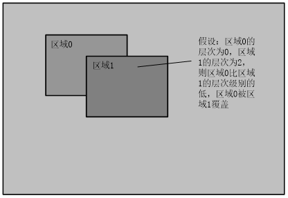
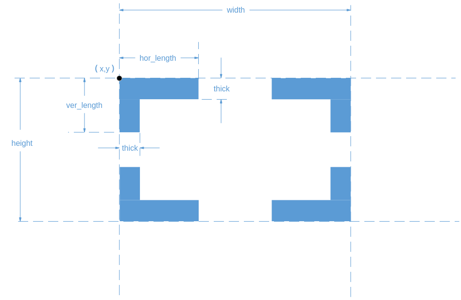

# Region Management
## Overview

Users typically need to overlay OSD (On-Screen Display) on video to display specific information (such as channel number, timestamp, etc.), and sometimes fill color blocks. These OSD elements overlaid on video and color blocks that cover the video are collectively referred to as regions. The REGION module is used to uniformly manage these region resources.

Region management enables the creation of regions and their overlay onto video or occlusion of video. For example, in practical applications, a user creates a region and uses [ss\_mpi\_rgn\_attach\_to\_chn](#ZH-CN_TOPIC_0000002408098474) to overlay the region onto a channel (such as a VENC channel). When the channel is scheduled, the OSD is overlaid on the video. A region supports being specified to multiple channels (e.g., multiple VENC channels, multiple VI channels, or even multiple VENC and VI channels) through the channel display attribute interface, and supports different display attributes (such as position, layer, transparency, etc.) for each channel.

## Feature Description

### Important Concepts

-   Region Types
    -   OVERLAY: Video overlay region, supporting bitmap loading and background color updates.
    -   OVERLAYEX: Extended video overlay region, functionally similar to OVERLAY, supporting bitmap loading and background color updates.
    -   COVER: Video cover region, supporting solid color block occlusion.
    -   COVEREX: Extended video cover region, functionally similar to COVER, supporting solid color block occlusion.
    -   LINE: Extended line video overlay region, supporting color and thickness adjustment.
    -   MOSAIC: Mosaic occlusion region, supporting precision adjustment.
    -   MOSAICEX: Extended mosaic occlusion region, supporting precision adjustment.
    -   CORNER\_RECTEX: Corner rectangle region, supporting size, color, and thickness adjustment.
    -   OVERLAYEX/COVEREX/MOSAICEX are functionally similar to OVERLAY/COVER/MOSAIC respectively, but introduce additional system bandwidth. OVERLAYEX/COVEREX/MOSAICEX are overlaid onto images by VGS. The larger the OVERLAYEX/COVEREX/MOSAICEX region, the greater the VGS performance consumption. When VGS performance is insufficient, the frame rate may decrease. It is recommended to use these only when OVERLAY/COVER/MOSAIC are not supported or when the quantity is insufficient.

-   Region Layer

    The region layer indicates the overlay level of the region. For the same region type, a higher layer value means a higher display level. When regions overlap, the region with a higher layer value covers the one with a lower value. When region layers are the same, the order of customer attach calls determines the overlay order. Different region types follow the module processing order.

    **Figure 1** Layer overlay diagram
    
-   Corner Rectangle

    Corner rectangles have multiple adjustable attributes. hor\_length must be less than width, and ver\_length must be less than height. The corner rectangle must not extend beyond the image display area.

    **Figure 2** Corner rectangle diagram
    
-   Bitmap Filling (valid for OVERLAY and OVERLAYEX)

    Bitmap filling refers to filling the bitmap memory values into the region memory space. The bitmap starts filling from the top-left corner of the region. When the bitmap is smaller than the region, only a portion of the memory is filled, and the remaining part keeps its original values. When the bitmap is equal in size to the region, it fills exactly. When the bitmap is larger than the region, only the portion equal to the region size is filled into the region.

    Bitmap filling supports two implementation methods:

    -   Method 1: The user copies bitmap data to the internal display canvas via the [ss\_mpi\_rgn\_set\_bmp](#ZH-CN_TOPIC_0000002408258666) interface.
    -   Method 2: The user obtains the address of the internal backup display canvas via [ss\_mpi\_rgn\_get\_canvas\_info](#ZH-CN_TOPIC_0000002441697817), directly updates the data at that address, and then calls the [ss\_mpi\_rgn\_update\_canvas](#ZH-CN_TOPIC_0000002408258158) interface to update the backup display canvas to the display canvas, thus achieving bitmap data updates.

-   Region Common Attributes

    When creating a region, the user needs to set the attribute information, which contains common resource information. For example, OVERLAY includes pixel format, size, and background color.

-   Channel Display Attributes (\([ot\_rgn\_type\_chn\_attr](#ZH-CN_TOPIC_0000002408258454)\))

    Channel display attributes indicate the display characteristics of a region on a specific channel. For example, OVERLAY's channel display attributes include display position, layer, foreground Alpha, background Alpha, and QP information for encoding. When the region's display attribute is\_show is set to TRUE, it is displayed on that channel; otherwise, it exists on the channel but is hidden.

-   Region Inversion

    When a region is overlaid on a video for display, if the video background has similar luminance and chrominance to the overlaid region, it can be difficult to distinguish the background from the region. The region inversion function addresses this scenario by adaptively adjusting the luminance and chrominance of the region based on background changes, making the region clearly visible.

    The region inversion function is implemented as follows: Using the region luminance statistics function provided by VPSS, the user can obtain the luminance statistics of the background for each region to be overlaid in real-time from the video sequence. Then, using VGS, the user manually performs inversion processing on the region, and finally overlays the inverted region onto the video via VGS.

-   Region QP Protection

    When a region is overlaid on video for compression encoding, to ensure the sharpness of the overlaid region is not compromised by data compression, the compression characteristics of the overlaid region portion can be set independently, i.e., setting QP protection function parameters. QP protection is a unique feature of OVERLAY and is only effective for H.264/H.265 encoding channels; it is invalid for other types.

> **Note:**
>Region does not support solid concave quadrilaterals; solid concave quadrilaterals are displayed as triangles.

**Table 1** SS528V100/SS625V100/SS524V100/SS522V101/SS626V100 region supported module information

<table><thead align="left"><tr id="row158mcpsimp"><th class="cellrowborder" valign="top" width="19.29%" id="mcps1.2.5.1.1">
Type

</th>
<th class="cellrowborder" valign="top" width="14.7%" id="mcps1.2.5.1.2">
Supported Module

</th>
<th class="cellrowborder" valign="top" width="38.75%" id="mcps1.2.5.1.3">
Device Number Range

</th>
<th class="cellrowborder" valign="top" width="27.26%" id="mcps1.2.5.1.4">
Channel Number Range

</th>
</tr>
</thead>
<tbody><tr id="row168mcpsimp"><td class="cellrowborder" rowspan="2" valign="top" width="19.29%" headers="mcps1.2.5.1.1 ">
OVERLAY

</td>
<td class="cellrowborder" valign="top" width="14.7%" headers="mcps1.2.5.1.2 ">
VENC

</td>
<td class="cellrowborder" valign="top" width="38.75%" headers="mcps1.2.5.1.3 ">
0

</td>
<td class="cellrowborder" valign="top" width="27.26%" headers="mcps1.2.5.1.4 ">
[0,OT_VENC_MAX_CHN_NUM-1]

</td>
</tr>
<tr id="row177mcpsimp"><td class="cellrowborder" valign="top" headers="mcps1.2.5.1.1 ">
VPSS

</td>
<td class="cellrowborder" valign="top" headers="mcps1.2.5.1.2 ">
[0,OT_VPSS_MAX_GRP_NUM-1]

</td>
<td class="cellrowborder" valign="top" headers="mcps1.2.5.1.3 ">
0

</td>
</tr>
<tr id="row184mcpsimp"><td class="cellrowborder" rowspan="2" valign="top" width="19.29%" headers="mcps1.2.5.1.1 ">
COVER

</td>
<td class="cellrowborder" valign="top" width="14.7%" headers="mcps1.2.5.1.2 ">
VPSS

</td>
<td class="cellrowborder" valign="top" width="38.75%" headers="mcps1.2.5.1.3 ">
[0,OT_VPSS_MAX_GRP_NUM-1]

</td>
<td class="cellrowborder" valign="top" width="27.26%" headers="mcps1.2.5.1.4 ">
0

</td>
</tr>
<tr id="row193mcpsimp"><td class="cellrowborder" valign="top" headers="mcps1.2.5.1.1 ">
VI

</td>
<td class="cellrowborder" valign="top" headers="mcps1.2.5.1.2 ">
0

</td>
<td class="cellrowborder" valign="top" headers="mcps1.2.5.1.3 ">
[0, OT_VI_MAX_PHYS_CHN_NUM-1]

Sub-channels do not support COVER.

</td>
</tr>
<tr id="row201mcpsimp"><td class="cellrowborder" rowspan="3" valign="top" width="19.29%" headers="mcps1.2.5.1.1 ">
OVERLAYEX

</td>
<td class="cellrowborder" valign="top" width="14.7%" headers="mcps1.2.5.1.2 ">
VPSS

</td>
<td class="cellrowborder" valign="top" width="38.75%" headers="mcps1.2.5.1.3 ">
[0,OT_VPSS_MAX_GRP_NUM-1]

</td>
<td class="cellrowborder" valign="top" width="27.26%" headers="mcps1.2.5.1.4 ">
[0, OT_VPSS_MAX_CHN_NUM-1]

</td>
</tr>
<tr id="row210mcpsimp"><td class="cellrowborder" valign="top" headers="mcps1.2.5.1.1 ">
VO

</td>
<td class="cellrowborder" valign="top" headers="mcps1.2.5.1.2 ">
[0,OT_VO_MAX_PHYS_VIDEO_LAYER_NUM-1]

</td>
<td class="cellrowborder" valign="top" headers="mcps1.2.5.1.3 ">
[0, OT_VO_MAX_CHN_NUM-1]

</td>
</tr>
<tr id="row217mcpsimp"><td class="cellrowborder" valign="top" headers="mcps1.2.5.1.1 ">
PCIV

(SS524V100/SS522V101 do not support PCIV)

</td>
<td class="cellrowborder" valign="top" headers="mcps1.2.5.1.2 ">
0

</td>
<td class="cellrowborder" valign="top" headers="mcps1.2.5.1.3 ">
[0,OT_PCIV_MAX_CHN_NUM-1]

</td>
</tr>
<tr id="row227mcpsimp"><td class="cellrowborder" rowspan="2" valign="top" width="19.29%" headers="mcps1.2.5.1.1 ">
COVEREX

</td>
<td class="cellrowborder" valign="top" width="14.7%" headers="mcps1.2.5.1.2 ">
VPSS

</td>
<td class="cellrowborder" valign="top" width="38.75%" headers="mcps1.2.5.1.3 ">
[0,OT_VPSS_MAX_GRP_NUM-1]

</td>
<td class="cellrowborder" valign="top" width="27.26%" headers="mcps1.2.5.1.4 ">
[0, OT_VPSS_MAX_CHN_NUM-1]

</td>
</tr>
<tr id="row236mcpsimp"><td class="cellrowborder" valign="top" headers="mcps1.2.5.1.1 ">
VO

</td>
<td class="cellrowborder" valign="top" headers="mcps1.2.5.1.2 ">
[0,OT_VO_MAX_LAYER_NUM-1]

</td>
<td class="cellrowborder" valign="top" headers="mcps1.2.5.1.3 ">
[0, OT_VO_MAX_CHN_NUM-1]

</td>
</tr>
<tr id="row243mcpsimp"><td class="cellrowborder" rowspan="2" valign="top" width="19.29%" headers="mcps1.2.5.1.1 ">
LINE

</td>
<td class="cellrowborder" valign="top" width="14.7%" headers="mcps1.2.5.1.2 ">
VPSS

</td>
<td class="cellrowborder" valign="top" width="38.75%" headers="mcps1.2.5.1.3 ">
[0,OT_VPSS_MAX_GRP_NUM-1]

</td>
<td class="cellrowborder" valign="top" width="27.26%" headers="mcps1.2.5.1.4 ">
[0,OT_VPSS_MAX_CHN_NUM-1]

</td>
</tr>
<tr id="row252mcpsimp"><td class="cellrowborder" valign="top" headers="mcps1.2.5.1.1 ">
VO

</td>
<td class="cellrowborder" valign="top" headers="mcps1.2.5.1.2 ">
[0,OT_VO_MAX_LAYER_NUM-1]

</td>
<td class="cellrowborder" valign="top" headers="mcps1.2.5.1.3 ">
[0, OT_VO_MAX_CHN_NUM-1]

</td>
</tr>
<tr id="row259mcpsimp"><td class="cellrowborder" valign="top" width="19.29%" headers="mcps1.2.5.1.1 ">
MOSAIC

</td>
<td class="cellrowborder" valign="top" width="14.7%" headers="mcps1.2.5.1.2 ">
VPSS

</td>
<td class="cellrowborder" valign="top" width="38.75%" headers="mcps1.2.5.1.3 ">
[0,OT_VPSS_MAX_GRP_NUM-1]

</td>
<td class="cellrowborder" valign="top" width="27.26%" headers="mcps1.2.5.1.4 ">
0

</td>
</tr>
<tr id="row268mcpsimp"><td class="cellrowborder" valign="top" width="19.29%" headers="mcps1.2.5.1.1 ">
MOSAICEX

</td>
<td class="cellrowborder" valign="top" width="14.7%" headers="mcps1.2.5.1.2 ">
VPSS

</td>
<td class="cellrowborder" valign="top" width="38.75%" headers="mcps1.2.5.1.3 ">
[0,OT_VPSS_MAX_GRP_NUM-1]

</td>
<td class="cellrowborder" valign="top" width="27.26%" headers="mcps1.2.5.1.4 ">
[0,OT_VPSS_MAX_CHN_NUM-1]

</td>
</tr>
</tbody>
</table>

**Table 2** SS928V100 region supported module information

<table><thead align="left"><tr id="row284mcpsimp"><th class="cellrowborder" valign="top" width="17%" id="mcps1.2.5.1.1">
Type

</th>
<th class="cellrowborder" valign="top" width="10%" id="mcps1.2.5.1.2">
Supported Module

</th>
<th class="cellrowborder" valign="top" width="38.05%" id="mcps1.2.5.1.3">
Device Number Range

</th>
<th class="cellrowborder" valign="top" width="34.949999999999996%" id="mcps1.2.5.1.4">
Channel Number Range

</th>
</tr>
</thead>
<tbody><tr id="row294mcpsimp"><td class="cellrowborder" valign="top" width="17%" headers="mcps1.2.5.1.1 ">
OVERLAY

</td>
<td class="cellrowborder" valign="top" width="10%" headers="mcps1.2.5.1.2 ">
VENC

</td>
<td class="cellrowborder" valign="top" width="38.05%" headers="mcps1.2.5.1.3 ">
0

</td>
<td class="cellrowborder" valign="top" width="34.949999999999996%" headers="mcps1.2.5.1.4 ">
[0,OT_VENC_MAX_CHN_NUM-1]

</td>
</tr>
<tr id="row303mcpsimp"><td class="cellrowborder" rowspan="2" valign="top" width="17%" headers="mcps1.2.5.1.1 ">
COVER

</td>
<td class="cellrowborder" valign="top" width="10%" headers="mcps1.2.5.1.2 ">
VPSS

</td>
<td class="cellrowborder" valign="top" width="38.05%" headers="mcps1.2.5.1.3 ">
[0,OT_VPSS_MAX_GRP_NUM-1]

</td>
<td class="cellrowborder" valign="top" width="34.949999999999996%" headers="mcps1.2.5.1.4 ">
0

</td>
</tr>
<tr id="row312mcpsimp"><td class="cellrowborder" valign="top" headers="mcps1.2.5.1.1 ">
MCF

</td>
<td class="cellrowborder" valign="top" headers="mcps1.2.5.1.2 ">
[0,OT_MCF_MAX_GRP_NUM-1]

</td>
<td class="cellrowborder" valign="top" headers="mcps1.2.5.1.3 ">
0

</td>
</tr>
<tr id="row319mcpsimp"><td class="cellrowborder" rowspan="6" valign="top" width="17%" headers="mcps1.2.5.1.1 ">
OVERLAYEX

</td>
<td class="cellrowborder" valign="top" width="10%" headers="mcps1.2.5.1.2 ">
VPSS

</td>
<td class="cellrowborder" valign="top" width="38.05%" headers="mcps1.2.5.1.3 ">
[0,OT_VPSS_MAX_GRP_NUM-1]

</td>
<td class="cellrowborder" valign="top" width="34.949999999999996%" headers="mcps1.2.5.1.4 ">
[0, OT_VPSS_MAX_PHYS_CHN_NUM-1]

</td>
</tr>
<tr id="row328mcpsimp"><td class="cellrowborder" valign="top" headers="mcps1.2.5.1.1 ">
VO

</td>
<td class="cellrowborder" valign="top" headers="mcps1.2.5.1.2 ">
[0,OT_VO_MAX_PHYS_VIDEO_LAYER_NUM-1]

</td>
<td class="cellrowborder" valign="top" headers="mcps1.2.5.1.3 ">
[0, OT_VO_MAX_CHN_NUM-1]

</td>
</tr>
<tr id="row335mcpsimp"><td class="cellrowborder" valign="top" headers="mcps1.2.5.1.1 ">
AVS

</td>
<td class="cellrowborder" valign="top" headers="mcps1.2.5.1.2 ">
[0, OT_AVS_MAX_GRP_NUM-1]

</td>
<td class="cellrowborder" valign="top" headers="mcps1.2.5.1.3 ">
[0, OT_AVS_MAX_CHN_NUM-1]

</td>
</tr>
<tr id="row342mcpsimp"><td class="cellrowborder" valign="top" headers="mcps1.2.5.1.1 ">
PCIV

</td>
<td class="cellrowborder" valign="top" headers="mcps1.2.5.1.2 ">
0

</td>
<td class="cellrowborder" valign="top" headers="mcps1.2.5.1.3 ">
[0,OT_PCIV_MAX_CHN_NUM-1]

</td>
</tr>
<tr id="row349mcpsimp"><td class="cellrowborder" valign="top" headers="mcps1.2.5.1.1 ">
MCF

</td>
<td class="cellrowborder" valign="top" headers="mcps1.2.5.1.2 ">
[0,OT_MCF_MAX_GRP_NUM-1]

</td>
<td class="cellrowborder" valign="top" headers="mcps1.2.5.1.3 ">
[0, OT_MCF_MAX_PHYS_CHN_NUM-1]

</td>
</tr>
<tr id="row356mcpsimp"><td class="cellrowborder" valign="top" headers="mcps1.2.5.1.1 ">
VI

</td>
<td class="cellrowborder" valign="top" headers="mcps1.2.5.1.2 ">
[0, OT_VI_MAX_PIPE_NUM-1]

</td>
<td class="cellrowborder" valign="top" headers="mcps1.2.5.1.3 ">
[0, OT_VI_MAX_CHN_NUM-1]

</td>
</tr>
<tr id="row363mcpsimp"><td class="cellrowborder" rowspan="4" valign="top" width="17%" headers="mcps1.2.5.1.1 ">
COVEREX

</td>
<td class="cellrowborder" valign="top" width="10%" headers="mcps1.2.5.1.2 ">
VPSS

</td>
<td class="cellrowborder" valign="top" width="38.05%" headers="mcps1.2.5.1.3 ">
[0,OT_VPSS_MAX_GRP_NUM-1]

</td>
<td class="cellrowborder" valign="top" width="34.949999999999996%" headers="mcps1.2.5.1.4 ">
[0, OT_VPSS_MAX_PHYS_CHN_NUM-1]

</td>
</tr>
<tr id="row372mcpsimp"><td class="cellrowborder" valign="top" headers="mcps1.2.5.1.1 ">
VO

</td>
<td class="cellrowborder" valign="top" headers="mcps1.2.5.1.2 ">
[0,OT_VO_MAX_LAYER_NUM-1]

</td>
<td class="cellrowborder" valign="top" headers="mcps1.2.5.1.3 ">
[0, OT_VO_MAX_CHN_NUM-1]

</td>
</tr>
<tr id="row379mcpsimp"><td class="cellrowborder" valign="top" headers="mcps1.2.5.1.1 ">
VI

</td>
<td class="cellrowborder" valign="top" headers="mcps1.2.5.1.2 ">
[0, OT_VI_MAX_PIPE_NUM-1]

</td>
<td class="cellrowborder" valign="top" headers="mcps1.2.5.1.3 ">
[0, OT_VI_MAX_CHN_NUM-1]

</td>
</tr>
<tr id="row386mcpsimp"><td class="cellrowborder" valign="top" headers="mcps1.2.5.1.1 ">
MCF

</td>
<td class="cellrowborder" valign="top" headers="mcps1.2.5.1.2 ">
[0,OT_MCF_MAX_GRP_NUM-1]

</td>
<td class="cellrowborder" valign="top" headers="mcps1.2.5.1.3 ">
[0, OT_MCF_MAX_PHYS_CHN_NUM-1]

</td>
</tr>
<tr id="row393mcpsimp"><td class="cellrowborder" rowspan="3" valign="top" width="17%" headers="mcps1.2.5.1.1 ">
LINE

</td>
<td class="cellrowborder" valign="top" width="10%" headers="mcps1.2.5.1.2 ">
VPSS

</td>
<td class="cellrowborder" valign="top" width="38.05%" headers="mcps1.2.5.1.3 ">
[0,OT_VPSS_MAX_GRP_NUM-1]

</td>
<td class="cellrowborder" valign="top" width="34.949999999999996%" headers="mcps1.2.5.1.4 ">
[0,OT_VPSS_MAX_PHYS_CHN_NUM-1]

</td>
</tr>
<tr id="row402mcpsimp"><td class="cellrowborder" valign="top" headers="mcps1.2.5.1.1 ">
VO

</td>
<td class="cellrowborder" valign="top" headers="mcps1.2.5.1.2 ">
[0,OT_VO_MAX_LAYER_NUM-1]

</td>
<td class="cellrowborder" valign="top" headers="mcps1.2.5.1.3 ">
[0, OT_VO_MAX_CHN_NUM-1]

</td>
</tr>
<tr id="row409mcpsimp"><td class="cellrowborder" valign="top" headers="mcps1.2.5.1.1 ">
MCF

</td>
<td class="cellrowborder" valign="top" headers="mcps1.2.5.1.2 ">
[0,OT_MCF_MAX_GRP_NUM-1]

</td>
<td class="cellrowborder" valign="top" headers="mcps1.2.5.1.3 ">
[0, OT_MCF_MAX_PHYS_CHN_NUM-1]

</td>
</tr>
<tr id="row416mcpsimp"><td class="cellrowborder" rowspan="2" valign="top" width="17%" headers="mcps1.2.5.1.1 ">
MOSAIC

</td>
<td class="cellrowborder" valign="top" width="10%" headers="mcps1.2.5.1.2 ">
VPSS

</td>
<td class="cellrowborder" valign="top" width="38.05%" headers="mcps1.2.5.1.3 ">
[0,OT_VPSS_MAX_GRP_NUM-1]

</td>
<td class="cellrowborder" valign="top" width="34.949999999999996%" headers="mcps1.2.5.1.4 ">
0

</td>
</tr>
<tr id="row425mcpsimp"><td class="cellrowborder" valign="top" headers="mcps1.2.5.1.1 ">
MCF

</td>
<td class="cellrowborder" valign="top" headers="mcps1.2.5.1.2 ">
[0,OT_MCF_MAX_GRP_NUM-1]

</td>
<td class="cellrowborder" valign="top" headers="mcps1.2.5.1.3 ">
0

</td>
</tr>
<tr id="row432mcpsimp"><td class="cellrowborder" rowspan="2" valign="top" width="17%" headers="mcps1.2.5.1.1 ">
MOSAICEX

</td>
<td class="cellrowborder" valign="top" width="10%" headers="mcps1.2.5.1.2 ">
VPSS

</td>
<td class="cellrowborder" valign="top" width="38.05%" headers="mcps1.2.5.1.3 ">
[0,OT_VPSS_MAX_GRP_NUM-1]

</td>
<td class="cellrowborder" valign="top" width="34.949999999999996%" headers="mcps1.2.5.1.4 ">
[0,OT_VPSS_MAX_PHYS_CHN_NUM-1]

</td>
</tr>
<tr id="row441mcpsimp"><td class="cellrowborder" valign="top" headers="mcps1.2.5.1.1 ">
MCF

</td>
<td class="cellrowborder" valign="top" headers="mcps1.2.5.1.2 ">
[0,OT_MCF_MAX_GRP_NUM-1]

</td>
<td class="cellrowborder" valign="top" headers="mcps1.2.5.1.3 ">
[0, OT_MCF_MAX_PHYS_CHN_NUM-1]

</td>
</tr>
<tr id="row448mcpsimp"><td class="cellrowborder" rowspan="3" valign="top" width="17%" headers="mcps1.2.5.1.1 ">
CORNER_RECTEX

</td>
<td class="cellrowborder" valign="top" width="10%" headers="mcps1.2.5.1.2 ">
VPSS

</td>
<td class="cellrowborder" valign="top" width="38.05%" headers="mcps1.2.5.1.3 ">
[0,OT_VPSS_MAX_GRP_NUM-1]

</td>
<td class="cellrowborder" valign="top" width="34.949999999999996%" headers="mcps1.2.5.1.4 ">
[0,OT_VPSS_MAX_PHYS_CHN_NUM-1]

</td>
</tr>
<tr id="row457mcpsimp"><td class="cellrowborder" valign="top" headers="mcps1.2.5.1.1 ">
VO

</td>
<td class="cellrowborder" valign="top" headers="mcps1.2.5.1.2 ">
[0,OT_VO_MAX_LAYER_NUM-1]

</td>
<td class="cellrowborder" valign="top" headers="mcps1.2.5.1.3 ">
[0, OT_VO_MAX_CHN_NUM-1]

</td>
</tr>
<tr id="row464mcpsimp"><td class="cellrowborder" valign="top" headers="mcps1.2.5.1.1 ">
MCF

</td>
<td class="cellrowborder" valign="top" headers="mcps1.2.5.1.2 ">
[0,OT_MCF_MAX_GRP_NUM-1]

</td>
<td class="cellrowborder" valign="top" headers="mcps1.2.5.1.3 ">
[0, OT_MCF_MAX_PHYS_CHN_NUM-1]

</td>
</tr>
</tbody>
</table>

-   Region Supported Features

    The features supported by various region types are shown in [Table 3](#_Ref17904683) and [Table 4](#_Ref28008926).

> **Note:**
>-   The VO module only supports region in single mode, not in multi mode.
>-   When PCIV (Peripheral Component Interconnect Video) overlays regions, only the slave chip supports region overlay; the master chip does not support it.

**Table 3** SS528V100/SS625V100/SS524V100/SS522V101/SS626V100 region supported features

<table><thead align="left"><tr id="row495mcpsimp"><th class="cellrowborder" rowspan="2" valign="top" id="mcps1.2.11.1.1">
Supported Feature

Supported Module

</th>
<th class="cellrowborder" colspan="2" valign="top" id="mcps1.2.11.1.2">
OVERLAY

</th>
<th class="cellrowborder" valign="top" id="mcps1.2.11.1.3">
OVERLAYEX

</th>
<th class="cellrowborder" colspan="2" valign="top" id="mcps1.2.11.1.4">
COVER

</th>
<th class="cellrowborder" valign="top" id="mcps1.2.11.1.5">
COVEREX

</th>
<th class="cellrowborder" valign="top" id="mcps1.2.11.1.6">
LINE

</th>
<th class="cellrowborder" valign="top" id="mcps1.2.11.1.7">
MOSAIC

</th>
<th class="cellrowborder" valign="top" id="mcps1.2.11.1.8">
MOSAICEX

</th>
</tr>
<tr id="row882316481016"><th class="cellrowborder" valign="top" id="mcps1.2.11.2.1">
VPSS

</th>
<th class="cellrowborder" valign="top" id="mcps1.2.11.2.2">
VENC

</th>
<th class="cellrowborder" valign="top" id="mcps1.2.11.2.3">
VPSS

PCIV (SS524V100/SS522V101 do not support PCIV)

VO

</th>
<th class="cellrowborder" colspan="2" valign="top" id="mcps1.2.11.2.4">
VPSS

VI

</th>
<th class="cellrowborder" valign="top" id="mcps1.2.11.2.5">
VPSS

VO

</th>
<th class="cellrowborder" valign="top" id="mcps1.2.11.2.6">
VPSS

VO

</th>
<th class="cellrowborder" valign="top" id="mcps1.2.11.2.7">
VPSS

</th>
<th class="cellrowborder" valign="top" id="mcps1.2.11.2.8">
VPSS

</th>
</tr>
</thead>
<tbody><tr id="row537mcpsimp"><td class="cellrowborder" valign="top" headers="mcps1.2.11.1.1 mcps1.2.11.2.1 ">
Pixel Format

</td>
<td class="cellrowborder" valign="top" headers="mcps1.2.11.1.2 mcps1.2.11.2.2 ">
Argb1555

Argb4444

Argb8888

CLUT2

CLUT4

</td>
<td class="cellrowborder" valign="top" headers="mcps1.2.11.1.2 mcps1.2.11.2.3 ">
Argb1555

Argb4444

CLUT2

CLUT4

</td>
<td class="cellrowborder" valign="top" headers="mcps1.2.11.1.3 ">
Argb1555

Argb4444

Argb8888

CLUT2

CLUT4

</td>
<td class="cellrowborder" colspan="2" valign="top" headers="mcps1.2.11.1.4 mcps1.2.11.2.4 ">
RGB888

</td>
<td class="cellrowborder" valign="top" headers="mcps1.2.11.1.5 mcps1.2.11.2.5 ">
RGB888

</td>
<td class="cellrowborder" valign="top" headers="mcps1.2.11.1.6 mcps1.2.11.2.6 ">
N/A

</td>
<td class="cellrowborder" valign="top" headers="mcps1.2.11.1.7 mcps1.2.11.2.7 ">
N/A

</td>
<td class="cellrowborder" valign="top" headers="mcps1.2.11.1.8 mcps1.2.11.2.8 ">
N/A

</td>
</tr>
<tr id="row568mcpsimp"><td class="cellrowborder" valign="top" headers="mcps1.2.11.1.1 mcps1.2.11.2.1 ">
Overlay Layer

</td>
<td class="cellrowborder" colspan="2" valign="top" headers="mcps1.2.11.1.2 mcps1.2.11.2.2 mcps1.2.11.2.3 ">
Supported

</td>
<td class="cellrowborder" valign="top" headers="mcps1.2.11.1.3 ">
Supported

</td>
<td class="cellrowborder" colspan="2" valign="top" headers="mcps1.2.11.1.4 mcps1.2.11.2.4 ">
Supported

</td>
<td class="cellrowborder" valign="top" headers="mcps1.2.11.1.5 mcps1.2.11.2.5 ">
Supported

</td>
<td class="cellrowborder" valign="top" headers="mcps1.2.11.1.6 mcps1.2.11.2.6 ">
N/A

</td>
<td class="cellrowborder" valign="top" headers="mcps1.2.11.1.7 mcps1.2.11.2.7 ">
Supported

</td>
<td class="cellrowborder" valign="top" headers="mcps1.2.11.1.8 mcps1.2.11.2.8 ">
Supported

</td>
</tr>
<tr id="row585mcpsimp"><td class="cellrowborder" valign="top" headers="mcps1.2.11.1.1 mcps1.2.11.2.1 ">
Bitmap Fill

</td>
<td class="cellrowborder" colspan="2" valign="top" headers="mcps1.2.11.1.2 mcps1.2.11.2.2 mcps1.2.11.2.3 ">
Supported

</td>
<td class="cellrowborder" valign="top" headers="mcps1.2.11.1.3 ">
Supported

</td>
<td class="cellrowborder" colspan="2" valign="top" headers="mcps1.2.11.1.4 mcps1.2.11.2.4 ">
N/A

</td>
<td class="cellrowborder" valign="top" headers="mcps1.2.11.1.5 mcps1.2.11.2.5 ">
N/A

</td>
<td class="cellrowborder" valign="top" headers="mcps1.2.11.1.6 mcps1.2.11.2.6 ">
N/A

</td>
<td class="cellrowborder" valign="top" headers="mcps1.2.11.1.7 mcps1.2.11.2.7 ">
N/A

</td>
<td class="cellrowborder" valign="top" headers="mcps1.2.11.1.8 mcps1.2.11.2.8 ">
N/A

</td>
</tr>
<tr id="row602mcpsimp"><td class="cellrowborder" valign="top" headers="mcps1.2.11.1.1 mcps1.2.11.2.1 ">
Overlay Transparency

</td>
<td class="cellrowborder" colspan="2" valign="top" headers="mcps1.2.11.1.2 mcps1.2.11.2.2 mcps1.2.11.2.3 ">
Supported

</td>
<td class="cellrowborder" valign="top" headers="mcps1.2.11.1.3 ">
Supported

</td>
<td class="cellrowborder" colspan="2" valign="top" headers="mcps1.2.11.1.4 mcps1.2.11.2.4 ">
N/A

</td>
<td class="cellrowborder" valign="top" headers="mcps1.2.11.1.5 mcps1.2.11.2.5 ">
N/A

</td>
<td class="cellrowborder" valign="top" headers="mcps1.2.11.1.6 mcps1.2.11.2.6 ">
N/A

</td>
<td class="cellrowborder" valign="top" headers="mcps1.2.11.1.7 mcps1.2.11.2.7 ">
N/A

</td>
<td class="cellrowborder" valign="top" headers="mcps1.2.11.1.8 mcps1.2.11.2.8 ">
N/A

</td>
</tr>
<tr id="row619mcpsimp"><td class="cellrowborder" valign="top" headers="mcps1.2.11.1.1 mcps1.2.11.2.1 ">
Foreground Alpha Range

</td>
<td class="cellrowborder" valign="top" headers="mcps1.2.11.1.2 mcps1.2.11.2.2 ">
0~255

</td>
<td class="cellrowborder" valign="top" headers="mcps1.2.11.1.2 mcps1.2.11.2.3 ">
0~128

</td>
<td class="cellrowborder" valign="top" headers="mcps1.2.11.1.3 ">
0~255

</td>
<td class="cellrowborder" colspan="2" valign="top" headers="mcps1.2.11.1.4 mcps1.2.11.2.4 ">
N/A

</td>
<td class="cellrowborder" valign="top" headers="mcps1.2.11.1.5 mcps1.2.11.2.5 ">
N/A

</td>
<td class="cellrowborder" valign="top" headers="mcps1.2.11.1.6 mcps1.2.11.2.6 ">
N/A

</td>
<td class="cellrowborder" valign="top" headers="mcps1.2.11.1.7 mcps1.2.11.2.7 ">
N/A

</td>
<td class="cellrowborder" valign="top" headers="mcps1.2.11.1.8 mcps1.2.11.2.8 ">
N/A

</td>
</tr>
<tr id="row638mcpsimp"><td class="cellrowborder" valign="top" headers="mcps1.2.11.1.1 mcps1.2.11.2.1 ">
Background Alpha Range

</td>
<td class="cellrowborder" valign="top" headers="mcps1.2.11.1.2 mcps1.2.11.2.2 ">
0~255

</td>
<td class="cellrowborder" valign="top" headers="mcps1.2.11.1.2 mcps1.2.11.2.3 ">
0~128

</td>
<td class="cellrowborder" valign="top" headers="mcps1.2.11.1.3 ">
0~255

</td>
<td class="cellrowborder" colspan="2" valign="top" headers="mcps1.2.11.1.4 mcps1.2.11.2.4 ">
N/A

</td>
<td class="cellrowborder" valign="top" headers="mcps1.2.11.1.5 mcps1.2.11.2.5 ">
N/A

</td>
<td class="cellrowborder" valign="top" headers="mcps1.2.11.1.6 mcps1.2.11.2.6 ">
N/A

</td>
<td class="cellrowborder" valign="top" headers="mcps1.2.11.1.7 mcps1.2.11.2.7 ">
N/A

</td>
<td class="cellrowborder" valign="top" headers="mcps1.2.11.1.8 mcps1.2.11.2.8 ">
N/A

</td>
</tr>
<tr id="row1211923254215"><td class="cellrowborder" valign="top" headers="mcps1.2.11.1.1 mcps1.2.11.2.1 ">
QP Protection

</td>
<td class="cellrowborder" valign="top" headers="mcps1.2.11.1.2 mcps1.2.11.2.2 ">
N/A

</td>
<td class="cellrowborder" valign="top" headers="mcps1.2.11.1.2 mcps1.2.11.2.3 ">
Supported

</td>
<td class="cellrowborder" valign="top" headers="mcps1.2.11.1.3 ">
N/A

</td>
<td class="cellrowborder" colspan="2" valign="top" headers="mcps1.2.11.1.4 mcps1.2.11.2.4 ">
N/A

</td>
<td class="cellrowborder" valign="top" headers="mcps1.2.11.1.5 mcps1.2.11.2.5 ">
N/A

</td>
<td class="cellrowborder" valign="top" headers="mcps1.2.11.1.6 mcps1.2.11.2.6 ">
N/A

</td>
<td class="cellrowborder" valign="top" headers="mcps1.2.11.1.7 mcps1.2.11.2.7 ">
N/A

</td>
<td class="cellrowborder" valign="top" headers="mcps1.2.11.1.8 mcps1.2.11.2.8 ">
N/A

</td>
</tr>
<tr id="row731132611421"><td class="cellrowborder" valign="top" headers="mcps1.2.11.1.1 mcps1.2.11.2.1 ">
Inversion

</td>
<td class="cellrowborder" valign="top" headers="mcps1.2.11.1.2 mcps1.2.11.2.2 ">
Supported (user-implemented)

</td>
<td class="cellrowborder" valign="top" headers="mcps1.2.11.1.2 mcps1.2.11.2.3 ">
N/A

</td>
<td class="cellrowborder" valign="top" headers="mcps1.2.11.1.3 ">
N/A

</td>
<td class="cellrowborder" colspan="2" valign="top" headers="mcps1.2.11.1.4 mcps1.2.11.2.4 ">
N/A

</td>
<td class="cellrowborder" valign="top" headers="mcps1.2.11.1.5 mcps1.2.11.2.5 ">
N/A

</td>
<td class="cellrowborder" valign="top" headers="mcps1.2.11.1.6 mcps1.2.11.2.6 ">
N/A

</td>
<td class="cellrowborder" valign="top" headers="mcps1.2.11.1.7 mcps1.2.11.2.7 ">
N/A

</td>
<td class="cellrowborder" valign="top" headers="mcps1.2.11.1.8 mcps1.2.11.2.8 ">
N/A

</td>
</tr>
</tbody>
</table>

**Table 4** SS928V100 region supported features

<table><thead align="left"><tr id="row706mcpsimp"><th class="cellrowborder" rowspan="2" valign="top" width="13.931393139313933%" id="mcps1.2.9.1.1">
Supported Feature

Supported Module

</th>
<th class="cellrowborder" valign="top" width="10.731073107310731%" id="mcps1.2.9.1.2">
OVERLAY

</th>
<th class="cellrowborder" valign="top" width="15.721572157215721%" id="mcps1.2.9.1.3">
OVERLAYEX

</th>
<th class="cellrowborder" valign="top" width="11.101110111011101%" id="mcps1.2.9.1.4">
COVER

</th>
<th class="cellrowborder" valign="top" width="12.871287128712872%" id="mcps1.2.9.1.5">
COVEREX

</th>
<th class="cellrowborder" valign="top" width="8.91089108910891%" id="mcps1.2.9.1.6">
LINE

</th>
<th class="cellrowborder" valign="top" width="11.881188118811883%" id="mcps1.2.9.1.7">
MOSAIC

</th>
<th class="cellrowborder" valign="top" width="14.85148514851485%" id="mcps1.2.9.1.8">
MOSAICEX

</th>
</tr>
<tr id="row724mcpsimp"><th class="cellrowborder" valign="top" id="mcps1.2.9.2.1">
VENC

</th>
<th class="cellrowborder" valign="top" id="mcps1.2.9.2.2">
VPSS

VI

VO

AVS

PCIV

MCF

</th>
<th class="cellrowborder" valign="top" id="mcps1.2.9.2.3">
VPSS

MCF

</th>
<th class="cellrowborder" valign="top" id="mcps1.2.9.2.4">
VPSS

VO

VI

MCF

</th>
<th class="cellrowborder" valign="top" id="mcps1.2.9.2.5">
VPSS

VO

MCF

</th>
<th class="cellrowborder" valign="top" id="mcps1.2.9.2.6">
VPSS

MCF

</th>
<th class="cellrowborder" valign="top" id="mcps1.2.9.2.7">
VPSS

MCF

</th>
</tr>
</thead>
<tbody><tr id="row753mcpsimp"><td class="cellrowborder" valign="top" width="13.931393139313933%" headers="mcps1.2.9.1.1 mcps1.2.9.2.1 ">
Pixel Format

</td>
<td class="cellrowborder" valign="top" width="10.731073107310731%" headers="mcps1.2.9.1.2 mcps1.2.9.2.2 ">
Argb1555

Argb4444

CLUT2

CLUT4

</td>
<td class="cellrowborder" valign="top" width="15.721572157215721%" headers="mcps1.2.9.1.3 mcps1.2.9.2.3 ">
Argb1555

Argb4444

Argb8888

CLUT2

CLUT4

</td>
<td class="cellrowborder" valign="top" width="11.101110111011101%" headers="mcps1.2.9.1.4 mcps1.2.9.2.4 ">
RGB888

</td>
<td class="cellrowborder" valign="top" width="12.871287128712872%" headers="mcps1.2.9.1.5 mcps1.2.9.2.5 ">
RGB888

</td>
<td class="cellrowborder" valign="top" width="8.91089108910891%" headers="mcps1.2.9.1.6 mcps1.2.9.2.6 ">
N/A

</td>
<td class="cellrowborder" valign="top" width="11.881188118811883%" headers="mcps1.2.9.1.7 mcps1.2.9.2.7 ">
N/A

</td>
<td class="cellrowborder" valign="top" width="14.85148514851485%" headers="mcps1.2.9.1.8 ">
N/A

</td>
</tr>
<tr id="row777mcpsimp"><td class="cellrowborder" valign="top" width="13.931393139313933%" headers="mcps1.2.9.1.1 mcps1.2.9.2.1 ">
Overlay Layer

</td>
<td class="cellrowborder" valign="top" width="10.731073107310731%" headers="mcps1.2.9.1.2 mcps1.2.9.2.2 ">
Supported

</td>
<td class="cellrowborder" valign="top" width="15.721572157215721%" headers="mcps1.2.9.1.3 mcps1.2.9.2.3 ">
Supported

</td>
<td class="cellrowborder" valign="top" width="11.101110111011101%" headers="mcps1.2.9.1.4 mcps1.2.9.2.4 ">
Supported

</td>
<td class="cellrowborder" valign="top" width="12.871287128712872%" headers="mcps1.2.9.1.5 mcps1.2.9.2.5 ">
Supported

</td>
<td class="cellrowborder" valign="top" width="8.91089108910891%" headers="mcps1.2.9.1.6 mcps1.2.9.2.6 ">
N/A

</td>
<td class="cellrowborder" valign="top" width="11.881188118811883%" headers="mcps1.2.9.1.7 mcps1.2.9.2.7 ">
Supported

</td>
<td class="cellrowborder" valign="top" width="14.85148514851485%" headers="mcps1.2.9.1.8 ">
Supported

</td>
</tr>
<tr id="row794mcpsimp"><td class="cellrowborder" valign="top" width="13.931393139313933%" headers="mcps1.2.9.1.1 mcps1.2.9.2.1 ">
Bitmap Fill

</td>
<td class="cellrowborder" valign="top" width="10.731073107310731%" headers="mcps1.2.9.1.2 mcps1.2.9.2.2 ">
Supported

</td>
<td class="cellrowborder" valign="top" width="15.721572157215721%" headers="mcps1.2.9.1.3 mcps1.2.9.2.3 ">
Supported

</td>
<td class="cellrowborder" valign="top" width="11.101110111011101%" headers="mcps1.2.9.1.4 mcps1.2.9.2.4 ">
N/A

</td>
<td class="cellrowborder" valign="top" width="12.871287128712872%" headers="mcps1.2.9.1.5 mcps1.2.9.2.5 ">
N/A

</td>
<td class="cellrowborder" valign="top" width="8.91089108910891%" headers="mcps1.2.9.1.6 mcps1.2.9.2.6 ">
N/A

</td>
<td class="cellrowborder" valign="top" width="11.881188118811883%" headers="mcps1.2.9.1.7 mcps1.2.9.2.7 ">
N/A

</td>
<td class="cellrowborder" valign="top" width="14.85148514851485%" headers="mcps1.2.9.1.8 ">
N/A

</td>
</tr>
<tr id="row811mcpsimp"><td class="cellrowborder" valign="top" width="13.931393139313933%" headers="mcps1.2.9.1.1 mcps1.2.9.2.1 ">
Overlay Transparency

</td>
<td class="cellrowborder" valign="top" width="10.731073107310731%" headers="mcps1.2.9.1.2 mcps1.2.9.2.2 ">
Supported

</td>
<td class="cellrowborder" valign="top" width="15.721572157215721%" headers="mcps1.2.9.1.3 mcps1.2.9.2.3 ">
Supported

</td>
<td class="cellrowborder" valign="top" width="11.101110111011101%" headers="mcps1.2.9.1.4 mcps1.2.9.2.4 ">
N/A

</td>
<td class="cellrowborder" valign="top" width="12.871287128712872%" headers="mcps1.2.9.1.5 mcps1.2.9.2.5 ">
N/A

</td>
<td class="cellrowborder" valign="top" width="8.91089108910891%" headers="mcps1.2.9.1.6 mcps1.2.9.2.6 ">
N/A

</td>
<td class="cellrowborder" valign="top" width="11.881188118811883%" headers="mcps1.2.9.1.7 mcps1.2.9.2.7 ">
N/A

</td>
<td class="cellrowborder" valign="top" width="14.85148514851485%" headers="mcps1.2.9.1.8 ">
N/A

</td>
</tr>
<tr id="row828mcpsimp"><td class="cellrowborder" valign="top" width="13.931393139313933%" headers="mcps1.2.9.1.1 mcps1.2.9.2.1 ">
Foreground Alpha Range

</td>
<td class="cellrowborder" valign="top" width="10.731073107310731%" headers="mcps1.2.9.1.2 mcps1.2.9.2.2 ">
0~128

</td>
<td class="cellrowborder" valign="top" width="15.721572157215721%" headers="mcps1.2.9.1.3 mcps1.2.9.2.3 ">
0~255

</td>
<td class="cellrowborder" valign="top" width="11.101110111011101%" headers="mcps1.2.9.1.4 mcps1.2.9.2.4 ">
N/A

</td>
<td class="cellrowborder" valign="top" width="12.871287128712872%" headers="mcps1.2.9.1.5 mcps1.2.9.2.5 ">
N/A

</td>
<td class="cellrowborder" valign="top" width="8.91089108910891%" headers="mcps1.2.9.1.6 mcps1.2.9.2.6 ">
N/A

</td>
<td class="cellrowborder" valign="top" width="11.881188118811883%" headers="mcps1.2.9.1.7 mcps1.2.9.2.7 ">
N/A

</td>
<td class="cellrowborder" valign="top" width="14.85148514851485%" headers="mcps1.2.9.1.8 ">
N/A

</td>
</tr>
<tr id="row845mcpsimp"><td class="cellrowborder" valign="top" width="13.931393139313933%" headers="mcps1.2.9.1.1 mcps1.2.9.2.1 ">
Background Alpha Range

</td>
<td class="cellrowborder" valign="top" width="10.731073107310731%" headers="mcps1.2.9.1.2 mcps1.2.9.2.2 ">
0~128

</td>
<td class="cellrowborder" valign="top" width="15.721572157215721%" headers="mcps1.2.9.1.3 mcps1.2.9.2.3 ">
0~255

</td>
<td class="cellrowborder" valign="top" width="11.101110111011101%" headers="mcps1.2.9.1.4 mcps1.2.9.2.4 ">
N/A

</td>
<td class="cellrowborder" valign="top" width="12.871287128712872%" headers="mcps1.2.9.1.5 mcps1.2.9.2.5 ">
N/A

</td>
<td class="cellrowborder" valign="top" width="8.91089108910891%" headers="mcps1.2.9.1.6 mcps1.2.9.2.6 ">
N/A

</td>
<td class="cellrowborder" valign="top" width="11.881188118811883%" headers="mcps1.2.9.1.7 mcps1.2.9.2.7 ">
N/A

</td>
<td class="cellrowborder" valign="top" width="14.85148514851485%" headers="mcps1.2.9.1.8 ">
N/A

</td>
</tr>
<tr id="row862mcpsimp"><td class="cellrowborder" valign="top" width="13.931393139313933%" headers="mcps1.2.9.1.1 mcps1.2.9.2.1 ">
QP Protection

</td>
<td class="cellrowborder" valign="top" width="10.731073107310731%" headers="mcps1.2.9.1.2 mcps1.2.9.2.2 ">
Supported

</td>
<td class="cellrowborder" valign="top" width="15.721572157215721%" headers="mcps1.2.9.1.3 mcps1.2.9.2.3 ">
N/A

</td>
<td class="cellrowborder" valign="top" width="11.101110111011101%" headers="mcps1.2.9.1.4 mcps1.2.9.2.4 ">
N/A

</td>
<td class="cellrowborder" valign="top" width="12.871287128712872%" headers="mcps1.2.9.1.5 mcps1.2.9.2.5 ">
N/A

</td>
<td class="cellrowborder" valign="top" width="8.91089108910891%" headers="mcps1.2.9.1.6 mcps1.2.9.2.6 ">
N/A

</td>
<td class="cellrowborder" valign="top" width="11.881188118811883%" headers="mcps1.2.9.1.7 mcps1.2.9.2.7 ">
N/A

</td>
<td class="cellrowborder" valign="top" width="14.85148514851485%" headers="mcps1.2.9.1.8 ">
N/A

</td>
</tr>
<tr id="row879mcpsimp"><td class="cellrowborder" valign="top" width="13.931393139313933%" headers="mcps1.2.9.1.1 mcps1.2.9.2.1 ">
Inversion

</td>
<td class="cellrowborder" valign="top" width="10.731073107310731%" headers="mcps1.2.9.1.2 mcps1.2.9.2.2 ">
N/A

</td>
<td class="cellrowborder" valign="top" width="15.721572157215721%" headers="mcps1.2.9.1.3 mcps1.2.9.2.3 ">
N/A

</td>
<td class="cellrowborder" valign="top" width="11.101110111011101%" headers="mcps1.2.9.1.4 mcps1.2.9.2.4 ">
N/A

</td>
<td class="cellrowborder" valign="top" width="12.871287128712872%" headers="mcps1.2.9.1.5 mcps1.2.9.2.5 ">
N/A

</td>
<td class="cellrowborder" valign="top" width="8.91089108910891%" headers="mcps1.2.9.1.6 mcps1.2.9.2.6 ">
N/A

</td>
<td class="cellrowborder" valign="top" width="11.881188118811883%" headers="mcps1.2.9.1.7 mcps1.2.9.2.7 ">
N/A

</td>
<td class="cellrowborder" valign="top" width="14.85148514851485%" headers="mcps1.2.9.1.8 ">
N/A

</td>
</tr>
</tbody>
</table>

**Table 5** SS528V100/SS625V100/SS524V100/SS522V101/SS626V100 region COVER/COVEREX type support

<table><thead align="left"><tr id="row907mcpsimp"><th class="cellrowborder" rowspan="2" valign="top" id="mcps1.2.8.1.1">
Module Type

</th>
<th class="cellrowborder" colspan="6" valign="top" id="mcps1.2.8.1.2">
COVER/COVEREX Type

</th>
</tr>
<tr id="row912mcpsimp"><th class="cellrowborder" valign="top" id="mcps1.2.8.2.1">
COVER (Rectangle)

</th>
<th class="cellrowborder" valign="top" id="mcps1.2.8.2.2">
COVER (Solid Quad)

</th>
<th class="cellrowborder" valign="top" id="mcps1.2.8.2.3">
COVER (Hollow Quad)

</th>
<th class="cellrowborder" valign="top" id="mcps1.2.8.2.4">
COVEREX (Rectangle)

</th>
<th class="cellrowborder" valign="top" id="mcps1.2.8.2.5">
COVEREX (Solid Quad)

</th>
<th class="cellrowborder" valign="top" id="mcps1.2.8.2.6">
COVEREX (Hollow Quad)

</th>
</tr>
</thead>
<tbody><tr id="row926mcpsimp"><td class="cellrowborder" valign="top" width="19%" headers="mcps1.2.8.1.1 mcps1.2.8.2.1 ">
VPSS

</td>
<td class="cellrowborder" valign="top" width="12%" headers="mcps1.2.8.1.2 mcps1.2.8.2.2 ">
Supported

</td>
<td class="cellrowborder" valign="top" width="12%" headers="mcps1.2.8.1.2 mcps1.2.8.2.3 ">
Not supported

</td>
<td class="cellrowborder" valign="top" width="12%" headers="mcps1.2.8.1.2 mcps1.2.8.2.4 ">
Not supported

</td>
<td class="cellrowborder" valign="top" width="15%" headers="mcps1.2.8.1.2 mcps1.2.8.2.5 ">
Supported

</td>
<td class="cellrowborder" valign="top" width="15%" headers="mcps1.2.8.1.2 mcps1.2.8.2.6 ">
Not supported

</td>
<td class="cellrowborder" valign="top" width="15%" headers="mcps1.2.8.1.2 ">
Supported

</td>
</tr>
<tr id="row941mcpsimp"><td class="cellrowborder" valign="top" width="19%" headers="mcps1.2.8.1.1 mcps1.2.8.2.1 ">
VO

</td>
<td class="cellrowborder" valign="top" width="12%" headers="mcps1.2.8.1.2 mcps1.2.8.2.2 ">
N/A

</td>
<td class="cellrowborder" valign="top" width="12%" headers="mcps1.2.8.1.2 mcps1.2.8.2.3 ">
N/A

</td>
<td class="cellrowborder" valign="top" width="12%" headers="mcps1.2.8.1.2 mcps1.2.8.2.4 ">
N/A

</td>
<td class="cellrowborder" valign="top" width="15%" headers="mcps1.2.8.1.2 mcps1.2.8.2.5 ">
Supported

</td>
<td class="cellrowborder" valign="top" width="15%" headers="mcps1.2.8.1.2 mcps1.2.8.2.6 ">
Not supported

</td>
<td class="cellrowborder" valign="top" width="15%" headers="mcps1.2.8.1.2 ">
Not supported

</td>
</tr>
<tr id="row956mcpsimp"><td class="cellrowborder" valign="top" width="19%" headers="mcps1.2.8.1.1 mcps1.2.8.2.1 ">
VI

</td>
<td class="cellrowborder" valign="top" width="12%" headers="mcps1.2.8.1.2 mcps1.2.8.2.2 ">
Supported

</td>
<td class="cellrowborder" valign="top" width="12%" headers="mcps1.2.8.1.2 mcps1.2.8.2.3 ">
Not supported

</td>
<td class="cellrowborder" valign="top" width="12%" headers="mcps1.2.8.1.2 mcps1.2.8.2.4 ">
Not supported

</td>
<td class="cellrowborder" valign="top" width="15%" headers="mcps1.2.8.1.2 mcps1.2.8.2.5 ">
N/A

</td>
<td class="cellrowborder" valign="top" width="15%" headers="mcps1.2.8.1.2 mcps1.2.8.2.6 ">
N/A

</td>
<td class="cellrowborder" valign="top" width="15%" headers="mcps1.2.8.1.2 ">
N/A

</td>
</tr>
</tbody>
</table>

**Table 6** SS928V100 region COVER/COVEREX type support

<table><thead align="left"><tr id="row982mcpsimp"><th class="cellrowborder" rowspan="2" valign="top" id="mcps1.2.8.1.1">
Module Type

</th>
<th class="cellrowborder" colspan="6" valign="top" id="mcps1.2.8.1.2">
COVER/COVEREX Type

</th>
</tr>
<tr id="row987mcpsimp"><th class="cellrowborder" valign="top" id="mcps1.2.8.2.1">
COVER (Rectangle)

</th>
<th class="cellrowborder" valign="top" id="mcps1.2.8.2.2">
COVER (Solid Quad)

</th>
<th class="cellrowborder" valign="top" id="mcps1.2.8.2.3">
COVER (Hollow Quad)

</th>
<th class="cellrowborder" valign="top" id="mcps1.2.8.2.4">
COVEREX (Rectangle)

</th>
<th class="cellrowborder" valign="top" id="mcps1.2.8.2.5">
COVEREX (Solid Quad)

</th>
<th class="cellrowborder" valign="top" id="mcps1.2.8.2.6">
COVEREX (Hollow Quad)

</th>
</tr>
</thead>
<tbody><tr id="row1001mcpsimp"><td class="cellrowborder" valign="top" width="19%" headers="mcps1.2.8.1.1 mcps1.2.8.2.1 ">
VPSS

</td>
<td class="cellrowborder" valign="top" width="12%" headers="mcps1.2.8.1.2 mcps1.2.8.2.2 ">
Supported

</td>
<td class="cellrowborder" valign="top" width="12%" headers="mcps1.2.8.1.2 mcps1.2.8.2.3 ">
Supported

</td>
<td class="cellrowborder" valign="top" width="12%" headers="mcps1.2.8.1.2 mcps1.2.8.2.4 ">
Supported

</td>
<td class="cellrowborder" valign="top" width="15%" headers="mcps1.2.8.1.2 mcps1.2.8.2.5 ">
Supported

</td>
<td class="cellrowborder" valign="top" width="15%" headers="mcps1.2.8.1.2 mcps1.2.8.2.6 ">
Supported

</td>
<td class="cellrowborder" valign="top" width="15%" headers="mcps1.2.8.1.2 ">
Supported

</td>
</tr>
<tr id="row1016mcpsimp"><td class="cellrowborder" valign="top" width="19%" headers="mcps1.2.8.1.1 mcps1.2.8.2.1 ">
VO

</td>
<td class="cellrowborder" valign="top" width="12%" headers="mcps1.2.8.1.2 mcps1.2.8.2.2 ">
N/A

</td>
<td class="cellrowborder" valign="top" width="12%" headers="mcps1.2.8.1.2 mcps1.2.8.2.3 ">
N/A

</td>
<td class="cellrowborder" valign="top" width="12%" headers="mcps1.2.8.1.2 mcps1.2.8.2.4 ">
N/A

</td>
<td class="cellrowborder" valign="top" width="15%" headers="mcps1.2.8.1.2 mcps1.2.8.2.5 ">
Supported

</td>
<td class="cellrowborder" valign="top" width="15%" headers="mcps1.2.8.1.2 mcps1.2.8.2.6 ">
Supported

</td>
<td class="cellrowborder" valign="top" width="15%" headers="mcps1.2.8.1.2 ">
Supported

</td>
</tr>
<tr id="row1031mcpsimp"><td class="cellrowborder" valign="top" width="19%" headers="mcps1.2.8.1.1 mcps1.2.8.2.1 ">
VI

</td>
<td class="cellrowborder" valign="top" width="12%" headers="mcps1.2.8.1.2 mcps1.2.8.2.2 ">
N/A

</td>
<td class="cellrowborder" valign="top" width="12%" headers="mcps1.2.8.1.2 mcps1.2.8.2.3 ">
N/A

</td>
<td class="cellrowborder" valign="top" width="12%" headers="mcps1.2.8.1.2 mcps1.2.8.2.4 ">
N/A

</td>
<td class="cellrowborder" valign="top" width="15%" headers="mcps1.2.8.1.2 mcps1.2.8.2.5 ">
Supported

</td>
<td class="cellrowborder" valign="top" width="15%" headers="mcps1.2.8.1.2 mcps1.2.8.2.6 ">
Supported

</td>
<td class="cellrowborder" valign="top" width="15%" headers="mcps1.2.8.1.2 ">
Supported

</td>
</tr>
<tr id="row1046mcpsimp"><td class="cellrowborder" valign="top" width="19%" headers="mcps1.2.8.1.1 mcps1.2.8.2.1 ">
MCF (Mono-Color-Fusion)

</td>
<td class="cellrowborder" valign="top" width="12%" headers="mcps1.2.8.1.2 mcps1.2.8.2.2 ">
Supported

</td>
<td class="cellrowborder" valign="top" width="12%" headers="mcps1.2.8.1.2 mcps1.2.8.2.3 ">
Supported

</td>
<td class="cellrowborder" valign="top" width="12%" headers="mcps1.2.8.1.2 mcps1.2.8.2.4 ">
Supported

</td>
<td class="cellrowborder" valign="top" width="15%" headers="mcps1.2.8.1.2 mcps1.2.8.2.5 ">
Supported

</td>
<td class="cellrowborder" valign="top" width="15%" headers="mcps1.2.8.1.2 mcps1.2.8.2.6 ">
Supported

</td>
<td class="cellrowborder" valign="top" width="15%" headers="mcps1.2.8.1.2 ">
Supported

</td>
</tr>
</tbody>
</table>
