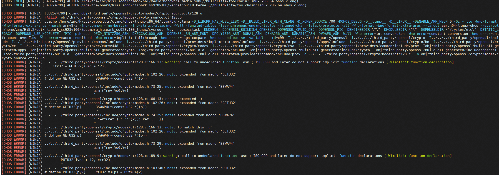

# Preface
**Overview<a name="section4537382116410"></a>**

This article describes the porting of OpenHarmony Small system functions based on the hispark_aifly development board paired with the Hi3403V100 chip. It mainly includes solution integration, product configuration addition, kernel porting and adaptation, compilation, XTS certification, HUKS component enhanced features, graphics enhanced features, and media enhanced features adaptation case summaries.

**Intended Audience<a name="section4378592816410"></a>**

This document is mainly intended for operators of vision-related OpenHarmony Small system upgrades. Operators must have the following experience and skills:

-   Familiarity with OpenHarmony source code compilation and build.
-   Familiarity with vision chip SDK versions.

**Symbol Conventions<a name="section133020216410"></a>**

The following symbols may appear in this document, and their meanings are defined below.

<a name="table2622507016410"></a>
<table><thead align="left"><tr id="row1530720816410"><th class="cellrowborder" valign="top" width="20.580000000000002%" id="mcps1.1.3.1.1"><p id="p6450074116410"><a name="p6450074116410"></a><a name="p6450074116410"></a>Symbol</p>
</th>
<th class="cellrowborder" valign="top" width="79.42%" id="mcps1.1.3.1.2"><p id="p5435366816410"><a name="p5435366816410"></a><a name="p5435366816410"></a>Description</p>
</th>
</tr>
</thead>
<tbody><tr id="row1372280416410"><td class="cellrowborder" valign="top" width="20.580000000000002%" headers="mcps1.1.3.1.1 "><p id="p3734547016410"><a name="p3734547016410"></a><a name="p3734547016410"></a><a name="image2670064316410"></a><a name="image2670064316410"></a><span></span></p>
</td>
<td class="cellrowborder" valign="top" width="79.42%" headers="mcps1.1.3.1.2 "><p id="p1757432116410"><a name="p1757432116410"></a><a name="p1757432116410"></a>Indicates a high-level hazard which, if not avoided, will result in death or serious injury.</p>
</td>
</tr>
<tr id="row466863216410"><td class="cellrowborder" valign="top" width="20.580000000000002%" headers="mcps1.1.3.1.1 "><p id="p1432579516410"><a name="p1432579516410"></a><a name="p1432579516410"></a><a name="image4895582316410"></a><a name="image4895582316410"></a><span></span></p>
</td>
<td class="cellrowborder" valign="top" width="79.42%" headers="mcps1.1.3.1.2 "><p id="p959197916410"><a name="p959197916410"></a><a name="p959197916410"></a>Indicates a medium-level hazard which, if not avoided, could result in death or serious injury.</p>
</td>
</tr>
<tr id="row123863216410"><td class="cellrowborder" valign="top" width="20.580000000000002%" headers="mcps1.1.3.1.1 "><p id="p1232579516410"><a name="p1232579516410"></a><a name="p1232579516410"></a><a name="image1235582316410"></a><a name="image1235582316410"></a><span></span></p>
</td>
<td class="cellrowborder" valign="top" width="79.42%" headers="mcps1.1.3.1.2 "><p id="p123197916410"><a name="p123197916410"></a><a name="p123197916410"></a>Indicates a low-level hazard which, if not avoided, could result in minor or moderate injury.</p>
</td>
</tr>
<tr id="row5786682116410"><td class="cellrowborder" valign="top" width="20.580000000000002%" headers="mcps1.1.3.1.1 "><p id="p2204984716410"><a name="p2204984716410"></a><a name="p2204984716410"></a><a name="image4504446716410"></a><a name="image4504446716410"></a><span></span></p>
</td>
<td class="cellrowborder" valign="top" width="79.42%" headers="mcps1.1.3.1.2 "><p id="p4388861916410"><a name="p4388861916410"></a><a name="p4388861916410"></a>Conveys device or environment safety warning information. If not avoided, it may result in device damage, data loss, performance degradation, or other unpredictable results.</p>
<p id="p1238861916410"><a name="p1238861916410"></a><a name="p1238861916410"></a>A "Caution" does not involve personal injury.</p>
</td>
</tr>
<tr id="row2856923116410"><td class="cellrowborder" valign="top" width="20.580000000000002%" headers="mcps1.1.3.1.1 "><p id="p5555360116410"><a name="p5555360116410"></a><a name="p5555360116410"></a><a name="image799324016410"></a><a name="image799324016410"></a><span></span></p>
</td>
<td class="cellrowborder" valign="top" width="79.42%" headers="mcps1.1.3.1.2 "><p id="p4612588116410"><a name="p4612588116410"></a><a name="p4612588116410"></a>Supplementary explanation of key information in the main text.</p>
<p id="p1232588116410"><a name="p1232588116410"></a><a name="p1232588116410"></a>A "Note" is not a safety warning and does not involve personal, device, or environmental injury information.</p>
</td>
</tr>
</tbody>
</table>

**Revision History<a name="section2467512116410"></a>**

<a name="table5652mcpsimp"></a>
<table><thead align="left"><tr id="row5658mcpsimp"><th class="cellrowborder" valign="top" width="21%" id="mcps1.1.4.1.1"><p id="p5660mcpsimp"><a name="p5660mcpsimp"></a><a name="p5660mcpsimp"></a>Doc Version</p>
</th>
<th class="cellrowborder" valign="top" width="26%" id="mcps1.1.4.1.2"><p id="p5663mcpsimp"><a name="p5663mcpsimp"></a><a name="p5663mcpsimp"></a>Release Date</p>
</th>
<th class="cellrowborder" valign="top" width="53%" id="mcps1.1.4.1.3"><p id="p5666mcpsimp"><a name="p5666mcpsimp"></a><a name="p5666mcpsimp"></a>Change Description</p>
</th>
</tr>
</thead>
<tbody><tr id="row1363141419319"><td class="cellrowborder" valign="top" width="21%" headers="mcps1.1.4.1.1 "><p id="p166410141431"><a name="p166410141431"></a><a name="p166410141431"></a>00B02</p>
</td>
<td class="cellrowborder" valign="top" width="26%" headers="mcps1.1.4.1.2 "><p id="p126312209310"><a name="p126312209310"></a><a name="p126312209310"></a>2026-03-05</p>
</td>
<td class="cellrowborder" valign="top" width="53%" headers="mcps1.1.4.1.3 "><p id="p8641314132"><a name="p8641314132"></a><a name="p8641314132"></a>The 2nd temporary version release.</p>
<p id="p1157920401935"><a name="p1157920401935"></a><a name="p1157920401935"></a>Modified document structure, added adaptation for compilation, startup, HUKS, third_party and other subsystems.</p>
</td>
</tr>
<tr id="row5669mcpsimp"><td class="cellrowborder" valign="top" width="21%" headers="mcps1.1.4.1.1 "><p id="p5671mcpsimp"><a name="p5671mcpsimp"></a><a name="p5671mcpsimp"></a>00B01</p>
</td>
<td class="cellrowborder" valign="top" width="26%" headers="mcps1.1.4.1.2 "><p id="p5673mcpsimp"><a name="p5673mcpsimp"></a><a name="p5673mcpsimp"></a>2025-09-15</p>
</td>
<td class="cellrowborder" valign="top" width="53%" headers="mcps1.1.4.1.3 "><p id="p5675mcpsimp"><a name="p5675mcpsimp"></a><a name="p5675mcpsimp"></a>The 1st temporary version release.</p>
</td>
</tr>
</tbody>
</table>

# Development Board device_board_hisilicon Adaptation
This directory stores development board content for hispark_aifly, supporting development boards that run Small systems. It describes information about the board, kernel, toolchain, and compiler.

```
device/board/hisilicon/hispark_aifly/
├── BUILD.gn           
├── kernel    
│   ├── BUILD.gn                # Build framework GN file
│   ├── batch_sign_ko.sh        # KO signing script (signs KO files using the kernel compilation-generated signing key)
│   ├── kernel.mk               # Configure kernel compilation cross-toolchain, source environment, defconfig, etc.
│   └── kernel_module_build.sh  # Kernel compilation entry shell script file
├── linux
│   ├── config.gni       # Describes the board, kernel, toolchain, compiler, etc. for this product sample
│   └── LICENSE
├── ohos.build            # Defines a device_hispark_aifly subsystem; module_list fields list the modules to be loaded by the device
└── README_zh.md
```

## OpenHarmony Hi3403V100 Kernel Compilation Code Model<a name="ZH-CN_TOPIC_0000002524275084"></a>

**Figure 1** OpenHarmony Hi3403V100 kernel compilation code model<a name="fig1914934174010"></a>

## OpenHarmony Kernel Compilation<a name="ZH-CN_TOPIC_0000002524435066"></a>

OpenHarmony's Linux kernel is based on the open-source Linux kernel LTS 5.10y/6.6.y branches, backporting CVE patches and OpenHarmony features. To support chip kernel features, select kernel source code of the same version or a nearby version from the corresponding branch of the open-source Linux kernel LTS. The kernel version chosen for this system chip is the same linux-6.6.86 as OpenHarmony's Linux kernel. The SDK-provided linux-6.6.86.patch patch file can be directly applied to the HarmonyOS kernel source code, resolving code conflicts.

The kernel compilation entry is in device/board/hisilicon/hispark_aifly/kernel/BUILD.gn. To improve kernel debugging efficiency, you can print the command and execute it in the current directory to compile the kernel separately.

```
build_ext_component("build_kernel") {
    no_default_deps = true
    exec_path = rebase_path(".", root_build_dir)
    outdir = rebase_path("$root_out_dir")
    build_type = "small"
    product_path_rebase = rebase_path(product_path, ohos_root_path)
    command = "chmod +x ./kernel_module_build.sh && ./kernel_module_build.sh ${outdir} ${build_type} ${target_cpu} ${product_path_rebase} ${board_name} ${linux_kernel_version}"
}
```

The detailed kernel compilation flow is configured in device/board/hisilicon/hispark_aifly/kernel/kernel.mk.

> **Note:**
>1.  During kernel compilation, the kernel/linux/linux-6.6 source code is copied to `$(OUT_DIR)/kernel/${KERNEL_VERSION}` before applying patches.
>2.  Use the project's full build command to generate the uImage kernel image:
>    ./build.sh --product-name=ipcamera_hispark_aifly_linux --ccache --no-prebuilt-sdk --build-target build_kernel
>    You can also specify the kernel version to compile, defaulting to the config.json file configuration:
>    --gn-args linux_kernel_version="linux-6.6"
>3.  This article is based on the Linux-6.6 kernel version and does not support Linux-5.10.

# Chip device_soc_hisilicon Adaptation
This directory stores chip-related content, including HDI implementations (display, huks, media, middleware), chip SDK (user-space libraries, header files, driver source code, MPP Samples, etc.).

```
device/soc/hisilicon
├── common
│   ├── hal
│   │   ├── display                    # Southbound display adaptation implementation, including FrameBuffer and DRM display framework adaptation
│   │   ├── huks                       # Southbound security component hardware key encryption/decryption interface implementation
│   │   ├── media                      # Media adaptation (audio, camera, codec, etc.)
│   │   ├── middleware                 # Media middleware
│   │   │   └── source                 # Supports Clang-musl toolchain adaptation for Hi3403V100 and Hi3519AV200
│   │   └── ...
│   └── platform
├── hi3403v100
│   ├── kernel
│   │   └── arch                       # Chip DTS files
│   ├── NOTICE
│   ├── README_zh.md
│   ├── sdk_linux
│   │   ├── BUILD.gn
│   │   ├── build.sh                   # SDK compilation entry: compile ko, atf
│   │   ├── config.gni
│   │   ├── open_source                # Open-source software dependencies for SDK compilation
│   │   ├── osdrv                      # SDK driver compilation directory
│   │   ├── smp                        # SDK software, including kernel driver source code, sample code, closed-source libraries
│   │   ├── 001_mpp.patch              # OpenHarmony environment SDK compilation adaptation (kernel path, OHOS_LITE compilation parameters)
│   │   ├── 002_trusted_firmware.patch # ATF compilation adaptation (BL33 points to OpenHarmony kernel uImage path)
│   │   └── 003_load_ss928v100_ohos.patch # OpenHarmony environment KO loading adaptation (DRM/FB display module load/unload)
│   ├── soc.gni
│   └── uboot
└── patches                            # OpenHarmony source patches (categorized by subsystem)
    ├── applications
    ├── base
    ├── build
    ├── drivers
    ├── foundation
    ├── test
    ├── third_party
    ├── make_linux_patch.sh            # Patch creation script
    └── README.md
```

## Integrating and Compiling the Chip SDK in the OpenHarmony Environment<a name="ZH-CN_TOPIC_0000002482557709"></a>

Configure the parameters for compiling the chip SDK in the OpenHarmony environment.

Modify the file device/soc/hisilicon/hi3403v100/sdk_linux/BUILD.gn to configure the relevant parameters for chip SDK compilation.

-   ohos_root_path: OpenHarmony source root directory;
-   outdir: OpenHarmony source compilation out directory;
-   y: Whether it is a Lite system;
-   clang_dir: Compilation toolchain path;
-   linux_kernel_version: Specifies the kernel version to use;
-   chip: Chip model.

```
if (defined(ohos_lite)) {
  ...
  build_ext_component("sdk_make") {
    exec_path = rebase_path(".", root_build_dir)
    outdir = rebase_path("$root_out_dir")
    clang_dir = ""
    if (ohos_build_compiler_dir != "") {
      clang_dir = rebase_path("$ohos_build_compiler_dir")
    }
    chip = "ss928v100"
    if (board_name == "hispark_aiflylite") {
      chip = "ss927v100"
    }
    command = "./build.sh ${ohos_root_path} ${outdir} y ${clang_dir} ${linux_kernel_version} ${chip}"
    deps = [ "//device/board/hisilicon/${device_name}/kernel:build_kernel" ]
  }
  ...
  }
```

> **Note:**
>Configure the compilation of the chip SDK in the OpenHarmony environment: command = "./build.sh $\{ohos_root_path\} $\{outdir\} y $\{clang_dir\} $\{linux_kernel_version\} $\{chip\}"

## Configuring the Toolchain for SDK Compilation<a name="ZH-CN_TOPIC_0000002555274981"></a>

The SDK package provides kernel driver source code and Sample source code, which can be compiled from source. Before compilation, configure the compilation toolchain by adding the toolchain path to the environment variables.

Add the Clang compilation toolchain path to the environment variables: export PATH=/path/to/toolchains:$PATH

For example, if Clang is located at /path/to/llvm_clang/bin, execute:

```
export PATH=/path/to/llvm_clang/bin:$PATH
```

Check whether the Clang environment variable configuration is in effect:

```
command -v clang
```

## Compiling ko and atf in the OpenHarmony Environment<a name="ZH-CN_TOPIC_0000002524275086"></a>

Modify device/soc/hisilicon/hi3403v100/sdk_linux/build.sh

```
set -e
OHOS_ROOT_PATH=$1
OHOS_OUTDIR=$2
OHOS_LITE=$3
COMPILER_DIR=$4
CHIP=$6

export KERNEL_VERSION="$5"

if [ -z "${OHOS_ROOT_PATH}" ];then
    OHOS_ROOT_PATH=$(pwd)/../../../..
else
    echo "OHOS_ROOT_PATH=${OHOS_ROOT_PATH}"
fi

export OHOS_ROOT_PATH
export OHOS_OUTDIR
if [ ${COMPILER_DIR} != "" ];then
    export COMPILER_PATH=${COMPILER_DIR}/bin
fi

SDK_LINUX_SRC_PATH=${OHOS_ROOT_PATH}/device/soc/hisilicon/hi3403v100/sdk_linux
BATCH_SIGN_KO_SCRIPT=${OHOS_ROOT_PATH}/device/board/hisilicon/hispark_aifly/kernel/batch_sign_ko.sh
SDK_LINUX_TMP_PATH=${OHOS_OUTDIR}/sdk_linux/src_tmp
SDK_LINUX_SMP_PATH=${SDK_LINUX_TMP_PATH}/smp
SDK_LINUX_OPEN_PATH=${SDK_LINUX_TMP_PATH}/open_source
SDK_LINUX_ATF_PATH=${SDK_LINUX_TMP_PATH}/open_source/trusted-firmware-a
SYSROOT_PATH=${OHOS_OUTDIR}/sysroot
export SYSROOT_PATH
OSDRV_CROSS_PATH=${OHOS_ROOT_PATH}/prebuilts/gcc/linux-x86/aarch64/gcc-linaro-7.5.0-2019.12-x86_64_aarch64-linux-gnu/bin/aarch64-linux-gnu

rm -rdf ${SDK_LINUX_TMP_PATH}; mkdir -p ${SDK_LINUX_TMP_PATH}
mkdir -p ${SDK_LINUX_SMP_PATH}
cp -rf ${SDK_LINUX_SRC_PATH}/smp/* ${SDK_LINUX_SMP_PATH}
cp -rf ${SDK_LINUX_SRC_PATH}/*.patch ${SDK_LINUX_SMP_PATH}

mkdir -p ${SDK_LINUX_OPEN_PATH}
mkdir -p ${SDK_LINUX_ATF_PATH}
cp -rf ${SDK_LINUX_SRC_PATH}/open_source/trusted-firmware-a/* ${SDK_LINUX_ATF_PATH}
cp -rf ${SDK_LINUX_SRC_PATH}/002_trusted_firmware.patch ${SDK_LINUX_ATF_PATH}
cp -rf ${SDK_LINUX_SRC_PATH}/open_source/mbedtls ${SDK_LINUX_OPEN_PATH}/

echo "Add patchs to sdk..."
pushd ${SDK_LINUX_SMP_PATH}
patch -p1 < ./001_mpp.patch
patch -p1 < ./003_load_ss928v100_ohos.patch
popd

echo "Add patchs to atf..."
pushd ${SDK_LINUX_ATF_PATH}
patch -p1 < ./002_trusted_firmware.patch
popd

echo "compile ko..."
pushd "${SDK_LINUX_SMP_PATH}/a55_linux/mpp/out/obj" && \
    make clean OHOS_LITE=y CHIP="${CHIP}" SYSROOT_PATH="${SYSROOT_PATH}" && \
    make -j OHOS_LITE=y CHIP="${CHIP}" SYSROOT_PATH="${SYSROOT_PATH}" && popd
echo "compile atf..."
pushd ${SDK_LINUX_OPEN_PATH}/trusted-firmware-a && make clean OHOS_LITE=y && 
make -j OHOS_LITE=y CHIP=${CHIP} KERNEL_VER=${KERNEL_VERSION} OSDRV_CROSS=${OSDRV_CROSS_PATH}&& popd

mkdir -p ${SDK_LINUX_TMP_PATH}/out
cp -rf ${SDK_LINUX_SMP_PATH}/a55_linux/mpp/out/ko ${SDK_LINUX_TMP_PATH}/out

# batch sign ko file
chmod +x ${BATCH_SIGN_KO_SCRIPT}
${BATCH_SIGN_KO_SCRIPT} ${SDK_LINUX_TMP_PATH}/out

# copy uboot file
cp -rf ${SDK_LINUX_SRC_PATH}/../uboot/* ${OHOS_OUTDIR}
# cp uImage，exe atf, flip.bin renamed to uImage and replaced;
cp -rf ${SDK_LINUX_OPEN_PATH}/trusted-firmware-a/arm-trusted-firmware-2.2/build/${CHIP}/release/fip.bin ${OHOS_OUTDIR}
```

> **Note:**
>The process of compiling ko and atf in the OpenHarmony environment:
>-   Configure the SDK compilation environment variables: OHOS_ROOT_PATH, COMPILER_PATH, SYSROOT_PATH, OHOS_OUTDIR
>-   Compile the SDK-provided driver source code to generate ko files in `${SDK_LINUX_SMP_PATH}/a55_linux/mpp/out/ko`. Since the HarmonyOS kernel base_defconfig enables CONFIG_MODULE_SIG, the batch_sign_ko.sh script must be used to sign the KO files.
>-   Use the ATF software to package the previously compiled kernel uImage into a fip image.

## Packaging SDK User-Space Libraries into rootfs<a name="ZH-CN_TOPIC_0000002449398202"></a>

Modify the file device/soc/hisilicon/hi3403v100/sdk_linux/BUILD.gn to copy the user-space lib library files provided by the chip SDK into the outdir, so they can be packaged into rootfs.

sdk_libs_name_set: List of user-space lib library files required for running MPP Samples in the OpenHarmony environment.

```
sdk_libs_name_set = [
  "libaac_comm.so",
  "libaac_dec.so",
  "libaac_enc.so",
  "libaac_sbr_dec.so",
  "libaac_sbr_enc.so",
  "libaiv.so",
...
]

  lib_lite_abspath = rebase_path("$SDK_LINUX_LIB_LITE_PATH", ".")
  sdk_linux_libs_targets = []

  foreach(lib, sdk_libs_name_set) {
    copy("$lib") {
      sources = [ "$lib_lite_abspath/$lib" ]
      outputs = [ "$root_out_dir/$lib" ]
    }
    sdk_linux_libs_targets += [ ":$lib" ]
  }

  group("sdk_linux_lite_libs") {
    deps = sdk_linux_libs_targets
  }
```

# Product vendor_hisilicon Configuration
The product directory structure is:

```
vendor/hisilicon/hispark_aifly_linux/    # hispark_aifly_linux small system related configuration
├── BUILD.gn
├── config.json                           # Defines the subsystem scope integrated by the current product; added to config.json to be included in the build
├── fs.yml                    # Guides the build packaging to generate rootfs, sets file attributes, permissions, creates symbolic links, and generates filesystem images
├── hals
├── hdf_config
├── init_configs
│   ├── BUILD.gn
│   ├── etc                                 # Defines system initialization startup scripts for creating and mounting device nodes, loading ko files, etc.
│   └── init_linux_openharmony.cfg          # Defines initialization parameters and configuration at system startup, parsed and loaded by the init process
└── ohos.build
```

# Kernel Adaptation
## kernel_linux_config Adaptation<a name="ZH-CN_TOPIC_0000002555394945"></a>

Added the hispark_aifly directory for storing the Hi3403V100 kernel integration defconfig file. For extended features, new configurations can be added to the support_defconfig file, or a new defconfig file can be created.

```
kernel/linux/config/linux-6.6
├── arch
├── hispark_aifly    
│   ├── arm64_defconfig         # Kernel configuration file for chip board arm64 features, renamed from the SDK-provided defconfig file
│   └── support_defconfig       # Configuration file for adapting to HarmonyOS kernel linux-6.6 compilation and mouse and other peripherals
├── type
│   ├── small_defconfig         # Common configuration file for Small systems
│   └── standard_defconfig      # Common configuration file for Standard systems
└── base_defconfig               # OpenHarmony feature-dependent kernel mandatory modules and security red-line features that must be enabled, where configurations cannot be overridden
```

To follow the community's Config configuration rules, the Linux-provided defconfig merge script scripts/kconfig/merge_config.sh is used to overlay and merge multiple configuration files. The later the merge order, the higher the override priority. During compilation, the following configuration files are first copied to `$(OUT_DIR)/kernel/${KERNEL_VERSION}`, then merged in order to generate a new defconfig file. New configuration files can also be placed before base_defconfig.

```
    $(hide) cp -rf $(KERNEL_CONFIG_PATH)/. $(KERNEL_SRC_TMP_PATH)/
    $(hide) bash $(KERNEL_SRC_TMP_PATH)/scripts/kconfig/merge_config.sh -O $(KERNEL_SRC_TMP_PATH)/arch/$(KERNEL_ARCH)/configs/ \
     -m $(KERNEL_SRC_TMP_PATH)/type/small_defconfig $(KERNEL_SRC_TMP_PATH)/$(DEVICE_NAME)/arch/arm64_defconfig \
     $(KERNEL_SRC_TMP_PATH)/$(DEVICE_NAME)/arch/support_defconfig $(KERNEL_SRC_TMP_PATH)/base_defconfig

    $(hide) cp ${KERNEL_SRC_TMP_PATH}/arch/$(KERNEL_ARCH)/configs/.config ${KERNEL_SRC_TMP_PATH}/arch/$(KERNEL_ARCH)/configs/$(DEFCONFIG_FILE)
    $(hide) $(KERNEL_MAKE) -C $(KERNEL_SRC_TMP_PATH) ARCH=$(KERNEL_ARCH) $(KERNEL_CROSS_COMPILE) distclean
    $(hide) $(KERNEL_MAKE) -C $(KERNEL_SRC_TMP_PATH) ARCH=$(KERNEL_ARCH) $(KERNEL_CROSS_COMPILE) $(DEFCONFIG_FILE)
```

## kernel_linux_patches Adaptation<a name="ZH-CN_TOPIC_0000002555274983"></a>

Added the hispark_aifly_patch directory for storing Hi3403V100 kernel integration patch files. For extended features, new patch files can be added individually for application.

```
kernel/linux/patches/linux-6.6
├── common_patch
│   └── hdf.patch
└── hispark_aifly_patch
     ├── 0001-kernel-hispark_aifly.patch         # Chip feature kernel patch file, created from the SDK-provided kernel patch after resolving code conflicts
     ├── 0002-kernel-compile-support.patch           # Patch file for adapting to OpenHarmony Linux-6.6 kernel compilation
     └── patch_hispark_aifly.sh                  # Shell file for hispark_aifly kernel patching
```

The open-source HarmonyOS source code has been copied to `$(OUT_DIR)/kernel/${KERNEL_VERSION}` in the previous step. The following describes how kernel patches are applied.

1.  Apply the HDF patch

    According to the HDF patch application method in drivers/hdf_core/adapter/khdf/linux/patch_hdf.sh, apply kernel/linux/patches/linux-6.6/common_patch/hdf.patch to the source code, and configure the dependent third-party software and source code. See patch_hdf.sh for details.

2.  Configure the dependent bounds_checking_function software

    When compiling the linux-6.6 kernel, the stdarg.h of bounds_checking_function/include/securec.h must be modified accordingly.

    ```
    ifeq ($(KERNEL_VERSION), linux-6.6)
        sed -i 's/<stdarg.h>/<linux\/stdarg.h>/' $(KERNEL_SRC_TMP_PATH)/bounds_checking_function/include/securec.h
    endif
    ```

3.  Apply the chip platform adaptation HarmonyOS kernel baseline patch

    ```
        $(hide) echo "apply kernel patch..."
        $(hide) chmod 755 $(DEVICE_PATCH_DIR)/patch_$(DEVICE_NAME).sh
        $(hide) cd $(KERNEL_SRC_TMP_PATH);$(DEVICE_PATCH_DIR)/patch_$(DEVICE_NAME).sh $(DEVICE_PATCH_DIR)
    ```

    If there are additional kernel patch files, they can continue to be placed in the kernel/linux/patches/linux-6.6/hispark_aifly_patch path, with the shell script file modified accordingly.

4.  Create symbolic links for OpenHarmony kernel feature source code to the temporary kernel compilation directory under out

    The new feature source code directories for the OpenHarmony kernel are located in kernel/linux/common_modules. During compilation, they need to be linked to the temporary kernel compilation directory.

    ```
    UNIFIED_COLLECTION_PATCH_FILE := ${OHOS_BUILD_HOME}/kernel/linux/common_modules/ucollection/apply_ucollection.sh
    CODE_SIGN_PATCH_FILE := ${OHOS_BUILD_HOME}/kernel/linux/common_modules/code_sign/apply_code_sign.sh
    HIDEADDR_PATCH_FILE=${OHOS_BUILD_HOME}/kernel/linux/common_modules/memory_security/apply_hideaddr.sh
    NEWIP_PATCH_FILE=${OHOS_BUILD_HOME}/kernel/linux/common_modules/newip/apply_newip.sh
    TZDRIVER_PATCH_FILE=${OHOS_BUILD_HOME}/kernel/linux/common_modules/tzdriver/apply_tzdriver.sh
    XPM_PATCH_FILE=${OHOS_BUILD_HOME}/kernel/linux/common_modules/xpm/apply_xpm.sh
    CED_PATCH_FILE=${OHOS_BUILD_HOME}/kernel/linux/common_modules/container_escape_detection/apply_ced.sh
    QOS_AUTH_PATCH_FILE=${OHOS_BUILD_HOME}/kernel/linux/common_modules/qos_auth/apply_qos_auth.sh
    DEC_PATCH_FILE=${OHOS_BUILD_HOME}/kernel/linux/common_modules/dec/apply_dec.sh
    ...
    ifeq ($(UNIFIED_COLLECTION_PATCH_FILE), $(wildcard $(UNIFIED_COLLECTION_PATCH_FILE)))
        $(hide) $(UNIFIED_COLLECTION_PATCH_FILE) $(OHOS_BUILD_HOME) $(KERNEL_SRC_TMP_PATH) $(DEVICE_NAME) $(KERNEL_VERSION)
    endif
    ifeq ($(CODE_SIGN_PATCH_FILE), $(wildcard $(CODE_SIGN_PATCH_FILE)))
        $(hide) $(CODE_SIGN_PATCH_FILE) $(OHOS_BUILD_HOME) $(KERNEL_SRC_TMP_PATH) $(DEVICE_NAME) $(KERNEL_VERSION)
    endif
    ifeq ($(HIDEADDR_PATCH_FILE), $(wildcard $(HIDEADDR_PATCH_FILE)))
        $(hide) $(HIDEADDR_PATCH_FILE) $(OHOS_BUILD_HOME) $(KERNEL_SRC_TMP_PATH) $(DEVICE_NAME) $(KERNEL_VERSION)
    endif
    ifeq ($(NEWIP_PATCH_FILE), $(wildcard $(NEWIP_PATCH_FILE)))
        $(hide) bash $(NEWIP_PATCH_FILE) $(OHOS_BUILD_HOME) $(KERNEL_SRC_TMP_PATH) $(DEVICE_NAME) $(KERNEL_VERSION)
    endif
    ifeq ($(TZDRIVER_PATCH_FILE), $(wildcard $(TZDRIVER_PATCH_FILE)))
        $(hide) $(TZDRIVER_PATCH_FILE) $(OHOS_BUILD_HOME) $(KERNEL_SRC_TMP_PATH) $(DEVICE_NAME) $(KERNEL_VERSION)
    endif
    ifeq ($(XPM_PATCH_FILE), $(wildcard $(XPM_PATCH_FILE)))
        $(hide) $(XPM_PATCH_FILE) $(OHOS_BUILD_HOME) $(KERNEL_SRC_TMP_PATH) $(DEVICE_NAME) $(KERNEL_VERSION)
    endif
    ifeq ($(CED_PATCH_FILE), $(wildcard $(CED_PATCH_FILE)))
        $(hide) $(CED_PATCH_FILE) $(OHOS_BUILD_HOME) $(KERNEL_SRC_TMP_PATH) $(DEVICE_NAME) $(KERNEL_VERSION)
    endif
    ifeq ($(QOS_AUTH_PATCH_FILE), $(wildcard $(QOS_AUTH_PATCH_FILE)))
        $(hide) bash $(QOS_AUTH_PATCH_FILE) $(OHOS_BUILD_HOME) $(KERNEL_SRC_TMP_PATH) $(DEVICE_NAME) $(KERNEL_VERSION)
    endif
    ifeq ($(DEC_PATCH_FILE), $(wildcard $(DEC_PATCH_FILE)))
        $(hide) bash $(DEC_PATCH_FILE) $(OHOS_BUILD_HOME) $(KERNEL_SRC_TMP_PATH) $(DEVICE_NAME) $(KERNEL_VERSION)
    endif
    ```

## Kernel Compilation KO Signature Adaptation<a name="ZH-CN_TOPIC_0000002524275087"></a>

Since the HarmonyOS kernel enables the `CONFIG_MODULE_SIG` configuration, all loaded kernel modules (.ko) must pass signature verification. Therefore, after kernel compilation, the newly compiled ko files need to be signed.

1.  **Modify kernel.mk to add signing steps**

    In `os/OpenHarmony/device/board/hisilicon/hispark_aifly/kernel/kernel.mk`, after kernel compilation, call the `batch_sign_ko.sh` script to sign the files in the `$(OUT_DIR)/ko` directory.

    ```makefile
    ...
    $(hide) mkdir -p $(OUT_DIR)/ko
    $(hide) cp -rf $(KERNEL_OBJ_TMP_PATH)/drivers/gpu/drm/drm_kms_helper.ko $(OUT_DIR)/ko
    $(hide) cp -rf $(KERNEL_OBJ_TMP_PATH)/drivers/gpu/drm/drm_dma_helper.ko $(OUT_DIR)/ko
    $(hide) cp -rf $(KERNEL_OBJ_TMP_PATH)/drivers/gpu/drm/display/drm_display_helper.ko $(OUT_DIR)/ko
    $(hide) cp -rf $(KERNEL_OBJ_TMP_PATH)/drivers/gpu/drm/hisilicon/smart_vision/smart_drm.ko $(OUT_DIR)/ko
    $(hide) OHOS_OUTDIR=$(OUT_DIR) KERNEL_VERSION=$(KERNEL_VERSION) bash $(OHOS_BUILD_HOME)/device/board/hisilicon/hispark_aifly/kernel/batch_sign_ko.sh $(OUT_DIR)/ko
    ```

2.  **Signing flow overview**

    The signing flow of the `batch_sign_ko.sh` script is as follows:
    -   **Automatic environment detection**: The script automatically detects the `OHOS_OUTDIR` and `KERNEL_VERSION` environment variables to locate the kernel signing keys (`signing_key.pem` and `signing_key.x509`) generated during compilation.
    -   **Signature status check**: Iterates through the `.ko` files in the target directory, checking whether the file ends with the `~Module signature appended~` magic string to determine if it has already been signed, avoiding duplicate signing.
    -   **Execute signing**: Uses the kernel-provided `scripts/sign-file` tool, defaulting to the **sha256** algorithm to sign unsigned `.ko` files.

# Compilation Subsystem Adaptation
1.  The default arch = "arm", and the community does not yet support the arm64 CPU architecture.

    Modify build/lite/config/BUILDCONFIG.gn to support 64-bit:

    ```
    # Hisilicon modify for 64bit
    if (target_cpu == "arm64") {
      arch = "arm64"
    } else {
      arch = "arm"
    }
    ```

2.  Lite devices' language_cpp uses the old -std=c++11, preventing the use of many new C++ features and improvements.

    Modify build/lite/config/BUILD.gn to upgrade language_cpp to C++17:

    ```
    config("language_cpp") {
      cflags_cc = [ "-std=c++17" ]
    }
    ```

3.  The OpenHarmony system restricts the use of exec_script in gn files, but Hi3403V100 integration uses this module. An exemption must be configured; otherwise, compilation will fail.

    Modify build/core/gn/ohos_exec_script_allowlist.gni to add the relative path of the gn file that does not conform to community rules:

    ```
    ohos_exec_script_config = {
      exec_script_allowlist = [
        ...
        "//device/soc/hisilicon/common/hal/media/BUILD.gn",
         ]
    } 
    ```

4.  Skip the SDK subsystem during full compilation.

    Full ohos compilation compiles the ohos-sdk. This system does not depend on the SDK subsystem. To improve compilation efficiency, configure it to be skipped. If there is a dependency on the SDK, the --no-prebuilt-sdk parameter can be omitted.

    ```
    ./build.sh --product-name=ipcamera_hispark_aiflylite_linux --ccache --no-prebuilt-sdk
    ```

5.  Skip init_ohpm download during full compilation.

    Full ohos compilation executes init_ohpm. This system does not depend on ohpm downloads. To improve compilation efficiency, configure it to be skipped. If there is a dependency, this section can be omitted.

    Modify build/build_scripts/build.sh to skip the init_ohpm function execution:

    ```
    if [[ "$*" != *ohos-sdk* ]]; then
      if [[ "$*" != *ipcamera_hispark* ]]; then
        echo "[OHOS INFO] Ohpm initialization started..."
        init_ohpm
        if [[ "$?" -ne 0 ]]; then
          echo -e "\033[31m[OHOS ERROR] ohpm initialization failed!\033[0m"
          exit 1
        fi
        echo -e "\033[32m[OHOS INFO] ohpm initialization successful!\033[0m"
      fi
    fi
    echo -e "+++++++++++++++++++++++++++++++++++++++++++++++++++++++++\n"
    ```

# Startup Subsystem Adaptation
To resolve the issue where board soft reboot (i.e., typing reboot on the command line) fails, modify base/startup/init/services/init/lite/init_signal_handler.c.

In the SIGTERM flow, add RebootSystem();:

```
static void SigHandler(int sig)
{
    switch (sig) {
        case SIGCHLD: {
            ...
        case SIGTERM: {
            StopAllServices(0, NULL, 0, NULL);
            RebootSystem();
            break;
        }
        default:
            break;
    }
}
```

# HUKS Subsystem Adaptation
To enable the HUKS component to properly use the encryption/decryption capabilities of the Hi3403V100 hardware key, the security component needs to be enhanced. The approach is to define southbound interfaces in drivers/peripheral/huks, implement macro isolation compatibility adaptation for the HUKS component, and implement chip-enhanced API interfaces in device/soc/hisilicon/common/hal/huks.

1.  In bundle.json and build/config.gni, define the parameter variable huks_enable_hisilicon_cipher_in_small to remove historical chip development board macro isolation, controlled by value passing from vendor config.json.
2.  For the enhanced hardware encryption/decryption features of the open-source huks component, add a new generic HKS_CIPHER_ROOT_KEY isolation.
3.  Extract enhanced functions for native huks, defined in drivers/peripheral/huks/interfaces/include/huks_hdi_cipher.h, and implemented by device/soc/hisilicon/common/hal/huks.

> **Note:**
>-   This article only supports Hi3403V100 hardware key enhancement for the HUKS component. To support other chips, the specific SDK API implementation must be combined, adding the chip adaptation implementation in the device/soc/hisilicon/common/hal/huks directory.
>-   If you do not want to use the chip's hardware enhancement features, set the parameter huks_enable_hisilicon_cipher_in_small to false in ohos/vendor/hisilicon/hispark_aifly_linux/config.json.

# third_party Adaptation
## third_party_openssl Adaptation<a name="ZH-CN_TOPIC_0000002524280794"></a>

Since Hi3403V100 uses the arm64 architecture, which differs from the community L1 Hi3516DV300's arm32, an error occurs during adaptation compilation: ../../../third_party/openssl/crypto/modes/ctr128.c:166:13: warning: call to undeclared function 'asm'; ISO C99 and later do not support implicit function declarations [-Wimplicit-function-declaration]

**Figure 1** openssl compilation error<a name="fig8458101819159"></a>


The __asm__ syntax is a standardized extension syntax of GCC, suitable for a wider range of compiler environments, while the asm syntax is an older GCC syntax that may be deprecated in newer compilers.

The adaptation solution is to modify the file third_party/openssl/include/crypto/modes.h to add defined(__clang__) || (__GNUC__ > 4 || (__GNUC__ == 4 && __GNUC_MINOR__ >= 8)) isolation to adapt to the newer __asm__ syntax.

```
#  if defined(__clang__) || (__GNUC__ > 4 || (__GNUC__ == 4 && __GNUC_MINOR__ >= 8))
#    define BSWAP8(x) ({ u64 ret_;                       \
                        __asm__ ("rev %0,%1"                \
                        : "=r"(ret_) : "r"(x)); ret_;   })
#    define BSWAP4(x) ({ u32 ret_;                       \
                        __asm__ ("rev %w0,%w1"              \
                        : "=r"(ret_) : "r"(x)); ret_;   })
#  else
#    define BSWAP8(x) ({ u64 ret_;                       \
                        asm ("rev %0,%1"                \
                        : "=r"(ret_) : "r"(x)); ret_;   })
#    define BSWAP4(x) ({ u32 ret_;                       \
                        asm ("rev %w0,%w1"              \
                        : "=r"(ret_) : "r"(x)); ret_;   })
#  endif
```

## third_party_musl Adaptation<a name="ZH-CN_TOPIC_0000002524280795"></a>

musl libc depends on kernel headers when building sysroot. Since this project uses the Linux 6.6 kernel, and OpenHarmony's default musl configuration may point to an older kernel version (e.g., linux-4.19), the kernel path configuration in `third_party/musl/scripts/build_lite/BUILD.gn` needs to be modified to point to the correct Linux 6.6 kernel directory and header file paths.

The modifications are as follows:

```gn
# Before modification
command += " LINUXDIR=" + rebase_path("$root_out_dir/kernel/linux-4.19")
command += " PREBUILTLINUXHDRDIR=" + rebase_path(
               "//kernel/linux/patches/linux-4.19/prebuilts/usr/include")

# After modification
command += " LINUXDIR=" + rebase_path("$root_out_dir/kernel/linux-6.6")
command += " PREBUILTLINUXHDRDIR=" + rebase_path(
               "//kernel/linux/patches/linux-6.6/prebuilts/usr/include")
```

# XTS Adaptation
OpenHarmony subsystem adaptation only requires adding the corresponding subsystem and components in vendor/hisilicon/hispark_aifly_linux/config.json. The build system will then include those components as compilation targets.

This section mainly introduces the subsystem set that hispark_aifly needs for L1 (without screen) devices to pass XTS certification, provided for reference only.

## xts_acts Adaptation<a name="ZH-CN_TOPIC_0000002524275090"></a>

1.  On screen-equipped devices, the ActsAbilityMgrTest:testDisConnectAbility test case fails.

    When running screen-equipped acts test cases, test/xts/acts/ability_lite/ability_posix/src/AbilityMgrTest.cpp testDisConnectAbility fails. This test case verifies the DisConnectAbility interface. The code's g_errorcode==16 is an exception protection that prevents the test case from executing effectively. However, since DisConnectAbility and ConnectAbility must appear as a pair, this causes the test case to fail.

    **Figure 1** testDisConnectAbility test case code<a name="fig162331412418"></a>
    

    Printing g_errorcode at this point shows -1, which also does not conform to the exception protection logic. This is a community acts suite test case issue. It will be reported to the community for fixing later.

    The solution is to delete the g_errorcode==16 exception protection logic so that it can normally enter and execute DisconnectAbility.

    ```
    HWTEST_F(AbilityMgrTest, testDisConnectAbility, Function | MediumTest | Level1)
    {
        printf("------start testDisConnectAbility------\n");
        Want want = { nullptr };
        ElementName element = { nullptr };
        SetElementBundleName(&element, "com.openharmony.testnative");
        SetElementAbilityName(&element, "ServiceAbility");
        SetWantElement(&want, element);
        sem_init(&g_sem, 0, 0);
        int result = ConnectAbility(&want, &g_conn, this);
        struct timespec ts = {};
        clock_gettime(CLOCK_REALTIME, &ts);
        ts.tv_sec += WAIT_TIMEOUT;
        sem_timedwait(&g_sem, &ts);
        printf("sem exit \n");
        printf("ret of connect is %d \n ", result);
        result = DisconnectAbility(&g_conn);
        usleep(900000);
        EXPECT_EQ(result, 0);
        printf("ret of disconnect is %d \n ", result);
        ClearElement(&element);
        ClearWant(&want);
        printf("------end testDisConnectAbility------\n");
    }
    ```

2.  ActsSamgrTest:testIPCClient0130 execution fails.

    **Figure 2** testIPCClient0130 test case source code with added debug logs<a name="fig1349811244513"></a>
    

    **Figure 3** testIPCClient0130 test case failure analysis<a name="fig149642718449"></a>
    

    From the printed logs of svcIdentity.handle and svcIdentity.token, both output 0xffffffff. But the assertion results are quite different. Examining the definitions of the two variables reveals that the svcIdentity.token type is uintptr_t, which depends on the architecture's bit width. The community uses arm, but on arm64, the value extends to 0x00000000ffffffff, causing the comparison to fail. This is confirmed by sizeof(svcIdentity.token)=8.

    Modify test/xts/acts/distributed_schedule_lite/system_ability_manager_posix/src/LiteIPCClientTest.cpp to change the svcIdentity.token assertion to use the variable's default initial value INVALID_INDEX.

    ```
    HWTEST_F(LiteIPCClientTest, testIPCClient0130, Function | MediumTest | Level2)
    {
        SvcIdentity svcIdentity = SAMGR_GetRemoteIdentity("noExistService", "noExistFeature");
        ASSERT_EQ(svcIdentity.handle == 0xffffffff, TRUE);
        // token type is uintptr_t
        ASSERT_EQ(svcIdentity.token == INVALID_INDEX, TRUE);
    };
    ```

## xts_tools Adaptation<a name="ZH-CN_TOPIC_0000002524435072"></a>

If the user can properly configure the xdevice test environment, this section can be skipped.

xts_tools packages the tools compiled from xdevice source code into xdevice-0.0.0-py*.egg and xdevice_ohos-0.0.0-py.*.egg. When executing the acts/run.bat script, it downloads software from https://pypi.org/simple/xdevice/, and xdevice environment configuration often fails.

**Figure 1** xts_tools packaging generates egg file code<a name="fig8497141415313"></a>


Modify test/xts/tools/lite/build/suite.py to change xdevice packaging to tar.gz:

```
command = [utils.get_python_cmd(), "setup.py", "sdist"]
```

> **Note:**
>This issue has been fixed in the community main branch. Starting from OH6.0 Release, no separate modification is needed. The fix PR is:
>https://gitcode.com/openharmony/xts_tools/commit/5422d05f1d068cb75f4b0098bf36bdf179c849e3?ref=master

## XTS Certification Adaptation<a name="ZH-CN_TOPIC_0000002555394949"></a>

### Screenless XTS Certification Adaptation<a name="ZH-CN_TOPIC_0000002524277840"></a>

1.  Add the required OpenHarmony subsystem set.

    ```
     "subsystems": [
        {
          "subsystem": "systemabilitymgr",
          "components": [
            { "component": "samgr_lite", "features":[] },
            { "component": "safwk_lite", "features":[] }
          ]
        },
        {
          "subsystem": "hiviewdfx",
          "components": [
            { "component": "hilog_lite", "features":[] },
            { "component": "faultloggerd", "features":[] }
          ]
        },
        {
          "subsystem": "security",
          "components": [
            { "component": "permission_lite", "features":[] },
            { "component": "appverify", "features":[] },
            { "component": "device_auth", "features":[] },
            { "component": "huks", "features":
              [
                "huks_config_file = \"hks_config_small.h\"",
                "huks_uid_trust_list_define = \"{}\""
              ]
            }
          ]
        },
        {
          "subsystem": "startup",
          "components": [
            { "component": "bootstrap_lite", "features":[] },
            { "component": "init", "features":["init_feature_begetctl_liteos=true"] },
            { "component": "appspawn", "features":[] }
          ]
        },
        {
          "subsystem": "kernel",
          "components": [
            { "component": "linux", "features":[] }
          ]
        },
        {
          "subsystem": "hdf",
          "components": [
            { "component": "hdf_core", "features":[ "hdf_core_platform_test_support = true" ] }
          ]
        },
        {
          "subsystem": "bundlemanager",
          "components": [
            { "component": "bundle_framework_lite", "features":[] }
          ]
        },
        {
          "subsystem": "developtools",
          "components": [
            { "component": "syscap_codec", "features":[] }
          ]
        },
        {
          "subsystem": "xts",
          "components": [
            { "component": "acts", "features":[] },
            { "component": "tools", "features":[] },
            { "component": "device_attest_lite", "features":[] }
          ]
        },
        {
          "subsystem": "communication",
          "components": [
            { "component": "dhcp", "features":[] }
          ]
        }
      ],
    ```

2.  Modify vendor/hisilicon/hispark_aifly_linux/init_configs/init_linux_openharmony.cfg to add startup services.

    ```
                    "start ueventd",
                    "start shell",
                    "start apphilogcat",
                    "start foundation",
                    "start bundle_daemon",
                    "start faultloggerd",
                    "start devattest_service",
                    "start huks_server"
    ```

3.  Modify test/xts/acts/build_lite/BUILD.gn, comment out ActsBundleMgrTest and ActsAbilityMgrTest. These 2 test cases are needed for screen-equipped devices and not for screenless devices.

    ```
        } else if (ohos_kernel_type == "linux") {
          all_features += [
            "//test/xts/acts/distributeddatamgr_lite/kv_store_posix:ActsKvStoreTest",
            "//test/xts/acts/startup_lite/syspara_posix:ActsParameterTest",
            "//test/xts/acts/startup_lite/bootstrap_posix:ActsBootstrapTest",
            "//test/xts/acts/communication_lite/lwip_posix:ActsLwipTest",
            "//test/xts/acts/security_lite:securitytest",
    
            #"//test/xts/acts/multimedia_lite/camera_lite_posix/camera_native:ActsMediaCameraTest",
            #"//test/xts/acts/multimedia_lite/media_lite_posix/player_native:ActsMediaPlayerTest",
            #"//test/xts/acts/multimedia_lite/media_lite_posix/recorder_native:ActsMediaRecorderTest",
            "//test/xts/acts/distributed_schedule_lite/system_ability_manager_posix:ActsSamgrTest",
            #"//test/xts/acts/appexecfwk_lite/appexecfwk_posix:ActsBundleMgrTest",
            #"//test/xts/acts/ability_lite/ability_posix:ActsAbilityMgrTest",
            "//test/xts/acts/ai_lite/ai_engine_posix/base:ActsAiEngineTest",
            "//test/xts/acts/xts_lite/device_attest_lite/device_attestStart_posix:ActsDeviceAttestStartTest",
            "//test/xts/acts/xts_lite/device_attest_lite/device_attestQuerry_posix:ActsDeviceAttestQuerryTest",
          ]
        }
    ```

### Screen-Equipped XTS Certification Adaptation<a name="ZH-CN_TOPIC_0000002467741665"></a>

1.  Add dependent subsystems in config.json.

    In vendor/hisilicon/hispark_aifly_linux/config.json, add the ability subsystem for screen-equipped test suite compilation.

    ```
        {
          "subsystem": "ability",
          "components": [
            { "component": "ability_lite", "features":[ "ability_lite_enable_ohos_appexecfwk_feature_ability = true" ] },
            { "component": "dmsfwk_lite", "features":[] }
          ]
        },
    ```

2.  Modify test/xts/acts/build_lite/BUILD.gn to uncomment ActsBundleMgrTest and ActsAbilityMgrTest for participation in the acts suite compilation. ActsBundleMgrTest and ActsAbilityMgrTest are required for screen-equipped devices.

    ```
        } else if (ohos_kernel_type == "linux") {
          all_features += [
            "//test/xts/acts/distributeddatamgr_lite/kv_store_posix:ActsKvStoreTest",
            "//test/xts/acts/startup_lite/syspara_posix:ActsParameterTest",
            "//test/xts/acts/startup_lite/bootstrap_posix:ActsBootstrapTest",
            "//test/xts/acts/communication_lite/lwip_posix:ActsLwipTest",
            "//test/xts/acts/security_lite:securitytest",
    
            #"//test/xts/acts/multimedia_lite/camera_lite_posix/camera_native:ActsMediaCameraTest",
            #"//test/xts/acts/multimedia_lite/media_lite_posix/player_native:ActsMediaPlayerTest",
            #"//test/xts/acts/multimedia_lite/media_lite_posix/recorder_native:ActsMediaRecorderTest",
            "//test/xts/acts/distributed_schedule_lite/system_ability_manager_posix:ActsSamgrTest",
           "//test/xts/acts/appexecfwk_lite/appexecfwk_posix:ActsBundleMgrTest",
           "//test/xts/acts/ability_lite/ability_posix:ActsAbilityMgrTest",
            "//test/xts/acts/ai_lite/ai_engine_posix/base:ActsAiEngineTest",
            "//test/xts/acts/xts_lite/device_attest_lite/device_attestStart_posix:ActsDeviceAttestStartTest",
            "//test/xts/acts/xts_lite/device_attest_lite/device_attestQuerry_posix:ActsDeviceAttestQuerryTest",
          ]
        }
    ```

3.  Add system startup service configuration.

    Modify vendor/hisilicon/hispark_aifly_linux/init_configs/init_linux_openharmony.cfg to add startup services. "start appspawn" is the new addition.

    ```
                    "start ueventd",
                    "start shell",
                    "start apphilogcat",
                    "start foundation",
                    "start bundle_daemon",
                    "start appspawn",
                    "start faultloggerd",
                    "start devattest_service",
                    "start huks_server"
    ```

    If the ActsAbilityMgrTest module hangs, the security_appverify component needs to be adapted to resolve the hap verification issue.

### XTS Testing Instructions<a name="ZH-CN_TOPIC_0000002467741669"></a>

1.  During XTS testing, if a hang occurs or a single test case fails, you can execute a single test case debug command on the board to locate the cause of the failure.

    Using ActsAbilityMgrTest as an example. After remounting the board via NFS, execute the following on the board to observe test case execution:

    ```
    ./ActsAbilityMgrTest.bin --gtest_output=xml:/storage/test_root/aafwk/reportsn --gtest_output=xml:/storage/test_root/aafwk/reports 
    ```

2.  If some test cases in ActsHuksLiteFunctionTest fail during XTS testing on Hi3403V100 boards:

    **Figure 1** HksCipherTest003 test case failure log<a name="fig154392039112413"></a>
    

    Hi3403V100 hardware boards require a one-time KEY0 burn-in during mass production and cannot be re-burned. If KEY0 is not burned, the hardware blocks key derivation operations, and hardware key encryption/decryption cannot be used normally.

    Steps for burning KEY0 on Hi3403V100 boards:

    1.  Enter the U-Boot command line and execute the following commands sequentially:

        ```
        mw 0x10122008 0x6
        # The following four lines set the key to be burned,
        # using key=128'h00010203_04050607_08090a0b_0c0d0e0f as an example
        mw 0x1012200C 0x0c0d0e0f
        mw 0x10122010 0x08090a0b
        mw 0x10122014 0x04050607
        mw 0x10122018 0x00010203
        mw 0x10123000 0x2
        mw 0x10122004 0x1acce551
        ```

        > **Warning:**
        >The key in the above burn-in commands is just a parameter. For actual burning, use random numbers. Do not use the example key.

    2.  Power cycle the board (reboot soft restart does not work; power cycle is required for the change to take effect). After that, running XTS test cases will show that all HUKS cases for XTS certification PASS.

# Graphics
To add the graphics subsystem to OpenHarmony, add the corresponding subsystems and components in vendor/hisilicon/hispark_aifly_linux/config.json. Chip-related adaptation code is in the device/soc/hisilicon directory, specifically in device/soc/hisilicon/common/hal/display.

## Add Graphics Subsystem Dependent Components in config.json<a name="ZH-CN_TOPIC_0000002439697566"></a>

Add the following code under the "subsystems" tag in vendor/hisilicon/hispark_aifly_linux/config.json:

```
    {
        "subsystem": "arkui",
        "components": [
            { "component": "ui_lite", "features":[ "ui_lite_enable_graphic_font_config = true" ] }
        ]
    },
    {
        "subsystem": "graphic",
        "components": [
           { "component": "graphic_utils_lite", "features":[] },
           { "component": "surface_lite", "features":[] }
        ]
    },
    {
        "subsystem": "window",
        "components": [
            { "component": "window_manager_lite", "features":[] }
        ]
    }
```

## Add Hi3403V100 Graphics-Related Driver Code Under device/soc/hisilicon<a name="ZH-CN_TOPIC_0000002472857737"></a>

Add a directory under device/soc/hisilicon/common/hal/display to place Hi3403V100 graphics driver-related code. For an overall introduction to the graphics driver HDI interface, refer to the description in the drivers/peripheral/display/README_zh.md document.

**Note:** Compared to the Hi3516DV300 chip adaptation, the Hi3403V100 SDK has been restructured in user space. You must first execute the init operation of each SDK module in user space before calling SDK interfaces. If only the graphics function is started, you need to call SdkInit in InitDisplay to complete the initialization interface calls for several modules:

```
static void SdkInit()
{
    td_s32 ret;
    ret = osal_init();
    if (ret != 0) {
        HDF_LOGE("%s: osal_init error:%d", __func__, ret);
    }
    ret = ot_base_mod_init();
    if (ret != 0) {
        HDF_LOGE("%s: BaseModInit error:%d", __func__, ret);
    }
    ret = ot_sys_mod_init();
    if (ret != 0) {
        HDF_LOGE("%s: SysModInit error:%d", __func__, ret);
    }
    ret = ot_rgn_mod_init();
    if (ret != 0) {
        HDF_LOGE("%s: ot_rgn_mod_init error:%d", __func__, ret);
    }
    ret = ot_vo_mod_init();
    if (ret != 0) {
        HDF_LOGE("%s: VoModInit error:%d", __func__, ret);
    }
}
```

Also, call SdkExit in the DeinitDisplay function to complete deinitialization:

```
static void SdkExit()
{
    ot_vo_mod_exit();
    ot_rgn_mod_exit();
    ot_sys_mod_exit();
    ot_base_mod_exit();
    osal_exit();
}
```

## Hi3403V100 Driver Code Compilation Adaptation Under device/soc/hisilicon<a name="ZH-CN_TOPIC_0000002439537698"></a>

In device/soc/hisilicon/common/hal/display/BUILD.GN, add the hispark_aifly compilation commands:

```
if (board_name == "hispark_aifly" || board_name == "hispark_aiflylite") {
    shared_library("display_layer") {
      output_name = "display_layer"
      sources = [
        "//drivers/peripheral/display/hal/disp_hal.c",
        "hi3403v100/src/display_layer.c",
        "hi3403v100/src/display_overlay_layer.c",
        "hi3403v100/src/vpss_resmng.c",
        "hi3403v100/src/hdmi.c",
        "hi3403v100/src/vo_parameter_calc.c",
        "hi3403v100/src/bt1120.c"
      ]
      include_dirs = [
        "./hi3403v100/include",
        "./hi3403v100/include/adapt",
        "//drivers/peripheral/base",
        "//drivers/peripheral/display/hal",
        "//drivers/peripheral/display/interfaces/include",
        "//base/hiviewdfx/hilog_lite/interfaces/native/innerkits",
      ]

      deps = [
        "//third_party/bounds_checking_function:libsec_shared",
        "//drivers/hdf_core/adapter/uhdf2/utils:libhdf_utils"
      ]
      defines = ["__USER__"]
      cflags = [
        "-Wall",
        "-Wextra",
        "-Werror",
        "-fsigned-char",
        "-fno-common",
        "-fno-strict-aliasing",
        "-Wno-format",
        "-Wno-format-extra-args",
        "-Wno-error=implicit-function-declaration",
      ]

      if (ohos_kernel_type == "linux") {
      include_dirs += [
        "//device/soc/hisilicon/hi3403v100/sdk_linux/smp/a55_linux/mpp/out/include"
      ]
      deps += ["//device/soc/hisilicon/hi3403v100/sdk_linux:hispark_aifly_sdk"]
      }

      defines += [ "ENABLE_H8" ]
      defines += [ "DISENABLE_DISP" ]
      defines += [ "__HDMI_SUPPORT__" ]
      ldflags = [
        "-lss_mpi",
        "-lss_voice_engine",
        "-lss_hdmi",
        "-lot_osal",
        "-lot_base",
        "-lot_sys",
        "-lot_vo",
        "-lot_rgn",
        "-lot_irq",
      ]
      defines += [ "VPSS_GRP_START_ID=100" ]
      ldflags += [
        "-lss_dnvqe",
        "-lss_upvqe"
      ]
    }

    shared_library("display_gfx") {
      output_name = "display_gfx"
      sources = [ "hi3403v100/src/display_gfx.c" ]
      include_dirs = [
        "./hi3403v100/include",
        "./hi3403v100/include/adapt",
        "//drivers/peripheral/base",
        "//drivers/peripheral/display/hal",
        "//drivers/peripheral/display/interfaces/include",
        "//base/hiviewdfx/hilog_lite/interfaces/native/innerkits",
      ]

      defines = [ "__USER__" ]
      deps = [
        "//third_party/bounds_checking_function:libsec_shared",
        "//drivers/hdf_core/adapter/uhdf2/utils:libhdf_utils"
      ]
      cflags = [
        "-Wall",
        "-Wextra",
        "-Werror",
        "-fsigned-char",
        "-fno-common",
        "-fno-strict-aliasing",
        "-Wno-format",
        "-Wno-format-extra-args",
      ]

      include_dirs += [
        "//device/soc/hisilicon/hi3403v100/sdk_linux/smp/a55_linux/mpp/out/include"
      ]
      deps += ["//device/soc/hisilicon/hi3403v100/sdk_linux:hispark_aifly_sdk"]

      defines += [ "ENABLE_H8" ]
      ldflags = [ "-lss_tde" ]
    }

    shared_library("display_gralloc") {
      output_name = "display_gralloc"
      sources = [ "hi3403v100/src/display_gralloc.c" ]

      include_dirs = [
        "./hi3403v100/include",
        "./hi3403v100/include/adapt",
        "//drivers/peripheral/base",
        "//drivers/peripheral/display/hal",
        "//drivers/peripheral/display/interfaces/include",
        "//base/hiviewdfx/hilog_lite/interfaces/native/innerkits",
      ]

      defines = [ "__USER__" ]
      deps = [
        "//third_party/bounds_checking_function:libsec_shared",
        "//drivers/hdf_core/adapter/uhdf2/utils:libhdf_utils"
      ]
      cflags = [
        "-Wall",
        "-Wextra",
        "-Werror",
        "-fsigned-char",
        "-fno-common",
        "-fno-strict-aliasing",
        "-Wno-format",
        "-Wno-format-extra-args",
      ]

      include_dirs += [
        "//device/soc/hisilicon/hi3403v100/sdk_linux/smp/a55_linux/mpp/out/include"
      ]
      deps += ["//device/soc/hisilicon/hi3403v100/sdk_linux:hispark_aifly_sdk"]

      defines += [ "ENABLE_H8" ]
      ldflags = [
        "-lss_mpi",
        "-lss_voice_engine",
      ]

      ldflags += [
        "-lss_dnvqe",
        "-lss_upvqe"
      ]
    }

    lite_component("hdi_display") {
      features = [
        ":display_layer",
        ":display_gfx",
        ":display_gralloc"
      ]
    }
}
```

## Graphics Service Auto-Start Adaptation<a name="ZH-CN_TOPIC_0000002439834576"></a>

In vendor/hisilicon/hispark_aifly_linux/init_configs/init_linux_openharmony.cfg, add the graphics subsystem startup command and modify the graphics service startup permissions so that the graphics service can start automatically after the board is powered on.

Add the following line in "cmds":

```
    "start wms_server",
```

Due to the SDK user-space restructuring, the graphics subsystem needs additional permissions when calling SDK interfaces to open devices under /dev. In the "services" section, find the item with name wms_server and modify caps as follows:

```
    {
        "name" : "wms_server",
        "path" : ["/bin/wms_server"],
        "uid" : 10,
        "gid" : 10,
        "once" : 1,
        "importance" : 0,
        "caps" : [1, 17, 21, 23]
    }
```

# Media
To add the media subsystem to OpenHarmony, add the corresponding subsystems and components in vendor/hisilicon/hispark_aifly_linux/config.json. Chip-related adaptation code is in the device/soc/hisilicon directory, specifically in device/soc/hisilicon/common/hal/media.

## Add Media Subsystem Dependent Components in config.json<a name="ZH-CN_TOPIC_0000002440026626"></a>

Add the following code under the "subsystems" tag in vendor/hisilicon/hispark_aifly_linux/config.json:

```
    {
        "subsystem": "multimedia",
        "components": [
            { "component": "camera_lite", "features":[] },
            { "component": "media_lite", "features":[] },
            { "component": "audio_lite", "features":[] },
            { "component": "camera_service", "features":[] }
        ]
    },
```

## Adapt Hi3403V100 Media Code Under device/soc/hisilicon<a name="ZH-CN_TOPIC_0000002473346617"></a>

Add a directory under device/soc/hisilicon/common/hal/media to place Hi3403V100 media-related adaptation code.

**Note:** Compared to the Hi3516DV300 chip adaptation, the Hi3403V100 SDK has been restructured in user space. You must first execute the init operation of each SDK module in user space before calling SDK interfaces. To start the media function, call SDK_init in HalCameraInit to complete the initialization interface calls for several modules, and correspondingly call SDK_exit in HalCameraDeinit to complete deinitialization, as shown in the figure below.


In the corresponding device/soc/hisilicon/common/hal/media/camera/source/BUILD.gn file, add dependencies on some of the SDK's published shared libraries:

```
  ldflags += [ "-lot_osal" ]
  ldflags += [ "-lot_irq" ]
  ldflags += [ "-lss_isp" ]
  ldflags += [ "-lot_mpi_isp" ]
  ldflags += [ "-lot_isp" ]
  ldflags += [ "-lot_base" ]
  ldflags += [ "-lss_crb" ]
  ldflags += [ "-lss_ir_auto" ]
  ldflags += [ "-lss_awb" ]
  ldflags += [ "-lss_ive" ]
  ldflags += [ "-lss_dnvqe" ]
  ldflags += [ "-lss_drc" ]
  ldflags += [ "-lss_ldci" ]
  ldflags += [ "-lss_upvqe" ]
  ldflags += [ "-lss_dehaze" ]
  ldflags += [ "-lss_voice_engine" ]
  ldflags += [ "-lss_ae" ]
  ldflags += [ "-lss_bnr" ]
  ldflags += [ "-lss_acs" ]
  ldflags += [ "-lss_extend_stats" ]
  ldflags += [ "-lss_calcflicker" ]
  ldflags += [ "-lss_hdmi" ]
  ldflags += [ "-lot_sys" ]
  ldflags += [ "-lot_chnl" ]
  ldflags += [ "-lot_rgn" ]
  ldflags += [ "-lot_dis" ]
  ldflags += [ "-lot_vpp" ]
  ldflags += [ "-lot_vi" ]
  ldflags += [ "-lot_vpss" ]
  ldflags += [ "-lot_vo" ]
  ldflags += [ "-lot_vedu" ]
  ldflags += [ "-lot_rc" ]
  ldflags += [ "-lot_venc" ]
  ldflags += [ "-lot_h264e" ]
  ldflags += [ "-lot_h265e" ]
  ldflags += [ "-lot_jpege" ]
  ldflags += [ "-lot_jpegd" ]
  ldflags += [ "-lot_vfmw" ]
  ldflags += [ "-lot_vdec" ]
  ldflags += [ "-lot_aio" ]
  ldflags += [ "-lot_ai" ]
  ldflags += [ "-lot_ao" ]
  ldflags += [ "-lot_aenc" ]
  ldflags += [ "-lot_adec" ]
  ldflags += [ "-lot_acodec" ]
```

Middleware-related adaptation

In device/soc/hisilicon/common/hal/middleware/BUILD.gn, add a branch for Hi3403V100 adaptation, as shown in the figure below.


## Add Sensor-Related ini Configuration Under foundation/multimedia/media_lite/services<a name="ZH-CN_TOPIC_0000002440913894"></a>

In foundation/multimedia/media_lite/services, add cameradev_hy_s0603_928.ini and add Hi3403V100 ini copy actions in the corresponding foundation/multimedia/media_lite/services/BUILD.gn file, as shown in the figure below.


## Media Service Auto-Start Adaptation<a name="ZH-CN_TOPIC_0000002474151625"></a>

In vendor/hisilicon/hispark_aifly_linux/init_configs/init_linux_openharmony.cfg, add the media subsystem startup command. Add the following line in "cmds":

```
    "start media_server",
```
