# Preface
**Overview<a name="section191mcpsimp"></a>**

This document is based on OpenHarmony 5.1.0 Release adapted for Hi3403V100/Hi3519AV200, supporting the OpenHarmony Small system to run basic media and graphics functions, and supporting XTS certification.

> **Note:**
>-   This document uses Hi3403V100 as an example. Unless otherwise specified, Hi3519AV200 content is consistent with Hi3403V100.
>-   Running OpenHarmony on Hi3403V100 and Hi3519AV200 depends on the same SS928V100_SDK version package.

**Product Version<a name="section196mcpsimp"></a>**

The product versions corresponding to this document are as follows.

<a name="table199mcpsimp"></a>
<table><thead align="left"><tr id="row204mcpsimp"><th class="cellrowborder" valign="top" width="21.029999999999998%" id="mcps1.1.3.1.1"><p id="p206mcpsimp"><a name="p206mcpsimp"></a><a name="p206mcpsimp"></a>Product Name</p>
</th>
<th class="cellrowborder" valign="top" width="78.97%" id="mcps1.1.3.1.2"><p id="p208mcpsimp"><a name="p208mcpsimp"></a><a name="p208mcpsimp"></a>Product Version</p>
</th>
</tr>
</thead>
<tbody><tr id="row9557295316"><td class="cellrowborder" valign="top" width="21.029999999999998%" headers="mcps1.1.3.1.1 "><p id="p18558211536"><a name="p18558211536"></a><a name="p18558211536"></a>Hi3403V100</p>
</td>
<td class="cellrowborder" valign="top" width="78.97%" headers="mcps1.1.3.1.2 "><p id="p8554215538"><a name="p8554215538"></a><a name="p8554215538"></a>V100</p>
</td>
</tr>
<tr id="row83018832212"><td class="cellrowborder" valign="top" width="21.029999999999998%" headers="mcps1.1.3.1.1 "><p id="p12301983225"><a name="p12301983225"></a><a name="p12301983225"></a>Hi3519AV200</p>
</td>
<td class="cellrowborder" valign="top" width="78.97%" headers="mcps1.1.3.1.2 "><p id="p3301118102211"><a name="p3301118102211"></a><a name="p3301118102211"></a>V100</p>
</td>
</tr>
</tbody>
</table>

**Chip Platform and Development Board Mapping<a name="section_chip_compare"></a>**

Both Hi3403V100 and Hi3519AV200 are 4K60 Ultra-HD Smart IP Camera SOCs, sharing the same basic capabilities in CPU, ISP, codec, etc. The table below lists the chip platforms, corresponding development board names, and core differences.

<a name="table_chip_compare"></a>
<table><thead align="left"><tr id="row_chip_header"><th class="cellrowborder" valign="top" width="25%" id="mcps_chip_1"><p id="p_chip_1">Chip Platform</p></th>
<th class="cellrowborder" valign="top" width="25%" id="mcps_chip_2"><p id="p_chip_2">Development Board</p></th>
<th class="cellrowborder" valign="top" width="25%" id="mcps_chip_3"><p id="p_chip_3">AI Computing Power</p></th>
<th class="cellrowborder" valign="top" width="25%" id="mcps_chip_4"><p id="p_chip_4">Chip Datasheet</p></th>
</tr>
</thead>
<tbody>
<tr><td class="cellrowborder" valign="top" headers="mcps_chip_1"><p>Hi3403V100</p></td>
<td class="cellrowborder" valign="top" headers="mcps_chip_2"><p>hispark_aifly</p></td>
<td class="cellrowborder" valign="top" headers="mcps_chip_3"><p>10.4 TOPS (INT8)</p></td>
<td class="cellrowborder" valign="top" headers="mcps_chip_4"><p><a href="https://www.hisilicon.com/cn/products/smart-vision/machine-vision/Hi3403V100">Hi3403V100</a></p></td></tr>
<tr><td class="cellrowborder" valign="top" headers="mcps_chip_1"><p>Hi3519AV200</p></td>
<td class="cellrowborder" valign="top" headers="mcps_chip_2"><p>hispark_aiflylite</p></td>
<td class="cellrowborder" valign="top" headers="mcps_chip_3"><p>2.5 TOPS (INT8)</p></td>
<td class="cellrowborder" valign="top" headers="mcps_chip_4"><p><a href="https://www.hisilicon.com/cn/products/smart-vision/machine-vision/Hi3519AV200">Hi3519AV200</a></p></td></tr>
</tbody>
</table>

> **Note:**
>-   Both chips feature a quad-core ARM Cortex A55@1.4GHz, dual-core Vision Q6 DSP, and 32bit MCU@500MHz.
>-   Both chips support 4K60 H.265/H.264 encoding, 10-channel 1080p30 decoding, 4-sensor input, AI ISP, and other core capabilities.
>-   Hi3403V100 has stronger AI computing power, targeting high-end vision fusion computing scenarios; Hi3519AV200 has lower power consumption, targeting the industrial market.
>-   When compiling, the product-name for Hi3403V100 is ipcamera_hispark_aifly_linux, and for Hi3519AV200 it is ipcamera_hispark_aiflylite_linux.

**Symbol Conventions<a name="section133020216410"></a>**

The following symbols may appear in this document, and their meanings are defined below.

<a name="table2622507016410"></a>
<table><thead align="left"><tr id="row1530720816410"><th class="cellrowborder" valign="top" width="20.580000000000002%" id="mcps1.1.3.1.1"><p id="p6450074116410"><a name="p6450074116410"></a><a name="p6450074116410"></a><strong id="b2136615816410"><a name="b2136615816410"></a><a name="b2136615816410"></a>Symbol</strong></p>
</th>
<th class="cellrowborder" valign="top" width="79.42%" id="mcps1.1.3.1.2"><p id="p5435366816410"><a name="p5435366816410"></a><a name="p5435366816410"></a><strong id="b5941558116410"><a name="b5941558116410"></a><a name="b5941558116410"></a>Description</strong></p>
</th>
</tr>
</thead>
<tbody><tr id="row1372280416410"><td class="cellrowborder" valign="top" width="20.580000000000002%" headers="mcps1.1.3.1.1 "><p id="p3734547016410"><a name="p3734547016410"></a><a name="p3734547016410"></a><a name="image2670064316410"></a><a name="image2670064316410"></a><span></span></p>
</td>
<td class="cellrowborder" valign="top" width="79.42%" headers="mcps1.1.3.1.2 "><p id="p1757432116410"><a name="p1757432116410"></a><a name="p1757432116410"></a>Indicates a high-level hazard which, if not avoided, will result in death or serious injury.</p>
</td>
</tr>
<tr id="row466863216410"><td class="cellrowborder" valign="top" width="20.580000000000002%" headers="mcps1.1.3.1.1 "><p id="p1432579516410"><a name="p1432579516410"></a><a name="p1432579516410"></a><a name="image4895582316410"></a><a name="image4895582316410"></a><span></span></p>
</td>
<td class="cellrowborder" valign="top" width="79.42%" headers="mcps1.1.3.1.2 "><p id="p959197916410"><a name="p959197916410"></a><a name="p959197916410"></a>Indicates a medium-level hazard which, if not avoided, could result in death or serious injury.</p>
</td>
</tr>
<tr id="row123863216410"><td class="cellrowborder" valign="top" width="20.580000000000002%" headers="mcps1.1.3.1.1 "><p id="p1232579516410"><a name="p1232579516410"></a><a name="p1232579516410"></a><a name="image1235582316410"></a><a name="image1235582316410"></a><span></span></p>
</td>
<td class="cellrowborder" valign="top" width="79.42%" headers="mcps1.1.3.1.2 "><p id="p123197916410"><a name="p123197916410"></a><a name="p123197916410"></a>Indicates a low-level hazard which, if not avoided, could result in minor or moderate injury.</p>
</td>
</tr>
<tr id="row5786682116410"><td class="cellrowborder" valign="top" width="20.580000000000002%" headers="mcps1.1.3.1.1 "><p id="p2204984716410"><a name="p2204984716410"></a><a name="p2204984716410"></a><a name="image4504446716410"></a><a name="image4504446716410"></a><span></span></p>
</td>
<td class="cellrowborder" valign="top" width="79.42%" headers="mcps1.1.3.1.2 "><p id="p4388861916410"><a name="p4388861916410"></a><a name="p4388861916410"></a>Conveys device or environment safety warning information. If not avoided, it may result in device damage, data loss, performance degradation, or other unpredictable results.</p>
<p id="p1238861916410"><a name="p1238861916410"></a><a name="p1238861916410"></a>A "Caution" does not involve personal injury.</p>
</td>
</tr>
<tr id="row2856923116410"><td class="cellrowborder" valign="top" width="20.580000000000002%" headers="mcps1.1.3.1.1 "><p id="p5555360116410"><a name="p5555360116410"></a><a name="p5555360116410"></a><a name="image799324016410"></a><a name="image799324016410"></a><span></span></p>
</td>
<td class="cellrowborder" valign="top" width="79.42%" headers="mcps1.1.3.1.2 "><p id="p4612588116410"><a name="p4612588116410"></a><a name="p4612588116410"></a>Supplementary explanation of key information in the main text.</p>
<p id="p1232588116410"><a name="p1232588116410"></a><a name="p1232588116410"></a>A "Note" is not a safety warning and does not involve personal, device, or environmental injury information.</p>
</td>
</tr>
</tbody>
</table>

**Intended Audience<a name="section214mcpsimp"></a>**

This document (guide) is mainly intended for the following engineers:

-   Technical support engineers
-   Software development engineers

**Revision History<a name="section220mcpsimp"></a>**

The revision history records the descriptions of each document update. The latest version of the document contains updates from all previous document versions.

<a name="table1557726816410"></a>
<table><thead align="left"><tr id="row2942532716410"><th class="cellrowborder" valign="top" width="20.72%" id="mcps1.1.4.1.1"><p id="p3778275416410"><a name="p3778275416410"></a><a name="p3778275416410"></a><strong id="b5687322716410"><a name="b5687322716410"></a><a name="b5687322716410"></a>Doc Version</strong></p>
</th>
<th class="cellrowborder" valign="top" width="26.1%" id="mcps1.1.4.1.2"><p id="p5627845516410"><a name="p5627845516410"></a><a name="p5627845516410"></a><strong id="b5800814916410"><a name="b5800814916410"></a><a name="b5800814916410"></a>Release Date</strong></p>
</th>
<th class="cellrowborder" valign="top" width="53.18000000000001%" id="mcps1.1.4.1.3"><p id="p2382284816410"><a name="p2382284816410"></a><a name="p2382284816410"></a><strong id="b3316380216410"><a name="b3316380216410"></a><a name="b3316380216410"></a>Change Description</strong></p>
</th>
</tr>
</thead>
<tbody><tr id="row1661610713526"><td class="cellrowborder" valign="top" width="20.72%" headers="mcps1.1.4.1.1 "><p id="p66966134521"><a name="p66966134521"></a><a name="p66966134521"></a>00B04</p>
</td>
<td class="cellrowborder" valign="top" width="26.1%" headers="mcps1.1.4.1.2 "><p id="p4696171345218"><a name="p4696171345218"></a><a name="p4696171345218"></a>2026-04-14</p>
</td>
<td class="cellrowborder" valign="top" width="53.18000000000001%" headers="mcps1.1.4.1.3 "><p id="p1169612134522"><a name="p1169612134522"></a><a name="p1169612134522"></a>Adjusted the code repository model, adopted the repo manifest to manage multiple repositories, expanded commonly modified code repositories; provided a prebuilt download script for one-click environment setup.</p>
</td>
</tr>
<tr id="row1661610713526"><td class="cellrowborder" valign="top" width="20.72%" headers="mcps1.1.4.1.1 "><p id="p66966134521"><a name="p66966134521"></a><a name="p66966134521"></a>00B03</p>
</td>
<td class="cellrowborder" valign="top" width="26.1%" headers="mcps1.1.4.1.2 "><p id="p4696171345218"><a name="p4696171345218"></a><a name="p4696171345218"></a>2026-03-05</p>
</td>
<td class="cellrowborder" valign="top" width="53.18000000000001%" headers="mcps1.1.4.1.3 "><p id="p1169612134522"><a name="p1169612134522"></a><a name="p1169612134522"></a>The 3rd temporary version release.</p>
<p id="p19696113105216"><a name="p19696113105216"></a><a name="p19696113105216"></a>Moved content from section 2.3 into subsection 2.3.1, added new subsection "2.3.2 Hardware Board Flashing".</p>
</td>
</tr>
<tr id="row183551726133118"><td class="cellrowborder" valign="top" width="20.72%" headers="mcps1.1.4.1.1 "><p id="p1767033112316"><a name="p1767033112316"></a><a name="p1767033112316"></a>00B02</p>
</td>
<td class="cellrowborder" valign="top" width="26.1%" headers="mcps1.1.4.1.2 "><p id="p867063119315"><a name="p867063119315"></a><a name="p867063119315"></a>2025-11-15</p>
</td>
<td class="cellrowborder" valign="top" width="53.18000000000001%" headers="mcps1.1.4.1.3 "><p id="p16670231163119"><a name="p16670231163119"></a><a name="p16670231163119"></a>The 2nd temporary version release.</p>
<p id="p897525895316"><a name="p897525895316"></a><a name="p897525895316"></a>Modifications to the "OpenHarmony Compilation" and "SDK Sample Compilation" sections.</p>
</td>
</tr>
<tr id="row5947359616410"><td class="cellrowborder" valign="top" width="20.72%" headers="mcps1.1.4.1.1 "><p id="p2149706016410"><a name="p2149706016410"></a><a name="p2149706016410"></a>00B01</p>
</td>
<td class="cellrowborder" valign="top" width="26.1%" headers="mcps1.1.4.1.2 "><p id="p648803616410"><a name="p648803616410"></a><a name="p648803616410"></a>2025-09-15</p>
</td>
<td class="cellrowborder" valign="top" width="53.18000000000001%" headers="mcps1.1.4.1.3 "><p id="p1946537916410"><a name="p1946537916410"></a><a name="p1946537916410"></a>The 1st temporary version release.</p>
</td>
</tr>
</tbody>
</table>

# Version Introduction
## OpenHarmony Version<a name="ZH-CN_TOPIC_0000002408172597"></a>

Hi3519AV200 and Hi3403V100 OpenHarmony versions are developed based on the 5.1.0 Release version.

-   OpenHarmony 5.1.0 community release address:

    https://gitee.com/openharmony/docs/blob/master/zh-cn/release-notes/OpenHarmony-v5.1.0-release.md

-   OpenHarmony community vulnerability disclosure address:

    https://gitee.com/openharmony/security/blob/master/zh/security-disclosure/README.md

## OpenHarmony Small System Source Code Porting Modification Description<a name="ZH-CN_TOPIC_0000002408172717"></a>

-   To improve code download efficiency, non-essential components have been trimmed. Refer to the comments in `os/OpenHarmony/manifest/**.xml` for the trimmed software. If needed for product development, uncomment the corresponding component repositories.
-   Completed adaptation of the chip SOC software and development board repositories, such as: os/OpenHarmony/vendor/hisilicon, os/OpenHarmony/device/soc/hisilicon, os/OpenHarmony/device/board/hisilicon.
-   Completed the Linux 6.6 kernel upgrade, which required merging chip SDK kernel features with OpenHarmony kernel features.
-   Based on the Config.json file of the OpenHarmony Small system XTS minimal set, adapted to OpenHarmony subsystems, completed the development of graphics, media, and enhanced features, satisfying media and graphics Sample functions and all XTS test cases. Custom modifications to OpenHarmony components have been made into patches, stored in the `os/OpenHarmony/device/soc/hisilicon/patches/` directory.

> **Note:**
>-   This OpenHarmony version is mainly adapted for Hi3519AV200 and Hi3403V100, involving modifications to multiple OpenHarmony native repositories to resolve compilation and functional issues.
>-   The HarmonyOS version uboot directly uses the uboot from each chip SDK version, so uboot for various chip media can be compiled according to relevant documents in the original SDK version.
>-   The HarmonyOS version uses toybox by default and does not support vi. When customers need vi, they can switch to busybox.
>-   For configuring IP and mount commands on development boards paired with Hi3519AV200 and Hi3403V100 chips, refer to the following commands:
>    ```
>    ifconfig eth0 150.1.xx.x netmask 255.255.248.0
>    route add default gw 150.1.48.1
>    echo 0 9999999 > /proc/sys/net/ipv4/ping_group_range
>    telnetd &
>    mount -t nfs -o nolock,addr=150.1.xx.x 150.1.xx.x:/home/pub /tmp
>    ```

# Development Environment
## Setting Up the OpenHarmony Development Environment<a name="ZH-CN_TOPIC_0000002408172585"></a>

### Setting Up the OpenHarmony Small System Compilation Environment<a name="ZH-CN_TOPIC_0000002465545977"></a>

**Figure 1** OpenHarmony Small System Development Environment<a name="fig1027713362117"></a>
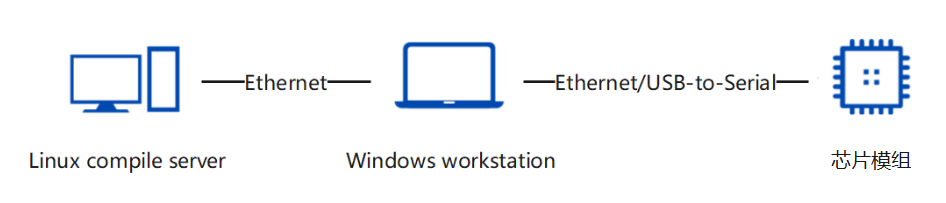

For Ubuntu configuration of the OpenHarmony development environment, please refer to the OpenHarmony community documentation.

-   OpenHarmony official community reference address

    https://docs.openharmony.cn/pages/v6.0/zh-cn/OpenHarmony-Overview_zh.md

-   **OpenHarmony Build Guide**

    https://gitcode.com/openharmony/docs/blob/master/zh-cn/device-dev/subsystems/subsys-build-all.md

The compilation environment currently supports Ubuntu18.04 and Ubuntu20.04 (Ubuntu22.04 is not yet supported). It is recommended to use the "apt-get and pip3 install commands" for installation, as shown in [Figure 2](#fig1466793985111).

**Figure 2** apt-get and pip3 install command installation<a name="fig1466793985111"></a>
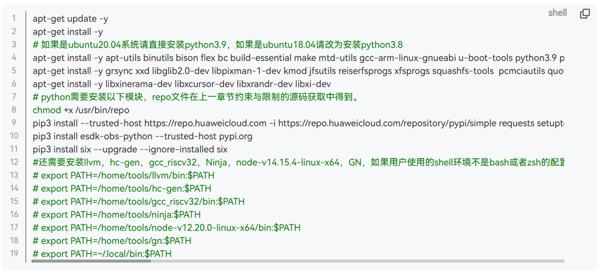

If the "Your system shell isn't bash..." issue occurs as shown in [Figure 3](#fig1560035719163), execute the following command.

```
ln -s /bin/bash /bin/sh
```

**Figure 3** Build image does not support dash command error<a name="fig1560035719163"></a>
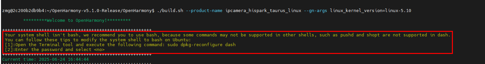
### Setting Up the Code Development Environment<a name="ZH-CN_TOPIC_0000002482342753"></a>

Configure the compilation directories for Hi3403V100 and Hi3519AV200 companion products in the OpenHarmony environment.

1.  Download the HiSpark community Hi3403 repository code. Since ss928v100_clang and ss928v100_gcc are sub-repositories of Hi3403, and OpenHarmony uses the LLVM-Clang toolchain SDK, this step downloads the Hi3403 and ss928v100_clang code directories.

    ```
    git clone https://gitee.com/HiSpark/pegasus.git
    cd pegasus
    git submodule init
    git submodule update platform/ss928v100_clang
    ```

    After the above steps, the Hi3403 project file directory is as follows.

    ```
    hi3403/
    ├── os/OpenHarmony
    │   ├── device
    │   │   └── soc/hisilicon/patches   # OpenHarmony source patches (categorized by subsystem, custom modifications to native code)
    │   ├── kernel                      # Kernel configuration and patches (linux-6.6)
    │   ├── vendor                      # HiSilicon product configuration (hispark_aifly_linux, hispark_aiflylite_linux)
    │   └── manifest
    │       ├── devboard_hispark_aifly_5.1.0.xml  # Repo manifest file (defines the list of code repositories)
    │       └── prebuilts_setup.sh                # Prebuilt environment preparation script
    ├── platform/ss928v100_clang        # SDK source code and binary libraries (kernel drivers, Samples, open source packages)
    └── vendor
        └── rkh/patches                 # Runhe OpenHarmony source patches (categorized by subsystem, enhanced system functions and driver support)
    ```

    -   The `os/OpenHarmony` directory contains patches, configuration, and build scripts for adapting HiSilicon chips to OpenHarmony. The `manifest/devboard_hispark_aifly_5.1.0.xml` is the repo manifest file, defining the list of code repositories to sync for OpenHarmony 5.1.0 Release, optimized for the Small system by removing unnecessary repositories and commenting out remote download for commonly modified repositories (kernel_linux_config, kernel_linux_patches, device_soc_hisilicon, device_board_hisilicon, vendor_hisilicon), using local subdirectories instead.
    -   The `platform/ss928v100_clang` directory is the SS928V100 SDK source code and binary libraries, including kernel driver source, Sample source code, and open source packages.
    -   The `vendor` directory contains incremental feature developments by ecosystem partners (Ebaina, Wildfire, TopEet, Runhe, Zhongshan Kuangshi, etc.) based on the Hi3403 platform, including board adaptation patches, Demo examples, and third-party open source software compilation guides. This differs from `os/OpenHarmony/vendor` (HiSilicon's original product configuration).

    > **Note:**
    >Since SS927V100 and SS928V100 are similar, the SS927V100 SDK can reuse the SS928V100 SDK source code, sharing the `os/OpenHarmony/device/soc/hisilicon/ss928v100/sdk_linux` directory.

2.  Enter the `os/OpenHarmony` directory and use the repo tool to initialize and sync the OpenHarmony code. The repo manifest file `devboard_hispark_aifly_5.1.0.xml` has been optimized for the Small system, removing unnecessary repositories.

    ```
    cd os/OpenHarmony
    repo init -u https://gitee.com/HiSpark/pegasus.git -m os/OpenHarmony/manifest/devboard_hispark_aifly_5.1.0.xml
    repo sync -c
    repo forall -c 'git lfs pull'
    ```

    After the above steps, the source code for OpenHarmony-v5.1.0-release components is obtained.

    > **Note:**
    >-   In the manifest file, `kernel_linux_config`, `kernel_linux_patches`, `device_soc_hisilicon`, `device_board_hisilicon`, and `vendor_hisilicon` are commonly modified repositories that have had their remote download commented out, using the corresponding local subdirectories under `os/OpenHarmony` instead.
    >-   After sync is complete, run `repo forall -c 'git lfs pull'` to pull LFS large files.

3.  Execute the `os/OpenHarmony/manifest/prebuilts_setup.sh` script to prepare the prebuilt environment. This script mainly performs the following tasks:
    -   Fixes known issues in `system_util.py` and `patch_process.py` scripts
    -   Copies the `platform/ss928v100_clang` directory to the SDK target path
    -   Downloads the mbedtls v2.16.10 source package (saved to `os/OpenHarmony/device/soc/hisilicon/hi3403v100/sdk_linux/open_source/mbedtls/` directory)
    -   Downloads the arm-trusted-firmware v2.2 source package (saved to `os/OpenHarmony/device/soc/hisilicon/hi3403v100/sdk_linux/open_source/trusted-firmware-a/` directory)
    -   Calls `build/prebuilts_download.sh` to download OpenHarmony compilation toolchains (clang, gn, ninja, cmake, nodejs, etc.)
    -   Downloads the `prebuilts` directory from the kernel_linux_patches repository via sparse-checkout
    -   Downloads the `device/soc/hisilicon/common/platform` directory from the hi3403 repository via sparse-checkout
    -   Configures SDK toolchain environment variables, adds `os/OpenHarmony/prebuilts/clang/ohos/linux-x86_64/llvm/bin` to PATH, verifies with `command -v clang`, and writes to `~/.bashrc` for persistence

    After completing the above steps, the project directory structure is as follows.

    ```
    pegasus
    ├── os/OpenHarmony
    │   ├── applications
    │   ├── arkcompiler
    │   ├── base
    │   ├── build
    │   ├── commonlibrary
    │   ├── developtools
    │   ├── device
    │   │   ├── board/hisilicon
    │   │   └── soc/hisilicon
    │   │       ├── patches
    │   │       └── hi3403v100/sdk_linux
    │   ├── docs
    │   ├── domains
    │   ├── drivers
    │   ├── foundation
    │   ├── interface
    │   ├── kernel
    │   ├── manifest
    │   │   ├── devboard_hispark_aifly_5.1.0.xml
    │   │   └── prebuilts_setup.sh
    │   ├── prebuilts
    │   │   └── clang/ohos/linux-x86_64/llvm/bin
    │   ├── productdefine
    │   ├── test
    │   ├── third_party
    │   ├── vendor
    │   ├── build.sh
    │   └── build.py
    ├── platform/ss928v100_clang
    └── vendor
        └── rkh/patches
    ```

### Configuring the Display Framework (DRM/FB)<a name="section_display_framework"></a>

The system uses the DRM display framework by default. To switch to the FrameBuffer (FB) display framework, configure as follows:

1.  **Modify the product configuration file**

    Open `os/OpenHarmony/vendor/hisilicon/hispark_aifly_linux/config.json` and remove or comment out the DRM support configuration in the `"graphic_utils_lite"` component of the `"graphic"` subsystem.

    ```json
    {
        "subsystem": "graphic",
        "components": [
            {
                "component": "graphic_utils_lite",
                "features": []
            }
        ]
    }
    ```

2.  **Modify the initialization script**

    Open `os/OpenHarmony/vendor/hisilicon/hispark_aifly_linux/init_configs/etc/init.d/S82ohos`, find the driver loading command, and remove the `-display drm` parameter or change it to `-display fb`.

    ```bash
    ./load_ss928v100_ohos -i
    ```

    > **Note:**
    >-   After configuration, the system must be recompiled for the changes to take effect.
    >-   To restore the DRM framework, refer to the above steps to re-add the configuration items and parameters.

## Version Compilation<a name="ZH-CN_TOPIC_0000002432107446"></a>

### OpenHarmony Compilation<a name="ZH-CN_TOPIC_0000002465705861"></a>

The compilation method for the OpenHarmony version based on hispark_aifly and hispark_aiflylite follows the community compilation approach.

#### First-Time Compilation<a name="ZH-CN_TOPIC_0000002465705862"></a>

1.  Enter the hispark_aifly OpenHarmony source root directory `os/OpenHarmony`.

2.  The first compilation requires applying patches. Add the `--patch` compilation parameter and execute the following build command. After success, `=====build  successful=====` is displayed.

    ```
    ./build.sh --product-name=ipcamera_hispark_aifly_linux --ccache --no-prebuilt-sdk --patch --gn-args build_xts=true
    ```

    > **Note:**
    >To compile hispark_aiflylite, execute the following build command
    >```
    >./build.sh --product-name=ipcamera_hispark_aiflylite_linux --ccache --no-prebuilt-sdk --patch --gn-args build_xts=true
    >```

3.  Compilation parameter descriptions:

    | Parameter | Description |
    |-----------|-------------|
    | `--product-name` | Specifies the product name, e.g., `ipcamera_hispark_aifly_linux` or `ipcamera_hispark_aiflylite_linux` |
    | `--ccache` | Enables compilation cache to speed up subsequent builds |
    | `--no-prebuilt-sdk` | Skips compilation of the SDK subsystem |
    | `--patch` | Automatically applies patch files in the patches directory on first compilation |
    | `--gn-args build_xts=true` | Enables compilation of XTS compatibility test components, used to pass OpenHarmony compatibility certification |

    > **Note:**
    >-   Patch configuration can be found in the `os/OpenHarmony/vendor/hisilicon/hispark_aifly_linux/patch.yml` file.
    >-   Before a full compilation, the patch operation is executed first. If patch application fails, the build process will be interrupted.
    >-   When a patch fails, first run `rm -rf out` to clean the output directory, then re-trigger the build command.
    >-   To revert all patches in patch.yml, run the `patch_revert.py` script under `os/OpenHarmony/vendor/hisilicon/hispark_aifly_linux`:
    >    ```
    >    cd os/OpenHarmony/vendor/hisilicon/hispark_aifly_linux
    >    python3 patch_revert.py
    >    ```
    >-   You can also manually revert a single patch. For example, to revert the build repository patch, execute in the build directory:
    >    ```
    >    patch -p1 -R < ../../device/soc/hisilicon/patches/build/build_001.patch
    >    ```

#### Subsequent Compilations<a name="ZH-CN_TOPIC_0000002465705863"></a>

For subsequent compilations (after patches have been applied), skip the patch step by removing the `--patch` parameter:

```
./build.sh --product-name=ipcamera_hispark_aifly_linux --ccache --no-prebuilt-sdk --gn-args build_xts=true
```

> **Note:**
>When a full rebuild of the OpenHarmony version is needed, first run `rm -rf ./out`, then re-execute the build command.

### ko File Signing<a name="section_ko_signing"></a>

#### Background and Principle<a name="section_ko_signing_background"></a>

The OpenHarmony Small version kernel enables the `CONFIG_MODULE_SIG` and `CONFIG_MODULE_SIG_FORCE` compilation options, mandating that all loaded kernel modules (`.ko` files) must carry a valid digital signature. This mechanism prevents malicious or tampered kernel modules from being loaded into the system, thereby enhancing system security.

**Why must the kernel and ko files be compiled together?**

Each time a full kernel compilation is performed, the build system automatically generates a new pair of signing keys (`signing_key.pem` private key and `signing_key.x509` public key) in the `certs/` directory. The kernel image compiles the public key into itself for later module signature verification, while `.ko` files must be signed using the corresponding private key.

If the kernel is compiled first generating key A, KO files are signed with key A, and then the kernel is recompiled generating key B, the public key built into the kernel changes to B, while the KO signatures remain A. The verification will fail with the error:

```
Loading of module with unsupported crypto is rejected
insmod: failed to load xxx.ko:Key was rejected by service
```

Therefore, **you must ensure that the key used to sign KO files is exactly the same as the key built into the final kernel image being flashed**.

#### New ko File Signing Procedure<a name="section_ko_signing_steps"></a>

When you need to add or replace `.ko` files, you must use the associated signing script for processing. Follow these steps:

1.  **Ensure the kernel has been compiled**

    The signing script depends on the signing tools and keys produced by kernel compilation. First, perform a complete kernel compilation and ensure the following paths exist:

    -   Signing tool: `${OHOS_OUTDIR}/kernel/${KERNEL_VERSION}/scripts/sign-file`
    -   Private key: `${OHOS_OUTDIR}/kernel/${KERNEL_VERSION}/certs/signing_key.pem`
    -   Public key: `${OHOS_OUTDIR}/kernel/${KERNEL_VERSION}/certs/signing_key.x509`

2.  **Prepare the ko files to be signed**

    Place the newly compiled `.ko` files into the same directory (e.g., `./my_kos/`).

3.  **Execute the signing script**

    Use the `batch_sign_ko.sh` script to batch sign all `.ko` files in the directory:

    ```bash
    # Enter the pegasus root directory
    cd pegasus

    # Execute signing (assuming ko files are in ./my_kos/)
    ./os/OpenHarmony/device/board/hisilicon/hispark_aifly/kernel/batch_sign_ko.sh ./my_kos/
    ```

    The script automatically detects `OHOS_OUTDIR` and `KERNEL_VERSION`, and signs using the SHA-512 algorithm. Already signed files are automatically skipped.

4.  **Replace and flash**

    Replace the signed `.ko` files into the corresponding system image packaging directory, then repackage and flash the image.

> **Note:**
>-   The signing step must be performed after kernel compilation and before image packaging.
>-   If the kernel is recompiled midway, re-sign all `.ko` files.

### uboot Compilation<a name="ZH-CN_TOPIC_0000002465545981"></a>

> **Note:**
>-   The system provides a default `os/OpenHarmony/device/soc/hisilicon/hi3403v100/uboot/boot_image_4GB.bin` uboot image that can be used directly for flashing. If you need to compile uboot yourself, please refer to the following steps.
>-   Before compiling, read `os/OpenHarmony/device/soc/hisilicon/hi3403v100/sdk_linux/open_source/u-boot/readme.txt` and follow the instructions to download and install the u-boot open source software.

To compile uboot, enter the SDK's osdrv directory. The SDK path is `os/OpenHarmony/device/soc/hisilicon/hi3403v100/sdk_linux/`.

1.  Download and configure the cross-compilation toolchain.

    The bootloader is compiled using the `aarch64-openeuler-linux-gnu` 64-bit toolchain. Download address: [https://gitee.com/openeuler/yocto-meta-openeuler/releases](https://gitee.com/openeuler/yocto-meta-openeuler/releases)

    After downloading, add it to the environment variables:

    ```
    export PATH=/path/to/aarch64-openeuler-linux-gnu/bin:$PATH
    ```

2.  Enter the osdrv directory and execute the build command.

    ```
    cd os/OpenHarmony/device/soc/hisilicon/hi3403v100/sdk_linux/osdrv/
    make LLVM=1 BOOT_MEDIA=emmc CHIP=ss928v100 all -j 20
    ```

    > **Note:**
    >-   `CHIP`: Can be `ss928v100` or `ss927v100`, default is `ss928v100`.
    >-   `BOOT_MEDIA`: Select based on the boot medium: `spi` (spi nor or spi nand), `nand` (parallel nand), or `emmc`.
    >-   `LLVM=1`: Compiles using the musl toolchain; if not specified, the glibc toolchain is used.

3.  Compile uboot separately (for fast boot or non-secure boot Boot Image).

    ```
    make BOOT_MEDIA=emmc gslboot_build -j 20
    ```

4.  Clean compilation files.

    ```
    make clean        # Clean compilation files
    make distclean    # Thoroughly clean intermediate compilation files
    ```

    After successful compilation, the generated `boot_image.bin` image file is located in the `os/OpenHarmony/device/soc/hisilicon/hi3403v100/sdk_linux/osdrv/pub/ss928v100_emmc_image_musl/` directory.

### SDK Sample Compilation<a name="ZH-CN_TOPIC_0000002432267302"></a>

> **Caution:**
>Before running SDK samples under the HarmonyOS system, you need to close the media and graphics processes. The specific methods are:
>1. Modify the product configuration file `os/OpenHarmony/vendor/hisilicon/hispark_aifly_linux/config.json`, delete the `window`, `graphic`, `multimedia`, and `applications` subsystem configurations.
>2. Modify the initialization script `os/OpenHarmony/vendor/hisilicon/hispark_aifly_linux/init_configs/init_linux_openharmony.cfg`, delete `"start media_server",` and `"start wms_server",`.
>3. Refer to [OpenHarmony Compilation](#openharmony编译) to recompile HarmonyOS.
>4. After flashing the board image, the SDK sample can be run.

The SDK package provides kernel driver source code and Sample source code, which can be compiled from source. Before compiling SDK samples, the SYSROOT_PATH environment variable must be configured.

1.  Before configuration, first execute OpenHarmony compilation to generate the required sysroot.

    > **Note:**
    >When using the LLVM-Clang toolchain to compile SDK samples, it depends on the OpenHarmony build output: os/OpenHarmony/out/hispark_aifly/ipcamera_hispark_aifly_linux/sysroot. Therefore, OpenHarmony compilation must be performed first.

2.  Assuming the toolchain sysroot path is `/path/to/pegasus/os/OpenHarmony/out/hispark_aifly/ipcamera_hispark_aifly_linux/sysroot`, set it to the SYSROOT_PATH environment variable.

    ```
    export SYSROOT_PATH=/path/to/pegasus/os/OpenHarmony/out/hispark_aifly/ipcamera_hispark_aifly_linux/sysroot
    ```

3.  Verify that the SYSROOT_PATH configuration is in effect.

    ```
    echo $SYSROOT_PATH
    ```

4.  Enter `os/OpenHarmony/device/soc/hisilicon/hi3403v100/sdk_linux/smp/a55_linux/mpp/sample` and execute:

    ```
    make
    ```

    After compilation, each sample executable is located in the corresponding directory under `os/OpenHarmony/device/soc/hisilicon/hi3403v100/sdk_linux/smp/a55_linux/mpp/sample`.

> **Note:**
>The samples use SDK_init and SDK_exit to initialize and exit each MPP module. HNR requires the pqp module. By default, SDK_init does not initialize the pqp module, so the HNR sample needs to be recompiled separately. The specific steps are:
>1. In the `os/OpenHarmony/device/soc/hisilicon/hi3403v100/sdk_linux/smp/a55_linux/mpp/sample/common/sdk_module_init.h` header file, change the macro definition INIT_PQP to 1.
>2. Enter the hnr directory and recompile with the following command.
>```
>cd os/OpenHarmony/device/soc/hisilicon/hi3403v100/sdk_linux/smp/a55_linux/mpp/sample/hnr
>make clean
>make
>```

## Version Flashing<a name="ZH-CN_TOPIC_0000002408332445"></a>

### OpenHarmony Image Flashing<a name="ZH-CN_TOPIC_0000002555267881"></a>

For the hispark_aifly and hispark_aiflylite OpenHarmony versions, the compiled image files are located in the following directory.

```
os/OpenHarmony/out/hispark_aifly/ipcamera_hispark_aifly_linux
```

The image files that need to be flashed include:

| File | Description |
|------|-------------|
| `boot_image.bin` | Bootloader image |
| `uboot_env.bin` | uboot environment variables |
| `fip.bin` | Kernel image (with ATF security header) |
| `rootfs_ext4.img` | Root filesystem image |
| `userfs_ext4.img` | User filesystem image |
| `userdata_ext4.img` | User data image |
| `emmc_burn_table.xml` | Flashing configuration file |

1.  The directory `os/OpenHarmony/out/hispark_aifly/ipcamera_hispark_aifly_linux` contains the default EMMC output from OpenHarmony compilation.
2.  Refer to [uboot Compilation](#uboot编译) to generate boot_image.bin.
3.  Use the ToolPlatform tool to flash the image, loading the `emmc_burn_table.xml` configuration file.

    **Figure 1** ToolPlatform flashing screenshot<a name="fig598741418184"></a>
    
    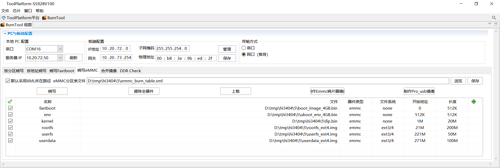

4.  On the first flashing, configure bootargs with the following script.

    ```
    setenv bootargs 'mem=512M console=ttyAMA0,115200 clk_ignore_unused rw rootwait root=/dev/mmcblk0p4 rootfstype=ext4 blkdevparts=mmcblk0:512K(fastboot),512K(env),20M(kernel),200M(rootfs),50M(userfs),100M(userdata)';
    setenv bootcmd 'mmc read 0 0x50000000 0x800 0xA000; bootm 50000000';
    setenv bootdelay 1;
    sa;
    re
    ```

    > **Note:**
    >Calculation method for mmc read values: use a programmer calculator, select DEC for intermediate calculations, and convert the final result to HEX. For example, 0xA000 is derived from the kernel image size of 20M, with mmc using 512 bytes per unit: 20*1024*1024/512=0xA000 (result converted to HEX).

### Hardware Board Flashing<a name="ZH-CN_TOPIC_0000002555387861"></a>

Hi3403V100 and Hi3519AV200 hardware boards require a one-time KEY0 burn-in during mass production and cannot be re-burned. If KEY0 is not burned, the hardware blocks key derivation operations, and hardware key encryption/decryption cannot be used normally.

The steps for burning KEY0 on Hi3403V100 hardware boards are as follows.

1.  Enter the U-Boot command line and execute the following commands sequentially

    ```
    mw 0x10122008 0x6
    # The following four lines set the key to be burned,
    # using key=128'h00010203_04050607_08090a0b_0c0d0e0f as an example
    mw 0x1012200C 0x0c0d0e0f
    mw 0x10122010 0x08090a0b
    mw 0x10122014 0x04050607
    mw 0x10122018 0x00010203
    mw 0x10123000 0x2
    mw 0x10122004 0x1acce551
    ```

    > **Warning:**
    >The key in the above burn-in commands is just a parameter. For actual burning, use random numbers. Do not use the example key.

2.  Power cycle the board (reboot soft restart does not work; power cycle is required for the change to take effect). After that, running XTS test cases will show that all HUKS cases for XTS certification PASS.

## XTS Testing Instructions<a name="ZH-CN_TOPIC_0000002374732940"></a>

-   XTS test suite compilation requires specifying the parameter --gn-args build_xts=true, as shown in the following example.

    ```
    ./build.sh --product-name=ipcamera_hispark_aifly_linux --gn-args build_xts=true --ccache --no-prebuilt-sdk
    ```

    After compilation, the suites folder is generated in the os/OpenHarmony/out/hispark_aifly/ipcamera_hispark_aifly_linux/ directory, containing the acts test suite.

-   For XTS environment setup and testing, please refer to the OpenHarmony community compatibility evaluation service guide:

    [https://www.openharmony.cn/certification/document/guid](https://www.openharmony.cn/certification/document/guid)

    Refer to the "Compatibility Test Execution Environment Setup" section in the link to configure the Windows environment and install the necessary software. hispark_aifly and hispark_aiflylite are Small systems. Please refer to the "Small System Application Compatibility Test Guide" section for environment setup and configuration.

    For XTS test resource files, download the community OpenHarmony 5.1.0 Release Small system ACTS resource files and replace the files under the acts\\resource directory.

    Download address: [https://www.openharmony.cn/certification/document/xts](https://www.openharmony.cn/certification/document/xts)

    **Figure 1** Small system resource files<a name="fig18181965513"></a>
    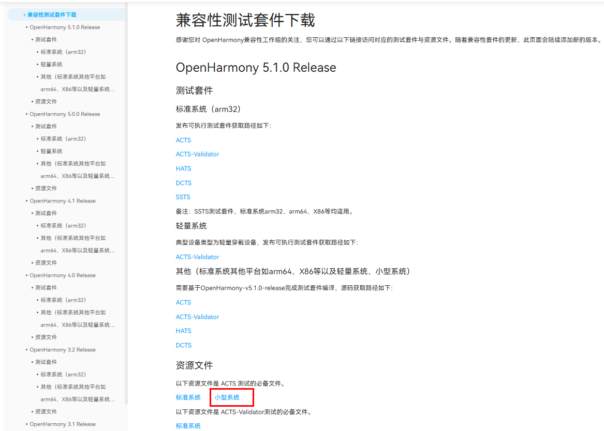
    > **Caution:**
    >In OH5.0 and earlier versions, the resource\\tools\\query.bin downloaded from the community is 32-bit and cannot be used on 64-bit devices. Customers need to use the self-compiled query.bin file (os/OpenHarmony/out/hispark_aifly/ipcamera_hispark_aifly_linux/suites/acts/resource/tools/query.bin).
    >The OH5.1 community download resource does not have a tools directory.

### Supplementary Notes on XTS Test Suite<a name="ZH-CN_TOPIC_0000002374573168"></a>

Products with screens and applications need to test ActsAbilityMgrTest and ActsBundleMgrTest. If the customer product needs to pass the HarmonyOS XTS certification A-level, these two must be tested.

1.  Uncomment lines 106 and 107 in `os/OpenHarmony/test/xts/acts/build_lite/BUILD.gn` (remove the "#" at the beginning).
2.  After recompiling the project, the test suite ActsAbilityMgrTest.bin is generated in the acts/testcases/ability directory, and the test suite ActsBundleMgrTest.bin is generated in the acts/testcases/appexecfwk directory.

### XTS Test Command Instructions<a name="ZH-CN_TOPIC_0000002374573068"></a>

-   Full execution command

    ```
    run acts
    ```

-   Single module execution command

    ```
    run -l ActsSamgrTest 
    ```

-   Multi-module execution command

    ```
    run -l ActsSamgrTest;ActsPMSTest;ActsBootstrapTest;ActsParameterTest
    ```

### XTS Application Evaluation Notes<a name="ZH-CN_TOPIC_0000002374733068"></a>

1.  Refer to the specification requirements in sheet1 of the "OpenHarmony Device Compatibility Specification x.x Self-Check Form_Small System.xlsx" to modify the configuration file os/OpenHarmony/vendor/hisilicon/hispark_aifly_linux/hals/utils/sys_param/vendor.para and set product information.

    OpenHarmony device compatibility specification self-check form download address: https://www.openharmony.cn/certification/document/pcs/

    **Figure 1** Small System PCS5.x Self-Check Form<a name="fig1252105314519"></a>
    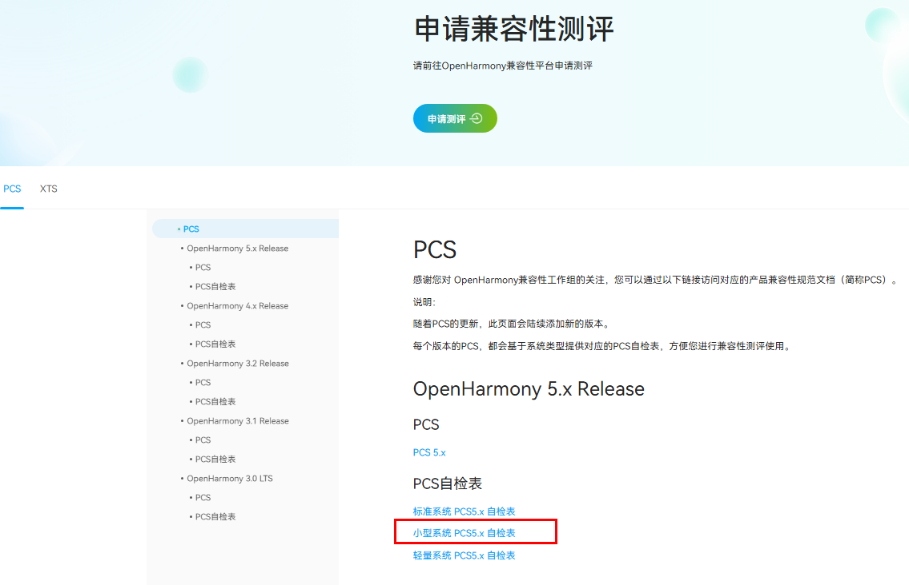

2.  When filling out the evaluation application form, the PCID.sc file must be uploaded. Obtain it from the out directory (os/OpenHarmony/out/hispark_aifly/ipcamera_hispark_aifly_linux/PCID.sc).
3.  When submitting for testing, a full XTS run must be performed. The test report summary (summary_report.html) generated in the acts\\reports directory must contain product information.

    **Figure 2** XTS test report description information<a name="fig36354481512"></a>
    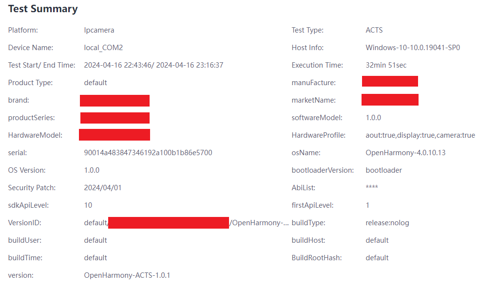

4.  Prepare evaluation materials according to the following directory structure. Note that the appearance images submitted for evaluation must match the physical samples being submitted, and the chip silkscreen must include the chip's external marketing name.

    **Figure 3** XTS certification submission material reference directory<a name="fig1406506511"></a>
    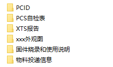
### Hardware Board Flashing<a name="ZH-CN_TOPIC_0000002374732952"></a>

Steps for burning KEY0 on SS928V100 and SS927V100 hardware boards.

1.  Enter the U-Boot command line and execute the following commands sequentially

    ```
    mw 0x10122008 0x6
    # The following four lines set the key to be burned,
    # using key=128'h00010203_04050607_08090a0b_0c0d0e0f as an example
    mw 0x1012200C 0x0c0d0e0f
    mw 0x10122010 0x08090a0b
    mw 0x10122014 0x04050607
    mw 0x10122018 0x00010203
    mw 0x10123000 0x2
    mw 0x10122004 0x1acce551
    ```

    > **Warning:**
    >The key in the above burn-in commands is just a parameter. For actual burning, use random numbers. Do not use the example key.

2.  Power cycle the board (reboot soft restart does not work; power cycle is required for the change to take effect). After that, running XTS test cases will show that all HUKS cases for XTS certification PASS.

## Configuring telnetd for Passwordless Connection<a name="ZH-CN_TOPIC_0000002378611298"></a>

OpenHarmony 5.1 toybox telnetd connections require a password by default. Configure passwordless connections using either of the following two methods.

-   Execute the following command on the board to directly modify the /etc/passwd file

    ```
    sed -i "s#root:x:0:0:::/bin/false#root::0:0::/root/:/bin/sh#g" /etc/passwd
    ```

-   Mount an NFS server on the local PC, copy the board's /etc/passwd to the local PC for modification

1.  To modify the board's passwd, first mount the local server, copy the board's /etc/passwd to the local server, modify the local passwd file as shown in [Figure 2](#fig377520345458), then copy it back to replace the board's /etc/passwd file.

    **Figure 1** Before modification: (root:x:0:0:::/bin/false)<a name="fig13430148164010"></a>
    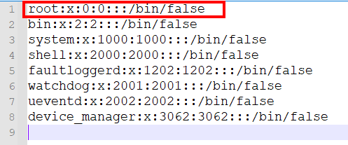

    **Figure 2** After modification: (root::0:0::/root:/bin/sh)<a name="fig377520345458"></a>
    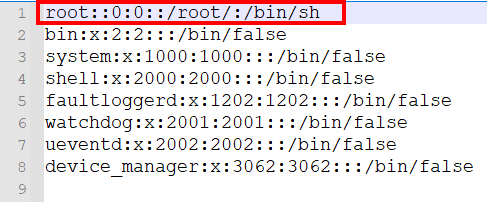

2.  After modification, telnet connections do not require a password.

## Media Function Usage Guide<a name="ZH-CN_TOPIC_0000002408172697"></a>

1.  Add subsystems to the os/OpenHarmony/vendor/hisilicon/hispark_aifly_linux/config.json file.

    ```
          {
            "subsystem": "arkui",
            "components": [
              { "component": "ui_lite", "features":[ "ui_lite_enable_graphic_font_config = true" ] }
            ]
          },
          {
            "subsystem": "graphic",
            "components": [
              { "component": "graphic_utils_lite", "features":[] },
              { "component": "surface_lite", "features":[] }
            ]
          },
          {
            "subsystem": "window",
            "components": [
              { "component": "window_manager_lite", "features":[] }
            ]
          },
          {
            "subsystem": "multimedia",
            "components": [
              { "component": "camera_lite", "features":[] },
              { "component": "media_lite", "features":[] },
              { "component": "audio_lite", "features":[] },
              { "component": "media_service", "features":[] }
            ]
          },
    ```

2.  Add code to the os/OpenHarmony/vendor/hisilicon/hispark_aifly_linux/init_configs/init_linux_openharmony.cfg file to start the media service as follows:

    ```
                    "start media_server",
    ```

    **Figure 1** Added startup service<a name="fig18331161515913"></a>
    

3.  Before compiling the version, libsns_hy_s0603.so needs to be recompiled because this library reports a link error during dynamic loading. Therefore, modify the compilation script for recompilation. The script path is:

    os/OpenHarmony/device/soc/hisilicon/hi3403v100/sdk_linux/smp/a55_linux/mpp/cbb/isp/user/sensor/ss928v100/hy_s0603/Makefile

    The modification method is shown in [Figure 2](#fig13477396910).

    **Figure 2** Modification method<a name="fig13477396910"></a>
    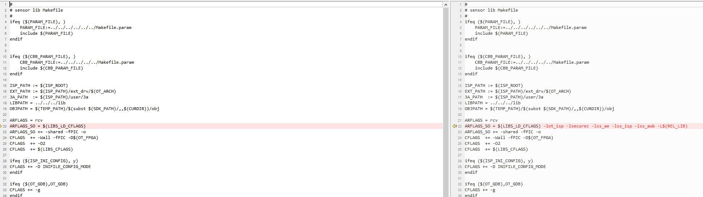

    The link dependencies to add: -lot_isp -lsecurec -lss_ae -lss_isp -lss_awb -L$(REL_LIB)

    After compilation, libsns_hy_s0603.so will be generated in the os/OpenHarmony/device/soc/hisilicon/hi3403v100/sdk_linux/smp/a55_linux/mpp/out/lib directory. **Restore all modified link dependencies**, then proceed directly with OpenHarmony version compilation.

    **Another solution:**

    If the patchelf tool is available on the compilation environment, you can add link dependencies to libsns_hy_s0603.so using the following command without recompiling:

    patchelf --add-needed libss_awb.so libsns_hy_s0603.so

    patchelf --add-needed libss_ae.so libsns_hy_s0603.so

    patchelf --add-needed libot_mpi_isp.so libsns_hy_s0603.so

    patchelf --add-needed libsecurec.so libsns_hy_s0603.so

    Verify the successfully added link dependencies with the following command:

    readelf -d libsns_hy_s0603.so

    If the output appears as shown in the figure, it is OK:

    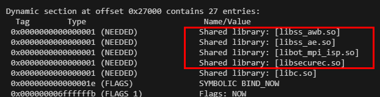

4.  If HDMI output is needed, manually start the graphics layer service. The specific operation is as follows:

    Execute the command on the board: ./bin/wms_server & to start the graphics layer service. This command only needs to be executed once; repeated execution will cause errors.

    > **Caution:**
    >All media samples must be exited using the specified command. The default is to enter q to exit.

### Preview Function<a name="ZH-CN_TOPIC_0000002374573208"></a>

1.  Power cycle the board and execute /tmp/camera_sample.

    **Figure 1** Serial port display information<a name="fig14211281966"></a>
    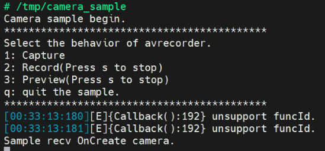

2.  Enter 3 when prompted.

    **Figure 2** Start preview service<a name="fig10116238963"></a>
    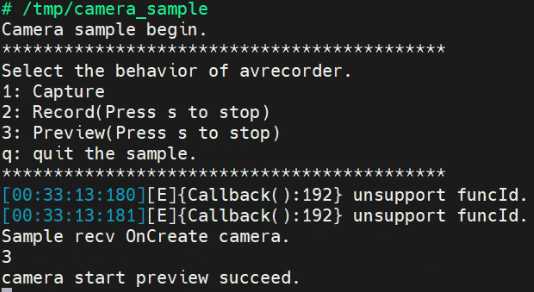

3.  Expected result: The display device shows the image captured by the Sensor.

### Recording Function<a name="ZH-CN_TOPIC_0000002374573072"></a>

1.  Power cycle the board and execute /tmp/camera_sample.

    > **Caution:**
    >Recorded files are saved in the /userdata/norm/ directory by default. To modify the save path for recorded files, modify line 218 of os/OpenHarmony/applications/sample/camera/media/camera_sample.cpp, which corresponds to the DEFAULT_SAVE_PATH variable in [Figure 1](#fig131803319235).

    **Figure 1** Modify the save path of camera_sample recorded files<a name="fig131803319235"></a>
    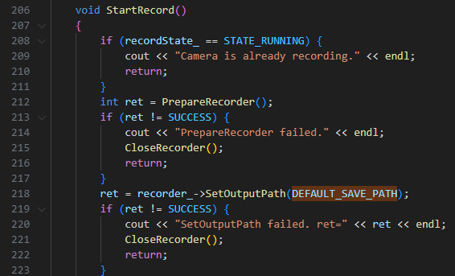

2.  Enter 2 when prompted.

    **Figure 2** Start recording service<a name="fig15386293427"></a>
    
    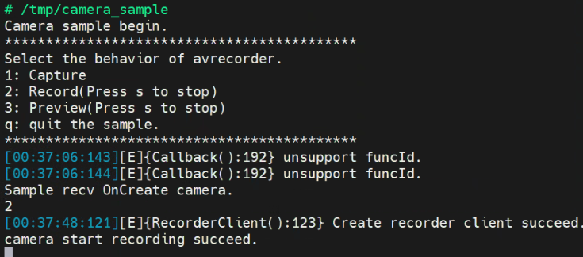

3.  Move the sensor position back and forth to ensure the recorded image is dynamic. Enter s, press Enter, then enter q, press Enter to end recording.

    **Figure 3** End recording<a name="fig1758312121910"></a>
    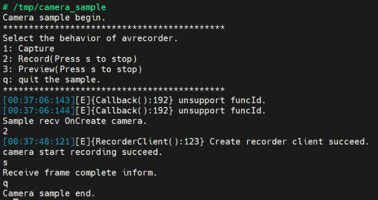

4.  The recorded video is saved in the following location.

    **Figure 4** Serial port display information<a name="fig662354961818"></a>
    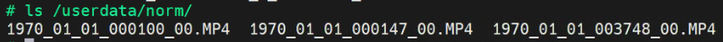

    It can be played using the player_sample later.

    > **Note:**
    >To manually modify the system time, use the date command: date -u "YYYY-MM-DD HH:mm:ss", e.g., date -u "2024-04-10 12:00:00". For specific business scenarios, it is recommended that the device synchronize time with the server.

### Playback Function<a name="ZH-CN_TOPIC_0000002374573172"></a>

1.  Use the playback Demo to play a video with the following command:

    ```
    /tmp/player_sample /tmp/1970_01_02_202516_00.MP4
    If playing an AAC stream, the command is:
    /tmp/player_sample /tmp/audio_1970-01-01-00-03-36.aac 2
    ```

2.  Expected result: The monitor displays the recorded video normally. With headphones plugged into the board, normal audio output is heard.

    **Figure 1** Start playback function<a name="fig824648174310"></a>
    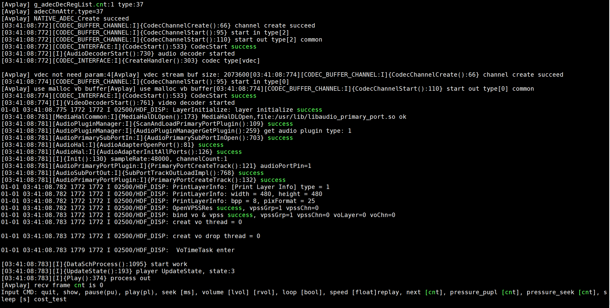
### H264 Stream Capture Function<a name="ZH-CN_TOPIC_0000002374573076"></a>

> **Caution:**
>The Demo provided by the media subsystem is only for basic OpenHarmony function testing. For commercial business scenarios, development based on the OpenHarmony API is required.

### Sensor Switching Guide<a name="ZH-CN_TOPIC_0000002408332573"></a>

The default sensor is hy_s0603, with a timing of 1080P 60fps, VI capture at 30fps, and final display output at 60fps.

It also supports hy_s0603 with a timing of 4K 30fps, VI capture at 30fps, and final display output at 30fps.

If you need to switch from 1080P to 4K, the steps are as follows:

1.  In the foundation/multimedia/media_lite/services directory, add the cameradev_hy_s0603_4k30_928.ini file and adapt the 4K corresponding parameters in this file.
2.  In the foundation/multimedia/media_lite/services/BUILD.gn file, replace cameradev_hy_s0603_928.ini with cameradev_hy_s0603_4k30_928.ini.

    **Figure 1** Modify sensor configuration file<a name="fig83672365584"></a>
    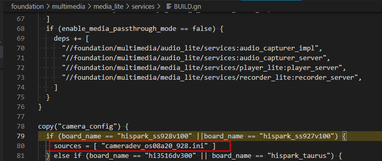

3.  Recompile and flash.

### Audio Capture Function<a name="ZH-CN_TOPIC_0000002408172589"></a>

1.  Power cycle the board. If you need to test the talkvqe function, first execute export LD_PRELOAD=/usr/lib/libsecurec.so:/usr/lib/libvqe_hpf.so

    Pre-load the required so paths.

2.  Execute /tmp/audio_capature_sample.

    **Figure 1** Configure audio capture parameters<a name="fig115573685212"></a>
    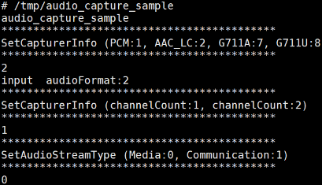

3.  Enter parameters as prompted. Currently supports PCM, AAC_LC, G711A, G711U formats.
4.  Enter s or S to start recording, p or P to stop recording, q or Q to exit recording.

    **Figure 2** Start audio capture function<a name="fig1449912474490"></a>
    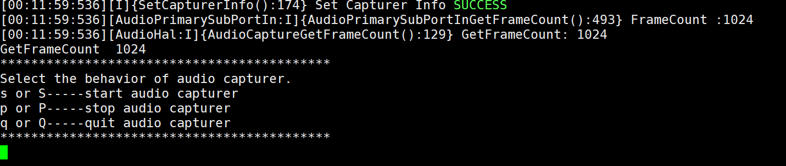

5.  The successfully recorded file is saved in the /userdata directory and can be played using player_sample.

    **Figure 3** Audio capture file<a name="fig1977325816493"></a>
    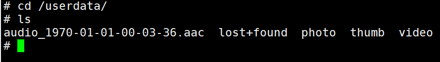
## Graphics Sample Application Usage Guide<a name="ZH-CN_TOPIC_0000002408172677"></a>

The graphics subsystem provides two sample applications: a control sample application and a window sample application. The control sample application mainly covers the graphics subsystem's widget capabilities, such as Button, Label, ScrollView, etc. The window sample application mainly covers window management capabilities, including window creation, deletion, and position setting.

### Prerequisites<a name="ZH-CN_TOPIC_0000002374573024"></a>

To enable the graphics subsystem, follow these steps:

1.  Add the following code under the "subsystems" tag in os/OpenHarmony/vendor/hisilicon/hispark_aifly_linux/config.json:

    ```
          {
               "subsystem": "arkui",
               "components": [
                  { "component": "ui_lite", "features":[ "ui_lite_enable_graphic_font_config = true" ] }
              ]
          },
          {
               "subsystem": "graphic",
               "components": [
                  { "component": "graphic_utils_lite", "features":[] },
                  { "component": "surface_lite", "features":[] }
               ]
          },
          {
               "subsystem": "window",
               "components": [
                  { "component": "window_manager_lite", "features":[] }
            ]
          },
    ```

2.  Recompile and flash.

#### Resource Paths<a name="ZH-CN_TOPIC_0000002374573152"></a>

[Table 1](#table386mcpsimp) describes the resource files required by the sample applications and their directories (paths relative to the OpenHarmony root directory).

**Table 1** Resource path description

<a name="table386mcpsimp"></a>
<table><thead align="left"><tr id="row391mcpsimp"><th class="cellrowborder" valign="top" width="26.150000000000002%" id="mcps1.2.3.1.1"><p id="p393mcpsimp"><a name="p393mcpsimp"></a><a name="p393mcpsimp"></a>File Name</p>
</th>
<th class="cellrowborder" valign="top" width="73.85000000000001%" id="mcps1.2.3.1.2"><p id="p395mcpsimp"><a name="p395mcpsimp"></a><a name="p395mcpsimp"></a>File Path</p>
</th>
</tr>
</thead>
<tbody><tr id="row397mcpsimp"><td class="cellrowborder" valign="top" width="26.150000000000002%" headers="mcps1.2.3.1.1 "><p id="p399mcpsimp"><a name="p399mcpsimp"></a><a name="p399mcpsimp"></a>sample_ui (control sample application)</p>
</td>
<td class="cellrowborder" valign="top" width="73.85000000000001%" headers="mcps1.2.3.1.2 "><p id="p401mcpsimp"><a name="p401mcpsimp"></a><a name="p401mcpsimp"></a>out\hispark_aifly\ipcamera_hispark_aifly_linux\dev_tools\bin\</p>
</td>
</tr>
<tr id="row402mcpsimp"><td class="cellrowborder" valign="top" width="26.150000000000002%" headers="mcps1.2.3.1.1 "><p id="p404mcpsimp"><a name="p404mcpsimp"></a><a name="p404mcpsimp"></a>sample_window (window sample application)</p>
</td>
<td class="cellrowborder" valign="top" width="73.85000000000001%" headers="mcps1.2.3.1.2 "><p id="p406mcpsimp"><a name="p406mcpsimp"></a><a name="p406mcpsimp"></a>out\hispark_aifly\ipcamera_hispark_aifly_linux\dev_tools\bin\</p>
</td>
</tr>
<tr id="row412mcpsimp"><td class="cellrowborder" valign="top" width="26.150000000000002%" headers="mcps1.2.3.1.1 "><p id="p414mcpsimp"><a name="p414mcpsimp"></a><a name="p414mcpsimp"></a>Font resources</p>
</td>
<td class="cellrowborder" valign="top" width="73.85000000000001%" headers="mcps1.2.3.1.2 "><p id="p416mcpsimp"><a name="p416mcpsimp"></a><a name="p416mcpsimp"></a>out\hispark_aifly\ipcamera_hispark_aifly_linux\data</p>
</td>
</tr>
<tr id="row417mcpsimp"><td class="cellrowborder" valign="top" width="26.150000000000002%" headers="mcps1.2.3.1.1 "><p id="p419mcpsimp"><a name="p419mcpsimp"></a><a name="p419mcpsimp"></a>Image resources</p>
</td>
<td class="cellrowborder" valign="top" width="73.85000000000001%" headers="mcps1.2.3.1.2 "><p id="p421mcpsimp"><a name="p421mcpsimp"></a><a name="p421mcpsimp"></a>foundation\arkui\ui_lite\tools\qt\simulator\config\images</p>
<p id="p422mcpsimp"><a name="p422mcpsimp"></a><a name="p422mcpsimp"></a>foundation\arkui\ui_lite\ tools\qt\simulator\config\faces</p>
<p id="p423mcpsimp"><a name="p423mcpsimp"></a><a name="p423mcpsimp"></a>foundation\arkui\ui_lite\ tools\qt\simulator\default_resource</p>
</td>
</tr>
</tbody>
</table>

#### Device-Side Requirements<a name="ZH-CN_TOPIC_0000002374572984"></a>

1.  Connect an HDMI display device, such as a monitor or TV.
2.  Ensure the board can access the required test files, e.g., via tftp network mount or SD card.
3.  Ensure the device drivers gfbg.ko and ot_tde.ko are loaded (check with the lsmod command on the board).
4.  (If mouse support is needed) Execute "echo host > /proc/10320000.usb30drd/mode".
5.  Execute "wms_server &", confirm that the wms_server process starts normally (check if the process exists using the top command on the board, and the display lights up with a blue screen). Move the mouse; if there is no mouse, execute "cat /dev/input/event0".

### Sample Application Description<a name="ZH-CN_TOPIC_0000002408332477"></a>

#### sample_window<a name="ZH-CN_TOPIC_0000002408332429"></a>

Verification steps

1.  Configure the network;

    ```
    ifconfig eth0 **.***.**.**
    ```

2.  Mount the executable file;

    ```
    mount -t nfs -o addr=**.***.**.**,nolock,tcp **.***.**.**:$ path to sample_window /mnt
    ```

3.  Execute sample_window.

    ```
    ./sample_window
    ```

#### sample_ui<a name="ZH-CN_TOPIC_0000002374573100"></a>

1.  Configure the network

    ```
    ifconfig eth0 **.***.**.**
    ```

2.  Mount resources

    ```
    mount -t nfs -o addr=**.***.**.**,nolock,tcp **.***.**.**:$ server path to resources /user/data
    ```

    [Table 1](#table440mcpsimp) describes the board-side paths for corresponding resource files. Copy the resources to the corresponding board-side paths according to the table.

    **Table 1** Resource description table

    <a name="table440mcpsimp"></a>
    <table><thead align="left"><tr id="row445mcpsimp"><th class="cellrowborder" valign="top" width="45.050000000000004%" id="mcps1.2.3.1.1"><p id="p447mcpsimp"><a name="p447mcpsimp"></a><a name="p447mcpsimp"></a>File Name</p>
    </th>
    <th class="cellrowborder" valign="top" width="54.949999999999996%" id="mcps1.2.3.1.2"><p id="p449mcpsimp"><a name="p449mcpsimp"></a><a name="p449mcpsimp"></a>Board-Side Path</p>
    </th>
    </tr>
    </thead>
    <tbody><tr id="row450mcpsimp"><td class="cellrowborder" valign="top" width="45.050000000000004%" headers="mcps1.2.3.1.1 "><p id="p452mcpsimp"><a name="p452mcpsimp"></a><a name="p452mcpsimp"></a>line_cj.brk</p>
    </td>
    <td class="cellrowborder" valign="top" width="54.949999999999996%" headers="mcps1.2.3.1.2 "><p id="p454mcpsimp"><a name="p454mcpsimp"></a><a name="p454mcpsimp"></a>/user/data</p>
    </td>
    </tr>
    <tr id="row455mcpsimp"><td class="cellrowborder" valign="top" width="45.050000000000004%" headers="mcps1.2.3.1.1 "><p id="p457mcpsimp"><a name="p457mcpsimp"></a><a name="p457mcpsimp"></a>SourceHanSansSC-Regular.otf</p>
    </td>
    <td class="cellrowborder" valign="top" width="54.949999999999996%" headers="mcps1.2.3.1.2 "><p id="p459mcpsimp"><a name="p459mcpsimp"></a><a name="p459mcpsimp"></a>/user/data</p>
    </td>
    </tr>
    <tr id="row460mcpsimp"><td class="cellrowborder" valign="top" width="45.050000000000004%" headers="mcps1.2.3.1.1 "><p id="p462mcpsimp"><a name="p462mcpsimp"></a><a name="p462mcpsimp"></a>Image resources</p>
    </td>
    <td class="cellrowborder" valign="top" width="54.949999999999996%" headers="mcps1.2.3.1.2 "><p id="p464mcpsimp"><a name="p464mcpsimp"></a><a name="p464mcpsimp"></a>/storage/data</p>
    </td>
    </tr>
    </tbody>
    </table>

3.  Mount the executable file

    ```
    mount -t nfs -o addr=**.***.**.**,nolock,tcp **.***.**.**:$ path to sample_ui /mnt
    ```

4.  Execute sample_ui, the display will appear as shown in [Figure 1](#fig042845495519).

    ```
    ./sample_ui
    ```

    **Figure 1** Startup screen result<a name="fig042845495519"></a>
    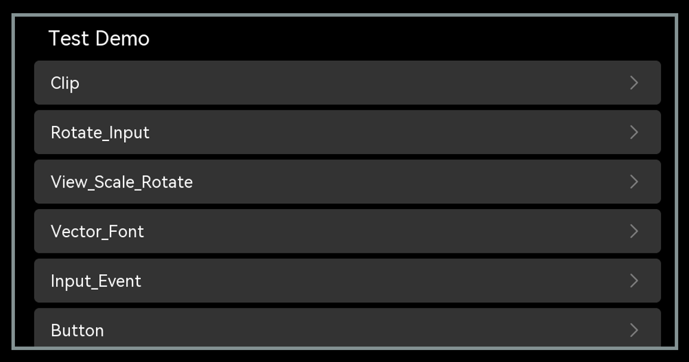
## Packaging Custom Files or Directories in rootfs<a name="ZH-CN_TOPIC_0000002374573036"></a>

> **Note:**
>When packaging custom files in rootfs, choose between "[Adding a new directory in rootfs to package files](#在rootfs中新增目录打包文件)" or "[Packaging files into an existing rootfs directory](#往rootfs现有目录下打包文件)" based on actual business scenario requirements.

### Adding a New Directory in rootfs to Package Files<a name="ZH-CN_TOPIC_0000002374732860"></a>

1.  Modify os/OpenHarmony/vendor/hisilicon/hispark_aifly_linux/fs.yml to add the xxx directory.

    ```
    -
    fs_dir_name: rootfs
    fs_dirs:
    -
    ....
    -
    source_dir: sbin
    target_dir: sbin
    -
    source_dir: usr/bin
    target_dir: usr/bin
    -
    source_dir: usr/sbin
    target_dir: usr/sbin
    -
    source_dir: data
    target_dir: storage/data
    -
    target_dir: proc
    -
    target_dir: mnt
    -
    source_dir: xxx
    target_dir: xxx
    ```

    > **Note:**
    >This process copies the contents of the rootfs, copying source_dir content to target_dir, and then creates the filesystem.
    >-   source_dir is the target file directory under os/OpenHarmony/out (os/OpenHarmony/out/hispark_aifly/ipcamera_hispark_aifly_linux).
    >-   target_dir is the corresponding directory under the filesystem, creating the rootfs/xxx file directory.

2.  To copy target files to the os/OpenHarmony/out/hispark_aifly/ipcamera_hispark_aifly_linux/xxx directory, modify os/OpenHarmony/vendor/hisilicon/hispark_aifly_linux/init_configs/BUILD.gn as follows:

    ```
    ...
    copy("copy_xxx") {  
      sources = [ "xxx/xxx.sh" ]  
      outputs = [ "$root_out_dir/xxx/{{source_file_part}}" ]
    }
    ```

    Finally, xxx.sh can be placed in the rootfs/xxx directory.

3.  Then modify the outer layer os/OpenHarmony/vendor/hisilicon/hispark_aifly_linux/BUILD.gn to add copy_xxx as a dependency.

    **Figure 1** After modifying to call copy_xxx<a name="fig977502404017"></a>
    

4.  Execute rm -rf out/ in the os/OpenHarmony directory, then recompile with ./build.sh --product-name=ipcamera_hispark_aifly_linux --ccache --no-prebuilt-sdk.

    **Figure 2** New xxx directory in rootfs<a name="fig523011572911"></a>
    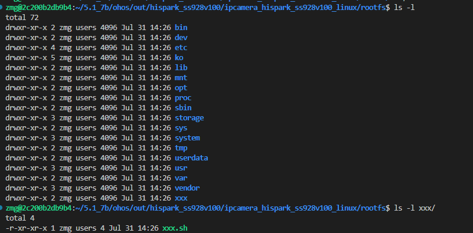
### Packaging Files into an Existing rootfs Directory<a name="ZH-CN_TOPIC_0000002408172613"></a>

Refer to the implementation in the os/OpenHarmony/vendor/hisilicon/hispark_aifly_linux/init_configs directory to copy xxx/xxx.sh files to the etc/xxx directory.

1.  First, place the file to be copied in the corresponding directory xxx/xxx.sh, and modify os/OpenHarmony/vendor/hisilicon/hispark_aifly_linux/init_configs/BUILD.gn.

    **Figure 1** Add copy_xxx to copy target files to etc/xxx<a name="fig96529774011"></a>
    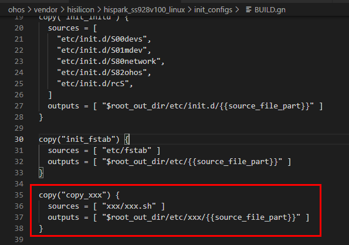

2.  Then modify the outer layer os/OpenHarmony/vendor/hisilicon/hispark_aifly_linux/BUILD.gn to add copy_xxx as a dependency.

    **Figure 2** After modifying to call copy_xxx<a name="fig977502404017"></a>
    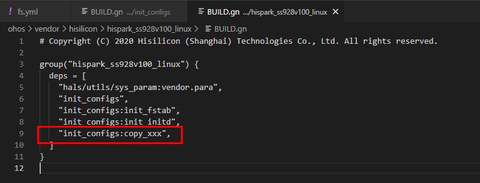

3.  Recompile, and xxx.sh will be packaged into rootfs under etc/xxx/xxx.sh.

    **Figure 3** Verification of target file packaged to /etc/xxx<a name="fig2225153414401"></a>
    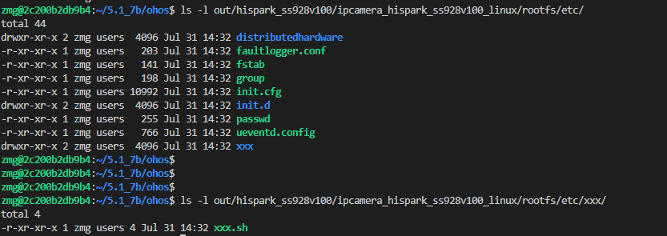

4.  Execute rm -rf out/ in the os/OpenHarmony directory, then recompile with ./build.sh --product-name=ipcamera_hispark_aifly_linux --ccache --no-prebuilt-sdk.

### Generating a Symbolic Link in rootfs<a name="ZH-CN_TOPIC_0000002374733056"></a>

If you also want to create a symbolic link yyy pointing to xxx.sh, modify os/OpenHarmony/vendor/hisilicon/hispark_aifly_linux/fs.yml as follows:

```
fs_symlink:
-
source: libc.so
link_name: ${fs_dir}/lib/ld-musl-aarch64.so.1
-
source: mksh
link_name: ${fs_dir}/bin/sh
-
source: ./
link_name: ${fs_dir}/usr/lib/a7_softfp_neon-vfpv4
-
source: mksh
link_name: ${fs_dir}/bin/shell
-
source: xxx.sh
link_name: ${fs_dir}/xxx/yyy
```

Execute rm -rf out/ in the os/OpenHarmony directory, then recompile with ./build.sh --product-name=ipcamera_hispark_aifly_linux --ccache --no-prebuilt-sdk.

### Copying an Entire Directory to rootfs via Shell Script<a name="ZH-CN_TOPIC_0000002374732880"></a>

1.  In the os/OpenHarmony/vendor/hisilicon/hispark_aifly_linux directory, create the rootfs directory as shown in [Figure 1](#fig2443324185012).

    **Figure 1** Add rootfs directory in source code<a name="fig2443324185012"></a>
    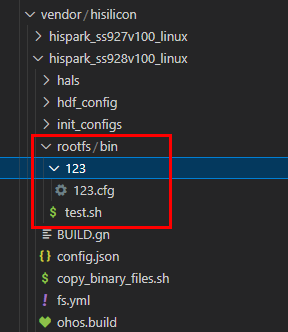

    Then grant permissions to the newly added directory by executing the following command:

    ```
    chmod -R 777 rootfs
    ```

2.  Add copy_binary content to the os/OpenHarmony/vendor/hisilicon/hispark_aifly_linux/BUILD.gn file.

    ```
    group("hispark_aifly_linux") {
    deps = [
    "hals/utils/sys_param:vendor.para",
    "init_configs",
    "init_configs:init_fstab",
    "init_configs:init_initd",
    "init_configs:copy_xxx",
        ":copy_binary",
    ]
    }
    import("//build/lite/config/component/lite_component.gni")
    build_ext_component("copy_binary") {
      exec_path = rebase_path(".", root_build_dir)
      outdir = rebase_path("$root_out_dir")
      command = "./copy_binary_files.sh ${outdir}"
    }
    ```

    The meaning of this newly added script is to call build_ext_component to execute the command corresponding to the command.

3.  Add the copy_binary_files.sh script to the current directory os/OpenHarmony/vendor/hisilicon/hispark_aifly_linux/, with the following content:

    ```
    #! /bin/sh
    echo "--------------------- copy binary files to rootfs folder, current folder is $PWD ---------------------"
    mkdir -p $1/rootfs_binary_files
    cp -Rf ./rootfs/bin/* $1/rootfs_binary_files
    ```

    The purpose of this script is to copy all files and directories from the newly added source directory rootfs/bin/* to the os/OpenHarmony/out/hispark_aifly/ipcamera_hispark_aifly_linux/rootfs_binary_files directory. Note: The script can be adjusted and modified according to business needs.

    Grant execute permission to the copy_binary_files.sh script by executing the following command:

    ```
    chmod 777 copy_binary_files.sh
    ```

4.  To copy rootfs_binary_files into rootfs, also modify the os/OpenHarmony/vendor/hisilicon/hispark_aifly_linux/fs.yml file.

    ```
    -
    fs_dir_name: rootfs
    fs_dirs:
    -
    source_dir: ${root_path}/out/preloader/${product_name}/system
    target_dir: system
    -
    source_dir: rootfs_binary_files
    target_dir: bin
    -
    source_dir: bin
    target_dir: bin
    ignore_files:
    - Test.bin
    - TestSuite.bin
    - query.bin
    - cve
    - checksum
    is_strip: TRUE
    ```

    If you need to copy to a custom directory, modify according to [Adding a New Directory in rootfs to Package Files](#在rootfs中新增目录打包文件).

5.  Execute rm -rf out/ in the os/OpenHarmony directory, then recompile with ./build.sh --product-name=ipcamera_hispark_aifly_linux --ccache --no-prebuilt-sdk.
