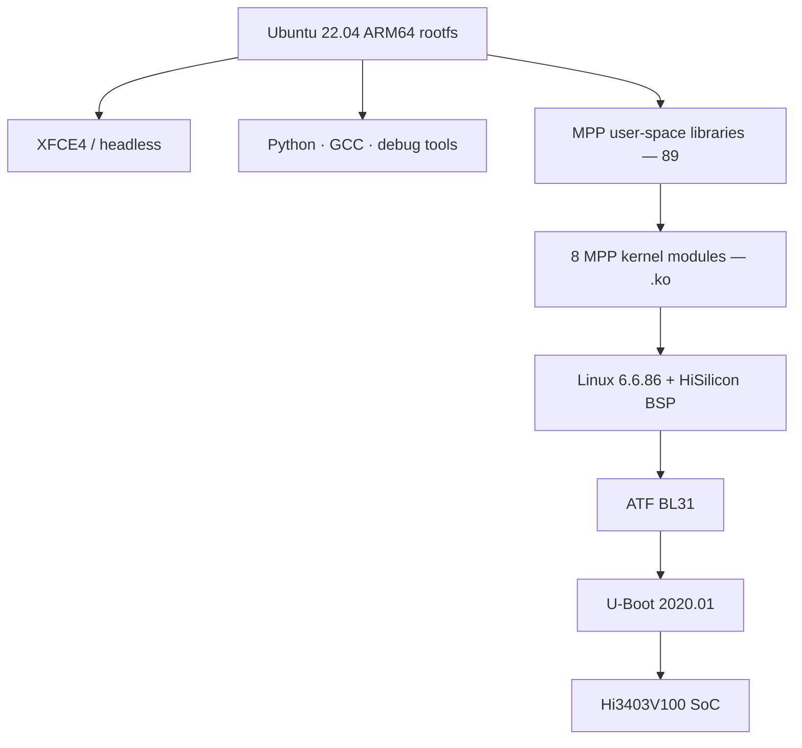

# Ubuntu on Hi3403V100

This section explains how to run **Ubuntu 22.04 ARM64** on a
Hi3403V100 (Hi3403V100) board, end-to-end from source to image.

If you just want to flash a card and boot, jump straight to the
[**:material-arrow-right: Ubuntu porting & build guide**](porting.md).

## Why Ubuntu?

| | Ubuntu 22.04 | OpenEuler | OpenHarmony | Buildroot |
|---|---|---|---|---|
| Package manager | `apt` (largest ecosystem) | `dnf` | none / hap | custom |
| Learning curve | low (same as desktop Linux) | medium | steep | steep |
| MPP / SVP support | ✅ via vendor `.ko` | ✅ | ✅ | ✅ |
| Desktop | XFCE4 out of the box | CLI | OH UI | none |
| Best for | **prototyping & dev debug** | servers / LTS | IoT devices | minimal embedded |

> The Ubuntu variant's biggest win is **developer experience**: you can
> `apt install` Python, OpenCV, ffmpeg, debug tools — no cross-compile
> needed.

## Software stack



| Layer | Version | Source |
|---|---|---|
| Bootloader | U-Boot 2020.01 | Pegasus repo + Topeet patches |
| Secure monitor | ATF (TF-A) | Pegasus repo |
| Kernel | Linux 6.6.86 | HiSilicon BSP + vendor patches |
| Kernel modules | 8 MPP `.ko` | HiSilicon closed-source binary + open-source glue |
| Rootfs | Ubuntu 22.04.5 ARM64 | `debootstrap` from ports.ubuntu.com |
| Desktop | XFCE4 (optional) | apt |
| MPP | 89 user-space `.so` | HiSilicon Media Process Platform |
| Toolchain | GCC 11.4.0 (`aarch64-linux-gnu-`) | Ubuntu native |

## Image variants

| Variant | Size | Includes | Use case |
|---|---|---|---|
| `ubuntu_xfce` | ~2.5 GB | XFCE4 desktop + browser + terminal | HDMI desktop / dev workstation |
| `ubuntu_lite` | ~600 MB | Headless, SSH + apt only | Production / embedded form factor |

Build commands:

```bash
./build.sh ubuntu_xfce_all   # desktop image (one-shot)
./build.sh ubuntu_lite_all   # lite image (one-shot)
```

## Default login

| Item | Value |
|---|---|
| Username | `hi` |
| Password | `hi` |
| Root | `root` is locked by default; the `hi` user is in `sudo` — use `sudo -i` |
| SSH | enabled by default on port 22 |

## Known features / limitations

??? success "✅ What works today"
    - Both eMMC-boot and Flash-boot DTBs are built
    - Full apt / dpkg (USTC mirror pre-configured)
    - MPP video capture / encode / decode / ISP tuning — cross-compile
      under SDK `mpp/sample/` and deploy to the board
    - SVP NPU inference (YOLO family runs out of the box; see
      [first SVP inference](../../tutorials/svp-first-inference.md))
    - HDMI output (XFCE variant)
    - USB host / gadget
    - GPIO / I2C / SPI user-space interfaces (`/sys/class/gpio` etc.)

??? warning "⚠️ Caveats"
    - **MPP kernel modules must match the kernel version exactly.**
      Change kernels and you must rebuild the `.ko` set.
    - macOS hosts must build inside Docker — building rootfs directly
      on the macOS filesystem fails (ext4 + case sensitivity + special
      inodes).
    - `ports.ubuntu.com` is slow from China; `build.sh` has already
      swapped in the USTC mirror.
    - On first boot of the XFCE variant, `apt-get install --fix-missing`
      runs for ~2–3 minutes.

??? failure "❌ Not yet / not planned"
    - GUI hardware acceleration (Mesa software rendering only, no GPU driver)
    - Wayland (X11 only)
    - 32-bit ARM user-space (the rootfs is pure 64-bit)

## File-path quick reference

Key locations inside the image produced by `hi3403-build`:

| Path | Content |
|---|---|
| `/boot/Image.gz` | Kernel (board's `/boot` partition, loaded by U-Boot) |
| `/boot/*.dtb` | Device tree (U-Boot picks one at boot) |
| `/ko/*.ko` | MPP kernel modules (8) |
| `/ko/load_Hi3403V100_ubuntu` | MPP loader script |
| `/usr/lib/lib*.so*` | MPP user-space shared libraries (~89) |
| `/etc/init.d/topeet-start.sh` | Boot-time script (insmod, start ISP, …) |
| `/etc/systemd/system/topeet-start.service` | Wires the init script to systemd |

MPP **sample code lives in the SDK** (not on the board):
`pegasus/platform/Hi3403V100_gcc/smp/a55_linux/mpp/sample/` — the exact
sample names (`hnr` / `snap` / `dis` / `composite`, …) depend on your
SDK version. Cross-build on the host, then `scp` to the board.

## Which page should I read?

| I want to… | Go here |
|---|---|
| Build a flashable image with one command | [Ubuntu porting & build guide](porting.md) |
| See every `build.sh` flag | [hi3403-build README](https://github.com/GitBubble/hi3403-build#readme) |
| Tune ISP color | [ISP color tuning tutorial](../../tutorials/isp-color-tuning.md) |
| Capture → encode → push a stream | [Capture-encode-stream tutorial](../../tutorials/capture-encode-stream.md) |
| Run YOLO on the NPU | [First SVP inference](../../tutorials/svp-first-inference.md) |
| Switch to OpenEuler / OpenHarmony | [OS overview](../index.md) |

## Related links

- Build system source: [**GitHub · GitBubble/hi3403-build**](https://github.com/GitBubble/hi3403-build)
- HiSilicon SDK upstream: [Gitee · HiSpark/pegasus](https://gitee.com/HiSpark/pegasus)
- Vendor reference: Topeet "Hi3403V100 creating Ubuntu rootfs" PDF
  (lives at SDK `vendor/topeet/docs/`)
