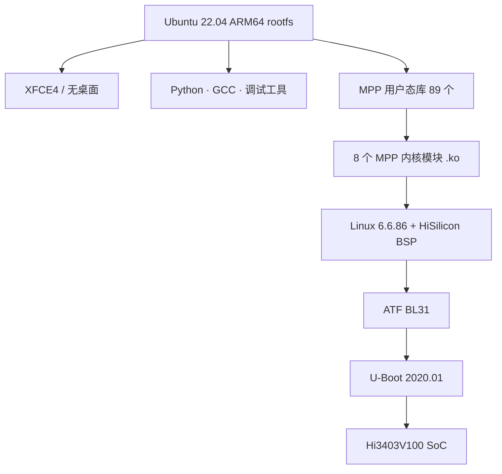

# Ubuntu on Hi3403V100

本节介绍如何在 Hi3403V100 (Hi3403V100) 平台上运行 **Ubuntu 22.04 ARM64**，
并给出从源码到镜像的端到端构建路径。

如果你只是想快速烧一张能跑的卡，请直接跳到
[**:material-arrow-right: Ubuntu 移植与构建指南**](porting.md)。

## 为什么选 Ubuntu？

| 维度 | Ubuntu 22.04 | OpenEuler | OpenHarmony | Buildroot |
|---|---|---|---|---|
| 包管理 | `apt`（生态最全） | `dnf` | 无 / hap | 自定义 |
| 上手成本 | 低（与桌面 Linux 一致） | 中 | 高 | 高 |
| MPP / SVP 支持 | ✅ 通过厂商 ko 模块 | ✅ | ✅ | ✅ |
| 桌面环境 | XFCE4 开箱即用 | 命令行 | OH UI | 无 |
| 适合场景 | **快速原型 / 开发调试** | 服务器 / 长期支持 | IoT 整机 | 极致裁剪 |

> Ubuntu 变体最大的优势是 **开发体验**：可以直接 `apt install` 安装 Python、
> OpenCV、ffmpeg、调试工具，无需自己交叉编译。

## 软件栈一览



| 层 | 版本 | 来源 |
|---|---|---|
| 引导 | U-Boot 2020.01 | Pegasus 仓 + Topeet 补丁 |
| Secure Monitor | ATF (TF-A) | Pegasus 仓 |
| 内核 | Linux 6.6.86 | HiSilicon BSP + 厂商补丁 |
| 内核模块 | 8 个 MPP `.ko` | HiSilicon 闭源二进制 + 开源胶水 |
| Rootfs | Ubuntu 22.04.5 ARM64 | `debootstrap` 拉取 ports.ubuntu.com |
| 桌面 | XFCE4（可选） | apt |
| MPP | 89 个用户态 `.so` | HiSilicon 媒体处理平台 |
| 工具链 | GCC 11.4.0 (`aarch64-linux-gnu-`) | Ubuntu 自带 |

## 镜像变体

| 变体 | 大小 | 包含 | 使用场景 |
|---|---|---|---|
| `ubuntu_xfce` | ~2.5 GB | XFCE4 桌面 + 浏览器 + 终端 | 接 HDMI 当作桌面机调试 |
| `ubuntu_lite` | ~600 MB | Headless，仅 SSH / apt | 量产 / 嵌入式形态 |

构建命令：

```bash
./build.sh ubuntu_xfce_all   # 桌面镜像（一键）
./build.sh ubuntu_lite_all   # 精简镜像（一键）
```

## 默认登录

| 项 | 值 |
|---|---|
| 用户名 | `hi` |
| 密码 | `hi` |
| Root | `root` 默认锁定；`hi` 用户已加入 `sudo` 组，用 `sudo -i` 切 |
| SSH | 默认开启，端口 22 |

## 已知特性 / 限制

??? success "✅ 已经能用的"
    - eMMC 启动、Flash 启动两种 DTB 都已构建
    - apt / dpkg 完整可用（已配 USTC 镜像）
    - MPP 视频采集、编解码、ISP 调优 —— 在 SDK 的 `mpp/sample/` 下交叉编译后部署到板上跑
    - SVP NPU 推理（YOLO 系列开箱可跑，参见 [SVP 首次推理](../../tutorials/svp-first-inference.md)）
    - HDMI 输出（XFCE 变体）
    - USB Host / Gadget
    - GPIO / I2C / SPI 用户态接口（`/sys/class/gpio` 等）

??? warning "⚠️ 需要注意的"
    - **MPP 内核模块版本必须严格匹配内核版本**。换内核必须重编 `.ko`
    - macOS 主机构建必须走 Docker；不能直接在 macOS 文件系统上做 rootfs
      （ext4 + 大小写敏感 + 特殊文件节点要求）
    - 国内拉 `ports.ubuntu.com` 慢；`build.sh` 已经替换为中科大镜像
    - XFCE 第一次启动会跑 `apt-get install --fix-missing`，约 2-3 分钟

??? failure "❌ 暂未支持 / 不计划支持"
    - GUI 加速（Mesa 软件渲染，无 GPU 驱动）
    - Wayland（仅 X11）
    - 32 位 ARM 用户态（rootfs 是纯 64 位）

## 文件路径速查

`hi3403-build` 产出的镜像里的关键位置：

| 路径 | 内容 |
|---|---|
| `/boot/Image.gz` | 内核（板子的 `/boot` 分区，由 U-Boot 引导） |
| `/boot/*.dtb` | 设备树（启动时由 U-Boot 选择） |
| `/ko/*.ko` | MPP 内核模块（8 个） |
| `/ko/load_Hi3403V100_ubuntu` | MPP 加载脚本 |
| `/usr/lib/lib*.so*` | MPP 用户态共享库（约 89 个） |
| `/etc/init.d/topeet-start.sh` | 开机执行脚本（加载 .ko、起 ISP 等） |
| `/etc/systemd/system/topeet-start.service` | 把上面的 init 脚本接到 systemd |

MPP **示例代码在 SDK 里**（不在板子上）：
`pegasus/platform/Hi3403V100_gcc/smp/a55_linux/mpp/sample/` —— 具体 sample 名
（hnr / snap / dis / composite 等）以你 SDK 版本为准。需要时在 PC 主机交叉编译，
再 `scp` 到板子。

## 我该读哪一篇？

| 我想… | 去这里 |
|---|---|
| 一键构建出能烧的镜像 | [Ubuntu 移植与构建指南](porting.md) |
| 看 `build.sh` 全部参数 | [hi3403-build README](https://github.com/GitBubble/hi3403-build#readme) |
| 配置 ISP / 调色 | [ISP 调色教程](../../tutorials/isp-color-tuning.md) |
| 视频采集 → 编码 → 推流 | [采集编码教程](../../tutorials/capture-encode-stream.md) |
| NPU 跑 YOLO | [SVP 首次推理](../../tutorials/svp-first-inference.md) |
| 切换到 OpenEuler / OpenHarmony | [操作系统总览](../index.md) |

## 相关链接

- 构建系统源码：[**GitHub · GitBubble/hi3403-build**](https://github.com/GitBubble/hi3403-build)
- HiSilicon SDK 上游：[Gitee · HiSpark/pegasus](https://gitee.com/HiSpark/pegasus)
- 厂商参考资料：迅为 (Topeet)《Hi3403V100 创建 Ubuntu rootfs》PDF（位于 SDK `vendor/topeet/docs/`）
