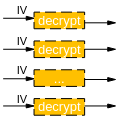

# Preface
**Overview<a name="section5005mcpsimp"></a>**

CIPHER is a security algorithm module that provides AES symmetric encryption/decryption algorithms, HASH and HMAC digest algorithms, random number algorithms, and RSA asymmetric algorithms. It is mainly used for encrypting/decrypting audio/video streams and verifying data legitimacy.

> **Note:**
>Unless otherwise specified in this document, the content for Hi3519AV200 and Hi3403V100 is completely identical.

**Product Version<a name="section5008mcpsimp"></a>**

The product versions corresponding to this document are as follows.

<a name="table5011mcpsimp"></a>
<table><thead align="left"><tr id="row5016mcpsimp"><th class="cellrowborder" valign="top" width="32%" id="mcps1.1.3.1.1"><p id="p5018mcpsimp"><a name="p5018mcpsimp"></a><a name="p5018mcpsimp"></a>Product Name</p>
</th>
<th class="cellrowborder" valign="top" width="68%" id="mcps1.1.3.1.2"><p id="p5020mcpsimp"><a name="p5020mcpsimp"></a><a name="p5020mcpsimp"></a>Product Version</p>
</th>
</tr>
</thead>
<tbody><tr id="row5022mcpsimp"><td class="cellrowborder" valign="top" width="32%" headers="mcps1.1.3.1.1 "><p id="p5024mcpsimp"><a name="p5024mcpsimp"></a><a name="p5024mcpsimp"></a>Hi3403V100</p>
</td>
<td class="cellrowborder" valign="top" width="68%" headers="mcps1.1.3.1.2 "><p id="p5026mcpsimp"><a name="p5026mcpsimp"></a><a name="p5026mcpsimp"></a>V100</p>
</td>
</tr>
<tr id="row5027mcpsimp"><td class="cellrowborder" valign="top" width="32%" headers="mcps1.1.3.1.1 "><p id="p5029mcpsimp"><a name="p5029mcpsimp"></a><a name="p5029mcpsimp"></a>SS626</p>
</td>
<td class="cellrowborder" valign="top" width="68%" headers="mcps1.1.3.1.2 "><p id="p5031mcpsimp"><a name="p5031mcpsimp"></a><a name="p5031mcpsimp"></a>V100</p>
</td>
</tr>
<tr id="row10245112718406"><td class="cellrowborder" valign="top" width="32%" headers="mcps1.1.3.1.1 "><p id="p8622349102117"><a name="p8622349102117"></a><a name="p8622349102117"></a>Hi3519AV200</p>
</td>
<td class="cellrowborder" valign="top" width="68%" headers="mcps1.1.3.1.2 "><p id="p9185184311112"><a name="p9185184311112"></a><a name="p9185184311112"></a>V100</p>
</td>
</tr>
</tbody>
</table>

**Intended Audience<a name="section5032mcpsimp"></a>**

This document (guide) is primarily intended for the following engineers:

-   Technical Support Engineers
-   Software Development Engineers

**Symbol Conventions<a name="section5038mcpsimp"></a>**

The following symbols may appear in this document, and their meanings are described below.

<a name="table5041mcpsimp"></a>
<table><thead align="left"><tr id="row5046mcpsimp"><th class="cellrowborder" valign="top" width="23%" id="mcps1.1.3.1.1"><p id="p5048mcpsimp"><a name="p5048mcpsimp"></a><a name="p5048mcpsimp"></a>Symbol</p>
</th>
<th class="cellrowborder" valign="top" width="77%" id="mcps1.1.3.1.2"><p id="p5050mcpsimp"><a name="p5050mcpsimp"></a><a name="p5050mcpsimp"></a>Description</p>
</th>
</tr>
</thead>
<tbody><tr id="row5052mcpsimp"><td class="cellrowborder" valign="top" width="23%" headers="mcps1.1.3.1.1 "><p class="msonormal" id="p5054mcpsimp"><a name="p5054mcpsimp"></a><a name="p5054mcpsimp"></a><a name="image216"></a><a name="image216"></a><span></span></p>
</td>
<td class="cellrowborder" valign="top" width="77%" headers="mcps1.1.3.1.2 "><p id="p5056mcpsimp"><a name="p5056mcpsimp"></a><a name="p5056mcpsimp"></a>Indicates a high-level hazard which, if not avoided, will result in death or serious injury.</p>
</td>
</tr>
<tr id="row5057mcpsimp"><td class="cellrowborder" valign="top" width="23%" headers="mcps1.1.3.1.1 "><p class="msonormal" id="p5059mcpsimp"><a name="p5059mcpsimp"></a><a name="p5059mcpsimp"></a><a name="image217"></a><a name="image217"></a><span></span></p>
</td>
<td class="cellrowborder" valign="top" width="77%" headers="mcps1.1.3.1.2 "><p id="p5061mcpsimp"><a name="p5061mcpsimp"></a><a name="p5061mcpsimp"></a>Indicates a medium-level hazard which, if not avoided, could result in death or serious injury.</p>
</td>
</tr>
<tr id="row5062mcpsimp"><td class="cellrowborder" valign="top" width="23%" headers="mcps1.1.3.1.1 "><p class="msonormal" id="p5064mcpsimp"><a name="p5064mcpsimp"></a><a name="p5064mcpsimp"></a><a name="image218"></a><a name="image218"></a><span></span></p>
</td>
<td class="cellrowborder" valign="top" width="77%" headers="mcps1.1.3.1.2 "><p id="p5066mcpsimp"><a name="p5066mcpsimp"></a><a name="p5066mcpsimp"></a>Indicates a low-level hazard which, if not avoided, could result in minor or moderate injury.</p>
</td>
</tr>
<tr id="row5067mcpsimp"><td class="cellrowborder" valign="top" width="23%" headers="mcps1.1.3.1.1 "><p class="msonormal" id="p5069mcpsimp"><a name="p5069mcpsimp"></a><a name="p5069mcpsimp"></a><a name="image219"></a><a name="image219"></a><span></span></p>
</td>
<td class="cellrowborder" valign="top" width="77%" headers="mcps1.1.3.1.2 "><p id="p5071mcpsimp"><a name="p5071mcpsimp"></a><a name="p5071mcpsimp"></a>Used to convey device or environmental safety alert information. If not avoided, it may result in equipment damage, data loss, reduced equipment performance, or other unpredictable consequences.</p>
<p id="p5072mcpsimp"><a name="p5072mcpsimp"></a><a name="p5072mcpsimp"></a>"Caution" does not involve personal injury.</p>
</td>
</tr>
<tr id="row5073mcpsimp"><td class="cellrowborder" valign="top" width="23%" headers="mcps1.1.3.1.1 "><p class="msonormal" id="p5075mcpsimp"><a name="p5075mcpsimp"></a><a name="p5075mcpsimp"></a><a name="image220"></a><a name="image220"></a><span></span></p>
</td>
<td class="cellrowborder" valign="top" width="77%" headers="mcps1.1.3.1.2 "><p id="p5077mcpsimp"><a name="p5077mcpsimp"></a><a name="p5077mcpsimp"></a>Supplementary explanation of key information in the main text.</p>
<p id="p5078mcpsimp"><a name="p5078mcpsimp"></a><a name="p5078mcpsimp"></a>"Note" is not safety warning information and does not involve personal, equipment, or environmental injury.</p>
</td>
</tr>
</tbody>
</table>

**Revision History<a name="section5079mcpsimp"></a>**

The revision history summarizes the changes made in each document update. The latest version of the document includes updates from all previous document versions.

<a name="table2161mcpsimp"></a>
<table><thead align="left"><tr id="row2167mcpsimp"><th class="cellrowborder" valign="top" width="21%" id="mcps1.1.4.1.1"><p id="p2169mcpsimp"><a name="p2169mcpsimp"></a><a name="p2169mcpsimp"></a>Document Version</p>
</th>
<th class="cellrowborder" valign="top" width="26%" id="mcps1.1.4.1.2"><p id="p2171mcpsimp"><a name="p2171mcpsimp"></a><a name="p2171mcpsimp"></a>Release Date</p>
</th>
<th class="cellrowborder" valign="top" width="53%" id="mcps1.1.4.1.3"><p id="p2173mcpsimp"><a name="p2173mcpsimp"></a><a name="p2173mcpsimp"></a>Change Description</p>
</th>
</tr>
</thead>
<tbody><tr id="row2175mcpsimp"><td class="cellrowborder" valign="top" width="21%" headers="mcps1.1.4.1.1 "><p id="p2177mcpsimp"><a name="p2177mcpsimp"></a><a name="p2177mcpsimp"></a>00B01</p>
</td>
<td class="cellrowborder" valign="top" width="26%" headers="mcps1.1.4.1.2 "><p id="p2179mcpsimp"><a name="p2179mcpsimp"></a><a name="p2179mcpsimp"></a>2025-09-15</p>
</td>
<td class="cellrowborder" valign="top" width="53%" headers="mcps1.1.4.1.3 "><p id="p2181mcpsimp"><a name="p2181mcpsimp"></a><a name="p2181mcpsimp"></a>First interim version release.</p>
</td>
</tr>
</tbody>
</table>

# Overview
## Overview<a name="ZH-CN_TOPIC_0000002408093758"></a>

CIPHER is a security algorithm module that provides AES symmetric encryption/decryption algorithms, RSA asymmetric encryption/decryption algorithms, random number generation, and digest algorithms such as HASH and HMAC. It is mainly used for encrypting/decrypting audio/video streams and user identity authentication. The functions are divided as follows.

### Symmetric Encryption/Decryption Algorithms<a name="ZH-CN_TOPIC_0000002408093762"></a>

-   AES: Supports ECB/CBC/CFB/OFB/CTR/CCM/GCM work modes. In CCM/GCM modes, the TAG value must be obtained once after encryption/decryption completes.
-   Except for CTR/CCM/GCM, data length must be block-aligned for other algorithms and modes; for CCM/GCM, N and A need to be software-assembled into block-aligned data blocks according to standards; various work modes support one-time encryption/decryption of multiple blocks as well as single-block encryption/decryption.
-   Hi3403V100 and SS626V100 support up to 15 channels.
-   ECB mode has low security and is only for debugging, not for production use.

### Asymmetric Encryption/Decryption Algorithms<a name="ZH-CN_TOPIC_0000002441572925"></a>

RSA: Supports key bit widths of 2048/3072/4096 bits.

### Random Number Generation<a name="ZH-CN_TOPIC_0000002408253654"></a>

RNG: Supports DRBG for obtaining random numbers at higher rates.

### Digest Algorithms<a name="ZH-CN_TOPIC_0000002441572917"></a>

HASH:

-   Supports SHA256/SHA384/SHA512;
-   Supports HMAC256/HMAC384/HMAC512;
-   Supports software multi-channel, up to 15 software channels.

### Algorithm Standards<a name="ZH-CN_TOPIC_0000002441653073"></a>

The algorithms and work modes involved in the above functional modules comply with the following standards:

-   The AES algorithm implementation complies with the FIPS 197 standard, and its supported work modes comply with the following standards:
    -   ECB, CBC, 1/8/128-CFB, 128-OFB, CTR work modes comply with NIST special 800-38a standard
    -   CCM work mode complies with NIST special 800-38c standard
    -   GCM work mode complies with NIST special 800-38d standard

-   RSA supports public key encryption/private key decryption, private key encryption/public key decryption, signing and signature verification functions, with data padding methods conforming to the PKCS#1 standard. Supports PKCS#1 V1.5 and PKCS#1 V2.1 padding methods. In encryption/decryption mode, the PKCS#1 V2.1 padding method is OAEP; in signing/signature verification mode, the PKCS#1 V2.1 padding method is PSS.

> **Note:**
>-   The main work modes of symmetric encryption/decryption algorithms are:
>    ECB (Electronic Codebook), CBC (Cipher-Block Chaining), CFB (Cipher Feedback), OFB (Output Feedback), CTR (Counter mode), CCM (Counter with CBC-MAC, a combination of CTR encryption mode and CMAC message authentication code algorithm), GCM (Galois/Counter Mode, consisting of a block cipher working in counter mode and hash operations in the Galois field GF(2^128)). CCM mode generates a CMAC check value during encryption/decryption, while GCM mode uses GHASH to generate authentication information. The CMAC at decryption must match the CMAC at encryption for correct decryption. It is commonly used in scenarios requiring both encryption and authentication. For detailed algorithm content, please refer to relevant literature.
>-   In block cryptography, the message block to be encrypted/decrypted is divided into several blocks:
>    In ECB mode, each block is independently encrypted/decrypted without dependency between blocks; in non-ECB modes, blocks have dependencies, and to ensure the uniqueness of each message, an initialization vector IV must be used in the first block.

### CIPHER Usage Notes<a name="ZH-CN_TOPIC_0000002408093774"></a>

When CIPHER is deployed in different scenarios, its usage may vary.

-   In the LiteOS environment, link the CIPHER static library libss\_cipher.a.
-   In the Linux environment, user-mode CIPHER can be used by linking the static library libss\_cipher.a or the dynamic library libss\_cipher.so, depending on libsecurec.a or libsecurec.so. Kernel-mode CIPHER uses module insertion, i.e., insmod ot\_cipher.ko, which depends on ot\_osal.ko, ot\_base.ko, sys\_config.ko, and ot\_sys.ko. In this mode, CIPHER depends on MMZ addresses by default.
-   In the OPTEE environment
    -   The user-mode CIPHER external interface naming convention changes from ss\_mpi\_xxx in the Linux environment to ot\_tee\_xxx;
    -   The kernel-mode CIPHER external interface naming convention changes from ss\_mpi\_xxx in the Linux environment to ot\_drv\_xxx.

-   In the UBOOT environment, the user-mode CIPHER external interface naming convention changes from ss\_mpi\_xxx in the Linux environment to ot\_mpi\_xxx.

### Specification Differences<a name="ZH-CN_TOPIC_0000002441572921"></a>

Configuration differences for AES, HASH, and RSA supported by CIPHER across different solutions are shown in [Table 1](#_Ref47627660).

**Table 1**  Specification differences

<a name="_Ref47627660"></a>
<table><thead align="left"><tr id="row153mcpsimp"><th class="cellrowborder" valign="top" width="54%" id="mcps1.2.3.1.1"><p id="p155mcpsimp"><a name="p155mcpsimp"></a><a name="p155mcpsimp"></a>Specification</p>
</th>
<th class="cellrowborder" valign="top" width="46%" id="mcps1.2.3.1.2"><p id="p157mcpsimp"><a name="p157mcpsimp"></a><a name="p157mcpsimp"></a>Hi3403V100, SS626V100</p>
</th>
</tr>
</thead>
<tbody><tr id="row159mcpsimp"><td class="cellrowborder" valign="top" width="54%" headers="mcps1.2.3.1.1 "><p id="p161mcpsimp"><a name="p161mcpsimp"></a><a name="p161mcpsimp"></a>AES (ECB/CBC/CTR/CFB/OFB)</p>
</td>
<td class="cellrowborder" valign="top" width="46%" headers="mcps1.2.3.1.2 "><p id="p163mcpsimp"><a name="p163mcpsimp"></a><a name="p163mcpsimp"></a>Supported</p>
</td>
</tr>
<tr id="row164mcpsimp"><td class="cellrowborder" valign="top" width="54%" headers="mcps1.2.3.1.1 "><p id="p166mcpsimp"><a name="p166mcpsimp"></a><a name="p166mcpsimp"></a>AES (CCM/GCM)</p>
</td>
<td class="cellrowborder" valign="top" width="46%" headers="mcps1.2.3.1.2 "><p id="p168mcpsimp"><a name="p168mcpsimp"></a><a name="p168mcpsimp"></a>Supported</p>
</td>
</tr>
<tr id="row169mcpsimp"><td class="cellrowborder" valign="top" width="54%" headers="mcps1.2.3.1.1 "><p id="p171mcpsimp"><a name="p171mcpsimp"></a><a name="p171mcpsimp"></a>HASH (SHA256)</p>
<p id="p172mcpsimp"><a name="p172mcpsimp"></a><a name="p172mcpsimp"></a>HMAC (SHA256)</p>
</td>
<td class="cellrowborder" valign="top" width="46%" headers="mcps1.2.3.1.2 "><p id="p174mcpsimp"><a name="p174mcpsimp"></a><a name="p174mcpsimp"></a>Supported</p>
</td>
</tr>
<tr id="row175mcpsimp"><td class="cellrowborder" valign="top" width="54%" headers="mcps1.2.3.1.1 "><p id="p177mcpsimp"><a name="p177mcpsimp"></a><a name="p177mcpsimp"></a>HASH (SHA384/SHA512)</p>
<p id="p178mcpsimp"><a name="p178mcpsimp"></a><a name="p178mcpsimp"></a>HMAC (SHA384/SHA512)</p>
</td>
<td class="cellrowborder" valign="top" width="46%" headers="mcps1.2.3.1.2 "><p id="p180mcpsimp"><a name="p180mcpsimp"></a><a name="p180mcpsimp"></a>Supported</p>
</td>
</tr>
<tr id="row181mcpsimp"><td class="cellrowborder" valign="top" width="54%" headers="mcps1.2.3.1.1 "><p id="p183mcpsimp"><a name="p183mcpsimp"></a><a name="p183mcpsimp"></a>RSA 2048/3072/4096</p>
</td>
<td class="cellrowborder" valign="top" width="46%" headers="mcps1.2.3.1.2 "><p id="p185mcpsimp"><a name="p185mcpsimp"></a><a name="p185mcpsimp"></a>Supported</p>
</td>
</tr>
<tr id="row186mcpsimp"><td class="cellrowborder" valign="top" width="54%" headers="mcps1.2.3.1.1 "><p id="p188mcpsimp"><a name="p188mcpsimp"></a><a name="p188mcpsimp"></a>TRNG</p>
</td>
<td class="cellrowborder" valign="top" width="46%" headers="mcps1.2.3.1.2 "><p id="p190mcpsimp"><a name="p190mcpsimp"></a><a name="p190mcpsimp"></a>Supported</p>
</td>
</tr>
<tr id="row191mcpsimp"><td class="cellrowborder" valign="top" width="54%" headers="mcps1.2.3.1.1 "><p id="p193mcpsimp"><a name="p193mcpsimp"></a><a name="p193mcpsimp"></a>SM2</p>
</td>
<td class="cellrowborder" valign="top" width="46%" headers="mcps1.2.3.1.2 "><p id="p195mcpsimp"><a name="p195mcpsimp"></a><a name="p195mcpsimp"></a>Not supported</p>
</td>
</tr>
<tr id="row196mcpsimp"><td class="cellrowborder" valign="top" width="54%" headers="mcps1.2.3.1.1 "><p id="p198mcpsimp"><a name="p198mcpsimp"></a><a name="p198mcpsimp"></a>SM3</p>
</td>
<td class="cellrowborder" valign="top" width="46%" headers="mcps1.2.3.1.2 "><p id="p200mcpsimp"><a name="p200mcpsimp"></a><a name="p200mcpsimp"></a>Not supported</p>
</td>
</tr>
<tr id="row201mcpsimp"><td class="cellrowborder" valign="top" width="54%" headers="mcps1.2.3.1.1 "><p id="p203mcpsimp"><a name="p203mcpsimp"></a><a name="p203mcpsimp"></a>SM4</p>
</td>
<td class="cellrowborder" valign="top" width="46%" headers="mcps1.2.3.1.2 "><p id="p205mcpsimp"><a name="p205mcpsimp"></a><a name="p205mcpsimp"></a>Not supported</p>
</td>
</tr>
</tbody>
</table>

## Usage Flow<a name="ZH-CN_TOPIC_0000002408253578"></a>

### Single-Packet Data Encryption/Decryption (Symmetric Encryption/Decryption Algorithms)<a name="ZH-CN_TOPIC_0000002408093702"></a>

#### Scenario Description<a name="ZH-CN_TOPIC_0000002441572877"></a>

Encrypting or decrypting a single packet of data. When there is a segment of stream data in physical memory that needs to be encrypted/decrypted, obtain the physical address and call the CIPHER module at the user layer to perform encryption/decryption. Alternatively, when there is data in virtual memory that needs to be encrypted/decrypted, obtain the virtual address and call the CIPHER module at the user layer.

#### Workflow<a name="ZH-CN_TOPIC_0000002408093670"></a>

1.  Initialize the CIPHER device. Call the interface [ss\_mpi\_cipher\_init](#ZH-CN_TOPIC_0000002408093694).
2.  Create a CIPHER handle. Call the interface [ss\_mpi\_cipher\_create](#ZH-CN_TOPIC_0000002408253570).
3.  Create a KEYSLOT handle. Call the interface [ss\_mpi\_keyslot\_create](#ZH-CN_TOPIC_0000002441572909).
4.  Bind the CIPHER and KEYSLOT handles. Call the interface [ss\_mpi\_cipher\_attach](#ZH-CN_TOPIC_0000002408093718).
5.  Configure CIPHER control information, including encryption/decryption algorithm, work mode, etc. Call the interface [ss\_mpi\_cipher\_set\_cfg](#ZH-CN_TOPIC_0000002408253622).
6.  Configure the key. Refer to "KLAD API Reference" Section 1.2.1 Plaintext KEY Transfer or Section 1.2.2 ROOTKEY Transfer.
7.  Encrypt/decrypt data. Users can call any of the following interfaces to encrypt/decrypt data.
    -   Single-packet encryption of data in physical memory -- [ss\_mpi\_cipher\_encrypt](#ss_mpi_cipher_encrypt)
    -   Single-packet decryption of data in physical memory -- [ss\_mpi\_cipher\_decrypt](#ss_mpi_cipher_decrypt)
    -   Single-packet encryption of data in virtual memory -- [ss\_mpi\_cipher\_encrypt\_virt](#ss_mpi_cipher_encrypt_virt)
    -   Single-packet decryption of data in virtual memory -- [ss\_mpi\_cipher\_decrypt\_virt](#ss_mpi_cipher_decrypt_virt)

8.  Unbind the CIPHER and KEYSLOT handles. Call the interface [ss\_mpi\_cipher\_detach](#ZH-CN_TOPIC_0000002441653049).
9.  Destroy the KEYSLOT handle. Call the interface [ss\_mpi\_keyslot\_destroy](#ZH-CN_TOPIC_0000002408093686).
10. Destroy the CIPHER handle. Call the interface [ss\_mpi\_cipher\_destroy](#ZH-CN_TOPIC_0000002408253590).
11. Deinitialize the CIPHER device. Call the interface [ss\_mpi\_cipher\_deinit](#ZH-CN_TOPIC_0000002441572905).

#### Notes<a name="ZH-CN_TOPIC_0000002441653001"></a>

When using the CIPHER module, please pay special attention to the following points.

-   This interface supports AES symmetric encryption/decryption algorithms.
-   Each algorithm supports work modes such as ECB/CBC/CFB/OFB/CTR/CCM/GCM. For CCM/GCM work mode encryption/decryption, refer to the "[CCM/GCM Encryption/Decryption (Symmetric Encryption/Decryption Algorithms)](#ZH-CN_TOPIC_0000002441653033)" section.
-   The CIPHER handle must be obtained before performing encryption/decryption operations. It can be released when not used for an extended period. It is recommended to obtain one handle for encryption and one for decryption, with each handle performing only encryption or only decryption operations.
-   Supports encryption/decryption of continuously cached physical memory data (if cached, the user must perform cache flush operations themselves) and virtual memory data (users can use malloc, etc., to obtain virtual addresses).
-   CIPHER uses DMA for data transfer internally. Therefore, when calling [ss\_mpi\_cipher\_encrypt](#ZH-CN_TOPIC_0000002441652993) or [ss\_mpi\_cipher\_decrypt](#ZH-CN_TOPIC_0000002441572865) for encryption or decryption, the address parameter passed should be the physical address of the data. When calling [ss\_mpi\_cipher\_encrypt\_virt](#ZH-CN_TOPIC_0000002408253614) or [ss\_mpi\_cipher\_decrypt\_virt](#ZH-CN_TOPIC_0000002441572833), the address parameter should be the virtual address of the data.
-   The source and destination addresses for encryption/decryption can be the same, i.e., data can be encrypted/decrypted in place (ciphertext and plaintext use the same buffer).
-   When using non-ECB modes for CIPHER encryption/decryption, an initialization vector (IV) is required.
-   There are two scenarios for configuring the IV (using decryption data blocks as an example):

    **[Scenario 1]**

    The IV needs to be updated with each CIPHER call. In this case, set chg\_flags = OT\_CIPHER\_IV\_CHG\_ALL\_PACK and configure the IV value correctly.

    Refer to the following function call sequence:

    ```
    ss_mpi_cipher_set_cfg()  // should set chg_flags = OT_CIPHER_IV_CHG_ALL_PACK and update iv
    ss_mpi_cipher_decrypt()
    ss_mpi_cipher_set_cfg()  // should set chg_flags = OT_CIPHER_IV_CHG_ALL_PACK and update iv
    ss_mpi_cipher_decrypt()
    ....
    ss_mpi_cipher_set_cfg()  // should set chg_flags = OT_CIPHER_IV_CHG_ALL_PACK and update iv
    ss_mpi_cipher_decrypt()
    ```

    **Figure 1**  CIPHER Application Scenario 1, IV needs to be updated for each call<a name="fig134088540378"></a>
    

    **[Scenario 2]**

    The IV only needs to be set on the first CIPHER call. In this case, set chg\_flags = OT\_CIPHER\_IV\_CHG\_ONE\_PACK and configure the IV value.

    Refer to the following function call sequence:

    ```
    ss_mpi_cipher_set_cfg()  // should set chg_flags = OT_CIPHER_IV_CHG_ONE_PACK and update iv
    ss_mpi_cipher_decrypt()
    ss_mpi_cipher_decrypt()
    ss_mpi_cipher_decrypt()
    ```

    **Figure 2**  CIPHER Application Scenario 2, IV configured only on the first call<a name="fig45629317391"></a>
    

    Please configure the IV according to the actual scenario.

-   The IV vector for single-packet encryption/decryption can be inherited. After creating a CIPHER and configuring attributes (assuming the configured work mode requires an IV vector), the IV vector will be used cyclically with each subsequent call to the single-packet encryption/decryption interface.

    For example: A user needs to sequentially encrypt data 0 and data 1. The vectors are a, b, c, d. After the user encrypts data 0, the last block of data 0 was encrypted using vector b from the IV set. Then, when the user encrypts data 1, the first block of data 1 will use vector c, followed by d, a, b, c, d, and so on.

    Therefore, when encrypting/decrypting, it is essential to ensure consistency in the vector sequence for both operations. Reconfiguring the CIPHER control information will reset the IV vector to start from the beginning.

-   CCM and GCM require obtaining the TAG value after computation. The TAG at decryption must match the TAG at encryption for successful decryption.

### Multi-Packet Data Encryption/Decryption (Symmetric Encryption/Decryption Algorithms)<a name="ZH-CN_TOPIC_0000002408253610"></a>

#### Scenario Description<a name="ZH-CN_TOPIC_0000002441572933"></a>

Encrypting or decrypting multiple data packets. When there are multiple segments of stream data in physical memory that need to be encrypted/decrypted, obtain the physical addresses and call the CIPHER module at the user layer to perform encryption/decryption.

#### Workflow<a name="ZH-CN_TOPIC_0000002441652989"></a>

1.  Initialize the CIPHER device. Call the interface [ss\_mpi\_cipher\_init](#ZH-CN_TOPIC_0000002408093694).
2.  Create a CIPHER handle. Call the interface [ss\_mpi\_cipher\_create](#ZH-CN_TOPIC_0000002408253570).
3.  Create a KEYSLOT handle. Call the interface [ss\_mpi\_keyslot\_create](#ZH-CN_TOPIC_0000002441572909).
4.  Bind the CIPHER and KEYSLOT handles. Call the interface [ss\_mpi\_cipher\_attach](#ZH-CN_TOPIC_0000002408093718).
5.  Configure CIPHER control information. Call the interface [ss\_mpi\_cipher\_set\_cfg](#ZH-CN_TOPIC_0000002408253622).
6.  Configure the key. Refer to "KLAD API Reference" Section 1.2.1 or 1.2.2.
7.  Encrypt/decrypt data. Users can call any of the following interfaces.
    -   Multi-packet encryption -- [ss\_mpi\_cipher\_encrypt\_multi\_pack](#ss_mpi_cipher_encrypt_multi_pack)
    -   Multi-packet decryption -- [ss\_mpi\_cipher\_decrypt\_multi\_pack](#ss_mpi_cipher_decrypt_multi_pack)

8.  Unbind the CIPHER and KEYSLOT handles. Call the interface [ss\_mpi\_cipher\_detach](#ZH-CN_TOPIC_0000002441653049).
9.  Destroy the KEYSLOT handle. Call the interface [ss\_mpi\_keyslot\_destroy](#ZH-CN_TOPIC_0000002408093686).
10. Destroy the CIPHER handle. Call the interface [ss\_mpi\_cipher\_destroy](#ZH-CN_TOPIC_0000002408253590).
11. Deinitialize the CIPHER device. Call the interface [ss\_mpi\_cipher\_deinit](#ZH-CN_TOPIC_0000002441572905).

#### Notes<a name="ZH-CN_TOPIC_0000002441572861"></a>

-   When performing multi-packet encryption/decryption, up to 5000 packets can be processed simultaneously.
-   For multi-packet operations, each packet uses the vector configured by [ss\_mpi\_cipher\_set\_cfg](#ZH-CN_TOPIC_0000002408253622) for computation. The IV scope is configurable: the vector result from the previous packet can be used as the IV for the next packet, or each packet's IV can be computed independently (the result of the previous function call does not affect the result of the next function call).
-   When performing multi-packet encryption/decryption, physical addresses must be used as address parameters.
-   Other notes are the same as in the "[Single-Packet Data Encryption/Decryption (Symmetric Encryption/Decryption Algorithms)](#ZH-CN_TOPIC_0000002408093702)" section.

### CCM/GCM Encryption/Decryption (Symmetric Encryption/Decryption Algorithms)<a name="ZH-CN_TOPIC_0000002441653033"></a>

#### Scenario Description<a name="ZH-CN_TOPIC_0000002441572893"></a>

Perform CCM encryption/decryption on data. For this algorithm, please refer to: SP800-38C\_updated-July20\_2007\_CCM. The CCM Mode for Authentication and Confidentiality.

Perform GCM encryption/decryption on data. For this algorithm, please refer to: SP-800-38D-GCM. Galois/Counter Mode (GCM) and GMAC.

#### Workflow<a name="ZH-CN_TOPIC_0000002441572849"></a>

1.  Initialize the CIPHER device. Call the interface [ss\_mpi\_cipher\_init](#ZH-CN_TOPIC_0000002408093694).
2.  Create a CIPHER handle. Call the interface [ss\_mpi\_cipher\_create](#ZH-CN_TOPIC_0000002408253570).
3.  Create a KEYSLOT handle. Call the interface [ss\_mpi\_keyslot\_create](#ZH-CN_TOPIC_0000002441572909).
4.  Bind the CIPHER and KEYSLOT handles. Call the interface [ss\_mpi\_cipher\_attach](#ZH-CN_TOPIC_0000002408093718).
5.  Configure CIPHER control information. Call the interface [ss\_mpi\_cipher\_set\_cfg](#ZH-CN_TOPIC_0000002408253622).
6.  Configure the key. Refer to "KLAD API Reference".
7.  Encrypt/decrypt data. Users can call any of the following interfaces.
    -   Data encryption in physical memory -- [ss\_mpi\_cipher\_encrypt](#ss_mpi_cipher_encrypt)
    -   Data decryption in physical memory -- [ss\_mpi\_cipher\_decrypt](#ss_mpi_cipher_decrypt)
    -   Data encryption in virtual memory -- [ss\_mpi\_cipher\_encrypt\_virt](#ss_mpi_cipher_encrypt_virt)
    -   Data decryption in virtual memory -- [ss\_mpi\_cipher\_decrypt\_virt](#ss_mpi_cipher_decrypt_virt)

8.  Get the TAG value. Call the interface [ss\_mpi\_cipher\_get\_tag](#ZH-CN_TOPIC_0000002441653053).
9.  Unbind the CIPHER and KEYSLOT handles. Call the interface [ss\_mpi\_cipher\_detach](#ZH-CN_TOPIC_0000002441653049).
10. Destroy the KEYSLOT handle. Call the interface [ss\_mpi\_keyslot\_destroy](#ZH-CN_TOPIC_0000002408093686).
11. Destroy the CIPHER handle. Call the interface [ss\_mpi\_cipher\_destroy](#ZH-CN_TOPIC_0000002408253590).
12. Deinitialize the CIPHER device. Call the interface [ss\_mpi\_cipher\_deinit](#ZH-CN_TOPIC_0000002441572905).

#### Notes<a name="ZH-CN_TOPIC_0000002441653021"></a>

-   CCM/GCM key length is 128/192/256 bits (hardware key only supports 128/256 bits). The TAG generated by CCM/GCM decryption must match the encryption TAG for the decryption result to be correct.
-   AES-CCM mode consists of AES CTR encryption mode and CBC-MAC authentication algorithm, ensuring both data confidentiality and integrity.
    -   According to the CCM algorithm principle, the IV vector length iv\_len can be {7, 8, 9, 10, 11, 12, 13} bytes. The IV stores the Nonce data N from the algorithm standard. The encrypted data length is represented by n bytes, and must satisfy: iv\_len + n = 15. So when iv\_len is 13, n is 2, and the maximum encrypted data length is 65535 bytes, and so on.
    -   The vector N and associated data A used during CCM encryption must be consistent with those used during decryption.

-   AES-GCM mode consists of AES CTR and GHASH, ensuring both data confidentiality and integrity.
    -   According to the GCM algorithm principle, the GCM IV length iv\_len can range from [1 to 16].
    -   The associated data A used during GCM encryption must be consistent with that used during decryption.

### HASH Computation (Digest Algorithms)<a name="ZH-CN_TOPIC_0000002408253626"></a>

#### Scenario Description<a name="ZH-CN_TOPIC_0000002441572829"></a>

Compute the HASH value of data. Options include SHA256/SHA384/SHA512.

#### Workflow<a name="ZH-CN_TOPIC_0000002408253594"></a>

1.  Initialize the CIPHER device. Call the interface [ss\_mpi\_cipher\_init](#ZH-CN_TOPIC_0000002408093694).
2.  <a name="li16799101725513"></a>Create a HASH, obtain a HASH handle, and select the HASH algorithm. Call the interface [ss\_mpi\_cipher\_hash\_init](#ZH-CN_TOPIC_0000002408093678).
3.  <a name="li579917172559"></a>Input data, compute the HASH value for each data block sequentially. Call the interface [ss\_mpi\_cipher\_hash\_update](#ZH-CN_TOPIC_0000002408253598).
4.  If the digest computation is not complete, execute [3](#li579917172559) again.
5.  <a name="li379991710553"></a>Complete the digest computation, end input, and obtain the result. Call the interface [ss\_mpi\_cipher\_hash\_final](#ZH-CN_TOPIC_0000002408093722).
6.  Close the CIPHER device. Call the interface [ss\_mpi\_cipher\_deinit](#ZH-CN_TOPIC_0000002441572905).

#### Notes<a name="ZH-CN_TOPIC_0000002441572881"></a>

Supports software multi-channel, allowing multiple HASH operations simultaneously. That is, executing [2](#li16799101725513) starts a HASH operation. Before the current HASH computation is complete (i.e., before executing [5](#li379991710553)), a new channel can be requested to start another HASH operation until no more channels are available.

Supports up to 15 HASH software channels. All 15 channels can be opened simultaneously, but only one channel performs computation at any given time.

### HMAC Computation (Digest Algorithms)<a name="ZH-CN_TOPIC_0000002408093738"></a>

#### Scenario Description<a name="ZH-CN_TOPIC_0000002408253646"></a>

Compute the HMAC value of data. The underlying HASH algorithm is SHA256/SHA384/SHA512.

#### Workflow<a name="ZH-CN_TOPIC_0000002441572869"></a>

The HMAC computation development steps are as follows:

1.  Call [ss\_mpi\_cipher\_init](#ZH-CN_TOPIC_0000002408093694) to initialize the CIPHER module.
2.  <a name="li132961530185714"></a>Call [ss\_mpi\_cipher\_hash\_init](#ZH-CN_TOPIC_0000002408093678) to select the HASH algorithm and configure the HMAC key, then initialize the HASH module.
3.  Call [ss\_mpi\_cipher\_hash\_update](#ZH-CN_TOPIC_0000002408253598) to input data, one BLOCK at a time.
4.  <a name="li19296113055717"></a>Call [ss\_mpi\_cipher\_hash\_final](#ZH-CN_TOPIC_0000002408093722) to end input and output the HMAC value.
5.  Call [ss\_mpi\_cipher\_deinit](#ZH-CN_TOPIC_0000002441572905) to deinitialize the CIPHER device.

#### Notes<a name="ZH-CN_TOPIC_0000002441653081"></a>

Supports software multi-channel, allowing multiple HMAC operations simultaneously. That is, executing [2](#li132961530185714) starts an HMAC operation. Before the current HMAC computation is complete (i.e., before executing [4](#li19296113055717)), a new channel can be requested to start another HMAC operation until no more channels are available.

HMAC and HASH share 15 software channels. All 15 channels can be opened simultaneously, but only one channel performs computation at any given time.

### Random Number Generation<a name="ZH-CN_TOPIC_0000002408093746"></a>

#### Scenario Description<a name="ZH-CN_TOPIC_0000002441652997"></a>

Obtain true random numbers generated by hardware.

#### Workflow<a name="ZH-CN_TOPIC_0000002441653029"></a>

The process of generating random data is as follows:

1.  Initialize the CIPHER device. Call the interface [ss\_mpi\_cipher\_init](#ZH-CN_TOPIC_0000002408093694).
2.  Obtain a 32-bit random number. Call the interface [ss\_mpi\_cipher\_get\_random\_num](#ZH-CN_TOPIC_0000002408253630).
3.  Close the CIPHER device. Call the interface [ss\_mpi\_cipher\_deinit](#ZH-CN_TOPIC_0000002441572905).

#### Notes<a name="ZH-CN_TOPIC_0000002408253634"></a>

None.

### RSA Encryption/Decryption (Asymmetric Encryption/Decryption Algorithms)<a name="ZH-CN_TOPIC_0000002441652977"></a>

#### Scenario Description<a name="ZH-CN_TOPIC_0000002408253574"></a>

Perform RSA asymmetric algorithm encryption/decryption on data. Data encrypted with a public key must be decrypted with the corresponding private key, and vice versa.

For this algorithm, please refer to: rfc3447. RSA Cryptography Specifications.

#### Workflow<a name="ZH-CN_TOPIC_0000002408093726"></a>

The process of performing asymmetric RSA encryption/decryption on data is as follows:

1.  Initialize the CIPHER device. Call the interface [ss\_mpi\_cipher\_init](#ZH-CN_TOPIC_0000002408093694).
2.  Encrypt/decrypt data. Depending on the key used, there are four interfaces. Users can call any of the following interfaces for encryption/decryption, etc.
    -   Public key encryption -- [ss\_mpi\_cipher\_rsa\_public\_encrypt](#ss_mpi_cipher_rsa_public_encrypt)
    -   Private key decryption -- [ss\_mpi\_cipher\_rsa\_private\_decrypt](#ss_mpi_cipher_rsa_private_decrypt)
    -   Private key encryption -- [ss\_mpi\_cipher\_rsa\_private\_encrypt](#ss_mpi_cipher_rsa_private_encrypt)
    -   Public key decryption -- [ss\_mpi\_cipher\_rsa\_public\_decrypt](#ss_mpi_cipher_rsa_public_decrypt)

3.  Close the CIPHER device. Call the interface [ss\_mpi\_cipher\_deinit](#ZH-CN_TOPIC_0000002441572905).

#### Notes<a name="ZH-CN_TOPIC_0000002408253670"></a>

RSA key bit widths can be 2048, 3072, or 4096. According to the RSA algorithm principle, both plaintext and ciphertext must be smaller than the public key N. Therefore, the data length to be encrypted/decrypted must be less than or equal to the key length. The common practice is to pad the data with zeros at the high bits to make its length equal to N but its value smaller than N. Supports PKCS#1 V1.5 and PKCS#1 V2.1 padding methods. PKCS#1 V1.5 is a weak padding method and is not recommended for customers; the PKCS#1 V2.1 padding method is OAEP. Note: op-tee and uboot environments do not support RSA private keys; priv\_key uses p/q/dp/dq/qp instead of d.

### RSA Signing and Signature Verification (Asymmetric Encryption/Decryption Algorithms)<a name="ZH-CN_TOPIC_0000002408093674"></a>

#### Scenario Description<a name="ZH-CN_TOPIC_0000002441653017"></a>

When performing RSA signing and signature verification on data, the private key is used for signing, and the public key is used for signature verification.

For this algorithm, please refer to: rfc3447. RSA Cryptography Specifications.

#### Workflow<a name="ZH-CN_TOPIC_0000002408093734"></a>

The process of performing asymmetric RSA signing and signature verification on data is as follows:

1.  Initialize the CIPHER device. Call the interface [ss\_mpi\_cipher\_init](#ZH-CN_TOPIC_0000002408093694).
2.  Perform signing/verification on data by calling the following interfaces.
    -   Private key signing -- [ss\_mpi\_cipher\_rsa\_sign](#ss_mpi_cipher_rsa_sign)
    -   Public key verification -- [ss\_mpi\_cipher\_rsa\_verify](#ss_mpi_cipher_rsa_verify)

3.  Close the CIPHER device. Call the interface [ss\_mpi\_cipher\_deinit](#ZH-CN_TOPIC_0000002441572905).

#### Notes<a name="ZH-CN_TOPIC_0000002441653065"></a>

RSA key bit widths can be 2048, 3072, or 4096. According to the RSA algorithm principle, both plaintext and ciphertext must be smaller than the public key. Therefore, the data length to be encrypted/decrypted must be less than or equal to the key length. The common practice is to first compute the HASH value of the data to be signed, then pad the HASH value to a length equal to the public key N but with a value smaller than N, and then encrypt. Supports PKCS#1 V1.5 and PKCS#1 V2.1 padding methods. PKCS#1 V1.5 is a weak padding method and is not recommended; the PKCS#1 V2.1 padding method is PSS. Note: op-tee and uboot environments do not support RSA private keys; priv\_key uses p/q/dp/dq/qp instead of d.

# API Reference
CIPHER provides the following APIs:

-   [ss\_mpi\_cipher\_init](#ZH-CN_TOPIC_0000002408093694): Initializes the CIPHER module.
-   [ss\_mpi\_cipher\_deinit](#ZH-CN_TOPIC_0000002441572905): Deinitializes the CIPHER module.
-   [ss\_mpi\_cipher\_create](#ZH-CN_TOPIC_0000002408253570): Creates a CIPHER handle for symmetric encryption/decryption.
-   [ss\_mpi\_cipher\_destroy](#ZH-CN_TOPIC_0000002408253590): Destroys an existing CIPHER handle for symmetric encryption/decryption.
-   [ss\_mpi\_cipher\_set\_cfg](#ZH-CN_TOPIC_0000002408253622): Configures control information for a CIPHER channel in symmetric encryption/decryption.
-   [ss\_mpi\_cipher\_get\_cfg](#ZH-CN_TOPIC_0000002441572913): Gets configuration information for a CIPHER channel in symmetric encryption/decryption.
-   [ss\_mpi\_cipher\_encrypt](#ZH-CN_TOPIC_0000002441652993): Single-packet data encryption for symmetric encryption/decryption.
-   [ss\_mpi\_cipher\_decrypt](#ZH-CN_TOPIC_0000002441572865): Single-packet data decryption for symmetric encryption/decryption.
-   [ss\_mpi\_cipher\_encrypt\_virt](#ZH-CN_TOPIC_0000002408253614): Encrypts data in virtual memory for symmetric encryption/decryption.
-   [ss\_mpi\_cipher\_decrypt\_virt](#ZH-CN_TOPIC_0000002441572833): Decrypts data in virtual memory for symmetric encryption/decryption.
-   [ss\_mpi\_cipher\_encrypt\_multi\_pack](#ZH-CN_TOPIC_0000002408093690): Multi-packet data encryption for symmetric encryption/decryption.
-   [ss\_mpi\_cipher\_decrypt\_multi\_pack](#ZH-CN_TOPIC_0000002441653025): Multi-packet data decryption for symmetric encryption/decryption.
-   [ss\_mpi\_cipher\_get\_tag](#ZH-CN_TOPIC_0000002441653053): Gets the TAG value in CCM/GCM mode for symmetric encryption/decryption.
-   [ss\_mpi\_cipher\_hash\_init](#ZH-CN_TOPIC_0000002408093678): Initializes HASH/HMAC computation.
-   [ss\_mpi\_cipher\_hash\_update](#ZH-CN_TOPIC_0000002408253598): Inputs data for HASH/HMAC computation.
-   [ss\_mpi\_cipher\_hash\_final](#ZH-CN_TOPIC_0000002408093722): Outputs the final HASH/HMAC computation result.
-   [ss\_mpi\_cipher\_get\_random\_num](#ZH-CN_TOPIC_0000002408253630): Gets a random number.
-   [ss\_mpi\_cipher\_rsa\_public\_encrypt](#ZH-CN_TOPIC_0000002408253586): Encrypts plaintext using an RSA public key.
-   [ss\_mpi\_cipher\_rsa\_private\_decrypt](#ZH-CN_TOPIC_0000002408093710): Decrypts ciphertext using an RSA private key.
-   [ss\_mpi\_cipher\_rsa\_private\_encrypt](#ZH-CN_TOPIC_0000002441653041): Encrypts plaintext using an RSA private key.
-   [ss\_mpi\_cipher\_rsa\_public\_decrypt](#ZH-CN_TOPIC_0000002408253566): Decrypts ciphertext using an RSA public key.
-   [ss\_mpi\_cipher\_rsa\_sign](#ZH-CN_TOPIC_0000002441653009): Signs text using an RSA private key.
-   [ss\_mpi\_cipher\_rsa\_verify](#ZH-CN_TOPIC_0000002408253618): Verifies text using an RSA public key.
-   [ss\_mpi\_cipher\_sm2\_encrypt](#ZH-CN_TOPIC_0000002441572901): Encrypts plaintext using an SM2 public key.
-   [ss\_mpi\_cipher\_sm2\_decrypt](#ZH-CN_TOPIC_0000002441653061): Decrypts ciphertext using an SM2 private key.
-   [ss\_mpi\_cipher\_sm2\_sign](#ZH-CN_TOPIC_0000002408253606): Signs text using SM2.
-   [ss\_mpi\_cipher\_sm2\_verify](#ZH-CN_TOPIC_0000002408093770): Verifies text using SM2.
-   [ss\_mpi\_keyslot\_create](#ZH-CN_TOPIC_0000002441572909): Creates a keyslot handle for symmetric encryption/decryption.
-   [ss\_mpi\_keyslot\_destroy](#ZH-CN_TOPIC_0000002408093686): Destroys a keyslot handle for symmetric encryption/decryption.
-   [ss\_mpi\_cipher\_attach](#ZH-CN_TOPIC_0000002408093718): Binds a cipher handle and a keyslot handle for symmetric encryption/decryption.
-   [ss\_mpi\_cipher\_detach](#ZH-CN_TOPIC_0000002441653049): Unbinds a cipher handle and a keyslot handle for symmetric encryption/decryption.

## ss\_mpi\_cipher\_init<a name="ZH-CN_TOPIC_0000002408093694"></a>

[Description]

Initializes the CIPHER module.

[Syntax]

```
td_s32 ss_mpi_cipher_init(td_void);
```

[Parameters]

None.

[Return Values]

<a name="table535mcpsimp"></a>
<table><thead align="left"><tr id="row540mcpsimp"><th class="cellrowborder" valign="top" width="50%" id="mcps1.1.3.1.1"><p id="p542mcpsimp"><a name="p542mcpsimp"></a><a name="p542mcpsimp"></a>Return Value</p>
</th>
<th class="cellrowborder" valign="top" width="50%" id="mcps1.1.3.1.2"><p id="p544mcpsimp"><a name="p544mcpsimp"></a><a name="p544mcpsimp"></a>Description</p>
</th>
</tr>
</thead>
<tbody><tr id="row546mcpsimp"><td class="cellrowborder" valign="top" width="50%" headers="mcps1.1.3.1.1 "><p id="p548mcpsimp"><a name="p548mcpsimp"></a><a name="p548mcpsimp"></a>0</p>
</td>
<td class="cellrowborder" valign="top" width="50%" headers="mcps1.1.3.1.2 "><p id="p550mcpsimp"><a name="p550mcpsimp"></a><a name="p550mcpsimp"></a>Success.</p>
</td>
</tr>
<tr id="row551mcpsimp"><td class="cellrowborder" valign="top" width="50%" headers="mcps1.1.3.1.1 "><p id="p553mcpsimp"><a name="p553mcpsimp"></a><a name="p553mcpsimp"></a>Non-0</p>
</td>
<td class="cellrowborder" valign="top" width="50%" headers="mcps1.1.3.1.2 "><p id="p555mcpsimp"><a name="p555mcpsimp"></a><a name="p555mcpsimp"></a>See <a href="#ZH-CN_TOPIC_0000002408253662">Error Codes</a>.</p>
</td>
</tr>
</tbody>
</table>

[Requirements]

-   Header files: ot\_common\_cipher.h, ss\_mpi\_cipher.h
-   Library files: libss\_cipher.a, libss\_cipher.so

[Notes]

-   Supports multiple calls.
-   Initialization and deinitialization must be used in pairs.
-   Kernel mode does not need to call this interface.

[Example]

None.

## ss\_mpi\_cipher\_deinit<a name="ZH-CN_TOPIC_0000002441572905"></a>

[Description]

Deinitializes the CIPHER module.

[Syntax]

```
td_s32 ss_mpi_cipher_deinit(td_void);
```

[Parameters]

None.

[Return Values]

<a name="table575mcpsimp"></a>
<table><thead align="left"><tr id="row580mcpsimp"><th class="cellrowborder" valign="top" width="36%" id="mcps1.1.3.1.1"><p id="p582mcpsimp"><a name="p582mcpsimp"></a><a name="p582mcpsimp"></a>Return Value</p>
</th>
<th class="cellrowborder" valign="top" width="64%" id="mcps1.1.3.1.2"><p id="p584mcpsimp"><a name="p584mcpsimp"></a><a name="p584mcpsimp"></a>Description</p>
</th>
</tr>
</thead>
<tbody><tr id="row586mcpsimp"><td class="cellrowborder" valign="top" width="36%" headers="mcps1.1.3.1.1 "><p id="p588mcpsimp"><a name="p588mcpsimp"></a><a name="p588mcpsimp"></a>0</p>
</td>
<td class="cellrowborder" valign="top" width="64%" headers="mcps1.1.3.1.2 "><p id="p590mcpsimp"><a name="p590mcpsimp"></a><a name="p590mcpsimp"></a>Success.</p>
</td>
</tr>
<tr id="row591mcpsimp"><td class="cellrowborder" valign="top" width="36%" headers="mcps1.1.3.1.1 "><p id="p593mcpsimp"><a name="p593mcpsimp"></a><a name="p593mcpsimp"></a>Non-0</p>
</td>
<td class="cellrowborder" valign="top" width="64%" headers="mcps1.1.3.1.2 "><p id="p595mcpsimp"><a name="p595mcpsimp"></a><a name="p595mcpsimp"></a>See Error Codes.</p>
</td>
</tr>
</tbody>
</table>

[Requirements]

-   Header files: ot\_common\_cipher.h, ss\_mpi\_cipher.h
-   Library files: libss\_cipher.a, libss\_cipher.so

[Notes]

-   Supports multiple calls.
-   Initialization and deinitialization must be used in pairs.

[Example]

None.

## ss\_mpi\_cipher\_create<a name="ZH-CN_TOPIC_0000002408253570"></a>

[Description]

Creates a CIPHER handle for symmetric algorithm encryption/decryption.

[Syntax]

```
td_s32 ss_mpi_cipher_create (td_handle *handle, const ot_cipher_attr *cipher_attr);
```

[Parameters]

<a name="table615mcpsimp"></a>
<table><thead align="left"><tr id="row621mcpsimp"><th class="cellrowborder" valign="top" width="17.82%" id="mcps1.1.4.1.1"><p id="p623mcpsimp"><a name="p623mcpsimp"></a><a name="p623mcpsimp"></a>Parameter Name</p>
</th>
<th class="cellrowborder" valign="top" width="65.35%" id="mcps1.1.4.1.2"><p id="p625mcpsimp"><a name="p625mcpsimp"></a><a name="p625mcpsimp"></a>Description</p>
</th>
<th class="cellrowborder" valign="top" width="16.830000000000002%" id="mcps1.1.4.1.3"><p id="p627mcpsimp"><a name="p627mcpsimp"></a><a name="p627mcpsimp"></a>Input/Output</p>
</th>
</tr>
</thead>
<tbody><tr id="row629mcpsimp"><td class="cellrowborder" valign="top" width="17.82%" headers="mcps1.1.4.1.1 "><p id="p631mcpsimp"><a name="p631mcpsimp"></a><a name="p631mcpsimp"></a>handle</p>
</td>
<td class="cellrowborder" valign="top" width="65.35%" headers="mcps1.1.4.1.2 "><p id="p633mcpsimp"><a name="p633mcpsimp"></a><a name="p633mcpsimp"></a>CIPHER handle pointer.</p>
</td>
<td class="cellrowborder" valign="top" width="16.830000000000002%" headers="mcps1.1.4.1.3 "><p id="p635mcpsimp"><a name="p635mcpsimp"></a><a name="p635mcpsimp"></a>Output</p>
</td>
</tr>
<tr id="row636mcpsimp"><td class="cellrowborder" valign="top" width="17.82%" headers="mcps1.1.4.1.1 "><p id="p638mcpsimp"><a name="p638mcpsimp"></a><a name="p638mcpsimp"></a>cipher_attr</p>
</td>
<td class="cellrowborder" valign="top" width="65.35%" headers="mcps1.1.4.1.2 "><p id="p640mcpsimp"><a name="p640mcpsimp"></a><a name="p640mcpsimp"></a>CIPHER attribute pointer.</p>
</td>
<td class="cellrowborder" valign="top" width="16.830000000000002%" headers="mcps1.1.4.1.3 "><p id="p642mcpsimp"><a name="p642mcpsimp"></a><a name="p642mcpsimp"></a>Input</p>
</td>
</tr>
</tbody>
</table>

[Return Values]

<a name="table644mcpsimp"></a>
<table><thead align="left"><tr id="row649mcpsimp"><th class="cellrowborder" valign="top" width="36%" id="mcps1.1.3.1.1"><p id="p651mcpsimp"><a name="p651mcpsimp"></a><a name="p651mcpsimp"></a>Return Value</p>
</th>
<th class="cellrowborder" valign="top" width="64%" id="mcps1.1.3.1.2"><p id="p653mcpsimp"><a name="p653mcpsimp"></a><a name="p653mcpsimp"></a>Description</p>
</th>
</tr>
</thead>
<tbody><tr id="row655mcpsimp"><td class="cellrowborder" valign="top" width="36%" headers="mcps1.1.3.1.1 "><p id="p657mcpsimp"><a name="p657mcpsimp"></a><a name="p657mcpsimp"></a>0</p>
</td>
<td class="cellrowborder" valign="top" width="64%" headers="mcps1.1.3.1.2 "><p id="p659mcpsimp"><a name="p659mcpsimp"></a><a name="p659mcpsimp"></a>Success.</p>
</td>
</tr>
<tr id="row660mcpsimp"><td class="cellrowborder" valign="top" width="36%" headers="mcps1.1.3.1.1 "><p id="p662mcpsimp"><a name="p662mcpsimp"></a><a name="p662mcpsimp"></a>Non-0</p>
</td>
<td class="cellrowborder" valign="top" width="64%" headers="mcps1.1.3.1.2 "><p id="p664mcpsimp"><a name="p664mcpsimp"></a><a name="p664mcpsimp"></a>See Error Codes.</p>
</td>
</tr>
</tbody>
</table>

[Requirements]

-   Header files: ot\_common\_cipher.h, ss\_mpi\_cipher.h
-   Library files: libss\_cipher.a, libss\_cipher.so

[Notes]

-   handle and cipher\_attr must not be NULL.
-   Hi3403V100 and SS626V100 support 15 CIPHER channels.
-   After using a channel, the corresponding channel should be destroyed.

[Example]

None.
