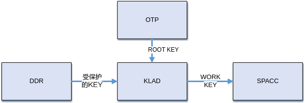
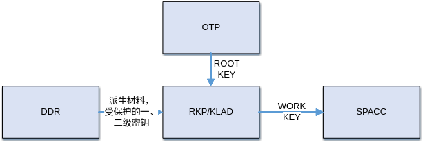

# Preface
**Overview<a name="section279mcpsimp"></a>**

OTP is a non-volatile memory. Its main characteristic is that once the bit content of the corresponding storage space is written from 0 to 1, or after locking the corresponding area according to the lock mechanism, it can no longer be modified. OTP is mainly used to store specific data, such as the root key for the CIPHER module, security enable flags, and other information.

> **Note:**
>Unless otherwise specified, the content for SS528V100 and SS625V100, SS524V100 and SS522V100, SS927V100 and SS928V100 is identical.

**Product Version<a name="section286mcpsimp"></a>**

The product versions corresponding to this document are as follows.

<a name="table289mcpsimp"></a>
<table><thead align="left"><tr id="row294mcpsimp"><th class="cellrowborder" valign="top" width="32%" id="mcps1.1.3.1.1"><p id="p296mcpsimp"><a name="p296mcpsimp"></a><a name="p296mcpsimp"></a>Product Name</p>
</th>
<th class="cellrowborder" valign="top" width="68%" id="mcps1.1.3.1.2"><p id="p298mcpsimp"><a name="p298mcpsimp"></a><a name="p298mcpsimp"></a>Product Version</p>
</th>
</tr>
</thead>
<tbody><tr id="row300mcpsimp"><td class="cellrowborder" valign="top" width="32%" headers="mcps1.1.3.1.1 "><p id="p302mcpsimp"><a name="p302mcpsimp"></a><a name="p302mcpsimp"></a>SS928</p>
</td>
<td class="cellrowborder" valign="top" width="68%" headers="mcps1.1.3.1.2 "><p id="p304mcpsimp"><a name="p304mcpsimp"></a><a name="p304mcpsimp"></a>V100</p>
</td>
</tr>
<tr id="row305mcpsimp"><td class="cellrowborder" valign="top" width="32%" headers="mcps1.1.3.1.1 "><p id="p307mcpsimp"><a name="p307mcpsimp"></a><a name="p307mcpsimp"></a>SS626</p>
</td>
<td class="cellrowborder" valign="top" width="68%" headers="mcps1.1.3.1.2 "><p id="p309mcpsimp"><a name="p309mcpsimp"></a><a name="p309mcpsimp"></a>V100</p>
</td>
</tr>
<tr id="row098721511379"><td class="cellrowborder" valign="top" width="32%" headers="mcps1.1.3.1.1 "><p id="p881081984715"><a name="p881081984715"></a><a name="p881081984715"></a>SS524</p>
</td>
<td class="cellrowborder" valign="top" width="68%" headers="mcps1.1.3.1.2 "><p id="p34921898474"><a name="p34921898474"></a><a name="p34921898474"></a>V100</p>
</td>
</tr>
<tr id="row055711773717"><td class="cellrowborder" valign="top" width="32%" headers="mcps1.1.3.1.1 "><p id="p255718172371"><a name="p255718172371"></a><a name="p255718172371"></a>SS522</p>
</td>
<td class="cellrowborder" valign="top" width="68%" headers="mcps1.1.3.1.2 "><p id="p18557131714372"><a name="p18557131714372"></a><a name="p18557131714372"></a>V100</p>
</td>
</tr>
<tr id="row14680716155410"><td class="cellrowborder" valign="top" width="32%" headers="mcps1.1.3.1.1 "><p id="p191707516282"><a name="p191707516282"></a><a name="p191707516282"></a>SS528</p>
</td>
<td class="cellrowborder" valign="top" width="68%" headers="mcps1.1.3.1.2 "><p id="p14171957287"><a name="p14171957287"></a><a name="p14171957287"></a>V100</p>
</td>
</tr>
<tr id="row547716911288"><td class="cellrowborder" valign="top" width="32%" headers="mcps1.1.3.1.1 "><p id="p4477491286"><a name="p4477491286"></a><a name="p4477491286"></a>SS625</p>
</td>
<td class="cellrowborder" valign="top" width="68%" headers="mcps1.1.3.1.2 "><p id="p647779132814"><a name="p647779132814"></a><a name="p647779132814"></a>V100</p>
</td>
</tr>
<tr id="row766620218412"><td class="cellrowborder" valign="top" width="32%" headers="mcps1.1.3.1.1 "><p id="p8622349102117"><a name="p8622349102117"></a><a name="p8622349102117"></a>SS927</p>
</td>
<td class="cellrowborder" valign="top" width="68%" headers="mcps1.1.3.1.2 "><p id="p9185184311112"><a name="p9185184311112"></a><a name="p9185184311112"></a>V100</p>
</td>
</tr>
</tbody>
</table>

**Intended Audience<a name="section310mcpsimp"></a>**

This document (guide) is primarily intended for the following engineers:

-   Technical Support Engineers
-   Software Development Engineers

**Symbol Conventions<a name="section316mcpsimp"></a>**

The following symbols may appear in this document, and their meanings are described below.

<a name="table319mcpsimp"></a>
<table><thead align="left"><tr id="row324mcpsimp"><th class="cellrowborder" valign="top" width="18%" id="mcps1.1.3.1.1"><p id="p326mcpsimp"><a name="p326mcpsimp"></a><a name="p326mcpsimp"></a>Symbol</p>
</th>
<th class="cellrowborder" valign="top" width="82%" id="mcps1.1.3.1.2"><p id="p328mcpsimp"><a name="p328mcpsimp"></a><a name="p328mcpsimp"></a>Description</p>
</th>
</tr>
</thead>
<tbody><tr id="row330mcpsimp"><td class="cellrowborder" valign="top" width="18%" headers="mcps1.1.3.1.1 "><p class="msonormal" id="p332mcpsimp"><a name="p332mcpsimp"></a><a name="p332mcpsimp"></a><a name="image108"></a><a name="image108"></a><span></span></p>
</td>
<td class="cellrowborder" valign="top" width="82%" headers="mcps1.1.3.1.2 "><p id="p334mcpsimp"><a name="p334mcpsimp"></a><a name="p334mcpsimp"></a>Indicates a high-level hazard which, if not avoided, will result in death or serious injury.</p>
</td>
</tr>
<tr id="row335mcpsimp"><td class="cellrowborder" valign="top" width="18%" headers="mcps1.1.3.1.1 "><p class="msonormal" id="p337mcpsimp"><a name="p337mcpsimp"></a><a name="p337mcpsimp"></a><a name="image109"></a><a name="image109"></a><span></span></p>
</td>
<td class="cellrowborder" valign="top" width="82%" headers="mcps1.1.3.1.2 "><p id="p339mcpsimp"><a name="p339mcpsimp"></a><a name="p339mcpsimp"></a>Indicates a medium-level hazard which, if not avoided, could result in death or serious injury.</p>
</td>
</tr>
<tr id="row340mcpsimp"><td class="cellrowborder" valign="top" width="18%" headers="mcps1.1.3.1.1 "><p class="msonormal" id="p342mcpsimp"><a name="p342mcpsimp"></a><a name="p342mcpsimp"></a><a name="image110"></a><a name="image110"></a><span></span></p>
</td>
<td class="cellrowborder" valign="top" width="82%" headers="mcps1.1.3.1.2 "><p id="p344mcpsimp"><a name="p344mcpsimp"></a><a name="p344mcpsimp"></a>Indicates a low-level hazard which, if not avoided, could result in minor or moderate injury.</p>
</td>
</tr>
<tr id="row345mcpsimp"><td class="cellrowborder" valign="top" width="18%" headers="mcps1.1.3.1.1 "><p class="msonormal" id="p347mcpsimp"><a name="p347mcpsimp"></a><a name="p347mcpsimp"></a><a name="image111"></a><a name="image111"></a><span></span></p>
</td>
<td class="cellrowborder" valign="top" width="82%" headers="mcps1.1.3.1.2 "><p id="p349mcpsimp"><a name="p349mcpsimp"></a><a name="p349mcpsimp"></a>Used to convey device or environmental safety alert information. If not avoided, it may result in equipment damage, data loss, reduced equipment performance, or other unpredictable consequences.</p>
<p id="p350mcpsimp"><a name="p350mcpsimp"></a><a name="p350mcpsimp"></a>"Caution" does not involve personal injury.</p>
</td>
</tr>
<tr id="row351mcpsimp"><td class="cellrowborder" valign="top" width="18%" headers="mcps1.1.3.1.1 "><p class="msonormal" id="p353mcpsimp"><a name="p353mcpsimp"></a><a name="p353mcpsimp"></a><a name="image112"></a><a name="image112"></a><span></span></p>
</td>
<td class="cellrowborder" valign="top" width="82%" headers="mcps1.1.3.1.2 "><p id="p355mcpsimp"><a name="p355mcpsimp"></a><a name="p355mcpsimp"></a>Supplementary explanation of key information in the main text.</p>
<p id="p356mcpsimp"><a name="p356mcpsimp"></a><a name="p356mcpsimp"></a>"Note" is not safety warning information and does not involve personal, equipment, or environmental injury.</p>
</td>
</tr>
</tbody>
</table>

**Revision History<a name="section357mcpsimp"></a>**

The revision history summarizes the changes made in each document update. The latest version of the document includes updates from all previous document versions.

<a name="table1557726816410"></a>
<table><thead align="left"><tr id="row2942532716410"><th class="cellrowborder" valign="top" width="20.72%" id="mcps1.1.4.1.1"><p id="p3778275416410"><a name="p3778275416410"></a><a name="p3778275416410"></a><strong id="b5687322716410"><a name="b5687322716410"></a><a name="b5687322716410"></a>Document Version</strong></p>
</th>
<th class="cellrowborder" valign="top" width="26.119999999999997%" id="mcps1.1.4.1.2"><p id="p5627845516410"><a name="p5627845516410"></a><a name="p5627845516410"></a><strong id="b5800814916410"><a name="b5800814916410"></a><a name="b5800814916410"></a>Release Date</strong></p>
</th>
<th class="cellrowborder" valign="top" width="53.16%" id="mcps1.1.4.1.3"><p id="p2382284816410"><a name="p2382284816410"></a><a name="p2382284816410"></a><strong id="b3316380216410"><a name="b3316380216410"></a><a name="b3316380216410"></a>Change Description</strong></p>
</th>
</tr>
</thead>
<tbody><tr id="row5947359616410"><td class="cellrowborder" valign="top" width="20.72%" headers="mcps1.1.4.1.1 "><p id="p2149706016410"><a name="p2149706016410"></a><a name="p2149706016410"></a>00B01</p>
</td>
<td class="cellrowborder" valign="top" width="26.119999999999997%" headers="mcps1.1.4.1.2 "><p id="p648803616410"><a name="p648803616410"></a><a name="p648803616410"></a>2025-09-15</p>
</td>
<td class="cellrowborder" valign="top" width="53.16%" headers="mcps1.1.4.1.3 "><p id="p1946537916410"><a name="p1946537916410"></a><a name="p1946537916410"></a>First interim version release.</p>
</td>
</tr>
</tbody>
</table>

# Overview
The OTP module provides MPI interfaces for driving one-time programmable operations, enabling CIPHER module root key burning, jtag key burning, key burning status verification, and user reserved space data read/write.

## Key Usage Mechanism in OTP<a name="ZH-CN_TOPIC_0000002457868861"></a>

**Figure 1**  Key Usage Mechanism in SS528V100, SS524V100 OTP<a name="fig46402535464"></a>


**Figure 2**  Key Usage Mechanism in SS928V100, SS626V100 OTP<a name="fig12487132617471"></a>


## OTP Usage Notes<a name="ZH-CN_TOPIC_0000002424349942"></a>

When OTP is deployed in different scenarios, its usage may vary.

-   In the Linux environment
    -   User-mode OTP can be used by linking the static library libss\_otp.a or the dynamic library libss\_otp.so, depending on libsecurec.a or libsecurec.so.
    -   Kernel-mode OTP uses module insertion, i.e., insmod ot\_otp.ko, which depends on ot\_osal.ko, ot\_base.ko, sys\_config.ko, and ot\_sys.ko.

-   In the OPTEE environment, the user-mode OTP external interface naming convention changes from ss\_mpi\_xxx in the Linux environment to ot\_tee\_xxx.
-   In the UBOOT environment, the user-mode OTP external interface naming convention changes from ss\_mpi\_xxx in the Linux environment to ot\_mpi\_xxx.

# API Reference
OTP provides the following APIs:

-   [ss\_mpi\_otp\_init](#ZH-CN_TOPIC_0000002457868853): Initializes the OTP module.
-   [ss\_mpi\_otp\_deinit](#ZH-CN_TOPIC_0000002457828757): Deinitializes the OTP module.
-   [ss\_mpi\_otp\_set\_user\_data](#ZH-CN_TOPIC_0000002457828753): Sets OTP user space data.
-   [ss\_mpi\_otp\_get\_user\_data](#ZH-CN_TOPIC_0000002424349934): Reads OTP user space data.
-   [ss\_mpi\_otp\_set\_user\_data\_lock](#ZH-CN_TOPIC_0000002424349926): Sets OTP user data lock.
-   [ss\_mpi\_otp\_get\_user\_data\_lock](#ZH-CN_TOPIC_0000002457868865): Gets OTP user data lock.
-   [ss\_mpi\_otp\_burn\_product\_pv](#ZH-CN_TOPIC_0000002424190098): Burns PV data and lock flags to the chip internal OTP.
-   [ss\_mpi\_otp\_read\_product\_pv](#ZH-CN_TOPIC_0000002424349922): Reads PV data or lock flags from the chip internal OTP.
-   [ss\_mpi\_otp\_get\_key\_verify\_status](#ZH-CN_TOPIC_0000002457828745): Gets the verification status of the KEY stored in the chip internal OTP.

## ss\_mpi\_otp\_init<a name="ZH-CN_TOPIC_0000002457868853"></a>

[Description]

Initializes the OTP module.

[Syntax]

```
td_s32 ss_mpi_otp_init(td_void);
```

[Parameters]

None.

[Return Values]

<a name="table551mcpsimp"></a>
<table><thead align="left"><tr id="row556mcpsimp"><th class="cellrowborder" valign="top" width="50%" id="mcps1.1.3.1.1"><p id="p558mcpsimp"><a name="p558mcpsimp"></a><a name="p558mcpsimp"></a>Return Value</p>
</th>
<th class="cellrowborder" valign="top" width="50%" id="mcps1.1.3.1.2"><p id="p560mcpsimp"><a name="p560mcpsimp"></a><a name="p560mcpsimp"></a>Description</p>
</th>
</tr>
</thead>
<tbody><tr id="row562mcpsimp"><td class="cellrowborder" valign="top" width="50%" headers="mcps1.1.3.1.1 "><p id="p564mcpsimp"><a name="p564mcpsimp"></a><a name="p564mcpsimp"></a>0</p>
</td>
<td class="cellrowborder" valign="top" width="50%" headers="mcps1.1.3.1.2 "><p id="p566mcpsimp"><a name="p566mcpsimp"></a><a name="p566mcpsimp"></a>Success.</p>
</td>
</tr>
<tr id="row567mcpsimp"><td class="cellrowborder" valign="top" width="50%" headers="mcps1.1.3.1.1 "><p id="p569mcpsimp"><a name="p569mcpsimp"></a><a name="p569mcpsimp"></a>Non-0</p>
</td>
<td class="cellrowborder" valign="top" width="50%" headers="mcps1.1.3.1.2 "><p id="p571mcpsimp"><a name="p571mcpsimp"></a><a name="p571mcpsimp"></a>See <a href="#ZH-CN_TOPIC_0000002424349930">Error Codes</a>.</p>
</td>
</tr>
</tbody>
</table>

[Requirements]

-   Header files: ot\_common\_otp.h, ss\_mpi\_otp.h
-   Library file: libss\_otp.a

[Notes]

Initialization and deinitialization must be paired.

[Example]

None.

## ss\_mpi\_otp\_deinit<a name="ZH-CN_TOPIC_0000002457828757"></a>

[Description]

Deinitializes the OTP module.

[Syntax]

```
td_s32 ss_mpi_otp_deinit(td_void);
```

[Parameters]

None.

[Return Values]

<a name="table1153mcpsimp"></a>
<table><thead align="left"><tr id="row1158mcpsimp"><th class="cellrowborder" valign="top" width="50%" id="mcps1.1.3.1.1"><p id="p1160mcpsimp"><a name="p1160mcpsimp"></a><a name="p1160mcpsimp"></a>Return Value</p>
</th>
<th class="cellrowborder" valign="top" width="50%" id="mcps1.1.3.1.2"><p id="p1162mcpsimp"><a name="p1162mcpsimp"></a><a name="p1162mcpsimp"></a>Description</p>
</th>
</tr>
</thead>
<tbody><tr id="row1164mcpsimp"><td class="cellrowborder" valign="top" width="50%" headers="mcps1.1.3.1.1 "><p id="p1166mcpsimp"><a name="p1166mcpsimp"></a><a name="p1166mcpsimp"></a>0</p>
</td>
<td class="cellrowborder" valign="top" width="50%" headers="mcps1.1.3.1.2 "><p id="p1168mcpsimp"><a name="p1168mcpsimp"></a><a name="p1168mcpsimp"></a>Success.</p>
</td>
</tr>
<tr id="row1169mcpsimp"><td class="cellrowborder" valign="top" width="50%" headers="mcps1.1.3.1.1 "><p id="p1171mcpsimp"><a name="p1171mcpsimp"></a><a name="p1171mcpsimp"></a>Non-0</p>
</td>
<td class="cellrowborder" valign="top" width="50%" headers="mcps1.1.3.1.2 "><p id="p1173mcpsimp"><a name="p1173mcpsimp"></a><a name="p1173mcpsimp"></a>See <a href="#ZH-CN_TOPIC_0000002424349930">Error Codes</a>.</p>
</td>
</tr>
</tbody>
</table>

[Requirements]

-   Header files: ot\_common\_otp.h, ss\_mpi\_otp.h
-   Library file: libss\_otp.a

[Notes]

Initialization and deinitialization must be paired.

[Example]

None.

## ss\_mpi\_otp\_set\_user\_data<a name="ZH-CN_TOPIC_0000002457828753"></a>

[Description]

Sets OTP user space data.

[Syntax]

```
td_s32 ss_mpi_otp_set_user_data(const td_char *field_name, td_u32 offset, const td_u8 *value, td_u32 value_len);
```

[Parameters]

<a name="table181mcpsimp"></a>
<table><thead align="left"><tr id="row187mcpsimp"><th class="cellrowborder" valign="top" width="21%" id="mcps1.1.4.1.1"><p id="p189mcpsimp"><a name="p189mcpsimp"></a><a name="p189mcpsimp"></a>Parameter Name</p>
</th>
<th class="cellrowborder" valign="top" width="62%" id="mcps1.1.4.1.2"><p id="p191mcpsimp"><a name="p191mcpsimp"></a><a name="p191mcpsimp"></a>Description</p>
</th>
<th class="cellrowborder" valign="top" width="17%" id="mcps1.1.4.1.3"><p id="p193mcpsimp"><a name="p193mcpsimp"></a><a name="p193mcpsimp"></a>Input/Output</p>
</th>
</tr>
</thead>
<tbody><tr id="row195mcpsimp"><td class="cellrowborder" valign="top" width="21%" headers="mcps1.1.4.1.1 "><p id="p197mcpsimp"><a name="p197mcpsimp"></a><a name="p197mcpsimp"></a>field_name</p>
</td>
<td class="cellrowborder" valign="top" width="62%" headers="mcps1.1.4.1.2 "><p id="p199mcpsimp"><a name="p199mcpsimp"></a><a name="p199mcpsimp"></a>Field name.</p>
</td>
<td class="cellrowborder" valign="top" width="17%" headers="mcps1.1.4.1.3 "><p id="p201mcpsimp"><a name="p201mcpsimp"></a><a name="p201mcpsimp"></a>Input</p>
</td>
</tr>
<tr id="row202mcpsimp"><td class="cellrowborder" valign="top" width="21%" headers="mcps1.1.4.1.1 "><p id="p204mcpsimp"><a name="p204mcpsimp"></a><a name="p204mcpsimp"></a>offset</p>
</td>
<td class="cellrowborder" valign="top" width="62%" headers="mcps1.1.4.1.2 "><p id="p206mcpsimp"><a name="p206mcpsimp"></a><a name="p206mcpsimp"></a>OTP user space address offset.</p>
</td>
<td class="cellrowborder" valign="top" width="17%" headers="mcps1.1.4.1.3 "><p id="p208mcpsimp"><a name="p208mcpsimp"></a><a name="p208mcpsimp"></a>Input</p>
</td>
</tr>
<tr id="row209mcpsimp"><td class="cellrowborder" valign="top" width="21%" headers="mcps1.1.4.1.1 "><p id="p211mcpsimp"><a name="p211mcpsimp"></a><a name="p211mcpsimp"></a>value</p>
</td>
<td class="cellrowborder" valign="top" width="62%" headers="mcps1.1.4.1.2 "><p id="p213mcpsimp"><a name="p213mcpsimp"></a><a name="p213mcpsimp"></a>User space data to set.</p>
</td>
<td class="cellrowborder" valign="top" width="17%" headers="mcps1.1.4.1.3 "><p id="p215mcpsimp"><a name="p215mcpsimp"></a><a name="p215mcpsimp"></a>Input</p>
</td>
</tr>
<tr id="row216mcpsimp"><td class="cellrowborder" valign="top" width="21%" headers="mcps1.1.4.1.1 "><p id="p218mcpsimp"><a name="p218mcpsimp"></a><a name="p218mcpsimp"></a>value_len</p>
</td>
<td class="cellrowborder" valign="top" width="62%" headers="mcps1.1.4.1.2 "><p id="p220mcpsimp"><a name="p220mcpsimp"></a><a name="p220mcpsimp"></a>Length of the user space data to set (unit: byte).</p>
</td>
<td class="cellrowborder" valign="top" width="17%" headers="mcps1.1.4.1.3 "><p id="p222mcpsimp"><a name="p222mcpsimp"></a><a name="p222mcpsimp"></a>Input</p>
</td>
</tr>
</tbody>
</table>

[Return Values]

<a name="table224mcpsimp"></a>
<table><thead align="left"><tr id="row229mcpsimp"><th class="cellrowborder" valign="top" width="50%" id="mcps1.1.3.1.1"><p id="p231mcpsimp"><a name="p231mcpsimp"></a><a name="p231mcpsimp"></a>Return Value</p>
</th>
<th class="cellrowborder" valign="top" width="50%" id="mcps1.1.3.1.2"><p id="p233mcpsimp"><a name="p233mcpsimp"></a><a name="p233mcpsimp"></a>Description</p>
</th>
</tr>
</thead>
<tbody><tr id="row235mcpsimp"><td class="cellrowborder" valign="top" width="50%" headers="mcps1.1.3.1.1 "><p id="p237mcpsimp"><a name="p237mcpsimp"></a><a name="p237mcpsimp"></a>0</p>
</td>
<td class="cellrowborder" valign="top" width="50%" headers="mcps1.1.3.1.2 "><p id="p239mcpsimp"><a name="p239mcpsimp"></a><a name="p239mcpsimp"></a>Success.</p>
</td>
</tr>
<tr id="row240mcpsimp"><td class="cellrowborder" valign="top" width="50%" headers="mcps1.1.3.1.1 "><p id="p242mcpsimp"><a name="p242mcpsimp"></a><a name="p242mcpsimp"></a>Non-0</p>
</td>
<td class="cellrowborder" valign="top" width="50%" headers="mcps1.1.3.1.2 "><p id="p244mcpsimp"><a name="p244mcpsimp"></a><a name="p244mcpsimp"></a>See <a href="#ZH-CN_TOPIC_0000002424349930">Error Codes</a>.</p>
</td>
</tr>
</tbody>
</table>

[Requirements]

-   Header files: ot\_common\_otp.h, ss\_mpi\_otp.h
-   Library file: libss\_otp.a

[Notes]

-   The parameter field\_name is set with reference to the "Field Name" column in Section 2.2 "SSxxxx OTP Field Definitions" of the "Security Subsystem Usage Guide".
-   offset must be 4-byte aligned.
-   value\_len is the byte length of value.
-   The valid ranges for offset and value\_len refer to the "Bit Width" column in Section 2.2 "SSxxxx OTP Field Definitions" of the "Security Subsystem Usage Guide". offset + value\_len must not exceed the maximum byte length.

[Example]

None.

## ss\_mpi\_otp\_get\_user\_data<a name="ZH-CN_TOPIC_0000002424349934"></a>

[Description]

Gets OTP user space data.

[Syntax]

```
td_s32 ss_mpi_otp_get_user_data(const td_char *field_name, td_u32 offset, td_u8 *value, td_u32 value_len);
```

[Parameters]

<a name="table587mcpsimp"></a>
<table><thead align="left"><tr id="row593mcpsimp"><th class="cellrowborder" valign="top" width="17.82%" id="mcps1.1.4.1.1"><p id="p595mcpsimp"><a name="p595mcpsimp"></a><a name="p595mcpsimp"></a>Parameter Name</p>
</th>
<th class="cellrowborder" valign="top" width="65.35%" id="mcps1.1.4.1.2"><p id="p597mcpsimp"><a name="p597mcpsimp"></a><a name="p597mcpsimp"></a>Description</p>
</th>
<th class="cellrowborder" valign="top" width="16.830000000000002%" id="mcps1.1.4.1.3"><p id="p599mcpsimp"><a name="p599mcpsimp"></a><a name="p599mcpsimp"></a>Input/Output</p>
</th>
</tr>
</thead>
<tbody><tr id="row600mcpsimp"><td class="cellrowborder" valign="top" width="17.82%" headers="mcps1.1.4.1.1 "><p id="p602mcpsimp"><a name="p602mcpsimp"></a><a name="p602mcpsimp"></a>field_name</p>
</td>
<td class="cellrowborder" valign="top" width="65.35%" headers="mcps1.1.4.1.2 "><p id="p604mcpsimp"><a name="p604mcpsimp"></a><a name="p604mcpsimp"></a>Field name.</p>
</td>
<td class="cellrowborder" valign="top" width="16.830000000000002%" headers="mcps1.1.4.1.3 "><p id="p606mcpsimp"><a name="p606mcpsimp"></a><a name="p606mcpsimp"></a>Input</p>
</td>
</tr>
<tr id="row607mcpsimp"><td class="cellrowborder" valign="top" width="17.82%" headers="mcps1.1.4.1.1 "><p id="p609mcpsimp"><a name="p609mcpsimp"></a><a name="p609mcpsimp"></a>offset</p>
</td>
<td class="cellrowborder" valign="top" width="65.35%" headers="mcps1.1.4.1.2 "><p id="p611mcpsimp"><a name="p611mcpsimp"></a><a name="p611mcpsimp"></a>OTP user space address offset.</p>
</td>
<td class="cellrowborder" valign="top" width="16.830000000000002%" headers="mcps1.1.4.1.3 "><p id="p613mcpsimp"><a name="p613mcpsimp"></a><a name="p613mcpsimp"></a>Input</p>
</td>
</tr>
<tr id="row614mcpsimp"><td class="cellrowborder" valign="top" width="17.82%" headers="mcps1.1.4.1.1 "><p id="p616mcpsimp"><a name="p616mcpsimp"></a><a name="p616mcpsimp"></a>value</p>
</td>
<td class="cellrowborder" valign="top" width="65.35%" headers="mcps1.1.4.1.2 "><p id="p618mcpsimp"><a name="p618mcpsimp"></a><a name="p618mcpsimp"></a>User space data retrieved.</p>
</td>
<td class="cellrowborder" valign="top" width="16.830000000000002%" headers="mcps1.1.4.1.3 "><p id="p620mcpsimp"><a name="p620mcpsimp"></a><a name="p620mcpsimp"></a>Output</p>
</td>
</tr>
<tr id="row621mcpsimp"><td class="cellrowborder" valign="top" width="17.82%" headers="mcps1.1.4.1.1 "><p id="p623mcpsimp"><a name="p623mcpsimp"></a><a name="p623mcpsimp"></a>value_len</p>
</td>
<td class="cellrowborder" valign="top" width="65.35%" headers="mcps1.1.4.1.2 "><p id="p625mcpsimp"><a name="p625mcpsimp"></a><a name="p625mcpsimp"></a>Length of the user space data to retrieve (unit: byte).</p>
</td>
<td class="cellrowborder" valign="top" width="16.830000000000002%" headers="mcps1.1.4.1.3 "><p id="p627mcpsimp"><a name="p627mcpsimp"></a><a name="p627mcpsimp"></a>Input</p>
</td>
</tr>
</tbody>
</table>

[Return Values]

<a name="table629mcpsimp"></a>
<table><thead align="left"><tr id="row634mcpsimp"><th class="cellrowborder" valign="top" width="50%" id="mcps1.1.3.1.1"><p id="p636mcpsimp"><a name="p636mcpsimp"></a><a name="p636mcpsimp"></a>Return Value</p>
</th>
<th class="cellrowborder" valign="top" width="50%" id="mcps1.1.3.1.2"><p id="p638mcpsimp"><a name="p638mcpsimp"></a><a name="p638mcpsimp"></a>Description</p>
</th>
</tr>
</thead>
<tbody><tr id="row640mcpsimp"><td class="cellrowborder" valign="top" width="50%" headers="mcps1.1.3.1.1 "><p id="p642mcpsimp"><a name="p642mcpsimp"></a><a name="p642mcpsimp"></a>0</p>
</td>
<td class="cellrowborder" valign="top" width="50%" headers="mcps1.1.3.1.2 "><p id="p644mcpsimp"><a name="p644mcpsimp"></a><a name="p644mcpsimp"></a>Success.</p>
</td>
</tr>
<tr id="row645mcpsimp"><td class="cellrowborder" valign="top" width="50%" headers="mcps1.1.3.1.1 "><p id="p647mcpsimp"><a name="p647mcpsimp"></a><a name="p647mcpsimp"></a>Non-0</p>
</td>
<td class="cellrowborder" valign="top" width="50%" headers="mcps1.1.3.1.2 "><p id="p649mcpsimp"><a name="p649mcpsimp"></a><a name="p649mcpsimp"></a>See <a href="#ZH-CN_TOPIC_0000002424349930">Error Codes</a>.</p>
</td>
</tr>
</tbody>
</table>

[Requirements]

-   Header files: ot\_common\_otp.h, ss\_mpi\_otp.h
-   Library file: libss\_otp.a

[Notes]

-   The parameter field\_name is set with reference to the "Field Name" column in Section 2.2 "SSxxxx OTP Field Definitions" of the "Security Subsystem Usage Guide".
-   offset must be 4-byte aligned.
-   value\_len is the byte length of value.
-   The valid ranges for offset and value\_len refer to the "Bit Width" column in Section 2.2 "SSxxxx OTP Field Definitions" of the "Security Subsystem Usage Guide". offset + value\_len must not exceed the maximum value.

[Example]

None.

## ss\_mpi\_otp\_set\_user\_data\_lock<a name="ZH-CN_TOPIC_0000002424349926"></a>

[Description]

Sets OTP user space data lock.

[Syntax]

```
td_s32 ss_mpi_otp_set_user_data_lock(const td_char *field_name, td_u32 offset, td_u32 value_len);
```

[Parameters]

<a name="table366mcpsimp"></a>
<table><thead align="left"><tr id="row372mcpsimp"><th class="cellrowborder" valign="top" width="17.82%" id="mcps1.1.4.1.1"><p id="p374mcpsimp"><a name="p374mcpsimp"></a><a name="p374mcpsimp"></a>Parameter Name</p>
</th>
<th class="cellrowborder" valign="top" width="65.35%" id="mcps1.1.4.1.2"><p id="p376mcpsimp"><a name="p376mcpsimp"></a><a name="p376mcpsimp"></a>Description</p>
</th>
<th class="cellrowborder" valign="top" width="16.830000000000002%" id="mcps1.1.4.1.3"><p id="p378mcpsimp"><a name="p378mcpsimp"></a><a name="p378mcpsimp"></a>Input/Output</p>
</th>
</tr>
</thead>
<tbody><tr id="row379mcpsimp"><td class="cellrowborder" valign="top" width="17.82%" headers="mcps1.1.4.1.1 "><p id="p381mcpsimp"><a name="p381mcpsimp"></a><a name="p381mcpsimp"></a>field_name</p>
</td>
<td class="cellrowborder" valign="top" width="65.35%" headers="mcps1.1.4.1.2 "><p id="p383mcpsimp"><a name="p383mcpsimp"></a><a name="p383mcpsimp"></a>Field name.</p>
</td>
<td class="cellrowborder" valign="top" width="16.830000000000002%" headers="mcps1.1.4.1.3 "><p id="p385mcpsimp"><a name="p385mcpsimp"></a><a name="p385mcpsimp"></a>Input</p>
</td>
</tr>
<tr id="row386mcpsimp"><td class="cellrowborder" valign="top" width="17.82%" headers="mcps1.1.4.1.1 "><p id="p388mcpsimp"><a name="p388mcpsimp"></a><a name="p388mcpsimp"></a>offset</p>
</td>
<td class="cellrowborder" valign="top" width="65.35%" headers="mcps1.1.4.1.2 "><p id="p390mcpsimp"><a name="p390mcpsimp"></a><a name="p390mcpsimp"></a>OTP user space address offset.</p>
</td>
<td class="cellrowborder" valign="top" width="16.830000000000002%" headers="mcps1.1.4.1.3 "><p id="p392mcpsimp"><a name="p392mcpsimp"></a><a name="p392mcpsimp"></a>Input</p>
</td>
</tr>
<tr id="row393mcpsimp"><td class="cellrowborder" valign="top" width="17.82%" headers="mcps1.1.4.1.1 "><p id="p395mcpsimp"><a name="p395mcpsimp"></a><a name="p395mcpsimp"></a>value_len</p>
</td>
<td class="cellrowborder" valign="top" width="65.35%" headers="mcps1.1.4.1.2 "><p id="p397mcpsimp"><a name="p397mcpsimp"></a><a name="p397mcpsimp"></a>Length of the user space data lock (unit: byte).</p>
</td>
<td class="cellrowborder" valign="top" width="16.830000000000002%" headers="mcps1.1.4.1.3 "><p id="p399mcpsimp"><a name="p399mcpsimp"></a><a name="p399mcpsimp"></a>Input</p>
</td>
</tr>
</tbody>
</table>

[Return Values]

<a name="table401mcpsimp"></a>
<table><thead align="left"><tr id="row406mcpsimp"><th class="cellrowborder" valign="top" width="50%" id="mcps1.1.3.1.1"><p id="p408mcpsimp"><a name="p408mcpsimp"></a><a name="p408mcpsimp"></a>Return Value</p>
</th>
<th class="cellrowborder" valign="top" width="50%" id="mcps1.1.3.1.2"><p id="p410mcpsimp"><a name="p410mcpsimp"></a><a name="p410mcpsimp"></a>Description</p>
</th>
</tr>
</thead>
<tbody><tr id="row412mcpsimp"><td class="cellrowborder" valign="top" width="50%" headers="mcps1.1.3.1.1 "><p id="p414mcpsimp"><a name="p414mcpsimp"></a><a name="p414mcpsimp"></a>0</p>
</td>
<td class="cellrowborder" valign="top" width="50%" headers="mcps1.1.3.1.2 "><p id="p416mcpsimp"><a name="p416mcpsimp"></a><a name="p416mcpsimp"></a>Success.</p>
</td>
</tr>
<tr id="row417mcpsimp"><td class="cellrowborder" valign="top" width="50%" headers="mcps1.1.3.1.1 "><p id="p419mcpsimp"><a name="p419mcpsimp"></a><a name="p419mcpsimp"></a>Non-0</p>
</td>
<td class="cellrowborder" valign="top" width="50%" headers="mcps1.1.3.1.2 "><p id="p421mcpsimp"><a name="p421mcpsimp"></a><a name="p421mcpsimp"></a>See <a href="#ZH-CN_TOPIC_0000002424349930">Error Codes</a>.</p>
</td>
</tr>
</tbody>
</table>

[Requirements]

-   Header files: ot\_common\_otp.h, ss\_mpi\_otp.h
-   Library file: libss\_otp.a

[Notes]

-   The parameter field\_name is set with reference to the "Field Name" column in Section 2.2 "SSxxxx OTP Field Definitions" of the "Security Subsystem Usage Guide".
-   offset must be 4-byte aligned.
-   The valid ranges for offset and value\_len refer to the "Bit Width" column in Section 2.2 "SSxxxx OTP Field Definitions" of the "Security Subsystem Usage Guide". offset + value\_len must not exceed the maximum value.
-   SS528V100 and SS524V100 do not support this interface.

[Example]

None.

## ss\_mpi\_otp\_get\_user\_data\_lock<a name="ZH-CN_TOPIC_0000002457868865"></a>

[Description]

Gets OTP user space data lock.

[Syntax]

```
td_s32 ss_mpi_otp_get_user_data_lock(const td_char *field_name, td_u32 offset, td_u32 value_len, ot_otp_lock_status *lock);
```

[Parameters]

<a name="table741mcpsimp"></a>
<table><thead align="left"><tr id="row747mcpsimp"><th class="cellrowborder" valign="top" width="17.82%" id="mcps1.1.4.1.1"><p id="p749mcpsimp"><a name="p749mcpsimp"></a><a name="p749mcpsimp"></a>Parameter Name</p>
</th>
<th class="cellrowborder" valign="top" width="65.35%" id="mcps1.1.4.1.2"><p id="p751mcpsimp"><a name="p751mcpsimp"></a><a name="p751mcpsimp"></a>Description</p>
</th>
<th class="cellrowborder" valign="top" width="16.830000000000002%" id="mcps1.1.4.1.3"><p id="p753mcpsimp"><a name="p753mcpsimp"></a><a name="p753mcpsimp"></a>Input/Output</p>
</th>
</tr>
</thead>
<tbody><tr id="row754mcpsimp"><td class="cellrowborder" valign="top" width="17.82%" headers="mcps1.1.4.1.1 "><p id="p756mcpsimp"><a name="p756mcpsimp"></a><a name="p756mcpsimp"></a>field_name</p>
</td>
<td class="cellrowborder" valign="top" width="65.35%" headers="mcps1.1.4.1.2 "><p id="p758mcpsimp"><a name="p758mcpsimp"></a><a name="p758mcpsimp"></a>Field name.</p>
</td>
<td class="cellrowborder" valign="top" width="16.830000000000002%" headers="mcps1.1.4.1.3 "><p id="p760mcpsimp"><a name="p760mcpsimp"></a><a name="p760mcpsimp"></a>Input</p>
</td>
</tr>
<tr id="row761mcpsimp"><td class="cellrowborder" valign="top" width="17.82%" headers="mcps1.1.4.1.1 "><p id="p763mcpsimp"><a name="p763mcpsimp"></a><a name="p763mcpsimp"></a>offset</p>
</td>
<td class="cellrowborder" valign="top" width="65.35%" headers="mcps1.1.4.1.2 "><p id="p765mcpsimp"><a name="p765mcpsimp"></a><a name="p765mcpsimp"></a>OTP user space address offset.</p>
</td>
<td class="cellrowborder" valign="top" width="16.830000000000002%" headers="mcps1.1.4.1.3 "><p id="p767mcpsimp"><a name="p767mcpsimp"></a><a name="p767mcpsimp"></a>Input</p>
</td>
</tr>
<tr id="row768mcpsimp"><td class="cellrowborder" valign="top" width="17.82%" headers="mcps1.1.4.1.1 "><p id="p770mcpsimp"><a name="p770mcpsimp"></a><a name="p770mcpsimp"></a>value_len</p>
</td>
<td class="cellrowborder" valign="top" width="65.35%" headers="mcps1.1.4.1.2 "><p id="p772mcpsimp"><a name="p772mcpsimp"></a><a name="p772mcpsimp"></a>Length of the user space data lock to retrieve (unit: byte).</p>
</td>
<td class="cellrowborder" valign="top" width="16.830000000000002%" headers="mcps1.1.4.1.3 "><p id="p774mcpsimp"><a name="p774mcpsimp"></a><a name="p774mcpsimp"></a>Input</p>
</td>
</tr>
<tr id="row775mcpsimp"><td class="cellrowborder" valign="top" width="17.82%" headers="mcps1.1.4.1.1 "><p id="p777mcpsimp"><a name="p777mcpsimp"></a><a name="p777mcpsimp"></a>lock</p>
</td>
<td class="cellrowborder" valign="top" width="65.35%" headers="mcps1.1.4.1.2 "><p id="p779mcpsimp"><a name="p779mcpsimp"></a><a name="p779mcpsimp"></a>Lock status retrieved.</p>
</td>
<td class="cellrowborder" valign="top" width="16.830000000000002%" headers="mcps1.1.4.1.3 "><p id="p781mcpsimp"><a name="p781mcpsimp"></a><a name="p781mcpsimp"></a>Output</p>
</td>
</tr>
</tbody>
</table>

[Return Values]

<a name="table783mcpsimp"></a>
<table><thead align="left"><tr id="row788mcpsimp"><th class="cellrowborder" valign="top" width="50%" id="mcps1.1.3.1.1"><p id="p790mcpsimp"><a name="p790mcpsimp"></a><a name="p790mcpsimp"></a>Return Value</p>
</th>
<th class="cellrowborder" valign="top" width="50%" id="mcps1.1.3.1.2"><p id="p792mcpsimp"><a name="p792mcpsimp"></a><a name="p792mcpsimp"></a>Description</p>
</th>
</tr>
</thead>
<tbody><tr id="row794mcpsimp"><td class="cellrowborder" valign="top" width="50%" headers="mcps1.1.3.1.1 "><p id="p796mcpsimp"><a name="p796mcpsimp"></a><a name="p796mcpsimp"></a>0</p>
</td>
<td class="cellrowborder" valign="top" width="50%" headers="mcps1.1.3.1.2 "><p id="p798mcpsimp"><a name="p798mcpsimp"></a><a name="p798mcpsimp"></a>Success.</p>
</td>
</tr>
<tr id="row799mcpsimp"><td class="cellrowborder" valign="top" width="50%" headers="mcps1.1.3.1.1 "><p id="p801mcpsimp"><a name="p801mcpsimp"></a><a name="p801mcpsimp"></a>Non-0</p>
</td>
<td class="cellrowborder" valign="top" width="50%" headers="mcps1.1.3.1.2 "><p id="p803mcpsimp"><a name="p803mcpsimp"></a><a name="p803mcpsimp"></a>See <a href="#ZH-CN_TOPIC_0000002424349930">Error Codes</a>.</p>
</td>
</tr>
</tbody>
</table>

[Requirements]

-   Header files: ot\_common\_otp.h, ss\_mpi\_otp.h
-   Library file: libss\_otp.a

[Notes]

-   The parameter field\_name is set with reference to the "Field Name" column in Section 2.2 "SSxxxx OTP Field Definitions" of the "Security Subsystem Usage Guide".
-   offset must be 4-byte aligned.
-   The valid ranges for offset and value\_len refer to the "Bit Width" column in Section 2.2 "SSxxxx OTP Field Definitions" of the "Security Subsystem Usage Guide". offset + value\_len must not exceed the maximum value.
-   SS528V100 and SS524V100 do not support this interface.

[Example]

None.

## ss\_mpi\_otp\_burn\_product\_pv<a name="ZH-CN_TOPIC_0000002424190098"></a>

[Description]

Burns PV data and lock flags to the chip internal OTP.

[Syntax]

```
td_s32 ss_mpi_otp_burn_product_pv(const ot_otp_burn_pv_item *pv, td_u32 num);
```

[Parameters]

<a name="table670mcpsimp"></a>
<table><thead align="left"><tr id="row676mcpsimp"><th class="cellrowborder" valign="top" width="17.82%" id="mcps1.1.4.1.1"><p id="p678mcpsimp"><a name="p678mcpsimp"></a><a name="p678mcpsimp"></a>Parameter Name</p>
</th>
<th class="cellrowborder" valign="top" width="65.35%" id="mcps1.1.4.1.2"><p id="p680mcpsimp"><a name="p680mcpsimp"></a><a name="p680mcpsimp"></a>Description</p>
</th>
<th class="cellrowborder" valign="top" width="16.830000000000002%" id="mcps1.1.4.1.3"><p id="p682mcpsimp"><a name="p682mcpsimp"></a><a name="p682mcpsimp"></a>Input/Output</p>
</th>
</tr>
</thead>
<tbody><tr id="row684mcpsimp"><td class="cellrowborder" valign="top" width="17.82%" headers="mcps1.1.4.1.1 "><p id="p686mcpsimp"><a name="p686mcpsimp"></a><a name="p686mcpsimp"></a>pv</p>
</td>
<td class="cellrowborder" valign="top" width="65.35%" headers="mcps1.1.4.1.2 "><p id="p688mcpsimp"><a name="p688mcpsimp"></a><a name="p688mcpsimp"></a>PV data group to burn.</p>
</td>
<td class="cellrowborder" valign="top" width="16.830000000000002%" headers="mcps1.1.4.1.3 "><p id="p690mcpsimp"><a name="p690mcpsimp"></a><a name="p690mcpsimp"></a>Input</p>
</td>
</tr>
<tr id="row691mcpsimp"><td class="cellrowborder" valign="top" width="17.82%" headers="mcps1.1.4.1.1 "><p id="p693mcpsimp"><a name="p693mcpsimp"></a><a name="p693mcpsimp"></a>num</p>
</td>
<td class="cellrowborder" valign="top" width="65.35%" headers="mcps1.1.4.1.2 "><p id="p695mcpsimp"><a name="p695mcpsimp"></a><a name="p695mcpsimp"></a>Number of PV data groups to burn.</p>
</td>
<td class="cellrowborder" valign="top" width="16.830000000000002%" headers="mcps1.1.4.1.3 "><p id="p697mcpsimp"><a name="p697mcpsimp"></a><a name="p697mcpsimp"></a>Input</p>
</td>
</tr>
</tbody>
</table>

[Return Values]

<a name="table699mcpsimp"></a>
<table><thead align="left"><tr id="row704mcpsimp"><th class="cellrowborder" valign="top" width="50%" id="mcps1.1.3.1.1"><p id="p706mcpsimp"><a name="p706mcpsimp"></a><a name="p706mcpsimp"></a>Return Value</p>
</th>
<th class="cellrowborder" valign="top" width="50%" id="mcps1.1.3.1.2"><p id="p708mcpsimp"><a name="p708mcpsimp"></a><a name="p708mcpsimp"></a>Description</p>
</th>
</tr>
</thead>
<tbody><tr id="row710mcpsimp"><td class="cellrowborder" valign="top" width="50%" headers="mcps1.1.3.1.1 "><p id="p712mcpsimp"><a name="p712mcpsimp"></a><a name="p712mcpsimp"></a>0</p>
</td>
<td class="cellrowborder" valign="top" width="50%" headers="mcps1.1.3.1.2 "><p id="p714mcpsimp"><a name="p714mcpsimp"></a><a name="p714mcpsimp"></a>Success.</p>
</td>
</tr>
<tr id="row715mcpsimp"><td class="cellrowborder" valign="top" width="50%" headers="mcps1.1.3.1.1 "><p id="p717mcpsimp"><a name="p717mcpsimp"></a><a name="p717mcpsimp"></a>Non-0</p>
</td>
<td class="cellrowborder" valign="top" width="50%" headers="mcps1.1.3.1.2 "><p id="p719mcpsimp"><a name="p719mcpsimp"></a><a name="p719mcpsimp"></a>See <a href="#ZH-CN_TOPIC_0000002424349930">Error Codes</a>.</p>
</td>
</tr>
</tbody>
</table>

[Requirements]

-   Header files: ot\_common\_otp.h, ss\_mpi\_otp.h
-   Library file: libss\_otp.a

[Notes]

-   The burn member of parameter pv must be set to TD\_TRUE.
-   The field\_name member of parameter pv is set with reference to the "Field Name" column in Section 2.2 "SSxxxx OTP Field Definitions" of the "Security Subsystem Usage Guide".
-   The value\_len member of parameter pv is the bit length of value, refer to the "Bit Width" column in Section 2.2 "SSxxxx OTP Field Definitions" of the "Security Subsystem Usage Guide".
-   The value member of parameter pv is set with reference to the "Description" column in Section 2.2 "SSxxxx OTP Field Definitions" of the "Security Subsystem Usage Guide".
-   The lock member of parameter pv takes the value TD\_TRUE or TD\_FALSE. For field\_name entries with auto-lock in the "Description" column of Section 2.2 "SSxxxx OTP Field Definitions" of the "Security Subsystem Usage Guide", any configuration will result in locking.
-   The valid range for parameter num is 1 to 500.

[Example]

None.

## ss\_mpi\_otp\_read\_product\_pv<a name="ZH-CN_TOPIC_0000002424349922"></a>

[Description]

Reads PV data or lock flags from the chip internal OTP.

[Syntax]

```
td_s32 ss_mpi_otp_read_product_pv(ot_otp_burn_pv_item *pv, td_u32 num);
```

[Parameters]

<a name="table824mcpsimp"></a>
<table><thead align="left"><tr id="row830mcpsimp"><th class="cellrowborder" valign="top" width="17.82%" id="mcps1.1.4.1.1"><p id="p832mcpsimp"><a name="p832mcpsimp"></a><a name="p832mcpsimp"></a>Parameter Name</p>
</th>
<th class="cellrowborder" valign="top" width="65.35%" id="mcps1.1.4.1.2"><p id="p834mcpsimp"><a name="p834mcpsimp"></a><a name="p834mcpsimp"></a>Description</p>
</th>
<th class="cellrowborder" valign="top" width="16.830000000000002%" id="mcps1.1.4.1.3"><p id="p836mcpsimp"><a name="p836mcpsimp"></a><a name="p836mcpsimp"></a>Input/Output</p>
</th>
</tr>
</thead>
<tbody><tr id="row838mcpsimp"><td class="cellrowborder" valign="top" width="17.82%" headers="mcps1.1.4.1.1 "><p id="p840mcpsimp"><a name="p840mcpsimp"></a><a name="p840mcpsimp"></a>pv</p>
</td>
<td class="cellrowborder" valign="top" width="65.35%" headers="mcps1.1.4.1.2 "><p id="p842mcpsimp"><a name="p842mcpsimp"></a><a name="p842mcpsimp"></a>PV data group retrieved.</p>
</td>
<td class="cellrowborder" valign="top" width="16.830000000000002%" headers="mcps1.1.4.1.3 "><p id="p844mcpsimp"><a name="p844mcpsimp"></a><a name="p844mcpsimp"></a>Input and Output</p>
</td>
</tr>
<tr id="row845mcpsimp"><td class="cellrowborder" valign="top" width="17.82%" headers="mcps1.1.4.1.1 "><p id="p847mcpsimp"><a name="p847mcpsimp"></a><a name="p847mcpsimp"></a>num</p>
</td>
<td class="cellrowborder" valign="top" width="65.35%" headers="mcps1.1.4.1.2 "><p id="p849mcpsimp"><a name="p849mcpsimp"></a><a name="p849mcpsimp"></a>Number of PV data groups to retrieve.</p>
</td>
<td class="cellrowborder" valign="top" width="16.830000000000002%" headers="mcps1.1.4.1.3 "><p id="p851mcpsimp"><a name="p851mcpsimp"></a><a name="p851mcpsimp"></a>Input</p>
</td>
</tr>
</tbody>
</table>

[Return Values]

<a name="table853mcpsimp"></a>
<table><thead align="left"><tr id="row858mcpsimp"><th class="cellrowborder" valign="top" width="50%" id="mcps1.1.3.1.1"><p id="p860mcpsimp"><a name="p860mcpsimp"></a><a name="p860mcpsimp"></a>Return Value</p>
</th>
<th class="cellrowborder" valign="top" width="50%" id="mcps1.1.3.1.2"><p id="p862mcpsimp"><a name="p862mcpsimp"></a><a name="p862mcpsimp"></a>Description</p>
</th>
</tr>
</thead>
<tbody><tr id="row864mcpsimp"><td class="cellrowborder" valign="top" width="50%" headers="mcps1.1.3.1.1 "><p id="p866mcpsimp"><a name="p866mcpsimp"></a><a name="p866mcpsimp"></a>0</p>
</td>
<td class="cellrowborder" valign="top" width="50%" headers="mcps1.1.3.1.2 "><p id="p868mcpsimp"><a name="p868mcpsimp"></a><a name="p868mcpsimp"></a>Success.</p>
</td>
</tr>
<tr id="row869mcpsimp"><td class="cellrowborder" valign="top" width="50%" headers="mcps1.1.3.1.1 "><p id="p871mcpsimp"><a name="p871mcpsimp"></a><a name="p871mcpsimp"></a>Non-0</p>
</td>
<td class="cellrowborder" valign="top" width="50%" headers="mcps1.1.3.1.2 "><p id="p873mcpsimp"><a name="p873mcpsimp"></a><a name="p873mcpsimp"></a>See <a href="#ZH-CN_TOPIC_0000002424349930">Error Codes</a>.</p>
</td>
</tr>
</tbody>
</table>

[Requirements]

-   Header files: ot\_common\_otp.h, ss\_mpi\_otp.h
-   Library file: libss\_otp.a

[Notes]

-   The burn member of parameter pv must be set to TD\_FALSE.
-   The field\_name member of parameter pv refers to the "Field Name" column in Section 2.2 "SSxxxx OTP Field Definitions" of the "Security Subsystem Usage Guide".
-   The value\_len member of parameter pv is the bit length of value, refer to the "Bit Width" column in Section 2.2 "SSxxxx OTP Field Definitions" of the "Security Subsystem Usage Guide".
-   The value member of parameter pv refers to the "Description" column in Section 2.2 "SSxxxx OTP Field Definitions" of the "Security Subsystem Usage Guide".
-   The valid range for parameter num is 1 to 500.

[Example]

None.

## ss\_mpi\_otp\_get\_key\_verify\_status<a name="ZH-CN_TOPIC_0000002457828745"></a>

[Description]

Gets the verification status of the KEY stored in the chip internal OTP.

[Syntax]

```
td_s32 ss_mpi_otp_get_key_verify_status(const td_char *key_name, td_bool *status);
```

[Parameters]

<a name="table1050mcpsimp"></a>
<table><thead align="left"><tr id="row1056mcpsimp"><th class="cellrowborder" valign="top" width="17.82%" id="mcps1.1.4.1.1"><p id="p1058mcpsimp"><a name="p1058mcpsimp"></a><a name="p1058mcpsimp"></a>Parameter Name</p>
</th>
<th class="cellrowborder" valign="top" width="65.35%" id="mcps1.1.4.1.2"><p id="p1060mcpsimp"><a name="p1060mcpsimp"></a><a name="p1060mcpsimp"></a>Description</p>
</th>
<th class="cellrowborder" valign="top" width="16.830000000000002%" id="mcps1.1.4.1.3"><p id="p1062mcpsimp"><a name="p1062mcpsimp"></a><a name="p1062mcpsimp"></a>Input/Output</p>
</th>
</tr>
</thead>
<tbody><tr id="row1064mcpsimp"><td class="cellrowborder" valign="top" width="17.82%" headers="mcps1.1.4.1.1 "><p id="p1066mcpsimp"><a name="p1066mcpsimp"></a><a name="p1066mcpsimp"></a>key_name</p>
</td>
<td class="cellrowborder" valign="top" width="65.35%" headers="mcps1.1.4.1.2 "><p id="p1068mcpsimp"><a name="p1068mcpsimp"></a><a name="p1068mcpsimp"></a>KEY field name to verify.</p>
</td>
<td class="cellrowborder" valign="top" width="16.830000000000002%" headers="mcps1.1.4.1.3 "><p id="p1070mcpsimp"><a name="p1070mcpsimp"></a><a name="p1070mcpsimp"></a>Input</p>
</td>
</tr>
<tr id="row1071mcpsimp"><td class="cellrowborder" valign="top" width="17.82%" headers="mcps1.1.4.1.1 "><p id="p1073mcpsimp"><a name="p1073mcpsimp"></a><a name="p1073mcpsimp"></a>status</p>
</td>
<td class="cellrowborder" valign="top" width="65.35%" headers="mcps1.1.4.1.2 "><p id="p1075mcpsimp"><a name="p1075mcpsimp"></a><a name="p1075mcpsimp"></a>KEY verification status retrieved.</p>
</td>
<td class="cellrowborder" valign="top" width="16.830000000000002%" headers="mcps1.1.4.1.3 "><p id="p1077mcpsimp"><a name="p1077mcpsimp"></a><a name="p1077mcpsimp"></a>Output</p>
</td>
</tr>
</tbody>
</table>

[Return Values]

<a name="table1079mcpsimp"></a>
<table><thead align="left"><tr id="row1084mcpsimp"><th class="cellrowborder" valign="top" width="50%" id="mcps1.1.3.1.1"><p id="p1086mcpsimp"><a name="p1086mcpsimp"></a><a name="p1086mcpsimp"></a>Return Value</p>
</th>
<th class="cellrowborder" valign="top" width="50%" id="mcps1.1.3.1.2"><p id="p1088mcpsimp"><a name="p1088mcpsimp"></a><a name="p1088mcpsimp"></a>Description</p>
</th>
</tr>
</thead>
<tbody><tr id="row1090mcpsimp"><td class="cellrowborder" valign="top" width="50%" headers="mcps1.1.3.1.1 "><p id="p1092mcpsimp"><a name="p1092mcpsimp"></a><a name="p1092mcpsimp"></a>0</p>
</td>
<td class="cellrowborder" valign="top" width="50%" headers="mcps1.1.3.1.2 "><p id="p1094mcpsimp"><a name="p1094mcpsimp"></a><a name="p1094mcpsimp"></a>Success.</p>
</td>
</tr>
<tr id="row1095mcpsimp"><td class="cellrowborder" valign="top" width="50%" headers="mcps1.1.3.1.1 "><p id="p1097mcpsimp"><a name="p1097mcpsimp"></a><a name="p1097mcpsimp"></a>Non-0</p>
</td>
<td class="cellrowborder" valign="top" width="50%" headers="mcps1.1.3.1.2 "><p id="p1099mcpsimp"><a name="p1099mcpsimp"></a><a name="p1099mcpsimp"></a>See <a href="#ZH-CN_TOPIC_0000002424349930">Error Codes</a>.</p>
</td>
</tr>
</tbody>
</table>

[Requirements]

-   Header files: ot\_common\_otp.h, ss\_mpi\_otp.h
-   Library file: libss\_otp.a

[Notes]

The parameter key\_name refers to the "Field Name" column in Section 2.2 "SSxxxx OTP Field Definitions" of the "Security Subsystem Usage Guide".

[Example]

None.

# Data Types
The relevant data types and data structures are defined as follows:

-   [ot\_otp\_burn\_pv\_item](#ZH-CN_TOPIC_0000002457868869): OTP PV data type.
-   [ot\_otp\_lock\_status](#ZH-CN_TOPIC_0000002424190110): Defines OTP data lock status.
-   [OT\_OTP\_PV\_NAME\_MAX\_LEN](#ZH-CN_TOPIC_0000002457828749): Maximum byte length of field name (unit: byte).
-   [OT\_OTP\_PV\_VALUE\_MAX\_LEN](#ZH-CN_TOPIC_0000002424349938): Maximum byte length of the value member in ot\_otp\_burn\_pv\_item (unit: byte).

## ot\_otp\_burn\_pv\_item<a name="ZH-CN_TOPIC_0000002457868869"></a>

[Description]

OTP PV data type.

[Definition]

```
typedef struct {
    td_bool burn;
    td_char field_name[OT_OTP_PV_NAME_MAX_LEN];
    td_u32  value_len;
    td_u8   value[OT_OTP_PV_VALUE_MAX_LEN];
    td_bool lock;
} ot_otp_burn_pv_item;
```

[Members]

<a name="table989mcpsimp"></a>
<table><thead align="left"><tr id="row994mcpsimp"><th class="cellrowborder" valign="top" width="30%" id="mcps1.1.3.1.1"><p id="p996mcpsimp"><a name="p996mcpsimp"></a><a name="p996mcpsimp"></a>Member Name</p>
</th>
<th class="cellrowborder" valign="top" width="70%" id="mcps1.1.3.1.2"><p id="p998mcpsimp"><a name="p998mcpsimp"></a><a name="p998mcpsimp"></a>Description</p>
</th>
</tr>
</thead>
<tbody><tr id="row1000mcpsimp"><td class="cellrowborder" valign="top" width="30%" headers="mcps1.1.3.1.1 "><p id="p1002mcpsimp"><a name="p1002mcpsimp"></a><a name="p1002mcpsimp"></a>burn</p>
</td>
<td class="cellrowborder" valign="top" width="70%" headers="mcps1.1.3.1.2 "><p id="p1004mcpsimp"><a name="p1004mcpsimp"></a><a name="p1004mcpsimp"></a>Whether to burn. TD_TRUE for burning, TD_FALSE for reading.</p>
</td>
</tr>
<tr id="row1005mcpsimp"><td class="cellrowborder" valign="top" width="30%" headers="mcps1.1.3.1.1 "><p id="p1007mcpsimp"><a name="p1007mcpsimp"></a><a name="p1007mcpsimp"></a>field_name</p>
</td>
<td class="cellrowborder" valign="top" width="70%" headers="mcps1.1.3.1.2 "><p id="p1009mcpsimp"><a name="p1009mcpsimp"></a><a name="p1009mcpsimp"></a>Field name.</p>
</td>
</tr>
<tr id="row1010mcpsimp"><td class="cellrowborder" valign="top" width="30%" headers="mcps1.1.3.1.1 "><p id="p1012mcpsimp"><a name="p1012mcpsimp"></a><a name="p1012mcpsimp"></a>value_len</p>
</td>
<td class="cellrowborder" valign="top" width="70%" headers="mcps1.1.3.1.2 "><p id="p1014mcpsimp"><a name="p1014mcpsimp"></a><a name="p1014mcpsimp"></a>Data bit width length (unit: bit).</p>
</td>
</tr>
<tr id="row1015mcpsimp"><td class="cellrowborder" valign="top" width="30%" headers="mcps1.1.3.1.1 "><p id="p1017mcpsimp"><a name="p1017mcpsimp"></a><a name="p1017mcpsimp"></a>value</p>
</td>
<td class="cellrowborder" valign="top" width="70%" headers="mcps1.1.3.1.2 "><p id="p1019mcpsimp"><a name="p1019mcpsimp"></a><a name="p1019mcpsimp"></a>Data buffer.</p>
</td>
</tr>
<tr id="row1020mcpsimp"><td class="cellrowborder" valign="top" width="30%" headers="mcps1.1.3.1.1 "><p id="p1022mcpsimp"><a name="p1022mcpsimp"></a><a name="p1022mcpsimp"></a>lock</p>
</td>
<td class="cellrowborder" valign="top" width="70%" headers="mcps1.1.3.1.2 "><p id="p1024mcpsimp"><a name="p1024mcpsimp"></a><a name="p1024mcpsimp"></a>Whether to lock.</p>
</td>
</tr>
</tbody>
</table>

[Notes]

value\_len indicates the bit width length of value.

[Related Data Types and Interfaces]

-   [ss\_mpi\_otp\_burn\_product\_pv](#ZH-CN_TOPIC_0000002424190098)
-   [ss\_mpi\_otp\_read\_product\_pv](#ZH-CN_TOPIC_0000002424349922)

## ot\_otp\_lock\_status<a name="ZH-CN_TOPIC_0000002424190110"></a>

[Description]

Defines OTP data lock status.

[Definition]

```
typedef enum {
    OT_OTP_STA_ALL_UNLOCKED = 0,                    /**< user data area is all unlock. */
    OT_OTP_STA_PARTIAL_LOCKED,                      /**< user data area is partial unlock. */
    OT_OTP_STA_ALL_LOCKED,                          /**< user data area is all lock. */
    OT_OTP_STA_BUTT,                                /**< invalid param. */
} ot_otp_lock_status;
```

[Members]

<a name="table939mcpsimp"></a>
<table><thead align="left"><tr id="row944mcpsimp"><th class="cellrowborder" valign="top" width="44%" id="mcps1.1.3.1.1"><p id="p946mcpsimp"><a name="p946mcpsimp"></a><a name="p946mcpsimp"></a>Member Name</p>
</th>
<th class="cellrowborder" valign="top" width="56.00000000000001%" id="mcps1.1.3.1.2"><p id="p948mcpsimp"><a name="p948mcpsimp"></a><a name="p948mcpsimp"></a>Description</p>
</th>
</tr>
</thead>
<tbody><tr id="row950mcpsimp"><td class="cellrowborder" valign="top" width="44%" headers="mcps1.1.3.1.1 "><p id="p952mcpsimp"><a name="p952mcpsimp"></a><a name="p952mcpsimp"></a>OT_OTP_STA_ALL_UNLOCKED</p>
</td>
<td class="cellrowborder" valign="top" width="56.00000000000001%" headers="mcps1.1.3.1.2 "><p id="p954mcpsimp"><a name="p954mcpsimp"></a><a name="p954mcpsimp"></a>The currently retrieved user space is all unlocked.</p>
</td>
</tr>
<tr id="row955mcpsimp"><td class="cellrowborder" valign="top" width="44%" headers="mcps1.1.3.1.1 "><p id="p957mcpsimp"><a name="p957mcpsimp"></a><a name="p957mcpsimp"></a>OT_OTP_STA_PARTIAL_LOCKED</p>
</td>
<td class="cellrowborder" valign="top" width="56.00000000000001%" headers="mcps1.1.3.1.2 "><p id="p959mcpsimp"><a name="p959mcpsimp"></a><a name="p959mcpsimp"></a>The currently retrieved user space is partially locked.</p>
</td>
</tr>
<tr id="row960mcpsimp"><td class="cellrowborder" valign="top" width="44%" headers="mcps1.1.3.1.1 "><p id="p962mcpsimp"><a name="p962mcpsimp"></a><a name="p962mcpsimp"></a>OT_OTP_STA_ALL_LOCKED</p>
</td>
<td class="cellrowborder" valign="top" width="56.00000000000001%" headers="mcps1.1.3.1.2 "><p id="p964mcpsimp"><a name="p964mcpsimp"></a><a name="p964mcpsimp"></a>The currently retrieved user space is all locked.</p>
</td>
</tr>
<tr id="row965mcpsimp"><td class="cellrowborder" valign="top" width="44%" headers="mcps1.1.3.1.1 "><p id="p967mcpsimp"><a name="p967mcpsimp"></a><a name="p967mcpsimp"></a>OT_OTP_STA_BUTT</p>
</td>
<td class="cellrowborder" valign="top" width="56.00000000000001%" headers="mcps1.1.3.1.2 "><p id="p969mcpsimp"><a name="p969mcpsimp"></a><a name="p969mcpsimp"></a>Data buffer.</p>
</td>
</tr>
</tbody>
</table>

[Notes]

None.

[Related Data Types and Interfaces]

[ss\_mpi\_otp\_get\_user\_data\_lock](#ZH-CN_TOPIC_0000002457868865)

## OT\_OTP\_PV\_NAME\_MAX\_LEN<a name="ZH-CN_TOPIC_0000002457828749"></a>

[Description]

Maximum byte length of field name (unit: byte).

[Definition]

```
#define OT_OTP_PV_NAME_MAX_LEN                           32
```

[Members]

None.

[Notes]

None.

[Related Data Types and Interfaces]

-   [ss\_mpi\_otp\_burn\_product\_pv](#ZH-CN_TOPIC_0000002424190098)
-   [ss\_mpi\_otp\_read\_product\_pv](#ZH-CN_TOPIC_0000002424349922)

## OT\_OTP\_PV\_VALUE\_MAX\_LEN<a name="ZH-CN_TOPIC_0000002424349938"></a>

[Description]

Maximum byte length of the value member in ot\_otp\_burn\_pv\_item (unit: byte).

[Definition]

```
#define OT_OTP_PV_VALUE_MAX_LEN                          32
```

[Members]

None.

[Notes]

None.

[Related Data Types and Interfaces]

-   [ss\_mpi\_otp\_burn\_product\_pv](#ZH-CN_TOPIC_0000002424190098)
-   [ss\_mpi\_otp\_read\_product\_pv](#ZH-CN_TOPIC_0000002424349922)

# Error Codes
The error codes provided by OTP are as follows.

**Table 1**  OTP module error codes

<a name="_Ref448994233"></a>
<table><thead align="left"><tr id="row444mcpsimp"><th class="cellrowborder" valign="top" width="18.98%" id="mcps1.2.4.1.1"><p id="p446mcpsimp"><a name="p446mcpsimp"></a><a name="p446mcpsimp"></a>Error Code</p>
</th>
<th class="cellrowborder" valign="top" width="52.019999999999996%" id="mcps1.2.4.1.2"><p id="p448mcpsimp"><a name="p448mcpsimp"></a><a name="p448mcpsimp"></a>Macro Definition</p>
</th>
<th class="cellrowborder" valign="top" width="28.999999999999996%" id="mcps1.2.4.1.3"><p id="p450mcpsimp"><a name="p450mcpsimp"></a><a name="p450mcpsimp"></a>Description</p>
</th>
</tr>
</thead>
<tbody><tr id="row452mcpsimp"><td class="cellrowborder" valign="top" width="18.98%" headers="mcps1.2.4.1.1 "><p id="p454mcpsimp"><a name="p454mcpsimp"></a><a name="p454mcpsimp"></a>0x804e0001</p>
</td>
<td class="cellrowborder" valign="top" width="52.019999999999996%" headers="mcps1.2.4.1.2 "><p xml:lang="pt-BR" id="p456mcpsimp"><a name="p456mcpsimp"></a><a name="p456mcpsimp"></a>OT_ERR_OTP_NOT_INIT</p>
</td>
<td class="cellrowborder" valign="top" width="28.999999999999996%" headers="mcps1.2.4.1.3 "><p id="p458mcpsimp"><a name="p458mcpsimp"></a><a name="p458mcpsimp"></a>Device not initialized</p>
</td>
</tr>
<tr id="row459mcpsimp"><td class="cellrowborder" valign="top" width="18.98%" headers="mcps1.2.4.1.1 "><p id="p461mcpsimp"><a name="p461mcpsimp"></a><a name="p461mcpsimp"></a>0x804e0002</p>
</td>
<td class="cellrowborder" valign="top" width="52.019999999999996%" headers="mcps1.2.4.1.2 "><p id="p463mcpsimp"><a name="p463mcpsimp"></a><a name="p463mcpsimp"></a>OT_ERR_OTP_NULL_PTR</p>
</td>
<td class="cellrowborder" valign="top" width="28.999999999999996%" headers="mcps1.2.4.1.3 "><p id="p465mcpsimp"><a name="p465mcpsimp"></a><a name="p465mcpsimp"></a>Null pointer in parameters</p>
</td>
</tr>
<tr id="row466mcpsimp"><td class="cellrowborder" valign="top" width="18.98%" headers="mcps1.2.4.1.1 "><p id="p468mcpsimp"><a name="p468mcpsimp"></a><a name="p468mcpsimp"></a>0x804e0003</p>
</td>
<td class="cellrowborder" valign="top" width="52.019999999999996%" headers="mcps1.2.4.1.2 "><p id="p470mcpsimp"><a name="p470mcpsimp"></a><a name="p470mcpsimp"></a>OT_ERR_OTP_BUSY</p>
</td>
<td class="cellrowborder" valign="top" width="28.999999999999996%" headers="mcps1.2.4.1.3 "><p id="p472mcpsimp"><a name="p472mcpsimp"></a><a name="p472mcpsimp"></a>Device busy</p>
</td>
</tr>
<tr id="row473mcpsimp"><td class="cellrowborder" valign="top" width="18.98%" headers="mcps1.2.4.1.1 "><p id="p475mcpsimp"><a name="p475mcpsimp"></a><a name="p475mcpsimp"></a>0x804e0004</p>
</td>
<td class="cellrowborder" valign="top" width="52.019999999999996%" headers="mcps1.2.4.1.2 "><p id="p477mcpsimp"><a name="p477mcpsimp"></a><a name="p477mcpsimp"></a>OT_ERR_OTP_FAILED_INIT</p>
</td>
<td class="cellrowborder" valign="top" width="28.999999999999996%" headers="mcps1.2.4.1.3 "><p id="p479mcpsimp"><a name="p479mcpsimp"></a><a name="p479mcpsimp"></a>Initialization failed</p>
</td>
</tr>
<tr id="row480mcpsimp"><td class="cellrowborder" valign="top" width="18.98%" headers="mcps1.2.4.1.1 "><p id="p482mcpsimp"><a name="p482mcpsimp"></a><a name="p482mcpsimp"></a>0x804e0005</p>
</td>
<td class="cellrowborder" valign="top" width="52.019999999999996%" headers="mcps1.2.4.1.2 "><p id="p484mcpsimp"><a name="p484mcpsimp"></a><a name="p484mcpsimp"></a>OT_ERR_OTP_FAILED_MEM</p>
</td>
<td class="cellrowborder" valign="top" width="28.999999999999996%" headers="mcps1.2.4.1.3 "><p xml:lang="de-DE" id="p486mcpsimp"><a name="p486mcpsimp"></a><a name="p486mcpsimp"></a>Memory allocation failed</p>
</td>
</tr>
<tr id="row487mcpsimp"><td class="cellrowborder" valign="top" width="18.98%" headers="mcps1.2.4.1.1 "><p id="p489mcpsimp"><a name="p489mcpsimp"></a><a name="p489mcpsimp"></a>0x804e0006</p>
</td>
<td class="cellrowborder" valign="top" width="52.019999999999996%" headers="mcps1.2.4.1.2 "><p xml:lang="pt-BR" id="p491mcpsimp"><a name="p491mcpsimp"></a><a name="p491mcpsimp"></a>OT_ERR_OTP_FAILED_SEC_FUNC</p>
</td>
<td class="cellrowborder" valign="top" width="28.999999999999996%" headers="mcps1.2.4.1.3 "><p id="p493mcpsimp"><a name="p493mcpsimp"></a><a name="p493mcpsimp"></a>Security function call failed</p>
</td>
</tr>
<tr id="row494mcpsimp"><td class="cellrowborder" valign="top" width="18.98%" headers="mcps1.2.4.1.1 "><p id="p496mcpsimp"><a name="p496mcpsimp"></a><a name="p496mcpsimp"></a>0x804e0007</p>
</td>
<td class="cellrowborder" valign="top" width="52.019999999999996%" headers="mcps1.2.4.1.2 "><p id="p498mcpsimp"><a name="p498mcpsimp"></a><a name="p498mcpsimp"></a>OT_ERR_OTP_INVALID_PARAM</p>
</td>
<td class="cellrowborder" valign="top" width="28.999999999999996%" headers="mcps1.2.4.1.3 "><p id="p500mcpsimp"><a name="p500mcpsimp"></a><a name="p500mcpsimp"></a>Invalid parameter</p>
</td>
</tr>
<tr id="row501mcpsimp"><td class="cellrowborder" valign="top" width="18.98%" headers="mcps1.2.4.1.1 "><p id="p503mcpsimp"><a name="p503mcpsimp"></a><a name="p503mcpsimp"></a>0x804e0008</p>
</td>
<td class="cellrowborder" valign="top" width="52.019999999999996%" headers="mcps1.2.4.1.2 "><p id="p505mcpsimp"><a name="p505mcpsimp"></a><a name="p505mcpsimp"></a>OT_ERR_OTP_INVALID_FIELD_NAME</p>
</td>
<td class="cellrowborder" valign="top" width="28.999999999999996%" headers="mcps1.2.4.1.3 "><p id="p507mcpsimp"><a name="p507mcpsimp"></a><a name="p507mcpsimp"></a>Field name does not match</p>
</td>
</tr>
<tr id="row508mcpsimp"><td class="cellrowborder" valign="top" width="18.98%" headers="mcps1.2.4.1.1 "><p id="p510mcpsimp"><a name="p510mcpsimp"></a><a name="p510mcpsimp"></a>0x804e0009</p>
</td>
<td class="cellrowborder" valign="top" width="52.019999999999996%" headers="mcps1.2.4.1.2 "><p id="p512mcpsimp"><a name="p512mcpsimp"></a><a name="p512mcpsimp"></a>OT_ERR_OTP_ZONE_ALREADY_SET</p>
</td>
<td class="cellrowborder" valign="top" width="28.999999999999996%" headers="mcps1.2.4.1.3 "><p id="p514mcpsimp"><a name="p514mcpsimp"></a><a name="p514mcpsimp"></a>User space already set</p>
</td>
</tr>
<tr id="row515mcpsimp"><td class="cellrowborder" valign="top" width="18.98%" headers="mcps1.2.4.1.1 "><p id="p517mcpsimp"><a name="p517mcpsimp"></a><a name="p517mcpsimp"></a>0x804e000a</p>
</td>
<td class="cellrowborder" valign="top" width="52.019999999999996%" headers="mcps1.2.4.1.2 "><p id="p519mcpsimp"><a name="p519mcpsimp"></a><a name="p519mcpsimp"></a>OT_ERR_OTP_ZONE_LOCKED</p>
</td>
<td class="cellrowborder" valign="top" width="28.999999999999996%" headers="mcps1.2.4.1.3 "><p id="p521mcpsimp"><a name="p521mcpsimp"></a><a name="p521mcpsimp"></a>User space already locked</p>
</td>
</tr>
<tr id="row522mcpsimp"><td class="cellrowborder" valign="top" width="18.98%" headers="mcps1.2.4.1.1 "><p id="p524mcpsimp"><a name="p524mcpsimp"></a><a name="p524mcpsimp"></a>0x804e000b</p>
</td>
<td class="cellrowborder" valign="top" width="52.019999999999996%" headers="mcps1.2.4.1.2 "><p id="p526mcpsimp"><a name="p526mcpsimp"></a><a name="p526mcpsimp"></a>OT_ERR_OTP_ZONE_NO_PERMIT</p>
</td>
<td class="cellrowborder" valign="top" width="28.999999999999996%" headers="mcps1.2.4.1.3 "><p id="p528mcpsimp"><a name="p528mcpsimp"></a><a name="p528mcpsimp"></a>No user space permission</p>
</td>
</tr>
<tr id="row529mcpsimp"><td class="cellrowborder" valign="top" width="18.98%" headers="mcps1.2.4.1.1 "><p id="p531mcpsimp"><a name="p531mcpsimp"></a><a name="p531mcpsimp"></a>0x804e000c</p>
</td>
<td class="cellrowborder" valign="top" width="52.019999999999996%" headers="mcps1.2.4.1.2 "><p xml:lang="pt-BR" id="p533mcpsimp"><a name="p533mcpsimp"></a><a name="p533mcpsimp"></a>OT_ERR_OTP_WAIT_TIMEOUT</p>
</td>
<td class="cellrowborder" valign="top" width="28.999999999999996%" headers="mcps1.2.4.1.3 "><p id="p535mcpsimp"><a name="p535mcpsimp"></a><a name="p535mcpsimp"></a>Wait timeout</p>
</td>
</tr>
<tr id="row536mcpsimp"><td class="cellrowborder" valign="top" width="18.98%" headers="mcps1.2.4.1.1 "><p id="p538mcpsimp"><a name="p538mcpsimp"></a><a name="p538mcpsimp"></a>0x804e000d</p>
</td>
<td class="cellrowborder" valign="top" width="52.019999999999996%" headers="mcps1.2.4.1.2 "><p xml:lang="pt-BR" id="p540mcpsimp"><a name="p540mcpsimp"></a><a name="p540mcpsimp"></a>OT_ERR_OTP_FUNC_UNSUPPORT</p>
</td>
<td class="cellrowborder" valign="top" width="28.999999999999996%" headers="mcps1.2.4.1.3 "><p id="p542mcpsimp"><a name="p542mcpsimp"></a><a name="p542mcpsimp"></a>Function not supported</p>
</td>
</tr>
</tbody>
</table>

# Acronyms and Abbreviations
<a name="table104mcpsimp"></a>
<table><tbody><tr id="row110mcpsimp"><td class="cellrowborder" colspan="3" valign="top"><p id="p112mcpsimp"><a name="p112mcpsimp"></a><a name="p112mcpsimp"></a><strong id="b113mcpsimp"><a name="b113mcpsimp"></a><a name="b113mcpsimp"></a>A</strong></p>
</td>
</tr>
<tr id="row114mcpsimp"><td class="cellrowborder" valign="top" width="11.88%"><p id="p116mcpsimp"><a name="p116mcpsimp"></a><a name="p116mcpsimp"></a>AES</p>
</td>
<td class="cellrowborder" valign="top" width="36.63%"><p id="p118mcpsimp"><a name="p118mcpsimp"></a><a name="p118mcpsimp"></a>Advanced Encryption Standard</p>
</td>
<td class="cellrowborder" valign="top" width="51.49%"><p id="p120mcpsimp"><a name="p120mcpsimp"></a><a name="p120mcpsimp"></a>Advanced Encryption Standard</p>
</td>
</tr>
<tr id="row125mcpsimp"><td class="cellrowborder" colspan="3" valign="top"><p id="p127mcpsimp"><a name="p127mcpsimp"></a><a name="p127mcpsimp"></a><strong id="b128mcpsimp"><a name="b128mcpsimp"></a><a name="b128mcpsimp"></a>K</strong></p>
</td>
</tr>
<tr id="row129mcpsimp"><td class="cellrowborder" valign="top" width="11.88%"><p id="p131mcpsimp"><a name="p131mcpsimp"></a><a name="p131mcpsimp"></a>KLAD</p>
</td>
<td class="cellrowborder" valign="top" width="36.63%"><p id="p133mcpsimp"><a name="p133mcpsimp"></a><a name="p133mcpsimp"></a>Key Ladder</p>
</td>
<td class="cellrowborder" valign="top" width="51.49%"><p id="p135mcpsimp"><a name="p135mcpsimp"></a><a name="p135mcpsimp"></a>Key Ladder</p>
</td>
</tr>
<tr id="row140mcpsimp"><td class="cellrowborder" colspan="3" valign="top"><p id="p142mcpsimp"><a name="p142mcpsimp"></a><a name="p142mcpsimp"></a><strong id="b12751126111420"><a name="b12751126111420"></a><a name="b12751126111420"></a>O</strong></p>
</td>
</tr>
<tr id="row143mcpsimp"><td class="cellrowborder" valign="top" width="11.88%"><p id="p145mcpsimp"><a name="p145mcpsimp"></a><a name="p145mcpsimp"></a>OTP</p>
</td>
<td class="cellrowborder" valign="top" width="36.63%"><p id="p147mcpsimp"><a name="p147mcpsimp"></a><a name="p147mcpsimp"></a>One Time Programmable</p>
</td>
<td class="cellrowborder" valign="top" width="51.49%"><p id="p149mcpsimp"><a name="p149mcpsimp"></a><a name="p149mcpsimp"></a>One Time Programmable</p>
</td>
</tr>
<tr id="row154mcpsimp"><td class="cellrowborder" colspan="3" valign="top"><p id="p156mcpsimp"><a name="p156mcpsimp"></a><a name="p156mcpsimp"></a><strong id="b129313913142"><a name="b129313913142"></a><a name="b129313913142"></a>S</strong></p>
</td>
</tr>
<tr id="row157mcpsimp"><td class="cellrowborder" valign="top" width="11.88%"><p id="p159mcpsimp"><a name="p159mcpsimp"></a><a name="p159mcpsimp"></a>SPACC</p>
</td>
<td class="cellrowborder" valign="top" width="36.63%"><p id="p161mcpsimp"><a name="p161mcpsimp"></a><a name="p161mcpsimp"></a>Security Protocol Accelerator</p>
</td>
<td class="cellrowborder" valign="top" width="51.49%"><p id="p163mcpsimp"><a name="p163mcpsimp"></a><a name="p163mcpsimp"></a>Security Protocol Accelerator</p>
</td>
</tr>
</tbody>
</table>
