# Preface
**Overview<a name="section834mcpsimp"></a>**

This document describes solutions to issues encountered when using the BSP.

The device models mentioned in this document only represent test results and do not provide compatibility guarantees.

> **Note:** 
>Using SS928V100 as an example, unless otherwise specified, the content for SS927V100 and SS928V100, and SS522V100 and SS524V100, is identical.

**Product Version<a name="section837mcpsimp"></a>**

The product versions corresponding to this document are as follows.

<a name="table840mcpsimp"></a>
<table><thead align="left"><tr id="row845mcpsimp"><th class="cellrowborder" valign="top" width="32%" id="mcps1.1.3.1.1"><p id="p847mcpsimp"><a name="p847mcpsimp"></a><a name="p847mcpsimp"></a>Product Name</p>
</th>
<th class="cellrowborder" valign="top" width="68%" id="mcps1.1.3.1.2"><p id="p849mcpsimp"><a name="p849mcpsimp"></a><a name="p849mcpsimp"></a>Product Version</p>
</th>
</tr>
</thead>
<tbody><tr id="row851mcpsimp"><td class="cellrowborder" valign="top" width="32%" headers="mcps1.1.3.1.1 "><p id="p853mcpsimp"><a name="p853mcpsimp"></a><a name="p853mcpsimp"></a>SS626</p>
</td>
<td class="cellrowborder" valign="top" width="68%" headers="mcps1.1.3.1.2 "><p id="p855mcpsimp"><a name="p855mcpsimp"></a><a name="p855mcpsimp"></a>V100</p>
</td>
</tr>
<tr id="row619163515513"><td class="cellrowborder" valign="top" width="32%" headers="mcps1.1.3.1.1 "><p id="p1519183535516"><a name="p1519183535516"></a><a name="p1519183535516"></a>SS928</p>
</td>
<td class="cellrowborder" valign="top" width="68%" headers="mcps1.1.3.1.2 "><p id="p2019153565514"><a name="p2019153565514"></a><a name="p2019153565514"></a>V100</p>
</td>
</tr>
<tr id="row5380192911557"><td class="cellrowborder" valign="top" width="32%" headers="mcps1.1.3.1.1 "><p id="p73811929125517"><a name="p73811929125517"></a><a name="p73811929125517"></a>SS524</p>
</td>
<td class="cellrowborder" valign="top" width="68%" headers="mcps1.1.3.1.2 "><p id="p2381329175512"><a name="p2381329175512"></a><a name="p2381329175512"></a>V100</p>
</td>
</tr>
<tr id="row295915465196"><td class="cellrowborder" valign="top" width="32%" headers="mcps1.1.3.1.1 "><p id="p1196011465194"><a name="p1196011465194"></a><a name="p1196011465194"></a>SS522</p>
</td>
<td class="cellrowborder" valign="top" width="68%" headers="mcps1.1.3.1.2 "><p id="p11960146171911"><a name="p11960146171911"></a><a name="p11960146171911"></a>V100</p>
</td>
</tr>
<tr id="row197411414172212"><td class="cellrowborder" valign="top" width="32%" headers="mcps1.1.3.1.1 "><p id="p6427175519594"><a name="p6427175519594"></a><a name="p6427175519594"></a>SS528</p>
</td>
<td class="cellrowborder" valign="top" width="68%" headers="mcps1.1.3.1.2 "><p id="p64271955205915"><a name="p64271955205915"></a><a name="p64271955205915"></a>V100</p>
</td>
</tr>
<tr id="row9997134774713"><td class="cellrowborder" valign="top" width="32%" headers="mcps1.1.3.1.1 "><p id="p20997184774717"><a name="p20997184774717"></a><a name="p20997184774717"></a>SS625</p>
</td>
<td class="cellrowborder" valign="top" width="68%" headers="mcps1.1.3.1.2 "><p id="p1899794724715"><a name="p1899794724715"></a><a name="p1899794724715"></a>V100</p>
</td>
</tr>
<tr id="row171848431118"><td class="cellrowborder" valign="top" width="32%" headers="mcps1.1.3.1.1 "><p id="p9185184311112"><a name="p9185184311112"></a><a name="p9185184311112"></a>SS927</p>
</td>
<td class="cellrowborder" valign="top" width="68%" headers="mcps1.1.3.1.2 "><p id="p1744691541216"><a name="p1744691541216"></a><a name="p1744691541216"></a>V100</p>
</td>
</tr>
</tbody>
</table>

**Intended Audience<a name="section856mcpsimp"></a>**

This document (this guide) is primarily intended for the following engineers:

- Technical support engineers
- Software development engineers

**Symbol Conventions<a name="section862mcpsimp"></a>**

The following symbols may appear in this document. Their meanings are as follows.

<a name="table865mcpsimp"></a>
<table><thead align="left"><tr id="row870mcpsimp"><th class="cellrowborder" valign="top" width="23%" id="mcps1.1.3.1.1"><p id="p872mcpsimp"><a name="p872mcpsimp"></a><a name="p872mcpsimp"></a>Symbol</p>
</th>
<th class="cellrowborder" valign="top" width="77%" id="mcps1.1.3.1.2"><p id="p874mcpsimp"><a name="p874mcpsimp"></a><a name="p874mcpsimp"></a>Description</p>
</th>
</tr>
</thead>
<tbody><tr id="row876mcpsimp"><td class="cellrowborder" valign="top" width="23%" headers="mcps1.1.3.1.1 "><p class="msonormal" id="p878mcpsimp"><a name="p878mcpsimp"></a><a name="p878mcpsimp"></a><a name="image172"></a><a name="image172"></a><span></span></p>
</td>
<td class="cellrowborder" valign="top" width="77%" headers="mcps1.1.3.1.2 "><p id="p880mcpsimp"><a name="p880mcpsimp"></a><a name="p880mcpsimp"></a>Indicates a hazard with a high level of risk that, if not avoided, will result in death or serious injury.</p>
</td>
</tr>
<tr id="row881mcpsimp"><td class="cellrowborder" valign="top" width="23%" headers="mcps1.1.3.1.1 "><p class="msonormal" id="p883mcpsimp"><a name="p883mcpsimp"></a><a name="p883mcpsimp"></a><a name="image173"></a><a name="image173"></a><span></span></p>
</td>
<td class="cellrowborder" valign="top" width="77%" headers="mcps1.1.3.1.2 "><p id="p885mcpsimp"><a name="p885mcpsimp"></a><a name="p885mcpsimp"></a>Indicates a hazard with a medium level of risk that, if not avoided, could result in death or serious injury.</p>
</td>
</tr>
<tr id="row886mcpsimp"><td class="cellrowborder" valign="top" width="23%" headers="mcps1.1.3.1.1 "><p class="msonormal" id="p888mcpsimp"><a name="p888mcpsimp"></a><a name="p888mcpsimp"></a><a name="image174"></a><a name="image174"></a><span></span></p>
</td>
<td class="cellrowborder" valign="top" width="77%" headers="mcps1.1.3.1.2 "><p id="p890mcpsimp"><a name="p890mcpsimp"></a><a name="p890mcpsimp"></a>Indicates a hazard with a low level of risk that, if not avoided, could result in minor or moderate injury.</p>
</td>
</tr>
<tr id="row891mcpsimp"><td class="cellrowborder" valign="top" width="23%" headers="mcps1.1.3.1.1 "><p class="msonormal" id="p893mcpsimp"><a name="p893mcpsimp"></a><a name="p893mcpsimp"></a><a name="image175"></a><a name="image175"></a><span></span></p>
</td>
<td class="cellrowborder" valign="top" width="77%" headers="mcps1.1.3.1.2 "><p id="p895mcpsimp"><a name="p895mcpsimp"></a><a name="p895mcpsimp"></a>Used to convey device or environmental safety warning information. If not avoided, may result in equipment damage, data loss, reduced equipment performance, or other unpredictable results.</p>
<p id="p896mcpsimp"><a name="p896mcpsimp"></a><a name="p896mcpsimp"></a>"Notice" does not involve personal injury.</p>
</td>
</tr>
<tr id="row897mcpsimp"><td class="cellrowborder" valign="top" width="23%" headers="mcps1.1.3.1.1 "><p class="msonormal" id="p899mcpsimp"><a name="p899mcpsimp"></a><a name="p899mcpsimp"></a><a name="image176"></a><a name="image176"></a><span></span></p>
</td>
<td class="cellrowborder" valign="top" width="77%" headers="mcps1.1.3.1.2 "><p id="p901mcpsimp"><a name="p901mcpsimp"></a><a name="p901mcpsimp"></a>Supplementary explanation of key information in the body text.</p>
<p id="p902mcpsimp"><a name="p902mcpsimp"></a><a name="p902mcpsimp"></a>"Note" is not a safety warning and does not involve personal, equipment, or environmental injury information.</p>
</td>
</tr>
</tbody>
</table>

**Revision History<a name="section903mcpsimp"></a>**

The revision history accumulates the description of each document update. The latest version of the document contains all update content from previous versions.

<a name="table126443203200"></a>
<table><thead align="left"><tr id="row264516207203"><th class="cellrowborder" valign="top" width="20.72%" id="mcps1.1.4.1.1"><p id="p146456203200"><a name="p146456203200"></a><a name="p146456203200"></a><strong id="b8645172022010"><a name="b8645172022010"></a><a name="b8645172022010"></a>Document Version</strong></p>
</th>
<th class="cellrowborder" valign="top" width="26.119999999999997%" id="mcps1.1.4.1.2"><p id="p364512062019"><a name="p364512062019"></a><a name="p364512062019"></a><strong id="b1464512200200"><a name="b1464512200200"></a><a name="b1464512200200"></a>Release Date</strong></p>
</th>
<th class="cellrowborder" valign="top" width="53.16%" id="mcps1.1.4.1.3"><p id="p664522018206"><a name="p664522018206"></a><a name="p664522018206"></a><strong id="b156451420152010"><a name="b156451420152010"></a><a name="b156451420152010"></a>Modification Description</strong></p>
</th>
</tr>
</thead>
<tbody><tr id="row56451520182017"><td class="cellrowborder" valign="top" width="20.72%" headers="mcps1.1.4.1.1 "><p id="p1564572014209"><a name="p1564572014209"></a><a name="p1564572014209"></a>00B01</p>
</td>
<td class="cellrowborder" valign="top" width="26.119999999999997%" headers="mcps1.1.4.1.2 "><p id="p126451920132014"><a name="p126451920132014"></a><a name="p126451920132014"></a>2025-09-15</p>
</td>
<td class="cellrowborder" valign="top" width="53.16%" headers="mcps1.1.4.1.3 "><p id="p1664582017209"><a name="p1664582017209"></a><a name="p1664582017209"></a>First temporary version release.</p>
</td>
</tr>
</tbody>
</table>

# SDK Environment and Usage
## Why Does the server_install Script Report Errors<a name="ZH-CN_TOPIC_0000002457839305"></a>

Typical error messages:

```
./server_install
\33[32m
you must use 'root' to execute this shell
\33[39m
./cross.install: 25: Syntax error: "do" unexpected (expecting "fi")
./cross.install: 28: Syntax error: "do" unexpected (expecting "fi")
./cross.install: 30: Syntax error: "do" unexpected (expecting "fi")
```

This is because the scripts released with the SDK are based on bash, while your Linux server may have dash or another command-line program installed. Recommended solution: uninstall dash or change the default sh to bash. Generally, delete the original sh symlink and create a new symlink pointing to bash:

```
cd /bin
rm –f sh
ln –s /bin/bash /bin/sh
```

## What Are MMZ and MMB, and How to Configure the MMZ Region and Size<a name="ZH-CN_TOPIC_0000002424360494"></a>

The concepts of MMZ and MMB are explained as follows:


### Terminology Explanation<a name="ZH-CN_TOPIC_0000002457839333"></a>

MMZ: Media-Memory-Zone, the allocation pool.

MMB: Media-Memory-Block.

The physical memory area managed by MMZ is not controlled by the Linux kernel and is a physical memory area exclusively used by media drivers (such as decoders, DEMUX). MMB refers to a memory block allocated from the MMZ.

### Principle of MMZ<a name="ZH-CN_TOPIC_0000002424200686"></a>

The MMZ driver manages user-created allocation pools. When a user program allocates memory, it can specify which allocation pool to use. The allocator searches for the pool meeting the requirements and allocates an appropriate memory block from it for the program.

### MMZ Driver Module Parameters<a name="ZH-CN_TOPIC_0000002424360518"></a>

"mmz =" is used to define media-mem allocation pools, in the format:

mmz=<name\>,<gfp\>,<phys\_start\_addr\>,<size\>:<name\>,<gfp\>,<phys\_start\_addr\>:……

-   <name\>: string, the name of the allocation pool, e.g., ddr.
-   <gfp\>: number, indicating the attributes of the allocation pool, primarily used to specify which memory type the MMZ is located on (e.g., DDR, SDRAM, DDR2, DDR3) for boards with multiple memory types. 0 means automatic; currently this value is generally set to 0.
-   <phys\_start\_addr\>: physical start address of the allocation pool, in hex, e.g., 0x86000000. **Note: the MMZ memory area must not overlap with the Linux kernel memory area. The MMZ physical start address should start from "memory start address + Linux kernel memory size".** On a certain platform, the memory start address is fixed at 0x80000000. For example: assume the board's bootargs are 'mem=96M console=ttyAMA0,115200 root=xxxx', meaning the Linux kernel will use 96 MB of memory space. Then the MMZ start address should be configured as 0x80000000+96M = 0x86000000.
-   <size\>: size of the allocation pool, can be expressed in two ways: 0x100000, 1M. **Note: the allocation pool size plus the Linux kernel memory size must not exceed the actual physical memory size.** For example, if the board has 256 MB of physical memory and the Linux kernel uses 96 MB, the MMZ can only use at most 256-96=160 MB.

Each of the above parameters is required. Parameters are separated by commas ",". Multiple allocation pools can be specified, separated by colons ":". For example: insmod ot\_osal.ko anony=1 mmz\_allocator=ot mmz=anonymous,0,0x70000000,0x40000000:anonymous,0,0x100000000,0x1000000.

## Why Are There MMB LEAK Prints<a name="ZH-CN_TOPIC_0000002424360514"></a>

Common prints look like this:

```
MMB LEAK(pid=11093): 0x880BA000, 3686400 bytes, ''
mmz_userdev_release: mmb<0x880BA000> mapped to userspace 0x408d1000 will be force unmaped!
MMB LEAK(pid=11093): 0x884FD000, 2764800 bytes, ''
mmz_userdev_release: mmb<0x884FD000> mapped to userspace 0x40d14000 will be force unmaped!
MMB LEAK(pid=11093): 0x8843E000, 520192 bytes, 'decctrl'
mmz_userdev_release: mmb<0x8843E000> mapped to userspace 0x40c55000 will be force unmaped!
MMB LEAK(pid=11093): 0x884BD000, 262144 bytes, 'Hdec'
mmz_userdev_release: mmb<0x884BD000> mapped to userspace 0x40cd4000 will be force unmaped!
```

This print does not indicate a memory leak. It is a hint given when the application exits with resources not fully released, and the SDK detects this situation and forcibly releases the resources. Please check whether the application's de-initialization actions are complete (e.g., whether all created channels are destroyed and all opened devices are closed).

## How to Operate Files Larger Than 4 GB When fopen Fails<a name="ZH-CN_TOPIC_0000002457879381"></a>

There are multiple solutions to this issue. The recommended method is as follows.

Add the following options to the Makefile compilation flags:

```
-D_GNU_SOURCE -D_XOPEN_SOURCE=600 -D_LARGEFILE_SOURCE 
-D_LARGEFILE64_SOURCE -D_FILE_OFFSET_BITS=64
```

## Why NFS Mount Fails<a name="ZH-CN_TOPIC_0000002424200690"></a>

The recommended method for mounting NFS is as follows:

```
mount -t nfs -o nolock -o tcp xxx.xxx.xxx.xxx:/xxx/sdk_root /mnt
```

If you see:

```
rpcbind: server localhost not responding, timed out
RPC: failed to contact local rpcbind server (errno 5).
rpcbind: server localhost not responding, timed out
RPC: failed to contact local rpcbind server (errno 5).
rpcbind: server localhost not responding, timed out
RPC: failed to contact local rpcbind server (errno 5).
```

Such prints, generally the -o nolock option is missing. If NFS frequently loses response (especially when reading/writing large files, accompanied by prints like "nfs server not responding, still trying"), the -o tcp option is usually missing.

## Why Can't I Burn the Filesystem or Why Are There So Many Bad Blocks on Flash<a name="ZH-CN_TOPIC_0000002424200702"></a>

Common errors may be as follows:

```
# nand write.yaffs 0x82000000 0x700000 0x1928ac0
NAND write: device 0 offset 0x700000, size 0x1928ac0
Attempt to write non page aligned data, length 26380992 4096 128
26380992 bytes written: ERROR
```

This is caused by a mismatch between the pagesize and ecc parameters specified when creating the yaffs filesystem and the actual physical parameters of the NAND flash on the board. Please confirm the pagesize and ecc parameters of the NAND flash on the board and recreate the filesystem.

Note that incorrect pagesize and ecc parameters do not necessarily cause a burning error — it may burn successfully but still fail to boot, printing "bad block n" and similar errors. When encountering such errors, recreate the filesystem and use the "nand scrub NandFlashAddress Length" command to clean the area where the yaffs filesystem resides before reburning the yaffs filesystem. For example, "nand scrub 400000 1000000" cleans 64 MB starting from 0x400000. If the last parameter is omitted, it cleans from the specified address to the end of NAND flash. For example, "nand scrub 400000" cleans all flash space starting from 0x400000.

How to determine the NAND flash pagesize and ecc type? Look at the kernel boot prints. The kernel outputs many messages during booting; find these lines:

```
Nand Flash Controller V300 Device Driver, Version 1.00
Nand ID: 0xAD 0xDC 0x10 0x95 0x54 0xAD 0xDC 0x10
Nand(Hardware): Block:128K Page:2K Ecc:1bit Chip:512M OOB:64Byte
NAND device: Manufacturer ID: 0xad, Chip ID: 0xdc (Hynix NAND 512MiB 3,3V 8-bit)
```

The bold line contains the page and ecc sizes. If this print cannot be found, it means the release package does not support this type of flash.

## Why Can't the Filesystem Boot with "No init found"<a name="ZH-CN_TOPIC_0000002424360510"></a>

Common errors may be as follows:

```
ata2: failed to resume link (SControl 0)
ata2: SATA link down (SStatus 0 SControl 0)
yaffs: dev is 32505858 name is "mtdblock2" rw
yaffs: passed flags ""
VFS: Mounted root (yaffs2 filesystem) on device 31:2.
Freeing init memory: 100K
Kernel panic - not syncing: No init found. Try passing init= option to kernel. See Linux Documentation/init.txt for guidance.
```

Possible causes include the following two items:

1.  The pagesize and ecctype parameters were incorrect when creating the yaffs filesystem. If these two parameters do not match the actual NAND flash properties, the kernel will be unable to recognize the yaffs filesystem. When SDK make build is executed, the filesystem is created by default according to the reference board released with the SDK. The pagesize and ecctype parameters used may not match yours.
2.  The bootargs are incorrectly configured. For example, the bootargs may be incorrectly set to: setenv bootargs 'bootargs=mem=96M console=ttyAMA0,115200 root=/dev/mtdblock2 rootfstype=yaffs2 mtdparts=nand:4M\(boot\),60M\(rootfs\),-\(others\)' or the rootfstype in bootargs may be incorrect — for example, burning a jffs2 filesystem while bootargs is configured with yaffs2, which may also cause the kernel to fail to recognize the filesystem.

## Why Can't the Filesystem Boot with "Cannot open console"<a name="ZH-CN_TOPIC_0000002457879377"></a>

This is because the /dev/console file is missing from the rootbox used to create the filesystem, or the console file attributes are incorrect. The correct console file attributes are as follows:

```
cd SDK root directory
ls ./pub/rootbox/dev/ -l
Total 0
crw-r--r-- 1 root root   5,  1 2010-10-18 18:52 console
crw-r--r-- 1 root root 204, 64 2010-10-18 18:52 ttyAMA0
crw-r--r-- 1 root root 204, 65 2010-10-18 18:52 ttyAMA1
crw-r--r-- 1 root root 204, 64 2010-10-18 18:52 ttyS000
```

## What to Check When tftp Cannot Be Used<a name="ZH-CN_TOPIC_0000002457839325"></a>

Please follow these steps to check:

1.  Is the network cable plugged into the board and properly connected? Any network port will work.
2.  Does the network cable plugged into the board work properly elsewhere? Is the cable itself intact?
3.  Is the board directly connected to the PC via a network cable? If not, does the intermediate network require authentication or use a proxy? Some switches may block IP addresses not dynamically assigned by the switch itself. Configuring an IP address directly with setenv ipaddr in u-boot may cause network connectivity issues. Some company network administrators block MAC addresses or IP addresses outside a specific range, which may also prevent the board from accessing the network. It is recommended to connect the board directly to the PC for tftp operations.
4.  Is the IPv6 protocol enabled on the PC? The board does not support the IPv6 protocol in u-boot. Please disable IPv6 protocol support on the PC.

## Why Do SDK Compilation Commands or Scripts on the Server Report "File Not Found" or Similar Errors<a name="ZH-CN_TOPIC_0000002457879429"></a>

This is likely because the server has a 64-bit operating system installed, while the SDK requires a 32-bit C library on the server. Solution: install 32-bit runtime libraries on the server. Search the internet for methods to install 32-bit runtime libraries on the server.

Reference commands (tested only on Ubuntu 64-bit server, note that the server needs to be connected to the Internet):

```
apt-get install libc6-i386
apt-get install gcc-multilib g++-multilib  libc6-dev-i386 libzip-dev
apt-get install ia32-libs lib32asound2 libasound2-plugins
apt-get install -y lib32nss-mdns lib32gcc1 lib32ncurses5 lib32stdc++6 lib32z1 lib6 libcanberra-gtk-module
dpkg -i --force-all getlibs-all.deb
```

## Creating a cramfs Filesystem, But File Size Truncated to 16 MB Warning, and File Size Is Incorrect<a name="ZH-CN_TOPIC_0000002457879425"></a>

Common error:

root@Athena:~$ mkcramfs ./tools/ root.img

Directory data: 37924 bytes

Everything: 43936 kilobytes

Super block: 76 bytes

CRC: 40e6dc31

**warning: file sizes truncated to 16MB (minus 1 byte)**

warning: gids truncated to 8 bits (this may be a security concern)

The cause of this error is that cramfs itself does not support individual files larger than 16 MB. If you need to create a filesystem with individual files larger than 16 MB, follow the steps below.

-   Ensure support for the cramfs filesystem and MTD drivers.
-   Modify the mkcramfs source code to support creating special filesystems. Download the cramfs source code from http://sourceforge.net/projects/cramfs/, after extracting, modify #define CRAMFS\_SIZE\_WIDTH 24 in cramfs/linux/cramfs\_fs.h. Here 24 represents 16 MB. For example, if you need to support a 256 MB file, set it to 28.
-   Modify the kernel's cramfs filesystem. Modify the include/linux/cramfs\_fs.h file in the kernel source directory, change the CRAMFS\_SIZE\_WIDTH macro in the same way.

## Serial Debug Terminal (e.g., SecureCRT) Display Freezes, Input Unresponsive, But System Runs Normally<a name="ZH-CN_TOPIC_0000002424200666"></a>

The possible cause of this issue is that the debug terminal received the ANSI control code — "\\033P" — and responded to it. The "\\033P" control code causes the terminal to stop displaying received data (debug print information) and stop receiving input data (such as keyboard input).

Some print information adds colors for display effects (e.g., red display ANSI control code: "\\033[0;32;31m"). Under system multitasking preemption, interrupts, and other conditions, print information may be interrupted. In some cases, a printf call prints '\\033', which is interrupted by another task or interrupt printing 'P', concatenating into the "\\033P" control code sent to the terminal, causing the terminal to stop displaying and receiving input.

ANSI control codes should be used with caution to avoid sending the "\\033P" control code.

# Tools
## How to Use GDB on the Board<a name="ZH-CN_TOPIC_0000002424360562"></a>

Customers can download the gdb package from the gdb website ([http://www.gnu.org/software/gdb/download/](http://www.gnu.org/software/gdb/download/)), then compile gdb using the cross-compilation toolchain corresponding to the SDK version. Then copy the compiled gdb to the board's /usr/bin directory for use, or use the absolute path to run gdb after mounting an NFS directory.

Below is a Makefile for compilation using gdb-10.2 downloaded from the gdb website as an example (for the arm-mix410-linux toolchain, gdb-8.2 is recommended). Place gdb-10.2.tar.gz and the following Makefile in the same directory, then run make to generate the gdb program. The generated gdb program path is install/bin/gdb under the build directory. Note that the OSDRV\_CROSS variable in the Makefile below needs to be replaced with the cross-compilation toolchain name used in the SDK version.

```
TOOLS_TOP_DIR := $(shell pwd)
TOOL_TAR_BALL := gdb-10.2.tar.gz
TOOL_NAME := gdb-10.2
TOOL_BUILD := build
TOOL_INSTALL := install
OSDRV_CROSS ?= aarch64-mix210-linux
all:
    tar -xf $(TOOL_TAR_BALL);
    mkdir -p $(TOOLS_TOP_DIR)/$(TOOL_BUILD)/;
    pushd $(TOOLS_TOP_DIR)/$(TOOL_BUILD)/; \
    $(TOOLS_TOP_DIR)/$(TOOL_NAME)/configure --host=$(OSDRV_CROSS)\
      --prefix=$(TOOLS_TOP_DIR)/$(TOOL_INSTALL); \
    make -j > /dev/null; \
    make install;\
    popd;
.PHONY: clean
clean:
    make -C $(TOOLS_TOP_DIR)/$(TOOL_BUILD)/ clean;
.PHONY: distclean
distclean:
    rm $(TOOLS_TOP_DIR)/$(TOOL_NAME) -rf;
    rm $(TOOLS_TOP_DIR)/$(TOOL_BUILD) -rf;
    rm $(TOOLS_TOP_DIR)/$(TOOL_INSTALL) -rf;
```

**Note**: gdb is for debugging only and must not be used in formal products.

## How to Make GDB Ignore Semaphore Events During Debugging<a name="ZH-CN_TOPIC_0000002457839309"></a>

The common issue is that gdb prints:

```
Program received signal SIG32, Real-time event 32.
0x4052d940 in __rt_sigsuspend () from /lib/libc.so.0
```

Then stops, waiting for the user to enter the command "c" to continue.

We usually do not care about such messages. In the gdb command line, use the command:

```
handle SIG32 pass noprint nostop
```

To make gdb ignore SIG32. Similar for other messages.

## How to Make udhcpc Use Less Memory<a name="ZH-CN_TOPIC_0000002457879413"></a>

The symptom of this problem is that using the system() call to execute udhcpc fails. Explanation: since system() is implemented through fork, the child process copies the parent process's VM space. When the parent process uses a large amount of VM space, it can easily cause system() to fail. The root cause is that the child process fails to allocate VM space.

Solution: Execute: echo 1 > /proc/sys/vm/overcommit\_memory.

A better solution is to use the posix\_spawn() call instead of system(). A simple example is as follows:

```
#include <stdio.h>
#include <stdlib.h>
#include <sys/types.h>
#include <unistd.h>
#include <spawn.h>
#include <sys/wait.h>
int main(int argc, char* argv[])
{
    pid_t pid;
    int err;
    char *spawnedArgs[] = {"/bin/ls","-l","/home ",NULL};
    char *spawnedEnv[] = {NULL};
  
    printf("Parent process id=%ld\n", getpid());
    if( (err=posix_spawn(&pid, spawnedArgs[0], NULL, NULL,
         spawnedArgs, spawnedEnv)) !=0 )
{
    fprintf(stderr,"posix_spawn() error=%d\n",err), exit(-1);
}
printf("Child process  id=%ld\n", pid);
  
    (void)wait(NULL);
     return 0;
}
```

For more usage of posix\_spawn, please search the internet.

## Why Does udhcpc Sometimes Fail to Obtain an IP Address<a name="ZH-CN_TOPIC_0000002457839345"></a>

The udhcpc on the board only sends 3 IP requests by default. Sometimes the server responds slowly, so the request count needs to be increased.

The command parameter to increase the request count is: "udhcpc -t 50".

## How to Get the DDR Capacity in U-Boot<a name="ZH-CN_TOPIC_0000002457839273"></a>

In embedded systems, since there is no place to record the DDR capacity, it can only be calculated by determining whether the DDR space wraps around. After DDR initialization, add code to determine this. For example, if the DDR start address is 0x40000000, to determine whether the DDR is 256 MB or 512 MB, add the following code:

```
*(unsigned int *)0x40000000 = 0x0;
*(unsigned int *)0x50000000 = 0x12345678; 
      if ((*(unsigned int *)0x50000000) == (*(unsigned int *)0x40000000))
            // Address wraps. DDR size is 0x50000000-0x40000000 = 0x10000000, i.e., 256 MB
      else  
            // Address does not wrap. DDR size is 512 MB.
```

> **Important:** 
>In the u-boot table, the DDR capacity should be configured to the maximum supported capacity for the above method to work. Additionally, this configuration may cause a theoretical DDR bandwidth loss of approximately 2%-3%. The actual bandwidth loss depends on the specific business scenario.

# Peripherals
## How to Use USB Keyboard and Mouse<a name="ZH-CN_TOPIC_0000002457879409"></a>

The SDK kernel supports USB keyboards and mice by default. After plugging in the device, it can be used directly. Refer to the following third-party sample.

https://github.com/freedesktop-unofficial-mirror/evtest

## Why Does UDP Reception or Transmission Lose Packets<a name="ZH-CN_TOPIC_0000002424200650"></a>

-   When a user-space application receives UDP data (unicast or multicast packets) while simultaneously performing other time-consuming operations (such as writing stream data to a USB storage device), the application may delay receiving UDP packets. The default socket receive buffer is only 108544 bytes, which may cause the socket receive buffer to fill up and drop incoming UDP packets.

    Under the kernel, confirm this by executing the following command:

    ```
    cat /proc/net/snmp | grep Udp
    ```

    If the RcvbufErrors field has increased significantly, it indicates packet loss due to a full socket receive buffer.

    The following commands can increase the receive buffer to resolve the above issue:

    ```
    echo 20000000 > /proc/sys/net/core/rmem_max
    echo 20000000 > /proc/sys/net/core/rmem_default
    echo 20000000 > /proc/sys/net/core/netdev_max_backlog
    ```

    This modification requires parameter tuning based on the actual stream sending rate and receiving program latency.

-   UDP transmission may also lose packets. One reason is that the CPU sends UDP packets faster than the network card MAC can transmit, causing the network card MAC's send buffer queue to fill up, resulting in packet loss.

    Under the kernel, confirm this by executing the following command:

    ```
    ifconfig eth0
    ```

    If the TX dropped and overruns values in the output are approximately equal and have increased significantly, it indicates packet loss due to a full network MAC send buffer queue.

    The following commands can reduce the send buffer, slowing down the CPU packet sending rate to resolve the issue:

    ```
    echo 20000 > /proc/sys/net/core/wmem_max
    echo 20000 > /proc/sys/net/core/wmem_default
    ```

    This modification requires parameter tuning based on the stream sending rate and packet loss requirements.

## GMAC Network Port Cannot Ping<a name="ZH-CN_TOPIC_0000002424360486"></a>

When the network port cannot ping, the following are common possibilities:

-   IP address conflicts with another device:

    Symptom: High latency when pinging the board from the PC, intermittent connectivity.

    Diagnosis: Ping the board from the PC while pulling out the network cable from the board's corresponding port. Check if the ping still succeeds.

-   MAC address conflicts with another device:

    Symptom: Cannot ping the board from the PC.

    Diagnosis: Ping the board from the PC while using the arp –a command on the PC to view the ARP table. Check if the MAC address corresponding to the IP address matches the board's MAC address.

## Network LRO and GRO Introduction and Usage<a name="ZH-CN_TOPIC_0000002457879453"></a>


### Basic Concepts<a name="ZH-CN_TOPIC_0000002424200718"></a>

-   LRO (Large-Receive-Offload) aggregates multiple received data packets into one large packet before passing it to the protocol stack for processing, reducing the processing overhead of the upper protocol stack, improving the system's ability to receive TCP packets, and reducing CPU load. This feature requires chip support, since the determination of whether packets belong to the same TCP flow is done in the chip logic.
-   GRO (Generic-Receive-Offload) is similar to LRO, a software implementation of LRO merged into the kernel after version 2.6.29. It is more general than LRO and is not limited to TCP/IPv4. For the history of GRO/LRO, refer to [https://lwn.net/Articles/358910/](https://lwn.net/Articles/358910/).

### Enabling/Disabling LRO and GRO<a name="ZH-CN_TOPIC_0000002457839313"></a>

LRO and GRO functionality can be viewed or controlled using the ethtool tool.

Check whether LRO and GRO are currently enabled: execute ethtool -k eth0:

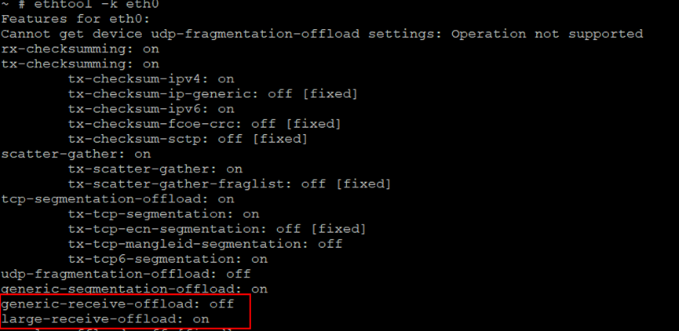

Enable LRO:

```
ethtool -K eth0 lro on
```

Enable GRO:

```
ethtool -K eth0 gro on
```

Disable LRO:

```
ethtool -K eth0 lro off
```

Disable GRO:

```
ethtool -K eth0 gro off
```

## How to Correctly Work in Non-Blocking Mode When Using Socket Interfaces in Applications<a name="ZH-CN_TOPIC_0000002424360482"></a>


### Basic Concepts<a name="ZH-CN_TOPIC_0000002424360542"></a>

In network programming, a network handle can operate in either blocking IO or non-blocking IO mode. The following briefly explains these two socket modes.

-   **Blocking IO**: Socket blocking mode means the operation (including errors) must complete before returning.
-   **Non-blocking IO**: Non-blocking mode returns immediately regardless of whether the operation is complete. Other methods must be used to determine whether the specific operation was successful.

### IO Mode Configuration<a name="ZH-CN_TOPIC_0000002457879389"></a>

There are two ways to set a socket to blocking or non-blocking mode:

-   Method 1: fcntl setting; use F\_GETFL to get flags, F\_SETFL to set flags|O\_NONBLOCK;

    The fcntl function can set a socket handle to non-blocking mode:

    flags = fcntl(sockfd, F\_GETFL, 0);                       // Get the file's flags value.

    fcntl(sockfd, F\_SETFL, flags | O\_NONBLOCK);   // Set to non-blocking mode;

    After this, all operations on sockfd will be **non-blocking**.

    flags  = fcntl(sockfd, F\_GETFL, 0);

    fcntl(sockfd, F\_SETFL, flags & ~O\_NONBLOCK);    // Set to blocking mode;

    After this, all operations on sockfd will be **blocking**.

-   Method 2: Parameters of the recv, send functions. (Temporarily set the socket or file descriptor to non-blocking when reading or sending.)

    The last flag parameter of the recv and send functions can be set to MSG\_DONTWAIT

    This temporarily sets the socket to non-blocking mode, regardless of the original setting.

    recv(sockfd, buff, buff\_size, MSG\_DONTWAIT);     // Non-blocking message send

    send(sockfd, buff, buff\_size, MSG\_DONTWAIT);   // Non-blocking message receive

## Why Does It Still Report "Phy no link" When the Network Cable Is Plugged into the Board<a name="ZH-CN_TOPIC_0000002457839289"></a>

When performing network operations for the first time on a demo board, the following output may appear:

```
No such device: 0:2
... (repeated)
PHY not link!
```

Even though the network cable is connected to the board, why does it still report "PHY not link"? This is because the PHY on the demo board requires some time to negotiate the operating mode and speed with the PHY of the peer device, followed by a certain reset period. This may cause the above failure when performing network operations (ping, tftp, or other operations) immediately after plugging in the network cable. Simply wait for the board's PHY power indicator (usually green) to light up before performing network operations.

## Why Does Removing the USB 3.0 Overcurrent Protection Chip Cause Some USB 3.0 Flash Drives Not to Be Recognized at Power-On<a name="ZH-CN_TOPIC_0000002424200722"></a>

After removing the overcurrent protection chip from the USB 3.0 port, a Teclast USB 3.0 flash drive plugged in at power-on cannot be recognized. The cause of this problem is that the controller stays in USB 3.0 mode for too short a time, and the USB 3.0 flash drive has not fully initialized before recognition fails. As shown in [Figure 1](#fig10824113063715).

**Figure 1**  USB 3.0 flash drive boot recognition process<a name="fig10824113063715"></a>  
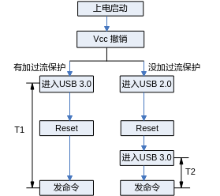

A USB 3.0 controller without the overcurrent protection chip enters USB 2.0 mode first, then after reset, enters USB 3.0 mode. Thus, the time T2 the controller stays in USB 3.0 mode is significantly shorter than T1 with the overcurrent protection chip directly entering USB 3.0 mode. The flash drive's state is not yet ready, causing the host to fail when sending commands. The solution is to extend the value of HUB\_ROOT\_RESET\_TIME to 100 in drivers/usb/core/hub.c:

```
#define HUB_ROOT_RESET_TIME     100；
```

## I2C Kernel-Space Interface Atomic Operation Precautions<a name="ZH-CN_TOPIC_0000002424360538"></a>

The kernel-space interface functions used in I2C device drivers include i2c\_master\_send, i2c\_master\_recv, and i2c\_transfer. These interface functions internally acquire different locks depending on whether the operation is atomic or non-atomic. The code is located in the drivers/i2c/i2c-core-base.c file, as shown in [Figure 1](#_Ref449015618).

**Figure 1**  Lock acquisition in kernel-space interfaces<a name="_Ref449015618"></a>  
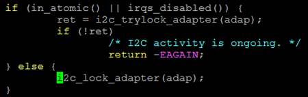

If an atomic lock is used before calling the I2C interface function, or if the call is made within an interrupt, the current operation will be in an atomic context. If in an atomic context, the if branch in the upper half of [Figure 1](#_Ref449015618) will execute; otherwise, the else branch will execute.

> **Important:** 
>In atomic operations, i2c\_trylock\_adapter(adap) is used to try to acquire the lock. If -EAGAIN is returned, it means the lock was not acquired, not that the I2C communication failed. In this case, the read/write operation has not been executed. For writes, the value has not been written; for reads, the value is meaningless. Therefore, it is necessary to further check whether the error return value equals -EAGAIN. If so, decide whether to retry based on the situation, as illustrated by the I2C write example in [Figure 2](#_Ref449015992).

**Figure 2**  Write operation example<a name="_Ref449015992"></a>  
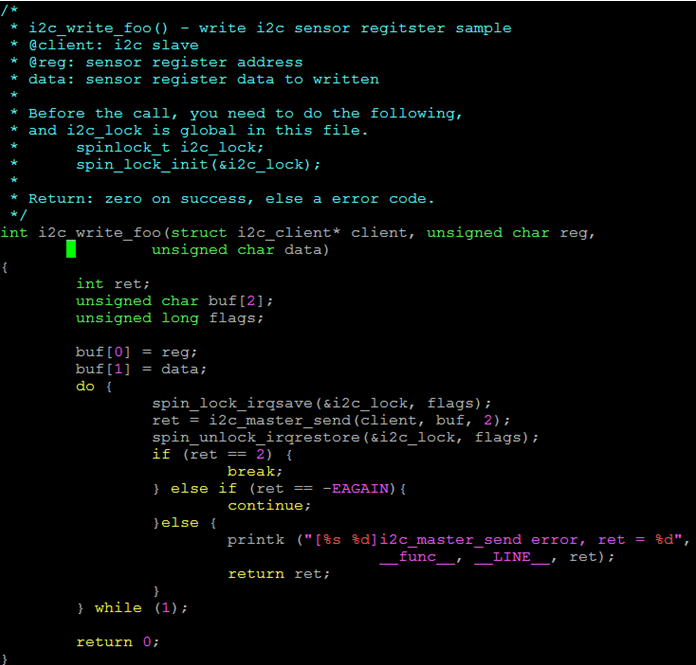

## SATA Speed Limiting Method<a name="ZH-CN_TOPIC_0000002457879401"></a>

[Debugging Method] SATA-6G is the default. If lower speed functionality is needed, configure the SATA speed limit. The SATA speed limit is set in bootargs, as follows:

-   SATA-6G configuration: No configuration needed; use the released kernel.
-   Limit to 3G: Add libata.force=3.0G after the original bootargs.
-   Limit to 1.5G: Add libata.force=1.5G after the original bootargs.

## AHB Bus Waterline Threshold Issue<a name="ZH-CN_TOPIC_0000002457879461"></a>

[Problem Description] The bus AHB has an internal command waterline configuration. The preset waterline threshold is small. When multiple cores concurrently access SDIO module registers at high frequency, the bus traffic becomes too large, exceeding the waterline threshold and triggering a bus command exception, causing the bus to hang.

[Solution] Add locking in the driver to ensure serial access to module registers on the SDIO bus.

[Modification Example] Open the linux source file drivers/vendor/peri/peri\_io\_xxxx.c (replace xxxx with the specific product name), change "#define PERI\_IO\_EN 0" to "#define PERI\_IO\_EN 1".

# PCIe
## How to Configure Kernel Options to Compile the PCIe Controller Driver into the Kernel<a name="ZH-CN_TOPIC_0000002457839281"></a>

In RC mode, the kernel must execute the PCIe controller driver at boot to complete controller initialization and enumeration of other PCIe EP devices. In EP mode, the kernel does not execute the PCIe controller driver (EP mode configuration is done by the logic by default). Specific configuration in RC mode:

In the menuconfig menu, select the following options:

-   linux-4.19.90

    ```
    Bus Support  --->
    [*] Vendor PCI Express support  --->
    ```

-   linux-5.10

    ```
    Device Drivers  --->
        [*] PCI support  --->
            [*] Vendor PCI Express support  --->
    ```

In EP mode, disable Vendor PCI Express support.

-   linux-4.19.90

    ```
    Bus Support  --->
    [ ] Vendor PCI Express support  --->
    ```

-   linux-5.10

    ```
    Device Drivers  --->
        [*] PCI support  --->
            [ ] Vendor PCI Express support  --->
    ```

Note: This option must not be selected in EP mode. In EP mode, the board cannot connect other devices via the PCIe interface.

## How to Configure the PCIe Reference Clock<a name="ZH-CN_TOPIC_0000002424360558"></a>

The PCIe module's reference clock has two main sources: one from inside the chip, called the internal clock; and one from outside the chip, called the external clock. The clock source is determined by the power-on latch pin PCIE\_REFCLK\_SEL. Typically, 0 means using the chip's internal reference clock, and 1 means using an external reference clock. When PCIe is in RC mode, the internal clock is typically used. If an external clock is needed, the clock signal must be connected to a dedicated external clock source. When PCIe is in EP mode, the master device's output clock is typically used.

## How to View PCIe Device BAR Address Allocation Information<a name="ZH-CN_TOPIC_0000002424200674"></a>

PCIe device BAR addresses are allocated during system boot and stored in the PCIe configuration space. According to the chip manual's "Peripherals -> PCI Express" chapter, the device's configuration space can be accessed through configuration transactions. The configuration space at offsets 0x10, 0x14, and 0x18 contains the address information for BAR0, BAR1, and BAR2 respectively, and so on.

Using SS928V100 as an example, accessing the configuration space of the first device connected under PCIe controller 0:

```
bspmd.l 0x20100000
0000: 351919e5 00100000 04800002 00000000
0010: 30800000 31200000 31000000 31100000
0020: 31210000 31220000 00000000 00000000
0030: 00000000 00000040 00000000 000001ff
0040: 5fc35001 00000000 00000000 00000000
0050: 008a7005 00000000 00000000 00000000
0060: 00000000 00000000 00000000 00000000
0070: 00020010 00008fc2 00002010 00437c22
0080: 10120000 00000000 00000000 00000000
0090: 00000000 0000001f 00000000 00000006
00a0: 00010002 00000000 00000000 00000000
00b0: 00000000 00000000 00000000 00000000
00c0: 00000000 00000000 00000000 00000000
00d0: 00000000 00000000 00000000 00000000
00e0: 00000000 00000000 00000000 00000000
00f0: 00000000 00000000 00000000 00000000
```

The underlined data above are the address information for BAR0 – BAR5 of the device.

For products with two PCIe controllers, such as SS626V100, the configuration space base address of the first device under PCIe controller 1 is 0x30300000, where 0x30000000 is the base address of controller 1's configuration space.

## How to View PCIe Address Mapping Information<a name="ZH-CN_TOPIC_0000002457879417"></a>

Our PCIe address mapping information is stored in the ATU register set in the PCIe configuration space. Each register set has input and output directions. The selection of register set and direction is controlled by the Viewport register (at PCIe configuration space offset 0x900). Using the SS928V100 master-slave cascading as an example, this section describes how to use this register set:

```
bspmm 0x20100900 0x80000000
bspmm 0x20100900 0x00000000
```

Select ATU register set 0 and view the InBound and OutBound address mapping information respectively.

```
bspmm 0x20100090 0x800000001
bspmm 0x20100900 0x000000001
```

Select ATU register set 1 and view the InBound and OutBound address mapping information respectively.

Example: Viewing the address mapping information of the selected ATU register set:

```
bspmd.l 0x20100900
0000:  00000000 00000000 00000000 00000000
0010:  00000000 0000ffff 00000000 00000000
0020:  00000000 00000000 00000000 00000000
0030:  00000000 00000000 00000000 00000000
0040:  00000000 00000000 00000000 00000000
0050:  00000000 00000000 00000000 00000000
0060:  00000000 00000000 00000000 00000000
```

The above information indicates that ATU register set 0 has not been configured in OutBound mode.

## Why Doesn't PCIe MCC Module Work After Insertion<a name="ZH-CN_TOPIC_0000002457839277"></a>

The following points should be noted when using PCIe MCC:

-   The MCC ko files for the master and slave sides must be compiled separately! When compiling the master side's MCC ko, it depends on the PCIe controller driver. Ensure that the PCIe controller driver has been compiled into the kernel (in menuconfig, the PCIe compilation option should be selected), and the kernel must have been compiled. Compiling the slave side's driver has no such requirement.
-   The master side's MCC ko can only run on an image that has the PCIe controller driver compiled into the kernel.

For the PCIe master side's PCIe MCC ko, if either of the above two conditions is not met, the driver may not work.

## Precautions for PCIe Network Card and PCIe SATA Usage<a name="ZH-CN_TOPIC_0000002457879449"></a>

When using the above devices, ensure that the corresponding configuration options in the kernel are selected (using kernel 4.19.y as an example)!

PCIe network card:

```
 Device Drivers  --->  
        [*] Network device support  --->
               [*]  Ethernet driver support  --->
                          <*>  ... (enable according to model)
```

PCIe SATA:

```
 For Silicon Image 3124/3132 card:
        Device Drivers  --->  
             -*- Serial ATA and Parallel ATA drivers  ---> 
                  <*>   Silicon Image 3124/3132 SATA support  --->
```

For JMB 362 card:

```
 Device Drivers  --->  
       -*- Serial ATA and Parallel ATA drivers  --->
                  <*>   AHCI SATA support  --->
```

## Common Failures When Starting from a Slave via PCIe<a name="ZH-CN_TOPIC_0000002424360530"></a>

-   When compiling the slave kernel, make sure to select the following option in menuconfig:

    ```
    General setup  --->
    [*] Initial RAM filesystem and RAM disk (initramfs/initrd) support
    ```

-   To support cramfs larger than 4 MB, modify the macro CONFIG\_BLK\_DEV\_RAM\_SIZE=65536 in .config.
-   In the current cascading startup, files loaded to the slave should not exceed 7 MB.
-   If you are using the booter program provided in the release package to start the slave device, configure the u-boot environment variables as follows:

    ```
    setenv bootargs 'mem=64M console=ttyAMA0,115200'
    setenv bootcmd 'bootm 0x81000000 0x82000000'
    ```

## Why Does Running the SDK Video Preview Occasionally Print "unknown irq triggered"<a name="ZH-CN_TOPIC_0000002457839301"></a>

This print is for reminder purposes only and is not an error.

In the master-slave cascading scenario, the message communication process between master and slave is as follows:

The slave initiates a message write, then triggers an interrupt on the master side. The master responds to the interrupt and retrieves the message from the shared memory area. The master may then reply with a message to the slave, using the same process: write the message to shared memory, then trigger an interrupt on the slave side. The slave enters the interrupt service routine to process the message already in shared memory.

According to the original design, when one side submits an interrupt to the other, it first checks the other side's interrupt status. If the interrupt status has not been cleared, it waits for the other side to complete its interrupt processing before triggering the interrupt. This method ensures one message per interrupt but causes the other side to frequently enter the interrupt service routine, resulting in low efficiency. To improve message interaction efficiency, a different method is considered. For messages with lower real-time requirements, multiple messages are processed at once using a timer. After each message is sent, even if the previous interrupt has not been serviced, the interrupt is submitted directly without waiting for the other side's interrupt status to be cleared. This creates a scenario where one side sends a message, writes the other side's interrupt, but before triggering it, the other side's previous interrupt happens to be processed, also handling the newly sent message. The other side's interrupt status is also cleared at this point. When the original side triggers the other side's interrupt, the other side finds no corresponding interrupt status flag when checking the interrupt status, printing the above message ("unknown irq triggered").

This mechanism has been thoroughly analyzed and will not cause message loss or other anomalies!

## To Which Address Does the PCIe BAR Map by Default After Reset, and What Precautions Are Needed for Moving Windows<a name="ZH-CN_TOPIC_0000002457839297"></a>

After system reset, the PCIe address mapping is not enabled. That is, the window does not map to any address space on the slave device. Address mapping is only enabled after window configuration operations are performed.

One issue to note when moving PCIe windows: the address must be 4K aligned when configuring the window.

## PCIe MCC Driver No Longer Supports Master DMA Write to Slave<a name="ZH-CN_TOPIC_0000002424200646"></a>

After long-term testing, bidirectional DMA write operations, combined with other non-DMA data transfers between master and slave, may cause unpredictable anomalies. Therefore, subsequent versions have removed support for master-to-slave DMA write operations. This can be replaced by the slave performing DMA read operations. The slave performing simultaneous DMA read and write operations, combined with other non-DMA data transfers, has passed long-term testing on the experimental board and runs stably.

Slave DMA read and write operations are managed through two task lists in software (originally one task list), implementing the function of simultaneously transmitting and receiving data on two PCIe channels: send and receive. This solution achieves approximately the same PCIe channel utilization rate as when both master and slave simultaneously initiate DMA write operations.

## Does PCIe MCC Support the Master Resetting the Slave<a name="ZH-CN_TOPIC_0000002424360534"></a>

PCIe MCC supports the master resetting the slave. The description is as follows:

-   After reset, the device state before reset is fully preserved, including device function state, address mapping, etc. (except for DMA-related registers).
-   The master can continuously reset the slave, but ensure sufficient time between resets for the slave to start.

After compiling the master driver, an executable file called booter is generated in components/pcie\_mcc/out. This file is a simple example of starting and resetting the slave device, compiled from source code in the components/pcie\_mcc/multi-boot/example directory. Specific usage is as follows.

Start the slave device:

```
$./booter start_device
```

Reset the slave device:

```
$./booter reset_device
```

For more detailed information, please refer to ~/pcie\_mcc/multi\_boot/example/boot\_test.c and the driver code.

## Method to Resolve Low VO Bandwidth Issue When Using Some PCIe to SATA Cards (e.g., marvel9215) Connecting SATA Disks for Data Read/Write<a name="ZH-CN_TOPIC_0000002424360546"></a>

-   Problem Cause:

    This PCIe to SATA card requests a default data size of 512 bytes, resulting in high PCIe bandwidth usage.

-   Solution:

    By modifying the Max\_Read\_Request\_Size register of the PCIe to SATA card, its maximum read request can be limited to 128 bytes, reducing PCIe bandwidth usage.

    Specific steps are as follows:

1.  Execute: make ARCH=arm64 CROSS\_COMPILE=aarch64-xxxx-linux- menuconfig
2.  In the Linux kernel's menuconfig interface, configure the option: Bus support ---> Vendor PCI Express support ---> PCI Express configs ---> limit pcie max read request size
3.  After setting, save and exit.
4.  Execute: make ARCH=arm64 CROSS\_COMPILE=aarch64-xxxx-linux- uImage -j
5.  The newly compiled kernel image is saved at arch/arm64/boot/uImage.

## Why Is a PCIe to SATA Card Not Detected<a name="ZH-CN_TOPIC_0000002457839293"></a>

From the perspective of circuit reliability, IP requires the clock to be provided first, and then the reset to be released after the clock stabilizes. When an external card is connected to the main chip, the external card requires a reference clock from the main chip. The main chip outputs a reference clock by default at power-on, which cannot guarantee reliable operation of the external card, potentially leading to detection failure. Therefore, the external card needs to be reset once. The simplest method is to control the reset of the external card through a GPIO pin of the main chip (which GPIO pin to control depends on the hardware circuit design).

## Reset Circuit Design When PCIe as RC Connects to Other Peripheral Cards<a name="ZH-CN_TOPIC_0000002424200642"></a>

When PCIe acts as RC connecting to other peripheral cards, the peripheral card often requires a board-level reset. Two common methods are:

-   Method 1: Provide reset to the peripheral card through a hardware reset circuit.
-   Method 2: Control the output of high/low levels through the SOC chip's GPIO pins to provide reset to the peripheral card.

When the hardware circuit provides reset control to the peripheral card, the requirements of the peripheral card's reset circuit should also be considered, such as whether pull-up/pull-down resistors are needed for clamping.

Example:

When using Method 2 for reset control of certain peripheral cards, when the SOC chip performs a reboot, the GPIO is set to input mode (because the SOC chip is being reset), causing the reset circuit of the peripheral card to become uncontrollable, potentially triggering anomalies in the peripheral card.

Modify the circuit design to add pull-up (or pull-down) resistor clamping to the peripheral card's reset circuit, then control the reset through GPIO to eliminate the anomaly.

# Flash
## How to Mark Bad Blocks on Flash<a name="ZH-CN_TOPIC_0000002424200698"></a>

By default, the SDK's NAND flash read/write functions have built-in flash bad block handling strategies that users do not need to worry about. The following methods are only for scenarios where users want to forcibly mark certain flash blocks as bad for testing purposes. Under normal circumstances, these methods are not needed.

-   Marking bad blocks in u-boot-2020.01

    The command to mark a NAND bad block is as follows:

    ```
    nand markbad offset
    ```

    This command marks the NAND block at the offset position as a bad block. For example, to mark the block at the 1M position as a bad block:

    ```
    nand markbad 0x100000
    ```

    The offset should preferably be an integer multiple of the NAND block size. After marking, use the following command to view NAND bad blocks:

    ```
    nand bad
    ```

-   Marking bad blocks in the kernel

    The relevant code is as follows:

    ```
    #define MEMSETBADBLOCK _IOW('M', 12, __kernel_loff_t)
    int fd;
    unsigned long long offset;
    fd = open("/dev/mtd1", O_RDWR);
    offset = 0x100000;
    if (ioctl(fd, MEMSETBADBLOCK, &offset))
    {
        printf("Mark bad block 0x%llX failed!\n", offset);
    }
    ```

    This program marks the NAND block at the offset position of the opened mtd partition as a bad block.

    For example, to mark the block at offset 1M of the mtd1 partition as a bad block, specify mtd1 in the open function (the character device node for the corresponding partition),

    then set offset to 0x100000, as shown in the code above.

Note: The offset in u-boot-2020.01 is relative to the entire NAND, while the offset in the kernel is relative to the opened partition.

## How to Change SPI Flash from 4-Wire Mode to 2-Wire Mode<a name="ZH-CN_TOPIC_0000002424200694"></a>

In u-boot's ~/drivers/mtd/spi/fmc100/fmc\_spi\_nor\_ids.c, find the ID table of the corresponding device. For example, disable the QUAD (4-wire) capability (both read and write). When the driver detects that the device has no QUAD capability, it will not enable 4-wire capability and will work at the highest 2-wire capability. The modification in the kernel is similar and will not be repeated here.

```
  {
                "xxxxxxxx", 
                {0xFF, 0xFF, 0xFF}, 3, _32M, _64K, 4,
                {
                        &READ_STD(0, INFINITE, 40/*50*/),
                        &READ_FAST(1, INFINITE, 104),
                        &READ_DUAL(2, INFINITE, 104),
                        &READ_DUAL_ADDR(1, INFINITE, 84),
                  //      &READ_QUAD_ADDR(3, INFINITE, 75),
                        0
                },
                {
                        &WRITE_STD(0, 256, 75),
                        0
                },
                {
                        &ERASE_SECTOR_64K(0, _64K, 80),
                        0
                },
                &spi_driver_xxxxxxxx,
        },
```

## How to Correctly Use the mtd-utils nandwrite Raw Write Tool<a name="ZH-CN_TOPIC_0000002424360506"></a>

When using the mtd-utils nandwrite raw write tool to write a u-boot.bin image, if the image size is larger than one Nand Flash block, ensure the data in the u-boot.bin image is aligned by block alignment. Otherwise, the written u-boot.bin image will not boot normally.

The specific reason is as follows:

Since some Nand Flash chips have bad block (BB) markers set to non-zero values (e.g., 0xFE) at the factory, it is easy for the FMC controller to correct them to 0xFF using ECC (because 0xFF is valid and correctable in the controller's ECC algorithm). Therefore, an Empty Block (EB) marker bit is set in the last two bytes of the OOB information for each page. As shown in [Figure 1](#_Ref443982950), when u-boot starts, the logical condition for considering a block as a good block is: BB = 0xFF and EB = 0x00 in the block's first page 1 and last page N.

**Figure 1**  Nand Flash block structure<a name="_Ref443982950"></a>  
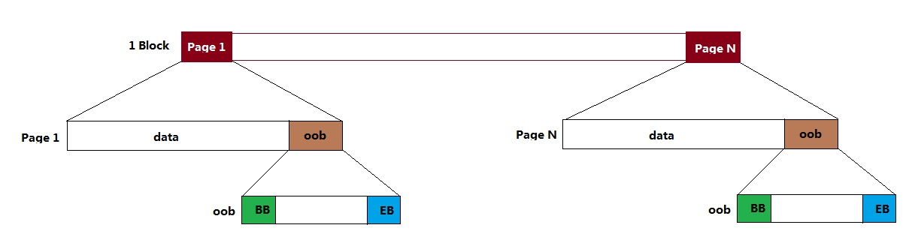

nandwrite writes data page by page according to the image file size, automatically setting the EB bit of the current page to 0x00 when writing a page. When the last written page is not the last page of the block, since the EB of the last page of that block is 0xFF, the logic treats this block as an empty block and does not read its data, causing u-boot boot failure.

It is worth noting that since Nand Flash devices guarantee the first block is good at the factory, the logic does not check the situation for the first block. Therefore, when the u-boot.bin image size is smaller than one block, u-boot can boot normally.

Additionally, once u-boot boots normally, the software no longer checks the EB bit. This is why when using nandwrite to write kernel images and filesystem images, block alignment of the image size does not need to be considered.

## Impact of Process Updates on Compatibility When Some Flash Device IDs Remain Unchanged but Parameters Change<a name="ZH-CN_TOPIC_0000002457879445"></a>

With the continuous updating of Flash (SPI Nor/SPI Nand/Parallel Nand) processes, parameters such as interface, OOB, and performance are constantly changing and being optimized. However, some manufacturers keep the Flash ID unchanged despite process upgrades, for convenience. Our driver identifies devices using the ID rather than the SFDP registers recommended by manufacturers, because SFDP is not standardized — it varies between manufacturers, and even between old and new devices from the same manufacturer.

Therefore, the Flash devices listed below are cases where IDs are identical but parameters differ, affecting compatibility. If customers encounter similar situations, they can refer to the following examples for driver modifications to ensure normal functionality and optimal performance.

-   SPI Nor Flash: Same ID, interface type changes

    After a process iteration, the ID remains the same, but the new process device supports additional 2x I/O Read Mode/4x I/O Read Mode/4x I/O Page Program interfaces, as shown below:

    Before the process iteration, the device information structure fmc\_spi\_nor\_info\_table in fmc\_spi\_nor\_ids.c should be defined as:

    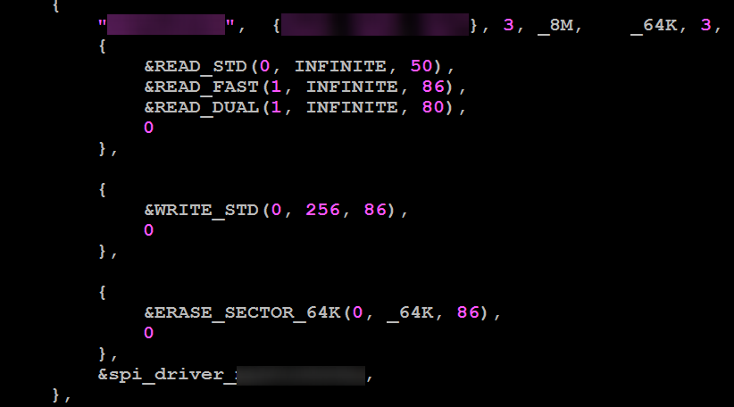

    After the process iteration, the device information structure fmc\_spi\_nor\_info\_table in fmc\_spi\_nor\_ids.c should be defined as:

    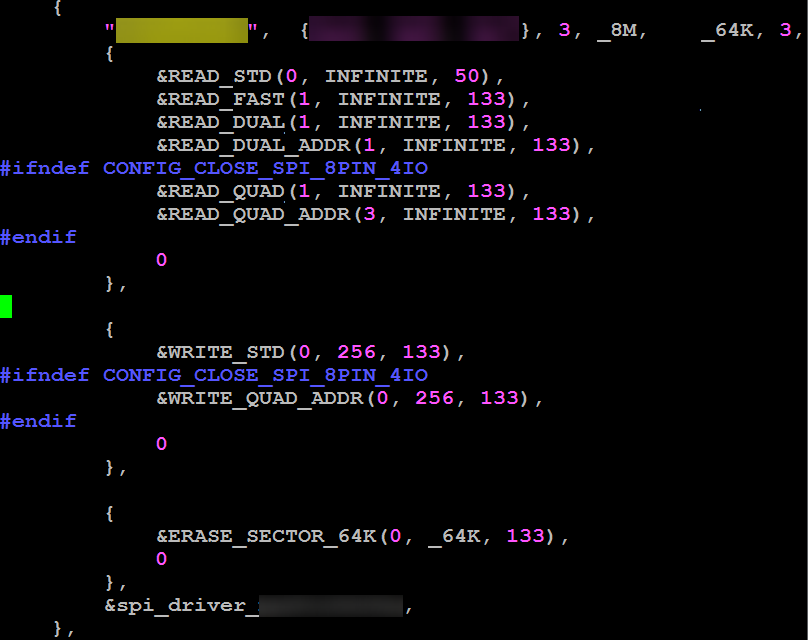

-   SPI Nor Flash: Same ID, command word changes

    For different devices with the same ID, write commands differ — command words 38h and 12h.

    For devices with command word 38h, it can be used directly by configuring WRITE\_QUAD\_ADDR, since the current driver matches the 38h command by default.

    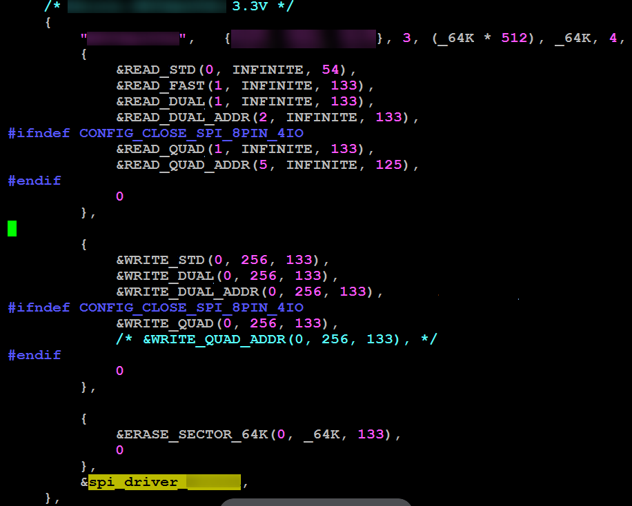

    For devices using command word 12h, modify the SPI\_CMD\_WRITE\_QUAD\_ADDR command definition in the fmc\_spi\_ids.h header file to use this interface type.

    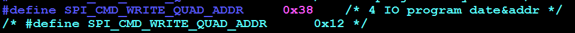

-   Parallel Nand: Same ID, OOB changes

    Same ID, but different OOB sizes. Before process iteration, OOB was 64 bytes; after upgrade, OOB is 128 bytes. Using a driver matching 64-byte OOB will cause 128-byte device boot failure.

    To use a device with OOB size 64 bytes, ensure that the .oobsize parameter in the nand\_flash\_special\_dev structure in fmc\_nand\_spl\_ids.c is set to 64.

    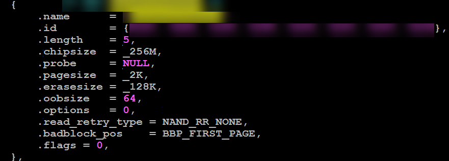

    For devices with OOB size 128 bytes, ensure .oobsize = 128 to guarantee device stability.

    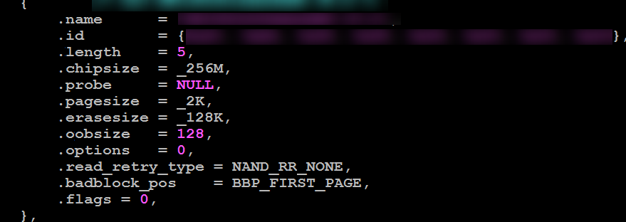

## How to Support SPI Nor Dual Chip Select on Linux 4.19 Kernel<a name="ZH-CN_TOPIC_0000002457839349"></a>

Starting from the Linux 3.18 kernel, the SPI Nor Flash driver adapts to the SPI Nor standard driver framework, and the SoC and board-level topology is uniformly described in DTS (Device Tree) files. By default, only a single SPI Nor Flash is supported.

Using SS928V100 as an example, to add another SPI Nor Flash, add an SPI Nor device node in the board-level DTS file. Find the sfc node in the arch/arm64/boot/dts/ss928v100-demb.dts file:

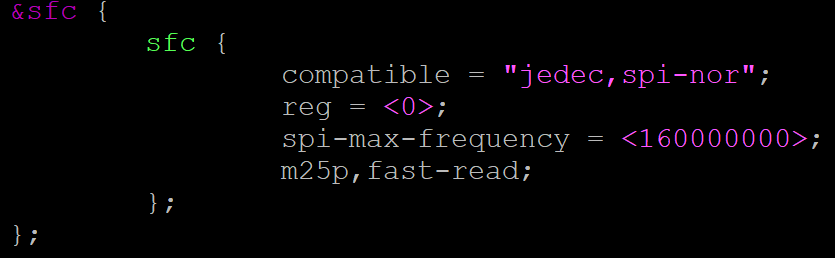

Note the following points:

-   Device node names must be distinct, e.g., sfc\_0 and sfc\_1.
-   The chip select number must be specified.
-   After adding the device nodes, the partition information must reference the device node names:

    mtdparts=sfc\_0:1M\(mtd0\),4M\(mtd1\);sfc\_1:4M\(mtd2\),11M\(mtd3\)

Please refer to the following figure:

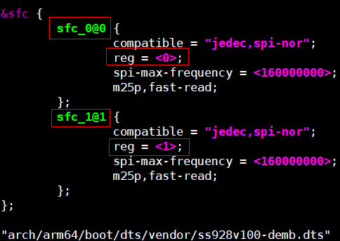

## Why Can't the System Boot When the Fastboot Image Does Not Meet Block Alignment and Is Written Page by Page to Flash<a name="ZH-CN_TOPIC_0000002424360526"></a>

The Fastboot image must be written to flash with block alignment. When the Fastboot image does not meet block alignment, the unaligned block's trailing page data consists of erased data (0xFF). When the FMC controller operates in boot mode, its internal logic treats this block as a bad block, causing read errors and boot failure. The relevant FMC logic conditions for bad block determination can be found in the chip manual's "Flash Memory Controller" chapter.

# Filesystem
## Precautions for Mounting cramfs Filesystem on NAND<a name="ZH-CN_TOPIC_0000002424360502"></a>

When using cramfs on NAND, it must be mounted to romblock, not mtdblock.

cramfs is not specifically designed for NAND devices; the cramfs filesystem itself cannot skip bad blocks. The kernel has a block device called romblock that implements bad block skipping functionality.

## Precautions for Loading Dynamic Libraries on eMMC<a name="ZH-CN_TOPIC_0000002457879457"></a>

Some projects use uclibc, which has partition restrictions when loading dynamic libraries or rootfs — they need to be on a primary partition to load correctly. By default in the eMMC driver, CONFIG\_MMC\_BLOCK\_MINORS = 8 supports a maximum of 7 primary partitions (plus 1 for the entire disk). It is recommended to place dynamic libraries or rootfs on the first 7 partitions. If they need to be placed on partition 8 or higher (e.g., mmcblk0p8), increase CONFIG\_MMC\_BLOCK\_MINORS accordingly.

```
Device Drivers  ---> 
        <*> MMC/SD/SDIO card support  --->
               --- MMC/SD/SDIO card support
             (8)     Number of minors per block device
```

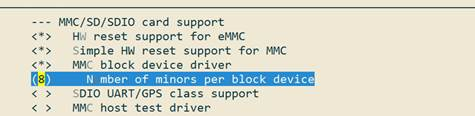

# Fast Boot Optimization
-   Set bootdelay in u-boot to 0
    -   Method: In u-boot's command line, enter: setenv bootdelay 0; saveenv
    -   Description: For convenience in entering the u-boot command line, the default bootdelay is set to 1 in u-boot. Setting bootdelay to 0 can speed up fastplay startup by about 1 second (code already modified in u-boot to set the default value to 0).

-   Skip kernel verification in u-boot
    -   Method: In u-boot's command line, enter: setenv verify n; saveenv
    -   Description: If there is a kernel error, whether or not verification is performed in u-boot, the system will almost certainly hang. Therefore, skipping verification theoretically has no impact and can speed up startup by about 1 second (code already modified in u-boot to set the default to no verification).

-   Set bootcmd as follows: setenv bootcmd 'nand read 0x807fffc0 0x100000 0x400000; bootm 0x807fffc0'
    -   Description: With the above bootcmd, u-boot directly reads the kernel image from flash to 0x807fffc0 and starts from 0x807fffc0.
    -   In contrast, with the default bootcmd: nand read 0x82000000 0x100000 0x400000; bootm 0x82000000, u-boot first reads the kernel from flash to address 0x82000000, then copies the image from 0x82000000 to 0x807fffc0, and finally starts from 0x807fffc0.

# Kernel
## Difference Between pid and tgid<a name="ZH-CN_TOPIC_0000002424200682"></a>

The task\_struct structure contains two fields: pid and tgid.

Simple understanding: pid is the unique id of the task\_struct. tgid is the thread group leader id of the task's thread group. If there is no thread group leader, then tgid = pid. The tgid exists for POSIX standard compatibility.

getpid() returns tgid.

In normal processes, the TGID is equal to the PID.

With threads, the TGID is the same for all threads in a thread group. This enables the threads to call getpid() and get the same PID.

In fact, the POSIX 1003.1c standard states that all threads of a multithreaded application must have the same PID.

## Priority of Normal Processes and Real-Time Processes<a name="ZH-CN_TOPIC_0000002457879465"></a>

<a name="table482mcpsimp"></a>
<table><tbody><tr id="row487mcpsimp"><th class="firstcol" valign="top" width="50%" id="mcps1.1.3.1.1"><p id="p489mcpsimp"><a name="p489mcpsimp"></a><a name="p489mcpsimp"></a>Process priority range:</p>
</th>
<td class="cellrowborder" valign="top" width="50%" headers="mcps1.1.3.1.1 "><p id="p491mcpsimp"><a name="p491mcpsimp"></a><a name="p491mcpsimp"></a>0---139</p>
</td>
</tr>
<tr id="row492mcpsimp"><th class="firstcol" valign="top" width="50%" id="mcps1.1.3.2.1"><p id="p494mcpsimp"><a name="p494mcpsimp"></a><a name="p494mcpsimp"></a>Real-time process priority:</p>
</th>
<td class="cellrowborder" valign="top" width="50%" headers="mcps1.1.3.2.1 "><p id="p496mcpsimp"><a name="p496mcpsimp"></a><a name="p496mcpsimp"></a>0---99</p>
</td>
</tr>
<tr id="row497mcpsimp"><th class="firstcol" valign="top" width="50%" id="mcps1.1.3.3.1"><p id="p499mcpsimp"><a name="p499mcpsimp"></a><a name="p499mcpsimp"></a>Normal process priority:</p>
</th>
<td class="cellrowborder" valign="top" width="50%" headers="mcps1.1.3.3.1 "><p id="p501mcpsimp"><a name="p501mcpsimp"></a><a name="p501mcpsimp"></a>100—139</p>
</td>
</tr>
<tr id="row502mcpsimp"><th class="firstcol" valign="top" width="50%" id="mcps1.1.3.4.1"><p id="p504mcpsimp"><a name="p504mcpsimp"></a><a name="p504mcpsimp"></a>nice corresponds to normal process:</p>
</th>
<td class="cellrowborder" valign="top" width="50%" headers="mcps1.1.3.4.1 "><p id="p506mcpsimp"><a name="p506mcpsimp"></a><a name="p506mcpsimp"></a>-20——19  &lt;--&gt; 100——139</p>
</td>
</tr>
<tr id="row507mcpsimp"><th class="firstcol" valign="top" width="50%" id="mcps1.1.3.5.1"><p id="p509mcpsimp"><a name="p509mcpsimp"></a><a name="p509mcpsimp"></a>Kernel default process priority:</p>
</th>
<td class="cellrowborder" valign="top" width="50%" headers="mcps1.1.3.5.1 "><p id="p511mcpsimp"><a name="p511mcpsimp"></a><a name="p511mcpsimp"></a>120—corresponding to nice=0</p>
</td>
</tr>
</tbody>
</table>

## How to Set the dmesg Buffer Size<a name="ZH-CN_TOPIC_0000002457879385"></a>

In the menuconfig menu, select the following option:

```
General setup  --->  Kernel log buffer size
CONFIG_LOG_BUF_SHIFT (e.g., 18 = 256 KB)
```

## How to Generate a Core Dump File for Problem Analysis When a "Segmentation Fault" Occurs<a name="ZH-CN_TOPIC_0000002424360550"></a>

A core dump file can be generated by setting the following command in the shell:

```
ulimit –S –c unlimited > /dev/null 2>&1
```

However, to properly display error information in the core dump file, the executable must also be compiled with the -g debugging flag.

## Is It Normal When Running a Very Simple Program, the Top Command Shows a Large Load Average Value (e.g., 2.95) While CPU Usage Is Low<a name="ZH-CN_TOPIC_0000002424200678"></a>

The load average value measures the queue of tasks waiting for CPU processing. Explain why this value may be high and whether it affects the business.

The load average shown by the top command displays the system average load for the last 1, 5, and 15 minutes. System average load indicates:

System average load is defined as the average number of processes in the running queue (processes running on or waiting to run on the CPU) over a specific time interval. A process is in the running queue if it meets the following conditions:

-   It is not waiting for the result of an I/O operation.
-   It has not actively entered a waiting state (i.e., has not called 'wait').
-   It has not been stopped (e.g., waiting for termination).

Update: In Linux, processes have three states: blocked, runnable, and running. When a process is blocked, it waits for I/O device data or a system call.

When a process is runnable, it is in a run queue competing with other runnable processes for CPU time. The system load refers to the total number of running and runnable processes. For example, if the system has 2 running processes and 3 runnable processes, the load is 5. Load average is the load count over a specific period.

Example:

<a name="table535mcpsimp"></a>
<table><tbody><tr id="row540mcpsimp"><td class="cellrowborder" valign="top" width="16%"><p id="p542mcpsimp"><a name="p542mcpsimp"></a><a name="p542mcpsimp"></a>1</p>
<p id="p543mcpsimp"><a name="p543mcpsimp"></a><a name="p543mcpsimp"></a>2</p>
<p id="p544mcpsimp"><a name="p544mcpsimp"></a><a name="p544mcpsimp"></a>3</p>
</td>
<td class="cellrowborder" valign="top" width="84%"><p id="p46736224919"><a name="p46736224919"></a><a name="p46736224919"></a># uptime</p>
<p id="p10107122519919"><a name="p10107122519919"></a><a name="p10107122519919"></a></p>
<p id="p546mcpsimp"><a name="p546mcpsimp"></a><a name="p546mcpsimp"></a>7:51pm up 2 days, 5:43, 2 users, load average: 8.13, 5.90, 4.94</p>
</td>
</tr>
</tbody>
</table>

The last part of the output indicates the average number of processes in the run queue over the past 1, 5, and 15 minutes.

Generally, if the current number of active processes per CPU is no greater than 3, the system performance is considered good. If the number of tasks per CPU is greater than 5, it indicates serious performance issues. For the above example, assuming a dual-CPU system, the current number of tasks per CPU is 8.13/2 = 4.065, which is acceptable.

From the above explanation, our current number of tasks per CPU is 2.95/2 = 1.475, which is considered normal!

## GDB Cannot Support Multithreaded Debugging<a name="ZH-CN_TOPIC_0000002457839269"></a>

**Symptom:** (Debugging a multithreaded test program (test) using GDB):

```
./gdb test
GNU gdb (GDB) 7.9.1
...
(gdb) r
Starting program: /var/test 
warning: File "/lib64/libthread_db.so.1" auto-loading has been declined by your `auto-load safe-path' set to "$debugdir:$datadir/auto-load".
...
warning: Unable to find libthread_db matching inferior's thread library, thread debugging will not be available.
...
(gdb) info thread
 Id   Target Id         Frame 
* 1    LWP 1387 "test"   0x0000007fb7efb3a4 in nanosleep ()
   from /lib64/libc.so.6
(gdb)
```

As indicated by the underlined prompt, thread debugging is not available.

**Root cause:** To reduce the filesystem size of the default release, all dynamic libraries on the board side have been stripped, including the thread library libpthread-x.xx.so. Using the stripped thread library affects GDB's thread debugging on the board side.

**Solution:** Find the unstripped thread library from the corresponding toolchain installation directory (on the server) and replace the stripped version. Specific operations can refer to the following:

```
$ cd /opt/linux/x86-arm/aarch64-xxxx-linux/target/lib
$ find . -name "libpthread*.so"
./libpthread-x.xx.so
```

Users can replace the original stripped dynamic library with this file according to their actual environment to support multithreaded debugging.

## CPU Usage Increases After Disabling CONFIG\_NO\_HZ<a name="ZH-CN_TOPIC_0000002457839265"></a>

Enabling CONFIG\_NO\_HZ can significantly reduce device power consumption and extend battery life for devices that may be idle for long periods. However, for applications with consistent workloads or high real-time response requirements, CONFIG\_NO\_HZ mode may cause significant system latency due to the complex switching process between normal tasks and idle loops. Considering that backend monitoring is not very sensitive to power consumption, newer Linux kernel versions do not enable CONFIG\_NO\_HZ by default.

In some scenarios, disabling CONFIG\_NO\_HZ affects the CPU usage statistics shown by the top command. For example, when using iperf for network performance testing under the same environment, the kernel version with CONFIG\_NO\_HZ disabled shows higher CPU usage than the version with CONFIG\_NO\_HZ enabled. However, this is not a real increase in CPU usage — it is a statistical error in CPU usage introduced by the CONFIG\_NO\_HZ option. Network transmission involves a large number of interrupts and softirq processing. CONFIG\_NO\_HZ greatly reduces the triggering of scheduling interrupts, causing CPU time updates to be very untimely, and reducing the sampling frequency of each task's CPU usage by the system, thus affecting the accuracy of statistical results. Users can enable the kernel option CONFIG\_IRQ\_TIME\_ACCOUNTING (disabled by default) to obtain more accurate statistical results.

## Why Does Setting User-Space Thread Stack Size to 16 KB Cause a Segmentation Fault<a name="ZH-CN_TOPIC_0000002457839321"></a>

Before a dynamically linked user program starts execution, it needs to relocate external symbol addresses through the dynamic linker. The dynamic linker also uses the current process (thread) stack during execution. In glibc-2.24, the dynamic linker ld-2.24.so (specifically the function __dl\_fixup) moves the SP pointer downward by 16 KB by default to reserve memory for symbol resolution. When the user sets the process (thread) stack to 16 KB (or slightly more than 16 KB), this action causes the thread to generate a Segmentation Fault. The current dynamic linker's stack usage is somewhat inconsistent with the minimum user thread stack of 16 KB in Linux 32-bit systems. This issue has no other side effects, and modifying the relevant code in the C library involves multiple files, which may introduce other issues. Therefore, no modification is made at this time.

Recommendation:

-   The minimum user-space process (thread) stack size should be no less than 32 KB.
-   If a minimum 16 KB user-space process (thread) stack must be used, users can allocate thread stack memory themselves through the interface provided by the thread library.

## Cause of Sudden Increase in Kswapd Thread CPU Usage<a name="ZH-CN_TOPIC_0000002424200654"></a>

In certain business scenarios, the kswapd thread CPU usage in Linux systems suddenly increases and remains high for an extended period, as shown in [Figure 1](#_Ref5118078).

**Figure 1**  CPU usage increase<a name="_Ref5118078"></a>  
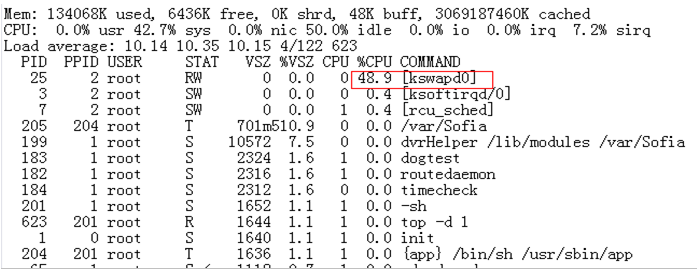

Kernel boot information is shown in [Figure 2](#_Ref5118390).

**Figure 2**  Kernel boot prints<a name="_Ref5118390"></a>  
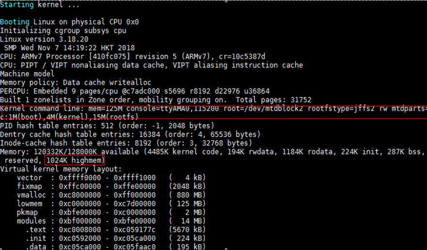

The system memory is 125 MB, far below the boundaries of system low memory and vmalloc space, but 1 MB of highmem appears in the boot information.

The unexplained increase in kswapd is directly related to maintaining the memory balance in the highmem zone. When the memory usage in the highmem zone exceeds a certain threshold, kswapd is activated to reclaim memory from the highmem zone.

-   Conditions for the Highmem area to appear:
    -   The CONFIG\_HIGHMEM option is enabled in the Linux kernel.
    -   The system memory size (in MB) is configured as an odd number, e.g., mem=125M.

-   Solutions:
    -   Option 1: Configure the system memory size in Bootargs to be 2 MB aligned (recommended).
    -   Option 2: Disable the CONFIG\_HIGHMEM option.

## In Linux-4.19.y Kernel, Using "cat /proc/vmallocinfo" Shows Address Information as "0x(____ptrval____)"<a name="ZH-CN_TOPIC_0000002424200726"></a>

In the Linux-4.19.y kernel, for security, address information printed with the "%p" format in the kernel is displayed as "____ptrval____" by default. Therefore, executing "cat /proc/vmallocinfo" displays address information as "0x(____ptrval____)".

To use "cat /proc/vmallocinfo" to view vmalloc address information, modify the mm/vmalloc.c code, as shown in [Figure 1](#_Ref32946196).

**Figure 1**  Modification method<a name="_Ref32946196"></a>  
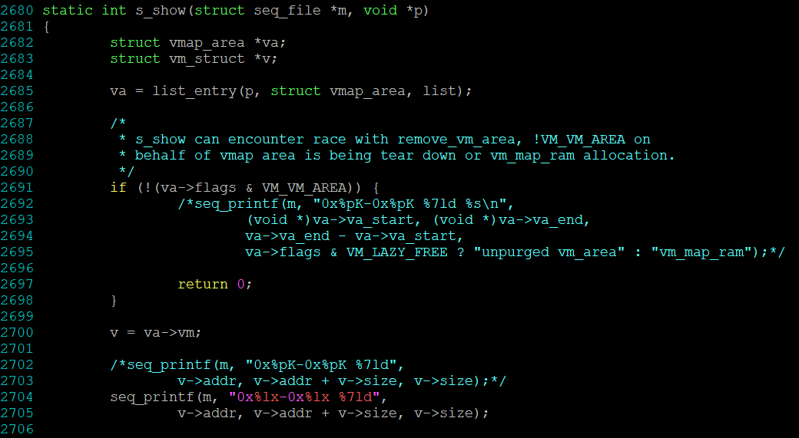

**Note**: This modification is only applicable for debug builds and should not be used in formal release versions.

## ARM64 flush data cache Description<a name="ZH-CN_TOPIC_0000002457839337"></a>

Before the Linux-4.4 kernel, the flush\_cache\_all interface was provided. This interface performs cache clean and invalidate operations by traversing ways/sets. However, the Linux community later believed that set/way cache operations can only act on the local core, creating race condition risks with cache operations on other cores. Therefore, the community removed flush\_cache\_all and other related interfaces in 2015. The recommended alternative is the __flush\_dcache\_area interface, which flushes the cache using virtual addresses, ensuring PoC consistency.

When the memory size operated on by the __flush\_dcache\_area interface exceeds a certain range, it takes a long time. If users want to continue using the community's flush\_cache\_all interface, they need to restore the community code themselves and verify its correctness based on their business scenario.

The community commit that removed flush\_cache\_all can be found at: https://github.com/torvalds/linux/commit/68234df4ea7939f98431aa81113fbdce10c4a84b

The community email discussion about removing flush\_cache\_all can be found at: https://patchwork.kernel.org/project/linux-arm-kernel/patch/1429521875-16893-1-git-send-email-mark.rutland@arm.com/

## I/O Intensive Business Performance Tuning Description<a name="ZH-CN_TOPIC_0000002457879433"></a>

The Linux kernel CONFIG\_HZ option specifies the system interrupt frequency. The optimal value for this option varies depending on the business scenario.

For I/O-intensive business scenarios (e.g., heavy network forwarding, stream storage), adjust the CONFIG\_HZ value to achieve optimal I/O performance.

# Toolchain
## Solution for "Memory Hole" Problem in Applications After Upgrading Toolchain glibc to 2.29<a name="ZH-CN_TOPIC_0000002457839317"></a>


### Symptom Description<a name="ZH-CN_TOPIC_0000002424200670"></a>

Some applications frequently call malloc to allocate memory space, and the requested space sizes vary significantly. After use, the memory is released via free, but the memory space remains cached in glibc without being returned to the operating system, resulting in insufficient system memory.

### Cause Analysis<a name="ZH-CN_TOPIC_0000002457879397"></a>

In glibc, process memory allocation is accomplished through two system calls: brk and mmap.

-   brk pushes the highest address pointer (\_edata) of the data segment (.data) to higher addresses. Memory allocated by brk cannot be released until the memory at a higher address is freed.

    If memory blocks A and B are allocated sequentially via brk, A cannot be released until B is released. This can appear as a "memory leak" when viewed via TOP.

-   mmap allocates space in the process's virtual address space. Memory allocated by mmap is released by munmap and immediately returned to the operating system upon release.

By default, memory allocations of 128 KB or larger use mmap/munmap, while allocations smaller than 128 KB use brk. This can be adjusted by modifying the M\_MMAP\_THRESHOLD value.

Additionally, glibc 2.29 has a new feature: M\_MMAP\_THRESHOLD can be dynamically adjusted. The M\_MMAP\_THRESHOLD value dynamically adjusts between 128 KB and 32 MB (on 32-bit) or 64 MB (on 64-bit). For example, after allocating and releasing a 2 MB memory space, the M\_MMAP\_THRESHOLD value is adjusted to a value between 2 MB and 2 MB + 4 KB.

Therefore, when an application allocates many memory spaces of significantly varying sizes, after allocating a large memory block, M\_MMAP\_THRESHOLD increases. Subsequent memory allocations smaller than M\_MMAP\_THRESHOLD will use brk, which cannot release lower-address memory until higher-address memory is freed. When the application does not release the higher-address memory, a large amount of lower-address memory space cannot be freed in time, creating a "memory hole" and causing insufficient system memory.

### Solution<a name="ZH-CN_TOPIC_0000002457879393"></a>

-   At process startup, use the int mallopt(int param, int value) function to explicitly set M\_MMAP\_THRESHOLD to 128 KB, disabling the M\_MMAP\_THRESHOLD dynamic adjustment feature.
-   Optimize memory management in the application, avoiding frequent allocation and release of memory to reduce memory fragmentation.
