# Preface
**Overview**

This document is written for developers using AVSP panoramic stitching. It provides solutions and guidance for issues encountered during development.

**Product Versions**

The product versions corresponding to this document are listed below.

<table><thead align="left"><tr id="row154mcpsimp"><th class="cellrowborder" valign="top" width="32%" id="mcps1.1.3.1.1">
Product Name

</th>
<th class="cellrowborder" valign="top" width="68%" id="mcps1.1.3.1.2">
Product Version

</th>
</tr>
</thead>
<tbody><tr id="row160mcpsimp"><td class="cellrowborder" valign="top" width="32%" headers="mcps1.1.3.1.1 ">
SS928

</td>
<td class="cellrowborder" valign="top" width="68%" headers="mcps1.1.3.1.2 ">
V100

</td>
</tr>
<tr id="row154435218294"><td class="cellrowborder" valign="top" width="32%" headers="mcps1.1.3.1.1 ">
SS927

</td>
<td class="cellrowborder" valign="top" width="68%" headers="mcps1.1.3.1.2 ">
V100

</td>
</tr>
</tbody>
</table>

**Intended Audience**

This document is intended for the following engineers:

-   Technical support engineers
-   Software development engineers
-   Hardware development engineers

**Revision History**

The revision history accumulates the description of each document update. The latest version of this document incorporates all updates from previous versions.

<table><thead align="left"><tr id="row264516207203"><th class="cellrowborder" valign="top" width="20.72%" id="mcps1.1.4.1.1">
<strong id="b8645172022010">Document Version</strong>

</th>
<th class="cellrowborder" valign="top" width="26.119999999999997%" id="mcps1.1.4.1.2">
<strong id="b1464512200200">Release Date</strong>

</th>
<th class="cellrowborder" valign="top" width="53.16%" id="mcps1.1.4.1.3">
<strong id="b156451420152010">Change Description</strong>

</th>
</tr>
</thead>
<tbody><tr id="row56451520182017"><td class="cellrowborder" valign="top" width="20.72%" headers="mcps1.1.4.1.1 ">
00B01

</td>
<td class="cellrowborder" valign="top" width="26.119999999999997%" headers="mcps1.1.4.1.2 ">
2025-09-15

</td>
<td class="cellrowborder" valign="top" width="53.16%" headers="mcps1.1.4.1.3 ">
First interim release.

</td>
</tr>
</tbody>
</table>

# Production Line Calibration
## Understanding the Ideal Production Line Calibration Environment

**Symptom**

The AVSP module requires a specialized production line calibration environment that customers find difficult to understand.

**Analysis**

The ideal calibration environment must be customized according to the algorithm design requirements, as described below.

**Solution**

The ideal calibration environment for panoramic stitching is a checkerboard-patterned spherical surface. The environment design is shown in [Figure 1](#fig6703175413384).

**Figure 1**  Production line calibration environment diagram  
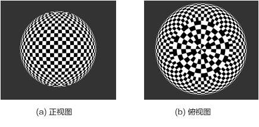

The sphere radius is recommended to be between 0.6 m and 2 m, with the checkerboard pattern in clear focus as the reference. Fisheye lenses have a relatively large depth of field and can focus clearly at shorter distances, so the sphere radius can be reduced accordingly, easing construction and reducing required space. Non-fisheye lenses have a smaller depth of field and a longer focusing distance, requiring a correspondingly larger sphere radius; otherwise, images will be blurry and corner detection will be inaccurate, causing calibration failure.

The sphere surface should be covered with black and white checkerboard patterns. Based on the concept of a world map longitude/latitude grid, the recommended pattern is: 36 cells from the south pole to the north pole, and 72 cells around the equator, with each cell spanning 5° in both latitude and longitude. Due to the latitude-longitude nature of the grid, cells at higher latitudes become progressively narrower horizontally. To maintain roughly uniform cell size, cells in the 60°–80° latitude range are merged every 3 cells in the longitude direction (each cell spans 15°), and cells in the 0°–90° range are merged every 9 cells (each cell spans 45°), as shown in Figure 1(b).

During calibration image capture, position the optical center of the lens corresponding to model calibration channel 0 at the center of the sphere. Under ideal conditions, all checkerboard corners on the sphere surface are equidistant from the sphere center at radius R. In practice, due to camera placement tolerances and checkerboard manufacturing tolerances, the distance from each corner to the channel 0 lens optical center must be within 10% consistency — i.e., within [0.95×R, 1.05×R].

Since the entire sphere surface is covered with checkerboards, the camera orientation theoretically has no special requirements. However, because cells at high latitudes vary significantly in size, it is recommended to position the overlap areas at low latitudes, avoiding the high-latitude regions.

If the checkerboard does not cover the entire sphere, ensure that the overlap areas between all adjacent cameras are covered by checkerboard corners. Technically, checkerboard coverage only needs to span the imaging overlap area, so for non-panoramic cameras, the ideal calibration environment can be simplified according to the product form and production requirements — while maintaining the curved spherical distribution of the checkerboard, approximately uniform cell sizes, and even coverage. The following sections describe the dual-fisheye and four-channel horizontal configurations as examples; adjust for other panoramic camera configurations as appropriate.

> **Notice:** 
>The size of the production line calibration environment is not related to the optimal stitching distance. After calibration is complete, any optimal stitching distance can be specified when generating the LUT.

## Understanding the Dual-Fisheye Production Line Calibration Environment

**Symptom**

For dual-fisheye structures, the production line calibration environment can be simplified from the ideal configuration, but customers find this difficult to understand.

**Analysis**

The dual-fisheye structure production line calibration environment must be customized according to algorithm requirements, as described below.

**Solution**

For the dual-fisheye structure, the overlap area appears as a ring on the spherical surface. The ideal sphere can therefore be simplified by cropping the top and bottom regions (high-latitude areas), retaining only the equatorial ring.

The recommended cell size is 5°, so the ring still has 72 cells around its circumference. The number of cells in the vertical (latitude) direction is designed based on the overlap area size. For example, if the lens FOV is 200°, the overlap area is 40°, requiring at least 8 vertical cells; with 1 cell reserved above and below as margin, 10 cells is appropriate. This configuration covers the region from 25°S to 25°N latitude. The result is shown in [Figure 1](#fig261314513443); the physical demonstration uses 16 vertical cells covering 80° to accommodate different lens options. Customers should adjust based on their product specifications.

**Figure 1**  Dual-fisheye structure production line calibration environment  
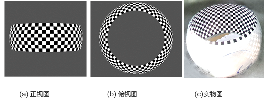

Since fisheye lenses have large depth of field and focus clearly at close range, the ring radius is recommended to be between 0.6 m and 1 m, aligned with the product's target optimal stitching distance for best results at that distance. For example, if the product primarily focuses on 0.8 m stitching quality, design the ring radius as 0.8 m.

During calibration, place the dual-fisheye structure at the center of the ring and ensure the background (non-checkerboard areas) is clean and free of any other checkerboard patterns to prevent false detections and matching errors that would cause calibration failure.

Because the dual-fisheye structure is a 360° panoramic camera, the camera base will inevitably cause some occlusion — this is normal. The overlap area does not need to cover every checkerboard completely; minimize occlusion as much as possible.

A sample production line calibration test result is shown in [Figure 2](#fig1566112562484)(a), captured using a demo camera with a relatively large base and significant occlusion. A production camera can achieve better occlusion control. Figure 2(b) shows the stitching result obtained from production line calibration in the calibration environment.

**Figure 2**  Dual-fisheye structure production line calibration images  
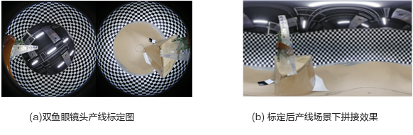

## Understanding the Four-Channel Horizontal Structure Production Line Calibration Environment

**Symptom**

For four-channel horizontal structures, the production line calibration environment can be simplified from the ideal configuration, but customers find this difficult to understand.

**Analysis**

The four-channel horizontal structure production line calibration environment must be customized according to algorithm requirements, as described below.

**Solution**

The four-channel horizontal structure is generally used in *public safety video capture* applications. The typical structure is shown in [Figure 1](#fig087182975116). This type of four-channel horizontal stitched image typically has a horizontal FOV equal to or less than 180°, offering two options: a half-sphere or a three-arc-panel target surface.

**Figure 1**  Four-channel horizontal structure diagram  
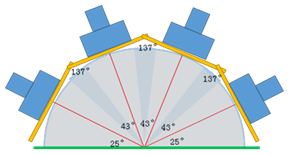

The half-sphere option is simpler: starting from the ideal full sphere, crop the horizontal direction to retain 180° of checkerboard coverage. The vertical direction can also be cropped based on the lens FOV, as shown in [Figure 2](#fig1064814233245), which retains only the region from 60°S to 60°N latitude.

This configuration also works for downward-tilted panoramic camera structures — simply tilt the camera upward so that its full field of view faces the checkerboard area.

The half-sphere approach offers the advantages of easy center positioning and suitability for downward-tilted cameras, but is more difficult to fabricate, harder to transport, and occupies more space. Refer to the three-arc-panel approach for detailed specifications.

**Figure 2**  Four-channel horizontal structure half-sphere production line calibration environment  
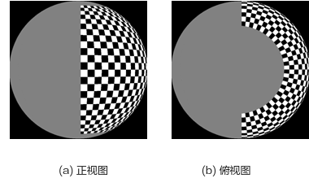

From a technical standpoint, the checkerboard only needs to cover the overlap regions between cameras during image capture. The four-channel horizontal structure has three overlap areas, so the half-sphere can be further simplified to three separate arc-panel targets. As shown in [Figure 3](#fig4215154493014), only the checkerboard arc-panels corresponding to the three overlap areas are retained. For easier production, three identical and independently movable arc-panel targets can be fabricated and placed at the corresponding overlap area positions during calibration.

**Figure 3**  Four-channel horizontal structure three-arc-panel calibration environment  
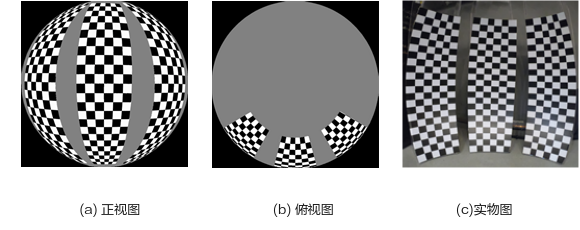

This product form typically uses non-fisheye lenses with a focal length of approximately 4–6 mm. The depth of field is smaller than fisheye lenses and the focusing distance is longer, so the arc-panel radius is recommended to be 1.5 m. Although this distance may not be the optimal focus distance for the panoramic camera, imaging should still be reasonably clear with distinct corners. If a longer focal length lens is used, increase the sphere radius accordingly to ensure clear corner imaging and optimal calibration results.

Each arc-panel is recommended to cover a 30° horizontal spherical surface and a 120° vertical spherical surface. Using the world map latitude/longitude concept with 5° per cell:

-   Horizontal direction: 6 black/white cells, with an equatorial arc length of approximately:

    L1 = θ1 × R = π/6 × 1.5 = 0.785 m

-   Vertical direction: 24 black/white cells, symmetric about the equator, with an arc length of approximately:

    L2 = θ2 × R = π × 2/3 × 1.5 = 3.14 m

Actual height is approximately H = 2.6 m.

If the actual overlap area is larger, increase the arc-panel size and number of cells proportionally; if the overlap is smaller, reduce accordingly — simply ensure coverage of the overlap area.

Important note: In the calibration images, each overlap area must contain at least one column of checkerboard (i.e., at least two corner columns). If the overlap is less than this, calibration cannot proceed. Due to lens distortion, structural tolerances, and camera angles, ensure the overlap area between adjacent panoramic camera lenses is at least 10° or more for best calibration results.

Before use, align the sphere centers of the three arc-panels to the same position. Keeping the sphere center fixed, adjust the angles between arc-panels according to the inter-lens angles so that each overlap area is covered by checkerboard. During calibration, fix the optical center of the panoramic camera's pipe0 lens at the sphere center position. Accounting for tolerances, maintain corner distance consistency within 10%, ensuring all checkerboard corners are within [1.425 m, 1.575 m] from the pipe0 lens optical center for best stitching results.

During image capture, ensure the background (non-checkerboard areas) is clean and free of any other checkerboard patterns to avoid false detection and matching errors that would cause calibration failure.

This approach offers the advantages of easier production environment fabrication, smaller footprint, and adaptability to different four-channel horizontal structures (such as multi-channel surround configurations). The main disadvantage is that the center point is more difficult to locate; using an auxiliary sliding rail for positioning is recommended.

Production line calibration test results are shown in [Figure 4](#fig18248161755212). For layout convenience, the calibration images have been rotated 90° in this document. The actual image resolution matches the sensor output (3840×2160) and should be consistent with the first-stage model calibration; do not rotate images during calibration. The stitching result after calibration is shown in [Figure 5](#fig1826815454525).

**Figure 4**  Four-channel horizontal structure production line calibration images  
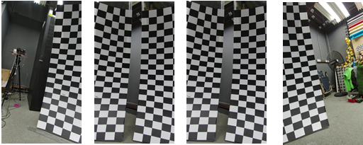

**Figure 5**  Four-channel horizontal structure production line calibration result  
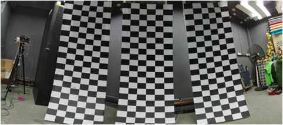

Additional recommendations and notes for the production line calibration environment:

-   Checkerboard application recommendations

    The main challenge in the production line calibration environment is applying the checkerboard to the spherical surface. The checkerboard area is relatively large and difficult to apply as a single piece. Cut it into strips and apply them one by one to form the complete checkerboard pattern.

**Figure 6**  Checkerboard corner quality  
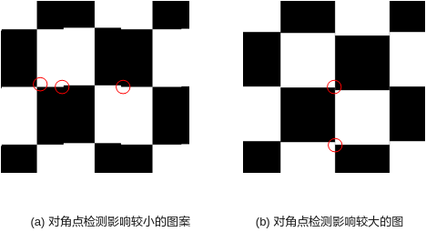

    When applying strips, slight misalignment between adjacent strips is inevitable. As shown in [Figure 6](#fig151051344185812)(a), corners remain intact even when the checkerboard has an intermediate offset — this has minimal impact on corner detection. In Figure 6(b), the corners themselves are offset, which degrades detection accuracy.

    Based on this analysis, to preserve corner integrity, cut each strip along the middle of a checkerboard cell rather than at a corner position. As shown in [Figure 7](#_Ref513707564), the horizontal cut positions (green lines) for the four-channel horizontal calibration environment run through the center of cells, preserving corner completeness. The same principle applies to vertical cuts.

**Figure 7**  Checkerboard cutting diagram  
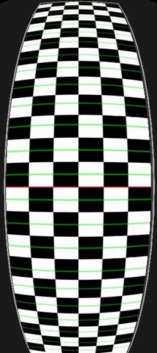

-   Avoid checkerboard backlighting and reflections

    Backlighting and reflections on the checkerboard significantly degrade the checkerboard image quality and thus the calibration results. Use matte, non-reflective materials for the checkerboard and pay attention to the production line lighting to avoid backlighting on the checkerboard.

## How to Create a Colored Checkerboard Production Line Calibration Environment

**Symptom**

Black and white checkerboards require individual camera consistency within half a cell. When individual consistency is poor, a colored checkerboard calibration environment can be used, which relaxes the consistency requirement to within one cell.

**Analysis**

The colored checkerboard must be fabricated according to specific requirements, as described below.

**Solution**

The colored checkerboard calibration environment is based on the black and white checkerboard, with circular colored stickers applied in a regular alternating pattern within the black and white cells. The three colors used are: magenta (RGB: 255, 0, 255), green (RGB: 0, 255, 0), and cyan (RGB: 0, 255, 255). This expands the original two cell types to eight distinct types: pure white, white with magenta, white with green, white with cyan, pure black, black with magenta, black with green, and black with cyan.

The placement pattern for these eight types is shown in [Figure 1](#fig10683514734). Note that the exact positions do not need to exactly match the diagram — the core principle is to distribute different types evenly so that the spacing between the same type of cell is maximized, reducing the likelihood of feature point matching errors. In Figure 1(a), the same cell type is separated by 4 cells in both horizontal and vertical directions and 2 cells diagonally. If the original black and white checkerboard distribution is non-uniform (such as near the north/south poles in Figure 1), follow the pattern as closely as possible.

The diameter of the circular colored sticker should be approximately 0.5–0.9 times the cell edge length, without touching adjacent cells. The colored circles do not need to be perfectly uniform in size. When black and white cell sizes vary significantly, the sticker size can be adjusted accordingly. Stickers also do not need to be perfect circles — ellipses are acceptable — but ensure the colored area occupies more than 50% of the cell. Avoid shapes with right-angle features that could be falsely detected as checkerboard corners.

For simplified calibration environments (dual-fisheye or four-channel horizontal), apply the colored circular stickers to the base black and white checkerboard using the same distribution pattern.

**Figure 1**  Colored checkerboard pattern  
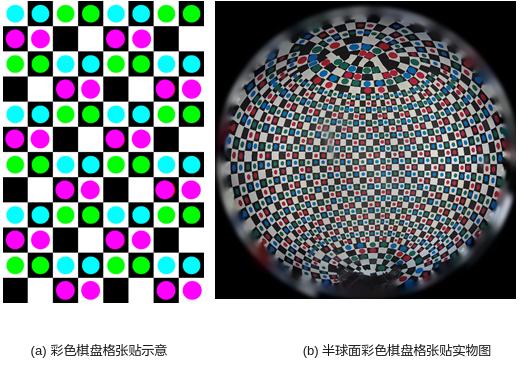

Compared to black and white checkerboards, the colored checkerboard production line calibration is more sensitive to noise and color shifts. The following conditions must be met:

-   If there is any color shift, first ensure color accuracy. The three colors of the colored checkerboard must be clearly distinguishable in the calibration images.
-   Illumination at the checkerboard must be greater than 300 lux (typical indoor lighting), and noise in the calibration images must be low.
-   Lighting across the entire sphere checkerboard must be uniform, with no obvious reflections, shadows, or other issues.

## How to Resolve Checkerboard Corner Matching Misalignment During Production Line Calibration

**Symptom**

The stitched image in the production line calibration environment shows a seam misalignment of one cell, as shown in [Figure 1](#_Ref7939578).

**Figure 1**  Production line calibration offset by one cell  
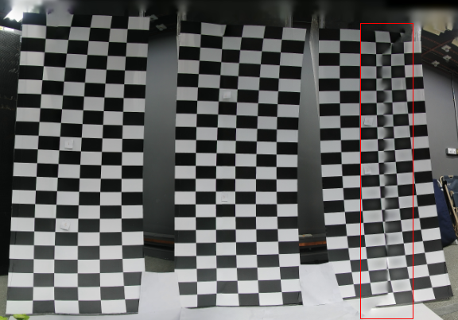

**Analysis**

When the seam is offset by exactly one or more cells, this is caused by checkerboard corner matching errors during production line calibration. To diagnose this, create a `tmp` folder in the production line calibration tool's main directory. During calibration, the tool will save corner matching mark images there. For this case, the corner matching results from the two rightmost calibration images are shown in [Figure 2](#fig99661723895). Identical numbers indicate corner pairs matched by the calibration algorithm. In this example, all matched corners are misaligned — the right image is shifted down by one cell.

**Figure 2**  Production line calibration feature point matching errors  
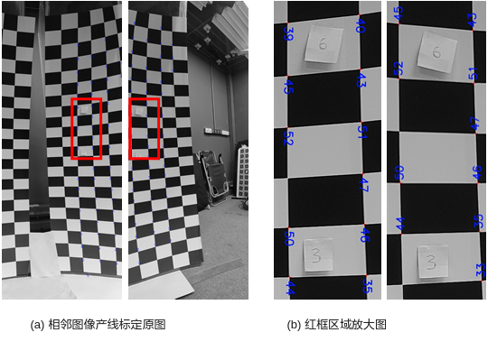

**Solution**

During production line calibration, the calibration algorithm searches for the nearest feature corner matches based on the positional relationship between adjacent images determined by model calibration. To resolve this issue, optimize from the following four aspects:

1.  Eliminate model calibration error at the sphere radius distance used in the production line calibration.

    Specific measure: Use the `.cal` file from the production line calibration of the model calibration device as the seed for other devices' production line calibration, rather than using the model calibration `.cal` file directly as the seed.

2.  Optimize individual structural variation.

    Reduce individual structural differences to ensure consistency. Specifically, the structural difference between the production line calibration device and the model calibration device must be kept within 0.5 cells to avoid the corner matching errors described above.

3.  Enlarge checkerboard cells.

    The recommended checkerboard cell size for production line calibration is 5° per cell. When individual structural variation is large, cells can be enlarged to relax the consistency requirement.

    Important note: The narrowest position in the overlap area must still contain at least two cells (i.e., at least two corner columns), regardless of camera orientation. Corner matching is based on complete black or white checkerboard cells — without at least one complete cell, corner detection may fail entirely.

4.  Use the colored checkerboard calibration approach.

    The colored checkerboard relaxes the structural variation requirement to within one cell. Refer to the section "[How to Create a Colored Checkerboard Production Line Calibration Environment](#ZH-CN_TOPIC_0000002431386026)", and configure the colored checkerboard mode when calling the production line calibration interface.

## How to Resolve No Corner Matches During Production Line Calibration

**Symptom**

Production line calibration takes an unusually long time with no result, or produces abnormal stitching results — this may be caused by a complete absence of corner match pairs for a pair of adjacent images.

**Analysis**

When production line calibration encounters an error, create a `tmp` folder in the tool's main directory to output corner mark images and inspect the corner matching situation.

**Solution**

With correct configuration, the absence of corner match pairs should not occur. When this issue appears, diagnose the configuration: verify that the model calibration `.cal` file is read correctly, that the sphere checkerboard radius configured for production line calibration is accurate, and that images are being read normally. A mismatch between the resolution or rotation of the model calibration images and the production line calibration images can also cause this issue.

A quick diagnostic method is to perform offline stitching in PQTools and check whether the stitching result is normal.

> **Notice:** 
>The LUT imported for offline stitching is generated from the model calibration `.cal` file (i.e., the production line calibration "seed"). The images imported are the calibration images captured during production line calibration. Since there is a structural difference between the production line device and the model calibration device, the stitched image will have some misalignment — this is normal. Any other abnormality in the stitched result can be used to diagnose the problem.

## How to Improve Production Line Calibration Stitching Quality

**Symptom**

With correct production line calibration, the stitched image in the calibration environment should be nearly seamless. However, when calibration is suboptimal, there may still be some seam misalignment; or the calibration result looks good in the production line environment but produces misalignment when the stitching distance is switched to a longer range.

**Analysis**

This issue is caused by insufficient calibration accuracy. Optimization should focus on both model calibration and the production line environment.

**Solution**

1.  Improve model calibration accuracy.

    Refer to the section "[How to Evaluate Model Calibration Quality Using tmp Files in PQ Tools](#ZH-CN_TOPIC_0000002431386010)" to assess model calibration accuracy, or directly evaluate the stitching result at different distances on the model calibration device. If the model calibration's own stitching result is poor, using it as the seed for production line calibration will degrade the final result. When the model calibration result is unsatisfactory, refer to the [Model Calibration](#ZH-CN_TOPIC_0000002464864629) guidance to correct and optimize it. Alternatively, perform model calibration on multiple devices and select the best result as the production line calibration seed.

2.  Adjust the production line calibration environment.

    According to the fundamental requirements for the production line calibration environment: the distance from the checkerboard to the lens must be as uniform as possible — the checkerboard should be distributed on a spherical surface with the calibration device at the center, and the error must be within 10%.

3.  Use the `.cal` file from the production line calibration of the model calibration device as the seed, rather than the model calibration `.cal` file directly.

    After model calibration, place the model calibration device in the production line environment and perform production line calibration to obtain the model device's production line `.cal` file. Use this `.cal` file as the seed for calibrating other devices. Both the model calibration `.cal` and the production line calibration `.cal` have the same format; in principle, any `.cal` file can serve as a production line calibration seed. You can also select a `.cal` with the best stitching quality as the seed and iteratively refine it throughout production to continuously improve stitching results.

# Model Calibration
## Understanding Basic Requirements for Model Calibration Images

**Symptom**

Capturing model calibration images requires a checkerboard target with specific placement and image quality requirements that customers have difficulty understanding precisely.

**Analysis**

Summary of key requirements and notes.

**Solution**

Model calibration notes:

-   The calibration environment must have <u>**adequate and uniform lighting**</u>; excessive <u>**noise**</u> may interfere with the calibration algorithm's detection.
-   The checkerboard target must not have obvious <u>**reflections or shadows**</u> that cause uneven brightness. Adjust the relative positions of the lens, target, and light source to avoid this.
-   The checkerboard target must not be too small. In general, <u>**each cell must be at least 10 pixels wide**</u>. If the checkerboard occupies too few pixels in the image, bring the target closer to the lens or use a larger target (if necessary, reduce the number of cells; the minimum is 4×3 interior corners).
-   <u>**Multiple checkerboards or similar patterns must not appear**</u> simultaneously in the frame. Remove or cover any such objects in advance, or paint them out using an image editing tool.
-   Each checkerboard target must be <u>**complete**</u> in the frame; partial checkerboards cannot be detected. It is recommended to leave at least half a cell width of white border at the edges.
-   All checkerboard placement positions must <u>**cover the entire image**</u> (for extrinsic calibration, this means covering the entire overlap area).
-   The checkerboard must cover at least <u>**3 different distances**</u>, ideally including the most commonly used working distance.
-   The checkerboard must cover <u>**different angles**</u>.
-   Every captured image must have a <u>**sharp**</u> checkerboard — no blurring. If the image is blurry, confirm that the lens is in focus with adequate depth of field. **Do not adjust focus or zoom** throughout the entire calibration process; if the lens is refocused, all calibration steps must be restarted.
-   Coverage should encompass different distances, different positions in the image frame, and different angles. Multiple identical images at the same position have no additional value.

During calibration in the Stitching Tool, the `tmp` folder in the PQTools directory saves the corner detection result for each calibration image, allowing you to verify whether the calibration images meet the requirements.

## How to Capture High-Quality Model Calibration Images

**Symptom**

Many calibration images must be captured during model calibration. Customers are not fully clear on the requirements for achieving the best calibration result.

**Analysis**

Model calibration images must cover different distances, positions, and rotation angles. To clearly describe the image capture requirements, this section uses text and images to demonstrate the details.

**Solution**

The four-channel horizontal structure is used as an example. The camera structure is shown in the four-channel horizontal structure diagram, with the following parameters:

**Table 1**  Camera structure parameters

<table><thead align="left"><tr id="row363mcpsimp"><th class="cellrowborder" valign="top" width="27%" id="mcps1.2.4.1.1">
Item

</th>
<th class="cellrowborder" valign="top" width="14.000000000000002%" id="mcps1.2.4.1.2">
Parameter

</th>
<th class="cellrowborder" valign="top" width="59%" id="mcps1.2.4.1.3">
Notes

</th>
</tr>
</thead>
<tbody><tr id="row371mcpsimp"><td class="cellrowborder" valign="top" width="27%" headers="mcps1.2.4.1.1 ">
Horizontal FOV per lens

</td>
<td class="cellrowborder" valign="top" width="14.000000000000002%" headers="mcps1.2.4.1.2 ">
55&deg;

</td>
<td class="cellrowborder" valign="top" width="59%" headers="mcps1.2.4.1.3 ">
The smaller the lens FOV, the greater all model calibration intrinsic distances must be increased; conversely, all distances should be reduced.

</td>
</tr>
<tr id="row378mcpsimp"><td class="cellrowborder" valign="top" width="27%" headers="mcps1.2.4.1.1 ">
Stitched FOV

</td>
<td class="cellrowborder" valign="top" width="14.000000000000002%" headers="mcps1.2.4.1.2 ">
~180&deg;

</td>
<td class="cellrowborder" valign="top" width="59%" headers="mcps1.2.4.1.3 ">
-

</td>
</tr>
<tr id="row385mcpsimp"><td class="cellrowborder" valign="top" width="27%" headers="mcps1.2.4.1.1 ">
FOV per overlap area

</td>
<td class="cellrowborder" valign="top" width="14.000000000000002%" headers="mcps1.2.4.1.2 ">
~11&deg;

</td>
<td class="cellrowborder" valign="top" width="59%" headers="mcps1.2.4.1.3 ">
The smaller the overlap FOV, the greater all extrinsic calibration distances must be increased; simultaneously, the distance range (or ratio) achievable during extrinsic calibration is reduced.

</td>
</tr>
</tbody>
</table>

### Intrinsic Calibration Image Capture Method

**Table 1**  Intrinsic calibration image capture guide

<table><thead align="left"><tr id="row402mcpsimp"><th class="cellrowborder" valign="top" width="9%" id="mcps1.2.6.1.1">
Step

</th>
<th class="cellrowborder" valign="top" width="20%" id="mcps1.2.6.1.2">
Goal

</th>
<th class="cellrowborder" valign="top" width="45%" id="mcps1.2.6.1.3">
Calibration Method

</th>
<th class="cellrowborder" valign="top" width="10%" id="mcps1.2.6.1.4">
Count

</th>
<th class="cellrowborder" valign="top" width="16%" id="mcps1.2.6.1.5">
Reference Distance

</th>
</tr>
</thead>
<tbody><tr id="row414mcpsimp"><td class="cellrowborder" valign="top" width="9%" headers="mcps1.2.6.1.1 ">
1

</td>
<td class="cellrowborder" valign="top" width="20%" headers="mcps1.2.6.1.2 ">
Close range, single target full coverage

</td>
<td class="cellrowborder" valign="top" width="45%" headers="mcps1.2.6.1.3 ">
Ensure the checkerboard target fills the frame completely and as large as possible

</td>
<td class="cellrowborder" valign="top" width="10%" headers="mcps1.2.6.1.4 ">
1

</td>
<td class="cellrowborder" valign="top" width="16%" headers="mcps1.2.6.1.5 ">
350 mm

</td>
</tr>
<tr id="row425mcpsimp"><td class="cellrowborder" valign="top" width="9%" headers="mcps1.2.6.1.1 ">
2

</td>
<td class="cellrowborder" valign="top" width="20%" headers="mcps1.2.6.1.2 ">
Close range, multiple targets full coverage

</td>
<td class="cellrowborder" valign="top" width="45%" headers="mcps1.2.6.1.3 ">
Full frame coverage (4 corners + 4 edges): each target occupies about 1/4 of the frame; corner targets use trapezoidal orientation; edge targets are tilted ~30&deg; about the near edge axis

</td>
<td class="cellrowborder" valign="top" width="10%" headers="mcps1.2.6.1.4 ">
8

</td>
<td class="cellrowborder" valign="top" width="16%" headers="mcps1.2.6.1.5 ">
800 mm

</td>
</tr>
<tr id="row436mcpsimp"><td class="cellrowborder" valign="top" width="9%" headers="mcps1.2.6.1.1 ">
3

</td>
<td class="cellrowborder" valign="top" width="20%" headers="mcps1.2.6.1.2 ">
Medium range, multiple angles

</td>
<td class="cellrowborder" valign="top" width="45%" headers="mcps1.2.6.1.3 ">
Double the target-to-lens distance; place the target at three vertices of a triangle within the frame, rotating the target ~30&deg; at each position

</td>
<td class="cellrowborder" valign="top" width="10%" headers="mcps1.2.6.1.4 ">
3

</td>
<td class="cellrowborder" valign="top" width="16%" headers="mcps1.2.6.1.5 ">
2000 mm

</td>
</tr>
<tr id="row448mcpsimp"><td class="cellrowborder" valign="top" width="9%" headers="mcps1.2.6.1.1 ">
4

</td>
<td class="cellrowborder" valign="top" width="20%" headers="mcps1.2.6.1.2 ">
Long range, multiple angles

</td>
<td class="cellrowborder" valign="top" width="45%" headers="mcps1.2.6.1.3 ">
Increase target-to-lens distance by another ~4x; place the target at three positions in the frame, rotating ~30&deg; at each position

</td>
<td class="cellrowborder" valign="top" width="10%" headers="mcps1.2.6.1.4 ">
3

</td>
<td class="cellrowborder" valign="top" width="16%" headers="mcps1.2.6.1.5 ">
6000 mm

</td>
</tr>
</tbody>
</table>

> **Notice:** 
>The actual distances for intrinsic calibration depend on the lens FOV. The smaller the lens FOV, the greater all distances must be; conversely, they should be reduced. The reference distances in this section are estimates for a 55° FOV lens.

A sample set of extrinsic calibration images is shown in [Figure 1](#_Ref520292586).

**Figure 1**  A complete set of intrinsic calibration images  
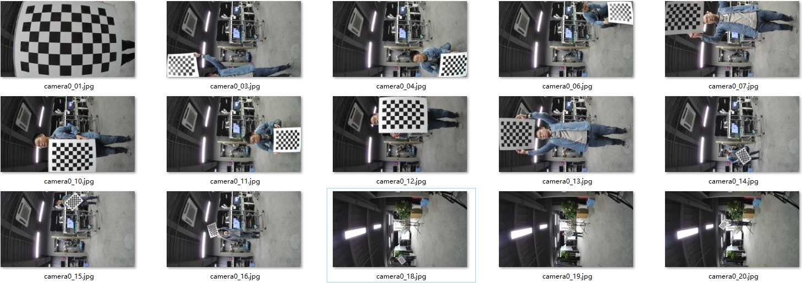

To illustrate the intrinsic calibration process and requirements, the checkerboard targets from the actual calibration images have been extracted and projected onto a 3D model, as shown in [Figure 2](#_Ref520292652).

**Figure 2**  3D projection of a complete set of intrinsic calibration images  
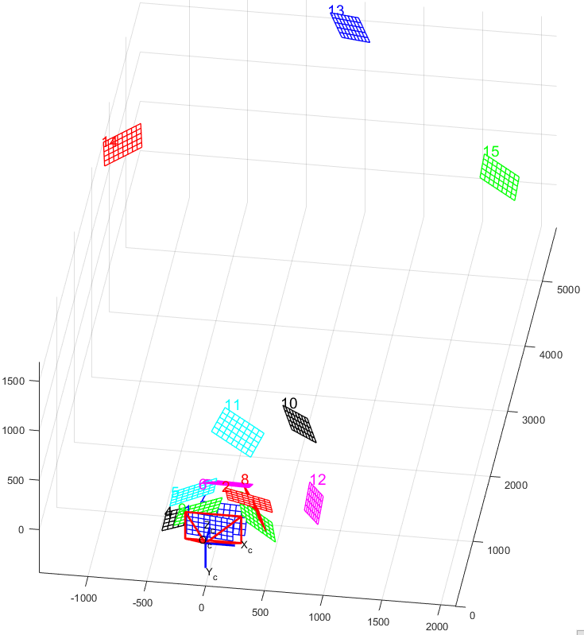

The meaning of each image in the 3D projection is described in [Figure 3](#fig9431258322).

**Figure 3**  3D projection diagram legend  
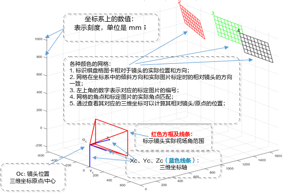

The following four steps describe the intrinsic calibration process in detail.

1.  Single image, full frame coverage

    Bring the target close to the lens so that the entire target **fills the center of the frame** (filling just the width or height is sufficient). Capture approximately 1 image.

    > **Notice:** 
    >-   **Completeness** of the target takes priority: if the target extends beyond the frame, increase the distance until all parts are visible.
    >-   **Sharpness** of the target takes priority: if there is obvious blur, increase the distance until the image is sharp.
    >-   The image may have **distortion**, but not excessively. Extreme distortion will prevent the calibration algorithm from detecting corners; increase the distance to reduce line curvature.
    >-   A single target can cover the entire frame at close range, but this can cause blurring or distortion. The minimum distance is typically around 300 mm; use the live preview to determine the optimal distance.
    >-   Under the above conditions, maximize the target's proportion in the frame.
    >-   **Minor tilting** of the target in any direction does not affect calibration; the target does not need to be perfectly level.
    >-   For fisheye lenses with very wide FOV, it may be difficult for a single target to fill the entire frame; cover as much of the frame as possible.

    Example:

    As shown in [Figure 4](#fig525635941410), a checkerboard with 50 mm cells and a 9×6 interior corner pattern is used to capture the single-target full-coverage image for a four-channel non-fisheye stitching configuration.

    **Figure 4**  Intrinsic calibration: single target full-frame coverage  
    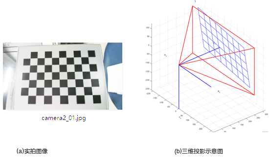

1.  Multiple images, full frame coverage

    Use a **4 corners + 4 edges** approach: each target occupies about 1/4 of the frame. For the 4 corners, orient the target in a trapezoidal perspective. For the 4 edges, tilt the target about <u>**30**</u>° using the nearest edge as the axis. Capture approximately 8 images.

    **Figure 5**  Intrinsic calibration: four-corner coverage  
    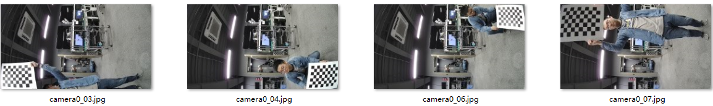

    **Figure 6**  Intrinsic calibration: four-edge coverage  
    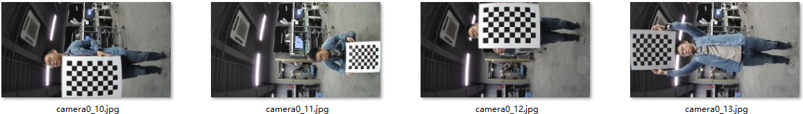

    **Figure 7**  Intrinsic calibration: four-edge and four-corner 3D projection  
    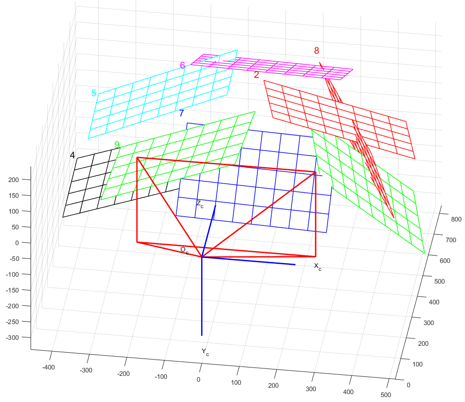

2.  Increased distance, multiple angles

    Increase the target-to-lens distance by **approximately double**. Place the target at three vertices of a triangle within the frame, rotating it approximately <u>**30**</u>° at each position. Capture approximately <u>**3**</u> images.

    **Figure 8**  Intrinsic calibration: multiple distances and angles  
    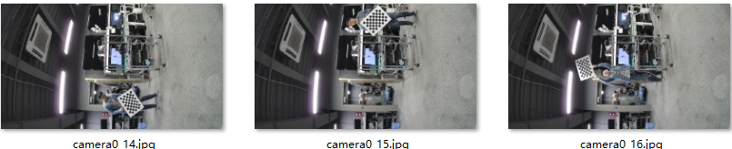

    **Figure 9**  Intrinsic calibration: multiple distances and angles 3D projection  
    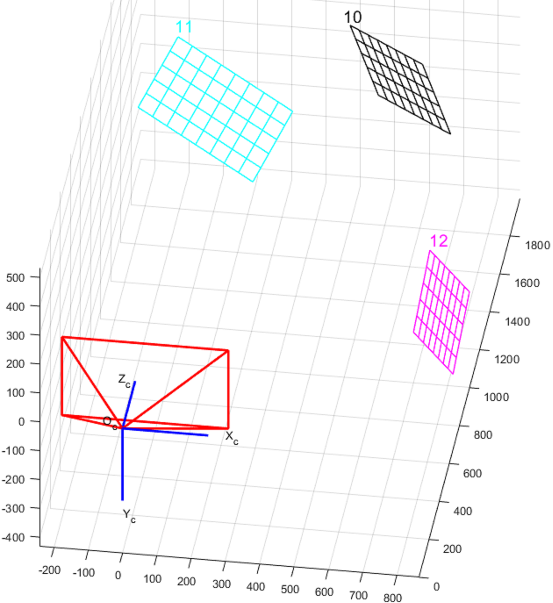

3.  Long range, multiple angles

    Increase the target-to-lens distance by approximately <u>**4**</u>× again (note: if the target occupies too few pixels or the indoor space is limited, a smaller multiplier can be used). Place the target at three points forming another triangle within the frame, rotating approximately <u>**30**</u>° at each position. Capture approximately 3 images.

    **Figure 10**  Intrinsic calibration: long-range multiple angles  
    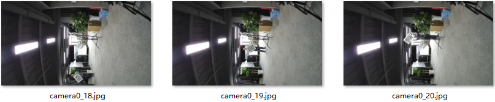

    **Figure 11**  Intrinsic calibration: long-range multiple angles 3D projection  
    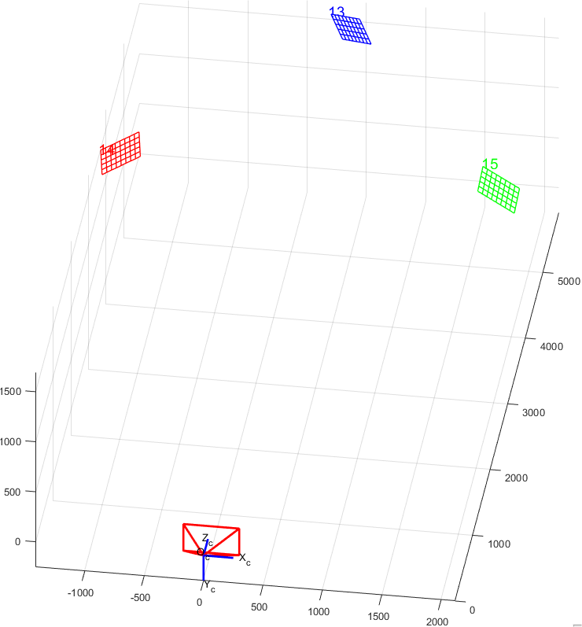

### Extrinsic Calibration Image Capture Method

**Table 1**  Extrinsic calibration image capture guide

<table><thead align="left"><tr id="row538mcpsimp"><th class="cellrowborder" valign="top" width="9%" id="mcps1.2.6.1.1">
Step

</th>
<th class="cellrowborder" valign="top" width="21%" id="mcps1.2.6.1.2">
Goal

</th>
<th class="cellrowborder" valign="top" width="44%" id="mcps1.2.6.1.3">
Calibration Method

</th>
<th class="cellrowborder" valign="top" width="10%" id="mcps1.2.6.1.4">
Count

</th>
<th class="cellrowborder" valign="top" width="16%" id="mcps1.2.6.1.5">
Reference Distance

</th>
</tr>
</thead>
<tbody><tr id="row550mcpsimp"><td class="cellrowborder" valign="top" width="9%" headers="mcps1.2.6.1.1 ">
1

</td>
<td class="cellrowborder" valign="top" width="21%" headers="mcps1.2.6.1.2 ">
Full overlap area coverage at minimum distance

</td>
<td class="cellrowborder" valign="top" width="44%" headers="mcps1.2.6.1.3 ">
Align the narrow edges to both sides of the overlap area, maximizing the checkerboard size

</td>
<td class="cellrowborder" valign="top" width="10%" headers="mcps1.2.6.1.4 ">
5

</td>
<td class="cellrowborder" valign="top" width="16%" headers="mcps1.2.6.1.5 ">
1800 mm

</td>
</tr>
<tr id="row561mcpsimp"><td class="cellrowborder" valign="top" width="9%" headers="mcps1.2.6.1.1 ">
2

</td>
<td class="cellrowborder" valign="top" width="21%" headers="mcps1.2.6.1.2 ">
Full overlap area coverage at various angles

</td>
<td class="cellrowborder" valign="top" width="44%" headers="mcps1.2.6.1.3 ">
Increase distance (~1.8× farther) so the target diagonal aligns with the 2 seam edges; **rotate** ~30&deg; between each pair of images

</td>
<td class="cellrowborder" valign="top" width="10%" headers="mcps1.2.6.1.4 ">
8

</td>
<td class="cellrowborder" valign="top" width="16%" headers="mcps1.2.6.1.5 ">
2900 mm

</td>
</tr>
<tr id="row573mcpsimp"><td class="cellrowborder" valign="top" width="9%" headers="mcps1.2.6.1.1 ">
3

</td>
<td class="cellrowborder" valign="top" width="21%" headers="mcps1.2.6.1.2 ">
Long-range coverage at multiple angles

</td>
<td class="cellrowborder" valign="top" width="44%" headers="mcps1.2.6.1.3 ">
Double the distance; capture 3 images

</td>
<td class="cellrowborder" valign="top" width="10%" headers="mcps1.2.6.1.4 ">
3

</td>
<td class="cellrowborder" valign="top" width="16%" headers="mcps1.2.6.1.5 ">
5000 mm

</td>
</tr>
</tbody>
</table>

> **Notice:** 
>Extrinsic calibration distances depend on the overlap area FOV. The smaller the overlap FOV, the greater all distances must be, and the achievable distance range (or ratio) during extrinsic calibration is reduced. The overlap FOV in this section is 11°.

Using the four-channel non-fisheye horizontal stitching as an example, a sample set of extrinsic calibration images for one pair of adjacent lenses is shown below (note: the board is shown in portrait orientation for layout convenience). Approximately 16 pairs of images are captured in total:

**Figure 1**  A complete set of extrinsic calibration images  
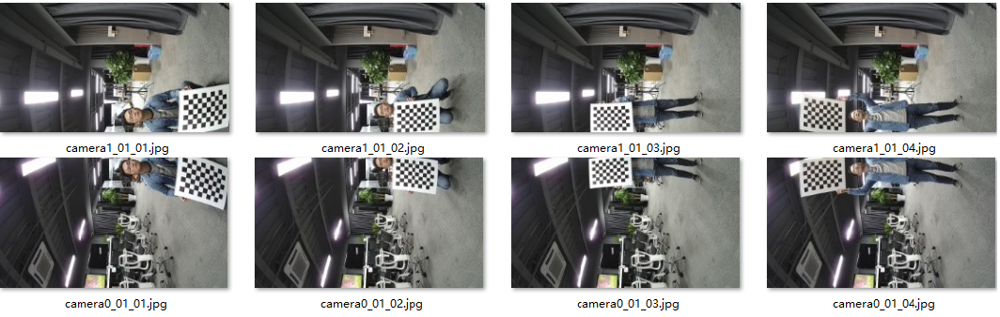

To illustrate the extrinsic calibration process and requirements, the checkerboard targets from the actual calibration images have been extracted and projected onto a 3D model, as shown in [Figure 2](#_Ref520294639).

**Figure 2**  3D projection of a complete set of extrinsic calibration images  
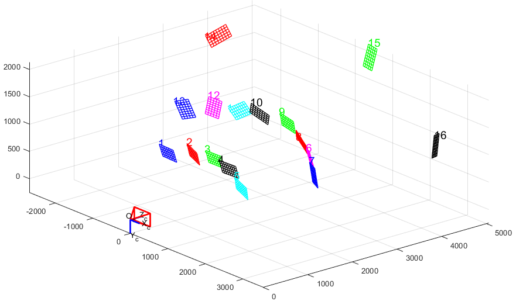

3D projection angle 1

3D projection angle 2

1.  Full overlap area coverage at minimum distance

    Covering the entire overlap area at minimum distance reduces the number of calibration targets needed and improves calibration completeness. Position the narrow edge of the target aligned with both sides of the overlap area, making the checkerboard complete and as large as possible. Slide the target from one side of the overlap area to the other, capturing one image per position without special rotation angles (which could cause the target to extend beyond the overlap area). Ensure that the combined coverage of all captured targets spans the entire overlap area. Approximately 5 pairs of images are sufficient (dual-fisheye back-to-back structures may require more). As shown in [Figure 3](#fig139332300472).

    **Figure 3**  Extrinsic calibration: full overlap coverage at minimum distance  
    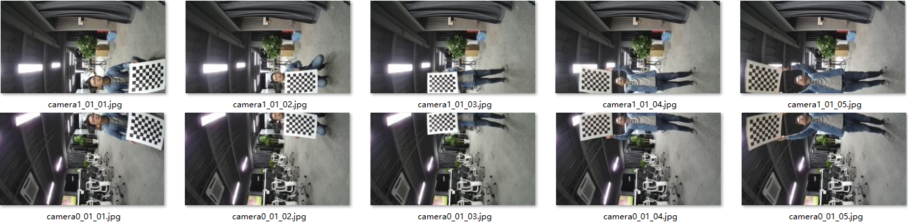

    \(a\) Extrinsic calibration: full overlap coverage at minimum distance — captured image

    

    \(b\) Extrinsic calibration: full overlap coverage at minimum distance — 3D projection

2.  Full overlap area coverage at various angles

    To cover the overlap area at **various angles**, since the checkerboard target is square, covering a 90° rotation is sufficient. Increase the distance (approximately 1.8× relative to step 1, so the checkerboard **diagonal** just fits within the overlap area — see reference calibration image camera2_23_12.jpg — enabling the target to rotate freely within the overlap area without exiting it). Move the target so its diagonal aligns with the 2 overlap area edges and **rotate** approximately 30° per image pair. Capture approximately 8 image pairs. As shown in [Figure 4](#_Ref520294947).

    **Figure 4**  Extrinsic calibration: full-angle overlap area coverage  
    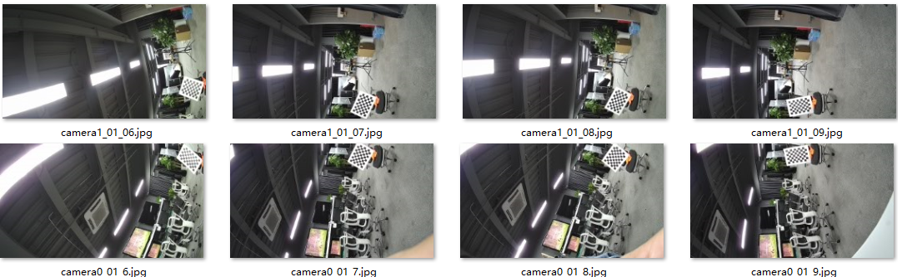

    

    \(a\) Extrinsic calibration: full-angle coverage — captured image

    

    \(b\) Extrinsic calibration: full-angle coverage 3D projection

3.  Long-range coverage at multiple angles

    **Long-range** coverage at multiple angles: increase the target-to-lens distance approximately 1× relative to step 2. Cover the two ends and center of the overlap area. Capture approximately 3 image pairs.

    > **Notice:** 
    >-   Each checkerboard cell must not occupy too few pixels — at least 10 pixels per cell is required. If too small, reduce the distance.
    >-   If indoor space is limited, reduce the distance accordingly.
    >-   If the distance is sufficient and the checkerboard still occupies many pixels, the distance can be further increased.
    >-   During calibration, keep the target as close to the **middle of the overlap area** between the two cameras as possible.
    >-   Distances can be estimated by **visual judgment or direct calculation**.

    **Figure 5**  Extrinsic calibration: long-range overlap area coverage at multiple angles  
    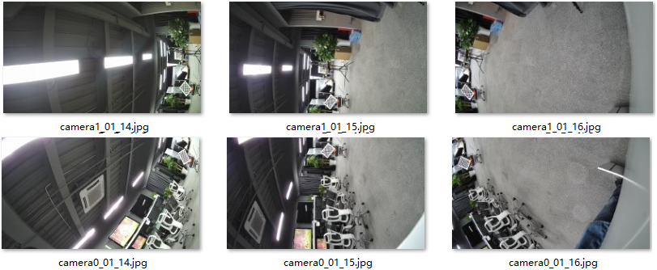

    Extrinsic calibration: long-range multiple-angle coverage — captured image

    

    Extrinsic calibration: long-range multiple-angle coverage — 3D projection

## How to Evaluate Model Calibration Quality Using tmp Files in PQ Tools

**Symptom**

When performing AVSP model calibration in PQTools, the `tmp` folder in PQTools generates temporary files for evaluating the calibration result. Customers are unfamiliar with these files.

**Analysis**

During model calibration, three types of temporary files are generated in the PQTools `tmp` folder: `QA_measures.txt`, `distance.csv`, and checkerboard marker JPEG images. This section explains the meaning and usage of these files.

**Solution**

Refer to the subsections from "[QA_measures.txt File Contents and Usage](#ZH-CN_TOPIC_0000002464984725)" through "[Checkerboard Marker JPEG Images](#ZH-CN_TOPIC_0000002431386006)".

### QA_measures.txt File Contents and Usage

This file is generated after model calibration is complete and is used to evaluate the calibration result. [Figure 1](#fig230116251091) shows an example from a dual-lens calibration. `QA_measures.txt` has two main sections: Total QA Measures and Each QA Measures.

**Figure 1**  QA_measures.txt file contents  
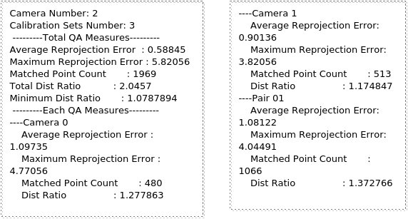

Total QA Measures provides an overall calibration quality assessment. Each QA Measures provides per-lens or per-seam calibration quality assessments, enabling you to supplement or optimize calibration images for specific lenses or overlap areas. The metrics are defined as follows:

-   **Average Reprojection Error**: Mean reprojection error in pixels. The reprojection error is the difference between the theoretical and actual projected positions in the stitched image — essentially the mean stitching misalignment. Smaller is better. Based on testing experience: (0, 1] is excellent, (1, 2] is very good, (2, 3] is good; values above 3 are generally acceptable but may vary by product type. Evaluate actual stitching quality during the product evaluation phase.
-   **Maximum Reprojection Error**: Maximum reprojection error. Used to detect potential corner matching errors during calibration. Values above 20 suggest that multiple checkerboard patterns may appear in the calibration images, or that images are named incorrectly.
-   **Matched Point Count**: Number of successfully matched corner pairs. Related to the number of images and the number of interior corners per checkerboard.
-   **Total Dist Ratio / Dist Ratio**: Checkerboard distance evaluation coefficient. Model calibration images must be captured at various distances to enrich the calibration model. A higher Dist Ratio indicates greater distance diversity and generally better calibration quality, which also benefits production line calibration. Based on testing experience, values above 1.0 indicate acceptable calibration; values above 3 indicate good calibration.
-   **Minimum Dist Ratio**: Minimum checkerboard distance evaluation parameter. Distance evaluation parameters are computed per-lens and per-overlap-area. Similarly, values above 1.0 indicate acceptable results; values above 3 indicate good results.

### distance.csv File Contents and Usage

This file provides more detailed information on checkerboard distance distribution, including the distance for each calibration image and the distance histogram per lens or per seam. This allows more intuitive evaluation of whether the checkerboard placement is correct.

[Figure 1](#fig38491323325) shows an example from a dual-lens calibration. Region A shows the checkerboard distance for each calibration image. `TRUE` indicates the image was included in the intrinsic/extrinsic calibration computation; `FALSE` indicates it was not. Whether an image is `TRUE` depends on the iterative computation during calibration — if more than half of the images are `FALSE`, recapturing the calibration images should be considered. Region B shows the checkerboard distance histogram per lens or per overlap area; the last column shows the histogram across all calibration images. All distances are in millimeters (mm).

The checkerboard distance histogram further confirms whether calibration image capture meets the standard, and improves diagnostic efficiency if anomalies are found.

**Figure 1**  distance.csv file contents  
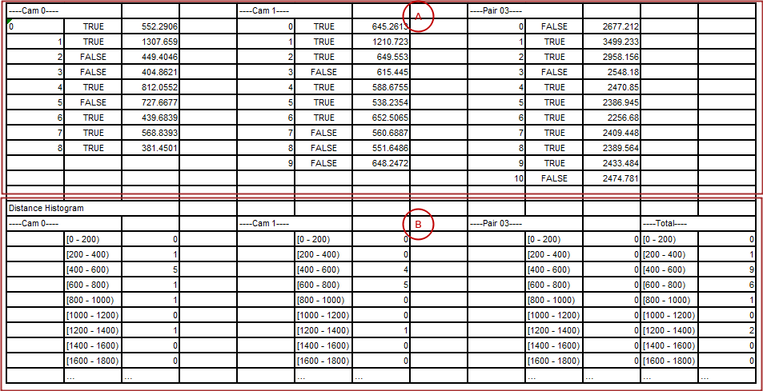

### Checkerboard Marker JPEG Images

The `tmp` folder copies each calibration image and marks the detected checkerboard corner positions with colored points and lines, allowing you to verify that corner detection is accurate. As shown in [Figure 1](#fig4128149192015):

-   Image (a) with colored point/line markers indicates all corners of that checkerboard were successfully detected — the calibration image is valid.
-   Image (b) with only some gray point markers indicates corner detection partially failed — the calibration image is invalid.
-   Image (c) with no markers indicates corner detection completely failed — the calibration image is invalid.

When calibration images fail corner detection, supplement with additional images if possible, to ensure the best calibration result.

Images are named using the format `avsp_calib_X_vid_Y_Z.jpg`, where a single-digit X indicates the image is the intrinsic calibration image for camera X; a two-digit X indicates the image is the extrinsic calibration image between those two cameras. Y is the lens suffix index (relevant only in extrinsic calibration images). Z is the image index starting from 0.

**Figure 1**  Checkerboard marker diagram  
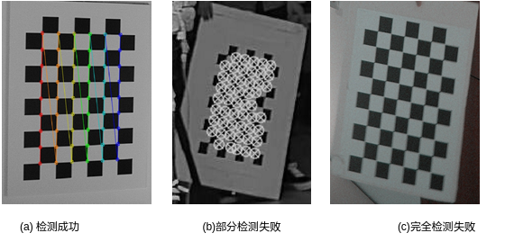

# LUT Debugging Methods
## How to Generate and Configure the LUT Table When Pipe Numbers Cannot Be Sequential

**Symptom**

In some special scenarios — such as WDR — pipe numbers cannot be assigned sequentially starting from 0. Customers are unsure how to name calibration images according to the documentation, and generating and configuring the LUT lookup table (i.e., `.bin` file) is also difficult.

**Analysis**

In the AVSP module, each pipe channel has an independent LUT lookup table that implements the coordinate mapping between output and input images. At runtime, each LUT file is loaded into board memory and the memory address of each LUT is configured in the corresponding pipe channel register. Since LUT tables operate independently of each other, non-sequential pipe numbers can be remapped to sequential indices when naming calibration images and generating the sequentially named LUT files. At runtime, simply configure each LUT memory address to the corresponding AVSP register.

**Solution**

Using a 4-channel stitching WDR scenario as an example where VI outputs pipe channels 0, 2, 4, and 6: the pipe channel order should generally correspond to the physical lens position in the hardware structure (e.g., pipe channels in ascending order correspond to lenses from left to right). Avoid out-of-order assignment to prevent debugging errors.

The calibration tool requires calibration images to be numbered sequentially starting from 0. When capturing calibration images, map pipe0 to camera0, pipe2 to camera1, pipe4 to camera2, and pipe6 to camera3. After capturing, perform model or production line calibration and generate the calibration file (`.cal` file).

If using PQTools or the production line calibration library to generate LUTs, the output LUT files will be sequentially named starting from 0. For example, PQTools will automatically name them `avsp_mesh_out_0.bin`, `avsp_mesh_out_1.bin`, `avsp_mesh_out_2.bin`, and `avsp_mesh_out_3.bin`. At runtime, configure the memory address of `avsp_mesh_out_0.bin` to pipe0, `avsp_mesh_out_1.bin` to pipe2, `avsp_mesh_out_2.bin` to pipe4, and `avsp_mesh_out_3.bin` to pipe6.

If using the board-side `avs_lut` library to generate LUTs, since this library only stores LUT data in memory addresses, customers can save the corresponding LUT memory contents under any filename. LUT files can be renamed to match the pipe number naming convention (e.g., save the 3rd LUT memory as `avsp_mesh_out_4.bin`), or simply configure the memory addresses directly to the corresponding AVSP registers.

## LUT Optimal Stitching Distance and Parallax Issues

**Symptom**

The LUT generation supports adjustable stitching distance. However, even with perfect calibration, some ghosting or misalignment at the stitch seam persists in typical scenes regardless of how the stitching distance is adjusted.

**Analysis**

In panoramic cameras, adjacent lenses cannot be placed at exactly the same position, so imaging will inherently have parallax. This parallax causes objects at different depths in the overlap region to appear at slightly different relative positions in each image, making seamless stitching impossible in practice. A general scene has a depth range, and seamless stitching cannot be guaranteed across all depths. At the stitch seam, some ghosting or misalignment is inevitable. As shown in [Figure 1](#fig347372415259), foreground and background objects in adjacent images are at different distances and exhibit parallax. If the stitching distance is adjusted to the foreground, background objects will exhibit ghosting due to the parallax; conversely, if adjusted to the background, foreground objects will appear misaligned.

**Figure 1**  Parallax example  
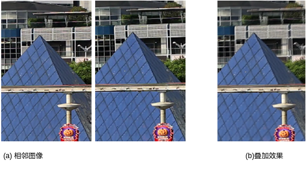

**Solution**

This is an inherent limitation of all stitching algorithms and cannot be fundamentally resolved. Mitigation relies on hardware design and stitching distance tuning to minimize parallax-induced misalignment. The simplified parallax formula is:

where W is the pixel width (in pixels), w is the sensor width (in mm), f is the lens focal length (in mm), b is the inter-lens baseline distance (in mm), and Z1/Z2 are the imaging distances of different objects (in mm). W, w, and f are fixed; parallax is proportional to b and inversely proportional to depth. To minimize parallax-induced misalignment, minimize the inter-lens baseline distance. Z1 and Z2 are scene-dependent and cannot be directly controlled. [Table 1](#table1228mcpsimp) shows parallax magnitude at different object distances under specific conditions. Closer objects produce greater parallax, so panoramic cameras are more suitable for outdoor large-scale scenes. Indoor scenes are more susceptible to parallax-induced ghosting and misalignment.

**Table 1**  Parallax example at different object distances

<table><thead align="left"><tr id="row1238mcpsimp"><th class="cellrowborder" valign="top" width="15%" id="mcps1.2.8.1.1">
Z1/Z2

</th>
<th class="cellrowborder" valign="top" width="15%" id="mcps1.2.8.1.2">
1m

</th>
<th class="cellrowborder" valign="top" width="14.000000000000002%" id="mcps1.2.8.1.3">
2m

</th>
<th class="cellrowborder" valign="top" width="14.000000000000002%" id="mcps1.2.8.1.4">
3m

</th>
<th class="cellrowborder" valign="top" width="14.000000000000002%" id="mcps1.2.8.1.5">
5m

</th>
<th class="cellrowborder" valign="top" width="14.000000000000002%" id="mcps1.2.8.1.6">
8m

</th>
<th class="cellrowborder" valign="top" width="14.000000000000002%" id="mcps1.2.8.1.7">
10m

</th>
</tr>
</thead>
<tbody><tr id="row1256mcpsimp"><td class="cellrowborder" valign="top" width="15%" headers="mcps1.2.8.1.1 ">
1m

</td>
<td class="cellrowborder" valign="top" width="15%" headers="mcps1.2.8.1.2 ">
0 pixel

</td>
<td class="cellrowborder" valign="top" width="14.000000000000002%" headers="mcps1.2.8.1.3 ">
-

</td>
<td class="cellrowborder" valign="top" width="14.000000000000002%" headers="mcps1.2.8.1.4 ">
-

</td>
<td class="cellrowborder" valign="top" width="14.000000000000002%" headers="mcps1.2.8.1.5 ">
-

</td>
<td class="cellrowborder" valign="top" width="14.000000000000002%" headers="mcps1.2.8.1.6 ">
-

</td>
<td class="cellrowborder" valign="top" width="14.000000000000002%" headers="mcps1.2.8.1.7 ">
-

</td>
</tr>
<tr id="row1271mcpsimp"><td class="cellrowborder" valign="top" width="15%" headers="mcps1.2.8.1.1 ">
2m

</td>
<td class="cellrowborder" valign="top" width="15%" headers="mcps1.2.8.1.2 ">
160

</td>
<td class="cellrowborder" valign="top" width="14.000000000000002%" headers="mcps1.2.8.1.3 ">
0

</td>
<td class="cellrowborder" valign="top" width="14.000000000000002%" headers="mcps1.2.8.1.4 ">
-

</td>
<td class="cellrowborder" valign="top" width="14.000000000000002%" headers="mcps1.2.8.1.5 ">
-

</td>
<td class="cellrowborder" valign="top" width="14.000000000000002%" headers="mcps1.2.8.1.6 ">
-

</td>
<td class="cellrowborder" valign="top" width="14.000000000000002%" headers="mcps1.2.8.1.7 ">
-

</td>
</tr>
<tr id="row1286mcpsimp"><td class="cellrowborder" valign="top" width="15%" headers="mcps1.2.8.1.1 ">
3m

</td>
<td class="cellrowborder" valign="top" width="15%" headers="mcps1.2.8.1.2 ">
213

</td>
<td class="cellrowborder" valign="top" width="14.000000000000002%" headers="mcps1.2.8.1.3 ">
53

</td>
<td class="cellrowborder" valign="top" width="14.000000000000002%" headers="mcps1.2.8.1.4 ">
0

</td>
<td class="cellrowborder" valign="top" width="14.000000000000002%" headers="mcps1.2.8.1.5 ">
-

</td>
<td class="cellrowborder" valign="top" width="14.000000000000002%" headers="mcps1.2.8.1.6 ">
-

</td>
<td class="cellrowborder" valign="top" width="14.000000000000002%" headers="mcps1.2.8.1.7 ">
-

</td>
</tr>
<tr id="row1301mcpsimp"><td class="cellrowborder" valign="top" width="15%" headers="mcps1.2.8.1.1 ">
5m

</td>
<td class="cellrowborder" valign="top" width="15%" headers="mcps1.2.8.1.2 ">
256

</td>
<td class="cellrowborder" valign="top" width="14.000000000000002%" headers="mcps1.2.8.1.3 ">
96

</td>
<td class="cellrowborder" valign="top" width="14.000000000000002%" headers="mcps1.2.8.1.4 ">
43

</td>
<td class="cellrowborder" valign="top" width="14.000000000000002%" headers="mcps1.2.8.1.5 ">
0

</td>
<td class="cellrowborder" valign="top" width="14.000000000000002%" headers="mcps1.2.8.1.6 ">
-

</td>
<td class="cellrowborder" valign="top" width="14.000000000000002%" headers="mcps1.2.8.1.7 ">
-

</td>
</tr>
<tr id="row1316mcpsimp"><td class="cellrowborder" valign="top" width="15%" headers="mcps1.2.8.1.1 ">
8m

</td>
<td class="cellrowborder" valign="top" width="15%" headers="mcps1.2.8.1.2 ">
280

</td>
<td class="cellrowborder" valign="top" width="14.000000000000002%" headers="mcps1.2.8.1.3 ">
120

</td>
<td class="cellrowborder" valign="top" width="14.000000000000002%" headers="mcps1.2.8.1.4 ">
67

</td>
<td class="cellrowborder" valign="top" width="14.000000000000002%" headers="mcps1.2.8.1.5 ">
8

</td>
<td class="cellrowborder" valign="top" width="14.000000000000002%" headers="mcps1.2.8.1.6 ">
0

</td>
<td class="cellrowborder" valign="top" width="14.000000000000002%" headers="mcps1.2.8.1.7 ">
-

</td>
</tr>
<tr id="row1331mcpsimp"><td class="cellrowborder" valign="top" width="15%" headers="mcps1.2.8.1.1 ">
10m

</td>
<td class="cellrowborder" valign="top" width="15%" headers="mcps1.2.8.1.2 ">
288

</td>
<td class="cellrowborder" valign="top" width="14.000000000000002%" headers="mcps1.2.8.1.3 ">
128

</td>
<td class="cellrowborder" valign="top" width="14.000000000000002%" headers="mcps1.2.8.1.4 ">
75

</td>
<td class="cellrowborder" valign="top" width="14.000000000000002%" headers="mcps1.2.8.1.5 ">
10

</td>
<td class="cellrowborder" valign="top" width="14.000000000000002%" headers="mcps1.2.8.1.6 ">
8

</td>
<td class="cellrowborder" valign="top" width="14.000000000000002%" headers="mcps1.2.8.1.7 ">
0

</td>
</tr>
</tbody>
</table>

This model is computed under ideal conditions considering only parallax, and is provided for reference only. In practice, misalignment is also affected by lens distortion and structural differences between adjacent lenses. Severe lens distortion (such as with wide-angle lenses) can worsen misalignment.

## Fine Tuning Debugging Method

**Symptom**

The Fine Tuning feature is implemented in the board-side LUT library — each Fine Tuning operation refreshes the LUT table. The Fine Tuning parameters and debugging methodology can be difficult to understand.

**Analysis**

Fine Tuning adjusts the image position of each channel in a multi-channel stitched output. The parameters span five dimensions:

-   Three orientation angles: Yaw, Pitch, and Roll. Generally: Yaw translates the image along the X-axis of the input image distortion center; Pitch translates along the Y-axis; Roll rotates the image around the distortion center.
-   Two distortion center offsets: OffsetX and OffsetY. Generally: OffsetX changes the X coordinate of the distortion center; OffsetY changes the Y coordinate.

Fine Tuning is not recommended for closed-loop panoramic stitching (such as back-to-back dual-fisheye or multi-channel horizontal 360° stitching), since adjusting a single channel is difficult to reconcile with left and right adjacent lenses. Fine Tuning is most commonly applied to multi-channel horizontal stitching (non-360°).

**Solution**

Using the most common Fine Tuning use case of four-channel horizontal stitching as an example: for simplicity, it is recommended to expose only the Yaw, Pitch, and Roll dimensions. To further ease end-user understanding, Yaw can be converted to OffsetH (horizontal offset) and Pitch to OffsetV (vertical offset).

Fine Tuning adjustments are made relative to the original image, but the intended effect is expressed in terms of the stitched image. The key is converting OffsetH and OffsetV into Fine Tuning Yaw and Pitch. Roll (rotation) requires no conversion.

For a four-channel horizontal stitching scenario, the original image in the stitched output can be rotated 0°, 90°, 180°, or 270° clockwise. The conversion formulas for these four cases are:

-   Clockwise 0°:

    Yaw = K1\*OffsetH

    Pitch = K2\*OffsetV

-   Clockwise 90°:

    Yaw = - K1\*OffsetV

    Pitch = K2\*OffsetH

-   Clockwise 180°:

    Yaw = - K1\*OffsetH

    Pitch = - K2\*OffsetV

-   Clockwise 270°:

    Yaw = K1\*OffsetV

    Pitch = - K2\*OffsetH

K1 and K2 are the conversion factors between angles and pixel coordinates, depending on the stitched image resolution, FOV, and the desired adjustment precision. These can be determined through testing.

A specific example: assume an original image and stitched image as shown in [Figure 1](#fig8890314113117), with each lens FOV of 90°×55°, a 15% overlap region, and an output stitched image resolution of 3840×2160 with an output FOV of approximately 195°×90°. Then horizontally K1 = 195/3840 = 0.05, and vertically K2 = 90/2160 = 0.04.

Note that different channels have different original image rotation orientations, so the conversion for each channel is shown in [Table 1](#_Ref9347211).

**Figure 1**  Original image and stitched image diagram  
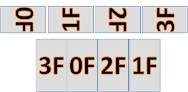

**Table 1**  Fine Tuning conversion results

<table><thead align="left"><tr id="row1386mcpsimp"><th class="cellrowborder" valign="top" width="25%" id="mcps1.2.5.1.1">
Channel 0 (270&deg;)

</th>
<th class="cellrowborder" valign="top" width="25%" id="mcps1.2.5.1.2">
Channel 1 (90&deg;)

</th>
<th class="cellrowborder" valign="top" width="25%" id="mcps1.2.5.1.3">
Channel 2 (270&deg;)

</th>
<th class="cellrowborder" valign="top" width="25%" id="mcps1.2.5.1.4">
Channel 3 (90&deg;)

</th>
</tr>
</thead>
<tbody><tr id="row1395mcpsimp"><td class="cellrowborder" valign="top" width="25%" headers="mcps1.2.5.1.1 ">
Yaw = 0.05*OffsetV

Pitch = -0.04*OffsetH

</td>
<td class="cellrowborder" valign="top" width="25%" headers="mcps1.2.5.1.2 ">
Yaw = - 0.05*OffsetV

Pitch = 0.04*OffsetH

</td>
<td class="cellrowborder" valign="top" width="25%" headers="mcps1.2.5.1.3 ">
Yaw = 0.05*OffsetV

Pitch = -0.04*OffsetH

</td>
<td class="cellrowborder" valign="top" width="25%" headers="mcps1.2.5.1.4 ">
Yaw = - 0.05*OffsetV

Pitch = 0.04*OffsetH

</td>
</tr>
</tbody>
</table>
