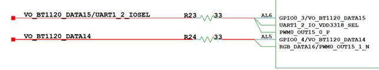

---
title: "Preface"
source: /sessions/sharp-sweet-allen/mnt/hi3403-build/pegasus/docs/zh-CN/SYS_CONFIG配置指南/SYS_CONFIG 配置指南.md
--- # Preface
**Overview<a name="section142mcpsimp"></a>** This document is written for engineers developing with the MPP media processing chip. Its purpose is to provide various reference information about the SYS_CONFIG sub-module of the media processing software during development, including system control, clock configuration, and pin multiplexing. This document describes the usage of each key function in SYS_CONFIG and the related configuration principles. > **Note:**
>This document uses the Hi3403V100 description as an example. Unless otherwise specified, the content for is the same as for Hi3403V100. **Product Version<a name="section145mcpsimp"></a>** The product version corresponding to this document is as follows. <a name="table148mcpsimp"></a>
<table><thead align="left"><tr id="row153mcpsimp"><th class="cellrowborder" valign="top" width="32%" id="mcps1.1.3.1.1"><p id="p155mcpsimp"><a name="p155mcpsimp"></a><a name="p155mcpsimp"></a>Product Name</p>
</th>
<th class="cellrowborder" valign="top" width="68%" id="mcps1.1.3.1.2"><p id="p157mcpsimp"><a name="p157mcpsimp"></a><a name="p157mcpsimp"></a>Product Version</p>
</th>
</tr>
</thead>
<tbody><tr id="row159mcpsimp"><td class="cellrowborder" valign="top" width="32%" headers="mcps1.1.3.1.1 "><p id="p161mcpsimp"><a name="p161mcpsimp"></a><a name="p161mcpsimp"></a>Hi3403V100</p>
</td>
<td class="cellrowborder" valign="top" width="68%" headers="mcps1.1.3.1.2 "><p id="p163mcpsimp"><a name="p163mcpsimp"></a><a name="p163mcpsimp"></a>V100</p>
</td>
</tr>
</td>
<td class="cellrowborder" valign="top" width="68%" headers="mcps1.1.3.1.2 "><p id="p6846171016231"><a name="p6846171016231"></a><a name="p6846171016231"></a>V100</p>
</td>
</tr>
</tbody>
</table> **Target Audience<a name="section164mcpsimp"></a>** This document (guide) is mainly intended for the following engineers: - Technical Support Engineers
- Software Development Engineers **Symbol Conventions<a name="section170mcpsimp"></a>** The following symbols may appear in this document. Their meanings are as follows. <a name="table173mcpsimp"></a>
<table><thead align="left"><tr id="row178mcpsimp"><th class="cellrowborder" valign="top" width="21%" id="mcps1.1.3.1.1"><p id="p180mcpsimp"><a name="p180mcpsimp"></a><a name="p180mcpsimp"></a><strong id="b181mcpsimp"><a name="b181mcpsimp"></a><a name="b181mcpsimp"></a>Symbol</strong></p>
</th>
<th class="cellrowborder" valign="top" width="79%" id="mcps1.1.3.1.2"><p id="p183mcpsimp"><a name="p183mcpsimp"></a><a name="p183mcpsimp"></a><strong id="b184mcpsimp"><a name="b184mcpsimp"></a><a name="b184mcpsimp"></a>Description</strong></p>
</th>
</tr>
</thead>
<tbody><tr id="row186mcpsimp"><td class="cellrowborder" valign="top" width="21%" headers="mcps1.1.3.1.1 "><p class="msonormal" id="p188mcpsimp"><a name="p188mcpsimp"></a><a name="p188mcpsimp"></a><a name="image103"></a><a name="image103"></a><span></span></p>
</td>
<td class="cellrowborder" valign="top" width="79%" headers="mcps1.1.3.1.2 "><p id="p190mcpsimp"><a name="p190mcpsimp"></a><a name="p190mcpsimp"></a>Indicates a high-level hazard which, if not avoided, will result in death or serious injury.</p>
</td>
</tr>
</tbody>
</table> **Revision History<a name="section213mcpsimp"></a>** <a name="table215mcpsimp"></a>
<table><thead align="left"><tr id="row221mcpsimp"><th class="cellrowborder" valign="top" width="21%" id="mcps1.1.4.1.1"><p id="p223mcpsimp"><a name="p223mcpsimp"></a><a name="p223mcpsimp"></a><strong id="b224mcpsimp"><a name="b224mcpsimp"></a><a name="b224mcpsimp"></a>Document Version</strong></p>
</th>
<th class="cellrowborder" valign="top" width="26%" id="mcps1.1.4.1.2"><p id="p226mcpsimp"><a name="p226mcpsimp"></a><a name="p226mcpsimp"></a><strong id="b227mcpsimp"><a name="b227mcpsimp"></a><a name="b227mcpsimp"></a>Release Date</strong></p>
</th>
<th class="cellrowborder" valign="top" width="53%" id="mcps1.1.4.1.3"><p id="p229mcpsimp"><a name="p229mcpsimp"></a><a name="p229mcpsimp"></a><strong id="b230mcpsimp"><a name="b230mcpsimp"></a><a name="b230mcpsimp"></a>Revision Description</strong></p>
</th>
</tr>
</thead>
<tbody><tr id="row232mcpsimp"><td class="cellrowborder" valign="top" width="21%" headers="mcps1.1.4.1.1 "><p id="p234mcpsimp"><a name="p234mcpsimp"></a><a name="p234mcpsimp"></a>00B01</p>
</td>
<td class="cellrowborder" valign="top" width="26%" headers="mcps1.1.4.1.2 "><p id="p236mcpsimp"><a name="p236mcpsimp"></a><a name="p236mcpsimp"></a>2025-09-15</p>
</td>
<td class="cellrowborder" valign="top" width="53%" headers="mcps1.1.4.1.3 "><p id="p238mcpsimp"><a name="p238mcpsimp"></a><a name="p238mcpsimp"></a>First interim release.</p>
</td>
</tr>
</tbody>
</table> # Overview
## SYS_CONFIG Introduction<a name="ZH-CN_TOPIC_0000002441701425"></a> SYS_CONFIG is a module for system-level and board-level configuration. Its main function is to configure the initialization environment that does not require dynamic modification when the sys_config.ko module is loaded. It includes the following parts: - Initialization
- System Control
- Clock Reset Configuration
- Pin Multiplexing SYS_CONFIG is released both as a binary .ko file and as source code. The source code is located in the interdrv/sysconfig directory. To modify the SYS_CONFIG code, refer to the following documents and steps (using Hi3403V100 as an example): - To modify clock configuration and system control, first refer to the chip manual, then modify the sysconfig code.
- To modify pin multiplexing configuration, first refer to the chip manual, then modify the sysconfig code. Depending on the video input sensor connected, the system control and chip pin multiplexing configuration may differ. This can be distinguished by the module parameter g\_sensor\_list. For example: insmod sys\_config.ko sensors="sns0=sensor0\_xxx,sns1=sensor1\_xxx,sns2=sensor2\_xxx,sns3=sensor3\_xxx" vo\_intf="bt1120" Or: insmod sys\_config.ko sensors=sns0=sensor0\_xxx,sns1=sensor1\_xxx,sns2=sensor2\_xxx,sns3=sensor3\_xxx vo\_intf=bt1120 The meaning of each module parameter is shown in [Table 1](#_table34233312). **Table 1** Module Parameter Meanings <a name="_table34233312"></a>
<table><thead align="left"><tr id="row265mcpsimp"><th class="cellrowborder" valign="top" width="27%" id="mcps1.2.3.1.1"><p id="p267mcpsimp"><a name="p267mcpsimp"></a><a name="p267mcpsimp"></a>Parameter</p>
</th>
<th class="cellrowborder" valign="top" width="73%" id="mcps1.2.3.1.2"><p id="p269mcpsimp"><a name="p269mcpsimp"></a><a name="p269mcpsimp"></a>Meaning</p>
</th>
</tr>
</thead>
<tbody><tr id="row276mcpsimp"><td class="cellrowborder" valign="top" width="27%" headers="mcps1.2.3.1.1 "><p id="p278mcpsimp"><a name="p278mcpsimp"></a><a name="p278mcpsimp"></a>sensors</p>
</td>
<td class="cellrowborder" valign="top" width="73%" headers="mcps1.2.3.1.2 "><p id="p280mcpsimp"><a name="p280mcpsimp"></a><a name="p280mcpsimp"></a>sensors list, passed as a string.</p>
<p id="p281mcpsimp"><a name="p281mcpsimp"></a><a name="p281mcpsimp"></a>For example:</p>
<p id="p282mcpsimp"><a name="p282mcpsimp"></a><a name="p282mcpsimp"></a>sensors="sns0=sensor0_xxx,sns1=sensor1_xxx,sns2=sensor2_xxx,sns3=sensor3_xxx"</p>
<p id="p283mcpsimp"><a name="p283mcpsimp"></a><a name="p283mcpsimp"></a>Or</p>
<p id="p284mcpsimp"><a name="p284mcpsimp"></a><a name="p284mcpsimp"></a>sensors=sns0=sensor0_xxx,sns1=sensor1_xxx,sns2=sensor2_xxx,sns3=sensor3_xxx</p>
<p id="p1987171575"><a name="p1987171575"></a><a name="p1987171575"></a>sensors=none means no sensor pins are configured.</p>
</td>
</tr>
<tr id="row286mcpsimp"><td class="cellrowborder" valign="top" width="27%" headers="mcps1.2.3.1.1 "><p id="p288mcpsimp"><a name="p288mcpsimp"></a><a name="p288mcpsimp"></a>vo_intf</p>
</td>
<td class="cellrowborder" valign="top" width="73%" headers="mcps1.2.3.1.2 "><p id="p290mcpsimp"><a name="p290mcpsimp"></a><a name="p290mcpsimp"></a>VO interface type selection. Default is "mipi_tx".</p>
<p id="p291mcpsimp"><a name="p291mcpsimp"></a><a name="p291mcpsimp"></a>MIPI_TX: vo_intf="mipitx" or "mipi_tx";</p>
<p id="p292mcpsimp"><a name="p292mcpsimp"></a><a name="p292mcpsimp"></a>BT.1120: vo_intf ="bt.1120" or "bt1120";</p>
<p id="p293mcpsimp"><a name="p293mcpsimp"></a><a name="p293mcpsimp"></a>BT.656: vo_intf ="bt.656" or "bt656";</p>
<p id="p294mcpsimp"><a name="p294mcpsimp"></a><a name="p294mcpsimp"></a>RGB_6BIT: vo_intf ="rgb_6bit" or "rgb6bit";</p>
<p id="p295mcpsimp"><a name="p295mcpsimp"></a><a name="p295mcpsimp"></a>RGB_8BIT: vo_intf ="rgb_8bit" or "rgb8bit";</p>
<p id="p296mcpsimp"><a name="p296mcpsimp"></a><a name="p296mcpsimp"></a>RGB_16BIT: vo_intf ="rgb_16bit" or "rgb16bit";</p>
<p id="p297mcpsimp"><a name="p297mcpsimp"></a><a name="p297mcpsimp"></a>RGB_18BIT: vo_intf ="rgb_18bit" or "rgb18bit";</p>
<p id="p298mcpsimp"><a name="p298mcpsimp"></a><a name="p298mcpsimp"></a>RGB_24BIT: vo_intf ="rgb_24bit" or "rgb24bit";</p>
<p id="p85581197318"><a name="p85581197318"></a><a name="p85581197318"></a>No VO pins configured: vo_intf = "none".</p>
<p id="p299mcpsimp"><a name="p299mcpsimp"></a><a name="p299mcpsimp"></a>Any string with the above prefixes will be considered valid input. If the string length exceeds 15 characters, the driver will fail to load.</p>
</td>
</tr>
<tr id="row45730111920"><td class="cellrowborder" valign="top" width="27%" headers="mcps1.2.3.1.1 "><p id="p1573131194"><a name="p1573131194"></a><a name="p1573131194"></a>g_hdmi_en</p>
</td>
<td class="cellrowborder" valign="top" width="73%" headers="mcps1.2.3.1.2 "><p id="p75738113915"><a name="p75738113915"></a><a name="p75738113915"></a>Whether to configure HDMI pins. g_hdmi_en=1 means configure, g_hdmi_en=0 means do not configure. Default is 1.</p>
</td>
</tr>
<tr id="row48551616599"><td class="cellrowborder" valign="top" width="27%" headers="mcps1.2.3.1.1 "><p id="p8855616091"><a name="p8855616091"></a><a name="p8855616091"></a>g_i2c_en</p>
</td>
<td class="cellrowborder" valign="top" width="73%" headers="mcps1.2.3.1.2 "><p id="p1185515162919"><a name="p1185515162919"></a><a name="p1185515162919"></a>Whether to configure I2C pins. g_i2c_en=1 means configure, g_i2c_en=0 means do not configure. Default is 1.</p>
</td>
</tr>
<tr id="row4231481918"><td class="cellrowborder" valign="top" width="27%" headers="mcps1.2.3.1.1 "><p id="p182311685914"><a name="p182311685914"></a><a name="p182311685914"></a>g_audio_en</p>
</td>
<td class="cellrowborder" valign="top" width="73%" headers="mcps1.2.3.1.2 "><p id="p5231108193"><a name="p5231108193"></a><a name="p5231108193"></a>Whether to configure audio pins. g_audio_en=1 means configure, g_audio_en=0 means do not configure. Default is 1.</p>
</td>
</tr>
</tbody>
</table> Users can modify the relevant content in the SYS_CONFIG module source code file based on the actual physical environment: - Modify the corresponding system configuration according to the actual system configuration;
- Modify the corresponding clock according to the actual system operating clock requirements;
- Modify the pin multiplexing related content according to the actual physical circuit pin usage layout. After modification, compile and load the module .ko to complete the configuration of the desired new user environment. The SYS_CONFIG configuration flow is shown in [Figure 1](#_fig9145151194318). **Figure 1** SYS_CONFIG Overall Flow Chart<a name="_fig9145151194318"></a>  Includes the following 4 flows: - Initialization (sysconfig\_init) Maps the addresses of the configuration registers. The main register addresses include CRG, system control, MISC, IO pin multiplexing, GPIO control, MIPI, etc. - System Control (sys\_ctl) Configures the system control section, such as QoS settings for online/offline modes of VI and VPSS. - Clock Reset Configuration (clk\_cfg) Configures clocks for modules such as VI, VO, SPI, I2C, etc. - Pin Multiplexing Configuration (pin\_mux) Configures pin multiplexing for different functions based on different application scenarios. # Initialization
SYS_CONFIG initialization performs ioremap mappings for the register addresses that need to be configured, obtaining virtual addresses that the software can operate on. The following are the register addresses mapped during SYS_CONFIG initialization. **Table 1** MISC Register Addresses <a name="_table44115416"></a>
<table><thead align="left"><tr id="row329mcpsimp"><th class="cellrowborder" valign="top" width="27%" id="mcps1.2.5.1.1"><p id="p331mcpsimp"><a name="p331mcpsimp"></a><a name="p331mcpsimp"></a>Solution</p>
</th>
<th class="cellrowborder" valign="top" width="34%" id="mcps1.2.5.1.2"><p id="p333mcpsimp"><a name="p333mcpsimp"></a><a name="p333mcpsimp"></a>Base Address Variable</p>
</th>
<th class="cellrowborder" valign="top" width="22%" id="mcps1.2.5.1.3"><p id="p335mcpsimp"><a name="p335mcpsimp"></a><a name="p335mcpsimp"></a>Base Address</p>
</th>
<th class="cellrowborder" valign="top" width="17%" id="mcps1.2.5.1.4"><p id="p337mcpsimp"><a name="p337mcpsimp"></a><a name="p337mcpsimp"></a>Length</p>
</th>
</tr>
</thead>
<tbody><tr id="row339mcpsimp"><td class="cellrowborder" valign="top" width="27%" headers="mcps1.2.5.1.1 "><p id="p341mcpsimp"><a name="p341mcpsimp"></a><a name="p341mcpsimp"></a>Hi3403V100</p>
</td>
<td class="cellrowborder" valign="top" width="34%" headers="mcps1.2.5.1.2 "><p id="p343mcpsimp"><a name="p343mcpsimp"></a><a name="p343mcpsimp"></a>g_reg_misc_base</p>
</td>
<td class="cellrowborder" valign="top" width="22%" headers="mcps1.2.5.1.3 "><p id="p345mcpsimp"><a name="p345mcpsimp"></a><a name="p345mcpsimp"></a>0x11024000</p>
</td>
<td class="cellrowborder" valign="top" width="17%" headers="mcps1.2.5.1.4 "><p id="p347mcpsimp"><a name="p347mcpsimp"></a><a name="p347mcpsimp"></a>0x5000</p>
</td>
</tr>
</tbody>
</table> **Table 2** Clock Reset Register Addresses <a name="_table61494432"></a>
<table><thead align="left"><tr id="row355mcpsimp"><th class="cellrowborder" valign="top" width="27%" id="mcps1.2.5.1.1"><p id="p357mcpsimp"><a name="p357mcpsimp"></a><a name="p357mcpsimp"></a>Solution</p>
</th>
<th class="cellrowborder" valign="top" width="34%" id="mcps1.2.5.1.2"><p id="p359mcpsimp"><a name="p359mcpsimp"></a><a name="p359mcpsimp"></a>Base Address Variable</p>
</th>
<th class="cellrowborder" valign="top" width="22%" id="mcps1.2.5.1.3"><p id="p361mcpsimp"><a name="p361mcpsimp"></a><a name="p361mcpsimp"></a>Base Address</p>
</th>
<th class="cellrowborder" valign="top" width="17%" id="mcps1.2.5.1.4"><p id="p363mcpsimp"><a name="p363mcpsimp"></a><a name="p363mcpsimp"></a>Length</p>
</th>
</tr>
</thead>
<tbody><tr id="row365mcpsimp"><td class="cellrowborder" valign="top" width="27%" headers="mcps1.2.5.1.1 "><p id="p367mcpsimp"><a name="p367mcpsimp"></a><a name="p367mcpsimp"></a>Hi3403V100</p>
</td>
<td class="cellrowborder" valign="top" width="34%" headers="mcps1.2.5.1.2 "><p id="p369mcpsimp"><a name="p369mcpsimp"></a><a name="p369mcpsimp"></a>g_reg_crg_base</p>
</td>
<td class="cellrowborder" valign="top" width="22%" headers="mcps1.2.5.1.3 "><p id="p371mcpsimp"><a name="p371mcpsimp"></a><a name="p371mcpsimp"></a>0x11010000</p>
</td>
<td class="cellrowborder" valign="top" width="17%" headers="mcps1.2.5.1.4 "><p id="p373mcpsimp"><a name="p373mcpsimp"></a><a name="p373mcpsimp"></a>0x10000</p>
</td>
</tr>
</tbody>
</table> **Table 3** Pin Multiplexing Register Addresses <a name="_table16578980"></a>
<table><thead align="left"><tr id="row381mcpsimp"><th class="cellrowborder" valign="top" width="27%" id="mcps1.2.5.1.1"><p id="p383mcpsimp"><a name="p383mcpsimp"></a><a name="p383mcpsimp"></a>Solution</p>
</th>
<th class="cellrowborder" valign="top" width="34%" id="mcps1.2.5.1.2"><p id="p385mcpsimp"><a name="p385mcpsimp"></a><a name="p385mcpsimp"></a>Base Address Variable</p>
</th>
<th class="cellrowborder" valign="top" width="22%" id="mcps1.2.5.1.3"><p id="p387mcpsimp"><a name="p387mcpsimp"></a><a name="p387mcpsimp"></a>Base Address</p>
</th>
<th class="cellrowborder" valign="top" width="17%" id="mcps1.2.5.1.4"><p id="p389mcpsimp"><a name="p389mcpsimp"></a><a name="p389mcpsimp"></a>Length</p>
</th>
</tr>
</thead>
<tbody><tr id="row391mcpsimp"><td class="cellrowborder" rowspan="2" valign="top" width="27%" headers="mcps1.2.5.1.1 "><p id="p393mcpsimp"><a name="p393mcpsimp"></a><a name="p393mcpsimp"></a>Hi3403V100</p>
</td>
<td class="cellrowborder" valign="top" width="34%" headers="mcps1.2.5.1.2 "><p id="p395mcpsimp"><a name="p395mcpsimp"></a><a name="p395mcpsimp"></a>g_reg_iocfg_base</p>
</td>
<td class="cellrowborder" valign="top" width="22%" headers="mcps1.2.5.1.3 "><p id="p397mcpsimp"><a name="p397mcpsimp"></a><a name="p397mcpsimp"></a>0x10230000</p>
</td>
<td class="cellrowborder" valign="top" width="17%" headers="mcps1.2.5.1.4 "><p id="p399mcpsimp"><a name="p399mcpsimp"></a><a name="p399mcpsimp"></a>0x10000</p>
</td>
</tr>
<tr id="row400mcpsimp"><td class="cellrowborder" valign="top" headers="mcps1.2.5.1.1 "><p id="p402mcpsimp"><a name="p402mcpsimp"></a><a name="p402mcpsimp"></a>g_reg_iocfg2_base</p>
</td>
<td class="cellrowborder" valign="top" headers="mcps1.2.5.1.2 "><p id="p404mcpsimp"><a name="p404mcpsimp"></a><a name="p404mcpsimp"></a>0x102f0000</p>
</td>
<td class="cellrowborder" valign="top" headers="mcps1.2.5.1.3 "><p id="p406mcpsimp"><a name="p406mcpsimp"></a><a name="p406mcpsimp"></a>0x10000</p>
</td>
</tr>
</tbody>
</table> **Table 4** GPIO Register Addresses <a name="table407mcpsimp"></a>
<table><thead align="left"><tr id="row415mcpsimp"><th class="cellrowborder" valign="top" width="25.742574257425744%" id="mcps1.2.5.1.1"><p id="p417mcpsimp"><a name="p417mcpsimp"></a><a name="p417mcpsimp"></a>Solution</p>
</th>
<th class="cellrowborder" valign="top" width="32.67326732673268%" id="mcps1.2.5.1.2"><p id="p419mcpsimp"><a name="p419mcpsimp"></a><a name="p419mcpsimp"></a>Base Address Variable</p>
</th>
<th class="cellrowborder" valign="top" width="21.782178217821784%" id="mcps1.2.5.1.3"><p id="p421mcpsimp"><a name="p421mcpsimp"></a><a name="p421mcpsimp"></a>Base Address</p>
</th>
<th class="cellrowborder" valign="top" width="19.801980198019802%" id="mcps1.2.5.1.4"><p id="p423mcpsimp"><a name="p423mcpsimp"></a><a name="p423mcpsimp"></a>Length</p>
</th>
</tr>
</thead>
<tbody><tr id="row425mcpsimp"><td class="cellrowborder" valign="top" width="25.742574257425744%" headers="mcps1.2.5.1.1 "><p id="p427mcpsimp"><a name="p427mcpsimp"></a><a name="p427mcpsimp"></a>Hi3403V100</p>
</td>
<td class="cellrowborder" valign="top" width="32.67326732673268%" headers="mcps1.2.5.1.2 "><p id="p429mcpsimp"><a name="p429mcpsimp"></a><a name="p429mcpsimp"></a>g_reg_gpio_base</p>
</td>
<td class="cellrowborder" valign="top" width="21.782178217821784%" headers="mcps1.2.5.1.3 "><p id="p431mcpsimp"><a name="p431mcpsimp"></a><a name="p431mcpsimp"></a>0x11090000</p>
</td>
<td class="cellrowborder" valign="top" width="19.801980198019802%" headers="mcps1.2.5.1.4 "><p id="p433mcpsimp"><a name="p433mcpsimp"></a><a name="p433mcpsimp"></a>0x12000</p>
</td>
</tr>
</tbody>
</table> **Table 5** SYS Register Addresses <a name="table434mcpsimp"></a>
<table><thead align="left"><tr id="row442mcpsimp"><th class="cellrowborder" valign="top" width="24.242424242424242%" id="mcps1.2.5.1.1"><p id="p1278416222180"><a name="p1278416222180"></a><a name="p1278416222180"></a>Solution</p>
</th>
<th class="cellrowborder" valign="top" width="30.303030303030305%" id="mcps1.2.5.1.2"><p id="p446mcpsimp"><a name="p446mcpsimp"></a><a name="p446mcpsimp"></a>Base Address Variable</p>
</th>
<th class="cellrowborder" valign="top" width="28.28282828282828%" id="mcps1.2.5.1.3"><p id="p448mcpsimp"><a name="p448mcpsimp"></a><a name="p448mcpsimp"></a>Base Address</p>
</th>
<th class="cellrowborder" valign="top" width="17.17171717171717%" id="mcps1.2.5.1.4"><p id="p450mcpsimp"><a name="p450mcpsimp"></a><a name="p450mcpsimp"></a>Length</p>
</th>
</tr>
</thead>
<tbody><tr id="row452mcpsimp"><td class="cellrowborder" valign="top" width="24.242424242424242%" headers="mcps1.2.5.1.1 "><p id="p454mcpsimp"><a name="p454mcpsimp"></a><a name="p454mcpsimp"></a>Hi3403V100</p>
</td>
<td class="cellrowborder" valign="top" width="30.303030303030305%" headers="mcps1.2.5.1.2 "><p id="p456mcpsimp"><a name="p456mcpsimp"></a><a name="p456mcpsimp"></a>g_reg_sys_base</p>
</td>
<td class="cellrowborder" valign="top" width="28.28282828282828%" headers="mcps1.2.5.1.3 "><p id="p458mcpsimp"><a name="p458mcpsimp"></a><a name="p458mcpsimp"></a>0x11020000</p>
</td>
<td class="cellrowborder" valign="top" width="17.17171717171717%" headers="mcps1.2.5.1.4 "><p id="p460mcpsimp"><a name="p460mcpsimp"></a><a name="p460mcpsimp"></a>0x4000</p>
</td>
</tr>
</tbody>
</table> **Table 6** DDR Register Addresses <a name="table461mcpsimp"></a>
<table><thead align="left"><tr id="row469mcpsimp"><th class="cellrowborder" valign="top" width="24.242424242424242%" id="mcps1.2.5.1.1"><p id="p471mcpsimp"><a name="p471mcpsimp"></a><a name="p471mcpsimp"></a>Solution</p>
</th>
<th class="cellrowborder" valign="top" width="30.303030303030305%" id="mcps1.2.5.1.2"><p id="p473mcpsimp"><a name="p473mcpsimp"></a><a name="p473mcpsimp"></a>Base Address Variable</p>
</th>
<th class="cellrowborder" valign="top" width="28.28282828282828%" id="mcps1.2.5.1.3"><p id="p475mcpsimp"><a name="p475mcpsimp"></a><a name="p475mcpsimp"></a>Base Address</p>
</th>
<th class="cellrowborder" valign="top" width="17.17171717171717%" id="mcps1.2.5.1.4"><p id="p477mcpsimp"><a name="p477mcpsimp"></a><a name="p477mcpsimp"></a>Length</p>
</th>
</tr>
</thead>
<tbody><tr id="row479mcpsimp"><td class="cellrowborder" valign="top" width="24.242424242424242%" headers="mcps1.2.5.1.1 "><p id="p481mcpsimp"><a name="p481mcpsimp"></a><a name="p481mcpsimp"></a>Hi3403V100</p>
</td>
<td class="cellrowborder" valign="top" width="30.303030303030305%" headers="mcps1.2.5.1.2 "><p id="p483mcpsimp"><a name="p483mcpsimp"></a><a name="p483mcpsimp"></a>g_reg_ddr_base</p>
</td>
<td class="cellrowborder" valign="top" width="28.28282828282828%" headers="mcps1.2.5.1.3 "><p id="p485mcpsimp"><a name="p485mcpsimp"></a><a name="p485mcpsimp"></a>0x11140000</p>
</td>
<td class="cellrowborder" valign="top" width="17.17171717171717%" headers="mcps1.2.5.1.4 "><p id="p487mcpsimp"><a name="p487mcpsimp"></a><a name="p487mcpsimp"></a>0x10000</p>
</td>
</tr>
</tbody>
</table> **Table 7** MIPI\_TX Register Addresses <a name="_table071427174311"></a>
<table><thead align="left"><tr id="row495mcpsimp"><th class="cellrowborder" valign="top" width="24.242424242424242%" id="mcps1.2.5.1.1"><p id="p497mcpsimp"><a name="p497mcpsimp"></a><a name="p497mcpsimp"></a>Solution</p>
</th>
<th class="cellrowborder" valign="top" width="30.303030303030305%" id="mcps1.2.5.1.2"><p id="p499mcpsimp"><a name="p499mcpsimp"></a><a name="p499mcpsimp"></a>Base Address Variable</p>
</th>
<th class="cellrowborder" valign="top" width="28.28282828282828%" id="mcps1.2.5.1.3"><p id="p501mcpsimp"><a name="p501mcpsimp"></a><a name="p501mcpsimp"></a>Base Address</p>
</th>
<th class="cellrowborder" valign="top" width="17.17171717171717%" id="mcps1.2.5.1.4"><p id="p503mcpsimp"><a name="p503mcpsimp"></a><a name="p503mcpsimp"></a>Length</p>
</th>
</tr>
</thead>
<tbody><tr id="row505mcpsimp"><td class="cellrowborder" valign="top" width="24.242424242424242%" headers="mcps1.2.5.1.1 "><p id="p507mcpsimp"><a name="p507mcpsimp"></a><a name="p507mcpsimp"></a>Hi3403V100</p>
</td>
<td class="cellrowborder" valign="top" width="30.303030303030305%" headers="mcps1.2.5.1.2 "><p id="p509mcpsimp"><a name="p509mcpsimp"></a><a name="p509mcpsimp"></a>g_reg_mipi_tx_base</p>
</td>
<td class="cellrowborder" valign="top" width="28.28282828282828%" headers="mcps1.2.5.1.3 "><p id="p511mcpsimp"><a name="p511mcpsimp"></a><a name="p511mcpsimp"></a>0x17A80000</p>
</td>
<td class="cellrowborder" valign="top" width="17.17171717171717%" headers="mcps1.2.5.1.4 "><p id="p513mcpsimp"><a name="p513mcpsimp"></a><a name="p513mcpsimp"></a>0x10000</p>
</td>
</tr>
</tbody>
</table> The register address mapping described in this chapter is the foundation for register configuration in other chapters. After completing the mapping of the register physical addresses (i.e., register addresses) in this chapter, the register virtual addresses are obtained. Through the register virtual addresses, the corresponding registers can be read and written. The operation functions are as follows: ```
#define sys_writel(addr, value) ((*((volatile unsigned int *)(addr))) = (value))
#define sys_read(addr) (*((volatile int *)(addr)))
``` - sys\_writel is the write function. addr is the register virtual address, and value is the value to be written to the register.
- sys\_read is the read function. addr is the register virtual address. The result of the operation is the value read from the register. # System Control
## VI VPSS Online/Offline Mode<a name="ZH-CN_TOPIC_0000002441701441"></a> Based on the VI VPSS online/offline mode situation, the VI VPSS online/offline mode needs to be selected. The following uses Hi3403V100 as an example. ### VI VPSS Online/Offline Mode Configuration<a name="ZH-CN_TOPIC_0000002408102290"></a> [Configuration] g\_reg\_misc\_base is described in [Table 1](#_table44115416). ```
static void set_vi_online_video_norm_vpss_online_qos(void) { void *misc_base = sys_config_get_reg_misc; sys_writel(misc_base + 0x1000, 0x44777755); sys_writel(misc_base + 0x1004, 0x45455066); sys_writel(misc_base + 0x1008, 0x60050055); sys_writel(misc_base + 0x100c, 0x45433306); sys_writel(misc_base + 0x1010, 0x33333366); sys_writel(misc_base + 0x1014, 0x33503333); sys_writel(misc_base + 0x1018, 0x00044466); sys_writel(misc_base + 0x101c, 0x44777765); sys_writel(misc_base + 0x1020, 0x55556066); sys_writel(misc_base + 0x1024, 0x60050056); sys_writel(misc_base + 0x1028, 0x46433306); sys_writel(misc_base + 0x102c, 0x66555377); sys_writel(misc_base + 0x1030, 0x33503663); sys_writel(misc_base + 0x1034, 0x00055577); }
``` [Description] MDDRC\_QOS\_CTRL0 is the QoS register. Offset Address: 0x5000 Total Reset Value: 0x0000\_0000 <a name="table535mcpsimp"></a>
<table><thead align="left"><tr id="row543mcpsimp"><th class="cellrowborder" valign="top" width="12.000000000000002%" id="mcps1.1.6.1.1"><p id="p545mcpsimp"><a name="p545mcpsimp"></a><a name="p545mcpsimp"></a>Bits</p>
</th>
<th class="cellrowborder" valign="top" width="12.000000000000002%" id="mcps1.1.6.1.2"><p id="p547mcpsimp"><a name="p547mcpsimp"></a><a name="p547mcpsimp"></a>Access</p>
</th>
<th class="cellrowborder" valign="top" width="23.000000000000004%" id="mcps1.1.6.1.3"><p id="p549mcpsimp"><a name="p549mcpsimp"></a><a name="p549mcpsimp"></a>Name</p>
</th>
<th class="cellrowborder" valign="top" width="42.00000000000001%" id="mcps1.1.6.1.4"><p id="p551mcpsimp"><a name="p551mcpsimp"></a><a name="p551mcpsimp"></a>Description</p>
</th>
<th class="cellrowborder" valign="top" width="11.000000000000002%" id="mcps1.1.6.1.5"><p id="p553mcpsimp"><a name="p553mcpsimp"></a><a name="p553mcpsimp"></a>Reset</p>
</th>
</tr>
</thead>
<tbody><tr id="row555mcpsimp"><td class="cellrowborder" valign="top" width="12.000000000000002%" headers="mcps1.1.6.1.1 "><p id="p557mcpsimp"><a name="p557mcpsimp"></a><a name="p557mcpsimp"></a>[30:28]</p>
</td>
<td class="cellrowborder" valign="top" width="12.000000000000002%" headers="mcps1.1.6.1.2 "><p id="p559mcpsimp"><a name="p559mcpsimp"></a><a name="p559mcpsimp"></a>RW</p>
</td>
<td class="cellrowborder" valign="top" width="23.000000000000004%" headers="mcps1.1.6.1.3 "><p id="p561mcpsimp"><a name="p561mcpsimp"></a><a name="p561mcpsimp"></a>dpu_w_qos</p>
</td>
<td class="cellrowborder" valign="top" width="42.00000000000001%" headers="mcps1.1.6.1.4 "><p id="p563mcpsimp"><a name="p563mcpsimp"></a><a name="p563mcpsimp"></a>DPU write channel QoS configuration.</p>
</td>
<td class="cellrowborder" valign="top" width="11.000000000000002%" headers="mcps1.1.6.1.5 "><p id="p565mcpsimp"><a name="p565mcpsimp"></a><a name="p565mcpsimp"></a>0x0</p>
</td>
</tr>
<tr id="row566mcpsimp"><td class="cellrowborder" valign="top" width="12.000000000000002%" headers="mcps1.1.6.1.1 "><p id="p568mcpsimp"><a name="p568mcpsimp"></a><a name="p568mcpsimp"></a>[26:24]</p>
</td>
<td class="cellrowborder" valign="top" width="12.000000000000002%" headers="mcps1.1.6.1.2 "><p id="p570mcpsimp"><a name="p570mcpsimp"></a><a name="p570mcpsimp"></a>RW</p>
</td>
<td class="cellrowborder" valign="top" width="23.000000000000004%" headers="mcps1.1.6.1.3 "><p id="p572mcpsimp"><a name="p572mcpsimp"></a><a name="p572mcpsimp"></a>ive_w_qos</p>
</td>
<td class="cellrowborder" valign="top" width="42.00000000000001%" headers="mcps1.1.6.1.4 "><p id="p574mcpsimp"><a name="p574mcpsimp"></a><a name="p574mcpsimp"></a>IVE write channel QoS configuration.</p>
</td>
<td class="cellrowborder" valign="top" width="11.000000000000002%" headers="mcps1.1.6.1.5 "><p id="p576mcpsimp"><a name="p576mcpsimp"></a><a name="p576mcpsimp"></a>0x0</p>
</td>
</tr>
<tr id="row577mcpsimp"><td class="cellrowborder" valign="top" width="12.000000000000002%" headers="mcps1.1.6.1.1 "><p id="p579mcpsimp"><a name="p579mcpsimp"></a><a name="p579mcpsimp"></a>[22:20]</p>
</td>
<td class="cellrowborder" valign="top" width="12.000000000000002%" headers="mcps1.1.6.1.2 "><p id="p581mcpsimp"><a name="p581mcpsimp"></a><a name="p581mcpsimp"></a>RW</p>
</td>
<td class="cellrowborder" valign="top" width="23.000000000000004%" headers="mcps1.1.6.1.3 "><p id="p583mcpsimp"><a name="p583mcpsimp"></a><a name="p583mcpsimp"></a>vpss_w_qos</p>
</td>
<td class="cellrowborder" valign="top" width="42.00000000000001%" headers="mcps1.1.6.1.4 "><p id="p585mcpsimp"><a name="p585mcpsimp"></a><a name="p585mcpsimp"></a>VPSS write channel QoS configuration.</p>
</td>
<td class="cellrowborder" valign="top" width="11.000000000000002%" headers="mcps1.1.6.1.5 "><p id="p587mcpsimp"><a name="p587mcpsimp"></a><a name="p587mcpsimp"></a>0x0</p>
</td>
</tr>
<tr id="row588mcpsimp"><td class="cellrowborder" valign="top" width="12.000000000000002%" headers="mcps1.1.6.1.1 "><p id="p590mcpsimp"><a name="p590mcpsimp"></a><a name="p590mcpsimp"></a>[18:16]</p>
</td>
<td class="cellrowborder" valign="top" width="12.000000000000002%" headers="mcps1.1.6.1.2 "><p id="p592mcpsimp"><a name="p592mcpsimp"></a><a name="p592mcpsimp"></a>RW</p>
</td>
<td class="cellrowborder" valign="top" width="23.000000000000004%" headers="mcps1.1.6.1.3 "><p id="p594mcpsimp"><a name="p594mcpsimp"></a><a name="p594mcpsimp"></a>viproc_2nd_w_qos</p>
</td>
<td class="cellrowborder" valign="top" width="42.00000000000001%" headers="mcps1.1.6.1.4 "><p id="p596mcpsimp"><a name="p596mcpsimp"></a><a name="p596mcpsimp"></a>VIPROC_2ND write channel QoS configuration.</p>
</td>
<td class="cellrowborder" valign="top" width="11.000000000000002%" headers="mcps1.1.6.1.5 "><p id="p598mcpsimp"><a name="p598mcpsimp"></a><a name="p598mcpsimp"></a>0x0</p>
</td>
</tr>
<tr id="row599mcpsimp"><td class="cellrowborder" valign="top" width="12.000000000000002%" headers="mcps1.1.6.1.1 "><p id="p601mcpsimp"><a name="p601mcpsimp"></a><a name="p601mcpsimp"></a>[14:12]</p>
</td>
<td class="cellrowborder" valign="top" width="12.000000000000002%" headers="mcps1.1.6.1.2 "><p id="p603mcpsimp"><a name="p603mcpsimp"></a><a name="p603mcpsimp"></a>RW</p>
</td>
<td class="cellrowborder" valign="top" width="23.000000000000004%" headers="mcps1.1.6.1.3 "><p id="p605mcpsimp"><a name="p605mcpsimp"></a><a name="p605mcpsimp"></a>viproc_1st_w_qos</p>
</td>
<td class="cellrowborder" valign="top" width="42.00000000000001%" headers="mcps1.1.6.1.4 "><p id="p607mcpsimp"><a name="p607mcpsimp"></a><a name="p607mcpsimp"></a>VIPROC_1ST write channel QoS configuration.</p>
</td>
<td class="cellrowborder" valign="top" width="11.000000000000002%" headers="mcps1.1.6.1.5 "><p id="p609mcpsimp"><a name="p609mcpsimp"></a><a name="p609mcpsimp"></a>0x0</p>
</td>
</tr>
<tr id="row610mcpsimp"><td class="cellrowborder" valign="top" width="12.000000000000002%" headers="mcps1.1.6.1.1 "><p id="p612mcpsimp"><a name="p612mcpsimp"></a><a name="p612mcpsimp"></a>[10:8]</p>
</td>
<td class="cellrowborder" valign="top" width="12.000000000000002%" headers="mcps1.1.6.1.2 "><p id="p614mcpsimp"><a name="p614mcpsimp"></a><a name="p614mcpsimp"></a>RW</p>
</td>
<td class="cellrowborder" valign="top" width="23.000000000000004%" headers="mcps1.1.6.1.3 "><p id="p616mcpsimp"><a name="p616mcpsimp"></a><a name="p616mcpsimp"></a>vicap_w_qos</p>
</td>
<td class="cellrowborder" valign="top" width="42.00000000000001%" headers="mcps1.1.6.1.4 "><p id="p618mcpsimp"><a name="p618mcpsimp"></a><a name="p618mcpsimp"></a>VICAP write channel QoS configuration.</p>
</td>
<td class="cellrowborder" valign="top" width="11.000000000000002%" headers="mcps1.1.6.1.5 "><p id="p620mcpsimp"><a name="p620mcpsimp"></a><a name="p620mcpsimp"></a>0x0</p>
</td>
</tr>
<tr id="row621mcpsimp"><td class="cellrowborder" valign="top" width="12.000000000000002%" headers="mcps1.1.6.1.1 "><p id="p623mcpsimp"><a name="p623mcpsimp"></a><a name="p623mcpsimp"></a>[6:4]</p>
</td>
<td class="cellrowborder" valign="top" width="12.000000000000002%" headers="mcps1.1.6.1.2 "><p id="p625mcpsimp"><a name="p625mcpsimp"></a><a name="p625mcpsimp"></a>RW</p>
</td>
<td class="cellrowborder" valign="top" width="23.000000000000004%" headers="mcps1.1.6.1.3 "><p id="p627mcpsimp"><a name="p627mcpsimp"></a><a name="p627mcpsimp"></a>vdh_w_qos</p>
</td>
<td class="cellrowborder" valign="top" width="42.00000000000001%" headers="mcps1.1.6.1.4 "><p id="p629mcpsimp"><a name="p629mcpsimp"></a><a name="p629mcpsimp"></a>VDH write channel QoS configuration.</p>
</td>
<td class="cellrowborder" valign="top" width="11.000000000000002%" headers="mcps1.1.6.1.5 "><p id="p631mcpsimp"><a name="p631mcpsimp"></a><a name="p631mcpsimp"></a>0x0</p>
</td>
</tr>
<tr id="row632mcpsimp"><td class="cellrowborder" valign="top" width="12.000000000000002%" headers="mcps1.1.6.1.1 "><p id="p634mcpsimp"><a name="p634mcpsimp"></a><a name="p634mcpsimp"></a>[2:0]</p>
</td>
<td class="cellrowborder" valign="top" width="12.000000000000002%" headers="mcps1.1.6.1.2 "><p id="p636mcpsimp"><a name="p636mcpsimp"></a><a name="p636mcpsimp"></a>RW</p>
</td>
<td class="cellrowborder" valign="top" width="23.000000000000004%" headers="mcps1.1.6.1.3 "><p id="p638mcpsimp"><a name="p638mcpsimp"></a><a name="p638mcpsimp"></a>vedu_w_qos</p>
</td>
<td class="cellrowborder" valign="top" width="42.00000000000001%" headers="mcps1.1.6.1.4 "><p id="p640mcpsimp"><a name="p640mcpsimp"></a><a name="p640mcpsimp"></a>VEDU write channel QoS configuration.</p>
</td>
<td class="cellrowborder" valign="top" width="11.000000000000002%" headers="mcps1.1.6.1.5 "><p id="p642mcpsimp"><a name="p642mcpsimp"></a><a name="p642mcpsimp"></a>0x0</p>
</td>
</tr>
</tbody>
</table> Configuration value 0x44777755: - Bits[30:28]=0x4, indicates DPU write channel QoS configured to 4.
- Bits[26:24]=0x4, indicates IVE write channel QoS configured to 4.
- Bits[22:20]=0x7, indicates VPSS write channel QoS configured to 7.
- Bits[18:16]=0x7, indicates VIPROC_2ND write channel QoS configured to 7.
- Bits[14:12]=0x7, indicates VIPROC_1ST write channel QoS configured to 7.
- Bits[10:8]=0x7, indicates VICAP write channel QoS configured to 7.
- Bits[6:4]=0x5, indicates VDH write channel QoS configured to 5.
- Bits[2:0]=0x5, indicates VEDU write channel QoS configured to 5. [Precautions] None. # Clock Reset Configuration
Clocks are the foundation for normal operation of each module. The following uses Hi3403V100 as an example to describe clock-related configurations. The clock reset configuration function is as follows (the actual function implementation depends on the application scenario): ```
void clk_cfg(void)
{ i2c_spi_clk_cfg; ……
}
``` ## VI Clock Reset Configuration<a name="ZH-CN_TOPIC_0000002441701453"></a> ### VICAP Clock<a name="ZH-CN_TOPIC_0000002408262174"></a> [Configuration] g\_reg\_crg\_base is described in [Table 2](#_table61494432). ``` /* vicap ppc&bus reset&cken, ppc 600M */
sys_writel(g_reg_crg_base + 0x9140, 0x6030);
``` [Description] PERI\_CRG9296 is the VICAP clock and reset control register. Refer to the chip manual. Offset Address: 0x9140 Total Reset Value: 0x0000\_0003 <a name="table673mcpsimp"></a>
<table><thead align="left"><tr id="row681mcpsimp"><th class="cellrowborder" valign="top" width="18.18181818181818%" id="mcps1.1.6.1.1"><p id="p683mcpsimp"><a name="p683mcpsimp"></a><a name="p683mcpsimp"></a>Bits</p>
</th>
<th class="cellrowborder" valign="top" width="15.151515151515152%" id="mcps1.1.6.1.2"><p id="p685mcpsimp"><a name="p685mcpsimp"></a><a name="p685mcpsimp"></a>Access</p>
</th>
<th class="cellrowborder" valign="top" width="21.21212121212121%" id="mcps1.1.6.1.3"><p id="p687mcpsimp"><a name="p687mcpsimp"></a><a name="p687mcpsimp"></a>Name</p>
</th>
<th class="cellrowborder" valign="top" width="32.32323232323232%" id="mcps1.1.6.1.4"><p id="p689mcpsimp"><a name="p689mcpsimp"></a><a name="p689mcpsimp"></a>Description</p>
</th>
<th class="cellrowborder" valign="top" width="13.13131313131313%" id="mcps1.1.6.1.5"><p id="p691mcpsimp"><a name="p691mcpsimp"></a><a name="p691mcpsimp"></a>Reset</p>
</th>
</tr>
</thead>
<tbody><tr id="row693mcpsimp"><td class="cellrowborder" valign="top" width="18.18181818181818%" headers="mcps1.1.6.1.1 "><p id="p695mcpsimp"><a name="p695mcpsimp"></a><a name="p695mcpsimp"></a>[14:12]</p>
</td>
<td class="cellrowborder" valign="top" width="15.151515151515152%" headers="mcps1.1.6.1.2 "><p id="p697mcpsimp"><a name="p697mcpsimp"></a><a name="p697mcpsimp"></a>RW</p>
</td>
<td class="cellrowborder" valign="top" width="21.21212121212121%" headers="mcps1.1.6.1.3 "><p id="p699mcpsimp"><a name="p699mcpsimp"></a><a name="p699mcpsimp"></a>vi_ppc_cksel</p>
</td>
<td class="cellrowborder" valign="top" width="32.32323232323232%" headers="mcps1.1.6.1.4 "><p id="p701mcpsimp"><a name="p701mcpsimp"></a><a name="p701mcpsimp"></a>VICAP operating clock selection.</p>
<p id="p702mcpsimp"><a name="p702mcpsimp"></a><a name="p702mcpsimp"></a>000: 150M Hz;</p>
<p id="p703mcpsimp"><a name="p703mcpsimp"></a><a name="p703mcpsimp"></a>001: 300M Hz;</p>
<p id="p704mcpsimp"><a name="p704mcpsimp"></a><a name="p704mcpsimp"></a>010: 396M Hz;</p>
<p id="p705mcpsimp"><a name="p705mcpsimp"></a><a name="p705mcpsimp"></a>011: 475M Hz;</p>
<p id="p706mcpsimp"><a name="p706mcpsimp"></a><a name="p706mcpsimp"></a>Others: 600M Hz.</p>
</td>
<td class="cellrowborder" valign="top" width="13.13131313131313%" headers="mcps1.1.6.1.5 "><p id="p708mcpsimp"><a name="p708mcpsimp"></a><a name="p708mcpsimp"></a>0x0</p>
</td>
</tr>
<tr id="row709mcpsimp"><td class="cellrowborder" valign="top" width="18.18181818181818%" headers="mcps1.1.6.1.1 "><p id="p711mcpsimp"><a name="p711mcpsimp"></a><a name="p711mcpsimp"></a>[5]</p>
</td>
<td class="cellrowborder" valign="top" width="15.151515151515152%" headers="mcps1.1.6.1.2 "><p id="p713mcpsimp"><a name="p713mcpsimp"></a><a name="p713mcpsimp"></a>RW</p>
</td>
<td class="cellrowborder" valign="top" width="21.21212121212121%" headers="mcps1.1.6.1.3 "><p id="p715mcpsimp"><a name="p715mcpsimp"></a><a name="p715mcpsimp"></a>vi_bus_cken</p>
</td>
<td class="cellrowborder" valign="top" width="32.32323232323232%" headers="mcps1.1.6.1.4 "><p id="p717mcpsimp"><a name="p717mcpsimp"></a><a name="p717mcpsimp"></a>VICAP BUS clock gating.</p>
<p id="p718mcpsimp"><a name="p718mcpsimp"></a><a name="p718mcpsimp"></a>0: Clock off;</p>
<p id="p719mcpsimp"><a name="p719mcpsimp"></a><a name="p719mcpsimp"></a>1: Clock on.</p>
</td>
<td class="cellrowborder" valign="top" width="13.13131313131313%" headers="mcps1.1.6.1.5 "><p id="p721mcpsimp"><a name="p721mcpsimp"></a><a name="p721mcpsimp"></a>0x0</p>
</td>
</tr>
<tr id="row722mcpsimp"><td class="cellrowborder" valign="top" width="18.18181818181818%" headers="mcps1.1.6.1.1 "><p id="p724mcpsimp"><a name="p724mcpsimp"></a><a name="p724mcpsimp"></a>[4]</p>
</td>
<td class="cellrowborder" valign="top" width="15.151515151515152%" headers="mcps1.1.6.1.2 "><p id="p726mcpsimp"><a name="p726mcpsimp"></a><a name="p726mcpsimp"></a>RW</p>
</td>
<td class="cellrowborder" valign="top" width="21.21212121212121%" headers="mcps1.1.6.1.3 "><p id="p728mcpsimp"><a name="p728mcpsimp"></a><a name="p728mcpsimp"></a>vi_ppc_cken</p>
</td>
<td class="cellrowborder" valign="top" width="32.32323232323232%" headers="mcps1.1.6.1.4 "><p id="p730mcpsimp"><a name="p730mcpsimp"></a><a name="p730mcpsimp"></a>VICAP PPC clock gating.</p>
<p id="p731mcpsimp"><a name="p731mcpsimp"></a><a name="p731mcpsimp"></a>0: Clock off;</p>
<p id="p732mcpsimp"><a name="p732mcpsimp"></a><a name="p732mcpsimp"></a>1: Clock on.</p>
</td>
<td class="cellrowborder" valign="top" width="13.13131313131313%" headers="mcps1.1.6.1.5 "><p id="p734mcpsimp"><a name="p734mcpsimp"></a><a name="p734mcpsimp"></a>0x0</p>
</td>
</tr>
<tr id="row735mcpsimp"><td class="cellrowborder" valign="top" width="18.18181818181818%" headers="mcps1.1.6.1.1 "><p id="p737mcpsimp"><a name="p737mcpsimp"></a><a name="p737mcpsimp"></a>[1]</p>
</td>
<td class="cellrowborder" valign="top" width="15.151515151515152%" headers="mcps1.1.6.1.2 "><p id="p739mcpsimp"><a name="p739mcpsimp"></a><a name="p739mcpsimp"></a>RW</p>
</td>
<td class="cellrowborder" valign="top" width="21.21212121212121%" headers="mcps1.1.6.1.3 "><p id="p741mcpsimp"><a name="p741mcpsimp"></a><a name="p741mcpsimp"></a>vi_bus_srst_req</p>
</td>
<td class="cellrowborder" valign="top" width="32.32323232323232%" headers="mcps1.1.6.1.4 "><p id="p743mcpsimp"><a name="p743mcpsimp"></a><a name="p743mcpsimp"></a>VICAP BUS soft reset request.</p>
<p id="p744mcpsimp"><a name="p744mcpsimp"></a><a name="p744mcpsimp"></a>0: No reset;</p>
<p id="p745mcpsimp"><a name="p745mcpsimp"></a><a name="p745mcpsimp"></a>1: Reset.</p>
</td>
<td class="cellrowborder" valign="top" width="13.13131313131313%" headers="mcps1.1.6.1.5 "><p id="p747mcpsimp"><a name="p747mcpsimp"></a><a name="p747mcpsimp"></a>0x1</p>
</td>
</tr>
<tr id="row748mcpsimp"><td class="cellrowborder" valign="top" width="18.18181818181818%" headers="mcps1.1.6.1.1 "><p id="p750mcpsimp"><a name="p750mcpsimp"></a><a name="p750mcpsimp"></a>[0]</p>
</td>
<td class="cellrowborder" valign="top" width="15.151515151515152%" headers="mcps1.1.6.1.2 "><p id="p752mcpsimp"><a name="p752mcpsimp"></a><a name="p752mcpsimp"></a>RW</p>
</td>
<td class="cellrowborder" valign="top" width="21.21212121212121%" headers="mcps1.1.6.1.3 "><p id="p754mcpsimp"><a name="p754mcpsimp"></a><a name="p754mcpsimp"></a>vi_ppc_srst_req</p>
</td>
<td class="cellrowborder" valign="top" width="32.32323232323232%" headers="mcps1.1.6.1.4 "><p id="p756mcpsimp"><a name="p756mcpsimp"></a><a name="p756mcpsimp"></a>VICAP PPC soft reset request.</p>
<p id="p757mcpsimp"><a name="p757mcpsimp"></a><a name="p757mcpsimp"></a>0: No reset;</p>
<p id="p758mcpsimp"><a name="p758mcpsimp"></a><a name="p758mcpsimp"></a>1: Reset.</p>
</td>
<td class="cellrowborder" valign="top" width="13.13131313131313%" headers="mcps1.1.6.1.5 "><p id="p760mcpsimp"><a name="p760mcpsimp"></a><a name="p760mcpsimp"></a>0x1</p>
</td>
</tr>
</tbody>
</table> Configuration value 0x6030: - Bits[14:12]=0x6, indicates clock configured to 600M Hz;
- Bits[5:4]=0x3, indicates VICAP clock gating enabled. [Precautions] The operating clock must be greater than the SENSOR clock. ### PORT Clock<a name="ZH-CN_TOPIC_0000002408102198"></a> [Configuration] (Using PORT0 configuration as an example) g\_reg\_crg\_base is described in [Table 2](#_table61494432). ```
/* vi port */
sys_writel(g_reg_crg_base + 0x9148, 0xff0);
sys_writel(g_reg_crg_base + 0x9164, 0x7010);
sys_writel(g_reg_crg_base + 0x9184, 0x7010);
sys_writel(g_reg_crg_base + 0x91a4, 0x7010);
sys_writel(g_reg_crg_base + 0x91c4, 0x7010);
``` [Description] PERI\_CRG9305 is the VICAP PORT0 clock and reset control register. Offset Address: 0x9164 Total Reset Value: 0x0000\_0000 <a name="table780mcpsimp"></a>
<table><thead align="left"><tr id="row788mcpsimp"><th class="cellrowborder" valign="top" width="14.14141414141414%" id="mcps1.1.6.1.1"><p id="p790mcpsimp"><a name="p790mcpsimp"></a><a name="p790mcpsimp"></a>Bits</p>
</th>
<th class="cellrowborder" valign="top" width="14.14141414141414%" id="mcps1.1.6.1.2"><p id="p792mcpsimp"><a name="p792mcpsimp"></a><a name="p792mcpsimp"></a>Access</p>
</th>
<th class="cellrowborder" valign="top" width="16.16161616161616%" id="mcps1.1.6.1.3"><p id="p794mcpsimp"><a name="p794mcpsimp"></a><a name="p794mcpsimp"></a>Name</p>
</th>
<th class="cellrowborder" valign="top" width="39.39393939393939%" id="mcps1.1.6.1.4"><p id="p796mcpsimp"><a name="p796mcpsimp"></a><a name="p796mcpsimp"></a>Description</p>
</th>
<th class="cellrowborder" valign="top" width="16.16161616161616%" id="mcps1.1.6.1.5"><p id="p798mcpsimp"><a name="p798mcpsimp"></a><a name="p798mcpsimp"></a>Reset</p>
</th>
</tr>
</thead>
<tbody><tr id="row800mcpsimp"><td class="cellrowborder" valign="top" width="14.14141414141414%" headers="mcps1.1.6.1.1 "><p id="p802mcpsimp"><a name="p802mcpsimp"></a><a name="p802mcpsimp"></a>[14:12]</p>
</td>
<td class="cellrowborder" valign="top" width="14.14141414141414%" headers="mcps1.1.6.1.2 "><p id="p804mcpsimp"><a name="p804mcpsimp"></a><a name="p804mcpsimp"></a>RW</p>
</td>
<td class="cellrowborder" valign="top" width="16.16161616161616%" headers="mcps1.1.6.1.3 "><p id="p806mcpsimp"><a name="p806mcpsimp"></a><a name="p806mcpsimp"></a>vi_p0_cksel</p>
</td>
<td class="cellrowborder" valign="top" width="39.39393939393939%" headers="mcps1.1.6.1.4 "><p id="p808mcpsimp"><a name="p808mcpsimp"></a><a name="p808mcpsimp"></a>VICAP PORT0 clock selection:</p>
<p id="p809mcpsimp"><a name="p809mcpsimp"></a><a name="p809mcpsimp"></a>000: 100M Hz;</p>
<p id="p810mcpsimp"><a name="p810mcpsimp"></a><a name="p810mcpsimp"></a>001: 150M Hz;</p>
<p id="p811mcpsimp"><a name="p811mcpsimp"></a><a name="p811mcpsimp"></a>010: 200M Hz;</p>
<p id="p812mcpsimp"><a name="p812mcpsimp"></a><a name="p812mcpsimp"></a>011: 250M Hz;</p>
<p id="p813mcpsimp"><a name="p813mcpsimp"></a><a name="p813mcpsimp"></a>100: 300M Hz;</p>
<p id="p814mcpsimp"><a name="p814mcpsimp"></a><a name="p814mcpsimp"></a>101: 396M Hz;</p>
<p id="p815mcpsimp"><a name="p815mcpsimp"></a><a name="p815mcpsimp"></a>110: 475M Hz;</p>
<p id="p816mcpsimp"><a name="p816mcpsimp"></a><a name="p816mcpsimp"></a>111: 600M Hz.</p>
</td>
<td class="cellrowborder" valign="top" width="16.16161616161616%" headers="mcps1.1.6.1.5 "><p id="p818mcpsimp"><a name="p818mcpsimp"></a><a name="p818mcpsimp"></a>0x0</p>
</td>
</tr>
<tr id="row819mcpsimp"><td class="cellrowborder" valign="top" width="14.14141414141414%" headers="mcps1.1.6.1.1 "><p id="p821mcpsimp"><a name="p821mcpsimp"></a><a name="p821mcpsimp"></a>[4]</p>
</td>
<td class="cellrowborder" valign="top" width="14.14141414141414%" headers="mcps1.1.6.1.2 "><p id="p823mcpsimp"><a name="p823mcpsimp"></a><a name="p823mcpsimp"></a>RW</p>
</td>
<td class="cellrowborder" valign="top" width="16.16161616161616%" headers="mcps1.1.6.1.3 "><p id="p825mcpsimp"><a name="p825mcpsimp"></a><a name="p825mcpsimp"></a>vi_p0_cken</p>
</td>
<td class="cellrowborder" valign="top" width="39.39393939393939%" headers="mcps1.1.6.1.4 "><p id="p827mcpsimp"><a name="p827mcpsimp"></a><a name="p827mcpsimp"></a>VICAP PORT0 clock gating.</p>
<p id="p828mcpsimp"><a name="p828mcpsimp"></a><a name="p828mcpsimp"></a>0: Clock off;</p>
<p id="p829mcpsimp"><a name="p829mcpsimp"></a><a name="p829mcpsimp"></a>1: Clock on.</p>
</td>
<td class="cellrowborder" valign="top" width="16.16161616161616%" headers="mcps1.1.6.1.5 "><p id="p831mcpsimp"><a name="p831mcpsimp"></a><a name="p831mcpsimp"></a>0x0</p>
</td>
</tr>
<tr id="row832mcpsimp"><td class="cellrowborder" valign="top" width="14.14141414141414%" headers="mcps1.1.6.1.1 "><p id="p834mcpsimp"><a name="p834mcpsimp"></a><a name="p834mcpsimp"></a>[0]</p>
</td>
<td class="cellrowborder" valign="top" width="14.14141414141414%" headers="mcps1.1.6.1.2 "><p id="p836mcpsimp"><a name="p836mcpsimp"></a><a name="p836mcpsimp"></a>RW</p>
</td>
<td class="cellrowborder" valign="top" width="16.16161616161616%" headers="mcps1.1.6.1.3 "><p id="p838mcpsimp"><a name="p838mcpsimp"></a><a name="p838mcpsimp"></a>vi_p0_srst_req</p>
</td>
<td class="cellrowborder" valign="top" width="39.39393939393939%" headers="mcps1.1.6.1.4 "><p id="p840mcpsimp"><a name="p840mcpsimp"></a><a name="p840mcpsimp"></a>VICAP PORT0 soft reset request.</p>
<p id="p841mcpsimp"><a name="p841mcpsimp"></a><a name="p841mcpsimp"></a>0: No reset;</p>
<p id="p842mcpsimp"><a name="p842mcpsimp"></a><a name="p842mcpsimp"></a>1: Reset.</p>
</td>
<td class="cellrowborder" valign="top" width="16.16161616161616%" headers="mcps1.1.6.1.5 "><p id="p844mcpsimp"><a name="p844mcpsimp"></a><a name="p844mcpsimp"></a>0x0</p>
</td>
</tr>
</tbody>
</table> Configuration value 0x7010: Bits[14:12]=0x7, indicates PORT clock configured to 600M Hz. [Precautions] None. ### CMOS Clock<a name="ZH-CN_TOPIC_0000002408262118"></a> [Configuration] g\_reg\_crg\_base is described in [Table 2](#_table61494432). ```
/* vi cmos0 */
sys_writel(g_reg_crg_base + 0x9160, 0x0);
``` [Description] PERI\_CRG9304 is the VI CMOS0 clock reset configuration register. Offset Address: 0x9160 Total Reset Value: 0x0000\_0000 <a name="table857mcpsimp"></a>
<table><thead align="left"><tr id="row865mcpsimp"><th class="cellrowborder" valign="top" width="15.151515151515152%" id="mcps1.1.6.1.1"><p id="p867mcpsimp"><a name="p867mcpsimp"></a><a name="p867mcpsimp"></a>Bits</p>
</th>
<th class="cellrowborder" valign="top" width="15.151515151515152%" id="mcps1.1.6.1.2"><p id="p869mcpsimp"><a name="p869mcpsimp"></a><a name="p869mcpsimp"></a>Access</p>
</th>
<th class="cellrowborder" valign="top" width="22.222222222222225%" id="mcps1.1.6.1.3"><p id="p871mcpsimp"><a name="p871mcpsimp"></a><a name="p871mcpsimp"></a>Name</p>
</th>
<th class="cellrowborder" valign="top" width="32.32323232323232%" id="mcps1.1.6.1.4"><p id="p873mcpsimp"><a name="p873mcpsimp"></a><a name="p873mcpsimp"></a>Description</p>
</th>
<th class="cellrowborder" valign="top" width="15.151515151515152%" id="mcps1.1.6.1.5"><p id="p875mcpsimp"><a name="p875mcpsimp"></a><a name="p875mcpsimp"></a>Reset</p>
</th>
</tr>
</thead>
<tbody><tr id="row877mcpsimp"><td class="cellrowborder" valign="top" width="15.151515151515152%" headers="mcps1.1.6.1.1 "><p id="p879mcpsimp"><a name="p879mcpsimp"></a><a name="p879mcpsimp"></a>[31:21]</p>
</td>
<td class="cellrowborder" valign="top" width="15.151515151515152%" headers="mcps1.1.6.1.2 "><p id="p881mcpsimp"><a name="p881mcpsimp"></a><a name="p881mcpsimp"></a>-</p>
</td>
<td class="cellrowborder" valign="top" width="22.222222222222225%" headers="mcps1.1.6.1.3 "><p id="p883mcpsimp"><a name="p883mcpsimp"></a><a name="p883mcpsimp"></a>reserved</p>
</td>
<td class="cellrowborder" valign="top" width="32.32323232323232%" headers="mcps1.1.6.1.4 "><p id="p885mcpsimp"><a name="p885mcpsimp"></a><a name="p885mcpsimp"></a>Reserved.</p>
</td>
<td class="cellrowborder" valign="top" width="15.151515151515152%" headers="mcps1.1.6.1.5 "><p id="p887mcpsimp"><a name="p887mcpsimp"></a><a name="p887mcpsimp"></a>0x000</p>
</td>
</tr>
<tr id="row888mcpsimp"><td class="cellrowborder" valign="top" width="15.151515151515152%" headers="mcps1.1.6.1.1 "><p id="p890mcpsimp"><a name="p890mcpsimp"></a><a name="p890mcpsimp"></a>[20]</p>
</td>
<td class="cellrowborder" valign="top" width="15.151515151515152%" headers="mcps1.1.6.1.2 "><p id="p892mcpsimp"><a name="p892mcpsimp"></a><a name="p892mcpsimp"></a>RW</p>
</td>
<td class="cellrowborder" valign="top" width="22.222222222222225%" headers="mcps1.1.6.1.3 "><p id="p894mcpsimp"><a name="p894mcpsimp"></a><a name="p894mcpsimp"></a>vi_cmos0_pctrl</p>
</td>
<td class="cellrowborder" valign="top" width="32.32323232323232%" headers="mcps1.1.6.1.4 "><p id="p896mcpsimp"><a name="p896mcpsimp"></a><a name="p896mcpsimp"></a>VI CMOS clock phase control.</p>
<p id="p897mcpsimp"><a name="p897mcpsimp"></a><a name="p897mcpsimp"></a>0: Clock not inverted;</p>
<p id="p898mcpsimp"><a name="p898mcpsimp"></a><a name="p898mcpsimp"></a>1: Clock inverted.</p>
</td>
<td class="cellrowborder" valign="top" width="15.151515151515152%" headers="mcps1.1.6.1.5 "><p id="p900mcpsimp"><a name="p900mcpsimp"></a><a name="p900mcpsimp"></a>0x0</p>
</td>
</tr>
<tr id="row901mcpsimp"><td class="cellrowborder" valign="top" width="15.151515151515152%" headers="mcps1.1.6.1.1 "><p id="p903mcpsimp"><a name="p903mcpsimp"></a><a name="p903mcpsimp"></a>[19:0]</p>
</td>
<td class="cellrowborder" valign="top" width="15.151515151515152%" headers="mcps1.1.6.1.2 "><p id="p905mcpsimp"><a name="p905mcpsimp"></a><a name="p905mcpsimp"></a>-</p>
</td>
<td class="cellrowborder" valign="top" width="22.222222222222225%" headers="mcps1.1.6.1.3 "><p id="p907mcpsimp"><a name="p907mcpsimp"></a><a name="p907mcpsimp"></a>reserved</p>
</td>
<td class="cellrowborder" valign="top" width="32.32323232323232%" headers="mcps1.1.6.1.4 "><p id="p909mcpsimp"><a name="p909mcpsimp"></a><a name="p909mcpsimp"></a>Reserved.</p>
</td>
<td class="cellrowborder" valign="top" width="15.151515151515152%" headers="mcps1.1.6.1.5 "><p id="p911mcpsimp"><a name="p911mcpsimp"></a><a name="p911mcpsimp"></a>0x00000</p>
</td>
</tr>
</tbody>
</table> Configuration value 0x0: Bits[20]=0x0, indicates VI CMOS clock phase not inverted. [Precautions] None. ### SENSOR Clock<a name="ZH-CN_TOPIC_0000002408262078"></a> [Configuration] (Using SENSOR0 configuration as an example) g\_reg\_crg\_base is described in [Table 2](#_table61494432). ```
static void sensor_clock_config(int index, unsigned int clock)
{ int offset = 0x8440; offset += index * (0x20); /* sensor0 - 3 */ sys_writel(g_reg_crg_base + offset, clock); /* im327 clock: 0x8010 */
}
``` [Description] sysconfig parses the sensor number and sensor name passed through module parameters to resolve the corresponding register address and configuration value. For example, when the module parameter is sensors=sns0=sensor0\_xxx, it resolves index=0, clock=0x8010, and the calculated offset for sensor0 is 0x8440. The SENSOR0 clock reset configuration register is used as an example for detailed description. PERI\_CRG8464 is the SENSOR0 clock reset configuration register. Offset Address: 0x8440 Total Reset Value: 0x0000\_0000 <a name="table929mcpsimp"></a>
<table><thead align="left"><tr id="row937mcpsimp"><th class="cellrowborder" valign="top" width="15.151515151515152%" id="mcps1.1.6.1.1"><p id="p939mcpsimp"><a name="p939mcpsimp"></a><a name="p939mcpsimp"></a>Bits</p>
</th>
<th class="cellrowborder" valign="top" width="15.151515151515152%" id="mcps1.1.6.1.2"><p id="p941mcpsimp"><a name="p941mcpsimp"></a><a name="p941mcpsimp"></a>Access</p>
</th>
<th class="cellrowborder" valign="top" width="20.202020202020204%" id="mcps1.1.6.1.3"><p id="p943mcpsimp"><a name="p943mcpsimp"></a><a name="p943mcpsimp"></a>Name</p>
</th>
<th class="cellrowborder" valign="top" width="34.34343434343434%" id="mcps1.1.6.1.4"><p id="p945mcpsimp"><a name="p945mcpsimp"></a><a name="p945mcpsimp"></a>Description</p>
</th>
<th class="cellrowborder" valign="top" width="15.151515151515152%" id="mcps1.1.6.1.5"><p id="p947mcpsimp"><a name="p947mcpsimp"></a><a name="p947mcpsimp"></a>Reset</p>
</th>
</tr>
</thead>
<tbody><tr id="row949mcpsimp"><td class="cellrowborder" valign="top" width="15.151515151515152%" headers="mcps1.1.6.1.1 "><p id="p951mcpsimp"><a name="p951mcpsimp"></a><a name="p951mcpsimp"></a>[15:12]</p>
</td>
<td class="cellrowborder" valign="top" width="15.151515151515152%" headers="mcps1.1.6.1.2 "><p id="p953mcpsimp"><a name="p953mcpsimp"></a><a name="p953mcpsimp"></a>RW</p>
</td>
<td class="cellrowborder" valign="top" width="20.202020202020204%" headers="mcps1.1.6.1.3 "><p id="p955mcpsimp"><a name="p955mcpsimp"></a><a name="p955mcpsimp"></a>sensor0_cksel</p>
</td>
<td class="cellrowborder" valign="top" width="34.34343434343434%" headers="mcps1.1.6.1.4 "><p id="p957mcpsimp"><a name="p957mcpsimp"></a><a name="p957mcpsimp"></a>SENSOR0 clock (reference clock output from the chip to the sensor) selection.</p>
<p id="p958mcpsimp"><a name="p958mcpsimp"></a><a name="p958mcpsimp"></a>0x0: 74.25M Hz;</p>
<p id="p959mcpsimp"><a name="p959mcpsimp"></a><a name="p959mcpsimp"></a>0x1: 72M Hz;</p>
<p id="p960mcpsimp"><a name="p960mcpsimp"></a><a name="p960mcpsimp"></a>0x2: 54M Hz;</p>
<p id="p961mcpsimp"><a name="p961mcpsimp"></a><a name="p961mcpsimp"></a>0x3: 50M Hz;</p>
<p id="p962mcpsimp"><a name="p962mcpsimp"></a><a name="p962mcpsimp"></a>0x4: 24M Hz;</p>
<p id="p963mcpsimp"><a name="p963mcpsimp"></a><a name="p963mcpsimp"></a>0x8: 37M Hz;</p>
<p id="p964mcpsimp"><a name="p964mcpsimp"></a><a name="p964mcpsimp"></a>0x9: 36M Hz;</p>
<p id="p965mcpsimp"><a name="p965mcpsimp"></a><a name="p965mcpsimp"></a>0xA: 27M Hz;</p>
<p id="p966mcpsimp"><a name="p966mcpsimp"></a><a name="p966mcpsimp"></a>0xB: 25M Hz;</p>
<p id="p967mcpsimp"><a name="p967mcpsimp"></a><a name="p967mcpsimp"></a>0xC: 12M Hz;</p>
<p id="p968mcpsimp"><a name="p968mcpsimp"></a><a name="p968mcpsimp"></a>Others: Reserved.</p>
</td>
<td class="cellrowborder" valign="top" width="15.151515151515152%" headers="mcps1.1.6.1.5 "><p id="p970mcpsimp"><a name="p970mcpsimp"></a><a name="p970mcpsimp"></a>0x0</p>
</td>
</tr>
<tr id="row971mcpsimp"><td class="cellrowborder" valign="top" width="15.151515151515152%" headers="mcps1.1.6.1.1 "><p id="p973mcpsimp"><a name="p973mcpsimp"></a><a name="p973mcpsimp"></a>[4]</p>
</td>
<td class="cellrowborder" valign="top" width="15.151515151515152%" headers="mcps1.1.6.1.2 "><p id="p975mcpsimp"><a name="p975mcpsimp"></a><a name="p975mcpsimp"></a>RW</p>
</td>
<td class="cellrowborder" valign="top" width="20.202020202020204%" headers="mcps1.1.6.1.3 "><p id="p977mcpsimp"><a name="p977mcpsimp"></a><a name="p977mcpsimp"></a>sensor0_cken</p>
</td>
<td class="cellrowborder" valign="top" width="34.34343434343434%" headers="mcps1.1.6.1.4 "><p id="p979mcpsimp"><a name="p979mcpsimp"></a><a name="p979mcpsimp"></a>SENSOR0 clock (reference clock output from the chip to the sensor) gating.</p>
<p id="p980mcpsimp"><a name="p980mcpsimp"></a><a name="p980mcpsimp"></a>0: Clock off;</p>
<p id="p981mcpsimp"><a name="p981mcpsimp"></a><a name="p981mcpsimp"></a>1: Clock on.</p>
</td>
<td class="cellrowborder" valign="top" width="15.151515151515152%" headers="mcps1.1.6.1.5 "><p id="p983mcpsimp"><a name="p983mcpsimp"></a><a name="p983mcpsimp"></a>0x0</p>
</td>
</tr>
<tr id="row984mcpsimp"><td class="cellrowborder" valign="top" width="15.151515151515152%" headers="mcps1.1.6.1.1 "><p id="p986mcpsimp"><a name="p986mcpsimp"></a><a name="p986mcpsimp"></a>[1]</p>
</td>
<td class="cellrowborder" valign="top" width="15.151515151515152%" headers="mcps1.1.6.1.2 "><p id="p988mcpsimp"><a name="p988mcpsimp"></a><a name="p988mcpsimp"></a>RW</p>
</td>
<td class="cellrowborder" valign="top" width="20.202020202020204%" headers="mcps1.1.6.1.3 "><p id="p990mcpsimp"><a name="p990mcpsimp"></a><a name="p990mcpsimp"></a>sensor0_ctrl_srst_req</p>
</td>
<td class="cellrowborder" valign="top" width="34.34343434343434%" headers="mcps1.1.6.1.4 "><p id="p992mcpsimp"><a name="p992mcpsimp"></a><a name="p992mcpsimp"></a>SENSOR0 slave mode control module soft reset request.</p>
<p id="p993mcpsimp"><a name="p993mcpsimp"></a><a name="p993mcpsimp"></a>0: No reset;</p>
<p id="p994mcpsimp"><a name="p994mcpsimp"></a><a name="p994mcpsimp"></a>1: Reset.</p>
</td>
<td class="cellrowborder" valign="top" width="15.151515151515152%" headers="mcps1.1.6.1.5 "><p id="p996mcpsimp"><a name="p996mcpsimp"></a><a name="p996mcpsimp"></a>0x0</p>
</td>
</tr>
<tr id="row997mcpsimp"><td class="cellrowborder" valign="top" width="15.151515151515152%" headers="mcps1.1.6.1.1 "><p id="p999mcpsimp"><a name="p999mcpsimp"></a><a name="p999mcpsimp"></a>[0]</p>
</td>
<td class="cellrowborder" valign="top" width="15.151515151515152%" headers="mcps1.1.6.1.2 "><p id="p1001mcpsimp"><a name="p1001mcpsimp"></a><a name="p1001mcpsimp"></a>RW</p>
</td>
<td class="cellrowborder" valign="top" width="20.202020202020204%" headers="mcps1.1.6.1.3 "><p id="p1003mcpsimp"><a name="p1003mcpsimp"></a><a name="p1003mcpsimp"></a>sensor0_srst_req</p>
</td>
<td class="cellrowborder" valign="top" width="34.34343434343434%" headers="mcps1.1.6.1.4 "><p id="p1005mcpsimp"><a name="p1005mcpsimp"></a><a name="p1005mcpsimp"></a>SENSOR0 soft reset request.</p>
<p id="p1006mcpsimp"><a name="p1006mcpsimp"></a><a name="p1006mcpsimp"></a>0: No reset;</p>
<p id="p1007mcpsimp"><a name="p1007mcpsimp"></a><a name="p1007mcpsimp"></a>1: Reset.</p>
</td>
<td class="cellrowborder" valign="top" width="15.151515151515152%" headers="mcps1.1.6.1.5 "><p id="p1009mcpsimp"><a name="p1009mcpsimp"></a><a name="p1009mcpsimp"></a>0x0</p>
</td>
</tr>
</tbody>
</table> Configuration value 0x8010: Bits[15:12]=0x8, indicates SENSOR0 clock configured to 37M Hz. [Precautions] None. ### VIPROC Clock<a name="ZH-CN_TOPIC_0000002441701365"></a> [Configuration] g\_reg\_crg\_base is described in [Table 2](#_table61494432). ``` /* viproc_pre ppc&bus reset&cken, ppc 600M */
sys_writel(g_reg_crg_base + 0x9740, 0x4010);
``` [Description] PERI\_CRG9680 is the VIPROC clock and reset control register. Offset Address: 0x9740 Total Reset Value: 0x0000\_0000 <a name="table1022mcpsimp"></a>
<table><thead align="left"><tr id="row1030mcpsimp"><th class="cellrowborder" valign="top" width="18.18181818181818%" id="mcps1.1.6.1.1"><p id="p1032mcpsimp"><a name="p1032mcpsimp"></a><a name="p1032mcpsimp"></a>Bits</p>
</th>
<th class="cellrowborder" valign="top" width="15.151515151515152%" id="mcps1.1.6.1.2"><p id="p1034mcpsimp"><a name="p1034mcpsimp"></a><a name="p1034mcpsimp"></a>Access</p>
</th>
<th class="cellrowborder" valign="top" width="21.21212121212121%" id="mcps1.1.6.1.3"><p id="p1036mcpsimp"><a name="p1036mcpsimp"></a><a name="p1036mcpsimp"></a>Name</p>
</th>
<th class="cellrowborder" valign="top" width="32.32323232323232%" id="mcps1.1.6.1.4"><p id="p1038mcpsimp"><a name="p1038mcpsimp"></a><a name="p1038mcpsimp"></a>Description</p>
</th>
<th class="cellrowborder" valign="top" width="13.13131313131313%" id="mcps1.1.6.1.5"><p id="p1040mcpsimp"><a name="p1040mcpsimp"></a><a name="p1040mcpsimp"></a>Reset</p>
</th>
</tr>
</thead>
<tbody><tr id="row1042mcpsimp"><td class="cellrowborder" valign="top" width="18.18181818181818%" headers="mcps1.1.6.1.1 "><p id="p1044mcpsimp"><a name="p1044mcpsimp"></a><a name="p1044mcpsimp"></a>[14:12]</p>
</td>
<td class="cellrowborder" valign="top" width="15.151515151515152%" headers="mcps1.1.6.1.2 "><p id="p1046mcpsimp"><a name="p1046mcpsimp"></a><a name="p1046mcpsimp"></a>RW</p>
</td>
<td class="cellrowborder" valign="top" width="21.21212121212121%" headers="mcps1.1.6.1.3 "><p id="p1048mcpsimp"><a name="p1048mcpsimp"></a><a name="p1048mcpsimp"></a>viproc_cksel</p>
</td>
<td class="cellrowborder" valign="top" width="32.32323232323232%" headers="mcps1.1.6.1.4 "><p id="p1050mcpsimp"><a name="p1050mcpsimp"></a><a name="p1050mcpsimp"></a>VIPROC offline mode clock selection.</p>
<p id="p1051mcpsimp"><a name="p1051mcpsimp"></a><a name="p1051mcpsimp"></a>000: 150M Hz;</p>
<p id="p1052mcpsimp"><a name="p1052mcpsimp"></a><a name="p1052mcpsimp"></a>001: 300M Hz;</p>
<p id="p1053mcpsimp"><a name="p1053mcpsimp"></a><a name="p1053mcpsimp"></a>010: 396M Hz;</p>
<p id="p1054mcpsimp"><a name="p1054mcpsimp"></a><a name="p1054mcpsimp"></a>011: 475M Hz;</p>
<p id="p1055mcpsimp"><a name="p1055mcpsimp"></a><a name="p1055mcpsimp"></a>100: 600M Hz;</p>
<p id="p1056mcpsimp"><a name="p1056mcpsimp"></a><a name="p1056mcpsimp"></a>Others: Reserved.</p>
</td>
<td class="cellrowborder" valign="top" width="13.13131313131313%" headers="mcps1.1.6.1.5 "><p id="p1058mcpsimp"><a name="p1058mcpsimp"></a><a name="p1058mcpsimp"></a>0x0</p>
</td>
</tr>
<tr id="row1059mcpsimp"><td class="cellrowborder" valign="top" width="18.18181818181818%" headers="mcps1.1.6.1.1 "><p id="p1061mcpsimp"><a name="p1061mcpsimp"></a><a name="p1061mcpsimp"></a>[4]</p>
</td>
<td class="cellrowborder" valign="top" width="15.151515151515152%" headers="mcps1.1.6.1.2 "><p id="p1063mcpsimp"><a name="p1063mcpsimp"></a><a name="p1063mcpsimp"></a>RW</p>
</td>
<td class="cellrowborder" valign="top" width="21.21212121212121%" headers="mcps1.1.6.1.3 "><p id="p1065mcpsimp"><a name="p1065mcpsimp"></a><a name="p1065mcpsimp"></a>viproc_cken</p>
</td>
<td class="cellrowborder" valign="top" width="32.32323232323232%" headers="mcps1.1.6.1.4 "><p id="p1067mcpsimp"><a name="p1067mcpsimp"></a><a name="p1067mcpsimp"></a>VIPROC clock gating.</p>
<p id="p1068mcpsimp"><a name="p1068mcpsimp"></a><a name="p1068mcpsimp"></a>0: Clock off;</p>
<p id="p1069mcpsimp"><a name="p1069mcpsimp"></a><a name="p1069mcpsimp"></a>1: Clock on.</p>
</td>
<td class="cellrowborder" valign="top" width="13.13131313131313%" headers="mcps1.1.6.1.5 "><p id="p1071mcpsimp"><a name="p1071mcpsimp"></a><a name="p1071mcpsimp"></a>0x0</p>
</td>
</tr>
<tr id="row1072mcpsimp"><td class="cellrowborder" valign="top" width="18.18181818181818%" headers="mcps1.1.6.1.1 "><p id="p1074mcpsimp"><a name="p1074mcpsimp"></a><a name="p1074mcpsimp"></a>[0]</p>
</td>
<td class="cellrowborder" valign="top" width="15.151515151515152%" headers="mcps1.1.6.1.2 "><p id="p1076mcpsimp"><a name="p1076mcpsimp"></a><a name="p1076mcpsimp"></a>RW</p>
</td>
<td class="cellrowborder" valign="top" width="21.21212121212121%" headers="mcps1.1.6.1.3 "><p id="p1078mcpsimp"><a name="p1078mcpsimp"></a><a name="p1078mcpsimp"></a>viproc_srst_req</p>
</td>
<td class="cellrowborder" valign="top" width="32.32323232323232%" headers="mcps1.1.6.1.4 "><p id="p1080mcpsimp"><a name="p1080mcpsimp"></a><a name="p1080mcpsimp"></a>VIPROC soft reset request.</p>
<p id="p1081mcpsimp"><a name="p1081mcpsimp"></a><a name="p1081mcpsimp"></a>0: No reset;</p>
<p id="p1082mcpsimp"><a name="p1082mcpsimp"></a><a name="p1082mcpsimp"></a>1: Reset.</p>
</td>
<td class="cellrowborder" valign="top" width="13.13131313131313%" headers="mcps1.1.6.1.5 "><p id="p1084mcpsimp"><a name="p1084mcpsimp"></a><a name="p1084mcpsimp"></a>0x0</p>
</td>
</tr>
</tbody>
</table> Configuration value 0x4010: - Bits[14:12]=0x4, indicates clock configured to 600M Hz;
- Bits[4]=0x1, indicates VIPROC clock gating enabled. [Precautions] None. ## SPI Clock<a name="ZH-CN_TOPIC_0000002408102226"></a> VO RGB interface output and external LCD display screens use the SPI bus. The SPI clock needs to be enabled. [Configuration] g\_reg\_crg\_base is described in [Table 2](#_table61494432). ```
static void i2c_spi_clk_cfg(void)
{
void *g_reg_crg_base = sys_config_get_reg_crg; /* SPI */ sys_writel(g_reg_crg_base + 0x4480, 0x10); /* ssp0 reset&cken */ sys_writel(g_reg_crg_base + 0x4488, 0x10); /* ssp1 reset&cken */ sys_writel(g_reg_crg_base + 0x4490, 0x10); /* ssp2 reset&cken */ sys_writel(g_reg_crg_base + 0x4498, 0x10); /* ssp3 reset&cken */ sys_writel(g_reg_crg_base + 0x44a0, 0x10); /* 3wire spi reset&cken */
}
``` [Description] PERI\_CRG4384 is the SPI0 clock gating and reset register. Offset Address: 0x4480 Total Reset Value: 0x0000\_0000 <a name="table1110mcpsimp"></a>
<table><thead align="left"><tr id="row1118mcpsimp"><th class="cellrowborder" valign="top" width="15.841584158415845%" id="mcps1.1.6.1.1"><p id="p1120mcpsimp"><a name="p1120mcpsimp"></a><a name="p1120mcpsimp"></a>Bits</p>
</th>
<th class="cellrowborder" valign="top" width="15.841584158415845%" id="mcps1.1.6.1.2"><p id="p1122mcpsimp"><a name="p1122mcpsimp"></a><a name="p1122mcpsimp"></a>Access</p>
</th>
<th class="cellrowborder" valign="top" width="21.782178217821784%" id="mcps1.1.6.1.3"><p id="p1124mcpsimp"><a name="p1124mcpsimp"></a><a name="p1124mcpsimp"></a>Name</p>
</th>
<th class="cellrowborder" valign="top" width="30.6930693069307%" id="mcps1.1.6.1.4"><p id="p1126mcpsimp"><a name="p1126mcpsimp"></a><a name="p1126mcpsimp"></a>Description</p>
</th>
<th class="cellrowborder" valign="top" width="15.841584158415845%" id="mcps1.1.6.1.5"><p id="p1128mcpsimp"><a name="p1128mcpsimp"></a><a name="p1128mcpsimp"></a>Reset</p>
</th>
</tr>
</thead>
<tbody><tr id="row1130mcpsimp"><td class="cellrowborder" valign="top" width="15.841584158415845%" headers="mcps1.1.6.1.1 "><p id="p1132mcpsimp"><a name="p1132mcpsimp"></a><a name="p1132mcpsimp"></a>[31:5]</p>
</td>
<td class="cellrowborder" valign="top" width="15.841584158415845%" headers="mcps1.1.6.1.2 "><p id="p1134mcpsimp"><a name="p1134mcpsimp"></a><a name="p1134mcpsimp"></a>-</p>
</td>
<td class="cellrowborder" valign="top" width="21.782178217821784%" headers="mcps1.1.6.1.3 "><p id="p1136mcpsimp"><a name="p1136mcpsimp"></a><a name="p1136mcpsimp"></a>reserved</p>
</td>
<td class="cellrowborder" valign="top" width="30.6930693069307%" headers="mcps1.1.6.1.4 "><p id="p1138mcpsimp"><a name="p1138mcpsimp"></a><a name="p1138mcpsimp"></a>Reserved.</p>
</td>
<td class="cellrowborder" valign="top" width="15.841584158415845%" headers="mcps1.1.6.1.5 "><p id="p1140mcpsimp"><a name="p1140mcpsimp"></a><a name="p1140mcpsimp"></a>0x00000</p>
</td>
</tr>
<tr id="row1141mcpsimp"><td class="cellrowborder" valign="top" width="15.841584158415845%" headers="mcps1.1.6.1.1 "><p id="p1143mcpsimp"><a name="p1143mcpsimp"></a><a name="p1143mcpsimp"></a>[4]</p>
</td>
<td class="cellrowborder" valign="top" width="15.841584158415845%" headers="mcps1.1.6.1.2 "><p id="p1145mcpsimp"><a name="p1145mcpsimp"></a><a name="p1145mcpsimp"></a>RW</p>
</td>
<td class="cellrowborder" valign="top" width="21.782178217821784%" headers="mcps1.1.6.1.3 "><p id="p1147mcpsimp"><a name="p1147mcpsimp"></a><a name="p1147mcpsimp"></a>spi0_cken</p>
</td>
<td class="cellrowborder" valign="top" width="30.6930693069307%" headers="mcps1.1.6.1.4 "><p id="p1149mcpsimp"><a name="p1149mcpsimp"></a><a name="p1149mcpsimp"></a>SPI0 clock gating configuration register.</p>
<p id="p1150mcpsimp"><a name="p1150mcpsimp"></a><a name="p1150mcpsimp"></a>0: Clock off.</p>
<p id="p1151mcpsimp"><a name="p1151mcpsimp"></a><a name="p1151mcpsimp"></a>1: Clock on.</p>
</td>
<td class="cellrowborder" valign="top" width="15.841584158415845%" headers="mcps1.1.6.1.5 "><p id="p1153mcpsimp"><a name="p1153mcpsimp"></a><a name="p1153mcpsimp"></a>0x0</p>
</td>
</tr>
<tr id="row1154mcpsimp"><td class="cellrowborder" valign="top" width="15.841584158415845%" headers="mcps1.1.6.1.1 "><p id="p1156mcpsimp"><a name="p1156mcpsimp"></a><a name="p1156mcpsimp"></a>[3:1]</p>
</td>
<td class="cellrowborder" valign="top" width="15.841584158415845%" headers="mcps1.1.6.1.2 "><p id="p1158mcpsimp"><a name="p1158mcpsimp"></a><a name="p1158mcpsimp"></a>-</p>
</td>
<td class="cellrowborder" valign="top" width="21.782178217821784%" headers="mcps1.1.6.1.3 "><p id="p1160mcpsimp"><a name="p1160mcpsimp"></a><a name="p1160mcpsimp"></a>reserved</p>
</td>
<td class="cellrowborder" valign="top" width="30.6930693069307%" headers="mcps1.1.6.1.4 "><p id="p1162mcpsimp"><a name="p1162mcpsimp"></a><a name="p1162mcpsimp"></a>Reserved.</p>
</td>
<td class="cellrowborder" valign="top" width="15.841584158415845%" headers="mcps1.1.6.1.5 "><p id="p1164mcpsimp"><a name="p1164mcpsimp"></a><a name="p1164mcpsimp"></a>0x00</p>
</td>
</tr>
<tr id="row1165mcpsimp"><td class="cellrowborder" valign="top" width="15.841584158415845%" headers="mcps1.1.6.1.1 "><p id="p1167mcpsimp"><a name="p1167mcpsimp"></a><a name="p1167mcpsimp"></a>[0]</p>
</td>
<td class="cellrowborder" valign="top" width="15.841584158415845%" headers="mcps1.1.6.1.2 "><p id="p1169mcpsimp"><a name="p1169mcpsimp"></a><a name="p1169mcpsimp"></a>RW</p>
</td>
<td class="cellrowborder" valign="top" width="21.782178217821784%" headers="mcps1.1.6.1.3 "><p id="p1171mcpsimp"><a name="p1171mcpsimp"></a><a name="p1171mcpsimp"></a>spi0_srst_req</p>
</td>
<td class="cellrowborder" valign="top" width="30.6930693069307%" headers="mcps1.1.6.1.4 "><p id="p1173mcpsimp"><a name="p1173mcpsimp"></a><a name="p1173mcpsimp"></a>SPI0 soft reset request.</p>
<p id="p1174mcpsimp"><a name="p1174mcpsimp"></a><a name="p1174mcpsimp"></a>0: De-assert reset;</p>
<p id="p1175mcpsimp"><a name="p1175mcpsimp"></a><a name="p1175mcpsimp"></a>1: Reset.</p>
</td>
<td class="cellrowborder" valign="top" width="15.841584158415845%" headers="mcps1.1.6.1.5 "><p id="p1177mcpsimp"><a name="p1177mcpsimp"></a><a name="p1177mcpsimp"></a>0x0</p>
</td>
</tr>
</tbody>
</table> Configuration value 0x10: - Bits[0]=0, indicates SPI0 reset de-asserted;
- Bits[4]=1, indicates SPI0 clock enabled. [Precautions] None. # Pin Multiplexing
Pin multiplexing allows the chip to flexibly use pin resources among its limited output pins to meet different scenario requirements, with pins serving different functions in different scenarios. ## I2C Bus Pin Multiplexing<a name="ZH-CN_TOPIC_0000002441701329"></a> I2C buses are generally used to configure peripheral chips. In peripheral drivers, the I2C interface is typically used to configure peripheral chips. Therefore, the corresponding pins need to be configured as I2C pins in SYS_CONFIG. ### I2C Pin Multiplexing<a name="ZH-CN_TOPIC_0000002441701345"></a> [Configuration] g\_reg\_iocfg2\_base is described in [Table 3](#_table16578980). I2C0: ```
static void i2c0_pin_mux(void) { void *iocfg2_base = sys_config_get_reg_iocfg2; sys_writel(iocfg2_base + 0x013C, 0x2031); sys_writel(iocfg2_base + 0x0140, 0x2031); }
``` I2C1: ```
static void i2c1_pin_mux(void) { void *iocfg2_base = sys_config_get_reg_iocfg2; sys_writel(iocfg2_base + 0x00E8, 0x0072); sys_writel(iocfg2_base + 0x00EC, 0x0072); }
``` [Description] Taking I2C0 as an example, the I2C schematic is shown in [Figure 1](#fig13182150165411). Refer to the hardware schematic. **Figure 1** I2C Schematic<a name="fig13182150165411"></a>  I2C0 requires 2 pins: I2C0\_SCL (clock) and I2C0\_SDA (data). The pin multiplexing for these 2 pins is described below. #### Clock Pin Configuration (AM19)<a name="ZH-CN_TOPIC_0000002441701373"></a> AM19 (Register: 0x0102F0140). **Table 1** AM19 AM20 Pin Control Register <a name="_table796515471314"></a>
<table><thead align="left"><tr id="row1213mcpsimp"><th class="cellrowborder" valign="top" width="14.85148514851485%" id="mcps1.2.8.1.1"><p id="p1215mcpsimp"><a name="p1215mcpsimp"></a><a name="p1215mcpsimp"></a>Register Name</p>
</th>
<th class="cellrowborder" valign="top" width="10.891089108910892%" id="mcps1.2.8.1.2"><p id="p1217mcpsimp"><a name="p1217mcpsimp"></a><a name="p1217mcpsimp"></a>Pin Number</p>
</th>
<th class="cellrowborder" valign="top" width="14.85148514851485%" id="mcps1.2.8.1.3"><p id="p1219mcpsimp"><a name="p1219mcpsimp"></a><a name="p1219mcpsimp"></a>Function</p>
</th>
<th class="cellrowborder" valign="top" width="15.841584158415841%" id="mcps1.2.8.1.4"><p id="p1221mcpsimp"><a name="p1221mcpsimp"></a><a name="p1221mcpsimp"></a>Address</p>
</th>
<th class="cellrowborder" valign="top" width="11.881188118811883%" id="mcps1.2.8.1.5"><p id="p1223mcpsimp"><a name="p1223mcpsimp"></a><a name="p1223mcpsimp"></a>Default Value</p>
</th>
<th class="cellrowborder" valign="top" width="11.881188118811883%" id="mcps1.2.8.1.6"><p id="p1225mcpsimp"><a name="p1225mcpsimp"></a><a name="p1225mcpsimp"></a>Field Bits</p>
</th>
<th class="cellrowborder" valign="top" width="19.801980198019802%" id="mcps1.2.8.1.7"><p id="p1227mcpsimp"><a name="p1227mcpsimp"></a><a name="p1227mcpsimp"></a>Field Description</p>
</th>
</tr>
</thead>
<tbody><tr id="row1229mcpsimp"><td class="cellrowborder" rowspan="10" valign="top" width="14.85148514851485%" headers="mcps1.2.8.1.1 "><p id="p1231mcpsimp"><a name="p1231mcpsimp"></a><a name="p1231mcpsimp"></a>iocfg_reg101</p>
</td>
<td class="cellrowborder" rowspan="10" valign="top" width="10.891089108910892%" headers="mcps1.2.8.1.2 "><p id="p1233mcpsimp"><a name="p1233mcpsimp"></a><a name="p1233mcpsimp"></a>AM20</p>
</td>
<td class="cellrowborder" rowspan="10" valign="top" width="14.85148514851485%" headers="mcps1.2.8.1.3 "><p id="p1235mcpsimp"><a name="p1235mcpsimp"></a><a name="p1235mcpsimp"></a>Pin I2C0_SDA IO Config Register.</p>
</td>
<td class="cellrowborder" rowspan="10" valign="top" width="15.841584158415841%" headers="mcps1.2.8.1.4 "><p id="p1237mcpsimp"><a name="p1237mcpsimp"></a><a name="p1237mcpsimp"></a>0x0102F013C</p>
</td>
<td class="cellrowborder" rowspan="10" valign="top" width="11.881188118811883%" headers="mcps1.2.8.1.5 "><p id="p1239mcpsimp"><a name="p1239mcpsimp"></a><a name="p1239mcpsimp"></a>0x1100</p>
</td>
<td class="cellrowborder" valign="top" width="11.881188118811883%" headers="mcps1.2.8.1.6 "><p id="p1241mcpsimp"><a name="p1241mcpsimp"></a><a name="p1241mcpsimp"></a>31:15</p>
</td>
<td class="cellrowborder" valign="top" width="19.801980198019802%" headers="mcps1.2.8.1.7 "><p id="p1243mcpsimp"><a name="p1243mcpsimp"></a><a name="p1243mcpsimp"></a>Reserved.</p>
</td>
</tr>
<tr id="row1285mcpsimp"><td class="cellrowborder" valign="top" headers="mcps1.2.8.1.1 "><p id="p1287mcpsimp"><a name="p1287mcpsimp"></a><a name="p1287mcpsimp"></a>7:4</p>
</td>
<td class="cellrowborder" valign="top" headers="mcps1.2.8.1.2 "><p id="p1289mcpsimp"><a name="p1289mcpsimp"></a><a name="p1289mcpsimp"></a>Pin drive capability selection: 0x0: IO6_2 level 1;</p>
<p id="p1290mcpsimp"><a name="p1290mcpsimp"></a><a name="p1290mcpsimp"></a>0x1: IO6_2 level 2;</p>
<p id="p1291mcpsimp"><a name="p1291mcpsimp"></a><a name="p1291mcpsimp"></a>0x2: IO6_2 level 3;</p>
<p id="p1292mcpsimp"><a name="p1292mcpsimp"></a><a name="p1292mcpsimp"></a>0x3: IO6_2 level 4;</p>
<p id="p1293mcpsimp"><a name="p1293mcpsimp"></a><a name="p1293mcpsimp"></a>Others: Reserved.</p>
</td>
</tr>
<tr id="row1294mcpsimp"><td class="cellrowborder" valign="top" headers="mcps1.2.8.1.1 "><p id="p1296mcpsimp"><a name="p1296mcpsimp"></a><a name="p1296mcpsimp"></a>3:0</p>
</td>
<td class="cellrowborder" valign="top" headers="mcps1.2.8.1.2 "><p id="p1298mcpsimp"><a name="p1298mcpsimp"></a><a name="p1298mcpsimp"></a>Function selection:</p>
<p id="p1299mcpsimp"><a name="p1299mcpsimp"></a><a name="p1299mcpsimp"></a>0x0: GPIO11_4;</p>
<p id="p1300mcpsimp"><a name="p1300mcpsimp"></a><a name="p1300mcpsimp"></a>0x1: I2C0_SDA;</p>
<p id="p1301mcpsimp"><a name="p1301mcpsimp"></a><a name="p1301mcpsimp"></a>Others: Reserved.</p>
</td>
</tr>
<tr id="row1302mcpsimp"><td class="cellrowborder" rowspan="10" valign="top" width="14.85148514851485%" headers="mcps1.2.8.1.1 "><p id="p1304mcpsimp"><a name="p1304mcpsimp"></a><a name="p1304mcpsimp"></a>iocfg_reg102</p>
</td>
<td class="cellrowborder" rowspan="10" valign="top" width="10.891089108910892%" headers="mcps1.2.8.1.2 "><p id="p1306mcpsimp"><a name="p1306mcpsimp"></a><a name="p1306mcpsimp"></a>AM19</p>
</td>
<td class="cellrowborder" rowspan="10" valign="top" width="14.85148514851485%" headers="mcps1.2.8.1.3 "><p id="p1308mcpsimp"><a name="p1308mcpsimp"></a><a name="p1308mcpsimp"></a>Pin I2C0_SCL IO Config Register.</p>
</td>
<td class="cellrowborder" rowspan="10" valign="top" width="15.841584158415841%" headers="mcps1.2.8.1.4 "><p id="p1310mcpsimp"><a name="p1310mcpsimp"></a><a name="p1310mcpsimp"></a>0x0102F0140</p>
</td>
<td class="cellrowborder" rowspan="10" valign="top" width="11.881188118811883%" headers="mcps1.2.8.1.5 "><p id="p1312mcpsimp"><a name="p1312mcpsimp"></a><a name="p1312mcpsimp"></a>0x1100</p>
</td>
<td class="cellrowborder" valign="top" width="11.881188118811883%" headers="mcps1.2.8.1.6 "><p id="p1314mcpsimp"><a name="p1314mcpsimp"></a><a name="p1314mcpsimp"></a>31:15</p>
</td>
<td class="cellrowborder" valign="top" width="19.801980198019802%" headers="mcps1.2.8.1.7 "><p id="p1316mcpsimp"><a name="p1316mcpsimp"></a><a name="p1316mcpsimp"></a>Reserved.</p>
</td>
</tr>
<tr id="row1358mcpsimp"><td class="cellrowborder" valign="top" headers="mcps1.2.8.1.1 "><p id="p1360mcpsimp"><a name="p1360mcpsimp"></a><a name="p1360mcpsimp"></a>7:4</p>
</td>
<td class="cellrowborder" valign="top" headers="mcps1.2.8.1.2 "><p id="p1362mcpsimp"><a name="p1362mcpsimp"></a><a name="p1362mcpsimp"></a>Pin drive capability selection:</p>
<p id="p1363mcpsimp"><a name="p1363mcpsimp"></a><a name="p1363mcpsimp"></a>0x0: IO6_2 level 1;</p>
<p id="p1364mcpsimp"><a name="p1364mcpsimp"></a><a name="p1364mcpsimp"></a>0x1: IO6_2 level 2;</p>
<p id="p1365mcpsimp"><a name="p1365mcpsimp"></a><a name="p1365mcpsimp"></a>0x2: IO6_2 level 3;</p>
<p id="p1366mcpsimp"><a name="p1366mcpsimp"></a><a name="p1366mcpsimp"></a>0x3: IO6_2 level 4;</p>
<p id="p1367mcpsimp"><a name="p1367mcpsimp"></a><a name="p1367mcpsimp"></a>Others: Reserved.</p>
</td>
</tr>
<tr id="row1368mcpsimp"><td class="cellrowborder" valign="top" headers="mcps1.2.8.1.1 "><p id="p1370mcpsimp"><a name="p1370mcpsimp"></a><a name="p1370mcpsimp"></a>3:0</p>
</td>
<td class="cellrowborder" valign="top" headers="mcps1.2.8.1.2 "><p id="p1372mcpsimp"><a name="p1372mcpsimp"></a><a name="p1372mcpsimp"></a>Function selection:</p>
<p id="p1373mcpsimp"><a name="p1373mcpsimp"></a><a name="p1373mcpsimp"></a>0x1: I2C0_SCL;</p>
<p id="p1374mcpsimp"><a name="p1374mcpsimp"></a><a name="p1374mcpsimp"></a>Others: Reserved.</p>
</td>
</tr>
</tbody>
</table> The pin has 1 multiplexing scenario: I2C0\_SCL. AM19 configuration value 0x2001: - Bits[3:0]=0x1, pin multiplexed to 1, configured as I2C0\_SCL;
- Bits[7:4]=0x0, pin drive capability configured to level 4 (maximum), higher level value means higher drive capability;
- Bits[13]=0x1, input level threshold select 3.3V/5V PAD. #### DATA Pin Configuration (AM20)<a name="ZH-CN_TOPIC_0000002441701409"></a> AM20 (Register: 0x0102F013C). AM20 pin control register is shown in [Table 1](#_table796515471314). The pin has 2 multiplexing scenarios: GPIO11\_4/I2C0\_SDA. AM20 configuration value 0x2001: - Bits[3:0]=0x1, pin multiplexed to 1, configured as I2C0\_SDA;
- Bits[7:4]=0x0, pin drive capability configured to level 4 (maximum), higher level value means higher drive capability;
- Bits[13]=0x1, input level threshold select 3.3V/5V PAD. [Precautions] None. ## SPI Bus Pin Multiplexing<a name="ZH-CN_TOPIC_0000002441661509"></a> The LCD display screen IC chip connects to the main chip via the SPI bus. In the LCD screen driver, the SPI interface is typically used to configure the LCD IC chip. Therefore, the corresponding pins need to be configured as SPI pins. ### SPI Pin Multiplexing<a name="ZH-CN_TOPIC_0000002441661537"></a> [Configuration] (Using Hi3403V100 as an example) g\_reg\_iocfg2\_base1 is described in [Table 3](#_table16578980) ```
static void spi0_pin_mux(void) { void *iocfg2_base = sys_config_get_reg_iocfg2; sys_writel(iocfg2_base + 0x01D8, 0x02b1); sys_writel(iocfg2_base + 0x01DC, 0x0251); sys_writel(iocfg2_base + 0x01E0, 0x0201); sys_writel(iocfg2_base + 0x01E4, 0x0201); }
``` [Description] SPI0\_SDI (AL33), SPI0\_SDO (AL34), SPI0\_CSN (AM34), SPI0\_SCLK (AK33) pins are shown in [Figure 1](#_fig1987716341641). **Figure 1** SPI0 Schematic<a name="_fig1987716341641"></a>  The multiplexing configuration of the AK33 pin is used as an example. The SPI0\_SCLK (AK33) pin control register is shown in [Table 1](#_table3777103411415). **Table 1** AK33 Pin Control Register <a name="_table3777103411415"></a>
<table><thead align="left"><tr id="row1416mcpsimp"><th class="cellrowborder" valign="top" width="14.85148514851485%" id="mcps1.2.8.1.1"><p id="p1418mcpsimp"><a name="p1418mcpsimp"></a><a name="p1418mcpsimp"></a>Register Name</p>
</th>
<th class="cellrowborder" valign="top" width="9.900990099009901%" id="mcps1.2.8.1.2"><p id="p1420mcpsimp"><a name="p1420mcpsimp"></a><a name="p1420mcpsimp"></a>Pin Number</p>
</th>
<th class="cellrowborder" valign="top" width="14.85148514851485%" id="mcps1.2.8.1.3"><p id="p1422mcpsimp"><a name="p1422mcpsimp"></a><a name="p1422mcpsimp"></a>Function</p>
</th>
<th class="cellrowborder" valign="top" width="15.841584158415841%" id="mcps1.2.8.1.4"><p id="p1424mcpsimp"><a name="p1424mcpsimp"></a><a name="p1424mcpsimp"></a>Address</p>
</th>
<th class="cellrowborder" valign="top" width="11.881188118811883%" id="mcps1.2.8.1.5"><p id="p1426mcpsimp"><a name="p1426mcpsimp"></a><a name="p1426mcpsimp"></a>Default Value</p>
</th>
<th class="cellrowborder" valign="top" width="11.881188118811883%" id="mcps1.2.8.1.6"><p id="p1428mcpsimp"><a name="p1428mcpsimp"></a><a name="p1428mcpsimp"></a>Field Bits</p>
</th>
<th class="cellrowborder" valign="top" width="20.792079207920793%" id="mcps1.2.8.1.7"><p id="p1430mcpsimp"><a name="p1430mcpsimp"></a><a name="p1430mcpsimp"></a>Field Description</p>
</th>
</tr>
</thead>
<tbody><tr id="row1432mcpsimp"><td class="cellrowborder" rowspan="10" valign="top" width="14.85148514851485%" headers="mcps1.2.8.1.1 "><p id="p1434mcpsimp"><a name="p1434mcpsimp"></a><a name="p1434mcpsimp"></a>iocfg_reg140</p>
</td>
<td class="cellrowborder" rowspan="10" valign="top" width="9.900990099009901%" headers="mcps1.2.8.1.2 "><p id="p1436mcpsimp"><a name="p1436mcpsimp"></a><a name="p1436mcpsimp"></a>AK33</p>
</td>
<td class="cellrowborder" rowspan="10" valign="top" width="14.85148514851485%" headers="mcps1.2.8.1.3 "><p id="p1438mcpsimp"><a name="p1438mcpsimp"></a><a name="p1438mcpsimp"></a>Pin SPI0_SCLK IO Config Register.</p>
</td>
<td class="cellrowborder" rowspan="10" valign="top" width="15.841584158415841%" headers="mcps1.2.8.1.4 "><p id="p1440mcpsimp"><a name="p1440mcpsimp"></a><a name="p1440mcpsimp"></a>0x0102F01D8</p>
</td>
<td class="cellrowborder" rowspan="10" valign="top" width="11.881188118811883%" headers="mcps1.2.8.1.5 "><p id="p1442mcpsimp"><a name="p1442mcpsimp"></a><a name="p1442mcpsimp"></a>0x1200</p>
</td>
<td class="cellrowborder" valign="top" width="11.881188118811883%" headers="mcps1.2.8.1.6 "><p id="p1444mcpsimp"><a name="p1444mcpsimp"></a><a name="p1444mcpsimp"></a>31:15</p>
</td>
<td class="cellrowborder" valign="top" width="20.792079207920793%" headers="mcps1.2.8.1.7 "><p id="p1446mcpsimp"><a name="p1446mcpsimp"></a><a name="p1446mcpsimp"></a>Reserved.</p>
</td>
</tr>
<tr id="row1488mcpsimp"><td class="cellrowborder" valign="top" headers="mcps1.2.8.1.1 "><p id="p1490mcpsimp"><a name="p1490mcpsimp"></a><a name="p1490mcpsimp"></a>7:4</p>
</td>
<td class="cellrowborder" valign="top" headers="mcps1.2.8.1.2 "><p id="p1492mcpsimp"><a name="p1492mcpsimp"></a><a name="p1492mcpsimp"></a>Pin drive capability selection:</p>
<p id="p1493mcpsimp"><a name="p1493mcpsimp"></a><a name="p1493mcpsimp"></a>0x0: IO2 level 1;</p>
<p id="p1494mcpsimp"><a name="p1494mcpsimp"></a><a name="p1494mcpsimp"></a>0x1: IO2 level 2;</p>
<p id="p1495mcpsimp"><a name="p1495mcpsimp"></a><a name="p1495mcpsimp"></a>0x2: IO2 level 3;</p>
<p id="p1496mcpsimp"><a name="p1496mcpsimp"></a><a name="p1496mcpsimp"></a>0x3: IO2 level 4;</p>
<p id="p1497mcpsimp"><a name="p1497mcpsimp"></a><a name="p1497mcpsimp"></a>0x4: IO2 level 5;</p>
<p id="p1498mcpsimp"><a name="p1498mcpsimp"></a><a name="p1498mcpsimp"></a>0x5: IO2 level 6;</p>
<p id="p1499mcpsimp"><a name="p1499mcpsimp"></a><a name="p1499mcpsimp"></a>0x6: IO2 level 7;</p>
<p id="p1500mcpsimp"><a name="p1500mcpsimp"></a><a name="p1500mcpsimp"></a>0x7: IO2 level 8;</p>
<p id="p1501mcpsimp"><a name="p1501mcpsimp"></a><a name="p1501mcpsimp"></a>0x8: IO2 level 9;</p>
<p id="p1502mcpsimp"><a name="p1502mcpsimp"></a><a name="p1502mcpsimp"></a>0x9: IO2 level 10;</p>
<p id="p1503mcpsimp"><a name="p1503mcpsimp"></a><a name="p1503mcpsimp"></a>0xA: IO2 level 11;</p>
<p id="p1504mcpsimp"><a name="p1504mcpsimp"></a><a name="p1504mcpsimp"></a>0xB: IO2 level 12;</p>
<p id="p1505mcpsimp"><a name="p1505mcpsimp"></a><a name="p1505mcpsimp"></a>0xC: IO2 level 13;</p>
<p id="p1506mcpsimp"><a name="p1506mcpsimp"></a><a name="p1506mcpsimp"></a>0xD: IO2 level 14;</p>
<p id="p1507mcpsimp"><a name="p1507mcpsimp"></a><a name="p1507mcpsimp"></a>0xE: IO2 level 15;</p>
<p id="p1508mcpsimp"><a name="p1508mcpsimp"></a><a name="p1508mcpsimp"></a>0xF: IO2 level 16;</p>
<p id="p1509mcpsimp"><a name="p1509mcpsimp"></a><a name="p1509mcpsimp"></a>Others: Reserved.</p>
</td>
</tr>
<tr id="row1510mcpsimp"><td class="cellrowborder" valign="top" headers="mcps1.2.8.1.1 "><p id="p1512mcpsimp"><a name="p1512mcpsimp"></a><a name="p1512mcpsimp"></a>3:0</p>
</td>
<td class="cellrowborder" valign="top" headers="mcps1.2.8.1.2 "><p id="p1514mcpsimp"><a name="p1514mcpsimp"></a><a name="p1514mcpsimp"></a>Function selection:</p>
<p id="p1515mcpsimp"><a name="p1515mcpsimp"></a><a name="p1515mcpsimp"></a>0x0: GPIO16_3;</p>
<p id="p1516mcpsimp"><a name="p1516mcpsimp"></a><a name="p1516mcpsimp"></a>0x1: SPI0_SCLK;</p>
<p id="p1517mcpsimp"><a name="p1517mcpsimp"></a><a name="p1517mcpsimp"></a>0x2: I2C2_SCL;</p>
<p id="p1518mcpsimp"><a name="p1518mcpsimp"></a><a name="p1518mcpsimp"></a>0x3: SPI_3WIRE_CLK;</p>
<p id="p1519mcpsimp"><a name="p1519mcpsimp"></a><a name="p1519mcpsimp"></a>Others: Reserved.</p>
</td>
</tr>
</tbody>
</table> AK33 pin has 4 function multiplexing options: GPIO16\_3/SPI0\_SCLK/I2C2\_SCL/SPI\_3WIRE\_CLK Current AK33 pin configuration value: 0x02b1 - Bits [3:0]=1, indicates AK33 multiplexed as SPI0\_SCLK
- Bits[7:4]=0xb, indicates drive capability select level 12
- Bits[9]=0x1, indicates pin pull-down: On [Precautions] None. ## VI Pin Multiplexing<a name="ZH-CN_TOPIC_0000002441661573"></a> Video input receives video data through BT.656/BT.1120/MIPI interfaces, captures video data according to certain video reception protocols, and stores the data into specified memory areas. The following describes pin multiplexing in VICAP. ### PORT Pin Multiplexing<a name="ZH-CN_TOPIC_0000002441661521"></a> #### MIPI\_RX Pin Multiplexing<a name="ZH-CN_TOPIC_0000002408102178"></a> [Configuration] g\_reg\_iocfg2\_base is described in [Table 3](#_table16578980). Taking the MIPI\_RX PHY0 interface of Hi3403V100 as an example: ```
static void mipi0_rx_pin_mux(void)
{ void *iocfg2_base = sys_config_get_reg_iocfg2; sys_writel(iocfg2_base + 0x01B0, 0x0000); sys_writel(iocfg2_base + 0x01B4, 0x0000); sys_writel(iocfg2_base + 0x01C0, 0x0000); sys_writel(iocfg2_base + 0x01C4, 0x0000); sys_writel(iocfg2_base + 0x01B8, 0x0000); sys_writel(iocfg2_base + 0x01BC, 0x0000); sys_writel(iocfg2_base + 0x01A8, 0x0000); sys_writel(iocfg2_base + 0x01AC, 0x0000); sys_writel(iocfg2_base + 0x0198, 0x0000); sys_writel(iocfg2_base + 0x019C, 0x0000); sys_writel(iocfg2_base + 0x01A0, 0x0000); sys_writel(iocfg2_base + 0x01A4, 0x0000);
}
``` [Description] The schematic is shown in [Figure 1](#_toc51764061). **Figure 1** MIPI\_RX0 Schematic<a name="_toc51764061"></a>  When the VI video capture interface is MIPI\_RX, the 10 pins shown in [Figure 1](#_toc51764061) need to be configured for MIPI\_RX related functions. The 10 pins of the MIPI interface consist of 1 pair of clock lines and 4 pairs of DATA lines, with 1 pair of pins being 1 pair of differential signals. - Clock pin configuration (using AP30 multiplexed as MIPI\_RX0\_CK0P as an example). **Table 1** AP30 Pin Control Register <a name="table1561mcpsimp"></a>
<table><thead align="left"><tr id="row1572mcpsimp"><th class="cellrowborder" valign="top" width="13.591359135913592%" id="mcps1.2.8.1.1"><p id="p1574mcpsimp"><a name="p1574mcpsimp"></a><a name="p1574mcpsimp"></a>Register Name</p>
</th>
<th class="cellrowborder" valign="top" width="12.62126212621262%" id="mcps1.2.8.1.2"><p id="p1576mcpsimp"><a name="p1576mcpsimp"></a><a name="p1576mcpsimp"></a>Pin Number</p>
</th>
<th class="cellrowborder" valign="top" width="14.561456145614562%" id="mcps1.2.8.1.3"><p id="p1578mcpsimp"><a name="p1578mcpsimp"></a><a name="p1578mcpsimp"></a>Function</p>
</th>
<th class="cellrowborder" valign="top" width="12.62126212621262%" id="mcps1.2.8.1.4"><p id="p1580mcpsimp"><a name="p1580mcpsimp"></a><a name="p1580mcpsimp"></a>Address</p>
</th>
<th class="cellrowborder" valign="top" width="12.62126212621262%" id="mcps1.2.8.1.5"><p id="p1582mcpsimp"><a name="p1582mcpsimp"></a><a name="p1582mcpsimp"></a>Default Value</p>
</th>
<th class="cellrowborder" valign="top" width="12.62126212621262%" id="mcps1.2.8.1.6"><p id="p1584mcpsimp"><a name="p1584mcpsimp"></a><a name="p1584mcpsimp"></a>Field Bits</p>
</th>
<th class="cellrowborder" valign="top" width="21.362136213621362%" id="mcps1.2.8.1.7"><p id="p1586mcpsimp"><a name="p1586mcpsimp"></a><a name="p1586mcpsimp"></a>Field Description</p>
</th>
</tr>
</thead>
<tbody><tr id="row1588mcpsimp"><td class="cellrowborder" rowspan="10" valign="top" width="13.591359135913592%" headers="mcps1.2.8.1.1 "><p id="p1590mcpsimp"><a name="p1590mcpsimp"></a><a name="p1590mcpsimp"></a>iocfg_reg129</p>
</td>
<td class="cellrowborder" rowspan="10" valign="top" width="12.62126212621262%" headers="mcps1.2.8.1.2 "><p id="p1592mcpsimp"><a name="p1592mcpsimp"></a><a name="p1592mcpsimp"></a>AP30</p>
</td>
<td class="cellrowborder" rowspan="10" valign="top" width="14.561456145614562%" headers="mcps1.2.8.1.3 "><p id="p1594mcpsimp"><a name="p1594mcpsimp"></a><a name="p1594mcpsimp"></a>Pin MIPI_RX0_CK0P IO Config Register.</p>
</td>
<td class="cellrowborder" rowspan="10" valign="top" width="12.62126212621262%" headers="mcps1.2.8.1.4 "><p id="p1596mcpsimp"><a name="p1596mcpsimp"></a><a name="p1596mcpsimp"></a>0x0102F01AC</p>
</td>
<td class="cellrowborder" rowspan="10" valign="top" width="12.62126212621262%" headers="mcps1.2.8.1.5 "><p id="p1598mcpsimp"><a name="p1598mcpsimp"></a><a name="p1598mcpsimp"></a>0x1200</p>
</td>
<td class="cellrowborder" valign="top" width="12.62126212621262%" headers="mcps1.2.8.1.6 "><p id="p1600mcpsimp"><a name="p1600mcpsimp"></a><a name="p1600mcpsimp"></a>31:15</p>
</td>
<td class="cellrowborder" valign="top" width="21.362136213621362%" headers="mcps1.2.8.1.7 "><p id="p1602mcpsimp"><a name="p1602mcpsimp"></a><a name="p1602mcpsimp"></a>Reserved.</p>
</td>
</tr>
<tr id="row1638mcpsimp"><td class="cellrowborder" valign="top" headers="mcps1.2.8.1.1 "><p id="p1640mcpsimp"><a name="p1640mcpsimp"></a><a name="p1640mcpsimp"></a>7:4</p>
</td>
<td class="cellrowborder" valign="top" headers="mcps1.2.8.1.2 "><p id="p1642mcpsimp"><a name="p1642mcpsimp"></a><a name="p1642mcpsimp"></a>Reserved.</p>
</td>
</tr>
<tr id="row1643mcpsimp"><td class="cellrowborder" valign="top" headers="mcps1.2.8.1.1 "><p id="p1645mcpsimp"><a name="p1645mcpsimp"></a><a name="p1645mcpsimp"></a>3:0</p>
</td>
<td class="cellrowborder" valign="top" headers="mcps1.2.8.1.2 "><p id="p1647mcpsimp"><a name="p1647mcpsimp"></a><a name="p1647mcpsimp"></a>Function selection:</p>
<p id="p1648mcpsimp"><a name="p1648mcpsimp"></a><a name="p1648mcpsimp"></a>0x0: MIPI_RX0_CK0P;</p>
<p id="p1649mcpsimp"><a name="p1649mcpsimp"></a><a name="p1649mcpsimp"></a>0x1: GPIO15_0;</p>
<p id="p1650mcpsimp"><a name="p1650mcpsimp"></a><a name="p1650mcpsimp"></a>Others: Reserved.</p>
</td>
</tr>
</tbody>
</table> The pin has 2 multiplexing scenarios: MIPI\_RX0\_CK0P/GPIO15\_0. Configuration value 0x0000: Bits[3:0]=0, pin multiplexed to 0, configured as MIPI\_RX0\_CK0P. - DATA pin configuration (using AN31 multiplexed as MIPI\_RX0\_D0N as an example). **Table 2** AN31 Pin Control Register <a name="table1655mcpsimp"></a>
<table><thead align="left"><tr id="row1666mcpsimp"><th class="cellrowborder" valign="top" width="13.591359135913592%" id="mcps1.2.8.1.1"><p id="p1668mcpsimp"><a name="p1668mcpsimp"></a><a name="p1668mcpsimp"></a>Register Name</p>
</th>
<th class="cellrowborder" valign="top" width="12.62126212621262%" id="mcps1.2.8.1.2"><p id="p1670mcpsimp"><a name="p1670mcpsimp"></a><a name="p1670mcpsimp"></a>Pin Number</p>
</th>
<th class="cellrowborder" valign="top" width="14.561456145614562%" id="mcps1.2.8.1.3"><p id="p1672mcpsimp"><a name="p1672mcpsimp"></a><a name="p1672mcpsimp"></a>Function</p>
</th>
<th class="cellrowborder" valign="top" width="12.62126212621262%" id="mcps1.2.8.1.4"><p id="p1674mcpsimp"><a name="p1674mcpsimp"></a><a name="p1674mcpsimp"></a>Address</p>
</th>
<th class="cellrowborder" valign="top" width="12.62126212621262%" id="mcps1.2.8.1.5"><p id="p1676mcpsimp"><a name="p1676mcpsimp"></a><a name="p1676mcpsimp"></a>Default Value</p>
</th>
<th class="cellrowborder" valign="top" width="12.62126212621262%" id="mcps1.2.8.1.6"><p id="p1678mcpsimp"><a name="p1678mcpsimp"></a><a name="p1678mcpsimp"></a>Field Bits</p>
</th>
<th class="cellrowborder" valign="top" width="21.362136213621362%" id="mcps1.2.8.1.7"><p id="p1680mcpsimp"><a name="p1680mcpsimp"></a><a name="p1680mcpsimp"></a>Field Description</p>
</th>
</tr>
</thead>
<tbody><tr id="row1682mcpsimp"><td class="cellrowborder" rowspan="10" valign="top" width="13.591359135913592%" headers="mcps1.2.8.1.1 "><p id="p1684mcpsimp"><a name="p1684mcpsimp"></a><a name="p1684mcpsimp"></a>iocfg_reg124</p>
</td>
<td class="cellrowborder" rowspan="10" valign="top" width="12.62126212621262%" headers="mcps1.2.8.1.2 "><p id="p1686mcpsimp"><a name="p1686mcpsimp"></a><a name="p1686mcpsimp"></a>AN31</p>
</td>
<td class="cellrowborder" rowspan="10" valign="top" width="14.561456145614562%" headers="mcps1.2.8.1.3 "><p id="p1688mcpsimp"><a name="p1688mcpsimp"></a><a name="p1688mcpsimp"></a>Pin MIPI_RX0_D0N IO Config Register.</p>
</td>
<td class="cellrowborder" rowspan="10" valign="top" width="12.62126212621262%" headers="mcps1.2.8.1.4 "><p id="p1690mcpsimp"><a name="p1690mcpsimp"></a><a name="p1690mcpsimp"></a>0x0102F0198</p>
</td>
<td class="cellrowborder" rowspan="10" valign="top" width="12.62126212621262%" headers="mcps1.2.8.1.5 "><p id="p1692mcpsimp"><a name="p1692mcpsimp"></a><a name="p1692mcpsimp"></a>0x1200</p>
</td>
<td class="cellrowborder" valign="top" width="12.62126212621262%" headers="mcps1.2.8.1.6 "><p id="p1694mcpsimp"><a name="p1694mcpsimp"></a><a name="p1694mcpsimp"></a>31:15</p>
</td>
<td class="cellrowborder" valign="top" width="21.362136213621362%" headers="mcps1.2.8.1.7 "><p id="p1696mcpsimp"><a name="p1696mcpsimp"></a><a name="p1696mcpsimp"></a>Reserved.</p>
</td>
</tr>
<tr id="row1732mcpsimp"><td class="cellrowborder" valign="top" headers="mcps1.2.8.1.1 "><p id="p1734mcpsimp"><a name="p1734mcpsimp"></a><a name="p1734mcpsimp"></a>7:4</p>
</td>
<td class="cellrowborder" valign="top" headers="mcps1.2.8.1.2 "><p id="p1736mcpsimp"><a name="p1736mcpsimp"></a><a name="p1736mcpsimp"></a>Reserved.</p>
</td>
</tr>
<tr id="row1737mcpsimp"><td class="cellrowborder" valign="top" headers="mcps1.2.8.1.1 "><p id="p1739mcpsimp"><a name="p1739mcpsimp"></a><a name="p1739mcpsimp"></a>3:0</p>
</td>
<td class="cellrowborder" valign="top" headers="mcps1.2.8.1.2 "><p id="p1741mcpsimp"><a name="p1741mcpsimp"></a><a name="p1741mcpsimp"></a>Function selection:</p>
<p id="p1742mcpsimp"><a name="p1742mcpsimp"></a><a name="p1742mcpsimp"></a>0x0: MIPI_RX0_D0N;</p>
<p id="p1743mcpsimp"><a name="p1743mcpsimp"></a><a name="p1743mcpsimp"></a>0x1: GPIO14_3;</p>
<p id="p1744mcpsimp"><a name="p1744mcpsimp"></a><a name="p1744mcpsimp"></a>Others: Reserved.</p>
</td>
</tr>
</tbody>
</table> The pin has 2 multiplexing scenarios: MIPI\_RX0\_D0N /GPIO14\_3. Configuration value 0x0000: Bits[3:0]=0, pin multiplexed to 0, configured as MIPI\_RX0\_D0P. The multiplexing configuration of other pins is similar to the above example and will not be described in detail. [Precautions] None. #### BT.656 Pin Multiplexing (VI)<a name="ZH-CN_TOPIC_0000002408262106"></a> [Configuration] Taking the BT.656 interface of device 1 as an example. g\_reg\_iocfg\_base is described in [Table 3](#_table16578980). ```
static void vi_bt656_mode_mux(void)
{ void *iocfg2_base = sys_config_get_reg_iocfg2; sys_writel(iocfg2_base + 0x0158, 0x0206); sys_writel(iocfg2_base + 0x016C, 0x0006); sys_writel(iocfg2_base + 0x0178, 0x0006); sys_writel(iocfg2_base + 0x017C, 0x0006); sys_writel(iocfg2_base + 0x0174, 0x0006); sys_writel(iocfg2_base + 0x0160, 0x0206); sys_writel(iocfg2_base + 0x015C, 0x0206); sys_writel(iocfg2_base + 0x0164, 0x0206); sys_writel(iocfg2_base + 0x0154, 0x0206);
}
``` [Description] The schematic is shown in [Figure 1](#_toc51764062). **Figure 1** VI BT.656 Schematic<a name="_toc51764062"></a>  When the VI video capture interface is BT.656, the 10 pins shown in the figure above need to be configured for BT.656 related functions. The 10 pins of the BT.656 interface include a clock pin and 8 DATA pins (VI\_DATA0~VI\_DATA7). - Clock pin configuration (using AK22 multiplexed as VI\_CLK as an example): **Table 1** AK22 Pin Control Register <a name="table1776mcpsimp"></a>
<table><thead align="left"><tr id="row1787mcpsimp"><th class="cellrowborder" valign="top" width="14.14141414141414%" id="mcps1.2.8.1.1"><p id="p1789mcpsimp"><a name="p1789mcpsimp"></a><a name="p1789mcpsimp"></a>Register Name</p>
</th>
<th class="cellrowborder" valign="top" width="12.121212121212121%" id="mcps1.2.8.1.2"><p id="p1791mcpsimp"><a name="p1791mcpsimp"></a><a name="p1791mcpsimp"></a>Pin Number</p>
</th>
<th class="cellrowborder" valign="top" width="15.151515151515152%" id="mcps1.2.8.1.3"><p id="p1793mcpsimp"><a name="p1793mcpsimp"></a><a name="p1793mcpsimp"></a>Function</p>
</th>
<th class="cellrowborder" valign="top" width="12.121212121212121%" id="mcps1.2.8.1.4"><p id="p1795mcpsimp"><a name="p1795mcpsimp"></a><a name="p1795mcpsimp"></a>Address</p>
</th>
<th class="cellrowborder" valign="top" width="12.121212121212121%" id="mcps1.2.8.1.5"><p id="p1797mcpsimp"><a name="p1797mcpsimp"></a><a name="p1797mcpsimp"></a>Default Value</p>
</th>
<th class="cellrowborder" valign="top" width="7.07070707070707%" id="mcps1.2.8.1.6"><p id="p1799mcpsimp"><a name="p1799mcpsimp"></a><a name="p1799mcpsimp"></a>Field Bits</p>
</th>
<th class="cellrowborder" valign="top" width="27.27272727272727%" id="mcps1.2.8.1.7"><p id="p1801mcpsimp"><a name="p1801mcpsimp"></a><a name="p1801mcpsimp"></a>Field Description</p>
</th>
</tr>
</thead>
<tbody><tr id="row1803mcpsimp"><td class="cellrowborder" rowspan="10" valign="top" width="14.14141414141414%" headers="mcps1.2.8.1.1 "><p id="p1805mcpsimp"><a name="p1805mcpsimp"></a><a name="p1805mcpsimp"></a>iocfg_reg108</p>
</td>
<td class="cellrowborder" rowspan="10" valign="top" width="12.121212121212121%" headers="mcps1.2.8.1.2 "><p id="p1807mcpsimp"><a name="p1807mcpsimp"></a><a name="p1807mcpsimp"></a>AK22</p>
</td>
<td class="cellrowborder" rowspan="10" valign="top" width="15.151515151515152%" headers="mcps1.2.8.1.3 "><p id="p1809mcpsimp"><a name="p1809mcpsimp"></a><a name="p1809mcpsimp"></a>Pin SPI1_CSN0 IO Config Register.</p>
</td>
<td class="cellrowborder" rowspan="10" valign="top" width="12.121212121212121%" headers="mcps1.2.8.1.4 "><p id="p1811mcpsimp"><a name="p1811mcpsimp"></a><a name="p1811mcpsimp"></a>0x0102F0158</p>
</td>
<td class="cellrowborder" rowspan="10" valign="top" width="12.121212121212121%" headers="mcps1.2.8.1.5 "><p id="p1813mcpsimp"><a name="p1813mcpsimp"></a><a name="p1813mcpsimp"></a>0x1200</p>
</td>
<td class="cellrowborder" valign="top" width="7.07070707070707%" headers="mcps1.2.8.1.6 "><p id="p1815mcpsimp"><a name="p1815mcpsimp"></a><a name="p1815mcpsimp"></a>31:15</p>
</td>
<td class="cellrowborder" valign="top" width="27.27272727272727%" headers="mcps1.2.8.1.7 "><p id="p1817mcpsimp"><a name="p1817mcpsimp"></a><a name="p1817mcpsimp"></a>Reserved.</p>
</td>
</tr>
<tr id="row1859mcpsimp"><td class="cellrowborder" valign="top" headers="mcps1.2.8.1.1 "><p id="p1861mcpsimp"><a name="p1861mcpsimp"></a><a name="p1861mcpsimp"></a>7:4</p>
</td>
<td class="cellrowborder" valign="top" headers="mcps1.2.8.1.2 "><p id="p1863mcpsimp"><a name="p1863mcpsimp"></a><a name="p1863mcpsimp"></a>Pin drive capability selection:</p>
<p id="p1864mcpsimp"><a name="p1864mcpsimp"></a><a name="p1864mcpsimp"></a>0x0: IO2 level 1; 0x1: IO2 level 2; 0x2: IO2 level 3; 0x3: IO2 level 4; 0x4: IO2 level 5; 0x5: IO2 level 6; 0x6: IO2 level 7; 0x7: IO2 level 8; 0x8: IO2 level 9; 0x9: IO2 level 10; 0xA: IO2 level 11; 0xB: IO2 level 12; 0xC: IO2 level 13; 0xD: IO2 level 14; 0xE: IO2 level 15; 0xF: IO2 level 16; Others: Reserved.</p>
</td>
</tr>
<tr id="row1881mcpsimp"><td class="cellrowborder" valign="top" headers="mcps1.2.8.1.1 "><p id="p1883mcpsimp"><a name="p1883mcpsimp"></a><a name="p1883mcpsimp"></a>3:0</p>
</td>
<td class="cellrowborder" valign="top" headers="mcps1.2.8.1.2 "><p id="p1885mcpsimp"><a name="p1885mcpsimp"></a><a name="p1885mcpsimp"></a>Function selection:</p>
<p id="p1886mcpsimp"><a name="p1886mcpsimp"></a><a name="p1886mcpsimp"></a>0x0: GPIO12_3; 0x1: SPI1_CSN0; 0x2: I2C4_SDA; 0x3: SENSOR1_HS; 0x4: SENSOR0_HS; 0x5: SENSOR2_HS; 0x6: VI_CLK; 0x7: HT_SD2; Others: Reserved.</p>
</td>
</tr>
</tbody>
</table> The pin has 8 multiplexing scenarios: HT\_SD2/VI\_CLK/SENSOR2\_HS/SENSOR1\_HS/SENSOR0\_HS/I2C4\_SDA/SPI1\_CSN0/GPIO12\_3. Configuration value 0x0206: Bits[3:0]=0x6, pin multiplexed to 6, configured as VI\_CLK. - DATA pin configuration: VI\_DATA0~VI\_DATA7 are the corresponding BT.656 interface related functions. Using AN24 multiplexed as VI\_DATA0 as an example, the pin has 4 multiplexing scenarios: HT\_DO6/VI\_DATA0/GPIO13\_0/MIPI\_RX1\_D0P. Configuration value 0x0006: Bits[3:0]=0x6, pin multiplexed to 6, configured as VI\_DATA0. Other pin multiplexing relationships are similar to the above examples and will not be described in detail. [Precautions] None. #### BT.1120 Pin Multiplexing (VI)<a name="ZH-CN_TOPIC_0000002408102242"></a> The BT.1120 interface consists of a clock pin (VI\_CLK) and 16 data pins (VI\_DATA0~VI\_DATA15). [Configuration] g\_reg\_iocfg\_base is described in [Table 3](#_table16578980). ```
static void vi_bt1120_mode_mux(void)
{ void *iocfg2_base = sys_config_get_reg_iocfg2; sys_writel(iocfg2_base + 0x0158, 0x0206); sys_writel(iocfg2_base + 0x016C, 0x0006); sys_writel(iocfg2_base + 0x0178, 0x0006); sys_writel(iocfg2_base + 0x017C, 0x0006); sys_writel(iocfg2_base + 0x0174, 0x0006); sys_writel(iocfg2_base + 0x0160, 0x0206); sys_writel(iocfg2_base + 0x015C, 0x0206); sys_writel(iocfg2_base + 0x0164, 0x0206); sys_writel(iocfg2_base + 0x0154, 0x0206); sys_writel(iocfg2_base + 0x0194, 0x0006); sys_writel(iocfg2_base + 0x0190, 0x0006); sys_writel(iocfg2_base + 0x0184, 0x0006); sys_writel(iocfg2_base + 0x0180, 0x0006); sys_writel(iocfg2_base + 0x0188, 0x0006); sys_writel(iocfg2_base + 0x018C, 0x0006); sys_writel(iocfg2_base + 0x0170, 0x0006); sys_writel(iocfg2_base + 0x0168, 0x0006);
}
``` [Description] The schematic is shown in [Figure 1](#_toc51764063). **Figure 1** VI BT.1120 Schematic<a name="_toc51764063"></a>  When the VI video capture interface is BT.1120, the corresponding pins in the figure above need to be configured for BT.1120 related functions. The BT.1120 interface pins consist of a clock pin and 16 DATA pins (VI\_DATA0~VI\_DATA15). The clock pin configuration is the same as described in the BT.656 section (AK22 multiplexed as VI\_CLK). VI\_DATA0~VI\_DATA7 configuration refers to the BT.656 DATA pin description. VI\_DATA8~VI\_DATA15 are additional pins configured similarly. For example, AK26 multiplexed as VI\_DATA8 has 4 multiplexing scenarios: HT\_CLK\_OUT/VI\_DATA8/GPIO14\_2/MIPI\_RX1\_D3P, configured with value 0x0006, Bits[3:0]=0x6. [Precautions] Hi3403V100 has only 1 BT.656 interface. When configuring the BT.1120 interface, in addition to configuring BT.656 pins for VI\_DATA0~DATA7, 8 additional pins need to be configured as VI\_DATA8~DATA15. #### SENSOR Reference Clock Pin<a name="ZH-CN_TOPIC_0000002441661473"></a> SENSOR pins are used to connect external sensors. The main chip provides a reference clock to the sensor. [Configuration] g\_reg\_iocfg\_base is described in [Table 3](#_table16578980). SENSOR0-3: ```
static void sensor0_pin_mux(void)
{ void *iocfg2_base = sys_config_get_reg_iocfg2; sys_writel(iocfg2_base + 0x01C8, 0x02d1); sys_writel(iocfg2_base + 0x01CC, 0x0101);
}
static void sensor1_pin_mux(void)
{ void *iocfg2_base = sys_config_get_reg_iocfg2; sys_writel(iocfg2_base + 0x0150, 0x02d1); sys_writel(iocfg2_base + 0x014C, 0x0201);
}
static void sensor2_pin_mux(void)
{ void *iocfg2_base = sys_config_get_reg_iocfg2; sys_writel(iocfg2_base + 0x01E8, 0x02d4); sys_writel(iocfg2_base + 0x0160, 0x0205);
}
static void sensor3_pin_mux(void)
{ void *iocfg2_base = sys_config_get_reg_iocfg2; sys_writel(iocfg2_base + 0x0154, 0x02d2);
}
``` [Description] SENSOR0\_CLK (AL32), SENSOR0\_RSTN (AM32) schematic is shown in [Figure 1](#_toc51764064). **Figure 1** SENSOR0 Schematic<a name="_toc51764064"></a>  The AL32 pin (iocfg\_reg136, 0x0102F01C8) controls SENSOR0\_CLK. AL32 has 4 function multiplexing options: GPIO15\_7/SENSOR0\_CLK/SENSOR1\_CLK/SENSOR2\_CLK. Configuration value 0x02d1: Bits[3:0]=1 (SENSOR0\_CLK), Bits[7:4]=d (drive level 14), Bits[9]=1 (pull-down on). [Precautions] None. ## VO Pin Multiplexing<a name="ZH-CN_TOPIC_0000002408102214"></a> ### HDMI Pin Multiplexing<a name="ZH-CN_TOPIC_0000002408262158"></a> [Configuration] (Using Hi3403V100 as an example) g\_reg\_iocfg2\_base is described in [Table 3](#_table16578980). ```
static void hdmi_pin_mux(void) { void *iocfg2_base = sys_config_get_reg_iocfg2; sys_writel(iocfg2_base + 0x00E4, 0x2801); sys_writel(iocfg2_base + 0x00E8, 0x6801); sys_writel(iocfg2_base + 0x00EC, 0x6801); }
``` [Description] HDMI\_HOTPLUG (AK11, register iocfg\_reg79, 0x0102F00E4), HDMI\_SDA (AL11), HDMI\_SCL (AL12). **Figure 1** HDMI Schematic<a name="_fig1554832315140"></a>  AK11 has 2 function multiplexing options: GPIO9\_2/HDMI\_HOTPLUG. Configuration value 0x2801: Bits[3:0]=1 (HDMI\_HOTPLUG), Bits[7:4]=0 (drive level 1), Bits[11]=1 (Schmitt input on), Bits[13]=1 (3.3V/5V PAD). [Precautions] None. ### MIPI\_TX Pin Multiplexing<a name="ZH-CN_TOPIC_0000002408102166"></a> [Configuration] (Using Hi3403V100 as an example) g\_reg\_iocfg2\_base is described in [Table 3](#_table16578980). ```
static void vo_mipi_tx_pin_mux(void) { void *iocfg2_base = sys_config_get_reg_iocfg2; sys_writel(iocfg2_base + 0x00D8, 0x0201); sys_writel(iocfg2_base + 0x00A0, 0x0000); sys_writel(iocfg2_base + 0x00A4, 0x0000); sys_writel(iocfg2_base + 0x00A8, 0x0000); sys_writel(iocfg2_base + 0x00AC, 0x0000); sys_writel(iocfg2_base + 0x00B0, 0x0000); sys_writel(iocfg2_base + 0x00B4, 0x0000); sys_writel(iocfg2_base + 0x00B8, 0x0000); sys_writel(iocfg2_base + 0x00BC, 0x0000); sys_writel(iocfg2_base + 0x00C0, 0x0000); sys_writel(iocfg2_base + 0x00C4, 0x0000);
}
``` [Description] VSYNC\_TE\_MIPITX (AL4, register iocfg\_reg76, 0x0102F00D8) controls the MIPI\_TX VSYNC/TE signal. AL4 has 5 function options: GPIO0\_2/VSYNC\_TE\_MIPITX/VO\_BT1120\_DATA13/RGB\_DATA17/PWM0\_OUT15\_0\_N. Configuration value 0x0201: Bits[3:0]=1 (VSYNC\_TE\_MIPITX), Bits[7:4]=0 (level 1), Bits[9]=0 (pull-down on). **Figure 1** MIPI\_TX Schematic<a name="_fig1954917234140"></a>  [Precautions] Except for VSYNC\_TE\_MIPITX, the drive capability of other MIPI\_TX pins is configured by the MIPI\_TX PHY register 0x68. Default value is 0x05. ### VO BT.1120 Pin Multiplexing<a name="ZH-CN_TOPIC_0000002408262142"></a> [Configuration] (Using Hi3403V100 as an example) g\_reg\_iocfg2\_base is described in [Table 3](#_table16578980), g\_reg\_mipi\_tx\_base is described in [Table 7](#_table071427174311). ```
static void vo_bt_pin_mux(int vo_bt_mode) { void *iocfg2_base = sys_config_get_reg_iocfg2; vo_cmos_set_pin_drive_cap(MIPI_TX_DRIVE_CAP_LEVEL3); sys_writel(iocfg2_base + 0x00C8, 0x0682); sys_writel(iocfg2_base + 0x00A8, 0x2); sys_writel(iocfg2_base + 0x00AC, 0x2); sys_writel(iocfg2_base + 0x00B0, 0x2); sys_writel(iocfg2_base + 0x00B4, 0x2); sys_writel(iocfg2_base + 0x00B8, 0x2); sys_writel(iocfg2_base + 0x00C0, 0x2); sys_writel(iocfg2_base + 0x00C4, 0x2); sys_writel(iocfg2_base + 0x00BC, 0x2); if (vo_bt_mode == VO_BT656_MODE) return; sys_writel(iocfg2_base + 0x00D4, 0x0242); sys_writel(iocfg2_base + 0x00A0, 0x2); sys_writel(iocfg2_base + 0x00A4, 0x2); sys_writel(iocfg2_base + 0x00D0, 0x0242); sys_writel(iocfg2_base + 0x00CC, 0x0242); sys_writel(iocfg2_base + 0x00D8, 0x0242); sys_writel(iocfg2_base + 0x00E0, 0x0242); sys_writel(iocfg2_base + 0x00DC, 0x0242);
}
``` [Description] VO\_BT1120\_CLK (AH4, iocfg\_reg72, 0x0102F00C8) has 4 function options: GPIO8\_6/SPI2\_SCLK/VO\_BT1120\_CLK/RGB\_DATA10. Configuration 0x06f2: Bits[3:0]=2 (VO\_BT1120\_CLK), Bits[7:4]=0xf (level 16), Bits[9]=1 (pull-down on), Bits[10]=1 (slow edge). **Figure 1** VO BT.1120 Schematic<a name="_fig1455072321410"></a> 
 The drive capability of DATA0~DATA7, DATA9, DATA10 pins is configured by the MIPI\_TX controller (levels 0~3, default level 3). The PHY register write/read sequences are provided in the original document. Write example:
```
PHY_REG_CFG1 = 0x100XX (XX = PHY register address)
PHY_REG_CFG0 = 0x2
PHY_REG_CFG0 = 0x0
PHY_REG_CFG1 = 0xYY (YY = configuration value)
PHY_REG_CFG0 = 0x2
PHY_REG_CFG0 = 0x0
``` Read example:
```
bspmm g_reg_mipi_tx_base+0x00b8 0x10066
bspmm g_reg_mipi_tx_base+0x00b4 0x2
bspmm g_reg_mipi_tx_base+0x00b4 0x0
bspmd.l g_reg_mipi_tx_base+0x00b8
``` ### VO BT.656 Pin Multiplexing<a name="ZH-CN_TOPIC_0000002408102278"></a> [Configuration Example] ```
static void vo_bt_pin_mux(int vo_bt_mode) { void *iocfg2_base = sys_config_get_reg_iocfg2; vo_cmos_set_pin_drive_cap(MIPI_TX_DRIVE_CAP_LEVEL3); sys_writel(iocfg2_base + 0x00C8, 0x0682); sys_writel(iocfg2_base + 0x00A8, 0x2); sys_writel(iocfg2_base + 0x00AC, 0x2); sys_writel(iocfg2_base + 0x00B0, 0x2); sys_writel(iocfg2_base + 0x00B4, 0x2); sys_writel(iocfg2_base + 0x00B8, 0x2); sys_writel(iocfg2_base + 0x00C0, 0x2); sys_writel(iocfg2_base + 0x00C4, 0x2); sys_writel(iocfg2_base + 0x00BC, 0x2); if (vo_bt_mode == VO_BT656_MODE) return; }
``` [Description] VO BT.656 uses DATA0~DATA7 of the VO BT.1120 interface. Refer to the VO BT.1120 section for drive capability configuration. **Figure 1** VO BT.656 Schematic<a name="_fig355162313143"></a>  ### RGB Pin Multiplexing<a name="ZH-CN_TOPIC_0000002408102134"></a> [Configuration Example] ```
static void vo_rgb_pin_mux(int vo_rgb_mode) { void *iocfg2_base = sys_config_get_reg_iocfg2; vo_cmos_set_pin_drive_cap(MIPI_TX_DRIVE_CAP_LEVEL2); sys_writel(iocfg2_base + 0x0098, 0x0223); sys_writel(iocfg2_base + 0x0080, 0x0213); sys_writel(iocfg2_base + 0x008C, 0x0213); sys_writel(iocfg2_base + 0x0090, 0x0213); sys_writel(iocfg2_base + 0x00C0, 0x3); sys_writel(iocfg2_base + 0x00B8, 0x3); sys_writel(iocfg2_base + 0x00CC, 0x0233); sys_writel(iocfg2_base + 0x00D0, 0x0233); sys_writel(iocfg2_base + 0x00AC, 0x3); sys_writel(iocfg2_base + 0x00B4, 0x3); if (vo_rgb_mode == VO_RGB_6BIT_MODE) return; sys_writel(iocfg2_base + 0x00B0, 0x3); sys_writel(iocfg2_base + 0x00A8, 0x3); if (vo_rgb_mode == VO_RGB_8BIT_MODE) return; sys_writel(iocfg2_base + 0x00A0, 0x3); sys_writel(iocfg2_base + 0x00A4, 0x3); sys_writel(iocfg2_base + 0x00C8, 0x0233); sys_writel(iocfg2_base + 0x00D4, 0x0233); sys_writel(iocfg2_base + 0x0084, 0x0213); sys_writel(iocfg2_base + 0x0094, 0x0213); sys_writel(iocfg2_base + 0x0088, 0x0213); sys_writel(iocfg2_base + 0x009C, 0x0213); if (vo_rgb_mode == VO_RGB_16BIT_MODE) return; sys_writel(iocfg2_base + 0x00E0, 0x0233); sys_writel(iocfg2_base + 0x00D8, 0x0233); if (vo_rgb_mode == VO_RGB_18BIT_MODE) return; sys_writel(iocfg2_base + 0x00BC, 0x3); sys_writel(iocfg2_base + 0x00C4, 0x3); sys_writel(iocfg2_base + 0x0068, 0x0203); sys_writel(iocfg2_base + 0x006C, 0x0203); sys_writel(iocfg2_base + 0x0064, 0x0203); sys_writel(iocfg2_base + 0x0060, 0x0213); }
``` [Description] RGB interface signals (RGB\_CLK, RGB\_DE, RGB\_HS, RGB\_VS, RGB\_DATA0~RGB\_DATA23) are output through various pins. Refer to schematic figures in the original document. Example: AF2 (iocfg\_reg60, 0x0102F0098) is RGB\_CLK with function options SDIO0\_CDATA3/GPIO1\_0/RGB\_CLK/VO\_BT1120\_DATA13/PWM1\_OUT10\_0\_P. Configuration 0x0223: Bits[3:0]=3 (VO\_BT1120\_DATA13 in BT mode, or RGB\_CLK in RGB mode). ### Audio Pin Multiplexing<a name="ZH-CN_TOPIC_0000002408262150"></a> [Configuration] ```
static void audio_pin_mux(void) { void *iocfg2_base = sys_config_get_reg_iocfg2; sys_writel(iocfg2_base + 0x00F4, 0x0041); sys_writel(iocfg2_base + 0x00F8, 0x0041); }
``` [Description] Audio pins are configured for I2S interface functionality. Refer to the hardware schematic for specific pin connections. [Precautions] None. ### Amplifier GPIO Pin Multiplexing<a name="ZH-CN_TOPIC_0000002441661489"></a> [Configuration] (Using Hi3403V100 as an example) ```
static void amp_unmute_pin_mux(void) { void *iocfg2_base = get_reg_iocfg2; void *gpio_base = get_reg_gpio; /* GPIO10_0 */ sys_writel(iocfg2_base + 0x00FC, 0x0201); /* output high */ sys_writel(gpio_base + 0xA400, 0x01); sys_writel(gpio_base + 0xA004, 0x01); }
``` [Description] The amplifier chip enable is controlled via GPIO10\_0 (AP17, iocfg\_reg85, 0x0102F00FC). AP17 has 3 function options: LSADC\_CH3/GPIO10\_0/PCIE\_RST\_N. Configuration 0x00000201: Bits[3:0]=1 (GPIO10\_0), Bits[7:4]=0 (drive level 1), Bits[9:8]=2 (pull-down on, pull-up off), Bits[10]=0 (fast edge). GPIO\_DIR register (0x1109A400) Bit[0]=1 sets GPIO10\_0 as output. GPIO\_DATA register (0x1109A004) Bit[0]=1 drives the pin high. **Figure 1** GPIO10\_0 Schematic<a name="_toc51764074"></a>  [Precautions] None. # Other
None.
