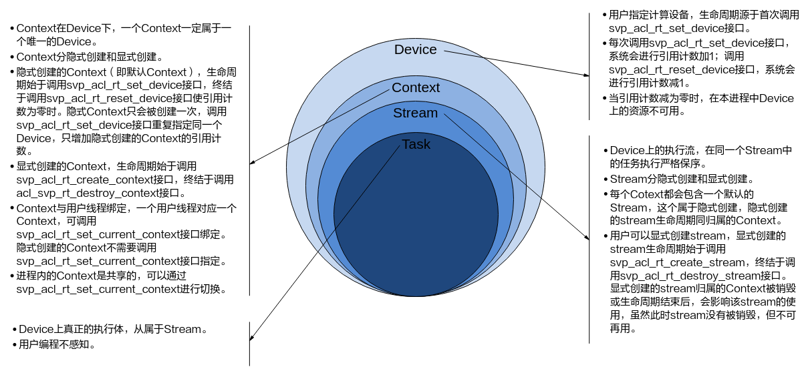
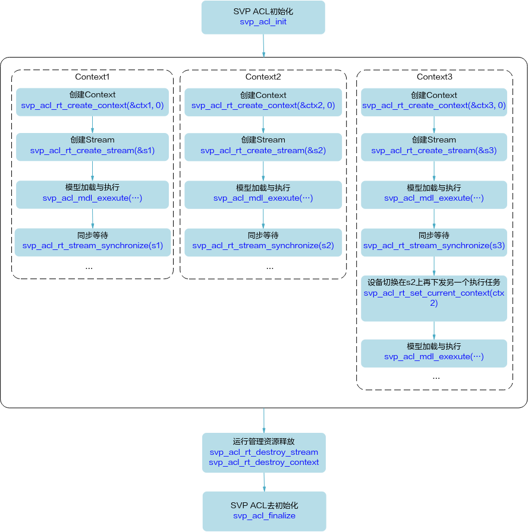

# Preface
**Overview<a name="section906mcpsimp"></a>**

This document guides developers in developing image analysis tool applications based on existing models using the C language API library provided by SVP ACL (Smart Vision Processing Advanced Computing Language), for implementing functions such as object recognition and image classification.

**Product Version<a name="section300mcpsimp"></a>**

The product versions corresponding to this document are as follows.

<a name="table303mcpsimp"></a>
<table><thead align="left"><tr id="row308mcpsimp"><th class="cellrowborder" valign="top" width="45%" id="mcps1.1.3.1.1"><p id="p310mcpsimp"><a name="p310mcpsimp"></a><a name="p310mcpsimp"></a>Product Name</p>
</th>
<th class="cellrowborder" valign="top" width="55.00000000000001%" id="mcps1.1.3.1.2"><p id="p312mcpsimp"><a name="p312mcpsimp"></a><a name="p312mcpsimp"></a>Product Version</p>
</th>
</tr>
</thead>
<tbody><tr id="row314mcpsimp"><td class="cellrowborder" valign="top" width="45%" headers="mcps1.1.3.1.1 "><p id="p316mcpsimp"><a name="p316mcpsimp"></a><a name="p316mcpsimp"></a>Hi3403V100</p>
</td>
<td class="cellrowborder" valign="top" width="55.00000000000001%" headers="mcps1.1.3.1.2 "><p id="p318mcpsimp"><a name="p318mcpsimp"></a><a name="p318mcpsimp"></a>V100</p>
</td>
</tr>
<tr id="row1376073312191"><td class="cellrowborder" valign="top" width="45%" headers="mcps1.1.3.1.1 "><p id="p5760533111913"><a name="p5760533111913"></a><a name="p5760533111913"></a>Hi3519AV200</p>
</td>
<td class="cellrowborder" valign="top" width="55.00000000000001%" headers="mcps1.1.3.1.2 "><p id="p6760333131918"><a name="p6760333131918"></a><a name="p6760333131918"></a>V100</p>
</td>
</tr>
</tbody>
</table>

**Target Audience<a name="section910mcpsimp"></a>**

This document is applicable to personnel developing applications based on the SVP ACL interface. Through this document, you can:

-   Understand the functional architecture, basic concepts, and typical API calling processes of SVP ACL.
-   Learn the basic workflow and implementation methods for developing applications using SVP ACL interfaces.
-   Extend the development of other applications based on the examples in this document.

The following experience and skills will help you better understand this document:

-   Proficiency in C++/C programming.
-   Basic understanding of machine learning and image analysis methods.

**Revision History<a name="section2467512116410"></a>**

<a name="table1557726816410"></a>
<table><thead align="left"><tr id="row2942532716410"><th class="cellrowborder" valign="top" width="20.72%" id="mcps1.1.4.1.1"><p id="p3778275416410"><a name="p3778275416410"></a><a name="p3778275416410"></a><strong id="b5687322716410"><a name="b5687322716410"></a><a name="b5687322716410"></a>Document Version</strong></p>
</th>
<th class="cellrowborder" valign="top" width="20.22%" id="mcps1.1.4.1.2"><p id="p5627845516410"><a name="p5627845516410"></a><a name="p5627845516410"></a><strong id="b5800814916410"><a name="b5800814916410"></a><a name="b5800814916410"></a>Release Date</strong></p>
</th>
<th class="cellrowborder" valign="top" width="59.06%" id="mcps1.1.4.1.3"><p id="p2382284816410"><a name="p2382284816410"></a><a name="p2382284816410"></a><strong id="b3316380216410"><a name="b3316380216410"></a><a name="b3316380216410"></a>Change Description</strong></p>
</th>
</tr>
</thead>
<tbody><tr id="row5947359616410"><td class="cellrowborder" valign="top" width="20.72%" headers="mcps1.1.4.1.1 "><p id="p2149706016410"><a name="p2149706016410"></a><a name="p2149706016410"></a>00B01</p>
</td>
<td class="cellrowborder" valign="top" width="20.22%" headers="mcps1.1.4.1.2 "><p id="p648803616410"><a name="p648803616410"></a><a name="p648803616410"></a>2025-09-15</p>
</td>
<td class="cellrowborder" valign="top" width="59.06%" headers="mcps1.1.4.1.3 "><p id="p1946537916410"><a name="p1946537916410"></a><a name="p1946537916410"></a>First interim version release.</p>
</td>
</tr>
</tbody>
</table>

# Usage Constraints
-   Scenarios where multiple processes are created using the fork function and SVP ACL interfaces are called within the processes are not supported. Otherwise, the process may report errors or hang during execution.
-   For creation-type interfaces (e.g., svp\_acl\_rt\_create\_context, svp\_acl\_rt\_create\_stream, svp\_acl\_create\_data\_buffer), after creating the corresponding resources, it is recommended to promptly call the corresponding destruction-type interfaces (e.g., svp\_acl\_rt\_destroy\_context, svp\_acl\_rt\_destroy\_stream, svp\_acl\_destroy\_data\_buffer) after resource usage is complete. Otherwise, the program may behave abnormally.
-   For destruction-type interfaces (e.g., svp\_acl\_rt\_destroy\_context, svp\_acl\_rt\_destroy\_stream, svp\_acl\_rt\_free, svp\_acl\_destroy\_data\_buffer), after calling these interfaces, users must not continue to use the released or destroyed resources. It is recommended to set relevant resources to an invalid value (e.g., set to NULL) after calling destruction-type interfaces.
-   By default, a maximum of 64 user processes is supported on one Device.

# New User Guide
## Document Structure Overview<a name="ZH-CN_TOPIC_0000002408581518"></a>

This document is divided into the following chapters:

-   [Preface](#ZH-CN_TOPIC_0000002442020853): Introduces the document overview and target audience.
-   [Usage Constraints](#ZH-CN_TOPIC_0000002408421554): Introduces the general usage constraints of SVP ACL.
-   [New User Guide](#ZH-CN_TOPIC_0000002442020717): Introduces the document structure and interface naming rules.
-   [Introduction](#ZH-CN_TOPIC_0000002408421786): Introduces the basics of SVP (Smart Vision Platform) ACL (Advanced Computing Language), including functions, basic concepts, relationships between concepts, and how to view logs.
-   [Interface Calling Process Introduction](#ZH-CN_TOPIC_0000002441980889): Introduces SVP ACL interface calling processes in various scenarios.
-   [Development Process](#ZH-CN_TOPIC_0000002408421570): Introduces the basic steps for developing applications using SVP ACL interfaces.
-   [Environment Preparation](#ZH-CN_TOPIC_0000002442020869): Introduces the documents to reference when preparing the development environment and board-side environment.
-   [Developing Your First Application](#ZH-CN_TOPIC_0000002441980881): Uses the example of developing an image classification application (excluding data preprocessing development such as cropping, scaling, and decoding), following the development process and combining sample code to introduce the basic principles of each step.
-   [Introduction to Developing Typical Features](#ZH-CN_TOPIC_0000002408581594): Detailed introduction to each feature of SVP ACL.
-   [SVP ACL API Reference](#ZH-CN_TOPIC_0000002408421574): Introduces API functions, prototypes, parameters, etc.
-   [SVP ACL Sample Usage Guide](#ZH-CN_TOPIC_0000002441981261): Introduces how to use the samples provided by SVP ACL.

## Expression Conventions<a name="ZH-CN_TOPIC_0000002408581726"></a>

### Interface Naming Rules<a name="ZH-CN_TOPIC_0000002408581482"></a>

Interface naming satisfies the following rules simultaneously:

1.  Rule 1: svp\_acl + _interface category abbreviation_ + _action verb_ + _object_
2.  Rule 2: Action verbs and objects are in lowercase

### Interface Categories<a name="ZH-CN_TOPIC_0000002441980845"></a>

<a name="table5761mcpsimp"></a>
<table><thead align="left"><tr id="row5767mcpsimp"><th class="cellrowborder" valign="top" width="28.999999999999996%" id="mcps1.1.4.1.1"><p id="p5769mcpsimp"><a name="p5769mcpsimp"></a><a name="p5769mcpsimp"></a>Interface Category</p>
</th>
<th class="cellrowborder" valign="top" width="15%" id="mcps1.1.4.1.2"><p id="p5771mcpsimp"><a name="p5771mcpsimp"></a><a name="p5771mcpsimp"></a>Abbreviation</p>
</th>
<th class="cellrowborder" valign="top" width="56.00000000000001%" id="mcps1.1.4.1.3"><p id="p5773mcpsimp"><a name="p5773mcpsimp"></a><a name="p5773mcpsimp"></a>Description</p>
</th>
</tr>
</thead>
<tbody><tr id="row5775mcpsimp"><td class="cellrowborder" valign="top" width="28.999999999999996%" headers="mcps1.1.4.1.1 "><p id="p5777mcpsimp"><a name="p5777mcpsimp"></a><a name="p5777mcpsimp"></a>runtime</p>
</td>
<td class="cellrowborder" valign="top" width="15%" headers="mcps1.1.4.1.2 "><p id="p5779mcpsimp"><a name="p5779mcpsimp"></a><a name="p5779mcpsimp"></a>rt</p>
</td>
<td class="cellrowborder" valign="top" width="56.00000000000001%" headers="mcps1.1.4.1.3 "><p id="p5781mcpsimp"><a name="p5781mcpsimp"></a><a name="p5781mcpsimp"></a>Indicates runtime management interfaces.</p>
</td>
</tr>
<tr id="row5782mcpsimp"><td class="cellrowborder" valign="top" width="28.999999999999996%" headers="mcps1.1.4.1.1 "><p id="p5784mcpsimp"><a name="p5784mcpsimp"></a><a name="p5784mcpsimp"></a>model</p>
</td>
<td class="cellrowborder" valign="top" width="15%" headers="mcps1.1.4.1.2 "><p id="p5786mcpsimp"><a name="p5786mcpsimp"></a><a name="p5786mcpsimp"></a>mdl</p>
</td>
<td class="cellrowborder" valign="top" width="56.00000000000001%" headers="mcps1.1.4.1.3 "><p id="p5788mcpsimp"><a name="p5788mcpsimp"></a><a name="p5788mcpsimp"></a>Indicates model inference interfaces.</p>
</td>
</tr>
</tbody>
</table>

Note:

1. Abbreviations should not exceed 4 letters in principle.
2. In interface naming, if the category overlaps with the operation object, the object after the action verb is omitted.

For example: svp\_acl\_mdl\_load\_from\_mem indicates a model class interface, meaning "load model from memory", so "mdl" is omitted after "Load" in the interface name.

# Introduction
This document guides developers in developing image analysis tool applications based on existing models using the C language API library provided by SVP ACL (Smart Vision Processing Advanced Computing Language), for implementing functions such as object recognition and image classification.

## What is SVP ACL<a name="ZH-CN_TOPIC_0000002442020901"></a>

SVP ACL (Smart Vision Processing Advanced Computing Language) provides C language API libraries for Device management, Context management, Stream management, memory management, model loading and execution, etc., for users to develop image analysis tool applications to implement functions such as object recognition and image classification. Users can call SVP ACL interfaces through third-party frameworks to utilize the computing power of the SoC. Users can also encapsulate SVP ACL to implement third-party lib libraries to provide SoC runtime management and resource management capabilities.

When running applications, SVP ACL calls the interfaces provided by the mdl manager to implement model loading and execution, and calls the interfaces of the runtime manager to implement Device management, Context management, Stream management, memory management, etc.

The computing resource layer is the hardware computing foundation of the SoC. It mainly performs matrix-related computations for image analysis tools, completes general computations and execution control functions such as control operators, scalars, and vectors, and performs preprocessing of image and video data, providing execution assurance for image analysis tool computations.

**Figure 1** Logical Architecture Diagram<a name="fig1754516145614"></a>  


## Basic Concepts<a name="ZH-CN_TOPIC_0000002441980857"></a>

**Table 1** Concept Introduction

<a name="table3953mcpsimp"></a>
<table><thead align="left"><tr id="row3959mcpsimp"><th class="cellrowborder" valign="top" width="26%" id="mcps1.2.3.1.1"><p id="p3961mcpsimp"><a name="p3961mcpsimp"></a><a name="p3961mcpsimp"></a>Concept</p>
</th>
<th class="cellrowborder" valign="top" width="74%" id="mcps1.2.3.1.2"><p id="p3963mcpsimp"><a name="p3963mcpsimp"></a><a name="p3963mcpsimp"></a>Description</p>
</th>
</tr>
</thead>
<tbody><tr id="row3965mcpsimp"><td class="cellrowborder" valign="top" width="26%" headers="mcps1.2.3.1.1 "><p id="p3967mcpsimp"><a name="p3967mcpsimp"></a><a name="p3967mcpsimp"></a>Synchronous/Asynchronous</p>
</td>
<td class="cellrowborder" valign="top" width="74%" headers="mcps1.2.3.1.2 "><p id="p3969mcpsimp"><a name="p3969mcpsimp"></a><a name="p3969mcpsimp"></a>Synchronous and asynchronous in this document are from the perspective of the caller and executor. In the current scenario, if an interface is called in the board-side environment and returns without waiting for the Device to complete execution, the board-side environment scheduling is asynchronous. If the call waits for the Device to complete execution before returning, the board-side environment scheduling is synchronous.</p>
</td>
</tr>
<tr id="row3970mcpsimp"><td class="cellrowborder" valign="top" width="26%" headers="mcps1.2.3.1.1 "><p id="p3972mcpsimp"><a name="p3972mcpsimp"></a><a name="p3972mcpsimp"></a>Process/Thread</p>
</td>
<td class="cellrowborder" valign="top" width="74%" headers="mcps1.2.3.1.2 "><p id="p3974mcpsimp"><a name="p3974mcpsimp"></a><a name="p3974mcpsimp"></a>Unless otherwise specified, processes and threads mentioned in this document refer to processes and threads on the board-side environment.</p>
</td>
</tr>
<tr id="row3975mcpsimp"><td class="cellrowborder" valign="top" width="26%" headers="mcps1.2.3.1.1 "><p id="p3977mcpsimp"><a name="p3977mcpsimp"></a><a name="p3977mcpsimp"></a>Device</p>
</td>
<td class="cellrowborder" valign="top" width="74%" headers="mcps1.2.3.1.2 "><p id="p3979mcpsimp"><a name="p3979mcpsimp"></a><a name="p3979mcpsimp"></a>Device represents the image analysis engine on the board-side environment.</p>
</td>
</tr>
<tr id="row3981mcpsimp"><td class="cellrowborder" valign="top" width="26%" headers="mcps1.2.3.1.1 "><p id="p3983mcpsimp"><a name="p3983mcpsimp"></a><a name="p3983mcpsimp"></a>Context</p>
</td>
<td class="cellrowborder" valign="top" width="74%" headers="mcps1.2.3.1.2 "><p id="p3985mcpsimp"><a name="p3985mcpsimp"></a><a name="p3985mcpsimp"></a>Context acts as a container, managing the lifecycle of all objects (including Streams, device memory, etc.). Streams in different Contexts and different Contexts themselves are completely isolated and cannot establish synchronization wait relationships.</p>
<p id="p3986mcpsimp"><a name="p3986mcpsimp"></a><a name="p3986mcpsimp"></a>Contexts are divided into two types:</p>
<a name="ul3987mcpsimp"></a><a name="ul3987mcpsimp"></a><ul id="ul3987mcpsimp"><li>Default Context: When the <a href="#ZH-CN_TOPIC_0000002408421586">svp_acl_rt_set_device</a> interface is called to specify the Device for computation, the system automatically and implicitly creates a default Context. One Device corresponds to one default Context. The default Context cannot be released through the <a href="#ZH-CN_TOPIC_0000002441980909">svp_acl_rt_destroy_context</a> interface.</li><li>Explicitly created Context: <strong id="b3992mcpsimp"><a name="b3992mcpsimp"></a><a name="b3992mcpsimp"></a>Recommended.</strong> Call the <a href="#ZH-CN_TOPIC_0000002408581542">svp_acl_rt_create_context</a> interface in a process or thread to explicitly create a Context.</li></ul>
</td>
</tr>
<tr id="row3994mcpsimp"><td class="cellrowborder" valign="top" width="26%" headers="mcps1.2.3.1.1 "><p id="p3996mcpsimp"><a name="p3996mcpsimp"></a><a name="p3996mcpsimp"></a>Stream</p>
</td>
<td class="cellrowborder" valign="top" width="74%" headers="mcps1.2.3.1.2 "><p id="p3998mcpsimp"><a name="p3998mcpsimp"></a><a name="p3998mcpsimp"></a>Stream is used to maintain the execution order of asynchronous operations, ensuring they execute on the Device in the order of the application code calls.</p>
<p id="p3999mcpsimp"><a name="p3999mcpsimp"></a><a name="p3999mcpsimp"></a>Streams are divided into two types:</p>
<a name="ul4000mcpsimp"></a><a name="ul4000mcpsimp"></a><ul id="ul4000mcpsimp"><li>Default Stream: When the <a href="#ZH-CN_TOPIC_0000002408421586">svp_acl_rt_set_device</a> interface is called to specify the Device for computation, the system automatically and implicitly creates a default Stream. One Device corresponds to one default Stream. The default Stream cannot be released through the <a href="#ZH-CN_TOPIC_0000002408581750">svp_acl_rt_destroy_stream</a> interface.</li><li>Explicitly created Stream: <strong id="b4005mcpsimp"><a name="b4005mcpsimp"></a><a name="b4005mcpsimp"></a>Recommended.</strong> Call the <a href="#ZH-CN_TOPIC_0000002408421842">svp_acl_rt_create_stream</a> interface in a process or thread to explicitly create a Stream.</li></ul>
</td>
</tr>
<tr id="row4007mcpsimp"><td class="cellrowborder" valign="top" width="26%" headers="mcps1.2.3.1.1 "><p id="p4009mcpsimp"><a name="p4009mcpsimp"></a><a name="p4009mcpsimp"></a>Dynamic Batch/Dynamic Resolution</p>
</td>
<td class="cellrowborder" valign="top" width="74%" headers="mcps1.2.3.1.2 "><p id="p4011mcpsimp"><a name="p4011mcpsimp"></a><a name="p4011mcpsimp"></a>In some scenarios, the batch number or resolution of each model input is not fixed. For example, after detecting a target and then executing the object recognition network, the input BatchSize of the object recognition network is not fixed due to the variable number of targets.</p>
<a name="ul4012mcpsimp"></a><a name="ul4012mcpsimp"></a><ul id="ul4012mcpsimp"><li>Dynamic Batch: When the user performs inference, the batch number is dynamically variable.</li><li>Dynamic Resolution: When the user performs inference, the resolution H*W of each image is dynamically variable. If used together with Dynamic Batch, multiple images in a single multi-Batch inference must use the same resolution.</li></ul>
</td>
</tr>
<tr id="row4015mcpsimp"><td class="cellrowborder" valign="top" width="26%" headers="mcps1.2.3.1.1 "><p id="p4017mcpsimp"><a name="p4017mcpsimp"></a><a name="p4017mcpsimp"></a>Dynamic Dimension (ND Format)</p>
</td>
<td class="cellrowborder" valign="top" width="74%" headers="mcps1.2.3.1.2 "><p id="p4019mcpsimp"><a name="p4019mcpsimp"></a><a name="p4019mcpsimp"></a>To support scenarios where the dimension of the input format is uncertain for networks such as Transformer, dynamic setting of arbitrary dimensions in ND format is needed.</p>
<p id="p4020mcpsimp"><a name="p4020mcpsimp"></a><a name="p4020mcpsimp"></a>ND indicates support for any format. Currently, N is not equal to 4.</p>
</td>
</tr>
<tr id="row4021mcpsimp"><td class="cellrowborder" valign="top" width="26%" headers="mcps1.2.3.1.1 "><p id="p4023mcpsimp"><a name="p4023mcpsimp"></a><a name="p4023mcpsimp"></a>Channel</p>
</td>
<td class="cellrowborder" valign="top" width="74%" headers="mcps1.2.3.1.2 "><p id="p4025mcpsimp"><a name="p4025mcpsimp"></a><a name="p4025mcpsimp"></a>In the RGB color mode, an image channel refers to the individual red (R), green (G), and blue (B) components. That is, a complete image is composed of three channels: red, green, and blue, together producing the full image.</p>
</td>
</tr>
</tbody>
</table>

## Relationship Between Process, Thread, Device, Context, and Stream<a name="ZH-CN_TOPIC_0000002408421614"></a>

For introductions to each basic concept, please refer to [Basic Concepts](#ZH-CN_TOPIC_0000002441980857).

### Relationship Between Device, Context, and Stream<a name="ZH-CN_TOPIC_0000002442020749"></a>



### Relationship Between Thread, Context, and Stream<a name="ZH-CN_TOPIC_0000002408421850"></a>

-   A user thread must be bound to a Context. All resource usage or scheduling on a Device must be based on a Context.
-   There is currently one unique Context in use in a thread, and the Context has already associated the Device to be used by this thread.
-   Device switching can be done quickly through [svp\_acl\_rt\_set\_current\_context](#ZH-CN_TOPIC_0000002408421610). The example code below is for reference only and cannot be directly compiled and run:

    ```
    ...
    svp_acl_rt_create_context(&ctx1, 0);
    svp_acl_mdl_execute(mdl1, input1, output1);
    svp_acl_rt_create_context(&ctx2, 1);

    /* In the current thread, after creating ctx2, the Context for the current thread switches to ctx2, corresponding to subsequent computation tasks on Device 1. In this example, mdl2 will be executed on Device 1 */
    svp_acl_mdl_execute(mdl2, input2, output2);
    svp_acl_rt_set_current_context(ctx1);

    /* In the current thread, through Context switching, subsequent model computation tasks are performed on the corresponding Device 0 */
    svp_acl_mdl_execute(mdl3, input3, output3);
    ...
    ```

-   Multiple Streams can be created in a thread, and computation tasks on different Streams can execute in parallel. In multi-threaded scenarios, each thread can create one Stream. Streams between threads are independent of each other on the Device. Tasks within each Stream are executed in the order they are submitted to the Stream.
-   Multi-thread scheduling depends on the operating system scheduling of the running application. Multi-Stream scheduling on the Device side is performed by the scheduling component on the Device.

### Context Migration Between Multiple Threads in a Process<a name="ZH-CN_TOPIC_0000002408581506"></a>

-   Multiple Contexts can be created in a process, but a thread can only use one Context at a time.
-   For multiple Contexts created in a thread, the thread defaults to using the last created Context.
-   For multiple Contexts created within a process, the currently needed Context can be set through [svp\_acl\_rt\_set\_current\_context](#ZH-CN_TOPIC_0000002408421610).



### Default Context and Default Stream Usage Scenarios<a name="ZH-CN_TOPIC_0000002441980869"></a>

-   Before operations are issued for execution on the Device, a Context and Stream must exist. These Context and Stream can be explicitly created or implicitly created. Implicitly created Context and Stream are the default Context and default Stream.

    When the default Stream is passed as an interface parameter, pass NULL directly.

-   The default Context does not allow users to perform [svp\_acl\_rt\_get\_current\_context](#ZH-CN_TOPIC_0000002442020945) or [svp\_acl\_rt\_set\_current\_context](#ZH-CN_TOPIC_0000002408421610) operations, nor [svp\_acl\_rt\_destroy\_context](#ZH-CN_TOPIC_0000002441980909) operations.
-   Default Context and default Stream are generally suitable for simple applications where the user only needs computation on a single Device. For multi-threaded applications, it is recommended to use explicitly created Contexts and Streams exclusively.

Example code below is for reference only and cannot be directly compiled and run:

```
...
svp_acl_init(...);
svp_acl_rt_set_device(0);

/* A default ctx has been created, and a default stream has been created in it, both available in the current thread */
...
svp_acl_mdl_execute_async(mdl1, input1, output1, NULL);  // The last NULL indicates executing model mdl1 on the default stream
svp_acl_mdl_execute_async(mdl2, input2, output2, NULL); // The last NULL indicates executing model mdl2 on the default stream
svp_acl_rt_synchronize_stream(NULL);

/* Wait for all computation tasks to complete (mdl1, mdl2 execution finished), and the user can obtain the output results of the computation tasks as needed */
...
svp_acl_rt_reset_device(0);  // Release computing device 0, the lifecycle of the corresponding default ctx and default stream also ends
```

### Performance Description for Multi-Thread, Multi-Stream<a name="ZH-CN_TOPIC_0000002408581758"></a>

-   Thread scheduling depends on the operating system. After tasks are submitted to a Stream, Stream scheduling is performed by the scheduling unit on the Device. However, if tasks on multiple Streams in a process compete for resources on the Device, performance may be lower than with a single Stream.
-   The current chip has different execution components, such as pattern recognition Core, pattern recognition CPU, etc. For tasks that use different execution components, it is recommended to create multiple Streams based on operator execution engine division.
-   Regarding whether single-thread multi-Stream or multi-thread multi-Stream (the process is multi-threaded, with each thread having one Stream) performs better, the answer depends on the application's own logic implementation. Generally, the former performs slightly better because it has less thread scheduling overhead at the application layer compared to the latter.

## SVP ACL Memory Allocation Usage Notes<a name="ZH-CN_TOPIC_0000002408421814"></a>

User memory management has two approaches:

1.  Independent memory management: Allocate the required memory individually as needed, without splitting or re-allocating memory.
2.  Memory pool management: Allocate a large block of memory at once, and then re-allocate the required memory from this large block during use.

    When re-allocating memory, use the following interfaces to allocate from the memory pool. Since the interfaces have constraints on the allocated memory address and size, special attention is needed when managing memory pools to avoid memory out-of-bounds errors.

    <a name="table4581mcpsimp"></a>
    <table><thead align="left"><tr id="row4587mcpsimp"><th class="cellrowborder" valign="top" width="25%" id="mcps1.1.4.1.1"><p id="p4589mcpsimp"><a name="p4589mcpsimp"></a><a name="p4589mcpsimp"></a>Interface</p>
    </th>
    <th class="cellrowborder" valign="top" width="20%" id="mcps1.1.4.1.2"><p id="p4591mcpsimp"><a name="p4591mcpsimp"></a><a name="p4591mcpsimp"></a>Purpose</p>
    </th>
    <th class="cellrowborder" valign="top" width="55.00000000000001%" id="mcps1.1.4.1.3"><p id="p4593mcpsimp"><a name="p4593mcpsimp"></a><a name="p4593mcpsimp"></a>Input Memory/Output Memory</p>
    </th>
    </tr>
    </thead>
    <tbody><tr id="row4595mcpsimp"><td class="cellrowborder" valign="top" width="25%" headers="mcps1.1.4.1.1 "><p id="p4597mcpsimp"><a name="p4597mcpsimp"></a><a name="p4597mcpsimp"></a><a href="#ZH-CN_TOPIC_0000002408581654">svp_acl_rt_malloc</a></p>
    </td>
    <td class="cellrowborder" valign="top" width="20%" headers="mcps1.1.4.1.2 "><p id="p4601mcpsimp"><a name="p4601mcpsimp"></a><a name="p4601mcpsimp"></a>Allocates memory on the Device. Synchronous interface.</p>
    </td>
    <td class="cellrowborder" valign="top" width="55.00000000000001%" headers="mcps1.1.4.1.3 "><a name="ul4603mcpsimp"></a><a name="ul4603mcpsimp"></a><ul id="ul4603mcpsimp"><li>Memory allocated using <a href="#ZH-CN_TOPIC_0000002408581654">svp_acl_rt_malloc</a> must be released using the <a href="#ZH-CN_TOPIC_0000002408581838">svp_acl_rt_free</a> interface.</li><li>Frequently calling <a href="#ZH-CN_TOPIC_0000002408581654">svp_acl_rt_malloc</a> to allocate memory and <a href="#ZH-CN_TOPIC_0000002408581838">svp_acl_rt_free</a> to release memory degrades performance. It is recommended that users pre-allocate memory or perform secondary management to avoid frequent allocation/release.</li></ul>
    </td>
    </tr>
    <tr id="row4612mcpsimp"><td class="cellrowborder" valign="top" width="25%" headers="mcps1.1.4.1.1 "><p id="p4614mcpsimp"><a name="p4614mcpsimp"></a><a name="p4614mcpsimp"></a><a href="#ZH-CN_TOPIC_0000002408581790">svp_acl_rt_malloc_host</a></p>
    </td>
    <td class="cellrowborder" valign="top" width="20%" headers="mcps1.1.4.1.2 "><p id="p4618mcpsimp"><a name="p4618mcpsimp"></a><a name="p4618mcpsimp"></a>Allocates memory on Host or Device. Memory on Device is allocated as regular pages. Synchronous interface.</p>
    </td>
    <td class="cellrowborder" valign="top" width="55.00000000000001%" headers="mcps1.1.4.1.3 "><a name="ul4620mcpsimp"></a><a name="ul4620mcpsimp"></a><ul id="ul4620mcpsimp"><li>Memory allocated using <a href="#ZH-CN_TOPIC_0000002408581790">svp_acl_rt_malloc_host</a> must be released using the <a href="#ZH-CN_TOPIC_0000002408581844">svp_acl_rt_free_host</a> interface.</li><li>If there is no Host side, calling this interface will obtain Device-side memory, which can also be released by calling <a href="#ZH-CN_TOPIC_0000002408581838">svp_acl_rt_free</a>.</li><li>Frequently calling <a href="#ZH-CN_TOPIC_0000002408581790">svp_acl_rt_malloc_host</a> to allocate memory and <a href="#ZH-CN_TOPIC_0000002408581844">svp_acl_rt_free_host</a> to release memory degrades performance. It is recommended that users pre-allocate memory or perform secondary management to avoid frequent allocation/release.</li></ul>
    </td>
    </tr>
    </tbody>
    </table>

## How to Obtain Samples<a name="ZH-CN_TOPIC_0000002441980885"></a>

The samples currently provided by SVP ACL are shown in [Table 1](#table3919mcpsimp).

**Table 1** Sample List

<a name="table3919mcpsimp"></a>
<table><thead align="left"><tr id="row3926mcpsimp"><th class="cellrowborder" valign="top" width="27%" id="mcps1.2.4.1.1"><p id="p3928mcpsimp"><a name="p3928mcpsimp"></a><a name="p3928mcpsimp"></a>Sample</p>
</th>
<th class="cellrowborder" valign="top" width="36%" id="mcps1.2.4.1.2"><p id="p3930mcpsimp"><a name="p3930mcpsimp"></a><a name="p3930mcpsimp"></a>Basic Function</p>
</th>
<th class="cellrowborder" valign="top" width="37%" id="mcps1.2.4.1.3"><p id="p3932mcpsimp"><a name="p3932mcpsimp"></a><a name="p3932mcpsimp"></a>Sample Introduction, Compilation and Execution</p>
</th>
</tr>
</thead>
<tbody><tr id="row3934mcpsimp"><td class="cellrowborder" valign="top" width="27%" headers="mcps1.2.4.1.1 "><p id="p3936mcpsimp"><a name="p3936mcpsimp"></a><a name="p3936mcpsimp"></a>resnet50_imagenet_classification</p>
</td>
<td class="cellrowborder" valign="top" width="36%" headers="mcps1.2.4.1.2 "><p id="p3938mcpsimp"><a name="p3938mcpsimp"></a><a name="p3938mcpsimp"></a>Image classification based on Caffe ResNet-50 network (synchronous inference)</p>
</td>
<td class="cellrowborder" valign="top" width="37%" headers="mcps1.2.4.1.3 "><p id="p3940mcpsimp"><a name="p3940mcpsimp"></a><a name="p3940mcpsimp"></a><a href="#ZH-CN_TOPIC_0000002442020893">Image Classification Based on Caffe ResNet-50 Network (Synchronous Inference)</a></p>
</td>
</tr>
<tr id="row3942mcpsimp"><td class="cellrowborder" valign="top" width="27%" headers="mcps1.2.4.1.1 "><p id="p3944mcpsimp"><a name="p3944mcpsimp"></a><a name="p3944mcpsimp"></a>resnet50_async_imagenet_classification</p>
</td>
<td class="cellrowborder" valign="top" width="36%" headers="mcps1.2.4.1.2 "><p id="p3946mcpsimp"><a name="p3946mcpsimp"></a><a name="p3946mcpsimp"></a>Image classification based on Caffe ResNet-50 network (asynchronous inference)</p>
</td>
<td class="cellrowborder" valign="top" width="37%" headers="mcps1.2.4.1.3 "><p id="p3948mcpsimp"><a name="p3948mcpsimp"></a><a name="p3948mcpsimp"></a><a href="#ZH-CN_TOPIC_0000002408581502">Image Classification Based on Caffe ResNet-50 Network (Asynchronous Inference)</a></p>
</td>
</tr>
</tbody>
</table>

Navigate to the Sample directory in the release package and extract samples.tar.gz:

```
tar -zxvf samples.tar.gz
```

## How to View Logs<a name="ZH-CN_TOPIC_0000002442020801"></a>

You can use the cat command on the console to view information. Use cat /dev/logmpp to view error logs.

## How to View Proc Information<a name="ZH-CN_TOPIC_0000002408581614"></a>

### Overview<a name="ZH-CN_TOPIC_0000002408422038"></a>

Debug information uses the proc file system under Linux, which can reflect the current system running status in real time. The recorded information can be used for problem location and analysis.

【File Directory】

/proc/umap

【Information Viewing Method】

-   You can use the cat command on the console to view information, e.g., cat /proc/umap/svp\_nnn. You can also use other common file operation commands, e.g., cp /proc/umap/svp\_nnn ./ to copy the file to the current directory.
-   In applications, you can treat the above file as an ordinary read-only file for read operations, such as fopen, fread, etc.

> **Note:** 
>There are two cases to note when parameters are described:
>-   For parameters with values of {0, 1}, if the specific value-meaning correspondence is not listed, a value of 1 indicates affirmative and 0 indicates negative.
>-   For parameters with values of {aaa, bbb, ccc}, the specific value-meaning correspondence is not listed, but the parameter meaning can be directly determined based on the values aaa, bbb, or ccc.

### Proc Information Description<a name="ZH-CN_TOPIC_0000002408581534"></a>

【Debug Information】

```
# cat /proc/umap/svp_nnn
[SVP_NNN] Version:  [xxxxVx.x.x.x B0xx Release], Build Time[mm dd yyyy, hh:mm:ss]
 
---------------------------svp_nnn module param--------------------------
  nnn_save_power   max_task_node_num
0                    512
                 
---------------------------svp_nnn resource info------------------------
  free_model_num
                63
  device_id   free_stream_num   free_report_num   free_task_node_num
            0                 127                  128                     511
 
---------------------------svp_nnn busy stream info----------------------
  device_id   stream_id   report_id    block_type   send_task_num   
            0            0            -1               1                 0
timeout_err_cnt hw_err_cnt   aacpu_err_cnt
                 0            0                  0
  model_task_handle   model_task_handle_wrap   model_task_finish
                     1                            0                      0
model_task_finish_wrap
                         0
   callback_task_handle   callback_task_handle_wrap   callback_task_finish  
0                                0                          0
callback_task_finish_wrap
0

----------------------svp_nnn sync model task info-----------------
device_id  task_send_num  task_send_num_wrap  task_finish_num  task_finish_num_wrap
         0               1                     0               1                     0
---------------------------svp_nnn irq info------------------------------
  device_id   irq_cnt_last_sec   max_irq_cnt_per_sec   total_irq_cnt
            0                   17                        17              181
 
  cur_irq_time   max_irq_time   irq_time_last_sec   max_irq_time_per_sec
               8               24                    180                       180
total_irq_time
            2445
 
---------------------------svp_nnn runtime info--------------------------
  device_id   hw_status   last_stream_id   last_task_node_id   net_seg_idx
            0            0                   0                      0            446
net_seg_num
          610
 
  timeout_err_cnt   hw_err_cnt   aacpu_err_cnt 
0               0                 0
last_hw_task_time   hw_utilization   total_running_time
                  13                  0%                    897 
```

【Debug Information Analysis】

Records the current SVP image analysis engine module parameter information, resource information, called stream information, interrupt information, and runtime status information.

【Parameter Description】

<a name="table2926mcpsimp"></a>
<table><thead align="left"><tr id="row2932mcpsimp"><th class="cellrowborder" colspan="2" valign="top" id="mcps1.1.4.1.1"><p id="p2934mcpsimp"><a name="p2934mcpsimp"></a><a name="p2934mcpsimp"></a>Parameter</p>
</th>
<th class="cellrowborder" valign="top" id="mcps1.1.4.1.2"><p id="p2936mcpsimp"><a name="p2936mcpsimp"></a><a name="p2936mcpsimp"></a>Description</p>
</th>
</tr>
</thead>
<tbody><tr id="row2938mcpsimp"><td class="cellrowborder" rowspan="2" valign="top" width="21.21212121212121%" headers="mcps1.1.4.1.1 "><p id="p2940mcpsimp"><a name="p2940mcpsimp"></a><a name="p2940mcpsimp"></a>svp_<em id="i2941mcpsimp"><a name="i2941mcpsimp"></a><a name="i2941mcpsimp"></a>nnn</em> module param</p>
<p id="p2942mcpsimp"><a name="p2942mcpsimp"></a><a name="p2942mcpsimp"></a>SVP image analysis engine module parameters</p>
</td>
<td class="cellrowborder" valign="top" width="32.32323232323232%" headers="mcps1.1.4.1.1 "><p id="p2945mcpsimp"><a name="p2945mcpsimp"></a><a name="p2945mcpsimp"></a><em id="i2946mcpsimp"><a name="i2946mcpsimp"></a><a name="i2946mcpsimp"></a>nnn</em>_save_power</p>
</td>
<td class="cellrowborder" valign="top" width="46.464646464646464%" headers="mcps1.1.4.1.2 "><p id="p2948mcpsimp"><a name="p2948mcpsimp"></a><a name="p2948mcpsimp"></a>Low power flag.</p>
<p id="p2949mcpsimp"><a name="p2949mcpsimp"></a><a name="p2949mcpsimp"></a>0: Low power off;</p>
<p id="p2950mcpsimp"><a name="p2950mcpsimp"></a><a name="p2950mcpsimp"></a>1: Low power on.</p>
</td>
</tr>
<tr id="row2951mcpsimp"><td class="cellrowborder" valign="top" headers="mcps1.1.4.1.1 "><p id="p2953mcpsimp"><a name="p2953mcpsimp"></a><a name="p2953mcpsimp"></a>max_task_node_num</p>
</td>
<td class="cellrowborder" valign="top" headers="mcps1.1.4.1.1 "><p id="p2955mcpsimp"><a name="p2955mcpsimp"></a><a name="p2955mcpsimp"></a>Maximum number of task nodes, range [1, 4096], default 512. Users can configure through the module parameter svp_<em id="i2956mcpsimp"><a name="i2956mcpsimp"></a><a name="i2956mcpsimp"></a>nnn</em>_max_task_node_num. The configuration method is to use the "svp_nnn_max_task_node_num=512" parameter when loading the svp_<em id="i5677114714443"><a name="i5677114714443"></a><a name="i5677114714443"></a>nnn</em> ko, and modify the value "512" to the desired value.</p>
</td>
</tr>
<tr id="row2957mcpsimp"><td class="cellrowborder" rowspan="5" valign="top" width="21.21212121212121%" headers="mcps1.1.4.1.1 "><p id="p2959mcpsimp"><a name="p2959mcpsimp"></a><a name="p2959mcpsimp"></a>svp_<em id="i2960mcpsimp"><a name="i2960mcpsimp"></a><a name="i2960mcpsimp"></a>nnn</em> resource info</p>
<p id="p2961mcpsimp"><a name="p2961mcpsimp"></a><a name="p2961mcpsimp"></a>SVP image analysis engine resource information</p>
</td>
<td class="cellrowborder" valign="top" width="32.32323232323232%" headers="mcps1.1.4.1.1 "><p id="p2964mcpsimp"><a name="p2964mcpsimp"></a><a name="p2964mcpsimp"></a>free_model_num</p>
</td>
<td class="cellrowborder" valign="top" width="46.464646464646464%" headers="mcps1.1.4.1.2 "><p id="p2966mcpsimp"><a name="p2966mcpsimp"></a><a name="p2966mcpsimp"></a>Number of remaining loadable models.</p>
</td>
</tr>
<tr id="row2967mcpsimp"><td class="cellrowborder" valign="top" headers="mcps1.1.4.1.1 "><p id="p2969mcpsimp"><a name="p2969mcpsimp"></a><a name="p2969mcpsimp"></a>device_id</p>
</td>
<td class="cellrowborder" valign="top" headers="mcps1.1.4.1.1 "><p id="p2971mcpsimp"><a name="p2971mcpsimp"></a><a name="p2971mcpsimp"></a>Device ID.</p>
</td>
</tr>
<tr id="row2972mcpsimp"><td class="cellrowborder" valign="top" headers="mcps1.1.4.1.1 "><p id="p2974mcpsimp"><a name="p2974mcpsimp"></a><a name="p2974mcpsimp"></a>free_stream_num</p>
</td>
<td class="cellrowborder" valign="top" headers="mcps1.1.4.1.1 "><p id="p2976mcpsimp"><a name="p2976mcpsimp"></a><a name="p2976mcpsimp"></a>Number of remaining Streams that can be allocated.</p>
</td>
</tr>
<tr id="row2977mcpsimp"><td class="cellrowborder" valign="top" headers="mcps1.1.4.1.1 "><p id="p2979mcpsimp"><a name="p2979mcpsimp"></a><a name="p2979mcpsimp"></a>free_report_num</p>
</td>
<td class="cellrowborder" valign="top" headers="mcps1.1.4.1.1 "><p id="p2981mcpsimp"><a name="p2981mcpsimp"></a><a name="p2981mcpsimp"></a>Number of remaining reports that can be allocated.</p>
</td>
</tr>
<tr id="row2982mcpsimp"><td class="cellrowborder" valign="top" headers="mcps1.1.4.1.1 "><p id="p2984mcpsimp"><a name="p2984mcpsimp"></a><a name="p2984mcpsimp"></a>free_task_node_num</p>
</td>
<td class="cellrowborder" valign="top" headers="mcps1.1.4.1.1 "><p id="p2986mcpsimp"><a name="p2986mcpsimp"></a><a name="p2986mcpsimp"></a>Number of remaining task nodes that can be allocated.</p>
</td>
</tr>
<tr id="row2987mcpsimp"><td class="cellrowborder" rowspan="16" valign="top" width="21.21212121212121%" headers="mcps1.1.4.1.1 "><p id="p2989mcpsimp"><a name="p2989mcpsimp"></a><a name="p2989mcpsimp"></a>svp_<em id="i2990mcpsimp"><a name="i2990mcpsimp"></a><a name="i2990mcpsimp"></a>nnn</em> busy stream info</p>
<p id="p2991mcpsimp"><a name="p2991mcpsimp"></a><a name="p2991mcpsimp"></a>SVP image analysis engine running stream information</p>
</td>
<td class="cellrowborder" valign="top" width="32.32323232323232%" headers="mcps1.1.4.1.1 "><p id="p2994mcpsimp"><a name="p2994mcpsimp"></a><a name="p2994mcpsimp"></a>device_id</p>
</td>
<td class="cellrowborder" valign="top" width="46.464646464646464%" headers="mcps1.1.4.1.2 "><p id="p2996mcpsimp"><a name="p2996mcpsimp"></a><a name="p2996mcpsimp"></a>Device ID.</p>
</td>
</tr>
<tr id="row2997mcpsimp"><td class="cellrowborder" valign="top" headers="mcps1.1.4.1.1 "><p id="p2999mcpsimp"><a name="p2999mcpsimp"></a><a name="p2999mcpsimp"></a>stream_id</p>
</td>
<td class="cellrowborder" valign="top" headers="mcps1.1.4.1.1 "><p id="p3001mcpsimp"><a name="p3001mcpsimp"></a><a name="p3001mcpsimp"></a>Stream ID.</p>
</td>
</tr>
<tr id="row3002mcpsimp"><td class="cellrowborder" valign="top" headers="mcps1.1.4.1.1 "><p id="p3004mcpsimp"><a name="p3004mcpsimp"></a><a name="p3004mcpsimp"></a>report_id</p>
</td>
<td class="cellrowborder" valign="top" headers="mcps1.1.4.1.1 "><p id="p3006mcpsimp"><a name="p3006mcpsimp"></a><a name="p3006mcpsimp"></a>Stream registered report ID. If -1, the Stream has no report registered.</p>
</td>
</tr>
<tr id="row3007mcpsimp"><td class="cellrowborder" valign="top" headers="mcps1.1.4.1.1 "><p id="p3009mcpsimp"><a name="p3009mcpsimp"></a><a name="p3009mcpsimp"></a>block_type</p>
</td>
<td class="cellrowborder" valign="top" headers="mcps1.1.4.1.1 "><p id="p3011mcpsimp"><a name="p3011mcpsimp"></a><a name="p3011mcpsimp"></a>Block type.</p>
<p id="p3012mcpsimp"><a name="p3012mcpsimp"></a><a name="p3012mcpsimp"></a>0: Not blocked;</p>
<p id="p8538948191118"><a name="p8538948191118"></a><a name="p8538948191118"></a>1: Blocked by logical task;</p>
<p id="p3013mcpsimp"><a name="p3013mcpsimp"></a><a name="p3013mcpsimp"></a>2: Blocked by pattern recognition CPU task;</p>
<p id="p3015mcpsimp"><a name="p3015mcpsimp"></a><a name="p3015mcpsimp"></a>3: Blocked by Callback task.</p>
</td>
</tr>
<tr id="row3016mcpsimp"><td class="cellrowborder" valign="top" headers="mcps1.1.4.1.1 "><p id="p3018mcpsimp"><a name="p3018mcpsimp"></a><a name="p3018mcpsimp"></a>send_task_num</p>
</td>
<td class="cellrowborder" valign="top" headers="mcps1.1.4.1.1 "><p id="p3020mcpsimp"><a name="p3020mcpsimp"></a><a name="p3020mcpsimp"></a>Number of tasks dispatched to the Stream.</p>
</td>
</tr>
<tr id="row3021mcpsimp"><td class="cellrowborder" valign="top" headers="mcps1.1.4.1.1 "><p id="p3023mcpsimp"><a name="p3023mcpsimp"></a><a name="p3023mcpsimp"></a>timeout_err_cnt</p>
</td>
<td class="cellrowborder" valign="top" headers="mcps1.1.4.1.1 "><p id="p3025mcpsimp"><a name="p3025mcpsimp"></a><a name="p3025mcpsimp"></a>Number of timeout errors on the Stream.</p>
</td>
</tr>
<tr id="row3026mcpsimp"><td class="cellrowborder" valign="top" headers="mcps1.1.4.1.1 "><p id="p3028mcpsimp"><a name="p3028mcpsimp"></a><a name="p3028mcpsimp"></a>hw_err_cnt</p>
</td>
<td class="cellrowborder" valign="top" headers="mcps1.1.4.1.1 "><p id="p3030mcpsimp"><a name="p3030mcpsimp"></a><a name="p3030mcpsimp"></a>Number of logic errors on the Stream.</p>
</td>
</tr>
<tr id="row3031mcpsimp"><td class="cellrowborder" valign="top" headers="mcps1.1.4.1.1 "><p id="p3033mcpsimp"><a name="p3033mcpsimp"></a><a name="p3033mcpsimp"></a><em id="i3034mcpsimp"><a name="i3034mcpsimp"></a><a name="i3034mcpsimp"></a>aa</em>cpu_err_cnt</p>
</td>
<td class="cellrowborder" valign="top" headers="mcps1.1.4.1.1 "><p id="p3036mcpsimp"><a name="p3036mcpsimp"></a><a name="p3036mcpsimp"></a>Number of pattern recognition CPU task execution errors on the Stream.</p>
</td>
</tr>
<tr id="row3038mcpsimp"><td class="cellrowborder" valign="top" headers="mcps1.1.4.1.1 "><p id="p3040mcpsimp"><a name="p3040mcpsimp"></a><a name="p3040mcpsimp"></a>model_task_handle</p>
</td>
<td class="cellrowborder" valign="top" headers="mcps1.1.4.1.1 "><p id="p3042mcpsimp"><a name="p3042mcpsimp"></a><a name="p3042mcpsimp"></a>Model inference task handle.</p>
</td>
</tr>
<tr id="row3043mcpsimp"><td class="cellrowborder" valign="top" headers="mcps1.1.4.1.1 "><p id="p3045mcpsimp"><a name="p3045mcpsimp"></a><a name="p3045mcpsimp"></a>model_task_handle_wrap</p>
</td>
<td class="cellrowborder" valign="top" headers="mcps1.1.4.1.1 "><p id="p3047mcpsimp"><a name="p3047mcpsimp"></a><a name="p3047mcpsimp"></a>Number of times the model inference task handle has wrapped.</p>
</td>
</tr>
<tr id="row3048mcpsimp"><td class="cellrowborder" valign="top" headers="mcps1.1.4.1.1 "><p id="p3050mcpsimp"><a name="p3050mcpsimp"></a><a name="p3050mcpsimp"></a>model_task_finish</p>
</td>
<td class="cellrowborder" valign="top" headers="mcps1.1.4.1.1 "><p id="p3052mcpsimp"><a name="p3052mcpsimp"></a><a name="p3052mcpsimp"></a>Number of completed model inference tasks.</p>
</td>
</tr>
<tr id="row3053mcpsimp"><td class="cellrowborder" valign="top" headers="mcps1.1.4.1.1 "><p id="p3055mcpsimp"><a name="p3055mcpsimp"></a><a name="p3055mcpsimp"></a>model_task_finish_wrap</p>
</td>
<td class="cellrowborder" valign="top" headers="mcps1.1.4.1.1 "><p id="p3057mcpsimp"><a name="p3057mcpsimp"></a><a name="p3057mcpsimp"></a>Number of times the completed model inference task count has wrapped.</p>
</td>
</tr>
<tr id="row3058mcpsimp"><td class="cellrowborder" valign="top" headers="mcps1.1.4.1.1 "><p id="p3060mcpsimp"><a name="p3060mcpsimp"></a><a name="p3060mcpsimp"></a>callback_task_handle</p>
</td>
<td class="cellrowborder" valign="top" headers="mcps1.1.4.1.1 "><p id="p3062mcpsimp"><a name="p3062mcpsimp"></a><a name="p3062mcpsimp"></a>Callback task handle.</p>
</td>
</tr>
<tr id="row3063mcpsimp"><td class="cellrowborder" valign="top" headers="mcps1.1.4.1.1 "><p id="p3065mcpsimp"><a name="p3065mcpsimp"></a><a name="p3065mcpsimp"></a>callback_task_handle_wrap</p>
</td>
<td class="cellrowborder" valign="top" headers="mcps1.1.4.1.1 "><p id="p3067mcpsimp"><a name="p3067mcpsimp"></a><a name="p3067mcpsimp"></a>Number of times the Callback task handle has wrapped.</p>
</td>
</tr>
<tr id="row3068mcpsimp"><td class="cellrowborder" valign="top" headers="mcps1.1.4.1.1 "><p id="p3070mcpsimp"><a name="p3070mcpsimp"></a><a name="p3070mcpsimp"></a>callback_task_finish</p>
</td>
<td class="cellrowborder" valign="top" headers="mcps1.1.4.1.1 "><p id="p3072mcpsimp"><a name="p3072mcpsimp"></a><a name="p3072mcpsimp"></a>Number of completed Callback tasks.</p>
</td>
</tr>
<tr id="row3073mcpsimp"><td class="cellrowborder" valign="top" headers="mcps1.1.4.1.1 "><p id="p3075mcpsimp"><a name="p3075mcpsimp"></a><a name="p3075mcpsimp"></a>callback_task_finish_wrap</p>
</td>
<td class="cellrowborder" valign="top" headers="mcps1.1.4.1.1 "><p id="p3077mcpsimp"><a name="p3077mcpsimp"></a><a name="p3077mcpsimp"></a>Number of times the completed Callback task count has wrapped.</p>
</td>
</tr>
</tbody>
</table>
