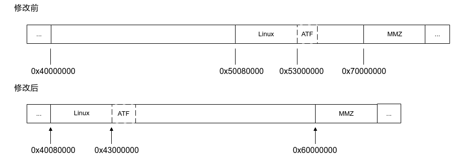
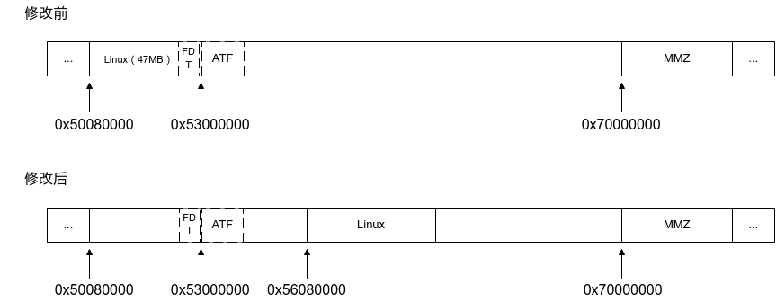

# Preface
**Overview<a name="section4537382116410"></a>**

This document describes how each subsystem module defines its memory space and provides example modifications, to guide developers in adjusting the system memory layout according to their specific use cases.

> **Notice:** 
>In the descriptions below, "xxxx" represents the project name — for example: xxxx\_defconfig → ss928v100\_defconfig.
>"yyyy" represents the version number — for example: u-boot-yyyy → u-boot-2020.01, linux-yyyy → linux-6.6

**Product Version<a name="section5164203710567"></a>**

The product versions corresponding to this document are listed below.

<a name="table4170737175613"></a>
<table><thead align="left"><tr id="row31991337135618"><th class="cellrowborder" valign="top" width="39.25%" id="mcps1.1.3.1.1"><p id="p219963765616"><a name="p219963765616"></a><a name="p219963765616"></a>Product Name</p>
</th>
<th class="cellrowborder" valign="top" width="60.75000000000001%" id="mcps1.1.3.1.2"><p id="p12199337185619"><a name="p12199337185619"></a><a name="p12199337185619"></a>Product Version</p>
</th>
</tr>
</thead>
<tbody><tr id="row419914372567"><td class="cellrowborder" valign="top" width="39.25%" headers="mcps1.1.3.1.1 "><p id="p181991937105611"><a name="p181991937105611"></a><a name="p181991937105611"></a>SS928</p>
</td>
<td class="cellrowborder" valign="top" width="60.75000000000001%" headers="mcps1.1.3.1.2 "><p id="p819943745619"><a name="p819943745619"></a><a name="p819943745619"></a>V100</p>
</td>
</tr>
<tr id="row127881511132510"><td class="cellrowborder" valign="top" width="39.25%" headers="mcps1.1.3.1.1 "><p id="p1397518149259"><a name="p1397518149259"></a><a name="p1397518149259"></a>SS927</p>
</td>
<td class="cellrowborder" valign="top" width="60.75000000000001%" headers="mcps1.1.3.1.2 "><p id="p397511145253"><a name="p397511145253"></a><a name="p397511145253"></a>V100</p>
</td>
</tr>
</tbody>
</table>

> **Note:** 
>This document uses SS928V100 as the reference platform. Unless otherwise noted, SS927V100 content is identical to SS928V100.

**Intended Audience<a name="section4378592816410"></a>**

This document is intended for the following engineers:

-   Technical support engineers
-   Software development engineers

**Revision History<a name="section558815935816"></a>**

The revision history accumulates descriptions of each document update. The latest version includes all updates from previous versions.

<a name="table126443203200"></a>
<table><thead align="left"><tr id="row264516207203"><th class="cellrowborder" valign="top" width="20.72%" id="mcps1.1.4.1.1"><p id="p146456203200"><a name="p146456203200"></a><a name="p146456203200"></a><strong id="b8645172022010"><a name="b8645172022010"></a><a name="b8645172022010"></a>Document Version</strong></p>
</th>
<th class="cellrowborder" valign="top" width="26.119999999999997%" id="mcps1.1.4.1.2"><p id="p364512062019"><a name="p364512062019"></a><a name="p364512062019"></a><strong id="b1464512200200"><a name="b1464512200200"></a><a name="b1464512200200"></a>Release Date</strong></p>
</th>
<th class="cellrowborder" valign="top" width="53.16%" id="mcps1.1.4.1.3"><p id="p664522018206"><a name="p664522018206"></a><a name="p664522018206"></a><strong id="b156451420152010"><a name="b156451420152010"></a><a name="b156451420152010"></a>Change Description</strong></p>
</th>
</tr>
</thead>
<tbody><tr id="row56451520182017"><td class="cellrowborder" valign="top" width="20.72%" headers="mcps1.1.4.1.1 "><p id="p1564572014209"><a name="p1564572014209"></a><a name="p1564572014209"></a>00B01</p>
</td>
<td class="cellrowborder" valign="top" width="26.119999999999997%" headers="mcps1.1.4.1.2 "><p id="p126451920132014"><a name="p126451920132014"></a><a name="p126451920132014"></a>2025-09-15</p>
</td>
<td class="cellrowborder" valign="top" width="53.16%" headers="mcps1.1.4.1.3 "><p id="p1664582017209"><a name="p1664582017209"></a><a name="p1664582017209"></a>First preliminary release.</p>
</td>
</tr>
</tbody>
</table>

# Overview
When adjusting the memory layout, carefully consider the impact of layout changes on the interactions between modules.

This document explains how each module relates to the memory layout and how to modify it. The following modules are covered:

-   U-Boot
-   Linux kernel
-   ATF
-   GSL
-   MPP

# Memory Layout
This chapter describes how each module defines the memory space it uses.

> **Note:** 
>For each module, the relevant file path is given first, followed by descriptions of the configuration items, macros, and variables in that file that relate to memory layout definitions.

## U-Boot<a name="ZH-CN_TOPIC_0000002424361986"></a>

u-boot-yyyy/configs/xxxx\_defconfig

CONFIG\_KERNEL\_LOAD\_ADDR specifies the kernel boot address. U-Boot uses this address as the base offset for loading module data.

## Linux Kernel<a name="ZH-CN_TOPIC_0000002424361998"></a>

linux-yyyy/arch/arm64/boot/dts/vendor/xxxx-demb.dts

-   `/memreserve/`: reserved memory region used as secure DDR.
-   The `reg` property of the `memory` node: describes the DDR address range available to the kernel.

## ATF<a name="ZH-CN_TOPIC_0000002457840765"></a>

arm-trusted-firmware-yyyy/plat/vendor/xxxx/include/platform\_def.h

-   BL31\_BASE: ATF boot address.
-   BL31\_SIZE: size of the ATF memory region.

Address relationship:

BL31\_BASE = CONFIG\_KERNEL\_LOAD\_ADDR + 0x2F80000 (where [CONFIG\_KERNEL\_LOAD\_ADDR](#ZH-CN_TOPIC_0000002424361986) is the kernel boot address defined in U-Boot.)

## GSL<a name="ZH-CN_TOPIC_0000002457880857"></a>

boot/gsl/include/xxxx/platform.h

KERNEL\_LOAD\_ADDR: kernel boot address.

Address relationship:

KERNEL\_LOAD\_ADDR = CONFIG\_KERNEL\_LOAD\_ADDR (where [CONFIG\_KERNEL\_LOAD\_ADDR](#ZH-CN_TOPIC_0000002424361986) is the kernel boot address defined in U-Boot.)

## MPP<a name="ZH-CN_TOPIC_0000002457880837"></a>

-   xxxx\_yyyy/smp/a55\_linux/mpp/out/ko/loadxxxx
    -   mem\_total: total DDR memory size
    -   mem\_start: DDR start address
    -   ipcm\_mem\_size: IPCM memory size
    -   dsp\_mem\_size: total DSP LiteOS memory size (LiteOS OS + LiteOS MMZ)
    -   mcu\_mem\_size: total MCU LiteOS memory size (LiteOS OS + LiteOS MMZ)
    -   os\_mem\_size: Linux OS memory size
    -   mmz\_start: Linux MMZ start address
    -   mmz\_size: Linux MMZ memory size

# Example Modifications
## Move Linux Kernel Start Address Forward by 0x10000000<a name="ZH-CN_TOPIC_0000002457840777"></a>

### Modification Plan<a name="ZH-CN_TOPIC_0000002424202158"></a>

-   Change the Linux boot address from 0x50080000 to 0x40080000, moving it forward by 0x10000000 (= 0x50080000 - 0x40080000).
-   ATF moves forward by the same 0x10000000 offset along with the kernel.

**Figure 1**  Before and after removing LiteOS<a name="fig10232031174813"></a>  

### Changes Required<a name="ZH-CN_TOPIC_0000002457840789"></a>

> **Note:** 
>A leading "-" indicates the line before modification; "+" indicates the line after modification.
>The Linux boot address must be 2 MB aligned. For example, 0x40080000 and 0x40280000 are valid 2 MB-aligned addresses; 0x40180000 will not boot.

-   U-Boot: update the kernel load address, moving it forward by 0x10000000

    ```
    --- a/configs/xxxx_defconfig
    +++ b/configs/xxxx_defconfig
    @@ -302,7 +302,7 @@
    - CONFIG_KERNEL_LOAD_ADDR=0x50080000
    + CONFIG_KERNEL_LOAD_ADDR=0x40080000
    ```

-   Linux: update the reserved memory region and the `memory` node range in the device tree, moving them forward by 0x10000000

    ```
    --- a/arch/arm64/boot/dts/vendor/xxxx-demb.dts
    +++ b/arch/arm64/boot/dts/vendor/xxxx-demb.dts
    @@ -19,7 +19,7 @@
    /* reserved for warmreset */
    /* reserved for arm trustedfirmware */
    /* Modify this configuration according to the system framework */
    - /memreserve/ 0x52fff000 0x01a02000;
    + /memreserve/ 0x42fff000 0x01a02000;
    #include "xxxx.dtsi"
    / {
    @@ -101,7 +101,7 @@
           memory {
                          device_type = "memory";
                          - reg = <0x0 0x50000000 0x1 0xf0000000>; /* system memory base */
                          + reg = <0x0 0x40000000 0x1 0xf0000000>; /* system memory base */
            };
    };
    ```

-   ATF: update the start address, moving it forward by 0x10000000

    ```
    --- a/plat/vendor/xxxx/include/platform_def.h
    +++ b/plat/vendor/xxxx/include/platform_def.h
    @@ -66,7 +66,7 @@
    - #define BL31_BASE                      (0x53000000)
    + #define BL31_BASE                      (0x43000000)
    ```

-   GSL: update the kernel load address (must match U-Boot), moving it forward by 0x10000000

    ```
    --- a/include/platform.h
    +++ b/include/platform.h
    @@ -288,7 +288,7 @@
    - #define KERNEL_LOAD_ADDR  0x50080000
    + #define KERNEL_LOAD_ADDR  0x40080000
    ```

-   MPP: update LiteOS memory sizes and MMZ start address

    xxxx\_yyyy/smp/a55\_linux/mpp/out/ko/loadxxxx:

    ```
    -ipcm_mem_size=2               # 2M, ipcm mem
    -dsp_mem_size=62               # 62M, dsp mem
    -mcu_mem_size=192              # 192M, mcu mem
    +ipcm_mem_size=0               # 0M, ipcm mem
    +dsp_mem_size=0               # 0M, dsp mem
    +mcu_mem_size=0              # 0M, mcu mem
    os_mem_size=512               # 512M, os mem
    
    -mmz_start=0x70000000;         # mmz start addr
    -mmz_size=3328M;               # 3328M, mmz size
    +mmz_start=0x60000000;         # mmz start addr
    +mmz_size=3584M;               # 3584M, mmz size
    ```

## Expand the Linux Memory Region<a name="ZH-CN_TOPIC_0000002424361970"></a>

### Modification Plan<a name="ZH-CN_TOPIC_0000002457880893"></a>

The current Linux memory reservation is 0x2F00000 (47 MB). To expand this region, move the BL33\_LOAD\_ADDR kernel load address to an unused address beyond OP-TEE.

**Figure 1**  Before and after expanding Linux memory<a name="fig10232031174813"></a>  

### Changes Required<a name="ZH-CN_TOPIC_0000002424202098"></a>

> **Note:** 
>A leading "-" indicates the line before modification; "+" indicates the line after modification.

-   U-Boot: update the kernel load address, shifting it back by 0x6000000

```
--- a/common/load_fip.c
+++ b/common/load_fip.c
@@ -250,7 +250,7 @@ uuid_t uuid_bl31 = UUID_EL3_RUNTIME_FIRMWARE_BL31;

long long kernel_load_addr;
/* kernel start addr - sizeof(header) */
-#define BL33_LOAD_ADDR  (kernel_load_addr - 0x40)
+#define BL33_LOAD_ADDR  (kernel_load_addr - 0x40 + 0x6000000)
#define FDT_LOAD_ADDR   (kernel_load_addr + 0x2F00000)
#define BL31_BASE       (kernel_load_addr + 0x2F80000)
```
