# Preface
**Overview<a name="section143mcpsimp"></a>**

This document describes how to port and flash U-Boot (the bootloader for the Hi3403V100 board) and how to use ARM debugging tools.

> **Note:** 
>This document uses Hi3403V100 as the reference platform. Unless otherwise noted, Hi3519AV200 content is identical to Hi3403V100.

**Product Version<a name="section146mcpsimp"></a>**

The product versions corresponding to this document are listed below.

<a name="table149mcpsimp"></a>
<table><thead align="left"><tr id="row154mcpsimp"><th class="cellrowborder" valign="top" width="32%" id="mcps1.1.3.1.1"><p id="p156mcpsimp"><a name="p156mcpsimp"></a><a name="p156mcpsimp"></a>Product Name</p>
</th>
<th class="cellrowborder" valign="top" width="68%" id="mcps1.1.3.1.2"><p id="p158mcpsimp"><a name="p158mcpsimp"></a><a name="p158mcpsimp"></a>Product Version</p>
</th>
</tr>
</thead>
<tbody><tr id="row160mcpsimp"><td class="cellrowborder" valign="top" width="32%" headers="mcps1.1.3.1.1 "><p id="p162mcpsimp"><a name="p162mcpsimp"></a><a name="p162mcpsimp"></a>Hi3403V100</p>
</td>
<td class="cellrowborder" valign="top" width="68%" headers="mcps1.1.3.1.2 "><p id="p164mcpsimp"><a name="p164mcpsimp"></a><a name="p164mcpsimp"></a>V100</p>
</td>
</tr>
<tr id="row722513515541"><td class="cellrowborder" valign="top" width="32%" headers="mcps1.1.3.1.1 "><p id="p109711853135416"><a name="p109711853135416"></a><a name="p109711853135416"></a>Hi3519AV200</p>
</td>
<td class="cellrowborder" valign="top" width="68%" headers="mcps1.1.3.1.2 "><p id="p179716539542"><a name="p179716539542"></a><a name="p179716539542"></a>V100</p>
</td>
</tr>
</tbody>
</table>

**Intended Audience<a name="section165mcpsimp"></a>**

This document is intended for the following engineers:

-   Technical support engineers
-   Software development engineers

**Revision History<a name="section171mcpsimp"></a>**

The revision history accumulates descriptions of each document update. The latest version includes all updates from previous versions.

<a name="table126443203200"></a>
<table><thead align="left"><tr id="row264516207203"><th class="cellrowborder" valign="top" width="20.72%" id="mcps1.1.4.1.1"><p id="p146456203200"><a name="p146456203200"></a><a name="p146456203200"></a><strong id="b8645172022010"><a name="b8645172022010"></a><a name="b8645172022010"></a>Document Version</strong></p>
</th>
<th class="cellrowborder" valign="top" width="26.119999999999997%" id="mcps1.1.4.1.2"><p id="p364512062019"><a name="p364512062019"></a><a name="p364512062019"></a><strong id="b1464512200200"><a name="b1464512200200"></a><a name="b1464512200200"></a>Release Date</strong></p>
</th>
<th class="cellrowborder" valign="top" width="53.16%" id="mcps1.1.4.1.3"><p id="p664522018206"><a name="p664522018206"></a><a name="p664522018206"></a><strong id="b156451420152010"><a name="b156451420152010"></a><a name="b156451420152010"></a>Change Description</strong></p>
</th>
</tr>
</thead>
<tbody><tr id="row56451520182017"><td class="cellrowborder" valign="top" width="20.72%" headers="mcps1.1.4.1.1 "><p id="p1564572014209"><a name="p1564572014209"></a><a name="p1564572014209"></a>00B01</p>
</td>
<td class="cellrowborder" valign="top" width="26.119999999999997%" headers="mcps1.1.4.1.2 "><p id="p126451920132014"><a name="p126451920132014"></a><a name="p126451920132014"></a>2025-09-15</p>
</td>
<td class="cellrowborder" valign="top" width="53.16%" headers="mcps1.1.4.1.3 "><p id="p1664582017209"><a name="p1664582017209"></a><a name="p1664582017209"></a>First preliminary release.</p>
</td>
</tr>
</tbody>
</table>

# Overview
## Overview<a name="ZH-CN_TOPIC_0000002457834693"></a>

The Hi3403V100 board uses U-Boot as its bootloader. If the peripheral chips on your board differ from those on the reference board, you need to modify the U-Boot configuration, primarily the memory controller and pin mux settings.

## U-Boot Directory Structure<a name="ZH-CN_TOPIC_0000002457874789"></a>

The main U-Boot directory structure is shown in [Table 1](#_Ref138244663). For a detailed directory description, refer to the README file in the U-Boot root directory.

**Table 1**  U-Boot main directory structure

<a name="_Ref138244663"></a>
<table><thead align="left"><tr id="row206mcpsimp"><th class="cellrowborder" valign="top" width="41%" id="mcps1.2.3.1.1"><p id="p208mcpsimp"><a name="p208mcpsimp"></a><a name="p208mcpsimp"></a>Directory</p>
</th>
<th class="cellrowborder" valign="top" width="59%" id="mcps1.2.3.1.2"><p id="p210mcpsimp"><a name="p210mcpsimp"></a><a name="p210mcpsimp"></a>Description</p>
</th>
</tr>
</thead>
<tbody><tr id="row212mcpsimp"><td class="cellrowborder" valign="top" width="41%" headers="mcps1.2.3.1.1 "><p id="p214mcpsimp"><a name="p214mcpsimp"></a><a name="p214mcpsimp"></a>arch</p>
</td>
<td class="cellrowborder" valign="top" width="59%" headers="mcps1.2.3.1.2 "><p id="p216mcpsimp"><a name="p216mcpsimp"></a><a name="p216mcpsimp"></a>Architecture-specific code for various chips and the U-Boot entry point.</p>
</td>
</tr>
<tr id="row217mcpsimp"><td class="cellrowborder" valign="top" width="41%" headers="mcps1.2.3.1.1 "><p id="p219mcpsimp"><a name="p219mcpsimp"></a><a name="p219mcpsimp"></a>board</p>
</td>
<td class="cellrowborder" valign="top" width="59%" headers="mcps1.2.3.1.2 "><p id="p221mcpsimp"><a name="p221mcpsimp"></a><a name="p221mcpsimp"></a>Board-specific code, primarily memory drivers.</p>
</td>
</tr>
<tr id="row222mcpsimp"><td class="cellrowborder" valign="top" width="41%" headers="mcps1.2.3.1.1 "><p id="p224mcpsimp"><a name="p224mcpsimp"></a><a name="p224mcpsimp"></a>board/vendor/Hi3403V100</p>
</td>
<td class="cellrowborder" valign="top" width="59%" headers="mcps1.2.3.1.2 "><p id="p226mcpsimp"><a name="p226mcpsimp"></a><a name="p226mcpsimp"></a>Hi3403V100 board-specific code.</p>
</td>
</tr>
<tr id="row227mcpsimp"><td class="cellrowborder" valign="top" width="41%" headers="mcps1.2.3.1.1 "><p id="p229mcpsimp"><a name="p229mcpsimp"></a><a name="p229mcpsimp"></a>arch/xxx/lib</p>
</td>
<td class="cellrowborder" valign="top" width="59%" headers="mcps1.2.3.1.2 "><p id="p231mcpsimp"><a name="p231mcpsimp"></a><a name="p231mcpsimp"></a>Common architecture library code for ARM, MIPS, and other architectures.</p>
</td>
</tr>
<tr id="row232mcpsimp"><td class="cellrowborder" valign="top" width="41%" headers="mcps1.2.3.1.1 "><p id="p234mcpsimp"><a name="p234mcpsimp"></a><a name="p234mcpsimp"></a>include</p>
</td>
<td class="cellrowborder" valign="top" width="59%" headers="mcps1.2.3.1.2 "><p id="p236mcpsimp"><a name="p236mcpsimp"></a><a name="p236mcpsimp"></a>Header files.</p>
</td>
</tr>
<tr id="row237mcpsimp"><td class="cellrowborder" valign="top" width="41%" headers="mcps1.2.3.1.1 "><p id="p239mcpsimp"><a name="p239mcpsimp"></a><a name="p239mcpsimp"></a>include/configs</p>
</td>
<td class="cellrowborder" valign="top" width="59%" headers="mcps1.2.3.1.2 "><p id="p241mcpsimp"><a name="p241mcpsimp"></a><a name="p241mcpsimp"></a>Board configuration files.</p>
</td>
</tr>
<tr id="row242mcpsimp"><td class="cellrowborder" valign="top" width="41%" headers="mcps1.2.3.1.1 "><p id="p244mcpsimp"><a name="p244mcpsimp"></a><a name="p244mcpsimp"></a>common</p>
</td>
<td class="cellrowborder" valign="top" width="59%" headers="mcps1.2.3.1.2 "><p id="p246mcpsimp"><a name="p246mcpsimp"></a><a name="p246mcpsimp"></a>Implementation files for various commands and features.</p>
</td>
</tr>
<tr id="row247mcpsimp"><td class="cellrowborder" valign="top" width="41%" headers="mcps1.2.3.1.1 "><p id="p249mcpsimp"><a name="p249mcpsimp"></a><a name="p249mcpsimp"></a>drivers</p>
</td>
<td class="cellrowborder" valign="top" width="59%" headers="mcps1.2.3.1.2 "><p id="p251mcpsimp"><a name="p251mcpsimp"></a><a name="p251mcpsimp"></a>Driver code for Ethernet, Flash, serial, and other peripherals.</p>
</td>
</tr>
<tr id="row252mcpsimp"><td class="cellrowborder" valign="top" width="41%" headers="mcps1.2.3.1.1 "><p id="p254mcpsimp"><a name="p254mcpsimp"></a><a name="p254mcpsimp"></a>net</p>
</td>
<td class="cellrowborder" valign="top" width="59%" headers="mcps1.2.3.1.2 "><p id="p256mcpsimp"><a name="p256mcpsimp"></a><a name="p256mcpsimp"></a>Network protocol implementation files.</p>
</td>
</tr>
<tr id="row257mcpsimp"><td class="cellrowborder" valign="top" width="41%" headers="mcps1.2.3.1.1 "><p id="p259mcpsimp"><a name="p259mcpsimp"></a><a name="p259mcpsimp"></a>fs</p>
</td>
<td class="cellrowborder" valign="top" width="59%" headers="mcps1.2.3.1.2 "><p id="p261mcpsimp"><a name="p261mcpsimp"></a><a name="p261mcpsimp"></a>Filesystem implementation files.</p>
</td>
</tr>
<tr id="row262mcpsimp"><td class="cellrowborder" valign="top" width="41%" headers="mcps1.2.3.1.1 "><p id="p264mcpsimp"><a name="p264mcpsimp"></a><a name="p264mcpsimp"></a>product/update</p>
</td>
<td class="cellrowborder" valign="top" width="59%" headers="mcps1.2.3.1.2 "><p id="p266mcpsimp"><a name="p266mcpsimp"></a><a name="p266mcpsimp"></a>SD card and USB upgrade implementation.</p>
</td>
</tr>
<tr id="row267mcpsimp"><td class="cellrowborder" valign="top" width="41%" headers="mcps1.2.3.1.1 "><p id="p269mcpsimp"><a name="p269mcpsimp"></a><a name="p269mcpsimp"></a>product/ot_osd</p>
</td>
<td class="cellrowborder" valign="top" width="59%" headers="mcps1.2.3.1.2 "><p id="p271mcpsimp"><a name="p271mcpsimp"></a><a name="p271mcpsimp"></a>dec, HDMI, VO, and MIPI interface implementation.</p>
</td>
</tr>
<tr id="row272mcpsimp"><td class="cellrowborder" valign="top" width="41%" headers="mcps1.2.3.1.1 "><p id="p274mcpsimp"><a name="p274mcpsimp"></a><a name="p274mcpsimp"></a>product/i2c</p>
</td>
<td class="cellrowborder" valign="top" width="59%" headers="mcps1.2.3.1.2 "><p id="p276mcpsimp"><a name="p276mcpsimp"></a><a name="p276mcpsimp"></a>I2C implementation files.</p>
</td>
</tr>
<tr id="row277mcpsimp"><td class="cellrowborder" valign="top" width="41%" headers="mcps1.2.3.1.1 "><p id="p279mcpsimp"><a name="p279mcpsimp"></a><a name="p279mcpsimp"></a>product/security_subsys</p>
</td>
<td class="cellrowborder" valign="top" width="59%" headers="mcps1.2.3.1.2 "><p id="p281mcpsimp"><a name="p281mcpsimp"></a><a name="p281mcpsimp"></a>Security subsystem implementation files.</p>
</td>
</tr>
<tr id="row282mcpsimp"><td class="cellrowborder" valign="top" width="41%" headers="mcps1.2.3.1.1 "><p id="p284mcpsimp"><a name="p284mcpsimp"></a><a name="p284mcpsimp"></a>product/tzasc</p>
</td>
<td class="cellrowborder" valign="top" width="59%" headers="mcps1.2.3.1.2 "><p id="p286mcpsimp"><a name="p286mcpsimp"></a><a name="p286mcpsimp"></a>TZASC interface.</p>
</td>
</tr>
</tbody>
</table>

# Porting U-Boot
## U-Boot Hardware Environment<a name="ZH-CN_TOPIC_0000002424355914"></a>

The Hi3403V100 DMEB board peripherals include DDR SDRAM, eMMC, SPI Nor Flash, SPI-NAND Flash, and parallel NAND Flash.

## Building U-Boot<a name="ZH-CN_TOPIC_0000002457834689"></a>

Once all porting steps are complete, build U-Boot as follows:

1.  Copy the configuration file

    ```
    cp configs/Hi3403V100_defconfig .config
    ```

2.  Configure the build environment

    ```
    make ARCH=arm CROSS_COMPILE=aarch64-v01c01-linux-gnu- menuconfig
    ```

3.  Build U-Boot

    ```
    make ARCH=arm CROSS_COMPILE=aarch64-v01c01-linux-gnu- -j 20
    ```

    After a successful build, u-boot.bin is generated in the U-Boot directory.

    > **Notice:** 
    >The u-boot.bin generated in this step is an intermediate artifact, not the final U-Boot image that runs on the board.

## Configuring DDR Memory<a name="ZH-CN_TOPIC_0000002457874801"></a>

Open the configuration spreadsheet located at `osdrv/tools/pc/uboot_tools/` in the SDK on a Windows host. When using a different DDR SDRAM device, modify the DDR-related tabs in the spreadsheet to match the device characteristics.

## Configuring Pin Mux<a name="ZH-CN_TOPIC_0000002457874785"></a>

If the pin mux configuration differs from the reference design, also modify the pin mux tabs in the configuration spreadsheet.

## Generating the Final U-Boot Image<a name="ZH-CN_TOPIC_0000002457834697"></a>

Steps to generate the U-Boot image:

1.  After completing the spreadsheet modifications, save the file.
2.  Click the **Generate reg bin file** button on the first tab of the spreadsheet, or use the regbin tool (see the readme in `osdrv/tools/pc/uboot_tools/regbin-v1.0.0.tgz`), to generate the intermediate file reg\_info.bin.
3.  Copy the generated reg\_info.bin to the `open_source/u-boot/u-boot-2020.01/` directory:

    ```
    cp osdrv/tools/pc/uboot_tools/reg_info.bin .reg
    make ARCH=arm CROSS_COMPILE=aarch64-v01c01-linux-gnu- u-boot-z.bin
    ```

    The resulting u-boot-Hi3403V100.bin is the U-Boot image that runs on the board.

# Flashing U-Boot
## Overview<a name="ZH-CN_TOPIC_0000002457834677"></a>

If U-Boot is already running on the target board, you can update it directly over serial or Ethernet by connecting to a server.

For initial flashing, use the ToolPlatform or DS-5 tool. Due to chip requirements, you must initialize the memory and chip before using DS-5. The Hi3403V100 SDK provides the required initialization scripts; if different peripheral chips are used, the scripts must be reconfigured accordingly.

## Flashing U-Boot Using the BootROM Tool<a name="ZH-CN_TOPIC_0000002424355918"></a>

Refer to the *BurnTool User Guide* for detailed procedures.

## Flashing U-Boot to Flash Storage<a name="ZH-CN_TOPIC_0000002424355886"></a>

### SPI-Nor Flash Flashing Procedure<a name="ZH-CN_TOPIC_0000002457874813"></a>

To flash SPI-Nor Flash:

1.  After U-Boot is running in memory, enter the following commands in the terminal:

    ```
    # mw.b <ddr_addr> ff 0x100000      /* initialize memory */
     
    # tftp <ddr_addr> u-boot-Hi3403V100.bin     /* download U-Boot to memory */
    # sf probe 0                      /* probe and initialize SPI-Nor flash */
    # sf erase 0x0 0x100000              /* erase 1 MB */
    # sf write <ddr_addr> 0x0 0x100000  /* write from memory to SPI-Nor Flash */
    ```

    > **Note:** 
    >On the Hi3403V100 platform, use DDR address 0x42000000 for \<ddr\_addr\>.

2.  After completing the above steps, restart the system to confirm U-Boot was flashed successfully.

> **Notice:** 
>In the current version, `sf lock` can be used to apply block protection (Blocks Protect) to SPI Nor Flash. A protected block becomes read-only — erase and write commands have no effect on it, and the protection persists across power cycles. To erase or write a protected block, first run `sf lock 0` to remove the block protection. See the "[SPI-Nor Block Protection Commands](#ZH-CN_TOPIC_0000002424196066)" section for details.

### SPI-NAND Flash Flashing Procedure<a name="ZH-CN_TOPIC_0000002424355910"></a>

To flash SPI-NAND Flash:

1.  After U-Boot is running in memory, enter the following commands in the terminal:

    ```
    # nand erase 0 0x100000              /* erase 1 MB */
    # mw.b <ddr_addr> 0xff 0x100000         /* initialize memory */
    # tftp <ddr_addr> u-boot-Hi3403V100.bin     /* download U-Boot to memory */
    # nand write <ddr_addr> 0 0x100000 /* write from memory to NAND Flash */
    ```

    > **Note:** 
    >On the Hi3403V100 platform, use DDR address 0x42000000 for \<ddr\_addr\>.

2.  Restart the system to confirm U-Boot was flashed successfully.

## Flashing U-Boot to eMMC<a name="ZH-CN_TOPIC_0000002424196070"></a>

To flash eMMC:

1.  After U-Boot is running in memory, enter the following commands in the terminal:

    ```
    # mw.b <ddr_addr> 0xff 0x80000               /* initialize memory */
    # tftp <ddr_addr> u-boot-Hi3403V100.bin    /* download U-Boot to memory */
    # mmc write 0 <ddr_addr> 0 0x400   /* write from memory to eMMC */
    ```

    > **Note:** 
    >On the Hi3403V100 platform, use DDR address 0x42000000 for \<ddr\_addr\>.
    >mmc write command format: mmc write \<device num\> addr blk\# cnt
    >Parameters:
    >-   \<device num\>: device number
    >-   addr: source address
    >-   blk\#: destination block number
    >-   cnt: number of blocks (block size is 512 bytes)

2.  Restart the system to confirm U-Boot was flashed successfully.

# Using ARM Debugging Tools
## Overview<a name="ZH-CN_TOPIC_0000002424196046"></a>

DS-5 (ARM Development Studio 5) is a comprehensive end-to-end software development toolset for ARM-supported Linux and Android platforms, covering all stages from boot code and kernel porting to application and bare-metal debugging.

ARM DS-5 provides application and kernel-space debuggers with trace, system-wide performance analysis, real-time system simulation, and a compiler. These features are integrated in a customizable, feature-rich, Eclipse-based IDE. The toolset makes it easy to develop and optimize Linux-based systems on ARM platforms, reducing development and test cycles while helping engineers write resource-efficient software.

DS-5 main components:

-   DS-5 Eclipse: integrated development environment (IDE) combining compiler and debugger tools.
-   DS-5 Debug.
-   Real-Time System Models (RTSM).
-   ARM pipeline performance analyzer.

This chapter covers the use of the following debugging tools for ARM processor debugging:

-   DS-5 Eclipse
-   DS-5 Debug

## ARM Debugging Tools Overview<a name="ZH-CN_TOPIC_0000002424355906"></a>

### DS-5 Eclipse<a name="ZH-CN_TOPIC_0000002424196042"></a>

DS-5 Eclipse is an IDE that integrates ARM's compiler and debugger tools, as well as the ARM Linux GNU toolchain for ARM Linux target development, on top of the Eclipse platform. It provides project management, editor, and view capabilities.

### DS-5 Debug<a name="ZH-CN_TOPIC_0000002424355894"></a>

DS-5 Debug is a graphical debugger that supports direct software development and debugging on ARM target boards and Real-Time System Models (RTSM). Its comprehensive, intuitive views make it easy to debug Linux and bare-metal programs, including source-level and disassembly views, call stack management, memory/register/expression/variable/thread/breakpoint operations, and code tracing.

Using the Debug Control window, you can single-step at source or instruction level, and view updated data in other views after each step. You can also set breakpoints or watchpoints to pause execution and inspect application behavior. On supported boards, you can use the trace view to follow the execution order of functions in the application.

## Using ARM Debugging Tools<a name="ZH-CN_TOPIC_0000002457834669"></a>

To debug a program or flash U-Boot to a bare board using DS-5, you must first create a target platform configuration database and then connect to the target platform.

For more detailed information about using ARM debugging tools, refer to the documentation provided by ARM. The following describes the general DS-5 workflow:

1.  Install ARM Development Studio 5.
2.  Create a target platform configuration database.
3.  Connect to the target platform by creating a new connection that uses the configuration database to link DS-5 to the target.

### Installing ARM Development Studio 5<a name="ZH-CN_TOPIC_0000002457874781"></a>

ARM Development Studio 5 is installed using the DS-5 Eclipse installer provided by ARM. Read the relevant ARM documentation before installation. After installation, launch DS-5 Eclipse as shown in [Figure 1](#_Toc452126556).

**Figure 1**  DS-5 Eclipse startup screen<a name="_Toc452126556"></a>  
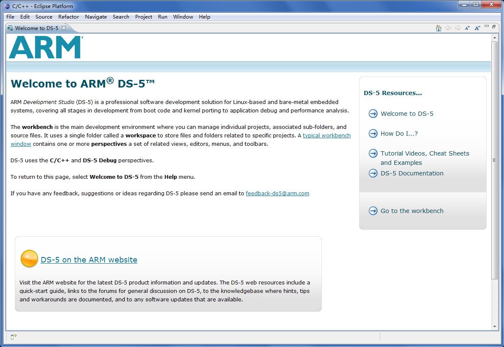
### Creating a Target Platform Configuration Database<a name="ZH-CN_TOPIC_0000002457834681"></a>

Steps to create a target platform configuration database:

1.  Select **File** > **New** > **Other**. In the dialog, select **Platform Configuration** under the **DS-5 Configuration Database** folder, then click **Next >** and follow the prompts.

    **Figure 1**  Platform configuration screen<a name="fig414mcpsimp"></a>  
    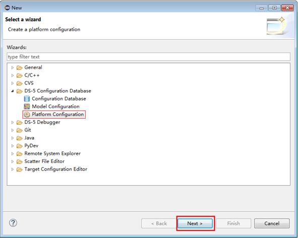

1.  Connect the debug adapter. From the menu, go to **ARM DS-5 v5.24.1** > **Debug Hardware** > **Debug Hardware Config IP (5.24.1)**. In the software interface, click **Scan** to detect the debug adapter, then configure its IP address to be on the same subnet as the host PC.

    > **Note:** 
    >ARM DS-5 v5.24.1 does not support A55 core debugging. Install ARM DS-5 v5.29 instead.

    **Figure 2**  Config IP screen<a name="fig418mcpsimp"></a>  
    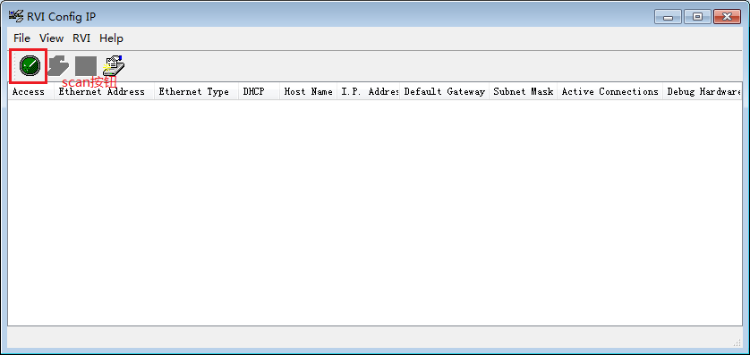

    **Figure 3**  Config IP scan screen<a name="fig420mcpsimp"></a>  
    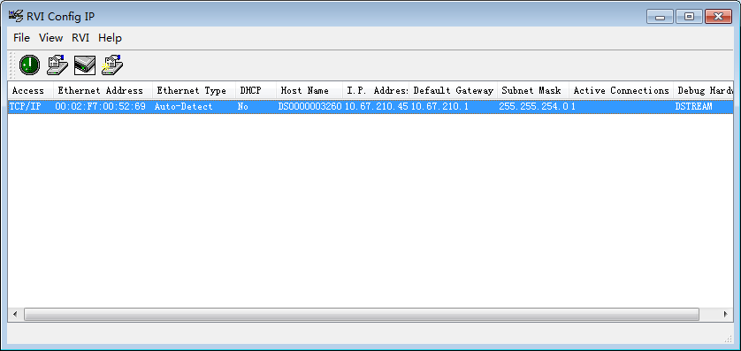

    **Figure 4**  Debug adapter IP configuration screen<a name="fig422mcpsimp"></a>  
    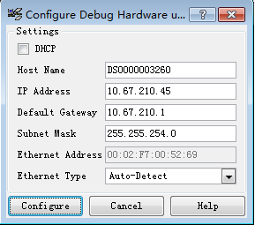

1.  Return to the DS-5 Eclipse interface. Select **Automatic/simple platform detection (Recommended)** and click Next. The system performs an automatic scan. Enter the debug adapter IP address in the **Connection Address** field and click **Next >**. Check **Debug target after saving configuration** and click **Next >**. Click **Create New Database**, enter a name, click **OK**, then click **Next >**. Set **Platform Manufacturer** to "Vendor" and **Platform Name** to "Chip\_XX", then click **Finish** to complete the platform database configuration.

    **Figure 5**  Platform database configuration — Create Platform Configuration<a name="fig425mcpsimp"></a>  
    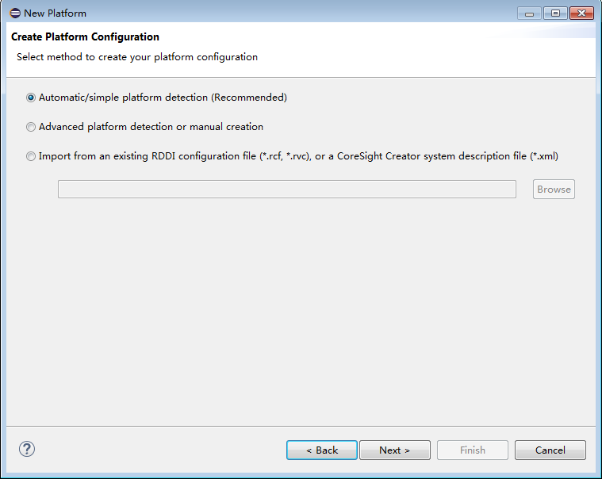

    **Figure 6**  Platform database configuration — Debug Adapter Connection<a name="fig427mcpsimp"></a>  
    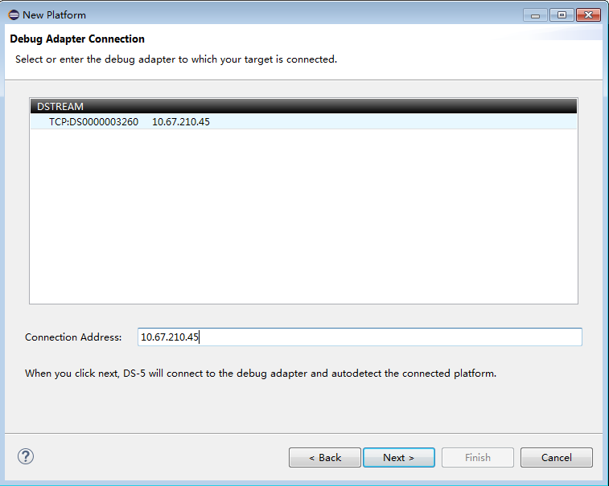

    **Figure 7**  Platform database configuration — Summary<a name="fig429mcpsimp"></a>  
    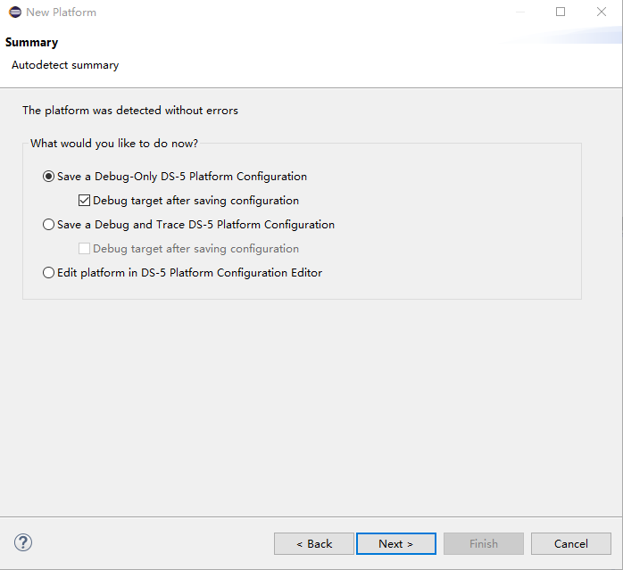

    **Figure 8**  Platform database configuration — DS-5 Configuration Database — Create New Database<a name="fig431mcpsimp"></a>  
    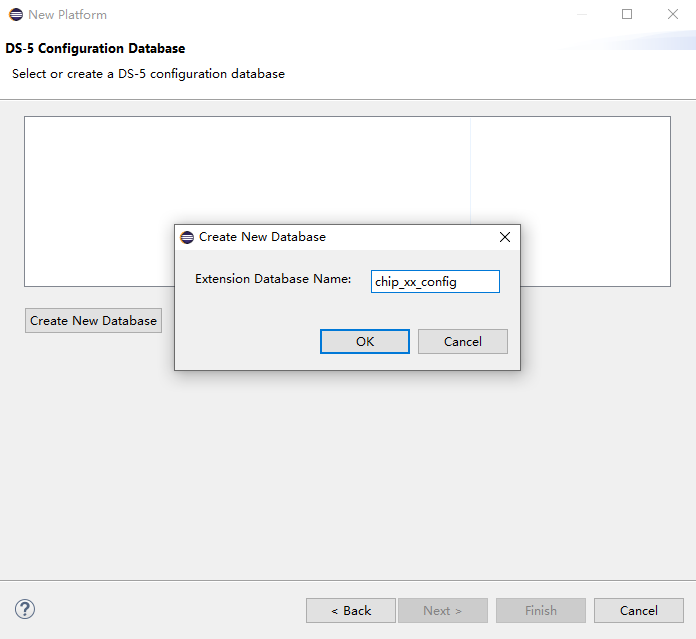

    **Figure 9**  Platform database configuration — DS-5 Configuration Database — Create New Database complete<a name="fig433mcpsimp"></a>  
    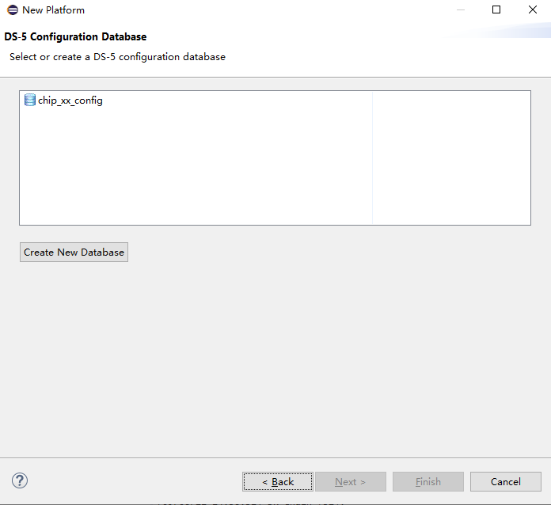

    **Figure 10**  Platform database configuration — Platform Information<a name="fig435mcpsimp"></a>  
    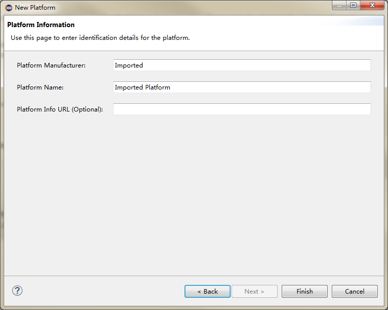

    **Figure 11**  Platform database configuration — Platform Information complete<a name="fig437mcpsimp"></a>  
    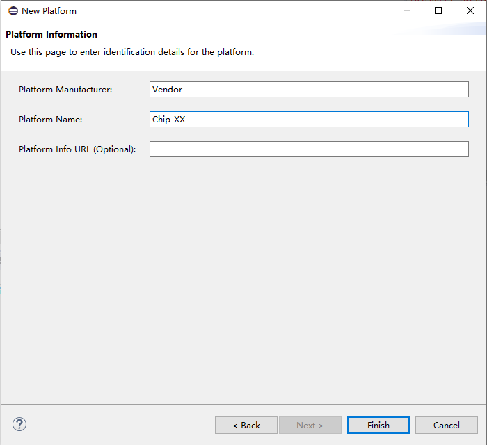
### Connecting to the Target Platform<a name="ZH-CN_TOPIC_0000002424196058"></a>

Steps to connect to the target platform:

1.  After clicking **Finish** in the previous step, a session window appears. In the name field, locate the DS-5 debugger, right-click and select **New**, then choose the newly created Vendor-Chip\_XX target.
2.  On the **Connection** tab, select the newly added target platform configuration database: **Vendor** > **Chip\_XX** > **Bare Metal Debug** > **Cortex-A53**, and enter the DS-5 device IP address in the text field (see [Figure 2](#_Toc452126564)).
3.  On the **Debugger** tab, select **Connect Only** (see [Figure 3](#_Toc452126565)).
4.  Click **Debug** to connect to the target platform.

    **Figure 1**  Debug Configurations window<a name="fig447mcpsimp"></a>  
    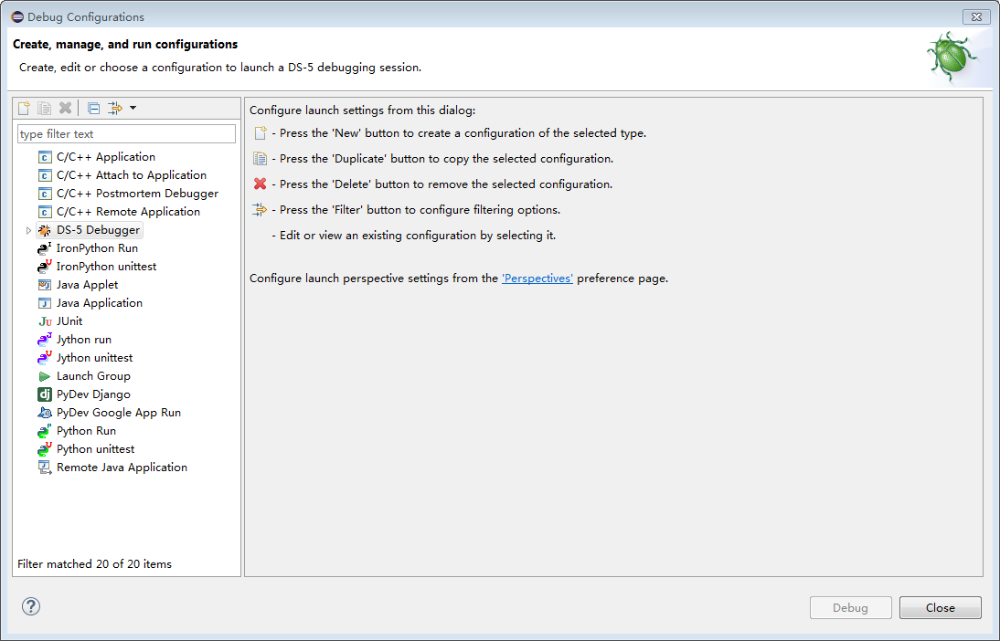

    **Figure 2**  Debug Configurations window — selecting the target database and entering the DS-5 device IP address<a name="_Toc452126564"></a>  
    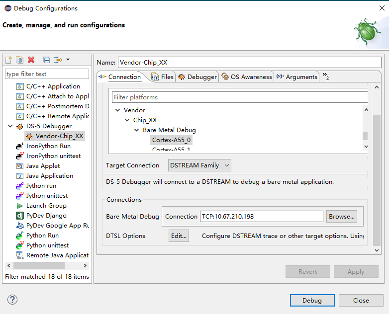

    **Figure 3**  Debug Configurations window — selecting "Connect only"<a name="_Toc452126565"></a>  
    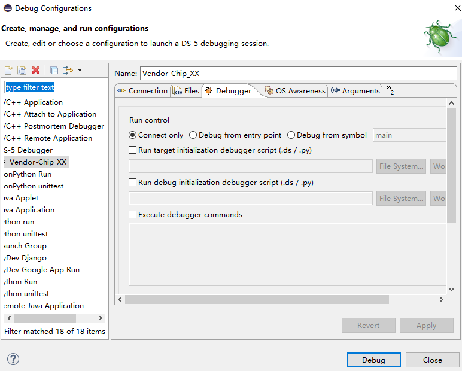

    **Figure 4**  DS-5 Debug – Eclipse Platform window<a name="fig451mcpsimp"></a>  
    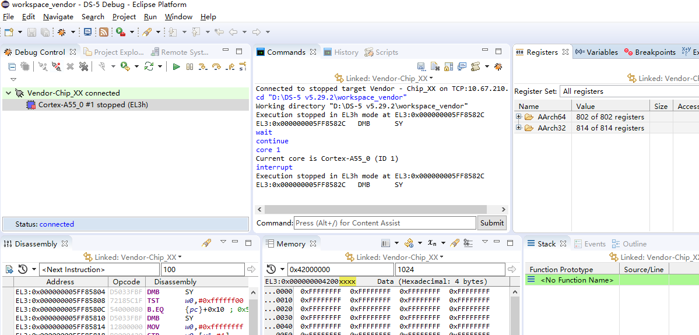
## Flashing Flash Storage Using the Debug Adapter<a name="ZH-CN_TOPIC_0000002424196054"></a>

### Memory Initialization<a name="ZH-CN_TOPIC_0000002457874809"></a>

In the **Scripts** window, click the  icon to import the memory initialization script, then click the  icon to run it. (If the debug adapter is currently running, first click the 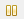 button in the **Debug Control** window to pause it.) See [Figure 1](#_Toc452126566).

> **Notice:** 
>Memory initialization scripts are `.ds`, `.py`, or `.txt` files located in `osdrv/tools/pc/uboot_tools/`.

**Figure 1**  Scripts window<a name="_Toc452126566"></a>  
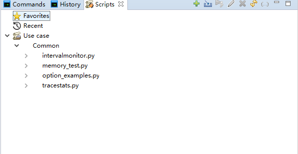

To verify that memory initialization succeeded:

In the **Memory** window, enter a memory address (e.g., 0x42000000) and press Enter. If the table shows values for that memory region and you can write to it successfully, initialization is confirmed. To write a test value, double-click a cell (e.g., at address 0x42000000), enter a new value (e.g., 0x12345678), press Enter, and confirm that the cell displays the new value. See [Figure 2](#_Toc452126567).

**Figure 2**  Memory window<a name="_Toc452126567"></a>  
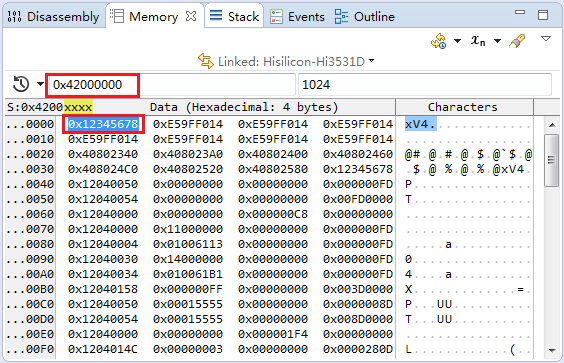
### Downloading the U-Boot Image<a name="ZH-CN_TOPIC_0000002424355898"></a>

Steps:

1.  In the **Memory** window, click the  button to display the menu shown in [Figure 1](#_Toc452126568).
2.  Select **Import Memory** to open the image download dialog. Download the U-Boot image to a memory address (e.g., 0x42000000), as shown in [Figure 2](#_Toc452126569).
3.  In the **Registers** window, set the PC register to 0x42000000, as shown in [Figure 3](#_Toc452126570).
4.  Click the  button in the **Debug Control** window to start U-Boot. You can view the U-Boot startup output on the serial console.

    **Figure 1**  Memory dropdown menu<a name="_Toc452126568"></a>  
    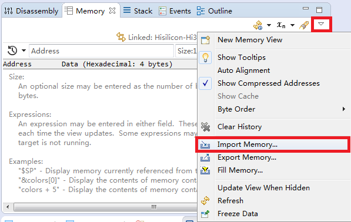

    **Figure 2**  Memory Importer window<a name="_Toc452126569"></a>  
    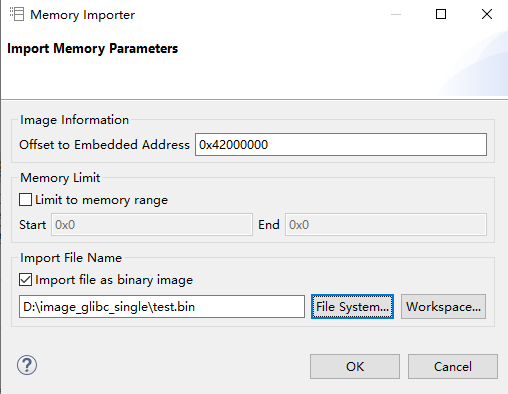

    **Figure 3**  Registers window<a name="_Toc452126570"></a>  
    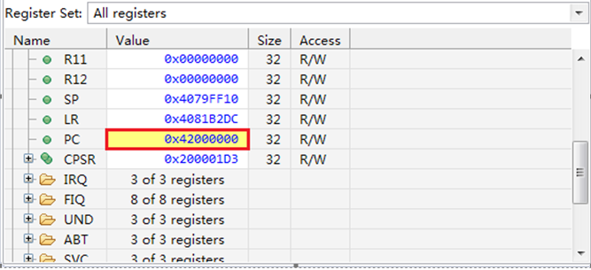
### Writing the Image to Flash<a name="ZH-CN_TOPIC_0000002457874797"></a>

After U-Boot starts, write the U-Boot image from memory to the boot medium over the serial console.

Using SPI-Nor Flash as an example:

```
# sf probe 0					/* probe and initialize SPI-Nor flash */
# sf erase 0 0x100000				/* erase 1 MB */
# sf write <ddr_addr> 0 0x100000		/* write from memory to SPI-Nor Flash */
# reset						/* restart the board */
```

> **Note:** 
>On the Hi3403V100 platform, use DDR address 0x42000000 for \<ddr\_addr\>.

# Appendix
## U-Boot Command Reference<a name="ZH-CN_TOPIC_0000002424355890"></a>

### Enabling SPI-Nor Block Protection<a name="ZH-CN_TOPIC_0000002457874805"></a>

SPI-Nor block protection is disabled by default in U-Boot. To enable it, configure the option in menuconfig as follows:

1.  In menuconfig, navigate to **Device Drivers** > **MTD Support**.
2.  Enter **SPI Flash Support** and select the option highlighted in [Figure 1](#_Ref29310076), then save.

    **Figure 1**  SPI-Nor block protection option<a name="_Ref29310076"></a>  
    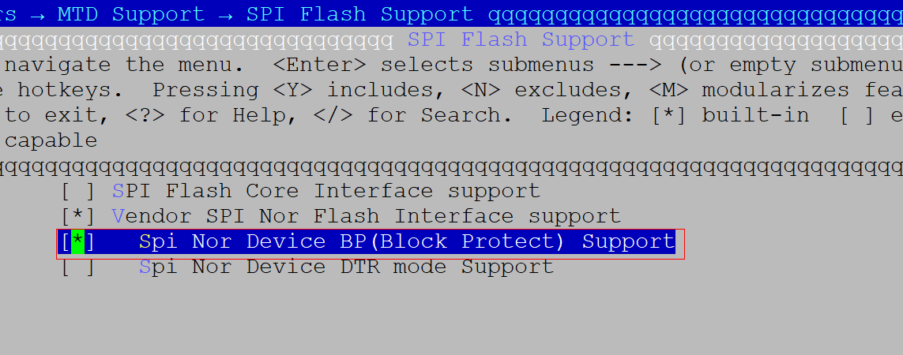
### SPI-Nor Block Protection Commands<a name="ZH-CN_TOPIC_0000002424196066"></a>

Most SPI Nor Flash devices provide Block Protect (BP) bits in the Status Register (SR) to protect data integrity.

Setting BP0, BP1, BP2, and BP3 (some devices omit BP3 or add BP4) to 1 (enabled) places the corresponding blocks into write-protected state. These BP bits are non-volatile and retain their state across power cycles.

Some vendors also provide a setting to control the direction of block protection — whether it starts from the device's Top (high address) or Bottom (low address). This is configured via the TBPROT bit in the Configuration Register (CR); on some devices it is located in the SR. This bit is typically OTP (One-Time Programmable): the default is 0 (protection starts from Top/high address), and once set to 1 (protection starts from Bottom/low address), it cannot be changed.

In practice, our controller sets TBPROT to 1 from initialization, applying protection from the Bottom (low address) upward.

By default, all BP bits in the SR are 0 (disabled), meaning all blocks are unprotected and can be freely erased or written.

Setting all BP bits to 1 (enabled) places all blocks into write-protected state, making any erase or write operation ineffective.

Block protection operates at the block granularity. The decimal level value derived from the BP bit states determines the range of protected blocks. For devices with 3 BP bits, level ranges from 0 to 7 (BP[0:0:0] through BP[1:1:1]). For devices with 4 BP bits, level ranges from 0 to 10 (or 0 to 9, since the minimum protected region cannot be less than 1 block).

Based on the SPI-Nor Flash block protection mechanism, U-Boot includes an `sf lock` command. Usage:

```
sf probe 0
sf lock
```

This displays the current BP level value, the valid level range, and the currently locked region, along with command usage information. See [Figure 1](#_Toc498536356).

**Figure 1**  Viewing current block protection status<a name="_Toc498536356"></a>  
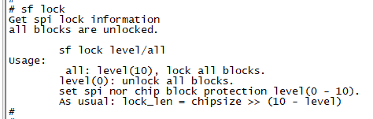
-   sf lock all

    Locks all blocks (the entire device), equivalent to setting the level to its maximum value. See [Figure 2](#_Toc498536357).

    **Figure 2**  Locking the entire device<a name="_Toc498536357"></a>  
    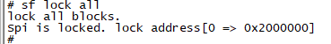
-   sf lock 0

    Removes all block protection, leaving all blocks unprotected and available for erase/write operations. See [Figure 3](#_Toc498536358).

    **Figure 3**  Removing current block protection<a name="_Toc498536358"></a>  
    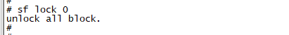
-   sf lock \<level\>

    Sets the BP level. Blocks in the protected range cannot be erased or written normally. See [Figure 4](#_Toc498536359).

    **Figure 4**  Locking a specific region by setting the level value<a name="_Toc498536359"></a>  
    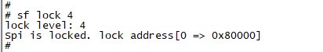
### tftp Command Address Restrictions<a name="ZH-CN_TOPIC_0000002457834685"></a>

The PHYS\_SDRAM\_1\_SIZE macro defined in `include/configs/Hi3403V100.h` limits the address range accessible to the tftp command. In the default release package, PHYS\_SDRAM\_1\_SIZE is set to 0x20000000, restricting tftp downloads to the first 512 MB of DDR address space.

tftp command usage example:

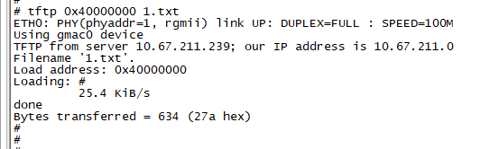

The first argument to the tftp command must be within the first 512 MB of DDR address space, i.e., 0x40000000 to 0x5fffffff.

Note: To download a file to an address above 512 MB, first download it to within the 512 MB range using tftp, then copy it to the higher address using `cp.b`. Example:

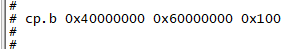

In the cp.b command above, the first argument is the source address, the second is the destination address, and the third is the length in bytes.
