# Preface
**Overview**

This document primarily introduces the usage of the BurnTool burning tool, applicable to scenarios including one-click burning of all program images to the board flash, burning other program images to the board flash by address when the board already has boot, and burning only boot to the board flash on an empty board.

**Product Version**

The product versions corresponding to this document are as follows.

<table><thead align="left"><tr id="row75927132112"><th class="cellrowborder" valign="top" width="31.759999999999998%" id="mcps1.1.3.1.1">
Product Name

</th>
<th class="cellrowborder" valign="top" width="68.24%" id="mcps1.1.3.1.2">
Product Version

</th>
</tr>
</thead>
<tbody><tr id="row155916713213"><td class="cellrowborder" valign="top" width="31.759999999999998%" headers="mcps1.1.3.1.1 ">
Hi3403V100

</td>
<td class="cellrowborder" valign="top" width="68.24%" headers="mcps1.1.3.1.2 ">
V100

</td>
</tr>
<tr id="row113583017224"><td class="cellrowborder" valign="top" width="31.759999999999998%" headers="mcps1.1.3.1.1 ">
SS626

</td>
<td class="cellrowborder" valign="top" width="68.24%" headers="mcps1.1.3.1.2 ">
V100

</td>
</tr>
<tr id="row165411745144415"><td class="cellrowborder" valign="top" width="31.759999999999998%" headers="mcps1.1.3.1.1 ">
SS524

</td>
<td class="cellrowborder" valign="top" width="68.24%" headers="mcps1.1.3.1.2 ">
V100

</td>
</tr>
<tr id="row131881816202318"><td class="cellrowborder" valign="top" width="31.759999999999998%" headers="mcps1.1.3.1.1 ">
SS522

</td>
<td class="cellrowborder" valign="top" width="68.24%" headers="mcps1.1.3.1.2 ">
V100

</td>
</tr>
<tr id="row11407191494813"><td class="cellrowborder" valign="top" width="31.759999999999998%" headers="mcps1.1.3.1.1 ">
SS528

</td>
<td class="cellrowborder" valign="top" width="68.24%" headers="mcps1.1.3.1.2 ">
V100

</td>
</tr>
<tr id="row20945431175910"><td class="cellrowborder" valign="top" width="31.759999999999998%" headers="mcps1.1.3.1.1 ">
SS625

</td>
<td class="cellrowborder" valign="top" width="68.24%" headers="mcps1.1.3.1.2 ">
V100

</td>
</tr>
<tr id="row56503143253"><td class="cellrowborder" valign="top" width="31.759999999999998%" headers="mcps1.1.3.1.1 ">
Hi3519AV200

</td>
<td class="cellrowborder" valign="top" width="68.24%" headers="mcps1.1.3.1.2 ">
V100

</td>
</tr>
</tbody>
</table>

**Intended Audience**

This document (this guide) is primarily intended for the following engineers:

- Technical support engineers
- Hardware development engineers

**Revision History**

The revision history accumulates the description of each document update. The latest version of the document contains all update content from previous versions.

<table><thead align="left"><tr id="row2942532716410"><th class="cellrowborder" valign="top" width="20.72%" id="mcps1.1.4.1.1">
<strong id="b5687322716410">Document Version</strong>

</th>
<th class="cellrowborder" valign="top" width="20.22%" id="mcps1.1.4.1.2">
<strong id="b5800814916410">Release Date</strong>

</th>
<th class="cellrowborder" valign="top" width="59.06%" id="mcps1.1.4.1.3">
<strong id="b3316380216410">Modification Description</strong>

</th>
</tr>
</thead>
<tbody><tr id="row5947359616410"><td class="cellrowborder" valign="top" width="20.72%" headers="mcps1.1.4.1.1 ">
00B01

</td>
<td class="cellrowborder" valign="top" width="20.22%" headers="mcps1.1.4.1.2 ">
2025-09-15

</td>
<td class="cellrowborder" valign="top" width="59.06%" headers="mcps1.1.4.1.3 ">
First temporary version release.

</td>
</tr>
</tbody>
</table>

# Overview
## Tool Overview

The BurnTool is a multifunctional tool primarily used for image burning, image uploading, and burner image creation.

> **Note:**  The current tool only supports use on 64-bit operating systems.

## Application Scenarios

The application scenarios of the three main functions of the BurnTool are as follows:

- Image burning: used to burn images to the corresponding Flash addresses via serial port, network port, or USB port.
- Image uploading: used to export data from Flash addresses to files on the PC via DDR.
- Burner image creation: used to package images from the partition table into corresponding image files according to the format required by the burner tool for mass production burning.

## Burning Principle

U-Boot burning principle: After the BurnTool starts burning, it first interacts with bootrom. The tool transmits DDR parameters to bootrom (this is the U-Boot download stage at 5%). It then initializes DDR and transfers U-Boot to DDR (the U-Boot download stage at 100% indicates transfer completion). U-Boot is then started from DDR. After U-Boot startup is complete, the tool begins interacting with U-Boot, sending burning commands to burn U-Boot from DDR to the corresponding Flash address.

Burning principle for other image partitions: For other image partitions, such as kernel, rootfs, etc., the tool defaults to network port transmission. Customers can choose between bare burning and non-bare burning methods. Bare burning means selecting U-Boot for burning in Burn by Partition or Burn by eMMC — at this time U-Boot will be burned to Flash. Non-bare burning means not selecting U-Boot and only selecting other partitions for burning. In this case, U-Boot must already exist on the current board. During burning, the tool will start U-Boot, interact with it, and complete burning by sending TFTP commands and Write commands to U-Boot.

## Tool and Board Device Matching Relationship

For different boards, the BurnTool has differences in function and device support. The specific support situation is shown in [Table 1](#_Ref382475342).

**Table 1**  Tool and board device matching relationship

<table><thead align="left"><tr id="row630mcpsimp"><th class="cellrowborder" rowspan="2" valign="top" id="mcps1.2.16.1.1">
Product Name

</th>
<th class="cellrowborder" colspan="4" valign="top" id="mcps1.2.16.1.2">
Flash Type

</th>
<th class="cellrowborder" colspan="5" valign="top" id="mcps1.2.16.1.3">
File System

</th>
<th class="cellrowborder" colspan="2" valign="top" id="mcps1.2.16.1.4">
Advanced Features

</th>
<th class="cellrowborder" colspan="3" valign="top" id="mcps1.2.16.1.5">
Common Interfaces

</th>
</tr>
<tr id="row641mcpsimp"><th class="cellrowborder" valign="top" id="mcps1.2.16.2.1">
Spi nor

</th>
<th class="cellrowborder" valign="top" id="mcps1.2.16.2.2">
Spi Nand/Nand

</th>
<th class="cellrowborder" valign="top" id="mcps1.2.16.2.3">
eMMC

</th>
<th class="cellrowborder" valign="top" id="mcps1.2.16.2.4">
UFS

</th>
<th class="cellrowborder" valign="top" id="mcps1.2.16.2.5">
Yaffs

</th>
<th class="cellrowborder" valign="top" id="mcps1.2.16.2.6">
Jffs2

</th>
<th class="cellrowborder" valign="top" id="mcps1.2.16.2.7">
SquashFS

</th>
<th class="cellrowborder" valign="top" id="mcps1.2.16.2.8">
UBI

</th>
<th class="cellrowborder" valign="top" id="mcps1.2.16.2.9">
ext3/4

</th>
<th class="cellrowborder" valign="top" id="mcps1.2.16.2.10">
CA

</th>
<th class="cellrowborder" valign="top" id="mcps1.2.16.2.11">
Bad Check

</th>
<th class="cellrowborder" valign="top" id="mcps1.2.16.2.12">
Serial

</th>
<th class="cellrowborder" valign="top" id="mcps1.2.16.2.13">
Network

</th>
<th class="cellrowborder" valign="top" id="mcps1.2.16.2.14">
USB

</th>
</tr>
</thead>
<tbody><tr id="row673mcpsimp"><td class="cellrowborder" valign="top" width="11.917614816045177%" headers="mcps1.2.16.1.1 mcps1.2.16.2.1 ">
Hi3403V100/Hi3519AV200

</td>
<td class="cellrowborder" valign="top" width="6.286853251391079%" headers="mcps1.2.16.1.2 mcps1.2.16.2.2 ">
●

</td>
<td class="cellrowborder" valign="top" width="11.394402458267583%" headers="mcps1.2.16.1.2 mcps1.2.16.2.3 ">
●

</td>
<td class="cellrowborder" valign="top" width="4.800265758657918%" headers="mcps1.2.16.1.2 mcps1.2.16.2.4 ">
●

</td>
<td class="cellrowborder" valign="top" width="5.946349970932645%" headers="mcps1.2.16.1.2 mcps1.2.16.2.5 ">
○

</td>
<td class="cellrowborder" valign="top" width="4.933145087617307%" headers="mcps1.2.16.1.3 mcps1.2.16.2.6 ">
○

</td>
<td class="cellrowborder" valign="top" width="5.813470641973257%" headers="mcps1.2.16.1.3 mcps1.2.16.2.7 ">
●

</td>
<td class="cellrowborder" valign="top" width="7.39971763142596%" headers="mcps1.2.16.1.3 mcps1.2.16.2.8 ">
●

</td>
<td class="cellrowborder" valign="top" width="4.3185781911801335%" headers="mcps1.2.16.1.3 mcps1.2.16.2.9 ">
●

</td>
<td class="cellrowborder" valign="top" width="6.428037538410431%" headers="mcps1.2.16.1.3 mcps1.2.16.2.10 ">
●

</td>
<td class="cellrowborder" valign="top" width="5.813470641973257%" headers="mcps1.2.16.1.4 mcps1.2.16.2.11 ">
○

</td>
<td class="cellrowborder" valign="top" width="7.507682086205462%" headers="mcps1.2.16.1.4 mcps1.2.16.2.12 ">
○

</td>
<td class="cellrowborder" valign="top" width="5.813470641973257%" headers="mcps1.2.16.1.5 mcps1.2.16.2.13 ">
●

</td>
<td class="cellrowborder" valign="top" width="5.813470641973257%" headers="mcps1.2.16.1.5 mcps1.2.16.2.14 ">
●

</td>
<td class="cellrowborder" valign="top" width="5.813470641973257%" headers="mcps1.2.16.1.5 ">
●

</td>
</tr>
<tr id="row1586684215493"><td class="cellrowborder" valign="top" width="11.917614816045177%" headers="mcps1.2.16.1.1 mcps1.2.16.2.1 ">
SS626V100

</td>
<td class="cellrowborder" valign="top" width="6.286853251391079%" headers="mcps1.2.16.1.2 mcps1.2.16.2.2 ">
●

</td>
<td class="cellrowborder" valign="top" width="11.394402458267583%" headers="mcps1.2.16.1.2 mcps1.2.16.2.3 ">
●

</td>
<td class="cellrowborder" valign="top" width="4.800265758657918%" headers="mcps1.2.16.1.2 mcps1.2.16.2.4 ">
●

</td>
<td class="cellrowborder" valign="top" width="5.946349970932645%" headers="mcps1.2.16.1.2 mcps1.2.16.2.5 ">
○

</td>
<td class="cellrowborder" valign="top" width="4.933145087617307%" headers="mcps1.2.16.1.3 mcps1.2.16.2.6 ">
○

</td>
<td class="cellrowborder" valign="top" width="5.813470641973257%" headers="mcps1.2.16.1.3 mcps1.2.16.2.7 ">
●

</td>
<td class="cellrowborder" valign="top" width="7.39971763142596%" headers="mcps1.2.16.1.3 mcps1.2.16.2.8 ">
●

</td>
<td class="cellrowborder" valign="top" width="4.3185781911801335%" headers="mcps1.2.16.1.3 mcps1.2.16.2.9 ">
●

</td>
<td class="cellrowborder" valign="top" width="6.428037538410431%" headers="mcps1.2.16.1.3 mcps1.2.16.2.10 ">
●

</td>
<td class="cellrowborder" valign="top" width="5.813470641973257%" headers="mcps1.2.16.1.4 mcps1.2.16.2.11 ">
○

</td>
<td class="cellrowborder" valign="top" width="7.507682086205462%" headers="mcps1.2.16.1.4 mcps1.2.16.2.12 ">
○

</td>
<td class="cellrowborder" valign="top" width="5.813470641973257%" headers="mcps1.2.16.1.5 mcps1.2.16.2.13 ">
●

</td>
<td class="cellrowborder" valign="top" width="5.813470641973257%" headers="mcps1.2.16.1.5 mcps1.2.16.2.14 ">
●

</td>
<td class="cellrowborder" valign="top" width="5.813470641973257%" headers="mcps1.2.16.1.5 ">
○

</td>
</tr>
</tbody>
</table>

Note: ● indicates supported; ○ indicates not supported.

## Environment Preparation

The environment preparation for BurnTool burning is as follows:

1.  Connect the serial port and network cable between the PC and the board. Since tool burning involves interaction with bootrom, the bootrom_sel on the board hardware must be set to 1 to boot from bootrom.
2.  Copy ToolPlatform-X.X.X.zip located in the SDK release package (path: $SDK_DIR/tools/windows/ToolPlatform) to a local hard drive on the PC (the PC requires Win7 or Win10 operating system).
3.  Extract ToolPlatform-X.X.X.zip, double-click ToolPlatform.exe in the tool directory to open the ToolPlatform tool, as shown in [Figure 1](#_Ref427762404).

    **Figure 1**  Opening the ToolPlatform tool from the ToolPlatform tool directory  
    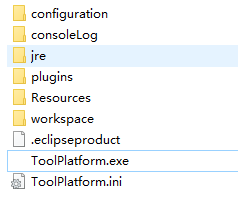

4.  Select the BurnTool in the welcome page, as shown in [Figure 2](#_Ref427762422).

    **Figure 2**  Selecting the BurnTool  
    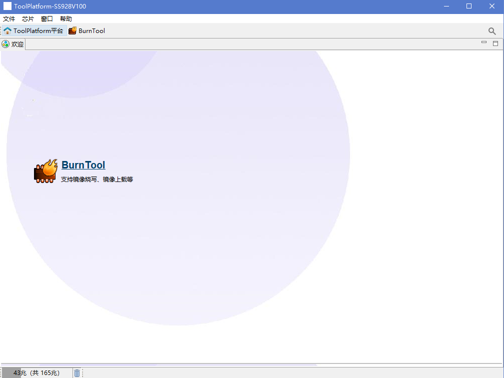

5.  Parameter configuration: select the serial port used to connect to the board, select the network IP address used by the PC, and configure the board's MAC address, IP address, subnet mask, and gateway, as shown in [Figure 3](#fig58684616564).

    > **Important:** 
    >The selected PC server IP must be in the same network segment as the board's network configuration; otherwise, images other than fastboot cannot be burned via the network port (the fastboot image is burned via the serial port).

    **Figure 3**  Parameter settings  
    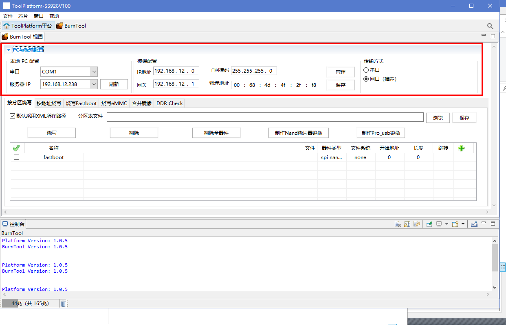
# Burn by Partition
## Applicable Scenarios

The Burn by Partition function is applicable to all boards, regardless of whether boot is present on the board.

## Burning Steps

The specific burning steps are as follows:

1.  After opening the BurnTool, switch to the "Burn by Partition" tab, as shown in [Figure 1](#fig1560862365516).

    **Figure 1**  BurnTool Burn by Partition  
    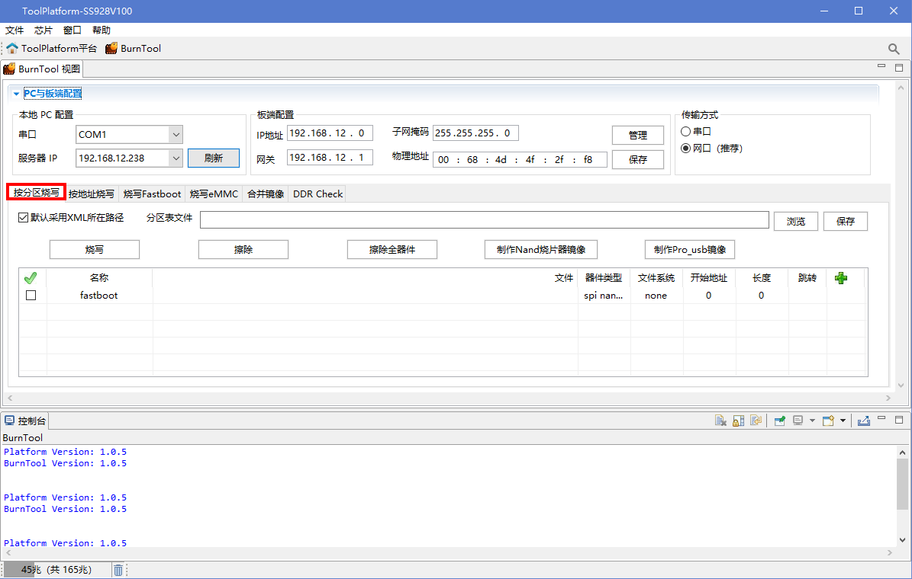
    > **Note:** 
    >-   When the software is first opened, it will automatically generate default parameters. When these parameter configuration information is changed, the software will automatically record the latest changed values. When the software exits normally, the configuration parameters are automatically saved. Upon next startup, the latest configuration parameters are used. If the software encounters an abnormal exit, the software's configuration parameters may not be correctly saved, meaning the most recent parameter modifications will be lost.
    >-   Click the Save button to save the current board-side network configuration. Click the Load button to select a set of configurations from the saved results as the current configuration.
    >-   Toggle the "Use XML path by default" checkbox state. If checked, the partition file is searched for in the XML path first. If unchecked, the absolute path is used to search for the file first. If the file is not found, the tool then tries to find it in the XML directory.
    >-   **XML is a configuration file used to save partition table information. The edited partition table can be saved as an XML file using the Save button on the tool. The next time the tool is opened, import the XML and the partition table information will be directly loaded.**

2.  Configure the board partition information. Click the browse button  to select an XML file with pre-configured partition table information and load it into the tool. The partition information will be loaded, as shown in [Figure 2](#fig62556341).

    **Figure 2**  Configuring board partition information  
    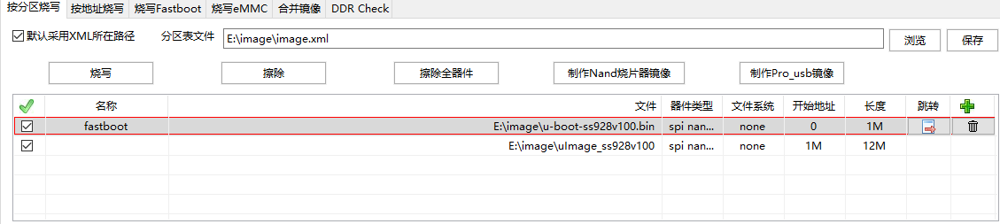
    > **Important:** 
    >-   The partition information is only used for burning and does not determine the actual partition layout of the board. The actual partition layout of the board is determined by the board's bootargs. Please ensure that the partition information here corresponds to the partition information specified by the board's bootargs; otherwise, errors may occur.
    >-   BurnTool supports inconsistent partition paths and remote burning, meaning the images to be burned can be images on remote paths.
    >-   If a partition is selected but no burning file is chosen, the partition will be erased during the burning process.
    >-   If all partition files need to be packaged into a single image for burning (for NAND flash, due to its special characteristics, if the file system partition is a read-write file system, they cannot be packaged together), the packaged file must be loaded into the fastboot partition for burning, and the image must contain fastboot to burn correctly. Since burning the fastboot partition uses the serial port method, which has a slower burning speed, this method is not recommended for burning.

    To modify partition information, you can directly modify the xml-format partition information file, or modify it in the tool by clicking on the column of the partition you want to modify, as shown in [Figure 3](#fig1406152918013).

    **Figure 3**  Editing board partition information  
    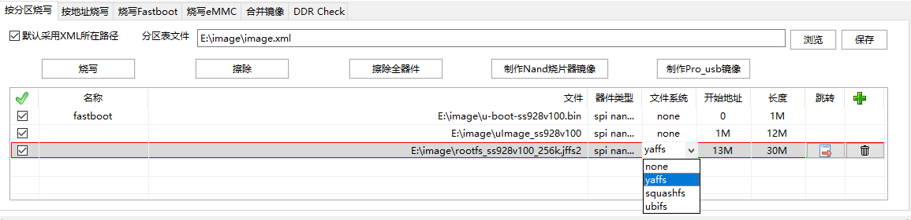

    Click the button  to add a row of partition. In this row, you can modify the partition name, select the flash type, whether a file system is needed and the file system type, and modify the partition start address and partition size.

    > **Important:** 
    >-   The partition start address and partition size are in KB or MB units and must be integer multiples of the flash block size; otherwise, errors may occur.
    >-   For the jffs2 file system in a partition, it is not a special format — simply select none.

    -   Click the button  to select or change the burning file for this partition.
    -   Click the button  to delete this partition information.

    > **Important:** 
    >The fastboot partition cannot be deleted here, and the fastboot partition name cannot be modified, because if the fastboot partition is deleted or its name is modified, one-click burning cannot be achieved.

    -   Click the button  to select all partitions to be burned for one-click burning of all partitions. Click the button again  to deselect all partitions to be burned. You can also click the checkbox  to select the corresponding partitions for burning.
    -   Click the save button  to save the edited partition table as a file.

    > **Note:** 
    >-   When the tool is first opened, there may not be an xml-format partition information file for the board partition information. In this case, you can directly fill in or modify the board partition information in the tool interface to create it. After creation, when closing the ToolPlatform tool, the dialog shown in [Figure 4](#Figure2.5) will appear, reminding you whether to save the partition information. Click "OK", and in the dialog that appears, select the path to save the partition information, enter the filename to save, and it will be saved as xml-format partition information. Click "Cancel" to close the tool without saving the partition information.
    >-   After creation, when switching tools, the dialog shown in [Figure 5](#Figure2.6) appears. Click "OK", and in the dialog that appears, select the path to save the partition information, enter the filename to save, and it will be saved as xml-format partition information. Click "Cancel" to switch views without saving the partition information. Note that the filename suffix for saving partition information must be .xml format; otherwise, the partition information may not be correctly loaded the next time. Saving partition information is shown in [Figure 6](#Figure2.7).

    **Figure 4**  Dialog reminding whether to save partition information when closing the ToolPlatform tool  
    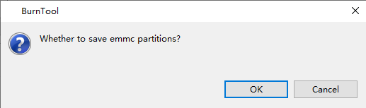

    **Figure 5**  Dialog reminding whether to save partition information when switching views  
    

    **Figure 6**  Partition information save interface  
    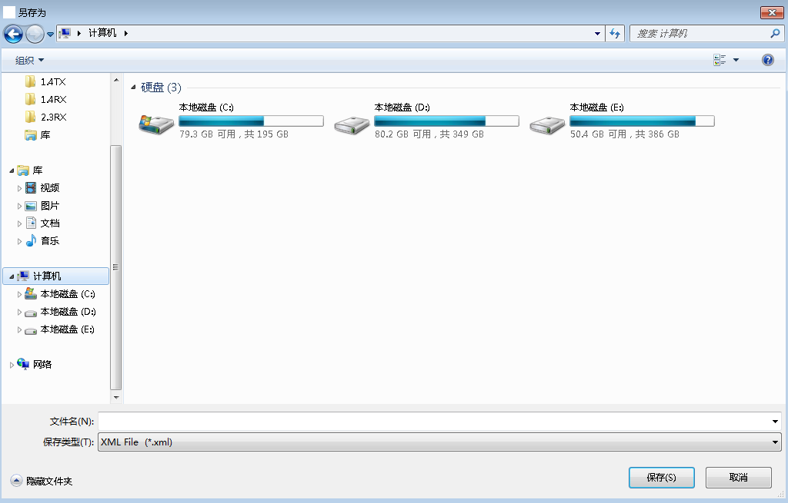

    Select the current last row, click New  to get a new last row, then enter "-" in the length column of that row, add the partition name, file system, and file reference path for that row. During subsequent burning, the length of this row can be calculated as the remaining length of the entire device. This is shown in [Figure 7](#fig99064111119).

    **Figure 7**  Setting length to "-" after creating new board partition information  
    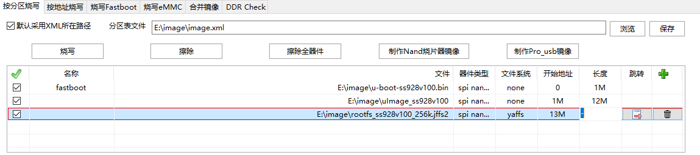
    > **Important:** 
    >If the user does not select the current last partition when creating a new partition row, the newly created partition may not be the new last partition, and "-" cannot be used to represent the remaining length.

3.  Prepare the board environment, select a transmission method, as shown in [Figure 8](#fig15452338171518). If the board is powered on, power it off.

    **Figure 8**  Selecting the transmission method  
    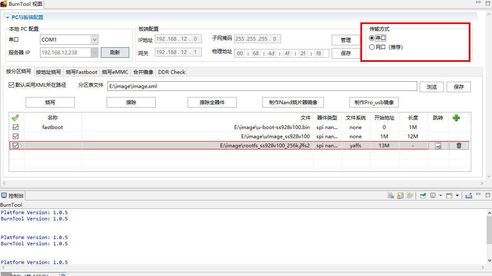
    -   If selecting the network port, connect the board's serial port and network port.
    -   If selecting the serial port, connect the board's serial port.

4.  Burn the board. Click the burn button , as shown in [Figure 9](#fig1659555711617).

    **Figure 9**  Clicking Burn  
    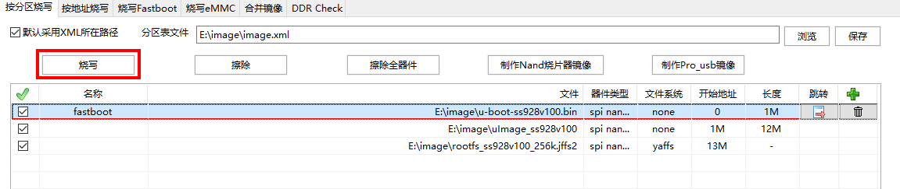

5.  Power on the board, enter the burning process, and wait for burning to complete. The burning process is shown in [Figure 10](#fig297215536181).

    **Figure 10**  Burning process  
    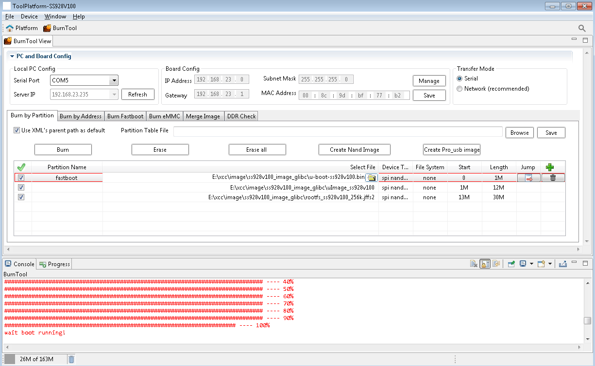

    Information about the burning process will be displayed in the console above. If a burning error is found, please check the board again:

    -   Whether the serial port selection is correct.
    -   Whether the IP address is correct and whether it is occupied.
    -   Whether the bootstrap jumper on the board is shorted.

6.  After burning is complete, connect the terminal tool and restart the board.

## Creating NAND Burner Images

BurnTool provides the function of creating NAND burner images. After configuring the partition list, click the Create NAND Burner Image button , and the NAND Burner Image Creation interface will appear, as shown in [Figure 1](#fig106441654201914).

**Figure 1**  NAND Burner Image Creation interface  
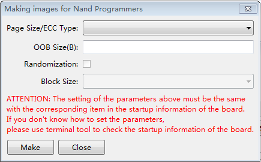

After selecting the various data in the dialog box (the Randomization function is available for devices with 8K and above Page Size), click the "Make" button to generate the NAND burner image.

> **Important:** 
>-   The parameters entered or selected must be consistent with the corresponding item values in the board boot information (which can be captured and viewed using terminal software such as HyperTerminal) or match the actual device parameters installed.
>-   If the user does not select a partition, or does not specify a burning file for a selected partition, the image file for that partition cannot be created.
>-   If creating an image for a non-yaffs partition, the file system item in the partition table must not be specified as yaffs. When creating an image for a yaffs partition, the file system must be specified as yaffs. Otherwise, the resulting image will be incorrect.

## Selecting a Single Row in the Partition Table to Jump to the Burn by Address Interface

Burn by Partition provides the ability to carry sub-partition information, i.e., the partition name, file system, file reference path, start address, and partition length, to jump to the Burn by Address interface, and use the partition's information to directly populate the Burn by Address information fields for user convenience. In the Burn by Partition interface, select a row in the partition table and click the jump button  to jump to the Burn by Address interface. This is shown in [Figure 1](#fig19742104082116) and [Figure 2](#fig1241812821916).

**Figure 1**  Selecting a single row and clicking jump  
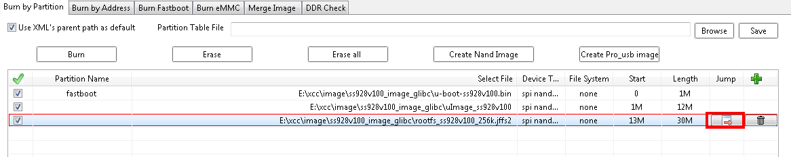

**Figure 2**  Entering the Burn by Address interface  
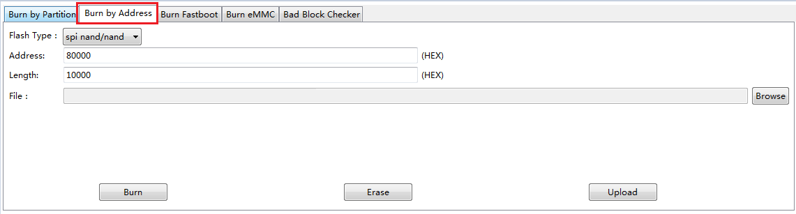
> **Important:** 
>Before jumping, the user must select the partition row that needs to jump to the Burn by Address page; only then will the jump button appear.

# Burn by Address
## Applicable Scenarios

The board already has boot.

## Burning Steps

The specific burning steps are as follows:

1.  Switch to the "Burn by Address" tab, as shown in [Figure 1](#fig77356229246).

    **Figure 1**  Burn by Address interface  
    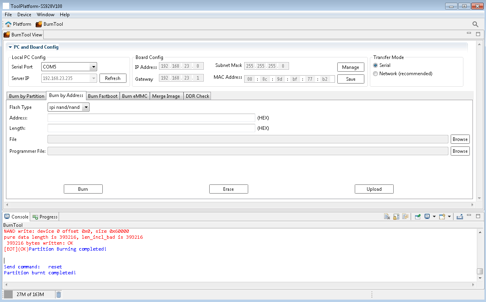

1.  Configure the board burning information: select the flash type to burn, set the burning start address and length, and select the file to burn, as shown in [Figure 2](#fig1355103942610).

    **Figure 2**  Configuring board burning information  
    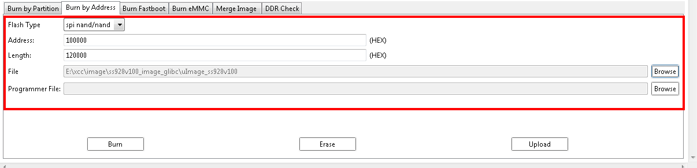

2.  Same as section 2.2 step [3](#ZH-CN_TOPIC_0000002441889129).
3.  Click the burn button , as shown in [Figure 3](#_Ref416783621).

    > **Important:** 
    >When burning by address, the user does not need to select a file type — just select the file you want to burn. Since yaffs files (with OOB data) and other types of files (without OOB data) have different formats, the tool will automatically distinguish the file type in the background based on the selected file (the tool distinguishes between yaffs type and None type). It then executes the corresponding burning according to the different types. Power on the board, enter the burning process, and wait for burning to complete. For Burn by Address, only the first time the burn button is clicked does the board need to be powered on again. For subsequent image burns, the board does not need to be powered on again.

    **Figure 3**  Clicking Burn  
    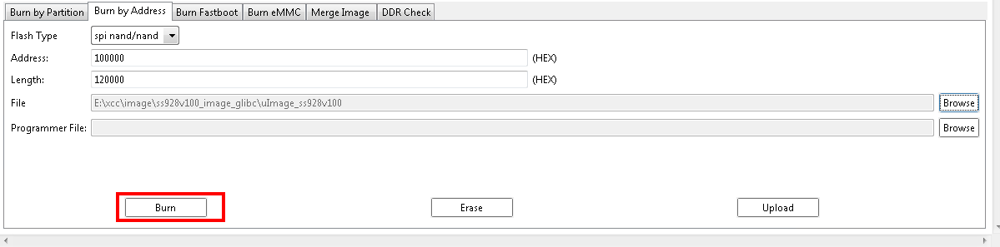

4.  Power on the board, enter the burning process, and wait for burning to complete. The burning process is shown in [Figure 4](#_Ref416783705).

    **Figure 4**  Burning process  
    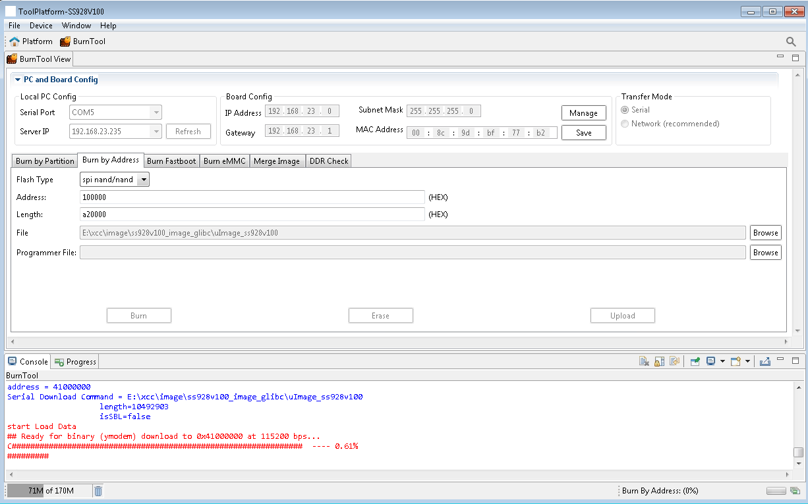

    Information about the burning process will be printed in the "Console" above. If a burning error is found, please check the board again:

    -   Whether the serial port selection is correct
    -   Whether the IP address setting is correct and whether it is occupied
    -   Whether the bootstrap jumper on the board is shorted

    The Erase operation is similar to the Burn operation and will not be elaborated here.

5.  After burning is complete, connect the terminal tool and restart the board.

## Upload Steps

Burning and uploading are two inverse operations. The burning function writes image files to the board, while the upload function uploads the content of a region to the PC according to the start address and length set by the user. The specific steps for uploading can fully reference the burning steps. Two differences from the burning steps are listed here; repetitive parts will not be reiterated.

1.  Same as section 3.2 step [1](#ZH-CN_TOPIC_0000002441889077).
2.  Same as section 3.2 step [2](#ZH-CN_TOPIC_0000002441889077).
3.  Configure the board upload information: select the flash type to upload, set the start address and length to be uploaded in the storage device, and set the save file after uploading, as shown in [Figure 1](#fig12876191611389).

    **Figure 1**  Upload information  
    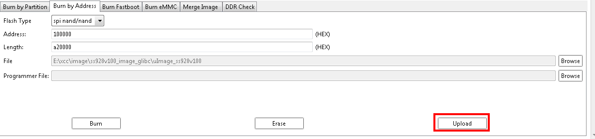

4.  Same as section 3.2 step [3](#ZH-CN_TOPIC_0000002441889077).
5.  Click "upload". If the image in the region to be uploaded is fastboot, kernel, ubifs, etc., please select Data without OOB. If the image is yaffs, please select Data with OOB, as shown in [Figure 2](#_Ref416783742).

    **Figure 2**  Selecting the data type  
    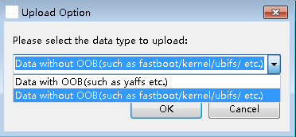
    > **Important:** 
    >When uploading by address, the user needs to explicitly specify the data type to upload. This step is completed in the pop-up dialog after the user clicks the "Upload" button. If the user makes an incorrect selection at this step, the uploaded data will not match the original file. When partially uploading a yaffs file system, the length should be a multiple of pagesize + oobsize.

## Erase Steps

The erase function erases content of a specified length starting from a specified address on the board side. The erase steps are similar to the burning steps. Two differences from the burning steps are listed here; repetitive parts will not be reiterated.

1.  Same as section 3.2 step [1](#ZH-CN_TOPIC_0000002441889077).
2.  Same as section 3.2 step [2](#ZH-CN_TOPIC_0000002441889077).
3.  Configure the board erase information: select the flash type to erase, set the start address and length to be erased in the storage device, as shown in [Figure 1](#fig10547163316314).

    **Figure 1**  Erase information  
    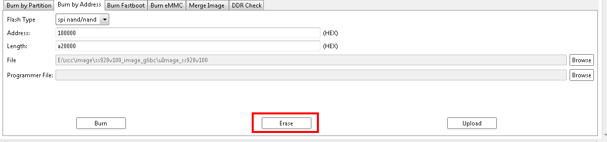

4.  Same as section 3.2 step [3](#ZH-CN_TOPIC_0000002441889077).
5.  Click "erase", power on the board, enter the erase process, and wait for erasure to complete, as shown in [Figure 2](#_Ref416783804).

    **Figure 2**  Erase process  
    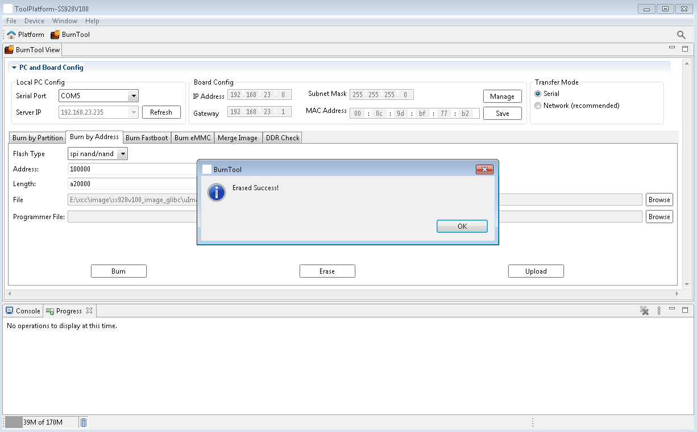
    > **Important:** 
    >When erasing, the length should be a multiple of the blocksize.

# Boot Burning
## Applicable Scenarios

The board does not have boot. Used in conjunction with Burn by Address, it can complete burning of all images on the board.

## Burning Steps

The specific burning steps are as follows:

1.  Switch to the "Burn Fastboot" tab, as shown in [Figure 1](#_Ref416783832).

    **Figure 1**  Fastboot burning interface  
    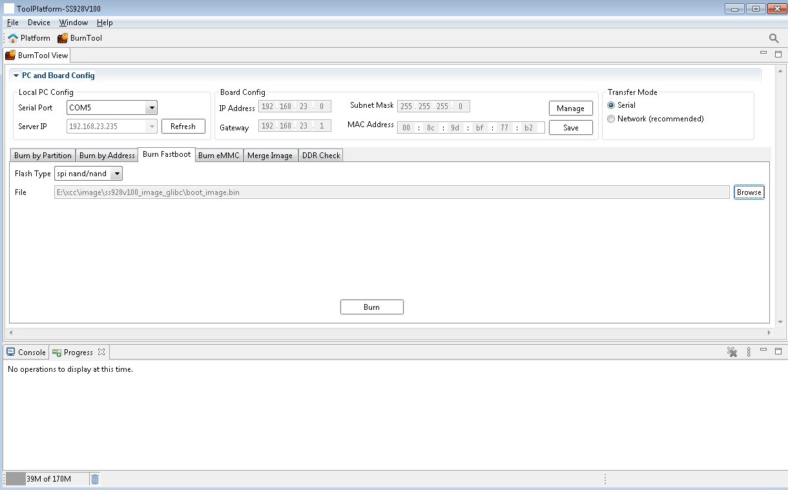

2.  Configure the serial port: select the serial port used to connect to the board, as shown in [Figure 2](#_Ref416783851).

    **Figure 2**  Serial port selection  
    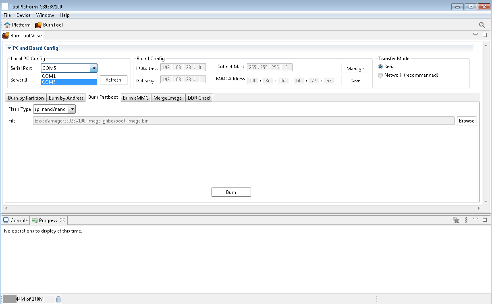

3.  Configure the Boot burning information, as shown in [Figure 3](#fig6981215103111).

    **Figure 3**  Configuring boot burning information  
    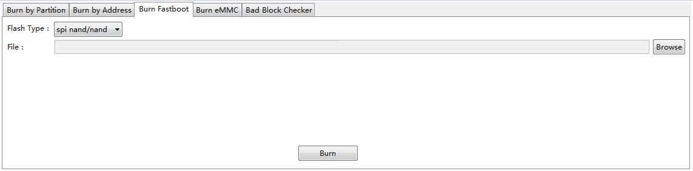

4.  Prepare the board environment. If the board is powered on, power it off.
5.  Click the burn button , as shown in [Figure 4](#fig1999382113211).

    **Figure 4**  Clicking Burn  
    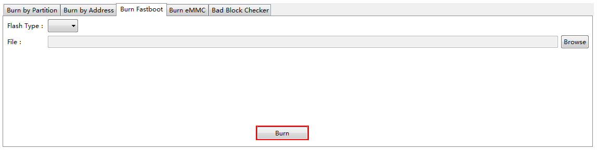

6.  Power on the board, enter the burning process, and wait for burning to complete. The burning process is shown in [Figure 5](#_Ref416783918).

    **Figure 5**  Burning process  
    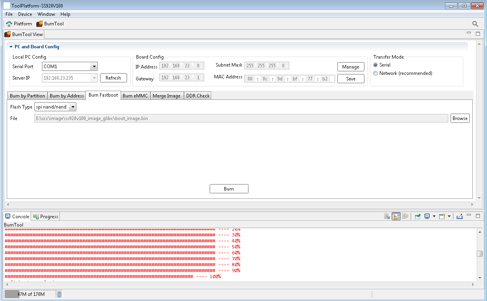

    Information about the burning process will be printed in the "Console" above. If a burning error is found, please check again whether the serial port selection is correct.

7.  After burning is complete, connect the terminal tool and restart the board.

# eMMC Burning
## Applicable Scenarios

The applicable scenarios are as follows: only applicable to eMMC burning, regardless of whether boot is present on the board, enabling one-click burning of all images.

## Burning Steps

The specific burning steps are as follows:

1.  Switch to the "Burn eMMC" tab, as shown in [Figure 1](#fig10733727164915).

    **Figure 1**  eMMC burning interface  
    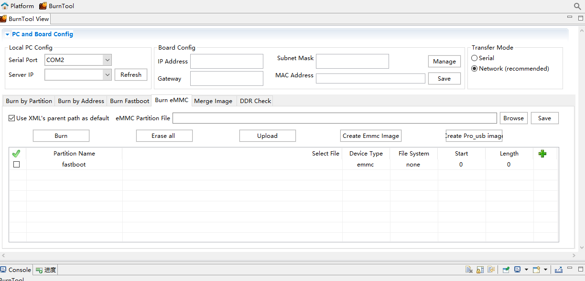
    > **Note:** 
    >-   Toggle the "Use XML path by default" checkbox state. If checked, the partition file is searched for in the XML path first. If unchecked, the absolute path is used to search for the file first. If the file is not found, the tool then tries to find it in the XML directory. This state is checked by default.
    >-   **XML is a configuration file used to save partition table information. The edited partition table can be saved as an XML file using the Save button on the tool. The next time the tool is opened, import the XML and the partition table information will be directly loaded.**

1.  Configure the board partition information. Click "Browse" to select pre-configured partition table information and load it into the tool, as shown in [Figure 2](#fig19253651205117). When the device type of the boot partition is emmc or emmc0, boot will be burned into the default partition. emmc will not switch the boot partition, while emmc0 will switch the boot partition to the default partition. When the device type of the boot partition is emmc1 or emmc2, boot will be burned into the corresponding boot1 or boot2 partition, and the boot partition will be switched to the corresponding boot1 or boot2 partition.

    **Figure 2**  Configuring board partition information  
    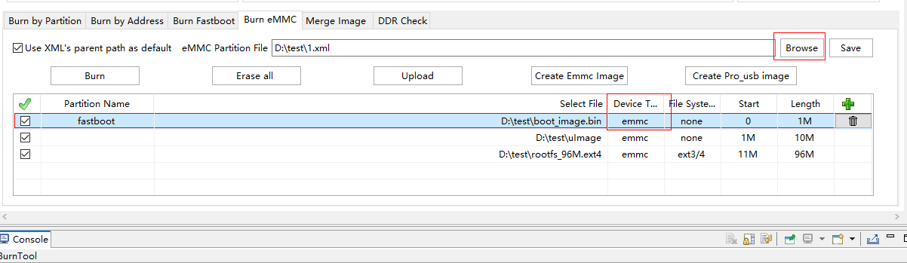
    > **Important:** 
    >If all partition files are packaged into a single image for burning (since eMMC file system partitions need to create a partition table, if the file system partitions are different, they cannot be packaged together; this issue does not exist for Android versions), this image must be placed in the fastboot partition, and the image must contain fastboot. Additionally, since burning at this time uses the serial port method, the burning speed is relatively slow — please be patient.

    > **Note:** 
    >eMMC uses the DOS partition format. For Ext3/4 file system partitions, partition table information needs to be created for the kernel to correctly recognize the Ext3/4 file system partitions.

    To modify the information of a partition, you can directly modify the partition information file saved in xml format, or modify it in the tool. To modify the information of a partition in the tool, click on the row where that partition is located, and it will appear as shown in [Figure 3](#fig05531290513).

    **Figure 3**  Editing board partition information  
    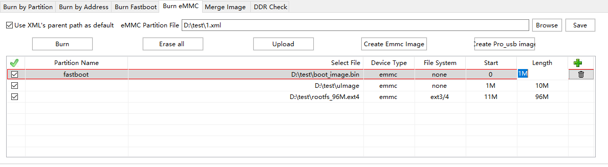
    > **Important:** 
    >The partition start size and partition size are in KB or MB units and must be integer multiples of the eMMC sector size; otherwise, errors may occur.

    -   Click the button  to add a row of partition. In this row, you can modify the partition name, select whether a file system is needed and the file system type, and modify the partition start size and partition size.
    -   Click the button  to select or change the burning file for this partition.
    -   Click the button  to delete this partition information. Note: the fastboot partition cannot be deleted here, and the fastboot partition name cannot be modified, because if the fastboot partition is deleted or its name is modified, one-click burning cannot be achieved.
    -   Click the button  to select all partitions for one-click burning of all partitions. Click the button again  to deselect all partitions to be burned. You can also click the checkbox  to select the corresponding partitions for burning.
    -   Click the button  to save the edited partition table as a file.

    > **Note:** 
    >After creation, when switching perspectives, a dialog as shown will pop up. Click "OK", and in the dialog that appears, select the path to save the partition information, enter the filename to save, and it will be saved as xml-format partition information. Click "Cancel" to switch views without saving the partition information. Note that the filename suffix for saving partition information must be .xml format; otherwise, the partition information may not be correctly loaded the next time. Saving information is shown in [Figure 6](#fig196451156109).

    **Figure 4**  Dialog reminding whether to save partition information when closing the BurnTool  
    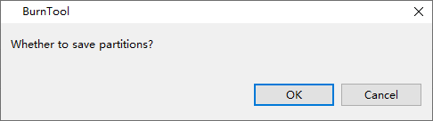

    **Figure 5**  Dialog reminding whether to save partition information when switching views  
    

    Saving information is shown in [Figure 6](#fig196451156109).

    **Figure 6**  Partition information save interface  
    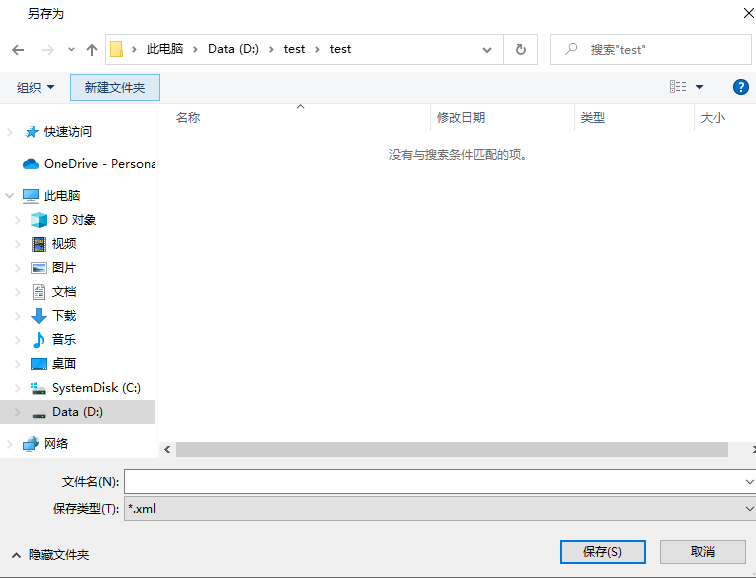

1.  Same as [2.2 step 3](#ZH-CN_TOPIC_0000002441889129).
2.  Burn the board. Click the burn button , as shown in [Figure 7](#fig79197461111).

    **Figure 7**  Clicking Burn  
    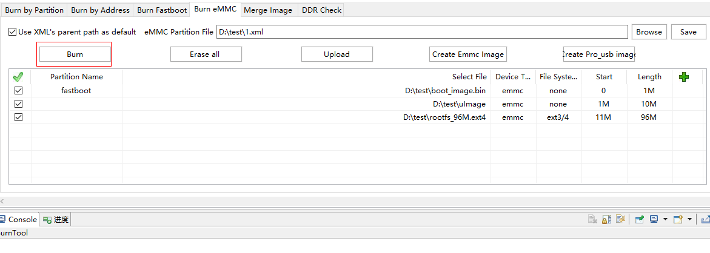

1.  Power on the board, enter the burning process, and wait for burning to complete.

    Information about the burning process will be displayed in the console.

    -   Whether the serial port selection is correct.
    -   Whether the IP address setting is correct and whether the address is occupied.
    -   Whether the bootstrap jumper on the board is shorted.

2.  After burning is complete, connect the terminal tool and restart the board.

## Creating Burner Images

The Create Burner Image function can create the files selected in the current partition list as a burner image file. After configuring the partition list, click the Create Burner Image button 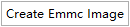, set the file path in the Save dialog that appears, and the burner image creation will begin, as shown in [Figure 1](#fig114434436368).

**Figure 1**  Burner image creation process  
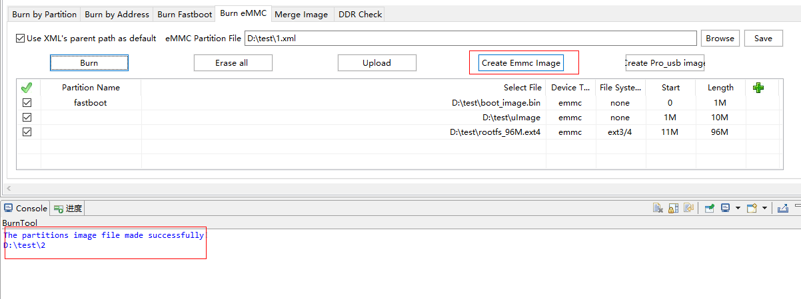
## Upload Steps

The upload function is not available — the board does not support uploading.

## Erase Steps

1.  Switch to the eMMC tab and import the partition table information, as shown in [Figure 1](#fig119011214321).

    **Figure 1**  Importing partition table  
    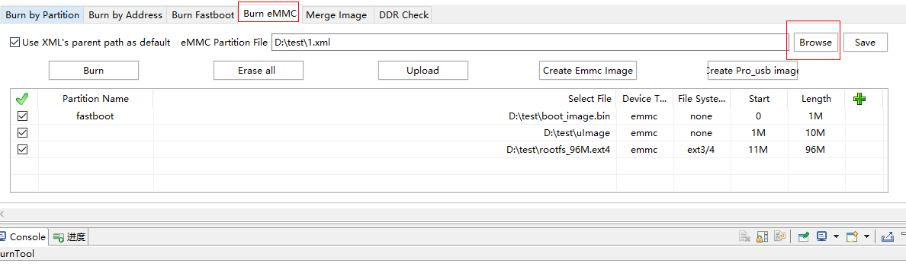

2.  Edit the boot device type, as shown in [Figure 2](#fig151791728173710). If the device type is emmc, only the default partition will be erased. If the device type is emmc0, 1, or 2, the default partition, boot1, and boot2 partitions will all be erased.

    **Figure 2**  Editing boot device type  
    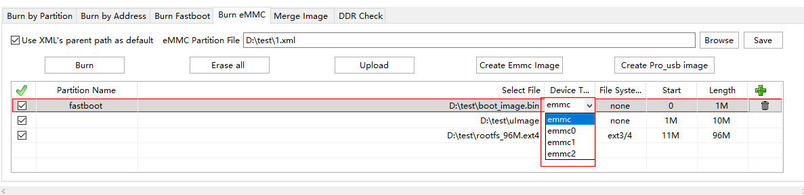

3.  Click Erase, as shown in [Figure 3](#fig17109141184016).

    **Figure 3**  Clicking Erase  
    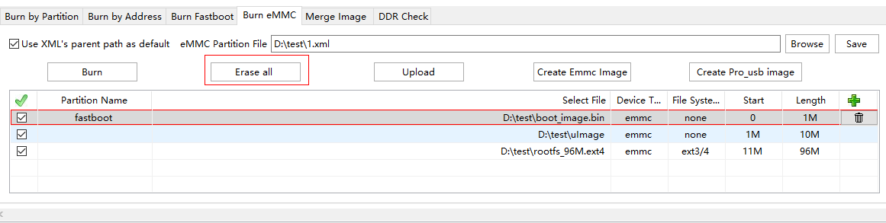
# Merging Images
## Applicable Scenarios

The applicable scenarios are as follows: applicable to SPI Flash scenarios where storage space is small and users need to merge multiple small images into a single image and then burn them into the same block to save flash space. Also applicable to merging images of other Flash types into a single image.

For example, if there are two images, fastboot and kernel, each 500K, and the SPI block size is 1M, then if these two images are burned as two partitions, the board-side burning command will use 2 blocks. If the images are merged, only a single block is needed, thus saving 1M of Flash space.

## Operation Steps

The specific merging steps are as follows:

1.  Switch to the "Merge Image" tab, as shown in [Figure 1](#_Ref416784461).

    **Figure 1**  BurnTool Merge Image interface  
    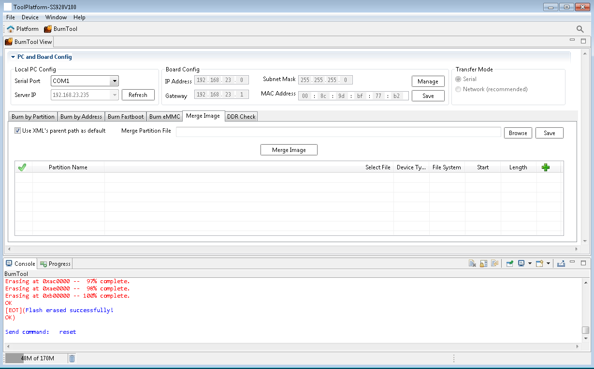

2.  Click the Browse button to load a partition table, or click the  button to manually create a new partition table, as shown in [Figure 2](#fig1195161117453).

    **Figure 2**  Loading partition table  
    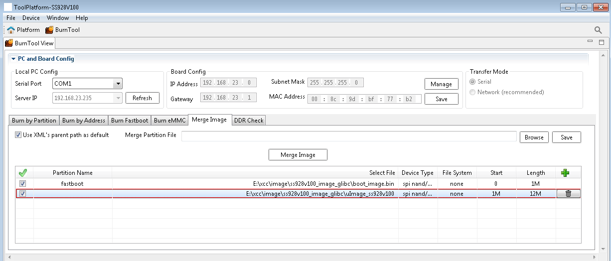

3.  Click the Merging Image button to merge images, as shown in [Figure 3](#_Ref416784524).

    **Figure 3**  Merging images  
    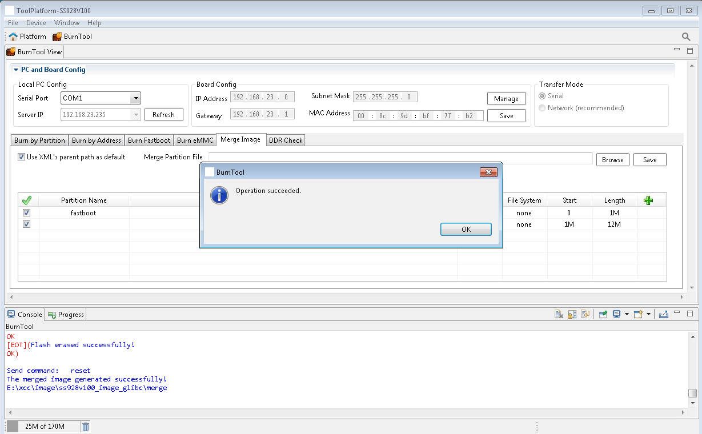
# Preferences Settings
## Command Settings

The BurnTool's serial port command send timeout can be set through Preferences. Click "Window" → "Preferences" in the menu bar to enter the Preferences dialog, and go to the "Command Settings" page under "BurnTool", as shown in [Figure 1](#_Ref416784561).

**Figure 1**  Command Settings page  
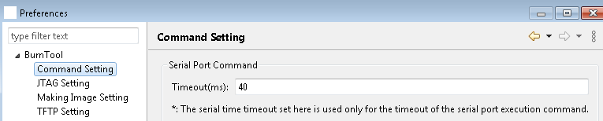

Note: Timeout (ms): used for serial port command send response timeout. Unit: ms.

## TFTP Settings

The BurnTool's TFTP can be set through Preferences. Click "Window" → "Preferences" in the menu bar to enter the Preferences dialog, and go to the "TFTP Settings" page under "BurnTool", as shown in [Figure 1](#_Ref416784544).

**Figure 1**  TFTP Settings page  
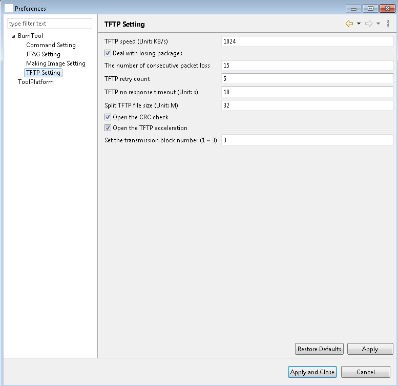

Settings items:

-   TFTP Rate: used to calculate timeout. The timeout is calculated based on the length of the transferred file and the set TFTP rate. Unit: byte/s.
-   Handle Packet Loss: check the "Handle Packet Loss" button. The consecutive packet loss count item becomes configurable. During transmission, if the consecutive lost packets reach the maximum consecutive packet loss count, the transmission is judged as failed. If the "Handle Packet Loss" button is not checked, the consecutive packet loss count item is not configurable, and packet loss during transmission is ignored.
-   Consecutive Packet Loss Count: sets the maximum consecutive packet loss count.
-   TFTP Retry Count: sets the TFTP retry count. If transmission fails, it will retry. After reaching the set retry count without success, it will stop.
-   TFTP No Response Timeout: sets the TFTP no response timeout. If there is no response within the set time during transmission, the transmission is judged as failed. Unit: seconds, default value: 10 seconds.

## Other Settings

### BurnTool-Debug Console Settings

The BurnTool's Debug console can be set through Preferences.

1.  Click "Window" → "Preferences" in the menu bar to enter the Preferences dialog, go to the "BurnTool" page, and select the "Open Debug Mode" button to enable the Debug console, as shown in [Figure 1](#_Ref410048637).

    **Figure 1**  Selecting to enable the Debug console  
    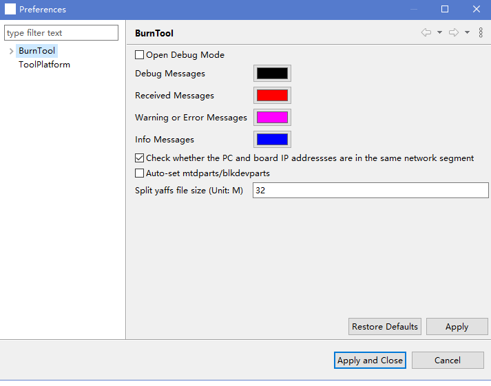

2.  After starting burning, the tool will automatically create a Debug console. Click the console switch button in the upper right corner of the console and select the "BurnTool-Debug" console to switch. The current console will then display as the Debug console, as shown in [Figure 2](#_Ref410048738).

    **Figure 2**  Switching to the BurnTool-Debug console  
    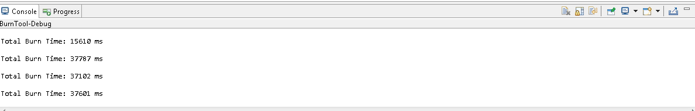
### Check Same Network Segment Settings

Click "Window" → "Preferences" in the menu bar to enter the Preferences dialog, go to the "BurnTool" page, and select the "Check whether the PC and Board IP addresses are in the same network segment" button, as shown in [Figure 1](#_Ref410048821). This enables checking whether the PC and board IPs are in the same gateway before burning. Deselecting it means this check will not be performed before burning.

**Figure 1**  Check Same Network Segment Settings page  

# FAQ
## Solution for TFTP Timeout Prompt During BurnTool Burning

**Problem Description**

When the following TFTP error occurs, as shown in [Figure 1](#_Ref386011440), how should it be resolved?

**Figure 1**  TFTP timeout problem  
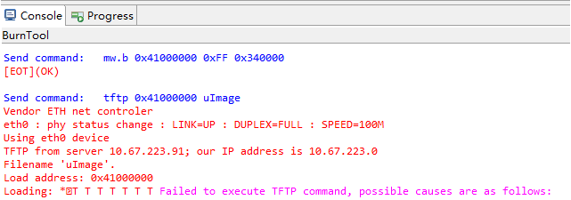

**Solution**

Resolving this issue involves the following four aspects:

-   Check whether the network configuration in the BurnTool is correct, as shown in [Figure 2](#_Ref386011442). First, check whether the server IP is correct. If not, click Reload to load the latest PC-side IP address. Then check whether the subnet mask and gateway are correctly configured. If correct, check whether the board-side IP address is occupied (use the ping command to check whether the current board IP can be pinged; if not, it indicates that the current network is unreachable). After ensuring all the above parameters are correct, try burning again.

    **Figure 2**  Checking whether the network configuration is correct  
    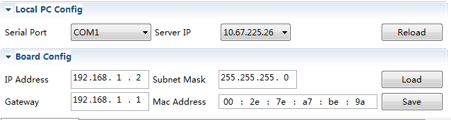
-   Use an external tftpd32 tool instead of the built-in TFTP in the tool for download operations (see "[How to Use an External tftpd32 for Image Download?](#ZH-CN_TOPIC_0000002441889093)"). If tftpd32 also shows a timeout, check whether the current network environment is normal.
-   Modify the TFTP parameter settings in the tool to match the current network environment. Through the menu bar, click "Window" → "Preferences" → "BurnTool" → "TFTP Setting", as shown in [Figure 3](#_Ref386007685). Set the "The number of consecutive packet loss" and "TFTP no response timeout" parameters larger, then perform burning to check whether it is normal.
-   Check whether the firewall is disabled. If not, disable the firewall.

    **Figure 3**  Modifying TFTP settings  
    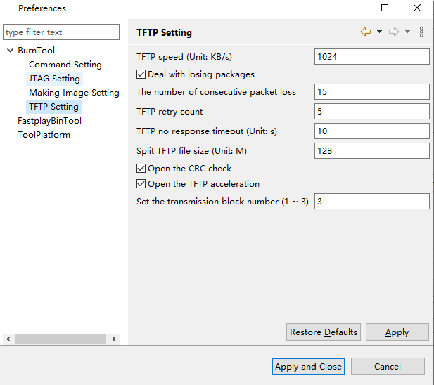
## How to Use an External tftpd32 for Image Download?

**Problem Description**

How to use an external tftpd32 for image download and what should be noted?

**Solution**

The steps for using the external tftpd32 are:

1.  Before burning, open the tftpd32 tool and select the correct PC-side IP address and the directory where the images to be burned are located, as shown in [Figure 1](#_Ref386011451).

    **Figure 1**  Configuring the tftpd32 tool  
    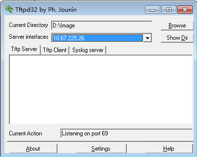

1.  Click the burn button normally in the BurnTool. A prompt box will appear, as shown in [Figure 2](#_Ref386011453). Click Confirm to start burning. The external tftpd32 will then be used for image download, as shown in [Figure 3](#_Ref386011454).

    **Figure 2**  Prompt indicating built-in TFTP startup failed, port occupied by external tftpd32 tool  
    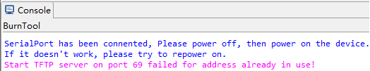

    **Figure 3**  External tftpd32 tool downloading image  
    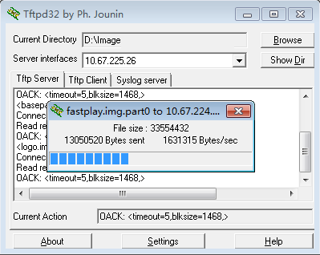
## Solution for "Failed to Send Start Frame" Error When Burning the Fastboot Partition with BurnTool

**Problem Description**

When the following "Failed to send start frame" error occurs while burning the Fastboot partition, as shown in [Figure 1](#_Ref386011456), what should I do?

**Figure 1**  "Failed to send start frame" error message  
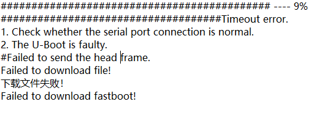Failed to send start frame\" error message")

**Solution**

First, confirm whether the board was powered on again within 15 seconds after the last burn was clicked. If it has already been powered on again, check whether the serial port is making good contact with the board. If the connection is normal, check whether the correct serial port number is selected in the BurnTool, as shown in [Figure 2](#_Ref386011460). After ensuring everything is correct, try burning again.

**Figure 2**  Checking whether the serial port number is correctly selected  
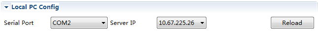
## Solution When the Console Only Prints a Line of "#########" Then Stops, and the Tool Reports "Failed to Send Head Frame" During Fastboot Partition Burning

**Problem Description**

When burning the Fastboot partition, the console only prints a line of "#########" and then stops, and the tool reports a "Failed to send head frame" error, as shown in [Figure 1](#_Ref386011462), how should it be resolved?

**Figure 1**  "Failed to send head frame" error message  
Failed to send head frame\" error message")

**Solution**

There may be two causes for this error:

-   The Fastboot image being burned does not match the current board model. Directly check the board model marking. After identifying the board model, use the SDK image matching the current chip to burn again.
-   The board DDR has issues and cannot perform DDR initialization normally.

## Solution for "Failed to Send Data Frame" Error When Burning the Fastboot Partition with BurnTool

**Problem Description**

When the following "Failed to send data frame" error occurs while burning the Fastboot partition, as shown in [Figure 1](#_Ref386011468), what should I do?

**Figure 1**  "Failed to send data frame" error message  
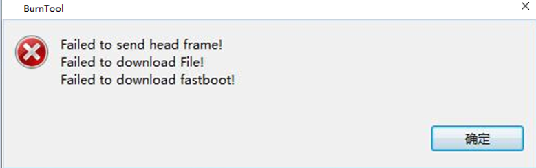Failed to send data frame\" error message")

**Solution**

The cause of this error may be that the serial port connection became loose during Fastboot image burning, causing data transmission failure when the tool interacts with the board. Please check the serial port connection.

## Solution for "Failed to Execute Command" Error When Burning the Fastboot Partition with BurnTool

**Problem Description**

When the following "Failed to execute command" error occurs while burning the Fastboot partition, as shown in [Figure 1](#_Ref386011469), what should I do?

**Figure 1**  "Failed to execute command" error message  
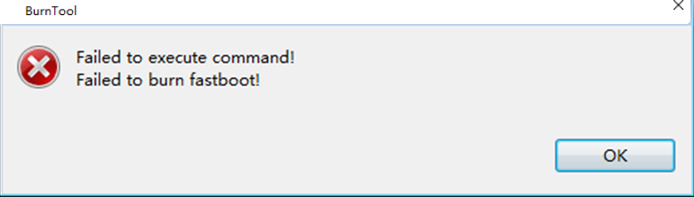Failed to execute command\" error message")

**Solution**

The cause of this error may be that the Flash type selected for the current Fastboot partition is incorrect, as shown in [Figure 2](#_Ref386011475). Restart the board and check the current "Flash" attribute of the board. If it is currently eMMC, use Burn by eMMC, and select emmc as the Flash type for the Fastboot partition.

**Figure 2**  Viewing board Flash information via the serial port  
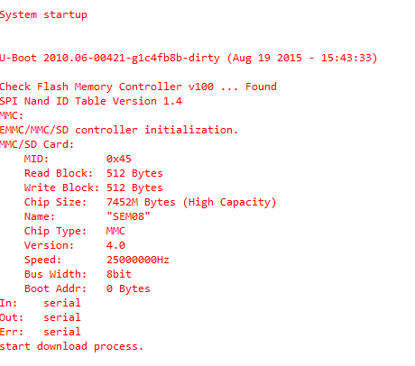
## What Should Be Noted When Selecting a File Transfer Method?

**Problem Description**

When selecting a file transfer method, what are the pros and cons between serial port and network port?

**Solution**

The BurnTool's serial port burning function is pure serial port burning. Since the burning process requires transmitting a large amount of data to the board side, and the serial port's own transmission rate is relatively low, burning using the pure serial port method will be relatively inefficient. We recommend using the network port method for burning. The pure serial port method of burning is very stable; if the user's network environment is unstable, serial port burning can be used.

## File Length Requirements in the Burn by Address Interface?

**Problem Description**

In the Burn by Address interface, what are the file length requirements?

**Solution**

When erasing, the length should be a multiple of the blocksize. When partially uploading a yaffs file system, the length should be a multiple of pagesize + oobsize.

## Possible Reasons Why Burning Does Not Start After Clicking Burn and Power Cycling?

**Problem Description**

After clicking Burn and power cycling, but the tool does not start burning — what is the reason?

**Solution**

It may be that the serial port selection is wrong or the serial port is not properly connected (please use a terminal tool to check). Wait, and the console will print relevant information.

## Reasons Why the Serial Port Cannot Be Found, TFTP Startup Fails, or TFTP Port Occupied Error Occurs?

**Problem Description**

When using Linux, the serial port cannot be found, TFTP startup fails, or a TFTP port occupied error is reported — what are the possible causes?

**Solution**

Not logged in as the root user, lacking permission to open the TFTP service or use the serial port. A TFTP port occupied error may also be caused by other software occupying this port.

## When Burning NAND, What Do pure data length and len_incl_bad Printed in the Console Mean?

**Problem Description**

When burning NAND, what do pure data length and len_incl_bad printed in the console mean?

**Solution**

As shown in [Figure 1](#_Ref386007893), pure data length represents the actual length of data burned, while len incl bad represents the actual length occupied by burning including bad blocks. Neither of the above two lengths includes the oobSize length.

**Figure 1**  Burn length printed by the console as feedback to the burn command  
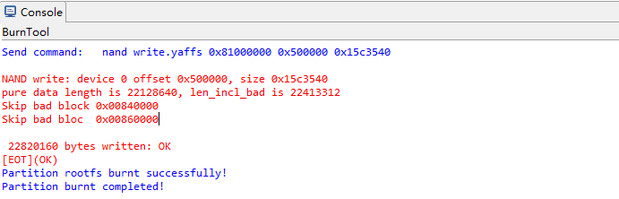
## What Will the Tool Print When Board DDR Training Fails?

**Problem Description**

What will the tool print when board DDR Training fails?

**Solution**

When board DDR Training fails, during Fastboot partition burning, the information shown in [Figure 1](#_Ref386011496) will be printed.

**Figure 1**  Printing DDR Training failure information  
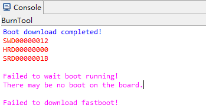
## What Needs to Be Provided When Reporting Issues Encountered During BurnTool Usage?

**Problem Description**

What needs to be provided when reporting issues encountered during BurnTool usage?

**Solution**

When encountering issues with the BurnTool, export the console print content using the export button in the console toolbar. Providing this along with the issue report will help with problem localization and resolution.

## How to Check Whether a Process Is Occupying TFTP Port 69?

**Problem Description**

The tftp command always reports that the file cannot be found, but all settings are actually correct — what is the reason? How to check whether a process is occupying TFTP port 69?

**Solution**

There may be a background process occupying port 69. You can use the following method to check whether a process is occupying it.

Enter the following in the cmd command line tool, and the printout will look like [Figure 1](#_Ref413161493).

netstat -ano -p udp

**Figure 1**  Viewing process port occupation  
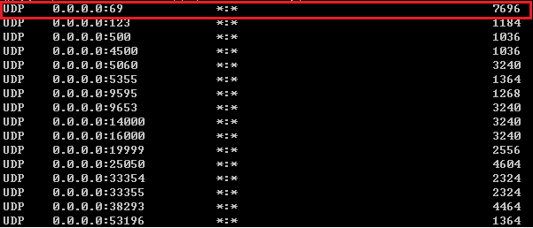

Check whether any process is occupying port 69. In the above figure, it can be seen that the process with pid 7696 is occupying port 69. Then use the following command to view the name of the 7696 process, with the printout as shown in [Figure 2](#_Ref413161472).

tasklist|findstr "7696"

**Figure 2**  Viewing the process name for a specified PID  

Then kill that process in the process manager.

## What If It Is a 64-bit PC and Only the 64-bit Version of JRE Is Installed?

**Problem Description**

The PC has the 64-bit version of JRE installed, and an error is reported when opening ToolPlatform — what should be done?

**Solution**

Since ToolPlatform depends on the 32-bit JRE version, before using ToolPlatform, please first visit the JRE official website, download and install the Windows x86 version of the corresponding JRE version at the following URL: [http://www.oracle.com/technetwork/java/javase/downloads/](http://www.oracle.com/technetwork/java/javase/downloads/)

Additionally, ToolPlatform-XXX-4.0.15 and later versions already have the JRE program built in, so there is no need to install JRE again.

## Non-Chinese Language Systems Cannot Burn Images with Chinese Paths

**Problem Description**

If the system is a non-Chinese system, the tool cannot burn images with Chinese paths in the system. To query the language system, enter the chcp command in cmd. As shown in Figure Querying the Windows Language System Method, 437 represents the US language system, while 936 represents the Chinese language system.

**Figure 1**  Method for querying the Windows language system  
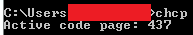

**Solution**

Non-Chinese language systems do not support images with paths containing Chinese characters. Change the burning path to an English path.

# Acronyms and Abbreviations

<table><tbody><tr id="row182mcpsimp"><td class="cellrowborder" colspan="2" valign="top">
<strong id="b185mcpsimp">A</strong>

</td>
</tr>
<tr id="row187mcpsimp"><td class="cellrowborder" valign="top" width="23%">
AXI

</td>
<td class="cellrowborder" valign="top" width="77%">
Advanced eXtensible Interface

</td>
</tr>
<tr id="row195mcpsimp"><td class="cellrowborder" colspan="2" valign="top">
<strong id="b198mcpsimp">D</strong>

</td>
</tr>
<tr id="row200mcpsimp"><td class="cellrowborder" valign="top" width="23%">
DDR

</td>
<td class="cellrowborder" valign="top" width="77%">
Double Data Rate

</td>
</tr>
<tr id="row208mcpsimp"><td class="cellrowborder" colspan="2" valign="top">
<strong id="b211mcpsimp">E</strong>

</td>
</tr>
<tr id="row213mcpsimp"><td class="cellrowborder" valign="top" width="23%">
eMMC

</td>
<td class="cellrowborder" valign="top" width="77%">
Embedded MultiMediaCard

</td>
</tr>
<tr id="row221mcpsimp"><td class="cellrowborder" colspan="2" valign="top">
<strong id="b224mcpsimp">G</strong>

</td>
</tr>
<tr id="row226mcpsimp"><td class="cellrowborder" valign="top" width="23%">
GPIO

</td>
<td class="cellrowborder" valign="top" width="77%">
General Purpose Input Output

</td>
</tr>
<tr id="row234mcpsimp"><td class="cellrowborder" colspan="2" valign="top">
<strong id="b237mcpsimp">H</strong>

</td>
</tr>
<tr id="row239mcpsimp"><td class="cellrowborder" valign="top" width="23%">
HDMI

</td>
<td class="cellrowborder" valign="top" width="77%">
High Definition Multimedia Interface

</td>
</tr>
<tr id="row247mcpsimp"><td class="cellrowborder" colspan="2" valign="top">
<strong id="b250mcpsimp">N</strong>

</td>
</tr>
<tr id="row252mcpsimp"><td class="cellrowborder" valign="top" width="23%">
NAND

</td>
<td class="cellrowborder" valign="top" width="77%">
NAND

</td>
</tr>
<tr id="row260mcpsimp"><td class="cellrowborder" colspan="2" valign="top">
<strong id="b263mcpsimp">P</strong>

</td>
</tr>
<tr id="row265mcpsimp"><td class="cellrowborder" valign="top" width="23%">
PID

</td>
<td class="cellrowborder" valign="top" width="77%">
Process Identification

</td>
</tr>
</tbody>
</table>
