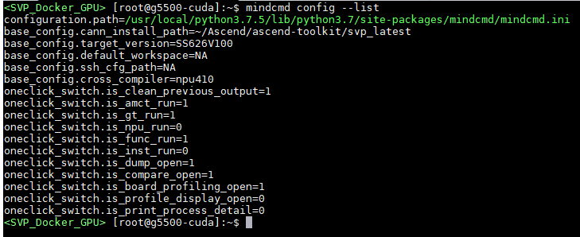
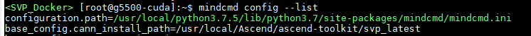

# Preface
**Overview<a name="section4537382116410"></a>**

This document describes how to use the MindCmd tool and how to perform one-click inference, data preprocessing, open-source framework inference, model compression, model conversion, functional simulation, instruction simulation, on-board inference, accuracy comparison, and performance analysis through the tool.

**Product Version<a name="section300mcpsimp"></a>**

The product versions corresponding to this document are as follows.

<a name="table303mcpsimp"></a>
<table><thead align="left"><tr id="row308mcpsimp"><th class="cellrowborder" valign="top" width="45%" id="mcps1.1.3.1.1"><p id="p310mcpsimp"><a name="p310mcpsimp"></a><a name="p310mcpsimp"></a>Product Name</p>
</th>
<th class="cellrowborder" valign="top" width="55.00000000000001%" id="mcps1.1.3.1.2"><p id="p312mcpsimp"><a name="p312mcpsimp"></a><a name="p312mcpsimp"></a>Product Version</p>
</th>
</tr>
</thead>
<tbody><tr id="row314mcpsimp"><td class="cellrowborder" valign="top" width="45%" headers="mcps1.1.3.1.1 "><p id="p316mcpsimp"><a name="p316mcpsimp"></a><a name="p316mcpsimp"></a>Hi3403V100</p>
</td>
<td class="cellrowborder" valign="top" width="55.00000000000001%" headers="mcps1.1.3.1.2 "><p id="p318mcpsimp"><a name="p318mcpsimp"></a><a name="p318mcpsimp"></a>V100</p>
</td>
</tr>
<tr id="row1376073312191"><td class="cellrowborder" valign="top" width="45%" headers="mcps1.1.3.1.1 "><p id="p5760533111913"><a name="p5760533111913"></a><a name="p5760533111913"></a>Hi3519AV200</p>
</td>
<td class="cellrowborder" valign="top" width="55.00000000000001%" headers="mcps1.1.3.1.2 "><p id="p6760333131918"><a name="p6760333131918"></a><a name="p6760333131918"></a>V100</p>
</td>
</tr>
</tbody>
</table>

> **Notice:** 
>MindCmd is only intended as a development and debugging tool. It is not recommended for integration into actual products.
>Unless otherwise specified in this document, the content for Hi3403V100 and Hi3519AV200 is identical.

**Target Audience<a name="section4378592816410"></a>**

This document (guide) is primarily applicable to the following engineers:

-   Algorithm Engineer
-   Technical Support Engineer
-   Software Development Engineer

**Symbol Conventions<a name="section133020216410"></a>**

The following symbols may appear in this document, and their meanings are as follows.

<a name="table2622507016410"></a>
<table><thead align="left"><tr id="row1530720816410"><th class="cellrowborder" valign="top" width="20.580000000000002%" id="mcps1.1.3.1.1"><p id="p6450074116410"><a name="p6450074116410"></a><a name="p6450074116410"></a><strong id="b2136615816410"><a name="b2136615816410"></a><a name="b2136615816410"></a>Symbol</strong></p>
</th>
<th class="cellrowborder" valign="top" width="79.42%" id="mcps1.1.3.1.2"><p id="p5435366816410"><a name="p5435366816410"></a><a name="p5435366816410"></a><strong id="b5941558116410"><a name="b5941558116410"></a><a name="b5941558116410"></a>Description</strong></p>
</th>
</tr>
</thead>
<tbody><tr id="row1372280416410"><td class="cellrowborder" valign="top" width="20.580000000000002%" headers="mcps1.1.3.1.1 "><p id="p3734547016410"><a name="p3734547016410"></a><a name="p3734547016410"></a><a name="image2670064316410"></a><a name="image2670064316410"></a><span></span></p>
</td>
<td class="cellrowborder" valign="top" width="79.42%" headers="mcps1.1.3.1.2 "><p id="p1757432116410"><a name="p1757432116410"></a><a name="p1757432116410"></a>Indicates a high-level risk hazard that, if not avoided, will result in death or serious injury.</p>
</td>
</tr>
<tr id="row466863216410"><td class="cellrowborder" valign="top" width="20.580000000000002%" headers="mcps1.1.3.1.1 "><p id="p1432579516410"><a name="p1432579516410"></a><a name="p1432579516410"></a><a name="image4895582316410"></a><a name="image4895582316410"></a><span></span></p>
</td>
<td class="cellrowborder" valign="top" width="79.42%" headers="mcps1.1.3.1.2 "><p id="p959197916410"><a name="p959197916410"></a><a name="p959197916410"></a>Indicates a medium-level risk hazard that, if not avoided, could result in death or serious injury.</p>
</td>
</tr>
<tr id="row123863216410"><td class="cellrowborder" valign="top" width="20.580000000000002%" headers="mcps1.1.3.1.1 "><p id="p1232579516410"><a name="p1232579516410"></a><a name="p1232579516410"></a><a name="image1235582316410"></a><a name="image1235582316410"></a><span></span></p>
</td>
<td class="cellrowborder" valign="top" width="79.42%" headers="mcps1.1.3.1.2 "><p id="p123197916410"><a name="p123197916410"></a><a name="p123197916410"></a>Indicates a low-level risk hazard that, if not avoided, could result in minor or moderate injury.</p>
</td>
</tr>
<tr id="row5786682116410"><td class="cellrowborder" valign="top" width="20.580000000000002%" headers="mcps1.1.3.1.1 "><p id="p2204984716410"><a name="p2204984716410"></a><a name="p2204984716410"></a><a name="image4504446716410"></a><a name="image4504446716410"></a><span></span></p>
</td>
<td class="cellrowborder" valign="top" width="79.42%" headers="mcps1.1.3.1.2 "><p id="p4388861916410"><a name="p4388861916410"></a><a name="p4388861916410"></a>Conveys device or environmental safety alert information. If not avoided, it may result in equipment damage, data loss, performance degradation, or other unpredictable consequences.</p>
<p id="p1238861916410"><a name="p1238861916410"></a><a name="p1238861916410"></a>"Caution" does not involve personal injury.</p>
</td>
</tr>
<tr id="row2856923116410"><td class="cellrowborder" valign="top" width="20.580000000000002%" headers="mcps1.1.3.1.1 "><p id="p5555360116410"><a name="p5555360116410"></a><a name="p5555360116410"></a><a name="image799324016410"></a><a name="image799324016410"></a><span></span></p>
</td>
<td class="cellrowborder" valign="top" width="79.42%" headers="mcps1.1.3.1.2 "><p id="p4612588116410"><a name="p4612588116410"></a><a name="p4612588116410"></a>Provides supplementary explanations for key information in the main text.</p>
<p id="p1232588116410"><a name="p1232588116410"></a><a name="p1232588116410"></a>"Note" is not a safety warning and does not involve personal, equipment, or environmental injury information.</p>
</td>
</tr>
</tbody>
</table>

**Revision History<a name="section2467512116410"></a>**

<a name="table1557726816410"></a>
<table><thead align="left"><tr id="row2942532716410"><th class="cellrowborder" valign="top" width="20.72%" id="mcps1.1.4.1.1"><p id="p3778275416410"><a name="p3778275416410"></a><a name="p3778275416410"></a><strong id="b5687322716410"><a name="b5687322716410"></a><a name="b5687322716410"></a>Document Version</strong></p>
</th>
<th class="cellrowborder" valign="top" width="24.75%" id="mcps1.1.4.1.2"><p id="p5627845516410"><a name="p5627845516410"></a><a name="p5627845516410"></a><strong id="b5800814916410"><a name="b5800814916410"></a><a name="b5800814916410"></a>Release Date</strong></p>
</th>
<th class="cellrowborder" valign="top" width="54.53%" id="mcps1.1.4.1.3"><p id="p2382284816410"><a name="p2382284816410"></a><a name="p2382284816410"></a><strong id="b3316380216410"><a name="b3316380216410"></a><a name="b3316380216410"></a>Change Description</strong></p>
</th>
</tr>
</thead>
<tbody><tr id="row09522101333"><td class="cellrowborder" valign="top" width="20.72%" headers="mcps1.1.4.1.1 "><p id="p115571917311"><a name="p115571917311"></a><a name="p115571917311"></a>00B02</p>
</td>
<td class="cellrowborder" valign="top" width="24.75%" headers="mcps1.1.4.1.2 "><p id="p201551519839"><a name="p201551519839"></a><a name="p201551519839"></a>2025-11-15</p>
</td>
<td class="cellrowborder" valign="top" width="54.53%" headers="mcps1.1.4.1.3 "><p id="p111558191030"><a name="p111558191030"></a><a name="p111558191030"></a>First interim version release</p>
<p id="p174674277317"><a name="p174674277317"></a><a name="p174674277317"></a>Modified sections: "2.3 Installing MindCmd" and "2.4 Global Configuration"</p>
</td>
</tr>
<tr id="row5947359616410"><td class="cellrowborder" valign="top" width="20.72%" headers="mcps1.1.4.1.1 "><p id="p1027mcpsimp"><a name="p1027mcpsimp"></a><a name="p1027mcpsimp"></a>00B01</p>
</td>
<td class="cellrowborder" valign="top" width="24.75%" headers="mcps1.1.4.1.2 "><p id="p1029mcpsimp"><a name="p1029mcpsimp"></a><a name="p1029mcpsimp"></a>2025-09-15</p>
</td>
<td class="cellrowborder" valign="top" width="54.53%" headers="mcps1.1.4.1.3 "><p id="p1031mcpsimp"><a name="p1031mcpsimp"></a><a name="p1031mcpsimp"></a>First interim version release</p>
</td>
</tr>
</tbody>
</table>

# Introduction
The MindCmd command-line tool focuses on one-click operation and automation, aiming to significantly improve end-to-end development efficiency on the deployment side.

For network model development, MindCmd integrates offline model conversion tools, model quantization tools, model accuracy comparison tools, and model performance analysis tools, improving the efficiency of network model porting, analysis, and optimization.

## Functional Architecture Diagram<a name="ZH-CN_TOPIC_0000002442020637"></a>

As shown in [Figure 1](#fig109661225380), the tool currently includes data preprocessing, open-source framework inference, model compression, model conversion, functional simulation, instruction simulation, on-board inference, performance analysis, accuracy comparison, and One-click inference.

**Figure 1** MindCmd Functional Architecture<a name="fig109661225380"></a>  


## Tool Functions<a name="ZH-CN_TOPIC_0000002442020581"></a>

The main functional features of MindCmd are as follows.

-   One-click Inference: Provides one-click inference functionality for end-to-end execution of data preprocessing, open-source framework inference, model compression, model conversion, functional simulation, instruction simulation, on-board inference, Dump, accuracy comparison, and performance analysis. See [One-click Inference](#ZH-CN_TOPIC_0000002408581326).
-   Data Preprocessing: Provides data preprocessing functionality. Before performing model compression, model conversion, etc., preprocess data to match the model. See [Data Preprocessing](#ZH-CN_TOPIC_0000002441980729).
-   Open-source Framework Inference: Provides open-source framework inference functionality. Obtains Ground Truth data. See [Open-source Framework Inference](#ZH-CN_TOPIC_0000002442020541).
-   Model Compression: Provides model compression functionality for low-bit processing of model weights and activations, making the final network model more lightweight, saving storage space, reducing transmission latency, improving computing efficiency, and achieving performance improvement and optimization. See [Model Compression](#ZH-CN_TOPIC_0000002408421470).
-   Model Conversion: Provides model conversion functionality to convert trained models into offline models. See [Model Conversion](#ZH-CN_TOPIC_0000002408581442).
-   Functional Simulation: Provides functional simulation inference functionality. See [Application Engineering](#ZH-CN_TOPIC_0000002408421530).
-   Instruction Simulation: Provides instruction simulation inference functionality. See [Application Engineering](#ZH-CN_TOPIC_0000002408421530).
-   On-board Inference: Provides on-board inference functionality. See [Application Engineering](#ZH-CN_TOPIC_0000002408421530).
-   Accuracy Comparison: Provides accuracy comparison functionality to compare the operation results of SoC-supported operators after model conversion with standard operator results, to identify the causes of calculation errors. See [Accuracy Comparison](#ZH-CN_TOPIC_0000002441980581).
-   Performance Analysis: Provides performance analysis functionality for collecting and analyzing key performance indicators at various runtime stages of SoC inference services. See [Performance Analysis](#ZH-CN_TOPIC_0000002442020517).
-   Tool Modules: Provides individually callable tools, including original Caffe model subnet export, data format conversion, model Uninplace, ATC command line to cfg file conversion. See [Tools](#ZH-CN_TOPIC_0000002408421486).

# Installation
The MindCmd software package can be installed on a Linux server. It can be installed using the native desktop terminal gnome-terminal on the Linux server, or by SSHing into a Linux server from a Windows server.

**Figure 1** Linux Distributed Deployment<a name="fig14199047421"></a>  


**Figure 2** Linux Co-deployment<a name="fig4886192317319"></a>  


The MindCmd installation process is shown in [Figure 3](#fig194332362414).

**Figure 3** Installation Process<a name="fig194332362414"></a>  


## Obtaining the Software Package<a name="ZH-CN_TOPIC_0000002442020661"></a>

The MindCmd tool only supports installation on 18.04 x86\_64 architecture servers. Before installation, obtain the MindCmd tool software package.

The MindCmd tool's model conversion and model inference depend on the CANN software package. Model compression depends on the AMCT software package. See [Table 1](#table136510451990) for details.

**Table 1** Software Package Description

<a name="table136510451990"></a>
<table><thead align="left"><tr id="row203664451395"><th class="cellrowborder" valign="top" width="32.78%" id="mcps1.2.4.1.1"><p id="p43661845797"><a name="p43661845797"></a><a name="p43661845797"></a>Software Package</p>
</th>
<th class="cellrowborder" valign="top" width="9.62%" id="mcps1.2.4.1.2"><p id="p1760173584117"><a name="p1760173584117"></a><a name="p1760173584117"></a>Mandatory/Optional</p>
</th>
<th class="cellrowborder" valign="top" width="57.599999999999994%" id="mcps1.2.4.1.3"><p id="p680113459274"><a name="p680113459274"></a><a name="p680113459274"></a>Description</p>
</th>
</tr>
</thead>
<tbody><tr id="row024917514402"><td class="cellrowborder" valign="top" width="32.78%" headers="mcps1.2.4.1.1 "><p id="p1624975124015"><a name="p1624975124015"></a><a name="p1624975124015"></a>mindcmd-<em id="i1819720715213"><a name="i1819720715213"></a><a name="i1819720715213"></a>&lt;version&gt;</em>-py3-none-linux_x86_64.tar.gz</p>
</td>
<td class="cellrowborder" valign="top" width="9.62%" headers="mcps1.2.4.1.2 "><p id="p1260183544113"><a name="p1260183544113"></a><a name="p1260183544113"></a>Mandatory</p>
</td>
<td class="cellrowborder" valign="top" width="57.599999999999994%" headers="mcps1.2.4.1.3 "><p id="p82501251144018"><a name="p82501251144018"></a><a name="p82501251144018"></a>The MindCmd tool is mainly used for end-to-end one-click execution of data preprocessing, model quantization, model conversion, simulation inference, model inference, accuracy comparison, and performance analysis. Each sub-module supports independent invocation. See <a href="#ZH-CN_TOPIC_0000002408581406">MindCmd Subcommands</a>.</p>
</td>
</tr>
<tr id="row867611101918"><td class="cellrowborder" valign="top" width="32.78%" headers="mcps1.2.4.1.1 "><p id="p1167711103110"><a name="p1167711103110"></a><a name="p1167711103110"></a>Ascend-cann-toolkit_<em id="i3736655103517"><a name="i3736655103517"></a><a name="i3736655103517"></a>{6.x}</em>_linux.x86_64.run</p>
</td>
<td class="cellrowborder" valign="top" width="9.62%" headers="mcps1.2.4.1.2 "><p id="p760153514417"><a name="p760153514417"></a><a name="p760153514417"></a>Mandatory</p>
</td>
<td class="cellrowborder" valign="top" width="57.599999999999994%" headers="mcps1.2.4.1.3 "><p id="p126771310712"><a name="p126771310712"></a><a name="p126771310712"></a>The CANN software package provides model conversion and model inference support for the MindCmd tool, including header files and shared libraries required for application development.</p>
</td>
</tr>
<tr id="row386719539546"><td class="cellrowborder" valign="top" width="32.78%" headers="mcps1.2.4.1.1 "><p id="p1186765316543"><a name="p1186765316543"></a><a name="p1186765316543"></a>hotwheels_amct_caffe_-<em id="i1480465410216"><a name="i1480465410216"></a><a name="i1480465410216"></a>&lt;version&gt;</em>-py3-none-linux_x86_64.whl</p>
</td>
<td class="cellrowborder" valign="top" width="9.62%" headers="mcps1.2.4.1.2 "><p id="p360133524114"><a name="p360133524114"></a><a name="p360133524114"></a>Optional</p>
</td>
<td class="cellrowborder" rowspan="2" valign="top" width="57.599999999999994%" headers="mcps1.2.4.1.3 "><p id="p8338914588"><a name="p8338914588"></a><a name="p8338914588"></a>The model compression tool (AMCT) provides network model quantization support for the MindCmd tool, making the final network model more lightweight, saving storage space, reducing transmission latency, improving computing efficiency, and achieving performance improvement and optimization.</p>
<p id="p74531426182017"><a name="p74531426182017"></a><a name="p74531426182017"></a>The current MindCmd tool supports 8-bit PTQ (Post-Training Quantization) quantization.</p>
</td>
</tr>
<tr id="row0627257125713"><td class="cellrowborder" valign="top" headers="mcps1.2.4.1.1 "><p id="p17627557135718"><a name="p17627557135718"></a><a name="p17627557135718"></a>hotwheels_amct_pytorch-<em id="i1716517598216"><a name="i1716517598216"></a><a name="i1716517598216"></a>&lt;version&gt;</em>-py3-none-linux_x86_64.tar.gz</p>
</td>
<td class="cellrowborder" valign="top" headers="mcps1.2.4.1.2 "><p id="p16011135154114"><a name="p16011135154114"></a><a name="p16011135154114"></a>Optional</p>
</td>
</tr>
</tbody>
</table>

Where _<version>_ indicates the software version number.

## Pre-installation Preparation<a name="ZH-CN_TOPIC_0000002441980749"></a>

### Ubuntu18.04-x86\_64 System<a name="ZH-CN_TOPIC_0000002441980633"></a>

**Environment Requirements<a name="section13831110592"></a>**

The environment for installing MindCmd must meet the following hardware and operating system requirements.

**Table 1** Ubuntu System Version Compatibility Information

<a name="zh-cn_topic_0249939299_zh-cn_topic_0231558615_zh-cn_topic_0189917872_table1515616482231"></a>
<table><thead align="left"><tr id="zh-cn_topic_0249939299_zh-cn_topic_0231558615_zh-cn_topic_0189917872_row8157124812317"><th class="cellrowborder" valign="top" width="11.35%" id="mcps1.2.4.1.1"><p id="zh-cn_topic_0249939299_zh-cn_topic_0231558615_zh-cn_topic_0189917872_p17157194842316"><a name="zh-cn_topic_0249939299_zh-cn_topic_0231558615_zh-cn_topic_0189917872_p17157194842316"></a><a name="zh-cn_topic_0249939299_zh-cn_topic_0231558615_zh-cn_topic_0189917872_p17157194842316"></a>Category</p>
</th>
<th class="cellrowborder" valign="top" width="26.029999999999998%" id="mcps1.2.4.1.2"><p id="zh-cn_topic_0249939299_zh-cn_topic_0231558615_zh-cn_topic_0189917872_p31575485237"><a name="zh-cn_topic_0249939299_zh-cn_topic_0231558615_zh-cn_topic_0189917872_p31575485237"></a><a name="zh-cn_topic_0249939299_zh-cn_topic_0231558615_zh-cn_topic_0189917872_p31575485237"></a>Version Requirements</p>
</th>
<th class="cellrowborder" valign="top" width="62.62%" id="mcps1.2.4.1.3"><p id="zh-cn_topic_0249939299_zh-cn_topic_0231558615_zh-cn_topic_0189917872_p7157144842317"><a name="zh-cn_topic_0249939299_zh-cn_topic_0231558615_zh-cn_topic_0189917872_p7157144842317"></a><a name="zh-cn_topic_0249939299_zh-cn_topic_0231558615_zh-cn_topic_0189917872_p7157144842317"></a>Description</p>
</th>
</tr>
</thead>
<tbody><tr id="zh-cn_topic_0249939299_zh-cn_topic_0231558615_zh-cn_topic_0189917872_row1315754852313"><td class="cellrowborder" valign="top" width="11.35%" headers="mcps1.2.4.1.1 "><p id="zh-cn_topic_0249939299_zh-cn_topic_0231558615_zh-cn_topic_0189917872_p015714483233"><a name="zh-cn_topic_0249939299_zh-cn_topic_0231558615_zh-cn_topic_0189917872_p015714483233"></a><a name="zh-cn_topic_0249939299_zh-cn_topic_0231558615_zh-cn_topic_0189917872_p015714483233"></a>Hardware</p>
</td>
<td class="cellrowborder" valign="top" width="26.029999999999998%" headers="mcps1.2.4.1.2 "><a name="zh-cn_topic_0249939299_zh-cn_topic_0231558615_zh-cn_topic_0189917872_ul1752610515248"></a><a name="zh-cn_topic_0249939299_zh-cn_topic_0231558615_zh-cn_topic_0189917872_ul1752610515248"></a><ul id="zh-cn_topic_0249939299_zh-cn_topic_0231558615_zh-cn_topic_0189917872_ul1752610515248"><li>Memory: Minimum 4GB, recommended 8GB</li><li>Disk Space: Minimum 6GB</li></ul>
</td>
<td class="cellrowborder" valign="top" width="62.62%" headers="mcps1.2.4.1.3 "><a name="zh-cn_topic_0249939299_zh-cn_topic_0231558615_zh-cn_topic_0189917872_ul18330193818"></a><a name="zh-cn_topic_0249939299_zh-cn_topic_0231558615_zh-cn_topic_0189917872_ul18330193818"></a><ul id="zh-cn_topic_0249939299_zh-cn_topic_0231558615_zh-cn_topic_0189917872_ul18330193818"><li>If the Linux host memory is 4GB, it is recommended that the Model file size does not exceed 350MB during model conversion in MindCmd. If this specification is exceeded, the operating system may become unstable due to exceeding the safe memory threshold.</li><li>If the Linux host configuration is upgraded, for example to 8GB memory, the supported object specifications will increase proportionally.<p id="zh-cn_topic_0249939299_zh-cn_topic_0231558615_zh-cn_topic_0189917872_p484130183810"><a name="zh-cn_topic_0249939299_zh-cn_topic_0231558615_zh-cn_topic_0189917872_p484130183810"></a><a name="zh-cn_topic_0249939299_zh-cn_topic_0231558615_zh-cn_topic_0189917872_p484130183810"></a>For example, if memory is upgraded from 4GB to 8GB, the recommended Model file size is no more than 700MB.</p>
</li></ul>
</td>
</tr>
<tr id="zh-cn_topic_0249939299_zh-cn_topic_0231558615_zh-cn_topic_0189917872_row1615815486234"><td class="cellrowborder" valign="top" width="11.35%" headers="mcps1.2.4.1.1 "><p id="zh-cn_topic_0249939299_zh-cn_topic_0231558615_zh-cn_topic_0189917872_p1315844817233"><a name="zh-cn_topic_0249939299_zh-cn_topic_0231558615_zh-cn_topic_0189917872_p1315844817233"></a><a name="zh-cn_topic_0249939299_zh-cn_topic_0231558615_zh-cn_topic_0189917872_p1315844817233"></a>Operating System</p>
</td>
<td class="cellrowborder" valign="top" width="26.029999999999998%" headers="mcps1.2.4.1.2 "><p id="zh-cn_topic_0249939299_zh-cn_topic_0231558615_zh-cn_topic_0189917872_p1315824812319"><a name="zh-cn_topic_0249939299_zh-cn_topic_0231558615_zh-cn_topic_0189917872_p1315824812319"></a><a name="zh-cn_topic_0249939299_zh-cn_topic_0231558615_zh-cn_topic_0189917872_p1315824812319"></a>Version: 18.04 64-bit x86 OS</p>
</td>
<td class="cellrowborder" valign="top" width="62.62%" headers="mcps1.2.4.1.3 "><a name="ul15849131271419"></a><a name="ul15849131271419"></a><ul id="ul15849131271419"><li>Download the corresponding version software from <a href="http://releases.ubuntu.com/releases/" target="_blank" rel="noopener noreferrer">http://releases.ubuntu.com/releases/</a> for installation.</li></ul>
</td>
</tr>
<tr id="row860491181012"><td class="cellrowborder" valign="top" width="11.35%" headers="mcps1.2.4.1.1 "><p id="p860514171019"><a name="p860514171019"></a><a name="p860514171019"></a>Python</p>
</td>
<td class="cellrowborder" valign="top" width="26.029999999999998%" headers="mcps1.2.4.1.2 "><p id="p3605115103"><a name="p3605115103"></a><a name="p3605115103"></a>3.7.5</p>
</td>
<td class="cellrowborder" valign="top" width="62.62%" headers="mcps1.2.4.1.3 "><a name="ul10992135553719"></a><a name="ul10992135553719"></a><ul id="ul10992135553719"><li>See <a href="#ZH-CN_TOPIC_0000002408421450">Installing Python 3.7.5 (Ubuntu)</a>.</li></ul>
</td>
</tr>
<tr id="zh-cn_topic_0249939299_zh-cn_topic_0231558615_row16761853144"><td class="cellrowborder" valign="top" width="11.35%" headers="mcps1.2.4.1.1 "><p id="zh-cn_topic_0249939299_zh-cn_topic_0231558615_p35761951174513"><a name="zh-cn_topic_0249939299_zh-cn_topic_0231558615_p35761951174513"></a><a name="zh-cn_topic_0249939299_zh-cn_topic_0231558615_p35761951174513"></a>System Language</p>
</td>
<td class="cellrowborder" valign="top" width="26.029999999999998%" headers="mcps1.2.4.1.2 "><p id="zh-cn_topic_0249939299_zh-cn_topic_0231558615_p15576185114512"><a name="zh-cn_topic_0249939299_zh-cn_topic_0231558615_p15576185114512"></a><a name="zh-cn_topic_0249939299_zh-cn_topic_0231558615_p15576185114512"></a>en_US.UTF-8</p>
</td>
<td class="cellrowborder" valign="top" width="62.62%" headers="mcps1.2.4.1.3 "><a name="ul1276846183214"></a><a name="ul1276846183214"></a><ul id="ul1276846183214"><li>Currently only English system language is supported.</li><li>Use any user to run the <strong id="zh-cn_topic_0249939299_zh-cn_topic_0231558615_b1386765618144"><a name="zh-cn_topic_0249939299_zh-cn_topic_0231558615_b1386765618144"></a><a name="zh-cn_topic_0249939299_zh-cn_topic_0231558615_b1386765618144"></a>locale</strong> command in any path to query the encoding format. If the system returns "LANG=en_US.UTF-8", it is correct. Otherwise, use the root user to run "vim /etc/default/locale" and modify "LANG=en_US.UTF-8". Reboot (using the <strong id="zh-cn_topic_0249939299_zh-cn_topic_0231558615_b950114582410"><a name="zh-cn_topic_0249939299_zh-cn_topic_0231558615_b950114582410"></a><a name="zh-cn_topic_0249939299_zh-cn_topic_0231558615_b950114582410"></a>reboot</strong> command) for the change to take effect.</li></ul>
</td>
</tr>
</tbody>
</table>

**Preparing the Installation User (Optional)<a name="zh-cn_topic_0249939299_zh-cn_topic_0231558615_section14553441011"></a>**

-   If the Ascend-cann-toolkit development kit is already installed, use the installation user of the Ascend-cann-toolkit development kit to install MindCmd.
-   If the Ascend-cann-toolkit development kit is not installed, refer to the following example to prepare the installation user.

You can use any user (including root or non-root user) for installation.

-   If using the root user for installation, you do not need to perform the operations in this section, and no settings are required for the root user.
-   If using an existing non-root user for installation, ensure the user has read, write, and execute permissions on the $HOME directory.
-   If using a new non-root user for installation, refer to the following steps to create one. The following operations should be performed as the root user. This manual uses this scenario as an example for MindCmd installation.
    1.  Run the following commands to create a user group and the MindCmd installation user, and set the $HOME directory.

        ```
        groupadd usergroup
        useradd -g usergroup -d /home/username -m username -s /bin/bash
        ```

        For example, using the MindCmdUser group:

        ```
        groupadd MindCmdUser
        useradd -g MindCmdUser -d /home/username -m username -s /bin/bash
        ```

        > **Note:** 
        >The group of the user must be the same as the group of the Driver running user. If different, the user must be added to the Driver running user's group.

    2.  Run the following command to set the password.

        ```
        passwd username
        ```

        _username_ is the username for installing MindCmd. The umask value for this user is 0027:

        -   To view the umask value, run the command: **umask**
        -   To modify the umask value, run the command: **umask _new value_**

            If the user modifies the umask value by this method, the modification will only take effect in the current window. To set a permanent umask value, modify the \~/.bashrc file:

            1.  Run the following command in any directory to open the **.bashrc** file:

                ```
                vi ~/.bashrc
                ```

                Add **umask _new value_** after the last line of the file.

            2.  Run :wq! to save and exit.
            3.  Run **source \~/.bashrc** to make it take effect immediately.

**Checking the Source<a name="zh-cn_topic_0249939299_zh-cn_topic_0231558615_section126972561207"></a>**

The installation process requires downloading related dependencies. Ensure the server can connect to the network.

Run the following command as the root user to check if the source is available.

```
apt-get update
```

> **Note:** 
>If the command reports an error, check whether the network is connected or replace the source in /etc/apt/sources.list with an available source.

**Installing Dependencies<a name="section11128423175910"></a>**

Before using the MindCmd tool, the related environment must be set up. Developers can set up the environment based on the usage needs of different components. Using one-click inference requires the full environment setup for all components.

MindCmd can be used in Docker. The solution provides a Dockerfile. For building images, refer to the "Container Image Building" chapter in the Driver and Development Environment Installation Guide. For starting containers, refer to [Using MindCmd in Docker Containers](#ZH-CN_TOPIC_0000002408581214).

**Table 2** Component Dependencies

<a name="table124736349520"></a>
<table><thead align="left"><tr id="row14474133412524"><th class="cellrowborder" valign="top" width="17.4%" id="mcps1.2.3.1.1"><p id="p4474193485213"><a name="p4474193485213"></a><a name="p4474193485213"></a>Component</p>
</th>
<th class="cellrowborder" valign="top" width="82.6%" id="mcps1.2.3.1.2"><p id="p647453465212"><a name="p647453465212"></a><a name="p647453465212"></a>Dependencies</p>
</th>
</tr>
</thead>
<tbody><tr id="row181882117556"><td class="cellrowborder" valign="top" width="17.4%" headers="mcps1.2.3.1.1 "><p id="p78193216552"><a name="p78193216552"></a><a name="p78193216552"></a>Data Preprocessing</p>
</td>
<td class="cellrowborder" valign="top" width="82.6%" headers="mcps1.2.3.1.2 "><p id="p138194210550"><a name="p138194210550"></a><a name="p138194210550"></a>Python dependency: opencv-python&gt;=3.4.4.19.</p>
</td>
</tr>
<tr id="row5474734105214"><td class="cellrowborder" valign="top" width="17.4%" headers="mcps1.2.3.1.1 "><p id="p2047453425215"><a name="p2047453425215"></a><a name="p2047453425215"></a>Model Compression</p>
</td>
<td class="cellrowborder" valign="top" width="82.6%" headers="mcps1.2.3.1.2 "><p id="p44741134135216"><a name="p44741134135216"></a><a name="p44741134135216"></a>For Caffe model compression, refer to the AMCT User Guide (Caffe) "Installing AMCT". (Optional)</p>
<p id="p1329717253422"><a name="p1329717253422"></a><a name="p1329717253422"></a>For PyTorch model compression, refer to the AMCT User Guide (PyTorch) "Tool Installation". (Optional)</p>
</td>
</tr>
<tr id="row20474534125214"><td class="cellrowborder" valign="top" width="17.4%" headers="mcps1.2.3.1.1 "><p id="p34741234105217"><a name="p34741234105217"></a><a name="p34741234105217"></a>Model Conversion</p>
</td>
<td class="cellrowborder" valign="top" width="82.6%" headers="mcps1.2.3.1.2 "><p id="p12474143415525"><a name="p12474143415525"></a><a name="p12474143415525"></a>See the Driver and Development Environment Installation Guide "Command Line Development Environment Installation" to complete the installation of dependencies, toolchain, and CANN package.</p>
</td>
</tr>
<tr id="row84748344528"><td class="cellrowborder" valign="top" width="17.4%" headers="mcps1.2.3.1.1 "><p id="p194748348520"><a name="p194748348520"></a><a name="p194748348520"></a>Open-source Framework Inference</p>
</td>
<td class="cellrowborder" valign="top" width="82.6%" headers="mcps1.2.3.1.2 "><p id="p140420523499"><a name="p140420523499"></a><a name="p140420523499"></a>Install Python dependencies: skl2onnx&gt;=1.13.0, packaging&gt;=18.0.</p>
<p id="p14744342526"><a name="p14744342526"></a><a name="p14744342526"></a>For Caffe model inference, refer to the AMCT User Guide (Caffe) "Installing AMCT".</p>
<p id="p1228318418311"><a name="p1228318418311"></a><a name="p1228318418311"></a>For PyTorch model inference, refer to the AMCT User Guide (PyTorch) "Tool Installation".</p>
<p id="p3983143274811"><a name="p3983143274811"></a><a name="p3983143274811"></a>For ONNX model inference, refer to the AMCT User Guide (PyTorch) "Tool Installation".</p>
</td>
</tr>
<tr id="row1590433511531"><td class="cellrowborder" valign="top" width="17.4%" headers="mcps1.2.3.1.1 "><p id="p490423517531"><a name="p490423517531"></a><a name="p490423517531"></a>On-board Inference</p>
</td>
<td class="cellrowborder" valign="top" width="82.6%" headers="mcps1.2.3.1.2 "><p id="p18313348116"><a name="p18313348116"></a><a name="p18313348116"></a>Python dependency: paramiko&gt;=2.10.5.</p>
<p id="p1190463535319"><a name="p1190463535319"></a><a name="p1190463535319"></a>See the Driver and Development Environment Installation Guide "Board Environment Installation" and "OpenSSH Service Setup".</p>
<p id="p10124142620433"><a name="p10124142620433"></a><a name="p10124142620433"></a>See the Driver and Development Environment Installation Guide "Command Line Development Environment Installation" to complete the installation of dependencies, toolchain, and CANN package.</p>
</td>
</tr>
<tr id="row9822153335317"><td class="cellrowborder" valign="top" width="17.4%" headers="mcps1.2.3.1.1 "><p id="p78222334531"><a name="p78222334531"></a><a name="p78222334531"></a>Functional Simulation</p>
</td>
<td class="cellrowborder" valign="top" width="82.6%" headers="mcps1.2.3.1.2 "><p id="p1030082919245"><a name="p1030082919245"></a><a name="p1030082919245"></a>See the Driver and Development Environment Installation Guide "Command Line Development Environment Installation" to complete the installation of dependencies, toolchain, and CANN package.</p>
</td>
</tr>
<tr id="row1247403425217"><td class="cellrowborder" valign="top" width="17.4%" headers="mcps1.2.3.1.1 "><p id="p1474203455216"><a name="p1474203455216"></a><a name="p1474203455216"></a>Instruction Simulation</p>
</td>
<td class="cellrowborder" valign="top" width="82.6%" headers="mcps1.2.3.1.2 "><p id="p26602308245"><a name="p26602308245"></a><a name="p26602308245"></a>See the Driver and Development Environment Installation Guide "Command Line Development Environment Installation" to complete the installation of dependencies, toolchain, and CANN package.</p>
</td>
</tr>
<tr id="row2474734145217"><td class="cellrowborder" valign="top" width="17.4%" headers="mcps1.2.3.1.1 "><p id="p4372101617549"><a name="p4372101617549"></a><a name="p4372101617549"></a>Accuracy Comparison</p>
</td>
<td class="cellrowborder" valign="top" width="82.6%" headers="mcps1.2.3.1.2 "><p id="p680217184248"><a name="p680217184248"></a><a name="p680217184248"></a>See the Accuracy Comparison Tool User Guide "Installing Dependencies" to complete the environment setup.</p>
</td>
</tr>
<tr id="row7474113445219"><td class="cellrowborder" valign="top" width="17.4%" headers="mcps1.2.3.1.1 "><p id="p33711616135416"><a name="p33711616135416"></a><a name="p33711616135416"></a>Performance Analysis</p>
</td>
<td class="cellrowborder" valign="top" width="82.6%" headers="mcps1.2.3.1.2 "><p id="p19508928131013"><a name="p19508928131013"></a><a name="p19508928131013"></a>See the Profiling Tool User Guide "Environment Preparation" to set up the performance analysis environment.</p>
</td>
</tr>
</tbody>
</table>

## Installing MindCmd<a name="ZH-CN_TOPIC_0000002408581230"></a>

1.  In the directory where the MindCmd tool software package is located, run the following command to install.

    ```
    pip3.7.5 install mindcmd-<version>-py3-none-linux_x86_64.tar.gz --user
    ```

2.  If the following information appears, the tool installation is successful.

    ```
    Successfully installed mindcmd-<version>
    ```

    Users can view the installed MindCmd tool in the Python 3.7.5 package path (e.g., _$HOME/.local/lib/python3.7.5/site-packages_), for example:

    ```
    drwxr-xr-x 9 mindcmd mindcmd 4096 Oct 13 23:16 mindcmd/ 
    drwxr-xr-x 2 mindcmd mindcmd 4096 Oct 13 23:16 mindcmd-<version>.dist-info/
    ```

    Where mindcmd is the installation path of the MindCmd tool, referred to as \{MINDCMD\_INSTALL\_PATH\} throughout this document.

    > **Note:** 
    >**Uninstallation**
    >After successfully installing the MindCmd tool, users can run the following command to uninstall it.
    >```
    >pip3.7.5 uninstall mindcmd
    >```
    >If the following information appears, the uninstallation is successful.
    >```
    >Successfully uninstalled mindcmd-<version>
    >```
    >To upgrade the MindCmd tool, you can uninstall it and then reinstall:
    >```
    >pip3.7.5 uninstall mindcmd
    >pip3.7.5 install mindcmd-<version>-py3-none-linux_x86_64.tar.gz
    >```

> **Note:** 
>-   If a download dependency connection timeout occurs during installation, check whether the pip environment is working properly. Configure a network proxy or change the mirror source as needed.
>-   After installing MindCmd, use the following commands to configure the default settings for the open-source ecosystem version:
>```
>mindcmd config --global base_config.target_version=Hi3403V100
>mindcmd config --global base_config.cross_compiler=musl_clang
>```

## Global Configuration<a name="ZH-CN_TOPIC_0000002442020665"></a>

MindCmd provides subcommands for viewing and modifying global configuration.

View the global configuration list. The result is shown in [Figure 1](#fig1034913271220).

```
mindcmd config --list
```

**Figure 1** Global Configuration List<a name="fig1034913271220"></a>  



View the value of a configuration item (using "base\_config.cann\_install\_path" as an example). The result is shown in [Figure 2](#fig163181430103).

```
mindcmd config --global base_config.cann_install_path
```

**Figure 2** Viewing a Configuration Item Value<a name="fig163181430103"></a>  


Modify the value of a configuration item (using "base\_config.cann\_install\_path" as an example). The result is shown in [Figure 3](#fig52432531624).

```
mindcmd config --global base_config.cann_install_path=~/Ascend/ascend-toolkit/svp_latest
```

**Figure 3** Modifying a Configuration Item Value<a name="fig52432531624"></a>  


> **Note:** 
>The mindcmd config subcommand does not display configuration parameters in the atc_args_append section, and does not support modifying atc_args_append configuration parameters from the command line.

The MindCmd command-line tool provides a global configuration file at: \{MINDCMD\_INSTALL\_PATH\}/mindcmd.ini. Alternatively, run `mindcmd config --list` and the console will print the configuration file path, as highlighted in [Figure 4](#fig4452502120).

**Figure 4** Viewing the Global Configuration File<a name="fig4452502120"></a>  



After the tool is installed, specify the CANN software package installation path in the MindCmd global configuration file, as shown in [Table 1](#table73353166121).

**Table 1** MindCmd Configuration

<a name="table73353166121"></a>
<table><thead align="left"><tr id="row5335151611127"><th class="cellrowborder" valign="top" width="16.39%" id="mcps1.2.6.1.1"><p id="p1633531641213"><a name="p1633531641213"></a><a name="p1633531641213"></a><strong id="b3139153053516"><a name="b3139153053516"></a><a name="b3139153053516"></a>Configuration</strong></p>
</th>
<th class="cellrowborder" valign="top" width="13.690000000000001%" id="mcps1.2.6.1.2"><p id="p14335516191211"><a name="p14335516191211"></a><a name="p14335516191211"></a><strong id="b191491330143516"><a name="b191491330143516"></a><a name="b191491330143516"></a>Description</strong></p>
</th>
<th class="cellrowborder" valign="top" width="10.89%" id="mcps1.2.6.1.3"><p id="p2632142924815"><a name="p2632142924815"></a><a name="p2632142924815"></a><strong id="b12214416491"><a name="b12214416491"></a><a name="b12214416491"></a>Optional/Mandatory</strong></p>
</th>
<th class="cellrowborder" valign="top" width="21.220000000000002%" id="mcps1.2.6.1.4"><p id="p23351816171213"><a name="p23351816171213"></a><a name="p23351816171213"></a><strong id="b87821647183518"><a name="b87821647183518"></a><a name="b87821647183518"></a>Parameter</strong></p>
</th>
<th class="cellrowborder" valign="top" width="37.81%" id="mcps1.2.6.1.5"><p id="p1033581620127"><a name="p1033581620127"></a><a name="p1033581620127"></a><strong id="b479134719350"><a name="b479134719350"></a><a name="b479134719350"></a>Parameter Description</strong></p>
</th>
</tr>
</thead>
<tbody><tr id="row13335131641217"><td class="cellrowborder" rowspan="5" valign="top" width="16.39%" headers="mcps1.2.6.1.1 "><p id="p17335121617121"><a name="p17335121617121"></a><a name="p17335121617121"></a>base_config</p>
<p id="p182419319305"><a name="p182419319305"></a><a name="p182419319305"></a></p>
</td>
<td class="cellrowborder" rowspan="5" valign="top" width="13.690000000000001%" headers="mcps1.2.6.1.2 "><p id="p49749218327"><a name="p49749218327"></a><a name="p49749218327"></a>Basic configuration of MindCmd</p>
<p id="p152418312300"><a name="p152418312300"></a><a name="p152418312300"></a></p>
</td>
<td class="cellrowborder" valign="top" width="10.89%" headers="mcps1.2.6.1.3 "><p id="p1363262915487"><a name="p1363262915487"></a><a name="p1363262915487"></a><strong id="b3478105614366"><a name="b3478105614366"></a><a name="b3478105614366"></a>Mandatory</strong></p>
</td>
<td class="cellrowborder" valign="top" width="21.220000000000002%" headers="mcps1.2.6.1.4 "><p id="p1335171611123"><a name="p1335171611123"></a><a name="p1335171611123"></a>CANN_INSTALL_PATH</p>
</td>
<td class="cellrowborder" valign="top" width="37.81%" headers="mcps1.2.6.1.5 "><p id="p1828434514417"><a name="p1828434514417"></a><a name="p1828434514417"></a>CANN software package installation path, e.g., CANN_INSTALL_PATH=/home/user/Ascend/ascend-toolkit/&lt;<em id="zh-cn_topic_0000001087679048_zh-cn_topic_0000001079598552_zh-cn_topic_0288515780_i1315612101816"><a name="zh-cn_topic_0000001087679048_zh-cn_topic_0000001079598552_zh-cn_topic_0288515780_i1315612101816"></a><a name="zh-cn_topic_0000001087679048_zh-cn_topic_0000001079598552_zh-cn_topic_0288515780_i1315612101816"></a>version&gt;</em>/</p>
</td>
</tr>
<tr id="row13335161619124"><td class="cellrowborder" valign="top" headers="mcps1.2.6.1.1 "><p id="p146327295488"><a name="p146327295488"></a><a name="p146327295488"></a><strong id="b13441125817362"><a name="b13441125817362"></a><a name="b13441125817362"></a>Mandatory</strong></p>
</td>
<td class="cellrowborder" valign="top" headers="mcps1.2.6.1.2 "><p id="p203352168125"><a name="p203352168125"></a><a name="p203352168125"></a>TARGET_VERSION</p>
</td>
<td class="cellrowborder" valign="top" headers="mcps1.2.6.1.3 "><p id="p4335121651215"><a name="p4335121651215"></a><a name="p4335121651215"></a>Target solution version, e.g., TARGET_VERSION=Hi3403V100</p>
<p id="p1885014185114"><a name="p1885014185114"></a><a name="p1885014185114"></a>Must be replaced with the actual solution version.</p>
</td>
</tr>
<tr id="row103354167126"><td class="cellrowborder" valign="top" headers="mcps1.2.6.1.1 "><p id="p0632142918480"><a name="p0632142918480"></a><a name="p0632142918480"></a>Optional</p>
</td>
<td class="cellrowborder" valign="top" headers="mcps1.2.6.1.2 "><p id="p533591691215"><a name="p533591691215"></a><a name="p533591691215"></a>DEFAULT_WORKSPACE</p>
</td>
<td class="cellrowborder" valign="top" headers="mcps1.2.6.1.3 "><p id="p43363161122"><a name="p43363161122"></a><a name="p43363161122"></a>Default workspace path, e.g., DEFAULT_WORKSPACE=/home/user/mindcmd_workspace</p>
<p id="p1668523845013"><a name="p1668523845013"></a><a name="p1668523845013"></a>If DEFAULT_WORKSPACE=NA, the MindCmd-WorkSpace folder will be created in the user's home directory as the default workspace path.</p>
</td>
</tr>
<tr id="row148717613212"><td class="cellrowborder" valign="top" headers="mcps1.2.6.1.1 "><p id="p68720682117"><a name="p68720682117"></a><a name="p68720682117"></a>Optional</p>
</td>
<td class="cellrowborder" valign="top" headers="mcps1.2.6.1.2 "><p id="p687126112118"><a name="p687126112118"></a><a name="p687126112118"></a>SSH_CFG_PATH</p>
</td>
<td class="cellrowborder" valign="top" headers="mcps1.2.6.1.3 "><p id="p5873642117"><a name="p5873642117"></a><a name="p5873642117"></a>Default configuration file for on-board inference. <strong id="b149681840175215"><a name="b149681840175215"></a><a name="b149681840175215"></a>This parameter must be configured for on-board inference.</strong> For detailed configuration items, refer to <a href="#ZH-CN_TOPIC_0000002408421542">ssh.cfg File Configuration</a>.</p>
</td>
</tr>
<tr id="row523113143017"><td class="cellrowborder" valign="top" headers="mcps1.2.6.1.1 "><p id="p12246311300"><a name="p12246311300"></a><a name="p12246311300"></a>Optional</p>
</td>
<td class="cellrowborder" valign="top" headers="mcps1.2.6.1.2 "><p id="p14848934141917"><a name="p14848934141917"></a><a name="p14848934141917"></a>CROSS_COMPILER</p>
</td>
<td class="cellrowborder" valign="top" headers="mcps1.2.6.1.3 "><p id="p1983715210286"><a name="p1983715210286"></a><a name="p1983715210286"></a>Cross-compilation chain option. Configurable values for Hi3403V100: musl_clang, gnu</p>
</td>
</tr>
<tr id="row128983510315"><td class="cellrowborder" rowspan="11" valign="top" width="16.39%" headers="mcps1.2.6.1.1 "><p id="p529053510315"><a name="p529053510315"></a><a name="p529053510315"></a>oneclick_switch</p>
</td>
<td class="cellrowborder" rowspan="11" valign="top" width="13.690000000000001%" headers="mcps1.2.6.1.2 "><p id="p629013543111"><a name="p629013543111"></a><a name="p629013543111"></a>One-click inference scenario switch. 1 indicates enabled, 0 indicates disabled.</p>
</td>
<td class="cellrowborder" valign="top" width="10.89%" headers="mcps1.2.6.1.3 "><p id="p46328295489"><a name="p46328295489"></a><a name="p46328295489"></a>Optional</p>
</td>
<td class="cellrowborder" valign="top" width="21.220000000000002%" headers="mcps1.2.6.1.4 "><p id="p18290113516311"><a name="p18290113516311"></a><a name="p18290113516311"></a>IS_CLEAN_PREVIOUS_OUTPUT</p>
</td>
<td class="cellrowborder" valign="top" width="37.81%" headers="mcps1.2.6.1.5 "><p id="p22900358310"><a name="p22900358310"></a><a name="p22900358310"></a>Delete the historical output directory of <a href="#ZH-CN_TOPIC_0000002408581326">one-click inference</a> under the working path before running. Default value is 1.</p>
</td>
</tr>
<tr id="row128683447367"><td class="cellrowborder" valign="top" headers="mcps1.2.6.1.1 "><p id="p0633152994810"><a name="p0633152994810"></a><a name="p0633152994810"></a>Optional</p>
</td>
<td class="cellrowborder" valign="top" headers="mcps1.2.6.1.2 "><p id="p15869844113614"><a name="p15869844113614"></a><a name="p15869844113614"></a>IS_AMCT_RUN</p>
</td>
<td class="cellrowborder" valign="top" headers="mcps1.2.6.1.3 "><p id="p1386954453611"><a name="p1386954453611"></a><a name="p1386954453611"></a><a href="#ZH-CN_TOPIC_0000002408421470">Model Compression</a> switch. Default value is 1.</p>
</td>
</tr>
<tr id="row61717421363"><td class="cellrowborder" valign="top" headers="mcps1.2.6.1.1 "><p id="p66332029124816"><a name="p66332029124816"></a><a name="p66332029124816"></a>Optional</p>
</td>
<td class="cellrowborder" valign="top" headers="mcps1.2.6.1.2 "><p id="p9172144233614"><a name="p9172144233614"></a><a name="p9172144233614"></a>IS_GT_RUN</p>
</td>
<td class="cellrowborder" valign="top" headers="mcps1.2.6.1.3 "><p id="p1172114233610"><a name="p1172114233610"></a><a name="p1172114233610"></a><a href="#ZH-CN_TOPIC_0000002442020541">Open-source Framework Inference</a> switch. Default value is 1.</p>
</td>
</tr>
<tr id="row781413915365"><td class="cellrowborder" valign="top" headers="mcps1.2.6.1.1 "><p id="p52631433124914"><a name="p52631433124914"></a><a name="p52631433124914"></a>Optional</p>
</td>
<td class="cellrowborder" valign="top" headers="mcps1.2.6.1.2 "><p id="p8814143953620"><a name="p8814143953620"></a><a name="p8814143953620"></a>IS_<em id="i1624420333339"><a name="i1624420333339"></a><a name="i1624420333339"></a>NNN</em>_RUN</p>
</td>
<td class="cellrowborder" valign="top" headers="mcps1.2.6.1.3 "><p id="p181443912363"><a name="p181443912363"></a><a name="p181443912363"></a><a href="#ZH-CN_TOPIC_0000002408581374">On-board Inference</a> switch. Default value is 0.</p>
</td>
</tr>
<tr id="row38527133114"><td class="cellrowborder" valign="top" headers="mcps1.2.6.1.1 "><p id="p2263733124920"><a name="p2263733124920"></a><a name="p2263733124920"></a>Optional</p>
</td>
<td class="cellrowborder" valign="top" headers="mcps1.2.6.1.2 "><p id="p5842715311"><a name="p5842715311"></a><a name="p5842715311"></a>IS_FUNC_RUN</p>
</td>
<td class="cellrowborder" valign="top" headers="mcps1.2.6.1.3 "><p id="p11882716319"><a name="p11882716319"></a><a name="p11882716319"></a><a href="#ZH-CN_TOPIC_0000002408421434">Functional Simulation</a> switch. Default value is 1.</p>
</td>
</tr>
<tr id="row7656152811406"><td class="cellrowborder" valign="top" headers="mcps1.2.6.1.1 "><p id="p72631733124911"><a name="p72631733124911"></a><a name="p72631733124911"></a>Optional</p>
</td>
<td class="cellrowborder" valign="top" headers="mcps1.2.6.1.2 "><p id="p20656182817404"><a name="p20656182817404"></a><a name="p20656182817404"></a>IS_INST_RUN</p>
</td>
<td class="cellrowborder" valign="top" headers="mcps1.2.6.1.3 "><p id="p9656152804018"><a name="p9656152804018"></a><a name="p9656152804018"></a><a href="#ZH-CN_TOPIC_0000002442020485">Instruction Simulation</a> switch. Default value is 0.</p>
</td>
</tr>
<tr id="row27570383402"><td class="cellrowborder" valign="top" headers="mcps1.2.6.1.1 "><p id="p15198634184915"><a name="p15198634184915"></a><a name="p15198634184915"></a>Optional</p>
</td>
<td class="cellrowborder" valign="top" headers="mcps1.2.6.1.2 "><p id="p19757193817409"><a name="p19757193817409"></a><a name="p19757193817409"></a>IS_DUMP_OPEN</p>
</td>
<td class="cellrowborder" valign="top" headers="mcps1.2.6.1.3 "><p id="p97577387404"><a name="p97577387404"></a><a name="p97577387404"></a>Inference program Dump model intermediate results switch. Default value is 1.</p>
</td>
</tr>
<tr id="row171973518405"><td class="cellrowborder" valign="top" headers="mcps1.2.6.1.1 "><p id="p7198173413492"><a name="p7198173413492"></a><a name="p7198173413492"></a>Optional</p>
</td>
<td class="cellrowborder" valign="top" headers="mcps1.2.6.1.2 "><p id="p18719235164016"><a name="p18719235164016"></a><a name="p18719235164016"></a>IS_COMPARE_OPEN</p>
</td>
<td class="cellrowborder" valign="top" headers="mcps1.2.6.1.3 "><p id="p171943517400"><a name="p171943517400"></a><a name="p171943517400"></a>Dump data <a href="#ZH-CN_TOPIC_0000002441980581">accuracy comparison</a> switch. Default value is 1.</p>
</td>
</tr>
<tr id="row1792313307408"><td class="cellrowborder" valign="top" headers="mcps1.2.6.1.1 "><p id="p119863412493"><a name="p119863412493"></a><a name="p119863412493"></a>Optional</p>
</td>
<td class="cellrowborder" valign="top" headers="mcps1.2.6.1.2 "><p id="p79231430184010"><a name="p79231430184010"></a><a name="p79231430184010"></a>IS_BOARD_PROFILING_OPEN</p>
</td>
<td class="cellrowborder" valign="top" headers="mcps1.2.6.1.3 "><p id="p1392373094015"><a name="p1392373094015"></a><a name="p1392373094015"></a>Profiling data collection switch. Default value is 1.</p>
</td>
</tr>
<tr id="row16391163314403"><td class="cellrowborder" valign="top" headers="mcps1.2.6.1.1 "><p id="p53814284913"><a name="p53814284913"></a><a name="p53814284913"></a>Optional</p>
</td>
<td class="cellrowborder" valign="top" headers="mcps1.2.6.1.2 "><p id="p5391163364012"><a name="p5391163364012"></a><a name="p5391163364012"></a>IS_PROFILE_DISPLAY_OPEN</p>
</td>
<td class="cellrowborder" valign="top" headers="mcps1.2.6.1.3 "><p id="p1391153344014"><a name="p1391153344014"></a><a name="p1391153344014"></a>Profiling data display switch. Default value is 0.</p>
</td>
</tr>
<tr id="row05415319413"><td class="cellrowborder" valign="top" headers="mcps1.2.6.1.1 "><p id="p1638104216498"><a name="p1638104216498"></a><a name="p1638104216498"></a>Optional</p>
</td>
<td class="cellrowborder" valign="top" headers="mcps1.2.6.1.2 "><p id="p1554113164113"><a name="p1554113164113"></a><a name="p1554113164113"></a>IS_PRINT_PROCESS_DETAIL</p>
</td>
<td class="cellrowborder" valign="top" headers="mcps1.2.6.1.3 "><p id="p4541344115"><a name="p4541344115"></a><a name="p4541344115"></a>Console print detailed execution log switch. Default value is 0.</p>
</td>
</tr>
<tr id="row690227144111"><td class="cellrowborder" valign="top" width="16.39%" headers="mcps1.2.6.1.1 "><p id="p490220714415"><a name="p490220714415"></a><a name="p490220714415"></a>atc_args_append</p>
</td>
<td class="cellrowborder" valign="top" width="13.690000000000001%" headers="mcps1.2.6.1.2 "><p id="p1739012984210"><a name="p1739012984210"></a><a name="p1739012984210"></a>ATC extended parameters</p>
</td>
<td class="cellrowborder" valign="top" width="10.89%" headers="mcps1.2.6.1.3 "><p id="p838342124910"><a name="p838342124910"></a><a name="p838342124910"></a>Optional</p>
</td>
<td class="cellrowborder" valign="top" width="21.220000000000002%" headers="mcps1.2.6.1.4 "><p id="p119023774119"><a name="p119023774119"></a><a name="p119023774119"></a>log_level</p>
</td>
<td class="cellrowborder" valign="top" width="37.81%" headers="mcps1.2.6.1.5 "><p id="p12971625123311"><a name="p12971625123311"></a><a name="p12971625123311"></a>When the one-click inference process executes the ATC component, additional command parameters supported by ATC are appended. Each command is separated by a line. For specific commands, see the ATC Tool User Guide. Must satisfy key=value format. The tool will convert to --key=value. For example: log_level=0</p>
<p id="p1343826163319"><a name="p1343826163319"></a><a name="p1343826163319"></a>The tool will convert this to --log_level=0 and append it to the end of the ATC execution command.</p>
</td>
</tr>
</tbody>
</table>

> **Note:** 
>-   No spaces are allowed before any configuration item in mindcmd.ini.
>-   Parameter value format: Supports lowercase letters (a-z), uppercase letters (A-Z), digits (0-9), underscores (\_), hyphens (-), and periods (.).

# Sample Introduction
The tool includes a built-in PyTorch model pooling operator quick-start use case at \{MINDCMD\_INSTALL\_PATH\}/testcase. Please refer to [Installing MindCmd](#ZH-CN_TOPIC_0000002408581230) to complete the installation, and then refer to [Global Configuration](#ZH-CN_TOPIC_0000002442020665) to complete the MindCmd tool configuration.

Refer to the following command:

```
mindcmd oneclick pytorch -m mindcmd.testcase.pooling.Model --input_shape 1,3,224,224 
```

# One-click Inference
## Function Introduction<a name="ZH-CN_TOPIC_0000002441980765"></a>

Supports end-to-end one-click execution of model data preprocessing, AMCT (model compression), GT (Ground Truth), ATC, simulation, on-board inference, Dump, accuracy comparison, and Profiling functions. Currently supported open-source framework models include: Caffe, PyTorch, and ONNX.

> **Note:** 
>The AMCT submodule currently only supports Post-Training Quantization (PTQ) scenarios.

## Caffe Model One-click Inference<a name="ZH-CN_TOPIC_0000002408421546"></a>

The Caffe model one-click inference process is shown in [Figure 1](#fig15202155618339).

**Figure 1** Caffe Model One-click Inference Flowchart<a name="fig15202155618339"></a>  


### Command Line Format Description<a name="ZH-CN_TOPIC_0000002442020649"></a>

The command line format for Caffe model one-click inference is as follows.

```
mindcmd oneclick caffe -m MODEL -w WEIGHT 
```

The command line parameter description for Caffe model one-click inference is shown in [Table 1](#table117mcpsimp).

**Table 1** Caffe Model One-click Inference Command Line Parameter Description

<a name="table117mcpsimp"></a>
<table><thead align="left"><tr id="row122mcpsimp"><th class="cellrowborder" valign="top" width="18.34%" id="mcps1.2.4.1.1"><p id="p13167158205117"><a name="p13167158205117"></a><a name="p13167158205117"></a><strong id="b898781855614"><a name="b898781855614"></a><a name="b898781855614"></a>Parameter</strong></p>
</th>
<th class="cellrowborder" valign="top" width="10.58%" id="mcps1.2.4.1.2"><p id="p1916910167529"><a name="p1916910167529"></a><a name="p1916910167529"></a>Mandatory/Optional</p>
</th>
<th class="cellrowborder" valign="top" width="71.08%" id="mcps1.2.4.1.3"><p id="p5799256175118"><a name="p5799256175118"></a><a name="p5799256175118"></a>Description</p>
</th>
</tr>
</thead>
<tbody><tr id="row183174212532"><td class="cellrowborder" colspan="3" valign="top" headers="mcps1.2.4.1.1 mcps1.2.4.1.2 mcps1.2.4.1.3 "><p id="p824918428324"><a name="p824918428324"></a><a name="p824918428324"></a><strong id="b23901559183215"><a name="b23901559183215"></a><a name="b23901559183215"></a>caffe subcommand</strong></p>
</td>
</tr>
<tr id="row783748175616"><td class="cellrowborder" valign="top" width="18.34%" headers="mcps1.2.4.1.1 "><p id="p1783591560"><a name="p1783591560"></a><a name="p1783591560"></a><strong id="b53784319333"><a name="b53784319333"></a><a name="b53784319333"></a>-m, --model</strong></p>
</td>
<td class="cellrowborder" valign="top" width="10.58%" headers="mcps1.2.4.1.2 "><p id="p119681537134113"><a name="p119681537134113"></a><a name="p119681537134113"></a><strong id="b739613319338"><a name="b739613319338"></a><a name="b739613319338"></a>Mandatory</strong></p>
</td>
<td class="cellrowborder" valign="top" width="71.08%" headers="mcps1.2.4.1.3 "><p id="p6781159115617"><a name="p6781159115617"></a><a name="p6781159115617"></a>Specify the model definition file (*.prototxt).</p>
</td>
</tr>
<tr id="row10656185115568"><td class="cellrowborder" valign="top" width="18.34%" headers="mcps1.2.4.1.1 "><p id="p27825965620"><a name="p27825965620"></a><a name="p27825965620"></a>-w, --weight</p>
</td>
<td class="cellrowborder" valign="top" width="10.58%" headers="mcps1.2.4.1.2 "><p id="p12332132817412"><a name="p12332132817412"></a><a name="p12332132817412"></a>Optional</p>
</td>
<td class="cellrowborder" valign="top" width="71.08%" headers="mcps1.2.4.1.3 "><p id="p07825914568"><a name="p07825914568"></a><a name="p07825914568"></a>Specify the weight file (*.caffemodel). If this parameter is not specified, the tool will generate a random weight file based on the model definition file, located in the same directory as the model definition file.</p>
<div class="note" id="note2493437204617"><a name="note2493437204617"></a><a name="note2493437204617"></a><span class="notetitle"> Note: </span><div class="notebody"><p id="p1598915373614"><a name="p1598915373614"></a><a name="p1598915373614"></a>When weights are randomly generated, the accuracy comparison result may be all 1.0. This is because Caffe initializes weights to 0 by default. This can be avoided by adjusting the weight_filler in the model definition (.prototxt) file.</p>
</div></div>
</td>
</tr>
</tbody>
</table>

### Execution Example<a name="ZH-CN_TOPIC_0000002442020417"></a>

-   Model and data preparation.

    Upload the Caffe model file (.prototxt), weight file (.caffemodel), and required data to any path in the development environment. The reference directory structure is as follows.

    ```
    ├── test_case
    │   ├── ssh.cfg
    │   ├── caffe_resnet50
    │   │   ├── resnet50.prototxt
    │   │   └── resnet50.caffemodel
    │   ├── data
    │   │   ├── dog1_1024_683.jpg
    │   │   ├── dog2_1024_683.jpg
    │   │   ├── insert_op.cfg
    │   │   └── image_ref_list.txt
    ```

    > **Note:** 
    >-   The shape of the inference data should match the input shape required by the model. For example, if the model resnet50 shape is (3, 224, 224), the image shape should also be (3, 224, 224). Otherwise, a custom data preprocessing method needs to be defined using the --aapp parameter to specify the [data preprocessing configuration file example](#ZH-CN_TOPIC_0000002408421442). For the complete data preprocessing configuration, please refer to the "ATC Tool User Guide" chapter "--insert_op_conf".
    >-   When the inference data is images and no data preprocessing configuration file is specified, the tool will automatically resize all images to the input shape required by the model.

-   Select the one-click inference scenario

    Before executing one-click inference, configure the one-click inference scenario switches in [Global Configuration](#ZH-CN_TOPIC_0000002442020665).

    ```
    [oneclick_switch]
    # Whether to clean historical output results in the current working directory
    IS_CLEAN_PREVIOUS_OUTPUT=1
    
    # Whether to enable model compression
    IS_AMCT_RUN=1
    
    # Whether to enable GT inference, supports Caffe, ONNX
    IS_GT_RUN=1
    
    # Whether to enable on-board inference, requires ssh configuration
    IS_NNN_RUN=0
    
    # Whether to enable functional simulation
    IS_FUNC_RUN=1
    
    # Whether to enable instruction simulation
    IS_INST_RUN=0
    
    # Whether to enable Dump of network intermediate results during model inference, affects functional simulation, instruction simulation, on-board inference
    IS_DUMP_OPEN=1
    
    # Whether to enable Dump data accuracy comparison
    IS_COMPARE_OPEN=1
    
    # Whether to enable on-board performance data collection
    IS_BOARD_PROFILING_OPEN=1
    
    # Whether to display performance data report on the console
    IS_PROFILE_DISPLAY_OPEN=0
    
    # Whether to print detailed execution logs on the console
    IS_PRINT_PROCESS_DETAIL=0
    ```

-   Execute one-click inference

    Run the following command for one-click inference:

    ```
    cd test_case
    mindcmd oneclick caffe -m ./caffe_resnet50/resnet50.prototxt -w ./caffe_resnet50/resnet50.caffemodel -i ./data/image_ref_list.txt
    ```

-   Execution results

    After the Caffe model one-click inference is completed, corresponding files will be generated in the workspace path. The main directory structure is as follows.

    ```
    ├── work_space
    │   ├── bin                                   # Executable file path
    │   ├── data                                  
    │   │   ├── inference_data_XXX.txt           # Image data/inference data
    │   │   ├── insert_op.cfg                    # aapp configuration
    │   ├── model                                 # om offline model save path
    │   ├── output                
    │   │   ├── project_XXX                
    │   │   │   ├── amct                        # Model compression output path
    │   │   │   ├── atc                         # Model conversion output path
    │   │   │   ├── cmp                         # Accuracy comparison result save path
    │   │   │   ├── dump                        # Dump result save path
    │   │   │   │    ├── float                 # Original model float dump data, for accuracy comparison
    │   │   │   │    ├── fake_quant            # Quantized model dump data, for accuracy comparison
    │   │   │   │    ├── funcsim               # Offline model functional simulation dump data, for accuracy comparison
    │   │   │   │    │    └── trap
    │   │   │   │    ├── instsim               # Offline model instruction simulation dump data, for accuracy comparison
    │   │   │   │    │    └── trap
    │   │   │   │    └── nnn                   # Offline model on-board inference dump data, for accuracy comparison
    │   │   │   │    │    └── trap
    │   │   │   ├── log                         # One-click inference execution log folder
    │   │   │   ├── profiling                   # Performance analysis result save path
    │   │   │   └── preprocess                  # Data preprocessing result save path
    │   │   └── latest_result                    # Last oneclick output path 
    │   ├── acl_dump_XXX.json                     # acl configuration file (dump configuration)     
    │   ├── acl_XXX.json                          # acl configuration file (release configuration)
    │   ├── acl_profiling_XXX.json                # acl configuration file (profiling configuration)
    │   └── project.cfg                           # Project parameter configuration file
    ```

    > **Note:** 
    >When IS\_DUMP\_OPEN value is 0, only the model tail layer output will be saved in the trap directory.

## PyTorch Model One-click Inference<a name="ZH-CN_TOPIC_0000002408581310"></a>

The PyTorch model one-click inference process is shown in [Figure 1](#fig204223548810).

**Figure 1** PyTorch Model One-click Inference Flowchart<a name="fig204223548810"></a>  

